# خواننده تلگرام

<!-- TOP_NAV START -->

<a href="https://github.com/nayebireza5-del/aiohghjbbbvm/blob/main/telegram/content/archive_1.md" style="display:inline-block; padding:6px 12px; margin:0 4px; background-color:#2ea44f; color:white; text-decoration:none; border-radius:4px; font-weight:bold;">صفحه بعد</a>

<!-- TOP_NAV END -->

<!-- MSG START -->

---
📅 بروزرسانی: 1405/03/01 21:02
---

## VahidOOnLine — post 241568

  <a href="telegram/content/VahidOOnLine_241568_1779471131.mp4" target="_blank">🎬 Download video</a>

«دلم براتون تنگ میشه اما امید دارم برگردید»
‌🏁 🇬🇧 ManotoTV

🤖 @VahidOOnLine

## VahidOOnLine — post 241567

  

فاکس‌نیوز گزارش داد که تولسی گبرد، مدیر اطلاعات ملی آمریکا از سمت خود استعفا داده است.
او پیش‌تر گفته بود گفت که اهداف تعیین‌شده از سوی ترامپ درباره جنگ با جمهوری اسلامی، با اهداف اسرائیل متفاوت است.

گبرد همچنین گفته بود که حکومت ایران برقرار به نظر می‌رسد، اما در نتیجه عملیات نظامی آمریکا به‌طور گسترده تضعیف شده است.
‌🏁 🇬🇧 IranintlTV

🤖 @VahidOOnLine

## VahidOOnLine — post 241566

  

♦️ عاصم منیر، فرمانده کل ارتش پاکستان، عصر جمعه اول خرداد، به تهران وارد شد و از سوی اسکندر مومنی، وزیر کشور، مورد استقبال قرار گرفت. این سفر از پیش از سوی منابع دیپلماتیک اعلام شده بود اما پاکستان تا پیش از رسیدن منیر به تهران، حرکت او را تایید نکرده بود.

همزمان با منیر، محسن نقوی، وزیر کشور پاکستان نیز در تهران حضور دارد و انتظار می‌رود اختلافات میان تهران و واشنگتن برای امضای تفاهم‌نامه اولیه برای شروع مذاکرات، موضوع اصلی گفتگوهای منیر با مقام‌های جمهوری اسلامی باشد.
‌🇸🇦 Indypersian

🤖 @VahidOOnLine

## VahidOOnLine — post 241565

  <a href="telegram/content/VahidOOnLine_241565_1779471134.mp4" target="_blank">🎬 Download video</a>

رییس اورژانس پیش‌بیمارستانی و مدیریت حوادث دانشگاه علوم پزشکی البرز اعلام کرد بر اثر تصادف زنجیره‌ای در آزادراه کرج قزوین، سه نفر جان باختند و چهار نفر دیگر مجروح شدند.
به گزارش رسانه‌های داخلی، در این سانحه دو مرد و یک زن کشته شدند و سه مرد و یک زن دیگر نیز مجروح شدند.
مصدومان توسط نیروهای اورژانس به بیمارستان امام جعفر صادق نظرآباد منتقل شدند.
‌🏁 🇬🇧 ManotoTV

🤖 @VahidOOnLine

## VahidOOnLine — post 241564

  <a href="telegram/content/VahidOOnLine_241564_1779471135.mp4" target="_blank">🎬 Download video</a>

در پی کارزار مردمی ایران‌اینترنشنال برای شناسایی جاویدنامان بیمارستان الغدیر تهران، شاهدان با ارسال پیام‌هایی می‌گویند کادر درمان این بیمارستان در ۱۸ و ۱۹ دی ۱۴۰۴، با وجود فشار شدید ماموران و ممانعت آنها، معترضان را رها نکردند و برای بهبود آنها تلاش کردند.
فرنوش فرجی، عضو تحریریه ایران‌اینترنشنال گزارش می‌دهد.
‌🏁 🇬🇧 IranintlTV

🤖 @VahidOOnLine

## VahidOOnLine — post 241563

  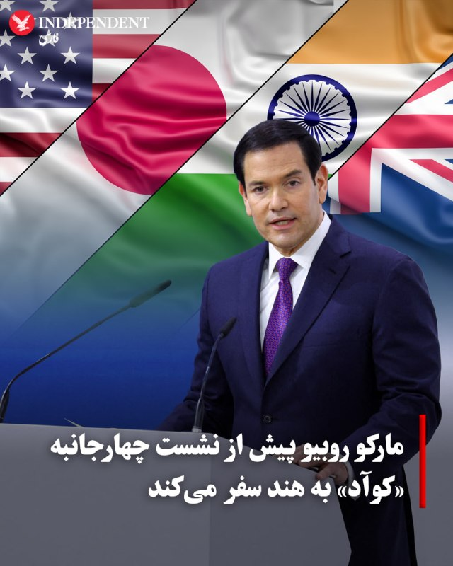

♦️ وزارت امور خارجه آمریکا اعلام کرد مارکو روبیو، وزیر امور خارجه این کشور، روز شنبه دوم خرداد، برای سفری سه‌روزه عازم هند خواهد شد. تامی پیگات، سخنگوی وزارت خارجه آمریکا، در بیانیه‌ای تایید کرد که روبیو در این سفر از شهرهای کلکته، آگرا، جیپور و دهلی‌نو بازدید خواهد کرد.

هدف اصلی این سفر، گفتگو با مقامات ارشد هندی درباره موضوعات حیاتی نظیر امنیت انرژی، تجارت و همکاری‌های دفاعی اعلام شده است.

همچنین، رایزنی‌های روبیو در هند درست پیش از نشست ۶ خرداد وزرای خارجه گروه «کوآد» (منطقه گفتگوهای امنیتی چهارجانبه) در دهلی‌نو انجام می‌شود. این ائتلاف غیررسمی که از کشورهای آمریکا، ژاپن، استرالیا و هند تشکیل شده و به عنوان «نسخه آسیایی ناتو» نیز شناخته می‌شود، در پاسخ به افزایش قدرت چین شکل گرفته و تاکنون رزمایش‌های نظامی و دریایی مشترکی را در منطقه هند-آرام برگزار کرده است.
‌🇸🇦 Indypersian

🤖 @VahidOOnLine

## VahidOOnLine — post 241562

  

علیرضا سلیمی، عضو هیات رییسه مجلس گفت: «یکی از دستاوردهای جنگ اخیر، مدیریت جمهوری اسلامی بر تنگه هرمز است که هرگز قابل مذاکره و معامله نیست و رژیم حقوقی جدیدی بر این تنگه حاکم خواهد شد که قواعد آن را تنها ما تعریف و اعمال می‌کنیم.»

او افزود: «شرایط عبور و مرور همچنین نرخ عوارض بر تنگه هرمز را جمهوری اسلامی مشخص می‌کند و با توییت نمی‌توانند اوضاع تنگه را تغییر دهند.»
‌🏁 🇬🇧 IranintlTV

🤖 @VahidOOnLine

## VahidOOnLine — post 241561

♦️دونالد ترامپ، رئیس‌جمهوری ایالات متحده، روز جمعه اول خردادماه در مراسم سوگند رئیس جدید بانک مرکزی آمریکا در کاخ سفید گفت اقدام علیه ایران اجتناب‌ناپذیر بوده است.
او با تأکید بر اینکه ایران نباید به سلاح هسته‌ای دست پیدا کند، گفت آمریکا «چاره‌ای جز اقدام» نداشته و این سیاست همچنان ادامه خواهد داشت. ترامپ همچنین با اشاره به توان نظامی ایالات متحده، بار دیگر از در اختیار داشتن «بزرگ‌ترین ارتش جهان» سخن گفت.
رئیس‌جمهوری آمریکا در ادامه گفت که ایران اکنون به‌شدت به‌دنبال توافق است و این موضوع را نتیجه فشارهای واردشده از سوی واشنگتن دانست.
‌🇸🇦 Indypersian

🤖 @VahidOOnLine

## VahidOOnLine — post 241560

  

بر اساس گزارش‌های رسیده به ایران‌اینترنشنال، محمدرضا منصوری، جوان ۲۴ ساله و پدر یک نوزاد ۲۰ روزه بود که با تیراندازی نیروهای حکومتی در جریان اعتراضات شهر رشت جان خود را از دست داد. او به دلیل جراحات ناشی از شلیک گلوله، حدود یک ماه بستری و تحت درمان بود.

بر اساس گزارش‌ها، محمدرضا ۱۸ دی‌ماه در منطقه یخسازی رشت هدف شلیک نیروهای حکومتی قرار گرفت و بر اثر اصابت گلوله به نخاع و کتف به شدت زخمی شد.

او ۱۳ بهمن‌ماه بر اثر شدت جراحات وارده در جریان اعتراضات جان باخت.

به گفته منابع محلی، محمدرضا تنها فرزند خانواده بود و پیش از حضور در فراخوان، گفته بود: «برای آینده دخترم در اعتراض شرکت می‌کنم.»
‌🏁 🇬🇧 IranintlTV

🤖 @VahidOOnLine

## VahidOOnLine — post 241559

  

خبرگزاری ایسنا اعلام کرد که عاصم منیر، رییس ستاد کل ارتش پاکستان، عصر جمعه وارد تهران شده است.
پیش‌تر برخی رسانه‌ها از سفر او به تهران، برای تلاش در خصوص نزدیک کردن خواسته‌ها و انتظارات مقام‌های جمهوری اسلامی و ایالات متحده، برای رسیدن به توافق خبر داده بودند.
‌🏁 🇬🇧 IranintlTV

🤖 @VahidOOnLine

## VahidOOnLine — post 241558

  

♦️ محسن پاک‌نژاد، وزیر نفت جمهوری اسلامی، روز جمعه اول خرداد هشدار داد که با توجه به آسیب‌های وارد شده به مخازن سوخت و زیرساخت‌های انرژی در دوران جنگ، لازم است که مردم در مصرف بهینه سوخت همراهی کنند.

پاک‌نژاد گفت: «بخش عمده‌ای از آنچه در جنگ روزه از دست داده بودیم را به‌سرعت به مدار بازگرداندیم اما با این وجود به همراهی مردم در مصرف بهینه سوخت نیاز داریم.»

پاک‌نژاد تاکید کرد که تلاش‌ها برای بازسازی سایر واحدهای آسیب‌دیده ادامه دارد.
‌🇸🇦 Indypersian

🤖 @VahidOOnLine

## VahidOOnLine — post 241557

بندر خَصَب، راه فرار جمهوری اسلامی از محاصره دریایی؟
فرناز داوری- در میانه آتش‌بس شکننده و محاصره دریایی در تنگه هرمز، بندر خَصَب در عمان به یکی از مسیرهای حیاتی برای رساندن کالا به ایران تبدیل شده است. بندری که با قایق‌های «شوتی»، ماهیگیران و گردشگران شناخته می‌شد، حالا گذرگاهی پرهزینه اما مهم برای دور زدن محاصره بنادر جنوبی ایران شده است.
تا پیش از آغاز جنگ آمریکا و اسرائیل علیه جمهوری اسلامی، بخشی از رفت‌وآمدهای دریایی میان خصب و سواحل جنوبی ایران، به قایق‌های تندرو اختصاص داشت. قایق‌هایی که در ادبیات محلی به «شوتی» معروف‌ هستند و سال‌ها در مسیرهای غیررسمی میان عمان و جنوب ایران، رفت‌وآمد کرده‌اند.
این قایق‌ها معمولا به صورت گروهی حرکت می‌کردند و در زمانی کوتاه خود را از آب‌های عمان به قشم یا دیگر نقاط ساحلی ایران می‌رساندند.
این مسیر پیش از این بیشتر برای دادوستدهای غیررسمی و قاچاق خرد شناخته می‌شد. سیگار ایرانی، مشروبات الکلی و حشیش، از ایران به عمان منتقل می‌شد و در مسیر بازگشت، کالاهای مصرفی، لوازم خانگی و اجناس لوکس، از عمان به ایران می‌رسید.
حضور قایق‌های ماهیگیری ایرانی نیز در اطراف خصب همیشه بخشی از تصویر معمول این منطقه بود.

ادامه گزارش را در اینجا بخوانید:
iranintl
‌🏁 🇬🇧 IranintlTV

🤖 @VahidOOnLine

## VahidOOnLine — post 241556

  

دونالد ترامپ در کاخ سفید درباره مذاکرات با جمهوری اسلامی گفت: «خواهیم دید چه خواهد شد. ما ضربه سختی به ‌آنها زدیم. چاره‌ای نداشتیم. ایران نمی‌تواند سلاح هسته‌ای داشته باشد.»

ترامپ ادامه داد: «آمریکا با جمهوری اسلامی همان رفتاری را انجام می‌دهد که با ونزوئلا انجام داده است.»

ترامپ تاکید کرد جمهوری اسلامی بی‌صبرانه به دنبال رسیدن به توافق است.
‌🏁 🇬🇧 IranintlTV

🤖 @VahidOOnLine

## VahidOOnLine — post 241555

رجزخوانی نظام؛ مغازه کوچک وحشت‌فروشی
حسین ذوقی-جمهوری اسلامی در حالی که تقریبا در آستانه شکست در همه زمینه‌های داخلی و خارجی قرار دارد، تاکتیکش را بر یک سنت فقهی استوار کرده است: رجزخوانی.
سخنان تند مداحان در تجمعات شبانه، سخنان تلویزیونی مسئولان میان‌رده تا گفته‌های رسمی مسئولین بلندپایه در مذاکرات، رسانه‌های اجتماعی و در نهایت، پیام‌های مکتوب رهبر نادیده نظام، بر همین سنت استوار شده است.
ماجرای «آتیش زدم به مالم» را حتما شنیده‌اید: بزازی در بازار، در کسادی وضعیتش و وقتی که اجناسش روی دستش مانده بود و راهی برای فروش نداشت، شاگردش را با یک حلب نفت به میانه بازار می‌فرستد تا فریاد بزند که: «اوستایم عقلش را از دست داده، می‌خواهد همه جا را به آتش بکشد!»
مردم هم که ترسیده‌اند به طمع جنس مفت، سمت دکان بزاز هجوم می‌برند. اوستای بزاز پارچه‌هایش را میان دکان می‌اندازد و رجز می‌خواند که «آتش می‌زنم ...»
خلاصه که انبار بزاز خالی می‌شود و جنس‌هایش را با قیمت بالاتر می‌فروشد!
حالا جمهوری اسلامی هم انگار می‌خواهد با تهدید و رجزخوانی به آتش زدن دنیا، ایده‌هایش را به منطقه و جهان بفروشد.
مداحان از منبر، منتقدان داخلی را به مرگ تهدید می‌کنند. محمود نبویان، نایب‌رییس کمیسیون امنیت ملی مجلس شورای اسلامی، پادشاهان کشورهای عربی را تهدید می‌کند که «هیچ یک از کاخ‌هایشان سالم نخواهد ماند».
عباس عراقچی، وزیر امور خارجه جمهوری اسلامی، در شبکه‌های اجتماعی از «پاسخ طولانی و دردناک» سخن می‌گوید.
اسماعیل بقایی، سخنگوی وزارت امور خارجه، حتی در نشست‌های دیپلماتیک، با لحنی رجزآلود حرف می‌زند.
غلامحسین محسنی اژه‌ای، رییس قوه قضاییه، از «تحمیل ناپذیری» می‌گوید؛ و حسین کنعانی‌مقدم، فرمانده پیشین سپاه پاسداران، اعتراف می‌کند که «رجزخوانی یکی از روش‌های مقابله با دشمن است».
لایه‌ها‌ی متفاوت نظام به یک زبان مشترک رسیده‌اند. این روش تصادفی نیست، شیوه جدید حکمرانی در جمهوری اسلامی است.

ادامه این تحلیل را اینجا بخوانید:
‌🏁 🇬🇧 IranintlTV

🤖 @VahidOOnLine

## VahidOOnLine — post 241554

  <a href="telegram/content/VahidOOnLine_241554_1779471140.mp4" target="_blank">🎬 Download video</a>

⭕️«بنما آفتاب را بی‌ابر»؛ روایتی از عشق و تحصیل ممنوعه بهائیان در ایران

📌گزارش ایندیپندنت فارسی از نخستین نمایش خصوصی فیلم در نیویورک

♦️فیلم «بنما آفتاب را بی‌ابر» (Cast Aside the Clouds)، ساخته مری دارلینگ، کارگردان و تهیه‌کننده کانادایی، در ظاهر بر رابطه عاطفی دو جوان تمرکز دارد، اما در لایه‌های زیرین به موضوعاتی مانند هویت دینی، محرومیت از تحصیل، فشارهای اجتماعی و حق زیستن بر اساس باور شخصی می‌پردازد؛ یک داستان عاشقانه در خیابان‌های تهران که آرام‌آرام به روایتی درباره تبعیض، ایمان، حق آموزش و آزادی انتخاب تبدیل می‌شود.

ایندیپندنت فارسی در نخستین نمایش خصوصی این فیلم در نیویورک حضور داشت و پس از آن، در گفتگوی خبری با حضور عوامل فیلم شرکت کرد. فضای این گفتگو به‌ویژه به‌دلیل حضور بازیگر نقش پدر لیلا، (آنتونی عزیزی) که بهائی هستند، و بیان تجربه های شخصی از حال‌ و روز خانواده ایشان در اوائل انقلاب تجاربی ملموس را به واقعیت دشواری زندگی بهائیان در ایران پیوند می‌زد.

بیشتر بخوانید...
‌🇸🇦 Indypersian

🤖 @VahidOOnLine

## VahidOOnLine — post 241553

  <a href="telegram/content/VahidOOnLine_241553_1779471141.mp4" target="_blank">🎬 Download video</a>

یک شهروند در پیامی به ایران اینترنشنال با اشاره به پوشش چادر خود می‌گوید که نه در تجمعات حکومتی شرکت می‌کند و نه از نظام جمهوری اسلامی حمایت می‌کند. پیام او با هوش مصنوعی خوانده شده است.
‌🏁 🇬🇧 IranintlTV

🤖 @VahidOOnLine

## VahidOOnLine — post 241552

  

♦️ خبرگزاری العربیه به نقل از منابع خود اعلام کرد که عاصم منیر، فرمانده کل ارتش پاکستان عصر جمعه، اول خرداد وارد تهران شده است. پیش از این خبرگزاری فرانسه و العربیه از حرکت منیر به سمت تهران خبر داده بودند.

بر اساس گزارش‌ها، این سفر که همزمان با حضور وزیر کشور پاکستان در ایران انجام شده، در راستای کاهش شکاف‌ها میان تهران و واشنگتن است. مارکو روبیو، وزیر امور خارجه ایالات متحده نیز با اشاره به این سفر، اعلام کرد که گام‌های مثبتی در راستای دستیابی به توافق انجام شده با این‌وجود تاکید کرد که نمی‌خواهد «بیش از حد» مثبت‌اندیش باشد و باید دید که تلاش‌ها به چه شکل پیش می‌رود.
‌🇸🇦 Indypersian

🤖 @VahidOOnLine

## VahidOOnLine — post 241551

♦️روز پنجشنبه ۳۱ اردیبهشت در مراسمی در موزه هنرهای معاصر تهران، محسن شریفیان به همراه گروهی از نوازندگان، با اجرای ساز شوفار، بخشی از روایت موسیقی معاصر جنوب ایران را به نمایش گذاشتند؛ اجرایی متفاوت که با تلفیق عناصر آیینی و موسیقایی، توجه مخاطبان را به خود جلب کرد.

 در روایتی از موسیقی معاصر جنوب ایران، صدای ساز «شوفار» به‌عنوان یکی از کهن‌ترین ابزارهای صوتی، در موزه هنرهای معاصر تهران طنین‌انداز شد؛ سازی ساخته‌شده از شاخ قوچ که ریشه‌ای آیینی و مذهبی دارد.
شوفار در سنت یهودیان نواخته می‌شود و بیش از همه در مراسم‌های مهمی مانند «روش هشانا» (سال نو یهودی) و «یوم کیپور» (روز آمرزش) کاربرد دارد؛ صدایی نمادین که برای بیداری، تأمل و بازگشت به درون نواخته می‌شود.
‌🇸🇦 Indypersian

🤖 @VahidOOnLine

## VahidOOnLine — post 241550

  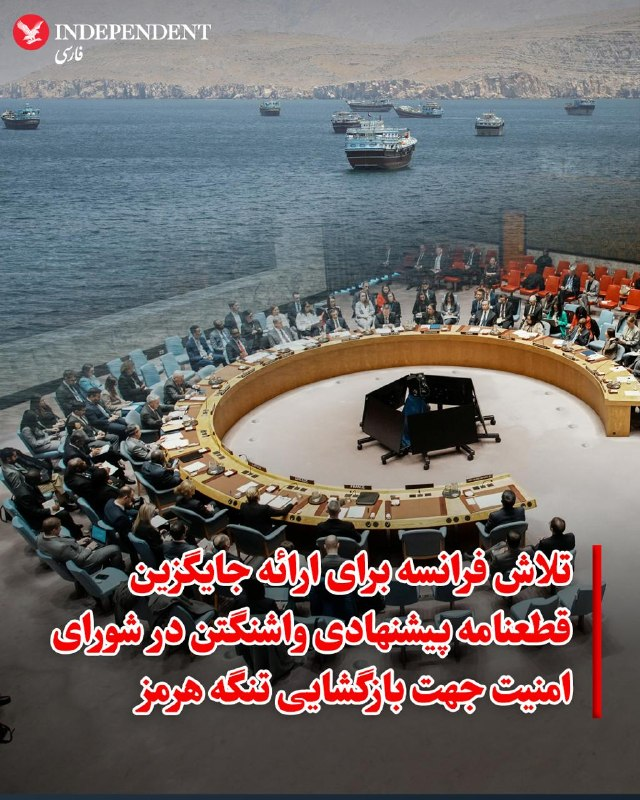

♦️وزارت امور خارجه فرانسه روز جمعه اول خرداد، اعلام کرد که این کشور پیش‌نویس قطعنامه‌ای را در شورای امنیت سازمان ملل برای تشکیل یک هیئت بین‌المللی با هدف احیای کشتیرانی آزاد در تنگه هرمز آماده کرده است. این اقدام در حالی صورت می‌گیرد که واشنگتن برای به رای گذاشتن متن پیشنهادی خود با دشواری روبرو است.

کنترل این آبراه حیاتی، مانع اصلی در مذاکرات پایان دادن به جنگ سه‌ماهه میان تهران و واشنگتن است. در حال حاضر، قطعنامه پیشنهادی آمریکا و بحرین که خواستار توقف حملات و مین‌گذاری جمهوری اسلامی در تنگه است، به دلیل احتمال وتوی چین و روسیه بیش از دو هفته به تعویق افتاده است. پکن و مسکو پیش از این در ماه آوریل، متن مشابهی را به دلیل موضع‌گیری علیه تهران وتو کرده بودند.
‌🇸🇦 Indypersian

🤖 @VahidOOnLine

## VahidOOnLine — post 241549

  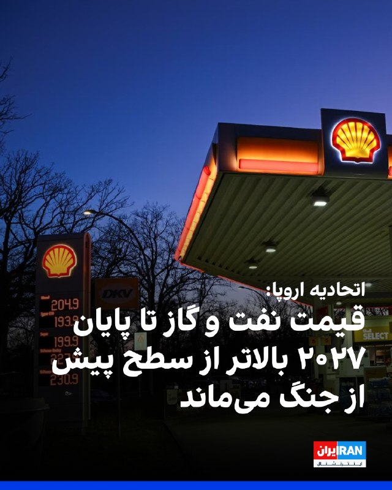

مقام‌های اتحادیه اروپا جمعه اعلام کردند اروپایی‌ها باید انتظار داشته باشند قیمت نفت و گاز دست‌کم تا پایان سال ۲۰۲۷ بالاتر از سطح پیش از جنگ باقی بماند و قیمت سایر کالاها نیز روندی افزایشی داشته باشد.

کمیسر اقتصادی اتحادیه اروپا، گفت افزایش قیمت انرژی عامل اصلی رشد تورم است؛ به‌طوری‌که نرخ تورم برای امسال ۳.۱ درصد و برای سال ۲۰۲۷ حدود ۲.۴ درصد پیش‌بینی می‌شود. این رقم به‌مراتب بالاتر از پیش‌بینی قبلی ۱.۹ درصدی برای سالجاری میلادی است.
‌🏁 🇬🇧 IranintlTV

🤖 @VahidOOnLine

## WithYashar — post 11980

وحیدی الان فرد شماره یک و زننده حرف آخر در تمامی تصمیمات هست برای‌ همین مذاکرات به نظر خیلی به توافق نزدیک نشون داده میشه ! تا اون بیاد بیرون و حرف آخر رو بزنه ! آخرش باید این کار رو بکنه و همون جاست که دم به تله میده !
@withyashar

## WithYashar — post 11979

همه در انتظار بیرون اومدن یا نشانه ای از موقعیت وحیدی هستند … شک نکنید

## WithYashar — post 11978

من میرم میخوابم میدونم امشب من بخوابم میزنه 😂♥️شب بخیر

## WithYashar — post 11977

من میرم میخوابم میدونم امشب من بخوابم میزنه 😂♥️شب بخیر

## WithYashar — post 11976

رئیس کمیته نیروهای مسلح سنای آمریکا: ترامپ باید به ارتش اجازه دهد تا انهدام توانمندی‌های نظامی ایران را تکمیل کند.

@withyashar

## WithYashar — post 11975

ترامپ در تروث : در حالی که خیلی دلم می‌خواست با پسرم، دان جونیور، و جدیدترین عضو خانواده ترامپ، همسر آینده‌اش، بتینا، باشم، شرایط مربوط به دولت و عشق من به ایالات متحده آمریکا اجازه این کار را به من نمی‌دهد. احساس می‌کنم مهم است که در این دوره مهم در واشنگتن دی سی، در کاخ سفید بمانم. به دان و بتینا تبریک می‌گویم! رئیس جمهور دونالد جی. ترامپ
@withyashar
دمت گرم عمو ترامپ بمون بزن یه عروسی هم بعد براش هتل رامسر میگیریم 😂🙌🏾

## WithYashar — post 11974

اتاق جنگ با یاشار : خواهیم دید چه خواهد شد

## WithYashar — post 11973

یک منبع بلندپایه به «العربیه»: دیدار فردا میان عاصم منیر، فرمانده ارتش پاکستان و احمد وحیدی، فرمانده سپاه پاسداران ایران در تهران برگزار خواهد شد. @withyashar

## WithYashar — post 11972

یک منبع بلندپایه به «العربیه»: دیدار فردا میان عاصم منیر، فرمانده ارتش پاکستان و احمد وحیدی، فرمانده سپاه پاسداران ایران در تهران برگزار خواهد شد.
@withyashar

## WithYashar — post 11971

  <a href="telegram/content/WithYashar_11971_1779471145.mp4" target="_blank">🎬 Download video</a>

دیده بان اتاق جنگ : الان شکار ۳ پهپاد شناسایی بالا سر منطقه ویژه ماهشهر
@withyashar

## WithYashar — post 11970

وزیر کشور پاکستان که هم اکنون در تهران بسر می برد با همتای عربستانی خود گفت وگوی تلفنی انجام داد.‌.
@withyashar

## WithYashar — post 11969

علیرضا سلیمی، عضو هیات رئیسه مجلس : «یکی از دستاوردهای جنگ اخیر، مدیریت جمهوری اسلامی بر تنگه هرمز است که هرگز قابل مذاکره و معامله نیست و رژیم حقوقی جدیدی بر این تنگه حاکم خواهد شد که قواعد آن را تنها ما تعریف و اعمال می‌کنیم.»

وی‌ اشاره کرد : «شرایط عبور و مرور همچنین نرخ عوارض بر تنگه هرمز را جمهوری اسلامی مشخص می‌کند و با توییت نمی‌توانند اوضاع تنگه را تغییر دهند.»
@withyashar

## WithYashar — post 11968

ترامپ: همان کاری رو که در ونزوئلا انجام دادیم، در ایران انجام میدیم.
@withyashar

## WithYashar — post 11967

سپهبد عاصم منیر، فرمانده ارتش پاکستان، وارد تهران شد و مورد استقبال اسکندر مومنی، وزیر کشور ایران، قرار گرفت.

پاکستان می‌گوید این سفر بخشی از تلاش‌های میانجیگری مداوم است.
@withyashar

## WithYashar — post 11966

نورمن، خبرنگار وال استریت ژورنال : یه منبع میگه هر چیزی درباره پیش‌نویس توافقی که داره می‌چرخه، دروغه و صحت نداره
@withyashar

## WithYashar — post 11965

آکسیوس:نتانیاهو بزرگ ترین عامل برای عدم توافق بین دو کشور است

@withyashar

## WithYashar — post 11964

ایسنا: برخی مقامات تاکید کردند که حضور عاصم منیر فرمانده ارتش پاکستان لزوما به معنای قطعی بودن تفاهم بر سر چارچوب اولیه نیست.
@withyashar

## WithYashar — post 11963

العربی الجدید به نقل از منبعی در وزارت خارجه پاکستان: واشنگتن و تهران انعطاف کافی در پرونده‌های اصلی از خود نشان نمی‌دهند
@withyashar

## WithYashar — post 11962

ایسنا: عاصم منیر وارد تهران شد
@withyashar

## WithYashar — post 11961

  <a href="telegram/content/WithYashar_11961_1779471147.mp4" target="_blank">🎬 Download video</a>

کوین وارش رسماً به عنوان رئیس فدرال رزرو سوگند یاد کرد.
@withyashar

## mwarmonitor — post 9492

🔸بقایی: تمرکز مذاکرات بر خاتمه جنگ است

سخنگوی وزارت خارجه:
🔹نمی‌توانیم بگوییم ضرورتا به جایی رسیده‌ایم که توافق نزدیک است.

🔹تمرکز مذاکرات بر خاتمه جنگ است.

@mwarmonitor

## mwarmonitor — post 9491

  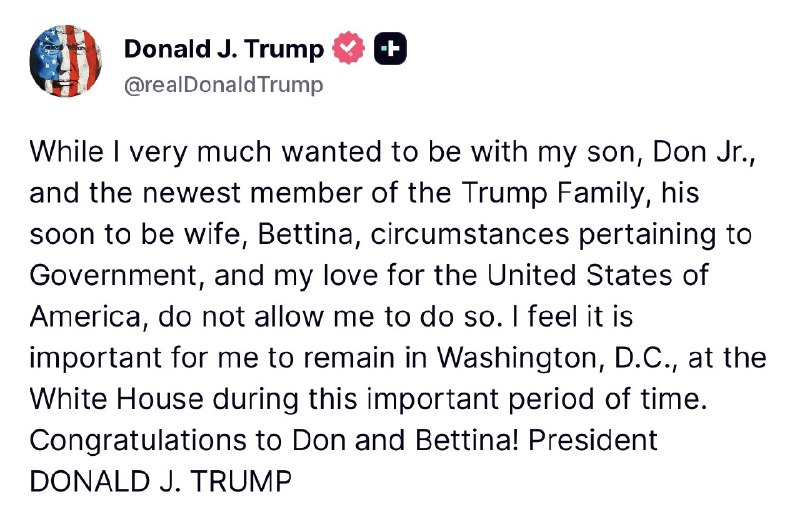

در حالی که بسیار مشتاق بودم در کنار پسرم، دان جونیور، و جدیدترین عضو خانواده ترامپ، یعنی همسر آینده‌اش، بتینا باشم، اما شرایط مربوط به دولت و عشق من به ایالات متحده آمریکا، این اجازه را به من نمی‌دهد. احساس می‌کنم لازم است در این بازه زمانی مهم، در واشنگتن دی.سی. و در کاخ سفید بمانم.
تبریک به دان و بتینا!

رئیس‌جمهور دونالد جی. ترامپ

@mwarmonitor

## mwarmonitor — post 9490

🔴 یک گزارش پاکستانی به نقل از منبعی در وزارت امور خارجه این کشور مدعی است که آمریکا و ایران در مسائل کلیدی انعطاف نشان نمی‌دهند و سفر فرمانده ارتش پاکستان به ایران، تلاشی «در آخرین لحظه» برای جلوگیری از آغاز دوباره جنگ است.» i24

@mwarmonitor

## mwarmonitor — post 9489

🚨«فوری | [Fox News] تولسی گبرد، مدیر اطلاعات ملی ایالات متحده آمریکا، استعفا داد.»

@mwarmonitor

## mwarmonitor — post 9488

🔴«فرمانده کل ارتش پاکستان، عاصم منیر، در چارچوب تلاش‌های میانجی‌گری برای دستیابی به توافقی جهت پایان دادن به جنگ میان ایالات متحده آمریکا و ایران، وارد تهران شد.» @mwarmonitor

## mwarmonitor — post 9487

  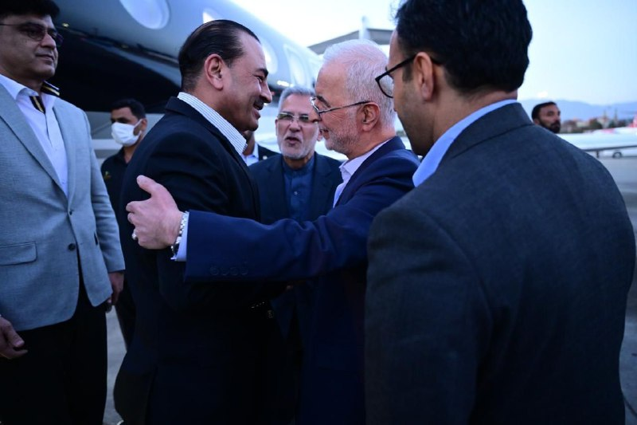

✈️بله تایید میشود @mwarmonitor

## mwarmonitor — post 9486

  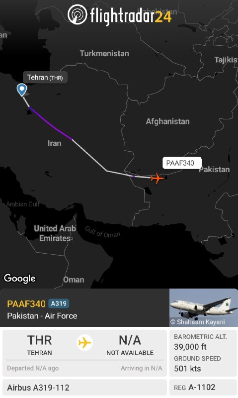

✈️بله تایید میشود @mwarmonitor

## mwarmonitor — post 9485

  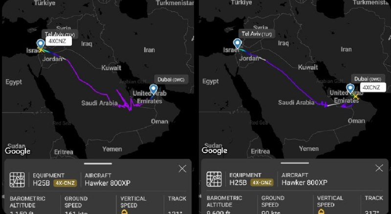

✈️یک جت شخصی اسرائیلی از نوع Hawker 800 که توسط شرکت Arrow Aviation اداره می‌شود (شماره ثبت: 4X-CNZ)، دیروز از فرودگاه بن گوریون در تل‌آویو به سمت دبی پرواز کرد، حدود ۴۰ دقیقه روی زمین ماند و سپس دوباره به سمت اسرائیل پرواز کرد.

@mwarmonitor

## mwarmonitor — post 9484

  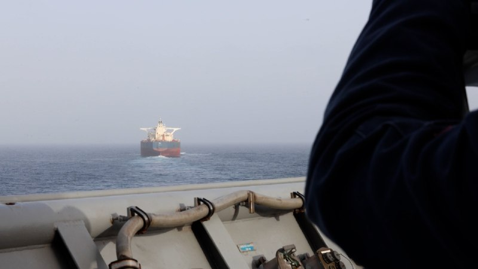

🔰یک ملوان نیروی دریایی آمریکا در ناو USS Comstock (LSD 45) یک کشتی تجاری را در حالی مشاهده می‌کند که در حال اجرای محاصره آمریکا علیه ایران است، ۲۱ مه. نیروهای آمریکایی از زمان آغاز این محاصره، ۹۷ کشتی تجاری را تغییر مسیر داده و ۴ کشتی را از کار انداخته‌اند.

@mwarmonitor

## mwarmonitor — post 9483

  

🔹تنگه هرمز خالی است، به‌جز قایق‌های تندرو سپاه پاسداران که از ایران به سمت تنگه در حال عبور هستند.

🔸این نشان می‌دهد ایران درباره تعداد کشتی‌هایی که امروز عبور کرده‌اند آمارسازی می‌کند. ۴ شناور بزرگ در حال عبور از مسیر «عوارض ایران» قابل مشاهده هستند. این عدد بسیار کمتر از ۳۰+ مورد اعلام‌شده است.

@mwarmonitor

## mwarmonitor — post 9482

🔴مارشال ارتش پاکستان برای نهایی کردن توافق میان آمریکا و ایران راهی تهران می‌شود

📝نویسنده: باراک راوید AXIOS

🔰یک منبع امنیتی پاکستانی به اکسیوس (Axios) گفت که ژنرال عاصم منیر، عالی‌رتبه‌ترین فرمانده نظامی پاکستان، روز جمعه در تلاش برای دستیابی به توافقی که بر اساس آن آمریکا و ایران با پایان دادن به جنگ و آغاز مذاکرات برای یک توافق گسترده‌تر موافقت کنند، به تهران سفر می‌کند.

🔸چرا این موضوع اهمیت دارد؟
ژنرال منیر از زمان آغاز جنگ، میانجی اصلی میان آمریکا و ایران بوده است. این واقعیت که او پس از چند روز گفت‌وگو در سطوح پایین‌تر راهی تهران می‌شود، می‌تواند نشان‌دهنده تلاش نهایی پاکستان برای دستیابی به یک توافق باشد.

🔹پشت صحنه خبر
میانجی‌ها در تلاش هستند تا یک «نامه‌ اعلام آمادگی» (Letter of Intent) را نهایی کنند؛ این سند شامل توافقی برای پایان دادن به جنگ و اصول پایه‌ای برای ۳۰ روز مذاکرات بیشتر درباره یک توافق گسترده‌تر است که برنامه هسته‌ای ایران را نیز در بر می‌گیرد.
کشورهای میانجی: کشورهای پاکستان، قطر، عربستان سعودی، مصر و ترکیه همگی در این میانجی‌گری مشارکت داشته‌اند.

🔸ابهام در موضع ایران: هنوز مشخص نیست که آیا ایران تمایلی به امضای چنین سندی دارد یا خیر، به‌ویژه در شرایطی که به نظر می‌رسد برخی در تهران بر این باورند که برگ برنده و اهرم فشار در دست آن‌هاست.

🔹اظهار نظر مقامات
«پیشرفت‌های اندکی حاصل شده است. نمی‌خواهم بزرگ‌نمایی کنم، اما تحرکات کوچکی صورت گرفته که این خوب است.»
— مارکو روبیو، وزیر امور خارجه آمریکا (روز جمعه)
وی در ادامه افزود که خواسته بنیادین این است که «ایران هرگز نباید به سلاح هسته‌ای دست یابد. این امر مطلقاً ممکن نیست.»
روبیو همچنین اشاره کرد که هرگونه توافقی باید به موضوع ذخایر اورانیوم با غنای بالای ایران و سیاست غنی‌سازی این کشور در آینده بپردازد. وی در پایان به این نکته اشاره کرد که پس از تاکید مجدد ایران در روز پنج‌شنبه بر قصد خود برای ایجاد سیستمی جهت دریافت عوارض در تنگه هرمز، به ایران اجازه داده نخواهد شد تا در این آبراه «ایستگاه‌های دریافت عوارض» ایجاد کند.

@mwarmonitor

## mwarmonitor — post 9481

📰 وال‌استریت ژورنال بر اساس داده‌ها: صادرات نفت ایران که از طریق دریا حمل می‌شود، به‌دلیل محاصره به سطحی نزدیک به صفر کاهش یافته است.

@mwarmonitor

## mwarmonitor — post 9480

  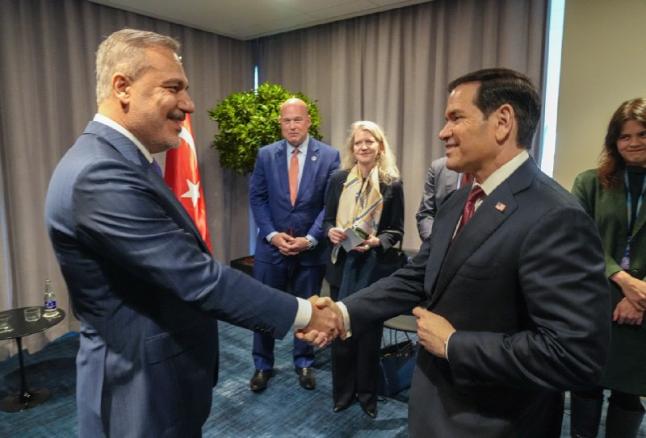

🔸امروز با وزیر خارجه ترکیه، Hakan Fidan، دیدار کردم تا درباره ضرورت راهبردی ادامه‌دارِ پایبندی همه متحدان به تعهدات دفاعی خود و همچنین برنامه‌های مربوط به نشست آینده ناتو در ترکیه گفتگو کنیم. همچنین درباره بازگشایی تنگه هرمز و تلاش برای دستیابی به ثبات بیشتر منطقه‌ای صحبت کردیم.

@mwarmonitor

## mwarmonitor — post 9479

📰 رویترز: بر اساس منابع مطلع، قطر یک هیئت مذاکره‌کننده به تهران اعزام کرده است که با هماهنگی ایالات متحده فعالیت می‌کند تا به دستیابی به توافقی برای پایان دادن به جنگ با ایران کمک کند.

@mwarmonitor

## mwarmonitor — post 9478

🔹نخست‌وزیر هلند، Rob Jetten، می‌گوید دولت هلند با اعمال ممنوعیت واردات کالاهایی که در شهرک‌های یهودی در سرزمین‌های فلسطینی تحت اشغال اسرائیل تولید می‌شوند موافقت کرده است.

@mwarmonitor

## mwarmonitor — post 9477

🔸وزیر خارجه اوکراین، Andrii Sybiha، می‌گوید مذاکرات میان روسیه که با میانجی‌گری آمریکا انجام می‌شود به‌تدریج به نقطه فرسودگی و بن‌بست نزدیک می‌شود.

@mwarmonitor

## mwarmonitor — post 9476

🔴رئیس سازمان جهانی بهداشت (WHO) می‌گوید هلند یک مورد جدید ابتلا به ویروس هانتا را در یکی از خدمه یک کشتی تأیید کرده است.

@mwarmonitor

## mwarmonitor — post 9475

  

🔴رسانه‌های ایرانی به نقل از یک منبع دیپلماتیک در اسلام‌آباد: فرمانده ارتش پاکستان به ایران سفر کرده است. @mwarmonitor

## mwarmonitor — post 9474

🛸مرحله دوم از افشای پدیده‌های ناشناخته هوایی (UAP) توسط وزارت دفاع آمریکا منتشر شده است که شامل ۵.۶ گیگابایت ویدئو و بیش از ۷۰ مگابایت اسناد طبقه‌بندی‌زدایی‌شده می‌شود.

@mwarmonitor

## mwarmonitor — post 9473

🔴رسانه‌های ایرانی به نقل از یک منبع دیپلماتیک در اسلام‌آباد: فرمانده ارتش پاکستان به ایران سفر کرده است.

@mwarmonitor

## FoxNewsTwitter — post 342125

  

Fox News (Twitter/X)

BREAKING: President Trump announces he will NOT attend his son Don Jr.'s wedding, saying government matters and his "love for the United States of America" are too important for him to leave the White House during this "important period of time."

"While I very much wanted to be with my son, Don Jr., and the newest member of the Trump Family, his soon to be wife, Bettina, circumstances pertaining to Government, and my love for the United States of America, do not allow me to do so."

## FoxNewsTwitter — post 342124

Fox News (Twitter/X)

Gabbard is resigning to support her husband through his battle with "an extremely rare form of bone cancer," Fox News Digital learned. She notified President Donald Trump during a meeting in the Oval Office Friday.

## FoxNewsTwitter — post 342123

  <a href="telegram/content/FoxNewsTwitter_342123_1779471154.mp4" target="_blank">🎬 Download video</a>

Fox News (Twitter/X)

BREAKING: Tulsi Gabbard has notified President Trump that she is resigning from her post as Director of National Intelligence.

Gabbard says she is leaving the administration to support her husband through his battle with “an extremely rare form of bone cancer,” Fox News Digital has exclusively learned.

Her final day in the post will be June 30, 2026. | @davidspunt

## FoxNewsTwitter — post 342122

‌Fox News (Twitter/X)

Read more about her departure from Trump's Cabinet:

## FoxNewsTwitter — post 342121

  

Fox News (Twitter/X)

BREAKING NEWS: Tulsi Gabbard is resigning as director of national intelligence

## FoxNewsTwitter — post 342117

Fox News (Twitter/X)

BREAKING: Kevin Warsh has officially been sworn in as the new Chairman of the Federal Reserve by Supreme Court Justice Clarence Thomas.

Warsh marked the moment by signaling the pressure and expectations now facing the central bank.

“After we leave this stage, the real work begins. So let’s begin that work."

## FoxNewsTwitter — post 342116

  <a href="telegram/content/FoxNewsTwitter_342116_1779471156.mp4" target="_blank">🎬 Download video</a>

Fox News (Twitter/X)

BREAKING: "Our mandate at the Fed is to promote price stability and maximum employment."

"When we pursue those aims with wisdom and clarity, independence and resolve, inflation can be lower, growth stronger, real-take home pay higher, and America, can be more prosperous. And no less important, America's place in the world more secure."

"These duties are now mine, Mr. President, because of the trust you have placed in me."

## FoxNewsTwitter — post 342115

  <a href="telegram/content/FoxNewsTwitter_342115_1779471158.mp4" target="_blank">🎬 Download video</a>

Fox News (Twitter/X)

JUST IN: President Trump shares a lighthearted moment during the swearing-in ceremony of Fed Chairman Kevin Warsh, joking that he would rather be a Supreme Court justice than lead the Fed.

“I'm not sure. I think I'd rather be a justice between you and I. It might be easier. You're going to find out. You'll be saying, well, that's a very easy job."

## FoxNewsTwitter — post 342114

  <a href="telegram/content/FoxNewsTwitter_342114_1779471159.mp4" target="_blank">🎬 Download video</a>

Fox News (Twitter/X)

BREAKING: Kevin Warsh is sworn in by Supreme Court Justice Clarence Thomas as the new chairman of the Federal Reserve.

## FoxNewsTwitter — post 342113

  <a href="telegram/content/FoxNewsTwitter_342113_1779471161.mp4" target="_blank">🎬 Download video</a>

Fox News (Twitter/X)

NEW: President Trump jokes “they must like you!” after the stock market jumped 600 points on the day Kevin Warsh was sworn in as Fed chair.

“Stock market’s up 600 points. That means they like you. If they didn’t like you...” Trump said while making a downward hand motion.

“I think it can only go up. I think with you, it’s only going to go up.”

## FoxNewsTwitter — post 342112

  <a href="telegram/content/FoxNewsTwitter_342112_1779471163.mp4" target="_blank">🎬 Download video</a>

Fox News (Twitter/X)

BREAKING: President Trump tears into the Federal Reserve for "losing its way" over the last few years as he prepares to swear in Kevin Warsh as the new chair.

"Unfortunately, in the eyes of many, the Fed lost its way in recent years. It became distracted by concerns far removed from its core mission and mandate, drifting into matters such as climate policy and DEI initiatives."

"With the Fed straying from its mandate, while the last administration blew out the deficit. Americans suffered the worst inflation that we had in history."

## FoxNewsTwitter — post 342111

  <a href="telegram/content/FoxNewsTwitter_342111_1779471165.mp4" target="_blank">🎬 Download video</a>

Fox News (Twitter/X)

HAPPENING NOW: President Trump says "no one in America" is better prepared to lead the Federal Reserve than new chair Kevin Warsh.

"The Federal Reserve is a pillar of the world financial system, and the most important central bank anywhere in the world."

"Honestly, I really mean this... I want Kevin to be totally independent. I want him to be independent and just do a great job."

## FoxNewsTwitter — post 342110

  <a href="telegram/content/FoxNewsTwitter_342110_1779471167.mp4" target="_blank">🎬 Download video</a>

Fox News (Twitter/X)

BREAKING: New Federal Reserve Chair Kevin Warsh gets a roaring applause from the White House crowd as President Trump introduces him at his swearing in ceremony:

"I expect he will go down as one of the truly great chairmen of the Federal Reserve that we've ever had. I really believe that."

## FoxNewsTwitter — post 342109

  <a href="telegram/content/FoxNewsTwitter_342109_1779471169.mp4" target="_blank">🎬 Download video</a>

Fox News (Twitter/X)

NOW: The White House crowd bursts out laughing after President Trump cracks a joke during Kevin Warsh's swearing-in ceremony as the new Federal Reserve Chairman.

"Oh, I thought that was for me. I was very unhappy. I looked around and I saw they were all looking at you. I was not happy about that."

## FoxNewsTwitter — post 342108

  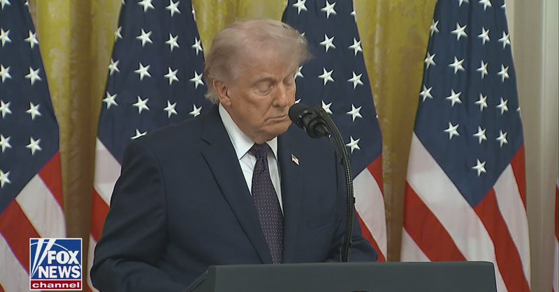

Fox News (Twitter/X)

WATCH LIVE: President Trump swears in Kevin Warsh as new Fed chair https://twitter.com/i/broadcasts/1rxmqoBMWAnxy

## FoxNewsTwitter — post 342107

Fox News (Twitter/X)

A growing number of politicians are being accused of antisemitism.

Democrat Graham Platner faced backlash over his Nazi-linked tattoo and is now coming under fire for resurfaced Reddit posts, while fellow Democrat Maureen Galindo said that she wants to lock up “American Zionists” in an ICE detention facility.

@BillMelugin_ reports on the hatred creeping into politics as examples of it grow more and more egregious. | @HARRISFAULKNER @FaulknerFocus

## FoxNewsTwitter — post 342106

Fox News (Twitter/X)

RT @TreyYingst: UPDATE: A Qatari negotiation team is in Tehran on Friday and Saturday to support the U.S. to reach a final deal that would end the war and address outstanding issues with Iran, an official with knowledge of the visit told Fox News.

## pm_afshaa — post 91216

  <a href="telegram/content/pm_afshaa_91216_1779471171.webm" target="_blank">🎬 Download video</a>

🔴العربیه الجدید به نقل از منبعی در وزارت خارجه پاکستان: واشنگتن و تهران انعطاف کافی در پرونده‌های اصلی از خود نشان نمیده.

سفر فرمانده ارتش پاکستان به تهران ممکنه آخرین تلاش برای جلوگیری از بازگشت منطقه به جنگ باشه.

💧 Rainbet.com the #1 Non-KYC Crypto Casino & Sportsbook @rainbetcom

😁 @Pm_Afshaa

## pm_afshaa — post 91215

🔴ترامپ: ما به ایران ضربات شدیدی وارد کردیم و گزینه دیگری نداشتیم

💧 Rainbet.com the #1 Non-KYC Crypto Casino & Sportsbook @rainbetcom

😁 @Pm_Afshaa

## pm_afshaa — post 91214

🔴ترامپ: ایران به شدت خواهان توافقه
همان کاری را که در ونزوئلا انجام دادیم، در ایران انجام می دهیم

💧 Rainbet.com the #1 Non-KYC Crypto Casino & Sportsbook @rainbetcom

😁 @Pm_Afshaa

## pm_afshaa — post 91213

🔴ترامپ : ما یه مقدار بدهی داریم که باید حلش کنیم و راهش رشد اقتصادیه قراره با رشد خیلی سریع از این بدهی خارج بشیم

💧 Rainbet.com the #1 Non-KYC Crypto Casino & Sportsbook @rainbetcom

😁 @Pm_Afshaa

## pm_afshaa — post 91212

وال استریت ژورنال: صادرات نفت ایران از طریق دریا به دلیل محاصره به سطح صفر کاهش یافته

💧 Rainbet.com the #1 Non-KYC Crypto Casino & Sportsbook @rainbetcom

😁 @Pm_Afshaa

## pm_afshaa — post 91211

🔴2000 ساعت از قطع اینترنت مردم ایران توسط جمهوری اسلامی گذشت

💧 Rainbet.com the #1 Non-KYC Crypto Casino & Sportsbook @rainbetcom

😁 @Pm_Afshaa

## pm_afshaa — post 91210

  <a href="telegram/content/pm_afshaa_91210_1779471171.webm" target="_blank">🎬 Download video</a>

🔴حسینی همدانی، امام جمعه کرج:
هرکسی که در تجمعات شبانه شرکت نمیکنه، باید در محضر خدا پاسخگو باشه.

💧 Rainbet.com the #1 Non-KYC Crypto Casino & Sportsbook @rainbetcom

😁 @Pm_Afshaa

## pm_afshaa — post 91209

🔴نورمن، خبرنگار وال استریت ژورنال : یه منبع میگه هر چیزی درباره پیش‌نویس توافقی که داره می‌چرخه، دروغه و صحت نداره

💧 Rainbet.com the #1 Non-KYC Crypto Casino & Sportsbook @rainbetcom

😁 @Pm_Afshaa

## pm_afshaa — post 91208

  <a href="telegram/content/pm_afshaa_91208_1779471172.webm" target="_blank">🎬 Download video</a>

🔴العربیه: عاصم ملک، رئیس سازمان اطلاعات پاکستان هم عازم تهران شد.

💧 Rainbet.com the #1 Non-KYC Crypto Casino & Sportsbook @rainbetcom

😁 @Pm_Afshaa

## pm_afshaa — post 91207

🔴پوتین: اوکراین یک خوابگاه دانشجویی را هدف قرار داد و 15 نفر مفقود شده‌اند، شش نفر کشته و 39 نفر دیگر زخمی شدن

💧 Rainbet.com the #1 Non-KYC Crypto Casino & Sportsbook @rainbetcom

😁 @Pm_Afshaa

## pm_afshaa — post 91206

🔴اختلال گسترده Gps در تنگه هرمز ، عربستان ، اسرائیل ، اردن ، سوریه ، عراق ، ایران

💧 Rainbet.com the #1 Non-KYC Crypto Casino & Sportsbook @rainbetcom

😁 @Pm_Afshaa

## pm_afshaa — post 91204

🔴مارک لوین:زمان نابودی رژیم ایران فرا رسیده است. بیایید کار را تمام کنیم، بگذارید کار را به انجام برسانیم

💧 Rainbet.com the #1 Non-KYC Crypto Casino & Sportsbook @rainbetcom

😁 @Pm_Afshaa

## pm_afshaa — post 91203

🔴آکسیوس:نتانیاهو بزرگ ترین عامل برای عدم توافق بین دو کشور است

💧 Rainbet.com the #1 Non-KYC Crypto Casino & Sportsbook @rainbetcom

😁 @Pm_Afshaa

## pm_afshaa — post 91202

  <a href="telegram/content/pm_afshaa_91202_1779471172.webm" target="_blank">🎬 Download video</a>

🔴اکسیوس: واسطه‌ها در تلاش برای نهایی‌سازی یک تفاهم‌نامه هستن که شامل توافق برای پایان جنگ و اصولی برای 30 روز مذاکره بر سر یک توافق گسترده‌تره که به برنامه هسته‌ای ایران نیز بپردازه.

پاکستان، قطر، عربستان، مصر و ترکیه همگی در میانجیگری مشارکت داشتن.

💧 Rainbet.com the #1 Non-KYC Crypto Casino & Sportsbook @rainbetcom

😁 @Pm_Afshaa

## pm_afshaa — post 91201

  <a href="telegram/content/pm_afshaa_91201_1779471173.webm" target="_blank">🎬 Download video</a>

🔴روبیو، وزیر خارجه آمریکا: عاصم‌ منیر برای میانجی گری راهی تهرانه و ما در بالاترین رده‌های سیاسی با او در ارتباط هستیم.

💧 Rainbet.com the #1 Non-KYC Crypto Casino & Sportsbook @rainbetcom

😁 @Pm_Afshaa

## pm_afshaa — post 91200

🔴بلومبرگ:حمله به نیروگاه هسته‌ای امارات متحده عربی، نگرانی‌ها در مورد انتقام‌جویی ایران و افزایش نقش گروه‌های نیابتی آن در عراق را افزایش داد

💧 Rainbet.com the #1 Non-KYC Crypto Casino & Sportsbook @rainbetcom

😁 @Pm_Afshaa

## pm_afshaa — post 91198

  <a href="telegram/content/pm_afshaa_91198_1779471173.webm" target="_blank">🎬 Download video</a>

🔴مارکو روبیو، وزیر خارجه آمریکا:
باید تنگه هرمز کامل باز و آزاد باشه و ایران به طور کامل قید برنامه هسته‌ای رو بزنه!

💧 Rainbet.com the #1 Non-KYC Crypto Casino & Sportsbook @rainbetcom

😁 @Pm_Afshaa

## pm_afshaa — post 91197

یه هیئت قطری و ‌پاکستانی دارن میان تهران بله رو از عروس خانوم بگیرن

## pm_afshaa — post 91196

  <a href="telegram/content/pm_afshaa_91196_1779471174.webm" target="_blank">🎬 Download video</a>

🔴وال استریت ژورنال: ترامپ درحال بررسی امکان تکیه بر گروه‌های مخالف مسلح ایرانی، از جمله جناح‌های کرد، در صورت اقدام مسلحانه اونا برعلیه دولت تهرانه.

💧 Rainbet.com the #1 Non-KYC Crypto Casino & Sportsbook @rainbetcom

😁 @Pm_Afshaa

## pm_afshaa — post 91195

  <a href="telegram/content/pm_afshaa_91195_1779471174.webm" target="_blank">🎬 Download video</a>

🔴رویترز به نقل از منابع آگاه:
قطر با هماهنگی آمریکا تیم مذاکره کننده‌ای رو برای کمک به دستیابی به توافق برای پایان جنگ با ایران به تهران اعزام کرده.

💧 Rainbet.com the #1 Non-KYC Crypto Casino & Sportsbook @rainbetcom

😁 @Pm_Afshaa

## iaghapour — post 2626

اکانت‌های هوش مصنوعی رو با یک‌دهم قیمت بخر 
🛍

🏳️‍🌈 Gemini Pro:
(گزینه‌ی اقتصادی)

- پلن مشابه GPT Plus از شرکت گوگل
- پشتیبانی از Antigravity
- ساخت عکس و ویدیوی فارسی
- تجزیه‌ و تحلیل و تحقیق عمیق
- فعال‌سازی روی ایمیل شما (اتوماتیک)
- کاملا اختصاصی (فمیلی نیست)

🌐 Kiro.dev Pro
(جایگزین اقتصادی Claude)

- ایجنت برنامه‌نویسی شرکت آمازون
- پشتیبانی از تمامی مدل‌های Claude
- ارزان، اقتصادی و باکیفیت
- مناسب فقط برنامه‌نویسان

خرید و توضیحات بیشتر از ربات:

🤖 @ChatGPT_StoreBOT

* اکانت هتزنر هم داخل ربات موجوده

## iaghapour — post 2625

  

⭕️ معرفی پروژه XPlex؛ راه‌حل هوشمندانه برای جلوگیری از قطعی و پکت‌لاس کانفیگ

اگر از کانفیگ‌های v2ray استفاده می‌کنید و پایداری اینترنت در کارهای حساسی مثل آزمون‌های آنلاین، جلسات ویدیویی یا ریموت‌ورک برای شما حیاتی است، پروژه جدید XPlex یک راه‌حل فنی و کاربردی برای شما دارد.

منطق این اسکریپت ساده اما بسیار کارآمد است و به شما کمک می‌کند تا یک اتصال بدون قطعی را تجربه کنید:

🔹 استفاده هم‌زمان از چند کانفیگ: منطق کلیدی این پروژه این است که اگر چند کانفیگ v2ray داشته باشید، اسکریپت به صورت هم‌زمان از آن‌ها استفاده می‌کند و ترافیک شما را روی کانفیگی می‌اندازد که کمترین پینگ ممکن را دارد.

🔸 خداحافظی با پکت‌لاس و تایم‌اوت: این ابزار برای افرادی که کارهای حساسی دارند و ثانیه‌ها برایشان مهم است طراحی شده؛ مثل شرکت‌کنندگان در آزمون‌های آیلتس آنلاین، جلسات کاری با خارج از کشور و...

🔹 هزینه مصرف حجم: باید توجه داشته باشید که به دلیل ماهیت کارکرد این ابزار، مصرف ترافیک و حجم v2ray شما تقریباً دو برابر خواهد شد که بهای به دست آوردن یک اینترنت کاملاً پایدار است.

🔗 اطلاعات بیشتر در گیت‌هاب پروژه

🆔 @iaghapour

## DEJradio — post 4854

⭕️ روبیو گفت اولویت ترامپ دیپلماسی است، اما باید برای گزینه‌های دیگر هم آماده بود

مارکو روبیو، وزیر امور خارجۀ ایالات متحده روز آدینه گفت دونالد ترامپ همچنان مسیر دیپلماسی را ترجیح می‌دهد، اما آمریکا باید برای گزینه‌های دیگر نیز آماده باشد.
به گفتۀ روبیو، جلوگیری از دستیابی جمهوری اسلامی به سلاح هسته‌ای، تحویل همۀ ذخایر اورانیوم غنی‌شده و بازگشایی تنگۀ هرمز، از اصول خلل‌ناپذیر واشینگتن در مذاکره با تهران است.

#مارکو_روبیو
@DEJradio

## DEJradio — post 4853

⭕️ موضوع ایران نمی‌گذارد ترامپ به مراسم ازدواج پسرش برود

دونالد ترامپ گفت درگیری با موضوع جمهوری اسلامی برنامه‌هایش را پیچیده کرده و نمی‌گذارد در مراسم ازدواج پسرش شرکت کند.
رئیس‌ جمهوری آمریکا در دفتر بیضی کاخ سفید به خبرنگاران گفت: پسرم دوست دارد من در مراسم باشم… اما الان درگیر ایران و مسائل دیگر هستم.
مراسم ازدواج ترامپ جونیور قرار است در پایان این هفته در باهاما برگزار شود.

#ترامپ
@DEJradio

## DEJradio — post 4852

⭕️ رویترز: یک هیئت قطری با هماهنگی آمریکا وارد تهران شد

خبرگزاری رویترز به نقل از یک منبع آگاه گزارش داد یک تیم مذاکره‌کنندۀ قطری روز آدینه با هماهنگی ایالات متحده وارد تهران شد.
بر اساس این گزارش، هدف از این سفر کمک به دستیابی به توافقی برای پایان جنگ و حل مسائل باقی‌مانده میان جمهوری اسلامی و آمریکا عنوان شده است.
قطر پیش از نیز در کنار ترکیه و مصر، برای دستیابی به توافق و ممانعت از حملۀ آمریکا به جمهوری اسلامی، تلاش کرده بود.

#قطر #مذاکرات
@DEJradio

## DEJradio — post 4851

⭕️ اسماعیل بقائی سخنگوی هیئت مذاکره‌کنندۀ تهران با واشینگتن شد

محمدباقر قالیباف، رئیس هیئت مذاکره‌کنندۀ جمهوری اسلامی با آمریکا، اسماعیل بقائی، سخنگوی وزارت خارجه را به عنوان سخنگوی این هیئت منصوب کرد.
این انتصاب در حالی انجام شده که طی روزهای اخیر با میانجی‌گری پاکستان، گفت‌وگوهایی فشرده‌ میان تهران و واشینگتن در جریان بود.

#مذاکرات
@DEJradio

## DEJradio — post 4850

⭕️ اتحادیۀ اروپا روند تحریم جمهوری اسلامی با موضوع تنگۀ هرمز را سرگرفت

اتحادیه اروپا اعلام کرد کشورهای عضو این نهاد روز آدینه روند اعمال تحریم علیه مقام‌های جمهوری اسلامی و دیگر افراد مرتبط با بستن تنگۀ هرمز را سرگرفته‌اند.
شورای اتحادیۀ اروپا افزود از این پس، این اتحادیه می‌تواند در واکنش به اقداماتی که آزادی کشتیرانی در تنگۀ هرمز را مختل می‌کند، تحریم‌ و محدودیت‌ بیشتری را علیه جمهوری اسلامی اعمال کند.

#تنگه_هرمز #اتحادیه_اروپا #تحریم
@DEJradio

## DEJradio — post 4849

  <a href="telegram/content/DEJradio_4849_1779471176.mp4" target="_blank">🎬 Download video</a>

🚨
🔸 پرتوی دیگر، به میزبانی کیهان لندن؛
آدینه ساعت ۱۹:۳۰ به‌وقت ایران

#پرتوی_دیگر
@DEJradio

## DEJradio — post 4848

⭕️ آمریکا سفیر اخراجی جمهوری اسلامی در لبنان و ۸ فرد مرتبط با حزب‌الله را تحریم کرد

وزارت خزانه‌داری آمریکا ۹ تن از جمله محمدرضا شیبانی رئوف، سفیر معرفی‌شدۀ جمهوری اسلامی در لبنان را تحریم کرد.
واشینگتن می‌گوید این افراد در روند صلح لبنان مانع‌تراشی کرده و از خلع سلاح حزب‌الله جلوگیری کرده‌اند.
آمریکا همچنین اعلام کرد برخی افراد تحریم‌شده، از مقام‌های لبنانی همسو با حزب‌الله در پارلمان، ارتش و نهادهای امنیتی‌اند.
اسکات بسنت، وزیر خزانه‌داری آمریکا، گفت حزب‌الله یک سازمان تروریستی است و باید کاملاً خلع سلاح شود.
اعتبارنامۀ سفیر معرفی‌شدۀ جمهوری اسلامی، پیش‌تر در لبنان رد شده بود و او ناچار به بازگشت به تهران شد.

#تحریم
@DEJradio

## DEJradio — post 4847

⭕️ آمریکا فروش تسلیحات به تایوان را به دلیل جنگ با جمهوری اسلامی کاهش داد

رویترز به نقل از یک مقام ارشد آمریکایی گزارش داد واشینگتن برای تأمین مهمات مورد نیاز جنگ علیه جمهوری اسلامی، به‌طور موقت در روند فروش تسلیحات به تایوان وقفه ایجاد کرده است.
هانگ کائو، سرپرست وزارت نیروی دریایی آمریکا گفت ایالات متحده می‌خواهد مطمئن شود مهمات کافی برای عملیات علیه جمهوری اسلامی، در اختیار دارد.
او تأکید کرد فروش‌ تجهیزات نظامی به کشورهای خارجی، تا هر زمان که دولت آمریکا لازم بداند ادامه می‌یابد.

#جنگ
@DEJradio

## DEJradio — post 4846

🌐 
🚨 قطعی سراسری اینترنت در ایران وارد هشتادوچهارمین روز شد

نت‌بلاکس اعلام کرد قطعی گستردۀ اینترنت در ایران وارد هشتادوچهارمین روز شده و شبکه‌های بین‌المللی عملا بیش از ۱۹۹۲ ساعت از دسترس عموم مردم خارج شده‌اند.
این نهاد جهانی پایش اینترنت هشدار داد که با ادامۀ خاموشی دیجیتال، شکاف‌های اقتصادی و اجتماعی در ایران عمیق‌تر شده و ارتباط با جهان خارج به دسترسی‌های محدود و گزینشی وابسته است.
بنا بر گزارش‌ها فروشگاه‌های آنلاین داخلی با سقوط درحدود هشتاد درصدی در فروش مواجه‌اند.
ناظران می‌گویند این مسئله بیشترین فشار را بر کسب‌وکارهای کوچک وارد کرده است.
جمهوری اسلامی دسترسی محدود به اینترنت جهانی را تنها برای برخی نهادها، سازمان‌ها و هواداران حکومت فراهم کرده است.

#اینترنت
@DEJradio

## DEJradio — post 4845

⭕️ یک مقام دولتی گفت دوازده درصد از آب کشور در شبکۀ فرسوده هدر می‌رود

هاشم امینی، مدیرعامل شرکت مهندسی آب و فاضلاب ایران، اعلام کرد ۱۲ درصد از آب ایران به علت فرسودگی شبکۀ انتقال و توزیع در کشور هدر می‌رود. به گفتۀ این مقام دولتی، بودجۀ کافی برای کاهش این تلفات وجود ندارد.
هاشم امینی به خبرگزاری ایرنا گفت کاهش تنها یک درصد از هدررفت آب، سالانه حدود ۲۱ همت اعتبار نیاز دارد. به گفتۀ او این رقم با افزایش تورم همچنان بالاتر می‌رود.
امینی افزود در هر شهر و روستا باید سالانه حدود ۱۰ درصد از شبکه‌های فرسوده بازسازی شود، اما محدودیت منابع مالی مانع تحقق این هدف است.
بر اساس آمار رسمی، مصرف آب شرب ایران درحدود ۹ میلیارد متر مکعب در سال است.
این در حالی است که تنها نیمی از خانوارهای شهری به شبکۀ فاضلاب متصل‌اند. از سویی تنها یک‌پنجم از فاضلاب تولیدی تصفیه و بازیافت می‌شود.
طبق ارزیابی‌های بین‌المللی، ایران از نظر تنش آبی در رتبۀ سیزدهم دنیا قرار دارد.

#آب #ایران
@DEJradio

## DEJradio — post 4844

⭕️ ارتش اسرائیل: پنج عضو حزب‌الله در جنوب لبنان کشته شدند

ارتش اسرائیل اعلام کرد پنج عضو حزب‌الله لبنان را پس از ورود به یک مرکز فرماندهی متعلق به این گروه در جنوب لبنان هدف گرفته است.
شبه‌نظامیان حزب‌الله در سیاهۀ تروریستی اتحادیۀ اروپا و ایالات متحده قرار دارند.
بر پایۀ بیانیۀ ارتش اسرائیل، این افراد روز پنج‌شنبه در مناطق جنوبی لبنان شناسایی و در پی حملۀ هوایی کشته شدند. این مناطق تحت کنترل شبه‌نظامیان حزب‌الله قرار دارد.
ارتش اسرائیل همچنین اعلام کرد در ساعت گذشته، انبارهای تسلیحاتی حزب‌الله و دیگر زیرساخت‌های تروریستی را هدف گرفته است. در پی این حملات و چندین عضو دیگر حزب‌الله حذف شدند.
صبح آدینه اول خرداد نیز ارتش اسرائیل خبر داد دو فرد مسلح مشکوک را پیش از نزدیک شدن به مرز این کشور با لبنان هدف قرار داده است.

#اسرائیل #حزب‌الله
@DEJradio

## DEJradio — post 4843

⭕️ مشاور رئیس امارات گفت تهران ممکن است از هر سلاحی که در دست داشته باشد استفاده کند

انور قرقاش، مشاور دیپلماتیک رئیس امارات متحدۀ عربی گفت رژیم حاکم بر ایران نشان داد قادر است از هر سلاحی که در اختیار دارد، استفاده کند.
او از کشورهای اروپایی خواست بحران تنگۀ هرمز را نه یک مشکل دوردست، بلکه مسئله‌ای مرتبط با انرژی و تجارت خود بدانند.
قرقاش روز آدینه در نشست امنیتی گلوبسک در پراگ، گفت هرگونه کنترل بر تنگۀ هرمز سابقه‌ای خطرناک ایجاد می‌کند. به گفتۀ او این موضوع در دست جمهوری اسلامی به یک ابزار سیاسی تبدیل می‌شود.
مشاور ارشد حاکم امارات افزود شانس دستیابی تهران و واشینگتن برای دستیابی به توافقی که به باز شدن تنگۀ هرمز منجر شود «پنجاه به پنجاه» است.
او گفت مقام‌های جمهوری اسلامی در سال‌های پیشین بارها توان و اهرم‌های قدرت خود را بیش از اندازۀ واقعی برآورد کردند.
مشاور رئیس امارات از سویی هشدار داد که برنامۀ هسته‌ای جمهوری اسلامی، اکنون به نخستین نگرانی ابوظبی تبدیل شده است.
او تأکید کرد امارات خواهان راه‌حل سیاسی است، اما نگران است که هر توافقی بدون حل ریشه‌ای بحران، به پیچیدگی‌های تازه در منطقه منجر شود.
قرقاش خطاب به مقامات غربی گفت اروپا باید بحران تنگۀ هرمز را مسئله خود بداند.

#امارات #جمهوری_اسلامی
@DEJradio

## DEJradio — post 4842

⭕️ روبیو: باجگیری جمهوری اسلامی در تنگۀ هرمز غیرقابل قبول است

مارکو روبیو، وزیر امور خارجۀ آمریکا، روز آدینه هشدار داد که اجرای هرگونه سیستم عوارض‌گیری از سوی جمهوری اسلامی در تنگۀ هرمز، غیرقابل پذیرش است.
روبیو پیش از نشست ناتو در هلسینگبورگ سوئد گفت این پیمان باید برای همۀ اعضای آن مفید باشد.
وزیر امور خارجۀ آمریکا تأکید کرد ناتو به‌سان هر ائتلافی، باید برای همۀ کسانی که در آن حضور دارند، خوب باشد.
روبیو پیش‌تر گفته بود دونالد ترامپ از برخی اعضای ناتو که اجازۀ استفاده از پایگاه‌هایشان برای جنگ علیه جمهوری اسلامی را نداده‌اند، «بسیار ناامید» است. او به‌طور مشخص از اسپانیا نام برده بود.

#مارکو_روبیو #تنگه_هرمز
@DEJradio

## DEJradio — post 4841

⭕️ مارک لوین: وقت نابودی جمهوری اسلامی است

مارک لوین، مفسر محافظه‌کار آمریکایی در شبکۀ اکس نوشت: وقت نابودی رژیم حاکم بر ایران است. بیایید کار را تمام کنیم.
این مجری و مفسر برجسته افزود: زمان دارد از دست می‌رود.
مارک لوین از چهره‌های نزدیک به جریان جمهوری‌خواه آمریکا است. لوین از حامیان سرسخت دونالد ترامپ و سیاست فشار حداکثری او علیه جمهوری اسلامی، به شمار می‌رود.

#جمهوری_اسلامی
@DEJradio

## DEJradio — post 4840

⭕️ خط قرمز آمریکا توقف غنی‌سازی و مهار جمهوری اسلامی است

لیندزی گراهام، سناتور جمهوری‌خواه آمریکا گفت دونالد ترامپ همچنان تأکید دارد که جمهوری اسلامی نباید اورانیوم‌ با غنای بالا را درون کشور نگه دارد.
او گفت این مواد می‌تواند برای ساخت «بمب کثیف» یا در آینده برای تولید سلاح هسته‌ای استفاده شود.
لیندزی گراهام افزود ترامپ همچنان بر جلوگیری کامل از دستیابی جمهوری اسلامی به سلاح هسته‌ای پافشاری می‌کند.
این سیاستمدار نزدیک به رئیس جمهوری آمریکا تأکید کرد بدون قابلیت غنی‌سازی، هیچ راهی برای دستیابی به سلاح هسته‌ای وجود ندارد.

#ترامپ #اورانیوم
@DEJradio

## DEJradio — post 4839

  <a href="telegram/content/DEJradio_4839_1779471177.webm" target="_blank">🎬 Download video</a>

🔺📢 رودرویی سـ.ـپاه و ارتش بعد از جنگ

*شهاب عنایتی، پرسنل پیشین نیروی هوایی

#جنگ #IRGCterrorists
@DEJradio

## DEJradio — post 4838

⭕️جمهوری اسلامی امکان جایگزینی سریع موشک‌های پیشرفته را ندارد

کامرون چل، مدیرعامل شرکت دراگان‌فلای، گزارش‌ها دربارۀ بازسازی سریع توان موشکی جمهوری اسلامی را زیر سؤال برد. او گفت توان تولید موشک در ایران در پی حملات اخیر آمریکا و اسرائیل به‌شدت آسیب دیده است.
این کارشناس دفاعی به فاکس‌نیوز گفت بسیار بعید است که جمهوری اسلامی بتواند انبار موشک‌های ماورای صوت یا کروز را در کوتاه‌مدت دوباره پر کند.
کامرون چل افزود ساخت این سلاح‌ها بسیار دشوار است و به تأسیساتی پیشرفته‌ نیاز دارد که بیشتر آن‌ها هدف حملات آمریکا قرار گرفته‌ است.
او همچنین گفت دسترسی جمهوری اسلامی به قطعات و تجهیزات مورد نیاز این سامانه‌ها اکنون بسیار سخت‌تر از پیش است.

#جمهوری_اسلامی #موشک
@DEJradio

## DEJradio — post 4837

  <a href="telegram/content/DEJradio_4837_1779471178.webm" target="_blank">🎬 Download video</a>

🔺🎤 تهدیدات سپاه پاسداران در سایه جنگ؛

گفت‌وگو با شایان سمیعی، کارشناس امنیت ملی

#جنگ #IRGCterrorists
@DEJradio

## mamlekate — post 103568

  <a href="telegram/content/mamlekate_103568_1779471178.mp4" target="_blank">🎬 Download video</a>

رسماً جاکش خونه باز کردن

norbayuv
@mamlekate

## mamlekate — post 103567

📞 الو کاشان همه ورودی اماکن دیدنی از این سگ‌های حجاب بان بستن. گیر و گیربازاریه.
اعصاب همه رو خورد کردن.

@mamlekate

## mamlekate — post 103566

📝 نماینده مجلس: با تصمیم نهادهای بالادستی، فعلاً نیاز به باز کردن اینترنت وجود ندارد

نایب‌رئیس کمیسیون فرهنگی مجلس شورای اسلامی می‌گوید بر اساس تصمیم «نهادهای بالادستی، فعلاً نیازی به باز کردن اینترنت وجود ندارد» و مدعی شد دلیل آن «خطرات امنیتی و تهدید شخصیت‌ها و کشور» است.

@mamlekate

## mamlekate — post 103565

📝 گزارش وال‌استریت جورنال از «کمک» بابک زنجانی به انتقال میلیون‌ها دلار پول برای ایران

وال‌استریت جورنال از استفاده گسترده حکومت ایران از صرافی دیجیتال بایننس و با کمک شبکۀ مالی بابک زنجانی خبر داد. این روزنامه می‌گوید این تراکنش‌ها تا همین اواخر ادامه داشته است.

@mamlekate

## VahidOnline — post 75624

  

پست ترامپ درباره شرکت نکردن در مراسم ازدواج پسرش

ترجمه ماشین:
با اینکه بسیار دوست داشتم کنار پسرم، دان جونیور، و جدیدترین عضو خانواده ترامپ، همسر آینده‌اش بتینا باشم، شرایط مربوط به دولت و عشق من به ایالات متحده آمریکا اجازه چنین کاری را به من نمی‌دهد.

احساس می‌کنم مهم است که در این دوره مهم زمانی، در واشینگتن دی‌سی و در کاخ سفید بمانم.
به دان و بتینا تبریک می‌گویم!

رئیس‌جمهور دونالد جی. ترامپ
realDonaldTrump

📡 @VahidOnline

## VahidOnline — post 75621

🔴بنیاد عبدالرحمن برومند تا کنون ۶۵۵ مورد اعدام را در سال ۲۰۲۶ ثبت کرده است، که ۳۴ مورد که از آغاز ماه می تاکنون اجرا شده است.. آمار واقعی احتمالاً بسیار بیشتر از این رقم است. جمهوری اسلامی در حالی این اعدام‌ها را پشت درهای بسته اجرا می‌کند که ۸۳ روزه است که اینترنت کشور قطع شده است. حاکمیت با قطع ارتباط جامعه از ۹ اسفند ۱۴۰۴ صدای زندانیان، خانواده‌ها و شاهدان عینی را به شدت سرکوب کرده و نظارت مستقل بر وضعیت حقوق بشر را به‌طور خاص دشوار ساخته است.

🔸از آنجا که دستگاه قضایی همواره تنها بخش کوچکی از احکام مرگ خود را به‌طور رسمی اعلام می‌کند، قطع اینترنت داده‌های فعلی را به شدت محدود به منابع دولتی ایران کرده است. بنابراین کاهش در آمارهای ثبت‌شده، تنها نشان‌دهنده خفقان اطلاعاتی است، نه کاهش کشتار.
#نه_به_اعدام
@IranRights

## VahidOnline — post 75620

  

دختر حسین ناصری: MNaseri23595

📡 @VahidOnline

## VahidOnline — post 75619

  

به گزارش رسانه‌های دولتی پاکستان، فیلد مارشال عاصم منیر،‌ فرمانده ارتش این کشور راهی تهران شده است.

خبرگزاری اسوشیتد پرس پاکستان به نقل از منابع امنیتی گزارش داده است که فیلد مارشال عاصم منیر در طول این سفر رسمی، درباره «مذاکرات جاری ایران و آمریکا و صلح و ثبات منطقه‌ و منافع دوجانبه دیگر» با مقام‌های ایران گفت‌و‌گو خواهد کرد.

فرمانده ارتش پاکستان چهل روز پیش هم در تهران بود و با محمدباقر قالیباف و اعضای تیم مذاکره‌ ایران و آمریکا دیدار و گفت‌وگو کرده بود.

این در حالی است که وزیر کشور پاکستان هم برای دومین بار طی هفته اخیر به تهران رفته و در حال گفت‌وگو با مقامات ایرانی است.
@VahidHeadline

📡 @VahidOnline

## VahidOnline — post 75614

  <a href="telegram/content/VahidOnline_75614_1779471181.mp4" target="_blank">🎬 Download video</a>

مارکو روبیو، وزیر خارجه آمریکا، در حاشیه نشست ناتو درباره مذاکرات جاری با جمهوری اسلامی گفت که واشینگتن در انتظار نتایج گفت‌وگوهای در حال انجام است؛ گفت‌وگوهایی که به گفته او نشانه‌هایی از پیشرفت داشته‌اند.
او افزود: «ما در انتظار نتایج این گفت‌وگوها هستیم که نشانه‌هایی از پیشرفت دارد. نمی‌خواهم در این باره اغراق کنم؛ تحرک محدودی صورت گرفته و این مثبت است، اما اصول اساسی تغییری نکرده است.»
وزیر خارجه آمریکا تاکید کرد که حکومت ایران هرگز نباید به سلاح هسته‌ای دست یابد و گفت: «برای تحقق این هدف، باید به مسئله غنی‌سازی و نیز موضوع اورانیوم با غنای بالا رسیدگی کنیم و افزون بر آن، موضوع تنگه هرمز را نیز مد نظر قرار دهیم.»
@VahidOOnLine
مارکو روبیو، وزیر خارجه آمریکا، جمعه یکم خرداد در حاشیه نشست ناتو گفت جمهوری اسلامی در پی ایجاد نظامی اختصاصی برای اخذ عوارض در یک آبراه بین‌المللی است و تلاش می‌کند عمان را نیز به پیوستن به این سازوکار متقاعد کند. روبیو تاکید کرد که این اقدام «غیرقابل قبول» است.
او افزود: «هیچ کشوری در جهان نباید چنین چیزی را بپذیرد. من کشوری را نمی‌شناسم که جز ایران از آن حمایت کند.»
روبیو با اشاره به تحرکات دیپلماتیک در سازمان ملل متحد گفت قطعنامه‌ای با پیشنهاد بحرین در شورای امنیت مطرح شده که آمریکا در آن نقش فعالی داشته و به گفته او، بیشترین تعداد هم‌پیشنهاددهنده را در تاریخ شورای امنیت دارد. او هشدار داد چند کشور در حال بررسی وتوی این قطعنامه هستند و افزود: «این مایه تاسف خواهد بود.»
وزیر خارجه آمریکا تاکید کرد واشینگتن برای دستیابی به اجماع جهانی جهت جلوگیری از اجرای چنین طرحی تلاش می‌کند و گفت: «باید دید آیا سازمان ملل همچنان کارآمد است یا نه. ما می‌کوشیم از این مسیر به نتیجه برسیم.»
او تصریح کرد اگر اخذ عوارض در تنگه هرمز اجرایی شود، ممکن است در دیگر آبراه‌های مهم جهان نیز تکرار شود و افزود: «این قابل قبول نیست و نمی‌تواند رخ دهد.»
روبیو با اشاره به اهمیت تنگه هرمز گفت این آبراه برای کشورهای حاضر در نشست و نیز برای دیگر کشورها، به‌ویژه در منطقه هند-آرام، حیاتی است.
او در پایان با ابراز امیدواری نسبت به نتایج نشست ناتو گفت این دیدار زمینه را برای نشست رهبران در حدود شش هفته آینده فراهم خواهد کرد و افزود که تا آن زمان کارهای زیادی پیش رو است.
@VahidOOnLine
مارکو روبیو، وزیر خارجه آمریکا، پس از نشست ناتو در سوئد درباره مذاکرات با تهران گفت: «همه ما دوست داریم توافقی با ایران شکل بگیرد که در آن تنگه‌ها باز باشند و ایران از جاه‌طلبی‌های هسته‌ای خود دست بردارد.»
او افزود: «این چیزی است که همه ما امیدواریم و همچنان برایش تلاش خواهیم کرد و همین حالا هم که با شما صحبت می‌کنم، کار و مذاکرات در این زمینه ادامه دارد.»
وزیر خارجه آمریکا با اشاره به این که باید یک «برنامه جایگزین» هم وجود داشته باشد، گفت که برنامه جایگزین در صورتی باید عملی شود که حکومت ایران از باز کردن تنگه‌ هرمز خودداری کند.
او گفت: «پس باید از الان درباره‌اش فکر کنیم. من امروز این موضوع را مطرح کردم. واکنش‌های تاییدآمیز زیادی دیدم. اما هنوز چیزی برای اعلام رسمی درباره اقدام مشخصی که در حال انجام باشد نداریم.»
وزیر خارجه آمریکا درباره برنامه جایگزین در صورت امتناع جمهوری اسلامی از بازگشایی تنگه هرمز افزود: «نمی‌دانم لزوما این می‌تواند ماموریت ناتو باشد یا نه، اما قطعا کشور‌های عضو ناتو می‌توانند در آن مشارکت کنند.»
@VahidOOnLine

📡 @VahidOnline

## VahidOnline — post 75611

اطلاعیه منوتو درباره پایان پخش برنامه‌ها
@VahidOOnLine

📡 @VahidOnline

## VahidOnline — post 75607

  <a href="telegram/content/VahidOnline_75607_1779471182.mp4" target="_blank">🎬 Download video</a>

فیلم مستند «تمرین‌هایی برای یک انقلاب»، ساخته پگاه آهنگرانی جایزه «چشم طلایی» هفتاد و نهمین جشنواره فیلم کن را از آن خود کرد.

 «لوئی دور» یا چشم طلایی، مهم‌ترین جایزه بخش مستند جشنواره فیلم کن است.
 پگاه آهنگرانی جایزه‌اش را به مردم ایران تقدیم کرد و گفت: «(مردم ایران) با وجود تمام سرکوب‌هایی که در طول این سال‌ها تحمل کرده‌اند، هرگز از تلاش برای حقوقشان، آزادی‌شان و آرزوهایشان دست نکشیده‌‌اند و مطمئنم که آنها هرگز تسلیم نخواهند شد. مطمئنم و یک آرزو دارم که می‌خواهم اینجا بگویم: این‌که روزی دختر کوچکم لی‌لی و همه بچه‌های ایران در آینده‌ای نزدیک در ایرانی آزاد و دموکراتیک زندگی کنند.»

به گفته خانم آهنگرانی او با استفاده از آرشیوهای شخصی، ویدئوهای خانگی، تصاویر اعتراضات خیابانی، روزنامه‌ها و صداهای ضبط‌ شده، بیش از ۴۰ سال از تاریخ ایران را بازخوانی ‌کرده است.
@VahidHeadline

📡 @VahidOnline

## VahidOnline — post 75606

  

کشورهای عرب حوزه خلیج فارس از جامعه جهانی خواستند که طرح جمهوری اسلامی برای مدیریت تنگه هرمز را رد کنند.

به گزارش بلومبرگ، در میانه مذاکرات دیپلماتیک سازمان بین‌المللی دریانوردی با ایران و عمان پیرامون بازگرداندن آزادی تردد و امنیت کامل کشتیرانی در این آبراه راهبردی، کشورهای عرب حوزه خلیج فارس طی نامه‌های به اعضای این نهاد زیرمجموعه سازمان ملل، نسبت به طرح جمهوری اسلامی موسوم به «نهاد مدیریت آبراه خلیج فارس» هشدار دادند.

پنج کشور عربستان، امارات، بحرین، کویت و قطر در نامه خود گفته‌اند که به رسمیت شناختن مسیر پیشنهادی جمهوری اسلامی می‌تواند یک «سابقه خطرناک» ایجاد کند.

سفیر ایران در فرانسه روز گذشته تأیید کرد که تهران با عمان درباره اعمال دائمی عوارض عبور در حال مذاکره است.
@VahidHeadline

📡 @VahidOnline

## VahidOnline — post 75605

  

نهاد بین‌المللی ناظر بر وضعیت اینترنت، نت‌بلاکس، صبح جمعه اول خرداد اعلام کرد قطع گسترده اینترنت در ایران وارد هشتاد‌وچهارمین روز خود شده و بیش از هزار و ۹۹۲ ساعت است که دسترسی کاربران در ایران به شبکه‌های بین‌المللی همچنان قطع است.

این نهاد ناظر بر اینترنت نوشت با ادامه این وضعیت، شکاف‌های اجتماعی و اقتصادی عمیق‌تر می‌شود و هر ساعت از قطع اینترنت، ارتباط با جهان خارج را بیش از پیش به جایگاه، همراهی با حکومت و برخورداری از امتیاز وابسته می‌کند.
@VahidOOnLine

📡 @VahidOnline

## kianmeli1 — post 87555

  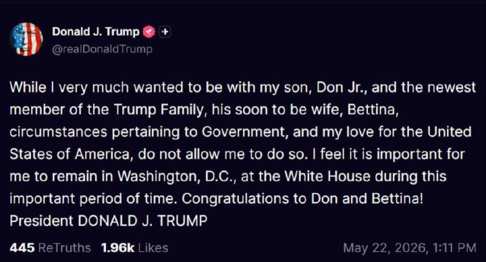

🔴ترامپ در مراسم ازدواج پسرش شرکت نکرد ٫ آیا امشب حمله میکنند؟

پست ترامپ:
با اینکه بسیار دوست داشتم کنار پسرم، دان جونیور، و جدیدترین عضو خانواده ترامپ، همسر آینده‌اش بتینا باشم، شرایط مربوط به دولت و عشق من به ایالات متحده آمریکا اجازه چنین کاری را به من نمی‌دهد.
احساس می‌کنم مهم است که در این دوره مهم زمانی، در واشینگتن دی‌سی و در کاخ سفید بمانم.
به دان و بتینا تبریک می‌گویم!
رئیس‌جمهور دونالد جی. ترامپ
https://t.me/kianmeli1

## kianmeli1 — post 87554

  

🔴به گزارش رویترز، به نقل از افراد آگاه، با هماهنگی ایالات متحده، یک هیئت قطری امروز صبح وارد تهران شد تا به تلاش‌ها برای دستیابی به توافق بین ایالات متحده و ایران کمک کند.

در گذشته، قطر نقش میانجی بین ایران و ایالات متحده را ایفا کرده است و تصور می‌شود که ارتباط آنها با تصمیم‌گیرندگان اصلی ایران ممکن است تلاش‌های مذاکرات را تسهیل کند.
این در حالی است که فیلد مارشال عاصم منیر، تصمیم‌گیرنده اصلی پاکستان، نیز برای تسهیل توافق به تهران سفر کرده است.
https://t.me/kianmeli1

## kianmeli1 — post 87553

🔴عاصم منیر، فرمانده ارتش پاکستان هم اکنون راهی تهران است.

انعقاد توافق؟ یا رساندن اولتیماتوم نهائی ترامپ؟
https://t.me/kianmeli1

## IranIntlTV — post 338460

  

فاکس‌نیوز گزارش داد که تولسی گبرد، مدیر اطلاعات ملی آمریکا از سمت خود استعفا داده است.
او پیش‌تر گفته بود گفت که اهداف تعیین‌شده از سوی ترامپ درباره جنگ با جمهوری اسلامی، با اهداف اسرائیل متفاوت است.

گبرد همچنین گفته بود که حکومت ایران برقرار به نظر می‌رسد، اما در نتیجه عملیات نظامی آمریکا به‌طور گسترده تضعیف شده است.
https://iranintl.com/202605228014

## IranIntlTV — post 338459

  <a href="telegram/content/IranIntlTV_338459_1779471185.mp4" target="_blank">🎬 Download video</a>

در پی کارزار مردمی ایران‌اینترنشنال برای شناسایی جاویدنامان بیمارستان الغدیر تهران، شاهدان با ارسال پیام‌هایی می‌گویند کادر درمان این بیمارستان در ۱۸ و ۱۹ دی ۱۴۰۴، با وجود فشار شدید ماموران و ممانعت آنها، معترضان را رها نکردند و برای بهبود آنها تلاش کردند.
فرنوش فرجی، عضو تحریریه ایران‌اینترنشنال گزارش می‌دهد.

## IranIntlTV — post 338458

  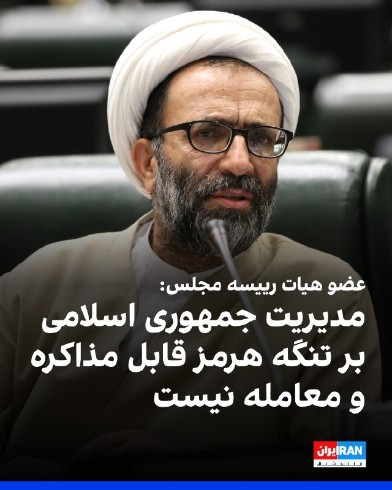

علیرضا سلیمی، عضو هیات رییسه مجلس گفت: «یکی از دستاوردهای جنگ اخیر، مدیریت جمهوری اسلامی بر تنگه هرمز است که هرگز قابل مذاکره و معامله نیست و رژیم حقوقی جدیدی بر این تنگه حاکم خواهد شد که قواعد آن را تنها ما تعریف و اعمال می‌کنیم.»

او افزود: «شرایط عبور و مرور همچنین نرخ عوارض بر تنگه هرمز را جمهوری اسلامی مشخص می‌کند و با توییت نمی‌توانند اوضاع تنگه را تغییر دهند.»
https://iranintl.com/202605225037

## IranIntlTV — post 338457

  <a href="https://t.me/IranintlTV/338457" target="_blank">📎 Download file</a>

🎧نسخه صوتی اخبار شبانگاهی | جمعه یک خرداد
@iranintlTV

## IranIntlTV — post 338456

  

بر اساس گزارش‌های رسیده به ایران‌اینترنشنال، محمدرضا منصوری، جوان ۲۴ ساله و پدر یک نوزاد ۲۰ روزه بود که با تیراندازی نیروهای حکومتی در جریان اعتراضات شهر رشت جان خود را از دست داد. او به دلیل جراحات ناشی از شلیک گلوله، حدود یک ماه بستری و تحت درمان بود.

بر اساس گزارش‌ها، محمدرضا ۱۸ دی‌ماه در منطقه یخسازی رشت هدف شلیک نیروهای حکومتی قرار گرفت و بر اثر اصابت گلوله به نخاع و کتف به شدت زخمی شد.

او ۱۳ بهمن‌ماه بر اثر شدت جراحات وارده در جریان اعتراضات جان باخت.

به گفته منابع محلی، محمدرضا تنها فرزند خانواده بود و پیش از حضور در فراخوان، گفته بود: «برای آینده دخترم در اعتراض شرکت می‌کنم.»
https://iranintl.com/202605222447

## IranIntlTV — post 338455

  

خبرگزاری ایسنا اعلام کرد که عاصم منیر، رییس ستاد کل ارتش پاکستان، عصر جمعه وارد تهران شده است.
پیش‌تر برخی رسانه‌ها از سفر او به تهران، برای تلاش در خصوص نزدیک کردن خواسته‌ها و انتظارات مقام‌های جمهوری اسلامی و ایالات متحده، برای رسیدن به توافق خبر داده بودند.
https://iranintl.com/202605220892

## IranIntlTV — post 338454

بندر خَصَب، راه فرار جمهوری اسلامی از محاصره دریایی؟
فرناز داوری- در میانه آتش‌بس شکننده و محاصره دریایی در تنگه هرمز، بندر خَصَب در عمان به یکی از مسیرهای حیاتی برای رساندن کالا به ایران تبدیل شده است. بندری که با قایق‌های «شوتی»، ماهیگیران و گردشگران شناخته می‌شد، حالا گذرگاهی پرهزینه اما مهم برای دور زدن محاصره بنادر جنوبی ایران شده است.
تا پیش از آغاز جنگ آمریکا و اسرائیل علیه جمهوری اسلامی، بخشی از رفت‌وآمدهای دریایی میان خصب و سواحل جنوبی ایران، به قایق‌های تندرو اختصاص داشت. قایق‌هایی که در ادبیات محلی به «شوتی» معروف‌ هستند و سال‌ها در مسیرهای غیررسمی میان عمان و جنوب ایران، رفت‌وآمد کرده‌اند.
این قایق‌ها معمولا به صورت گروهی حرکت می‌کردند و در زمانی کوتاه خود را از آب‌های عمان به قشم یا دیگر نقاط ساحلی ایران می‌رساندند.
این مسیر پیش از این بیشتر برای دادوستدهای غیررسمی و قاچاق خرد شناخته می‌شد. سیگار ایرانی، مشروبات الکلی و حشیش، از ایران به عمان منتقل می‌شد و در مسیر بازگشت، کالاهای مصرفی، لوازم خانگی و اجناس لوکس، از عمان به ایران می‌رسید.
حضور قایق‌های ماهیگیری ایرانی نیز در اطراف خصب همیشه بخشی از تصویر معمول این منطقه بود.

ادامه گزارش را در اینجا بخوانید:
https://www.iranintl.com/202605220630

## IranIntlTV — post 338453

  <a href="telegram/content/IranIntlTV_338453_1779471189.mp4" target="_blank">🎬 Download video</a>

همه‌پرسی درباره جدایی آلبرتا از کانادا ۱۹ اکتبر برگزار می‌شود.

نخست‌وزیر کانادا هشدار داد هرگونه اقدام برای استقلال باید بر اساس قوانین فدرال انجام شود.

گزارش مهسا مرتضوی، خبرنگار ایران‌اینترنشنال
@iranintltv

## IranIntlTV — post 338452

  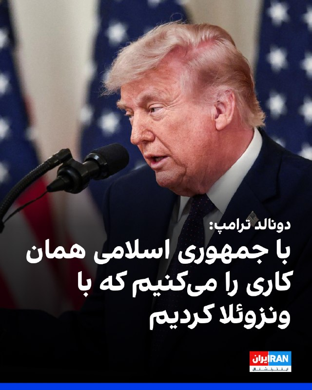

دونالد ترامپ در کاخ سفید درباره مذاکرات با جمهوری اسلامی گفت: «خواهیم دید چه خواهد شد. ما ضربه سختی به ‌آنها زدیم. چاره‌ای نداشتیم. ایران نمی‌تواند سلاح هسته‌ای داشته باشد.»

ترامپ ادامه داد: «آمریکا با جمهوری اسلامی همان رفتاری را انجام می‌دهد که با ونزوئلا انجام داده است.»

ترامپ تاکید کرد جمهوری اسلامی بی‌صبرانه به دنبال رسیدن به توافق است.
https://iranintl.com/202605224243

## IranIntlTV — post 338451

رجزخوانی نظام؛ مغازه کوچک وحشت‌فروشی
حسین ذوقی-جمهوری اسلامی در حالی که تقریبا در آستانه شکست در همه زمینه‌های داخلی و خارجی قرار دارد، تاکتیکش را بر یک سنت فقهی استوار کرده است: رجزخوانی.
سخنان تند مداحان در تجمعات شبانه، سخنان تلویزیونی مسئولان میان‌رده تا گفته‌های رسمی مسئولین بلندپایه در مذاکرات، رسانه‌های اجتماعی و در نهایت، پیام‌های مکتوب رهبر نادیده نظام، بر همین سنت استوار شده است.
ماجرای «آتیش زدم به مالم» را حتما شنیده‌اید: بزازی در بازار، در کسادی وضعیتش و وقتی که اجناسش روی دستش مانده بود و راهی برای فروش نداشت، شاگردش را با یک حلب نفت به میانه بازار می‌فرستد تا فریاد بزند که: «اوستایم عقلش را از دست داده، می‌خواهد همه جا را به آتش بکشد!»
مردم هم که ترسیده‌اند به طمع جنس مفت، سمت دکان بزاز هجوم می‌برند. اوستای بزاز پارچه‌هایش را میان دکان می‌اندازد و رجز می‌خواند که «آتش می‌زنم ...»
خلاصه که انبار بزاز خالی می‌شود و جنس‌هایش را با قیمت بالاتر می‌فروشد!
حالا جمهوری اسلامی هم انگار می‌خواهد با تهدید و رجزخوانی به آتش زدن دنیا، ایده‌هایش را به منطقه و جهان بفروشد.
مداحان از منبر، منتقدان داخلی را به مرگ تهدید می‌کنند. محمود نبویان، نایب‌رییس کمیسیون امنیت ملی مجلس شورای اسلامی، پادشاهان کشورهای عربی را تهدید می‌کند که «هیچ یک از کاخ‌هایشان سالم نخواهد ماند».
عباس عراقچی، وزیر امور خارجه جمهوری اسلامی، در شبکه‌های اجتماعی از «پاسخ طولانی و دردناک» سخن می‌گوید.
اسماعیل بقایی، سخنگوی وزارت امور خارجه، حتی در نشست‌های دیپلماتیک، با لحنی رجزآلود حرف می‌زند.
غلامحسین محسنی اژه‌ای، رییس قوه قضاییه، از «تحمیل ناپذیری» می‌گوید؛ و حسین کنعانی‌مقدم، فرمانده پیشین سپاه پاسداران، اعتراف می‌کند که «رجزخوانی یکی از روش‌های مقابله با دشمن است».
لایه‌ها‌ی متفاوت نظام به یک زبان مشترک رسیده‌اند. این روش تصادفی نیست، شیوه جدید حکمرانی در جمهوری اسلامی است.

ادامه این تحلیل را اینجا بخوانید:
https://www.iranintl.com/202605219159

## IranIntlTV — post 338450

  <a href="telegram/content/IranIntlTV_338450_1779471191.mp4" target="_blank">🎬 Download video</a>

فیلم مستند «تمرین‌هایی برای یک انقلاب»، ساخته پگاه آهنگرانی، برنده جایزه «چشم طلایی» جشنواره کن شد. این فیلم با استفاده از آرشیوهای شخصی و تصاویر اعتراض‌ها، ۴ دهه از تحولات سیاسی و اجتماعی ایران را روایت می‌کند.

لی‌لی نیکفر، خبرنگار ایران‌اینترنشنال، گزارش می‌دهد
@iranintltv

## IranIntlTV — post 338449

  <a href="telegram/content/IranIntlTV_338449_1779471193.mp4" target="_blank">🎬 Download video</a>

جاویدنام عرفان بزرگی، جوان ۲۲ ساله اهل مرودشت، قهرمان مچ‌اندازی استان فارس بود. او ۱۲ دی‌ماه از ناحیه سر هدف گلوله نیروهای سرکوب جمهوری اسلامی قرار گرفت و به‌دلیل شدت جراحات، دو روز بعد در بیمارستان جان باخت.

گزارش فربد سروندی، عضو تحریریه ایران‌اینترنشنال
@iranintltv

## IranIntlTV — post 338448

  <a href="telegram/content/IranIntlTV_338448_1779471194.mp4" target="_blank">🎬 Download video</a>

همزمان با رایزنی‌های غیرمستقیم میان تهران و واشینگتن، فرمانده ارتش پاکستان وارد تهران شد.

به گفته جمهوری اسلامی، این سفر بخشی از تبادل پیام‌ها میان ایران و آمریکا با میانجی‌گری پاکستان است.

گزارش اردوان روزبه، خبرنگار ایران‌اینترنشنال
@iranintltv

## IranIntlTV — post 338447

  <a href="telegram/content/IranIntlTV_338447_1779471196.mp4" target="_blank">🎬 Download video</a>

🔻نهادهای حقوق بشری نسبت به وضعیت غلامرضا خانی‌ شکرآب، ورزشکار و زندانی سیاسی، که با اتهام «جاسوسی» بازداشت شده، هشدار داده‌اند.

🔹او به‌طور ناگهانی از بند امنیتی زندان اوین به سلول انفرادی در زندان قزل‌حصار منتقل شده است.

🔹تصاویری از این ورزشکار را سردار پاشایی، قهرمان پیشین کشتی جوانان جهان، در فضای مجازی منتشر کرده است.

@iranintltvsport

## IranIntlTV — post 338446

  <a href="telegram/content/IranIntlTV_338446_1779471197.mp4" target="_blank">🎬 Download video</a>

یک شهروند در پیامی به ایران اینترنشنال با اشاره به پوشش چادر خود می‌گوید که نه در تجمعات حکومتی شرکت می‌کند و نه از نظام جمهوری اسلامی حمایت می‌کند. پیام او با هوش مصنوعی خوانده شده است.

## IranIntlTV — post 338445

تحرکات تازه در مذاکرات تهران و واشینگتن با سفر فرمانده ارتش پاکستان و هیات قطری به ایران

هم‌زمان با ادامه رایزنی‌های دیپلماتیک در خصوص مذاکرات تهران و واشینگتن، گزارش‌ها از سفر عاصم منیر، فرمانده ارتش پاکستان، به ایران حکایت دارند. یک منبع آگاه نیز به رویترز گفت قطر در هماهنگی با ایالات متحده، یک تیم مذاکره‌کننده را به تهران اعزام کرده است.

ایرنا، خبرگزاری دولت جمهوری اسلامی، جمعه اول خرداد به نقل از یک منبع دیپلماتیک نوشت منیر قرار است در سفر به ایران با مقام‌های بلندپایه جمهوری اسلامی دیدار و گفت‌وگو کند.

شبکه سی‌بی‌اس نیوز نیز به نقل از منابع آگاه امنیتی، سفر فرمانده ارتش پاکستان به ایران را تایید کرد و نوشت بررسی مسائل مهم منطقه‌ای و بین‌المللی، از جمله مذاکرات تهران و واشینگتن، محور اصلی دیدارهای او با مقام‌های جمهوری اسلامی خواهد بود.

یک مقام ارشد پاکستانی به سی‌بی‌اس نیوز گفت دیدارهای اخیر محسن نقوی، وزیر کشور پاکستان، در تهران باعث شده مذاکرات «در مسیری مهم» پیش برود و در همین چارچوب، منیر برای ادامه این رایزنی‌ها راهی ایران شده است.

خبرگزاری رویترز نیز از سفر یک هیات مذاکره‌کننده قطری به تهران خبر داد و نوشت هدف از این سفر که با هماهنگی واشینگتن انجام گرفت، «کمک به تلاش‌ها برای دستیابی به توافقی برای خاتمه جنگ ایران» است.

بر اساس این گزارش، هیات قطری اول خرداد وارد شد.

قطر که پیش‌تر نقش پررنگی در میانجی‌گری‌های بین‌المللی از جمله در جنگ غزه داشت، در پی حملات موشکی و پهپادی اخیر جمهوری اسلامی به این کشور، از ایفای نقش واسطه در مذاکرات مربوط به جنگ ایران فاصله گرفته بود.

العربیه از سفر رییس سازمان اطلاعات پاکستان به تهران خبر داد
شبکه العربیه به نقل از منابع آگاه گزارش داد عاصم مالک، رییس سازمان اطلاعات پاکستان، هم راهی تهران شده است.

از زمان برقراری آتش‌بس موقت در ۱۹ فروردین، پاکستان کوشیده است زمینه دستیابی به توافقی را برای پایان جنگ آمریکا و اسرائیل با جمهوری اسلامی فراهم کند.

رویترز اول خرداد نوشت عباس عراقچی، وزیر امور خارجه جمهوری اسلامی، با وزیر کشور پاکستان در تهران دیدار کرد تا درباره پیشنهادهای مربوط به پایان جنگ گفت‌وگو کند.
این دومین دور گفت‌وگوهای نقوی با مقام‌های ایرانی در دو روز گذشته بود.

رویترز افزود اسلام‌آباد در تلاش است ارتباط میان تهران و واشینگتن را تسهیل کند تا چارچوبی برای پایان جنگ و حل اختلاف‌ها شکل بگیرد.

«نشانه‌های مثبت»
مارکو روبیو، وزیر خارجه آمریکا، ۳۱ اردیبهشت گفت در مذاکرات «نشانه‌های مثبتی» دیده می‌شود، اما هشدار داد اگر جمهوری اسلامی طرح دریافت عوارض از کشتی‌های عبوری از تنگه هرمز را اجرا کند، دستیابی به توافق ممکن نخواهد بود.

او گفت: «ما می‌خواهیم این مسیر باز و آزاد باشد. تنگه هرمز یک آبراه بین‌المللی است.»

یک منبع ارشد ایرانی نیز به رویترز گفت اختلاف‌ها میان دو طرف کاهش یافته، اما موضوع غنی‌سازی اورانیوم و تنگه هرمز همچنان از اصلی‌ترین موانع توافق هستند.

جنگ جاری شوک بزرگی به اقتصاد جهانی وارد کرده و افزایش قیمت نفت، نگرانی‌ها را درباره تورم تشدید کرده است.

پیش از آغاز جنگ، حدود یک‌پنجم صادرات جهانی نفت و گاز طبیعی مایع از تنگه هرمز عبور می‌کرد.

هم‌زمان ارزش دلار آمریکا به بالاترین سطح شش هفته گذشته نزدیک شده و قیمت نفت نیز در پی تردید بازارها نسبت به موفقیت مذاکرات، افزایش یافته است.

اورانیوم و تنگه هرمز
دونالد ترامپ، رییس‌جمهوری آمریکا، ۳۱ اردیبهشت گفت واشینگتن در نهایت ذخایر اورانیوم غنی‌شده ایران را در اختیار خواهد گرفت.

او اضافه کرد: «آن را به دست خواهیم آورد. به آن نیاز نداریم و احتمالا بعد از به دست آوردنش نابودش خواهیم کرد، اما اجازه نمی‌دهیم ایران آن را داشته باشد.»

دو منبع ارشد ایرانی پیش‌تر به رویترز گفته بودند مجتبی خامنه‌ای، رهبر سوم جمهوری اسلامی، دستور داده ذخایر اورانیوم غنی‌شده از ایران خارج نشود.

پیشنهاد تازه جمهوری اسلامی که این هفته به آمریکا ارائه شده، شامل درخواست‌هایی مانند کنترل تنگه هرمز، دریافت غرامت جنگ، لغو تحریم‌ها، آزادسازی دارایی‌های بلوکه‌شده و خروج نیروهای آمریکایی از منطقه است؛ درخواست‌هایی که ترامپ پیش‌تر آن‌ها را رد کرده بود.

هم‌زمان آژانس بین‌المللی انرژی اعلام کرد جنگ جاری «بدترین شوک انرژی جهان» را ایجاد کرده است.

این نهاد هشدار داد هم‌زمانی اوج تقاضای تابستانی و کمبود عرضه جدید از خاورمیانه، ممکن است بازار انرژی را در ماه‌های ژوییه و اوت وارد «منطقه قرمز» کند.
 
🔗وب‌سایت ایران‌اینترنشنال
@iranintltv

## IranIntlTV — post 338444

  <a href="telegram/content/IranIntlTV_338444_1779471199.mp4" target="_blank">🎬 Download video</a>

مارکو روبیو، وزیر خارجه آمریکا، در دومین روز نشست وزیران خارجه ناتو هشدار داد هرگونه اقدام جمهوری اسلامی برای ایجاد محدودیت یا دریافت عوارض در تنگه هرمز می‌تواند مسیر توافق را تخریب کند. او همچنین افزود: «هنوز برای خوش‌بینی نسبت به پیشرفت مذاکرات زود است.»
مهران عباسیان، خبرنگار ایران‌اینترنشنال، گزارش می‌دهد
@iranintltv

## IranIntlTV — post 338443

  

مقام‌های اتحادیه اروپا جمعه اعلام کردند اروپایی‌ها باید انتظار داشته باشند قیمت نفت و گاز دست‌کم تا پایان سال ۲۰۲۷ بالاتر از سطح پیش از جنگ باقی بماند و قیمت سایر کالاها نیز روندی افزایشی داشته باشد.

کمیسر اقتصادی اتحادیه اروپا، گفت افزایش قیمت انرژی عامل اصلی رشد تورم است؛ به‌طوری‌که نرخ تورم برای امسال ۳.۱ درصد و برای سال ۲۰۲۷ حدود ۲.۴ درصد پیش‌بینی می‌شود. این رقم به‌مراتب بالاتر از پیش‌بینی قبلی ۱.۹ درصدی برای سالجاری میلادی است.
https://iranintl.com/202605222906

## IranIntlTV — post 338442

  <a href="telegram/content/IranIntlTV_338442_1779471201.mp4" target="_blank">🎬 Download video</a>

بر اساس گزارش‌های شهروندان به ایران‌اینترنشنال، با تشدید بحران اقتصادی و مشکلات تامین منابع در ایران، نه‌تنها برای خرید بنزین، بلکه برای تهیه مایحتاج اساسی نیز در برخی شهرها صف‌های طولانی شکل گرفته است.

گفت‌وگو با محسن مهیمنی، عضو تحریریه ایران‌اینترنشنال
@iranintltv

## IranIntlTV — post 338441

  <a href="telegram/content/IranIntlTV_338441_1779471203.mp4" target="_blank">🎬 Download video</a>

انور قرقاش، مشاور دیپلماتیک رییس‌ امارات، گفت روابط رسمی این کشور با اسرائیل قوی‌تر نیز خواهد شد، زیرا «همه جمهوری اسلامی را یک تهدید استراتژیک می‌بینند».

گفت‌وگو با علی صدرزاده، تحلیل‌گر مسائل خاورمیانه
@iranintltv

## Shin_Persian — post 6152

  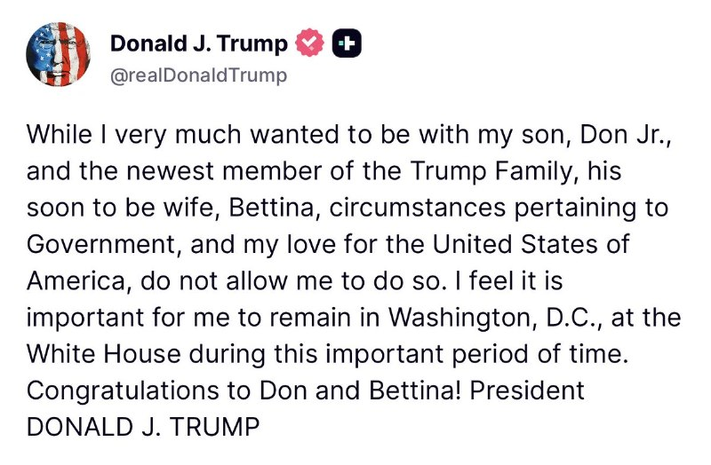

Rapid Response 47 ✓ @RapidResponse47
Fri, 22 May 2026 17:13:05 UTC

𝕏 · @shin_persian

## Shin_Persian — post 6151

  <a href="telegram/content/Shin_Persian_6151_1779471205.mp4" target="_blank">🎬 Download video</a>

Iran International English ✓ @IranIntl_En Fri, 22 May 2026 15:37:34 UTC The Pentagon on Friday released a video allegedly showing unidentified anomalous phenomena (UAP) near Iran, saying the footage was likely captured by an infrared sensor aboard a US military…

## Shin_Persian — post 6150

Iran International English ✓ @IranIntl_En
Fri, 22 May 2026 15:37:34 UTC

The Pentagon on Friday released a video allegedly showing unidentified anomalous phenomena (UAP) near Iran, saying the footage was likely captured by an infrared sensor aboard a US military platform operating in the CENTCOM area in 2022, while cautioning that the material lacks a substantiated chain of custody.

The All-domain Anomaly Resolution Office (AARO) said the 20-second clip, titled “4 UAP Formation Iran 26 Aug 2022 over water [CALLSIGN],” was uploaded to a classified network in June 2024 and surfaced as part of a review of potentially UAP-related records requested by eight members of the US House of Representatives.

فارسی

پنتاگون روز جمعه ویدئویی را منتشر کرد که مدعی است «پدیده‌های ناهنجار ناشناخته» (UAP) را در نزدیکی ایران نشان می‌دهد. پنتاگون اعلام کرد این فیلم احتمالاً توسط یک حسگر فروسرخ در یک پلتفرم نظامی ایالات متحده که در سال ۲۰۲۲ در منطقه سنتکام (فرماندهی مرکزی ایالات متحده) فعالیت می‌کرده، ضبط شده است؛ در عین حال هشدار داد که این محتوا فاقد سلسله‌مراتب نظارتی و استنادی تأیید شده است.

دفتر حل‌وفصل ناهنجاری‌های تمام‌محیطی (AARO) اعلام کرد این کلیپ ۲۰ ثانیه‌ای با عنوان «تشکیل ۴ UAP ایران ۲۶ اوت ۲۰۲۲ بر فراز آب [شناسه رادیویی]»، در ژوئن ۲۰۲۴ در یک شبکه طبقه‌بندی شده بارگذاری شده و در جریان بازبینی پرونده‌های احتمالی مرتبط با UAP که توسط هشت عضو مجلس نمایندگان ایالات متحده درخواست شده بود، ظاهر شده است.

𝕏 · @shin_persian

## Shin_Persian — post 6148

  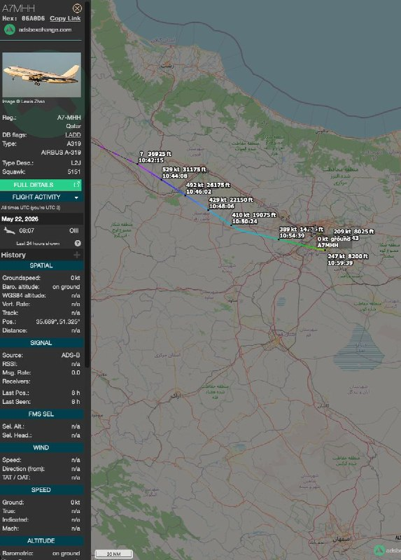

↩️ Quoted tweet: Shin ✓ @hey_itsmyturn Fri, 22 May 2026 15:38:46 UTC It's A7-MHH and it landed in Mehrabad a few hours ago, witness on the ground tells me. ↩️ توییت نقل‌قول شده — برای پاسخ، پست زیر را ببینید. فارسی هواپیما A7-MHH است و طبق گفته‌های یک…

## Shin_Persian — post 6147

↩️ Quoted tweet:
Shin ✓ @hey_itsmyturn
Fri, 22 May 2026 15:38:46 UTC

It's A7-MHH and it landed in Mehrabad a few hours ago, witness on the ground tells me.

↩️ توییت نقل‌قول شده — برای پاسخ، پست زیر را ببینید.

فارسی

هواپیما A7-MHH است و طبق گفته‌های یک شاهد عینی در محل، چند ساعت پیش در مهرآباد به زمین نشست.

𝕏 · @shin_persian

## Shin_Persian — post 6146

↩️ Quoted tweet: Shin ✓ @hey_itsmyturn Fri, 22 May 2026 15:24:02 UTC A Qatari delegation landed in Tehran as per some rumors (which I believe they’re true) ↩️ توییت نقل‌قول شده — برای پاسخ، پست زیر را ببینید. فارسی بر اساس برخی شایعات (که معتقدم صحت دارند)،…

## Shin_Persian — post 6145

↩️ Quoted tweet:
Shin ✓ @hey_itsmyturn
Fri, 22 May 2026 15:24:02 UTC

A Qatari delegation landed in Tehran as per some rumors (which I believe they’re true)

↩️ توییت نقل‌قول شده — برای پاسخ، پست زیر را ببینید.

فارسی

بر اساس برخی شایعات (که معتقدم صحت دارند)، یک هیئت قطری در تهران به زمین نشست.

𝕏 · @shin_persian

## Shin_Persian — post 6141

  

↩️ Quoted tweet:
NetBlocks ✓ @netblocks
Fri, 22 May 2026 15:21:07 UTC

2000 hours.

↩️ توییت نقل‌قول شده — برای پاسخ، پست زیر را ببینید.

فارسی

۲۰۰۰ زولو (۲۳:۳۰ به وقت تهران)

𝕏 · @shin_persian

## Shin_Persian — post 6140

Shin ✓ @hey_itsmyturn
Fri, 22 May 2026 15:24:02 UTC

A Qatari delegation landed in Tehran as per some rumors (which I believe they’re true)

فارسی

بر اساس برخی شایعات (که معتقدم حقیقت دارند)، یک هیئت قطری در تهران به زمین نشست.

𝕏 · @shin_persian

## Shin_Persian — post 6139

laurence norman @laurnorman
Fri, 22 May 2026 13:19:03 UTC

Source tells me the draft “deals” circulating are inaccurate.

فارسی

منبع به من می‌گوید پیش‌نویس «توافق‌هایی» که در حال انتشار است، دقیق نیستند.

𝕏 · @shin_persian

## Shin_Persian — post 6138

📦 mhrv-rs v1.9.34 released

• Migrate config from JSON to TOML with automatic upgrade support (PR #1317)

Files (Android APKs, Windows, macOS, Linux, OpenWRT) on the files channel:

👉 v1.9.34 — all files with SHA-256

Channel:
https://t.me/mhrv_rs
or: https://t.me/+R1OyoHX2boA1ZDgx

#v1934

## Shin_Persian — post 6137

  

Shin ✓ @hey_itsmyturn
Fri, 22 May 2026 13:05:00 UTC

Munir might actually be on board one of these birds en route to Tehran.

فارسی

منیر ممکن است واقعاً در هواپیمای در حال پرواز به مقصد تهران باشد.

𝕏 · @shin_persian

## Shin_Persian — post 6136

  

↩️ Quoted tweet: Al Arabiya English @AlArabiya_Eng Fri, 22 May 2026 12:19:07 UTC 🔴 BREAKING: Pakistan’s army chief Asim Munir is en route to Iran’s Tehran, Al Arabiya sources say. ↩️ توییت نقل‌قول شده — برای پاسخ، پست زیر را ببینید. فارسی 🔴 فوری: منابع…

## Shin_Persian — post 6135

  

↩️ Quoted tweet:
Al Arabiya English @AlArabiya_Eng
Fri, 22 May 2026 12:19:07 UTC

🔴 BREAKING: Pakistan’s army chief Asim Munir is en route to Iran’s Tehran, Al Arabiya sources say.

↩️ توییت نقل‌قول شده — برای پاسخ، پست زیر را ببینید.

فارسی

🔴 فوری: منابع العربیه می‌گویند عاصم منیر، فرمانده ارتش پاکستان، در راه تهران، ایران است.

𝕏 · @shin_persian

## Shin_Persian — post 6134

Shin ✓ @hey_itsmyturn
Fri, 22 May 2026 11:37:26 UTC

Jet activity over Baghdad
#Iraq 🇮🇶

فارسی

فعالیت جنگنده‌ها بر فراز بغداد
#Iraq 🇮🇶

𝕏 · @shin_persian

## Shin_Persian — post 6133

Shin ✓ @hey_itsmyturn
Fri, 22 May 2026 10:53:22 UTC

Middle East: [European] Council extends EU legal framework to target those involved in Iran’s actions impeding lawful transit passage and freedom of navigation

The Council decided today to extend the scope of EU’s restrictive measures originally established to address Tehran’s military support for Russia’s war of aggression against Ukraine and various armed groups in the Middle East and the Red Sea region. The amended sanctions framework will now also target individuals and entities involved in Iran’s actions and policies threatening the freedom of navigation in the Middle East.The decision delivers on the political agreement reached by EU ministers at the Foreign Affairs Council on 21 April 2026.Iran’s actions against vessels transiting through the Strait of Hormuz are contrary to international law. Such actions infringe upon established rights of both transit and innocent passage through international straits.Thanks to the amended legal framework, the EU will now be able to introduce further restrictive measures in response to Iran’s actions undermining the freedom of navigation in the Strait of Hormuz. Such restrictive measures consist of travel restrictions that prohibit listed individual and entities from entering or transiting through EU territories, and an asset freeze. In addition, EU citizens and companies are forbidden from making funds, financial assets or economic resources available to listed individual and entities.

#Iran #EU
(Source: https://www.consilium.europa.eu/en/press/press-releases/2026/05/22/middle-east-council-extends-eu-legal-framework-to-target-those-involved-in-iran-s-actions-impeding-lawful-transit-passage-and-freedom-of-navigation/)

ترجمه فارسی در بخش نظرات

𝕏 · @shin_persian

## ManotoTV — post 105748

  <a href="telegram/content/ManotoTV_105748_1779471210.mp4" target="_blank">🎬 Download video</a>

«دلم براتون تنگ میشه اما امید دارم برگردید»

## ManotoTV — post 105747

  <a href="telegram/content/ManotoTV_105747_1779471212.mp4" target="_blank">🎬 Download video</a>

رییس اورژانس پیش‌بیمارستانی و مدیریت حوادث دانشگاه علوم پزشکی البرز اعلام کرد بر اثر تصادف زنجیره‌ای در آزادراه کرج قزوین، سه نفر جان باختند و چهار نفر دیگر مجروح شدند.
به گزارش رسانه‌های داخلی، در این سانحه دو مرد و یک زن کشته شدند و سه مرد و یک زن دیگر نیز مجروح شدند.
مصدومان توسط نیروهای اورژانس به بیمارستان امام جعفر صادق نظرآباد منتقل شدند.

## ManotoTV — post 105746

  <a href="telegram/content/ManotoTV_105746_1779471212.mp4" target="_blank">🎬 Download video</a>

پیام یک مخاطب منوتو درباره پایان پخش برنامه‌های این شبکه

## ManotoTV — post 105745

  <a href="telegram/content/ManotoTV_105745_1779471214.mp4" target="_blank">🎬 Download video</a>

پیام یک مخاطب منوتو درباره پایان پخش برنامه‌های این شبکه

## ManotoTV — post 105744

  <a href="telegram/content/ManotoTV_105744_1779471215.mp4" target="_blank">🎬 Download video</a>

هامبورگ؛ به‌مناسبت سالگرد ریزش ساختمان متروپل، جمعه اول خرداد ۱۴۰۵

## ManotoTV — post 105741

اطلاعیه منوتو درباره پایان پخش برنامه‌ها

## ManotoTV — post 105740

  <a href="telegram/content/ManotoTV_105740_1779471216.mp4" target="_blank">🎬 Download video</a>

مارکو روبیو، وزیر خارجه آمریکا، در نشست خبری مشترک با مارک روته، دبیرکل ناتو، گفت تلاش جمهوری اسلامی برای ایجاد نظام عوارض‌گیری در یک آبراه بین‌المللی قابل قبول نیست و نباید اجازه داده شود چنین اقدامی در تنگه هرمز رخ دهد.

روبیو در این نشست که در حاشیه نشست وزیران خارجه ناتو در سوئد برگزار شد، گفت آمریکا می‌کوشد این موضوع را از مسیر سازمان ملل پیگیری کند و به نتیجه برساند. او افزود تقریبا همه کشورهایی که در این نشست حضور داشتند، از قطعنامه مربوط به این موضوع حمایت کرده‌اند یا به احتمال زیاد به آن خواهند پیوست.

## ManotoTV — post 105739

  <a href="telegram/content/ManotoTV_105739_1779471218.mp4" target="_blank">🎬 Download video</a>

پریتی پتل، وزیر خارجه سایه بریتانیا، در سخنانی در مجلس عوام این کشور گفت هرچه از برنامه هسته‌ای جمهوری اسلامی باقی مانده، باید برچیده شود و اورانیوم غنی‌شده موجود نیز باید از ایران خارج شود.

به گزارش متن رسمی نشست مجلس عوام بریتانیا، این سخنان روز پنجشنبه ۳۱ اردیبهشت در جریان جلسه‌ای درباره خاورمیانه مطرح شد. او گفت اورانیوم غنی‌شده‌ای که جمهوری اسلامی اکنون در اختیار دارد باید خارج شود و باید از چگونگی سوءاستفاده جمهوری اسلامی از توافق سال ۱۳۹۴ درس گرفت.

پتل از دولت بریتانیا خواست روشن کند آیا این موضع، موضع رسمی دولت نیز هست یا نه. او گفت شفافیت دولت درباره این موضوع «بسیار مهم» است و سپس پرسید موضع دولت در قبال توان موشکی و نظامی ایران چیست.

## FarsiVOA — post 218375

🔺تشدید کارزار جمهوری اسلامی برای آزار و سرکوب اقلیت‌های دینی در ایران

▪️جمهوری اسلامی در تشدید کارزار آزار و سرکوب اقلیت‌های دینی ایران، با درخواست‌های مکرر یک زن باردار بهائی برای آزادی از زندان و مراجعه به پزشک و انجام آزمایش‌های ضروری بارداری، مخالفت کرده است. همزمان رسانه‌های حقوق بشری از بلاتکلیفی یک زوج بهائی در زندان شیراز و محکومیت یک زن نوکیش مسیحی به بیش از ۹ سال زندان خبر داده‌اند.

⬇️ بیشتر بخوانید:

https://ir.voanews.com/a/iran-bahaaie-prison-minority-religous-execution/8152804.html/?nocach=1

## FarsiVOA — post 218374

ویدویی از پرفورمنس یک هنرمند ایرانی در خیابان در شبکه‌های اجتماعی مورد توجه قرار گرفته است.

او در این اجرا، هم‌زمان با فروش و رنده کردن پیاز، از رهگذران می‌خواهد «بر وضعیتی که در آن زندگی می‌کنیم، اشک بریزند.»

@FarsiVOA

## FarsiVOA — post 218373

قطعی اینترنت در ایران وارد هشتاد و چهارمین روز خود شد و دسترسی شهروندان به شبکه‌های بین‌المللی عملاً برای بیش از ۲۰۰۰ ساعت قطع شده است.

نت‌بلاکس، نهاد مستقل پایش دسترسی به اینترنت، در تازه‌ترین گزارش خود در این باره یادآور شده که با گذشت هر ساعت از خاموشی دیجیتال در ایران، شکاف‌های اقتصادی و اجتماعی عمیق‌تر می‌شوند؛ چرا که هرگونه ارتباط با جهان خارج، تحت کنترل درآمده و مشروط به جایگاه، همسویی (هم‌صدایی با حکومت) و داشتن امتیاز ویژه شده است.

گزارش کامل را در وب‌سایت صدای آمریکا بخوانید.

@FarsiVOA

## FarsiVOA — post 218372

حکم اعدام بیتا همتی و همسرش محمدرضا مجیدی اصل، دو معترض دی، در دیوان عالی کشور نقض شده است. با این حال غلامرضا خانی شکرآب در معرض اجرای قریب‌الوقوع اعدام است.

## FarsiVOA — post 218371

  <a href="telegram/content/FarsiVOA_218371_1779471219.mp4" target="_blank">🎬 Download video</a>

کاخ سفید ویدیویی با عنوان «شی ناشناس پرنده؛ دسامبر ۲۰۱۹، ساحل شرقی» منتشر کرد و اعلام کرد این تصاویر احتمالا توسط حسگر مادون قرمز یک پلتفرم نظامی آمریکا در محدوده مسئولیت فرماندهی شمالی ایالات متحده در سال ۲۰۱۹ ثبت شده‌اند.

@FarsiVOA

## FarsiVOA — post 218369

🔺روبیو درباره مذاکرات: ترجیح پرزیدنت ترامپ دیپلماسی است، اما باید برای گزینه‌های دیگر هم آماده باشیم

▪️وزیر امور خارجه ایالات متحده روز جمعه اول خردادماه، پس از شرکت در اجلاس وزیران امور خارجه عضو ناتو در سوئد به خبرنگاران گفت عدم دستیابی جمهوری اسلامی به سلاح هسته‌ای، تحویل همه اورانیوم‌های غنی‌شده، و بازگشایی تنگه هرمز، ارکان اصلی و خلل‌ناپذیر آمریکا در مذاکرات با رژیم ایران هستند.

⬇️ بیشتر بخوانید:

https://ir.voanews.com/a/nato-marco-rubio-us-euorpe-iran/8152766.html/?nocach=1

## FarsiVOA — post 218367

فرماندهی مرکزی ایالات متحده، سنتکام، اعلام کرد نیروهای تفنگدار دریایی آمریکا سامانه موشکی «هایمارس» را به یک ایستگاه سوخت‌گیری در خاورمیانه منتقل کرده‌اند. سنتکام می‌گوید این سامانه‌های متحرک که توسط ارتش و تفنگداران دریایی آمریکا استفاده می‌شوند، از قابلیت جابه‌جایی سریع برخوردارند.

@FarsiVOA

## FarsiVOA — post 218366

مارکو روبیو، وزیر امور خارجه آمریکا، روز جمعه ۲ خرداد در پایان نشست وزیران امور خارجه کشورهای عضو ناتو در سوئد و پیش از ترک آن کشور به مقصد هند، به پرسش‌های خبرنگاران پاسخ داد. صدای آمریکا این کنفرانس خبری را به طور زنده و با ترجمه همزمان پژواک کیومرثی پخش کرد.

## FarsiVOA — post 218365

مارکو روبیو، وزیر امور خارجه آمریکا، روز جمعه ۲ خرداد در پایان نشست وزیران امور خارجه کشورهای عضو ناتو در سوئد و پیش از ترک آن کشور به مقصد هند، به پرسش‌های خبرنگاران پاسخ داد. صدای آمریکا این کنفرانس خبری را به طور زنده و با ترجمه همزمان پژواک کیومرثی پخش کرد.

## FarsiVOA — post 218364

مارکو روبیو، وزیر امور خارجه آمریکا، روز جمعه ۲ خرداد در پایان نشست وزیران امور خارجه کشورهای عضو ناتو در سوئد و پیش از ترک آن کشور به مقصد هند، به پرسش‌های خبرنگاران پاسخ داد. صدای آمریکا این کنفرانس خبری را به طور زنده و با ترجمه همزمان پژواک کیومرثی پخش کرد.

## FarsiVOA — post 218363

  <a href="telegram/content/FarsiVOA_218363_1779471220.mp4" target="_blank">🎬 Download video</a>

کاخ سفید ویدیویی با عنوان «چهار شی ناشناس پرنده بر فراز آب‌های ایران» منتشر کرد و اعلام کرد این تصاویر احتمالا توسط حسگر مادون قرمز یک پلتفرم نظامی آمریکا در محدوده مسئولیت فرماندهی مرکزی ایالات متحده، سنتکام، در چهارم شهریور ۱۴۰۱ ثبت شده‌اند.

@FarsiVOA

## FarsiVOA — post 218362

  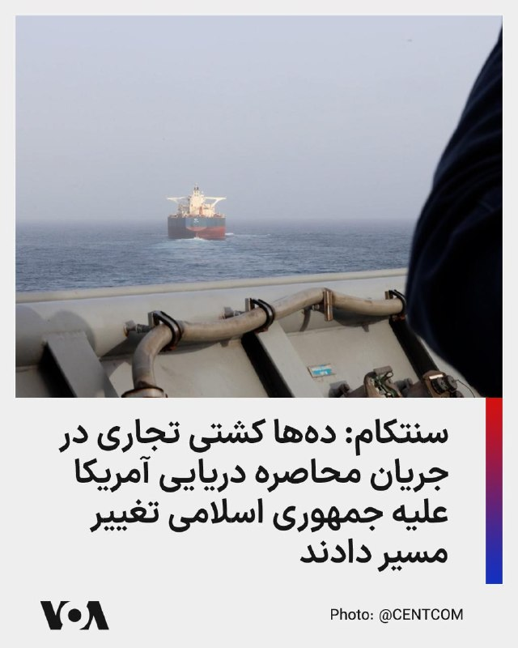

فرماندهی مرکزی ایالات متحده، سنتکام، اعلام کرد یک ملوان آمریکایی از ناو «یواس‌اس کامستاک» در جریان اجرای محاصره دریایی علیه جمهوری اسلامی، یک کشتی تجاری را زیر نظر دارد.

سنتکام گفت از آغاز این محاصره، نیروهای آمریکایی مسیر ۹۷ کشتی تجاری را تغییر داده و ۴ کشتی را نیز از کار انداخته‌اند.

@FarsiVOA

## FarsiVOA — post 218360

مارکو روبیو، وزیر امور خارجه آمریکا، پس از دیدار با دبیرکل ناتو اعلام کرد اعضای این ائتلاف باید در نشست آینده آنکارا به‌طور جدی متعهد شوند که به‌سرعت تولیدات و صنایع دفاعی خود را گسترش دهند و تعهدات مالی خود را به «قابلیت‌های واقعی جنگی» تبدیل کنند. او گفت: «اروپای قوی‌تر به معنای ناتوی قوی‌تر است.»

@FarsiVOA

## FarsiVOA — post 218359

تعطیلی بی‌سابقه مجلس جمهوری اسلامی؛ جنگ قالیباف و جلیلی وارد فاز علنی شد

## FarsiVOA — post 218357

فرماندهی مرکزی ایالات متحده، سنتکام، اعلام کرد جنگنده‌های نیروی دریایی آمریکا از ناو هواپیمابر «یواس‌اس آبراهام لینکلن» در دریای عرب به پرواز درآمده‌اند.

سنتکام می‌گوید گروه رزمی آبراهام لینکلن در جریان اجرای محاصره دریایی آمریکا علیه جمهوری اسلامی، در بالاترین سطح آمادگی عملیاتی قرار دارد.

@FarsiVOA

## FarsiVOA — post 218356

  <a href="telegram/content/FarsiVOA_218356_1779471220.mp4" target="_blank">🎬 Download video</a>

ارتش اسرائیل اعلام کرد که روز پنجشنبه ۳۱ اردیبهشت، پنج عضو حزب‌الله را پس از آنکه وارد یک مرکز فرماندهی متعلق به این گروه شدند، هدف حمله قرار داده است.

بر اساس اعلام ارتش، این افراد در شمال منطقه تحت کنترل در جنوب لبنان شناسایی شده و پس از یک حمله هوایی کشته شده‌اند.

ارتش اسرائیل همچنین اعلام کرد که طی ۲۴ ساعت گذشته، انبارهای تسلیحاتی حزب‌الله و دیگر «زیرساخت‌های تروریستی» در لبنان را هدف قرار داده‌ و چندین عضو دیگر که تهدید محسوب می‌شدند را از پای درآورده است.

صبح روز جمعه اول خرداد نیز ارتش اسرائیل از هدف قرار دادن دو فرد مسلح مشکوک پیش از نزدیک شدن به مرز این کشور با لبنان، خبر داده بود.

ایالات متحده، اسرائیل و شماری دیگر از کشورها حزب‌الله لبنان را در فهرست گروه‌های تروریستی قرار داده‌اند.

@FarsiVOA

## FarsiVOA — post 218355

  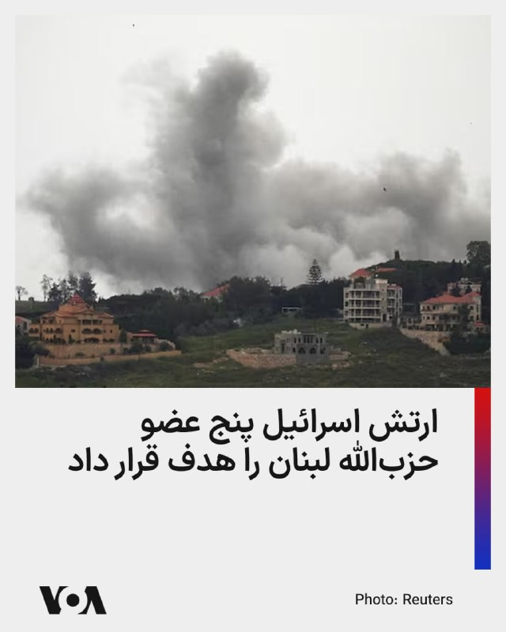

ارتش اسرائیل اعلام کرد که روز پنجشنبه ۳۱ اردیبهشت، پنج عضو حزب‌الله را پس از آنکه وارد یک مرکز فرماندهی متعلق به این گروه شدند، هدف حمله قرار داده است.

بر اساس اعلام ارتش، این افراد در شمال منطقه تحت کنترل در جنوب لبنان شناسایی شده و پس از یک حمله هوایی کشته شده‌اند.

ارتش اسرائیل همچنین اعلام کرد که طی ۲۴ ساعت گذشته، انبارهای تسلیحاتی حزب‌الله و دیگر «زیرساخت‌های تروریستی» در لبنان را هدف قرار داده‌ و چندین عضو دیگر که تهدید محسوب می‌شدند را از پای درآورده است.

صبح روز جمعه اول خرداد نیز ارتش اسرائیل از هدف قرار دادن دو فرد مسلح مشکوک پیش از نزدیک شدن به مرز این کشور با لبنان، خبر داده بود.

ایالات متحده، اسرائیل و شماری دیگر از کشورها حزب‌الله لبنان را در فهرست گروه‌های تروریستی قرار داده‌اند.
@FarsiVOA

## DW_Farsi — post 125020

  

🔶 " کشته‌شدن ۱۰ نفر در حملات اسرائیل به جنوب لبنان، از جمله ۶ امدادگر وابسته به حزب‌الله و امل"

حملات متقابل میان اسرائیل و حزب‌الله در لبنان با وجود برقراری آتش‌بس همچنان ادامه دارد.

بنا بر اعلام مقامات رسمی، در پی حملات هوایی اسرائیل به جنوب لبنان از شب گذشته تاکنون، دست‌کم ده نفر کشته شده‌اند.

وزارت بهداشت در بیروت گزارش داد که در میان کشته‌شدگان، شش امدادگر (پزشکیار) و یک کودک وجود دارند. همچنین تعداد دیگری از شهروندان و امدادگران در این حملات زخمی شده‌اند. ارتش اسرائیل هنوز واکنشی به این حملات نشان نداده است.

مراکز درمانی و امدادی هدف‌قرارگرفته،متعلق به حزب‌الله و جنبش متحد آن، "امل" هستند. اسرائیل بارها مراکز بهداشتی و تیم‌های پزشکی را در لبنان هدف قرار داده و حزب‌اللهِ تحت حمایت ایران را متهم می‌کند که از این مراکز به عنوان پوششی برای پنهان کردن سلاح‌ها و جنگجویان خود استفاده می‌کند.

از آنجا که حزب‌الله به‌ویژه در جنوب لبنان مانند "دولتی در دولت" عمل می‌کند، شاخه غیرنظامی آن مسئولیت تأمین خدمات پزشکی و درمانی را در این مناطق بر عهده دارد.
@dw_farsi

## DW_Farsi — post 125019

  

🔶 هشتاد و چهارمین روز قطع اینترنت در ایران

نت‌بلاکس اعلام کرده است که بلک‌اوت (قطع کامل) اینترنت در ایران وارد هشتاد و چهارمین روز خود شده و شبکه‌های بین‌المللی برای بیش از ۱۹۹۲ ساعت به طور گسترده قطع شده‌اند.

این سازمان غیردولتی و بین‌المللی که بر امنیت سایبری و حکمرانی اینترنت نظارت می‌کند، افزوده است که با گذشت هر ساعت، شکاف‌های اجتماعی و اقتصادی عمیق‌تر می‌شوند؛ چرا که هرگونه ارتباط با جهان خارج، اکنون در انحصار موقعیت اجتماعی، میزان همسویی با مواضع رسمی حکومت و برخورداری از امتیازات ویژه قرار گرفته است.

قطعی کنونی اینترنت در ایران بی‌سابقه‌ترین خاموشی ارتباطات دیجیتال یک کشور با جهان خارج است.
@dw_farsi

## DW_Farsi — post 125018

🔶 بخشی از پلکان برج ایفل در حراجی ۴۵۰ هزار یورو فروخته شد

خبرگزاری رویترز گزارش داد یک کلکسیونر فرانسوی روز پنج‌شنبه ۲۱ مه بخش ۱۴ پله‌ای از پلکان مارپیچ اصلی برج ایفل را در حراجی "آرکیوریال" در پاریس به قیمت ۴۵۰ هزار و ۱۶۰ یورو خریدهاست.

این قطعه نزدیک به ۳ متر ارتفاع و حدود ۱/۴ تن وزن دارد و بسیار بالاتر از برآورد اولیه ۱۲۰ تا ۱۵۰ هزار یورویی فروخته شده است.
@dw_farsi

## DW_Farsi — post 125017

🎥 جنگ ایران، کابوس تازه صنعت الماس هند

جنگ ایران، بحران صنعت الماس هند را تشدید کرده؛ اختلال در زنجیره تأمین، کاهش صادرات و موج بیکاری، فعالان این صنعت را با چالش جدی روبه‌رو کرده است.
@dw_farsi

## DW_Farsi — post 125016

  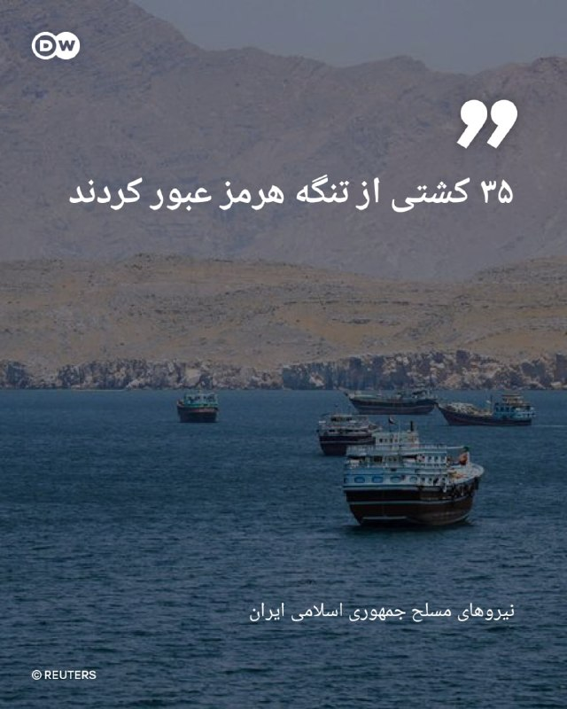

🔶 ایران: ۳۵ کشتی از تنگه هرمز عبور کردند

بنا بر اعلام مقام‌های ایران، در ۲۴ ساعت گذشته ۳۵ فروند کشتی از تنگه هرمز که شاهراهی حیاتی برای تجارت انرژی به شمار می‌رود عبور کرده‌اند. رادیو و تلویزیون دولتی ایران به نقل از بیانیه نیروهای مسلح اعلام کرد که این ترددها با هماهنگی نیروی دریایی سپاه پاسداران انقلاب اسلامی انجام شده است. بر اساس این گزارش، کشتی‌های مذکور شامل نفتکش‌ها، کشتی‌های باربری و سایر کشتی‌های تجاری بوده‌اند.

نیروهای مسلح ایران مدت کوتاهی پس از آغاز جنگ، کنترل تنگه هرمز را که نقشی کلیدی در تجارت جهانی انرژی دارد، به دست گرفتند. در پی تهدیدها، بازرسی‌ها و حمله به کشتی‌ها، رفت‌وآمد در این آبراه استراتژیک تا حد زیادی متوقف شد؛ امری که افزایش چشمگیر قیمت انرژی و سوخت در سراسر جهان را به همراه داشت. علاوه بر این، به گفته ایران، این تنگه در حال حاضر مین‌گذاری شده است.

نیروی دریایی سپاه پاسداران در بیانیه خود اما مدعی است که این نیرو در تنگه هرمز یک آبراه ایمن برای کشتیرانی و استمرار تجارت جهانی ایجاد کرده است.
@dw_farsi

## DW_Farsi — post 125015

  

🔶روایت شبکه العربیه از مفاد توافق احتمالی میان ایران و آمریکا

شبکه عربستانی العربیه متنی را منتشر کرده است که ادعا می‌کند "پیش‌نویس نهایی" یک توافق "احتمالی" میان آمریکا و ایران با میانجیگری پاکستان برای پایان دادن به جنگ است.

بنا بر این گزارش، انتظار می‌رود توافق مذکور، که ظاهراَ یک توافق موقت با "مسائل حل‌نشده‌ای" است که باید پس از اجرایی شدن مورد مذاکره قرار گیرند، ظرف چند ساعت آینده اعلام شود.

العربیه ولی تاکید دارد که این توافق "در انتظار تایید" هر دو طرف است.

این گزارش به نقل از منابع ناشناس می‌گوید توافق به محض اعلام رسمی از سوی هر دو طرف، بلافاصله اجرایی خواهد شد.

پیش‌نویس توافق گزارش‌شده، به صراحت به خواست‌های کلیدی ایالات متحده اشاره‌ای نکرده است؛ خواسته‌هایی از جمله برچیدن برنامه هسته‌ای ایران و صادرات ذخیره اورانیوم ۶۰ درصد غنی‌شده آن، محدود کردن موشک‌های بالستیک و پایان دادن به حمایت از گروه‌های نیابتی.

بنا بر این گزارش، مذاکرات درباره "مسائل حل‌نشده" نامشخص، قرار است ظرف هفت روز پس از اجرایی شدن توافق آغاز شود.
@dw_farsi

## DW_Farsi — post 125014

🔶 چرا پرونده تجاوز پژمان جمشیدی به حکم شلاق ختم شد؟

🔻گزارشی از میترا خلعتبری

فضای رسانه‌ای و هنری ایران از پاییز سال گذشته تا کنون با یکی از جنجالی‌ترین پرونده‌ها دست‌وپنجه نرم می‌کند.

نام پژمان جمشیدی ستاره سال‌های نه چندان دور فوتبال و بازیگر پرکار سینما و تلویزیون، ماه‌هاست که نه برای هنرنمایی روی پرده، بلکه به خاطر یک پرونده جنجالی قضایی در صدر اخبار قرار گرفته است. اتهام اولیه "تجاوز به عنف" و "آدم‌ربایی" که با شکایت یک هنرجوی جوان بازیگری مطرح شد، جامعه را در بهت و حیرت فرو برد.

چندین ماه پس از مطرح شدن این شکایت جنجالی، حالا حکم پرونده صادر و مجازات "۹۹ ضربه شلاق تعزیری" اعلام شده است.

اما پرونده این چهره سرشناس با صدور این رای، نه تنها به نقطه‌ای روشن و مشخص نرسیده، بلکه موج جدیدی از ابهامات، سوالات و تناقض‌ها را در افکار عمومی ایجاد کرده است.
@dw_farsi

## DW_Farsi — post 125013

  

🔶 قرقاش: کنترل ایران بر تنگه هرمز یک سابقه خطرناک ایجاد می‌کند

انور قرقاش، مشاور رئیس دولت امارات متحده عربی در سیاست خارجی، روز جمعه ۲۲ مه، اعلام کرد که شانس دستیابی به توافق صلح میان آمریکا و ایران "۵۰-۵۰" است، اما تاکید کرد که هرگونه حل‌وفصل سیاسی برای جلوگیری از درگیری‌های آینده، باید به ریشه‌های اصلی بی‌ثباتی در منطقه بپردازد.

پاکستان در حال میانجیگری برای برقراری یک آتش‌بس میان ایالات متحده و ایران است تا به جنگی که اقتصاد جهانی را تکان داده و تجارت را در تنگه هرمز ، شاهراه حیاتی برای انتقال حدود یک‌پنجم محموله‌های نفت و گاز طبیعی مایع (LNG) جهان، مختل کرده است، پایان دهد.

انور قرقاش، مشاور دیپلماتیک رئیس دولت امارات، در کنفرانس «گلوبسک» (Globsec) در پراگ گفت: «شانس دستیابی به توافق ۵۰-۵۰ است. نگرانی من این است که ایرانی‌ها همیشه در مذاکرات زیاده‌خواهی کرده‌اند.»

قرقاش افزود: «این موضوع جدیدی نیست. آن‌ها در طول سال‌ها به دلیل تمایل به دست‌بالا گرفتن برگ‌های بازی خود، فرصت‌های زیادی را از دست داده‌اند. امیدوارم این بار این کار را نکنند.»
@dw_farsi

## DW_Farsi — post 125012

🔶 "استفاده وسیع آمریکا از موشک‌های رهگیر برای دفاع از اسرائیل"

واشنگتن‌پست گزارش داد آمریکا در جریان جنگ اخیر با ایران، بیش از ۳۰۰ موشک رهگیر برای دفاع از اسرائیل شلیک کرده، در حالی که اسرائیل حدود ۱۹۰ رهگیر به کار برده است.

بر اساس این گزارش، واشنگتن بیش از ۲۰۰ سامانه پدافندی "تاد" و بیش از ۱۰۰ موشک "اس‌ام-۳" و "اس‌ام-۶" شلیک کرده، در حالی که اسرائیل کمتر از ۱۰۰ موشک رهگیر "پیکان" و حدود ۹۰ موشک از سامانه "فلاخن داوود" استفاده کرده است.
@dw_farsi

## DW_Farsi — post 125011

  

🔶 انتقاد شدید مارکو روبیو از ناتو به دلیل عدم همکاری در جنگ با ایران

مارکو روبیو، وزیر امور خارجه ایالات متحده، کمی پیش از پرواز به مقصد سوئد برای شرکت در نشست ناتو، انتقادها از این پیمان نظامی را مجددا تکرار کرد.

این سیاستمدار آمریکایی گفت: «فکر نمی‌کنم کسی از اینکه ایالات متحده و به ویژه شخص رئیس‌جمهور در حال حاضر تا این حد از ناتو و عملکرد آن ناامید شده‌اند، غافلگیر شده باشد.»

روبیو به عنوان دلیل مشخص این نارضایتی، به مخالفت و امتناع کشورهایی مانند اسپانیا از اجازه دادن به آمریکا برای استفاده از پایگاه‌های نظامی‌شان در جنگ علیه ایران اشاره کرد.

او در ادامه توضیحات خود افزود که عضویت ایالات متحده در یک ائتلاف باید برای این کشور ارزش و منفعتی داشته باشد و یکی از ارزش‌های محوری ناتو، پایگاه‌های نظامی موجود در اروپا هستند.

به گفته او، این پایگاه‌ها به ایالات متحده امکان می‌دهند تا در صورت بروز بحران در خاورمیانه یا هر جای دیگر، قدرت نظامی خود را اعمال کند.
@dw_farsi

## DW_Farsi — post 125010

  

🔶 دیوان عالی جمهوری اسلامی احکام اعدام محمدرضا مجیدی‌اصل و بیتا همتی را نقض کرد

بنا بر داده‌های منابع حقوق بشری دیوان عالی جمهوری اسلامی احکام اعدام محمدرضا مجیدی‌اصل و بیتا همتی را نقض کرده و آن را برای بررسی مجدد به شعبه هم‌عرض ارجاع داده است.

این زوج جوان ساکن تهران و از بازداشت‌شدگان اعتراضات دی‌ماه پیش‌تر در یک پرونده مشترک به همراه دو شهروند دیگر به اعدام محکوم شده بودند.

مجیدی‌‌اصل و همتی اواخر فروردین‌ماه سال جاری به همراه دو هم‌پرونده‌ای خود به‌نام‌های بهروز زمانی‌نژاد و کوروش زمانی‌نژاد توسط شعبه ۲۶ دادگاه انقلاب تهران به ریاست قاضی ایمان افشاری به اعدام، حبس و مصادره اموال محکوم شدند. یک متهم دیگر این پرونده نیز به نام امیر همتی به حبس محکوم شد.

"اقدام عملیاتی برای دولت متخاصم آمریکا و گروه‌های متخاصم" اتهاماتی بود که بر اساس آن برای محمدرضا مجیدی‌اصل، بیتا همتی، بهروز زمانی‌نژاد و کورش زمانی‌نژاد حکم اعدام صادر شد.

این چهار شهروند همچنین مشمول ۵ سال حبس تعزیزی به اتهام "اجتماع و تبانی علیه امنیت کشور" شده و به عنوان مجازات تکمیلی حکم مصادره کلیه اموال آنها نیز صادر شده است.
@dw_farsi

## DW_Farsi — post 125009

  

🔶 واکنش محتاطانه وزیر امور خارجه به ماموریت احتمالی ناتو در تنگه هرمز

یوهان واده‌فول، وزیر امور خارجه آلمان، در اظهارنظری محتاطانه در مورد مأموریت احتمالی ناتو در آزادسازی تنگه هرمز گفت که آلمان همیشه اعلام کرده که آماده است تا امنیت تردد آزاد در آنجا را تضمین کند و تحت رهبری بریتانیا و فرانسه در حال آماده‌سازی برای این عملیات‌ است.

این سیاستمدار حزب دموکرات مسیحی که در جریان نشست وزرای امور خارجه ناتو در شهر بندری هلسینگبوری سوئد سخن می‌گفت، در عین حال افزود: «اما من هیچ مأموریت فوری ناتو به معنای کلاسیک آن را در تنگه هرمز پیش‌بینی نمی‌کنم.»

دولت آلمان پیشنهاد داده است که پس از پایان جنگ ایران، در زمینه‌هایی مانند پاکسازی مین‌ها در این آبراه حیاتی که برای تأمین انرژی (نفت و گاز) بین‌المللی بسیار مهم است، کمک کند. آماده‌سازی‌ها برای این منظور در حال انجام است.

واده‌فول با وجود اظهارات محتاطانه‌اش درباره مأموریت ناتو در تنگه هرمز، تأکید کرد: «با این حال یک چیز روشن است، ما به ائتلاف فراآتلانتیک (ناتو) پایبندیم و ایالات متحده آمریکا می‌تواند مطمئن باشد که در هر زمانی می‌تواند روی ما حساب کند.»
@dw_farsi

## DW_Farsi — post 125008

🔶 کاهش مالیات بلیط پروازها در آلمان تحت تاثیر بحران خاورمیانه

پارلمان آلمان طرح کاهش مالیات بلیط در سفرهای هوایی را تصویب کرد. با این حال، قیمت بلیط هواپیما در بسیاری از مسیرها اخیراً به دلیل جنگ خاورمیانه به شدت افزایش یافته است، به طوری که مشتریان خطوط هوایی ممکن است در نهایت ارزانی چندانی را احساس نکنند.

به طور دقیق‌تر، قرار است عوارض پروازهای کوتاه دست‌کم ۲.۵۰ یورو، پروازهای میان‌برد ۶.۳۳ یورو و پروازهای بلندمدت (قاره‌ای) ۱۱.۴۰ یورو کاهش یابد.
@dw_farsi

## DW_Farsi — post 125007

🔶 وال‌استریت ژورنال از کمک بابک زنجانی به نقض تحریم‌ها خبر داد

وال‌استریت ژورنال گزارش داده بابک زنجانی، فعال اقتصادی تحریم‌شده ایرانی، با استفاده از شبکه‌ای از حساب‌ها در بایننس، دست‌کم ۸۵۰ میلیون دلار تراکنش را طی دو سال انجام داده است؛ تراکنش‌هایی که در گزارش‌های داخلی بایننس بارها مشکوک تشخیص داده شدند، اما حساب اصلی او ماه‌ها پس از هشدارهای داخلی همچنان فعال ماند.

این نشریه می‌نویسد این پول‌ها بخشی از میلیاردها دلار جریان مالی رمزارزی بوده‌اند که در سال‌های منتهی به جنگ اخیر، به شبکه‌های تامین مالی سپاه پاسداران متصل بوده‌اند.

بر اساس این گزارش، بخش عمده این تراکنش‌ها از طریق یک حساب اصلی و چند حساب دیگر که به خواهر، شریک عاطفی و مدیر شرکت زنجانی مرتبط بوده‌اند انجام شده است.

بررسی‌های داخلی بایننس نشان داده که این حساب‌ها از یک مجموعه دستگاه مشترک استفاده می‌کرده‌اند؛ الگویی که از نگاه تیم‌های تطبیق این صرافی، نشانه‌ای از تلاش برای دور زدن تحریم‌های آمریکا علیه جمهوری اسلامی بوده است.
@dw_farsi

## DW_Farsi — post 125006

🔶 وزارت خارجه جمهوری اسلامی تحریم سفیر خود در لبنان را محکوم کرد

وزارت امور خارجه جمهوری اسلامی، تحریم‌های اعلام‌شده از سوی ایالات متحده علیه محمدرضا رئوف شیبانی، سفیر خود در لبنان را محکوم کرد.

وزارت خارجه در بیانیه خود مدعی شده است که این اقدام وزارت خزانه‌داری آمریکا "غیرقانونی و غیرموجه" است. در این بیانیه همچنین گفته شده که این اقدام، "نمونه دیگری از رفتار قانون‌گریزانه و بی‌اعتنایی حاکمیت آمریکا به اصول بنیادین حقوق بین‌الملل و منشور سازمان ملل متحد است".

وزارت خارجه جمهوری اسلامی همچنین تحریم نمایندگان حزب‌الله را نشان‌دهنده "همدستی" آمریکا با اسرائیل توصیف کرد.

لبنان پیش از این در ماه مارس، سفیر معرفی‌شده جمهوری اسلامی در آن کشور را "عنصر نامطلوب" خوانده بود.

پیش از این یک منبع دیپلماتیک جمهوری اسلامی به خبرگزاری فرانسه گفته بود، سفیر جمهوری اسلامی علی‌رغم دستور ترک خاک لبنان، این کشور را ترک نخواهد کرد. این منبع که خواست ناشناس بماند به این خبرگزاری گفته بود: «سفیر، طبق خواست نبیه بری، رئیس پارلمان و حزب‌الله، لبنان را ترک نخواهد کرد.»

تنش بین جمهوری اسلامی و لبنان زمانی بالا گرفت که وزارت خارجه لبنان، از سفیر ایران در این کشور خواسته بود ظرف چند روز آینده لبنان را ترک کند.

در ادامه این تنش‌ها وزارت خارجه لبنان اعتبارنامه محمدرضا رئوف شیبانی، سفیر ایران را باطل کرد و توفیق صمدی خوشخو، کاردار ایران در بیروت نیز احضار شد.

یوسف رجی، وزیر امور خارجه لبنان در این رابطه در شبکه اجتماعی ایکس نوشته بود: «به دبیر کل وزارت امور خارجه دستور دادم، کاردار ایران در لبنان را احضار کند تا او را از تصمیمِ لغو رسمی سفیر تعیین‌شده ایران مطلع سازد.» رجی در پیام خود محمدرضا رئوف شیبانی را "عنصر نامطلوب" اعلام کرده و گفته بود، او باید حداکثر تا ۲۹ مارس (۹ فروردین) خاک لبنان را ترک کند.»
@dw_farsi

## DW_Farsi — post 124996

📸 چرا موهای فضانوردان نمی‌ریزد؟
هر یکشنبه صبح سوفی آدنو، فضانورد فرانسوی آژانس فضایی اروپا، ویدیوهای کوتاهی از ایستگاه فضایی بین‌المللی منتشر می‌کند. این خلبان آزمایشی هلیکوپتر که ۴۳ سال دارد، در این ویدیوها برای دنبال‌کنندگانش در شبکه‌های اجتماعی، پدیده‌های فیزیکی در شرایط بی‌وزنی را توضیح می‌دهد. گاهی موضوع دربارهٔ قطره‌های شناور آب است، گاهی رفتار فرفره‌ها در بی‌وزنی، و گاهی هم این پرسش که در فضا چگونه می‌توان اجسام را وزن کرد.

اما یک پدیدهٔ فیزیکی را می‌توان مستقیماً در ظاهر خود او هم مشاهده کرد: موهای بلند و بور او معمولاً آزادانه اطراف سرش در اهتزاز هستند. آدنو دومین زن فرانسوی است که به فضا رفته و نخستین فضانورد زنی نیست که موهایش را باز می‌گذارد؛ اما او عمداً این مدل مو را به نمایش می‌گذارد.

او در یک ارتباط زندهٔ ویدیویی با خبرنگاران اروپایی در روز چهارشنبه ۲۰ مه (۳۰ اردیبهشت) ، دربارهٔ اثری شگفت‌انگیز توضیح داد که مرتباً تجربه می‌کند: "موها نمی‌ریزند". اما چرا موهای فضانوردان نمی‌ریزند؟
@dw_farsi

## Persian_Trend_Official — post 14682

سخنگوی وزارت خارجه: 💢مباحث هسته‌ای در این مرحله قرار نیست صحبت شود. 💢خاتمه جنگ در همه جبهه به شمول لبنان خودش ظرایف خاصی دارد. همین طور محاصره دریایی ایران موضوع مهمی است که مورد بحث است. 💢درباره هسته‌ای تکلیف روشن است. ما عضو ان پی تی هستیم و حق داریم…

## Persian_Trend_Official — post 14681

🔴سخنگوی وزارت خارجه: 💢نمی‌توانیم بگوییم ضرورتا به جایی رسیده‌ایم که توافق نزدیک است. تمرکز مذاکرات بر خاتمه جنگ است. 🫆:Tony 📌 @persian_trend_official پرشین ترند | متفاوت‌ترین کانال نظامی

## Persian_Trend_Official — post 14680

🔴سخنگوی وزارت خارجه: 💢نمی‌توانیم بگوییم ضرورتا به جایی رسیده‌ایم که توافق نزدیک است. تمرکز مذاکرات بر خاتمه جنگ است. 🫆:Tony 📌 @persian_trend_official پرشین ترند | متفاوت‌ترین کانال نظامی

## Persian_Trend_Official — post 14679

🔴سخنگوی وزارت خارجه:

💢نمی‌توانیم بگوییم ضرورتا به جایی رسیده‌ایم که توافق نزدیک است.

تمرکز مذاکرات بر خاتمه جنگ است.

🫆:Tony

📌 @persian_trend_official
پرشین ترند | متفاوت‌ترین کانال نظامی

## Persian_Trend_Official — post 14678

  

استقبال رسمی سردار اسکندر مؤمنی وزیرکشور از فرمانده ارتش پاکستان فیلد مارشال عاصم منیر.

👩‍💻:PhantomDirective

🆔@persian_trend_official
پرشین ترند | متفاوت‌ترین کانال نظامی

## Persian_Trend_Official — post 14677

  <a href="telegram/content/Persian_Trend_Official_14677_1779471227.mp4" target="_blank">🎬 Download video</a>

کلیپ «UAP نزدیک فرودگاه کاراگاندا» در پرونده‌های جدید یوفو ظاهر شد

ویدئو نشان می‌دهد «یک پدیده نورانی با ردپاهایی از روشنایی کاهنده که از مرکز گسترش می‌یابد»

«آن هواپیما نیست» — شاهد در ویدئو

👩‍💻:PhantomDirective

🆔 @persian_trend_official
پرشین ترند | متفاوت‌ترین کانال نظامی

## Persian_Trend_Official — post 14676

UAP از ساحل شرقی

فیلم گرفته شده توسط حسگر مادون قرمز روی سکوی نظامی آمریکا در سال ۲۰۱۹

👩‍💻:PhantomDirective

🆔 @persian_trend_official
پرشین ترند | متفاوت‌ترین کانال نظامی

## Persian_Trend_Official — post 14675

  <a href="telegram/content/Persian_Trend_Official_14675_1779471228.mp4" target="_blank">🎬 Download video</a>

کلیپ «تشکیل UAP بر فراز ایران» در دومین دسته از پرونده‌های یوفو پیدا شد

فیلم سال ۲۰۲۲ احتمالاً از حسگر مادون قرمز نصب شده روی یک سکوی نظامی آمریکا گرفته شده و در سال ۲۰۲۴ به شبکه‌ای محرمانه آپلود شده است.

👩‍💻:PhantomDirective

🆔 @persian_trend_official
پرشین ترند | متفاوت‌ترین کانال نظامی

## Persian_Trend_Official — post 14674

  <a href="telegram/content/Persian_Trend_Official_14674_1779471230.mp4" target="_blank">🎬 Download video</a>

یک شیء ناشناس پرنده (UFO) توسط جنگنده اف-۱۶ نیروی هوایی آمریکا سرنگون شد

ویدئویی با عنوان «نیروی هوایی ملی گارد اف-۱۶ سی آمریکا یک شیء پرنده ناشناس را بر فراز دریاچه هورون در ۱۲ فوریه ۲۰۲۳ سرنگون می‌کند» احتمالاً با استفاده از حسگر مادون قرمز نصب شده روی یک سکوی نظامی آمریکا ضبط شده است

## Persian_Trend_Official — post 14673

کلیپ «شیء پرنده ناشناس کروی در ابرها» در دومین دسته از پرونده‌های یوفو منتشر شد

تصویری از سال ۲۰۲۳ احتمالاً از حسگر مادون قرمز نظامی آمریکا بالای دریای زرد گرفته شده است — AARO

از نظر بصری، با اندازه یک هواپیمای معمولی مطابقت ندارد و حرکت آن با موشک عادی همخوانی ندارد

👩‍💻:PhantomDirective

🆔 @persian_trend_official
پرشین ترند | متفاوت‌ترین کانال نظامی

## Persian_Trend_Official — post 14672

💢هواپیما گلف استریم ارتش پاکستان به سمت تهران در حرکت است. 🫆:Tony 📌 @persian_trend_official پرشین ترند | متفاوت‌ترین کانال نظامی

## Persian_Trend_Official — post 14671

  <a href="telegram/content/Persian_Trend_Official_14671_1779471231.mp4" target="_blank">🎬 Download video</a>

💢فیلم منتشر شده در دومین دسته از پرونده‌های مرتبط با یوفو ها

💢پنتاگون، یک جسم پرنده را بر فراز سوریه نشان می‌دهد که با شتاب لحظه ای زیاد نا‌پدید میشود.

🫆:Tony

📌 @persian_trend_official
پرشین ترند | متفاوت‌ترین کانال نظامی

## Persian_Trend_Official — post 14670

  <a href="telegram/content/Persian_Trend_Official_14670_1779471233.webm" target="_blank">🎬 Download video</a>

‼️همزمان با ورود فرمانده ارتش پاکستان.
وزیر کشور پاکستان اندکی قبل تهران را ترک کرد،

👩‍💻:PhantomDirective

🆔 @persian_trend_official
پرشین ترند | متفاوت‌ترین کانال نظامی

## Persian_Trend_Official — post 14669

  <a href="telegram/content/Persian_Trend_Official_14669_1779471233.mp4" target="_blank">🎬 Download video</a>

💢 روبیو، وزیرخارجه آمریکا: ما در ارتباط مداوم با فیلد مارشال عاصم منیر در بالاترین سطوح دولت خود هستیم.

👩‍💻:PhantomDirective

📣 @persian_trend_official
پرشین ترند | متفاوت‌ترین کانال نظامی

## Persian_Trend_Official — post 14668

  

🔴فرمانده ارتش پاکستان راهی تهران شد؟؟؟ 💢به گزارش الحدث به نقل از منابع خود گزارش داد که عاصم منیر فرمانده ارتش پاکستان عازم تهران شد. 🫆:Tony 📌 @persian_trend_official پرشین ترند | متفاوت‌ترین کانال نظامی

## Persian_Trend_Official — post 14667

🔴 آکسیوس: چند کشور منطقه در تلاش برای نهایی‌کردن توافق اولیه میان ایران و آمریکا هستند

💢وب‌سایت آکسیوس گزارش داد پاکستان، قطر، عربستان سعودی، مصر و ترکیه در تلاش‌های میانجیگرانه میان تهران و واشینگتن مشارکت دارند.

بر اساس این گزارش:
▪️ هدف این مذاکرات، نهایی‌کردن «نامه اعلام نیت» میان ایران و آمریکا است
▪️ این توافق شامل پایان جنگ و آغاز ۳۰ روز مذاکره درباره توافقی گسترده‌تر بر سر برنامه هسته‌ای ایران خواهد بود
▪️ مذاکرات بر روی اصول اولیه کاهش تنش و چارچوب ادامه گفت‌وگوها متمرکز است
آکسیوس همچنین نوشت:
▪️ هنوز مشخص نیست تهران حاضر به امضای چنین توافقی خواهد شد یا نه
▪️ برخی جریان‌ها در ایران معتقدند در شرایط فعلی، اهرم فشار به نفع تهران است
🫆:Tony

📌 @persian_trend_official
پرشین ترند | متفاوت‌ترین کانال نظامی

## Persian_Trend_Official — post 14666

  <a href="telegram/content/Persian_Trend_Official_14666_1779471236.webm" target="_blank">🎬 Download video</a>

🔴 روبیو: پاکستان همچنان مذاکره‌کننده اصلی پرونده ایران است

💢مارکو روبیو، وزیر خارجه آمریکا، اعلام کرد پاکستان نقش اصلی در مذاکرات مرتبط با ایران را بر عهده داشته و همچنان این نقش را حفظ کرده است.

او گفت:
▪️ «مذاکره‌کننده اصلی درباره ایران، پاکستان بوده و همچنان هست»
▪️ فیلد مارشال «عاصم منیر» به‌زودی به ایران سفر خواهد کرد
▪️ واشینگتن به‌صورت مداوم و در بالاترین سطوح با او در ارتباط است
🫆:Tony

📌 @persian_trend_official
پرشین ترند | متفاوت‌ترین کانال نظامی

## Persian_Trend_Official — post 14665

  <a href="telegram/content/Persian_Trend_Official_14665_1779471236.mp4" target="_blank">🎬 Download video</a>

التماس تفکر 🤲

📝 Nick

📌 @persian_trend_official
پرشین ترند | متفاوت‌ترین کانال نظامی

## Persian_Trend_Official — post 14664

  

🔴فرمانده ارتش پاکستان راهی تهران شد؟؟؟

💢به گزارش الحدث به نقل از منابع خود گزارش داد که عاصم منیر فرمانده ارتش پاکستان عازم تهران شد.

🫆:Tony

📌 @persian_trend_official
پرشین ترند | متفاوت‌ترین کانال نظامی

## Persian_Trend_Official — post 14663

  <a href="telegram/content/Persian_Trend_Official_14663_1779471239.mp4" target="_blank">🎬 Download video</a>

⭕️ پست اینستاگرامی‌ بنیامین نتانیاهو:

ما اسرائیل کوچک را به قدرتمندترین کشور خاورمیانه تبدیل کردیم 🇮🇱💪

هنوز کارمان تمام نشده است.

📝 Nick

📌 @persian_trend_official
پرشین ترند | متفاوت‌ترین کانال نظامی

## RadioFarda — post 157459

  <a href="https://t.me/radiofarda/157459" target="_blank">📎 Download file</a>

📻بشنوید: ایستگاه ۱۹ با رادیوفردا، اول خرداد ۱۴۰۵

@RadioFarda

## RadioFarda — post 157458

  <a href="https://t.me/radiofarda/157458" target="_blank">📎 Download file</a>

🔸 در این کافه فردا به انتخاب علی خامنه‌ای به عنوان «شهید شاخص سال» توسط نظام، عدم دسترسی حداد عادل به دامادش مجتبی خامنه‌ای، زندگی و آثار مهدی سپهر خواننده تازه درگذشته، رکورد شکنی در حراج کریستی، دادگاه صادق ساعدی‌نیا و کاهش نرخ ازدواج در ایران به نصف در سال‌ها اخیر می‌پردازیم.

🔸 برای تماس با ما می‌توانید به شناسه کافه فردا در تلگرام صوت و متن بفرستید.

📻 کافه فردا

## RadioFarda — post 157457

🔸فیلم «تمرین‌هایی برای یک انقلاب» ساخته پگاه آهنگرانی، بازیگر و فیلمساز ایرانی، که درباره دهه‌ها سرکوب سیاسی در ایران است، روز جمعه جایزه «چشم طلایی»، مهم‌ترین جایزه مستند جشنواره کن، را به دست آورد.

🔸خانم آهنگرانی هنگام دریافت جایزه در حضور تی‌یری فرمو، مدیر این جشنواره، جایزه خود را به مردم ایران تقدیم کرد.

🔸هیئت داوران این جایزه به ریاست مستیلاو چرنوف، فیلمساز برنده جایزه اسکار، فیلم «تمرین‌هایی برای یک انقلاب» را از میان ۲۱ فیلم حاضر در جشنواره و بخش‌های جنبی آن انتخاب کرد.

🔸اعضای هیئت داوران در بیانیه‌ای درباره اهدای جایزه به «تمرین‌هایی برای یک انقلاب» گفتند: «این فیلم از طریق درهم‌تنیدگی سینمای شخصی، تاریخی و شاعرانه، به ما اجازه می‌دهد وارد واقعیت پیچیده و چندلایه ایران معاصر شویم. این فیلم در تلاش برای یافتن زبانی جهت بیان حقیقت‌های این لحظه، از زیر سؤال بردن شیوه‌های خودش، تردید کردن به خود و آسیب‌پذیر بودن هراسی ندارد.»

🔸پگاه آهنگرانی هنگام اکران این فیلم مستند بلند در جشنواره کن، آن را به مادرانی تقدیم کرد که فرزندان خود را در راه آزادی دست‌ داده‌اند.

@RadioFarda

## RadioFarda — post 157456

  

🔸خبرگزاری رویترز به نقل از یک منبع آگاه نوشت که یک تیم مذاکره‌کننده قطری روز جمعه با «هماهنگی» ایالات متحده وارد تهران شد.

🔸این گزارش، هدف از این سفر را «کمک» به دستیابی به توافقی برای پایان دادن به جنگ با ایران و حل مسائل باقی‌مانده عنوان کرده است.

🔸دوحه که پیش‌تر در جنگ غزه و دیگر تنش‌های بین‌المللی نقش میانجی را ایفا کرده بود، تا کنون از ایفای نقش میانجی‌گری در جنگ ایران فاصله گرفته بود.

🔸این کشور در جریان درگیری‌های اخیر بارها هدف حملات موشکی و پهپادی ایران قرار گرفته بود.

@RadioFarda

## RadioFarda — post 157455

گزارش وال‌استریت جورنال از «کمک» بابک زنجانی به انتقال میلیون‌ها دلار پول برای ایران

🔸روزنامۀ وال‌استریت جورنال در گزارشی مفصل که پنجشنبه ۳۱ اردیبهشت‌ماه منتشر کرده، از نقش بابک زنجانی و شبکه‌اش در «تأمین منابع هنگفت مالی» برای سپاه پاسداران، آن‌هم با استفاده از بزرگترین صرافی رمزارز جهان خبر داده است.

🔸بر اساس این گزارش، اقدامات بابک زنجانی، دست‌کم تا همین چند ماه پیش هم ادامه داشته است.

🔸وال‌استریت جورنال با استناد به گزارش‌های داخلی صرافی «بایننس» در مورد انطباق تراکنش‌ها با قوانین ضد پولشویی و تأمین مالی تروریسم، می‌گوید شبکۀ مالی مخفی بابک زنجانی ظرف دو سال تا پایان سال میلادی گذشته، ۸۵۰ میلیون دلار تراکنش در این صرافی ارز دیجیتال داشته است؛ تراکنش‌هایی که عمدتاً هم از یک حساب کاربری انجام می‌شده‌اند.

🔸کارشناسان بایننس متوجه شده بودند که خواهر، یکی از دوستان نزدیک، و مدیر شرکت بابک زنجانی، همگی حساب‌هایی را در این صرافی «اداره» می‌کرده‌اند که در واقع از سخت‌افزارهای واحدی مدیریت می‌شده‌اند؛ الگویی که از نظر کارشناسان این صرافی، به‌عنوان مدرکی دال بر تلاش برای دور زدن تحریم‌های ایالات متحده شناخته شد.

🔸با وجود این حساب اصلی این شبکه، دست‌کم تا آغاز سال جاری میلادی، اواسط دی‌ماه گذشته همچنان باز و فعال بوده است.

🔸بر اساس یافته‌های بازرسان بایننس و گزارش‌های داخلی این صرافی، تحقیقات اف‌بی‌آی و نهادهای امنیتی‌ بین‌المللی که رد پول‌های مرتبط با تروریسم را دنبال می‌کنند، پژوهشگران رمزارز و داده‌های بلاک‌چِین، جابجایی این ۸۵۰ میلیون دلار، در قالب میلیاردها تراکنش ارز دیجیتال انجام شده که تا پیش از آغاز جنگ جاری آمریکا و اسرائیل با ایران، از طریق بایننس و با هدف تأمین مالی شبکه‌های مرتبط با سپاه پاسداران انجام می‌شده‌اند.

🔸جزئیات بیشتر را در وب سایت رادیوفردا بخوانید.

@RadioFarda

## RadioFarda — post 157454

فرمانده ارتش پاکستان «عازم ایران شده است»

🔸خبرگزاری جمهوری اسلامی، ایرنا، به نقل از منابع دیپلماتیک در اسلام‌آباد اعلام کرد که فیلد مارشال عاصم منیر، فرمانده ارتش پاکستان، روز جمعه «عازم ایران شده است».

🔸رسانه‌های ایران روز پنجشنبه گفته بودند که منیر قرار است به تهران برود اما این سفر با ۲۴ ساعت تأخیر انجام شده است.

🔸مارکو روبیو، وزیر خارجه آمریکا، که برای شرکت در اجلاس وزاری ناتو به سوئد سفر کرده است، نیز گفت که واشینگتن با فرمانده ارتش پاکستان در تماس است و انتظار می‌رود او خیلی زود وارد تهران شود.

🔸برخی رسانه‌ها می‌گویند سفر عاصم منیر به تهران نشانه «پیشرفت» مذاکرات است. روبیو نیز از برخی پیشرفت‌ها در گفت‌وگوهای آمریکا و ایران خبر داده و در عین حال افزوده که هنوز توافق نهایی نشده است.

🔸پاکستان از زمان برقراری آتش‌بس بعد از ۴۰ روز جنگ آمریکا و اسرائیل با ایران، در نقش میانجی ظاهر شده است و یک دور گفت‌وگو میان نمایندگان بلندپایه واشینگتن و تهران در پایتخت این کشور برگزار شد.

@RadioFarda

## RadioFarda — post 157453

مصاحبه اختصاصی با قرقاش: ایران در موقعیت ضعیفی است، دور دوم جنگ فاجعه‌بار خواهد بود

🔸انور قرقاش، مشاور رئیس امارات متحده عربی در امور خارجی، می‌گوید دور دیگر درگیری میان ایران، آمریکا و اسرائیل «فاجعه‌بار» خواهد بود.

🔸آقای قرقاش که در نشست امنیتی گلوبسک در پراگ حضور دارد، در گفتگویی اختصاصی با گلناز اسفندیاری از رادیو فردا، گفت که کشورش از یک راه‌حل سیاسی حمایت می‌کند، اما در صورت بروز یک دور دیگر از درگیری‌ها از خود دفاع خواهد کرد. او همچنین گفت جنگ کنونی نفوذ آمریکا در خلیج فارس را پررنگ‌تر خواهد کرد.

🔸رادیو فردا: آیا امارات از مذاکرات با ایران برای پایان دادن به جنگ حمایت می‌کند یا ترجیح می‌دهد آمریکا و اسرائیل فشار نظامی بیشتری بر ایران وارد کنند و همان‌طور که برخی می‌گویند «کار را تمام کنند»؟

🔸انور قرقاش: نه، ما به‌وضوح تلاش زیادی کردیم تا از وقوع جنگ جلوگیری کنیم، زیرا روابط ما با ایران در حدود ۴۰ سال گذشته همواره رابطه‌ای پیچیده بوده است. ما همسایه هستیم؛ تجارت، سرمایه‌گذاری و پیوندهای زیادی با یکدیگر داریم. موضع ما این است که حل این مسئله باید از طریق سیاسی باشد.
راه‌حل‌های نظامی، همان‌طور که امروز دیده‌ایم، پیچیدگی‌های بسیاری به همراه دارند. ما همچنان از یک راه‌حل سیاسی حمایت می‌کنیم، اما این نباید بهانه‌ای برای درگیری‌های آینده باشد. مسئله تنگه هرمز روابط را پیچیده‌تر می‌کند، به‌ویژه در مورد دسترسی آزاد برای تجارت و انرژی جهانی.

🔸رادیو فردا: پس در واقع، همه‌چیز به جزئیات بستگی دارد.

🔸انور قرقاش: بله، جزئیات بسیار مهم هستند، اما ما همچنان نمی‌خواهیم شاهد تشدید نظامی باشیم، چراکه می‌دانیم تشدید درگیری‌ها در منطقه همیشه به بن‌بست منجر می‌شود و آن بن‌بست مشکلات بیشتری ایجاد می‌کند. همچنین باید در نظر داشته باشیم که منطقه نیازمند ترمیم فراوان است. به‌طور مشخص، امارات هدف ۳۳۰۰ موشک قرار گرفته است.

🔸رادیو فردا: که حتی بیشتر از حملات ایران به اسرائیل بود.

🔸انور قرقاش: بله بیشتر از اسرائیل و ما همچنان در حال پیدا کردن پهپادهای زیادی هستیم، بنابراین شمار نهایی از ۳۰۰۰ فراتر خواهد رفت. کار زیادی برای ترمیم روابط باقی مانده و پل‌هایی که سوزانده شده‌اند باید دوباره بازسازی شوند.

🔸کامل این گفت‌وگو را در وب‌سایت رادیوفردا بخوانید.

@RadioFarda

## RadioFarda — post 157452

  <a href="https://t.me/radiofarda/157452" target="_blank">📎 Download file</a>

📻بشنوید: ساعت ۱۴ با رادیوفردا، اول خرداد ۱۴۰۵‌

@Radiofarda

## RadioFarda — post 157451

ریزپرنده‌های «ضد ردیابی»؛ از اولین استفاده در جنگ اوکراین تا به‌کارگیری توسط حزب‌الله

🔸۲۹ اردیبهشت، یک پهپاد چارگرد مسلح که از مرز جنوبی لبنان وارد اسرائیل شد، یک سرباز اسرائیلی به‌سرعت از تپه‌ای نزدیک بالا رفت و تلاش کرد با یک تکه فلز قراضه کابل فیبر نوری کنترل این کوادکوپتر را قطع کند.

🔸این صحنه که عکاسان خبری آن را در مرز به‌شدت نظامی‌شده ثبت کردند، تا امروز روشن‌ترین نمونه از استفادهٔ نیروهای حزب‌الله مورد حمایت ایران از پهپادهای فیبر نوری به شمار می‌رود؛ ریزپرنده‌هایی که نخستین‌بار روسیه از آن‌ها استفاده کرد و حالا در جنگ اوکراین به‌طور گسترده به کار گرفته می‌شود.

🔸این ماجرا همچنین نشان داد که حتی پیشرفته‌ترین ارتش‌های جهان هم در برابر نوآوری‌های ساده و کم‌هزینه در فناوری پهپادها آسیب‌پذیرند.
در یک ماه گذشته، شبه‌نظامیان حزب‌الله با استفاده از پهپادهای انتحاری که با کابل‌های فیبر نوری چند کیلومتری هدایت می‌شوند، سه سرباز ارتش اسرائیل و یک غیرنظامی اسرائیلی را کشته‌اند.

🔸در واکنش، بنیامین نتانیاهو، نخست‌وزیر اسرائیل، از تشکیل تیمی برای مقابله با تهدید پهپادهای کابلی خبر داد. اسرائیل در حالی بودجه‌ای «نامحدود» در اختیار این گروه قرار داده که در داخل کشور، به‌دلیل نبود آمادگی در برابر سلاحی که نخستین‌بار در سال ۲۰۲۴ ظاهر شد، انتقادها رو به افزایش است.

🔸گزارش‌ها حاکی است که ارتش اسرائیل پیش‌تر پیشنهادهای کی‌یف برای آموزش نیروهای اسرائیلی در زمینهٔ مقابله با پهپادها را رد کرده بود، اما نتانیاهو هفته گذشته ادعا کرد سال‌ها پیش از بحران کنونی دربارهٔ تهدید چارگردهای مسلح هشدار داده بود.

🔸 گزارش کامل را در وب‌سایت رادیوفردا بخوانید.

@RadioFarda

## RadioFarda — post 157450

  

📷 Photo

## IranianMinds — post 20562

🔴 الحدث: فرمانده ارتش پاکستان، عاصم منیر، به سمت تهران حرکت کرد. @IranianMinds

## IranianMinds — post 20561

🔴 ترامپ :

خلاصه بهتون بگم ، خواهیم دید چه خواهد شد.

@IranianMinds

## IranianMinds — post 20560

🔴 ترامپ:

ما بزرگ‌ترین ارتش جهان را داریم و می‌خواهیم بودجه دفاعی ۱.۵ تریلیون دلاری داشته باشیم.

@IranianMinds

## IranianMinds — post 20559

🔴 ترامپ:

ما به ایران ضربات شدیدی وارد کردیم و گزینه دیگری نداشتیم.

@IranianMinds

## IranianMinds — post 20558

🔴 ترامپ:

ایران شدیدا مشتاق رسیدن به توافق است

خواهیم دید چه خواهد شد.

@IranianMinds

## IranianMinds — post 20557

🔴 ترامپ:

ما در ایران همان کاری را انجام می‌دهیم که در ونزوئلا کردیم.

@IranianMinds

## IranianMinds — post 20556

  <a href="telegram/content/IranianMinds_20556_1779471243.mp4" target="_blank">🎬 Download video</a>

🔴 ترامپ :

ایران داره میمیره برای اینکه توافق کنیم

@IranianMinds

## IranianMinds — post 20555

مهریه دخترانشان «پهپاد»
اسباب بازی کودکانشان «کلاشینکف»
لق‌لق‌ی زبانشان مرگ بر «این و ان»
اما هسته ای رو واسه تولید برق می‌خواهند!

بچه زرنگ‌های تروريست از در عقب :)
نه ببین داش اورانیوم ۶۰ درصد غنی کردیم برای کارای پزشکی🤡

@IranianMinds

## IranianMinds — post 20554

  

🔴 نت بلاکس: ۲ هزار ساعت ، ۸۴ روز از قطعی اینترنت ایران گذشت …

@IranianMinds

## IranianMinds — post 20553

  <a href="telegram/content/IranianMinds_20553_1779471245.mp4" target="_blank">🎬 Download video</a>

🔴 زمین گرده ، ایشون شهردار جدید بیرمنگام انگلیس هستند !

@IranianMinds

## IranianMinds — post 20552

  

🔴 طبق گزارش وال استریت ژورنال، بایننس میلیاردها دلار تراکنش رمزارز مرتبط با شبکه‌های ایرانی تأمین‌کننده سپاه و گروه‌های نیابتی مثل حماس، حزب‌الله و انصارالله داشته است.

حساب‌های مرتبط با بابک زنجانی و خانواده‌اش به‌عنوان دور زدن تحریم و پول‌شویی برای جمهوری اسلامی شناسایی شدند، اما ماه‌ ها در این صرافی باز ماندند.

@IranianMinds

## IranianMinds — post 20551

❌دیگه فریب بونوس سایت های متفرقه رو نخورید!

💖توی این سایت که مورد #تایید ماست، با عضویت 500 هزارتومان بگیر!

🌐 Winro.io

🌐 Winro.io

## IranianMinds — post 20550

  <a href="telegram/content/IranianMinds_20550_1779471247.webm" target="_blank">🎬 Download video</a>

👍 
👍 #اختصاصی #وینرو :

✅ ثبت نام کن 
🤩 
🤩 
🤩 هزارتومان شارژ بی قیدوشرط بگیر!

💵 
💬 به مدت محدود 
📣

😮 تنها سایتی که با عضویت بدون واریز 500,000 تومان شارژ بی قیدو شرط میده #وینرو هست
💰

👑 #معتبرترین سایت ایرانی 
⬇️

🌐 Winro.io

🌐 Winro.io

📱کانال اخبار و هدایا g1 
🎁

📱 @winro_io

## IranianMinds — post 20548

  

🔴نورمن، خبرنگار وال‌استریت‌ژورنال:

یک منبع میگه هر چیزی درباره پیش‌نویس توافق که داره می‌چرخه، دروغه و صحت نداره.

@IranianMinds

## IranianMinds — post 20547

  

🔴 ترامپ:

اخراج استیون کولبرت از CBS «آغاز پایان» مجریان تلویزیون شبانه بی‌استعداد، بدجنس، پول‌پرست، خنده‌دار نبودن و با رتبه پایین است. بقیه کم‌استعدادها هم به زودی دنبال می‌شوند. روح همه‌شان شاد!

@IranianMinds

## IranianMinds — post 20546

🔴 آکسیوس :

میانجی‌ ها در حال آماده کردن نامه‌ای برای پایان جنگ ایران و آغاز ۳۰ روز مذاکرات درباره توافق جامع هسته‌ای هستند.

@IranianMinds

## IranianMinds — post 20545

🔴 مارکو روبیو وزیر خارجه آمریکا:

می‌خواهیم با ایران به توافقی برسیم که شامل باز کردن تنگه هرمز و کنار گذاشتن برنامه هسته‌ای آن باشد.

@IranianMinds

## IranianMinds — post 20544

🔴 مارکو روبیو وزیر امور خارجه آمریکا:

فکر میکنم پیشرفت‌هایی در مورد ایران وجود دارد، اما هنوز به پایان نزدیک نشده‌ایم.

@IranianMinds

## IranianMinds — post 20543

  

🔴 الحدث: فرمانده ارتش پاکستان، عاصم منیر، به سمت تهران حرکت کرد. @IranianMinds

## IranianMinds — post 20542

  

🔴مارک لوین:

زمان نابودی رژیم ایران فرا رسیده است. بیایید کار را تمام کنیم، بگذارید کار را به انجام برسانیم.

@IranianMinds

## BBCPersian — post 281804

🔻حزب اصلی مخالف ترکیه می‌گوید حکم دادگاه برکناری رهبرانش را به چالش می‌کشد

🖌پل کربی, سردبیر بخش دیجیتال اروپا. بی‌بی‌سی

اوزگور اوزال،‌ رهبر حزب اصلی مخالف در ترکیه قول داد که با حکم دادگاهی که او و دیگر رهبران حزب جمهوری‌خواه خلق را برکنار کرده است،‌ مبارزه کند. حکمی که دیروز صادر شد،‌ تازه‌ترین اقدام حقوقی است که می‌تواند به تحکیم پایه‌های قدرت رجب طیب اردوغان،‌ رئیس‌جمهور کمک کند.

https://bbc.in/3PCHRLq
@BBCPersian

## BBCPersian — post 281803

🔻اتحادیه اروپا اعلام کرد زمینه تحریم ایران بر سر انسداد تنگه هرمز را فراهم کرد

اتحادیه اروپا می‌گوید چارچوب مقررات اعمال تحریم‌های خود را به‌گونه‌ای اصلاح کرده است که افرادی را هدف قرار دهد که به گفته این اتحادیه، به ایران در «تهدید آزادی کشتیرانی در خاورمیانه» کمک کرده‌اند.

این محدودیت‌ها در ابتدا برای مقابله با حمایت تهران از تهاجم گسترده روسیه به اوکراین وضع شده بود اما با تغییراتی که شورای اتحادیه اروپا اعمال کرده، قابل تسری به موضوع تنگه هرمز است.

شورای اروپا اعلام کرد: «اتحادیه اروپا اکنون قادر خواهد بود در واکنش به اقدامات ایران در تضعیف آزادی کشتیرانی در تنگه هرمز، تدابیر محدودکننده بیشتری اعمال کند.» این تدابیر شامل ممنوعیت سفر و توقیف دارایی افراد خواهد بود.

تنگه هرمز عملاً از زمان آغاز جنگ آمریکا و اسرائیل علیه ایران بسته شده است.

https://bbc.in/4v3pH4G
@BBCPersian

## BBCPersian — post 281802

  

🔻وزارت دفاع آمریکا روز جمعه دومین مجموعه از اسناد محرمانه سابق درباره مشاهده اشیای ناشناس پرنده را منتشر کرد؛ اسنادی که شامل گزارش‌هایی درباره مشاهده «گوی‌های سبز، بشقاپ پرنده‌ها و گوی‌های آتشین ناشناخته» می‌شود.

اولین مجموعه از این اسناد به دستور دونالد ترامپ در ۸ مه (۱۹ فروردین) منتشر شده بود. او جدیدترین رئیس‌جمهور آمریکاست که گزارش‌های دولتی مربوط به اشیای پرنده ناشناس را علنی می‌کند؛ روندی که از اواخر دهه ۱۹۷۰ آغاز شده است.

پیت هگست، وزیر دفاع آمریکا، گفت که این اسناد، تصاویر و ویدئوها که عنوان رسمی‌شان «پدیده‌های ناشناس غیرعادی» است، سال‌ها موضوع گمانه‌زنی و بحث بوده است.

او در بیانیه‌ای گفت: «وقت آن رسیده که مردم آمریکا خودشان این موارد را ببینند.»
یکی از ۲۲۲ پرونده‌ای که روز جمعه منتشر شد، شامل ۱۱۶ صفحه سند درباره مجموعه‌ای از گزارش‌های مشاهدات و تحقیقات انجام‌شده در یک مرکز فوق‌محرمانه در «ساندیا» واقع در ایالت نیومکزیکو بین سال‌های ۱۹۴۸ تا ۱۹۵۰ است.

📸 U.S. Department

@BBCPersian

## BBCPersian — post 281801

  

🔻یکی از قدیمی‌ترین دانشگاه‌های خصوصی ترکیه با حکم رجب طیب اردوغان، رئیس‌جمهور این کشور، تعطیل شد.

دانشگاه «استانبول بیلگی» که به داشتن گرایش‌های سیاسی لیبرال شناخته می‌شود، در هشت ماه گذشته در اداره دولت بوده است.

شرکت «جان هولدینگ»، مالک دانشگاه، به اتهام پول‌شویی و فرار مالیاتی تحت تحقیق قرار داشت.

این شرکت همچنین مالک شبکه‌های عمده تلویزیونی و چندین مدرسه در ترکیه است.

حالا سرنوشت بیش از ۲۰ هزار دانشجوی دانشگاه بیلگی همچنان نامشخص است.
دانشجویان می‌گویند که محوطه دانشگاه همچنان باز است و امروز (جمعه) تجمع اعتراضی برگزار می‌کنند.

شرح عکس: یک نیروگاه قدیمی استانبول که به یک مرکز فرهنگی تبدیل شده و اکنون بخشی از محوطه دانشگاه بیلگی است.

📸 Getty

@BBCPersian

## BBCPersian — post 281800

🔻ایران خطاب به آلمان: منشور ملل متحد مفهومی با عنوان جنگ ضروری نمی‌شناسد

سخنگوی وزارت خارجه ایران گفته است حمله آمریکا و اسرائیل به ایران و جنگی که در پی آن رخ داد، «نقض آشکار» منشور سازمان ملل متحد بوده است.

اسماعیل بقایی در پیامی در ایکس خطاب به فرانک‌والتر اشتاین‌مایر، رئیس‌جمهور آلمان، نوشت: «منشور سازمان ملل هیچ مفهومی تحت عنوان “جنگ ضروری” را به رسمیت نمی‌شناسد که به [آمریکا] حق دهد بر اساس تصمیمات خودسرانه و دلبخواهی متجاوزان، علیه یک کشور مستقل از زور استفاده کند.»

رئیس جمهور آلمان اخیرا درباره جنگ آمریکا و اسرائیل درباره ایران اظهارنظر کرده بود. او در مصاحبه با یک پادکست آلمانی گفته بود که جنگ اخیر با ایران غیر ضروری و قابل اجتناب بود.

سخنگوی وزارت خارجه ایران امروز در واکنش به این اظهارات گفته است «حمله آمریکا و اسرائیل به ایران را نمی‌توان کم‌اهمیت جلوه داد یا صرفا به‌عنوان یک "جنگ غیرضروری" بازتعریف کرد.»

آقای اشتاین‌مایر، در زمان توافق اتمی برجام، وزیر خارجه آلمان و یکی از حامیان به دست آمدن این توافق با جمهوری اسلامی ایران بود.

https://bbc.in/4v3pH4G
@BBCPersian

## BBCPersian — post 281799

ویدیوی خوانندگی و نوازندگی گروهی از زنان در موزه هنرهای معاصر مورد توجه قرار گرفت.

در جریان برنامه چهارم «موزیک تک» که روز پنجشنبه ۳۱ اردیبهشت در فضای باز و داخلی موزه هنرهای معاصر تهران برگزار شد، گروه‌های مختلف موسیقی جنوب ایران را اجرا کردند.

در این میان تک‌خوانی یک خواننده زن به همراه گروه نوازندگان که همه زن بودند با استقبال حاضران روبرو شد و انتشار ویدیوی آن هم مورد استقبال قرار گرفت.

برای ممنوعیت تک‌خوانی زنان در قوانین جمهوری اسلامی هیچ بند و ماده صریحی وجود ندارد. اما همیشه با ممنوعیت‌ها و محدودیت‌های اجرایی روبرو بوده است. بارها از نوازندگی زنان روی صحنه‌ کنسرت‌ها جلوگیری شده است.

این محدودیت‌ها برخلاف اصول حقوق بشر و حقوق زنان است. بسیاری از زنان خواننده در ایران بدون توجه به این ممنوعیت، صدایشان را منتشر کرده‌اند.
@BBCPersian

## BBCPersian — post 281798

🔻دادگستری ایلام می‌گوید اموال هفت نفر را توقیف کرده است

رئیس دادگستری استان ایلام اعلام کرده است که «اموال و دارایی‌های» هفت نفر از شهروندان یکی از شهرستان‌های این استان را به دلیل آنچه که او «خائنین به وطن» خوانده «به نفع حقوق عامه» توقیف کرده است.

عمران علی‌محمدی به خبرگزاری قوه قضائیه گفت این توقیف «در راستای اعمال مجازات مصادره اموال موضوع قانون تشدید مجازات جاسوسی و نیز قانون نحوه اجرای اصل ۴۹ قانون اساسی» و پس از «تشکیل پرونده قضایی برای متهمین» انجام شده است.

به گفته رئیس دادگستری ایلام این اموال توقیف شده «شامل مسکن، خودرو، دارایی های بانکی و سایر اموال بوده است.»

در روزها و هفته‌های اخیر دادگستری‌ها در استان‌های مختلف ایران اعلام کرده‌اند که اموال شهروندان را با چنین اتهاماتی توقیف کرده‌اند.

در برخی موارد نام افراد نیز منتشر شده است.

https://bbc.in/4v3pH4G
@BBCPersian

## BBCPersian — post 281797

🔻رویترز: یک هیئت قطری در هماهنگی با آمریکا در تهران است

رویترز به نقل از یک منابع آگاه گزارش داده است که هیئتی از قطر در هماهنگی با آمریکا، وارد تهران شده است.

بر اساس گزارش این خبرگزاری، هدف این هیئت از سفر به تهران، کمک به حصول توافقی برای پایان دادن به جنگ با ایران و حل اختلافات باقی‌مانده است.

قطر که پیشتر در جنگ غزه و دیگر تنش‌های بین‌المللی نقش میانجی را ایفا می‌کرد، از زمان آغاز جنگ اخیر آمریکا و اسرائیل با ایران، از میانجیگری فاصله گرفته بود.

این کشور در جریان حملات اخیر آمریکا و اسرائیل به ایران، هدف حملات موشکی و پهپادی جمهوری اسلامی قرار گرفت.

https://bbc.in/4v3pH4G
@BBCPersian

## BBCPersian — post 281796

  

🔻به گزارش رسانه‌های دولتی پاکستان، فیلد مارشال عاصم منیر،‌ فرمانده ارتش این کشور راهی تهران شده است.

خبرگزاری اسوشیتد پرس پاکستان به نقل از منابع امنیتی گزارش داده است که فیلد مارشال عاصم منیر در طول این سفر رسمی، درباره «مذاکرات جاری ایران و آمریکا و صلح و ثبات منطقه‌ و منافع دوجانبه دیگر» با مقام‌های ایران گفت‌و‌گو خواهد کرد.

فرمانده ارتش پاکستان چهل روز پیش هم در تهران بود و با محمدباقر قالیباف و اعضای تیم مذاکره‌ ایران و آمریکا دیدار و گفت‌وگو کرده بود.

این در حالی است که وزیر کشور پاکستان هم برای دومین بار طی هفته اخیر به تهران رفته و در حال گفت‌وگو با مقامات ایرانی است.

مارکو روبیو، وزیر خارجه آمریکا، امروز گفت که واشنگتن در انتظار شنیدن نتیجه این گفت‌وگوهاست.

📸 Getty

https://bbc.in/4v3pH4G
@BBCPersian

## BBCPersian — post 281794

فیلم مستند «تمرین‌هایی برای یک انقلاب»، ساخته پگاه آهنگرانی جایزه «چشم طلایی» هفتاد و نهمین جشنواره فیلم کن را از آن خود کرد.

 «لوئی دور» یا چشم طلایی، مهم‌ترین جایزه بخش مستند جشنواره فیلم کن است.
 پگاه آهنگرانی جایزه‌اش را به مردم ایران تقدیم کرد و گفت: «(مردم ایران) با وجود تمام سرکوب‌هایی که در طول این سال‌ها تحمل کرده‌اند، هرگز از تلاش برای حقوقشان، آزادی‌شان و آرزوهایشان دست نکشیده‌‌اند و مطمئنم که آنها هرگز تسلیم نخواهند شد. مطمئنم و یک آرزو دارم که می‌خواهم اینجا بگویم: این‌که روزی دختر کوچکم لی‌لی و همه بچه‌های ایران در آینده‌ای نزدیک در ایرانی آزاد و دموکراتیک زندگی کنند.»

به گفته خانم آهنگرانی او با استفاده از آرشیوهای شخصی، ویدئوهای خانگی، تصاویر اعتراضات خیابانی، روزنامه‌ها و صداهای ضبط‌ شده، بیش از ۴۰ سال از تاریخ ایران را بازخوانی ‌کرده است.
@BBCPersian

## BBCPersian — post 281793

🔻روبیو: جابه‌جایی نیروهای آمریکایی در اروپا برای تنبیه متحدان مخالف جنگ با ایران نیست

وزیر خارجه آمریکا می‌گوید که جابه‌جایی نیروهای آمریکایی در اروپا با هدف «تنبیه» متحدان به‌دلیل حمایت نکردن از جنگ با ایران نیست.

مارکو روبیو روز جمعه در آستانه نشست ناتو در سوئد به خبرنگاران گفت: «آمریکا تعهداتی جهانی دارد که باید در زمینه استقرار نیروهایش به آنها عمل کند و همین موضوع به‌طور مداوم ما را وادار می‌کند که محل استقرار نیروها را دوباره بررسی کنیم. این اقدام تنبیهی نیست، بلکه یک روند جاری و معمول است.»

وزرای خارجه کشورهای عضو ناتو امروز در نشستی در سوئد در تلاش هستند تا درباره میزان تعهدات نظامی آمریکا در اروپا شفافیت بیشتری به دست آورند. آقای ترامپ پیشتر اعلام کرد که ۵ هزار نیروی نظامی به لهستان اعزام می‌کند.

آمریکا قبل از آن یک رزمایش بزرگ در لهستان را لغو کرده و گفته بود که قصد دارد هزاران سرباز خود را از آلمان خارج کند.

دونالد ترامپ بارها از موضع کشورهای عضو ناتو در قبال جنگ ایران و عدم حمایتشان از آمریکا در این جنگ علنا انتقاد کرده بود.

https://bbc.in/4v3pH4G
@BBCPersian

## BBCPersian — post 281792

  <a href="telegram/content/BBCPersian_281792_1779471253.mp4" target="_blank">🎬 Download video</a>

🔻سرخط خبرها، جمعه ۱ خرداد ۱۴۰۵

@BBCPersian

## BBCPersian — post 281790

🔻عراق، ازبکستان و قزاقستان کمک‌های بشردوستانه به ایران فرستادند

معاون جمعیت هلال احمر ایران می‌گوید که عراق، ازبکستان و قزاقستان کمک‌های بشردوستانه به ایران فرستادند و محموله‌های اهدایی آنها وارد کشور شده است.

راضیه عالیشوندی گفت: «این کمک‌ها شامل اقلام غذایی، دارویی و تجهیزات پزشکی است که در راستای حمایت از عملیات امدادی و تامین نیازهای اقشار آسیب‌پذیر در اختیار جمعیت هلال‌احمر قرار گرفته است.»

بر اساس اعلام جمعیت هلال احمر ایران، عراق ۹ تریلی حامل حدود ۱۸۰ تن اقلام غذایی، دارویی و تجهیزات پزشکی، ازبکستان ۱۵ تریلی به وزن ۳۰۰ تن و قزاقستان محموله‌هایی در ۳۰ واگن قطار با وزن هزار و ۷۰۰ تن به ایران فرستادند.

معاون جمعیت هلال احمر ایران گفت که «حجم قابل‌توجهی» از کمک های قزاقستان آرد و شکر است.

https://bbc.in/4v3pH4G
@BBCPersian

## BBCPersian — post 281789

🔻اسماعیل بقایی سخنگوی هیئت مذاکره کننده ایران با آمریکا شد

محمدباقر قالیباف، رئیس هیئت مذاکره کننده ایران با آمریکا، در حکمی اسماعیل بقایی، را به عنوان سخنگوی این هیئت منصوب کرد.

آقای بقایی در حال حاضر سخنگوی وزارت خارجه ایران نیز هست.

در اولین دور مذاکرات ایران و آمریکا پس از جنگ که در اسلام‌آباد انجام شد، آقای بقایی یکی از اعضای هیئت ایرانی بود که به پاکستان رفت.

در دو روز گذشته و با سفر وزیر کشور پاکستان به ایران، گفت‌و‌گوهای فشرده‌ای در جریان بوده است که به گزارش خبرگزاری فارس «برای بررسی پیشنهادهایی جهت حل اختلافات» میان ایران و آمریکا بوده است.

مارکو روبیو، وزیر خارجه آمریکا، امروز گفت که واشنگتن در انتظار شنیدن نتیجه این گفت‌وگوهاست.

https://bbc.in/4v3pH4G
@BBCPersian

## BBCPersian — post 281788

  <a href="telegram/content/BBCPersian_281788_1779471255.mp4" target="_blank">🎬 Download video</a>

🔻جمعیتی خشمگین بخشی از یک بیمارستان مخصوص بیماران ابولا را در شرق جمهوری دموکراتیک کنگو، در آفریقا به آتش کشیدند.

این اقدام پس از آن صورت گرفت که بیمارستان پیکر یک مرد جوان را که گمان می‌‌رفت بر اثر ویروس ابولا جان باخته است، به خانواده و دوستان او تحویل نداد.

یک سیاستمدار محلی به بی‌بی‌سی گفت برخی از بستگان قربانی، وجود این ویروس را که تاکنون بیش از ۱۳۰ نفر را در شرق کنگو به کام مرگ کشانده، باور ندارند.

در جریان ناآرامی‌ها، پلیس برای متفرق کردن جمعیت تیرهای هوایی شلیک کرد.

کارشناسان می‌گویند پیکر افرادی که بر اثر ابولا جان می‌بازند به‌شدت عفونی است و مقام‌های مسئول برای جلوگیری از گسترش این ویروس ناگزیرند اجساد را خود دفن ایمن کنند.

سازمان جهانی بهداشت نیز توصیه می‌کند قربانیان ابولا با رعایت اصول «تدفین ایمن و همراه با حفظ کرامت» به خاک سپرده شوند؛ به‌گونه‌ای که تیم‌های آموزش‌دیده با استفاده از تجهیزات حفاظتی، مسئولیت جابه‌جایی اجساد را بر عهده بگیرند.
@BBCPersian

## BBCPersian — post 281787

  <a href="telegram/content/BBCPersian_281787_1779471256.mp4" target="_blank">🎬 Download video</a>

🔻عباس علی‌آبادی، وزیر نیروی ایران، جمعه، اول خرداد ۱۴۰۵، در سفرش به استان مرکزی و در مراسم افتتاح فاز نخست نیروگاه خورشیدی ۱۳۰ مگاواتی متانول کاوه در ساوه گفت: «علیرغم بارش‌های بسیار خوب، وضعیت آب در استان‌های مرکزی و تهران همچنان وضعیت ضعیف است.»

وزیر نیرو همچنین با اشاره به سیاست‌های جدید مدیریت انرژی اعلام کرد در تامین برق و توسعه ظرفیت‌های جدید، استان‌هایی در اولویت خواهند بود که الگوی مصرف بهینه‌تری داشته باشند. او در ادامه گفت که مدیریت مصرف و سازگاری با شرایط اقلیمی، نقش مهمی در پایداری خدمات آب و انرژی و هدایت سرمایه‌گذاری‌های آینده خواهد داشت.

https://bbc.in/4uXXyMd
@BBCPersian

## BBCPersian — post 281786

🔻خطبه‌های نماز جمعه در شهرهای مختلف ایران با هشدار به آمریکا و اسرائیل اقامه شد

امامان جمعه در شهرهای مختلف ایران در خطبه‌های امروز نماز جمعه به آمریکا و اسرائیل درباره احتمال حمله مجدد هشدار دادند.

در تهران، محمد جواد حاج علی اکبری، امام جمعه موقت پایتخت، خطاب به آمریکا و اسرائیل گفت: «اگر دست به کار احمقانه‌ای بزنید، این بار ایران دیگری خواهید دید و موشک‌های جدیدی را تجربه خواهیم کرد که فکرش را نکردید.»

احمد علم‌الهدی، امام جمعه مشهد، هم با هشدارهای پی‌ در‌ پی به آمریکا و اسرائیل گفت: «یکی از آثار جنگ اخیر این بود که تکنولوژی ارزان قیمت پهپادی و موشکی ایران توانست با تکنولوژی پرهزینه و گران قیمت آمریکا رقابت و مقابله کند و اکنون همه مشتری صنایع دفاعی ایران شده‌اند. امروز ایران به عنوان ابرقدرت چهارم به دنیا معرفی شده است.»

عبدالحسین غبیشاوی، امام جمعه آبادان‌، از مهمترین شهرهای نفتی ایران هشدار داد: «نیروهای مسلح در صورت بروز جنگی دیگر علیه کشور، هیچ خط قرمزی را رعایت نخواهند کرد.»

محمدنبی موسوی فرد، امام جمعه اهواز، مرکز استان خوزستان تهدید کرد که در جنگ احتمالی بعدی «عربستان، امارات، کویت و بحرین را با خاک یکسان خواهیم کرد.»

مجتبی میردامادی، امام جمعه اصفهان هم گفت: «آینده درخشان منطقه خلیج فارس بدون آمریکاست و آن‌ها هیچ جایی در خلیج فارس جز در قعر آب هایش ندارند».

او در ادامه با اشاره به وضعیت اقتصادی ایران گفت که «برای این وضعیت اقتصادی و گران شدن ساعتی و دقیقه‌ای اجناس، شرمنده مردم هستیم.»

https://bbc.in/4v3pH4G
@BBCPersian

## BBCPersian — post 281785

  

🔻جعبه‌ای حاوی دو گرمک «نادر و فوق‌العاده» در یک حراجی در ژاپن با قیمت رکوردشکن ۳۶ هزار و ۵۰۰ دلار فروخته شد.

خریدار، یک عمده‌فروش میوه است؛ قرار است این گرمک‌های گران‌قیمت پیش از آغاز مراسم‌ چشیدن گرمک‌ها در هفته آینده، در فروشگاهی در توکیو به نمایش گذاشته شود.

این گرمک‌ها که در یوباری، واقع در جزیره شمالی هوکایدو، کشت می‌شوند، به‌دلیل گوشت نارنجی آبدارشان شناخته می‌شوند و در ژاپن اغلب به‌عنوان هدیه‌ای گران‌بها اهدا می‌شوند.

📸EPA
@BBCPersian

## BBCPersian — post 281784

🔻دبیرکل ناتو: در مسیر تقویت این ائتلاف و کاهش وابستگی به آمریکا هستیم

مارک روته، دبیرکل ناتو، به خبرنگاران گفت که این ائتلاف در مسیر تقویت قرار دارد و همزمان به‌تدریج وابستگی خود به ایالات متحده را کاهش می‌دهد.

آقای روته این اظهارات را همزمان با گردهمایی وزیران خارجه ناتو در سوئد مطرح کرد و گفت این تغییر به آمریکا امکان خواهد داد تمرکز بیشتری بر اولویت‌های دیگر خود (در خارج از نانو) داشته باشد و همزمان اعضای اروپایی ناتو هم بودجه‌های دفاعی خود را افزایش دهند.

او افزود که این اقدام برای متعادل کردن میزان هزینه‌هایی که ایالات متحده در ناتو می کند «ضروری است.»

اظهارات او در حالی مطرح شد که آمریکا اخیرا از برخی از اعضای ناتو به دلیل اجازه ندادن به استفاده از پایگاه‌های نظامی‌شان در جریان جنگ آمریکا و اسرائیل با ایران انتقاد کرده بود.

آقای روته گفت متحدان اروپایی در چارچوب تعهدات دوجانبه، انتظارات آمریکا درباره دسترسی به پایگاه‌های نظامی را برآورده می‌کنند.

او همچنین به تلاش‌های متحدان اروپایی در تنگه هرمز اشاره کرد و گفت: «ما به‌عنوان متحدان اروپایی می‌توانیم حداکثر کمک ممکن را به ایالات متحده ارائه کنیم.»

https://bbc.in/4v3pH4G
@BBCPersian

## idfinfarsi — post 11625

‼️نیروهای تیم رزمی تیپ شمالی که در شمال نوار غزه فعالیت می‌کنند، روز گذشته (پنج‌شنبه) یک تروریست را شناسایی کردند که از خط زرد عبور کرده و به‌گونه‌ای به سمت نیروها نزدیک شد که تهدیدی فوری محسوب می‌شد.

🔻در رویدادی دیگر طی شب (جمعه)، نیروهای تیم رزمی تیپ ۱۸۸ که در جنوب نوار غزه فعالیت می‌کنند، یک تروریست را شناسایی کردند که از خط زرد عبور کرده و به سمت نیروها نزدیک شد به‌گونه‌ای که تهدیدی فوری به‌شمار می‌رفت.

🔻بلافاصله پس از شناسایی‌ها، نیروها این تروریست‌ها را به هلاکت رساندند تا تهدید برطرف شود.

🔻علاوه بر این، نیروهای تیپ آتش ۴۵۴ که در شمال نوار غزه فعالیت می‌کنند، طی شب (جمعه) یک تروریست را که به‌صورت مشکوک در محدوده خط زرد فعالیت می‌کرد و تهدیدی فوری برای نیروها به‌شمار می‌رفت، شناسایی کردند. بلافاصله پس از شناسایی، نیروها این تروریست را از هوا مورد حمله قرار داده و به هلاکت رساندند.

⭕️نیروهای ارتش اسرائیل تحت فرماندهی جنوب، مطابق با توافق در منطقه مستقر هستند و به فعالیت خود برای رفع هرگونه تهدید فوری ادامه خواهند داد.

## Dirty_Kids — post 389965

  

تنها فیلدمارشال کهکشان راه شیری با استقبال اسکندر مومنی وزیر کشور ایران وارد تهران شد.

@Dirty_Kids 👻

## Dirty_Kids — post 389964

  <a href="telegram/content/Dirty_Kids_389964_1779471260.mp4" target="_blank">🎬 Download video</a>

این روزا در کافه‌های مملکت چه میگذرد:

@Dirty_Kids 👻

## Dirty_Kids — post 389963

  <a href="telegram/content/Dirty_Kids_389963_1779471261.mp4" target="_blank">🎬 Download video</a>

آنلاین‌شاپا دارن برای جام‌جهانی آماده میشن

یکی بهشون بگه رئال تو جام‌جهانی نیست

@Dirty_Kids 👻

## Dirty_Kids — post 389962

خیلی رفتار‌هایی که در جامعه می‌بینید عادی سازی نیست فرار از واقعیته دوستان

@Dirty_Kids 👻

## Dirty_Kids — post 389960

اگه مادرجندگی یک سکه باشه، یه سمتش واشقانیه سمت دیگه‌ش شهبازی.

@Dirty_Kids 👻

## Dirty_Kids — post 389959

  

+ چرا اشک تو چشمات جمع شد این که فقط یه گل تو فوتبال

#رشید_مظاهری

@Dirty_Kids 👻

## Dirty_Kids — post 389958

  <a href="https://t.me/Dirty_Kids/389958" target="_blank">📎 Download file</a>

✅ اپلیکیشن اندروید سایت جهانی دربی بت

💰اولین سایت جهانی با امکان شارژ و برداشت ریالی(کارت به کارت)

🔗 برای ورود فیلترشکن روی کشور مناسب قرار دهید مانند فنلاند و المان و....

😀Telegram Channel
👇
https://t.me/+bcynkEgSW2dlYTc0

## Dirty_Kids — post 389957

  

😤دنبال یه سایت شرط بندی بین المللی بودی که به ایرانیا خدمات بده؟!
⛔

👍دربی بت همون انتخاب  100%

💎ویژگی های سایت جهانی Derby Bet:

⬅️امکان شارژ امن با کارت بانکی

⬅️واریز اول دوبل شارژ می شوید(بونوس۱۰۰٪)

⬅️پر اپشن ترین سایت فعال در ایران

⬅️تسویه حساب کمتر از 5 دقیقه

⬅️برگشت بخشی از باخت به صورت هفتگی

🚨کد هدیه ثبت نام:GG007

⚠️برای دانلود اپلکیشن کلیک کنید
👉

🔔کانال دربی بت :

🪙https://t.me/+bcynkEgSW2dlYTc0

## Dirty_Kids — post 389956

تمام ساید های زندگیم رو هواست؛ عاطفی، تحصیلی، کاری، کیرخری.

@Dirty_Kids 👻

## Dirty_Kids — post 389955

  

🔴 جدیدا دخترا دائم دارن پست میزنن که از پسرای نسل جدید و پسرایی که حداقل ۱۰ سال از خودشون کوچیک ترن خیلی خوششون میاد.

به این صورت که دخترای دهه ۶۰-۷۰ عاشق پسرای دهه ۸۰-۹۰ شدن!

@Dirty_Kids 👻

## Dirty_Kids — post 389954

  <a href="telegram/content/Dirty_Kids_389954_1779471264.mp4" target="_blank">🎬 Download video</a>

ترامپ:

ایران داره از شدت نیاز، برای توافق له‌له می‌زنه؛

ما ضربه سنگینی بهشون زدیم، چاره‌ای هم نداشتیم، چون ایران نباید به سلاح هسته‌ای دست پیدا کنه.

@Dirty_Kids 👻

## Dirty_Kids — post 389953

  

‏شیلی با یه همچین جغرافیای عجیبی چجور میتونه کشور باشه؟

مردم شیلی دور هم جمع نمیشن، همیشه کنار همن

@Dirty_Kids 👻

## Dirty_Kids — post 389952

  <a href="telegram/content/Dirty_Kids_389952_1779471265.mp4" target="_blank">🎬 Download video</a>

لباس بدن نما ، سوتین به سمت کعبه! آرایش غلیظ و بی حجاب و پروژه خفن!😂
لوازم کار جنده های نظام در نزدیکیهای سقوط
چقدر شما مادرقحبه اید؟! انتها نداره.

@Dirty_Kids 👻

## Dirty_Kids — post 389951

  

🌪وقتی اینترنت طوفانیه فقط کافیه بادبان ها رو بکشی

⚫️100 هزار تومان تخفیف خرید اول 
🎁

⚫️پایین ترین قیمت گیگی 180 هزار تومان
🌐 

⚫️پورسانت %10 دائمی برای هر معرفی
💼

با بادبان، میتونی یه اتصال سریع، پایدار و امن
همراه با پشتیبانی ۲۴ ساعته داشته باشی
🚀

🛒کد تخفیف: badban4k

بادبان راهتو باز می‌کنه
⛵️
G1

🛡@BadBan_VPN | کانال 

🤖@BadBan_VPNBot | ربات 

📞@BadBan_VPNSupport | پشتیبانی

## Dirty_Kids — post 389950

  <a href="telegram/content/Dirty_Kids_389950_1779471267.mp4" target="_blank">🎬 Download video</a>

چرا رژیم چنج برای ترامپ حیاتی هست

@Dirty_Kids 👻

## Dirty_Kids — post 389949

  <a href="telegram/content/Dirty_Kids_389949_1779471269.mp4" target="_blank">🎬 Download video</a>

آخر شب در خیابونای مملکت چه میگذرد:

@Dirty_Kids 👻

## Dirty_Kids — post 389947

دختر آیت‌الله vs طرفداران آیت‌الله

@Dirty_Kids 👻

## Dirty_Kids — post 389946

  <a href="telegram/content/Dirty_Kids_389946_1779471270.mp4" target="_blank">🎬 Download video</a>

مردم ایران برای چکش کردند هوا باید به وی پی ان وصل شوند
لعنت بر ج ا

@Dirty_Kids 👻

## Hranews — post 113098

  

صدوهشتادویکمین شماره‌ از ماهنامه‌ی خط صلح منتشر شد 
📡
📡
📡
📡
📡– صدوهشتادویکمین شماره از #ماهنامه_خط_صلح به کوشش مدافعان حقوق بشر و جمعی از کنشگران مدنی منتشر شد. قانون «تشدید مجازات #جاسوسی و همکاری با رژیم صهیونیستی و کشورهای متخاصم علیه امنیت و منافع ملی» در…

## Hranews — post 113097

  <a href="https://t.me/hranews/113097" target="_blank">📎 Download file</a>

صدوهشتادویکمین شماره‌ از ماهنامه‌ی خط صلح منتشر شد 
📡
📡
📡
📡
📡– صدوهشتادویکمین شماره از #ماهنامه_خط_صلح به کوشش مدافعان حقوق بشر و جمعی از کنشگران مدنی منتشر شد. قانون «تشدید مجازات #جاسوسی و همکاری با رژیم صهیونیستی و کشورهای متخاصم علیه امنیت و منافع ملی» در…

## Hranews — post 113096

صدوهشتادویکمین شماره‌ از ماهنامه‌ی خط صلح منتشر شد

📡
📡
📡
📡
📡– صدوهشتادویکمین شماره از #ماهنامه_خط_صلح به کوشش مدافعان حقوق بشر و جمعی از کنشگران مدنی منتشر شد.

قانون «تشدید مجازات #جاسوسی و همکاری با رژیم صهیونیستی و کشورهای متخاصم علیه امنیت و منافع ملی» در مهرماه ۱۴۰۴ نهایی و ابلاغ شد. قانونی که پس از جنگ ۱۲روزه در سال ۱۴۰۴ و در پی تشدید تنش‌های منطقه‌ای، منازعات امنیتی و افزایش #اعتراضات_مردمی تدوین شد. این تصویب، مفهوم جاسوسی در ایران را از درک و تعریف پیشین، به مفهومی سیال و موسّع در حوزه‌ی سیاسی و امنیتی بدل کرد. قانونی که با استناد به آن، شهروندان بسیاری در خطر مجازات‌های سنگین از جمله #مجازات_غیرانسانی اعدام قرار گرفته‌اند و تعدادی نیز اعدام شده‌اند.

بر مبنای این قانون، نه‌فقط انتقال #اطلاعات_محرمانه، بلکه برخی همکاری‌های رسانه‌ای، فعالیت‌ها در شبکه‌های اجتماعی، استفاده از ابزارهای ارتباطی و اینترنت ماهواره‌ای مانند #استارلینک، و تعامل با نهادها و دولت‌هایی که شعام (شورای عالی امنیت ملی) آن‌ها را متخاصم تشخیص می‌دهد نیز می‌توانند ذیل #جرائم_امنیتی و جاسوسی تفسیر شوند.

ماهنامه‌ی خط صلح در این شماره، در پرونده‌ی ویژه‌ای با عنوان «تحت عنوان جاسوسی»، به بحث و بررسی ابعاد مختلف این قانون می‌پردازد.

خط صلح در این راستا به سراغ «#طناز_کلاهچیان»، وکیل دادگستری، رفت تا درباره‌ی ابعاد حقوقی و سیاسی این قانون با او به گفتگو بنشیند. خانم کلاهچیان نیز ضمن پاسخ به پرسش‌های این ماهنامه، به خط صلح گفت: «مسئله این‌جاست که جمهوری اسلامی می‌گوید که من می‌دانم تعریف جرم جاسوسی چیست. می‌دانم هیچ‌کدام‌تان جاسوس نیستید. می‌دانم که این جرم محقق نشده است. ولی برای بقای خودم و ایجاد ترس، وحشت و جلوگیری از اختلال در نظمی که برای خودم چیده‌ام، از این قانون استفاده می‌کنم. دلیل تصویب این قانون با این سرعت همین بود».

ماهنامه‌ی خط صلح هم‌چنین در گفتگویی دیگر به سراغ «#سعید_پیوندی»، جامعه‌شناس، رفت تا به بررسی ابعاد جامعه‌شناختی این قانون، تأثیر آن بر آزادی‌های مدنی، اعتماد اجتماعی، خودسانسوری و امنیتی‌سازی جامعه بپردازد. این استاد دانشگاه نیز با ذکر این نکته که «ما با دستگاه معیوبی سروکار داریم که در دوران جنگ، تبدیل به هیولایی می‌شود و به ابزاری در دست دولت برای سرکوب و محدود کردن جامعه بدل می‌شود»، گفت: «حکومتی هم که در برقراری امنیت ملی شکست خورده، می‌خواهد شکست خود را با انتقام گرفتن از شهروندان، محدود کردن آنان و اعمال نظارت فراگیر امنیتی بر آن‌ها جبران کند».

این شماره هم‌چنین همراه است با مطالب و اظهارنظراتی از: مجید شیعه‌علی، موسی برزین، سینا یوسفی، مینا جوانی، اِلدار خیاوی، مصطفی داننده، جمشید عزیزی، سارا قریشی، مریم عابدی، ایمان سلیمانی، علی کلائی، امیر آقایی، شبنم معینی‌پور، نفیسه مطلق، مرتضی هامونیان، پردیس پارسا، هرمینه هورداد و جمعی دیگر از فعالان حقوق بشر.

لینک دانلود مستقیم فایل پی.دی.اف ماهنامه‌ی خط صلح

وبسایت خط صلح

در این شماره می‌خوانید:
🔸طناز کلاهچیان: در قانون جدید تشدید جاسوسی، هر شهروندی می‌تواند متهم به جاسوسی شود/ علی کلائی
🔸سعید پیوندی: قانون تشدید مجازات جاسوسی، دشمنی میان جامعه و حکومت را بیش‌تر می‌کند/ نفیسه شرف‌الدینی
🔸مقایسه‌ی قانون جدید تشدید مجازات جاسوسی با قوانین قبلی/ سینا یوسفی
🔸بررسی ابهام و گسترش جرم جاسوسی در حقوق کیفری ایران/ موسی برزین
🔸از جرم «جاسوسی» تا جرم‌انگاری «قصد همکاری»/ مریم عابدی
🔸بررسی تطبیقی تعارضات قانون جدید تشدید مجازات جاسوسی با حقوق اساسی مردم/ ایمان سلیمانی
🔸توسعه امنیتی‌سازی کنشگری در قانون جدید تشدید مجازات جاسوسی/ سارا قریشی
🔸مقایسه‌ی تطبیقی جاسوس و جاسوسی در حقوق ایران و سایر کشورها/ اِلدار خیاوی
🔸همکاری رسانه‌ای با خارج؛ مرز اطلاع‌رسانی و جاسوسی کجاست؟/ مصطفی داننده
🔸امنیتی‌سازی جامعه با اتهام جاسوسی/ هرمینه هورداد
🔸قانون جدید تشدید مجازات جاسوسی و مرز مبهم
تراکنش‌های مالی/ شبنم معینی‌پور
🔸سرکوب و اعدام با اتهام نابخشودنیِِ جاسوسی/ مرتضی هامونیان
🔸اعدام به نام امنیت؛ تشدید برخورد با اتهام جاسوسی در ایران/ نفیسه مطلق
🔸امنیت ملی با اعدام و سرکوب؟/ مجید شیعه‌علی
🔸نمایشِ جنگ و تولید ملت: مطالعه‌ای بر مدیریت دیداری قدرت در خیابان/ مینا جوانی
🔸تجربه‌ی زیسته‌ی ایرانیان در دوران جنگ/ پردیس پارسا
🔸از فیلتر تلگرام تا «اینترنت پرو»/ امیر آقایی
🔸«کبوتر صلح»، «جنگ» و «بازمانده»؛ سه شعر کوتاه از جمشید عزیزی

↘️
@hranews_bot تماس ✉️ - @Hranews کانال هرانا 🆑

## Hranews — post 113095

  

معاون وزیر راه‌وشهرسازی و مدیرعامل شرکت بازآفرینی شهری کشور نسبت به وضعیت بافت‌های فرسوده و ناپایدار در ایران هشدار داد. به گفته علیرضا گلپایگانی، نزدیک به ۵ میلیون نفر در واحدهای مسکونی به‌شدت ناپایدار سکونت دارند و حدود ۲۰ میلیون شهروند نیز در بافت‌های فرسوده و ناکارآمد شهری زندگی می‌کنند. این در حالی است که این شهروندان از نظر تاب‌آوری، سرانه‌های خدماتی و کیفیت فضای زندگی با مشکلات زیادی مواجه هستند.

وی با تأکید بر ضرورت توجه به بازآفرینی شهری اعلام کرد که بی‌توجهی به وضعیت این مناطق می‌تواند هزینه‌های سنگینی را برای کشور به همراه داشته باشد.

↘️
@hranews_bot تماس ✉️ - @Hranews کانال هرانا 🆑

## Hranews — post 113094

  

ایران در محاصره بحران‌های محیط‌ زیستی؛ مروری بر رویدادهای دو هفته گذشته

❗️
❗️
❗️
❗️
❗️– حق بر #محیط_زیست و برخورداری از منابع طبیعی سالم، از بنیادی‌ترین حقوق انسانی به شمار می‌رود. با این حال، تداوم بهره‌برداری بی‌رویه از منابع طبیعی، کاهش نظارت مؤثر، گسترش آلاینده‌ها، خشکسالی‌های پی‌درپی و تخریب زیستگاه‌های طبیعی، محیط زیست ایران را با بحران‌های گسترده‌ای روبه‌رو کرده است. گزارش پیش‌رو حاصل ثبت ۸۴ گزارش و رویداد محیط زیستی منتشرشده در دو هفته اخیر است که با هدف آگاه‌سازی افکار عمومی گردآوری شده است.

به گزارش خبرگزاری هرانا، ارگان خبری مجموعه فعالان حقوق بشر در ایران، در دو هفته‌ای که گذشت، دست‌کم ۷۸ شکارچی، صیاد، متخلف محیط زیستی و قاچاقچی چوب بازداشت و شناسایی شدند. همچنین، بیش از ۴۳ تن چوب قاچاق و مقادیر قابل توجهی گیاهان کوهی و محصولات طبیعی کشف و ضبط شد. افزون بر این، شاخص کیفیت هوا در دست‌کم ۴۲ شهر در وضعیت ناسالم، بسیار ناسالم و خطرناک قرار گرفت. از سوی دیگر، گزارش‌های متعددی درباره تشدید تنش آبی، خشکسالی، تهدید گونه‌های جانوری، تخریب زیستگاه‌ها، بحران پسماند و اثرات جنگ و آلاینده‌های صنعتی بر محیط زیست منتشر شد که در ادامه به بخشی از آنها پرداخته می‌شود.

آسیب رسانی به جنبه‌های مختلف محیط زیست در ایران کماکان ادامه دارد. از یک سو، فقر، نبود آموزش‌های محیط زیستی و سودجویی موجب تخریب منابع طبیعی و حیات وحش شده و از سوی دیگر، نهادهای متولی با محدودیت امکانات و کمبود نیرو در تلاش برای کاهش ابعاد این بحران‌ها هستند؛ هرچند به نظر نمی‌رسد حجم اقدامات انجام‌شده متناسب با شدت بحران‌های محیط زیستی کشور باشد.

ادامه مطلب

↘️
@hranews_bot تماس ✉️ - @Hranews کانال هرانا 🆑

## Hranews — post 113093

  

جامعه جهانی بهائی با نگارش بیانیه‌ای اعلام کرد که درخواست‌های بشری مصطفوی، زن باردار محبوس در زندان کرمان، در خصوص ارائه مرخصی برای مراجعه‌های پزشکی و انجام آزمایشات ضروری مربوط به بارداری او رد شده است. این در شرایطی است که وی می‌بایست چهار ماه از دوران بارداری خود را در زندان کرمان سپری کند. وضعیتی که باعث تشدید نگرانی این جامعه شده است.

همچنین در ادامه این بیانیه، جامعه #بهائی نسبت به تشدید سرکوب بهائیان طی جنگ اخیر در سراسر کشور ابراز نگرانی کرد. سیمین فهندژ، نماینده جامعۀ جهانی بهائی در سازمان ملل متحد در ژنو ضمن بیان اینکه زمامداری نباید ابزاری برای سرکوب انسان‌ها به خاطر باورها، قومیت یا جنسیت آن‌ها باشد، اظهار داشت که باور کردنی نیست که حکومت ایران، در شرایطی که در همه عرصه‌ها با بحران‌های فزاینده روبه‌روست، به‌جای آن‌که توجه خود را به نیازهای شهروندانش معطوف کند، آزار و سرکوب بیشتر جامعه‌ای بی‌گناه را در پیش گرفته است.

#بشری_مصطفوی

↘️
@hranews_bot تماس ✉️ - @Hranews کانال هرانا 🆑

## Hranews — post 113092

اموال ۷ شهروند در استان ایلام توقیف شد

❗️
❗️
❗️
❗️
❗️– رئیس کل دادگستری استان ایلام از #توقیف_اموال هفت شهروند در این استان خبر داد. وی این افراد را به “جاسوسی و همکاری با رژیم صهیونیستی” متهم کرده است.

ادامه مطلب

↘️
@hranews_bot تماس ✉️ - @Hranews کانال هرانا 🆑

## Hranews — post 113091

  

غزل مرزبان به بیش از ۹ سال حبس محکوم شد

❗️
❗️
❗️
❗️
❗️– غزل مرزبان، نوکیش مسیحی محبوس در زندان اوین، با حکم قاضی ایمان افشاری به ۹ سال و هشت ماه حبس محکوم شد.

به گزارش خبرگزاری هرانا، ارگان خبری مجموعه فعالان حقوق بشر در ایران، غزل مرزبان به حبس محکوم شد.

بر اساس حکمی که توسط شعبه ۲۶ دادگاه انقلاب تهران، به ریاست قاضی ایمان افشاری صادر و به خانم مرزبان ابلاغ شده، وی به ۹ سال و هشت ماه حبس محکوم شده است.

#غزل_مرزبان

ادامه مطلب

↘️
@hranews_bot تماس ✉️ - @Hranews کانال هرانا 🆑

## manototv — post 105748

  <a href="telegram/content/manototv_105748_1779471274.mp4" target="_blank">🎬 Download video</a>

«دلم براتون تنگ میشه اما امید دارم برگردید»

## manototv — post 105747

  <a href="telegram/content/manototv_105747_1779471276.mp4" target="_blank">🎬 Download video</a>

رییس اورژانس پیش‌بیمارستانی و مدیریت حوادث دانشگاه علوم پزشکی البرز اعلام کرد بر اثر تصادف زنجیره‌ای در آزادراه کرج قزوین، سه نفر جان باختند و چهار نفر دیگر مجروح شدند.
به گزارش رسانه‌های داخلی، در این سانحه دو مرد و یک زن کشته شدند و سه مرد و یک زن دیگر نیز مجروح شدند.
مصدومان توسط نیروهای اورژانس به بیمارستان امام جعفر صادق نظرآباد منتقل شدند.

## manototv — post 105746

  <a href="telegram/content/manototv_105746_1779471276.mp4" target="_blank">🎬 Download video</a>

پیام یک مخاطب منوتو درباره پایان پخش برنامه‌های این شبکه

## manototv — post 105745

  <a href="telegram/content/manototv_105745_1779471278.mp4" target="_blank">🎬 Download video</a>

پیام یک مخاطب منوتو درباره پایان پخش برنامه‌های این شبکه

## manototv — post 105744

  <a href="telegram/content/manototv_105744_1779471279.mp4" target="_blank">🎬 Download video</a>

هامبورگ؛ به‌مناسبت سالگرد ریزش ساختمان متروپل، جمعه اول خرداد ۱۴۰۵

## manototv — post 105741

اطلاعیه منوتو درباره پایان پخش برنامه‌ها

## manototv — post 105740

  <a href="telegram/content/manototv_105740_1779471280.mp4" target="_blank">🎬 Download video</a>

مارکو روبیو، وزیر خارجه آمریکا، در نشست خبری مشترک با مارک روته، دبیرکل ناتو، گفت تلاش جمهوری اسلامی برای ایجاد نظام عوارض‌گیری در یک آبراه بین‌المللی قابل قبول نیست و نباید اجازه داده شود چنین اقدامی در تنگه هرمز رخ دهد.

روبیو در این نشست که در حاشیه نشست وزیران خارجه ناتو در سوئد برگزار شد، گفت آمریکا می‌کوشد این موضوع را از مسیر سازمان ملل پیگیری کند و به نتیجه برساند. او افزود تقریبا همه کشورهایی که در این نشست حضور داشتند، از قطعنامه مربوط به این موضوع حمایت کرده‌اند یا به احتمال زیاد به آن خواهند پیوست.

## manototv — post 105739

  <a href="telegram/content/manototv_105739_1779471282.mp4" target="_blank">🎬 Download video</a>

پریتی پتل، وزیر خارجه سایه بریتانیا، در سخنانی در مجلس عوام این کشور گفت هرچه از برنامه هسته‌ای جمهوری اسلامی باقی مانده، باید برچیده شود و اورانیوم غنی‌شده موجود نیز باید از ایران خارج شود.

به گزارش متن رسمی نشست مجلس عوام بریتانیا، این سخنان روز پنجشنبه ۳۱ اردیبهشت در جریان جلسه‌ای درباره خاورمیانه مطرح شد. او گفت اورانیوم غنی‌شده‌ای که جمهوری اسلامی اکنون در اختیار دارد باید خارج شود و باید از چگونگی سوءاستفاده جمهوری اسلامی از توافق سال ۱۳۹۴ درس گرفت.

پتل از دولت بریتانیا خواست روشن کند آیا این موضع، موضع رسمی دولت نیز هست یا نه. او گفت شفافیت دولت درباره این موضوع «بسیار مهم» است و سپس پرسید موضع دولت در قبال توان موشکی و نظامی ایران چیست.

## alonews — post 121842

  <a href="telegram/content/alonews_121842_1779471283.webm" target="_blank">🎬 Download video</a>

👈ترامپ: با اینکه خیلی میخواهم در کنار پسرم برای مراسم عروسی باشم اما حس میکنم که مهم است در واشنگتن و کاخ سفید در طی زمان مهم پیش رو در روز شنبه و یکشنبه بمانم.

✅ @AloNews خبر جنگ

## alonews — post 121841

  <a href="telegram/content/alonews_121841_1779471283.webm" target="_blank">🎬 Download video</a>

👈سخنگوی وزارت خارجه : هنوز به توافق نزدیک نشدیم و اختلاف‌ها باقیه

✅ @AloNews خبر جنگ

## alonews — post 121840

  <a href="telegram/content/alonews_121840_1779471283.webm" target="_blank">🎬 Download video</a>

👈فاکس نیوز: تولسی گبرد، مدیر اطلاعات ملی ایالات متحده آمریکا، استعفا داد

✅ @AloNews خبر جنگ

## alonews — post 121839

  <a href="telegram/content/alonews_121839_1779471283.webm" target="_blank">🎬 Download video</a>

👈آسوشیتدپرس: اسرائیل از تلاش‌های ترامپ برای امضای توافق با ایران خشمگین است

🔴یک مقام که نخواست نامش فاش شود، به خبرگزاری آسوشیتدپرس گفت که دونالد ترامپ، رئیس‌جمهور آمریکا، و بنیامین نتانیاهو، نخست‌وزیر اسرائیل، روز سه‌شنبه گذشته درباره وضعیت مذاکرات با ایران، یک تماس تلفنی «دراماتیک» داشته‌اند و اسرائیل از تلاش‌های ترامپ برای امضای توافق با ایران خشمگین است.

🔴به گفته این خبرگزاری، کاخ سفید از اظهار نظر درباره محتوا یا لحن این تماس خودداری کرده است. ترامپ پس از این مکالمه به خبرنگاران گفت که نتانیاهو «هر کاری را که من از او بخواهم، انجام خواهد داد».

🔴این اظهارات یکی از اولین نشانه‌های علنیِ وجود فاصله میان مواضع ترامپ و نتانیاهو از زمانی است که آنها تصمیم به جنگ با ایران گرفتند

✅ @AloNews خبر جنگ

## alonews — post 121838

  <a href="telegram/content/alonews_121838_1779471284.webm" target="_blank">🎬 Download video</a>

👈رئیس کمیته نیروهای مسلح سنای آمریکا: ترامپ باید به ارتش اجازه دهد تا انهدام توانمندی‌های نظامی ایران را تکمیل کند.

✅ @AloNews خبر جنگ

## alonews — post 121837

  <a href="telegram/content/alonews_121837_1779471284.webm" target="_blank">🎬 Download video</a>

👈فرانسه هرگونه مداخله ناتو در تنگه هرمز را رد کرد

✅ @AloNews خبر جنگ

## alonews — post 121836

  <a href="telegram/content/alonews_121836_1779471284.mp4" target="_blank">🎬 Download video</a>

وضعیت

[@AloTweet]

## alonews — post 121834

  <a href="telegram/content/alonews_121834_1779471286.mp4" target="_blank">🎬 Download video</a>

👈لهستان اعلام کرد که سه فروند نخست هواپیماهای جنگنده لاکهید مارتین F-35 لایتنینگ II ساخت آمریکا در پایگاه هوایی لاسک وارد شده‌اند و تحویل‌های بعدی تا سال ۲۰۲۹ برنامه‌ریزی شده است.

🔴ورشو در سال ۲۰۲۰ و در دوره اول ریاست جمهوری ترامپ، ۳۲ فروند جنگنده F-35A را از لاکهید مارتین سفارش داد که ارزش این قرارداد ۴.۶ میلیارد دلار بود و خلبانان لهستانی هم‌اکنون در آمریکا در حال آموزش هستند.

✅ @AloNews خبر جنگ

## alonews — post 121833

  <a href="telegram/content/alonews_121833_1779471288.webm" target="_blank">🎬 Download video</a>

👈وزیرکشور پاکستان که هم اکنون در تهران بسر می برد با همتای عربستانی خود گفت وگوی تلفنی انجام داد

✅ @AloNews خبر جنگ

## alonews — post 121832

  

قیمت استثنایی گیگی
9️⃣
8️⃣
1️⃣

تحویل زیر یک دقیقه
✅
دارای لینک سابسکریشن جهت دیدن حجم و کنترل مصرف
✅
بدون قطعی 
✅
بدون محدودیت کاربر و زمان
✅
جمینایو چت جی بی تی و... کامل اوکیه با سرورامون
✅

🏪پشتیبانی کامل
✅
شروع فعالیت از سال 2022 
✅
پرداخت ریالی
✅

ضریب و این چیزا ندارن و تا آخرین مگابایت برای پشتیبانیش درختمتیم
🥂

💤این تخفیف فقط تا ۱۲ شب فعاله
💤

⭐️ @Napsternetiran_bot
〰️〰️〰️〰️〰️〰️〰️

🔶 @Napsternetvirani

## alonews — post 121831

  <a href="telegram/content/alonews_121831_1779471289.webm" target="_blank">🎬 Download video</a>

👈هشدار آژانس بین‌المللی انرژی: بازارهای نفت به «منطقه قرمز» نزدیک می‌شوند

✅ @AloNews خبر جنگ

## alonews — post 121830

  <a href="telegram/content/alonews_121830_1779471289.webm" target="_blank">🎬 Download video</a>

👈وزیر کشور ایران، اسکندر مومنی، هنگام ورود رئیس ارتش پاکستان، عاصم منیر، در تهران از او استقبال کرد

✅ @AloNews خبر جنگ

## alonews — post 121829

  <a href="telegram/content/alonews_121829_1779471289.webm" target="_blank">🎬 Download video</a>

👈العربی الجدید به نقل از منبعی در وزارت خارجه پاکستان: واشنگتن و تهران انعطاف کافی در پرونده‌های اصلی از خود نشان نمی‌دهند

✅ @AloNews خبر جنگ

## alonews — post 121828

  <a href="telegram/content/alonews_121828_1779471289.webm" target="_blank">🎬 Download video</a>

👈ایسنا: عاصم منیر وارد تهران شد

✅ @AloNews خبر جنگ

## alonews — post 121827

  <a href="telegram/content/alonews_121827_1779471289.mp4" target="_blank">🎬 Download video</a>

👈کوین وارش رسماً به عنوان هفدهمین رئیس فدرال رزرو سوگند یاد کرد

✅ @AloNews خبر جنگ

## alonews — post 121826

  <a href="telegram/content/alonews_121826_1779471291.webm" target="_blank">🎬 Download video</a>

👈العربی الجدید به نقل از منبعی در وزارت خارجه پاکستان: واشنگتن و تهران انعطاف کافی در پرونده‌های اصلی از خود نشان نمی‌دهند.

🔴سفر فرمانده ارتش (پاکستان) به تهران ممکن است آخرین تلاش برای جلوگیری از بازگشت منطقه به جنگ باشد

✅ @AloNews خبر جنگ

## alonews — post 121825

  <a href="telegram/content/alonews_121825_1779471291.mp4" target="_blank">🎬 Download video</a>

👈ترامپ : من اینو زیاد میگم پادشاه عربستان به من گفت ما داغ ترین کشور دنیا هستیم

✅ @AloNews خبر جنگ

## alonews — post 121824

  <a href="telegram/content/alonews_121824_1779471293.webm" target="_blank">🎬 Download video</a>

👈ترامپ: ما بزرگترین ارتش جهان را داریم و بودجه دفاعی ۱.۵ تریلیون دلاری می‌خواهیم

✅ @AloNews خبر جنگ

## alonews — post 121823

  <a href="telegram/content/alonews_121823_1779471293.webm" target="_blank">🎬 Download video</a>

👈ترامپ : خواهیم دید که اوضاع چگونه پیش خواهد رفت.

✅ @AloNews خبر جنگ

<!-- MSG END -->

<!-- NAV START -->

<a href="https://github.com/nayebireza5-del/aiohghjbbbvm/blob/main/telegram/content/archive_1.md" style="display:inline-block; padding:6px 12px; margin:0 4px; background-color:#2ea44f; color:white; text-decoration:none; border-radius:4px; font-weight:bold;">صفحه بعد</a>

<!-- NAV END -->
