# خواننده تلگرام

<!-- TOP_NAV START -->

<a href="https://github.com/nayebireza5-del/aiohghjbbbvm/blob/main/telegram/content/archive_1.md" style="display:inline-block; padding:6px 12px; margin:0 4px; background-color:#2ea44f; color:white; text-decoration:none; border-radius:4px; font-weight:bold;">صفحه بعد</a>

<!-- TOP_NAV END -->

<!-- MSG START -->

---
📅 بروزرسانی: 1405/02/31 15:33
---

## VahidOOnLine — post 241322

  <a href="telegram/content/VahidOOnLine_241322_1779364981.mp4" target="_blank">🎬 Download video</a>

♦️رسانه‌های محلی روسیه روز پنجشنبه ۳۱ اردیبهشت ماه گزارش دادند که پهپادهای اوکراینی پالایشگاه نفت «سیزران» متعلق به شرکت روس‌نفت را در منطقه سامارای روسیه هدف قرار دادند.
تصاویر منتشرشده در شبکه‌های اجتماعی، شعله‌های گسترده و آتش‌سوزی در این تاسیسات نفتی را نشان می‌دهد.

این حمله در ادامه تشدید حملات پهپادی اوکراین به زیرساخت‌های انرژی و پالایشگاهی روسیه و در حالی انجام شده است که چشم‌انداز پایان جنگ پس از چهار سال همچنان مبهم به نظر می‌رسد.

 کی‌یف این حملات را بخشی از راهبرد تضعیف توان لجستیکی و اقتصادی مسکو در جنگ و وادار کردن روسیه به پذیرش آتش‌بس توصیف می‌کند.
‌🇸🇦 Indypersian

🤖 @VahidOOnLine

## VahidOOnLine — post 241321

  <a href="telegram/content/VahidOOnLine_241321_1779364983.mp4" target="_blank">🎬 Download video</a>

ویدیوی ارسالی به ایران اینترنشنال نشان می‌دهد که ۳۱ اردیبهشت‌ماه گروهی از دانش‌آموزان با بر زمین نشستن و تحصن جلوی ساختمان استانداری در شهرکرد، شعارهایی چون «امتحان حضوری نمی‌خواهیم» و «حمایت، حمایت» سردادند.
‌🏁 🇬🇧 IranintlTV

🤖 @VahidOOnLine

## VahidOOnLine — post 241320

♦️کوین اسپیسی، بازیگر آمریکایی، در هفتادونهمین جشنواره فیلم کن روی فرش قرمز حاضر شد. این بازیگر مطرح هالیوودی پس از اتهام‌های گسترده آزار جنسی تا حد زیادی از صحنه سینما و انظار عمومی دور مانده بود.
اسپیسی ۶۶ ساله در مراسم نمایش فیلم «دوگل» در کن دیده شد و بار دیگر توجه رسانه‌ها و عکاسان را به خود جلب کرد.
این بازیگر برنده اسکار به دلیل اتهام‌های سورفتار و آزار جنسی با کاهش چشمگیر حضور حرفه‌ای در پروژه‌های سینمایی و تلویزیونی مواجه شده بود.
‌🇸🇦 Indypersian

🤖 @VahidOOnLine

## VahidOOnLine — post 241319

  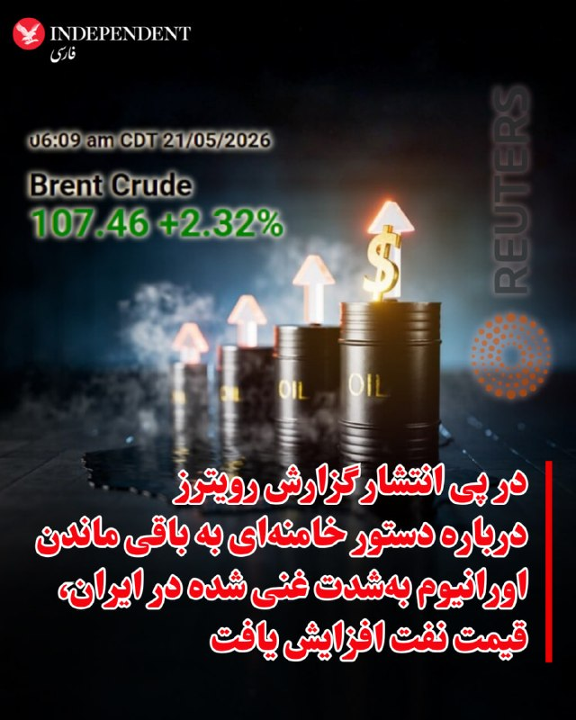

♦️دقایقی پس از آنکه خبرگزاری رویترز به نقل از مقام‌های جمهوری اسلامی گزارش کرد که مجتبی خامنه‌ای دستور داده است تا اورانیوم به‌شدت غنی‌شده از ایران خارج نشود، بهای نفت در بازارهای جهانی نزدیک به دو دلار افزایش یافت.

قیمت هر بشکه نفت خام برنت دریای شمال بعدازظهر پنجشنبه ۳۱ اردیبهشت‌ماه در بازارهای اروپایی از ۱۰۵ دلار به بیش از ۱۰۷ دلار افزایش یافت.
‌🇸🇦 Indypersian

🤖 @VahidOOnLine

## VahidOOnLine — post 241318

  <a href="telegram/content/VahidOOnLine_241318_1779364987.mp4" target="_blank">🎬 Download video</a>

ویدیوی رسیده به ایران اینترنشنال نشان می‌دهد که شامگاه ۳۱ اردیبهشت در شهر دهلران استان ایلام، گروهی با در دست داشتن پرچم جمهوری اسلامی و بیرق‌های مذهبی، موسیقیِ باکلام عربی را با صدای بلند در خیابان پخش می‌کنند. فرستنده ویدیو گفت: «مزاحمت‌های شبانه طرفداران حکومت، تمامی ندارد.»
‌🏁 🇬🇧 IranintlTV

🤖 @VahidOOnLine

## VahidOOnLine — post 241317

  

علی یزدی‌خواه، نایب‌رییس کمیسیون فرهنگی مجلس، گفت در شرایط فعلی تصمیمی برای بازگشایی اینترنت جهانی وجود ندارد و محدودیت‌ها با «ملاحظات امنیتی» ادامه خواهد داشت.

یزدی‌خواه قطع اینترنت جهانی را به مصوبات شورای عالی امنیت ملی نسبت داد و گفت این تصمیم به‌دلیل «مسائل امنیتی، امنیت کشور و حفظ جان افراد» گرفته شده است.

با وجود اینکه نت‌بلاکس اعلام کرده خاموشی اینترنت در ایران وارد هشتادوسومین روز خود شده، یزدی‌خواه گفت بیش از ۹۰ درصد نیازهای مردم در وضعیت فعلی برآورده می‌شود و مراجعات گسترده‌ای در اعتراض به قطع اینترنت وجود ندارد.

او همچنین گفت در قالب طرح موسوم به «اینترنت پرو»، تاکنون بیش از یک میلیون نفر دسترسی دریافت کرده‌اند؛ طرحی که منتقدان آن را مصداق اینترنت طبقاتی و تبعیض‌آمیز می‌دانند، زیرا دسترسی به اینترنت جهانی را به گروه‌های خاص محدود می‌کند و شهروندان عادی را از حق برابر دسترسی آزاد به اینترنت محروم نگه می‌دارد.

نایب‌رییس کمیسیون فرهنگی مجلس همچنین گفت شرکت‌های صادرات و واردات، مراکز علمی و پژوهشی، آزمایشگاه‌ها و برخی اصناف در صورت نیاز می‌توانند برای دسترسی به اینترنت بین‌الملل اقدام کنند.
https
‌🏁 🇬🇧 IranintlTV

🤖 @VahidOOnLine

## VahidOOnLine — post 241316

  <a href="telegram/content/VahidOOnLine_241316_1779364991.mp4" target="_blank">🎬 Download video</a>

ویدیوهای رسیده به ایران اینترنشنال نشان می‌دهد که ۳۱ اردیبهشت در شهرکرد، گروهی از دانش‌آموزان معترض به برگزاری حضوری امتحان‌ها ضمن تلاش برای پاسخگو کردن مسئولان مربوط، شعار «دانش‌آموز داد بزن، حقتو فریاد بزن» سردادند.
‌🏁 🇬🇧 IranintlTV

🤖 @VahidOOnLine

## VahidOOnLine — post 241315

  

نت‌بلاکس، نهاد ناظر بر اینترنت، نوشت که داده‌های این نهاد نشان می‌دهد قطعی اینترنت در ایران وارد هشتادوسومین روز خود شده و شبکه‌های بین‌المللی بیش از هزار و ۹۶۸ ساعت است که به‌طور گسترده مسدود مانده‌اند.

این نهاد ناظر بر اینترنت با تاکید بر اهمیت دسترسی آزاد به اینترنت نوشت: «اینترنت آزاد و باز، برای حفاظت از جان، آزادی و پاسخگویی عمومی نقشی اساسی دارد.»
‌🏁 🇬🇧 IranintlTV

🤖 @VahidOOnLine

## VahidOOnLine — post 241314

  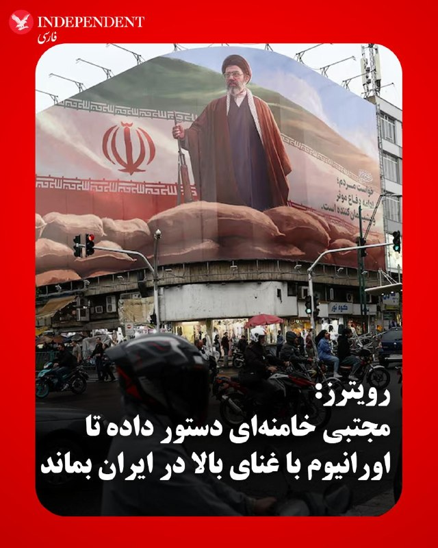

♦️خبرگزاری رویترز روز پنجشنبه ۳۱ اردیبهشت ماه به نقل از دو مقام ارشد جمهوری اسلامی گزارش کرد که مجتبی خامنه‌ای، رهبر حکومت ایران دستور داده است که ذخایر اورانیوم با غنای بالا (نزدیک به اورانیوم مورد نیاز برای ساخت سلاح هسته‌ای) در خاک ایران باقی بماند.

این خبر در حالی منتشر می‌شود که مساله ذخایر بیش از ۴۰۰ کیلوگرم اورانیوم ۶۰ درصد غنی شده، چالش اساسی در مذاکرات میان جمهوری اسلامی و آمریکا برای پایان جنگ به شمار می‌رود.
‌🇸🇦 Indypersian

🤖 @VahidOOnLine

## VahidOOnLine — post 241313

  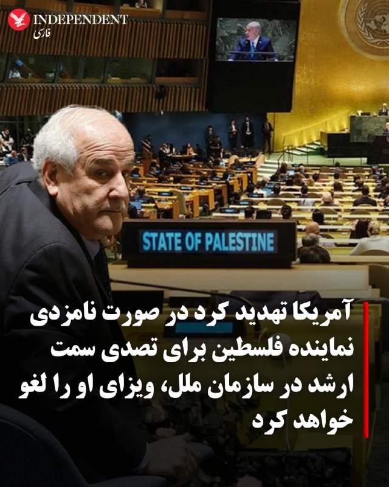

♦️بر اساس گزارشی از رویترز دولت آمریکا قصد دارد به تشکیلات فلسطینی هشدار دهد که در صورت نامزدی ریاض منصور، نماینده فلسطین در سازمان ملل، برای سمت نایب‌رئیسی مجمع عمومی، ممکن است ویزای اعضای هیئت فلسطینی لغو شود.
این موضوع در یک تلگرام داخلی وزارت خارجه آمریکا مطرح شده که به رسانه‌ها درز کرده است. بر اساس این سند که روز چهارشنبه تنظیم شده به دیپلمات‌های آمریکایی در سفارت این کشور در اورشلیم دستور داده شده پیام واشنگتن را به مقام‌های فلسطینی منتقل کنند. در این پیام آمده است که نامزدی منصور برای این سمت «تنش‌ها را افزایش می‌دهد» و می‌تواند طرح صلح غزه دولت دونالد ترامپ را تضعیف کند.
در بخشی از این تلگرام آمده است: «برای روشن شدن موضوع، اگر هیئت فلسطینی نامزدی خود برای نایب‌رئیسی مجمع عمومی را پس نگیرد، ما تشکیلات خودگردان فلسطین را مسئول خواهیم دانست.»
دولت ترامپ سال گذشته نیز از صدور ویزا برای محمود عباس، رئیس تشکیلات خودگردان فلسطین، و هیئت همراه او برای شرکت در نشست مجمع عمومی سازمان ملل خودداری کرده بود. این تصمیم در اعتراض به برنامه فلسطینی‌ها برای شرکت در نشستی با محوریت راه‌حل دو کشوری و به رسمیت شناختن یک‌جانبه کشور فلسطین اتخاذ شد؛ اقدامی که معمولا در سیاست خارجی آمریکا برای دشمنان سرسخت واشنگتن به کار گرفته می‌شود.
در سند جدید وزارت خارجه آمریکا همچنین آمده است: «مایه تاسف خواهد بود اگر ناچار شویم بار دیگر گزینه‌های موجود را بررسی کنیم.»
بر اساس این تلگرام، ریاض منصور پیش‌تر در ماه فوریه و در پی فشارهای آمریکا، از نامزدی برای ریاست مجمع عمومی سازمان ملل انصراف داده بود. با این حال، مقام‌های آمریکایی نگران‌اند که در صورت انتخاب او به‌عنوان نایب‌رئیس مجمع عمومی، امکان ریاست بر برخی جلسات این نهاد برای او فراهم شود.

در سند وزارت خارجه آمریکا آمده است: «همچنان این خطر وجود دارد که فلسطینی‌ها در جریان هشتاد و یکمین نشست مجمع عمومی سازمان ملل ریاست برخی جلسات را بر عهده بگیرند، مگر آنکه از رقابت کنار بکشند.»

انتخابات رئیس مجمع عمومی سازمان ملل و ۱۶ نایب‌رئیس آن قرار است روز دوم ژوئن برگزار شود.

تشکیلات خودگردان فلسطین که در سازمان ملل با عنوان رسمی «دولت فلسطین» نمایندگی دارد، عضو کامل سازمان ملل نیست و در مجمع عمومی ۱۹۳ عضوی این سازمان حق رای ندارد. فلسطین در سازمان ملل جایگاه «کشور ناظر» دارد؛ جایگاهی مشابه واتیکان.
‌🇸🇦 Indypersian

🤖 @VahidOOnLine

## VahidOOnLine — post 241312

  

♦️زمین‌لرزه‌ای به بزرگی ۴.۶ عصر پنجشنبه ۳۱ اردیبهشت بندرعباس و مناطقی از استان هرمزگان را لرزاند.

خبرگزاررکنا گزارش کرد این زلزله ساعت ۱۳:۲۶ در عمق ۲۰ کیلومتری زمین حوالی درگهان قشم را هم لرزانده است و تیم عملیاتی هلال‌احمر جهت ارزیابی خسارات احتمالی به منطقه اعزام شد.
‌🇸🇦 Indypersian

🤖 @VahidOOnLine

## VahidOOnLine — post 241311

  

فداحسین مالکی، عضو کمیسیون امنیت ملی مجلس، با تمجید از اقدامات نیروهای مسلح جمهوری اسلامی در جریان جنگ گفت سران واشینگتن تصور می‌کردند در ایران نیز پیروز خواهند شد، اما «در این میدان به معنای واقعی کلمه میخکوب شدند».

او گفت: «سران واشینگتن که پس از وقایع ونزوئلا دچار غرور و سرمستی سیاسی شده بودند، تصور می‌کردند در حمله به ایران نیز پیروز خواهند بود؛ اما در این میدان به معنای واقعی کلمه میخکوب شدند.»

مالکی همچنین درباره احتمال توافق با آمریکا با میانجی‌گری پاکستان گفت پاکستانی‌ها «حسن نیت» دارند و برای انجام این میانجی‌گری تلاش می‌کنند.

او افزود: «احتمال می‌دهم رفاقتی که عاصم منیر با ترامپ دارد، او را وادار کند شروط را بپذیرد؛ از جمله این‌که وارد تنگه هرمز نشود، وارد غنی‌سازی نشود، خسارت ما را بدهد و پول‌های بلوکه‌شده را آزاد کند.»
‌🏁 🇬🇧 IranintlTV

🤖 @VahidOOnLine

## VahidOOnLine — post 241310

  <a href="telegram/content/VahidOOnLine_241310_1779364997.mp4" target="_blank">🎬 Download video</a>

ویدیوی ارسالی به ایران اینترنشنال نشان‌ می‌دهد که ۳۱ اردیبهشت در حوالی روستای سَلَخ شهرستان قشم استان هرمزگان، صف بنزین در کنار جاده ادامه پیدا کرده است. به گفته ساکنان منطقه، مردم این روستا با کمبود سوخت روبرو شده‌اند.
‌🏁 🇬🇧 IranintlTV

🤖 @VahidOOnLine

## VahidOOnLine — post 241309

  <a href="telegram/content/VahidOOnLine_241309_1779365000.mp4" target="_blank">🎬 Download video</a>

بر اساس ویدیو و گزارش‌های رسیده به ایران اینترنشنال شماری از دانش‌آموزان و خانواده‌های آنان در شهرکرد، صبح پنجشنبه ٢١ اردیبهشت برای اعتراض به حضوری شدن امتحانات جلوی ساختمان استانداری چهارمحال و بختیاری تجمع کرده و شعار سردادند.
‌🏁 🇬🇧 IranintlTV

🤖 @VahidOOnLine

## VahidOOnLine — post 241308

  

♦️خبرگزاری ایسنا روز پنجشنبه ۳۱ اردیبهشت ماه با انتشار خبری در تلگرام نوشت جمهوری اسلامی ایران «در حال پاسخ به متن ارسالی آمریکا است.»

ایسنا منبع این خبر را ذکر نکرده است. با این حال خبرگزاری رویترز پس از دقایقی همین خبر را منتشر کرد و بسیاری از رسانه‌ها هم آن را گزارش کردند.

براساس خبر ایسنا، ایران در پاسخ به متن آمریکا در حال تدوین چارچوب کلان، برخی جزییات و اقدامات اعتمادساز به عنوان تضمین است.

ایسنا نوشته است «متن ارسالی به میزانی شکاف‌ها را کم کرده است اما کمتر شدن شکاف‌ها نیازمند پایان یافتن وسوسه جنگ در سمت واشنگتن است.»

 ایسنا درباره سفر رئیس ستاد کل ارتش پاکستان به ایران نوشته است: «ورود ژنرال عاصم منیر به تهران، به منظور کم کردن این شکاف‌ها و رسیدن به لحظه اعلام رسمی پذیرش یادداشت تفاهم است.»

الجزیره دقایقی پس از انتشار این خبر به نقل از یک منبع دولت پاکستان گزارش کرد که سفر ژنرال عاصم منیر به تهران مشروط به نتایج مذاکرات وزیر کشور پاکستان با مقام‌های جمهوری اسلامی است.
‌🇸🇦 Indypersian

🤖 @VahidOOnLine

## VahidOOnLine — post 241307

  <a href="telegram/content/VahidOOnLine_241307_1779365003.mp4" target="_blank">🎬 Download video</a>

بر پایه گزارش رسانه‌های حکومتی، ۲۰ ملوان ایرانی که کشتی‌شان در آب‌های سنگاپور توقیف شده بود و در «وضعیت نامناسبی» قرار داشتند، ساعتی پیش به ایران بازگشتند.
سفیر جمهوری‌اسلامی در پاکستان با قدردانی از دولت پاکستان اعلام کرد این ملوانان پس از پیگیری‌های دیپلماتیک و با همکاری مقام‌های پاکستانی، از سنگاپور به اسلام‌آباد منتقل شدند و سپس به کشور بازگشتند.
او از نقش نخست‌وزیر پاکستان، وزارت خارجه و دیگر نهادهای این کشور در آزادی و انتقال ملوانان ایرانی تشکر کرد.
‌🏁 🇬🇧 ManotoTV

🤖 @VahidOOnLine

## VahidOOnLine — post 241306

  <a href="telegram/content/VahidOOnLine_241306_1779365004.mp4" target="_blank">🎬 Download video</a>

بریتانیا از توافق تجاری ۵ میلیارد دلاری با کشورهای خلیج فارس رونمایی کرد؛ توافقی که در بحبوحه تنش‌های منطقه‌ای پس از جنگ ایران، به گفته لندن «پیامی از ثبات و اعتماد» به بازارها می‌دهد.
این توافق با شورای همکاری خلیج فارس شامل عربستان، امارات، قطر، کویت، عمان و بحرین است و قرار است سالانه حدود ۳.۷ میلیارد پوند به اقتصاد بریتانیا اضافه کند.
لندن می‌گوید ۹۳ درصد تعرفه‌های کشورهای خلیج فارس برای کالاهای بریتانیایی حذف می‌شود؛ از جمله محصولات غذایی، خودرو، صنایع هوافضا و الکترونیک.
در مقابل، بریتانیا نیز برخی تعرفه‌ها را کاهش می‌دهد، هرچند نفت و گاز کشورهای عربی پیش‌تر هم بدون تعرفه وارد بریتانیا می‌شد.
فعالان حقوق بشر از نبود بندهای الزام‌آور درباره حقوق بشر در این توافق انتقاد کرده‌اند و آن را «عقب‌گرد اخلاقی» توصیف کردند.
‌🏁 🇬🇧 ManotoTV

🤖 @VahidOOnLine

## VahidOOnLine — post 241305

  <a href="telegram/content/VahidOOnLine_241305_1779365005.mp4" target="_blank">🎬 Download video</a>

♦️خبرگزاری اسپوتنیک روسیه، روز پنجشنبه ۳۱ اردیبهشت ماه، تصویری از ورود اعضای تیم ملی فوتبال مردان ایران به سفارت آمریکا در آنکارا منتشر کرد.
تیم ملی فوتبال ایران که برای اردوای آمادگی پیش از جام‌جهانی فوتبال ۲۰۲۶ در ترکیه به سر می‌برد، سرانجام برای دریافت ویزا به سفارت آمریکا مراجعه کرد.
پیش‌تر مهدی تاج با اعلام آنکه تیم ملی فوتبال مردان ایران «قطعا» در جام‌جهانی شرکت می‌کند، گفته بود هنوز هیچ ویزایی برای حضور تیم ملی در رقابت‌های جام جهانی در ایالات متحده صادر نشده است.
مقام‌های ورزشی ایران در روزهای گذشته برای برگزاری مسابقات در کشور آمریکا، جلساتی را با مقام‌های فیفا برگزار کرده‌اند.
‌🇸🇦 Indypersian

🤖 @VahidOOnLine

## VahidOOnLine — post 241304

  <a href="telegram/content/VahidOOnLine_241304_1779365008.mp4" target="_blank">🎬 Download video</a>

♦️تصاویری که صفحه «اسرائیل به فارسی» روز پنجشنبه ۳۱ اردیبهشت در شبکه‌های اجتماعی منتشر کرده نشان می‌دهد، پرچم ملی شیروخورشید نشان ایران در کنار پرچم سایر کشورها در یکی از خیابان‌های شهر اشدود اسرائیل به اهتزاز درآمده است.
‌🇸🇦 Indypersian

🤖 @VahidOOnLine

## VahidOOnLine — post 241303

  

♦️ماریا زاخاروا، سخنگوی وزارت امور خارجه روسیه روز پنجشنبه ۳۱ اردیبهشت‌ماه گفت که تنها ایران باید درباره سرنوشت ذخایر اورانیوم این کشور تصمیم بگیرد.
سخنگوی وزارت امور خارجه روسیه بار دیگر بر موضع رسمی مسکو گفت: «پرونده هسته‌ای ایران تنها با در نظر گرفتن منافع ایران و و از راه دیپلماتیک قابل حل و فصل است.»
‌🇸🇦 Indypersian

🤖 @VahidOOnLine

## WithYashar — post 11835

منابع اسرائیلی به رویترز:
ترامپ به اسرائیل قول داد که اورانیوم غنی‌شده از ایران خارج شود و هر توافق احتمالی شامل این بند خواهد بود!
@withyashar

## WithYashar — post 11834

یزدی خواه: اینترنت جهانی فعلاً بازگشایی نمی‌شود/ دسترسی ویژه برای گروه‌های موردنیاز برقرار است
@withyashar

## WithYashar — post 11833

@withyashar

## WithYashar — post 11832

رویترز: رهبر ایران دستور داده است که اورانیوم با درجه نزدیک به تولید سلاح باید در ایران باقی بماند
@withyashar

## WithYashar — post 11831

ادعای اندیشکده آمریکایی: طبق ارزیابی کارشناسان، وحیدی و اعضای حلقه نزدیک او کنترل نه‌تنها پاسخ نظامی ایران در این درگیری، بلکه سیاست‌های مذاکراتی تهران را نیز در دست گرفته‌اند.
@withyashar
من دو هفته پیش در این ویدیو به این مسئله اشاره کردم
https://www.instagram.com/reel/DYIY6lnxd_R/?igsh=bjlqYWRvcDZ5NHIz

## WithYashar — post 11830

وزیر کشور پاکستان با احمد وحیدی، فرمانده سپاه پاسداران در تهران دیدار کرد. @withyashar یکی اینو آخرش از سولاخ کشید بیرون دیگه مابقی با موساده 😅

## WithYashar — post 11829

تایمز اسرائیل: ایران در جریان آتش‌بس از فرصت برای جابه‌جایی لانچرهای موشکی و آماده‌سازی برای دور جدید درگیری استفاده کرده
@withyashar

## WithYashar — post 11828

روسیه: ایران به تنهایی باید در مورد سرنوشت ذخایر اورانیوم خود تصمیم بگیرد.
@withyashar

## WithYashar — post 11827

گزارش های تایید نشده از ۳ انفجار در بندر عباس و قشم
@withyashar

## WithYashar — post 11826

همکنون زلزله در بندر عباس
@withyashar
مرحله بعدی زامبی و گودزیلا است

## WithYashar — post 11825

‏علی قلهکی : آمریکایی‌ها پس از دریافت نظراتِ ایران، پیشنهاد کرده‌اند که «پایانِ جنگ در تمامیِ جبهه‌ها»، «رفع محاصره تنگه هرمز توسط آمریکا»، «بازشدن تنگه هرمز توسط ایران با تعرفه و مسیر دریایی مدنظر ایران»، «آزادسازی ۲۵٪ از اموال بلوکه شده ایران _حدود ۲۵ میلیارد دلار»، «معافیتِ فروشِ نفت ایران به مدت ۳۰روز» و فازِ اصلیِ مذاکره یعنی «خروجِ ۴۰۰ کیلو اورانیوم از ایران _در بهترین حالت ارسال به کشور ثالث_» و «قبولِ حقِ غنی‌سازی ۳.۶۷ ٪ برای ایران (بعید است در فاز نهایی آمریکا آن را بپذیرد)» و «تعطیلی مراکز هسته‌ای _منهای راکتورِ تهران صرفا با کاربرد پزشکی) به طور یکجا توسط ایران امضا شود!
‏ایران می‌گوید تمام فازهای پیشنهادی آمریکا برای راستی‌آزمایی به مدت ۳۰ روز انجام شود تا هم ایران نفت خود را بفروشد و هم‌مُجاب شود در بحث هسته‌ای مذاکره را انجام دهد!
‏پی‌نوشت: ۱. اختلاف جدی بَر سَرِ مباحث هسته‌ای است؛ «۴۰۰ کیلو اورانیوم» خط قرمزِ دیکته‌ای اسرائیل برای آمریکاست! ایران ۴۰۰کیلو اورانیوم را نمی‌دهد، غنی‌سازی را هم حتما می‌خواهد و ۲۰ سال آن را تعلیق نمی‌کند. ایران با ارسال ۴۰۰ کیلو اورانیوم به کشور ثالث _چین و روسیه_ موافقت نکرده، آمریکا هم همینطور و خودش آن را می‌خواهد. نقطه‌ی جدی شکستِ توافق اینجاست. ایران مذاکره بر سر «پرونده‌ی هسته‌ای» را جُدای از «پرونده بازگشایی تنگه هرمز» و «اتمامِ جنگ» می‌داند!
‏۲. ایران و آمریکا سر فاز بندی توافق اختلاف دارند؛ ایران یکجا توافق نمی‌کند و آمریکا دنبالِ توافق یکجاست!
‏۳. آمریکا متعهد به متون و محورهای ارسالی نیست؛ محورهای ذکر شده با اینکه فاصله جدی با شروط ایران دارد ولی همین‌ها هم توسط آمریکا به مرحله اجرا در نمی‌آید!
‏۴. آمریکا تحریمی را لغو نمی‌کند؛ شاید تعلیقِ مدت‌دار در بهترین حالت، قسمتِ ایران در توافق شود.
‏۵. بر فرض توافق با آمریکا، هیچ تضمینی برای جلوگیری از ترور سطح بالا توسط اسرائیل نیست!
@withyashar

## WithYashar — post 11824

  <a href="telegram/content/WithYashar_11824_1779365012.mp4" target="_blank">🎬 Download video</a>

اعضای تیم ملی فوتبال ایران برای درخواست ویزا به سفارت آمریکا در آنکارا مراجعه کردند
@withyashar

## WithYashar — post 11823

الجزیره به نقل از یک منبع پاکستانی:

مقامات ایرانی از پاکستان خواسته‌اند تا مهلتی برای ارزیابی و بررسی معیارهای آمریکایی برای مذاکره دریافت کند.
اورانیوم غنی‌شده، گره اصلی در مذاکرات آمریکا و ایران است.
ژنرال منیر هنوز در پاکستان است و سفر او به ایران بستگی به نتایج سفر وزیر کشور دارد.
@withyashar

## WithYashar — post 11822

  

صدا و سیما : تا عید غدیر مجسمه‌ای ۱۵ متری از مشت علی خامنه‌ای در میدان انقلاب تهران نصب میشه‌.
@withyashar

## WithYashar — post 11821

فاکس نیوز در گزارشی به نقل از عمر محمد، کارشناس مبارزه با تروریسم، نوشت سبک زندگی مجتبی خامنه‌ای به سطحی از ناپدید شدن رسیده که اسامه بن لادن سال‌ها در ایبت‌آباد تجربه می‌کرد؛ زندگی بدون ارتباط مخابراتی و با اتکا به پیک‌های مورد اعتماد.
@withyashar

## WithYashar — post 11820

۲۰ ملوان ایرانی به کشور بازگشتند
سفیر ایران در پاکستان از بازگشت ۲۰ ملوان ایرانی که به‌دلیل توقیف کشتی‌شان در آب‌های سنگاپور گرفتار شده بودند، به ایران خبر داد.

این ملوانان پس از تلاش‌های دیپلماتیک از سنگاپور به اسلام‌آباد منتقل و ساعاتی پیش به میهن بازگشتند.
@withyashar

## WithYashar — post 11819

ایران در حال پاسخ به متن ارسال شده از سوی آمریکا است

ایران در حال گفت و گو‌ بر سر چارچوب کلان، برخی جزییات و اقدامات اعتمادساز به عنوان تضمین است.
متن ارسالی به میزانی شکاف‌ها را کم کرده است اما کمتر شدن شکاف‌ها نیازمند پایان یافتن وسوسه جنگ در سمت واشنگتن است.

ورود ژنرال عاصم منیر به تهران، به منظور کم کردن این شکاف‌ها و رسیدن به لحظه اعلام رسمی پذیرش یادداشت تفاهم است./ ایسنا
@withyashar

## WithYashar — post 11817

گزارش CNN: حکومت ایران در طول آتش‌بس بخشی از تولید پهپادهای خود را از سر گرفته است، که نشان می‌دهد در حال سریعاً بازسازی برخی توانایی‌های نظامی است که در حملات آسیب دیده‌اند.
@withyashar

## WithYashar — post 11816

امروز ۲۱ می روز جهانی چای است
و یادی میکنیم از پدر چای ایران ، حاج محمد میرزا (کاشف السلطنه)
او معتقد بود مردم ایران نباید برای چای و قند و نفت سفید به کشورهای دیگر وابسته باشند. از این رو به عنوان سفیر ایران راهی هند شد و در پوشش تاجر فرانسوی بصورت مخفی در مزارع چای مشغول یاد گیری کشت چای شد. دلیل این کار این بود که فن چای کاری را سری و انحصاری میدانستند و حاضر نمی شدند کسی آن را یاد گرفته و در سطح وسیع عمل کند. وی قبل از مراجعت به ایران تخم چای و چهار هزار گلدان نهال چای به ایران فرستاد و با سختی و مشقت فراوان موفق به کشت و توسعه چای در ایران شد و از طرف مظفرالدین شاه کاشف السلطنه لقب گرفت.
برای آموزش چای کاری به کشاورزان چهار چای کار چینی توسط وی به ایران آورده شدند که منجر به اسلام آوردن آنها و تشکیل خانواده در ایران شد.
انگلستان که منافعش در انحصار چای در ایران به خطر افتاده بود طی توطئه ای وی را به قتل رساند در برخی نوشته‌ها هم عنوان شده که او در سال ۱۳۰۸ خورشیدی در یک سانحهٔ اتومبیل مشکوک در مسیر بوشهر–شیراز درگذشت
@withyashar

## WithYashar — post 11815

رسانه عبری والا: منابع اسرائیلی می‌گویند آمریکایی‌ها در مذاکرات با ایران یک قدم به جلو برداشته‌اند، بنابراین برآوردها این است که حمله‌ای به ایران در ۲۴ ساعت آینده تکرار نخواهد شد
@withyashar

## mwarmonitor — post 9402

🛢اگر کسی با هیجان خبری منتشر کرد که «جزیره خارک امروز در حال بارگیری چند نفتکش با نفت خام است»، به او بگویید ترکر تانکر می‌گوید این دو نفتکش کوچک از نوع Handymax (تقریباً 300,000 تا 350,000 بشکه نفت خام برای هر کشتی ) در حال بارگیری هستند تا محموله را برای پالایش در سایر پالایشگاه‌های داخل ایران منتقل کنند، ممنون.

@mwarmonitor

## mwarmonitor — post 9401

📝 این شوء تهوع‌آور، نقطه‌ی پرگارِ بلاهت و پایانِ رسمی عقلانیت است. تماشای این سیرکِ سیار از بوزینه‌های دست‌آموزِ وارداتی که با دلارهای نفتی و بورسیه‌های گدایی، از سواحل قحطی‌زده و طاعون‌زده‌ی آفریقا به تهران گسیل شده‌اند تا برای ما نسخه‌ی «مقاومت» بپیچند، فراتر از یک کمدی سیاه، یک انحطاط مطلق است.

🔸اوج وقاحت و سورئالیسمِ ماجرا آنجاست که یکی از این جیرهخورانِ شکم‌سیر با بی‌شرمی جلوی دوربین ژست می‌گیرد و می‌گوید «من وطن‌فروش نیستم!»؛ انگار که در قاموس این موجوداتِ مواجب‌بگیر، مرزهای خیانت و وطن‌فروشی هم با نرخ ارز جابه‌جا می‌شود. البته از حق نباید گذشت؛ وقتی بین ابولا و فقر مطلق در زادگاهشان، و چریدن در سفره‌ی بی‌صاحبِ جمهوری اسلامی مخیر شدند، معلوم است که این جماعتِ بی‌هویت، گزینه‌ی دوم را ترجیح می‌دهند.

🔸قلم را باید شکست و دهان منطق را گل گرفت؛ وقتی صاحبان اصلی این خاک برای بقا دست‌وپا می‌زنند، این گداهای ایدئولوژیک از آفریقا، پرچم‌دار آرمان‌هایی شده‌اند که حتی خودِ نظام هم دیگر به آن‌ها باور ندارد.

@mwarmonitor

## mwarmonitor — post 9400

🚨«بر اساس گفته‌های دو منبع آگاه از ارزیابی‌های اطلاعاتی ایالات متحده، ایران در طول آتش‌بس شش هفته‌ای که از اوایل آوریل آغاز شد، تولید برخی از پهپادهای خود را از سر گرفته است؛ نشانه‌ای از اینکه این کشور به سرعت در حال بازسازی برخی از توانمندی‌های نظامی خود است که در جریان حملات مشترک آمریکا و اسرائیل آسیب دیده بودند. چهار منبع به سی‌ان‌ان (CNN) گفتند که داده‌های اطلاعاتی آمریکا نشان می‌دهد ارتش ایران بسیار سریع‌تر از آنچه در ابتدا برآورد می‌شد، در حال بازسازی و احیای قوا است.

🔴به گفته این چهار منبع آگاه از گزارش‌های اطلاعاتی، بازسازی توانمندی‌های نظامی—شامل جایگزینی پایگاه‌های موشکی، پرتابگرها و ظرفیت تولید سیستم‌های تسلیحاتی کلیدی که در طول درگیری‌های اخیر منهدم شده بودند—به این معنی است که در صورت از سرگیری کمپین بمباران توسط پرزیدنت دونالد ترامپ، ایران همچنان تهدیدی جدی برای متحدان منطقه‌ای خواهد بود.

@mwarmonitor

## mwarmonitor — post 9399

🔴به گفته دو منبع ارشد ایرانی که با Reuters گفت‌وگو کرده‌اند، رهبر جمهوری اسلامی ایران دستور داده است که ذخایر اورانیوم با غنای نزدیک به سطح تسلیحاتی ایران باید در داخل کشور باقی بماند.

🔸به گفته این منابع، این دستور بازتاب‌دهنده یک اجماع گسترده در میان ساختار حاکمیتی ایران است.

@mwarmonitor

## mwarmonitor — post 9398

🚨علی هاشم خبرنگار الجزیره: بر اساس منابع من در تهران، پاسخ ایران هنوز به میانجی پاکستانی تحویل داده نشده است. رایزنی‌ها همچنان ادامه دارد و تلاش‌های جدی برای رسیدن به پیش‌نویس نهایی در جریان است.

@mwarmonitor

## mwarmonitor — post 9397

🔴انور قرقاش: ما طی دهه‌های طولانی به زورگویی و قلدری ایران عادت کرده‌ایم، تا جایی که به بخشی از صحنه سیاسی خلیج فارس تبدیل شده است؛ و میان گفتمان تهاجمی و بیانیه‌های دوستیِ توخالی، اعتبار از میان رفته است.

🔸امروز نیز، پس از تجاوز خشن ایران، این نظام می‌کوشد واقعیتی جدید را که از یک شکست نظامی آشکار زاده شده، تثبیت کند؛ اما تلاش برای کنترل تنگه هرمز یا تعرض به حاکمیت دریایی امارات چیزی جز رؤیاهای پریشان نیست.

🔸هر کس بخواهد با محیط عربی پیرامون خود همزیستی داشته باشد، باید بداند که اعتماد از دست رفته است؛ و بازگرداندن آن نه با شعار، بلکه با زبانی مسئولانه، حفظ حاکمیت‌ها و پایبندی واقعی به اصول حسن همجواری ممکن است.

@mwarmonitor

## mwarmonitor — post 9396

  

✈️⛽️ یک دسته از تانکرهای سوخت‌رسان نیروی هوایی آمریکا از پایگاه هوایی Lajes Field به پرواز درآمده‌اند؛ این هواپیماها در حال سوخت‌رسانی به جنگنده‌ها هستند و احتمالاً به سمت پایگاه‌های آمریکا در خاورمیانه حرکت می‌کنند. 🔸پایگاه هوایی Lajes Field در جزایر آزور…

## mwarmonitor — post 9394

  

✈️⛽️ یک دسته از تانکرهای سوخت‌رسان نیروی هوایی آمریکا از پایگاه هوایی Lajes Field به پرواز درآمده‌اند؛ این هواپیماها در حال سوخت‌رسانی به جنگنده‌ها هستند و احتمالاً به سمت پایگاه‌های آمریکا در خاورمیانه حرکت می‌کنند.

🔸پایگاه هوایی Lajes Field در جزایر آزور (میان اقیانوس اطلس) قرار دارد و متعلق به پرتغال است.
این پایگاه روی جزیره ترسیرا (Terceira) واقع شده و یکی از نقاط راهبردی هوایی میان آمریکا، اروپا و غرب آسیاست.

@mwarmonitor

## mwarmonitor — post 9393

🔴ترامپ برای ادامه جنگ با ایران، در حال از دست دادن آرای خود در کنگره است

📝نویسندگان: اندرو سولندر، کیت سانتالیز AXIOS

🔰دموکرات‌های مجلس نمایندگان یک قدم دیگر به برگزاری یک رأی‌گیری موفقیت‌آمیز درباره اختیارات جنگی با ایران نزدیک شده‌اند؛ چرا که آخرین مخالف آن‌ها در حزب قصد دارد رأی خود را تغییر دهد و دست‌کم یک نماینده جمهوری‌خواه نیز اعلام کرده که ممکن است اقدام مشابهی انجام دهد.

چرا این موضوع اهمیت دارد؟
اگرچه این رأی‌گیری تا حد زیادی نمادین خواهد بود — زیرا پرزیدنت ترامپ می‌تواند این مصوبه را وتو کند — اما دموکرات‌ها بر این باورند که این اقدام، یک سرزنش و مخالفت جدی و حیاتی علیه این درگیری نظامی خواهد بود.
جیم هایمز (نماینده دموکرات از ایالت کنتیکت) و عضو ارشد کمیته اطلاعات مجلس نمایندگان که یکی از رهبران این طرح است، به اکسیوس گفت که نسبت به شانس تصویب این قطعنامه در روز پنجشنبه «حس بسیار خوبی دارد».
یک نماینده دموکرات ارشد دیگر نیز در پاسخ به این سوال که آیا رهبری حزب به این رأی‌گیری اطمینان دارد یا خیر، به اکسیوس گفت: «بله».
جریان اصلی خبر
جرد گلدن (نماینده دموکرات از ایالت مین)، تنها دموکراتی که پیش از این همواره علیه قطعنامه‌های اختیارات جنگ با ایران رأی داده بود، به اکسیوس گفت که «قصد دارد روز پنجشنبه به این طرح رأی مثبت دهد».
گلدن اشاره کرد که «بیش از ۶۰ روز» از آغاز این درگیری گذشته است؛ بر اساس «قانون اختیارات جنگی»، این دقیقاً همان بازه زمانی است که اگر کنگره اعلام جنگ نکند، رئیس‌جمهور باید عملیات نظامی را متوقف کند.
وی افزود: «دولت می‌تواند به کنگره بیاید و برای دریافت مجوز تلاش کند»، و اضافه کرد که این مصوبه برعکس طرحی که هفته گذشته به رأی گذاشته شد، طرحی «شفاف و بدون حاشیه» است.
نگاه نزدیک‌تر
دان بیکن (نماینده جمهوری‌خواه از ایالت نبراسکا)، یک میانه‌روی حامی مداخله نظامی که در گذشته به قطعنامه‌های اختیارات جنگ با ایران رأی منفی داده بود، به اکسیوس گفت که ترامپ «برای استفاده از زور به اختیارات بیشتری نیاز دارد» اما با این حال در مورد رأی پیش‌رو «کاملاً مردد» است.
او گفت: «رأی سختی است، چون ما قانون اساسی و اختیارات ماده یک را داریم. رئیس‌جمهور این طرح را دوست ندارد. مسلماً او ترجیح می‌دهد کنگره را در کنار خود نداشته باشد [تا دستش بازتر باشد].»
بیکن که در پایان امسال بازنشسته می‌شود، بارها از رئیس‌جمهور به دلیل آنچه که سوءاستفاده از قدرت خوانده، انتقاد کرده است.
فلاش‌بک (مرور گذشته)
تلاش دموکرات‌ها برای تصویب قطعنامه اختیارات جنگی در هفته گذشته، در یک رأی‌گیری بی‌سابقه با نتیجه مساوی ۲۱۲ به ۲۱۲ شکست خورد.
در آن رأی‌گیری، گلدن رأی منفی داد، در حالی که نمایندگان جمهوری‌خواه، توماس ماسی (از کنتاکی)، برایان فیتزپاتریک (از پنسیلوانیا) و تام برت (از میشیگان) رأی مثبت دادند.
نیمی از دموکرات‌ها و جمهوری‌خواهان (حدود ۶ نماینده) در آن جلسه غایب بودند، از جمله تام کین جونیور (جمهوری‌خواه از نیوجرسی) و فردریکا ویلسون (دموکرات از فلوریدا) که هر دو چندین هفته است در رأی‌گیری‌ها غایب هستند.

جیم هایمز به اکسیوس گفت: «مثل هر چیز دیگری در این مجلس، همه چیز به غایبان بستگی دارد.»
مجلس نمایندگان ابتدا قرار بود روز چهارشنبه درباره این قطعنامه رأی‌گیری کند، اما رهبری جمهوری‌خواهان به دلیل فاصله اندک آرا، آن را به تعویق انداخت.
بعدازظهر چهارشنبه، ۲۰ نماینده مجلس در رأی‌گیری‌ها حاضر نشدند — ۷ دموکرات و ۱۳ جمهوری‌خواه.

📌گرگ میکس (نماینده دموکرات از نیویورک) و عضو ارشد کمیته امور خارجی مجلس نمایندگان به اکسیوس گفت: «اگر امروز رأی‌گیری می‌شد، قطعنامه تصویب می‌شد؛ به همین دلیل آن را عقب کشیدند.»

@mwarmonitor

## FoxNewsTwitter — post 342035

  <a href="telegram/content/FoxNewsTwitter_342035_1779365016.mp4" target="_blank">🎬 Download video</a>

Fox News (Twitter/X)

NEW: Iran is drawing a hard line in nuclear talks, insisting its enriched uranium must stay inside the country.

That demand is now fueling new friction in negotiations with the U.S., as President Trump signals the ceasefire could end if Tehran refuses a deal.

@aishahhasnie has the latest as gas prices climb and voters grow more anxious about the cost of living.

## FoxNewsTwitter — post 342034

  <a href="telegram/content/FoxNewsTwitter_342034_1779365019.mp4" target="_blank">🎬 Download video</a>

Fox News (Twitter/X)

Intense footage shows a police BearCat accelerating toward a camouflage-clad alleged cop killer as he fired multiple rounds into the armored vehicle's window and underside.

Deputies backed away but were forced to re-engage a second time as the suspect continued manipulating his rifle and reached for a handgun in his waistband.

Tulare County Sheriff Mike Boudreaux confirmed that deputies ultimately used the BearCat to run over the suspect a third and final time to neutralize the threat, resulting in his death.

## FoxNewsTwitter — post 342033

  <a href="telegram/content/FoxNewsTwitter_342033_1779365022.mp4" target="_blank">🎬 Download video</a>

Fox News (Twitter/X)

Johnny “Joey” Jones is heading back into the Marine Corps.

The FOX News host and combat veteran announced he is reenlisting more than a decade after medically retiring following a 2010 IED-related incident in Afghanistan that cost him both legs.

Jones has become one of the most visible advocates for veterans and wounded warriors since joining FOX News.

Now the decorated Marine says he’s ready to serve again. |@Johnny_Joey

## FoxNewsTwitter — post 342032

  

Fox News (Twitter/X)

Vanessa Trump announced she has been diagnosed with breast cancer and recently underwent a procedure as she starts treatment and recovery.

"I am staying focused and hopeful while surrounded by the love and support of my family, my kids, and those closest to me," Trump wrote.

The update quickly prompted an outpouring of support from other members of the Trump family and supporters.

## FoxNewsTwitter — post 342031

‌Fox News (Twitter/X)

Read more:

## FoxNewsTwitter — post 342030

  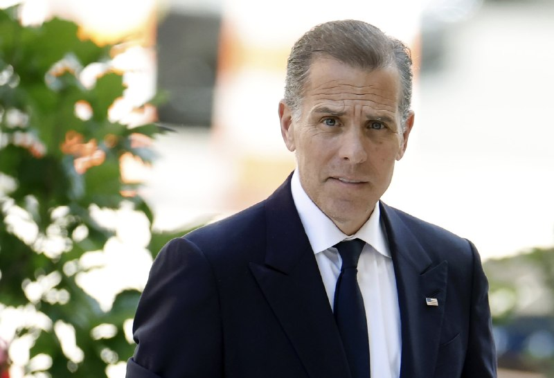

Fox News (Twitter/X)

"I'm Hunter Biden. You've never actually heard from me."

A newly active "Hunter Biden" X account is sparking a firestorm as politicians and commentators relentlessly mock the first post.

## pm_afshaa — post 91157

🔴به بیمارستان‌های اسراییل دستور آماده‌باش برای ورود به وضعیت جنگی را اعلام شده

‌
💧 Rainbet.com the #1 Non-KYC Crypto Casino & Sportsbook @rainbetcom

😁 @Pm_Afshaa

## pm_afshaa — post 91156

♨️
♨️
♨️
♨️

## pm_afshaa — post 91155

🔴علی هاشم خبرنگار الجزیره: بر اساس منابع من در تهران، پاسخ ایران هنوز به میانجی پاکستانی تحویل داده نشده است. رایزنی‌ها همچنان ادامه دارد و تلاش‌های جدی برای رسیدن به پیش‌نویس نهایی در جریان است

💧 Rainbet.com the #1 Non-KYC Crypto Casino & Sportsbook @rainbetcom

😁 @Pm_Afshaa

## pm_afshaa — post 91154

  <a href="telegram/content/pm_afshaa_91154_1779365026.webm" target="_blank">🎬 Download video</a>

🔴رویترز به نقل از منابع ارشد ایرانی:
مجتبی خامنه‌ای دستور داده که اورانیوم غنی شده در ایران باقی بماند.

💧 Rainbet.com the #1 Non-KYC Crypto Casino & Sportsbook @rainbetcom

😁 @Pm_Afshaa

## pm_afshaa — post 91152

  <a href="telegram/content/pm_afshaa_91152_1779365027.webm" target="_blank">🎬 Download video</a>

🔴سی‌ان‌ان: ایران در طول آتش‌بس بخشی از تولید پهپادهای خودش رو از سر گرفته، که نشان میده سریعاً در حال بازسازی برخی توانایی‌های نظامیه که در حملات آسیب دیدن.

💧 Rainbet.com the #1 Non-KYC Crypto Casino & Sportsbook @rainbetcom

😁 @Pm_Afshaa

## pm_afshaa — post 91151

  <a href="telegram/content/pm_afshaa_91151_1779365028.webm" target="_blank">🎬 Download video</a>

🔴کانال 13 اسرائیل به نقل از یک مقام ارشد اسرائیلی:

در حلقه اطراف ترامپ، بر او فشار میارن تا با ایران به توافق برسه، اما گزینه حمله همچنان روی میز است.

💧 Rainbet.com the #1 Non-KYC Crypto Casino & Sportsbook @rainbetcom

😁 @Pm_Afshaa

## pm_afshaa — post 91150

  <a href="telegram/content/pm_afshaa_91150_1779365029.webm" target="_blank">🎬 Download video</a>

🔴ایسنا: ایران در حال پاسخ به متن ارسال شده از سوی آمریکاست.

متن ایران در حال گفت‌وگو‌ در تهران بر سر چارچوب کلان، برخی جزییات و اقدامات اعتمادساز به عنوان تضمین است.
متن ارسالی به میزانی شکاف‌ها رو کم کرده اما کمتر شدن شکاف‌ها نیازمند پایان یافتن وسوسه جنگ در سمت واشنگتن است.

💧Rainbet.com the #1 Non-KYC Crypto Casino & Sportsbook @rainbetcom

😁 @Pm_Afshaa

## pm_afshaa — post 91149

  <a href="telegram/content/pm_afshaa_91149_1779365029.mp4" target="_blank">🎬 Download video</a>

اکانت اسرائیل به فارسی:درخشش پرچم شیر‌ و خورشید در کنار پرچم کشورهای دیگر در شهر اشدود در اسرائیل.

💧 Rainbet.com the #1 Non-KYC Crypto Casino & Sportsbook @rainbetcom

😁 @Pm_Afshaa

## pm_afshaa — post 91148

🔴3 انفجار پیاپی در بندر عباس

💧 Rainbet.com the #1 Non-KYC Crypto Casino & Sportsbook @rainbetcom

😁 @Pm_Afshaa

## pm_afshaa — post 91147

  

🚨اشتراک استارز ⭐️ فیلترشکن ایران وی پی ان
تخفیف ها تا ساعت ۱۲ امشب هستن و هیچ وقت دیگر بر نمیگردن❌

تعرفه های باور نکردنی🔮

سرورا بدون ضریب هستن و ساب دارن😎🔋

1 gig= 230t🚀

3 gig= 670t 🚀

5 gig= 1050t🚀

7 gig = 1550t 🚀

10 gig= 2100t 🚀

قبل خرید میتونید تست بگیرید 🛜
بهترین و ارزون ترین سرور ایران دست ماست

🚨تمامی سرور ها کاربر نامحدود هستن و تاریخ انقضا ندارن✅

جهت خرید به ایدی زیر پیام بدین 👇

@IRAN_VPNADMIN

کانال. و رضایت مشتری ها👇

https://t.me/IRAN_VPNON

## pm_afshaa — post 91146

🔴تایمز اسرائیل: ایران در جریان آتش‌بس از فرصت برای جابه‌جایی لانچرهای موشکی و آماده‌سازی برای دور جدید درگیری استفاده کرده

💧 Rainbet.com the #1 Non-KYC Crypto Casino & Sportsbook @rainbetcom

😁 @Pm_Afshaa

## pm_afshaa — post 91145

🔴والا نیوز:منابع اسرائیلی می‌گویند آمریکایی‌ها در مذاکرات با ایران یک قدم به جلو برداشته‌اند، بنابراین برآوردها این است که حمله‌ای به ایران در 24 ساعت آینده تکرار نخواهد شد

💧 Rainbet.com the #1 Non-KYC Crypto Casino & Sportsbook @rainbetcom

😁 @Pm_Afshaa

## pm_afshaa — post 91144

🔴یدیعوت آحارونوت به نقل از یک مقام امنیتی: باید جنگ‌ها رو سریع‌تر علیه جمهوری اسلامی راه بندازیم تا برنامه هسته‌ای و موشک‌هایشون دیگه تهدیدی نباشن

💧 Rainbet.com the #1 Non-KYC Crypto Casino & Sportsbook @rainbetcom

😁 @Pm_Afshaa

## pm_afshaa — post 91143

🔴میدل ایست آی:سه منبع گفتند که انتظار دارند جنگ در هفته‌های آینده و پس از پایان دوره حج، از سر گرفته شود

💧 Rainbet.com the #1 Non-KYC Crypto Casino & Sportsbook @rainbetcom

😁 @Pm_Afshaa

## pm_afshaa — post 91142

رامین زله و کریم معروف پور از معترضین دی ماه امروز صبح اعدام شدن 
💧 Rainbet.com the #1 Non-KYC Crypto Casino & Sportsbook @rainbetcom 
😁 @Pm_Afshaa

## pm_afshaa — post 91141

  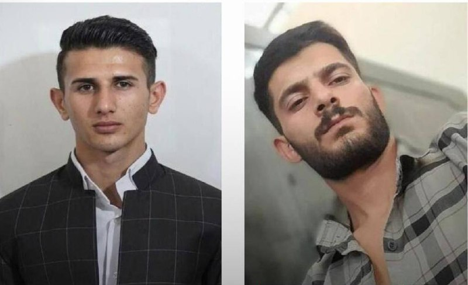

رامین زله و کریم معروف پور از معترضین دی ماه امروز صبح اعدام شدن

💧 Rainbet.com the #1 Non-KYC Crypto Casino & Sportsbook @rainbetcom

😁 @Pm_Afshaa

## pm_afshaa — post 91140

🔴آکسیوس:نتانیاهو به مذاکرات اعتماد ندارد و معتقد است اسرائیل باید به حمله به ایران ادامه دهد تا نیروی نظامی آن را تضعیف کرده و زیرساخت‌های مهم را آسیب بزند

💧 Rainbet.com the #1 Non-KYC Crypto Casino & Sportsbook @rainbetcom

😁 @Pm_Afshaa

## pm_afshaa — post 91139

🔴یدیعوت آحارونوت: مقامات اسرائیل از اقدامات ترامپ راضی نیستن

💧 Rainbet.com the #1 Non-KYC Crypto Casino & Sportsbook @rainbetcom

😁 @Pm_Afshaa

## DEJradio — post 4817

⭕️ بمب‌افکن بی-۱بی آمریکا بر فراز خاورمیانه پرواز آموزشی انجام داد

سنتکام با انتشار تصویری اعلام کرد یک فروند بمب‌افکن بی-۱بی لنسر، نیروی هوایی آمریکا بر فراز آب‌های خاورمیانه پرواز آموزشی انجام داده است.
ستاد فرماندهی مرکزی ارتش آمریکا اعلام کرد این بمب‌افکن در جریان پرواز، از هواپیمای سوخت‌رسان کی‌سی-۱۳۵ سوخت‌گیری هوایی کرد.

#سنتکام #خاورمیانه
@DEJradio

## DEJradio — post 4816

  <a href="telegram/content/DEJradio_4816_1779365033.webm" target="_blank">🎬 Download video</a>

🔺📢 هرمز در مسیر سقوط

*عطا حسینیان، روزنامه‌نگار اقتصادی

#اقتصاد_ایران #تنگه_هرمز
@DEJradio

## DEJradio — post 4815

⭕️ رسانۀ اسرائیلی از افزایش شدید سطح آمادگی نظامی در این کشور خبر داد

کانال ۱۱ اسرائیل گزارش داد ارتش و نهادهای امنیتی این کشور در پی ارزیابی‌های تازۀ اطلاعاتی، سطح آمادگی را به بالاترین سطح افزایش داده‌اند.
بنا بر این گزارش، افزایش آمادگی به دلیل احتمال ازسرگیری جنگ با جمهوری اسلامی، صورت گرفته است.
براساس این گزارش، ارزیابی‌ها نشان می‌دهد حملات و فعالیت نظامی علیه ایران ممکن است «هر لحظه» از سر گرفته شود.
یک مقام اسرائیلی گفت دونالد ترامپ بیش از هر زمان دیگری به پشتیبانی آشکارا از اقدام نظامی علیه جمهوری اسلامی نزدیک شده است.
به گفتۀ این مقام، واشینگتن هنوز فرصتی محدود را برای مسیر دیپلماتیک و به نتیجه رسیدن مذاکرات، باز نگه داشته است.

#اسرائیل #جنگ #جمهوری_اسلامی
@DEJradio

## DEJradio — post 4814

⭕️ قطعی سراسری اینترنت در ایران از مرز ۱۹۸۶ ساعت گذشت

نت‌بلاکس، اعلام کرد خاموشی اینترنت در ایران وارد هشتادوسومین روز شد و از ۱۹۸۶ ساعت عبور کرد.
این نهاد جهانی پایش اینترنت هشدار داد محدودیت‌های گسترده، دسترسی شهروندان به اطلاعات و امکان مستندسازی نقض حکومتی حقوق بشر را به‌شدت محدود کرده است.
گزارش‌ها همچنین از خسارت میلیاردی به مشاغل اینترنتی و اختلال در خدمات درمانی و تأمین دارو خبر می‌دهد.
از سویی جمهوری اسلامی برخورد با کاربران استارلینک را تشدید کرده است.
رژیم حاکم بر ایران امتیاز استفاده از اینترنت را در اختیار برخی اقشار و همچنین هوادارانی قرار می‌دهد که مواضع جمهوری اسلامی را تبلیغ می‌کنند.

#اینترنت
@DEJradio

## DEJradio — post 4813

⭕️ بازیکنان تیم ملی فوتبال جمهوری اسلامی برای دریافت ویزای آمریکا به آنکارا رفتند

بازیکنان تیم فوتبال ایران صبح پنج‌شنبه برای انجام مراحل دریافت ویزای آمریکا به سفارت‌خانۀ این کشور در آنکارا مراجعه کردند.
فدراسیون فوتبال جمهوری اسلامی در آستانۀ جام جهانی با مشکل صدور ویزا برای اعضای کاروان روبه‌رو شده است.
بر پایۀ گزارش‌ها حاکی است ممکن است برای برخی بازیکنان یا اعضای کادر فنی به‌دلیل سوابق حضور یا ارتباط با سپاه پاسداران، ویزا صادر نشود.
شماری از بازیکنان و اعضای کادر تیم ملی فوتبال جمهوری اسلامی در سپاه خدمت کرده‌اند. مهدی تاج، رئیس فدراسیون فوتبال جمهوری اسلامی سابقۀ عضویت رسمی در سپاه را دارد.
سپاه پاسداران در سیاهۀ تروریستی آمریکا، کانادا و اتحادیۀ اروپا قرار دارد.

#فوتبال #جام_جهانی
@DEJradio

## DEJradio — post 4812

⭕️ اکسیوس از تماس «پرتنش» ترامپ و نتانیاهو دربارۀ جمهوری اسلامی خبر داد

وبسایت خبری اکسیوس، به نقل از منابع آگاه گزارش داد تماس تلفنی دونالد ترامپ و بنیامین نتانیاهو درمورد پروندۀ جمهوری اسلامی «پرتنش» بوده است.
بر پایۀ این گزارش، نتانیاهو نسبت به مذاکرات با جمهوری اسلامی به‌شدت بدبین است و خواهان ازسرگیری جنگ برای تضعیف بیشتر توان نظامی رژیم حاکم بر ایران است.
اکسیوس نوشت در سوی دیگر ترامپ باور دارد که هنوز امکان دستیابی به توافق از بین نرفته است. بنا بر این گزارش، ترامپ گفته که اگر مذاکرات شکست بخورد، آمادۀ ازسرگیری جنگ است.

#ترامپ #نتانیاهو #جنگ
@DEJradio

## DEJradio — post 4811

⭕️ دادگاه فدرال آمریکا رائول کاسترو را به قتل متهم کرد

یک دادگاه فدرال آمریکا رائول کاسترو، رئیس‌ جمهوری پیشین کوبا را به مشارکت در قتل شهروندان آمریکایی متهم کرد.
این پرونده به سرنگونی دو هواپیمای متعلق به کوبایی‌های تبعیدی در سال ۱۹۹۶ مرتبط است.
به گفتۀ مقام‌های آمریکایی، رائول کاسترو دستور این عملیات را صادر کرده بود.

#کوبا #سرنگونی
@DEJradio

## DEJradio — post 4810

⭕️ بهای نفت در پی احتمال آغاز جنگ دوباره بالا رفت

پس از دو روز کاهش، بهای نفت از روز پنج‌شنبه دوباره روندی صعودی در پیش گرفت. این در حالی است که اخباری از بهبود بازار سهام آسیا در روزهای اخیر منتشر شده است.
بهای نفت برنت روز پنج‌شنبه به بیش از ۱۰۵ دلار و نفت آمریکا نیز به حدودا ۹۹ دلار در هر بشکه افزایش یافت.
به گفتۀ تحلیلگران، اخبار تازه درمورد احتمال ازسرگیری جنگ علیه جمهوری اسلامی و کاهش ذخایر نفت آمریکا، عامل اصلی رشد قیمت‌ها است.

#نفت #جنگ
@DEJradio

## DEJradio — post 4809

⭕️ شاخص‌های بازار آسیا در پی احتمال توافق واشینگتن و تهران و آمریکا جهش کرد

بازارهای سهام آسیا در پی اخبار منتشر شده در مورد احتمال توافق میان جمهوری اسلامی و آمریکا و کاهش تنش در خاورمیانه، رشد کرد.
خبرگزاری رویترز گزارش داد شاخص سهام آسیا-اقیانوسیه ۲.۶ درصد افزایش یافت. همچنین بورس کرۀ جنوبی بیش از هفت درصد جهش کرد.
از سویی رشد سهام شرکت‌های فناوری، گزارش مالی انویدیا و تعلیق اعتصاب سامسونگ نیز از عوامل تقویت بازارها عنوان شد.
تحلیلگران با وجود رشد بازارها، نسبت به نتیجۀ مذاکرات تهران و واشینگتن همچنان محتاطانه اظهار نظر می‌کنند.

#توافق #بورس
@DEJradio

## DEJradio — post 4808

⭕️ سی‌ان‌ان گزارش داد سپاه سریع‌تر از انتظار در حال بازسازی توان نظامی است

شبکۀ خبری سی‌ان‌ان به نقل از مقام‌های اطلاعاتی آمریکا گزارش داد سپاه پاسداران سریع‌تر از برآوردهای قبلی در حال بازسازی قابلیت‌های نظامی آسیب‌دیدۀ خود است.
به گفتۀ این منابع، سپاه در شش هفتۀ پیشین بخشی از چرخۀ تولید پهپاد و زیرساخت‌های موشکی خود را دوباره فعال کرده است.
به گفتۀ مقام‌های آمریکایی، این روند نشان می‌دهد جمهوری اسلامی همچنان تهدیدی جدی برای متحدان منطقه‌ای آمریکا به شمار می‌رود.

#سپاه_تروریستی_پاسداران #پهپاد
@DEJradio

## DEJradio — post 4807

⭕️ فرماندۀ ارتش پاکستان دوباره به تهران می‌رود

رسانه‌های داخل ایران گزارش دادند فیلد مارشال عاصم منیر، فرماندۀ ارتش پاکستان، روز پنج‌شنبه ۳۱ اردیبهشت به تهران سفر می‌کند.
این دومین سفر او به ایران در جریان میانجی‌گری اسلام‌آباد میان تهران و واشینگتن، پس از جنگ چهل روزه به شمار می‌رود.
اسماعیل بقائی، سخنگوی وزارت امور خارجۀ جمهوری اسلامی گفت سفر مقام‌های پاکستانی برای «تسهیل تبادل پیام‌ها» میان تهران و واشینگتن، انجام می‌شود.

#مذاکرات #پاکستان
@DEJradio

## DEJradio — post 4806

⭕️ دو تبعۀ عراقی به اتهام «جاسوسی» پنهانی در کرج اعدام شدند

بنا بر گزارش سازمان‌های حقوق بشری، دو شهروند عراقی به نام‌های علی نادر العبیدی و فاضل شیخ کریم، به اتهام «جاسوسی» برای کشورهای عربی به صورت پنهانی در زندان مرکزی کرج اعدام شدند.
بر پایۀ این گزارش، حکم اعدام این دو نفر ۱۷ فروردین ۱۴۰۵ اجرا شده اما خبر آن اکنون درز کرده است.
نهادهای حقوق بشری می‌گویند این دو زندانی پیش از اعدام درحدود یازده ماه در بازداشت نهادهای امنیتی بوده و زیر شکنجه قرار داشتند.
دستگاه قضائی جمهوری اسلامی و مقام‌های عراقی تاکنون واکنشی به این گزارش نشان نداده‌اند.

#اعدام
@DEJradio

## DEJradio — post 4805

⭕️ اندیشکده آمریکایی: احمد وحیدی از نفرات اصلی موضع تندروانۀ رژیم در مذاکرات است

اندیشکدۀ مؤسسه مطالعات جنگ اعلام کرد احمد وحیدی به یکی از چهره‌های اصلی تدوین موضع سخت‌گیرانۀ جمهوری اسلامی در مذاکره با آمریکا تبدیل شده است.
بنا بر این گزارش وحیدی و حلقۀ نزدیک به او علاوه بر جهت‌دهی واکنش‌های نظامی، بر سیاست‌های مذاکراتی تهران نیز نفوذی گسترده دارند.
بر پایۀ این ارزیابی، وحیدی از نزدیک‌ترین افراد به مجتبی خامنه‌ای، رهبر تازه اعلام شدۀ جمهوری اسلامی به شمار می‌رود.

#مذاکرات #جمهوری_اسلامی
@DEJradio

## DEJradio — post 4804

⭕️ ترامپ گفت یا توافق و یا برمی‌گردیم و کار رژیم را به پایان می‌رسانیم

دونالد ترامپ گفت تنها پرسش باقی‌مانده این است که آیا آمریکا برای «به پایان بردن کار جمهوری اسلامی» بازمی‌گردد یا این که تهران توافقنامه را امضا می‌کند.
رئیس جمهوری آمریکا گفت نیروی دریایی و نیروی هوایی جمهوری اسلامی از بین رفته‌ و واشینگتن اجازه نمی‌دهد جمهوری اسلامی به سلاح هسته‌ای دست پیدا کند.
ترامپ گفت مذاکره با جمهوری اسلامی در مراحل پایانی قرار دارد، اما اگر توافق حاصل نشود، حملات بیشتری در پیش است.
او همچنین تأکید کرد باز شدن بی‌درنگ تنگۀ هرمز یکی از مسائل اصلی در توافق احتمالی است.

#ترامپ #مذاکرات #توافق #جنگ
@DEJradio

## DEJradio — post 4803

⭕️ قالیباف گفت آمریکا در پی دور تازۀ جنگ علیه رژیم است

محمدباقر قالیباف، رئیس مجلس شورای اسلامی گفت آمریکا همچنان در جست‌وجوی آغاز دور تازۀ جنگ علیه جمهوری اسلامی است.
او مدعی شد جمهوری اسلامی در دورۀ آتش‌بس توان نظامی خود را بازسازی کرده است.
قالیباف همچنین ادعا کرد در صورت آغاز دوبارۀ جنگ، نیروهای جمهوری اسلامی «دشمن» را «شگفت‌زده» می‌کنند.
رئیس مجلس شورای اسلامی همچنین خبر افزایش بهای کالاهای اساسی و کاهش قدرت خرید مردم را تأیید کرد.

#قالیباف #جنگ
@DEJradio

## DEJradio — post 4802

  <a href="telegram/content/DEJradio_4802_1779365034.mp4" target="_blank">🎬 Download video</a>

👑
🔺برافراشته شدن پرچم شیر و خورشید در بندر اشدود اسرائیل.

#اسرائیل #پرچم_شیروخورشید
@DEJradio

## DEJradio — post 4801

  <a href="telegram/content/DEJradio_4801_1779365035.mp4" target="_blank">🎬 Download video</a>

🤡
🔺 سیاهی‌لشکر آفریقایی‌‌ها در حمایت از حکومت.

#آفریقایی #تجمعات_حکومتی
@DEJradio

## DEJradio — post 4800

  <a href="telegram/content/DEJradio_4800_1779365038.mp4" target="_blank">🎬 Download video</a>

🔺🎥 بناب؛ قدردانی از سردار آزمون به دلیل حمایت از مردم

یک شهروند با ارسال ویدیویی که شعارنویسی در حمایت از سردار آزمون بازیکن مردم‌دوست تیم فوتبال نوشت: «مردم بناب و اصلا کل آذربایجان غربی و شرقی خیلی سردار آزمون رو دوست دارن، و خیلی عصبانی هستن از این که آزمون رو از تیم حذف کردن، خاک تو سرشون. آزمون ما دوست داریم و تو باعث افتخار مایی. لطفا صدای اعتراض و افتخار ما به آزمون رو اگر چه که حذفش کردن رو به همه، و بخصوص به اون تصمیم گیرنده‌های نالایق هر کی که هستند برسونید.»

#بناب #سردار_آزمون
@DEJradio

## DEJradio — post 4799

  <a href="telegram/content/DEJradio_4799_1779365041.mp4" target="_blank">🎬 Download video</a>

⭕️ سنتکام: تفنگداران آمریکایی وارد یک نفتکش جمهوری اسلامی شدند

سنتکام اعلام کرد نیروهای آمریکایی روز چهارشنبه در دریای عمان وارد نفتکش «ام‌تی سلستیال سی» شدند.
ستاد فرماندهی مرکزی آمریکا گفت این نفتکش که پرچم جمهوری اسلامی را برافراشته بود، برای نقض محاصرۀ دریایی و حرکت به سمت بنادر ایران در تلاش بود.
سنتکام اعلام کرد پس از بازرسی و صدور دستور تغییر مسیر، این شناور را آزاد کرده است.
به گزارش سنتکام، تاکنون ۹۱ کشتی تجاری مرتبط با جمهوری اسلامی، در جریان محاصرۀ دریایی ناگزیر به تغییر مسیر شده‌اند.
#محاصره_دریایی #سنتکام
@DEJradio

## DEJradio — post 4798

⭕️ ترامپ: چند روز منتظر می‌مانیم اما پاسخ تهران باید ۱۰۰ درصد درست باشد

دونالد ترامپ گفت آمریکا حاضر است چند روز دیگر برای پاسخ جمهوری اسلامی به پیشنهاد توافق منتظر بماند.
رئیس جمهوری آمریکا هشدار داد پاسخ تهران باید «۱۰۰ درصد درست» باشد، در غیر این صورت تنش‌ها به‌سرعت افزایش می‌یابد.
ترامپ همچنین مدعی شد واشینگتن اکنون با افرادی «باهوش و قدرتمند» از طرف تهران روبه‌رو است که جایگزین رهبران پیشین شده‌اند.
او پیش‌تر نیز گفته بود در صورت شکست مذاکرات، حمله‌ای شدیدتر از حملات پیشین، علیه جمهوری اسلامی آغاز می‌شود.

#ترامپ #توافق #مذاکرات
@DEJradio

## mamlekate — post 103564

📝 ترامپ: مذاکرات با تهران در مراحل نهایی است، توافق نکنند حمله می‌کنیم

دونالد ترامپ، رییس‌جمهوری آمریکا، چهارشنبه ۳۰ اردیبهشت گفت مذاکرات با جمهوری اسلامی در مراحل نهایی قرار دارد اما هم‌زمان هشدار داد که در صورت شکست مذاکرات، حملات بیشتری علیه جمهوری اسلامی انجام خواهد شد. این اظهارات هم‌زمان با سفر وزیر کشور پاکستان به تهران مطرح شد.

@mamlekate

## mamlekate — post 103563

خلاصه رویداد مهم Google IO 2026 ، یکی از مهمترین رویدادهای تکنولوژی دنیا در سال ۲۰۲۶ ، با زیرنویس فارسی [۶۰ مگابابت برای ۳۵ دقیقه]

shah_riyar_
@mamlekate

## mamlekate — post 103562

📝 ادعای نیویورک‌تایمز: محمود احمدی‌نژاد بخشی از طرح تغییر رژیم ایران بود

روزنامه نیویورک تایمز در گزارشی مدعی شد اسرائیل و آمریکا محمود احمدی‌نژاد را یکی از گزینه‌های احتمالی برای ادارهٔ ایران پس از حمله نظامی در نظر گرفته بودند.

@mamlekate ⚠️ خطر فرناز فصیحی

## mamlekate — post 103561

📝 هلی‌کوپتر، جنگ و پاستور؛ روایتی از دو سال پرحادثه جمهوری اسلامی

روز سی‌ام اردیبهشت‌ماه سال ۱۴۰۳، هلی‌کوپتر حامل ابراهیم رئیسی، رئیس‌جمهوری منصوب علی خامنه‌ای، و همراهانش در جنگل‌های ارسباران سقوط کرد. این حادثه از همان ساعات نخست، به یکی از پرابهام‌ترین رخدادهای تاریخ جمهوری اسلامی تبدیل شد و در حالی که دو هلی‌کوپتر همراه دیگر بدون مشکل به مقصد رسیدند، سقوط هلی‌کوپتر حامل رئیس دولت سیزدهم موجی از پرسش‌ها و گمانه‌زنی‌ها را برانگیخت.

دو سال پیش:
t.me/mamlekate/87456

## mamlekate — post 103560

  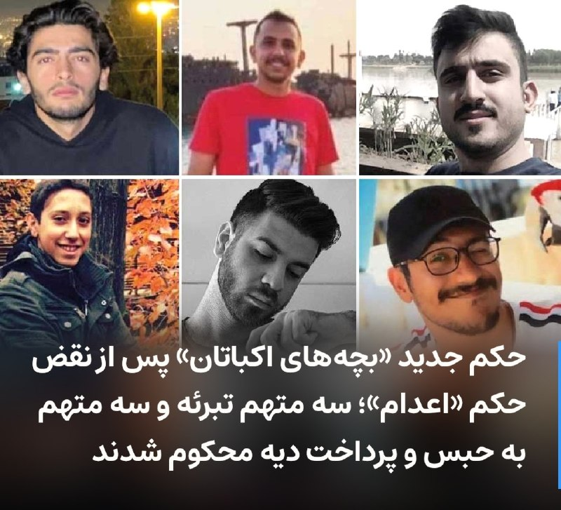

📝 پس از نقض حکم اعدام؛ ۳ متهم پرونده شهرک اکباتان به حبس و دیه محکوم و ۳ تن تبرئه شدند

رسانه های حقوق بشری گزارش دادند دادگاه کیفری تهران پس از رسیدگی دوباره به پرونده شهرک اکباتان، سه معترض بازداشت شده در این پرونده را به دیه و پنج سال حبس محکوم و سه معترض دیگر را از اتهام مشارکت در «قتل عمد» تبرئه کرد. حکم اعدام این شش تن پیش تر در دیوان عالی کشور نقض شده بود.

سایت هرانا چهارشنبه ۳۰ اردیبهشت گزارش داد شعبه ۱۳ دادگاه کیفری یک استان تهران، میلاد آرمون، علیرضا کفایی و امیرمحمد خوش اقبال را بابت اتهام «مشارکت در قتل عمد» آرمان علی وردی، از نیروهای بسیج، محکوم کرد.

هر یک از آن ها به پرداخت سهم مساوی از دیه کامل یک انسان و پنج سال حبس محکوم شده اند.

طبق گزارش هرانا، نوید نجاران، حسین نعمتی و علیرضا برمرزپورناک، سه متهم دیگر این پرونده، به دلیل «فقدان مدارک دال بر وارد کردن ضربه به ناحیه مشخصی از بدن علی وردی» از اتهام مشارکت در قتل عمد تبرئه شدند.

@mamlekate

## VahidOnline — post 75589

  

قوه قضائیه جمهوری اسلامی دو زندانی را به اتهام عضویت در «گروه‌های تروریستی تجزیه‌طلب» و «قیام مسلحانه از طریق تشکیل گروه‌های مجرمانه» اعدام کرد.

ارگان رسمی دستگاه قضایی ایران، میزان، هویت این دو نفر را رامین زله و کریم معروف‌پور معرفی کرده و نوشته که آنها صبح روز پنج‌شنبه، ۳۱ اردیبهشت، اعدام شدند.

میزان نوشته که رامین زله «پس از طی دوره‌های آموزشی از طرف گروهک ماموریت پیدا کرده بود تا در ناآرامی‌های کشور به عنوان لیدر شرکت کند».
ارگان رسمی قوه قضائیه ایران همچنین نوشته که این دو نفر «اعتراف» کرده بودند که «برای ترور فرمانده پایگاه سپاه یکی از شهرستان‌های غرب کشور» با یکدیگر «همکاری» داشته و برای این کار، «سلاح» نگهداری می‌کردند.

از زمان حملات آمریکا و اسرائیل به ایران، جمهوری اسلامی اجرای احکام اعدام را افزایش داده است و در برخی روزها چند نفر را اعدام کرده است.
@VahidHeadline

📡 @VahidOnline

## kianmeli1 — post 87529

  <a href="telegram/content/kianmeli1_87529_1779365046.mp4" target="_blank">🎬 Download video</a>

🔴تبلیغ وطن دوستی با شهروندان وارداتی از سنگال، غنا، کنیا، بورکینافاسو، ساحل عاج، نیجریه، تانزانیا، مالی
https://t.me/kianmeli1

## kianmeli1 — post 87528

  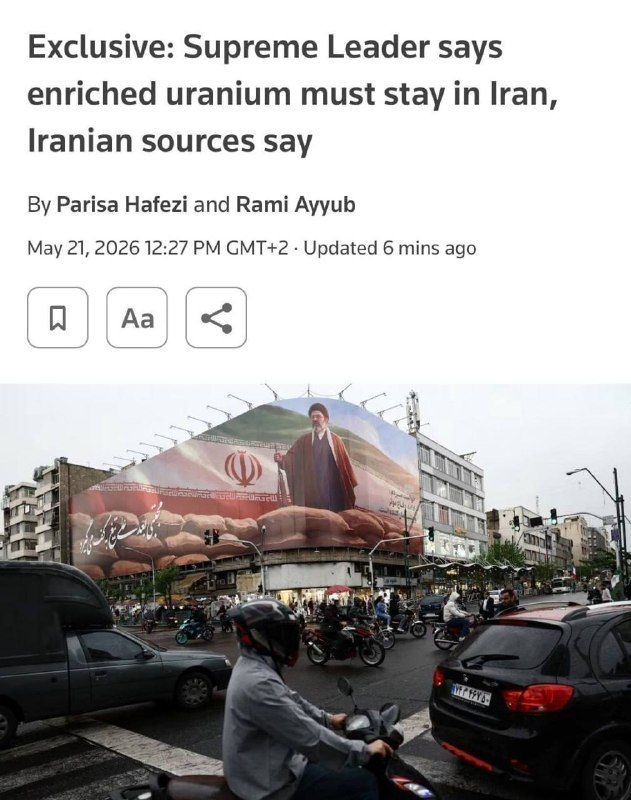

🔴رویترز: مجتبی خامنه‌ای دستور داده است که اورانیوم با غنای بالای ایران باید در داخل کشور باقی بماند
https://t.me/kianmeli1

## kianmeli1 — post 87527

  <a href="telegram/content/kianmeli1_87527_1779365049.mp4" target="_blank">🎬 Download video</a>

🔴پالایشگاه سیزران، استان سامارا، در روسیه توسط پهپادهای اوکراینی مورد حمله قرار گرفته و اکنون در حال سوختن است.
https://t.me/kianmeli1

## IranIntlTV — post 338237

  <a href="telegram/content/IranIntlTV_338237_1779365050.mp4" target="_blank">🎬 Download video</a>

ویدیوی ارسالی به ایران اینترنشنال نشان می‌دهد که ۳۱ اردیبهشت‌ماه گروهی از دانش‌آموزان با بر زمین نشستن و تحصن جلوی ساختمان استانداری در شهرکرد، شعارهایی چون «امتحان حضوری نمی‌خواهیم» و «حمایت، حمایت» سردادند.

## IranIntlTV — post 338236

  <a href="telegram/content/IranIntlTV_338236_1779365053.mp4" target="_blank">🎬 Download video</a>

ویدیوی رسیده به ایران اینترنشنال نشان می‌دهد که شامگاه ۳۱ اردیبهشت در شهر دهلران استان ایلام، گروهی با در دست داشتن پرچم جمهوری اسلامی و بیرق‌های مذهبی، موسیقیِ باکلام عربی را با صدای بلند در خیابان پخش می‌کنند. فرستنده ویدیو گفت: «مزاحمت‌های شبانه طرفداران حکومت، تمامی ندارد.»

## IranIntlTV — post 338235

  <a href="telegram/content/IranIntlTV_338235_1779365055.mp4" target="_blank">🎬 Download video</a>

هم‌زمان با ادامه کارزار مردمی جاویدنامان الغدیر، جزییات تازه‌ای از هویت و چگونگی کشته‌ شدن شماری از جان‌باختگان اعتراضات ۱۸ و ۱۹ دی‌ماه به دست ایران‌اینترنشنال رسیده است. در میان این روایت‌ها، خانواده و نزدیکان ستاره رفیعی، حمیدرضا حق‌پرست و حسین ناصری از نحوه کشته‌ شدن و انتقال پیکر آن‌ها به بیمارستان الغدیر گفته‌اند.

جزییات بیشتر با فرنوش فرجی، عضو تحریریه ایران‌اینترنشنال
@iranintltv

## IranIntlTV — post 338234

  

علی یزدی‌خواه، نایب‌رییس کمیسیون فرهنگی مجلس، گفت در شرایط فعلی تصمیمی برای بازگشایی اینترنت جهانی وجود ندارد و محدودیت‌ها با «ملاحظات امنیتی» ادامه خواهد داشت.

یزدی‌خواه قطع اینترنت جهانی را به مصوبات شورای عالی امنیت ملی نسبت داد و گفت این تصمیم به‌دلیل «مسائل امنیتی، امنیت کشور و حفظ جان افراد» گرفته شده است.

با وجود اینکه نت‌بلاکس اعلام کرده خاموشی اینترنت در ایران وارد هشتادوسومین روز خود شده، یزدی‌خواه گفت بیش از ۹۰ درصد نیازهای مردم در وضعیت فعلی برآورده می‌شود و مراجعات گسترده‌ای در اعتراض به قطع اینترنت وجود ندارد.

او همچنین گفت در قالب طرح موسوم به «اینترنت پرو»، تاکنون بیش از یک میلیون نفر دسترسی دریافت کرده‌اند؛ طرحی که منتقدان آن را مصداق اینترنت طبقاتی و تبعیض‌آمیز می‌دانند، زیرا دسترسی به اینترنت جهانی را به گروه‌های خاص محدود می‌کند و شهروندان عادی را از حق برابر دسترسی آزاد به اینترنت محروم نگه می‌دارد.

نایب‌رییس کمیسیون فرهنگی مجلس همچنین گفت شرکت‌های صادرات و واردات، مراکز علمی و پژوهشی، آزمایشگاه‌ها و برخی اصناف در صورت نیاز می‌توانند برای دسترسی به اینترنت بین‌الملل اقدام کنند.
https

## IranIntlTV — post 338233

  <a href="telegram/content/IranIntlTV_338233_1779365058.mp4" target="_blank">🎬 Download video</a>

ویدیوهای رسیده به ایران اینترنشنال نشان می‌دهد که ۳۱ اردیبهشت در شهرکرد، گروهی از دانش‌آموزان معترض به برگزاری حضوری امتحان‌ها ضمن تلاش برای پاسخگو کردن مسئولان مربوط، شعار «دانش‌آموز داد بزن، حقتو فریاد بزن» سردادند.

## IranIntlTV — post 338232

  

نت‌بلاکس، نهاد ناظر بر اینترنت، نوشت که داده‌های این نهاد نشان می‌دهد قطعی اینترنت در ایران وارد هشتادوسومین روز خود شده و شبکه‌های بین‌المللی بیش از هزار و ۹۶۸ ساعت است که به‌طور گسترده مسدود مانده‌اند.

این نهاد ناظر بر اینترنت با تاکید بر اهمیت دسترسی آزاد به اینترنت نوشت: «اینترنت آزاد و باز، برای حفاظت از جان، آزادی و پاسخگویی عمومی نقشی اساسی دارد.»

## IranIntlTV — post 338231

  <a href="telegram/content/IranIntlTV_338231_1779365062.mp4" target="_blank">🎬 Download video</a>

پس از راه‌اندازی کارزار مردمی ایران‌اینترنشنال برای ثبت هویت جاویدنامان بیمارستان الغدیر، خانواده‌ها و نزدیکان جان‌باختگان در روزهای اخیر اطلاعات تازه‌ای درباره هویت شماری دیگر از کشته‌شدگان ارائه کرده‌اند. ایران‌اینترنشنال اعلام کرده این کارزار برای ثبت حقیقت و شناسایی جاویدنامان در هفته‌ها و ماه‌های آینده ادامه خواهد داشت.
این گزارش حاوی تصاویر تلخ و تکان‌دهنده است.
@iranintltv

## IranIntlTV — post 338230

  

🔻تیم ملی کنگو به دلیل شیوع بیماری ابولا در شرق این کشور، اردوی آماده‌سازی خود را برای جام جهانی، در کینشاسا، پایتخت این کشور لغو کرد. اردوی آماده‌سازی این تیم در پی تشدید این بحران که تاکنون جان بیش از ۱۳۰ نفر را گرفته، به بلژیک منتقل شده است.

🔹سازمان جهانی بهداشت این وضعیت را «وضعیت اضطراری بهداشت عمومی با اهمیت بین‌المللی» نامیده، اما آن را در سطح همه‌گیری جهانی ندانسته است.

🔹تیم ملی کنگو قرار است سوم ژوئن در بلژیک به مصاف دانمارک و نهم ژوئن در اسپانیا به مصاف شیلی برود.

🔹جری کاله‌مو، سخنگوی تیم ملی کنگو به خبرگزاری رویترز گفت دلیل اصلی لغو اردو، محدودیت‌های مسافرتی اعمال‌شده از سوی آمریکا است. آژانس بهداشت عمومی آمریکا ورود افراد غیرآمریکایی را که طی ۲۱ روز گذشته در کنگو، اوگاندا یا سودان جنوبی بوده‌اند، ممنوع کرده است.

@iranintltvsport

## IranIntlTV — post 338229

  <a href="telegram/content/IranIntlTV_338229_1779365065.mp4" target="_blank">🎬 Download video</a>

چهارمین روز دادگاه رسیدگی به پرونده متهمان حمله با چاقو به پوریا زراعتی، مجری تلویزیون ایران‌اینترنشنال، در حال برگزاری است. چهارشنبه دادستان اعلام کرده بود متهمان این پرونده به نیابت از جمهوری اسلامی به زراعتی حمله کرده‌اند.در جریان دادگاه، تصاویر دوربین‌های مداربسته از لحظه حمله به زراعتی نیز به‌عنوان بخشی از مدارک و شواهد به نمایش درآمد.

رضا محدث، خبرنگار ایران‌اینترنشنال، گزارش می‌دهد
@iranintltv

## IranIntlTV — post 338228

  <a href="telegram/content/IranIntlTV_338228_1779365068.mp4" target="_blank">🎬 Download video</a>

ایال زمیر، رییس ستاد کل ارتش اسرائیل، گفت نیروهای این کشور در بالاترین سطح آماده‌باش قرار دارند و برای هر تحول احتمالی آماده‌اند.

بابک اسحاقی، خبرنگار ایران‌اینترنشنال، گزارش می‌دهد
@iranintltv

## IranIntlTV — post 338227

  <a href="telegram/content/IranIntlTV_338227_1779365070.mp4" target="_blank">🎬 Download video</a>

افزایش شدید قیمت دارو، در کنار کمیاب و نایاب شدن بسیاری از اقلام دارویی، باعث شده بسیاری از مردم توان پرداخت هزینه‌های درمان را نداشته باشند. شماری از شهروندان در پیام‌های ارسالی به ایران‌اینترنشنال گفته‌اند به دلیل ناتوانی مالی، از ادامه درمان صرف‌نظر می‌کنند.

لیلا سعادتی، عضو تحریریه ایران‌اینترنشنال، گزارش می‌دهد
@iranintltv

## IranIntlTV — post 338226

  

فداحسین مالکی، عضو کمیسیون امنیت ملی مجلس، با تمجید از اقدامات نیروهای مسلح جمهوری اسلامی در جریان جنگ گفت سران واشینگتن تصور می‌کردند در ایران نیز پیروز خواهند شد، اما «در این میدان به معنای واقعی کلمه میخکوب شدند».

او گفت: «سران واشینگتن که پس از وقایع ونزوئلا دچار غرور و سرمستی سیاسی شده بودند، تصور می‌کردند در حمله به ایران نیز پیروز خواهند بود؛ اما در این میدان به معنای واقعی کلمه میخکوب شدند.»

مالکی همچنین درباره احتمال توافق با آمریکا با میانجی‌گری پاکستان گفت پاکستانی‌ها «حسن نیت» دارند و برای انجام این میانجی‌گری تلاش می‌کنند.

او افزود: «احتمال می‌دهم رفاقتی که عاصم منیر با ترامپ دارد، او را وادار کند شروط را بپذیرد؛ از جمله این‌که وارد تنگه هرمز نشود، وارد غنی‌سازی نشود، خسارت ما را بدهد و پول‌های بلوکه‌شده را آزاد کند.»
https://iranintl.com/202605216184

## IranIntlTV — post 338225

  <a href="telegram/content/IranIntlTV_338225_1779365073.mp4" target="_blank">🎬 Download video</a>

سرخط خبرهای پنجشنبه ۳۱ اردیبهشت
@iranintltv

## IranIntlTV — post 338224

  <a href="telegram/content/IranIntlTV_338224_1779365075.mp4" target="_blank">🎬 Download video</a>

ویدیوی ارسالی به ایران اینترنشنال نشان‌ می‌دهد که ۳۱ اردیبهشت در حوالی روستای سَلَخ شهرستان قشم استان هرمزگان، صف بنزین در کنار جاده ادامه پیدا کرده است. به گفته ساکنان منطقه، مردم این روستا با کمبود سوخت روبرو شده‌اند.

## IranIntlTV — post 338223

  <a href="telegram/content/IranIntlTV_338223_1779365077.mp4" target="_blank">🎬 Download video</a>

بر اساس ویدیو و گزارش‌های رسیده به ایران اینترنشنال شماری از دانش‌آموزان و خانواده‌های آنان در شهرکرد، صبح پنجشنبه ۳۱ اردیبهشت برای اعتراض به حضوری شدن امتحانات جلوی ساختمان استانداری چهارمحال و بختیاری تجمع کرده و شعار سردادند.

## IranIntlTV — post 338222

  

🔻زهرا زارعی، دونده استان کرمان، در مسابقات دوومیدانی جایزه بزرگ بندر ترکمن، رکورد ملی ماده ۴۰۰ متر زنان ایران را پس از ۱۴ سال شکست. او با ثبت زمان ۵۱.۹۷ ثانیه، رکورد این ماده را حدود یک ثانیه بهبود داد.

🔹رکورد ملی ۴۰۰ متر زنان ایران پیش از این با زمان ۵۲.۹۵ ثانیه در اختیار مریم طوسی بود که اردیبهشت ۱۳۹۱ در مسابقات جایزه بزرگ آسیا در تایلند ثبت شده بود.
@iranintltvsport

## IranIntlTV — post 338221

  <a href="telegram/content/IranIntlTV_338221_1779365080.mp4" target="_blank">🎬 Download video</a>

نگرانی‌ها درباره تداوم موج اعدام‌ها در ایران افزایش یافته است. هم‌زمان با اعلام قوه قضاییه درباره اعدام دو زندانی سیاسی، سازمان حقوق بشر ایران نیز از اعدام مخفیانه دو تبعه عراقی در زندان مرکزی کرج خبر داد و نسبت به روند رو به افزایش اجرای احکام اعدام هشدار داد.
گفت‌وگو با شراره عزیزی، عضو تحریریه ایران‌اینترنشنال
@iranintltv

## IranIntlTV — post 338220

  <a href="telegram/content/IranIntlTV_338220_1779365082.mp4" target="_blank">🎬 Download video</a>

روزنامه اسرائیل هیوم گزارش داد نشست کاخ سفید درباره پرونده جمهوری اسلامی با اختلاف‌نظر میان مقام‌های ارشد آمریکا همراه بوده است. به‌گفته این روزنامه، دونالد ترامپ بر ادامه مذاکرات تاکید کرده است. در مقابل، مارکو روبیو، وزیر امور خارجه، و پیت هگست، وزیر جنگ، معتقدند بدون تهدید به حمله و افزایش فشار اقتصادی، از تهران نمی‌شود امتیاز گرفت.
جزییات بیشتر با حسین آقایی، عضو تحریریه ایران‌اینترنشنال
@iranintltv

## IranIntlTV — post 338219

  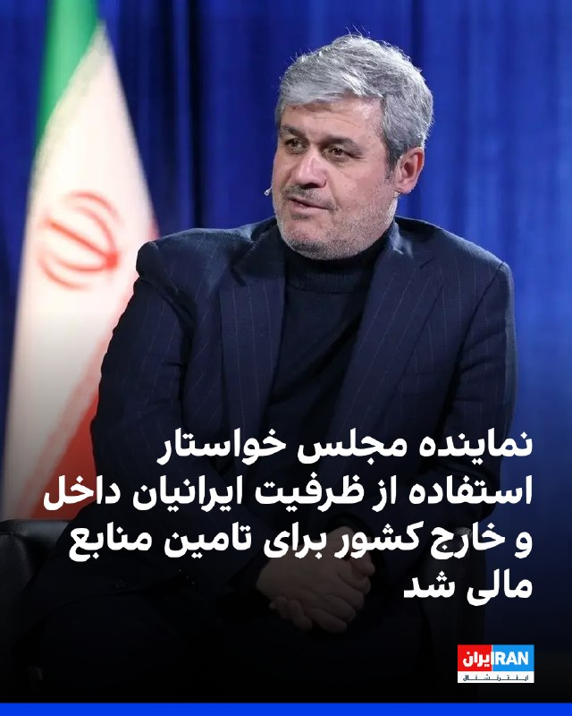

غلامرضا تاجگردون، رییس کمیسیون برنامه و بودجه مجلس، گفت دولت امروز به نقطه‌ای رسیده که باید «قرارگاه‌های مردمی تامین منابع مالی پایدار» را شکل دهد.

او اضافه کرد: «این یعنی بانک مرکزی باید یک پشتوانه مردمی دیگر برای تامین منابع داشته باشد؛ چه از جانب افرادی که در داخل کشور منابع دارند و چه ایرانیان خارج از کشور که امروز می‌توانند به اقتصاد کشورشان کمک کنند.»
https://iranintl.com/202605219231

## IranIntlTV — post 338218

  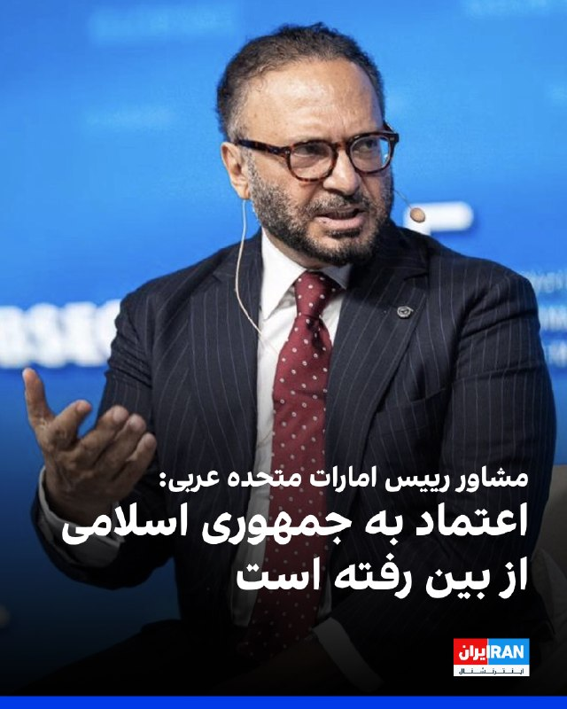

انور قرقاش، مشاور دیپلماتیک رییس امارات متحده عربی، با انتقاد از رفتار جمهوری اسلامی در منطقه گفت کشورهای خلیج فارس طی دهه‌های طولانی به «زورگویی ایران» عادت کرده‌اند و این رفتار به بخشی از صحنه سیاسی در خلیج فارس تبدیل شده است.

او گفت اعتبار جمهوری اسلامی میان «سخنان تهاجمی» و «بیانیه‌های توخالی دوستی» از بین رفته است.

قرقاش افزود: «امروز، پس از تجاوز آشکار ایران، این حکومت می‌کوشد واقعیتی تازه را تثبیت کند؛ واقعیتی که از یک شکست نظامی روشن زاده شده است. اما تلاش‌ها برای کنترل تنگه هرمز یا تعرض به حاکمیت دریایی امارات، چیزی جز خیال‌پردازی نیست.»

مشاور دیپلماتیک رییس امارات همچنین تاکید کرد هر کشوری که خواهان همزیستی با محیط عربی پیرامون خود است، باید بداند که اعتماد از بین رفته است.

او افزود بازسازی این اعتماد با شعار ممکن نیست، بلکه تنها با «زبان مسئولانه، پاسداشت حاکمیت و پایبندی واقعی به اصول حسن همجواری» امکان‌پذیر است.
https://iranintl.com/202605217797

## Shin_Persian — post 6121

Shin ✓ @hey_itsmyturn
Thu, 21 May 2026 11:59:19 UTC

As if anyone would expect anything else than IRGC (Yeah, not Mojtaba’s decision for sure) not allowing the handover of 400+ Kg of Uranium out of Iran, which is one of the most valuable bargaining chips fir then

فارسی

انگار کسی انتظار چیزی غیر از این را داشت که سپاه پاسداران (قطعا این تصمیم مجتبی نیست) اجازه خروج بیش از ۴۰۰ کیلوگرم اورانیوم را از ایران ندهد، که یکی از ارزشمندترین اهرم‌های چانه‌زنی برای آن‌هاست.

𝕏 · @shin_persian

## Shin_Persian — post 6120

Shin ✓ @hey_itsmyturn
Thu, 21 May 2026 10:02:55 UTC

3 blasts were just heard in Qeshm island.
(Highly likely EOD)
Hormozgan Province, #Iran

فارسی

۳ انفجار دقایقی پیش در جزیره قشم شنیده شد.
(احتمال زیاد خنثی‌سازی مهمات - EOD)
استان هرمزگان، #Iran_

𝕏 · @shin_persian

## ManotoTV — post 105716

  <a href="telegram/content/ManotoTV_105716_1779365086.mp4" target="_blank">🎬 Download video</a>

بر پایه گزارش رسانه‌های حکومتی، ۲۰ ملوان ایرانی که کشتی‌شان در آب‌های سنگاپور توقیف شده بود و در «وضعیت نامناسبی» قرار داشتند، ساعتی پیش به ایران بازگشتند.
سفیر جمهوری‌اسلامی در پاکستان با قدردانی از دولت پاکستان اعلام کرد این ملوانان پس از پیگیری‌های دیپلماتیک و با همکاری مقام‌های پاکستانی، از سنگاپور به اسلام‌آباد منتقل شدند و سپس به کشور بازگشتند.
او از نقش نخست‌وزیر پاکستان، وزارت خارجه و دیگر نهادهای این کشور در آزادی و انتقال ملوانان ایرانی تشکر کرد.

## ManotoTV — post 105715

  <a href="telegram/content/ManotoTV_105715_1779365087.mp4" target="_blank">🎬 Download video</a>

بریتانیا از توافق تجاری ۵ میلیارد دلاری با کشورهای خلیج فارس رونمایی کرد؛ توافقی که در بحبوحه تنش‌های منطقه‌ای پس از جنگ ایران، به گفته لندن «پیامی از ثبات و اعتماد» به بازارها می‌دهد.
این توافق با شورای همکاری خلیج فارس شامل عربستان، امارات، قطر، کویت، عمان و بحرین است و قرار است سالانه حدود ۳.۷ میلیارد پوند به اقتصاد بریتانیا اضافه کند.
لندن می‌گوید ۹۳ درصد تعرفه‌های کشورهای خلیج فارس برای کالاهای بریتانیایی حذف می‌شود؛ از جمله محصولات غذایی، خودرو، صنایع هوافضا و الکترونیک.
در مقابل، بریتانیا نیز برخی تعرفه‌ها را کاهش می‌دهد، هرچند نفت و گاز کشورهای عربی پیش‌تر هم بدون تعرفه وارد بریتانیا می‌شد.
فعالان حقوق بشر از نبود بندهای الزام‌آور درباره حقوق بشر در این توافق انتقاد کرده‌اند و آن را «عقب‌گرد اخلاقی» توصیف کردند.

## ManotoTV — post 105714

  <a href="telegram/content/ManotoTV_105714_1779365088.mp4" target="_blank">🎬 Download video</a>

انور قرقاش، مشاور سیاست خارجی رئیس امارات متحده عربی، در حساب ایکس خود نوشت جمهوری اسلامی پس از تجاوز و شکست نظامی آشکار، در تلاش است واقعیتی جدید را بر منطقه تحمیل کند، اما تلاش برای کنترل تنگه هرمز یا تعرض به حاکمیت دریایی امارات «چیزی جز رویاپردازی نیست.»
قرقاش افزود کشورهای عربی خلیج فارس دهه‌ها به «زورگویی‌های ایران» عادت کرده‌اند؛ تا جایی که این رفتار به بخشی از فضای سیاسی منطقه تبدیل شده و شکاف عمیقی میان شعارهای تهاجمی تهران و ادعاهای دوستی ایجاد کرده است.
او همچنین تأکید کرد هر کشوری که خواهان همزیستی با جهان عرب است باید بداند اعتماد از دست رفته و بازسازی آن نه با شعار، بلکه با احترام به حاکمیت کشورها، زبان مسئولانه و پایبندی واقعی به اصول حسن همجواری ممکن خواهد بود.

## ManotoTV — post 105713

  <a href="telegram/content/ManotoTV_105713_1779365089.mp4" target="_blank">🎬 Download video</a>

بر اساس داده‌های مرکز پایش اینترنت نت‌بلاکس، خاموشی اینترنت در ایران اکنون وارد هشتادوسومین روز خود شده است.
نت‌بلاکس اعلام کرد دسترسی به شبکه‌های بین‌المللی برای بیش از ۱۹۶۸ ساعت به‌طور گسترده مسدود بوده است. این نهاد تأکید کرد اینترنت آزاد و باز نقشی اساسی در حفاظت از جان، آزادی و پاسخگویی عمومی دارد.

## ManotoTV — post 105712

  <a href="telegram/content/ManotoTV_105712_1779365089.mp4" target="_blank">🎬 Download video</a>

وزیران خارجه استرالیا و بلژیک در واکنش به ویدیوی منتشرشده از نحوه برخورد نیروهای اسرائیلی با فعالان «ناوگان آزادی» حامیان غزه، از احضار سفیران اسرائیل خبر دادند. در این ویدیو ده‌ها فعال حامی غزه با دستان بسته روی زمین زانو زده‌اند و ایتامار بن‌گویر، وزیر امنیت ملی اسرائیل، در حالی که پرچم این کشور را در دست دارد، به آن‌ها می‌گوید: «به اسرائیل خوش آمدید.»
ینی وانگ، وزیر خارجه استرالیا، این تصاویر را «غیرقابل قبول» توصیف کرد و گفت «رفتار تحقیرآمیز با بازداشت‌شدگان را محکوم می‌کند». وزیر خارجه بلژیک نیز تصاویر منتشرشده را «عمیقاً نگران‌کننده» خواند و اعلام کرد شماری از شهروندان بلژیک در میان بازداشت‌شدگان هستند.
همزمان جورجا ملونی، نخست‌وزیر ایتالیا، و پدرو سانچز، نخست‌وزیر اسپانیا، نیز این اقدام را محکوم کرده‌اند

## ManotoTV — post 105711

  <a href="telegram/content/ManotoTV_105711_1779365091.mp4" target="_blank">🎬 Download video</a>

سی‌ان‌ان به نقل از منابع اطلاعاتی آمریکا گزارش داد جمهوری اسلامی بازسازی زیرساخت‌های نظامی و تولید پهپاد را سریع‌تر از برآوردهای اولیه از سر گرفته است.
بر اساس این گزارش، ایران در جریان آتش‌بس شش‌هفته‌ای که از اوایل آوریل آغاز شد، بخشی از تولید پهپادهای خود را دوباره راه‌اندازی کرده است. منابع آگاه گفته‌اند این موضوع نشان می‌دهد تهران در حال بازسازی سریع توان نظامی آسیب‌دیده خود در حملات آمریکا و اسرائیل است.
چهار منبع مطلع نیز به سی‌ان‌ان گفته‌اند ارزیابی نهادهای اطلاعاتی آمریکا نشان می‌دهد روند بازسازی ارتش ایران بسیار سریع‌تر از آن چیزی است که پیش‌تر تخمین زده می‌شد
به گفته این منابع، بازسازی پایگاه‌های موشکی، سکوهای پرتاب و ظرفیت تولید سامانه‌های تسلیحاتی نشان می‌دهد ایران همچنان در صورت ازسرگیری حملات، تهدیدی جدی برای متحدان منطقه‌ای آمریکا خواهد بود.
یکی از مقام‌های آمریکایی نیز گفته است برخی برآوردهای اطلاعاتی نشان می‌دهد ایران ممکن است ظرف شش ماه توان کامل حملات پهپادی خود را بازیابی کند.

## ManotoTV — post 105710

  <a href="telegram/content/ManotoTV_105710_1779365092.mp4" target="_blank">🎬 Download video</a>

رسانه‌های اسرائیل به نقل از سی‌ان‌ان گزارش دادند تماس تلفنی اخیر دونالد ترامپ و بنیامین نتانیاهو درباره ایران، «پرتنش» بوده است. بر اساس این گزارش، نتانیاهو خواهان ازسرگیری حملات به ایران شده اما ترامپ خواستار زمان بیشتر برای ادامه دیپلماسی بوده است.
به گزارش رسانه‌های اسرائیل، نتانیاهو گفته تعلل آمریکا به سود ایران است، در حالی که ترامپ تأکید کرده ترجیح می‌دهد فرصت بیشتری به مسیر دیپلماتیک داده شود.
همزمان، وال‌استریت ژورنال گزارش داد اسرائیل نسبت به پایبندی جمهوری اسلامی به هرگونه توافق هسته‌ای تردید دارد و مقام‌های اسرائیلی از آنچه «وقت‌کشی دیپلماتیک ایران» می‌خوانند ابراز نارضایتی کرده‌اند.

دو طرف است

## ManotoTV — post 105709

  <a href="telegram/content/ManotoTV_105709_1779365092.mp4" target="_blank">🎬 Download video</a>

روزنامه تلگراف در گزارشی به واحد مخفی دلفین‌های نیروی دریایی آمریکا پرداخت؛ واحدی که از دوران جنگ سرد برای شناسایی مین‌های دریایی و کمک به عملیات مین‌روبی ایجاد شده است.
بر اساس این گزارش، دلفین‌های پوزه‌بطری با استفاده از توانایی مکان‌یابی صوتی، مین‌ها و اجسام زیر آب را با دقت بالا شناسایی کرده و محل آن‌ها را به نیروهای نظامی اطلاع می‌دهند تا به‌صورت ایمن خنثی شوند.
تلگراف تأکید کرده این دلفین‌ها برای منفجر کردن مین‌ها آموزش نمی‌بینند، بلکه وظیفه آن‌ها شناسایی تهدیدها و کمک به باز نگه داشتن مسیرهای دریایی است.
این گزارش همزمان با افزایش تنش‌ها در تنگه هرمز منتشر شده و به نقش احتمالی این واحد ویژه در تأمین امنیت کشتیرانی در من اشاره می‌کند.

## ManotoTV — post 105708

  <a href="telegram/content/ManotoTV_105708_1779365093.mp4" target="_blank">🎬 Download video</a>

دومین زمین‌لرزه در کمتر از ۱۰ ساعت گذشته، دریای خزر در حوالی شهرستان مرزی آستارا را لرزاند. بنا بر گزارش رسانه‌های داخلی، این زمین‌لرزه ۳.۸ ریشتر قدرت داشته است.
هنوز گزارشی از خسارات احتمالی یا تلفات منتشر نشده است.

## ManotoTV — post 105707

  <a href="telegram/content/ManotoTV_105707_1779365094.mp4" target="_blank">🎬 Download video</a>

وب‌سایت وای‌نت به نقل از یک مقام ارشد اسرائیلی گزارش داد که «جنگ بعدی با ایران، آخرین جنگ نخواهد بود» و تا زمانی که جمهوری اسلامی در قدرت باشد، احتمال تکرار درگیری‌ها وجود دارد.
این مقام گفته است باید «انتظارات عمومی بازتنظیم شود» زیرا حتی در صورت حمله‌ای دیگر، تهدیدها علیه اسرائیل پایان نخواهد یافت. به گفته او، در صورت ادامه وضعیت کنونی، ممکن است درگیری‌ها هر سال یا حتی در بازه‌های کوتاه‌تر تکرار شوند.
این مقام اسرائیلی همچنین مدعی شد هدف از این سیاست، مهار تهدید هسته‌ای و برنامه موشک‌های بالستیک ایران علیه موجودیت اسراییل است.

## FarsiVOA — post 218289

▪️مدیر شرکت ملی نفت ابوظبی اعلام کرد که حتی اگر اکنون درگیری‌ها در خاورمیانه پایان یابد، جریان صادرات نفت از تنگه هرمز تا سه‌ماهه اول یا دوم سال ۲۰۲۷ کاملاً به حالت قبل از این جنگ بازنخواهد گشت.

▪️او افزود که محاصره تنگه هرمز از سوی جمهوری اسلامی یک اقدام «خطرناک» است.

▪️منطقه خلیج فارس پیشتر بحران‌های مرتبط با انرژی را تجربه کرده اما این اولین بار است که یک بحران انرژی طولانی در این منطقه به دلیل انسداد تنگه هرمز ایجاد می‌شود.

▪️جمهوری اسلامی از آغاز درگیری نظامی با آمریکا و اسرائیل، عملاً این آبراه را که گلوگاهی برای عبور حدود یک‌پنجم صادرات جهانی نفت است، مسدود کرده است.

⬇️ بیشتر بخوانید:
https://ir.voanews.com/a/8152364.html

## FarsiVOA — post 218288

  <a href="telegram/content/FarsiVOA_218288_1779365095.mp4" target="_blank">🎬 Download video</a>

فرماندهی مرکزی ایالات متحده، سنتکام، اعلام کرد نیروهای تفنگدار دریایی آمریکا در دریای عمان روز چهارشنبه ۳۰ اردیبهشت وارد یک نفتکش تجاری با پرچم رژیم ایران به نام نفتکش ام‌تی «سلستیال سی» شدند.

به گفته سنتکام، این نفتکش مظنون به تلاش برای نقض محاصره دریایی آمریکا و حرکت به سوی یک بندر ایران بوده است. سنتکام می‌گوید پس از بازرسی، کشتی رفع توقیف شد و به خدمه دستور تغییر مسیر داده شد.

آمریکا همچنین اعلام کرد تاکنون مسیر ۹۱ کشتی تجاری را تغییر داده است.

@FarsiVOA

## FarsiVOA — post 218287

  

داده‌های جدید مرکز آمار اتحادیه اروپا، از سقوط چشمگیر تجارت این اتحادیه با ایران در ماه مارس، اولین ماه عملیات نظامی مشترک آمریکا و اسرائیل علیه جمهوری اسلامی، خبر می‌دهد.

آلمان بزرگترین شریک تجاری ایران در اتحادیه اروپا، در ماه مارس کمتر از ۲۵ میلیون یورو صادرات به ایران داشته که تقریباً یک سوم ماه‌های پیش از جنگ است.

صادرات ایتالیا، دومین شریک بزرگ تجاری، به ایران نیز تقریباً به همین میزان افت داشته و به زیر ۱۰ میلیون یورو رسیده است.

صادرات فرانسه و اتریش به ایران نیز به یک پنجم ماه‌های پیش از جنگ سقوط کرده است. صادرات ایران به اتحادیه اروپا در ماه مارس هم افت داشته، اما نه به اندازه افت وارداتش از این اتحادیه.

ایران پارسال ۷۵۰ میلیون یورو صادرات و ۲.۷ میلیارد یورو واردات از اتحادیه اروپا داشت.
@FarsiVOA

## FarsiVOA — post 218286

  <a href="telegram/content/FarsiVOA_218286_1779365097.mp4" target="_blank">🎬 Download video</a>

بازداشت ۸ فلسطینی در یک کامیون هنگام ورود غیرقانونی به اسرائیل؛

نیروهای امنیتی اسرائیل بیش از ۸ شهروند فلسطینی را که در یک محفظه مخفی در داخل یک کامیون پنهان شده بودند، بازداشت کردند.

این افراد تلاش می‌کردند به صورت غیرقانونی و از طریق پنهان شدن در دیواره کاذب کامیون وارد خاک اسرائیل شوند.

پس از کشف این محفظه مخفی، تمامی سرنشینان آن توسط نیروهای امنیتی بازداشت و برای بازجویی و بررسی انگیزه‌های ورودشان منتقل شدند.
@FarsiVOA

## FarsiVOA — post 218284

  <a href="telegram/content/FarsiVOA_218284_1779365099.mp4" target="_blank">🎬 Download video</a>

حمله پهپادی اوکراین به پالایشگاه «سیزران» روسیه از فاصله ۸۰۰ کیلومتری؛

ولودیمیر زلنسکی، رئیس‌جمهور اوکراین، رسماً تایید کرد که ارتش این کشور پالایشگاه نفت سیزران در خاک روسیه را هدف قرار داده است.

این هدف‌گیری از فاصله‌ بیش از ۸۰۰ کیلومتری از مرز اوکراین انجام شده است.

این عملیات به عنوان یکی از دوربردترین حملات اوکراین در عمق خاک روسیه تا به امروز ثبت شده است.

حمله به این پالایشگاه در راستای استراتژی جدید اوکراین برای ضربه زدن به زیرساخت‌های حیاتی و درآمدهای نفتی ارتش روسیه انجام شده است.

پیشتر فایننشال تایمز به نقل از منابع آگاه گزارش داده بود که رئیس‌جمهور چین در جریان گفت‌وگوهای خود با دونالد ترامپ در پکن، گفته که ولادیمیر پوتین ممکن است در نهایت از تهاجم خود به اوکراین «پشیمان» شود.
@FarsiVOA

## FarsiVOA — post 218283

  <a href="telegram/content/FarsiVOA_218283_1779365102.mp4" target="_blank">🎬 Download video</a>

رهگیری خطرناک هواپیمای گشت‌زنی بریتانیا توسط جنگنده‌های روسیه در دریای سیاه؛

وزارت دفاع بریتانیا با انتشار این ویدیو از رهگیری «شدیدا خطرناک» یک فروند هواپیمای راهبردی «ریوت جوینت» متعلق به نیروی هوایی سلطنتی، توسط جنگنده‌های ارتش روسیه در حریم هوایی بین‌المللی بر فراز دریای سیاه خبر داد.

جنگنده‌های روسی در اقدامی بی‌مهابا تا فاصله ۶ متری هواپیمای بریتانیایی نزدیک شدند که این مانور خطرناک باعث فعال شدن سیستم‌های هشدار اضطراری خودکار این هواپیما شد.

این هواپیمای پیشرفته جاسوسی و الکترونیکی بریتانیا، در حال انجام یک پرواز گشت‌زنی روتین برای پشتیبانی از عملیات ناتو و تقویت امنیت جناح شرقی این ائتلاف بود که علی‌رغم این مزاحمت، ماموریت خود را با موفقیت و به سلامت به پایان رساند.

مقامات بریتانیا این حادثه را نشانه‌ای از تداوم رفتارهای تهاجمی روسیه در شرق اروپا ارزیابی و تأکید کردند که لندن و متحدانش در ناتو در برابر این تهدیدات یکپارچه خواهند ماند.
@FarsiVOA

## FarsiVOA — post 218282

  

رسانه‌های حکومتی جمهوری اسلامی از بازگشت ۲۰ ملوان ایرانی در پی توقیف کشتی آنان توسط نیروهای آمریکایی در سواحل سنگاپور خبر دادند.

دقیقاً مشخص نیست نام کشتی توقیف شده چه بوده، اما دو هفته پیش نیز یک گروه از ملوانان کشتی توقیف شده «توسکا» با وساطت پاکستان آزاد و به ایران بازگشتند. اوایل اردیبهشت نیز وزارت جنگ آمریکا از ورود نیروهای نظامی ایالات متحده به عرشه نفتکش «تیفانی» مرتبط با جمهوری اسلامی در منطقه هند-آرام و توقیف کشتی و خدمه آن خبر داده بود.

دولت پاکستان اوایل هفته جاری خبر داده بود که طبق توافقاتی که با آمریکا انجام داده، ۲۰ ملوان ایرانی یک کشتی توقیف شده جمهوری در سنگاپور را به خاک پاکستان منتقل کرده است.

اکنون رسانه‌های ایران می‌گویند خدمه‌های یاد شده پنجشنبه با پرواز ماهان ایر به تهران بازگشتند.
@FarsiVOA

## FarsiVOA — post 218281

🔺پاکستان همزمان با احتمال سفر عاصم منیر به تهران تلاش‌های دیپلماتیک را افزایش داد

▪️پاکستان با طرح احتمال سفر از پیش برنامه‌ریزی‌نشده رئیس ستاد ارتش این کشور به تهران، تلاش‌ها برای تسریع روند مذاکرات آمریکا و جمهوری اسلامی را افزایش داد.

▪️رویترز پنجشنبه از قول سه منبع آگاه از مذاکرات نوشت که عاصم منیر در این روز تصمیم می‌گیرد در چارچوب تلاش‌های میانجی‌گری به تهران سفر کند یا نه.

▪️این سفر در ادامه سفرهای مکرر مقامات پاکستانی به تهران با هدف میانجیگری برای پایان جنگ علیه جمهوری اسلامی است.

▪️پرزیدنت ترامپ که روز دوشنبه از توقف موقت یک حمله برنامه‌ریزی‌شده به منظور به نتیجه رسیدن مذاکرات جاری خبر داد، بارها بر عزم خود برای جلوگیری از دستیابی ایران به سلاح هسته‌ای تأکید کرده است.

⬇️ بیشتر بخوانید:
https://ir.voanews.com/a/pakistan-steps-up-diplomatic-bid-to-get-iran-us-peace-talks-on-track/8152360.html

## FarsiVOA — post 218279

🔺رکورد جمهوری اسلامی در ایجاد محدودیت ارتباطی برای شهروندان به مرز ۲۰۰۰ ساعت رسید

▪️جمهوری اسلامی باز هم رکورد خود در ایجاد محدودیت در دسترسی به اینترنت را بالاتر برد و اکنون شهروندان ایرانی هشتادوسومین روز از خاموشی دیجیتال را تجربه می‌کنند.

▪️براساس گزارش نت‌بلاکس، نهاد ناظر بر اختلالات اینترنت، خاموشی اینترنت از مرز هزار و ۹۸۶ ساعت گذشته است.

▪️به گفته نت‌بلاکس، اینترنت آزاد و باز، نقشی اساسی در حفاظت از جان انسان‌ها، آزادی، و پاسخ‌گویی عمومی دارد.

▪️این سطح بی‌سابقه از محدودیت نشان می‌دهد که قطع اینترنت دیگر یک ابزار موقت و اضطراری برای مهار کوتاه‌مدت اعتراضات یا مواجه با شرایط بحرانی نیست، بلکه به عنوان یک زیرساخت یکپارچه برای کنترل مطلق جریان اطلاعات به کار گرفته شده است.

⬇️ بیشتر بخوانید:
https://ir.voanews.com/a/8152359.html

## FarsiVOA — post 218278

  

وزارت خارجه چین اعلام کرد که شهباز شریف، نخست‌وزیر پاکستان، از ۲۳ تا ۲۶ مه (دوم تا پنجم خرداد) به چین سفر خواهد کرد. این سفر سه روز پس از سفرهای اخیر رهبران آمریکا و روسیه به چین صورت می‌گیرد.

همچنین محمد اسحاق دار، وزیر خارجه پاکستان در اواخر ماه مارس و در بحبوحه تلاش‌های فشرده برای کاهش تنش‌ها در خاورمیانه به پکن سفر کرده بود.

پاکستان در روزهای اخیر تلاش‌های دیپلماتیک خود را برای تسریع مذاکرات صلح میان آمریکا و ایران افزایش داده است.

در حالی که تهران اعلام کرد در حال بررسی پاسخ‌های جدید واشنگتن است، دونالد ترامپ، رئیس‌جمهور آمریکا، گفته ممکن است چند روز برای «پاسخ‌های درست» از تهران صبر کند، اما او هشدار داده که آماده ازسرگیری حملات به جمهوری اسلامی است.
@FarsiVOA

## FarsiVOA — post 218277

🔺جهش ۴۰ درصدی فروش خودروهای برقی در خاورمیانه

▪️آژانس بین‌المللی انرژی از جهش ۴۰ درصدی فروش خودروهای برقی در خاورمیانه طی سال ۲۰۲۵ خبر داد.

▪️سال گذشته ۷۵ هزار دستگاه خودرو برقی در خاورمیانه به فروش رفته که نیمی از آنها در امارات و ۴۵ درصد در عربستان و قطر ثبت شده است.

▪️فروش خودروهای برقی در آسیای مرکزی نیز به شدت اوج گرفته و به ۶۰ هزار دستگاه در سال گذشته رسیده است.

▪️بازار ترکیه کماکان صدرنشین فروش خودروهای برقی منطقه است و پارسال ۲۴۰ هزار دستگاه خودرو برقی در این کشور به فروش رسیده که دو برابر سال ۲۰۲۴ است.

⬇️ بیشتر بخوانید:
https://ir.voanews.com/a/8152358.html

## FarsiVOA — post 218276

  

وزارت خارجه مصر اعلام کرد که وزیر خارجه این کشور در دو تماس جداگانه با همتایان قطری و سعودی خود درباره مذاکرات جاری میان تهران و واشنگتن گفت‌وگو کرد.

در بیانیه وزارت خارجه مصر آمده که این تماس‌ها از سوی بدر عبدالعاطی در روز چهارشنبه صورت گرفته است. این بیانیه می‌افزاید: «در این دو تماس، هماهنگی مستمر درباره تحولات شتابان منطقه و تلاش‌های مشترک برای مهار وضعیت کنونی تنش و کاهش تنش مورد بحث قرار گرفت.»

بر اساس این گزارش، عبدالعاطی «از موضع رئیس‌جمهور آمریکا، دونالد ترامپ، در فراهم کردن فرصت برای گفت‌وگو و دیپلماسی به منظور حل اختلافات و جلوگیری از گرفتار شدن منطقه در خطر کشیده شدن به رویارویی‌های گسترده‌تر، قدردانی کرد.»

وزیر خارجه مصر همچنین بر «اهمیت بسیار بالای ادامه مسیر مذاکرات آمریکا - ایران تا دستیابی به توافقی متوازن که منافع همه طرف‌ها را تأمین کند»، تأکید کرد.

او با این حال گفت که «هرگونه توافق باید نگرانی‌های امنیتی کشورهای منطقه، به‌ویژه امنیت و ثبات کشورهای خلیج فارس را مدنظر قرار دهد، زیرا این موضوع یکی از ارکان اساسی امنیت ملی مصر و جهان عرب به شمار می‌رود.»
@FarsiVOA

## FarsiVOA — post 218275

  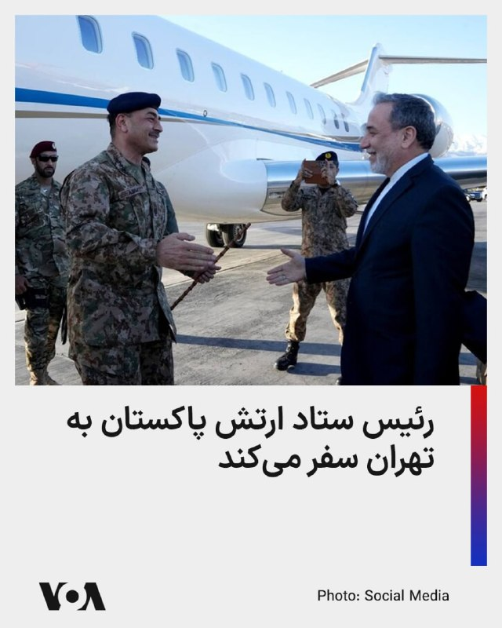

رسانه‌های ایران گزارش دادند که عاصم منیر، رئیس ستاد ارتش پاکستان روز پنجشنبه به تهران سفر خواهد کرد. این سفر در ادامه سفرهای مکرر مقامات بلندپایه پاکستانی به تهران در چارچوب میانجیگری برای پایان جنگ علیه جمهوری اسلامی است.

خبرگزاری ایسنا نوشت که منیر در جریان این سفر با مقامات حکومت ایران گفت‌وگو خواهد کرد.

روز چهارشنبه نیز وزیر کشور پاکستان در تهران بود و شامگاه چهارشنبه سخنگوی وزارت خارجه جمهوری اسلامی اعلام کرد که مقامات حکومت ایران در حال بررسی آخرین نظرات دولت آمریکا درباره مذاکرات برای پایان دادن به جنگ هستند.

دونالد ترامپ، رئیس‌جمهور آمریکا، روز دوشنبه با اعلام توقف موقت یک حمله برنامه‌ریزی‌شده به حکومت ایران، اعلام کرد که این تصمیم برای به نتیجه رسیدن مذاکرات جاری بوده است.

آقای ترامپ اعلام کرده که آماده است چند روزی صبر کند تا «پاسخ‌های درست» را از تهران دریافت کند، اما هشدار داده که اگر توافقی حاصل نشود، حملات از سر گرفته خواهند شد.
@FarsiVOA

## FarsiVOA — post 218274

  

وزارت تجارت بریتانیا از امضای قرارداد لغو بخشی از تعرفه‌ کالاهای صادراتی این کشور با اعضای شورای همکاری خلیج فارس خبر داد. طبق توافق، سالانه ۵۸۰ میلیون پوند (۷۸۰ میلیون دلار) تعرفه کشورهای عرب حوزه خلیج فارس بر صادرات کالاهای بریتانیایی لغو شد.

وزارت بازرگانی بریتانیا می‌گوید ارزش این قرارداد با کشورهای عربستان، امارات، قطر، بحرین، عراق و عمان بر اقتصاد این کشور پنج میلیارد دلار خواهد بود.

این قرارداد در میانه تنش‌های منطقه، انسداد تنگه هرمز توسط جمهوری اسلامی و محاصره دریایی جمهوری اسلامی توسط آمریکا امضا شد. پیشتر بریتانیا قراردادهای مشابهی با هند و کره جنوبی امضا کرده بود.
@FarsiVOA

## FarsiVOA — post 218273

  

🔺جمهوری اسلامی دو زندانی سیاسی کرد را اعدام کرد

▪️دستگاه قضایی جمهوری اسلامی از اعدام دو زندانی سیاسی کرد به نام‌های رامین زله و کریم معروف‌پور خبر داد.

▪️آقای زله در مرداد ۱۴۰۳، توسط نیروهای امنیتی بدون ارائه حکم قضایی بازداشت شده بود، و «از طریق ویدئو کنفرانس در یک جلسه دادرسی چند دقیقه‌ای» محاکمه شده بود و از حق دسترسی به وکیل هم محروم بود.

▪️همچنین آقای معروف‌پور نیز فروردین ۱۴۰۰ توسط نیروهای امنیتی در سردشت و تحت ضرب و شتم بازداشت شد.

▪️شهروندان کُرد در ایران پس از انقلاب ۱۳۵۷، به‌طور مکرر و گسترده با اتهاماتی نظیر «اقدام علیه امنیت ملی از طریق عضویت در احزاب کُرد مخالف نظام» و عنوان کیفری «بغی» با احکام سنگین، از جمله اعدام، مواجه شده‌اند.

⬇️ بیشتر بخوانید:
https://ir.voanews.com/a/iran-executed-two-kurdish-citizens-ramin-zele-and-karim-maroufpour/8152357.html

## FarsiVOA — post 218272

  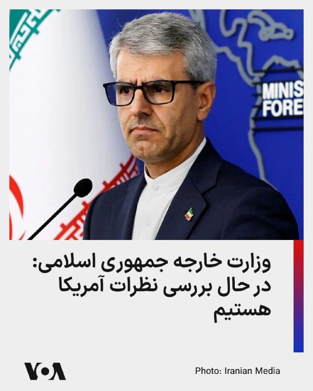

سخنگوی وزارت خارجه جمهوری اسلامی اعلام کرد که مقامات حکومت ایران در حال بررسی آخرین نظرات دولت آمریکا درباره مذاکرات برای پایان دادن به جنگ هستند.

اسماعیل بقایی شامگاه چهارشنبه به صداوسیمای جمهوری اسلامی گفت: «از طریق واسطه پاکستانی و متمرکز بر طرح اولیه ۱۴ بندی ایران، تبادل پیام‌ها [میان تهران و واشنگتن] در چند نوبت انجام شده است. ما نقطه نظرات طرف آمریکایی را دریافت کردیم و در حال بررسی هستیم.»

او درباره حضور وزیر کشور پاکستان در ایران نیز گفت که «برای تسهیل این تبادل پیام‌ها» بوده است.

وزیر کشور پاکستان روز چهارشنبه در تهران حضور داشت و دومین سفر او به ایران طی یک هفته اخیر محسوب می‌شد.

دونالد ترامپ، رئیس‌جمهور آمریکا، روز دوشنبه با اعلام توقف موقت یک حمله برنامه‌ریزی‌شده به حکومت ایران، اعلام کرد که این تصمیم برای به نتیجه رسیدن مذاکرات جاری بوده است.

آقای ترامپ اعلام کرده که آماده است چند روزی صبر کند تا «پاسخ‌های درست» را از تهران دریافت کند، اما هشدار داده که اگر توافقی حاصل نشود، حملات از سر گرفته خواهند شد.
@FarsiVOA

## FarsiVOA — post 218271

  

⚡️فاکس‌نیوز در گزارشی درباره مجتبی خامنه‌ای، رهبر جدید جمهوری اسلامی نوشت که او نزدیک به سه ماه است که در بحبوحه تشدید تنش‌ها با آمریکا در مخفیگاه به سر می‌برد.
این گزارش به نقل از تحلیلگران مبارزه با تروریسم، می‌گوید که پنهان‌شدن مجتبی خامنه‌ای یادآور سال‌های پایانی عمر اسامه بن لادن، مغز متفکر گروه تروریستی القاعده، است که در خانه‌ای در پاکستان سال‌ها پنهان شده بود.
تشکیلات اطلاعاتی ایالات متحده سرانجام با ردیابی یکی از پیک‌های اسامه بن لادن محل زندگی او را شناسایی کرد و این امر منجر به حمله‌ی نیروی دریایی ایالات متحده در سال ۲۰۱۱ شد که به کشته شدن رهبر القاعده در مخفیگاهش انجامید.
@FarsiVOA

## FarsiVOA — post 218270

🔺مقام ارشد کاخ سفید: باقیمانده رهبران جمهوری اسلامی یک «انتخاب دوگانه» دارند، یا توافق یا مجازاتی بی‌مانند در تاریخ مدرن

▪️استیون میلر، از مقامات ارشد کاخ سفید، در مصاحبه‌ای تلویزیونی گفت باقی‌مانده رهبران جمهوری اسلامی، همانطور که رئيس جمهوری آمریکا، دونالد ترامپ، «خیلی روشن» گفته است با یک «انتخاب دوگانه» روبرو هستند: «یا می‌توانند با یک توافق‌نامه‌ای موافقت کنند که برای ایالات متحده رضایت‌بخش باشد، یا باید با مجازاتی از سوی ارتش ما روبه‌رو شوند؛ مجازاتی که مانندش در تاریخ مدرن دیده نشده است. این انتخابی است که پیش روی آن‌ها است.»

⬇️ بیشتر بخوانید:
https://ir.voanews.com/a/8152356.html
@FarsiVOA

## FarsiVOA — post 218269

⚡️نخستين نتیجه از سياست بستن تنگه، خفگى اقتصاد جمهورى اسلامى
@FarsiVOA

## FarsiVOA — post 218268

  <a href="telegram/content/FarsiVOA_218268_1779365112.mp4" target="_blank">🎬 Download video</a>

⚡️واکنش‌ها به سفر احتمالی طالبان به اروپا
@FarsiVOA

## DW_Farsi — post 124956

  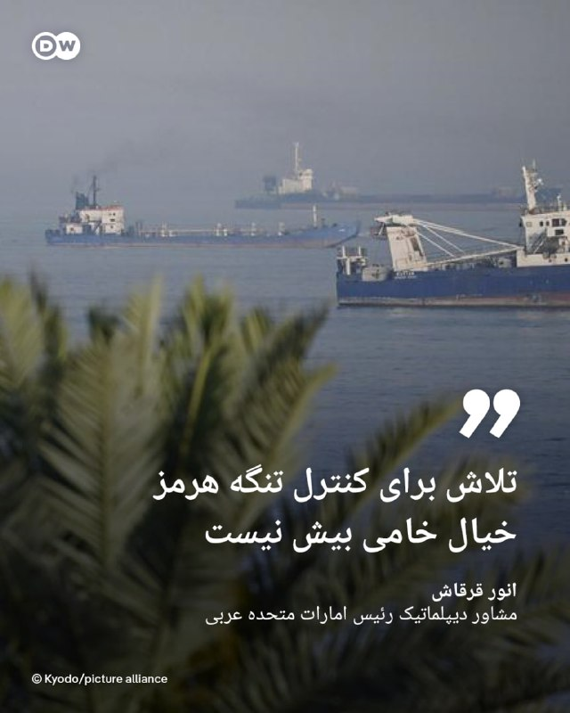

🔶 هشدار مشاور رئیس امارات به ایران: تلاش برای کنترل تنگه هرمز خیال خامی بیش نیست

انور قرقاش، مشاور دیپلماتیک رئیس امارات متحده عربی، هشدار داد تلاش‌های جمهوری اسلامی برای اعمال حاکمیت بر تنگه هرمز یا تجاوز به حاکمیت دریایی امارات "خیال خامی بیش نیست".

قرقاش روز پنج‌شنبه با انتشار پیامی در ایکس نوشت: «ما طی دهه‌های طولانی به زورگویی‌های ایران عادت کرده‌ایم، تا جایی که این رفتار به بخشی از چشم‌انداز سیاسی خلیج فارس تبدیل شده و در میان لفاظی‌های تهاجمی و اعلام دوستی‌های توخالی، جایی برای اعتبار باقی نمانده است.»

او ادامه داد: «امروز، پس از تجاوز وحشیانه ایران، رژیم تلاش می‌کند واقعیتی جدید را که از یک شکست آشکار نظامی متولد شده تثبیت کند، اما تلاش برای کنترل تنگه هرمز یا تعرض به حاکمیت دریایی امارات متحده عربی چیزی جز خیال خام نیست.»

@dw_farsi

## DW_Farsi — post 124955

  

🔶 شریعتمداری: تنگه هرمز باید تا کشته شدن ترامپ به روی آمریکایی‌ها بسته بماند

حسین شریعتمداری، مدیرمسئول روزنامه کیهان، خواستار آن شد تا تمام کشتی‌ها و شناور‌هایی که متعلق به اسرائیل هستند یا برای این کشور نفت حمل می‌کنند، مصادره شوند. او در یادداشتی با انتقاد از مجلس شورای اسلامی به دلیل "به تعویق انداختن تعیین و تصویب نظام قانونی" برای اعمال حاکمیت ایران بر تنگه هرمز نوشت، جمهوری اسلامی باید از "تمامی شناورها بدون استثناء" عوارض دریافت کند و این تنگه را به روی شناورهای آمریکایی و متحدان این کشور ببندد.

شریعتمداری همچنین اضافه کرد تنگه هرمز باید تا زمان "دریافت خسارت‌‌های وارده از آمریکا و متحدان غربی و عربی آن" و نیز "برچیده‌ شدن پایگاه‌های آمریکایی از منطقه و در صدر آن کشتن ترامپ و دار و دسته‌" او بسته بماند.

ابراهیم عزیزی، رئیس کمیسیون امنیت ملی و سیاست خارجی مجلس، اخیرا گفته بود طرحی برای ارائه به صحن مجلس تدوین شده که در آن مقرر شده است دولت به هر فرد حقیقی یا حقوقی که دونالد ترامپ، رئیس جمهور آمریکا، را بکشد "۵۰ میلیون یورو" پاداش دهد.

@dw_farsi

## DW_Farsi — post 124954

  

🔶 سی‌ان‌ان‌: ایران سریع‌تر از حد انتظار در حال بازیابی توانمندی‌های نظامی خود است

دو منبع آگاه به شبکه خبری "سی‌ان‌ان" گفته‌اند که ارزیابی‌های اطلاعاتی ایالات متحده نشان می‌دهد ایران در طول آتش‌بس که از حدود شش هفته پیش آغاز شده، بخشی از تولید پهپادی خود را از سر گرفته‌ است و این امر نشان می‌دهد که این کشور به سرعت در حال بازسازی برخی از قابلیت‌های نظامی تضعیف‌شده خود در پی جنگ با آمریکا و اسرائیل است.

سی‌ان‌ان روز پنج‌شنبه به نقل از چهار منبع مطلع دیگر گزارش داد که بر اساس ارزیابی اطلاعاتی آمریکا، ارتش ایران "بسیار سریع‌تر از برآوردهای اولیه" در حال بازسازی توان نظامی خود است.

این منابع گفته‌اند بازسازی‌ توانمندی‌های نظامی نظیر جایگزینی سایت‌های موشکی، پرتابگر‌ها و ظرفیت تولید سامانه‌های تسلیحاتی کلیدی که در جنگ نابود شده‌اند، به این معناست که در صورت از سرگیری حملات آمریکا و اسرائیل، ایران همچنان تهدیدی جدی برای متحدان منطقه‌ای آمریکا خواهد بود. به نوشته سی‌ان‌ان‌ این موضوع همچنین ادعاها در مورد میزان واقعی تأثیر حملات آمریکا و اسرائیل بر تضعیف بلندمدت توان نظامی ایران تردید ایجاد کرده است.

@dw_farsi

## DW_Farsi — post 124953

  

📸 کلاه‌ها به نشانه شادی در هوا

مراسم پایانی دوره افسری گارد ساحلی ایالات متحده در نیولندن با شادی فارغ‌التحصیلان برگزار شد. آکادمی گارد ساحلی آمریکا پیشینه‌ای طولانی دارد. در جشن امسال دونالد ترامپ، رئیس جمهور آمریکا حضور داشت و سخنانی خطاب به فارغ‌التحصیلان ایراد کرد. پرسنل گارد ساحلی آمریکا بیش از ۴۳ هزار نفر است.

## DW_Farsi — post 124952

  

🔶 عاصم منیر، فرمانده ارتش پاکستان، راهی تهران می‌شود

رسانه‌های داخلی ایران گزارش داده‌اند فیلد مارشال عاصم منیر، فرمانده ارتش پاکستان، روز پنج‌‌شنبه ۳۱ اردیبهشت به تهران سفر می‌کند. این سفر در حالی صورت می‌گیرد که روز چهارشنبه نیز وزیر کشور پاکستان برای دومین بار در هفته جاری به تهران رفته و با مسعود پزشکیان، رئیس جمهور و اسکندر مؤمنی وزیر کشور ایران دیدار و گفت‌وگو کرده بود.

در این گزارش‌ها بدون اشاره به جزئیات بیشتر گفته شده که عاصم منیر برای "ادامه گفت‌وگو‌ها و رایزنی با مقامات" ایرانی در چارچوب تلاش‌های میانجی‌گرانه پاکستان میان ایران و آمریکا راهی تهران می‌شود.

@dw_farsi

## DW_Farsi — post 124951

  

🔶 رئیس جمهور آلمان: جنگ ایران یک جنگ غیرضروری است

فرانک والتر اشتاین‌مایر، رئیس جمهور آلمان، در گفت‌وگویی با پادکست "Vorangedacht" حمله نظامی آمریکا و اسرائیل به ایران را "قابل اجتناب" خوانده و گفت: «این جنگ غیرضروری است.»

اشتاین مایر با اشاره به توافق هسته‌ای سال ۲۰۱۵ موسوم به "برجام" که میان ایران و غرب امضا شد و آمریکا در نخستین دوره ریاست‌جمهوری دونالد ترامپ در سال ۲۰۱۸ از آن خارج شد، گفت: «خوب می‌بود که ما این توافق را حفظ می‌کردیم. عواقبی که اکنون شاهد آن هستیم، نباید اتفاق می‌افتادند.»

رئیس جمهور آلمان اوایل فروردین نیز در یک سخنرانی شدیدالحن، جنگ ایران را "یک خطای سیاسی فاجعه‌بار" خوانده و گفته بود اگر هدف آن متوقف کردن ایران در مسیر دستیابی به سمت بمب اتمی بوده باشد، "یک جنگ واقعا قابل اجتناب و غیرضروری" است.

@dw_farsi

## DW_Farsi — post 124950

  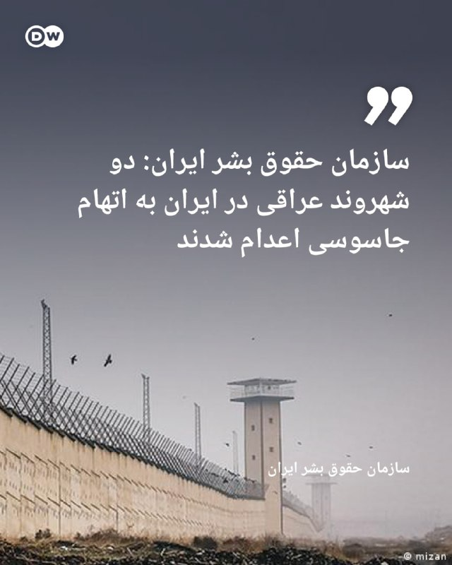

🔶 سازمان حقوق بشر ایران: دو شهروند عراقی در ایران به اتهام جاسوسی اعدام شدند

"سازمان حقوق بشر ایران" روز چهارشنبه ۳۰ اردیبهشت از اعدام دو شهروند عراقی در زندان مرکزی کرج خبر داد.

این سازمان هویت این دو نفر را علی نادر العبیدی ۲۷ ساله و فاضل شیخ کریم ۲۹ ساله معرفی کرده و گفته است که آنها در یک پرونده مشترک به اتهام "جاسوسی"، سحرگاه روز دوشنبه ۱۷ فروردین در سکوت خبری اعدام شدند.

طبق این گزارش این دو زندانی از شهروندان عرب و اهل شهر عماره در عراق بوده‌اند که پیش‌تر در کرج بازداشت و به "جاسوسی برای نهادهای اطلاعاتی و امنیتی یکی از کشورهای عربی" متهم شده بودند.

یک منبع مطلع به سازمان حقوق بشر ایران گفته است علی نادر العبیدی و فاضل شیخ کریم پیش از صدور حکم، "به مدت ۱۱ ماه در بازداشتگاه وزارت اطلاعات تحت بازجویی قرار داشتند و سپس به بند اطلاعات سپاه در زندان رجایی‌شهر کرج منتقل شدند".

طبق این گزارش،‌ این دو زندانی در نهایت برای اجرای حکم اعدام به ندامتگاه مرکزی کرج منتقل شده بودند.

@dw_farsi

## DW_Farsi — post 124949

  

🔶 دو تن به اتهام "عضویت در گروه‌های تروریستی" در ایران اعدام شدند

خبرگزاری میزان، ارگان رسمی قوه قضائیه ایران، از اعدام دو تن به اتهام "عضویت در گروه‌های تروریستی تجزیه‌طلب" و "قیام مسلحانه از طریق تشکیل گروه‌های مجرمانه" در صبح پنج‌شنبه ۳۱ اردیبهشت خبر داد.

در این گزارش هویت این دو نفر، رامین زله و کریم معروف‌پور معرفی شده، اما به نام گروهی که آنها متهم به عضویت در آن بوده‌اند، اشاره‌ای نشده است.

میزان ادعا کرده است که رامین زله و کریم معروف‌پور برای "ترور فرمانده پایگاه سپاه" یکی از شهرستان‌های غرب کشور "همکاری" داشته‌اند. به ادعای میزان، رامین زله پس از "طی دوره‌های آموزشی از طرف یک گروهک ماموریت پیدا کرده بود تا در ناآرامی‌های کشور به عنوان لیدر شرکت کند".

در این گزارش ادعا شده است که او در اعترافات خود گفته است که به سمت یک خودرو حامل نیروهای نظامی "شلیک و از این عملیات فیلمبرداری کرده‌اند". به ادعای میزان کریم معروف‌‌پور در اعترافات خود اقرار کرده است که از "اقدامات مسلحانه" این گروه "آگاهی داشته" و یکی از مسئولیت‌هایش "نگهداری سلاح برای انجام عملیات‌های تروریستی" بوده است.

@dw_farsi

## DW_Farsi — post 124948

  

🔶 جام‌های ۱۹۷۰ و ۱۹۷۴؛ گرد مولر، "بمب‌افکن" تیم ملی آلمان

گرد مولر که در نوک حمله‌ی تیم فوتبال باشگاه بایرن مونیخ و تیم ملی فوتبال آلمان بازی می‌کرد، در فاصله‌ی سال‌های ۱۹۶۶ تا ۱۹۷۴، در تیم ملی آلمان جزو محور اسطوره‌ای "مایر ـ بکن‌باوئر ـ مولر" به شمار می‌رفت و در تاریخ فوتبال آلمان و جهان رکوردهای شگفت‌انگیزی برجای گذاشت.

اگر چه ستاره گرد مولر در سال ۱۹۶۶ درخشیدن گرفت، اما هلوت شون، سرمربی تیم ملی فوتبال آلمان او را پس از جام جهانی ۱۹۶۶ انگلیس به تیم ملی دعوت کرد. با این حساب، گرد مولر در دو دوره جام جهانی (۱۹۷۰ و ۱۹۷۴) حضور داشت.

او که در تاریخ ۳ نوامبر سال ۱۹۴۵ در نوردلینگن (آلمان) متولد شد، برای نخستین بار در ۲۱ سالگی پیراهن تیم ملی فوتبال آلمان را به تن کرد و ۸ سال در خدمت این تیم بود؛ در این ۸ سال روی هم ۶۲ بازی برای تیم ملی فوتبال آلمان انجام داد و ۶۸ گل به ثمر رساند، یعنی به طور میانگین بیش از یک گل در هر بازی.

@dw_farsi

## DW_Farsi — post 124947

  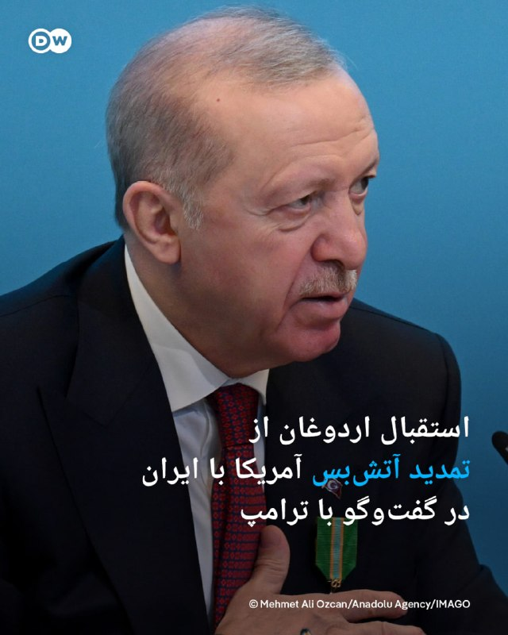

🔶 استقبال اردوغان از تمدید آتش‌بس آمریکا با ایران در گفت‌وگو با ترامپ

دفتر ریاست‌جمهوری ترکیه اعلام کرد رجب طیب اردوغان روز چهارشنبه ۲۰ مه در تماس تلفنی با دونالد ترامپ، از تمدید آتش‌بس میان آمریکا و ایران استقبال و تأکید کرد، مسائل مورد اختلاف میان دو طرف قابل حل و فصل است.

ترکیه که عضو ناتو و همسایه ایران است، در هفته‌های گذشته با هدف پایان دادن به جنگ، با ایران، واشنگتن و پاکستان که میانجیگری مذاکرات میان ایران و آمریکا را بر عهده دارد، در تماس بوده است.

در بیانیه‌ای که دفتر اردوغان منتشر کرده، آمده است: «رئیس‌جمهور [ترکیه] در این گفت‌وگو اظهار داشت که تصمیم برای تمدید آتش‌بس را تحولی مثبت می‌داند و باور دارد که راه‌حلی منطقی برای مسائل مورد اختلاف امکان‌پذیر است.»

در این بیانیه همچنین گفته شده است که اردوغان در گفت‌وگو با ترامپ بازگشت ثبات به سوریه را "دستاوردی مهم" برای منطقه توصیف کرده و خواستار اقداماتی برای جلوگیری از وخیم‌تر شدن اوضاع لبنان در پی ادامه حملات متقابل اسرائیل و حزب‌الله شده است.

@dw_farsi

## DW_Farsi — post 124946

  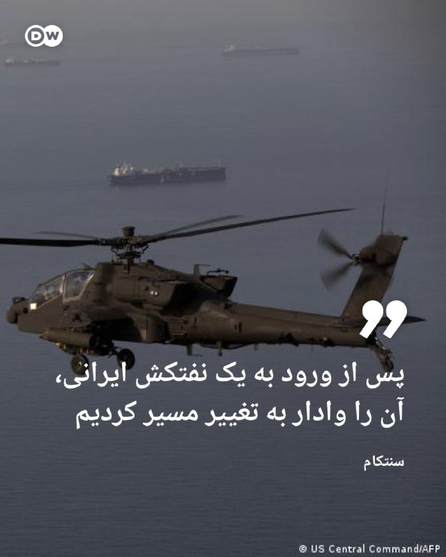

🔶 سنتکام: پس از ورود به یک نفتکش ایرانی، آن را وادار به تغییر مسیر کردیم

ارتش ایالات متحده روز چهارشنبه ۲۰ مه اعلام کرد که تفنگداران دریایی این کشور یک نفتکش با پرچم ایران را که مظنون به تلاش برای نقض محاصره دریایی بود، در دریای عمان متوقف و بازرسی کردند.

ستاد فرماندهی مرکزی آمریکا (سنتکام) با انتشار ویدئویی در شبکه‌ اجتماعی ایکس اعلام کرد این نفتکش با نام "ام/‌تی سلستیال سی" که مظنون به تلاش به نقض محاصره دریایی و حرکت به سوی یکی از بنادر ایران بود، متوقف شد و تحت بازرسی قرار گرفت و سپس مسیر آن تغییر داده شد. در بیانیه سنتکام آمده است که نیروهای آمریکایی "پس از جستجو و هدایت، خدمه را برای تغییر مسیر کشتی آزاد کردند".

سنتکام افزوده است: «نیروهای آمریکایی همچنان به اجرای کامل محاصره دریایی ادامه می‌دهند، تاکنون ۹۱ کشتی تجاری را برای اطمینان از رعایت آن، تغییر مسیر داده‌اند.»

پس از اعمال محاصره دریایی آمریکا علیه بنادر ایران که اواسط آوریل، چند روز پس از برقراری آتش‌بس، صورت گرفت تا کنون دستکم پنج کشتی تجاری توقیف یا مورد بازرسی قرار گرفته‌اند.

@dw_farsi

## DW_Farsi — post 124945

  

🔶 "اختلاف‌نظر" ترامپ و نتانیاهو در تماس تلفنی "پرتنش" درباره آینده جنگ با ایران

وبسایت "اکسیوس" و روزنامه "وال‌استریت ژورنال" روز چهارشنبه در گزارش‌هایی جداگانه به نقل از منابع ناشناس خبر دادند دونالد ترامپ و بنیامین نتانیاهو در تماس تلفنی اخیر خود بر سر نحوه ادامه برخورد با ایران دچار اختلاف شدند.

گفته می‌شود این اختلاف بر سر دیدگاه‌های متفاوت درباره یک پیشنهاد اصلاح‌شده برای پایان دادن به تنش با ایران بوده است. به نوشته اکسیوس و به نقل از یکی از منابع، نخست‌وزیر اسرائیل پس از گفت‌وگوی تلفنی با ترامپ "کاملا برآشفته" شده بود. طبق این گزارش‌ها، قطر و پاکستان به همراه برخی شرکای دیگر، یک پیشنهاد صلح به‌روزشده ارائه کرده بودند که هدف آن کاهش اختلافات میان واشنگتن و تهران بود.

در همین حال یک مقام آمریکایی نیز در گفت‌وگو با شبکه "سی‌ان‌ان‌" این موضوع را تأیید کرده و اظهار داشت ترامپ روز سه‌شنبه تماس تلفنی پرتنشی با نتانیاهو داشت که منعکس‌کننده دیدگاه‌های متفاوت آنها در مورد چگونگی پیشبرد جنگ با ایران بوده است.

@dw_farsi

## DW_Farsi — post 124944

  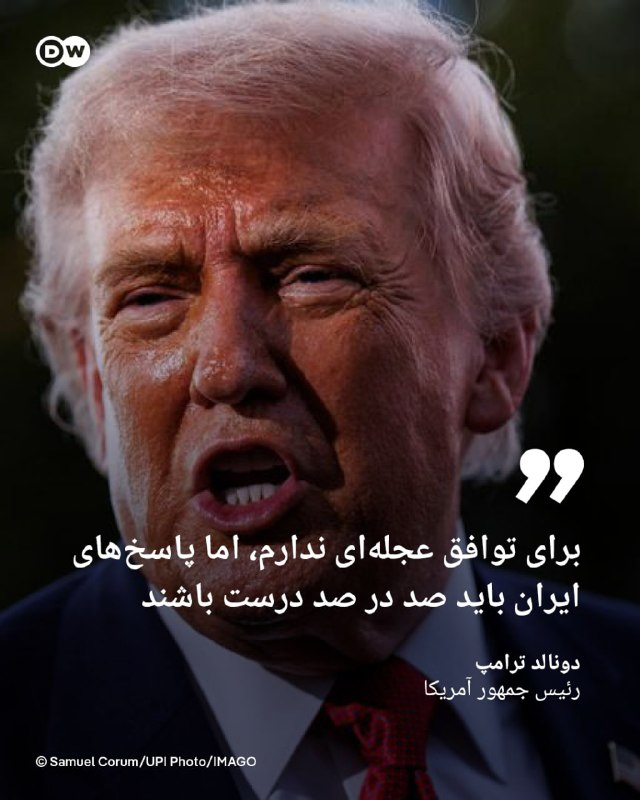

🔶 ترامپ: برای توافق عجله‌ای ندارم، اما پاسخ‌های ایران باید صد در صد درست باشند

دونالد ترامپ، رئیس جمهور آمریکا‌، روز چهارشنبه ۲۰ مه (۳۰ اردیبهشت) در گفت‌وگو با خبرنگاران در پایگاه نظامی مشترک "اندروز" در حومه واشنگتن اظهار داشت که مذاکرات با ایران "در لب مرز" بین رسیدن به توافق برای پایان دادن جنگ و از سرگیری مجدد حملات قرار دارد.

او گفت ایالات متحده "کاملا آماده" است و اگر پاسخ‌های درستی از تهران نگیرد، وارد عمل خواهد شد. ترامپ افزود برای توافق با ایران "عجله‌ای ندارد" و واشنگتن می‌تواند چند روز صبر کند تا "پاسخ‌های درست" را دریافت کند.

ترامپ تأکید کرد: «باید پاسخ‌های درست را دریافت کنیم؛ پاسخ‌هایی که باید به‌طور کامل، صددرصد خوب باشند.»

رئیس جمهور آمریکا گفت اگر ایران به توافق برسد "مقدار زیادی در زمان، انرژی و جان انسان‌ها صرفه‌جویی می‌شود" و این اتفاق می‌تواند "خیلی سریع یا ظرف چند روز" رخ دهد.

@dw_farsi

## DW_Farsi — post 124943

🔶 گام نخست کنگره آزادی ایران؛امید به اتحاد، چالش حضور اتنیک‌ها

نخستین انتخابات "کنگره آزادی ایران" با انتقاد شماری از فعالان اتنیکی به دلیل غیبت نمایندگانشان روبه‌رو شدە است. به گفتە منتقدان نحوە عبور از این چالش عیار تکثرگرایی و آینده این ائتلاف را خواهد آزمود.

تلاش برای همگرایی و ایجاد ائتلاف میان نیروهای متکثر مخالف جمهوری اسلامی، همواره یکی از پرچالش‌ترین عرصه‌های سیاست‌ورزی در دهه‌های اخیر در ایران بوده است. تشکیل "کنگره آزادی ایران" و برگزاری نخستین انتخابات شورای مرکزی و هیئت نظارت آن، تازه‌ترین گام در این مسیر پرفرازونشیب است. پروژه‌ای که هدف خود را عبور از ساختارهای فردمحورِ سنتی و رسیدن به پلتفرمی کثرت‌گرا و دموکراتیک عنوان می‌کند.

با این حال اعلام نتایج این انتخابات و غیبت نمایندگان برخی اتنیک‌ها در ارکان کلیدی آن، بلافاصله انتقاد برخی از فعالان سیاسی را بر انگیخت و پرسش‌هایی درباره میزان پایبندی این کنگره به شعار تکثرگرایی مطرح کرد.

دویچه‌وله فارسی برای بررسی دقیق‌تر دستاوردها، چالش‌ها و حواشی این رویداد، با پنج تن از چهره‌های سیاسی و مدنی گفت‌وگو کرده است.

@dw_farsi

## Persian_Trend_Official — post 14582

💢وضعیت هوش مصنوعی داخلی در پیام رسان بله ...

🫆:Tony

📌 @persian_trend_official
پرشین ترند | متفاوت‌ترین کانال نظامی

## Persian_Trend_Official — post 14581

  <a href="telegram/content/Persian_Trend_Official_14581_1779365130.mp4" target="_blank">🎬 Download video</a>

💢جنگ طلبی از صفات بارز امام بود ...

🫆:Tony

📌 @persian_trend_official
پرشین ترند | متفاوت‌ترین کانال نظامی

## Persian_Trend_Official — post 14580

🔴 سفر احتمالی عاصم منیر به تهران؛ آخرین تلاش برای جلوگیری از بازگشت جنگ؟

💢گزارش‌ها حاکی است سفر احتمالی «عاصم منیر» فرمانده ارتش پاکستان به تهران، نشانه وجود پیام‌های مهم و مذاکرات حساس میان طرف‌هاست.

💢بر اساس ارزیابی‌ها:

▪️ بسیاری این تحرکات را آخرین فرصت برای جلوگیری از ازسرگیری جنگ می‌دانند

▪️ با این حال اختلافات اساسی میان ایران و آمریکا همچنان پابرجاست

💢خواسته‌های اصلی ایران:

▪️ دریافت تضمین برای جلوگیری از وقوع جنگی دیگر

▪️ به‌رسمیت شناختن کنترل ایران بر تنگه هرمز

▪️ آزادسازی دارایی‌های بلوکه‌شده

▪️ باقی ماندن بخشی از ذخایر اورانیوم غنی‌شده در داخل کشور

💢در مقابل، آمریکا خواستار:

▪️ تعطیلی تمامی تأسیسات هسته‌ای ایران به‌جز مرکز تهران شده است

▪️ واشینگتن تأکید دارد حتی تأسیسات باقی‌مانده نیز نباید فعالیت غنی‌سازی داشته باشند

💢اختلاف دیگر بر سر نحوه اجرای توافق است:

▪️ آمریکا خواهان اجرای کامل و یک‌باره توافق است

▪️ اما ایران می‌گوید اگر جنگ طی ۳۰ روز نخست پایان یابد، سایر مراحل می‌تواند به‌تدریج اجرا شود

💢همچنین گزارش شده آمریکا قادر نیست تضمین دهد اسرائیل ترورهای هدفمند در داخل ایران را متوقف خواهد کرد؛ مسئله‌ای که یکی از مهم‌ترین نگرانی‌های تهران محسوب می‌شود.

🫆:Tony

📌 @persian_trend_official
پرشین ترند | متفاوت‌ترین کانال نظامی

## Persian_Trend_Official — post 14579

  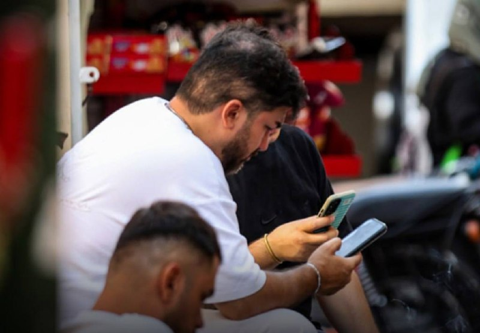

💢نت‌بلاکس، نهاد ناظر بر اینترنت، نوشت که داده‌های این نهاد نشان می‌دهد قطعی اینترنت در ایران وارد هشتادوسومین روز خود شده و شبکه‌های بین‌المللی بیش از هزار و ۹۶۸ ساعت است که به‌طور گسترده مسدود مانده‌اند.

💢این نهاد ناظر بر اینترنت با تاکید بر اهمیت دسترسی آزاد به اینترنت نوشت: «اینترنت آزاد و باز، برای حفاظت از جان، آزادی و پاسخگویی عمومی نقشی اساسی دارد.»

🫆:Tony

📌 @persian_trend_official
پرشین ترند | متفاوت‌ترین کانال نظامی

## Persian_Trend_Official — post 14578

  

🔴 آمریکا و نیجریه فرمانده ارشد داعش در آفریقا را کشتند

💢ایالات متحده و نیجریه اعلام کردند در عملیات مشترکی «ابوبلال المینوکی» از فرماندهان ارشد داعش در غرب آفریقا کشته شده است.

▪️ المینوکی از رهبران اصلی شاخه «داعش ولایت غرب آفریقا» (ISWAP) بود
▪️ او پیش‌تر عضو بوکوحرام بوده و پس از انشعاب این گروه به داعش پیوسته بود
▪️ برخی منابع اطلاعاتی او را «نفر دوم داعش در سطح جهانی» توصیف کرده‌اند

💢شاخه غرب آفریقای داعش طی سال‌های اخیر به یکی از فعال‌ترین و خطرناک‌ترین شاخه‌های این گروه در جهان تبدیل شده است.

🫆:Tony

📌 @persian_trend_official
پرشین ترند | متفاوت‌ترین کانال نظامی

## Persian_Trend_Official — post 14577

🔴 رهبر جمهوری اسلامی دستور داده ذخایر اورانیوم از کشور خارج نشود

💢خبرگزاری رویترز به نقل از منابع ایرانی گزارش داد رهبر جمهوری اسلامی دستور داده ذخایر اورانیوم غنی‌شده نزدیک به سطح تسلیحاتی، از کشور خارج نشود.

🫆:Tony

📌 @persian_trend_official
پرشین ترند | متفاوت‌ترین کانال نظامی

## Persian_Trend_Official — post 14576

  <a href="telegram/content/Persian_Trend_Official_14576_1779365142.webm" target="_blank">🎬 Download video</a>

💢انور قرقاش، مشاور محمد بن زاید

💢ما طی دهه‌های طولانی به قلدری و زورگویی ایران عادت کرده‌ایم، تا جایی که بخشی از صحنه سیاسی خلیج فارس شده است. اعتبارشان بین گفتارهای تهاجمی و بیانیه‌های دوستی توخالی از بین رفته است.

💢امروز، پس از تجاوز وحشیانه ایران، رژیم تلاش می‌کند واقعیت جدیدی را تحکیم کند که از یک شکست نظامی آشکار متولد شده. اما تلاش برای کنترل تنگه هرمز یا تعدی به حاکمیت دریایی امارات، چیزی جز رویاهای پریشان و واهی نیست.

💢هر کس که بخواهد با محیط عربی خود همزیستی کند، باید بداند که اعتماد از بین رفته و بازگرداندن آن با شعارها ممکن نیست، بلکه با زبان مسئولانه، احترام به حاکمیت و تعهد واقعی به اصول همسایگی خوب انجام می‌شود.

🫆:Tony

📌 @persian_trend_official
پرشین ترند | متفاوت‌ترین کانال نظامی

## Persian_Trend_Official — post 14575

  <a href="telegram/content/Persian_Trend_Official_14575_1779365142.webm" target="_blank">🎬 Download video</a>

⭕️بندرعباس لرزید

💢دقایقی پیش زمین لرزه ای به قدرت ۴.۶ ریشتر بندرعباس را لرزاند

🫆:Tony

📌 @persian_trend_official
پرشین ترند | متفاوت‌ترین کانال نظامی

## Persian_Trend_Official — post 14574

🔴 سخنگوی وزارت خارجه ایران: در حال بررسی پاسخ جدید آمریکا هستیم

💢اسماعیل بقایی، سخنگوی وزارت خارجه ایران، اعلام کرد تهران در حال بررسی آخرین پاسخ واشینگتن به چارچوب پیشنهادی آتش‌بس است؛ چارچوبی که پس از چند دور تبادل پیام با میانجیگری پاکستان ارائه شده است.

بر اساس گزارش‌ها:

▪️ پیام‌ها میان تهران و واشینگتن از طریق پاکستان ادامه دارد
▪️ ایران هنوز تصمیم نهایی درباره پیشنهاد آمریکا نگرفته است
▪️ مذاکرات بر محور پایان جنگ، کاهش تنش و مسائل مربوط به تنگه هرمز متمرکز است

💢بقایی همچنین گفته تصمیم نهایی پس از تکمیل بررسی‌های داخلی ایران اتخاذ خواهد شد.

🫆:Tony

📌 @persian_trend_official
پرشین ترند | متفاوت‌ترین کانال نظامی

## Persian_Trend_Official — post 14573

  

⭕️ ژاپن به ساخت هواپیمای مافوق صوت خود نزدیک شده است. آژانس فضایی ژاپن (JAXA) به همراه دانشگاه‌های واسدا، توکیو و کیئو آزمایش‌های زمینی موتور رمجت (Ramjet) برای وسیله پروازی مافوق صوتی که قادر به پرواز با سرعتی پنج برابر سرعت صوت است را انجام دادند.

آزمایش‌ها در مرکز فضایی کاکودا انجام شد. در تونل باد، دانشمندان پرواز مافوق صوت را شبیه‌سازی کردند و عملکرد موتور رمجت، سیستم‌های کنترل و محافظ حرارتی هواپیما را بررسی کردند. در سرعت ۵ ماخ (تقریباً حدود ۶۱۰۰ کیلومتر بر ساعت) دمای هوای اطراف وسیله می‌تواند به حدود ۱۰۰۰ درجه سانتی‌گراد برسد، اما سیستم محافظ حرارتی توانست شرایط تقریباً نرمالی را برای عملکرد الکترونیک داخل سازه حفظ کند.

این پروژه به منظور ساخت یک سکوی آزمایشی مافوق صوت طراحی شده است. مرحله بعدی باید آزمایش‌های پروازی کامل با نصب وسیله آزمایشی روی یک راکت ژئوفیزیکی باشد. هدف اصلی برنامه ایجاد فناوری‌هایی برای هواپیماها و فضاپیماهای مافوق صوت آینده است.

در JAXA معتقدند که در آینده این فناوری‌ها امکان کاهش زمان پرواز بین ژاپن و آمریکا از طریق اقیانوس آرام را به حدود دو ساعت فراهم می‌کنند. علاوه بر این، تحقیقات می‌توانند پایه‌ای برای ساخت وسایلی باشند که قادر به صعود تا ارتفاع حدود ۱۰۰ کیلومتر هستند.

📝 Nick

📌 @persian_trend_official
پرشین ترند | متفاوت‌ترین کانال نظامی

## Persian_Trend_Official — post 14572

  

💢سخنگوی وزارت خارجه روسیه: مسکو آماده کمک به اجرای توافقات احتمالی میان ایران و آمریکا است

💢ماریا زاخارووا، سخنگوی وزارت امور خارجه روسیه گفت، روسیه کاملاً آماده است کمک‌های لازم را به تهران و واشنگتن برای اجرای تصمیماتی که ممکن است در جریان مذاکرات میان آن‌ها حاصل شود، ارائه دهد.

🫆:Tony

📌 @persian_trend_official
پرشین ترند | متفاوت‌ترین کانال نظامی

## Persian_Trend_Official — post 14571

  <a href="telegram/content/Persian_Trend_Official_14571_1779365148.mp4" target="_blank">🎬 Download video</a>

💢 لو رفتن موقعیت توسط نیروهای خودی و گیر افتادن ۴۸ ساعته و خفه شدن نیروهای سپاه پاسداران داخل تونل موشکی

🫆:Tony

📌 @persian_trend_official
پرشین ترند | متفاوت‌ترین کانال نظامی

## Persian_Trend_Official — post 14570

  

به بهانه امنیت اینترنت 80 میلیون ایرانی رو قطع میکنن !
اونوقت با پاکستانی ها دیدار میکنن !
بعد مه ترورش کردن میگن وحیدی رو از طریق اینترنت رد زنی کردن !!!

📌 @persian_trend_official
پرشین ترند | متفاوت‌ترین کانال نظامی

## Persian_Trend_Official — post 14569

بازارهای خلیج فارس با امید به توافق جمهوری اسلامی و آمریکا رشد کردند

خبرگزاری رویترز گزارش داد بازارهای سهام خلیج فارس در آغاز معاملات پنج‌شنبه ۳۱ اردیبهشت، تحت تاثیر امیدها به نزدیک شدن آمریکا و جمهوری اسلامی به توافقی برای پایان جنگ خاورمیانه و همچنین افزایش قیمت نفت، رشد کردند.

بر اساس این گزارش، سرمایه‌گذاران پس از سخنان دونالد ترامپ درباره قرار داشتن مذاکرات با جمهوری اسلامی در مراحل پایانی، نشانه‌های پیشرفت در گفت‌وگوها را دنبال می‌کنند.

ترامپ هم‌زمان هشدار داده اگر جمهوری اسلامی با توافق موافقت نکند، حملات بیشتری انجام خواهد شد.

شاخص بورس دبی یک درصد، شاخص ابوظبی ۰/۲ درصد و شاخص قطر ۰/۶ درصد افزایش یافتند. در مقابل، شاخص بورس عربستان سعودی اندکی کاهش یافت. قیمت نفت برنت نیز با رشد بیش از یک درصدی به ۱۰۶ دلار و ۲۹ سنت در هر بشکه رسید.

📌 @persian_trend_official
پرشین ترند | متفاوت‌ترین کانال نظامی

## Persian_Trend_Official — post 14568

  

قابل توجه وطن پرستان گوبلزی !

یه زمانی دادستانی انقلاب توی روزنامه آگهی میزد اولیا این کودکان زیر سن قانونی با در دست داشتن شناسنامه به دفتر مرکزی زندان اوین مراجعه کنن تا اجساد فرزندانشون رو دریافت کنند !

اکثر این افراد زیر سن قانونی بودن و حتی از حق داشتن وکیل و یک دادگاه منصفانه محروم بودند !

اعدام شدن بدون اینکه حتی دادگاه نامشون رو احراز کرده باشه یا شناسایی شده باشند !

📌 @persian_trend_official
پرشین ترند | متفاوت‌ترین کانال نظامی

## Persian_Trend_Official — post 14567

  <a href="telegram/content/Persian_Trend_Official_14567_1779365154.webm" target="_blank">🎬 Download video</a>

بدون شرح

## Persian_Trend_Official — post 14566

  <a href="telegram/content/Persian_Trend_Official_14566_1779365154.mp4" target="_blank">🎬 Download video</a>

https://youtube.com/live/CCiwTJiy05Y?feature=share

## Persian_Trend_Official — post 14565

⭕️زمین‌لرزه ۴ ریشتری فراشبند فارس را لرزاند

🔹مرکز لرزه‌نگاری موسسه ژئوفیزیک دانشگاه تهران اعلام کرد، زمین‌لرزه‌ای به قدرت ۴ ریشتر ساعت ۳:۴۷ بامداد امروز -پنجشنبه- حوالی فراشبند استان فارس را لرزاند. این زمین‌لرزه در عمق ۱۰ کیلومتری زمین رخ داد.

🫆:Tony

📌 @persian_trend_official
پرشین ترند | متفاوت‌ترین کانال نظامی

## RadioFarda — post 157420

هشدار نماینده کنگره آمریکا؛ ابهام و شکاف در ائتلاف غرب به سود روسیه، ایران و چین است

🔸دان بیکن، از جمهوری‌خواهان ارشد کمیته نیروهای مسلح مجلس نمایندگان آمریکا، در مصاحبه‌ای مفصل می‌گوید ابهام و عدم قطعیت واشینگتن می‌تواند دشمنان آمریکا، از جمله روسیه، ایران و چین را «گستاخ‌تر» کند؛ آن هم در شرایطی که تنش‌ها در داخل ائتلاف ناتو رو به افزایش است.

🔸این ژنرال سابق نیروی هوایی این اظهارات را در گفت‌وگو با رادیو اروپای آزاد/رادیو آزادی و هم‌زمان با اعلام پنتاگون درباره کاهش شمار تیپ‌های رزمی ارتش آمریکا در اروپا از چهار تیپ به سه تیپ و نیز تعویق استقرار برنامه‌ریزی‌شده نیروها در لهستان مطرح کرد.

🔸بیکن گفت بازنگری در استقرار نیروها، بخشی از موضوع گسترده‌ترِ نحوهٔ مواجههٔ آمریکا با چالش‌های هم‌زمان ناشی از روسیه، چین، ایران و گروه‌های افراط‌گرا است.

🔸او با بیان این‌که «ابهام در دنیای امروز خطرناک است»، گفت واشینگتن و متحدانش نمی‌توانند در شرایطی که این تهدیدها بیش از پیش با هم مرتبط می‌شوند، فاقد شفافیت راهبردی باشند.

🔸گفت‌وگوی کامل را در وب‌سایت رادیو فردا می‌توانید بخوانید.

@RadioFarda

## RadioFarda — post 157419

  <a href="https://t.me/radiofarda/157419" target="_blank">📎 Download file</a>

📻بشنوید: ساعت ۱۴ با رادیوفردا، ۳۱ اردیبهشت ۱۴۰۵‌

@Radiofarda

## RadioFarda — post 157418

  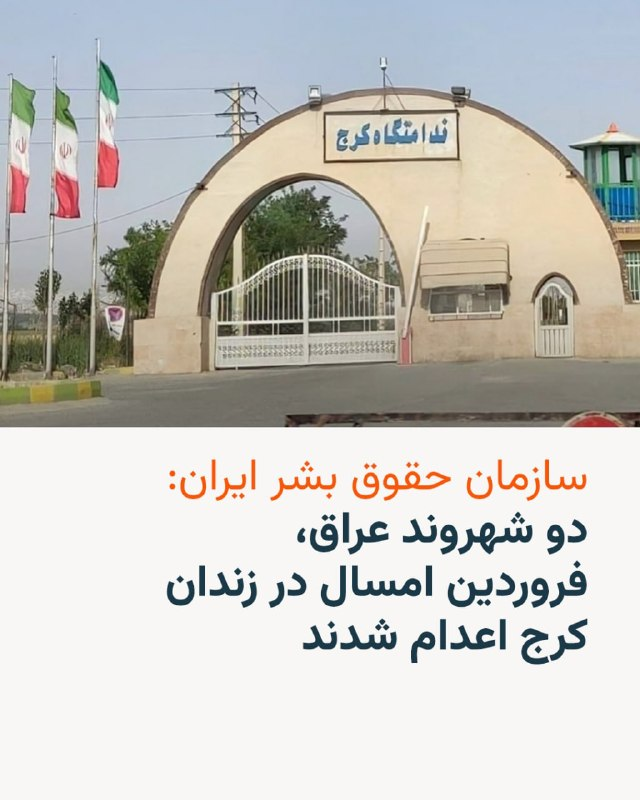

🔸سازمان حقوق بشر ایران روز چهارشنبه، ۳۰ اردیبهشت، خبر داد که در فروردین‌ماه گذشته دو شهروند عراق هم در ایران «به جرم جاسوسی» اعدام شده‌اند.

🔸به نوشته این سازمان، علی نادر العبیدی، ۲۷ ساله، و فاضل شیخ کریم، ۲۹ ساله، در یک پرونده مشترک با اتهام «جاسوسی» به اعدام محکوم شده بودند و حکم‌شان سحرگاه روز دوشنبه ۱۷ فروردین در زندان مرکزی کرج به اجرا درآمد.

🔸سازمان حقوق بشر ایران می‌گوید که این دو نفر «به اتهام جاسوسی برای نهادهای اطلاعاتی و امنیتی یکی از کشورهای عربی» در کرج بازداشت شده بودند.

🔸طبق محاسبه این سازمان، از زمان آغاز جنگ آمریکا و اسرائیل با ایران، هشت نفر به جرم جاسوسی در ایران اعدام شده‌اند.

🔸گروه‌های حقوق بشری از جمله سازمان عفو بین‌الملل می‌گویند ایران دارای بیشترین تعداد اعدام به نسبت جمعیت خود در جهان است، و پس از چین که آمار قابل اعتمادی از آن در دست نیست، بیشترین تعداد اعدام را در میان کشورها به خود اختصاص داده است.

@RadioFarda

## RadioFarda — post 157417

  <a href="telegram/content/RadioFarda_157417_1779365159.mp4" target="_blank">🎬 Download video</a>

🔸اعضای تیم ملی فوتبال ایران روز ۳۱ اردیبهشت برای شرکت در جلسات صدور ویزا در سفارت کانادا در آنکارا، پایتخت ترکیه، حضور یافتند.

🔸بر اساس گزارش‌ها این بازیکنان به یک مرکز خصوصی درخواست ویزا مراجعه و درخواست‌های ویزا را برای سفارت کانادا مرتب کردند.

🔸به گفته یک مقام رسمی فدراسیون فوتبال ایران برخی بازیکنان ایرانی مقیم خارج از کشور، پیش از سفر به اردوی تمرینی تیم در آنتالیا در ساحل مدیترانه‌ای ترکیه، در آنکارا به تیم ملحق شدند.

🔸جام‌جهانی به میزبانی مشترک ایالات متحده، کانادا و مکزیک برگزار خواهد شد و ایران قرار است هر سه بازی مرحله گروهی خود را در ایالات متحده انجام دهد.

🔸بحران نظامی و سیاسی در خاورمیانه بر حضور تیم ملی فوتبال ایران در جام‌جهانی سایه انداخته است.

🔸پیش‌تر فدراسیون فوتبال جمهوری اسلامی درخواست کرده بود که مسابقاتش به مکزیک منتقل شود، اما جیانی اینفانتینو، رئیس فیفا، با این درخواست مخالفت کرد.

@RadioFarda

## RadioFarda — post 157416

  

🔸سفیر تهران در پاکستان از آزادی و بازگشت ۲۰ ملوان ایرانی یک کشتی توقیف‌شده توسط آمریکا در آب‌های سنگاپور به ایران خبر داد.

🔸سفیر ایران در پاکستان امروز پنجشنبه ۳۱ اردیبهشت اعلام کرد این ۲۰ ملوان ایرانی که به‌دلیل توقیف کشتی در وضعیت نامناسبی قرار داشتند، با وساطت و پیگیری پاکستان آزاد و امروز به کشور بازگشتند.

🔸بر اساس اعلام قبلی وزیر خارجه پاکستان، ۱۱ ملوان این کشتی که اکنون در آب‌های سنگاپور در حالت توقیف قرار دارد، تبعهٔ پاکستان هستند.

🔸ارتش ایالات متحده پس از توقف جنگ با ایران با آتش‌بسی که از ۱۹ فروردین اعلام شد، همزمان با مسدود نگه داشته شدن تنگه هرمز توسط سپاه پاسداران، اقدام به محاصره دریایی بنادر جنوبی ایران کرده است.

@RadioFarda

## RadioFarda — post 157415

  

سپاه پاسداران محدوده نظارتی خود بر تنگه هرمز را تعیین کرد

🔸نهاد مدیریت آبراه خلیج فارس که اخیرا از طرف سپاه پاسداران تشکیل شده محدوده نظارتی خود بر تنگه هرمز را مشخص کرد.

🔸در اطلاعیه این نهاد گفته شده که این محدوده خط اتصال کوه مبارک در ایران و جنوب فجیره در امارات متحده عربی در شرق تنگه هرمز تا خط اتصال انتهای جزیره قشم در ایران و ام‌القُوین در غرب تنگه هرمز را شامل می‌شود.

🔸به گفته نیروی دریایی سپاه عبور و مرور از تنگه هرمز باید با هماهنگی با مدیریت آبراه خلیج فارس و مجوز این نهاد صورت بگیرد.

🔸هفته گذشته امارات اعلام کرد ظرفیت خط لوله‌ای که نفت آن کشور را از طریق بندر فجیره به بازارهای جهانی منتقل می‌کند، افزایش خواهد یافت.

🔸انتقال نفت از بندر فجیره بدون عبور از تنگه هرمز صورت می گیرد و ایران کنترلی بر آبهای ساحلی آن ندارد.

🔸روز گذشته ایران اعلام کرد ۲۶ کشتی در هماهنگی با نیروی دریایی سپاه از تنگه هرمز عبور کرده‌اند.

🔸هنوز معلوم نیست که صاحبان این کشتی‌ها پولی به ایران پرداخت کرده‌اند یا تنها با مجوز تهران از تنگه هرمز عبور کرده‌اند.

@RadioFarda

## RadioFarda — post 157414

  

🔸شبکه تلویزیونی سی‌ان‌ان ۳۱ اردیبهشت به نقل از چند مقام اطلاعاتی آمریکا نوشت که سپاه پاسداران انقلاب اسلامی «بسیار سریع‌تر از آن چه تصور می‌شد» در حال بازسازی قابلیت‌ها و شاخه‌هایی از صنایع نظامی است که در اثر حملات آمریکا و اسرائیل آسیب شدید دیده بود.

🔸این شبکه به نقل از دو مقام آشنا به ارزیابی اطلاعاتی آمریکا نوشته است که در شش هفته‌ای که از آتش‌بس می‌گذرد، سپاه بازسازی صنایع خود را آغاز کرده و از جمله بخشی از چرخه تولید پهپاد را بار دیگر از سر گرفته است.

🔸چهار منبع به سی‌ان‌ان گفته‌اند که بازیابی قابلیت‌های نظامی در ایران بلافاصله پس از قطع حملات آمریکا و اسرائیل،‌ از جمله جایگزینی سایت‌های موشکی و پرتابگرها، به معنای آن است که ایران «هم‌چنان تهدیدی چشمگیر برای متحدان منطقه‌ای» آمریکا به شمار می‌رود.

🔸در دو تا سه هفته اول جنگی که با حملات مشترک آمریکا و اسرائیل در روز ۹ اسفند ۱۴۰۴ آغاز شد، دو کشور اعلام می‌کردند، سایت‌های موشکی و سایت‌های تولید پهپاد از جمله مهم‌ترین اهداف حملات بی‌امان آنها بود و گزارش‌های متعددی از خسارت‌های عمده این زمینه که به ایران وارد آمد، منتشر کردند.

@RadioFarda

## RadioFarda — post 157413

  

🔸با افزایش امیدهای بازار جهانی به دستیابی به توافق صلح در خاورمیانه و همچنین عبور چندین کشتی از تنگه هرمز، سهام بازارهای آسیایی در روز پنج‌شنبه ۳۱ اردیبهشت جهش کرد.

🔸علاوه بر موضوع مذاکرات ایران و آمریکا، سود مالی فراتر از انتظار شرکت انویدیا و مذاکرات برای جلوگیری از اعتصاب برنامه‌ریزی‌شده کارگران شرکت سامسونگ نیز در جهش سهام در توکیو، سئول و دیگر بازارهای آسیایی تأثیرگذار بوده است.

🔸اتحادیه کارگری بزرگ‌ترین تولیدکننده تراشه حافظه جهان، پس از آن‌که مذاکرات بر سر پاداش‌ها شکست خورد و نگرانی‌هایی درباره اختلال احتمالی در تولید نیمه‌هادی‌ها ایجاد شد، قصد داشت از روز پنج‌شنبه اعتصاب را آغاز کند.

🔸با این حال این اتحادیه اواخر روز چهارشنبه اعلام کرد که اعتصاب به‌دلیل از سر گرفته شدن مذاکرات با مدیریت با حضور وزیر کار کره جنوبی، به حالت تعلیق درآمده است.

🔸دونالد ترامپ، رئیس‌جمهور آمریکا، روز چهارشنبه مذاکرات را در «مرز میان توافق و حملات دوباره» توصیف کرد.

🔸با اظهارات تازهٔ او امیدهای محتاطانه به‌سرعت در بازارهای مالی گسترش یافت، قیمت نفت بیش از پنج درصد کمتر شد و سهام آمریکا رشد کرد.

@RadioFarda

## RadioFarda — post 157412

  

🔸 فیلد مارشال عاصم منیر، رئیس ستاد ارتش پاکستان، در ادامه رایزنی‌ها در جریان مذاکرات ایران و آمریکا، امروز پنج‌شنبه، ۳۱ اردیبهشت، به تهران سفر می‌کند.

🔸 این دومین‌ بار است که عاصم منیر در جریان میانجی‌گری اسلام‌آباد میان ایران و آمریکا پس از جنگ اخیر به تهران سفر می‌کند.

🔸 خبرگزاری‌های رسمی ایران این خبر را یک روز پس از آن منتشر کردند که وزیر کشور پاکستان، برای دومین‌ بار طی هفته جاری وارد تهران شد.

🔸 محسن نقوی، وزیر کشور پاکستان، که روز ۲۶ اردیبهشت به ایران رفته و با مقام‌های ارشد جمهوری اسلامی دیدار کرده بود، بعد از چهار روز بار دیگر وارد تهران شد.

🔸 این سفرها در شرایطی انجام می‌شود که رئیس‌جمهور آمریکا ساعتی پیش اعلام کرد مذاکره با ایران در «مراحل پایانی» قرار دارد و افزود اگر ایران سند توافق را امضا نکند، ایالات متحده حملات نظامی را از سر خواهد گرفت.

🔸 اسماعیل بقائی، سخنگوی وزارت خارجه ایران روز چهارشنبه گفت که سفر دوباره وزیر کشور پاکستان در ایران برای «تسهیل مبادله پیام‌ها» بین تهران و واشینگتن انجام شده است.

@RadioFarda

## RadioFarda — post 157411

انتشار جزئیاتی از اختلاف ترامپ و نتانیاهو بر سر ایران؛ ترامپ: چند روز صبر می‌کنیم

🔸 رئیس‌جمهور آمریکا شامگاه چهارشنبه، ۳۰ اردیبهشت، گفت حاضر است «چند روز» برای پاسخ تازه ایران به پیشنهاد واشینگتن دربارهٔ توافق پایان جنگ صبر کند، اما هشدار داد که این پاسخ باید «صد درصد درست» باشد.

🔸 همزمان جزئیات بیشتری از آخرین مکالمهٔ تلفنی دونالد ترامپ با بنیامین نتانیاهو، نخست‌وزیر اسرائیل، در رسانه‌های آمریکا منتشر شده است که حاکی از اختلاف نظر این دو شریک جنگ با ایران است.

🔸 پس از آن که وب‌سایت خبری اکسیوس برای اولین بار از مکالمه «پرتنش» نتانیاهو با ترامپ در روز سه‌شنبه نوشت، حال شبکه تلویزیونی سی‌ان‌ان هم گزارش کرده است که «تنش» از اختلاف نظر این دو دربارهٔ شیوهٔ برخورد با ایران در روزها و هفته‌های آینده سرچشمه گرفته است.

🔸گزارش کامل را در وب‌سایت رادیو فردا می‌توانید بخوانید.

@RadioFarda

## RadioFarda — post 157410

  

🔸 گزارش‌ها حاکی است که فدراسیون جهانی فوتبال، فیفا، بار دیگر قصد دارد نمایش پرچم شیروخورشید را در جریان جام جهانی ۲۰۲۶ ممنوع کند. این اقدام جنجال‌های دوره جام جهانی قطر را دوباره زنده کرده و با واکنش ایرانیان خارج از کشور و چهره‌های مخالف جمهوری اسلامی روبه‌رو شده است.

🔸 روزنامه «اتلتیک» روز ۲۹ اردیبهشت گزارش داد که فیفا با استناد به آیین‌نامه رفتاری ورزشگاه‌ها، نمایش «بنرها، پرچم‌ها، پوشش‌ها و دیگر اقلامی را که ماهیتی سیاسی، توهین‌آمیز یا تبعیض‌آمیز دارند» در محل مسابقات ممنوع می‌کند.

🔸 برخلاف جام جهانی قطر که اجرای این محدودیت‌ها یکدست نبود، احتمال دارد این ممنوعیت در جام جهانی ۲۰۲۶ به‌صورت سراسری اعمال شود.

🔸 در این گزارش آمده است که فدراسیون فوتبال جمهوری اسلامی ایران فهرستی از خواسته‌ها را درباره حضور تیم ملی به فیفا ارائه کرده که از جمله شامل احترام به پرچم رسمی جمهوری اسلامی ایران بوده است.

@RadioFarda

## RadioFarda — post 157408

🔸ایتامار بن‌ گویر، وزیر امنیت ملی اسرائیل در شبکه اجتماعی ایکس ویدیویی از اعضای بازداشت‌شده کاروان کمک‌رسانی به غزه منتشر کرده که با انتقادهای زیادی همراه شده است.

🔸در این ویدئو دیده می‌شود که به اعضای این کاروان دستبند زده شده و آنها بر روی زمین زانو زده‌اند. هم‌چنین تصاویری از برخوردهای خشونت‌آمیز با آن‌ها دیده می‌شود.

🔸بن گویر که به‌عنوان یک چهره سیاسی راست افراطی شناخته می‌شود ضمن انتشار این ویدئو نوشته است: «ما این‌گونه حامیان تروریسم را می‌پذیریم»

🔸این ویدئو با انتقاد وزیر خارجه اسرائیل و مقامات چندین کشور مواجه شده، از جمله جورجا ملونی، نخست‌وزیر ایتالیا، ضمن محکوم کردن این اقدامات خواستار عذرخواهی شده است.

@RadioFarda

## RadioFarda — post 157407

  

🔸قوه قضائیه جمهوری اسلامی دو زندانی را به اتهام عضویت در «گروه‌های تروریستی تجزیه‌طلب» و «قیام مسلحانه از طریق تشکیل گروه‌های مجرمانه» اعدام کرد.

🔸ارگان رسمی دستگاه قضایی ایران، میزان، هویت این دو نفر را رامین زله و کریم معروف‌پور معرفی کرده و نوشته که آنها صبح روز پنج‌شنبه، ۳۱ اردیبهشت، اعدام شدند.

🔸میزان نوشته که رامین زله «پس از طی دوره‌های آموزشی از طرف گروهک ماموریت پیدا کرده بود تا در ناآرامی‌های کشور به عنوان لیدر شرکت کند».

🔸ارگان رسمی قوه قضائیه ایران همچنین نوشته که این دو نفر «اعتراف» کرده بودند که «برای ترور فرمانده پایگاه سپاه یکی از شهرستان‌های غرب کشور» با یکدیگر «همکاری» داشته و برای این کار، «سلاح» نگهداری می‌کردند.

🔸از زمان حملات آمریکا و اسرائیل به ایران، جمهوری اسلامی اجرای احکام اعدام را افزایش داده است و در برخی روزها چند نفر را اعدام کرده است. طی این مدت، در بعضی هفته‌ها، چند روز پشت سر هم، اخبار اجرای احکام اعدام منتشر شده است.

🔸خبرگزاری حقوق بشری هرانا که در آمریکا مستقر است، نوشته هویت «۵۰ فردی» که از ابتدای جنگ در ایران اعدام شده‌اند را احراز کرده است.

@RadioFarda

## RadioFarda — post 157406

  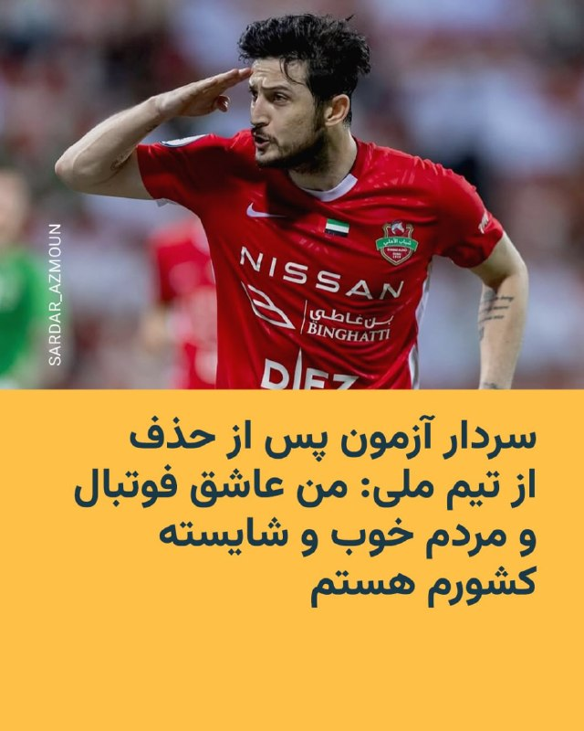

🔸سردار آزمون، فوتبالیست سرشناس ایرانی، پس از حذف از تیم ملی، در پستی از علاقه خود به فوتبال و مردم ایران گفته و نوشته است: «هر جايي كه فوتبال بازی كنم، هويت من، قلب من و افتخار من ايران است.»

🔸مهاجم باشگاه شباب الاهلی در لیگ برتر امارت در پستی که به تازگی در اینستاگرام منتشر کرده توضیح داده که این پست را در ارتباط با کسانی نوشته است که «به خاطر بعضی سوءتفاهم‌ها نسبت به من قضاوتی عجولانه كردند.»

🔸این مهاجم شناخته‌شده که به‌عنوان دومین گلزن برتر تاریخ تیم ملی ایران پس از علی دایی شناخته می‌شود، در این پست هم‌چنین گفته است: «وقتي پيراهن تيم ملی كشورم رو پوشيدم، به خودم قول دادم هر بار كه برای ايران بازی می‌كنم، با تمام وجود تلاش كنم تا باعث خوشحالی مردمی كه با عشق فوتبال رو دنبال می‌كنن بشم بخصوص بچه‌هايی كه توی دورترين شهرها و روستاها با پيروزی ما خوشحال ميشن.»

🔸انتشار تصاویر دیدار این فوتبالیست با مقامات حکومت امارات در روزهای نخست جنگ در صفحه اینستاگرام او حاشیه‌ساز شد تا جایی که برخی حامیان حکومت خواستار تعلیق او از تیم ملی و ضبط اموالش در ایران شدند.

@RadioFarda

## RadioFarda — post 157405

  <a href="https://t.me/radiofarda/157405" target="_blank">📎 Download file</a>

📻بشنوید: سرخط خبرها با رادیوفردا، ۳۱ اردیبهشت ۱۴۰۵‌

@RadioFarda

## IranianMinds — post 20487

🔴 دو منبع ایرانی به رویترز:

مجتبی خامنه‌ای دستور داده است که اورانیوم غنی شده نباید از ایران خارج بشود.

@IranianMinds

## IranianMinds — post 20486

  

🔴 طبق قوانین جدید طالبان سن ازدواج برای دختر به ۹ سال کاهش یافت ، و اگر دختر در هنگام خواندن خطبه ی عقد سکوت کند هم به منزله ی رضایت به ازدواج تلقی میشود.

@IranianMinds

## IranianMinds — post 20485

  <a href="telegram/content/IranianMinds_20485_1779365169.mp4" target="_blank">🎬 Download video</a>

حدود نیم‌ قرن پیش، عده‌ای بی‌ تدبیر انقلاب کردند و از همان روز، خورشید این سرزمین غروب کرد.

دیگر نور و روشنایی و زیبایی را ندیدیم. نه کودکی ‌مان را زندگی کردیم، نه نوجوانی و نه جوانی. کل عمرمان گذشت بین مذاکرات و جنگ، گرانی و هزار سختی دیگر، و انگار همه چیز از دست رفت. مگه تا کی زنده‌ایم که فقط منتظر بمانیم…

@IranianMinds

## IranianMinds — post 20484

  <a href="telegram/content/IranianMinds_20484_1779365171.mp4" target="_blank">🎬 Download video</a>

اکانت اسرائیل به فارسی:

درخشش پرچم شیر‌ و خورشید در کنار پرچم کشورهای دیگر در شهر اشدود در اسرائیل.

@IranianMinds

## IranianMinds — post 20483

🔴 تایمز اسرائیل:

ایران در جریان آتش‌بس از فرصت برای جابه‌جایی لانچرهای موشکی و آماده‌سازی برای دور جدید درگیری استفاده کرده

@IranianMinds

## IranianMinds — post 20482

  <a href="telegram/content/IranianMinds_20482_1779365173.mp4" target="_blank">🎬 Download video</a>

ویدیویی از عروسی یک‌ زوج‌ جانفدا ، فقط اگه تونستید حدس بزنید عروس‌ کدومه جایزه دارید.

@IranianMinds

## IranianMinds — post 20481

🔴 والا نیوز

منابع اسرائیلی می‌گویند آمریکایی‌ها در مذاکرات با ایران یک قدم به جلو برداشته‌اند، بنابراین برآوردها این است که حمله‌ای به ایران در ۲۴ ساعت آینده تکرار نخواهد شد

@IranianMinds

## IranianMinds — post 20480

ثبت نام کن ۵۰۰ هزارتومان جایزه بگیر
نیازی هم به واریز نیست
تنها سایت مورد #تایید ما با بونوس های واقعی:

🌐
🌐 Winro.io

## IranianMinds — post 20479

  <a href="telegram/content/IranianMinds_20479_1779365175.webm" target="_blank">🎬 Download video</a>

🎯شانستو #رایگان امتحان کن 
⚠️

🤔 میدونستی توی #وینرو میتونی رایگان شرط ببندی؟

👍تنها کاری که باید بکنی اینه که عضو سایتش بشید و 
🤩
🤩
🤩 هزارتومان جایزه بگیرید بدون نیاز به واریز

💖تنها سایت مورد اعتماد ما با بونوس های کاملا واقعی و رویایی:

🌐 Winro.io

🌐 Winro.io
کانال بونوس های رایگان r31

📱 @winro_io

## IranianMinds — post 20478

  

🔴 توییت پوریا زراعتی خبرنگار ایران اینترنشنال

@IranianMinds

## IranianMinds — post 20477

  

زندگی در ایران عزیزمون اینطوری شده که اگه «یه خرید» بری و برگردی؛ «یه دهک» جابجا میشی!

@IranianMinds

## IranianMinds — post 20476

  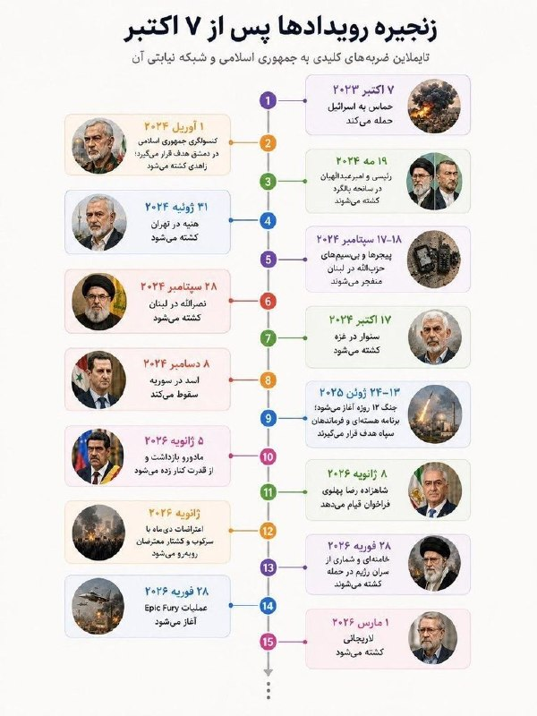

🔴 از ۷ اکتبر تا به امروز رو باهم یه مرور دوباره بکنیم:

@IranianMinds

## IranianMinds — post 20475

  

🔴 شریعتمداری :

باید یه قانون‌ تصویب کنیم که تنگه هرمز تا زمانی که ترامپ کشته نشه بسته بمونه !

@IranianMinds

## IranianMinds — post 20474

  

⚫️ امروز صبح جمهوری اسلامی دو‌ نفر دیگه از هموطن هامونو هم کشت ، خبرگزاری میزان قوه قضائیه اعلام کرد رامین زله و کریم معروف پور از معترضین دی ماه امروز صبح اعدام شدن.

@IranianMinds

## BBCPersian — post 281697

بریتانیا با شش کشور حوزه خیلج فارس حدود پنج میلیارد دلار قرارداد تجاری امضا کرد

بریتانیا با شش کشور حوزه خلیج فارس یک توافق تجاری امضا کرده است که به گفته دولت، ارزش آن برای اقتصاد این کشور حدود پنج میلیارد دلار خواهد بود.

https://bbc.in/4tSdPBn
@BBCPersian

## BBCPersian — post 281696

🔻چین: آمریکا از استفاده و تهدید به ابزارهای قضایی علیه کوبا دست بردارد

چین روز پنج‌شنبه از آمریکا خواست که «از استفاده و تهدید به ابزارهای قضایی علیه کوبا دست بردارد.» این درخواست پس از آن‌ است که واشنگتن رائول کاسترو، رئیس‌جمهور سابق کوبا را به اتهام قتل تحت پیگرد قرار داد.

گوئو جیاکون، سخنگوی وزارت خارجه چین، در یک نشست خبری و در پاسخ به پرسشی درباره این اتهامات گفت: «طرف آمریکایی باید از به‌کار بردن ابزار تحریم و ابزار قضایی علیه کوبا دست بردارد و هر بار تهدید به زور را متوقف کند.»

ایالات متحده رائول کاسترو، رهبر پیشین کوبا، را به اتهام توطئه برای قتل شهروندان آمریکایی و چند اتهام دیگر در ارتباط با سرنگونی دو هواپیما در سال ۱۹۹۶ در مسیر کوبا و فلوریدا متهم کرد.

رائول کاسترو که اکنون ۹۴ ساله است، در آن زمان فرمانده نیروهای مسلح کوبا بود و پس از این حادثه با محکومیت بین‌المللی روبه‌رو شد.

https://bbc.in/4fwMLUO
@BBCPersian

## BBCPersian — post 281695

  <a href="telegram/content/BBCPersian_281695_1779365179.mp4" target="_blank">🎬 Download video</a>

🔻مردی در تگزاس به اتهام راندن عمدی وانت تسلا سایبرتراک خود به داخل دریاچه برای استفاده از ویژگی «حالت عبور از آب» این خودرو دستگیر شده است.

اداره پلیس گریپ‌واین اعلام کرد که مامورانش روز دوشنبه برای نجات وسیله نقلیه که پس از ورود به آب و گیر کردن آن توسط سرنشینانش رها شده بود، به دریاچه گریپ‌واین در شمال تگزاس فراخوانده شدند.

طبق دفترچه راهنمای آنلاین تسلا، حالت «عبور از آب» به سایبرتراک اجازه می‌دهد تا «وارد آب شود و از رودخانه‌ها یا نهرهایی» با حداکثر عمق ۸۱ سانتی‌متر عبور کند.

خودروی نیمه‌غرق‌شده از نزدیکی خط ساحلی ضلع جنوبی دریاچه بیرون کشیده شد و تیم نجات آبی اداره آتش‌نشانی گریپواین در این عملیات به پلیس کمک کرد.

طبق بیانیه پلیس، «راننده اظهار داشت که عمداً برای استفاده از ویژگی "عبور از آب" سایبرتراک به داخل دریاچه رانده است».

پلیس اعلام کرد که راننده به اتهام رانندگی در بخش ممنوع دریاچه و سایر تخلفات تجهیزات ایمنی آب بازداشت شده است.

سایبرتراک تسلا یک وانت برقی است که از بدنه فولادی ضد گلوله ساخته شده و با قیمت بیش از ۷۰ هزار دلار به فروش می‌رسد.

@BBCPersian

## BBCPersian — post 281694

🔻جنگ ایران باعث کاهش فعالیت بخش خصوصی در آلمان شده است

نتایج یک نظرسنجی که امروز (پنجشنبه) منتشر شد نشان می‌دهد که فعالیت بخش خصوصی آلمان برای دومین ماه پیاپی کاهش یافته است.

این نشان‌دهنده آن است که جنگ ایران روند رشد اقتصادی آلمان را کند کرده، تقاضا را تحت فشار قرار داده و باعث افزایش قیمت‌ها شده است.

هرچند شاخص اولیه ترکیبی مدیران خرید آلمان که توسط «اس‌ اند ‌پی گلوبال» تهیه می‌شود، در ماه مه نسبت به ماه آوریل اندکی افزایش داشت و به ۴۸‌‌/۶ رسید. با این حال، این شاخص همچنان پایین‌تر از سطح ۵۰ باقی ماند؛ سطحی که مرز میان رشد و انقباض اقتصادی به شمار می‌رود.

قرار گرفتن شاخص زیر ۵۰ به معنای ادامه کاهش فعالیت‌های اقتصادی است.

شاخص ترکیبی مدیران خرید، عملکرد بخش خدمات و صنعت را بررسی می‌کند. دو بخشی که در مجموع بیش از دوسوم اقتصاد آلمان، بزرگ‌ترین اقتصاد اتحادیه اروپا را تشکیل می‌دهند.

https://bbc.in/4fwMLUO
@BBCPersian

## BBCPersian — post 281693

🔻ایرلند رفتار اسرائیل با فعالان ناوگان غزه را «نفرت‌انگیز» خواند

سیمون هریس، معاون نخست‌وزیر جمهوری ایرلند، پس از بازداشت اعضای ناوگان کمک‌رسانی به غزه، از جمله چند شهروند ایرلندی توسط اسرائیل، خواستار «واکنش قوی و بدون ابهام اتحادیه اروپا» شد.

آقای هریس در شبکه اجتماعی ایکس نوشت: «اقدامات دولت اسرائیل و بازداشت غیرقانونی اعضای ناوگان سمود نفرت‌انگیز است و نمی‌تواند بدون عواقب باشد.»

او گفت که «محکومیت مهم است اما کافی نیست.»

معاون نخست‌وزیر جمهوری ایرلند این بازداشت‌ها را «نقض آشکار دیگری از قوانین بین‌المللی» توصیف کرد و درخواست کشورش را برای تعلیق عناصر تجاری توافقنامه همکاری اتحادیه اروپا و اسرائیل تکرار کرد.

او خواهان اقدام اتحادیه اروپا شد و تاکید کرد که «زمان زیادی گذشته است تا اروپا اقدامی انجام دهد.»

https://bbc.in/4fwMLUO
@BBCPersian

## BBCPersian — post 281691

🔻کانادا سفیر اسرائیل را احضار کرد

کانادا سفیر اسرائیل را به خاطر بازداشت فعالان ناوگان کمک به غزه احضار کرد.

مارک کارنی، نخست وزیر کانادا، در شبکه‌ اجتماعی ایکس نوشت: «وزیر امور خارجه کانادا به مقامات دستور داده است تا سفیر اسرائیل را احضار کنند و از او در مورد امنیت و سلامت کانادایی‌های درگیر در این ماجرا تضمین بگیرند.»

آقای کارنی همچنین ویدئویی را به اشتراک گذاشته که وزیر امنیت داخلی اسرائیل را نشان می‌دهد و نیروهای اسرائیلی با فعالان بازداشت شده بدرفتاری می‌کنند. او نوشته: «کانادا پیش از این تحریم‌های شدیدی را علیه آقای بن گویر، از جمله مسدود کردن دارایی‌ها و ممنوعیت سفر، در پاسخ به تحریک مکرر خشونت توسط او، اعمال کرده است.»

براساس گزارش‌ها ۱۱ شهروند کانادایی در ناوگان کمک‌رسانی به غزه حضور داشته‌اند.

https://bbc.in/4fwMLUO
@BBCPersian

## BBCPersian — post 281690

📽وقتی که رفت روزنامه‌ها نوشتند: عقاب از شهر کلاغ‌ها گریخت.

🔹او تنها به خاطر فوتبالیست خوب بودن شهرت نیافت. ناصر حجازی به خاطرنه گفتن به شرایط حاکم بود که محبوب شد.
🔹در پانزدهمین سال‌مرگش یادی می‌کنیم از او در برنامه این هفته آپارات.

📺برنامه این هفته آپارات
افسانه یک عقاب

🎬ساخته امیر رفیعی

🔹ساعات پخش
جمعه ۹:۰۰ شب
شنبه ۶:۳۰ صبح
شنبه ۱۱:۳۰ صبح
دو‌شنبه ۲:۰۰ بامداد
دوشنبه ۸:۳۰ شب
سه‌شنبه ۱۱:۳۰ صبح
تکرار جمعه ۱۱:۳۰ صبح

🔹از برنامه آپارات همیشه فیلم متفاوت ببینید.

@BBCPersian

## BBCPersian — post 281689

  <a href="telegram/content/BBCPersian_281689_1779365182.mp4" target="_blank">🎬 Download video</a>

⁨ دانشمندان موسسه «اوشن سنسس» (سرشماری اقیانوس) در سال گذشته بيش از یک هزار و ۱۰۰ گونه تازه دريايی كشف كرده‌اند؛ از يک اسفنج گوشتخوار گرفته تا يک «كوسه روح» و كرم پرزدار ساكن «قصر شيشه‌ای». اما شايد شگفت‌زده شويد اگر بدانيد اين يافته‌ها تنها قطره‌ای در اقيانوس‌اند؛ زيرا برآوردها نشان می‌دهد حدود ۹۰ درصد از گونه‌های دريايی هنوز كشف نشده‌اند.
این ویدیو را ببینید.⁩

@BBCPersian
https://bbc.in/4uoww0D

## BBCPersian — post 281688

  

شبکه خبری سی‌ان‌ان به نقل از دو منبع آگاه از ارزیابی‌های اطلاعاتی آمریکا گزارش داد که ایران در جریان آتش‌بس شش‌هفته‌ای که از اوایل آوریل آغاز شده، بخشی از تولید پهپادهای خود را از سر گرفته است.

این گزارش همچنین به نقل از چهار منبع و ارزیابی‌های اطلاعاتی آمریکا حاکیست که ایران با سرعتی بیش از برآوردهای اولیه در حال بازسازی توان نظامی خود است.

دیروز محمدباقر قالیباف، رئیس مجلس ایران در سومین پیام صوتی هفته‌های اخیر خود تایید کرد که در جریان آتش‌بس توان نظامی آن کشور با «قدرت بیشتری بازسازی شده است.»

در همین حال، دونالد ترامپ، رئیس‌جمهور آمریکا، روز چهارشنبه گفت که اگر ایران با طرح صلح موافقت نکند، ایالات متحده آماده انجام حملات بیشتر علیه آن کشور است.

با این حال او اشاره کرد که واشنگتن ممکن است چند روزی صبر کند تا «پاسخ‌های مناسب» را دریافت کند.

📸 Reuters

https://bbc.in/4fwMLUO
@BBCPersian

## BBCPersian — post 281687

🔻دیدار وزیر کشور پاکستان با عباس عراقچی

محسن نقوی، وزیر کشور پاکستان با عباس عراقچی، وزیر خارجه ایران در تهران دیدار و گفت‌وگو کرده است.

هنوز جزییاتی از این گفت‌وگوها رسانه‌ای نشده است.

آقای نقوی که روز گذشته به تهران آمد با مقامات ارشد جمهوری اسلامی دیدار کرد.

ایران اعلام کرده که در حال بررسی تازه‌ترین پیشنهادهای آمریکا برای پایان دادن به جنگ است.

رسانه‌های مختلف هم گفته‌اند که قرار است فیلد مارشال عاصم منیر،‌ فرمانده ارتش پاکستان، برای کمک به میانجی‌گری میان ایران و آمریکا به تهران سفر کند.

دونالد ترامپ گفته است که چند روز دیگر به ایران برای توافق فرصت خواهد داد.

https://bbc.in/4fwMLUO
@BBCPersian

## BBCPersian — post 281686

🔻جنجال ناوگان کمک به غزه؛ لهستان کاردار اسرائیل را احضار کرد

وزیر امور خارجه لهستان روز پنج‌شنبه اعلام کرد که کاردار اسرائیل را به‌دلیل بازداشت فعالان، از جمله شهروندان لهستانی، احضار کرده و خواستار آزادی فوری آن‌ها و عذرخواهی شده است.

رادوسلاو سیکورسکی در شبکه‌های اجتماعی نوشت: «لهستان رفتار نمایندگان مقامات اسرائیلی با فعالان ناوگان صمود را که توسط ارتش اسرائیل بازداشت شده‌اند، از جمله شهروندان لهستانی را به‌شدت محکوم می‌کند.»

انتشار ویدیویی از رفتار ایتار بن‌گویر، وزیر امنیت ملی اسرائیل با بازداشت شدگان ناوگان کمک‌رسانی به غزه واکنش‌های بین‌المللی را به همراه داشته است.

https://bbc.in/4fwMLUO

@BBCPErsian

## BBCPersian — post 281685

  <a href="telegram/content/BBCPersian_281685_1779365185.mp4" target="_blank">🎬 Download video</a>

🎶 آرین کشیشی موزیسینی چندوجهی و بین‌المللی است؛ نوازنده برجسته گیتار بیس، آهنگساز و تهیه‌کننده‌ای که از دل تهران به صحنه‌های حرفه‌ای اروپا رسیده و امروز در آمستردام فعالیت می‌کند.

او در سبک‌های متنوعی از جمله جز، فیوژن، پاپ، راک، کلاسیک، فلامنکو و موسیقی فولکلور ایرانی و ارمنی تجربیات متنوعی دارد و با هنرمندانی چون همایون شجریان، علیرضا قربانی، سهراب پورناظری، ظافر یوسف (نوازنده عود اهل تونس) و آنتونیو ری (گیتاریست اسپانیایی) همکاری کرده است.

مجموعه این همکاری‌ها و تجربه‌ها به شکل‌گیری صدای منحصربه‌فرد او انجامیده است.

آرین در سال ۲۰۱۵ پروژه شخصی خود را راه‌اندازی کرد که بر تولید موسیقی جز و فیوژن با حضور موسیقیدانان بین‌المللی متمرکز است.

نخستین آلبوم شخصی او با نام Self-Reflection در سال ۲۰۲۳ منتشر شد؛ اثری که نوعی تأمل درونی و خودبازاندیشی موسیقایی است و از خلال آن تجربه‌ها و هویت چندفرهنگی‌اش را واکاوی می‌کند.

اجرای چند قطعه از این آلبوم در جشنواره جز لندن را در «رنگ‌آهنگ» این هفته ببینید.

@BBCPersian

## BBCPersian — post 281684

🔻وزیر امور خارجه لهستان روز پنج‌شنبه اعلام کرد که کاردار اسرائیل را به‌دلیل بازداشت فعالان، از جمله شهروندان لهستانی، احضار کرده و خواستار آزادی فوری آن‌ها و عذرخواهی شده است.

رادوسلاو سیکورسکی در شبکه‌های اجتماعی نوشت: «لهستان رفتار نمایندگان مقامات اسرائیلی با فعالان ناوگان صمود را که توسط ارتش اسرائیل بازداشت شده‌اند، از جمله شهروندان لهستانی را به‌شدت محکوم می‌کند.»

انتشار ویدیویی از رفتار ایتار بن‌گویر، وزیر امنیت ملی اسرائیل با بازداشت شدگان ناوگان کمک‌رسانی به غزه واکنش‌های بین‌المللی را به همراه داشته است.
https://bbc.in/4ur2Joh
@BBCPersian

## BBCPersian — post 281683

🔻 ارزش روپیه هند به دلیل جنگ ایران به پایین‌ترین سطح تاریخی خود رسید

وزیر بازرگانی هند اعلام کرد که این کشور در حال بررسی مجموعه‌ای از اقدامات برای مقابله با کاهش ارزش روپیه، پول ملی هند است و وضعیت بازار را به‌دقت زیر نظر دارد.

پیوش گویال روز پنج‌شنبه گفت: «ما شرایط را رصد می‌کنیم و چندین اقدام در دست بررسی است. وضعیت در سطح جهانی بسیار چالش‌برانگیز است.»

اظهارات او در حالی مطرح می‌شود که ارزش روپیه هند در روزهای اخیر بارها به پایین‌ترین سطح تاریخی خود رسیده و از زمان آغاز جنگ آمریکا و اسرائیل علیه ایران که باعث افزایش قیمت نفت خام شده، بیش از ۶ درصد تضعیف شده است.

https://bbc.in/4nOXA72
@BBCPersian

## BBCPersian — post 281673

سارا گرین و سایمون تولت
شغل,بخش پادکست سرویس جهانی بی‌بی‌سی
🔻وقتی در بالاترین سطح برخی از بزرگ‌ترین شرکت‌های دنیا جابه‌جایی قدرت اتفاق می‌افتد، بیشتر مردم اصلا متوجه نمی‌شوند.
اگر محصولات خوب عمل کنند، خدمات به‌درستی ارائه شود و قفسه‌های فروشگاه‌ها پر باشند، اینکه چه کسی در اتاق هیئت‌مدیره می‌نشیند خبرساز نمی‌شود. اما وقتی پای سامسونگ در میان باشد، دودمان خانوادگی پشت آن آنقدر پیچیده است و شرکت آنقدر برای اقتصاد کره جنوبی حیاتی است که خبرساز می‌شود.
در سال ۲۰۱۷، لی جه یونگ، وارث سامسونگ که با نام جی‌وای لی نیز شناخته می‌شود، به دلیل نقشش در یک رسوایی فساد که رئیس‌جمهور کشور را نیز ساقط کرد، زندانی شد.
ادامه مطلب را در لینک زیر بخوانید:
https://bbc.in/4fz83RN

📸GettyImages/ Bloomberg via
Getty Images/ AFP via Getty Images/ LightRocket via Getty Images

@BBCPersian

## Dirty_Kids — post 389874

  <a href="telegram/content/Dirty_Kids_389874_1779365188.mp4" target="_blank">🎬 Download video</a>

مراد تایم:

@Dirty_Kids 👻

## Dirty_Kids — post 389873

  

وایرال ترین عکس ۲۴ ساعت اخیر فضای مجازی با بیش از ۳۰ میلیون بازدید!

@Dirty_Kids 👻

## Dirty_Kids — post 389872

  

‏نه ممنون همون سکس

@Dirty_Kids 👻

## Dirty_Kids — post 389871

  <a href="telegram/content/Dirty_Kids_389871_1779365191.mp4" target="_blank">🎬 Download video</a>

چون بحث مموتی داغه
این موزیک‌ویدیو رو یادتونه ؟🤣🤦‍♂️

@Dirty_Kids 👻

## Dirty_Kids — post 389870

‏توی یک رابطه سالم دعوا و اختلاف نظر هست اگه فقط دنبال آرامشی دمنوش بابونه بخور

@Dirty_Kids 👻

## Dirty_Kids — post 389869

  <a href="https://t.me/Dirty_Kids/389869" target="_blank">📎 Download file</a>

📱 اپلیکیشن اندروید بدون فیلتر ریتزوبت

➖➖➖➖➖

🔹 ثبت نام آسان 
✅
🔹 رابط کاربری بسیار راحت و سریع 
✅
🔹 درگاه پرداخت کارت به کارت 
✅
🔹 درگاه پرداخت دلاری سریع 
✅
🔹 بونوس ۱۰۰ درصدی اولین واریز 
✅
🔹 بونوس ۱۰۰ درصدی واریز یکشنبه ها 
✅

➖➖➖➖➖
🌐 https://RitzoBet.com

⚡️ @RitzoBet_ir

## Dirty_Kids — post 389868

  

⚠️ برای #شرطبندی های فوتبال از سایت معتبر و بین المللی استفاده کنید ✅

سایت #ریتزوبت ، چهار سال هستش داخل ایران فعالیت میکنه 
✅

لایسنس بین المللی داره ، روش های شارژ و برداشت متنوع داره و بونوس 100% ورزشی و کش بک های جذاب
💎

⏪ اپلیکیشن بدون فیلتر ریتزوبت 
📱
⏩
R31

✅ لینک بدون‌ فیلتر ریتزوبت
🤣

🆔 @RitzoBet_ir 
🇮🇷

## Dirty_Kids — post 389867

  <a href="telegram/content/Dirty_Kids_389867_1779365195.mp4" target="_blank">🎬 Download video</a>

درخشش پرچم شیر و خورشید در کنار پرچم کشورهای دیگر در شهر اشدود در اسرائیل. 
🇮🇱
🇮🇷

@Dirty_Kids 👻

## Dirty_Kids — post 389866

‏در تایید مادرجنده بودنتون همین بس که حتی از خبر فیک گزینه اسراییل بودن احمدی‌نژاد ذوق‌زده میشید ولی اسم پهلوی که میاد کهیر میزنید. حقیقتا دشمنان باشکوهی هم نیستید :)))

@Dirty_Kids 👻

## Dirty_Kids — post 389865

‏این دوس‌دختر سابقم هردفعه به یه بهانه‌ای سعی میکنه با من ارتباط برقرار کنه؛ یه بار زنگ میزنه میگه وسایلمو بفرست، یه بار میگه انقد ریلزای کسشر نفرس، یه بار میگه اون صد میلیون که ازم قرض گرفتی رو کی پس میدی؟ نمیدونم کی میخواد ازم مووآن کنه.

@Dirty_Kids 👻

## Dirty_Kids — post 389864

  <a href="telegram/content/Dirty_Kids_389864_1779365196.mp4" target="_blank">🎬 Download video</a>

نه رشیدپور بی‌شرف، بازار اعتصاب كرد، پهلوى رو صدا زد، پهلوى براى اولين بار فراخوان داد، رژيم،ايرانی كش جمهوری اسلامی، مردم رو قتل عام كرد.
اصن بر فرض مردم گول خوردن، شما چرا ۵۰٫۰۰۰ نفر رو کشتید بیشرفا؟؟؟

@Dirty_Kids 👻

## Dirty_Kids — post 389863

  

🌪وقتی اینترنت طوفانیه فقط کافیه بادبان ها رو بکشی

⚫️100 هزار تومان تخفیف خرید اول 
🎁

⚫️پایین ترین قیمت گیگی 180 هزار تومان
🌐 

⚫️پورسانت %10 دائمی برای هر معرفی
💼

با بادبان، میتونی یه اتصال سریع، پایدار و امن
همراه با پشتیبانی ۲۴ ساعته داشته باشی
🚀

🛒کد تخفیف: badban4k

بادبان راهتو باز می‌کنه
⛵️
R31

🛡@BadBan_VPN | کانال 

🤖@BadBan_VPNBot | ربات 

📞@BadBan_VPNSupport | پشتیبانی

## Dirty_Kids — post 389862

  <a href="telegram/content/Dirty_Kids_389862_1779365199.mp4" target="_blank">🎬 Download video</a>

🔴 شما ببین محمدرضا شاه کی بود که بعد از ۵۰ سال حتی طرفدارای جمهوری اسلامی ازش تعریف و شاه خطابش میکنن.

@Dirty_Kids 👻

## Dirty_Kids — post 389861

  

شما بای دیفالت توی هر عروسی بری یکی با قیافه علی شادمان هست که از پادگان مرخصی گرفته خودشو برسونه عروسی، معمولا هم بدمست بازی در میارن.

@Dirty_Kids 👻

## Dirty_Kids — post 389859

پس‌از اینکه حجاب تو تجمعات حکومتی آزاد شد، کرکتر منچیکو (منچ آنلاین) هم تو مایکت کشف حجاب کرد :)))

@Dirty_Kids 👻

## Dirty_Kids — post 389858

  <a href="telegram/content/Dirty_Kids_389858_1779365200.mp4" target="_blank">🎬 Download video</a>

حمله واشقانی به شهبازی

مملکت مگه صاحاب نداره؟ خیلی کار احمقانه‌ای کردی
گلنوش خسروی ملی پوش فوتبال: از حرف مجری تلویزیون ترسیده بودیم و به ما می‌گفتن اگه برگردیم اتفاقی برای ما می‌افتد

+ کص‌ننه جفتتون

@Dirty_Kids 👻

## Dirty_Kids — post 389857

  

داغش؟ یارو سه ماهه تو فریزره، الان دیگه باید برفکش رو باور کنی.

@Dirty_Kids 👻

## Dirty_Kids — post 389856

  <a href="telegram/content/Dirty_Kids_389856_1779365203.mp4" target="_blank">🎬 Download video</a>

من هرروز صبح:

@Dirty_Kids 👻

## Hranews — post 113075

  

احمد میدری، وزیر تعاون، کار و رفاه اجتماعی ایران اعلام کرد که از آغاز جنگ اخیر تا امروز، حدود ۲۳۰ هزار نفر از کارگرانی که شغل خود را از دست داده‌اند برای دریافت بیمه بیکاری ثبت‌نام کرده‌اند.

این آمار در حالی منتشر می‌شود که بسیاری از #کارگران روزمزد و شاغلان غیررسمی اساساً تحت پوشش بیمه نیستند و در این آمار محاسبه نمی‌شوند.

↘️
@hranews_bot تماس ✉️ - @Hranews کانال هرانا 🆑

## Hranews — post 113074

  

رئیس انجمن پزشکان عمومی ایران از دریافت گزارش‌هایی درباره کمبود یا دسترسی دشوار به برخی داروها در ماه‌های اخیر خبر داد. به گفته وی، این وضعیت پیش از شرایط جنگی نیز وجود داشته و با تشدید محدودیت‌های اقتصادی و لجستیکی ادامه یافته است. احمد ولی‌پور اعلام کرد این کمبودها عمدتا در حوزه برخی آنتی‌بیوتیک‌ها، داروهای بیماران مزمن، سرم‌ها و اقلام مصرفی درمانی مشاهده شده است. وی با اشاره به فشار بر زنجیره تامین دارو ناشی از مشکلات اقتصادی، محدودیت واردات مواد اولیه و نقدینگی صنعت دارو، بر ضرورت اقدام عملی تاکید کرد.

ولی‌پور همچنین به وضعیت #پزشکان_عمومی اشاره کرد و گفت برخلاف تصور عمومی، بسیاری از آنان به‌ویژه در بخش دولتی و مناطق محروم با وجود مسئولیت‌های سنگین، کشیک‌های مداوم و حجم بالای مراجعه بیماران، با چالش‌های معیشتی و نبود امنیت شغلی پایدار مواجه هستند. وی با تاکید بر نقش پزشکان عمومی به‌عنوان خط اول نظام سلامت، نسبت به تضعیف جایگاه این گروه و پیامدهای آن بر دسترسی مردم به خدمات درمانی هشدار داد.
#کمبود_دارو

↘️
@hranews_bot تماس ✉️ - @Hranews کانال هرانا 🆑

## Hranews — post 113073

یک زن در تهران توسط مرد مورد علاقه‌اش به قتل رسید

❗️
❗️
❗️
❗️
❗️– مردی در تهران، زن مورد علاقه‌اش را با خوراندن قرص برنج به #قتل رساند. متهم بازداشت و پس از حدود دو ماه به این اقدام اعتراف کرد.

ادامه مطلب

↘️
@hranews_bot تماس ✉️ - @Hranews کانال هرانا 🆑

## Hranews — post 113072

  

بر اساس آخرین داده‌های نت‌ بلاکس، معیارهای پایش نشان می‌دهد که #قطع_اینترنت در ایران اکنون وارد هشتادوسومین روز خود شده و دسترسی به شبکه‌های بین‌المللی برای بیش از ۱۹۶۸ ساعت به‌طور گسترده مسدود مانده است. این نهاد ناظر بر وضعیت دسترسی به اینترنت در جهان تاکید می‌کند که اینترنت آزاد و باز، عنصری بنیادین برای حفاظت از حق حیات، آزادی و پاسخگویی عمومی به‌شمار می‌رود.

↘️
@hranews_bot تماس ✉️ - @Hranews کانال هرانا 🆑

## Hranews — post 113071

زن و مردی در تهران به شلاق و تبعید محکوم شدند

❗️
❗️
❗️
❗️
❗️– یک زن جوان و مردی که به عنوان ماساژور فعالیت داشت، در پی رسیدگی قضایی به اتهامات مرتبط با رابطه خارج از چارچوب زناشویی، توسط دادگاه کیفری استان تهران به مجازات #شلاق و #تبعید محکوم شدند.

ادامه مطلب

↘️
@hranews_bot تماس ✉️ - @Hranews کانال هرانا 🆑

## Hranews — post 113070

  

دستکم ۱۲ شهروند توسط نیروهای امنیتی بازداشت شدند

❗️
❗️
❗️
❗️
❗️– طی روزهای اخیر، محمد گودرزی، فرزاد فرداد، ستار بابایی، محسن دغاغله، سبحان اسپروینی، علی رجائی، امیرمهدی جلالی، احمد قائدی رحمتی، رجبعلی چیلان، ابوالفضل مجردی، رضا روشنی و عرفان عباسی‌فر، توسط نیروهای امنیتی در شهرهای مختلف بازداشت شده‌اند. همچنان اطلاعی از وضعیت و سرنوشت این افراد در دست نیست.

به گزارش خبرگزاری هرانا، ارگان خبری مجموعه فعالان حقوق بشر در ایران، دستکم ۱۲ شهروند در شهرهای مختلف توسط نیروهای امنیتی بازداشت شدند.

هویت این افراد، محمد گودرزی، فرزاد فرداد، ستار بابایی، محسن دغاغله، سبحان اسپروینی، علی رجائی، امیرمهدی جلالی، احمد قائدی رحمتی، رجبعلی چیلان، ابوالفضل مجردی، رضا روشنی و عرفان عباسی‌فر، توسط هرانا احراز شده است.

ادامه مطلب

#محمد_گودرزی #فرزاد_فرداد #ستار_بابایی
#محسن_دغاغله #سبحان_اسپروینی #علی_رجائی
#امیرمهدی_جلالی #احمد_قائدی_رحمتی #رجبعلی_چیلان
#ابوالفضل_مجردی #رضا_روشنی #عرفان_عباسی‌فر

↘️
@hranews_bot تماس ✉️ - @Hranews کانال هرانا 🆑

## Hranews — post 113069

  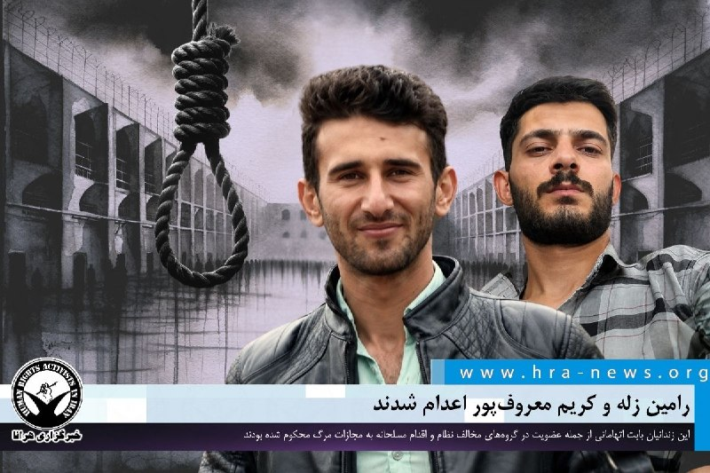

رامین زله و کریم معروف‌پور اعدام شدند

❗️
❗️
❗️
❗️
❗️– قوه قضاییه اعلام کرد که سحرگاه امروز، رامین زله و کریم معروف‌پور، بابت اتهاماتی از جمله عضویت در گروه‌های مخالف نظام و اقدام مسلحانه اعدام شدند. بر اساس داده‌های گردآوری‌شده توسط هرانا، همزمان با آغاز درگیری‌های نظامی، روند صدور و اجرای احکام #اعدام در پرونده‌های سیاسی و امنیتی افزایش یافته و تاکنون ۳۴ زندانی با این اتهامات در این بازه زمانی اعدام شده‌اند.

ادامه مطلب

#رامین_زله #کریم_معروف‌پور

↘️
@hranews_bot تماس ✉️ - @Hranews کانال هرانا 🆑

## manototv — post 105716

  <a href="telegram/content/manototv_105716_1779365206.mp4" target="_blank">🎬 Download video</a>

بر پایه گزارش رسانه‌های حکومتی، ۲۰ ملوان ایرانی که کشتی‌شان در آب‌های سنگاپور توقیف شده بود و در «وضعیت نامناسبی» قرار داشتند، ساعتی پیش به ایران بازگشتند.
سفیر جمهوری‌اسلامی در پاکستان با قدردانی از دولت پاکستان اعلام کرد این ملوانان پس از پیگیری‌های دیپلماتیک و با همکاری مقام‌های پاکستانی، از سنگاپور به اسلام‌آباد منتقل شدند و سپس به کشور بازگشتند.
او از نقش نخست‌وزیر پاکستان، وزارت خارجه و دیگر نهادهای این کشور در آزادی و انتقال ملوانان ایرانی تشکر کرد.

## manototv — post 105715

  <a href="telegram/content/manototv_105715_1779365207.mp4" target="_blank">🎬 Download video</a>

بریتانیا از توافق تجاری ۵ میلیارد دلاری با کشورهای خلیج فارس رونمایی کرد؛ توافقی که در بحبوحه تنش‌های منطقه‌ای پس از جنگ ایران، به گفته لندن «پیامی از ثبات و اعتماد» به بازارها می‌دهد.
این توافق با شورای همکاری خلیج فارس شامل عربستان، امارات، قطر، کویت، عمان و بحرین است و قرار است سالانه حدود ۳.۷ میلیارد پوند به اقتصاد بریتانیا اضافه کند.
لندن می‌گوید ۹۳ درصد تعرفه‌های کشورهای خلیج فارس برای کالاهای بریتانیایی حذف می‌شود؛ از جمله محصولات غذایی، خودرو، صنایع هوافضا و الکترونیک.
در مقابل، بریتانیا نیز برخی تعرفه‌ها را کاهش می‌دهد، هرچند نفت و گاز کشورهای عربی پیش‌تر هم بدون تعرفه وارد بریتانیا می‌شد.
فعالان حقوق بشر از نبود بندهای الزام‌آور درباره حقوق بشر در این توافق انتقاد کرده‌اند و آن را «عقب‌گرد اخلاقی» توصیف کردند.

## manototv — post 105714

  <a href="telegram/content/manototv_105714_1779365208.mp4" target="_blank">🎬 Download video</a>

انور قرقاش، مشاور سیاست خارجی رئیس امارات متحده عربی، در حساب ایکس خود نوشت جمهوری اسلامی پس از تجاوز و شکست نظامی آشکار، در تلاش است واقعیتی جدید را بر منطقه تحمیل کند، اما تلاش برای کنترل تنگه هرمز یا تعرض به حاکمیت دریایی امارات «چیزی جز رویاپردازی نیست.»
قرقاش افزود کشورهای عربی خلیج فارس دهه‌ها به «زورگویی‌های ایران» عادت کرده‌اند؛ تا جایی که این رفتار به بخشی از فضای سیاسی منطقه تبدیل شده و شکاف عمیقی میان شعارهای تهاجمی تهران و ادعاهای دوستی ایجاد کرده است.
او همچنین تأکید کرد هر کشوری که خواهان همزیستی با جهان عرب است باید بداند اعتماد از دست رفته و بازسازی آن نه با شعار، بلکه با احترام به حاکمیت کشورها، زبان مسئولانه و پایبندی واقعی به اصول حسن همجواری ممکن خواهد بود.

## manototv — post 105713

  <a href="telegram/content/manototv_105713_1779365208.mp4" target="_blank">🎬 Download video</a>

بر اساس داده‌های مرکز پایش اینترنت نت‌بلاکس، خاموشی اینترنت در ایران اکنون وارد هشتادوسومین روز خود شده است.
نت‌بلاکس اعلام کرد دسترسی به شبکه‌های بین‌المللی برای بیش از ۱۹۶۸ ساعت به‌طور گسترده مسدود بوده است. این نهاد تأکید کرد اینترنت آزاد و باز نقشی اساسی در حفاظت از جان، آزادی و پاسخگویی عمومی دارد.

## manototv — post 105712

  <a href="telegram/content/manototv_105712_1779365209.mp4" target="_blank">🎬 Download video</a>

وزیران خارجه استرالیا و بلژیک در واکنش به ویدیوی منتشرشده از نحوه برخورد نیروهای اسرائیلی با فعالان «ناوگان آزادی» حامیان غزه، از احضار سفیران اسرائیل خبر دادند. در این ویدیو ده‌ها فعال حامی غزه با دستان بسته روی زمین زانو زده‌اند و ایتامار بن‌گویر، وزیر امنیت ملی اسرائیل، در حالی که پرچم این کشور را در دست دارد، به آن‌ها می‌گوید: «به اسرائیل خوش آمدید.»
ینی وانگ، وزیر خارجه استرالیا، این تصاویر را «غیرقابل قبول» توصیف کرد و گفت «رفتار تحقیرآمیز با بازداشت‌شدگان را محکوم می‌کند». وزیر خارجه بلژیک نیز تصاویر منتشرشده را «عمیقاً نگران‌کننده» خواند و اعلام کرد شماری از شهروندان بلژیک در میان بازداشت‌شدگان هستند.
همزمان جورجا ملونی، نخست‌وزیر ایتالیا، و پدرو سانچز، نخست‌وزیر اسپانیا، نیز این اقدام را محکوم کرده‌اند

## manototv — post 105711

  <a href="telegram/content/manototv_105711_1779365211.mp4" target="_blank">🎬 Download video</a>

سی‌ان‌ان به نقل از منابع اطلاعاتی آمریکا گزارش داد جمهوری اسلامی بازسازی زیرساخت‌های نظامی و تولید پهپاد را سریع‌تر از برآوردهای اولیه از سر گرفته است.
بر اساس این گزارش، ایران در جریان آتش‌بس شش‌هفته‌ای که از اوایل آوریل آغاز شد، بخشی از تولید پهپادهای خود را دوباره راه‌اندازی کرده است. منابع آگاه گفته‌اند این موضوع نشان می‌دهد تهران در حال بازسازی سریع توان نظامی آسیب‌دیده خود در حملات آمریکا و اسرائیل است.
چهار منبع مطلع نیز به سی‌ان‌ان گفته‌اند ارزیابی نهادهای اطلاعاتی آمریکا نشان می‌دهد روند بازسازی ارتش ایران بسیار سریع‌تر از آن چیزی است که پیش‌تر تخمین زده می‌شد
به گفته این منابع، بازسازی پایگاه‌های موشکی، سکوهای پرتاب و ظرفیت تولید سامانه‌های تسلیحاتی نشان می‌دهد ایران همچنان در صورت ازسرگیری حملات، تهدیدی جدی برای متحدان منطقه‌ای آمریکا خواهد بود.
یکی از مقام‌های آمریکایی نیز گفته است برخی برآوردهای اطلاعاتی نشان می‌دهد ایران ممکن است ظرف شش ماه توان کامل حملات پهپادی خود را بازیابی کند.

## manototv — post 105710

  <a href="telegram/content/manototv_105710_1779365211.mp4" target="_blank">🎬 Download video</a>

رسانه‌های اسرائیل به نقل از سی‌ان‌ان گزارش دادند تماس تلفنی اخیر دونالد ترامپ و بنیامین نتانیاهو درباره ایران، «پرتنش» بوده است. بر اساس این گزارش، نتانیاهو خواهان ازسرگیری حملات به ایران شده اما ترامپ خواستار زمان بیشتر برای ادامه دیپلماسی بوده است.
به گزارش رسانه‌های اسرائیل، نتانیاهو گفته تعلل آمریکا به سود ایران است، در حالی که ترامپ تأکید کرده ترجیح می‌دهد فرصت بیشتری به مسیر دیپلماتیک داده شود.
همزمان، وال‌استریت ژورنال گزارش داد اسرائیل نسبت به پایبندی جمهوری اسلامی به هرگونه توافق هسته‌ای تردید دارد و مقام‌های اسرائیلی از آنچه «وقت‌کشی دیپلماتیک ایران» می‌خوانند ابراز نارضایتی کرده‌اند.

دو طرف است

## manototv — post 105709

  <a href="telegram/content/manototv_105709_1779365212.mp4" target="_blank">🎬 Download video</a>

روزنامه تلگراف در گزارشی به واحد مخفی دلفین‌های نیروی دریایی آمریکا پرداخت؛ واحدی که از دوران جنگ سرد برای شناسایی مین‌های دریایی و کمک به عملیات مین‌روبی ایجاد شده است.
بر اساس این گزارش، دلفین‌های پوزه‌بطری با استفاده از توانایی مکان‌یابی صوتی، مین‌ها و اجسام زیر آب را با دقت بالا شناسایی کرده و محل آن‌ها را به نیروهای نظامی اطلاع می‌دهند تا به‌صورت ایمن خنثی شوند.
تلگراف تأکید کرده این دلفین‌ها برای منفجر کردن مین‌ها آموزش نمی‌بینند، بلکه وظیفه آن‌ها شناسایی تهدیدها و کمک به باز نگه داشتن مسیرهای دریایی است.
این گزارش همزمان با افزایش تنش‌ها در تنگه هرمز منتشر شده و به نقش احتمالی این واحد ویژه در تأمین امنیت کشتیرانی در من اشاره می‌کند.

## manototv — post 105708

  <a href="telegram/content/manototv_105708_1779365213.mp4" target="_blank">🎬 Download video</a>

دومین زمین‌لرزه در کمتر از ۱۰ ساعت گذشته، دریای خزر در حوالی شهرستان مرزی آستارا را لرزاند. بنا بر گزارش رسانه‌های داخلی، این زمین‌لرزه ۳.۸ ریشتر قدرت داشته است.
هنوز گزارشی از خسارات احتمالی یا تلفات منتشر نشده است.

## manototv — post 105707

  <a href="telegram/content/manototv_105707_1779365214.mp4" target="_blank">🎬 Download video</a>

وب‌سایت وای‌نت به نقل از یک مقام ارشد اسرائیلی گزارش داد که «جنگ بعدی با ایران، آخرین جنگ نخواهد بود» و تا زمانی که جمهوری اسلامی در قدرت باشد، احتمال تکرار درگیری‌ها وجود دارد.
این مقام گفته است باید «انتظارات عمومی بازتنظیم شود» زیرا حتی در صورت حمله‌ای دیگر، تهدیدها علیه اسرائیل پایان نخواهد یافت. به گفته او، در صورت ادامه وضعیت کنونی، ممکن است درگیری‌ها هر سال یا حتی در بازه‌های کوتاه‌تر تکرار شوند.
این مقام اسرائیلی همچنین مدعی شد هدف از این سیاست، مهار تهدید هسته‌ای و برنامه موشک‌های بالستیک ایران علیه موجودیت اسراییل است.

## alonews — post 121533

  <a href="telegram/content/alonews_121533_1779365214.webm" target="_blank">🎬 Download video</a>

👈آخرین قیمت نفت ۱۰۷.۱۵ دلار

✅ @AloNews خبر جنگ

## alonews — post 121532

  <a href="telegram/content/alonews_121532_1779365214.webm" target="_blank">🎬 Download video</a>

👈آژانس انرژی بین المللی: بازارهای نفت ممکن است در ماه های ژوئیه و آگوست به منطقه خطر برسند.

✅ @AloNews خبر جنگ

## alonews — post 121531

  <a href="telegram/content/alonews_121531_1779365215.webm" target="_blank">🎬 Download video</a>

👈سفارت پاکستان در ایران: وزیر کشور پاکستان با «اسکندر مومنی» همتای ایرانی خود در تهران گفتگو کرد.

✅ @AloNews خبر جنگ

## alonews — post 121529

  <a href="telegram/content/alonews_121529_1779365215.mp4" target="_blank">🎬 Download video</a>

👈پهپادهای اوکراینی در طول شب به پالایشگاه نفت سیزران متعلق به روسنفت در منطقه سامارا روسیه حمله کردند و آن را در آتش فرو بردند

✅ @AloNews خبر جنگ

## alonews — post 121528

  <a href="telegram/content/alonews_121528_1779365217.mp4" target="_blank">🎬 Download video</a>

👈تمرینات نظامی اخیر کوبا شامل مدرن‌ترین سامانه دفاع هوایی آن، S-125-2BM، نسخه ارتقا یافته سامانه SA-3 دوران شوروی بود.

🔴 اگرچه این سامانه نسبت به مدل اصلی متحرک‌تر و توانمندتر است، اما همچنان در برابر حمله گسترده ایالات متحده با استفاده از هواپیماهای پنهانکار و تسلیحات هدایت‌شونده دقیق محدودیت‌های قابل توجهی خواهد داشت، به‌ویژه که جغرافیا و توازن نیروها به شدت به نفع آمریکا است.

✅ @AloNews خبر جنگ

## alonews — post 121527

  <a href="telegram/content/alonews_121527_1779365220.webm" target="_blank">🎬 Download video</a>

👈امارات از پیشرفت ۵۰ درصدی در پروژه ساخت «خط لوله دورزننده تنگه هرمز» خبر داد

✅ @AloNews خبر جنگ

## alonews — post 121526

  <a href="telegram/content/alonews_121526_1779365220.webm" target="_blank">🎬 Download video</a>

👈 مشاور رئیس‌جمهور امارات، انور قرقاش:
ما طی دهه‌های طولانی به زورگویی‌های ایرانی عادت کرده‌ایم تا جایی که این موضوع بخشی از چشم‌انداز سیاسی خلیج فارس شده است و اعتبار میان لفاظی‌های تهاجمی و اعلامیه‌های توخالی دوستی از دست رفته است.

🔴و امروز، پس از تجاوز بی‌رحمانه ایران، رژیم در تلاش است واقعیتی جدید را که از یک شکست نظامی آشکار زاده شده است، تثبیت کند، اما تلاش‌ها برای کنترل تنگه هرمز یا تجاوز به حاکمیت دریایی امارات چیزی جز تکه‌هایی از رویاها نیست.

🔴و هر کسی که می‌خواهد با محیط عربی خود همزیستی کند باید درک کند که اعتماد از دست رفته است و بازگرداندن آن از طریق شعارها حاصل نمی‌شود، بلکه از طریق زبان مسئولانه، حفظ حاکمیت و تعهد واقعی به اصول همسایگی خوب به دست می‌آید

✅ @AloNews خبر جنگ

## alonews — post 121525

  <a href="telegram/content/alonews_121525_1779365220.webm" target="_blank">🎬 Download video</a>

👈نایب‌رئیس کمیسیون فرهنگی مجلس اعلام کرد اینترنت جهانی بازگشایی نمی‌شود و تنها گروه‌های دارای نیاز تخصصی به اینترنت بین‌الملل دسترسی خواهند داشت.

✅ @AloNews خبر جنگ

## alonews — post 121524

  <a href="telegram/content/alonews_121524_1779365221.webm" target="_blank">🎬 Download video</a>

👈احتمال شنیده شدن صدای انفجارهای کنترل‌شده در بندرعباس

✅ @AloNews خبر جنگ

## alonews — post 121523

  <a href="telegram/content/alonews_121523_1779365221.webm" target="_blank">🎬 Download video</a>

👈ادعای رویترز به نقل از سه منبع: فرمانده ارتش پاکستان، عاصم منیر، روز پنج‌شنبه تصمیم خواهد گرفت که آیا به عنوان بخشی از تلاش‌های میانجی‌گری به تهران سفر کند یا خیر

✅ @AloNews خبر جنگ

## alonews — post 121522

  <a href="telegram/content/alonews_121522_1779365221.webm" target="_blank">🎬 Download video</a>

👈نماینده دولت هند : ۱۴ کشتی هندی تو منطقه تنگه هرمز گیر کردن

✅ @AloNews خبر جنگ

## alonews — post 121521

  <a href="telegram/content/alonews_121521_1779365221.webm" target="_blank">🎬 Download video</a>

👈علی هاشم خبرنگار الجزیره: بر اساس منابع من در تهران، پاسخ ایران هنوز به میانجی پاکستانی تحویل داده نشده است. رایزنی‌ها همچنان ادامه دارد و تلاش‌های جدی برای رسیدن به پیش‌نویس نهایی در جریان است

✅ @AloNews خبر جنگ

## alonews — post 121520

  <a href="telegram/content/alonews_121520_1779365221.webm" target="_blank">🎬 Download video</a>

👈رویترز: رهبر ایران دستور داده است که اورانیوم با درجه نزدیک به تولید سلاح باید در ایران باقی بماند

✅ @AloNews خبر جنگ

## alonews — post 121519

  <a href="telegram/content/alonews_121519_1779365222.mp4" target="_blank">🎬 Download video</a>

👈اردوغان، رئیس جمهور ترکیه : ما همیشه از صلح و ثبات دفاع می‌کنیم و جلوی کسایی که روی جنگ و هرج‌ومرج سرمایه‌گذاری می‌کنن می‌ایستیم

🔴 تو غزه لبنان و جاهای دیگه منطقه کسایی که زن و بچه و پیر و جوون رو بدون رحم می‌کشن ما مقابلشون می‌ایستیم

🔴 از ارزش‌های مشترک انسانی دفاع می‌کنیم تاریخ هم پر از اینه که دوستی با ملت ترکیه سود داشته و دشمنی باهاش ضررهای زیادی داشته

✅ @AloNews خبر جنگ

## alonews — post 121518

  <a href="telegram/content/alonews_121518_1779365224.webm" target="_blank">🎬 Download video</a>

👈معاون وزیر نیرو: به ادارات پرمصرف برق، اول اخطار داده می‌شود و در صورت تکرار و رعایت نکردن، فهرست اسامی مشترکان پرمصرف برق به صورت عمومی اعلام می‌شود

✅ @AloNews خبر جنگ

## alonews — post 121517

  <a href="telegram/content/alonews_121517_1779365225.webm" target="_blank">🎬 Download video</a>

👈بندرعباس لرزید

🔴دقایقی پیش زمین لرزه ای به قدرت ۴.۶ ریشتر بندرعباس را لرزاند.

✅ @AloNews خبر جنگ

## alonews — post 121516

  <a href="telegram/content/alonews_121516_1779365225.webm" target="_blank">🎬 Download video</a>

👈کامران یوسف خبرنگار اکسپرس تریبون پاکستان: پاکستان در تلاش است اختلافات بین ایران و آمریکا را کاهش دهد. با توجه به اینکه دستیابی به یک توافق نهایی ممکن است بلافاصله میسر نباشد، اکنون در حال بحث بر سر یک راه‌حل موقت هستند.

🔴این توافق، در صورت نهایی شدن، به هر دو طرف اجازه می‌دهد به طور رسمی به جنگ پایان دهند، در حالی که مذاکرات درباره مسائل اختلاف‌انگیز ادامه پیدا می‌کند.

🔴نقطه اصلی اختلاف برای توافق موقت، وضعیت تنگه هرمز است. آمریکا و سایر ذی‌نفعان خواهان بازگرداندن تنگه هرمز به وضعیت اولیه (پیش از جنگ) هستند.

🔴ایران معتقد است در صورت بازگرداندن وضعیت این آبراه کلیدی، ممکن است اهرم فشار مهمی را از دست بدهد.

🔴در همین حال، فرمانده ارتش پاکستان قرار است روز پنج‌شنبه به تهران سفر کند.

🔴هدف سفر او یافتن یک راه‌حل عملی خواهد بود.

✅ @AloNews خبر جنگ

## alonews — post 121515

  <a href="telegram/content/alonews_121515_1779365225.webm" target="_blank">🎬 Download video</a>

👈نتانیاهو: اقدام اسرائیل در توقف ناوگان غزه درست بود اما رفتار بن‌گویر قابل قبول نیست

✅ @AloNews خبر جنگ

## alonews — post 121514

  <a href="telegram/content/alonews_121514_1779365225.webm" target="_blank">🎬 Download video</a>

👈دولت پاکستان توقیف کشتی‌های ناوگان جهانی «صمود» توسط نیروهای اسرائیلی در آب‌های بین‌المللی و بازداشت خودسرانه فعالان (از جمله یک فعال پاکستانی) را محکوم کرد.

✅ @AloNews خبر جنگ

---
📅 بروزرسانی: 1405/02/31 03:29
---

## VahidOOnLine — post 241241

  

♦️ حساب رسمی کاخ سفید بامداد پنجشنبه ۳۱ اردیبهشت‌ماه، تصویری از دونالد ترامپ، رئیس‌جمهوری آمریکا، منتشر کرد که در آن زیر عنوان «دشمنان آمریکا خنثی شدند» تصاویری از نیکلاس مادورو، علی خامنه‌ای، ابوبلال المنوکی و رائول کاسترو دیده می‌شود.

در این تصویر، مقابل نام مادورو عبارت «بازداشت شد»، مقابل خامنه‌ای و ابوبلال المنوکی عبارت «کشته شد» و مقابل کاسترو عبارت «تحت پیگرد قضایی قرار گرفت» نوشته شده است.

در بخش بالای تصویر نیز عکسی از دونالد ترامپ با عبارت «توسط رئیس‌جمهوری دونالد ترامپ» دیده می‌شود.

نیکلاس مادورو در جریان یک عملیات نظامی در کاراکاس، در ۱۳ دی ۱۴۰۴ به دست نیروهای ویژه آمریکا بازداشت و به همراه همسرش، سیلیا فلورس، برای مواجهه با اتهام‌های فدرال به ایالات متحده منتقل شد.

علی خامنه‌ای، رهبر جمهوری اسلامی، روز ۹ اسفند ۱۴۰۴ در تهران و در جریان حملات هوایی اسرائیل به مقام‌های ارشد جمهوری اسلامی کشته شد؛ حملاتی که به گفته گزارش‌ها بخشی از یک عملیات مشترک آمریکا و اسرائیل بود.

در ۲۶ اردیبهشت ۱۴۰۵ نیز آمریکا و نیجریه عملیات مشترکی را علیه داعش غرب آفریقا و بوکوحرام آغاز کردند که در جریان آن ابوبلال المنوکی، از فرماندهان ارشد داعش غرب آفریقا، کشته شد.

چهارشنبه ۳۰ اردیبهشت‌ماه نیز وزارت دادگستری آمریکا علیه رائول کاسترو، رئیس‌جمهوری پیشین کوبا، به اتهام قتل و توطئه برای کشتن شهروندان آمریکایی اعلام جرم کرد.
ش
‌🇸🇦 Indypersian

🤖 @VahidOOnLine

## VahidOOnLine — post 241240

  

♦️ترکیه روز چهارشنبه ۳۰ اردیبهشت‌ماه اعلام کرد آلمان از ماه ژوئن یک سامانه دفاع موشکی پاتریوت را به مدت شش ماه در این کشور مستقر خواهد کرد تا جایگزین سامانه‌ قبلی ناتو شود.

سامانه دفاعی پیشین در چارچوب تدابیر ناتو در جنوب شرقی ترکیه و در بحبوحه جنگ برای تقویت پدافند هوایی مستقر شده بود.

پدافندهای ناتو در جریان جنگ، چهار موشک بالستیک شلیک‌شده از ایران را رهگیری و سرنگون کرده بودند.

وزارت دفاع ترکیه اعلام کرد یکی از دو سامانه پاتریوت اضافی ناتو که به دلیل درگیری‌های میان آمریکا، اسرائیل و ایران در منطقه مستقر شده بود، اکنون با سامانه آلمانی جایگزین خواهد شد.

این وزارتخانه افزود روند جایگزینی در ماه ژوئن تکمیل می‌شود و سامانه جدید حدود شش ماه عملیاتی خواهد بود.
‌🇸🇦 Indypersian

🤖 @VahidOOnLine

## VahidOOnLine — post 241239

  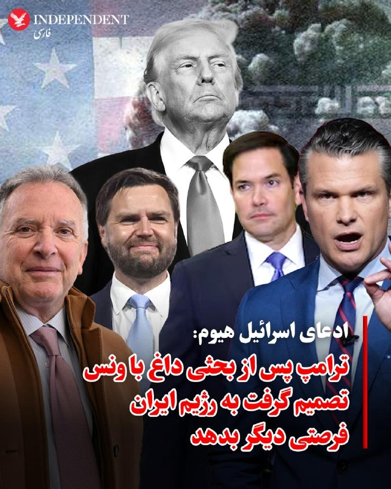

♦️درحالی که دونالد ترامپ، رئیس‌جمهوری آمریکا بسیاری از گزارش‌هایی که به نقل از منابع ناشناس در رسانه‌ها از پشت‌پرده مذاکرات با تهران را رد کرده و آنها را به داستان‌سرایی متهم کرده است، اسرائیل هیوم به نقل از منابعی که آنها را افراد مطلع معرفی کرده، ادعا کرده است که پس از یک بحث داغ در کاخ سفید میان دونالد ترامپ و جی‌دی ونس، معاون رئیس‌جمهوری آمریکا، ترامپ تصمیم گرفت به مذاکرات با رژیم ایران فرصت دیگری بدهد. در این جلسه، وزیر جنگ و وزیر خارجه آمریکا نیز حضور داشتند و معتقد بودند بدون اعمال فشار گسترده‌تر، از جمله احتمال حمله نظامی و تحریم‌های شدیدتر، گرفتن امتیاز از تهران ممکن نیست.
در مقابل، ونس استدلال کرد که پیشنهاد جدید جمهوری اسلامی نشان‌دهنده انعطاف‌پذیری تهران است و می‌توان از طریق آن به یک توافق اولیه برای پایان دادن به درگیری‌ها رسید. هیوم ادعا می‌کند، استیو ویتکاف و جرد کوشنر نیز از موضع ونس حمایت کردند. آنها پیش از نشست، با رهبران عمان، قطر و عربستان سعودی گفتگو کرده بودند؛ کشورهایی که به نوشته هیوم مخالف ازسرگیری جنگ هستند.
هیوم در ادامه ادعا می‌کند که ترامپ از ونس و فرستادگانش انتقاد کرد که ویکردی در پیش گرفته‌اند که به رژیم ایران اجازه وقت‌کشی می‌دهد.
هم‌زمان، ترامپ با رهبران منطقه نیز گفتگو کرد.
هیوم می‌نویسد، در نهایت، ترامپ پس از گفتگو با نتانیاهو تصمیم گرفت مذاکرات ادامه پیدا کند.
‌🇸🇦 Indypersian

🤖 @VahidOOnLine

## VahidOOnLine — post 241238

  

اسرائیل هیوم به نقل از منابع آگاه گزارش داد جلسه‌ای که چهارشنبه در کاخ سفید درباره ایران برگزار شد، به تنش انجامید، اما ترامپ در نهایت، خلاف نظر وزیران جنگ و خارجه و همسو با دیدگاه جی‌دی ونس و فرستادگان ویژه‌اش، ادامه مذاکرات با جمهوری اسلامی را تایید کرد.
این روزنامه نوشت ارزیابی مارکو روبیو، وزیر امور خارجه، و پیت هگست، وزیر جنگ آمریکا، این بود که در این مرحله، بدون اعمال فشار قابل‌توجه، از جمله تهدید به حمله و تشدید تحریم‌های اقتصادی، نمی‌توان از جمهوری اسلامی امتیاز گرفت. در مقابل، ونس معتقد بود تازه‌ترین پیشنهاد تهران نشانه‌ای از انعطاف است و می‌تواند زمینه حرکت به سوی یک توافق اولیه را فراهم کند.
منابع آگاه از این جلسه به اسرائیل هیوم گفتند که استیو ویتکاف و جرد کوشنر، فرستادگان ویژه دونالد ترامپ نیز در این گفت‌وگو از موضع ونس حمایت کردند.
آنها پیش از این جلسه با رهبران عمان، قطر و عربستان سعودی گفت‌وگو کرده بودند.
به نوشته این رسانه تنش در این جلسه زمانی شدت گرفت که ترامپ از ونس و فرستادگان انتقاد و آنها متهم کرد که رویکردشان به جمهوری اسلامی امکان می‌دهد زمان بخرد و به تصویر ایالات متحده و نهاد ریاست
‌🏁 🇬🇧 IranintlTV

🤖 @VahidOOnLine

## VahidOOnLine — post 241237

  

به گزارش رسانه‌های ایران، چهارشنبه در پی تیراندازی سرنشینان مسلح یک خودروی پژو به خودروی نیروهای انتظامی در یکی از جاده‌های اطراف سراوان، یک نیروی نظامی به نام امیرحسین شهرکی و دو نفر از مهاجمان کشته شدند.
بر اساس این گزارش‌ها، پس از این درگیری، سلاح، مهمات و یک دستگاه استارلینک کشف و خودروی مهاجمان توقیف شد. تلاش‌ها برای شناسایی و بازداشت دیگر مهاجمان ادامه دارد.

‌🏁 🇬🇧 IranintlTV

🤖 @VahidOOnLine

## VahidOOnLine — post 241236

  <a href="telegram/content/VahidOOnLine_241236_1779321598.mp4" target="_blank">🎬 Download video</a>

جاویدنام سینا عباسی؛
جوان ۲۲ ساله‌ای از کرمانشاه که هشتم دی ۱۴۰۴ در جریان اعتراضات میدان انقلاب، بر اثر ضربات باتوم به سر جان باخت.
با گذشت ماه‌ها، هنوز نامش جایی ثبت نشده…
و خانواده‌اش فقط می‌خواهند صدای سینا شنیده شود.»
‌🏁 🇬🇧 ManotoTV

🤖 @VahidOOnLine

## VahidOOnLine — post 241235

  <a href="telegram/content/VahidOOnLine_241235_1779321600.mp4" target="_blank">🎬 Download video</a>

‌
«نهاد مدیریت آبراه خلیج فارس» با انتشار نقشه‌ای در شبکه اکس «محدوده نظارتی مدیریت» جمهوری اسلامی در تنگه هرمز را تعیین کرد.

بر اساس متن این نقشه، محدوده مورد نظر در شرق تنگه از خط اتصال «کوه مبارک» در ایران به جنوب فجیره در امارات متحده عربی، و در غرب تنگه از خط اتصال انتهای جزیره قشم به ام‌القوین در امارات تعیین شده است.

در این بیانیه آمده است تردد در این محدوده برای عبور از تنگه هرمز باید «با هماهنگی مدیریت آبراه خلیج فارس و مجوز این نهاد» انجام شود.

در نقشه منتشرشده، بخش وسیعی از آب‌های اطراف تنگه هرمز (محدوده قرمز) با عنوان «محدوده تحت نظارت نیروهای مسلح ایران» مشخص شده است.
‌🏁 🇬🇧 ManotoTV

🤖 @VahidOOnLine

## VahidOOnLine — post 241234

♦️نارندرا مودی، نخست وزیر هند، با انتشار تصاویری از اجرای رقص پنج زن ایتالیایی در حساب کاربری خود در اکس نوشت: «دیدن علاقه جهانی به فرم‌های رقص هندی واقعا شگفت‌انگیز است.» این هنرمندان ایتالیایی به مناسبت سفر رسمی مودی به رم و برای خوش‌آمدگویی به او، ترکیبی از رقص‌های سنتی «کوچی‌پودی»، «بهاراتاناتیام» و «کاتاک» را اجرا کردند؛ هنرمندانی که پس از این اجرا اعلام کردند احساسات بسیار عمیقی داشتند و مودی نیز شخصا از عملکرد عالی آن‌ها تقدیر کرده است. نخست وزیر هند در بخش دیگری از این سفر دیپلماتیک، به همراه همتای ایتالیایی خود، جورجیا ملونی، از بنای تاریخی کولوسئوم در رم بازدید کرد؛ سفری که ملونی با انتشار پیامی در شبکه اجتماعی اکس و با عبارت «دوست من، به رم خوش آمدی»، استقبال گرمی از آن به عمل آورد. این سفر، نخستین سفر یک نخست‌وزیر هند به ایتالیا در ۲۶ سال گذشته است.
‌🇸🇦 Indypersian

🤖 @VahidOOnLine

## VahidOOnLine — post 241233

  <a href="telegram/content/VahidOOnLine_241233_1779321600.mp4" target="_blank">🎬 Download video</a>

♦️وزارت دفاع بریتانیا چهارشنبه ۳۰ اردیبهشت‌ماه اعلام کرد یک فروند هواپیمای شناسایی «ریوت جوینت» نیروی هوایی سلطنتی در حریم هوایی بین‌المللی بر فراز دریای سیاه با مزاحمت و رهگیری جنگنده‌های روسیه روبه‌رو شده است.

بر اساس بیانیه لندن، جنگنده‌های روسی تا فاصله شش متری به هواپیمای بریتانیایی نزدیک شدند و سامانه‌های اضطراری داخل هواپیما فعال شد.

در تصاویر منتشرشده از سوی وزارت دفاع بریتانیا، جنگنده‌های روسیه در فاصله‌ای بسیار نزدیک کنار هواپیمای شناسایی بریتانیا دیده می‌شوند.

بریتانیا اعلام کرد این هواپیما در حال انجام ماموریتی عادی در حمایت از عملیات ناتو بوده و خدمه آن با وجود «مانورهای بی‌پروا» ماموریت خود را با امنیت کامل به پایان رساندند.

وزارت دفاع بریتانیا همچنین این حادثه را نشانه ادامه افزایش فعالیت‌های نظامی روسیه در اروپای شرقی و مناطق شمالی توصیف کرد.
‌🇸🇦 Indypersian

🤖 @VahidOOnLine

## VahidOOnLine — post 241232

۴۰ روز مادری؛ مراقبت انسانی، نمایش عاطفه و پرسش‌های اخلاقی

نعیمه دوستدار- روایت زنی جوان که برای مدتی کوتاه سرپرستی یک نوزاد را بر عهده داشت، به یکی از بحث‌برانگیزترین موضوعات شبکه‌های اجتماعی فارسی‌زبان تبدیل شد. روایتی که با لحنی احساسی و الهام‌بخش منتشر شد، خیلی زود به موجی از نقدهای اخلاقی، روانشناختی و سیاسی دامن زد.
ماجرا از انتشار روایت‌های سارا کنعانی، فعال فضای مجازی، درباره حضور موقت یک نوزاد در خانه‌اش آغاز شد. او در اینستاگرام و ایکس از تجربه «مادری موقت» نوشت. تجربه‌ای که در قالب طرح «میزبان» سازمان بهزیستی انجام شد.
رسانه‌های حکومتی در ایران، از جمله خبرگزاری جمهوری اسلامی (ایرنا) و روزنامه همشهری، این روایت را با ادبیاتی احساسی و تصویری بازنشر کردند. تصاویری از خانه، آغوش، گریه هنگام جدایی و توصیف‌هایی از «۴۰ روز مادری».
تصاویر بدون حجاب کنعانی در ایرنا منتشر شد و کاربران مدتی بعد خبر از دسترس خارج شدن این خبرگزاری را منتشر کردند.
اما آنچه ابتدا برای بخشی از کاربران تصویری انسانی از مراقبت از کودک بی‌سرپرست به نظر می‌رسید، برای گروهی دیگر به پرسشی جدی درباره مرز میان حمایت از کودک و تبدیل کودک به «محتوا» بدل شد.
https://www.iranintl.com/fa/202605197267

‌🏁 🇬🇧 IranintlTV

🤖 @VahidOOnLine

## VahidOOnLine — post 241231

  

♦️خبرگزاری تسنیم، وابسته به سپاه پاسداران، چهارشنبه‌شب ۳۰ اردیبهشت‌ماه اعلام کرد «نهاد مدیریت آبراه خلیج فارس» محدوده نظارتی جمهوری اسلامی در تنگه هرمز را تعیین کرده است.

بر اساس نقشه منتشرشده، محدوده شرقی این منطقه از خط اتصال «کوه مبارک» در ایران تا جنوب فجیره در امارات متحده عربی و محدوده غربی آن از انتهای جزیره قشم تا ام‌القوین در امارات تعیین شده است.

در متن منتشرشده آمده است عبور از تنگه هرمز در این محدوده باید «با هماهنگی مدیریت آبراه خلیج فارس و مجوز این نهاد» انجام شود.

در نقشه منتشرشده، بخش وسیعی از آب‌های اطراف تنگه هرمز با عنوان «محدوده تحت نظارت نیروهای مسلح جمهوری اسلامی» مشخص شده است.
‌🇸🇦 Indypersian

🤖 @VahidOOnLine

## VahidOOnLine — post 241230

  

♦️به گزارش انتخاب، فداحسین مالکی، عضو کمیسیون امنیت ملی و سیاست خارجی مجلس، چهارشنبه‌شب ۳۰ اردیبهشت‌ماه، در گفتگو با صداوسیما اعلام کرد عاصم منیر، فرمانده ارتش پاکستان، فردا به ایران سفر خواهد کرد. این عضو کمیسیون امنیت ملی با اشاره به اهداف این سفر اعلام کرد که فرمانده ارتش پاکستان در این دیدار، حامل پیام جدیدی از سوی ایالات متحده آمریکا به مقامات جمهوری اسلامی است.
پیش‌تر نیز مسعود پزشکیان، رئیس‌جمهوری اسلامی، در دیدار با سید محسن نقوی، وزیر کشور پاکستان، درباره آخرین تحولات منطقه، روند مذاکرات غیرمستقیم ایران و آمریکا و گسترش همکاری‌های تهران و اسلام‌آباد گفتگو کرده بود. در این دیدار، وزیر کشور پاکستان پیام‌ها و دیدگاه‌های مقام‌های این کشور را درباره تحولات منطقه و ادامه رایزنی‌های دیپلماتیک به پزشکیان منتقل کرد.
‌🇸🇦 Indypersian

🤖 @VahidOOnLine

## VahidOOnLine — post 241229

  

♦️علیرضا زاکانی، شهردار تهران، چهارشنبه‌شب ۳۰ اردیبهشت‌ماه، در گفتگو با صداوسیما با رد گزارش‌ها درباره محاصره دریایی جمهوری اسلامی گفت: «محاصره دریایی معنا ندارد. این‌ها اغراق می‌کنند و جرات حمله ندارند. اوج اقداماتشان را هم انجام دادند و دیدند ما دست بالا را داریم.»

او افزود: «اگر حمله کنند، پاسخ می‌گیرند. دوره بزن‌دررو تمام شده است.»

زاکانی همچنین درباره تنگه هرمز گفت نظارت بر این آبراه «حق طبیعی» جمهوری اسلامی است و تهران نباید درباره آن با آمریکا مذاکره کند.

شهردار تهران افزود: «از تنگه هرکی می‌خواهد استفاده کند، باید منابع ما را آزاد کند» و گفت کشورهایی که جمهوری اسلامی را تحریم کرده‌اند، نباید انتظار عبور آزاد از تنگه هرمز را داشته باشند.
‌🇸🇦 Indypersian

🤖 @VahidOOnLine

## VahidOOnLine — post 241228

  

علیرضا زاکانی، شهردار تهران، در گفت‌وگو با صداوسیما، گفت: «محاصره دریایی معنا ندارد. این‌ها اغراق می‌کنند و جرات حمله ندارند. اوج اقداماتشان را هم انجام دادند و دیدند ما دست بالا را داریم.»

او اضافه کرد: «اگر حمله کنند، پاسخ می‌گیرند. دوره بزن‌دررو تمام شده است.»
‌🏁 🇬🇧 IranintlTV

🤖 @VahidOOnLine

## VahidOOnLine — post 241227

  

♦️روزنامه «فایننشال تایمز» روز چهارشنبه ۳۰ اردیبهشت، گزارش داد که بر اساس توافق جدید میان دونالد ترامپ و وزارت دادگستری آمریکا، اداره امور مالیاتی این کشور (IRS) دیگر حق پیگیری ادعاهای مالیاتی علیه ترامپ، پسران بزرگش و سازمان ترامپ را نخواهد داشت. این توافق در پی انصراف رئیس‌جمهوری آمریکا از شکایت ۱۰ میلیارد دلاری خود علیه این نهاد مالیاتی صورت گرفت.

این تعهد از سوی وزارت دادگستری یک روز پس از آن صادر شد که ترامپ موافقت کرد در ازای راه‌اندازی یک صندوق ۱.۸ میلیارد دلاری از سوی دولت برای قربانیان جنگ قضایی (Lawfare)، شکایت خود را تسویه کند. جنگ قضایی نامی است که در صحنه سیاسی آمریکا به اختلافات میان شهروندان و اداره مالیات در دوره ریاست‌جمهوری جو بایدن داده شده است. تاد بلانش، سرپرست دادستانی کل آمریکا، در سندی رسمی اعلام کرد که ایالات متحده تمامی ادعاهای مالیاتی علیه شاکیان این پرونده را برای همیشه لغو و ساقط کرده است.

سخنگوی وزارت دادگستری در گفتگو با فایننشال تایمز تصریح کرد که این ممنوعیت تعقیب، «تنها شامل حسابرسی‌های مالیاتی موجود» می‌شود. او افزود اگر هر یک از طرفین می‌توانستند ادعاهای قبلی خود را دوباره مطرح کنند، تسویه این پرونده‌های بزرگ بی‌معنا می‌شد.
‌🇸🇦 Indypersian

🤖 @VahidOOnLine

## VahidOOnLine — post 241226

♦️دونالد ترامپ، رئیس‌جمهور آمریکا، در تازه‌ترین اظهارات خود درباره روند تحولات مرتبط با ایران و مذاکرات جاری، اعلام کرد که شرایط «در مرز تصمیم‌گیری» قرار دارد و در صورت دریافت نکردن پاسخ‌های موردنظر واشنگتن، تحولات می‌تواند «بسیار سریع» پیش برود.
ترامپ با تاکید بر اینکه آمریکا برای هر سناریویی آمادگی کامل دارد، گفت پاسخ‌هایی که از طرف مقابل دریافت می‌شود باید «صددرصد کامل و مطلوب» باشد، چرا که رسیدن به توافق می‌تواند از اتلاف زمان، انرژی و مهم‌تر از همه از تلفات انسانی جلوگیری کند.
رئیس‌جمهوری آمریکا همچنین گفت ایران اکنون در موقعیتی «ضعیف و شکست‌خورده» قرار دارد، اما در عین حال تاکید کرد افرادی که هم‌اکنون در مذاکرات حضور دارند، نسبت به گذشته «منطقی‌تر» هستند. ترامپ گفت طرف‌های حاضر در گفتگوها را افرادی «باهوش، بااستعداد و دارای قدرت فکری بالا» می‌داند و ابراز امیدواری کرد که این مذاکرات به توافقی منجر شود که «برای همه عالی» باشد.
او در بخش دیگری از سخنانش با اشاره به احتمال تشدید تنش‌ها، تاکید کرد ترجیح می‌دهد با چند روز صبر و ادامه مسیر دیپلماسی، از وقوع جنگ و کشته شدن انسان‌ها جلوگیری شود.
‌🇸🇦 Indypersian

🤖 @VahidOOnLine

## VahidOOnLine — post 241224

  

به گزارش سازمان حقوق بشری هه‌نگاو، غلامرضا خانی‌شکرآب، ورزشکار و زندانی سیاسی اهل اردبیل که پیش‌تر با اتهام جاسوسی برای اسرائیل به اعدام محکوم شده بود، در خطر قریب‌الوقوع اجرای حکم اعدام قرار دارد.

بر اساس این گزارش، او به‌طور ناگهانی از بند امنیتی زندان اوین به سلول انفرادی زندان قزل‌حصار کرج منتقل شده است.
‌🏁 🇬🇧 IranintlTV

🤖 @VahidOOnLine

## VahidOOnLine — post 241223

  

یک مقام اسرائیلی به روزنامه اسرائیل هیوم گفت حکومت ایران هنوز درک نکرده چه بر سر این کشور آمده و افزود همان‌گونه که این حکومت لبنان، عراق و یمن را به عقب‌ماندگی کشاند، اکنون خود ایران نیز به کشوری عقب‌مانده تبدیل شده است.

به گزارش اسرائیل هیوم، در اورشلیم سقوط حکومت ایران همچنان سناریویی محتمل تلقی می‌شود و مقام‌های اسرائیلی می‌گویند پس از پایان مرحله کنونی، احتمال ازسرگیری اعتراض‌ها وجود دارد.

این روزنامه همچنین نوشت آسیب‌های واردشده به ایران بسیار قابل توجه بوده و برآوردها حاکی است در دو دور درگیری حدود ۳۰۰ میلیارد دلار خسارت اقتصادی به ایران وارد شده است.
‌🏁 🇬🇧 IranintlTV

🤖 @VahidOOnLine

## VahidOOnLine — post 241222

یک شهروند معترض به سرکوب و فضای امنیتی در ایران طی پیامی به ایران اینترنشنال گفت که در فضای قطع اینترنت و گرانی آن، «مزدورهای صادراتی حکومت جانی» حرف و مطالبات مردم را تحریف می‌کنند. پیام او با هوش مصنوعی خوانده شده است.
‌🏁 🇬🇧 IranintlTV

🤖 @VahidOOnLine

## VahidOOnLine — post 241221

  <a href="telegram/content/VahidOOnLine_241221_1779321606.mp4" target="_blank">🎬 Download video</a>

‌
دونالد ترامپ گفت آمریکا در آستانه تصمیم‌گیری درباره ایران قرار دارد و اگر پاسخ‌های مورد نظر واشینگتن دریافت نشود، تحولات می‌تواند «خیلی سریع» رخ دهد.

ترامپ گفت: «اگر پاسخ‌های درست را نگیریم، همه‌چیز خیلی سریع پیش خواهد رفت. ما کاملاً آماده‌ایم.»

او تأکید کرد هرگونه پاسخ از سوی جمهوری اسلامی باید «کامل و صددرصد قابل قبول» باشد و افزود در صورت دستیابی به توافق، «زمان، انرژی و جان انسان‌های زیادی» حفظ خواهد شد.

رئیس‌جمهوری آمریکا همچنین گفت ممکن است تصمیم‌گیری ظرف چند روز انجام شود، اما تأکید کرد روند تحولات می‌تواند «بسیار سریع» باشد.

ترامپ در ادامه ایران را «کشوری شکست‌خورده» توصیف کرد و گفت آمریکا اکنون با افرادی مذاکره می‌کند که به گفته او «بسیار منطقی‌تر» از مقام‌های پیشین جمهوری اسلامی هستند.

او افزود: «ما با افرادی بااستعداد و باهوش طرف هستیم و از این موضوع تحت تأثیر قرار گرفته‌ایم.»

ترامپ همچنین گفت اگر با چند روز صبر کردن بتوان از جنگ یا کشته شدن انسان‌ها جلوگیری کرد، «این کار ارزش انجام دادن دارد.»
‌🏁 🇬🇧 ManotoTV

🤖 @VahidOOnLine

## WithYashar — post 11806

https://t.me/boost/withyashar

۵۰۲ بوس تا آزادی استیکز ثثحامله 😅😂

## WithYashar — post 11802

وزیر کشور پاکستان با احمد وحیدی، فرمانده سپاه پاسداران در تهران دیدار کرد.
@withyashar
یکی اینو آخرش از سولاخ کشید بیرون دیگه مابقی با موساده 😅

## WithYashar — post 11801

ادعای «میدل ایست آی»: دونالد ترامپ، حمله برنامه‌ریزی‌شده به ایران را در این هفته به تعویق انداخت، چراکه متحدان عرب و مقامات دولت خودش به او هشدار دادند در ایام حج، جنگ را از سر نگیرد. به گفته دو مقام ارشد کشورهای حوزه خلیج‌فارس، به ترامپ گفته شده بود که حمله…

## WithYashar — post 11800

ادعای «میدل ایست آی»: دونالد ترامپ، حمله برنامه‌ریزی‌شده به ایران را در این هفته به تعویق انداخت، چراکه متحدان عرب و مقامات دولت خودش به او هشدار دادند در ایام حج، جنگ را از سر نگیرد.

به گفته دو مقام ارشد کشورهای حوزه خلیج‌فارس، به ترامپ گفته شده بود که حمله به ایران در ایام حج، بحرانی را در میان کشورهای عربی حاشیه خلیج فارس ایجاد می‌کند، زیرا این حمله باعث می‌شود صدها هزار زائر حج سرگردان بمانند.

منابع همچنین گفتند که به ترامپ گفته شده بود حمله در این ایام مقدس که منتهی به عید قربان می‌شود، بیشتر از این به جایگاه آمریکا در جهان اسلام لطمه می‌زند.

یک مقام ارشد آمریکایی که از بحث‌های جریان‌یافته در دولت ترامپ آگاه است، تأیید کرد که این گفت‌وگوها انجام شده است
@withyashar

## WithYashar — post 11799

معاون نیروی دریایی ۳پا :
همه نیروهای مسلح دست به ماشه و آماده هرگونه پاسخ به هر تعرض دشمن هستند
@withyashar

## WithYashar — post 11798

صدا و سیما : مردم یه سر به فضای مجازی بزنن تا ببینن چطور مردم کل دنیا منتظرن جمهوری اسلامی مقابل آمریکا و اسرائیل بایسته و یه تو دهنی محکم بهشون بزنه؛ پاسخی که دل خیلی‌ها رو خنک کنه.
@withyashar 🤣

## WithYashar — post 11797

آکسیوس: تماس سه‌شنبه ترامپ و نتانیاهو درباره طرح جدید صلح ایران که با میانجی‌گری قطر و پاکستان ارائه شده، «تنش‌آلود» بوده.

ترامپ هنوز معتقده امکان رسیدن به توافق با ایران وجود داره، ولی نتانیاهو به شدت میخواد که اقدام نظامی علیه ایران انجام بشه. نتانیاهو بعد از این تماس «به‌شدت نگران و آشفته» شده بود!
@withyashar

## WithYashar — post 11796

آکسیوس : یک منبع آمریکایی که در جریان این تماس تلفنی قرار داشت به من گفت: «موهای بی‌بی بعد از تماس آتش گرفته بود.»
@withyashar

## WithYashar — post 11795

  

دنیا با نفس حبس‌شده در انتظار موج بعدی اسناد یوفوهاست؛ پس از آنکه مقام‌ها وعده دادند این اسناد «به‌زودی» منتشر خواهند شد.

شان پارنل، سخنگوی ارشد پنتاگون، در ایکس اعلام کرد که این مدارک هم‌اکنون «به‌طور فعال در حال آماده‌سازی و پردازش» برای انتشار هستند.

مقام‌های سابق سیا و پنتاگون اخیراً مدعی شده‌اند «چهار گونهٔ بیگانه» به زمین رفت‌وآمد دارند: خزنده‌ها (Reptilians)، حشره‌مانندها (Insectoids)، گری‌ها (Greys) و نوردیک‌ها (Nordics).

آیا ما برای حقیقت آماده‌ایم؟
@withyashar

## WithYashar — post 11794

گزارش کانال ۱۴ اسرائیل : آیا ارزیابی ایران از شرایط کاملاً اشتباه است؟

با وجود تبلیغات تهاجمی، تهران در خفا عمق بحران خود را درک می‌کند. حکومت روی لبهٔ تیغ حرکت می‌کند؛ از یک سو ترامپ را تحریک می‌کند و از سوی دیگر، به‌طور پنهانی افکار عمومی ایران را برای یک تشدید بزرگ نظامی آماده می‌کند.

افراد در داخل حکومت اذعان دارند که حملهٔ آمریکا بسیار محتمل است، اما روی این موضوع شرط بسته‌اند که ترامپ یک حملهٔ محدود انجام دهد، اعلام پیروزی کند و سپس متوقف شود.

«همهٔ ما فقط امیدواریم که این هم یکی دیگر از ارزیابی‌های اشتباه ایران از شرایط باشد.»
@withyashar

## WithYashar — post 11793

یک مقام اسرائیلی به روزنامه اسرائیل هیوم : حکومت ایران هنوز درک نکرده چه بر سر این کشور آمده و افزود همان‌گونه که این حکومت لبنان، عراق و یمن را به عقب‌ماندگی کشاند، اکنون خود ایران نیز به کشوری عقب‌مانده تبدیل شده است.

به گزارش اسرائیل هیوم، در اورشلیم سقوط حکومت ایران همچنان سناریویی محتمل تلقی می‌شود و مقام‌های اسرائیلی می‌گویند پس از پایان مرحله کنونی، احتمال ازسرگیری اعتراض‌ها وجود دارد.

این روزنامه همچنین نوشت آسیب‌های واردشده به ایران بسیار قابل توجه بوده و برآوردها حاکی است در دو دور درگیری حدود ۳۰۰ میلیارد دلار خسارت اقتصادی به ایران وارد شده است.
@withyashar

## WithYashar — post 11792

کانال ۱۲ اسرائیل:
نتانیاهو با نظر ترامپ در مورد مذاکره مخالفت کرد
@withyashar

## mwarmonitor — post 9392

  <a href="telegram/content/mwarmonitor_9392_1779321608.mp4" target="_blank">🎬 Download video</a>

📝 اصلاً بوی زهمِ این بساط از فرسنگ‌ها داد می‌زند؛ شاهکارِ جدیدِ جماعتِ ارزشی مدار که کلِ جهان‌بینی‌شان از ناف به پایین خلاصه می‌شود. غرفه‌ی همسریابی کفِ خیابان! رسماً دکانِ چوب‌زدن و حراجِ غریزه راه انداخته‌اند، آن‌وقت اسمش را می‌گذارند «تسهیلِ ازدواجِ جوانان».

🔸فضا بیشتر شبیه به بازارِ هفتگیِ فروشِ احشام است تا کانونِ خانواده. یک طرف پسرک‌های هول و کفری که با هورمون‌های بالا زده، یقه غرفه‌دار را چسبیده‌اند که «پس کاتالوگِ سوگلی‌های مؤمنه چی شد؟»؛ یک طرف هم خانواده‌های متوهمی که مشخصاتِ دخترشان را آورده‌اند، اما از ترسِ چشم‌زخم، حتی اسمِ خریدار را هم نمی‌پرسند!

🔸تمام هنرِ این تفکرِ کپک‌زده، تنزل دادنِ شأنِ انسان به حدِ یک جفت‌گیریِ خیابانی و هول‌هولکی است. خب اگر خیلی نگرانِ جوششِ غریزه و کاهشِ جمعیتِ نظام هستید، تعارف را کنار بگذارید؛ همان‌جا وسطِ پیاده‌رو، بغلِ غرفهٔ آش و سیب‌زمینی، یک لاحاف تشک پهن کنید تا برادران و خواهرانِ بی‌تاب، کار را بی‌فوتِ وقت تمام کنند. واقعاً تف به این حجم از سقوط و لجن‌زارِ فرهنگی.

@mwarmonitor

## mwarmonitor — post 9391

🔴شبکه CBS گزارش داد: کار بر روی تدوین گزینه‌های نظامی علیه کوبا برای رئیس‌جمهور ترامپ آغاز شده و جامعه اطلاعاتی آمریکا در حال بررسی این است که کوبا چگونه ممکن است به یک اقدام نظامی آمریکا واکنش نشان دهد.

@mwarmonitor

## mwarmonitor — post 9390

  

✈️۴ فروند هواپیمای سوخت‌رسان هوایی KC-46A Pegasus نیروی هوایی آمریکا از اسرائیل به پرواز درآمده‌اند و بر اساس داده‌های فلایت‌رادار بر فراز عربستان سعودی و عراق شناسایی شده‌اند.

@mwarmonitor

## mwarmonitor — post 9389

📝 سوال، انتقاد ، پیشنهاد ، دایرکت به گوشم

## mwarmonitor — post 9388

🔴هدف این تلاش جدید این است که تعهدات ملموس‌تری از سوی ایران درباره گام‌های مربوط به برنامه هسته‌ای‌اش به دست آید، و همچنین جزئیات بیشتری از سوی آمریکا درباره این‌که چگونه دارایی‌های مسدودشده ایران به‌تدریج آزاد خواهند شد، ارائه شود؛ یک مقام عربی گفت. باراک راوید

@mwarmonitor

## mwarmonitor — post 9387

🇮🇷🇺🇸ایالات متحده و ایران در حال گفت‌وگو درباره یک «نقشه راه » برای دور جدیدی از مذاکرات هستند که قرار است محورهای مورد بحث را مشخص کند؛ مذاکراتی که ترامپ پیش‌تر گفته بود در اسلام‌آباد برگزار خواهد شد—اگر ایران آماده گفت‌وگو درباره کنار گذاشتن جاه‌طلبی‌های هسته‌ای خود باشد. نیویورک پست

@mwarmonitor

## mwarmonitor — post 9386

  

⁉️سوال زیادی در مورد موقعیت ناو boxer پرسیده بودید

🔸اقیانوس هند
۱۵ می ۲۰۲۶ (۲۵ اردیبهشت ۱۴۰۵)

📷عکس از: سرجوخه ترنت ای. هنری
یگان یازدهم اعزامی تفنگداران دریایی 11th MEU

🔸یک ملوان آمریکایی مستقر در کشتی بالگردبر و آب‌خاکی کلاس واسپ، یو‌اس‌اس باکسر (LHD 4)، در حال نظارت بر یک جنگنده F-35B لایتنینگ ۲ متعلق به اسکادران ۱۲۲ حمله جنگنده‌ای تفنگداران دریایی (VMFA-122)، یگان یازدهم اعزامی تفنگداران دریایی، در جریان عملیات پروازی در اقیانوس هند در تاریخ ۱۵ می ۲۰۲۶ است.

🔸یگان 11th MEU که بر روی ناوگروه آماده آب-خاکی باکسر (Boxer ARG) مستقر شده است، یک نیروی مداوم و با توان رزمی معتبر است که به بازدارندگی و پاسخ به بحران‌ها در منطقه عملیاتی ناوگان هفتم نیروی دریایی آمریکا کمک می‌کند. ناوگان هفتم ایالات متحده، به عنوان بزرگ‌ترین ناوگان شماره‌گذاری‌شده و فرامرزی نیروی دریایی آمریکا، به طور منظم با متحدان و شرکای خود تعامل و عملیات انجام می‌دهد تا امنیت و پایداری یک منطقه آزاد و باز در هند-آرام (ایندو-پاسیفیک) را حفظ کند.

@mwarmonitor

## mwarmonitor — post 9385

  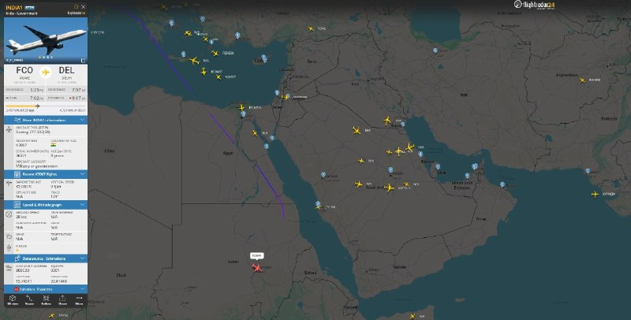

🔴به نظر می‌رسد نخست وزیر هند در مسیر بازگشت از اروپا، به‌طور کامل از خاورمیانه اجتناب می‌کند. عجیب است که او حتی از حریم هوایی عربستان هم عبور نکرده است.

@mwarmonitor

## mwarmonitor — post 9384

🇺🇸مقامات فدرال آمریکا در حال بررسی معاملاتی مشکوک در بازار نفت به ارزش ۸۰۰ میلیون دلار هستند که درست پیش از انتشار خبرهای مهم مربوط به جنگ ایران انجام شده است؛ موضوعی که یک گزارش آن را فاش کرده است. نیویورک پست

@mwarmonitor

## mwarmonitor — post 9383

🔴فیننشال تایمز: ارزشمندترین شرکت جهان (اینویدیا) پیش‌بینی کرده است که فروش آن در سه‌ماهه جاری به ۹۱ میلیارد دلار برسد؛ رقمی که به‌طور قابل توجهی بالاتر از میانگین انتظار وال‌استریت (۸۶ میلیارد دلار بر اساس داده‌های Visible Alpha) است، اما از خوش‌بینانه‌ترین پیش‌بینی‌ها کمتر است.

@mwarmonitor

## mwarmonitor — post 9382

🔴طرح پیشنهادی جدید برای صلح با ایران، موجب تماس تلفنی تنش‌آمیز میان ترامپ و نتانیاهو شد 📝نویسنده: باراک راوید AXIOS 🔰سه منبع آگاه اعلام کردند که دونالد ترامپ، رئیس‌جمهور آمریکا و بنیامین نتانیاهو، نخست‌وزیر اسرائیل، روز سه‌شنبه در یک تماس تلفنی دشوار، درباره…

## mwarmonitor — post 9381

  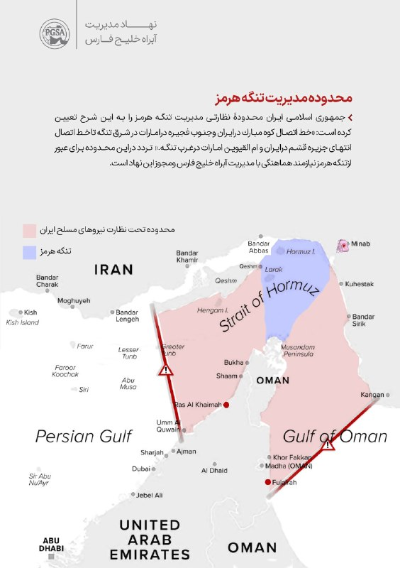

🇮🇷جمهورى اسلامى ايران محدودهٔ نظارتى مديریت تنگه هرمز را به این شرح تعيین کرده است: «خط اتصال كوه مبارك درايران وجنوب فجيره درامارات در شرق تنگه تاخط اتصال انتهاى جزيره قشم درايران و ام القيوین امارات درغرب تنگه.»

🔸تردد دراین محدوده برای عبورازتنگه هرمز نیازمند هماهنگی با مدیریت آبراه خلیج فارس ومجوز این نهاد است.

@mwarmonitor

## mwarmonitor — post 9380

حمله موشکی به مقرهای مخالفان کُرد ایرانی در استان اربیل در شمال عراق

## FoxNewsTwitter — post 342029

  <a href="telegram/content/FoxNewsTwitter_342029_1779321614.mp4" target="_blank">🎬 Download video</a>

Fox News (Twitter/X)

FOX NEWS REPORT: Former Cuban President Raúl Castro was indicted for allegedly ordering the 1996 attack on civilian airplanes that were rescuing people from the communist nation, leaving four people dead.
@BillMelugin_ has the latest.

## FoxNewsTwitter — post 342028

  <a href="telegram/content/FoxNewsTwitter_342028_1779321616.mp4" target="_blank">🎬 Download video</a>

Fox News (Twitter/X)

WATCH: Boos break out during former Google CEO Eric Schmidt’s commencement speech after he addressed fears about AI reshaping the workforce.

“There is a fear in your generation that the future has already been written... The question is not whether AI will shape the world. It will. The question is whether you will help shape artificial intelligence."

Schmidt said those concerns are “rational” as AI rapidly transforms industries, but pushed graduates to help build the future instead of rejecting the technology outright — prompting audible boos from some in the crowd.

## FoxNewsTwitter — post 342027

  

Fox News (Twitter/X)

A Texas Democrat is getting ripped by members of her own party after making shocking comments online.

Congressional candidate Maureen Galindo posted that she wants to lock up “American Zionists” in an ICE detention facility.

Galindo — a sex therapist and housing activist running in the Democratic runoff for Texas’ newly redrawn 35th Congressional District — also said she would lock up former ICE officers and turn the local ICE detention center into a “castration processing center for pedophiles, which will probably be most of the Zionists.”

The comments sparked outrage, with critics calling them antisemitic. Even fellow Democrats and The New York Times condemned the remarks, with the paper urging voters not to let her win the runoff.

Jewish Democratic Rep. Jared Moskowitz accused Galindo of proposing “concentration camps for American Jews,” while Sen. Ruben Gallego said she should “never be allowed in any political office.”

## pm_afshaa — post 91138

  <a href="telegram/content/pm_afshaa_91138_1779321619.webm" target="_blank">🎬 Download video</a>

🔴توییت پیت هگست، وزیر جنگ آمریکا درباره ایران: قفل شده و آماده شلیک

💧 Rainbet.com the #1 Non-KYC Crypto Casino & Sportsbook @rainbetcom

😁 @Pm_Afshaa

## pm_afshaa — post 91137

  <a href="telegram/content/pm_afshaa_91137_1779321620.webm" target="_blank">🎬 Download video</a>

🔴امروز وزیر کشور پاکستان با احمد وحیدی، فرمانده سپاه پاسداران در تهران دیدار کرد.

💧 Rainbet.com the #1 Non-KYC Crypto Casino & Sportsbook @rainbetcom

😁 @Pm_Afshaa

## pm_afshaa — post 91136

  <a href="telegram/content/pm_afshaa_91136_1779321620.mp4" target="_blank">🎬 Download video</a>

🎙 خبرنگار: پیامت به خانواده‌های آمریکایی که از هوش مصنوعی می‌ترسن چیه؟ اونا نگرانن بچه‌هاشون تو آینده کار نداشته باشن.

جواب کاملا مرتبط و منطقی ترامپ:
هوش مصنوعی فوق‌العاده‌ست و ایران نباید سلاح هسته‌ای داشته باشه!

💧 Rainbet.com the #1 Non-KYC Crypto Casino & Sportsbook @rainbetcom

😁 @Pm_Afshaa

## pm_afshaa — post 91135

  <a href="telegram/content/pm_afshaa_91135_1779321622.webm" target="_blank">🎬 Download video</a>

🔴میدل ایست آی: سه منبع گفتن که انتظار دارن جنگ در هفته‌های آینده و پس از پایان دوره حج، از سر گرفته بشه. آمریکا از سیگنال‌های فریبنده استفاده کرده تا سعی کنه طرف مقابل رو دچار احساس امنیت کاذب کنه. 
💧 Rainbet.com the #1 Non-KYC Crypto Casino & Sportsbook…

## pm_afshaa — post 91134

  <a href="telegram/content/pm_afshaa_91134_1779321623.webm" target="_blank">🎬 Download video</a>

🔴میدل ایست آی: سه منبع گفتن که انتظار دارن جنگ در هفته‌های آینده و پس از پایان دوره حج، از سر گرفته بشه.

آمریکا از سیگنال‌های فریبنده استفاده کرده تا سعی کنه طرف مقابل رو دچار احساس امنیت کاذب کنه.

💧 Rainbet.com the #1 Non-KYC Crypto Casino & Sportsbook @rainbetcom

😁 @Pm_Afshaa

## pm_afshaa — post 91133

  <a href="telegram/content/pm_afshaa_91133_1779321623.webm" target="_blank">🎬 Download video</a>

🔴فدا حسین مالکی، عضو کمیسیون امنیت ملی مجلس در صداوسیما: عاصم منیر فردا حامل پیام جدیدی از سوی آمریکا به ایرانه.

💧 Rainbet.com the #1 Non-KYC Crypto Casino & Sportsbook @rainbetcom

😁 @Pm_Afshaa

## pm_afshaa — post 91132

  <a href="telegram/content/pm_afshaa_91132_1779321624.webm" target="_blank">🎬 Download video</a>

🔴آکسیوس به نقل از یک منبع آمریکایی: ترامپ به نتانیاهو از یک دوره 30 روزه مذاکره درباره برنامه هسته‌ای ایران و تنگه هرمز اطلاع داد 
💧 Rainbet.com the #1 Non-KYC Crypto Casino & Sportsbook @rainbetcom 
😁 @Pm_Afshaa

## VahidOnline — post 75588

  <a href="telegram/content/VahidOnline_75588_1779321625.mp4" target="_blank">🎬 Download video</a>

'من وطن‌فروش نیستم... زنده باد جمهوری اسلامی... تا آخر کنار ولایت می‌مانیم... این پرچم با طوفان نمی‌افتد... سقوط این کشور را به گور خواهند برد... عزت این ملت معامله‌شدنی نیست راه مقاومت ادامه دارد...'

تبلیغ «وطن»دوستی در «کشور جمهوری اسلامی» با شهروندان وارداتی از 'عمان، سنگال، غنا، کنیا، بورکینافاسو، ساحل عاج، نیجریه، تانزانیا، مالی'

📡 @VahidOnline

## VahidOnline — post 75587

  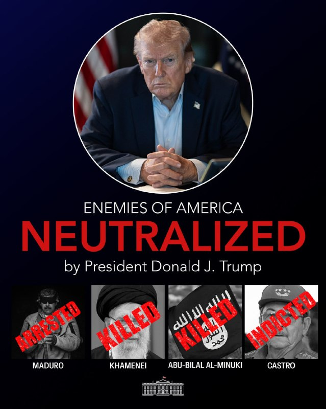

حساب رسمی کاخ سفید در شبکه اجتماعی ایکس، روز چهارشنبه ۳۰ اردیبهشت در پُستی، عکسی از رئيس جمهوری آمریکا، دونالد ترامپ را منتشر کرد که زیر آن تصاویری از «دشمنان خنثی‌شده آمریکا بدست پرزیدنت دونالد جی. ترامپ» دیده می‌شود.

در این پست تصاویری از علی خامنه‌‌ای رهبر کشته‌شده جمهوری اسلامی، نیکلاس مادورو رهبر دستگیر‌شده ونزوئلا، رائول کاسترو رهبر سابق کوبا، و ابو بلال المنوکی از رهبران داعش که به جای تصویرش پرچم داعش نشان داده شده، منتشر شده است.

کاخ سفید در مورد کاسترو، روی تصویر او نوشت که علیه او کیفرخواست صادر شده است. در مورد مادورو روی تصویر او نوشت که دستگیر شده است. و در مورد علی خامنه‌ای و ابو بلال المنوکی روی تصاویر آن‌ها نوشت که «کشته‌ شدند.»

حساب رسمی کاخ سفید افزود: «عدالت اجرا خواهد شد.»
@VahidHeadline

📡 @VahidOnline

## VahidOnline — post 75586

  

روزنامه اسرائیل هیوم به نقل از «منابع آگاه» نوشت جلسه چهارشنبه ۳۰ اردیبهشت در کاخ سفید درباره ایران با اختلاف‌نظر شدید میان مقام‌های ارشد دولت آمریکا همراه شد، اما رییس‌جمهوری آمریکا در نهایت، خلاف نظر وزیر جنگ و وزیر امور خارجه، و همسو با دیدگاه جی‌دی ونس و فرستادگان ویژه‌اش، ادامه مذاکرات با جمهوری اسلامی را تایید کرد.

این روزنامه راستگرا نوشت ارزیابی مارکو روبیو، وزیر امور خارجه، و پیت هگست، وزیر جنگ آمریکا، این بود که در این مرحله، بدون اعمال فشار قابل‌توجه، از جمله تهدید به حمله و تشدید تحریم‌های اقتصادی، نمی‌توان از جمهوری اسلامی امتیاز گرفت. در مقابل، ونس معتقد بود تازه‌ترین پیشنهاد تهران نشانه‌ای از انعطاف است و می‌تواند زمینه حرکت به سوی یک توافق اولیه را فراهم کند.

منابع آگاه از این جلسه به اسرائیل هیوم گفتند که استیو ویتکاف و جرد کوشنر، فرستادگان ویژه دونالد ترامپ نیز در این گفت‌وگو از موضع ونس حمایت کردند.

آنها پیش از این جلسه با رهبران عمان، قطر و عربستان سعودی گفت‌وگو کرده بودند.

به نوشته این رسانه تنش در این جلسه زمانی شدت گرفت که ترامپ از ونس و فرستادگان انتقاد و آنها متهم کرد که رویکردشان به جمهوری اسلامی امکان می‌دهد زمان بخرد و به تصویر ایالات متحده و نهاد ریاست‌جمهوری آسیب بزند. ونس با لحنی قاطع پاسخ داد که دولت باید به دنبال پایان دادن به این کارزار نظامی، بازگرداندن سربازان به خانه، کاهش قیمت نفت و تمرکز بر مشکلات داخلی آمریکا باشد؛ پاسخی که حاضران را غافلگیر کرد.

اسرائیل هیوم در ادامه این گزارش به گفت‌وگوی ترامپ با رهبران منطقه اشاره کرد و به نقل از دو منبع نوشت که رهبران اسرائیل و امارات متحده عربی، همزمان با تاکید بر ضرورت حفاظت از تاسیسات حساس خود در قبال حملات احتمالی جمهوری اسلامی، از پیش گرفتن «سیاست‌های سخت‌گیرانه» علیه جمهوری اسلامی حمایت می‌کنند.

در مقابل، رهبران عربستان سعودی و قطر ترجیح می‌دهند از بازگشت به درگیری‌ها پرهیز شود.

این روزنامه همچنین به نقل از یک مقام آمریکایی درباره تماس تلفنی ترامپ با نخست‌وزیر اسرائیل نوشت که نتانیاهو از رفتار جمهوری اسلامی و احتمال وقت‌کشی تهران ابراز سرخوردگی کرد، در حالی که ترامپ بر پیچیدگی شرایط و دشواری‌هایی پیشِ رو تاکید داشت. با این حال رییس‌جمهوری آمریکا بار دیگر گفت که به رفع تهدید هسته‌ای حکومت ایران متعهد است.
@VahidOOnLine

📡 @VahidOnline

## VahidOnline — post 75584

  <a href="telegram/content/VahidOnline_75584_1779321626.mp4" target="_blank">🎬 Download video</a>

دونالد ترامپ، رئیس‌جمهور آمریکا، شامگاه چهارشنبه گفت حاضر است «چند روز» برای رسیدن پاسخ ایران به پیشنهاد واشینگتن درباره توافق پایان جنگ صبر کند اما هشدار داد که این پاسخ باید «۱۰۰ درصد درست» باشد.

او بعد از سخنرانی در جمع دانشجویان نظامی به خبرنگاران گفت اگر پاسخ ایران درست نباشد، تشدید تنش به سرعت رخ می‌دهد و افزود: «ما آماده پیش‌روی هستیم. باید جواب‌های ۱۰۰ درصد درست و خوبی بگیریم.»
ترامپ اعلام کرد که آمریکا در حال حاضر با افراد «خیلی خوبی» از طرف ایرانی مواجه است که «استعداد و قدرت ذهن» دارند؛ افرادی که به گفته او جایگزین رهبران پیشین ایران شده‌اند.

این اظهارات ساعتی بعد از آن است که سخنگوی وزارت خارجه ایران اعلام کرد تهران در حال بررسی طرح پیشنهادی جدید آمریکا است.

این طرح توسط اسلام‌آباد به دست مقام‌های جمهوری اسلامی رسیده است؛ همزمان با سفر وزیر کشور پاکستان به تهران.
@VahidHeadline

📡 @VahidOnline

## VahidOnline — post 75582

آکسیوس در گزارشی اختصاصی اعلام کرد دونالد ترامپ در تماس تلفنی طولانی و «دشوار» خود با بنیامین نتانیاهو، از تلاش میانجی‌ها برای تدوین یک «تفاهم‌نامه» خبر داده است. بر اساس این طرح، آمریکا و جمهوری اسلامی با امضای این تفاهم‌نامه رسما به جنگ پایان داده و یک دوره ۳۰ روزه را برای مذاکره درباره برنامه هسته‌ای ایران و بازگشایی تنگه هرمز آغاز می‌کنند.

به گفته دو نفر از منابع آکسیوس، این پیشنهاد با مخالفت شدید نخست‌وزیر اسرائیل مواجه شده و دو رهبر درباره مسیر پیش‌رو اختلاف‌نظر جدی دارند. یک مقام آمریکایی وضعیت نتانیاهو را پس از این تماس، «بسیار خشمگین و آشفته» توصیف کرد.

آکسیوس به نقل از منابع خود نوشت سفیر اسرائیل در واشنگتن نیز نگرانی شدید نتانیاهو از این گفتگو را به اطلاع قانون‌گذاران آمریکایی رسانده است؛ هرچند سخنگوی سفارت این موضوع را تکذیب کرد. یکی از منابع با اشاره به بدبینی همیشگی نتانیاهو به روند گفتگوها گفت: «بی‌بی همیشه نگران است.» کاخ سفید و دفتر نخست‌وزیری اسرائیل از اظهارنظر در این باره خودداری کرده‌اند.
@VahidOOnLine

📡 @VahidOnline

## kianmeli1 — post 87526

  

‏🔴کاخ سفید در پیامی در شبکه ایکس با انتشار تصویری از علی خامنه‌ای، نیکلاس مادورو، رائول کاسترو و ابو بلال المینوکی، نفر دوم داعش، نوشت: «عدالت اجرا خواهد شد.» بر روی عکس این افراد در این تصویر نوشته شده خامنه‌ای کشته شده، مادورو بازداشت شده، المینوکی کشته شده و کاسترو تحت تعقیب است
https://t.me/kianmeli1

## kianmeli1 — post 87525

  <a href="telegram/content/kianmeli1_87525_1779321628.mp4" target="_blank">🎬 Download video</a>

🔴 ترامپ درباره ایران:
اگر پاسخ‌های درست را نگیریم، خیلی سریع پیش می‌رود. همه ما آماده‌ایم. باید پاسخ‌های درست را بگیریم.

باید پاسخ‌ها کاملاً ۱۰۰٪ درست باشند، و اگر اینطور باشد، زمان، انرژی و جان‌های زیادی را نجات می‌دهیم.
https://t.me/kianmeli1

## kianmeli1 — post 87524

  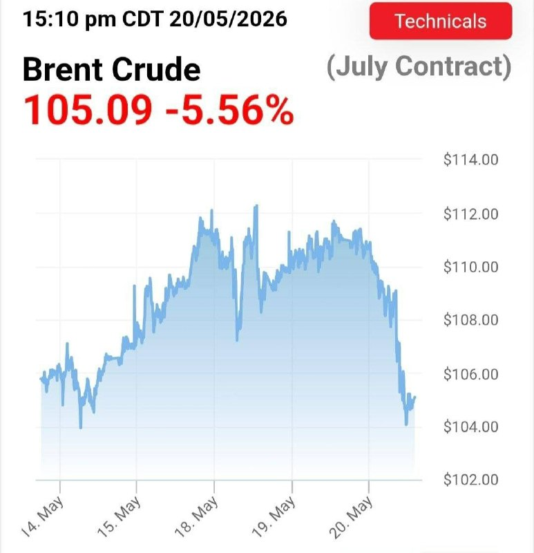

🔴آخرین قیمت نفت ۱۰۵.۰۹ دلار
https://t.me/kianmeli1

## kianmeli1 — post 87523

  

🔴«اداره تنگه خلیج فارس» (PGSA) که به تازگی از سوی ایران اعلام موجودیت کرده است، می‌گوید یک منطقه دریایی کنترل‌شده در تنگه هرمز ایجاد کرده است.
https://t.me/kianmeli1

## IranIntlTV — post 338167

  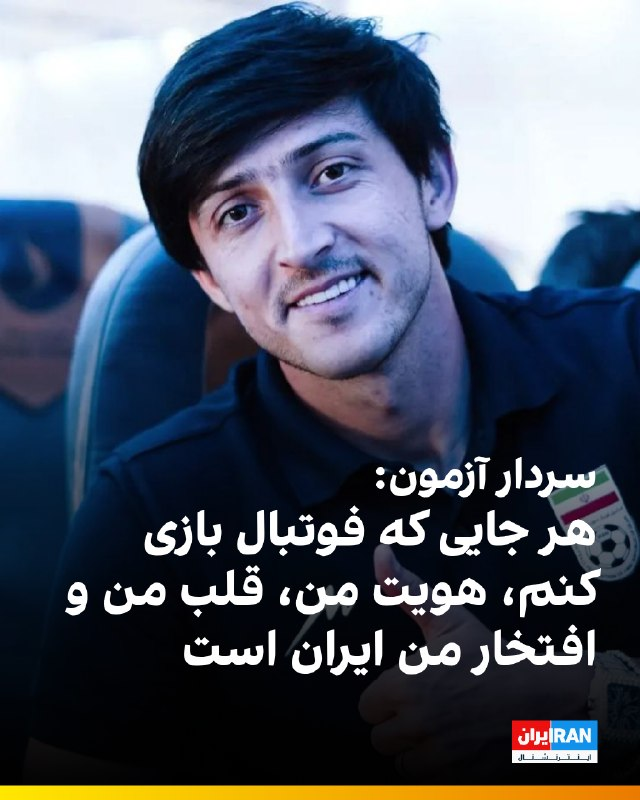

🔻سردار آزمون در یادداشتی در صفحه اینستاگرام خود نوشت: «من هميشه با افتخار برای تيم ملی كشورم بازی كردم. وقتی می‌برديم، به خودم و هم‌تيمی‌هام افتخار می كردم و وقتی نمی‌برديم مثل همه آنها ناراحت‌ترين آدم دنيا بودم. من عاشق فوتبال هستم و عاشق مردم خوب و شايسته كشورم ايران.»

🔹مهاجم تیم ملی با اشاره به سابقه خود در این تیم نوشت: «وقتی پيراهن تيم ملی كشورم را پوشيدم، به خودم قول دادم هر بار كه برای ايران بازی می كنم، با تمام وجود تلاش كنم تا باعث خوشحالی مردمی كه با عشق فوتبال را دنبال می كنند بشوم، بخصوص بچه‌هایی كه توی دورترين شهرها و روستاها با پيروزی ما خوشحال می‌شوند.»

🔹او که به دلیل مواضع ضد حکومتی خود پس از انقلاب ملی ایرانیان و جنگ اخیر از تیم ملی کنار گذاشته شد، با آرزوی موفقیت برای بازیکنان و کادر فنی تیم ملی «مخصوصا امیرخان» در جام جهانی ۲۰۲۶، نوشت: «من فوتباليستم و عاشق فوتبال و هر چيزی كه در زندگی به دست آوردم اول لطف خدا بوده و بعد زحمت و تلاش و حمايت و محبت مردم عزيز و به خاطر همين عشق هميشه قدردان مردم كشورم هستم.»

🔹جزییات بیشتر را در سایت بخوانید.

@iranintltvsport

## IranIntlTV — post 338166

  

اسرائیل هیوم به نقل از منابع آگاه گزارش داد جلسه‌ای که چهارشنبه در کاخ سفید درباره ایران برگزار شد، به تنش انجامید، اما ترامپ در نهایت، خلاف نظر وزیران جنگ و خارجه و همسو با دیدگاه جی‌دی ونس و فرستادگان ویژه‌اش، ادامه مذاکرات با جمهوری اسلامی را تایید کرد.
این روزنامه نوشت ارزیابی مارکو روبیو، وزیر امور خارجه، و پیت هگست، وزیر جنگ آمریکا، این بود که در این مرحله، بدون اعمال فشار قابل‌توجه، از جمله تهدید به حمله و تشدید تحریم‌های اقتصادی، نمی‌توان از جمهوری اسلامی امتیاز گرفت. در مقابل، ونس معتقد بود تازه‌ترین پیشنهاد تهران نشانه‌ای از انعطاف است و می‌تواند زمینه حرکت به سوی یک توافق اولیه را فراهم کند.
منابع آگاه از این جلسه به اسرائیل هیوم گفتند که استیو ویتکاف و جرد کوشنر، فرستادگان ویژه دونالد ترامپ نیز در این گفت‌وگو از موضع ونس حمایت کردند.
آنها پیش از این جلسه با رهبران عمان، قطر و عربستان سعودی گفت‌وگو کرده بودند.
به نوشته این رسانه تنش در این جلسه زمانی شدت گرفت که ترامپ از ونس و فرستادگان انتقاد و آنها متهم کرد که رویکردشان به جمهوری اسلامی امکان می‌دهد زمان بخرد و به تصویر ایالات متحده و نهاد ریاست‌جمهوری آسیب بزند. ونس با لحنی قاطع پاسخ داد که دولت باید به دنبال پایان دادن به این کارزار نظامی، بازگرداندن سربازان به خانه، کاهش قیمت نفت و تمرکز بر مشکلات داخلی آمریکا باشد؛ پاسخی که حاضران را غافلگیر کرد.

## IranIntlTV — post 338165

  <a href="telegram/content/IranIntlTV_338165_1779321632.mp4" target="_blank">🎬 Download video</a>

انتشار قانون جدید طالبان درباره طلاق موجی از نگرانی درباره وضعیت حقوق زنان و احتمال تشدید کودک‌همسری در افغانستان ایجاد کرده است.

براساس این قانون، سکوت یک دختر هنگام جاری شدن خطبه عقد، به معنای رضایتش برای ازدواج تلقی می‌شود.

گفت‌وگو با راضیه دانش، عضو تحریریه ایران‌اینترنشنال
@iranintltv

## IranIntlTV — post 338164

  <a href="telegram/content/IranIntlTV_338164_1779321634.mp4" target="_blank">🎬 Download video</a>

مسعود پزشکیان، رییس دولت در جمهوری اسلامی، با تایید آسیب دیدن بخشی از زیرساخت‌های انرژی جمهوری اسلامی در جریان حملات آمریکا و اسرائیل، از ناتوانی دولت در تامین و واردات بنزین خبر داد.

گفت‌وگو با مهدی مصلحی، کارشناس بازار نفت
@iranintltv

## IranIntlTV — post 338163

  <a href="telegram/content/IranIntlTV_338163_1779321636.mp4" target="_blank">🎬 Download video</a>

سنای آمریکا طرح پایان دادن به جنگ با ایران را با ۵۰ رای در برابر ۴۷ رای یک گام به پیش برد.

رسانه‌ها این اقدام را ضربه‌ای سیاسی به دونالد ترامپ توصیف کرده‌اند.

گزارش مرضیه حسینی، خبرنگار ایران‌اینترنشنال
@iranintltv

## IranIntlTV — post 338162

  <a href="telegram/content/IranIntlTV_338162_1779321638.mp4" target="_blank">🎬 Download video</a>

مراد ویسی، تحلیل‌گر ارشد ایران‌اینترنشنال، گفت: «صف بنزین در بندرعباس، شهری که بخش بزرگی از بنزین کشور را تولید می‌کند، نشانه‌ای از شدت گرفتن کمبود بنزین و بحرانی عمیق‌تر از روایت‌ دولت است. در صورت گسترش جنگ و حمله به زیرساخت‌های انرژی، خطر شکل‌گیری ابر بحران بنزین و برق در کشور وجود دارد.»
@iranintltv

## IranIntlTV — post 338161

  <a href="https://t.me/IranintlTV/338161" target="_blank">📎 Download file</a>

🎧نسخه صوتی سیاست با مراد ویسی: چهارمین جنگ یا توافق در آخرین لحظه؟
@iranintlTV

## IranIntlTV — post 338160

  <a href="telegram/content/IranIntlTV_338160_1779321640.mp4" target="_blank">🎬 Download video</a>

آکسیوس گزارش داد دونالد ترامپ در گفت‌وگوی تلفنی با بنیامین نتانیاهو از کار میانجی‌ها روی یک «تفاهم اولیه» خبر داده که قرار است آمریکا و ایران آن را امضا کنند تا جنگ به‌صورت رسمی پایان یابد و دوره ۳۰ روزه مذاکرات آغاز شود.

گفت‌وگو با فرزین ندیمی، پژوهشگر امور دفاعی و امنیتی
@iranintltv

## IranIntlTV — post 338159

  

به گزارش رسانه‌های ایران، چهارشنبه در پی تیراندازی سرنشینان مسلح یک خودروی پژو به خودروی نیروهای انتظامی در یکی از جاده‌های اطراف سراوان، یک نیروی نظامی به نام امیرحسین شهرکی و دو نفر از مهاجمان کشته شدند.
بر اساس این گزارش‌ها، پس از این درگیری، سلاح، مهمات و یک دستگاه استارلینک کشف و خودروی مهاجمان توقیف شد. تلاش‌ها برای شناسایی و بازداشت دیگر مهاجمان ادامه دارد.

https://iranintl.com/202605200267

## IranIntlTV — post 338158

  <a href="telegram/content/IranIntlTV_338158_1779321643.mp4" target="_blank">🎬 Download video</a>

دونالد ترامپ گفت ایران باید تنگه هرمز را باز نگه دارد. او با اشاره به شرایط دشوار زندگی در ایران افزود خشم و ناآرامی زیادی در کشور وجود دارد.

همزمان آکسیوس گزارش داد تماس تلفنی ترامپ و نتانیاهو درباره جمهوری اسلامی پرتنش بوده است.

گزارش اردوان روزبه، خبرنگار ایران‌اینترنشنال
@iranintltv

## IranIntlTV — post 338157

  <a href="telegram/content/IranIntlTV_338157_1779321645.mp4" target="_blank">🎬 Download video</a>

مراد ویسی، تحلیل‌گر ارشد ایران‌اینترنشنال، گفت: «تشکیل تدریجی صف برای برخی کالاها، از جمله بنزین و نان، در شهرهای مختلف به مساله‌ای تازه در زندگی روزمره مردم تبدیل شده، صف‌هایی که نشانه کمبود و اختلال در تامین برخی کالاها پس از جنگ اخیر هستند. گزارش‌هایی از شهرهایی مانند اصفهان، مشهد، بندرعباس و اراک از طولانی شدن صف بنزین و نان و مشکلات تأمین بنزین و آرد خبر می‌دهد.»
@iranintltv

## IranIntlTV — post 338156

  <a href="telegram/content/IranIntlTV_338156_1779321647.mp4" target="_blank">🎬 Download video</a>

مراد ویسی، تحلیل‌گر ارشد ایران‌اینترنشنال، گفت: «ترامپ گفته فقط چند روز دیگر برای توافق با جمهوری اسلامی فرصت خواهد داد. او گفته الان سوال اصلی این است که جمهوری اسلامی سند توافق را امضا خواهد کرد یا ما کار را تمام خواهیم کرد. طبق گفته ترامپ همه چیز باید تا یکشنبه روشن شود اما تجارب تاریخی نشان داده سیاست بالا و پایین بسیار دارد.»
@iranintltv

## IranIntlTV — post 338155

۴۰ روز مادری؛ مراقبت انسانی، نمایش عاطفه و پرسش‌های اخلاقی

نعیمه دوستدار- روایت زنی جوان که برای مدتی کوتاه سرپرستی یک نوزاد را بر عهده داشت، به یکی از بحث‌برانگیزترین موضوعات شبکه‌های اجتماعی فارسی‌زبان تبدیل شد. روایتی که با لحنی احساسی و الهام‌بخش منتشر شد، خیلی زود به موجی از نقدهای اخلاقی، روانشناختی و سیاسی دامن زد.
ماجرا از انتشار روایت‌های سارا کنعانی، فعال فضای مجازی، درباره حضور موقت یک نوزاد در خانه‌اش آغاز شد. او در اینستاگرام و ایکس از تجربه «مادری موقت» نوشت. تجربه‌ای که در قالب طرح «میزبان» سازمان بهزیستی انجام شد.
رسانه‌های حکومتی در ایران، از جمله خبرگزاری جمهوری اسلامی (ایرنا) و روزنامه همشهری، این روایت را با ادبیاتی احساسی و تصویری بازنشر کردند. تصاویری از خانه، آغوش، گریه هنگام جدایی و توصیف‌هایی از «۴۰ روز مادری».
تصاویر بدون حجاب کنعانی در ایرنا منتشر شد و کاربران مدتی بعد خبر از دسترس خارج شدن این خبرگزاری را منتشر کردند.
اما آنچه ابتدا برای بخشی از کاربران تصویری انسانی از مراقبت از کودک بی‌سرپرست به نظر می‌رسید، برای گروهی دیگر به پرسشی جدی درباره مرز میان حمایت از کودک و تبدیل کودک به «محتوا» بدل شد.

https://www.iranintl.com/fa/202605197267

## IranIntlTV — post 338154

  <a href="telegram/content/IranIntlTV_338154_1779321649.mp4" target="_blank">🎬 Download video</a>

دونالد ترامپ گفت باید پاسخ درستی از جمهوری اسلامی دریافت کند. او افزود واشینگتن در تهران با «افرادی منطقی» در حال گفت‌وگو است و چند روز دیگر نیز در انتظار پاسخ آنها خواهد ماند.
ترامپ همچنین تاکید کرد تا زمان دستیابی به توافق، هیچ‌گونه امتیاز یا تخفیفی به ایران داده نخواهد شد.

گفت‌وگو با محسن مدیرشانه‌چی، پژوهشگر موسسه نظم جهانی، و محمد قائدی، مدرس روابط بین‌الملل
@iranintltv

## IranIntlTV — post 338153

  <a href="telegram/content/IranIntlTV_338153_1779321651.mp4" target="_blank">🎬 Download video</a>

رابرت اِستلوف، مدیر اجرایی انستیتو واشینگتن، به مرضیه حسینی، خبرنگار ایران‌اینترنشنال، گفت: «کاملا وارد مرحله‌ای شده‌ایم که هدف بلندمدت، تغییر حکومت است. اینکه چطور به آن برسند، از طریق ادامه فشار و محاصره سیاسی و اقتصادی حکومت خواهد بود.»
@iranintltv

## IranIntlTV — post 338152

  <a href="telegram/content/IranIntlTV_338152_1779321653.mp4" target="_blank">🎬 Download video</a>

سپاه پاسداران در واکنش به تهدیدهای کاخ سفید هشدار داد در صورت حمله آمریکا و اسرائیل، به نقاطی که آنها تصور نمی‌کنند، ضرباتی کوبنده وارد می‌کند.

گفت‌وگو با علی شیرازی، عضو تحریریه ایران‌اینترنشنال و آرام حسامی، استاد علوم سیاسی کالج مونتگومری
@iranintltv

## IranIntlTV — post 338151

  <a href="telegram/content/IranIntlTV_338151_1779321655.mp4" target="_blank">🎬 Download video</a>

دونالد ترامپ گفت: «مهم این است که چه پاسخی از ایران دریافت می‌کنیم. اگر پاسخ، آن چیزی نباشد که ما انتظار داریم، خیلی سریع وارد عمل خواهیم شد. همه‌چیز آماده است.»

او افزود: «اگر به توافق برسیم، از هزینه‌های بسیار زیاد و کشته شدن انسان‌ها جلوگیری می‌شود. ممکن است این ماجرا خیلی زود تمام شود یا چند روز دیگر طول بکشد.»

او تاکید کرد: «آمریکا تا پیش از امضای توافق، هیچ تخفیفی در تحریم‌ها به ایران نخواهد داد و در حال حاضر هیچ امتیاز یا پیشنهاد مشخصی روی میز نیست.»
@iranintltv

## IranIntlTV — post 338150

  <a href="telegram/content/IranIntlTV_338150_1779321657.mp4" target="_blank">🎬 Download video</a>

کلیفورد می، رییس بنیاد دفاع از دموکراسی‌ها، به مرضیه حسینی، خبرنگار ایران‌اینترنشنال، گفت: «پیش‌بینی دونالد ترامپ خیلی سخت است، چون مدام نظرش را عوض می‌کند.»

او افزود: «امیدوارم هرچه زودتر به این نتیجه برسد که برای ادامه این مسیر، باید هم فشار اقتصادی را حفظ کند و هم فشار نظامی را افزایش دهد؛ از جمله حمله به مراکز نظامی و شاید حتی حذف لایه‌های بعدی قدرت در ایران.»
@iranintltv

## IranIntlTV — post 338149

  <a href="telegram/content/IranIntlTV_338149_1779321659.mp4" target="_blank">🎬 Download video</a>

سپاه در واکنش به تهدیدهای آمریکا و اسرائیل هشدار داد در صورت حمله، پاسخ‌های کوبنده‌ای در نقاط غیرقابل‌تصور خواهد داد. محمدباقر قالیباف نیز گفت نشانه‌ها از احتمال دور جدید تنش و جنگ حکایت دارد. وزیر خارجه ایران هم از هماهنگی روزانه میان دستگاه دیپلماسی و نیروهای نظامی خبر داد.
@iranintltv

## IranIntlTV — post 338148

  <a href="telegram/content/IranIntlTV_338148_1779321660.mp4" target="_blank">🎬 Download video</a>

قانون جدید طالبان درباره طلاق و ازدواج، موجی از نگرانی درباره حقوق زنان و افزایش کودک‌همسری در افغانستان ایجاد کرده است. براساس این قانون، سکوت دختر به‌منزله رضایت برای ازدواج تلقی می‌شود؛ موضوعی که منتقدان می‌گویند راه را برای ازدواج اجباری و کودک‌همسری هموارتر می‌کند.
@iranintltv

## Shin_Persian — post 6119

  

U.S. Central Command ✓ @CENTCOM
Wed, 20 May 2026 22:20:46 UTC

A U.S. Air Force B-1B Lancer refuels from a KC-135 Stratotanker during a training flight over regional waters in the Middle East.

فارسی

یک فروند بی-۱بی لنسر نیروی هوایی ایالات متحده (USAF) در جریان یک پرواز آموزشی بر فراز آب‌های منطقه در خاورمیانه، از یک کی‌سی-۱۳۵ استراتوتانکر سوخت‌گیری می‌کند.

𝕏 · @shin_persian

## Shin_Persian — post 6118

Shin ✓ @hey_itsmyturn
Wed, 20 May 2026 22:03:08 UTC

Jet activity over Daraa, #Syria 🇸🇾

فارسی

فعالیت جت‌ها برفراز درعا، #Syria 🇸🇾

𝕏 · @shin_persian

## ManotoTV — post 105706

  <a href="telegram/content/ManotoTV_105706_1779321662.mp4" target="_blank">🎬 Download video</a>

جاویدنام سینا عباسی؛
جوان ۲۲ ساله‌ای از کرمانشاه که هشتم دی ۱۴۰۴ در جریان اعتراضات میدان انقلاب، بر اثر ضربات باتوم به سر جان باخت.
با گذشت ماه‌ها، هنوز نامش جایی ثبت نشده…
و خانواده‌اش فقط می‌خواهند صدای سینا شنیده شود.»

## ManotoTV — post 105705

  <a href="telegram/content/ManotoTV_105705_1779321664.mp4" target="_blank">🎬 Download video</a>

‌
«نهاد مدیریت آبراه خلیج فارس» با انتشار نقشه‌ای در شبکه اکس «محدوده نظارتی مدیریت» جمهوری اسلامی در تنگه هرمز را تعیین کرد.

بر اساس متن این نقشه، محدوده مورد نظر در شرق تنگه از خط اتصال «کوه مبارک» در ایران به جنوب فجیره در امارات متحده عربی، و در غرب تنگه از خط اتصال انتهای جزیره قشم به ام‌القوین در امارات تعیین شده است.

در این بیانیه آمده است تردد در این محدوده برای عبور از تنگه هرمز باید «با هماهنگی مدیریت آبراه خلیج فارس و مجوز این نهاد» انجام شود.

در نقشه منتشرشده، بخش وسیعی از آب‌های اطراف تنگه هرمز (محدوده قرمز) با عنوان «محدوده تحت نظارت نیروهای مسلح ایران» مشخص شده است.

## ManotoTV — post 105704

  <a href="telegram/content/ManotoTV_105704_1779321665.mp4" target="_blank">🎬 Download video</a>

تماسی که از جاویدنام سینا عباسی، ۲۲ ساله از کرمانشاه گفت…

## FarsiVOA — post 218264

⚡️ترامپ به جمهوری اسلامی: برای جلوگیری از درگیری نظامی به پیشنهاد توافق پاسخ مثبت دهید
@FarsiVOA

## FarsiVOA — post 218262

🔺حساب رسمی کاخ سفید عکس «علی خامنه‌ای» را در میان «دشمنان خنثی‌‌شده آمریکا به دست پرزیدنت ترامپ» منتشر کرد

▪️حساب رسمی کاخ سفید در شبکه اجتماعی ایکس، روز چهارشنبه ۳۰ اردیبهشت در پُستی، عکسی از رئيس جمهوری آمریکا، دونالد ترامپ را منتشر کرد که زیر آن تصاویری از «دشمنان خنثی‌شده آمریکا بدست پرزیدنت دونالد جی. ترامپ» دیده می‌شود.

⬇️ بیشتر بخوانید:
https://ir.voanews.com/a/8152146.html
@FarsiVOA

## FarsiVOA — post 218261

  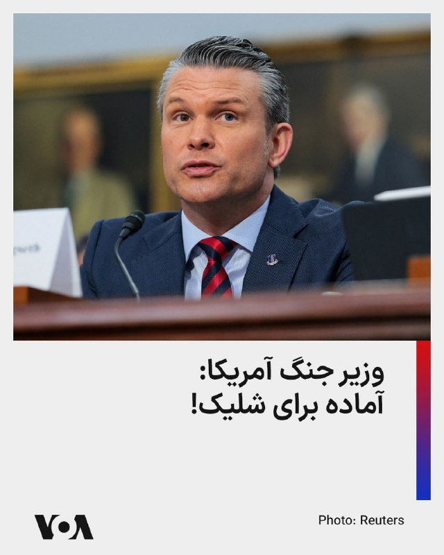

⚡️پیت هگست، وزیر جنگ آمریکا، عصر چهارشنبه ویدیویی از سخنان اخیر جی‌دی ونس، معاون رئیس‌جمهوری آمریکا در مورد «گزینه ب» واشنگتن در صورت شکست مذاکرات با جمهوری اسلامی را بازنشر کرد و در شبکه اجتماعی ایکس نوشت: «آماده برای شلیک»
@FarsiVOA

## FarsiVOA — post 218260

🔺آمریکا علیه رهبر سابق کوبا کیفرخواست صادر کرد؛ رائول کاسترو متهم به قتل شد

▪️دادستان‌های فدرال آمریکا روز چهارشنبه اعلام کردند که علیه رائول کاسترو، رئیس‌جمهوری پیشین کوبا، به اتهام نقش داشتن در سرنگونی هواپیماهای غیرنظامی در سال ۱۹۹۶ پرونده کیفری تشکیل داده‌اند. این هواپیماها مورد استفاده تبعیدی‌هایی کوبایی‌تبار ساکن میامی در آمریکا بود.

⬇️ بیشتر بخوانید:
https://ir.voanews.com/a/8152139.html
@FarsiVOA

## FarsiVOA — post 218259

🔺وزیر خزانه‌داری آمریکا با وزیر دارایی قطر در مورد لزوم حفظ فشار بر جمهوری اسلامی صحبت کرد

▪️وزیر خزانه‌داری آمریکا، اسکات بسنت، روز چهارشنبه ۳۰ اردیبهشت اعلام کرد که با وزیر علی احمد الکواری وزیر دارایی قطر در پاریس دیدار و گفت‌وگو کرده است.

⬇️ بیشتر بخوانید:
https://ir.voanews.com/a/8152133.html
@FarsiVOA

## FarsiVOA — post 218258

🔺سناتور گراهام: جمهوری اسلامی با اقدامات دونالد ترامپ در ضعیف‌ترین وضعیت خود قرار دارد

▪️لیندزی گراهام، سناتور جمهوری‌خواه آمریکایی از ایالت کارولینای جنوبی، روز چهارشنبه ۳۰ اردیبهشت با تمجید از سیاست‌های دونالد ترامپ، رئیس‌جمهوری آمریکا، در قبال جمهوری اسلامی، گفت آقای ترامپ توانسته است رژیم ایران را به ضعیف‌ترین وضعیتش از سال ۱۳۵۷ برساند.

⬇️ بیشتر بخوانید:
https://ir.voanews.com/a/lindsey-graham-on-asim-munir-going-to-iran/8152121.html
@FarsiVOA

## FarsiVOA — post 218257

⚡️امید جمهوری اسلامی به کولبران و ملوانان برای واردات مواد پتروشیمی و پلیمری
@FarsiVOA

## FarsiVOA — post 218256

🔺دونالد ترامپ: اگر با چند روز صبر کردن، از کشته‌شدن افراد جلوگیری کنم این کار را انجام می‌دهم

▪️رئیس‌جمهوری آمریکا، دونالد ترامپ، عصر چهارشنبه ۳۰ اردیبهشت در پاسخ به پرسش خبرنگاری درباره علت مذاکرات بی‌وقفه‌اش با رژیم ایران و اینکه آیا از مذاکرات خسته‌ می‌شود گفت: «من هرگز خسته نمی‌شوم. کاری که دوست دارم انجام ‌دهم [این است که] اگر بتوانم با چند روز صبر کردن از جنگ جلوگیری کنم، یا بتوانم با چند روز صبر کردن از کشته شدن افراد جلوگیری کنم، فکر می‌کنم کار بزرگی است.»

⬇️ بیشتر بخوانید:
https://ir.voanews.com/a/8152125.html
@FarsiVOA

## Persian_Trend_Official — post 14564

  <a href="telegram/content/Persian_Trend_Official_14564_1779321667.mp4" target="_blank">🎬 Download video</a>

▪️شبی پر از آرامش برای شما آرزومندم 🫶

🫆:Tony

📌 @persian_trend_official
پرشین ترند | متفاوت‌ترین کانال نظامی

## Persian_Trend_Official — post 14563

⭕️ رائول کاسترو متهم به قتل شد 💢دادستان‌های فدرال آمریکا روز چهارشنبه اعلام کردند که علیه رائول کاسترو، رئیس‌جمهوری پیشین کوبا، به اتهام نقش داشتن در سرنگونی هواپیماهای غیرنظامی در سال ۱۹۹۶ پرونده کیفری تشکیل داده‌اند. این هواپیماها مورد استفاده تبعیدی‌هایی…

## Persian_Trend_Official — post 14562

  <a href="telegram/content/Persian_Trend_Official_14562_1779321669.webm" target="_blank">🎬 Download video</a>

⭕️ رائول کاسترو متهم به قتل شد

💢دادستان‌های فدرال آمریکا روز چهارشنبه اعلام کردند که علیه رائول کاسترو، رئیس‌جمهوری پیشین کوبا، به اتهام نقش داشتن در سرنگونی هواپیماهای غیرنظامی در سال ۱۹۹۶ پرونده کیفری تشکیل داده‌اند. این هواپیماها مورد استفاده تبعیدی‌هایی کوبایی‌تبار ساکن میامی در آمریکا بود.

🫆:Tony

📌 @persian_trend_official
پرشین ترند | متفاوت‌ترین کانال نظامی

## Persian_Trend_Official — post 14561

  <a href="telegram/content/Persian_Trend_Official_14561_1779321670.webm" target="_blank">🎬 Download video</a>

نسخه صوتی لایو امشب در اسپاتیفای : https://open.spotify.com/episode/4ZyN11ARn9PzPUowsFbzbh?si=w_I-pR9MRMyUKElfOPbe8Q

## Persian_Trend_Official — post 14560

  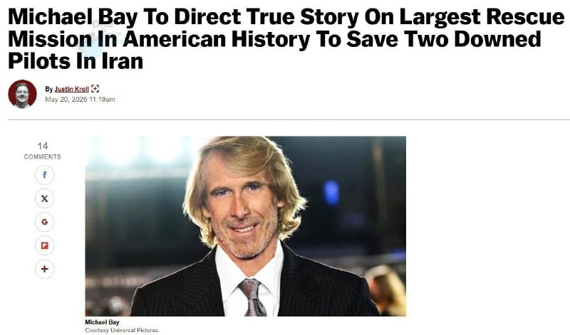

🔴 هالیوود فیلمی درباره عملیات نجات خلبانان آمریکایی در ایران می‌سازد

💢به گزارش ددلاین، استودیوی «یونیورسال پیکچرز» و «مایکل بی» کارگردان مشهور آمریکایی، در حال ساخت فیلمی درباره نجات دو نیروی هوایی آمریکا در ایران پس از سرنگونی جنگنده F-15E Strike Eagle آن‌ها در جریان عملیات «خشم حماسی» هستند.

🔻بر اساس این گزارش:

▪️ فیلم بر پایه کتابی از «میچل زاکف» که قرار است در سال ۲۰۲۷ منتشر شود ساخته خواهد شد
▪️ مایکل بی اعلام کرده طی سال‌های فعالیتش همکاری «شگفت‌انگیزی» با وزارت جنگ آمریکا و ارتش این کشور داشته است
▪️ این موضوع احتمال همکاری مستقیم پنتاگون با پروژه را تقویت می‌کند

مایکل بی درباره این پروژه گفت:

▪️ فیلم روی نیروهایی تمرکز دارد که یکی از «پیچیده‌ترین و پرریسک‌ترین عملیات‌های تاریخ معاصر» را انجام داده‌اند

🫆:Tony

📌 @persian_trend_official
پرشین ترند | متفاوت‌ترین کانال نظامی

## Persian_Trend_Official — post 14559

💢ادعای «میدل ایست آی»:

🔹سه منبع گفتند که انتظار دارند جنگ در هفته‌های آینده و پس از پایان دوره حج، از سر گرفته شود

🔹ایالات متحده در گذشته از سیگنال‌های فریبنده و حیله‌های دیگر استفاده کرده تا سعی کند طرف مقابل را دچار احساس امنیت کاذب کند

🫆:Tony

📌 @persian_trend_official
پرشین ترند | متفاوت‌ترین کانال نظامی

## Persian_Trend_Official — post 14558

🔴 جانشین فرمانده نیروی دریایی سپاه: آماده رویارویی در تنگه هرمز هستیم

💢جانشین فرمانده نیروی دریایی سپاه پاسداران ایران اعلام کرد نیروهای ایرانی در وضعیت آماده‌باش قرار دارند و تهدیدها را جدی می‌دانند.

وی گفت:

▪️ «دست ما روی ماشه است»

▪️ اگر ترامپ تصور می‌کند می‌تواند با زور تنگه هرمز را باز کند، باید بداند با همان نیروی دریایی مواجه خواهد شد که ادعا می‌کردند نابود شده است

▪️ دشمنان اشتباه می‌کنند اگر فکر کنند با هدف قرار دادن زیرساخت‌ها، این ملت عقب‌نشینی خواهد کرد

▪️ ایران طی ۴۷ سال گذشته نشان داده که آسیب‌پذیر است اما تسلیم نمی‌شود

🫆:Tony

📌 @persian_trend_official
پرشین ترند | متفاوت‌ترین کانال نظامی

## Persian_Trend_Official — post 14557

  <a href="https://t.me/persian_trend_official/14557" target="_blank">📎 Download file</a>

نسخه تلگرام :

## Persian_Trend_Official — post 14555

  <a href="telegram/content/Persian_Trend_Official_14555_1779321671.webm" target="_blank">🎬 Download video</a>

نسخ صوتی لایو امشب در کست باکس :

https://castbox.fm/vi/947285526

## Persian_Trend_Official — post 14554

  <a href="telegram/content/Persian_Trend_Official_14554_1779321672.webm" target="_blank">🎬 Download video</a>

💢سپاه پاسداران با صدور بیانیه‌ای تهدید کرد:

⭕️در صورت حمله دوباره آمریکا و اسرائیل، جنگ را به فراتر از منطقه خواهد کشاند.

🫆:Tony

📌 @persian_trend_official
پرشین ترند | متفاوت‌ترین کانال نظامی

## Persian_Trend_Official — post 14553

نسخه صوتی لایو امشب در اسپاتیفای :

https://open.spotify.com/episode/4ZyN11ARn9PzPUowsFbzbh?si=w_I-pR9MRMyUKElfOPbe8Q

## Persian_Trend_Official — post 14552

  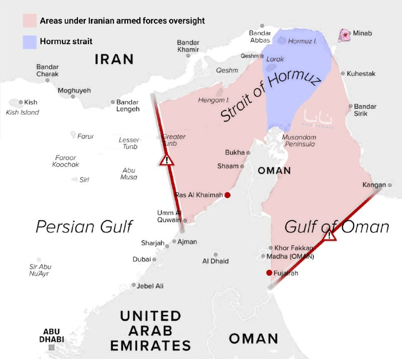

🔴 ایران محدوده نظارت خود بر تنگه هرمز را مشخص کرد

💢هیئت تنگه خلیج فارس اعلام کرد جمهوری اسلامی ایران حدود منطقه نظارت بر مدیریت تنگه هرمز را تعیین کرده است.

🔻بر اساس این بیانیه:

▪️ مرز شرقی این محدوده، خطی است که «کوه مبارک» در ایران را به جنوب فجیره در امارات متصل می‌کند

▪️ مرز غربی نیز خطی است کهانتهای جزیره قشم در ایران را به «ام‌القیوین» در امارات وصل می‌کند

💢این اعلام در شرایطی منتشر شده که تنش‌ها بر سر کنترل و عبور کشتی‌ها از تنگه هرمز همچنان ادامه دارد.

🫆:Tony

📌 @persian_trend_official
پرشین ترند | متفاوت‌ترین کانال نظامی

## Persian_Trend_Official — post 14551

💢 عضو کمیسیون امنیت ملی مجلس

💢عاصم منیر فردا حامل پیام جدیدی از سوی آمریکا به ایران است

🫆:Tony

📌 @persian_trend_official
پرشین ترند | متفاوت‌ترین کانال نظامی

## Persian_Trend_Official — post 14550

  <a href="telegram/content/Persian_Trend_Official_14550_1779321673.webm" target="_blank">🎬 Download video</a>

🔴آکسیوس

💢یک منبع آمریکایی گفت ترامپ به نتانیاهو گفته است که میانجی‌ها در حال کار بر روی یک «توافقنامه» هستند که هم ایالات متحده و هم ایران آن را امضا خواهند کرد تا رسماً به جنگ پایان دهند و یک دوره ۳۰ روزه مذاکره در مورد مسائلی مانند برنامه هسته‌ای ایران و باز شدن تنگه هرمز را آغاز کنند.

🫆:Tony

📌 @persian_trend_official
پرشین ترند | متفاوت‌ترین کانال نظامی

## IranianMinds — post 20473

  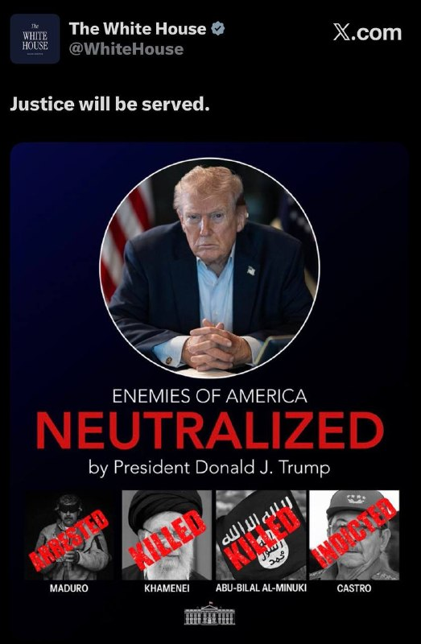

‏🔴 کاخ سفید در پیامی در شبکه ایکس با انتشار تصویری از علی خامنه‌ای، نیکلاس مادورو، رائول کاسترو و ابو بلال المینوکی، نفر دوم داعش، نوشت: «عدالت اجرا خواهد شد.» بر روی عکس این افراد در این تصویر نوشته شده خامنه‌ای کشته شده، مادورو بازداشت شده، المینوکی کشته شده و کاسترو تحت تعقیب است

@IranianMinds

## IranianMinds — post 20472

  <a href="telegram/content/IranianMinds_20472_1779321674.webm" target="_blank">🎬 Download video</a>

⭕️ #بدون_واریز ، ۵۰۰هزارتومان جایزه بگیر.

💲همین حالا میتونی با عضویت پولتو بگیری و‌شرط ببندی 
🤗

🎉 500 هزارتومن بونوس رایگان فقط با ثبت نام بدون هیچگونه واریزی!

⌛ پشتیبانی 24 ساعته

💰پرداخت مستقیم و سریع بدون واسطه، بدون دردسر، واریز و برداشت در سریع‌ترین زمان ممکن

☑️ کانال تلگرام: 

➡️ @winro_io  

🎁 هدیه خود را با ثبت نام در سایت دریافت کنید: 

➡️ Winro.io
A30
سایت اصلی در روزهای آینده بازگشایی خواهد شد A
🟢

## IranianMinds — post 20471

  

@IranianMinds

## IranianMinds — post 20470

  

🔴نهاد مدیریت آبراه خلیج ‌فارس که به تازگی اعلام موجودیت کرده است، می‌گوید یک منطقه دریایی کنترل شده در تنگه هرمز ایجاد کرده است.

@IranianMinds

## IranianMinds — post 20469

🔴کانال ۱۲ اسرائیل:

نخست‌وزیر نتانیاهو همیشه با نظر ترامپ در مورد مذاکره با ایران مخالفت کرده است.

@IranianMinds

## BBCPersian — post 281649

🔻سردار آزمون، گلزن سرشناس تیم ملی فوتبال ایران که از فهرست این تیم برای جام جهانی پیش رو خط خورده است با ارسال پستی در اینستاگرم برای تیم ملی کشورش آرزوی موفقیت کرده است.

مهاجم ۳۱ ساله باشگاه شباب الاهلی در لیگ برتر امارت که به عنوان بهترین گلزن در ترکیب تیم ملی ایران مشهور است به عنوان دومین گلزن برتر تاریخ تیم ملی پس از علی دایی شناخته می‌شود.

گفته شده آزمون به دلایل «غیر فنی» به اردو تیم ملی دعوت نشده است؛ دلایلی چون انتشار تصاویر دیدار او با مقامات اول حکومت امارات در روزهای نخست جنگ ۳۹ روزه. این دیدار را آزمون در آن زمان در صفحه کاربری اینستاگرم خود منتشر کرد و این موجب خشم تندروهای ایرانی و تقاضا برای تعلیق وی و حتی ضبط اموال او در ایران شد.

📸GettyImages/ sardar_azmoun / Instgram
https://bbc.in/3Rhx9ux
@BBCPersian

## BBCPersian — post 281648

  

🔻پدرو سانچز، نخست‌وزیر اسپانیا، در واکنشی تند به برخورد تند و خشن وزیر امنیت ملی اسرائیل با فعالان ناوگان بشردوستانه غزه گفته تلاش خواهد کرد اتحادیه اروپا را برای تحریم برخی از اعضای تندور دولت اسرائیل، مجاب کند.

آقای سانچز روز چهارشنبه در حساب ایکس خود نوشت:

«تصاویر مربوط به تحقیر اعضای ناوگان بین‌المللی حامی غزه توسط وزیر اسرائیلی، بن گویر، غیرقابل قبول است. ما تحمل نخواهیم کرد که با شهروندان‌مان بدرفتاری شود. در ماه سپتامبر، ممنوعیت ورود این عضو دولت اسرائیل به خاک کشورمان را اعلام کردم. اکنون نیز در بروکسل تلاش خواهیم کرد این تحریم‌ها در سریع‌ترین زمان ممکن به سطح اتحادیه اروپا گسترش یابد.»

📸EPA/Shutterstock
https://bbc.in/4dViGx1
@BBCPersian

## BBCPersian — post 281646

🔻قاآنی: جنگ باعث شد اسرائیل سریع‌تر به «نقطه پایان نزدیک شود»

اسماعیل قاآنی، فرمانده نیروی قدس سپاه پاسداران در اظهاراتی جدید که خبرگزاری‌های نزدیک به سپاه منتشر کرده‌اند به تحولات روز واکنش نشان داده است از جمله به حرکت ناوگان بشردوستانه به سمت غزه که متوقف کردن آن و برخورد خشن و تحقیر آمیز وزیر امنیت ملی اسرائیل با یکی از دهها فعال ناوگان صمود آن امروز خبر ساز شده است.

آقای قاآنی گفته آنچه او دستاورهای ناوگان صمود خوانده «ادامه» خواهد داشت و از نظر او: «فلسطین را باز به کانون توجه جهانیان بازگرداند. رژیم صهیونسیتی مغلوب را که به تشدید سرکوب و جنایاتگری دست زده، سریعتر از قبل به نقطه پایان نزدیک کرد.»

نیروی قدس سپاه پاسداران که پیش از آقای قاآنی، قاسم سلیمانی برای سالها فرماندهی آن را در دست داشت، شاخه برون مرزی سپاه پاسداران است و بازوری اصلی حکومت در ایران برای هماهنگی و کنترل و حمایت از نیروهای نیابتی آن در منطقه محسوب می‌شود.

این بخش از سپاه پاسداران از سال‌ها قبل در فهرست سازمان‌های تروریستی آمریکا و چند کشور غربی دیگر قرار گرفته است.

https://bbc.in/4upkbJS
@BBCPersian

## BBCPersian — post 281645

  

🔻نشریه آمریکایی اکسیوس از تماس تلفنی روز گذشته - سه‌شنبه ۲۹ اردیبهشت - میان دونالد ترامپ و بنیامین نتانیاهو بر سر ایران خبر داده که به نوشته این رسانه، «پرتنش» بوده و نخست‌وزیر اسرائیل را «بسیار برآشفته» است.

باراک راوید، خبرنگار اکسیوس در گزارش روز چهارشنبه خود نوشته که این اطلاعات را سه منبع مطلع دریافت کرده است هر چند نام آنها را ذکر نکرده است.

به گفته این باراک راوید: «بنیامین نتانیاهو نسبت به مذاکرات به‌شدت بدبین است و خواهان ازسرگیری جنگ برای تضعیف بیشتر توانایی‌های نظامی ایران و ضربه زدن به حکومت از طریق نابودی زیرساخت‌های حیاتی آن است.»

بر اساس آنچه اکسیوس گزارش کرده در برابر این موضع نخست‌وزیر اسرائیل، دونالد ترامپ «معتقد است که امکان دستیابی به توافق وجود دارد، اما اگر چنین توافقی حاصل نشود، آماده ازسرگیری جنگ است.»

📸GettyImages
https://bbc.in/49Zp2sK
@BBCPersian

## BBCPersian — post 281644

🔸آرسنال پس از ۲۲ سال دوباره قهرمان لیگ برتر شد؛ قهرمانی‌ای که دیشب با توقف منچسترسیتی مقابل بورنموث قطعی شد. هزاران هوادار این تیم بیرون از ورزشگاه امارات و همزمان، بازیکنان و کادر فنی هم در محل تمرین تیم در شمال لندن این قهرمانی را جشن گرفتند. قرار است جام قهرمانی لیگ برتر در پایان آخرین بازی فصل لیگ برتر توپچی‌ها به آرسنال اهدا شود؛ دیداری که یکشنبه آینده در خانه کریستال پالاس برگزار می‌شود. این چهارمین قهرمانی آرسنال در تاریخ لیگ برتر است؛ تیمی که حالا به یک چالش بزرگ دیگر فکر می‌کند: فینال لیگ قهرمانان اروپا مقابل پاری‌سن‌ژرمن در بوداپست.

 گزارشی از کاوه مشکات

@BBCPersian

## BBCPersian — post 281643

🔻بریتانیا با لغو تحریم‌های نفتی روسیه، مجوز واردات دیزل و سوخت جت را صادر می‌کند

بریتانیا بر اساس برنامه معافیت از تحریم‌ها، اجازه واردات دیزل و سوخت جت پالایش‌شده از نفت خام روسیه در خارج از این کشور را خواهد داد.

با افزایش هزینه‌های سوخت و فشار بر خطوط هوایی و خانوارها، که بخشی از آن به دلیل درگیری در خاورمیانه است، بریتانیا در صدد است تا محدودیت‌ها در این زمینه را کاهش ‌دهد.

تصمیم بریتانیا پس از اقدام مشابه ایالات متحده انجام می‌شود.

آمریکا روز دوشنبه طرح معافیت از تحریم‌های نفتی روسیه را تمدید کرد و مجوز خرید نفت از این کشور را صادر کرد.

منتقدان این تصمیم آمریکا می‌گویند که چنین اقدامی، پول بیشتری را روانه روسیه خواهد کرد که آن را جنگ در اوکراین برای کشتن مردم اوکراین هزینه خواهد کرد.

روز سه‌شنبه قیمت هر بشکه نفت برنت روز سه‌شنبه به حدود ۱۱۰ دلار رسید که نزدیک به بالاترین رکوردهای اخیر است.

این نشان‌دهنده ادامه نگرانی‌ها در مورد اختلال در جریان نفت از طریق تنگه هرمز است.

https://bbc.in/4eTwV6x
@BBCPersian

## BBCPersian — post 281642

  <a href="https://t.me/bbcpersian/281642" target="_blank">📎 Download file</a>

🔻پادکست برنامه شصت دقیقه چهارشنبه ۳۰ اردیبهشت ۱۴۰۵

این نسخه رادیویی برنامه شصت دقیقه تلویزیون فارسی بی‌بی‌سی است که هرشب بعد از پخش، با حجم کم از صفحه تلگرام بی‌بی‌سی فارسی در دسترس است.
با هشتگ BBCPersianRadio با ما در ارتباط باشید.

## BBCPersian — post 281640

🔻پزشکیان: وادار کردن ایران به تسلیم با استفاده از زور توهم است

مسعود پزشکیان، رئیس‌جمهور ایران در پیامی که در شبکه اجتماعی ایکس منتشر کرده، نوشته است که وادار کردن ایران به تسلیم با استفاده از زور «توهم» است.

او در این پیام آورده است: « ایران پیوسته به تعهدات خود پایبند بوده و هر راهی را برای جلوگیری از جنگ بررسی کرده است؛ همه راه‌ها از طرف ما باز است.»

در ادامه این پیام آمده است: «وادار کردن ایران به تسلیم از طریق زور، چیزی جز یک توهم نیست. احترام متقابل در دیپلماسی بسیار عاقلانه‌تر، ایمن‌تر و پایدارتر از جنگ است.»

اظهارات مسعود پزشکیان در حالیست که دونالد ترامپ، رئیس‌جمهور آمریکا، روز چهارشنبه گفت که مذاکرات با ایران به مراحل پایانی رسیده، اما هشدار داد اگر تهران با توافق موافقت نکند، حملات بیشتری انجام خواهد شد.

او امروز به خبرنگاران گفت: «ما در مراحل پایانی [مذاکرات] با ایران هستیم. خواهیم دید چه اتفاقی می‌افتد. یا به توافق می‌رسیم یا کارهایی خواهیم کرد که کمی ناخوشایند خواهد بود، اما امیدوارم به آنجا نکشد.»

https://bbc.in/3PfMgUJ
@BBCPersian

## Dirty_Kids — post 389855

  <a href="telegram/content/Dirty_Kids_389855_1779321678.webm" target="_blank">🎬 Download video</a>

☢️خفن ترین و‌ قدیمی ترین  انالیزور  ایران ینی دکتر بت 
👍 
🔴هیچ سایت بتی دوست نداره شما کانال دکتر بت رو پیدا کنین چون خیلی سود میکنید🤷‍♂ رایگان بهترین شرط هارو براتون میذاره حتی هزار تومن هم دریافت نمیکنه روزانه میتونی از پیش بینی فوتبال باهاش پول در بیاری…

## Dirty_Kids — post 389854

  <a href="telegram/content/Dirty_Kids_389854_1779321679.webm" target="_blank">🎬 Download video</a>

☢️خفن ترین و‌ قدیمی ترین  انالیزور  ایران ینی دکتر بت 
👍

🔴هیچ سایت بتی دوست نداره شما کانال دکتر بت رو پیدا کنین چون خیلی سود میکنید🤷‍♂

رایگان بهترین شرط هارو براتون میذاره
حتی هزار تومن هم دریافت نمیکنه
روزانه میتونی از پیش بینی فوتبال باهاش پول در بیاری 👌
A30
اگ اهل پیش بینی فوتبالی این کانال اصلا از دست ندین👇

✅https://t.me/+4_ADqwB9e-QwYjlk

✅https://t.me/+4_ADqwB9e-QwYjlk

## Dirty_Kids — post 389853

  

#بخوابیم

@Dirty_Kids 👻

## Dirty_Kids — post 389852

این خبر احمدی‌نژاد یه چیزی تو مایه‌های ماجرای مهران مدیری بود که با قایق رفته بود دنبال علی کریمی.

@Dirty_Kids 👻

## Dirty_Kids — post 389851

دیگه چیزی‌ نمونده که جوون ایرانی تجربه نکرده باشه جز یک چیز. شادی. شادی رو هنوز تجربه نکردیم.

@Dirty_Kids 👻

## Dirty_Kids — post 389850

  <a href="telegram/content/Dirty_Kids_389850_1779321680.mp4" target="_blank">🎬 Download video</a>

ازدواج آسان

اینا اصلا موشعلی و مقوایی اینارو یادشون رفته
افتادن به مقاومت جنسی.
فکر کن هر شب میرن پرچم تکون میدن واسه پایین تنه.🤣🤣

@Dirty_Kids 👻

## Dirty_Kids — post 389849

  <a href="telegram/content/Dirty_Kids_389849_1779321682.mp4" target="_blank">🎬 Download video</a>

مود: 🦦

@Dirty_Kids 👻

## Dirty_Kids — post 389848

  

🔴 طبق مطالعات جدید کسایی که دائم از بقیه غلط املایی میگیرن، دچار اختلال روانی ان.

@Dirty_Kids 👻

## Dirty_Kids — post 389847

  <a href="telegram/content/Dirty_Kids_389847_1779321684.mp4" target="_blank">🎬 Download video</a>

این صحبت ترامپ ارزش داره چندین بار ببینیش:

@Dirty_Kids 👻

## Dirty_Kids — post 389846

  

سرانجام بخت زیبای خفته‌ی عرزشی‌ها هم باز شد @Dirty_Kids 👻

## Dirty_Kids — post 389845

  <a href="telegram/content/Dirty_Kids_389845_1779321687.mp4" target="_blank">🎬 Download video</a>

سرانجام بخت زیبای خفته‌ی عرزشی‌ها هم باز شد

@Dirty_Kids 👻

## Dirty_Kids — post 389841

حاصل خالی گذاشتن سکوهای ورزشگاه جام جهانی قطر شد:
حضور ‎#پرستوهای_رژیم به اسم «نماینده ی ملت ایران» با هد بند و پرچم!
آخوندها هم به دنیا گفتند: ببینید مردم ایران چقدر آزادند و حامی و دوستدار حکومت میباشند!!

تبلیغات جمهوری اسلامی در جام جهانی قطر دقیقا ۴ سال جنایت و فلاکت و شکنجه و غارت ایران و همچنین ۴۰ هزار کشته فقط در ۲ روز واسمون هزینه ایجاد کرد!!
این بار فریب نخوریم و با برنامه پیش بریم.

@Dirty_Kids 👻

## Dirty_Kids — post 389840

  <a href="telegram/content/Dirty_Kids_389840_1779321688.mp4" target="_blank">🎬 Download video</a>

چالش "دوربین‌به‌کون" هم تازه راه افتاده

@Dirty_Kids 👻

## Dirty_Kids — post 389839

نخست وزیر پاکستان:
بتخمم اصلا جنگ کنید

@Dirty_Kids 👻

## Dirty_Kids — post 389838

  

جان‌فداست ولی تو عروسیش ماسک میزنه شناسایی نشه.

@Dirty_Kids 👻

## Dirty_Kids — post 389837

ترامپ:

قرار بود فردا به ایران حمله کنم ولی قراره تعمیرکار بیاد برای سرویس کولر
ملانیا خونه تنهاس، باید باشم حتما

@Dirty_Kids 👻

## Dirty_Kids — post 389836

  

۷۰۰ هزار کیلومتر کار کرده
۲۲ میلیارد تومن قیمت میخوره یعنی ۱۲۵ هزار دلار
صفر خشک ۲۰۲۶ این ۸۸ هزاردلاره

@Dirty_Kids 👻

## manototv — post 105706

  <a href="telegram/content/manototv_105706_1779321691.mp4" target="_blank">🎬 Download video</a>

جاویدنام سینا عباسی؛
جوان ۲۲ ساله‌ای از کرمانشاه که هشتم دی ۱۴۰۴ در جریان اعتراضات میدان انقلاب، بر اثر ضربات باتوم به سر جان باخت.
با گذشت ماه‌ها، هنوز نامش جایی ثبت نشده…
و خانواده‌اش فقط می‌خواهند صدای سینا شنیده شود.»

## manototv — post 105705

  <a href="telegram/content/manototv_105705_1779321692.mp4" target="_blank">🎬 Download video</a>

‌
«نهاد مدیریت آبراه خلیج فارس» با انتشار نقشه‌ای در شبکه اکس «محدوده نظارتی مدیریت» جمهوری اسلامی در تنگه هرمز را تعیین کرد.

بر اساس متن این نقشه، محدوده مورد نظر در شرق تنگه از خط اتصال «کوه مبارک» در ایران به جنوب فجیره در امارات متحده عربی، و در غرب تنگه از خط اتصال انتهای جزیره قشم به ام‌القوین در امارات تعیین شده است.

در این بیانیه آمده است تردد در این محدوده برای عبور از تنگه هرمز باید «با هماهنگی مدیریت آبراه خلیج فارس و مجوز این نهاد» انجام شود.

در نقشه منتشرشده، بخش وسیعی از آب‌های اطراف تنگه هرمز (محدوده قرمز) با عنوان «محدوده تحت نظارت نیروهای مسلح ایران» مشخص شده است.

## manototv — post 105704

  <a href="telegram/content/manototv_105704_1779321693.mp4" target="_blank">🎬 Download video</a>

تماسی که از جاویدنام سینا عباسی، ۲۲ ساله از کرمانشاه گفت…

## alonews — post 121450

  <a href="telegram/content/alonews_121450_1779321695.webm" target="_blank">🎬 Download video</a>

👈یدیعوت آحارونوت: مقامات اسرائیل از اقدامات ترامپ راضی نیستند

✅ @AloNews خبر جنگ

## alonews — post 121448

  <a href="telegram/content/alonews_121448_1779321695.webm" target="_blank">🎬 Download video</a>

👈کانال 14 اسرائیل: ایران و ایالات متحده امشب از طریق واسطه‌های پاکستانی نزدیک‌ترین پیش‌نویس‌های پیشنهادی خود را مبادله کردند. هر دو کشور فردا جزئیات را بررسی خواهند کرد

✅ @AloNews خبر جنگ

## alonews — post 121445

  <a href="telegram/content/alonews_121445_1779321695.webm" target="_blank">🎬 Download video</a>

👈کلاهبرداری صرافی #رمزینکس
⁉️

🔴پیام مخاطب:

با سلام
من در تاریخ ۶ فروردین ۳۰۰ ملیون معامله اهرمی در نماد تتر گلد صرافی رمزینکس داشتم در عرض چند ثانیه قیمت از ۱۷هزار به یک هزار سقوط کرد و دوباره برگشت همه معاملات اهرمی پودر شدند با پشتیبانی هرچقدر پیگیری کردیم آخرش میگن که شما ریسک معاملاتی رو پذیرفته اید یا بعضا قبول میکنن قصوراتشون رو ولی جبران خسارت نمیکنن خواهشا اطلاع رسانی کنید تا بقیه تو دام این کلاهبرداران کثیف نیوفتن وسط جنگ از این شرایط سو استفاده میکنن و پول ملت رو بالا میکشن و هیچ مسؤولیتی رو گردن نمیگیرن.

🔴این اقدام صرافی رمزینکس مصداق بارز اخلال در نظام اقتصادی و سواستفاده از شرایط جنگی است

✅ @AloNews خبر جنگ

## alonews — post 121444

  <a href="telegram/content/alonews_121444_1779321696.webm" target="_blank">🎬 Download video</a>

👈دوستان این تبلیغاتی که پائین کانال نمایش داده میشه توسط تلگرامه و دست ما نیست و کلاهبرداری هست و فریب نخورید

✅ @AloNews خبر جنگ

## alonews — post 121443

  <a href="telegram/content/alonews_121443_1779321696.mp4" target="_blank">🎬 Download video</a>

👈شاخص پیتزا تو اطراف پنتاگون رفت بالا

✅ @AloNews خبر جنگ

## alonews — post 121442

  <a href="telegram/content/alonews_121442_1779321697.mp4" target="_blank">🎬 Download video</a>

👈خبرنگار: پیامت به خانواده‌های آمریکایی که از هوش مصنوعی می‌ترسن چیه؟ اونا نگرانن بچه‌هاشون تو آینده کار نداشته باشن.

🔴جواب کاملا مرتبط و منطقی ترامپ:
ایران نباید سلاح هسته‌ای داشته باشه!

✅ @AloNews خبر جنگ

## alonews — post 121441

  <a href="telegram/content/alonews_121441_1779321699.mp4" target="_blank">🎬 Download video</a>

👈 وزیر بهداشت و خدمات انسانی آر‌اف‌کِی جونیور: من همیشه در اطراف دختران جوان زیادی هستم و همه آنها در آن بخش از زندگی خود واقعا دیوانه به نظر می رسند

✅ @AloNews خبر جنگ

## alonews — post 121440

  <a href="telegram/content/alonews_121440_1779321701.webm" target="_blank">🎬 Download video</a>

👈بزرگترین کشتی جنگی ژاپن برای آموزش F-35B با تفنگداران دریایی آمریکا آماده میشه - USNI

✅ @AloNews خبر جنگ

## alonews — post 121439

  <a href="telegram/content/alonews_121439_1779321701.webm" target="_blank">🎬 Download video</a>

👈وزیر امور خارجه مارکو روبیو:
اشتباهی نباشد: ایالات متحده به طور قاطع از دولت قانونی و قانون اساسی بولیوی حمایت می‌کند.

🔴ما اجازه نخواهیم داد که جنایتکاران و قاچاقچیان مواد مخدر رهبران منتخب دموکراتیک در نیمکره ما را سرنگون کنند.

✅ @AloNews خبر جنگ

## alonews — post 121438

  <a href="telegram/content/alonews_121438_1779321701.webm" target="_blank">🎬 Download video</a>

👈زاکانی شهردار تهران: آمریکا ته زورشو زد و دیگه جرات حمله نداره

✅ @AloNews خبر جنگ

## alonews — post 121437

  <a href="telegram/content/alonews_121437_1779321702.webm" target="_blank">🎬 Download video</a>

👈اوکراین تعداد زیادی پهپاد به سمت غرب روسیه و کریمه پرتاب کرده است

✅ @AloNews خبر جنگ

## alonews — post 121436

  <a href="telegram/content/alonews_121436_1779321702.webm" target="_blank">🎬 Download video</a>

👈ادعای «میدل ایست آی»: دونالد ترامپ، حمله برنامه‌ریزی‌شده به ایران را در این هفته به تعویق انداخت، چراکه متحدان عرب و مقامات دولت خودش به او هشدار دادند در ایام حج، جنگ را از سر نگیرد. 
🔴به گفته دو مقام ارشد کشورهای حوزه خلیج‌فارس، به ترامپ گفته شده بود که…

## alonews — post 121435

  <a href="telegram/content/alonews_121435_1779321702.webm" target="_blank">🎬 Download video</a>

👈فرستاده ویژه ترامپ به گرینلند جف لندری: زمان آن است که ایالات متحده ردپای خود را دوباره در گرینلند بگذارد 
✅ @AloNews خبر جنگ

## alonews — post 121434

  <a href="telegram/content/alonews_121434_1779321702.webm" target="_blank">🎬 Download video</a>

👈ادعای «میدل ایست آی»: دونالد ترامپ، حمله برنامه‌ریزی‌شده به ایران را در این هفته به تعویق انداخت، چراکه متحدان عرب و مقامات دولت خودش به او هشدار دادند در ایام حج، جنگ را از سر نگیرد.

🔴به گفته دو مقام ارشد کشورهای حوزه خلیج‌فارس، به ترامپ گفته شده بود که حمله به ایران در ایام حج، بحرانی را در میان کشورهای عربی حاشیه خلیج فارس ایجاد می‌کند، زیرا این حمله باعث می‌شود صدها هزار زائر حج سرگردان بمانند.

🔴منابع همچنین گفتند که به ترامپ گفته شده بود حمله در این ایام مقدس که منتهی به عید قربان می‌شود، بیشتر از این به جایگاه آمریکا در جهان اسلام لطمه می‌زند.

🔴یک مقام ارشد آمریکایی که از بحث‌های جریان‌یافته در دولت ترامپ آگاه است، تأیید کرد که این گفت‌وگوها انجام شده است

✅ @AloNews خبر جنگ

## alonews — post 121433

  <a href="telegram/content/alonews_121433_1779321703.webm" target="_blank">🎬 Download video</a>

👈فرستاده ویژه ترامپ به گرینلند جف لندری: زمان آن است که ایالات متحده ردپای خود را دوباره در گرینلند بگذارد

✅ @AloNews خبر جنگ

## alonews — post 121431

لکسوس LX600 غول ژاپنی با قیمت 110 میلیارد تومان ناقابل!

و حالا همون ماشین در فرانسه به قیمت 124000 یورو که میشع چیزی حدود 26 میلیارد تومن…

شما فقط اختلاف رو ببین

[@AloTweet]

## alonews — post 121430

  <a href="telegram/content/alonews_121430_1779321703.webm" target="_blank">🎬 Download video</a>

👈نهاد مدیریت آبراه خلیج فارس محدودهٔ نظارتی مدیریتی تنگهٔ هرمز را مشخص کرد

🔴ايران محدودهٔ نظارتى مديریت تنگهٔ هرمز را به این شرح تعيین کرده است:

🔴«خط اتصال كوه مبارک درايران و جنوب فجيره درامارات در شرق تنگه تا خط اتصال انتهاى جزيره قشم در ايران و ام‌القيوین امارات درغرب تنگه.»

🔴تردد دراین محدوده برای عبور از تنگهٔ هرمز نیازمند هماهنگی با مدیریت آبراه خلیج فارس و مجوز این نهاد است

✅ @AloNews خبر جنگ

---
📅 بروزرسانی: 1405/02/30 23:09
---

## VahidOOnLine — post 241219

  

♦️ دونالد ترامپ، رئیس‌جمهوری ایالات متحده، روز چهارشنبه ۳۰ اردیبهشت هنگام بازگشت از کانتیکت در فرودگاه به خبرنگاران گفت که «آماده است برای دریافت جواب درست از سوی ایران چند روزی منتظر بماند. آن‌ها مردم منطقی‌ای هستند.»

ترامپ در ادامه هشدار داد: «اگر پاسخ‌های درستی دریافت نکنیم، اوضاع بسیار سریع پیش خواهد رفت. ما همگی آماده حرکت هستیم، اما ابتدا باید پاسخ‌های مناسبی دریافت کنیم.»
‌🇸🇦 Indypersian

🤖 @VahidOOnLine

## VahidOOnLine — post 241218

  <a href="telegram/content/VahidOOnLine_241218_1779305958.mp4" target="_blank">🎬 Download video</a>

‌
دونالد ترامپ درباره مذاکرات با جمهوری اسلامی گفت آمریکا تا زمان دستیابی به توافق، هیچ‌گونه تخفیف یا امتیازی ارائه نخواهد کرد.

ترامپ همچنین گفت واشینگتن «چند روز» منتظر پاسخ تهران خواهد ماند.

رئیس جمهور آمریکا در ادامه تاکید کرد: «این موضوع به‌زودی، به هر شکلی که باشد، پایان خواهد یافت.»

او با اشاره به روند مذاکرات افزود: «ما با افراد منطقی طرف هستیم» و تأکید کرد: «باید به پاسخ درست برسیم.»
‌🏁 🇬🇧 ManotoTV

🤖 @VahidOOnLine

## VahidOOnLine — post 241217

  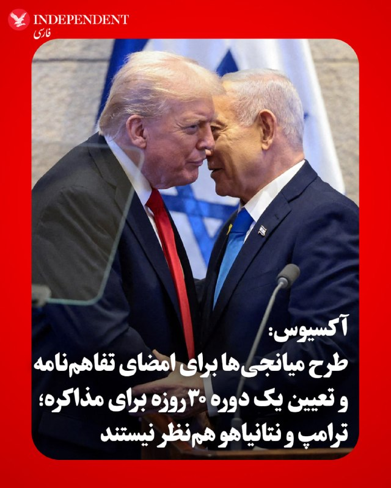

♦️ آکسیوس در گزارشی اختصاصی اعلام کرد دونالد ترامپ در تماس تلفنی طولانی و «دشوار» خود با بنیامین نتانیاهو، از تلاش میانجی‌ها برای تدوین یک «تفاهم‌نامه» خبر داده است. بر اساس این طرح، آمریکا و جمهوری اسلامی با امضای این تفاهم‌نامه رسما به جنگ پایان داده و یک دوره ۳۰ روزه را برای مذاکره درباره برنامه هسته‌ای ایران و بازگشایی تنگه هرمز آغاز می‌کنند.

به گفته دو نفر از منابع آکسیوس، این پیشنهاد با مخالفت شدید نخست‌وزیر اسرائیل مواجه شده و دو رهبر درباره مسیر پیش‌رو اختلاف‌نظر جدی دارند. یک مقام آمریکایی وضعیت نتانیاهو را پس از این تماس، «بسیار خشمگین و آشفته» توصیف کرد.

آکسیوس به نقل از منابع خود نوشت سفیر اسرائیل در واشنگتن نیز نگرانی شدید نتانیاهو از این گفتگو را به اطلاع قانون‌گذاران آمریکایی رسانده است؛ هرچند سخنگوی سفارت این موضوع را تکذیب کرد. یکی از منابع با اشاره به بدبینی همیشگی نتانیاهو به روند گفتگوها گفت: «بی‌بی همیشه نگران است.» کاخ سفید و دفتر نخست‌وزیری اسرائیل از اظهارنظر در این باره خودداری کرده‌اند.
‌🇸🇦 Indypersian

🤖 @VahidOOnLine

## VahidOOnLine — post 241216

🗣روایت شما از زندگی در آتش‌بس- چهارشنبه ۳۰ اردیبهشت ۱۴۰۵

🔹چند روز پیش پیامکی برای من ارسال شد مبنی بر اینکه ثبت‌نام شما در جانفدا با موفقیت انجام شد و برای تکمیل مشخصات به لینک ارسال‌شده مراجعه کنید. به شرافتم قسم من اصلاً ثبت‌نام نکرده بودم.

🔹اوضاع طوریه که تورم تو ریزجزئیات زندگی هم تأثیر می‌ذاره. دیروز (۲۰ اردیبهشت) با پدر و مادرم رفتیم خرید و قیمت یه دونه نمک‌پاش ۱۱۰ هزار تومن بود.

🔹من آلمان زندگی می‌کنم. امروز (۳۰ اردیبهشت) برای خط ایرانم پیام اومد که با درخواست من برای اینترنت پرو موافقت شده، در حالی که من اصلاً همچین درخواستی ندادم. این‌ها خودشون اینترنت رو روی مردم بستن، حالا هم دارن با همین کاسبی می‌کنن و جیب خالی مردم رو خالی‌تر می‌کنن.

🔹از رشت، دیدن اینکه صادراتی‌های مزدور این حکومت جانی تو شبکه‌های خارجی فعال شدن و حرف مردم ایران رو تحریف می‌کنن، در حالی که ما یک گیگ اینترنت می‌خریم تا صدامون برسه که داریم روزبه‌روز فقیر و مفلوک‌تر می‌شیم و چاره‌ای جز تموم کردن این نفرین ۴۸ ساله نداریم.

🔹توی استان ایست بازرسی می‌ذارن، همه با تفنگ و ماسک، فقط چشم‌هاشون معلومه. به همه گیر می‌دن، پلاک همه رو می‌نویسن. شرایط واقعاً سخته، مرغ شده کیلویی ۴۰۰ خورده‌ای.

🔹از تهران، این‌قدر گرانی زیاد شده، هر روز شیر گرون می‌شه. با کالابرگ فقط تونستم یک کیلو گوشت چرخ‌کرده بخرم با یه بسته مرغ.

🔹دلیل اینکه این حکومت نمی‌ره اینه که ملت هم‌دست نیست، هم‌دم نیست. وقتی نت ملی هست، هر گیگ رو ۲۵۰ تا ۴۰۰ می‌فروشن، در حالی که قیمت یک گیگ ۵۰ هست یا رایگانه. چرا این‌طور می‌کنین؟

🔹از مشهد پیام می‌دم، پمپ‌بنزین‌ها خیلی شلوغه، به موتوری‌ها کارت آزاد نمی‌دن. اگه بخوای بیشتر از دوبار از کارت سوخت استفاده کنی باید ۱۰۰ تومن بیشتر بدی.

🔹از رشت بعد از ۸۲ روز وصل شدم. یه کنکوری‌ام که همه‌چیزش رو هواست. امتحانات خرداد حضوری شده. وضعیت اقتصادی کل مردم هم واقعاً داغونه، جوری که قیمت‌ها روزانه بالا می‌ره. جاویدشاه.

🔹از یه شهرستان کوچک پیام می‌دم، پمپ‌بنزین‌ها شلوغن، همه‌چی گرونه، زندگیمون سخت شده، تروخدا به دادمون برسید. جاویدشاه پاینده ایران.
‌🏁 🇬🇧 IranintlTV

🤖 @VahidOOnLine

## VahidOOnLine — post 241215

⭕️ عراقچی: هر جا لازم باشد می‌جنگیم، هر جا لازم باشد مذاکره می‌کنیم

♦️عباس عراقچی، وزیر امور خارجه جمهوری اسلامی اعلام کرد وزارت خارجه «هر جا لازم باشد می‌جنگد و هر جا لازم باشد مذاکره می‌کند» و ماموریت خود را در هماهنگی کامل با اهداف کلان نظام دانست.
عراقچی روز چهارشنبه در مراسم بزرگداشت دو وزیر پیشین امور خارجه، کمال خرازی و حسین امیرعبداللهیان، گفت دستگاه دیپلماسی خود را جدا از دیگر نهادهای کشور نمی‌داند و در صورت لزوم، هم برای مذاکره و هم برای مقابله آماده است.
او همچنین گفت اگر منافع کشور ایجاب کند، وزارت خارجه برای گفتگو و مذاکره آماده خواهد شد، اما «با همان قدرتی» که نیروهای مسلح برای دفاع از کشور آماده می‌شوند.
عراقچی در بخش دیگری از سخنانش از هماهنگی مستمر میان دستگاه دیپلماسی و فرماندهان نیروهای مسلح خبر داد و گفت او و فرماندهان نظامی روزانه در نشست‌های مختلف شرکت می‌کنند و همگی «یک هدف مشترک» را دنبال می‌کنند.
‌🇸🇦 Indypersian

🤖 @VahidOOnLine

## VahidOOnLine — post 241214

  

دونالد ترامپ درباره ایران گفت: «ما باید پاسخ درست را دریافت کنیم.»

او افزود آمریکا در حال مذاکره با «افراد منطقی» در ایران است و چند روز در انتظار پاسخ آن‌ها خواهد ماند.

ترامپ همچنین تاکید کرد تا زمانی که توافق حاصل نشود، هیچ‌گونه معافیتی اعمال نخواهد شد.
‌🏁 🇬🇧 IranintlTV

🤖 @VahidOOnLine

## VahidOOnLine — post 241213

  

مسعود پزشکیان در شبکه ایکس نوشت: «ایران همواره به تعهدات خود پایبند بوده و همه راه‌ها را برای جلوگیری از جنگ آزموده است؛ از سوی ما همه مسیرها همچنان باز است. وادار کردن ایران به تسلیم از طریق اجبار چیزی جز یک توهم نیست. احترام متقابل در دیپلماسی بسیار عاقلانه‌تر، امن‌تر و پایدارتر از جنگ است.»
‌🏁 🇬🇧 IranintlTV

🤖 @VahidOOnLine

## VahidOOnLine — post 241212

  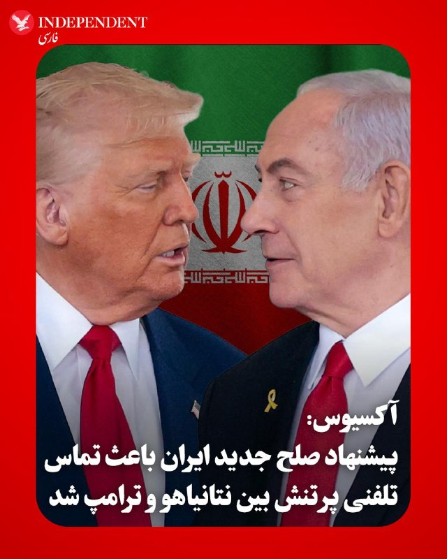

♦️وبسایت آکسیوس روز چهارشنبه ۳۰ اردیبهشت، به نقل از سه منبع آگاه گزارش داد که دونالد ترامپ و بنیامین نتانیاهو در تماسی تلفنی و دشوار در روز سه‌شنبه، تلاش‌های جدید برای دستیابی به توافق با جمهوری اسلامی را بررسی کردند؛ تا جایی که یکی از منابع آکسیوس گفت نتانیاهو پس از این تماس «بسیار خشمگین و آشفته» بود.

این تنش پس از آن رخ داد که قطر و پاکستان با همکاری دیگر میانجی‌های منطقه‌ای، پیش‌نویس طرح صلحی را برای کاهش اختلافات میان آمریکا و جمهوری اسلامی تدوین کردند. این در حالی است که ترامپ میان صدور فرمان یک حمله گسترده به ایران یا منتظر ماندن برای توافق، مردد است.

به گزارش آکسیوس، نتانیاهو به شدت نسبت به این مذاکرات بدبین است و خواستار ازسرگیری جنگ برای نابودی زیرساخت‌های حیاتی و تضعیف بیشتر نظامی ایران است. در مقابل، ترامپ روز چهارشنبه در آکادمی گارد ساحلی گفت: «سوال این است که آیا کار را تمام کنیم یا آن‌ها توافق‌نامه را امضا می‌کنند؟» او همچنین تاکید کرد نتانیاهو هرچه او بخواهد انجام می‌دهد.
‌🇸🇦 Indypersian

🤖 @VahidOOnLine

## VahidOOnLine — post 241211

  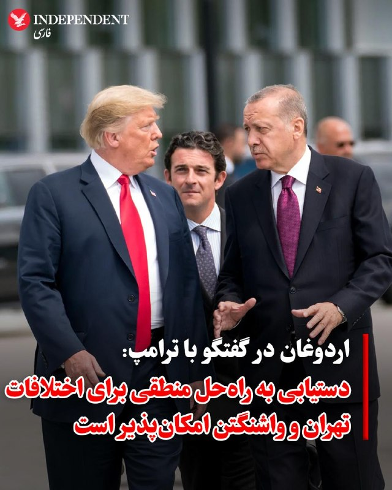

♦️بر اساس بیانیه نهاد ریاست‌جمهوری ترکیه، رجب طیب اردوغان، رئیس‌جمهوری این کشور، روز چهارشنبه ۳۰ اردیبهشت در تماسی تلفنی با دونالد ترامپ، رئیس‌جمهوری ایالات متحده، از تمدید آتش‌بس میان آمریکا و ایران استقبال و ابراز امیدواری کرد که مسائل مورد اختلاف میان دو طرف قابل حل است.

در بیانیه ریاست‌جمهوری ترکیه آمده است: «رئیس‌جمهوری ما در این گفتگو اظهار داشت که تصمیم برای تمدید آتش‌بس در منطقه درگیری را تحولی مثبت ارزیابی می‌کند و بر این باور است که دست‌یابی به یک راه‌حل منطقی برای مسائل مورد اختلاف امکان‌پذیر است.»
‌🇸🇦 Indypersian

🤖 @VahidOOnLine

## VahidOOnLine — post 241210

♦️ولادیمیر پوتین، رئیس‌جمهوری روسیه، شامگاه چهارشنبه پس از یک سفر دو روزه به پکن و دیدار و گفتگو با شی جین‌پینگ، رئیس‌جمهوری چین، پایتخت این کشور را ترک کرد.
تصاویر منتشرشده، رئیس‌جمهوری روسیه را در حال خداحافظی با هیئت‌های دو کشور، سوار شدن به هواپیما و پرواز از چین نشان می‌دهد.
شی جین‌پینگ و ولادیمیر پوتین در جریان این سفر درباره طیف گسترده‌ای از موضوعات سیاسی، اقتصادی و بین‌المللی گفتگو کردند و دو طرف بر گسترش همکاری‌های راهبردی میان چین و روسیه تاکید داشتند.
رهبران دو کشور که تاکنون بیش از ۴۰ بار با یکدیگر دیدار کرده‌اند، روابط پکن و مسکو را «شراکت راهبردی جامع» توصیف کرده و خواستار تقویت همکاری‌ها در حوزه‌هایی از جمله اقتصاد، انرژی، فناوری، هوش مصنوعی و مسائل امنیتی شدند.
بر اساس بیانیه مشترک منتشرشده، چین و روسیه برنامه‌هایی برای توسعه همکاری‌ها در زمینه‌های مختلف از فناوری‌های نوین و تجارت گرفته تا حفاظت از گونه‌های نادر جانوری مانند ببر، پلنگ و پاندا تدوین کرده‌اند.
در جریان این سفر، شی جین‌پینگ با برگزاری مراسم استقبال رسمی در تالار بزرگ خلق پکن از پوتین استقبال کرد.
‌🇸🇦 Indypersian

🤖 @VahidOOnLine

## VahidOOnLine — post 241209

  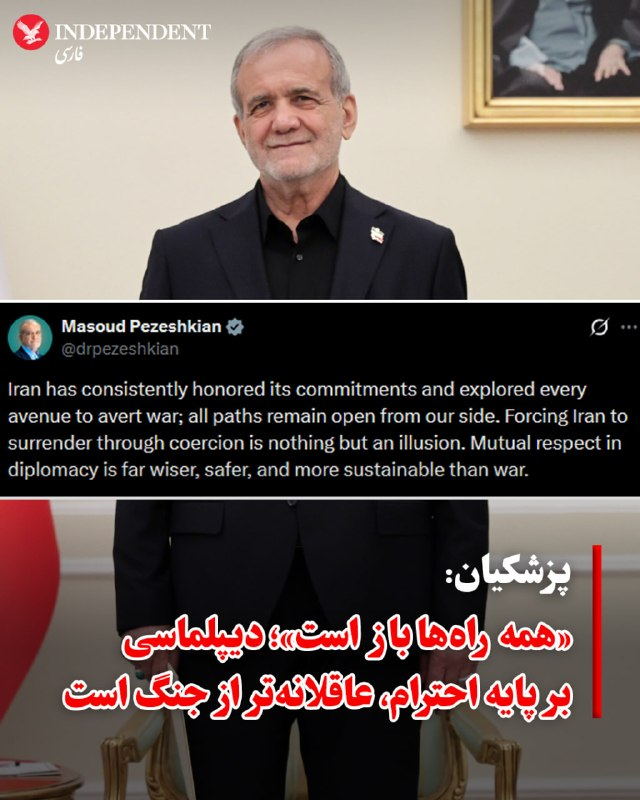

♦️ مسعود پزشکیان، رئیس‌جمهوری اسلامی، روز چهارشنبه ۳۰ اردیبهشت با انتشار پیامی در شبکه اجتماعی ایکس اعلام کرد که تهران «همواره به تعهدات خود پایبند بوده و از هر طریقی برای جلوگیری از جنگ استفاده کرده است».

او نوشت: «از جانب ما همچنان همه راه‌ها باز است.»

پزشکیان در ادامه تاکید کرد: «به زانو درآوردن ایران از طریق اجبار و فشار، چیزی جز یک توهم نیست. احترام متقابل در دیپلماسی، بسیار عاقلانه‌تر، ایمن‌تر و پایدارتر از جنگ است.»

پزشکیان این پیام را ساعتی بعد از دیدار با محسن نقوی، وزیر کشور پاکستان در تهران منتشر کرد. به گفته بقایی، سفر نقوی به ایران در راستای تسهیل تبادل پیام میان تهران و واشنگتن انجام شده است.
‌🇸🇦 Indypersian

🤖 @VahidOOnLine

## VahidOOnLine — post 241208

یک شهروند در پیامی به ایران اینترنشنال از افزایش کالاهای خوراکی روایت کرده و می‌گوید قیمت یک پفک به ۱۸۰ هزار تومان رسیده است. پیام او با هوش مصنوعی خوانده شده است.

Pofak-V.mp4
‌🏁 🇬🇧 IranintlTV

🤖 @VahidOOnLine

## VahidOOnLine — post 241207

  

♦️اسماعیل بقایی، سخنگوی وزارت امور خارجه جمهوری اسلامی، روز چهارشنبه ۳۰ اردیبهشت اعلام کرد که تهران پیشنهاد جدیدی از سوی ایالات متحده دریافت کرده و در حال حاضر مشغول بررسی آن است. این اظهارات همزمان با سفر وزیر کشور پاکستان، به عنوان میانجی، به ایران مطرح شد.

بقایی در مصاحبه تلفنی با صداوسیما گفت: «ما دیدگاه‌های طرف آمریکایی را دریافت کرده‌ایم و در حال حاضر مشغول بررسی آن‌ها هستیم. حضور وزیر کشور پاکستان نیز با هدف تسهیل تبادل پیام‌ها انجام شده است.»

او بار دیگر تاکید کرد که مطالبات جمهوری اسلامی در مذاکرات برای پایان دادن به جنگ، شامل آزادسازی دارایی‌های بلوکه‌شده ایران در خارج از کشور و پایان دادن به محاصره بنادر ایران توسط ایالات متحده است.
‌🇸🇦 Indypersian

🤖 @VahidOOnLine

## VahidOOnLine — post 241206

  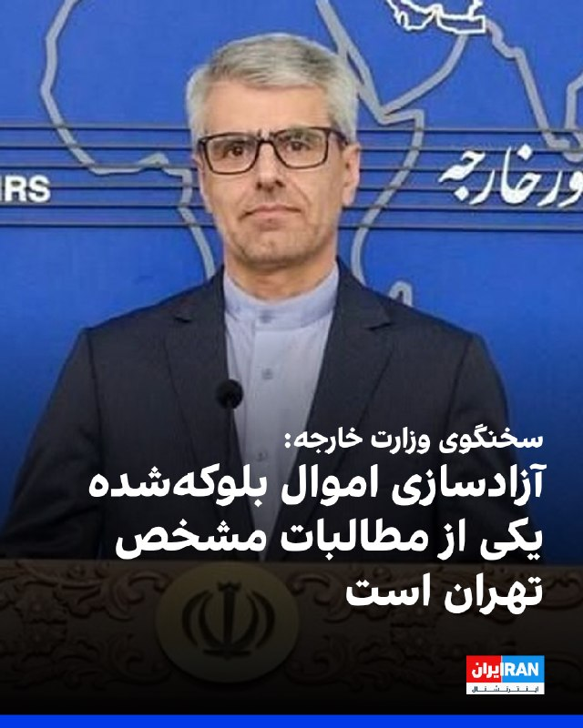

اسماعیل بقایی، سخنگوی وزارت خارجه جمهوری اسلامی، در واکنش به سخنان دونالد ترامپ گفت اولتیماتوم‌ دادن به جمهوری اسلامی «مضحک» است و لفاظی‌ها و تهدیدهای خارجی تاثیری نخواهد داشت. او تاکید کرد جمهوری اسلامی بدون توجه به این اظهارات، منافع خود را دنبال می‌کند.

بقایی آزادسازی اموال بلوکه‌شده را یکی از مطالبات مشخص تهران دانست و افزود در این مرحله تمرکز بر خاتمه جنگ در همه جبهه‌ها، از جمله لبنان است. او هشدار داد در صورت ادامه «زیاده‌خواهی» طرف مقابل، توافقی حاصل نخواهد شد.

سخنگوی وزارت خارجه همچنین گفت تبادل پیام‌ها از طریق وابسته پاکستانی در جریان است و دیدگاه‌های آمریکا دریافت و در حال بررسی است؛ حضور وزیر کشور پاکستان نیز برای تسهیل این روند انجام شده است.
‌🏁 🇬🇧 IranintlTV

🤖 @VahidOOnLine

## VahidOOnLine — post 241205

  

اکسیوس گزارش داد ترامپ و نتانیاهو سه‌شنبه درباره تلاش تازه برای دستیابی به توافق با ایران گفت‌وگو کردند. به گفته یک منبع آمریکایی، ترامپ به نتانیاهو اطلاع داده میانجی‌ها در حال تدوین «تفاهم اولیه» برای پایان رسمی جنگ و آغاز دوره‌ای ۳۰ روزه مذاکرات درباره موضوعاتی از جمله برنامه هسته‌ای ایران و بازگشایی تنگه هرمز هستند.
به نوشته اکسیوس، دو منبع اسرائیلی از اختلاف نظر دو رهبر درباره مسیر پیش رو خبر دادند و یک منبع آمریکایی گفت پس از تماس، «موهای بی‌بی آتش گرفته بود».
این گزارش می‌افزاید پیش‌نویس جداگانه‌ای از سوی قطر وجود ندارد و دو مقام عرب و یک منبع اسرائیلی گفته‌اند قطر پیش‌نویس جدیدی را به تهران و واشینگتن ارائه کرده، اما هنوز مشخص نیست ایران با آن موافقت کند. همچنین به گفته یک مقام عرب، هیأتی قطری برای گفت‌وگو درباره نسخه جدید به تهران سفر کرده است.

‌🏁 🇬🇧 IranintlTV

🤖 @VahidOOnLine

## VahidOOnLine — post 241204

  <a href="telegram/content/VahidOOnLine_241204_1779305964.mp4" target="_blank">🎬 Download video</a>

ویدیوی رسیده به ایران اینترنشنال نشان می‌دهد شهروندان پوستری را در کرج روی دیوار نصب کرده‌اند که با اعتراض به سیاست جنگ‌طلبانه جمهوری اسلامی افزوده تنها جنگ مردم، جنگ برای براندازی رژیم است.
‌🏁 🇬🇧 IranintlTV

🤖 @VahidOOnLine

## VahidOOnLine — post 241203

  <a href="telegram/content/VahidOOnLine_241203_1779305965.mp4" target="_blank">🎬 Download video</a>

وزارت دادگستری آمریکا علیه رائول کاسترو، رئیس‌جمهوری پیشین کوبا و برادر فیدل کاسترو، اعلام جرم کرد.

بر اساس کیفرخواستی که در دادگاه فدرال میامی منتشر شده، رائول کاسترو ۹۴ ساله به همراه پنج نفر دیگر به اتهام قتل، توطئه برای کشتن شهروندان آمریکایی و انهدام هواپیما متهم شده‌اند.

این پرونده به سرنگونی دو هواپیمای متعلق به گروه «برادران نجات» در سال ۱۹۹۶ مربوط می‌شود؛ گروهی از تبعیدیان کوبایی که برای کمک به پناهجویان کوبایی فعالیت می‌کردند. در آن حادثه، چهار نفر کشته شدند.

آمریکا می‌گوید جنگنده‌های کوبایی این هواپیماها را بر فراز آب‌های بین‌المللی هدف قرار داده‌اند، اما دولت کوبا همواره مدعی بوده این هواپیماها وارد حریم هوایی این کشور شده بودند.

این اقدام که بخشی از کارزار فشار دولت ترامپ علیه حکومت کمونیستی کوباست، تنش‌ها میان واشینگتن و هاوانا را به سطح تازه‌ای رسانده است
‌🏁 🇬🇧 ManotoTV

🤖 @VahidOOnLine

## VahidOOnLine — post 241202

  <a href="telegram/content/VahidOOnLine_241202_1779305966.mp4" target="_blank">🎬 Download video</a>

♦️ فرماندهی مرکزی ایالات متحده (سنتکام) روز چهارشنبه ۳۰ اردیبهشت اعلام کرد تفنگداران دریایی آمریکا یک نفتکش تجاری با پرچم ایران در که مشکوک به تلاش برای شکستن محاصره دریایی بود را در دریای عمان توقیف و بازرسی کردند. سنتکام ویدیویی از این عملیات را نیز در شبکه اجتماعی ایکس منتشر کرد.

سنتکام در بیانیه‌ای گفت: «نیروهای آمریکایی پس از بازرسی این شناور و هدایت خدمه آن برای تغییر مسیر، کشتی را آزاد کردند.»

مقامات جمهوری اسلامی هنوز هیچ‌گونه واکنش یا اظهارنظری درباره این حادثه نشان نداده‌اند.

سنتکام در ادامه بیانیه‌ خود افزود که ارتش آمریکا از زمان آغاز اجرای این طرح محاصره دریایی، تاکنون مسیر ۹۱ فروند کشتی تجاری را «تغییر داده است».
‌🇸🇦 Indypersian

🤖 @VahidOOnLine

## VahidOOnLine — post 241201

  <a href="telegram/content/VahidOOnLine_241201_1779305968.mp4" target="_blank">🎬 Download video</a>

⭕️ پزشکیان و وزیر کشور پاکستان در تهران، روند مذاکرات ایران و آمریکا را بررسی کردند

♦️خبرگزاری تسنیم، وابسته به سپاه پاسداران، روز چهارشنبه ۳۰ اردیبهشت گزارش کرد کە مسعود پزشکیان، رئیس‌جمهوری اسلامی در دیدار با سید محسن نقوی، وزیر کشور پاکستان، آخرین تحولات منطقه‌ای، مناسبات دوجانبه تهران و اسلام‌آباد و روند رایزنی‌های دیپلماتیک مرتبط با مذاکرات غیرمستقیم ایران و آمریکا را بررسی کرده است.
در این دیدار، دو طرف درباره روند پیگیری توافقات، تحولات جاری منطقه و اهمیت ادامه مسیر گفتگو و تفاهم تبادل نظر کردند. وزیر کشور پاکستان نیز پیام‌ها و دیدگاه‌های مقام‌های این کشور درباره تحولات منطقه و ضرورت تداوم رایزنی‌های دیپلماتیک را به پزشکیان منتقل کرد.
پزشکیان ضمن قدردانی از «مواضع و همکاری‌های دولت پاکستان در حمایت از ثبات و امنیت منطقه‌ای»، بر اهمیت گسترش روابط دوجانبه و استمرار هماهنگی‌های سیاسی میان تهران و اسلام‌آباد تاکید کرد.
‌🇸🇦 Indypersian

🤖 @VahidOOnLine

## VahidOOnLine — post 241200

  

♦️خبرگزاری تسنیم، وابسته به سپاه پاسداران، روز چهارشنبه ۳۰ اردیبهشت به نقل از اسماعیل بقایی، سخنگوی وزارت امور خارجه جمهوری اسلامی، اطلاعاتی درباره روند مذاکرات میان تهران و واشنگتن را منتشر کرد.

بقایی اعلام کرد که سفر محسن نقوی، وزیر کشور پاکستان به ایران، با هدف «تسهیل تبادل پیام‌ها و ارائه توضیحات تکمیلی برای شفاف‌سازی متن‌های ارسالی میان طرفین» انجام شده است.

رسانه‌های ایران پیش از این گزارش داده بودند که نقوی در چارچوب تلاش‌ها برای دستیابی به توافق میان واشنگتن و تهران، دومین سفر خود را در یک هفته گذشته به ایران انجام داده است. نقوی در این سفر با مسعود پزشکیان نیز دیدار کرد.

بر اساس گزارش تسنیم، بقایی همچنین تاکید کرد که ایران علی‌رغم داشتن «سوءظن شدید و منطقی» به طرف آمریکایی، «مسیر مذاکرات را با جدیت و حسن نیت دنبال می‌کند».
‌🇸🇦 Indypersian

🤖 @VahidOOnLine

## WithYashar — post 11791

کانال ۱۲ اسرائیل: نیروهای آمریکایی بر روی یک نفتکش ایرانی در خلیج عمان سوار شدند.
@withyashar
🚨🚨🚨🚨🚨🚨

## WithYashar — post 11790

  <a href="telegram/content/WithYashar_11790_1779305970.mp4" target="_blank">🎬 Download video</a>

خبرنگار : قصد داری به اونا ( ایران) حمله کنی‌؟

ترامپ : اینو بهت نمیگم
@withyashar

## WithYashar — post 11789

خبرنگار : از این رفت و برگشت با ایران خسته نمیشی؟

ترامپ : من هیچوقت خسته نمیشم ولی اگه با چند روز صبر کردن بشه جلوی جنگ و کشته شدن مردم رو گرفت کار خوبیه

@withyashar

## WithYashar — post 11788

ترامپ: چند روز منتظر پاسخ ایران می‌مانیم

ایران یک کشور شکست‌خورده است و ما امیدواریم بتوانیم با آنها توافق کنیم که این برای همه عالی خواهد بود.

من هیچ تحریمی را علیه ایران تا زمانی که به توافق برسیم رفع نخواهم کرد. تا زمانی که ایران توافق را امضا نکند به ایران هیچ معافیت نفتی نخواهم داد و پیشنهادی هم برای انجام این کار نداده‌ایم.

اگر پاسخ‌های درست را نگیریم، اوضاع خیلی سریع پیش می‌رود. همه ما آماده‌ایم. باید پاسخ‌های درست را به دست آوریم.
@withyashar

## WithYashar — post 11787

  <a href="telegram/content/WithYashar_11787_1779305971.mp4" target="_blank">🎬 Download video</a>

خبرنگار: آیا همانطور که رسانه های دولتی ایران گزارش داده اند، ایالات متحده در جریان مذاکرات صلح پیشنهاد کاهش تحریم های نفتی ایران را داده است؟

ترامپ: نه، من این را نشنیده ام. تا زمانی که توافقی امضا نکنند، هیچ کمکی نمی‌کنم.
وقتی آنها توافق نامه ای امضا می کنند، ما می توانیم دوباره آن مکان را بسازیم و کشوری داشته باشیم که واقعا کشور خوبی برای مردم باشد.
اما نه، ما چیزی پیشنهاد نکرده ایم.
@withyashar

## WithYashar — post 11786

مسعود زرشکیان : وادار کردن ایران به تسلیم از طریق اجبار چیزی جز توهم نیست.
احترام متقابل در دیپلماسی بسیار عاقلانه‌تر، ایمن‌تر و پایدارتر از جنگ است
@withyashar

## WithYashar — post 11783

## WithYashar — post 11782

## WithYashar — post 11781

کلش ریپورت: اردوغان در تماس تلفنی با ترامپ درباره روابط ترکیه و آمریکا و مسائل منطقه‌ای صحبت کرد.
@withyashar

## WithYashar — post 11780

به ادعای آکسیوس : امروز اوایل روز، بحث داغی در داخل کاخ سفید درباره ایران شکل گرفت، جایی که جی‌دی ونس، استیو ویتکاف و جرد کوشنر برای توافق اولیه‌ای جهت پایان دادن به جنگ تلاش می‌کردند، در حالی که پیت هگست و مارکو روبیو برای فشار بیشتر و احتمال اقدام نظامی استدلال می‌کردند
@withyashar

## WithYashar — post 11779

لطفا دایرکت بی مورد و چند پیغامه ندید 🙌🏾

## WithYashar — post 11778

اتاق جنگ با یاشار : اول مهر مدارس مختلط است 😎
@withyashar

## WithYashar — post 11777

تسنیم به نقل از یک منبع نزدیک به تیم مذاکره‌کننده: پس از ارسال متن ۱۴ بندی ایران که سه روز پیش صورت گرفته است، آمریکایی‌ها بار دیگر متنی را از طریق میانجی پاکستانی به ایران داده‌اند.
ایران در حال بررسی متن است و هنوز پاسخی داده نشده است.
میانجی پاکستانی در تهران به دنبال نزدیک کردن متون به یکدیگر است.
هنوز چیزی در این میان نهایی نشده است.
@withyashar

## WithYashar — post 11776

## WithYashar — post 11775

ادعای آکسیوس به نقل از یک منبع آمریکایی: ترامپ به نتانیاهو از یک دوره 30 روزه مذاکره درباره برنامه هسته‌ای ایران و تنگه هرمز اطلاع داد
@withyashar

## WithYashar — post 11774

خبرنگار العربیه: بعد از تماس اسرائیل در دو حمله هوایی شهرک‌های «حداثا» و «تول» در جنوب لبنان را بمباران کرد.
@withyashar

## WithYashar — post 11773

«آکسیوس»: نتانیاهو از مکالمه تلفنی خود با ترامپ درباره ایران «بسیار عصبانی» شده بود. قطر و پاکستان تعدیلاتی بر طرح پیشنهادی برای پایان جنگ اعمال کردند.
@withyashar

## WithYashar — post 11772

وب‌سایت «آکسیوس»: گفت‌وگوی اخیر ترامپ و نتانیاهو بسیار متشنج و دشوار بود.
@withyashar

## WithYashar — post 11771

رویترز:برخی کشتی‌ها بیش از 150 هزار دلار به ایران پرداخت می‌کنند تا عبور از تنگه هرمز را تضمین کنند.

‏هزینه عبور کشتی‌ها از تنگه هرمز برای همه کشورها اعمال نمی‌شود.

‏مکانیزم جدید ایران در تنگه هرمز به کشتی‌های مرتبط با روسیه و چین است
@withyashar

## WithYashar — post 11770

  

پست جدید ترامپ
@withyashar

## mwarmonitor — post 9379

🔹خبرنگار: چه پیامی دارید برای آن دسته از خانواده‌های آمریکایی که از رشد هوش مصنوعی نگرانند؟ آن‌ها نگران این هستند که فرزندانشان در آینده به خاطر جایگزین شدن هوش مصنوعی نتوانند شغلی پیدا کنند.
🔸دونالد ترامپ: خب، چیزی که من می‌گویم این است که هوش مصنوعی تا اینجا فوق‌العاده بوده است، چون در حال حاضر ما شغل‌های بیشتری داریم؛ افراد بیشتری همین الان در ایالات متحده مشغول به کار هستند، بسیار بیشتر از هر زمان دیگری در گذشته.
و جدای از جنگ، من تصور می‌کردم که اقتصاد افت خواهد کرد و بازار بورس ۲۰ تا ۲۵ درصد سقوط می‌کند، اما در واقع رشد داشته است. بازار بورس در حال حاضر بالاتر از زمانی است که من مسئله‌ی ایران را شروع کردم.
و در مورد ایران، من چاره‌ی دیگری نداشتم چون آن‌ها قرار بود به سلاح هسته‌ای دست پیدا کنند و ما قرار نیست اجازه دهیم آن‌ها سلاح هسته‌ای داشته باشند. اما این موضوع به زودی به یک شکلی تمام خواهد شد.
قیمت نفت به شدت پایین خواهد آمد. تعداد بسیار زیادی... ما ۱۶۰۰ کشتی در تنگه داریم که پر از نفت هستند و به زودی خارج خواهند شد. پس... باید منتظر بمانیم و ببینیم چه می‌شود. اما ارتش بی‌نظیر عمل کرده است. محاصره بی‌نقص بوده است. حتی یک کشتی هم نتوانسته از این محاصره عبور کند. ۳۷ کشتی تلاش کردند... و همگی آرزو می‌کنند که کاش این کار را نمی‌کردند.

📝سوال چی پرسید چی جواب داد 😐

@mwarmonitor

## mwarmonitor — post 9378

  <a href="telegram/content/mwarmonitor_9378_1779305974.mp4" target="_blank">🎬 Download video</a>

🎬 Video

## mwarmonitor — post 9377

✈️🚨 پرواز یک جنگنده در ارتفاع پایین در آسمان استان موصل در شمال عراق.

@mwarmonitor

## mwarmonitor — post 9376

🔹خبرنگار: دیروز گفتید که حدوداً یک ساعت با تصمیم‌گیری فاصله دارید. امروز اوضاع در چه حالیه؟ آیا چیزی ازشون شنیدید؟
🔸دونالد ترامپ: خیلی... دقیقاً روی مرز (مرز تصمیم‌گیری) قرار داره، باور کنید. اگر پاسخ‌های درستی دریافت نکنیم، خیلی سریع پیش میره. ما کاملاً آماده‌ایم که اقدام کنیم. اما باید پاسخ‌های درستی بگیریم. باید پاسخ‌ها کاملاً و ۱۰۰ درصد خوب باشن؛ و اگر این‌طور باشه، در زمان، انرژی و مهم‌تر از همه، در جان انسان‌ها صرفه‌جویی زیادی می‌کنیم.
🔹خبرنگار: چقدر زمان می‌بره؟
🔸دونالد ترامپ: می‌تونه خیلی سریع اتفاق بیفته. یا چند روز، ممکنه چند روز طول بکشه؛ اما پتانسیلش رو داره که خیلی سریع پیش بره. ایران یک کشور شکست‌خورده است. ما داریم با افرادی سروکار داریم و در واقع، باید بهتون بگم، داریم با افراد خیلی خوبی سروکار داریم. با کسانی طرف هستیم که فکر می‌کنم خیلی منطقی‌تر از اون افرادی هستن که دیگه واقعاً در بین ما حضور ندارن. ما داریم با افرادی سروکار داریم که استعداد دارن، از... هوش و مغز خوبی برخوردارن و این ما رو کاملاً تحت تأثیر قرار داده. بنابراین، امیدواریم این افراد توافقی رو رقم بزنن که برای همه عالی باشه.
🔹خبرنگار: آیا از این رفت‌وآمدهای مداوم خسته نشدید؟
🔸دونالد ترامپ: من نمی‌دونم، نمی‌دونم، من اصلاً... چی؟ خسته بشم؟ من هیچ‌وقت خسته نمی‌شم. اما کاری که مایلم انجام بدم اینه: اگر بتونم با چند روز صبر کردن از جنگ جلوگیری کنم، اگر بتونم با چند روز صبر کردن از کشته شدن مردم جلوگیری کنم، فکر می‌کنم ارزشش رو داره.

@mwarmonitor

## mwarmonitor — post 9375

  <a href="telegram/content/mwarmonitor_9375_1779305975.mp4" target="_blank">🎬 Download video</a>

🎬 Video

## mwarmonitor — post 9374

🔴ترامپ: ما در حال «آزادسازی کوبا» هستیم و باید به کوبایی‌ها کمک کنیم، چون آن‌ها غذا و انرژی ندارند، اما مردم بزرگی هستند. 🔸ما منتظر پاسخ مناسب ایران هستیم تا از تشدید بیشتر تنش جلوگیری شود. 🔸چند روزی منتظر پاسخ ایران خواهیم ماند. 🔸تا زمانی که به توافق نرسیم،…

## mwarmonitor — post 9373

🔴ترامپ: ما در حال «آزادسازی کوبا» هستیم و باید به کوبایی‌ها کمک کنیم، چون آن‌ها غذا و انرژی ندارند، اما مردم بزرگی هستند.

🔸ما منتظر پاسخ مناسب ایران هستیم تا از تشدید بیشتر تنش جلوگیری شود.

🔸چند روزی منتظر پاسخ ایران خواهیم ماند.

🔸تا زمانی که به توافق نرسیم، هیچ‌گونه تحریمی را از ایران لغو نخواهم کرد.

@mwarmonitor

## mwarmonitor — post 9372

🇮🇷 منبع آگاه ایرانی: آمریکایی‌ها، پس از ارسال یک پیام شامل ۱۴ بند سه روز پیش، پیام دیگری را از طریق یک واسطه پاکستانی به ایران ارسال کرده‌اند (ظاهراً همین وزیر کشور پاکستان). ایران در حال بررسی این پیام است و هنوز به آن پاسخ نداده است. 🔸 واسطه پاکستانی در…

## mwarmonitor — post 9371

🔴 طبق اعلام ریاست‌جمهوری ترکیه، اردوغان یک تماس تلفنی با ترامپ داشته است.

@mwarmonitor

## mwarmonitor — post 9370

حمله پهپادی به اقلیم کردستان

## mwarmonitor — post 9369

🔴گرگوری برو تحلیل‌گر ارشد حوزه ایران و نفت در Eurasia Group (یک شرکت معتبر در زمینه مشاوره ریسک سیاسی)

🔸به نظر می‌رسد توافق پیشنهادی شامل یک بیانیه نیت از سوی هر دو طرف درباره پایان جنگ است، که پس از آن یک دوره ۳۰ روزه برای مذاکره درباره بازگشایی تنگه و همچنین مسائل هسته‌ای در نظر گرفته می‌شود.

🔹در عمل، این یعنی تمدید ۳۰ روزه آتش‌بس.

🔹با این حال، هنوز هم به اندازه کافی هست که نتانیاهو را خشمگین کند.

@mwarmonitor

## mwarmonitor — post 9368

🇮🇷 منبع آگاه ایرانی: آمریکایی‌ها، پس از ارسال یک پیام شامل ۱۴ بند سه روز پیش، پیام دیگری را از طریق یک واسطه پاکستانی به ایران ارسال کرده‌اند (ظاهراً همین وزیر کشور پاکستان). ایران در حال بررسی این پیام است و هنوز به آن پاسخ نداده است.
🔸 واسطه پاکستانی در تهران تلاش می‌کند دیدگاه‌های دو طرف را به یکدیگر نزدیک کند. هنوز توافق نهایی حاصل نشده است.

🔸پزشکیان بعد از دیدار وزیر کشور پاکستان: ایران همواره به تعهدات خود عمل کرده و همه راه‌ها را برای جلوگیری از جنگ پیموده است؛ و همچنان همه گزینه‌ها از سوی ما باز است. وادار کردن ایران به تسلیم از طریق زور، چیزی جز یک توهم نیست. احترام متقابل در دیپلماسی، عاقلانه‌تر، امن‌تر و پایدارتر از جنگ است.

@mwarmonitor

## mwarmonitor — post 9367

دو منبع دیگر نیز اشاره کردند که نتانیاهو در مراحل قبلی مذاکرات هم — حتی زمانی که توافق‌ها به نتیجه نرسیدند — بشدت نگران بوده است. یکی از این منابع گفت: «بی‌بی همیشه نگران است.»
اظهارات طرفین
سخنگوی وزارت امور خارجه ایران اعلام کرد که برای موفقیت گفتگوها، ایالات متحده باید به «قرص‌گری و راهزنی» علیه کشتی‌های ایرانی پایان دهد و با آزادسازی دارایی‌های بلوکه‌شده موافقت کند، و اسرائیل نیز باید به جنگ خود در لبنان خاتمه دهد.
کاخ سفید و دفتر نخست‌وزیری اسرائیل هر دو از اظهار نظر در خصوص این گزارش خودداری کردند.

📌مواردی که باید زیر نظر داشت
یک منبع اسرائیلی اعلام کرد که نتانیاهو تمایل دارد طی هفته‌های آینده برای دیدار و گفتگو با ترامپ به واشنگتن سفر کند.

@mwarmonitor

## mwarmonitor — post 9366

🔴طرح پیشنهادی جدید برای صلح با ایران، موجب تماس تلفنی تنش‌آمیز میان ترامپ و نتانیاهو شد

📝نویسنده: باراک راوید AXIOS

🔰سه منبع آگاه اعلام کردند که دونالد ترامپ، رئیس‌جمهور آمریکا و بنیامین نتانیاهو، نخست‌وزیر اسرائیل، روز سه‌شنبه در یک تماس تلفنی دشوار، درباره تلاش‌های جدید برای دستیابی به توافق با ایران گفتگو کردند؛ تا جایی که به گفته یکی از این منابع، نتانیاهو پس از پایان این مکالمه بشدت برافروخته و نگران بوده است.

چرا این موضوع اهمیت دارد؟
به گفته منابع، قطر و پاکستان با همفکری سایر میانجی‌های منطقه‌ای، پیش‌نویس یک یادداشت تفاهم صلح بازنگری‌شده را تهیه کرده‌اند تا گامی برای کاهش اختلافات میان ایالات متحده و ایران بردارند. این اقدام در شرایطی صورت می‌گیرد که ترامپ میان صدور فرمان یک حمله گسترده به ایران و تلاش برای دستیابی به توافق، مردد مانده است.
نتانیاهو نسبت به این مذاکرات بشدت بدبین است و خواهان از سرگیری جنگ است تا از طریق نابود کردن زیرساخت‌های حیاتی ایران، توانمندی‌های نظامی این کشور را بیشتر تضعیف کرده و حکومت را تحت فشار بگذارد.
ترامپ همچنان معتقد است که امکان دستیابی به توافق وجود دارد، اما تاکید کرده که در صورت عدم توافق، آماده از سرگیری جنگ است.
ترامپ روز چهارشنبه در آکادمی گارد ساحلی گفت: «تنها سوال این است که آیا کار را یکسره کنیم یا آن‌ها قرار است سندی را امضا کنند. باید منتظر ماند و دید چه می‌شود.»
ترامپ همچنین با وجود اشاره به رابطه خوب خود با نتانیاهو، اظهار داشت که او (نتانیاهو) «هر کاری که من بخواهم در قبال ایران انجام خواهد داد.» هرچند این دو رهبر پیش از این نیز اختلافات موقتی درباره ایران داشته‌اند، اما در طول این جنگ همواره هماهنگی نزدیکی با یکدیگر حفظ کرده‌اند.
ایران تایید کرده که در حال بررسی این پیشنهاد به‌روزشده است، اما هنوز هیچ نشانه‌ای از انعطاف نشان نداده است.
جزئیات بیشتر (Zoom in)
سه منبع آگاه می‌گویند که پاکستان، قطر و دیگر میانجی‌ها — شامل عربستان سعودی، ترکیه و مصر — طی چند روز گذشته مشغول اصلاح این طرح پیشنهادی برای نزدیک کردن دیدگاه‌ها بوده‌اند.
به گفته دو مقام عرب و یک منبع اسرائیلی، قطر اخیراً پیش‌نویس جدیدی را به آمریکا و ایران ارائه کرده است.
اما یک منبع چهارم می‌گوید پیش‌نویس مجزایی از سوی قطر وجود ندارد، بلکه قطر صرفاً در تلاش است تا اختلافات موجود در پیشنهاد قبلی پاکستان را برطرف کند.
یک مقام عرب نیز اعلام کرد که قطری‌ها در اوایل هفته جاری هیئتی را برای گفتگو با مقامات ایرانی درباره این پیش‌نویس جدید به تهران فرستاده‌اند.
وزارت امور خارجه ایران روز چهارشنبه اعلام کرد که مذاکرات «بر اساس پیشنهاد ۱۴ ماده‌ای ایران» در جریان است و وزیر کشور پاکستان نیز برای کمک به این میانجی‌گری در تهران حضور دارد. این دومین سفر وزیر کشور پاکستان به تهران در کمتر از یک هفته گذشته است.
یک مقام عرب اظهار داشت هدف از این تلاش‌های جدید، گرفتن تعهدات ملموس‌تر از ایرانی‌ها در خصوص برنامه‌ هسته‌ای‌شان و همچنین مشخص کردن جزئیات دقیق‌تر از سوی آمریکا درباره نحوه آزادسازی تدریجی دارایی‌های بلوکه‌شده ایران است. با این حال، هر سه منبع تاکید کردند هنوز مشخص نیست که آیا ایرانی‌ها با این پیش‌نویس جدید موافقت خواهند کرد یا تغییر چشمگیری در مواضع خود ایجاد می‌کنند یا خیر.
یک دیپلمات قطری در این باره گفت: «همانطور که پیش‌تر اعلام شد، قطر از تلاش‌های میانجی‌گرانه به رهبری پاکستان حمایت کرده و می‌کند. ما همواره خواستار تنش‌زدایی به خاطر امنیت منطقه و مردم آن بوده‌ایم.»
پشت صحنه
شامگاه سه‌شنبه، ترامپ گفتگویی طولانی و «دشوار» با نتانیاهو داشت.
یک منبع آمریکایی که در جریان این گفتگو قرار گرفته، اظهار داشت ترامپ به نتانیاهو گفته است که میانجی‌ها در حال کار روی یک «تفاهم‌نامه اولیه» (Letter of intent) هستند که باید به امضای آمریکا و ایران برسد تا رسماً به جنگ پایان داده و یک دوره مذاکرات ۳۰ روزه را پیرامون مسائلی نظیر برنامه هسته‌ای ایران و بازگشایی تنگه هرمز آغاز کند.
دو منبع اسرائیلی تایید کردند که این دو رهبر درباره مسیر پیش‌رو با یکدیگر اختلاف‌نظر داشتند؛ در حالی که همان منبع آمریکایی مطلع از این تماس گفت: «بی‌بی (نتانیاهو) پس از این تماس تلفنی بشدت برافروخته و مضطرب بود.»
این منبع افزود که سفیر اسرائیل در واشنگتن به قانون‌گذاران آمریکایی اطلاع داده که نتانیاهو نسبت به این تماس نگران است. با این حال، سخنگوی سفارت اسرائیل این روایت را تکذیب کرد و گفت: «سفیر درباره گفتگوهای خصوصی اظهار نظر نمی‌کند.»

## mwarmonitor — post 9365

🔸سناتور لیندسی گراهام:

🔹«من معتقدم رئیس‌جمهور ترامپ کار درخشانی در تضعیف رژیم تروریستی ایران انجام داده و آن را به ضعیف‌ترین وضعیتش از سال ۱۹۷۹ رسانده است. به فرمانده کل قوا و همه کسانی که تحت فرمان او خدمت می‌کنند، دست‌مریزاد.

🔹مثل همه، من هم امیدوارم راه‌حلی دیپلماتیک برای بحران ایران پیدا شود، اما این راه‌حل باید جامع باشد تا اطمینان حاصل شود ایران دیگر بزرگ‌ترین حامی دولتی تروریسم نیست. همچنین باید واقعی باشد و مذاکرات باید قابل اعتماد انجام شوند. از تلاش همه در منطقه برای کمک به این هدف قدردانی می‌کنم.

🔹می‌شنوم که احتمال دارد فیلدمارشال پاکستان به ایران سفر کند — چه چیزی ممکن است اشتباه پیش برود؟! شاید او گزارشی از وضعیت هواپیماهای نظامی ایران که در پایگاه‌های هوایی پاکستان نگهداری می‌شوند ارائه دهد؟

🔹مثل بسیاری دیگر، من با دقت بسیار در حال دنبال کردن اتفاقاتی هستم که بار دیگر درباره تلاش برای رسیدن به توافق با رژیم ایران در حال رخ دادن است. برای همه افراد درگیر، آرزوی موفقیتی واقعی دارم.»

🔸مارک لوین ؛

🔹«لیندزی گراهام حق دارد که با تردید نگاه کند، اما در عین حال امیدوار باشد.»

@mwarmonitor

## mwarmonitor — post 9364

🔴«شبکه کان اسرائیل: نتانیاهو در تلاش است ترامپ را متقاعد کند تا چراغ سبز ازسرگیری جنگ علیه ایران را بدهد.» @mwarmonitor

## mwarmonitor — post 9363

🔴«بر اساس اسناد قضایی که روز چهارشنبه علنی شده، رائول کاسترو، رهبر پیشین کوبا، به همراه پنج نفر دیگر توسط یک هیئت منصفه فدرال آمریکا در ایالت فلوریدا کیفرخواست شده‌اند. به گزارش CBS

@mwarmonitor

## mwarmonitor — post 9362

🔴«فیننشال تایمز: OpenAI در حال آماده‌سازی برای ارائه درخواست عرضه عمومی سهام است و ممکن است این کار را از همین هفته انجام دهد. این آزمایشگاه هوش مصنوعی قصد دارد به‌زودی، احتمالاً تا ماه سپتامبر، یک عرضه اولیه سهام بسیار بزرگ و خبرساز برگزار کند.»

@mwarmonitor

## mwarmonitor — post 9361

🔴«شبکه کان اسرائیل: نتانیاهو در تلاش است ترامپ را متقاعد کند تا چراغ سبز ازسرگیری جنگ علیه ایران را بدهد.»

@mwarmonitor

## mwarmonitor — post 9360

  <a href="telegram/content/mwarmonitor_9360_1779305977.mp4" target="_blank">🎬 Download video</a>

🇺🇸اوایل امروز در دریای عمان، تفنگداران دریایی آمریکا از یگان اعزامی ۳۱ نیروی دریایی (31st Marine Expeditionary Unit) بر نفتکش تجاری Celestial Sea با پرچم ایران سوار شدند؛ این کشتی مظنون بود که قصد دارد با حرکت به‌سوی یک بندر ایرانی، تحریم دریایی آمریکا را نقض کند.

🔸نیروهای آمریکایی پس از بازرسی، این شناور را آزاد کرده و به خدمه آن دستور دادند مسیر خود را تغییر دهند.

🔹نیروهای آمریکا همچنان به اجرای کامل محاصره ادامه می‌دهند و تاکنون ۹۱ کشتی تجاری را برای اطمینان از رعایت این محاصره تغییر مسیر داده‌اند.

@mwarmonitor

## FoxNewsTwitter — post 342026

  <a href="telegram/content/FoxNewsTwitter_342026_1779305979.mp4" target="_blank">🎬 Download video</a>

Fox News (Twitter/X)

BREAKING: President Trump reveals the strategy behind his back-and-forth negotiating style with the Iranian regime as the region waits to see if a new waves of fighting will begin:

"I never get tired. What I like to do, if I can save war by waiting a couple of days, so I can save people being killed by waiting a couple of days, I think it's a great thing to do."

## FoxNewsTwitter — post 342025

  <a href="telegram/content/FoxNewsTwitter_342025_1779305981.mp4" target="_blank">🎬 Download video</a>

Fox News (Twitter/X)

JUST IN: President Trump dismissing growing fears and public anxiety over Artificial Intelligence disrupting the job market throughout the country.

"I'll tell you, AI has been amazing, because right now we have more jobs, more people working right now in the United States by far, than we ever had before."

## FoxNewsTwitter — post 342024

  <a href="telegram/content/FoxNewsTwitter_342024_1779305982.mp4" target="_blank">🎬 Download video</a>

Fox News (Twitter/X)

NOW: President Trump celebrates the "very big moment" of Raul Castro being indicted and what it means to the Cuban people:

"We have Cuba on our mind, it's very important.... It was a very big moment for people, not only Cuban Americans, but people who came from Cuba, that want to go back to Cuba, see their family in Cuba."

"They supported me to the nth degree, they supported me at levels that nobody's ever seen before. And so I think it's a very important moment."

## FoxNewsTwitter — post 342023

  

Fox News (Twitter/X)

WATCH LIVE: Florida lawmakers hold press conference on US indictment of Raúl Castro https://twitter.com/i/broadcasts/1pKkOyBYPAMKj

## FoxNewsTwitter — post 342022

  

Fox News (Twitter/X)

WATCH LIVE: Senate holds 'Blowing the Whistle: Inside the Grift that Keeps Giving' hearing https://twitter.com/i/broadcasts/1jxXgeVpZgeJZ

## FoxNewsTwitter — post 342021

  <a href="telegram/content/FoxNewsTwitter_342021_1779305985.mp4" target="_blank">🎬 Download video</a>

Fox News (Twitter/X)

"Let's take a moment to revisit what actual Jim Crow was."

Rep. Wesley Hunt dismantles Democrats' talking points trying to compare voter ID requirements to segregation and other racist policies that plagued the U.S. for decades.

The Texas Republican detailed the brutal realities of the Jim Crow South, sharing how his own father had to walk to the back of a restaurant in New Orleans just to order food because of the color of his skin.

"That was Jim Crow," Hunt said. "And that is precisely why it is so offensive to compare that era of legalized discrimination and racial terror to showing a photo ID in a voting booth."

## FoxNewsTwitter — post 342020

  <a href="telegram/content/FoxNewsTwitter_342020_1779305986.mp4" target="_blank">🎬 Download video</a>

Fox News (Twitter/X)

BREAKING: Acting Attorney General Todd Blanche issues a stern warning to America's adversaries, declaring that the Trump administration will hunt down anyone who targets or kills U.S. citizens following the indictment of Raul Castro.

"Nations and their leaders cannot be permitted to target Americans, kill them, and not face accountability.”

“President Trump is committed to restoring a very simple but important principle. If you kill Americans, we will pursue you no matter who you are, no matter what title you hold, and in this case, no matter how much time has passed."

## FoxNewsTwitter — post 342019

  <a href="telegram/content/FoxNewsTwitter_342019_1779305987.mp4" target="_blank">🎬 Download video</a>

Fox News (Twitter/X)

NOW: Todd Blanche tells the tragic story of the 1996 shootdown of two civilian aircraft that killed four Americans engaged in humanitarian work:

"On February 24th, 1996, two civilian aircraft operated by Brothers The Rescue were shot down over international waters by military aircraft from Cuba. Four men were killed."

"They were unarmed civilians and were flying humanitarian missions for the rescue and protection of people fleeing oppression."

"Raul Castro and five co-defendants participated in a conspiracy that ended with Cuban military aircraft firing missiles at those civilian planes and killing four Americans."

"My message today is clear the United States and President Trump does not and will not forget its citizens."

## FoxNewsTwitter — post 342018

  <a href="telegram/content/FoxNewsTwitter_342018_1779305989.mp4" target="_blank">🎬 Download video</a>

Fox News (Twitter/X)

WATCH: Crowd erupts with cheers as Acting AG Todd Blanche announces the DOJ is indicting former Cuban president Raul Castro.

Castro and several others are being charged with conspiracy to kill U.S. nationals, destruction of aircraft, and four individual counts of murder.

## FoxNewsTwitter — post 342017

  

Fox News (Twitter/X)

WATCH LIVE: DOJ announces indictment against former Cuban President Raúl Castro https://twitter.com/i/broadcasts/1dxYljqOXEXJX

## FoxNewsTwitter — post 342016

‌Fox News (Twitter/X)

https://www.foxnews.com/politics/doj-indicts-cuban-ex-president-raul-castro-charges-including-murder-conspiracy-kill-us-nationals

## FoxNewsTwitter — post 342015

  <a href="telegram/content/FoxNewsTwitter_342015_1779305991.mp4" target="_blank">🎬 Download video</a>

Fox News (Twitter/X)

CENTCOM releasing new video showing U.S. Marines boarding an Iranian-flagged oil tanker in the Gulf of Oman earlier today as American forces continue enforcing the Middle East naval blockade.

The M/T Celestial Sea was searched by Marines with the 31st Marine Expeditionary Unit after the vessel was suspected of attempting to transit toward an Iranian port.

U.S. forces later released the ship and ordered the crew to alter course.

Officials say 91 commercial vessels have now been redirected as the blockade operation escalates across the region.

## FoxNewsTwitter — post 342011

Fox News (Twitter/X)

SEE THE MOMENTS: President Trump delivered a historic commencement speech at the U.S. Coast Guard Academy, making his mark as the only president to address graduates of the academy more than once.

"We're going to have to try it maybe a third time too," the president joked.

Trump, in a speech full of both humor and applause, left graduates with some words of inspiration on how to go about their lives and careers, even inviting a few of the top cadets up to the stage as he recognized them.

## FoxNewsTwitter — post 342010

  <a href="telegram/content/FoxNewsTwitter_342010_1779305993.mp4" target="_blank">🎬 Download video</a>

Fox News (Twitter/X)

JUST NOW: The crowd erupts with laughter after President Trump jokes he "hates good looking men," inviting the "top of the class" cadet to join him on stage during his commencement speech at the Coast Guard Academy.

## FoxNewsTwitter — post 342009

  <a href="telegram/content/FoxNewsTwitter_342009_1779305995.mp4" target="_blank">🎬 Download video</a>

Fox News (Twitter/X)

JUST IN: U.S. Coast Guard Academy Class President presents President Trump with a gift from the class of 2026 - a USCGA football helmet.

## FoxNewsTwitter — post 342008

Fox News (Twitter/X)

BREAKING: Cuban ex-President Raul Castro indicted on charges including murder, conspiracy to kill US nationals

## FoxNewsTwitter — post 342007

  <a href="telegram/content/FoxNewsTwitter_342007_1779305997.mp4" target="_blank">🎬 Download video</a>

Fox News (Twitter/X)

WATCH: President Trump is met with a standing ovation as he finishes his commencement speech to the U.S. Coast Guard Academy.

"The U.S. Coast Guard has never, ever let us down. And with men and women like the great class of 2026, I know that will never happen."

"Wherever the duty calls, whatever danger comes our way, you will fight, fight, fight and you will win, win, win."

"God bless the Coast Guard Academy, the class of 2026. God bless the United States military and God bless the United States of America."

## pm_afshaa — post 91131

نخست‌وزیر اسپانیا: به‌سرعت ممنوعیت ورود وزرای اسرائیلی به کشورهای اتحادیه اروپا را پیش خواهم برد

💧 Rainbet.com the #1 Non-KYC Crypto Casino & Sportsbook @rainbetcom

😁 @Pm_Afshaa

## pm_afshaa — post 91130

🔴ترامپ : اگه جواب درست نگیریم خیلی سریع اوضاع میره سمت درگیری همه چی آماده‌ست فقط باید جواب درست بگیریم

💧 Rainbet.com the #1 Non-KYC Crypto Casino & Sportsbook @rainbetcom

😁 @Pm_Afshaa

## pm_afshaa — post 91129

🔴ترامپ: تا زمانی که ایران توافق‌نامه‌ای امضا نکند، هیچ معافیت نفتی به این کشور اعطا نخواهم کرد و ما پیشنهادی برای ارائه چنین معافیت‌هایی نداده‌ایم

💧 Rainbet.com the #1 Non-KYC Crypto Casino & Sportsbook @rainbetcom

😁 @Pm_Afshaa

## pm_afshaa — post 91128

🔴اسرائیل هیوم:یک مناقشه داغ در کاخ سفید بین مقامات ارشد آمریکا بر سر سیاست ایران رخ داد،معاون رئیس‌جمهور آمریکا، جی‌دی ونس، و فرستادگان استیو ویتکاف و جارد کوشنر برای توافق اولیه به منظور پایان دادن به جنگ تلاش کردند،
در حالی که وزیر جنگ پیت هگست و وزیر امور خارجه مارکو روبیو خواستار فشار و حمله بودن

💧 Rainbet.com the #1 Non-KYC Crypto Casino & Sportsbook @rainbetcom

😁 @Pm_Afshaa

## pm_afshaa — post 91127

🔴تسنیم: آمریکایی‌ها متن جدیدی به ایران ارسال کردن و ایران در حال بررسی متن ارسال شدست؛ هنوز از طرف ایران پاسخی داده نشده

💧 Rainbet.com the #1 Non-KYC Crypto Casino & Sportsbook @rainbetcom

😁 @Pm_Afshaa

## pm_afshaa — post 91126

🔴آکسیوس به نقل از یک منبع آمریکایی: ترامپ به نتانیاهو از یک دوره 30 روزه مذاکره درباره برنامه هسته‌ای ایران و تنگه هرمز اطلاع داد

💧 Rainbet.com the #1 Non-KYC Crypto Casino & Sportsbook @rainbetcom

😁 @Pm_Afshaa

## pm_afshaa — post 91125

🔴رادیو و تلویزیون اسرائیل: نتانیاهو تلاش می‌کند تا ترامپ را به دادن چراغ سبز برای ازسرگیری حملات به ایران متقاعد سازد

💧 Rainbet.com the #1 Non-KYC Crypto Casino & Sportsbook @rainbetcom

😁 @Pm_Afshaa

## pm_afshaa — post 91123

🔴یک مقام ارشد اسرائیلی:حمله به ایران بنظر قطعیه و مسئله فقط زمانه

💧 Rainbet.com the #1 Non-KYC Crypto Casino & Sportsbook @rainbetcom

😁 @Pm_Afshaa

## pm_afshaa — post 91122

🔴رویترز:برخی کشتی‌ها بیش از 150 هزار دلار به ایران پرداخت می‌کنند تا عبور از تنگه هرمز را تضمین کنند.

‏هزینه عبور کشتی‌ها از تنگه هرمز برای همه کشورها اعمال نمی‌شود.

‏مکانیزم جدید ایران در تنگه هرمز به کشتی‌های مرتبط با روسیه و چین است

💧 Rainbet.com the #1 Non-KYC Crypto Casino & Sportsbook @rainbetcom

😁 @Pm_Afshaa

## pm_afshaa — post 91121

  <a href="telegram/content/pm_afshaa_91121_1779305998.webm" target="_blank">🎬 Download video</a>

🔴رادیو پخش اسرائیل به نقل از یک مقام اسرائیلی: ترامپ تمایل داره از حمله نظامی حمایت کنه، اما همچنان پنجره باریکی برای مذاکره با ایران باقی می‌گذاره.

💧 Rainbet.com the #1 Non-KYC Crypto Casino & Sportsbook @rainbetcom

😁 @Pm_Afshaa

## pm_afshaa — post 91120

  <a href="telegram/content/pm_afshaa_91120_1779305999.webm" target="_blank">🎬 Download video</a>

🔴کانال 12 اسرائیل: نتانیاهو از ترامپ خواست به فشار نظامی بر ایران ادامه بده.

💧 Rainbet.com the #1 Non-KYC Crypto Casino & Sportsbook @rainbetcom

😁 @Pm_Afshaa

## pm_afshaa — post 91119

  <a href="telegram/content/pm_afshaa_91119_1779305999.webm" target="_blank">🎬 Download video</a>

🔴سخنگوی وزارت خارجه ایران:
حضور وزیر کشور پاکستان برای تسهیل تبادل پیام‌ها و ارائه توضیحات تکمیلی جهت شفاف‌سازی متون ارسالی میان طرفین انجام می‌شود.

ایران با وجود سابقه منفی طرف مقابل در یک سال و نیم گذشته، با جدیت و حسن نیت مسیر مذاکره را دنبال می‌کند اما نسبت به عملکرد آمریکا «سوءظن شدید و منطقی» دارد.

💧 Rainbet.com the #1 Non-KYC Crypto Casino & Sportsbook @rainbetcom

😁 @Pm_Afshaa

## pm_afshaa — post 91118

  <a href="telegram/content/pm_afshaa_91118_1779306000.webm" target="_blank">🎬 Download video</a>

🔴ترامپ: ما ضربهٔ بسیار سختی به آنها وارد کردیم. ممکنه مجبور بشیم حتی سخت‌تر هم به آن‌ها ضربه بزنیم اما شاید هم نه.

ما اجازه نخواهیم داد ایران به سلاح هسته‌ای دست پیدا کنه و کل خاورمیانه رو منفجر کنه و بعد هم به اینجا بیاید و شما رو هدف قرار بده.

💧 Rainbet.com the #1 Non-KYC Crypto Casino & Sportsbook @rainbetcom

😁 @Pm_Afshaa

## pm_afshaa — post 91117

  <a href="telegram/content/pm_afshaa_91117_1779306000.mp4" target="_blank">🎬 Download video</a>

🔴ترامپ: همه چیزشون از بین رفته، تنها سوال اینه که ما بریم کار رو تموم کنیم یا قراره توافق رو امضا کنن؟ ببینیم چه اتفاقی میفته..

💧 Rainbet.com the #1 Non-KYC Crypto Casino & Sportsbook @rainbetcom

😁 @Pm_Afshaa

## pm_afshaa — post 91114

🔴ترامپ: ما در «مراحل نهایی» مذاکرات با ایران هستیم

شبکه الحدث: احتمالا طی ساعات آینده، متن توافق ایران و آمریکا نهایی میشه؛ دور بعدی مذاکرات هم باز تو پاکستانه.

💧 Rainbet.com the #1 Non-KYC Crypto Casino & Sportsbook @rainbetcom

😁 @Pm_Afshaa

## pm_afshaa — post 91113

سخنگوی وزارت خارجه : ما اورانیوم خودمونو به کسی تحویل نمیدیم و مسئله ی هسته ای ما کاملا صلح آمیزه

💧 Rainbet.com the #1 Non-KYC Crypto Casino & Sportsbook @rainbetcom

😁 @Pm_Afshaa

## pm_afshaa — post 91112

خالیباف:تحرکات آشکار و پنهان «دشمن» نشان می‌دهد که آنها به دنبال دور جدیدی از جنگ هستن

💧 Rainbet.com the #1 Non-KYC Crypto Casino & Sportsbook @rainbetcom

😁 @Pm_Afshaa

## pm_afshaa — post 91111

🔴سفیر آمریکا در سازمان ملل:
پول حکومت ایران رو به اتمام و اقتصادش درحال فروپاشیه

💧 Rainbet.com the #1 Non-KYC Crypto Casino & Sportsbook @rainbetcom

😁 @Pm_Afshaa

## pm_afshaa — post 91110

نسخه کامل گفتگو در نشست آینده تکنولوژی ایران

این نشست روز ۱۶ مه (۲۶ اردیبهشت) در محل دفتر مرکزی شرکت «اوبر» در شهر سان‌فرانسیسکو در ایالت کالیفرنیای آمریکا برگزار شد.

@OfficialRezaPahlavi

## pm_afshaa — post 91109

  <a href="telegram/content/pm_afshaa_91109_1779306002.mp4" target="_blank">🎬 Download video</a>

🎙️خبرنگار: درباره جنگ ایران چی میگید؟

ترامپ: بذار اینجوری بگم، شما تو ویتنام 19 سال توی جنگ بودید، جنگ جهانی دوم 4 سال بودید؛ من 3 ماهه تو ایران درگیرم، خیلیاش هم آتش‌بس بوده. تو دوتا جنگ، ونزوئلا و اینجا، ما 13 نفر از دست دادیم، تو جنگ‌های دیگه صدها هزار نفر کشته دادید. ما عملاً ونزوئلا رو گرفتیم تقریباً هم ایران رو هم گرفتیم.

💧 Rainbet.com the #1 Non-KYC Crypto Casino & Sportsbook @rainbetcom

😁 @Pm_Afshaa

## iaghapour — post 2622

🔻دوستان عزیزی که درخواست معرفی افراد معتبر برای خرید فیلترشکن دارید؛ طبق بررسی و نظرسنجی که در این پست قرار دادیم، با چندین نفری که از سال‌های قبل همکاری داشتیم صحبت کردیم و ازشون یکسری درخواست‌ها داشتیم؛ از جمله ضمانت بازگشت پول و اینکه مبلغی رو به عنوان ضمانت پیش ما بگذارند.

به همین دلیل ۹۰ درصدشون قبول نکردن و فقط تعداد محدودی پذیرفتن که هفته پیش یکی از اون‌ها رو بهتون معرفی کردیم. بازم اگه کسی از افراد قدیمی شرایط ما رو قبول کنه حتماً معرفی می‌کنیم.

افرادی که به ما تبلیغ می‌دن می‌دونن چقدر تو تبلیغات سخت‌گیر هستیم حالا در هر موضوعی باشه. بیش از ۳۰ درصد کسانی که پیام می‌دن، چون کانال قدیمی یا کاربر زیادی ندارن یا سایت معتبری ندارن، با نهایت احترام تبلیغشون رو اصلاً قبول نمی‌کنیم.

🔹با این حال بازم سعی می‌کنیم همین یکی دو تا فردی که می‌شناسیم و شرایطمون رو قبول کردن بهتون معرفی کنیم؛ البته اگه خودشون دوباره قبول کنن تبلیغ بدن :)

ممنون میشم افراد جدید برای تبلیغات در زمینه فیلترشکن فعلاً پیام ندن. شرایط رو کامل در این پست براشون توضیح دادیم.

## iaghapour — post 2621

⭕️ اعتراف رسمی دولت: ۷۰ درصد مطالبات مردم، رفع محدودیت‌های اینترنت است

معاون اجرایی رئیس‌جمهور صراحتاً اعلام کرد که طبق نظرسنجی‌های نهاد ریاست‌جمهوری، بیش از ۷۰ درصد گلایه‌ها و خواسته‌های مردم به محدودیت‌های اینترنت مربوط می‌شود. او تأکید کرد که سیاست پایدار کشور نباید بر مبنای فیلترینگ باشد.

نکات کلیدی سخنان معاون رئیس‌جمهور درباره وضعیت اینترنت:

🔹 تصمیمات اضطراری باید تمام شوند: محدودیت‌های اخیر به دلیل شرایط خاص امنیتی و جنگی بوده، اما تصمیمات دوران اضطرار نباید دائمی شوند و سیاست پایدار کشور نمی‌تواند بر محدودسازی بنا شود.

🔸 اعتراف به شکست فیلترینگ: تجربه عملی نشان داد محدودیت‌های فراگیر ارتباطی به نتایج مورد انتظار منجر نشده و استفاده گسترده از فیلترشکن‌ها اثربخشی این محدودیت‌ها را از بین برده است.

🔹 حق آگاهی مردم: اعتماد عمومی مهم‌ترین سرمایه است و مردم حق دارند بدانند محدودیت‌ها بر چه مبنایی اعمال می‌شود، چه دامنه‌ای دارد و تا چه زمانی ادامه خواهد داشت.

به گفته قائم‌پناه، کشور به یک تفاهم ملی در حوزه ارتباطات نیاز دارد؛ چرا که آینده ایران متصل و فناورانه است و دسترسی پایدار به اینترنت، پیش‌شرط تحقق این آینده خواهد بود./ زومیت

🆔 @iaghapour

## DEJradio — post 4790

  <a href="telegram/content/DEJradio_4790_1779306003.mp4" target="_blank">🎬 Download video</a>

🔺🎥 “اینجا به ارزشی الاغ آموزش اسلحه میدن

یک شهروند از محله سرآسیاب مهرآباد تهران با ارسال ویدیویی می‌گوید اینجا به «ارزشی‌های الاغ آموزش اسلحه میدن».
توزیع و آموزش اسلحه بین هواداران حکومت‌ در شرایطی است که رژیم‌ بشار اسد و معمرقذافی نیز در واپسین ماه‌های قدرت همین کار را کرده بودند.

#الاغ #ارزشی
@DEJradio

## DEJradio — post 4789

  <a href="telegram/content/DEJradio_4789_1779306004.webm" target="_blank">🎬 Download video</a>

🔺📢 دونالد ترامپ:
در ایران خشم و ناآرامی زیادی وجود دارد

دونالد ترامپ، رییس‌جمهوری آمریکا، در یک مصاحبه گفته در ایران خشم و ناآرامی زیادی وجود دارد زیرا مردم در شرایط بدی زندگی می‌کنند و باید دید چه اتفاقی می‌افتد.

او با مقایسه جنگ‌های گذشته آمریکا در ویتنام، افغانستان و عراق گفت در آن جنگ‌ها صدها هزار نفر کشته شدند، اما در درگیری‌های اخیر، به گفته او، تنها ۱۳ نفر جان باخته‌اند و افزود: «ایران نابود شده است. چیزهای شگفت‌انگیزی خواهید دید.»

رییس‌جمهوری آمریکا درباره اقتصاد این کشور گفت سرمایه‌گذاری‌های عظیمی در حال انجام است و کارخانه‌های خودروسازی از کشورهای مختلف در حال انتقال به آمریکا هستند.
او در پاسخ به سوالی درباره وجود افراد مخالف در وزارت دادگستری و اف‌بی‌آی گفت اگر چنین افرادی باشند، آن‌ها را پیدا کرده و کنار خواهند گذاشت و افزود کشور در وضعیت خوبی قرار دارد.

#جنگ #ترامپ
@DEJradio

## DEJradio — post 4788

  <a href="telegram/content/DEJradio_4788_1779306005.mp4" target="_blank">🎬 Download video</a>

🔺🎥 حضور سنگین هواپیماهای نظامی آمریکا در فرودگاه بن‌گوریون اسرائیل.

#جنگ #حمله_نظامی
@DEJradio

## DEJradio — post 4787

  <a href="telegram/content/DEJradio_4787_1779306006.webm" target="_blank">🎬 Download video</a>

🚨
🔸 بر اساس گزارش منابع آمریکایی نیروهای سـ.ـپاه و ارتش در برخی مناطق ایران از جمله تهران، تبریز و حومه اهواز در چند منطقه درگیری شدند و به سمت حمل آتش گشودند.

شهرام سبزواری، کارشناس نظامی، در این باره توضیحاتی می‌دهد.

#ارتش #IRGCterrorists
@DEJradio

## DEJradio — post 4786

  <a href="telegram/content/DEJradio_4786_1779306007.mp4" target="_blank">🎬 Download video</a>

🔺📢 اعتراض به تهدید جنسی دختران مدرسه "شرافت" توسط ماموران امنیتی

#مدرسه_شرافت #تهدید_جنسی
@DEJradio

## DEJradio — post 4785

  <a href="telegram/content/DEJradio_4785_1779306008.webm" target="_blank">🎬 Download video</a>

🔺📌 خبرچین‌های نظام؛ کبک‌هایی با سر در برف
#یادداشت: فریبرز کرمی زند

در نهادهای اطلاعاتی جمهوری اسلامی، اعم از وزارت اطلاعات، اطلاعات سپاه، اطلاعات بسیج، حراست ادارات، حفاظت اطلاعات نیروهای مسلح و اطلاعات فراجا، قسمتی تحت عنوان «منابع و مخبرین» وجود دارد در این قسمت، پرونده افرادی نگهداری می‌شود که برای همکاری خبری و اطلاعاتی جذب شده‌اند.
در این پرونده‌ها، مشخصات کامل فردی و شغلی، حوزه فعالیت و محل نفوذ یا همان «نشانگاه» افراد ثبت می‌شود.

هر پرونده شامل بخش‌های مختلفی است، اما دو بخش آن از اهمیت ویژه‌ای برخوردار است: بخش «محصولی» و بخش «مالی» در بخش محصولی، تمامی اخبار، گزارش‌ها و اطلاعاتی که مخبر ارائه داده ثبت می‌شود و در بخش مالی، جزئیات مبالغ پرداخت‌ شده و نوع آن در قبال همان اطلاعات درج می‌گردد. برخی از مخبران در نشانگاه‌های خاص تصور می‌کنند زرنگ هستند و نمی‌خواهند مستقیماً پول نقد دریافت کنند، اما به هر شیوه ای که دریافت کنند جزئیات آن نیز در پرونده ثبت می‌شود.

حتی فرم‌های ملاقات، نحوه ارتباط، شیوه هدایت مخبر توسط افسر هادی و گزارش جلسات نیز در بخش های دیگر پرونده بایگانی می‌شود.

خلاصه اینکه مخبران نظام باید بدانند تمام جزئیات همکاری آن‌ها مو به مو ثبت و نگهداری می‌شود؛ از اخبار و گزارش‌ها گرفته تا محل ملاقات و حتی فاکتور رستورانی که جلسه در آن برگزار شده است این موارد شامل مخبران و آدم‌ فروشان خارج از کشور نیز می‌شود.

#وزارت_اطلاعات #اطلاعاتی #مخبر
@DEJradio

## DEJradio — post 4784

  <a href="telegram/content/DEJradio_4784_1779306008.webm" target="_blank">🎬 Download video</a>

🔺🎤 انتقاد از حضور جمهوری اسلامی در نهادهای حقوق بشری سازمان ملل؛

گفت‌وگو با هیلل نویر، مدیر اجرایی دیده‌بان در سازمان ملل.

#حقوق_بشر #سازمان_ملل
@DEJradio

## DEJradio — post 4783

نسخه کامل گفتگو در نشست آینده تکنولوژی ایران

این نشست روز ۱۶ مه (۲۶ اردیبهشت) در محل دفتر مرکزی شرکت «اوبر» در شهر سان‌فرانسیسکو در ایالت کالیفرنیای آمریکا برگزار شد.

@OfficialRezaPahlavi

## DEJradio — post 4782

⭕️ تظاهرات پاریس در پشتیبانی از شاهزاده و علیه حکومت سرکوبگر اسلامی

شماری از ایرانیان، فرانسوی‌ها و اسرائیلی‌ها در پاریس، در پشتیبانی از شاهزاده رضا پهلوی و همچنین علیه سرکوب و ادامۀ قطعی اینترنت در ایران، تظاهرات کردند.
در این تظاهرات بارها شعارهایی علیه جمهوری اسلامی اسلامی سرداده شد و شرکت‌کنندگان خواستار توقف اعدام‌ها و پشتیبانی بین‌المللی از شاهزاده، برای رهبری دوران گذار شدند.
برگزاری پرفورمنس‌ و اعلام همبستگی مردم ایران و اسرائیل، از دیگر برنامه‌های شرکت‌کنندگان در این تظاهرات بود.

#شاهزاده_رضا_پهلوی #همبستگی #پاریس
@DEJradio

## DEJradio — post 4781

⭕️ اقرار پزشکیان به ناتوانی در در تأمین بنزین و حامل‌های انرژی

مسعود پزشکیان، رئیس‌ دولت جمهوری اسلامی اعلام کرد نظام در تأمین بنزین و برخی حامل‌های انرژی با محدودیت روبه‌رو است.
او خواستار صرفه‌جویی، اصلاح الگوی مصرف و تدوین نظام سهمیه‌بندی استانی شد.
پزشکیان ادعا کرد مردم باید از وضعیت موجود آگاه باشند تا به گفتۀ او «عبور از شرایط کنونی ممکن شود».
علاوه بر آسیب دیدن بخشی از زیرساخت‌های انرژی و انبارهای سوخت، محاصرۀ دریایی توسط آمریکا، واردات بنزین و سایر فرآورده‌های سوختی را مختل کرده است.

#بنزین
@DEJradio

## DEJradio — post 4780

⭕️ وزیر کشور پاکستان برای دومین بار در یک هفته به تهران رفت

رسانه‌های حکومتی در ایران گزارش دادند محسن نقوی، وزیر کشور پاکستان، وارد تهران شده است.
این دومین سفر او به ایران در کمتر از یک هفته است.
خبرگزاری‌های جمهوری اسلامی از جزئیات و اهداف این سفر اظهار بی‌اطلاعی کردند.
این سفر همزمان با ادامۀ مذاکرات تهران و واشینگتن و تهدیدهای تازۀ دونالد ترامپ علیه جمهوری اسلامی انجام می‌شود.
اسلام‌آباد در ماه‌های اخیر میانجی واشینگتن و تهران بوده است.

#مذاکرات #پاکستان
@DEJradio

## DEJradio — post 4779

⭕️ سفیر آمریکا در سازمان ملل: اقتصاد ایران در حال فروپاشی است

مایک والتز، سفیر آمریکا در سازمان ملل گفت منابع مالی جمهوری اسلامی در حال پایان یافتن و اقتصاد ایران در وضعیت فروپاشی است.
او جمهوری اسلامی را متهم کرد که به‌جای حرکت به سمت صلح، همچنان به دنبال برنامۀ هسته‌ای و حمله به زیرساخت‌های غیرنظامی است.
اسکات بسنت، وزیر خزانه‌داری آمریکا نیز گفت واشینگتن ده‌ها میلیارد دلار از درآمدهای نفتی جمهوری اسلامی را مختل کرده است.

#فروپاشی #فشار_حداکثری
@DEJradio

## DEJradio — post 4778

⭕️ آمار ازدواج در ایران طی ۱۵ سال نصف شد

مرضیه وحید دستجردی، دبیر ستاد ملی جمعیت گفت میزان ازدواج در ایران نسبت به سال ۱۳۸۹ حدودا پنجاه درصد کاهش یافته است.
او اعلام کرد شمار ازدواج‌ها از حدود ۸۹۱ هزار مورد در سال ۱۳۸۹ به حدود ۴۳۱ هزار مورد در سال ۱۴۰۴ رسید.
دستجردی همچنین کاهش تولدها را «زنگ خطر جدی» برای آیندۀ ایران توصیف کرد. او گفت اشتغال، مسکن و امید اجتماعی، نقشی اساسی در فرزندآوری دارند.

#جمعیت #فرزندآوری
@DEJradio

## DEJradio — post 4777

⭕️ وکیل نوکیشان مسیحی در شیراز بازداشت شد

بنا بر گزارش‌ها بهار صحرائیان، وکیل دادگستری و فعال حقوق بشر، در شیراز بازداشت شده است.
سازمان «مادۀ ۱۸» اعلام کرد خانم صحرائیان با اتهام‌هایی از جمله «اجتماع و تبانی علیه امنیت ملی»، «فعالیت تبلیغی علیه نظام» و «نشر اکاذیب» روبه‌رو شده است.
بهار صحرائیان وکالت شماری از نوکیشان مسیحی را برعهده داشت و پیش‌تر نیز در بازداشت بوده است.

#وکیل #نوکیشان #شیراز
@DEJradio

## DEJradio — post 4776

⭕️ کایا کالاس: اجرای تحریم‌های سپاه در اروپا یکدست نیست

کایا کالاس، مسئول سیاست خارجی اتحادیۀ اروپا گفت چگونگی اجرای تحریم سپاه، بر عهدۀ کشورهای عضو اتحادیه اروپا است. به گفتۀ او، میان این کشورها تفاوت‌ بسیاری در شیوۀ اجرا وجود دارد.
کایا کالاس، همچنین تاکید کرد رسانه‌های آزاد نقشی مهم را در افشای کشورهایی دارند که امکان فعالیت سپاه را فراهم می‌کنند.
هانا نویمن، نمایندۀ آلمان در پارلمان اروپا می‌گوید شبکه‌های وابسته به سپاه همچنان در اروپا فعال هستند و اعضای آن از طریق کنسولگری‌ها و فعالیت‌های اقتصادی، ایرانیان و اسرائیلی‌های ساکن اروپا را تحت فشار قرار می‌دهند.

#اروپا #تحریم #سپاه_تروریستی_پاسداران
@DEJradio

## DEJradio — post 4775

⭕️ ادعای سپاه: ۲۶ کشتی در ۲۴ ساعت گذشته از تنگۀ هرمز عبور کرد

نیروی دریایی سپاه پاسداران مدعی شد در ۲۴ ساعت پیشین، ۲۶ کشتی تجاری و نفتکش با هماهنگی این نیرو از تنگۀ هرمز عبور کردند.
بنا بر ادعای سپاه، تردد کشتی‌ها از تنگۀ هرمز با اخذ مجوز و هماهنگی نیروی دریایی سپاه انجام می‌شود.
این در حالی است که بنادر ایران تحت محاصرۀ دریایی ارتش آمریکا قرار دارد و کشتی‌های مرتبط با جمهوری اسلامی نمی‌توانند از تنگۀ هرمز عبور کنند.
سپاه پاسداران انقلاب اسلامی در سیاهۀ تروریستی اتحادیۀ اروپا و ایالات متحدۀ آمریکا قرار دارد.

#سپاه_تروریستی_پاسداران #تنگه_هرمز
@DEJradio

## DEJradio — post 4774

⭕️ امارات از پیشرفت خط لولۀ دور زدن تنگۀ هرمز خبر داد

سلطان الجابر، مدیرعامل شرکت ملی نفت ابوظبی، اعلام کرد پروژۀ خط لولۀ تازۀ امارات برای دور زدن تنگۀ هرمز تاکنون پنجاه درصد پیشرفت داشته است.
او گفت این پروژه در سال ۲۰۲۵ با هدف کاهش وابستگی به تنگۀ هرمز دنبال شده است.
این مقام اماراتی همچنین از گسترش همکاری‌های ابوظبی و واشینگتن خبر داد. او تأکید کرد امارات پس از خروج از اوپک نیز نقشی تثبیت‌کننده در بازار انرژی برعهده می‌گیرد.

#امارات #تنگه_هرمز
@DEJradio

## DEJradio — post 4773

⭕️ جمهوری اسلامی واردات مواد پتروشیمی از طریق کولبری و ملوانی را آزاد کرد

وزارت صمت، جمهوری اسلامی واردات مواد اولیه صنایع پتروشیمی و پلیمری از طریق رویه‌های کولبری و ملوانی را مجاز اعلام کرد.
خبرگزاری حکومتی تسنیم، نزدیک به نیروهای امنیتی، نوشت این تصمیم در پی کمبود مواد اولیه در برخی واحدهای تولیدی گرفته شده است.
در سال‌های اخیر کولبران بارها مورد هدف نیروهای مسلح جمهوری اسلامی قرار گرفته و کشته شده‌اند.

#تحریم #قاچاق
@DEJradio

## DEJradio — post 4772

⭕️ عروس و پسر معصومه ابتکار در جست‌وجوی یک زندگی «عادی» در آمریکا بودند

مریم طهماسبی، عروس معصومه ابتکار، در گفت‌وگو با آسوشیتدپرس از درون بازداشتگاه مهاجرتی در تگزاس، گفت خانواده‌اش تنها به‌دنبال «زندگی عادی» در آمریکا بوده‌اند.
او و همسرش عیسی هاشمی مدعی شدند که قصد داشتند تدریس را از سر بگیرند و تصور نمی‌کردند بازداشت شوند.
به گزارش آسوشیتدپرس، این خانواده پس از بازداشت در لس‌آنجلس به‌دلیل ارتباط خانوادگی با معصومه ابتکار، اکنون خواستار آزادی‌اند.
یک قاضی فدرال موقتا دولت آمریکا را از اخراج این خانواده منع کرده است.
وزارت امور خارجۀ ایالات متحده، کارزاری را برای اخراج وابستگان رژیم از آمریکا به راه اندخته است.
معصومه ابتکار، رئیس پیشین سازمان محیط زیست، از کسانی بود که با گروگانگیران اعضای سفارت آمریکا در تهران همکاری کرده بود.

#آقازاده‌ها #صادراتی‌ها #معصومه_ابتکار
@DEJradio

## DEJradio — post 4771

⭕️ اکسیوس: ترامپ به تهران تا آدینه یا ابتدای هفتۀ آینده فرصت داد

وبسایت آمریکایی اکسیوس، به نقل از دو مقام آمریکایی گزارش داد ترامپ تنها «دو تا سه روز، شاید تا آدینه یا شنبه و اوایل هفتۀ آینده» به تهران فرصت داد تا به پیشرفت دیپلماتیک برسد.
به گزارش این وبسایت آمریکایی، دونالد ترامپ پس از تعلیق حملۀ برنامه‌ریزی‌شده به جمهوری اسلامی، نشستی با تیم امنیت ملی خود دربارۀ گزینه‌های نظامی برگزار کرده است.
اکسیوس نوشت بررسی دوباره طرح‌های نظامی نشان می‌دهد ترامپ به‌طور جدی احتمال ازسرگیری جنگ را درنظر دارد.
مقام‌های آمریکایی همچنین گفته‌اند ترامپ پیش از تعلیق حمله، هنوز تصمیم پایانی را برای اقدام نظامی نگرفته بود، اما آمادۀ آن بود.

#ترامپ #توافق #مذاکرات
@DEJradio

## VahidOnline — post 75581

  <a href="telegram/content/VahidOnline_75581_1779306009.mp4" target="_blank">🎬 Download video</a>

دونالد ترامپ، رئیس‌جمهوری ایالات متحده، روز چهارشنبه ۳۰ اردیبهشت با تاکید بر این‌که نیروی دریایی و هوایی ایران از بین رفته‌اند، گفت اکنون تنها سوال این است که آیا آمریکا برای تمام کردن کار بازمی‌گردد یا جمهوری اسلامی پای امضای یک سند (توافق‌نامه) خواهد آمد.

ترامپ که در مراسم فارغ‌التحصیلی آکادمی گارد ساحلی آمریکا سخنرانی می‌کرد، گفت: «همه چیزِ آن‌ها از دست رفته است؛ نیروی دریایی‌شان نابود شده، نیروی هوایی‌شان از بین رفته و تقریبا همه‌چیزشان را از دست داده‌اند. اکنون تنها سوال این است که آیا ما پیش می‌رویم تا کار را تمام کنیم، یا اینکه آن‌ها یک سند را امضا خواهند کرد؟ باید ببینیم چه پیش می‌آید.»
@VahidOOnLine

📡 @VahidOnline

## VahidOnline — post 75580

  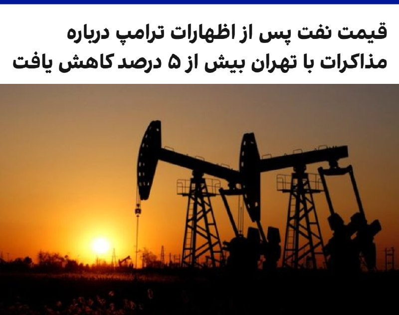

قیمت نفت، چهارشنبه ۳۰ اردیبهشت پس از اظهارات خوش‌بینانه دونالد ترامپ درباره مذاکرات با جمهوری اسلامی بیش از پنج درصد کاهش یافت.

بهای نفت برنت به ۱۰۵ دلار و ۷۰ سنت رسید؛ زیرا معامله‌گران به نشانه‌هایی واکنش نشان دادند که حاکی از نزدیک‌تر شدن واشینگتن و تهران به توافقی است که می‌تواند از دور تازه حملات جلوگیری کند و نگرانی‌ها درباره اختلال طولانی‌مدت عرضه در خاورمیانه را کاهش دهد.

ترامپ گفت مذاکرات با جمهوری اسلامی در «مراحل نهایی» قرار دارد، اما هشدار داد اگر تهران با توافق صلح موافقت نکند، آمریکا ممکن است حملات بیشتری انجام دهد.
@VahidOOnLine

📡 @VahidOnline

## VahidOnline — post 75579

  

فیصل بن فرحان، وزیر خارجه عربستان سعودی، نوشت ریاض از تصمیم رییس‌جمهوری آمریکا برای دادن فرصت دوباره به مذاکرات با جمهوری اسلامی به‌منظور دستیابی به توافقی که به پایان جنگ و بازگشت امنیت و آزادی کشتیرانی در تنگه هرمز به وضعیت پیش از ۹ اسفند ۱۴۰۴ منجر شود، قدردانی می‌کند.

او همچنین از تلاش‌های مستمر پاکستان برای میانجی‌گری در این زمینه تقدیر کرد و در شبکه ایکس نوشت عربستان سعودی امیدوار است جمهوری اسلامی از این فرصت برای جلوگیری از «پیامدهای خطرناک تشدید تنش» استفاده کرده و فورا به تلاش‌ها برای پیشبرد مذاکرات پاسخ دهد.

وزیر خارجه عربستان سعودی افزود هدف از این تلاش‌ها، دستیابی به توافقی جامع است که صلح پایدار در منطقه و جهان را محقق کند.
@VahidOOnLine

📡 @VahidOnline

## VahidOnline — post 75578

  <a href="telegram/content/VahidOnline_75578_1779306010.mp4" target="_blank">🎬 Download video</a>

محمدباقر قالیباف، رئیس مجلس ایران گفت که «تحرکات آشکار و پنهان دشمن نشان می‌دهد که به موازات فشارهای اقتصادی و سیاسی از اهداف نظامی خود دست نکشیده و به دنبال دور جدیدی از جنگ و ماجراجویی جدید است.»

او این اظهارات را در سومین پیام صوتی خود مطرح کرد و با اشاره به گذشت یک ماه از آتش‌بس، فضای سیاسی پیرامون دونالد ترامپ، رئیس‌جمهور ایالات متحده را از عوامل تأثیرگذار بر تصمیم‌گیری‌های او در قبال ایران دانست.

قالیباف در این پیام، با تاکید بر تداوم فشارهای اقتصادی و سیاسی، گفت که هدف این فشارها واداشتن ایران به عقب‌نشینی است، اما به ادعای او ساختار نظامی کشور برای بازسازی توان عملیاتی خود از فرصت این دوره یک‌ماهه آتش‌بس استفاده کرده است.

در بخش دیگری از این پیام صوتی ۱۲ دقیقه‌ای، رئیس مجلس ایران با انتقاد از برخی جریان‌های سیاسی، آنان را به «نادیده گرفتن شرایط امنیتی» و تمرکز بیش از حد بر نقد دولت متهم کرد و گفت که طرح این انتقادات می‌تواند به انسجام ملی آسیب بزند.
@VahidHeadline

📡 @VahidOnline

## VahidOnline — post 75577

  <a href="telegram/content/VahidOnline_75577_1779306011.mp4" target="_blank">🎬 Download video</a>

دونالد ترامپ، رئیس‌جمهوری آمریکا، پیش از ترک واشنگتن به مقصد کانتیکت، در گفتگو با خبرنگاران در فرودگاه به تشریح وضعیت تقابل با ایران و گزینه‌های روی میز پرداخت.

او با اشاره به وضعیت داخلی ایران مدعی شد: «در حال حاضر خشم زیادی در ایران وجود دارد، زیرا مردم در شرایط بسیار بدی زندگی می‌کنند. ناآرامی و تلاطمی در آنجا جریان دارد که قبلا نظیرش را ندیده‌ایم؛ باید دید چه پیش می‌آید.»

ترامپ در پاسخ به سوال خبرنگار درباره احتمال انجام یک «توافق محدود برای تمدید آتش‌بس» گفت: «ما این شانس را امتحان می‌کنیم. من عجله‌ای ندارم؛ هرچند موضوع انتخابات میان‌دوره‌ای مطرح است، اما در حالت ایده‌آل ترجیح می‌دهم به جای افراد زیاد، آدم‌های کمتری کشته شوند.»

رئیس‌جمهوری آمریکا همچنین با ابراز تردید درباره نیت مقامات تهران گفت: «من متعجبم که آیا آن‌ها واقعا خیر و صلاح مردم خود را می‌خواهند یا خیر؛ رفتار آن‌ها نشان می‌دهد که به فکر مردم نیستند، در حالی که باید خیر و صلاح کل منطقه را در نظر بگیرند.»
@VahidOOnLine

📡 @VahidOnline

## VahidOnline — post 75574

  <a href="telegram/content/VahidOnline_75574_1779306011.mp4" target="_blank">🎬 Download video</a>

اسماعیل بقائی، سخنگوی وزارت امور خارجه جمهوری اسلامی، روز چهارشنبه ۳۰ اردیبهشت‌ماه درباره گمانه‌زنی‌ها راجع به سفر عباس عراقچی به نیویورک گفت:  «وزیر خارجه ایران برای شرکت در نشست شورای امنیت سازمان ملل درباره صلح و امنیت بین‌المللی دعوت شده، اما حضور او هنوز قطعی نیست.»

به گفته سخنگوی وزارت امور خارجه جمهوری اسلامی «این نشست به ریاست دوره‌ای چین در شورای امنیت، روز پنجم خرداد برگزار خواهد شد، اما با توجه به برنامه کاری فشرده وزیر امور خارجه»، تصمیم نهایی درباره سفر هنوز گرفته نشده است.»

این اظهارات پس از آن مطرح شد که علی خضریان، عضو کمیسیون امنیت ملی مجلس، در یک برنامه تلویزیونی نسبت به احتمال سفر عراقچی به نیویورک برای مذاکره درباره تنگه هرمز انتقاد کرده بود.
@VahidOOnLine

📡 @VahidOnline

## VahidOnline — post 75572

خبرگزاری قوه‌قضائیه گزارش داد رشید مظاهری، دروازه‌بان پیشین تیم ملی فوتبال و استقلال تهران، «هنگام تلاش برای خروج غیرقانونی از مرزهای غربی ایران بازداشت شده است.»
میزان در این گزارش رشید مظاهری را متهم کرده که «قصد داشته با تغییر چهره و پرداخت رشوه به ماموران مرزبانی از کشور خارج شود.»

قوه قضائیه به زمان بازداشت این بازیکن پیشین تیم ملی فوتبال ایران اشاره نکرده است.

رشید مظاهری پس از کشتار معترضان در ۱۸ و ۱۹ دی، با انتشار ویدیویی در پنجم اسفند، علی خامنه‌ای را مسئول کشته‌شدن معترضان معرفی کرده بود. پس از انتشار آن ویدیو، تا مدت‌ها خبری از وضعیت او منتشر نشده بود.
خبرگزاری میزان گزارش کرده که مظاهری در «بند عمومی زندان» به سر می‌برد و قرار است به اتهام‌های «پرداخت رشوه به مامور دولت»، «فعالیت تبلیغی برخلاف امنیت ملی در شرایط جنگی» و «اقدام به عبور غیرمجاز از مرز» محاکمه شود.
@VahidOOnLine

📡 @VahidOnline

## VahidOnline — post 75571

  

در میانه اختلال در مسیرهای رسمی تجارت و فشار بر زنجیره تأمین صنایع، سازمان توسعه تجارت ایران واردات برخی مواد اولیه پتروشیمی و پلیمری را از طریق رویه‌های کولبری و ملوانی مجاز اعلام کرد.

این تصمیم نشان می‌دهد بحران تأمین مواد اولیه در صنایع پایین‌دستی به مرحله‌ای رسیده که حکومت برای جبران کمبود، به مسیرهای مرزی و غیرمتعارف متوسل شده است.

اما این تصمیم پرسش‌های جدی ایجاد می‌کند. مواد اولیه پلیمری و پتروشیمی کالای مصرفی ساده نیستند؛ واردات آنها نیازمند حجم بالا، کنترل کیفیت، استاندارد، ردیابی منشأ، بیمه، حمل‌ونقل تخصصی و تسویه تجاری منظم است.
@VahidHeadline

📡 @VahidOnline

## VahidOnline — post 75570

  

سپاه پاسداران با انتشار بیانیه‌ای تهدید کرده که در صورت آغاز دوباره جنگ آمریکا و اسرائیل علیه ایران، جنگ «به فراتر از منطقه کشیده خواهد شد.»

در این بیانیه با اشاره به تهدیدهای دونالد ترامپ و مقام‌های اسرائیل برای حمله مجدد به ایران آمده: «اگر تجاوز به ایران تکرار شود جنگ منطقه‌ای که وعده داده شده بود، این بار به فراتر از منطقه کشیده خواهد شد و ضربات کوبنده ما در جاهایی که تصور آن را ندارید شما را به خاک سیاه خواهد نشاند.»

عباس عراقچی، وزیر خارجه ایران هم در واکنش به اظهارات تهدیدآمیز دونالد ترامپ، رئیس‌جمهور آمریکا، درباره احتمال از سرگیری حمله نظامی به ایران، در شبکه ایکس نوشته «با درس‌هایی که آموخته‌ایم و دانشی که به دست آورده‌ایم، مطمئن باشید بازگشت به میدان جنگ با شگفتی‌های بسیار بیشتری همراه خواهد بود.»
@VahidHeadline

📡 @VahidOnline

## VahidOnline — post 75569

  

رسانه‌های ایران روز چهارشنبه ۳۰ اردیبهشت خبر دادند که محسن نقوی، وزیر کشور پاکستان، وارد تهران شده است. او روز ۲۶ اردیبهشت نیز به ایران سفر کرده بود.

خبرگزاری ایسنا اعلام کرده که برنامه و اهداف سفر این مقام ارشد پاکستانی در ایران «مشخص نیست». خبرگزاری تسنیم نیز گزارش داده که آقای نقوی در بدو ورود به تهران با وزیر کشور ایران دیدار کرده است.
@VahidHeadline

📡 @VahidOnline

## VahidOnline — post 75568

  

رسانه‌ها در ایران از اجرای حکم اعدام قاتل الهه حسین‌نژاد، که جسد او اوایل خرداد سال گذشته در بیابان‌های اطراف تهران پیدا شد، خبر می‌دهند.

عصر چهارم خرداد ۱۴۰۴ الهه حسین‌نژاد ۲۴ ساله از سالن زیبایی که در آنجا مشغول به کار بود، بیرون آمد تا به خانه‌اش در اسلامشهر برود، اما ناپدید شد و وقتی خانواده‌اش اعلام شکایت کردند بررسی‌های تیم جنایی نشان می‌داد الهه از میدان آزادی سوار یک خودروی عبوری شده است.

جست و جوها برای یافتن الهه سرانجام پس از ۱۱ روز نتیجه داد و با دستگیری راننده خودرو به نام بهمن ۳۷ ساله و اعتراف به قتل الهه، جسد او در بیابان‌های اطراف تهران پیدا شد. متهم نیز پس از محاکمه به اعدام محکوم شد.

این قتل جنجال زیادی درباره امنیت زنان در ایران به پا کرد و تا مدت‌ها رسانه‌ها درباره آن مطالب مختلفی منتشر می‌کردند.

@VahidHeadline

📡 @VahidOnline

## VahidOnline — post 75567

  

رسانه‌های حقوق بشری گزارش دادند دادگاه کیفری تهران پس از رسیدگی دوباره به پرونده شهرک اکباتان، سه معترض بازداشت‌شده در این پرونده را به دیه و پنج سال حبس محکوم و سه معترض دیگر را از اتهام مشارکت در «قتل عمد» تبرئه کرد. حکم اعدام این شش تن پیش‌تر در دیوان عالی کشور نقض شده بود.

سایت هرانا چهارشنبه ۳۰ اردیبهشت گزارش داد شعبه ۱۳ دادگاه کیفری یک استان تهران، میلاد آرمون، علیرضا کفایی و امیرمحمد خوش‌اقبال را بابت اتهام «مشارکت در قتل عمد» آرمان علی‌وردی، از نیروهای بسیج، محکوم کرد. هر یک از آن‌ها به پرداخت سهم مساوی از دیه کامل یک انسان و پنج سال حبس محکوم شده‌اند.

طبق گزارش هرانا، نوید نجاران، حسین نعمتی و علیرضا برمرزپورناک، سه متهم دیگر این پرونده، به دلیل «فقدان مدارک دال بر وارد کردن ضربه به ناحیه مشخصی از بدن علی‌وردی» از اتهام مشارکت در قتل عمد تبرئه شدند.

این حکم ۱۵ بهمن سال گذشته صادر و سه‌شنبه ۲۹ اردیبهشت به وکلای این افراد ابلاغ شده است.

این شش شهروند معترض در آبان ۱۴۰۳ از سوی همین شعبه به اعدام محکوم شده بودند.
@VahidOOnLine

📡 @VahidOnline

## kianmeli1 — post 87522

  <a href="telegram/content/kianmeli1_87522_1779306013.mp4" target="_blank">🎬 Download video</a>

🔴گزارشگر: آیا شما و نتانیاهو در مورد ایران هم‌نظر هستید؟

🔴ترامپ: بله
https://t.me/kianmeli1

## kianmeli1 — post 87521

  <a href="telegram/content/kianmeli1_87521_1779306014.mp4" target="_blank">🎬 Download video</a>

‏🔴شی جی پینگ پوتین را دوست عزیز خطاب کرد
‏پوتین هم یه ضرب المثل چینی گفت
‏یک روز همدیگر رو ندیدیم ، انگار سه پاییز گذشته
https://t.me/kianmeli1

## kianmeli1 — post 87520

  

🔴لارنس نورمن سردبیر وال استریت ژورنال مدعی شد که اتفاقی در حال رخ دادن است اما نمی تواند به چیز خاصی اشاره کند (یعنی به نظر او توافق در راه است)
https://t.me/kianmeli1

## kianmeli1 — post 87519

  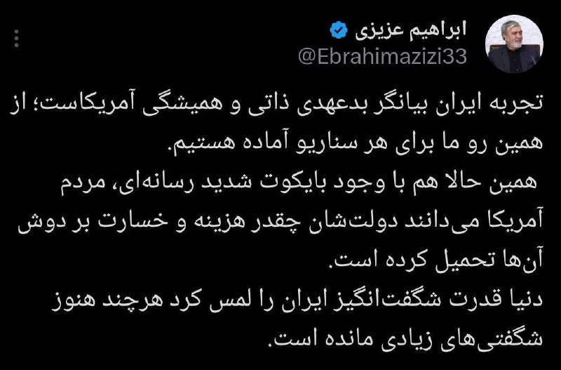

🔴واکنش رئیس کمیسیون امنیت ملی در پاسخ به حرفای به ترامپ:

ایران شگفتی‌ های زیادی برای آمریکا دارد؛ برای هر سناریو آماده هستیم
https://t.me/kianmeli1

## kianmeli1 — post 87518

  <a href="telegram/content/kianmeli1_87518_1779306016.mp4" target="_blank">🎬 Download video</a>

🔴یه مقام ارشد اسرائیلی : اطرافیان ترامپ دارن روش فشار میارن که به توافق برسه

نتانیاهو هم باهاش درباره این موضوع صحبت کرده، و از نظر ترامپ گزینه حمله وجود داره که فقط بحث زمانشه
https://t.me/kianmeli1

## kianmeli1 — post 87517

  

🔴تهدید قطع کابل‌های فیبر نوری از سوی نماینده مجلس/ بایدتیم مذاکره‌کننده آن راروی میزبگذارد!!!

مجتبی یوسفی، عضو هیات رئیسه مجلس: اگر کابل‌های اینترنتی تنگه هرمز آسیب ببیند، تعمیرشان ممکن است ۷ تا ۴۵ روز طول بکشد، یعنی اختلال درچندرشته کابل کف دریا،می‌توانداینترنت،بانکداری، بورس واقتصاد دیجیتال منطقه رابهم بریزد

این مولفه ژئوپلیتیکی دست برتر میدانی ماست که بایدتیم مذاکره‌کننده آن راروی میزبگذارد!
https://t.me/kianmeli1

## kianmeli1 — post 87516

  

🔴حکم اعدام زندانی سیاسی منوچهر فلاح که در زندان لاکان رشت محبوس است، دوباره تأیید شد!
صدایش باشیم
منوچهر پدر یک دختر خردسال است
https://t.me/kianmeli1

## kianmeli1 — post 87515

🔴محمدباقر قالیباف، رئیس مجلس ایران گفت که «تحرکات آشکار و پنهان دشمن نشان می‌دهد که به موازات فشارهای اقتصادی و سیاسی از اهداف نظامی خود دست نکشیده و به دنبال دور جدیدی از جنگ و ماجراجویی جدید است.»

او این اظهارات را در سومین پیام صوتی خود مطرح کرد و با اشاره به گذشت یک ماه از آتش‌بس، فضای سیاسی پیرامون دونالد ترامپ، رئیس‌جمهور ایالات متحده را از عوامل تأثیرگذار بر تصمیم‌گیری‌های او در قبال ایران دانست.

قالیباف در این پیام، با تاکید بر تداوم فشارهای اقتصادی و سیاسی، گفت که هدف این فشارها واداشتن ایران به عقب‌نشینی است، اما به ادعای او ساختار نظامی کشور برای بازسازی توان عملیاتی خود از فرصت این دوره یک‌ماهه آتش‌بس استفاده کرده است.

در بخش دیگری از این پیام صوتی ۱۲ دقیقه‌ای، رئیس مجلس ایران با انتقاد از برخی جریان‌های سیاسی، آنان را به «نادیده گرفتن شرایط امنیتی» و تمرکز بیش از حد بر نقد دولت متهم کرد و گفت که طرح این انتقادات می‌تواند به انسجام ملی آسیب بزند.
https://t.me/kianmeli1

## IranIntlTV — post 338142

  <a href="https://t.me/IranintlTV/338142" target="_blank">📎 Download file</a>

🎧نسخه صوتی چشم‌انداز: حقیقت یا دروغ؟ طرح آمریکا برای حکومت احمدی‌نژاد بر ایران؟!
@iranintlTV

## IranIntlTV — post 338141

  <a href="telegram/content/IranIntlTV_338141_1779306019.mp4" target="_blank">🎬 Download video</a>

پس از آنکه دونالد ترامپ گفت به درخواست کشورهای منطقه حمله به ایران را به تاخیر انداخته، برخی منابع منطقه‌ای به اورشلیم‌پست گفتند دلیل این درخواست، هراس از انتقام‌گیری جمهوری اسلامی بوده است.

گفت‌وگو با عطا محامد، کارشناس روابط بین‌الملل
@iranintltv

## IranIntlTV — post 338140

🗣روایت شما از زندگی در آتش‌بس- چهارشنبه ۳۰ اردیبهشت ۱۴۰۵

🔹چند روز پیش پیامکی برای من ارسال شد مبنی بر اینکه ثبت‌نام شما در جانفدا با موفقیت انجام شد و برای تکمیل مشخصات به لینک ارسال‌شده مراجعه کنید. به شرافتم قسم من اصلاً ثبت‌نام نکرده بودم.

🔹اوضاع طوریه که تورم تو ریزجزئیات زندگی هم تأثیر می‌ذاره. دیروز (۲۰ اردیبهشت) با پدر و مادرم رفتیم خرید و قیمت یه دونه نمک‌پاش ۱۱۰ هزار تومن بود.

🔹من آلمان زندگی می‌کنم. امروز (۳۰ اردیبهشت) برای خط ایرانم پیام اومد که با درخواست من برای اینترنت پرو موافقت شده، در حالی که من اصلاً همچین درخواستی ندادم. این‌ها خودشون اینترنت رو روی مردم بستن، حالا هم دارن با همین کاسبی می‌کنن و جیب خالی مردم رو خالی‌تر می‌کنن.

🔹از رشت، دیدن اینکه صادراتی‌های مزدور این حکومت جانی تو شبکه‌های خارجی فعال شدن و حرف مردم ایران رو تحریف می‌کنن، در حالی که ما یک گیگ اینترنت می‌خریم تا صدامون برسه که داریم روزبه‌روز فقیر و مفلوک‌تر می‌شیم و چاره‌ای جز تموم کردن این نفرین ۴۸ ساله نداریم.

🔹توی استان ایست بازرسی می‌ذارن، همه با تفنگ و ماسک، فقط چشم‌هاشون معلومه. به همه گیر می‌دن، پلاک همه رو می‌نویسن. شرایط واقعاً سخته، مرغ شده کیلویی ۴۰۰ خورده‌ای.

🔹از تهران، این‌قدر گرانی زیاد شده، هر روز شیر گرون می‌شه. با کالابرگ فقط تونستم یک کیلو گوشت چرخ‌کرده بخرم با یه بسته مرغ.

🔹دلیل اینکه این حکومت نمی‌ره اینه که ملت هم‌دست نیست، هم‌دم نیست. وقتی نت ملی هست، هر گیگ رو ۲۵۰ تا ۴۰۰ می‌فروشن، در حالی که قیمت یک گیگ ۵۰ هست یا رایگانه. چرا این‌طور می‌کنین؟

🔹از مشهد پیام می‌دم، پمپ‌بنزین‌ها خیلی شلوغه، به موتوری‌ها کارت آزاد نمی‌دن. اگه بخوای بیشتر از دوبار از کارت سوخت استفاده کنی باید ۱۰۰ تومن بیشتر بدی.

🔹از رشت بعد از ۸۲ روز وصل شدم. یه کنکوری‌ام که همه‌چیزش رو هواست. امتحانات خرداد حضوری شده. وضعیت اقتصادی کل مردم هم واقعاً داغونه، جوری که قیمت‌ها روزانه بالا می‌ره. جاویدشاه.

🔹از یه شهرستان کوچک پیام می‌دم، پمپ‌بنزین‌ها شلوغن، همه‌چی گرونه، زندگیمون سخت شده، تروخدا به دادمون برسید. جاویدشاه پاینده ایران.

## IranIntlTV — post 338139

  <a href="telegram/content/IranIntlTV_338139_1779306021.mp4" target="_blank">🎬 Download video</a>

حقیقت یا دروغ؟ طرح آمریکا برای حکومت احمدی‌نژاد بر ایران؟!

چشم‌انداز با مهدی مهدوی‌آزاد

نسخه کامل این برنامه در یوتیوب:
https://youtu.be/cfVdKzc7RL8
@iranintltv

## IranIntlTV — post 338138

  <a href="https://t.me/IranintlTV/338138" target="_blank">📎 Download file</a>

🎧نسخه صوتی تیتراول با نیوشا صارمی: ترامپ: یا امضا می‌کنید یا ما کار را تمام می‌کنیم؛ قالیباف هشدار جنگ داد
@iranintlTV

## IranIntlTV — post 338137

  

دونالد ترامپ درباره ایران گفت: «ما باید پاسخ درست را دریافت کنیم.»

او افزود آمریکا در حال مذاکره با «افراد منطقی» در ایران است و چند روز در انتظار پاسخ آن‌ها خواهد ماند.

ترامپ همچنین تاکید کرد تا زمانی که توافق حاصل نشود، هیچ‌گونه معافیتی اعمال نخواهد شد.
https://iranintl.com/202605204860

## IranIntlTV — post 338136

  

مسعود پزشکیان در شبکه ایکس نوشت: «ایران همواره به تعهدات خود پایبند بوده و همه راه‌ها را برای جلوگیری از جنگ آزموده است؛ از سوی ما همه مسیرها همچنان باز است. وادار کردن ایران به تسلیم از طریق اجبار چیزی جز یک توهم نیست. احترام متقابل در دیپلماسی بسیار عاقلانه‌تر، امن‌تر و پایدارتر از جنگ است.»
https://iranintl.com/202605200670

## IranIntlTV — post 338135

  <a href="telegram/content/IranIntlTV_338135_1779306023.mp4" target="_blank">🎬 Download video</a>

مهدی مهدوی‌آزاد در برنامه «چشم‌انداز» گفت: «یکی از نزدیکان سابق محمود احمدی‌نژاد در واکنش به گزارش نیویورک‌تایمز گفته او نه مخفی شده و نه تحت فشار است و گزارش‌هایی را که می‌گویند احمدی‌نژاد در حصر خانگی یا بازداشت است، رد کرده است.»

او افزود: «بخش مهم‌تر این اظهارات آن بود که این گزارش‌ها تلاشی از سوی حسن روحانی، محمدجواد ظریف و دموکرات‌های آمریکا برای انتقام گرفتن از دونالد ترامپ توصیف شد.»
@iranintltv

## IranIntlTV — post 338133

  <a href="telegram/content/IranIntlTV_338133_1779306026.mp4" target="_blank">🎬 Download video</a>

۲۴ با فرداد فرحزاد
@iranintltv

## IranIntlTV — post 338132

یک شهروند در پیامی به ایران اینترنشنال از افزایش کالاهای خوراکی روایت کرده و می‌گوید قیمت یک پفک به ۱۸۰ هزار تومان رسیده است. پیام او با هوش مصنوعی خوانده شده است.

Pofak-V.mp4

## IranIntlTV — post 338131

  

اسماعیل بقایی، سخنگوی وزارت خارجه جمهوری اسلامی، در واکنش به سخنان دونالد ترامپ گفت اولتیماتوم‌ دادن به جمهوری اسلامی «مضحک» است و لفاظی‌ها و تهدیدهای خارجی تاثیری نخواهد داشت. او تاکید کرد جمهوری اسلامی بدون توجه به این اظهارات، منافع خود را دنبال می‌کند.

بقایی آزادسازی اموال بلوکه‌شده را یکی از مطالبات مشخص تهران دانست و افزود در این مرحله تمرکز بر خاتمه جنگ در همه جبهه‌ها، از جمله لبنان است. او هشدار داد در صورت ادامه «زیاده‌خواهی» طرف مقابل، توافقی حاصل نخواهد شد.

سخنگوی وزارت خارجه همچنین گفت تبادل پیام‌ها از طریق وابسته پاکستانی در جریان است و دیدگاه‌های آمریکا دریافت و در حال بررسی است؛ حضور وزیر کشور پاکستان نیز برای تسهیل این روند انجام شده است.
https://iranintl.com/202605204064

## IranIntlTV — post 338130

  <a href="telegram/content/IranIntlTV_338130_1779306027.mp4" target="_blank">🎬 Download video</a>

جاویدنام عارف جعفرزاده در جشن قهرمانی آرسنال در کنار تیم محبوبش بود.
جاویدنام عارف جعفرزاده، ۳۴ ساله و اهل رشت، شامگاه ۱۸ دی ۱۴۰۴ در جریان اعتراضات مردمی هدف شلیک مستقیم نیروهای جمهوری اسلامی قرار گرفت و جان باخت. او پس از فراخوان شاهزاده رضا پهلوی، در حالی که لباس تیم آرسنال را بر تن داشت به خیابان رفت. کشته شدن این هوادار آرسنال در فضای هواداری این باشگاه در انگلستان بازتاب گسترده‌ای داشت.

آیدین مقیمی گزارش می‌دهد.
@iranintltv

## IranIntlTV — post 338129

  

اکسیوس گزارش داد ترامپ و نتانیاهو سه‌شنبه درباره تلاش تازه برای دستیابی به توافق با ایران گفت‌وگو کردند. به گفته یک منبع آمریکایی، ترامپ به نتانیاهو اطلاع داده میانجی‌ها در حال تدوین «تفاهم اولیه» برای پایان رسمی جنگ و آغاز دوره‌ای ۳۰ روزه مذاکرات درباره موضوعاتی از جمله برنامه هسته‌ای ایران و بازگشایی تنگه هرمز هستند.
به نوشته اکسیوس، دو منبع اسرائیلی از اختلاف نظر دو رهبر درباره مسیر پیش رو خبر دادند و یک منبع آمریکایی گفت پس از تماس، «موهای بی‌بی آتش گرفته بود».
این گزارش می‌افزاید پیش‌نویس جداگانه‌ای از سوی قطر وجود ندارد و دو مقام عرب و یک منبع اسرائیلی گفته‌اند قطر پیش‌نویس جدیدی را به تهران و واشینگتن ارائه کرده، اما هنوز مشخص نیست ایران با آن موافقت کند. همچنین به گفته یک مقام عرب، هیأتی قطری برای گفت‌وگو درباره نسخه جدید به تهران سفر کرده است.

https://iranintl.com/202605208847

## IranIntlTV — post 338128

  <a href="telegram/content/IranIntlTV_338128_1779306029.mp4" target="_blank">🎬 Download video</a>

ویدیوی رسیده به ایران اینترنشنال نشان می‌دهد شهروندان پوستری را در کرج روی دیوار نصب کرده‌اند که با اعتراض به سیاست جنگ‌طلبانه جمهوری اسلامی افزوده تنها جنگ مردم، جنگ برای براندازی رژیم است.

## IranIntlTV — post 338127

  <a href="telegram/content/IranIntlTV_338127_1779306030.mp4" target="_blank">🎬 Download video</a>

انستیتو پاستور، نهادی که یک قرن پیش برای نجات جان ایرانیان از چنگال بیماری و قحطی متولد شد، چطور تبدیل به یکی از اهداف آمریکا و اسرائیل در جنگ اخیر شد؟ از تحقیقات پیشرفته روی باکتری سیاه‌زخم تا تلاش‌های مخفیانه برای خرید تجهیزات دوگانه در اروپا؛ جمهوری اسلامی چطور یک مرکز پزشکی را به منطقه خاکستری و امنیتی تبدیل کرد؟
انستیتو پاستور زیر ذره‌بین تیتراول
@iranintltv

## IranIntlTV — post 338126

  <a href="telegram/content/IranIntlTV_338126_1779306032.mp4" target="_blank">🎬 Download video</a>

محمدباقر قالیباف، رییس هیات مذاکره‌‌کننده جمهوری اسلامی گفت فعالیت‌های آمریکا و اسرائیل نشان می‌دهد این دو کشور قصد دارند دور جدیدی از جنگ را شروع کنند. سپاه پاسداران نیز تهدید کرد در صورت حمله به ایران، جنگ محدود به منطقه نمی‌ماند.

گفت‌وگو با مصطفی دانشگر, تحلیل‌گر سیاسی
@iranintltv

## IranIntlTV — post 338124

  

فرماندهی مرکزی آمریکا، سنتکام، اعلام کرد نیروهای تفنگدار دریایی آمریکا از یگان اعزامی ۳۱، چهارشنبه ۳۰ اردیبهشت در دریای عمان سوار نفتکش تجاری «سلستیال سی» با پرچم جمهوری اسلامی شدند.

به نوشته سنتکام، این نفتکش مظنون بود که با حرکت به سوی یکی از بنادر ایران، محاصره دریایی آمریکا را نقض کند. نیروهای آمریکایی پس از بازرسی و دستور به خدمه برای تغییر مسیر، کشتی را آزاد کردند.

سنتکام افزود نیروهای آمریکا به اجرای کامل این محاصره ادامه می‌دهند و تاکنون ۹۱ کشتی تجاری را برای اطمینان از رعایت آن، تغییر مسیر داده‌اند.
https://iranintl.com/202605202458

## IranIntlTV — post 338123

🔻ترامپ: مذاکرات با تهران در مراحل نهایی است، توافق نکنند حمله می‌کنیم

دونالد ترامپ، رییس‌جمهوری آمریکا، چهارشنبه ۳۰ اردیبهشت گفت مذاکرات با جمهوری اسلامی در مراحل نهایی قرار دارد اما هم‌زمان هشدار داد که در صورت شکست مذاکرات، حملات بیشتری علیه جمهوری اسلامی انجام خواهد شد. این اظهارات هم‌زمان با سفر وزیر کشور پاکستان به تهران مطرح شد.

شش هفته پس از آنکه ترامپ عملیات «خشم حماسی» را برای برقراری آتش‌بس متوقف کرد، تاکنون پیشرفت چندانی در مذاکرات برای پایان دادن به جنگ دیده نشده است.

ترامپ دوشنبه گفت که تا آستانه صدور دستور حملات بیشتر پیش رفته، اما به درخواست رهبران عربستان سعودی، قطر و امارات متحده عربی برای دادن زمان بیشتر به مذاکرات، از آن خودداری کرده است.

فیصل بن فرحان، وزیر امور خارجه عربستان سعودی، چهارشنبه در پستی در شبکه اجتماعی ایکس نوشت ریاض از تصمیم رییس‌جمهوری آمریکا برای دادن فرصت دوباره به مذاکرات با جمهوری اسلامی به‌منظور دستیابی به توافقی که به پایان جنگ و بازگشت امنیت و آزادی کشتیرانی در تنگه هرمز به وضعیت پیش از ۹ اسفند ۱۴۰۴ منجر شود، قدردانی می‌کند.

او همچنین از تلاش‌های مستمر پاکستان برای میانجی‌گری در این زمینه تقدیر کرد و در شبکه ایکس نوشت عربستان سعودی امیدوار است جمهوری اسلامی از این فرصت برای جلوگیری از «پیامدهای خطرناک تشدید تنش» استفاده کرده و فورا به تلاش‌ها برای پیشبرد مذاکرات پاسخ دهد.

وزیر امور خارجه عربستان سعودی افزود هدف از این تلاش‌ها، دستیابی به توافقی جامع است که صلح پایدار در منطقه و جهان را محقق کند.

تشدید فعالیت‌های میانجیگرانه پاکستان

این اظهارات هم‌زمان با سفر محسن نقوی، وزیر کشور پاکستان به تهران صورت گرفته است. او در جریان این سفر چهارشنبه با محمدباقر قالیباف، رییس مجلس شورای اسلامی و رییس هیات مذاکره‌کننده جمهوری اسلامی با آمریکا و نیز احمد وحیدی، فرمانده کل سپاه پاسداران، دیدار و گفت‌وگو کرد.

در پی این سفر، برخی از رسانه‌های منطقه گزارش دادند که کار بر روی نهایی‌سازی متن توافق میان واشینگتن و تهران با جدیت در حال انجام است.

الحدث به‌نقل از منابع آگاه که نام آنها را اعلام نکرد، گزارش داد که دور بعدی مذاکرات پس از مراسم حج در اسلام‌آباد برگزار خواهد شد.

الحدث همچنین افزود ممکن است فرمانده کل ارتش پاکستان پنج‌شنبه ۳۱ اردیبهشت برای اعلام نهایی شدن متن توافق به ایران سفر کند.

شبکه العربیه نیز گزارش داد که ایالات متحده خواسته‌های خود در خصوص مساله هسته‌ای و امنیت ناوبری در تنگه هرمز را سختگیرانه‌تر کرده اما در عین حال بر سر چند موضوع اقتصادی و کاهش تحریم‌های اعمال‌شده علیه جمهوری اسلامی انعطاف‌هایی محدود از خود نشان داده است.

به‌گزارش العربیه ایالات متحده به پاکستان اطلاع داده است که در زمینه برنامه هسته‌ای و تنگه هرمز هیچ امتیازی نخواهد داد.

در مقابل جمهوری اسلامی نیز همچنان تضمین‌های آمریکا درباره هرگونه حمله احتمالی در آینده را ناکافی می‌داند.

🔗جزییات بیشتر را اینجا بخوانید

@iranintltv

## IranIntlTV — post 338122

یک شهروند در پیامی به ایران اینترنشنال از افزایش قیمت شدید داروهای مربوط به اختلالات روحی و روانی می‌گوید. پیام او و تصویر این ویدیو با هوش مصنوعی خوانده شده است.

## IranIntlTV — post 338121

  

🔻ایران اینترنشنال دریافته است که علیرضا نجاتی، قهرمان پیشین کشتی، پس از ۱۳۰ روز بازداشت با قید وثیقه آزاد شده است. او در روز ۱۹ دی ۱۴۰۴ و در پی حمایت از انقلاب ملی ایرانیان بازداشت شد.

🔹نجاتی ۵۰ روز از دوران بازداشت خود را در سلول انفرادی بوده و در این مدت تحت شکنجه و ضرب‌وشتم قرار گرفته است.

🔹قاضی انصاری که یکی از دو حکم اعدام صالح محمدی را صادر کرده بود، مسئول رسیدگی به پرونده علیرضا نجاتی است.

🔹پیش‌تر جهان‌پهلوان رسول خادم، قهرمان پیشین کشتی المپیک، با انتشار یک استوری در اینستاگرام خواهان آزادی علیرضا نجاتی شده بود.

@iranintltvsport

## Shin_Persian — post 6117

  

نسخه جدید SNI Spoofing (زبان rust) به همراه رابط گرافیکی منتشر شد.
MacOS / Linux / Windows

دریافت:
GitHub
(آموزش فارسی هم هست)

[خیر، امکان انتشار نسخه اندروید با توجه به اینکه اغلب کاربران روت نیستن تقریبا ممکن نیست، می تونید روی کامپیوتر اجرا کنید و روی شبکه محلیتون به اشتراک بذارید]

## Shin_Persian — post 6116

  <a href="telegram/content/Shin_Persian_6116_1779306035.mp4" target="_blank">🎬 Download video</a>

U.S. Central Command ✓ @CENTCOM Wed, 20 May 2026 16:59:47 UTC Earlier today in the Gulf of Oman, U.S. Marines from the 31st Marine Expeditionary Unit boarded M/T Celestial Sea, an Iranian-flagged commercial oil tanker suspected of attempting to violate the…

## Shin_Persian — post 6115

U.S. Central Command ✓ @CENTCOM
Wed, 20 May 2026 16:59:47 UTC

Earlier today in the Gulf of Oman, U.S. Marines from the 31st Marine Expeditionary Unit boarded M/T Celestial Sea, an Iranian-flagged commercial oil tanker suspected of attempting to violate the U.S. blockade by transiting toward an Iranian port. American forces released the vessel after searching and directing the ship’s crew to alter course.

U.S. forces continue to fully enforce the blockade and have now redirected 91 commercial ships to ensure compliance.

فارسی

امروز در اوایل وقت در دریای عمان، تفنگداران دریایی ایالات متحده از واحد ۳۱ اعزامی تفنگداران دریایی، وارد نفت‌کش تجاری M/T Celestial Sea شدند؛ این کشتی با پرچم ایران مظنون به تلاش برای نقض محاصره ایالات متحده از طریق عبور به سمت یک بندر ایرانی بود. نیروهای آمریکایی پس از بازرسی و هدایت خدمه کشتی برای تغییر مسیر، شناور را آزاد کردند.

نیروهای ایالات متحده به اجرای کامل محاصره ادامه می‌دهند و تاکنون ۹۱ کشتی تجاری را برای اطمینان از انطباق با قوانین تغییر مسیر داده‌اند.

𝕏 · @shin_persian

## Shin_Persian — post 6114

  

سردار مادرجنده بی جنبه :( بلاک کرد

## Shin_Persian — post 6113

📦 mhrv-rs v1.9.33 released

• In Full Tunnel mode, fully idle sessions now use a stronger empty-keepalive backoff, and when every deployment is detected as legacy they stop sending repeated empty polls after going idle
• For mixed fleets where at least one deployment still has healthy long-poll support, the client keeps emitting empty polls so round-robin can still reach that healthy peer and remote→client data doe…

Files (Android APKs, Windows, macOS, Linux, OpenWRT) on the files channel:

👉 v1.9.33 — all files with SHA-256

Channel:
https://t.me/mhrv_rs
or: https://t.me/+R1OyoHX2boA1ZDgx

#v1933

## Shin_Persian — post 6112

↩️ Quoted tweet: العربية عاجل ✓ @AlArabiya_Brk Wed, 20 May 2026 11:53:13 UTC مصادر العربية: أميركا أبلغت باكستان بأنها لن تقدم تنازلات في المطالب النووية ومضيق هرمز #العربية_عاجل ↩️ Quoted tweet — see the post below for the reply. English Al Arabiya sources:…

## Shin_Persian — post 6111

↩️ Quoted tweet:
العربية عاجل ✓ @AlArabiya_Brk
Wed, 20 May 2026 11:53:13 UTC

مصادر العربية: أميركا أبلغت باكستان بأنها لن تقدم تنازلات في المطالب النووية ومضيق هرمز #العربية_عاجل

↩️ Quoted tweet — see the post below for the reply.

English

Al Arabiya sources: The United States has informed Pakistan that it will not make concessions regarding nuclear demands and the Strait of Hormuz. #AlArabiya_Breaking

𝕏 · @shin_persian

## Shin_Persian — post 6109

  <a href="telegram/content/Shin_Persian_6109_1779306037.mp4" target="_blank">🎬 Download video</a>

ارتش دفاعی اسرائیل | IDF Farsi ✓ @IDFFarsi Wed, 20 May 2026 12:09:36 UTC سخنگوی ارتش اسرائیل: در فاصله چند متری از یک مسجد: ارتش اسرائیل یک سایت تولید تسلیحات متعلق به سازمان تروریستی حزب‌الله را که در ساختمانی با کاربری درمانگاه احداث شده بود، هدف قرار…

## Shin_Persian — post 6108

ارتش دفاعی اسرائیل | IDF Farsi ✓ @IDFFarsi
Wed, 20 May 2026 12:09:36 UTC

سخنگوی ارتش اسرائیل:

در فاصله چند متری از یک مسجد: ارتش اسرائیل یک سایت تولید تسلیحات متعلق به سازمان تروریستی حزب‌الله را که در ساختمانی با کاربری درمانگاه احداث شده بود، هدف قرار داد

نیروهای ارتش اسرائیل پریروز (دوشنبه)، یک سایت تولید تسلیحات متعلق به سازمان تروریستی حزب‌الله را در منطقه صور در جنوب لبنان هدف قرار دادند.

این سایت در ساختمانی که به‌عنوان یک درمانگاه غیرنظامی مورد استفاده قرار می‌گرفت و در فاصله‌ای بسیار نزدیک از یک مسجد قرار داشت، احداث شده بود. پس از حمله، انفجارهای ثانویه در این محل شناسایی شد که نشان‌دهنده وجود تسلیحات در داخل ساختمان است.

سازمان تروریستی حزب‌الله همچنان به فعالیت در مجاورت و از درون زیرساخت‌های غیرنظامی، از جمله اماکن مذهبی و مراکز درمانی ادامه می‌دهد و از آن‌ها به‌صورت سوءاستفاده‌آمیز برای پیشبرد طرح‌های تروریستی علیه شهروندان کشور اسرائیل و نیروهای ارتش اسرائیل بهره می‌برد.

English

IDF (Israel Defense Forces) Spokesperson:

A few meters from a mosque: The IDF targeted a weapons production site belonging to the Hezbollah terrorist organization, which was established in a building used as a clinic.

The day before yesterday (Monday), IDF forces targeted a weapons production site belonging to the Hezbollah terrorist organization in the Tyre region of southern Lebanon.

This site was established in a building used as a civilian clinic, located in very close proximity to a mosque. Following the strike, secondary explosions were identified at the scene, indicating the presence of weapons inside the building.

The Hezbollah terrorist organization continues to operate adjacent to and from within civilian infrastructure, including religious sites and medical centers, exploitatively utilizing them to advance terrorist plots against citizens of the State of Israel and IDF forces.

𝕏 · @shin_persian

## Shin_Persian — post 6107

  

U.S. Central Command ✓ @CENTCOM Wed, 20 May 2026 11:52:29 UTC A U.S. Marine Corps AH-1Z Viper attack helicopter patrols near a commercial vessel transiting regional waters as American forces enforce the maritime blockade against Iran. As of May 20, U.S.…

## Shin_Persian — post 6106

U.S. Central Command ✓ @CENTCOM
Wed, 20 May 2026 11:52:29 UTC

A U.S. Marine Corps AH-1Z Viper attack helicopter patrols near a commercial vessel transiting regional waters as American forces enforce the maritime blockade against Iran. As of May 20, U.S. forces have redirected 90 ships and disabled 4 to ensure compliance.

فارسی

یک بالگرد تهاجمی AH-1Z وایپر متعلق به سپاه تفنگداران دریایی ایالات متحده (U.S. Marine Corps) در حال گشت‌زنی در نزدیکی یک کشتی تجاری است که از آب‌های منطقه عبور می‌کند، این در حالی است که نیروهای آمریکایی محاصره دریایی علیه ایران را اجرا می‌کنند. تا تاریخ ۲۰ مه، نیروهای آمریکایی برای اطمینان از رعایت قوانین، ۹۰ کشتی را تغییر مسیر داده و ۴ کشتی را از کار انداخته‌اند.

𝕏 · @shin_persian

## Shin_Persian — post 6105

📦 mhrv-rs v1.9.32 released

• Full Tunnel batch protocol now supports zstd compression
• Compression negotiation is backward compatible
• To use this in Full mode, update the app, redeploy CodeFull.gs as a new Apps Script version, and redeploy tunnel-node / the Docker image on your VPS or Cloud Run.
• Compressed batch logging is kept safer
• Thanks to @yyoyoian-pixel for the implementation and empirical testing in PR #1314.

Files (Android APKs, Windows, macOS, Linux, OpenWRT) on the files channel:

👉 v1.9.32 — all files with SHA-256

Channel:
https://t.me/mhrv_rs
or: https://t.me/+R1OyoHX2boA1ZDgx

#v1932

## ManotoTV — post 105703

  <a href="telegram/content/ManotoTV_105703_1779306039.mp4" target="_blank">🎬 Download video</a>

‌
دونالد ترامپ گفت آمریکا در آستانه تصمیم‌گیری درباره ایران قرار دارد و اگر پاسخ‌های مورد نظر واشینگتن دریافت نشود، تحولات می‌تواند «خیلی سریع» رخ دهد.

ترامپ گفت: «اگر پاسخ‌های درست را نگیریم، همه‌چیز خیلی سریع پیش خواهد رفت. ما کاملاً آماده‌ایم.»

او تأکید کرد هرگونه پاسخ از سوی جمهوری اسلامی باید «کامل و صددرصد قابل قبول» باشد و افزود در صورت دستیابی به توافق، «زمان، انرژی و جان انسان‌های زیادی» حفظ خواهد شد.

رئیس‌جمهوری آمریکا همچنین گفت ممکن است تصمیم‌گیری ظرف چند روز انجام شود، اما تأکید کرد روند تحولات می‌تواند «بسیار سریع» باشد.

ترامپ در ادامه ایران را «کشوری شکست‌خورده» توصیف کرد و گفت آمریکا اکنون با افرادی مذاکره می‌کند که به گفته او «بسیار منطقی‌تر» از مقام‌های پیشین جمهوری اسلامی هستند.

او افزود: «ما با افرادی بااستعداد و باهوش طرف هستیم و از این موضوع تحت تأثیر قرار گرفته‌ایم.»

ترامپ همچنین گفت اگر با چند روز صبر کردن بتوان از جنگ یا کشته شدن انسان‌ها جلوگیری کرد، «این کار ارزش انجام دادن دارد.»

## ManotoTV — post 105702

  <a href="telegram/content/ManotoTV_105702_1779306040.mp4" target="_blank">🎬 Download video</a>

تماسی از ایران:
«می‌گفت دیکتاتوری با بازتولید ظلم ادامه پیدا می‌کنه…
می‌گفت باید این چرخه رو شکست؛
با اعتصاب و نایستادن پای این شرایط.»

## ManotoTV — post 105701

  <a href="telegram/content/ManotoTV_105701_1779306042.mp4" target="_blank">🎬 Download video</a>

‌
دونالد ترامپ درباره مذاکرات با جمهوری اسلامی گفت آمریکا تا زمان دستیابی به توافق، هیچ‌گونه تخفیف یا امتیازی ارائه نخواهد کرد.

ترامپ همچنین گفت واشینگتن «چند روز» منتظر پاسخ تهران خواهد ماند.

رئیس جمهور آمریکا در ادامه تاکید کرد: «این موضوع به‌زودی، به هر شکلی که باشد، پایان خواهد یافت.»

او با اشاره به روند مذاکرات افزود: «ما با افراد منطقی طرف هستیم» و تأکید کرد: «باید به پاسخ درست برسیم.»

## ManotoTV — post 105700

  <a href="telegram/content/ManotoTV_105700_1779306042.mp4" target="_blank">🎬 Download video</a>

وزارت دادگستری آمریکا علیه رائول کاسترو، رئیس‌جمهوری پیشین کوبا و برادر فیدل کاسترو، اعلام جرم کرد.

بر اساس کیفرخواستی که در دادگاه فدرال میامی منتشر شده، رائول کاسترو ۹۴ ساله به همراه پنج نفر دیگر به اتهام قتل، توطئه برای کشتن شهروندان آمریکایی و انهدام هواپیما متهم شده‌اند.

این پرونده به سرنگونی دو هواپیمای متعلق به گروه «برادران نجات» در سال ۱۹۹۶ مربوط می‌شود؛ گروهی از تبعیدیان کوبایی که برای کمک به پناهجویان کوبایی فعالیت می‌کردند. در آن حادثه، چهار نفر کشته شدند.

آمریکا می‌گوید جنگنده‌های کوبایی این هواپیماها را بر فراز آب‌های بین‌المللی هدف قرار داده‌اند، اما دولت کوبا همواره مدعی بوده این هواپیماها وارد حریم هوایی این کشور شده بودند.

این اقدام که بخشی از کارزار فشار دولت ترامپ علیه حکومت کمونیستی کوباست، تنش‌ها میان واشینگتن و هاوانا را به سطح تازه‌ای رسانده است

## ManotoTV — post 105699

  <a href="telegram/content/ManotoTV_105699_1779306042.mp4" target="_blank">🎬 Download video</a>

‌
سنتکام، ستاد فرماندهی مرکزی آمریکا، با انتشار ویدیویی اعلام کرد تفنگداران دریایی آمریکا در خلیج عمان یک نفتکش تجاری با پرچم ایران را متوقف و بازرسی کرده‌اند.

به گفته سنتکام، نیروهای «واحد اعزامی سی‌ویک تفنگداران دریایی آمریکا» ساعاتی پیش سوار نفتکش «سلستیال سی» شدند؛ کشتی‌ای که به تلاش برای نقض محاصره دریایی آمریکا و حرکت به‌سوی یکی از بنادر ایران مظنون بوده است.

سنتکام اعلام کرد نیروهای آمریکایی پس از بازرسی کامل نفتکش، به خدمه دستور تغییر مسیر دادند و سپس کشتی را آزاد کردند.

در بیانیه سنتکام آمده است نیروهای آمریکا همچنان «به‌طور کامل» محاصره دریایی را اجرا می‌کنند و تاکنون مسیر ۹۱ کشتی تجاری را برای اطمینان از رعایت این محدودیت‌ها تغییر داده‌اند.

## ManotoTV — post 105698

این خالکوبی فقط یک نقش روی صورتش نیست…
زخمِ نسلی‌ست که سال‌ها درد را نفس کشید، فریاد زد، سکوت کرد، گریه کرد، شکست، ایستاد، اما فراموش نکرد.

یادِ کودکانی‌ست که جنگ و ترس را زودتر از زندگی شناختند.

او می‌خواهد مردم هر بار که به این طرح روی صورتش نگاه می‌کنند، قصه‌ی روزهایی را به یاد بیاورند که از میان آتش، ترس، درد، ناامیدی و امید عبور کردند.

اما این فقط درد نیست…
این تتو، یادآور امید و زندگی هم هست.
یادآور روزهایی که هنوز برای ساختنشان زنده‌اند.

درست است که این تتو، طرحی از «God of War» است…
اما آن را به رنگ سبز انتخاب کرده‌اند؛ به نشانه عشق، صلح، امید و زندگی.

برای اینکه حقیقت فراموش نشود،
برای اینکه نسل بعد بداند مردم از چه روزهایی عبور کردند…
و چگونه با تمام زخم‌هایشان، هنوز عاشق ایران و ایرانی ماندند.

فراموش نکنید…
وقتی انسان‌ها برای شرافت، معرفت، عشق و گذشت ارزش قائل نشوند، ارزش‌ها کم‌کم معنای خودشان را از دست می‌دهند.

اول به انسان‌ها، بعد به حیوانات و در نهایت به طبیعت و گیاهان رحم کنیم و عشق بورزیم…
شاید دنیا هم یاد بگیرد که با ما مهربان‌تر باشد.

او سوخت…
آن‌ها سوختند…

یادتان نرود…
یادمان نرود.

## ManotoTV — post 105697

  <a href="telegram/content/ManotoTV_105697_1779306044.mp4" target="_blank">🎬 Download video</a>

نیروی دریایی سپاه اعلام کرده طی ۲۴ ساعت گذشته ۲۶ کشتی از تنگه هرمز عبور کرده‌اند.
با این حال، رویترز می‌نویسد این روند که در ظاهر نشانه‌ای از باز شدن مسیر کشتیرانی است، در عمل می‌تواند نشانه‌ای از افزایش کنترل جمهوری‌اسلامی بر این آبراه راهبردی باشد.
تهران پیش‌تر اعلام کرده بود در صورت دریافت هزینه یا عوارض از کشتی‌های تجاری، امکان بازگشایی تنگه هرمز را بررسی خواهد کرد؛ آبراهی که حدود یک‌پنجم صادرات نفت جهان از آن عبور می‌کند.
بر اساس این گزارش و به نقل از ۲۰ منبع، جمهوری‌اسلامی اکنون ایست‌های بازرسی نظامی، بررسی کشتی‌ها، ترتیبات دیپلماتیک و در برخی موارد دریافت هزینه امنیتی برای عبور ایمن را در این مسیر اعمال کرده است.
رویترز همچنین می‌گوید تهران در عمل در حال ایجاد یک «سازوکار پیچیده و چندلایه» است که به کشتی‌ها اجازه عبور می‌دهد، اما تنها در صورتی که از سوی نیروهای جمهوری‌اسلامی تأیید شوند.

## ManotoTV — post 105696

  <a href="telegram/content/ManotoTV_105696_1779306044.mp4" target="_blank">🎬 Download video</a>

تیم ملی فوتبال ایران هنوز ویزای آمریکا برای جام جهانی را دریافت نکرده است.

مقام‌های ایرانی گفته‌اند بازیکنان و اعضای کادر فنی تیم ملی هنوز موفق به دریافت ویزا برای حضور در جام جهانی ۲۰۲۶ در آمریکا نشده‌اند و قرار است برای دریافت ویزا از طریق سفارت کانادا در ترکیه اقدام کنند.

تیم ملی ایران قرار است ۱۵ ژوئن در نخستین بازی خود در گروه G در لس‌آنجلس به مصاف نیوزیلند برود و سپس برابر بلژیک و مصر بازی کند.

## ManotoTV — post 105695

  <a href="telegram/content/ManotoTV_105695_1779306044.mp4" target="_blank">🎬 Download video</a>

دونالد ترامپ، رئیس‌جمهور آمریکا، در ادامه سخنرانی خود در آکادمی گارد ساحلی آمریکا در ایالت کنتیکت گفت این نیرو نقش مهمی در عملیات «خشم حماسی» داشته است. ترامپ گفته گارد ساحلی آمریکا در اجرای محاصره علیه ایران کمک کرده و نمونه‌ای از آن را توقیف یک نفتکش ایرانی تحریم‌شده در نزدیکی سواحل مالزی عنوان کرد؛ نفتکشی که به گفته او نفت را از جزیره خارک حمل می‌کرده است.
او خطاب به حضار گفت: «این سومین کشتی ایرانیِ تحریم‌شده است که گارد ساحلی از زمان آغاز درگیری‌ها درگیری واقعی در توقیف آن کمک کرده است.»
ترامپ افزود: «با ایران و احتمالا موارد بیشتری هم در راه است، مگر اینکه آن‌ها عاقل شوند.» او همچنین گفته او گفت: «همه‌چیزشان از بین رفته؛ نیروی دریایی‌شان نابود شده، نیروی هوایی‌شان از بین رفته، تقریباً همه‌چیز.»
ترامپ افزود: «تنها سوال این است که آیا می‌رویم و کار را تمام می‌کنیم یا آن‌ها قرار است یک توافق امضا کنند. باید ببینیم چه اتفاقی می‌افتد.»

## ManotoTV — post 105694

  <a href="telegram/content/ManotoTV_105694_1779306045.mp4" target="_blank">🎬 Download video</a>

اسماعیل بقائی، سخنگوی وزارت خارجه جمهوری‌اسلامی اعلام کرده روند تبادل پیام‌ها میان جمهوری‌اسلامی و آمریکا «بر اساس متن ۱۴‌بندی پیشنهادی ایران» همچنان ادامه دارد و حضور وزیر کشور پاکستان در این روند با هدف «تسهیل مبادله پیام‌ها» میان دو طرف انجام شده است. وزیر کشور پاکستان امروز برای دومین بار طی یک هفته به تهران سفر کرد. به گفته سخنگوی وزارت خارجه نظام، تمرکز تهران بر «خاتمه جنگ در تمامی جبهه‌ها از جمله لبنان»، آزادسازی پول‌های بلوکه شده ایران، و توقف «راهزنی دریایی‌» اشاره به محاصره دریایی آمریکا در تنگه هرمز است.

## ManotoTV — post 105693

  <a href="telegram/content/ManotoTV_105693_1779306045.mp4" target="_blank">🎬 Download video</a>

دونالد ترامپ، رئیس‌جمهور آمریکا، در سخنرانی خود در مراسم فارغ‌التحصیلی آکادمی گارد ساحلی آمریکا در نیو لندنِ ایالت کنتیکت، بار دیگر جمهوری‌اسلامی را درباره برنامه هسته‌ای‌اش تهدید کرد و رسانه‌ها را «اخبار جعلی» خواند.
ترامپ که پشت شیشه ضدگلوله سخنرانی می‌کرد، پس از پرداختن به مسائل داخلی آمریکا، دوباره به موضوع ایران بازگشت و گفت: «ما اجازه نخواهیم داد ایران به سلاح هسته‌ای دست پیدا کند. موضوع همین‌قدر ساده است.»
او همچنین گفت جمهوری‌اسلامی «به‌شدت» خواهان توافق است و افزود: «باید ببینیم چه اتفاقی می‌افتد.»
ترامپ با اشاره به حملات آمریکا گفت: «ما ضربات بسیار سختی به آن‌ها زدیم و شاید مجبور شویم حتی شدیدتر هم ضربه بزنیم.»

## ManotoTV — post 105692

  <a href="telegram/content/ManotoTV_105692_1779306046.mp4" target="_blank">🎬 Download video</a>

در پی تیراندازی افراد مسلح به نیروهای پلیس در یکی از محورهای شهرستان سراوان در استان سیستان و بلوچستان، یک مامور پلیس کشته شد.
بر اساس گزارش‌ها، سرنشینان مسلح یک خودروی سواری به سمت نیروهای امنیتی تیراندازی کردند که در نتیجه آن، ستوان سوم امیرحسین شهرکی جان خود را از دست داد.
پلیس اعلام کرده افراد مهاجم تحت تعقیب قرار گرفته‌اند و طرح‌های امنیتی و انتظامی در مناطق اطراف در حال اجراست.

## ManotoTV — post 105691

  <a href="telegram/content/ManotoTV_105691_1779306046.mp4" target="_blank">🎬 Download video</a>

وزیر خارجه عربستان از تصمیم ترامپ برای تعویق حمله به ایران استقبال کرد.

فیصل بن فرحان، وزیر خارجه عربستان سعودی، در پیامی در شبکه اکس نوشت کشورش از تصمیم دونالد ترامپ برای دادن زمان بیشتر به مذاکرات با تهران استقبال می‌کند و ریاض از «فرصت دادن به دیپلماسی» برای پایان جنگ و بازگرداندن امنیت و آزادی کشتیرانی در تنگه هرمز حمایت می‌کند.

بن فرحان همچنین از جمهوری اسلامی خواست «فوراً» به تلاش‌ها برای پیشبرد مذاکرات و دستیابی به توافقی جامع پاسخ دهد.

## ManotoTV — post 105690

  <a href="telegram/content/ManotoTV_105690_1779306047.mp4" target="_blank">🎬 Download video</a>

انفجار خودروی متعلق به سازمان حمل‌ونقل نیویورک در نزدیکی وال‌استریت، باعث وحشت و فرار عابران شد.

ویدیوهای منتشرشده نشان می‌دهد این خودرو پس از آتش‌گرفتن، مقابل ساختمان مرکزی «ام‌تی‌ای» در منهتن به گلوله‌ای از آتش تبدیل شد.

آتش‌نشانی نیویورک اعلام کرد این حادثه تلفاتی نداشته و علت آن در دست بررسی است.

## ManotoTV — post 105689

  <a href="telegram/content/ManotoTV_105689_1779306048.mp4" target="_blank">🎬 Download video</a>

‌
الجزیره به نقل از «منابع دیپلماتیک» گزارش داد شمار کشورهای حامی پیش‌نویس قطعنامه درباره تنگه هرمز به ۱۳۶ کشور رسیده است.

پیش‌نویس این قطعنامه از جمهوری اسلامی می‌خواهد حملات و مین‌گذاری در تنگه هرمز را متوقف کند، اما دیپلمات‌ها می‌گویند در صورت مطرح شدن برای رأی‌گیری، احتمالاً با وتوی چین و روسیه روبه‌رو خواهد شد.

چین و روسیه ماه گذشته نیز قطعنامه مشابهی را که با حمایت آمریکا ارائه شده بود، وتو کرده بودند و آن را جانبدارانه علیه جمهوری اسلامی دانستند.

## ManotoTV — post 105688

  <a href="telegram/content/ManotoTV_105688_1779306049.mp4" target="_blank">🎬 Download video</a>

فرانسه پس از انتشار ویدیویی از برخورد با فعالان ناوگان امدادی عازم غزه، سفیر اسرائیل را احضار می‌کند. ایتالیا نیز پیش‌تر اقدام مشابهی انجام داده بود.
ژان‌نوئل بارو، وزیر خارجه فرانسه، رفتار ایتامار بن‌گویر، وزیر امنیت ملی اسرائیل از جناح راست افراطی، با فعالان بین‌المللی را «غیرقابل قبول» توصیف کرد و گفت پاریس خواهان توضیح رسمی از اسرائیل است.
این واکنش‌ها پس از انتشار ویدیویی از سوی بن‌گویر مطرح شد که او را در محل نگهداری فعالان «فلوتیلا گلوبال سومود» نشان می‌دهد؛ کاروانی متشکل از ده‌ها قایق و صدها فعال از کشورهای مختلف که چند روز پیش در آب‌های بین‌المللی، حدود ۲۵۰ مایل دریایی از غزه، توسط نیروی دریایی اسرائیل متوقف شد.
اسرائیل این کاروان را «تحریک‌آمیز» و حامی حماس توصیف کرده و فعالان را به بندر اشدود منتقل کرده است.
در ویدیوی منتشرشده، بن‌گویر در حالی که پرچم اسرائیل در دست دارد، مقابل فعالان دست‌بندزده می‌گوید: «به اسرائیل خوش آمدید، ما صاحب‌خانه‌ایم» و آن‌ها را «حامی تروریسم» می‌خواند. او همچنین از بنیامین نتانیاهو خواسته این افراد «برای مدت طولانی» در زندان نگهداری شوند.
این ویدیو در چند ساعت نخست بیش از ۱.۷ میلیون بار دیده شد و موجی از واکنش‌های تند را در اسرائیل و خارج از این کشور به‌دنبال داشت.
برخی مقام‌های اسرائیلی، از جمله گیدئون ساعر، وزیر خارجه اسرائیل، رفتار بن‌گویر را آسیب‌زننده به وجهه اسرائیل دانسته‌اند. دفتر نتانیاهو نیز با دفاع از توقیف ناوگان، اعلام کرده نحوه برخورد بن‌گویر «با ارزش‌ها و هنجارهای اسرائیل همخوانی ندارد» و خواستار اخراج سریع فعالان شده است.

## ManotoTV — post 105687

  <a href="telegram/content/ManotoTV_105687_1779306049.mp4" target="_blank">🎬 Download video</a>

‌
دونالد ترامپ، رئیس‌جمهوری آمریکا، با اشاره به وضعیت داخلی ایران گفت مطمئن نیست مقام‌های جمهوری اسلامی «خیر و صلاح مردم» را بخواهند.

ترامپ گفت: «بعضی از کارهایی که با من می‌کنند نشان می‌دهد که خیر مردم را نمی‌خواهند، در حالی که باید خیر مردم را بخواهند.»

او همچنین از افزایش نارضایتی عمومی در ایران سخن گفت و افزود: «الان خشم زیادی در ایران وجود دارد، چون مردم در شرایط بسیار بدی زندگی می‌کنند.»

رئیس‌جمهوری آمریکا همچنین گفت در ایران «ناآرامی و التهاب زیادی» وجود دارد که به گفته او، مشابه آن پیش‌تر دیده نشده است.

## ManotoTV — post 105686

  <a href="telegram/content/ManotoTV_105686_1779306051.mp4" target="_blank">🎬 Download video</a>

محمدباقر قالیباف، رئیس مجلس شورای اسلامی، در آنچه رسانه‌های حکومتی «سومین فایل صوتی» توصیف کرده‌اند از جمله گفته «تحرکات آشکار و پنهان دشمن نشان می‌دهد که طرف مقابل به‌دنبال آغاز دور جدیدی از جنگ است.»

## ManotoTV — post 105685

  <a href="telegram/content/ManotoTV_105685_1779306051.mp4" target="_blank">🎬 Download video</a>

مدیرعامل شرکت ملی نفت ابوظبی، اعلام کرده است امارات متحده عربی اجرای طرح ساخت یک خط لوله جدید برای دور زدن تنگه هرمز را پیش برده و این پروژه اکنون ۵۰ درصد پیشرفت داشته است.
در حال حاضر خط لوله عملیاتی امارات، خط لوله حبشان–فجیره است که از میادین نفتی حبشان در جنوب‌غرب ابوظبی تا بندر فجیره در دریای عمان امتداد دارد.
این خط لوله در حال حاضر توان انتقال تا ۱.۸ میلیون بشکه نفت در روز را دارد. تاسیسات نفتی فجیره از زمان آغاز جنگ چندین بار هدف حملات پهپادی منتسب به ایران قرار گرفته است.
بر اساس اعلام مقامات اماراتی، خط لوله جدید قرار است ظرفیت کل صادرات نفت این کشور را تا سال آینده دو برابر کند.

## ManotoTV — post 105684

  <a href="telegram/content/ManotoTV_105684_1779306052.mp4" target="_blank">🎬 Download video</a>

دادبان پیرامون پرونده اکباتان گزارش داده شعبه ۱۳ دادگاه کیفری یک استان تهران در رای جدید خود، اعلام کرده که در این پرونده امکان صدور حکم قصاص وجود ندارد. بر اساس حکم جدید، میلاد آرمون، علیرضا کفایی و امیرمحمد خوش‌اقبال به اتهام مشارکت در قتل عمد، هر کدام به پرداخت دیه کامل به‌صورت مساوی و تحمل ۵ سال حبس محکوم شده‌اند.
در همین پرونده، علیرضا برمرزپورناک، حسین نعمتی و نوید نجاران از اتهام مشارکت در قتل عمد تبرئه شده‌اند. دادگاه دلیل این تصمیم را نبود ادله کافی درباره این موضوع عنوان کرده که ضربه مرگبار دقیقا توسط چه فردی وارد شده است.
در رای صادر شده تاکید شده که هر چند متهمان در درگیری و ضرب‌وشتم آرمان علی‌وردی، بسیجی کشته‌شده در جریان اعتراضات سراسری ۱۴۰۱ حضور داشته‌اند، اما به دلیل مشخص نبودن عامل ضربه منجر به فوت، شرایط صدور حکم قصاص فراهم نیست.
این در حالی است که پیش‌تر همین شعبه در رای متفاوت، این شش متهم را به قصاص محکوم کرده بود؛ حکمی که بعدا با نظر دیوان عالی کشور نقض و برای رسیدگی مجدد به دادگاه بدوی بازگردانده شد.

## FarsiVOA — post 218255

⚡️در حالی که برخوردهای مربوط به حجاب اجباری، پلمب کافه‌ها و فشارهای اجتماعی ادامه دارد، رسانه‌های حکومتی با با نشان دادن زنان بدون حجاب اجباری حامی حکومت، تلاش می‌کنند تصویری عادی از شرایط ایران ارائه دهند؛ همزمان بحران اینترنت، فشار معیشتی و مشکلات اقتصادی نیز ادامه دارد.
@FarsiVOA

## FarsiVOA — post 218254

🔺گزارش | از تشک کشتی تا اعدام شتابزده؛ نگاهی به پرونده صالح محمدی ۱۹ ساله

▪️صالح محمدی، کشتی‌گیر جوان و مدال‌آور ایرانی، تنها یک هفته پس از نوزدهمین سالروز تولدش و در واپسین روزهای سال ۱۴۰۴ در قم اعدام شد، اعدامی که بنا بر گزارش‌ها در ملاعام انجام گرفته است.

⬇️ بیشتر بخوانید:
https://ir.voanews.com/a/saleh-mohammadi-forced-confession-execution-protester-qom/8152088.html
@FarsiVOA

## FarsiVOA — post 218253

🔺ارتش آمریکا در گفت‌وگو با صدای آمریکا کشته شدن ۱۷۵ شبه‌نظامی اسلام‌گرا در نیجریه را تأیید کرد

▪️ارتش ایالات متحده روز چهارشنبه ۳۰ اردیبهشت کشته شدن ۱۷۵ تروریست وابسته به گروه «داعش» را در پی مجموعه‌ای از حملات علیه این گروه در شمال‌شرق نیجریه تأیید کرد.

⬇️ بیشتر بخوانید:
https://ir.voanews.com/a/africom-dagvin-anderson-isis-nigeria-terrorists-killed/8152101.html
@FarsiVOA

## FarsiVOA — post 218252

از فشار هزینه‌ درمان تا اینترنت طبقاتی؛ واکنش کاربران شبکه‌های اجتماعی

## FarsiVOA — post 218251

مهدی اصلانی در برنامه تفسیر خبر: کفگیر حکومت به ته دیگ خورده‌ است

## FarsiVOA — post 218250

  <a href="telegram/content/FarsiVOA_218250_1779306052.mp4" target="_blank">🎬 Download video</a>

مهدی عربشاهی در برنامه تفسیر خبر: جمهوری اسلامی نسلی را تربیت می‌کند که منطق مرگ را بپذیرد

## FarsiVOA — post 218249

  <a href="telegram/content/FarsiVOA_218249_1779306053.mp4" target="_blank">🎬 Download video</a>

رضا پرچیزاده در برنامه تفسیر خبر: پرزیدنت ترامپ همواره نظر مثبتی به فعالان حقوق بشر و دموکراسی‌خواه در داخل کشور داشته است

## FarsiVOA — post 218248

علی جوانمردی: از تهدید سپاە تا گزارش نیویورک تایمز دربارە محمود احمدی نژاد

## FarsiVOA — post 218247

🔺اسرائیل: کودکان همواره «گوشت دم توپ» رژیم ایران بوده‌اند

▪️وزارت امور خارجه اسرائیل با انتشار پیامی در شبکه‌های اجتماعی به سوءاستفاده رژیم جمهوری اسلامی از کودکان واکنش نشان داد.

⬇️ بیشتر بخوانید:

https://ir.voanews.com/a/iranian-regime-exploits-children/8151988.html/?nocach=1

## FarsiVOA — post 218246

در گفت‌وگو با جلال ایجادی، جامعه‌شناس، به سقوط بی‌سابقه آمار ازدواج و فرزندآوری در ایران پرداختیم، از ناکامی سیاست‌های تشویقی حکومت جمهوری اسلامی گفتیم، و بررسی کردیم چگونه پروژه‌های نمایشی مانند «عروسی‌های جانفدا» شکاف عمیق میان واقعیت اجتماعی، بی‌اعتمادی عمومی، و روایت رسمی را پنهان می‌کنند

## FarsiVOA — post 218245

🔺سنتکام: یک نفتکش با پرچم رژیم ایران را توقیف و وادار به تغییر مسیر کردیم

▪️سنتکام در یک به‌روز‌رسانی تازه درباره محاصره دریایی جمهوری اسلامی، از توقیف موقت یک نفتکش تجاری که با پرچم رژیم ایران در حرکت بود، خبر داد.

⬇️ بیشتر بخوانید:

https://ir.voanews.com/a/centcom-detains-oil-tanker-iran/8152070.html/?nocach=1

## FarsiVOA — post 218244

🔺اعتصاب غذای زوج بریتانیایی در زندان اوین؛ رژیم ایران کریگ و لیندزی فورمن را از حق تماس محروم کرده است

▪️کریگ فورمن و لیندزی فورمن، دو شهروند بریتانیایی محبوس در زندان اوین، در اعتراض به شرایط نگهداری‌ در زندان و قطع امکان برقراری تماس تلفنی با خانواده، اعتصاب غذا کرده‌اند.

⬇️ بیشتر بخوانید:

https://ir.voanews.com/a/british-couple-prison-food-strike-iran/8152013.html/?nocach=1

## FarsiVOA — post 218243

🔺روبیو به مردم کوبا: دلیل سختی‌ زندگی شما سودجویانی هستند که نفت‌تان را غارت کرده‌اند

▪️وزیر امور خارجه آمریکا روز چهارشنبه ۳۰ اردیبهشت با انتشار یک پیام ویدیویی بر حمایت ایالات متحده از مردم کوبا در دستیابی به آزادی، کرامت، و حق تعیین سرنوشت خود تأکید کرد.

⬇️ بیشتر بخوانید:

https://ir.voanews.com/a/rubio-marco-state-department-cuba-castro-oil-electricity-/8152063.html/?nocach=1

## FarsiVOA — post 218242

ناتو در آستانه نشست سوئد؛ بدون برنامه نظامی برای تنگه هرمز و نگرانی از کاهش نقش آمریکا

## FarsiVOA — post 218241

پیام صریح بغداد به گروه‌های مسلح: هیچ حمله‌ای از خاک عراق تحمل نمی‌شود

## FarsiVOA — post 218240

  <a href="telegram/content/FarsiVOA_218240_1779306054.mp4" target="_blank">🎬 Download video</a>

فرماندهی مرکزی ایالات متحده، سنتکام، از بازرسی یک نفتکش مظنون به تلاش برای نقض محاصره دریایی آمریکا با حرکت به سمت یک بندر ایرانی خبر داد.

بنا بر گزارش سنتکام، ساعاتی پیش در خلیج عمان، تفنگداران دریایی ایالات متحده، بر عرشه نفتکش تجاری «ام/تی سلستیال سی» که پرچم ایران داشت و مظنون به تلاش برای نقض محاصره دریایی علیه جمهوری اسلامی بود فرود آمدند.

نیروهای آمریکایی پس از بازرسی و دستور به خدمه کشتی برای تغییر مسیر، کشتی را آزاد کردند.

سنتکام با تاکید بر اجرای محاصره دریایی اعلام کرد تاکنون ۹۱ کشتی تجاری را مجبور به تغییر مسیر کرده‌اند.

## FarsiVOA — post 218239

گفت‌وگو با محمد قائدی، مدرس روابط بین‌الملل، درباره دوگانه جنگ و مذاکره در اظهارات مقام‌های آمریکا و جمهوری اسلامی

## FarsiVOA — post 218238

رئیس جمهوری آمریکا روز چهارشنبه ۳۰ اردیبهشت سخنران اصلی مراسم دانش‌آموختگی آکادمی گارد ساحلی در شهر نیو لاندن، ایالت کنتیکت، بود. صدای آمریکا بخشی از این سخنرانی را به صورت مستفیم و با ترجمه همزمان پژواک کیومرثی پخش کرد.

## FarsiVOA — post 218237

گفت‌وگو با خالد عزیزی،‌ سخنگوی حزب دموکرات کردستان ایران، درباره ادامه حملات جمهوری اسلامی به مواضع احزاب کُرد در عراق.

## FarsiVOA — post 218236

ایران روزگاری کشوری بود که صدای بازی کودکان در کوچه‌ها بخشی از هویت روزمره‌اش بود. اما اکنون آمارهای رسمی از کاهش شدید نرخ باروری، پیرشدن جمعیت و بسته‌شدن پنجره جمعیتی خبر می‌دهند.

## DW_Farsi — post 124942

  

🔶 بقایی: تبادل پیام با آمریکا از طریق پاکستان ادامه دارد

اسماعیل بقایی، سخنگوی وزارت خارجه ایران روز چهارشنبه ۳۰ اردیبهشت اعلام کرد تبادل پیام میان تهران و واشنگتن همچنان از طریق پاکستان ادامه دارد و این روند بر پایه طرح ۱۴ ماده‌ای ایران پیش می‌رود.

او همچنین گفت تهران در حال بررسی ایجاد سازوکاری با عمان برای تضمین امنیت پایدار در تنگه هرمز است.

بقایی گفت وزیر کشور پاکستان در تهران حضور دارد تا به تسهیل این روند کمک کند. به گفته او، تبادل پیام‌ها همچنان ادامه دارد و چارچوب آن بر اساس پیشنهاد ۱۴ ماده‌ای ایران تنظیم شده است.

سخنگوی وزارت خارجه ایران افزود ایران آماده است با همکاری دیگر کشورهای ساحلی، پروتکل‌هایی برای عبور امن کشتی‌ها تدوین کند.

تنگه هرمز از زمان آغاز جنگ در اواخر فوریه، عملا به یکی از اصلی‌ترین نقاط تنش تبدیل شده است. ایران عبور کشتی‌ها را به اخذ مجوز از نیروهای مسلح خود مشروط کرده و آمریکا نیز از ماه گذشته محاصره بنادر ایران را تشدید کرده است.

@dw_farsi

## DW_Farsi — post 124941

  <a href="telegram/content/DW_Farsi_124941_1779306056.mp4" target="_blank">🎬 Download video</a>

🎥 فرمانده ارشد ناتو: هرگونه عملیات در تنگه هرمز، منوط به "تصمیم سیاسی" است

فرمانده ارشد ناتو در اروپا روز چهارشنبه ۲۰ مه در بروکسل گفت تصمیم درباره حضور احتمالی ناتو در تنگه هرمز "سیاسی" است.
او همچنین ایران را به ایجاد اختلال در عبور کشتی‌ها و همکاری نظامی با روسیه متهم کرد.

@dw_farsi

## DW_Farsi — post 124940

  

🔶 عربستان سعودی از ایران خواست به تلاش‌های دیپلماتیک برای پایان بحران پاسخ دهد

به گزارش خبرگزاری آلمان، فیصل بن‌فرحان، وزیر خارجه عربستان سعودی، از ایران خواست به تلاش‌های دیپلماتیک برای حل‌وفصل بحران پاسخ دهد و هشدار داد تنها از این مسیر می‌توان از "پیامدهای خطرناک تشدید تنش" جلوگیری کرد.

او در پیامی در شبکه ایکس نوشت تهران باید "فورا" به تلاش‌هایی که با هدف پیشرفت مذاکرات و رسیدن به توافق انجام می‌شود، واکنش نشان دهد.

وزیر خارجه عربستان گفت ادامه مسیر سیاسی، بهترین راه برای جلوگیری از گسترش بحران است. او تاکید کرد ایران باید بدون تاخیر به ابتکارهایی که برای پیشبرد مذاکرات شکل گرفته‌اند، پاسخ دهد تا امکان رسیدن به توافق فراهم شود.

بن‌فرحان در عین حال از دونالد ترامپ، رئيس‌جمهور آمریکا به‌دلیل "فرصت دادن به دیپلماسی" تمجید کرد. او همچنین گفت عربستان از تلاش‌های پاکستان برای میانجی‌گری و دستیابی به راه‌حلی مسالمت‌آمیز حمایت می‌کند.

@dw_farsi

## DW_Farsi — post 124939

  

🔶 ارتش اسرائیل: در بالاترین سطح آماده‌باش قرار داریم

بر اساس گزارش خبرگزاری آلمان، ارتش اسرائیل پس از دور تازه تهدیدهای متقابل میان تهران و واشنگتن، اعلام کرده است در بالاترین سطح آماده‌باش قرار دارد.

ایال زامیر، رئیس ستاد ارتش اسرائیل، در دیدار با فرماندهان نظامی گفت ارتش این کشور در مقطع کنونی برای هر تحول احتمالی آماده است.

این موضع‌گیری پس از آن بیان شد که سپاه پاسداران هشدار داد اگر آمریکا و اسرائیل بار دیگر به ایران حمله کنند، دامنه جنگ از سطح منطقه فراتر خواهد رفت.

پیش از آن، دونالد ترامپ، رئيس‌جمهور آمریکا نیز گفته بود اگر تهران با شرایط او برای یک توافق صلح موافقت نکند، حملات تازه‌ای انجام خواهد شد.

ترامپ همچنین روز چهارشنبه ۲۰ ماه مه در سخنرانی خود در مراسم فارغ‌التحصیلی آکادمی گارد ساحلی ایالات متحده گفت: «همه چیز از بین رفته است. نیروی دریایی آنها از بین رفته است. نیروی هوایی آنها از بین رفته است. تقریبا همه چیز. تنها سوال این است که آیا ما باید برویم و کار را تمام کنیم؟ آیا آنها قرار است توافقی را امضا کنند؟ ببینیم چه اتفاقی می‌افتد.»

@dw_farsi

## DW_Farsi — post 124938

  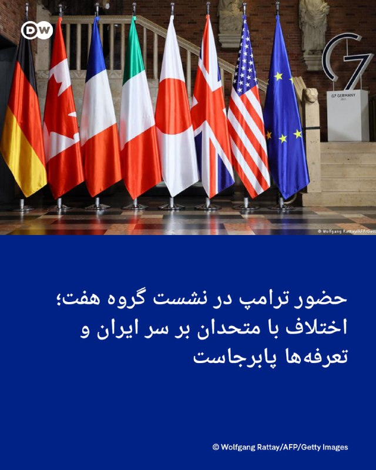

🔶 حضور ترامپ در نشست گروه هفت؛ اختلاف با متحدان بر سر ایران و تعرفه‌ها پابرجاست

خبرگزاری فرانسه گزارش داد دونالد ترامپ، رئیس‌جمهور آمریکا، در نشست سران گروه هفت که از روز یکشنبه ۱۵ ژوئن تا سه‌شنبه ۱۷ ژوئن در اویان فرانسه برگزار می‌شود، شرکت خواهد کرد.

این نشست در شرایطی برگزار می‌شود که جنگی که ترامپ در ماه فوریه علیه ایران آغاز کرد، به یکی از محورهای اصلی اختلاف میان آمریکا و متحدانش تبدیل شده است.

ترامپ بارها از متحدان واشنگتن انتقاد کرده که چرا برای بازگشایی تنگه هرمز به آمریکا کمک نکرده‌اند.

در مقابل، کشورهای غربی، از جمله اعضای گروه هفت، نسبت به پیامدهای اقتصادی جنگ آمریکا و اسرائیل علیه ایران ابراز نگرانی کرده‌اند؛ به‌ویژه در شرایطی که هم‌زمان با فشارهای ناشی از تعرفه‌های تجاری دولت ترامپ هم روبه‌رو هستند.

گروه هفت از آمریکا، بریتانیا، کانادا، فرانسه، آلمان، ایتالیا و ژاپن تشکیل شده است. هر سال یکی از این کشورها ریاست دوره‌ای گروه را بر عهده می‌گیرد و نشست‌ها و دیدارهای وزیران را سازمان‌دهی می‌کند.

@dw_farsi

## DW_Farsi — post 124937

  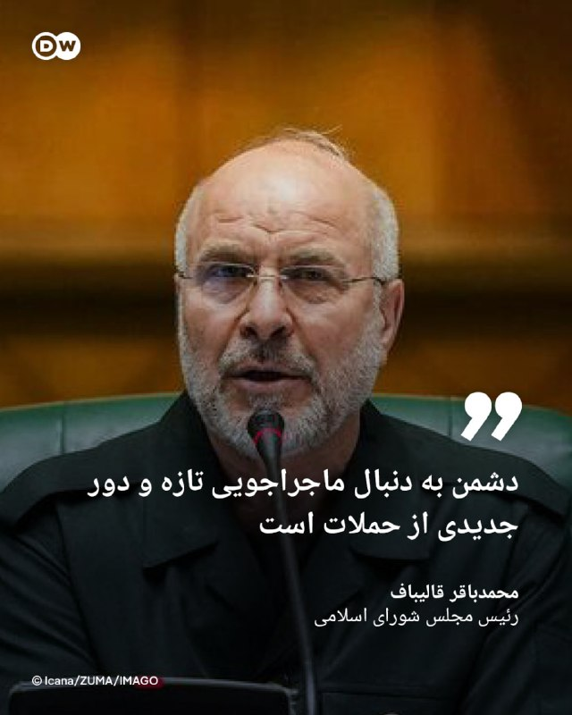

🔶 قالیباف: دشمن به دنبال ماجراجویی تازه و دور جدیدی از حملات است

محمدباقر قالیباف، رئیس مجلس شورای اسلامی روز چهارشنبه ۳۰ اردیبهشت گفت با وجود آن‌که حدود یک ماه است در جبهه‌های نبرد نظامی آتش متوقف شده، نشانه‌های موجود حاکی از آن است که "دشمن از اهداف نظامی خود عقب ننشسته" و هم‌زمان با تداوم فشارهای اقتصادی و سیاسی، در فکر "ماجراجویی تازه و دور جدیدی از حملات" است.

قالیباف گفت واشنگتن هنوز تصور می‌کند می‌تواند با ادامه محاصره و فشار اقتصادی، و هم‌زمان با افزایش فشار در میدان نظامی، تهران را وادار کند در مذاکرات به خواسته‌های آن تن دهد.

او افزود هدف این فشار ترکیبی آن است که ایران در میدان دیپلماسی به "زیاده‌خواهی‌های" طرف مقابل پاسخ مثبت بدهد.

رئیس مجلس گفت در برابر چنین طرحی، ایران باید هم آمادگی خود را برای پاسخ "مقتدرانه و موثر" به هر حمله احتمالی تقویت کند و هم تاب‌آوری اقتصادی را بالا ببرد "تا دشمن از خطای محاسباتی خارج شود و از تسلیم‌کردن ایران ناامید بماند".

@dw_farsi

## DW_Farsi — post 124936

  

🔶 سپاه: ۲۶ کشتی در ۲۴ ساعت گذشته با هماهنگی ما از تنگه هرمز عبور کردند

بر اساس بیانیه منتشرشده از سوی نیروی دریایی سپاه، در ۲۴ ساعت گذشته ۲۶ شناور تجاری از تنگه هرمز عبور کرده‌اند و این عبور با "هماهنگی" و "تامین امنیت" از سوی نیروی دریایی سپاه انجام شده است.

در این بیانیه آمده است در میان این شناورها، نفتکش‌ها، کشتی‌های کانتینری و دیگر کشتی‌های تجاری حضور داشته‌اند.

این موضع‌گیری در ادامه تاکیدهای پیشین تهران بر این موضوع مطرح شده که کشتی‌های عبوری از تنگه هرمز باید مجوز لازم را از نیروهای مسلح ایران دریافت کنند.

جمهوری اسلامی از ۲۴ فروردین ۱۴۰۵، با وجود آتش‌بس، همچنان زیر محاصره دریایی آمریکا قرار دارد و بر همین اساس، عبور کشتی‌ها از این مسیر را تحت نظارت و کنترل خود تعریف می‌کند.

هم‌زمان، کره‌جنوبی اعلام کرده یکی از نفتکش‌هایش از تنگه هرمز عبور کرده است؛ رخدادی که از آن به‌عنوان نخستین عبور یک کشتی کره‌ای از زمان آغاز جنگ یاد شده است.

این تحول می‌تواند نشانه‌ای از تلاش تدریجی برای ازسرگیری بخشی از تردد تجاری در این آبراه باشد.

@dw_farsi

## DW_Farsi — post 124935

  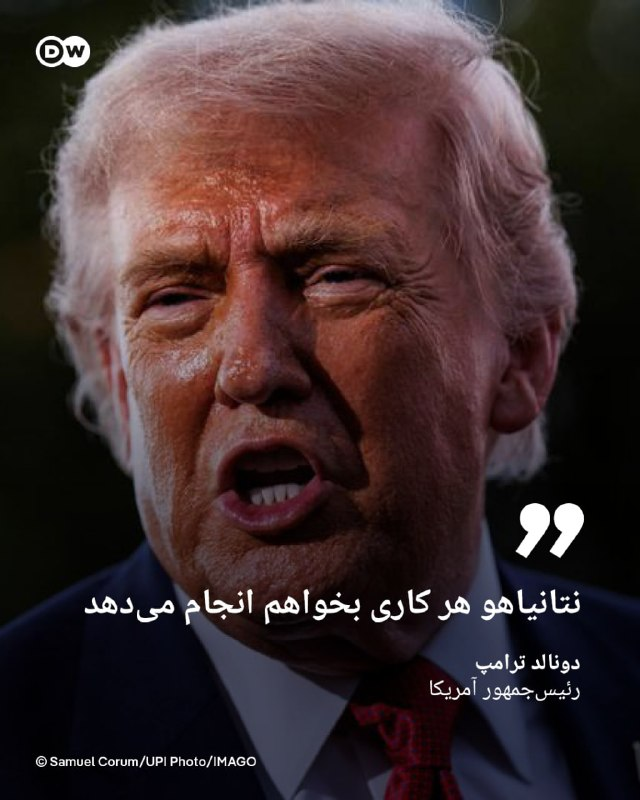

🔶 ترامپ: نتانیاهو هر کاری بخواهم انجام می‌دهد؛ برای توافق با ایران عجله‌ای ندارم

دونالد ترامپ، رئیس‌جمهور آمریکا روز چهارشنبه ۲۰ ماه مه در گفت‌وگو با خبرنگاران، در پاسخ به پرسشی درباره موضع خود در قبال اقدام احتمالی اسرائیل علیه ایران، گفت بنیامین نتانیاهو "هر کاری" او بخواهد انجام خواهد داد.

او همچنین تأکید کرد برای رسیدن به توافق با ایران عجله‌ای ندارد و گفت ترجیح می‌دهد به جای کشته شدن افراد بیشتر، راه‌حلی پیدا شود که تنش را کاهش دهد.

ترامپ در پاسخ به پرسشی درباره احتمال یک توافق محدود با ایران که فقط به باز شدن تنگه هرمز و تمدید آتش‌بس منجر شود، گفت برای رسیدن به توافق هیچ شتابی ندارد.

او گفت تنگه هرمز باید فورا باز شود، اما در عین حال افزود که می‌خواهد به این روند "یک فرصت" بدهد و تحت فشار زمان، از جمله به‌دلیل انتخابات میان‌دوره‌ای، تصمیم‌گیری نمی‌کند.

ترامپ در روزهای اخیر زمان‌بندی‌های متفاوتی برای رسیدن به یک راه‌حل دیپلماتیک مطرح کرده است. او پیش‌تر گفته بود ممکن است دو یا سه روز صبر کند یا برای "مدتی محدود" منتظر بماند.

@dw_farsi

## DW_Farsi — post 124934

  <a href="telegram/content/DW_Farsi_124934_1779306060.mp4" target="_blank">🎬 Download video</a>

🎥 هشدار به کاربران ایرانی؛ این برنامه‌ها را نصب نکنید!

اپلیکیشن‌های جعلی اندرویدی کاربران ایرانی را در محیط تلگرام هدف قرار داده‌اند.
این اپلیکیشن‌ها به عنوان وی‌پی‌ان، ابزارهای مرتبط با استارلینک یا فیلترشکن برای قربانیان ارسال می‌شوند و همراه با پیام‌هایی دوستانه.
در اینجا نحوه محافظت در مقابل چنین بدافزارهایی را آورده‌ایم.

@dw_farsi

## DW_Farsi — post 124933

  

🔶 امارات از عراق خواست فورا جلوی حملات از خاک خود را بگیرد

امارات متحده عربی روز چهارشنبه ۲۰ مه از عراق خواست فورا مانع هرگونه اقدام خصمانه از خاک خود شود.

وزارت خارجه امارات در بیانیه‌ای اعلام کرد ابوظبی بر این باور است که پهپادی که یکشنبه به یک ژنراتور برق در نزدیکی نیروگاه هسته‌ای براکه در اطراف ابوظبی اصابت کرد، از خاک عراق به پرواز درآمده بود.

وزارت خارجه امارات تاکید کرد عراق باید بدون شرط و در کوتاه‌ترین زمان ممکن از هرگونه اقدام خصمانه‌ای که از خاک این کشور منشأ می‌گیرد جلوگیری کند. در این بیانیه آمده است تهدیدهای موجود باید "سریع، فوری و مسئولانه" مهار شوند.

در حمله روز یکشنبه، یک پهپاد به یک ژنراتور برق در نزدیکی نیروگاه هسته‌ای براکه اصابت کرد.

این حمله که هیچ گروهی مسئولیت آن را به عهده نگرفت، باعث آتش‌سوزی شد، اما هیچ زخمی یا نشت پرتوی در پی نداشت. مقام‌های اماراتی همچنین گفتند دو پهپاد دیگر نیز رهگیری شده‌اند.

@dw_farsi

## DW_Farsi — post 124932

  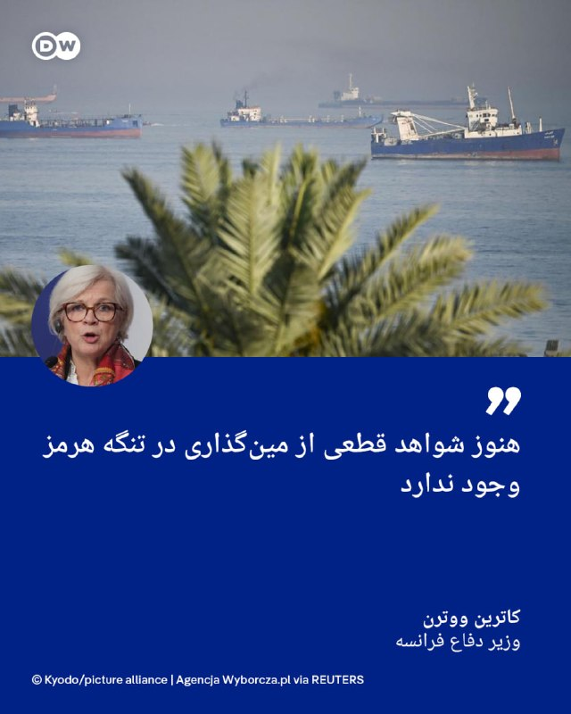

🔶 فرانسه: هنوز شواهد قطعی از مین‌گذاری در تنگه هرمز وجود ندارد

به گزارش خبرگزاری رویترز، کاترین ووترن، وزیر دفاع فرانسه، روز چهارشنبه ۲۰ مه (۳۰ اردیبهشت) گفت، هیچ "قطعیتی" درباره گزارش‌های مربوط به مین‌گذاری در تنگه هرمز وجود ندارد، اما پاریس خود را برای احتمال اعزام توان مین‌روبی آماده می‌کند.

او گفت فرانسه در حال آماده‌سازی برای سناریویی است که در آن، پاکسازی مین‌ها در قالب یک ماموریت احتمالی به رهبری فرانسه و بریتانیا انجام شود.

ووترن گفت فرانسه ناچار است برای ضرورت احتمالی پاکسازی مین‌ها آماده باشد و در صورت لزوم، شناورهای مین‌روب می‌توانند به منطقه اعزام شوند. رویترز پیش‌تر نیز گزارش داده بود که فرانسه، هلند و بلژیک از توان مین‌روبی برخوردارند و این ظرفیت می‌تواند برای امن‌سازی عبور و مرور در هرمز به کار گرفته شود.

این موضع پس از آن مطرح شد که برخی گزارش‌های رسانه‌ای در آمریکا، به نقل از مقام‌هایی که نامشان فاش نشد، مدعی شده بودند دست‌کم ۱۰ مین در منطقه شناسایی شده است. با این حال، مقام‌های فرانسوی گفته‌اند هنوز نمی‌توان درباره وجود مین‌ها با اطمینان سخن گفت.

@dw_farsi

## DW_Farsi — post 124931

🔶 کاهش تعهدات نظامی آمریکا به ناتو در شرایط بحران‌ و جنگ

تصمیم آمریکا درباره کاهش نیروها و تجهیزات خود برای حمایت از ناتو در شرایط بحران قرار است روز جمعه، ۱ خرداد (۲۱ مه)، به‌طور رسمی در بروکسل به متحدان ناتو اعلام شود.

این تغییر در قالب سازوکار "مدل نیروهای ناتو" انجام می‌شود؛ سازوکاری که در آن کشورهای عضو مشخص می‌کنند چه نیروهایی در صورت جنگ یا بحران بزرگ فعال خواهند شد.

پنتاگون تصمیم گرفته سهم خود از این نیروهای قابل‌استفاده را به‌طور قابل توجهی کاهش دهد، هرچند جزئیات دقیق آن هنوز اعلام نشده است.

وزارت دفاع آمریکا اما تاکید کرده است که "چتر هسته‌ای" این کشور برای دفاع از اعضای ناتو همچنان پابرجا خواهد ماند.

اقدام کاهش نیروهای آمریکایی در شرایط جنگ و بحران در راستای سیاست دونالد ترامپ، رئیس‌جمهور آمریکا انجام می‌شود که بارها تاکید کرده کشورهای اروپایی باید مسئولیت اصلی امنیت قاره خود را بر عهده بگیرند.

مارک روته، دبیر کل ناتو در بروکسل گفته است که تصمیم آمریکا قابل انتظار بوده و بخشی از تلاش برای کاهش وابستگی بیش از حد ائتلاف به یک متحد خاص است.

با این حال، این تغییر نگرانی‌هایی را در اروپا ایجاد کرده است؛ به‌ویژه در شرایطی که برخی کشورها احتمال کاهش تعهدات آمریکا و حتی عقب‌نشینی گسترده‌تر نظامی را مطرح می‌کنند.

در ماه‌های اخیر دولت ترامپ حدود ۵ هزار نیروی آمریکایی را از اروپا خارج کرده و اعزام یک تیپ نظامی به لهستان را نیز لغو کرده است؛ تصمیمی که با انتقاد برخی قانون‌گذاران آمریکایی مواجه شده است.

در مجموع، این تحولات نشان‌دهنده فشارهای فزاینده بر پیمان ناتو و اختلاف نظر میان آمریکا و متحدان اروپایی درباره تقسیم مسئولیت‌های دفاعی است.

دونالد ترامپ در آخرین دیدار خود با مارک روته، دبیرکل ناتو، در کاخ سفید اعلام کرد که از این پیمان "کاملا ناامید" است. در این دیدار همچنین درباره جنگ آمریکا و اسرائیل علیه ایران گفت‌وگو شد؛ جنگی که اعضای ناتو در آن مشارکت فعال نداشتند.

ترامپ پس از این ملاقات در شبکه اجتماعی "تروث سوشال" نوشت ناتو در زمان نیاز کنار آمریکا نبوده و در صورت نیاز دوباره نیز همراه نخواهد بود.

ترامپ بارها ناتو را "ببر کاغذی" توصیف کرده و حتی تهدید به خروج آمریکا از این پیمان کرده است. پیمان آتلانتیک شمالی (ناتو) ۳۲ عضو دارد و ایالات متحده یکی از بنیان‌گذاران آن به شمار می‌رود.

@dw_farsi

## DW_Farsi — post 124930

  <a href="telegram/content/DW_Farsi_124930_1779306062.mp4" target="_blank">🎬 Download video</a>

🎥 تاکسی‌های پرنده؛ آینده حمل‌ونقل یا رویایی دوردست؟

شرکت‌های چینی، آمریکایی و بریتانیایی وارد رقابت ساخت تاکسی‌های پرنده شده‌اند.
این هواپیماهای برقی که می‌توانند به طور عمودی از زمین بلند شوند، حالا به‌دنبال ورود به خیابان‌های هوایی هستند.
آیا آسمان شهرها واقعاً به‌زودی پر از تاکسی‌های هوایی می‌شود؟
@dw_farsi

## DW_Farsi — post 124929

  

🔶 تهدید سپاه: در صورت تکرار حمله، دامنه جنگ از منطقه فراتر خواهد رفت

سپاه پاسداران انقلاب اسلامی روز چهارشنبه ۳۰ اردیبهشت (۲۰ ماه مه) در بیانیه‌ای تهدید کرد اگر ایالات متحده بار دیگر حملات را آغاز کند، جنگ را فراتر از خاورمیانه گسترش خواهد داد.

این تهدید پس از آن مطرح شد که دونالد ترامپ، رئيس‌جمهور آمریکا گفت تنها یک ساعت با صدور دستور آغاز دوباره عملیات نظامی فاصله داشته است.

سپاه همچنین آمریکا و اسرائیل را خطاب قرار داد و مدعی شد که در صورت تکرار حمله، ضربات جمهوری اسلامی در نقاطی وارد خواهد شد که دشمنان "تصور آن را ندارند".

سپاه در بخش دیگری از بیانیه خود گفت با وجود آن‌که آمریکا و اسرائیل با همه توان دو ارتش "پرهزینه" خود به ایران حمله کردند، جمهوری اسلامی همه ظرفیت‌های خود را علیه آن‌ها وارد عمل نکرد.

به نظر می رسد این بیانیه در واکنش به اظهارات مقامات آمریکایی صادر شده است.

@dw_farsi

## DW_Farsi — post 124928

  

🔶 قوه قضاییه اظهارات همسر رشید مظاهری درباره زندان انفرادی را رد کرد

به گزارش خبرگزاری مهر، قوه قضائيه جمهوری اسلامی اعلام کرد رشید مظاهری هنگام تلاش برای خروج غیرقانونی از کشور از مرزهای غربی، پس از آن‌که به گفته این نهاد قصد داشت با تغییر چهره و پرداخت رشوه به ماموران مرزبانی از کشور خارج شود، بازداشت شده است.

قوه قضائيه همچنین اخبار منتشر شده در خصوص انتقال دروازه‌بان پیشین تیم ملی فوتبال ایران و باشگاه استقلال تهران به سلول انفرادی در زندان مرکزی ارومیه را رد کرد و مدعی شد که او اکنون در بند عمومی نگهداری می‌شود.

قوه قضائیه گفته است رسیدگی به این اتهام‌ها در حال انجام است و ادعاهای منتشرشده در فضای مجازی درباره وضعیت او با واقعیت تطابق ندارد.

پیش‌تر مریم عبدالهی، همسر رشید مظاهری، در یک پست اینستاگرامی نوشته بود که او به زندان مرکزی ارومیه منتقل شده و در شرایط سخت در سلول انفرادی نگهداری می‌شود.

او همچنین گفته بود ماه‌هاست برای آزادی همسرش تلاش می‌کند و از جامعه ورزش، رسانه‌ها و مردم خواسته بود صدای رشید مظاهری باشند و خواستار شفافیت و رسیدگی فوری و عادلانه شده بود.

@dw_farsi

## DW_Farsi — post 124927

🔶 اجرای توافق گمرکی اروپا و آمریکا پس از تهدیدهای ترامپ

نمایندگان کشورهای عضو اتحادیه اروپا و پارلمان اروپا روز چهارشنبه ۲۰ مه (۳۰ اردیبهشت) درباره اجرای توافق گمرکی آمریکا و اتحادیه اروپا به تفاهم رسیدند. طبق این توافق، قرار است دسترسی محصولات کشاورزی و دریایی آمریکا به بازار اروپا تسهیل شود.

با این حال، مقام‌های اروپایی تاکید کرده‌اند که این امتیازها تنها در صورتی ادامه خواهد داشت که آمریکا نیز به تعهدات خود پایبند بماند.

در متن توافق پیش‌بینی شده است که اگر واشنگتن مفاد توافق تجاری را نقض کند، اتحادیه اروپا می‌تواند امتیازهای گمرکی را تعلیق کرده و حتی دوباره تعرفه‌ها را افزایش دهد.

موضوع این "سازوکارهای حفاظتی"، یکی از اصلی‌ترین اختلاف‌ها میان کشورهای اروپایی در جریان مذاکرات داخلی بود.

پیش‌تر ترامپ به اتحادیه اروپا تا چهارم ژوئیه فرصت داده بود تا اجرای توافق را نهایی کند در غیر این صورت، او تعرفه واردات خودروهای اروپایی به آمریکا را از ۱۵ به ۲۵ درصد افزایش خواهد داد؛ اقدامی که می‌توانست به‌ویژه به خودروسازان آلمانی آسیب جدی وارد کند.

اورزولا فون‌ درلاین، رئیس کمیسیون اتحادیه اروپا ابراز امیدواری کرد توافق جدید به کاهش تنش‌های تجاری میان اروپا و آمریکا منجر شود. او خواستار اجرای سریع کاهش تعرفه‌ها شد.

برند لانگه، مذاکره‌کننده ارشد پارلمان اروپا نیز گفت پارلمان موفق شده است خواسته خود برای ایجاد "شبکه امنیتی" در برابر تخلف احتمالی آمریکا را در توافق بگنجاند.

مایکل دامیانوس، وزیر انرژی، تجارت و صنعت قبرس که کشورش ریاست دوره‌ای اتحادیه اروپا را بر عهده دارد، گفت "حفظ یک شراکت باثبات، قابل پیش‌بینی و متوازن میان دو سوی آتلانتیک به سود هر دو طرف است". او همچنین افزود اتحادیه اروپا با این تصمیم به تعهدات خود عمل می‌کند.

مارتین شیردوان، رئیس فراکسیون چپ در پارلمان اروپا، از این توافق انتقاد کرد و گفت اتحادیه اروپا در برابر فشارها و "باج‌خواهی" ترامپ عقب‌نشینی کرده است.

بر اساس این توافق، تعرفه‌های گمرکی اتحادیه اروپا بر کالاهای صنعتی آمریکا از زمان اجرایی شدن قانون آغاز می‌شود و تا پایان سال ۲۰۲۹ ادامه خواهد داشت.

این توافق بخشی از تفاهمی است که فون‌در لاین و ترامپ در اوت سال گذشته برای جلوگیری از تشدید جنگ تجاری میان دو طرف به آن دست یافته بودند. در مقابل آمریکا نیز متعهد شده بود تعرفه بیشتر کالاهای اروپایی را حداکثر در سطح ۱۵ درصد نگه دارد.

@dw_farsi

## DW_Farsi — post 124926

🎥 روغن‌های مصرف‌شده؛ راه‌حل جدید برای بحران سوخت جهانی؟
 
با افزایش قیمت نفت خام در پی تنش‌های خاورمیانه، سوخت‌های زیستی تجدیدپذیر بیش از پیش مورد توجه قرار گرفته‌اند. روغن‌های پخت‌وپز مصرف‌شده و دیگر منابع تجدیدپذیر حالا به‌عنوان گزینه‌ای جایگزین مطرح هستند؛ اما به نظر می‌رسد که چشم‌انداز این صنعت به روند قیمت نفت و سیاست‌های انرژی دولت‌ها  وابسته باشد.
@dw_farsi

## DW_Farsi — post 124925

  

🔶 قطع اینترنت در ایران وارد هشتادودومین روز شد؛ انتقاد سرافراز از "مدیریت ضعیف"
 
نت‌بلاکس اعلام کرد قطع اینترنت در ایران اکنون وارد هشتادودومین روز شده و پس از ۱۹۴۴ ساعت، کشور همچنان تا حد زیادی از اینترنت جهانی جدا مانده است.
 
نت‌بلاکس می‌گوید در دورانی که قطع چنددقیقه‌ای اینترنت می‌تواند "بحران" تلقی شود، ایران با ادامه این خاموشی دیجیتال رکوردهای تازه‌ای ثبت کرده است. این نهاد هشدار داده که ادامه این وضعیت، هم معیشت مردم را تخریب می‌کند و هم حقوق شهروندی را بیشتر فرسایش می‌دهد.
 
در همین رابطه، محمد سرافراز، عضو شورای عالی فضای مجازی، به روزنامه "شرق" گفته است که "مشکل اصلی، ساختار ناکارآمد، مدیریت ضعیف و دخالت نهادهای دیگر در شورای عالی فضای مجازی است. او تأکید کرده که تصمیم‌های مربوط به قطع اینترنت در خود این شورا گرفته نشده و کارنامه ۱۵ ساله شورا هم نشان می‌دهد این نهاد نتوانسته در جهت هدف اولیه‌اش، یعنی بهره‌گیری حداکثری از فرصت‌های اینترنت، گام‌های بلندی بردارد."
 
@dw_farsi

## DW_Farsi — post 124924

  

🔶 سامانه پاتریوت آلمان به مدت ۶ ماه در اختیار ترکیه قرار خواهد گرفت
 
ترکیه روز چهارشنبه ۳۰ اردیبهشت‌ماه اعلام کرد که آلمان از ماه ژوئن یک سامانه دفاع موشکی پاتریوت را به مدت شش ماه در اختیار این کشور قرار خواهد داد تا جایگزین سامانه‌ قبلی شود.
 
سامانه دفاعی پیشین در چارچوب تدابیر ناتو در جنوب شرقی ترکیه برای تقویت پدافند هوایی در بحبوحه جنگ ایران مستقر شده بود.
 
پدافندهای ناتو در جریان جنگ، چهار موشک بالستیک شلیک‌شده از ایران را سرنگون کرده بودند.
 
وزارت دفاع ترکیه در بیانیه‌ای اعلام کرد: «علاوه بر سامانه پدافند هوایی پاتریوت اسپانیا که هم‌اکنون در کشور ما مستقر است، یکی از دو سامانه پاتریوت اضافی که ناتو به دلیل درگیری‌های میان ایالات متحده، اسرائیل و ایران مستقر کرده بود، با یک سامانه آلمانی جایگزین خواهد شد.»
 
این وزارتخانه افزود: «برنامه‌ریزی شده است که این جایگزینی در ماه ژوئن تکمیل شود و انتظار می‌رود این سامانه حدود شش ماه عملیاتی باقی بماند.»
 
@dw_farsi

## DW_Farsi — post 124923

  

🔶 اردن از سرنگون کردن یک "پهپاد مهاجم" در حریم هوایی خود خبر داد
 
ارتش اردن اعلام کرد که روز چهارشنبه ۳۰ اردیبهشت‌ماه یک پهپاد با خاستگاه "نامشخص" را در حریم هوایی این کشور سرنگون کرده است. گزارشی از تلفات منتشر نشده است.
 
ارتش اردن در بیانیه‌ای اعلام کرد: «صبح امروز، نیروهای مسلح اردن با یک پهپاد با خاستگاه نامشخص که وارد حریم هوایی اردن شده بود، درگیر شدند و آن را در استان جرش سرنگون کردند؛ هیچ‌ موردی از مجروح‌شدن افراد گزارش نشده است.»
 
استان جرش در حدود ۵۰ کیلومتری شمال امان، پایتخت اردن، قرار دارد.
@dw_farsi

## Persian_Trend_Official — post 14549

  <a href="telegram/content/Persian_Trend_Official_14549_1779306066.mp4" target="_blank">🎬 Download video</a>

💢به مناسبت دومین سالگرد سقوط هلیکوپتر ابراهیم رئیسی

🔹بشنوید گزیده ای از قدرت سخنوری این ،شهید عضو هیئت مرگ

🫆:Tony

📌 @persian_trend_official
پرشین ترند | متفاوت‌ترین کانال نظامی

## Persian_Trend_Official — post 14547

  <a href="telegram/content/Persian_Trend_Official_14547_1779306068.webm" target="_blank">🎬 Download video</a>

🔴 حمله پهپادی به مقر گروه معارض کُرد در سلیمانیه عراق

💢رسانه‌ها از وقوع انفجار در پی حمله یک پهپاد انتحاری به مقر وابسته به گروه‌های معارض کُرد در استان سلیمانیه واقع در اقلیم کردستان عراق خبر می‌دهند.

💢استان سلیمانیه در ماه‌های گذشته چندین بار شاهد حملات پهپادی و موشکی علیه گروه‌های معارض ایرانی بوده است.

🫆:Tony

📌 @persian_trend_official
پرشین ترند | متفاوت‌ترین کانال نظامی

## Persian_Trend_Official — post 14546

  <a href="telegram/content/Persian_Trend_Official_14546_1779306069.mp4" target="_blank">🎬 Download video</a>

🔴آیا همانطور که رسانه های دولتی ایران گزارش داده اند، آمریکا در جریان مذاکرات صلح پیشنهاد کاهش تحریم های نفتی ایران را داده است؟

💢ترامپ: نه، من این را نشنیده ام. تا زمانی که توافقی امضا نکنند، هیچ کمکی نمی‌کنم.

▪️وقتی آنها توافق نامه ای امضا می کنند، می توانیم دوباره آن مکان را بسازیم و کشوری داشته باشیم که واقعا کشور خوبی برای مردم باشد.

▪️اما نه، ما چیزی پیشنهاد نکرده ایم.

🫆:Tony

📌 @persian_trend_official
پرشین ترند | متفاوت‌ترین کانال نظامی

## Persian_Trend_Official — post 14545

  <a href="telegram/content/Persian_Trend_Official_14545_1779306070.webm" target="_blank">🎬 Download video</a>

🔴 ترامپ: منتظر پاسخ ایران برای جلوگیری از تشدید تنش هستیم

💢دونالد ترامپ درباره مذاکرات با ایران گفت:

▪️ «منتظر پاسخ مناسبی از سوی ایران هستیم تا از تشدید بیشتر جلوگیری شود»
▪️ «چند روز برای دریافت پاسخ ایران صبر خواهیم کرد»
▪️ «تا زمانی که به توافق نرسیم، هیچ تحریمی علیه ایران را لغو نخواهم کرد»

او همچنین افزود:

▪️ «در ایران افراد باهوش و بااستعدادی وجود دارند و امیدواریم توافقی خوب برای هر دو طرف حاصل شود»

▪️ «اگر پاسخ‌های صددرصد درست از ایران دریافت کنیم، در زمان، هزینه و جان انسان‌ها صرفه‌جویی خواهد شد»

▪️ «ممکن است روند تحولات خیلی سریع پیش برود یا چند روز طول بکشد، اما می‌تواند ناگهان و با سرعت زیادی پایان یابد»

🫆:Tony

📌 @persian_trend_official
پرشین ترند | متفاوت‌ترین کانال نظامی

## Persian_Trend_Official — post 14544

  <a href="telegram/content/Persian_Trend_Official_14544_1779306070.mp4" target="_blank">🎬 Download video</a>

سنتکام:

💢اوایل امروز در خلیج عمان، تفنگداران دریایی آمریکا از یگان اعزامی دریایی سی و یکم سوار بر M/T Celestial Sea، یک نفتکش تجاری با پرچم ایران شدند که مظنون به تلاش برای نقض محاصره ایالات متحده از طریق عبور از بندر ایران بود.

💢نیروهای آمریکایی پس از جستجو و هدایت خدمه کشتی برای تغییر مسیر، کشتی را آزاد کردند.

🫆:Tony

📌 @persian_trend_official
پرشین ترند | متفاوت‌ترین کانال نظامی

## Persian_Trend_Official — post 14543

https://youtube.com/live/CCiwTJiy05Y?feature=share

## Persian_Trend_Official — post 14542

حدود 20 دقیقه دیگه لایو آغاز میشه

## Persian_Trend_Official — post 14541

🔴 کانال ۱۲ اسرائیل: اختلافات آمریکا و اسرائیل بر سر ایران تقریباً از بین رفته است

کانال ۱۲ اسرائیل گزارش داد مقام‌های اسرائیلی معتقدند تقریباً هیچ اختلاف مهمی میان تل‌آویو و واشینگتن درباره خواسته‌های مطرح‌شده از ایران در مذاکرات جاری باقی نمانده است.

بر اساس این گزارش:

▪️ با این حال تردیدهای جدی درباره احتمال پذیرش این شروط از سوی تهران وجود دارد
▪️ ایران تنها به بخشی از پیشنهادها پاسخ داده و درباره سایر مطالبات زمان‌کشی می‌کند
▪️ اسرائیل مذاکرات را تلاش ایران برای خرید زمان و طولانی‌کردن روند گفت‌وگوها می‌داند

در ادامه آمده:

▪️ بازگشت احتمالی به گزینه نظامی به‌طور جدی در حال بررسی است
▪️ و گفته می‌شود مقدمات چنین اقدامی از هم‌اکنون در حال آماده‌سازی است

🫆:Tony

📌 @persian_trend_official
پرشین ترند | متفاوت‌ترین کانال نظامی

## Persian_Trend_Official — post 14540

💢سخنگوی وزارت خارجه: تبادل پیام‌ها بین طرف ایرانی و آمریکایی براساس متن ۱۴بندی ایران ادامه دارد

▪️حضور وزیر کشور پاکستان برای تسهیل مبادلۀ پیام‌هاست.

🫆:Tony

📌 @persian_trend_official
پرشین ترند | متفاوت‌ترین کانال نظامی

## Persian_Trend_Official — post 14539

🔴 رویترز: برخی کشتی‌ها برای عبور از تنگه هرمز به ایران پول پرداخت می‌کنند

💢خبرگزاری رویترز گزارش داد برخی کشتی‌ها برای تضمین عبور امن از تنگه هرمز، مبالغی بیش از ۱۵۰ هزار دلار به ایران پرداخت می‌کنند.

بر اساس این گزارش:

▪️ این پرداخت‌ها با هدف جلوگیری از توقیف یا ایجاد مشکل در مسیر عبور انجام می‌شود

🫆:Tony

📌 @persian_trend_official
پرشین ترند | متفاوت‌ترین کانال نظامی

## Persian_Trend_Official — post 14538

❤️ اگر از مخاطبان پرشین ترند هستید و تلگرام پرمیوم دارید،
با بوست کردن کانال کمک بزرگی به رشد و دیده‌شدن بیشتر پرشین ترند می‌کنید.
این بوست‌ها باعث می‌شود امکانات بیشتری برای انتشار محتوا، استوری و قابلیت‌های ویژه کانال فعال شود و در شرایط فعلی، به ادامه پوشش سریع و تحلیل‌های روزانه کمک زیادی می‌کند.
🙏 اگر مایل بودید، از طریق لینک زیر کانال را بوست کنید:
https://t.me/boost/persian_trend_official
📌 @persian_trend_official
پرشین ترند | متفاوت‌ترین کانال نظامی

## Persian_Trend_Official — post 14537

  <a href="telegram/content/Persian_Trend_Official_14537_1779306072.mp4" target="_blank">🎬 Download video</a>

🔴ترامپ :

💢ما به آنها ضربه‌ای بسیار سخت زدیم. ممکن است مجبور شویم حتی سخت‌تر ضربه بزنیم — اما شاید هم نه.

🫆:Tony

📌 @persian_trend_official
پرشین ترند | متفاوت‌ترین کانال نظامی

## Persian_Trend_Official — post 14536

  <a href="telegram/content/Persian_Trend_Official_14536_1779306073.mp4" target="_blank">🎬 Download video</a>

💢ترامپ :

💢همه چیز آنها از بین رفته است. تنها سوال این است که آیا ما می‌رویم و آن را تمام می‌کنیم، یا آن‌ها قرار است یک سند را امضا کنند؟

💢خاهیم دید چه اتفاقی می افتد

🫆:Tony

📌 @persian_trend_official
پرشین ترند | متفاوت‌ترین کانال نظامی

## Persian_Trend_Official — post 14535

🔴 حمله مسلحانه در سراوان؛ یک نیروی امنیتی ایران کشته شد

💢رسانه‌های ایرانی از وقوع حمله مسلحانه توسط عناصر تروریستی در شهر سراوان واقع در استان سیستان و بلوچستان خبر دادند.

بر اساس گزارش‌های اولیه:

▪️ در این حمله یک نیروی امنیتی ایران کشته شده است

▪️ جزئیات بیشتری درباره تعداد مهاجمان یا تلفات احتمالی منتشر نشده

▪️ نیروهای امنیتی عملیات تعقیب عاملان حمله را آغاز کرده‌اند

🫆:Tony

📌 @persian_trend_official
پرشین ترند | متفاوت‌ترین کانال نظامی

## Persian_Trend_Official — post 14534

  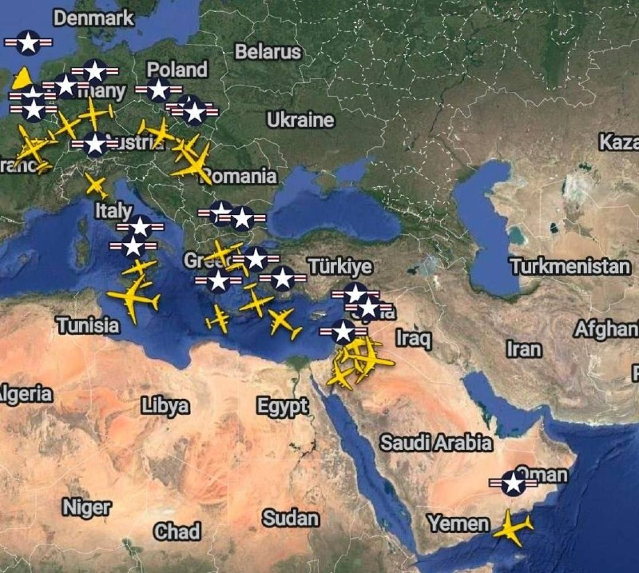

خداروشکر دارن توافق میکنن 😄 درجریانید که ... دلمون برای توافق های پر هیجان عراقچی با ویتکاف تنگ شده ! از توجه شما به این موضوع متشکرم الیاس فرخ

## Persian_Trend_Official — post 14533

  

خداروشکر دارن توافق میکنن 😄

درجریانید که ...

دلمون برای توافق های پر هیجان عراقچی با ویتکاف تنگ شده !

از توجه شما به این موضوع متشکرم
الیاس فرخ

## Persian_Trend_Official — post 14532

💢سخنگوی وزارت امور خارجه : ما نمی‌توانیم به ایالات متحده و اسرائیل اجازه عبور از هرمز را بدهیم 💢وقتی ما خواستار آزادی دارایی‌های مسدود شده خود هستیم، منظورمان دسترسی به آنها به عنوان حق ماست. 💢استفاده صلح‌آمیز از انرژی هسته‌ای یک مطالبه نیست، بلکه حقی است…

## Persian_Trend_Official — post 14531

💢سخنگوی وزارت امور خارجه : ما نمی‌توانیم به ایالات متحده و اسرائیل اجازه عبور از هرمز را بدهیم

💢وقتی ما خواستار آزادی دارایی‌های مسدود شده خود هستیم، منظورمان دسترسی به آنها به عنوان حق ماست.

💢استفاده صلح‌آمیز از انرژی هسته‌ای یک مطالبه نیست، بلکه حقی است که توسط پیمان منع گسترش سلاح‌های هسته‌ای تضمین شده است.

💢وقتی در مورد تحریم‌های یکجانبه آمریکا صحبت می‌کنیم، این یک مطالبه نیست، بلکه بخشی از حقوق ماست.

💢ما با عمان، دیگر کشور ساحلی، همکاری می‌کنیم تا عبور ایمن کشتی‌ها از تنگه هرمز را تضمین کنیم.

💢ما نمی‌توانیم به ایالات متحده و اسرائیل اجازه عبور از هرمز را بدهیم، زیرا این امر بر امنیت ملی ما تأثیر خواهد گذاشت.

💢ما با چندین کشور در تماس نزدیک هستیم تا اطمینان حاصل کنیم که کشتی‌های آنها می‌توانند بدون هیچ حادثه‌ای از تنگه هرمز عبور کنند.

💢ما برای صادرات و واردات خود به تنگه هرمز متکی هستیم، بنابراین انگیزه داریم که از امنیت آن اطمینان حاصل کنیم.

🫆:Tony

📌 @persian_trend_official
پرشین ترند | متفاوت‌ترین کانال نظامی

## Persian_Trend_Official — post 14530

  <a href="telegram/content/Persian_Trend_Official_14530_1779306075.mp4" target="_blank">🎬 Download video</a>

💢ترامپ :

الان تو اسرائیل ۹۹٪ طرفدار دارم.

▪️می‌تونم برای نخست‌وزیری کاندید شم، شاید بعد این ماجرا برم اسرائیل واسه نخست‌وزیری

🫆:Tony

📌 @persian_trend_official
پرشین ترند | متفاوت‌ترین کانال نظامی

## Persian_Trend_Official — post 14529

  <a href="telegram/content/Persian_Trend_Official_14529_1779306076.webm" target="_blank">🎬 Download video</a>

⭕️ادعای العربیه:

💢کار برای نهایی‌سازی متن توافق بین واشنگتن و تهران در حال انجام است.

💢فرمانده ارتش پاکستان ممکن است فردا برای اعلام نسخه نهایی توافق از ایران دیدار کند.

💢ممکن است طی ساعات آینده از نهایی شدن نسخه نهایی توافق بین آمریکا و ایران خبر داده شود.

▪️دور جدیدی از مذاکرات بعد از فصل حج در اسلام‌آباد برگزار خواهد شد.

🫆:Tony

📌 @persian_trend_official
پرشین ترند | متفاوت‌ترین کانال نظامی

## RadioFarda — post 157404

  <a href="https://t.me/radiofarda/157404" target="_blank">📎 Download file</a>

📻بشنوید: خبرهای ساعت ۲۱ با رادیوفردا،۳۰اردیبهشت ۱۴۰۵‌

@RadioFarda

## RadioFarda — post 157403

🔸دونالد ترامپ، رئیس‌جمهور آمریکا، شامگاه چهارشنبه گفت حاضر است «چند روز» برای رسیدن پاسخ ایران به پیشنهاد واشینگتن درباره توافق پایان جنگ صبر کند اما هشدار داد که این پاسخ باید «۱۰۰ درصد درست» باشد. 🔸او بعد از سخنرانی در جمع دانشجویان نظامی به خبرنگاران گفت…

## RadioFarda — post 157402

  

🔸دونالد ترامپ، رئیس‌جمهور آمریکا، شامگاه چهارشنبه گفت حاضر است «چند روز» برای رسیدن پاسخ ایران به پیشنهاد واشینگتن درباره توافق پایان جنگ صبر کند اما هشدار داد که این پاسخ باید «۱۰۰ درصد درست» باشد.

🔸او بعد از سخنرانی در جمع دانشجویان نظامی به خبرنگاران گفت اگر پاسخ ایران درست نباشد، تشدید تنش به سرعت رخ می‌دهد و افزود: «ما آماده پیش‌روی هستیم. باید جواب‌های ۱۰۰ درصد درست و خوبی بگیریم.»

🔸ترامپ اعلام کرد که آمریکا در حال حاضر با افراد «خیلی خوبی» از طرف ایرانی مواجه است که «استعداد و قدرت ذهن» دارند؛ افرادی که به گفته او جایگزین رهبران پیشین ایران شده‌اند.

🔸این اظهارات ساعتی بعد از آن است که سخنگوی وزارت خارجه ایران اعلام کرد تهران در حال بررسی طرح پیشنهادی جدید آمریکا است.

@RadioFarda

## RadioFarda — post 157401

شیعیان پاکستانی مقیم امارات؛ قربانی تنش‌ها بین ابوظبی و تهران

🔸اواسط فروردین‌ماه حمید علی شاه، از کارکنان «اتحاد ریل»، شرکت اپراتور شبکه ریلی امارات متحده عربی، از طرف این شرکت خبردار شد که باید به پلیس مراجعه کند. این مهندس عمران ساعت‌ها بازجویی شد، چندین روز در بازداشت بود و در نهایت، به کشورش پاکستان اخراج شد.

🔸آقای شاه در گفت‌وگو با رادیو اروپای آزاد/ رادیو آزادی می‌گوید: «وقتی با من تماس گرفتند، مشغول کار بودم. بعد از دو ساعت بازجویی، من و ۱۳ نفر دیگر را سوار یک ون کرده و به یک بازداشتگاه اداره مهاجرت منتقل کردند. هفدهم فروردین با یک هواپیما از امارات اخراج شدم».

🔸به گفتۀ یک نمایندۀ پارلمان پاکستان و بر اساس گزارش‌های رسانه‌ای، حمید علی شاه یکی از هزاران شهروند پاکستان بوده که از زمان آغاز جنگ اسرائیل و ایالات متحده علیه ایران در روز نهم اسفند سال گذشته، از امارات متحده عربی اخراج شده‌اند.

🔸بسیاری از آنها از اعضای اقلیت شیعۀ پاکستان بوده‌اند؛ جامعه‌ای که نزدیک به ۳۵ میلیون تن از شهروندان این کشور را در بر می‌گیرد. این بخش از جامعۀ پاکستان با ایران به‌عنوان بزرگترین کشور شیعۀ جهان روابط مستحکمی دارد.

🔸ایران در پاسخ به حملات آمریکا و اسرائیل، صدها موشک و پهپاد را به سمت همسایگانش در حاشیه خلیج فارس، از جمله امارات متحدۀ عربی به‌عنوان یک متحد ایالات متحده و اسرائیل شلیک کرد؛ کشوری که بیشترین بخش حملات تلافی‌جویانۀ ایران را متحمل شد.

🔸پاکستان، یکی از میانجی‌های اصلی برای پایان‌دادن به جنگ ایران، از متحدان دیرینۀ امارات متحده عربی به‌شمار می‌رود. اما با توجه به تعمیق روابط اسلام‌آباد و ریاض، به‌عنوان یک رقیب جدی ابوظبی، روابط پاکستان و امارات متحدۀ عربی دچار تنش‌هایی شده است.

🔸 گزارش کامل را در وب‌سایت رادیوفردا بخوانید.

@RadioFarda

## RadioFarda — post 157400

  <a href="https://t.me/radiofarda/157400" target="_blank">📎 Download file</a>

📻بشنوید: ایستگاه ۱۹ با رادیوفردا،۳۰ اردیبهشت ۱۴۰۵

@RadioFarda

## RadioFarda — post 157399

🔸گزارش‌ها حاکی از آن است که دادگاهی در تهران حکم جدید متهمان پرونده موسوم به «اکباتان» را صادر کرده که بر اساس آن سه تن از آنها تبرئه شده‌اند. 🔸رسانه امتداد در داخل ایران و گروه حقوق بشری هرانا، مستقر در آمریکا، روز چهارشنبه ۳۰ اردیبهشت اعلام کردند سه تن…

## RadioFarda — post 157398

  

🔸گزارش‌ها حاکی از آن است که دادگاهی در تهران حکم جدید متهمان پرونده موسوم به «اکباتان» را صادر کرده که بر اساس آن سه تن از آنها تبرئه شده‌اند.

🔸رسانه امتداد در داخل ایران و گروه حقوق بشری هرانا، مستقر در آمریکا، روز چهارشنبه ۳۰ اردیبهشت اعلام کردند سه تن دیگر از این متهمان بازداشت‌شده در اعتراضات سال ۱۴۰۱ به پرداخت دیه و پنج سال حبس محکوم شدند.

🔸هر شش متهم این پرونده به اتهام نقش داشتن در کشته شدن آرمان علی‌وردی، از نیروهای بسیج، قبلا به اعدام محکوم شده بودند، اما دیوان عالی کشور این احکام را لغو کرد.

🔸بر اساس حکم دادگاه کیفری یک استان تهران، میلاد آرمون، علیرضا کفایی و امیرمحمد خوش‌اقبال بابت اتهام «مشارکت در قتل عمد» هر یک به پرداخت سهمی مساوی از دیه کامل یک انسان و تحمل ۵ سال حبس محکوم شدند.

🔸علیرضا برمرزپورناک، حسین نعمتی و نوید نجاران، سه متهم دیگر این پرونده، به دلیل فقدان مدارک دال بر وارد کردن ضربه به ناحیه مشخصی از بدن آرمان علی‌وردی، از اتهام مشارکت در قتل عمد تبرئه شدند.

@RadioFarda

## RadioFarda — post 157397

🔸فرماندهی مرکزی ایالات متحده (سنتکام) اعلام کرد که نیروهای نظامی آمریکا روز چهارشنبه در دریای عمان وارد نفتکش تجاری «ام/تی سلستیال سی» با پرچم ایران شدند.

🔸سنتکام ضمن انتشار تصاویری از ورود تفنگداران دریایی آمریکا به این نفتکش در شبکه ایکس گفت این شناور مظنون بود که قصد دارد به سمت یکی از بنادر ایران برود و محاصره دریایی ایالات متحده را نقض کند.

🔸در ادامه بیانیه آمده که نیروهای آمریکایی «پس از بازرسی کشتی و صدور دستور تغییر مسیر به خدمه آن، این شناور را آزاد کردند».

🔸سنتکام که نظارت و فرماندهی بر ارتش آمریکا در خاورمیانه را برعهده دارد، گفت: «نیروهای آمریکایی همچنان به‌طور کامل محاصره را اجرا می‌کنند و تاکنون مسیر ۹۱ کشتی تجاری را برای اطمینان از رعایت این محدودیت‌ها تغییر داده‌اند.»

🔸محاصره دریایی ایران به دستور دونالد ترامپ، رئیس‌جمهور آمریکا، چند روز بعد از برقراری آتش‌بس آغاز شد و همچنان ادامه دارد.

@RadioFarda

## RadioFarda — post 157396

  

🔸سخنگوی وزارت خارجه ایران روز چهارشنبه گفت که سفر دوباره وزیر کشور پاکستان در ایران برای «تسهیل مبادله پیام‌ها» بین تهران و واشینگتن انجام شده است.

🔸اسماعیل بقائی مدعی شد که تبادل پیام‌ها بین ایران و آمریکا «براساس متن ۱۴ بندی ایران» ادامه دارد اما به جزئیات بیشتری اشاره نکرد.

🔸محسن نقوی، وزیر کشور پاکستان، که روز ۲۶ اردیبهشت به ایران رفته و با مقام‌های ارشد جمهوری اسلامی دیدار کرده بود، بعد از چهار روز بار دیگر وارد تهران شده است.

🔸این در حالی است که رئیس‌جمهور آمریکا ساعتی پیش اعلام کرد مذاکره با ایران در «مراحل پایانی» قرار دارد و افزود اگر ایران سند توافق را امضا نکند، ایالات متحده حملات نظامی را از سر خواهد گرفت.

@RadioFarda

## RadioFarda — post 157395

  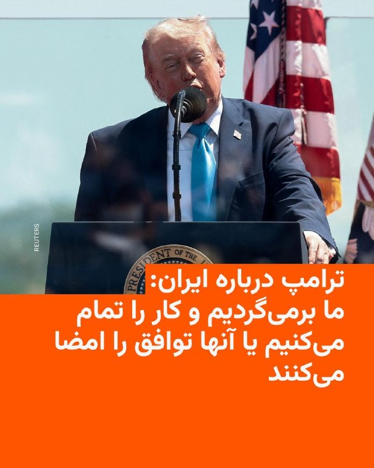

🔸دونالد ترامپ، رئیس‌جمهور آمریکا، روز چهارشنبه با تکرار دوباره این ادعا که نیروی دریایی و نیروی هوایی ایران نابود شده‌اند، اعلام کرد تنها پرسش باقی‌مانده این است که آیا آمریکا برای «تمام کردن کار» بازخواهد گشت یا ایران توافق پایان دادن به جنگ را امضا خواهد کرد.

🔸او در سخنرانی خود در مراسم فارغ‌التحصیلی آکادمی گارد ساحلی آمریکا درباره ایران گفت: «همه‌چیز از بین رفته است. نیروی دریایی‌شان از بین رفته. نیروی هوایی‌شان از بین رفته. تقریباً همه‌چیز. تنها سؤال این است که آیا ما برمی‌گردیم و کار را تمام می‌کنیم؟ آیا آنها قرار است سندی را امضا کنند؟ ببینیم چه اتفاقی می‌افتد.»

🔸رئیس‌جمهور ایالات متحده روز دوشنبه خبر داد که دستور حمله به ایران در روز سه‌شنبه را به درخواست رهبران چند کشور منطقه لغو کرده تا به روند دیپلماتیک برای رسیدن به توافق با ایران فرصت جدیدی دهد.

🔸او در عین حال روز سه‌شنبه گفت که ایران تنها چند روز فرصت دارد تا با آمریکا به توافق برسد و در غیر این صورت شاید لازم باشد ضربه نظامی بزرگ دیگری به این کشور وارد شود.

@RadioFarda

## RadioFarda — post 157394

  <a href="https://t.me/radiofarda/157394" target="_blank">📎 Download file</a>

🔸 در این کافه فردا به آموزش استفاده از اسلحه در صدا و سیما، تبریک روز ارتباطات توسط پزشکیان در دوران قطعی اینترنت در ایران، تحلیل‌های یک کارشناس صدا و سیما در مورد یک عکس ساخته شده توسط هوش مصنوعی و تغییرات پیش رو در روند پذیرش فیلم‌ها در اسکار می‌پردازیم.

🔸 برای تماس با ما می‌توانید به شناسه کافه فردا در تلگرام صوت و متن بفرستید.

📻 کافه فردا

## RadioFarda — post 157393

🔸دونالد ترامپ، رئیس‌جمهور آمریکا، روز چهارشنبه به خبرنگاران گفت که برای پایان دادن به جنگ با ایران هیچ عجله‌ای ندارد. 🔸او درباره آتش‌بس شکننده فعلی و چشم‌انداز توافق پایان جنگ گفت: «ما باید تنگه هرمز را باز کنیم. تنگه باید فورا باز شود. به همین دلیل این مسیر…

## RadioFarda — post 157392

  

🔸دونالد ترامپ، رئیس‌جمهور آمریکا، روز چهارشنبه به خبرنگاران گفت که برای پایان دادن به جنگ با ایران هیچ عجله‌ای ندارد.

🔸او درباره آتش‌بس شکننده فعلی و چشم‌انداز توافق پایان جنگ گفت: «ما باید تنگه هرمز را باز کنیم. تنگه باید فورا باز شود. به همین دلیل این مسیر را امتحان می‌کنیم.»

🔸ترامپ با اشاره به انتخابات میاندوره‌ای کنگره آمریکا و تأثیر احتمالی آن بر تصمیمات او درباره ایران تأکید کرد: «من هیچ عجله‌ای ندارم... ترجیحم آن است که افراد کمتری کشته شوند.»

🔸رئیس‌جمهور آمریکا در ادامه گفت که برای او کامل کردن مأموریت درباره ایران مهم‌تر از تعیین زمان برای خاتمه دادن به درگیری است.

@RadioFarda

## RadioFarda — post 157391

🔸محمدباقر قالیباف، رئیس مجلس شورای اسلامی، ادعا کرد که آمریکا به دنبال دور جدید جنگ علیه ایران است و باید واشینگتن را از تسلیم شدن تهران ناامید کرد. 🔸او در یک فایل صوتی که رسانه‌های ایران روز چهارشنبه ۳۰ اردیبهشت منتشر کردند، با اشاره به برقراری آتش‌بس میان…

## RadioFarda — post 157390

  

🔸محمدباقر قالیباف، رئیس مجلس شورای اسلامی، ادعا کرد که آمریکا به دنبال دور جدید جنگ علیه ایران است و باید واشینگتن را از تسلیم شدن تهران ناامید کرد.

🔸او در یک فایل صوتی که رسانه‌های ایران روز چهارشنبه ۳۰ اردیبهشت منتشر کردند، با اشاره به برقراری آتش‌بس میان ایران و آمریکا گفت: «تحرکات آشکار و پنهان دشمن نشان می‌دهد که دشمن به موازات فشارهای اقتصادی و سیاسی از اهداف نظامی خود دست نکشیده و به دنبال دور جدیدی از جنگ و ماجراجویی جدید است.»

🔸دونالد ترامپ، رئیس‌جمهور آمریکا، روز دوشنبه گفت که ارتش این کشور قرار بود روز سه‌شنبه حملاتی علیه ایران انجام دهد اما او به درخواست شماری از کشورهای منطقه و برای رسیدن به توافق پایان جنگ با ایران، دستور لغو این حملات را داده است.

🔸آقای ترامپ در عین حال روز سه‌شنبه هشدار داد که ایران تنها چند روز برای رسیدن به توافق با آمریکا وقت دارد و در غیر این‌صورت شاید لازم شود «ضربه بزرگ» دیگری به آن وارد شود.

@RadioFarda

## RadioFarda — post 157389

  

🔸مایک والتز، سفیر آمریکا در سازمان ملل، می‌گوید منابع مالی حکومت ایران «در حال تمام شدن» و اقتصاد این کشور «در وضعیت فروپاشی» است.

🔸او افزوده که با این حال جمهوری اسلامی «به‌جای روی آوردن به رویکردی تازه و صلح‌آمیز، دست به حملات مکرر و گستاخانه‌ای علیه زیرساخت‌های غیرنظامی برق زده و همچنان به راهبرد دستیابی به سلاح هسته‌ای چنگ زده که می‌تواند جهان را در تاریکی فرو ببرد.»

🔸او تأکید کرده که «ما نمی‌توانیم این را تحمل کنیم و هرگز تحمل نخواهیم کرد.»

🔸اسکات بسنت، وزیر خزانه‌داری ایالات متحده، هم روز سه‌شنبه ۲۹ اردیبهشت در یک نشست مبارزه با تأمین مالی تروریسم در پاریس، گفت که این وزارتخانه، حکومت ایران را از درآمدهایی که برای «برنامه‌های تسلیحاتی، گروه‌های نیابتی تروریستی و جاه‌طلبی‌های هسته‌ای خود استفاده می‌کرد، محروم کرده است.»

🔸او افزود که واشینگتن «ده‌ها میلیارد دلار از درآمد پیش‌بینی‌شده نفتی» جمهوری اسلامی را مختل کرده است.

@RadioFarda

## RadioFarda — post 157388

  

🔸دبیر ستاد ملی جمعیت ایران می‌گوید میزان ازدواج و تولد در کشور به اندازه‌ای کاهش یافته که بر اساس آمارها میزان ازدواج در کشور نسبت به سال ۱۳۸۹ «نصف» شده است.

🔸مرضیه وحید دستجردی در همایش روز ملی جمعیت گفت: «بالاترین میزان ازدواج در سال ۱۳۸۹ با ۸۹۱ هزار و ۶۲۷ مورد ثبت شده، اما این رقم در سال ۱۴۰۴ به ۴۳۱ هزار و ۲۱ مورد کاهش یافته که بیانگر افت ۵۰ درصدی ازدواج‌ها است.»

🔸دستجردی با استناد به آمار سازمان ثبت احوال، تعداد تولدها در سال ۱۴۰۴ را نیز ۸۹۲ هزار و ۲۷۸ مورد اعلام کرد و افزود که وقوع دو جنگ علیه کشور به فاصله هشت تا ۹ ماه، «تأثیر مستقیم و غیرقابل انکاری» بر فرزندآوری داشته است.

🔸او در اظهاراتش به دغدغه‌های علی خامنه‌ای، رهبر پیشین جمهوری اسلامی درباره فرزندآوری اشاره کرد و کاهش جمعیت را «زنگ خطر جدی» برای آینده ایران دانست.

🔸دستجردی تأکید کرد که برای افزایش فرزندآوری، «مؤلفه‌های کلیدی نظیر اشتغال پایدار، تأمین مسکن و ایجاد امید در دل جوانان نقش اساسی دارند که متأسفانه در قانون فعلی به برخی از این زیرساخت‌ها به طور کامل و جامع پرداخته نشده است.»

@RadioFarda

## RadioFarda — post 157387

  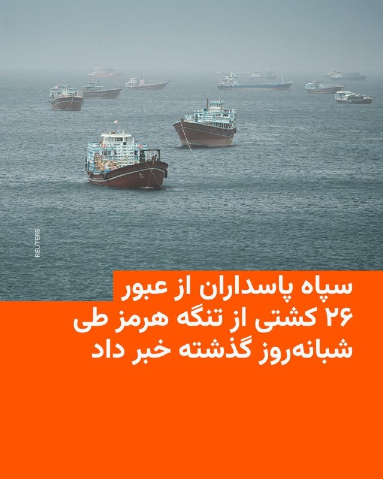

🔸نیروی دریایی سپاه پاسداران روز چهارشنبه اعلام کرد که در شبانه‌روز گذشته ۲۶ کشتی تجاری با «هماهنگی و تامین امنیت» از سوی این نیرو از تنگه هرمز عبور کردند.

🔸در اطلاعیه کوتاهی که در شبکه ایکس منتشر شده، آمده است: «طی شبانه روز گذشته ۲۶ فروند کشتی اعم از نفتکش، کانتینربر و سایر کشتی‌های تجاری با هماهنگی و تامین امنیت نیروی دریایی سپاه از تنگه هرمز عبور کردند.»

🔸سپاه پاسداران مشخص نکرده است که این کشتی‌ها متعلق به کدام کشورها هستند.

🔸ایران از روز نهم اسفند و همزمان با آغاز حملات آمریکا و اسرائیل، اقدام به اختلال در رفت‌وآمد کشتی‌ها در تنگه هرمز کرد و سپس این آبراه استراتژیک را مسدود کرد.

🔸با برقراری آتش‌بس و بعد از یک دور مذاکره میان نمایندگان ایران و آمریکا در پاکستان که به نتیجه نرسید، دونالد ترامپ دستور محاصره دریایی ایران را صادر کرد که همچنان ادامه دارد.

🔸همزمان با سفر رئیس‌جمهور آمریکا به چین در هفته گذشته، مقام‌های ایرانی از عبور چند کشتی چینی از تنگه هرمز خبر داده بودند. همچنین در روزهای اخیر گزارش شد که دو نفتکش حامل گاز مایع متعلق به قطر نیز از این آبراه گذشته است.

@RadioFarda

## RadioFarda — post 157386

  

🔸رسانه‌های ایران روز چهارشنبه ۳۰ اردیبهشت خبر دادند که محسن نقوی، وزیر کشور پاکستان، وارد تهران شده است. او روز ۲۶ اردیبهشت نیز به ایران سفر کرده بود.

🔸خبرگزاری ایسنا اعلام کرده که برنامه و اهداف سفر این مقام ارشد پاکستانی در ایران «مشخص نیست». خبرگزاری تسنیم نیز گزارش داده که آقای نقوی در بدو ورود به تهران با وزیر کشور ایران دیدار کرده است.

🔸وزیر کشور پاکستان در سفر قبلی به تهران که ابتدای این هفته انجام شد، درباره «ازسرگیری مذاکرات» بین ایران و آمریکا با همتای ایرانی خود گفت‌وگو کرد و سپس به دیدار رئیس‌جمهور و رئیس مجلس ایران رفت.

🔸دومین سفر این مقام پاکستانی در حالی انجام می‌شود که دونالد ترامپ، رئیس‌جمهور آمریکا، گفته است یک حمله نظامی برنامه‌ریزی‌شده به اهدافی در ایران برای روز سه‌شنبه را لغو کرده و جی‌دی ونس، معاون او، نیز رروز سه‌شنبه از «پیشرفت زیاد» مذاکرات بین واشینگتن و تهران برای رسیدن به توافق پایان جنگ خبر داد.

🔸ترامپ روز سه‌شنبه تأکید کرد که ایران تنها چند روز برای تصمیم‌گیری درباره توافق وقت دارد و افزود شاید لازم باشد ضربات نظامی دیگری به ایران وارد شود.

@RadioFarda

## RadioFarda — post 157385

  

📷 Photo

## IranianMinds — post 20468

🔴 ترامپ درباره ایران: اگر پاسخ‌های درست را نگیریم، اوضاع خیلی سریع پیش می‌رود. همه ما آماده‌ایم. باید پاسخ‌های درست را به دست آوریم. @IranianMinds

## IranianMinds — post 20467

  <a href="telegram/content/IranianMinds_20467_1779306083.mp4" target="_blank">🎬 Download video</a>

🔴 ترامپ درباره ایران:

اگر پاسخ‌های درست را نگیریم، اوضاع خیلی سریع پیش می‌رود. همه ما آماده‌ایم. باید پاسخ‌های درست را به دست آوریم.

@IranianMinds

## IranianMinds — post 20466

  <a href="telegram/content/IranianMinds_20466_1779306085.mp4" target="_blank">🎬 Download video</a>

🔴ترامپ درباره ایران:

ما در واقع با برخی افراد بسیار خوب سر و کار داریم.

ما با افرادی با استعداد و با هوش خوب سر و کار داریم.

ما کاملاً تحت تأثیر قرار گرفته‌ایم.

@IranianMinds

## IranianMinds — post 20465

🔴فوری/ تسنیم:

آمریکایی‌ها متن جدیدی به ایران ارسال کرده‌اند، ایران در حال بررسی متن است و هنوز پاسخی داده نشده است.
میانجی پاکستانی در تهران به دنبال نزدیک کردن متون به یکدیگر است.

@IranianMinds

## IranianMinds — post 20464

🔴دقایقی پیش افراد مسلح در خودرویی، به سمت یک خودروی پلیس در جاده‌ای در شهرستان سراوان تیراندازی کردند که منجر به کشته شدن ستوان سوم امیر‌حسین شهرکی شد.

@IranianMinds

## IranianMinds — post 20463

🔴 العربیه :

ممکن است طی ساعات آینده از نهایی شدن نسخه نهایی توافق بین آمریکا و ایران خبر داده شود.

@IranianMinds

## IranianMinds — post 20462

🔴 ترامپ : برا جنگ عجله ندارم. رژیم ایران رو عوض کردم و بهشون فرصت میدم فکر کنن @IranianMinds

## IranianMinds — post 20461

🔴 ترامپ :

برا جنگ عجله ندارم. رژیم ایران رو عوض کردم و بهشون فرصت میدم فکر کنن

@IranianMinds

## IranianMinds — post 20460

  <a href="telegram/content/IranianMinds_20460_1779306086.mp4" target="_blank">🎬 Download video</a>

🔴 دونالد ترامپ :

«هرگز، هرگز تسلیم نشوید. هر اتفاقی که بیفتد، مهم نیست در چه جایگاهی از زندگی باشید یا در چه شرایطی قرار داشته باشید، به پیش رفتن ادامه دهید.

همیشه رو به جلو حرکت کنید. هرگز از پیش رفتن باز نایستید.

به مبارزه ادامه دهید و کاری کنید که طرف مقابل زودتر از شما تسلیم شود. بگذارید آن‌ها کنار بکشند. اگر به مسیر خود ادامه دهید، آن‌ها در نهایت تسلیم خواهند شد.»

@IranianMinds

## IranianMinds — post 20459

🔴 مارک روته، دبیرکل ناتو:

«بسیاری از کشورهای عضو ائتلاف در حال انتقال منابع نظامی به منطقه تنگه هرمز هستند»

@IranianMinds

## IranianMinds — post 20458

✅ (فقط ۲۰۰ هزار تومن)🥺 🌱 قیمت اقتصادی + پشتیبانی حرفه‌ای 🚀 سریع و پایدار، بدون قطعی 🦋پشتیبانی واقعی، همیشه در دسترس ربات ما🌴 📩 @dayaconfigbot کانال ما🌳 📩 @dayavpn

## IranianMinds — post 20457

  <a href="telegram/content/IranianMinds_20457_1779306088.mp4" target="_blank">🎬 Download video</a>

🔴 ترامپ :

«ونزوئلا بیست سال پیش واقعاً کشور بسیار خوبی بود؛ اما مسیر اشتباهی را در پیش گرفت.

همان مسیری را رفت که بعضی‌ها دوست دارند این کشور را به آن سمت ببرند برخی دیوانه‌ها می‌خواهند این کشور را به‌شدت به سمت چپ ببرند و آن را نابود کنند.»

@IranianMinds

## IranianMinds — post 20456

  <a href="telegram/content/IranianMinds_20456_1779306089.mp4" target="_blank">🎬 Download video</a>

🔴 ترامپ درباره ایران :

«ما ضربه بسیار سختی به آن‌ها وارد کردیم. ممکن است مجبور شویم حتی ضربه سخت‌تری هم وارد کنیم اما شاید هم نه.

ما اجازه نخواهیم داد ایران به سلاح هسته‌ای دست پیدا کند و تمام خاورمیانه را منفجر کند و بعد سراغ شما بیاید.»

@IranianMinds

## IranianMinds — post 20455

  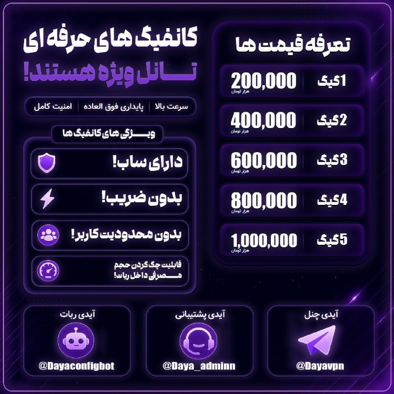

✅ (فقط ۲۰۰ هزار تومن)🥺

🌱 قیمت اقتصادی + پشتیبانی حرفه‌ای

🚀 سریع و پایدار، بدون قطعی
🦋پشتیبانی واقعی، همیشه در دسترس

ربات ما🌴
📩 @dayaconfigbot

کانال ما🌳
📩 @dayavpn

## IranianMinds — post 20454

  <a href="telegram/content/IranianMinds_20454_1779306092.mp4" target="_blank">🎬 Download video</a>

🔴آمریکا تعداد زیادی هواپیمای سوخت‌رسان را به فرودگاه بن‌گوریون اسرائیل منتقل کرد.

@IranianMinds

## IranianMinds — post 20453

  

🔴 ترامپ درباره کوبا :

ایالات متحده یک رژیم تروریستی را در نود مایلی خود تحمل نمیکند ، بنظر من وقت آن رسیده که مردم کوبا هم به آزادی که ۱۰۰ سال پیش برای آن جنگیده بودند برسند.

@IranianMinds

## IranianMinds — post 20452

نسخه کامل گفتگو در نشست آینده تکنولوژی ایران

این نشست روز ۱۶ مه (۲۶ اردیبهشت) در محل دفتر مرکزی شرکت «اوبر» در شهر سان‌فرانسیسکو در ایالت کالیفرنیای آمریکا برگزار شد.

@OfficialRezaPahlavi

## IranianMinds — post 20451

🔴 سخنگوی وزارت خارجه :

ما اورانیوم خودمونو به کسی تحویل نمیدیم و مسئله ی هسته ای ما کاملا صلح آمیزه.

@IranianMinds

## IranianMinds — post 20450

🔴 الحدث : دور بعدی مذاکرات پس از حج در اسلام آباد برگزار خواهد شد. @IranianMinds

## IranianMinds — post 20449

🔴 الحدث : احتمالا توافق ایران‌ و آمریکا تا ساعات آینده نهایی میشه. منظور متن توافق برای مذاکرات هست @IranianMinds

## BBCPersian — post 281639

  <a href="telegram/content/BBCPersian_281639_1779306093.mp4" target="_blank">🎬 Download video</a>

🔻آخرین خبرهای مهم روز چهارشنبه ۳۰ اردیبهشت ۱۴۰۵

@BBCPersian

## BBCPersian — post 281633

🖊شهاب میرزایی, بی‌بی‌سی

روزنامه نیویورک تایمز در گزارشی از برنامه «جسورانه» نیروهای آمریکایی و اسرائیلی برای آنچه عملیات «آزادی» محمود احمدی‌نژاد «از حصر خانگی» و «تسهیل روند تغییر رژیم» ایران با کمک رئیس‌جمهور پیشین خوانده، خبر داده است.
بر اساس گزارش رسانه‌های ایران، منزل مسکونی محمود احمدی‌نژاد در اولین روز از جنگ آمریکا و اسرائیل علیه ایران در ۹ اسفند ۱۴۰۴ هدف قرار گرفت و شایعاتی درباره کشته شدن او مطرح شد. روزنامه ایران، وابسته به دولت جمهوری اسلامی ایران، همان روز در حساب رسمی خود در شبکه ایکس نوشت که سه نفر از محافظان محمود احمدی‌نژاد، رئیس‌جمهوری اسبق، در حمله به منزل وی کشته شدند. این روزنامه گزارشی از وضعیت آقای احمدی‌نژاد نداد.

آلبوم را ورق بزنید و ادامه مطلب را در لینک زیر مطالعه کنید:

https://bbc.in/4dT881o
📷Getty/khamenei .ir/TABNAK

## BBCPersian — post 281632

🔻اردوغان از «تمدید آتش‌بس» میان ایالات متحده و ایران استقبال کرد

رجب طیب اردوغان، رئیس جمهور ترکیه، روز چهارشنبه در یک تماس تلفنی با دونالد ترامپ، همتای آمریکایی خود از تمدید آتش‌بس بین آمریکا و ایران استقبال کرده است و می‌گوید که به اعتقاد او، «مسائل مورد اختلاف بین دو طرف قابل حل است.»

دفتر ریاست جمهوری ترکیه در بیانیه‌ای اعلام کرده است که در این گفتگو، آقای اردوغان گفته است که تصمیم به تمدید آتش‌بس در منطقه درگیری در منطقه ما را یک تحول مثبت می‌بیند و «معتقد است که دستیابی به یک راه‌حل معقول برای مسائل مورد اختلاف امکان‌پذیر است.»

ساعاتی پیش هم وزیر خارجه عربستان سعودی، گفت که کشورش از تصمیم دونالد ترامپ برای دادن زمان بیشتر به مذاکرات با ایران برای رسیدن به توافق، قدردانی می‌کند.

دونالد ترامپ، رئیس‌جمهوری آمریکا، اوایل هفته گفته بود که عربستان سعودی، امارات متحده عربی و قطر از او خواسته‌ بودند که حمله برنامه‌ریزی شده آمریکا به ایران را به تعویق بیندازد تا زمان بیشتری برای مذاکرات فراهم شود.

رئیس‌جمهور آمریکا، با این حال روز چهارشنبه گفت که مذاکرات با ایران به مراحل پایانی رسیده، اما هشدار داد اگر تهران با توافق موافقت نکند، حملات بیشتری انجام خواهد شد.

شش هفته پس از آن‌که او عملیات «خشم حماسی» را برای برقراری آتش‌بس متوقف کرد، گفت‌وگوها برای پایان دادن به جنگ تاکنون پیشرفت اندکی داشته است.

## BBCPersian — post 281631

🔻ارتش اسرائیل: در بالاترین سطح هشدار قرار داریم

با بالاگرفتن تهدیدهای متقابل آمریکا و اسرائیل به جنگ، سپهبد ایال زمیر، فرمانده ارتش اسرائیل، روز چهارشنبه گفت که ارتش کشورش در بالاترین سطح هشدار خود قرار دارد.

بر اساس بیانیه‌ای که ارتش اسرائیل منتشر کرده است، ایال زمیر در جلسه‌ای با حضور تمام فرماندهان لشکرها گفت: «در حال حاضر، ارتش اسرائیل برای هرگونه تحولی آماده است.»

این اظهارات در حالیست که سپاه پاسداران ساعاتی پیش با انتشار بیانیه‌ای تهدید کرد که در صورت آغاز دوباره جنگ آمریکا و اسرائیل علیه ایران، جنگ «به فراتر از منطقه کشیده خواهد شد.»

دونالد ترامپ، رئیس جمهور آمریکا، هم دیروز گفته بود که در آستانه حمله نظامی دوباره به ایران، به درخواست رهبران منطقه، دستور حمله را لغو کرده است.

https://bbc.in/436bsAl
@BBCPersian

## BBCPersian — post 281630

🔻فرماندهی مرکزی آمریکا، سنتکام، با انتشار ویدیویی در حساب رسمی خود در شبکه اجتماعی ایکس گفته است که نیروهای آمریکایی وارد یک نفتکش با «پرچم ایران» شدند و این کشتی را مجبور به تغییر مسیر کردند.

سنتکام می‌گوید اوایل امروز (چهارشنبه) در دریای عمان، «تفنگداران دریایی ایالات متحده از واحد سی و یکم اعزامی تفنگداران دریایی، وارد ام‌تی سلستیال سی، یک نفتکش تجاری با پرچم ایران شدند که مظنون به تلاش برای نقض محاصره ایالات متحده با عبور به سمت یک بندر ایرانی بود.»

در ادامه این متن آمده است: «نیروهای آمریکایی پس از بازرسی و هدایت خدمه کشتی برای تغییر مسیر، کشتی را آزاد کردند.»

سنتکام می‌گوید نیروهای آمریکایی کماکان به اجرای کامل محاصره دریایی ادامه می‌دهند و اکنون ۹۱ کشتی تجاری را برای اطمینان از رعایت آن، تغییر مسیر داده‌اند.

🎥CENTCOM
https://bbc.in/436bsAl
@BBCPersian

## BBCPersian — post 281628

  <a href="telegram/content/BBCPersian_281628_1779306095.mp4" target="_blank">🎬 Download video</a>

ایتامار بن‌ گویر، وزیر امنیت ملی اسرائیل که به عنوان یک چهره سیاسی راست افراطی شناخته می‌شود، در شبکه اجتماعی ایکس ویدیویی از اعضای بازداشت شده کاروان کمک‌رسانی به غزه منتشر کرده است که نشان می‌دهد آنها با دست بسته رو به زمین زانو زده‌اند.
 
در بخش‌هایی از این ویدیو رفتار خشونت‌آمیز با آنها دیده می‌شود و بن‌گویر در حالی که پرچم بزرگی از اسرائیل را در دست دارد، به زبان عبری به آن‌ها می‌گوید: «به اسرائیل خوش آمدید، این ما هستیم که صاحب اختیاریم.»
 
گیدئون ساعر، وزیر خارجه اسرائیل به طور علنی از انتشار این ویدیو انتقاد کرده و این اقدام را «نمایشی شرم‌آور» توصیف کرد. او گفت ایتامار بن‌گویر «نمایانگر چهره واقعی اسرائیل نیست.»
 
انتشار این ویدیو واکنش‌های زیادی را در پی داشت از جمله جورجا ملونی، نخست‌وزیر ایتالیا، نیز این اقدام را محکوم کرده و خواستار عذرخواهی شده است.

@bbcpersian

## BBCPersian — post 281627

  <a href="https://t.me/bbcpersian/281627" target="_blank">📎 Download file</a>

امروز در برنامه رادیویی جام‌جهان‌نما می‌شنوید:

روایت نیویورک‌تایمز از اهداف آمریکا و اسرائیل در آغاز جنگ؛ این روزنامه می‌گوید بمباران اطراف خانه محمود احمدی‌نژاد، با هدف آزاد کردن او از حصر خانگی و بازگرداندنش به قدرت انجام شده بود. این گزارش تا چه اندازه قابل باور است و چه تصویری از اهداف پشت پرده جنگ ارائه می‌دهد؟

حرف‌وحدیث‌ها درباره نقش گروه‌های کرد ایرانی در عراق در آغاز جنگ ۳۹ روزه؛ گزارش بی‌بی‌سی فارسی نشان می‌دهد آمریکا به برخی از این گروه‌ها کمک مالی کرده بود تا وارد ایران شوند.

چین و روسیه بدون اشاره مستقیم به تنگه هرمز، اختلال در زنجیره تأمین و تجارت جهانی را محکوم کردند. آیا پکن و مسکو در حال فاصله گرفتن از تهران‌اند؟

و سپاه پاسداران هشدار داده اگر دوباره جنگی آغاز شود، پاسخ ایران «فراتر از منطقه» خواهد بود.این تهدیدتا چه حد جدی است؟

برنامه رادیویی جام جهان‌نما هر شب ساعت ۲۰ به وقت ایران، روی موج متوسط ۷۰۲ کیلوهرتز و موج کوتاه ۹۴۶۵ کیلوهرتز پخش می‌شود و تکرار آن را هم می‌توانید ساعت ۲۱:۳۰ روی موج متوسط ۷۰۲ کیلوهرتز و موج کوتاه ۵۳۹۵ کیلوهرتز گوش کنید.

## BBCPersian — post 281625

🔻ترامپ: مذاکرات با ایران به مراحل پایانی رسیده اگر توافق نکند حمله می‌کنیم

دونالد ترامپ، رئیس‌جمهور آمریکا، روز چهارشنبه گفت که مذاکرات با ایران به مراحل پایانی رسیده، اما هشدار داد اگر تهران با توافق موافقت نکند، حملات بیشتری انجام خواهد شد.

شش هفته پس از آن‌که او عملیات «خشم حماسی» را برای برقراری آتش‌بس متوقف کرد، گفت‌وگوها برای پایان دادن به جنگ تاکنون پیشرفت اندکی داشته است.

آقای ترامپ این هفته گفته بودکه تا آستانه صدور دستور حملات بیشتر پیش رفته است، اما برای دادن فرصت بیشتر به مذاکرات از این اقدام خودداری کرده است.

او امروز به خبرنگاران گفت: «ما در مراحل پایانی [مذاکرات] با ایران هستیم. خواهیم دید چه اتفاقی می‌افتد. یا به توافق می‌رسیم یا کارهایی خواهیم کرد که کمی ناخوشایند خواهد بود، اما امیدوارم به آنجا نکشد.»

رئیس‌جمهور آمریکا افزود: «ما این فرصت را می‌دهیم. عجله‌ای ندارم. ترجیح می‌دهم افراد کمتری کشته شوند تا تعداد زیادی. این موضوع می‌تواند به هر دو شکل پیش برود.»

حکومت ایران در مقابل، دونالد ترامپ را به تلاش برای ازسرگیری جنگ متهم کرد و هشدار داد که در صورت هرگونه حمله، فراتر از خاورمیانه پاسخ خواهد داد.

https://bbc.in/436bsAl
@BBCPersian

## BBCPersian — post 281624

  

🔻شعبه ۱۳ دادگاه کیفری تهران احکام ۶ متهم در پرونده موسوم به «اکباتان» را صادر کرده است.

بر اساس رای دادگاه که سایت امتداد منتشر کرده است، میلاد آرمون، علیرضا کفایی و امیرمحمد خوش اقبال به ۵ سال حبس و دیه محکوم شده‌اند.

این سه متهم به همراه حسین نعمتی با اتهام «ﻣﺸﺎرﮐﺖ در اﯾﺮاد ﺻﺪﻣﺎت و ﺟﺮاﺣﺎت ﻏﯿﺮ ﻣﺆﺛﺮ در ﻓﻮت» ﺑﻪ ﭘﺮداﺧﺖ دﯾﻪ ﺻﺪﻣﺎت به خانواده آرمان علی وردی محکوم شده‌اند.

آرمان علی‌وردی، طلبه بسیجی بود که طبق گزارش‌ها روز ۴ آبان سال ۱۴۰۱ در جریان اعتراضات سراسری در شهرک اکباتان مورد ضرب و جرح قرار گرفت و دو روز بعد در بیمارستان جان باخت.

سه متهم دیگر؛ نوید نجاران، علیرضا برمز پورناک و حسین نعمتی از اتهامات تبرئه شدند.

علیرضا برمز پورناک و نوید نجاران از اتهامات قبلی «مشارکت در قتل عمد ‌ایراد صدمات غیرموثر در فوت» و همچنین حسین نعمتی از اتهام «مشارکت در قتل»، تبرئه شده‌اند.

در پرونده موسوم به شهرک اکباتان این شش نفر به اتهام کشتن آرمان علی‌وردی، در جریان اعتراضات سال ۱۴۰۱، بازداشت شدند.

📷UGC
@BBCPersian

## BBCPersian — post 281623

  <a href="telegram/content/BBCPersian_281623_1779306097.mp4" target="_blank">🎬 Download video</a>

🔻دوربین همراه یکی از افسران پلیس کالامازوی ایالت میشیگان، ویدیویی را از عملیات نجات کودکی که در میان شعله‌های آتش در خانه‌ای گرفتار شده بود ثبت کرده است.

افسر پلیس پس از رسیدن به محل حادثه، از مادر کودک در حالیکه بر لبه پنجره ایستاده بود، خواست پنجره را با لگد بشکند و کودک را به سمت او پرتاب کند.

کودک و مادرش پس از عملیات نجات برای اطمینان از سلامتشان به بیمارستان منتقل شدند. به گفته مقام‌ها، هیچ‌کدام آسیبی ندیده‌اند و علت آتش‌سوزی هنوز در دست بررسی است.

https://bbc.in/436bsAl
@BBCPersian

## BBCPersian — post 281622

  

🔻بارنی فرانک نماینده سابق کنگره آمریکا از حزب دموکرات، که به‌عنوان یکی از اولین نمایندگان کنگره آمریکا به‌صورت آشکار هویت هم‌جنس‌گرایانه خود را آشکار کرد، در هشتاد و شش سالگی درگذشت. 

او به‌عنوان یکی از چهره‌های اثرگذار در پیشبرد حقوق جامعه ال‌جی‌بی‌تی و از معماران اصلاحات مالی پس از بحران ۲۰۰۸ شناخته می‌شود.

او پیش از سه دهه نمایندگی بخش جنوبی ایالت ماساچوست را در مجلس نمایندگان ایالات متحده آمریکا بر عهده داشت و در این مدت به یکی از چهره‌های شناخته‌شده و جنجالی سیاست آمریکا تبدیل شد.

آقای فرانک در تاریخ کنگره آمریکا به‌عنوان نخستین عضو این نهاد شناخته می‌شود که وارد یک ازدواج همجنس‌گرایانه شد؛ کاری که در زمان خود بازتاب گسترده‌ای داشت و جایگاه او را به‌عنوان یکی از چهره‌های پیشرو در جنبش حقوق ال‌جی‌بی‌تی ثبت کرد.

بارنی فرانک در طول دوران فعالیت سیاسی خود، هم‌زمان به‌خاطر رویکردهای صریح و گاه جنجالی‌اش در حوزه اقتصاد و سیاست اجتماعی شناخته می‌شد و جایگاهی متمایز در میان قانون‌گذاران هم‌عصر خود داشت.

📷Getty Images
@BBCPersian

## BBCPersian — post 281621

🔻وزیر خارجه اسرائیل ویدئوی جنجالی بن‌گویر درباره فعالان غزه را «شرم‌آور» خواند

گیدئون ساعر، وزیر خارجه اسرائیل، به‌طور علنی از وزیر امنیت ملی راست‌افراطی کشورش به دلیل انتشار ویدیوی تحقیرآمیز فعالان بین‌المللی بازداشت‌شده کاروان کمک‌رسانی به غزه، انتقاد کرده است.

او این اقدام را «نمایشی شرم‌آور» توصیف کرد و گفت ایتامار بن‌گویر «مایانگر چهره واقعی اسرائیل نیست.»

در این ویدیو ده‌ها فعال دیده می‌شوند که با دستان بسته روی زمین زانو زده‌اند.

بن‌گویر در حالی که پرچم بزرگی از اسرائیل را در دست دارد، به زبان عبری به آن‌ها می‌گوید: «به اسرائیل خوش آمدید، این ما هستیم که صاحب اختیاریم.»

انتشار این ویدئو واکنش‌های زیادی را در پی داشت از جمله جورجا ملونی، نخست‌وزیر ایتالیا، نیز این اقدام را محکوم کرده و خواستار عذرخواهی شده است.

https://bbc.in/3PtqVqU
@BBCPersian

## BBCPersian — post 281620

🔻قدردانی عربستان از ترامپ برای دادن زمان بیشتر به ایران

شاهزاده فیصل بن فرحان، وزیر امور خارجه عربستان سعودی، روز چهارشنبه گفت که کشورش از تصمیم دونالد ترامپ برای دادن زمان بیشتر به مذاکرات با ایران برای رسیدن به توافق، قدردانی می‌کند.

دونالد ترامپ، رئیس‌جمهوری آمریکا، اوایل این هفته گفت که عربستان سعودی، امارات متحده عربی و قطر از او خواسته‌اند که حمله برنامه‌ریزی شده آمریکا به ایران را به تعویق بیندازد تا زمان بیشتری برای مذاکرات فراهم شود.

پیش از این سپاه پاسداران با انتشار بیانیه‌ای تهدید کرد که در صورت آغاز دوباره جنگ آمریکا و اسرائیل علیه ایران، جنگ «به فراتر از منطقه کشیده خواهد شد.»

https://bbc.in/3PtqVqU
@BBCPersian

## BBCPersian — post 281619

🔻وزیر ارتباطات ایران: شبکه ملی اطلاعات در امتداد اینترنت جهانی است، نه جایگزینش

ستار هاشمی، وزیر ارتباطات و فناوری اطلاعات ایران، در مراسمی به مناسبت روز جهانی ارتباطات گفت: «اینکه گفته می‌شود شبکه ملی اطلاعات قرار است جایگزین اینترنت جهانی و دسترسی آزاد به اطلاعات شود، برداشت نادرستی است.»

او تاکید کرد: «شبکه ملی اطلاعات، در امتداد دسترسی بین‌الملل به اینترنت است، نه جایگزین آن.»

آقای هاشمی گفت: «استقلال شبکه به معنای قطع ارتباط با جهان نیست و نمی‌توان جامعه را از دسترسی به دانش، خدمات و ظرفیت‌های بین‌المللی محروم کرد.»

او در این جلسه با اشاره به کارکرد شبکه ملی اطلاعات در دوران جنگ گفت که به دلیل «توسعه زیرساخت‌های شبکه ملی اطلاعات و گسترش مویرگی ارتباطی در سراسر کشور»، خدمات بانکی، بهداشتی و درمانی، آموزشی و خدمات عمومی کشور «متوقف نشد.»

به گفته وزیر ارتباطات، در طول جنگ اخیر، «بیش از ۵۰۰ سایت ارتباطی کشور آسیب دید اما مردم اختلال گسترده‌ای در دریافت خدمات احساس نکردند.»

این در حالی است که در طول جنگ اخیر آمریکا و اسرائیل با ایران، گزارش‌هایی مبنی بر اختلال در دسترسی به خدمات بانکی و اداری منتشر شد.

ستار هاشمی با اشاره به قطع اینترنت جهانی که بیش از ۸۰ روز از آن می‌گذرد گفت: «برخی محدودیت‌ها در شرایط خاص و با تصمیم مراجع ذی‌صلاح اعمال شد، اما استمرار این وضعیت به‌تدریج می‌تواند به شبکه ملی اطلاعات نیز آسیب وارد کند.»

با شروع حملات آمریکا و اسرائیل به ایران، دسترسی عمومی به اینترنت جهانی در کشور قطع شد و تاکنون ادامه دارد. قطع دسترسی عمومی به اینترنت خسارت‌های بسیاری را به اقتصاد ایران وارد کرده است و مسئولان و کارشناسان بارها درباره آسیب‌های غیرقابل جبران آن هشدار داده‌اند.

https://bbc.in/3PtqVqU
@BBCPersian

## BBCPersian — post 281618

  <a href="telegram/content/BBCPersian_281618_1779306099.mp4" target="_blank">🎬 Download video</a>

دانشجویان دانشگاه هنگ‌کنگ که برترین دانشکده حقوق این شهر است، در گفت‌وگو با بی‌بی‌سی فاش کرده‌اند که متوجه شده‌اند از عکس‌هایشان برای تولید تصاویر هرزه‌نگاری با استفاده از هوش مصنوعی استفاده شده و این موضوع به شدت آنها را شوکه کرده است.
 
این دانشجویان زن تصمیم گرفته‌اند این موضوع را علنی کنند تا به این شکل، این رنج و تجربه شخصی را به تلاشی گسترده‌تر برای پاسخ‌گویی و اصلاحات قانونی تبدیل کنند.

@bbcpersian

## idfinfarsi — post 11613

  <a href="telegram/content/idfinfarsi_11613_1779306101.mp4" target="_blank">🎬 Download video</a>

‼️ارتش اسرائیل افشا می‌کند: سازمان‌های تروریستی در نوار غزه چگونه از کودکان به‌عنوان سپر انسانی برای تروریسم استفاده می‌کنند

⭕️در چارچوب فعالیت‌های معمول پهپادی نیروهای ارتش اسرائیل در منطقه خط زرد، مشخص شد که سازمان‌های تروریستی فعال در نوار غزه به‌شکل بی‌رحمانه و سوءاستفاده‌گرانه از کودکان به‌عنوان سپر انسانی برای اقدامات تروریستی استفاده می‌کنند.

⭕️در یکی از این فعالیت‌ها، ارتش اسرائیل شناسایی کرد که سازمان‌های تروریستی در غزه در حال انتقال تسلیحات از مکانی به مکان دیگر هستند، در حالی که تلاش می‌کنند این تسلیحات را پنهان کنند.
⭕️در فعالیتی دیگر، یک تروریست از سازمان تروریستی حماس شناسایی شد که در محوطه یک مدرسه در نوار غزه به کودکان سلاح می‌داد و مشاهده شد که کودکان با این سلاح‌ها «بازی» می‌کنند.

⭕️این مستندات به موارد دیگری می‌پیوندد که نشان‌دهنده سوءاستفاده‌ نظام‌مند و بی‌رحمانه سازمان تروریستی حماس از جمعیت غیرنظامی به‌عنوان سپر انسانی است، در حالی که این اقدامات نقض قوانین بین‌المللی به شمار می‌رود.

## idfinfarsi — post 11612

  

📷 Photo

## idfinfarsi — post 11611

سخنگوی ارتش اسرائیل:

رئیس ستاد کل ارتش اسرائیل خطاب به فرماندهان لشکرها: «در تمامی جبهه‌ها آماده هستیم و در مناطق دفاعی خط مقدم مستقر شده‌ایم، تهدیدها را خنثی کرده و با ابتکار، پایداری و قاطعیت واقعیت را شکل می‌دهیم. دستاوردهای ارتش اسرائیل حاصل نبرد و فداکاری بی‌سابقه شما فرماندهان و رزمندگان در نیروهای وظیفه و ذخیره است. در این لحظات، ارتش اسرائیل در بالاترین سطح آماده‌باش قرار دارد و برای هر تحولی آماده است. در کنار نبرد شدید و مستمر، باید سطح بالایی از ارزش‌ها، حرفه‌ای‌گری و انضباط عملیاتی را حفظ کنیم؛ این‌ها شرط آمادگی رزمی و انسجام ارتش اسرائیل است.»

رئیس ستاد کل ارتش اسرائیل، سپهبد ایال زامیر، امروز (چهارشنبه) با تمامی فرماندهان لشکرها گفت‌وگو کرد.

در این گفت‌وگو، رئیس ستاد کل ارتش اسرائیل ارزیابی وضعیت عملیاتی را با فرماندهان انجام داد و به چالش‌های عملیاتی در تمامی جبهه‌ها، میزان آمادگی نیروها و ادامه نبرد در جبهه‌های مختلف پرداخت.

بخشی از سخنان رئیس ستاد کل ارتش اسرائیل، سپهبد ایال زامیر: «شما نسل منحصربه‌فردی از فرماندهان لشکر در تاریخ ارتش اسرائیل و کشور اسرائیل هستید. اقدامات شما در دو سال و نیم گذشته در کتاب‌های تاریخ ثبت خواهد شد. توانمندی ارتش، حفظ ارزش‌ها و دستاوردهای عملیاتی آن—در دستان شماست.

در تمامی جبهه‌های نبرد در مرزها، ما آماده هستیم و در مناطق دفاع پیشرو مستقر شده‌ایم، تهدیدها را خنثی کرده و با ابتکار، پایداری و قاطعیت واقعیت را شکل می‌دهیم. دستاوردهای ارتش اسرائیل نتیجه نبرد و فداکاری بی‌سابقه شما فرماندهان و رزمندگان در نیروهای وظیفه و ذخیره است.

در این لحظات، ارتش اسرائیل در بالاترین سطح آماده‌باش قرار دارد و برای هر تحول احتمالی آماده است. در کنار نبرد شدید و مداوم، باید سطح بالایی از ارزش‌ها، حرفه‌ای‌گری و انضباط عملیاتی را حفظ کنیم. این‌ها شروط آمادگی رزمی و انسجام ارتش اسرائیل هستند.

در هر جبهه، ما تهدیدها را برطرف کرده و در درجه نخست برای تعمیق ضربه به دشمن و حفظ امنیت شهروندان و نیروهای خود عمل می‌کنیم.

به‌عنوان رئیس ستاد کل ارتش اسرائیل، تمامی جبهه‌ها را مدنظر دارم—ما به‌طور نظام‌مند، قدرتمند و مبتنی بر برنامه، به ایران و کل محور ضربه زده و آن را تضعیف کرده‌ایم. به نبرد در جبهه‌های نزدیک و دور به هر میزان که لازم باشد ادامه خواهیم داد. برای انجام تمامی مأموریت‌ها و کاهش بار غیرقابل‌تصور بر نیروهای ذخیره، نیازمند گسترش دایره خدمت‌کنندگان هستیم؛ این یک موضوع اساسی و حیاتی برای توان عملیاتی ارتش اسرائیل است.

در این میان، شما فرماندهان لشکرها کار فوق‌العاده‌ای انجام می‌دهید؛ این فقط در نتایج میدانی نیست، بلکه در توانایی هدایت نیروها، پرورش آن‌ها و در نهایت—پیروزی است.»

## Dirty_Kids — post 389834

ما از اینا عبور کردیم
این کصشرا رو دوباره مد نکنید!
شهر شبیه کوفه و کنعان میشه.

@Dirty_Kids 👻

## Dirty_Kids — post 389833

  <a href="telegram/content/Dirty_Kids_389833_1779306103.mp4" target="_blank">🎬 Download video</a>

🔴 صحبتای جنجالی آخوند رسایی، نماینده مجلس، قبل از کشته شدن علی خامنه‌ای:

بعضیا هستن که میگن علی خامنه‌ای داره تلاش میکنه پسرش رو جانشین خودش کنه ولی اگه کسی ذره‌ای عقل داشته باشه به حرفی که اینا میزنن میخنده.
اصلا ساز و کار تعیین رهبر، شرایط کسی که میخواد رهبر بشه، باید طرف سابقه کار اجرایی داشته باشه.

بنابراین اصلا و ابدا چنین چیزی امکان نداره.

@Dirty_Kids 👻

## Dirty_Kids — post 389832

  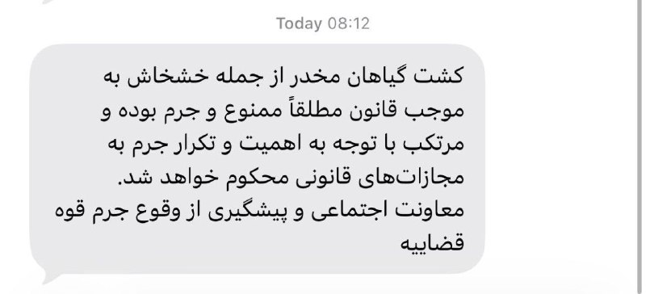

بیا برو بیشرف من پدرمم برام تعیین تکلیف نمیکنه هرچقدر دلم بخواد خشخاش میکارم

@Dirty_Kids 👻

## Dirty_Kids — post 389831

‌‏آدم ذره ذره به اينكه اتفاقاى زندگيشو به هيجكس نگه عادت مى كنه🤌🏻🤌🏻🤌🏻🤌🏻🤌🏻🤌🏻🤌🏻🤌🏻

@Dirty_Kids 👻

## Dirty_Kids — post 389830

‏انسان یهو به خودش میاد و می‌بینه‌ جدی جدی گناه داره.

@Dirty_Kids 👻

## Dirty_Kids — post 389828

  <a href="telegram/content/Dirty_Kids_389828_1779306105.mp4" target="_blank">🎬 Download video</a>

رسانه‌های حرومی و هزارپدر شیعه‌سانان رافضی از جمله رسانه‌های مادرجنده‌ی ورزشی در حال دروغ‌پراکنی و پرونده‌سازی برای «رشید مظاهری» دلاور و باشرف هستن،

این مادرقحبه‌های خدعه‌زاده‌ی عالم بعد از اینکه همسر رشید چند روز پیش اعلام کرد بعد از کلی پیگیری تونسته از محل بازداشت رشید در زندان ارومیه اطلاع پیدا کنه،

امروز اومدن یه داستان کسشر سر هم کردن و به دروغ نوشتن که رشید چهارشنبه گذشته در مرز ماکوی آذربایجان‌غربی چون اقوام نزدیک و مدیر برنامه‌اش ازش شکایت کرده بودن بازداشت شده.

رشید دلاور و باشرف ما چند روز بعد از کشتار وحشیانه‌ی دی ماه، تو این ویدئو شخص موشعلی حرومزاده رو مسئول کشتار مردم معرفی کرد و بعد از انتشار این ویدئو در اینستاگرامش بازداشت شد.

اومدم تهش بنویسم شرم بر فیفا که دیدم خیلی اضافه‌کاریه و باید رید به بالا تا پایین فیفا و همه‌ی ارگان‌های پدرخراب و فاسد بین‌المللی.



@Dirty_Kids 👻

## Dirty_Kids — post 389826

هوش مصنوعی بله:

@Dirty_Kids 👻

## Dirty_Kids — post 389825

  <a href="telegram/content/Dirty_Kids_389825_1779306106.mp4" target="_blank">🎬 Download video</a>

با اون برنامه اى كه با هلال احمر درآورد و اون چاپلوسى كه براى ج.ا كرد، انتظار ديگه اى نميرفت, يجورى حرف ميزنه انگار تويه دادگاه عادلانه محاكمه شده نه دادگاه ج.ا

@Dirty_Kids 👻

## Dirty_Kids — post 389824

  

طنز ماجرا اینجاست که یک حرومزاده به اسم محسن سازگارا دست راست خمینی و موسس سپاه میگه نه به پهلوی و از دموکراسی بگو (:

@Dirty_Kids 👻

## Dirty_Kids — post 389823

  <a href="https://t.me/Dirty_Kids/389823" target="_blank">📎 Download file</a>

✅ اپلیکیشن اندروید سایت جهانی دربی بت

💰اولین سایت جهانی با امکان شارژ و برداشت ریالی(کارت به کارت)

🔗 برای ورود فیلترشکن روی کشور مناسب قرار دهید مانند فنلاند و المان و....

😀Telegram Channel
👇
https://t.me/+bcynkEgSW2dlYTc0

## Dirty_Kids — post 389822

  

😤دنبال یه سایت شرط بندی بین المللی بودی که به ایرانیا خدمات بده؟!
⛔

👍دربی بت همون انتخاب  100%

💎ویژگی های سایت جهانی Derby Bet:

⬅️امکان شارژ امن با کارت بانکی

⬅️واریز اول دوبل شارژ می شوید(بونوس۱۰۰٪)

⬅️پر اپشن ترین سایت فعال در ایران

⬅️تسویه حساب کمتر از 5 دقیقه

⬅️برگشت بخشی از باخت به صورت هفتگی

🚨کد هدیه ثبت نام:GG007

⚠️برای دانلود اپلکیشن کلیک کنید
👉

🔔کانال دربی بت :

🪙https://t.me/+bcynkEgSW2dlYTc0

## Dirty_Kids — post 389818

جنده ننه توعه هرشب تو خیابون صیغه میشه

ذهن مریض تو که سیو کردی اینارو فقط که ناخواسته باعث شادی و خاطره بازی ما میشه

[شبی که ابرام رییسی سقط شد]

@Dirty_Kids 👻

## Dirty_Kids — post 389817

  <a href="telegram/content/Dirty_Kids_389817_1779306108.mp4" target="_blank">🎬 Download video</a>

ترامپ:
الان ایران نیروی دریایی، نیروی هوایی و همه چیزشو از دست داده تقریبا.
تنها سوال اینه که بریم کار رو تموم کنیم یا توافق رو امضا میکنن؟
ببینیم چه اتفاقی میفته.

@Dirty_Kids 👻

## Dirty_Kids — post 389816

  <a href="telegram/content/Dirty_Kids_389816_1779306110.mp4" target="_blank">🎬 Download video</a>

اجرای آهنگ "Delalım" توسط ایلکا حسابی سر و صدا به پا کرد

@Dirty_Kids 👻

## Hranews — post 113068

  

میان موشک و سرکوب؛ گزارش مجموعه فعالان حقوق بشر درباره مخاصمه نظامی ایالات متحده-اسرائیل و ایران منتشر شد 
💥
💥
💥
💥
💥 – امروز، مجموعه فعالان حقوق بشر در ایران گزارش جدیدی را در ۲۴۰ صفحه و دو زبان منتشر کرد که به بررسی کارزار نظامی ایالات متحده و اسرائیل در ایران…

## Hranews — post 113067

دستکم ۲ تجمع اعتراضی برگزار شد

❗️
❗️
❗️
❗️
❗️ – امروز چهارشنبه ۳۰ اردیبهشت ماه، شماری از کارگران قراردادی شرکت پایانه‌ها و مخازن پتروشیمی ماهشهر در اعتراض به کسر مزایای مزدی خود، تجمع اعتراضی برگزار کردند. همچنین، جمعی از کارگران شهرداری زنجان نیز در اعتراض به حذف اضافه کاری و عدم افزایش حقوق؛ دست به #تجمع اعتراضی زدند.

ادامه مطلب

↘️
@hranews_bot تماس ✉️ -  @Hranews  کانال هرانا 🆑

## Hranews — post 113066

  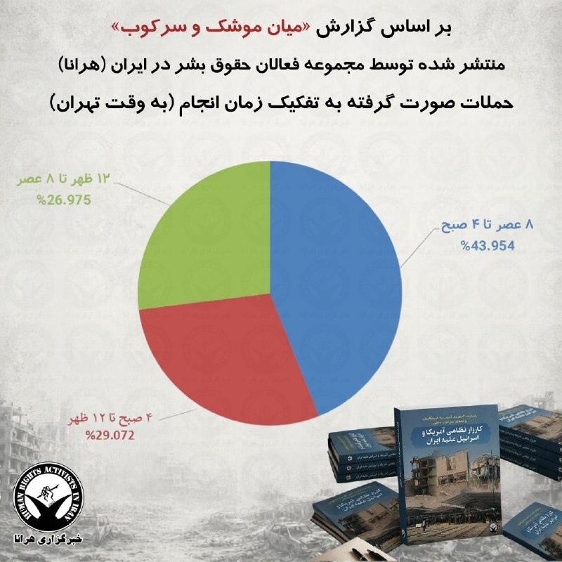

میان موشک و سرکوب؛ گزارش مجموعه فعالان حقوق بشر درباره مخاصمه نظامی ایالات متحده-اسرائیل و ایران منتشر شد 
💥
💥
💥
💥
💥 – امروز، مجموعه فعالان حقوق بشر در ایران گزارش جدیدی را در ۲۴۰ صفحه و دو زبان منتشر کرد که به بررسی کارزار نظامی ایالات متحده و اسرائیل در ایران…

## Hranews — post 113065

جرائم مواد مخدر؛ یک زندانی در زندان ساری اعدام شد

❗️
❗️
❗️
❗️
❗️ – سحرگاه روز یکشنبه ۱۳ اردیبهشت ماه، حکم یک زندانی که پیشتر بابت اتهامات مرتبط با جرائم مواد مخدر به #اعدام محکوم شده بود، در زندان ساری به اجرا در آمد.

ادامه مطلب

#یحیی_سبحانی

↘️
@hranews_bot تماس ✉️ -  @Hranews  کانال هرانا 🆑

## Hranews — post 113064

ضبط تجهیزات استارلینک؛ یک شهروند در هرمزگان بازداشت شد

❗️
❗️
❗️
❗️
❗️– فرماندهی انتظامی شهرستان خمیر واقع در استان هرمزگان در اطلاعیه‌ای از بازداشت یک شهروند در این شهرستان و ضبط تجهیزات اینترنت ماهواره‌ای استارلینک از وی خبر داد.

ادامه مطلب

↘️
@hranews_bot تماس ✉️ - @Hranews کانال هرانا 🆑

## Hranews — post 113063

بازماندگان از تحصیل بیشترین سهم از آمار خودکشی در خراسان شمالی را دارند

❗️
❗️
❗️
❗️
❗️– معاون اجتماعی و پیشگیری از وقوع جرم دادگستری خراسان شمالی اعلام کرد که طی پنج سال اخیر، بازماندگان از تحصیل، بالاترین سهم را در میان موارد #خودکشی در این استان به خود اختصاص داده‌اند.

ادامه مطلب

↘️
@hranews_bot تماس ✉️ - @Hranews کانال هرانا 🆑

## Hranews — post 113062

  

در نهمین روز بازداشت؛ خانواده مهدی شفاخواه همچنان از وضعیت او بی خبرند

❗️
❗️
❗️
❗️
❗️– کماکان از سرنوشت مهدی شفاخواه، فعال حوزه آموزش و حمایت از کودکان کار و ساکنان مناطق محروم که ۹ روز پیش در تهران بازداشت شد، اطلاعی حاصل نشده است. این وضعیت منجر به افزایش نگرانی‌های خانواده آقای شفاخواه شده است.

به گزارش خبرگزاری هرانا، ارگان خبری مجموعه فعالان حقوق بشر در ایران، مهدی شفاخواه، فعال اجتماعی کماکان در بازداشت به‌سر می‌برد.

یک منبع مطلع از وضعیت این فعال اجتماعی ضمن تایید این خبر به هرانا گفت: ۹ روز است که از بازداشت آقای شفاخواه می‌گذرد و وی همچنان از دسترسی به وکیل محروم مانده است. با وجود مراجعه برادر او، رضا شفاخواه، که خود وکیل دادگستری است، به خانواده اعلام شده که وی تنها امکان استفاده از وکلای مورد تأیید تبصره ماده ۴۸ را دارد.
همچنین، مراجعات مکرر خانواده این شهروند به مراجع قضایی و امنیتی برای کسب اطلاع از سرنوشت وی، تاکنون بی نتیجه بوده است.

#مهدی_شفاخواه

ادامه مطلب

↘️
@hranews_bot تماس ✉️ - @Hranews کانال هرانا 🆑

## Hranews — post 113061

زندان اوین؛ گزارشی از اعتصاب کریگ و لیندزی فورمن، زوج بریتانیایی

❗️
❗️
❗️
❗️
❗️– کریگ فورمن و لیندزی فورمن، دو شهروند بریتانیایی محبوس در زندان اوین، در اعتراض به شرایط نگهداری‌شان در زندان و قطع امکان برقراری تماس تلفنی با خانواده، دست به اعتصاب زده‌اند.

#کریگ_فورمن #لیندزی_فورمن

ادامه مطلب

↘️
@hranews_bot تماس ✉️ - @Hranews کانال هرانا 🆑

## Hranews — post 113060

  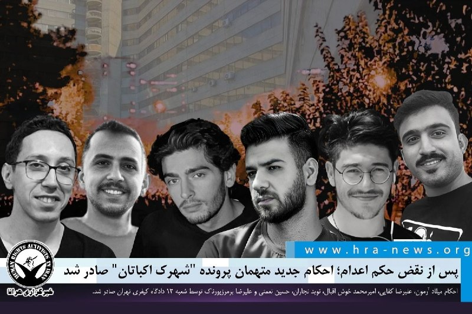

پس از نقض حکم اعدام در دیوان عالی کشور؛ احکام جدید متهمان پرونده “شهرک اکباتان” صادر شد

❗️
❗️
❗️
❗️
❗️– حکم شش تن از متهمان پرونده موسوم به “#شهرک_اکباتان” توسط شعبه ۱۳ دادگاه کیفری یک استان تهران صادر شد. بر اساس رای صادره، میلاد آرمون، علیرضا کفایی و امیرمحمد خوش‌اقبال به اتهام مشارکت در قتل، هر یک به پرداخت دیه و حبس محکوم شدند. همچنین نوید نجاران، حسین نعمتی و علیرضا برمرزپورناک از اتهام مشارکت در قتل تبرئه شدند. حکم اعدام این افراد پیشتر در دیوان عالی کشور نقض شده بود.

به گزارش خبرگزاری هرانا، ارگان خبری مجموعه فعالان حقوق بشر در ایران، حکم متهمان پرونده موسوم به “شهرک اکباتان” توسط شعبه ۱۳ دادگاه کیفری یک استان تهران صادر شد.

بر اساس حکم صادره، میلاد آرمون، علیرضا کفایی و امیرمحمد خوش‌اقبال از بابت اتهام مشارکت در قتل عمد، هر یک به پرداخت سهمی مساوی از دیه کامل یک انسان و تحمل ۵ سال حبس محکوم شدند. همچنین علیرضا برمرزپورناک، حسین نعمتی و نوید نجاران، سه متهم دیگر این پرونده، به دلیل فقدان مدارک دال بر وارد کردن ضربه به ناحیه مشخصی از بدن آرمان علی‌وردی، از اتهام مشارکت در قتل عمد تبرئه شدند.
حکم مذکور در تاریخ ۱۵ بهمن ماه سال گذشته صادر و روز گذشته به وکلای این متهمان ابلاغ شده است.

#میلاد_آرمون #علیرضا_کفایی #امیرمحمد_خوش‌اقبال #علیرضا_برمرزپورناک #حسین_نعمتی #نوید_نجاران

ادامه مطلب

↘️
@hranews_bot تماس ✉️ - @Hranews کانال هرانا 🆑

## Hranews — post 113059

  

گزارشی از بازداشت و آزادی مجید کریمی در تهران

❗️
❗️
❗️
❗️
❗️– روز جمعه ۲۵ اردیبهشت ماه، مجید کریمی، با قرار وثیقه آزاد شد. وی، مورخ ۲۴ اردیبهشت ماه توسط نیروهای امنیتی در تهران بازداشت شده بود.

به گزارش خبرگزاری هرانا، ارگان خبری مجموعه فعالان حقوق بشر در ایران، مجید کریمی آزاد شد.

بر اساس این گزارش، آزادی مجید کریمی روز جمعه ۲۵ اردیبهشت ماه پس از اتمام مراحل بازجویی با قرار وثیقه از یکی از بازداشتگاه های امنیتی تهران صورت گرفته است.

#مجید_کریمی

ادامه مطلب

↘️
@hranews_bot تماس ✉️ - @Hranews کانال هرانا 🆑

## Hranews — post 113057

قوه قضاییه؛ رشید مظاهری به اتهام “فعالیت تبلیغی بر خلاف امنیت ملی” در زندان است

❗️
❗️
❗️
❗️
❗️– مرکز رسانه قوه قضاییه اعلام کرد که رشید مظاهری، بازیکن سابق فوتبال، از بابت اتهاماتی از جمله «فعالیت تبلیغی بر خلاف امنیت ملی» بازداشت و به زندان منتقل شده است.

#رشید_مظاهری

ادامه مطلب

↘️
@hranews_bot تماس ✉️ - @Hranews کانال هرانا 🆑

## officialrezapahlavi — post 1834

نسخه کامل گفتگو در نشست آینده تکنولوژی ایران

این نشست روز ۱۶ مه (۲۶ اردیبهشت) در محل دفتر مرکزی شرکت «اوبر» در شهر سان‌فرانسیسکو در ایالت کالیفرنیای آمریکا برگزار شد.

@OfficialRezaPahlavi

## manototv — post 105703

  <a href="telegram/content/manototv_105703_1779306113.mp4" target="_blank">🎬 Download video</a>

‌
دونالد ترامپ گفت آمریکا در آستانه تصمیم‌گیری درباره ایران قرار دارد و اگر پاسخ‌های مورد نظر واشینگتن دریافت نشود، تحولات می‌تواند «خیلی سریع» رخ دهد.

ترامپ گفت: «اگر پاسخ‌های درست را نگیریم، همه‌چیز خیلی سریع پیش خواهد رفت. ما کاملاً آماده‌ایم.»

او تأکید کرد هرگونه پاسخ از سوی جمهوری اسلامی باید «کامل و صددرصد قابل قبول» باشد و افزود در صورت دستیابی به توافق، «زمان، انرژی و جان انسان‌های زیادی» حفظ خواهد شد.

رئیس‌جمهوری آمریکا همچنین گفت ممکن است تصمیم‌گیری ظرف چند روز انجام شود، اما تأکید کرد روند تحولات می‌تواند «بسیار سریع» باشد.

ترامپ در ادامه ایران را «کشوری شکست‌خورده» توصیف کرد و گفت آمریکا اکنون با افرادی مذاکره می‌کند که به گفته او «بسیار منطقی‌تر» از مقام‌های پیشین جمهوری اسلامی هستند.

او افزود: «ما با افرادی بااستعداد و باهوش طرف هستیم و از این موضوع تحت تأثیر قرار گرفته‌ایم.»

ترامپ همچنین گفت اگر با چند روز صبر کردن بتوان از جنگ یا کشته شدن انسان‌ها جلوگیری کرد، «این کار ارزش انجام دادن دارد.»

## manototv — post 105702

  <a href="telegram/content/manototv_105702_1779306114.mp4" target="_blank">🎬 Download video</a>

تماسی از ایران:
«می‌گفت دیکتاتوری با بازتولید ظلم ادامه پیدا می‌کنه…
می‌گفت باید این چرخه رو شکست؛
با اعتصاب و نایستادن پای این شرایط.»

## manototv — post 105701

  <a href="telegram/content/manototv_105701_1779306116.mp4" target="_blank">🎬 Download video</a>

‌
دونالد ترامپ درباره مذاکرات با جمهوری اسلامی گفت آمریکا تا زمان دستیابی به توافق، هیچ‌گونه تخفیف یا امتیازی ارائه نخواهد کرد.

ترامپ همچنین گفت واشینگتن «چند روز» منتظر پاسخ تهران خواهد ماند.

رئیس جمهور آمریکا در ادامه تاکید کرد: «این موضوع به‌زودی، به هر شکلی که باشد، پایان خواهد یافت.»

او با اشاره به روند مذاکرات افزود: «ما با افراد منطقی طرف هستیم» و تأکید کرد: «باید به پاسخ درست برسیم.»

## manototv — post 105700

  <a href="telegram/content/manototv_105700_1779306116.mp4" target="_blank">🎬 Download video</a>

وزارت دادگستری آمریکا علیه رائول کاسترو، رئیس‌جمهوری پیشین کوبا و برادر فیدل کاسترو، اعلام جرم کرد.

بر اساس کیفرخواستی که در دادگاه فدرال میامی منتشر شده، رائول کاسترو ۹۴ ساله به همراه پنج نفر دیگر به اتهام قتل، توطئه برای کشتن شهروندان آمریکایی و انهدام هواپیما متهم شده‌اند.

این پرونده به سرنگونی دو هواپیمای متعلق به گروه «برادران نجات» در سال ۱۹۹۶ مربوط می‌شود؛ گروهی از تبعیدیان کوبایی که برای کمک به پناهجویان کوبایی فعالیت می‌کردند. در آن حادثه، چهار نفر کشته شدند.

آمریکا می‌گوید جنگنده‌های کوبایی این هواپیماها را بر فراز آب‌های بین‌المللی هدف قرار داده‌اند، اما دولت کوبا همواره مدعی بوده این هواپیماها وارد حریم هوایی این کشور شده بودند.

این اقدام که بخشی از کارزار فشار دولت ترامپ علیه حکومت کمونیستی کوباست، تنش‌ها میان واشینگتن و هاوانا را به سطح تازه‌ای رسانده است

## manototv — post 105699

  <a href="telegram/content/manototv_105699_1779306117.mp4" target="_blank">🎬 Download video</a>

‌
سنتکام، ستاد فرماندهی مرکزی آمریکا، با انتشار ویدیویی اعلام کرد تفنگداران دریایی آمریکا در خلیج عمان یک نفتکش تجاری با پرچم ایران را متوقف و بازرسی کرده‌اند.

به گفته سنتکام، نیروهای «واحد اعزامی سی‌ویک تفنگداران دریایی آمریکا» ساعاتی پیش سوار نفتکش «سلستیال سی» شدند؛ کشتی‌ای که به تلاش برای نقض محاصره دریایی آمریکا و حرکت به‌سوی یکی از بنادر ایران مظنون بوده است.

سنتکام اعلام کرد نیروهای آمریکایی پس از بازرسی کامل نفتکش، به خدمه دستور تغییر مسیر دادند و سپس کشتی را آزاد کردند.

در بیانیه سنتکام آمده است نیروهای آمریکا همچنان «به‌طور کامل» محاصره دریایی را اجرا می‌کنند و تاکنون مسیر ۹۱ کشتی تجاری را برای اطمینان از رعایت این محدودیت‌ها تغییر داده‌اند.

## manototv — post 105698

این خالکوبی فقط یک نقش روی صورتش نیست…
زخمِ نسلی‌ست که سال‌ها درد را نفس کشید، فریاد زد، سکوت کرد، گریه کرد، شکست، ایستاد، اما فراموش نکرد.

یادِ کودکانی‌ست که جنگ و ترس را زودتر از زندگی شناختند.

او می‌خواهد مردم هر بار که به این طرح روی صورتش نگاه می‌کنند، قصه‌ی روزهایی را به یاد بیاورند که از میان آتش، ترس، درد، ناامیدی و امید عبور کردند.

اما این فقط درد نیست…
این تتو، یادآور امید و زندگی هم هست.
یادآور روزهایی که هنوز برای ساختنشان زنده‌اند.

درست است که این تتو، طرحی از «God of War» است…
اما آن را به رنگ سبز انتخاب کرده‌اند؛ به نشانه عشق، صلح، امید و زندگی.

برای اینکه حقیقت فراموش نشود،
برای اینکه نسل بعد بداند مردم از چه روزهایی عبور کردند…
و چگونه با تمام زخم‌هایشان، هنوز عاشق ایران و ایرانی ماندند.

فراموش نکنید…
وقتی انسان‌ها برای شرافت، معرفت، عشق و گذشت ارزش قائل نشوند، ارزش‌ها کم‌کم معنای خودشان را از دست می‌دهند.

اول به انسان‌ها، بعد به حیوانات و در نهایت به طبیعت و گیاهان رحم کنیم و عشق بورزیم…
شاید دنیا هم یاد بگیرد که با ما مهربان‌تر باشد.

او سوخت…
آن‌ها سوختند…

یادتان نرود…
یادمان نرود.

## manototv — post 105697

  <a href="telegram/content/manototv_105697_1779306118.mp4" target="_blank">🎬 Download video</a>

نیروی دریایی سپاه اعلام کرده طی ۲۴ ساعت گذشته ۲۶ کشتی از تنگه هرمز عبور کرده‌اند.
با این حال، رویترز می‌نویسد این روند که در ظاهر نشانه‌ای از باز شدن مسیر کشتیرانی است، در عمل می‌تواند نشانه‌ای از افزایش کنترل جمهوری‌اسلامی بر این آبراه راهبردی باشد.
تهران پیش‌تر اعلام کرده بود در صورت دریافت هزینه یا عوارض از کشتی‌های تجاری، امکان بازگشایی تنگه هرمز را بررسی خواهد کرد؛ آبراهی که حدود یک‌پنجم صادرات نفت جهان از آن عبور می‌کند.
بر اساس این گزارش و به نقل از ۲۰ منبع، جمهوری‌اسلامی اکنون ایست‌های بازرسی نظامی، بررسی کشتی‌ها، ترتیبات دیپلماتیک و در برخی موارد دریافت هزینه امنیتی برای عبور ایمن را در این مسیر اعمال کرده است.
رویترز همچنین می‌گوید تهران در عمل در حال ایجاد یک «سازوکار پیچیده و چندلایه» است که به کشتی‌ها اجازه عبور می‌دهد، اما تنها در صورتی که از سوی نیروهای جمهوری‌اسلامی تأیید شوند.

## manototv — post 105696

  <a href="telegram/content/manototv_105696_1779306118.mp4" target="_blank">🎬 Download video</a>

تیم ملی فوتبال ایران هنوز ویزای آمریکا برای جام جهانی را دریافت نکرده است.

مقام‌های ایرانی گفته‌اند بازیکنان و اعضای کادر فنی تیم ملی هنوز موفق به دریافت ویزا برای حضور در جام جهانی ۲۰۲۶ در آمریکا نشده‌اند و قرار است برای دریافت ویزا از طریق سفارت کانادا در ترکیه اقدام کنند.

تیم ملی ایران قرار است ۱۵ ژوئن در نخستین بازی خود در گروه G در لس‌آنجلس به مصاف نیوزیلند برود و سپس برابر بلژیک و مصر بازی کند.

## manototv — post 105695

  <a href="telegram/content/manototv_105695_1779306119.mp4" target="_blank">🎬 Download video</a>

دونالد ترامپ، رئیس‌جمهور آمریکا، در ادامه سخنرانی خود در آکادمی گارد ساحلی آمریکا در ایالت کنتیکت گفت این نیرو نقش مهمی در عملیات «خشم حماسی» داشته است. ترامپ گفته گارد ساحلی آمریکا در اجرای محاصره علیه ایران کمک کرده و نمونه‌ای از آن را توقیف یک نفتکش ایرانی تحریم‌شده در نزدیکی سواحل مالزی عنوان کرد؛ نفتکشی که به گفته او نفت را از جزیره خارک حمل می‌کرده است.
او خطاب به حضار گفت: «این سومین کشتی ایرانیِ تحریم‌شده است که گارد ساحلی از زمان آغاز درگیری‌ها درگیری واقعی در توقیف آن کمک کرده است.»
ترامپ افزود: «با ایران و احتمالا موارد بیشتری هم در راه است، مگر اینکه آن‌ها عاقل شوند.» او همچنین گفته او گفت: «همه‌چیزشان از بین رفته؛ نیروی دریایی‌شان نابود شده، نیروی هوایی‌شان از بین رفته، تقریباً همه‌چیز.»
ترامپ افزود: «تنها سوال این است که آیا می‌رویم و کار را تمام می‌کنیم یا آن‌ها قرار است یک توافق امضا کنند. باید ببینیم چه اتفاقی می‌افتد.»

## manototv — post 105694

  <a href="telegram/content/manototv_105694_1779306119.mp4" target="_blank">🎬 Download video</a>

اسماعیل بقائی، سخنگوی وزارت خارجه جمهوری‌اسلامی اعلام کرده روند تبادل پیام‌ها میان جمهوری‌اسلامی و آمریکا «بر اساس متن ۱۴‌بندی پیشنهادی ایران» همچنان ادامه دارد و حضور وزیر کشور پاکستان در این روند با هدف «تسهیل مبادله پیام‌ها» میان دو طرف انجام شده است. وزیر کشور پاکستان امروز برای دومین بار طی یک هفته به تهران سفر کرد. به گفته سخنگوی وزارت خارجه نظام، تمرکز تهران بر «خاتمه جنگ در تمامی جبهه‌ها از جمله لبنان»، آزادسازی پول‌های بلوکه شده ایران، و توقف «راهزنی دریایی‌» اشاره به محاصره دریایی آمریکا در تنگه هرمز است.

## manototv — post 105693

  <a href="telegram/content/manototv_105693_1779306120.mp4" target="_blank">🎬 Download video</a>

دونالد ترامپ، رئیس‌جمهور آمریکا، در سخنرانی خود در مراسم فارغ‌التحصیلی آکادمی گارد ساحلی آمریکا در نیو لندنِ ایالت کنتیکت، بار دیگر جمهوری‌اسلامی را درباره برنامه هسته‌ای‌اش تهدید کرد و رسانه‌ها را «اخبار جعلی» خواند.
ترامپ که پشت شیشه ضدگلوله سخنرانی می‌کرد، پس از پرداختن به مسائل داخلی آمریکا، دوباره به موضوع ایران بازگشت و گفت: «ما اجازه نخواهیم داد ایران به سلاح هسته‌ای دست پیدا کند. موضوع همین‌قدر ساده است.»
او همچنین گفت جمهوری‌اسلامی «به‌شدت» خواهان توافق است و افزود: «باید ببینیم چه اتفاقی می‌افتد.»
ترامپ با اشاره به حملات آمریکا گفت: «ما ضربات بسیار سختی به آن‌ها زدیم و شاید مجبور شویم حتی شدیدتر هم ضربه بزنیم.»

## manototv — post 105692

  <a href="telegram/content/manototv_105692_1779306120.mp4" target="_blank">🎬 Download video</a>

در پی تیراندازی افراد مسلح به نیروهای پلیس در یکی از محورهای شهرستان سراوان در استان سیستان و بلوچستان، یک مامور پلیس کشته شد.
بر اساس گزارش‌ها، سرنشینان مسلح یک خودروی سواری به سمت نیروهای امنیتی تیراندازی کردند که در نتیجه آن، ستوان سوم امیرحسین شهرکی جان خود را از دست داد.
پلیس اعلام کرده افراد مهاجم تحت تعقیب قرار گرفته‌اند و طرح‌های امنیتی و انتظامی در مناطق اطراف در حال اجراست.

## manototv — post 105691

  <a href="telegram/content/manototv_105691_1779306121.mp4" target="_blank">🎬 Download video</a>

وزیر خارجه عربستان از تصمیم ترامپ برای تعویق حمله به ایران استقبال کرد.

فیصل بن فرحان، وزیر خارجه عربستان سعودی، در پیامی در شبکه اکس نوشت کشورش از تصمیم دونالد ترامپ برای دادن زمان بیشتر به مذاکرات با تهران استقبال می‌کند و ریاض از «فرصت دادن به دیپلماسی» برای پایان جنگ و بازگرداندن امنیت و آزادی کشتیرانی در تنگه هرمز حمایت می‌کند.

بن فرحان همچنین از جمهوری اسلامی خواست «فوراً» به تلاش‌ها برای پیشبرد مذاکرات و دستیابی به توافقی جامع پاسخ دهد.

## manototv — post 105690

  <a href="telegram/content/manototv_105690_1779306121.mp4" target="_blank">🎬 Download video</a>

انفجار خودروی متعلق به سازمان حمل‌ونقل نیویورک در نزدیکی وال‌استریت، باعث وحشت و فرار عابران شد.

ویدیوهای منتشرشده نشان می‌دهد این خودرو پس از آتش‌گرفتن، مقابل ساختمان مرکزی «ام‌تی‌ای» در منهتن به گلوله‌ای از آتش تبدیل شد.

آتش‌نشانی نیویورک اعلام کرد این حادثه تلفاتی نداشته و علت آن در دست بررسی است.

## manototv — post 105689

  <a href="telegram/content/manototv_105689_1779306122.mp4" target="_blank">🎬 Download video</a>

‌
الجزیره به نقل از «منابع دیپلماتیک» گزارش داد شمار کشورهای حامی پیش‌نویس قطعنامه درباره تنگه هرمز به ۱۳۶ کشور رسیده است.

پیش‌نویس این قطعنامه از جمهوری اسلامی می‌خواهد حملات و مین‌گذاری در تنگه هرمز را متوقف کند، اما دیپلمات‌ها می‌گویند در صورت مطرح شدن برای رأی‌گیری، احتمالاً با وتوی چین و روسیه روبه‌رو خواهد شد.

چین و روسیه ماه گذشته نیز قطعنامه مشابهی را که با حمایت آمریکا ارائه شده بود، وتو کرده بودند و آن را جانبدارانه علیه جمهوری اسلامی دانستند.

## manototv — post 105688

  <a href="telegram/content/manototv_105688_1779306123.mp4" target="_blank">🎬 Download video</a>

فرانسه پس از انتشار ویدیویی از برخورد با فعالان ناوگان امدادی عازم غزه، سفیر اسرائیل را احضار می‌کند. ایتالیا نیز پیش‌تر اقدام مشابهی انجام داده بود.
ژان‌نوئل بارو، وزیر خارجه فرانسه، رفتار ایتامار بن‌گویر، وزیر امنیت ملی اسرائیل از جناح راست افراطی، با فعالان بین‌المللی را «غیرقابل قبول» توصیف کرد و گفت پاریس خواهان توضیح رسمی از اسرائیل است.
این واکنش‌ها پس از انتشار ویدیویی از سوی بن‌گویر مطرح شد که او را در محل نگهداری فعالان «فلوتیلا گلوبال سومود» نشان می‌دهد؛ کاروانی متشکل از ده‌ها قایق و صدها فعال از کشورهای مختلف که چند روز پیش در آب‌های بین‌المللی، حدود ۲۵۰ مایل دریایی از غزه، توسط نیروی دریایی اسرائیل متوقف شد.
اسرائیل این کاروان را «تحریک‌آمیز» و حامی حماس توصیف کرده و فعالان را به بندر اشدود منتقل کرده است.
در ویدیوی منتشرشده، بن‌گویر در حالی که پرچم اسرائیل در دست دارد، مقابل فعالان دست‌بندزده می‌گوید: «به اسرائیل خوش آمدید، ما صاحب‌خانه‌ایم» و آن‌ها را «حامی تروریسم» می‌خواند. او همچنین از بنیامین نتانیاهو خواسته این افراد «برای مدت طولانی» در زندان نگهداری شوند.
این ویدیو در چند ساعت نخست بیش از ۱.۷ میلیون بار دیده شد و موجی از واکنش‌های تند را در اسرائیل و خارج از این کشور به‌دنبال داشت.
برخی مقام‌های اسرائیلی، از جمله گیدئون ساعر، وزیر خارجه اسرائیل، رفتار بن‌گویر را آسیب‌زننده به وجهه اسرائیل دانسته‌اند. دفتر نتانیاهو نیز با دفاع از توقیف ناوگان، اعلام کرده نحوه برخورد بن‌گویر «با ارزش‌ها و هنجارهای اسرائیل همخوانی ندارد» و خواستار اخراج سریع فعالان شده است.

## manototv — post 105687

  <a href="telegram/content/manototv_105687_1779306124.mp4" target="_blank">🎬 Download video</a>

‌
دونالد ترامپ، رئیس‌جمهوری آمریکا، با اشاره به وضعیت داخلی ایران گفت مطمئن نیست مقام‌های جمهوری اسلامی «خیر و صلاح مردم» را بخواهند.

ترامپ گفت: «بعضی از کارهایی که با من می‌کنند نشان می‌دهد که خیر مردم را نمی‌خواهند، در حالی که باید خیر مردم را بخواهند.»

او همچنین از افزایش نارضایتی عمومی در ایران سخن گفت و افزود: «الان خشم زیادی در ایران وجود دارد، چون مردم در شرایط بسیار بدی زندگی می‌کنند.»

رئیس‌جمهوری آمریکا همچنین گفت در ایران «ناآرامی و التهاب زیادی» وجود دارد که به گفته او، مشابه آن پیش‌تر دیده نشده است.

## manototv — post 105686

  <a href="telegram/content/manototv_105686_1779306125.mp4" target="_blank">🎬 Download video</a>

محمدباقر قالیباف، رئیس مجلس شورای اسلامی، در آنچه رسانه‌های حکومتی «سومین فایل صوتی» توصیف کرده‌اند از جمله گفته «تحرکات آشکار و پنهان دشمن نشان می‌دهد که طرف مقابل به‌دنبال آغاز دور جدیدی از جنگ است.»

## manototv — post 105685

  <a href="telegram/content/manototv_105685_1779306125.mp4" target="_blank">🎬 Download video</a>

مدیرعامل شرکت ملی نفت ابوظبی، اعلام کرده است امارات متحده عربی اجرای طرح ساخت یک خط لوله جدید برای دور زدن تنگه هرمز را پیش برده و این پروژه اکنون ۵۰ درصد پیشرفت داشته است.
در حال حاضر خط لوله عملیاتی امارات، خط لوله حبشان–فجیره است که از میادین نفتی حبشان در جنوب‌غرب ابوظبی تا بندر فجیره در دریای عمان امتداد دارد.
این خط لوله در حال حاضر توان انتقال تا ۱.۸ میلیون بشکه نفت در روز را دارد. تاسیسات نفتی فجیره از زمان آغاز جنگ چندین بار هدف حملات پهپادی منتسب به ایران قرار گرفته است.
بر اساس اعلام مقامات اماراتی، خط لوله جدید قرار است ظرفیت کل صادرات نفت این کشور را تا سال آینده دو برابر کند.

## manototv — post 105684

  <a href="telegram/content/manototv_105684_1779306126.mp4" target="_blank">🎬 Download video</a>

دادبان پیرامون پرونده اکباتان گزارش داده شعبه ۱۳ دادگاه کیفری یک استان تهران در رای جدید خود، اعلام کرده که در این پرونده امکان صدور حکم قصاص وجود ندارد. بر اساس حکم جدید، میلاد آرمون، علیرضا کفایی و امیرمحمد خوش‌اقبال به اتهام مشارکت در قتل عمد، هر کدام به پرداخت دیه کامل به‌صورت مساوی و تحمل ۵ سال حبس محکوم شده‌اند.
در همین پرونده، علیرضا برمرزپورناک، حسین نعمتی و نوید نجاران از اتهام مشارکت در قتل عمد تبرئه شده‌اند. دادگاه دلیل این تصمیم را نبود ادله کافی درباره این موضوع عنوان کرده که ضربه مرگبار دقیقا توسط چه فردی وارد شده است.
در رای صادر شده تاکید شده که هر چند متهمان در درگیری و ضرب‌وشتم آرمان علی‌وردی، بسیجی کشته‌شده در جریان اعتراضات سراسری ۱۴۰۱ حضور داشته‌اند، اما به دلیل مشخص نبودن عامل ضربه منجر به فوت، شرایط صدور حکم قصاص فراهم نیست.
این در حالی است که پیش‌تر همین شعبه در رای متفاوت، این شش متهم را به قصاص محکوم کرده بود؛ حکمی که بعدا با نظر دیوان عالی کشور نقض و برای رسیدگی مجدد به دادگاه بدوی بازگردانده شد.

## alonews — post 121411

🌟 اشتراک v2ray استارلینک 
🗯گیگی 150,000 تومان 
🔗لینک ساب برا چک کردن مصرف و حجمتون 
🔥سرعت و کیفیت بالا 
✅ پشتیبانی دائم 
📱جهت خرید پیام بدین : @v2safeBot

## alonews — post 121410

  

🌟 اشتراک v2ray استارلینک

🗯گیگی 150,000 تومان

🔗لینک ساب برا چک کردن مصرف و حجمتون

🔥سرعت و کیفیت بالا

✅ پشتیبانی دائم

📱جهت خرید پیام بدین : @v2safeBot

## alonews — post 121409

  <a href="telegram/content/alonews_121409_1779306127.webm" target="_blank">🎬 Download video</a>

🔴فووووووووووووووووووووووووووری

## alonews — post 121408

🔴فووووووووووووووووووووووووووری

## alonews — post 121407

  <a href="telegram/content/alonews_121407_1779306127.webm" target="_blank">🎬 Download video</a>

👈 ترامپ درباره ایران: «شرایط در نقطه حساسی است، باور کنید. اگر پاسخ‌های درست را نگیریم، خیلی سریع پیش می‌رود. همه چیز آماده است. باید پاسخ‌های درست را بگیریم، پاسخ‌ها باید ۱۰۰٪ کامل و خوب باشند.»

✅ @AloNews خبر جنگ

## alonews — post 121406

  <a href="telegram/content/alonews_121406_1779306127.mp4" target="_blank">🎬 Download video</a>

👈خبرنگار : قصد داری به اونا ( ایران) حمله کنی‌؟

🔴ترامپ : چرا باید اینو بهت بگم

✅ @AloNews خبر جنگ

## alonews — post 121405

  <a href="telegram/content/alonews_121405_1779306128.mp4" target="_blank">🎬 Download video</a>

👈خبرنگار : از این رفت و برگشت با ایران خسته نمیشی؟

🔴 ترامپ : من هیچوقت خسته نمیشم ولی اگه با چند روز صبر کردن بشه جلوی جنگ و کشته شدن مردم رو گرفت کار خوبیه

✅ @AloNews خبر جنگ

## alonews — post 121404

  <a href="telegram/content/alonews_121404_1779306129.webm" target="_blank">🎬 Download video</a>

👈 امروز اوایل روز، بحث داغی در داخل کاخ سفید درباره ایران شکل گرفت، جایی که جی‌دی ونس، استیو ویتکاف و جرد کوشنر برای توافق اولیه‌ای جهت پایان دادن به جنگ تلاش می‌کردند، در حالی که پیت هگست و مارکو روبیو برای فشار بیشتر و احتمال اقدام نظامی استدلال می‌کردند - گزارش آکسیوس

✅ @AloNews خبر جنگ

## alonews — post 121403

  <a href="telegram/content/alonews_121403_1779306130.mp4" target="_blank">🎬 Download video</a>

👈ترامپ در تماس خود با اردوغان ترکیه: من تماس بسیار خوبی با رئیس‌جمهور اردوغان داشتم. ما رابطه بسیار خوبی داریم.

🔴آیا خوب نیست که من با برخی افراد بسیار سرسخت رابطه دارم؟ او فردی سرسخت است، اما من رابطه‌ای با او دارم که هیچ کس دیگر ندارد.

🔴او در واقع کار خوبی انجام داده است. او، می‌دانید، من فکر می‌کنم که بسیار متحد بوده است. برخی افراد ممکن است در این شک داشته باشند، اما من فکر می‌کنم او یک متحد عالی بوده و مردمش به او احترام می‌گذارند. مردمش خیلی به او احترام می‌گذارند.

✅ @AloNews خبر جنگ

## alonews — post 121402

  <a href="telegram/content/alonews_121402_1779306131.mp4" target="_blank">🎬 Download video</a>

👈 گزارشگر: آیا آمریکا در جریان مذاکرات صلح، لغو تحریم‌های نفتی علیه ایران را پیشنهاد داده است، همانطور که رسانه‌های دولتی ایران گزارش داده‌اند؟

🔴ترامپ: نه، من چنین چیزی نشنیده‌ام. تا زمانی که آنها توافقنامه‌ای امضا نکنند، هیچ لغویی انجام نمی‌دهم.

🔴وقتی آنها توافقنامه را امضا کنند، می‌توانیم آنجا را دوباره بسازیم و چیزی داشته باشیم که واقعاً برای مردم کشور خوبی باشد.

🔴اما نه، ما هیچ پیشنهادی نداده‌ایم

✅ @AloNews خبر جنگ

## alonews — post 121401

  <a href="telegram/content/alonews_121401_1779306133.mp4" target="_blank">🎬 Download video</a>

👈ترامپ : کوبا یه کشور شکست خورده‌ست نفت ندارن ما اونجاییم که کمک کنیم داریم کوبا رو آزاد می‌کنیم

✅ @AloNews خبر جنگ

## alonews — post 121400

  <a href="telegram/content/alonews_121400_1779306135.mp4" target="_blank">🎬 Download video</a>

👈خبرنگار : پیامت به خانواده‌های آمریکایی که از هوش مصنوعی می‌ترسن چیه اونا نگرانن بچه‌هاشون تو آینده کار نداشته باشن

🔴 ترامپ : هوش مصنوعی فوق‌العاده‌ست ایران نباید سلاح هسته‌ای داشته باشه

✅ @AloNews خبر جنگ

## alonews — post 121399

  <a href="telegram/content/alonews_121399_1779306137.mp4" target="_blank">🎬 Download video</a>

👈ترامپ درباره ایران: ما در واقع با برخی افراد بسیار خوب سر و کار داریم.

🔴ما با افرادی که استعداد و هوش بالایی دارند، سر و کار داریم.

🔴ما بسیار تحت تأثیر قرار گرفته‌ایم.

✅ @AloNews خبر جنگ

## alonews — post 121398

  <a href="telegram/content/alonews_121398_1779306139.webm" target="_blank">🎬 Download video</a>

👈ترامپ: اگر پاسخ‌های درست درباره ایران را نگیرم، سریعاً اقدام می‌کنم؛ من به پاسخ‌های کامل و صددرصد خوب از ایران نیاز دارم

✅ @AloNews خبر جنگ

## alonews — post 121397

  <a href="telegram/content/alonews_121397_1779306139.webm" target="_blank">🎬 Download video</a>

👈 پولیتیکو: جمهوری‌خواه‌های مجلس رای‌گیری درباره اختیارات جنگ با ایران رو امروز عقب انداختن

✅ @AloNews خبر جنگ

## alonews — post 121396

  <a href="telegram/content/alonews_121396_1779306139.webm" target="_blank">🎬 Download video</a>

👈اکسیوس: منابع گفتند که قطر و پاکستان با مشارکت دیگر میانجی‌گران منطقه‌ای، یک یادداشت تفاهم اصلاح‌شده صلح را تهیه کرده‌اند تا شکاف‌های بین آمریکا و ایران را کاهش دهند

✅ @AloNews خبر جنگ

## alonews — post 121395

  <a href="telegram/content/alonews_121395_1779306140.webm" target="_blank">🎬 Download video</a>

👈مسعود پزشکیان: ایران همواره به تعهدات خود پایبند بوده و هر راهی را برای جلوگیری از جنگ بررسی کرده است؛ همه مسیرها از طرف ما باز است.

🔴وادار کردن ایران به تسلیم از طریق اجبار چیزی جز توهم نیست.

🔴احترام متقابل در دیپلماسی بسیار عاقلانه‌تر، ایمن‌تر و پایدارتر از جنگ است

✅ @AloNews خبر جنگ

## alonews — post 121394

  <a href="telegram/content/alonews_121394_1779306140.webm" target="_blank">🎬 Download video</a>

👈 عاصم منیر فردا به تهران می‌رود احتمالا خبر مهمی در راه است

🔴روزنامه ابزرور پاکستان: فیلد مارشال سید عاصم منیر، رئیس ستاد ارتش، به عنوان چهره‌ای کلیدی در روند دیپلماتیک ایران و آمریکا، فردا به ایران می‌رود. در طول این سفر احتمالی، انتظار می‌رود اعلامیه‌ای مبنی بر تأیید تکمیل پیش‌نویس نهایی توافق منتشر شود.

🔴 این سفر می‌تواند به عنوان یک نقطه عطف دیپلماتیک سطح بالا باشد، جایی که تکمیل نسخه نهایی توافق ممکن است رسماً اعلام شود

✅ @AloNews خبر جنگ

## alonews — post 121393

  <a href="telegram/content/alonews_121393_1779306140.webm" target="_blank">🎬 Download video</a>

👈امروز اوایل روز، بحث داغی در داخل کاخ سفید درباره ایران شکل گرفت، جایی که جی‌دی ونس، استیو ویتکاف و جرد کوشنر برای توافق اولیه‌ای جهت پایان دادن به جنگ تلاش می‌کردند، در حالی که پیت هگست و مارکو روبیو برای فشار بیشتر و احتمال اقدام نظامی استدلال می‌کردند - گزارش آکسیوس

✅ @AloNews خبر جنگ

## alonews — post 121392

  <a href="telegram/content/alonews_121392_1779306140.webm" target="_blank">🎬 Download video</a>

👈کلش ریپورت: اردوغان در تماس تلفنی با ترامپ درباره روابط ترکیه و آمریکا و مسائل منطقه‌ای صحبت کرد.

✅ @AloNews خبر جنگ

<!-- MSG END -->

<!-- NAV START -->

<a href="https://github.com/nayebireza5-del/aiohghjbbbvm/blob/main/telegram/content/archive_1.md" style="display:inline-block; padding:6px 12px; margin:0 4px; background-color:#2ea44f; color:white; text-decoration:none; border-radius:4px; font-weight:bold;">صفحه بعد</a>

<!-- NAV END -->
