# خواننده تلگرام

<!-- TOP_NAV START -->

<a href="https://github.com/nayebireza5-del/aiohghjbbbvm/blob/main/telegram/content/archive_1.md" style="display:inline-block; padding:6px 12px; margin:0 4px; background-color:#2ea44f; color:white; text-decoration:none; border-radius:4px; font-weight:bold;">صفحه بعد</a>

<!-- TOP_NAV END -->

<!-- MSG START -->

---
📅 بروزرسانی: 1405/02/28 02:13
---

## VahidOOnLine — post 240709

  <a href="telegram/content/VahidOOnLine_240709_1779057782.mp4" target="_blank">🎬 Download video</a>

ولودیمیر زلنسکی، رییس‌جمهوری اوکراین، یکشنبه ۲۷ اردیبهشت، با انتشار ویدیویی در ایکس از حمله گسترده پهپادی اوکراین به مناطقی در مسکو، در فاصله بیش از ۵۰۰ کیلومتری از مرزهای اوکراین خبر داد.
مقام‌های روسیه گفتند دست‌کم سه نفر کشته شدند.
پیش‌تر، زلنسکی پس از آن‌که روسیه در روزهای ۲۳ و ۲۴ اردیبهشت سنگین‌ترین حمله پهپادی و موشکی خود به کی‌یف را از آغاز جنگ انجام داد، وعده تلافی داده بود.
‌🏁 🇬🇧 IranintlTV

🤖 @VahidOOnLine

## VahidOOnLine — post 240708

♦️۲۸ اردیبهشت در تقویم رسمی ایران به نام روز بزرگداشت حکیم عمر خیام نیشابوری ثبت شده است؛ شاعر، ریاضی‌دان، ستاره‌شناس و فیلسوف برجسته ایرانی که از او به‌عنوان یکی از تاثیرگذارترین دانشمندان سده‌های میانی یاد می‌شود. خیام با تدوین گاه‌شماری جلالی و آثار علمی و ادبی خود، جایگاهی ماندگار در تاریخ علم و فرهنگ ایران و جهان به دست آورده است.

در انتهای بلوار خیام در جنوب شرقی نیشابور، باغی سرسبز قرار دارد که در قلب آن، اندیشمندی از تبار ستاره‌شناسان، شاعران و ریاضی‌دانان برجسته جهان در خاک آرمیده است. آرامگاه خیام نه‌تنها از مهم‌ترین نمادهای فرهنگی و گردشگری نیشابور محسوب می‌شود، بلکه جلوه‌ای از شکوه اندیشه، معماری و هنر است؛ بنایی که هوشنگ سیحون، معمار برجسته و نامدار، با الهام از رازورمز هستی، سروده‌های خیام و دانش ستاره‌شناسی و ریاضی او، چنان خلق کرد که پژواک سه بعد وجودی این نابغه ایرانی باشد.
آرامگاه خیام روز دوازدهم فروردین ۱۳۴۲ در مراسمی با حضور محمدرضاشاه و ⁧ شهبانو‌ فرح‌پهلوی ⁩ افتتاح شد و در سال ۱۳۵۴ در فهرست میراث ملی ایران به ثبت رسید.
‌🇸🇦 Indypersian

🤖 @VahidOOnLine

## VahidOOnLine — post 240707

  

‌ترامپ به فاصله چند دقیقه‌ چندین تصویر مرتبط با ایران را در تروث‌سوشال بازنشر کرد. ترامپ همچنین یک تصویر جدید از پرچم آمریکا را منتشر کرد که در پس‌زمینه آن نقشه خاورمیانه به مرکزیت ایران قرار دارد و از همه کشورهای همسایه فِلِش‌هایی به سمت ایران نشان داده شده است.
او همچنین چند تصویر و پویانما را بازنشر کرد که ناوها و پهپادهای آمریکایی را در حال هدف قرار دادن پهپادها و قایق‌های تندرو جمهوری اسلامی نشان می‌دهد.
ترامپ در یک پست نموداری را نیز بازنشر کرد که مدت‌زمان جنگ‌های مختلف آمریکا را نمایش می‌دهد. در این نمودار جنگ کنونی ایران با ۶ هفته به عنوان کوتاه‌مدت‌ترین و جنگ افغانستان با ۵۴۳ هفته به عنوان بلندمدت‌ترین جنگ نمایش داده شده است.
رییس‌جمهوری آمریکا همچنین دو تصویر مقایسه‌ای را بازنشر کرد که ناوگان کشتی‌های نظامی جمهوری اسلامی را در حال حرکت روی آب در زمان ریاست‌جمهوری اوباما و همین ناوگان را غرق شده در کف دریا در زمان دولت ترامپ نشان می‌دهد.

‌🏁 🇬🇧 IranintlTV

🤖 @VahidOOnLine

## VahidOOnLine — post 240706

  <a href="telegram/content/VahidOOnLine_240706_1779057784.mp4" target="_blank">🎬 Download video</a>

♦️دو فروند جنگنده ای‌ای-۱۸جی گرولر نیروی دریایی آمریکا روز یکشنبه در جریان نمایش هوایی «گان‌فایتر اسکایز» در پایگاه نیروی هوایی مانتین هوم در ایالت آیداهو در میانه آسمان با یکدیگر برخورد کردند، اما هر چهار عضو خدمه با موفقیت از هواپیماها خارج شدند.

آملیا اومایام، سخنگوی نیروهای هوایی نیروی دریایی آمریکا در ناوگان اقیانوس آرام، به فاکس‌نیوز گفت این دو هواپیما متعلق به اسکادران حمله الکترونیک ۱۲۹ مستقر در ویدبی آیلند ایالت واشنگتن بودند.

ویدیوهای منتشرشده در شبکه‌های اجتماعی لحظه برخورد دو جنگنده در آسمان و باز شدن چهار چتر نجات را نشان می‌دهد. سپس هواپیماها سقوط کردند و پس از برخورد با زمین منفجر شدند.

پایگاه «مانتین هوم گان‌فایترز» اعلام کرد نیروهای امدادی در محل حضور دارند و تحقیقات درباره علت حادثه آغاز شده است.
‌🇸🇦 Indypersian

🤖 @VahidOOnLine

## VahidOOnLine — post 240705

  <a href="telegram/content/VahidOOnLine_240705_1779057786.mp4" target="_blank">🎬 Download video</a>

‌
نیس | فرانسه؛ گردهمایی ایرانیان ـ گزارشگر یکشنبه ۲۷ اردیبهشت
‌🏁 🇬🇧 ManotoTV

🤖 @VahidOOnLine

## VahidOOnLine — post 240704

  

♦️سی‌ان‌ان بامداد دوشنبه ۲۸ اردیبهشت‌ماه به نقل از یک منبع آگاه گزارش داد دونالد ترامپ، رئیس‌جمهوری آمریکا، روز شنبه با اعضای ارشد تیم امنیت ملی خود دیدار کرده تا درباره مسیر پیش‌رو در جنگ ایران گفتگو کند. ترامپ هم‌زمان هشدار داد جمهوری اسلامی «بهتر است خیلی سریع اقدام کند، وگرنه چیزی از آن باقی نخواهد ماند.»

ترامپ روز یکشنبه در شبکه تروث سوشال نوشت: «برای ایران، ساعت در حال گذر است و بهتر است خیلی سریع اقدام کنند، وگرنه چیزی از آن‌ها باقی نخواهد ماند. زمان حیاتی است!»

به گفته این منبع، جی‌دی ونس، معاون رئیس‌جمهوری آمریکا، مارکو روبیو، وزیر خارجه، جان رتکلیف، رئیس سازمان سیا، و استیو ویتکاف، فرستاده ویژه آمریکا، در نشست برگزارشده در باشگاه گلف ترامپ در ویرجینیا حضور داشتند. این نشست چند ساعت پس از بازگشت ترامپ از سفرش به چین برگزار شد؛ کشوری که روابط نزدیکی با جمهوری اسلامی دارد.

سی‌ان‌ان گزارش داد ترامپ از روند مذاکرات دیپلماتیک با تهران و ادامه بسته ماندن تنگه هرمز ناراضی است و این موضوع را عاملی برای افزایش فشار بر بازار جهانی انرژی می‌داند. بر اساس این گزارش، دولت ترامپ در جریان سفر به پکن تصمیم‌گیری درباره گام بعدی در قبال جمهوری اسلامی را به بعد از دیدار ترامپ و شی جین‌پینگ موکول کرده بود.

این شبکه همچنین گزارش داد ترامپ در روزهای اخیر با جدیت بیشتری گزینه ازسرگیری عملیات گسترده نظامی علیه جمهوری اسلامی را بررسی کرده است؛ اقدامی که هدف آن وادار کردن تهران به پذیرش مصالحه برای پایان جنگ عنوان شده است.

منابع آگاه به سی‌ان‌ان گفتند پنتاگون مجموعه‌ای از طرح‌های حمله نظامی، از جمله حملات هدفمند به تاسیسات انرژی و زیرساختی ایران، را آماده کرده است تا در صورت تصمیم ترامپ اجرا شوند.

در همین حال، رسانه‌های جمهوری اسلامی گزارش دادند محسن نقوی، وزیر کشور پاکستان، روز یکشنبه با مقام‌های ارشد جمهوری اسلامی از جمله مسعود پزشکیان دیدار کرده است. پاکستان در هفته‌های اخیر نقش میانجی اصلی در گفتگوهای صلح میان آمریکا و جمهوری اسلامی را ایفا کرده است.
‌🇸🇦 Indypersian

🤖 @VahidOOnLine

## VahidOOnLine — post 240703

  <a href="telegram/content/VahidOOnLine_240703_1779057789.mp4" target="_blank">🎬 Download video</a>

با امضای فرمانده منطقه مرکزی ارتش اسرائیل، قانون مجازات اعدام برای فلسطینیان متهم به حملات تروریستی و مرگبار در کرانه باختری از شامگاه یکشنبه اجرایی شد.

بر اساس این قانون، دادگاه‌های نظامی اسرائیل موظف‌اند برای متهمانی که حملاتشان منجر به کشته شدن افراد شده، حکم اعدام صادر کنند؛ مگر آنکه «شرایط ویژه» برای صدور حبس ابد وجود داشته باشد.

این قانون تنها شامل فلسطینیان در دادگاه‌های نظامی می‌شود و شهروندان اسرائیلی را در بر نمی‌گیرد.

ایتمار بن‌گویر، وزیر امنیت ملی اسرائیل، نیز اجرای این قانون را تحقق وعده انتخاباتی حزب راست‌گرای «عوتسما یهودیت» توصیف کرد.

اسرائیل کاتز، وزیر دفاع اسرائیل، گفت: «تروریست‌هایی که یهودیان را می‌کشند، دیگر در زندان با شرایط مناسب نخواهند نشست و سنگین‌ترین بها را خواهند پرداخت.»
‌🏁 🇬🇧 ManotoTV

🤖 @VahidOOnLine

## VahidOOnLine — post 240702

  <a href="telegram/content/VahidOOnLine_240702_1779057790.mp4" target="_blank">🎬 Download video</a>

‌
وزارت دفاع عربستان سعودی اعلام کرد سه پهپاد که صبح یکشنبه از حریم هوایی عراق وارد فضای این کشور شده بودند، رهگیری و منهدم شدند.

عربستان در بیانیه‌ای تاکید کرد حق پاسخ‌گویی را برای خود محفوظ می‌داند و برای مقابله با هرگونه تعرض به حاکمیت و امنیت خود، اقدامات عملیاتی لازم را انجام خواهد داد.
‌🏁 🇬🇧 ManotoTV

🤖 @VahidOOnLine

## VahidOOnLine — post 240701

  

♦️ترکی المالکی، سخنگوی رسمی وزارت دفاع عربستان سعودی، یکشنبه ۲۷ اردیبهشت‌ماه اعلام کرد سه پهپاد پس از ورود به حریم هوایی این کشور از سمت حریم هوایی عراق رهگیری و منهدم شدند.

سرلشکر ترکی المالکی تاکید کرد وزارت دفاع عربستان سعودی حق پاسخ‌گویی را در زمان و مکان مناسب برای خود محفوظ می‌داند و تمامی اقدامات عملیاتی لازم را برای مقابله با هرگونه تلاش جهت نقض حاکمیت، امنیت و سلامت شهروندان و ساکنان این کشور انجام خواهد داد.

وزارت دفاع عربستان سعودی افزود این کشور برای مقابله با هرگونه تلاش جهت نقض حاکمیت و امنیت خود، اقدامات عملیاتی لازم را اتخاذ خواهد کرد.
‌🇸🇦 Indypersian

🤖 @VahidOOnLine

## VahidOOnLine — post 240700

  

عربستان سعودی اعلام کرد روز یک‌شنبه سه پهپاد را که از حریم هوایی عراق وارد شده بودند، رهگیری کرده است.

وزارت دفاع عربستان سعودی تأکید کرد این کشور برای مقابله با هرگونه تلاش برای نقض حاکمیت و امنیت خود، اقدامات عملیاتی لازم را انجام خواهد داد و حق پاسخ‌گویی را «در زمان و مکان مناسب» برای خود محفوظ می‌داند.
‌🏁 🇬🇧 IranintlTV

🤖 @VahidOOnLine

## VahidOOnLine — post 240699

  

♦️رسانه‌های جمهوری اسلامی، یکشنبه ۲۷ اردیبهشت‌ماه گزارش دادند که عباس عراقچی، وزیر خارجه جمهوری اسلامی، و ژان نوئل بارو، وزیر خارجه فرانسه، در یک گفتگوی تلفنی درباره موضوعات دوجانبه، آخرین تحولات منطقه‌ای و روندهای جاری دیپلماتیک رایزنی و تبادل نظر کردند.

بر اساس این گزارش‌ها، دو طرف در این تماس تلفنی درباره تحولات منطقه و روندهای دیپلماتیک جاری گفتگو کردند، اما جزئیات بیشتری از محورهای این رایزنی منتشر نشده است.
‌🇸🇦 Indypersian

🤖 @VahidOOnLine

## VahidOOnLine — post 240698

  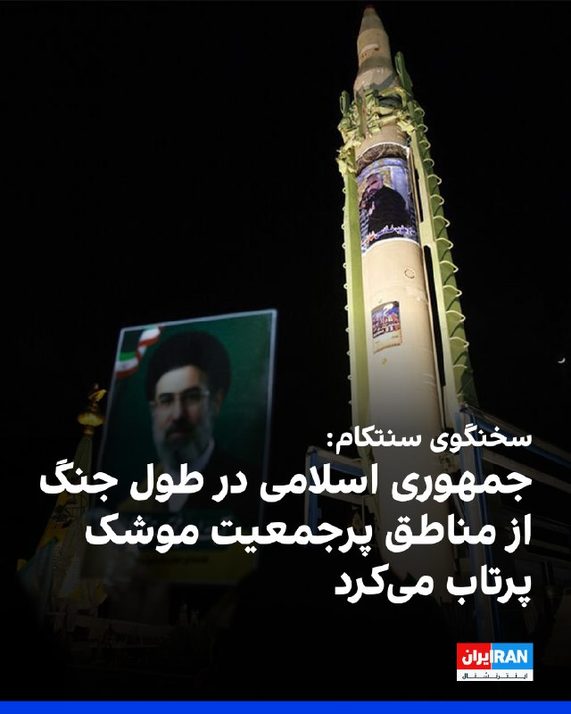

سخنگوی فرماندهی مرکزی آمریکا در گفت‌وگو با العربیه اعلام کرد جمهوری اسلامی تهدیدی آشکار برای امنیت جهانی و ثبات منطقه‌ای است و توانایی آن در شلیک موشک و پهپاد به‌شدت کاهش یافته است. او افزود آمریکا همراه با متحدانش برای تقویت سامانه‌های پدافند هوایی همکاری کرده است.

سخنگوی سنتکام گفت جمهوری اسلامی در طول جنگ موشک‌های خود را از مناطق پرجمعیت پرتاب کرده است.

او همچنین تاکید کرد آمریکا تمام تلاش‌های جمهوری اسلامی برای ورود و خروج تجهیزات را زیر نظر دارد و با اعمال محاصره دریایی، با استفاده تهران از تنگه هرمز به‌عنوان ابزار تهدید آزادی کشتیرانی مقابله می‌کند. به گفته او، انتقال تسلیحات به متحدان جمهوری اسلامی متوقف شده و نیروهای آمریکا برای هرگونه طرح اضطراری آمادگی کامل دارند.
‌🏁 🇬🇧 IranintlTV

🤖 @VahidOOnLine

## VahidOOnLine — post 240697

  <a href="telegram/content/VahidOOnLine_240697_1779057793.mp4" target="_blank">🎬 Download video</a>

♦️مسعود پزشکیان، رئیس‌جمهوری ایران، روز یکشنبه در دیدار با محسن نقوی، وزیر کشور پاکستان، از نقش اسلام‌آباد در تثبیت آتش‌بس قدردانی کرد و ابراز امیدواری کرد تلاش‌های پاکستان به تقویت صلح و ثبات در منطقه کمک کند.

پزشکیان در این دیدار تاکید کرد ایران خواهان روابطی صمیمانه و پایدار با کشورهای اسلامی منطقه است و اتحاد کشورهای اسلامی می‌تواند زمینه مداخله قدرت‌های فرامنطقه‌ای را کاهش دهد.

به گزارش ایرنا، محسن نقوی نیز گفت ایران و پاکستان اکنون بیش از گذشته به یکدیگر نزدیک شده‌اند و روابط برادرانه دو کشور باید بیش از پیش گسترش یابد.

این دیدار در حالی انجام شد که پاکستان در هفته‌های اخیر در روند تلاش‌های دیپلماتیک و میانجی‌گری منطقه‌ای برای کاهش تنش‌ها و تثبیت آتش‌بس نقش فعالی ایفا کرده است.
‌🇸🇦 Indypersian

🤖 @VahidOOnLine

## WithYashar — post 11524

  

پست جدید ترامپ در تروث مبنی بر فشار یا حمله همه جانبه به ایران
@withyashar

## WithYashar — post 11523

کان نیوز :هرگونه حمله آینده علیه ایران که به تأیید ترامپ برسد، به‌صورت مشترک توسط نیروهای آمریکا و اسرائیل انجام خواهد شد
@withyashar

## WithYashar — post 11522

سنتکام : ما تو زمان آتش‌بس با ایران دوباره مسلح شدیم و نیروهامون رو جابه‌جا و مستقر کردیم
@withyashar

## WithYashar — post 11521

ترامپ به کانال ۱۳ اسرائیل:

فکر می‌کنم ایرانی‌ها باید از اون اتفاقی که الان در حال رخ دادنه بترسن.

@withyashar

## WithYashar — post 11520

هم اکنون گزارش CNN: ترامپ تیم امنیت ملی ارشد خود را برای بحث در مورد ایران فراخواند
@withyashar

## WithYashar — post 11519

پست ترامپ از تیر اندازی به پرچم در تلویزیون ایران فیک است !( این کار انجام شده ولی ترامپ چنین پستی منتشر نکرده ! اکانت فیک ترامپ در X منشع این خبر است

## WithYashar — post 11518

  <a href="telegram/content/WithYashar_11518_1779057796.mp4" target="_blank">🎬 Download video</a>

مارکو روبیو:

دلیل توقف پروژه آزادی به درخواست پاکستان بود. پاکستانی‌ها گفتند: «اگر شما پروژه آزادی را متوقف کنید، فکر می‌کنیم می‌توانیم به توافق برسیم.»

ما پیش رفتیم و موافقت کردیم که آن را متوقف کنیم.
@withyashar

## WithYashar — post 11517

ادعای فارس : ترامپ با آزادسازی دارایی‌های بلوکه شده مخالفت کرد!
@withyashar

## WithYashar — post 11516

صدای پدافند در اهواز
@withyashar

## mwarmonitor — post 9230

  <a href="telegram/content/mwarmonitor_9230_1779057798.mp4" target="_blank">🎬 Download video</a>

📝این مارمولکِ کثیف و فسیل‌شده‌ی نظام را هر چند وقت یک‌بار که با کمبود نفرات و قحط‌الرجال مواجه می‌شوند، مثل یک دلقک سیرک از انباری درمی‌آورند تا روی آنتن زنده با زر مفت زدنش، سوژه خنده و تفریح ما را فراهم کند. مرتیکه‌ی بی‌‌پدرومادر با وقاحتی بی‌شرمانه زل می‌زند در دوربین و می‌گوید «تنگه بازه!»؛ بله، باز است، ولی وای به حال هر کشتی و کشوری که باجِ سبیلِ شما مادر **** تروریست را ندهد، چون فوراً به سمتش شلیک می‌کنید و منطقه را به لجن می‌کشید.

🔸​این حد از وقاحت، دکانِ مظلوم‌نمایی و یکی به نعل و یکی به میخ زدن، اصلاً چیز جدیدی نیست؛ این مدل دروغ‌گوییِ کثیف و توجیه‌گریِ بی‌شرمانه، دقیقاً عین واقعیت و از صفاتِ بارز، ساختاری و ریشه‌ایِ شیعه رافضی است. جماعتی که کل هویت و تاریخش بر پایه‌ی نفاق، تقیه، باج‌خواهی و بحران‌زیستی بنا شده، حالا در قالب یک مشت آخوند و سردارِ ابلَه، از یک طرف تروریسم و موشک صادر می‌کنند و از طرف دیگر روی منبر ژست صلح‌طلبی می‌گیرند؛ حرامیانی که دروغ گفتن و خیانت در ذاتِ نجس و آیین کثیفشان است و با همین حرامزاده‌بازی‌ها دنیا را به آشوب کشیده‌اند.

@mwarmonitor

## mwarmonitor — post 9229

  

ترامپ در سوشال تروث

@mwarmonitor

## mwarmonitor — post 9228

🇸🇦«وزارت دفاع عربستان سعودی مدعی شد که ۳ فروند پهپاد را رهگیری کرده است.» @mwarmonitor

## mwarmonitor — post 9227

🇸🇦«وزارت دفاع عربستان سعودی مدعی شد که ۳ فروند پهپاد را رهگیری کرده است.»

@mwarmonitor

## FoxNewsTwitter — post 341864

  

Fox News (Twitter/X)

President Trump recited a passage from 2 Chronicles 7 during Sunday’s “Rededicate 250” celebration on the National Mall, including the well-known verse urging people to “humble themselves, and pray, and seek my face, and turn from their wicked ways.”

The verse is often cited by Christians as a call for spiritual renewal.

## FoxNewsTwitter — post 341863

  <a href="telegram/content/FoxNewsTwitter_341863_1779057803.mp4" target="_blank">🎬 Download video</a>

Fox News (Twitter/X)

Terrifying video shows two U.S. Navy EA-18G Growler jets collide midair during the second day of the Gunfighter Skies Air Show at Mountain Home Air Force Base in Idaho on Sunday.

All four crew members successfully ejected and are being evaluated by medical personnel, the U.S. Navy confirmed to FOX News Digital.

The midair crash happened at about 12:10 p.m. MDT while the aircraft were performing an aerial demonstration during the air show, officials said.

## FoxNewsTwitter — post 341862

  <a href="telegram/content/FoxNewsTwitter_341862_1779057806.mp4" target="_blank">🎬 Download video</a>

Fox News (Twitter/X)

“Our rights do not derive from the government. They come from You: Our Creator and Heavenly Father."

House Speaker Mike Johnson delivered a forceful defense of America’s founding principles during the “Rededicate 250” prayer gathering on the National Mall ahead of the nation’s 250th anniversary.

Johnson warned that “sinister ideologies” are trying to rewrite the American story through “the lens of our sins,” attacking the country’s history, heroes, and moral identity.

“We reject that. We rebuke it,” he said.

## FoxNewsTwitter — post 341861

  

Fox News (Twitter/X)

BREAKING: Two Navy EA18-G jets collided in midair while performing an aerial demonstration for the Mountain Home Air Force Base Gunfighter Skies Air Show on Sunday, the U.S. Navy confirmed to Fox News Digital. All four air crew successfully ejected. (Photo: Michael Katz)

## FoxNewsTwitter — post 341860

  <a href="telegram/content/FoxNewsTwitter_341860_1779057812.mp4" target="_blank">🎬 Download video</a>

Fox News (Twitter/X)

Marco Rubio draws a direct line between Christianity and the founding of America during a speech at the “Rededicate 250” prayer event in Washington, D.C.

Before the Christian West, Rubio says, most civilizations viewed history as an endless cycle “only to end up back where it began.”

“But our faith calls us outwards into the limitless darkness of the unknown,” he says. "It tells us to go forth and preach the gospel to the world as a witness unto all nations unto the ends of the Earth."

"From that command, came America."

## pm_afshaa — post 90932

🔴شاهزاده رضا پهلوی : ببینید، حتی همین چند روز پیش هم اعدام‌ها تقریباً روزانه ادامه داشته
این واقعیتیه که خیلی‌ها دارن کشته میشن و جنگ واقعی‌ای که جریان داره
همون جنگیه که رژیم 47 سال پیش علیه مردم خودش شروع کرده و هنوز هم تموم نشده
هیچ آتش‌بسی هم در کار نبوده و سرکوب مردم ایران همچنان ادامه داره

💧 Rainbet.com the #1 Non-KYC Crypto Casino & Sportsbook @rainbetcom

😁 @Pm_Afshaa

## pm_afshaa — post 90931

🔴شاهزاده رضا پهلوی : با اینکه بیشتر از 70 روزه اینترنتو کامل قطع کردن و مردم هیچ راهی برای ارتباط با بیرون ندارن ولی هنوز وایسادن و کوتاه نیومدن

فقط امیدشون اینه که این همه سختی و فداکاری هدر نره و آخرش این وضعیت تموم بشه و با به زانو اومدن این رژیم، کشور آزاد بشه

💧 Rainbet.com the #1 Non-KYC Crypto Casino & Sportsbook @rainbetcom

😁 @Pm_Afshaa

## pm_afshaa — post 90930

  

پست جدید ترامپ که تهدید به حمله کرده

💧 Rainbet.com the #1 Non-KYC Crypto Casino & Sportsbook @rainbetcom

😁 @Pm_Afshaa

## pm_afshaa — post 90929

🔴کان نیوز :هرگونه حمله آینده علیه ایران که به تأیید ترامپ برسد، به‌صورت مشترک توسط نیروهای آمریکا و اسرائیل انجام خواهد شد

💧 Rainbet.com the #1 Non-KYC Crypto Casino & Sportsbook @rainbetcom

😁 @Pm_Afshaa

## pm_afshaa — post 90928

🔴سنتکام : ما تو زمان آتش‌بس با ایران دوباره مسلح شدیم و نیروهامون رو جابه‌جا و مستقر کردیم

💧 Rainbet.com the #1 Non-KYC Crypto Casino & Sportsbook @rainbetcom

😁 @Pm_Afshaa

## pm_afshaa — post 90927

  <a href="telegram/content/pm_afshaa_90927_1779057816.webm" target="_blank">🎬 Download video</a>

🔴سی‌ان‌ان به نقل از یک منبع آگاه:
ترامپ روز شنبه با اعضای ارشد تیم امنیت ملی آمریکا درباره مسیر جنگ با ایران جلسه برگزار کرده.

جی‌دی ونس، مارکو روبیو، رئیس سیا و استیو ویتکاف هم در این نشست حضور داشتن؛ جلسه‌ای که ساعاتی پس از بازگشت ترامپ از سفر چین برگزار شد.

💧 Rainbet.com the #1 Non-KYC Crypto Casino & Sportsbook @rainbetcom

😁 @Pm_Afshaa

## pm_afshaa — post 90926

  <a href="telegram/content/pm_afshaa_90926_1779057817.webm" target="_blank">🎬 Download video</a>

🔴مارکو روبیو، وزیر خارجه آمریکا:
دلیل توقف «پروژه آزادی»، این بود که پاکستان چنین درخواستی کرد. پاکستانی‌ها گفتن: «اگر شما پروژه آزادی رو متوقف کنید، فکر می‌کنیم بتونیم به یک توافق برسیم.»
ما موافقت کردیم و متوقف کردیم.

💧 Rainbet.com the #1 Non-KYC Crypto Casino & Sportsbook @rainbetcom

😁 @Pm_Afshaa

## pm_afshaa — post 90925

عربستان سعودی: امشب 3 پهپاد پرتاب‌شده از عراق رو رهگیری کردیم.

💧 Rainbet.com the #1 Non-KYC Crypto Casino & Sportsbook @rainbetcom

😁 @Pm_Afshaa

## pm_afshaa — post 90924

  <a href="telegram/content/pm_afshaa_90924_1779057818.webm" target="_blank">🎬 Download video</a>

🔴سی‌ان‌ان: ترامپ تیم امنیت ملی ارشد خود را برای بحث در مورد ایران فراخواند.

💧 Rainbet.com the #1 Non-KYC Crypto Casino & Sportsbook @rainbetcom

😁 @Pm_Afshaa

## pm_afshaa — post 90922

  <a href="telegram/content/pm_afshaa_90922_1779057818.mp4" target="_blank">🎬 Download video</a>

امشب تو پخش زنده شبکه افق، نتانیاهو و ترامپ توسط مجری صداوسیما ترور شدن.

💧 Rainbet.com the #1 Non-KYC Crypto Casino & Sportsbook @rainbetcom

😁 @Pm_Afshaa

## pm_afshaa — post 90921

  <a href="telegram/content/pm_afshaa_90921_1779057820.webm" target="_blank">🎬 Download video</a>

🔴کانال 12 اسرائیل: احتمال لغو تمامی پروازها از آمریکا به اسرائیل تا سال 2027.

💧 Rainbet.com the #1 Non-KYC Crypto Casino & Sportsbook @rainbetcom

😁 @Pm_Afshaa

## pm_afshaa — post 90920

  <a href="telegram/content/pm_afshaa_90920_1779057820.webm" target="_blank">🎬 Download video</a>

🔴محسن رضایی: صبر ما هم حدی داره، محاصره دریایی آمریکا رو می‌شکنیم! نیروهای مسلح ما دارن آماده‌ میشن.

هرکسی که ضد جمهوری اسلامیه و باهاش مشکل داره، ضد ایران هم هست.

💧 Rainbet.com the #1 Non-KYC Crypto Casino & Sportsbook @rainbetcom

😁 @Pm_Afshaa

## VahidOnline — post 75524

  

پست ترامپ: بای‌بای "قایق‌های تندرو"
realDonaldTrump
سه‌شنبه هم این تصویر بالا رو منتشر کرده بود. ساعتی پیش‌تر اون انیمیشن دیروزی رو هم دوباره پست کرده بود. تصویر ساختگی یا طرح گرافیکی دیگری هم منتشر کرده با عنوان اینکه نفتکش‌های خالی برای خرید نفت به آمریکا می‌آیند.
اون پستش علیه اوباما و بایدن با طرح گرافیکی قایق‌هایی با پرچم جمهوری اسلامی در کف دریا رو هم دوباره منتشر کرده.

📡 @VahidOnline

## VahidOnline — post 75523

  

ترکی المالکی، سخنگوی رسمی وزارت دفاع عربستان سعودی، یکشنبه ۲۷ اردیبهشت‌ماه اعلام کرد سه پهپاد پس از ورود به حریم هوایی این کشور از سمت حریم هوایی عراق رهگیری و منهدم شدند.

سرلشکر ترکی المالکی تاکید کرد وزارت دفاع عربستان سعودی حق پاسخ‌گویی را در زمان و مکان مناسب برای خود محفوظ می‌داند و تمامی اقدامات عملیاتی لازم را برای مقابله با هرگونه تلاش جهت نقض حاکمیت، امنیت و سلامت شهروندان و ساکنان این کشور انجام خواهد داد.

وزارت دفاع عربستان سعودی افزود این کشور برای مقابله با هرگونه تلاش جهت نقض حاکمیت و امنیت خود، اقدامات عملیاتی لازم را اتخاذ خواهد کرد.
@VahidOOnLine

📡 @VahidOnline

## kianmeli1 — post 87456

  

🔴پست جدید ترامپ که نیاز به توضیح ندارد
https://t.me/kianmeli1

## IranIntlTV — post 337701

  <a href="telegram/content/IranIntlTV_337701_1779057823.mp4" target="_blank">🎬 Download video</a>

میلاد آفرین، زندانی سیاسی سابق، در حاشیه تجمع اعتراضی ایرانیان در لس‌آنجلس به نیلوفر منصوری، خبرنگار ایران‌اینترنشنال، گفت: «ما صدای زندانیان سیاسی هستیم. من خودم یکی از کسانی بودم که فشارها و آزارهای زندان را تجربه کردم.»

او افزود: «مردمی که امروز اینجا جمع شده‌اند، صدای شما هستند. ما کنار مردم ایران ایستاده‌ایم و می‌خواهیم هرچه زودتر از جمهوری اسلامی عبور کنیم تا زندانیان بتوانند با آرامش به زندگی خود برگردند.»

آفرین همچنین گفت: «مطمئن باشید این آخرین نبرد است.»
@iranintltv

## IranIntlTV — post 337700

  <a href="telegram/content/IranIntlTV_337700_1779057826.mp4" target="_blank">🎬 Download video</a>

موج جدید تورم و بیکاری در کشور موجب تشدید بحران معیشت و گسترش فقر در جامعه شده است.

همزمان با تعطیلی مراکز اقتصادی و رکود بازار، یک عضو هیات رییسه مجلس جمهوری اسلامی گفت شمار متقاضیان بیمه بیکاری به بیش از ۳۰۰ هزار نفر رسیده است.

گفت‌وگو با احمد علوی، استاد دانشگاه و اقتصاددان
@iranintltv

## IranIntlTV — post 337699

  <a href="https://t.me/IranintlTV/337699" target="_blank">📎 Download file</a>

🎧نسخه صوتی سیاست با مراد ویسی: حملات پهپادی سپاه و نیابتی‌ها به امارات و عربستان
@iranintlTV

## IranIntlTV — post 337698

  <a href="telegram/content/IranIntlTV_337698_1779057829.mp4" target="_blank">🎬 Download video</a>

همزمان با ادامه بن‌بست مذاکرات میان واشینگتن و تهران و احتمال از سرگیری حملات به جمهوری اسلامی، دونالد ترامپ گفت جمهوری اسلامی باید «خیلی سریع» اقدام کند وگرنه چیزی از آن باقی نخواهد ماند.

گفت‌وگو با امیر گیتی، عضو تحریریه ایران‌اینترنشنال
@iranintltv

## IranIntlTV — post 337697

  <a href="telegram/content/IranIntlTV_337697_1779057831.mp4" target="_blank">🎬 Download video</a>

ولودیمیر زلنسکی، رییس‌جمهوری اوکراین، یکشنبه ۲۷ اردیبهشت، با انتشار ویدیویی در ایکس از حمله گسترده پهپادی اوکراین به مناطقی در مسکو، در فاصله بیش از ۵۰۰ کیلومتری از مرزهای اوکراین خبر داد.
مقام‌های روسیه گفتند دست‌کم سه نفر کشته شدند.
پیش‌تر، زلنسکی پس از آن‌که روسیه در روزهای ۲۳ و ۲۴ اردیبهشت سنگین‌ترین حمله پهپادی و موشکی خود به کی‌یف را از آغاز جنگ انجام داد، وعده تلافی داده بود.

## IranIntlTV — post 337696

  <a href="telegram/content/IranIntlTV_337696_1779057833.mp4" target="_blank">🎬 Download video</a>

🔻امیر قلعه‌نویی در حالی لیست تیم ملی برای حضور در جام‌جهانی را اعلام کرد که در مصاحبه‌ای گفت شریف‌ترین بازیکنان به تیم ملی دعوت شدند. این در حالی است که بازیکنانی در لیست تیم ملی قرار گرفتند که در تجمعات حکومتی حضور داشتند.

🔹توضیحات مزدک میرزایی، ایران‌اینترنشنال در برنامه هت‌تریک

🔹تماشای نسخه کامل هت‌تریک؛👇
https://youtu.be/gw3eJ0R9R5Y

@iranintltvsport

## IranIntlTV — post 337695

  <a href="telegram/content/IranIntlTV_337695_1779057836.mp4" target="_blank">🎬 Download video</a>

مراد ویسی، تحلیل‌گر ارشد ایران‌اینترنشنال، گفت: «۱۸ سالگی برای بسیاری آغاز ورود به دانشگاه، کار و آینده‌ای پر از آرزوست. سنی که خانواده‌ها انتظار دارند ثمره سال‌ها تلاش فرزندشان را ببینند. در کشتار دی‌ماه، بسیاری از نوجوانان و جوانانی که برای زندگی‌شان هزاران برنامه و امید داشتند، جان خود را از دست دادند؛ رخدادی که تلخی آن برای جامعه و خانواده‌ها عمیق‌تر شد.»
@iranintltv

## IranIntlTV — post 337694

  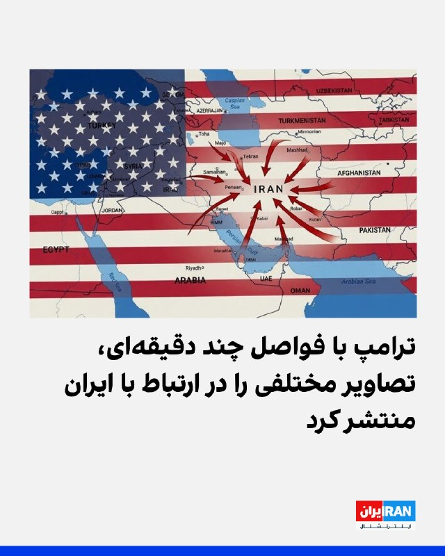

‌ترامپ به فاصله چند دقیقه‌ چندین تصویر مرتبط با ایران را در تروث‌سوشال بازنشر کرد. ترامپ همچنین یک تصویر جدید از پرچم آمریکا را منتشر کرد که در پس‌زمینه آن نقشه خاورمیانه به مرکزیت ایران قرار دارد و از همه کشورهای همسایه فِلِش‌هایی به سمت ایران نشان داده شده است.
او همچنین چند تصویر و پویانما را بازنشر کرد که ناوها و پهپادهای آمریکایی را در حال هدف قرار دادن پهپادها و قایق‌های تندرو جمهوری اسلامی نشان می‌دهد.
ترامپ در یک پست نموداری را نیز بازنشر کرد که مدت‌زمان جنگ‌های مختلف آمریکا را نمایش می‌دهد. در این نمودار جنگ کنونی ایران با ۶ هفته به عنوان کوتاه‌مدت‌ترین و جنگ افغانستان با ۵۴۳ هفته به عنوان بلندمدت‌ترین جنگ نمایش داده شده است.
رییس‌جمهوری آمریکا همچنین دو تصویر مقایسه‌ای را بازنشر کرد که ناوگان کشتی‌های نظامی جمهوری اسلامی را در حال حرکت روی آب در زمان ریاست‌جمهوری اوباما و همین ناوگان را غرق شده در کف دریا در زمان دولت ترامپ نشان می‌دهد.

https://iranintl.com/202605173898

## IranIntlTV — post 337693

  <a href="telegram/content/IranIntlTV_337693_1779057839.mp4" target="_blank">🎬 Download video</a>

مراد ویسی، تحلیل‌گر ارشد ایران‌اینترنشنال، گفت: «مردم ایران، رفاه و پیشرفت دبی را با وضعیت نامساعد اقتصادی و معیشتی ایران مقایسه می‌کنند و این تفاوت را نتیجه عملکرد متفاوت رهبران جمهوری اسلامی می‌دانند. مقامات جمهوری اسلامی و فرماندهان سپاه نیز چون عقده دبی را دارند این چنین به امارات حمله می کنند.»
@iranintltv

## IranIntlTV — post 337692

  <a href="telegram/content/IranIntlTV_337692_1779057841.mp4" target="_blank">🎬 Download video</a>

آرش رازی، عضو حزب مشروطه ایران، در حاشیه تجمع اعتراضی ایرانیان در لس‌آنجلس به نیلوفر منصوری، خبرنگار ایران‌اینترنشنال، گفت: «پنج ماه است که هر هفته در لس‌آنجلس و شهرهای اطراف آن تجمع می‌کنیم و امروز هم در گلندیل حضور داریم.»

او افزود: «مهم‌ترین پیام ما "نه به اعدام" است. جمهوری اسلامی در هفته‌های اخیر موجی از اعدام‌ها را آغاز کرده و به گفته معترضان، هر روز و هر شب تعداد زیادی اعدام انجام می‌شود. ما اینجا هستیم تا علیه این روند اعتراض کنیم؛ نه به اعدام، نه به قطع اینترنت و نه به سرکوب زندانیان سیاسی.»
@iranintltv

## IranIntlTV — post 337691

  <a href="telegram/content/IranIntlTV_337691_1779057844.mp4" target="_blank">🎬 Download video</a>

مراد ویسی، تحلیل‌گر ارشد ایران‌اینترنشنال، گفت: «نیروگاه اتمی برکه امارات روز یکشنبه با سه پهپاد مورد حمله قرار گرفت. شامگاه یکشنبه هم وزارت دفاع عربستان اعلام کرد سه پهپاد شلیک‌شده از سمت عراق را سرنگون کرده است. دونالد ترامپ نیز روز یکشنبه ۳۰ دقیقه با بنیامین نتانیاهو درباره ایران گفت‌وگو کرد و قرار است سه‌شنبه نیز نشستی با دستیاران ارشدش درباره ایران برگزار کند.»
@iranintltv

## IranIntlTV — post 337690

  <a href="telegram/content/IranIntlTV_337690_1779057846.mp4" target="_blank">🎬 Download video</a>

روزنامه سازندگی از گسترش فقر در میان زنان ایران گزارش داده و نوشته است زنان نخستین قربانیان شوک‌های اقتصادی پی‌درپی و تعدیل نیروها هستند.
این روزنامه همچنین از محرومیت میلیون‌ها زن سرپرست خانواده از بیمه و حمایت پایدار خبر داده است.

گفت‌وگو با پگاه بنی‌هاشمی، پژوهشگر حقوق
@iranintltv

## IranIntlTV — post 337689

  <a href="telegram/content/IranIntlTV_337689_1779057849.mp4" target="_blank">🎬 Download video</a>

در ادامه کارزار حمایت ایرانیان خارج از کشور از انقلاب ملی، گروهی از ایرانیان لس‌آنجلس تجمعی اعتراضی برگزار کردند تا به قطعی اینترنت، افزایش اعدام‌ها و علیه سرکوب‌ها در ایران اعتراض کنند.

گزارش نیلوفر منصوری، خبرنگار ایران‌اینترنشنال و گفت‌وگو با آرش رازی، عضو حزب مشروطه ایران
@iranintltv

## IranIntlTV — post 337688

  <a href="telegram/content/IranIntlTV_337688_1779057851.mp4" target="_blank">🎬 Download video</a>

صداوسیما، پس از آموزش کلاشنیکف در شبکه‌های مختلف، این بار نحوه استفاده از تیربار پی‌کا را در تلویزیون آموزش داد.

پیش‌تر، مجریان صداوسیمای جمهوری اسلامی در برنامه‌هایی با در دست داشتن تفنگ ظاهر شده و کار با سلاح‌های سبک را آموزش داده بودند.

این برنامه‌ها، که دست‌کم در سه بخش پخش شد، در رسانه‌های داخلی بازنشر شد و در شبکه‌های اجتماعی واکنش‌هایی را برانگیخت. برخی کاربران این بخش‌ها را نشانه‌ای از بسیج حامیان حکومت در شرایط جنگی توصیف کردند.
@iranintltv

## IranIntlTV — post 337687

  

عربستان سعودی اعلام کرد روز یک‌شنبه سه پهپاد را که از حریم هوایی عراق وارد شده بودند، رهگیری کرده است.

وزارت دفاع عربستان سعودی تأکید کرد این کشور برای مقابله با هرگونه تلاش برای نقض حاکمیت و امنیت خود، اقدامات عملیاتی لازم را انجام خواهد داد و حق پاسخ‌گویی را «در زمان و مکان مناسب» برای خود محفوظ می‌داند.
https://iranintl.com/202605177517

## IranIntlTV — post 337686

تلگراف: شرکت مرتبط با جمهوری اسلامی از طریق ویزای کار، افراد را به بریتانیا منتقل کرده است

روزنامه تلگراف در گزارشی تحقیقی خبر داد یک شرکت رسانه‌ای مستقر در لندن مرتبط با نهادهای وابسته به جمهوری اسلامی، از مجوز حمایت مالی ویزای نیروی «کار ماهر» برای انتقال برخی افراد به بریتانیا استفاده کرده است.

به گزارش تلگراف، شرکت «راد مدیا ورلد» (RAD Media World) که در شمال غرب لندن ثبت شده، با نهادهایی از جمله پرس‌تی‌وی، رسانه دولتی جمهوری اسلامی، و هیسپان تی‌وی، شبکه اسپانیایی‌زبان وابسته به حکومت ایران، ارتباط دارد و از طریق حمایت مالی از ویزای نیروی کار ماهر، افرادی را به‌طور قانونی وارد بریتانیا کرده است.

هشدار کارشناسان: خطر ایجاد «درِ باز» برای فعالیت‌های جمهوری اسلامی
به نوشته تلگراف، کارشناسان اطلاعاتی هشدار داده‌اند که چنین سازوکاری ممکن است به «دری باز» برای ورود افرادی تبدیل شود که احتمال دارد به نمایندگی از جمهوری اسلامی فعالیت‌های اطلاعاتی یا خصمانه انجام دهند.

این هشدارها پس از افزایش سطح تهدید تروریستی در بریتانیا به سطح «شدید» و در پی موجی از حملات علیه یهودیان، کنیسه‌ها و موسسات خیریه مطرح شده است.

جاناتان هکت، افسر سابق اطلاعاتی آمریکا و متخصص عملیات پنهانی ایران، به تلگراف گفته است جمهوری اسلامی از رویکرد نسبتا سهل‌گیرانه بریتانیا سوءاستفاده می‌کند و بخشی از فعالیت‌های خود را از طریق نهادهای رسانه‌ای و فرهنگی پیش می‌برد.

او گفت: «این سازمان‌ها می‌توانند پوششی برای ورود ماموران اطلاعاتی ایران به بریتانیا فراهم کنند؛ افرادی که ممکن است برای نظارت، شناسایی، انتقال مخفیانه پول یا دیگر فعالیت‌های پنهانی وارد شوند.»

او همچنین گفت: «اهداف جمهوری اسلامی در بریتانیا شامل جامعه یهودیان و مخالفان ایرانی هستند و وجود چنین نهادهایی می‌تواند امکان اجرای این اهداف را فراهم کند.»

درخواست برای لغو مجوز حمایت مالی از ویزا
تلگراف گزارش می‌دهد از وزارت کشور بریتانیا خواسته شده مجوز موسسه راد برای حمایت مالی از ویزا لغو شده و بررسی جامعی درباره سیاست‌های صدور ویزا آغاز شود.

دیوید تیلور، نماینده حزب کارگر در پارلمان بریتانیا، گفته است: «حق حمایت مالی این شرکت از ویزا باید فورا لغو شود و این شرکت باید بلافاصله تحت تحقیق قرار گیرد.»

او همچنین خواستار بررسی فوری افرادی شده که با حمایت این شرکت موفق به دریافت ویزا شده‌اند.

ارتباط با پرس‌تی‌وی، هیسپان تی‌وی و استودیوهای تولید در لندن
به نوشته تلگراف، شرکت راد مدیا ورلد با «راونور فارم استودیوز» (Ravenor Farm Studios)، استودیویی در غرب لندن، نیز ارتباط دارد؛ جایی که برنامه «Palestine Declassified» متعلق به پرس‌تی‌وی فیلم‌برداری شده بود.

تلگراف می‌گوید هنگام بازدید از محل شرکت در هفته جاری، با یک واحد خالی در شهرک صنعتی مواجه شده که تحت حفاظت یک شرکت امنیتی حرفه‌ای بوده است؛ شرکتی که گفته هدف حضورش جلوگیری از استقرار افراد بی‌خانمان یا مسافران در آن محل بوده است.

ماه گذشته، این استودیو نامه‌ای از دولت بریتانیا دریافت کرده که در آن به احتمال اقدام حقوقی بر اساس قانون امنیت ملی اشاره شده بود.

بر اساس اسناد ثبت شرکت‌ها، سید مهدی میرطالب تنها مدیر فعلی راد مدیا وورد و حمید خیرالدین مدیر پیشین آن بوده‌اند. هر دو پیش‌تر با شرکت منحل‌شده UK Press TV Ltd و همچنین هیسپان تی‌وی همکاری داشته‌اند.

اسناد رسمی همچنین نشان می‌دهد یکی از مالکان ثبت‌شده راونور فارم استودیوز، شرکت «لندن برادکاستینگ‌پارتنرز» (London Broadcasting Partners Limited) است که سید مهدی میرطالب تنها مدیر آن محسوب می‌شود.

تلگراف می‌گوید آدرس ثبت‌شده راد مدیا ورلد در ومبلی لندن، با شرکت‌های مرتبط از جمله لندن‌برادکاستینگ‌ پارتنرز و هیسپان تی‌وی مشترک است.

واکنش متهمان و دولت بریتانیا
سید مهدی میرطالب، مدیر فعلی شرکت لندن برادکاستینگ‌پارتنرز، اتهامات مطرح‌شده را «مزخرفات توطئه‌محور» خوانده است. پرس‌تی‌وی و هیسپان تی‌وی از اظهارنظر درباره گزارش خودداری کرده‌اند.

در مقابل، سخنگوی وزارت کشور بریتانیا به تلگراف گفته است: «ما تهدید ناشی از ایران را بسیار جدی می‌گیریم و حفاظت از منافع و جان شهروندان بریتانیا اولویت نخست ماست.»

او افزود دولت بریتانیا تاکنون سپاه پاسداران و بیش از ۵۵۰ فرد و نهاد ایرانی را تحریم کرده و در هفته‌های آینده قوانین جدیدی برای مقابله با فعالیت‌های خصمانه دولت‌های خارجی و نیروهای نیابتی آن‌ها تصویب خواهد شد.

به نوشته تلگراف، جزئیات ارتباطات راد مدیا ورلد با نهادهای مرتبط با حکومت ایران در قالب پرونده‌ای به واحد مقابله با تروریسم پلیس لندن و وزارت کشور بریتانیا ارائه شده است.
 
🔗متن کامل گزارش را اینجا بخوانید
@iranintltv

## IranIntlTV — post 337685

  

سخنگوی فرماندهی مرکزی آمریکا در گفت‌وگو با العربیه اعلام کرد جمهوری اسلامی تهدیدی آشکار برای امنیت جهانی و ثبات منطقه‌ای است و توانایی آن در شلیک موشک و پهپاد به‌شدت کاهش یافته است. او افزود آمریکا همراه با متحدانش برای تقویت سامانه‌های پدافند هوایی همکاری کرده است.

سخنگوی سنتکام گفت جمهوری اسلامی در طول جنگ موشک‌های خود را از مناطق پرجمعیت پرتاب کرده است.

او همچنین تاکید کرد آمریکا تمام تلاش‌های جمهوری اسلامی برای ورود و خروج تجهیزات را زیر نظر دارد و با اعمال محاصره دریایی، با استفاده تهران از تنگه هرمز به‌عنوان ابزار تهدید آزادی کشتیرانی مقابله می‌کند. به گفته او، انتقال تسلیحات به متحدان جمهوری اسلامی متوقف شده و نیروهای آمریکا برای هرگونه طرح اضطراری آمادگی کامل دارند.
https://iranintl.com/202605178642

## Shin_Persian — post 6055

Shin ✓ @hey_itsmyturn
Sun, 17 May 2026 22:09:31 UTC

Wael Abdel Halim, A PIJ terror commander has been eliminated following the #IAF 🇮🇱 strike on an apartment in Baalbek, Easter Lebanon

فارسی

وائل عبدالحلیم، یکی از فرماندهان تروریستی جهاد اسلامی فلسطین (PIJ)، در پی حمله نیروی هوایی اسرائیل (IAF) 🇮🇱 به آپارتمانی در بعلبک، در شرق لبنان حذف شد. #IAF 🇮🇱

𝕏 · @shin_persian

## Shin_Persian — post 6054

Shin ✓ @hey_itsmyturn
Sun, 17 May 2026 20:37:53 UTC

Jet activity over Nineveh, #Iraq 🇮🇶

فارسی

فعالیت جت‌ها بر فراز نینوا، #عراق 🇮🇶

𝕏 · @shin_persian

## Shin_Persian — post 6053

  

Shin ✓ @hey_itsmyturn Sun, 17 May 2026 20:04:04 UTC Major General Turki Al-Malki, spokesperson for the Ministry of Defense, announced that on the morning of Sunday, May 17, 2026, 3 drones were intercepted and destroyed after entering the KSA's airspace from…

## Shin_Persian — post 6052

Shin ✓ @hey_itsmyturn
Sun, 17 May 2026 20:04:04 UTC

Major General Turki Al-Malki, spokesperson for the Ministry of Defense, announced that on the morning of Sunday, May 17, 2026, 3 drones were intercepted and destroyed after entering the KSA's airspace from Iraqi territory.

Al-Malki affirmed that the "Ministry of Defense reserves the right to respond at the appropriate time and place, and will take and implement all necessary operational measures to counter any attempted aggression against the Kingdom's sovereignty, security, and the safety of its citizens and residents."

#KSA 🇸🇦

فارسی

سرلشکر ترکی المالکی، سخنگوی وزارت دفاع، اعلام کرد که در صبح روز یکشنبه ۱۷ مه ۲۰۲۶، ۳ فروند پهپاد پس از ورود به حریم هوایی پادشاهی عربستان سعودی (KSA) از خاک عراق، رهگیری و منهدم شدند.

المالکی تأکید کرد که «وزارت دفاع حق پاسخگویی در زمان و مکان مناسب را برای خود محفوظ می‌دارد و تمامی اقدامات عملیاتی لازم را برای مقابله با هرگونه تلاش جهت تجاوز به حاکمیت، امنیت پادشاهی و سلامت شهروندان و مقیمان آن، اتخاذ و اجرا خواهد کرد.»

#KSA 🇸🇦

𝕏 · @shin_persian

## ManotoTV — post 105581

  <a href="telegram/content/ManotoTV_105581_1779057855.mp4" target="_blank">🎬 Download video</a>

‌
نیس | فرانسه؛ گردهمایی ایرانیان ـ گزارشگر یکشنبه ۲۷ اردیبهشت

## ManotoTV — post 105580

  <a href="telegram/content/ManotoTV_105580_1779057858.mp4" target="_blank">🎬 Download video</a>

با امضای فرمانده منطقه مرکزی ارتش اسرائیل، قانون مجازات اعدام برای فلسطینیان متهم به حملات تروریستی و مرگبار در کرانه باختری از شامگاه یکشنبه اجرایی شد.

بر اساس این قانون، دادگاه‌های نظامی اسرائیل موظف‌اند برای متهمانی که حملاتشان منجر به کشته شدن افراد شده، حکم اعدام صادر کنند؛ مگر آنکه «شرایط ویژه» برای صدور حبس ابد وجود داشته باشد.

این قانون تنها شامل فلسطینیان در دادگاه‌های نظامی می‌شود و شهروندان اسرائیلی را در بر نمی‌گیرد.

ایتمار بن‌گویر، وزیر امنیت ملی اسرائیل، نیز اجرای این قانون را تحقق وعده انتخاباتی حزب راست‌گرای «عوتسما یهودیت» توصیف کرد.

اسرائیل کاتز، وزیر دفاع اسرائیل، گفت: «تروریست‌هایی که یهودیان را می‌کشند، دیگر در زندان با شرایط مناسب نخواهند نشست و سنگین‌ترین بها را خواهند پرداخت.»

## ManotoTV — post 105579

  <a href="telegram/content/ManotoTV_105579_1779057858.mp4" target="_blank">🎬 Download video</a>

‌
وزارت دفاع عربستان سعودی اعلام کرد سه پهپاد که صبح یکشنبه از حریم هوایی عراق وارد فضای این کشور شده بودند، رهگیری و منهدم شدند.

عربستان در بیانیه‌ای تاکید کرد حق پاسخ‌گویی را برای خود محفوظ می‌داند و برای مقابله با هرگونه تعرض به حاکمیت و امنیت خود، اقدامات عملیاتی لازم را انجام خواهد داد.

## ManotoTV — post 105578

  <a href="telegram/content/ManotoTV_105578_1779057859.mp4" target="_blank">🎬 Download video</a>

‌
«صدای فاطمه سپهری باشیم» ـ گزارشگر

## FarsiVOA — post 218021

🔺رسانه‌های آمریکایی: ترامپ روز شنبه با مشاوران ارشد امنیت ملی خود درباره ایران جلسه گذاشت؛ سه‌شنبه نیز جلسه دیگری دارد

▪️سایت خبری آکسیوس روز یک‌شنبه ۲۷ اردیبهشت گزارش داد که دونالد ترامپ، رئیس‌جمهوری آمریکا قرار است روز سه‌شنبه در «اتاق وضعیت» کاخ سفید با مشاوران ارشد امنیت ملی خود جلسه‌ای درباره ایران برگزار کند.

⬇️ بیشتر بخوانید:
https://ir.voanews.com/a/8150967.html
@FarsiVOA

## FarsiVOA — post 218020

⚡️پوشش ویژه | دعای مایک جانسون در مراسم نیایش دویست‌وپنجاهمین سالروز استقلال آمریکا
@FarsiVOA

## FarsiVOA — post 218019

⚡️منیژه حکمت، کارگردان ایرانی و مادر پگاه آهنگرانی بعد از نمایش فیلم «تمرین‌هایی برای یک انقلاب» گفت چاره‌‌ای جز امیدواری وجود ندارد.
@FarsiVOA

## FarsiVOA — post 218018

⚡️روز جهانی ارتباطات در سایه قطع اینترنت در ایران؛ گفت‌وگو با امیر رشیدی
@FarsiVOA

## FarsiVOA — post 218017

⚡️وکلای تسخیری در جمهوری اسلامی وسیله‌ای برای سرعت‌بخشیدن به اعدام‌ها؛ گفت‌وگو با محمد مقیمی
@FarsiVOA

## FarsiVOA — post 218016

⚡️گفت‌وگو با کاوه فرنام تهیه کننده فیلم «تمرین‌هایی برای یک انقلاب »
@FarsiVOA

## FarsiVOA — post 218015

⚡️خشم رو به گسترش شیعیان لبنان علیه جمهوری اسلامی در پی اقدامات حزب‌الله و ناامنی مناطقی از لبنان
@FarsiVOA

## FarsiVOA — post 218014

  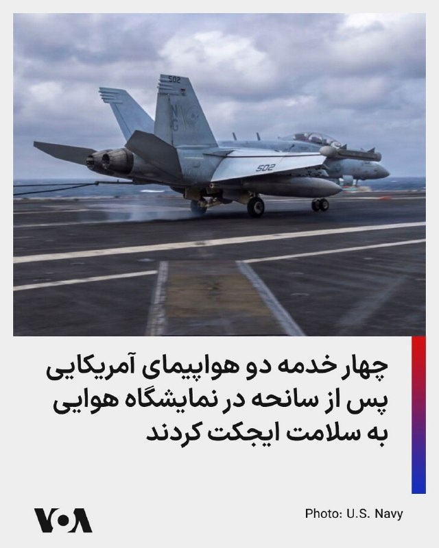

⚡️مقامات آمریکایی گفتند که دو جت ائی‌ای-۱۸جی گرولر نیروی دریایی روز یکشنبه در نمایشگاه هوایی «گانفایتر اسکایز» در یک پایگاه نیروی هوایی در ایالت آیداهو، با هم در هوا برخورد کردند. به گفته مقامات، هر چهار خدمه با موفقیت ایجکت کردند و از هواپیما بیرون پریدند.
@FarsiVOA

## FarsiVOA — post 218013

⚡️از خاموشی اینترنت مردم تا چشم حکومت به درآمدِ کابل‌های هرمز

@FarsiVOA

## FarsiVOA — post 218012

⚡️در حالی که جنگ و تحریم، اقتصاد ایران را زیر فشار بی‌سابقه قرار داده، مرزهای فراموش‌شده سیستان و بلوچستان به شریان تازه‌ای برای بقای اقتصادی جمهوری اسلامی تبدیل شده‌اند. جایی که هزاران وانت، موتورسیکلت و قایق، هر روز میلیون‌ها لیتر سوخت را از دل بیابان و دریا به پاکستان منتقل می‌کنند.
@FarsiVOA

## FarsiVOA — post 218011

⚡️چرا جمهوری اسلامی اینستاگرام را «جنگنده آمریکایی» می‌داند؟
@FarsiVOA

## FarsiVOA — post 218010

  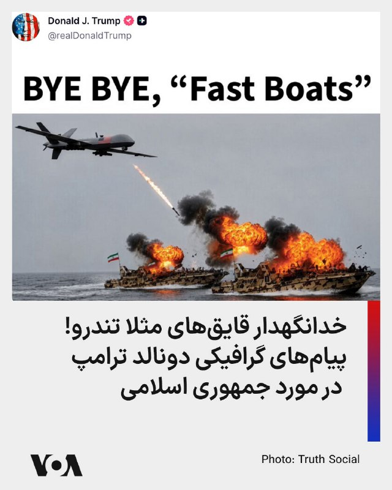

⚡️دونالد ترامپ، رئيس جمهوری آمریکا عصر یک‌شنبه چندین گرافیک با پیام برتری نظامی آمریکا بر جمهوری اسلامی را منتشر کرد. یکی از این تصاویر عنوان «خدانگهدار! قایق‌های (مثلا) تندرو!» را دارد و یک پهپاد آمریکایی را نشان می‌هد که دو قایق جمهوری‌اسلامی را به آتش‌کشیده‌‌است.
@FarsiVOA

## FarsiVOA — post 218009

  <a href="telegram/content/FarsiVOA_218009_1779057862.mp4" target="_blank">🎬 Download video</a>

⚡️مسدود ماندن تنگه هرمز «اشتباه بزرگ تاکتیکی» جمهوری اسلامی؛ تازه‌ترین واکنش‌های کنگره به شرایط منطقه
@FarsiVOA

## FarsiVOA — post 218008

⚡️افزایش زن‌کشی و خشونت؛ هشدار فعالان حقوق زن درباره وضعیت زنان در افغانستان و ایران
@FarsiVOA

## FarsiVOA — post 218007

⚡️انتصاب قالیباف در امور چین؛ پیام درون‌حاکمیتی یا سیگنال به پکن؟
@FarsiVOA

## FarsiVOA — post 218006

  

⚡️وزارت دفاع عربستان اعلام کرد که صبح یکشنبه سه پهپاد پس از ورود به حریم هوایی پادشاهی از سمت آسمان عراق رهگیری و منهدم شدند. سخنگوی وزارت دفاع عربستان گفت این کشور حق پاسخ‌گویی در زمان و مکان مناسب را برای خود محفوظ می‌داند.
@FarsiVOA

## FarsiVOA — post 218005

  <a href="telegram/content/FarsiVOA_218005_1779057864.mp4" target="_blank">🎬 Download video</a>

⚡️دونالد ترامپ، روز یکشنبه ساعاتی پس از هشدارش به جمهوری اسلامی که «زمان به سرعت رو به پایان است» سه ویدیو در تروت‌سوشال منتشر کرد که اظهاراتش را در مورد سادگی دفع حملات پهپادی جمهوری اسلامی توسط نیروی دریایی آمریکا به تصویر کشیده‌اند.
@FarsiVOA

## FarsiVOA — post 218004

🔺رئیس مجلس نمایندگان آمریکا: روشن نیست قدرت در ایران دست چه کسی است؛ «آیت‌الله جدید» علنی دیده نشده است

▪️مایک جانسون، رئیس مجلس نمایندگان آمریکا، روز یکشنبه ۲۷ اردیبهشت در گفت‌وگو با برنامه «فاکس نیوز ساندی» اعلام کرد دولت دونالد ترامپ، رئیس جمهوری ایالات متحده، با تمرکز بر بازگشایی تنگه هرمز و افزایش فشار بر رژیم ایران، تلاش می‌کند ثبات اقتصادی و امنیتی را بازگرداند و قیمت‌های انرژی را کاهش دهد.

⬇️ بیشتر بخوانید:
https://ir.voanews.com/a/fox-news-sunday-mike-johnson-shannon-bream-interview/8150948.html
@FarsiVOA

## FarsiVOA — post 218003

  <a href="telegram/content/FarsiVOA_218003_1779057865.mp4" target="_blank">🎬 Download video</a>

⚡️گزارش نرگس صبا از آتش‌افروزی‌های سپاه پس از آتش‌بس تاکنون در برنامه تفسیر خبر
@FarsiVOA

## FarsiVOA — post 218002

⚡️از تنگه هرمز تا کابل‌های ارتباطی گسترش دامنه تهدیدهای جمهوری اسلامی؛ گفت‌وگو با فرزانه روستایی
@FarsiVOA

## Persian_Trend_Official — post 14368

  <a href="telegram/content/Persian_Trend_Official_14368_1779057866.webm" target="_blank">🎬 Download video</a>

شبتون بخیر 🙏🤍

📝 Nick
📌 @persian_trend_official
پرشین ترند | متفاوت‌ترین کانال نظامی

## Persian_Trend_Official — post 14367

  

پست قابل تأمل ‌ترامپ که لحظاتی قبل در تروث سوشال منتشر کرده است.

☆Phantom☆

📌 @persian_trend_official
پرشین ترند | متفاوت‌ترین کانال نظامی

## Persian_Trend_Official — post 14366

♨️ دوستان عزیز، با توجه به شرایط پیش‌رو، بهتر است از همین حالا برای سناریوهای اضطراری آماده باشیم. آمادگی یعنی آرامش بیشتر و آسیب کمتر برای خودمان و خانواده‌مان. 🧭

⚠️ چند مورد مهم را جدی بگیرید:

• برای دست‌کم ۱ ماه، آذوقه‌ی غذایی فاسد نشدنی و آب آشامیدنی کافی برای همه اعضای خانواده تهیه کنید. 🥫💧

• همیشه تا جای ممکن باک بنزین خودرو را پر نگه دارید. ⛽️

• اگر نوزاد یا کودک شیرخوار دارید، حتماً به اندازه کافی شیر خشک و لوازم ضروری او را از قبل تهیه کنید. 👶🍼

• اگر در خانواده سالمند یا بیماری دارید که داروی حیاتی مصرف می‌کند، از داروهای ضروری او به میزان کافی ذخیره داشته باشید. 💊

• کوله اضطراری را جدی بگیرید؛ شامل مدارک مهم، مقداری پول نقد، پاوربانک، چراغ‌قوه، باتری، داروهای شخصی، لباس گرم، وسایل بهداشتی و شارژر. 🎒🔦

• مقداری پول نقد همراه داشته باشید؛ در شرایط بحران، دسترسی به کارت بانکی یا اینترنت ممکن است مختل شود. 💵

• دارایی و پول خود را فقط در یک محل متمرکز نکنید و برای شرایط قطع دسترسی، برنامه جایگزین داشته باشید. 🏦

• با اعضای خانواده درباره سناریوهای مختلف صحبت کنید: قطع برق، قطع اینترنت، تخلیه اضطراری و محل‌های امن یا محل تجمع خانوادگی. 👨‍👩‍👧‍👦

• یک رادیوی موج متوسط یا رادیوی باتری‌خور تهیه کنید تا در صورت قطع اینترنت، بتوانید خبرها و اطلاعیه‌های ضروری را دنبال کنید. 📻

• در خانه، شیشه‌ها و پنجره‌های حساس را بررسی و تا جای ممکن محکم‌کاری کنید. در صورت نگرانی از موج انفجار، می‌توان برای کاهش پخش شدن خرده‌شیشه‌ها از چسب نواری پهن به‌صورت ضربدری روی شیشه‌ها استفاده کرد. 🪟

• مدارک مهم، شماره تماس‌های ضروری، آدرس‌ها و اطلاعات حیاتی را هم به‌صورت کاغذی و هم در گوشی ذخیره کنید. 📄📱

• برای چند هفته بی‌برقی و بی‌ارتباطی هم آماده باشید: چراغ‌قوه، پاوربانک، آب، غذا و لوازم اولیه را از قبل کنار بگذارید. ⚠️

آمادگی به معنی ترسیدن نیست؛ یعنی از خانواده‌مان بهتر محافظت کنیم. ❤️

ما در تیم پرشین ترند امیدواریم هیچ اتفاق بدی برای هیچ‌یک از هم‌وطنان‌مان رخ ندهد، اما احتیاط از امروز می‌تواند فردا نجات‌بخش باشد.

📝 Nick

📌 @persian_trend_official
پرشین ترند | متفاوت‌ترین کانال نظامی

## Persian_Trend_Official — post 14365

https://youtu.be/8YQ1YcLyw6E

## Persian_Trend_Official — post 14364

https://youtube.com/live/2KsilHSCq4o?feature=share

## Persian_Trend_Official — post 14361

  <a href="telegram/content/Persian_Trend_Official_14361_1779057868.webm" target="_blank">🎬 Download video</a>

🎬 Video

## Persian_Trend_Official — post 14357

  <a href="telegram/content/Persian_Trend_Official_14357_1779057868.mp4" target="_blank">🎬 Download video</a>

خبرهایی درباره انهدام یک پهپاد آمریکایی در یمن /فارس نیوز

🔹برخی رسانه‌ها با انتشار تصاویری، از انهدام یک فروند پهپاد MQ9 ارتش آمریکا در آسمان استان مارب به دست نیروهای مسلح یمن خبر می‌دهند‌.

🔸نیروهای مسلح یمن هنوز بیانیه‌ای در این باره صادر نکرده است.

☆Phantom☆

📌 @persian_trend_official
پرشین ترند | متفاوت‌ترین کانال نظامی

## Persian_Trend_Official — post 14355

تا دقایقی دیگه نسخه هاست داخلی آپلود خواهد شد و لطفا اگر امکانش رو دارید نسخه صوتی رو از طریق همین اپ های پادکست بشنوید. در مصرف حجم بین تلگرام و اپ های پادکست هیچ تفاوتی نیست.
از توجه شما به این موضوع متشکرم
الیاس فرخ

## Persian_Trend_Official — post 14354

نسخه صوتی لایو امشب رو از لینک های زیر بشنوید :

https://open.spotify.com/episode/0WrkfsVN8KUvGUSSHYT887?si=sYOmvpJERuCureVC0TULQQ

https://castbox.fm/vi/946274710

## RadioFarda — post 157294

  <a href="https://t.me/radiofarda/157294" target="_blank">📎 Download file</a>

📻بشنوید: خبرهای ساعت ۲۱ با رادیوفردا، ۲۷ اردیبهشت ۱۴۰۵‌

@RadioFarda

## RadioFarda — post 157293

🔸بزرگ‌ترین حمله اوکراین به منطقه مسکو در بیش از یک سال گذشته که در روز یکشنبه ۲۷ اردیبهشت انجام شد، سه کشته به جا گذاشت. همچنین گفته می‌شود یک نفر دیگر نیز در منطقه بلگورود، هم‌مرز با اوکراین، جان باخته است.

🔸وزارت دفاع روسیه اعلام کرد که از شب گذشته تاکنون بیش از هزار پهپاد در دست‌کم ۱۲ منطقه این کشور سرنگون شده‌اند.

🔸آندری وروبیوف، فرماندار منطقه مسکو، این تلفات را تأیید کرد و افزود که تیم‌های امدادی همچنان در حال جست‌وجو برای یافتن دست‌کم یک نفر دیگر در زیر آوار هستند. به گفته او، چندین برج مسکونی و تأسیسات زیربنایی در این حملات آسیب دیده‌اند.

🔸این حمله تنها دو روز پس از آن رخ داد که یک موشک روسی به یک مجتمع مسکونی در کی‌یف، پایتخت اوکراین، اصابت کرد و ۲۴ نفر، از جمله سه کودک، را کشت؛ حمله‌ای که یکی از سنگین‌ترین موج‌های حملات کرملین علیه این شهر در سال جاری توصیف شده است.

🔸ولودیمیر زلنسکی، رئیس‌جمهور اوکراین، در پیامی در شبکه ایکس حملات پهپادی کی‌یف را تأیید کرد و نوشت: «پاسخ‌های ما به ادامه جنگ از سوی روسیه و حملاتش به شهرها و جوامع ما کاملاً موجه است.»

@RadioFarda

## IranianMinds — post 20312

  <a href="telegram/content/IranianMinds_20312_1779057871.mp4" target="_blank">🎬 Download video</a>

🔴 امشب تو صداوسیما مجری و دو تا سپاهی که از ترس کونشون صورتشونو پوشونده بودن اسلحه گرفته بودن دستشون و‌ داشتن به سمت ترامپ و نتانیاهو شلیک میکردن و داشتن دعا میکردن که ایشالا تیرشون به هدف میخوره

@IranianMinds

## IranianMinds — post 20311

  <a href="telegram/content/IranianMinds_20311_1779057874.webm" target="_blank">🎬 Download video</a>

💥 با هر ثبت نام 
🅰️
🅰️
🅰️ هزار تومن جایزه بگیرید

✔️ میتونید شرط‌بندی کنید و بونوس را به موجودی واقعی تبدیل کنید

⚽️  پوشش کامل مسابقات ورزشی 

💯  پیش‌بینی با بهترین ضرایب 

⭐️ تجربه سریع و حرفه‌ای

💰پرداخت مستقیم و سریع بدون واسطه، بدون دردسر، واریز و برداشت در سریع‌ترین زمان ممکن

☑️ کانال تلگرام: 

➡️ @winro_io  

🎁 هدیه خود را با ثبت نام در سایت دریافت کنید: 

➡️ Winro.io
A27
سایت اصلی در روزهای آینده بازگشایی خواهد شد
💎

## IranianMinds — post 20310

🔴 پست جدید ترامپ : @IranianMinds

## IranianMinds — post 20309

🔴 پست جدید ترامپ : @IranianMinds

## IranianMinds — post 20308

🔴 پست جدید ترامپ : @IranianMinds

## IranianMinds — post 20307

  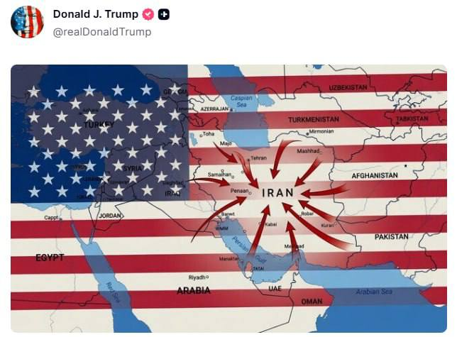

🔴 پست جدید ترامپ :

@IranianMinds

## IranianMinds — post 20306

🔴 ترامپ :

مقامات جمهوری اسلامی باید از من بترسن!

@IranianMinds

## IranianMinds — post 20305

🔴 کانال ۱۳ اسرائیل :

مقامات ایرانی باید از اتفاقی که قراره بیوفته بترسن

@IranianMinds

## IranianMinds — post 20304

  

یکی هوش مصنوعیو‌ از دست این بگیره

@IranianMinds

## IranianMinds — post 20303

  

🔴 پست ترامپ :

@IranianMinds

## IranianMinds — post 20300

🔴 پست های جدید ترامپ :

@IranianMinds

## IranianMinds — post 20299

  

🔴 آکسیوس :

ترامپ گفته هنوز باور دارد ایران خواهان توافق است، اما هشدار داده که تهران باید خیلی سریع پیشنهادی قوی‌تر ارائه کند وگرنه با اقدام نظامی سخت‌ تری از سوی آمریکا مواجه خواهد شد!

@IranianMinds

## IranianMinds — post 20298

  <a href="telegram/content/IranianMinds_20298_1779057877.mp4" target="_blank">🎬 Download video</a>

🔴دو جنگنده نیروی دریایی آمریکا در جریان نمایشی هوایی به هم برخورد کردن، خلبان‌ها با موفقیت اجکت کردن و هر ۴ نفرشون سالم هستن.

@IranianMinds

## IranianMinds — post 20297

🔴علی قلهکی، از اعضای تیم مذاکره‌کننده در پاکستان:

وزیر کشور پاکستان هم آمده است که بگوید یا توافق کنید، یا جنگ می‌شود.

@IranianMinds

## BBCPersian — post 281330

  

‌ ‌ ‌ ‌
علیرضا یوسفی، وزنه‌بردار ایرانی وزن بعلاوه ۱۱۰ کیلوگرم موفق شد در جریان مسابقات قهرمانی آسیا رکود دو ضرب جهان را بشکند.

وزنه بردار فوق سنگین ایران روز یکشنبه در حرکت دو ضرب توانست با بالا بردن ۲۶۱ کیلوگرم، ضمن کسب مدال طلای مسابقات آسیایی که اکنون در هند در حال برگزاری است، رکود جهان را بهبود ببخشد.

او پس از شکست رکود جهان روی سکو دوبنده خود را کنار زد تا نوشته روی تی‌شرت مشکی خود را - «شهدای میناب ۱۶۸» - به دوربین و حاضران در ورزشگاه نشان دهد.

او در حرکت یک ضرب سوم شد تا در مجموع صاحب مدال نقره وزن بعلاوه ۱۱۰ کیلوگرم شود.

https://bbc.in/43dSUhn
📷Nasimonline
@BBCPersian

## BBCPersian — post 281329

  <a href="https://t.me/bbcpersian/281329" target="_blank">📎 Download file</a>

🔻 پادکست برنامه شصت دقیقه یکشنبه ۲۷ اردیبهشت ۱۴۰۵

این نسخه رادیویی برنامه شصت دقیقه تلویزیون فارسی بی‌بی‌سی است که هرشب بعد از پخش، با حجم کم از اپلیکیشن‌های پادگیر و صفحه تلگرام بی‌بی‌سی فارسی در دسترس است.

با هشتگ BBCPersianRadio# با ما در ارتباط باشید.

@BBCPersian

## BBCPersian — post 281328

  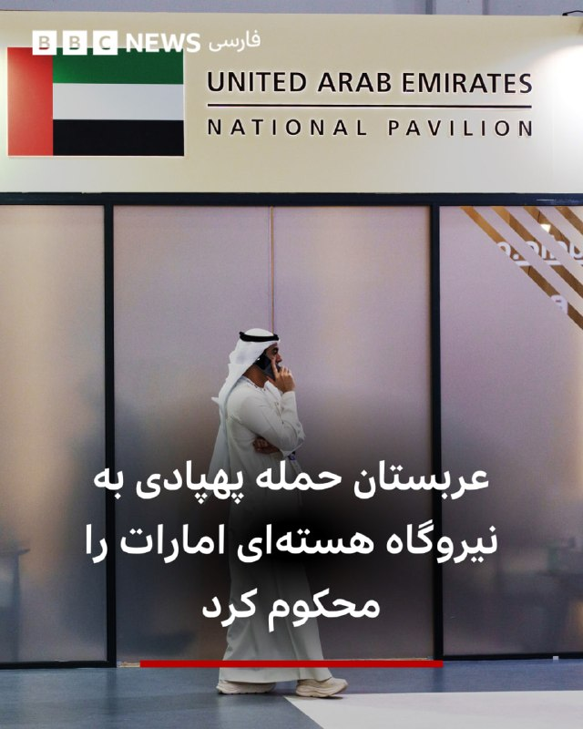

‌ ‌ ‌
وزارت خارجه عربستان سعودی در بیانیه‌ای حملات پهپادی امروز به امارات متحده عربی را محکوم کرد.

در حمله‌ای که امروز به نیروگاه هسته‌ای براکه امارات شد، آتش‌سوزی در بخش‌هایی از آن رخ داد.

در این بیانیه عربستان سعودی آمده است که این کشور به «قوی‌ترین» شکل ممکن حمله پهپادی به کشور امارات متحده عربی را محکوم می‌کند.

پیشتر امارات متحده عربی حمله پهپادی را «یک اقدام تروریستی بی‌دلیل» خواند که باعث تشدید تنش در منطقه می‌شود.

وزارت خارجه امارات در بیانیه‌ای «به شدیدترین لحن» این حمله را محکوم کرد و «حق دیپلماتیک و نظامی خود را برای پاسخ به هرگونه تهدید، ادعا یا دشمنی» را محفوظ دانست.

https://bbc.in/4wqBf3o
📷 Emre Caylak/Bloomberg via Getty Images
@BBCPersian

## Dirty_Kids — post 389657

  <a href="telegram/content/Dirty_Kids_389657_1779057883.webm" target="_blank">🎬 Download video</a>

☢️خفن ترین و‌ قدیمی ترین  انالیزور  ایران ینی دکتر بت 
👍 
🔴هیچ سایت بتی دوست نداره شما کانال دکتر بت رو پیدا کنین چون خیلی سود میکنید🤷‍♂ رایگان بهترین شرط هارو براتون میذاره حتی هزار تومن هم دریافت نمیکنه روزانه میتونی از پیش بینی فوتبال باهاش پول در بیاری…

## Dirty_Kids — post 389656

  <a href="telegram/content/Dirty_Kids_389656_1779057884.webm" target="_blank">🎬 Download video</a>

☢️خفن ترین و‌ قدیمی ترین  انالیزور  ایران ینی دکتر بت 
👍

🔴هیچ سایت بتی دوست نداره شما کانال دکتر بت رو پیدا کنین چون خیلی سود میکنید🤷‍♂

رایگان بهترین شرط هارو براتون میذاره
حتی هزار تومن هم دریافت نمیکنه
روزانه میتونی از پیش بینی فوتبال باهاش پول در بیاری 👌
A27
اگ اهل پیش بینی فوتبالی این کانال اصلا از دست ندین👇

✅https://t.me/+4_ADqwB9e-QwYjlk

✅https://t.me/+4_ADqwB9e-QwYjlk

## Dirty_Kids — post 389655

  

#بخوابیم

@Dirty_Kids 👻

## Dirty_Kids — post 389654

  <a href="telegram/content/Dirty_Kids_389654_1779057885.mp4" target="_blank">🎬 Download video</a>

دوستان اگه پولتون زیادی کرده و نمیدونین باهاش چیکار کنین، کاخ گوتیک امیردشت با قیمت مفتِ 1500 میلیارد به فروش میرسه، حتما بخرین.

@Dirty_Kids 👻

## Dirty_Kids — post 389653

  

زنجیره بی‌پایانِ پیروزی‌های آخوند برشمشیر 🤭🧩

@Dirty_Kids 👻

## Dirty_Kids — post 389652

  

یه تخمش از ممه‌های دخترت بزرگتره

@Dirty_Kids 👻

## Dirty_Kids — post 389651

  <a href="telegram/content/Dirty_Kids_389651_1779057887.mp4" target="_blank">🎬 Download video</a>

شما چپولایی که کل شجاعتتون این بوده تو خونه‌های تیمی، زناتون رو با هم ضربدری عوض بدل کنید، جلوی این نسل از خایه حرف نزنید مادرجنده‌های زن و دختر خراب!

@Dirty_Kids 👻

## Dirty_Kids — post 389650

  

عکس جدید بیلی ایلیش :)

@Dirty_Kids 👻

## Dirty_Kids — post 389649

‏بدتر از خود مقوله‌ی vpn خریدن اینه که حتما باید vpn داشته باشم که بتونم دوباره بخرم

@Dirty_Kids 👻

## Dirty_Kids — post 389648

تخم ما از ممه دخترت بزرگتره

@Dirty_Kids 👻

## Dirty_Kids — post 389647

  

ترامپ در تروث‌سوشال رگباری گاییده. بیست سی‌تا پست پشت هم گذاشته تا الان. @Dirty_Kids 👻

## Dirty_Kids — post 389646

  <a href="telegram/content/Dirty_Kids_389646_1779057890.mp4" target="_blank">🎬 Download video</a>

🔴 در ادامه شلیک‌ها تو صداوسيما؛

امشب مجری شبکه سه و یه فرد نظامی که قیافش رو پوشونده بود، به سمت عکس نتانیاهو و ترامپ شلیک کردن و به همديگه ماشالا گفتن...

@Dirty_Kids 👻

## Dirty_Kids — post 389642

ترامپ در تروث‌سوشال رگباری گاییده. بیست سی‌تا پست پشت هم گذاشته تا الان.

@Dirty_Kids 👻

## Dirty_Kids — post 389641

بهزاد فراهانى حرومزاده يه دختر چهل كيلويی بود، به اسم نيكا شاكرمى كه اندازه كل تير و طايفت جیگر داشت.

@Dirty_Kids 👻

## Dirty_Kids — post 389640

  <a href="telegram/content/Dirty_Kids_389640_1779057893.mp4" target="_blank">🎬 Download video</a>

با همین ریخت و قیافه و تیپ گفت؛
دخترای هااات طرفدار فلسطینن

فرض محال که محال نیست
اصن بر فرض محال باشن، مگه همه مثل شما بی‌وطن‌ها دنبال کمر به پایین‌ن که ملاک‌شون این باشه مسیرشونو عوض کنن!

@Dirty_Kids 👻

## manototv — post 105581

  <a href="telegram/content/manototv_105581_1779057895.mp4" target="_blank">🎬 Download video</a>

‌
نیس | فرانسه؛ گردهمایی ایرانیان ـ گزارشگر یکشنبه ۲۷ اردیبهشت

## manototv — post 105580

  <a href="telegram/content/manototv_105580_1779057898.mp4" target="_blank">🎬 Download video</a>

با امضای فرمانده منطقه مرکزی ارتش اسرائیل، قانون مجازات اعدام برای فلسطینیان متهم به حملات تروریستی و مرگبار در کرانه باختری از شامگاه یکشنبه اجرایی شد.

بر اساس این قانون، دادگاه‌های نظامی اسرائیل موظف‌اند برای متهمانی که حملاتشان منجر به کشته شدن افراد شده، حکم اعدام صادر کنند؛ مگر آنکه «شرایط ویژه» برای صدور حبس ابد وجود داشته باشد.

این قانون تنها شامل فلسطینیان در دادگاه‌های نظامی می‌شود و شهروندان اسرائیلی را در بر نمی‌گیرد.

ایتمار بن‌گویر، وزیر امنیت ملی اسرائیل، نیز اجرای این قانون را تحقق وعده انتخاباتی حزب راست‌گرای «عوتسما یهودیت» توصیف کرد.

اسرائیل کاتز، وزیر دفاع اسرائیل، گفت: «تروریست‌هایی که یهودیان را می‌کشند، دیگر در زندان با شرایط مناسب نخواهند نشست و سنگین‌ترین بها را خواهند پرداخت.»

## manototv — post 105579

  <a href="telegram/content/manototv_105579_1779057899.mp4" target="_blank">🎬 Download video</a>

‌
وزارت دفاع عربستان سعودی اعلام کرد سه پهپاد که صبح یکشنبه از حریم هوایی عراق وارد فضای این کشور شده بودند، رهگیری و منهدم شدند.

عربستان در بیانیه‌ای تاکید کرد حق پاسخ‌گویی را برای خود محفوظ می‌داند و برای مقابله با هرگونه تعرض به حاکمیت و امنیت خود، اقدامات عملیاتی لازم را انجام خواهد داد.

## manototv — post 105578

  <a href="telegram/content/manototv_105578_1779057900.mp4" target="_blank">🎬 Download video</a>

‌
«صدای فاطمه سپهری باشیم» ـ گزارشگر

## alonews — post 120725

  

🔥
💥اینترنت آزاد و رایگان

🌐
🚫تنها جایی که کانفیگ رایگان میزاره

⬇️
⬇️
@NetAazaadBot
@NetAazaadBot

⚠️هر ساعت 100گیگ شارژ میشه، رباتو داشته باشید تا مطلع بشید

## alonews — post 120724

  <a href="telegram/content/alonews_120724_1779057903.webm" target="_blank">🎬 Download video</a>

👈پست عجیب حسین دهباشی سازنده کلیپ تبلیغاتی حسن روحانی در سال ۱۳۹۶: حملات و ترورهای دشمن تا رهبری حسن روحانی ادامه خواهد داشت

✅ @AloNews خبر جنگ

## alonews — post 120723

  <a href="telegram/content/alonews_120723_1779057903.webm" target="_blank">🎬 Download video</a>

👈وضعیت ایران در روز ارتباطات و روابط عمومی

✅ @AloNews خبر جنگ

## alonews — post 120722

  <a href="telegram/content/alonews_120722_1779057903.webm" target="_blank">🎬 Download video</a>

👈سفیر ایالات متحده در سازمان ملل: هدف قرار دادن نیروگاه هسته‌ای براکه در امارات متحده عربی، تشدید تنش خطرناک و غیرقابل قبول است.

✅ @AloNews خبر جنگ

## alonews — post 120721

  <a href="telegram/content/alonews_120721_1779057904.webm" target="_blank">🎬 Download video</a>

👈خوش چشم: قالیباف هَوَل مذاکره نیست

✅ @AloNews خبر جنگ

## alonews — post 120720

  <a href="telegram/content/alonews_120720_1779057904.webm" target="_blank">🎬 Download video</a>

👈ترامپ بازم پست گذاشت 
✅ @AloNews خبر جنگ

## alonews — post 120719

  <a href="telegram/content/alonews_120719_1779057904.webm" target="_blank">🎬 Download video</a>

👈ترامپ بازم پست گذاشت 
✅ @AloNews خبر جنگ

## alonews — post 120718

  <a href="telegram/content/alonews_120718_1779057905.webm" target="_blank">🎬 Download video</a>

👈ترامپ بازم پست گذاشت

✅ @AloNews خبر جنگ

## alonews — post 120717

  <a href="telegram/content/alonews_120717_1779057905.webm" target="_blank">🎬 Download video</a>

👈ترامپ دوباره این عکس رو پست کرد

🔴دموکرات‌ها عاشق فاضلاب هستند

✅ @AloNews خبر جنگ

## alonews — post 120716

  <a href="telegram/content/alonews_120716_1779057905.webm" target="_blank">🎬 Download video</a>

💢هم اکنون تحرکات شدید ارتش ایالات متحده در منطقه 
🚨 @AkhbareFouri

## alonews — post 120715

  <a href="telegram/content/alonews_120715_1779057906.webm" target="_blank">🎬 Download video</a>

👈رئیس جمهور ترامپ به کانال 13 اسرائیل:
فکر کنم ایرانی ها باید از اتفاقاتی که الان داره میفته بترسن

🔴اونا بايد از من بترسن

✅ @AloNews خبر جنگ

## alonews — post 120714

  <a href="telegram/content/alonews_120714_1779057906.webm" target="_blank">🎬 Download video</a>

👈ترامپ بازم پست گذاشت

🔴گفت حکیم جفریز، رهبر دموکرات‌های مجلس عقلش کمه

✅ @AloNews خبر جنگ

## alonews — post 120713

  <a href="telegram/content/alonews_120713_1779057907.webm" target="_blank">🎬 Download video</a>

👈خبرگزاری فارس: در صورت جنگ مجدد آمریکا و اسرائیل شانس پیروزی در مقابل ایران ندارن و دوباره شکست میخورن

✅ @AloNews خبر جنگ

## alonews — post 120712

  

نروژ مرفه‌ترین کشور جهان در سال 2026

[@AloTweet]

## alonews — post 120711

  <a href="telegram/content/alonews_120711_1779057908.mp4" target="_blank">🎬 Download video</a>

🔴بیشرفی خاصی می‌خواد به مردمی که اینجوری با دستای خالی جلوی رگبار گلوله وایسادن و 40هزار نفر در کمتر از ۴۸ساعت کشته دادن، حرف از بیضه بزنی که طبق معمول فقط از یک چپی برمیاد

🤔حسابتون بمونه با همین مردم فردای آزادی.

✅@AloNews

## alonews — post 120703

  <a href="telegram/content/alonews_120703_1779057910.webm" target="_blank">🎬 Download video</a>

👈ترامپ یهو ۸تا پست گذاشت

✅ @AloNews خبر جنگ

---
📅 بروزرسانی: 1405/02/27 23:22
---

## VahidOOnLine — post 240695

  

احمدرضا رادان، فرمانده نیروی انتظامی، اعلام کرد که این نیرو ۶ هزار و ۵۰۰ نفر شهروند را از ابتدای جنگ بازداشت کرده است.

رادان این افراد را «وطن‌فروشان و جواسیس» نامید؛ اتهام‌هایی که وکلای دادگستری و نهادهای حقوق بشری می‌گویند جمهوری اسلامی برای سرکوب مردم از آنها استفاده می‌کند.

‌فرمانده فراجا همچنین گفت که بازداشت‌ها در ارتباط با اعتراضات دی ماه همچنان ادامه دارد.
‌🏁 🇬🇧 IranintlTV

🤖 @VahidOOnLine

## VahidOOnLine — post 240694

  <a href="telegram/content/VahidOOnLine_240694_1779047530.mp4" target="_blank">🎬 Download video</a>

♦️هزاران کاتولیک روز یکشنبه در تپه‌های جنگلی شمال لهستان در یکی از منحصربه‌فردترین آیین‌های مذهبی این کشور شرکت کردند؛ مراسمی سالانه که در آن شرکت‌کنندگان آثار مذهبی مقدس را هنگام حرکت، حمل و حتی با حرکات موزون و آیینی به نمایش می‌گذارند.
به گزارش رویترز، این آثار مذهبی که «فرترون» نام دارند، تصاویری از قدیسان، شهدا و صحنه‌هایی از کتاب مقدس را در خود جای داده‌اند و وزن برخی از آنها به حدود ۱۲۰ کیلوگرم می‌رسد.
این سنت که به «رقص فرترون» یا «تعظیم فرترون‌ها» معروف است، ریشه‌ای دیرینه در شمال لهستان دارد و یکی از بخش‌های اصلی زیارت سالانه در محوطه مذهبی کالواریای ویهرووو به شمار می‌رود.
زائران برخی از این آثار را کیلومترها بر دوش می‌کشند و پیاده از شهرهای مختلف منطقه به محل برگزاری مراسم می‌روند.
برای بسیاری از زائران، از جمله افراد سالمند، این مراسم چندروزه یکی از مهم‌ترین رویدادهای مذهبی و فرهنگی سال به شمار می‌رود.
‌🇸🇦 Indypersian

🤖 @VahidOOnLine

## VahidOOnLine — post 240693

  <a href="telegram/content/VahidOOnLine_240693_1779047532.mp4" target="_blank">🎬 Download video</a>

♦️عبدالله حاجی‌صادقی، نماینده مجتبی خامنه‌ای در سپاه پاسداران، روز یکشنبه در گفتگو با رسانه‌های داخلی اعلام کرد مذاکرات با آمریکا «تحت اشراف کامل مسئولان عالی‌رتبه» و با تایید «رهبری» در حال انجام است.
حاجی‌صادقی افزود: «رهبری شجاع، بصیر، حکیم، مسلط و با قدرت فرماندهی داریم که مردم را به زیبایی رهبری می‌کند.»
‌🇸🇦 Indypersian

🤖 @VahidOOnLine

## VahidOOnLine — post 240692

  <a href="telegram/content/VahidOOnLine_240692_1779047533.mp4" target="_blank">🎬 Download video</a>

♦️شبکه خبری العربیه، روز یکشنبه تصاویری از کمک‌رسانی یدک‌کش‌های عربستان سعودی به دریانوردان و شناورهای گرفتار در آب‌های خلیج فارس را منتشر کرد.
به گزارش العربیه، یدک‌کش‌های عربستان سعودی، با ارائه پشتیبانی فنی، لجستیکی و خدمات تعمیر و نگهداری، کشتی‌های متوقف شده در آب‌های جنوبی ایران را امدادرسانی می‌کنند.
تامین نیازهای سوختی کشتی‌ها و همچنین ارائه کمک‌های بشردوستانه، از جمله انتقال دریانوردانی که نیازمند دریافت خدمات درمانی هستند یا قصد بازگشت به کشورهایشان را دارند، از دیگر اقدامات این یدک‌کش‌های سعودی توصیف شده است.
‌🇸🇦 Indypersian

🤖 @VahidOOnLine

## VahidOOnLine — post 240691

  

محمدرضا عارف، معاون اول پزشکیان، گفت: «تسهیل ازدواج جوانان بخشی از راهبردهای نظام است.»
او افزود: «موضوع جوانان، ازدواج و فرزندآوری در برنامه پنج‌ساله دولت لحاظ شده و با توجه به روند خوبی که در کشور حاکم است و پیروزی‌هایی که به دست می‌آوریم، در تلاشیم مشکلات اقتصادی را کاهش دهیم.»
‌🏁 🇬🇧 IranintlTV

🤖 @VahidOOnLine

## VahidOOnLine — post 240690

  <a href="telegram/content/VahidOOnLine_240690_1779047534.mp4" target="_blank">🎬 Download video</a>

روز شنبه ۲۶ اردیبهشت، جمعی از ایرانیان ساکنِ ونکوور کانادا، در حمایت از مردم ایران و شاهزاده رضا پهلوی تجمع برگزار کردند. شرکت‌کنندگان «خواستار تغییر رژیم ایران» و «اقدام فوری» در حمایت از مردم ایران شدند.
‌🏁 🇬🇧 IranintlTV

🤖 @VahidOOnLine

## VahidOOnLine — post 240689

  

انور قرقاش مشاور دیپلماتیک رییس امارات متحده عربی در شبکه اجتماعی ایکس نوشت: «هدف قرار دادن تروریستی نیروگاه هسته‌ای پاک براکه، چه از سوی عامل اصلی و چه از طریق یکی از عوامل نیابتی آن، یک تشدید تنش خطرناک و صحنه‌ای تاریک است که تمامی قوانین و عرف‌های بین‌المللی را نقض می‌کند، در حالی که بی‌توجهی جنایتکارانه‌ به جان غیرنظامیان در امارات متحده عربی و پیرامون آن است.»

قرقاش ادامه داد: «این تشدید تنش ممنوع، بار دیگر ماهیت چالش‌هایی را که منطقه در مواجهه با نیروهای شر، هرج‌ومرج و خرابکاری با آنها روبه‌رو است، تایید می‌کند.»

او افزود: «هیچ‌کس نخواهد توانست بازوی امارات را بپیچاند، و هیچ‌کس موفق نخواهد شد چشم‌انداز، موفقیت و پیام الهام‌بخش آن به مردم منطقه در زمینه امنیت، ثبات، توسعه و شکوفایی را تضعیف کند.»
‌🏁 🇬🇧 IranintlTV

🤖 @VahidOOnLine

## VahidOOnLine — post 240688

  

‌🇸🇦 Indypersian

🤖 @VahidOOnLine

## VahidOOnLine — post 240687

  

وزارت خارجه عربستان سعودی حمله پهپادی به نیروگاه هسته‌ای براکه در امارات متحده عربی را محکوم کرد.

همزمان وزارت خارجه بحرین اعلام کرد که این کشور حمله «تروریستی» به نیروگاه هسته‌ای براکه را به‌شدت محکوم می‌کند و بر همبستگی کشورش با امارات متحده عربی تاکید کرد.
‌🏁 🇬🇧 IranintlTV

🤖 @VahidOOnLine

## VahidOOnLine — post 240686

  <a href="telegram/content/VahidOOnLine_240686_1779047537.mp4" target="_blank">🎬 Download video</a>

«صدای فاطمه سپهری باشیم» ـ گزارشگر
‌🏁 🇬🇧 ManotoTV

🤖 @VahidOOnLine

## VahidOOnLine — post 240685

  <a href="telegram/content/VahidOOnLine_240685_1779047538.mp4" target="_blank">🎬 Download video</a>

باراک راوید، خبرنگار آکسیوس گزارش داد دو مقام آمریکایی اعلام کردند دونالد ترامپ قرار است روز سه‌شنبه نشستی در اتاق وضعیت کاخ سفید با تیم ارشد امنیت ملی خود برگزار کند تا گزینه‌های اقدام نظامی را بررسی کند.
‌🏁 🇬🇧 ManotoTV

🤖 @VahidOOnLine

## VahidOOnLine — post 240684

  

♦️دونالد ترامپ، رئیس‌جمهوری آمریکا، عصر یکشنبه ۲۷ اردیبهشت ماه،‌ در گفتگو با اکسیوس گفت همچنان معتقد است ایران به دنبال توافق است و او در انتظار دریافت پیشنهاد تازه‌ای از سوی تهران است؛ پیشنهادی که به گفته او امیدوار است «بهتر از پیشنهاد قبلی» باشد.
ترامپ گفت: «ما خواهان توافق هستیم. آنها هنوز در جایگاهی که ما می‌خواهیم نیستند. یا باید به آن نقطه برسند یا ضربه سختی خواهند خورد و آنها چنین چیزی را نمی‌خواهند.»
او همچنین به تهران هشدار داد: «اگر پیشنهاد بهتری ارائه نکنند، آمریکا ایران را بسیار شدیدتر از قبل هدف قرار خواهد داد.» ترامپ در پایان تاکید کرد: «ساعت در حال تیک‌تاک است؛ بهتر است خیلی سریع حرکت کنند، وگرنه چیزی برایشان باقی نخواهد ماند.»
آکسیوس پیشتر به نقل از دو مقام آمریکایی گزارش کرد ترامپ قرار است روز سه‌شنبه با تیم ارشد امنیت ملی خود در اتاق وضعیت کاخ سفید جلسه‌ای برای بررسی گزینه‌های اقدام نظامی علیه ایران برگزار کند.
‌🇸🇦 Indypersian

🤖 @VahidOOnLine

## VahidOOnLine — post 240683

  

عبدالله حاجی‌صادقی، نماینده مجتبی خامنه‌ای در سپاه پاسداران، گفت: مذاکرات ما تحت اشراف مسئولان و با تایید «رهبری» پیش می‌رود. او با تاکید بر اینکه «اتحاد مقدس از هر چیزی مهم‌تر است»، افزود نباید اجازه داد این اتحاد آسیب ببیند.

حاجی‌صادقی همچنین گفت: «رهبری شجاع، بصیر، حکیم، مسلط و با قدرت فرماندهی داریم که مردم را به زیبایی رهبری می‌کند.»
‌🏁 🇬🇧 IranintlTV

🤖 @VahidOOnLine

## VahidOOnLine — post 240682

  <a href="telegram/content/VahidOOnLine_240682_1779047539.mp4" target="_blank">🎬 Download video</a>

‌
بارسلون | اسپانیا؛ گردهمایی ایرانیان ـ گزارشگر ۲۷ اردیبهشت
‌🏁 🇬🇧 ManotoTV

🤖 @VahidOOnLine

## VahidOOnLine — post 240679

  <a href="telegram/content/VahidOOnLine_240679_1779047540.mp4" target="_blank">🎬 Download video</a>

‌
گوگوش، خواننده سرشناس ایرانی، با انتشار تصاویری در صفحه اینستاگرام خود اعلام کرد «نشان افتخار جزیره الیس» را دریافت کرده است؛ نشانی که به افرادی اهدا می‌شود که در جامعه آمریکا تاثیرگذار بوده‌اند و در عین حال هویت و ریشه‌های فرهنگی خود را حفظ کرده‌اند.

او در پیام خود نوشت: «خواستم از این فرصت استفاده کنم تا نام ایران و مردم شریف ایران را یادآوری کنم.»

گوگوش همچنین این نشان را به مردم ایران تقدیم کرد و نوشت: «این نشان را با عشق و احترام به مردم ایران تقدیم می‌کنم؛ به مردمی که سال‌ها با رنج، صبوری، امید و سربلندی زندگی کرده‌اند و با وجود همه سختی‌ها، همچنان ایستاده‌اند.»

این خواننده پیشکسوت در ادامه برای ایران و جهان آرزوی «صلح، آرامش و روزهایی روشن‌تر» کرد و در پایان به سخنی از سعدی اشاره کرد.
‌🏁 🇬🇧 ManotoTV

🤖 @VahidOOnLine

## VahidOOnLine — post 240676

  

دونالد ترامپ در گفت‌وگو با شبکه ۱۳ اسرائیل پس از تهدید دوباره جمهوری اسلامی گفت: «فکر می‌کنم مقام‌های تهران باید از من بترسند و مراقب باشند.»

او همچنین در گفت‌وگو با کانال ۱۲ اسرائیل گفت همچنان معتقد است ایران خواهان دستیابی به توافق است و انتظار دارد تهران در روزهای آینده پیشنهاد تازه‌ای ارائه کند.
ترامپ از تعیین ضرب‌الاجل برای مذاکرات خودداری کرد، اما هشدار داد در صورت برآورده نشدن خواسته‌های آمریکا درباره برنامه هسته‌ای ایران، اقدام نظامی شدیدتری در پیش خواهد بود.
‌🏁 🇬🇧 IranintlTV

🤖 @VahidOOnLine

## VahidOOnLine — post 240675

  <a href="telegram/content/VahidOOnLine_240675_1779047541.mp4" target="_blank">🎬 Download video</a>

ویدیوی دریافتی نشان می‌دهد روز شنبه ۲۶ اردیبهشت، جمعی از ایرانیان ساکن شهر رجاینا در ساسکاچوانِ کانادا، همراه با اجرای پرفورمنسی علیه اعدام‌های جمهوری اسلامی و قطعی اینترنت در ایران، تجمع اعتراضی برگزار کردند.
‌🏁 🇬🇧 IranintlTV

🤖 @VahidOOnLine

## VahidOOnLine — post 240674

  

♦️دونالد ترامپ، رئیس‌جمهوری آمریکا، عصر یکشنبه در گفتگویی تلفنی با اکسیوس بار دیگر به ایران هشدار داد و گفت: «زمان برای ایران در حال گذر است.» او افزود اگر جمهوری اسلامی پیشنهاد بهتری برای توافق ارائه نکند، «بسیار شدیدتر هدف حمله قرار خواهد گرفت.»
به گزارش آکسیوس، ترامپ این اظهارات را در شرایطی مطرح کرده که مقام‌های آمریکایی می‌گویند او همچنان خواهان دستیابی به توافقی برای پایان دادن به جنگ است، اما مخالفت ایران با بخش قابل توجهی از خواسته‌های واشنگتن و خودداری از ارائه امتیازهای معنادار در برنامه هسته‌ای، گزینه نظامی را بار دیگر روی میز قرار داده است.
دو مقام آمریکایی  به اکسیوس گفته‌اند ترامپ قرار است برای بررسی گزینه‌های نظامی علیه ایران، روز سه‌شنبه با تیم ارشد امنیت ملی خود نشستی در اتاق وضعیت کاخ سفید برگزار کند.
‌🇸🇦 Indypersian

🤖 @VahidOOnLine

## WithYashar — post 11515

کاخ سفید: ترامپ و رئیس جمهور چین به توافق رسیدند که ایران نباید به سلاح هسته‌ای دست یابد و توافق کردند هیچ کشوری نباید برای تنگه هرمز عوارض دریافت کند
@withyashar

## WithYashar — post 11514

اکانت رسمی اسرائیل به فارسی: شایدم اصلا چیزی ( جنازه خامنه ای) برای دفن کردن باقی نمونده...
@withyashar

## WithYashar — post 11513

  <a href="telegram/content/WithYashar_11513_1779047542.mp4" target="_blank">🎬 Download video</a>

@withyashar

## WithYashar — post 11511

ترامپ: ما می‌خواهیم توافق کنیم. آن‌ها جایی که ما می‌خواهیم نیستند؛ باید به آن نقطه برسند، وگرنه ضربه سختی خواهند خورد، و آنها این را نمی‌خواهند
@withyashar

## WithYashar — post 11510

## WithYashar — post 11509

یاشار فک میکنم عرزشی ها هم منبع معتبر خبریشون تویی 😂 با این حجم ری اکشن هاشون

## WithYashar — post 11508

یاشار فک میکنم عرزشی ها هم منبع معتبر خبریشون تویی 😂 با این حجم ری اکشن هاشون

## WithYashar — post 11507

رسانه‌های اسرائیلی به نقل از منابعی گزارش دادند حملات به ایران پس از چراغ سبز ترامپ به‌صورت مشترک با آمریکا انجام خواهد شد و بانک اهداف در ایران شامل زیرساخت‌های انرژی است.
@withyashar

## WithYashar — post 11506

آکسیوس به نقل از دو مقام آمریکایی:
انتظار میره ترامپ روز سه‌شنبه جلسه‌ای در اتاق وضعیت با تیم ارشد امنیت ملی خود برگزار کنه تا گزینه‌های اقدام نظامی علیه ایران رو بررسی کنه.
@withyashar

## WithYashar — post 11505

ترامپ: زمان برای ایران در حال اتمام است بهتر است خیلی سریع اقدام کنند، وگرنه چیزی از آن‌ها باقی نخواهد ماند. وقت بسیار حیاتی است! @withyashar

## WithYashar — post 11503

  <a href="telegram/content/WithYashar_11503_1779047543.mp4" target="_blank">🎬 Download video</a>

شعر امشب 😬
@withyashar

## WithYashar — post 11502

مقامات آمریکایی به اکسیوس گفتند: مذاکرات با ایران به بن‌بست رسیده است
@withyashar

## WithYashar — post 11501

ترامپ به کانال 12 اسرائیل:
ما منتظر یه پیشنهاد دیگه از طرف ایران هستیم؛ اگه این کار رو نکنن، با شدتی بی‌سابقه هدف حمله قرار میگیرن.
@withyashar

## WithYashar — post 11500

## WithYashar — post 11499

گوگوش در پیامی در اینستاگرام اعلام کرد مدال افتخار سال 2026 «جزیره الیس» را دریافت کرده و این جایزه را با «عشق و احترام» به مردم ایران تقدیم می‌کند. @withyashar

## WithYashar — post 11498

گوگوش در پیامی در اینستاگرام اعلام کرد مدال افتخار سال 2026 «جزیره الیس» را دریافت کرده و این جایزه را با «عشق و احترام» به مردم ایران تقدیم می‌کند.
@withyashar

## WithYashar — post 11497

ترامپ: زمان برای ایران در حال اتمام است بهتر است خیلی سریع اقدام کنند، وگرنه چیزی از آن‌ها باقی نخواهد ماند. وقت بسیار حیاتی است! @withyashar

## WithYashar — post 11496

  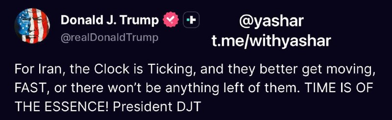

ترامپ: زمان برای ایران در حال اتمام است

بهتر است خیلی سریع اقدام کنند، وگرنه چیزی از آن‌ها باقی نخواهد ماند.
وقت بسیار حیاتی است!

@withyashar

## WithYashar — post 11495

  <a href="telegram/content/WithYashar_11495_1779047545.webm" target="_blank">🎬 Download video</a>

🎬 Video

## WithYashar — post 11494

اتحاد باید شکل بگیره ! حتی بچه هیئتی ! تغییر رژیم شکل میگیره ولی تغییر عقیده کار یک شبه نیست و باید هر دو سمت شل کنند ! من خودم کافرم ولی تیم باید تکمیل باشه ! آس پیک شخص شاهزاده رضا پهلوی تنها هستش ! ترامپم مارو میره قاهره شک نکنید !

## mwarmonitor — post 9225

  <a href="telegram/content/mwarmonitor_9225_1779047546.mp4" target="_blank">🎬 Download video</a>

🔴«دو فروند هواپیمای EA-18G «گرولر» هنگام اجرای یک نمایش هوایی در نمایشگاه هوایی GunFighter Skies 2026 دچار برخورد در هوا شدند.»

@mwarmonitor

## mwarmonitor — post 9223

🔴ترامپ به ایران هشدار داد: زمان برای حملات سخت‌تر آمریکا رو به پایان است

📝نویسنده: باراک راوید

🔰 هم‌زمان با افزایش تنش‌ها میان آمریکا و ایران بر سر کشتیرانی در خلیج فارس و امور دیپلماتیک. دونالد ترامپ، رئیس‌جمهور آمریکا، در یک تماس تلفنی به «آکسیوس» گفت که «زمان برای ایران رو به پایان است» و هشدار داد اگر حکومت ایران پیشنهاد بهتری برای توافق ارائه ندهد، «با ضربات بسیار سخت‌تری مواجه خواهد شد.»

🔸چرا این موضوع اهمیت دارد؟
مقامات آمریکایی می‌گویند ترامپ خواهان توافقی برای پایان دادن به جنگ است، اما رد بسیاری از خواسته‌های او از سوی ایران و امتناع این کشور از دادن امتیازات معنادار در برنامه هسته‌ای خود، گزینه نظامی را دوباره روی میز قرار داده است.
به گفته دو مقام آمریکایی، انتظار می‌رود ترامپ روز سه‌شنبه با تیم امنیت ملی خود در «اتاق وضعیت» (Situation Room) کاخ سفید تشکیل جلسه دهد تا گزینه‌های نظامی را بررسی کنند.
ترامپ روز یکشنبه در مورد وضعیت ایران با بنیامین نتانیاهو، نخست‌وزیر اسرائیل، تلفنی گفتگو کرد.
پشت صحنه
یک منبع آگاه اعلام کرد که ترامپ روز شنبه با اعضای تیم امنیت ملی خود در باشگاه گلف خود در ویرجینیا دیدار کرد تا درباره ایران گفتگو کند.
حاضران در این جلسه: جی‌دی ونس (معاون رئیس‌جمهور)، استیو ویتکوف (فرستاده کاخ سفید)، مارکو روبیو (وزیر امور خارجه) و جان راتکلیف (رئیس سی‌آی‌ای).

🔹آخرین وضعیت (میدانی و دیپلماتیک)
وزیر کشور پاکستان روزهای شنبه و یکشنبه برای گفتگو با مقامات ارشد ایرانی درباره توافق پایان دادن به جنگ، به تهران سفر کرد. پاکستان به عنوان میانجی رسمی میان آمریکا و ایران عمل می‌کند.
🔹محمد بن عبدالرحمن آل ثانی، نخست‌وزیر قطر که او نیز نقش میانجی را بر عهده دارد، روز یکشنبه با همتای پاکستانی خود و همچنین وزیر امور خارجه ایران گفتگو کرد.

📌ترامپ به آکسیوس گفت که همچنان فکر می‌کند ایران خواهان توافق است و افزود منتظر پیشنهاد به‌روزشده ایران است؛ پیشنهادی که او ابراز امیدواری کرد از آخرین طرح ارائه‌شده در چند روز پیش، بهتر باشد.

اظهارات ترامپ
ترامپ گفت:
«ما می‌خواهیم توافق کنیم. آن‌ها (ایرانی‌ها) در جایگاهی که ما می‌خواهیم نیستند. آن‌ها باید به آن نقطه برسند، در غیر این صورت ضربه سختی خواهند خورد و خودشان هم این را نمی‌خواهند.»
او تاکید کرد که اگر ایران پیشنهاد بهتری ارائه ندهد، آمریکا «بسیار سخت‌تر از گذشته» به ایران ضربه خواهد زد.
ترامپ در پایان خاطرنشان کرد:
«زمان رو به پایان است. بهتر است سریع‌تر حرکت کنند، در غیر این صورت چیزی برایشان باقی نخواهد ماند.»

@mwarmonitor

## mwarmonitor — post 9221

🇮🇷🇺🇸مقام‌های آمریکایی: مذاکرات با ایران به بن‌بست رسیده است.

@mwarmonitor

## mwarmonitor — post 9220

🔴شبکه کان اسرائیل به نقل از یک مقام گزارش داد: ایالات متحده و اسرائیل سطح آماده‌باش خود را برای احتمال ازسرگیری درگیری با ایران افزایش داده‌اند.

@mwarmonitor

## mwarmonitor — post 9219

🔴در روزهای اخیر، سه نفتکشِ خالی از محموله که تحت تحریم‌های آمریکا هستند، از خط محاصره نیروی دریایی آمریکا عبور کرده و وارد محدوده شده‌اند.

🔸یکی از آن‌ها برای مدت کوتاهی سیستم موقعیت‌یاب (AIS) را خاموش کرده بود.

🔸دیگری با پرچم روسیه حرکت می‌کرد.

🔸سومی در امتداد ساحل عمان حرکت کرده است.

🔹این سه نفتکش در مجموع می‌توانند حدود ۱.۹ میلیون بشکه نفت ایران را جابه‌جا کنند. چنین رخدادهایی به تهران زمان بیشتری در میز مذاکرات می‌دهد، در حالی که جهان در انتظار تأمین بیشتر انرژی و کودهای شیمیایی از این منطقه است. TANKER TRACKER

@mwarmonitor

## mwarmonitor — post 9218

🚨به گفته دو مقام آمریکایی به آکسیوس، انتظار می‌رود دونالد ترامپ روز سه‌شنبه یک جلسه در «اتاق وضعیت» با تیم ارشد امنیت ملی خود برگزار کند تا درباره گزینه‌های اقدام نظامی گفت‌وگو کند.

@mwarmonitor

## mwarmonitor — post 9217

🔴 دونالد ترامپ به کانال ۱۳ اسرائیل:
اگر ایران یک پیشنهاد خوب ارسال نکند، به آن‌ها حمله خواهیم کرد؛ به شکلی که تا حالا انجام نداده‌ایم.

@mwarmonitor

## mwarmonitor — post 9216

  <a href="telegram/content/mwarmonitor_9216_1779047546.mp4" target="_blank">🎬 Download video</a>

📝 خدا نشسته اون بالا، تخمه می‌شکنه و با لذت به این شاهکار نگاه می‌کنه؛ کمدی سیاهی که در آن ابولا و هانتا ویروس مأمور پذیرایی هستند و جنگ‌ها نقش موسیقی متن را بازی می‌کنند. آدم با دیدن این حجم از خلاقیت در شکنجه و متدِ «عذاب بده و بگو مصلحت است»، به شک می‌افتد…

## mwarmonitor — post 9215

🔴 دونالد ترامپ: در مورد ایران، زمان در حال تمام شدن است و آن‌ها باید خیلی سریع اقدام کنند؛ در غیر این صورت چیزی از آن‌ها باقی نخواهد ماند. زمان حیاتی است! @mwarmonitor

## mwarmonitor — post 9214

  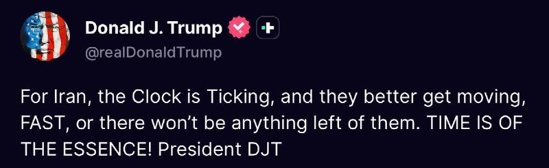

🔴 دونالد ترامپ:
در مورد ایران، زمان در حال تمام شدن است و آن‌ها باید خیلی سریع اقدام کنند؛ در غیر این صورت چیزی از آن‌ها باقی نخواهد ماند. زمان حیاتی است!

@mwarmonitor

## mwarmonitor — post 9213

🔴دونالد ترامپ، رئیس‌جمهور ایالات متحده، در یک تماس تلفنی با بنیامین نتانیاهو، نخست‌وزیر اسرائیل، درباره ایران گفت‌وگو کرد؛ به گفته یک مقام اسرائیلی. باراک راوید خبرنگار آکسیوس

@mwarmonitor

## FoxNewsTwitter — post 341856

Fox News (Twitter/X)

Crowds gather on the National Mall for "Rededicate 250," an all-day event celebrating America’s upcoming 250th anniversary with prayer, worship music and speeches focused on faith, unity and the nation’s Christian values.

## FoxNewsTwitter — post 341855

  <a href="telegram/content/FoxNewsTwitter_341855_1779047549.mp4" target="_blank">🎬 Download video</a>

Fox News (Twitter/X)

NEW: Defense Secretary @PeteHegseth delivers a faith-focused message during the “Rededicate 250” prayer gathering on the National Mall in Washington, D.C.

## FoxNewsTwitter — post 341854

  

Fox News (Twitter/X)

BREAKING: President Trump issued a stark warning to Iran, saying “the clock is ticking” and urging the country to “get moving, FAST, or there won’t be anything left of them.”

## FoxNewsTwitter — post 341853

  

Fox News (Twitter/X)

Deputies wrangle and “arrest” an alligator after it wandered into a residential neighborhood near a school bus stop in Paisley, Florida.

Wild footage shows deputies corralling the gator before it was safely captured and turned over to the Florida Fish and Wildlife Conservation Commission.

## FoxNewsTwitter — post 341852

  <a href="telegram/content/FoxNewsTwitter_341852_1779047551.mp4" target="_blank">🎬 Download video</a>

Fox News (Twitter/X)

NFL legend Tom Brady cracks a joke about his former Patriots head coach, Bill Belichick, while giving the commencement address at Georgetown University.

"Challenge yourself with ideas that are uncomfortable and people who push you to be your very best, even if one of those people is a cranky old coach who cuts the sleeves off his sweatshirt and screams at you all day."

## pm_afshaa — post 90918

  <a href="telegram/content/pm_afshaa_90918_1779047552.webm" target="_blank">🎬 Download video</a>

🔴عارف، معاون اول پزشکیان:
با توجه به روند خوبی که در کشور حاکمه و پیروزی‌هایی که به دست میاریم، در تلاشیم مشکلات اقتصادی رو کاهش بدیم.

💧 Rainbet.com the #1 Non-KYC Crypto Casino & Sportsbook @rainbetcom

😁 @Pm_Afshaa

## pm_afshaa — post 90917

  <a href="telegram/content/pm_afshaa_90917_1779047553.webm" target="_blank">🎬 Download video</a>

🔴محسن رضایی:
آمریکا یا شرایط ما رو میپذیره یا با موشک‌های ما مورد استقبال قرار خواهد گرفت.

💧 Rainbet.com the #1 Non-KYC Crypto Casino & Sportsbook @rainbetcom

😁 @Pm_Afshaa

## pm_afshaa — post 90916

  <a href="telegram/content/pm_afshaa_90916_1779047553.webm" target="_blank">🎬 Download video</a>

🔴ترامپ در گفت‌وگو با شبکه 14 اسرائیل:
مقام‌های جمهوری اسلامی باید از من بترسن و مراقب باشن.

💧 Rainbet.com the #1 Non-KYC Crypto Casino & Sportsbook @rainbetcom

😁 @Pm_Afshaa

## pm_afshaa — post 90915

🔴 ترامپ: ما میخوایم توافق کنیم، آنها جایی که ما میخوایم نیستن؛ باید به آن نقطه برسن، وگرنه ضربه سختی خواهند خورد، و آنها این رو نمیخوان!

💧 Rainbet.com the #1 Non-KYC Crypto Casino & Sportsbook @rainbetcom

😁 @Pm_Afshaa

## pm_afshaa — post 90914

  <a href="telegram/content/pm_afshaa_90914_1779047553.webm" target="_blank">🎬 Download video</a>

🔴شبکه کان اسرائیل: آمریکا و اسرائیل سطح آماده‌باش خود را برای احتمال ازسرگیری درگیری با ایران افزایش داده‌ان.

💧 Rainbet.com the #1 Non-KYC Crypto Casino & Sportsbook @rainbetcom

😁 @Pm_Afshaa

## pm_afshaa — post 90913

  <a href="telegram/content/pm_afshaa_90913_1779047554.webm" target="_blank">🎬 Download video</a>

🔴آکسیوس به نقل از دو مقام آمریکایی:
انتظار میره ترامپ روز سه‌شنبه جلسه‌ای در اتاق وضعیت با تیم ارشد امنیت ملی خود برگزار کنه تا گزینه‌های اقدام نظامی علیه ایران رو بررسی کنه.

💧 Rainbet.com the #1 Non-KYC Crypto Casino & Sportsbook @rainbetcom

😁 @Pm_Afshaa

## pm_afshaa — post 90912

  <a href="telegram/content/pm_afshaa_90912_1779047554.webm" target="_blank">🎬 Download video</a>

🔴ترامپ به کانال 12 اسرائیل:
ما منتظر یه پیشنهاد دیگه از طرف ایران هستیم؛ اگه این کار رو نکنن، با شدتی بی‌سابقه هدف حمله قرار میگیرن.

💧 Rainbet.com the #1 Non-KYC Crypto Casino & Sportsbook @rainbetcom

😁 @Pm_Afshaa

## pm_afshaa — post 90911

🔴کانال 13 اسرائیل:ترامپ چندتا رویداد که قرار بود تو اونا شرکت کنه رو لغو کرده و الان جلسه‌ درباره ایران برگزار کرده

💧 Rainbet.com the #1 Non-KYC Crypto Casino & Sportsbook @rainbetcom

😁 @Pm_Afshaa

## pm_afshaa — post 90910

🔴ترامپ: برای ایران، زمان در حال تیک‌تاک است و بهتره سریع حرکت کنند، وگرنه چیزی از آنها باقی نخواهد ماند. زمان مهم است.

💧 Rainbet.com the #1 Non-KYC Crypto Casino & Sportsbook @rainbetcom

😁 @Pm_Afshaa

## pm_afshaa — post 90909

  <a href="telegram/content/pm_afshaa_90909_1779047555.webm" target="_blank">🎬 Download video</a>

🔴سنتکام: از شروع محاصره دریایی ایران، 81 کشتی تجاری رو منحرف کردیم و 4 تا رو از کار انداختیم.

💧 Rainbet.com the #1 Non-KYC Crypto Casino & Sportsbook @rainbetcom

😁 @Pm_Afshaa

## pm_afshaa — post 90908

  <a href="telegram/content/pm_afshaa_90908_1779047555.webm" target="_blank">🎬 Download video</a>

🔴سناتور لیندزی گراهام درباره ایران:
به نظر من، کسایی که الان قدرت رو دستشون گرفتن با قبلی‌ها هیچ فرقی ندارن و باز هم میخوان جهان رو به هم بریزن، اسرائیل رو نابود کنن و به ما حمله کنن؛ باید بیشتر اونا رو ضعیف کنیم. رفتن به دنبال توافقی که هیچ‌وقت حاصل نمیشه، فقط جمهوری اسلامی رو قوی‌تر میکنه.

هر قیمتی که لازم باشه، میپردازیم. این حرفی بود که چرچیل درباره شکست هیتلر میگفت و حالا برای ایران هم صدق میکنه.

💧 Rainbet.com the #1 Non-KYC Crypto Casino & Sportsbook @rainbetcom

😁 @Pm_Afshaa

## pm_afshaa — post 90907

  <a href="telegram/content/pm_afshaa_90907_1779047556.webm" target="_blank">🎬 Download video</a>

🔴باراک راوید، خبرنگار آکسیوس:
ترامپ و نتانیاهو در تماسی تلفنی درباره پرونده ایران گفتگو کردن.

کانال 12 اسرائیل:
در سایه آمادگی برای از سرگیری درگیری‌ها در ایران این تماس انجام شده.

💧 Rainbet.com the #1 Non-KYC Crypto Casino & Sportsbook @rainbetcom

😁 @Pm_Afshaa

## DEJradio — post 4685

🔸 خبر ۲۱
یکشنبه ۲۷ اردیبهشت ۱۴۰۵

#خبر۲۱
@DEJradio

## DEJradio — post 4684

  <a href="telegram/content/DEJradio_4684_1779047556.webm" target="_blank">🎬 Download video</a>

🔸
🔺 شبکه خبری «فاکس نیوز»، روز یکشنبه ۲۷ اردیبهشت ماه در گزارشی اعلام کرد، دونالد ترامپ که به تازگی از سفر چین بازگشته است، در حال بررسی از سرگیری اقدام نظامی علیه ایران است و روز یکشنبه با بنیامین نتانیاهو، نخست وزیر اسرائیل گفتگو خواهد کرد.
نتانیاهو صبح یکشنبه با اعلام آنکه «مانند هر چند روز یکبار» با ترامپ تماس خواهد گرفت، گفت: «مطمئنا بخش‌هایی از سفر او به چین و شاید موارد دیگر را خواهم شنید. احتمالات زیادی وجود دارد و ما برای هر سناریویی آماده‌ایم.»
تماس تلفنی با نتانیاهو در حالی صورت می‌گیرد که فاکس نیوز با استناد به ارزیابی‌های اطلاعاتی منطقه‌ای درباره ایران گزارش داد که ممکن است به دلیل ناامیدی ترامپ از تهران و «رد درخواست او برای دست کشیدن از آرمان‌های تسلیحات هسته‌ای»، حملات نظامی از سر گرفته شود.
دو مقام اطلاعاتی منطقه‌ای به فاکس نیوز گفتند: «ارزیابی غالب در داخل ایران این است که رئیس جمهوری ترامپ ممکن است به شروع مجدد اقدام نظامی متوسل شود و تهران اکنون عمدا راهبرد «فریب و تأخیر» را دنبال می‌کند، با این امید که خرید زمان، هرگونه بازگشت احتمالی به جنگ را پیچیده کند.»
به گزارش فاکس نیوز، تهران تصور می‌کند می‌تواند تحولات را به تاخیر بیندازد و بحران را حداقل برای دو هفته دیگر تمدید کند، به طوری که وضعیت برای ترامپ برای شروع مجدد کمپین نظامی، چه از نظر سیاسی و چه از نظر عملیاتی، دشوارتر شود.
این منابع به فاکس گفتند مقامات ایرانی به جام جهانی و دویست و پنجاهمین سالگرد تأسیس آمریکا به‌عنوان عواملی نگاه می‌کنند که می‌تواند در محاسبات زمانی به سود تهران عمل کند.

#جنگ #جمهوری_اسلامی
@DEJradio

## DEJradio — post 4683

  <a href="telegram/content/DEJradio_4683_1779047557.mp4" target="_blank">🎬 Download video</a>

🚨
🔸 ‏نقش محوری شاهزاده رضا پهلوی برای گذار از جمهوری اسلامی؛ چه مسیری طی شد؟

در ماه‌های اخیر بسیاری از گروه‌های سیاسی و اجتماعی مختلف با شاهزاده رضا پهلوی دیدار کرده‌اند که از افزایش فزاینده اجماع بر سر شاهزاده به عنوان رهبر دوران گذار خبر می‌دهد.
مهرداد بزرگ، کنشگر سیاسی پادشاهی‌خواه، در گفت‌وگو با «دژ» توضیح می‌دهد برای رسیدن به جایگاهی که شاهزاده رضا پهلوی هم‌اکنون در آن قرار گرفته، چه مسیری طی شد؟ و نقش تیم او چه بوده است؟

#شاهزاده_رضا_پهلوی #گذار
@DEJradio

## DEJradio — post 4682

  <a href="telegram/content/DEJradio_4682_1779047558.mp4" target="_blank">🎬 Download video</a>

🚨
🔸 مستند؛
پرویز فتاح، تکنوکرات سپاهی و مطلوب علی خامنه‌ای

#موشعلی #IRGCterrorists
@DEJradio

## VahidOnline — post 75522

  

صبح روز یکشنبه ۲۷ اردیبهشت ۱۴۰۵ یک دستگاه اتوبوس در محور عسلویه به کنگان، پس از پلیس راه سیراف، واژگون شد و جان هشت نفر از کارکنان مجتمع گاز پارس جنوبی را گرفت. پانزده نفر دیگر نیز در جریان این حادثه مجروح و به بیمارستان منتقل شدند.
@VahidHeadline

📡 @VahidOnline

## VahidOnline — post 75521

  

پست ترامپ، ترجمه ماشین:
زمان برای ایران به‌سرعت در حال سپری شدن است و بهتر است هرچه زودتر اقدام کنند وگرنه چیزی از آن‌ها باقی نخواهد ماند. زمان حیاتی است.
realDonaldTrump

📡 @VahidOnline

## VahidOnline — post 75520

  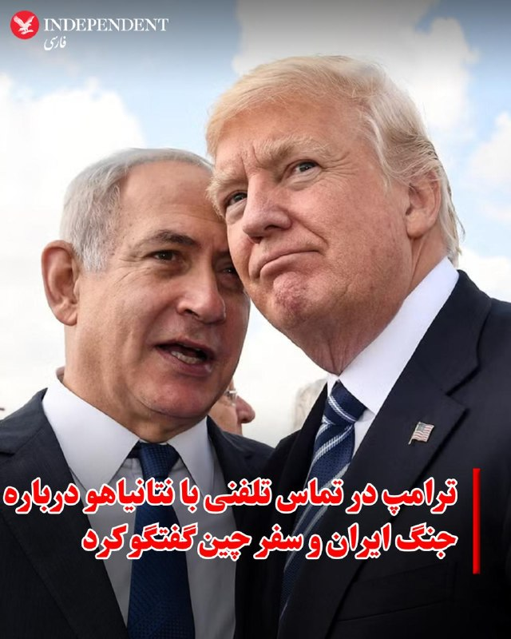

♦️دفتر بنیامین نتانیاهو، نخست‌وزیر اسرائیل، اعلام کرد او روز یکشنبه و دقایقی پیش از برگزاری نشست امنیتی، در تماس تلفنی با دونالد ترامپ، درباره جنگ با ایران گفتگو کرده است.

به گزارش تایمز اسرائیل، این تماس در شرایطی که گزارش‌ها درباره آمادگی آمریکا و اسرائیل برای ازسرگیری جنگ با ایران منتشر شده است.

بر اساس گزارش رسانه‌های اسرائیلی، دو طرف در این تماس درباره احتمال ازسرگیری جنگ با ایران و همچنین سفر اخیر ترامپ به چین گفتگو کرده‌اند.
@VahidOOnLine

📡 @VahidOnline

## kianmeli1 — post 87455

  <a href="telegram/content/kianmeli1_87455_1779047561.mp4" target="_blank">🎬 Download video</a>

🔴محسن رضایی: محاصرهٔ دریایی آمریکا را می‌شکنیم

صبر ما حدی دارد و نیروهای مسلح درحال آماده‌کردن خودش است.
https://t.me/kianmeli1

## kianmeli1 — post 87454

  

🔴ترامپ به کانال ۱۳ گفت:

"من فکر می‌کنم ایرانی‌ها باید از آنچه در حال حاضر در حال وقوع است بترسند."
https://t.me/kianmeli1

## kianmeli1 — post 87453

  

🔴ترامپ: زمان برای ایران در حال اتمام است
https://t.me/kianmeli1

## IranIntlTV — post 337684

  

احمدرضا رادان، فرمانده نیروی انتظامی، اعلام کرد که این نیرو ۶ هزار و ۵۰۰ نفر شهروند را از ابتدای جنگ بازداشت کرده است.

رادان این افراد را «وطن‌فروشان و جواسیس» نامید؛ اتهام‌هایی که وکلای دادگستری و نهادهای حقوق بشری می‌گویند جمهوری اسلامی برای سرکوب مردم از آنها استفاده می‌کند.

‌فرمانده فراجا همچنین گفت که بازداشت‌ها در ارتباط با اعتراضات دی ماه همچنان ادامه دارد.
https://iranintl.com/202605176516

## IranIntlTV — post 337683

  <a href="telegram/content/IranIntlTV_337683_1779047564.mp4" target="_blank">🎬 Download video</a>

اورشلیم پست از احتمال تشدید حملات جمهوری اسلامی به امارات متحده عربی گزارش داده است.

همزمان با توصیف آتش‌بس به‌عنوان وضعیتی شکننده، نگرانی‌ها درباره حملات جمهوری اسلامی احتمال از سرگیری جنگ را افزایش داده است.

گفت‌وگو با جمشید برزگر، روزنامه‌نگار و تحلیل‌گر سیاسی
@iranintltv

## IranIntlTV — post 337682

  <a href="https://t.me/IranintlTV/337682" target="_blank">📎 Download file</a>

🎧نسخه صوتی چشم‌انداز: اهداف اصلی آمریکا و اسرائیل در حمله دوباره به ایران
@iranintlTV

## IranIntlTV — post 337681

  <a href="telegram/content/IranIntlTV_337681_1779047566.mp4" target="_blank">🎬 Download video</a>

مسعود پزشکیان، رییس دولت در جمهوری اسلامی، دسترسی باکیفیت به خدمات دیجیتال را حق مردم دانست و گفت دولت او برای برقرار ماندن ارتباطات، به‌صورت شبانه‌روزی تلاش می‌کند.

گفت‌وگو با مهدی صارمی‌فر، روزنامه‌نگار علم و تکنولوژی
@iranintltv

## IranIntlTV — post 337680

  

محمدرضا عارف، معاون اول پزشکیان، گفت: «تسهیل ازدواج جوانان بخشی از راهبردهای نظام است.»
او افزود: «موضوع جوانان، ازدواج و فرزندآوری در برنامه پنج‌ساله دولت لحاظ شده و با توجه به روند خوبی که در کشور حاکم است و پیروزی‌هایی که به دست می‌آوریم، در تلاشیم مشکلات اقتصادی را کاهش دهیم.»
https://iranintl.com/202605172551

## IranIntlTV — post 337679

  <a href="telegram/content/IranIntlTV_337679_1779047568.mp4" target="_blank">🎬 Download video</a>

روز شنبه ۲۶ اردیبهشت، جمعی از ایرانیان ساکنِ ونکوور کانادا، در حمایت از مردم ایران و شاهزاده رضا پهلوی تجمع برگزار کردند. شرکت‌کنندگان «خواستار تغییر رژیم ایران» و «اقدام فوری» در حمایت از مردم ایران شدند.

## IranIntlTV — post 337678

  <a href="telegram/content/IranIntlTV_337678_1779047569.mp4" target="_blank">🎬 Download video</a>

چشم‌انداز با مهدی مهدوی‌آزاد: اهداف اصلی آمریکا و اسرائیل در حمله دوباره به ایران

نسخه کامل این قسمت را در یوتیوب ایران‌اینترنشنال تماشا کنید:
https://youtu.be/6u1N8mDDOMA
@iranintltv

## IranIntlTV — post 337677

  

انور قرقاش مشاور دیپلماتیک رییس امارات متحده عربی در شبکه اجتماعی ایکس نوشت: «هدف قرار دادن تروریستی نیروگاه هسته‌ای پاک براکه، چه از سوی عامل اصلی و چه از طریق یکی از عوامل نیابتی آن، یک تشدید تنش خطرناک و صحنه‌ای تاریک است که تمامی قوانین و عرف‌های بین‌المللی را نقض می‌کند، در حالی که بی‌توجهی جنایتکارانه‌ به جان غیرنظامیان در امارات متحده عربی و پیرامون آن است.»

قرقاش ادامه داد: «این تشدید تنش ممنوع، بار دیگر ماهیت چالش‌هایی را که منطقه در مواجهه با نیروهای شر، هرج‌ومرج و خرابکاری با آنها روبه‌رو است، تایید می‌کند.»

او افزود: «هیچ‌کس نخواهد توانست بازوی امارات را بپیچاند، و هیچ‌کس موفق نخواهد شد چشم‌انداز، موفقیت و پیام الهام‌بخش آن به مردم منطقه در زمینه امنیت، ثبات، توسعه و شکوفایی را تضعیف کند.»
https://iranintl.com/202605172450

## IranIntlTV — post 337676

  

وزارت خارجه عربستان سعودی حمله پهپادی به نیروگاه هسته‌ای براکه در امارات متحده عربی را محکوم کرد.

همزمان وزارت خارجه بحرین اعلام کرد که این کشور حمله «تروریستی» به نیروگاه هسته‌ای براکه را به‌شدت محکوم می‌کند و بر همبستگی کشورش با امارات متحده عربی تاکید کرد.
https://iranintl.com/202605174803

## IranIntlTV — post 337675

  <a href="https://t.me/IranintlTV/337675" target="_blank">📎 Download file</a>

🎧نسخه صوتی تیتراول با نیوشا صارمی: تماس نتانیاهو و ترامپ درباره ایران؛ تشدید تنش‌ها با حمله پهپادی به امارات
@iranintlTV

## IranIntlTV — post 337673

  <a href="telegram/content/IranIntlTV_337673_1779047572.mp4" target="_blank">🎬 Download video</a>

مهدی مهدوی‌آزاد در برنامه «چشم‌انداز» گفت: «در شرایط فعلی، کسی در تهران به‌دنبال صلح نیست و ظاهراً صلح و امتیاز دادن و گرفتن را نوعی ضعف و ضدارزش می‌دانند.»

او افزود: «برنامه هسته‌ای که به‌خاطر آن دو بار کشور وارد جنگ شد، خسارت‌های سنگینی به ایران وارد کرده و بخش بزرگی از تاسیسات و توان مرتبط با آن نابود شده است. با این حال، دوباره بحث‌ها به همان نقطه اول برگشته؛ انگار دوباره به نقطه صفر و مرحله‌ای سخت بازگشته‌ایم.»
@iranintltv

## IranIntlTV — post 337672

  

عبدالله حاجی‌صادقی، نماینده مجتبی خامنه‌ای در سپاه پاسداران، گفت: مذاکرات ما تحت اشراف مسئولان و با تایید «رهبری» پیش می‌رود. او با تاکید بر اینکه «اتحاد مقدس از هر چیزی مهم‌تر است»، افزود نباید اجازه داد این اتحاد آسیب ببیند.

حاجی‌صادقی همچنین گفت: «رهبری شجاع، بصیر، حکیم، مسلط و با قدرت فرماندهی داریم که مردم را به زیبایی رهبری می‌کند.»
https://iranintl.com/202605173538

## IranIntlTV — post 337671

  <a href="https://t.me/IranintlTV/337671" target="_blank">📎 Download file</a>

🎧نسخه صوتی اخبار شبانگاهی | یکشنبه ۲۷ اردیبهشت
@iranintlTV

## IranIntlTV — post 337670

  

دونالد ترامپ در گفت‌وگو با شبکه ۱۳ اسرائیل پس از تهدید دوباره جمهوری اسلامی گفت: «فکر می‌کنم مقام‌های تهران باید از من بترسند و مراقب باشند.»

او همچنین در گفت‌وگو با کانال ۱۲ اسرائیل گفت همچنان معتقد است ایران خواهان دستیابی به توافق است و انتظار دارد تهران در روزهای آینده پیشنهاد تازه‌ای ارائه کند.
ترامپ از تعیین ضرب‌الاجل برای مذاکرات خودداری کرد، اما هشدار داد در صورت برآورده نشدن خواسته‌های آمریکا درباره برنامه هسته‌ای ایران، اقدام نظامی شدیدتری در پیش خواهد بود.
https://iranintl.com/202605174881

## IranIntlTV — post 337669

  

دونالد ترامپ در گفت‌وگو با شبکه ۱۳ اسرائیل پس از تهدید دوباره جمهوری اسلامی گفت: «فکر می‌کنم مقام‌های تهران باید از من بترسند و مراقب باشند.»

او همچنین در گفت‌وگو با کانال ۱۲ اسرائیل گفت همچنان معتقد است ایران خواهان دستیابی به توافق است و انتظار دارد تهران در روزهای آینده پیشنهاد تازه‌ای ارائه کند.
ترامپ از تعیین ضرب‌الاجل برای مذاکرات خودداری کرد، اما هشدار داد در صورت برآورده نشدن خواسته‌های آمریکا درباره برنامه هسته‌ای ایران، اقدام نظامی شدیدتری در پیش خواهد بود.
https://iranintl.com/202605174881

## IranIntlTV — post 337668

  

دونالد ترامپ در گفت‌وگو با شبکه ۱۳ اسرائیل پس از تهدید دوباره جمهوری اسلامی گفت: «فکر می‌کنم مقام‌های تهران باید از من بترسند و مراقب باشند.»

او همچنین در گفت‌وگو با کانال ۱۲ اسرائیل گفت همچنان معتقد است ایران خواهان دستیابی به توافق است و انتظار دارد تهران در روزهای آینده پیشنهاد تازه‌ای ارائه کند.
ترامپ از تعیین ضرب‌الاجل برای مذاکرات خودداری کرد، اما هشدار داد در صورت برآورده نشدن خواسته‌های آمریکا درباره برنامه هسته‌ای ایران، اقدام نظامی شدیدتری در پیش خواهد بود.
https://iranintl.com/202605174881

## IranIntlTV — post 337667

  <a href="telegram/content/IranIntlTV_337667_1779047576.mp4" target="_blank">🎬 Download video</a>

ویدیوی دریافتی نشان می‌دهد روز شنبه ۲۶ اردیبهشت، جمعی از ایرانیان ساکن شهر رجاینا در ساسکاچوانِ کانادا، همراه با اجرای پرفورمنسی علیه اعدام‌های جمهوری اسلامی و قطعی اینترنت در ایران، تجمع اعتراضی برگزار کردند.

## IranIntlTV — post 337666

قطعی اینترنت در ایران به روز هفتاد و نهم رسیده است و دشواری‌های فراوانی برای میلیون‌ها ایرانی ایجاد کرده. گزارش‌های مختلفی از این مشکلات برای گروه‌های مختلف، از جمله افراد معلول منتشر شده است.

گفت‌وگو با رقیه رضایی، روزنامه‌نگار
@iranintltv

## IranIntlTV — post 337665

  <a href="telegram/content/IranIntlTV_337665_1779047577.mp4" target="_blank">🎬 Download video</a>

کانال ۱۳ اسرائیل گزارش داد این کشور در آماده‌باش کامل قرار دارد. بنابر طرح‌های تدوین‌شده، اهداف حملات احتمالی شامل زیرساخت‌های حکومتی، تاسیسات انرژی، نیروگاه‌ها و همچنین تلاش برای هدف قرار دادن مقام‌های ارشد ایران خواهد بود.

گفت‌وگو با فرزین ندیمی، پژوهشگر امور دفاعی و امنیتی
@iranintltv

## IranIntlTV — post 337664

  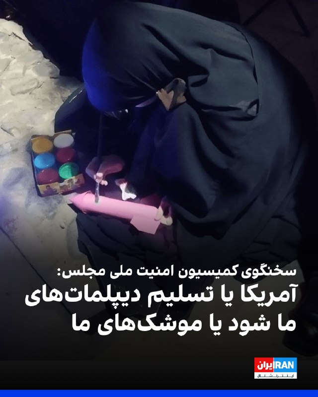

ابراهیم رضایی سخنگوی کمیسیون امنیت ملی مجلس، گفت: «آمریکا یا باید شرایط جمهوری اسلامی را بپذیرد و تسلیم دیپلمات‌های ما شود و یا اینکه از موضع قدرت با او مذاکره می‌کنیم و باید تسلیم موشک‌های ما شود.»
او افزود: «تاریخ تنگه هرمز را باید به قبل و بعد از کشته‌شدن علی خامنه‌ای تقسیم کرد.»
https://iranintl.com/202605179775

## Shin_Persian — post 6051

Shin ✓ @hey_itsmyturn
Sun, 17 May 2026 19:38:19 UTC

IAF Jet activity over Dara'a, #Syria 🇸🇾

فارسی

فعالیت جنگنده‌های نیروی هوایی اسرائیل (IAF) بر فراز درعا، #Syria 🇸🇾

𝕏 · @shin_persian

## Shin_Persian — post 6050

📦 mhrv-rs v1.9.29 released

• Fix the v1.9.28 Code.gs JSON parse regression (PR #1265, #1245, #1253, #1261)

Files (Android APKs, Windows, macOS, Linux, OpenWRT) on the files channel:

👉 v1.9.29 — all files with SHA-256

Channel:
https://t.me/mhrv_rs
or: https://t.me/+R1OyoHX2boA1ZDgx

#v1929

## Shin_Persian — post 6049

  

Shin ✓ @hey_itsmyturn
Sun, 17 May 2026 16:45:32 UTC

President Trump @POTUS:
"For Iran, the Clock is Ticking, and they better get moving, FAST, or there won’t be anything left of them. TIME IS OF THE ESSENCE! President DJT"

فارسی

رئیس‌جمهور ترامپ @POTUS:
«برای ایران، ساعت در حال حرکت است و بهتر است آن‌ها به سرعت وارد عمل شوند، سریع، وگرنه چیزی از آن‌ها باقی نخواهد ماند. زمان حیاتی است! رئیس‌جمهور دی‌جی‌تی»

𝕏 · @shin_persian

## Shin_Persian — post 6048

  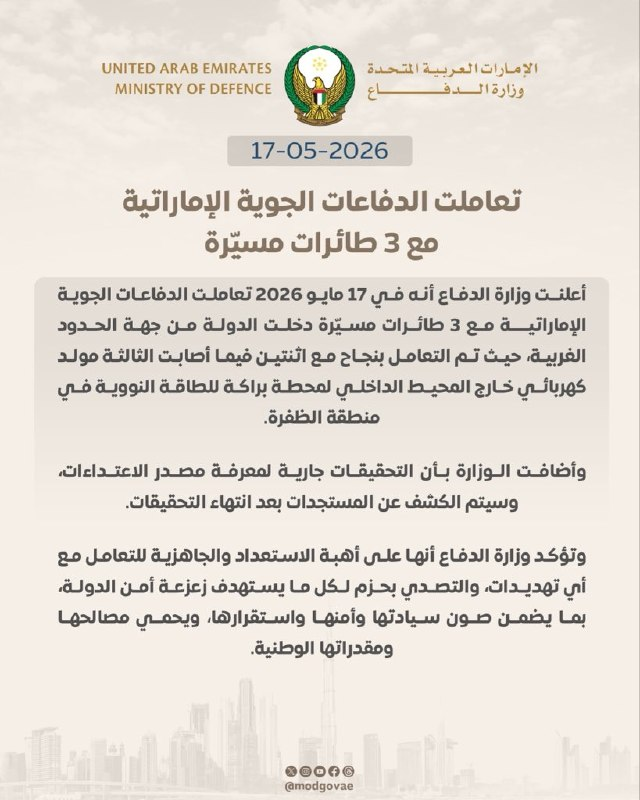

وزارة الدفاع |MOD UAE ✓ @modgovae Sun, 17 May 2026 13:54:54 UTC تعاملت الدفاعات الجوية الإماراتية مع 3 طائرات مسيّرة. أعلنت وزارة الدفاع أنه في 17 مايو 2026 تعاملت الدفاعات الجوية الإماراتية مع 3 طائرات مسيّرة دخلت الدولة من جهة الحدود الغربية، حيث تم التعامل…

## Shin_Persian — post 6047

وزارة الدفاع |MOD UAE ✓ @modgovae
Sun, 17 May 2026 13:54:54 UTC

تعاملت الدفاعات الجوية الإماراتية مع 3 طائرات مسيّرة.

أعلنت وزارة الدفاع أنه في 17 مايو 2026 تعاملت الدفاعات الجوية الإماراتية مع 3 طائرات مسيّرة دخلت الدولة من جهة الحدود الغربية، حيث تم التعامل بنجاح مع اثنتين فيما أصابت الثالثة مولد كهربائي خارج المحيط الداخلي لمحطة براكة للطاقة النووية في منطقة الظفرة.

وأضافت الوزارة بأن التحقيقات جارية لمعرفة مصدر الاعتداءات، وسيتم الكشف عن المستجدات بعد انتهاء التحقيقات.

وتؤكد وزارة الدفاع أنها على أهبة الاستعداد والجاهزية للتعامل مع أي تهديدات، والتصدي بحزم لكل ما يستهدف زعزعة أمن الدولة، بما يضمن صون سيادتها وأمنها واستقرارها، ويحمي مصالحها ومقدراتها الوطنية.

#وزارة_الدفاع
#وزارة_الدفاع_الإماراتية
#MOD
#UAEMinistryOfDefence

English

UAE Air Defenses intercepted 3 drones.

The Ministry of Defense announced that on May 17, 2026, UAE air defenses intercepted 3 drones that entered the country from the western border. Two were successfully engaged, while the third struck an electrical generator outside the internal perimeter of the Barakah Nuclear Energy Plant in the Al Dhafra region.

The Ministry added that investigations are underway to determine the source of the attacks, and updates will be disclosed upon the conclusion of the investigations.

The Ministry of Defense affirms that it is at the highest level of readiness and preparedness to deal with any threats and to resolutely confront anything aimed at destabilizing the security of the state, ensuring the preservation of its sovereignty, security, and stability, and protecting its national interests and assets.

#Ministry_of_Defense
#UAE_Ministry_of_Defense
#MOD
#UAEMinistryOfDefence

𝕏 · @shin_persian

## ManotoTV — post 105577

  <a href="telegram/content/ManotoTV_105577_1779047580.mp4" target="_blank">🎬 Download video</a>

«صدای فاطمه سپهری باشیم» ـ گزارشگر

## ManotoTV — post 105576

  <a href="telegram/content/ManotoTV_105576_1779047581.mp4" target="_blank">🎬 Download video</a>

باراک راوید، خبرنگار آکسیوس گزارش داد دو مقام آمریکایی اعلام کردند دونالد ترامپ قرار است روز سه‌شنبه نشستی در اتاق وضعیت کاخ سفید با تیم ارشد امنیت ملی خود برگزار کند تا گزینه‌های اقدام نظامی را بررسی کند.

## ManotoTV — post 105575

  <a href="telegram/content/ManotoTV_105575_1779047581.mp4" target="_blank">🎬 Download video</a>

‌
بارسلون | اسپانیا؛ گردهمایی ایرانیان ـ گزارشگر ۲۷ اردیبهشت

## ManotoTV — post 105572

  <a href="telegram/content/ManotoTV_105572_1779047583.mp4" target="_blank">🎬 Download video</a>

‌
گوگوش، خواننده سرشناس ایرانی، با انتشار تصاویری در صفحه اینستاگرام خود اعلام کرد «نشان افتخار جزیره الیس» را دریافت کرده است؛ نشانی که به افرادی اهدا می‌شود که در جامعه آمریکا تاثیرگذار بوده‌اند و در عین حال هویت و ریشه‌های فرهنگی خود را حفظ کرده‌اند.

او در پیام خود نوشت: «خواستم از این فرصت استفاده کنم تا نام ایران و مردم شریف ایران را یادآوری کنم.»

گوگوش همچنین این نشان را به مردم ایران تقدیم کرد و نوشت: «این نشان را با عشق و احترام به مردم ایران تقدیم می‌کنم؛ به مردمی که سال‌ها با رنج، صبوری، امید و سربلندی زندگی کرده‌اند و با وجود همه سختی‌ها، همچنان ایستاده‌اند.»

این خواننده پیشکسوت در ادامه برای ایران و جهان آرزوی «صلح، آرامش و روزهایی روشن‌تر» کرد و در پایان به سخنی از سعدی اشاره کرد.

## ManotoTV — post 105571

  <a href="telegram/content/ManotoTV_105571_1779047583.mp4" target="_blank">🎬 Download video</a>

انور قرقاش، مشاور رئیس‌ دولت امارات، حمله به نیروگاه هسته‌ای این کشور را «اقدامی تروریستی» توصیف کرد و گفت این حمله «چه از سوی عامل اصلی و چه از طریق یکی از نیروهای نیابتی‌اش» یک «تشدید خطرناک» و نقض قوانین و عرف‌های بین‌المللی است.

قرقاش در پیامی در ایکس نوشت این حمله «با بی‌اعتنایی مجرمانه به جان غیرنظامیان در امارات و مناطق اطراف آن» انجام شده است.

او افزود: «هیچ‌کس نمی‌تواند امارات را تحت فشار قرار دهد و در تضعیف چشم‌انداز، موفقیت و پیام الهام‌بخش آن برای امنیت، ثبات، توسعه و رفاه در منطقه موفق نخواهد شد.»

امارات تاکنون مسئول این حمله را معرفی نکرده است. وزارت دفاع امارات پیش‌تر اعلام کرده بود پهپادها از «مرز غربی» وارد این کشور شده‌اند.

## ManotoTV — post 105570

سخنرانی پدر جاویدنام سام افشاری در گردهمایی مونیخ - گزارشگر ۲۶ اردیبهشت

## ManotoTV — post 105569

  <a href="telegram/content/ManotoTV_105569_1779047583.mp4" target="_blank">🎬 Download video</a>

‌‌
دونالد ترامپ در پیامی در شبکه‌ اجتماعی خود نوشت:
«برای ایران، ساعت در حال گذر است و بهتر است خیلی سریع حرکت کنند، وگرنه چیزی از آن‌ها باقی نخواهد ماند. وقت تنگ است.»

## ManotoTV — post 105568

  <a href="telegram/content/ManotoTV_105568_1779047584.mp4" target="_blank">🎬 Download video</a>

‌
بنیامین نتانیاهو، نخست‌وزیر اسرائیل، و دونالد ترامپ، رئیس‌جمهوری آمریکا، روز یکشنبه درباره سفر رئیس‌جمهوری آمریکا به چین گفت‌وگو کردند.

دو طرف همچنین درباره تحولات مربوط به ایران رایزنی کردند.

نتانیاهو پیش‌تر گفته بود که شامگاه یکشنبه با ترامپ صحبت خواهد کرد. او گفت:
«چشم‌های ما همچنین کاملاً به ایران باز است. امروز، همان‌طور که هر چند روز یک‌بار انجام می‌دهم، با دوست‌مان رئیس‌جمهور ترامپ صحبت خواهم کرد. قطعاً برداشت‌های او را از سفرش به چین و شاید مسائل دیگری خواهم شنید. قطعاً احتمالات زیادی وجود دارد؛ ما برای هر سناریویی آماده‌ایم.»

## ManotoTV — post 105567

  <a href="telegram/content/ManotoTV_105567_1779047584.mp4" target="_blank">🎬 Download video</a>

بهار صحرائیان، وکیل دادگستری و عضو کانون وکلای استان فارس، به زندان عادل‌آباد شیراز منتقل شد.

بر اساس گزارش‌های منتشر شده خانم صحرائیان روز یکشنبه ۲۷ اردیبهشت در دادسرای شیراز از بابت اتهام‌های «اجتماع و تبانی به قصد اقدام علیه امنیت ملی»، «فعالیت تبلیغی علیه نظام» و «نشر اکاذیب» مورد تفهیم اتهام قرار گرفت.

این وکیل دادگستری روز شنبه ۲۶ اردیبهشت، حین انجام وظیفه در دادگاه انقلاب شیراز بازداشت شده بود.

## ManotoTV — post 105566

  <a href="telegram/content/ManotoTV_105566_1779047585.mp4" target="_blank">🎬 Download video</a>

لندن | بریتانیا؛ کنار دیوار جاویدنامان ـ گزارشگر یکشنبه ۲۷ اردیبهشت

## ManotoTV — post 105565

  <a href="telegram/content/ManotoTV_105565_1779047586.mp4" target="_blank">🎬 Download video</a>

‌
«صدای فاطمه سپهری باشیم» ـ گزارشگر

## ManotoTV — post 105564

  <a href="telegram/content/ManotoTV_105564_1779047587.mp4" target="_blank">🎬 Download video</a>

مجارستان؛ گردهمایی ایرانیان _ گزارشگر یکشنبه ۲۷ اردیبهشت

## ManotoTV — post 105563

  <a href="telegram/content/ManotoTV_105563_1779047589.mp4" target="_blank">🎬 Download video</a>

‌
وین | اتریش؛ گردهمایی ایرانیان _ گزارشگر یکشنبه ۲۷ اردیبهشت

## ManotoTV — post 105562

  <a href="telegram/content/ManotoTV_105562_1779047590.mp4" target="_blank">🎬 Download video</a>

بازار تهران؛ ۲۷ اردیبهشت ـ گزارشگر

## ManotoTV — post 105561

  <a href="telegram/content/ManotoTV_105561_1779047591.mp4" target="_blank">🎬 Download video</a>

‌
پورتو | پرتغال؛ گردهمایی ایرانیان ـ گزارشگر یکشنبه ۲۷ اردیبهشت

## FarsiVOA — post 218001

  <a href="telegram/content/FarsiVOA_218001_1779047592.mp4" target="_blank">🎬 Download video</a>

⚡️محمد قائدی در برنامه تفسیر خبر: جمهوری اسلامی می‌کوشد پرونده جنگ را به پرونده بازسازی پیوند بزند
@FarsiVOA

## FarsiVOA — post 218000

⚡️فروپاشی قدرت خرید در ایران؛ گرانی، بیکاری کمبود دارو و مسکن و سقوط طبقه متوسط
@FarsiVOA

## FarsiVOA — post 217999

  <a href="telegram/content/FarsiVOA_217999_1779047593.mp4" target="_blank">🎬 Download video</a>

⚡️محسن سازگارا در برنامه تفسیر خبر: اسرائیل مترصد آغاز دوباره جنگ با جمهوری اسلامی است
@FarsiVOA

## FarsiVOA — post 217998

⚡️پرزیدنت ترامپ خطاب بە جمهوری اسلامی: اگر زود دست بە کار نشوید چیزی از شما باقی نمی‌ماند
@FarsiVOA

## FarsiVOA — post 217997

  <a href="telegram/content/FarsiVOA_217997_1779047593.mp4" target="_blank">🎬 Download video</a>

⚡️دامون محمدی در برنامه تفسیر خبر: شرایط جنگی توجیه کننده بسیاری از معضلات حکومت ایران است
@FarsiVOA

## FarsiVOA — post 217996

⚡️در برنامه تفسیر خبر امروز، مهدی آقازمانی با کارشناسان مهمان، درباره حملە پهپادی بە نیروگاە اتمی ابوظبی، ادامە حملات بە اقلیم کردستان عراق، تلاش برای باجگیری و اختلال در اینترنت جهانی از طریق کابلهایی کە از زیر آبهای خلیج فارس میگذرد و ادامە محاصرە دریایی بنادر جنوبی گفتگو می‌کند
@FarsiVOA

## FarsiVOA — post 217995

  <a href="telegram/content/FarsiVOA_217995_1779047594.mp4" target="_blank">🎬 Download video</a>

همزمان با قطع گسترده اینترنت و تشدید فضای امنیتی در ایران، رادان، فرمانده کل نیروی انتظامی جمهوری اسلامی، مدعی شد از آغاز جنگ تاکنون شش هزار و پانصد نفر را بازداشت کرده‌اند. رادان همچنین درباره روند بازداشت معترضان دی ماه ۱۴۰۴ گفت: «رهایشان نکردیم و همچنان داریم دستگیر می‌کنیم.»

در ادامه بازداشت و سرکوب شهروندان، قوه قضاییه صدور و اجرای احکام سنگین مانند اعدام را برای معترضان دی و زندانیان سیاسی سرعت بخشیده است.

پیشتر محسنی‌اژه‌ای از عواملش در قوه قضائیه خواست برخورد با معترضان را شدت بخشند و به صدور و اجرای احکام اعدام مخالفان جمهوری اسلامی سرعت بدهند.

## FarsiVOA — post 217994

بعضی نیروهای کُرد با یادآوری اعدام قاضی محمد در دوران پهلوی و نقدهایی به منشور جرج‌تاون هنوز از حضورعبدالله مهتدی در این ائتلاف دلخور‌اند. دبیر کل حزب کومله کردستان ایران درعمق میدان به این نقدها پاسخ می‌‌دهد

## FarsiVOA — post 217993

  

⚡️دونالد ترامپ، رئیس جمهوری آمریکا روز یکشنبه، ۲۷ اردیبهشت در شبکه اجتماعی تروت سوشال نوشت: «زمان برای [رژیم] ایران، به سرعت در حال سپری شدن است و بهتر است هر چه سریع‌تر اقدام کنند.»
او افزود که در غیر این‌صورت «چیزی از آنها باقی نخواهد ماند.»

## FarsiVOA — post 217992

بغداد در نقطه عطف سیاسی؛ حذف گروه‌های نزدیک به جمهوری اسلامی از کابینه و تشدید اختلافات شیعە

## FarsiVOA — post 217991

در گفت‌وگو با حسن هاشمیان از صدای آمریکا به همزمانی آغاز به‌کار دولت جدید عراق با تشدید فشار نظامی، اقتصادی، و قضایی آمریکا بر گروه‌های وابسته به جمهوری اسلامی پرداختیم و بررسی کردیم این تحولات چه پیامدهایی برای آینده نفوذ رژیم ایران و موازنه امنیتی در عراق خواهد داشت.

## FarsiVOA — post 217990

سازمان‌های حقوق بشری گزارش داده‌اند که وکلای تسخیری قوه قضائیه در سرعت بخشیدن به صدور احکام اعدام برای معترضان، به رژیم ایران کمک می‌کنند.

## FarsiVOA — post 217989

  <a href="telegram/content/FarsiVOA_217989_1779047595.mp4" target="_blank">🎬 Download video</a>

نوآم بتان، نماینده اسرائیل در یوروویژن ۲۰۲۶، بعد از بازگشت به اسرائیل، در فرودگاه با استقبال هوادارانش روبرو شد. او در مسابقات آواز یوروویژن که شامگاه شنبه، ۲۶ اردیبهشت، برگزار شد، با ترانه‌‌ای که ترکیبی از عبری، فرانسوی و انگلیسی است رتبه دوم را بدست آورد.

دارا، خواننده بلغار مقام اول را کسب کرد. دور بعدی این مسابقات به میزبانی بلغارستان برگزار خواهد شد.

## FarsiVOA — post 217988

🔺نتانیاهو: اورشلیم را با تمرکز بر زیرساخت‌های عمرانی و میراث تاریخی توسعه می‌دهیم

▪️بنیامین نتانیاهو، نخست‌وزیر اسرائیل، اعلام کرد دولت این کشور در نشست ویژه‌ای در اورشلیم مجموعه‌ای از طرح‌های جدید عمرانی، تاریخی، و فناوری را برای توسعه این شهر تصویب کرده است.

⬇️ بیشتر بخوانید:

https://ir.voanews.com/a/netanyahu-jerusalem-development-program/8150901.html/?nocach=1

## FarsiVOA — post 217987

🔺سناتور گراهام: هنوز اهداف بیشتری برای حمله در ایران وجود دارد

▪️لیندزی گراهام، سناتور جمهوری‌خواه ایالت کارولینای جنوبی، روز یکشنبه ۲۷ اردیبهشت خواستار افزایش فشار نظامی آمریکا بر رژیم ایران شد و گفت هنوز اهداف بیشتری برای حمله وجود دارد.

⬇️ بیشتر بخوانید:

https://ir.voanews.com/a/lindsey-graham-nbc-interview-iran-hormuz-strait-status-quo/8150911.html/?nocach=1

## FarsiVOA — post 217986

  <a href="telegram/content/FarsiVOA_217986_1779047597.mp4" target="_blank">🎬 Download video</a>

عبدالله مهتدی، دبیر کل حزب کومله کردستان ایران درعمق میدان: این کُردها بودند که موج بزرگی از فعالان سیاسی و روزنامه‌نگاران خارج از کشور را با بودجه و امکانات محدود خود از دست جمهوری اسلامی نجات دادند

## FarsiVOA — post 217985

  <a href="telegram/content/FarsiVOA_217985_1779047598.mp4" target="_blank">🎬 Download video</a>

جاری شدن سیلاب و آب‌گرفتگی معابر در بجنورد - ۲۷ اردیبهشت ۱۴۰۵

## DW_Farsi — post 124810

🔶 نیویورک‌تایمز: اسرائیل دو پایگاه مخفی در خاک عراق ساخته است

بر اساس گزارش "نیویورک تایمز" اسرائیل دو پایگاه نظامی مخفی در خاک عراق برای پشتیبانی از عملیات‌های خود علیه ایران ایجاد کرده است.

به گفته مقام‌های عراقی، در جریان تلاش برای حفظ محرمانه بودن این پایگاه‌ها، یک سرباز و یک غیرنظامی کشته شده‌اند.

این گزارش می‌گوید یکی از این پایگاه‌ها در اواخر سال ۲۰۲۴ در غرب عراق ساخته شده و پایگاه دیگری نیز در سال جاری میلادی ایجاد شده است.

هدف از احداث این پایگاه‌ها کاهش زمان پرواز برای حملات به ایران، پشتیبانی لجستیکی، استقرار نیروهای ویژه و آماده‌سازی عملیات امداد در صورت سرنگونی احتمالی جنگنده‌های اسرائیلی عنوان شده است.

روزنامه وال‌استریت ژورنال، در گزارشی که شنبه ۹ مه (۱۹ اردیبهشت) منتشر شد، به نقل از منابع آگاه، از جمله مقام‌های آمریکایی نوشته بود اسرائیل پیش از آغاز جنگ با ایران در نهم اسفند ۱۴۰۴، یک پایگاه نظامی مخفی در بیابان غربی عراق ساخته بود. حالا خبر از دومین پایگاه اسرائیل در خاک عراق منتشر شده است.

در ادامه گزارش نیویورک تایمز آمده است که در جریان یکی از این حوادث، یک چوپان عراقی پس از مشاهده یکی از پایگاه‌ها توسط یک بالگرد اسرائیلی کشته شده و یک سرباز عراقی نیز در جریان اعزام یک تیم شناسایی جان خود را از دست داده است.

مقام‌های عراقی این اقدامات را نقض آشکار حاکمیت ملی خود توصیف کرده‌اند.

به نوشته نیویورک‌تایمز، واشنگتن عراق را متقاعد کرده بود برای محافظت از هواپیماهای آمریکایی، سامانه‌های راداری خود را خاموش کند.

ارتش اسرائیل درباره این گزارش‌ اظهار نظر نکرده است. عراق و اسرائیل روابط دیپلماتیک ندارند.
@dw_farsi

## DW_Farsi — post 124809

🔶 ترامپ: ایران باید سریع اقدام کند وگرنه چیزی از آن باقی نمی‌ماند

دونالد ترامپ، رئیس‌جمهور آمریکا روز یکشنبه ۱۷ مه (۲۷ ادریبهشت) هشدار داد اگر ایران به‌سرعت با ایالات متحده به توافق صلح نرسد، "چیزی از آن باقی نخواهد ماند".

ترامپ در شبکه اجتماعی "تروث سوشال" نوشت: «برای ایران، زمان در حال پایان است و آن‌ها بهتر است خیلی سریع اقدام کنند وگرنه چیزی از آن‌ها باقی نخواهد ماند.»

رئیس جمهور آمریکا همچنین در پایان پیام خود تاکید کرد: «زمان حیاتی است!»

هشدار ترامپ به ایران ساعاتی پس از تهدیدهای ابوالفضل شکارچی سخنگوی ارشد نیرو‌های مسلح داده شد.

این مقام نظامی جمهوری اسلامی گفته است: «رئیس‌جمهور مستاصل آمریکا باید بداند در صورت عملی شدن تهدید‌ها و تجاوز مجدد به ایران اسلامی، دارایی‌ها و ارتش مضمحل آن کشور با سناریو‌های جدید، هجومی، غافلگیرکننده و طوفانی روبه‌رو خواهند شد و در باتلاق خودساخته‌ای که نتیجه سیاست‌های ماجراجویانه همان رئیس‌جمهور است، فرو خواهند رفت.»

دونالد ترامپ علیرغم این تهدیدها در مصاحبه با کانال ۱۲ اسرائیل گفته همچنان معتقد است ایران به دستیابی به توافق علاقمند است و انتظار دارد تهران در روزهای آینده یک پیشنهاد به‌روزشده ارائه کند.

او در عین حال تهدید کرده است در صورتی که ایران خواسته‌های آمریکا درباره برنامه هسته‌ای را برآورده نکند، با اقدام نظامی شدیدتری مواجه خواهد شد. ترامپ همچنین گفته است: «ما می‌خواهیم به توافق برسیم، اما ایرانی‌ها اکنون در نقطه‌ای که ما می‌خواهیم نیستند.»

بر اساس گزارش کانال ۱۲ اسرائیل، ترامپ همچنین تماس تلفنی خود با بنیامین نتانیاهو، نخست‌وزیر اسرائیل را مثبت ارزیابی کرده و گفته این تماس بر جنگ با ایران متمرکز بوده است.

تلاش‌ها برای کشاندن آمریکا و ایران به میز مذاکره از سوی پاکستان نیز ادامه دارد. در همین چارچوب، محسن نقوی، وزیر کشور پاکستان به تهران سفر کرد و با مسعود پزشکیان، رئیس‌جمهور ایران دیدار کرد.
@dw_farsi

## DW_Farsi — post 124808

🔶 امارات: حق پاسخ به حملات تروریستی علیه تاسیسات اتمی خود را داریم

مقام‌های امارات متحده عربی اعلام کردند در حال بررسی منشا حمله پهپادی به نزدیکی تاسیسات هسته‌ای براکه هستند و حق پاسخ به چنین "حملات تروریستی" را برای خود محفوظ می‌دانند.

امارات روز یکشنبه ۱۷ ماه مه (۲۷ اردیبهشت) اعلام کرد یک حمله پهپادی به آتش‌سوزی در نزدیکی نیروگاه هسته‌ای براکه در منطقه الظفره ابوظبی منجر شده است. این پهپاد به یک ژنراتور برق در خارج از محدوده داخلی نیروگاه اصابت کرده اما سطح ایمنی تشعشعات هسته‌ای تحت تاثیر قرار نگرفته و هیچ موردی از آسیب‌دیدگی گزارش نشده است.

آژانس بین‌المللی انرژی اتمی نیز اعلام کرد وضعیت را به‌دقت دنبال می‌کند و خواستار "حداکثر خویشتن‌داری نظامی" در نزدیکی تاسیسات هسته‌ای شده است.

وزارت دفاع امارات هم اعلام کرده است دو پهپاد دیگر در جریان این حادثه "با موفقیت مهار شده‌اند". وزارت دفاع امارات بدون ارائه جزئیات بیشتر گفته است که این پهپادها از "مرز غربی" شلیک شده‌اند.

خبرگزاری رویترز در یک گزارش که روز یکشنبه ۲۷ اردیبهشت (۱۷ مه) منتشر شد نوشته ایران در اوایل ماه جاری حملات خود را به امارات شدت بخشیده است.

رویترز ضمن اشاره به بن‌بست دیپلماتیک میان ایران و آمریکا و درخواست‌های طرفین در مذاکرات از قول ابوالفضل شکارچی سخنگوی ارشد نیرو‌های مسلح نوشته در صورت عملی شدن تهدیدهای آمریکا، این کشور با "سناریوهای جدید هجومی، طوفانی و غافلگیرکننده" روبه‌رو خواهد شد و آمریکا در "باتلاق‌های خودساخته" فرو خواهد رفت.
@dw_farsi

## DW_Farsi — post 124807

  <a href="telegram/content/DW_Farsi_124807_1779047600.mp4" target="_blank">🎬 Download video</a>

🎥 شش کشته و ۲۰ مصدوم در سانحه اتوبوس در عسلویه
اتوبوس کارکنان مجتمع گاز پارس جنوبی واژگون شد

واژگونی یک اتوبوس حامل کارکنان مجتمع گاز پارس جنوبی در محور عسلویه به سیراف، جان شش نفر را گرفت و ۲۰ نفر دیگر را مصدوم کرد؛ حال یکی از مجروحان وخیم اعلام شده است.
این حادثه صبح یکشنبه ۲۷ اردیبهشت‌ماه در مسیر عسلویه به کرمانشاه رخ داد؛ زمانی که اتوبوس حامل کارکنان مجتمع گاز پارس جنوبی واژگون شد. سخنگوی این مجتمع اعلام کرد شش نفر از کارکنان جان باخته‌اند و ۲۰ نفر دیگر نیز مصدوم شده‌اند. به گفته او، آمار قربانیان و مجروحان قطعی است و حال یکی از مصدومان وخیم گزارش شده است.
@dw_farsi

## DW_Farsi — post 124806

🔶 هشدار وکلای حقوق بشر؛ برخی وکلای تسخیری همدست نهادهای امنیتی هستند

سازمان حقوق بشر ایران هشدار داده است که دستگاه قضایی جمهوری اسلامی به‌طور فعال از وکلای تسخیری در جریان پرونده‌های معترضان بازداشت‌شده استفاده می‌کند و این موضوع می‌تواند به تسریع و تسهیل اجرای احکام اعدام منجر شود.

این سازمان می‌گوید در نامه‌ای از سوی جمعی از وکلای حقوق بشری داخل ایران، برخی وکلای تسخیری "همدست" نهادهای امنیتی در محاکمات نمایشی معرفی شده‌اند زیرا به جای دفاع موثر از موکلان، با دستگاه‌های امنیتی همکاری می‌کنند.

آنها در نامه‌ای با عنوان "وکلای امنیتی؛ شریک دزد و رفیق قافله" به نقش وکلای تسخیری در پرونده‌های امنیتی پرداخته‌اند.

در این نامه تاکید شده است محرومیت از وکیل مستقل می‌تواند به‌طور عامدانه زمینه‌ساز صدور و اجرای احکام اعدام علیه متهمان شود.

بر اساس این گزارش، مستنداتی وجود دارد که نشان می‌دهد برخی وکلای تسخیری بلافاصله پس از صدور حکم، درخواست تجدیدنظر را به‌صورت رسمی ثبت می‌کنند و بدین ترتیب متهمان را از مهلت قانونی ۲۰ روزه برای تجدیدنظرخواهی محروم می‌سازند.

سازمان حقوق بشر ایران تاکید کرده است این رویه با ایجاد مانع در دسترسی به وکلای مستقل و ثبت زودهنگام درخواست‌ها، مسیر اجرای احکام اعدام را هموار می‌کند و می‌تواند "مصداق نقض جدی اصول دادرسی عادلانه و اعدام‌های خودسرانه در حقوق بین‌الملل" باشد.
@dw_farsi

## DW_Farsi — post 124805

🔶 ادعای فارس: جزئیات درخواست‌های آمریکا در مذاکرات

خبرگزاری فارس، نزدیک به سپاه پاسداران و نهادهای امنیتی گزارش داده است که بر اساس "شنیده‌ها از پاسخ آمریکا به پیشنهادهای ایران"، واشنگتن پنج شرط اصلی را مطرح کرده است.

این شروط شامل عدم پرداخت هرگونه غرامت و خسارت، خروج و تحویل ۴۰۰ کیلوگرم اورانیوم از ایران به آمریکا، فعال ماندن تنها یک مجموعه از تاسیسات هسته‌ای، عدم پرداخت حتی ۲۵ درصد از دارایی‌های بلوکه‌شده ایران و منوط شدن توقف جنگ در همه ساحت‌ها به انجام مذاکره است.

فارس در ادامه می‌نویسد این گزارش تاکید می‌کند که حتی در صورت تحقق این شرایط از سوی ایران، "تهدید تجاوز" آمریکا و اسرائیل همچنان پابرجا خواهد بود.

این رسانه نزدیک به نهادهای امنیتی همچنین از قول "کارشناسان" نوشته است که طرح پیشنهادی آمریکا به جای حل مسئله، در پی دستیابی به اهدافی است که این کشور نتوانسته در طول جنگ به آن‌ها دست یابد.

خبرگزاری فارس بدون ذکر منبعی نوشته است که در مقابل، ایران انجام هرگونه مذاکره را منوط به تحقق ۵ پیش‌شرط "اعتمادساز" شامل "پایان جنگ در همه جبهه‌ها به‌ویژه لبنان، رفع تحریم‌های ضدایرانی، آزادسازی پول‌های بلوکه‌شده ایران، جبران خسارات ناشی از جنگ و پذیرش حق حاکمیت ایران بر تنگه هرمز" دانسته است.

برخی کارشناسان از جمله حمیدرضا عزیزی، پژوهشگر "بنیاد علم و سیاست" به دویچه وله فارسی گفتند مواضع آمریکا و ایران فاصله زیادی با یکدیگر دارد و همین موضوع، میانجی‌گری میان دو کشور را نیز با دشواری مواجه کرده است.

به‌ویژه برنامه هسته‌ای جمهوری اسلامی ایران، نگرانی‌های جدی آمریکا را برانگیخته است.

در این رابطه اخیرا کریس رایت، وزیر انرژی آمریکا در جلسه کمیته نیروهای مسلح سنای این کشور مدعی شد که ایران تنها "چند هفته" با دستیابی به مواد لازم برای ساخت سلاح هسته‌ای فاصله دارد.
@dw_farsi

## DW_Farsi — post 124804

🎥 بارش شدید تگرگ در نقده و بجنورد
وزش باد شدید، رگبار، رعدوبرق در ۱۴ استان ایران تا روز دوشنبه

بارش بسیار شدید تگرگ در بجنورد و نقده، خیابان‌های این دو شهر را سفیدپوش کرد؛ همزمان سازمان هواشناسی درباره ادامه ناپایداری‌ها، رعدوبرق و احتمال تگرگ در ۱۴ استان هشدار داده است.
تصاویر منتشرشده از بجنورد و نقده، شدت بالای بارش تگرگ را نشان می‌دهد؛ پدیده‌ای که در پی ناپایداری‌های جوی رخ داده است. سازمان هواشناسی اعلام کرده از عصر یکشنبه تا پایان دوشنبه، در تهران و بخش‌هایی از شمال، غرب، مناطق مرکزی و ارتفاعات، وزش باد شدید، رگبار، رعدوبرق و در مناطق مستعد، بارش تگرگ پیش‌بینی می‌شود.
@dw_farsi

## Persian_Trend_Official — post 14353

  <a href="telegram/content/Persian_Trend_Official_14353_1779047602.mp4" target="_blank">🎬 Download video</a>

دو فروند هواپیمای نیروی دریایی ایالات متحده EA-18G Growler (گونه‌ای از F/A-18) در حین اجرای نمایشی در نمایش هوایی Gunfighter Skies در پایگاه نیروی هوایی Mountain Home در آیداهو با یکدیگر در هوا برخورد کردند.
چهار خدمه با «چهار چتر نجات سالم» موفق به خروج اضطراری شدند.
هواپیماهای برخورد کرده امروز متعلق به تیم نمایشی Growler Demo بودند که از اسکادران VAQ-129 «Vikings» تشکیل شده
این اسکادران همان تیم آموزشی اصلی نیروی دریایی برای خلبانان EA-18G است.

یکی از همین هواگان VAQ-129 قبلاً هم در یک برخورد هوایی دیگر در سال ۲۰۱۷ در پایگاه NAS Fallon آسیب دیده بود و بیش از ۲۰۰۰ ساعت کار تعمیراتی نیاز داشت تا دوباره آماده پرواز شود.

☆Phantom☆

📌 @persian_trend_official
پرشین ترند | متفاوت‌ترین کانال نظامی

## Persian_Trend_Official — post 14352

  <a href="telegram/content/Persian_Trend_Official_14352_1779047603.webm" target="_blank">🎬 Download video</a>

ترامپ قرار است سه‌شنبه با ارشدترین مقامات امنیتی در اتاق وضعیت دیدار کند — Axios دستور جلسه: گزینه‌های نظامی علیه ایران ☆Phantom☆ 📌 @persian_trend_official پرشین ترند | متفاوت‌ترین کانال نظامی

## Persian_Trend_Official — post 14351

  

ترامپ قرار است سه‌شنبه با ارشدترین مقامات امنیتی در اتاق وضعیت دیدار کند — Axios

دستور جلسه: گزینه‌های نظامی علیه ایران

☆Phantom☆

📌 @persian_trend_official
پرشین ترند | متفاوت‌ترین کانال نظامی

## Persian_Trend_Official — post 14350

https://youtube.com/live/2KsilHSCq4o?feature=share

## Persian_Trend_Official — post 14349

حدود ساعت 22 به وقت تهران عزیز لایو امشب رو آغاز میکنیم

## Persian_Trend_Official — post 14347

دونالد ترامپ: زمان برای جمهوری اسلامی رو به پایان است.
 
دونالد ترامپ، رئیس‌جمهور اِیالات متحده، شامگاه یکشنبه، ۲۷ اردیبهشت‌ماه با انتشار پیامی در شبکه‌ی اجتماعی خود از این خبر داد که ساعت برای جمهوری اسلامی در حال تیک‌تاک است. رئیس‌جمهور آمریکا به رژیم توصیه کرد بهتر است سریع‌تر حرکت کنند، در غیر این صورت چیزی برای آنها باقی نخواهد ماند.
دونالد ترامپ این پیام را دقایقی پس از آن منتشر کرد که رسانه‌های اسرائیلی و آمریکایی از گفت‌وگوی او با بنیامین نتانیاهو، نخست‌وزیر اسرائیل خبر دادند.
تایمز اسرائیل شامگاه یکشنبه گزارش داد بنیامین نتانیاهو، عصر روز یکشنبه و دقایقی پیش از برگزاری یک نشست محدود امنیتی در شامگاه یکشنبه، با دونالد ترامپ، درباره جنگ علیه جمهوری اسلامی گفتگو کرده است.
 

☆Phantom☆

📌 @persian_trend_official
پرشین ترند | متفاوت‌ترین کانال نظامی

## Persian_Trend_Official — post 14346

  <a href="telegram/content/Persian_Trend_Official_14346_1779047604.webm" target="_blank">🎬 Download video</a>

ساعاتی پیش کانال Fighter Bomber رسانه غیررسمی اما معتبر هوانوردی روسیه تصویری از تست پروازی نسخه دوکابین سوخو-۵۷ منتشر کرد. Su-57D؟ Su-57UB؟ Su-57ED؟ هنوز کسی نمی‌داند و این ابهام در مرحله آزمایش اولیه طبیعی است.

Su-57UB = گزینه اول
روسیه برای نسخه‌های دوکابین آموزشی-رزمی سنت تاریخی با پسوند UB دارد؛ مثل سوخو-۲۷UB و میگ-۲۹UB — الگویی شناخته‌شده که مشتریان صادراتی آن را می‌شناسند.

Su-57D = گزینه دوم
پسوند D در روسی به نسخه‌های تخصصی اشاره دارد. اگر مسکو بخواهد نقش رزمی مستقل این پلتفرم را برجسته کند، این گزینه منطقی‌تر می‌شود.

Su-57ED = آخرین گزینه
ترکیب غیرمعمول حروف و اشاره به نسخه صادراتی، این را ضعیف‌ترین گزینه برای نام رسمی داخلی می‌کند.

☆Phantom☆

📌 @persian_trend_official
پرشین ترند | متفاوت‌ترین کانال نظامی

## Persian_Trend_Official — post 14345

  

💢 ترامپ:

برای ایران ساعت در حال تیک‌تاک است، و بهتر است خیلی سریع شروع به حرکت کنند، وگرنه هیچ چیزی از آن‌ها باقی نخواهد ماند.

زمان یک عامل حیاتی است!

🫆:Tony

📌 @persian_trend_official
پرشین ترند | متفاوت‌ترین کانال نظامی

## Persian_Trend_Official — post 14344

  

آقای ساعدی نیا
قلب میلیون ها ایرانی همراه شماست.

📌 @persian_trend_official
پرشین ترند | متفاوت‌ترین کانال نظامی

## Persian_Trend_Official — post 14343

## Persian_Trend_Official — post 14341

  

💢در آخرین تصاویر ماهواره ای ناو هواپیمابر آبراهام لینکلن در فاصله ۲۴۵ کیلومتری از ساحل ایران مستقر شده است

🫆:Tony

📌 @persian_trend_official
پرشین ترند | متفاوت‌ترین کانال نظامی

## RadioFarda — post 157292

  

🔸دونالد ترامپ، رئیس‌جمهور آمریکا، روز سه‌شنبه تهدید کرد ایران وقت زیادی ندارد و اگر به‌سرعت برای رسیدن به توافق با ایالات متحده اقدام نکند، چیزی از آن باقی نخواهد ماند.

🔸او در پیام کوتاهی در شبکه اجتماعی خود، تروث سوشال، نوشت: «برای ایران، ساعت در حال تیک‌تاک کردن است و بهتر است خیلی سریع اقدام کنند، وگرنه چیزی از آنها باقی نخواهد ماند. زمان حیاتی است!»

🔸این موضع‌گیری در حالی انجام شده که وب‌سایت اکسیوس ساعتی قبل به نقل از یک مقام اسرائیلی خبر داد رئیس‌جمهور ایالات متحده روز یکشنبه در تماسی تلفنی با بنیامین نتانیاهو، نخست‌وزیر اسرائیل، درباره ایران گفت‌وگو کرده است.

🔸آقای ترامپ بعد از سفر به چین نیز تأکید کرده بود که تهران باید با واشینگتن به توافق برسد. او گفته بود: «من قرار نیست خیلی بیشتر صبر کنم. آن‌ها باید توافق کنند.»

🔸این در حالی است که او هفته گذشته آخرین پاسخ ایران به طرح پیشنهادی آمریکا را «کاملا غیر قابل قبول» خوانده و رد کرده بود.

@RadioFarda

## IranianMinds — post 20296

🔴چندتا زن بی‌حجاب که در تجمعات شبانه شرکت کرده بودند، از طرف دادگاه اصفهان ابلاغیه گرفتند و جریمه شدند.

@IranianMinds

## IranianMinds — post 20295

🔴 عارف، معاون اول پزشکیان:

با توجه به روند خوبی که در کشور حاکمه و پیروزی‌هایی که به دست میاریم، در تلاشیم مشکلات اقتصادی رو کاهش بدیم.

@IranianMinds

## IranianMinds — post 20294

🔴 منابع اسرائیلی:

با چراغ سبز ترامپ، انتظار می‌رود اسرائیل و ایالات متحده به طور مشترک به ایران حمله کنند.

@IranianMinds

## IranianMinds — post 20293

🔴 رئیس‌جمهور ترامپ به Axios گفت که هنوز معتقد است ایران خواهان توافق است و اعلام کرد که در انتظار پیشنهادی تجدیدنظر شده از سوی ایران است که امیدوار است بهتر از پیشنهاد قبلی باشد که چند روز پیش ارائه شده بود. او از تعیین مهلت مشخصی برای مذاکرات خودداری کرد.

- هروقت ترامپ اینو گفت روز بعدش حمله کرد

@IranianMinds

## IranianMinds — post 20292

🔴 رضایی، سخنگوی کمیسیون امنیت ملی: آمریکا شرایط ایران را بپذیرد یا منتظر پاسخ موشکی باشد! @IranianMinds

## IranianMinds — post 20291

🔴 رضایی، سخنگوی کمیسیون امنیت ملی:

آمریکا شرایط ایران را بپذیرد یا منتظر پاسخ موشکی باشد!

@IranianMinds

## IranianMinds — post 20290

  <a href="telegram/content/IranianMinds_20290_1779047606.mp4" target="_blank">🎬 Download video</a>

🔴 مجری: آیا ارزش از دست دادن انتخابات میان دوره‌ای را دارد اگر نتیجه یک ایران غیر هسته‌ای باشد؟

سناتور گراهام: ارزش از دست دادن شغلم رو هم داره؛ اگر مجبور بودم کارم رو رها کنم تا مطمئن شم ایران هرگز سلاح هسته‌ای نخواهد داشت، این کار رو می‌کردم.‌‌

@IranianMinds

## IranianMinds — post 20289

✅ (فقط ۲۰۰ هزار تومن)🥺 🌱 قیمت اقتصادی + پشتیبانی حرفه‌ای 🚀 سریع و پایدار، بدون قطعی 🦋پشتیبانی واقعی، همیشه در دسترس ربات ما🌴 📩 @dayaconfigbot کانال ما🌳 📩 @dayavpn

## IranianMinds — post 20288

  

✅ (فقط ۲۰۰ هزار تومن)🥺

🌱 قیمت اقتصادی + پشتیبانی حرفه‌ای

🚀 سریع و پایدار، بدون قطعی
🦋پشتیبانی واقعی، همیشه در دسترس

ربات ما🌴
📩 @dayaconfigbot

کانال ما🌳
📩 @dayavpn

## IranianMinds — post 20287

  

انفجاری که قبل جنگ در بندر شهید رجایی بندرعباس رخ داد بسیار مهیب و پر از کشته! شما یه سرچ ساده تو اکانت‌های کوله پشتی بکن مطلقا هیچ اشاره‌ای به این تراژدی نداشتن!
شماها فقط پروژه گیر هستین! نه داغدار کودکان مدرسه میناب و نه دلسوز ایران و مردمش!

@IranianMinds

## IranianMinds — post 20286

🔴ترامپ به کانال ۱۳ اسرائیل:

ایران باید از من بترسد.

@IranianMinds

## IranianMinds — post 20285

🔴کانال ۱۲ اسرائیل:

تخمین اسرائیلی‌ها این است که امریکا در طول این هفته، به جنگ علیه ایران بازخواهد گشت.

@IranianMinds

## IranianMinds — post 20284

🔴 باراک راوید خبرنگار آکسیوس:

ترامپ در یک تماس تلفنی با نتانیاهو، درباره ایران گفت‌وگو کرد.

@IranianMinds

## IranianMinds — post 20283

  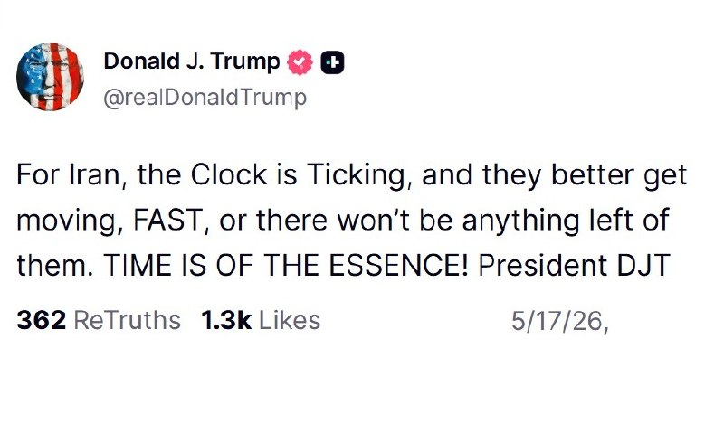

🔴ترامپ: زمان برای ایران در حال اتمام است

برای ایران، ساعت در حال تیک‌تاک است، و آن‌ها بهتر است خیلی سریع دست به کار شوند؛ وگرنه چیزی از آن‌ها باقی نخواهد ماند. زمان حیاتی است!

@IranianMinds

## BBCPersian — post 281327

🔻کشته شدن چندین نفر در لبنان و غزه در حملات هوایی

🔻وزارت بهداشت لبنان می‌گوید که در اثر حملات هوایی روز یکشنبه اسرائیل به مناطقی در جنوب این کشور پنج نفر از جمله دو کودک کشته شدند. در این حملات تعدادی هم مجروح شدند.

گزارش‌ها و تصاویر حاکی از بلند شدن دود سیاه رنگ از محل‌هایی است که هدف قرار گرفته است.

از غزه هم گزارش شده که مقامات بهداشتی می‌گویند که پنج نفر در حملات اسرائیل به این باریکه کشته شدند. بر اساس این گزارش سه نفر در حمله هوایی به یک آشپزخانه عمومی در نزدیکی بیمارستان الاقصی در مرکز غزه کشته شدند.

تحلیلگران می‌گویند که اسرائیل از زمان آتش‌بس با ایران،‌ طی هفته‌های اخیر حملات خود را به غزه افزایش داده است.

ارتش اسرائیل درباره حملات اخیر در لبنان و غزه اظهارنظری نکرده است.

https://bbc.in/4dhWi0J
@BBCPersian

## BBCPersian — post 281323

  <a href="telegram/content/BBCPersian_281323_1779047609.mp4" target="_blank">🎬 Download video</a>

🔻آخرین خبرهای مهم روز یکشنبه ۲۷ اردیبهشت ۱۴۰۵
@BBCPersian

## BBCPersian — post 281322

🔻خبرنگار اکسیوس به نقل از دو مقام آمریکایی: ترامپ روز سه‌شنبه درباره گزینه اقدام نظامی جلسه خواهد داشت

🔻باراک راوید، خبرنگار اکسیوس به نقل از دو مقام آمریکایی گزارش داد که انتظار می‌رود دونالد ترامپ روز سه‌شنبه جلسه‌ای در «اتاق وضعیت» کاخ سفید با تیم ارشد امنیت ملی خود برگزار کند تا گزینه‌های اقدام نظامی را مورد بررسی قرار دهد.

اتاق وضعیت از اتاق جلسات کاخ سفید است که مجهز به امکانات ارتباط مستقیم رئیس‌جمهور آمریکا با فرماندهی نیروهای این کشور در سراسر جهان است.

این ساعتی پس از آن است که آقای ترامپ در شبکه اجتماعی خود بار دیگر تهدید کرد که فرصت برای ایران در حال تمام شدن است و اگر سریع برای توافق صلح اقدامی نکند،‌ «چیزی برایش باقی نمی‌ماند.»

باراک راوید در شبکه ایکس نوشت که آقای ترامپ به او گفت: ‌‌‌‌‌‌‌‌‌«ما می‌خواهیم به توافق برسیم. آنها در نقطه‌ای که ما می‌خواهیم نیستند. باید به این نقطه برسند وگرنه به شدت ضربه خواهند خورد و آنها این را نمی‌خواهند.»

بنیامین نتانیاهو،‌ نخست وزیر اسرائیل پیشتر گفته بود قرار است امروز،‌ با دونالد ترامپ تلفنی گفت‌وگو کنند.
https://bbc.in/4nT41Gh
@BBCPersian

## BBCPersian — post 281320

  <a href="https://t.me/bbcpersian/281320" target="_blank">📎 Download file</a>

📻🎙️پادکست برنامه جام جهان‌نما یکشنبه ۲۷ اردیبهشت ۱۴۰۵

در برنامه رادیویی جام‌جهان‌نمای امروز می‌شنوید؛

گمانه‌زنی و التهاب درباره ازسرگیری جنگ آمریکا و اسرائیل با ایران؛ ترامپ در شبکه‌های اجتماعی از آرامش پیش از طوفان گفت، همزمان تهران گفته برای هر نوع واکنش غافل‌گیرانه آماده است.

حمله پهپادی به محوطه نیروگاه هسته‌ای امارات متحده عربی؛ این کشور گفته آتش‌سوزی مهار شده ولی هنوز منشا حمله مشخص نیست. ایران در واکنش گفته این حمله «توطئه دشمن» است.

هم‌زمان، قالیباف، رئیس مجلس، نماینده ویژه جمهوری اسلامی در امور چین هم شد. از کارشناس مسائل ایران می‌پرسیم آیا تغییر معناداری است؟

و در «گپ روز» امشب می‌شنوید:
فهرست بازیکنان دعوت‌شده به تیم ملی فوتبال ایران برای جام جهانی اعلام شد. مقام‌های ارشد فدراسیون فوتبال ایران و فیفا هم در استانبول دیدار کرده‌‌اند.
از خبرنگار ورزشی‌مان می‌پرسیم این فهرست، چندمرده حلاج است؟ شرط و شروط ایران برای شرکت در جام جهانی چه شد؟

این برنامه رادیویی را می‌توانید هر شب ساعت ۲۰ به وقت ایران، روی موج متوسط ۷۰۲ کیلوهرتز و موج کوتاه ۹۴۶۵ کیلوهرتز بشنوید.

@BBCPersian

## BBCPersian — post 281319

  

🔻دونالد ترامپ در شبکه تروث سوشال بدون توضیحی نوشت: «ساعت برای ایران در حال تیک‌تاک است و اگر به‌سرعت عمل نکند، چیزی از آنها باقی نخواهد ماند.»

این درحالیست که وزیر کشور پاکستان، کشوری که میانجی کنونی آیران و آمریکاست، امروز در ایران با محمدباقر قالیباف ملاقات کرده است.

سخنگوی کمیسیون امنیت ملی و سیاست خارجی مجلس امروز گفت: «آمریکا یا باید شرایط جمهوری اسلامی ایران را بپذیرد و تسلیم دیپلمات‌های ما شود و یا اینکه ایران از موضع قدرت با آن مذاکره خواهد کرد و باید تسلیم موشک‌های ما شود.»

او گفت که ایران «از هیچ یک از شروط خود کوتاه نمی‌آید.»
📷Getty Images
https://bbc.in/49SmRXU

@BBCPersian

## BBCPersian — post 281318

🔻امارات «حمله پهپادی» به نزدیکی نیروگاه هسته‌ایش را «تروریستی» خواند

🔻امارات متحده عربی حمله پهپادی به نزدیکی نیروگاه هسته‌ای براکه را «یک اقدام تروریستی بی‌دلیل» خواند که باعث تشدید تنش در منطقه می‌شود.

وزارت خارجه امارات متحده در بیانیه‌ای «به شدیدترین لحن» این حمله را محکوم کرد و «حق دیپلماتیک و نظامی خود را برای پاسخ به هرگونه تهدید، ادعا یا دشمنی» را محفوظ دانست.

در بیانیه وزارت خارجه امارات به منشا این حمله اشاره‌ای نشده اما آمده است که یک ژنراتور برق، خارج از محدوده داخلی نیروگاه هسته‌ای براکه در منطقه ظفره، هدف پهپادی قرار گرفت که از مرز غربی وارد امارات شده بود.

وزارت خارجه امارات این حمله را «تشدید خطرناک تنش‌ها،‌ اقدام تجاوزکارانه غیرقابل و تهدید مستقیم برای امنیت» خود و نقض آشکار قوانین بین‌المللی خواند.

تنش لفظی ایران و امارات اخیرا شدت گرفته است.

امارات جمعه گفت ایران در طول جنگ با آمریکا و اسرائیل،‌ بیش از سه هزار حمله به تاسیسات غیرنظامی‌اش کرده است.

عباس عراقچی، وزیر خارجه، امارات متحده را به داشتن نقش فعال در حملات آمریکا و اسرائیل به ایران متهم کرده است. ایران می‌گوید فقط به تاسیسات نظامی و نهادهای مرتبط با آمریکا و اسرائیل در امارت حمله کرده است.

https://bbc.in/3PnCZdc
@BBCPersian

## BBCPersian — post 281309

🔻یک روز پس از به نمایش درآمدن فیلم «تمرین‌هایی برای یک انقلاب»، ساخته پگاه آهنگرانی در هفتاد و نهمین جشنواره فیلم کن، عوامل تولید و ساخت این فیلم مقابل دوربین رسانه‌ها قرار گرفتند.

پس از نمایش دیروز که با استقبال تماشاچیان همراه بود،‌ خانم آهنگرانی اثر خود را به مادرانی تقدیم کرد که فرزندانشان را در راه مبارزه برای آزادی از دست داده‌اند.

کاوه فرنام و آدریا مونس تهیه کنندگان فیلم «تمرین‌هایی برای یک انقلاب» هستند و تدوین آن با آرش آشتیانی بوده است.

پگاه آهنگرانی که خود راوی این فیلم است می‌گوید که از میان پنج پرتره از خویشاوندان و استادانش و پنج شکل از مقاومت، در این فیلم داستان زندگی خودش را روایت کرده است.

به گفته خانم آهنگرانی او با استفاده از آرشیوهای شخصی، ویدئوهای خانگی، تصاویر اعتراضات خیابانی، روزنامه‌ها و صداهای ضبط‌ شده، بیش از ۴۰ سال از تاریخ ایران را بازخوانی ‌کرده است.

📷Corbis via Getty Images/ AFP via Getty Images/ Getty Images/ EPA/ BBC Images

@BBCPersian

## BBCPersian — post 281307

جنگ و پیامدهایشان چه تاثیری روی وضعیت مسکن شما گذاشته است؟ آیا پس از جنگ مجبور به اسباب‌کشی شده‌اید؟
بر اساس ارزیابی وزارت کار ایران، جنگ جنگ آمریکا و اسرائیل با ایران موجب بیکاری مستقیم و غیرمستقیم دو میلیون نفر شده است. از دست دادن شغل و کاهش درآمد برای آنها که در خانه‌های اجاره‌ای زندگی می‌کنند بسیار دشوارتر است.
اگر مستأجرید و در هفته‌های اخیر به دلایل اقتصادی مجبور به اسباب‌کشی شده‌اید، تجربیاتتان را با ما در میان بگذارید. جنگ چه تأثیری روی درآمد شما گذاشت؟ واکنش صاحبخانه‌ چه بود؟ آیا خانه جدیدی اجاره کردید یا به خانه خانواده یا دوستان رفتید؟ این ماجرا چه تاثیری بر روحیه و سلامت روان شما گذاشته است؟
اگر تجربه و مشاهده‌ای از اجاره‌نشینی دارید، با هشتگ #مسکن برای ما بفرستیدبه:
آی‌مسج و واتس‌اپ: ۰۰۴۴۷۳۴۲۰۳۲۱۱۳
پیامگیر تلگرام:t.me/bbcshoma

📷 ایرنا
عصر ایران

@BBCPersian
https://bbc.in/43cTEDl

## BBCPersian — post 281306

  

‌🔻سخنگوی کمیسیون امنیت ملی و سیاست خارجی مجلس گفت: «آمریکا یا باید شرایط جمهوری اسلامی ایران را بپذیرد و تسلیم دیپلمات‌های ما شود و یا اینکه ایران از موضع قدرت با آن مذاکره خواهد کرد و باید تسلیم موشک های ما شود.»

او گفت که ایران «از هیچ یک از شروط خود کوتاه» نمی‌آید.

امروز خبرگزاری‌های ایران گزارش‌هایی از شروط آمریکا در پاسخ به پیشنهادهای ایران منتشر کردند.

خبرگزاری مهر امروز نوشت: «آمریکا بدون دادن هیچ امتیاز ملموسی به ایران خواهان گرفتن امتیازاتی است که در جنگ موفق به تحقق آن نشده است.»

در همین حال، گزارش‌هایی هم منتشر شد که ایران پاسخ خود را به پاکستان منتقل کرده است.

📷Mizan
https://bbc.in/4nDeg19

@BBCPersian

## BBCPersian — post 281305

🔻شبکه خبر ایران به نقل از مقام نظامی: حمله به نزدیکی تاسیسات هسته‌ای امارات، تله دشمن است

🔻شبکه خبر صداوسیما از قول یک مقام آگاه نظامی که نامش را نبرد گفت حمله به نزدیکی تاسیسات هسته‌ای امارات «توطئه» و «تله دشمن» است.

بنابر این گزارش، این مقام نظامی گفت آمریکا و اسرائیل تلاش می‌کنند با عملیات‌ «غیرموجه علیه کشورهای منطقه و نسبت دادن آن به جمهوری اسلامی ایران خود را از باتلاق خودساخته برهانند و از بن بستی که قرار گرفته‌اند خارج کنند.»

او «این توطئه صهیونیستی» را محکوم کرد و همه طرف‌ها از «افتادن در تله دشمن و هر گونه رفتار یا گفتارو نسنجیده برحذر» داشت.

https://bbc.in/4tFeZjK
@BBCPersian

## Dirty_Kids — post 389639

  <a href="telegram/content/Dirty_Kids_389639_1779047612.mp4" target="_blank">🎬 Download video</a>

این خسته نشد از عن خوردن؟

اگه وقتت‌رو میذاشتی بجای گوه خوردن رو شغلت الان بجای دوتا آهنگ کسشر چهارتا آهنگ کسسر داشتتی

عن‌آقا آخه به تو نمیرسه حتی اسم اینارو بیاری چه برسه گوه‌شونو بخوری

@Dirty_Kids 👻

## Dirty_Kids — post 389638

  

🔴 اکانت رسمی اسرائیل به فارسی: شایدم اصلا چیزی از جنازه‌ی خامنه ای برای دفن کردن باقی نمونده...

@Dirty_Kids 👻

## Dirty_Kids — post 389637

  <a href="telegram/content/Dirty_Kids_389637_1779047614.mp4" target="_blank">🎬 Download video</a>

انتقاد شدید آیسان از امین فردین

این امین فردین مگه سیاسی شده؟! پسر اینا هنوز منقرض نشدن...

ناموسا کسی که داداشی پویان مختاری و ساشا سبحانی بوده‌رو هنوز دنبال میکنن برید واشقانی رو دنبال کنید اون اقلا صادقانه میگه خارکسده هستش
+ کلا اکیپ اینا همه صادراتی بودن جیب ملت زدن! (دنیا، میلاد حاتمی، پویان مختاری، امین فردین، ساشا، نیلی و...)

@Dirty_Kids 👻

## Dirty_Kids — post 389636

  

🔴 هر چی بگم از طنز ماجرا کم نمیشه؛ توی اصفهان برای زنای بی حجابی که رفتن خایمالی و توی تجمعات شبانه حضور داشتن، احضاریه دادگاه ارسال شده :))

@Dirty_Kids 👻

## Dirty_Kids — post 389635

  <a href="telegram/content/Dirty_Kids_389635_1779047615.mp4" target="_blank">🎬 Download video</a>

ویدئو وایرال شده از پرستو‌های حکومت؛
بی‌حجاب‌ها اومدن صف اول و چادری‌ها پشت سرشونن..

@Dirty_Kids 👻

## Dirty_Kids — post 389634

  <a href="telegram/content/Dirty_Kids_389634_1779047617.webm" target="_blank">🎬 Download video</a>

🔴ترامپ:
برای ایران، ساعت در حال تیک‌تاک کردنه و بهتره خیلی سریع دست‌به‌کار بشن؛

وگرنه چیزی ازشون باقی نمی‌مونه، زمان کاملاً حیاتی و تعیین‌کننده‌ست! 
⏳

@Dirty_Kids 👻

## Dirty_Kids — post 389633

‏تا حالا رفتی جنازه دخترت رو تحویل بگیری
بهت بگن شیرینی بگیر ؟
بعد تو بگی برای جنازش؟
اونم بگه نه برای بکارتش

@Dirty_Kids 👻

## Dirty_Kids — post 389632

تلگرام تو این سیزده سال، به اندازه‌ی یک روز پیام‌رسان‌های داخلی قطعی و اختلال نداشته.

@Dirty_Kids 👻

## Dirty_Kids — post 389631

‏Lesson :

جایی که بهت میگن «اگه دوست داری بیای، بیا»، نرو.

@Dirty_Kids 👻

## Dirty_Kids — post 389630

مرتیکه‌ی توده‌ای پلشت فکر کرده به جای «تخم» بگه «بیضه» خیلی مودب و با اخلاقه! دوزاری هستی مثل بقیه‌ی خون‌شورای هم‌صِنفت.

@Dirty_Kids 👻

## Dirty_Kids — post 389629

چرخی در خبرها زدم ببینم اوضاع خبری رسانه‌ها از چه قراره که دریا دریا کسشر موج می‌زد،

اول اینکه رسانه‌های روافض نوشتن که وزیر کشور خایه‌مال پاکستان یک دیدار خصوصی با پوزیده داشته که بیش از ۹۰ دقیقه طول کشیده و در پایان نهج‌البلغه گویان از جلسه خارج شده و به دیدار ممدباقر رفته که در اون جلسه هم یک بار دیگه چارچوب مذاکرات رو بهش توضیح دادن،

از طرفی دیگه صبح امروز به سمت کشور قرمدنگ امارات پهپاد پراکنی شده که ظاهراً به محوطه‌ی داخلی نیروگاه هسته‌ای براکه هم اصابت داشته که بعضی از تحلیلگران اعتقاد دارن روافض از ترس کونشون که می‌دونن حمله‌ی آمریکا قریب‌الوقوعه، حمله‌ی پیش‌‌دستانه کرده که شیر خدا و یارانش رو بترسونه.

پایان اخبار کسشر.

@Dirty_Kids 👻

## Dirty_Kids — post 389628

  

ایران ۱۹۷۱ تیم والیبال زنان پاس تهران

@Dirty_Kids 👻

## Dirty_Kids — post 389627

✖️ سایت بین المللی bet120x 
✖️  
👍دارای مجوز رسمی Gambling Judge سوئد
👍       
💳شارژ حساب از طریق ارز و یووچر و پرمیوم ووچر 
💳تسویه حساب دلاری سریع 💊بیمه شرط میکس 
⚠️فروش شرط 
🔔ویرایش شرط                    
3️⃣
2️⃣ 
🎁20%هدیه واریز از طریق ارز و ووچر ┅━━━━━━━━━━━…

## Dirty_Kids — post 389626

  

✖️ سایت بین المللی bet120x 
✖️

 
👍دارای مجوز رسمی Gambling Judge سوئد
👍
     

💳شارژ حساب از طریق ارز و یووچر و پرمیوم ووچر

💳تسویه حساب دلاری سریع
💊بیمه شرط میکس

⚠️فروش شرط

🔔ویرایش شرط                    
3️⃣
2️⃣

🎁20%هدیه واریز از طریق ارز و ووچر
┅━━━━━━━━━━━

🎁 10%برگشت باخت به صورت روزانه

🎁 10%برگشت باخت به صورت هفتگی

🎁10%برگشت باخت به صورت ماهانه

💻ادرس ورود به سایت:
https://bet120x.com/fa/?btag=971470
➖➖➖➖➖
   
👈 آموزش واریز و برداشت دلاری
👉

🔪کانال اطلاع رسانی:
👇

✈️https://t.me/+1Wv5nGY_a54xNzlk

## Dirty_Kids — post 389625

  <a href="telegram/content/Dirty_Kids_389625_1779047618.mp4" target="_blank">🎬 Download video</a>

اینا تازه هنرپیشه‌هاشون هستن:
اون مجریاتون کونشونم نمیتونن تکون بدن

ارزش دانلود: اگه نت اضاقی داری

@Dirty_Kids 👻

## Dirty_Kids — post 389624

‏یه تنِ ماهی خریدم ۳۰۰ تومن!
فک کنم توش پری دریایی باشه.
منتظرم خونه‌مون خالی شه درشو باز کنم.

@Dirty_Kids 👻

## Dirty_Kids — post 389623

  

پسرا میتونن اینجوری نگاهتون کنن و فکر کنن روغن ماشین چقدر گرون شده خارشو گاییدم

@Dirty_Kids 👻

## Dirty_Kids — post 389622

  

🌪وقتی اینترنت طوفانیه... کافیه بادبان ها رو بکشی تا

⚫️با بالاترین کیفیت ممکن
⚡️ 

⚫️100 هزار تومان شارژ هدیه 
🎁

⚫️پایین ترین قیمت گیگی 250
🌐 

⚫️و ارائه پورسانت %10 در ازای هر معرفی
💼

بتونی یه اتصال پایدار با پشتیبانی 24 ساعته داشته باشی
🚀

بادبان راهتو باز می‌کنه
⛵️

G27

🛡@BadBan_VPN | کانال 

🤖@BadBan_VPNBot | ربات 

📞@BadBan_VPNSupport | پشتیبانی

## Dirty_Kids — post 389621

  <a href="telegram/content/Dirty_Kids_389621_1779047620.mp4" target="_blank">🎬 Download video</a>

بچه‌شیعه:

@Dirty_Kids 👻

## Hranews — post 113003

در روزهای اخیر، تصاویری از آموزش‌های نظامی و استفاده از سلاح برای شهروندان در شهرهای مختلف منتشر شده است. این آموزش‌ها بدون تفکیک سن و از جمله برای #کودکان برگزار می‌شود؛ موضوعی که مغایر با تعهدات بین‌المللی ایران در حوزه حقوق کودک است.

مجموعه فعالان حقوق بشر در ایران، در تاریخ ۲۱ فروردین سال جاری، با انتشار بیانیه‌ای هشدار داده بود که آتش‌بس به‌تنهایی نمی‌تواند از کودکان حفاظت کند. این نهاد، به‌کارگیری کودکان در فعالیت‌ها و آموزش‌های نظامی را نقض جدی حقوق کودک و در مواردی مصداق جنایت جنگی دانسته بود.

متن کامل این بیانیه را در ادامه بخوانید

↘️
@hranews_bot تماس ✉️ - @Hranews کانال هرانا 🆑

## Hranews — post 113002

گزارشی از بازداشت و پخش اعترافات اجباری یک زن در قشم

❗️
❗️
❗️
❗️
❗️– سازمان اطلاعات سپاه پاسداران از #بازداشت یک زن در قشم با اتهاماتی همچون «تهیه عکس و فیلم از محل انفجارها و همکاری با دشمن» خبر داد. ویدیویی از اعترافات اجباری این شهروند نیز منتشر شده که شرایط ضبط آن مشخص نیست.

ادامه مطلب

↘️
@hranews_bot تماس ✉️ - @Hranews کانال هرانا 🆑

## Hranews — post 113001

دستکم ۵ تجمع اعتراضی برگزار شد

❗️
❗️
❗️
❗️
❗️– امروز یکشنبه ۲۷ اردیبهشت‌ماه، گروهی از بازنشستگان تامین اجتماعی در شهرهای تهران، تبریز، رشت و شوش تجمعات اعتراضی برگزار کردند. همچنین جمعی از #کارگران شرکت پتروشیمی پتروناد بندر امام نیز برای دومین روز متوالی، دست به #تجمع_اعتراضی زدند.

ادامه مطلب

↘️
@hranews_bot تماس ✉️ - @Hranews کانال هرانا 🆑

## Hranews — post 113000

  

سمیرا رضوانی‌فر و آرزو دهقان از زندان وکیل‌آباد مشهد آزاد شدند

❗️
❗️
❗️
❗️
❗️ – آرزو دهقان و سمیرا (فاطمه) رضوانی‌فر، که در جریان اعتراضات دی‌ماه ۱۴۰۴ و همچنین تحولات امنیتی همزمان با جنگ بازداشت شده بودند، با قرار کفالت از زندان وکیل‌آباد مشهد آزاد شدند.

به گزارش خبرگزاری هرانا، ارگان خبری مجموعه فعالان حقوق بشر در ایران، آرزو دهقان و سمیرا (فاطمه) رضوانی‌فر آزاد شدند.

آزادی خانم رضوانی‌فر امروز یکشنبه ۲۷ اردیبهشت ماه و آزادی خانم دهقان، روز گذشته، با قرار کفالت از زندان وکیل آباد مشهد صورت گرفته است.
#آرزو_دهقان #سمیرا_رضوانی‌فر #فاطمه_رضوانی‌فر

ادامه مطلب

↘️ @hranews_bot تماس ✉️ -  @Hranews  کانال هرانا 🆑

## Hranews — post 112999

فرمانده کل انتظامی؛ از آغاز جنگ بیش از ۶,۵۰۰ نفر بازداشت شدند

❗️
❗️
❗️
❗️
❗️ – فرمانده کل انتظامی کشور اعلام کرد که از آغاز #جنگ تاکنون بیش از شش هزار و ۵۰۰ نفر با اتهاماتی از جمله «جاسوسی» در کشور بازداشت شدند.

ادامه مطلب

↘️ @hranews_bot تماس ✉️ -  @Hranews  کانال هرانا 🆑

## Hranews — post 112998

گزارشی از بلاتکلیفی و اخراج کارگران در ۲ واحد مختلف

❗️
❗️
❗️
❗️
❗️ – ۱۳۸ تن از #کارگران شرکت ملی مس از زیر مجموعه‌های هلدینگ ایمیدرو، توسط کارفرما از محل کار خود اخراج شدند. همچنین، جمعی از کارگران شرکتی فرودگاه «بین‌المللی امام خمینی» از توقف فعالیت برخی از شرکت‌های پیمانکاری فرودگاه و بیکاری کارگران این واحدها خبر دادند.

ادامه مطلب

↘️ @hranews_bot تماس ✉️ -  @Hranews  کانال هرانا 🆑

## Hranews — post 112997

مصدومیت ۱۵ کارگر، آتش‌نشان و نیروی امدادی در سایه فقدان ایمنی کار

❗️
❗️
❗️
❗️
❗️ – در سایه فقدان ایمنی محیط و شرایط نامناسب کار، ۱۵ #کارگر از جمله ۱۳ آتش‌نشان و نیروی امدادی در شهرستان‌های مراغه و مریوان طی حوادثی حین انجام کار مصدوم شدند.

ادامه مطلب

↘️ @hranews_bot تماس ✉️ -  @Hranews  کانال هرانا 🆑

## Hranews — post 112996

  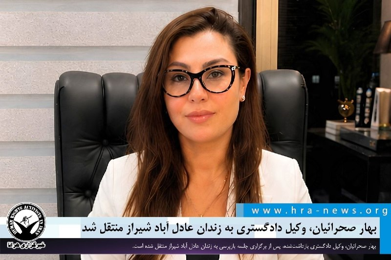

بهار صحرائیان، وکیل دادگستری به زندان عادل آباد شیراز منتقل شد

❗️
❗️
❗️
❗️
❗️ – بهار صحرائیان، وکیل دادگستری به زندان عادل آباد شیراز منتقل شد. وی صبح روز جاری در دادسرای شیراز مورد تفهیم اتهام قرار گرفته بود.

به گزارش خبرگزاری هرانا، ارگان خبری مجموعه فعالان حقوق بشر در ایران، بهار صحرائیان به زندان منتقل شد.

بر اساس اطلاعات دریافتی هرانا، خانم صحرائیان به زندان عادل آباد شیراز منتقل شده است. این وکیل دادگستری، امروز یکشنبه ۲۷ اردیبهشت ماه، در دادسرای شیراز، از بابت اتهامات «اجتماع و تبانی به قصد اقدام علیه امنیت ملی، فعالیت تبلیغی علیه نظام و نشر اکاذیب» مورد تفهیم اتهام قرار گرفته بود.

ادامه مطلب

#بهار_صحرائیان

↘️
@hranews_bot تماس ✉️ -  @Hranews  کانال هرانا 🆑

## manototv — post 105577

  <a href="telegram/content/manototv_105577_1779047622.mp4" target="_blank">🎬 Download video</a>

«صدای فاطمه سپهری باشیم» ـ گزارشگر

## manototv — post 105576

  <a href="telegram/content/manototv_105576_1779047623.mp4" target="_blank">🎬 Download video</a>

باراک راوید، خبرنگار آکسیوس گزارش داد دو مقام آمریکایی اعلام کردند دونالد ترامپ قرار است روز سه‌شنبه نشستی در اتاق وضعیت کاخ سفید با تیم ارشد امنیت ملی خود برگزار کند تا گزینه‌های اقدام نظامی را بررسی کند.

## manototv — post 105575

  <a href="telegram/content/manototv_105575_1779047623.mp4" target="_blank">🎬 Download video</a>

‌
بارسلون | اسپانیا؛ گردهمایی ایرانیان ـ گزارشگر ۲۷ اردیبهشت

## manototv — post 105572

  <a href="telegram/content/manototv_105572_1779047625.mp4" target="_blank">🎬 Download video</a>

‌
گوگوش، خواننده سرشناس ایرانی، با انتشار تصاویری در صفحه اینستاگرام خود اعلام کرد «نشان افتخار جزیره الیس» را دریافت کرده است؛ نشانی که به افرادی اهدا می‌شود که در جامعه آمریکا تاثیرگذار بوده‌اند و در عین حال هویت و ریشه‌های فرهنگی خود را حفظ کرده‌اند.

او در پیام خود نوشت: «خواستم از این فرصت استفاده کنم تا نام ایران و مردم شریف ایران را یادآوری کنم.»

گوگوش همچنین این نشان را به مردم ایران تقدیم کرد و نوشت: «این نشان را با عشق و احترام به مردم ایران تقدیم می‌کنم؛ به مردمی که سال‌ها با رنج، صبوری، امید و سربلندی زندگی کرده‌اند و با وجود همه سختی‌ها، همچنان ایستاده‌اند.»

این خواننده پیشکسوت در ادامه برای ایران و جهان آرزوی «صلح، آرامش و روزهایی روشن‌تر» کرد و در پایان به سخنی از سعدی اشاره کرد.

## manototv — post 105571

  <a href="telegram/content/manototv_105571_1779047625.mp4" target="_blank">🎬 Download video</a>

انور قرقاش، مشاور رئیس‌ دولت امارات، حمله به نیروگاه هسته‌ای این کشور را «اقدامی تروریستی» توصیف کرد و گفت این حمله «چه از سوی عامل اصلی و چه از طریق یکی از نیروهای نیابتی‌اش» یک «تشدید خطرناک» و نقض قوانین و عرف‌های بین‌المللی است.

قرقاش در پیامی در ایکس نوشت این حمله «با بی‌اعتنایی مجرمانه به جان غیرنظامیان در امارات و مناطق اطراف آن» انجام شده است.

او افزود: «هیچ‌کس نمی‌تواند امارات را تحت فشار قرار دهد و در تضعیف چشم‌انداز، موفقیت و پیام الهام‌بخش آن برای امنیت، ثبات، توسعه و رفاه در منطقه موفق نخواهد شد.»

امارات تاکنون مسئول این حمله را معرفی نکرده است. وزارت دفاع امارات پیش‌تر اعلام کرده بود پهپادها از «مرز غربی» وارد این کشور شده‌اند.

## manototv — post 105570

سخنرانی پدر جاویدنام سام افشاری در گردهمایی مونیخ - گزارشگر ۲۶ اردیبهشت

## manototv — post 105569

  <a href="telegram/content/manototv_105569_1779047626.mp4" target="_blank">🎬 Download video</a>

‌‌
دونالد ترامپ در پیامی در شبکه‌ اجتماعی خود نوشت:
«برای ایران، ساعت در حال گذر است و بهتر است خیلی سریع حرکت کنند، وگرنه چیزی از آن‌ها باقی نخواهد ماند. وقت تنگ است.»

## manototv — post 105568

  <a href="telegram/content/manototv_105568_1779047626.mp4" target="_blank">🎬 Download video</a>

‌
بنیامین نتانیاهو، نخست‌وزیر اسرائیل، و دونالد ترامپ، رئیس‌جمهوری آمریکا، روز یکشنبه درباره سفر رئیس‌جمهوری آمریکا به چین گفت‌وگو کردند.

دو طرف همچنین درباره تحولات مربوط به ایران رایزنی کردند.

نتانیاهو پیش‌تر گفته بود که شامگاه یکشنبه با ترامپ صحبت خواهد کرد. او گفت:
«چشم‌های ما همچنین کاملاً به ایران باز است. امروز، همان‌طور که هر چند روز یک‌بار انجام می‌دهم، با دوست‌مان رئیس‌جمهور ترامپ صحبت خواهم کرد. قطعاً برداشت‌های او را از سفرش به چین و شاید مسائل دیگری خواهم شنید. قطعاً احتمالات زیادی وجود دارد؛ ما برای هر سناریویی آماده‌ایم.»

## manototv — post 105567

  <a href="telegram/content/manototv_105567_1779047626.mp4" target="_blank">🎬 Download video</a>

بهار صحرائیان، وکیل دادگستری و عضو کانون وکلای استان فارس، به زندان عادل‌آباد شیراز منتقل شد.

بر اساس گزارش‌های منتشر شده خانم صحرائیان روز یکشنبه ۲۷ اردیبهشت در دادسرای شیراز از بابت اتهام‌های «اجتماع و تبانی به قصد اقدام علیه امنیت ملی»، «فعالیت تبلیغی علیه نظام» و «نشر اکاذیب» مورد تفهیم اتهام قرار گرفت.

این وکیل دادگستری روز شنبه ۲۶ اردیبهشت، حین انجام وظیفه در دادگاه انقلاب شیراز بازداشت شده بود.

## manototv — post 105566

  <a href="telegram/content/manototv_105566_1779047627.mp4" target="_blank">🎬 Download video</a>

لندن | بریتانیا؛ کنار دیوار جاویدنامان ـ گزارشگر یکشنبه ۲۷ اردیبهشت

## manototv — post 105565

  <a href="telegram/content/manototv_105565_1779047628.mp4" target="_blank">🎬 Download video</a>

‌
«صدای فاطمه سپهری باشیم» ـ گزارشگر

## manototv — post 105564

  <a href="telegram/content/manototv_105564_1779047629.mp4" target="_blank">🎬 Download video</a>

مجارستان؛ گردهمایی ایرانیان _ گزارشگر یکشنبه ۲۷ اردیبهشت

## manototv — post 105563

  <a href="telegram/content/manototv_105563_1779047630.mp4" target="_blank">🎬 Download video</a>

‌
وین | اتریش؛ گردهمایی ایرانیان _ گزارشگر یکشنبه ۲۷ اردیبهشت

## manototv — post 105562

  <a href="telegram/content/manototv_105562_1779047631.mp4" target="_blank">🎬 Download video</a>

بازار تهران؛ ۲۷ اردیبهشت ـ گزارشگر

## manototv — post 105561

  <a href="telegram/content/manototv_105561_1779047633.mp4" target="_blank">🎬 Download video</a>

‌
پورتو | پرتغال؛ گردهمایی ایرانیان ـ گزارشگر یکشنبه ۲۷ اردیبهشت

## alonews — post 120679

  <a href="telegram/content/alonews_120679_1779047634.webm" target="_blank">🎬 Download video</a>

👈ایندیپندنت: ایران می‌تواند پس از شکست عملیات «خشم حماسی» آمریکا در از بین بردن موشک‌هایش، ماه‌ها به جنگ با آمریکا ادامه دهد

✅ @AloNews خبر جنگ

## alonews — post 120678

  <a href="telegram/content/alonews_120678_1779047634.webm" target="_blank">🎬 Download video</a>

👈پرواز جنگنده‌های اسرائیلی در آسمان درعا سوریه

✅ @AloNews خبر جنگ

## alonews — post 120677

  <a href="telegram/content/alonews_120677_1779047634.webm" target="_blank">🎬 Download video</a>

👈علی قلهکی: وزیر کشور پاکستان هم آمده بگه یا توافق کنید (با شرایط فعلی یعنی تسلیم) یا جنگ می‌شود!

✅ @AloNews خبر جنگ

## alonews — post 120676

  <a href="telegram/content/alonews_120676_1779047634.webm" target="_blank">🎬 Download video</a>

🔴فوری/پرواز جنگنده‌های اسرائیلی در آسمان درعا سوریه 
🚨 @AkhbareFouri

## alonews — post 120673

  <a href="telegram/content/alonews_120673_1779047635.mp4" target="_blank">🎬 Download video</a>

👈 حمله‌های شدیدِ ارتش اسرائیل به جنوب لبنان

✅ @AloNews خبر جنگ

## alonews — post 120671

  <a href="telegram/content/alonews_120671_1779047636.webm" target="_blank">🎬 Download video</a>

👈فیلد مارشال: ابوظبی به عربستان تعلق دارد؛ امارات ابوظبی را به عربستان تحویل دهد!

✅ @AloNews خبر جنگ

## alonews — post 120670

  <a href="telegram/content/alonews_120670_1779047636.webm" target="_blank">🎬 Download video</a>

👈تانکر ترکرز: در روزهای اخیر، سه نفتکش خالی از محموله که تحریمهای آمریکا شامل حال آنهاست، از خط محاصره نیروی دریایی ایالات متحده عبور کرده و وارد محدوده مورد نظر شدند.

🔴یکی از آنها سامانه AIS خود را برای مدت کوتاهی خاموش کرده بود.

🔴دیگری پرچم روسیه را برافراشته است.

🔴سومی نیز در امتداد خط ساحلی عمان حرکت کرد.

🔴این سه کشتی در مجموع ظرفیت حمل ۱.۹ میلیون بشکه نفت ایران را دارند.

✅ @AloNews خبر جنگ

## alonews — post 120669

  <a href="telegram/content/alonews_120669_1779047636.webm" target="_blank">🎬 Download video</a>

👈فیلد مارشال ،محسن رضایی : مقاومت ایران تغییرات ژئوپلیتیکی جهان رو سرعت داده 
🔴 اتحادهای آمریکا رو ضعیف کرده و باعث تقویت روسیه و چین شده 
🔴 جمهوری اسلامی الان تو موقعیت راهبردی جدیدی قرار داره 
✅ @AloNews خبر جنگ

## alonews — post 120668

  <a href="telegram/content/alonews_120668_1779047636.mp4" target="_blank">🎬 Download video</a>

سیمپسون‌ها چیه ما خودمون قهوه‌تلخ‌ داریم

[@AloTweet]

## alonews — post 120667

  <a href="telegram/content/alonews_120667_1779047638.webm" target="_blank">🎬 Download video</a>

👈فارس: ترامپ با آزادسازی دارایی‌های بلوکه شده مخالفت کرد!

✅ @AloNews خبر جنگ

## alonews — post 120666

  <a href="telegram/content/alonews_120666_1779047638.webm" target="_blank">🎬 Download video</a>

👈فیلد مارشال ،محسن رضایی : مقاومت ایران تغییرات ژئوپلیتیکی جهان رو سرعت داده

🔴 اتحادهای آمریکا رو ضعیف کرده و باعث تقویت روسیه و چین شده

🔴 جمهوری اسلامی الان تو موقعیت راهبردی جدیدی قرار داره

✅ @AloNews خبر جنگ

## alonews — post 120665

  <a href="telegram/content/alonews_120665_1779047638.webm" target="_blank">🎬 Download video</a>

👈وال استریت ژورنال: ایران یک کشتی پشتیبانی متعلق به یک شرکت امنیتی چین را در نزدیکی تنگه هرمز توقیف کرد.

🔴این اقدام به نظر می‌رسد نشانه‌ای باشد مبنی بر اینکه ایران حتی برای کشتی‌هایی که از طرف چین حرکت می‌کنند، اجازه حفاظت مسلحانه نمی‌دهد.

✅ @AloNews خبر جنگ

## alonews — post 120664

  <a href="telegram/content/alonews_120664_1779047638.webm" target="_blank">🎬 Download video</a>

👈واکنش وزیر صمت به افزایش قیمت خودرو: با افزایش تولید و واردات خودرو آرامش به بازار برمی‌گردد

✅ @AloNews خبر جنگ

## alonews — post 120663

  <a href="telegram/content/alonews_120663_1779047638.webm" target="_blank">🎬 Download video</a>

👈رضایی، سخنگوی کمیسیون امنیت ملی:
آمریکا شرایط ایران را بپذیرد یا منتظر پاسخ موشکی باشد!

✅ @AloNews خبر جنگ

## alonews — post 120662

  <a href="telegram/content/alonews_120662_1779047639.webm" target="_blank">🎬 Download video</a>

👈 اکسیوس به نقل از ترامپ : ما می‌خوایم توافق کنیم، ولی اونا هنوز اونجایی که ما می‌خوایم نرسیدن 
🔴 یا باید کوتاه بیان، یا حسابی ضربه می‌خورن و خودشونم اینو نمی‌خوان 
✅ @AloNews خبر جنگ

## alonews — post 120661

  <a href="telegram/content/alonews_120661_1779047639.webm" target="_blank">🎬 Download video</a>

👈 اکسیوس به نقل از ترامپ : ما می‌خوایم توافق کنیم، ولی اونا هنوز اونجایی که ما می‌خوایم نرسیدن

🔴 یا باید کوتاه بیان، یا حسابی ضربه می‌خورن و خودشونم اینو نمی‌خوان

✅ @AloNews خبر جنگ

## alonews — post 120660

  <a href="telegram/content/alonews_120660_1779047639.webm" target="_blank">🎬 Download video</a>

👈رئیس اتحادیه فرآورده‌های لبنی: حذف ارز ترجیحی باعث حذف لبنیات از سفره خانوار شده است

✅ @AloNews خبر جنگ

## alonews — post 120659

  <a href="telegram/content/alonews_120659_1779047639.webm" target="_blank">🎬 Download video</a>

👈ادعای آکسیوس به نقل از منابع خبری در دولت آمریکا: نشست روز گذشته تیم امنیت ملی آمریکا با حضور ونس، ویتکوف، روبیو و رئیس سازمان سیا برگزار شد.

✅ @AloNews خبر جنگ

---
📅 بروزرسانی: 1405/02/27 19:16
---

## VahidOOnLine — post 240647

  

گوگوش، خواننده سرشناس ایرانی، «نشان افتخار جزیره آلیس» را دریافت کرد؛ «این نشان به افرادی اهدا می‌شود که در جامعه آمریکا تأثیرگذار بوده‌اند و در عین حال ریشه‌ها و هویت فرهنگی خود را حفظ کرده‌اند.»

گوگوش با انتشار تصویری از مراسم اهدای این نشان در صفحه اینستاگرام خود نوشت: «این نشان را با عشق و احترام به مردم ایران تقدیم می‌کنم؛ به مردمی که سال‌ها با رنج، صبوری، امید و سربلندی زندگی کرده‌اند و با وجود همه سختی‌ها، همچنان ایستاده‌اند.»
‌🏁 🇬🇧 IranintlTV

🤖 @VahidOOnLine

## VahidOOnLine — post 240646

  <a href="telegram/content/VahidOOnLine_240646_1779032800.mp4" target="_blank">🎬 Download video</a>

پاریس | فرانسه؛ گردهمایی ایرانیان ـ گزارشگر یکشنبه ۲۷ اردیبهشت
‌🏁 🇬🇧 ManotoTV

🤖 @VahidOOnLine

## VahidOOnLine — post 240645

  

لیندسی گراهام، سناتور جمهوری‌خواه آمریکا در گفت‌وگو با شبکه ان‌بی‌سی خواستار اقدام نظامی بیشتر آمریکا علیه جمهوری اسلامی شد.
او افزود: وضعیت فعلی به همه ما آسیب می‌زند، هرچه تنگه هرمز بیشتر بسته بماند و ما بیشتر دنبال توافقی برویم که هیچ‌وقت حاصل نمی‌شود. جمهوری اسلامی قوی‌تر می‌شود.

سناتور گراهام افزود: «تا این لحظه، هیچ چیزی نشان نمی‌دهد افرادی که اکنون در قدرت هستند، از نظر اهداف رژیم برای تروریسم جهانی، نابودی اسرائیل و حمله به ما تفاوتی کرده باشند.»

او اضافه کرد: «آنچه رئیس‌جمهور ترامپ از نظر نظامی انجام داده فوق‌العاده بوده، اما هنوز اهداف بیشتری وجود دارد و کارهای بیشتری هست که می‌توانیم برای ضربه زدن به ایران انجام دهیم.»
‌🏁 🇬🇧 IranintlTV

🤖 @VahidOOnLine

## VahidOOnLine — post 240644

  <a href="telegram/content/VahidOOnLine_240644_1779032803.mp4" target="_blank">🎬 Download video</a>

♦️در ادامه برنامه‌های هفتادونهمین دوره جشنواره فیلم کن، روز یکشنبه ۲۷ اردیبهشت، پگاه آهنگرانی به همراه مادرش، منیژه حکمت، کارگردان و تهیه‌کننده باسابقه، و سایر عوامل بین‌المللی مستند «تمرین‌هایی برای یک انقلاب»، مقابل دوربین عکاسان رسانه‌های جهان رفتند. حضور مشترک این مادر و دختر سینماگر ایرانی، توجه رسانه‌های فرانسوی را به خود جلب کرد.
این فیلم که به عنوان محصول مشترک فرانسه و آلمان و با حمایت نهادهای فرهنگی اروپایی ساخته شده، در بخش «نمایش‌های ویژه» به نمایش درآمد. مستند از طریق پنج پرتره از چهره‌های کلیدی طبقه روشنفکر و مبارز، نشان می‌دهد که چگونه مفهوم «مقاومت» از نسل‌های پیشین به جنبش‌های اخیر منتقل شده است.
به گزارش رسانه‌های معتبر سینمایی، منتقدان این اثر را یکی از سیاسی‌ترین و در عین حال شخصی‌ترین مستندهای امسال توصیف کرده‌اند که با ترکیب هوشمندانه آرشیوهای خانگی ممنوعه و تصاویر اعتراضات خیابانی، نوعی «سند تاریخی ملموس» از ایستادگی جامعه ایران خلق کرده است.
‌🇸🇦 Indypersian

🤖 @VahidOOnLine

## VahidOOnLine — post 240643

  

♦️محمدباقر قالیباف، رئیس مجلس شورای اسلامی، روز یکشنبه ۲۷ اردیبهشت با محسن نقوی، وزیر کشور پاکستان دیدار کرد.

به گزارش رسانه‌های داخلی ایران، قالیباف در این دیدار گفت برخی دولت‌های منطقه تصور می‌کردند حضور آمریکا برای آنها امنیت به همراه دارد، اما «حوادث اخیر نشان داد این حضور نه تنها امنیت‌زا نیست بلکه زمینه ناامنی را هم فراهم می‌کند.»

رئیس مجلس شورای اسلامی همچنین بر اهمیت همکاری و روابط میان کشورهای منطقه تاکید کرد.

به گزارش فارس، محسن نقوی، وزیر کشور پاکستان نیز در این دیدار با اشاره به مذاکرات اسلام‌آباد خطاب به قالیباف گفت: «شاهد ایستادگی شما در مذاکرات اسلام‌آباد بر منافع ملی ایران و در عین حال تلاش برای حل و فصل مشکلات بودیم.»

نقوی در جریان سفر دو روزه پیش‌بینی نشده به تهران، با مقام‌های مختلف جمهوری اسلامی، از جمله وزیر کشور، رئیس جمهوری و رئیس مجلس ایران دیدار کرد.
‌🇸🇦 Indypersian

🤖 @VahidOOnLine

## VahidOOnLine — post 240642

  

مستند کوتاه «هنر مقاومت» به تهیه‌کنندگی ایران اینترنشنال و کارگردانی مهران عباسیان در فستیوال فیلم خانه سینمای سوئد موفق به دریافت جایزه بهترین مستند کوتاه و بهترین کارگردانی شد.
این فیلم داستان دو هنرمند ایرانی را روایت می‌کند که هنر را به زبان اعتراض، امید و مقاومت در برابر محدودیت‌ها تبدیل کرده‌اند.
‌🏁 🇬🇧 IranintlTV

🤖 @VahidOOnLine

## VahidOOnLine — post 240641

  <a href="telegram/content/VahidOOnLine_240641_1779032807.mp4" target="_blank">🎬 Download video</a>

‌
پراگ | چک؛ گردهمایی ایرانیان ـ گزارشگر شنبه ۲۶ اردیبهشت
‌🏁 🇬🇧 ManotoTV

🤖 @VahidOOnLine

## VahidOOnLine — post 240640

  <a href="telegram/content/VahidOOnLine_240640_1779032809.mp4" target="_blank">🎬 Download video</a>

وزارت دفاع امارات متحده عربی اعلام کرد سه پهپاد از مرزهای غربی وارد این کشور شدند که دو فروند رهگیری شد و پهپاد سوم به یک ژنراتور خارج از محدوده داخلی نیروگاه هسته‌ای براکه در منطقه الظفره برخورد کرد و باعث آتش‌سوزی شد.

وزارت دفاع امارات اعلام کرد تحقیقات برای مشخص شدن منبع این حملات ادامه دارد و نتایج آن بعداً اعلام خواهد شد.
‌🏁 🇬🇧 ManotoTV

🤖 @VahidOOnLine

## VahidOOnLine — post 240639

  <a href="telegram/content/VahidOOnLine_240639_1779032810.mp4" target="_blank">🎬 Download video</a>

‌
«من صدای فاطمه سپهری هستم» ـ گزارشگر
‌🏁 🇬🇧 ManotoTV

🤖 @VahidOOnLine

## VahidOOnLine — post 240638

  <a href="telegram/content/VahidOOnLine_240638_1779032812.mp4" target="_blank">🎬 Download video</a>

تجمع ایرانیان ساکن بروکسل، یکشنبه ۲۷ اردیبهشت
‌🏁 🇬🇧 ManotoTV

🤖 @VahidOOnLine

## VahidOOnLine — post 240637

  

♦️وزارت دفاع امارات متحده عربی در بیانیه‌ای اعلام کرد سامانه‌های پدافند هوایی این کشور روز یکشنبه ۲۷ اردیبهشت ماه سه پهپاد را که از سمت مرزهای غربی وارد حریم امارات شده بودند، رهگیری کردند.

بر اساس این بیانیه، دو پهپاد با موفقیت رهگیری و منهدم شدند، اما پهپاد سوم به یک ژنراتور برق در خارج از محدوده داخلی نیروگاه هسته‌ای براکه در منطقه الظفره برخورد کرد.

وزارت دفاع امارات اعلام کرد تحقیقات برای شناسایی منشا این حملات آغاز شده و جزئیات بیشتر پس از تکمیل بررسی‌ها منتشر خواهد شد.

این وزارتخانه همچنین تاکید کرد نیروهای مسلح امارات در آمادگی کامل قرار دارند و با هرگونه اقدام علیه امنیت کشور «قاطعانه» برخورد خواهند کرد؛ اقدامی که به گفته مقام‌های اماراتی با هدف حفظ حاکمیت، امنیت، ثبات و منافع ملی این کشور انجام می‌شود.
‌🇸🇦 Indypersian

🤖 @VahidOOnLine

## VahidOOnLine — post 240636

  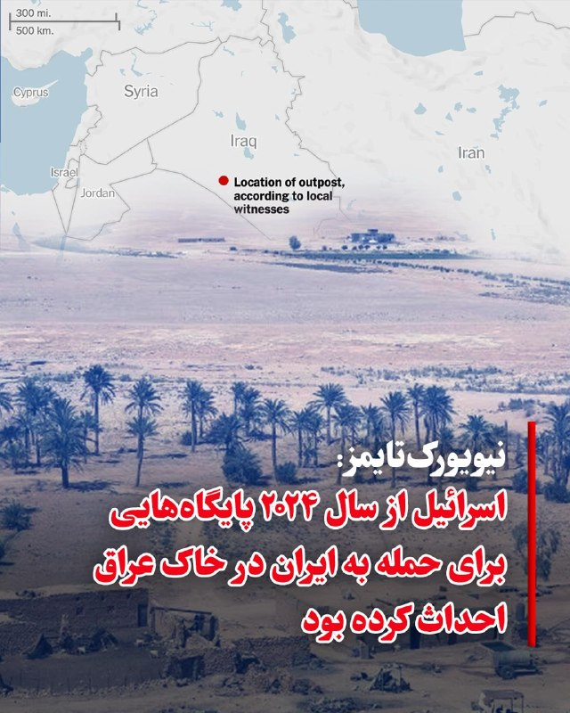

♦️روزنامه نیویورک‌تایمز روز یکشنبه ۲۷ اردیبهشت منتشر در گزارشی فاش کرد ارتش اسرائیل در جریان تقابل نظامی اخیر با جمهوری اسلامی ایران، دو پایگاه نظامی مخفی در عمق خاک عراق ایجاد و از آنها برای پشتیبانی عملیات خود استفاده کرده است.
پیش‌تر وال‌استریت ژورنال گزارش داده بود اسرائیل یک پایگاه مخفی را در بیابان‌های غرب عراق برای استفاده در جنگی که از فوریه آغاز شده بود، ایجاد کرده است. اما اکنون مقام‌های عراقی در گفت‌وگو با نیویورک‌تایمز جزئیات تازه‌ای ارائه کرده و از وجود پایگاه مخفی دومی نیز خبر داده‌اند.
نیویورک‌تایمز به نقل از یک مقام منطقه‌ای گزارش داد ساخت پایگاه نخست در اواخر سال ۲۰۲۴ آغاز شد و این مرکز مشخصا برای پشتیبانی از حمله ژوئن ۲۰۲۵ اسرائیل به ایران مورد استفاده قرار گرفت. به نوشته این روزنامه، این پایگاه اکنون غیرفعال است. با این حال، پایگاه دوم برای مدیریت عملیات‌های مرتبط با جنگ اخیر ایجاد شده، اما موقعیت دقیق و وضعیت کنونی آن همچنان مشخص نیست.
بر اساس این گزارش، اسرائیل این پایگاه‌ها را با دو هدف اصلی ایجاد کرده است: کاهش زمان پرواز جنگنده‌ها برای انجام حملات در عمق خاک ایران و ایجاد یک مرکز عملیاتی پیشرفته برای پشتیبانی از نیروی هوایی. نیویورک‌تایمز نوشت این پایگاه‌ها همچنین محل استقرار نیروهای ویژه و تیم‌های امداد و نجات اسرائیلی بوده‌اند تا در صورت سقوط احتمالی جنگنده‌ها، عملیات نجات خلبانان را اجرا کنند.
این روزنامه همچنین گزارش داد واشنگتن دست‌کم از وجود یکی از این پایگاه‌های مخفی در خاک عراق اطلاع داشته است.
به نوشته نیویورک‌تایمز، حضور این پایگاه‌ها پس از آن مورد توجه قرار گرفت که برخی ساکنان محلی متوجه تحرکات مشکوک شدند. در همین ارتباط، چوپانی محلی به نام «عوض الشمری» پس از برخورد تصادفی با یکی از این مراکز، هدف هلیکوپترها قرار گرفت و کشته شد.
این گزارش می‌افزاید اطلاعات ارائه‌شده از الشمری پیش از مرگ، ارتش عراق را به اعزام یک تیم شناسایی به منطقه واداشت. با این حال، این گروه با آتش نیروهای اسرائیلی روبه‌رو شد؛ درگیری‌ای که به کشته و زخمی شدن سه سرباز عراقی و عقب‌نشینی آنها انجامید.
‌🇸🇦 Indypersian

🤖 @VahidOOnLine

## VahidOOnLine — post 240635

  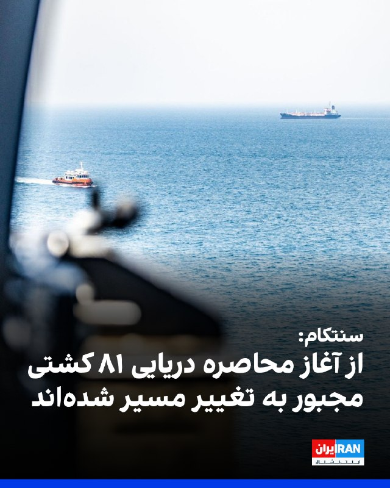

فرماندهی مرکزی ایالات متحده، سنتکام، اعلام کرد از زمان آغاز محاصره دریایی بنادر و سواحل جنوبی ایران، ۸۱ کشتی تجاری مجبور به تغییر مسیر شده‌اند و چهار شناور دیگر نیز پس از هدف قرار گرفتن، از کار افتاده‌اند تا اجرای این محاصره تضمین شود.
‌🏁 🇬🇧 IranintlTV

🤖 @VahidOOnLine

## VahidOOnLine — post 240634

  

ارتش اسرائیل اعلام کرد بها برود، از فرماندهان ستاد عملیات حماس، در حمله هوایی کشته شده است.
به گفته ارتش، او در هفته‌های اخیر در برنامه‌ریزی حملات علیه نیروهای اسرائیلی و غیرنظامیان نقش داشته و تهدیدی فوری محسوب می‌شده است.
ارتش اسرائیل تأکید کرد این حمله با مهمات دقیق انجام شده و نیروهای فرماندهی جنوبی مطابق آتش‌بس مستقر هستند.
‌🏁 🇬🇧 IranintlTV

🤖 @VahidOOnLine

## VahidOOnLine — post 240633

  

♦️روزنامه نیویورک‌تایمز روز یکشنبه ۲۷ اردیبهشت منتشر در گزارشی فاش کرد ارتش اسرائیل در جریان تقابل نظامی اخیر با جمهوری اسلامی ایران، دو پایگاه نظامی مخفی در عمق خاک عراق ایجاد و از آنها برای پشتیبانی عملیات خود استفاده کرده است.
پیش‌تر وال‌استریت ژورنال گزارش داده بود اسرائیل یک پایگاه مخفی را در بیابان‌های غرب عراق برای استفاده در جنگی که از فوریه آغاز شده بود، ایجاد کرده است. اما اکنون مقام‌های عراقی در گفت‌وگو با نیویورک‌تایمز جزئیات تازه‌ای ارائه کرده و از وجود پایگاه مخفی دومی نیز خبر داده‌اند.
نیویورک‌تایمز به نقل از یک مقام منطقه‌ای گزارش داد ساخت پایگاه نخست در اواخر سال ۲۰۲۴ آغاز شد و این مرکز مشخصا برای پشتیبانی از حمله ژوئن ۲۰۲۵ اسرائیل به ایران مورد استفاده قرار گرفت. به نوشته این روزنامه، این پایگاه اکنون غیرفعال است. با این حال، پایگاه دوم برای مدیریت عملیات‌های مرتبط با جنگ اخیر ایجاد شده، اما موقعیت دقیق و وضعیت کنونی آن همچنان مشخص نیست.
بر اساس این گزارش، اسرائیل این پایگاه‌ها را با دو هدف اصلی ایجاد کرده است: کاهش زمان پرواز جنگنده‌ها برای انجام حملات در عمق خاک ایران و ایجاد یک مرکز عملیاتی پیشرفته برای پشتیبانی از نیروی هوایی. نیویورک‌تایمز نوشت این پایگاه‌ها همچنین محل استقرار نیروهای ویژه و تیم‌های امداد و نجات اسرائیلی بوده‌اند تا در صورت سقوط احتمالی جنگنده‌ها، عملیات نجات خلبانان را اجرا کنند.
این روزنامه همچنین گزارش داد واشنگتن دست‌کم از وجود یکی از این پایگاه‌های مخفی در خاک عراق اطلاع داشته است.
به نوشته نیویورک‌تایمز، حضور این پایگاه‌ها پس از آن مورد توجه قرار گرفت که برخی ساکنان محلی متوجه تحرکات مشکوک شدند. در همین ارتباط، چوپانی محلی به نام «عوض الشمری» پس از برخورد تصادفی با یکی از این مراکز، هدف هلیکوپترها قرار گرفت و کشته شد.
این گزارش می‌افزاید اطلاعات ارائه‌شده از الشمری پیش از مرگ، ارتش عراق را به اعزام یک تیم شناسایی به منطقه واداشت. با این حال، این گروه با آتش نیروهای اسرائیلی روبه‌رو شد؛ درگیری‌ای که به کشته و زخمی شدن سه سرباز عراقی و عقب‌نشینی آنها انجامید.
‌🇸🇦 Indypersian

🤖 @VahidOOnLine

## VahidOOnLine — post 240632

  

♦️وزارت امور خارجه کره جنوبی اعلام کرد چو هیون، وزیر امور خارجه این کشور، روز یکشنبه در تماس تلفنی با عباس عراقچی، وزیر امور خارجه جمهوری اسلامی ایران، درباره آخرین تحولات منطقه‌ای، امنیت کشتی‌های کره‌ای و آزادی دریانوردی در تنگه هرمز گفتگو کرده است.
بر اساس اعلام وزارت خارجه کره جنوبی، وزیر خارجه این کشور در این تماس خواستار رفع ابهام و توضیح تهران درباره هدف قرار گرفتن یک کشتی کره‌ای در تنگه هرمز شده است.
 وزارت امور خارجه جمهوری اسلامی ایران نیز اعلام کرد چو هیون و عراقچی در این گفتگوی تلفنی درباره آخرین تحولات منطقه رایزنی کرده‌اند.
وزارت خارجه کره‌جنوبی روز یکشنبه اعلام کرده بود که کشتی باری متعلق به این کشور که روز ۱۴ اردیبهشت در تنگه هرمز دچار حادثه شده بود، هدف حمله «هواگردهای ناشناس» قرار گرفته است. مقام‌های امنیتی این کشور می‌گویند بررسی‌های سئول نشان می‌دهد که به احتمال بسیار زیاد جمهوری اسلامی ایران مسئول حمله به کشتی باری این کشور در تنگه هرمز بوده است.
‌🇸🇦 Indypersian

🤖 @VahidOOnLine

## VahidOOnLine — post 240631

  

♦️شبکه خبری فاکس نیوز، روز یکشنبه ۲۷ اردیبهشت ماه در گزارشی اعلام کرد، دونالد ترامپ، رئیس جمهور آمریکا که به تازگی از سفر چین بازگشته است، در حال بررسی از سرگیری اقدام نظامی علیه ایران است و روز یکشنبه با بنیامین نتانیاهو، نخست وزیر اسرائیل گفتگو خواهد کرد.
نتانیاهو صبح یکشنبه با اعلام آنکه «مانند هر چند روز یکبار» با ترامپ تماس خواهد گرفت، گفت: «مطمئنا بخش‌هایی از سفر او به چین و شاید موارد دیگر را خواهم شنید. احتمالات زیادی وجود دارد و ما برای هر سناریویی آماده‌ایم.»
تماس تلفنی با نتانیاهو در حالی صورت می‌گیرد که فاکس نیوز با استناد به ارزیابی‌های اطلاعاتی منطقه‌ای درباره ایران گزارش داد که ممکن است به دلیل ناامیدی ترامپ از تهران و «رد درخواست او برای دست کشیدن از آرمان‌های تسلیحات هسته‌ای»، حملات نظامی از سر گرفته شود.
دو مقام اطلاعاتی منطقه‌ای به فاکس نیوز گفتند: «ارزیابی غالب در داخل ایران این است که رئیس جمهوری ترامپ ممکن است به شروع مجدد اقدام نظامی متوسل شود و تهران اکنون عمدا راهبرد «فریب و تأخیر» را دنبال می‌کند، با این امید که خرید زمان، هرگونه بازگشت احتمالی به جنگ را پیچیده کند.»
‌🇸🇦 Indypersian

🤖 @VahidOOnLine

## VahidOOnLine — post 240630

  

اردن حمله پهپادی به ابوظبی را که به وقوع آتش‌سوزی در خارج از محدوده داخلی نیروگاه هسته‌ای براکه منجر شد، به‌شدت محکوم کرد و آن را نقض آشکار حاکمیت امارات متحده عربی، تهدیدی علیه امنیت و ثبات این کشور و نیز نقض صریح قوانین بین‌المللی و منشور سازمان ملل متحد دانست.

وزارت خارجه اردن در بیانیه‌ای با اعلام همبستگی کامل با امارات متحده عربی تاکید کرد که اَمان در کنار ابوظبی و تمامی اقداماتی که برای حفظ امنیت، حاکمیت و سلامت شهروندان و ساکنان خود انجام دهد، خواهد ایستاد.
‌🏁 🇬🇧 IranintlTV

🤖 @VahidOOnLine

## VahidOOnLine — post 240629

  

♦️مسعود پزشکیان، رئیس‌جمهوری ایران، روز یکشنبه در دیدار با محسن نقوی، وزیر کشور پاکستان، از نقش اسلام‌آباد در تثبیت آتش‌بس قدردانی و ابراز امیدواری کرد تلاش‌های پاکستان به تقویت صلح و ثبات در منطقه کمک کند.
رئیس‌جمهوری ایران در این دیدار تاکید کرد «ایران خواهان روابطی صمیمانه و پایدار با کشورهای اسلامی منطقه است» و افزود اتحاد کشورهای اسلامی می‌تواند زمینه «مداخله قدرت‌های فرامنطقه‌ای» را کاهش دهد.
به گزارش خبرگزاری ایرنا، محسن نقوی، وزیر کشور پاکستان، نیز با اشاره به روابط تهران و اسلام‌آباد گفت ایران و پاکستان اکنون بیش از گذشته به یکدیگر نزدیک شده‌اند و روابط برادرانه دو کشور باید بیش از پیش گسترش یابد.
این دیدار در شرایطی انجام شده که پاکستان در هفته‌های اخیر در روند تلاش‌های دیپلماتیک و میانجی‌گری منطقه‌ای برای کاهش تنش‌ها و تثبیت آتش‌بس نقش فعالی ایفا کرده است.
‌🇸🇦 Indypersian

🤖 @VahidOOnLine

## VahidOOnLine — post 240628

  

اکسیوس گزارش داد که کوبا بیش از ۳۰۰ پهپاد نظامی خریداری کرده و اخیرا نیز گفت‌وگو درباره استفاده از آنها برای حمله به پایگاه آمریکا در خلیج گوانتانامو، شناورهای نظامی آمریکا و احتمالا شهر کی‌وست در ایالت فلوریدا، در حدود ۱۴۵ کیلومتری شمال هاوانا، را آغاز کرده است.

یک مقام ارشد آمریکایی به اکسیوس گفت این اطلاعات که می‌تواند دلیلی برای اقدام نظامی آمریکا شود، نشان می‌دهد دولت ترامپ تا چه اندازه کوبا را، به دلیل تحولات جنگ پهپادی و حضور مستشاران نظامی جمهوری اسلامی در هاوانا، تهدید تلقی می‌کند.

این مقام آمریکایی گفت: «وقتی به این نوع فناوری‌ها که تا این اندازه نزدیک هستند فکر می‌کنیم، و همچنین به طیفی از بازیگران خطرناک از گروه‌های تروریستی گرفته تا کارتل‌های مواد مخدر، مستشاران جمهوری اسلامی و روس‌ها، موضوع نگران‌کننده می‌شود.»
‌🏁 🇬🇧 IranintlTV

🤖 @VahidOOnLine

## WithYashar — post 11489

کلاه شیر و خورشیدمو الان باد برد تو آب های خلیج فارس… 🥹❤️‍🩹

## WithYashar — post 11488

  

کلاه شیر و خورشیدمو الان باد برد تو آب های خلیج فارس… 🥹❤️‍🩹

## WithYashar — post 11487

زیرنویس شبکه العربیه:

قرارگاه خاتم الانبیا به یگان های موشکی اعلام آماده باش فوق العاده صادر کرده است.
@withyashar

## WithYashar — post 11486

زیرنویس شبکه خبر: هشدار درباره عملیات غیرموجه علیه کشورهای منطقه و انتساب آن به ایران

یک مقام آگاه نظامی: ایران همه کشورهای منطقه را از افتادن در این دام رژیم صهیونیستی برحذر می‌دارد.
@withyashar

## WithYashar — post 11485

سناتور لیندسی گراهام در مورد ایران:

طبق تحلیل من، هیچ نشانه‌ای وجود ندارد که افراد مسئول فعلی با گذشته تفاوتی داشته باشند - آنها هنوز می‌خواهند جهان را به وحشت بیندازند، اسرائیل را نابود کنند و به دنبال ما بیایند.

بنابراین شما آنها را بیشتر تضعیف می‌کنید. کاری که رئیس جمهور ترامپ انجام داده از نظر نظامی شگفت‌انگیز بوده است. زیرساخت‌های انرژی، نقطه ضعف آنهاست. برگردیم به بحث جنگ، من انرژی را در صدر فهرست قرار می‌دهم.

من خواستار آسیب رساندن به این رژیم هستم. بیشتر به آنها آسیب بزنید، شاید آنها به توافق برسند. اما در حال حاضر فکر می‌کنم آنها سعی می‌کنند منتظر بمانند و بازی کنند.
@withyashar

## WithYashar — post 11484

کیهان لندن : آماده باشید که احتمالا آمریکا و اسرائیل به زودی حمله می‌کنن
@withyashat

## WithYashar — post 11483

حریق در یک ساختمان تجاری در خیابان جمهوری تهران

سخنگوی سازمان آتش‌نشان:

ساعت ۱۷:۱۴ دقیقه یک مورد حادثه آتش سوزی در یک ساختمان تجاری به آدرس خیابان جمهوری بعد از خیابان شیخ هادی به سامانه ۱۲۵ اعلام می‌شود.
@withyashar

## WithYashar — post 11482

  <a href="https://t.me/withyashar/11482" target="_blank">📎 Download file</a>

🌐 instagram.com/yashar

🌐 t.me/withyashar

## WithYashar — post 11481

  <a href="telegram/content/WithYashar_11481_1779032823.mp4" target="_blank">🎬 Download video</a>

🎬 Video

## WithYashar — post 11480

نمیدونم چطوری اطلاعات بدردبخور رو‌انتقال بدم نمیدونم اجازه میدی به وقتش واسه خودت بفرستم و تو یه کاری بکنی؟

## WithYashar — post 11479

نمیدونم چطوری اطلاعات بدردبخور رو‌انتقال بدم
نمیدونم اجازه میدی به وقتش واسه خودت بفرستم و تو یه کاری بکنی؟

## WithYashar — post 11478

شاهزاده رضا پهلوی : جمهوری اسلامی را نمی‌توان تغییر داد همانگونه که یک گرگ را نمیتوان تبدیل به میش کرد
@withyashar

## WithYashar — post 11477

  <a href="telegram/content/WithYashar_11477_1779032825.mp4" target="_blank">🎬 Download video</a>

صداوسیما: با اعلام مدیر کل آموزش و پرورش تهران؛ دانش آموزان پایه های هفتم تا دهم دیگه امتحان خرداد ندارن و با توجه به عملکرد علمی یکساله سنجیده میشن.
@withyashar

## WithYashar — post 11476

نیویورک‌تایمز: آمریکا به عراق دستور داده بود که طی دو عملیات داخل ایران، سیستم‌های راداری خود را خاموش کند و عراق این کار را انجام داد
@withyashar

## WithYashar — post 11475

نتانیاهو: امروز با رئیس‌جمهور ترامپ حرف میزنم،چشممون روی ایران بازه، برای هر موقعیتی آماده‌ایم.
@withyashar

## mwarmonitor — post 9212

  

هدف قرار دادن نیروگاه هسته‌ای براکه

## mwarmonitor — post 9211

مجری (کریستن ولکر):
سناتور، شما من رو به سوال بعدی‌ام هدایت کردید؛ چون بر اساس یک نظرسنجی جدید، ۷۰ درصد از آمریکایی‌ها می‌گن پرزیدنت ترامپ عملکرد بدی در زمینه اقتصاد داشته؛ موضوعی که همون‌طور که می‌دونید، اولویت شماره یک رای‌دهنده‌هاست. لپ کلام، آیا ارزشش رو داره که میان‌دوره‌ای‌ها رو از دست بدید، در صورتی که نتیجه‌اش یک ایرانِ بدون سلاح هسته‌ای باشه؟
سناتور لیندسی گراهام:
این ارزشش رو داره که من شغلم رو از دست بدم. اگر مجبور بودم شغلم رو فدا کنم تا مطمئن بشم ایران هرگز به سلاح هسته‌ای دست پیدا نمی‌کنه، این کار رو می‌کردم.
مجری:
و آیا حاضر بودید مجلس نمایندگان و سنا رو هم فدا کنید؟
سناتور لیندسی گراهام:
من از نظر سیاسی [حاضر بودم فداکاری کنم]. مهم‌ترین کاری که می‌تونم در شغلی که به من سپرده شده انجام بدم، محافظت از مردم آمریکاست. حالا شما مجبور نیستید با من موافق باشید، اما من ۲۰ ساله که همین رویکرد رو دارم. من معتقدم نازی‌های مذهبی در ایران، اگر سلاح هسته‌ای داشتند ازش استفاده می‌کردند. اون‌ها تلاش کردند که بهش برسن، اون‌ها تقلب کردند. اوباما و بایدن وقتی نوبت به مهار ایران رسید، مثل یک شوخی بودند.
ترامپ کاری رو انجام می‌ده که مردم باید مدت‌ها پیش انجام می‌دادند. اما خبر خوب اینه: وقتی ایران رو سر جایش بنشونید، قیمت بنزین پایین میاد. وقتی ایران رو سر جایش بنشونید، صلح بین عربستان و اسرائیل ممکن می‌شه. مزایای برخورد با ایران فوق‌العاده زیاده، اما باید باهاش مقابله کرد...

@mwarmonitor

## mwarmonitor — post 9210

  <a href="telegram/content/mwarmonitor_9210_1779032829.mp4" target="_blank">🎬 Download video</a>

🎬 Video

## mwarmonitor — post 9209

مجری:
«ببینید.»
دونالد ترامپ:
«من به وضعیت مالی آمریکایی‌ها فکر نمی‌کنم، به هیچ‌کس دیگه‌ای هم فکر نمی‌کنم. من فقط به یک چیز فکر می‌کنم: ما نباید اجازه بدیم ایران به سلاح هسته‌ای دست پیدا کنه. همین و بس.»
مجری:
«آیا شما با رئیس‌جمهور موافقید که نباید وضعیت مالی آمریکایی‌ها رو هنگام برخورد با ایران در نظر بگیره؟»
سناتور لیندسی گراهام:
«این لحظهٔ "چرچیل" اوست. وقتی چرچیل به قدرت رسید، وعدهٔ خون، عرق، رنج و سختی داد تا زمانی که با نازی‌ها مقابله کنیم؛ نازی‌هایی که یک تهدید وجودی برای سبک زندگی بریتانیا بودن. و اگه هیتلر کنترل سیاره رو به دست می‌گرفت، این تاریک‌ترین دوران بشریت می‌شد.»
«من باور دارم که ایران سلاح هسته‌ای می‌خواد و ازش استفاده هم خواهد کرد. پرزیدنت ترامپ هم همین باور رو داره. اون‌ها از این سلاح به عنوان بخشی از دستور کار مذهبی خودشون استفاده می‌کنن؛ حکومت یهود (اسرائیل) رو نابود می‌کنن و در نهایت ما رو هم به گروگان می‌گیرن. بنابراین مخاطب او، رژیم ایرانه.»
«آیا من نگران قیمت بنزین هستم؟ بله. اما حق با پرزیدنت ترامپه؛ بزرگ‌ترین تهدید برای ثبات جهان، یک ایران مجهز به سلاح هسته‌ای هست و هر هزینه‌ای که مجبور باشیم بپردازیم، پرداخت خواهیم کرد. چرچیل چی گفت؟ گفت: "هر هزینه‌ای که برای شکست دادن هیتلر مجبور باشیم بپردازیم، پرداخت خواهیم کرد." در مورد ایران هم همین‌طوره.»
«خبر خوب اینه که ما الان در محدودهٔ ۱۰ یاردی (مراحل پایانی) هستیم. فکر می‌کنم اگه به فعالیت‌های نظامی برگردیم و اون‌ها رو بیشتر تضعیف کنیم، می‌تونیم این قضیه رو خیلی زود تموم کنیم.»

@mwarmonitor

## mwarmonitor — post 9208

  <a href="telegram/content/mwarmonitor_9208_1779032831.mp4" target="_blank">🎬 Download video</a>

🎬 Video

## mwarmonitor — post 9207

🔸سناتور لیندسی گراهام: من فکر می‌کنم... فکر می‌کنم که حفظ «وضعیت موجود» داره به همه‌مون آسیب می‌زنه. هر چقدر این تنگه طولانی‌تر بسته بمونه، هر چقدر بیشتر تلاش کنیم تا به توافقی برسیم که هیچ‌وقت اتفاق نمی‌افته، ایران قوی‌تر می‌شه. بنابراین... بر اساس تحلیل من، هیچ نشانه‌ای وجود نداره که ثابت کنه افرادی که الان در راس کار هستن، از نظر اهداف رژیم—یعنی ترور کردن جهان، نابودی اسرائیل و اقدام علیه ما—کوچک‌ترین تفاوتی با بقیه داشته باشن. پس قدم بعدی چیه؟ شما اون‌ها رو بیشتر تضعیف می‌کنید. کاری که رئیس‌جمهور ترامپ انجام داده، از نظر نظامی فوق‌العاده بوده، اما هنوز هم اهداف بیشتری برای هدف قرار دادن وجود داره و کارهایی هست که می‌تونیم برای ضربه زدن به ساختار... زیرساخت‌های انرژی اون‌ها انجام بدیم، چون این بخش، نقطه ضعف بزرگ اون‌هاست. اگر قرار باشه دوباره به این تقابل برگردید، من بخش انرژی رو در صدر لیست قرار می‌دم.
🔹​مجری: پس شما خواستار حمله به زیرساخت‌های انرژی (آن‌ها) هستید؟
🔸​سناتور لیندسی گراهام: من... بله، من خواستار ضربه زدن به این رژیم هستم. اگر همون کارهای همیشگی رو انجام بدید، همون نتایج همیشگی رو هم می‌گیرید. بیشتر بهشون ضربه بزنید؛ شاید اگر به اندازه کافی بهشون ضربه بزنید، تن به توافق بدن. اما در حال حاضر، فکر می‌کنم اون‌ها دارن تلاش می‌کنن زمان بخرن تا ما خسته بشیم، فکر می‌کنم دارن بازی درمیارن و به قول رئیس‌جمهور، من فکر می‌کنم اون‌ها دیوانه‌اند.

@mwarmonitor

## mwarmonitor — post 9206

  <a href="telegram/content/mwarmonitor_9206_1779032834.mp4" target="_blank">🎬 Download video</a>

🎬 Video

## mwarmonitor — post 9205

  

🇺🇸«یک ملوان نیروی دریایی آمریکا هنگام عبور از دریای عرب، بر روی پل فرماندهی ناو USS Tripoli (LHA-7) در حال نگهبانی است. گروه آماده‌به‌رزمی آبی‌–خاکی تریپولی در حال اجرای محاصره دریایی آمریکا علیه ایران است. تا تاریخ ۱۷ مه، نیروهای آمریکایی مسیر ۸۱ کشتی تجاری را تغییر داده و برای اطمینان از رعایت این محاصره، ۴ کشتی را از کار انداخته‌اند.»

@mwarmonitor

## mwarmonitor — post 9204

🔴اختصاصی اکسیوس: آمریکا تهدید پهپادهای تهاجمی کوبا را زیر نظر دارد 📝نویسنده: مارک کاپوتو 🔰بر اساس اطلاعات طبقه‌بندی‌شده‌ای که با اکسیوس به اشتراک گذاشته شده است، کوبا بیش از ۳۰۰ پهپاد نظامی خریداری کرده و اخیراً گفتگوهایی را درباره برنامه‌ریزی برای استفاده…

## mwarmonitor — post 9203

🇦🇪پدافند هوایی امارات متحده عربی با ۳ پهپاد برخورد کرده است.

🔴وزارت دفاع اعلام کرد که در تاریخ ۱۷ مه ۲۰۲۶، پدافند هوایی امارات با ۳ پهپاد که از سمت مرزهای غربی وارد کشور شده بودند مقابله کرده است. طبق این گزارش، دو فروند از آن‌ها با موفقیت رهگیری و منهدم شدند و سومی به یک مولد برق در خارج از محدوده داخلی نیروگاه هسته‌ای براکه در منطقه ظفره اصابت کرده است.

🔸این وزارتخانه افزود که تحقیقات برای شناسایی منبع این حملات ادامه دارد و پس از تکمیل بررسی‌ها، جزئیات بیشتری منتشر خواهد شد.

🔸همچنین تأکید شد که وزارت دفاع در بالاترین سطح آمادگی قرار دارد و با هرگونه تهدید با قاطعیت برخورد خواهد کرد تا امنیت، حاکمیت و ثبات کشور حفظ شود و از منافع و زیرساخت‌های ملی محافظت شود.

@mwarmonitor

## mwarmonitor — post 9202

  <a href="telegram/content/mwarmonitor_9202_1779032838.mp4" target="_blank">🎬 Download video</a>

✈️🚨پل هوایی عظیم نیروی هوایی آمریکا به خاورمیانه امروز هیچ نشانه‌ای از کاهش یا توقف ندارد.

@mwarmonitor

## mwarmonitor — post 9201

کوبا از نظر ایالات متحده به عنوان «دولت حامی تروریسم» طبقه‌بندی می‌شود و به عنوان «سر مار» برای صادرات مارکسیسم انقلابی در سراسر آمریکای لاتین در نظر گرفته می‌شود.
یکی از متحدان سابق کوبا، یعنی نیکلاس مادورو در ونزوئلا، در جریان حمله ۳ ژانویه توسط ایالات متحده از قدرت برکنار شد. از زمان برکناری مادورو، ایالات متحده روند عادی‌سازی روابط با ونزوئلا را آغاز کرده و اطلاعات بیشتری درباره برنامه پهپادی کوبا به دست آورده است.
واقعیت‌سنجی (ارزیابی واقعیت)
با این حال، مقامات آمریکایی بر این باور نیستند که کوبا یک تهدید قریب‌الوقوع است یا به طور فعال برای حمله به منافع آمریکا برنامه‌ریزی می‌کند. اما اطلاعات ایالات متحده نشان می‌دهد که مقامات نظامی این جزیره در حال بحث درباره برنامه‌های جنگ پهپادی بوده‌اند تا در صورت بروز درگیری هم‌زمان با وخیم‌تر شدن روابط با آمریکا، از آن‌ها استفاده کنند.
کوبا توانایی بستن تنگه فلوریدا را به همان شیوه‌ای که ایران کشتیرانی در تنگه هرمز را به بن‌بست کشانده است، ندارد. مقامات آمریکایی همچنین معتقدند کوبا به اندازه بحران موشکی کوبا در سال ۱۹۶۲ یک تهدید نظامی بزرگ به شمار نمی‌رود.
این مقام ارشد آمریکایی در پایان گفت:
«هیچ‌کس نگران جت‌های جنگنده کوبا نیست؛ حتی مشخص نیست که آن‌ها یک جنگنده آماده به پرواز داشته باشند. اما شایان ذکر است که آن‌ها چقدر نزدیک هستند — فقط ۹۰ مایل. این واقعیتی نیست که ما با آن راحت باشیم.»

🔸یادداشت سردبیر: این گزارش اصلاح شده است تا مشخص شود کوبا در سال ۱۹۹۶ دو هواپیما (و نه یک هواپیما) را سرنگون کرده است.

@mwarmonitor

## mwarmonitor — post 9200

🔴اختصاصی اکسیوس: آمریکا تهدید پهپادهای تهاجمی کوبا را زیر نظر دارد

📝نویسنده: مارک کاپوتو

🔰بر اساس اطلاعات طبقه‌بندی‌شده‌ای که با اکسیوس به اشتراک گذاشته شده است، کوبا بیش از ۳۰۰ پهپاد نظامی خریداری کرده و اخیراً گفتگوهایی را درباره برنامه‌ریزی برای استفاده از آن‌ها جهت حمله به پایگاه آمریکا در خلیج گوانتانامو، کشتی‌های نظامی ایالات متحده و احتمالاً «کی‌ وست» در ایالت فلوریدا (در فاصله ۹۰ مایلی شمال هاوانا) آغاز کرده است.

چرا این موضوع اهمیت دارد؟
یک مقام ارشد آمریکایی اعلام کرد این اطلاعات مأموریتی — که می‌تواند به بهانه‌ای برای اقدام نظامی ایالات متحده تبدیل شود — نشان می‌دهد که دولت ترامپ تا چه حد کوبا را به دلیل پیشرفت‌ها در جنگ پهپادی و حضور مستشاران نظامی ایران در هاوانا، یک تهدید تلقی می‌کند.
این مقام مسئول گفت:
«وقتی به وجود این نوع فناوری‌ها در چنین فاصله نزدیکی فکر می‌کنیم، و حضور طیفی از بازیگران بد از گروه‌های تروریستی گرفته تا کارتل‌های مواد مخدر، ایرانی‌ها و روس‌ها را در نظر می‌گیریم، نگران‌کننده است. این یک تهدید در حال رشد است.»
محور اخبار
به گفته یک مقام سیا به اکسیوس، جان راتکلیف، رئیس سازمان اطلاعات مرکزی آمریکا (CIA)، روز پنجشنبه به کوبا سفر کرد و به طور صریح به مقامات این کشور درباره هرگونه اقدام خصمانه هشدار داد. او همچنین از آن‌ها خواست تا به حکومت توتالیتر خود پایان دهند تا تحریم‌های فلج‌کننده آمریکا برچیده شود.
این مقام سیا گفت: «مدیر راتکلیف به وضوح روشن کرد که کوبا دیگر نمی‌تواند به عنوان سکویی برای دشمنان جهت پیشبرد برنامه‌های خصمانه در نیم‌کره ما عمل کند. نیم‌کره غربی نمی‌تواند حیاط خلوت و زمین بازی دشمنان ما باشد.»
علاوه بر این، وزارت دادگستری آمریکا قصد دارد روز چهارشنبه کیفرخواستی را علیه رهبر دوفاکتو (عملی) کوبا، رائول کاسترو، علنی کند. او متهم است که در سال ۱۹۹۶ دستور سرنگونی دو هواپیمای متعلق به یک گروه امدادی مستقر در میامی به نام «برادران برای نجات» (Brothers to the Rescue) را صادر کرده است.
انتظار می‌رود تحریم‌های بیشتری علیه این کشور جزیره‌ای در هفته جاری اعلام شود. سخنگوی کوبا روز شنبه برای اظهار نظر در این باره در دسترس نبود.
نگاه نزدیک‌تر (بررسی جزئیات)
به گفته مقامات آمریکایی، کوبا از سال ۲۰۲۳ در حال تهیه پهپادهای تهاجمی با «قابلیت‌های متنوع» از روسیه و ایران بوده و آن‌ها را در مکان‌های استراتژیک در سراسر این جزیره پنهان کرده است.
این مقام ارشد آمریکایی با استناد به شنودهای اطلاعاتی افزود که مقامات کوبا ظرف یک ماه گذشته به دنبال دریافت پهپادها و تجهیزات نظامی بیشتری از روسیه بوده‌اند. این اطلاعات همچنین نشان می‌دهد که مقامات اطلاعاتی کوبا در تلاش هستند تا یاد بگیرند «ایران چگونه در برابر ما مقاومت کرده است.»
روسیه و چین دارای تأسیسات جاسوسی پیشرفته برای جمع‌آوری «اطلاعات سیگنالی» (شنود الکترونیک یا SIGINT) در کوبا هستند.
پیت هگست، وزیر دفاع آمریکا، روز سه‌شنبه در جریان یک جلسه استماع در کنگره به ماریو دیاز-بالارت، نماینده جمهوری‌خواه میامی گفت: «ما مدت‌هاست نگران این بوده‌ایم که استفاده یک دشمن خارجی از موقعیتی در این فاصله نزدیک به سواحل ما، بسیار چالش‌برانگیز و مشکل‌ساز است.»
هگست در پاسخ به دیاز-بالارت، نقش و همدستی کاسترو در صدور دستور سرنگونی هواپیماهای گروه «برادران برای نجات» را تأیید کرد.
تصویر کلی
نگرانی‌ها درباره حملات پهپادی به نیروهای آمریکایی به دلیل استفاده ایران از هواپیماهای بدون سرنشین در پاسخ به حملات آمریکا (که از ۲۸ فوریه آغاز شد) شدت یافته است.
پهپادهای ایران به پایگاه‌های آمریکایی در خاورمیانه آسیب رسانده، به بستن تنگه هرمز کمک کرده و در کنار حملات موشکی، کشورهای همسایه در خلیج فارس را تهدید کرده‌اند.
مقامات آمریکایی تخمین می‌زنند که تا ۵,۰۰۰ سرباز کوبایی برای روسیه در تهاجم به اوکراین جنگیده‌اند و برخی از آن‌ها رهبران نظامی این جزیره را از میزان اثربخشی جنگ پهپادی مطلع کرده‌اند. به برآورد مقامات آمریکایی، روسیه به ازای هر سرباز اعزام‌شده به اوکراین، حدود ۲۵,۰۰۰ دلار به دولت کوبا پرداخت کرده است.
این مقام ارشد گفت: «آن‌ها بخشی از چرخ‌گوشت پوتین هستند. آن‌ها در حال یادگیری تاکتیک‌های ایرانی هستند. این چیزی است که ما باید برای آن برنامه‌ریزی کنیم.»
نگاه کلان
رژیم کاسترو به دلیل تحریم‌های ایالات متحده و سوءمدیریت مالی رژیم مارکسیستی، اکنون بیش از هر زمان دیگری پس از به قدرت رسیدن در انقلاب ۱۹۵۹ (که آن را وارد درگیری با آمریکا کرد)، به سقوط نزدیک شده است.

## FoxNewsTwitter — post 341848

Fox News (Twitter/X)

## FoxNewsTwitter — post 341844

Fox News (Twitter/X)

The Osbourne family received an official congressional honor recognizing legendary rocker Ozzy Osbourne, with his legacy entered into the Congressional Record for his “freedom-loving rebellious spirit” and "lasting impact on American families."

## FoxNewsTwitter — post 341843

  

Fox News (Twitter/X)

Dr. Mehmet Oz says federal officials have suspended 800 hospice and home health providers in California after uncovering what the Trump administration describes as a massive Medicare fraud scheme tied to foreign-linked criminal networks.

"These bad people — if they’re willing to steal your money, they will happily steal your health."

## FoxNewsTwitter — post 341842

  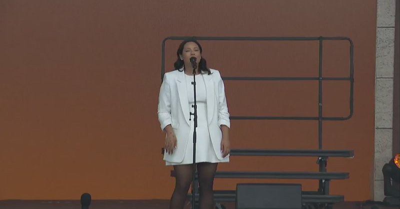

Fox News (Twitter/X)

WATCH LIVE: Thousands gather on National Mall for 'Rededicate 250' https://twitter.com/i/broadcasts/1AxRnavembZxl

## FoxNewsTwitter — post 341841

  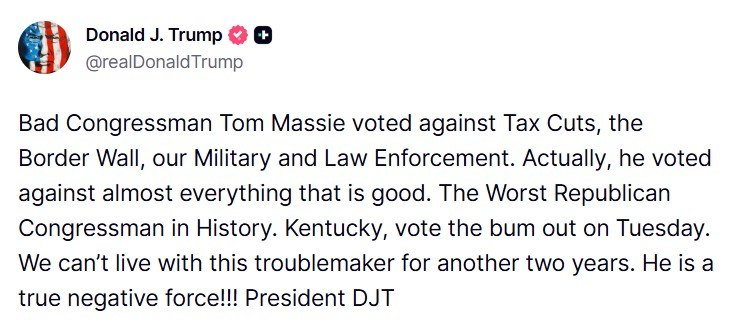

Fox News (Twitter/X)

NEW: President Trump turns up the heat against Rep. Thomas Massie, calling the Kentucky lawmaker "the Worst Republican Congressman in History."

The president's latest call to action comes ahead of the state's primary elections on Tuesday.

## FoxNewsTwitter — post 341837

Fox News (Twitter/X)

END OF AN ERA: Ronda Rousey's rousing return to the ring ended quickly, after the legendary fighter took down opponent Gina Carano in just 17 seconds in front of a packed, stunned crowd — wrapping up her historic MMA career.

Rousey claims she's done fighting for good and is embracing being a mom to her two kids, and that she's ready to expand her family again.

## FoxNewsTwitter — post 341833

Fox News (Twitter/X)

END OF AN ERA: Ronda Rousey's rousing return to UFC ended quickly, after the legendary fighter took down opponent Gina Carano in just 17 seconds in front of a packed, stunned crowd — wrapping up her historic MMA career.

Rousey claims she's done fighting for good and is embracing being a mom to her two kids, and that she's ready to expand her family again.

## FoxNewsTwitter — post 341832

  <a href="telegram/content/FoxNewsTwitter_341832_1779032842.mp4" target="_blank">🎬 Download video</a>

Fox News (Twitter/X)

Democrats vow to fight back over the Supreme Court's rulings on redistricting, as thousands took to the streets to march in Alabama.

"We have seen this before, where some people in black robes try to deny or take away our rights," Sen. Cory Booker said.

## pm_afshaa — post 90906

🔴کیهان: آماده باشید که احتمالا آمریکا و اسرائیل به زودی حمله می‌کنن

💧 Rainbet.com the #1 Non-KYC Crypto Casino & Sportsbook @rainbetcom

😁 @Pm_Afshaa

## pm_afshaa — post 90905

  <a href="telegram/content/pm_afshaa_90905_1779032845.mp4" target="_blank">🎬 Download video</a>

🔴امروز جلسه دادگاه ساعدی نیا، مدیر کافه زنجیره‌ای معروف ساعدی نیا به دلیل حمایت از اعتراضات دی برگزار شد.

ساعدی نیا: من بلاتکلیف بودم تا اینکه استوری گذاشتم و مغازه رو تعطیل کردم، بعدش از ترس استوری رو پاک کردم و موبایلمو خاموش کردم، من هیچکسو به حضور در اعتراضات ترغیب نکردم. منظور من از فروپاشی، فروپاشی اقتصادی بود و نه خیزش علیه نظام. من هیچکدوم از کارکنانم رو برای حضور در اعتراضات مجبور نکردم، از کاری که کردم پشیمونم و از دادگاه می‌خوام فرصت جبران بهم بده.
قاضی: شما با فراخوانی که دادی کلی جوون رو به اعتراضات کشوندین و ضربه زیادی به این نظام زدی، چطوری میخوای جبران کنی؟

💧Rainbet.com the #1 Non-KYC Crypto Casino & Sportsbook @rainbetcom

😁 @Pm_Afshaa

## pm_afshaa — post 90904

  <a href="telegram/content/pm_afshaa_90904_1779032846.webm" target="_blank">🎬 Download video</a>

🔴خبرگزاری فارس: جزئیاتی از درخواست‌های آمریکا از ایران در مذاکرات؛ 5 شرط اصلی واشنگتن به این شرح اعلام شده : عدم پرداخت هرگونه غرامت و خسارت از سوی آمریکا خروج و تحویل ۴۰۰ کیلوگرم اورانیوم از ایران به آمریکا فعال ماندن تنها یک مجموعه از تأسیسات هسته‌ای…

## pm_afshaa — post 90900

  <a href="telegram/content/pm_afshaa_90900_1779032846.webm" target="_blank">🎬 Download video</a>

🔴اکسیوس: کوبا از سال 2023 پیش از 300 پهپاد نظامی به دست آورده که خیلیشون از روسیه و ایران هستن. الانم دارن بحث میکنن که شاید بخوان از اینا علیه پایگاه دریایی آمریکا در خلیج گوانتانامو و کشتی‌های نظامی آمریکا استفاده کنن.

💧 Rainbet.com the #1 Non-KYC Crypto Casino & Sportsbook @rainbetcom

😁 @Pm_Afshaa

## pm_afshaa — post 90899

  <a href="telegram/content/pm_afshaa_90899_1779032847.webm" target="_blank">🎬 Download video</a>

🔴حاجی‌بابایی، نایب‌رییس مجلس:
اگه تاسیسات نفت ما رو بزنن، نفت دوست و دشمن در منطقه رو میزنیم.

💧 Rainbet.com the #1 Non-KYC Crypto Casino & Sportsbook @rainbetcom

😁 @Pm_Afshaa

## pm_afshaa — post 90898

  <a href="telegram/content/pm_afshaa_90898_1779032848.webm" target="_blank">🎬 Download video</a>

🔴نیویورک تایمز به نقل از مقامات امنیتی عراق: آمریکا به عراق دستور داده بود که توی دو تا عملیات در ایران، سیستم‌های راداری خودش رو خاموش کنه.

💧 Rainbet.com the #1 Non-KYC Crypto Casino & Sportsbook @rainbetcom

😁 @Pm_Afshaa

## pm_afshaa — post 90897

  <a href="telegram/content/pm_afshaa_90897_1779032849.webm" target="_blank">🎬 Download video</a>

🔴نیویورک‌تایمز: اسرائیل حداقل دو پایگاه مخفی در صحرای عراق رو به‌طور متناوب و برای بیش از یک سال اداره می‌کرده.

💧 Rainbet.com the #1 Non-KYC Crypto Casino & Sportsbook @rainbetcom

😁 @Pm_Afshaa

## iaghapour — post 2617

از هر 10 نفری که که تو اینستاگرام وصل هستن 8 تاش دختره, 2 تاش هم پسر کانفیگ فروش 🥸

## DEJradio — post 4681

  <a href="telegram/content/DEJradio_4681_1779032850.mp4" target="_blank">🎬 Download video</a>

📢
🔺 "دو ماه از جنگ گذشته پاسگاه جنت‌آباد هنوز درست نشده

#حملات_هدفمند #سرکوب
@DEJradio

## DEJradio — post 4680

  <a href="telegram/content/DEJradio_4680_1779032852.webm" target="_blank">🎬 Download video</a>

🔸
🔺 ناو هواپیمابر یواس‌اس جرالد فورد که پیش از آغاز جنگ با ایران به خاورمیانه اعزام شده بود، پس از ۳۲۶ روز ماموریت، روز شنبه به ایالات متحده بازگشته است. این طولانی‌ترین ماموریت یک گروه رزمی ناو هواپیمابر آمریکا از زمان جنگ ویتنام تاکنون بوده است.
پیت هگست، وزیر دفاع آمریکا در نورفک در ایالت ویرجینیا برای استقبال از بزرگ‌ترین ناو هواپیمابر جهان حضور داشت.
به گفته ارتش آمریکا، این ناو در جریان ماموریت خود در عملیات‌های آمریکا در منطقه کارائیب مشارکت داشت؛ جایی که نیروهای آمریکایی به قایق‌های مظنون به قاچاق مواد مخدر حمله و نفتکش‌های تحریم‌شده را توقیف کردند، همچنین نیکلاس مادورو، رهبر ونزوئلا، را بازداشت کردند.

#آمریکا
@DEJradio

## DEJradio — post 4679

  

🧨
🔥 مقام‌های ابوظبی می‌گویند آتش‌سوزی ناشی از حمله یک پهپاد به یک ژنراتور برق در بیرون محدوده نیروگاه هسته‌ای براکه کنترل شده و به این نیروگاه آسیبی وارد نشده است.
یروگاه هسته‌ای براکه در منطقه ظفره امارات اولین نیروگاه هسته‌ای در جهان عرب است و از چهار رآکتور تشکیل شده است.
سازمان فدرال مقررات هسته‌ای امارات نیز اعلام کرد این آتش‌سوزی تأثیری بر ایمنی نیروگاه، سطح ایمنی پرتویی یا آمادگی سامانه‌های اصلی نیروگاه نداشته و همه واحدها به‌طور عادی به فعالیت خود ادامه می‌دهند.

این حادثه در حالی گزارش می‌شود که تنش‌های منطقه‌ای و حملات پهپادی در خلیج فارس نگرانی‌ها درباره امنیت زیرساخت‌های انرژی و تأسیسات حساس را افزایش داده است.

#انفجار #ابوظبی
@DEJradio

## DEJradio — post 4678

  <a href="telegram/content/DEJradio_4678_1779032854.mp4" target="_blank">🎬 Download video</a>

🚨
🚨 یک دستگاه اتوبوس مسافری یکشنبه ۲۷ اردیبهشت ۱۴۰۵ در محور عسلویه به کنگان واژگون شد. در این حادثه دستکم لحظه ۷ نفر جان خود را از دست داده‌اند و ۱۷ نفر نیز به بیمارستان منتقل شده‌اند. حال یکی از مصدومان وخیم اعلام شده است.

#تصادف #عسلویه
@DEJradio

## DEJradio — post 4677

  

🔸
⭕️ برابر اخبار رسیده، مأموران جمهوری اسلامی در زندان‌ها بر سر لوازم شخصی بازداشت‌شدگان، زندانیان سیاسی و اعدامی‌های انقلاب ملی شیر و خورشید رقابت و در مواردی بر سر تصاحب آنها با هم جر و بحث می‌کنند.
منابع داخلی می‌گویند، اگر فرد بازداشتی از وضعیت مالی مناسبی برخوردار باشد و زندگی او روبراه باشد یا وسایل شخصی‌ ارزشمندی داشته باشد، برای تصاحب پرونده او میان مأموران رقابت و تلاش بیشتری صورت می‌گیرد.
منابع خبری به دژ می‌گویند وسایل زندانیان محکوم به اعدام بیش از دیگران مورد تصاحب قرار می‌گیرد؛ به‌گونه‌ای که برخی مأموران حتی پیش از اجرای حکم قتل حکومتی، در مقابل خود زندانی و پس از اجرای حکم نیز در برابر خانواده او، از این وسایل استفاده می‌کنند.
این منبع می‌گوید مأموران پرونده و زندانبان‌ها هر دو در این اقدامات غیرانسانی نقش دارند. در واقع اگر وسایل شخصی افراد بازداشتی توسط مأمور پرونده یا سازمان بازداشت‌کننده استفاده نشود، معمولاً مأموران زندان از آن‌ها استفاده می‌کنند.

*تصویر با استفاده هوش‌مصنوعی براساس مشاهدات بازسازی شده است.

#سرکوب #اعدام #جلاد
@DEJradio

## DEJradio — post 4676

  <a href="telegram/content/DEJradio_4676_1779032857.webm" target="_blank">🎬 Download video</a>

📷
🔺 بنر سـ.ـپاه در ساحل هرمز؛ ورود سربازان آمریکایی و سگ ممنوع
توهین‌های ناشی از استیصال بدون انکه در نظر بگیرند هنوز حتی جسد علی خامنه‌ای را تشییع نکردند.

#تنگه_هرمز #سپاه_تروریستی_پاسداران
@DEJradio

## DEJradio — post 4675

⭕️🎥 حکومت نگران از تشدید نارضایتی‌های عمومی، آموزش نظامی به کودکان در مساجد را سازماندهی‌شده پیش می‌برد.
شستشوی مغزی و تبلیغات عمدتا با نوای مذهبی و نوحه بخشی از مقدمات این آموزش‌هاست. قبلا آموزش‌ها شامل کلاشنیکف بود حالا آرپی‌جی هم به آن اضافه شده است.

#کودک_سرباز #سپر_انسانی
@DEJradio

## DEJradio — post 4674

  <a href="telegram/content/DEJradio_4674_1779032858.webm" target="_blank">🎬 Download video</a>

🔸
🔺 براساس گزارش‌های دریافتی گشتی‌های نیروی انتظامی و بـ.ـسیج و برای مأموریت‌های شهری تلفیق شده‌اند. همچنین ماموران انتظامی و نیروهای بسیج در برقراری ایست‌های بازرسی در شهرهای مختلف و گشت‌های محله‌محور همکاری خود را افزایش داده‌اند.
یک کارشناس امنیتی به دژ می‌گوید چنین اقدامی می‌تواند ناشی از دو دلیل عمده باشد: ۱) جبران کمبود نیرو و ۲)هماهنگی در شرایط اضطراری بعد از جنگ ۴۰ روزه بحق ادغام نیروهای مسلح مطرح شد که موضوع «تلفیق بخشی از ماموریت‌ها» ارتباطی به آن ندارد.
از سوی دیگر سازمان بـ.ـسیج در ارتش، نیروی انتظامی، سـ.ـپاه و حتی سایر ارگان‌ها «سهمیه استخدام» دارد. از این رو با توجه به تلفات سنگین نیروی انتظامی در جنگ ۴۰ روزه و احتمال شکل‌گیری مجدد اعتراضات از یک سو حکومت ممکن است سهمیه استخدام بـ.ـسیج در فراجا را افزایش دهد و از سوی دیگر برای افزایش همکاری و هماهنگی «قرارگاه‌های امنیتی» تقویت شود.
طی سال‌های اخیر بارها فرماندهان ارشد نیروی انتظامی و پاسداران در مورد تشکیل قرارگاه‌های مشترک امنیتی و روانی و تقویت گشت‌های محلی اظهار نظر کردند و در مواقعی مدتی کوتاه آن را به اجرا گذاشتند.

#سرکوبگران
@DEJradio

## mamlekate — post 103549

📝 «حمله پهپادی» به نیروگاه هسته‌ای امارات متحده عربی؛ گروسی محکوم کرد

اداره رسانه‌ای ابوظبی روز یکشنبه ۲۶ اردیبهشت از وقوع آتش‌سوزی در نزدیکی نیروگاه اتمی براکه در امارات متحده عربی خبر داد. این رخداد با واکنش مدیرکل آژانس بین‌المللی انرژی اتمی مواجه شد.

📝 آژانس درباره حمله پهپادی به نیروگاه هسته‌ای امارات: سطح تشعشعات عادی است

@mamlekate

## mamlekate — post 103548

📞 نمیدونم موضوع چیه ولی امروز عصر سه چهاربار صدای جنگنده اومد از خرمشهر رد می‌شد! به کدوم سمت دقیقا نمیشد فهمید، ولی بوضوح صدای جنگنده بود‌. اقلا سه دفعه قطعا شنیدیم که از بالای شهر رد شد!

همه ماها که دیدیم وشنیدیم، نفهمیدیم از کجا میومدن یا به کجا میرفتن، اما در اینکه جنگنده بودن هیچ شکی نداریم. بیشتر به صدای جنگنده‌های روزای جنگ میخورد صداشون.

📞 امروز یه چیزی شبیه هواپیما تو آسمون تهران سمت امیرآباد دیدم حدود ساعت ۱۱ و ۴۵. از شمال به جنوب داشت می‌رفت، خیلی سریع رد شد و نتونستم دقیق تشخیص بدم نوعش رو ولی واقعا هواپیما بود اونی که دیدم. بعدش تا چند دقیقه منتظر صدای انفجاری چیزی بودم ولی هیچی. حتی سریع پنجره رو باز کردیم که صدا واضح باشه ولی اصلا صدای جنگنده نیومد.

📞 بامداد یکشنبه ساعت ۰۲:۱۴ نت داخلی ایرانسل و همراه تو ساری قطع شد، من تا حدود ۴:۳۰ بیدار بودم اما همچنان قطع بود، از چند نفر در نقاط مختلف شهر هم پرسیدم تایید کردن، طرفای ۶ مثل اینکه وصل شد. تو این مدت چه خبر بوده که همه چی قطع شده بود جالبه

@mamlekate

## VahidOnline — post 75516

drpezeshkian

📡 @VahidOnline

## VahidOnline — post 75514

محسن نقوی، وزیر کشور پاکستان، عصر امروز با محمدباقر قالیباف، رئیس مجلس ایران در تهران دیدار و گفت‌وگو کرد.

رسانه‌های ایرانی و پاکستانی گزارش داده‌‌اند که آقای نقوی برای از سرگیری مذاکرات به ایران سفر کرده است.

گفته شده او حامل پیام‌ آمریکاست و پاسخ ایران را هم دریافت خواهد کرد.

به گفته سفارت پاکستان در تهران، آقای نقوی دیروز پس از ورود به تهران «نزدیک به سه ساعت در نهاد ریاست جمهوری حضور داشت» و اسکندر مومنی، وزیر کشور، و عباس عراقچی، وزیر امور خارجه نیز «در جریان این دیدار در نهاد ریاست جمهوری حضور داشتند.»
علاوه بر این، محسن نقوی «دیداری خصوصی» با مسعود پزشکیان داشت که «حدود ۹۰ دقیقه به طول انجامید و با حضور وزیر کشور ایران همراه بود.»
@VahidHeadline

📡 @VahidOnline

## VahidOnline — post 75513

  

خبرگزاری فارس با انتشار متنی مدعی شد جزئیاتی از پاسخ آمریکا به پیشنهادهای ایران در جریان مذاکرات به دست آورده است؛ گزارشی که در آن از پنج شرط اصلی واشنگتن برای توافق با تهران سخن گفته شده است.

براساس شنیده‌های فارس، شروط اعلام‌شده از سوی آمریکا شامل موارد زیر است:

۱- عدم پرداخت هرگونه غرامت و خسارت از سوی آمریکا
۲- خروج و تحویل ۴۰۰ کیلوگرم اورانیوم از ایران به آمریکا
۳- فعال ماندن تنها یک مجموعه از تاسیسات هسته‌ای ایران
۴- عدم پرداخت حتی ۲۵ درصد از دارایی‌های بلوکه‌شده ایران
۵- منوط‌شدن توقف جنگ در همه ساحتها به انجام مذاکره

به گفته فارس، در مقابل، ایران انجام هرگونه مذاکره را منوط به تحقق پنج پیش‌شرط اعتمادساز دانسته است: «پایان جنگ در همه جبهه‌ها به‌ویژه لبنان»، «رفع تحریم‌های ضدایرانی»، «آزادسازی پول‌های بلوکه‌شده ایران»، «جبران خسارات ناشی از جنگ» و «پذیرش حق حاکمیت ایران بر تنگه هرمز».
@VahidOOnLine

📡 @VahidOnline

## VahidOnline — post 75512

  

عباس عراقچی، وزیر امور خارجه جمهوری اسلامی، در کانال تلگرامی خود اعلام کرد که کتاب «قدرت مذاکره» او به چاپ پنجم رسیده و در چاپ جدید این کتاب، بخش جدیدی با عنوان «دیپلماسی زیر آتش» درباره روند «مذاکرات غیرمستقیم با آمریکا در جنگ ۱۲ روزه» به آن افزوده شده است.
@VahidOOnLine

📡 @VahidOnline

## VahidOnline — post 75511

  

اداره رسانه‌ای ابوظبی روز یک‌شنبه ۲۷ اردیبهشت در شبکه‌های اجتماعی از وقوع آتش‌سوزی در نیروگاه اتمی براکه در امارات متحده عربی خبر داد.

این آتش‌سوزی پس از حمله پهپادی به نیروگاه اتمی برکه در منطقه الظَفرَه آغاز شده، اما کشته و مجروح بر جا نگذاشته است.

بر اساس توضیح اداره رسانه‌ای ابوظبی، این حریق در ژنراتور برق خارج از محدوده پیرامون نیروگاه به راه افتاده و بر ایمنی سایت اثر منفی نداشته است.

در پی آغاز حمله مشترک آمریکا و اسرائیل به خاک ایران، امارات متحده عربی به بزرگ‌ترین هدف حملات تلافی‌جویانه سپاه پاسداران تبدیل شد.
@VahidHeadline

📡 @VahidOnline

## VahidOnline — post 75510

  

خبرگزاری فارس، نزدیک به سپاه پاسداران، روز یک‌شنبه ۲۷ اردیبهشت نوشت که محمدباقر قالیباف، رئیس مجلس شورای اسلامی و عضو سابق سپاه، به عنوان نماینده ویژه ایران در امور چین تعیین شده است.

این خبرگزاری امنیتی بدون هیچ توضیح دیگری تنها نوشته است:‌ «پیشتر علی لاریجانی و عبدالرضا رحمانی‌ فضلی چنین مسئولیتی را برعهده داشتند.»

🔸در این خبر نه توضیح داده شده که چه کسی یا چه نهادی قالیباف را به این سمت منصوب کرده است و نه برهه کنونی چه اهمیتی دارد که حکومت تصور کرده است به این نماینده ویژه نیاز دارد.

اعلام تعیین قالیباف به عنوان نماینده ویژه در امور چین دو روز پس از دیدار رسمی رئیس جمهور آمریکا از کشور چین رخ می‌دهد که در آن یکی از موضوعات گفت‌وگو ایران و تنگه هرمز بود.
کاخ سفید روز پنجشنبه ۲۴ اردیبهشت اعلام کرد دونالد ترامپ، رئیس‌جمهور آمریکا، و شی جین‌پینگ، رئیس‌جمهور چین، در دیدار خود درباره گسترش همکاری‌های اقتصادی، باز ماندن تنگه هرمز و جلوگیری از دستیابی ایران به سلاح هسته‌ای گفت‌وگو و توافق کردند.
@VahidHeadline

📡 @VahidOnline

## VahidOnline — post 75509

  

جلسه دادگاه صادق ساعدی‌نیا، مدیر کافه‌های زنجیره‌ای ساعدی‌نیا که در اعتراضات سراسری دی ماه گذشته به همراه پدرش، محمدعلی ساعدی‌نیا، بازداشت شده بود در دادگاه انقلاب قم برگزار شد.

کافه‌های ساعدی‌نیا از جمله کسب‌وکارهایی بود که در اعتراضات دی ماه پارسال که با اعتراض بازار به نابسامانی اقتصادی آغاز شد، مغازه‌هایشان را تعطیل کردند.

نماینده دادستان قم در این جلسه آقای ساعدی‌نیا را به «فعالیت تبلیغی یا رسانه‌ای برخلاف امنیت کشور»، «اقدام عملیاتی برای گروه‌های معاند نظام از طریق انتشار استوری و فعالیت مجازی و حضور در تجمعات غیرقانونی و تعطیل کردن کافه‌ها و مغازه‌های خود در کل کشور و تشویق تعدادی از کارکنانش در ارتکاب جرایم علیه امنیت کشور» متهم کرد.

به گفته نماینده دادستان و قاضی، موارد اتهامی بر مبنای اطلاعاتی است که از محتوای لوازم الکترونیکی ضبط شده از آقای ساعدی‌نیا و از جمله تصاویر و چت‌های او در واتساپ استخراج شده است.
نماینده دادستان گفت که آقای ساعدی‌نیا در واتساپ خود «برنامه‌ریزی برای تعطیلی کافه‌ها را همزمان با صدور فراخوان دشمن به مشورت گذاشته بود.»
قاضی به او گفت: «شما با فراخوانی که داده‌اید با اقداماتی که انجام داده‌اید، این تعداد جوان را به این مهلکه وارد کرده‌اید و نظام متحمل صدمات زیادی شده است. چطور می‌توانید جبران کنید؟»
@VahidHeadline
نماینده دادستان، مواردی از جمله فعالیت‌های ساعدی‌نیا در فضای مجازی، تهیه کلیپی از یکی از کارکنانش با نوشته «جاوید شاه» روی دست، ایجاد و مدیریت گروه واتساپی کارکنان کافه‌ها، انتشار پیام صوتی درباره خاموش کردن گوشی برای جلوگیری از ردیابی، حضور برخی کارکنان در اعتراضات و برنامه‌ریزی برای تعطیلی کافه‌ها و کارخانه‌ها همزمان با فراخوان‌های اعتراضی را از مصادیق اتهامات مطرح‌شده علیه او عنوان کرد.
@VahidOOnLine

📡 @VahidOnline

## kianmeli1 — post 87452

  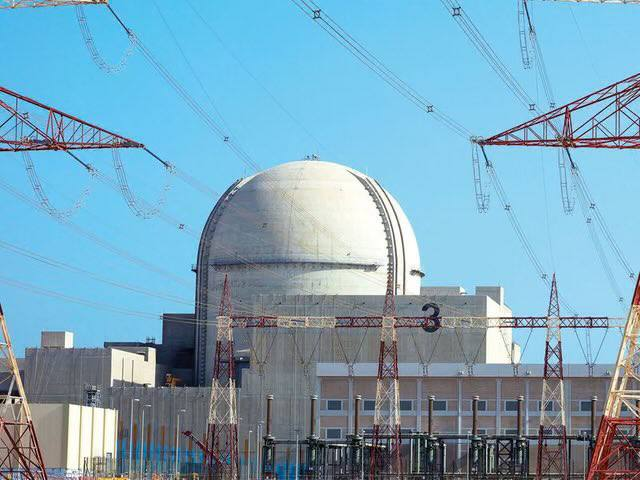

‏🔴وزیر خارجه امارات متحده عربی پس از حمله پهپادی به نیروگاه هسته‌ای این کشور، تلفنی با مدیرکل آژانس بین‌المللی انرژی اتمی گفت‌وگو کرده است. وزیر خارجه امارات متحده عربی تاکید کرد که ابوظبی حق کامل دارد به چنین «حملات تروریستی» پاسخ دهد
https://t.me/kianmeli1

## kianmeli1 — post 87451

  

🔴اکسیوس-کوبا بیش از ۳۰۰ پهپاد از روسیه و ایران خریداری کرده و بنا به گزارش‌ها، در حال بررسی هدف قرار دادن خلیج گوانتانامو، کشتی‌های نیروی دریایی ایالات متحده و کی وست است
https://t.me/kianmeli1

## kianmeli1 — post 87450

  <a href="telegram/content/kianmeli1_87450_1779032864.mp4" target="_blank">🎬 Download video</a>

🔴آتش سوزی وسیع در مسکو پس از حملات پهپادی اوکراین
https://t.me/kianmeli1

## IranIntlTV — post 337647

  

گوگوش، خواننده سرشناس ایرانی، «نشان افتخار جزیره آلیس» را دریافت کرد؛ «این نشان به افرادی اهدا می‌شود که در جامعه آمریکا تأثیرگذار بوده‌اند و در عین حال ریشه‌ها و هویت فرهنگی خود را حفظ کرده‌اند.»

گوگوش با انتشار تصویری از مراسم اهدای این نشان در صفحه اینستاگرام خود نوشت: «این نشان را با عشق و احترام به مردم ایران تقدیم می‌کنم؛ به مردمی که سال‌ها با رنج، صبوری، امید و سربلندی زندگی کرده‌اند و با وجود همه سختی‌ها، همچنان ایستاده‌اند.»
https://iranintl.com/202605170523

## IranIntlTV — post 337646

اسرائیل بیش از یک سال از دو پایگاه مخفی در عراق برای عملیات علیه ایران استفاده کرد

نیویورک‌تایمز در گزارشی تحقیقی فاش کرد که اسرائیل بیش از یک سال در صحرای غربی عراق دو پایگاه مخفی ایجاد و به‌طور متناوب از آن‌ها برای پشتیبانی از عملیات نظامی علیه حکومت ایران استفاده کرده است؛ پایگاه‌هایی که به گفته مقام‌های عراقی و منطقه‌ای، در جنگ ۱۲ روزه نیز نقش داشته‌اند.

این گزارش همچنین به کشته شدن یک چوپان عراقی اشاره می‌کند که به گفته خانواده‌اش، پس از کشف یکی از این پایگاه‌ها جان خود را از دست داده است.

به گزارش نیویورک‌تایمز، ماجرا از سوم مارس [۱۲ اسفند] آغاز شد؛ زمانی که عوض الشمری، چوپان ۲۹ ساله اهل منطقه النخیب در غرب عراق، برای خرید مایحتاج روزانه از محل سکونت خود خارج شد اما هرگز بازنگشت.

سه شاهد از ساکنان بادیه‌نشین منطقه به این روزنامه گفته‌اند که خودروی او هنگام بازگشت توسط یک بالگرد تعقیب شد و هدف شلیک‌های متعدد قرار گرفت تا سرانجام در میان شن‌های بیابان متوقف شد. چند ساعت بعد، خانواده او خودروی سوخته و جسدش را پیدا کردند.

دو پایگاه اسرائیلی در عراق؛ یکی افشا شد، دیگری همچنان در ابهام
نیویورک‌تایمز به نقل از مقام‌های عراقی گزارش داده که اسرائیل دست‌کم دو پایگاه مخفی در صحرای غربی عراق داشته است. وجود یکی از این پایگاه‌ها پیش‌تر توسط وال‌استریت ژورنال گزارش شده بود، اما مقام‌های عراقی اکنون از وجود پایگاه دومی نیز خبر داده‌اند که تاکنون علنی نشده بود.

بر اساس این گزارش، پایگاهی که عوض الشمری به آن برخورد کرد، پیش از جنگ اخیر میان آمریکا، اسرائیل و جمهوری اسلامی ایجاد شده بود و در جنگ ۱۲ روزه در خرداد علیه تهران مورد استفاده قرار گرفت.

یکی از مقام‌های امنیتی منطقه‌ای به نیویورک‌تایمز گفته اسرائیل از اواخر سال ۲۰۲۴ برای ساخت این پایگاه برنامه‌ریزی می‌کرد و در حال شناسایی مناطق دورافتاده برای استفاده در درگیری‌های آینده بود.

تردیدها درباره اطلاع آمریکا از حضور اسرائیل در عراق
نیویورک‌تایمز می‌نویسد اطلاعات مقام‌های منطقه‌ای نشان می‌دهد دست‌کم یکی از این پایگاه‌ها از ژوئن ۲۰۲۵ [خرداد ۱۴۰۴] یا حتی پیش‌تر برای آمریکا شناخته‌شده بوده است؛ موضوعی که این احتمال را مطرح می‌کند واشینگتن از حضور نیروهای اسرائیلی در خاک عراق اطلاع داشته اما آن را با بغداد در میان نگذاشته باشد.

مقام‌های منطقه‌ای گفته‌اند ساختار امنیتی عراق و نقش آمریکا در آن، بخشی از محاسبات اسرائیل برای فعالیت مخفیانه در خاک عراق بوده است.
دو مقام امنیتی عراق نیز به این روزنامه گفته‌اند که در جریان جنگ‌های اخیر، واشینگتن بغداد را وادار کرده بود برای حفاظت از هواپیماهای آمریکایی، رادارهای خود را خاموش کند؛ اقدامی که وابستگی عراق به آمریکا برای تشخیص تهدیدهای هوایی را افزایش داده بود.

حمله به نیروهای عراقی و شناسایی پایگاه
بر اساس گزارش، ارتش عراق پیش از کشف پایگاه توسط چوپان، بیش از یک ماه به حضور احتمالی نیروهای اسرائیلی در بیابان مشکوک بود و فعالیت‌ها را از دور زیر نظر داشت.

ژنرال علی الحمدانی، فرمانده نیروهای فرات غربی عراق، به نیویورک‌تایمز گفته است: «تا امروز، دولت درباره این موضوع سکوت کرده است.»
پس از گزارش عوض الشمری، نیروهای شناسایی عراق به منطقه اعزام شدند، اما طبق اعلام مقام‌های عراقی، هدف حمله قرار گرفتند؛ حمله‌ای که در آن یک سرباز کشته، دو نفر زخمی و دو خودرو منهدم شد.

حمدانی گفته است پس از تماس فرماندهان عراقی با ارتش آمریکا و دریافت این پاسخ که نیروهای حاضر آمریکایی نیستند، مقام‌های عراقی نتیجه گرفتند که با نیروهای اسرائیلی روبه‌رو بوده‌اند. او گفت: «وقتی تایید شد نیروها آمریکایی نیستند، فهمیدیم که اسرائیلی هستند.»

افشای پایگاه دوم و نگرانی درباره حاکمیت عراق
چهار روز پس از حمله به نیروهای عراقی، پارلمان عراق فرماندهان نظامی را برای ارائه توضیح فراخواند.

حسن فدعام، یکی از نمایندگان حاضر در جلسه، به نیویورک‌تایمز گفت: «پایگاه النخیب فقط همان پایگاهی است که کشف شد.» یک مقام دیگر عراقی نیز وجود پایگاه دوم اسرائیل در صحرای غربی عراق را تایید کرده، اما محل دقیق آن را فاش نکرده است.

گزارش نیویورک‌تایمز می‌گوید افشای این پایگاه‌ها پرسش‌های دشواری را برای بغداد ایجاد کرده است؛ از جمله اینکه آیا نیروهای عراقی واقعاً از حضور خارجی در خاک کشور بی‌اطلاع بوده‌اند یا از آن اطلاع داشته اما سکوت کرده‌اند.

وعد الکدو، نماینده پارلمان عراق که در جلسه محرمانه توجیهی شرکت داشته، به این روزنامه گفته است: «این موضوع نشان‌دهنده بی‌اعتنایی آشکار به حاکمیت عراق، دولت و نیروهای آن و همچنین کرامت مردم عراق است.»

🔗متن کامل گزارش را اینجا بخوانید
@iranintltv

## IranIntlTV — post 337645

  <a href="telegram/content/IranIntlTV_337645_1779032867.mp4" target="_blank">🎬 Download video</a>

وزارت دفاع امارات متحده عربی از مقابله با سه پهپاد شلیک‌شده از مرزهای غربی خبر داد. بر اساس این گزارش، پدافند هوایی این کشور دو فروند از پهپادها را منهدم کرد، اما پهپاد سوم به یک ژنراتور برق در خارج از محدوده داخلی نیروگاه هسته‌ای براکه در منطقه الظفره اصابت کرد.

گفت‌وگو با هوشنگ حسن‌یاری، کارشناس خاورمیانه و امور نظامی
@iranintltv

## IranIntlTV — post 337644

  

لیندسی گراهام، سناتور جمهوری‌خواه آمریکا در گفت‌وگو با شبکه ان‌بی‌سی خواستار اقدام نظامی بیشتر آمریکا علیه جمهوری اسلامی شد.
او افزود: وضعیت فعلی به همه ما آسیب می‌زند، هرچه تنگه هرمز بیشتر بسته بماند و ما بیشتر دنبال توافقی برویم که هیچ‌وقت حاصل نمی‌شود. جمهوری اسلامی قوی‌تر می‌شود.

سناتور گراهام افزود: «تا این لحظه، هیچ چیزی نشان نمی‌دهد افرادی که اکنون در قدرت هستند، از نظر اهداف رژیم برای تروریسم جهانی، نابودی اسرائیل و حمله به ما تفاوتی کرده باشند.»

او اضافه کرد: «آنچه رئیس‌جمهور ترامپ از نظر نظامی انجام داده فوق‌العاده بوده، اما هنوز اهداف بیشتری وجود دارد و کارهای بیشتری هست که می‌توانیم برای ضربه زدن به ایران انجام دهیم.»
https://iranintl.com/202605173661

## IranIntlTV — post 337643

  

🔻تیم والیبال فولاد سیرجان در دیدار فینال لیگ قهرمانان ۲۰۲۶ آسیا با نتیجه ۳ بر ۱ برابر جاکارتا بهایانگ‌کارا اندونزی شکست خورد.

🔹فولاد سیرجان تنها در ست دوم با نتیجه ۲۶ بر ۲۴ پیروز شد و در ست‌های اول، سوم و چهارم با نتایج ۲۵ بر ۲۰، ۲۵ بر ۲۳ و ۲۵ بر ۲۳ شکست خورد تا شاگردان بهروز عطایی از رسیدن به جام قهرمانی بازماندند.

🔹در ترکیب تیم جاکارتا بهایانگ‌کارا اندونزی بازیکنانی همچون روبرت‌لندی سیمون، بازیکن کوبایی، نوموری کیتا، بازیکن اهل مالی، و روک موژیچ، ستاره اسلوونیایی تیم ورونا ایتالیا، حضور داشتند. روک موژیچ در لیگ ملت‌های ۲۰۲۵ نیز جزو امتیازآورترین بازیکنان بود.

@iranintltvsport

## IranIntlTV — post 337642

  <a href="telegram/content/IranIntlTV_337642_1779032872.mp4" target="_blank">🎬 Download video</a>

پگاه آهنگرانی، بازیگر و فیلمساز ایرانی، شنبه ۲۶ اردیبهشت برای نمایش فیلم تازه خود «تمرین‌هایی برای یک انقلاب» در جشنواره کن حاضر شد. او این فیلم را به مادرانی تقدیم کرد که فرزندانشان را در مسیر مبارزه برای آزادی از دست داده‌اند. آهنگرانی که همراه عوامل فیلم روی صحنه رفت، گفت خوشحال است که این اثر توانسته بخشی از مبارزه مردم برای آزادی و دموکراسی را به تصویر بکشد و افزود مردم این روزها با قطعی اینترنت، خبرهای روزانه اعدام‌ها توسط جمهوری اسلامی و سایه جنگ روبه‌رو هستند.
@iranintltv

## IranIntlTV — post 337641

  

مستند کوتاه «هنر مقاومت» به تهیه‌کنندگی ایران اینترنشنال و کارگردانی مهران عباسیان در فستیوال فیلم خانه سینمای سوئد موفق به دریافت جایزه بهترین مستند کوتاه و بهترین کارگردانی شد.
این فیلم داستان دو هنرمند ایرانی را روایت می‌کند که هنر را به زبان اعتراض، امید و مقاومت در برابر محدودیت‌ها تبدیل کرده‌اند.
https://iranintl.com/202605174127

## IranIntlTV — post 337640

  <a href="telegram/content/IranIntlTV_337640_1779032875.mp4" target="_blank">🎬 Download video</a>

یک شهروند با ارسال پیامی به ایران‌اینترنشنال می‌گوید مدرس آنلاین زبان انگلیسی است و دو ماهی می‌شود که نتوانسته یک کلاس برگزار کند.

## IranIntlTV — post 337639

  <a href="telegram/content/IranIntlTV_337639_1779032877.mp4" target="_blank">🎬 Download video</a>

پس از ۱۲ هفته خاموشی اینترنت در ایران، حالا دسترسی به اینترنت برای برخی شهروندان به کالایی گران و لوکس تبدیل شده است.

مهدی بیگی، عضو تحریریه ایران‌اینترنشنال، در برنامه پیوست بازار سیاه «اینترنت پرو» را بررسی کرده است
@iranintltv

## IranIntlTV — post 337638

  <a href="telegram/content/IranIntlTV_337638_1779032880.mp4" target="_blank">🎬 Download video</a>

رکود تورمی سنگین در اقتصاد ایران، موجب تشدید بحران در صنایع مختلف شده است. روزنامه جهان صنعت در گزارشی از انباشت ۸۰ تا ۱۲۰ هزار خودروی ناقص و بدهی سنگین شرکت سایپا به قطعه‌سازان خبر داد.

گفت‌وگو با مهتاب قلی‌زاده، روزنامه‌نگار اقتصادی
@iranintltv

## IranIntlTV — post 337637

  

فرماندهی مرکزی ایالات متحده، سنتکام، اعلام کرد از زمان آغاز محاصره دریایی بنادر و سواحل جنوبی ایران، ۸۱ کشتی تجاری مجبور به تغییر مسیر شده‌اند و چهار شناور دیگر نیز پس از هدف قرار گرفتن، از کار افتاده‌اند تا اجرای این محاصره تضمین شود.
https://iranintl.com/202605177479

## IranIntlTV — post 337636

  <a href="telegram/content/IranIntlTV_337636_1779032884.mp4" target="_blank">🎬 Download video</a>

سرخط خبرهای یکشنبه ۲۷ اردیبهشت
@iranintltv

## IranIntlTV — post 337634

  

ارتش اسرائیل اعلام کرد بها برود، از فرماندهان ستاد عملیات حماس، در حمله هوایی کشته شده است.
به گفته ارتش، او در هفته‌های اخیر در برنامه‌ریزی حملات علیه نیروهای اسرائیلی و غیرنظامیان نقش داشته و تهدیدی فوری محسوب می‌شده است.
ارتش اسرائیل تأکید کرد این حمله با مهمات دقیق انجام شده و نیروهای فرماندهی جنوبی مطابق آتش‌بس مستقر هستند.
https://iranintl.com/202605178370

## IranIntlTV — post 337633

  <a href="telegram/content/IranIntlTV_337633_1779032886.mp4" target="_blank">🎬 Download video</a>

مهدی تاج، رییس فدراسیون فوتبال، وعده داد تیم فوتبال ایران با پرواز مستقیم ایران‌ایر برای جام جهانی راهی آمریکا خواهد شد. رسانه فوتبال ۳۶۰ در واکنش به این اظهارات، با اشاره به قرار داشتن ایران‌ایر در فهرست تحریم‌های آمریکا و اروپا، امکان تحقق چنین وعده‌ای را زیر سوال برد.

گفت‌وگو با محمد تقوی، عضو تحریریه ایران‌اینترنشنال
@iranintltv

## IranIntlTV — post 337632

  <a href="telegram/content/IranIntlTV_337632_1779032889.mp4" target="_blank">🎬 Download video</a>

دونالد ترامپ، رییس‌جمهوری ایالات متحده، گفت اگر جمهوری اسلامی توافق نکند، روزگار بسیار بدی خواهد داشت. همزمان رسانه‌های ایران اعلام کردند جمهوری اسلامی پاسخ خود به آمریکا را به میانجی پاکستانی ارائه داده است.

گفت‌وگو با شایان سمیعی، کارشناس امنیت ملی
@iranintltv

## IranIntlTV — post 337631

  <a href="telegram/content/IranIntlTV_337631_1779032892.mp4" target="_blank">🎬 Download video</a>

گروهی از فعالان و حامیان مردم ایران، تجمعی اعتراضی روی پل پر تردد فرانسیس اسکات‌کی در واشینگتن برگزار کردند. هدف این برنامه، جلب توجه افکار عمومی به وضعیت زندانیان سیاسی، مخالفت با اعدام‌ها و حمایت از آزادی اینترنت در ایران است.

گزارش اردوان روزبه، خبرنگار ایران‌اینترنشنال
@iranintltv

## IranIntlTV — post 337630

  <a href="telegram/content/IranIntlTV_337630_1779032895.mp4" target="_blank">🎬 Download video</a>

یک شهروند با ارسال پیامی به ایران‌اینترنشنال می‌گوید: «در بلوچستان هر ۲۰ لیتر بنزینِ آزاد، بین یک میلیون و ۳۰۰ هزار تومان تا یک میلیون و ۵۰۰ هزار تومان شده؛ یعنی حدودا لیتری ۶۰ تا ۷۰ هزار تومان.»

## IranIntlTV — post 337629

  

🔻در حالی که تیم فوتبال ایران در اردوهای پیشین مشغول بازی با خودش بود و قرار است در اردوی ترکیه به مصاف گامبیا برود، تیم ملی عراق، دیگر نماینده آسیا در جام جهانی، در آخرین اردوی آماده‌سازی خود مقابل تیم‌های ملی آندورا و اسپانیا بازی دوستانه برگزار خواهد کرد.

🔹نکته قابل توجه این است که فدراسیون فوتبال ایران پس از قرعه‌کشی جام جهانی مدعی شده بود برای برگزاری دیدارهای تدارکاتی با اسپانیا و پرتغال به توافق رسیده است، اما این بازی‌ها نهایی نشد و اکنون عراق به‌جای ایران با تیم ملی اسپانیا بازی خواهد کرد.

🔹تیم ملی ایران علاوه بر این‌که هیچ حریف درجه یک یا درجه دویی برای بازی تدارکاتی ندارد، هنوز برای هیچ‌یک از بازیکنان و اعضای تیم نیز ویزای آمریکا صادر نشده است.

🔹مهدی تاج، رئیس فدراسیون فوتبال ایران، روز گذشته پس از دیدار با رئیس فدراسیون فوتبال ترکیه، از برگزاری بازی تدارکاتی با تیم ملی ترکیه پس از جام جهانی خبر داد.

🔹جزییات بیشتر را در سایت بخوانید.

@iranintltvsport

## IranIntlTV — post 337626

  

اردن حمله پهپادی به ابوظبی را که به وقوع آتش‌سوزی در خارج از محدوده داخلی نیروگاه هسته‌ای براکه منجر شد، به‌شدت محکوم کرد و آن را نقض آشکار حاکمیت امارات متحده عربی، تهدیدی علیه امنیت و ثبات این کشور و نیز نقض صریح قوانین بین‌المللی و منشور سازمان ملل متحد دانست.

وزارت خارجه اردن در بیانیه‌ای با اعلام همبستگی کامل با امارات متحده عربی تاکید کرد که اَمان در کنار ابوظبی و تمامی اقداماتی که برای حفظ امنیت، حاکمیت و سلامت شهروندان و ساکنان خود انجام دهد، خواهد ایستاد.
https://iranintl.com/202605171312

## IranIntlTV — post 337625

  

اکسیوس گزارش داد که کوبا بیش از ۳۰۰ پهپاد نظامی خریداری کرده و اخیرا نیز گفت‌وگو درباره استفاده از آنها برای حمله به پایگاه آمریکا در خلیج گوانتانامو، شناورهای نظامی آمریکا و احتمالا شهر کی‌وست در ایالت فلوریدا، در حدود ۱۴۵ کیلومتری شمال هاوانا، را آغاز کرده است.

یک مقام ارشد آمریکایی به اکسیوس گفت این اطلاعات که می‌تواند دلیلی برای اقدام نظامی آمریکا شود، نشان می‌دهد دولت ترامپ تا چه اندازه کوبا را، به دلیل تحولات جنگ پهپادی و حضور مستشاران نظامی جمهوری اسلامی در هاوانا، تهدید تلقی می‌کند.

این مقام آمریکایی گفت: «وقتی به این نوع فناوری‌ها که تا این اندازه نزدیک هستند فکر می‌کنیم، و همچنین به طیفی از بازیگران خطرناک از گروه‌های تروریستی گرفته تا کارتل‌های مواد مخدر، مستشاران جمهوری اسلامی و روس‌ها، موضوع نگران‌کننده می‌شود.»
https://iranintl.com/202605176856

## Shin_Persian — post 6046

Shin ✓ @hey_itsmyturn
Sun, 17 May 2026 11:57:18 UTC

Jet activity over Western Tehran,
Presumably IRIAF ones.
#Iran

فارسی

فعالیت جت‌ها بر فراز غرب تهران،
احتمالاً متعلق به نهاجا (نیروی هوایی ارتش جمهوری اسلامی ایران).
#Iran

𝕏 · @shin_persian

## ManotoTV — post 105560

  <a href="telegram/content/ManotoTV_105560_1779032900.mp4" target="_blank">🎬 Download video</a>

پاریس | فرانسه؛ گردهمایی ایرانیان ـ گزارشگر یکشنبه ۲۷ اردیبهشت

## ManotoTV — post 105559

  <a href="telegram/content/ManotoTV_105559_1779032903.mp4" target="_blank">🎬 Download video</a>

‌
پراگ | چک؛ گردهمایی ایرانیان ـ گزارشگر شنبه ۲۶ اردیبهشت

## ManotoTV — post 105558

  <a href="telegram/content/ManotoTV_105558_1779032905.mp4" target="_blank">🎬 Download video</a>

وزارت دفاع امارات متحده عربی اعلام کرد سه پهپاد از مرزهای غربی وارد این کشور شدند که دو فروند رهگیری شد و پهپاد سوم به یک ژنراتور خارج از محدوده داخلی نیروگاه هسته‌ای براکه در منطقه الظفره برخورد کرد و باعث آتش‌سوزی شد.

وزارت دفاع امارات اعلام کرد تحقیقات برای مشخص شدن منبع این حملات ادامه دارد و نتایج آن بعداً اعلام خواهد شد.

## ManotoTV — post 105557

  <a href="telegram/content/ManotoTV_105557_1779032906.mp4" target="_blank">🎬 Download video</a>

‌
«من صدای فاطمه سپهری هستم» ـ گزارشگر

## ManotoTV — post 105556

  <a href="telegram/content/ManotoTV_105556_1779032908.mp4" target="_blank">🎬 Download video</a>

تجمع ایرانیان ساکن بروکسل، یکشنبه ۲۷ اردیبهشت

## ManotoTV — post 105555

  <a href="telegram/content/ManotoTV_105555_1779032910.mp4" target="_blank">🎬 Download video</a>

راهپیمایی ایرانیان ساکن گوتنبرگ سوئد، یکشنبه ۲۷ اردیبهشت

## ManotoTV — post 105554

  <a href="telegram/content/ManotoTV_105554_1779032913.mp4" target="_blank">🎬 Download video</a>

تجمع ایرانیان لیسبون پرتغال مقابل کاخ ریاست‌جمهوری، یکشنبه ۲۷ اردیبهشت

## FarsiVOA — post 217984

🔺دیدگاه | فوتبال ایران یک ماه تا جام جهانی؛ ماکتی از رفتار و توهم حکومت

▪️مهدی تاج، رئیس فدراسیون فوتبال، ۱۰ دی ۱۴۰۴: «در جام جهانی ۲۰۲۶ از گروه‌مان صعود می‌کنیم.»

⬇️ بیشتر بخوانید:

https://ir.voanews.com/a/government-behavior-iran-national-football-team-2026-fifa-world-cup-mehdi-taj/8150881.html/?nocach=1

## FarsiVOA — post 217983

🔺کشته شدن یک فرمانده سازمان تروریستی حماس در حمله ارتش اسرائیل

▪️ارتش دفاعی اسرائیل روز یکشنبه ۲۷ اردیبهشت با انتشار پیامی در حساب کاربری خود در شبکه اجتماعی ایکس اعلام کرد که نیروهای ارتش اسرائیل روز شنبه «بها‌ء بارود، از فرماندهان ستاد عملیات شاخه نظامی سازمان تروریستی حماس» را کشتند.

⬇️ بیشتر بخوانید:

https://ir.voanews.com/a/hamas-israel-kills-commander/8150897.html/?nocach=1

## FarsiVOA — post 217982

عبدالله مهتدی، دبیر کل حزب کومله کردستان ایران درعمق میدان: نیروهای خود را با وعده و وعید به کشتارگاه روانه نخواهیم کرد و مردم را بدون پشتیبانی به قیامی که با حمام خون می‌انجامد تشویق نمی‌کنیم

## FarsiVOA — post 217981

  <a href="telegram/content/FarsiVOA_217981_1779032914.mp4" target="_blank">🎬 Download video</a>

هادی احمدی، سخنگوی «انجمن داروسازان ایران» اعلام کرد در جنگ اسرائیل و آمریکا با جمهوری اسلامی، ۲۵ واحد داروسازی دچار مشکل شدند و در این بین «توفیق دارو از بین رفت و دوباره باید ساخته شود.» به گفته او «انستیتو پاستور» نیز که مورد هدف حملات هوایی قرار گرفته بود «در حال بازسازی است.»

پیشتر ارتش اسرائیل، اعلام کرده بود «توفیق دارو» که در ۱۱ فروردین در وردآورد هدف قرار گرفته شد، یکی از تأمین‌کنندگان اصلی مواد شیمیایی برای سازمان (سپند) بود که «مسئول توسعه سلاح‌های شیمیایی» جمهوری اسلامی به شمار می‌آید.

سازمان پژوهش و نوآوری دفاعی (سپند) زیرمجموعه وزارت دفاع و پشتیبانی نیروهای مسلح جمهوری اسلامی است، که دو مدیر وقت و سابق آن در نخستین روز از عملیات نظامی در ایران، در جلسه شورای دفاع به همراه علی خامنه‌ای کشته شدند.

## FarsiVOA — post 217977

ستاد فرماندهی مرکزی ایالات متحده، سنتکام با انتشار تصاویری از آماده‌سازی هواپیمای سوخت‌رسان کی‌سی-۱۳۵ اعلام کرد که این هواپیماها با سوخت‌رسانی هوایی، برد عملیاتی جنگنده‌ها و دیگر تجهیزات نظامی آمریکا را در سراسر خاورمیانه افزایش می‌دهند.

سنتکام جزئیات بیشتری درباره محل استقرار یا ماموریت این هواپیماها منتشر نکرده است. این اقدام همزمان با بالا بودن تنش‌ها در منطقه انجام می‌شود.

@FarsiVOA

## FarsiVOA — post 217976

  

فرماندهی مرکزی ایالات متحده، سنتکام، تصویری از یک ملوان آمریکایی بر روی ناو آبی‌خاکی «یو‌اس‌اس تریپولی» در دریای عرب منتشر کرد.

به گفته سنتکام، تا ۲۷ اردیبهشت، نیروهای آمریکایی مسیر ۸۱ کشتی تجاری را تغییر داده و چهار شناور را برای اطمینان از اجرای این اقدامات از کار انداخته‌اند.

@FarsiVOA

## FarsiVOA — post 217975

نت‌بلاکس، نهاد ناظر بر اختلالات اینترنت، اعلام کرد داده‌های شبکه نشان می‌دهد خاموشی اینترنت در ایران همچنان ادامه دارد و وارد روز هفتادونهم، در هفته دوازدهم، شده است.

به این ترتیب، شهروندان عادی در ایران بیش از ۱۸۷۰ ساعت است که از دسترسی عادی به اینترنت جهانی محروم مانده‌اند؛ وضعیتی که منتقدان آن را نوعی حصر دیجیتال می‌دانند.

به گفته نت‌بلاکس، این اقدام گسترده سانسور دیجیتال، ماهیت مشارکت مدنی در ایران را تغییر داده است. این نهاد می‌گوید کنترل اطلاعات باعث شده افکار عمومی، به جای مشارکت فعال در تحولات کشور، به «ناظرانی» محدود در سرنوشت خود تبدیل شوند.

این هشدار فقط درباره قطع اتصال نیست؛ درباره تغییر جایگاه شهروند در فضای عمومی است. وقتی دسترسی به اینترنت جهانی محدود می‌شود، مردم کمتر می‌توانند خبر بگیرند، مستند کنند، روایت بسازند، اعتراض کنند، کسب‌وکار کنند یا در تصمیم‌های عمومی اثر بگذارند.

گزارش کامل را در وب‌سایت صدای آمریکا بخوانید.

@FarsiVOA

## FarsiVOA — post 217974

  <a href="telegram/content/FarsiVOA_217974_1779032917.mp4" target="_blank">🎬 Download video</a>

عبدالله مهتدی، دبیر کل حزب کومله کردستان ایران در گفت‌وگو با عمق میدان: «کردها خود را یک ملت می‌دانند و اگر شرایط زندگی مشترک در ایران برای آنها غیرممکن شود حق دارند به این نتیجه برسند که در چارچوب این مملکت نمی‌شود سعادت خود را حفظ کرد»

## FarsiVOA — post 217973

  <a href="telegram/content/FarsiVOA_217973_1779032919.mp4" target="_blank">🎬 Download video</a>

گروهی از بازنشستگان تامین اجتماعی در شوش روز یکشنبه، ۲۷ اردیبهشت ۱۴۰۵، با شعار «عدالت، معیشت، منزلت، حق مسلم ماست» در اعتراض به شرایط دشوار معیشتی، مقابل این سازمان تجمع کردند.

## FarsiVOA — post 217972

🔺دیدگاه | بازداشت محمدباقر السعدی، مهره اطلاعاتی کتائب حزب‌الله در عراق؛ ضربه‌ای دیگر به جمهوری اسلامی

▪️بازداشت محمد‌باقر سعد داوود السعدی، تبعه عراقی و عضو ارشد کتائب حزب‌الله، و اعلام خبر آغاز محاکمه او از سوی وزارت دادگستری ایالات متحده در روز جمعه ۲۵ اردیبهشت، در رابطه با اتهامات همکاری با سازمان‌های تروریستی تحت حمایت رژیم ایران و هدایت حملات علیه شهروندان و منافع ایالات متحده، بازتاب گسترده‌ای در منطقه و جهان داشته است.

⬇️ بیشتر بخوانید:

https://ir.voanews.com/a/opinion-arrest-of-kataib-hezbollah-figure-in-iraq-another-blow-to-iran-regime/8150715.html

## FarsiVOA — post 217971

  <a href="telegram/content/FarsiVOA_217971_1779032922.mp4" target="_blank">🎬 Download video</a>

رسانه‌های ایران از واژگونی یک اتوبوس در محدوده سیراف - عسلویه، استان بوشهر، در روز یکشنبه، ۲۷ اردیبهشت، خبر داده‌اند. این حادثه هشت کشته برجای گذاشت. فرمانده پلیس راه سیراف - عسلویه علت این واژگونی را «نقص فنی در سیستم ترمز» اعلام کرد و گفت سرنشینان مصدوم به بیمارستان‌های عسلویه و کنگان منتقل شدند.

هرانا، وب‌سایت مجموعه فعالان حقوق بشر، اعلام کرد این اتوبوس حامل کارکنان مجتمع گاز پارس جنوبی بود.

## FarsiVOA — post 217970

🔺آژانس درباره حمله پهپادی به نیروگاه هسته‌ای امارات: سطح تشعشعات عادی است

▪️آژانس بین‌المللی انرژی اتمی روز یکشنبه ۲۷ اردیبهشت اعلام کرد امارات متحده عربی به این نهاد اطلاع داده است که سطح تشعشعات در نیروگاه هسته‌ای «براکه» (برکت) همچنان در وضعیت عادی قرار دارد، و پس از حمله پهپادی که باعث آتش‌سوزی در یک ژنراتور برق بیرون از نیروگاه شد، هیچ مصدومی گزارش نشده است.

⬇️ بیشتر بخوانید:

https://ir.voanews.com/a/iaea-react-uae-barakah-nuclear-power-plant-drone-attack/8150884.html/?nocach=1

## FarsiVOA — post 217969

🔺هشدار اسرائیل به ساکنان چهار روستا در جنوب لبنان: فورا تخلیه کنید

▪️ارتش اسرائیل روز یکشنبه ۲۷ اردیبهشت هشداری فوری برای تخلیه چهار روستای ارزی، مروانیه، بابلیه، و بیساریه در جنوب لبنان صادر کرد.

⬇️ بیشتر بخوانید:

https://ir.voanews.com/a/evacuation-warning-israel-lebanon/8150885.html/?nocach=1

## FarsiVOA — post 217968

🔺دیدگاه | سینماگران ایرانی در جشنواره کن ۲۰۲۶؛ بودن یا نبودن در کنار مردم

▪️آیا دستور زبان می‌تواند کارکرد سیاسی پیدا کند؟ سؤال ساده‌ای‌ به چشم می‌آید که مثال‌هایش در جامعه ایرانی، عموماً مصرف بسیار ساده‌تری دارند. مصرفی که به ادعای «غیرسیاسی» بودن، آلوده است: طرز بیان هر دیدگاه، با تغییر آرایش کلمات در هر جمله، تغییر می‌کند. بر این اساس، می‌توان دیدگاهی درباره یک فاجعه ملی را طوری بیان کرد که صرفاً «درباره انسان‌ها» به نظر برسد و به عاملان فاجعه هیچ کاری نداشته باشد.

⬇️ بیشتر بخوانید:

https://ir.voanews.com/a/cannes-film-festival-iranian-filmmakers-asghar-farhadi-pegah-ahangarani/8150880.html/?nocach=1

## FarsiVOA — post 217964

ستاد فرماندهی مرکزی آمریکا، سنتکام، اعلام کرد دریاسالار کِرت رنشاو، فرمانده ناوگان پنجم، روز پنج‌شنبه ۲۵ اردیبهشت از ناو هواپیمابر «یو‌اس‌اس جرج اچ. دبلیو. بوش» در آب‌های منطقه بازدید کرد.

به گفته سنتکام، این ناو در پشتیبانی از عملیات محاصره دریایی علیه جمهوری اسلامی ایران در حال فعالیت است.

رنشاو در جریان این بازدید با ملوانان دیدار کرد و درباره اهمیت ماموریت آن‌ها سخن گفت.

@FarsiVOA

## DW_Farsi — post 124803

🔶 نگرانی شدید آژانس بین‌المللی انرژی اتمی از حمله به نیروگاه هسته‌ای امارات

آژانس بین‌المللی انرژی اتمی نسبت به حمله پهپادی در نزدیکی یک نیروگاه هسته‌ای در امارات متحده عربی که باعث آتش‌سوزی شده است، "نگرانی شدید" ابراز کرد.

این آژانس در عین حال اعلام کرد که سطح تشعشعات در محل حادثه در وضعیت عادی باقی مانده و افزایش نیافته است.

این نهاد روز یکشنبه ۲۷ اردیبهشت (۱۷ مه) در شبکه اجتماعی "ایکس" به نقل از رافائل گروسی، مدیرکل آژانس، اعلام کرد که "فعالیت‌های نظامی که ایمنی هسته‌ای را تهدید می‌کنند، غیرقابل قبول هستند".

هنوز هیچ گروه یا کشوری مسئولیت این حمله پهپادی را برعهده نگرفته و مقام‌های اماراتی نیز در بیانیه‌های رسمی خود، هیچ طرفی را عامل این حمله معرفی نکرده‌اند.

این نخستین‌بار از زمان آغاز جنگ اخیر میان ائتلاف آمریکا و اسرائیل با ایران است که نیروگاه هسته‌ای چهار راکتوری "براکه" امارات هدف حمله قرار می‌گیرد. این نیروگاه در غرب ابوظبی و در نزدیکی مرز عربستان سعودی واقع شده است.

نیروگاه هسته‌ای براکه با هزینه‌ای حدود ۲۰ میلیارد دلار و با همکاری کره جنوبی ساخته شد و در سال ۲۰۲۰ به شبکه برق امارات پیوست. این مرکز، نخستین و تنها نیروگاه هسته‌ای فعال در شبه‌جزیره عربستان به شمار می‌رود.
@dw_farsi

## DW_Farsi — post 124802

🔶 هشدار امنیتی درباره سناریوی پیروزی AfD در زاکسن-آنهالت آلمان

به گزارش روزنامه "هندلزبلات"، با توجه به نتایج بالای حزب آلترناتیو برای آلمان (AfD) در نظرسنجی‌های ایالت زاکسن-آنهالت، چندین وزیر امور داخلی ایالت‌های آلمان، خواستار اتخاذ تدابیری برای احتمال مشارکت این حزب در دولت شده‌اند.

به نوشته این روزنامه، گئورگ مایر، وزیر امور داخلی ایالت تورینگن، در تلاش است تا این موضوع را در دستور کار کنفرانس وزیران امور داخلی ایالت‌های آلمان که اواسط ماه ژوئن در هامبورگ برگزار می‌شود، قرار دهد.

این سیاستمدار حزب سوسیال دموکرات به "هندلزبلات" گفت: «باید فوراً در مورد خطراتی که تصاحب احتمالی دولت ایالتی توسط حزب آلترناتیو برای آلمان در زاکسن-آنهالت برای معماری امنیتی کشور ایجاد می‌کند و چگونگی مقابله با آن، گفت‌وگو کنیم.»

گئورگ مایر گفت: «حزب آلترناتیو برای آلمان به دلیل ارتباطات متعددش با دولت‌های اقتدارگرا و شبکه‌سازی با سازمان‌های حاشیه‌ای راست افراطی، تهدیدی برای امنیت داخلی و خارجی جمهوری فدرال آلمان به شمار می‌رود. نباید اجازه داد اطلاعات محرمانه نهادهای امنیتی ما به روسیه یا به محافل راست افراطی درز کند.»
@dw_farsi

## DW_Farsi — post 124801

  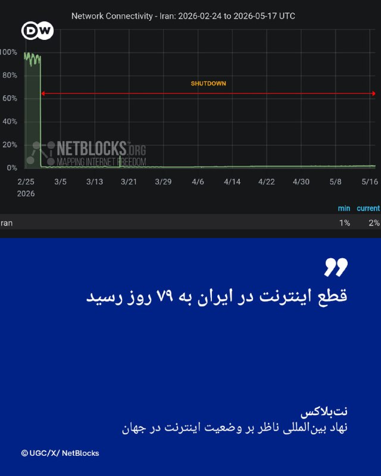

🔶 نت‌بلاکس: قطع اینترنت در ایران به ۷۹ روز رسید

نت‌بلاکس، نهاد بین‌المللی ناظر بر وضعیت اینترنت در جهان، یکشنبه ۱۷ مه (۲۷ اردیبهشت) در تازه‌ترین به‌روزرسانی خود اعلام کرد، ایران در سال ۲۰۲۶ یکی از طولانی‌ترین دوره‌های قطع اینترنت را تجربه کرده است.

بر اساس داده‌های منتشرشده از سوی نت‌بلاکس در شبکه اجتماعی "ایکس" قطع اینترنت در ایران اکنون وارد هفته دوازدهم شده و ۷۹ روز ادامه داشته است.

این نهاد ناظر بر وضعیت دسترسی به اینترنت در جهان اعلام کرده است که این نوع خاموشی گسترده اینترنت شکل مشارکت مدنی در ایران را دگرگون کرده و کنترل جریان اطلاعات، شهروندان را به "تماشاگرانی در کشور خود" تبدیل کرده است.

علاوه بر آن قطع اینترنت به‌شدت بر معیشت، کسب‌وکار و اشتغال مردم تاثیر گذاشته است.

سرکوب اعتراضات مردمی در ایران همواره با خاموشی اینترنت همراه بوده است اما در هیچ برهه‌ای طولانی شدن خاموشی دیجیتال تا این حد گزارش نشده بود.
@dw_farsi

## DW_Farsi — post 124800

🔶 از سانسور تا چوبه‌دار؛ حکومت ایران با نویسندگان چه می‌کند؟

🔻گزارشی از آتفه چهارمحالیان

میدان سرکوب حکومت‌های تمامیت‌خواه فقط خیابان نیست؛ آن‌ها کلمات، هنر و فرهنگ مستقل را تهدیدی علیه مشروعیت و بقای خود می‌دانند. جمهوری اسلامی، دهه‌هاست مشغول ساختن زندان برای آثار و پدیدآورندگان است. از تصفیه دانشگاه‌ها در انقلاب فرهنگی و تأسیس وزارت فرهنگ و ارشاد اسلامی و شورای عالی انقلاب فرهنگی تا قتل‌های زنجیره‌ای نویسندگان، توقیف روزنامه‌ها، کتاب‌ها، آوازها و فیلم‌ها، ممنوع‌الکاری، ممنوع‌الخروجی و تحمیل مرگ در زندان؛ تلاشی مداوم برای انقیاد بیان و کنترل ذهن جمعی جامعه ایران.

در روزهای اخیر تأیید دوباره حکم اعدام پیمان فرح‌آور، شاعر و ترانه‌سرا، در شعبه ۳۹ دیوان عالی کشور، این روند را وارد مرحله‌ای عریان‌تر کرده است؛ نبردی که در آن متن تا پای چوبه‌دار تحت تعقیب است. به گفته نزدیکان فرح‌آور، اتهام‌های "بغی" و "محاربه" در این پرونده به ترانه‌ها و فعالیت‌های اجتماعی و کنشگرانه او گره خورده است.

پرونده‌های یوسف انصاری و علی اسدالهی، دو عضو کانون نویسندگان ایران، همچنان در جریان است. انصاری، داستان‌نویس، در مراسم سالگرد بکتاش آبتین (شاعر و فیلم‌ساز جان سپرده در اثر محرومیت درمانی در زندان) بازداشت شد و ماه‌هاست زیر فشار امنیتی و قضایی قرار دارد. اسدالهی، شاعر نیز پس از یورش مأموران امنیتی به خانه‌اش و بازداشت همراه با ضرب‌وشتم، با قرار وثیقه آزاد شده و در انتظار حکم دادگاه است. این در حالی است که به دلیل بیش از دو ماه قطعی اینترنت، از وضعیت بسیاری از نویسندگان و هنرمندانی که در جریان وقایع دی‌ماه و پس از آن بازداشت یا احضار شده‌اند، خبری در دست نیست.
@dw_farsi

## DW_Farsi — post 124799

🔶 مدیر کافه‌های زنجیره‌ای "ساعدی‌نیا" در قم دادگاهی شد

جلسه رسیدگی به اتهامات صادق ساعدی‌نیا، مدیرعامل "شرکت صنعت غذایی" و مدیر "کافه‌های زنجیره‌ای ساعدی‌نیا" روز یکشنبه ۲۷ اردیبهشت (۱۷ مه) در دادگاه انقلاب قم برگزار شد.

رسانه‌های وابسته به سپاه پاسداران با انتشار تصاویری از جریان دادگاه نوشتند که او یکی از متهمان پرونده موسوم به "کودتای آمریکایی-صهیونیستی دی‌ماه ۱۴۰۴" است.

درباره جزئیات این پرونده توضیح بیشتری ارائه نشده است.

دی‌ماه ۱۴۰۴ یکی از خونبارترین ماه‌ها در تاریخ ۴۷ ساله جمهوری اسلامی به شمار می‌رود. در جریان اعتراضات سراسری و گسترده تنها در روزهای ۱۷ د ۱۸ این ماه، به گفته نهادهای حقوق بشری، هزاران معترض توسط نیروهای امنیتی کشته شدند.

به گزارش ایسنا، ساعدی‌نیا در جلسه دادگاه در دفاع از خود گفت: «در آن زمان ما را تهدید می‌کردند که چرا تعطیل نمی‌کنید؟ در دایرکت هجمه و فشار روی ما بود.»

او همچنین اظهار کرد که در آن مقطع "بلاتکلیف" بوده و پس از انتشار استوری درباره تعطیلی، سه ساعت بعد آن را حذف کرده و "از ترس" تلفن همراهش را خاموش کرده است.

ساعدی‌نیا همچنین گفته هیچ‌یک از کارکنان خود را برای شرکت در اعتراضات ترغیب نکرده است. او افزود از کرده خود "پشیمان" است و از دادگاه می‌خواهد فرصتی برای جبران به او داده شود.

محمد ساعدی‌نیا، مدیر و مالک مجموعه کافه‌های "ساعدی نیا" است که به تولید و فروش سوهان قم مشهور است. او در اولین روزهای اعتراضات دی ماه گفت که برای حمایت، به اعتصاب بازاریان می‌پیوندد.

در شرایط کنونی، جمهوری اسلامی از ابزارهای اداری، قضایی و رسانه‌ای برای خاموش کردن صدای منتقدان استفاده می‌کند.

به گفته بسیاری از نهادها و منابع مستقل حقوق بشری، بازداشت‌شدگان در ایران اغلب از دسترسی به وکیل مستقل و روند دادرسی شفاف و عادلانه محروم هستند و برخی از آنان تحت فشارهای روحی و جسمی وادار به اعتراف می‌شوند.
@dw_farsi

## DW_Farsi — post 124798

🎥 سردمدار شبکه قطارهای شبانه اروپا؛ اتریش چگونه از غول‌ها سبقت گرفت؟

در حالی که بیشتر کشورهای اروپا شبکه قطارهای شبانه خود را محدود کردند، یک کشور برعکس عمل کرد و به دارنده بزرگ‌ترین شبکه ریلی شبانه در قاره سبز تبدیل شد. چهار دلیل موفقیت این کشور را در این ویدیو ببینید.
@dw_farsi

## DW_Farsi — post 124797

  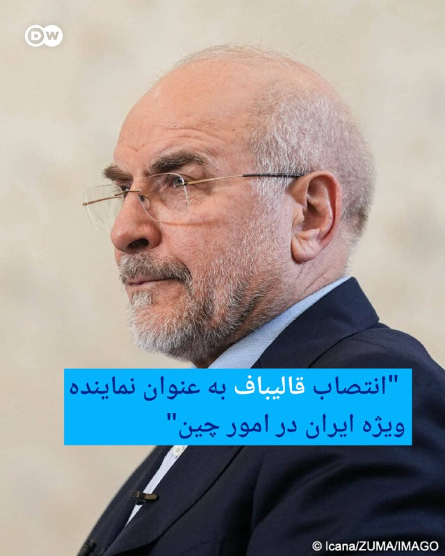

🔶 "انتصاب قالیباف به عنوان نماینده ویژه ایران در امور چین"

رسانه‌های داخلی ایران روز یکشنبه ۲۷ اردیبهشت گزارش دادند که محمدباقر قالیباف به عنوان "نماینده ویژه جمهوری اسلامی ایران در امور چین" منصوب شده است.

خبرگزاری تسنیم، وابسته به سپاه پاسداران نیز در گزارشی نوشت این انتصاب "با پیشنهاد رئیس‌جمهور و تایید رهبر جمهوری اسلامی" انجام شده است. به نوشته این خبرگزاری، عبدالرضا رحمانی‌فضلی پیش‌تر به عنوان "نماینده رئیس‌جمهور در امور چین" فعالیت می‌کرد و علی لاریجانی نیز پیشتر "نماینده ویژه رهبر جمهوری اسلامی در امور چین" بود.

با این حال، جزئیات روشنی درباره حدود اختیارات، ساختار حقوقی یا ضرورت ادامه فعالیت چنین سمتی منتشر نشده است. مشخص نیست جمهوری اسلامی در شرایطی که وزارت خارجه و سفارت ایران در پکن مسئول رسمی روابط دوجانبه با چین هستند، چه نیازی به تعیین یک "نماینده ویژه" جداگانه در امور چین دارد.
@dw_farsi

## DW_Farsi — post 124796

🔶 جنگ ایران، چالشی برای دیپلماسی چندجانبه‌گرای هند

هند مدت‌ها به انجام کاری افتخار می‌کرد که تنها شمار اندکی از قدرت‌های بزرگ قادر به انجام آن بودند. این کشور از ایران نفت خرید، روابط دفاعی با اسرائیل برقرار کرد، مناسبات خود با آمریکا را گسترش داد و همزمان روابط اقتصادی با پادشاهی‌های حوزه خلیج فارس را توسعه بخشید، در حالی که همواره تأکید می‌کرد وارد بلوک‌بندی‌های منطقه‌ای یا ائتلاف‌های رسمی نخواهد شد.

اما جنگ آمریکا و اسرائیل علیه ایران، اکنون این فرمول را به مرز نهایی‌اش رسانده است. به نظر می‌رسد نارندرا مودی، نخست‌وزیر هند، نیز فشارها را احساس می‌کند. او از روز جمعه گذشته ۱۵ مه (۲۵ اردیبهشت) سفر هفت‌روزه دیپلماتیکی را آغاز کرد که شامل بازدید از امارات متحده عربی و چهار کشور اروپایی است.
@dw_farsi

## DW_Farsi — post 124795

🔶 مصادره اموال شهروندان منتقد توسط جمهوری اسلامی ادامه دارد

کاظم موسوی، رئیس کل دادگستری استان قم از توقیف سه واحد آپارتمان متعلق به مهدی نصیری، سردبیر اسبق روزنامه کیهان و فعال سیاسی کنونی و وابستگانش خبر داد.

به گفته مقام‌های قضایی، این اقدام با گزارش "اطلاعات سپاه" و در چارچوب پرونده‌ای با اتهاماتی از جمله "همکاری با رسانه‌های معاند"، "حمایت از حمله آمریکا و اسرائیل" و "تشویق به براندازی" انجام شده است.

دادگستری قم اعلام کرد این اموال با دستور قضایی توقیف شده و پرونده در حال رسیدگی است. مقام‌های قضایی همچنین تاکید کردند که روند شناسایی و توقیف دارایی‌های افراد متهم به همکاری با "دشمنان" ادامه خواهد داشت.

ناصر عتباتی، رئیس کل دادگستری آذربایجان غربی هم از صدور دستور توقیف اموال ۱۲۹ نفر از افراد مرتبط با "اقدامات ضدامنیتی" و همکاری با کشورهای متخاصم خبر داد.

ناصر عتباتی گفت این اقدام در راستای افزایش هزینه "اقدامات دشمن" و با هدف "تقویت امنیت کشور" انجام شده است.

این مقام قضایی توضیحی درباره چگونگی تاثیر مصادره اموال شهروندان منتقد بر "تقویت امنیت" ارائه نکرده است.

غلامحسین محسنی اژه‌ای، رئیس قوه قضاییه جمهوری اسلامی، اخیرا خواستار "تسریع در صدور احکام اعدام و مصادره اموال" شده بود.

مصادره گسترده اموال را می‌توان بخشی از سیاست راهبردی سرکوب صداهای منتقد و معترض دانست.
@dw_farsi

## Persian_Trend_Official — post 14340

  <a href="telegram/content/Persian_Trend_Official_14340_1779032926.webm" target="_blank">🎬 Download video</a>

🚨 شبکه 13 اسرائیل:
بنیامین نتانیاهو از دقایقی پیش در تماس تلفنی ویژه با دونالد ترامپ درباره تحولات اخیر منطقه و درگیری‌های مرتبط با ایران و گروه‌های وابسته به آن در حال گفت‌وگوست.

☆Phantom☆

📌 @persian_trend_official
پرشین ترند | متفاوت‌ترین کانال نظامی

## Persian_Trend_Official — post 14339

  

🔴دفاع عضو شورای عالی فضای مجازی از فیلترینگ، پایان گمنامی و اینترنت طبقاتی / «در صورت خروج از شرایط جنگی، واتس‌اپ باز می‌شود»

🔹 رسول جلیلی، عضو شورای عالی فضای مجازی، از ادامه محدودیت پلتفرم‌های خارجی، پایان گمنامی کاربران و اینترنت طبقاتی دفاع کرد؛ طرح‌هایی که ظاهراً قرار است اینترنت را از همیشه «کنترل‌شده‌تر» کنند.

🔹 او با اشاره به شرایط امنیتی اخیر گفت بعد از این اتفاقات نمی‌توان دوباره به سمت بازگشایی کامل سکوهای خارجی رفت و مدعی شد برخی سیاسیون در سال‌های گذشته مانع فیلترینگ کامل شده‌اند.

🔹 جلیلی همچنین ادعای فروش VPN توسط نهادهای حاکمیتی را رد کرد و گفت نیاز اصلی مردم فقط خدمات ارتباطی است؛ خدماتی که به گفته او در پیام‌رسان‌های داخلی هم وجود دارد، هرچند بسیاری از کاربران و کسب‌وکارها هنوز ترجیح می‌دهند جایی فعالیت کنند که مخاطب واقعی حضور دارد.

🔹 عضو شورای عالی فضای مجازی در ادامه اعلام کرد در صورت خروج کشور از شرایط جنگی، امکان بازگشایی دوباره واتس‌اپ وجود دارد.

🔹 او در پایان از پایان «گمنامی» کاربران و اینترنت طبقاتی دفاع کرد؛ موضوعی که همچنان با انتقادهای گسترده‌ای روبه‌روست.

☆Phantom☆

📌 @persian_trend_official
پرشین ترند | متفاوت‌ترین کانال نظامی

## Persian_Trend_Official — post 14338

افزایش ساعت معاملات سهام در روزهای ۲۹ و ۳۰ اردیبهشت ۱۴۰۵ مدیر نظارت بر بورس‌های سازمان بورس و اوراق بهادار اعلام کرد: 💢به منظور مدیریت بازگشایی نماد شرکت‌های با افشای اطلاعات با اهمیت نوع «الف» و شرکت‌هایی که مجامع خود را در دوره توقف بازار سهام برگزار کرده‌اند،…

## Persian_Trend_Official — post 14337

افزایش ساعت معاملات سهام در روزهای ۲۹ و ۳۰ اردیبهشت ۱۴۰۵

مدیر نظارت بر بورس‌های سازمان بورس و اوراق بهادار اعلام کرد:

💢به منظور مدیریت بازگشایی نماد شرکت‌های با افشای اطلاعات با اهمیت نوع «الف» و شرکت‌هایی که مجامع خود را در دوره توقف بازار سهام برگزار کرده‌اند، یک ساعت به زمان معاملات سهام و ابزارهای مرتبط با سهام در بورس تهران و فرابورس ایران اضافه می‌شود.

💢بر این اساس، معاملات در روزهای سه‌شنبه و چهارشنبه ۲۹ و ۳۰ اردیبهشت تا ساعت ۱۳:۳۰ ادامه خواهد داشت.

🫆:Tony

📌 @persian_trend_official
پرشین ترند | متفاوت‌ترین کانال نظامی

## Persian_Trend_Official — post 14336

  

🔴 نیویورک‌تایمز: اسرائیل دو پایگاه مخفی در بیابان عراق اداره کرده است

💢روزنامه نیویورک‌تایمز مدعی شد اسرائیل طی بیش از یک سال گذشته به‌صورت متناوب دو پایگاه مخفی در بیابان‌های عراق را اداره کرده است.

بر اساس این گزارش:

▪️ برنامه‌ریزی این پایگاه‌ها از اواخر سال ۲۰۲۴ آغاز شده بود
▪️ هدف از ایجاد آن‌ها پشتیبانی از عملیات علیه ایران عنوان شده است
▪️ این پایگاه‌ها به‌صورت محرمانه مورد استفاده قرار می‌گرفتند

نیویورک‌تایمز همچنین مدعی شد:

▪️ آمریکا از ارتش عراق خواسته بود سامانه‌های راداری خود را غیرفعال کند
▪️ هدف از این اقدام جلوگیری از شناسایی حضور اسرائیل در خاک عراق بوده است

💢تاکنون بغداد، واشینگتن و تل‌آویو واکنش رسمی به این ادعاها نشان نداده‌اند.

🫆:Tony

📌 @persian_trend_official
پرشین ترند | متفاوت‌ترین کانال نظامی

## Persian_Trend_Official — post 14335

  <a href="telegram/content/Persian_Trend_Official_14335_1779032929.mp4" target="_blank">🎬 Download video</a>

🔴تصادف‌ زنجیره‌ای در جاده انار - یزد ۲ کشته و ۱۰ مصدوم برجا گذاشت

💢اورژانس شهرستان انار استان کرمان اعلام کرد که یک تصادف زنجیره‌ای امروز(یکشنبه) در جاده انار کرمان یزد پس از شرایط نامساعد جوی و توفان شن، ۲ کشته و ۱۰ مصدوم برجای گذاشت و یک تریلر هم در آتش سوخت.

🫆:Tony

📌 @persian_trend_official
پرشین ترند | متفاوت‌ترین کانال نظامی

## Persian_Trend_Official — post 14334

  

🔴ولی الله بیاتی نماینده مجلس:

💢در صورت اشغال شدن یکی از جزایر خود، کشور امارات را اشغال خواهیم کرد

🫆:Tony

📌 @persian_trend_official
پرشین ترند | متفاوت‌ترین کانال نظامی

## Persian_Trend_Official — post 14333

💢 آکسیوس: ایالات متحده نسبت به تهدید پهپادهای نظامی از سوی کوبا هشدار داده است

🔹طبق گزارش‌ آکسیوس، کوبا بیش از ۳۰۰ پهپاد نظامی به‌دست آورده و بحث‌هایی را درباره برنامه‌هایی برای حمله به پایگاه نظامی آمریکا در خلیج گوانتانامو و ناوهای نظامی این کشور آغاز کرده است.

🫆:Tony

📌 @persian_trend_official
پرشین ترند | متفاوت‌ترین کانال نظامی

## Persian_Trend_Official — post 14332

https://youtu.be/8YQ1YcLyw6E

## Persian_Trend_Official — post 14331

کانال رسمی پرشین ترند pinned «https://youtu.be/8YQ1YcLyw6E»

## Persian_Trend_Official — post 14330

💢گویا بیانیه وزارت دفاع امارات در مورد حمله پهپادی مربوط به انفجار در نیروگاه هسته ای براکه هستش و منابع عربی به اشتباه حمله دیگری را گزارش داده اند

## Persian_Trend_Official — post 14329

https://youtu.be/8YQ1YcLyw6E

## Persian_Trend_Official — post 14327

🔴 وزارت دفاع امارات: هدف حمله ۳ پهپاد قرار گرفتیم وزارت دفاع امارات اعلام کرد این کشور هدف حمله سه پهپاد قرار گرفته است. ▪️ به گفته منابع عربی پهپادها از سمت مرزهای غربی وارد حریم امارات شده‌اند 🫆:Tony 📌 @persian_trend_official پرشین ترند | متفاوت‌ترین…

## Persian_Trend_Official — post 14325

🔴 وزارت دفاع امارات: هدف حمله ۳ پهپاد قرار گرفتیم

وزارت دفاع امارات اعلام کرد این کشور هدف حمله سه پهپاد قرار گرفته است.

▪️ به گفته منابع عربی پهپادها از سمت مرزهای غربی وارد حریم امارات شده‌اند

🫆:Tony

📌 @persian_trend_official
پرشین ترند | متفاوت‌ترین کانال نظامی

## Persian_Trend_Official — post 14324

  

🔴اسرائیل یکی از فرماندهان حماس را ترور کرد

💢ارتش رژیم اسرائیل مدعی شد «بهاء بارود»، فرمانده اداره عملیات جنبش حماس را دیروز (شنبه) هدف قرار داده است.

🫆:Tony

📌 @persian_trend_official
پرشین ترند | متفاوت‌ترین کانال نظامی

## RadioFarda — post 157291

رئیس مجلس نمایندگان آمریکا: جنگ ایران تمام شده؛ پروژه جدید ما باز کردن تنگه هرمز است

🔸مایک جانسون، رئیس مجلس نمایندگان آمریکا، روز یکشنبه گفت عملیات «خشم حماسی» این کشور علیه ایران به پایان رسیده و دستور کار جدید واشینگتن باز کردن تنگه هرمز است.

🔸او در گفت‌وگو با شبکه فاکس‌نیوز درباره تلاش حزب دموکرات در استفاده از قانون «اختیارات جنگی» برای آن که دولت دونالد ترامپ از کنگره برای جنگ با ایران مجوز بگیرد، اعلام کرد: «الان زمان مطرح کردن قانون اختیارات جنگی نیست. اعلام شده که عملیات «خشم حماسی» به پایان رسیده، و همین‌طور هم هست. حالا وارد پروژه جدیدی شده‌ایم و آن بازگشایی تنگه هرمز است.»

🔸پنتاگون حملات آمریکا که از روز نهم اسفند سال گذشته به ایران آغاز شد را «خشم حماسی» نامیده بود اما رئیس‌جمهور و دیگر مقام‌های دولت آمریکا گفته‌اند این عملیات تمام شده و لازم نیست بعد از ۶۰ روز از کنگره آمریکا مجوز ادامه دادن آن را اخذ کنند.

🔸تلاش چندباره دموکرات‌ها برای محدود کردن دولت ترامپ در مجلس سنا نیز هر بار شکست خورده است.

🔸دونالد ترامپ، رئیس‌جمهور آمریکا، روز ۱۴ اردیبهشت عملیات «پروژه آزادی» را به منظور خارج کردن کشتی‌های گرفتار در تنگه هرمز آغاز کرد اما بعد از دو روز آن را به منظور ادامه مذاکرات با ایران متوقف کرد.

🔸رئیس مجلس نمایندگان آمریکا روز یکشنبه همچنین گفت باز کردن تنگه هرمز از مسیر «دیپلماسی و مذاکره» پیش می‌رود و درگیری نظامی رخ نداده است.

🔸او افزود که باید به دولت دونالد ترامپ زمان داد تا راه‌حلی برای این موضوع پیدا کند.

@Radiofarda

## RadioFarda — post 157290

وزیر کشور پاکستان با پزشکیان و قالیباف دیدار کرد

🔸رسانه‌های ایران خبر دادند که وزیر کشور پاکستان که برای دیداری اعلام‌نشده وارد تهران شده بود، روز یکشنبه با رئیس‌جمهور و رئیس مجلس ایران دیدار کرده است.

🔸پیش‌تر اعلام شده بود که محسن نقوی روز شنبه وارد تهران شده و با همتای ایرانی خود درباره «ازسرگیری مذاکرات» میان ایران و آمریکا گفت‌وگو کرده است.

🔸به گزارش رسانه‌های نزدیک به حکومت ایران، وزیر کشور پاکستان به مدت «۹۰ دقیقه» با مسعود پزشکیان، رئیس‌جمهور ایران دیدار و گفت‌‌وگو کرد.

🔸پزشکیان در این دیدار مدعی شد آمریکا و اسرائیل قصد داشتند «عناصر تروریستی مسلح از مناطق شمال‌غرب و جنوب‌شرق» را وارد ایران کنند، اما کشورهای همسایه ایران اجازه استفاده از «قلمرو» خود را ندادند.

🔸او گفت که از دولت‌های پاکستان، افغانستان و عراق به این دلیل که «اجازه ندادند از خاک آنان علیه جمهوری اسلامی ایران اقدامی صورت گیرد» تشکر می‌کند.

🔸محسن نقوی، وزیر کشور پاکستان، همچنین با محمدباقر قالیباف، رئیس مجلس شورای اسلامی، دیدار کرد.

🔸قالیباف در مذاکرات حضوری با ایالات متحده که بعد از برقراری آتش‌بس در اسلام‌آباد، پایتخت پاکستان، برگزار شد، رئیس هیئت نمایندگی ایران بود.

🔸از جزئیات دیدار وزیر پاکستانی با مذاکره‌کننده ارشد ایران در مذاکرات با آمریکا جزئیاتی منتشر نشده است.

@RadioFarda

## RadioFarda — post 157289

سازمان حقوق بشر ایران: «برخی از وکلای تسخیری» در تسریع صدور حکم اعدام برای معترضان دی‌ماه نقش دارند

🔸سازمان حقوق بشر ایران، مستقر در نروژ، می‌گوید بازداشت‌شدگان اعتراضات دی‌ماه گذشته دچار «محرومیت سیستماتیک» از دادرسی عادلانه شده‌اند و همچنین از نقش «برخی از وکلای تسخیری» در صدور احکام سنگین خبر داده است.

🔸این سازمان روز ۲۵ اردیبهشت در بیانیه‌ای اعلام کرد بر اساس اطلاعاتی که گردآوری کرده است، قوه قضائیه جمهوری اسلامی علاوه بر ایجاد مماتعت متهمان برای دسترسی به وکیل مستقل در مراحل مقدماتی، حتی تا پس از تأیید رسمی احکام در دیوان عالی کشور نیز از این دسترسی جلوگیری می‌کند.

🔸سازمان حقوق بشر ایران همچنین می‌گوید درباره پرونده‌های معترضان محکوم به اعدام مدارکی را رویت کرده‌ است که تأیید می‌کنند «برخی وکلای تسخیری تنها یک یا چند روز پس از صدور حکم، اقدام به ثبت تجدیدنظرخواهی‌های صوری می‌کنند».

🔸این سازمان در ادامه توضیح داده است: «در چنین مواردی، دیوان‌عالی کشور اغلب با سرعت قابل‌توجهی حکم اعدام را تأیید می‌کند و اجرای حکم بلافاصله پس‌از آن امکان‌پذیر می‌شود.»

🔸این در حالی است که طبق قوانین جمهوری اسلامی، متهمان پس از صدور حکم اعدام، مهلت قانونی ۲۰ روزه برای تجدیدنظرخواهی دارند.

@RadioFarda

## IranianMinds — post 20281

  <a href="telegram/content/IranianMinds_20281_1779032933.mp4" target="_blank">🎬 Download video</a>

🔴 صحبتای پارسا تاجیک، یکی از مهندسین برنامه ایکس ( توییتر ) ، در مورد تغییر پرچم ایران به پرچم شیر و خورشید تو ایکس:

هرسال خیلیا درخواست این کارو میکردن حتی از سال 2014 هم مطرح بود این قضیه و دوباره امسال ایده‌ش رو دادم ولی باید ایلان ماسک تایید میکرد.
بعد از چند روز حدود 48 ساعت اینترنت قطع شد [داخل ایران] و من به ایلان ماسک گفتم این برخلاف آزادیه و اونم یکم فکرکرد و اوکی رو داد و بعد از یه هفته این تغییر اجرا شد.
تا وقتی ما هستیم کسی قرار نیست پرچم شیروخورشید رو عوض‌کنه.

@IranianMinds

## IranianMinds — post 20280

  <a href="telegram/content/IranianMinds_20280_1779032935.webm" target="_blank">🎬 Download video</a>

🎉 ۵۰۰٬۰۰۰ تومان رایگان-بونوس ویژه ثبت‌نام

🔥 با هر ثبت نام 
🅰️
🅰️
🅰️ هزار تومن جایزه بگیرید

⬅️ شرط‌بندی کنید و بونوس را به موجودی واقعی تبدیل کنید

🔥 وقتشه بازی رو یه جور دیگه ببینی
⚽️  پوشش کامل مسابقات ورزشی 

📊  پیش‌بینی با بهترین ضرایب 

⚡️  تجربه سریع و حرفه‌ای

😀 پرداخت مستقیم و سریع بدون واسطه، بدون دردسر، واریز و برداشت در سریع‌ترین زمان ممکن 

😀 کانال تلگرام: 

🔴 @winro_io  

😀 هدیه خود را با ثبت نام در سایت دریافت کنید: 

🔴 Winro.io
G27
سایت اصلی در روزهای آینده بازگشایی خواهد شد 
✅

## IranianMinds — post 20279

  

🔴 تا چند سال پيش با ٣٠ ميليون تومان مي تونستيم ماشين بخريم حالا يه سه چرخه براي نوزاد

@IranianMinds

## IranianMinds — post 20278

🔴 دو مقام اطلاعاتی منطقه به فاکس نیوز:

ارزیابی غالب در داخل ایران این است که پرزیدنت ترامپ ممکن است به از سرگیری اقدام نظامی متوسل شود و تهران اکنون عمداً استراتژی «فریب و تأخیر» را دنبال می‌کند با این امید که خرید زمان هرگونه بازگشت احتمالی به جنگ را پیچیده کند.

@IranianMinds

## IranianMinds — post 20277

🔴 فوری

الجزیره :

یورش اسرائیل به شهر باریش و دیین در جنوب لبنان

@IranianMinds

## IranianMinds — post 20276

حاجی‌بابایی، نایب‌رییس مجلس:

اگه تاسیسات نفت ما رو بزنن، نفت دوست و دشمن در منطقه رو میزنیم.

@IranianMinds

## IranianMinds — post 20275

  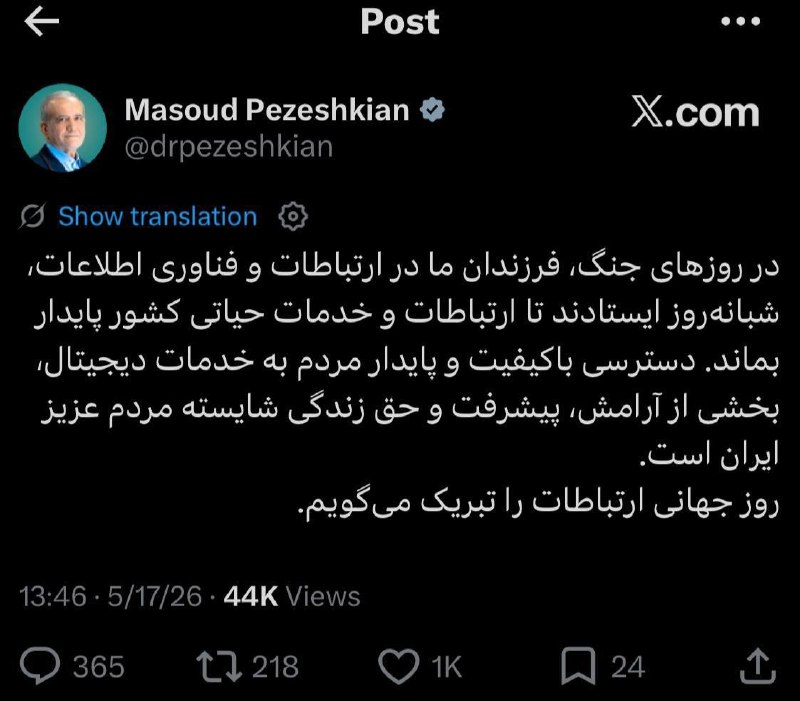

🔴در حالی‌که اینترنت بین‌الملل ۷۹ روزه که در ایران قطع هست، پزشکیان این توییت رو زده:
روز جهانی ارتباطات مبارک😂😂😂

@IranianMinds

## BBCPersian — post 281304

🔻امارات: تحقیقات برای یافتن منبع حمله پهپادی به نزدیکی نیروگاه هسته‌ای در جریان است

🔻وزارت دفاع امارات متحده عربی گفت که در حال تحقیق برای تعیین منبع حمله پهپادی امروز به نزدیکی نیروگاه هسته‌ای براکه است.

وزارت دفاع امارات گفت که با دو پهپاد «با موفقیت» مقابله کرده است اما پهپاد سوم به یک ژنراتور در نزدیکی نیروگاه برخورد کرده است.

این وزارتخانه بدون ارائه جزئیات بیشتر گفت این پهپادها از «مرز غربی» شلیک شده‌اند.

این حمله به آتش‌ گرفتن ژنراتور انجامید اما دفتر رسانه‌ای دولت ابوظبی گفت که آتش‌ کنترل شده و آسیبی به نیروگاه وارد نشده است.

آژانس بین‌المللی انرژی اتمی هم تایید کرد که سطح تشعشعات در اطراف این نیروگاه عادی است.

در جریان جنگ اخیر آمریکا و اسرائیل علیه ایران ، اصابت حداقل چهار پرتابه به نزدیکی نیروگاه هسته‌ای بوشهر به آژانس گزارش شد.

https://bbc.in/4dPpAnq
@BBCPersian

## BBCPersian — post 281303

  <a href="telegram/content/BBCPersian_281303_1779032937.mp4" target="_blank">🎬 Download video</a>

🔻یکی از مخاطبان بی‌بی‌سی در ویدیویی از افزایش دو برابری قیمت داروهایش نسبت به سال ۱۴۰۴ گلایه می‌‌کند. به گفته او، در حالی که حقوقش ۹ میلیون تومان است، مجبور است سه میلیون تومان دارو بخرد.

ایرنا در گزارشی درباره وضعیت داروها، کمبودهای حاضر را حاصل «کمبود نقدینگی و فقدان تامین ارز» در سال گذشته عنوان کرده است.

بنابر گزارش خبرگزاری دولت ایران، ناهماهنگی بین وزارت بهداشت و بیمه‌ها برای اعلام افزایش قیمت داروها به بیمه‌های پایه، یکی از دلایل فشار اقتصادی به بیماران است که موجب شده سهم بیمه از قیمت قبلی پرداخت شود و مابه‌التفاوت قیمت جدید و قدیم به عهده بیمار باشد.

اگر تجربه و مشاهده‌ای از جهش قیمت دارو و یا کمبود آن دارید، با هشتگ #دارو برای ما بفرستیدبه:
آی‌مسج و واتس‌اپ: ۰۰۴۴۷۳۴۲۰۳۲۱۱۳
پیامگیر تلگرام:t.me/bbcshoma
پیامگیر تلفنی: ۰۰۴۴۳۳۰۱۲۳۰۲۱۰

@BBCPersian
https://bbc.in/4fqq1FV

## BBCPersian — post 281302

  

🔻با هجوم مردم برای خرید یک ساعت جدید و تولید محدود، شرکت سواچ ناچار شد فروشگاه‌هایش را در سراسر بریتانیا تعطیل کند.

صدها نفر مشتاق خرید یک ساعت جدید با تولید محدود، بیرون شعب فروشگاه سواچ صف کشیده بودند.

این شرکت سوئیسی اعلام کرد که «به دلیل ملاحظات ایمنی برای مشتریان و کارکنان خود» فروشگاه‌های خود را در لندن باز نخواهد کرد.

شعب این فروشگاه‌ در شهرهای بیرمنگام، کاردیف، گلاسکو، لیورپول، منچستر و شفیلد نیز همچنان بسته خواهند ماند.

این شرکت قرار بود ساعت جیبی جدید «رویال پاپ» خود را با همکاری شرکت اودمر پیگه در هشت مدل با قیمت تقریبی ۴۵۰ دلار عرضه کند.

اودمر پیگه، شرکتی است که به ساخت ساعت و جواهرات قیمتی شهرت دارد.

با بسته شدن فروشگاه‌ها، سواچ در حال حاضر این ساعت را به صورت آنلاین می‌فروشد.

در بازارهای آنلاین دیگر این ساعت تا قیمت بیش از ۲۱ هزار دلار برای فروش گذاشته است.

📷Swatch
https://bbc.in/3PM4VaH

@BBCPersian

## BBCPersian — post 281301

  

🔻محسن نقوی، وزیر کشور پاکستان، عصر امروز با محمدباقر قالیباف، رئیس مجلس ایران در تهران دیدار و گفت‌وگو کرد.

آقای قالیباف ریاست هیئت مذاکره کننده ایران در مذاکرات با آمریکا در پاکستان را بر عهده داشت.

پاکستان میانجی‌ کنونی ایران و آمریکاست.

رسانه‌های ایرانی و پاکستانی گزارش داده‌‌اند که آقای نقوی برای از سرگیری مذاکرات به ایران سفر کرده است.

گفته شده او حامل پیام‌ آمریکاست و پاسخ ایران را هم دریافت خواهد کرد.

به گفته سفارت پاکستان در تهران، آقای نقوی دیروز پس از ورود به تهران «نزدیک به سه ساعت در نهاد ریاست جمهوری حضور داشت» و اسکندر مومنی، وزیر کشور، و عباس عراقچی، وزیر امور خارجه نیز «در جریان این دیدار در نهاد ریاست جمهوری حضور داشتند.»

علاوه بر این، محسن نقوی «دیداری خصوصی» با مسعود پزشکیان داشت که «حدود ۹۰ دقیقه به طول انجامید و با حضور وزیر کشور ایران همراه بود.»

📷Mehr News
https://bbc.in/4uMNMMW

@BBCPersian

## BBCPersian — post 281300

  

‌🔻بهار صحرائیان، وکیل دادگستری و فعال حقوق بشر، صبح روز ۲۶ اردیبهشت هنگامی که برای دفاع از معترضان بازداشت‌شده در دادگاه انقلاب شیراز حاضر شده بود، بازداشت شده است.

یک منبع مطلع به بی‌بی‌سی گفت که خانم صحرائیان به زندان عادل‌آباد شیراز منتقل شده است.

بهار صحرائیان که عضو کانون وکلای استان فارس است، آبان ۱۴۰۱ هم بازداشت و مدتی در زندان بود که با حکم عفو آزاد شد.

این منبع مطلع گفت خانم صحرائیان پس از آزادی چند بار به اداره اطلاعات فراخوانده شد: «این وکیل دادگستری در حین انجام وظیفه حرفه‌ای و در فضای دادگاه صورت گرفته است سپس به دفتر کارش در شیراز برده شده و دفتر مورد تفتیش قرار گرفته و بعد از آن به بازداشتگاه منتقل شده است.»

بر اساس این گزارش، خانم صحرائیان صبح امروز، ۲۷ اردیبهشت به دادسرا منتقل شده و اتهامات «اجتماع و تبانی به قصد اقدام علیه امنیت ملی»، «فعالیت تبلیغی علیه نظام اسلامی» و «نشر اکاذیب» به او تفهیم شده است.

📷Handout
@BBCPersian

## BBCPersian — post 281299

  <a href="telegram/content/BBCPersian_281299_1779032942.mp4" target="_blank">🎬 Download video</a>

🔻سرخط خبرهای روز یکشنبه ۲۷ اردیبهشت ۱۴۰۵
@BBCPersian

## BBCPersian — post 281298

  

🔻جلسه دادگاه صادق ساعدی‌نیا، مدیر کافه‌های زنجیره‌ای ساعدی‌نیا که در اعتراضات سراسری دی ماه گذشته به همراه پدرش، محمدعلی ساعدی‌نیا بازداشت شد،‌ در دادگاه انقلاب قم برگزار شد.

کافه‌های ساعدی‌نیا از جمله کسب‌وکارهایی بود که در اعتراضات دی ماه پارسال که با اعتراض بازار به نابسامانی اقتصادی آغاز شد، مغازه‌هایشان را تعطیل کردند.

نماینده دادستان قم در این جلسه آقای ساعدی‌نیا را به «فعالیت تبلیغی یا رسانه‌ای برخلاف امنیت کشور»، «اقدام عملیاتی برای گروه‌های معاند نظام از طریق انتشار استوری و فعالیت مجازی و حضور در تجمعات غیرقانونی و تعطیل کردن کافه‌ها و مغازه‌های خود در کل کشور و تشویق تعدادی از کارکنانش در ارتکاب جرایم علیه امنیت کشور» متهم کرد.

به گفته نماینده دادستان و قاضی موارد اتهامی بر مبنای اطلاعاتی است که از محتوای لوازم الکترونیکی ضبط شده از آقای ساعدی‌نیا و از جمله تصاویر و چت‌های او در واتساپ استخراج شده است.

نماینده دادستان گفت که آقای ساعدی‌نیا در واتساپ خود «برنامه ریزی برای تعطیلی کافه‌ها را همزمان با صدور فراخوان دشمن به مشورت گذاشته بود.»

لینک خبر:
📷MIZAN
https://bbc.in/3PnkDsQ

@BBCPersian

## BBCPersian — post 281297

  

🔻مقام‌های ابوظبی می‌گویند آتش‌سوزی ناشی از حمله یک پهپاد به یک ژنراتور برق در بیرون محدوده نیروگاه هسته‌ای براکه کنترل شده است.

دفتر رسانه‌ای ابوظبی گفت در این حادثه کسی آسیب ندیده است و سطح ایمنی پرتوهای رادیواکتیو نیز تغییری نکرده است.

سازمان تنظیم مقررات هسته‌ای امارات هم با تایید این خبر اعلام کرد که نیروگاه به کار عادی خود ادامه می‌دهد.

نیروگاه هسته‌ای براکه در منطقه ظفره امارات اولین نیروگاه هسته‌ای در جهان عرب است و از چهار رآکتور تشکیل شده است.

در بیانیه‌های امارات اشاره‌ای به مسئول احتمالی حملات نشده است.

ایران امارات را در حملات آمریکا و اسرائیل شریک فعال می‌داند.

آژانس بین‌المللی انرژی اتمی از حمله پهپادی به نزدیکی نیروگاه هسته‌ای امارات به‌شدت ابراز نگرانی کرد.

این حمله به آتش‌سوزی در این نیروگاه انجامید اما دفتر رسانه‌ای دولت ابوظبی گفت که آتش‌سوزی کنترل شده و آسیبی به نیروگاه وارد نشده است.

آژانس بین‌المللی انرژی اتمی هم تایید کرد که سطح تشعشعات در اطراف این نیروگاه عادی است.

📸MOHAMEDBINZAYED
https://bbc.in/4wBBjNT
@BBCPersian

## BBCPersian — post 281296

🔻نتانیاهو می‌گوید امروز با ترامپ تلفنی گفت‌وگو می‌کند

🔻نخست‌وزیر اسرائیل گفت امروز با دونالد ترامپ درباره ایران تلفنی گفت‌وگو می‌کند.

بنیامین نتانیاهو امروز در نشست ویژه دولت اسرائیل به مناسبت بزرگداشت روز بیت‌المقدس گفت:

«چشمان ما درباره ایران کاملا باز است. من امروز هم با دوستمان رئیس‌جمهور ترامپ صحبت می‌کنم همانطور که هر چند روز یک بار این کار را می‌کنم. حتما از تاثیر سفر او به چین خواهم شنید و شاید موضوعات دیگر. احتمالات زیادی وجود دارد و ما برای هر سناریویی آماده هستیم.»

https://bbc.in/3RduMJ8
@BBCPersian

## idfinfarsi — post 11591

‼️برای رفع تهدید: نیروهای ارتش اسرائیل یک فرمانده در ستاد عملیات سازمان تروریستی حماس را که در پیشبرد طرح‌های تروریستی علیه نیروهای ما نقش داشت، به‌هلاکت رساندند.

نیروهای ارتش اسرائیل در فرماندهی جنوب، روز گذشته (شنبه) بها‌ء بارود، از فرماندهان ستاد عملیات شاخه نظامی سازمان تروریستی حماس را به‌هلاکت رساندند.

بارود در طول جنگ، و به‌ویژه در دوره اخیر، در برنامه‌ریزی و پیشبرد طرح‌های تروریستی متعددی از سوی سازمان تروریستی حماس علیه نیروهای ارتش اسرائیل در نوار غزه و شهروندان اسرائیل در کوتاه‌مدت نقش داشته است.

وی تهدیدی فوری برای نیروهای ارتش اسرائیل به شمار می‌رفت و در یک حمله دقیق هوایی به‌هلاکت رسید.

پیش از حمله، اقداماتی برای کاهش آسیب به غیرنظامیان انجام شد، از جمله استفاده از مهمات دقیق و دیدبانی‌های هوایی.

نیروهای ارتش اسرائیل در فرماندهی جنوب، مطابق با توافق، در منطقه مستقر هستند و به اقدام برای رفع هرگونه تهدید فوری ادامه خواهند داد.

## Dirty_Kids — post 389620

  <a href="telegram/content/Dirty_Kids_389620_1779032946.mp4" target="_blank">🎬 Download video</a>

بابای حرومزاده گلشیفته فراهانی جنده به این مردم که اینجوری با دستای خالی جلوی گلوله مقاومت کردن میگه بیضه ندارید!

جناب فراهانی خارکصده ما اتفاقا بیضه داریم، خوبشم داریم. ما بیضه رو داریم ولی شما و دخترتون بیضه رو لیس می‌زنید. شما مال آخوند رو می‌لیسید و دخترتون بیضه‌های مکرون رو قورت می‌ده!

@Dirty_Kids 👻

## Dirty_Kids — post 389619

مجتبی: آقا من واقعا حوصله‌ام سر رفته، چه غلطی بکنیم؟
مسعود رجوی: تو کلا دو ماهه اومدی، من و این موسی صدر بدبخت چی بگیم که چندین ساله اینجاییم؟

امام زمان (عج): سه‌تاتون خفه بشین!!!

@Dirty_Kids 👻

## Dirty_Kids — post 389618

رژیم آخوندها اگر توانش را داشتند، اکسیژن را روی مردم ایران می بستند و به نیروهای خودی «اکسیژن پرو» می‌دادند.

@Dirty_Kids 👻

## Dirty_Kids — post 389617

‏به عنوان یه روانشناس می‌تونم بگم که، آدم‌ها معمولاً خشم‌شون رو سر کسانی که واقعاً مستحق اون هستن خالی نمی‌کنن، بلکه روی کسانی خالی می‌کنن که مطمئنن دوست‌شون دارن و در نهایت اون‌ها رو می‌بخشن.

@Dirty_Kids 👻

## Dirty_Kids — post 389616

‏از جمله [بذار تکلیف جنگ معلوم شه، بعد] حامله ام.

@Dirty_Kids 👻

## Dirty_Kids — post 389615

قبلا کس گاو برای خودش شخصیتی داشت، الان شده چند گیگ اینترنت و چند دقیقه ریلز دیدن تو اینستا

@Dirty_Kids 👻

## Dirty_Kids — post 389614

  <a href="telegram/content/Dirty_Kids_389614_1779032949.mp4" target="_blank">🎬 Download video</a>

حامی تروریسم دیروز وسط گهخوریش توسط پلیس شریف فرانکفورت بدرقه شد 😁

@Dirty_Kids 👻

## Dirty_Kids — post 389613

مَکرون دخترتو میگاد، جفتکتو به پهلوی میزنی.

@Dirty_Kids 👻

## Dirty_Kids — post 389612

بهزاد فراهانی، این کفتار پیرِ به بچه‌های ۱۷-۱۸ ساله که دست خالی می‌رن جلوی دوشکا:
«اگه بیضه دارید بیاید انقلاب کنید!»

تو که ۴۷ سال برای چهار تا نقش‌‌تخمی‌بیضه‌مالی آخوند رو کردی میدونی که‌‌ اگه محمدرضا شاه فقید فقط یک صدم جنایاتی که آخوندای عزیزت کردن رو کرده بود، حجم بیضه‌های تو و رفقات هم مشخص می‌شد

حروم‌زاده!

@Dirty_Kids 👻

## Dirty_Kids — post 389611

‏قذافی وقتی می‌خواسته زنش رو لوس کنه لیبی به لاباش می‌ذاشته.

@Dirty_Kids 👻

## Dirty_Kids — post 389610

  <a href="telegram/content/Dirty_Kids_389610_1779032951.mp4" target="_blank">🎬 Download video</a>

مرادویسی، تحلیلگر اینترنشنال:
آمریکا اگه جمهوری اسلامی رو سرنگون نکنه؛

روسیه با خودش میگه آمریکا حتی نتونست جمهوری‌اسلامی رو سرنگون کنه پس من اوکراین رو نابود میکنم وهمینطور علیه بقیه میرم جلو
چین هم با خودش میگه آمریکا نتونست جمهوری‌اسلامی رو سرنگون کنه پس منم تایوان رو نابود میکنم چون کاری از دست آمریکا برنمیاد
کره‌شمالی هم با خودش میگه آمریکا نتونست جمهوری‌اسلامی رو سرنگون کنه، پس منم میتونم با موشک به ژاپن و کره‌جنوبی حمله کنم و کاری از آمریکا برنمیاد.
و حتی مثل جمهوری‌اسلامی که تنگه هرمز رو نابود کرد منم میتونم تنگه کُره رو با موشک‌پراکنی ناامن کنم.
پس به این دلایل آمریکا مجبوره که جمهوری‌اسلامی رو سرنگون کنه.

+ خلاصش یعنی، هژمونی امریکا نابود میشه

@Dirty_Kids 👻

## Dirty_Kids — post 389609

  

بش از ۸۰ روز‌ از قطع اینترنت بین‌الملل تو ایران می‌گذره؛

پزشکیان اومد با سیم‌کارت سفید تو نرم افزاری که خودشون فیلترش کردن، یه توییت‌ زد و مدعی شد که؛ مسئولین وزارت ارتباطات تمام تلاششونو کردن تا مردم به اینترنت با کیفیت دسترسی داشته باشن و در‌آخر هم روز جهانی ارتباطات‌رو‌ تبریک گفت.

@Dirty_Kids 👻

## Hranews — post 112995

گزارش تکمیلی؛ ۲۳ کشته و مصدوم در واژگونی اتوبوس کارگران در عسلویه

❗️
❗️
❗️
❗️
❗️ – واژگونی اتوبوس حامل کارگران مجتمع گاز پارس جنوبی در محور عسلویه به سیراف، به مصدومیت ۱۵ #کارگر منجر شد. ساعاتی پیش، جان‌باختن هشت کارگر در این حادثه گزارش شده بود.

ادامه مطلب

↘️
@hranews_bot تماس ✉️ -  @Hranews  کانال هرانا 🆑

## Hranews — post 112994

  

حبیب مهری توسط دادگاه انقلاب تبریز به حبس محکوم شد

❗️
❗️
❗️
❗️
❗️ – حبیب مهری، شهروند ساکن تبریز توسط شعبه اول دادگاه انقلاب این شهرستان به شش ماه #حبس محکوم شده است.

به گزارش خبرگزاری هرانا، ارگان خبری مجموعه فعالان حقوق بشر در ایران، حبیب مهری به حبس محکوم شد.

شعبه اول دادگاه انقلاب تبریز، آقای مهری را از بابت اتهام تبلیغ علیه نظام به شش ماه حبس تعزیری محکوم کرده است.

ادامه مطلب

#حبیب_مهری

↘️
@hranews_bot تماس ✉️ -  @Hranews  کانال هرانا 🆑

## Hranews — post 112993

املاک مهدی نصیری و چند تن دیگر در قم توقیف شد

❗️
❗️
❗️
❗️
❗️ – رئیس کل دادگستری استان قم از #توقیف_املاک مهدی نصیری، شهروند ساکن خارج از کشور و چند تن دیگر خبر داد. وی این افراد را متهم به «همکاری با دشمن» دانسته است.

ادامه مطلب

#مهدی_نصیری

↘️
@hranews_bot تماس ✉️ -  @Hranews  کانال هرانا 🆑

## Hranews — post 112992

بازداشت دو معترض با ادعای «مشارکت در قتل پلیس»؛ پیشتر محمد عباسی در این پرونده اعدام شده بود

❗️
❗️
❗️
❗️
❗️– فرمانده انتظامی ملارد از #بازداشت دو شهروند در ارتباط با اعتراضات سراسری ۱۴۰۴ خبر داد و مدعی شد که این افراد در قتل یک افسر پلیس نقش داشته‌اند. این در حالی است که اخیرا محمد عباسی در ارتباط با همین پرونده #اعدام شده بود.

ادامه مطلب

#محمد_عباسی

↘️
@hranews_bot تماس ✉️ -  @Hranews  کانال هرانا 🆑

## Hranews — post 112991

بهار صحرائیان، وکیل دادگستری در شیراز بازداشت و تفهیم اتهام شد

❗️
❗️
❗️
❗️
❗️ – بهار صحرائیان، وکیل دادگستری روز گذشته در شیراز #بازداشت شد و امروز یکشنبه ۲۷ اردیبهشت ماه، جلسه بازپرسی وی در دادسرای این شهرستان برگزار شد.

ادامه مطلب

#بهار_صحرائیان

↘️
@hranews_bot تماس ✉️ -  @Hranews  کانال هرانا 🆑

## Hranews — post 112990

  

نائب رئیس کانون بازنشستگان تامین اجتماعی شیراز، نسبت به وضعیت این سازمان هشدار داد و اعلام کرد که در صورت تداوم روند کنونی، تامین اجتماعی با خطر جدی ورشکستگی مواجه خواهد شد. وی در گفت‌وگو با خبرگزاری ایلنا، ضمن اشاره به افزایش شدید هزینه‌ها و کاهش منابع درآمدی، این وضعیت را ناشی از رشد تعهدات، کاهش بیمه‌پردازی و شرایط اقتصادی دانست.

ناصر مصطفوی، با انتقاد از وضعیت خدمات درمانی، اعلام کرد که با وجود الزام قانونی، طرح درمان رایگان برای کارگران و بازنشستگان به‌طور کامل اجرا نشده و همزمان تعرفه‌های درمانی بدون کنترل در حال افزایش است. به گفته وی، این شرایط فشار مضاعفی بر بازنشستگان وارد کرده و در کنار مشکلاتی مانند تاخیر در صدور احکام حقوقی و بلاتکلیفی پروژه‌های درمانی، نارضایتی گسترده‌ای در میان این گروه‌ها ایجاد کرده است.

↘️
@hranews_bot تماس ✉️ -  @Hranews  کانال هرانا 🆑

## Hranews — post 112989

  

رضا کوشکی نژاد به حبس و دیگر مجازات‌ها محکوم شد

❗️
❗️
❗️
❗️
❗️ – رضا کوشکی نژاد، توسط شعبه اول دادگاه انقلاب خرم آباد به تحمل یک سال #حبس، دو سال #تبعید به شهرستان بیرجند و مجازات تکمیلی محکوم شده است.

به گزارش خبرگزاری هرانا، ارگان خبری مجموعه فعالان حقوق بشر در ایران، رضا کوشکی نژاد به حبس، تبعید و مجازات تکمیلی محکوم شد.

شعبه یک دادگاه انقلاب خرم آباد آقای کوشکی نژاد را از بابت اتهامات تبلیغ علیه نظام و انتشار عکس و تصاویر و مطالب خلاف عفت عمومی از طریق انتشار تصویر و تحریک مردم به برهم زدن امنیت جامعه در فضای مجازی، به یک سال حبس و دو سال تبعید به شهرستان بیرجند محکوم کرده است. همچنین او به عنوان مجازات‌ تکمیلی، به مطالعه و بررسی اسناد مربوط به سوابق ساواک و ارائه گزارش دستنویس به شعبه اجرای احکام خرم آباد محکوم شده است.

ادامه مطلب

#رضا_کوشکی_نژاد

↘️
@hranews_bot تماس ✉️ -  @Hranews  کانال هرانا 🆑

## Hranews — post 112988

گزارشی از بازداشت واحد سلطانی در پیرانشهر

❗️
❗️
❗️
❗️
❗️ – واحد سلطانی، شهروند اهل پیرانشهر، ۱۰ روز پیش توسط نیروهای امنیتی در این شهر #بازداشت و تاکنون از سرنوشت او اطلاعی حاصل نشده است.

ادامه مطلب

#واحد_سلطانی

↘️
@hranews_bot تماس ✉️ -  @Hranews  کانال هرانا 🆑

## manototv — post 105560

  <a href="telegram/content/manototv_105560_1779032955.mp4" target="_blank">🎬 Download video</a>

پاریس | فرانسه؛ گردهمایی ایرانیان ـ گزارشگر یکشنبه ۲۷ اردیبهشت

## manototv — post 105559

  <a href="telegram/content/manototv_105559_1779032958.mp4" target="_blank">🎬 Download video</a>

‌
پراگ | چک؛ گردهمایی ایرانیان ـ گزارشگر شنبه ۲۶ اردیبهشت

## manototv — post 105558

  <a href="telegram/content/manototv_105558_1779032960.mp4" target="_blank">🎬 Download video</a>

وزارت دفاع امارات متحده عربی اعلام کرد سه پهپاد از مرزهای غربی وارد این کشور شدند که دو فروند رهگیری شد و پهپاد سوم به یک ژنراتور خارج از محدوده داخلی نیروگاه هسته‌ای براکه در منطقه الظفره برخورد کرد و باعث آتش‌سوزی شد.

وزارت دفاع امارات اعلام کرد تحقیقات برای مشخص شدن منبع این حملات ادامه دارد و نتایج آن بعداً اعلام خواهد شد.

## manototv — post 105557

  <a href="telegram/content/manototv_105557_1779032961.mp4" target="_blank">🎬 Download video</a>

‌
«من صدای فاطمه سپهری هستم» ـ گزارشگر

## manototv — post 105556

  <a href="telegram/content/manototv_105556_1779032963.mp4" target="_blank">🎬 Download video</a>

تجمع ایرانیان ساکن بروکسل، یکشنبه ۲۷ اردیبهشت

## manototv — post 105555

  <a href="telegram/content/manototv_105555_1779032965.mp4" target="_blank">🎬 Download video</a>

راهپیمایی ایرانیان ساکن گوتنبرگ سوئد، یکشنبه ۲۷ اردیبهشت

## manototv — post 105554

  <a href="telegram/content/manototv_105554_1779032968.mp4" target="_blank">🎬 Download video</a>

تجمع ایرانیان لیسبون پرتغال مقابل کاخ ریاست‌جمهوری، یکشنبه ۲۷ اردیبهشت

## alonews — post 120633

  <a href="telegram/content/alonews_120633_1779032970.webm" target="_blank">🎬 Download video</a>

👈آکسیوس به نقل از یک مقام اسرائیلی: ترامپ و نتانیاهو در تماس تلفنی پرونده ایران را بررسی کردند‌‌

✅ @AloNews خبر جنگ

## alonews — post 120632

  <a href="telegram/content/alonews_120632_1779032970.webm" target="_blank">🎬 Download video</a>

👈 الجزیره: هشدار ارتش اسرائیل برای تخلیه روستاهای سحمر در بقاع غربی و رومینه، قصیبه، کفرهونه و بنافول در جنوب لبنان

✅ @AloNews خبر جنگ

## alonews — post 120631

  

🚨
🚨به درخواست شما تمدید شد
🚨
🚨

قیمت استثنایی گیگی
9️⃣
8️⃣
1️⃣

تحویل زیر یک دقیقه
✅
دارای لینک سابسکریشن جهت دیدن حجم و کنترل مصرف
✅
بدون قطعی 
✅
بدون محدودیت کاربر و زمان
✅
جمینایو چت جی بی تی و... کامل اوکیه با سرورامون
✅

🏪پشتیبانی کامل
✅
شروع فعالیت از سال 2022 
✅
پرداخت ریالی
✅

ضریب و این چیزا ندارن و تا آخرین مگابایت برای پشتیبانیش درختمتیم
🥂

💤این تخفیف فقط تا ۱۲ شب فعاله
💤

⭐️ @Napsternetiran_bot
〰️〰️〰️〰️〰️〰️〰️

🔶 @Napsternetvirani

## alonews — post 120630

  <a href="telegram/content/alonews_120630_1779032971.mp4" target="_blank">🎬 Download video</a>

👈کریستن ولکر: آیا ارزش از دست دادن انتخابات میان دوره ای را دارد اگر نتیجه یک ایران غیر هسته ای باشد ؟

🔴ارزش از دست دادن شغلم رو داره اگر مجبور بودم کارم را رها کنم تا مطمئن شوم ایران هرگز سلاح هسته ای نخواهد داشت ، این کار را می کردم.‌‌

✅ @AloNews خبر جنگ

## alonews — post 120629

  <a href="telegram/content/alonews_120629_1779032974.webm" target="_blank">🎬 Download video</a>

👈وزیر کشور پاکستان: پاکستانی‌ها شبانه‌روز برای موفقیت دولت و ملت ایران دعا می‌کنند.

✅ @AloNews خبر جنگ

## alonews — post 120628

  <a href="telegram/content/alonews_120628_1779032975.mp4" target="_blank">🎬 Download video</a>

👈سناتور گراهام درباره ایران:

هر قیمتی که لازم باشد بپردازیم، خواهیم پرداخت.

چرچیل چه گفت؟ «هر قیمتی که لازم باشد برای شکست هیتلر بپردازیم، خواهیم پرداخت.»

همین موضوع درباره ایران هم صدق می‌کند.

✅ @AloNews خبر جنگ

## alonews — post 120627

  <a href="telegram/content/alonews_120627_1779032977.mp4" target="_blank">🎬 Download video</a>

👈سناتور گراهام درباره ایران:

بر اساس تحلیل من، هیچ چیزی نشان نمی‌دهد که افرادی که اکنون در قدرت هستند با قبل متفاوت باشند — آنها هنوز هم می‌خواهند جهان را ترور کنند، اسرائیل را نابود کنند و به ما حمله کنند.

پس شما باید آنها را بیشتر تضعیف کنید. کاری که رئیس‌جمهور ترامپ انجام داده از نظر نظامی شگفت‌انگیز بوده است. زیرساخت‌های انرژی نقطه ضعف آنهاست. وقتی به مبارزه برمی‌گردیم، انرژی را در صدر فهرست قرار می‌دهم.

من خواستار آسیب رساندن به این رژیم هستم. بیشتر به آنها آسیب بزنید، شاید آنها معامله‌ای انجام دهند. اما در حال حاضر فکر می‌کنم آنها سعی دارند این وضعیت را تحمل کنند و بازی می‌کنند.

✅ @AloNews خبر جنگ

## alonews — post 120626

  <a href="telegram/content/alonews_120626_1779032980.webm" target="_blank">🎬 Download video</a>

👈خبرنگارای کاخ سفید رو صدا زدن که برن تو محوطه جنوبی کاخ سفید واسه یه "رویداد نامعلوم"

✅ @AloNews خبر جنگ

## alonews — post 120625

  <a href="telegram/content/alonews_120625_1779032981.webm" target="_blank">🎬 Download video</a>

👈بنرهایی که سپاه تو ساحل تنگه هرمز نصب کرده.

✅ @AloNews خبر جنگ

## alonews — post 120624

  <a href="telegram/content/alonews_120624_1779032981.mp4" target="_blank">🎬 Download video</a>

👈جلسه دادگاه ساعدی نیا، مدیر کافه زنجیره ای معروف ساعدی نیا به دلیل حمایت از اعتراضات دی برگزار شد.

ساعدی نیا: من بلاتکلیف بودم تا اینکه استوری گذاشتم و مغازه رو تعطیل کردم، بعدش از ترس استوری رو پاک کردم و موبایلمو خاموش کردم، من هیچکسو به حضور در اعتراضات ترغیب نکردم.
منظور من از فروپاشی، فروپاشی اقتصادی بود و نه خیزش علیه نظام. من هیچکدوم از کارکنانم رو برای حضور در اعتراضات مجبور نکردم، از کاری که کردم پشیمونم و از دادگاه می‌خوام فرصت جبران بهم بده.
قاضی: شما با فراخوانی که دادی کلی جوون رو به اعتراضات کشوندین و ضربه زیادی به این نظام زدی، چطوری میخوای جبران کنی؟

✅ @AloNews خبر جنگ

## alonews — post 120623

  <a href="telegram/content/alonews_120623_1779032982.webm" target="_blank">🎬 Download video</a>

👈رئیس مجلس نمایندگان آمریکا:
عملیات «خشم حماسی» به پایان رسیده است و آمریکا در صدد اجرای پروژه‌ای برای بازگشایی مجدد تنگه هرمز است.

✅ @AloNews خبر جنگ

## alonews — post 120622

  

🏆
🇮🇷شانس قهرمانی ایران در جام‌جهانی چقدر است؟

سایت گل با انتشار پوستری درصد شانس قهرمانی کشورهای حاضر در جام‌جهانی را مشخص کرد.

@AloSport

## alonews — post 120621

  <a href="telegram/content/alonews_120621_1779032983.webm" target="_blank">🎬 Download video</a>

🔴فووووووووووووووووووری

## alonews — post 120620

🔴فووووووووووووووووووری

## alonews — post 120619

  <a href="telegram/content/alonews_120619_1779032984.webm" target="_blank">🎬 Download video</a>

👈سنتکام: تا امروز ۸۱کشتی تجاری را برگرداندیم و ۴کشتی را توقیف کردیم

✅ @AloNews خبر جنگ

## alonews — post 120618

  <a href="telegram/content/alonews_120618_1779032984.webm" target="_blank">🎬 Download video</a>

👈یک هواپیمای ویژه C-40 Clipper نیروی دریایی ایالات متحده که از یونان حرکت کرده بود

🔴دقایقی پیش در پایگاه هوایی شاهزاده سلطان در عربستان سعودی فرود آمده است

🔴هواپیما حامل چندین ژنرال ارشد ارتش آمریکا می‌باشد.

✅ @AloNews خبر جنگ

## alonews — post 120617

  <a href="telegram/content/alonews_120617_1779032984.mp4" target="_blank">🎬 Download video</a>

👈حملات هوایی گسترده اسرائیل به شوکین در جنوب لبنان

✅ @AloNews خبر جنگ

## alonews — post 120616

  <a href="telegram/content/alonews_120616_1779032986.webm" target="_blank">🎬 Download video</a>

👈وزارت دفاع امارات: یکی از پهپادها به یک ژنراتور در خارج از محدوده داخلی نیروگاه هسته ای باراکه در الدفرا برخورد کرد‌‌

🔴تحقیقات برای اطلاع از منبع حملات در حال انجام است و پس از پایان تحقیقات اطلاع رسانی خواهد شد‌‌

✅ @AloNews خبر جنگ

## alonews — post 120615

  <a href="telegram/content/alonews_120615_1779032986.webm" target="_blank">🎬 Download video</a>

👈صدای انفجار در امارات 
✅ @AloNews خبر جنگ

## alonews — post 120614

  <a href="telegram/content/alonews_120614_1779032987.webm" target="_blank">🎬 Download video</a>

👈صدای انفجار در امارات

✅ @AloNews خبر جنگ

---
📅 بروزرسانی: 1405/02/27 15:20
---

## VahidOOnLine — post 240613

  

سازمان حقوق بشر ایران اعلام کرد دستگاه قضایی جمهوری اسلامی «فعالانه» از وکلای تسخیری برای تسهیل و تسریع سیستماتیک اعدام معترضان بازداشت‌شده بهره می‌گیرد. این سازمان افزود این وکلا با خودداری از برقراری ارتباط با خانواده متهمان آنان را از روند دادرسی بی‌اطلاع نگه می‌دارند.
به نوشته این سازمان، مستندات نشان می‌دهد وکلای تسخیری بلافاصله پس از صدور حکم، با ثبت درخواست تجدیدنظر، موکلان خود را از مهلت قانونی محروم می‌کنند و با ایجاد موانع عامدانه در مسیر دسترسی به وکلای مستقل، زمینه اجرای سریع احکام اعدام را فراهم می‌سازند.
این سازمان نوشت بازداشت‌شدگان اعتراضات بدون دفاع موثر می‌مانند؛ وکلای تسخیری اعترافات اجباری و ادعاهای شکنجه را به چالش نمی‌کشند و مدارک تبرئه‌کننده ارائه نمی‌دهند. در نتیجه دادگاه‌ها بر اساس شواهد بدون اعتراض حکم اعدام صادر و دیوان عالی کشور نیز احکام را بدون بررسی حقوقی واقعی تایید می‌کند.
این سازمان هشدار داد این اقدامات نقض سیستماتیک دادرسی عادلانه است و اعدام‌ها را براساس حقوق بین‌الملل در زمره اعدام‌های خودسرانه قرار می‌دهد.
‌🏁 🇬🇧 IranintlTV

🤖 @VahidOOnLine

## VahidOOnLine — post 240612

🗣روایت شما از زندگی در آتش‌بس- یکشنبه ۲۷ اردیبهشت‌ماه

🔹باورم نمیشه در قرن ۲۱، یک کشور نزدیک به ۳ ماهه بدون اینترنت مونده و برای هیچ سازمان بین‌المللی هم اهمیت نداره.

🔹دانش‌آموز هستم. نمی‌دانم باید امتحان‌ها رو چیکار کنم. یک اینترنت ملی داریم که اون هم کار نمی‌کند تا بتونیم درس بخونیم. یک دل‌خوشی داشتم، اون هم اینترنت بود که از ما گرفتن.

🔹دانشگاه آزاد بندرعباس برای خدماتی که ارائه نشده و کلاس‌هایی که نصفه‌ و نیمه تشکیل شده، شهریه کامل می‌گیرد.

🔹شورای‌عالی انقلاب فرهنگی هر روز یه حرفی می‌زنه. الان ما کلاس یازدهمی‌ها و کنکوری‌ها بلاتکلیف موندیم که امتحان نهایی چی می‌شه. جمهوری اسلامی علاوه بر اقتصاد و امنیت، فضای آموزش رو هم به نابودی کشونده.

🔹من یازدهم ریاضی‌ام، میگن از حواشی آموزشی فاصله بگیرید و تمرکزتون رو بگذارید روی درس. چطوری آخه وقتی کل کشور شده حاشیه؟ ما مثل بچه‌ شما در مدرسه‌ای با شهریه ۵۰۰ میلیون تومانی درس نمی‌خونیم.
‌🏁 🇬🇧 IranintlTV

🤖 @VahidOOnLine

## VahidOOnLine — post 240611

  

بنیامین نتانیاهو، نخست‌وزیر اسرائیل، گفت: «امروز با دوستمان، رییس‌جمهور ترامپ گفت‌وگو خواهم کرد. مطمئنا برداشت‌های او از سفرش به چین و شاید مسائل دیگر را خواهم شنید. قطعا احتمالات زیادی وجود دارد و ما برای هر سناریویی آماده‌ایم.» نتانیاهو افزود: «چشمان ما به ایران دوخته شده است.»
‌🏁 🇬🇧 IranintlTV

🤖 @VahidOOnLine

## VahidOOnLine — post 240610

  <a href="telegram/content/VahidOOnLine_240610_1779018646.mp4" target="_blank">🎬 Download video</a>

مقام‌های ابوظبی اعلام کردند در پی حمله پهپادی، یک ژنراتور برق خارج از محدوده داخلی نیروگاه هسته‌ای براکه در منطقه الظفره دچار آتش‌سوزی شد.

بر اساس این اعلام، حادثه آسیب جانی نداشت و هیچ اثری بر سطح ایمنی پرتوی نیروگاه برجای نگذاشت. مقام‌ها گفته‌اند همه اقدامات احتیاطی لازم انجام شده و جزئیات بیشتر در صورت دریافت اطلاعات تازه اعلام خواهد شد.

سازمان فدرال مقررات هسته‌ای امارات نیز تاکید کرد آتش‌سوزی بر ایمنی نیروگاه یا آمادگی سامانه‌های حیاتی آن اثری نداشته و همه واحدهای نیروگاه به‌طور عادی در حال فعالیت‌اند.
‌🏁 🇬🇧 ManotoTV

🤖 @VahidOOnLine

## VahidOOnLine — post 240609

  <a href="telegram/content/VahidOOnLine_240609_1779018646.mp4" target="_blank">🎬 Download video</a>

روزنامه بریتانیایی تلگراف گفته است برخی افراد نزدیک به دونالد ترامپ، رئیس‌جمهوری آمریکا، پیشنهاد کرده‌اند امارات متحده عربی جزیره لاوان در خلیج فارس را تصرف کند.

بر اساس این ادعا، یک مقام ارشد امنیتی پیشین در دولت ترامپ به تلگراف گفت هدف از چنین پیشنهادی، افزایش نقش امارات در رویارویی با ایران بدون اعزام نیروهای زمینی آمریکا است.

این گزارش پس از آن منتشر می‌شود که وال‌استریت ژورنال از حملات پنهانی امارات به اهدافی در ایران خبر داد. به گزارش رویترز به نقل از این روزنامه، یکی از این حملات در اوایل آوریل پالایشگاهی در جزیره لاوان را هدف قرار داده بود، ادعایی که امارات آن را علنا تایید نکرده است.
‌🏁 🇬🇧 ManotoTV

🤖 @VahidOOnLine

## VahidOOnLine — post 240608

  

♦️امارات متحده عربی می‌گوید ژنراتور نیروگاه هسته‌ای براکه هدف یک پهپاد قرار گرفته است اما هیچ آسیبی ندیده و سطح تشعشعات رادیواکتیو تغییری نکرده است.

دفتر رسانه‌ای ابوظبی روز یکشنبه اعلام کرد که مقامات اماراتی به آتش‌سوزی ناشی از حمله پهپادی به یک ژنراتور برق در خارج از محیط داخلی نیروگاه هسته‌ای براکه در منطقه الظفره واکنش نشان دادند.

بنابر اعلام مقام‌های اماراتی هیچ آسیبی گزارش نشده، سطح ایمنی رادیولوژیکی تحت تأثیر قرار نگرفته و سازمان فدرال تنظیم مقررات هسته‌ای تأیید می‌کند که سیستم‌های ضروری نیروگاه به طور عادی کار می‌کنند.

جزئیاتی در خصوص اینکه این پهپاد از کجا به سمت نیروگاه هسته‌ای امارات پرتاب شده منتشر نشده است.
‌🇸🇦 Indypersian

🤖 @VahidOOnLine

## VahidOOnLine — post 240607

  

خبرگزاری ایلنا گزارش داد که تعداد ۱۳۸ نفر از کارمندان و کارگران شرکت ملی مس از زیر مجموعه‌های هلدینگ ایمیدرو، سازمان توسعه و نوسازی معادن و صنایع معدنی ایران، تعدیل شده‌اند.

یکی از کارمندان اخراجی این شرکت به ایلنا گفت: «در ۲۴ اسفندماه ۱۴۰۴، تنها ۵ روز مانده به پایان سال، ۱۳۸ پرسنل متخصص با یک نامه و پیامک تحت عنوان «عدم تمدید قرارداد به دلیل نداشتن پروژه جدید» از کار بیکار شدند.»

کارمند دیگری گفته است: «تعدیل‌ها بدون استعلام از مسئولان فنی برای نگهداری یا عدم نگهداری نیروها صادر شده است. در واقع تقریبا تمام نیروهای با سابقه مجموعه اخراج شدند.»
‌🏁 🇬🇧 IranintlTV

🤖 @VahidOOnLine

## VahidOOnLine — post 240606

  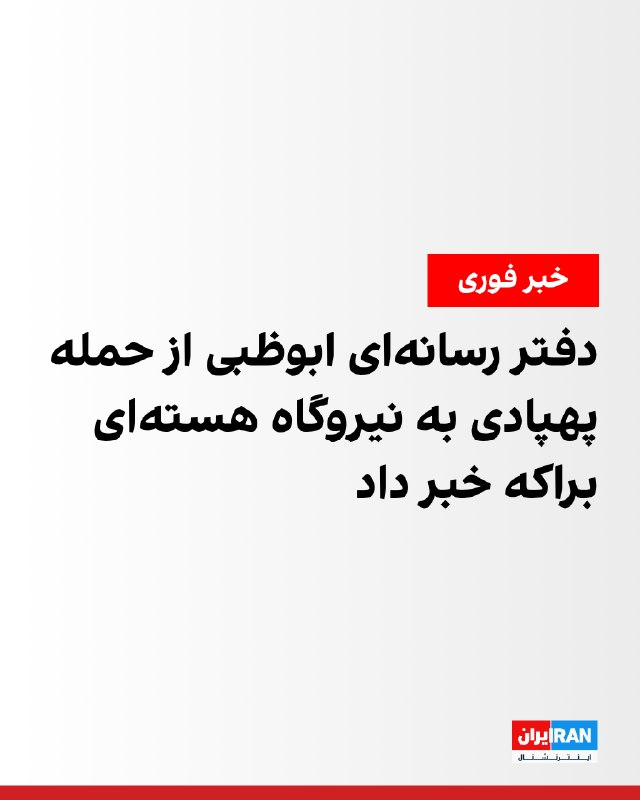

دفتر رسانه‌ای ابوظبی اعلام کرد که در پی حمله پهپادی به محوطه نیروگاه هسته‌ای براکه در الظفره، ژنراتور برق در خارج از محوطه داخلی نیروگاه دچار آتش‌سوزی شده است. این نهاد افزود که این حادثه آسیب جانی نداشته است.
‌🏁 🇬🇧 IranintlTV

🤖 @VahidOOnLine

## VahidOOnLine — post 240605

  

دفتر رسانه‌ای ابوظبی اعلام کرد که در پی حمله پهپادی به محوطه نیروگاه هسته‌ای براکه در الظفره، ژنراتور برق در خارج از محوطه داخلی نیروگاه دچار آتش‌سوزی شده است. این نهاد افزود که این حادثه آسیب جانی نداشته است.
‌🏁 🇬🇧 IranintlTV

🤖 @VahidOOnLine

## VahidOOnLine — post 240604

  

♦️خبرگزاری فارس، نزدیک به سپاه پاسداران، روز یک‌شنبه ۲۷ اردیبهشت گزارش داد که محمدباقر قالیباف، رئیس مجلس شورای اسلامی به عنوان نماینده ویژه ایران در امور چین تعیین شده است.

فارس بدون توضیح دیگری نوشته است:‌ «پیشتر علی لاریجانی و عبدالرضا رحمانی‌ فضلی چنین مسئولیتی را برعهده داشتند.»

اعلام تعیین قالیباف، عضو سابق سپاه پاسداران به عنوان نماینده ویژه در امور چین دو روز پس از دیدار رسمی دونالد ترامپ، رئیس جمهوری آمریکا از کشور چین صورت گرفته است.

دونالد ترامپ، رئیس‌جمهوری آمریکا، روز جمعه اعلام کرد شی جین‌پینگ، رئیس‌جمهوری چین، «قویا» معتقد است که ایران نباید به سلاح هسته‌ای دست پیدا کند. او همچنین افزود که همتای چینی‌اش خواهان بازگشایی تنگه هرمز است.

محمدباقر قالیباف، رئیس مجلس شورای اسلامی پیشتر به عنوان مذاکره کننده ارشد جمهوری اسلامی با آمریکا در مذاکرات پاکستان حاضر شده بود.
‌🇸🇦 Indypersian

🤖 @VahidOOnLine

## VahidOOnLine — post 240603

  

حمیدرضا حاجی‌بابایی، نایب‌رییس مجلس، گفت: «اگر قرار شد نفت ما را بزنند، باید نفت منطقه را بزنیم. چه آن‌که ادعای دوستی می‌کند، چه آن‌که دشمنی می‌کند.»

او گفت: «به نفت ما آسیب برسد، کاری می‌کنیم که آمریکا و تمام جهان تا مدت قابل توجهی از این منطقه نفت به دست نیاورد. اگر انرژی ما را بزنند، باید انرژی منطقه را بزنیم.»
‌🏁 🇬🇧 IranintlTV

🤖 @VahidOOnLine

## VahidOOnLine — post 240602

  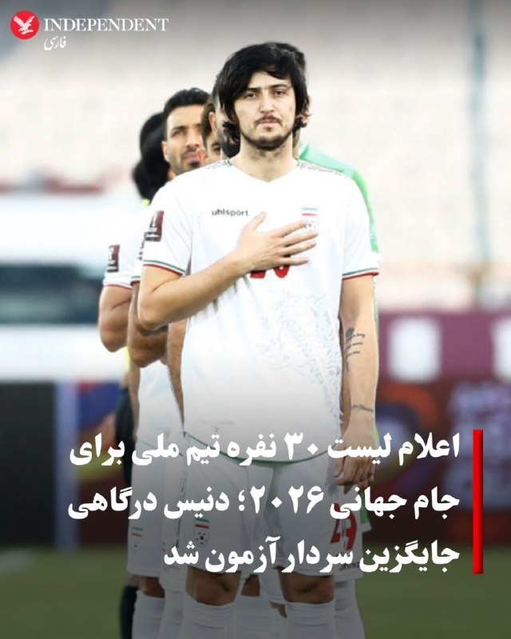

♦️امیر قلعه‌نویی، سرمربی تیم ملی فوتبال ایران روز شنبه ۲۶ اردیبهشت لیست ۳۰ نفره خود برای جام جهانی ۲۰۲۶ را اعلام کرد و گفت: «خدا را گواه می‌گیرم در انتخاب بازیکنان چیزی جز معیارهای فنی موضوع دیگری دخیل نبوده و من تنها بر اساس این معیار ٣٠ بازیکن را انتخاب کردم.»

این درحالیست که در این لیست، نام سردار آزمون،‌ مهاجم شناخته شده ایرانی دیده نمی‌شود. آزمون پس از موضع‌گیری‌های اخیرش در مخالفت با جمهوری اسلامی، ‌از تیم ملی خط خورد.

این اسامی در حالی اعلام شده است که هنوز تکلیف ویزای تیم ملی مشخص نیست.

دروازه‌بان‌ها: علیرضا بیرانوند، حسین حسینی، پیام نیازمند، محمد خلیفه،
مدافعان: احسان حاج صفی، میلاد محمدی، امید نورافکن، شجاع خلیل زاده، علی نعمتی، حسین کنعانی، دانیال ایری، رامین رضاییان، صالح حردانی
هافبک‌ها: سامان قدوس، روزبه چشمی، امیرمحمد رزاق نیا، سعید عزت‌اللهی، محمد قربانی،علیرضا جهانبخش، آریا یوسفی، محمد محبی، مهدی قائدی، مهدی ترابی
مهاجمان: مهدی طارمی، هادی حبیبی‌نژاد، امیرحسین حسین‌زاده، امیرحسین محمودی، دنیس درگاهی، کسری طاهری و علی علیپور
بازیکنان دعوت شده به اردوی تیم ملی در ترکیه هستند.
‌🇸🇦 Indypersian

🤖 @VahidOOnLine

## VahidOOnLine — post 240601

  <a href="telegram/content/VahidOOnLine_240601_1779018653.mp4" target="_blank">🎬 Download video</a>

اعتراض به سانسور، قطعی اینترنت، سرکوب و حبس معترضان در تجمع ایرانیان قبرس جنوبی، شنبه ۲۶ اردیبهشت
‌🏁 🇬🇧 ManotoTV

🤖 @VahidOOnLine

## VahidOOnLine — post 240600

  

♦️خبرگزاری میزان، رسانه قوه قضاییه جمهوری اسلامی، روز یکشنبه ۲۷ اردیبهشت از برگزاری نخستین جلسه دادگاه رسیدگی به اتهامات صادق ساعدی‌نیا، مدیرعامل مجموعه «املاک و صنایع غذایی ساعدی‌نیا» در دادگاه انقلاب قم خبر داد.
بنا بر اعلام قوه قضائیه، ساعدی‌نیا با اتهاماتی از جمله «فعالیت تبلیغی یا رسانه‌ای برخلاف امنیت کشور»، «اقدام عملیاتی در راستای فراخوان‌های گروه‌های معاند برای برهم زدن امنیت کشور» و «فعالیت تبلیغی علیه نظام» به دلیل حمایت از اعتصاب‌ها و اعتراضات دی‌ماه روبه‌رو است.
«انتشار استوری»، «فعالیت در فضای مجازی»، «حضور در تجمعات اعتراضی»، «تعطیل کردن کافه‌ها و مغازه‌ها» و تشویق برخی کارکنانش به حضور در اعتراضات از مصادیق اتهامات مطرح‌شده علیه صادق ساعدی‌نیا عنوان شده است.
‌🇸🇦 Indypersian

🤖 @VahidOOnLine

## VahidOOnLine — post 240599

♦️ویدیوهای منتشرشده در شبکه‌های اجتماعی که گفته می‌شود مربوط به جزیره مارو (شیدور) و مناطق اطراف جزیره لاوان است، آلودگی گسترده نفتی در آب‌ها و سواحل خلیج فارس را در روز جمعه ۲۵ اردیبهشت نشان می‌دهد. در این تصاویر، لکه‌های وسیع نفتی، تغییر رنگ آب دریا و آلودگی شدید نوار ساحلی قابل مشاهده است.
خبرگزاری رویترز نیز با استناد به تصاویر ماهواره‌ای ثبت‌شده از وقوع یک نشت نفتی گسترده در نزدیکی جزیره خارگ، مهم‌ترین پایانه صادرات نفت ایران، خبر داده است. بر اساس این گزارش، لکه نفتی مشاهده‌شده در تصاویر ماهواره‌های کوپرنیک، منطقه‌ای حدود ۴۵ تا ۹۵ کیلومتر مربع را در غرب جزیره خارگ پوشش داده است.
فعالان محیط زیست و کاربران شبکه‌های اجتماعی، وضعیت جزیره مارو (شیدور) معروف به «مالدیو ایران» را «فاجعه‌بار» توصیف کرده‌اند. برخی گزارش‌ها علت این آلودگی را حملات انجام‌شده به تاسیسات نفتی جزیره لاوان در فروردین‌ماه عنوان می‌کنند.
در برخی ویدیوهای منتشرشده، علاوه بر آب‌های آلوده، تصاویری از دود و انفجار در جزیره نیز دیده می‌شود. گفته می‌شود این حملات توسط امارات متحده عربی انجام شده است.
‌🇸🇦 Indypersian

🤖 @VahidOOnLine

## VahidOOnLine — post 240598

  

♦️علاءالدین بروجردی، عضو کمیسیون امنیت ملی مجلس روز یکشنبه درباره مذاکرات با آمریکا گفت:  جمهوری اسلامی ایران از حقوق خود در تنگه هرمز و همچنین مسائل هسته‌ای کوتاه نمی‌آید.

بروجردی  با بیان اینکه مذاکره بدون پذیرش شروط ایران بی‌معناست، گفت: «طرف مقابل باید بپذیرد که جمهوری اسلامی حاکم بر تنگه هرمز است. بدانند که موضوع هسته‌ای هیچ ارتباطی با آمریکا ندارد و به هیچ‌وجه حاضر نیستیم از آن کوتاه بیاییم.»

این عضو کمیسیون امنیت ملی مجلس درباره شروط جمهوری اسلامی برای حضور در مذاکرات، گفت: «آنها باید بپذیرند که هرگونه توافق در مذاکرات احتمالی آینده، توافق با کل جبهه مقاومت اعم از لبنان، عراق و یمن خواهد بود. اگر این قواعد را قبول نداشته باشند، ورود به مذاکره بی‌فایده خواهد بود.»

علاءالدین بروجردی همچنین تاکید کرد که «آنها باید بپذیرند اموال بلوکه‌شده آزاد شود و تحریم‌ها برداشته شوند. پذیرش این شروط الزامی است.»

این اظهارات در حالی مطرح شده است که دونالد ترامپ، روز شنبه ۲۶ اردیبهشت به جمهوری اسلامی هشدار داد که اگر به‌زودی بر سر یک توافق صلح موافقت نکند، «دوران بسیار سختی» را پیش رو خواهد داشت.
‌🇸🇦 Indypersian

🤖 @VahidOOnLine

## VahidOOnLine — post 240597

  

خبرگزاری میزان، رسانه قوه قضاییه جمهوری اسلامی، از برگزاری نخستین جلسه دادگاه رسیدگی به اتهامات صادق ساعدی‌نیا، مدیرعامل مجموعه «املاک و صنایع ساعدی‌نیا» و از حامیان اعتصاب‌ها و اعتراضات دی‌ماه، در دادگاه انقلاب قم خبر داد.
طبق این گزارش، ساعدی‌نیا با اتهاماتی از جمله «فعالیت تبلیغی یا رسانه‌ای برخلاف امنیت کشور»، «اقدام عملیاتی در راستای فراخوان‌های گروه‌های معاند برای برهم زدن امنیت کشور» و «فعالیت تبلیغی علیه نظام» روبه‌رو است.
انتشار استوری، فعالیت در فضای مجازی، حضور در تجمعات اعتراضی، تعطیل کردن کافه‌ها و مغازه‌های متعلق به خود و تشویق برخی کارکنانش به حضور در اعتراضات از مصادیق اتهامات مطرح‌شده علیه او عنوان شده است.
نماینده دادستان، مواردی مانند فعالیت‌های ساعدی‌نیا در فضای مجازی، تهیه کلیپی از یکی از کارکنانش با نوشته «جاوید شاه» روی دست، ایجاد و مدیریت گروه واتساپی کارکنان کافه‌ها، انتشار پیام صوتی درباره خاموش کردن گوشی برای جلوگیری از ردیابی، حضور برخی کارکنان در اعتراضات و برنامه‌ریزی برای تعطیلی کافه‌ها و کارخانه‌ها همزمان با فراخوان‌های اعتراضی را از مصادیق اتهامات مطرح‌شده علیه او عنوان کرد.
‌🏁 🇬🇧 IranintlTV

🤖 @VahidOOnLine

## VahidOOnLine — post 240596

  

ابوالفضل شکارچی، سخنگوی ارشد نیروهای مسلح جمهوری اسلامی، گفت که دونالد ترامپ باید بداند در صورت عملی شدن تهدیدها و حمله مجدد به جمهوری اسلامی، دارایی‌ها و ارتش آمریکا با «سناریوهای جدید، هجومی، غافلگیرکننده و طوفانی» روبه‌رو خواهند شد و در «باتلاق خودساخته‌» فرو خواهند رفت.
‌🏁 🇬🇧 IranintlTV

🤖 @VahidOOnLine

## VahidOOnLine — post 240595

  <a href="telegram/content/VahidOOnLine_240595_1779018659.mp4" target="_blank">🎬 Download video</a>

‌🏁 🇬🇧 ManotoTV

🤖 @VahidOOnLine

## VahidOOnLine — post 240594

🗣روایت شما از زندگی در آتش‌بس- یکشنبه۲۷ اردیبهشت ۱۴۰۵

🔹چیزی به اسم ساعت مرگ شنیدین؟ ساعتی که همه‌چیز، از جمله انگیزه از بین میره. برای من، اون روزی بود که مجبور شدم به خاطر شرایط تحمیل‌شده، ۶ نفر از ۱۴ نفر از نیروهام رو تعدیل کنم.

🔹هنوز نتونستم میوه این فصل رو به دلیل قیمت‌های وحشتناک گرون برای خانواده بخرم؛ توت‌فرنگی، گوجه‌سبز و زردآلو.

🔹قبل از جنگ می‌خواستم یه هارد بخرم، ۵۰ میلیون تومان بود و الان شده ۱۶۰ میلیون تومان.

🔹نان سنگک ساده شده ۱۷ هزار تومان، کنجدی هم شده ۲۵ هزار تومان. نانوایی‌ها یه ترفند زدن؛ یک نون بزرگ‌تر با کنجد زیاد درست کردن به قیمت ۸۰ هزار تومان می‌فروشن. کسانی که حوصله صف ندارن، مجبورن همون نون گرون رو بخرن.

🔹من خانم هستم و آتلیه عروسی داشتم. شغل ما همیشه زیر سایه تهدید شدید اماکن بوده و اجازه گذاشتن نمونه‌ کار نداشتیم. الان با این گرونی و قطعی اینترنت کلا نابود شدیم، چون هیچ عروسی برگزار نمی‌شه.

🔹من تریدرم و از وقتی اینترنت قطع شده، درآمد ندارم. چند سال زحمت کشیدم اما تریدینگ‌ویو، ابزار کارم باز نمی‌شه. برای ترید نیاز به اینترنت پایدار و آرامش دارم که هیچ‌کدوم نیست.

🔹در بلوچستان هر ۲۰ لیتر بنزین آزاد، بین یک میلیون و ۳۰۰ هزار تومان تا یک میلیون و ۵۰۰ هزار تومان هست؛ یعنی حدودا لیتری ۶۰ تا ۷۰ هزار تومان.

🔹دارم خونه می‌سازم و هر لحظه قیمت‌ها بیشتر می‌شه. کل هزینه ساختن تا قبل از عید یک میلیارد و نیم بود اما الان کابینت جنس معمولی شده یک میلیارد تومان.
‌🏁 🇬🇧 IranintlTV

🤖 @VahidOOnLine

## WithYashar — post 11474

خبرگزاری فارس: یه کشتی اسرائیلی تو خلیج فارس توقیف کردیم که خدمه‌ش عکس علی خامنه‌ای و مجتبی خامنه‌ای رو روی دیواراش نصب کرده بودن.
@withyashar

## WithYashar — post 11473

نتانیاهو: ما در غزه اکنون چیزی را در اختیار داریم، دیگر ۵۰٪ نیست... اکنون ۶۰٪ است. این وضعیت امروز است.
ماموریت ما یکی است: اطمینان حاصل کنیم که غزه دیگر تهدیدی برای اسرائیل نخواهد بود.

ما محدودیت بودجه نداریم. هر چقدر هزینه داشته باشد مهم نیست، شک ندارم که اسرائیل اولین کشوری خواهد بود که راه‌حلی کامل برای حملات پهپادی ارائه می‌دهد
@withyashar

## WithYashar — post 11472

نتانیاهو با ترامپ تلفنی گفتگو می‌کند

رسانه‌های عبری: نتانیاهو امروز با توجه به تحولات و تنش‌های منطقه با ترامپ صحبت خواهد کرد.
@withyashar
امروز همچنین اسرائیل جلسه امنیتی برگزار میکند

## WithYashar — post 11471

تایمز: انگلیس برای جنگ آماده می‌شود
 
این رسانه انگلیسی از افزایش بودجه دفاعی انگلیس خبر داد و هدف از آن را آماده شدن برای جنگ های آینده اعلام کرد
@withyashar

## WithYashar — post 11470

مشاور سابق پنتاگون:تحرکات سطح بالای نیروی هوایی آمریکا در خاورمیانه شدت گرفته آماده باشید
@withyashar

## WithYashar — post 11469

دارم میرم یات تولد ، شاید دایرکت ها رو درست نبینم کم اختلال داریم ولی من هستم 😬🙌🏾

## WithYashar — post 11468

سی‌ان‌ان: ایران به کابل‌های اینترنتی تنگه هرمز چشم دوخته
@withyashar

## WithYashar — post 11467

## WithYashar — post 11466

داداش شما رئیس سواک میشی شک نکن

## WithYashar — post 11465

فک کنم ساواک روزی که برگرده باید اول به من بگه دادچ آرشیوتو بیار 🤣

## WithYashar — post 11464

  <a href="telegram/content/WithYashar_11464_1779018660.mp4" target="_blank">🎬 Download video</a>

الان بحث داغه دیدن این ویدیو شاهین نجفی هم که در اوایل شروع ‌به کارش برام فرستاد خالی از‌ لطف نیست ، من امید وارم همه با هم متحد باشن و مشکلات تموم بشه
@withyashar

## WithYashar — post 11463

  <a href="telegram/content/WithYashar_11463_1779018663.mp4" target="_blank">🎬 Download video</a>

اینا همش به تاریخ پیوست…
@withyashar

## mwarmonitor — post 9199

⭕️ طبق گزارش نیویورک تایمز، اسرائیل حداقل دو پایگاه نظامی مخفی در صحرای غربی عراق را برای مدت بیش از یک سال اداره کرده است. گفته می‌شود برنامه‌ریزی این پایگاه‌ها از اواخر ۲۰۲۴ برای پشتیبانی از عملیات لجستیکی علیه ایران انجام شده است.

🔸واشنگتن از دست‌کم یکی از این پایگاه‌های اسرائیلی از ژوئن ۲۰۲۵ مطلع بوده اما این اطلاعات را از بغداد مخفی کرده است. علاوه بر این، آمریکا ظاهراً دولت عراق را مجبور کرده است سامانه‌های راداری خود را تحت عنوان «حفاظت از هواپیماهای آمریکایی» خاموش کند؛ اقدامی که عملاً دید راداری بغداد را کور کرده و مانع شناسایی حضور اسرائیل در خاک خود شده است.

🔸با وجود این خاموشی رادارها، فرماندهی نظامی عراق در منطقه همچنان به وجود حضور اسرائیل مشکوک بوده است. گفته می‌شود فرماندهان عملیات‌های مراقبت دوربرد از این سایت‌ها انجام می‌دادند، اما زمانی که از طرف‌های آمریکایی درخواست اطلاعات کردند، با سکوت مواجه شدند.

@mwarmonitor

## mwarmonitor — post 9197

🔴 مشاوران ترامپ بیم آن دارند که چین در ۵ سال آینده تایوان را هدف قرار دهد

📝نویسندگان: جیم وندهای، مایک الن AXIOS

🔰برخی از مشاوران نزدیک پرزیدنت ترامپ نگرانند که بزرگ‌ترین دستاورد ملموس نشست سران با چین، افزایش خطر حمله شی جین‌پینگ، رئیس‌جمهور چین، به تایوان در پنج سال آینده باشد؛ اقدامی که می‌تواند دسترسی شرکت‌های آمریکایی را به تراشه‌های مورد نیاز برای تأمین انرژی هوش مصنوعی (AI) قطع کند.

🔸آنچه آن‌ها می‌گویند:
ترامپ شیفته تشریفات باشکوه و دسترسی ویژه‌ای شد که شی با هوشمندی در طول سفر پکن برای او تدارک دیده بود. اما کلمات با این صمیمیت ظاهری همخوانی نداشتند.
یکی از مشاوران ترامپ به ما گفت که شی «تلاش می‌کند چین را به جایگاه جدیدی برساند که در آن بگوید: "ما یک قدرت در حال ظهور نیستیم، بلکه همتای شما هستیم؛ و تایوان متعلق به من است."»

🔸این مشاور افزود:
«این سفر نشان‌دهنده احتمال بسیار بالاتری است که موضوع تایوان ظرف پنج سال آینده روی میز قرار گیرد. هیچ راهی وجود ندارد که ما از نظر اقتصادی برای این موضوع آماده باشیم؛ زنجیره تأمین تراشه‌ها به این زودی‌ها حتی نزدیک به خودکفایی هم نخواهد شد. برای مدیران عامل، و در واقع کل اقتصاد، هیچ مسئله‌ای حیاتی‌تر از زنجیره تأمین تراشه‌ها وجود ندارد.»

🔸تصویر کلی:
ترامپ از سوی چندین مدیرعامل به خاطر فشارهای شدید بر ایران و ونزوئلا و همچنین باز کردن بازارها مورد تحسین قرار گرفت. برخی از مدیران عامل با این امید به کشور بازگشتند که شرکت‌هایشان مجوز فعالیت در چین را دریافت خواهند کرد و این موفقیت را مدیون رئیس‌جمهور می‌دانستند.

@mwarmonitor

## mwarmonitor — post 9196

🔴 بلومبرگ: صبح امروز یکشنبه هیچ عبور و ترددی در تنگه هرمز ثبت نشده است.

@mwarmonitor

## mwarmonitor — post 9195

🇮🇱نتانیاهو گفت اسرائیل تلاش‌های خود را برای مقابله با تهدیدهای در حال تحول پهپادی، از جمله پهپادهای هدایت‌شونده با فیبر نوری، افزایش داده و برای توسعه راه‌حل‌های جدید از شرکت‌های دفاعی و همچنین متخصصان فناوری غیرنظامی کمک گرفته است.

🇮🇱او گفت: «به آن‌ها گفتم هیچ محدودیت بودجه‌ای وجود ندارد. هرچقدر هم هزینه داشته باشد، مهم نیست.» وی افزود این تیم مأمور شده است نه‌تنها با تهدیدهای فعلی پهپادی مقابله کند، بلکه برای تهدیدهای آینده نیز آماده شود.

@mwarmonitor

## mwarmonitor — post 9194

🔴فوری | دفتر رسانه‌ای ابوظبی:
این آتش‌سوزی ناشی از هدف قرار گرفتن با یک پهپاد بوده است و هیچ مصدومی نداشته و همچنین هیچ تأثیری بر سطح ایمنی تشعشعات نداشته است.

@mwarmonitor

## mwarmonitor — post 9193

🔴فوری | دفتر رسانه‌ای ابوظبی:
مقامات مربوطه با یک آتش‌سوزی در یک ژنراتور برق که خارج از محدوده نیروگاه هسته‌ای براکه رخ داده بود، برخورد کرده‌اند.

@mwarmonitor

## mwarmonitor — post 9192

هدف قرار دادن نیروگاه هسته‌ای براکه

## mwarmonitor — post 9191

انفجار در امارات

## mwarmonitor — post 9190

🇮🇷اسماعیل بقائی:
دروغ بزرگ بعدی که برای توجیه «جنگِ انتخابی» و غیرقانونی مطرح می‌شود، این ادعاست که آنان «در حال حفظ صلح و ثبات در بازارهای جهانی انرژی» هستند.

🔸در حالی‌که در واقعیت، این جنگ‌افروزیِ بی‌پروای نظام‌های آمریکا و اسرائیل بوده که روندهای دیپلماتیک امیدبخش را نابود کرده و با تجاوز نظامیِ بی‌دلیل علیه ایران، عمداً ناامنی را به مسیرهای حیاتی انرژی تزریق کرده‌اند؛ سپس همان ایران را به بی‌ثبات‌سازی متهم می‌کنند تا گفته بدنام یوزف گوبلز را به اجرا بگذارند:
«دیگران را به همان کاری متهم کن که خودت انجام می‌دهی.»

🔸این همان کتاب قواعد آشنا و ریاکارانه است: بحران و جنگ می‌سازند و سپس زیر پرچم‌های به‌ظاهر شریفِ «بازگرداندن ثبات» و «دفاع از صلح»، بیشتر تشدید می‌کنند.

ویرانی می‌آفرینند و نامش را صلح می‌گذارند.

@mwarmonitor

## mwarmonitor — post 9189

  

USAF نیروی هوایی ایالات متحده امریکا ✈️

لاکهید مارتین C-130J سوپر هرکولس (۴ فروند)
AE29DB 06-3171 – REACH ???
AE29DD 08-3173 – REACH 458
AE18ED 06-8611 – REACH 584
AE220A 08-8603 – REACH ???

✈️🔸چهار فروند C-130J پس از یک مأموریت موقت (TDY) که از ماه مارس آغاز شده بود، در حال حرکت به سمت پایگاه هوایی کفلاویک در جنوب غربی ایسلند هستند. این مأموریت از پایگاه هوایی رامشتاین در آلمان و پایگاه هوایی آویانو در ایتالیا انجام شده است.

@mwarmonitor

## mwarmonitor — post 9188

🇮🇷 رسانه‌های ایرانی:
۵ شرط اصلی در پاسخ واشنگتن به پیشنهاد توافق:

🔹 عدم پرداخت هرگونه غرامت یا خسارت از سوی آمریکا
🔹 خروج و تحویل ۴۰۰ کیلوگرم اورانیوم از ایران به آمریکا
🔹 فعال ماندن تنها یک مجموعه از تأسیسات هسته‌ای ایران
🔹 عدم پرداخت حتی ۲۵ درصد از دارایی‌های مسدودشده ایران
🔹 مشروط کردن آتش‌بس در همه مناطق به مذاکرات

🔹 این گزارش تأکید می‌کند که حتی در صورت پذیرش این شروط از سوی ایران، خطر تجاوز آمریکا و رژیم صهیونیستی همچنان باقی خواهد ماند.

🔹 کارشناسان معتقدند پیشنهاد آمریکا به‌جای حل مشکل، در پی تحقق اهدافی است که ایران نتوانسته در جریان جنگ به آن‌ها دست یابد.

🔹 در مقابل، ایران هرگونه مذاکره را به تحقق پنج شرط پیشینی برای اعتمادسازی مشروط کرده است:

🔹 پایان جنگ در همه جبهه‌ها، به‌ویژه لبنان
🔹 لغو تحریم‌های اعمال‌شده علیه ایران
🔹 آزادسازی دارایی‌های مسدودشده ایران
🔹 جبران خسارات ناشی از جنگ
🔹 به‌رسمیت شناختن حاکمیت ایران بر تنگه هرمز

@mwarmonitor

## mwarmonitor — post 9187

  <a href="telegram/content/mwarmonitor_9187_1779018666.mp4" target="_blank">🎬 Download video</a>

📝 تا حالا به این تناقضِ هالیوودی دقت کردید؟ با جریانی طرفیم که وقایع ۱۴۰۰ سال پیش رو طوری با کیفیت 4K و افکت‌های ویژه بازسازی می‌کنه که انگار کارگردانش همون موقع با پهپاد تو صحنه بوده!

🔸اما بمبِ خنده‌اش اینجاست ، همین پروپاگاندا رسانه‌ای، وقتی به سوژه زنده و حاضرش یعنی «مجتبی» می‌رسه، دستانش خالیِ خالیه. منطق می‌گه اگه چنین مهره‌ای با اون وزن سیاسی واقعاً وجود داشت، تا الان شش فصل سریال نتفلیکسی از پیاده‌روی‌ها و نبوغش رندر کرده بودن.

🔸واقعیت اینه که سیستم این‌ها فقط روی اموات و تاریخِ بی‌سند جواب میده و تو دنیای واقعی کلاً ارور میده! وقتی کل خروجی‌شون از این آدم، خلاصه میشه به یه تعارف ناشیانه و ماست‌مالی‌شده پشت آنتن صداوسیما، یعنی کفگیر واقعیت بدجور به تهِ دیگ خورده. ترجیح میدن سوژه‌شون مثل یه روح نامرئی بمونه، چون می‌دونن دوربین‌های مدرن، فانتزیِ ساختگی‌شون رو یه شبه هوا می‌بره!

@mwarmonitor

## mwarmonitor — post 9186

🔴دیوان کیفری بین‌المللی در لاهه به‌طور محرمانه احکام بازداشت علیه سه سیاستمدار اسرائیلی و دو افسر نظامی صادر کرده است.(هاآرتص)

@mwarmonitor

## FoxNewsTwitter — post 341830

  <a href="telegram/content/FoxNewsTwitter_341830_1779018668.mp4" target="_blank">🎬 Download video</a>

Fox News (Twitter/X)

Bystander captures the horrifying moment an oncoming train smashed into a septic truck as it was crossing the tracks in Virginia, causing green substance to spew onto the ground and into the air.

Local police said the truck driver was taken to a hospital with life-threatening injuries, and that there is "no immediate danger" to the public.

## FoxNewsTwitter — post 341829

  <a href="telegram/content/FoxNewsTwitter_341829_1779018671.mp4" target="_blank">🎬 Download video</a>

Fox News (Twitter/X)

"You haven't just met the standard of excellence, you have redefined it for the next generation of American warfighters."

War Secretary Pete Hegseth proudly celebrates the return of more than 4,500 American warriors from the USS Gerald R. Ford Carrier Strike Group after they completed a 326-day deployment overseas, reuniting with loved ones in Virginia.

## pm_afshaa — post 90896

  

خیلی باید کونده پرو باشی که نزدیک 3 ماه قطعی کامل اینترنت، با سیم کارت سفید، تو اپ فیلتر شده این توییت رو بزنی :

💧 Rainbet.com the #1 Non-KYC Crypto Casino & Sportsbook @rainbetcom

😁 @Pm_Afshaa

## pm_afshaa — post 90895

🔴نیویورک‌تایمز: اسرائیل حداقل دو پایگاه مخفی در صحرای عراق را به‌طور متناوب و برای بیش از یک سال اداره می‌کرده

💧 Rainbet.com the #1 Non-KYC Crypto Casino & Sportsbook @rainbetcom

😁 @Pm_Afshaa

## pm_afshaa — post 90894

  <a href="telegram/content/pm_afshaa_90894_1779018674.webm" target="_blank">🎬 Download video</a>

🔴نتانیاهو: امروز با رئیس‌جمهور ترامپ حرف میزنم؛ چشممون روی ایران بازه و برای هر موقعیتی آماده‌ایم.

💧 Rainbet.com the #1 Non-KYC Crypto Casino & Sportsbook @rainbetcom

😁 @Pm_Afshaa

## pm_afshaa — post 90893

  <a href="telegram/content/pm_afshaa_90893_1779018675.webm" target="_blank">🎬 Download video</a>

🔴خبرگزاری فارس: جزئیاتی از درخواست‌های آمریکا از ایران در مذاکرات؛

5 شرط اصلی واشنگتن به این شرح اعلام شده :
عدم پرداخت هرگونه غرامت و خسارت از سوی آمریکا

خروج و تحویل ۴۰۰ کیلوگرم اورانیوم از ایران به آمریکا

فعال ماندن تنها یک مجموعه از تأسیسات هسته‌ای ایران

عدم پرداخت حتی ۲۵ درصد از دارایی‌های بلوکه‌شدهٔ ایران

منوط‌شدن توقف جنگ در همه ساحتها به انجام مذاکره

در مقابل، جمهوری انجام هرگونه مذاکره رو منوط به تحقق 5 پیش‌شرط دونسته که عبارتند از :
پایان جنگ در همهٔ جبهه‌ها به‌ویژه لبنان

رفع تحریم‌های ضدایرانی

آزادسازی پول‌های بلوکه‌شده ایران

جبران خسارات ناشی از جنگ

پذیرش حق حاکمیت ایران بر تنگه هرمز

💧Rainbet.com the #1 Non-KYC Crypto Casino & Sportsbook @rainbetcom

😁 @Pm_Afshaa

## pm_afshaa — post 90892

  <a href="telegram/content/pm_afshaa_90892_1779018676.webm" target="_blank">🎬 Download video</a>

🔴سازمان رادیو و تلویزیون اسرائیل:
نتانیاهو عصر امروز نشست امنیتی با توجه به احتمال از سرگیری جنگ با ایران برگزار میکنه.

💧 Rainbet.com the #1 Non-KYC Crypto Casino & Sportsbook @rainbetcom

😁 @Pm_Afshaa

## pm_afshaa — post 90891

🔴دفتر رسانه‌ای ابوظبی از حمله پهپادی و آتش‌سوزی در یک ژنراتور برق در خارج از محدوده داخلی نیروگاه هسته‌ای براکه در منطقه الظفره خبر داد

💧 Rainbet.com the #1 Non-KYC Crypto Casino & Sportsbook @rainbetcom

😁 @Pm_Afshaa

## pm_afshaa — post 90890

🔴مشاور سابق پنتاگون:تحرکات سطح بالای نیروی هوایی آمریکا در خاورمیانه شدت گرفته آماده باشید

💧 Rainbet.com the #1 Non-KYC Crypto Casino & Sportsbook @rainbetcom

😁 @Pm_Afshaa

## pm_afshaa — post 90889

🔴تو اصفهان برای زنای بی حجابی که رفتن خایه مالی و راهپیمایی براشون احضاریه دادگاه ارسال شده

💧 Rainbet.com the #1 Non-KYC Crypto Casino & Sportsbook @rainbetcom

😁 @Pm_Afshaa

## pm_afshaa — post 90888

🔴ونزوئلا : الکس صائب از نزدیکان رئیس جمهور سابق نیکولاس مادورو و رابط حزب الله و سپاه پاسداران جمهوری اسلامی رو دستگیر کردیم و به ایالات متحده تحویل دادیم

💧 Rainbet.com the #1 Non-KYC Crypto Casino & Sportsbook @rainbetcom

😁 @Pm_Afshaa

## pm_afshaa — post 90887

🔴سی‌ان‌ان: ایران به کابل‌های اینترنتی تنگه هرمز چشم دوخته

💧 Rainbet.com the #1 Non-KYC Crypto Casino & Sportsbook @rainbetcom

😁 @Pm_Afshaa

## pm_afshaa — post 90886

قالیباف نمایندۀ ویژۀ ایران در امور چین شد

💧 Rainbet.com the #1 Non-KYC Crypto Casino & Sportsbook @rainbetcom

😁 @Pm_Afshaa

## DEJradio — post 4673

  <a href="telegram/content/DEJradio_4673_1779018677.mp4" target="_blank">🎬 Download video</a>

⭕️🎥 شعار تجمعات شبانه حکومت این است که با "هر سلیقه‌ای" برای ایران آمده‌اند؛ اما این کارزار پر از تضاد و تناقض است. آنچه ۴۷ سال با شدیدترین مجازات روبرو می‌شد حالا که پای مصلحت و بقای نظام در میان است یگر ایراد ندارد، از جمله بدمستی ولایی‌های عرق‌خور در خیابان.

#الکل #جمهوری_اسلامی
@DEJradio

## DEJradio — post 4670

😎 
⭕️ یک منبع اختصاصی به دژ می‌گوید همزمان با محاصره دریایی بنادر ایران، شرکت لوبک لاین «Lubeck Line» تحت مدیریت حسن (ابوالفضل) شمخانی، تمامی «ترانشیپمنت پورت»‌ها (بنادر ترانزیتیِ واسط انتقال بار) را از امارات (بندر جبل‌علی) به قطر و عمان (بندر دوحه و بندر سوهار) منتقل کرده است.
سرویس‌های اصلی کانتینری از این بنادر واسط توسط کشتی‌های خط Sea Lead Shipping و‌Volta Container Line که مربوط به حسن شمخانی است به مقاصد چین، هندوستان، مالزی، روسیه، مصر، آفریقا ، آمریکای جنوبی، ویتنام و کره جنوبی و بالعکس کار حمل کانتینری صادرات و واردات را به بنادر ایران انجام می‌دهند .
همین منبع می‌گوید «تمام کرایه حمل و نقل دریافتی از بازرگانان که بصورت دلاری است و با توجه به شرایط جنگی ۱۰ برابر شده، جزو درآمدهای اصلی حکومت است و باعث پایداری رژیم آدمکش اسلامی است.»
برهمین اساس:
۱) عملا قطر و عمان در حال کمک به دور زدن تحریم‌ها هستند و در جهت خنثی کردن اقدامات ایالات متحده و امارات اقدام کرده‌اند، در حال حاضر واردات و صادرات کالاها از طریق بنادر واسط سوهار و حمد در حال انجام است قبلا از طریق جبل‌علی و ابوظبی انجام می‌شد.

۲) قطر و عمان در حال خیانت به امارات وعربستان سعودی و‌ ایالات متحده هستند و بدین طریق پول هنگفتی به جیب می‌زنند.

۳) کشتی‌های تحریمی که به بندرعباس رفته باشند حق پهلوگیری در بنادر را ندارند در اینصورت تحریم‌های ایالات متحده را نقض کرده‌اند و کشورهای مربوطه مشمول پرداخت جریمه هستند.
چون کشتی‌های مادر اجازه پهلوگیری در بنادر ایران را ندارند، صادرات و واردات ایران همیشه از طریق یک پورت واسط توسط کشتی‌هایی که معمولا تحریمی هستند انجام می‌شود. با بسته شدن بنادر امارات بر روی حکومت ایران و بسته شدن هرمز، عمان و قطر بنادرخود را در اختیار حکومت ایران گذاشته‌اند البته در این لیست هندوستان و مالزی هم مدت‌ها است این همکاری را با حکومت ایران دارند.
براساس اطلاعات همین منبع «مدت‌ها پیش حسن شمخانی دو نفر کاپیتان‌های کشتیرانی جمهوری اسلامی، را استخدام کردند که کار تغییر پرچم و خرید سوخت قاچاق برای کشتی‌ها و سفید کردن کشتی‌ها را انجام بدهد اما مطمئنا قطر، عمان، هندوستان و مالزی از تحریمی بودن کشتی‌ها آگاه هستند.»

#اختصاصی #تنگه_هرمز
@DEJradio

## DEJradio — post 4669

  <a href="telegram/content/DEJradio_4669_1779018679.webm" target="_blank">🎬 Download video</a>

🔺
⭕️ علی بیت‌‌الهی رئیس بخش زلزله‌شناسی و خطرپذیری مرکز تحقیقات راه، مسکن و شهرسازی درباره صحبت‌هایی که میان مردم شنیده می‌شود مبنی بر اینکه انفجار موشک‌ها منجر به فعال شدن گسل‌ها شده، گفت: «مردم توجه داشته باشند عمق کانونی این زلزله‌ها در حدود ۱۰ تا ۲۰ کیلومتری زمین است در حالیکه قوی‌ترین شدیدترین انفجارات هم نمی‌تواند در عمق تا چند صد متری زمین نفوذ کند درحالیکه ما در وقوع زلزله از عمق ١٠ هزار الی ١٠متر صحبت می‌کنیم آن هم در امتداد یک گسل طویل نه یک نقطه اما انفجارات نقطه‌ای هستند و شکل موج انفجارات با شکل موج زلزله کاملا به طور کاملا روشنی قابل تشخیص است. »
او افزود؛ «اینکه بگوییم این انفجارات موجب تحریک یک گسل می‌شود مانند این است که یک پشه بر روی گوش یک فیل بنشیند و این گمان شود که با نیش پشه، فیل از پا بیفتد بنابراین این موضوع اصلا مبنایی ندارد.»
برخی از مردم براین باورند آزمایش‌های موشکی و اتمی در عمق زمین از عوامل برخی از زمین‌لرزه‌هاست اما متخصصان داخلی که در رسانه‌های رسمی اظهار نظر می‌کنند این باور را رد می‌کنند، با این همه در موارد مشابه متخصصان ژاپنی چند بار طی سال‌های اخیر [از جمله شهریور ۱۳۹۶] گفتند علت زلزله در آن نواحی آزمایش‌های اتمی یا هیدروژنی کره شمالی است.

#زلزله #برنامه_اتمی
@DEJradio

## DEJradio — post 4668

  

👑
⭕️ شاهزاده رضا پهلوی در نشست «آینده تکنولوژی در ایران» که ۱۶ ماه مه (۲۶ اردیبهشت) برگزارش د گفت که مردم ایران به چیزی جز تغییر کامل نظام رضایت نخواهند داد: «آن‌ها ۴۰ هزار کشته نداده‌اند که در نهایت به توافق اتمی برسند.»
او افزود: «اتکای مخالفان نظام نباید به نیروی خارجی باشد و باید فرض را بر این گذاشت که کمکی دریافت نمی‌شود اما در صورت دریافت حمایت خارجی روند دستیابی به اهداف آسان‌تر خواهد شد.»
شاهزاده رضا پهلوی در نشست «آینده تکنولوژی در ایران» با رد مشروعیت ساختار سیاسی جمهوری اسلامی و چهره‌هایی چون محمدباقر قالیباف گفت مردم ایران این همه کشته و هزینه نداده‌اند که بار دیگر تن به «ماموریت‌های مهره‌های این حکومت» بدهند.
او تاکید کرد: «ما باید به دنیا ثابت کنیم که ملت ایران، شریک بهتری برای جامعه جهانی است تا بقایای این حکومت.»

#شاهزاده_رضا_پهلوی #ایران_را_پس_میگیریم
@DEJradio

## mamlekate — post 103547

📞 یه قهوه‌خونه هست هر روز رد میشم شلوغه. خودمم هر چند ماه یکبار دوستی کاری چیزی میگن میریم میشینیم حرف میزنیم. قیمتاش تو تهران خیلی مناسبه و کیفیت بالا و بخاطر همین هم همیشه شلوغ بود. باورت میشه این هفته رفتیم تو هیشکی نبود؟ مطلقا هیچ کس. حتی گرون هم نکرده قیمت همون قبل جنگه. باور نکردنی بود برام چند ساعت نشستیم یه نفر نیومد. هیچ وقت اونجارو اینجوری ندیده بودم.

موقع حساب کردن پرسیدم پس مشتری ها کجان؟ یعنی کرده بود داشت میترکید. میگفت چند وقته که نیستن. هیشکی نیست. نه اینکه پیش من نیان. کلا نیستن. پول نیست.

@mamlekate

## mamlekate — post 103546

📝 رقابت موسیقی یوروویژن ۲۰۲۶؛ «دارا» از بلغارستان به مقام اول رسید

شامگاه شنبه رقابت‌های موسیقی یوروویژن ۲۰۲۶، که امسال در وین برگزار شد، به پایان رسید و «دارا» خواننده زن اهل بلغارستان با آهنگ شاد «بانگارانگا» (Bangaranga)  توانست پیروز این رقابت هنری باشد.

@mamlekate

## mamlekate — post 103545

  <a href="telegram/content/mamlekate_103545_1779018681.mp4" target="_blank">🎬 Download video</a>

بر اساس گزارش‌ها در پی بارش‌های اخیر وضعیت دریاچه ارومیه در مقایسه زمان‌های مشابه سال‌های گذشته بهتر شده است. در یکی از آخرین ویدئوها از دریاچه ارومیه به تاریخ ۲۵ اردیبهشت رنگین‌کمانی بزرگ پس از بارش بهاری (و هلاکت خامنه‌ای) بر فراز این دریاچه نقش بسته است.

insta
@mamlekate

## mamlekate — post 103544

  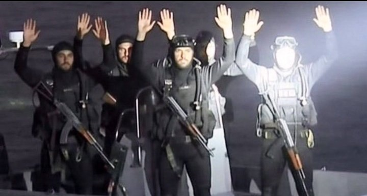

📝 وضعیت نامعلوم سپاهی‌های بازداشتی در آب‌های کویت

🎖 جلوی مردم بی‌سلاح ایران گودزیلان، جلو نیروهای مسلح دیگه موش آب‌کشیده [عکسی که پخش شده ممکنه تصویرسازی خبر باشه]

@mamlekate

## kianmeli1 — post 87449

‏🔴دفتر رسانه‌ای ابوظبی از حمله پهپادی و آتش‌سوزی در یک ژنراتور برق در خارج از محدوده داخلی نیروگاه هسته‌ای براکه در منطقه الظفره خبر داد

‏بر اساس این گزارش، این آتش‌سوزی تاثیری بر ایمنی نیروگاه نداشته و همه واحدها به‌طور عادی در حال فعالیت هستند. هیچ فردی نیز مجروح نشده است
https://t.me/kianmeli1

## kianmeli1 — post 87448

  <a href="telegram/content/kianmeli1_87448_1779018683.mp4" target="_blank">🎬 Download video</a>

🔴تحركات سطح بالاي امريكا در خاورميانه

راشاتودی با انتشار فیلمی از ویرانه‌های تل آویو ناشی از اصابت موشک‌های ایرانی، پست داگلاس مک گریگور، از افسران ارشد پنتاگون را نمایش داد: «تحرکات سطح بالای نیروی هوایی ایالات متحده در خاورمیانه. آماده باشید!»
https://t.me/kianmeli1

## kianmeli1 — post 87447

  

🔴تا چند سال پيش با ٣٠ ميليون تومان مي تونستيم ماشين بخريم حالا يه سه چرخه براي نوزاد
https://t.me/kianmeli1

## kianmeli1 — post 87446

  

🔴محمدباقر قالیباف،به عنوان نماینده ویژه ایران در امور چین منصوب شد؛ پیش‌تر علی لاریجانی چنین مسئولیتی را بر عهده داشتند.
https://t.me/kianmeli1

## kianmeli1 — post 87445

  

🔴از چند ساعت گذشته بیش از دوازده فروند هواپیمای ترابری راهبردی C-17A گلوبمستر III نیروی هوایی آمریکا در حال ترک خاورمیانه و حرکت به سمت اروپا هستند.
https://t.me/kianmeli1

## kianmeli1 — post 87444

  

🔴قلهکی: یکی از کشورهای منطقه هشدار شروع جنگ را برای دورماندن از تیررسِ ایران، به تهران منتقل کرده است
https://t.me/kianmeli1

## kianmeli1 — post 87443

  <a href="telegram/content/kianmeli1_87443_1779018688.mp4" target="_blank">🎬 Download video</a>

‏🔴ابطحی:
‏اگر ‌خامنه‌ای دوم انتخاب نمی‌شد جنگ داخلی قطعی بو‌د
https://t.me/kianmeli1

## kianmeli1 — post 87442

  

🔴اولیانوف نماینده دائم روسیه در سازمان‌های بین‌المللی:

به نظر کارشناسان غربی،آمریکا و اسرائیل ممکن است در روزهای آینده، اگه نگوییم ساعت‌های آینده، دوباره حمله نظامی به ایران رو از سر بگیرند. اگه این حرف درسته، یعنی این آمریکا و اسرائیل هنوز از اشتباهات استراتژیک قبلی خود درس نگرفته‌اند.
https://t.me/kianmeli1

## kianmeli1 — post 87441

  <a href="telegram/content/kianmeli1_87441_1779018691.mp4" target="_blank">🎬 Download video</a>

🔴حاجی بابایی، نائب رئیس مجلس

اگر به تاسیسات نفتی ایران حمله شود به تمام تاسیسات نفتی کشورهای دوست و دشمن در منطقه حمله می کنیم.
https://t.me/kianmeli1

## IranIntlTV — post 337614

  

آژانس بین‌المللی انرژی اتمی اعلام کرد امارات متحده عربی به این نهاد اطلاع داده سطح پرتو در نیروگاه هسته‌ای براکه پس از حمله پهپادی به نزدیکی آن، در سطح عادی باقی مانده و هیچ مصدومی گزارش نشده است. دفتر رسانه‌ای ابوظبی روز یکشنبه از حمله پهپادی به این نیروگاه خبر داده بود.
https://iranintl.com/202605177167

## IranIntlTV — post 337613

  <a href="telegram/content/IranIntlTV_337613_1779018694.mp4" target="_blank">🎬 Download video</a>

گروهی از ایرانیان و فعالان مدنی در مرکز شهر فرانکفورت در اعتراض به سرکوب، اعدام زندانیان سیاسی و محدودیت‌های اینترنتی در ایران تجمع کردند.

مهدی تهرانی گزارش می‌دهد
@iranintltv

## IranIntlTV — post 337612

  

سازمان حقوق بشر ایران اعلام کرد دستگاه قضایی جمهوری اسلامی «فعالانه» از وکلای تسخیری برای تسهیل و تسریع سیستماتیک اعدام معترضان بازداشت‌شده بهره می‌گیرد. این سازمان افزود این وکلا با خودداری از برقراری ارتباط با خانواده متهمان آنان را از روند دادرسی بی‌اطلاع نگه می‌دارند.
به نوشته این سازمان، مستندات نشان می‌دهد وکلای تسخیری بلافاصله پس از صدور حکم، با ثبت درخواست تجدیدنظر، موکلان خود را از مهلت قانونی محروم می‌کنند و با ایجاد موانع عامدانه در مسیر دسترسی به وکلای مستقل، زمینه اجرای سریع احکام اعدام را فراهم می‌سازند.
این سازمان نوشت بازداشت‌شدگان اعتراضات بدون دفاع موثر می‌مانند؛ وکلای تسخیری اعترافات اجباری و ادعاهای شکنجه را به چالش نمی‌کشند و مدارک تبرئه‌کننده ارائه نمی‌دهند. در نتیجه دادگاه‌ها بر اساس شواهد بدون اعتراض حکم اعدام صادر و دیوان عالی کشور نیز احکام را بدون بررسی حقوقی واقعی تایید می‌کند.
این سازمان هشدار داد این اقدامات نقض سیستماتیک دادرسی عادلانه است و اعدام‌ها را براساس حقوق بین‌الملل در زمره اعدام‌های خودسرانه قرار می‌دهد.
https://iranintl.com/202605171885

## IranIntlTV — post 337611

🗣روایت شما از زندگی در آتش‌بس- یکشنبه ۲۷ اردیبهشت‌ماه

🔹باورم نمیشه در قرن ۲۱، یک کشور نزدیک به ۳ ماهه بدون اینترنت مونده و برای هیچ سازمان بین‌المللی هم اهمیت نداره.

🔹دانش‌آموز هستم. نمی‌دانم باید امتحان‌ها رو چیکار کنم. یک اینترنت ملی داریم که اون هم کار نمی‌کند تا بتونیم درس بخونیم. یک دل‌خوشی داشتم، اون هم اینترنت بود که از ما گرفتن.

🔹دانشگاه آزاد بندرعباس برای خدماتی که ارائه نشده و کلاس‌هایی که نصفه‌ و نیمه تشکیل شده، شهریه کامل می‌گیرد.

🔹شورای‌عالی انقلاب فرهنگی هر روز یه حرفی می‌زنه. الان ما کلاس یازدهمی‌ها و کنکوری‌ها بلاتکلیف موندیم که امتحان نهایی چی می‌شه. جمهوری اسلامی علاوه بر اقتصاد و امنیت، فضای آموزش رو هم به نابودی کشونده.

🔹من یازدهم ریاضی‌ام، میگن از حواشی آموزشی فاصله بگیرید و تمرکزتون رو بگذارید روی درس. چطوری آخه وقتی کل کشور شده حاشیه؟ ما مثل بچه‌ شما در مدرسه‌ای با شهریه ۵۰۰ میلیون تومانی درس نمی‌خونیم.

## IranIntlTV — post 337610

  

بنیامین نتانیاهو، نخست‌وزیر اسرائیل، گفت: «امروز با دوستمان، رییس‌جمهور ترامپ گفت‌وگو خواهم کرد. مطمئنا برداشت‌های او از سفرش به چین و شاید مسائل دیگر را خواهم شنید. قطعا احتمالات زیادی وجود دارد و ما برای هر سناریویی آماده‌ایم.» نتانیاهو افزود: «چشمان ما به ایران دوخته شده است.»
https://iranintl.com/202605173431

## IranIntlTV — post 337609

  <a href="telegram/content/IranIntlTV_337609_1779018698.mp4" target="_blank">🎬 Download video</a>

مروری بر روزنامه‌های ایران، شنبه ۲۶ اردیبهشت، با مجتبی هاشمی، روزنامه‌نگار
@iranintltv

## IranIntlTV — post 337608

  <a href="telegram/content/IranIntlTV_337608_1779018701.mp4" target="_blank">🎬 Download video</a>

نشست «آینده تکنولوژی در ایران» با هدف بررسی فرصت‌های بخش فناوری در دوران پس از جمهوری اسلامی و نقش متخصصان ایرانی خارج از کشور، در سان‌فرانسیسکو برگزار شد.
شاهزاده رضا پهلوی در این نشست گفت ایران می‌تواند به الگویی مانند کره جنوبی تبدیل شود، اما حکمرانی جمهوری اسلامی کشور را به سمت وضعیتی شبیه کره شمالی برده است.
گفت‌وگو با آرش آزرمی، دبیر بخش اقتصادی ایران‌اینترنشنال
@iranintltv

## IranIntlTV — post 337607

🔻سومین مربی در یک سال؛ ژابی آلونسو سرمربی چلسی شد

باشگاه چلسی، ژابی آلونسو، سرمربی پیشین رئال مادرید و بایر لورکوزن را با قراردادی چهار ساله، به‌عنوان سرمربی جدید خود منصوب کرد. این مربی ۴۴ ساله اسپانیایی پس از جدایی توافقی از رئال مادرید در زمستان گذشته، و کمتر از هشت ماه پس از آغاز قرارداد سه‌ساله‌اش در اسپانیا، در دسترس بود.

او قراردادی چهار ساله از تابستان امسال با چلسی دارد که به نوشته بی‌بی‌سی، برخلاف قراردادهای شش‌ساله‌ای که چلسی در سال‌های اخیر ارائه می‌کرد، نسبتاً عادی توصیف شده است.

چلسی به تغییرات عمده‌ای نیاز دارد و بسیاری می‌گویند آلونسو می‌تواند فردی باشد که روند این تیم را تغییر دهد.

او پیش از دوره‌ای ناکامی در رئال مادرید، سه سال هدایت بایر لورکوزن را برعهده داشت و این تیم آلمانی را دو سال پیش به نخستین قهرمانی بوندس‌لیگا در تاریخ باشگاه رساند و همچنین جام حذفی آلمان را نیز فتح کرد.

تأیید حضور آلونسو یک روز پس از شکست چلسی مقابل منچسترسیتی در فینال جام حذفی انگلیس منتشر شد.

آبی‌های لندن امیدوارند او پس از فصلی که در آن دو سرمربی دائمی، انزو مارسکا و لیام روزنیور، روی نیمکت تیم نشستند، ثبات را به باشگاه بازگرداند. در حال حاضر کالوم مک‌فارلین دومین دوره حضورش به‌عنوان سرمربی موقت را سپری می‌کند و این نقش را در دو بازی پایانی لیگ برتر نیز ادامه خواهد داد.

آلونسو گفت: «چلسی یکی از بزرگ‌ترین باشگاه‌های فوتبال جهان است و این‌که سرمربی این باشگاه بزرگ می‌شوم، باعث افتخار فراوان من است.

او گفت: «از گفت‌وگوهایی که با مالکان و مدیران ورزشی باشگاه داشتم، مشخص است که بلندپروازی مشترکی داریم. ما می‌خواهیم تیمی بسازیم که بتواند به‌طور مداوم در بالاترین سطح رقابت کند و برای کسب جام بجنگد.»

سرمربی جدید چلسی گفت: «استعداد زیادی در این تیم وجود دارد و این باشگاه ظرفیت بسیار بالایی دارد و هدایت آن افتخار بزرگی برای من خواهد بود. حالا تمرکز روی کار سخت، ایجاد فرهنگ درست و کسب جام است.»

آلونسو پنج سال در لیگ برتر انگلیس برای لیورپول بازی کرد و در سال ۲۰۰۵ همراه این تیم قهرمان لیگ قهرمانان اروپا شد. او همچنین سابقه بازی در رئال سوسیداد، رئال مادرید و بایرن مونیخ را دارد.

او ۱۱۴ بازی ملی برای اسپانیا انجام داد و همراه این تیم قهرمان جام جهانی ۲۰۱۰ و دو دوره جام ملت‌های اروپا شد.

در هفته‌های اخیر نام آلونسو به بازگشت احتمالی به لیورپول، جایی که پنج فصل در آن بازی کرده بود، نیز مطرح شده بود؛ آن هم در شرایطی که فشارها بر آرنه اشلوت پس از فصلی ناامیدکننده افزایش یافته بود.

چلسی در فصل آینده احتمالا در هیچ رقابت اروپایی حضور نخواهد داشت؛ این تیم فعلا در رده نهم جدول لیگ برتر فوتبال انگلستان قرار دارد و برای رسیدن به لیگ کنفرانس اروپا باید حداقل هشتم شود؛ آن هم پس از آن‌که فرصت صعود به لیگ اروپا از طریق قهرمانی در جام حذفی را از دست داد.
🔗وب‌سایت ایران‌اینترنشنال
@iranintltv

## IranIntlTV — post 337606

  <a href="telegram/content/IranIntlTV_337606_1779018703.mp4" target="_blank">🎬 Download video</a>

یک شهروند با ارسال پیام به ایران‌اینترنشنال می‌گوید: «در حال ساخت خانه هستم و هر لحظه قیمت‌ها بیشتر می‌شود. کل هزینه ساختن تا قبل از عید یک میلیارد و نیم بود اما الان کابینتی با جنس معمولی شده یک میلیارد تومان.»

## IranIntlTV — post 337605

  

خبرگزاری ایلنا گزارش داد که تعداد ۱۳۸ نفر از کارمندان و کارگران شرکت ملی مس از زیر مجموعه‌های هلدینگ ایمیدرو، سازمان توسعه و نوسازی معادن و صنایع معدنی ایران، تعدیل شده‌اند.

یکی از کارمندان اخراجی این شرکت به ایلنا گفت: «در ۲۴ اسفندماه ۱۴۰۴، تنها ۵ روز مانده به پایان سال، ۱۳۸ پرسنل متخصص با یک نامه و پیامک تحت عنوان «عدم تمدید قرارداد به دلیل نداشتن پروژه جدید» از کار بیکار شدند.»

کارمند دیگری گفته است: «تعدیل‌ها بدون استعلام از مسئولان فنی برای نگهداری یا عدم نگهداری نیروها صادر شده است. در واقع تقریبا تمام نیروهای با سابقه مجموعه اخراج شدند.»
https://iranintl.com/202605177809

## IranIntlTV — post 337604

  <a href="telegram/content/IranIntlTV_337604_1779018706.mp4" target="_blank">🎬 Download video</a>

اقتصادنیوز گزارش داد اینترنت پرو برای بسیاری از کاربران کارآمد نبوده است. بر اساس این گزارش، کاربران با پرداخت حدود دو میلیون تومان تنها ۵۰ گیگابایت اینترنت دریافت می‌کنند.

گفت‌وگو با سحر تحویلی، پژوهشگر در حوزه فناوری اطلاعات و هوش مصنوعی
@iranintltv

## IranIntlTV — post 337603

  <a href="telegram/content/IranIntlTV_337603_1779018709.mp4" target="_blank">🎬 Download video</a>

سرخط خبرهای یکشنبه ۲۷ اردیبهشت
@iranintltv

## IranIntlTV — post 337601

  

دفتر رسانه‌ای ابوظبی اعلام کرد که در پی حمله پهپادی به محوطه نیروگاه هسته‌ای براکه در الظفره، ژنراتور برق در خارج از محوطه داخلی نیروگاه دچار آتش‌سوزی شده است. این نهاد افزود که این حادثه آسیب جانی نداشته است.
https://iranintl.com/202605173331

## IranIntlTV — post 337599

  <a href="telegram/content/IranIntlTV_337599_1779018712.mp4" target="_blank">🎬 Download video</a>

امیر قلعه‌نویی، سرمربی تیم فوتبال ایران، فهرست ۳۰ نفره اعزامی به جام جهانی ۲۰۲۶ آمریکا را اعلام کرد. در این فهرست نام سردار آزمون دیده نمی‌شود. اگرچه قلعه‌نویی تاکید کرده سردار آزمون به دلایل فنی از لیست کنار گذاشته شده است، اما پیش‌تر او به‌دلیل انتشار عکسی با حاکم دبی، از اردوهای تیم ملی کنار گذاشته شده و گزارش‌هایی از مصادره اموالش منتشر شده بود.
گفت‌وگو با کوروش بازیار، مربی فوتبال
@iranintltv

## IranIntlTV — post 337598

  

حمیدرضا حاجی‌بابایی، نایب‌رییس مجلس، گفت: «اگر قرار شد نفت ما را بزنند، باید نفت منطقه را بزنیم. چه آن‌که ادعای دوستی می‌کند، چه آن‌که دشمنی می‌کند.»

او گفت: «به نفت ما آسیب برسد، کاری می‌کنیم که آمریکا و تمام جهان تا مدت قابل توجهی از این منطقه نفت به دست نیاورد. اگر انرژی ما را بزنند، باید انرژی منطقه را بزنیم.»
https://iranintl.com/202605170342

## IranIntlTV — post 337597

  <a href="telegram/content/IranIntlTV_337597_1779018715.mp4" target="_blank">🎬 Download video</a>

تصاویر ارسالی به ایران‌اینترنشنال، از کمبود بنزین و اعمال محدودیت در برخی جایگاه‌های سوخت با هدف «مقابله با قاچاق» خبر می‌دهد. یک شهروند از بندرعباس می‌گوید بیش از چهار ساعت در صف بنزین منتظر بوده است.
جزییات بیشتر با مهدی تاجیک، عضو تحریریه ایران‌اینترنشنال
@iranintltv

## IranIntlTV — post 337596

  <a href="telegram/content/IranIntlTV_337596_1779018718.mp4" target="_blank">🎬 Download video</a>

یک شهروند با ارسال پیام به ایران‌اینترنشنال می‌گوید: «نان سنگک ساده شده ۱۷ هزار تومان، کنجدی هم شده ۲۵ هزار تومان. نانوایی‌ها ترفندی زده‌اند؛ نان بزرگ‌تری را با کنجد زیاد درست کرده و ۸۰ هزار تومان می‌فروشند. کسانی که حوصله صف ندارند، مجبورند همان نان گران را بخرند.»
پیام این شهروند با هوش مصنوعی بازخوانی شده است.

## IranIntlTV — post 337595

  

خبرگزاری میزان، رسانه قوه قضاییه جمهوری اسلامی، از برگزاری نخستین جلسه دادگاه رسیدگی به اتهامات صادق ساعدی‌نیا، مدیرعامل مجموعه «املاک و صنایع ساعدی‌نیا» و از حامیان اعتصاب‌ها و اعتراضات دی‌ماه، در دادگاه انقلاب قم خبر داد.
طبق این گزارش، ساعدی‌نیا با اتهاماتی از جمله «فعالیت تبلیغی یا رسانه‌ای برخلاف امنیت کشور»، «اقدام عملیاتی در راستای فراخوان‌های گروه‌های معاند برای برهم زدن امنیت کشور» و «فعالیت تبلیغی علیه نظام» روبه‌رو است.
انتشار استوری، فعالیت در فضای مجازی، حضور در تجمعات اعتراضی، تعطیل کردن کافه‌ها و مغازه‌های متعلق به خود و تشویق برخی کارکنانش به حضور در اعتراضات از مصادیق اتهامات مطرح‌شده علیه او عنوان شده است.
نماینده دادستان، مواردی مانند فعالیت‌های ساعدی‌نیا در فضای مجازی، تهیه کلیپی از یکی از کارکنانش با نوشته «جاوید شاه» روی دست، ایجاد و مدیریت گروه واتساپی کارکنان کافه‌ها، انتشار پیام صوتی درباره خاموش کردن گوشی برای جلوگیری از ردیابی، حضور برخی کارکنان در اعتراضات و برنامه‌ریزی برای تعطیلی کافه‌ها و کارخانه‌ها همزمان با فراخوان‌های اعتراضی را از مصادیق اتهامات مطرح‌شده علیه او عنوان کرد.

## IranIntlTV — post 337594

  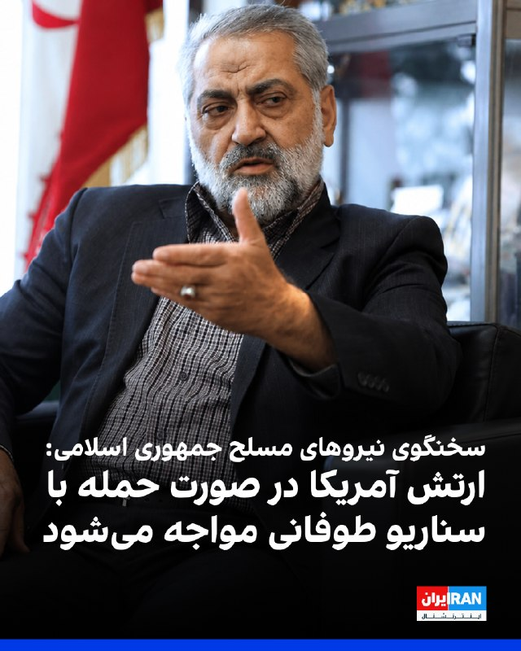

ابوالفضل شکارچی، سخنگوی ارشد نیروهای مسلح جمهوری اسلامی، گفت که دونالد ترامپ باید بداند در صورت عملی شدن تهدیدها و حمله مجدد به جمهوری اسلامی، دارایی‌ها و ارتش آمریکا با «سناریوهای جدید، هجومی، غافلگیرکننده و طوفانی» روبه‌رو خواهند شد و در «باتلاق خودساخته‌» فرو خواهند رفت.
https://iranintl.com/202605170463

## IranIntlTV — post 337593

  <a href="telegram/content/IranIntlTV_337593_1779018722.mp4" target="_blank">🎬 Download video</a>

روزنامه اسرائیلی معاریو به نقل از ارزیابی نهادهای اطلاعاتی اسرائیل گزارش داد جمهوری اسلامی همچنان بیش از هزار موشک بالستیک دوربرد و ۲۰۰ پرتابگر در اختیار دارد که قادر به هدف قرار دادن خاک اسرائیل هستند.
جزییات بیشتر با اشکان صفائی، خبرنگار ایران‌اینترنشنال
@iranintltv

## Shin_Persian — post 6045

مكتب أبوظبي الإعلامي @ADMediaOffice
Sun, 17 May 2026 10:08:11 UTC

Authorities in Abu Dhabi responded to a fire incident that broke out in an electrical generator outside the inner perimeter of the Barakah Nuclear Power Plant in the Al Dhafra Region, caused by a drone strike. No injuries were reported, and there was no impact on radiological safety levels.

All precautionary measures have been taken, and further updates will be provided as they become available.

The Federal Authority for Nuclear Regulation (FANR) confirmed that the fire did not affect the safety of the power plant or the readiness of its essential systems, and that all units are operating as normal.

The public is reminded to obtain information from official sources only, and to avoid spreading rumours or unverified information.

فارسی

مقامات در ابوظبی به حادثه آتش‌سوزی در یک ژنراتور برق در خارج از محیط داخلی نیروگاه هسته‌ای برکه در منطقه الظفره که در پی یک حمله پهپادی رخ داد، رسیدگی کردند. هیچ گزارشی مبنی بر مصدومیت منتشر نشده است و این حادثه هیچ تأثیری بر سطح ایمنی رادیولوژیک نداشته است.

تمامی اقدامات پیشگیرانه اتخاذ شده است و به‌روزرسانی‌های تکمیلی به محض دردسترس بودن ارائه خواهد شد.

سازمان فدرال نظارت هسته‌ای (FANR) تأیید کرد که این آتش‌سوزی تأثیری بر ایمنی نیروگاه یا آمادگی سیستم‌های حیاتی آن نداشته و تمامی واحدها به صورت عادی در حال فعالیت هستند.

به عموم مردم یادآوری می‌شود که اطلاعات را تنها از منابع رسمی دریافت کرده و از انتشار شایعات یا اطلاعات تأیید نشده خودداری کنند.

𝕏 · @shin_persian

## ManotoTV — post 105553

  <a href="telegram/content/ManotoTV_105553_1779018725.mp4" target="_blank">🎬 Download video</a>

مقام‌های ابوظبی اعلام کردند در پی حمله پهپادی، یک ژنراتور برق خارج از محدوده داخلی نیروگاه هسته‌ای براکه در منطقه الظفره دچار آتش‌سوزی شد.

بر اساس این اعلام، حادثه آسیب جانی نداشت و هیچ اثری بر سطح ایمنی پرتوی نیروگاه برجای نگذاشت. مقام‌ها گفته‌اند همه اقدامات احتیاطی لازم انجام شده و جزئیات بیشتر در صورت دریافت اطلاعات تازه اعلام خواهد شد.

سازمان فدرال مقررات هسته‌ای امارات نیز تاکید کرد آتش‌سوزی بر ایمنی نیروگاه یا آمادگی سامانه‌های حیاتی آن اثری نداشته و همه واحدهای نیروگاه به‌طور عادی در حال فعالیت‌اند.

## ManotoTV — post 105552

  <a href="telegram/content/ManotoTV_105552_1779018725.mp4" target="_blank">🎬 Download video</a>

روزنامه بریتانیایی تلگراف گفته است برخی افراد نزدیک به دونالد ترامپ، رئیس‌جمهوری آمریکا، پیشنهاد کرده‌اند امارات متحده عربی جزیره لاوان در خلیج فارس را تصرف کند.

بر اساس این ادعا، یک مقام ارشد امنیتی پیشین در دولت ترامپ به تلگراف گفت هدف از چنین پیشنهادی، افزایش نقش امارات در رویارویی با ایران بدون اعزام نیروهای زمینی آمریکا است.

این گزارش پس از آن منتشر می‌شود که وال‌استریت ژورنال از حملات پنهانی امارات به اهدافی در ایران خبر داد. به گزارش رویترز به نقل از این روزنامه، یکی از این حملات در اوایل آوریل پالایشگاهی در جزیره لاوان را هدف قرار داده بود، ادعایی که امارات آن را علنا تایید نکرده است.

## ManotoTV — post 105551

  <a href="telegram/content/ManotoTV_105551_1779018726.mp4" target="_blank">🎬 Download video</a>

اعتراض به سانسور، قطعی اینترنت، سرکوب و حبس معترضان در تجمع ایرانیان قبرس جنوبی، شنبه ۲۶ اردیبهشت

## ManotoTV — post 105550

  <a href="telegram/content/ManotoTV_105550_1779018729.mp4" target="_blank">🎬 Download video</a>

🎬 Video

## FarsiVOA — post 217960

  <a href="telegram/content/FarsiVOA_217960_1779018730.mp4" target="_blank">🎬 Download video</a>

استقبال وزیر جنگ ایالات متحده از نیروهای ناوگروه یواس‌اس جرالد آر. فورد در بازگشت به کشور؛

نزدیک به ۴ هزار و پانصد ملوان ناوگروه ضربت یواس‌اس جرالد آر. فورد، صبح روز شنبه ۲۶ اردیبهشت، پس از یک دوره ۱۱ ماهه استقرار در ناوگان‌های چهارم، پنجم و ششم ایالات متحده، به پایگاه دریایی نورفولک بازگشتند.

این ناو هواپیمابر به همراه ناوشکن‌های همراهش، بِینبریج و ماهان بازگشت. ناو هواپیمابر وینستون چرچیل نیز به بندرگاه اصلی خود در پایگاه دریایی میپورت بازگشت.

طی مراسمی وزیر جنگ ایالات متحده، پیت هگست، شخصا به استقبال آنها رفت و به گروه ضربت شماره ۱۲ ناو هواپیمابر، «لوح تقدیر ریاست‌جمهوری» را اعطا کرد. این لوح، بالاترین نشانی است که یک واحد نظامی می‌تواند دریافت کند و به پاس «شجاعت فوق‌العاده در نبرد علیه دشمن مسلح» اعطا می‌شود.
@FarsiVOA

## FarsiVOA — post 217959

  

روزنامه پاکستانی «داون» به نقل از منابع دیپلماتیک در اسلام‌آباد گزارش داد «سفر برنامه‌ریزی‌نشده» محسن نقوی، وزیر کشور پاکستان، به تهران در چارچوب تلاش‌های این کشور برای احیای روند متوقف‌شده صلح میان آمریکا و جمهوری اسلامی انجام شده است.

بر اساس این گزارش، نقوی در سفری دو روزه و از پیش اعلام‌نشده وارد تهران شده؛ سفری که منابع دیپلماتیک آن را بخشی از دیپلماسی مستمر اسلام‌آباد برای جلوگیری از «فروپاشی کامل» مذاکرات میان واشنگتن و تهران توصیف کرده‌اند.

داون نوشته است این تلاش‌ها پس از آن شدت گرفته که دونالد ترامپ، رئیس جمهوری آمریکا، تازه‌ترین پاسخ تهران به پیشنهادهای واشنگتن را رد کرد و شتاب حاصل از دورهای پیشین گفت‌وگو در اسلام‌آباد به‌شدت کاهش یافت.

انتظار می‌رود وزیر کشور پاکستان در جریان این سفر با مقام‌های ارشد جمهوری اسلامی، از جمله اسکندر مؤمنی، وزیر کشور، دیدار کند. به نوشته داون، گفت‌وگوها علاوه بر مسائل امنیتی و مرزی دوجانبه، تحولات گسترده‌تر منطقه و تلاش‌ها برای زنده نگه داشتن کانال‌های میانجی‌گرانه میان آمریکا و ایران را نیز دربر می‌گیرد.
@FarsiVOA

## FarsiVOA — post 217958

  

🔺حمله پهپادی به نزدیکی نیروگاه هسته‌ای امارات باعث آتش‌سوزی شد

▪️مقام‌های ابوظبی از آتش‌سوزی ناشی از حمله پهپادی به یک ژنراتور برق در خارج از محوطه نیروگاه هسته‌ای براکه در منطقه الظفره امارات متحده عربی خبر دادند.

▪️این آتش‌سوزی روز یکشنبه ۲۷ اردیبهشت رخ داد و هیچ موردی از جراحت گزارش نشد. همچنین گزارش شده سطح ایمنی پرتویی تحت تأثیر قرار نگرفته و سازمان فدرال تنظیم مقررات هسته‌ای امارات تأیید کرده که سیستم‌های حیاتی نیروگاه به‌طور عادی در حال کار هستند.

▪️امارات متحده عربی در طول جنگ آمریکا و اسرائیل علیه جمهوری اسلامی، هدف حملات مکرر موشکی و پهپادی قرار گرفت و مقام‌های ابوظبی گفته‌اند منشأ این حملات ایران بوده و زیرساخت‌های انرژی و دریایی را هدف قرار داده‌اند.

⬇️ بیشتر بخوانید:
https://ir.voanews.com/a/8150873.html

## FarsiVOA — post 217957

  

وزارت خارجه کره جنوبی اعلام کرد که این کشور از تهران خواسته درباره حمله به یک کشتی کره‌ای در نزدیکی تنگه هرمز اعلام موضع کند.

بر اساس بیانیه وزارت خارجه کره جنوبی، این درخواست در تماس تلفنی چو هیون، وزیر خارجه این کشور، با عباس عراقچی وزیر خارجه جمهوری اسلامی، در روز یکشنبه مطرح شده است.

پیشتر یک مقام کره جنوبی گفته بود که احتمال اینکه نهادی غیر از ایران مسئول این حمله بوده باشد، پایین است. این حمله روز ۴ مه علیه کشتی «نامو» متعلق به شرکت کشتی‌رانی کره‌جنوبی اچ‌ام‌ام صورت گرفت.

پیشتر دونالد ترامپ، رئیس‌جمهور آمریکا، اندکی پس از این حادثه گفت که جمهوری اسلامی به سوی کشتی کره‌جنوبی شلیک کرده است و از سئول خواست به تلاش‌های تحت رهبری آمریکا برای تأمین امنیت کشتی‌رانی در این تنگه بپیوندد.
@FarsiVOA

## FarsiVOA — post 217956

  

شرکت اطلاعات کالا، کپلر، از عبور غیرمعمول یک سوپر نفتکش ایرانی با دو میلیون بشکه محموله نفتی از تنگه لومبوک برای رسیدن به چین خبر داده است.

این گزارش می‌افزاید نفتکش «هیوج» شرکت ملی نفت ایران اوایل ماه جاری سیستم شناسایی خودکار را خاموش کرده بود و اکنون ظاهراً برای دور زدن خطرات فزاینده ناشی از تشدید نظارت و اجرای تحریم‌ها در تنگه مالاکا، از تنگه لومبوک عبور کرده و احتمالاً به هنگ‌کنگ خواهد رفت.

کپلر می‌گوید نخستین بار نیز نفتکش «دریا» اخیراً برای گریز از نظارت‌های تحریمی، به‌جای مسیر سنتی تنگه مالاکا، از تنگه لومبوک عبور کرده بود.
@FarsiVOA

## FarsiVOA — post 217955

🔺قالیباف نماینده ویژه جمهوری اسلامی در امور چین شد

▪️رسانه‌های داخلی در ایران گزارش دادند که محمدباقر قالیباف رئیس مجلس شورای اسلامی، به عنوان نماینده ویژه جمهوری اسلامی در امور چین منصوب شده است.

▪️پیشتر و از خرداد ۱۴۰۴، عبدالرضا رحمانی فضلی، سفیر کنونی جمهوری اسلامی در پکن، در حکمی که به امضای پزشکیان رسیده بود، «نماینده ویژه رئیس‌جمهور و تام‌الاختیار ایران در چین» بود.

▪️قبل از آن نیز، علی لاریجانی به عنوان «نماینده ویژه رهبر جمهوری اسلامی در امور چین» فعال بود. لاریجانی در جریان جنگ اخیر کشته شد.

▪️قالیباف که تاکنون رسماً سمت دیپلماتیکی نداشته، پیشتر به عنوان رئیس هیئت مذاکره‌کننده جمهوری اسلامی در مذاکرات با آمریکا در اسلام‌آباد شرکت کرد.

⬇️ بیشتر بخوانید:
https://ir.voanews.com/a/8150871.html

## FarsiVOA — post 217954

🔺سی‌ان‌ان: جمهوری اسلامی چشم به کابل‌های اینترنت تنگه هرمز دوخته است

▪️سی‌ان‌ان گزارش داد جمهوری اسلامی، پس از استفاده از تنگه هرمز به‌عنوان اهرم فشار در حوزه انرژی و کشتیرانی، حالا به سراغ یکی از شریان‌های پنهان اقتصاد جهانی رفته است: کابل‌های اینترنت زیردریایی که از زیر خلیج فارس و تنگه هرمز عبور می‌کنند و حجم بزرگی از ترافیک داده، ارتباطات مالی و اتصال دیجیتال میان اروپا، آسیا و کشورهای خلیج فارس را منتقل می‌کنند.

▪️بر اساس این گزارش، جمهوری اسلامی می‌خواهد از بزرگ‌ترین شرکت‌های فناوری جهان برای استفاده از کابل‌های اینترنتی زیر تنگه هرمز پول بگیرد.

▪️کابل‌های عبوری از تنگه هرمز در سال ۲۰۲۵ کمتر از یک درصد پهنای باند بین‌المللی جهان را تشکیل می‌دادند.

⬇️ بیشتر بخوانید:
https://ir.voanews.com/a/8150870.html

## FarsiVOA — post 217953

  <a href="telegram/content/FarsiVOA_217953_1779018736.mp4" target="_blank">🎬 Download video</a>

جشن بزرگ موسیقی اروپا که به آن مسابقه یوروویژن گفته می‌شود، امسال در پایتخت اتریش، وین، برگزار شد.

نوعام بیتان که نماینده اسرائیل در مسابقات آواز یوروویژن امسال بود، برنده مقام دوم شد. صفحه رسمی وزارت امور خارجه اسرائیل به فارسی در ایکس، ضمن تبریک به او، از ایرانیان حامی نوعام نیز تشکر کرد و نوشت: «سپاس از حمایت شما ایرانیان دوست‌داشتنی».

دارا، خواننده بلغار مقام اول را کسب کرد. دور بعدی این مسابقات به میزبانی بلغارستان برگزار خواهد شد.
@FarsiVOA

## FarsiVOA — post 217952

🔺خاموشی اینترنت وارد روز ۷۹ شد؛ نت‌بلاکس: مردم ایران به ناظر تبدیل شده‌اند

▪️داده‌های شبکه نشان می‌دهد خاموشی اینترنت در ایران همچنان ادامه دارد و وارد روز هفتادونهم، در هفته دوازدهم، شده است.

▪️به این ترتیب، شهروندان عادی در ایران بیش از ۱۸۷۰ ساعت است که از دسترسی عادی به اینترنت جهانی محروم مانده‌اند؛ وضعیتی که منتقدان آن را نوعی حصر دیجیتال می‌دانند.

▪️به گفته نت‌بلاکس، این اقدام گسترده سانسور دیجیتال، ماهیت مشارکت مدنی در ایران را تغییر داده است. این نهاد می‌گوید کنترل اطلاعات باعث شده افکار عمومی، به جای مشارکت فعال در تحولات کشور، به «ناظرانی» محدود در سرنوشت خود تبدیل شوند.

▪️این هشدار فقط درباره قطع اتصال نیست؛ درباره تغییر جایگاه شهروند در فضای عمومی است.

⬇️ بیشتر بخوانید:
https://ir.voanews.com/a/8150869.html

## FarsiVOA — post 217951

🔺اعتراض انجمن داروسازان ایران: بدهی سازمان‌های بیمه چهار برابر شده است

▪️یک عضو هیئت مدیره و مدیر روابط عمومی انجمن داروسازان ایران به پرداخت نشدن و انباشت مطالبات داروخانه‌ها از سوی سازمان‌های بیمه اعتراض کرد و خبر داد این مطالبات در ماه‌های گذشته «۴ برابر» شده است.

▪️او می‌گوید: «تأمین اجتماعی هر ماه ۳ هزار میلیارد تومان (همت) بدهکاری به داروخانه‌های بخش خصوصی دارد و با پرداخت آذر ماه، این سازمان هنوز ۱۵ همت به داروخانه ها بدهکار است.»

▪️در شرایطی که بیمه‌ها از پس تامین هزینه‌ها برنمی‌آیند و قیمت‌ها همچنان در حال افزایش است، بسیاری از بیماران با چالش جدی در تأمین داروهای مورد نیاز خود مواجه‌اند.

▪️همچنین در هفته‌های اخیر گزارش‌هایی از کمبود برخی داروها منتشر شده است.

⬇️ بیشتر بخوانید:
https://ir.voanews.com/a/8150868.html

## FarsiVOA — post 217950

  

دادستان استان کرمان از تشکیل ۳۵ پرونده قضایی برای ایرانیان خارج از کشور خبر داد و آنان را به «همکاری با دشمن» متهم کرد. مهدی بخشی گفت که این پرونده‌ها «با هدف پیگیری قضایی و مصادره اموال تشکیل شده است.»

رئیس کل دادگستری استان آذربایجان غربی نیز روز شنبه ۲۶ اردیبهشت از صدور دستور توقیف اموال ۱۲۹ نفر از مخالفان جمهوری اسلامی در این استان خبر داد.

همزمان در روز شنبه، مقامات قضائی استان یزد نیز از توقیف اموال ۵۱ تن از اهالی این استان خبر دادند و آنها را به «جاسوسی و همکاری با کشور‌های متخاصم و گروه‌های معاند» متهم کردند.

همچنین رسانه‌های ایران گزارش داده بودند که از ابتدای جنگ اخیر تا روز جمعه، در پرونده‌های سیاسی دست‌کم «۲۶۲ فقره ملک در سراسر کشور توقیف شده است.»

اموال توقیف شده «شامل وجوه نقد بانکی، اموال منقول و غیرمنقول، سهام شرکت‌ها و حتی اموال وکالتی» مردم است. این اقدامات جمهوری اسلامی از سوی ناظران، نقض حقوق شهروندی توصیف شده است.

جمهوری اسلامی در هفته‌های اخیر و همزمان با قطعی سراسری اینترنت، روند سرکوب‌ها و به ویژه اعدام‌ها را سرعت داده است.
@FarsiVOA

## DW_Farsi — post 124793

🔶 حمله پهپادی منجر به آتش‌سوزی در نزدیکی نیروگاه هسته‌ای ابوظبی شد

مقام‌های امارات متحده عربی روز یکشنبه ۱۷ ماه مه (۲۷ اردیبهشت) اعلام کردند یک حمله پهپادی به آتش‌سوزی در نزدیکی نیروگاه هسته‌ای براکه در منطقه الظفره ابوظبی منجر شده است. این حادثه به گفته مقام‌های این کشور، تلفات جانی یا نشت پرتویی در پی نداشته است.

دفتر رسانه‌ای ابوظبی در بیانیه‌ای اعلام کرد آتش‌سوزی در یک مولد برق، خارج از محدوده داخلی نیروگاه هسته‌ای براکه رخ داده و نیروهای امدادی و آتش‌نشانی بلافاصله به محل اعزام شده‌اند.

سازمان فدرال مقررات هسته‌ای امارات نیز اعلام کرد این حادثه تاثیری بر ایمنی نیروگاه یا عملکرد سامانه‌های اصلی آن نداشته و تمام واحدها به‌طور عادی در حال فعالیت هستند.

این نخستین بار از زمان آغاز جنگ اخیر میان ایران، آمریکا و اسرائیل است که نیروگاه هسته‌ای چهار راکتوری براکه هدف حمله قرار می‌گیرد. این نیروگاه در غرب ابوظبی و در نزدیکی مرز عربستان سعودی واقع شده است.

نیروگاه هسته‌ای براکه با هزینه‌ای حدود ۲۰ میلیارد دلار و با همکاری کره جنوبی ساخته شد و در سال ۲۰۲۰ به شبکه برق امارات پیوست. این مرکز، نخستین و تنها نیروگاه هسته‌ای فعال در شبه‌جزیره عربستان به شمار می‌رود.

هنوز هیچ گروه یا کشوری مسئولیت این حمله پهپادی را برعهده نگرفته و مقام‌های اماراتی نیز در بیانیه‌های رسمی خود، هیچ طرفی را عامل این حمله معرفی نکرده‌اند. آژانس بین‌المللی انرژی اتمی، نهاد ناظر هسته‌ای سازمان ملل مستقر در وین، نیز تاکنون به درخواست‌ها برای اظهارنظر درباره این حادثه پاسخی نداده است.

مقام‌های امارات از شهروندان خواسته‌اند اخبار مربوط به این حادثه را تنها از منابع رسمی دنبال کرده و از انتشار شایعات و اطلاعات تاییدنشده خودداری کنند.

@dw_farsi

## DW_Farsi — post 124792

  

🔶 ابراز خوش‌بینی پاکستان نسبت به برگزاری دور دوم مذاکرات تهران و واشنگتن

نخست‌وزیر پاکستان، نسبت به برگزاری دور دوم مذاکرات مستقیم میان تهران و واشنگتن و دستیابی به "صلحی پایدار" ابراز خوش‌بینی کرد.

شهباز شریف در گفت‌وگو با روزنامه "تایمز" بریتانیا گفت کشورش مورد اعتماد همه طرف‌ها، از جمله ایران، ایالات متحده و کشورهای حاشیه خلیج فارس است.

او همچنین تاکید کرد که تلاش‌های میانجی‌گرانه اسلام‌آباد، با وجود تبادل تهدیدها میان تهران و واشنگتن، همچنان ادامه دارد.

شهباز شریف در ادامه گفت، صلح به‌آسانی به دست نمی‌آید، بلکه نیازمند صبر، خرد و توانایی پیش بردن امور در دشوارترین شرایط است.

اظهارات نخست‌وزیر پاکستان در حالی مطرح می‌شود که دور پیشین مذاکرات با میانجی‌گری این کشور بی‌نتیجه به پایان رسید.

@dw_farsi

## DW_Farsi — post 124791

  

🔶 ادعای کیهان: جنگ جدید در آینده‌ای نه‌چندان دور محتمل است

روزنامه تندروی کیهان با اشاره به احتمال ازسرگیری درگیری‌ها میان ایران، اسرائیل و آمریکا، نوشت که وقوع دوباره جنگ "در فضایی از ابهام" قرار دارد، اما احتمال آن "در آینده‌ای نه‌چندان دور" بیشتر شده است.

کیهان در تحلیلی تازه، سه عامل را در ارزیابی احتمال آغاز دوباره جنگ مطرح کرد. این روزنامه نوشت شرایطی که به وقوع دو جنگ قبلی منجر شد، همچنان پابرجاست و از این رو، امکان شکل‌گیری جنگی تازه وجود دارد.

این روزنامه در عین حال با توصیف اقدامات اسرائیل و آمریکا به‌عنوان "اقدامات انتحاری بی‌نتیجه"، مدعی شد که باقی ماندن این بازیگران، احتمال تکرار "تصمیم و اقدام احمقانه" از سوی آن‌ها را منتفی نمی‌کند.

کیهان در ادامه پیش‌بینی کرد که در صورت آغاز دوباره جنگ، درگیری‌ها مشابه "جنگ چهل‌روزه" به یک نبرد فرسایشی تبدیل خواهد شد. به نوشته این روزنامه، در چنین شرایطی "دست برتر" با طرفی خواهد بود که "استقرار کامل‌تری در زمین جنگ" داشته باشد.

اظهارات و تحلیل‌های منتشرشده در کیهان، اغلب به‌عنوان دیدگاه جریان‌های نزدیک به حاکمیت مورد توجه قرار می‌گیرد.

@dw_farsi

## DW_Farsi — post 124790

🔶 اعلام وضعیت اضطراری بین‌المللی در پی شیوع بیماری ابولا

سازمان جهانی بهداشت (WHO) به دلیل شیوع بیماری ابولا در جمهوری دموکراتیک کنگو و اوگاندا، "وضعیت اضطراری بهداشت عمومی با اهمیت بین‌المللی" اعلام کرده است. این نهاد وابسته به سازمان ملل متحد در ژنو، با این اقدام قصد دارد از جمله کشورهای همسایه را در وضعیت هشدار بالا قرار داده و حمایت‌های جامعه بین‌المللی را بسیج کند. با این حال، سازمان جهانی بهداشت تصریح کرد که این یک "هشدار همه‌گیری جهانی" (پاندمی) نیست.

گزارش شده است که تاکنون ۸ مورد تاییدشده و ۲۴۶ مورد مشکوک به این بیماری تب‌دار و خطرناک در استان "ایتوری" در شمال شرقی کنگو شناسایی شده است. علاوه بر این، یک مورد ابتلا نیز در شهر "کینشاسا"، پایتخت کنگو که فاصله زیادی با کانون بیماری دارد، تایید شده است. همچنین دو فرد مبتلا از کنگو به اوگاندا سفر کرده‌اند. سازمان جهانی بهداشت از مرگ ۸۰ فرد مشکوک به ابولا در استان ایتوری تا این لحظه خبر داده است.

@dw_farsi

## DW_Farsi — post 124789

🔶 تأمین‌کننده مالی نسل‌کشی رواندا در زندان درگذشت

به گفته یک دادگاه سازمان ملل متحد، فلیسین کابوگا، از متهمان اصلی طراحی نسل‌کشی رواندا در جریان دوران بازداشت خود در بیمارستانی در لاهه هلند درگذشت.

فلیسین کابوگا متهم بود یکی از مسئولان اصلی نشل‌کشی و خونریزی‌هایی بوده که در سال ۱۹۹۴ به کشته شدن دست‌کم ۸۰۰ هزار نفر انجامید.

سازوکار دادگاه‌های بین‌المللی جنایی سازمان ملل (IRMCT)، در بیانیه‌ای اعلام کرد که مسئول پزشکی بازداشتگاه سازمان ملل بلافاصله در جریان قرار گرفته است. همچنین تحقیقاتی درباره شرایط و جزئیات مرگ کابوگا آغاز شده است.

این تاجر رواندایی که ثروتی چند میلیون دلاری داشته، به نسل‌کشی در کشورش و همچنین مشارکت و تحریک به آن در موارد متعدد متهم شده بود.

@dw_farsi

## DW_Farsi — post 124788

  

🔶 بریتانیا موشک‌های ارزان‌قیمت ضد پهپاد به خاورمیانه می‌فرستد

وزارت دفاع بریتانیا اعلام کرد که جنگنده‌های "تایفون" این کشور در خاورمیانه، به موشک‌های جدید و مقرون‌به‌صرفه‌ای مجهز می‌شوند که به طور ویژه برای مقابله با پهپادها طراحی شده‌اند.

با این موشک‌ها، انهدام دقیق اهداف ممکن می‌شود، آن هم با هزینه‌ای که تنها بخشی از هزینه موشک‌های مورد استفاده فعلی است.

در ادامه این بیانیه آمده است که این سامانه تسلیحاتی ظرف چند ماه از اولین آزمایش‌ها به مرحله تحویل و ارسال به خاورمیانه رسیده است.

لوک پولارد، وزیر دفاع بریتانیا در این باره گفت که این اقدام به نیروی هوایی کمک خواهد کرد تا پهپادهای بسیار بیشتری را با هزینه‌ای بسیار کمتر سرنگون کند.

@dw_farsi

## DW_Farsi — post 124787

🔶 ونزوئلا متحد نزدیک مادورو را به آمریکا تحویل داد

اداره مهاجرت ونزوئلا اعلام کرد که الکس صعب، تاجر ونزوئلایی و متحد نزدیک نیکلاس مادورو، رئیس جمهور برکنارشده این کشور، را به آمریکا تحویل داده است.
الکس صعب در ماه فوریه گذشته در کاراکاس، پایتخت ونزوئلا، طی عملیاتی مشترک میان نهادهای آمریکایی و ونزوئلایی، بازداشت شده بود.

بازداشت و استرداد او نشانه سطح تازه‌ای از همکاری میان نهادهای مجری قانون آمریکا و ونزوئلا تحت ریاست جمهوری دلسی رودریگز به شمار می‌رود.

به گفته منابع آگاه از موضوع، صعب می‌تواند اطلاعاتی را در اختیار مقام‌های آمریکایی قرار دهد که اتهامات آنها علیه مادورو را تقویت کند.

مادورو و همسرش، سیلیا فلورس، در ماه ژانویه گذشته در جریان عملیات نظامی آمریکا در کاراکاس بازداشت و به نیویورک منتقل شدند.

@dw_farsi

## DW_Farsi — post 124786

🔶 مذاکرات فیفا با ایران در استانبول؛ حمایت از حضور ایران در جام جهانی

فدراسیون جهانی فوتبال نسبت به حضور تیم ملی ایران در جام جهانی فوتبال ۲۰۲۶ در آمریکا ابراز اطمینان کرد.

فیفا اعلام کرد که در جریان دیداری در استانبول، به فدراسیون فوتبال ایران حمایت لازم برای حضور در مسابقات وعده داده شده است.

ماتیاس گرافستروم، دبیرکل فیفا تاکید کرد که همکاری نزدیکی میان دو طرف وجود دارد.

او افزود که فدراسیون جهانی فوتبال مشتاق است از ایران در جام جهانی استقبال کند.

جمهوری اسلامی شامگاه چهارشنبه ۲۳ اردیبهشت با حضور هزاران هوادار در میدان انقلاب تهران، مراسم بدرقه تیم ملی فوتبال برای جام جهانی را برگزار کرد.

انتشار تصاویر شعارهایی مانند "مرگ بر آمریکا" در این مراسم بازتاب گسترده‌ای در رسانه‌ها و شبکه‌های اجتماعی داشت.

بازیکنان قرار است هفته آینده تمرینات خود را در اردوی آماده‌سازی در ترکیه آغاز کنند.
مهدی تاج، رئیس فدراسیون فوتبال ایران پیش از این به دلیل ارتباط با سپاه پاسداران انقلاب اسلامی، اجازه ورود به کانادا برای شرکت در کنگره فیفا را دریافت نکرد.

@dw_farsi

## Persian_Trend_Official — post 14323

  

💢ارتش اسرائیل دستور تخلیه 4 روستا در جنوب لبنان را صادر کرد.

🫆:Tony

📌 @persian_trend_official
پرشین ترند | متفاوت‌ترین کانال نظامی

## Persian_Trend_Official — post 14322

💢نیویورک تایمز به نقل از مقام‌های عراقی

💢در هر دو مورد، هم در جنگ کوتاه سال گذشته و هم در درگیری فعلی، واشنگتن عراق را مجبور کرده رادارهایش را خاموش کند تا از هواپیماهای آمریکایی محافظت شود

💢اقدامی که باعث شده بغداد برای شناسایی فعالیت‌های خصمانه بیشتر به نیروهای آمریکایی وابسته شود

🫆:Tony

📌 @persian_trend_official
پرشین ترند | متفاوت‌ترین کانال نظامی

## Persian_Trend_Official — post 14321

  <a href="telegram/content/Persian_Trend_Official_14321_1779018744.webm" target="_blank">🎬 Download video</a>

پزشکیان: روز جهانی ارتباطات را تبریک می‌گویم

پزشکیان در شبکه اجتماعی
ایکس نوشت:

🔹‏در روزهای جنگ، فرزندان ما در ارتباطات و فناوری اطلاعات، شبانه‌روز ایستادند تا ارتباطات و خدمات حیاتی کشور پایدار بماند. دسترسی باکیفیت و پایدار مردم به خدمات دیجیتال، بخشی از آرامش، پیشرفت و حق زندگی شایسته مردم عزیز ایران است.

🔹روز جهانی ارتباطات را تبریک می‌گویم.

🫆:Tony

📌 @persian_trend_official
پرشین ترند | متفاوت‌ترین کانال نظامی

## Persian_Trend_Official — post 14320

  

🔴انفجار در امارات 💢منابع عربی اعلام کردند که انفجارهایی خیابان فاطمه بنت مبارک در ابوظبی را لرزاند. 🫆:Tony 📌 @persian_trend_official پرشین ترند | متفاوت‌ترین کانال نظامی

## Persian_Trend_Official — post 14319

  <a href="telegram/content/Persian_Trend_Official_14319_1779018745.webm" target="_blank">🎬 Download video</a>

🔴انفجار در امارات

💢منابع عربی اعلام کردند که انفجارهایی خیابان فاطمه بنت مبارک در ابوظبی را لرزاند.

🫆:Tony

📌 @persian_trend_official
پرشین ترند | متفاوت‌ترین کانال نظامی

## Persian_Trend_Official — post 14318

  

بقائی: آمریکا و اسرائیل خود عامل بی‌ثباتی در بازار انرژی هستند

اسماعیل بقائی، سخنگوی وزارت خارجه، ادعاهای آمریکا و اسرائیل درباره «حفظ ثبات بازار جهانی انرژی» را رد کرد و آن را «دروغی بزرگ» توصیف کرد.

بقائی گفت:

▪️ جنگی که آمریکا و اسرائیل آغاز کردند، روند دیپلماسی را نابود کرد
▪️ حمله نظامی به ایران باعث ناامنی در مسیرهای حیاتی انرژی شد
▪️ سپس ایران را به بی‌ثبات‌سازی متهم کردند

او با اشاره به آنچه «تاکتیک تبلیغاتی گوبلز» خواند، افزود:

▪️ «دیگران را به همان کاری متهم می‌کنند که خودشان انجام می‌دهند»

سخنگوی وزارت خارجه همچنین تأکید کرد:

▪️ آمریکا و اسرائیل ابتدا بحران و جنگ ایجاد می‌کنند
▪️ سپس با شعار «بازگرداندن ثبات» و «دفاع از صلح» به تشدید درگیری‌ها ادامه می‌دهند

بقائی در پایان گفت:

▪️ «آن‌ها ویرانی ایجاد می‌کنند و نامش را صلح می‌گذارند»

🫆:Tony

📌 @persian_trend_official
پرشین ترند | متفاوت‌ترین کانال نظامی

## Persian_Trend_Official — post 14317

  

📌انتشار چاپ پنجم کتاب «قدرت مذاکره» همراه با فصل جدید «دیپلماسی زیر آتش» 🔹کتاب قدرت مذاکره به قلم دکتر سید عباس عراقچی حاصل بیش از سی سال تجربه کاری نویسنده در وزارت امور خارجه است. 🔹در این کتاب تلاش میشود ضمن تبیین و تحلیل ماهیت مذاکره و مذاکره سیاسی،…

## Persian_Trend_Official — post 14316

🔴 رسانه‌های ایرانی جزئیات پاسخ واشینگتن به پیشنهاد توافق را منتشر کردند

رسانه‌های ایرانی مدعی شدند پاسخ آمریکا به پیشنهاد توافق با ایران شامل ۵ شرط اصلی بوده است:

▪️ آمریکا هیچ‌گونه غرامت یا خسارتی پرداخت نخواهد کرد

▪️ ۴۰۰ کیلوگرم اورانیوم از ایران خارج و به آمریکا تحویل داده شود

▪️ فقط یک مجموعه از تأسیسات هسته‌ای ایران فعال باقی بماند

▪️ حتی ۲۵ درصد از دارایی‌های بلوکه‌شده ایران نیز آزاد نخواهد شد
▪️ آتش‌بس در همه جبهه‌ها به روند مذاکرات گره بخورد

در این گزارش آمده است:

▪️ حتی در صورت پذیرش این شروط از سوی ایران، خطر حمله آمریکا و اسرائیل همچنان باقی خواهد ماند
▪️ برخی تحلیلگران ایرانی معتقدند واشینگتن به‌دنبال تحقق اهدافی است که در جنگ به آن نرسیده است

در مقابل، گزارش‌ها می‌گویند ایران نیز ۵ پیش‌شرط برای آغاز مذاکرات مطرح کرده است:

▪️ پایان جنگ در تمامی جبهه‌ها، به‌ویژه لبنان

▪️ رفع تحریم‌های ایران

▪️ آزادسازی دارایی‌های بلوکه‌شده ایران

▪️ پرداخت غرامت خسارات جنگ

▪️ به‌رسمیت شناختن حاکمیت ایران بر تنگه هرمز

تاکنون هیچ‌یک از این جزئیات به‌صورت رسمی از سوی تهران یا واشینگتن تأیید نشده‌اند.

🫆:Tony

📌 @persian_trend_official
پرشین ترند | متفاوت‌ترین کانال نظامی

## Persian_Trend_Official — post 14314

⭕️ دوستان، این حساب رسمی نیست. این اکانت صرفاً با پرداخت حدود ۱۰۰۰ دلار در ماه، تیک زرد (تأیید اشتراکی) دریافت کرده است. حساب‌های رسمی دولتی و سازمانی معمولاً تیک خاکستری دارند و اطلاعات هویتی و سازمانی آن‌ها به‌صورت شفاف در بخش Bio یا مشخصات حساب ثبت شده…

## Persian_Trend_Official — post 14313

  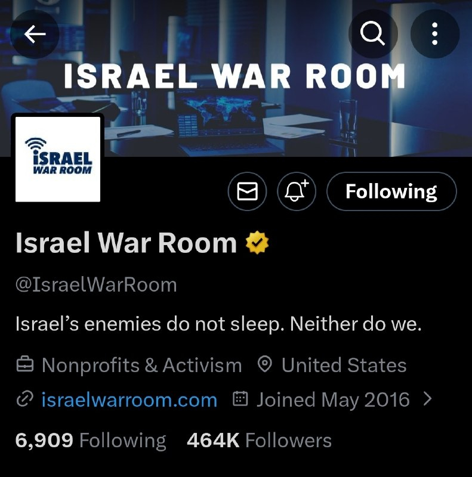

💢توییت اتاق جنگ اسرائیل 🫆:Tony 📌 @persian_trend_official پرشین ترند | متفاوت‌ترین کانال نظامی

## Persian_Trend_Official — post 14312

خبرگزاری میزان

💢دادگاه رسیدگی به اتهامات صادق ساعدی‌نیا برگزار شد

🔹جلسه رسیدگی به اتهامات صادق ساعدی‌نیا، مدیرعامل شرکت صنعت غذایی و مدیر کافه‌های زنجیره‌ای ساعدی‌نیا از متهمان کودتای آمریکایی صهیونیستی دی ۱۴۰۴ در دادگاه انقلاب قم با حضور رئیس و مستشاران دادگاه، نماینده دادستان، متهم صادق ساعدی‌نیا و وکلای متهم برگزار شد.

🫆:Tony

📌 @persian_trend_official
پرشین ترند | متفاوت‌ترین کانال نظامی

## Persian_Trend_Official — post 14311

  <a href="telegram/content/Persian_Trend_Official_14311_1779018748.webm" target="_blank">🎬 Download video</a>

🔴 نشان ویژه برای خدمه ناو هواپیمابر «جرالد آر. فورد» و ناو گروه آن پس از جنگ ایران

💢سرپرست وزارت نیروی دریایی آمریکا اعلام کرد گروه ضربت ناو هواپیمابر «جرالد آر. فورد» و نیروهای گروه ضربت ناو هواپیمابر ۱۲ به‌دلیل عملکردشان در خاورمیانه طی جنگ اخیر ایران، نشان «واحد ریاست جمهوری» دریافت کرده‌اند.

💢بر اساس این بیانیه:

▪️ این گروه رزمی در عملیات‌های گسترده علیه اهداف ایرانی مشارکت داشته است
▪️ ادعا شده ۱۲۵ شناور جنگی ایرانی هدف قرار گرفته‌اند
▪️ همچنین ۲۰۷ موشک کروز «تاماهاوک» به اهدافی در ایران شلیک شده است

🔻در ادامه آمده:

💢 هواگردهای مستقر بر ناو «جرالد آر. فورد» بیش از ۱۷۰۰ سورتی پرواز رزمی از مدیترانه و دریای سرخ انجام داده‌اند

🫆:Tony

📌 @persian_trend_official
پرشین ترند | متفاوت‌ترین کانال نظامی

## Persian_Trend_Official — post 14310

  <a href="telegram/content/Persian_Trend_Official_14310_1779018748.webm" target="_blank">🎬 Download video</a>

⭕️ سی‌ان‌ان: ایران به کابل‌های اینترنتی تنگه هرمز چشم دوخته است!

📝 Nick

📌 @persian_trend_official
پرشین ترند | متفاوت‌ترین کانال نظامی

## Persian_Trend_Official — post 14309

  

💢توییت اتاق جنگ اسرائیل

🫆:Tony

📌 @persian_trend_official
پرشین ترند | متفاوت‌ترین کانال نظامی

## Persian_Trend_Official — post 14308

  

❌️ این عکس را چندین بار در گوگل لنز جست‌وجو کردیم، اما هیچ منبع معتبر یا رسانه قابل‌اعتمادی برای آن پیدا نشد.

به همین دلیل، به‌نظر می‌رسد این تصویر با هوش مصنوعی ساخته شده و واقعی نیست.

📝 Nick

📌 @persian_trend_official
پرشین ترند | متفاوت‌ترین کانال نظامی

## RadioFarda — post 157288

  

🔸در پی شیوع دوباره بیماری اِبولا در جمهوری دموکراتیک کنگو در آفریقا و مرگ ده‌ها تن، سازمان بهداشت جهانی روز یک‌شنبه، ۲۷ اردیبهشت، «وضعیت اضطراری بین‌المللی» اعلام کرد.

🔸به نوشته خبرگزاری فرانسه، از نظر سطح هشدار در چارچوب مقررات این سازمان، این وضعیت پس از «وضعیت اضطراری پاندِمی» در مرتبه دوم جدیت قرار دارد.

🔸بیماری ابولا که هفدهمین بار است در کشور کنگو در آفریقای مرکزی شیوع پیدا کرده، بر اساس آماری که مرکز کنترل و پیشگیری از بیماری‌ها، شاخه آفریقا، در روز شنبه اعلام کرد، تاکنون جان ۸۸ نفر را در این کشور گرفته است.

🔸علاوه بر این، ۳۳۶ نفر نیز مشکوک به ابتلا به این تب ویروسیِ بسیار مسری هستند.

🔸از جمله نشانه‌های این بیماری ویروسی خطرناک تب و استفراغ و خون‌ریزی است. این بیماری که به اعتقاد پزشکان و پژوهشگران از خفاش سرچشمه گرفته است می‌تواند به از کار افتادن اندام‌های داخلی بدن نیز بینجامد.

@RadioFarda

## RadioFarda — post 157287

  <a href="https://t.me/radiofarda/157287" target="_blank">📎 Download file</a>

📻بشنوید: ساعت ۱۴ با رادیوفردا، ۲۷ اردیبهشت ۱۴۰۵‌

@Radiofarda

## RadioFarda — post 157286

  

🔸 اداره رسانه‌ای ابوظبی روز یک‌شنبه ۲۷ اردیبهشت در شبکه‌های اجتماعی از وقوع آتش‌سوزی در نیروگاه اتمی براکه در امارات متحده عربی خبر داد.

🔸 این آتش‌سوزی پس از حمله پهپادی به نیروگاه اتمی برکه در منطقه الظَفرَه آغاز شده، اما کشته و مجروح بر جا نگذاشته است.

🔸 بر اساس توضیح اداره رسانه‌ای ابوظبی، این حریق در ژنراتور برق خارج از محدوده پیرامون نیروگاه به راه افتاده و بر ایمنی سایت اثر منفی نداشته است.

🔸 در پی آغاز حمله مشترک آمریکا و اسرائیل به خاک ایران، امارات متحده عربی به بزرگ‌ترین هدف حملات تلافی‌جویانه سپاه پاسداران تبدیل شد.

@RadioFarda

## RadioFarda — post 157285

  

🔸رسانه‌های حکومتی در ایران روز یک‌شنبه ۲۷ اردیبهشت از برگزاری دادگاه صادق ساعدی‌نیا، مدیرعامل شرکت صنعت غذایی و مدیر کافه‌های زنجیره‌ای ساعدی‌نیا خبر دادند.

🔸آقای ساعدی‌نیا در پی اعتراضات دی‌ماه سال گذشته که در روزهای ۱۸ و ۱۹ دی به کشتار گسترده معترضان ختم شد بازداشت و به تحریک مردم برای شرکت در این اعتراضات متهم شد.

🔸نماینده دادستان در این دادگاه ساعدی‌نیا را به «فعالیت تبلیغی یا رسانه‌ای برخلاف امنیت کشور، اقدام عملیاتی برای گروه‌های معاند نظام و در راستای فراخوان‌های منتشر شده توسط این گروه‌ها، جهت برهم زدن امنیت و برخلاف امنیت کشور و فعالیت تبلیغی علیه نظام» متهم کرد.

🔸او در دفاع از خود گفته است:‌ «من هیچ یک از کارکنانم را برای شرکت در اغتشاشات ترغیب نکردم، از کرده خود پشیمانم و از دادگاه می‌خواهم به من فرصتی برای جبران بدهد.»

@RadioFarda

## RadioFarda — post 157282

  

🔸خبرگزاری فارس، نزدیک به سپاه پاسداران، روز یک‌شنبه ۲۷ اردیبهشت نوشت که محمدباقر قالیباف، رئیس مجلس شورای اسلامی و عضو سابق سپاه، به عنوان نماینده ویژه ایران در امور چین تعیین شده است.

🔸این خبرگزاری امنیتی بدون هیچ توضیح دیگری تنها نوشته است:‌ «پیشتر علی لاریجانی و عبدالرضا رحمانی‌ فضلی چنین مسئولیتی را برعهده داشتند.»

🔸در این خبر نه توضیح داده شده که چه کسی یا چه نهادی قالیباف را به این سمت منصوب کرده است و نه برهه کنونی چه اهمیتی دارد که حکومت تصور کرده است به این نماینده ویژه نیاز دارد.

🔸اعلام تعیین قالیباف به عنوان نماینده ویژه در امور چین دو روز پس از دیدار رسمی رئیس جمهور آمریکا از کشور چین رخ می‌دهد که در آن یکی از موضوعات گفت‌وگو ایران و تنگه هرمز بود.

🔸کاخ سفید روز پنجشنبه ۲۴ اردیبهشت اعلام کرد دونالد ترامپ، رئیس‌جمهور آمریکا، و شی جین‌پینگ، رئیس‌جمهور چین، در دیدار خود درباره گسترش همکاری‌های اقتصادی، باز ماندن تنگه هرمز و جلوگیری از دستیابی ایران به سلاح هسته‌ای گفت‌وگو و توافق کردند.

@RadioFarda

## RadioFarda — post 157281

  

🔸دبیرکل فیفا، روز شنبه ۲۶ اردیبهشت پس از دیدار با رئیس فدراسیون فوتبال ایران، ابراز امیدواری کرد که تیم فوتبال این کشور بدون مشکل در جام جهانی حضور یابد.

🔸 ماتیاس گرافستروم درباره دیدارش با مهدی تاج به ‌جزئیاتی درباره صدور ویزای آمریکا و شرایط ورود بازیکنان ایرانی به‌ این کشور اشاره نکرد.

🔸رئیس فدراسیون فوتبال ایران هم پس از دیدار با دبیرکل فیفا در استانبول این ملاقات را «مثبت» ارزیابی و ابراز خوشحالی کرد که مقامات فیفا به تمام ۱۰ نکته‌ مورد نظر ایران گوش و برای هر یک از آنها راه‌حل ارائه کردند.

🔸مهدی تاج درباره جزئیات نکات مورد نظر ایران و راه‌حل‌های فیفا توضیح نداد.

🔸بر اساس برنامه رقابت‌های جام جهانی، تیم فوتبال ایران قرار است هر سه دیدار مرحله گروهی خود را در ایالات متحده برگزار کند.

🔸پیش‌تر فدراسیون فوتبال جمهوری اسلامی درخواست کرده بود مسابقاتش به مکزیک منتقل شود، اما جیانی اینفانتینو، رئیس فیفا، با این درخواست مخالفت کرد.

@RadioFarda

## IranianMinds — post 20274

🔴 دوباره به امارات حمله ی پهپادی کردن @IranianMinds

## IranianMinds — post 20273

  

🔴 دوباره به امارات حمله ی پهپادی کردن

@IranianMinds

## IranianMinds — post 20272

  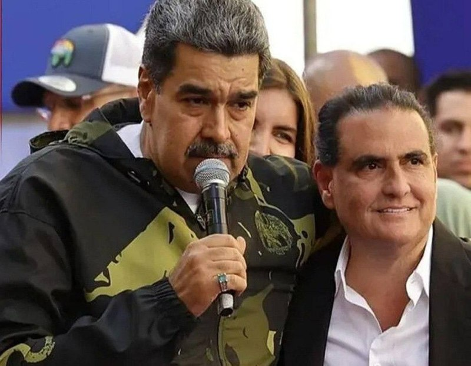

🔴 ونزوئلا :

الکس صائب از نزدیکان رئیس جمهور سابق نیکولاس مادورو و رابط حزب الله و سپاه پاسداران جمهوری اسلامی رو دستگیر کردیم و به ایالات متحده تحویل دادیم !

@IranianMinds

## IranianMinds — post 20271

  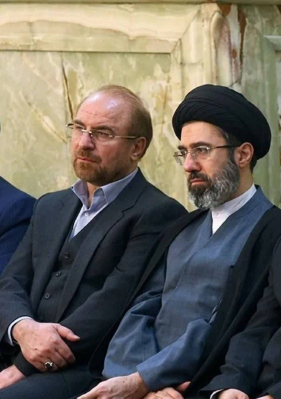

🔴 خبرگزاری فارس :

قالیباف نماینده ویژه جمهوری اسلامی در امور چین شد

قبل از قالیباف علی لاریجانی این سمت رو داشت که ترور شد.

@IranianMinds

## IranianMinds — post 20270

  <a href="telegram/content/IranianMinds_20270_1779018757.webm" target="_blank">🎬 Download video</a>

🎉 ۵۰۰٬۰۰۰ تومان رایگان-بونوس ویژه ثبت‌نام

🔥 با هر ثبت نام 
🅰️
🅰️
🅰️ هزار تومن جایزه بگیرید

⬅️ شرط‌بندی کنید و بونوس را به موجودی واقعی تبدیل کنید

🔥 وقتشه بازی رو یه جور دیگه ببینی
⚽️  پوشش کامل مسابقات ورزشی 

📊  پیش‌بینی با بهترین ضرایب 

⚡️  تجربه سریع و حرفه‌ای

😀 پرداخت مستقیم و سریع بدون واسطه، بدون دردسر، واریز و برداشت در سریع‌ترین زمان ممکن 

😀 کانال تلگرام: 

🔴 @winro_io  

😀 هدیه خود را با ثبت نام در سایت دریافت کنید: 

🔴 Winro.io
R27
سایت اصلی در روزهای آینده بازگشایی خواهد شد 
✅

## BBCPersian — post 281295

🔻رئیس‌جمهور برزیل: مخالف جنگ با ایران هستم اما اختلاف با ترامپ مانع رابطه با آمریکا نیست

🔻رئیس‌جمهور برزیل گفت که رابطه شخصی‌اش با دونالد ترامپ، رئیس‌جمهور آمریکا، می‌تواند به جذب سرمایه‌گذاری آمریکا در برزیل، جلوگیری از اعمال تعرفه‌ و تحریم‌های بیشتر و احترام به دموکراسی برزیل کمک کند.

لوئیز ایناسیو لولا دا سیلوا به روزنامه واشنگتن پست گفت: «آقای ترامپ می‌داند که من با جنگ با ایران مخالفم، با مداخله او در ونزوئلا موافق نیستم و نسل‌کشی‌ای را که در فلسطین در حال وقوع است محکوم می‌کنم.»

«اما اختلافات سیاسی من با ترامپ در رابطه‌ام با او به‌عنوان رئیس یک کشور تأثیری ندارد. آنچه می‌خواهم این است که او با برزیل با احترام رفتار کند و درک کند که من رئیس‌جمهور منتخب هستم.»

https://bbc.in/4dtG3wl
@BBCPersian

## BBCPersian — post 281294

🔻کره جنوبی خواستار اعلام موضع ایران درباره حمله به کشتی باریش در تنگه هرمز شد

🔻کره‌جنوبی از ایران خواست درباره حمله اخیر به یک کشتی باریش در نزدیکی تنگه هرمز اعلام موضع کند.

به گفته وزارت خارجه کره‌ جنوبی، چو هیون، وزیر خارجه، با همتای ایرانیش تلفنی صحبت کرده و سئول و تهران برای تضمین امنیت در تنگه هرمز به ارتباطات و رایزنی‌های خود ادامه خواهند داد.

پیش‌تر یک مقام کره‌جنوبی گفته بود احتمال این که عامل این حمله کشوری غیر از ایران باشد، پایین است.

به گفته مقام‌های سئول، کشتی باری «اچ‌ام‌ام نامو» در چهارم مه (۱۴ اردیبهشت) هدف «دو هواپیمای ناشناس» قرار گرفت. این حمله باعث آسیب رسیدن به کشتی و آتش‌سوزی در موتورخانه شد.

این کشتی با پرچم پاناما و تحت مدیریت شرکت کشتیرانی کره‌ای «اچ‌ام‌ام» در حال حرکت بود.

وزارت خارجه کره جنوبی روز جمعه (۲۵ اردیبهشت/۱۵ مه) اعلام کرد بقایای این کشتی باری آسیب‌دیده را به کشور منتقل کرده است.

سئول گفته است که هواپیماهای دخیل در این حمله در تصاویر دوربین‌های مداربسته ثبت شده‌اند، اما شناسایی دقیق نوع و مبدا پروازشان امکان‌پذیر نیست.

https://bbc.in/4dfpaGT
@BBCPersian

## BBCPersian — post 281293

🔻سازمان مدیریت بحران تهران: ۵۱ هزار واحد در جریان جنگ در پایتخت آسیب دیدند

🔻رئیس سازمان پیشگیری و مدیریت بحران تهران اعلام کرد در جریان جنگ «۵۱ هزار واحد» آسیب‌دیده در پایتخت شناسایی شده است.

علی نصیری گفت که از این تعداد، «۶۹۱ واحد نیاز به مقاوم‌سازی دارند و ۱۷۹۱ واحد نیز باید به‌طور کامل تخریب و نوسازی شوند.»

او افزود ارزیابی میزان خسارت‌ها توسط کارشناسان رسمی دادگستری انجام می‌شود و در مواردی که خسارت تا سقف ۵۰۰ میلیون تومان باشد، کارت‌های الکترونیکی از سوی بانک شهر به مالکان پرداخت خواهد شد.

به گفته آقای نصیری، در خسارت‌های بالاتر از این رقم نیز شهرداری‌های مناطق موظف‌ هستند از طریق پیمانکار، عملیات بازسازی را به‌صورت مستقیم اجرا کنند.

او همچنین اعلام کرد بیش از «۱۲ هزار خودرو و موتورسیکلت» هم در جریان جنگ دچار آسیب شده‌اند.

https://bbc.in/43egGtC
@BBCPersian

## BBCPersian — post 281292

🔻امارات از حمله پهپادی و آتش‌سوزی در بیرون نیروگاه هسته‌ایش خبر داد

🔻مقام‌های ابوظبی می‌گویند آتش‌سوزی ناشی از حمله یک پهپاد به یک ژنراتور برق در بیرون محدوده نیروگاه هسته‌ای براکه کنترل شده است.

دفتر رسانه‌ای ابوظبی گفت در این حادثه کسی آسیب ندیده است و سطح ایمنی پرتوهای رادیواکتور نیز تغییری نکرده است.

سازمان تنظیم مقررات هسته‌ای امارات هم با تایید این خبر اعلام کرد که نیروگاه به کار عادی خود ادامه می‌دهد.

نیروگاه هسته‌ای براکه در منطقه ظفره امارات اولین نیروگاه هسته‌ای در جهان عرب است و از چهار رآکتور تشکیل شده است.

ایران امارات را در حملات آمریکا و اسرائیل شریک فعال می‌داند.

https://bbc.in/4wBwOTv
@BBCPersian

## BBCPersian — post 281291

  

🔻سخنگوی نیروی‌های مسلح ایران درباره ازسرگیری حملات آمریکا گفت که پاسخ ایران این بار «هجومی‌تر» و «غافلگیرکننده» خواهد بود.
ابوالفضل شکارچی گفت: «تکرار هرگونه حماقت برای جبران بی‌آبرویی آمریکا در جنگ تحمیلی سوم علیه ایران، پیامدی جز دریافت ضربات کوبنده‌تر و شدیدتر برای آن کشور به‌دنبال نخواهد داشت.»
او تهدید کرد که «در صورت عملی شدن تهدیدها»، پاسخ ایران «هجومی، غافلگیرکننده و طوفانی» خواهد بود.
ساعاتی پیش دونالد ترامپ در شبکه اجتماعی تروث سوشال تصویر گرافیکی از خود در کنار یک فرمانده نظامی آمریکا منتشر کرد و نوشت: «آرامش پیش از طوفان»
در دو روز گذشته برخی رسانه‌های آمریکا و اسرائیل از قریب‌الوقوع بودن حملات به ایران خبر داده‌اند.

📸Tasnim
https://bbc.in/3PHngpr
@BBCPersian

## BBCPersian — post 281290

🔻گزارش‌هایی از رد و بدل پیام و شروط ایران و آمریکا برای از سرگیری مذاکرات

🔻خبرگزاری فارس می‌گوید که آمریکا در پاسخ به پیشنهاد ایران پنج شرط تعیین کرده است. به گزارش این خبرگزاری که به نهادهای نظامی و امنیتی نزدیک است این پنج شرط عبارتند از:

-نپرداختن غرامت جنگی به ایران
-تحویل اورانیوم غنی‌شده
-حفظ تنها یک مرکز هسته‌ای
-نپراختن حتی ۲۵ درصد از دارایی‌های بلوکه شده ایران
-توقف جنگ در همه جبهه‌ها مشروط به مذاکرات خواهد بود

فارس نوشت «حتی در صورت تحقق این شرایط از سوی ایران، تهدید» حمله آمریکا و اسرائیل «همچنان پابرجا خواهد بود.»

فارس همچنین شروط پنج گانه ایران را چنین عنوان کرد:

-پایان جنگ در همه جبهه‌ها به‌ویژه لبنان
-رفع تحریم‌ها
-آزادسازی پول‌های بلوکه‌شده ایران
-جبران خسارات جنگ
-پذیرش حق حاکمیت ایران بر تنگه هرمز

در همین حال برخی رسانه‌های ایران گزارش دادند که تهران «بعد از دریافت مجموعه‌ای از پیشنهادهای طرف آمریکایی از سوی میانجی پاکستانی، شب گذشته دیدگاه‌های خود را به طرف پاکستانی منعکس کرده است.»

این گزارش‌های یک روز پس از سفر محسن نقوی، وزیر کشور پاکستان، به تهران منتشر می‌شود. گفته شد سفر او به تهران برای انتقال پیام بوده است.

https://bbc.in/4ukgfKi
@BBCPersian

## BBCPersian — post 281288

  

🔻خبرگزاری تسنیم می‌گوید که محمد باقر قالیباف با پیشنهاد رئیس‌جمهور و تایید رهبر جمهوری اسلامی «نماینده ویژه ایران در امور چین» شده است.

این خبرگزاری که به نهادهای نظامی و امنیتی نزدیک است نوشت رئیس مجلس «هماهنگ‌کننده بخش‌های مختلف این کشور در ارتباط با چین» خواهد بود و سطح اختیارات آقای قالیباف با نمایندگان قبلی در امور چین «متفاوت» است.

بنابر این گزارش‌، پیش از این علی لاریجانی به عنوان نماینده ویژه رهبر ایران و عبدالرضا رحمانی فضلی به عنوان نماینده رئیس‌جمهور در امور‌ چین فعالیت می‌کردند.

آقای لاریجانی از طرف آیت‌الله علی خامنه‌ای نقش ویژه‌ای «در مدیریت قرارداد راهبری» ایران و چین به عهده داشت.

سال گذشته مسعود پزشکیان حسن رحمانی فضلی، سفیر ایران در پکن را همزمان به‌عنوان نماینده ویژه رئیس جمهور و تام‌الاختیار جمهوری اسلامی در چین منصوب کرد.

علی لاریجانی، دبیر شورای عالی امنیت ملی، در ۱۷ مارس (۲۶ اسفند) در حملات آمریکا و اسرائیل به ایران کشته شد.

📸Morteza Nikoubazl/NurPhoto via Getty Images
https://bbc.in/3PHjWut
@BBCPersian

## BBCPersian — post 281287

  

🔻رئیس‌کل دادگستری استان قم از مصادره سه آپارتمان مهدی نصیری و «وابستگانش» خبر داد.

بنابر اعلام دادگستری قم این آپارتمان‌ها «در حوزه ثبتی استان قم» بوده است.

کاظم موسوی گفت این اموال با گزارش اطلاعات سپاه و پیگیری دادسرای مرکز استان قم توقیف شده است.

قوه قضائیه ایران حدود دو هفته پیش گفته بود که «با دستور مقام قضائی»،اموال آقای نصیری و ۲۱ نفر دیگر که «علیه امنیت و ثبات کشور» اقدام کرده بودند در استان سمنان، مصادره شده است.

مهدی نصیری که مدتی مدیر مسئول روزنامه کیهان بود در سال‌های اخیر مخالف حکومت و از ایران خارج شد.

قوه قضائیه پس از جنگ اخیر برای کسانی که«هم‌صدا» یا «همراه» دشمن می‌خواند، پرونده تشکیل می‌دهد و با استناد به قانون «تشدید مجازات جاسوسی»، مجازات‌هایی مثل ممنوعیت فعالیت و توقیف اموال در نظر می‌گیرد.

قوه قضائیه فهرستی هم از افرادی منتشر کرده که برای «حمایت از جنگ»، اموالشان توقیف یا مصادره شده است.

با تشدید ضبط اموال طیف وسیعی از اقشار جامعه از خبرنگار تا بازیگر و فعال سیاسی و هنرمند و ورزشکار، قوه قضائیه جلوگیری از انتقال اموال را آغاز کرده است.

📸TABNAK
https://bbc.in/4dOlJHf
@BBCPersian

## Dirty_Kids — post 389608

  <a href="telegram/content/Dirty_Kids_389608_1779018760.mp4" target="_blank">🎬 Download video</a>

بعد طرف میاد نطق می‌کنه که برید کتاب بخونید، مردم آگاه نیستند! ببین اینو ابله، مردم ایران اینجوری هستن، پتکی که این مهندس جوان ایرانی به سر رژیم زد، هیچکی نزد. آینده ایران رو اینا می‌سازن، با سواد و اهل کار.

@Dirty_Kids 👻

## Dirty_Kids — post 389607

  

کتاب دینیه یا داستان‌های پورنهاب؟

کتاب وسائل الشیعه، جلد ۱۴؛ امام رضا: هر وقت خواستی با زنت رابطه داشته باشی، فورا دخول نکن، اول با حرفای جنسی تحریکش کن و بعدش سینه هاشو فشار بده!
با اینکار اون کاملا آماده میشه و شهوت از چشماش فوران میکنه، بعدش ازت میخواد و خواهش میکنه که باهاش رابطه برقرار کنی!

@Dirty_Kids 👻

## Dirty_Kids — post 389606

  <a href="https://t.me/Dirty_Kids/389606" target="_blank">📎 Download file</a>

✅ اپلیکیشن اندروید سایت جهانی دربی بت

💰اولین سایت جهانی با امکان شارژ و برداشت ریالی(کارت به کارت)

🔗 برای ورود فیلترشکن روی کشور مناسب قرار دهید مانند فنلاند و المان و....

😀Telegram Channel
👇
https://t.me/+bcynkEgSW2dlYTc0

## Dirty_Kids — post 389605

  

😤دنبال یه سایت شرط بندی بین المللی بودی که به ایرانیا خدمات بده؟!
⛔

👍دربی بت همون انتخاب  100%

💎ویژگی های سایت جهانی Derby Bet:

⬅️امکان شارژ امن با کارت بانکی

⬅️واریز اول دوبل شارژ می شوید(بونوس۱۰۰٪)

⬅️پر اپشن ترین سایت فعال در ایران

⬅️تسویه حساب کمتر از 5 دقیقه

⬅️برگشت بخشی از باخت به صورت هفتگی

🚨کد هدیه ثبت نام:GG007

⚠️برای دانلود اپلکیشن کلیک کنید
👉

🔔کانال دربی بت :

🪙https://t.me/+bcynkEgSW2dlYTc0

## Dirty_Kids — post 389604

‏احساس میکنم یه عده هنوز نفهمیدن چه اتفاقی افتاده:
یه حکومتی هست که در عرض ۴ ساعت حداقل ۴۰ هزار نفر رو قتل عام کرده، به مجروحین توی بیمارستان تیر خلاص زده، به پرستارها تجاوز کرده، سر از تن معترضین جدا کرده، جسدها رو انبار کرده و خونواده‌ها رو وادار کرده بگردن لا به لای هزاران جسد ببینن جگرگوشه‌شون پیدا میشه یا نه، ازشون برای تحویل جنازه پول گرفته، هر روز هم یه عده رو بعد از کلی شکنجه داره اعدام میکنه.
بزرگترین قتل عام دوران معاصر ایران جلوی چشم ما اتفاق افتاده و تنها غلطی که میتونیم بکنیم اینه که نذاریم فراموش بشه، به حاشیه بره و در نهایت ج‌ا قسر در بره.

خیلی باید کودن یا پلشت باشید که جز ریشه کن شدن این حکومت چیزی بخواید و با کسی جز حامیان این حکومت دعوا کنید و اگر مخاطبین زیادی دارید از تریبونتون استفاده دیگه‌ای بکنید.

@Dirty_Kids 👻

## Dirty_Kids — post 389603

  <a href="telegram/content/Dirty_Kids_389603_1779018764.mp4" target="_blank">🎬 Download video</a>

یه مشت پیرزن پیرمرد چروک گوزو و بچه‌ چاقال مسجدی جمع کردن توی مساجد،یکی یه آرپی‌جی و کلاش دادن دستشون که یعنی آموزش ببینند،واسه چی؟مثلآ جنگ با آمریکا و اسرائیل، آخه احمقا با این سیرک شماها جنگجو شدید؟خیر
رژیم روزای آخر بد به دریوزگی افتاده

@Dirty_Kids 👻

## Dirty_Kids — post 389602

  <a href="telegram/content/Dirty_Kids_389602_1779018766.mp4" target="_blank">🎬 Download video</a>

جان تراولتای هفتاد و دو ساله یا اکسیر جوونی رو پیدا کرده یا کار دکترش خیلی درسته، ولی چیزی که خیلی جالبه اکت و تیز بودنشه، حرکاتش یه جوریه انگار چهل سالشه.

@Dirty_Kids 👻

## Dirty_Kids — post 389601

  

🌪وقتی اینترنت طوفانیه... کافیه بادبان ها رو بکشی تا

⚫️با بالاترین کیفیت ممکن
⚡️ 

⚫️100 هزار تومان شارژ هدیه 
🎁

⚫️پایین ترین قیمت گیگی 250
🌐 

⚫️و ارائه پورسانت %10 در ازای هر معرفی
💼

بتونی یه اتصال پایدار با پشتیبانی 24 ساعته داشته باشی
🚀

بادبان راهتو باز می‌کنه
⛵️

R27

🛡@BadBan_VPN | کانال 

🤖@BadBan_VPNBot | ربات 

📞@BadBan_VPNSupport | پشتیبانی

## Dirty_Kids — post 389600

  

دوران اوباما
Vs
دوران ترامپ

اینو برای عمو ترامپ درست کردن میخوام براش بفرستیم تو بزاره تو صفحه تروث‌مدیاش

@Dirty_Kids 👻

## Dirty_Kids — post 389599

  <a href="telegram/content/Dirty_Kids_389599_1779018769.mp4" target="_blank">🎬 Download video</a>

اتفاقا نه تنها بی‌ناموس بلکه بقیه موارد مرتبط با قضیه ناموس رو هم هستی «دکتر» قلابی!

@Dirty_Kids 👻

## Hranews — post 112987

  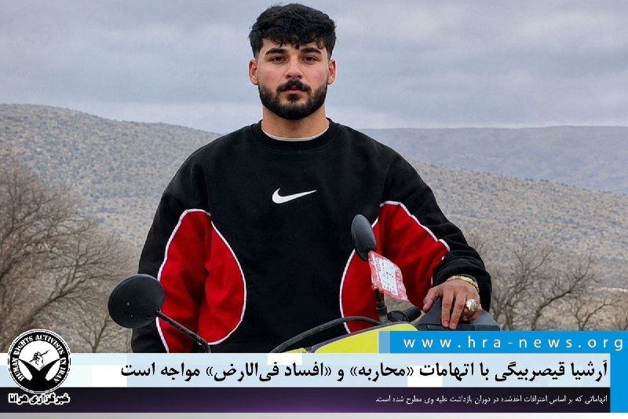

ایلام؛ طرح اتهامات «محاربه» و «افساد فی‌الارض» علیه آرشیا قیصربیگی

❗️
❗️
❗️
❗️
❗️ – آرشیا قیصربیگی، شهروند اهل سرابله از توابع استان ایلام، در تاریخ ۱۵ اردیبهشت ماه، توسط نیروهای امنیتی #بازداشت شده است. وی اکنون با اتهامات «محاربه و افساد فی‌الارض» مواجه شده است.

به گزارش خبرگزاری هرانا، ارگان خبری مجموعه فعالان حقوق بشر در ایران، آرشیا قیصربیگی با اتهاماتی همچون «محاربه و افساد فی‌الارض» مواجه است.

براساس اطلاعات دریافتی هرانا، در تاریخ ۱۶ اردیبهشت ۱۴۰۵، دادسرای عمومی و انقلاب شهرستان چرداول، وی را به اتهامات «محاربه و افساد فی‌الارض» متهم کرده و قرار بازداشت او را برای مدت دو ماه تمدید کرده است.

ادامه مطلب

#آرشیا_قیصربیگی

↘️
@hranews_bot تماس ✉️ -  @Hranews  کانال هرانا 🆑

## Hranews — post 112986

یک زن در فریدونکنار توسط یکی از بستگان خود به قتل رسید

❗️
❗️
❗️
❗️
❗️ – یک #زن ۲۶ ساله در شهرستان فریدونکنار توسط یکی از بستگان خود به قتل رسید. متهم توسط ماموران پلیس بازداشت شده است.

ادامه مطلب

↘️
@hranews_bot تماس ✉️ -  @Hranews  کانال هرانا 🆑

## Hranews — post 112985

واژگونی اتوبوس حامل کارگران مجتمع گاز پارس جنوبی به مرگ ۸ کارگر انجامید

❗️
❗️
❗️
❗️
❗️ – در اثر حادثه واژگونی یک دستگاه اتوبوس حامل کارکنان مجتمع گاز پارس جنوبی، در جاده عسلویه به سیراف، هشت #کارگر جان خود را از دست دادند.

ادامه مطلب

↘️
@hranews_bot تماس ✉️ -  @Hranews  کانال هرانا 🆑

## Hranews — post 112984

امروز یکشنبه ۲۷ اردیبهشت‌ماه، شماری از بازنشستگان تامین اجتماعی در مقابل ساختمان این سازمان در شوش دست به #تجمع اعتراضی زدند.

این تجمع در اعتراض به تاخیر بیش از دو ماهه در افزایش حقوق سالانه موضوع ماده ۹۶، بی‌تفاوتی نسبت به تعیین و ابلاغ حق مسکن و همچنین عدم اجرای قانون الزام در بخش درمان صورت گرفته است.

↘️
@hranews_bot تماس ✉️ -  @Hranews  کانال هرانا 🆑

## Hranews — post 112983

  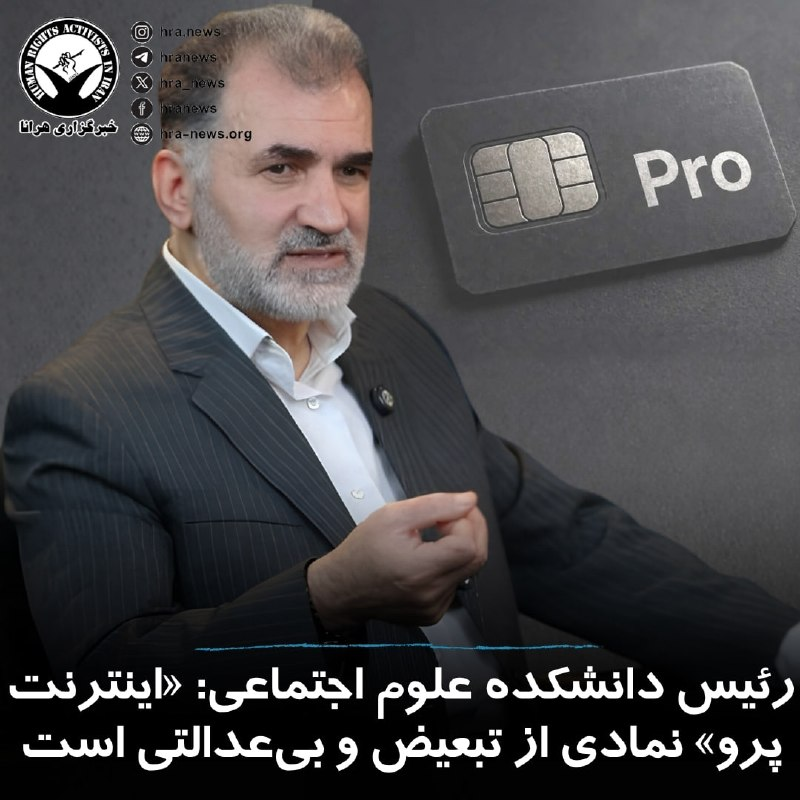

رئیس دانشکده علوم اجتماعی، ارتباطات و رسانه، نسبت به پیامدهای اجرای طرح «#اینترنت_پرو» هشدار داد و آن را عاملی در جهت تشدید #شکاف_اجتماعی دانست. وی در گفت‌وگو با ایسنا، با انتقاد از نحوه اجرای این طرح، اعلام کرد که شکل فعلی آن بدون شفاف‌سازی، به نمادی از تبعیض، رانت و بی‌عدالتی تبدیل شده و می‌تواند اعتماد عمومی و سرمایه اجتماعی را تضعیف کند.

اکبر نصراللهی اعلام کرد که تداوم محدودیت‌های اینترنتی در حالی که دسترسی مشابه در قبال پرداخت هزینه برای برخی افراد فراهم است، نوعی تناقض در سیاست‌گذاری محسوب می‌شود که در صورت عدم تبیین، می‌تواند به افزایش نارضایتی عمومی و تضعیف انسجام اجتماعی منجر شود. وی همچنین تاکید کرد که اینترنت به عنوان بخشی از زیرساخت حیاتی کشور، نقش مهمی در حوزه‌هایی چون آموزش، سلامت و اقتصاد دارد و تداوم محدودیت‌ها آثار گسترده‌ای بر زندگی روزمره شهروندان خواهد داشت.

↘️
@hranews_bot تماس ✉️ -  @Hranews  کانال هرانا 🆑

## Hranews — post 112982

اردبیل؛ یک محیط‌بان در پی درگیری با متخلف محیط زیستی مجروح شد

❗️
❗️
❗️
❗️
❗️ – یک #محیط_بان در منطقه حفاظت شده نئور استان اردبیل در جریان درگیری با یک صیاد متخلف زخمی شد.

ادامه مطلب

↘️
@hranews_bot تماس ✉️ -  @Hranews  کانال هرانا 🆑

## Hranews — post 112981

اعتراضات ۱۴۰۴؛ جلسه دادگاه رسیدگی به اتهامات صادق ساعدی‌نیا برگزار شد

❗️
❗️
❗️
❗️
❗️ – مرکز رسانه قوه قضاییه از برگزاری جلسه دادگاه رسیدگی به اتهامات صادق ساعدی‌نیا، یکی از بازداشت شدگان مرتبط با اعتراضات سراسری ۱۴۰۴، در دادگاه انقلاب قم خبر داد.

ادامه مطلب

#صادق_ساعدی‌نیا

↘️
@hranews_bot تماس ✉️ -  @Hranews  کانال هرانا 🆑

## Hranews — post 112980

عباس ماموسی بازداشت و به زندان ایلام منتقل شد

❗️
❗️
❗️
❗️
❗️ – عباس ماموسی، اهل شهرستان دهلران روز پنجشنبه ۲۴ اردیبهشت ماه، توسط نیروهای امنیتی #بازداشت و به زندان ایلام منتقل شد.

ادامه مطلب

#عباس_ماموسی

↘️
@hranews_bot تماس ✉️ -  @Hranews  کانال هرانا 🆑

## Hranews — post 112979

مشهد؛ نوزاد ۴۰ روزه با ضربات پیاپی و خفگی توسط پدرش به قتل رسید

❗️
❗️
❗️
❗️
❗️ – یک نوزاد ۴۰ روزه در مشهد، توسط پدرش به قتل رسید. این مرد ۳۸ ساله متهم است که ابتدا با ماهیتابه و کف دست ضربات متعددی به سر فرزند خود وارد کرده و در نهایت با وارد کردن مدفوع نوزاد به دهان او و انسداد مسیر تنفسی‌اش، فرزند پسر خود را به قتل رسانده است.

#قتل_کودک

ادامه مطلب

↘️
@hranews_bot تماس ✉️ -  @Hranews  کانال هرانا 🆑

## manototv — post 105553

  <a href="telegram/content/manototv_105553_1779018772.mp4" target="_blank">🎬 Download video</a>

مقام‌های ابوظبی اعلام کردند در پی حمله پهپادی، یک ژنراتور برق خارج از محدوده داخلی نیروگاه هسته‌ای براکه در منطقه الظفره دچار آتش‌سوزی شد.

بر اساس این اعلام، حادثه آسیب جانی نداشت و هیچ اثری بر سطح ایمنی پرتوی نیروگاه برجای نگذاشت. مقام‌ها گفته‌اند همه اقدامات احتیاطی لازم انجام شده و جزئیات بیشتر در صورت دریافت اطلاعات تازه اعلام خواهد شد.

سازمان فدرال مقررات هسته‌ای امارات نیز تاکید کرد آتش‌سوزی بر ایمنی نیروگاه یا آمادگی سامانه‌های حیاتی آن اثری نداشته و همه واحدهای نیروگاه به‌طور عادی در حال فعالیت‌اند.

## manototv — post 105552

  <a href="telegram/content/manototv_105552_1779018773.mp4" target="_blank">🎬 Download video</a>

روزنامه بریتانیایی تلگراف گفته است برخی افراد نزدیک به دونالد ترامپ، رئیس‌جمهوری آمریکا، پیشنهاد کرده‌اند امارات متحده عربی جزیره لاوان در خلیج فارس را تصرف کند.

بر اساس این ادعا، یک مقام ارشد امنیتی پیشین در دولت ترامپ به تلگراف گفت هدف از چنین پیشنهادی، افزایش نقش امارات در رویارویی با ایران بدون اعزام نیروهای زمینی آمریکا است.

این گزارش پس از آن منتشر می‌شود که وال‌استریت ژورنال از حملات پنهانی امارات به اهدافی در ایران خبر داد. به گزارش رویترز به نقل از این روزنامه، یکی از این حملات در اوایل آوریل پالایشگاهی در جزیره لاوان را هدف قرار داده بود، ادعایی که امارات آن را علنا تایید نکرده است.

## manototv — post 105551

  <a href="telegram/content/manototv_105551_1779018774.mp4" target="_blank">🎬 Download video</a>

اعتراض به سانسور، قطعی اینترنت، سرکوب و حبس معترضان در تجمع ایرانیان قبرس جنوبی، شنبه ۲۶ اردیبهشت

## manototv — post 105550

  <a href="telegram/content/manototv_105550_1779018777.mp4" target="_blank">🎬 Download video</a>

🎬 Video

## alonews — post 120583

  <a href="telegram/content/alonews_120583_1779018778.webm" target="_blank">🎬 Download video</a>

👈رسانه‌های عبری: نتانیاهو امروز با توجه به تحولات و تنش‌های منطقه با ترامپ صحبت خواهد کرد

✅ @AloNews خبر جنگ

## alonews — post 120582

  <a href="telegram/content/alonews_120582_1779018778.webm" target="_blank">🎬 Download video</a>

👈اسرائیل بیشتر از یه سال دوتا پایگاه نظامی مخفی تو بیابون‌های عراق داشته برای عملیات‌هاش علیه ایران

✅ @AloNews خبر جنگ

## alonews — post 120581

  

قیمت استثنایی گیگی
9️⃣
8️⃣
1️⃣

تحویل زیر یک دقیقه
✅
دارای لینک سابسکریشن جهت دیدن حجم و کنترل مصرف
✅
بدون قطعی 
✅
بدون محدودیت کاربر و زمان
✅
جمینایو چت جی بی تی و... کامل اوکیه با سرورامون
✅

🏪پشتیبانی کامل
✅
شروع فعالیت از سال 2022 
✅
پرداخت ریالی
✅

ضریب و این چیزا ندارن و تا آخرین مگابایت برای پشتیبانیش درختمتیم
🥂

💤این تخفیف فقط تا ۱۲ شب فعاله
💤

⭐️ @Napsternetiran_bot
〰️〰️〰️〰️〰️〰️〰️

🔶 @Napsternetvirani

## alonews — post 120580

  <a href="telegram/content/alonews_120580_1779018779.webm" target="_blank">🎬 Download video</a>

👈ادعای نیویورک‌تایمز: اسرائیل حداقل دو پایگاه مخفی در صحرای عراق را به‌طور متناوب و برای بیش از یک سال اداره می‌کرده است

✅ @AloNews خبر جنگ

## alonews — post 120579

  <a href="telegram/content/alonews_120579_1779018779.webm" target="_blank">🎬 Download video</a>

👈نتانیاهو: ۶۰ درصد غزه در کنترل ماست، برای هر سناریویی با ایران آماده‌ایم

✅ @AloNews خبر جنگ

## alonews — post 120578

  <a href="telegram/content/alonews_120578_1779018779.webm" target="_blank">🎬 Download video</a>

👈دبیر ستاد ملی جمعیت: اگر با همین شرایط پیش برویم، در ۷۵ سال آینده جمعیت ما به ۳۱ میلیون نفر میرسد

✅ @AloNews خبر جنگ

## alonews — post 120577

  <a href="telegram/content/alonews_120577_1779018780.webm" target="_blank">🎬 Download video</a>

👈هاآرتص: دادگاه کیفری بین‌المللی حکم‌های بازداشت مخفیانه‌ای برای پنج مقام اسرائیلی، از جمله سه سیاستمدار و دو افسر نظامی صادر کرد

✅ @AloNews خبر جنگ

## alonews — post 120576

  <a href="telegram/content/alonews_120576_1779018780.webm" target="_blank">🎬 Download video</a>

👈عارف معاون پزشکیان: ما تا حد امکان قیمت کالاها را مهار می‌کنیم و بقیه آن به مسائل بین‌المللی بازمی‌گردد!

✅ @AloNews خبر جنگ

## alonews — post 120575

  <a href="telegram/content/alonews_120575_1779018780.webm" target="_blank">🎬 Download video</a>

👈روزنامه Dawn پاکستان به نقل از منابع دیپلماتیک در اسلام‌آباد: سفر اعلام‌نشده وزیر کشور پاکستان به تهران در چارچوب دیپلماسی مستمر اسلام‌آباد برای احیای روند متوقف‌شده صلح میان آمریکا و ایران انجام می‌شود.

🔴این سفر برنامه‌ریزی‌نشده با هدف جلوگیری از فروپاشی کامل مذاکرات صورت گرفته؛ به‌ویژه پس از آنکه شتاب حاصل از دورهای پیشین گفت‌وگوها در پایتخت پاکستان به‌شدت کاهش یافته است.

🔴انتظار می‌رود وزیر کشور پاکستان، در جریان این سفر با مقام‌های ارشد ایرانی دیدار و گفت‌وگو کند.

✅ @AloNews خبر جنگ

## alonews — post 120574

  <a href="telegram/content/alonews_120574_1779018781.webm" target="_blank">🎬 Download video</a>

👈رئیس‌جمهور در شبکه اجتماعی ایکس نوشت: ‏در روزهای جنگ، فرزندان ما در ارتباطات و فناوری اطلاعات، شبانه‌روز ایستادند تا ارتباطات و خدمات حیاتی کشور پایدار بماند. دسترسی باکیفیت و پایدار مردم به خدمات دیجیتال، بخشی از آرامش، پیشرفت و حق زندگی شایسته مردم عزیز ایران است.

🔴روز جهانی ارتباطات را تبریک می‌گویم.

✅ @AloNews خبر جنگ

## alonews — post 120573

  <a href="telegram/content/alonews_120573_1779018781.webm" target="_blank">🎬 Download video</a>

👈اقتصاد اسرائیل در سه ماهه اول سال ۲۰۲۶ به دلیل جنگ با ایران ۳.۳٪ کوچک شد، طبق گزارش کانال ۱۲ اسرائیل

✅ @AloNews خبر جنگ

## alonews — post 120572

  <a href="telegram/content/alonews_120572_1779018781.webm" target="_blank">🎬 Download video</a>

👈گزارش سی ان ان از کابل هایی که زیر تنگه هرمز خوابیده!

🔴 مدیر تحقیقات شرکت تحقیقاتی TeleGeography، گفت که دو مورد از این کابل‌ها، فالکون و گلف بریج اینترنشنال (GBI)، از آب‌های سرزمینی ایران عبور می‌کنند. این شرکت اعلام کرده:کابل‌هایی که از تنگه هرمز عبور می‌کنند، تا سال 2025 کمتر از 1 درصد از پهنای باند بین‌المللی جهانی را تشکیل می‌دهند."

✅ @AloNews خبر جنگ

## alonews — post 120571

  <a href="telegram/content/alonews_120571_1779018782.webm" target="_blank">🎬 Download video</a>

👈دفتر رسانه ای ابوظبی : یه پهپاد نیروگاه هسته ای برکه تو منطقه الظفره رو هدف قرار داد 
✅ @AloNews خبر جنگ

## alonews — post 120570

  <a href="telegram/content/alonews_120570_1779018782.webm" target="_blank">🎬 Download video</a>

👈امارات اعلام کرد: آتش‌سوزی ناشی از حمله پهپادی به یک ژنراتور برق در نزدیکی تاسیسات هسته‌ای براکه

✅ @AloNews خبر جنگ

## alonews — post 120569

  <a href="telegram/content/alonews_120569_1779018782.webm" target="_blank">🎬 Download video</a>

🔴جلیلی سوم!

🔴پس از سعید جلیلی در سیاست خارجی و تحریم و قطعنامه؛ پس از وحید جلیلی در صداوسیما و سقوط مخاطب و مرجعیت؛ یک جلیلی دیگر هم چند سالی است بر زندگی شهروندان سایه انداخته.

🔴رسول جلیلی، عضو شورای عالی فضای مجازی و مدافع فیلترینگ؛ کسی که اینستاگرام و تلگرام را اف-۳۵ و اف-۱۵ می‌بیند.

✅@AloNews

## alonews — post 120568

  <a href="telegram/content/alonews_120568_1779018783.webm" target="_blank">🎬 Download video</a>

👈دفتر رسانه ای ابوظبی : یه پهپاد نیروگاه هسته ای برکه تو منطقه الظفره رو هدف قرار داد

✅ @AloNews خبر جنگ

## alonews — post 120567

  <a href="telegram/content/alonews_120567_1779018783.webm" target="_blank">🎬 Download video</a>

👈پزشکیان: نباید با آمار غیرواقعی جامعه را ناامید یا شرایط را عادی جلوه داد؛ اگر اینگونه القا شود که دولت عامدانه در مسیر افزایش قیمت‌ها حرکت می‌کند، ناجوانمردانه است

✅ @AloNews خبر جنگ

## alonews — post 120566

  <a href="telegram/content/alonews_120566_1779018784.webm" target="_blank">🎬 Download video</a>

👈برخی منابع خبری از انفجارهای مهیب در پایتخت امارات خبر دادند ولی علت انفجارها مشخص نیست

✅ @AloNews خبر جنگ

## alonews — post 120565

  <a href="telegram/content/alonews_120565_1779018784.webm" target="_blank">🎬 Download video</a>

👈نروژ مرفه ترین کشور جهان تو سال ۲۰۲۶ شد نروژ این جایگاه رو بخاطر درآمد عالی،وضعیت خوب مردم،آموزش،ثبات اقتصادی و اعتماد عمومی بدست آورد.

✅ @AloNews خبر جنگ

## alonews — post 120564

  <a href="telegram/content/alonews_120564_1779018784.webm" target="_blank">🎬 Download video</a>

👈حدود ۳۰ هزار نفر در فورتزهایم آلمان پس از کشف یک بمب ۱.۸ تنی منفجر نشده مربوط به جنگ جهانی دوم توسط کارگران در حین کار ساختمانی، تخلیه شده‌اند.

🔴مقامات یک منطقه ممنوعه ۱.۵ کیلومتری ایجاد کردند زیرا تیم‌های خنثی‌سازی بمب آماده خنثی‌سازی بمبی بودند که طبق گزارش‌ها حاوی حدود ۱.۳۵ تن مواد منفجره است.

✅ @AloNews خبر جنگ

<!-- MSG END -->

<!-- NAV START -->

<a href="https://github.com/nayebireza5-del/aiohghjbbbvm/blob/main/telegram/content/archive_1.md" style="display:inline-block; padding:6px 12px; margin:0 4px; background-color:#2ea44f; color:white; text-decoration:none; border-radius:4px; font-weight:bold;">صفحه بعد</a>

<!-- NAV END -->
