# خواننده تلگرام

<!-- TOP_NAV START -->

<a href="https://github.com/nayebireza5-del/aiohghjbbbvm/blob/main/telegram/content/archive_1.md" style="display:inline-block; padding:6px 12px; margin:0 4px; background-color:#2ea44f; color:white; text-decoration:none; border-radius:4px; font-weight:bold;">صفحه بعد</a>

<!-- TOP_NAV END -->

<!-- MSG START -->

---
📅 بروزرسانی: 1405/03/02 19:21
---

## VahidOOnLine — post 241753

  

دونالد ترامپ، رییس‌جمهوری آمریکا، به اکسیوس گفت که قرار است امروز با مذاکره‌کنندگان خود دیدار کند تا آخرین پیشنهاد تهران را بررسی کند و احتمالا تا روز یکشنبه درباره از سرگیری جنگ تصمیم‌گیری خواهد کرد.

رییس‌جمهوری آمریکا به اکسیوس گفت شانس دستیابی به توافق با جمهوری اسلامی یا «زدن ضربه‌ای بی‌سابقه» به این کشور «۵۰-۵۰» است.

او افزود تنها توافقی را می‌پذیرد که موضوعاتی مانند غنی‌سازی اورانیوم و سرنوشت ذخایر فعلی ایران را در بر بگیرد.
‌🏁 🇬🇧 IranintlTV

🤖 @VahidOOnLine

## VahidOOnLine — post 241752

  

♦️ دونالد ترامپ، رئیس‌جمهوری آمریکا، روز شنبه دوم خرداد در گفتگو با آکسیوس اعلام کرد که اواخر امروز با تیم مذاکره‌کننده خود دیدار می‌کند تا آخرین پیشنهاد ایران را بررسی کند. او افزود که احتمالا تا روز یکشنبه درباره پذیرش توافق یا از سرگیری جنگ تصمیم‌گیری خواهد کرد.

ترامپ شانس دستیابی به یک توافق «خوب» یا در غیر این صورت، «نابود کردن کامل آن‌ها» را یک «۵۰-۵۰ محکم» توصیف کرد. به گفته او، قرار است اواخر روز شنبه نشستی با حضور استیو ویتکاف، جرد کوشنر و جی‌دی ونس، معاون رئیس‌جمهور، برای بررسی پاسخ اخیر جمهوری اسلامی برگزار شود.

این اظهارات در حالی مطرح می‌شود که فیلد مارشال عاصم منیر، فرمانده ارتش پاکستان و میانجی این بحران، پس از دیدار با مقامات ارشد در تهران و تلاش برای نهایی کردن توافق، روز شنبه ایران را ترک کرد. اگرچه توافق هنوز نهایی نشده، اما ارتش پاکستان اعلام کرده است که «پیشرفت‌های دلگرم‌کننده‌ای به سمت یک تفاهم نهایی» حاصل شده است.
‌🇸🇦 Indypersian

🤖 @VahidOOnLine

## VahidOOnLine — post 241751

  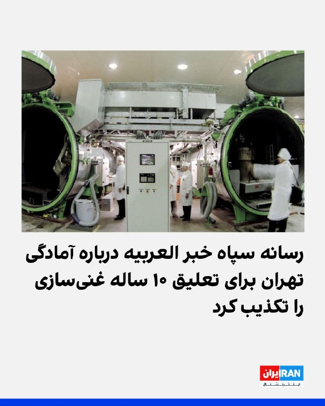

خبرگزاری تسنیم، وابسته به سپاه، به نقل از یک منبع مطلع نوشت که خبر العربیه درباره اینکه تهران پیشنهاد تعلیق ۱۰ ساله غنی‌سازی اورانیوم بالای ۳.۶ درصد را مطرح کرده، «از اساس کذب است».

تسنیم به نقل از این منبع با تاکید بر «ساختگی» بودن خبر العربیه، نوشت: «اساسا تمرکز پیام‌ها و گفتگوها در وضعیت فعلی صرفا بر روی مساله پایان جنگ است و هیچ جزئیاتی درباره موضوع هسته‌ای مورد بحث قرار نمی‌گیرد.»
‌🏁 🇬🇧 IranintlTV

🤖 @VahidOOnLine

## VahidOOnLine — post 241750

  <a href="telegram/content/VahidOOnLine_241750_1779551487.mp4" target="_blank">🎬 Download video</a>

فدراسیون فوتبال جمهوری اسلامی مدعی شد گزارش‌ها درباره رد ویزای شجاع خلیل‌زاده، مهدی طارمی و احسان حاج‌صفی را تکذیب کرد.

رسانه‌های ورزشی ایران در روزهای اخیر از شایعاتی درباره رد شدن ویزای این سه بازیکن تیم ملی فوتبال مردان ایران گزارش داده بودند.

فدراسیون فوتبال روز شنبه با انتشار بیانیه‌ای این گزارش‌ها را «کذب» خواند و اعلام کرد: «فرایند اداری مربوط به اخذ ویزا از سوی فدراسیون فوتبال و تیم ملی طبق روال انجام گرفته و ادعای مطرح شده کذب است.»

هم‌زمان، روزنامه خبرورزشی گزارش داد امیر قلعه‌نویی، سرمربی تیم ملی فوتبال مردان ایران، با بازیکنان جایگزین این سه عضو تیم ملی تماس گرفته تا تمرینات آمادگی برای جام جهانی را ادامه دهند.

شجاع خلیل‌زاده، مهدی طارمی و احسان حاج‌صفی از جمله ملی‌پوشان ایرانی هستند که دوران خدمت سربازی خود را در سپاه گذرانده‌اند.
‌🏁 🇬🇧 ManotoTV

🤖 @VahidOOnLine

## VahidOOnLine — post 241749

  <a href="telegram/content/VahidOOnLine_241749_1779551487.mp4" target="_blank">🎬 Download video</a>

ارتش پاکستان اعلام کرد عاصم منیر، فرمانده ارتش این کشور، سفر کوتاه اما «بسیار پرباری» به ایران داشته و در جریان آن دیدارها و گفت‌وگوهای «سطح بالا» با مقام‌های جمهوری‌اسلامی انجام داده است.
‌🏁 🇬🇧 ManotoTV

🤖 @VahidOOnLine

## VahidOOnLine — post 241748

  

خبرگزاری تسنیم، رسانه وابسته به سپاه، درباره روند مذاکرات تهران و واشینگتن، با اشاره به اینکه هنوز اختلافات جدی در بعضی از حوزه‌ها مانند تعهد واقعی آمریکا به آزادسازی اموال و موضوع تنگه هرمز وجود دارد، نوشت: «با توجه به زیاده‌خواهی‌های آمریکا، احتمال عدم حل موضوعات بالاست.»

در این گزارش آمده که در صورت حل موارد اختلاف، احتمالا در گام اول یک تفاهم اولیه اعلام شود و سپس مهلت ۳۰ یا ۶۰ روزه برای گفتگو درباره موضوع هسته‌ای (بدون تعهد اولیه جمهوری اسلامی) اعلام شود.

تسنیم نوشت که آمریکایی‌ها در متون پیشین خود تاکید داشتند که تهران در همان گام نخست باید امتیازاتی در بحث هسته‌ای بدهد و موضوع تعطیلی تاسیسات هسته‌ای و تحویل مواد غنی‌شده به آمریکایی‌ها از جمله مباحثی است که مدام در متن‌های آمریکایی‌ها مورد درخواست قرار می‌گرفت اما حکومت ایران اساسا بحث درباره جزئیات هسته‌ای را در این مرحله رد می‌کند.

بر اساس این گزارش تهران بر ضرورت پایان جنگ و تهدید در همه جبهه‌ها از جمله لبنان تاکید دارد. و این موضوع باید مورد پذیرش طرف آمریکایی قرار گیرد اما آمریکایی‌ها در برخی از متن‌های پیشین خود با این موضوعات مخالفت کرده‌اند.
‌🏁 🇬🇧 IranintlTV

🤖 @VahidOOnLine

## VahidOOnLine — post 241747

  <a href="telegram/content/VahidOOnLine_241747_1779551488.mp4" target="_blank">🎬 Download video</a>

♦️وزارت دفاع عربستان سعودی با انتشار ویدیویی در شبکه اجتماعی ایکس اعلام کرد نیروهای پدافند هوایی این کشور در قالب یک سامانه آمادگی یکپارچه، مسئول حفاظت از حریم هوایی اماکن مقدس هستند.
در این بیانیه تاکید شده این نیروها وظیفه مقابله با تمامی تهدیدات هوایی را بر عهده دارند و نقش کلیدی در تامین امنیت زائران و ایجاد آرامش برای «میهمانان» ایفا می‌کنند.
این اقدام در چارچوب تمهیدات امنیتی گسترده عربستان سعودی برای برگزاری مراسم حج و حفاظت از زائران صورت می‌گیرد.
‌🇸🇦 Indypersian

🤖 @VahidOOnLine

## VahidOOnLine — post 241746

  <a href="telegram/content/VahidOOnLine_241746_1779551489.mp4" target="_blank">🎬 Download video</a>

دونالد ترامپ، رئیس‌جمهور آمریکا، تصویری از نقشه خاورمیانه منتشر کرد که در آن ایران با طرح پرچم ایالات متحده پوشانده شده و بالای نقشه عبارت «ایالات متحده خاورمیانه؟» دیده می‌شود.

ترامپ این تصویر را در حساب خود در تروث‌سوشال منتشر کرد و توضیحی درباره منظور خود از آن ننوشت.
‌🏁 🇬🇧 ManotoTV

🤖 @VahidOOnLine

## VahidOOnLine — post 241745

  <a href="telegram/content/VahidOOnLine_241745_1779551490.mp4" target="_blank">🎬 Download video</a>

روزنامه فایننشال تایمز گزارش داده میانجی‌گران منطقه‌ای در حال نهایی کردن توافقی هستند که بر اساس آن آتش‌بس میان آمریکا و جمهوری‌اسلامی برای ۶۰ روز دیگر تمدید می‌شود و زمینه مذاکرات درباره برنامه هسته‌ای تهران را فراهم می‌کند.
بر اساس این گزارش، طرح پیشنهادی شامل بازگشایی تدریجی تنگه هرمز، گفت‌وگو درباره کاهش یا انتقال ذخایر اورانیوم غنی‌شده جمهوری‌اسلامی و همچنین کاهش محدودیت‌ها علیه بنادر ایران و آزادسازی مرحله‌ای بخشی از دارایی‌های مسدودشده تهران است.
اسماعیل بقایی، سخنگوی وزارت خارجه جمهوری‌اسلامی، گفته تهران و طرف‌های میانجی در حال تدوین «تفاهم‌نامه‌ای» برای پایان جنگ هستند و پس از آن مذاکرات درباره توافق جامع‌تر طی ۳۰ تا ۶۰ روز آینده ادامه خواهد یافت.
در همین حال، منابع دیپلماتیک گفته‌اند مذاکرات با میانجی‌گری قطر و پاکستان پیشرفت داشته، اما همچنان اختلاف‌های جدی بر سر برنامه هسته‌ای جمهوری‌اسلامی باقی مانده است؛ از جمله درخواست آمریکا برای تحویل ذخایر اورانیوم با غنای بالا و تعطیلی تاسیسات هسته‌ای نطنز، فردو و اصفهان.
این گزارش می‌افزاید کشورهای عربی منطقه نگران‌اند در صورت شکست مذاکرات و از سرگیری حملات آمریکا و اسرائیل، بحران به درگیری گسترده‌تر در خاورمیانه و اختلال شدید در بازار جهانی انرژی منجر شود.
‌🏁 🇬🇧 ManotoTV

🤖 @VahidOOnLine

## VahidOOnLine — post 241744

  <a href="telegram/content/VahidOOnLine_241744_1779551491.mp4" target="_blank">🎬 Download video</a>

مارکو روبیو، وزیر امور خارجه آمریکا، گفت در پرونده ایران «پیشرفت‌هایی» حاصل شده و ممکن است واشینگتن به‌زودی درباره این موضوع اظهارنظر تازه‌ای داشته باشد.

روبیو روز شنبه سوم خرداد در پاسخ به پرسشی درباره «موضوع ایران» گفت: «همان‌طور که گفتم، پیشرفت‌هایی حاصل شده است. حتی همین حالا که با شما صحبت می‌کنم، کارهایی در حال انجام است.»

او افزود ممکن است «امروز، فردا یا ظرف چند روز آینده» چیزی برای اعلام وجود داشته باشد، اما تاکید کرد هنوز قطعی نیست.

وزیر امور خارجه آمریکا گفت این موضوع باید «به هر شکل» حل شود و به گفته او، موضع دونالد ترامپ این است که «ایران هرگز نباید سلاح هسته‌ای داشته باشد.»

روبیو همچنین گفت تنگه‌ها باید «بدون عوارض» باز بمانند و جمهوری اسلامی باید درباره اورانیوم غنی‌شده و موضوع غنی‌سازی پاسخ‌گو باشد.
‌🏁 🇬🇧 ManotoTV

🤖 @VahidOOnLine

## VahidOOnLine — post 241743

  

♦️ بخش رسانه‌ای ارتش پاکستان (ISPR) آخرین دور گفتگوها میان میانجی‌های قطری-پاکستانی و مقامات بلندپایه جمهوری اسلامی را «کوتاه اما بسیار پربار» توصیف کرد.

بر اساس بیانیه منتشر شده، این رایزنی‌های فشرده در ۲۴ ساعت گذشته در فضایی مثبت و سازنده برگزار شده و پیشرفت‌های دلگرم‌کننده‌ای را برای دستیابی به یک تفاهم نهایی جهت پایان دادن به جنگ ایجاد کرده است. در این مذاکرات، فیلد مارشال عاصم منیر، فرمانده ارتش پاکستان، با مسعود پزشکیان، رئیس‌جمهوری، محمدباقر قالیباف، رئیس مجلس شورای اسلامی، عباس عراقچی، وزیر امور خارجه و اسکندر مومنی، وزیر کشور دیدار و گفتگو کرده است.

با این حال، به نظر می‌رسد مجتبی خامنه‌ای، رهبر جدید جمهوری اسلامی که از زمان کشته شدن پدرش در روزهای نخست حملات هوایی در انظار عمومی ظاهر نشده، در این گفتگوها مشارکتی نداشته است. ارتش پاکستان جزئیات بیشتری از مفاد دقیق این مذاکرات ارائه نکرده است.
‌🇸🇦 Indypersian

🤖 @VahidOOnLine

## VahidOOnLine — post 241742

ویدیوهای رسیده به ایران اینترنشنال نشان می‌دهد ایرانیان بریتانیا روز شنبه در لندن با حمل پرچم‌های شیروخورشید در حمایت از انقلاب ملی علیه جمهوری اسلامی تجمع کردند.
‌🏁 🇬🇧 IranintlTV

🤖 @VahidOOnLine

## VahidOOnLine — post 241741

  

فایننشال تایمز گزارش داد که میانجی‌های جنگ ایران معتقدند در حال نزدیک شدن به توافقی هستند که آتش‌بس میان واشینگتن و تهران را به مدت ۶۰ روز تمدید و چارچوبی برای مذاکرات درباره برنامه هسته‌ای جمهوری اسلامی ایجاد کند.

بنا بر این گزارش، افرادی که در جریان این مذاکرات قرار دارند به این رسانه گفتند این توافق شامل بازگشایی تدریجی تنگه هرمز و همچنین تعهد به بررسی رقیق‌سازی یا واگذاری ذخایر اورانیوم با غنای بالا خواهد بود.

فایننشال تایمز افزود که آمریکا همچنین محاصره دریایی بنادر جنوب ایران را کاهش می‌دهد و با کاهش تحریم‌ها و همچنین آزادسازی مرحله‌ای دارایی‌های مسدودشده تهران در خارج از کشور موافقت خواهد کرد.
‌🏁 🇬🇧 IranintlTV

🤖 @VahidOOnLine

## VahidOOnLine — post 241740

روایت شما از زندگی در آتش‌بس- شنبه ۲ خرداد ۱۴۰۵
🔹 ترامپ کارمند ما نیست که امر و نهی کنیم، موش علی و فرمانده‌هاش و سرکوبگرهاش رو ذلیل کرد، حالا نوبت ماست اعتصاب کنیم. نه به گوشت و مرغ رو شروع کنیم تا فراخوان بعد.
🔹 در تهران گرانی بیداد می‌کند. حقوق‌ها را دیر می‌دهند. یک کیلو توت‌فرنگی در تره‌بار ۳۰۰ هزار تومان، در مغازه معمولی ۶۰۰ هزار تومان. دارو در داروخانه کمیاب شده. یک بطری کوچک روغن زیتون یک میلیون و پانصد هزار تومان.
🔹 دم همه دانش‌آموزان غیور لر گرم که زیر بار حرف زور و ستم نمی‌روند، به‌قول شاهزاده عزیز واقعاً نسل ویکتوری هستید.
🔹 درود، من یک نوجوان ۱۶ ساله هستم که صندوق‌دار یک فروشگاه هستم. آن‌قدر همه‌چیز گران شده که حتی خودم هم خجالت می‌کشم به مشتری‌ها قیمت بدهم. واقعاً مردم ایران کوه صبر هستند. به امید روزهای خوب ایران.
‌🏁 🇬🇧 IranintlTV

🤖 @VahidOOnLine

## VahidOOnLine — post 241739

  <a href="telegram/content/VahidOOnLine_241739_1779551493.mp4" target="_blank">🎬 Download video</a>

ایرانیان سوئیس روز شنبه با تجمع مقابل سفارت جمهوری اسلامی خواستار بسته‌شدن آن شدند. آن‌ها همچنین با حمل تصاویر شاهزاده رضا پهلوی و پرچم شیروخورشید از انقلاب ملی حمایت کردند.
‌🏁 🇬🇧 IranintlTV

🤖 @VahidOOnLine

## VahidOOnLine — post 241738

  

♦️ مسعود پزشکیان، رئیس‌جمهوری اسلامی، روز شنبه دوم خرداد در دیدار با عاصم منیر، فرمانده ارتش پاکستان در تهران، با اشاره به روند مذاکرات جاری برای پایان دادن به درگیری‌های نظامی، از «بی‌اعتمادی» تهران به ایالات متحده سخن گفت.

به گزارش وب‌سایت ریاست‌جمهوری، پزشکیان با متهم کردن آمریکا به «نقض عهد مکرر و حملات در حین مذاکرات» گفت: «سابقه و تجربه مذاکره با آمریکایی‌ها به ما حکم می‌کند که نهایت دقت را به عمل آوریم.» او با ادعای اینکه تهران صرفا به دنبال احقاق حقوق قانونی خود است، تاکید کرد که واشنگتن پیروز این منازعه نخواهد بود و اسرائیل تنها طرفی است که از جنگ نفع می‌برد.

در این دیدار، عاصم منیر که کشورش نقش میانجی را میان تهران و واشنگتن ایفا می‌کند، روند گفتگوها را «رو به جلو» توصیف کرد و ابراز امیدواری کرد که این مذاکرات هرچه سریع‌تر به نتیجه مطلوب برسد. فرمانده ارتش پاکستان همچنین اسرائیل را متهم کرد که تمایلی به برقراری ثبات در منطقه ندارد.

این اظهارات در حالی مطرح می‌شود که پیشتر الجزیره از دستیابی به یک پیش‌نویس تفاهم میان دو طرف برای بازگشایی تنگه هرمز و توقف درگیری‌ها خبر داده بود.
‌🇸🇦 Indypersian

🤖 @VahidOOnLine

## VahidOOnLine — post 241737

  

الحدث گزارش داد جمهوری اسلامی در پیشنهاد جدید خود خواستار آزادسازی دارایی‌های مسدود‌شده خود قبل از مذاکرات هسته‌ای شده است.
بر اساس این گزارش، تهران خواستار ایجاد یک مکانیسم جبران خسارت جنگ از سوی ایالات متحده و لغو کامل تحریم‌ها در ازای تعهدات هسته‌ای شده است.
‌🏁 🇬🇧 IranintlTV

🤖 @VahidOOnLine

## VahidOOnLine — post 241736

  

♦️پرویز قلیچ‌خانی، از چهره‌های ماندگار فوتبال ایران، ساعاتی پیش در حومه پاریس درگذشت.
بر اساس گزارش‌ها، قلیچ‌خانی که متولد سال ۱۳۲۴ بود، در سن ۸۱ سالگی و پس از ماه‌ها تحمل بیماری چشم از جهان فروبست.
او یکی از بزرگ‌ترین بازیکنان تاریخ فوتبال ایران به‌شمار می‌رفت و سابقه کاپیتانی تیم ملی و درخشش در مسابقات آسیایی را در کارنامه خود داشت.
‌🇸🇦 Indypersian

🤖 @VahidOOnLine

## VahidOOnLine — post 241735

♦️ مارکو روبیو، وزیر امور خارجه آمریکا، روز شنبه دوم خرداد، در گفتگو با خبرنگاران از حصول پیشرفت‌هایی در خصوص مسئله ایران خبر داد و اعلام کرد که احتمال دارد طی ساعات آینده یا روزهای پیش‌رو، اخبار جدیدی در این زمینه منتشر شود.

روبیو با تاکید بر اینکه ترجیح دونالد ترامپ همواره حل بحران‌ها از طریق دیپلماسی و مذاکره است، تصریح کرد که این مشکل باید به هر طریقی حل شود و ایران هرگز نباید به سلاح هسته‌ای دست یابد. او همچنین بازگشایی بدون قید و شرط تنگه هرمز، توقف غنی‌سازی و تحویل اورانیوم با غنای بالا را از شروط اصلی و همیشگی رئیس‌جمهوری آمریکا خواند.

وزیر خارجه ایالات متحده در پایان ابراز امیدواری کرد که تلاش‌های دیپلماتیک کنونی به نتیجه برسد و به‌زودی اخبار مثبتی برای اعلام داشته باشند.
‌🇸🇦 Indypersian

🤖 @VahidOOnLine

## VahidOOnLine — post 241734

  

العربیه به نقل از منابع خود گزارش داد جمهوری اسلامی پیشنهاد بازگشایی تنگه هرمز و تعلیق موقت دریافت عوارض را مطرح کرده است.

همچنین بر اساس این گزارش، تهران پیشنهاد داده غنی‌سازی اورانیوم بالاتر از ۳.۶ درصد را به مدت ۱۰ سال به حالت تعلیق درآورد.
‌🏁 🇬🇧 IranintlTV

🤖 @VahidOOnLine

## WithYashar — post 12182

العربیه : ایران پیشنهاد تعلیق غنی‌سازی اورانیوم بالای 3.6% را به مدت 10 سال ارائه داد @withyashar

## WithYashar — post 12181

العربیه : ایران پیشنهاد تعلیق غنی‌سازی اورانیوم بالای 3.6% را به مدت 10 سال ارائه داد
@withyashar

## WithYashar — post 12180

🤗

## WithYashar — post 12179

## WithYashar — post 12178

مدیر شبکه افق: برای اولین بار اعلام می‌کنم که حضرت آقا تجمعات را از تلویزیون دنبال می‌کنند و از جمعیت زیاد تجمعات خوشحال هستند
@withyashar
یاشار : به عن آقا بگین پیج مارم ببینه 🤣

## WithYashar — post 12177

الحدث:ایران دو مسیر برای مذاکرات پیشنهاد کرده که با اعلام پایان جنگ و محاصره آغاز می‌شود.

ایران تأکید کرده است که در متن یادداشت تفاهم، به عدم تولید سلاح هسته‌ای متعهد خواهد بود.

ایران خواستار حفظ حق غنی‌سازی در هر توافقی شده است

ایران پیش از مذاکرات هسته‌ای خواستار آزادسازی دارایی‌های بلوکه‌شدهٔ خود شده است
@withyashar

## WithYashar — post 12176

## WithYashar — post 12175

بعد از ممنوعیت پرچم شیر و خورشید در مسابقات جام‌جهانی توسط فیفا، نشریهٔ ایندیپندنت از مجاز شدن ورود پرچم فلسطین به ورزشگاه‌های جام‌جهانی خبر داد
@withyashar 😐

## WithYashar — post 12174

## WithYashar — post 12173

  <a href="telegram/content/WithYashar_12173_1779551498.mp4" target="_blank">🎬 Download video</a>

ورود جالب وزیر دفاع آمریکا، پیت هگست به وست پوینت معروف‌ترین آکادمی نظامی ارتش آمریکا، وی متولد ۶ ژوئن ۱۹۸۰ است و الان ۴۵ سال دارد.
همسر فعلی(سوم) او جنیفر راچت نام دارد؛ تهیه‌کننده سابق فاکس‌نیوز است. حدود ۴۰ سال دارد.
پیت هگست در مجموع ۷ فرزند در خانواده ترکیبی‌اش دارد از این میان، ۴ فرزند مستقیماً فرزندان خود او هستند:
۳ پسر از همسر دومش ۱ دختر از جنیفر راچت و ۳ فرزند دیگر (۲ پسر و ۱ دختر) فرزندان جنیفر از ازدواج قبلی‌اش هستند که با هم زندگی می‌کنند.
@withyashar

## WithYashar — post 12172

ادعای العربیه: تهران در ازای پرداخت غرامت از سوی آمریکا به ایران، پیشنهاد بازگشایی تنگه هرمز را ارائه کرده است
@withyashar 🤣

## WithYashar — post 12171

اسرائیل همچنان درحال بمباران مواضع حزب‌الله
@withyashar

## WithYashar — post 12170

Voice message

## WithYashar — post 12169

سخنگوی وزارت امور خارجهٔ ایران: این یادداشت تفاهم شامل ۱۴ بند برای پایان دادن به جنگ است و جزئیات آن طی یک بازهٔ ۳۰ تا ۶۰ روزه مورد بحث و بررسی قرار خواهد گرفت.
@withyashar

## WithYashar — post 12168

مارکو روبیو: مقداری پیشرفت در مذاکرات با ایران حاصل شده است.

همچنین این احتمال وجود دارد که آمریکا طی روزهای آینده دربارهٔ ایران چیزی برای اعلام داشته باشد.
@withyashar

## WithYashar — post 12167

یک مقام ایرانی به شبکه الجزیره: قطر نقش کلیدی در تهیه پیش‌نویس این یادداشت تفاهم ایفا کرد و بین میانجی‌ها و واشنگتن ارتباط وجود داشت
@withyashar

## WithYashar — post 12166

حزب‌الله اعلام کرد که پیامی از وزیر امور خارجه رژیم جمهوری اسلامی دریافت کرده است که در آن آمده ایران به حمایت از این گروه ادامه خواهد داد و آن را رها نخواهد کرد.
@withyashar

## WithYashar — post 12165

سخنگوی وزارت خارجه: پیشنهاد ۱۴ بندی ایران که چندین بار رفت و برگشت شده و در خصوص بندهای مختلف آن دیدگاه‌های طرفین تبادل شده است و در این چند روز راجع به برخی نکات و عبارت پردازی‌هایی که راجع به آن اختلاف نظر کماکان وجود داشت بحث و پیشنهاداتی مطرح شد که همچنان برخی از آن در حال بررسی و اعلام نظر است.
@withyashar

## WithYashar — post 12164

## WithYashar — post 12163

ادعای الجزیره: مقام ایرانی تایید کرد با واسطه پاکستانی به توافق رسیدند و منتظر جواب آمریکا هستند! @withyashar یک مقام ایرانی به الجزیره گفت: این یادداشت تفاهم شامل پایان جنگ، لغو محاصره، باز کردن تنگه هرمز و خروج نیروهای آمریکایی از منطقه جنگی است.

## mwarmonitor — post 9547

🔴بعد تعیین درصد از سمت من ، ترامپ هم درصد احتمالی توافق یا درگیری مشخص کرد 😂

## mwarmonitor — post 9546

🔴ترامپ می‌گوید احتمالاً تا روز یکشنبه تصمیم خواهد گرفت که آیا جنگ با ایران را از سر بگیرد یا نه و به Axios گفته است که شانس رسیدن به توافق «۵۰/۵۰» است. او همچنین گفته است با مذاکره‌کنندگان آمریکایی دیدار خواهد کرد تا آخرین پیشنهاد ایران را بررسی کند، در حالی…

## mwarmonitor — post 9545

🔴ترامپ می‌گوید احتمالاً تا روز یکشنبه تصمیم خواهد گرفت که آیا جنگ با ایران را از سر بگیرد یا نه و به Axios گفته است که شانس رسیدن به توافق «۵۰/۵۰» است. او همچنین گفته است با مذاکره‌کنندگان آمریکایی دیدار خواهد کرد تا آخرین پیشنهاد ایران را بررسی کند، در حالی که میانجی‌های پاکستانی از «پیشرفت امیدوارکننده» به سمت یک تفاهم نهایی خبر داده‌اند.

@mwarmonitor

## mwarmonitor — post 9544

🔴میانجی‌ها معتقدند که به توافقی برای تمدید آتش‌بس میان آمریکا و ایران به مدت ۶۰ روز نزدیک شده‌اند — The Wall Street Journal

@mwarmonitor

## mwarmonitor — post 9543

📝از نظر من در حال حاضر سه سناریو قابل تصور است:

۱) ترامپ با یک توییت مشابه دفعات قبل، آتش‌بس را تمدید می‌کند و فرصت به دیپلماسی ؛ که می‌تواند نشانه‌ای از حرکت به سمت توافق باشد. ۱ درصد

۲) او با یک توییت نارضایتی خود را اعلام می‌کند؛ در این حالت احتمال درگیری وجود دارد، اما پایین است. ۱ درصد

۳) او هیچ واکنشی علنی نشان نمی‌دهد و در سکوت، دستور اقدام نظامی صادر می‌کند. ۹۸ درصد

@mwarmonitor

## mwarmonitor — post 9542

🔴 ارتش پاکستان: مشورت‌های فرمانده ارتش در ایران پیشرفت‌های امیدوارکننده‌ای در جهت رسیدن به یک تفاهم نهایی داشته است.

@mwarmonitor

## mwarmonitor — post 9541

🔴مذاکره‌کنندگان آمریکا و ایران طبق گزارش فایننشال تایمز به توافقی نزدیک شده‌اند که آتش‌بس را برای ۶۰ روز دیگر تمدید می‌کند. این توافق میانجی‌گری‌شده شامل بازگشایی تدریجی تنگه هرمز، آغاز مذاکرات درباره ذخایر اورانیوم غنی‌شده ایران، کاهش محدودیت‌ها بر بنادر ایران، کاهش تحریم‌ها و آزادسازی مرحله‌ای دارایی‌های بلوکه‌شده تهران در خارج از کشور خواهد بود.

@mwarmonitor

## mwarmonitor — post 9540

«سؤال در مورد موضوع ایرانه و همون‌طور که گفتم، پیشرفت‌هایی حاصل شده؛ یه سری پیشرفت‌ها صورت گرفته. حتی همین الان که دارم با شما صحبت می‌کنم، کارهایی داره انجام میشه. این احتمال وجود دارد که اواخر امروز، فردا یا چند روز آینده، حرفی برای گفتن داشته باشیم. اما این موضوع همون‌طور که رئیس‌جمهور گفتن، باید به هر طریقی حل بشه. ایران هرگز نمی‌تونه سلاح هسته‌ای داشته باشه. تنگه‌ها باید بدون پرداخت عوارض باز باشن. آن‌ها باید اورانیوم غنی‌شده‌شون رو، اورانیوم با غنای بالاشون رو تحویل بدن؛ ما باید به این موضوع بپردازیم، باید به مسئله غنی‌سازی بپردازیم. این‌ها نکات مورد تأکید همیشگی رئیس‌جمهور هستند و ترجیح ایشون همیشه پرداختن به این مسئله از طریق دیپلماتیکه. ترجیح رئیس‌جمهور همیشه حل مشکلاتی از این دست، از طریق یک راه‌حل دیپلماتیک مذاکره‌شده است. این چیزیه که در حال حاضر داریم روش کار می‌کنیم، اما این مشکل همون‌طور که رئیس‌جمهور به وضوح اعلام کردن، به هر طریقی حل خواهد شد. ما امیدواریم که این کار از مسیر دیپلماتیک انجام بشه؛ این چیزیه که داریم روش کار می‌کنیم و شاید در مقطعی که برای این بازدید این‌جا هستم، موضوعی برای گفتگو در این رابطه وجود داشته باشه»

@mwarmonitor

## mwarmonitor — post 9539

  <a href="telegram/content/mwarmonitor_9539_1779551500.mp4" target="_blank">🎬 Download video</a>

🎬 Video

## mwarmonitor — post 9538

⏳

## mwarmonitor — post 9537

🔴مقام ایرانی به الجزیره: یادداشت تفاهم شامل پایان جنگ، رفع محاصره، باز شدن تنگه هرمز و خروج نیروهای آمریکا از منطقه جنگی است.

‏🔸یادداشت تفاهم شامل موضوعات هسته‌ای نمی‌شود، زیرا این مسائل پیچیده هستند و به زمان کافی برای مذاکره نیاز دارند.

‏🔸 پس از ۳۰ روز از توافق، می‌توان باب مذاکرات هسته‌ای را باز کرد.

‏🔸قرار بود فرمانده ارتش پاکستان در تهران این یادداشت تفاهم را اعلام کند، اما او برای هماهنگی با واشنگتن تهران را ترک کرد.

‏🔸 قطر نقش اساسی در تدوین این یادداشت تفاهم داشته و میانجی‌ها نیز با واشنگتن در ارتباط بوده‌اند.

🔸 ایران نمی‌تواند امتیازاتی بیش از آنچه در یادداشت تفاهم آمده ارائه دهد.

@mwarmonitor

## mwarmonitor — post 9536

  

🔴ترامپ در سوشال تروث

@mwarmonitor

## mwarmonitor — post 9535

  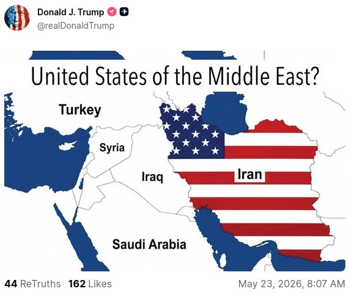

🔴ترامپ در سوشال تروث

@mwarmonitor

## mwarmonitor — post 9534

  

🚨نیویورک پست: ادعا می‌شود محمدباقر السعدی، مظنون عراقیِ مرتبط با سپاه پاسداران انقلاب اسلامی، در تلافی کشته‌شدن قاسم سلیمانی در سال ۲۰۲۰، قصد ترور ایوانکا ترامپ را داشته است. مقام‌ها می‌گویند او نقشه‌هایی از محل سکونت او در فلوریدا در اختیار داشته و خانواده…

## mwarmonitor — post 9533

🔴محاصره دریایی ایران توسط آمریکا؛ شمار کشتی‌های تغییر مسیر داده شده به ۱۰۰ فروند رسید

🔸ستاد فرماندهی مرکزی ایالات متحده (سنتکام)

🔰تامپا، فلوریدا — نیروهای ستاد فرماندهی مرکزی ایالات متحده (سنتکام) در تاریخ ۲۳ مه، در جریان اجرای محاصره دریایی علیه ایران، به حد نصاب جدیدی در تغییر مسیر بیش از ۱۰۰ فروند کشتی تجاری دست یافتند.
نیروهای آمریکایی بر اساس فرمان اجرایی رئیس‌جمهور، از تاریخ ۱۳ آوریل اجرای این محاصره را علیه کشتی‌های تجاری که به بنادر ایران وارد یا از آن خارج می‌شوند، آغاز کردند. طی شش هفته گذشته، بیش از ۱۵,۰۰۰ سرباز، ملوان، تفنگدار دریایی و نیروی هوایی، مسیر ۱۰۰ فروند کشتی را تغییر داده، ۴ فروند را متوقف (غیرفعال) کرده و به ۲۶ فروند کشتی حامل کمک‌های بشردوستانه اجازه عبور داده‌اند.

🔹دریادار برد کوپر، فرمانده سنتکام در این باره گفت:
«نیروهای ما کار فوق‌العاده‌ای انجام می‌دهند. آن‌ها این مأموریت را با دقت و حرفه‌ای‌گری بالا اجرا کرده و بسیار مؤثر عمل کرده‌اند؛ به طوری که اجازه هیچ‌گونه تجارتی را به بنادر ایران و بالعکس نداده‌اند و این امر ایران را تحت فشار اقتصادی قرار داده است.»
بیش از ۲۰۰ فروند هواپیما و ناو جنگی ایالات متحده از این مأموریت پشتیبانی می‌کنند؛ از جمله گروه ضربت ناو هواپیمابر آبراهام لینکلن، گروه ضربت ناو هواپیمابر جورج اچ.دبلیو. بوش، گروه آماده باش دوزیست تریپولی به همراه سی‌ویکمین واحد اعزامی تفنگداران دریایی، و چندین ناوشکن مجهز به موشک‌های هدایت‌شونده.
این محاصره دریایی علیه کشتی‌های تمامی کشورها که به بنادر و مناطق ساحلی ایران وارد یا از آن خارج می‌شوند، از جمله تمامی بنادر ایران در خلیج فارس و دریای عمان، در حال اجرا است.

@mwarmonitor

## mwarmonitor — post 9532

  

خب عاصم منیر رفت

## mwarmonitor — post 9531

🔸فرانسه ورود ایتامار بن‌گویر، وزیر امنیت ملی اسرائیل، به خاک خود را ممنوع کرده است. ژان-نوئل بارو، وزیر خارجه فرانسه، اعلام کرد این تصمیم به دلیل رفتار اسرائیل با فعالان ناوگان کمک‌رسانی به غزه گرفته شده است. او افزود پاریس و رم از اتحادیه اروپا می‌خواهند علیه او تحریم‌هایی اعمال کند.

@mwarmonitor

## mwarmonitor — post 9530

  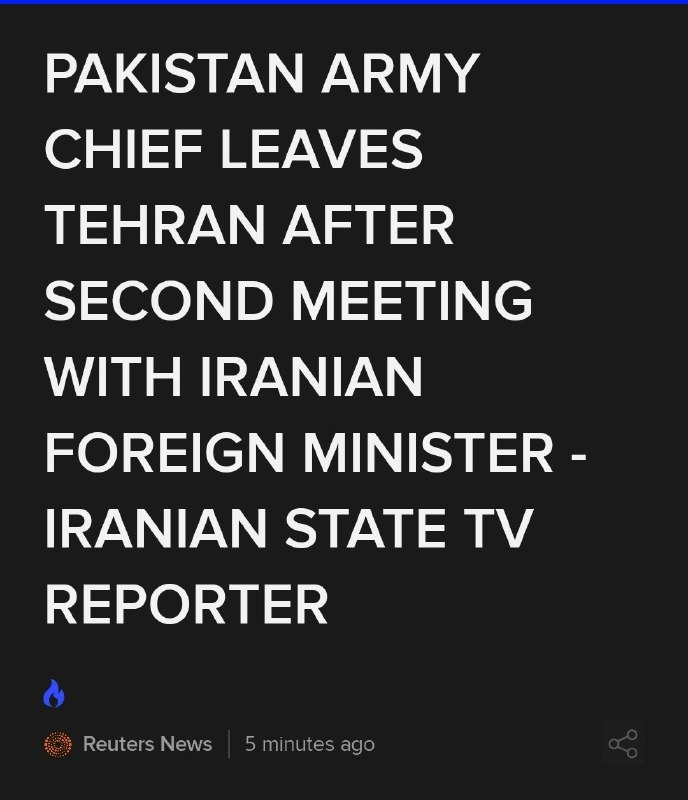

خب عاصم منیر رفت

## mwarmonitor — post 9529

  

📝عباس نگاهی به آسمانِ ناامن می‌اندازد و می‌گوید: «حالا که این منیر اینجاست، بریم یه هوا بخوریم یه دوری بیرون بزنیم.» بدبخت را به عنوان گنبد آهنیِ گوشتی سپر کرده‌اند، چون خودشان هم خوب می‌دانند تنهایی حتی جرعت قدم زدن تو خونه ندارند، چه برسه به محوطه باز؛ آن هم وقتی که با هر صدای غرشِ باد، سایهٔ پهپادهای اسرائیل را بالای سرشان می‌بینند! این کمدیِ سیاه به قدری مضحک است که یک لشکر کت‌شلواری را دور خودشان دیوار کرده‌اند تا شاید پهپادهای نقطه‌زن در تفکیکِ اهداف دچار خطای محاسباتی شوند. خلاصه که این پیاده‌رویِ لرزان، هواخوری نیست؛ یک دوشِ آبِ سردِ دسته‌جمعی زیر تیغِ عزرائیلِ است!

@mwarmonitor

## mwarmonitor — post 9528

🔴ایالات متحده و اسرائیل در حال بررسی این موضوع هستند که آیا رهبر عالی، مجتبی خامنه‌ای را حذف کنند یا نه. 🔸بر اساس گزارش اسرائیل هیوم، آن‌ها می‌سنجند که آیا بقای او نوعی ثبات قابل‌کنترل ایجاد می‌کند، یا این‌که حذفش می‌تواند ساختار حاکمیتی ایران را بیش از پیش…

## FoxNewsTwitter — post 342161

  <a href="telegram/content/FoxNewsTwitter_342161_1779551508.mp4" target="_blank">🎬 Download video</a>

Fox News (Twitter/X)

“One way or the other, Iran can never have a nuclear weapon.”

Secretary of State Marco Rubio says negotiations with Iran are moving forward and revealed there could be developments “later today, tomorrow, in a couple of days.”

Rubio said President Trump prefers to resolve the standoff diplomatically, but stressed the administration is demanding Iran turn over its enriched uranium and address its nuclear enrichment efforts.

"Even as I speak to you now, there's some work being done," Rubio added.

## FoxNewsTwitter — post 342160

  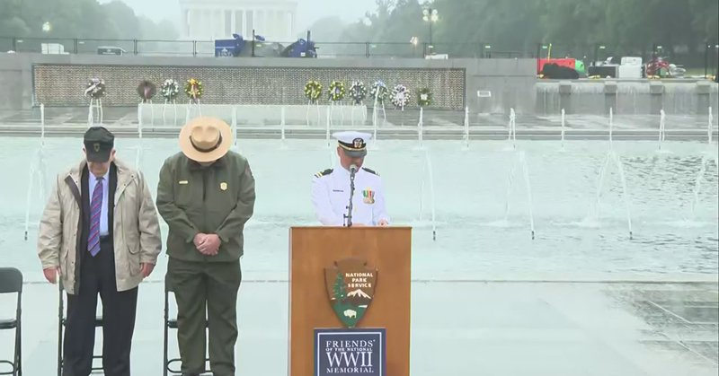

Fox News (Twitter/X)

WATCH LIVE: The National Park Service holds a special Memorial Day observance at the WWII Memorial https://twitter.com/i/broadcasts/1qGvvvkdDnOGB

## FoxNewsTwitter — post 342159

  <a href="telegram/content/FoxNewsTwitter_342159_1779551510.mp4" target="_blank">🎬 Download video</a>

Fox News (Twitter/X)

WATCH: Newly released dashcam footage shows the moment Britney Spears was pulled over and arrested on suspicion of DUI in California back in March.

Her breath tests showed blood alcohol levels below California’s legal limit, but officers said they also found an unprescribed bottle of Adderall in the vehicle and concluded she was under the influence of alcohol and a stimulant.

Spears pleaded guilty earlier this month to reckless driving involving alcohol and drugs and avoided jail time.

## FoxNewsTwitter — post 342158

  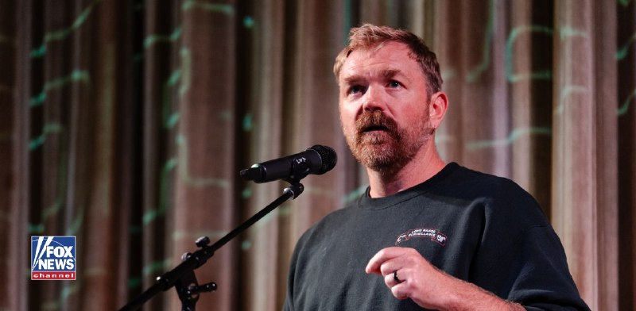

Fox News (Twitter/X)

“Full of fat, lazy trash who would rather not be in uniform.”

Resurfaced posts tied to Maine Democratic Senate candidate Graham Platner are back in the spotlight after he called the U.S. Army “absolute trash.”

The posts, made under the Reddit account “P-Hustle,” have become a major issue in Maine’s Senate race against GOP Sen. Susan Collins.

Platner has previously apologized for the comments, saying they were made during a period of combat trauma and do not reflect who he is today.

## pm_afshaa — post 91294

🔴ترامپ به آکسیوس: یا چنان محکم‌تر از همیشه به آنها حمله نظامی می کنم که تا حالا مثل آن را ندیده‌اند، یا توافقی خوب را امضا می‌کنیم

💧 Rainbet.com the #1 Non-KYC Crypto Casino & Sportsbook @rainbetcom

😁 @Pm_Afshaa

## pm_afshaa — post 91293

🔴هگست، وزیر جنگ آمریکا: ارتش ما عاشق غرق کردن نیروی دریایی دشمنه و من بهشون گفتم که تنها نیروی دریایی‌ای که درحال حاضر می‌تونید غرق کنید، نیروی دریایی ایرانه

💧 Rainbet.com the #1 Non-KYC Crypto Casino & Sportsbook @rainbetcom

😁 @Pm_Afshaa

## pm_afshaa — post 91292

  <a href="telegram/content/pm_afshaa_91292_1779551512.webm" target="_blank">🎬 Download video</a>

🔴دونالد ترامپ: تنها توافقی رو قبول خواهم کرد که سرنوشت اورانیوم غنی شده در ایران رو مشخص کنه.

💧 Rainbet.com the #1 Non-KYC Crypto Casino & Sportsbook @rainbetcom

😁 @Pm_Afshaa

## pm_afshaa — post 91291

🔴ترامپ به اکسیوس:
شانس توافق یا جنگ 50/50 است. بعد از دیدار با نمایندگانم تصمیم میگیرم!

امروز با نمایندگان خود دیدار خواهم کرد و تا فردا تصمیم خواهم گرفت!

💧 Rainbet.com the #1 Non-KYC Crypto Casino & Sportsbook @rainbetcom

😁 @Pm_Afshaa

## pm_afshaa — post 91290

  <a href="telegram/content/pm_afshaa_91290_1779551512.webm" target="_blank">🎬 Download video</a>

🔴تسنیم: گزارش رسانه‌های عربی در مورد غنی سازی 10 ساله 3.6 درصد دروغه و در این مرحله هیچ بحثی در مورد هسته‌ای نخواهد شد.

💧 Rainbet.com the #1 Non-KYC Crypto Casino & Sportsbook @rainbetcom

😁 @Pm_Afshaa

## pm_afshaa — post 91289

  <a href="telegram/content/pm_afshaa_91289_1779551513.webm" target="_blank">🎬 Download video</a>

🔴وال استریت ژورنال:
میانجی‌ها معتقدن به یک آتش بس 60 روزه برای توافق نهایی نزدیک شدن.

💧 Rainbet.com the #1 Non-KYC Crypto Casino & Sportsbook @rainbetcom

😁 @Pm_Afshaa

## pm_afshaa — post 91288

  <a href="telegram/content/pm_afshaa_91288_1779551513.webm" target="_blank">🎬 Download video</a>

🔴الحدث:
ایران دو مسیر برای مذاکرات پیشنهاد کرده که با اعلام پایان جنگ و محاصره آغاز میشه.

ایران تأکید کرده که در متن یادداشت تفاهم، به عدم تولید سلاح هسته‌ای متعهد خواهد بود، اما ایران خواستار حفظ حق غنی‌سازی محدود در هر توافقی شده.

ایران پیش از مذاکرات هسته‌ای خواستار آزادسازی دارایی‌های بلوکه‌شدهٔ خود شده.

💧 Rainbet.com the #1 Non-KYC Crypto Casino & Sportsbook @rainbetcom

😁 @Pm_Afshaa

## pm_afshaa — post 91287

ویدیویی از درگیری دانش آموزان با نیروهای سرکوب در خرم اباد 
💧 Rainbet.com the #1 Non-KYC Crypto Casino & Sportsbook @rainbetcom 
😁 @Pm_Afshaa

## pm_afshaa — post 91286

🔴تعداد زیادی از هواپیماهای نیروی هوایی ایالات متحده در حال حاضر از خاورمیانه به سمت اروپا در حال حرکت هستند؛این شامل 2 هواپیمای سوخت‌رسان و 6 هواپیمای ترابری می‌شود

💧 Rainbet.com the #1 Non-KYC Crypto Casino & Sportsbook @rainbetcom

😁 @Pm_Afshaa

## pm_afshaa — post 91285

این پیام ساعت ۵,۴۸ داده شده
نت خرم ابادو قطع کردن اصلا نمیشه ارتباط گرفت ولی ملت هنوز بیرونن داریم حرکت میکنیم به طرف مرکز شهر

## pm_afshaa — post 91284

  <a href="telegram/content/pm_afshaa_91284_1779551514.webm" target="_blank">🎬 Download video</a>

🔴تسنیم: با اینکه در برخی موضوعات پیشرفت‌هایی حاصل شده، اما هنوز اختلافات جدی در بعضی از حوزه‌ها مانند تعهد واقعی آمریکا به آزادسازی اموال کشور، موضوع تنگه هرمز و... وجود داره.

💧 Rainbet.com the #1 Non-KYC Crypto Casino & Sportsbook @rainbetcom

😁 @Pm_Afshaa

## pm_afshaa — post 91283

  <a href="telegram/content/pm_afshaa_91283_1779551515.mp4" target="_blank">🎬 Download video</a>

🎙️مجری: 48 ساعت اخیر پرتنش بوده و رئیس‌جمهور ترامپ تو واشنگتن مونده، اون به مراسم عروسی‌ پسرش نرفته، آیا احتمال حملات به ایران هست؟

مارکو روبیو، وزیر خارجه آمریکا:
من هیچ بازه زمانی تعیین نمیکنم اما وضعیت نمیتونه اینجور ادامه پیدا کنه و این مشکل یطوری حل میشه؛ ترجیحاً با دیپلماسی، ولی به هر حال حل میشه. فرصتی برای پذیرش توافق توسط ایران در نزدیک‌ترین زمان وجود داره.

💧 Rainbet.com the #1 Non-KYC Crypto Casino & Sportsbook @rainbetcom

😁 @Pm_Afshaa

## pm_afshaa — post 91282

  <a href="telegram/content/pm_afshaa_91282_1779551517.webm" target="_blank">🎬 Download video</a>

🔴فایننشال تایمز: میانجی‌ها معتقدن در حال نزدیک شدن به توافقی هستن که آتش‌بس میان آمریکا و ایران رو به مدت 60 روز تمدید و چارچوبی برای مذاکرات درباره برنامه هسته‌ای جمهوری اسلامی ایجاد کنه.

💧 Rainbet.com the #1 Non-KYC Crypto Casino & Sportsbook @rainbetcom

😁 @Pm_Afshaa

## pm_afshaa — post 91281

  <a href="telegram/content/pm_afshaa_91281_1779551517.webm" target="_blank">🎬 Download video</a>

🔴آسوشیتدپرس نقل از مقامات پاکستانی:
مذاکرات در مسیر درستی پیش میره.

💧 Rainbet.com the #1 Non-KYC Crypto Casino & Sportsbook @rainbetcom

😁 @Pm_Afshaa

## pm_afshaa — post 91280

  <a href="telegram/content/pm_afshaa_91280_1779551518.webm" target="_blank">🎬 Download video</a>

🔴بوسعیدی، وزیر خارجه عمان: ما واقعا پیشرفت قابل‌توجهی داشتیم، اما هنوز جزئیات مختلفی باقی مونده که باید نهایی بشه، و به همین دلیل به کمی زمان بیشتر نیاز داریم تا واقعاً به هدف نهایی، یعنی دستیابی به یک بسته جامع از توافق، برسیم. 
💧 Sponsored by @rainbetcom…

## pm_afshaa — post 91279

  <a href="telegram/content/pm_afshaa_91279_1779551518.webm" target="_blank">🎬 Download video</a>

🔴ارتش پاکستان: مذاکراتی که در 24 ساعت گذشته انجام شد، به پیشرفت امیدوارکننده‌ای به سوی تفاهم نهایی منجر شد.

💧 Rainbet.com the #1 Non-KYC Crypto Casino & Sportsbook @rainbetcom

😁 @Pm_Afshaa

## pm_afshaa — post 91278

  <a href="telegram/content/pm_afshaa_91278_1779551519.webm" target="_blank">🎬 Download video</a>

🔴العربیه: ایران پیشنهاد داده تنگه هرمز بدون عوارض باز بشه شرط اینکه دارایی‌های بلوکه شده به ایران برگرده.

همچنین ایران خواستار حق غنی سازی محدود شده!

💧 Rainbet.com the #1 Non-KYC Crypto Casino & Sportsbook @rainbetcom

😁 @Pm_Afshaa

## pm_afshaa — post 91277

  <a href="telegram/content/pm_afshaa_91277_1779551520.webm" target="_blank">🎬 Download video</a>

🔴بقائی، سخنگو وزارت خارجه:
ما هم بسیار دور و هم بسیار نزدیک به یک توافق هستیم؛ دیدگاه‌ها به هم نزدیک‌تر شدن، اما نه در حد یک توافق، بلکه در حدی که ممکنه بتونیم به راه‌حلی برسیم.

💧 Rainbet.com the #1 Non-KYC Crypto Casino & Sportsbook @rainbetcom

😁 @Pm_Afshaa

## pm_afshaa — post 91276

  <a href="telegram/content/pm_afshaa_91276_1779551520.mp4" target="_blank">🎬 Download video</a>

🔴مارکو روبیو، وزیر خارجه آمریکا:
مقداری پیشرفت در مذاکرات با ایران حاصل شده؛ احتمالا آمریکا طی روزهای آینده درباره ایران چیزی برای اعلام داشته باشه.

ایران باید اورانیوم غنی سازی شده رو به ما تحویل بده؛ ترامپ میخواد داستان ایران به صورت دیپلماتیک حل بشه. فرصتی برای پذیرش توافق توسط ایران در نزدیک‌ترین زمان وجود داره.

💧 Rainbet.com the #1 Non-KYC Crypto Casino & Sportsbook @rainbetcom

😁 @Pm_Afshaa

## pm_afshaa — post 91273

سکوت بی‌بی عجیبه😁

## iaghapour — post 2627

⭕️ رکورددار تاریکی دیجیتال: ایران طولانی‌ترین قطعی اینترنت جهان را تجربه می‌کند!

روزنامه معتبر اسپانیایی «ال‌پایس» در گزارشی تکان‌دهنده اعلام کرده است که ایران با گذشت حدود ۸۰ روز خاموشی دیجیتال، رکورد طولانی‌ترین قطعی سراسری اینترنت در تاریخ یک جامعه دیجیتال را به نام خود ثبت کرده است. این محدودیت‌ها که ابتدا با توجیه شرایط امنیتی و جنگی آغاز شد، همچنان ادامه دارد.

طبق گزارش این رسانه و به نقل از نت‌بلاکس، این وضعیت حالا حتی از قطعی طولانی‌مدت اینترنت میانمار در سال ۲۰۲۱ نیز فراتر رفته و زندگی میلیون‌ها ایرانی را در بن‌بست قرار داده است:

🔹 آوارگی برای یک اتصال پایدار: ال‌پایس داستان تلخ افرادی را روایت می‌کند که برای حفظ شغل خود مجبور به مهاجرت موقت شده‌اند. مانند معلم زبانی که برای رهایی از اضطراب قطعی اینترنت، با هزینه ۴۰۰ دلار در ماه به زیرزمینی تاریک در ارمنستان پناه برده است.

🔸 ضربه مهلک به کسب‌وکارهای زنان: تداوم این اختلالات، آسیب‌های ویرانگری به مشاغل کوچک وارد کرده است؛ به‌ویژه کسب‌وکارهایی که توسط زنان اداره می‌شوند و حیات آن‌ها کاملاً به پلتفرم‌های آنلاین و شبکه‌های اجتماعی گره خورده بود.

🔹 فلج شدن زندگی روزمره: از کار از راه دور و تبادلات مالی گرفته تا ساده‌ترین ارتباطات انسانی و دسترسی به اطلاعات، همگی تحت تأثیر این محدودیت‌های بی‌سابقه مختل شده‌اند.

گزارش این روزنامه نشان می‌دهد که جهان در حال تماشای انزوای دیجیتال جامعه‌ای است که شهروندانش برای دسترسی به ابتدایی‌ترین حق ارتباطی خود، ناچارند هزینه‌های سنگین روانی، مالی و حتی مهاجرتی بپردازند./ دیجیاتو

🆔 @iAghapour

## DEJradio — post 4884

  <a href="telegram/content/DEJradio_4884_1779551522.webm" target="_blank">🎬 Download video</a>

🔺📢 "انقلاب و رسیدن به آزادی مثل دو استقامت است

آرش کامل، فعال رسانه

#ایرانو_پس_میگیریم #ایران
@DEJradio

## DEJradio — post 4883

⭕️فایننشال‌تایمز: تهران و واشینگتن به تمدید ۶۰ روزۀ آتش‌بس نزدیک شدند

فایننشال‌تایمز مدعی شد جمهوری اسلامی و آمریکا به توافقی برای تمدید ۶۰ روزۀ آتش‌بس نزدیک شدند.
از سویی مارکو روبیو، وزیر امور خارجۀ آمریکا، روز شنبه دوم خرداد با تکرار مواضع واشینگتن گفت مذاکرات با جمهوری اسلامی «پیشرفت‌هایی» داشته و احتمال دارد طی امروز یا دو روز آینده، خبرهایی دربارۀ نتیجۀ گفت‌وگوها و تصمیم دونالد ترامپ منتشر شود.
در سوی دیگر عباس عراقچی، وزیر امور خارجۀ جمهوری اسلامی، گفت تهران «از پشتیبانی حزب‌الله دست نمی‌کشد».
به گفتۀ منابع دیپلماتیک، جمهوری اسلامی پیوند دادن آتش‌بس لبنان با هر توافق احتمالی با آمریکا را به‌عنوان یکی از شروط خود مطرح کرده است.
از سویی ستاد فرماندهی مرکزی ایالات متحده اعلام کرد نیروهای آمریکایی در جریان اجرای محاصرۀ دریایی علیه جمهوری اسلامی، مسیر حرکت ۱۰۰ کشتی تجاری مرتبط با رژیم را تغییر داده‌اند.
سنتکام این اقدام را «نقطه عطف» عملیات دریایی آمریکا توصیف کرد.

#مذاکرات #جنگ
@DEJradio

## DEJradio — post 4882

  <a href="telegram/content/DEJradio_4882_1779551522.webm" target="_blank">🎬 Download video</a>

🔺🎤 " اول ایران را پس بگیریم؛ بعد بر سر نوع حکومت گفت‌وگو کنیم.

*مازیار نظری، هنرمند

#ایرانو_پس_میگیریم #ایران
@DEJradio

## DEJradio — post 4881

  <a href="telegram/content/DEJradio_4881_1779551523.mp4" target="_blank">🎬 Download video</a>

🚨
⭕️ تمرین هلی‌کوپترهای آمریکایی در عراق نزدیک مرز ایران

منابع محلی عراقی ویدیوهایی منتشر کرده‌اند که بر اساس آن‌ها ادعا می‌شود هلی‌کوپترهای آمریکایی در نزدیکی مرز ایران، تمرین هلی‌برن نیرو انجام داده‌اند.

اگرچه تاکنون هیچ منبع رسمی این خبر را تأیید نکرده است، اما مشابه این‌ تمرین،‌ در جریان جنگ ۴۰ روزه و در عملیات نجات خلبانان آمریکایی سقوط‌کرده در ایران انجام شده بود. با این حال، برخی فرماندهان ارشد جمهوری اسلامی و شماری از رسانه‌های بین‌المللی مدعی‌اند هدف اصلی آن عملیات، دستیابی به اورانیوم غنی‌شده بوده است.

دونالد ترامپ رئیس جمهوری آمریکا جمعه شب اول خرداد ۱۴۰۵ تهدید کرد «با جمهوری اسلامی همان کاری را می‌کنیم که با ونزوئلا کردیم.» در جریان عملیات دستگیری نیکلاس مادورو نیز هلی‌کوپترهای بلک‌هاوک و آپاچی ماموریت تهاجم را بر عهده داشتند و نیرو در کاخ ریاست جمهوری ونزوئلا هلی‌برن شد.

ساعاتی بعد از تهدید ترامپ، سازمان هواپیمایی کشوری جمهوری اسلامی اعلام کرد پروازها در آسمان غرب ایران ممنوع است.

#جنگ #عراق
@DEJradio

## DEJradio — post 4880

  <a href="telegram/content/DEJradio_4880_1779551525.mp4" target="_blank">🎬 Download video</a>

🔺🎥 دانش‌آموزان در چند شهر ایران نسبت به نحوه برگزاری امتحانات اعتراض کرده‌اند.

خبرگزاری فارس وابسته به سـ.ـپاه پاسداران هشدار داده است اگر این وضعیت مدیریت نشود، تبدیل به تهدیدی خطرناک خواهد شد!

#اعتراضات_سراسری
@DEJradio

## DEJradio — post 4879

  <a href="telegram/content/DEJradio_4879_1779551527.webm" target="_blank">🎬 Download video</a>

🔺📌 آقا داماد، جمهوری اسلامی را نشناخته بود

با وجود شکست مذاکرات اتمی با جمهوری اسلامی، در کاخ سفید سه تن اصرار به ادامه دیپلماسی دارند: جی‌.دی ونس، استیو ویتکاف و جرد کوشنر داماد ترامپ (فرستاده ویژه او در مذاکرات).

چند منبع موثق ۳۰ اردیبهشت گزارش دادند که در کاخ سفید ارزیابی مارکو روبیو وزیر خارجه و پیت هگست وزیر جنگ آمریکا، این بود که باید تحریم‌های اقتصادی علیه جمهوری اسلامی تشدید شود و گزینه نظامی روی میز باشد، اما در مقابل، ونس باور دارد رژیم ایران انعطاف نشان داده است. در همان جلسه‌ای که درباره وضعیت اختلاف میان مقامات آمریکا بالا گرفت کوشنر و ویتکاف از ونس حمایت کردند!

دو روز بعد از آن ماجرا دستگاه‌های امنیتی آمریکا دو عامل جمهوری اسلامی را در یک عملیات پیچیده بازداشت کردند.
یکی از آنها محمدباقر سعد داوود سعدی، شهروند ۳۲ ساله عراقی است که به اتهام مشارکت در دست‌کم ۲۰ اقدام تروریستی علیه منافع آمریکا و اسرائیل در اروپا و کانادا،‌ در ترکیه بازداشت و به آمریکا مسترد شد. این فرد، برای انتقام خون قاسم سلیمانی نقشه قتل ایوانکا ترامپ [همسر کوشنر] را کشیده بود.
منابع آگاه می‌گویند، ایوانکا ترامپ دختر بزرگ دونالد ترامپ رئیس‌جمهوری آمریکا هدف طرح تروری پیچیده قرار گرفته بود سعدی حتی نقشه خانه ایوانکا ترامپ در فلوریدا را نیز در اختیار داشت.

انتفاض قنبر معاون پیشین وابسته نظامی سفارت عراق در واشنگتن توضیح داده، «پس از کشته شدن قاسم سلیمانی، محمدباقر سعدی به مردم می‌گفت که باید ایوانکا را بکشیم تا همان‌طور که ترامپ خانه ما را سوزاند، خانه ترامپ را به آتش بکشیم.»

#مذاکرات #ترور
@DEJradio

## DEJradio — post 4878

⭕️
⭕️ اکسیوس از احتمال حملۀ بزرگ و پایانی آمریکا خبر داد

وبسایت خبری اکسیوس گزارش داد دونالد ترامپ، رئیس‌ جمهوری آمریکا، شامگاه آدینه نشستی ویژه را با اعضای ارشد تیم امنیت ملی دربارۀ جنگ با جمهوری اسلامی برگزار کرد.
همزمان میانجی‌ها در تلاش‌اند با تدوین چارچوبی برای ادامه مذاکرات، مانع ازسرگیری حملات آمریکا و اسرائیل شوند.
به گزارش اکسیوس و به نقل از دو منبع آگاه، ترامپ به نزدیکان خود گفت به‌طور جدی در حال بررسی حملات تازه علیه جمهوری اسلامی است تا در صورت شکست مذاکرات، اقدام کند.
وال‌استریت ژورنال نیز به نقل از مقام‌هایی در خاورمیانه‌ نوشت که در صورت پیش نرفتن مذاکرات، حملات تازۀ آمریکا و اسرائیل علیه جمهوری اسلامی طی روزهای آینده محتمل است.
از سویی عاصم منیر، فرماندۀ ارتش پاکستان برای ادامۀ مذاکرات به تهران سفر کرد. همچنین یک هیئت قطری نیز در راستای میانجی‌گری وارد ایران شده است.
اکسیوس نوشت انتظار می‌رود عاصم منیر روز شنبه با احمد وحیدی، فرماندۀ سپاه پاسداران، دیدار کند. بنا بر گزارش‌ها وحیدی اکنون از نفرات اصلی در تصمیم‌گیری‌های کلان جمهوری اسلامی به شمار می‌رود.
یک مقام آمریکایی گفته است پیش‌نویس‌ها هر روز میان واشینگتن و تهران ردوبدل می‌شود، اما پیشرفت چندانی رخ نداده است.
به گزارش وال‌استریت ژورنال، دستیابی به توافق نهایی، هدف فوری میانجی‌ها نیست.
بنا بر این گزارش، میانجی‌گران می‌خواهند یک پیش‌نویس یا «تفاهم‌نامه» برای تمدید آتش‌بس و تعیین چارچوب مذاکرات آینده تنظیم بشود.
بر اساس این گزارش، اختلاف اصلی این است که چه موضوعاتی باید در این چارچوب اولیه گنجانده شود و چه مواردی به مراحل بعدی موکول شود.
به گفتۀ منابع آگاه، شکست در دستیابی به همین توافق محدود نیز می‌تواند زمینه‌ساز دور تازه‌ای از حملات آمریکا و اسرائیل بشود.
در حملات پیش رو، احتمالا زیرساخت‌های اقتصادی نیز هدف گرفته می‌شود. از سویی منابعی در اسرائیل و امریکا پیش‌تر از یک بانک تازۀ اهداف در ایران خبر داده‌اند.
جمهوری اسلامی نیز تهدید کرده که در صورت آغاز حملات تازه، واکنشی گسترده‌ نشان می‌دهد.
به گفتۀ منابع آمریکایی، در نشست امنیتی روز آدینه، دونالد ترامپ، جی‌دی ونس، معاون رئیس‌ جمهوری، پیت هگست، وزیر جنگ، جان رتکلیف، رئیس سازمان سیا، سوزی وایلز، رئیس دفتر کاخ سفید و دیگر مقام‌های ارشد حضور داشتند.
مارکو روبیو، وزیر امور خارجۀ آمریکا به‌دلیل سفر به اروپا و دن کین، رئیس ستاد مشترک ارتش آمریکا، به‌دلیل حضور در مراسم فارغ‌التحصیلی آکادمی نیروی دریایی، در این نشست حضور نداشتند.
بر اساس گزارش‌ها، ترامپ در این نشست در جریان وضعیت مذاکرات و گزینه‌های احتمالی در صورت شکست گفت‌وگوها قرار گرفت.
وال‌استریت ژورنال نوشت ترامپ در پایان نشست، تصمیم پایانی خود را اعلام نکرد.
ساعاتی بعد از نشست آدینه، کاخ سفید اعلام کرد ترامپ به‌خلاف روال همیشگی، آخر هفته را در باشگاه گلف خود در بدمینستر نمی‌گذارند و به واشینگتن بازمی‌گردد.
ترامپ همچنین در شبکۀ اجتماعی تروث‌ نوشت که در مراسم ازدواج پسرش، شرکت نمی‌کند و به دلیل موضوع ایران، در کاخ سفید می‌ماند.

#ترامپ #جنگ #توافق #جمهوری_اسلامی
@DEJradio

## mamlekate — post 103572

  <a href="telegram/content/mamlekate_103572_1779551527.mp4" target="_blank">🎬 Download video</a>

جواد ظریف، انتخابات ۱۴۰۳: پزشکیان کسی‌ست که اینترنت شما را فیلتر نمی‌کند و بعد به شما فیلترشکن بفروشد.

@mamlekate

## mamlekate — post 103571

📞 الو امروز صبح شرکت‌ها، خونه‌ها و مغازه‌های نزدیک وزارت اطلاعات تقاطع همت و پاسداران رو اومدن حضوری گفتن فوری محل رو ترک کنید و تا شب هم نگذارید طول بکشه.

📞 الو دوستم که توی پالایشگاه تهران (جنوب) هست میگه مخازن آسیب دیده در اثر موشک رو نان استاپ به صورت سه شیفت دارن بازسازی میکنن تا نفت توشون ذخیره کنن. به هر کارگری که برای بازسازی کار میکنه روزی ۵ میلیون و هر جرثقیل روزی ۲۰ میلیون هزینه میدن.

📞 اتوبان تهران ساوه، ده پونزده تا شاستی بلند امنیتی دو سه تا تریلی رو وسط اتوبان با سرعت خیلی بالا اسکورت میکردن به سمت تهران. حتی عوارضی که ایست بازرسی هست رو کاملا باز کرده بودن از قبل فقط با سرعت داشتن رد میشدن. تا حالا همچین چیز پشم ریزونی ندیده بودم. قبلا هم دیده بودم جا به جای محموله و اسکورت تو این اتوبان ولی هیچ وقت این شکلیش رو ندیده بودم. حتی ماشین راهنمایی رانندگی هم نبود تو تیم اسکورتشون همه امنیتی اصلا نمیتونستی گاز بدی ردشون کنی جاده رو کاملا بلمپ کرده بودن برای خودشون. و عجیبه که خوب اینا که دارن میرن تهران، از فرودگاه مهرآباد شروع نکردن؟!

@mamlekate

## VahidOnline — post 75655

  

دونالد ترامپ، رئیس‌جمهوری آمریکا، روز شنبه دوم خرداد در گفتگو با آکسیوس اعلام کرد که اواخر امروز با تیم مذاکره‌کننده خود دیدار می‌کند تا آخرین پیشنهاد ایران را بررسی کند. او افزود که احتمالا تا روز یکشنبه درباره پذیرش توافق یا از سرگیری جنگ تصمیم‌گیری خواهد کرد.

ترامپ شانس دستیابی به یک توافق «خوب» یا در غیر این صورت، «نابود کردن کامل آن‌ها» را یک «۵۰-۵۰ محکم» توصیف کرد. به گفته او، قرار است اواخر روز شنبه نشستی با حضور استیو ویتکاف، جرد کوشنر و جی‌دی ونس، معاون رئیس‌جمهور، برای بررسی پاسخ اخیر جمهوری اسلامی برگزار شود.
@VahidOOnLine

📡 @VahidOnline

## VahidOnline — post 75654

  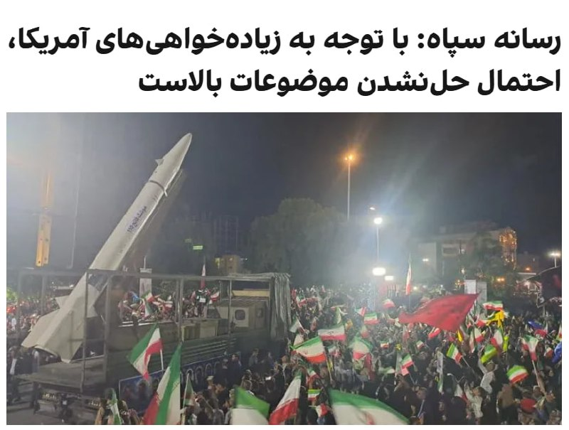

خبرگزاری تسنیم، رسانه وابسته به سپاه، درباره روند مذاکرات تهران و واشینگتن، با اشاره به اینکه هنوز اختلافات جدی در بعضی از حوزه‌ها مانند تعهد واقعی آمریکا به آزادسازی اموال و موضوع تنگه هرمز وجود دارد، نوشت: «با توجه به زیاده‌خواهی‌های آمریکا، احتمال عدم حل موضوعات بالاست.»

در این گزارش آمده که در صورت حل موارد اختلاف، احتمالا در گام اول یک تفاهم اولیه اعلام شود و سپس مهلت ۳۰ یا ۶۰ روزه برای گفتگو درباره موضوع هسته‌ای (بدون تعهد اولیه جمهوری اسلامی) اعلام شود.

تسنیم نوشت که آمریکایی‌ها در متون پیشین خود تاکید داشتند که تهران در همان گام نخست باید امتیازاتی در بحث هسته‌ای بدهد و موضوع تعطیلی تاسیسات هسته‌ای و تحویل مواد غنی‌شده به آمریکایی‌ها از جمله مباحثی است که مدام در متن‌های آمریکایی‌ها مورد درخواست قرار می‌گرفت اما حکومت ایران اساسا بحث درباره جزئیات هسته‌ای را در این مرحله رد می‌کند.

بر اساس این گزارش تهران بر ضرورت پایان جنگ و تهدید در همه جبهه‌ها از جمله لبنان تاکید دارد. و این موضوع باید مورد پذیرش طرف آمریکایی قرار گیرد اما آمریکایی‌ها در برخی از متن‌های پیشین خود با این موضوعات مخالفت کرده‌اند.
@VahidOOnLine
خبرگزاری تسنیم، وابسته به سپاه، به نقل از یک منبع مطلع نوشت که خبر العربیه درباره اینکه تهران پیشنهاد تعلیق ۱۰ ساله غنی‌سازی اورانیوم بالای ۳.۶ درصد را مطرح کرده، «از اساس کذب است».
تسنیم به نقل از این منبع با تاکید بر «ساختگی» بودن خبر العربیه، نوشت: «اساسا تمرکز پیام‌ها و گفتگوها در وضعیت فعلی صرفا بر روی مساله پایان جنگ است و هیچ جزئیاتی درباره موضوع هسته‌ای مورد بحث قرار نمی‌گیرد.»
@VahidOOnLine

📡 @VahidOnline

## VahidOnline — post 75653

  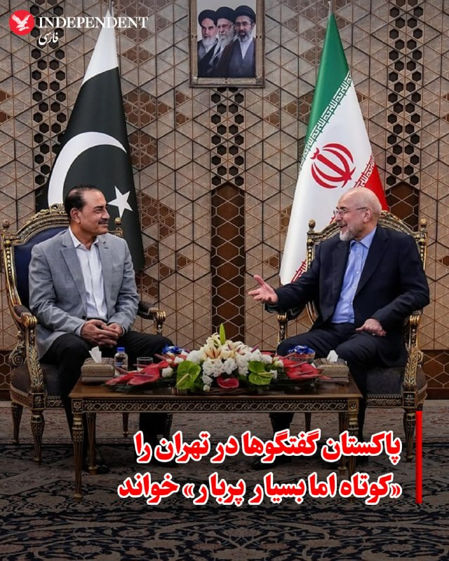

بخش رسانه‌ای ارتش پاکستان (ISPR) آخرین دور گفتگوها میان میانجی‌های قطری-پاکستانی و مقامات بلندپایه جمهوری اسلامی را «کوتاه اما بسیار پربار» توصیف کرد.

بر اساس بیانیه منتشر شده، این رایزنی‌های فشرده در ۲۴ ساعت گذشته در فضایی مثبت و سازنده برگزار شده و پیشرفت‌های دلگرم‌کننده‌ای را برای دستیابی به یک تفاهم نهایی جهت پایان دادن به جنگ ایجاد کرده است.

ارتش پاکستان جزئیات بیشتری از مفاد دقیق این مذاکرات ارائه نکرده است.
@VahidOOnLine

📡 @VahidOnline

## VahidOnline — post 75652

  

فایننشال تایمز گزارش داد که میانجی‌های جنگ ایران معتقدند در حال نزدیک شدن به توافقی هستند که آتش‌بس میان واشینگتن و تهران را به مدت ۶۰ روز تمدید و چارچوبی برای مذاکرات درباره برنامه هسته‌ای جمهوری اسلامی ایجاد کند.

بنا بر این گزارش، افرادی که در جریان این مذاکرات قرار دارند به این رسانه گفتند این توافق شامل بازگشایی تدریجی تنگه هرمز و همچنین تعهد به بررسی رقیق‌سازی یا واگذاری ذخایر اورانیوم با غنای بالا خواهد بود.

فایننشال تایمز افزود که آمریکا همچنین محاصره دریایی بنادر جنوب ایران را کاهش می‌دهد و با کاهش تحریم‌ها و همچنین آزادسازی مرحله‌ای دارایی‌های مسدودشده تهران در خارج از کشور موافقت خواهد کرد.
@VahidOOnLine

📡 @VahidOnline

## VahidOnline — post 75651

  <a href="telegram/content/VahidOnline_75651_1779551530.mp4" target="_blank">🎬 Download video</a>

🔻‌ویدیوهایی از اعتراض دانش‌آموزان در شهرهای مختلف منتشر شده است. این دانش‌آموزان به حضوری شدن امتحاناتشان اعتراض دارند.
 
دانش‌آموزان در شهرهای خرم‌آباد، یاسوج و دورود مقابل ساختمان‌های آموزش و پرورش این شهرها تجمع کردند و با شعارهای مختلف اعتراض خودشان را نشان دادند.
 
در جریان اعتراضات سراسری در دی ماه ۱۴۰۴ که به کشتار بی‌سابقه معترضان انجامید در بعضی استان‌ها مدارس غیرحضوری شد.
 
با شروع جنگ آمریکا و اسرائیل با ایران، مدارس در ایران تعطیل شد و بعد از تعطیلات نوروز کلیه کلاس‌ها غیرحضوری برگزار شد.
 
چند روز پیش عبدالرضا فولادوند، سرپرست مرکز ارزشیابی آموزش و پرورش در یک مصاحبه تلویزیونی از احتمال برگزاری امتحانات به صورت حضوری خبر داد.
@VahidHeadline

📡 @VahidOnline

## VahidOnline — post 75650

  

یک مقام جمهوری اسلامی روز شنبه دوم خرداد، در گفتگو با شبکه الجزیره اعلام کرد که تهران با میانجی‌گری پاکستان با یک تفاهم‌نامه موافقت کرده و اکنون در انتظار پاسخ ایالات متحده است.

به گفته این مقام، مفاد این تفاهم‌نامه شامل پایان دادن به جنگ، رفع کامل محاصره دریایی، بازگشایی تنگه هرمز و خروج نیروهای آمریکایی از منطقه جنگی است.
او تصریح کرد که به دلیل پیچیدگی موضوع هسته‌ای و نیاز به زمان بیشتر، این تفاهم‌نامه شامل مسائل هسته‌ای نمی‌شود؛ با این حال، پس از گذشت ۳۰ روز از اجرای این توافق، درب‌های مذاکرات هسته‌ای باز خواهد شد.

این منبع آگاه همچنین اشاره کرد که قرار بود فرمانده ارتش پاکستان این تفاهم‌نامه را در تهران اعلام کند، اما او جهت هماهنگی با واشنگتن، ایران را ترک کرده است.
او با تاکید بر نقش اساسی دولت قطر در تدوین این پیش‌نویس افزود که ایران هیچ امتیازی فراتر از آنچه در این تفاهم‌نامه قید شده، واگذار نخواهد کرد.
@VahidOOnLine
همچنین بر اساس این گزارش، تهران پیشنهاد داده غنی‌سازی اورانیوم بالاتر از ۳.۶ درصد را به مدت ۱۰ سال به حالت تعلیق درآورد.
@VahidOOnLine

🔄 آپدیت:
خبرگزاری تسنیم، وابسته به سپاه، به نقل از یک منبع مطلع نوشت که خبر العربیه درباره اینکه تهران پیشنهاد تعلیق ۱۰ ساله غنی‌سازی اورانیوم بالای ۳.۶ درصد را مطرح کرده، «از اساس کذب است».

تسنیم به نقل از این منبع با تاکید بر «ساختگی» بودن خبر العربیه، نوشت: «اساسا تمرکز پیام‌ها و گفتگوها در وضعیت فعلی صرفا بر روی مساله پایان جنگ است و هیچ جزئیاتی درباره موضوع هسته‌ای مورد بحث قرار نمی‌گیرد.»
@VahidOOnLine

📡 @VahidOnline

## VahidOnline — post 75649

  

العربیه گزارش داد جمهوری اسلامی دو پیشنهاد به میانجی پاکستانی ارائه کرده که بر اساس آن، در ازای پرداخت غرامت از سوی آمریکا، تنگه هرمز را باز کند و پیش از امضای هرگونه توافقی، پرونده تحریم‌ها و دارایی‌های مسدود شده مورد بحث قرار گیرد.

دونالد ترامپ، رییس‌جمهوری آمریکا، پیش‌تر گفته بود که حاضر به پرداخت غرامت به تهران نیست.
@VahidOOnLine

📡 @VahidOnline

## VahidOnline — post 75648

  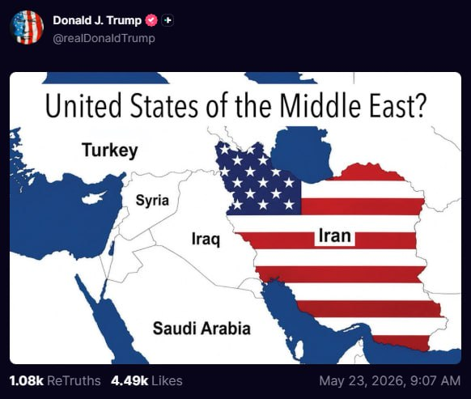

دونالد ترامپ تصویری از نقشه ایران را که با پرچم آمریکا پوشانده شده، در شبکه اجتماعی تروث سوشال منتشر کرد. روی این نقشه نوشته شده است: «ایالات متحده خاورمیانه؟»

ترامپ توضیح بیشتری در این‌باره ارائه نکرده است.
@VahidOOnLine

📡 @VahidOnline

## VahidOnline — post 75647

  <a href="telegram/content/VahidOnline_75647_1779551532.mp4" target="_blank">🎬 Download video</a>

سخنان مارکو روبیو در سفر هند در پاسخ به سوالی درباره مذاکرات با ایران

ترجمه ماشین:
ممکن است امروز کمی دیرتر خبری باشد. در همین لحظه خبری برای شما ندارم، اما ممکن است کمی دیرتر امروز خبری باشد. ممکن است هم نباشد. امیدوارم باشد، اما هنوز مطمئن نیستم.

سؤال در مورد موضوع ایران است و همان‌طور که گفتم، پیشرفت‌هایی صورت گرفته، پیشرفت‌هایی حاصل شده. حتی در حالی که الان با شما صحبت می‌کنم، کارهایی در حال انجام است.

امکان دارد که چه امروز کمی دیرتر، چه فردا یا چند روز آینده، چیزی برای گفتن داشته باشیم. اما این مسئله باید حل شود، همان‌طور که رئیس‌جمهور گفته، به یک شکل یا شکل دیگر.

ایران هرگز نباید سلاح هسته‌ای داشته باشد. تنگه‌ها باید بدون عوارض باز بمانند. آنها باید اورانیوم غنی‌شده خود را تحویل دهند، اورانیوم غنی‌شده با غنای بالا.
ما باید به آن مسئله رسیدگی کنیم. ما باید به مسئله غنی‌سازی رسیدگی کنیم.

این‌ها نقاط مورد نظر رئیس‌جمهور به طور مداوم است. و ترجیح او همیشه این است که آن را از راه دیپلماتیک حل کند. ترجیح او همیشه این است که مشکلاتی از این دست را از طریق راه‌حل دیپلماتیک مذاکره‌شده حل کند.

این چیزی است که الان روی آن کار می‌کنیم. اما این مشکل حل خواهد شد، همان‌طور که رئیس‌جمهور به وضوح گفته، به یک شکل یا شکل دیگر. امیدواریم از طریق مسیر دیپلماتیک انجام شود. این چیزی است که روی آن کار می‌کنیم. و شاید چیزی برای صحبت در مورد آن موضوع در حالی که اینجا هستم، در طی این بازدید در زمانی داشته باشیم.
EricLDaugh

📡 @VahidOnline

## VahidOnline — post 75646

  

عباس عراقچی، وزیر خارجه جمهوری اسلامی، در پیامی به شیخ نعیم قاسم، دبیرکل حزب‌الله لبنان، گفت: «جمهوری اسلامی دست از حمایت حزب‌الله نخواهد کشید و همچنان از جنبش‌های مطالبه‌گر حق و آزادی پشتیبانی می‌کند. تهران پیوند آتش‌بس لبنان با هر توافق احتمالی را به‌عنوان شرط مطرح کرده است.»
@VahidOOnLine

📡 @VahidOnline

## VahidOnline — post 75645

  

پرویز قلیچ‌خانی، کاپیتان پیشین تیم ملی فوتبال ایران و فعال سیاسی چپگرا در ۸۱ سالگی درگذشت. او به آلزایمرمبتلا بود.

نجمه موسوی-پیمبری، «یار و همراه» پرویز قلیچ‌خانی به بی‌بی‌سی فارسی گفت: «قهرمان ملی و چهره همیشه زنده ایران در تاریخ بیست و سوم ماه مه ٢٠٢٦ مصادف با دوم خرداد ١٤٠٥ در بیمارستانی در حومه پاریس درگذشت.»

آقای قلیچ‌خانی، پیش از انقلاب، علاوه بر تیم ملی، در باشگاه‌های تاج، پرسپولیس و پاس هم بازی کرد. او تنها بازیکنی است که با تیم ایران سه بار قهرمان جام ملت‌های آسیا شده است. پرویز قلیچ‌خانی بعد از انقلاب هم در خارج از کشور، مجله آرش را با گرایش سیاسی چپ اداره می‌کرد.

او فوتبال را از کوچه‌های محله صابون پزخانه میدان شوش تهران شروع کرد و بعد از مدتی کوتاه فوتبالیستی ماهر و بالاخره کاپیتان تیم ملی ایران شد.
ولی هنوز طعم قهرمانی فوتبال را درست نچشیده بود که توجهش به سیاست جلب شد و از پشت میله های زندان سر درآورد.
پس از انقلاب از فوتبالیست حرفه‌ای به فعال سیاسی و روزنامه‌نگار خارج‌نشین تبدیل شد.
@VahidHeadline

📡 @VahidOnline

## VahidOnline — post 75635

شبکه العربیه به نقل از منابع آگاه گزارش داد عاصم منیر، رییس ستاد کل ارتش پاکستان، پیام‌های آمریکا را به تهران منتقل کرده است و بخشی از این پیام حاوی تهدید به ازسرگیری جنگ بوده است.
در این پیام‌ها همچنین تاکید شده در صورت موافقت جمهوری اسلامی با توافق، حل مسائل اختلافی در مرحله بعدی انجام خواهد شد.
به گفته این منابع، آمریکا در پیام‌های خود تصریح کرده است تهران باید اکنون با توافق موافقت کند یا با پیامدهای منفی روبه‌رو شود.
@VahidOOnLine
شبکه العربیه، روز شنبه دوم خرداد ماه، به نقل از «یک منبع بلندپایه ایرانی» گزارش داد پیشنهاد ارائه‌شده از سوی تهران تاکنون نتوانسته رضایت آمریکا را جلب کند و همچنان از دید واشنگتن «غیرقابل قبول» تلقی می‌شود.
@VahidOOnLine
عاصم منیر، رییس ستاد کل ارتش پاکستان، پس از سفری یک روزه به تهران، ایران را ترک کرد.
به گزارش ایرنا، او به همراه محسن نقوی، وزیر کشور پاکستان که از هفته گذشته در تهران به سر می‌برد، پایتخت ایران را ترک کرده است.
عاصم منیر در جریان این سفر با محمدباقر قالیباف، رییس مجلس، مسعود پزشکیان، رییس‌جمهوری ایران و عباس عراقچی، وزیر امور خارجه دیدار و گفت‌وگو کرد.
@VahidHeadline
محمدباقر قالیباف در دیدار با عاصم منیر گفت نیروهای مسلح جمهوری اسلامی در دوران آتش‌بس بازسازی شده‌اند و در صورت آغاز دوباره جنگ، واکنش ایران شدیدتر خواهد بود.
او گفت: «نیروهای مسلح ما در دوران آتش‌بس به نحوی خود را بازسازی کرده‌اند که در صورت حماقت ترامپ و آغاز مجدد جنگ، حتما برای آمریکا کوبنده‌تر و تلخ‌تر از روز اول جنگ خواهند بود.»
قالیباف با اشاره به نقش پاکستان در میانجی‌گری افزود: «در آتش‌بسی بودیم که شما واسطه‌اش بودید و آمریکا با نقص عهد، محاصره دریایی کرد و حالا به‌دنبال برداشتن آن است.»
@VahidOOnLine
شیخ تمیم بن حمد آل ثانی، امیر قطر، روز شنبه دوم خرداد ماه در تماس تلفنی با دونالد ترامپ، رئیس‌جمهوری آمریکا، آخرین تحولات و رویدادهای فوری منطقه را بررسی کرد.
بر اساس بیانیه رسمی دیوان امیری قطر، این گفتگو بر «تلاش‌های منطقه‌ای و بین‌المللی برای حفظ آرامش کنونی و کاهش تنش‌ها» متمرکز بوده است.
«امنیت دریانوردی، حفظ ایمنی آبراه‌های راهبردی و تضمین تداوم روان زنجیره‌های تامین جهانی و انتقال انرژی» از دیگر محورهای این گفتگو توصیف شده است.
به گزارش رسانه‌های قطری، امیر قطر در این تماس بر موضع ثابت دوحه در اولویت دادن به راه‌حل‌های مسالمت‌آمیز برای بحران‌ها تاکید و اعلام کرد قطر از همه ابتکارهایی که با هدف مهار بحران‌ها از طریق گفتگو و دیپلماسی انجام می‌شود، حمایت می‌کند.
این خبر در حالی منتشر می‌شود که رسانه‌ها از گفتگوی تلفنی وزیرامورخارجه قطر با عباس عراقچی خبر داده‌اند.
همزمان گزارش‌ها از رایزنی‌های گسترده کشورهای منطقه برای جلوگیری از حملات احتمالی آمریکا به ایران خبر می‌دهد.
این در حالیست که شبکه خبری العربیه پیشتر از هشدار واشنگتن به تهران مبنی بر از سرگیری حملات به ایران خبر داده بود.
@VahidOOnLine

📡 @VahidOnline

## kianmeli1 — post 87582

  

🔴ترامپ
بین توافق با ایران یا بمباران آن، «قطعاً ۵۰/۵۰» است. ترامپ گفت که امروز با مشاوران ارشد خود برای بحث در مورد پیش‌نویس اخیر توافق دیدار خواهد کرد و ممکن است تا فردا تصمیمی بگیرد.
https://t.me/kianmeli1

## kianmeli1 — post 87581

‏🔴خبرگزاری تسنیم، وابسته به سپاه، به نقل از یک منبع آگاه نوشت: گزارش العربیه درباره پیشنهاد تهران برای تعلیق ۱۰ ساله غنی‌سازی بالای ۳.۶درصد «کاملا کذب» است

‏تسنیم به نقل از این منبع افزود: در شرایط فعلی تمرکز پیام‌ها و گفت‌وگوها فقط بر پایان جنگ است و درباره جزییات برنامه هسته‌ای مذاکره‌ای انجام نمی‌شود
https://t.me/kianmeli1

## kianmeli1 — post 87580

‏🔴حبیب‌الله سیاری، معاون هماهنگ‌کننده ارتش جمهوری اسلامی: نیروهای مسلح برای مقابله با هرگونه تهدید آمادگی دارند و منتظر فرمان مجتبی خامنه‌ای هستند
https://t.me/kianmeli1

## kianmeli1 — post 87579

  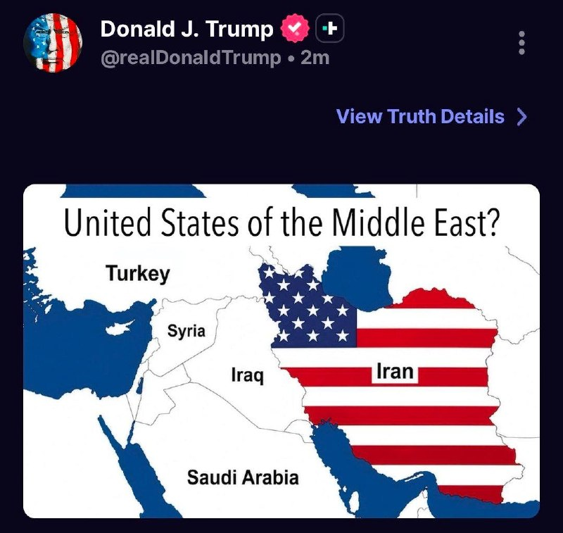

🔴پست جدید ترامپ
https://t.me/kianmeli1

## kianmeli1 — post 87578

🔴خبرگزاری صداوسيما: عاصم منیر، فرمانده ارتش پاکستان، ایران را ترک کرد‌.
https://t.me/kianmeli1

## IranIntlTV — post 338622

  <a href="telegram/content/IranIntlTV_338622_1779551535.mp4" target="_blank">🎬 Download video</a>

یکی از شرکت‌کنندگان در تجمع برلین در گفت‌وگو با احمد صمدی، خبرنگار ایران‌اینترنشنال، گفت:« مردم داخل ایران را تنها نمی‌گذاریم و تا روز آزادی در کنارشان هستیم.»

@iranintltv

## IranIntlTV — post 338621

  

دونالد ترامپ، رییس‌جمهوری آمریکا، به اکسیوس گفت که قرار است امروز با مذاکره‌کنندگان خود دیدار کند تا آخرین پیشنهاد تهران را بررسی کند و احتمالا تا روز یکشنبه درباره از سرگیری جنگ تصمیم‌گیری خواهد کرد.

رییس‌جمهوری آمریکا به اکسیوس گفت شانس دستیابی به توافق با جمهوری اسلامی یا «زدن ضربه‌ای بی‌سابقه» به این کشور «۵۰-۵۰» است.

او افزود تنها توافقی را می‌پذیرد که موضوعاتی مانند غنی‌سازی اورانیوم و سرنوشت ذخایر فعلی ایران را در بر بگیرد.
https://iranintl.com/202605235280

## IranIntlTV — post 338620

  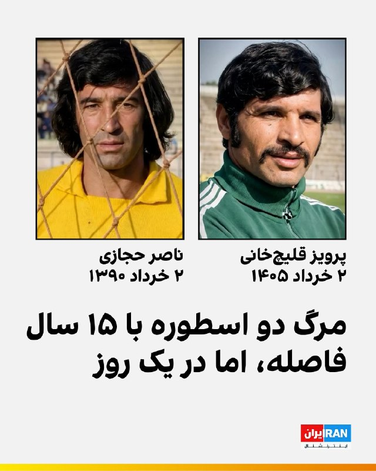

🔻پرویز قلیچ‌خانی، اسطوره فوتبال ایران و تنها فوتبالیست ایرانی که سه بار قهرمان جام ملت‌های آسیا شد روز شنبه دوم خرداد ۱۴۰۵ در ۸۱ سالگی در بیمارستانی در پاریس درگذشت.

🔹امروز، دوم خرداد ۱۴۰۵ هم برابر با پانزدهمین سالگرد درگذشت زنده‌یاد ناصر حجازی، دیگر اسطوره فوتبال ایران است. او روز دوم خرداد سال ۱۳۹۰ پس از یک دوره بیماری، در ۶۲ سالگی در تهران در گذشت.

🔹گزارشی درباره زندگی‌نامه زنده‌یاد پرویز قلیچ‌خانی را در وبسایت ایران اینترنشنال بخوانید.

@iranintltvsport

## IranIntlTV — post 338618

  

خبرگزاری تسنیم، وابسته به سپاه، به نقل از یک منبع مطلع نوشت که خبر العربیه درباره اینکه تهران پیشنهاد تعلیق ۱۰ ساله غنی‌سازی اورانیوم بالای ۳.۶ درصد را مطرح کرده، «از اساس کذب است».

تسنیم به نقل از این منبع با تاکید بر «ساختگی» بودن خبر العربیه، نوشت: «اساسا تمرکز پیام‌ها و گفتگوها در وضعیت فعلی صرفا بر روی مساله پایان جنگ است و هیچ جزئیاتی درباره موضوع هسته‌ای مورد بحث قرار نمی‌گیرد.»
https://iranintl.com/202605236278

## IranIntlTV — post 338617

  

خبرگزاری تسنیم، رسانه وابسته به سپاه، درباره روند مذاکرات تهران و واشینگتن، با اشاره به اینکه هنوز اختلافات جدی در بعضی از حوزه‌ها مانند تعهد واقعی آمریکا به آزادسازی اموال و موضوع تنگه هرمز وجود دارد، نوشت: «با توجه به زیاده‌خواهی‌های آمریکا، احتمال عدم حل موضوعات بالاست.»

در این گزارش آمده که در صورت حل موارد اختلاف، احتمالا در گام اول یک تفاهم اولیه اعلام شود و سپس مهلت ۳۰ یا ۶۰ روزه برای گفتگو درباره موضوع هسته‌ای (بدون تعهد اولیه جمهوری اسلامی) اعلام شود.

تسنیم نوشت که آمریکایی‌ها در متون پیشین خود تاکید داشتند که تهران در همان گام نخست باید امتیازاتی در بحث هسته‌ای بدهد و موضوع تعطیلی تاسیسات هسته‌ای و تحویل مواد غنی‌شده به آمریکایی‌ها از جمله مباحثی است که مدام در متن‌های آمریکایی‌ها مورد درخواست قرار می‌گرفت اما حکومت ایران اساسا بحث درباره جزئیات هسته‌ای را در این مرحله رد می‌کند.

بر اساس این گزارش تهران بر ضرورت پایان جنگ و تهدید در همه جبهه‌ها از جمله لبنان تاکید دارد. و این موضوع باید مورد پذیرش طرف آمریکایی قرار گیرد اما آمریکایی‌ها در برخی از متن‌های پیشین خود با این موضوعات مخالفت کرده‌اند.

## IranIntlTV — post 338616

ویدیوهای رسیده به ایران اینترنشنال نشان می‌دهد ایرانیان بریتانیا روز شنبه در لندن با حمل پرچم‌های شیروخورشید در حمایت از انقلاب ملی علیه جمهوری اسلامی تجمع کردند.

## IranIntlTV — post 338615

  <a href="telegram/content/IranIntlTV_338615_1779551540.mp4" target="_blank">🎬 Download video</a>

مارکو روبیو، وزیر خارجه آمریکا، در دیدار با نارندرا مودی، نخست‌وزیر هند، تاکید کرد ایالات متحده اجازه نخواهد داد جمهوری اسلامی بازار جهانی انرژی را گروگان بگیرد.

گفت‌وگو با تاج‌الدین سروش، عضو تحریریه ایران‌اینترنشنال
@iranintltv

## IranIntlTV — post 338614

  

فایننشال تایمز گزارش داد که میانجی‌های جنگ ایران معتقدند در حال نزدیک شدن به توافقی هستند که آتش‌بس میان واشینگتن و تهران را به مدت ۶۰ روز تمدید و چارچوبی برای مذاکرات درباره برنامه هسته‌ای جمهوری اسلامی ایجاد کند.

بنا بر این گزارش، افرادی که در جریان این مذاکرات قرار دارند به این رسانه گفتند این توافق شامل بازگشایی تدریجی تنگه هرمز و همچنین تعهد به بررسی رقیق‌سازی یا واگذاری ذخایر اورانیوم با غنای بالا خواهد بود.

فایننشال تایمز افزود که آمریکا همچنین محاصره دریایی بنادر جنوب ایران را کاهش می‌دهد و با کاهش تحریم‌ها و همچنین آزادسازی مرحله‌ای دارایی‌های مسدودشده تهران در خارج از کشور موافقت خواهد کرد.
https://iranintl.com/202605239287

## IranIntlTV — post 338613

روایت شما از زندگی در آتش‌بس- شنبه ۲ خرداد ۱۴۰۵
🔹 ترامپ کارمند ما نیست که امر و نهی کنیم، موش علی و فرمانده‌هاش و سرکوبگرهاش رو ذلیل کرد، حالا نوبت ماست اعتصاب کنیم. نه به گوشت و مرغ رو شروع کنیم تا فراخوان بعد.
🔹 در تهران گرانی بیداد می‌کند. حقوق‌ها را دیر می‌دهند. یک کیلو توت‌فرنگی در تره‌بار ۳۰۰ هزار تومان، در مغازه معمولی ۶۰۰ هزار تومان. دارو در داروخانه کمیاب شده. یک بطری کوچک روغن زیتون یک میلیون و پانصد هزار تومان.
🔹 دم همه دانش‌آموزان غیور لر گرم که زیر بار حرف زور و ستم نمی‌روند، به‌قول شاهزاده عزیز واقعاً نسل ویکتوری هستید.
🔹 درود، من یک نوجوان ۱۶ ساله هستم که صندوق‌دار یک فروشگاه هستم. آن‌قدر همه‌چیز گران شده که حتی خودم هم خجالت می‌کشم به مشتری‌ها قیمت بدهم. واقعاً مردم ایران کوه صبر هستند. به امید روزهای خوب ایران.

## IranIntlTV — post 338612

  <a href="telegram/content/IranIntlTV_338612_1779551542.mp4" target="_blank">🎬 Download video</a>

ایرانیان سوئیس روز شنبه با تجمع مقابل سفارت جمهوری اسلامی خواستار بسته‌شدن آن شدند. آن‌ها همچنین با حمل تصاویر شاهزاده رضا پهلوی و پرچم شیروخورشید از انقلاب ملی حمایت کردند.

## IranIntlTV — post 338611

  

الحدث گزارش داد جمهوری اسلامی در پیشنهاد جدید خود خواستار آزادسازی دارایی‌های مسدود‌شده خود قبل از مذاکرات هسته‌ای شده است.
بر اساس این گزارش، تهران خواستار ایجاد یک مکانیسم جبران خسارت جنگ از سوی ایالات متحده و لغو کامل تحریم‌ها در ازای تعهدات هسته‌ای شده است.
https://iranintl.com/202605238700

## IranIntlTV — post 338610

  <a href="telegram/content/IranIntlTV_338610_1779551544.mp4" target="_blank">🎬 Download video</a>

بر اساس اطلاعات رسیده به ایران‌اینترنشنال، اکبر محمدی، شهروند ۴۰ ساله اهل اصفهان، پس از بازداشت و محرومیت از رسیدگی پزشکی در زندان دستگرد اصفهان جان باخت. او که سوم اردیبهشت ماه همراه برادرش بازداشت شده بود، در تماس و در تماس با خانواده از بیماری و جلوگیری از دسترسی به بهداری و دارو خبر داده بود.

جزییات بیشتر با پویا جهاندار، عضو تحریریه ایران‌اینترنشنال
@iranintltv

## IranIntlTV — post 338609

  <a href="telegram/content/IranIntlTV_338609_1779551546.mp4" target="_blank">🎬 Download video</a>

مراسم اختتامیه جشنواره فیلم کن با اعلام برندگان جوایز اصلی، از جمله نخل طلای بهترین فیلم، به کار خود پایان داد. جایزه «چشم طلایی»، از مهم‌ترین جوایز این جشنواره، به مستند «تمرین‌هایی برای یک انقلاب» ساخته پگاه آهنگرانی اختصاص یافت.

گزارش لی‌لی نیکفر، خبرنگار ایران‌اینترنشنال
@iranintltv

## IranIntlTV — post 338608

  <a href="telegram/content/IranIntlTV_338608_1779551547.mp4" target="_blank">🎬 Download video</a>

شبکه العربیه گزارش داد عاصم منیر، فرمانده کل ارتش پاکستان، در سفر به تهران حامل پیامی از سوی آمریکا برای جمهوری اسلامی بوده است. همزمان، رسانه‌های داخلی از بررسی یک سند پیشنهادی ۱۴ بندی در این مذاکرات خبر دادند.

گفت‌وگو با حسین آقایی، عضو تحریریه ایران‌اینترنشنال
@iranintltv

## IranIntlTV — post 338607

  

العربیه به نقل از منابع خود گزارش داد جمهوری اسلامی پیشنهاد بازگشایی تنگه هرمز و تعلیق موقت دریافت عوارض را مطرح کرده است.

همچنین بر اساس این گزارش، تهران پیشنهاد داده غنی‌سازی اورانیوم بالاتر از ۳.۶ درصد را به مدت ۱۰ سال به حالت تعلیق درآورد.
https://iranintl.com/202605232120

## IranIntlTV — post 338606

  <a href="telegram/content/IranIntlTV_338606_1779551550.mp4" target="_blank">🎬 Download video</a>

سرخط خبرهای شنبه ۲ خرداد
@iranintltv

## IranIntlTV — post 338605

  <a href="telegram/content/IranIntlTV_338605_1779551551.mp4" target="_blank">🎬 Download video</a>

یکی از مجروحان انقلاب ملی ایرانیان با ارسال فایلی صوتی به ایران‌اینترنشنال، ماجرای زخمی و شکنجه شدن خود به دست نیروهای امنیتی و لباس‌شخصی در ۱۸ دی‌ماه ۱۴۰۴ را روایت کرد.

جزییات بیشتر در گفت‌وگو با محسن مهیمنی، عضو تحریریه ایران‌اینترنشنال
@iranintltv

## IranIntlTV — post 338604

  

🔻پرویز قلیچ‌خانی، اسطوره فوتبال ایران و تنها فوتبالیست ایرانی که سه بار قهرمان جام ملت‌های آسیا شد روز شنبه دوم خرداد ۱۴۰۵ در ۸۱ سالگی در بیمارستانی در پاریس درگذشت. او در پرسپولیس، تاج و پاس بازی کرد. زنده‌یاد قلیچ‌خانی، پس از انقلاب ۱۳۵۷ به دلیل گرایش‌های سیاسی از ایران خارج شد.

@iranintltvsport

## IranIntlTV — post 338603

  

مارکو روبیو، وزیر خارجه ایالات متحده آمریکا، در جریان سفر به هند، گفت: «جمهوری اسلامی باید اورانیوم غنی‌شده خود را تحویل دهد. موضوع هسته‌ای ایران، فوری است و همچنین تنگه هرمز باید باز بماند.»

روبیو افزود: «فرصتی برای پذیرش توافق از سوی حکومت ایران در نزدیک‌ترین زمان وجود دارد.»
https://iranintl.com/202605239482

## IranIntlTV — post 338602

  <a href="telegram/content/IranIntlTV_338602_1779551554.mp4" target="_blank">🎬 Download video</a>

تعدادی از شرکت‌کنندگان در تجمع برلین با نوشتن اسامی جاویدنامان بر لباس‌های خود، یاد آنها را گرامی داشتند.

یکی از شرکت‌کنندگان در این تجمع در گفت‌وگو با احمد صمدی، خبرنگار ایران‌اینترنشنال، گفت: «صدای زندانیان سیاسی، خانواده‌های جاویدنامان و مردم ایران هستیم.»
@iranintltv

## Shin_Persian — post 6164

↩️ Quoted tweet: 1776Girl ✓ @sipjack1776 Sat, 23 May 2026 15:32:00 UTC JD Vance is returning to JB Andrews from Cincinnati.🤔 C-32A #ADFEB7/98-0001/AF2 @Borrowed7Time @RealestMercury @USAF_VIP_LGX @blackswanadria @stunorth69 @ArmchairAdml ↩️ توییت نقل‌قول…

## Shin_Persian — post 6163

  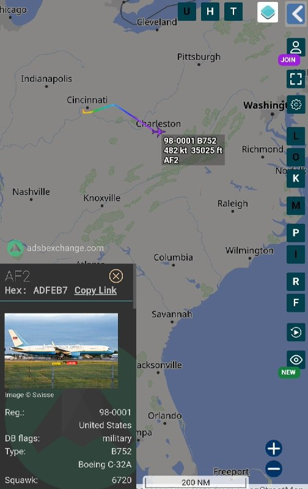

↩️ Quoted tweet:
1776Girl ✓ @sipjack1776
Sat, 23 May 2026 15:32:00 UTC

JD Vance is returning to JB Andrews from Cincinnati.🤔
C-32A
#ADFEB7/98-0001/AF2
@Borrowed7Time @RealestMercury @USAF_VIP_LGX @blackswanadria @stunorth69 @ArmchairAdml

↩️ توییت نقل‌قول شده — برای پاسخ، پست زیر را ببینید.

فارسی

جی‌دی ونس در حال بازگشت از سینسیناتی به پایگاه مشترک اندروز (JB Andrews) است.🤔
C-32A
#ADFEB7/98-0001/AF2
@Borrowed7Time @RealestMercury @USAF_VIP_LGX @blackswanadria @stunorth69 @ArmchairAdml

𝕏 · @shin_persian

## ManotoTV — post 105769

  <a href="telegram/content/ManotoTV_105769_1779551555.mp4" target="_blank">🎬 Download video</a>

فدراسیون فوتبال جمهوری اسلامی مدعی شد گزارش‌ها درباره رد ویزای شجاع خلیل‌زاده، مهدی طارمی و احسان حاج‌صفی را تکذیب کرد.

رسانه‌های ورزشی ایران در روزهای اخیر از شایعاتی درباره رد شدن ویزای این سه بازیکن تیم ملی فوتبال مردان ایران گزارش داده بودند.

فدراسیون فوتبال روز شنبه با انتشار بیانیه‌ای این گزارش‌ها را «کذب» خواند و اعلام کرد: «فرایند اداری مربوط به اخذ ویزا از سوی فدراسیون فوتبال و تیم ملی طبق روال انجام گرفته و ادعای مطرح شده کذب است.»

هم‌زمان، روزنامه خبرورزشی گزارش داد امیر قلعه‌نویی، سرمربی تیم ملی فوتبال مردان ایران، با بازیکنان جایگزین این سه عضو تیم ملی تماس گرفته تا تمرینات آمادگی برای جام جهانی را ادامه دهند.

شجاع خلیل‌زاده، مهدی طارمی و احسان حاج‌صفی از جمله ملی‌پوشان ایرانی هستند که دوران خدمت سربازی خود را در سپاه گذرانده‌اند.

## ManotoTV — post 105768

  <a href="telegram/content/ManotoTV_105768_1779551556.mp4" target="_blank">🎬 Download video</a>

ارتش پاکستان اعلام کرد عاصم منیر، فرمانده ارتش این کشور، سفر کوتاه اما «بسیار پرباری» به ایران داشته و در جریان آن دیدارها و گفت‌وگوهای «سطح بالا» با مقام‌های جمهوری‌اسلامی انجام داده است.

## ManotoTV — post 105767

  <a href="telegram/content/ManotoTV_105767_1779551557.mp4" target="_blank">🎬 Download video</a>

دونالد ترامپ، رئیس‌جمهور آمریکا، تصویری از نقشه خاورمیانه منتشر کرد که در آن ایران با طرح پرچم ایالات متحده پوشانده شده و بالای نقشه عبارت «ایالات متحده خاورمیانه؟» دیده می‌شود.

ترامپ این تصویر را در حساب خود در تروث‌سوشال منتشر کرد و توضیحی درباره منظور خود از آن ننوشت.

## ManotoTV — post 105766

  <a href="telegram/content/ManotoTV_105766_1779551557.mp4" target="_blank">🎬 Download video</a>

روزنامه فایننشال تایمز گزارش داده میانجی‌گران منطقه‌ای در حال نهایی کردن توافقی هستند که بر اساس آن آتش‌بس میان آمریکا و جمهوری‌اسلامی برای ۶۰ روز دیگر تمدید می‌شود و زمینه مذاکرات درباره برنامه هسته‌ای تهران را فراهم می‌کند.
بر اساس این گزارش، طرح پیشنهادی شامل بازگشایی تدریجی تنگه هرمز، گفت‌وگو درباره کاهش یا انتقال ذخایر اورانیوم غنی‌شده جمهوری‌اسلامی و همچنین کاهش محدودیت‌ها علیه بنادر ایران و آزادسازی مرحله‌ای بخشی از دارایی‌های مسدودشده تهران است.
اسماعیل بقایی، سخنگوی وزارت خارجه جمهوری‌اسلامی، گفته تهران و طرف‌های میانجی در حال تدوین «تفاهم‌نامه‌ای» برای پایان جنگ هستند و پس از آن مذاکرات درباره توافق جامع‌تر طی ۳۰ تا ۶۰ روز آینده ادامه خواهد یافت.
در همین حال، منابع دیپلماتیک گفته‌اند مذاکرات با میانجی‌گری قطر و پاکستان پیشرفت داشته، اما همچنان اختلاف‌های جدی بر سر برنامه هسته‌ای جمهوری‌اسلامی باقی مانده است؛ از جمله درخواست آمریکا برای تحویل ذخایر اورانیوم با غنای بالا و تعطیلی تاسیسات هسته‌ای نطنز، فردو و اصفهان.
این گزارش می‌افزاید کشورهای عربی منطقه نگران‌اند در صورت شکست مذاکرات و از سرگیری حملات آمریکا و اسرائیل، بحران به درگیری گسترده‌تر در خاورمیانه و اختلال شدید در بازار جهانی انرژی منجر شود.

## ManotoTV — post 105765

  <a href="telegram/content/ManotoTV_105765_1779551558.mp4" target="_blank">🎬 Download video</a>

مارکو روبیو، وزیر امور خارجه آمریکا، گفت در پرونده ایران «پیشرفت‌هایی» حاصل شده و ممکن است واشینگتن به‌زودی درباره این موضوع اظهارنظر تازه‌ای داشته باشد.

روبیو روز شنبه سوم خرداد در پاسخ به پرسشی درباره «موضوع ایران» گفت: «همان‌طور که گفتم، پیشرفت‌هایی حاصل شده است. حتی همین حالا که با شما صحبت می‌کنم، کارهایی در حال انجام است.»

او افزود ممکن است «امروز، فردا یا ظرف چند روز آینده» چیزی برای اعلام وجود داشته باشد، اما تاکید کرد هنوز قطعی نیست.

وزیر امور خارجه آمریکا گفت این موضوع باید «به هر شکل» حل شود و به گفته او، موضع دونالد ترامپ این است که «ایران هرگز نباید سلاح هسته‌ای داشته باشد.»

روبیو همچنین گفت تنگه‌ها باید «بدون عوارض» باز بمانند و جمهوری اسلامی باید درباره اورانیوم غنی‌شده و موضوع غنی‌سازی پاسخ‌گو باشد.

## ManotoTV — post 105764

  <a href="telegram/content/ManotoTV_105764_1779551559.mp4" target="_blank">🎬 Download video</a>

گزارشگرمنوتو: «در شرایط دشوار امروز ایران، گردهمایی پادشاهی‌خواهان شهر هامبورگ در حمایت از بانو فاطمه سپهری برگزار می‌شود؛ زنی شجاع و استوار که با وجود فشار، تهدید و زندان، از خواسته‌های مردم ایران عقب ننشسته و به نمادی از ایستادگی و آزادی‌خواهی تبدیل شده است.

ما در این گردهمایی، حمایت خود را از بانو فاطمه سپهری و همچنین از شاهزاده رضا پهلوی، به‌عنوان یکی از چهره‌های محوری همبستگی ملی و گذار به ایرانی آزاد، سکولار و دموکراتیک اعلام می‌کنیم.

این گردهمایی تأکیدی است بر ضرورت اتحاد مردم ایران برای آینده‌ای مبتنی بر آزادی، حقوق بشر و کرامت انسانی.»

## ManotoTV — post 105763

  <a href="telegram/content/ManotoTV_105763_1779551561.mp4" target="_blank">🎬 Download video</a>

پرویز قلیچ‌خانی، از چهره‌های ماندگار و پرافتخار فوتبال ایران، ساعاتی پیش در حومه پاریس در ۸۱ سالگی درگذشت.

قلیچ‌خانی که متولد سال ۱۳۲۴ بود، پس از ماه‌ها تحمل بیماری جان باخت.

او یکی از برجسته‌ترین بازیکنان تاریخ فوتبال ایران به شمار می‌رفت و تنها فوتبالیست ایرانی است که سه دوره پیاپی همراه تیم ملی قهرمان جام ملت‌های آسیا شده است.

## ManotoTV — post 105762

  <a href="telegram/content/ManotoTV_105762_1779551561.mp4" target="_blank">🎬 Download video</a>

بر اساس گزارش ان‌بی‌سی، دونالد ترامپ جونیور، پسر بزرگ رئیس‌جمهور آمریکا، با بتینا اندرسون در فلوریدا ازدواج کرده است، اما دونالد ترامپ احتمالاً در مراسم این آخر هفته شرکت نخواهد کرد.
ترامپ در گفت‌وگو با خبرنگاران گفته مراسم «یک رویداد کوچک و خصوصی» است و به دلیل شرایط کاری در کاخ سفید و مسائل سیاسی از جمله وضعیت جمهوری‌اسلامی، امکان حضور ندارد. او تأکید کرده که در این مقطع زمانی نمی‌تواند از واشنگتن خارج شود و مسئولیت‌های دولت را اولویت می‌داند.
ترامپ همچنین با اشاره به فشارهای رسانه‌ای گفته است که چه در صورت حضور و چه عدم حضور در مراسم، مورد انتقاد قرار خواهد گرفت. او در شبکه اجتماعی خود نیز ازدواج پسرش را تبریک گفته اما تأکید کرده که به دلیل «مسائل دولت و شرایط حساس فعلی» در مراسم حاضر نخواهد شد.

## ManotoTV — post 105761

  <a href="telegram/content/ManotoTV_105761_1779551562.mp4" target="_blank">🎬 Download video</a>

شیخ تمیم بن حمد آل ثانی، امیر قطر، در تماس تلفنی با دونالد ترامپ، رئیس‌جمهور آمریکا، درباره تنش‌های منطقه‌ای و ابتکارهای دیپلماتیکی که با محوریت پاکستان برای جلوگیری از تشدید بحران در حال انجام است، گفت‌وگو کرده است.
در این تماس، دو طرف تلاش‌ها برای کاهش تنش‌ها و حفظ ثبات منطقه را بررسی کردند و بر حمایت از میانجی‌گری پاکستان میان ایالات متحده و جمهوری‌اسلامی تاکید شد.
همچنین در این گفت‌وگو بر اهمیت ادامه مذاکرات و گفت‌وگوهای دیپلماتیک برای حل مسائل جاری، حفاظت از کشتیرانی دریایی و تضمین امنیت مسیرهای راهبردی آبی تأکید شد؛ موضوعی که به ثبات بازار جهانی انرژی و زنجیره تأمین نیز مرتبط است.

## ManotoTV — post 105760

  <a href="telegram/content/ManotoTV_105760_1779551562.mp4" target="_blank">🎬 Download video</a>

بر اساس گزارشی که در روزنامه تایمز منتشر شده، یک تحقیق مخفیانه نشان می‌دهد یک شبکه مرتبط با جمهوری‌اسلامی از طریق تلگرام تلاش کرده شهروندان بریتانیایی را برای سازماندهی تجمعات خیابانی ضد اسرائیلی و پخش پوسترهای تبلیغاتی جذب کند.
در این گزارش آمده است که خبرنگار تایمز به‌صورت مخفیانه وارد ارتباط با فردی شده که خود را «مهدی» معرفی کرده و مدعی بوده در ایران مستقر است و با ساختارهای امنیتی جمهوری‌اسلامی در ارتباط است. این فرد در پیام‌های خود پیشنهاد پرداخت پول در ازای سازماندهی تجمع، جذب افراد جدید و اجرای فعالیت‌های تبلیغاتی در لندن را مطرح کرده است.
همچنین از این خبرنگار خواسته شده ابتدا برای اثبات اعتماد، اقدام به نصب پوستر در خیابان‌های لندن و فیلم‌برداری از آن کند. این پوسترها شامل پیام‌های سیاسی علیه اسرائیل بوده است.
در ادامه، درخواست‌هایی برای گسترش فعالیت و حتی طراحی پروژه‌های آنلاین نیز مطرح شده و در نهایت حساب تلگرامی مربوطه به‌طور ناگهانی حذف شده است.

## ManotoTV — post 105759

  <a href="telegram/content/ManotoTV_105759_1779551563.mp4" target="_blank">🎬 Download video</a>

در حالی‌که برخی مقام‌های آمریکایی از احتمال توقف موقت فروش تسلیحات به تایوان به دلیل نیاز ارتش آمریکا در عملیات علیه ایران خبر داده بودند، یک منبع آگاه رویترز این ادعا را رد کرد و گفت این روند کاملاً طولانی‌مدت و اداری است و ارتباطی با جنگ ایران ندارد.
بر اساس این گزارش، تایوان همچنان منتظر تأیید بسته تسلیحاتی تا سقف ۱۴ میلیارد دلار از سوی آمریکا است. این در حالی است که چین به‌شدت با فروش سلاح به تایوان مخالفت کرده و آن را اقدامی علیه حاکمیت خود می‌داند.
کاخ سفید اعلام کرده تصمیم نهایی درباره این بسته در آینده نزدیک گرفته خواهد شد، اما سیاست کلی آمریکا در حمایت از توان دفاعی تایوان بدون تغییر باقی مانده است. تایوان نیز می‌گوید هیچ اطلاع رسمی از تعلیق یا تأخیر در این روند دریافت نکرده است.

## FarsiVOA — post 218452

🔺بازداشت زندانبان «صیدنایا»؛ دست عدالت در تعقیب مقامات زندان مخوف خاندان اسد

▪️وزارت کشور سوریه از بازداشت یکی از مقامات زندان بدنام و مخوف «صیدنایا» در سوریه خبر داد.

⬇️ بیشتر بخوانید:

https://ir.voanews.com/a/syria-irgc-proxy-prison-mass-killing/8153028.html/?nocach=1

## FarsiVOA — post 218448

مارکو روبیو، وزیر امور خارجه آمریکا، روز شنبه ۲ خرداد با انتشار تصاویری از بازدید خود از موسسه «مبلغان خیریه» در هند نوشت میراث مادر ترزا، میراثی بزرگ از خدمت و همدلی است.

آقای روبیو گفت حضور در این مرکز فرصتی برای ادای احترام به مادر ترزا و مشاهده «نمونه زنده ایمان کاتولیک در عمل» بوده است.

مادر ترزا راهبه کاتولیک و بنیانگذار موسسه «مبلغان خیریه» در هند بود. او بیشتر عمر خود را صرف کمک به فقرا و بیماران کرد. او در سال ۱۹۷۹ برنده جایزه صلح نوبل شد. کلیسای کاتولیک بعدها او را قدیس اعلام کرد.

@FarsiVOA

## FarsiVOA — post 218447

اتمام حجت روبیو و تغببر موضع و لحن ناتو پس از نشست وزیران امور خارجه ناتو؛ گفت‌وگو با امیر چاهکی، کارشناس روابط بین‌الملل

## FarsiVOA — post 218446

در گفت‌وگو با رضا غیبی، خبرنگار اقتصادی در لندن، با در نظر گرفتن انبوه بحران‌های اقتصادی، محاصره دریایی و ناتوانی جمهوری اسلامی در تأمین زنجیره کالاهای اساسی و امنیت غذایی بررسی کردیم که چگونه تشدید تنش نظامی می‌تواند به نارضایتی‌های گسترده عمومی منجر شود.

## FarsiVOA — post 218445

بابک زنجانی از «مفسد» اقتصادی تا منجی سپاه؛ گفت‌و‌گو با مهدی نخل احمدی، رونامه‌نگار

## FarsiVOA — post 218444

در گفت‌وگو با شاهین مدرس، تحلیلگر مطالعات امنیتی، به نشانه‌های آمادگی آمریکا برای دور تازه حملات پرداختیم و بررسی کردیم چگونه جمهوری اسلامی، با تکیه بر برآوردهایی مربوط به دورهای پیشین درگیری، تصویر دقیقی از توان واقعی و فرسایش‌یافته نظامی خود در شرایط کنونی و تحت محاصره دریایی آمریکا ندارد.

## FarsiVOA — post 218443

🔺تاکید مارکو روبیو بر موضع قاطع پرزیدنت ترامپ در مذاکرات: رژیم ایران هرگز سلاح هسته‌ای نخواهد داشت

▪️مارکو روبیو وزیر امور خارجه آمریکا روز شنبه ۲ خرداد برای یک سفر چهارروزه و برای شرکت در نشست وزیران امور خارجه مجمع «کوآد» وارد هند شد.

⬇️ بیشتر بخوانید:

https://ir.voanews.com/a/rubio-india-trip-modi-new-delhi-quad-marco-/8153031.html/?nocach=1

## FarsiVOA — post 218442

  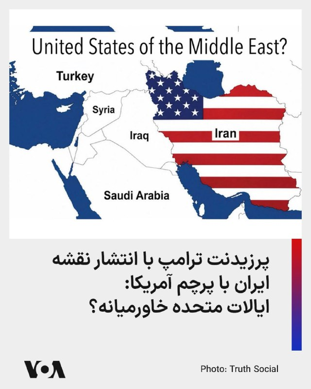

⚡️دونالد ترامپ، رئیس جمهوری آمریکا، روز شنبه ۲ خرداد در تازه‌ترین پیام خود در شبکه اجتماعی تروت سوشال عکسی از نقشه خاورمیانه را منتشر کرده که در آن نقشه ایران با پرچم ایالات متحده دیده می‌شود و در بالای آن نوشته شده است: «ایالات متحده خاورمیانه؟»
هیچ توضیح اضافه‌ای در این پست پرزیدنت ترامپ درج نشده است.

## FarsiVOA — post 218441

  <a href="telegram/content/FarsiVOA_218441_1779551564.mp4" target="_blank">🎬 Download video</a>

تصاویری دیگر از تجمع دانش‌آموزان در خرم‌آباد در اعتراض به حضوری شدن امتحانات، با شعار «مجازی، مجازی»- دوم خرداد ،۱۴۰۵؛
دانش‌آموزان در چند شهر ایران به حضوری شدن امتحانات اعتراض دارند.

## FarsiVOA — post 218440

اسپیس‌ایکس اعلام کرد فرود استارشیپ با موفقیت تایید شده و دوازدهمین آزمایش پروازی این فضاپیما با بازگشت موفق به پایان رسیده است.

اسپیس‌ایکس در پیامی از تیم این شرکت برای انجام این آزمایش تقدیر کرد.

@FarsiVOA

## FarsiVOA — post 218439

  <a href="telegram/content/FarsiVOA_218439_1779551566.mp4" target="_blank">🎬 Download video</a>

ارتش اسرائیل اعلام کرد نیروهای تیپ «همخنص» که در شمال نوار غزه فعالیت می‌کنند، روز گذشته، جمعه، «یک تروریست را در حالی‌که از خط زرد عبور کرده و به نیروهای اسرائیل نزدیک شده بود و تهدیدی فوری به‌شمار می‌رفت» شناسایی و حذف کردند.

ارتش اسرائیل تاکید کرد نیروهای این ارتش تحت فرماندهی جنوب، مطابق با توافق در منطقه مستقر هستند و به فعالیت خود برای رفع هرگونه تهدید فوری ادامه می‌دهند.

## FarsiVOA — post 218438

  

⚡️مارکو روبیو، وزیر امور خارجه ایالات متحده، که برای سفری چهار روزه به هند رفته است روز شنبه ۲ خرداد با تکرار مواضع رسمی و قطعی آمریکا در مذاکرات جاری با رژیم ایران گفت این مذاکرات پیشرفت‌هایی داشته است.

او افزود که «احتمالا طی امروز یا دو روز آینده» خبرهایی درباره نتایج این مذاکرات و تصمیم پرزیدنت ترامپ درباره ایران منتشر خواهد شد.

## FarsiVOA — post 218437

پرزیدنت ترامپ در جدیدترین موضع‌گیری درباره توافق: مقامات تهران مشتاقانه به دنبال توافق هستند

## FarsiVOA — post 218436

  

فرماندهی مرکزی ایالات متحده، سنتکام، اعلام کرد نیروهای این فرماندهی در جریان اجرای محاصره دریایی آمریکا علیه جمهوری اسلامی، مسیر ۱۰۰ کشتی تجاری را تغییر داده‌اند.

سنتکام این اقدام را یک «نقطه عطف» در عملیات دریایی خود توصیف کرده است.

@FarsiVOA

## FarsiVOA — post 218430

مارکو روبیو، وزیر امور خارجه آمریکا، روز شنبه برای انجام سفری چهارروزه وارد هند شد.

@FarsiVOA

## DW_Farsi — post 125055

🔶 محبوبیت یک پاسپورت؛ رکورد تازه اعطای تابعیت در آلمان

به نوشته روزنامه "ولت آم زونتاگ"، در آلمان رکورد تازه‌ای در اعطای تابعیت در حال شکل‌گیری است. بر اساس تحقیقات این روزنامه که امروز شنبه ۲۳ مه (دوم خرداد) منتشر شده، در سال گذشته میلادی بیش از ۳۰۹ هزار نفر گذرنامه آلمانی دریافت کرده‌اند.

در این صورت، این رقم از رکورد پیشین، یعنی نزدیک به ۲۹۲ هزار مورد اعطای تابعیت در سال ۲۰۲۴ نیز فراتر خواهد رفت.

به نوشته این روزنامه، داده‌ها از ۱۴ ایالت آلمان گردآوری شده‌اند و فقط اطلاعات ایالت‌های مکلنبورگ-فورپومرن و زاکسن-آنهالت در دسترس نبوده است.

از ایالت‌های نیدرزاکسن، زارلند و شلسویگ-هولشتاین نیز آمار کلی وجود ندارد، اما تقریباً تمامی شهرها و مناطق این ایالت‌ها بنا به درخواست این روزنامه آلمانی، اطلاعات مربوط به تابعیت را ارائه کرده‌اند. البته بخشی از این آمار هنوز موقتی محسوب می‌شوند.
@dw_farsi

## DW_Farsi — post 125054

🎥 رقابت انسان و حیوانات اقیانوسی بر سر صید کریل‌ها

آیا مکمل‌های روزانه ما بر سلامت جانوران اقیانوسی اثر می‌گذارد؟ رشد سریع صنعت سلامت و مکمل‌ها، در کنار تغییرات اقلیمی، اکوسیستم قطب جنوب را شکننده‌تر کرده است.
@dw_farsi

## DW_Farsi — post 125053

🔶 نیویورک پست از طرح ترور دختر ترامپ توسط سپاه خبر داد

بر اساس گزارش نیویورک پست، محمدباقر سعد داوود الساعدی ۳۲ ساله که به تازگی بازداشت شده است، "متعهد شده بود" ایوانکا ترامپ، دختر دونالد ترامپ، را بکشد و حتی نقشه خانه او در فلوریدا را نیز در اختیار داشته است. منابعی که نامشان ذکر نشده، این ادعا را مطرح کرده‌اند.

بنا بر این گزارش، این شهروند عراقی، در واکنش به کشته شدن قاسم سلیمانی، فرمانده نیروی قدس سپاه پاسداران انقلاب اسلامی، در حمله پهپادی آمریکا در بغداد در شش سال پیش، خانواده دونالد ترامپ را هدف تعیین کرده بود.

انتفاض قنبر، معاون پیشین وابسته نظامی سفارت عراق در واشنگتن، به نیویورک پست گفت: «بعد از کشته شدن قاسم، او [الساعدی] به اطرافیان می‌گفت "باید ایوانکا را بکشیم تا خانه ترامپ را همان‌طور که او خانه ما را سوزاند، بسوزانیم".»

قنبر افزود: «شنیدیم که او نقشه خانه ایوانکا در فلوریدا را داشته است.» به گفته این روزنامه، یک منبع دیگر نیز طرح الساعدی برای کشتن ایوانکا ترامپ را تایید کرده است.
@dw_farsi

## DW_Farsi — post 125052

🔶 سینمای ایران؛ فرش قرمز در جشنواره کن، زندان در تهران

🔻 گزارشی از آتفه چهارمحالیان

در جشنواره کن امسال، سینمای ایران بار دیگر در یکی از مهم‌ترین رویدادهای سینمایی جهان بر سکو ایستاد؛ حضوری که هم‌زمان قابی گویا از شکاف عمیق میان سینمای مستقل و حکومت جمهوری اسلامی بود.

امسال در هفتادونهمین دوره جشنواره فیلم کن، مستند "تمرین‌هایی برای یک انقلاب" ساخته پگاه آهنگرانی، با روایتی از دهه‌ها اعتراض و سرکوب در ایران، جایزه "چشم طلایی" بهترین مستند را دریافت کرد. آهنگرانی هنگام دریافت جایزه، فیلمش را به مردم ایران و مادران دادخواه تقدیم کرد؛ زنانی که به تعبیر او فرزندانشان را "در راه آزادی" از دست داده‌اند.

در حاشیه این مراسم، اصغر فرهادی نیز که با فیلم "داستان‌های موازی" در بخش اصلی جشنواره حضور داشت، در نشستی خبری، کشته‌شدن معترضان در اعتراضات دی ماه و قربانیان جنگ اخیر را "دردناک و فراموش‌نشدنی" توصیف کرد. فیلم‌سازانی چون مهسا کرم‌پور و محمدرضا فرزاد نیز در بخش‌های جانبی این جشنواره حاضر بودند.
@dw_farsi

## DW_Farsi — post 125051

🔶 بانک جهانی: ۲۷ کشور خواستار استفاده از منابع مالی بحران شده‌اند

بر اساس یک سند داخلی که خبرگزاری رویترز مشاهده کرده، از شروع جنگ ایران در ۲۸ فوریه سال جاری، ۲۷ کشور اقداماتی را برای فعال‌کردن ابزارهای مالی بحران آغاز کرده‌اند تا بتوانند به‌سرعت از منابع موجود در برنامه‌های بانک جهانی استفاده کنند.

نام این کشورها و مبالغ درخواست‌شده اعلام نشده اما در گزارش آمده است که سه کشور از آغاز جنگ آمریکا و اسرائیل علیه جمهوری اسلامی موفق شده‌اند که ابزارهای جدید مالی را تصویب کنند اما سایر کشورها همچنان در حال تکمیل مراحل اداری هستند.

بر اساس این سند، این ۲۷ کشور بخشی از ۱۰۱ کشوری هستند که به نوعی از ابزارهای مالی از پیش‌ برنامه‌ریزی‌شده برای شرایط بحرانی دسترسی دارند.

در این میان، ۵۴ کشور در طرح "گزینه واکنش سریع" ثبت‌نام کرده‌اند که اجازه می‌دهد تا ۱۰ درصد از منابع تخصیص‌یافته اما پرداخت‌نشده خود را در شرایط بحران استفاده کنند.

این گزارش می‌افزاید، جنگ و اختلال در بازار انرژی، زنجیره تامین جهانی را تحت تاثیر قرار داده و فشار اقتصادی بر کشورهای مختلف، از جمله کنیا و عراق را افزایش داده است.

بانک جهانی ظرفیت حمایت اضطراری خود را ۲۰ تا ۲۵ میلیارد دلار اعلام کرده که در صورت استفاده از ابزارهای دیگر می‌تواند به حدود ۱۰۰ میلیارد دلار افزایش یابد.
@dw_farsi

## DW_Farsi — post 125050

🔶 آمریکا قوانین درخواست "گرین‌کارت" را سخت‌تر کرد

بر اساس تصمیم دولت آمریکا، متقاضیان دریافت اقامت دائم در ایالات متحده در آینده عمدتا باید از خارج از این کشور اقدام کنند.

در دستورالعملی که از سوی اداره مهاجرت صادر شده آمده است، افرادی که می‌خواهند برای دریافت گرین‌کارت و در نتیجه اقامت دائم درخواست بدهند، باید معمولاً از روند کنسولی در کشور خود استفاده کنند. دولت آمریکا با این اقدام عملاً موانع بیشتری بر سر راه دریافت گرین‌کارت ایجاد کرده است.

تا کنون گردشگران، دانشجویان یا دیگر افرادی که دارای مجوز اقامت محدود در آمریکا بودند، تحت شرایطی می‌توانستند در داخل ایالات متحده نیز برای دریافت گرین‌کارت اقدام کنند.
@dw_farsi

## DW_Farsi — post 125049

  

🔶 تماس تلفنی عراقچی با وزیر خارجه عمان و رئيس اقلیم کردستان عراق

وزارت خارجه ایران صبح روز شنبه ۲ خرداد (۲۳ مه) اعلام کرد که عباس عراقچی، وزیر خارجه، در تماس تلفنی با بدر بن حمد البوسعیدی، همتای عمانی خود درباره تلاش‌های دیپلماتیک جاری برای جلوگیری از تشدید تنش‌ها گفت‌وگو کرده است.

در این گفت‌وگو، دو طرف درباره ادامه روند دیپلماسی و راه‌های کاهش تنش در منطقه تبادل نظر کردند.

وزارت خارجه ایران درباره جزئیات این گفت‌وگو توضیح بیشتری ارائه نکرده است. در روزهای گذشته گزارش‌هایی منتشر شده مبنی بر اینکه ایران قصد دارد در رایزنی با مقامات عمانی درباره موضوعاتی، از جمله بسته‌شدن تنگه هرمز و دریافت عوارض احتمالی گفت‌وگو کند.

عراقچی همچنین در تماس تلفنی جداگانه با نچیروان بارزانی، رئیس اقلیم کردستان عراق، درباره مناسبات جمهوری اسلامی و اقلیم کردستان، از جمله مراودات اقتصادی و تجاری و تقویت هماهنگی‌ها برای حفظ امنیت مرزهای مشترک و "مقابله با تروریسم" گفت‌وگو کرد.

در این گفت‌وگو به علاوه، طرفین درباره تحولات منطقه‌ای تبادل نظر کردند.

بر اساس گزارش‌ها، ایران در جریان جنگ با اسرائيل و آمریکا و همچنین پس از آن در دوره آتش‌بس شکننده، به‌طور مداوم برخی پایگاه‌ها در اقلیم کردستان عراق و محل استقرار گروه‌هایی از احزاب کرد ایرانی را هدف حملات موشکی و پهپادی قرار داده است.

@dw_farsi

## DW_Farsi — post 125048

🔶 خبرهای ضد و نقیض درباره بسته‌شدن آسمان غرب ایران

سازمان هواپیمایی کشوری ایران با صدور "نوتام" یا اطلاعیه هشدار اعلام کرد که فرودگاه‌های بخش غربی کشور تا ساعت ۱۲ روز دوشنبه (۵ خرداد ۱۴۰۵) با محدودیت‌های عملیاتی و تعطیلی مواجه هستند.

نوتام به منظور اطلاع‌رسانی به خلبانان و شرکت‌های هواپیمایی درباره خطرات احتمالی، محدودیت‌های مسیر، بسته‌شدن حریم هوایی یا هر شرایطی صادر می‌شود که می‌تواند بر ایمنی پرواز تاثیر بگذارد.

بر اساس این اطلاعیه که در رسانه‌های ایران منتشر شده، این محدودیت‌ها از شامگاه جمعه ۱ خرداد (۲۲ مه) آغاز شده و تا ساعت هشت و ۳۰ دقیقه به وقت جهانی یا ساعت ۱۲ دوشنبه به وقت تهران ادامه خواهد داشت. در این مدت، تمامی فرودگاه‌های غرب کشور به‌طور کامل بسته هستند.

در اطلاعیه همچنین آمده است که فرودگاه‌های تبریز، کرمانشاه، اهواز، آبادان، شیراز، یزد، رشت و رامسر به‌صورت "مشروط و فقط در بازه زمانی طلوع تا غروب آفتاب" مجاز به فعالیت هستند.

طبق این دستورالعمل، تمامی مجوزهای پروازی قبلی در این مناطق لغو شده و شرکت‌های هواپیمایی موظف‌ هستند برای هرگونه پرواز غیرنظامی مجددا از سازمان هواپیمایی کشوری مجوز دریافت کنند.

@dw_farsi

## Persian_Trend_Official — post 14740

🔴دونالد ترامپ روز شنبه در گفتگو با آکسیوس مدعی شد

💢 امروز با تیم مذاکره‌کننده خود دیدار خواهد کرد تا درباره آخرین پیشنهاد ایران گفتگو کند، و احتمالاً تا یکشنبه تصمیم خواهد گرفت که جنگ را از سر بگیرد یا نه.

💢ترامپ ادعا کرد که شانس رسیدن به یک توافق «خوب» یا در غیر این صورت [حمله] را «۵۰-۵۰ محکم» ارزیابی می‌کند.

💢ترامپ گفت که روز شنبه با استیو ویتکاف و جرد کوشنر دیدار خواهد کرد تا درباره آخرین پاسخ ایران بحث کند. انتظار می‌رود معاون رئیس‌جمهور، ونس، نیز به این جلسه بپیوندد.

🫆:Tony

📌 @persian_trend_official
پرشین ترند | متفاوت‌ترین کانال نظامی

## Persian_Trend_Official — post 14739

## Persian_Trend_Official — post 14738

  <a href="telegram/content/Persian_Trend_Official_14738_1779551568.mp4" target="_blank">🎬 Download video</a>

▪️اثبات وجود تناسخ ...

خمینی ، مطهری ، بهشتی زنده شدند ...

🫆:Tony

📌 @persian_trend_official
پرشین ترند | متفاوت‌ترین کانال نظامی

## Persian_Trend_Official — post 14737

🔴 فایننشال تایمز: ایران و آمریکا به تمدید ۶۰ روزه آتش‌بس نزدیک شده‌اند

فایننشال تایمز به نقل از منابع میانجی گزارش داد تهران و واشینگتن به دستیابی به توافقی برای تمدید ۶۰ روزه آتش‌بس و فراهم‌کردن زمینه مذاکرات هسته‌ای نزدیک شده‌اند.

بر اساس این گزارش، توافق پیشنهادی شامل موارد زیر است:

▪️ بازگشایی تدریجی تنگه هرمز

▪️ گفت‌وگو درباره رقیق‌سازی یا تحویل ذخایر اورانیوم با غنای بالا

▪️ کاهش محاصره آمریکا علیه بنادر ایران

▪️ کاهش تحریم‌ها و آزادسازی مرحله‌ای دارایی‌های بلوکه‌شده ایران در خارج

♦️اما فایننشال تایمز تأکید کرده:

▪️ یکی از اصلی‌ترین موانع، درخواست ترامپ برای تحویل حدود ۴۴۰ کیلوگرم اورانیوم نزدیک به درجه تسلیحاتی ایران است

▪️ واشینگتن همچنین خواستار برچیدن سه سایت اصلی هسته‌ای ایران شامل نطنز، فردو و اصفهان شده است

🫆:Tony

📌 @persian_trend_official
پرشین ترند | متفاوت‌ترین کانال نظامی

## Persian_Trend_Official — post 14736

  <a href="telegram/content/Persian_Trend_Official_14736_1779551570.webm" target="_blank">🎬 Download video</a>

ادعای الحدث:

💢ایران دو مسیر برای مذاکرات پیشنهاد کرده که با اعلام پایان جنگ و محاصره آغاز می‌شود.

♦️ایران تأکید کرده است که در متن یادداشت تفاهم، به عدم تولید سلاح هسته‌ای متعهد خواهد بود.

♦️ایران خواستار حفظ حق غنی‌سازی در هر توافقی شده است

▪️ایران پیش از مذاکرات هسته‌ای خواستار آزسازی دارایی‌های بلوکه‌شدهٔ خود شده است./انتخاب

پ ن : زهی خیال باطل ...

🫆:Tony

📌 @persian_trend_official
پرشین ترند | متفاوت‌ترین کانال نظامی

## Persian_Trend_Official — post 14735

  

💢روبیو

♦️ تنگه هرمز باید بدون هیچ هزینه‌ای باز باشد.

🫆:Tony

📌 @persian_trend_official
پرشین ترند | متفاوت‌ترین کانال نظامی

## Persian_Trend_Official — post 14734

  <a href="telegram/content/Persian_Trend_Official_14734_1779551571.mp4" target="_blank">🎬 Download video</a>

💢تیراندازی از صداوسیما به میان جمعیت رسید ...

🫆:Tony

📌 @persian_trend_official
پرشین ترند | متفاوت‌ترین کانال نظامی

## Persian_Trend_Official — post 14733

🔴 حزب‌الله: عراقچی بر حمایت «تزلزل‌ناپذیر» ایران تأکید کرده است

💢حزب‌الله لبنان اعلام کرد پیامی از عباس عراقچی، وزیر خارجه ایران، دریافت کرده که در آن تهران بر حمایت «قاطع و تزلزل‌ناپذیر» خود از این گروه تأکید کرده است.

♦️بر اساس بیانیه حزب‌الله:

▪️ ایران اعلام کرده حمایت خود از حزب‌الله را ادامه خواهد داد

▪️ تهران خواستار گنجانده‌شدن لبنان در هرگونه توافق آتش‌بس مرتبط با جنگ ایران شده است
🫆:Tony

📌 @persian_trend_official
پرشین ترند | متفاوت‌ترین کانال نظامی

## Persian_Trend_Official — post 14732

  <a href="telegram/content/Persian_Trend_Official_14732_1779551572.mp4" target="_blank">🎬 Download video</a>

📝 Nick

📌 @persian_trend_official
پرشین ترند | متفاوت‌ترین کانال نظامی

## Persian_Trend_Official — post 14731

  <a href="telegram/content/Persian_Trend_Official_14731_1779551574.webm" target="_blank">🎬 Download video</a>

🔴بقائی: تنگه هرمز به آمریکا ربطی ندارد

♦️سخنگوی وزارت خارجه:

🔹تنگه هرمز به آمریکا ربطی ندارد. بین ما و عمان به عنوان کشورهای ساحلی باید سازوکاری تعریف شود. ما با سازمان‌های ذی‌صلاح در گفتگو هستیم. ما آگاه نسبت به اهمیت این آبراه برای جامعه بین‌المللی هستیم.

🔹جامعه بین المللی می‌داند که ناامنی ناشی از اقدام تجاوزکارانه آمریکا و رژیم صهیونیستی است. درک می‌کنند که اقدام مسئولانه ایران و عمان برای ایجاد سازوکاری جهت تردد ایمن کشتی‌ها از این آبراه به نفع جامعه بین‌المللی است.

🫆:Tony

📌 @persian_trend_official
پرشین ترند | متفاوت‌ترین کانال نظامی

## Persian_Trend_Official — post 14730

  <a href="telegram/content/Persian_Trend_Official_14730_1779551575.webm" target="_blank">🎬 Download video</a>

🔴 الجزیره: تفاهم اولیه میان ایران و پاکستان حاصل شده؛ تهران منتظر پاسخ آمریکاست 💢یک منبع ایرانی به الجزیره گفته است تهران و پاکستان بر سر یک «یادداشت تفاهم» به توافق رسیده‌اند و اکنون ایران در انتظار پاسخ نهایی آمریکا است. ♦️بر اساس این گزارش: ▪️ این تفاهم…

## Persian_Trend_Official — post 14729

  

🔴 الجزیره: تفاهم اولیه میان ایران و پاکستان حاصل شده؛ تهران منتظر پاسخ آمریکاست

💢یک منبع ایرانی به الجزیره گفته است تهران و پاکستان بر سر یک «یادداشت تفاهم» به توافق رسیده‌اند و اکنون ایران در انتظار پاسخ نهایی آمریکا است.

♦️بر اساس این گزارش:

▪️ این تفاهم شامل پایان جنگ، بازگشایی تنگه هرمز و خروج نیروهای آمریکایی از منطقه است
▪️ موضوع هسته‌ای در این توافق گنجانده نشده و به مذاکرات طولانی‌تری نیاز دارد
▪️ طبق این طرح، پس از ۳۰ روز از اجرای توافق، گفت‌وگوها درباره پرونده هسته‌ای آغاز خواهد شد

♦️این منبع همچنین تأکید کرده:

▪️ مذاکرات فعلی بیشتر بر توقف درگیری‌ها و کاهش تنش منطقه‌ای متمرکز بوده است
▪️ نقش پاکستان در میانجیگری میان تهران و واشینگتن همچنان کلیدی است
▪️ هنوز مشخص نیست آمریکا با تمامی بندهای این تفاهم موافقت خواهد کرد یا نه

🫆:Tony

📌 @persian_trend_official
پرشین ترند | متفاوت‌ترین کانال نظامی

## Persian_Trend_Official — post 14728

  <a href="telegram/content/Persian_Trend_Official_14728_1779551576.webm" target="_blank">🎬 Download video</a>

💢فرمانده ارتش پاکستان ایران را ترک کرد

💢عاصم منیر فرمانده ارتش پاکستان پس از دیدار دوم با عراقچی ایران را ترک کرده است/تستیم

🫆:Tony

📌 @persian_trend_official
پرشین ترند | متفاوت‌ترین کانال نظامی

## Persian_Trend_Official — post 14727

  

🔴بن‌گویر از ورود به خاک فرانسه منع شد

💢‏وزیر امور خارجه فرانسه: «ایتمار بن‌گویر» وزیر امنیت داخلی اسرائیل از امروز از ورود به خاک ما منع شده است.

🫆:Tony

📌 @persian_trend_official
پرشین ترند | متفاوت‌ترین کانال نظامی

## Persian_Trend_Official — post 14726

💢ادعای منابع دیپلماتیک به العربیه: ایران ۲ پیشنهاد به میانجی پاکستانی ارائه کرده است

💢ایران خواستار بحث درباره پرونده تحریم‌ها و دارایی‌های مسدودشده پیش از امضای هرگونه توافق شده است

🫆:Tony

📌 @persian_trend_official
پرشین ترند | متفاوت‌ترین کانال نظامی

## Persian_Trend_Official — post 14725

🔴سخنگوی وزارت خارجه:

♦️ما به توافق خیلی دور و خیلی نزدیک هستیم

💢هدف از سفر فرمانده ارتش پاکستان تبادل پیام‌ها میان‌ ایران و آمریکا بود.

طی روزهای گذشته پیرامون مسائلی که اختلاف نظر وجود داشت بحث شد.

💢با مواضع متناقض آمریکا نمی‌توانیم‌ بگوییم که این روند تغییر می‌کند. دیدگاه‌ها نزدیک شده است اما نه به معنای توافق بلکه بتوانیم به یک راه‌حل برسیم.

🫆:Tony

📌 @persian_trend_official
پرشین ترند | متفاوت‌ترین کانال نظامی

## Persian_Trend_Official — post 14724

  <a href="telegram/content/Persian_Trend_Official_14724_1779551577.webm" target="_blank">🎬 Download video</a>

یارو میگه تمام نیازهای جامعه در شبکه داخلی برآورده میشه و نیازی به اینترنت نیست.‌ بعد توی توییتر داره اینو میگه. 😐

‏همون‌طور که آپارات جای یوتیوب رو نگرفت، بله هم جای واتساپ رو نخواهد گرفت. (تلگرام رو نگفتم که بهش توهین نشه)

📝 Nick

📌 @persian_trend_official
پرشین ترند | متفاوت‌ترین کانال نظامی

## RadioFarda — post 157489

🔸مارکو روبیو، وزیر خارجه آمریکا، روز شنبه دوم خرداد گفت احتمال دارد ایران «به‌زودی از روز شنبه» توافقی برای پایان دادن به جنگ خاورمیانه را بپذیرد. 🔸او که در نخستین سفر خود به هند به سر می‌برد، گفت که در مذاکرات پیشرفت‌هایی حاصل شده و افزود: «ممکن است کمی…

## RadioFarda — post 157488

  

🔸مارکو روبیو، وزیر خارجه آمریکا، روز شنبه دوم خرداد گفت احتمال دارد ایران «به‌زودی از روز شنبه» توافقی برای پایان دادن به جنگ خاورمیانه را بپذیرد.

🔸او که در نخستین سفر خود به هند به سر می‌برد، گفت که در مذاکرات پیشرفت‌هایی حاصل شده و افزود: «ممکن است کمی بعدتر امروز خبرهایی داشته باشیم، و ممکن هم هست نداشته باشیم. امیدوارم خبرهایی باشد.»

🔸وزیر خارجه آمریکا همچنین گفت: «این احتمال وجود دارد که امروز، فردا یا طی چند روز آینده حرفی برای گفتن داشته باشیم.»

🔸اظهارات آقای روبیو در حالی مطرح شده که فرمانده ارتش پاکستان برای تقویت تلاش‌های میانجی‌گرانه وارد تهران شده و دونالد ترامپ، رئیس‌جمهور آمریکا، نیز به دلیل «شرایط مربوط به امور دولتی» مراسم عروسی پسرش را ترک کرده و در واشینگتن مانده است.

🔸مارکو روبیو در عین حال احتمال ازسرگیری حملات آمریکا علیه ایران را رد نکرد.

🔸او بار دیگر خواسته‌های واشینگتن را تکرار کرد و گفت ایران باید تنگه هرمز را که در واکنش به حمله آمریکا و اسرائیل کنترل آن را در دست گرفته، به‌طور کامل باز کند و همچنین اورانیوم با غنای بالا را تحویل دهد.

@RadioFarda

## RadioFarda — post 157487

🔸سخنگوی وزارت خارجه ایران می‌گوید تمرکز تهران در مذاکراتی که با میانجی‌گری پاکستان بین ایران و آمریکا جریان دارد، بر نهایی کردن یک تفاهم‌نامه با اولویت‌بخشی به پایان جنگ «در تمام جبهه‌ها به شمول لبنان» است. 🔸اسماعیل بقائی روز شنبه دوم خرداد در گفت‌وگو با…

## RadioFarda — post 157486

  

🔸سخنگوی وزارت خارجه ایران می‌گوید تمرکز تهران در مذاکراتی که با میانجی‌گری پاکستان بین ایران و آمریکا جریان دارد، بر نهایی کردن یک تفاهم‌نامه با اولویت‌بخشی به پایان جنگ «در تمام جبهه‌ها به شمول لبنان» است.

🔸اسماعیل بقائی روز شنبه دوم خرداد در گفت‌وگو با تلویزیون حکومتی ایران همچنین گفت هرگونه سازوکار مربوط به تنگه هرمز باید میان ایران و عمان مورد توافق قرار گیرد و ایالات متحده «هیچ ارتباطی» با آن ندارد.

🔸او در عین حال گفت موضوع تنگه هرمز نیز یکی از مباحث مورد بحث در یادداشت تفاهم ۱۴ بندی است و افزود موضوعات تفاهم‌نامه‌ای که تهران مشغول تدوین آن است، «به‌لحاظ کلی» بر خاتمهٔ جنگ، پایان یافتن محاصرهٔ دریایی آمریکا و آزادشدن اموال بلوکه‌شده ایران متمرکز است.

🔸سخنگوی وزارت خارجه روز شنبه با تأکید بر این‌که تهران دربارهٔ «جزئیات موضوع هسته‌ای در این مرحله» مذاکره نمی‌کند، افزود به همین دلیل «در این فرصت کوتاه دربارهٔ رفع تحریم‌ها هم صحبت نمی‌شود».

@RadioFarda

## RadioFarda — post 157484

🔸 پرویز قلیچ‌خانی، بازیکن و کاپیتان پیشین تیم ملی فوتبال ایران، بر اساس اعلام یکی از نزدیکان او روز دوم خرداد ۱۴۰۵ در بیمارستانی در حومهٔ پاریس درگذشت.

🔸 قلیچ‌خانی متولد ۸ آذر ۱۳۲۴ بود و از چهره‌های سرشناس فوتبال ایران در دهه‌های ۱۳۴۰ و ۱۳۵۰ به شمار می‌رفت. او سابقه بازی در تیم‌های تاج، پاس و پرسپولیس را داشت و سال‌ها برای تیم ملی فوتبال ایران به میدان رفت.

🔸 وی تنها بازیکن تاریخ فوتبال ایران است که سه بار همراه تیم ملی قهرمان جام ملت‌های آسیا شده و از این نظر همچنان رکورددار است. قلیچ‌خانی در مجموع ۶۶ بازی ملی انجام داد و ۱۴ گل نیز برای تیم ملی ایران به ثمر رساند.

🔸 در کنار فعالیت ورزشی، قلیچ‌خانی به دلیل مواضع و فعالیت‌های سیاسی‌اش نیز شناخته می‌شد. او در بهمن ۱۳۵۰ توسط ساواک بازداشت شد و اتهام‌هایی از جمله گرایش به گروه‌های چپ و مشارکت در ناآرامی‌های دانشسرا علیه او مطرح شد. قلیچ‌خانی پس از مدتی آزاد شد و سال‌ها بعد اعلام کرد که واقعه سیاهکل در شکل‌گیری دیدگاه‌های سیاسی او تأثیر داشته است.

🔸 او پس از خروج از ایران در فرانسه ساکن شد و نشریه «آرش» را منتشر می‌کرد.

@RadioFarda

## RadioFarda — post 157483

پاراگراف اول؛ جنگ، گذار و رقابت شرق و غرب؛ جمهوری اسلامی در پی بقا

🔸جنگ آمریکا و اسرائیل با ایران تمام شده یا فقط شکل آن تغییر کرده است؟ در تهران هنوز از «پیروزی» صحبت می‌شود، در اسرائیل از «بازدارندگی»، در واشینگتن از «مهار» و در پکن و مسکو از «خویشتن‌داری». اما پشت این ادعاها و واژه‌های دیپلماتیک، پرسشی جدی‌تر در حال شکل‌گیری است؛ این‌که ایران پس از این جنگ دقیقاً در کجای جهان امروز ایستاده است؟

🔸آیا چین و روسیه واقعاً در کنار جمهوری اسلامی ایستادند یا صرفاً مراقب بودند موازنهٔ قدرت به‌هم نخورد؟ چرا مسکو و پکن، برخلاف انتظار تهران، وارد یک حمایت تمام‌قد نشدند؟ آیا جمهوری اسلامی ایران برای آن‌ها یک شریک راهبردی است یا تنها بخشی از بازی بزرگ‌ترشان با ایالات متحده؟

🔸در همین حال، کشورهای عربی منطقه نیز آرام‌آرام در حال بازتنظیم روابط خود هستند؛ از عربستان تا امارات و قطر. منطقه‌ای که زمانی در قالب دوگانه‌هایی چون «محور مقاومت» و «پیمان‌های دوستی» تعریف می‌شد، اکنون وارد مرحله‌ای پیچیده‌تر شده است؛ جایی که بازیگران هم‌زمان با تهران گفت‌وگو می‌کنند، با واشینگتن معامله می‌کنند و در عین حال نسبت به اسرائیل نیز حساس و نگران‌اند.

🔸در این میان، آیا جمهوری اسلامی ایران پس از این جنگ ضعیف‌تر شده یا وابسته‌تر؟ آیا اسرائیل در حال تعریف نسخه‌ای جدید از بازدارندگی در خاورمیانه است؟ و آیا ایران وارد دوره‌ای از «تنهایی راهبردی» شده است؛ جایی که حتی نزدیک‌ترین متحدانش نیز حاضر نیستند هزینهٔ رویارویی مستقیم را برای آن بپردازند؟

🔸در برنامهٔ رادیویی «پارارگراف اول»، حمیدرضا عزیزی، پژوهشگر غیرمقیم در شورای خاورمیانه در امور جهانی و پژوهشگر حوزهٔ بین‌الملل از برلین، در کنار محسن صلح‌دوست، استادیار روابط بین‌الملل در دانشگاه چینی-بریتانیایی شیان جیائوتونگ-لیورپول از شهر سوجو، به شکل‌گیری یک خاورمیانهٔ جدید در دورهٔ گذار نظام بین‌الملل و موقعیت ایران برای هر کدام از بازیگران پرداخته‌اند.

🔸 گزارش کامل را در وب‌سایت رادیوفردا بخوانید.

@RadioFarda

## RadioFarda — post 157482

آیا هوش مصنوعی آثار نویسنده برنده نوبل را می‌نویسد؟

🔸اظهارات اخیر اولگا توکارچوک، نویسندهٔ برندهٔ نوبل ادبیات، دربارهٔ هوش مصنوعی و استفاده از این ابزار مدرن برای نوشتن، بحث‌هایی را در محافل ادبی، رسانه‌ها و شبکه‌های اجتماعی پیرامون حد و حدود مداخلهٔ هوش مصنوعی در خلق ادبی به راه انداخته است.

🔸در سال ۲۰۱۸، توکارچوک پانزدهمین زنی بود که به دریافت نوبل ادبیات نائل شد و از آن زمان تاکنون میلیون‌ها نسخه از آثارش در سراسر جهان فروش رفته و کتاب‌هایش به بیش از ۴۰ زبان از جمله فارسی ترجمه شده‌اند.

🔸این نویسنده دربارهٔ هوش مصنوعی چه گفت و اساساً نویسندگان بزرگ جهان با هوش مصنوعی چگونه تعامل می‌کنند؟

🔸اظهارات اولگا توکارچوک که روز ۲۹ اردیبهشت در پنلی در کنفرانس ایمپکت در شهر پوزنان لهستان بیان شد، بار دیگر این نویسندهٔ برجستهٔ لهستانی را در مرکز یک جنجال فرهنگی قرار داد.

🔸رویداد ایمپکت (Impact) در پوزنان از بزرگ‌ترین رویدادهای تجاری در لهستان است.

🔸برگزارکنندگان این رویداد سال‌ها است که بر رویکردی چندرشته‌ای نسبت به جهان تأکید دارند و در مجموعه‌ای از مناظره‌ها، پنل‌ها و مصاحبه‌ها، در کنار شناخته‌شده‌ترین کارآفرینان، هنرمندان، نویسندگان، بازیگران، کارگردانان و برندگان جایزهٔ نوبل نیز دیدگاه‌های خود را دربارهٔ جهان مطرح می‌کنند.

🔸 گزارش کامل را در وب‌سایت رادیوفردا بخوانید.

@RadioFarda

## RadioFarda — post 157481

دادگاه برای شش متهم پرونده اکباتان حکم صادر کرد؛ قوه قضاییه: پرونده هنوز باز است

🔸سه روز پس از انتشار خبر صدور حکم قطعی برای متهمان «پرونده شهرک اکباتان»، قوه قضاییه در اطلاعیه‌ای رسمی می‌گوید که پرونده این افراد در دادگاه انقلاب «هنوز مفتوح است».

🔸وب‌سایت خبری امتداد در داخل ایران و گروه حقوق بشری هرانا، مستقر در آمریکا، روز چهارشنبه، ۳۰ اردیبهشت، خبر دادند که دادگاهی در تهران حکم جدید متهمان پرونده موسوم به «اکباتان» را صادر کرده که بر اساس آن سه تن از آنها تبرئه شده‌اند.

🔸بر اساس این حکم جدید، سه تن دیگر از این متهمان بازداشت‌شده در اعتراضات سال ۱۴۰۱ هم به پرداخت دیه و پنج سال حبس محکوم شدند.

🔸هر شش متهم این پرونده به اتهام نقش داشتن در کشته شدن آرمان علی‌وردی، از نیروهای بسیج، قبلا به اعدام محکوم شده بودند، اما دیوان عالی کشور این احکام را لغو کرد.

🔸حال قوه قضاییه جمهوری اسلامی در اطلاعیه‌ای رسمی که روز شنبه، دوم خردادماه، منتشر کرد می‌گوید که حکم صادره به دادگاه کیفری تعلق دارد، و پرونده این افراد «در دادگاه انقلاب... هم‌چنان مفتوح بوده و در آستانه صدور رأی است».
قوه قضاییه در ادامه ادعا کرده است که این اطلاعیه حاوی پاسخ به «انتقادات» در مورد پرونده آرمان علی‌وردی است، انتقاداتی چون این که چرا «قاتلان آرمان علی‌وردی اعدام نشدند» و «رای صادره صرفا به دیه و حبس منتهی شده است».

🔸در اطلاعیه رسمی نیامده است که این منتقدان چه کسانی هستند و ایرادات‌شان به صدور حکم در کجا آمده است.

🔸 گزارش کامل را در وب‌سایت رادیوفردا بخوانید.

@RadioFarda

## RadioFarda — post 157480

تایوان: چین پس از دیدار ترامپ و شی بیش از صد شناور در منطقه مستقر کرد

🔸 رئیس دستگاه امنیتی تایوان روز شنبه گفت چین بیش از صد شناور نیروی دریایی، گارد ساحلی و دیگر شناورها را در آب‌های منطقه‌ای از دریای زرد تا دریای جنوبی چین و غرب اقیانوس آرام مستقر کرده است.

🔸 جوزف وو، دبیرکل شورای امنیت ملی تایوان، در شبکه اجتماعی ایکس نوشت این استقرار در چند روز گذشته، پس از دیدار دونالد ترامپ، رئیس‌جمهور آمریکا، با همتای چینی‌اش شی جین‌پینگ در پکن انجام شده است.

🔸 او روز شنبه دوم خرداد در این پیام نوشت که چین در روزهای اخیر بیش از صد کشتی در امتداد «زنجیرهٔ نخست جزایر»، از ژاپن تا تایوان و فیلیپین، مستقر کرده و پکن را به برهم زدن وضع موجود و تهدید صلح و ثبات منطقه‌ای متهم کرد.

🔸 چین جزیره تایوان را بخشی از قلمرو خود می‌داند و تهدید کرده است که برای تصرف آن از زور استفاده خواهد کرد.

🔸 یک مقام امنیتی تایوان به شرط فاش نشدن نام خود به خبرگزاری فرانسه گفت شناورهای چینی پیش از نشست پکن شناسایی شده بودند، اما شمار آن‌ها در روزهای اخیر از صد فروند فراتر رفته است.

🔸گزارش کامل را در وب‌سایت رادیو فردا می‌توانید بخوانید.

@RadioFarda

## IranianMinds — post 20614

🔴وال‌استریت‌ژورنال:

ترامپ در جلسه تیم امنیت ملی به مشاوران خود گفت که می‌خواهد زمان بیشتری برای دیپلماسی با ایران در نظر بگیرد.

@IranianMinds

## IranianMinds — post 20613

🔴مارکو روبیو درباره ایران:

ممکن است امروز خبرهایی بیاید، ممکن هست خبرهایی نیاید، شاید هم بیاید، مطمئن نیستم.

روبیو هم رد داده دیگه.

@IranianMinds

## IranianMinds — post 20612

🔴العربیه گزارش داد:

جمهوری اسلامی دو پیشنهاد به میانجی پاکستانی ارائه کرده که بر اساس آن، در ازای پرداخت غرامت از سوی آمریکا، تنگه هرمز را باز کند و پیش از امضای هرگونه توافقی، پرونده تحریم‌ها و دارایی‌های مسدود شده مورد بحث قرار گیرد.
دونالد ترامپ هم پیش‌تر گفته بود که حاضر به پرداخت غرامت به تهران نیست.

@IranianMinds

## IranianMinds — post 20611

  

🔴پست جدید ترامپ که ایران را، آمریکا در خاورمیانه خطاب کرده است.

@IranianMinds

## IranianMinds — post 20610

  

اکانت اسرائیل به فارسی:

پزشکیان با مجتبی ملاقات کرد😂😂😂

@IranianMinds

## IranianMinds — post 20609

🔴فارس:

با وجود رسیدن به توافقاتی در چند موضوع، به دلیل رفتار متناقض واشنگتن، به توافق نزدیک نیستیم.

@IranianMinds

## IranianMinds — post 20607

  <a href="telegram/content/IranianMinds_20607_1779551580.mp4" target="_blank">🎬 Download video</a>

🔴امروز دانش آموزان شهر خرم‌آباد در استان لرستان در مقابل ساختمان آموزش و پرورش دست به تجمع اعتراضی زدند.

@IranianMinds

## IranianMinds — post 20606

  

🔴دیوید کیز:

ایران با تمام خواسته‌‌های آمریکا موافقت کرد، البته به این شرط که اجازه داشته باشد آن‌ها را زیر پا بگذارد و برای نابودی آمریکا تلاش کند. پیشرفتی کوچک اما مهم!!!

@IranianMinds

## IranianMinds — post 20605

  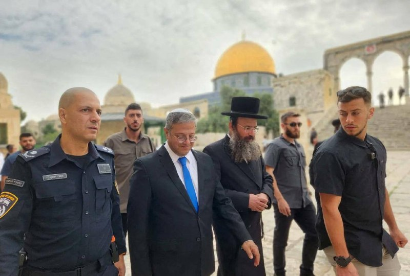

🔴 فرانسه ورود بن گویر وزیر امنیت ملی اسرائیل به کشورش رو ممنوع کرد.

@IranianMinds

## IranianMinds — post 20604

🔴کانال ۱۱ اسرائیل گزارش داد:

اسرائیل هرگونه توافق با رژیم تروریستی اسلامی را به خروج اورانیوم غنی شده از ایران و نظارت دقیق بر برنامه هسته‌ای تهران مشروط می‌داند.

@IranianMinds

## IranianMinds — post 20603

  

🔴 دیدار امروز مارکو روبیو و نخست وزیر هند

@IranianMinds

## IranianMinds — post 20602

🔴صدا و سیما:

عاصم منیر تهران را ترک کرد.

@IranianMinds

## BBCPersian — post 281886

  <a href="telegram/content/BBCPersian_281886_1779551585.mp4" target="_blank">🎬 Download video</a>

🔻‌ویدیوهایی از اعتراض دانش‌آموزان در شهرهای مختلف منتشر شده است. این دانش‌آموزان به حضوری شدن امتحاناتشان اعتراض دارند.
 
دانش‌آموزان در شهرهای خرم‌آباد، یاسوج و دورود مقابل ساختمان‌های آموزش و پرورش این شهرها تجمع کردند و با شعارهای مختلف اعتراض خودشان را نشان دادند.
 
در جریان اعتراضات سراسری در دی ماه ۱۴۰۴ که به کشتار بی‌سابقه معترضان انجامید در بعضی استان‌ها مدارس غیرحضوری شد.
 
با شروع جنگ آمریکا و اسرائیل با ایران، مدارس در ایران تعطیل شد و بعد از تعطیلات نوروز کلیه کلاس‌ها غیرحضوری برگزار شد.
 
چند روز پیش عبدالرضا فولادوند، سرپرست مرکز ارزشیابی آموزش و پرورش در یک مصاحبه تلویزیونی از احتمال برگزاری امتحانات به صورت حضوری خبر داد.
 
https://bbc.in/4a7X523
@BBCPersian

## BBCPersian — post 281884

🔻رئیس دانشگاه علوم پزشکی ایران: امکان انتقال جنین‌های فریز‌شده به محل‌های امن وجود دارد

رئیس دانشگاه علوم پزشکی ایران با اشاره به وضعیت جنین‌های نگهداری‌شده در مراکز درمان ناباروری در دوران جنگ گفت که این نمونه‌ها تحت شرایط «ایمن و قابل انتقال نگهداری می‌شوند و در صورت بروز خطر یا آسیب دیدن مراکز درمانی مانند بیمارستان گاندی، امکان انتقال آن‌ها به محل‌های امن وجود دارد.»

نادر توکلی گفت که در مراکز ناباروری معمولاً چند جنین به صورت استاندارد فریز می‌شوند و قابلیت جابجایی را دارند بنابراین اگر در جریان جنگ نیاز بوده، این انتقال انجام شده است.

او درباره تعداد مصدومان جنگ که هنوز در مراکز درمانی تهران بستری هستند گفت که حدودا «کمتر از ۱۰ مصدوم جنگی» با عوارض شدید هنوز تحت درمان هستند.

https://bbc.in/4utVGeA
@BBCPersian

## BBCPersian — post 281883

🔻عضو کمیسیون امنیت مجلس ایران درباره جلسه قالیباف و منیر: برخی از موضع‌گیری‌های اخیر آمریکا نگران کننده است

فداحسین مالکی، نماینده مجلس ایران و عضو کمیسیون امنیت ملی، که در مذاکرات محمدباقر قالیباف با فیلد مارشال عاصم منیر، فرمانده کل ارتش و نیروهای مسلح پاکستان، حضور داشت گفته است که «برخی از موضع‌گیری‌های اخیر آمریکایی‌ها به‌خصوص ترامپ و وزیر خارجه تندروی آمریکا، قدری نگران‌کننده است که باید طرف پاکستانی این مسائل را بیشتر لحاظ کند.»

آقای مالکی به خبرگزاری ایسنا گفت: «هر دو طرف ایرانی و پاکستانی پذیرفتند که این چالش‌ها و ندانم‌کاری‌ها از ناحیه آمریکاست که به توافق نهایی ضربه می‌زند و حتی ممکن است میز مذاکره را کم‌رنگ کند به خصوص از ناحیه افرادی مانند [استیو] ویتکاف [فرستاده ویژه رئیس جمهور آمریکا] که گزارش‌های غیرواقع به ترامپ می‌دهند و ترامپ هم براساس آن، توییت می‌زند و موجب ایجاد حساسیت در ایران و حتی کدورت در دوستان پاکستانی ما می‌شود.»

به گفته آقای مالکی «آنچه در این دیدار مسلم بود،‌ خیلی از موضوعات را آمریکایی‌ها پذیرفته‌اند، اما ما هنوز مراحلی داریم که در جلسات بعد مشخص می‌شود و امشب نیز مذاکرات عمیق‌تری میان دو طرف وجود دارد.»

عاصم منیر که دیروز وارد تهران شده بود پس از دیدار با رئیس جمهور، رئیس مجلس و وزیر خارجه ایران، امروز تهران را ترک کرد.

https://bbc.in/4fDudlT
@BBCPersian

## BBCPersian — post 281882

🔻ادامه حملات اسرائیل به لبنان

حملات اسرائیل به اهدافی در خاک لبنان با وجود آتش‌بس امروز هم ادامه داشت.

خبرگزاری رسمی لبنان گزارش داد که اسرائیل حدود ۱۲ نقطه در جنوب لبنان را هدف حمله هوایی قرار داد از جمله یک منطقه کشاورزی که «چند کارگر سوری زخمی شدند.»

علاوه بر این، ارتش لبنان در بیانیه‌ای گفت که در حمله اسرائیل به یک پادگان در جنوب، یک سرباز زخمی شده است: «در نتیجه هدف قرار گرفتن خصمانه یک پادگان ارتش در شهر نبطیه از سوی اسرائیل، یک نظامی دچار جراحت شد.»

این خبرگزاری همچنین اعلام کرد در حمله شب گذشته به شهر صور در جنوب لبنان، مکانی در نزدیکی بیمارستان را هدف قرار گرفت که «خسارات شدیدی» به این مرکز درمانی وارد کرد.

خبرنگار خبرگزاری فرانسه از محل گزارش داده است که که شیشه‌ها شکسته، سقف‌ها فرو ریخته و تجهیزات پزشکی در بیمارستان آسیب دیده‌ است.

ارتش اسرائیل شامگاه جمعه پیش از حمله به دو نقطه در شهر صور، هشدار ترک صادر و اعلام کرده بود که «تأسیسات حزب‌الله» را هدف قرار خواهد داد.

https://bbc.in/3PBSRJa
@BBCPersian

## BBCPersian — post 281881

🔻رسانه‌های ایران می‌گویند شاخص بازار سهام رشد داشته است

رسانه‌های ایران می‌گویند بازار سهام در پایان معاملات اولین روز هفته رشد داشته است.

خبرگزاری رسمی ایرنا می‌گوید بازار سهام امروز با رشد ۷۰ هزار واحدی به ارتفاع سه میلیون و ۸۳۱ هزار واحد رسید.

رشد شاخص بورس به معنای افزایش میانگین قیمت سهام و سودآوری شرکت‌های فعال در بازار است.

بازار بورس ایران که با جنگ اخیر تعطیل شد، پس از هشتاد روز توقف دوباره بازگشایی شده است.

https://bbc.in/42Nfbm6
@BBCPersian

## BBCPersian — post 281880

  <a href="telegram/content/BBCPersian_281880_1779551586.mp4" target="_blank">🎬 Download video</a>

🔻سرخط خبرهای شنبه ۲ خرداد ۱۴۰۵
@BBCPersian

## BBCPersian — post 281879

  <a href="https://t.me/bbcpersian/281879" target="_blank">📎 Download file</a>

📻این هفته در پرگار: آینده دانشگاه در عصر هوش مصنوعی

🔻دانشگاه در جوامع بشری قدمتی بیش از هزار سال  دارد و دغدغه راه یافتن به آن یا بهره شغلی از امتیاز آن به دی‌ان‌ای بشر راه یافته. آیا همه اینها قرار است با هوش مصنوعی تغییر کند؟ دانشگاه آینده‌ای دارد؟

میهمان‌ها:
سپهر وکیل، استاد دانشگاه
مهدی گنجوی، استاد دانشگاه

@BBCPersian

## BBCPersian — post 281878

  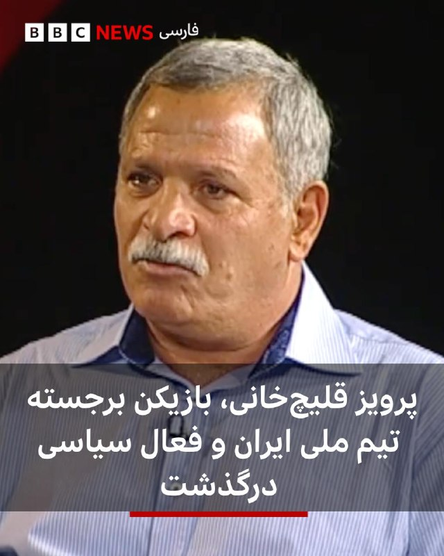

🔻پرویز قلیچ‌خانی، کاپیتان پیشین تیم ملی فوتبال ایران و فعال سیاسی چپگرا در ۸۱ سالگی درگذشت. او به آلزایمرمبتلا بود.
نجمه موسوی-پيمبری، «يار و همراه» پرویز قلیچ‌خانی به بی‌بی‌سی فارسی گفت: «قهرمان ملی و چهره هميشه زنده ايران در تاريخ بيست و سوم ماه مه ٢٠٢٦ مصادف با دوم خرداد ١٤٠٥ در بيمارستانی در حومه پاريس درگذشت.»
آقای قلیچ‌خانی، پیش از انقلاب، علاوه بر تیم ملی، در باشگاه‌های تاج، پرسپولیس و پاس هم بازی کرد. او تنها بازیکنی است که با تیم ایران سه بار قهرمان جام ملت‌های آسیا شده است. پرویز قلیچ‌خانی بعد از انقلاب هم در خارج از کشور، مجله آرش را با گرایش سیاسی چپ اداره می‌کرد.
او فوتبال را از کوچه‌های محله صابون پزخانه میدان شوش تهران شروع کرد و بعد از مدتی کوتاه فوتبالیستی ماهر و بالاخره کاپیتان تیم ملی ایران شد.
ولی هنوز طعم قهرمانی فوتبال را درست نچشیده بود که توجهش به سیاست جلب شد و از پشت میله های زندان سر درآورد.
پس از انقلاب از فوتبالیست حرفه‌ای به فعال سیاسی و روزنامه‌نگار خارج‌نشین تبدیل شد.

@BBCPersian

## BBCPersian — post 281877

فعالان حامی فلسطین که پس از توقیف کشتی کمک‌رسانی به غزه توسط نیروهای اسرائیلی در آب‌های بین‌المللی بازداشت شده بودند و به زندانی در اسرائیل منتقل شده بودند، و اکنون اخراج شدند، می‌گویند که در زمان بازداشت در اسرائیل مورد آزار و اذیت قرار گرفته‌اند.
ارتش اسرائیل هم این گفته‌ها را رد کرد و به بی‌بی‌سی گفت که دستوراتش «دربرگیرنده رفتار محترمانه و مناسب با افراد حاضر در ناوگان بوده است».

جزئیات بیشتر را در لینک زیر بخوانید:
https://bbc.in/4tT9kXp

@BBCPersian

## BBCPersian — post 281876

🔻پلی بر رودخانه سن در پاریس تبدیل به یک غار عظیم بادی شد.

فیلمبرداری به شیوه تایم‌لپس نشان می‌دهد که این پل چگونه به هیبت یک غار درمی‌آید.

«پونت نوف»، پل نهم سن در قرن ۱۷ ساخته شده است.

این اثر با عنوان «غار» کار هنرمند فرانسوی، ژان رنه، با نام مستعار جی‌آر، جدیدترین اثر از مجموعه‌ای از چیدمان‌های هنری در مقیاس بزرگ در پایتخت فرانسه است که ۱۲۰ متر طول و بین ۱۲ تا ۱۸ متر ارتفاع دارد.

جی‌آر به خبرگزاری آسوشیتدپرس گفت که این اثر «خشن و وحشی در کنار ظرافت لطیف» پاریس، ترس را در عین یک جذابیت ناشناخته القا می‌کند.

این غار از ۶ ژوئن/۱۶ خرداد به روی عموم باز می‌شود. این چیدمان تا ۲۸ ژوئن/ ۷ تیر برقرار خواهد بود.

🎥APTN
@BBCPersian

## BBCPersian — post 281875

🔻فرمانده کل قوای پاکستان تهران را ترک کرد

فیلد مارشال عاصم منیر، فرمانده کل ارتش و نیروهای مسلح پاکستان، پس از سفری یک روزه به تهران ایران را ترک کرد.

به گزارش ایرنا، او «با همراهی محسن نقوی، وزیر کشور پاکستان که از هفته گذشته در تهران به سر می‌برد، تهران را ترک کردند.»

آقای منیردر این سفر با محمدباقر قالیباف، رئیس مجلس، مسعود پزشکیان، رئیس جمهور و عباس عراقچی، وزیر خارجه دیدار و گفتگو کرد.

این دومین سفر آقای منیر در چند هفته گذشته به ایران است.

پاکستان میانجی مذاکرات ایران و آمریکا است.

https://bbc.in/4uXuJ2G
@BBCPersian

## BBCPersian — post 281874

  <a href="telegram/content/BBCPersian_281874_1779551589.mp4" target="_blank">🎬 Download video</a>

پنتاگون مجموعه‌ای تازه از اسناد مربوط به اشیای ناشناس پرنده را منتشر کرده که شامل مدارک، فایل‌های صوتی و ۵۱ ویدیو از مشاهدات این اشیا در طول بیش از ۸۰ سال گذشته و از جمله در ایران و سوریه است.
 
در این گزارش‌ها، شاهدان از دیدن گوی‌ها، دیسک‌ها و توپ‌های آتشین از دهه ۱۹۴۰ تا امروز خبر داده‌اند. در یکی از جدیدترین موارد، یک مقام ارشد اطلاعاتی آمریکا گفته در سال ۲۰۲۵ داخل بالگرد نظامی، تعداد زیادی گوی نارنجی را دیده که با سرعت بالا در همه جهات حرکت می‌کردند و حتی برای لحظاتی به شکل یک مثلث کنار هم قرار گرفتند و سپس ناپدید شدند. این پدیده بیش از یک ساعت ادامه داشته است.
  
دونالد ترامپ، رییس جمهور آمریکا پس از انتشار این اسناد گفت: «با این مدارک و ویدیوها، مردم خودشان می‌توانند تصمیم بگیرند که واقعا چه خبر است». پنتاگون اعلام کرده انتشار فایل‌های مربوط به اشیای ناشناس پرنده ادامه خواهد داشت و اسناد بیشتری به‌زودی منتشر می‌شود.

@bbcpersian

## BBCPersian — post 281873

  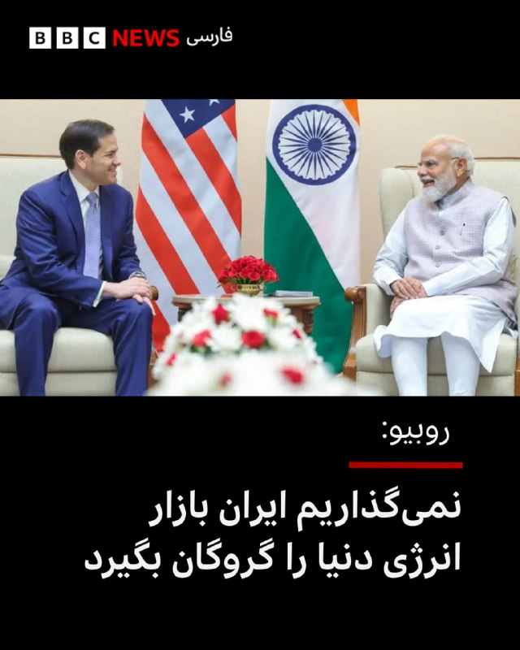

🔻مارکو روبیو، وزیر خارجه آمریکا، که برای سفری چهار روزه در هند است با نارندرا مودی، نخست‌وزیر، دیدار و گفت‌وگو کرد.

آقای روبیو در این دیدار گفته است آمریکا اجازه نمی‌دهد که ایران بازار انرژی در دنیا را به «گروگان» بگیرد.

او همچنین بر اهمیت همکاری راهبردی هند و آمریکا در منطقه اقیانوس‌های هند و آرام تاکید کرد.

به گفته سفیر آمریکا در هند، آقای روبیو به نمایندگی از دونالد ترامپ، رئیس جمهور آمریکا، آقای مودی را برای یک سفر رسمی به آمریکا دعوت کرده است.

📸Indian Government
https://bbc.in/4us85PY
@BBCPersian

## BBCPersian — post 281872

  

🔸برونو فرناندز، کاپیتان منچستریونایتد، به‌عنوان بهترین بازیکن فصل لیگ برتر انگلیس انتخاب شد.
این هافبک پرتغالی چند روز پیش جایزه انجمن نویسندگان فوتبال برای بهترین بازیکن مرد سال این لیگ را گرفته بود.
برونو فرناندز در دیدار هفته گذشته مقابل ناتینگهام فارست، با ثبت بیستمین پاس گل، با رکورد بیشترین پاس گل در یک فصل لیگ برتر مساوی کرد.
او این فصل در ۳۷ بازی، هشت گل به ثمر رسانده و نقش مهمی در رسیدن منچستریونایتد به جایگاه سوم لیگ و کسب سهمیه لیگ قهرمانان اروپا داشته است.
فرناندز در این فصل لیگ برتر با خلق ۱۳۲ موقعیت گل، بیش از هر بازیکن دیگری فرصت‌ ساخت، ۴۳ موقعیت بیشتر از نفر دوم، دومینیک سوبوسلای از لیورپول.

او نخستین بازیکن منچستریونایتد است که از سال ۲۰۱۱ این جایزه را به دست می‌آورد. در آن سال نمانیا ویدیچ این جایزه را برد.
برنده این جایزه از ترکیب آرای عمومی و هیئتی از کارشناسان فوتبال انتخاب می‌شود.
دیوید رایا، گابریل و دکلان رایس از آرسنال، ارلینگ هالند و آنتوان سمنیو از منچسترسیتی، ایگور تیاگو از برنتفورد و مورگان گیبز-وایت از ناتینگهام فارست نیز در فهرست نامزدهای نهایی بودند.
📸GettyImages
@BBCPersian

## Dirty_Kids — post 390019

  <a href="telegram/content/Dirty_Kids_390019_1779551592.mp4" target="_blank">🎬 Download video</a>

والا😂😂 جون بکن بگو تمومش کن

@Dirty_Kids 👻

## Dirty_Kids — post 390018

اگر ایران تا ۷۲ ساعت دیگر اینترنت را وصل نکند، بنده هر جا که زمین خالی ببینم خشخاش میکارم، خودم به تنهایی یک تمدن بزرگ رو نابود خواهم کرد.
از توجه شما به این موضوع سپاسگزارم.

@Dirty_Kids 👻

## Dirty_Kids — post 390017

  

تیشرت موردعلاقم بعد از ۴۰-۵۰ :)))

@Dirty_Kids 👻

## Dirty_Kids — post 390016

  <a href="telegram/content/Dirty_Kids_390016_1779551594.mp4" target="_blank">🎬 Download video</a>

۲ خرداد سالگرد درگذشت اسطوره فوتبال ایران ناصر خان حجازی گرامی باد 💙🦅

خاطره جالب از همسر ناصرخان :)))

@Dirty_Kids 👻

## Dirty_Kids — post 390015

  <a href="telegram/content/Dirty_Kids_390015_1779551595.mp4" target="_blank">🎬 Download video</a>

شروع اعتراضات و پرتاب گاز اشک آور توسط سرکوبگران!

دانش آموزا بخاطر اینکه امتحاناتشون مجازی بشه دارن اعتراض میکنن تا الانم یه سری شهر‌ها مجازی شدن

+ بیشتر شبیهه تقلیل دادن مطالبات مردم هست ولی خب...

@Dirty_Kids 👻

## Dirty_Kids — post 390014

کانال یازده اسراییل گفته
اون قسمت هایی از مذاکره که آمریکا ، اسراییل رو در جریان نمیزاره ، از طریق جاسوسان موساد در نظام ، اسراییل در جریان مذاکرات قرار میگیره :))))))))))

@Dirty_Kids 👻

## Dirty_Kids — post 390013

  <a href="telegram/content/Dirty_Kids_390013_1779551596.mp4" target="_blank">🎬 Download video</a>

تو اسناد جدیدی که وزارت دفاع آمریکا از پرونده‌های UFO 🛸 منتشر کرده، اسم ایران هم به چشم می‌خوره!

«4 شیء ناشناسِ پرنده به‌صورت گروهی، 26 آگوست 2022، روی آب‌های ایران مشاهده شدن»

@Dirty_Kids 👻

## Dirty_Kids — post 390012

  

پست جدید ترامپ:

ایالاتِ متحده‌ی خاورمیانه؟

@Dirty_Kids 👻

## Dirty_Kids — post 390011

  <a href="telegram/content/Dirty_Kids_390011_1779551598.mp4" target="_blank">🎬 Download video</a>

رسانه‌های ایران نوشتند سفارت آمریکا به درخواست ویزای شجاع خلیل‌زاده جواب منفی داده و او نمی‌تواند به جام جهانی برود. خلیل‌زاده هرشب در تجمعات سپاهی‌ها حضور داشت و مثلا گفته بود «رهبر شهید افتخار ایران هستند.» حالا می‌تواند برگردد کنار رهبر شهیدش استراحت کند، البته در یخچال.

@Dirty_Kids 👻

## Hranews — post 113117

  

امروز شنبه ۲ خردادماه، شماری از رانندگان استیجاری در مقابل ساختمان نهاد ریاست جمهوری در تهران تجمع اعتراضی برگزار کردند. این #رانندگان شاغل در دستگاه‌های اجرایی سراسر کشور، خواستار رسیدگی به موضوع تبدیل وضعیت اشتغال خود هستند.

↘️
@hranews_bot تماس ✉️ - @Hranews کانال هرانا 🆑

## Hranews — post 113116

یک شکارچی متخلف در کامیاران به مجازات جایگزین حبس محکوم شد

❗️
❗️
❗️
❗️
❗️– رئیس حفاظت محیط زیست کامیاران از صدور حکم سبز برای یک شکارچی متخلف خبر داد و اعلام کرد که این متهم ملزم به تامین ۱۰ آبشخور برای حیات‌وحش، بدل از مجازات حبس، محکوم شده است.

ادامه مطلب

#حکم_سبز

↘️
@hranews_bot تماس ✉️ - @Hranews کانال هرانا 🆑

## Hranews — post 113115

  

جمعی از کارگران رسمی اپراتور پست‌های فشار قوی برق، امروز شنبه با برگزاری تجمع اعتراضی مقابل ساختمان برق منطقه‌ای غرب در کرمانشاه، خواستار بازنگری در مصوبه رفاهیات #کارگران و اجرای طرح «فوق‌العاده خاص» شدند.

↘️
@hranews_bot تماس ✉️ - @Hranews کانال هرانا 🆑

## Hranews — post 113114

  

گزارشی از تداوم بازداشت و بلاتکلیفی آرتین غضنفری در زندان تهران بزرگ

❗️
❗️
❗️
❗️
❗️– آرتین غضنفری، شهروند بهائی و عکاس خبری، با گذشت ۱۲۵ روز از زمان دستگیری، کماکان به‌صورت بلاتکلیف در زندان تهران بزرگ محبوس است.

به گزارش خبرگزاری هرانا، ارگان خبری مجموعه فعالان حقوق بشر در ایران، آرتین غضنفری، شهروند بهائی کماکان در بازداشت است.

یک منبع مطلع نزدیک به خانواده این شهروند بهائی، ضمن تایید این خبر به هرانا گفت: آقای غضنفری از بیماری‌های متعددی، از جمله نارسایی قلبی، آسم و فشار خون بالا رنج می‌برد و به‌صورت روزانه نیازمند مصرف دارو است. با این حال، علیرغم پیگیری‌های مکرر خانواده از مراجع قضایی، مسئولان مربوطه با آزادی موقت وی موافقت نکرده‌اند.

وی افزود: همچنین، قرار بازداشت آرتین را بدون ارائه توضیحی روشن، برای چندمین بار تمدید شده است. تداوم این وضعیت، نگرانی‌های خانواده وی را افزایش داده است.

ادامه مطلب

#آرتین_غضنفری

↘️
@hranews_bot تماس ✉️ - @Hranews کانال هرانا 🆑

## Hranews — post 113113

  

با حکم دادگاه انقلاب؛‌ حجت آل‌محمدی به ۲۱ سال حبس محکوم شد

❗️
❗️
❗️
❗️
❗️– حجت آل‌محمدی، زندانی سیاسی محبوس در زندان شیبان اهواز، توسط دادگاه انقلاب این شهر به ۲۱ سال حبس محکوم شده است.

به گزارش خبرگزاری هرانا، ارگان خبری مجموعه فعالان حقوق بشر در ایران، حجت آل‌محمدی به #حبس محکوم شد.

براساس اطلاعات دریافتی هرانا، آقای آل‌محمدی توسط شعبه سوم دادگاه انقلاب اهواز به ۲۱ سال حبس محکوم شده است. این رای هفته گذشته در زندان به او ابلاغ شده است.

ادامه مطلب

#حجت_آل‌محمدی

↘️
@hranews_bot تماس ✉️ - @Hranews کانال هرانا 🆑

## Hranews — post 113112

  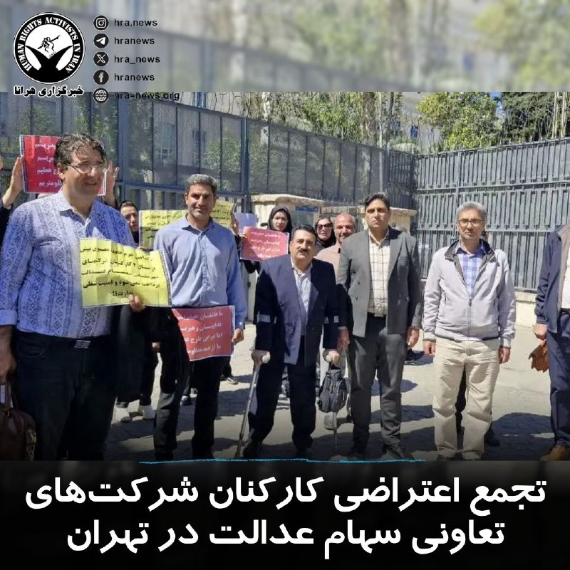

صبح امروز، گروهی از کارکنان شرکت‌های تعاونی سهام عدالت، با برگزاری تجمع اعتراضی مقابل درب شمالی شماره دو وزارت امور اقتصادی و دارایی در تهران، خواستار پرداخت حقوق معوقه و رسیدگی به وضعیت امنیت شغلی خود شدند.
#تجمع_اعتراضی

↘️
@hranews_bot تماس ✉️ - @Hranews کانال هرانا 🆑

## Hranews — post 113111

  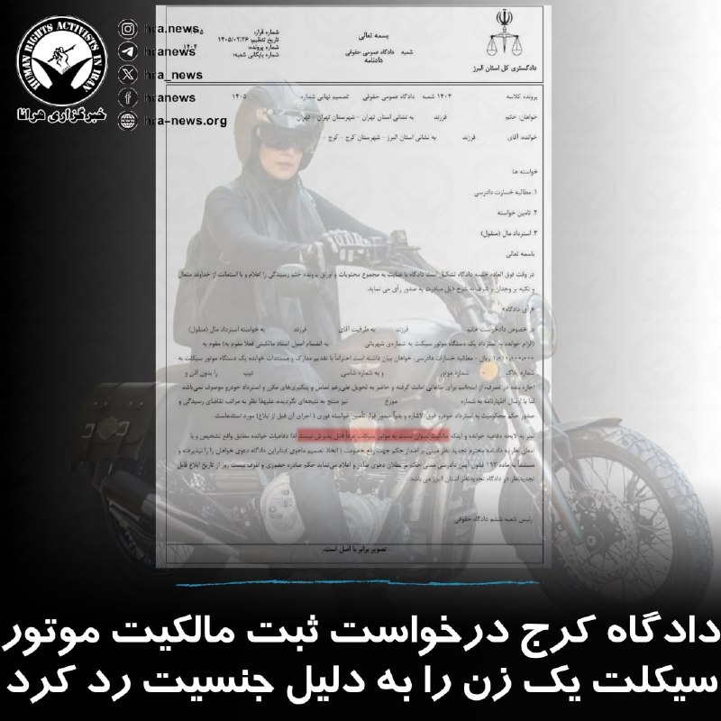

تصویر منتشرشده از دادنامه شعبه ششم دادگاه عمومی حقوقی مجتمع قضایی کرج، نشان ‌دهنده صدور حکمی است که در آن دعوای یک زن برای «استرداد مال منقول» (یک دستگاه موتور سیکلت) رد شده است. قاضی صادر کننده رای، در بخش استدلال خود صراحتا قید کرده است که «مالکیت نسوان نسبت به موتور سیکلت عرفاً قابل پذیرش نیست». رئیس شعبه با این استناد، دفاعیات خواهان را «فاقد وجاهت قانونی» دانسته و حکم بر بطلان دعوی صادر کرده است. این استدلال عرفی در حالی مبنای رد مالکیت قرار گرفته که در قوانین مدنی و تجاری کشور، هیچ منع قانونی برای خرید، فروش و مالکیت اموال منقول بر اساس جنسیت وجود ندارد./ آوش

این تصمیم قضایی در حالی اتخاذ شده است که طبق ماده ۳۰ قانون مدنی، هر فردی حق دارد بر اموال خود مالکیت داشته باشد و قانون در این زمینه تفاوتی میان زن و مرد قائل نشده است. همچنین بر اساس ماده ۱۱۱۸ قانون مدنی، #زنان از حق کامل برای خرید و فروش برخوردارند.

↘️
@hranews_bot تماس ✉️ - @Hranews کانال هرانا 🆑

## Hranews — post 113110

به اتهام “همکاری با شبکه‌های معاند”؛ دو زن مجموعا به ۵۳ سال حبس محکوم شدند

❗️
❗️
❗️
❗️
❗️– رئیس کل دادگستری استان سمنان از صدور احکام طولانی مدت حبس و مجازات‌های تکمیلی برای دو زن به نام‌های لیلا رمضانی و فاطمه ملک‌احمدی به دلیل آنچه “همکاری با شبکه‌های معاند و اقدام علیه امنیت ملی” عنوان کرده است، خبر داد. بر این اساس، لیلا رمضانی به ۲۶ سال و فاطمه ملک‌احمدی به ۲۷ سال حبس و انفصال از خدمات دولتی، ممنوعیت خروج از کشور و محرومیت از عضویت در احزاب و گروه‌های سیاسی و اجتماعی محکوم شده‌اند.

ادامه مطلب

#لیلا_رمضانی #فاطمه_ملک‌احمدی #حبس

↘️
@hranews_bot تماس ✉️ - @Hranews کانال هرانا 🆑

## Hranews — post 113109

مرگ یک نوجوان در مشهد هنگام فرار از تعرض؛ دو متهم بازداشت شدند

❗️
❗️
❗️
❗️
❗️– یک نوجوان ۱۷ ساله در مشهد، پس از آنچه تلاش برای تعرض جنسی از سوی دو مرد عنوان شده، با سقوط از پنجره یک واحد مسکونی جان خود را از دست داد. در این رابطه، دو مرد بازداشت شدند.

ادامه مطلب

#نوجوان #تعرض_جنسی

↘️
@hranews_bot تماس ✉️ - @Hranews کانال هرانا 🆑

## manototv — post 105769

  <a href="telegram/content/manototv_105769_1779551601.mp4" target="_blank">🎬 Download video</a>

فدراسیون فوتبال جمهوری اسلامی مدعی شد گزارش‌ها درباره رد ویزای شجاع خلیل‌زاده، مهدی طارمی و احسان حاج‌صفی را تکذیب کرد.

رسانه‌های ورزشی ایران در روزهای اخیر از شایعاتی درباره رد شدن ویزای این سه بازیکن تیم ملی فوتبال مردان ایران گزارش داده بودند.

فدراسیون فوتبال روز شنبه با انتشار بیانیه‌ای این گزارش‌ها را «کذب» خواند و اعلام کرد: «فرایند اداری مربوط به اخذ ویزا از سوی فدراسیون فوتبال و تیم ملی طبق روال انجام گرفته و ادعای مطرح شده کذب است.»

هم‌زمان، روزنامه خبرورزشی گزارش داد امیر قلعه‌نویی، سرمربی تیم ملی فوتبال مردان ایران، با بازیکنان جایگزین این سه عضو تیم ملی تماس گرفته تا تمرینات آمادگی برای جام جهانی را ادامه دهند.

شجاع خلیل‌زاده، مهدی طارمی و احسان حاج‌صفی از جمله ملی‌پوشان ایرانی هستند که دوران خدمت سربازی خود را در سپاه گذرانده‌اند.

## manototv — post 105768

  <a href="telegram/content/manototv_105768_1779551602.mp4" target="_blank">🎬 Download video</a>

ارتش پاکستان اعلام کرد عاصم منیر، فرمانده ارتش این کشور، سفر کوتاه اما «بسیار پرباری» به ایران داشته و در جریان آن دیدارها و گفت‌وگوهای «سطح بالا» با مقام‌های جمهوری‌اسلامی انجام داده است.

## manototv — post 105767

  <a href="telegram/content/manototv_105767_1779551602.mp4" target="_blank">🎬 Download video</a>

دونالد ترامپ، رئیس‌جمهور آمریکا، تصویری از نقشه خاورمیانه منتشر کرد که در آن ایران با طرح پرچم ایالات متحده پوشانده شده و بالای نقشه عبارت «ایالات متحده خاورمیانه؟» دیده می‌شود.

ترامپ این تصویر را در حساب خود در تروث‌سوشال منتشر کرد و توضیحی درباره منظور خود از آن ننوشت.

## manototv — post 105766

  <a href="telegram/content/manototv_105766_1779551603.mp4" target="_blank">🎬 Download video</a>

روزنامه فایننشال تایمز گزارش داده میانجی‌گران منطقه‌ای در حال نهایی کردن توافقی هستند که بر اساس آن آتش‌بس میان آمریکا و جمهوری‌اسلامی برای ۶۰ روز دیگر تمدید می‌شود و زمینه مذاکرات درباره برنامه هسته‌ای تهران را فراهم می‌کند.
بر اساس این گزارش، طرح پیشنهادی شامل بازگشایی تدریجی تنگه هرمز، گفت‌وگو درباره کاهش یا انتقال ذخایر اورانیوم غنی‌شده جمهوری‌اسلامی و همچنین کاهش محدودیت‌ها علیه بنادر ایران و آزادسازی مرحله‌ای بخشی از دارایی‌های مسدودشده تهران است.
اسماعیل بقایی، سخنگوی وزارت خارجه جمهوری‌اسلامی، گفته تهران و طرف‌های میانجی در حال تدوین «تفاهم‌نامه‌ای» برای پایان جنگ هستند و پس از آن مذاکرات درباره توافق جامع‌تر طی ۳۰ تا ۶۰ روز آینده ادامه خواهد یافت.
در همین حال، منابع دیپلماتیک گفته‌اند مذاکرات با میانجی‌گری قطر و پاکستان پیشرفت داشته، اما همچنان اختلاف‌های جدی بر سر برنامه هسته‌ای جمهوری‌اسلامی باقی مانده است؛ از جمله درخواست آمریکا برای تحویل ذخایر اورانیوم با غنای بالا و تعطیلی تاسیسات هسته‌ای نطنز، فردو و اصفهان.
این گزارش می‌افزاید کشورهای عربی منطقه نگران‌اند در صورت شکست مذاکرات و از سرگیری حملات آمریکا و اسرائیل، بحران به درگیری گسترده‌تر در خاورمیانه و اختلال شدید در بازار جهانی انرژی منجر شود.

## manototv — post 105765

  <a href="telegram/content/manototv_105765_1779551604.mp4" target="_blank">🎬 Download video</a>

مارکو روبیو، وزیر امور خارجه آمریکا، گفت در پرونده ایران «پیشرفت‌هایی» حاصل شده و ممکن است واشینگتن به‌زودی درباره این موضوع اظهارنظر تازه‌ای داشته باشد.

روبیو روز شنبه سوم خرداد در پاسخ به پرسشی درباره «موضوع ایران» گفت: «همان‌طور که گفتم، پیشرفت‌هایی حاصل شده است. حتی همین حالا که با شما صحبت می‌کنم، کارهایی در حال انجام است.»

او افزود ممکن است «امروز، فردا یا ظرف چند روز آینده» چیزی برای اعلام وجود داشته باشد، اما تاکید کرد هنوز قطعی نیست.

وزیر امور خارجه آمریکا گفت این موضوع باید «به هر شکل» حل شود و به گفته او، موضع دونالد ترامپ این است که «ایران هرگز نباید سلاح هسته‌ای داشته باشد.»

روبیو همچنین گفت تنگه‌ها باید «بدون عوارض» باز بمانند و جمهوری اسلامی باید درباره اورانیوم غنی‌شده و موضوع غنی‌سازی پاسخ‌گو باشد.

## manototv — post 105764

  <a href="telegram/content/manototv_105764_1779551605.mp4" target="_blank">🎬 Download video</a>

گزارشگرمنوتو: «در شرایط دشوار امروز ایران، گردهمایی پادشاهی‌خواهان شهر هامبورگ در حمایت از بانو فاطمه سپهری برگزار می‌شود؛ زنی شجاع و استوار که با وجود فشار، تهدید و زندان، از خواسته‌های مردم ایران عقب ننشسته و به نمادی از ایستادگی و آزادی‌خواهی تبدیل شده است.

ما در این گردهمایی، حمایت خود را از بانو فاطمه سپهری و همچنین از شاهزاده رضا پهلوی، به‌عنوان یکی از چهره‌های محوری همبستگی ملی و گذار به ایرانی آزاد، سکولار و دموکراتیک اعلام می‌کنیم.

این گردهمایی تأکیدی است بر ضرورت اتحاد مردم ایران برای آینده‌ای مبتنی بر آزادی، حقوق بشر و کرامت انسانی.»

## manototv — post 105763

  <a href="telegram/content/manototv_105763_1779551607.mp4" target="_blank">🎬 Download video</a>

پرویز قلیچ‌خانی، از چهره‌های ماندگار و پرافتخار فوتبال ایران، ساعاتی پیش در حومه پاریس در ۸۱ سالگی درگذشت.

قلیچ‌خانی که متولد سال ۱۳۲۴ بود، پس از ماه‌ها تحمل بیماری جان باخت.

او یکی از برجسته‌ترین بازیکنان تاریخ فوتبال ایران به شمار می‌رفت و تنها فوتبالیست ایرانی است که سه دوره پیاپی همراه تیم ملی قهرمان جام ملت‌های آسیا شده است.

## manototv — post 105762

  <a href="telegram/content/manototv_105762_1779551607.mp4" target="_blank">🎬 Download video</a>

بر اساس گزارش ان‌بی‌سی، دونالد ترامپ جونیور، پسر بزرگ رئیس‌جمهور آمریکا، با بتینا اندرسون در فلوریدا ازدواج کرده است، اما دونالد ترامپ احتمالاً در مراسم این آخر هفته شرکت نخواهد کرد.
ترامپ در گفت‌وگو با خبرنگاران گفته مراسم «یک رویداد کوچک و خصوصی» است و به دلیل شرایط کاری در کاخ سفید و مسائل سیاسی از جمله وضعیت جمهوری‌اسلامی، امکان حضور ندارد. او تأکید کرده که در این مقطع زمانی نمی‌تواند از واشنگتن خارج شود و مسئولیت‌های دولت را اولویت می‌داند.
ترامپ همچنین با اشاره به فشارهای رسانه‌ای گفته است که چه در صورت حضور و چه عدم حضور در مراسم، مورد انتقاد قرار خواهد گرفت. او در شبکه اجتماعی خود نیز ازدواج پسرش را تبریک گفته اما تأکید کرده که به دلیل «مسائل دولت و شرایط حساس فعلی» در مراسم حاضر نخواهد شد.

## manototv — post 105761

  <a href="telegram/content/manototv_105761_1779551608.mp4" target="_blank">🎬 Download video</a>

شیخ تمیم بن حمد آل ثانی، امیر قطر، در تماس تلفنی با دونالد ترامپ، رئیس‌جمهور آمریکا، درباره تنش‌های منطقه‌ای و ابتکارهای دیپلماتیکی که با محوریت پاکستان برای جلوگیری از تشدید بحران در حال انجام است، گفت‌وگو کرده است.
در این تماس، دو طرف تلاش‌ها برای کاهش تنش‌ها و حفظ ثبات منطقه را بررسی کردند و بر حمایت از میانجی‌گری پاکستان میان ایالات متحده و جمهوری‌اسلامی تاکید شد.
همچنین در این گفت‌وگو بر اهمیت ادامه مذاکرات و گفت‌وگوهای دیپلماتیک برای حل مسائل جاری، حفاظت از کشتیرانی دریایی و تضمین امنیت مسیرهای راهبردی آبی تأکید شد؛ موضوعی که به ثبات بازار جهانی انرژی و زنجیره تأمین نیز مرتبط است.

## manototv — post 105760

  <a href="telegram/content/manototv_105760_1779551608.mp4" target="_blank">🎬 Download video</a>

بر اساس گزارشی که در روزنامه تایمز منتشر شده، یک تحقیق مخفیانه نشان می‌دهد یک شبکه مرتبط با جمهوری‌اسلامی از طریق تلگرام تلاش کرده شهروندان بریتانیایی را برای سازماندهی تجمعات خیابانی ضد اسرائیلی و پخش پوسترهای تبلیغاتی جذب کند.
در این گزارش آمده است که خبرنگار تایمز به‌صورت مخفیانه وارد ارتباط با فردی شده که خود را «مهدی» معرفی کرده و مدعی بوده در ایران مستقر است و با ساختارهای امنیتی جمهوری‌اسلامی در ارتباط است. این فرد در پیام‌های خود پیشنهاد پرداخت پول در ازای سازماندهی تجمع، جذب افراد جدید و اجرای فعالیت‌های تبلیغاتی در لندن را مطرح کرده است.
همچنین از این خبرنگار خواسته شده ابتدا برای اثبات اعتماد، اقدام به نصب پوستر در خیابان‌های لندن و فیلم‌برداری از آن کند. این پوسترها شامل پیام‌های سیاسی علیه اسرائیل بوده است.
در ادامه، درخواست‌هایی برای گسترش فعالیت و حتی طراحی پروژه‌های آنلاین نیز مطرح شده و در نهایت حساب تلگرامی مربوطه به‌طور ناگهانی حذف شده است.

## manototv — post 105759

  <a href="telegram/content/manototv_105759_1779551609.mp4" target="_blank">🎬 Download video</a>

در حالی‌که برخی مقام‌های آمریکایی از احتمال توقف موقت فروش تسلیحات به تایوان به دلیل نیاز ارتش آمریکا در عملیات علیه ایران خبر داده بودند، یک منبع آگاه رویترز این ادعا را رد کرد و گفت این روند کاملاً طولانی‌مدت و اداری است و ارتباطی با جنگ ایران ندارد.
بر اساس این گزارش، تایوان همچنان منتظر تأیید بسته تسلیحاتی تا سقف ۱۴ میلیارد دلار از سوی آمریکا است. این در حالی است که چین به‌شدت با فروش سلاح به تایوان مخالفت کرده و آن را اقدامی علیه حاکمیت خود می‌داند.
کاخ سفید اعلام کرده تصمیم نهایی درباره این بسته در آینده نزدیک گرفته خواهد شد، اما سیاست کلی آمریکا در حمایت از توان دفاعی تایوان بدون تغییر باقی مانده است. تایوان نیز می‌گوید هیچ اطلاع رسمی از تعلیق یا تأخیر در این روند دریافت نکرده است.

## alonews — post 122074

  <a href="telegram/content/alonews_122074_1779551609.webm" target="_blank">🎬 Download video</a>

👈ترامپ به آکسیوس: تنها توافقی را در رابطه با غنی سازی اورانیوم و سرنوشت ذخایر آن است را میپذیرم‌‌

✅ @AloNews خبر جنگ

## alonews — post 122073

  <a href="telegram/content/alonews_122073_1779551610.webm" target="_blank">🎬 Download video</a>

🔴فوری/آکسیوس : ترامپ گفت احتمال اینکه به ایران حمله کنه و یا توافق بشه 50/50 هست همچنین ترامپ شنبه با استیو ویتکوف و جرد کوشنر دیدار میکند تا آخرین پیشنهاد ایران را بررسی کند و انتظار میرود تا یکشنبه تصمیم‌ گیری شود 
✅ @AloNews خبر جنگ

## alonews — post 122072

  <a href="telegram/content/alonews_122072_1779551610.webm" target="_blank">🎬 Download video</a>

🔴فوری/آکسیوس :
ترامپ گفت احتمال اینکه به ایران حمله کنه و یا توافق بشه 50/50 هست
همچنین ترامپ شنبه با استیو ویتکوف و جرد کوشنر دیدار میکند تا آخرین پیشنهاد ایران را بررسی کند و انتظار میرود تا یکشنبه تصمیم‌ گیری شود

✅ @AloNews خبر جنگ

## alonews — post 122071

  <a href="telegram/content/alonews_122071_1779551610.webm" target="_blank">🎬 Download video</a>

👈العربیه: ایران پیشنهاد تعلیق غنی‌سازی اورانیوم بالای ۳.۶ درصد را به مدت ۱۰ سال ارائه داد 
✅ @AloNews خبر جنگ

## alonews — post 122070

  <a href="telegram/content/alonews_122070_1779551610.webm" target="_blank">🎬 Download video</a>

👈العربیه: ایران پیشنهاد تعلیق غنی‌سازی اورانیوم بالای ۳.۶ درصد را به مدت ۱۰ سال ارائه داد

✅ @AloNews خبر جنگ

## alonews — post 122069

  <a href="telegram/content/alonews_122069_1779551610.webm" target="_blank">🎬 Download video</a>

👈فایننشال تایمز به نقل از یک دیپلمات مطلع از مذاکرات: به نظر می‌رسد توافق در مسیر درستی پیش می‌رود. اکنون توافق برای بررسی دست آمریکایی‌هاست.

✅ @AloNews خبر جنگ

## alonews — post 122068

  <a href="telegram/content/alonews_122068_1779551611.mp4" target="_blank">🎬 Download video</a>

👈هگست : میدونم ارتش عاشق غرق کردن نیروی دریاییه
- و فعلا تنها نیروی دریایی که اجازه دارید غرقش کنید نیروی دریایی "ایرانه"

✅ @AloNews خبر جنگ

## alonews — post 122067

  

مجری صدا و سیما آرپی‌جی آورده تو برنامه، انگار قسمت سربازی برره‌اس :)))

[@AloTweet]

## alonews — post 122066

  <a href="telegram/content/alonews_122066_1779551613.webm" target="_blank">🎬 Download video</a>

👈خبرگزاری آسوشیتدپرس به نقل از مقامات پاکستانی گزارش داد:

🔴اسلام آباد به تلاش‌های خود برای ترتیب دادن دور دوم مذاکرات مستقیم بین تهران و واشنگتن ادامه می‌دهد.

✅ @AloNews خبر جنگ

## alonews — post 122065

  <a href="telegram/content/alonews_122065_1779551613.webm" target="_blank">🎬 Download video</a>

👈طی ۲۴ساعت گذشته بولشویک‌ها حملات شدیدی علیه پزشکیان انجام دادن و طبق شنیده‌ها دنبال استعفای رئیس جمهور هستن تا گزینه مد نظر خودشون(زنبیل به دست) رو بیارن بالا

✅ @AloNews خبر جنگ

## alonews — post 122064

  <a href="telegram/content/alonews_122064_1779551613.webm" target="_blank">🎬 Download video</a>

👈ارتش پاکستان: مذاکراتی که در ۲۴ ساعت گذشته انجام شد، به پیشرفت امیدوارکننده‌ای به سوی تفاهم نهایی منجر شد.

✅ @AloNews خبر جنگ

## alonews — post 122063

  <a href="telegram/content/alonews_122063_1779551613.webm" target="_blank">🎬 Download video</a>

👈الحدث:ایران دو مسیر برای مذاکرات پیشنهاد کرده که با اعلام پایان جنگ و محاصره آغاز می‌شود.

🔴ایران تأکید کرده است که در متن یادداشت تفاهم، به عدم تولید سلاح هسته‌ای متعهد خواهد بود.

🔴ایران خواستار حفظ حق غنی‌سازی در هر توافقی شده است

🔴ایران پیش از مذاکرات هسته‌ای خواستار آزادسازی دارایی‌های بلوکه‌شدهٔ خود شده است

✅ @AloNews خبر جنگ

## alonews — post 122062

  <a href="telegram/content/alonews_122062_1779551614.mp4" target="_blank">🎬 Download video</a>

👈ارسالی شما/سلام ادمین ماهم تجمع کردیم جلوی اداره آموزش پرورش لرستان و اینجا هم امتحانا مجازی شد

✅ @AloNews خبر جنگ

## alonews — post 122059

  <a href="telegram/content/alonews_122059_1779551615.mp4" target="_blank">🎬 Download video</a>

👈جدیدا دانش آموزان استان‌هایی که امتحانات‌شون حضوریه، می‌ریزن جلو آموزش و پرورش منطقه و میگن ما فقط مجازی امتحان میدیم؛

🔴اتفاقا جواب هم داده و تا الان این استان‌ها مجازی شده :

- یزد
- مرکزی
- گیلان
- کهگیلویه و بویراحمد
- کرمان

✅ @AloNews خبر جنگ

## alonews — post 122058

  <a href="telegram/content/alonews_122058_1779551617.webm" target="_blank">🎬 Download video</a>

👈نورالدین الدغیر خبرنگار الجزیره در تهران:
منبعی به من گفت که فرمانده ارتش پاکستان قرار بود یادداشت تفاهمی بین ایران و آمریکا را از تهران اعلام کند، اما برای تکمیل هماهنگی‌ها با ترامپ، تهران را ترک کرد.

🔴منبع تأیید کرد که پرونده جنگ با تمام جزئیات آن مرحله اول را تشکیل می‌دهد و آنچه به مسائل هسته‌ای و تحریم‌ها مرتبط است، به پس از ۳۰ روز از توافق موکول می‌شود.

✅ @AloNews خبر جنگ

## alonews — post 122057

  <a href="telegram/content/alonews_122057_1779551617.webm" target="_blank">🎬 Download video</a>

👈مارکو روبیو، وزیر خارجه آمریکا: تنگه هرمز باید باز شود؛ ایران نباید سلاح هسته ای داشته باشد؛

🔴ایران باید ذخایر اورانیوم غنی شده خود را تحویل دهد؛ معضل غنی‌سازی ایران باید در مذاکرات در نظر گرفته شود

✅ @AloNews خبر جنگ

## alonews — post 122056

  <a href="telegram/content/alonews_122056_1779551617.mp4" target="_blank">🎬 Download video</a>

👈روبیو : شاید امروز یا چند روز دیگه درباره ایران خبرای جدیدی بیاد یه پیشرفت‌هایی شده
- ولی ایران نباید سلاح هسته‌ای داشته باشه و ترامپ میخواد قضیه دیپلماتیک حل بشه

✅ @AloNews خبر جنگ

## alonews — post 122055

  <a href="telegram/content/alonews_122055_1779551620.webm" target="_blank">🎬 Download video</a>

🔴فوری / روبیو: فرصتی برای پذیرش توافق توسط ایران در نزدیک‌ترین زمان وجود دارد 
✅ @AloNews خبر جنگ

<!-- MSG END -->

<!-- NAV START -->

<a href="https://github.com/nayebireza5-del/aiohghjbbbvm/blob/main/telegram/content/archive_1.md" style="display:inline-block; padding:6px 12px; margin:0 4px; background-color:#2ea44f; color:white; text-decoration:none; border-radius:4px; font-weight:bold;">صفحه بعد</a>

<!-- NAV END -->
