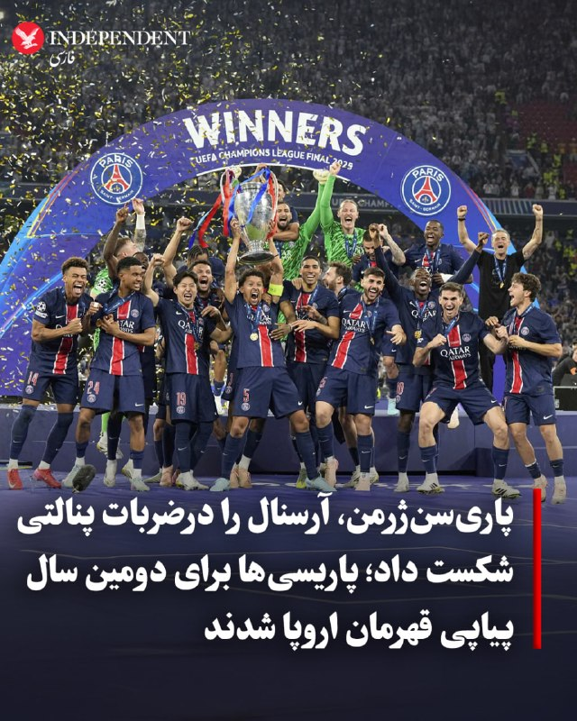
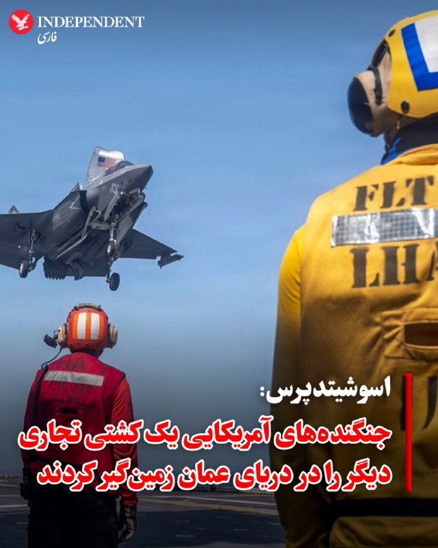
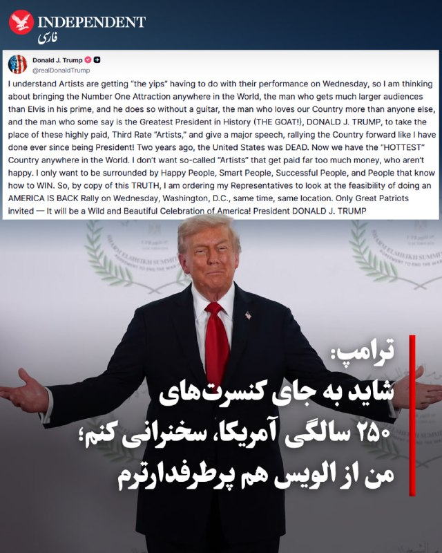
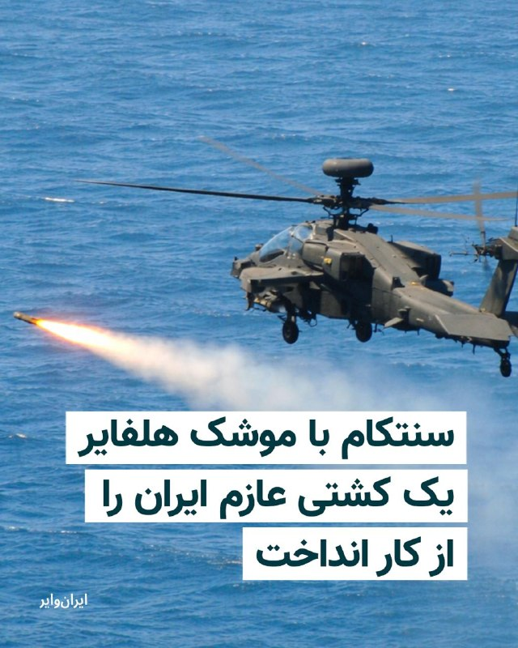
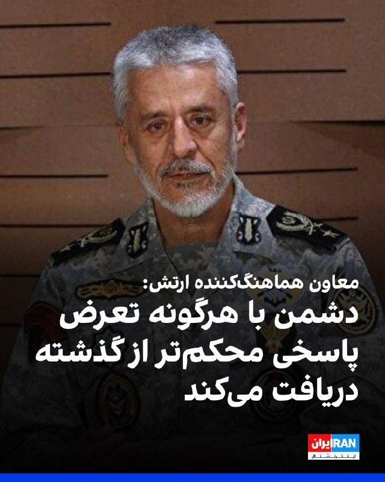
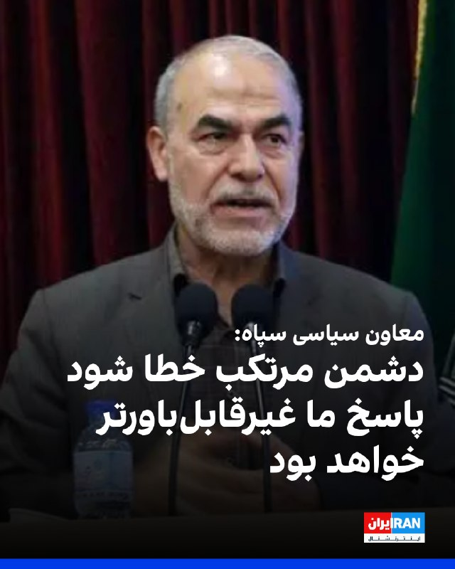
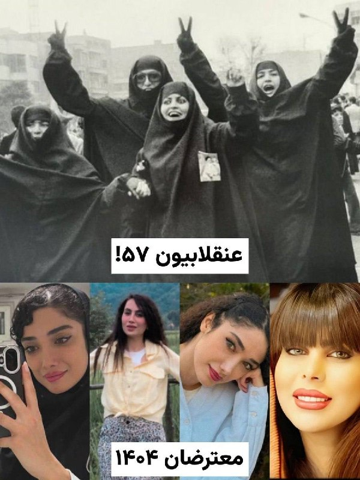
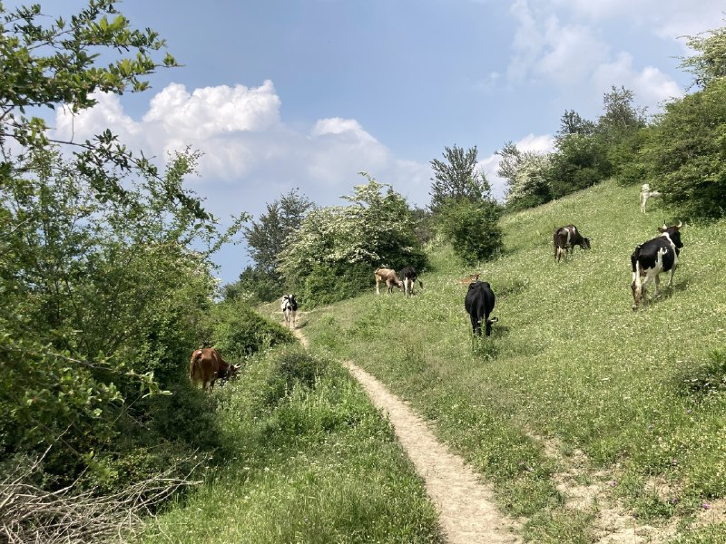

# خواننده تلگرام

<!-- TOP_NAV START -->

<a href="https://github.com/nayebireza5-del/aiohghjbbbvm/blob/main/telegram/content/archive_1.md" style="display:inline-block; padding:6px 12px; margin:0 4px; background-color:#2ea44f; color:white; text-decoration:none; border-radius:4px; font-weight:bold;">صفحه بعد</a>

<!-- TOP_NAV END -->

<!-- MSG START -->

---
📅 بروزرسانی: 1405/03/09 23:54
---

## VahidOOnLine — post 242950

  

علی شیرازی، رییس سازمان عقیدتی سیاسی انتظامی گفت: «بر عهد خود برای تداوم راه ولایت و مطالبه انتقام سخت از عاملان به شهادت رساندن رهبرمان پایبندیم.»

او افزود: «نهادهای مسئول باید پیگیری حقوقی و بین‌المللی این جنایت را در اولویت قرار داده و حکم الهی برای قاتلان امام شهید را در ملاعام اجرا کنند.»

شیرازی ادامه داد: «ملت ما تا زمان قصاص قاتلان امام خود و خروج کامل استکبار از منطقه، میدان‌های مبارزه را ترک نخواهند کرد.»
‌🏁 🇬🇧 IranintlTV

🤖 @VahidOOnLine

## VahidOOnLine — post 242949

  

نشریه هیل نوشت ثبات واقعی در خلیج فارس مستلزم از بین بردن توانایی رژیم ایران برای تهدید تجارت جهانی، اعمال فشار بر همسایگان و گروگان گرفتن بازارهای انرژی است. هر چیزی کمتر از این، صرفا وقفه‌ای کوتاه پیش از رویارویی بسیار خطرناک‌تری خواهد بود.

آریل کوهن، پژوهشگر شورای آتلانتیک و نویسنده این تحلیل نوشته نقشه راهبردی خاورمیانه در حال تغییر است و به نظر می‌رسد نفوذ آمریکا در این منطقه رو به کاهش باشد.

او با اشاره به نزدیک شدن تهران و واشینگتن به یک توافق نوشته است برای کسانی که دهه‌هاست این منطقه را مطالعه می‌کنند، این وضعیت نمونه‌ای از «ربودن شکست از آغوش پیروزی» به نظر می‌رسد.

او در ادامه نوشته است تعیین اهداف روشن جنگی، پیش‌شرط ضروری پیروزی نظامی است. همان‌گونه که رییس‌جمهوری و وزیر خارجه آمریکا اعلام کرده‌اند، اهداف واشینگتن در این درگیری روشن بود: جلوگیری از دستیابی جمهوری اسلامی به سلاح هسته‌ای، تضعیف توان موشک‌های بالستیک ایران، و برچیدن یا دست‌کم تضعیف شبکه نیروهای نیابتی که تهران برای اعمال نفوذ در خاورمیانه ایجاد کرده است؛ از حماس در غزه و حزب‌الله در لبنان گرفته تا حوثی‌ها در یمن.
https://iranin
‌🏁 🇬🇧 IranintlTV

🤖 @VahidOOnLine

## VahidOOnLine — post 242948

  

♦️تیم فوتبال پاری‌سن‌ژرمن با پیروزی برابر آرسنال در فینال لیگ قهرمانان اروپا، برای دومین فصل متوالی عنوان قهرمانی این رقابت‌ها را به دست آورد.
این دیدار در وقت‌های قانونی و اضافه با تساوی ۱-۱ به پایان رسید؛ جایی که کای هاورتز در دقیقه ۵ آرسنال را پیش انداخت، اما عثمان دمبله در دقیقه ۶۵ از روی نقطه پنالتی کار را به تساوی کشاند تا بازی به وقت‌های اضافه کشیده شود.
در نهایت، سرنوشت قهرمان در ضربات پنالتی مشخص شد و پاری‌سن‌ژرمن با نتیجه ۴ بر ۳ به پیروزی رسید تا جام را بالای سر ببرد.
این نخستین بار از سال ۲۰۱۶ بود که فینال لیگ قهرمانان اروپا به وقت‌های اضافه کشیده می‌شد؛ دیداری که با هیجان بالا و رقابت نزدیک دو تیم، به یکی از به‌یادماندنی‌ترین فینال‌های سال‌های اخیر تبدیل شد.
‌🇸🇦 Indypersian

🤖 @VahidOOnLine

## VahidOOnLine — post 242947

  

منوچهر متکی، نماینده تهران در مجلس، در یک برنامه تلویزیونی گفت که آمریکایی‌ها هیچ نشانه‌ای از پذیرفتن شروط جمهوری اسلامی از خود نشان نداده‌اند.

متکی اضافه کرد: «علاوه بر آمریکا، کشورهای عربستان سعودی و امارات متحده عربی هم باید به ما غرامت بپردازند.»

او ادامه داد: «ترامپ ممکن است در میانه ۶۰ روز هم بازی دربیارود. یکی از محورهای اصلی ما در مذاکرات، دریافت غرامت است.»

او افزود: «پاکستانی‌ها باید مراقب باشند، شاید آمریکا کاری را که با پادشاه پیشین عمان انجام داد با پاکستان هم انجام دهد. در آن زمان خواستند عمان نامه‌ای به جمهوری اسلامی تحویل دهد و بعد ادعا کردند که ما چنین نامه‌ای ندادیم.
‌🏁 🇬🇧 IranintlTV

🤖 @VahidOOnLine

## VahidOOnLine — post 242946

  <a href="telegram/content/VahidOOnLine_242946_1780172658.mp4" target="_blank">🎬 Download video</a>

♦️گزارش‌های متعددی از شنیده شدن صدایی مهیب در ماساچوست آمریکا، که شهروندان در فضای مجازی آن را «شبیه به انفجار» توصیف کرده‌اند منتشر شده است. بر اساس این گزارش‌ها و تصاویر دوربین‌های مداربسته که این لحظه را ثبت کرده‌اند، صدای «انفجارمانند» در بخش‌های مختلف شهرستان بوستون در ایالت ماساچوست شنیده شده است. به گزارش «میرور» همزمان با شنیده شدن این صدا که حدود ساعت ۲:۳۰ به وقت ساحل شرقی آمریکا رخ داد، سامانه‌های ماهواره‌ای هواشناسی، یک نور لحظه‌ای بزرگ را نیز در همان محدوده ثبت کردند. هنوز منابع رسمی جزئیاتی درباره این حادثه اعلام نکرده‌اند.

روز گذشته نیز حادثه مشابهی در کارولینای جنوبی رخ داد. شبکه ان‌بی‌سی گزارش داد که صدها نفر در این ایالت صدای انفجاری که به «بمب صوتی» شباهت داشت را شنیدند. با این حال، سازمان زمین‌شناسی آمریکا اعلام کرد که این صدا ناشی از زمین‌لرزه نبوده و ناسا نیز اعلام کرد که پرتاب موشک یا سقوط شهاب‌سنگ نیز اتفاق نیفتاده است.
‌🇸🇦 Indypersian

🤖 @VahidOOnLine

## VahidOOnLine — post 242945

  

♦️ فرماندهی مرکزی آمریکا (سنتکام)، روز شنبه نهم خرداد با انتشار بیانیه‌ای رسمی تایید کرد که نیروهای ارتش این کشور در دریای عمان، یک کشتی باری با پرچم گامبیا را که قصد داشت محاصره دریایی بنادر ایران را بشکند، هدف قرار داده و زمین‌گیر کرده‌اند.

بر اساس این بیانیه، نیروهای سنتکام کشتی تجاری «لیان استار» (M/V Lian Star) را در حال حرکت به سمت یکی از بنادر ایران رصد کرده و بیش از ۲۰ بار به آن هشدار دادند که در حال نقض محاصره دریایی ایالات متحده است. در پی بی‌توجهی خدمه کشتی به این هشدارهای مکرر، یک جنگنده آمریکایی با شلیک یک فروند موشک «هل‌فایر» به اتاق موتور کشتی، این شناور را از کار انداخت و مانع از ادامه مسیر آن به سمت ایران شد.

سنتکام در پایان اشاره کرد که با وجود برقراری آتش‌بس با ایران، نیروهای آمریکایی برای اجرای کامل محاصره دریایی، تاکنون ۵ کشتی تجاری را زمین‌گیر کرده و ۱۱۶ کشتی دیگر را مجبور به تغییر مسیر کرده‌اند.
‌🇸🇦 Indypersian

🤖 @VahidOOnLine

## VahidOOnLine — post 242944

  

حبیب‌الله سیاری، معاون هماهنگ‌کننده ارتش جمهوری اسلامی گفت: «امروز نیروی دریایی و دیگر نیروهای نظامی کشور از پیشرفته‌ترین تجهیزات منطبق با فناوری‌های نوین برخوردار هستند.»

او افزود: «دشمن بداند هر گونه تعرض به خاک کشور پاسخ محکم‌تر از گذشته دریافت خواهد کرد.»
‌🏁 🇬🇧 IranintlTV

🤖 @VahidOOnLine

## VahidOOnLine — post 242943

  

سنتکام، فرماندهی مرکزی ایالات متحده آمریکا، اعلام کرد که نیروهای ارتش آمریکا پنج‌شنبه ۸ خرداد، کشتی ام‌وی لیان استار با پرچم گامبیا را که در حال حرکت به سوی یکی از بنادر ایران بود، با شلیک موشک به موتور آن از کار انداختند.

سنتکام افزود که بیش از ۲۰ بار به این کشتی هشدار و اطلاع داده شده بود که در حال نقض محاصره اعمال‌شده از سوی ایالات متحده است.

فرماندهی مرکزی ایالات متحده نوشت: «پس از آن که خدمه «لیان استار» از تبعیت از دستورات خودداری کردند، یک جنگنده آمریکایی با شلیک یک موشک هلفایر به اتاق موتور کشتی، آن را از کار انداخت. این کشتی دیگر به مسیر خود به سمت ایران ادامه نمی‌دهد.»

سنتکام در پایان نوشت: «نیروهای آمریکایی اعلام کردند که تاکنون پنج کشتی تجاری را از کار انداخته و مسیر ۱۱۶ کشتی دیگر را برای اجرای کامل محاصره تغییر داده‌اند؛ این اقدامات در حالی انجام می‌شود که آتش‌بس با جمهوری اسلامی همچنان برقرار است.»
‌🏁 🇬🇧 IranintlTV

🤖 @VahidOOnLine

## VahidOOnLine — post 242942

  

سایت هرانا گزارش داد سپیده قلیان، زندانی سیاسی، پس از پایان دوران محکومیت خود از زندان وکیل‌آباد مشهد آزاد شد. قلیان که در جریان مراسم هفتم خسرو علی‌کردی، وکیل دادگستری جان‌باخته، دستگیر شده بود، با انتشار پستی در اینستاگرام، تصویری از حضور خود بر سر مزار خسرو علی‌کردی منتشر کرد.

قلیان در این پست نوشت: «با خودم قرار گذاشته‌ام از هرچه خسته می‌شوم بشوم، اما از رسیدن به آزادی و حمل کردن این سنگ‌های سخت حقیقت «نه». برای همین رفتار داعش‌گونه جمهوری اسلامی در مراسم خسرو نباید و نمی‌تواند بگذارد که سنگ نیمه‌ تمامم در آذر ۱۴۰۱ را، زمین بگذارم.»
‌🏁 🇬🇧 IranintlTV

🤖 @VahidOOnLine

## VahidOOnLine — post 242941

  

♦️ آسمان شب یکشنبه‌شب، دهم خرداد، میزبان یک رویداد نجومی نادر به نام «ریزماه آبی» (Blue Micromoon) خواهد بود؛ پدیده‌ای که در آن، ماه کامل در دورترین فاصله خود از زمین قرار می‌گیرد و کوچک‌تر و کم‌نورتر از همیشه دیده می‌شود. علاوه بر این، ستاره درخشان «قلب‌العقرب» (Antares) نیز در این نمایش آسمانی حضور خواهد داشت.

ماه آبی زمانی رخ می‌دهد که دو ماه کامل در یک ماه میلادی شکل بگیرند (نخستین ماه کامل این ماه در ۱ مه دیده شد). از سوی دیگر، به دلیل مدار بیضوی ماه، این بار قمر زمین در فاصله ۴۰۶,۱۳۵ کیلومتری قرار دارد که باعث می‌شود ۶ درصد کوچک‌تر و ۱۰ درصد کم‌نورتر از یک ماه کامل معمولی به نظر برسد. برخلاف نامش، این ماه تغییر رنگ نخواهد داد.

نکته جذاب‌تر این رویداد، پدیده «اختفا» برای رصدگران نیم‌کره جنوبی (مانند استرالیا، نیوزیلند، شیلی و آرژانتین) است؛ جایی که ریزماه آبی برای مدتی کوتاه از مقابل ستاره غول‌پیکر سرخ «قلب‌العقرب» در صورت فلکی کژدم عبور کرده و آن را پنهان می‌کند. در سایر نقاط جهان، این ستاره سرخ در تمام طول شب در کنار ماه کامل قابل رویت خواهد بود.
‌🇸🇦 Indypersian

🤖 @VahidOOnLine

## VahidOOnLine — post 242940

  

صداوسیمای جمهوری اسلامی در گزارشی درباره تفاهم احتمالی بین تهران و واشینگتن با عنوان «جزئیات غیررسمی»، اعلام کرد آمریکا متعهد شده در طول ۶۰ روز امکان دسترسی جمهوری اسلامی به ۱۲ میلیارد دلار از دارایی‌ها را به‌گونه‌ای فراهم کند که این منابع قابلیت انتقال و هزینه‌کرد در بانک‌های مقصد را بدون محدودیت داشته باشد.

این گزارش افزود که بر اساس این تفاهم، جمهوری اسلامی مرجع انحصاری تشخیص ماهیت شناورهای عبوری است و هر شناوری که محموله آن تهدیدآمیز شناخته شود یا بهره‌بردار نهایی آن در «خصومت» با جمهوری اسلامی باشد، به عنوان کشتی تجاری شناخته نشده و اجازه عبور از مسیرهای تعریف‌شده را ندارد.

صدا و سیما تاکید کرد که این رونوشت هنوز در حکم یک تفاهم غیررسمی است چون مسیر آن همچنان در چرخه بررسی، مذاکره و بازبینی قرار دارد.
‌🏁 🇬🇧 IranintlTV

🤖 @VahidOOnLine

## VahidOOnLine — post 242939

  

♦️ تیفانی ترامپ و همسرش مایکل بولوس تازه‌ترین چهره‌های نزدیک به خانواده دونالد ترامپ‌اند که در سفر خود به هند از تاج‌محل بازدید کردند.

این زوج که در روزهای گذشته در سفر به مقصدهای گرمسیری بودند، پس از حضور در مراسم ازدواج جزیره‌ای دونالد ترامپ جوان، برادر تیفانی، سفر خود را ادامه دادند و در ادامه به هند رفتند؛ جایی که بازدید از تاج‌محل، بنای مشهور شهر آگرا، بخشی از برنامه سفرشان بود.

چند روز پیش نیز مارکو روبیو، وزیر امور خارجه آمریکا، همراه همسرش ژانت دوسدبس، از تاج محل بازدید کرده بود.

تاج محل، از معروف‌ترین بناهای تاریخی هند، در قرن هفدهم میلادی به دستور شاه جهان، پادشاه گورکانی، ساخته شد. این آرامگاه باشکوه به یاد همسر محبوب ایرانی او، ممتاز محل، بنا شد و سال‌ها است که یکی از مهم‌ترین جاذبه‌های گردشگری هند و از شناخته‌شده‌ترین بناهای عاشقانه جهان به شمار می‌رود.
‌🇸🇦 Indypersian

🤖 @VahidOOnLine

## VahidOOnLine — post 242938

  

یدالله جوانی، معاون سیاسی سپاه پاسداران گفت: «میدان‌های ما آماده است و اگر دشمن مرتکب خطای مجددی شود، پاسخ جمهوری اسلامی محکم‌تر، قاطع‌تر و غیرقابل‌باورتر خواهد بود.»

او ادامه داد: «جمهوری اسلامی بر تنگه هرمز مسلط شده و پس از ۵۰۰ سال، به موقعیتی دست یافته که حق مسلم مردم ایران است.»

جوانی افزود: «دشمن اکنون با دو راه پیش‌رو مواجه است؛ راه بد و راه بدتر.»
‌🏁 🇬🇧 IranintlTV

🤖 @VahidOOnLine

## VahidOOnLine — post 242937

  

♦️ به گزارش نیویورک‌پست، در پی حمله موشکی جمهوری اسلامی به یک پایگاه هوایی در کویت، چند نفر از نیروهای نظامی و پیمانکاران آمریکایی مجروح شدند. این حمله در حالی رخ می‌دهد که دونالد ترامپ، رئیس‌جمهوری آمریکا، در حال ارزیابی پذیرش آخرین پیشنهاد صلح تهران یا بازگشت به شرایط جنگی است.

یک منبع مطلع روز شنبه نهم خرداد، اعلام کرد که در پی رهگیری یک موشک «فاتح-۱۱۰» توسط پدافند هوایی کویت طی ۲۴ ساعت گذشته، قطعات و ترکش‌های ناشی از انهدام موشک بر فراز پایگاه هوایی «علی السالم» فرود آمده و منجر به جراحت سطحی چند آمریکایی شده است. این حادثه همچنین خسارت شدیدی به دو پهپاد «ام‌کیو-۹ ریپر» (MQ-9 Reaper) به ارزش تقریبی ۳۰ میلیون دلار وارد کرده است.

این حمله در شرایطی صورت گرفته که دونالد ترامپ روز جمعه با تیم امنیتی خود تشکیل جلسه داد و اعلام کرد که قصد دارد تصمیم نهایی را درباره توافق با ایران اتخاذ کند؛ توافقی که شامل تمدید ۶۰ روزه آتش‌بس، بازگشایی تنگه هرمز و آغاز مذاکرات بیشتر درباره مواد هسته‌ای ایران در ازای لغو محاصره دریایی آمریکا می‌شود.
‌🇸🇦 Indypersian

🤖 @VahidOOnLine

## VahidOOnLine — post 242936

  

♦️ یک مقام مطلع آمریکایی روز شنبه نهم خرداد، به خبرگزاری اسوشیتدپرس گفت که ارتش ایالات متحده از ورود یک کشتی تجاری دیگر که قصد داشت محاصره دریایی بنادر ایران را بشکند، جلوگیری کرده است.

به گفته این مقام مسئول که خواست نامش فاش نشود، کشتی باری «لیان استار» (Lian Star) با پرچم گامبیا، بامداد امروز بدون توجه به هشدارهای مکرر نیروهای آمریکایی تلاش کرد وارد یکی از بنادر ایران شود. در پی این اقدام، جنگنده‌های ارتش آمریکا این کشتی را در دریای عمان غیرفعال (زمین‌گیر) کردند؛ این شناور اکنون بدون آنکه نیروهای آمریکایی وارد آن شده باشند، در دریا سرگردان است.

با احتساب این رویارویی جدید، ارتش آمریکا تاکنون پنج کشتی که قصد شکستن محاصره دریایی بنادر ایران را داشتند از کار انداخته‌اند.
‌🇸🇦 Indypersian

🤖 @VahidOOnLine

## VahidOOnLine — post 242935

  

مهدی محمدی، مشاور محمدباقر قالیباف نوشت: «بر خلاف عملیات روانی گسترده رسانه‌های غربی، هیچ توافقی نهایی نشده است.»
او افزود: «جمهوری اسلامی در موضع قدرت است، توافق صرفا یک تاکتیک برای خرید زمان و منابع است نه استراتژی صلح‌طلبانه، و سرنوشت نبرد را ما تعیین خواهیم کرد.»
‌🏁 🇬🇧 IranintlTV

🤖 @VahidOOnLine

## VahidOOnLine — post 242934

  

♦️ دونالد ترامپ، رئیس‌جمهوری آمریکا، روز شنبه نهم خرداد اعلام کرد که در پی انصراف تعدادی از هنرمندان، در حال بررسی لغو زنجیره کنسرت‌های گرامیداشت دویست‌وپنجاهمین سالگرد استقلال ایالات متحده و برگزاری یک سخنرانی به جای آن است.

روز جمعه، برت مایکلز، خواننده اصلی گروه راک «پویزن» (Poison)، پنجمین موسیقی‌دانی بود که از حضور در این کنسرت‌ها تحت عنوان «آزادی ۲۵۰» (Freedom 250) انصراف داد. این رویدادها قرار است از ۲۵ ژوئن تا ۱۰ ژوئیه در محوطه ملی واشنگتن برگزار شوند. پیش از این قرار بود ۹ هنرمند در این رویدادها اجرا داشته باشند اما چهار نفر از جمله مارتینا مک‌براید، بعد از آن که متوجه شدند برنامه به ترامپ مربوط است، تصمیم به انصراف گرفتند.

ترامپ در شبکه اجتماعی «تروث سوشال» نوشت که در حال بررسی گزینش یک سخنرانی و تجمع انتخاباتی به جای این کنسرت‌هاست. او خود را «جذابیت شماره یک در سراسر جهان» نامید و افزود: «من مردی هستم که جمیعت بسیار بزرگ‌تری را نسبت به دوران اوج الویس پرسلی به خود جذب می‌کند، آن هم بدون اینکه گیتاری به دست داشته باشد.»
‌🇸🇦 Indypersian

🤖 @VahidOOnLine

## VahidOOnLine — post 242933

  

♦️ قرارگاه مرکزی خاتم‌الانبیا روز شنبه، نهم خرداد، بار دیگر بر کنترل تهران بر تنگه هرمز تاکید کرد و به شناورهای تجاری و نظامی هشدار داد که از مقررات مربوط به عبور از این آبراه استراتژیک پیروی کنند.

در بیانیه این قرارگاه که در خبرگزاری تسنیم بازتاب یافت، آمده است: «مدیریت تنگه هرمز با اقتدار کامل توسط نیروهای مسلح جمهوری اسلامی ایران اعمال می‌شود.»

این قرارگاه در ادامه افزود: «تمامی کشتی‌ها، شناورهای تجاری و نفتکش‌ها موظفند صرفا از مسیرهای تعیین‌شده تردد کرده و از نیروی دریایی سپاه پاسداران انقلاب اسلامی مجوز دریافت کنند. هرگونه تخطی از این مقررات، امنیت تردد آن‌ها را به شدت به خطر خواهد انداخت.»

جمهوری اسلامی همچنین به نیروهای نظامی خارجی مستقر در منطقه هشدار داد که هرگونه تلاش برای مداخله در مدیریت دریایی یا تردد کشتیرانی، با واکنش مواجه خواهد شد.
‌🇸🇦 Indypersian

🤖 @VahidOOnLine

## WithYashar — post 12963

  <a href="telegram/content/WithYashar_12963_1780172665.mp4" target="_blank">🎬 Download video</a>

شاهزاده رضا پهلوی در اودسا:
کشور من از همه طرف ضربه خورده؛ از داخل توسط همین رژیم، و از بیرون هم به خاطر پیامدهای بی‌فکری خودش. با این حال، جمهوری اسلامی هنوز سر جاشه.
بعضی‌ها توی این جمع ممکنه اینو نشونه‌ی قدرت رژیم بدونن. من اینجام بگم که اینطور نیست.
این فقط نشونه‌ی اینه که دنیا هنوز نتیجه‌ی درست از چیزی که داره می‌بینه نگرفته.
پهپاد شاهد فرقی نمی‌کنه کجا باشه؛ چه یه ساختمون مسکونی، چه یه میدان اعتراض تو تهران، چه دفترهای تجاری تو دبی.
پهپادهایی که آسمون شهرهای اوکراین رو تاریک کردن، توی همون کارخانه‌هایی ساخته شدن که زیر نظر همون رژیمی هستن که توی تهران برای شکار معترض‌ها، توی خیابون‌ها پهپادهای نظارتی فرستاد.
@withyashar

## WithYashar — post 12962

پست جدید بوگاتی شاه https://www.instagram.com/reel/DY-ObumIJEK/?igsh=MjQ5cGt6dWo0dGg= کارای اداریش رو انجام بدید 💥

## WithYashar — post 12961

در پی حملات سنگین حزب‌الله، به بیمارستانی در شهر نهاریا در شمال اسرائیل دستور داده شد تا بیماران را به تأسیسات زیرزمینی منتقل کند.
@withyashar

## WithYashar — post 12960

شاهزاده رضا پهلوی: با جمهوری اسلامی توافق نکنید، بلکه به آن پایان دهید.
@withyashar

## WithYashar — post 12959

جلسه کمپ دیوید که قرار بود امروز برگزار شود ترامپ اعلام کرد: جلسه کابینه به دلیل شرایط آب و هوایی در کاخ سفید برگزار خواهد شد، نه در کمپ دیوید! حالا صحبت‌هایی هست که کمپ دیوید یک تله برای شناسایی فردی بود که اطلاعات را نشت می‌داد ! فرد مورد نظر گیر افتاد !…

## WithYashar — post 12958

  

به ادعای آمریکا در جریان این جنگ، دست‌کم ۱۶۰ شناور دریایی ایران را غرق کرده است. هر یک از این شناورها می‌تواند منبعی بالقوه برای آلودگی باشد. وقوع یک نشت جدی در تنگه، مهار آن را بسیار دشوارتر از حالت معمول خواهد کرد
@withyashar

## WithYashar — post 12957

## WithYashar — post 12956

یاشار امشب ردبول رومی خوری؟

## WithYashar — post 12955

سنتکام اعلام کرد کشتی تجاری Lian Star که از یک بندر ایران خارج شده بود پس از 20 هشدار توقف و عدم توجه آن توسط یک هواپیمای آمریکایی با شلیک موشک هلفایر به اتاق موتور کشتی، آن را از کار انداخت و در دریای عمان توقیف شد.
@withyashar

## WithYashar — post 12954

پست جدید بوگاتی شاه

https://www.instagram.com/reel/DY-ObumIJEK/?igsh=MjQ5cGt6dWo0dGg=
کارای اداریش رو انجام بدید 💥

## WithYashar — post 12952

صداوسیما جزئیات غیررسمی از یادداشت تفاهم (ایران و آمریکا) را منتشر کرد
‌
یکی از مهمترین محورهای توافق (ایران و آمریکا) بازتعریف قواعد عبور و مرور در تنگه هرمز است

‌ایران مرجع انحصاری تشخیص ماهیت شناورهای عبوری است

هر شناوری که محموله آن تهدید آمیز تلقی شود یا بهره‌بردار نهایی آن در خصومت با ایران باشد به عنوان کشتی تجاری شناخته نمی‌شود و اجازه عبور از مسیرهای تعریف شده را ندارد

تعیین مسیر حرکت و تعیین هزینه خدمات ناوبری در حوزه تصمیم‌گیری ایران دیده شده
‌
هر شناور موظف است اطلاعاتش را در اختیار مرکز مرتبط با نیروی دریایی قرار دهد و فرم‌هایی شامل جزئیات محموله مالکیت و مقصد را تکمیل کند
@withyashar

## WithYashar — post 12951

الجزیره: ترامپ برای جلوگیری از جنگ با ایران پیش از جام جهانی بسیار مصمم است

او همچنان برای دستیابی به یک توافق موقت با تهران تحت فشار است، اما پیشرفت فوری بعید به نظر می‌رسد
@withyashar

## WithYashar — post 12950

شبکه ۱۴ اسرائیل : نتانیاهو، قراره به‌زودی یه جلسه امنیتی برگزار کنه تا درباره نحوه پاسخ به شدت گرفتن حملات حزب‌الله تصمیم بگیره
@withyashar

## WithYashar — post 12949

## WithYashar — post 12948

## WithYashar — post 12947

🌊

## WithYashar — post 12946

درود میشه یکم ویس بدی دلمون گرفت :)❤️

## WithYashar — post 12945

  

ترامپ: پنج مرحله سندروم ترامپ هراسی
@withyashar

## mwarmonitor — post 9922

🔴 یک مقام آمریکایی: یک کشتی تجاری که تلاش داشت به سمت یک بندر ایرانی حرکت کند، متوقف شد. 🔸این نفتکش/کشتی با نام «لیان استار» هشدارهای نیروهای دریایی ما در خلیج عمان را نادیده گرفته بود. @mwarmonitor

## mwarmonitor — post 9921

🔴«جناح تندرو در ایران، گروهی حاشیه‌ای اما پرسر و صدا که اعضایی در مجلس و یک کرسی در شورای عالی امنیت ملی دارد، به‌طور علنی با هرگونه امتیازدهی به واشینگتن مخالفت کرده و با استفاده از تجمع‌ها، رسانه‌های دولتی و فشارهای پشت‌پرده تلاش می‌کند یک توافق را به شکست بکشاند.» وال‌استریت ژورنال

@mwarmonitor

## FoxNewsTwitter — post 342433

  

Fox News (Twitter/X)

Spencer Pratt keeps blasting his celebrity critics.

The Los Angeles mayoral candidate responded after 'Hacks' star Hannah Einbinder claimed money was the key issue for a lot of his supporters.

"She's in an elite minority and the rest of us want change," Pratt said.

## FoxNewsTwitter — post 342432

  <a href="telegram/content/FoxNewsTwitter_342432_1780172669.mp4" target="_blank">🎬 Download video</a>

Fox News (Twitter/X)

Grab your tissues — you're going to need them.

Footage from a high school graduation in Milwaukee captures the emotional moment a U.S. military specialist reunites with her brother after more than a year apart, as she personally hands him his diploma after serving overseas during the conflict in Iran.

## pm_afshaa — post 91908

🟠سنتکام از حمله موشکی به موتور خانه یک ابر نفتکش ایرانی حامل نفت در دریای عمان خبر داد

💧 Rainbet.com the #1 Non-KYC Crypto Casino & Sportsbook @rainbetcom

😁 @Pm_Afshaa

## pm_afshaa — post 91907

پاریسی‌ها قهرمان لیگ قهرمانان اروپا در فصل ۲۰۲۵-۲۰۲۶ شدن.
پاریسن‌ژرمن 1 - 1 آرسنال
پنالتی: 4 - 3

💧Rainbet.com the #1 Non-KYC Crypto Casino & Sportsbook @rainbetcom

😁 @Pm_Afshaa

## pm_afshaa — post 91906

  <a href="telegram/content/pm_afshaa_91906_1780172670.webm" target="_blank">🎬 Download video</a>

🔴آسوشیتدپرس:
نیروهای آمریکا یک کشتی که قصد ورود به بنادر ایران رو داشت، از کار انداختن.

💧 Rainbet.com the #1 Non-KYC Crypto Casino & Sportsbook @rainbetcom

😁 @Pm_Afshaa

## pm_afshaa — post 91905

🔴سخنگوی دولت: دولت پول بازسازی خونه هایی که تو جنگ تخریب شده رو نمیده. ولی بهتون مجوز میدیم تا خونتون رو بازسازی کنید

💧 Rainbet.com the #1 Non-KYC Crypto Casino & Sportsbook @rainbetcom

😁 @Pm_Afshaa

## pm_afshaa — post 91904

  

بنیامین نقدی به اعدام محکوم شد

💧 Rainbet.com the #1 Non-KYC Crypto Casino & Sportsbook @rainbetcom

😁 @Pm_Afshaa

## pm_afshaa — post 91903

🔴یک مقام ارشد آمریکایی: دیدار رئیس‌جمهور ایالات متحده دونالد ترامپ در اتاق عملیات حدود دو ساعت طول کشید، اما هنوز تصمیمی درباره توافق با ایران گرفته نشده است. در دولت معتقدند که به توافق نزدیک هستند، اما هنوز مسائل اختلافی باقی مانده

💧 Rainbet.com the #1 Non-KYC Crypto Casino & Sportsbook @rainbetcom

😁 @Pm_Afshaa

## pm_afshaa — post 91902

🔴شاهزاده رضا پهلوی:مردم ایران باید از طریق هوا حفاظت بشن و اینترنت و دیگر ابزار لازم رو داشته باشن که دست به‌کار بشن و رژیم رو به زانو بیارن

💧 Rainbet.com the #1 Non-KYC Crypto Casino & Sportsbook @rainbetcom

😁 @Pm_Afshaa

## iaghapour — post 2645

  

🚀 سرور ابری رو از هر جای دنیا و با هر ارزی که دوست داری بخر!

🌍 دیگه نیازی نیست برای خرید سرور از دیتاسنترهای معتبر جهانی دغدغه پرداخت یا محدودیت لوکیشن داشته باشی. در دوپراکس (Doprax)، بهترین زیرساخت‌های ابری دنیا در یک پنل اختصاصی زیر دست شماست!

با دوپراکس می‌تونی از غول‌های تکنولوژی مثل Google Cloud, DigitalOcean, Hetzner, Vultr و چندین پروایدر دیگر، سرور تهیه کنی.

✨ چرا دوپراکس بهترین انتخاب شماست؟
📍 تنوع لوکیشن: دسترسی به ده‌ها لوکیشن مختلف در اروپا، آمریکا، آسیا.
💳 پرداخت بدون مرز: امکان پرداخت آسان با ریال و یا رمزارز.
⏱️ پرداخت ساعتی: فقط به اندازه‌ای که مصرف می‌کنی پول بده!
🔄 امکان تعویض IP: قابلیت تغییر آی‌پی در اکثر دیتاسنترها.

همین حالا وارد سایت شو و اولین سرورت رو با کانفیگ دلخواهت بساز 👇

🌐 وب‌سایت: www.doprax.com

💬 پشتیبانی و اخبار در کانال ما:
@dopraxcloud

## iaghapour — post 2644

  <a href="https://t.me/iaghapour/2644" target="_blank">📎 Download file</a>

🟢 لیست آی‌پی ها و فایل html مربوط به ویدیو ساخت فیلترشکن پرسرعت و رایگان با ورکر کلودفلر

🆔@iaghapour

## DEJradio — post 5163

  <a href="telegram/content/DEJradio_5163_1780172672.mp4" target="_blank">🎬 Download video</a>

👑
🔺 تجمع ایرانیان مقیم کلن در آلمان در حمایت از انقلاب شیروخورشید و جاویدنامان راه آزادی

#همبستگی #جاویدنامان #کلن
@DEJradio

## DEJradio — post 5162

  <a href="telegram/content/DEJradio_5162_1780172674.mp4" target="_blank">🎬 Download video</a>

🚨🎥 پرواز جنگنده‌های نهاجا بر فراز تهران و کرج

#جنگنده #جنگ
@DEJradio

## DEJradio — post 5161

  <a href="telegram/content/DEJradio_5161_1780172675.mp4" target="_blank">🎬 Download video</a>

👑
🔺 حمایت هم‌میهنان ساکن اسپانیا از انقلاب شیر و خورشید؛
"بوی نفت ارزان نمی‌گذارد بوی خون مردم ایران به مشام شما برسد!

#همبستگی #اسپانیا
@DEJradio

## DEJradio — post 5160

  <a href="telegram/content/DEJradio_5160_1780172678.webm" target="_blank">🎬 Download video</a>

👑
🚨 ترجمه زیرنویس سخنرانی شاهزاده رضا پهلوی در نشست امنیتی «دریای سیاه» در اودسا - اوکراین

#شاهزاده_رضا_پهلوی #اودسا #نشست_امنیتی_دریای_سیاه

@DEJradio

## DEJradio — post 5159

  <a href="telegram/content/DEJradio_5159_1780172678.mp4" target="_blank">🎬 Download video</a>

🚨
🔸 خبر ۲۱
شنبه ۹ خرداد ۱۴۰۵

#خبر۲۱
@DEJradio

## DEJradio — post 5158

  <a href="telegram/content/DEJradio_5158_1780172680.webm" target="_blank">🎬 Download video</a>

🔺🎤 تکنیک های کاهش اضطراب

گفت‌وگو با دکتر مصطفی میررمضانی، روانپزشک و روان‌درمانگر

#کاهش_اضطراب #اضطراب
@DEJradio

## VahidOnline — post 75807

  

ستاد فرماندهی مرکزی ارتش آمریکا، سنتکام، اعلام کرد نیروهای این کشور یک کشتی تجاری با پرچم گامبیا را که به گفته واشینگتن در نقض محاصره دریایی به سمت یکی از بنادر ایران در حرکت بود، در خلیج عمان هدف قرار داده و از ادامه مسیر آن جلوگیری کرده‌اند.

سنتکام روز شنبه نهم خرداد در بیانیه‌ای گفت نیروهای آمریکایی روز هشتم خرداد کشتی «لیان استار» را هنگام حرکت در آب‌های بین‌المللی به سوی یکی از بنادر ایران شناسایی کردند و بیش از ۲۰ بار به خدمه آن هشدار دادند.

به گفته این نهاد نظامی، پس از آنکه خدمه کشتی به هشدارها توجه نکردند، یک هواپیمای آمریکایی با شلیک موشک هلفایر به اتاق موتور کشتی، آن را از کار انداخت.

سنتکام افزود این کشتی دیگر به سمت ایران در حرکت نیست.

در این بیانیه آمده است که از زمان اجرای محاصره دریایی علیه ایران، نیروهای آمریکایی پنج کشتی تجاری را از کار انداخته و ۱۱۶ کشتی دیگر را وادار به تغییر مسیر کرده‌اند.

سنتکام جزئیات بیشتری درباره محموله کشتی یا مقصد دقیق آن در ایران ارائه نکرده است.
@VahidHeadline

📡 @VahidOnline

## VahidOnline — post 75806

  

صداوسیمای جمهوری اسلامی در گزارشی درباره تفاهم احتمالی بین تهران و واشینگتن با عنوان «جزئیات غیررسمی»، اعلام کرد آمریکا متعهد شده در طول ۶۰ روز امکان دسترسی جمهوری اسلامی به ۱۲ میلیارد دلار از دارایی‌ها را به‌گونه‌ای فراهم کند که این منابع قابلیت انتقال و هزینه‌کرد در بانک‌های مقصد را بدون محدودیت داشته باشد.

این گزارش افزود که بر اساس این تفاهم، جمهوری اسلامی مرجع انحصاری تشخیص ماهیت شناورهای عبوری است و هر شناوری که محموله آن تهدیدآمیز شناخته شود یا بهره‌بردار نهایی آن در «خصومت» با جمهوری اسلامی باشد، به عنوان کشتی تجاری شناخته نشده و اجازه عبور از مسیرهای تعریف‌شده را ندارد.

صدا و سیما تاکید کرد که این رونوشت هنوز در حکم یک تفاهم غیررسمی است چون مسیر آن همچنان در چرخه بررسی، مذاکره و بازبینی قرار دارد.
@VahidOOnLine

📡 @VahidOnline

## VahidOnline — post 75805

  

♦️ به گزارش نیویورک‌پست، در پی حمله موشکی جمهوری اسلامی به یک پایگاه هوایی در کویت، چند نفر از نیروهای نظامی و پیمانکاران آمریکایی مجروح شدند. این حمله در حالی رخ می‌دهد که دونالد ترامپ، رئیس‌جمهوری آمریکا، در حال ارزیابی پذیرش آخرین پیشنهاد صلح تهران یا بازگشت به شرایط جنگی است.

یک منبع مطلع روز شنبه نهم خرداد، اعلام کرد که در پی رهگیری یک موشک «فاتح-۱۱۰» توسط پدافند هوایی کویت طی ۲۴ ساعت گذشته، قطعات و ترکش‌های ناشی از انهدام موشک بر فراز پایگاه هوایی «علی السالم» فرود آمده و منجر به جراحت سطحی چند آمریکایی شده است. این حادثه همچنین خسارت شدیدی به دو پهپاد «ام‌کیو-۹ ریپر» (MQ-9 Reaper) به ارزش تقریبی ۳۰ میلیون دلار وارد کرده است.

این حمله در شرایطی صورت گرفته که دونالد ترامپ روز جمعه با تیم امنیتی خود تشکیل جلسه داد و اعلام کرد که قصد دارد تصمیم نهایی را درباره توافق با ایران اتخاذ کند؛ توافقی که شامل تمدید ۶۰ روزه آتش‌بس، بازگشایی تنگه هرمز و آغاز مذاکرات بیشتر درباره مواد هسته‌ای ایران در ازای لغو محاصره دریایی آمریکا می‌شود.
@VahidOOnLine

📡 @VahidOnline

## IranIntlTV — post 339788

  

علی شیرازی، رییس سازمان عقیدتی سیاسی انتظامی گفت: «بر عهد خود برای تداوم راه ولایت و مطالبه انتقام سخت از عاملان به شهادت رساندن رهبرمان پایبندیم.»

او افزود: «نهادهای مسئول باید پیگیری حقوقی و بین‌المللی این جنایت را در اولویت قرار داده و حکم الهی برای قاتلان امام شهید را در ملاعام اجرا کنند.»

شیرازی ادامه داد: «ملت ما تا زمان قصاص قاتلان امام خود و خروج کامل استکبار از منطقه، میدان‌های مبارزه را ترک نخواهند کرد.»
https://iranintl.com/202605304918

## IranIntlTV — post 339787

  <a href="telegram/content/IranIntlTV_339787_1780172683.mp4" target="_blank">🎬 Download video</a>

بنای یادبود لینکلن در واشینگتن میزبان تجمع ایرانیان و حامیان غیرایرانی جنبش دادخواهی بود.

این گردهمایی در گرامی‌داشت جان‌باختگان و در اعتراض به ادامه اعدام‌ها و سرکوب در ایران برگزار شد.

گزارش اردوان روزبه، خبرنگار ایران‌اینترنشنال و گفت‌وگو با سیامک آرام، برگزارکننده، و یکی از شرکت‌کنندگان
@iranintltv

## IranIntlTV — post 339786

  <a href="telegram/content/IranIntlTV_339786_1780172684.mp4" target="_blank">🎬 Download video</a>

در ادامه صدور احکام سنگین برای معترضان و زندانیان سیاسی، حکم اعدام بنیامین نقدی، از معترضان دی‌ماه، به اتهام «افساد فی‌الارض» صادر شده است. هم‌زمان، گزارش‌ها از تایید حکم اعدام رئوف شیخ‌معروفی و محمد فرجی، از بازداشت‌شدگان جنبش «زن، زندگی، آزادی»، در دیوان عالی کشور حکایت دارد.

جزییات بیشتر با پگاه بنی‌هاشمی، پژوهشگر ارشد حقوق
@iranintltv

## IranIntlTV — post 339785

  

نشریه هیل نوشت ثبات واقعی در خلیج فارس مستلزم از بین بردن توانایی رژیم ایران برای تهدید تجارت جهانی، اعمال فشار بر همسایگان و گروگان گرفتن بازارهای انرژی است. هر چیزی کمتر از این، صرفا وقفه‌ای کوتاه پیش از رویارویی بسیار خطرناک‌تری خواهد بود.

آریل کوهن، پژوهشگر شورای آتلانتیک و نویسنده این تحلیل نوشته نقشه راهبردی خاورمیانه در حال تغییر است و به نظر می‌رسد نفوذ آمریکا در این منطقه رو به کاهش باشد.

او با اشاره به نزدیک شدن تهران و واشینگتن به یک توافق نوشته است برای کسانی که دهه‌هاست این منطقه را مطالعه می‌کنند، این وضعیت نمونه‌ای از «ربودن شکست از آغوش پیروزی» به نظر می‌رسد.

او در ادامه نوشته است تعیین اهداف روشن جنگی، پیش‌شرط ضروری پیروزی نظامی است. همان‌گونه که رییس‌جمهوری و وزیر خارجه آمریکا اعلام کرده‌اند، اهداف واشینگتن در این درگیری روشن بود: جلوگیری از دستیابی جمهوری اسلامی به سلاح هسته‌ای، تضعیف توان موشک‌های بالستیک ایران، و برچیدن یا دست‌کم تضعیف شبکه نیروهای نیابتی که تهران برای اعمال نفوذ در خاورمیانه ایجاد کرده است؛ از حماس در غزه و حزب‌الله در لبنان گرفته تا حوثی‌ها در یمن.
https://iranin

## IranIntlTV — post 339784

  <a href="https://t.me/IranintlTV/339784" target="_blank">📎 Download file</a>

🎧نسخه صوتی چشم‌انداز: آیا اسرائیل از توافق ترامپ و جمهوری اسلامی پیروی می‌کند؟!
@iranintlTV

## IranIntlTV — post 339783

  

منوچهر متکی، نماینده تهران در مجلس، در یک برنامه تلویزیونی گفت که آمریکایی‌ها هیچ نشانه‌ای از پذیرفتن شروط جمهوری اسلامی از خود نشان نداده‌اند.

متکی اضافه کرد: «علاوه بر آمریکا، کشورهای عربستان سعودی و امارات متحده عربی هم باید به ما غرامت بپردازند.»

او ادامه داد: «ترامپ ممکن است در میانه ۶۰ روز هم بازی دربیارود. یکی از محورهای اصلی ما در مذاکرات، دریافت غرامت است.»

او افزود: «پاکستانی‌ها باید مراقب باشند، شاید آمریکا کاری را که با پادشاه پیشین عمان انجام داد با پاکستان هم انجام دهد. در آن زمان خواستند عمان نامه‌ای به جمهوری اسلامی تحویل دهد و بعد ادعا کردند که ما چنین نامه‌ای ندادیم.
https://iranintl.com/202605300571

## IranIntlTV — post 339782

  <a href="telegram/content/IranIntlTV_339782_1780172687.mp4" target="_blank">🎬 Download video</a>

آیا اسرائیل از توافق ترامپ و جمهوری اسلامی پیروی می‌کند؟!

«چشم‌انداز با مهدی مهدوی‌آزاد»

تماشای نسخه کامل این برنامه در یوتیوب:
https://youtu.be/QmU1ZoGEThE

@iranintltv

## IranIntlTV — post 339781

  

🔻تیم فوتبال پاری‌سن‌ژرمن در فینال لیگ قهرمانان اروپا، آرسنال را شکست داد و برای دومین فصل پیاپی، قهرمان اروپا شد. این بازی در وقت قانونی و اضافه به تساوی یک - یک رسید.

🔹تک گل آرسنال را کای هاورتز (۵) و گل پاری‌سن‌ژرمن را عثمان دمبله (۶۵) از روی نقطه پنالتی به ثمر رساندند.

🔹در نهایت پاری‌سن‌ژرمن در ضربات پنالتی، با نتیجه چهار بر سه، توپچی‌ها را شکست داد و قهرمان اروپا شد.

🔹برای اولین بار از سال ۲۰۱۶ فینال لیگ قهرمانان به وقت‌های اضافه کشیده شد.

@iranintltvsport

## IranIntlTV — post 339780

  <a href="telegram/content/IranIntlTV_339780_1780172689.mp4" target="_blank">🎬 Download video</a>

قرارگاه مرکزی خاتم‌الانبیا اعلام کرد کشتی‌ها، شناورهای تجاری و نفتکش‌ها برای عبور از تنگه هرمز باید از مسیرهای تعیین‌شده تردد کرده و مجوز نیروی دریایی سپاه پاسداران را دریافت کنند. هم‌زمان، عمان درباره یک جسم شناور مشکوک به مین دریایی در تنگه هرمز هشدار داد و بریتانیا نیز سطح تهدید دریایی در خلیج فارس، تنگه هرمز و دریای عمان را «بحرانی» توصیف کرد.
گفت‌وگو با حسین علیزاده، تحلیل‌گر مسایل بین‌الملل
@iranintltv

## IranIntlTV — post 339779

  <a href="telegram/content/IranIntlTV_339779_1780172691.mp4" target="_blank">🎬 Download video</a>

مهدی مهدوی‌آزاد در برنامه «چشم‌انداز» می‌گوید نقش اسرائیل در سرنوشت مذاکرات جمهوری اسلامی و آمریکا حتی از کشورهای عربی منطقه نیز پررنگ‌تر است.
او با طرح سناریوهای مختلف پیش روی مذاکرات، تاکید می‌کند که پرسش کلیدی این است که در صورت دستیابی تهران و واشینگتن به توافق، اسرائیل چه واکنشی نشان خواهد داد؛ آیا مسیر توافق را می‌پذیرد یا با اقداماتی مستقل، معادلات را تغییر می‌دهد؟
@iranintltv

## IranIntlTV — post 339778

  

حبیب‌الله سیاری، معاون هماهنگ‌کننده ارتش جمهوری اسلامی گفت: «امروز نیروی دریایی و دیگر نیروهای نظامی کشور از پیشرفته‌ترین تجهیزات منطبق با فناوری‌های نوین برخوردار هستند.»

او افزود: «دشمن بداند هر گونه تعرض به خاک کشور پاسخ محکم‌تر از گذشته دریافت خواهد کرد.»
https://iranintl.com/202605301314

## IranIntlTV — post 339777

  <a href="telegram/content/IranIntlTV_339777_1780172693.mp4" target="_blank">🎬 Download video</a>

🔻امیر قلعه‌نویی، سرمربی تیم ملی فوتبال، ۱۰ روز پیش از جام جهانی در گفتگویی با خبرنگاران در ترکیه گفت که هیچ کدام از برنامه‌هایش برای آماده‌سازی تیم برای حضور در جام جهانی ۲۰۲۶، انجام نشده است.

@iranintltvsport

## IranIntlTV — post 339776

  

سنتکام، فرماندهی مرکزی ایالات متحده آمریکا، اعلام کرد که نیروهای ارتش آمریکا پنج‌شنبه ۸ خرداد، کشتی ام‌وی لیان استار با پرچم گامبیا را که در حال حرکت به سوی یکی از بنادر ایران بود، با شلیک موشک به موتور آن از کار انداختند.

سنتکام افزود که بیش از ۲۰ بار به این کشتی هشدار و اطلاع داده شده بود که در حال نقض محاصره اعمال‌شده از سوی ایالات متحده است.

فرماندهی مرکزی ایالات متحده نوشت: «پس از آن که خدمه «لیان استار» از تبعیت از دستورات خودداری کردند، یک جنگنده آمریکایی با شلیک یک موشک هلفایر به اتاق موتور کشتی، آن را از کار انداخت. این کشتی دیگر به مسیر خود به سمت ایران ادامه نمی‌دهد.»

سنتکام در پایان نوشت: «نیروهای آمریکایی اعلام کردند که تاکنون پنج کشتی تجاری را از کار انداخته و مسیر ۱۱۶ کشتی دیگر را برای اجرای کامل محاصره تغییر داده‌اند؛ این اقدامات در حالی انجام می‌شود که آتش‌بس با جمهوری اسلامی همچنان برقرار است.»
https://iranintl.com/202605305943

## IranIntlTV — post 339775

  

سایت هرانا گزارش داد سپیده قلیان، زندانی سیاسی، پس از پایان دوران محکومیت خود از زندان وکیل‌آباد مشهد آزاد شد. قلیان که در جریان مراسم هفتم خسرو علی‌کردی، وکیل دادگستری جان‌باخته، دستگیر شده بود، با انتشار پستی در اینستاگرام، تصویری از حضور خود بر سر مزار خسرو علی‌کردی منتشر کرد.

قلیان در این پست نوشت: «با خودم قرار گذاشته‌ام از هرچه خسته می‌شوم بشوم، اما از رسیدن به آزادی و حمل کردن این سنگ‌های سخت حقیقت «نه». برای همین رفتار داعش‌گونه جمهوری اسلامی در مراسم خسرو نباید و نمی‌تواند بگذارد که سنگ نیمه‌ تمامم در آذر ۱۴۰۱ را، زمین بگذارم.»
https://iranintl.com/202605307956

## IranIntlTV — post 339774

  <a href="https://t.me/IranintlTV/339774" target="_blank">📎 Download file</a>

🎧نسخه صوتی تیتراول با نیوشا صارمی: وزیر جنگ آمریکا:برای ازسرگیری حملات به ایران آماده‌ایم؛ تعویق در تصمیم ترامپ
@iranintlTV

## IranIntlTV — post 339773

  

صداوسیمای جمهوری اسلامی در گزارشی درباره تفاهم احتمالی بین تهران و واشینگتن با عنوان «جزئیات غیررسمی»، اعلام کرد آمریکا متعهد شده در طول ۶۰ روز امکان دسترسی جمهوری اسلامی به ۱۲ میلیارد دلار از دارایی‌ها را به‌گونه‌ای فراهم کند که این منابع قابلیت انتقال و هزینه‌کرد در بانک‌های مقصد را بدون محدودیت داشته باشد.

این گزارش افزود که بر اساس این تفاهم، جمهوری اسلامی مرجع انحصاری تشخیص ماهیت شناورهای عبوری است و هر شناوری که محموله آن تهدیدآمیز شناخته شود یا بهره‌بردار نهایی آن در «خصومت» با جمهوری اسلامی باشد، به عنوان کشتی تجاری شناخته نشده و اجازه عبور از مسیرهای تعریف‌شده را ندارد.

صدا و سیما تاکید کرد که این رونوشت هنوز در حکم یک تفاهم غیررسمی است چون مسیر آن همچنان در چرخه بررسی، مذاکره و بازبینی قرار دارد.
https://iranintl.com/202605302838

## IranIntlTV — post 339772

  

یدالله جوانی، معاون سیاسی سپاه پاسداران گفت: «میدان‌های ما آماده است و اگر دشمن مرتکب خطای مجددی شود، پاسخ جمهوری اسلامی محکم‌تر، قاطع‌تر و غیرقابل‌باورتر خواهد بود.»

او ادامه داد: «جمهوری اسلامی بر تنگه هرمز مسلط شده و پس از ۵۰۰ سال، به موقعیتی دست یافته که حق مسلم مردم ایران است.»

جوانی افزود: «دشمن اکنون با دو راه پیش‌رو مواجه است؛ راه بد و راه بدتر.»
https://iranintl.com/202605305267

## IranIntlTV — post 339771

  <a href="telegram/content/IranIntlTV_339771_1780172697.mp4" target="_blank">🎬 Download video</a>

با وجود برگزاری جلسه در اتاق وضعیت کاخ سفید، دونالد ترامپ هنوز تصمیم نهایی درباره تفاهم‌نامه با تهران را اعلام نکرده است. هم‌زمان پیت هگست، وزیر جنگ آمریکا، گفت ترامپ تنها در صورت «توافقی مطلوب برای آمریکا و امنیت جهانی» آن را می‌پذیرد.

ارزیابی بیشتر با ایمان آقایاری، تحلیل‌گر سیاسی
@iranintltv

## IranIntlTV — post 339770

  <a href="telegram/content/IranIntlTV_339770_1780172698.mp4" target="_blank">🎬 Download video</a>

با گذشت نزدیک به پنج ماه از اعتراضات دی‌ماه، همچنان روایت‌ها و اسامی تازه‌ای از جان‌باختگان منتشر می‌شود. سودا اکرمی‌فرد، ۱۶ ساله، ۱۹ دی‌ماه در مارلیک کرج با شلیک گلوله جنگی جان خود را از دست داده است.
گفت‌وگو با سمیرا عینی، مادر سودا اکرمی‌فرد از جان‌باختگان اعتراضات دی‌ماه
@iranintltv

## IranIntlTV — post 339769

  <a href="https://t.me/IranintlTV/339769" target="_blank">📎 Download file</a>

🎧نسخه صوتی اخبار شبانگاهی | شنبه ۹ خرداد
@iranintlTV

## FarsiVOA — post 219124

🔺نخست وزیر لبنان از مذاکرات با اسرائیل دفاع کرد

▪️نواف سلام، نخست‌وزیر لبنان از مذاکرات با اسرائیل که روز جمعه در پنتاگون برگزار شد، دفاع کرد.

⬇️ بیشتر بخوانید:
https://ir.voanews.com/a/israel-lebanon-us-pentagon-negotiations-hezbollah-/8155608.html
@FarsiVOA

## FarsiVOA — post 219123

Farsi VOA pinned an audio file

## FarsiVOA — post 219122

🔺وزیر جنگ آمریکا می‌گوید «تنگه هرمز» باز می‌شود و عوارضی هم در کار نخواهد بود

▪️شبکه آمریکایی سی‌بی‌اس در گزارشی نوشت که موضوع بسته شدن تنگه هرمز به‌طور منظم در گفت‌وگوهای پیت هگست، وزیر دفاع آمریکا، با کشورهای دیگر در کنفرانس دفاعی شانگری‌لا در سنگاپور مطرح شد.

⬇️ بیشتر بخوانید:
https://ir.voanews.com/a/hormuz-strait-raised-in-talks/8155610.html
@FarsiVOA

## FarsiVOA — post 219121

  <a href="https://t.me/farsivoa/219121" target="_blank">📎 Download file</a>

🔴📢‌ پادکست خبری شنبه ۹ خرداد ۱۴۰۵

🛜در صورتی که با مشکل اینترنت مواجه هستید میتوانید اخبار صدای آمریکا را از نسخه‌های پادکست خبری ما روزانه دنبال کنید و یا اخبار را از نسخه سبک وب‌سایت ما پیگیر باشید:
https://ir.voanews.com/lite

📡بروزترین فرکانسهای ماهواره‌ای را نیز میتوانید از صفحه زیر پیگیری کنید:
https://ir.voanews.com/satellite

🔔دیگر شبکه‌های اجتماعی ما هم دنبال کنید:
https://linktr.ee/voafarsi

ما را به اشتراک بگذارید
@farsivoa

## FarsiVOA — post 219120

⚡️سفر قالیباف به دوحه؛ بر خلاف اصرار مقامات رژیم نشانه‌ای ازآزادسازی پول‌های بلوکه‌شده نیست
@FarsiVOA

## FarsiVOA — post 219119

⚡️زنگ خطر اجتماعی در ایران؛ جامعه بدون طبقه متوسط به کجا می‌رود؟ گفت‌وگو با فریدون رحمانی جامعه‌شناس

@FarsiVOA

## FarsiVOA — post 219118

🔺حزب‌الله با راکت و پهپاد شمال اسرائیل را هدف قرار داد؛ ارتش اسرائیل عملیات در جنوب لبنان را گسترش می‌دهد

▪️هم‌زمان با گسترش عملیات ارتش اسرائیل در جنوب لبنان، حزب‌الله لبنان روز شنبه ۹ خرداد چندین راکت و پهپاد به سوی شمال اسرائیل شلیک کرد.

⬇️ بیشتر بخوانید:
https://ir.voanews.com/a/hezbollah-rockets-target-northern-israel/8155609.html
@FarsiVOA

## FarsiVOA — post 219117

گزارش نرگس صبا در برنامه تفسیر خبر: ترور به سبک جمهوری اسلامی در اروپا

## FarsiVOA — post 219116

زنگ خطر اجتماعی در ایران؛ جامعه بدون طبقه متوسط به کجا می‌رود؟ گفت‌وگو با فریدون رحمانی جامعه‌شناس

## FarsiVOA — post 219115

آریو کنگرلو در برنامه تفسیر خبر: خامنه‌ای دشمن استقلال سیاسی، اقتصادی و تمدن ایران است

## FarsiVOA — post 219114

همن سیدی: قابل درک نیست کسی پس از کشتار دی‌ماه از خامنه‌ای دفاع کند

## FarsiVOA — post 219113

  <a href="telegram/content/FarsiVOA_219113_1780172700.mp4" target="_blank">🎬 Download video</a>

یاسمین شاه‌کرمی، خواهر امیرمحمد شاه‌کرمی، از کشته‌شدگان دی ماه ۱۴۰۴، بعد از بازگشایی محدود اینترنت در ایران، با انتشار ویدیویی از لحظه شناسایی پیکر برادرش در کهریزک نوشته است: «...ما بعد از ۶۰ روز گریه و دلتنگی و چشم به راهی صورت برادرم را دیدیم. آن لحظه انگار دنیا روی سرمان خراب شد...»

امیرمحمد شاه‌کرمی، ۱۴ ساله، بعد از شرکت در اعتراضات ۱۸ دی ناپدید شد. به رغم اینکه بعد از مدتی به خانواده او اطلاع داده شد پسرشان زنده و در بازداشت است، ۶۰ روز بعد، از پزشک قانونی برای تشخیص هویت پیکرش با خانواده تماس گرفتند. بنابر مشاهدات خانواده، بر پیکر او آثار کبودی و جای گلوله بر شقیقه مشخص بود.

## FarsiVOA — post 219112

  

سپیده قلیان، زندانی سیاسی، که روز ۹ خرداد از زندان وکیل‌آباد مشهد آزاد شد، تصویری از حضور خود بر مزار خسرو علیکردی، وکیل دادگستری، را در صفحه اینستاگرامش منتشر کرد.

سایت حقوق بشری هرانا می‌گوید که قلیان پس از پایان دوران شش ماه حبس تعزیری از زندان آزاد شده است. او ۲۱ آذر ۱۴۰۴ همزمان با مراسم هفتم خسرو علیکردی در مشهد بازداشت شده بود.

@FarsiVOA

## FarsiVOA — post 219111

چالش حقوقی علیه تلاش مشترک فرانسه و بریتانیا برای مدیریت مهاجران غیرقانونی

## FarsiVOA — post 219110

  

⚡️ستاد فرماندهی مرکزی آمریکا، سنتکام، روز شنبه اعلام کرد که نیروهای آمریکایی فعال در دریای عمان، یک کشتی با پرچم گامبیا که قصد حرکت به سمت یک بندر ایرانی را داشت، روز جمعه ۸ خرداد از کار انداختند و محاصره دریایی علیه جمهوری اسلامی را اعمال کردند.

سنتکام در بیانیه خود گفت نیروهایش کشتی «لیان استار» را در حال عبور از آب‌های بین‌المللی به سمت یک بندر ایرانی بود در دریای عمان مشاهده کردند و بیش از ۲۰ هشدار صادر کردند و به این کشتی اطلاع دادند که در حال نقض محاصره ایالات متحده است.

سنتکام گفت یک هواگرد آمریکایی پس از آنکه خدمه کشتی دستورات نیروهای آمریکایی را نادیده گرفتند، با شلیک یک موشک هل‌فایر به موتورخانه کشتی، آن را غیرفعال کرد.

سنتکام افزود این کشتی دیگر به سمت ایران در حال حرکت نیست.

سنتکام اعلام کرد که نیروهای آمریکایی پیشتر پنج کشتی تجاری را غیرفعال کرده‌اند و با اجرای کامل محاصره دریایی علیه جمهوری اسلامی، مسیر ۱۱۶ کشتی را تغییر داده‌اند.

## FarsiVOA — post 219109

در حالی که اختلاف‌ها در جمهوری اسلامی بر سر مذاکرات با آمریکا ادامه دارد، گزارش‌ها از صدور و تأیید احکام اعدام، کمبود دارو، مهاجرت پزشکان، خاموشی‌های گسترده و فشار فزاینده اقتصادی بر خانوارهای ایرانی حکایت دارد.

## FarsiVOA — post 219108

اختلاف دیدگاه‌ها در کنگره آمریکا درباره مسیر مذاکرات با جمهوری اسلامی همزمان با تحریم‌های تازه

## FarsiVOA — post 219105

پیت هگست، وزیر جنگ آمریکا، اعلام کرد با جان هیلی و ریچارد مارلز در نشست وزیران دفاع پیمان آکوس دیدار کرده است.

او گفت به دستور دونالد ترامپ، این همکاری «با تمام سرعت» در حال پیشرفت است.

@FarsiVOA

## DW_Farsi — post 125327

  

🔶 "آمریکا یک کشتی که می‌خواست وارد یک بندر ایرانی شود را ازکار انداخت"

آسوشیتدپرس به نقل از یک مقام مطلع آمریکا از وضعیت منطقه نوشت که ارتش این کشور یک کشتی تجاری دیگر را متوقف کرد که قصد شکستن محاصره بنادر ایران توسط ایالات متحده را داشت.

این مقام که نخواست نامش فاش شود به این خبرگزاری گفت، کشتی فله‌بر "لیان استار" (Lian Star) که با پرچم گامبیا حرکت می‌کرد شب گذشته هشتم خرداد (۲۹ مه) هشدارهای متعدد نیروهای آمریکایی را هنگام تلاش برای ورود به یک بندر ایرانی نادیده گرفت.

این مقام افزود که این کشتی توسط هواپیماهای آمریکایی در خلیج عمان از کار انداخته شده و در همان‌جا سرگردان است و نیروهای آمریکایی وارد عرشه نشده‌اند.

فرماندهی مرکزی ایالات متحده آمریکا (سنتکام) در پیام رسان ایکس نوشت: «پس از آنکه خدمه کشتی از تبعیت از دستورات خودداری کردند، یک هواپیمای آمریکایی با شلیک یک موشک AGM-114 Hellfire به اتاق موتور کشتی، آن را از کار انداخت. این کشتی دیگر به سمت ایران در حرکت نیست.»

@dw_farsi

## DW_Farsi — post 125326

  

🔶 سپیده قلیان، فعال مدنی از زندان وکیل‌آباد مشهد آزاد شد

سپیده قلیان، فعال مدنی زندانی که دوران محکومیت خود را در زندان وکیل‌آباد مشهد سپری می‌کرد، امروز شنبه نهم خردادماه (۳۰ مه) از این زندان آزاد شد.

خبرگزاری هرانا مطابق اطلاعات دریافتی خود نوشت که آزادی قلیان پس از پایان دوران شش ماه محکومیت حبس تعزیری او صورت گرفته است.

قلیان در ۲۱ آذرماه سال گذشته در جریان مراسم هفتم خسرو علیکردی، وکیل دادگستری در مشهد توسط نیروهای امنیتی بازداشت شد.

این فعال مدنی که بارها سابقه زندان دارد امروز ساعاتی پس از آزادی با انتشار تصویری از حضور خود بر مزار خسرو علیکردی در شبکه ایکس نوشت: «دوباره سلام خسرو! چطور سعی کردند چشم‌های حقیقت را با قتل تو ببندند. اگر ما خاموش شویم پس کدام شهرزاد قصه تو را بگوید.»

خسرو علیکردی وکالت تعدادی از زندانیان سیاسی، معترضان و خانواده‌های دادخواه را بر عهده داشت. پیدا شدن پیکر بی‌جان این وکیل دادگستری در دفتر کارش در مشهد در آذرماه سال ۱۴۰۴ موجی از واکنش‌ها را برانگیخت و بسیاری آن را "مشکوک" دانستند.

@dw_farsi

## DW_Farsi — post 125325

  

🔶 نخست‌وزیر لبنان با تأکید بر لزوم آتش‌بس عملیات اسرائيل را محکوم کرد

نواف سلام، نخست‌وزیر لبنان آن چه که تشدید تنش "خطرناک و بی‌سابقه" از سوی اسرائیل در جنوب این کشور خواند را به شدت محکوم کرد.

به گزارش خبرگزاری فرانسه، او ضمن تاکید بر لزوم برقراری یک آتش‌بس فوری، تصریح کرد که پیش گرفتن "سیاست زمین سوخته" هرگز امنیت اسرائیل را تضمین نخواهد کرد.

سلام در یک سخنرانی تلویزیونی با دفاع از دموکراسی و ورود دولت خود به مذاکرات مستقیم با اسرائیل گفت که این گفت‌وگوها در شرایط کنونی، "کم‌هزینه‌ترین مسیر» برای لبنان است.

این در حالی است که پیش از این مقام‌های لبنانی از روند گفت‌وگوها با اسرائيل که با میزبانی وزارت دفاع آمریکا (پنتاگون) برگزار شد ابراز ناامیدی کرده بودند.

به گزارش تایمز اسرائیل، روزنامه العربی الجدید به نقل از چند مقام آگاه نوشت که نشست پنتاگون "هیچ‌گونه پیشرفتی به‌ویژه در رابطه با برقراری آتش‌بس جامع و فراگیر دربر نداشت."

شبکه الحدث نیز به نقل از یک منبع نظامی گزارش داد که این نشست "نتایج عملی و ملموسی که مورد نظر و مطلوب لبنان بود را به بار نیاورد."

@dw_farsi

## DW_Farsi — post 125324

  

🔶 هشدار سازمان دریانوردی بریتانیا نسبت به "تشدید سریع تنش‌ها" در تنگه هرمز

آژانس امنیت تجارت دریایی بریتانیا (UKMTO) در بیانیه‌ای وضعیت امنیتی در تنگه هرمز را "همچنان بحرانی" خواند و اعلام کرد که محاصره دریایی بنادر ایران توسط ایالات متحده بدون تغییر باقی مانده است.

خبرگزاری آلمان در گزارش خود در روز شنبه ۳۰ مه (۹ خرداد) نوشت، در این بیانیه با اشاره به این که "کشتی‌هایی که مشمول این محاصره هستند باید کماکان از دستورات نیروهای محاصره‌کننده پیروی کنند" آمده است که عدم پایبندی به این دستورات می‌تواند منجر به "تشدید سریع تنش‌ها" شود.

مذاکرات ایران و آمریکا که هدف از آن پایان دادن به مناقشه هسته‌ای و جنگ است هنوز به نتیجه‌ نهایی نرسیده است.

آخرین خبرها در روزهای گذشته دستیابی به توافق را باورپذیر کرده بود اما به رغم مذاکرات فشرده هنوز گشایش نهایی در این مسیر به دست نیامده است.

به گفته مقا‌م‌های ایرانی، ظرف ۲۴ ساعت گذشته در مجموع ۲۰ فروند کشتی از تنگه هرمز عبور کرده‌اند.

@dw_farsi

## Persian_Trend_Official — post 15353

https://youtube.com/live/wwFLAgT9TwI?feature=share

## Persian_Trend_Official — post 15352

  <a href="telegram/content/Persian_Trend_Official_15352_1780172705.webm" target="_blank">🎬 Download video</a>

با تموم شدن فینال جام باشگاه ها و تبریک به طرفداران پاریسن ژرمن حدود 30 دقیقه دیگه لایو رو آغاز میکنیم

## Persian_Trend_Official — post 15351

  

نخست‌وزیر لبنان، نواف سلام: می‌خواهم با صداقت کامل با مردم لبنان صحبت کنم.

آیا مذاکرات تضمین شده است که موفق شود؟ قطعاً نه. اما این کم‌هزینه‌ترین مسیر برای کشور و مردم ما است، در مقایسه با گزینه‌های دیگر موجود امروز.

این مسیر آسان نیست و کوتاه هم نخواهد بود، اما وقتی همه تلاش‌ها زیر سقف دولت لبنان متحد شوند، کوتاه‌تر می‌شود و ما در آن قوی‌تر می‌شویم.

و این مستلزم کنار گذاشتن انحصارطلبی و توقف لجاجت است. زیرا دولت امروز به نمایندگی از همه لبنانی‌ها مذاکرات را انجام می‌دهد و بر همه آنها واجب است که زیر پرچم آن متحد شوند، تا تصمیم جنگ و صلح یک تصمیم ملی لبنانی باقی بماند، نه در دست یک جناح بر دیگری، و نه خارج از مرزها.

📝 Amir

📌 @persian_trend_official
پرشین ترند | متفاوت‌ترین کانال نظامی

## Persian_Trend_Official — post 15350

یک مقام آمریکایی آگاه به خبرگزاری آسوشیتدپرس گفت که ارتش آمریکا یک کشتی تجاری دیگر را که سعی داشت از محاصره بنادر ایران توسط آمریکا عبور کند، متوقف کرده است. 📝 Amir 📌 @persian_trend_official پرشین ترند | متفاوت‌ترین کانال نظامی

## Persian_Trend_Official — post 15349

  

ناو آبی خاکی باکسر به خاورمیانه نمی آید!

به نظر می‌رسد که ناو آبی خاکی یو‌اس‌اس باکسر (LHD-4) قرار نیست در حوزه مسئولیت سنتکام مستقر شود. ناو آبی‌خاکی کلاس وسپ نیز امروز از بندر سمبانوان در سنگاپور حرکت کرد؛ اگرچه اکنون به سمت شرق در حرکت است.

📝 Amir

📌 @persian_trend_official
پرشین ترند | متفاوت‌ترین کانال نظامی

## Persian_Trend_Official — post 15348

  <a href="telegram/content/Persian_Trend_Official_15348_1780172706.webm" target="_blank">🎬 Download video</a>

کانال 12 اسرائیل: نخست وزیر نتانیاهو، وزیر دفاع کاتز، رئیس ستاد ارتش اسرائیل و مقامات ارشد امنیتی عصر امروز یک ارزیابی امنیتی برگزار خواهند کرد.

بحث‌ها بر تشدید تنش در شمال اسرائیل و تشدید دستورالعمل‌های فرماندهی جبهه داخلی متمرکز خواهد بود.

📝 Amir

📌 @persian_trend_official
پرشین ترند | متفاوت‌ترین کانال نظامی

## RadioFarda — post 157729

  

🔸خبرگزاری بلومبرگ روز شنبه گزارش داد که حمله موشکی ایران به یک پایگاه هوایی در کویت باعث زخمی شدن چند آمریکایی شده است.

🔸یک منبع به این رسانه گفته است که در ۲۴ ساعت گذشته پنج آمریکایی، از جمله پیمانکاران و نیروهای نظامی، در پی رهگیری و انهدام یک موشک ایرانی از نوع «فاتح ۱۱۰» توسط سامانه پدافند هوایی کویت دچار «جراحات جزئی» شده‌اند.

🔸این اتفاق بر اثر سقوط بقایای موشک ایرانی بر روی پایگاه هوایی علی السالم کویت که محل استقرار نیروهای آمریکایی است، رخ داد.

🔸بلومبرگ می‌گوید در این حادثه، یک فروند پهپاد ام‌کیو-۹ ریپر آمریکایی نابود شد و یک پهپاد دیگر از همین نوع در همین پایگاه «آسیب جدی» دید.

🔸ارتش آمریکا درباره این گزارش هنوز اظهارنظر نکرده است.

🔸پایگاه هوایی علی السالم در حدود ۳۲ کیلومتری مرز عراق قرار دارد و در جریان جنگ اخیر آمریکا و اسرائیل با ایران نیز تحت حملات پهپادی و موشکی ایران قرار گرفته بود.

@RadioFarda

## RadioFarda — post 157728

  

🔸ستاد فرماندهی مرکزی ارتش آمریکا، سنتکام، اعلام کرد نیروهای این کشور یک کشتی تجاری با پرچم گامبیا را که به گفته واشینگتن در نقض محاصره دریایی به سمت یکی از بنادر ایران در حرکت بود، در خلیج عمان هدف قرار داده و از ادامه مسیر آن جلوگیری کرده‌اند.

🔸سنتکام روز شنبه نهم خرداد در بیانیه‌ای گفت نیروهای آمریکایی روز هشتم خرداد کشتی «لیان استار» را هنگام حرکت در آب‌های بین‌المللی به سوی یکی از بنادر ایران شناسایی کردند و بیش از ۲۰ بار به خدمه آن هشدار دادند.

🔸به گفته این نهاد نظامی، پس از آنکه خدمه کشتی به هشدارها توجه نکردند، یک هواپیمای آمریکایی با شلیک موشک هلفایر به اتاق موتور کشتی، آن را از کار انداخت.

🔸سنتکام افزود این کشتی دیگر به سمت ایران در حرکت نیست.

🔸در این بیانیه آمده است که از زمان اجرای محاصره دریایی علیه ایران، نیروهای آمریکایی پنج کشتی تجاری را از کار انداخته و ۱۱۶ کشتی دیگر را وادار به تغییر مسیر کرده‌اند.

🔸سنتکام جزئیات بیشتری درباره محموله کشتی یا مقصد دقیق آن در ایران ارائه نکرده است.

@RadioFarda

## IranianMinds — post 21091

  

🔴پست جدید ترامپ، باز هم به اوباما گیر داد.

@IranianMinds

## IranianMinds — post 21090

  <a href="telegram/content/IranianMinds_21090_1780172708.mp4" target="_blank">🎬 Download video</a>

کنسرت امشب کانیه وست
در فاصله ی ۲ ساعتیه ایران
ترکیه

- بختتو ایرانی

@IranianMinds

## IranianMinds — post 21089

  <a href="telegram/content/IranianMinds_21089_1780172709.mp4" target="_blank">🎬 Download video</a>

عادی ترین فن جمهوری اسلامی :

احمد ایراندوست : مشروبمو میخورم، کاباره‌مو میرم؛ دستبوس حاج قاسمم هستم

@IranianMinds

## IranianMinds — post 21088

  

🏆 پاریس سنت ژرمن قهرمان لیگ قهرمانان اروپا ۲۰۲۵/۲۰۲۶ شد.

@IranianMinds

## IranianMinds — post 21087

🔴 سنتکام :

نیروهای آمریکایی فعال در خلیج عمان با از کار انداختن یک کشتی دریایی با پرچم گامبیا که قصد حرکت به سمت بندر ایران را داشت، در 29 مه، اقدامات محاصره ای را اعمال کردند.

نیروهای فرماندهی مرکزی ایالات متحده (CENTCOM) M/V Lian Star را در حال عبور از آب‌های بین‌المللی به سمت یک بندر ایرانی در خلیج عمان مشاهده کردند و بیش از 20 اخطار صادر کردند و در عین حال به کشتی اطلاع دادند که محاصره ایالات متحده را نقض می‌کند.

یک هواپیمای آمریکایی با شلیک موشک هلفایر به داخل موتور کشتی، کشتی را از کار انداخت، زیرا خدمه لیان استار از رعایت این مقررات ناکام ماندند. این کشتی دیگر به ایران ترانزیت نمی کند.

نیروهای ایالات متحده پنج کشتی تجاری را از کار انداخته و 116 کشتی را برای اجرای کامل محاصره هدایت کرده اند، زیرا آتش بس با ایران همچنان به قوت خود باقی است.

@IranianMinds

## IranianMinds — post 21086

یعنی میشه مام یه روزی به آزادی برسیم از دست آخوند راحت شیم ؟ یا برا ما قفله …

@IranianMinds

## IranianMinds — post 21085

  

@IranianMinds

## IranianMinds — post 21084

🔴 کارشناس صداوسیما :

ما اصلا آریایی نیستیم و اینکه بعضیا میگن ما آریایی هستیم نژاد‌ پرستیه ، آریایی ها همشون قاتل بودن و همه رو‌ کشتن تا به قدرت برسن اینکه بگیم ما آریایی هستیم یعنی ما فرزندان کسانی هستیم که نسل کشی کردن.

@IranianMinds

## IranianMinds — post 21083

  

@IranianMinds

## IranianMinds — post 21082

  

😤دنبال یه سایت شرط بندی بین المللی بودی که به ایرانیا خدمات بده؟!
⛔

👍دربی بت همون انتخاب  100%

💎ویژگی های سایت جهانی Derby Bet:

⬅️امکان شارژ امن با کارت بانکی

⬅️واریز اول دوبل شارژ می شوید(بونوس۱۰۰٪)

⬅️پر اپشن ترین سایت فعال در ایران

⬅️تسویه حساب کمتر از 5 دقیقه

⬅️برگشت بخشی از باخت به صورت هفتگی

🚨کد هدیه ثبت نام:GG007

⚠️برای دانلود اپلکیشن کلیک کنید
👉

🔔کانال دربی بت G9:

🪙https://t.me/+aCbq7yy8QY80NzQ0

## IranianMinds — post 21081

  

🔴 پست جدید ترامپ :

۵ مرحله از سندرم ترامپ هراسی.

@IranianMinds

## IranianMinds — post 21080

  

پست جدید ترامپ :

@IranianMinds

## BBCPersian — post 282448

🔻سنتکام: یک کشتی با پرچم گامبیا که در حال حرکت به سمت ایران بود را از کار انداختیم

فرماندهی مرکزی ارتش ایالات متحده اعلام کرده است که نیروهای آمریکایی دیروز(جمعه ۲۹ مه) در دریای عمان، با غیرفعال کردن یک کشتی که با پرچم گامبیا قصد داشت به سمت یک بندر ایرانی حرکت کند، محاصره دریایی را اعمال کردند.

سنتکام می‌گوید کشتی «ام‌‌‌وی لیان استار» را در حال عبور از آب‌های بین‌المللی به سمت یک بندر ایرانی در خلیج عمان دیدند و ضمن اطلاع به این کشتی درباره نقض محاصره دریایی ایالات متحده، بیش از ۲۰ هشدار صادر کردند.

این نهاد می‌گوید پس از آنکه خدمه کشتی از دستور سرپیچی کردند، یک هواپیمای آمریکایی با شلیک موشک هلفایر به موتورخانه، آن را از کار انداخت.

سنتکام گفته است:«این کشتی دیگر به سمت ایران در حال حرکت نیست.»

این نهاد همچنین گفته است: «نیروهای آمریکایی پنج کشتی تجاری را از کار انداخته و ۱۱۶ کشتی را مجبور به تغییر مسیر کرده‌اند تا محاصره را به طور کامل اجرا کنند، در حالی که آتش‌بس با ایران همچنان برقرار است.»

https://trib.al/MeCHPFh
@BBCPersian

## BBCPersian — post 282447

  <a href="telegram/content/BBCPersian_282447_1780172714.mp4" target="_blank">🎬 Download video</a>

🔻آخرین خبرهای مهم روز شنبه ۹ خرداد ۱۴۰۵

@BBCPersian

## BBCPersian — post 282446

  

🔸پاری‌سن‌ژرمن با پیروزی مقابل آرسنال در فینال لیگ قهرمانان اروپا از عنوان قهرمانی‌اش در این مسابقات دفاع کرد.

کای هاورتز، که در فینال ۲۰۲۱ گل پیروزی‌بخش چلسی مقابل منچسترسیتی را زده بود، در دقیقه ششم بازی به طور اتفاقی از جناح چپ پا به توپ شد و پس از فراری طولانی وارد محوطه جریمه شد و توپ را به سقف دروازه پاری‌سن‌ژرمن ‌کوبید.

عثمان دمبله، برنده توپ طلا، نیز روی یک ضربه پنالتی در دقیقه ۶۵ با یک ضربه دقیق و خلاف جهت حرکت داوید رایا توپ را به گوشه دروازه آرسنال دوخت.

تلاش دو تیم در ادامه برای زدن گل بی‌ثمر ماند و در ضربات پنالتی این پاریس بود که حریفش را ۴-۳ شکست داد. گابریل، مدافع برزیلی آرسنال، پنالتی آخر این تیم را از دست داد.

پاری‌سن‌ژرمن تا کنون دو بار قهرمان لیگ قهرمانان اروپا شده است که هر دو نیز با هدایت لوئیس انریکه، سرمربی اسپانیایی این تیم بوده است. این دومین حضور آرسنال در فینال این مسابقات بود که با ناکامی همراه شد.

📸 UEFA/UEFA via Getty Images
@BBCPersian

## BBCPersian — post 282445

🔻ایالات متحده، بریتانیا و استرالیا می‌گویند که قصد دارند در چارچوب پیمان نظامی سه‌جانبه خود، موسوم به آکوس، فناوری شناور‌های هدایت‌پذیر (شهپاد) را توسعه دهند؛ هدف از این اقدام، محافظت از کابل‌های زیرآبی و تقویت دفاعی عنوان شده است.

انتظار می‌رود که فناوری خودروی زیرآبی بدون سرنشین تا سال آینده آماده شود. هزینه کل این پروژه اعلام نشده است، اما جان هیلی، وزیر دفاع بریتانیا، گفت که این کشور ۲۰۱ میلیون دلار به این پروژه کمک خواهد کرد.

وزرای دفاع آمریکا، بریتانیا و استرالیا این تصمیم را در اجلاس امنیتی مجمع شانگری-لا در سنگاپوراعلام کردند؛ در حالی که پیش از آن انتقادهایی در مورد پیشرفت کند پروژه‌های آکوس منتشر شده بود.

آقای هیلی با اذعان به این انتقادات گفت: «ما مدتی طولانی در آکوس، زیاد صحبت می‌کردیم و خیلی کم عمل می‌کردیم اما این وضعیت اکنون تغییر کرده است».

بر اساس پیمان دفاعی آکوس که در سال ۲۰۲۱ آغاز شد، سه عضو پیمان، فناوری زیردریایی‌های هسته‌ای را توسعه می‌دهند و تخصص‌های نظامی خود را به اشتراک می‌گذارند.
https://trib.al/fq96NVF

@BBCPersian

## BBCPersian — post 282444

  <a href="telegram/content/BBCPersian_282444_1780172716.mp4" target="_blank">🎬 Download video</a>

🔻‌نشست «امنیت دریای سیاه» در حساب رسمی خود در شبکه ایکس اعلام کرده که شاهزاده رضا پهلوی به این نشست که در اودسا در جنوب اوکراین برگزار می‌شود رفته است و او را «میهمان ویژه» خوانده است.

این نهاد رضا پهلوی را «ریاست سلسله پهلوی و وارث سلطنت در ایران» توصیف کرده است.

این نشست در حساب کاربری خود در شبکه ایکس گفته است:«امروز، رضا پهلوی یکی از برجسته‌ترین چهره‌های اپوزیسیون ایران و از مدافعان برجسته تغییرات دموکراتیک در ایران است.»
آقای پهلوی در بخشی از سخنان خود گفت ایستادن جامعه جهانی در کنار مردم ایران «در راستای منافع همه کشورها خواهد بود.»

نشست امنیت دریای سیاه در سال ۲۰۲۴ توسط گروهی از نمایندگان پارلمان اوکراین در اودسا آغاز به کار کرد و در جلسات سالانه خود به بررسی چالش‌های امنیتی و ژئوپلیتیک در منطقه دریای سیاه و فراتر از آن می‌پردازد.

@‌‌BBCPersian

## BBCPersian — post 282443

🔻سپاه پاسداران درباره هرگونه مداخله نظامی در مدیریت تنگه هرمز هشدار داد

قرارگاه مرکزی خاتم الانبیا که نقش اصلی در مدیریت جنگ از سوی ایران دارد، امروز هشدار داد که «هرگونه اقدام شناورهای نظامی جهت مداخله در مدیریت تنگۀ هرمز یا ایجاد اختلال در تردد، مورد هدف نیروهای مسلح جمهوری اسلامی ایران قرار خواهد گرفت.»

این قرارگاه گفته است که «کلیه کشتی‌ها، شناورهای تجاری و نفتکش‌ها صرفا ملزم به تردد از مسیرهای تعیین‌شده و اخذ مجوز از نیروی دریایی سپاه پاسداران انقلاب اسلامی هستند» و «هرگونه تخلف از این ضوابط، امنیت تردد آنها را با مخاطره جدی مواجه خواهد کرد.»

ایران از زمان حمله آمریکا و اسرائیل کنترل عبور و مرور کشتی‌ها در تنگه هرمز را در اختیار گرفته است.

برخی از گزارش‌های تایید نشده حاکی از این بود که برخی از شناورها در صدد عبور از بخشی از تنگه هرمز هستند که در آب‌های عمان قرار دارد.

ساعاتی پیش از این گزارش داده بودیم که عمان پس از مشاهده شیئی مشابه مین دریایی در آب‌های خود، به دریانوردان هشدار داده است.

@BBCPersian

## BBCPersian — post 282442

  

🔻دو روز پس از کشته‌شدن مجتبی و میثم ویسی، دو برادر کُردِ یارسان، با شلیک نیروهای سپاه پاسداران انقلاب اسلامی در دالاهوی کرمانشاه، مراسم بزرگداشت آنها در محله دره دریژ این شهر برگزار شد.

یک منبع نزدیک به خانواده ویسی به بی‌بی‌سی گفت: « پیکر این دو برادر هنوز به خانواده‌شان تحویل داده نشده است.»

خبرگزاری فارس مجتبی و میثم ویسی را از «عناصر اصلی آشوب‌های دی‌ماه سال گذشته» در دره‌ دریژ کرمانشاه خوانده است.

شبکه حقوق بشر کردستان گزارش داده است که این دو برادر از نگرانی بازداشت شدن، طی ماه‌های اخیر محل سکونت خود در شهرک ده‌ره‌دریژ کرمانشاه را ترک کرده و به‌صورت مخفیانه زندگی می‌کردند.

هم‌زمان، دو عضو دیگر این خانواده نیز که در پی اعتراضات دی‌ماه بازداشت شده بودند با اتهام محاربه روبه‌رو شده‌اند.

سجاد ویسی، برادر آنها، و شایان ویسی، پسرعمویشان، اکنون در خطر صدور حکم اعدام قرار دارند.

سجاد ویسی روز سوم اسفند ۱۴۰۴ بازداشت شد. شایان نیز از بازداشت‌شدگان اعتراضات دی‌ماه ۱۴۰۴ است.

📸کانون حقوق بشر ایران
https://trib.al/574RX4P
@BBCPersian

## BBCPersian — post 282441

🔻‌ این تصاویر از تجمع گروهی از مخالفان حکومت ایران در استرالیا و آلمان به دست بی‌بی‌سی فارسی رسیده است.

در هامبورگ آلمان، تجمع‌کنندگان با در دست داشتن تصاویر بازداشت‌شدگان اعتراضات دی‌ماه ۱۴۰۴، خواستار توقف اعدام‌ها در ایران شدند.

همچنین در بریزبن استرالیا، حاضران در حمایت از مردم ایران و در اعتراض به مشکلات اقتصادی و اجتماعی سخنرانی کردند و شعارهایی در حمایت از شاهزاده رضا پهلوی سر دادند.

در فرانکفورت هم تجمعی با عنوان «۴۷ ایستگاه دادخواهی» به نشانه ۴۷ سال اعتراض و مبارزات مردم ایران برگزار شد. حاضران در این تجمع با تشکیل زنجیره‌انسانی و در دست داشتن پلاکاردهایی درباره شرایط ایران اطلاع رسانی و همچنین سخنرانی کردند.  

از شروع اعتراضات در دی‌ماه ۱۴۰۴ و سرکوب و کشتار گسترده معترضان توسط حکومت، بسیاری از ایرانیان خارج از کشور در شهرهای مختلف جهان تجمعات هفتگی برگزار کرده‌اند.

بر اساس آمارهای منتشرشده، از زمان آغاز جنگ آمریکا و اسرائیل با ایران، بیش از ۳۰ نفر در ارتباط با پرونده‌های سیاسی و امنیتی اعدام شده‌اند.
@BBCPersian

## BBCPersian — post 282440

  <a href="https://t.me/bbcpersian/282440" target="_blank">📎 Download file</a>

پادکست برنامه جام جهان‌نما، شنبه ۹ خرداد ۱۴۰۵

این برنامه رادیویی رامی‌توانید هرشب ساعت ۲۰ به وقت ایران، روی موج متوسط ۷۰۲ کیلوهرتز و موج کوتاه۹۴۶۵ کیلوهرتز بشنوید. تکرار برنامه را هم می‌توانید ساعت ۲۱:۳۰ روی موج متوسط ۷۰۲ کیلوهرتز و موج کوتاه۵۳۹۵ کیلوهرتز گوش کنید.
@BBCPersian

## BBCPersian — post 282439

فینال لیگ قهرمانان اروپا در بوداپست بین پاری‌سن‌ژرمن و آرسنال امروز شنبه ۹ خرداد برگزار می‌شود. باشگاه آرسنال اسکرین بزرگی را در ورزشگاه خانگی این تیم، ورزشگاه امارات لندن آماده کرده است تا طرفدارانش بازی را در این ورزشگاه تماشا کنند.

این بازی برای آرسنال که حدود یک هفته پیش توانست بعد از ۲۲ سال در لیگ برتر انگلستان قهرمان شود، بسیار مهم است.

اگر آرسنال بتواند امروز به قهرمانی لیگ قهرمانان اروپا برسد، سالی استثنایی برای طرفدارانش رقم خواهد زد.
@BBCPersian

## BBCPersian — post 282438

  

🔻روزنامه شرق در گزارشی میدانی به موج فزاینده گرانی و کاهش قدرت خرید شهروندان ایرانی پرداخته است.

این گزارش که با عنوان «تهران؛ شهر جیب‌های خالی» منتشر شده است، به فقر در تهران با بازگشت نسیه‌ فروشی پرداخته و در آن گفته شده که موج گرانی و بی‌ثباتی اقتصادی، بسیاری از شهروندان را وادار کرده است که هزینه بعضی از کالاهای خوراکی را هم به طور قسطی بپردازند.

روزنامه شرق می‌گوید که طبقه متوسط جامعه به دلیل تورم فزاینده و موج گسترده تعدیل نیرو، «در حال فروپاشی تدریجی است.»

بر اساس این گزارش، یک زوج کارمند به این روزنامه گفته‌اند: «دو حقوق کارمندی عملا تنها تا هفته دوم ماه دوام می‌آورد.»

یک دختر جوان هم که به همراه دو نفر دیگر در خانه‌ای اشتراکی زندگی می‌کنند، می‌گوید: «با جهش ناگهانی اجاره‌بها در سال جدید و افزایش‌نیافتن دستمزدها، رسما وارد بحران شده‌اند.»

در این گزارش یک مغازه‌دار در شرق تهران روایت می‌کند‌ که آمار سرقت اقلام کوچک خوراکی نظیر تن ماهی به‌شدت بالا رفته است.

خرید دانه‌ای میوه و درخواست نصف نان از دیگر مواردی بوده که در این گزارش آمده است.

@BBCPersian
📷 REUTERS

## Dirty_Kids — post 390594

  <a href="telegram/content/Dirty_Kids_390594_1780172720.mp4" target="_blank">🎬 Download video</a>

تنها امید شیرابه‌های بجا مانده از زباله‌ی جمهوری اسلامی، یاُس و ناامیدی ماست!
تراپی کنید ✌🏻

@Dirty_Kids 👻

## Dirty_Kids — post 390593

  

‏نام اثر؛
جدایی مجتبی از رهبر :))

@Dirty_Kids 👻

## Dirty_Kids — post 390592

  

نمیزارم اینو فراموش کنید

@Dirty_Kids 👻

## Dirty_Kids — post 390591

  

خطاب به سمت چپی: لاقل قبل اومدن به تجمعات سیبیلاتو بزن😂😂
سمت راستی‌هم که سیبیلاشو قایم کرده😂

@Dirty_Kids 👻

## Dirty_Kids — post 390590

خب دیگه فوتبالتونم دیدید، حالا جدی یکی بگه چجوری قراره با این قیمتا زندگی کنیم؟

@Dirty_Kids 👻

## Dirty_Kids — post 390589

  

آرسنال رید و پارررریس قهرمان شد 🏆

• PSG: ✅✅❌✅✅
• Arsenal: ✅❌✅✅❌

@Dirty_Kids 👻

## Dirty_Kids — post 390588

  

وضعیت من وقتی قیمت ها رو می‌بینم:

@Dirty_Kids 👻

## Dirty_Kids — post 390587

از بس بی‌اینترنتی کشیدیم، وبگردی بهم حس «کار مفید» می‌ده. کل روز یوتیوب می‌بینم و حس نمی‌کنم دارم وقت تلف می‌کنم.

@Dirty_Kids 👻

## Dirty_Kids — post 390586

  

اگر در جنگل گم شدید، گاوها رو دنبال کنید. گاوها همیشه بر می‌گردند.

@Dirty_Kids 👻

## Dirty_Kids — post 390585

  <a href="telegram/content/Dirty_Kids_390585_1780172723.mp4" target="_blank">🎬 Download video</a>

گل اول پاریس به ارسنال

@Dirty_Kids 👻

## Dirty_Kids — post 390584

میگن اسرائیل رو موشکایی که واسه سوراخ ضحاک تدارک دیده بود نوشته بوده؛

"خامنه‌ای ۲۵ ثانیه‌‌ آینده را نخواهد دید" :)))

@Dirty_Kids 👻

## Dirty_Kids — post 390583

  <a href="telegram/content/Dirty_Kids_390583_1780172724.mp4" target="_blank">🎬 Download video</a>

تحلیل بسیار مهم اتفاقات افتاده تو نیمه اول بازی

@Dirty_Kids 👻

## Dirty_Kids — post 390582

گل اول ارسنال به پاریسس گل سکسی هاورتززز @Dirty_Kids 👻

## Hranews — post 113256

  

گزارشی از «سوئیت ۳۵» زندان قزل‌حصار؛ از ازدحام جمعیت تا محرومیت زندانیان از حقوق اولیه

❗️
❗️
❗️
❗️
❗️– «سوئیت ۳۵» در واحد ۳ زندان قزل‌حصار کرج، بخشی که پیش‌تر عمدتاً برای نگهداری زندانیان در شرایط انفرادی، قرنطینه و پیش از اجرای حکم اعدام مورد استفاده قرار می‌گرفت، در ماه‌های اخیر به محل نگهداری شمار زیادی از بازداشت‌شدگان تبدیل شده است. گزارش‌های دریافتی هرانا از تراکم جمعیت، محرومیت زندانیان از برخی حقوق، گزارش‌هایی از ضرب و شتم و نامناسب بودن شرایط نگهداری در این بخش حکایت دارد.

به گزارش خبرگزاری هرانا، ارگان خبری مجموعه فعالان حقوق بشر در ایران، افزایش شمار بازداشت‌ها به‌ویژه پس از اعتراضات و تحولات ماه‌های اخیر، به انتقال گسترده بازداشت‌شدگان به «سوییت ۳۵» #زندان_قزلحصار_کرج منجر شده است. گزارش‌های دریافتی هرانا از زندانیان سابق، خانواده‌ها و منابع مطلع، از تراکم شدید جمعیت، محرومیت از حقوق اولیه، برخوردهای خشونت‌آمیز و شرایط نامناسب نگهداری در این بند حکایت دارد.

یک زندانی که به‌تازگی از این بند آزاد شده، در گفت‌وگو با هرانا اظهار داشت: «پیش از این، سوییت‌ها عمدتاً برای نگهداری محدود یا انفرادی پیش از اجرای حکم اعدام مورد استفاده قرار می‌گرفت، اما با افزایش بازداشت‌ها، در برخی موارد بیش از ۱۰ نفر در سلول‌هایی با مساحت حدود ۱۲ متر مربع نگهداری می‌شدند؛ به‌گونه‌ای که #زندانیان به سختی امکان استراحت داشتند.»

ادامه مطلب

↘️
@hranews_bot تماس ✉️ - @Hranews کانال هرانا 🆑

## Hranews — post 113255

گزارشی از تجمع اعتراضی پرستاران در یزد

❗️
❗️
❗️
❗️
❗️– امروز شنبه، شماری از #پرستاران ساکن در یزد با برگزاری تجمع اعتراضی خواستار رسیدگی به مطالبات خود شدند.

ادامه مطلب

↘️
@hranews_bot تماس ✉️ - @Hranews کانال هرانا 🆑

## Hranews — post 113254

در هشتمین روز بازداشت؛ تداوم بی خبری از وضعیت زهرا محمدولی در دهلران

❗️
❗️
❗️
❗️
❗️– زهرا محمدولی، شهروند ساکن دهلران، هشت روز است که توسط نیروهای امنیتی در این شهرستان #بازداشت شده‌ و کماکان از محل نگهداری وی اطلاعی حاصل نشده است. بی‌خبری از سرنوشت این شهروند، افزایش نگرانی‌های خانواده و بستگان او را در پی داشته است.

ادامه مطلب

#زهرا_محمدولی

↘️
@hranews_bot تماس ✉️ - @Hranews کانال هرانا 🆑

## Hranews — post 113253

صدور حکم اعدام برای یک متهم در تهران/ رهایی ۳ زندانی از چوبه دار

❗️
❗️
❗️
❗️
❗️– یک متهم به قتل در تهران توسط شعبه ۱۳ دادگاه کیفری این استان به اعدام محکوم شد. از سوی دیگر، سه زندانی محکوم به #اعدام در شهرستان‌های کهنوج، اردبیل و تایباد با کسب رضایت اولیای دم از چوبه دار رهایی یافتند.

ادامه مطلب

↘️
@hranews_bot تماس ✉️ - @Hranews کانال هرانا 🆑

## Hranews — post 113252

مصدومیت دو کارگر در سایه فقدان ایمنی کار

❗️
❗️
❗️
❗️
❗️– در سایه فقدان ایمنی محیط و شرایط نامناسب کار، دو #کارگر در شهرهای کرمانشاه و قزوین، طی حوادثی حین انجام کار مصدوم شدند.

ادامه مطلب

↘️
@hranews_bot تماس ✉️ - @Hranews کانال هرانا 🆑

## Hranews — post 113251

اجرای حکم اعدام یک زندانی در زندان سنندج

❗️
❗️
❗️
❗️
❗️– سحرگاه روز یکشنبه ۴ خردادماه، حکم یک زندانی که پیشتر از بابت اتهام قتل به اعدام محکوم شده بود، در زندان سنندج اجرا شد.

ادامه مطلب

#فرهنگ_شیخله

↘️
@hranews_bot تماس ✉️ - @Hranews کانال هرانا 🆑

## Hranews — post 113250

گزارشی از بازداشت ۵ شهروند در شهرستان‌های مهرستان و سیب و سوران

❗️
❗️
❗️
❗️
❗️– روز پنجشنبه ۷ خردادماه، پنج شهروند ساکن شهرستان‌های سیب‌ و سوران و مهرستان توسط نیروهای امنیتی #بازداشت و به مکان‌های نامعلومی منتقل شدند.

ادامه مطلب

↘️
@hranews_bot تماس ✉️ - @Hranews کانال هرانا 🆑

## alonews — post 123819

  <a href="telegram/content/alonews_123819_1780172725.webm" target="_blank">🎬 Download video</a>

👈سخنگوی کمیسیون امنیت ملی:
پیشرفت‌هایی در مذاکرات وجود دارد و ما این را انکار نمی‌کنیم، اما باید مراقب باشیم

✅ @AloNews خبر جنگ

## alonews — post 123818

  <a href="telegram/content/alonews_123818_1780172725.webm" target="_blank">🎬 Download video</a>

👈ترامپ در تروث‌سوشال: موزه ریاست جمهوری اوباما

✅ @AloNews خبر جنگ

## alonews — post 123817

  <a href="telegram/content/alonews_123817_1780172726.mp4" target="_blank">🎬 Download video</a>

💔جاویدنام حديثه اكبرزاده ، 18 دی در فرديس كرج با شليک مستقیم گلوله به سينه‌اش آسمانی شد.

🤔عرزشی حرام زاده این دختر ایرانی تروریست بود؟ ظلم پایدار نیست به وقتش سر عزیزان شما هم میاد.

✅@AloNews

## alonews — post 123816

  <a href="telegram/content/alonews_123816_1780172727.mp4" target="_blank">🎬 Download video</a>

👈بن گویر، وزیر امنیت ملی اسرائیل:
«باید بیروت را صاف کنیم!»

✅ @AloNews خبر جنگ

## alonews — post 123815

  <a href="telegram/content/alonews_123815_1780172729.webm" target="_blank">🎬 Download video</a>

👈سخنگوی کمیسیون امنیت ملی: محاصره دریایی یا با زور یا با مذاکره پایان خواهد یافت

✅ @AloNews خبر جنگ

## alonews — post 123814

سخنگوی کمیسیون امنیت ملی: محاصره دریایی یا با زور یا با مذاکره پایان خواهد یافت

## alonews — post 123813

  <a href="telegram/content/alonews_123813_1780172729.webm" target="_blank">🎬 Download video</a>

👈ارتش: هرگونه تعرض به خاک کشور پاسخ محکم‌تر از گذشته را دارد

✅ @AloNews خبر جنگ

## alonews — post 123812

  <a href="telegram/content/alonews_123812_1780172729.webm" target="_blank">🎬 Download video</a>

👈خبرنگار الحدث: درگیری‌های شدید بین حزب‌الله و نیروهای اسرائیلی در داخل شهرک دبین در جنوب لبنان

✅ @AloNews خبر جنگ

## alonews — post 123811

  <a href="telegram/content/alonews_123811_1780172729.mp4" target="_blank">🎬 Download video</a>

👈وضعیت سد کرج طی سه ماه اخیر

✅ @AloNews خبر جنگ

## alonews — post 123810

  <a href="telegram/content/alonews_123810_1780172731.webm" target="_blank">🎬 Download video</a>

👈 اظهارات عجیب مشاور قالیباف درباره مذاکرات ایران و آمریک

🔴توافق صرفاً یک تاکتیک برای خرید زمان و منابع است نه استراتژی صلح‌طلبانه

🔴توافقی وجود ندارد!

✅ @AloNews خبر جنگ

## alonews — post 123809

  <a href="telegram/content/alonews_123809_1780172731.mp4" target="_blank">🎬 Download video</a>

ویدیوی ویرال شده از حرکت ورزشی یه پسر جوون توی ایران که شاهکار خلق کرده🔥

[@AloTweet]

## alonews — post 123808

  <a href="telegram/content/alonews_123808_1780172731.webm" target="_blank">🎬 Download video</a>

🔴کانیه وست برای شلوغ‌ترین کنسرت دوران حرفه‌ای‌اش در استانبول روی صحنه است.

🔴هزاران توریست برای تماشای این کنسرت راهی استانبول شدند و میلیون‌ها دلار درآمد وارد اقتصاد ترکیه شد.

🔴 حالا تصور کن اگر یک خواننده محبوب خارجی بخواهد در ایران کنسرت برگزار کند؛ عرزشی حرام زاده با فریاد و جنجال، کاری می‌کنند که ایران و ایرانی را در چشم دنیا عقب‌مانده و وحشی نشان دهند.

🤔ایران می‌توانست مرکز گردشگری، موسیقی، هنر و درآمد باشد؛ اما جمهوری اسلامی فقط فقر، سانسور و انزوا ساخته.

✅@AloNews

## alonews — post 123807

  <a href="telegram/content/alonews_123807_1780172732.webm" target="_blank">🎬 Download video</a>

👈گزارش ها از درگیری شدید نیروی زمینی ارتش اسرائیل و حزب الله در نزدیک شهر نبطیه، پایتخت جنوب لبنان

✅ @AloNews خبر جنگ

## alonews — post 123806

  <a href="telegram/content/alonews_123806_1780172732.webm" target="_blank">🎬 Download video</a>

👈پاریس تو ضربات پنالتی آرسنال رو برد و قهرمان اروپا شد

✅ @AloNews خبر جنگ

## alonews — post 123805

  <a href="telegram/content/alonews_123805_1780172732.webm" target="_blank">🎬 Download video</a>

👈این هفته مراقب تابش فرابنفش باشید

🔴 این هفته شاخص فرابنش بالا است، تا حد ممکن در ساعات میانی روز(ساعات۹-۱۵، با توجه به داده‌ها) کمتر در برابر تابش مستقیم خورشید قرار بگیرید

✅ @AloNews خبر جنگ

## alonews — post 123804

  

💵فروش باز شد.

✔️
✔️
✔️گیگی 
5⃣
1⃣هزار
✔️
✔️

✔️کابوس هرچی گرون فروشه

✔️حداقل خرید 10گیگ.

✔️با لینک ساب

✔️بدونه محدودیت کاربر

✔️چندین لوکیشن مختلف

✔️بدونه کوچیکترین ضریب مصرفی

🔽
🔽
🔽
🔽
🔽
🔽
🔽
🔽
🔽
🔽
🔽

فقط فقط گیگی 
5⃣
1⃣هزار
✔️

⬆️
⬆️
⬆️
⬆️
⬆️
⬆️
⬆️
⬆️
⬆️
⬆️
⬆️

فقط فقط گیگی 
5⃣
1⃣ هزار
✔️
https://t.me/V2ray_confing1

@aMi41garavand12

😎چطوری اعتماد کنی؟ چنل اعتماد

https://t.me/v2rayaMirconfing

## alonews — post 123803

  <a href="telegram/content/alonews_123803_1780172733.webm" target="_blank">🎬 Download video</a>

👈آمریکا مدعی است که در جریان این جنگ، دست‌کم ۱۶۰ شناور دریایی ایران را غرق کرده است. هر یک از این شناورها می‌تواند منبعی بالقوه برای آلودگی باشد. وقوع یک نشت جدی در تنگه، مهار آن را بسیار دشوارتر از حالت معمول خواهد کرد

✅ @AloNews خبر جنگ

## alonews — post 123802

  <a href="telegram/content/alonews_123802_1780172733.webm" target="_blank">🎬 Download video</a>

👈به گزارش منابع خبری ، صدای انفجار در سراسر بوستون بزرگترین شهر در ایالت ماساچوست واقع در آمریکا شنیده شده است.

✅ @AloNews خبر جنگ

## alonews — post 123801

  <a href="telegram/content/alonews_123801_1780172733.webm" target="_blank">🎬 Download video</a>

👈 ثابتی: چرا نمی‌ذارید صداسیما سخنان رهبر درگذشته در مخالفت در مذاکره را پخش کند؟ 
🔴نماینده مجلس: جای تاسف است که رئیس جمهور در دیدار اخیرش با مسئولان صداوسیما به آنها فشار آورده که چرا صحبت‌های رهبر فقید در مخالفت با مذاکره با امریکا را پخش میکنید؛ عده‌ای…

## alonews — post 123800

  <a href="telegram/content/alonews_123800_1780172733.webm" target="_blank">🎬 Download video</a>

👈شبکه 12 اسرائیل: ارتش یک طرح تهاجمی در عمق لبنان آماده کرده است که منتظر تایید سطح سیاسی است

✅ @AloNews خبر جنگ

<!-- MSG END -->

<!-- NAV START -->

<a href="https://github.com/nayebireza5-del/aiohghjbbbvm/blob/main/telegram/content/archive_1.md" style="display:inline-block; padding:6px 12px; margin:0 4px; background-color:#2ea44f; color:white; text-decoration:none; border-radius:4px; font-weight:bold;">صفحه بعد</a>

<!-- NAV END -->
