# خواننده تلگرام

<!-- TOP_NAV START -->

<a href="https://github.com/nayebireza5-del/aiohghjbbbvm/blob/main/telegram/content/archive_1.md" style="display:inline-block; padding:6px 12px; margin:0 4px; background-color:#2ea44f; color:white; text-decoration:none; border-radius:4px; font-weight:bold;">صفحه بعد</a>

<!-- TOP_NAV END -->

<!-- MSG START -->

---
📅 بروزرسانی: 1405/03/07 16:26
---

## VahidOOnLine — post 242598

  

بنیامین نتانیاهو، نخست وزیر اسرائیل گفت که ارتش این کشور با قدرت به حملات علیه حزب‌الله ادامه خواهد داد.
نتانیاهو اضافه کرد که نیروهای اسرائیل از رودخانه لیتانی در جنوب لبنان عبور کرده‌اند.

بنیامین نتانیاهو، سه‌شنبه اعلام کرده بود که ارتش این کشور با «نیروهای گسترده زمینی» در جنوب لبنان در حال عملیات است و کنترل «مناطق راهبردی» را در دست می‌گیرد.
‌🏁 🇬🇧 IranintlTV

🤖 @VahidOOnLine

## VahidOOnLine — post 242597

  <a href="telegram/content/VahidOOnLine_242597_1779972969.mp4" target="_blank">🎬 Download video</a>

⭕️ حمله با چاقو در ایستگاه قطار «وینترتور» سوئیس با فریاد «الله‌اکبر»

♦️پلیس سوئیس اعلام کرد در پی حمله یک مرد مسلح به چاقو در ایستگاه قطار شهر «وینترتور» در نزدیکی زوریخ، سه نفر زخمی شدند. این حادثه صبح پنجشنبه رخ داد و نیروهای پلیس پس از عملیات گسترده امنیتی، مهاجم ۳۱ ساله سوئیسی را بازداشت کردند.
براساس بیانیه پلیس، مجروحان برای درمان به بیمارستان منتقل شده‌اند و تحقیقات درباره انگیزه مهاجم ادامه دارد.
روزنامه «بلیک» سوئیس گزارش داده ویدیویی از محل حادثه به دست آورده که در آن مردی در حالی که از سالن ایستگاه خارج می‌شود، شعار «الله‌اکبر» سر می‌دهد. شاهدان عینی گفته‌اند مهاجم چاقو در دست داشته و مردم وحشت‌زده در حال فرار و فریاد بودند.
این حادثه باعث استقرار گسترده نیروهای پلیس و ایجاد فضای امنیتی در اطراف ایستگاه شد. مقام‌های سوئیسی هنوز درباره احتمال تروریستی بودن حمله اظهار نظر رسمی نکرده‌اند.
‌🇸🇦 Indypersian

🤖 @VahidOOnLine

## VahidOOnLine — post 242596

  <a href="telegram/content/VahidOOnLine_242596_1779972973.mp4" target="_blank">🎬 Download video</a>

سخنرانی امیرعباس هویدا در جمع دانشجویان درباره نقش جوانان در توسعه و اداره کشور
‌🏁 🇬🇧 ManotoTV

🤖 @VahidOOnLine

## VahidOOnLine — post 242595

  

کایا کالاس، مسئول سیاست خارجی اتحادیه اروپا، در پایان نشست غیررسمی وزیران خارجه این اتحادیه در قبرس گفت که هر توافق اولیه میان آمریکا و جمهوری اسلامی، باید با مذاکرات عمیق‌تر درباره ذخایر هسته‌ای و دیگر مسائل حیاتی مرتبط با امنیت منطقه تکمیل شود.

مسئول سیاست خارجی اتحادیه اروپا گفت که این اتحادیه همکاری‌های امنیتی و دفاعی خود را با کشورهای خلیج فارس افزایش می‌دهد.
‌🏁 🇬🇧 IranintlTV

🤖 @VahidOOnLine

## VahidOOnLine — post 242588

  <a href="telegram/content/VahidOOnLine_242588_1779972977.mp4" target="_blank">🎬 Download video</a>

اینترنت در ایران فقط ابزار ارتباط نیست، میدان قدرت است. هر بار که قطع یا وصل می‌شود، حکومت در واقع در حال تنظیم سطح کنترل خود بر جامعه است، اینکه مردم چه ببینند، چه بگویند، چگونه وصل شوند و تا چه اندازه بتوانند با هم عمل کنند.
‌🏁 🇬🇧 ManotoTV

🤖 @VahidOOnLine

## VahidOOnLine — post 242587

  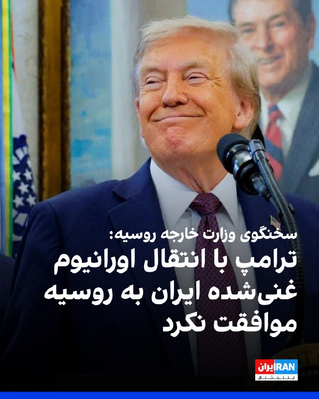

سخنگوی وزارت خارجه روسیه تاکید کرد که این کشور آماده است در خروج اورانیوم غنی‌شده از ایران کمک کند، اما آمریکا پیشنهادی که ماه‌ها روی میز بوده را نپذیرفته است.

روز چهارشنبه دونالد ترامپ در نشست کابینه در کاح سفید، درباره اورانیوم غنی‌شده ایران گفت که با انتقال آنها به روسیه یا چین موافق نیست.

سخنگوی وزارت خارجه روسیه گفت که این کشور از آمریکا و جمهوری اسلامی درخواست می‌کند به درگیری مسلحانه بازنگردند و به گفت‌وگوها ادامه دهند.
‌🏁 🇬🇧 IranintlTV

🤖 @VahidOOnLine

## VahidOOnLine — post 242586

  

رویترز گزارش داد محمد اسحاق دار، وزیر خارجه پاکستان، جمعه به واشینگتن سفر می‌کند و با مارکو روبیو، وزیر خارجه آمریکا، دیدار خواهد کرد.

این سفر در حالی انجام می‌شود که اسلام‌آباد در تلاش است درباره توافقی برای پایان دائمی جنگ آمریکا و اسرائیل با جمهوری اسلامی مذاکره کند.

وزارت خارجه پاکستان اعلام کرد وزیر خارجه پاکستان و روبیو در این دیدار روابط دوجانبه را بررسی خواهند کرد و درباره تحولات منطقه‌ای و جهانی مورد علاقه دو طرف تبادل نظر می‌کنند.
‌🏁 🇬🇧 IranintlTV

🤖 @VahidOOnLine

## VahidOOnLine — post 242585

  <a href="telegram/content/VahidOOnLine_242585_1779972980.mp4" target="_blank">🎬 Download video</a>

♦️خبرگزاری فرانسه روز پنجشنبه هفتم خرداد اعلام کرد در جریان حمله هوایی اسرائیل به جنوب بیروت یک آپارتمان مسکونی هدف قرار گرفته است.
ویدیوهای منتشر شده از این حمله، غیرنظامیان در حال جمع‌آوری آوار دیده می‌شوند.
برخی از رسانه‌های محلی به نقل از منابعی در ارتش اسرائیل اعلام کردند یکی از فرماندهان ارشد یگان‌های موشکی حزب‌الله هدف این حمله بوده است. هنوز گزارشی درباره نتیجه این عملیات منتشر نشده است.
‌🇸🇦 Indypersian

🤖 @VahidOOnLine

## VahidOOnLine — post 242584

  

با ارسال ویدیو، درباره وضعیت معیشتی، مالی و اشتغال خود در ماه‌های اخیر روایت کنید.
روی لینک زیر کلیک کنید و پیام‌های خود را از طریق مدیا‌بات برای ما بفرستید.

t.me

پیام‌های شما به صورت زیر‌نویس در تلویزیون و همچنین در بخش‌های مختلف‌ خبری منتشر خواهد شد.
‌🏁 🇬🇧 IranintlTV

🤖 @VahidOOnLine

## VahidOOnLine — post 242583

  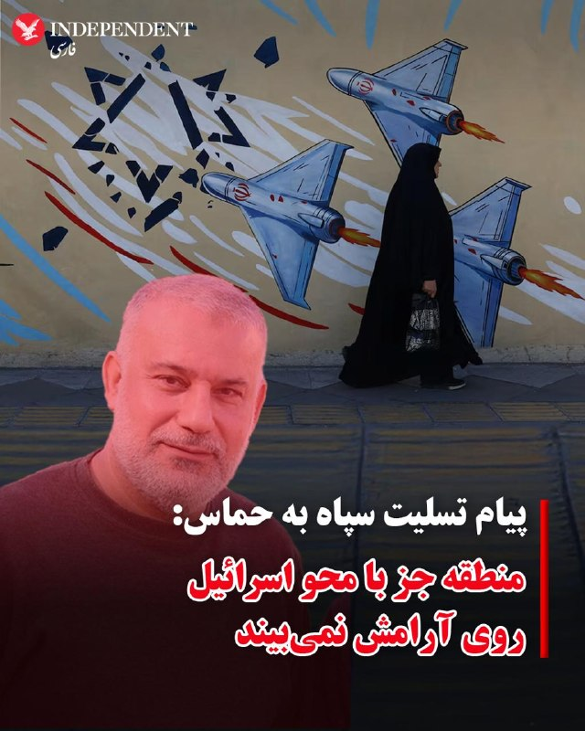

♦️سپاه پاسداران روز پنجشنبه هفتم خردادماه با انتشار بیانیه‌ای به مناسبت کشته شدن محمد عوده و عزالدین حداد، دو فرمانده حماس اعلام کرد منطقه جز با محو اسرائیل روی آرامش نمی‌بیند.

سپاه در این بیانیه از حمایت جمهوری اسلامی از «محور مقاومت» تاکید کرد.

این پیام یک روز پس از تهدید دوباره مجتبی خامنه‌ای به نابودی اسرائیل تا ۱۵ سال دیگر صادر شده است.
‌🇸🇦 Indypersian

🤖 @VahidOOnLine

## VahidOOnLine — post 242582

  

در پی حملات موشکی و پهپادی جمهوری اسلامی به کویت، وزارت خارجه قطر در بیانیه‌ای هدف قرار گرفتن کویت با موشک و پهپاد را به‌شدت محکوم کرد و آن را «نقض آشکار حاکمیت» این کشور و «نقض فاحش قوانین بین‌المللی» دانست.

قطر همچنین خواستار جلوگیری از «پیامدهای حملات غیرموجه» و کاهش تنش برای بازگرداندن امنیت و ثبات در سطح منطقه و جهان شد.

وزارت خارجه قطر در ادامه بر «همبستگی کامل» این کشور با کویت تاکید کرد و گفت از هر اقدامی برای حفظ حاکمیت و امنیت کویت حمایت می‌کند.
‌🏁 🇬🇧 IranintlTV

🤖 @VahidOOnLine

## VahidOOnLine — post 242581

  

سایت هرانا خبر داد کیمیا داوودی و تارا داوودی، دو خواهر محبوس در زندان اوین که در جریان اعتراضات دی‌ماه ۱۴۰۴ بازداشت شده بودند، از سوی دادگاه انقلاب تهران به‌ترتیب به ۱۰ و شش سال حبس محکوم شدند.

بر اساس این گزارش، شعبه ۱۵ دادگاه انقلاب تهران به ریاست ابوالقاسم صلواتی، کیمیا داوودی را بابت اتهاماتی از جمله «ارتباط با گروه‌ها و شبکه‌های معاند» و «اجتماع و تبانی علیه امنیت کشور» به ۱۰ سال حبس محکوم کرده است.

هرانا افزود تارا داوودی نیز بابت اتهاماتی از جمله «اجتماع و تبانی علیه امنیت کشور» و «تبلیغ علیه نظام» به شش سال زندان محکوم شده است.

این دو خواهر ۲۴ دی‌ماه ۱۴۰۴، در جریان اعتراضات سراسری در تهران بازداشت شدند و اکنون در بند زنان زندان اوین به سر می‌برند. هرانا نوشت بازداشت آنها با ضرب‌وشتم و اعمال خشونت از سوی نیروهای امنیتی همراه بوده است.
‌🏁 🇬🇧 IranintlTV

🤖 @VahidOOnLine

## VahidOOnLine — post 242580

  

♦️مجتبی خامنه‌ای، سومین رهبر جمهوری اسلامی روز پنجشنبه هفتم خردادماه با انتشار بیانیه‌ای «از تلاش‌های نمایندگان مجلس و خصوصا» محمدباقر قالبیاف،  رئیس مجلس شورای اسلامی و مذاکره‌کننده ارشد در مذاکرات با آمریکا، قدردانی کرد.

 از مجتبی خامنه‌ای از زمان انتصاب به مقام رهبری در اسفندماه سال گذشته هیچ صدا و تصویری منتشر نشده است.

مجتبی خامنه‌ای در این پیام که به مناسبت سومین سالگرد آغار به کار دوازدهمین دوره مجلس شورای اسلامی صادر شده است، از «نخبگان فکری و سیاسی از جمله نمایندگان مجلس» خواست از آنچه «اختلافات پوچ سیاسی و برجسته کردن تفاوت‌های اجتماعی» خواند،  پرهیز کنند.
‌🇸🇦 Indypersian

🤖 @VahidOOnLine

## VahidOOnLine — post 242579

  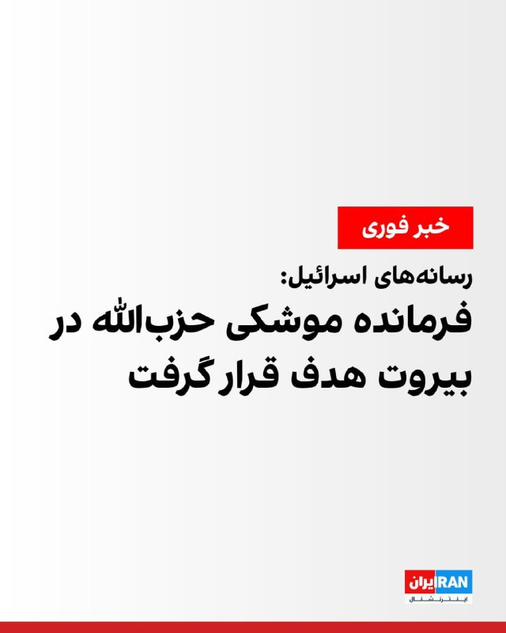

رسانه‌های اسرائیل خبر دادند که در حمله به بیروت، علی الحسینی، فرمانده واحد موشکی حزب الله، هدف قرار گرفته است.

همزمان آی۲۴ نیوز نوشت که در حمله به بیروت یک فرمانده یگان موشکی نیروی قدس سپاه پاسداران هدف قرار گرفته است.
همچنین ارتش اسرائیل ضمن اعلام حمله به بیروت، دقایقی پیش حمله‌ای را در بیروت انجام داده است.

ارتش اسرائیل جزئیات بیشتری منتشر نکرده، اما رسانه‌های لبنانی گزارش داده‌اند این حمله در منطقه «الشویفات» در جنوب بیروت رخ داده است.
iranintl
‌🏁 🇬🇧 IranintlTV

🤖 @VahidOOnLine

## WithYashar — post 12789

بنیامین نتانیاهو، نخست وزیر اسرائیل گفت که ارتش این کشور با قدرت به حملات علیه حزب‌الله ادامه خواهد داد.
نتانیاهو اضافه کرد که نیروهای اسرائیل از رودخانه لیتانی در جنوب لبنان عبور کرده‌اند.
@withyashar

## WithYashar — post 12788

خبرگزاری والا به نقل از یک مقام امنیتی اسرائیل: یکی از اهداف در بیروت یک فرمانده ارشد ایرانی بوده است
@withyashar

## WithYashar — post 12787

سنتکام طی بیانیه‌ای ایران را به نقض فاحش آتش‌بس متهم کرد
@withyashar

## WithYashar — post 12786

  

رسانه‌های عبری : «علی الحسینی»، مسئول موشکی حزب‌الله در یگان امام حسین به هلاکت رسید
@withyashar

## WithYashar — post 12785

به گزارش ان. بی. سی نیوز، پس از ارتش اسرائیل، سنتکام فرماندهی مرکزی آمریکا هم بانک اهداف خود در ایران را به روزرسانی کرد و لیستی از جدید از اهداف را تهیه کرد. هدف‌های راحت‌تر مثل رادارهای ثابت، باندها و هواپیماها تا حد زیادی قبلا زده شدن. چیزهایی که مونده بیشتر زیرزمینی، پراکنده یا سیارن و بدون شناسایی دقیق که ادامه درگیری رو سخت‌تر کرده
@withyashar

## WithYashar — post 12784

  

اشتراک Ai موشتبی رو تمدید کردن و موفق شد یه متن طولانی برای سالگرد مجلس بده ، از خالیباف تشکر کرده و به امریکام گفته شیطان بزرگ همین یه امضا بچه ۴ ساله هم با پاورپینت انداختن اون زیر 🤣
@withyashar

## WithYashar — post 12783

  

«روزنامه وال‌استریت ژورنال دیروز گزارش داد که ایران برای دور زدن تحریم‌ها و محاصره آمریکا، از سازوکاری موسوم به انتقال کشتی‌به‌کشتی(Ship-to-Ship) استفاده می‌کند؛ به این صورت که کشتی‌های تحریم‌شده حامل نفت ایران، پیش از ارسال محموله به چین، بار خود را در دریا به کشتی دیگری منتقل می‌کنند.»
@withyashar

## WithYashar — post 12782

  

ارتش اسرائیل دقایقی پیش مجدداً دستور تخلیه فوری کل جنوب لبنان را صادر کرد!
@withyashar

## WithYashar — post 12781

مقام‌های آمریکایی گفتند جمهوری اسلامی چهار پهپاد انتحاری را به سمت کشتی‌های آمریکایی و تجاری شلیک کرد، اما جنگنده‌های آمریکا آن‌ها را سرنگون کردند. به گفته این مقام‌ها، جنگنده‌های اف-۱۸ آمریکا همچنین پیش از پرواز پنجمین پهپاد، واحد کنترل زمینی جمهوری اسلامی را در بندرعباس منهدم کردند.
@withyashar

## WithYashar — post 12780

## WithYashar — post 12779

  

حجم ترافیک اینترنت بین‌الملل، تا ساعت ۷ و نیم صبح امروز به ۵۳ درصد حجم پیش از دی‌ماه ۱۴۰۴ رسیده است
@withyashar
حرفم که گفتم اینترنت فقط با رفتن اینا به حالت قبل بر‌میگرده هنوز پا برجاست !

## WithYashar — post 12778

## WithYashar — post 12777

  

👏👏👏

## WithYashar — post 12776

  

بامداد امروز بعد از شلیک موشک از امیدیه خوزستان به سمت کویت ، صدای انفجار شنیده شده و ستون دود دیده شده که ظاهراً لانچری که موشک ازش شلیک شده بلافاصله توسط ارتش آمریکا مورد هدف قرار گرفته
@withyashar

## WithYashar — post 12775

  

اسرائیل، عزالدین البیک، فرمانده تیپ شمال غزه را به هااکت رساند
@withyashar

## WithYashar — post 12774

  

رویترز: یک گاومیش آلبینو نادر در بنگلادش که به خاطر دسته موی بلوندش «دونالد ترامپ» لقب گرفته بود، پس از اینکه در فضای مجازی دیده شد، از قربانی شدن در عید قربان نجات یافت.
این گاومیش ۷۰۰ کیلوگرمی قبلاً فروخته شده بود، اما دولت به دلیل نگرانی‌های امنیتی و تجمع جمعیت برای دیدن آن، وارد عمل شد.

مقامات پول خریدار را بازگرداندند و حیوان را به باغ‌وحش داکا منتقل کردند.
@withyashar

## WithYashar — post 12773

آمریکا «نهاد مدیریت آبراه خلیج فارس» را تحریم کرد

وزارت خزانه‌داری آمریکا اعلام کرد سازمان تازه تأسیس ایرانی «نهاد مدیریت آبراه خلیج فارس» را به فهرست تحریم‌های خود اضافه کرده است.
@withyashar

## WithYashar — post 12772

  <a href="telegram/content/WithYashar_12772_1779972998.mp4" target="_blank">🎬 Download video</a>

◀️رد موشک های ۳پا در امیدیه خوزستان که به سمت کویت میرفت
@withyashar

## WithYashar — post 12771

اکسیوس: ایران چهارتا پهپاد انتحاری به سمت یک ناو نیروی دریایی آمریکا و یک کشتی تجاری پرتاب کرد نیروهای آمریکایی پهپادها رو رهگیری کردن و همچنین یک واحد پرتاب پهپاد ایرانی دیگه رو روی زمین قبل از اینکه بتوانه شلیک کنه، هدف قرار دادن
@withyashar

## WithYashar — post 12770

فاکس نیوز: آمریکا یه ایستگاه کنترل زمینی ایران رو تو بندرعباس زده؛ همون جایی که قرار بوده یه پهپاد تهاجمی ازش بلند شه.

به گفتهٔ مقام‌های آمریکایی، چهار تا پهپاد انتحاری دیگه هم که تو تنگه هرمز تهدید محسوب می‌شدن، زده شدن.
@withyashar

## mwarmonitor — post 9858

🔴 سخنگوی ارتش اسرائیل: چند لحظه پیش یک حمله هدفمند در بیروت انجام دادیم. @mwarmonitor

## mwarmonitor — post 9857

  <a href="telegram/content/mwarmonitor_9857_1779973002.mp4" target="_blank">🎬 Download video</a>

🔴 سخنگوی ارتش اسرائیل: چند لحظه پیش یک حمله هدفمند در بیروت انجام دادیم.

@mwarmonitor

## mwarmonitor — post 9856

🔴وزارت امور خارجه عراق: ما حملات جنایتکارانه ایران را که خاک کشور کویت را هدف قرار داده‌اند، به شدت محکوم می‌کنیم.

@mwarmonitor

## mwarmonitor — post 9855

🚨در ساعت ۱۰:۱۷ شب به وقت شرقی در تاریخ ۲۷ مه، ایران یک موشک بالستیک به سمت کویت شلیک کرد که توسط نیروهای کویتی با موفقیت رهگیری شد. این نقض آشکار آتش‌بس توسط رژیم ایران، چند ساعت پس از آن رخ داد که نیروهای ایرانی پنج پهپاد تهاجمی یک‌طرفه را پرتاب کردند که تهدیدی آشکار در داخل و اطراف تنگه هرمز ایجاد می‌کردند. همه پهپادها توسط نیروهای آمریکایی با موفقیت رهگیری شدند و همچنین از پرتاب پهپاد ششم از یک مرکز کنترل زمینی ایران در بندرعباس جلوگیری شد.

🚨فرماندهی مرکزی آمریکا (سنتکام) و شرکای منطقه‌ای همچنان هوشیار و محتاط هستند و به دفاع از نیروها و منافع خود در برابر تجاوزات غیرموجه ایران ادامه می‌دهند.

@mwarmonitor

## mwarmonitor — post 9854

  <a href="telegram/content/mwarmonitor_9854_1779973003.mp4" target="_blank">🎬 Download video</a>

📝 این حجم از دنائت و فرومایگی، چیزی جز سقوطِ کاملِ انسانیت نیست؛ موجودی که سال‌ها پشت نقابِ فضل و کمالات قایق رانده، اکنون شرفِ نداشته‌اش را در لجن‌زارِ منفعت‌طلبی به حراج گذاشته است. چطور می‌توان نام انسان را بر این نون‌به‌نرخ‌روز‌خورِ حرامی گذاشت که در اوج جنایات رژیم خونخوار جمهوری اسلامی در ۱۸ و ۱۹ دی، وقتی هزاران نفر را در دو روز به خاک و خون کشیدند، لال‌مانی گرفته بود و اکنون برای بقای قاتلان، ژستِ فیلسوفانه می‌گیرد؟

🔸 نجفیان، تویی که امروز وقاحت را به اوج رسانده‌ای و می‌گویی «وای به حال مردمی که به جای فهم دچار وهم شوند»، خودت تجسمِ عینیِ توهم و بی‌شرفی هستی. کاش حداقل نطفه شیطان بودی؛ چرا که شیطان تکلیفش روشن است و مثل تو با ماسک هنر و کمالات، نان را به نرخ خونِ مظلومان ترید نمی‌کند. این ذاتِ کثیف و فریبکار که در برابر کشتار مردم سکوت کرد، امروز در پیشگاه تاریخ عریان شده و چیزی جز رسوایی، بی‌آبرویی و تفِ لعنتِ ملت را برای خود به ارمغان نیاورده است.

@mwarmonitor

## mwarmonitor — post 9853

📌دبیرکل شورای همکاری خلیج فارس: ما با شدیدترین عبارات، ادامه حملات خائنانه ایران به کشور کویت را محکوم می‌کنیم.

@mwarmonitor

## mwarmonitor — post 9852

🔴 پلیس سوئیس: در پی یک حمله با چاقو در ایستگاه قطار شهر وینترتور، ۳ نفر زخمی شدند.

@mwarmonitor

## mwarmonitor — post 9851

📰 رویترز: گزارش‌هایی از پنتاگون فاش کرده‌اند که نیروهای آمریکایی در طول جنگ از طریق داده‌های موقعیت‌یابی ماهواره ای هدف قرار گرفته‌اند.

@mwarmonitor

## mwarmonitor — post 9850

...طرف اوکراینی‌ها که دارن در برابر متجاوز از خودشون دفاع می‌کنن. و حالا اون خودش مسئول فعال شدن اون ماشه (شروع درگیری) است. بنابراین فکر می‌کنم این فاکتوری هست که در ذهن او وجود داره، هرچند در اینجا به زبان آورده نشده. این فرصت وجود داره که شاید بتونیم به…

## mwarmonitor — post 9849

🔴مجری فاکس نیوز ؛ می‌خواهیم به سراغ ژنرال بازنشسته چهار ستاره ارتش، "جک کین" (Jack Keane) برویم. او رئیس انستیتوی مطالعات جنگ، قائم‌مقام سابق ستاد مشترک ارتش و تحلیلگر ارشد استراتژیک فاکس نیوز است. ژنرال کین، بسیار خوشحالیم که امروز شما را همراه خود داریم.»…

## mwarmonitor — post 9848

🔴مجری فاکس نیوز ؛ می‌خواهیم به سراغ ژنرال بازنشسته چهار ستاره ارتش، "جک کین" (Jack Keane) برویم. او رئیس انستیتوی مطالعات جنگ، قائم‌مقام سابق ستاد مشترک ارتش و تحلیلگر ارشد استراتژیک فاکس نیوز است. ژنرال کین، بسیار خوشحالیم که امروز شما را همراه خود داریم.»
«می‌دانید، من در واقع می‌خواهم برنامه را با نشان دادن این نقل قول به همه کسانی که از خانه ما را تماشا می‌کنند شروع کنم؛ زیرا ما شاهد مطرح شدن هر دو جنبه این استدلال هستیم و تلاش می‌کنیم بفهمیم که آیا اصلاً جای انعطاف و تعدیلی در اینجا وجود دارد یا خیر. اما فکر می‌کنم این نقل قول از سوی رهبری ایران، تا حدودی کمک‌کننده باشد. آن‌ها همیشه به نوعی یک ساز را می‌زنند (یک حرف را تکرار می‌کنند)، اما فقط می‌خواهم این نکته را روشن کنم که این رهبر جدید اساساً همان چیزی را می‌گوید که آن‌ها در تمام این مدت می‌گفتند.»
مجری در حال خواندن متن روی تصویر:
«بنابراین، این بیانیه‌ای از سوی آیت‌الله مجتبی خامنه‌ای است که در طول ایام حج—یکی از بالاترین مراسم‌های مذهبی آن‌ها—بیان شده است. او می‌گوید: "عقربه‌های زمان به عقب برنخواهند گشت و ملت‌ها و سرزمین‌های منطقه دیگر به عنوان سپری برای پایگاه‌های ایالات متحده عمل نخواهند کرد. ایالات متحده نه تنها دیگر پناهگاه امنی برای شرارت‌های خود نخواهد داشت..."»
مجری در حال خواندن ادامه متن:
«"...و همچنین برای ایجاد پایگاه‌های نظامی در منطقه؛ بلکه روز به روز از موقعیت پیشین خود دورتر و دورتر می‌شود." و او در ادامه به نوعی به تخریب اسرائیل نیز می‌پردازد که البته غافلگیری بزرگی هم نیست.»
«برداشت شما از موقعیتی که آن‌ها اکنون در آن قرار دارند چیست؟ آیا این واقعاً یک رژیم جدید است؟ و آیا همان‌طور که امروز از رئیس‌جمهور شنیدیم، ما در اینجا با افراد منطقی‌تری طرف هستیم، ژنرال؟»

🔵ژنرال جک کین:
«بله، منظورم این است که... تلاش برای گمانه‌زنی در مورد اینکه در چه موقعیتی هستیم تقریباً بی‌ثمر است؛ زیرا می‌دانید که این جناح‌ها در داخل ایران وجود دارند. تندروها یک چیز می‌گویند و مذاکره‌کنندگان چیز دیگری می‌گویند.»
«و هر کسی هر از گاهی میکروفون را به دست می‌گیرد و آن را در بوق و کرنا می‌کند و شما چیزی شبیه به آنچه او (رهبر ایران) همین الان گفت یا برخی تندروهای دیگر می‌گویند را می‌شنوید که: "هیچ راهی وجود ندارد که ما در اینجا به توافق برسیم." اما این‌ها کسانی نیستند که با مذاکره‌کنندگان ما گفتگو می‌کنند.»
«فکر می‌کنم مهم است که بدانیم اصلاً چگونه به اینجا رسیده‌ایم؟ منظورم این است که واقعیت این است که زمان زیادی از آن گذشته است—یک هفته پیش—که ما در آستانه بازگشت به عملیات‌های نظامی بودیم؛ و من صادقانه معتقدم که رئیس‌جمهور همین را می‌خواست. من می‌دانم که موضع من و برخی دیگر نیز همین بود؛ و ما معتقد بودیم که این بهترین گزینه در دسترس ما در آن زمان بود.»
«اما اتفاقی که در اینجا افتاد این است که نخست‌وزیرِ... رهبریِ پاکستان و قطر و برخی دیگر نزد رئیس‌جمهور آمدند و معتقد بودند پس از گفتگو با ایرانی‌ها و فشاری که ایرانی‌ها حس می‌کردند، فرصتی برای دستیابی به یک توافق در اینجا وجود دارد.»
«بنابراین رئیس‌جمهور چه کار کرد؟ او به آن حرف‌ها گوش داد و به غریزه خود اعتماد کرد. می‌دانید، یکی از چیزهایی که در این رئیس‌جمهور ثابت است—اگر به آنچه می‌گوید توجه کنید—وقتی صحبت می‌کند، او می‌خواهد درباره توقف جنگ صحبت کند. او در واقع فراتر از این می‌رود و می‌گوید: "من می‌خواهم کشتار را متوقف کنم."»
«و حالا او خودش مسئول فعال کردن آن کشتار است. وقتی شنیدید که او در مورد اوکراین بارها و بارها می‌گفت: "من می‌خواهم کشتار را متوقف کنم"، او داشت درباره هر دو طرف صحبت می‌کرد؛ نه فقط یک طرف...

@mwarmonitor

## mwarmonitor — post 9847

## mwarmonitor — post 9846

  <a href="telegram/content/mwarmonitor_9846_1779973006.mp4" target="_blank">🎬 Download video</a>

🔴فرماندهی جنوبی ایالات متحده یک شناور را در شرق اقیانوس آرام هدف قرار داد.
بر اساس اطلاعات نهادهای اطلاعاتی آمریکا، این شناور در مسیرهای شناخته‌شده قاچاق مواد مخدر فعالیت می‌کرد و توسط یک سازمان تروریستی مورد استفاده قرار گرفته بود.

@mwarmonitor

## mwarmonitor — post 9845

🔴«یک آژانس کشتیرانی اعلام کرد: پهپادها به سه نفتکش در دریای سیاه، در نزدیکی سواحل ترکیه، حمله کردند.»

@mwarmonitor

## mwarmonitor — post 9844

📰 بلومبرگ:
دونالد ترامپ نسخه جدیدی از شکایت قضایی ۱۰ میلیارد دلاری خود را به اتهام افترا علیه روزنامه وال استریت ژورنال و شرکت مادر آن نیوز کورپ ثبت کرده است. این شکایت به دلیل انتشار مقاله‌ای درباره روابط نزدیک ادعایی او با جفری اپستین مطرح شده است.

@mwarmonitor

## mwarmonitor — post 9843

📰 پولیتیکو:
به گزارش پولیتیکو، نیروها و تسلیحات نظامی آمریکا برای حمله به کوبا آماده هستند و تنها چیزی که باقی مانده، دستور نهایی از سوی دونالد ترامپ است.

@mwarmonitor

## mwarmonitor — post 9842

📊 داده‌های معاملاتی:
قیمت‌های جهانی نفت صبح روز پنج‌شنبه حدود ۴ درصد افزایش یافت؛ این رشد در حالی رخ داده که انتظار می‌رود اختلالاتی در عبور نفتکش‌ها از تنگه هرمز ایجاد شود.

@mwarmonitor

## mwarmonitor — post 9841

صبح امروز به کویت حمله موشکی شد ، مثل دیشب این نقض آتش بس نبوده و فقط یک احوال پرسی دیپلماتیک بود

## FoxNewsTwitter — post 342339

  <a href="telegram/content/FoxNewsTwitter_342339_1779973008.mp4" target="_blank">🎬 Download video</a>

Fox News (Twitter/X)

“They’re trying to get me elected so they can move back.”

L.A. mayoral candidate Spencer Pratt reveals the strong support his campaign is getting from former Angelenos who feel they were pushed out of the city.

“L.A. is incredible when you don’t let drug addicts take over the street and make moms and kids scared to go to parks or the school.” | @foxandfriends

## FoxNewsTwitter — post 342338

  <a href="telegram/content/FoxNewsTwitter_342338_1779973010.mp4" target="_blank">🎬 Download video</a>

Fox News (Twitter/X)

JUST IN: Los Angeles mayoral candidate Spencer Pratt says he never wanted to become mayor before, but felt the need to step up because the city deserves a leader who tells the truth.

"I don't do national politics. I don't do parties. I just say, look, they're stealing all of our tax money to give it to drug addicts, to have needles and tourniquets, and they're actually even selling the drugs to these addicts to let these people die on our sidewalks."

"I want to be the compassionate one. Get these people mandatory treatment, medical treatment with doctors to help them get off of fentanyl and super meth."

"These people have failed us. They've spent all of our tax money to increase problems... I never wanted to be the mayor. I just wanted somebody to tell the truth." | @foxandfriends

## FoxNewsTwitter — post 342337

  <a href="telegram/content/FoxNewsTwitter_342337_1779973013.mp4" target="_blank">🎬 Download video</a>

Fox News (Twitter/X)

NEW: DHS Secretary Markwayne Mullin warns sanctuary cities could start seeing major disruptions to international flights as federal agents are redirected to deal with violent protests that have been targeting law enforcement and ICE facilities:

"When we have situations, what's happening in new Jersey right now, when we have to prioritize where we put federal employees because local law enforcement won't help protect their streets.”

“We're not going to halt the flights, what we're saying is we just won't be able to process them because we don't have officers there. We're going to pull out our Customs and Border Patrol officers that process these flights and put them in these facilities to help protect our employees coming out of work.”

## FoxNewsTwitter — post 342336

  <a href="telegram/content/FoxNewsTwitter_342336_1779973015.mp4" target="_blank">🎬 Download video</a>

Fox News (Twitter/X)

NEW: CENTCOM says Iran carried out an “egregious ceasefire violation” overnight, launching a ballistic missile toward Kuwait and multiple attack drones near the Strait of Hormuz.

The missile was intercepted by Kuwaiti forces while the U.S. took out five drones and prevented a sixth launch from Bandar Abbas.

President Trump still has faith a deal can happen, but he’s signaling he’s willing to finish the job if Iran keeps pushing.

@madeleinerivera reports the latest.

## FoxNewsTwitter — post 342335

  <a href="telegram/content/FoxNewsTwitter_342335_1779973018.mp4" target="_blank">🎬 Download video</a>

Fox News (Twitter/X)

NOW: VP Vance and Second Lady Usha Vance deboard from Air Force Two.

The vice president will speak at the United States Air Force Academy's 68th graduation ceremony on Thursday.

Hundreds of cadets will be commissioned as officers during the ceremony, and the Air Force Thunderbirds are scheduled to perform a flyover, the U.S. Air Force Academy says.

## FoxNewsTwitter — post 342334

  <a href="telegram/content/FoxNewsTwitter_342334_1779973020.mp4" target="_blank">🎬 Download video</a>

Fox News (Twitter/X)

Jill Biden is now admitting she feared something was seriously wrong with Joe Biden during his 2024 debate against Donald Trump.

“I thought, ‘Oh, my God, he’s having a stroke,’” the former first lady recalled in a new interview. She said she'd never seen him like that before, and hasn't seen him like that since.

Her alarm is a sharp contrast to her public reaction immediately after the debate, when she praised Biden for doing "such a great job" and answering "every question."

The debate meltdown ultimately triggered weeks of panic inside the Democratic Party, which resulted in Biden dropping out of the race.

## FoxNewsTwitter — post 342333

Fox News (Twitter/X)

WATCH LIVE: Texas Senate nominee James Talarico holds general election kick-off rally in Houston https://twitter.com/i/broadcasts/1qKVmmwNMjVxB

## FoxNewsTwitter — post 342332

  

Fox News (Twitter/X)

BREAKING: The U.S. struck an Iranian ground control station in Bandar Abbas that was about to launch an attack drone, officials tell FOX News.

Four other Iranian one-way attack drones that posed a threat in the Strait of Hormuz were also shot down, the officials said.

"These actions were measured, purely defensive, and intended to maintain the ceasefire."

## pm_afshaa — post 91738

ابوترابی، نماینده مجلس: آمریکا بعد از جام جهانی و انتخابات کنگره دوباره حمله می‌کند

💧 Rainbet.com the #1 Non-KYC Crypto Casino & Sportsbook @rainbetcom

😁 @Pm_Afshaa

## pm_afshaa — post 91737

https://t.me/boost/pm_afshaa

## pm_afshaa — post 91736

https://t.me/boost/pm_afshaa

## pm_afshaa — post 91735

🔴جروزالم پست: کشورهای حوزه خلیج فارس احتمالاً درخواست ترامپ برای پیوستن به توافق‌نامه ابراهیم را جدی نمی‌گیرند و آن را «زودهنگام» می‌دانن

💧 Rainbet.com the #1 Non-KYC Crypto Casino & Sportsbook @rainbetcom

😁 @Pm_Afshaa

## pm_afshaa — post 91734

🔴رویترز:ترامپ گفت، نسبت به پیامدهای سیاسی یک درگیری طولانی‌مدت با ایران هیچ نگرانی ندارد و رهبران ایران اشتباه محاسبه کرده‌اند اگر تصور می‌کنند انتخابات میان‌دوره‌ای نوامبر او را مجبور به پذیرش یک معامله خواهد کرد

💧 Rainbet.com the #1 Non-KYC Crypto Casino & Sportsbook @rainbetcom

😁 @Pm_Afshaa

## pm_afshaa — post 91733

  <a href="telegram/content/pm_afshaa_91733_1779973024.webm" target="_blank">🎬 Download video</a>

PMTV NEWS🦁☀️.npvt

## pm_afshaa — post 91732

  <a href="https://t.me/pm_afshaa/91732" target="_blank">📎 Download file</a>

نپسترنت مناسب اینستا و دانلود

💧 Rainbet.com the #1 Non-KYC Crypto Casino & Sportsbook @rainbetcom

😁 @Pm_Afshaa

## pm_afshaa — post 91731

حملات ارتش اسراییل به بیروت 
💧 Rainbet.com the #1 Non-KYC Crypto Casino & Sportsbook @rainbetcom 
😁 @Pm_Afshaa

## pm_afshaa — post 91730

🔴سنتکام حمله ایران با یک عدد موشک بالستیک به کویت را نقض فاحش آتش‌بس خواند

💧 Rainbet.com the #1 Non-KYC Crypto Casino & Sportsbook @rainbetcom

😁 @Pm_Afshaa

## pm_afshaa — post 91729

  <a href="telegram/content/pm_afshaa_91729_1779973025.mp4" target="_blank">🎬 Download video</a>

حملات ارتش اسراییل به بیروت

💧 Rainbet.com the #1 Non-KYC Crypto Casino & Sportsbook @rainbetcom

😁 @Pm_Afshaa

## pm_afshaa — post 91728

سخنگوی شهرداری تهران : مترو و BRT همچنان رایگان است

💧 Rainbet.com the #1 Non-KYC Crypto Casino & Sportsbook @rainbetcom

😁 @Pm_Afshaa

## pm_afshaa — post 91727

پروکسیا و سرورا رو بفرستین برا دوستاتون اونا هم وصل شن

## pm_afshaa — post 91726

راستی واسه پروکسی های که میفرستی مرسی😂

## pm_afshaa — post 91725

سلام خواستم تشکرکنم بابت کانفیگ وپروکسی هایی که توچنلتون میزاریدواقعاعالیه❤️

## pm_afshaa — post 91724

https://t.me/proxy?server=tg.capycore.ru&port=443&secret=27ebe852539fb8ec5f327c73262bb721

💧 Rainbet.com the #1 Non-KYC Crypto Casino & Sportsbook @rainbetcom

😁 @Pm_Afshaa

## pm_afshaa — post 91723

https://t.me/proxy?server=tg.capycore.ru&port=443&secret=27ebe852539fb8ec5f327c73262bb721

پروکسی متصل سرعت بالا

💧 Rainbet.com the #1 Non-KYC Crypto Casino & Sportsbook @rainbetcom

😁 @Pm_Afshaa

## pm_afshaa — post 91722

https://t.me/proxy?server=arezoni9.ir&port=15&secret=ee1603010200010001fc030386e24c3add63646e2e79656b74616e65742e636f6d

پروکسی سرعت بالا متصل

💧 Rainbet.com the #1 Non-KYC Crypto Casino & Sportsbook @rainbetcom

😁 @Pm_Afshaa

## pm_afshaa — post 91721

https://t.me/proxy?server=195.254.165.4&port=8443&secret=EERighJJvXrFGRMCIMJdCQ%3D%3D

پروکسی پر سرعت مخصوص دانلود

💧 Rainbet.com the #1 Non-KYC Crypto Casino & Sportsbook @rainbetcom

😁 @Pm_Afshaa

## pm_afshaa — post 91720

🔴ارتش اسرائیل دقایقی پیش مجدداً دستور تخلیه فوری کل جنوب لبنان را صادر کرد

💧 Rainbet.com the #1 Non-KYC Crypto Casino & Sportsbook @rainbetcom

😁 @Pm_Afshaa

## pm_afshaa — post 91719

  

طبق اخبار حسن شاهوار پور فرمانده سپاه ولی‌عصر خوزستان در حمله دیشب آمریکا به درک واصل شده

💧 Rainbet.com the #1 Non-KYC Crypto Casino & Sportsbook @rainbetcom

😁 @Pm_Afshaa

## DEJradio — post 5072

⭕️ وال‌استریت ژورنال: رژیم با سنجش توان تاب‌آوری اقتصادی خود، میزان امتیازدهی به آمریکا را تنظیم می‌کند

به گزارش وال‌استریت ژورنال، تهران می‌خواهد با توجه به میزان تاب آوری در برابر فشارهای اقتصادی، دادن و گرفتن امتیازها را در جریان مذاکرات تنظیم کند.
این روزنامۀ آمریکایی گزارش داد جمهوری اسلامی پس از جنگ و محاصرۀ دریایی آمریکا در اقتصاد با بحرانی عمیق‌تر از پیش روبه‌رو شده است.
وال‌استریت ژورنال نوشت کاهش درآمدهای نفتی و محدودیت ذخیره‌سازی نفت خام، خطر تعطیلی برخی چاه‌های نفت را افزایش می‌دهد.
بنا بر این گزارش، افزایش قیمت کالاهای اساسی، رشد بیکاری و سقوط ارزش ریال، نگرانی مقام‌های جمهوری اسلامی از ناآرامی‌های تازه را بیشتر کرده است.
وال‌استریت ژورنال همچنین گزارش داد بیش از یک میلیون نفر در جریان جنگ و پیامدهای اقتصادی آن بیکار شدند.
این روزنامه نوشت جمهوری اسلامی با وجود فشارهای داخلی، همچنان تلاش می‌کند بدون دادن امتیازهای گسترده، مذاکره با آمریکا را پیش ببرد.

#خبر #دژ
@DEJradio

## DEJradio — post 5071

⭕️ جمعیت زیر خط فقر در ایران از ۴۰ میلیون نفر عبور می‌کند

شماری از کارشناسان اقتصاد و استاد دانشگاه در ایران هشدار دادند که در سال جاری شمار افراد زیر خط فقر از چهل میلیون تن عبور می‌کند.
حجت میرزایی، عضو هیئت علمی دانشگاه علامه طباطبایی، گفت با کاهش شدید صادرات نفت و ادامۀ محاصرۀ دریایی، رشد اقتصادی ایران بین منفی ۸.۸ تا منفی ۱۰ درصد برآورد می‌شود.
او افزود پیش‌بینی‌ها نشان می‌دهد بین ۳.۵ تا ۴.۵ میلیون نفر دیگر به جمعیت فقیر کشور اضافه می‌شود.
اقتصاددانان همچنین از افزایش بیکاری، رشد پدیدۀ «شاغلان فقیر» و بلندتر شدن دوره‌های بیکاری در ایران خبر دادند.

#خبر #دژ #فقر
@DEJradio

## DEJradio — post 5070

⭕️تهران پس از تهدید ترامپ علیه عمان با این کشور اعلام همبستگی کرد

اسماعیل بقائی، سخنگوی وزارت امور خارجۀ جمهوری اسلامی، پس از تهدید دونالد ترامپ علیه عمان، با مسقط اعلام همبستگی کرد.
تهران همچنین تهدیدهای رئیس جمهوری آمریکا علیه عمان را محکوم کرده است.
دونالد ترامپ، رئیس‌ جمهوری ایالات متحده به عمان هشدار داده بود اگر بخواهد {با جمهوری اسلامی} تنگۀ هرمز را کنترل کند، توسط آمریکا نابود می‌شود.
اسماعیل بقائی همچنین مدعی شد حملات بامداد پنج‌شنبۀ آمریکا به مناطقی در بندرعباس «نقض فاحش حقوق بین‌الملل و منشور ملل متحد» است.
بقائی در مورد پهپادهایی که علیه ارتش آمریکا به پرواز درآمده بودند و رهگیری و نابود شدند، توضیحی نداد و تنها مدعی «نقض مستمر آتش‌بس» از سوی آمریکا شد.

#خبر #دژ #عمان
@DEJradio

## DEJradio — post 5069

  <a href="telegram/content/DEJradio_5069_1779973027.webm" target="_blank">🎬 Download video</a>

🚨📢 یکشنبه شب سوم خرداد ماه ۱۴۰۵ «علیرضا تمسکنی زاهدی» از نیروهای پلیس اطلاعات و امنیت استان گلستان، حین گشت‌زنی در محله اوزینه گرگان، مقابل چشمان همکارانش با اسلحه سازمانی کلاشنیکف به زندگی خود پایان داد.

رضا تمیزکار از پرسنل پیشین پلیس با اعلام این خبر به نقل از همکاران او گفت علت این تصمیم، "فشار شدید کاری، تحقیر، برخوردهای فرماندهان و فضای فرسایشی حاکم بر بدنه پلیس است که پرسنل را به این نقطه رسانده است."

تمیزکار می‌گوید، این حادثه؛ نشانه بحرانی عمیق در ساختاری است که حتی نیروهای خودش را هم از نظر روحی و روانی فرسوده کرده. افزایش فشار، بی‌انگیزگی و فروپاشی روحیه در میان نیروهای انتظامی در شهرها و شهرستان‌های مختلف، دیگر قابل کتمان نیست.

#اطلاعات #خودکشی
@DEJradio

## DEJradio — post 5068

⭕️ گزارش صداوسیما دربارۀ تفاهم تهران و واشینگتن کاملا ساختگی بود

کاخ سفید گزارش صداوسیمای جمهوری اسلامی دربارۀ پیش‌نویس تفاهم میان تهران و واشینگتن را نادرست دانست.
بنا بر اعلام دولت آمریکا، گزارش تلویزیون حکومت جمهوری اسلامی «کاملا ساختگی» است.
تلویزیون حکومت جمهوری اسلامی پیش‌تر مدعی شده بود پیش‌نویس توافق شامل رفع محاصرۀ دریایی بنادر جنوبی ایران، بازگشایی تنگۀ هرمز و خروج نیروهای آمریکایی از منطقه است.
کاخ سفید در بیانیه‌ای تأکید کرد هیچ‌کس نباید به گزارش رسانه‌های حکومت جمهوری اسلامی اعتماد کند.
مذاکرات میان تهران و واشینگتن با میانجی‌گری کشورهای منطقه ادامه دارد.

#خبر #دژ #مذاکرات
@DEJradio

## DEJradio — post 5067

⭕️ سامانه‌های پدافندی کویت تهدیدهای موشکی و پهپادی تازه را رهگیری کردند

ارتش کویت بامداد پنج‌شنبه اعلام کرد سامانه‌های پدافند هوایی این کشور تهدیدهای موشکی و پهپادی‌ را رهگیری کرده‌اند.
ارتش کویت بدون اعلام منشأ تهدیدها، خبر داد صدای انفجارهایی که به گوش رسیده، به دلیل رهگیری‌های پدافندی است.
این بیانیه ساعاتی پس از حملات آمریکا به اهدافی در جنوب ایران و به چهار پهپاد جمهوری اسلامی، منتشر شد.
سپاه اعلام کرده بود در واکنش به حملۀ آمریکا، یک پایگاه هوایی این کشور در منطقه را هدف گرفته است.

#خبر #دژ #کویت
@DEJradio

## DEJradio — post 5066

⭕️ آمریکا نهاد مدیریت آبراه خلیج فارس را به‌دلیل ارتباط با سپاه تحریم کرد

وزارت خزانه‌داری آمریکا نهاد تازه تشکیل شدۀ موسوم به «مدیریت آبراه خلیج فارس» را به‌دلیل ارتباط با سپاه پاسداران تحریم کرد.
تحریم این نهاد بر اساس رویۀ عملیات ضدتروریسم، انجام شد.
واشینگتن نهاد «مدیریت آبراه خلیج فارس» را بخشی از تلاش سپاه برای درآمدزایی از مسیر تنگۀ هرمز و دریافت عوارض از کشتی‌های عبوری عنوان کرد.
وزارت خزانه‌داری آمریکا هشدار داد هر فرد یا نهادی که با این سازمان همکاری کند، ممکن است هدف تحریم قرار بگیرد.
اسکات بسنت، وزیر خزانه‌داری آمریکا، گفت تازه‌ترین اقدامات جمهوری اسلامی در تنگۀ هرمز نشان می‌دهد رژیم حاکم بر ایران بیش از پیش به منابع مالی نیاز دارد.

#خبر #دژ #تحریم
@DEJradio

## DEJradio — post 5065

⭕️ ادعای نمایندۀ مجلس شورای اسلامی: بازگشایی اینترنت خلاف قانون است

احمد راستینه، سخنگوی کمیسیون فرهنگی مجلس شورای اسلامی گفت بازگشایی اینترنت «خلاف قانون» است. به گفتۀ او شماری از وظایف ستاد ساماندهی فضای مجازی، با شورای عالی فضای مجازی تداخل دارد.
احمد راستینه رأی دیوان «عدالت» اداری برای توقف فعالیت این ستاد را از نظر حقوقی «درست و دقیق» خواند.
دیوان عدالت اداری پیش‌تر اعلام کرده بود اجرای مصوبۀ تشکیل ستاد ساماندهی فضای مجازی تا زمان رسیدگی پایانی متوقف می‌شود.

#خبر #دژ #اینترنت
@DEJradio

## DEJradio — post 5064

⭕️ با وجود اتصال اینترنت در ایران همچنان به‌شدت زیر فیلتر قرار دارد

نت‌بلاکس، نهاد ناظر بر دسترسی اینترنت در جهان، اعلام کرد با وجود برقراری اتصال به اینترنت در ایران، کاربران همچنان با فیلترینگ شدید مواجه‌اند.
این نهاد جهانی پایش اینترنت گزارش داد وضعیت کنونی مانند دوره‌ای کوتاه پس از اعتراضات سراسری دی‌ماه است. در آن دوره اینترنت جهانی به‌صورت محدود و ناپایدار در دسترس قرار گرفته بود.
بر اساس داده‌ها حجم ترافیک اینترنت بین‌الملل ایران تا بامداد پنج‌شنبه به حدودا ۵۳ درصد از سطح پیش از اعتراضات دی‌ماه ۱۴۰۴ رسید.
نت‌بلاکس نوشت هنوز مشخص نیست اینترنت به وضعیت عادی برمی‌گردد یا محدودیت‌ و اختلال‌ ادامه پیدا می‌کند.

#خبر #دژ #اینترنت
@DEJradio

## DEJradio — post 5063

  <a href="telegram/content/DEJradio_5063_1779973028.mp4" target="_blank">🎬 Download video</a>

🔺🎥 آتش‌سوزی در برج‌ پامچال؛ بنیاد تعاون آجا بساز بنداز است

برج پامچال ارتش واقع در منطقه ۲۲ تهران (چیتگر) روز چهارشنبه ششم خرداد دچار آتش‌سوزی شد. تحت تاثیر آتش‌سوزی‌های مداوم انفجارها و آتش‌سوزی‌های زنجیره‌ای در مناطق و شهرک‌های نظامی، برخی مدعی شدند که این حادثه نیز یک حذف هدفمند بود. با این همه بررسی‌های اولیه نشان می‌دهد آتش‌سوزی ناشی از شعله‎ور شدن نمای کامپوزیتی ساختمان بوده است. یک منبع داخلی به دژ می‌گوید، «هنوز مشخص نیست پشت ماجرا چه بوده، اما در اینکه بنیاد تعاون آجا بساز بنداز است شک نکنید.»

#آتشسوزی #چیتگر
@DEJradio

## DEJradio — post 5062

⭕️ ترامپ: نه تحریم را لغو می‌کنیم نه به تهران پول می‌دهیم؛ کار را یکسره می‌کنیم

دونالد ترامپ، رئیس جمهوری آمریکا گفت در مذاکرات جاری با تهران، صحبتی درباره کاهش تحریم‌ها یا انتقال پول به جمهوری اسلامی مطرح نیست.
او تأکید کرد آمریکا کنترل دارایی‌های مسدودشده ایران را حفظ می‌کند. به گفتۀ ترامپ، هر زمان اداره کنندگان ایران رفتار درستی در پیش بگیرند، اجازه داده می‌شود که به پول‌ها دسترسی پیدا کنند.
دونالد ترامپ همچنین گفت آمریکا هنوز از وضعیت توافق احتمالی خشنود نیست، اما جمهوری اسلامی بسیار مایل است به توافق برسد.
رئیس جمهوری آمریکا هشدار داد اگر توافقی به‌دست نیاید، واشینگتن کار را یکسره می‌کند.

#دژ #خبر #ترامپ #مذاکرات #تحریم
@DEJradio

## DEJradio — post 5061

⭕️ روبیو: در مذاکراه با تهران مقداری پیشرفت رخ داد

مارکو روبیو، وزیر امور خارجۀ آمریکا در بامداد پنج‌شنبه گفت در مذاکره با جمهوری اسلامی برای رسیدن به توافق «مقداری پیشرفت» رخ داده است.
او افزود طی ساعت‌ها چند روز آینده مشخص می‌شود امکان پیشروی بیش‌تر وجود دارد یا نه.
مارکو روبیو تأکید کرد جمهوری اسلامی هرگز به سلاح هسته‌ای دست پیدا نمی‌کند.
وزیر خارجه آمریکا گفت اولویت دولت ترامپ همچنان دیپلماسی است.

#خبر #دژ #مارکو_روبیو #مذاکرات
@DEJradio

## DEJradio — post 5060

⭕️ اسرائیل از جنوب لبنان تا رود زهرانی را منطقۀ جنگی اعلام کرد

ارتش اسرائیل اعلام کردهمۀ مناطق جنوب رود زهرانی در لبنان، در فاصلۀ حدودا ۴۰ کیلومتری مرز اسرائیل، منطقۀ جنگی به شمار می‌رود.
اویخای ادرعی، سخنگوی عرب‌زبان ارتش اسرائیل از ساکنان این مناطق خواست تا به شمال رود زهرانی بروند.
ارتش اسرائیل دلیل این تصمیم را نقض مکرر آتش‌بس از سوی حزب‌الله عنوان کرد.
شبه‌نظامیان حزب‌الله که از سوی جمهوری اسلامی پشتیبانی می‌شوند، در سیاهۀ تروریستی آمریکا و اتحادیۀ اروپا قرار دارند.
ایال زمیر، رئیس ستاد ارتش اسرائیل گفت این کشور شدت عملیات علیه حزب‌الله را افزایش می‌دهد و ضرباتی سهمگین‌تر به آنها وارد می‌کند.

#خبر #دژ #اسرائیل
@DEJradio

## DEJradio — post 5059

⭕️ روسیه بازگشت کارکنان خود به نیروگاه بوشهر را به تعویق انداخت

روس‌اتم، سازمان دولتی انرژی هسته‌ای روسیه اعلام کرد بازگشت کارکنانش به نیروگاه هسته‌ای بوشهر را به تعویق می‌اندازد.
الکسی لیخاچف، مدیرعامل روس‌اتم گفت اخبار ضدونقیض دربارۀ مذاکرات جمهوری اسلامی و آمریکا و حملاتی که به نقاطی از ایران انجام شد، دلیل این تصمیم بوده است.
او افزود ولادیمیر پوتین، رئیس جمهوری روسیه در جریان این تصمیم قرار گرفته و آن را تأیید کرده است.
روس‌اتم در دوران جنگ چهل روزه ۸۱۳ نفر از کارکنان خود را از نیروگاه بوشهر خارج کرد و تنها ۲۰ تن را برای حفظ ایمنی و ادامۀ فعالیت نیروگاه، در محل نگه داشت.

#خبر #دژ #روسیه #ایران
@DEJradio

## DEJradio — post 5058

🔺 جنگ خاورمیانه مسیر سرمایه‌گذاری جهانی در انرژی را تغییر داد

آژانس جهانی انرژی اعلام کرد بحران خاورمیانه کشورها را به سمت تنوع‌بخشی به منابع و مسیرهای انرژی سوق داده است.
فاتح بیرول، مدیر اجرایی آژانس، وضعیت کنونی را بزرگ‌ترین بحران امنیت انرژی در جهان، عنوان کرد.
آژانس جهانی انرژی پیش‌بینی کرد بخش عمدۀ سرمایه‌گذاری جهانی انرژی در سال ۲۰۲۶ در برق و همچنین در انرژی هسته‌ای و تجدیدپذیر، انجام شود.
این نهاد جهانی پیش‌بینی کرد سرمایه‌گذاری در انرژی جهانی در سال جاری به ۳.۴ تریلیون دلار برسد.
بنا بر این گزارش، سرمایه‌گذاری در نفت برای سومین سال پیاپی کاهش پیدا می‌کند، اما سرمایه‌گذاری در گاز طبیعی امسال به بالاترین سطح در یک دهۀ اخیر می‌رسد.

#خبر #دژ #خاورمیانه #انرژی
@DEJradio

## DEJradio — post 5057

⭕️ سنتکام چهار پهپاد انتحاری جمهوری اسلامی را در نزدیکی تنگۀ هرمز سرنگون کرد

سنتکام، ستاد فرماندهی مرکزی ارتش آمریکا اعلام کرد در بامداد پنج‌شنبه چهار پهپاد انتحاری جمهوری اسلامی را که در اطراف تنگۀ هرمز «تهدید ایجاد کرده بودند» سرنگون کرده است.
سنتکام همچنین گفت یک ایستگاه کنترل پهپادی در بندرعباس را پیش از پرتاب پهپاد پنجم هدف قرار داده است.
سپاه پاسداران ادعا کرد یک پایگاه هوایی آمریکا را در پاسخ به آنچه «تعرض» خواند، هدف قرار داده است.
روایت سپاه از هدف گرفتن پایگاه آمریکایی هنوز توسط منابع محلی تأیید نشده است.

#خبر #دژ #سنتکام #تنگه_هرمز
@DEJradio

## DEJradio — post 5056

⭕️ افزایش دوبارۀ بهای نفت در پی حملات شبانه در تنگۀ هرمز

بهای نفت در معاملات پنج‌شنبه، در پی حملات تازه میان آمریکا و جمهوری اسلامی، بار دیگر افزایش یافت.
بهای نفت برنت با رشد ۱.۸ درصدی به حدود ۹۶ دلار رسید. همچنین هر بشکه نفت خام آمریکا روز پنج‌شنبه بیش از ۹۰ دلار معامله شد.
از سویی اکثر بورس‌های آسیایی از جمله هنگ‌کنگ، سئول و شانگهای با کاهش شاخص قیمت روبه‌رو شد.

#خبر #دژ #نفت #تنگه_هرمز
@DEJradio

## DEJradio — post 5055

⭕️ هشدار ترامپ به عمان: اگر بخواهید تنگۀ هرمز را کنترل کنید، نابودتان می‌کنیم

دونالد ترامپ، رئیس جمهوری آمریکا گفت در چارچوب توافق احتمالی با جمهوری اسلامی، تنگۀ هرمز باید بی‌درنگ باز شود و در کنترل هیچ کشوری نباشد.
ترامپ گفت آمریکا بر آبراه هرمز نظارت می‌کند، اما اجازه نمی‌دهد هیچ کشوری کنترل آن را در دست بگیرد.
ترامپ با اشاره به عمان گفت:آنها هم باید مانند بقیه رفتار کنند، وگرنه مجبور می‌شویم نابودشان کنیم.

#خبر #دژ #ترامپ #تنگه_هرمز
@DEJradio

## DEJradio — post 5054

  <a href="telegram/content/DEJradio_5054_1779973031.webm" target="_blank">🎬 Download video</a>

🔺📢 سنگ بنای فعالیت علیه جمهوری اسلامی؛

فریبرز کرمی‌زند، افسر پیشین پلیس

#اپوزیسیون #جمهوری_اسلامی
@DEJradio

## DEJradio — post 5053

  <a href="telegram/content/DEJradio_5053_1779973032.webm" target="_blank">🎬 Download video</a>

🔺🎥 هنرنمایی دختران برزیلی با توپ فوتبال.

#فوتبال #دختران_برزیلی
@DEJradio

## mamlekate — post 103601

📝 واکنش سنتکام به پرتاب موشک بالستیک به کویت توسط رژیم ایران: «نقض فاحش آتش‌بس» است

ستاد فرماندهی مرکزی ایالات متحده آمریکا، سنتکام، روز پنجشنبه ۷ خرداد از پرتاب یک موشک بالستیک توسط رژیم ایران به سمت کویت در ساعت ۱۰:۱۷ شامگاه چهارشنبه به وقت شرق آمریکا (حوالی ۶ بامداد به وقت ایران) حوالی خبر داد. در این پیام آمده است که این موشک با موفقیت توسط نیروهای کویتی رهگیری شده است.

@mamlekate

## mamlekate — post 103595

یه دلقک دوزاری رو، یه مشت دوزاری‌تر از خودش بهش تریبون میدن گنده می‌کنن تا بیاد سفیدشویی هلاک شدن کسی رو بکنه که عضو یگان امام رضا بود (یگانی که نیروهاش به نیکا شاکرمی تجاوز کردند) و دقیقا هم تو کار سرکوب و کشتن و دستگیری بچه‌های اکباتان تو خیزش مهسا فعال بود. این مدت هم تو مجازی همه جا رو سرش اکلیل ریدن که گنده شه گنده شه این گند رو بزنه مرتیکه گه. کاری نداریم اصلا یه بخشی از همون سیستم قضایی جمهوری اسلامی با سند و مدرک هم حکم‌های اعدام بچه‌های اکباتان رو رد کرده و اینا بی‌دلیل و مدرک برا طنابشون دنبال گردن می‌گردن...

t.me/mamlekate/87072

## mamlekate — post 103594

📞 تهران جنوب شرق صدای انفجار اومد
۳ تا صدای انفجار
پنج شنبه ۱۱:۰۵

@mamlekate

## mamlekate — post 103593

📝 ارتش کویت از رهگیری حملات موشکی و پهپادی «دشمن» خبر داد

ارتش کویت اعلام کرد که پدافند هوایی این کشور در حال مقابله با «حملات موشکی و پهپادهای دشمن» است، اما به مبدأ این تهدیدها اشاره نکرد.

📝 افزایش درگیری‌ها بین آمریکا و جمهوری اسلامی در خلیج فارس؛ یک پایگاه سپاه هدف قرار گرفت

@mamlekate

## VahidOnline — post 75766

  <a href="telegram/content/VahidOnline_75766_1779973032.mp4" target="_blank">🎬 Download video</a>

ویدیوی دریافتی: 'رد موشک شلیک شده در آسمان #امیدیه خوزستان، پنج‌شنبه ۷ خرداد'
Vahid

☄️سپاه اعلام کرد در واکنش به حمله‌های پرتابه‌های هوایی آمریکا در سحرگاه پنج‌شنبه به نقطه‌ای در حاشیه فرودگاه بندرعباس، یک پایگاه هوایی آمریکا را که مبدا این حملات بود در ساعت ۴:۵۰ هدف قرار داده است.
سپاه تاکید کرد در صورت تکرار حمله‌های آمریکا، پاسخ جمهوری اسلامی «قاطع‌تر» خواهد بود.
@VahidOOnLine
رسانه‌هایی که بیانیه سپاه رو نقل کردند، از جمله خبرگزاری رسمی جمهوری اسلامی، ایرنا، نوشتند "ساعت ۴/۵۰" حمله کردند که یعنی چهار و نیم ولی با توجه به اینکه با دو رقم اعشار نوشتند احتمالا منظورشون چهار و پنجاه دقیقه بوده.
اما این هم عجیبه چون آژیر در کویت و پیام‌ها از امیدیه مربوط به ساعت ۵:۵۰ بودند!
📡 @VahidOnline

## VahidOnline — post 75763

از #امیدیه در خوزستان پیام‌ها و تصاویری دریافت می‌کنم که میگن حدود ساعت ۵:۵۰ موشکی شلیک شده و سمت تونل امیدیه میانکوه صدای انفجاری شنیده شده.
یکی نوشته لانچر هدف گرفته شده.

دقیقا میشه هم‌زمان با شنیده شدن آژیر در کویت

📡 @VahidOnline

## VahidOnline — post 75762

  

پیام‌های دریافتی:

سلام وحید الان کویت رو زد ۵/۲۰

وحيد همين الان اژير كويت فعال شد

سلام صدای پدافند و تقریبا ۲ تا انفجار در کویت

درود وحید🙋🏻‍♂️
اینجا ساعت ۵:۲۰ به وقت کویت صدای اژیر اومد و رو گوشی ها هشدار اومد
ولی هنوز هیچ رسانه‌ی کویتیی دلیل این اتفاقو نگفته

آپدیت:
ارتش کویت اعلام کرد سامانه‌های پدافند هوایی این کشور حملات موشکی و پهپادی «متخاصم» را رهگیری کرده‌اند، اما مشخص نکرد این تهدیدها از کجا منشأ گرفته‌اند.

ارتش کویت در بیانیه‌ای اعلام کرد صداهای انفجاری که در کشور شنیده شده است، ناشی از رهگیری این تهدیدها توسط سامانه‌های دفاع هوایی بوده است.
@VahidHeadline

📡 @VahidOnline

## VahidOnline — post 75761

  

اسوشیتدپرس به نقل از مقامات آمریکایی گزارش داد که نیروهای فرماندهی مرکزی آمریکا چهار پهپاد تهاجمی یک‌طرفه ایران را که در نزدیکی تنگه هرمز تهدیدی ایجاد کرده بودند سرنگون کردند و یک ایستگاه کنترل زمینی را در بندر عباس هدف گرفتند که در آستانه پرتاب پنجمین پهپاد بود.
@VahidOOnLine
در همین حال، خبرگزاری تسنیم، نزدیک به سپاه پاسداران، به نقل از یک منبع آگاه نوشت: «ساعاتی پیش یک نفتکش آمریکایی با خاموش کردن سیستم راداری خود قصد عبور از تنگه هرمز را داشت که با اقدام سریع و قاطع نیروی دریایی سپاه و شلیک به سمت آن، مجبور به توقف و بازگشت شد.»

تسنیم درباره حمله هوایی آمریکا به نقاطی در شرق بندرعباس نوشته نیروهای آمریکایی «به زمین سوخته‌ای در اطراف بندرعباس شلیک کرد که صدای انفجارها مربوط به این ماجرا بوده است؛ این شلیک هیچ خسارت جانی یا مالی به همراه نداشته است.»
@VahidHeadline

📡 @VahidOnline

## IranIntlTV — post 339407

  

بنیامین نتانیاهو، نخست وزیر اسرائیل گفت که ارتش این کشور با قدرت به حملات علیه حزب‌الله ادامه خواهد داد.
نتانیاهو اضافه کرد که نیروهای اسرائیل از رودخانه لیتانی در جنوب لبنان عبور کرده‌اند.

بنیامین نتانیاهو، سه‌شنبه اعلام کرده بود که ارتش این کشور با «نیروهای گسترده زمینی» در جنوب لبنان در حال عملیات است و کنترل «مناطق راهبردی» را در دست می‌گیرد.
https://iranintl.com/202605286880

## IranIntlTV — post 339406

  

کایا کالاس، مسئول سیاست خارجی اتحادیه اروپا، در پایان نشست غیررسمی وزیران خارجه این اتحادیه در قبرس گفت که هر توافق اولیه میان آمریکا و جمهوری اسلامی، باید با مذاکرات عمیق‌تر درباره ذخایر هسته‌ای و دیگر مسائل حیاتی مرتبط با امنیت منطقه تکمیل شود.

مسئول سیاست خارجی اتحادیه اروپا گفت که این اتحادیه همکاری‌های امنیتی و دفاعی خود را با کشورهای خلیج فارس افزایش می‌دهد.
https://iranintl.com/202605287506

## IranIntlTV — post 339405

  

سخنگوی وزارت خارجه روسیه تاکید کرد که این کشور آماده است در خروج اورانیوم غنی‌شده از ایران کمک کند، اما آمریکا پیشنهادی که ماه‌ها روی میز بوده را نپذیرفته است.

روز چهارشنبه دونالد ترامپ در نشست کابینه در کاح سفید، درباره اورانیوم غنی‌شده ایران گفت که با انتقال آنها به روسیه یا چین موافق نیست.

سخنگوی وزارت خارجه روسیه گفت که این کشور از آمریکا و جمهوری اسلامی درخواست می‌کند به درگیری مسلحانه بازنگردند و به گفت‌وگوها ادامه دهند.
https://iranintl.com/202605284382

## IranIntlTV — post 339404

  

رویترز گزارش داد محمد اسحاق دار، وزیر خارجه پاکستان، جمعه به واشینگتن سفر می‌کند و با مارکو روبیو، وزیر خارجه آمریکا، دیدار خواهد کرد.

این سفر در حالی انجام می‌شود که اسلام‌آباد در تلاش است درباره توافقی برای پایان دائمی جنگ آمریکا و اسرائیل با جمهوری اسلامی مذاکره کند.

وزارت خارجه پاکستان اعلام کرد وزیر خارجه پاکستان و روبیو در این دیدار روابط دوجانبه را بررسی خواهند کرد و درباره تحولات منطقه‌ای و جهانی مورد علاقه دو طرف تبادل نظر می‌کنند.
https://iranintl.com/202605281487

## IranIntlTV — post 339403

منبع نزدیک به مذاکرات: درباره ابعاد هماهنگی قالیباف با مجتبی خامنه‌ای تردید وجود دارد

اطلاعات رسیده به ایران‌اینترنشنال حاکی از آن است که تردیدها درباره سطح آگاهی مجتبی خامنه‌ای از جزییات مذاکرات تهران و واشینگتن افزایش یافته است. همچنین، میزان هماهنگی محمدباقر قالیباف و سایر اعضای تیم مذاکره‌کننده با رهبر جمهوری اسلامی، در هاله‌ای از ابهام است.

یک منبع آگاه از روند مذاکرات تهران و واشینگتن، پنج‌شنبه هفتم خرداد به ایران‌اینترنشنال گفت: «درباره میزان اطلاع مجتبی خامنه‌ای از روند گفت‌وگوها و ابعاد تفاهم تیم مذاکره‌کننده جمهوری اسلامی با دولت دونالد ترامپ، ابهام‌های جدی وجود دارد.»

بر اساس این اطلاعات، سفر اخیر قالیباف و عباس عراقچی، وزیر امور خارجه جمهوری اسلامی، به قطر و «خودداری تیم مذاکره‌کننده جمهوری اسلامی از سفر به پاکستان» یا پیشبرد گفت‌وگوها در تهران، بر گمانه‌زنی‌ها درباره تشدید اختلاف‌نظرها و نبود هماهنگی کامل در سطوح بالای حاکمیت افزوده است.

پیش‌تر در ۳۰ اردیبهشت، شبکه الحدث گزارش داد همکاری میان حکومت ایران و پاکستان با چالش‌هایی روبه‌رو شده و فضای بی‌اعتمادی بر سطح هماهنگی‌های دو طرف سایه انداخته است.
این رسانه افزود میان تهران و اسلام‌آباد درباره کانال‌های مذاکره و محل برگزاری گفت‌وگوها، اختلاف نظر وجود دارد.
بر اساس این گزارش، پاکستان از ایجاد کانال‌های ارتباطی جدید میان تهران و واشینگتن ابراز نارضایتی کرده است.
اکنون اطلاعات اختصاصی رسیده به ایران‌اینترنشنال نشان می‌دهد افزایش نقش‌آفرینی دوحه و سفر هیات مذاکره‌کننده جمهوری اسلامی به قطر، ممکن است نشانه‌ای از اختلافات داخلی و تغییر در مسیر هماهنگی‌های دیپلماتیک جمهوری اسلامی باشد.
مجتبی خامنه‌ای از زمان انتصاب به‌عنوان سومین رهبر جمهوری اسلامی، در هیچ مراسم یا مکانی عمومی حاضر نشده و هیچ پیام صوتی یا تصویری منتشر نکرده است.
پیام‌های منتسب به خامنه‌ای تنها به‌صورت مکتوب منتشر می‌شوند.
در این بازه زمانی، برخی رسانه‌ها و حامیان جمهوری اسلامی بارها تصاویر و ویدیوهایی از او را که با هوش مصنوعی ساخته شده‌اند، به اشتراک گذاشته‌اند.
اختلاف در حاکمیت بر سر مذاکره با آمریکا
در هفته‌های گذشته، گزارش‌های متعددی درباره بروز اختلاف نظر در ساختار حاکمیت جمهوری اسلامی بر سر نحوه پیشبرد جنگ و مذاکرات با آمریکا منتشر شده و حتی اطلاعات رسیده از توبیخ قالیباف حکایت داشته است.

ابوالفضل ابوترابی، نماینده مجلس شورای اسلامی، هفتم خرداد در مصاحبه با پایگاه خبری دیده‌بان ایران‌، به مذاکرات تهران و واشینگتن پرداخت و گفت: «تمام خطوط قرمز رهبری از تنگه هرمز، مساله هسته‌ای و گرفتن غرامت، نقض شده است.»

ابوترابی توافق احتمالی دو طرف را «برجام دو» خواند و با اشاره به مفاد آن افزود: «امروز دارند با یک آبنبات چوبی ما را فریب می‌دهند ... این ۱۴ بند با آن ۱۰ ‌بندی که با نظر مستقیم رهبری تهیه شده بود، کاملا و ۱۸۰ درجه متفاوت است.»

این اظهارات در شرایطی مطرح شد که علی‌رغم در جریان بودن رایزنی‌های دیپلماتیک، درگیری‌های پراکنده میان ایالات متحده و جمهوری اسلامی همچنان ادامه دارد.

بامداد هفتم خرداد، ارتش آمریکا اعلام کرد چند پهپاد جمهوری اسلامی را در نزدیکی تنگه هرمز سرنگون کرده و یک سایت نظامی مرتبط با پرتاب پهپادها را هدف قرار داده است.

در مقابل، سپاه پاسداران از حمله به یک پایگاه هوایی آمریکا خبر داد.
 
🔗وب‌سایت ایران‌اینترنشنال
@iranintltv

## IranIntlTV — post 339402

  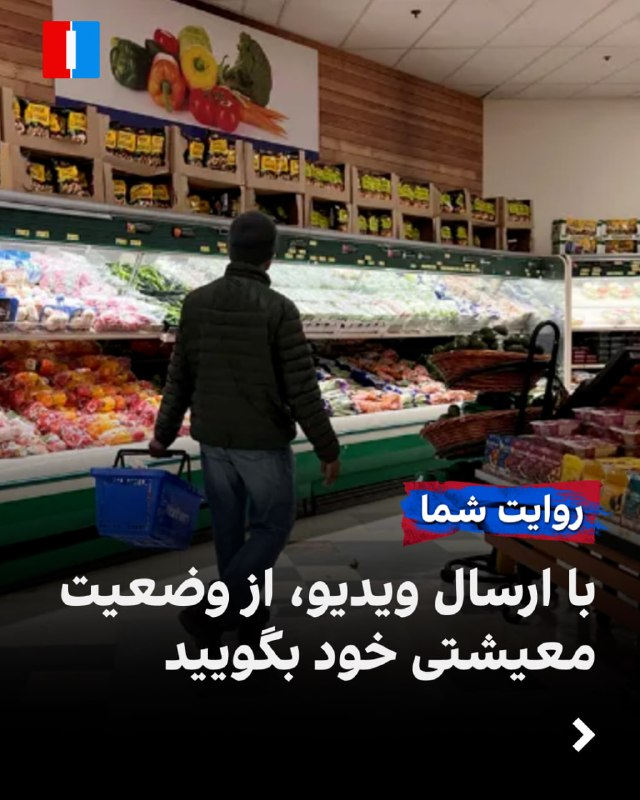

با ارسال ویدیو، درباره وضعیت معیشتی، مالی و اشتغال خود در ماه‌های اخیر روایت کنید.
روی لینک زیر کلیک کنید و پیام‌های خود را از طریق مدیا‌بات برای ما بفرستید.

https://t.me/intlmedia_bot

پیام‌های شما به صورت زیر‌نویس در تلویزیون و همچنین در بخش‌های مختلف‌ خبری منتشر خواهد شد.

## IranIntlTV — post 339401

  <a href="telegram/content/IranIntlTV_339401_1779973038.mp4" target="_blank">🎬 Download video</a>

آلکسیا پوتیاس، کاپیتان تیم فوتبال زنان بارسلون، پس از ۱۴ فصل حضور در این باشگاه از تیم جدا شد.

رها پوربخش، خبرنگار ایران‌اینترنشنال، گزارش می‌دهد
@iranintltv

## IranIntlTV — post 339400

جمهوری اسلامی و آمریکا پس از رد گزارش توافق هرمز از سوی ترامپ، حملات متقابل انجام دادند

سپاه پاسداران انقلاب اسلامی پنج‌شنبه هفتم خرداد یک پایگاه هوایی آمریکا را هدف قرار داد. اقدامی که پس از حملات ارتش آمریکا به آن‌چه یک مقام واشینگتن «عملیات پهپادی ایران» در نزدیکی تنگه هرمز خواند، انجام شد.

این درگیری تنها چند ساعت پس از آن رخ داد که دونالد ترامپ، رییس‌جمهوری آمریکا، گزارش‌ها را درباره نزدیک بودن توافقی با تهران رد کرد.

تشدید دوباره درگیری‌ها، نگرانی‌ها را درباره آتش‌بس شکننده میان تهران و واشینگتن - که از ۱۹ فروردین برقرار شده - افزایش داده و امیدها به توافق صلح را تضعیف کرده است.

حمله آمریکا به پهپادهای ایرانی
یک مقام آمریکایی که نخواست نامش فاش شود، به خبرگزاری رویترز گفت ارتش آمریکا چهار پهپاد تهاجمی ایران را سرنگون کرده و یک ایستگاه کنترل زمینی در بندرعباس را هدف قرار داده است. مرکزی که به گفته او در آستانه پرتاب پنجمین پهپاد قرار داشت.

این مقام گفت: «این اقدام‌ها حساب‌شده، کاملا دفاعی و با هدف حفظ آتش‌بس انجام شدند.»

خبرگزاری تسنیم به نقل از سپاه پاسداران گزارش داد جمهوری اسلامی در پاسخ به آن‌چه «حمله بامداد آمریکا در نزدیکی فرودگاه بندرعباس» توصیف شد، یک پایگاه آمریکایی را هدف قرار داده است.

هشدار در کویت و شمال اسرائیل
کویت که میزبان یکی از پایگاه‌های بزرگ آمریکا در منطقه است، اعلام کرد در حال مقابله با حملات موشکی و پهپادی است، اما توضیح نداد این حملات از کجا انجام شده‌اند.

اسرائیل نیز از فعال شدن آژیرهای هشدار در شمال این کشور در پی «فعالیت هوایی دشمن» خبر داد.

در واکنش به تشدید تنش‌ها، قیمت نفت که چهارشنبه حدود پنج درصد کاهش یافته بود، دوباره افزایش یافت.

بهای نفت خام آمریکا بیش از سه درصد رشد کرد، بازار سهام افت کرد و ارزش دلار بالا رفت.

ترامپ: هیچ کشوری کنترل تنگه هرمز را در دست نمی‌گیرد
جنگی که از ۹ اسفند ۱۴۰۴ با حملات آمریکا و اسرائیل به جمهوری اسلامی آغاز شد، تاکنون باعث جهش شدید قیمت جهانی انرژی شده است.

او همچنین گزارش صداوسیمای جمهوری اسلامی را رد کرد. گزارشی که در آن گفته شده است تهران به پیش‌نویس غیررسمی توافقی دست یافته که بر اساس آن، کشتیرانی تجاری در تنگه هرمز ظرف یک ماه به سطح پیش از جنگ بازمی‌گردد و ایران و عمان به‌طور مشترک مدیریت تردد را بر عهده می‌گیرند.

ترامپ گفت هیچ کشوری کنترل این آبراه را در اختیار نخواهد داشت و در اظهاراتی تهدیدآمیز علیه مسقط تاکید کرد: «هیچ‌کس قرار نیست کنترل تنگه را در دست بگیرد. این آب‌های بین‌المللی است و عمان هم مثل بقیه رفتار خواهد کرد، وگرنه مجبور می‌شویم آن‌ها را نابود کنیم.»

اختلاف‌ها بر سر تحریم‌ها، برنامه هسته‌ای و تنگه هرمز
علی باقری کنی، معاون دبیر شورای عالی امنیت ملی، گفت تهران خواهان آزادسازی همه دارایی‌های بلوکه‌شده ایران از سوی آمریکاست.

او به تسنیم گفت: «آزادسازی کامل و بدون قید و شرط دارایی‌های ایران، حق قانونی ملت ایران است.»

تحریم‌ها، برچیدن برنامه هسته‌ای جمهوری اسلامی و وضعیت تنگه هرمز - که پیش از جنگ حدود یک‌پنجم تجارت جهانی نفت و گاز طبیعی مایع از آن عبور می‌کرد - همچنان مهم‌ترین نقاط اختلاف در مذاکرات برای پایان جنگ هستند.

رویترز نوشت این آبراه بر اساس قوانین بین‌المللی، مشمول حق عبور آزاد کشتی‌های خارجی است.

وزارت خزانه‌داری آمریکا نیز «سازمان مدیریت تنگه هرمز» - نهادی ایرانی که برای مدیریت عبور و مرور در این تنگه ایجاد شده - را به فهرست تحریم‌های مرتبط با تهدید امنیت ملی آمریکا اضافه کرد.

اختلاف بر سر پرونده هسته‌ای
صداوسیمای جمهوری اسلامی گزارش داد پیش‌نویس توافق با واشینگتن شامل خروج نیروهای آمریکایی از مناطق نزدیک به ایران است؛ هرچند مساله حضور نظامی آمریکا در منطقه همچنان نیازمند مذاکره بیشتر توصیف شد.

کاخ سفید این گزارش را «کاملا ساختگی» خواند و تهران نیز به آن واکنش رسمی نشان نداد.

گزارش تلویزیون جمهوری اسلامی درباره پیش‌نویس توافق، اشاره‌ای به برنامه هسته‌ای تهران نداشت. برنامه‌ای که آمریکا خواهان برچیدن آن است.

منابع ایرانی به رویترز گفته‌اند مذاکرات درباره پرونده هسته‌ای قرار است در مرحله دوم گفت‌وگوها انجام شود. موضوعی که ممکن است برای برخی از نزدیک‌ترین حامیان ترامپ، قابل قبول نباشد.

مارکو روبیو، وزیر خارجه آمریکا، در نشست کابینه دولت ترامپ گفت: «اصل ماجرا این است که ایران هرگز نباید به سلاح هسته‌ای دست پیدا کند.»
 
🔗متن کامل گزارش را اینجا بخوانید
@iranintltv

## IranIntlTV — post 339399

  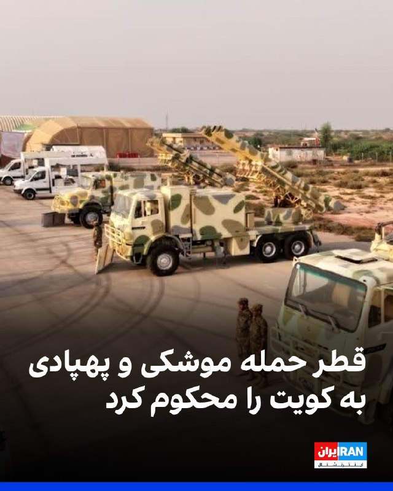

در پی حملات موشکی و پهپادی جمهوری اسلامی به کویت، وزارت خارجه قطر در بیانیه‌ای هدف قرار گرفتن کویت با موشک و پهپاد را به‌شدت محکوم کرد و آن را «نقض آشکار حاکمیت» این کشور و «نقض فاحش قوانین بین‌المللی» دانست.

قطر همچنین خواستار جلوگیری از «پیامدهای حملات غیرموجه» و کاهش تنش برای بازگرداندن امنیت و ثبات در سطح منطقه و جهان شد.

وزارت خارجه قطر در ادامه بر «همبستگی کامل» این کشور با کویت تاکید کرد و گفت از هر اقدامی برای حفظ حاکمیت و امنیت کویت حمایت می‌کند.
https://iranintl.com/202605283859

## IranIntlTV — post 339398

  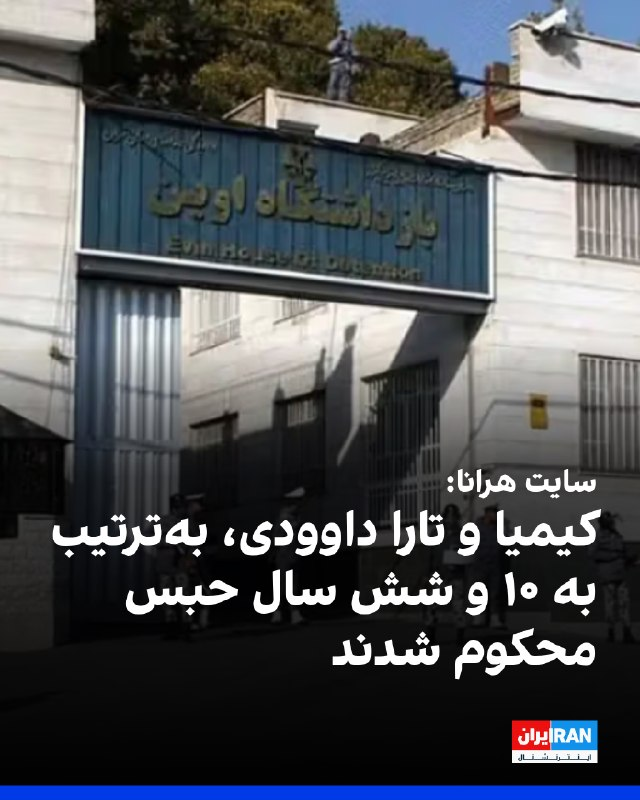

سایت هرانا خبر داد کیمیا داوودی و تارا داوودی، دو خواهر محبوس در زندان اوین که در جریان اعتراضات دی‌ماه ۱۴۰۴ بازداشت شده بودند، از سوی دادگاه انقلاب تهران به‌ترتیب به ۱۰ و شش سال حبس محکوم شدند.

بر اساس این گزارش، شعبه ۱۵ دادگاه انقلاب تهران به ریاست ابوالقاسم صلواتی، کیمیا داوودی را بابت اتهاماتی از جمله «ارتباط با گروه‌ها و شبکه‌های معاند» و «اجتماع و تبانی علیه امنیت کشور» به ۱۰ سال حبس محکوم کرده است.

هرانا افزود تارا داوودی نیز بابت اتهاماتی از جمله «اجتماع و تبانی علیه امنیت کشور» و «تبلیغ علیه نظام» به شش سال زندان محکوم شده است.

این دو خواهر ۲۴ دی‌ماه ۱۴۰۴، در جریان اعتراضات سراسری در تهران بازداشت شدند و اکنون در بند زنان زندان اوین به سر می‌برند. هرانا نوشت بازداشت آنها با ضرب‌وشتم و اعمال خشونت از سوی نیروهای امنیتی همراه بوده است.
https://iranintl.com/202605287064

## IranIntlTV — post 339397

  

رسانه‌های اسرائیل خبر دادند که در حمله به بیروت، علی الحسینی، فرمانده واحد موشکی حزب الله، هدف قرار گرفته است.

همزمان آی۲۴ نیوز نوشت که در حمله به بیروت یک فرمانده یگان موشکی نیروی قدس سپاه پاسداران هدف قرار گرفته است.
همچنین ارتش اسرائیل ضمن اعلام حمله به بیروت، دقایقی پیش حمله‌ای را در بیروت انجام داده است.

ارتش اسرائیل جزئیات بیشتری منتشر نکرده، اما رسانه‌های لبنانی گزارش داده‌اند این حمله در منطقه «الشویفات» در جنوب بیروت رخ داده است.
iranintl.com/202605287238

## IranIntlTV — post 339396

  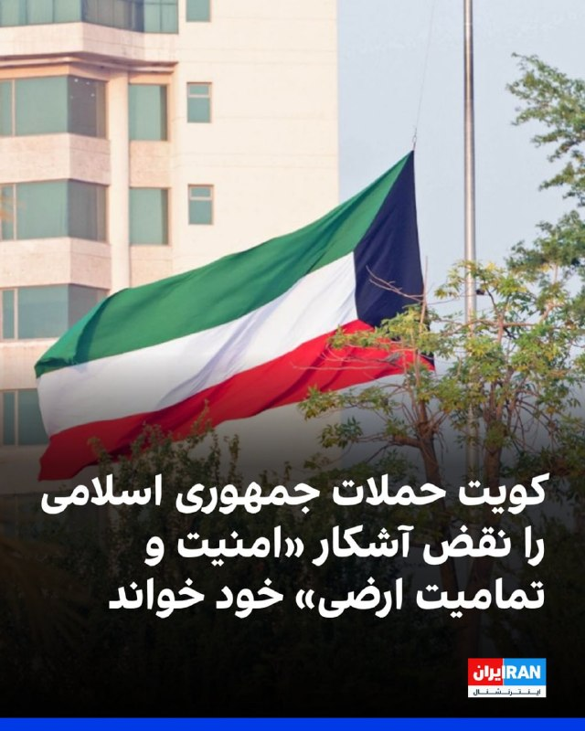

کویت حملات موشکی و پهپادی جمهوری اسلامی را نقض آشکار حاکمیت، امنیت و تمامیت ارضی خود خواند. وزارت خارجه کویت تاکید کرد که این حملات در زمانی رخ می‌دهد که شماری از کشورهای منطقه در حال تلاش جدی برای کاهش تنش و مهار بحران هستند.

کویت همچنین حملات جمهوری اسلامی را نقض قطعنامه ۲۸۱۷ سال ۲۰۲۶ شورای امنیت سازمان ملل دانست.

وزارت خارجه کویت تاکید کرد این کشور حق کامل خود را برای اتخاذ همه اقدامات لازم به منظور حفظ امنیت و دفاع از سرزمین و تاسیسات حیاتی خود در برابر هرگونه تجاوز یا تهدید محفوظ می‌دارد.
iranintl.com/202605283201

## IranIntlTV — post 339395

  

در پی کشته شدن دو فرمانده حماس در حملات هوایی به غزه، سپاه پاسداران در بیانیه‌ای اعلام کرد تا زمانی که اسرائیل «محو» نشود، منطقه روی آرامش نخواهد دید و و صلحی که رییس‌جمهور «خبیث و قمارباز» آمریکا از آن حرف می‌زند، جز «کشتار، قتل و ترور» نیست.

در بخشی از این بیانیه آمده است کشته شدن این فرماندهان نه تنها مقاومت را تضعیف نمی‌کند، بلکه به ادامه «جهاد تا آزادی فلسطین و قدس» منجر خواهد شد.
https://iranintl.com/202605285892

## IranIntlTV — post 339394

  <a href="telegram/content/IranIntlTV_339394_1779973044.mp4" target="_blank">🎬 Download video</a>

ایران‌اینترنشنال در کارزاری مردمی به دنبال ثبت و مستندسازی حقیقت درباره کشتار دی‌ماه در رشت است. بر اساس گزارش‌ها، صدها نفر از معترضان در دو شب ۱۸ و ۱۹ دی‌ماه در این شهر کشته شدند.

گفت‌وگو با فرنوش فرجی، عضو تحریریه ایران‌اینترنشنال
@iranintltv

## IranIntlTV — post 339393

  <a href="telegram/content/IranIntlTV_339393_1779973047.mp4" target="_blank">🎬 Download video</a>

ایران‌اینترنشنال در کارزاری مردمی، در پی ثبت و مستندسازی حقیقت درباره کشتار دی‌ماه در رشت است. صدها نفر از معترضان رشت طی دو شب ۱۸ و ۱۹ دی‌ماه در این شهر کشته شدند. با وجود اسناد و تصاویری که از این جنایت منتشر شده، هنوز هزاران روایت ناگفته باقی مانده است.
ایران‌اینترنشنال در ادامه این کارزار مردمی، از شاهدان عینی، خانواده‌ها و نزدیکان کشته‌شدگان می‌خواهد روایت‌ها، تصاویر، ویدیوها و اطلاعات خود را ارسال کنند تا نام و سرگذشت کشته‌شدگان رشت در سکوت و بی‌خبری دفن نشود.

گزارش فرزاد فتاحی، عضو تحریریه ایران‌اینترنشنال
@iranintltv

## IranIntlTV — post 339392

  <a href="telegram/content/IranIntlTV_339392_1779973050.mp4" target="_blank">🎬 Download video</a>

پلیس متروپولیتن لندن اعلام کرد یک مرد ۴۱ ساله ایرانی در پی برخورد شدید یک خودرو در نزدیکی دیوار جاویدنامان در گولدرز گرین لندن به‌شدت زخمی و به بیمارستان منتقل شد. راننده، مردی ۳۹ ساله عراقی، به اتهام وارد کردن جراحات شدید، رانندگی خطرناک و خودداری از ارائه نمونه برای آزمایش مواد مخدر بازداشت شده است. پلیس اعلام کرد این پرونده در حال حاضر تروریستی تلقی نمی‌شود.
فربد سروندی، خبرنگار ایران‌اینترنشنال، گزارش می‌دهد
@iranintltv

## IranIntlTV — post 339391

  

ارتش اسرائیل، ظهر پنج‌شنبه هفت خرداد اعلام کرد در ۲۴ ساعت گذشته بیش از ۱۳۵ موضع حزب‌الله را در مناطق صور، بقاع و جنوب لبنان هدف قرار داده است.

بر اساس این اطلاعیه، حدود ۱۰ محل پرتاب راکت که حزب‌الله از آن‌ها برای شلیک به سوی نیروهای ارتش اسرائیل و غیرنظامیان اسرائیلی استفاده می‌کرد، در بقاع و جنوب لبنان هدف قرار گرفت. ارتش اسرائیل همچنین اعلام کرد یک اردوگاه آموزشی حزب‌الله در بریتال، در منطقه بقاع، هدف حمله قرار گرفته است.

بر اساس این اطلاعیه، ارتش اسرائیل شب گذشته حدود ۱۵ زیرساخت نظامی در صور را که به گفته این ارتش برای پیشبرد حملات حزب‌الله استفاده می‌شد، هدف قرار داد. نیروی هوایی اسرائیل همچنین یک گروه از نیروهای حزب‌الله را هنگام خروج از محل پرتاب راکت هدف قرار داد.
iranintl.com/202605280529

## IranIntlTV — post 339390

  

فرماندهی مرکزی آمریکا، سنتکام، در شبکه ایکس اعلام کرد جمهوری اسلامی ساعت ۴:۴۷ بامداد پنج‌شنبه به وقت ایران، یک موشک بالستیک به سوی کویت شلیک کرد که نیروهای کویتی آن را رهگیری کردند.

سنتکام این اقدام را «نقض فاحش آتش‌بس» خواند و افزود چند ساعت پیش از آن، نیروهای جمهوری اسلامی پنج پهپاد انتحاری را در و نزدیک تنگه هرمز به پرواز درآوردند که «تهدیدی آشکار» ایجاد کردند.

بر اساس اعلام سنتکام، همه این پهپادها از سوی نیروهای آمریکایی رهگیری شدند و آمریکا همچنین از پرتاب ششمین پهپاد از یک مرکز کنترل زمینی جمهوری اسلامی در بندرعباس جلوگیری کرد.
https://iranintl.com/202605288025

## IranIntlTV — post 339389

  <a href="telegram/content/IranIntlTV_339389_1779973054.mp4" target="_blank">🎬 Download video</a>

چند برابر شدن هزینه‌های روزانه زندگی و گرانی بی‌سابقه مواد غذایی و دارو در ایران از عمده پیام‌هایی است که شهروندان به مدیابات ایران‌اینترنشنال ارسال کرده‌اند.

لیلا سعادتی، عضو تحریریه ایران‌اینترنشنال، گزارش می‌دهد
@iranintltv

## IranIntlTV — post 339388

  <a href="telegram/content/IranIntlTV_339388_1779973056.mp4" target="_blank">🎬 Download video</a>

سرخط خبرهای پنجشنبه ۷ خرداد
@iranintltv

## Shin_Persian — post 6282

↩️ Quoted tweet: acceladealer ✓ @acceladealer Thu, 28 May 2026 11:38:42 UTC Damage to mid-rise building (claimed targeted assassination) in BEIRUT, Lebanon 33.808852, 35.508167 @GeoConfirmed @FaytuksNetwork geolocated by @acceladealer ↩️ توییت نقل‌قول…

## Shin_Persian — post 6281

  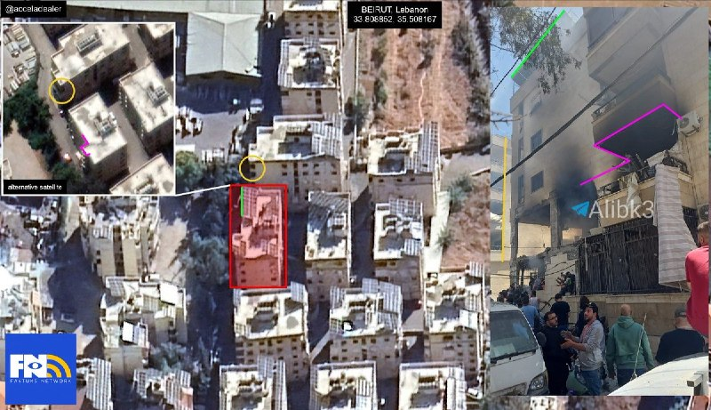

↩️ Quoted tweet:
acceladealer ✓ @acceladealer
Thu, 28 May 2026 11:38:42 UTC

Damage to mid-rise building (claimed targeted assassination) in BEIRUT, Lebanon

33.808852, 35.508167

@GeoConfirmed @FaytuksNetwork

geolocated by @acceladealer

↩️ توییت نقل‌قول شده — برای پاسخ، پست زیر را ببینید.

فارسی

خسارت به یک ساختمان میان‌مرتبه (ادعای ترور هدفمند) در بیروت، لبنان

33.808852, 35.508167

@GeoConfirmed @FaytuksNetwork

تایید موقعیت جغرافیایی توسط @acceladealer_

𝕏 · @shin_persian

## Shin_Persian — post 6280

  <a href="telegram/content/Shin_Persian_6280_1779973059.mp4" target="_blank">🎬 Download video</a>

Shin ✓ @hey_itsmyturn
Thu, 28 May 2026 11:32:41 UTC

Reported video of the targeted building where Ali al-Husni, head of the IRGC-backed Imam Hussein Division's missile forces was targeted by #IAF 🇮🇱

فارسی

ویدیو منتشر شده از ساختمان مورد هدف که در آن علی‌الحسنی، رئیس نیروهای موشکی لشکر امام حسین (تحت حمایت سپاه پاسداران - IRGC)، توسط نیروی هوایی اسرائیل (#IAF) 🇮🇱 هدف قرار گرفت.

𝕏 · @shin_persian

## Shin_Persian — post 6279

  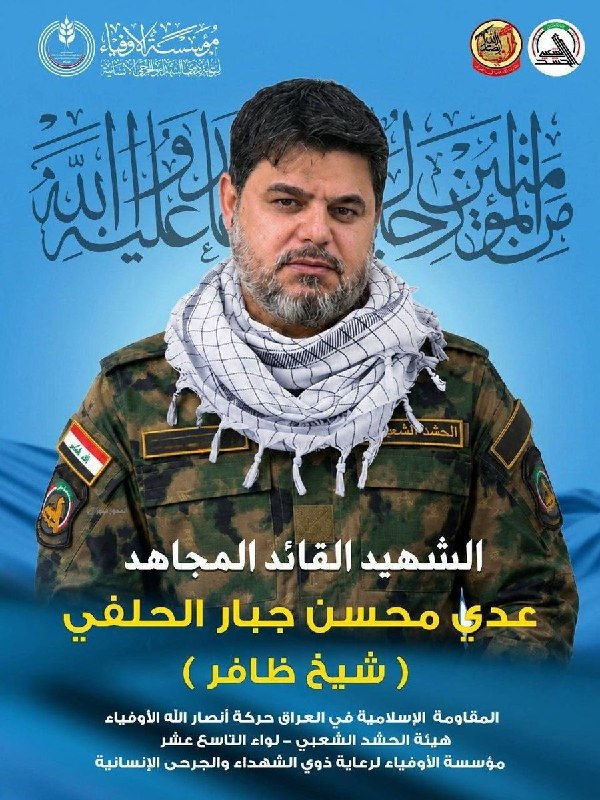

↩️ Quoted tweet: Shin ✓ @hey_itsmyturn Thu, 28 May 2026 11:17:43 UTC Initial: A commander of IRGC-backed Hashed Sha'abi / PMU / PMF terror organization has been killed in Maysan governorate, #Iraq 🇮🇶 ↩️ توییت نقل‌قول شده — برای پاسخ، پست زیر را ببینید.…

## Shin_Persian — post 6278

↩️ Quoted tweet:
Shin ✓ @hey_itsmyturn
Thu, 28 May 2026 11:17:43 UTC

Initial:
A commander of IRGC-backed Hashed Sha'abi / PMU / PMF terror organization has been killed in Maysan governorate, #Iraq 🇮🇶

↩️ توییت نقل‌قول شده — برای پاسخ، پست زیر را ببینید.

فارسی

یکی از فرماندهان سازمان تروریستی حشد الشعبی (بسیج مردمی عراق) وابسته به سپاه پاسداران، در استان میسان، #Iraq 🇮🇶 کشته شده است.

𝕏 · @shin_persian

## Shin_Persian — post 6276

U.S. Central Command ✓ @CENTCOM
Thu, 28 May 2026 10:48:55 UTC

At 10:17 p.m. ET on May 27, Iran launched a ballistic missile toward Kuwait that was successfully intercepted by Kuwaiti forces. This egregious ceasefire violation by the Iranian regime occurred hours after Iranian forces launched five one-way attack drones that posed a clear threat in and near the Strait of Hormuz. All drones were successfully intercepted by U.S. forces which also prevented a sixth drone launch from an Iranian ground control site in Bandar Abbas.

U.S. Central Command and regional partners remain vigilant and measured as we continue to defend our forces and interests from unjustified Iranian aggression.

فارسی

در ساعت ۱۰:۱۷ شب به وقت منطقه زمانی شرقی در ۲۷ مه، ایران یک موشک بالستیک را به سمت کویت شلیک کرد که توسط نیروهای کویتی با موفقیت رهگیری شد. این نقض فاحش آتش‌بس توسط رژیم ایران ساعاتی پس از آن رخ داد که نیروهای ایرانی پنج پهپاد تهاجمی یک‌طرفه را پرتاب کردند که تهدیدی آشکار در داخل و نزدیکی تنگه هرمز ایجاد کرده بود. تمام پهپادها توسط نیروهای ایالات متحده با موفقیت رهگیری شدند و همچنین از پرتاب ششمین پهپاد از یک سایت کنترل زمینی ایران در بندرعباس جلوگیری به عمل آمد.

فرماندهی مرکزی ایالات متحده (سنتکام/CENTCOM) و شرکای منطقه‌ای هوشیار و خویشتندار باقی می‌مانند و ما به دفاع از نیروها و منافع خود در برابر تجاوزات توجیه‌ناپذیر ایران ادامه می‌دهیم.

𝕏 · @shin_persian

## Shin_Persian — post 6275

Shin ✓ @hey_itsmyturn
Thu, 28 May 2026 11:17:43 UTC

Initial:
A commander of IRGC-backed Hashed Sha'abi / PMU / PMF terror organization has been killed in Maysan governorate, #Iraq 🇮🇶

فارسی

یکی از فرماندهان سازمان تروریستی حشدالشعبی (بسیج مردمی عراق) وابسته به سپاه پاسداران انقلاب اسلامی در استان میسان، #Iraq 🇮🇶 کشته شد.

𝕏 · @shin_persian

## Shin_Persian — post 6274

↩️ Quoted tweet: Emanuel (Mannie) Fabian ✓ @manniefabian Thu, 28 May 2026 11:03:55 UTC The IDF says it carried out a strike in Beirut a short while ago. No further details are given. According to Lebanese media, the strike took place in Shuwayfat, just…

## Shin_Persian — post 6273

  

↩️ Quoted tweet:
Emanuel (Mannie) Fabian ✓ @manniefabian
Thu, 28 May 2026 11:03:55 UTC

The IDF says it carried out a strike in Beirut a short while ago.

No further details are given.

According to Lebanese media, the strike took place in Shuwayfat, just south of the capital.

↩️ توییت نقل‌قول شده — برای پاسخ، پست زیر را ببینید.

فارسی

ارتش دفاعی اسرائیل (IDF) اعلام کرد که لحظاتی پیش حمله‌ای را در بیروت انجام داده است.

جزئیات بیشتری ارائه نشده است.

به گفته رسانه‌های لبنانی، این حمله در الشویفات، در جنوب پایتخت، رخ داده است.

𝕏 · @shin_persian

## Shin_Persian — post 6272

  

MoFA وزارة الخارجية ✓ @mofauae
Thu, 28 May 2026 09:57:41 UTC

الإمارات تُدين بشدة الاعتداءات الإرهابية الإيرانية على دولة الكويت بالصواريخ والطائرات المسيّرة

English

The United Arab Emirates strongly condemns the Iranian terrorist attacks on the State of Kuwait using missiles and drones.

𝕏 · @shin_persian

## Shin_Persian — post 6271

Shin ✓ @hey_itsmyturn
Thu, 28 May 2026 11:02:57 UTC

Targeted assassination near Hariri airport, Beirut, #Lebanon

فارسی

ترور هدفمند در نزدیکی فرودگاه حریری، بیروت، #Lebanon #لبنان

𝕏 · @shin_persian

## Shin_Persian — post 6270

🔁 Quoting above tweet:
Shin ✓ @hey_itsmyturn
Thu, 28 May 2026 09:55:51 UTC

ICYMI

فارسی

جهت اطلاع کسانی که مطلع نشده‌اند (ICYMI)

𝕏 · @shin_persian

## Shin_Persian — post 6269

  

↩️ Quoted tweet: KUWAIT ARMY - الجيش الكويتي ✓ @KuwaitArmyGHQ Thu, 28 May 2026 02:40:14 UTC تتصدى حالياً الدفاعات الجوية الكويتية لهجمات صاروخية وطائرات مسيرة معادية. تنوه رئاسة الأركان العامة للجيش أن أصوات الانفجارات إن سمعت فهي نتيجة اعتراض منظومات الدفاع…

## Shin_Persian — post 6268

↩️ Quoted tweet:
KUWAIT ARMY - الجيش الكويتي ✓ @KuwaitArmyGHQ
Thu, 28 May 2026 02:40:14 UTC

تتصدى حالياً الدفاعات الجوية الكويتية لهجمات صاروخية وطائرات مسيرة معادية.

تنوه رئاسة الأركان العامة للجيش أن أصوات الانفجارات إن سمعت فهي نتيجة اعتراض منظومات الدفاع الجوي للهجمات المعادية.

يرجى من الجميع التقيد بتعليمات الأمن والسلامة الصادرة عن الجهات المختصة.

↩️ Quoted tweet — see the post below for the reply.

English

Kuwaiti air defenses are currently intercepting hostile missile and drone attacks.

The General Staff of the Army notes that any sounds of explosions heard are the result of air defense systems intercepting these hostile attacks.

Everyone is requested to adhere to the security and safety instructions issued by the competent authorities.

𝕏 · @shin_persian

## Shin_Persian — post 6267

Shin ✓ @hey_itsmyturn
Thu, 28 May 2026 01:49:46 UTC

Treasury's Economic Fury campaign targets Iran's Persian Gulf Strait Authority (PGSA), a new IRGC extortion scheme charging illegitimate "tolls" for vessels transiting the Strait of Hormuz.

𝐃𝐄𝐒𝐈𝐆𝐍𝐀𝐓𝐄𝐃 𝐄𝐍𝐓𝐈𝐓𝐘:

• 𝐏𝐞𝐫𝐬𝐢𝐚𝐧 𝐆𝐮𝐥𝐟 𝐒𝐭𝐫𝐚𝐢𝐭 𝐀𝐮𝐭𝐡𝐨𝐫𝐢𝐭𝐲 (𝐏𝐆𝐒𝐀) - Iranian government agency that coordinates with IRGC and IRGC Navy to extort commercial vessels through forced route compliance, information submission requirements, and passage fees that fund the designated Foreign Terrorist Organization IRGC.

𝐊𝐄𝐘 𝐎𝐏𝐄𝐑𝐀𝐓𝐈𝐎𝐍𝐀𝐋 𝐃𝐄𝐓𝐀𝐈𝐋𝐒:

- Vessels must submit requested information to receive "permission" from PGSA to transit the Strait of Hormuz
- PGSA forces vessels to follow Iranian-designated routes near Iran's coast under IRGC instructions
- Extortion payments accepted via fiat currency, digital assets, offsets, informal swaps, or in-kind payments including nominally charitable donations
- All toll revenues are funneled directly to the IRGC

𝐄𝐂𝐎𝐍𝐎𝐌𝐈𝐂 𝐅𝐔𝐑𝐘 𝐂𝐀𝐌𝐏𝐀𝐈𝐆𝐍 𝐈𝐌𝐏𝐀𝐂𝐓:

- Treasury has disrupted tens of billions of dollars in Iranian regime revenue
- Nearly $500 million in regime-linked cryptocurrency frozen
- Targeted shadow banking networks, weapons supply chains, and shadow fleet operations
- Secondary sanctions risk for foreign financial institutions facilitating Iranian activities

𝐒𝐀𝐍𝐂𝐓𝐈𝐎𝐍𝐒 𝐈𝐌𝐏𝐋𝐈𝐂𝐀𝐓𝐈𝐎𝐍𝐒:

- Designated under E.O. 13224 for materially assisting the IRGC
- All U.S. persons prohibited from transactions involving PGSA
- Foreign entities cooperating with the strait authority face sanctions exposure
- Secondary sanctions possible for foreign financial institutions conducting significant transactions with PGSA
- Violations may result in civil or criminal penalties on strict liability basis

𝐂𝐎𝐌𝐏𝐋𝐈𝐀𝐍𝐂𝐄 𝐖𝐀𝐑𝐍𝐈𝐍𝐆:

Any cooperation with the Persian Gulf Strait Authority may constitute providing support to the IRGC and expose parties to U.S. sanctions risk, regardless of payment method or justification.

ترجمه فارسی در بخش نظرات

𝕏 · @shin_persian

## Shin_Persian — post 6266

Shin ✓ @hey_itsmyturn
Wed, 27 May 2026 23:55:28 UTC

It was USN again apparently

فارسی

ظاهراً باز هم کار نیروی دریایی ایالات متحده (USN) بود.

𝕏 · @shin_persian

## Iliaen — post 4437

بامداد پنجشنبه؛ زیرنویس صدا و سیما: چند صدای انفجار در بندعباس شنیده شد؛ رویترز به نقل از یک مقام آمریکایی مدعی حمله به یک موقعیت نظامی در بندرعباس شد.

همچنین خبرگزاری CBS به نقل از مقامات ایالات متحده می‌گوید یک سایت نظامی در خاک ایران هدف حمله قرار گرفت.

@iliaen

## ManotoTV — post 105852

  <a href="telegram/content/ManotoTV_105852_1779973064.mp4" target="_blank">🎬 Download video</a>

سخنرانی امیرعباس هویدا در جمع دانشجویان درباره نقش جوانان در توسعه و اداره کشور

## ManotoTV — post 105845

  <a href="telegram/content/ManotoTV_105845_1779973067.mp4" target="_blank">🎬 Download video</a>

اینترنت در ایران فقط ابزار ارتباط نیست، میدان قدرت است. هر بار که قطع یا وصل می‌شود، حکومت در واقع در حال تنظیم سطح کنترل خود بر جامعه است، اینکه مردم چه ببینند، چه بگویند، چگونه وصل شوند و تا چه اندازه بتوانند با هم عمل کنند.

## FarsiVOA — post 218886

پلیس سوئیس اعلام کرد در حمله با چاقو در ایستگاه قطار شهر وینترتور، سه نفر زخمی شدند.

گزارش‌ها حاکی است مهاجم ۳۱ ساله پس از حمله بازداشت شده است.

@FarsiVOA

## FarsiVOA — post 218885

🔺سه زخمی در حمله با سلاح سرد در سوئیس

◾️پلیس محلی سوئیس روز پنجشنبه ۷ خرداد اعلام کرد که مردی سه نفر را در حمله با چاقو در یک ایستگاه قطار در شهر وینترتور سوئیس در نزدیکی زوریخ زخمی کرده بود، دستگیر شد.

⬇️ بیشتر بخوانید:

https://ir.voanews.com/a/switzerland-attack-injury-allaho-akbar/8154821.html

## FarsiVOA — post 218884

  

ارگان خبری مجموعه فعالان حقوق بشر در ایران خبر داد که تارا و کیمیا داوودی، دو خواهر محبوس در زندان اوین، توسط شعبه ۱۵ دادگاه انقلاب تهران به ریاست قاضی ابوالقاسم صلواتی در مجموع به ۱۶ سال حبس محکوم شده‌اند.

براساس این گزارش، کیمیا داوودی به اتهاماتی از جمله «ارتباط با گروه‌ها و شبکه‌های معاند» و «اجتماع و تبانی علیه امنیت کشور» به ۱۰ سال زندان و تارا داوودی نیز به اتهاماتی شامل «اجتماع و تبانی علیه امنیت کشور» و «تبلیغ علیه نظام» به شش سال حبس محکوم شده است.

این دو خواهر در تاریخ ۲۴ دی‌ماه ۱۴۰۴ در جریان اعتراضات سراسری در تهران بازداشت شدند و هم‌اکنون در بند زنان زندان اوین نگهداری می‌شوند. به گفته منابع حقوق بشری، بازداشت آن‌ها با خشونت نیروهای امنیتی همراه بوده است.
@FarsiVOA

## FarsiVOA — post 218883

  

وزارت خارجه کویت حملات اخیر موشکی و پهپادی رژیم ایران به خاک کویت را به عنوان یک تشدید تنش جدی و نقض آشکار حاکمیت و امنیت محکوم کرد.

این وزارتخانه روز پنج‌شنبه اعلام کرد که تهران را کاملاً مسئول حملات اخیر می‌داند و حکومت ایران خواست فوراً و بدون قید و شرط حملات را متوقف کند.

پیشتر ستاد کل ارتش کویت اعلام کرد که پدافند هوایی این کشور در حال مقابله با «حملات موشکی و پهپادهای دشمن» است. با این حال، ارتش کویت نگفت این تهدیدها از کجا آمده‌ بودند.

بیانیه وزارت خارجه کویت همزمان با یک بیانیه سنتکام منتشر شد که در آن، ستاد فرماندهی مرکزی آمریکا، گزارش داد که در ساعت ۱۰:۱۷ شب چهارشنبه ۲۷ مه به وقت شرق آمریکا، حدود ساعت ۶ بامداد به وقت تهران، جمهوری اسلامی یک موشک بالستیک به سوی کویت شلیک کرد که با موفقیت توسط نیروهای کویتی رهگیری شد.
@FarsiVOA

## FarsiVOA — post 218882

  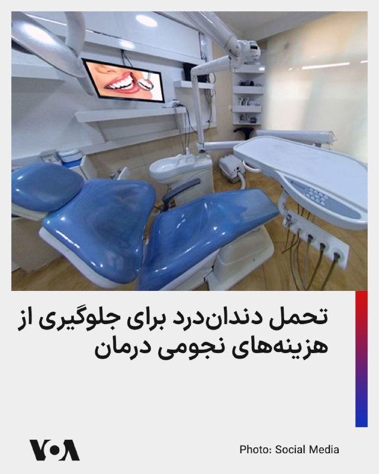

خبرگزاری فارس وابسته به سپاه، با انتشار گزارشی اعلام کرد که هزینه‌های بالای دندان‌پزشکی و عدم پوشش بیمه، دلایل اصلی مراجعه نکردن شهروندان به دندانپزشکی است.

این خبرگزاری هزینه درمان هر دندان را حدود ۱۵ الی ۴۰ میلیون تومان گزارش و اعلام کرد که شرکت‌های بیمه‌ حتی یک ریال از این هزینه هنگفت را پرداخت نمی‌کنند.

طبق آمارهای موجود، هر ایرانی حداقل شش دندان پوسیده دارد و تنها هزینه عصب‌کشی یک دندان، حدود هفت میلیون است.

بر اساس گزارش خبرگزاری فارس، هزینه هر واحد «ایمپلنت» ۲۳ الی ۳۰ میلیون تومان و هزینه پرکردن هر دندان با مواد نیز چهار تا ۱۲ میلیون تومان است.

شورای عالی کار جمهوری اسلامی، حداقل دستمزد ماهانه کارگران را ۱۶ میلیون و ۶۰۰ هزار تومان تعیین کرده است.
@FarsiVOA

## FarsiVOA — post 218881

  

نت‌بلاکس، نهاد ناظر بر اختلالات اینترنتی، اعلام کرد که علیرغم اینکه دسترسی به شبکه جهانی تا حد زیادی در ایران بازگشته است، اما شاخص‌ها نشان می‌دهند که کاربران همچنان با فیلترینگ شدید مواجه هستند.

نت‌بلاکس، این فیلترینگ شدید را مشابه دوره مابین اعتراضات سراسری دی ماه و آغاز عملیات نظامی علیه جمهوری اسلامی، حدفاصل دی ماه تا اسفند ۱۴۰۴ توصیف کرد.

دسترسی شهروندان ایرانی به اینترنت بین‌المللی، از روز نهم اسفند ۱۴۰۴ قطع شد و جمهوری اسلامی پس از ۸۸ روز، در شامگاه پنجم خرداد ۱۴۰۵ به صورت ناپایدار اینترنت را وصل کرد.

بر اساس اعلام نت‌بلاکس، این زمان، طولانی‌ترین دوره قطع اینترنت در جهان از سوی یک کشور دارای زیرساخت اینترنت بوده و از این بابت جمهوری اسلامی رکورددار است.
@FarsiVOA

## FarsiVOA — post 218880

  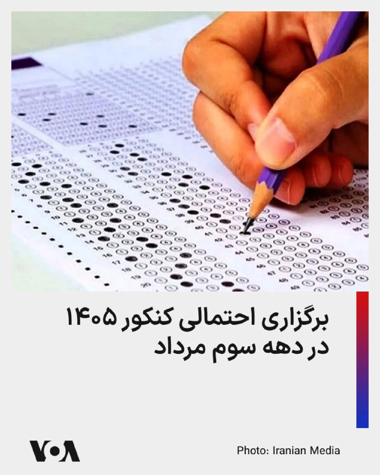

وزیرعلوم، تحقیقات و فناوری از احتمال برگزاری کنکور سراسری ۱۴۰۵ در دهه سوم مرداد خبر داد و هم‌زمان نسبت به کاهش چشمگیر استقبال از رشته‌های علوم پایه در کشور هشدار داد.

حسین سیمایی‌صراف اعلام کرد براساس پیش‌بینی‌ها، کنکور سراسری ۱۴۰۵ احتمالاً در دهه سوم مرداد برگزار می‌شود و جزئیات نهایی آن به ‌زودی از سوی سازمان سنجش آموزش کشور اعلام خواهد شد.

وی با اشاره به کاهش حدود ۵۰ درصدی استقبال از رشته‌های علوم پایه در سه دهه اخیر گفت این روند می‌تواند آینده علمی کشور را تحت تأثیر قرار دهد و نیازمند حمایت جدی و ایجاد مشوق‌های شغلی برای دانشجویان این حوزه است.

در حالی که زمان احتمالی برگزاری کنکور اعلام شده، هنوز زمان دقیق آزمون و همچنین امتحانات نهایی پایه دوازدهم مشخص نیست.

سازمان سنجش آموزش کشور اعلام کرده زمان نهایی کنکور و آزمون دانشجو معلم یک هفته پیش از برگزاری اطلاع‌ رسانی می‌شود. همچنین وزارت آموزش‌ و پرورش گفته است تکلیف امتحانات نهایی تا نیمه مرداد مشخص خواهد شد.
@FarsiVOA

## FarsiVOA — post 218879

🔺ریزش بازارهای جهانی سهام در پی افزایش تنش‌های نظامی خاورمیانه

▪️در پی افزایش تنش‌های نظامی میان جمهوری اسلامی و آمریکا ارزش سهام بازارهای جهانی افت کرد.

▪️شاخص فراگیر بازار سهام «استاکس اروپا ۶۰۰» با ۰.۶ درصد افت مواجه شد و تمام بورس‌های بزرگ منطقه نیز در محدوده منفی معامله شدند.

▪️افت چشمگیر شاخص سهام عمدتاً مربوط به کشورهایی است که به شدت به نفت خاورمیانه وابسته هستند و ذخایر استراتژیک نفت چندانی نیز ندارند؛ از جمله تایوان، سنگاپور، فیلیپین و تا حدودی کره جنوبی.

▪️شاخص بازار‌های سهام آسیایی به استثنای پاکستان و تا حدودی چین، در همه کشورها افت کرده است. اگرچه در خود چین برخی بازارهای سهام رشد نشان می‌دهد، اما شاخص بازارهای هنگ‌کنگ با شدت بیشتری افت کرده است.

⬇️ بیشتر بخوانید:
https://ir.voanews.com/a/global-stock-markets-plunge-as-middle-east-military-tensions-rise/8154816.html

## FarsiVOA — post 218878

🔺واکنش سنتکام به پرتاب موشک بالستیک به کویت توسط رژیم ایران: «نقض فاحش آتش‌بس» است

▪️سنتکام حمله رژیم ایران به کویت با یک فروند موشک بالستیک را «نقض فاحش آتش‌بس» توسط رژیم ایران خواند و بر تداوم هوشیاری آمریکا و شرکای منطقه‌ای برای مقابله با «تجاوزگری غیرموجه» رژیم ایران تاکید کرد.

⬇️ بیشتر بخوانید:

https://ir.voanews.com/a/centcom-says-iran-missle-strike-kuwait-egregious-ceasefire-violation/8154817.html

## FarsiVOA — post 218877

  

ارتش لبنان اعلام کرد که یک سرباز این ارتش در جریان حمله اسرائیل در جنوب لبنان کشته شده است.

بر اساس بیانیه ارتش لبنان که روز پنجشنبه صادر شد، این سرباز زمانی هدف قرار گرفت که در جاده زغتة–دیرالزهرانی در منطقه نبطیه در جنوب لبنان در حال تردد بود.

این سومین سرباز لبنانی است که در روزهای اخیر کشته می‌شود.

ارتش لبنان چهارشنبه اعلام کرد که یک سربازش در حمله‌ای در جاده کفردون–الخردلی در همان منطقه جنوب لبنان کشته شده است. همچنین ارتش لبنان سه‌شنبه اعلام کرد که یک سربازش در حمله اسرائیل در منطقه بقاع غربی کشته شده است.
@FarsiVOA

## FarsiVOA — post 218876

🔺اکسیوس: دولت ترامپ خود را برای احتمال فروپاشی کوبا آماده می‌کند

▪️اکسیوس گزارش داد که دولت ترامپ خود را برای احتمال فروپاشی رژیم کوبا، حتی در تابستان پیش‌رو، آماده می‌کند.

▪️مقام‌های آمریکایی گفتند واشنگتن در صورت فرو رفتن این جزیره در هرج‌ومرج، طرح‌های تازه‌ای برای واکنش نظامی شبیه‌سازی و بررسی کرده است.

▪️یکی از مقام‌های ارشد دولت دونالد ترامپ به اکسیوس روز پنجشنبه با اشاره به احتمال فروپاشی حکومت کوبا گفت: «اما ما هنوز نمی‌خواهیم رژیم را کاملاً از بین ببریم. این کار روش و مرحله‌بندی دارد.»

▪️پیشتر ونزوئلا و رهبر سوسیالیست آن، نیکلاس مادورو، با ارسال نفت رایگان، کوبا را سرپا نگه داشته بود؛ نفتی که هم برق کشور را تأمین می‌کرد و هم منبع درآمد صادراتی برای هاوانا بود.

⬇️ بیشتر بخوانید:
https://ir.voanews.com/a/8154815.html

## FarsiVOA — post 218875

🔺کدام کشورها از انسداد تنگه هرمز سود بردند؟

▪️انسداد تنگه هرمز اگرچه تبعات تورمی بر اقتصاد همه کشورها داشته، اما برخی از آنها به خاطر جهش قیمت انرژی به سودهای کلانی دست یافته‌اند.

▪️در میان کشورهای همسایه ایران، عمان، روسیه و جمهوری آذربایجان درآمدهای صادرات نفت خود را به شدت افزایش داده‌اند.

▪️در خارج از خاورمیانه، کشورهای صادرکننده نفت، خصوصا آنهایی که محصولات نفتی نیز صادر می‌کنند به درآمدهای کلانی رسیده‌اند.

▪️رویترز می‌نویسد سلطان‌نشین جزیره بورنئو صادرات محصولات نفتی خود را در ماه جاری به ۴.۱۶ میلیون بشکه رسانده که بالاترین رقم از ژوئیه پارسال است. صادرات گاز مایع این کشور نیز با ۱۸ درصد رشد به ۳۳۰ هزار تن رسیده است.

⬇️ بیشتر بخوانید:
https://ir.voanews.com/a/which-countries-benefited-from-the-blockade-of-the-strait-of-hormuz/8154813.html

## FarsiVOA — post 218874

🔺ایالات متحده اعلام کرد سفارتش در کی‌یف همچنان باز است

▪️سفارت ایالات متحده در کی‌یف روز پنج‌شنبه اعلام کرد که همچنان باز است و گزارش‌ها درباره تغییر در عملیات خود را در پی هشدارهای روسیه مبنی بر اینکه دیپلمات‌ها و خارجی‌ها باید پیش از تشدید حملات، پایتخت اوکراین را ترک کنند، رد کرد.

▪️برخی رسانه‌های اوکراینی روز پنج‌شنبه به نقل کایا کالاس، مسئول سیاست خارجی اتحادیه اروپا، گزارش دادند که سفارت آمریکا در کی‌یف تعطیل شده است.

▪️اما سفارت آمریکا در کی‌یف در شبکه اجتماعی ایکس، نوشت: «سفارت آمریکا باز است. هیچ تغییری در فعالیت ما وجود ندارد و گزارش‌های خلاف آن، نادرست است.»

⬇️ بیشتر بخوانید:
https://ir.voanews.com/a/us-says-its-embassy-in-kyiv-remains-open/8154812.html

## FarsiVOA — post 218873

  <a href="telegram/content/FarsiVOA_218873_1779973074.mp4" target="_blank">🎬 Download video</a>

ارتش اسرائیل اعلام کرد که پنجشنبه موجی از حملات هوایی را علیه زیرساخت‌های حزب‌الله در شهر ساحلی صور در لبنان آغاز کرد.

آویخای ادرعی، سخنگوی ارتش اسرائیل، روز چهارشنبه درباره حمله به چندین نقطه در صور هشدار داده بود.

خبرگزاری رسمی لبنان گزارش داد که صبح پنج‌شنبه دو رشته حمله اسرائیل به شهر صور و منطقه‌ای در شرق آن انجام شد که یک ساختمان را هدف قرار داد و باعث آتش‌سوزی شد.

رویترز نیز ویدئوی منتشر شده توسط شاهدان عینی در روز پنج‌شنبه را که لحظه حمله اسرائیل به ساختمان‌هایی در شهر صور را نشان می‌دهد، تایید کرد.

ارتش اسرائیل روز چهارشنبه بخش جدیدی از جنوب لبنان را منطقه جنگی اعلام کرد و از ساکنان آن خواست به سمت شمال حرکت کنند. این ارتش هشدار داد که علیه گروه مسلح حزب‌الله در این منطقه «با قدرت بسیار زیاد» اقدام خواهد کرد.

تنش‌ها در روزهای اخیر میان اسرائیل و حزب‌الله افزایش یافته و روز سه‌شنبه نیز ارتش اسرائیل حملاتی به جنوب و شرق لبنان انجام داد.
@FarsiVOA

## FarsiVOA — post 218872

  

مهلت ثبت‌نام داوطلبان آزمون سراسری سال ۱۴۰۵ دانشگاه‌ها و موسسات آموزش عالی و همچنین آزمون پذیرش دانشجو معلم، روز جمعه هشتم خرداد پایان می‌یابد.

این در حالی است که تا این لحظه زمان دقیق برگزاری امتحانات نهایی پایه‌ دوازدهم مدارس و همچنین کنکور اعلام نشده و دانش‌آموزان نمی‌دانند چه زمانی باید در جلسه امتحان حضور یابند.

سازمان سنجش آموزش کشور روز ۳۰ اردیبهشت اعلام کرد «زمان دقیق برگزاری کنکور و پذیرش دانشجو معلمان»، یک هفته قبل از آزمون اعلام می‌شود.

از سوی دیگر، علی فرهادی، سخنگوی وزارت آموزش‌وپرورش، نیز اعلام کرده که تکلیف نحوه برگزاری امتحانات نهایی دانش‌آموزان پایه یازدهم و دوازدهم، تا نیمه مرداد ماه مشخص می‌‌شود.

امتحانات نهایی پایه دوازدهم از این جهت قابل اهمیت است که نتایج آن به صورت مستقیم در نتایج کنکور تاثیر می‌گذارد.

پیشتر حمیدرضا حاجی‌بابایی، نایب رئیس مجلس اعلام کرده بود که امتحانات نهایی، ۱۵ روز و کنکور سراسری ۴۵ روز پس از پایان جنگ برگزار خواهد شد.
@FarsiVOA

## FarsiVOA — post 218871

  <a href="telegram/content/FarsiVOA_218871_1779973077.mp4" target="_blank">🎬 Download video</a>

ارتش اسرائیل اعلام کرد در جریان یک حمله هوایی خود به جنوب نوار غزه در روز سه‌شنبه گذشته یک «مقام ارشد مالی» حماس کشته شده است.

ارتش اسرائیل روز پنجشنبه اعلام کرد که این حمله در خان‌یونس انجام شد و ایهاب کریزم، مسئول یک شبکه مرکزی برای انتقال پول به حماس در جریان این حمله کشته شد.

به گفته ارتش اسرائیل، کریزم مسئول «مدیریت انتقال میلیون‌ها دلار به شاخه نظامی حماس» بوده و اخیراً نیز «به نقض توافق آتش‌بس ادامه داده است»؛ اقداماتی که به گفته ارتش اسرائیل، باعث شد حماس بتواند حملات علیه نیروها و غیرنظامیان اسرائیلی را پیش ببرد.

طبق اعلام ارتش اسرائیل، در این حمله همچنین محمد الهباش، یک فرمانده مقر تولید تسلیحات حماس، نیز کشته شد.

همزمان ارتش اسرائیل پنجشنبه گزارش داد که نیروهای واحد کماندویی این ارتش، تحت هدایت شاباک، طی دو روز گذشته در چند عملیات در کرانه باختری هفت فلسطینی مظنون به تروریسم را بازداشت کردند؛

بر اساس این گزارش، برخی متهم به برنامه‌ریزی حملات قریب‌الوقوع علیه اسرائیل بودند.

ارتش اسرائیل اعلام کرد همه بازداشت‌شدگان برای بازجویی بیشتر به نیروهای امنیتی تحویل داده شدند.
@FarsiVOA

## FarsiVOA — post 218870

🔺افزایش ۵ تا ۴۵ برابری تعرفه برق «پرمصرف‌ها»

▪️مدیرکل دفتر مدیریت انرژی و مشتریان توانیر از افزایش ۵ تا ۴۵ برابری تعرفه برق خانوارهای «پرمصرف» خبر داد.

▪️او مدعی شد مصرف برق یک چهارم مشترکین خانگی بالاتر از الگوی مصرف است و نیم درصد مشترکین هم «بسیار بدمصرف» هستند.

▪️طبق گزارش‌های توانیر، بخش خانگی تنها حدود یک سوم برق کشور را مصرف می‌کند و سرانه مصرف برق بخش خانگی ایران حدود ۱۱۰۰ کیلووات ساعت در سال است؛ رقمی که ۶۰ درصد کمتر از اتحادیه اروپا و چندین برابر کمتر از آمریکا و کشورهای عرب حوزه خلیج فارس است.

▪️جمهوری اسلامی طی یک دهه گذشته حتی نیمی از اهداف رشد تولید برق را نتوانسته محقق کند و اکنون در فصول گرم سال با ۲۰ تا ۲۵ درصد کسری برق مواجه است.

⬇️ بیشتر بخوانید:
https://ir.voanews.com/a/iran-5-to-45-times-increase-in-electricity-tariffs-for-high-consumption-consumers/8154811.html

## FarsiVOA — post 218869

  

رئیس اتحادیه صنف چاپخانه‌داران و صحاف تهران، اعلام کرد که بخش قابل توجهی افزایش قیمت کالاها و اجناس، ناشی از هزینه بسته‌بندی و افزایش ۲۰۰ تا ۴۰۰ درصدی قیمت مواد اولیه صنعت چاپ است.

بابک عابدین به خبرگزاری ایلنا گفته است که هزینه‌ بسته‌بندی و چاپ، تأثیر مستقیم بر تورم قیمت کالاهای اساسی داشته است.

او یادآور شد که بخش قابل توجهی از این افزایش قیمت، ناشی از هزینه بسته‌بندی است، زیرا برای تهیه مواد اولیه مانند پلیمرها، آلومینیوم و کاغذ مجبور به پرداخت هزینه‌های چندبرابری هستیم.

به گفته رئیس اتحادیه صنف چاپخانه‌داران، این هزینه‌ها مستقیماً به صنایع مصرفی منتقل و در نهایت به صورت تورم شدید به مصرف‌کننده تحمیل می‌شود.

عابدین یادآور شد که پس از جنگ، قیمت موادی مانند آلومینیوم و ورق‌های چاپ‌پذیری که در بسته‌بندی استفاده می‌شوند به سطح بی‌سابقه‌ای رسیده است.
@FarsiVOA

## FarsiVOA — post 218868

  

دنی دانون، سفیر اسرائیل در سازمان ملل، اعلام کرد که این سازمان اسرائیل را فهرست ناقضان مرتبط با «خشونت جنسی در مناطق درگیری» و در کنار «بی‌رحم‌ترین سازمان‌های تروریستی جهان مثل حماس و داعش» قرار داده است.

آقای دانون در سخنانی ویدیویی که روز پنجشنبه در شبکه اجتماعی ایکس منتشر شد، گفت: «این یک تصمیم سیاسی است! جدا از واقعیت‌ها و حقیقت!»

او افزود: «اسرائیل برای هر ادعا، شواهد، اسناد و پاسخ‌های مفصل ارائه کرده است. ما از نمایندگان سازمان ملل دعوت کردیم به منطقه بیایند و از نزدیک موضوع را بررسی کنند، و آن‌ها البته ترجیح دادند این کار را نکنند. وقتی واقعیت‌ها با روایت مورد نظرشان همخوانی ندارد، در سازمان ملل به‌سادگی روایت را تغییر می‌دهند.»

رسانه‌های اسرائیلی گزارش دادند که اسرائیل قصد دارد همکاری خود با دفتر آنتونیو گوترش، دبیرکل سازمان ملل، را در پی این تصمیم متوقف کند.

در گزارش پیشین که ژوئیه ۲۰۲۵ از سوی دفتر گوترش منتشر شد، حماس در فهرست «طرف‌هایی که به‌طور جدی مظنون به ارتکاب یا مسئول رفتار تجاوز یا دیگر اشکال خشونت جنسی در موقعیت‌های درگیری مسلحانه هستند» قرار گرفته بود.
@FarsiVOA

## FarsiVOA — post 218867

  

قیمت‌های جهانی نفت در پی واکنش ایالات متحده به حملات پهپادی جمهوری اسلامی به یک کشتی آمریکایی و هدف قرار دادن مواضع جمهوری اسلامی افزایش یافت.

قیمت نفت شاخص برنت روز پنج‌شنبه با رشدی بالای ۳.۵ درصدی به نزدیک ۹۸ دلار رسید.

ارزش سهام در بازارهای بورس جهانی، خصوصا آمریکا، نیز در پی افزایش تنش‌های خاورمیانه مقداری افت کرد.

سایت تسنیم، نزدیک به سپاه پاسداران، به نقل از فردی که او را یک «منبع آگاه نظامی» خواند، اوایل روز پنج‌شنبه به وقت محلی گزارش داد که نیروهای سپاه به یک «نفتکش آمریکایی» که قصد داشت از تنگه هرمز عبور کند، حمله کردند.

آمریکا می‌گوید در اقدامی تدافعی، چهار پهپاد انفجاری جمهوری اسلامی را رهگیری و منهدم کرد و یک مرکز پهپاد در ایران را پیش از پرتاب پنجمین پهپاد، هدف حمله قرار داد.
@FarsiVOA

## DW_Farsi — post 125238

🔶 آمریکا: کمک شرکت‌های سوئیسی به ایران برای دور زدن تحریم‌ها

شماری از شرکت‌های مستقر در سوئیس، از مدیریت نفتکش‌های ناوگان سایه گرفته تا جابه‌جایی پول و سرمایه‌گذاری درآمدهای نفتی، در شبکه‌ای نقش داشته‌اند که به گفته آمریکا برای فروش نفت ایران، دور زدن تحریم‌ها و انتقال منابع مالی به سپاه پاسداران به کار رفته است. این اتهام‌ها هم شرکت‌های کشتیرانی در ژنو و هم یک صندوق سرمایه‌گذاری در تسوگ و یک بانک خصوصی در زوریخ را دربر می‌گیرد.

در گزارش که سازمان رادیو و تلویزیون دولتی سوئیس منتشر کرده است، نام شرکت "فرکتال شیپینگ" در ژنو مطرح شده؛ شرکتی که در سال ۲۰۲۲ مدیریت حدود ۳۰ نفتکش قدیمی را بر عهده گرفت. گفته می‌شود این شرکت ابتدا نفت روسیه را جابه‌جا می‌کرد، اما پس از تشدید تحریم‌های غرب علیه روسیه، مدیرعامل آن، ماتیو فیلیپ، یک شرکت تابعه در دبی تاسیس کرد. آمریکا از تابستان ۲۰۲۵ او و شرکت‌هایش در ژنو و دبی را تحریم کرد و مدعی شد این مجموعه بخشی از یک شبکه ایرانی است.

به گفته آمریکا، محور این شبکه حسین شمخانی ، پسر علی شمخانی، بوده است. واشنگتن می‌گوید او ساختاری از شرکت‌ها را هدایت می‌کرده که نفت ایران را به‌رغم تحریم‌ها به چین و هند می‌رسانده و درآمدهای آن به سپاه پاسداران می‌رسیده است. در همین چارچوب، نفتکش‌های مرتبط با شرکت‌های ماتیو فیلیپ نیز به‌عنوان بخشی از ناوگان سایه در انتقال نفت و بارگیری در بنادر روسیه به کار گرفته شده‌اند.

@dw_farsi

## DW_Farsi — post 125237

  

🔶 ده سال زندان برای دومین متهم پرونده سوءقصد به مسیح علی‌نژاد

پرونده نقشه‌ جمهوری اسلامی برای قتل مسیح علی‌نژاد، روزنامه‌نگار و فعال ایرانی-آمریکایی با محکومیت جاناتان لودهولت ۳۷ ساله به ۱۰ سال زندان وارد مرحله جدیدی شد.

این فرد به همراه همدست خود قرار بود در ازای دریافت ۱۰۰ هزار دلار آمریکا، مسیح علی‌نژاد را به قتل برسانند. وزارت دادگستری ایالات متحده روز چهارشنبه اعلام کرد لودهولت به دلیل مشارکت در طرح قتل سفارشی، به ۱۰ سال زندان محکوم شده است.

لودهولت که اهل منطقه استیتن آیلند نیویورک است، دومین متهم این پرونده است که اکنون راهی زندان می‌شود. در ژانویه نیز همدست او، کارلایل ریورا، محکوم شده بود. او حکم ۱۵ سال زندان دریافت کرده بود. در همین راستا مسیح علی‌نژاد که هدف این طرح ترور بود، پس از انتشار حکم در پستی نوشت: «تا زمانی که حکومت ایران بر سر کار باشد، هیچ‌کدام از ما، چه داخل ایران و چه خارج از آن، امنیت نخواهیم داشت.»

بر اساس اعلام وزارت دادگستری آمریکا، حکومت ایران پشت این سوءقصد نافرجام قرار داشته است. وزارت دادگستری آمریکا نوشت سپاه پاسداران انقلاب اسلامی، سال‌ها برای ربودن یا قتل این روزنامه‌نگار برنامه‌ریزی کرده بود.

@dw_farsi

## DW_Farsi — post 125236

  

🔶 فرمانده نظامی جدید حماس در نوار غزه کشته شد

کمتر از دو هفته پس از کشته شدن فرمانده پیشین گروه تروریستی حماس در غزه ، اسرائیل فرمانده نظامی جدید این گروه را نیز در جریان یک حمله از بین برد.

ارتش اسرائیل و سازمان اطلاعات داخلی شین‌بت صبح چهارشنبه با اعلام این خبر گفتند که محمد عوده پس از ماه‌ها تحت نظر بودن، روز سه‌شنبه در شهر غزه "از بین برده شد".

ارتش اسرائیل و شین‌بت همچنین اعلام کردند: «عوده از آخرین فرماندهان ارشد [زنده در] شاخه نظامی حماس بود که در برنامه‌ریزی و اجرای کشتار ۷ اکتبر نقش داشت.»

شاخه نظامی حماس عصر چهارشنبه، کشته شدن محمد عوده و اعضای خانواده او را تایید کرد. منابع پزشکی در نوار غزه نیز اعلام کردند عوده و چهار نفر از بستگانش در حملات هوایی اسرائیل در شهر غزه کشته شدند. در مجموع شش نفر در این حملات جان خود را از دست داده‌اند.

اسرائیل حدود یک هفته و نیم پیش نیز کشته شدن فرمانده پیشین عوده، یعنی عزالدین الحداد، را در یک حمله هوایی اسرائیل تایید کرده بود. وزیر دفاع اسرائیل آن زمان او را نیز یکی از طراحان اصلی حمله هفتم اکتبر توصیف کرده بود. بر اساس اعلام اسرائیل، عوده اندکی پس از کشته شدن الحداد، رهبری شاخه نظامی حماس در نوار غزه را بر عهده گرفته بود. با این حال، حماس این موضوع را به طور رسمی تایید نکرد.

@dw_farsi

## DW_Farsi — post 125235

  

📸 عکس روز: مرلین مونرو، نماد هالیوود

در لس‌آنجلس نمایشگاهی با عنوان "مرلین مونرو: نماد هالیوود" برپا شده است. در این نمایشگاه که به ابتکار "موزه آکادمی تصاویر متحرک" ترتیب داده شده، صدها شیء اصل، از جمله لباس‌ها، پوسترها، عکس‌ها، نامه‌ها و وسایل شخصی‌ مرلین مونرو به نمایش گذاشته شده است. بسیاری از این قطعات منحصر به فرد هستند. این نمایشگاه نگاهی به سیر تحول مرلین مونرو برای تبدیل شدن به یک نماد هالیوود را ارائه می‌دهد.

@dw_farsi

## DW_Farsi — post 125234

  

🔶 تهدید‌ عمان از سوی ترامپ و حمایت ایران از این کشور

اسماعیل بقائی، سخنگوی وزارت امور خارجه جمهوری اسلامی، حملات نظامی بامداد امروز آمریکا به بندرعباس را "نقض فاحش منشور ملل متحد و آتش‌بس نوزدهم فروردین" خواند و آن چه را که "لفاظی‌های واشنگتن علیه ایران و عمان" نامید محکوم کرد.

بقائی همچنین با محکوم کردن "تعرض به کشتیرانی تجاری در منطقه‌ خلیج فارس و آب‌های آزاد و نیز تعرض هوایی به مناطق جنوبی ایران ظرف چند روز گذشته"، بر حق قانونی جمهوری اسلامی برای دفاع برای دفاع طبق ماده ۵۱ منشور سازمان ملل تأکید کرد.

سخنگوی وزارت امور خارجه جمهوری اسلامی همچنین گفت که "با کشور دوست و برادر عمان" ابراز همبستگی می‌کند. او با اشاره ضمنی به اظهارات اخیر ترامپ گفت: «تهدید به "انهدام" یک کشور عضو سازمان ملل متحد که همواره نقشی سازنده، موثر و مسئولانه در قبال صلح و امنیت منطقه داشته و طی سال‌های متمادی در مقام میانجی روندهای دیپلماتیک، مساعی جمیله خود را در خدمت صلح و ثبات منطقه به کار گرفته است، نه تنها نقض اصل بنیادین منع تهدید به استفاده از زور است، بلکه نشانه خطرناک دیگری از عادی‌سازی قانون‌شکنی و قلدرمآبی در روابط بین‌الملل است.»

ترامپ در اظهارات اخیر خود در جریان نشست کابینه درباره آینده تنگه هرمز، به عمان، شریک آمریکا، درباره همکاری با ایران هشدار داده بود.

ترامپ روز چهارشنبه در کاخ سفید با بیان این که عمان باید "مثل بقیه رفتار کند" گفته بود: «در غیر این صورت آمریکا آن‌ها را منهدم خواهد کرد.»

@dw_farsi

## DW_Farsi — post 125222

📸 فراری تمام برقی؛ سنت‌شکنی در فرم و وفاداری به قدرت

فراری در روزهای اخیر با مدل "Ferrari Luce" از نخستین خودروی تمام‌برقی خود رونمایی کرده و گامی بزرگ به سوی آینده برداشته است. مدت‌ها درباره این خودرو گمانه‌زنی می‌شد و حالا بالاخره رونمایی شده است. دلیل هیجان زیاد درباره این پروژه فقط ورود برند افسانه‌ای فراری به دنیای خودروهای برقی نبود، بلکه همکاری ویژه‌ای هم پشت آن قرار داشت: طراحی داخلی و خارجی خودرو را جاناتان آیو، طراح سابق اپل، انجام داده است.

نتیجه، خودرویی است که عمداً قواعد همیشگی فراری را می‌شکند. "لوچه" (Luce) در زبان ایتالیایی به معنای "نور" است و برخلاف سوپراسپرت‌های سنتی فراری، این مدل یک خودروی پنج‌نفره و چهاردر است که با طراحی غیرمعمول خود توجه‌ها را جلب می‌کند.

اما از نظر قدرت، این خودرو کاملاً یک فراری واقعی است. چهار موتور الکتریکی آن مجموعاً تا ۱۰۵۰ اسب‌بخار نیرو تولید می‌کنند. در حالت پرفورمنس، حداکثر سرعت خودرو به ۳۱۰ کیلومتر بر ساعت می‌رسد. همچنین به لطف قابلیت Boost، شتاب صفر تا ۱۰۰ کیلومتر را در ۲.۵ ثانیه و صفر تا ۲۰۰ کیلومتر را در ۶.۸ ثانیه طی می‌کند.
@dw_farsi

## DW_Farsi — post 125221

  

🔶 یک مقام روس: ایران از شروع یک جنگ جدید جلوگیری کند

شرکت دولتی انرژی هسته‌ای روسیه تصمیم گرفته است بازگشت کارکنان خود به نیروگاه هسته‌ای بوشهر در ایران را به تعویق بیندازد. این خبر را الکسی لیخاچف، رئیس روس‌اتم، روز چهارشنبه اعلام کرد. روس‌اتم پیش‌تر ۸۱۳ نفر از کارکنان خود را از این سایت تخلیه کرده بود و تنها ۲۰ نفر را در محل باقی گذاشته بود.

همزمان یک مقام امنیتی روسیه در دیدار با علی باقری‌کنی، معاون دبیر شورای عالی امنیت ملی جمهوری اسلامی از حکومت ایران خواست تا از شروع مجدد جنگجلوگیری کند.

به گزارش پرس‌نیوز، خبرگزاری انگلیسی‌زبان صداوسیمای جمهوری اسلامی، الکساندر وندیکتوف، معاون دبیر شورای امنیت روسیه، حکومت ایران را به دنبال کردن "یک معماری امنیتی جهانی جدید" تشویق کرده است.

ندیکتوف در دیدار با باقری‌کنی گفته است: «آنچه از اهمیت فوق‌العاده برخوردار است، جلوگیری از شعله‌ور شدن دوباره یک رویارویی نظامی و هموار کردن مسیر برای ایجاد یک نظم امنیتی جدید در منطقه است. ما آماده‌ایم این روند را از طریق همه ابزارهای موجود تسهیل کنیم.»

@dw_farsi

## DW_Farsi — post 125220

🔶 نروژ به چتر بازدارندگی هسته‌ای فرانسه پیوست

امانوئل مکرون، رئیس‌جمهوری فرانسه، و یوناس گار استوره، نخست‌وزیر نروژ، اعلام کرده‌اند اسلو به طرح بازدارندگی هسته‌ای تحت رهبری پاریس پیوسته است. بر پایه این طرح، فرانسه که تنها قدرت هسته‌ای اتحادیه اروپاست، می‌خواهد از ظرفیت هسته‌ای خود برای تقویت امنیت شرکای اروپایی استفاده کند.

به نوشته فرانس ۲۴ یوناس گار استوره گفت اروپا با جدی‌ترین وضعیت امنیتی از زمان جنگ جهانی دوم روبه‌روست و توافق دفاعی تازه با فرانسه در همین چارچوب امضا شده است. او افزود نروژ در ماه‌های گذشته با آلمان و بریتانیا نیز توافق‌های دفاعی امضا کرده و اکنون با فرانسه هم به یک چارچوب جامع همکاری رسیده است.

مکرون هم گفت نروژ، به‌عنوان یک شریک مهم جغرافیایی و راهبردی، می‌تواند ارزش افزوده‌ای جدی برای این بازدارندگی تقویت‌شده ایجاد کند.

مکرون این برنامه را در ماه مارس معرفی کرده بود. بر اساس این طرح، کشورهای عضو می‌توانند به‌طور موقت میزبان «نیروهای راهبردی هوایی» فرانسه شوند؛ حضوری که از نگاه پاریس، محاسبات دشمنان بالقوه را پیچیده‌تر می‌کند و بازدارندگی اروپا را بالا می‌برد.

پیش از نروژ، هشت کشور دیگر به این چارچوب پیوسته بودند: بلژیک، دانمارک، آلمان، یونان، هلند، لهستان، سوئد و بریتانیا.

@dw_farsi

## DW_Farsi — post 125219

  

🔶 ادامه حملات سهمگین ارتش اسرائیل به مواضع حزب‌الله در جنوب لبنان

ارتش اسرائیل از موج حملات تازه به زیرساخت‌های گروه حزب‌الله در شهر صور لبنان خبر داد. بر اساس گزارش رسانه‌های لبنانی، ارتش اسرائیل شهرک حاروف در جنوب لبنان را هدف حمله‌ هوایی هدف قرار داد.

همچنین خبرها حاکی از کشته شدن یک سرباز اسرائیلی در پی حمله پهپادی حزب‌الله به شمال اسرائیل است. در همین راستا ارتش اسرائیل تایید کرد که یک سرباز اسرائیلی در حمله پهپادی حزب‌الله به شمال این کشور در نزدیکی مرز لبنان کشته شد. حمله پهپادی حزب‌الله لبنان همچنین به مجروح شدن دو نظامی اسرائیلی منجر شد. جراحت یکی از این مجروحان جدی گزارش شده است.

درگیری میان اسرائیل و حزب‌الله روز چهارشنبه تشدید شد. بر اساس اعلام منابع اسرائیلی، ارتش این کشور بیش از ۱۵۰ هدف را در صور، نبطیه، دره بقاع و سراسر جنوب لبنان هدف قرار داد و حزب‌الله نیز پهپادهایی را به سمت روش هانیکرا و شلومی پرتاب کرد. همچنین گزارش شده که آژیرهای اعلام خطر در کریات شمونا به صدا درآمدند.

آویخای ادرعی، سخنگوی عربی‌زبان ارتش اسرائیل، در روز چهارشنبه با ارائه فهرستی طولانی‌ از شهرها و روستاها به شهروندان لبنانی ساکن این مناطق هشدار داد که از شمال رودخانه زهرانی یا دست‌کم از مناطق وابسته به حزب‌الله فاصله بگیرند.

او گفت: «با توجه به نقض توافق آتش‌بس از سوی سازمان تروریستی حزب‌الله، ارتش اسرائیل مجبور است با قدرت علیه آن اقدام کند و قصد آسیب رساندن به شما را ندارد.»

@dw_farsi

## DW_Farsi — post 125218

  

🔶 رئیس کمیسیون امنیت ملی مجلس: از "خطوط قرمز" عقب‌نشینی نخواهیم کرد

ابراهیم عزیزی، رئیس کمیسیون امنیت ملی و سیاست خارجی مجلس شورای اسلامی گفت که جمهوری اسلامی "از خطوط قرمز خود مانند حق غنی‌سازی، اورانیوم غنی‌شده، مدیریت تنگه هرمز و لغو تحریم‌ها عقب‌نشینی نخواهد کرد".

به گزارش خبرگزاری مهر، رئیس کمیسیون امنیت ملی مجلس شورای اسلامی همچنین در ادامه اظهارات خود، تهدیدات دونالد ترامپ، رئیس جمهور آمریکا را "لفاظی" خواند و مدعی شد: «دیگر همه می‌دانند ترامپ برای نجات خود از این بن‌بست راهبردی یک روز از ابزار تهدید استفاده می‌کند و روز دیگر برای توافق التماس‌ می‌کند!»

@dw_farsi

## DW_Farsi — post 125217

  

📸 کاریکاتور هفته

چند ماه از قتل‌عام دی‌ماه در ایران گذشته است؛ جنگی میان جمهوری اسلامی، آمریکا و اسرائیل درگرفت. اینترنتی که نزدیک به سه ماه قطع بود، حالا کم‌کم دارد وصل می‌شود و زمزمه‌های توافقی میان رژیم و آمریکا به گوش می‌رسد؛ توافقی که هنوز امکان تحقق و ابعادش در هاله‌ای از ابهام قرار دارد. هم‌زمان، گروه‌های مختلف اپوزیسیون سرگرم جدال، حذف معنوی و مقصر دانستن یکدیگرند. اما شاید در میان همه این آشوب‌ها، یک چیز بیش از هر چیز دیگر قطعی به نظر برسد: عادی شدن گرفتن جان شهروندان ایرانی به جرم مخالفت و خواستنِ تغییر.

این موضوع دستمایه مانا نیستانی در طراحی کاریکاتور هفته برای دویچه وله فارسی بوده است.

@dw_farsi

## Persian_Trend_Official — post 15187

  

عبور 26 فروند کشتی از تنگه هرمز با هماهنگی سپاه

روابط عمومی نیروی دریایی سپاه اعلام کرد: کنترل هوشمند تنگه هرمز با اقتدار کامل در حال انجام است و طی شبانه روز گذشته 26 فروند کشتی تجاری و نفتکش پس از کسب مجوز با هماهنگی نیروی دریایی سپاه از کریدور ایمن تنگه هرمز عبور کردند.

دریافت مجوز و هماهنگی برای تردد در تنگه هرمز یک امر قطعی بوده و همانطور که قبلا اعلام شد عبور از سایر مسیرها به مثابه اخلال شناخته شده و با آنها برخورد می گردد.

شب گذشته نیز چندین کشتی بصورت غیر مجاز با دستکاری و خاموش کردن سیستم های ناوبری، قصد ورود به خلیج فارس را داشتند. رزمندگان نیروی دریایی سپاه بعد از چندین نوبت اخطار رادیویی دو فروند از آنها را در جای خود متوقف و مابقی نیز مجبور به بازگشت شدند.

📝 Amir

📌 @persian_trend_official
پرشین ترند | متفاوت‌ترین کانال نظامی

## Persian_Trend_Official — post 15186

💢🇮🇱🇱🇧🏴رسانه‌های اسرائیلی: «علی الحسنی»، مسئول موشکی در یگان امام حسین ترور شده است.

👩‍💻@PhantomDirective

🆔@persian_trend_official
پرشین ترند | متفاوت‌ترین کانال نظامی

## Persian_Trend_Official — post 15185

  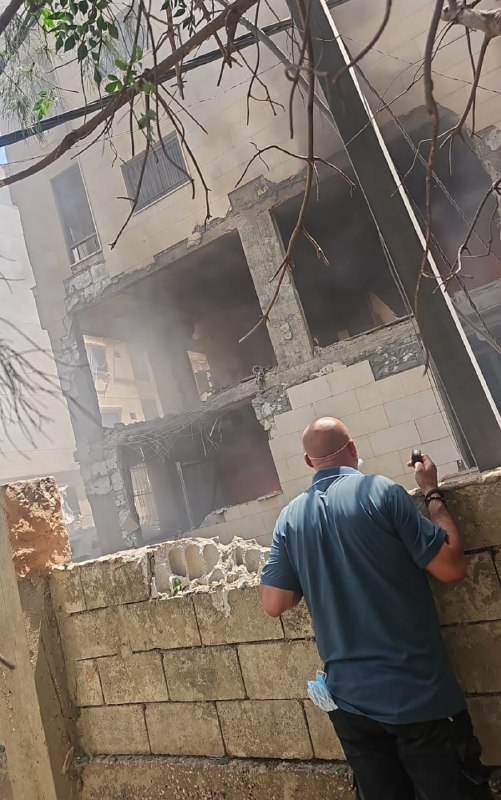

🇮🇱
❌
🇱🇧
🇱🇧 — عکس ساختمان هدف‌گرفته شده در حومه جنوبی بیروت (داهییه).

👩‍💻@PhantomDirective

🆔@persian_trend_official
پرشین ترند | متفاوت‌ترین کانال نظامی

## Persian_Trend_Official — post 15184

  <a href="telegram/content/Persian_Trend_Official_15184_1779973091.mp4" target="_blank">🎬 Download video</a>

یدعوت آحرونوت:

حمله جنگنده های اسرائیلی به بیروت برای ترور فرمانده‌ ای در نیروی موشکی حزب‌الله بوده است.

👩‍💻@PhantomDirective

🆔@persian_trend_official
پرشین ترند | متفاوت‌ترین کانال نظامی

## Persian_Trend_Official — post 15183

  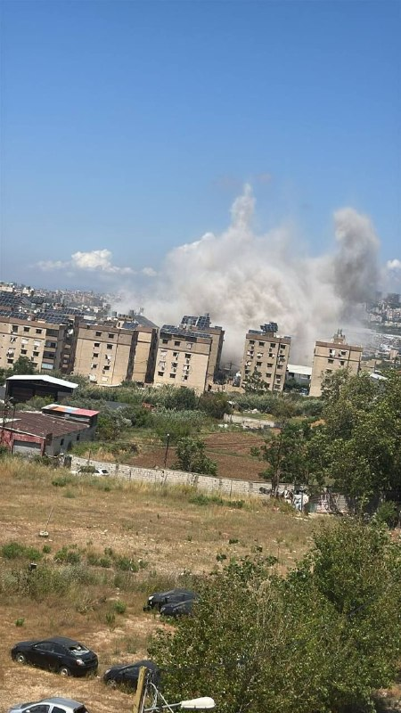

اسرائیل در اقدامی ظاهراً ترور، بیروت را بمباران کرد.

👩‍💻@PhantomDirective

🆔@persian_trend_official
پرشین ترند | متفاوت‌ترین کانال نظامی

## Persian_Trend_Official — post 15182

  <a href="telegram/content/Persian_Trend_Official_15182_1779973094.webm" target="_blank">🎬 Download video</a>

🎬 Video

## Persian_Trend_Official — post 15181

  

سنتکام: یک موشک پرتاب شده از سوی ایران توسط نیروهای کویتی با موفقیت رهگیری شد.

فرماندهی مرکزی ایالات متحده در بیانیه ای اعلام کرد: ایران یک موشک بالستیک به سمت کویت پرتاب کرد که با موفقیت توسط نیروهای کویت رهگیری شد. این نقض فاحش آتش بس توسط رژیم ایران ساعاتی پس از آن رخ داد که نیروهای ایرانی پنج پهپاد حمله یک طرفه را پرتاب کردند که تهدیدی آشکار در داخل و نزدیک تنگه هرمز بود. همه پهپادها با موفقیت توسط نیروهای آمریکایی رهگیری شدند و همچنین از پرتاب ششم پهپاد از یک سایت کنترل زمینی ایران در بندرعباس جلوگیری کردند.

فرماندهی مرکزی ایالات متحده و شرکای منطقه ای همچنان هوشیار و سنجیده هستند زیرا ما همچنان به دفاع از نیروها و منافع خود در برابر تجاوزات غیرموجه ایران ادامه می دهیم.

📌 @persian_trend_official
پرشین ترند | متفاوت‌ترین کانال نظامی

## Persian_Trend_Official — post 15180

  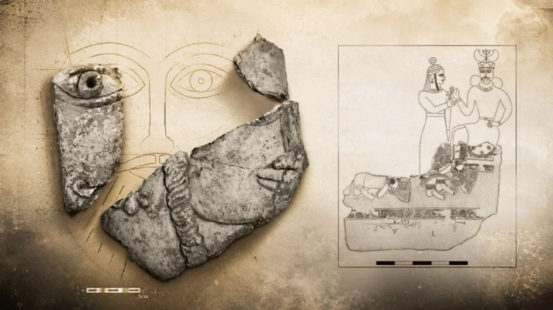

💢کشف «آخرین تصویر» از چهره یزدگرد سوم پادشاه ساسانی در آتشکده باستانی بازه هور خراسان

باستان‌شناسان دانشگاه تهران در جریان کاوش‌های خود در شمال شرق ایران، موفق به شناسایی یک پانل گچ‌بری نفیس شده‌اند که به باور پژوهشگران، تصویری از یزدگرد سوم، آخرین پادشاه سلسله ساسانی را در روزهای پایانی عمر و در آستانه سقوط این امپراتوری به نمایش می‌گذارد.

نتایج این کشف بزرگ باستان‌شناسی که تحت سرپرستی دکتر میثم لباف خانیکی، عضو هیأت علمی گروه باستان‌شناسی دانشگاه تهران صورت گرفته، در قالب مقاله‌ای علمی با عنوان «آخرین تصویر از آخرین پادشاه» در نشریه بین‌المللی و معتبر «شرق و غرب» متعلق به مؤسسه «ایزمئو» در ایتالیا منتشر شده است.

بیشتر بخوانید: https://l.euronews.com/FzEU

## Persian_Trend_Official — post 15179

  <a href="telegram/content/Persian_Trend_Official_15179_1779973096.webm" target="_blank">🎬 Download video</a>

ارتش لبنان از کشته شدن یک گروهبان خود با نام علاء محمود در پی حمله هوایی اسرائیل به جاده زفتا-دیرالزهرانی خبر داد.

📝 Amir

📌 @persian_trend_official
پرشین ترند | متفاوت‌ترین کانال نظامی

## Persian_Trend_Official — post 15176

  <a href="telegram/content/Persian_Trend_Official_15176_1779973096.webm" target="_blank">🎬 Download video</a>

حضور پدافند موشکی برد کوتاه مجید ایرانی در رژه ارتش ارمنستان

چند روز پیش در پی جابه‌جایی ادوات نظامی توسط ارتش ارمنستان در سطح شهر ایروان برای برگزاری رژه روز جمهوری ارمنستان، تصاویری از سیستم پدافندی برد کوتاه مجید با نام صادراتی AD-08 در خیابان های این شهر منتشر شد که امروز ارتش ارمنستان با برگزاری رژه رسماً از این پدافند رونمایی کرد.

ارمنستان اولین کاربر غیرمتحد این سامانه محسوب میشود.

📝 Amir

📌 @persian_trend_official
پرشین ترند | متفاوت‌ترین کانال نظامی

## Persian_Trend_Official — post 15175

ارتش روسیه در حال استقرار سامانه‌های پدافند هوایی Pantsir-S1 بر روی پشت‌بام‌برجی ۴۲ طبقه در مسکو با استفاده از هلیکوپترهای Mil Mi-26 است

👩‍💻@PhantomDirective

🆔@persian_trend_official
پرشین ترند | متفاوت‌ترین کانال نظامی

## Persian_Trend_Official — post 15174

  <a href="telegram/content/Persian_Trend_Official_15174_1779973098.webm" target="_blank">🎬 Download video</a>

🌲 - 🇱🇧🇮🇱 مردی که در جاده شبریه-صور رانندگی می‌کرد، تماس تلفنی دریافت کرد(از سمت اسرائیلی ها)که هشدار می‌داد وسیله نقلیه‌اش هدف قرار خواهد گرفت. او وسط جاده از ماشین بیرون پرید و فرار کرد.

نیروهای دفاع مدنی شاخه ای از جنبش عمل (مثل هلال احمر خودمون )به عنوان اقدام احتیاطی جاده را پیش از حمله بستند.

👩‍💻@PhantomDirective

🆔@persian_trend_official
پرشین ترند | متفاوت‌ترین کانال نظامی

## Persian_Trend_Official — post 15173

  

👑
➖
🤴
➖
🇮🇱
پست ساعاتی قبل کانال اسرائیل به فارسی

👩‍💻@PhantomDirective

🆔@persian_trend_official
پرشین ترند | متفاوت‌ترین کانال نظامی

## Persian_Trend_Official — post 15172

  <a href="telegram/content/Persian_Trend_Official_15172_1779973099.mp4" target="_blank">🎬 Download video</a>

©️تصاویری از حمله نیروی هوایی به مقر حزب‌الله در محله الاثار در شهر صور در جنوب لبنان
©️

👩‍💻@PhantomDirective

🆔@persian_trend_official
پرشین ترند | متفاوت‌ترین کانال نظامی

## Persian_Trend_Official — post 15171

  

🇮🇱
🇱🇧 اسرائیل دستور تخلیه کل جنوب لبنان را صادر کرده ، که شامل تمام مناطق جنوب رودخانه لیتانی می‌شود.

👩‍💻@PhantomDirective

🆔@persian_trend_official
پرشین ترند | متفاوت‌ترین کانال نظامی

## Persian_Trend_Official — post 15170

  

البيت سیستمز قراردادی به ارزش ۳۵۰ میلیون دلار برای ارتقاء تانک‌ها از یک مشتری بین‌المللی دریافت کرد.

، حیفا، اسرائیل، ۲۸ مه ۲۰۲۶ // — شرکت البیت سیستمز امروز اعلام کرد که قراردادی به ارزش تقریبی ۳۵۰ میلیون دلار از یک مشتری بین‌المللی برای ارتقاء تانک‌های اصلی میدان نبرد (MBT) دریافت کرده است. این برنامه شامل یکپارچه‌سازی سامانه‌های پیشرفته کنترل آتش، سامانه‌های الکتریکی هدایت توپ و برجک، راهکارهای ارتباطی و آگاهی محیطی، و همچنین بسته ارتقاء میان‌عمر (Mid Life Upgrade) است. اجرای این قرارداد طی چهار سال انجام خواهد شد.
بر اساس این قرارداد، البیت سیستمز سامانه‌های تانک‌ها را برای افزایش عمر عملیاتی و ارتقاء آمادگی رزمی آن‌ها نوسازی خواهد کرد. این برنامه ارتقاء شامل جایگزینی و بهبود سامانه‌های کلیدی روی تانک است و از جمله تجهیزاتی مانند سامانه‌های دید الکترواپتیکی سبک‌وزن و با کارایی بالا با قابلیت‌های هوش مصنوعی (AI) را در بر می‌گیرد که امکان مشاهده در روز و شب، و همچنین شناسایی و رهگیری پیشرفته اهداف را فراهم می‌کنند.
این قرارداد همچنین شامل تأمین قطعات یدکی و ارائه خدمات نگهداری و پشتیبانی فنی برای تضمین آمادگی عملیاتی بلندمدت است. افزون بر این، یک سامانه ارتباط صوتی امن و با ظرفیت بالا نیز در این پروژه یکپارچه خواهد شد.

👩‍💻@PhantomDirective

🆔@persian_trend_official
پرشین ترند | متفاوت‌ترین کانال نظامی

## Persian_Trend_Official — post 15169

  

بیانیه ارتش دفاعی اسرائیل (IDF):

در واکنشی سریع ارتش دفاعی اسرائیل سر شبکه مرکزی انتقال وجوه حماس را از بین برد.

روز سه‌شنبه، ارتش دفاعی اسرائیل در منطقه خان یونس ضربه‌ای وارد کرد و ایهاب خریزم، سر شبکه مرکزی انتقال وجوه حماس را از بین برد.

ایهاب خریزم مسئول مدیریت انتقال میلیون‌ها دلار به شاخه نظامی حماس بود. در ماه‌های اخیر، خریزم به نقض توافق آتش‌بس ادامه داد و فعالیت‌های او به سازمان تروریستی امکان داد حملات فوری علیه نیروهای ارتش دفاعی اسرائیل و غیرنظامیان اسرائیلی انجام دهد.

از بین بردن خریزم ضربه قابل توجهی به تلاش‌های بازسازی و تقویت نیروهای حماس وارد می‌کند.

علاوه بر خریزم، در جریان این حمله، ارتش دفاعی اسرائیل محمد الحباش، فرمانده واحد در ستاد تولید حماس را نیز از بین برد. در طول جنگ، الحباش در ساخت سلاح برای حماس مشارکت داشت.

قبل از حمله، اقداماتی برای کاهش آسیب به غیرنظامیان انجام شد، از جمله استفاده از مهمات دقیق و نظارت هوایی.

نیروهای ارتش دفاعی اسرائیل تحت فرماندهی جنوبی مطابق با توافق آتش‌بس مستقر باقی مانده و به عملیات برای رفع هر تهدید فوری ادامه خواهند داد.

👩‍💻@PhantomDirective

🆔@persian_trend_official
پرشین ترند | متفاوت‌ترین کانال نظامی

## Persian_Trend_Official — post 15168

سپاه پاسداران تصاویری از حملات موشکی بامداد امروز خود به کویت را منتشر کرد.

طبق ویدیو منتشر شده توسط رسانه های سپاه پاسداران در این حمله از موشک‌ های بالستیک سوخت جامد کوتاه برد و میان برد خانواده فاتح استفاده شده است.

📝 Amir

📌 @persian_trend_official
پرشین ترند | متفاوت‌ترین کانال نظامی

## RadioFarda — post 157658

  

📷 Photo

## RadioFarda — post 157657

مقام پیشین پنتاگون: ایران و آمریکا هر دو اهرم فشار دارند، اما به توافق هم نیاز دارند

🔸واشینگتن و تهران میان ادامه دیپلماسی و خطر ازسرگیری درگیری نظامی در رفت‌وآمدند. مایکل پاتریک مولروی، مقام پیشین وزارت دفاع آمریکا در امور خاورمیانه در دولت اول ترامپ، معتقد است در حال حاضر هر دو طرف انگیزه‌ای قوی برای جلوگیری از تشدید بحران دارند.

🔸با این حال، او هشدار می‌دهد که هرگونه پیشرفتی در نهایت به به این بستگی دارد که تهران و واشینگتن تا چه اندازه حاضر به مصالحه باشند.

🔸مولروی در گفت‌وگو با رادیو اروپای آزاد/رادیو آزادی می‌گوید که برای دستیابی به توافق هنوز «امیدواری» وجود دارد، چون هم واشینگتن و هم تهران «به پایان یافتن این وضعیت علاقه دارند»، اما هشدار می‌دهد که اگر هر یک از دو طرف در استفاده از اهرم فشار خود زیاده‌روی کند، مذاکرات ممکن است فرو بپاشد.

🔸متن کامل این گفت‌وگو را در وب‌سایت رادیوفردا بخوانید.

@RadioFarda

## RadioFarda — post 157656

🔸رسانه‌های ایران پیامی منسوب به مجتبی خامنه‌ای، رهبر جمهوری اسلامی، را خطاب به نمایندگان مجلس شورای اسلامی منتشر کردند که در آن می‌گوید «ایجاد تفرقه و تجزیه اجتماعی»، در کنار جنگ و فشار اقتصادی و محاصره، «طرح و نقشهٔ کور دشمن» است. 🔸مجتبی خامنه‌ای در این…

## RadioFarda — post 157655

  

🔸رسانه‌های ایران پیامی منسوب به مجتبی خامنه‌ای، رهبر جمهوری اسلامی، را خطاب به نمایندگان مجلس شورای اسلامی منتشر کردند که در آن می‌گوید «ایجاد تفرقه و تجزیه اجتماعی»، در کنار جنگ و فشار اقتصادی و محاصره، «طرح و نقشهٔ کور دشمن» است.

🔸مجتبی خامنه‌ای در این پیام که روز پنجشنبه هفتم خرداد منتشر شد، همچنین به تمام کسانی که آن‌ها را «جان‌فدایانی که دل‌شان برای اسلام و انقلاب یا استقلال و سربلندی ایران می‌تپد» نامیده، هشدار داد که «اختلافات غیرموجه و حتی موجه را به تنازع و تفرقه تبدیل نکنند».

🔸وزارت اطلاعات جمهوری اسلامی روز گذشته در بیانیه‌ای هشدار داد که بعد از جنگ اخیر، «برخی کمبودها و گرانی‌ها» در پی فشارهای اقتصادی آمریکا می‌تواند باعث بروز ناآرامی‌های تازه در ایران شود.

🔸وال‌استریت جورنال نیز روز پنجشنبه در گزارشی به نقل از تحلیلگران هشدار داد که ادامهٔ محاصرهٔ دریایی آمریکا علیه ایران که به کاهش ذخایر ارزی ایران انجامیده، می‌تواند احتمال بروز اعتراضات جدید در ایران را افزایش دهد.

@RadioFarda

## RadioFarda — post 157654

  <a href="https://t.me/radiofarda/157654" target="_blank">📎 Download file</a>

📻بشنوید: ساعت ۱۴ با رادیوفردا،هفتم خرداد ۱۴۰۵‌

@Radiofarda

## RadioFarda — post 157653

عفو بین‌الملل: حکومت ایران از پوشش «شرایط جنگی» برای سرکوب بیشتر استفاده می‌کند

🔸سازمان عفو بین‌الملل می‌گوید حکومت ایران، با استفاده از پوشش «شرایط جنگی»، روند سرکوب مخالفان را با بازداشت‌های گسترده و غیرقانونی، روندهای قضایی شتاب‌زده و به‌طور فاحش ناعادلانه، اعدام‌های سیاسی، احکام سنگین زندان و مصادرهٔ اموال تشدید کرده است.

🔸اریکا گووارا روساس، از مدیران ارشد عفو بین‌الملل، روز پنج‌شنبه هفتم خرداد، گفت مقامات ایران از شرایط بحرانی ناشی از جنگ، «برای تضعیف بیشتر حقوق مردم ایران استفاده می‌کنند؛ مردمی که پیش‌تر نیز از پیامدهای ویرانگر حملات هوایی غیرقانونی نیروهای آمریکا و اسرائیل و همچنین دهه‌ها جنایت مشمول قوانین بین‌المللی توسط جمهوری اسلامی رنج می‌برند».

🔸به‌گفتهٔ عفو بین‌الملل، از زمان حمله آمریکا و اسرائیل به ایران در نهم اسفند پارسال، حکومت ایران بیش از شش هزار نفر از معترضان، روزنامه‌نگاران، وکلا، مدافعان حقوق بشر، مخالفان سیاسی و اعضای اقلیت‌های قومی و مذهبی را بازداشت کرده‌ است.

🔸مقامات ارشد قضایی دستور تعقیب و محاکمهٔ سریع افراد بازداشت‌شده، از جمله در پرونده‌هایی با اتهامات مستوجب اعدام را، نیز صادر کرده‌اند؛ در حالی که نگرانی‌های گسترده‌ای دربارهٔ ناپدیدسازی قهری، شکنجه و سایر بدرفتاری‌ها و همچنین استفاده از «اعترافات» اجباری در محاکمه‌های نمایشی و به‌شدت ناعادلانهٔ دستگاه قضایی ایران وجود دارد.

🔸به نوشتهٔ عفو بین‌الملل، طی این مدت مقامات احکام زندان طولانی‌مدت برای افراد صادر کرده و دست‌کم ۳۹ اعدام سیاسی انجام داده‌اند.

🔸 گزارش کامل را در وب‌سایت رادیوفردا بخوانید.

@RadioFarda

## RadioFarda — post 157652

🔸پاپ لئو روز سه‌شنبه در اقامتگاهش در «کاستل گاندولفو» نزدیک رم، از نخستین خودروی تمام‌برقی شرکت «فراری» دیدن کرد.

🔸پاپ به خودرو علاقه زیادی دارد و مدل جدید «لوچه» را همراه با «جان الکان» رئیس شرکت فراری دید.

🔸الکان یک فرمان این مدل خودرو را به پاپ هدیه داد.

🔸«لوچه» یک خودروی خانوادگی چهار در و پنج‌نفره است.

🔸ظاهرش با فراری‌های اسپرت و بنزینی همیشگی فرق دارد.

🔸این خودرو دوشنبه شب در رم رونمایی شد. روز بعد هم به «سرجو ماتارلا» رئیس‌جمهور ایتالیا و پاپ لئو نشان داده شد.

🔸سهام فراری در بورس میلان ۸.۴ درصد افت کرد. یک سرمایه‌گذار به رویترز گفت دلیلش «ناامیدی از طراحی ظاهری» خودرو بوده است.

@RadioFarda

## RadioFarda — post 157651

🔸چند اقتصاددان و استاد دانشگاه ایران، در یک نشست تخصصی، از احتمال «رشد منفی ۱۰ درصدی» اقتصاد کشور پس از وقوع جنگ اخیر خبر داده و پیش‌بینی کردند که در سال جاری، حدود «چهار و نیم میلیون نفر» به جمعیت فقیر ایران اضافه شود. 🔸روزنامهٔ دنیای اقتصاد در شمارهٔ روز…

## RadioFarda — post 157650

  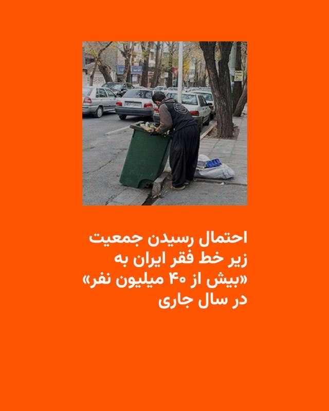

🔸چند اقتصاددان و استاد دانشگاه ایران، در یک نشست تخصصی، از احتمال «رشد منفی ۱۰ درصدی» اقتصاد کشور پس از وقوع جنگ اخیر خبر داده و پیش‌بینی کردند که در سال جاری، حدود «چهار و نیم میلیون نفر» به جمعیت فقیر ایران اضافه شود.

🔸روزنامهٔ دنیای اقتصاد در شمارهٔ روز پنج‌شنبه، هفتم خرداد خود، نوشته که چهار اقتصاددان و پژوهشگر حوزهٔ اقتصاد و سیاست‌گذاری اجتماعی، باتوجه به وضعیت کشور، وضعیت «نگران‌کننده‌ای» برای اقتصاد ایران ترسیم کردند.

🔸حجت میرزایی، عضو هیئت علمی دانشکدهٔ اقتصاد علامه طباطبایی، در این نشست گفته باتوجه به محاصرهٔ دریایی و کاهش صادرات نفت ایران به نزدیک صفر درصد، «پیش‌بینی می‌شود رشد اقتصادی ایران در سال ۱۴۰۵ بین منفی ۸.۸ تا منفی ۱۰ درصد باشد.»

🔸او افزوده که «با در نظر گرفتن آثار جنگ، پیش‌بینی می‌شود بین ۳.۵ تا ۴.۵ میلیون نفر دیگر در سال ۱۴۰۵ به جمعیت فقیر ایران افزوده شوند و شمار افراد زیر خط فقر به بیش از ۴۰ میلیون نفر برسد.»

@RadioFarda

## RadioFarda — post 157649

🔸روزنامه وال‌استریت جورنال در گزارشی نوشت جمهوری اسلامی ایران در پی جنگ و محاصرهٔ دریایی آمریکا، با بحرانی عمیق‌تر از گذشته در اقتصاد خود مواجه شده و مقامات تهران در حال سنجیدن این موضوع هستند که آیا می‌توانند فشارها را برای گرفتن امتیازهای بیشتر در مذاکرات…

## RadioFarda — post 157648

  

🔸روزنامه وال‌استریت جورنال در گزارشی نوشت جمهوری اسلامی ایران در پی جنگ و محاصرهٔ دریایی آمریکا، با بحرانی عمیق‌تر از گذشته در اقتصاد خود مواجه شده و مقامات تهران در حال سنجیدن این موضوع هستند که آیا می‌توانند فشارها را برای گرفتن امتیازهای بیشتر در مذاکرات تحمل کنند یا نه.

🔸بر اساس این گزارش که روز پنجشنبه هفتم خرداد منتشر شد، محاصرهٔ دریایی آمریکا باعث کاهش درآمدهای نفتی ایران شده و خطر تعطیلی برخی چاه‌های نفت را هم به‌دلیل کمبود ظرفیت ذخیره‌سازی نفت خام افزایش داده است.

@RadioFarda

## RadioFarda — post 157647

🔸اسماعیل بقائی سخنگوی وزارت خارجه ایران، حمله بامداد پنج‌شنبه آمریکا به مناطقی در بندرعباس، را «تجاوز» نامید و آن را محکوم کرد. 🔸آقای بقائی این حمله را «نقض فاحش حقوق بین‌الملل و منشور ملل متحد» دانست و افزود: «شورای امنیت سازمان ملل موظف به ایفای مسئولیت…

## RadioFarda — post 157646

  

🔸اسماعیل بقائی سخنگوی وزارت خارجه ایران، حمله بامداد پنج‌شنبه آمریکا به مناطقی در بندرعباس، را «تجاوز» نامید و آن را محکوم کرد.

🔸آقای بقائی این حمله را «نقض فاحش حقوق بین‌الملل و منشور ملل متحد» دانست و افزود: «شورای امنیت سازمان ملل موظف به ایفای مسئولیت قانونی خود برای پاسخگو کردن متجاوزان آمریکایی است.»

🔸سخنگوی وزارت خارجه ایران می‌گوید آمریکا «به‌طور مستمر»، آتش‌بس میان دو کشور را که از ۱۹ فروردین اجرایی شده، «نقض» می‌کند.

🔸او افزود که «تعرض به کشتیرانی تجاری در منطقه‌ خلیج فارس و آب‌های آزاد و نیز تعرض هوایی به مناطق جنوبی ایران ظرف چند روز گذشته»، منجر به «عزم جمهوری اسلامی ایران برای اتخاذ همه تدابیر لازم جهت دفاع از حاکمیت ملی و تمامیت سرزمینی» است.

🔸بامداد پنجشنبه هفتم خرداد خبرگزاری‌های بین‌المللی به‌نقل از فرماندهی مرکزی ارتش آمریکا، سنتکام، خبر دادند که نيروهای آمریکایی «چهار پهپاد انتحاری ايرانی» را که در اطراف تنگه هرمز «تهديد ايجاد کرده بودند»، ساقط کردند و «يک ايستگاه کنترل زمينی ايران در بندرعباس را که در آستانهٔ پرتاب پنجمين پهپاد بود، هدف قرار دادند.»

@RadioFarda

## RadioFarda — post 157645

اطلاعات بریتانیا: در جنگ اوکراین، تاکنون نزدیک به ۵۰۰ هزار سرباز روسیه کشته شده‌اند

🔸یک مقام ارشد اطلاعاتی بریتانیا اعلام کرد که از زمان آغاز تهاجم گستردهٔ روسیه به اوکراین در سال ۲۰۲۲ تاکنون، نزدیک به ۵۰۰ هزار سرباز روسیه در جنگی که به وضعیتی نزدیک به بن‌بست هم رسیده، کشته شده‌اند.

🔸این عدد که رئیس سازمان ارتباطات دولتی بریتانیا روز چهارشنبه ششم خرداد اعلام کرد، با برآوردهایی که در ماه‌های اخیر از سوی دیگر دولت‌های غربی و همچنین رسانه‌های مستقل منتشر شده، همخوانی دارد.

🔸خانم کیست-باتلر همچنین هشدارهای پیشین دولت بریتانیا را تکرار کرد و گفت روسیه «بی‌وقفه زیرساخت‌های حیاتی، روندهای دموکراتیک، زنجیره‌های تأمین و اعتماد عمومی» را در بریتانیا و سراسر اروپا هدف قرار می‌دهد.

🔸سازمان ارتباطات دولتی بریتانیا نهاد اصلی اطلاعات شنود این کشور و معادل آژانس امنیت ملی آمریکا است.

🔸او گفت این سازمان بر حفاظت از کابل‌ها و خطوط لولهٔ زیردریایی متصل‌کنندهٔ بریتانیا و مقابله با «اقدامات خرابکارانه و تلاش‌ها برای ترور» تمرکز کرده است.

🔸 گزارش کامل را در وب‌سایت رادیوفردا بخوانید.

@RadioFarda

## RadioFarda — post 157643

🔸وزارت دادگستری آمریکا یک شهروند آمریکایی را به‌دلیل مشارکت در طرح «تعقیب و قتل» مسیح علی‌نژاد، فعال سیاسی ایرانی-آمریکایی، به ۱۰ سال زندان زندان محکوم کرد. 🔸در بیانیه‌ای این نهاد که روز چهارشنبه ششم خرداد منتشر کرده، آمده جاناتان لودهولت، ساکن استاتن آیلند،…

## RadioFarda — post 157642

  

🔸وزارت دادگستری آمریکا یک شهروند آمریکایی را به‌دلیل مشارکت در طرح «تعقیب و قتل» مسیح علی‌نژاد، فعال سیاسی ایرانی-آمریکایی، به ۱۰ سال زندان زندان محکوم کرد.

🔸در بیانیه‌ای این نهاد که روز چهارشنبه ششم خرداد منتشر کرده، آمده جاناتان لودهولت، ساکن استاتن آیلند، «به‌دلیل نقش خود در توطئه تعقیب و قتل یک روزنامه‌نگار و منتقد برجسته حکومت ایران، به زندان محکوم شد.»

🔸بر اساس اعلام وزارت دادگستری آمریکا، لودهولت در یک طرح «قتل سفارشی» که به‌گفته مقامات آمریکایی از سوی حکومت ایران هدایت می‌شد، علیه مسیح علی‌نژاد فعال سیاسی ایرانی-آمریکایی که به‌طور علنی با حکومت ایران مخالفت کرده است، مشارکت داشت.

🔸این متهم علاوه بر حکم زندان، به سه سال آزادی تحت نظارت نیز محکوم شد.

🔸جی کلیتون، دادستان ایالات متحده درباره این پرونده گفته که «حکومت ایران بارها تلاش کرده است تا مسیح علی‌نژاد را همین‌جا در شهر نیویورک ردیابی و به قتل برساند.»

@RadioFarda

## RadioFarda — post 157641

پاراگراف اول؛ آیا «سینمای یواشکی» توانسته سینمای مجوزدار را عقب براند؟

🔸مثل بسیاری از دوگانه‌هایی که جنگ اسرائیل و آمریکا با ایران به آن دامن زده، سینمای ایران نیز دوپاره شده است.

🔸 از یک‌سو سینمای رسمی قرار دارد؛ سینمایی کم‌رمق و پرهزینه که حتی پیش از جنگ نیز به‌تدریج از سبد فرهنگی بسیاری از خانواده‌های ایرانی کنار گذاشته شده بود و امروز با اقتصاد فرسوده و جامعه‌ای تحت فشار بحران معیشت و ناامنی، چشم‌انداز روشنی برای آن تصور نمی‌شود.

🔸 در سوی دیگر، سینمایی شکل گرفته که ریشه‌های آن به‌طور خاص اعتراض‌های ۱۴۰۱ و جنبش «زن زندگی آزادی» بازمی‌گردد؛ سینمایی که سینماگرانش آشکارا در برابر سیاست‌های رسمی وزارت فرهنگ و ارشاد اسلامی و سازوکار سانسور ایستادند و اعلام کردند بدون مجوز هم می‌توان فیلم ساخت.

🔸 این جریان که در فضای عمومی با عنوان «سینمای زیرزمینی» شناخته می‌شود، به‌نوعی بازگشت تصویرهایی است که پس از انقلاب از پردهٔ سینما حذف شده بود. برای اولین‌بار پس از دهه‌ها، تماشاگر ایرانی می‌تواند زنان هنرپیشه را بی‌حجاب بر پردهٔ سینما ببیند.

🔸 اما تفاوت این سینما تنها در ظاهر نیست. به‌تدریج زبان و دستور سیاسی مستقل خود را نیز شکل داده است؛ زبانی صریح، انتقادی و گاه تند که می‌کوشد مرز روشنی میان خود و سینمای مجوزدار ترسیم کند.

🔸 با این حال پرسش اصلی همچنان باقی است: آیا این «سینمای زیرزمینی» توانسته همان تأثیری را بر سینما بگذارد که موسیقی زیرزمینی پیش‌تر بر موسیقی رسمی گذاشت؟ آیا توانسته ذائقهٔ مخاطب را تغییر دهد، سانسور را به عقب براند و به یک جریان اثرگذار تبدیل شود، یا هنوز بیشتر در حد یک کنش اعتراضی باقی مانده است تا یک بدیل واقعی؟

🔸 در برنامهٔ رادیویی «پاراگراف اول»، کاوه فرنام، تهیه‌کنندهٔ سینمای مستقل از پراگ، به همراه عبدالرضا کاهانی، فیلمساز از تورنتو، دربارهٔ شکاف‌های سیاسی و اجتماعی، بازتاب آن بر سینمای رسمی و غیررسمی به بحث پرداختند.

🔸 گزارش کامل را در وب‌سایت رادیوفردا بخوانید.

@RadioFarda

## RadioFarda — post 157638

🔸علی باقری کنی معاون دبیر شورای عالی امنیت ملی ایران می‌گوید جمهوری اسلامی به‌دنبال «آزادسازی تمام دارایی‌‎های مسدودشده ایران» توسط آمریکا است. 🔸او این موضوع را «حق قانونی ملت ایران» عنوان کرده و گفته دارایی‌های ایران «باید تماماً و بدون قید و شرط بازگردانده…

## RadioFarda — post 157637

  

🔸علی باقری کنی معاون دبیر شورای عالی امنیت ملی ایران می‌گوید جمهوری اسلامی به‌دنبال «آزادسازی تمام دارایی‌‎های مسدودشده ایران» توسط آمریکا است.

🔸او این موضوع را «حق قانونی ملت ایران» عنوان کرده و گفته دارایی‌های ایران «باید تماماً و بدون قید و شرط بازگردانده شود».

🔸این اظهارات در شرایطی بیان می‌شود که دونالد ترامپ، رئیس‌جمهور آمریکا، روز چهارشنبه در نشست کابینه خود تأکید کرد که در مذاکرات برای رسیدن به توافق پایان دادن به جنگ، درباره کاهش تحریم‌ها یا انتقال پول به تهران گفت‌وگو نمی‌شود.

🔸او در پاسخ به پرسش یکی از خبرنگاران درباره احتمال کاهش تحریم‌های آمریکا علیه ایران گفت: «ما اصلاً درباره کاهش تحریم‌ها یا دادن پول صحبت نمی‌کنیم. ما کنترل پول‌هایی را در اختیار داریم که آن‌ها ادعا می‌کنند متعلق به خودشان است. ما کنترل آن پول را حفظ خواهیم کرد.»

🔸ترامپ افزود: «هر وقت آن‌ها (ایران) رفتار درستی داشته باشند و کار درست را انجام دهند، اجازه خواهیم داد به پول‌شان دسترسی پیدا کنند.»

@RadioFarda

## RadioFarda — post 157636

گفت‌وگو با دیپلمات آمریکایی؛ بازشدن اینترنت نشانه چرخش از میدان جنگ به میز مذاکره است

🔸پس از ۸۸ روز خاموشی دیجتیال، که نت‌بلاکس آن را «طولانی‌ترین قطع سراسری اینترنت در تاریخ معاصر» خوانده است، و در حالی که گفت‌وگوها با واشینگتن زیر سایۀ فشارهای نظامیِ تازه در خلیج فارس ادامه دارد، ایران دسترسی مردم به اینترنت را هرچند به‌طور محدود برقرار کرده است.

🔸رادیو اروپای آزاد/رادیو آزادی برای موشکافی این موضوع که گشایش محدود دیجیتال از سوی تهران چه معنایی دارد و آیا گفت‌وگوهای کنونی می‌تواند به یک آتش‌بس پایدار بینجامد، با چارلز دان گفت‌وگو کرده است.

🔸او دیپلمات ارشد پیشین آمریکا و مقام امنیت ملی است که بیش از ۲۴ سال پیشینۀ کار دولتی دارد و در دوران ریاست‌جمهوریِ جرج دبلیو بوش، مدیر بخش عراق در شورای امنیت ملی بوده است.

🔸 گزارش کامل را در وب‌سایت رادیوفردا بخوانید.

@RadioFarda

## IranianMinds — post 20943

  

فراموش نکنید ….

@IranianMinds

## IranianMinds — post 20941

🔴وزیر امور خارجه پاکستان فردا برای دیدار به واشنگتن خواهد رفت و با وزیر امور خارجه آمریکا، مارکو روبیو، ملاقات خواهد کرد.

@IranianMinds

## IranianMinds — post 20940

  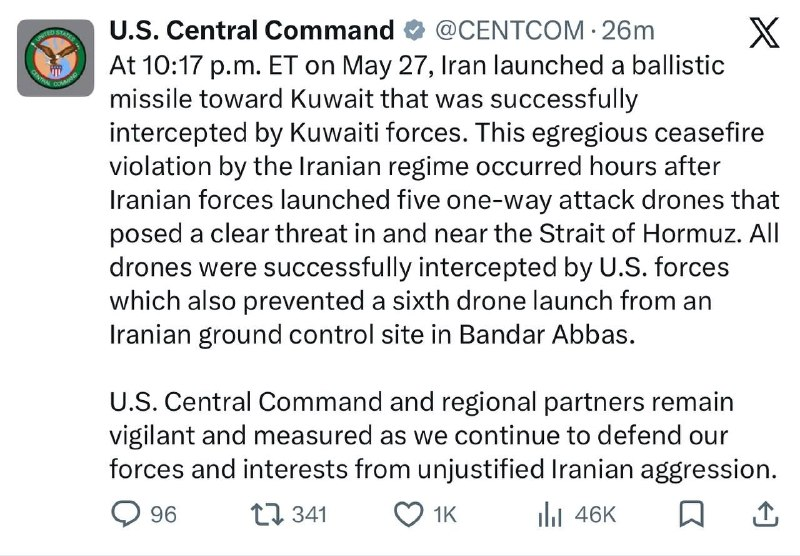

سنتکام طی بیانیه‌ای ایران را به نقض فاحش آتش‌بس متهم کرد

@IranianMinds

## IranianMinds — post 20939

مجتبی خامنه‌ای برای بار هزارو یکم به صورت متنی پیامی منتشر کرد

- حداقل یکی از پیاماتو ویس بده مشتی مطمعن شیم زنده ای

@IranianMinds

## IranianMinds — post 20938

  <a href="telegram/content/IranianMinds_20938_1779973111.mp4" target="_blank">🎬 Download video</a>

دقایقی پیش
حمله هوایی جنگنده های اسرائیل به بیروت

@IranianMinds

## IranianMinds — post 20937

  

نمودار جدید نت بلاکس نشان میده همچنان بخشی از محدودیت های اینترنت باقی مونده

@IranianMinds

## IranianMinds — post 20935

  

املت 500 هزار تومان!

@IranianMinds

## IranianMinds — post 20934

  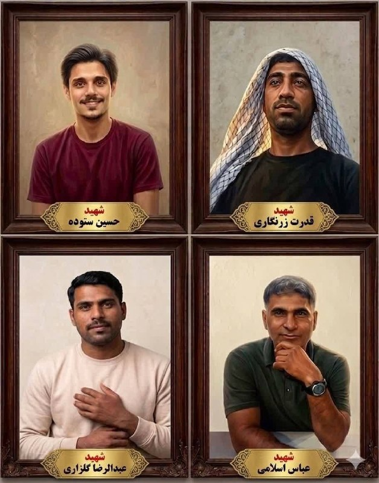

🔴تصاویر چهار عدد سپاه تروریستی که در قایق تندرو، توسط آمریکا به درک واصل شدن.

@IranianMinds

## IranianMinds — post 20933

  

🔴 کامران غضنفری، نماینده مجلس:

آمریکایی‌ها هر روز میان مارو و مقام‌ های رسمی ما را تحقیر می‌کنند، نباید با چنین دولتی مذاکره کرد

@IranianMinds

## IranianMinds — post 20932

  <a href="telegram/content/IranianMinds_20932_1779973115.webm" target="_blank">🎬 Download video</a>

👍 
👍 #اختصاصی #وینرو :

✅ ثبت نام کن 
🤩 
🤩 
🤩 هزارتومان شارژ بی قیدوشرط بگیر!

💵 
💬 به مدت محدود 
📣

😮 تنها سایتی که با عضویت بدون واریز 500,000 تومان شارژ بی قیدو شرط میده #وینرو هست
💰

👑 #معتبرترین سایت ایرانی 
⬇️

🌐 Winro.io

🌐 Winro.io

📱کانال اخبار و هدایا r7 
🎁

📱 @winro_io

## IranianMinds — post 20931

  

اکانت اسرائیل به فارسی:

۲۵۰۰ سال پیش، کوروش بزرگ یهودیان را از اسارت آزاد کرد. این فقط تاریخ نیست… این ریشه دوستی عمیق بین مردم ایران و یهودیان است.
ما ‌و شما ثابت کردیم که این پیوند، عمیق و پایدار است و در آینده نزدیک این دوستی مانند دوران کوروش بزرگ شکوفا خواهد شد.

@IranianMinds

## IranianMinds — post 20930

  

حالا چرا انقد خایه کردی از پشت هم محو کردی سرتو

@IranianMinds

## IranianMinds — post 20929

  

🔴 دیوار نگاره جدید میدان فلسطین تهران :

اسرائیل ۱۵ سال آینده را نخواهد دید!

@IranianMinds

## IranianMinds — post 20928

  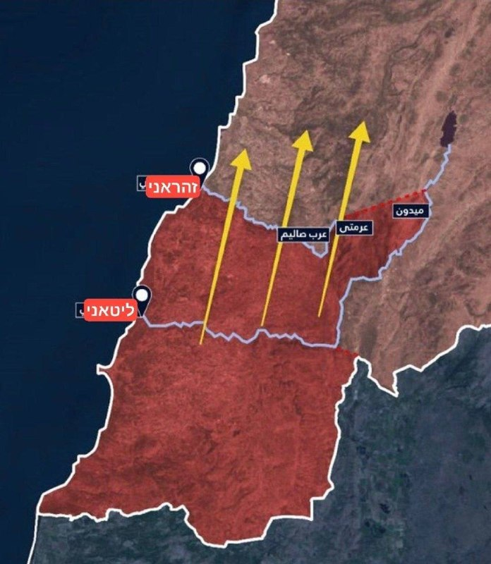

🔴 اسرائیل دستور تخلیه کل جنوب لبنان و تمام مناطقی که در‌ جنوب این کشور هستن رو داد !

@IranianMinds

## IranianMinds — post 20927

  

فک کن حدود ۹۰ روز کوچیک ترین حق انسانیتو‌ ازت بگیرن بعد با هزار منت و دردسر اونم نه درست وصلش کنن بعد یه عده شل مغز بیان برا اینکار از یارو بت بسازن.

@IranianMinds

## IranianMinds — post 20926

  <a href="telegram/content/IranianMinds_20926_1779973121.mp4" target="_blank">🎬 Download video</a>

🔴 جمهوری اسلامی یک پایگاه هوایی آمریکا در کویت را هدف قرار داد که رسانه‌ها ادعا می‌کنند از آن برای حمله به بندرعباس در جنوب ایران استفاده شده است.

@IranianMinds

## IranianMinds — post 20925

  

🔴 یک مقام وزارت بهداشت :

بمولا رهبرمون هیچیش نشد ی چن تا خراش بود فقط اخبارای کذبو‌ اصلا باور نکنید ، آقا موشتبی حتی روزه هم میگرفت تو ماه رمضان.

@IranianMinds

## IranianMinds — post 20924

  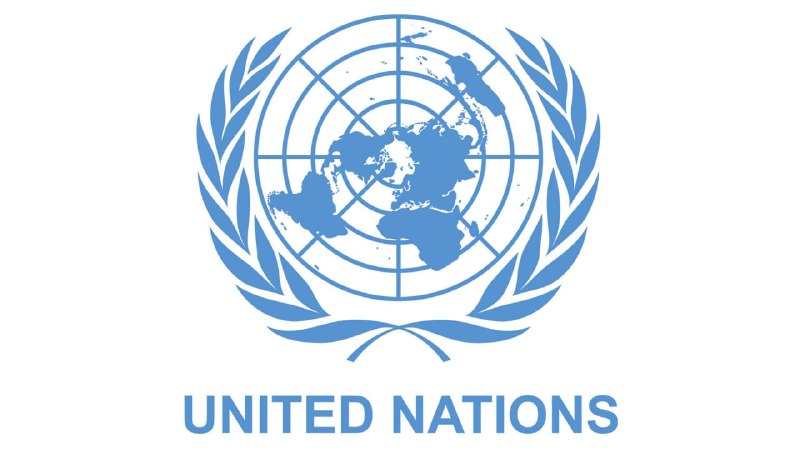

🔴 سازمان ملل اسرائیل را به فهرست سیاه مربوط به خشونت جنسی مرتبط با درگیری‌ ها اضافه کرد.

@IranianMinds

## IranianMinds — post 20923

  <a href="telegram/content/IranianMinds_20923_1779973125.mp4" target="_blank">🎬 Download video</a>

به یاد آنان که جسارت بیشتری از ما داشتند، حرف ما را بلندتر فریاد زدند و اکنون در کنار ما نیستند…

ما هیچوقت پا پس نمیکشیم و تا پایان این حکومت و گرفتن انتقام عزیزانمون مبارزه میکنیم و در آخر فراموش نکنید , ما پیروزیم !

@IranianMinds

## IranianMinds — post 20922

ثبت نام کن ۵۰۰ هزارتومان جایزه بگیر
نیازی هم به واریز نیست
تنها سایت مورد #تایید ما با بونوس های واقعی:

🌐
🌐 Winro.io

## BBCPersian — post 282267

🔻ارتش اسرائیل از حملات هوایی به بیروت خبر داد

ارتش اسرائیل از انجام حملات هوایی به بیروت، پایتخت لبنان خبر داده است. این اقدام پس از آن صورت گرفت که حملات پیشین به جنوب لبنان دست‌کم ۱۲ کشته بر جای گذاشته بود.

ارتش اسرائیل در بیانیه‌ای گفت: «اندکی پیش، نیروهای اسرائیل به اهدافی در بیروت حمله کردند. جزئیات به زودی اعلام خواهد شد.»

یک منبع امنیتی لبنانی گفت که این حمله در نزدیکی حومه جنوبی بیروت انجام شده است، اما هنوز مشخص نیست که هدف حمله چه بوده است. تصاویر منتشرشده از منطقه، دود غلیظی را نشان می‌دهد که در میان ساختمان‌ها به هوا برخاسته است.

قرار بود آتش‌بس میان اسرائیل و گروه حزب‌الله، که مورد حمایت ایران است، از ۱۷ آوریل (۲۸ فروردین) اجرایی شود، اما این آتش‌بس تاکنون رعایت نشده است.

@BBCPersian

## BBCPersian — post 282266

🔻سنتکام: حمله موشکی ایران به کویت نقض فاحش آتش‌بس است

فرماندهی مرکزی ارتش ایالات متحده، سنتکام، حمله موشکی ایران به کویت را «نفض فاحش» آتش‌بس خوانده است.

این نهاد در حساب رسمی خود در شبکه ایکس نوشته است: «ساعت ۱۰:۱۷ شب به وقت شرق آمریکا در تاریخ ۲۷ مه، ایران یک موشک بالستیک به سمت کویت شلیک کرد که با موفقیت توسط نیروهای کویتی رهگیری شد.»

سنتکام نوشته است «این نقض فاحش آتش‌بس توسط رژیم ایران، ساعاتی پس از آن رخ داد که نیروهای ایرانی پنج پهپاد تهاجمی یک‌طرفه را شلیک کردند که تهدیدی آشکار در تنگه هرمز و نزدیکی آن ایجاد کردند.»

فرماندهی مرکزی ارتش آمریکا می‌گوید: «تمام پهپادها با موفقیت توسط نیروهای آمریکایی رهگیری شدند و آنها همچنین از پرتاب ششمین پهپاد از یک سایت کنترل زمینی ایران در بندرعباس جلوگیری کردند.»

سنتکام در ادامه آورده است: «فرماندهی مرکزی ایالات متحده و شرکای منطقه‌ای کماکان هوشیار و محتاط هستند و ما همچنان به دفاع از نیروها و منافع خود در برابر تجاوز توجیه‌ناپذیر ایران ادامه می‌دهیم.»

ارتش کویت پیشتر اعلام کرده بود سامانه‌های پدافند هوایی این کشور حملات موشکی و پهپادی «متخاصم» را رهگیری کرده‌اند.

@BBCPersian

## BBCPersian — post 282265

🔻کویت از ایران خواست «فورا و بدون قید و شرط» حملات موشکی و پهپادی به کشورش را متوقف کند

کویت حمله پهپادی و موشکی به خاک آن کشور در اوایل صبح امروز را به ایران نسبت داد و آن را محکوم کرد.

این در حالی است که درگیری نظامی تازه میان جمهوری اسلامی ایران و نیروهای آمریکایی فشار بیشتری بر آتش‌بس شکننده در جنگ خاورمیانه وارد کرده است.

وزارت خارجه کویت در بیانیه‌ای حملات موشکی و پهپادی ایران به آن کشور را به‌شدت محکوم کرد و آن را «تشدید جدی تنش‌ها و نقض آشکار حاکمیت و امنیت ملی» دانست.

این وزارتخانه از ایران خواست «فورا و بدون قید و شرط این حملات را متوقف کند» و اعلام کرد که «مسئولیت کامل این اقدامات بر عهده تهران است.»

@BBCPersian

## BBCPersian — post 282264

  

🔻بیانه جمعی از کنشگران در باره آزادی زندانیان سیاسی و نگرانی از وضعیت میرحسین موسوی و زهرا رهنورد

بیش از ۲۰ استاد دانشگاه و کنشگر سیاسی و مدنی در بیانیه‌ای خواهان آزادی میرحسین موسوی، زهرا رهنورد و همه زندانیان سیاسی و مدنی در ایران شدند.

این کنشگران در بیانیه خود گفته‌اند که بنابر «گزارش‌های موثق» اعتقاد دارند که محل اقامت میر‌حسین موسوی و خانم زهرا رهنورد در جریان جنگ اخیر و حمله هوایی به خیابان پاستور به شدت آسیب دیده و «آنان پس از این حادثه، به مکانی نامعلوم منتقل شده‌اند؛ موضوعی که پس از پانزده سال حصر خانگی، نگرانی‌های جدی و گسترده‌ای را برانگیخته است.»

در این بیاینه آمده است: «ما ضمن ابراز احترام به پایداری و ایستادگی آقای موسوی و خانم رهنورد، بار دیگر بر ضرورت پایان دادن به حصر و آزادی این دو شخصیت برجسته و همه فعالان سیاسی و مدنی که تحت فشار و در زندان‌های مختلف به بند کشیده شده‌اند، تأکید می‌کنیم و خواستار رعایت حقوق انسانی و شهروندی تمام این عزیزان هستیم.»

نام بهروز بیات، سعید پیوندی، شهلا حائری، فاطمه شمس، کاظم علمداری و فرزانه عظیمی در میان امضاءکنندگان این بیانیه دیده می‌شود.

@BBCPersian

## BBCPersian — post 282263

🔻عبدربه منصور هادی، رئیس‌جمهور سابق یمن، در عربستان سعودی درگذشت

یک منبع در ریاست‌جمهوری یمن به خبرگزاری فرانسه گفت که عبدربه منصورهادی، رئیس‌جمهور سابق یمن، در عربستان سعودی درگذشته است.

به گفته این منبع، آقای هادی که بیش از ۸۰ سال داشت، «پس از وخامت ناگهانی وضعیت جسمانی‌اش در ریاض درگذشت.»

عبدربه منصور هادی در سال ۲۰۱۵ و هم‌زمان با آغاز جنگ داخلی یمن، پس از آن که شورشیان حوثی مورد حمایت ایران دولت او را از صنعا بیرون راندند، به عربستان سعودی گریخت و از آن زمان در این کشور زندگی می‌کرد.

@BBCPersian

## BBCPersian — post 282262

  <a href="telegram/content/BBCPersian_282262_1779973128.mp4" target="_blank">🎬 Download video</a>

🔻ناسا روز سه‌شنبه در یک نشست خبری، طرح خود برای ایجاد پایگاهی دائمی در ماه را ارائه کرد؛ طرحی که شامل سکونت دائمی انسان در این قمر تا سال ۲۰۳۲ است.

جرد آیزاکمن، مدیر ناسا، گفت این سازمان فضایی در پی آن است که «هم‌زمان با بازگشت دوباره آمریکا به ماه  و این بار برای ماندن، حس کنجکاوی را برانگیزد».

این برنامه‌ها برای بازگشت دائمی به ماه در حالی مطرح می‌شود که ماموریت موفق آرتمیس ۲ ناسا در ماه آوریل، با سفر چهار فضانورد به دور ماه، تنها قمر طبیعی زمین همراه بود.

ایجاد یک پایگاه در ماه می‌تواند به ایالات متحده امکان انجام آزمایش‌های علمی، استخراج احتمالی منابع ارزشمند و همچنین سفر آسان‌تر به مریخ را بدهد.

https://bbc.in/4uFoZuK
@BBCPersian

## BBCPersian — post 282261

🔻ایران حمله به مناطقی در بندرعباس و اظهارات ترامپ در مورد عمان را محکوم کرد

سخنگوی وزارت امور خارجه ایران حمله بامداد امروز آمریکا به مناطقی در بندرعباس را «به شدت» محکوم کرد و آن را «نقض فاحش حقوق بین‌الملل و منشور ملل متحد» دانست.

اسماعیل بقایی گفت: «این اقدام تجاوزی علیه تمامیت ارضی و حاکمیت ملی ایران و نقض آشکار حقوق بین‌الملل و منشور سازمان ملل» است.

او همچنین تاکید کرد که «شورای امنیت سازمان ملل باید مسئولیت قانونی خود را برای پاسخگو کردن آمریکا ایفا کند.»

سخنگوی وزارت امور خارجه همچنین اظهارات اخیر دونالد ترامپ،‌ رئیس جمهور آمریکا در مورد عمان را محکوم کرد و ضمن ابراز همبستگی با آن کشور گفت: «تهدید به انهدام یک کشور عضو سازمان ملل که نقش میانجی و سازنده در منطقه داشته، نشانه خطرناک دیگری از عادی‌سازی قانون‌شکنی و قلدرمآبی در روابط بین‌الملل است.»

دونالد ترامپ دیروز در جلسه کابینه آمریکا در کاخ سفید با هشدار درباره گزارش‌ها از هماهنگی میان تهران و مسقط برای کنترل تنگه هرمز گفته بود: «عمان نیز همانند هر کشور دیگری رفتار خواهد کرد و در غیر این‌صورت مجبور خواهیم شد آن را منفجر کنیم.»

@BBCPersian

## BBCPersian — post 282260

🔻پلیس لندن می‌گوید که در پی یک حادثه رانندگی در محله‌ گولدرز گرین در شمال لندن یک مرد ۴۱ ساله ایرانی با جراحات شدید به بیمارستان منتقل شده است.

بر اساس گزارش پلیس یک مرد ۳۹ ساله عراقی هم به ظن ایجاد جراحات عمدی با رانندگی خطرناک و خودداری از انجام آزمایش مربوط به مواد مخدر بازداشت و در بازداشتگاه پلیس زندانی است.

پلیس از ادامه تحقیقات خبر داده است اما اعلام کرد که این حادثه را یک «اقدام تروریستی» ارزیابی نمی‌کند.

ویدئوهایی از این حادثه منتشر شده است که در آن یک خودرو تیره رنگ شاستی بلند از روی یک شخص عبور می‌کند.

برخی تصاویر نشان می‌دهد که پیش از این حادثه افرادی این خودرو و یک خودرو دیگر را که یک زن و یک روحانی سرنشین آن هستند،‌ دوره کرده و با موبایل در حال فیلمبرداری از سرنشینان آن هستند. صدای شعارهایی علیه سرنشینان این خودروها شنیده می‌شود.

به نظر می‌رسد یک عمامه سیاهرنگ هم روی زمین افتاده است.

پلیس لندن از شهروندان خواست که از بازنشر ویدئوها خودداری کنند و هر نوع اطلاعاتی که دارند را با پلیس در میان بگذارند.

برخی در شبکه‌های اجتماعی نوشتند که این حادثه در نزدیکی دیوار یادبود کشته‌شدگان اعتراضات دی ماه در گولدرز گرین اتفاق افتاده است.

ديوار یادبود در خیابان گولدرز گرين، در شمال لندن به‌عنوان محلی برای نمايش تصاوير کشته‌شدگان اعتراضات دی ماه سال گذشته استفاده می‌شود. در جریان سرکوب اعتراضات سراسری دی ماه هزاران نفر در ایران کشته شدند.

چندی پیش این دیوار هدف حمله قرار گرفت و پلیس چند نفر را به اتهام تلاش برای آتش زدن این محل بازداشت کرد.

@BBCPersian

## BBCPersian — post 282259

  <a href="telegram/content/BBCPersian_282259_1779973130.mp4" target="_blank">🎬 Download video</a>

🔻فراری از نخستین خودرو تمام‌برقی خود رونمایی کرد. پاپ لئو  سه‌شنبه (۷ خرداد، ۲۶ مه) از این خودرو بازدید کرد و پشت فرمان آن نشست.

این خودرو  ۶۴۰ هزار دلاری که «لوچه» نام دارد، واکنش‌های متفاوتی را در شبکه‌های اجتماعی برانگیخته است. برخی کاربران شبکه‌های اجتماعی طراحی لوچه را «فاجعه» و «ضربه به هویت فراری» توصیف کرده‌اند، در حالی که گروهی دیگر آن را «شاهکاری در طراحی» دانسته‌اند.

این خودرو که نخستین مدل پنج‌نفره فراری محسوب می‌شود، با همکاری جانی آیو، مدیر سابق طراحی اپل، طراحی شده و ظاهری متفاوت از مدل‌های سنتی این برند ایتالیایی دارد.

رونمایی از این خودرو در حالی انجام می‌شود که بسیاری از خودروسازان لوکس اروپایی، از جمله لامبورگینی و پورشه، به‌دلیل کاهش تقاضا برای خودروهای برقی لوکس، تولید خودروهای برقی خود را محدود کرده‌اند.

فراری اعلام کرده در کنار مدل‌های برقی، همچنان به تولید خودروهای بنزینی و هیبریدی ادامه خواهد داد.

https://bbc.in/4o22bms
@BBCPersian

## BBCPersian — post 282256

  

🔻نت‌بلاکس، نهاد ناظر بر دسترسی اینترنت در جهان می‌گوید که اینترنت ایران به‌رغم اتصال با فیلترینگ شدید روبروست.

نت‌بلاکس در شبکه ایکس اعلام کرد که سه ماه پیش در چنین روزی، ایران دسترسی به اینترنت جهانی را قطع کرد.

«در حالی که اکنون اتصال تا حد زیادی برقرار شده است، معیارها نشان می‌دهند که کاربران هنوز با فیلترینگ شدید مواجه هستند، مشابه دوره موقت بین اعتراضات ژانویه و شروع جنگ.»اشاره این نهاد به بعد از اعتراضات دی ماه است که برای مدت کوتاهی دسترسی به اینترنت برقرار شده بود.

در پی بازگشت تدریجی دسترسی به اینترنت جهانی در ایران، داده‌های شرکت کنتیک نشان می‌دهد که حجم ترافیک اینترنت بین‌الملل پس از هفته‌ها محدودیت شدید، تا ساعت ۷ و نیم صبح امروز به ۵۳ درصد حجم پیش از اعتراضات دی‌ماه ۱۴۰۴ رسیده است.

به‌گفته کنتیک، این روند تا حدی شبیه به وضعیت وصل شدن نسبی اینترنت بعد از اعتراضات دی ماه است.

@BBCPersian
📷 REUTERS

## BBCPersian — post 282254

با بازگشت تدریجی اتصال ایران به اینترنت جهانی، کاربران ایرانی در حال بازگشت به شبکه‌های اجتماعی هستند، و صاحبان کسب و کارهای اینترنتی در ایران امیدوارند بار دیگر رونق به کسب و کارشان بازگردد.

اما شاید شروع دوباره با چالش‌هایی هم همراه باشد.
اگر کسب‌وکار اینترنتی مانند فروشگاه اینستاگرام داشته‌اید و در چند ماه گذشته به دلیل قطع بودن اینترنت نتوانستید کار کنید، حالا که برگشته‌اید، چه تغییراتی می‌ببینید؟ آیا الگوریتم‌ها و قطعی بلندمدت بر کسب‌وکار و بازدید صفحه‌تان تاثیر گذاشته؟

آیا فکر می‌کنید رفتار مشتریان تغییر کرده باشد؟ چطور کسب‌وکارتان را بازسازی می‌کنید؟

طی این مدت پلتفرم‌ها و شبکه‌های اجتماعی داخلی ایران تا چه حد توانسته بود به ادامه کسب و کارتان کمک کند؟

نظرات و تجربیات خود را با هشتگ #اینترنت برای ما ارسال کنید:
آی‌مسج و واتس‌اپ: ۰۰۴۴۷۳۴۲۰۳۲۱۱۳
پیامگیر تلگرام t.me/bbcshoma
@BBCPersian
https://bbc.in/431n47v

## BBCPersian — post 282253

🔻نماینده مجلس ایران: بازگشایی اینترنت خلاف قانون است

احمد راستینه،‌ سخنگوی کمیسیون فرهنگی مجلس ایران در واکنش به تصمیمات مسعود پزشکیان، رئیس جمهور آن کشور برای بررسی وضعیت اینترنت، گفت که برخی از ماموریت‌ها و شرح وظایف این ستاد با ماموریت‌ها و شرح وظایف شورای عالی فضای مجازی «تداخل» دارد.

او می‌گوید که رای دیوان عدالت اداری در توقف فعالیت این ستاد از نظر حقوقی «درست و دقیق» است.

به گفته این نماینده مجلس بازگشایی اینترنت «خلاف قانون»‌ است.

در پی قطع اینترنت از زمان شروع جنگ در ایران در اسفندماه سال گذشته، مسعود پزشکیان «ستاد ساماندهی و راهبردی فضای مجازی» را برای بررسی بازگشت اینترنت بین‌الملل تشکیل داد.

تصمیم این ستاد در مورد بازگشایی مجدد اینترنت با واکنش تند مخالفان روبرو شده است.

پس از آن دیوان عدالت اداری اعلام کرد که «در پی شکایت‌هایی با درخواست ابطال سند ایجاد این ستاد، هیات تخصصی صنایع و بازرگانی با احراز فوریت موضوع، دستور توقف اجرای مصوبه را تا زمان رسیدگی نهایی صادر کرده است.»

به‌رغم این اقدام، اینترنت بین‌المللی از دو روز پیش، پس از بیش از ۸۰ روز برای کابران فعال شده است.

@BBCPersian

## BBCPersian — post 282252

🔻افزایش قیمت نفت در پی حملات تازه ایران و آمریکا

قیمت نفت در معاملات روز پنج‌شنبه بار دیگر صعود کرد، در حالی که اغلب بورس‌های آسیایی با افت مواجه شدند. این تحولات در پی حملات تازه آمریکا به ایران و افزایش نگرانی‌ها درباره شکننده بودن آتش‌بس رخ داده است.

افزایش قیمت نفت بخش زیادی از کاهش روز چهارشنبه را جبران کرد، کاهشی که به امید دستیابی قریب‌الوقوع به توافقی برای پایان دادن به درگیری‌ها شاهد آن بودیم.

نفت برنت دریای شمال، شاخص اصلی بین‌المللی، در معاملات صبح پنج‌شنبه ۱/۸ درصد افزایش یافت و به ۹۵/۹۵ دلار در هر بشکه رسید. همچنین نفت خام وست تگزاس اینترمدیت آمریکا هم با رشد ۱/۷درصدی به ۹۰/۱۷ دلار رسید.

بازارهای سهام آسیا عمدتاً نزولی بودند؛ شاخص هنگ‌کنگ بیش از ۱/۵ درصد افت کرد.

بورس سئول هم نزدیک به یک درصد کاهش یافت و شاخص شانگهای نیز ۰/۳ درصد پایین آمد.

این کاهش‌ها پس از عملکرد قابل توجه بازارهای جهانی سهام در روز چهارشنبه رخ داد.

اقتصاددانان هشدار داده‌اند اگر تورم در نتیجه جنگ تشدید شود، بانک‌های مرکزی ممکن است ناچار به افزایش نرخ بهره شوند؛ اقدامی که هزینه استقراض را بالا می‌برد و می‌تواند رشد اقتصادی را تحت فشار قرار دهد.

@BBCPersian

## BBCPersian — post 282251

  

🔻ترافیک اینترنت ایران به ۵۳ درصد سطح پیش از اعتراضات دی‌ماه رسید

در پی بازگشت تدریجی دسترسی به اینترنت جهانی در ایران، داده‌های شرکت کنتیک نشان می‌دهد که حجم ترافیک اینترنت بین‌الملل پس از هفته‌ها محدودیت شدید، تا ساعت ۷ و نیم صبح امروز به ۵۳ درصد حجم پیش از اعتراضات دی‌ماه ۱۴۰۴ رسیده است.

این روند تا حدی شبیه به وضعیت وصل شدن نسبی اینترنت بعد از اعتراضات است. در آن زمان به‌رغم اتصال برخی خدمات به اینترنت جهانی، این اتصال بسیار ناپایدار و با اختلالات متناوب همراه بود.

مشخص نیست آیا دسترسی به حالت قبل بر‌خواهد گشت یا به همان شکل ناپایدار باقی خواهد ماند.

گزارش‌های رسیده و تجربیات کاربران حاکی است که دسترسی به برخی خدمات امکان‌پذیر شده است هرچند ارتباط با ثبات نیست و از جمله، تماس‌های صوتی- تصویری، کیفیت بالایی ندارند.

@BBCPersian

## BBCPersian — post 282250

🔻رئیس انجمن صنفی دفاتر مسافرتی ایران: خسارت وارده به صنعت گردشگری در جنگ از ۲۰ هزار میلیارد تومان فراتر رفته است

رئیس انجمن صنفی دفاتر خدمات مسافرتی ایران گفته است که در جریان جنگ اخیر، «حدود پنج همت (۵ هزار میلیارد تومان) خسارت به دفاتر خدمات مسافرتی وارد شده و مجموع خسارت صنعت گردشگری می‌تواند از ۲۰ همت (۲۰ هزار میلیارد تومان) فراتر برود.»

حرمت‌الله رفیعی با انتقاد از فشارهای مالیاتی و بیمه‌ای بر فعالان این صنف، گفت که دفاتر مسافرتی در شرایط دشوار ناشی از محدودیت‌های ناوگان هوایی و کاهش قدرت خرید مردم با مشکلات جدی مواجه هستند و حمایت موثری از سوی دستگاه‌های اجرایی دریافت نکرده‌اند.

او با اشاره به اینکه تاکنون ایرلاین‌ها و برخی مراکز اقامتی اقدامی برای بازگرداندن هزینه‌های پروازها و هتل‌های لغوشده به مردم انجام نداده‌اند، گفت: «به دلیل نبود مرجع واحد برای رسیدگی به شکایات، آمار دقیقی از مطالبات وجود ندارد، اما در خوش‌بینانه‌ترین حالت دست‌کم ۵۰۰ میلیارد تومان از پول مردم بابت خدمات لغوشده نزد ایرلاین‌ها، مراکز اقامتی و صاحبان قدرت باقی مانده و باید هرچه سریع‌تر بازگردانده شود.»

@BBCPersian

## BBCPersian — post 282245

🔻فیلیپه فان دورسن، بی‌بی‌سی برزیل

اسرائیل به دنبال مرگ حییم وایزمن به رئیس‌جمهور جدیدی نیاز داشت. بنابراین وزارت خارجه نام یهودیان سرشناس را مطرح کرد که می‌توانستند این نقش را ایفا کنند و مهاجرت به کشور تازه‌ تاسیس را تشویق کنند.

به این ترتیب، دولت داوید بن‌ گوریون نخست‌وزیر تصمیم گرفت بار دیگر یک دانشمند را برای این مقام دعوت کند و اصلی‌ترین گزینه، مشهورترین دانشمند جهان بود.

آبا ابن به نمایندگی از بن‌گوریون نامه‌ای به اینشتین نوشت.

او نوشت: «اسرائیل کشوری کوچک از نظر ابعاد فیزیکی است، اما می‌تواند به بزرگی دست یابد، زیرا عالی‌ترین سنت‌های معنوی و فکری مردم یهود را چه در دوران باستان و دوران مدرن به نمایش می‌گذارد.»

@BBCPersian
📷 Getty Images

## Dirty_Kids — post 390394

  

‏ستاد فرماندهی مرکزی ایالات متحده (سنتکام)، در پیامی که در شبکه اجتماعی ایکس منتشر شده است، اعلام کرد که ایران با شلیک یک فروند موشک بالستیک، آتش‌بس موجود را به طور فاحش نقض کرده است.

به گفته سنتکام، این اقدام پس از آن صورت گرفت که ایالات متحده پنج پهپاد ایرانی را در تنگه هرمز سرنگون کرد و اجازه پرتاب به ششمین پهپاد را روی زمین نداد و آن‌ را منهدم ساخت.

در پاسخ به این تحولات، ایران یک موشک بالستیک به سمت کویت شلیک کرد که این موشک توسط پدافند هوایی کویت رهگیری و منهدم شد. این اقدام از سوی سنتکام به عنوان نقض فاحش آتش‌بس خوانده شده است.

از سوی دیگر، سپاه پاسداران صبح امروز اعلام کرد که این حمله موشکی در پاسخ به حملات هوایی آمریکا به بندرعباس صورت گرفته و طی آن، یک پایگاه هوایی آمریکا در منطقه هدف قرار داده شده است. سپاه پاسداران تصریح کرد پایگاهی که هدف حمله موشکی قرار گرفته، همان پایگاهی بوده که به عنوان مبدأ حملات آمریکا علیه بندرعباس استفاده شده است.

@Dirty_Kids 👻

## Dirty_Kids — post 390393

  

این روزا در اینستاگرام فارسی چه میگذرد:

@Dirty_Kids 👻

## Dirty_Kids — post 390392

  <a href="telegram/content/Dirty_Kids_390392_1779973135.mp4" target="_blank">🎬 Download video</a>

یه پیرمرد رو آوردن صدا و سیما تا حماسه بسازه، یه طوری حرف زد کل برنامه و مخاطبا گوز پیچ شدن😂

@Dirty_Kids 👻

## Dirty_Kids — post 390390

  <a href="telegram/content/Dirty_Kids_390390_1779973136.mp4" target="_blank">🎬 Download video</a>

عزیزان، شما که نبودید، این سهیل مستجابیان اول تو یه ویدیو کلوزفرند به مردم فحش داد، ویدیوش لو رفت، معذرت‌خواهی کرد، دوباره تو کلوز اینو گذاشت، اونم لو رفت:)))))

@Dirty_Kids 👻

## Dirty_Kids — post 390387

بهترین و بدترین پایان‌بندی‌های سریالی.

@Dirty_Kids 👻

## Dirty_Kids — post 390384

  <a href="telegram/content/Dirty_Kids_390384_1779973137.mp4" target="_blank">🎬 Download video</a>

شهاب کون، بلاگر اینستاگرامی رو یادتونه که قرار بود با مینا نامداری ازدواج کنه و یه مدت ترند اینستا فارسی شده بود؟

موقعی که جنگ شد و اینترنت‌ها قطع شدن، وقتی دید دیگه ویو نیست، به این صورت تو تیک تاک و اینستا واسه عربا کص و کونشو مینداخت بیرون تا مشتری پیدا کنه..

@Dirty_Kids 👻

## Dirty_Kids — post 390383

  <a href="telegram/content/Dirty_Kids_390383_1779973139.mp4" target="_blank">🎬 Download video</a>

آرایشگر ایرانی که بخاطر پست کردن ویدیوی کارهاش در اینستاگرام توسط رژیم تهدید شده بود با انتشار این ویدیو به تهدیدها اعتراض کرد.
ویدیوش در شبکه اجتماعی انگلیسی زبان وایرال شده که کمک میکنه مردم دنیا ببینن که مردم ایران از چه حقوق ابتدایی محروم هستند.

@Dirty_Kids 👻

## Dirty_Kids — post 390382

  

امریکا هر شب اینا رو میزنه بعدش بیانیه میده ما هنوز تو آتش بس هستیم :)))))))

دیشب امریکا یه سایت نظامی که تهدیدی برای ناوها و نیروهاشون بود رو در جنوب ایران زدن و سپاه هم جوابشونو داد و مبدا حمله رو که یه پایگاه در کویت بود رو زد

+ سایت پهبادی سپاه در بندرعباس دیگر وجود ندارد.
اما آتش بس هنوز وحود دارد😂
از توجه شما سپاس گذارم

@Dirty_Kids 👻

## Dirty_Kids — post 390381

  <a href="https://t.me/Dirty_Kids/390381" target="_blank">📎 Download file</a>

📱 اپلیکیشن اندروید بدون فیلتر ریتزوبت

➖➖➖➖➖

🔹 ثبت نام آسان 
✅
🔹 رابط کاربری بسیار راحت و سریع 
✅
🔹 درگاه پرداخت کارت به کارت 
✅
🔹 درگاه پرداخت دلاری سریع 
✅
🔹 بونوس ۱۰۰ درصدی اولین واریز 
✅
🔹 بونوس ۱۰۰ درصدی واریز یکشنبه ها 
✅

➖➖➖➖➖
🌐 https://RitzoBet.com

⚡️ @RitzoBet_ir

## Dirty_Kids — post 390380

  

⚠️ برای #شرطبندی های فوتبال از سایت معتبر و بین المللی استفاده کنید ✅

سایت #ریتزوبت ، چهار سال هستش داخل ایران فعالیت میکنه 
✅

لایسنس بین المللی داره ، روش های شارژ و برداشت متنوع داره و بونوس 100% ورزشی و کش بک های جذاب
💎

⏪ اپلیکیشن بدون فیلتر ریتزوبت 
📱
⏩
R7

✅ لینک بدون‌ فیلتر ریتزوبت
🤣

🆔 @RitzoBet_ir 
🇮🇷

## Dirty_Kids — post 390379

  

این عرزشیه میگه علی عظمایی کتلت شده

@Dirty_Kids 👻

## Dirty_Kids — post 390378

  

بعضی جاها قیمت یه املت به ۵۰۰ هزار تومن رسیده!😐😐

@Dirty_Kids 👻

## Dirty_Kids — post 390377

  

به صورت کاملا اتفاقی:
_ پزشکیان ۳۰ ساله سینگله
_ اینترنت با دستور پزشکیان متصل شد
_ دقیقا فردای اتصال اینترنت روز جهانی خودارضاییه

@Dirty_Kids 👻

## Dirty_Kids — post 390376

  

🔴 فرصت از این بهتر؟؟
امروز روز جهانیه خودارضاییه تو این روز دختر پسرا به دوستاشون زنگ میزنن که دور هم جمع بشن و باهم بشینن خودارضایی کنن

@Dirty_Kids 👻

## Dirty_Kids — post 390375

  

بادبان از 100,000 عضو گذشت!
🎉

با بازگشت اینترنت درحال آماده سازی زیرساخت بادبان برای سرویس دهی برای شرایط نرمال و خروج از سرویس دهی اضطراری هستیم با نرمال شدن شرایط قیمت های کاهشی خواهد بود تا اتمام این فرایند کاربران عزیز میتونن از سرویس های اضطراری استفاده کنن
🚀

🛒به زودی در ربات سرویس های نرمال با قیمت هر گیگ 10 هزار تومان برای فروش فعال خواهند شد
🏷️

🎁 کد تخفیف خرید اول دوباره ریست شد و همه میتونن ازش استفاده کنن:
BadBanOFF

💸 با این کد، 50 هزار تومان تخفیف روی اولین خریدت بگیر!

🔥و مهم‌تر از همه...
سیستم معرفی بادبان فعال‌تر از همیشه‌ست!
از تمام خریدهای کاربرانی که معرفی میکنی، 10% خریدشون رو پورسانت دائمی دریافت کن و موجودی کیف پولت رو افزایش بده 
💼

وقتی بادبان داری،
هیچ بادی مانع نیست… حتی وقتی اینترنت ملیه
⛵️

R7

🛡@BadBan_VPN | کانال 

🤖@BadBan_VPNBot | ربات 

📞@BadBan_VPNSupport | پشتیبانی

## Dirty_Kids — post 390374

  

بچه‌های نیرو مسلح‌شون انقد بی‌خایه هستن که حتی میترسن از پشت شناسایی بشن، محو میکنن پس‌کله‌رو 😂

@Dirty_Kids 👻

## Hranews — post 113209

  

پس از بازگشت نسبی اینترنت بین‌المللی در ایران در روزهای اخیر، نت‌بلاکس در آخرین به‌روزرسانی خود اعلام کرد که داده‌ها نشان می‌دهد کاربران ایرانی همچنان با فیلترینگ و محدودیت‌های گسترده مواجه‌اند؛ وضعیتی مشابه شرایط حاکم بر دوره میان اعتراضات سراسری دی‌ماه و آغاز جنگ.
#فیلترینگ_اینترنت

↘️
@hranews_bot تماس ✉️ - @Hranews کانال هرانا 🆑

## Hranews — post 113208

دزفول؛ یک نوجوان ۱۷ ساله پدر، مادر و برادرش را به قتل رساند

❗️
❗️
❗️
❗️
❗️– امروز پنجشنبه ۷ خردادماه، یک نوجوان ۱۷ ساله در دزفول پس از به قتل رساندن پدر و مادرش با مراجعه به محل کسب برادرش وی را نیز با ضربات سلاح سرد به #قتل رساند. او پس از این اقدام به زندگی خود پایان داد.

ادامه مطلب

↘️
@hranews_bot تماس ✉️ - @Hranews کانال هرانا 🆑

## Hranews — post 113207

  

تارا و کیمیا داوودی مجموعا به ۱۶ سال حبس محکوم شدند

❗️
❗️
❗️
❗️
❗️– تارا و کیمیا داوودی، دو خواهر محبوس در زندان اوین که در جریان اعتراضات ۱۴۰۴ بازداشت شده بودند، توسط دادگاه انقلاب تهران مجموعا به ۱۶ سال حبس محکوم شدند.

به گزارش خبرگزاری هرانا، ارگان خبری مجموعه فعالان حقوق بشر در ایران، دو خواهر در تهران به حبس محکوم شدند.

براساس حکمی که توسط شعبه ۱۵ دادگاه انقلاب تهران به ریاست قاضی ابوالقاسم صلواتی صادر شده است، کیمیا داوودی از بابت اتهاماتی از جمله ارتباط با گروه ها و شبکه های معاند و اجتماع و تبانی علیه امنیت کشور به ۱۰ سال حبس و تارا داوودی از بابت اتهاماتی از جمله اجتماع و تبانی علیه امنیت کشور و تبلیغ علیه نظام به ۶ سال زندان محکوم شده‌اند.

ادامه مطلب

#کیمیا_داوودی #تارا_داوودی

↘️
@hranews_bot تماس ✉️ - @Hranews کانال هرانا 🆑

## Hranews — post 113206

یک مرد توسط برادرش در تهران مورد اسیدپاشی قرار گرفت و جان‌باخت

❗️
❗️
❗️
❗️
❗️– مردی حدودا ۳۵ ساله در تهران توسط برادرش هدف #اسیدپاشی قرار گرفت و جان خود را از دست داد. متهم این پرونده همچنان متواری است و تحت تعقیب قضایی قرار دارد.

ادامه مطلب

↘️
@hranews_bot تماس ✉️ - @Hranews کانال هرانا 🆑

## Hranews — post 113205

  

از فیلتر تلگرام تا «اینترنت پرو»/ امیر آقایی

📡
📡
📡
📡
📡– جمهوری اسلامی در حال جابه‌جا کردن بسیاری از رکوردهای منفی در زمینه‌ی سرکوب دیجیتال است. ایرانیان در طول شاید یکی از پرالتهاب‌ترین مقاطع تاریخی خود یعنی از زمان شروع جنگ ۱۲روزه تا اعتراضات دی‌ماه و بعد از آن جنگ ۴۰روزه –که هنوز هم مشخص نیست کاملاً تمام شده یا نه– در مجموع بیش‌تر از صد روز را بدون اینترنت سپری کرده‌اند. تفاوت اساسی آخرین مقطع #قطع_اینترنت، حضور پررنگ اینترنت طبقاتی در لباس طرح جدیدی به نام «اینترنت پرو» است. این پروژه اما محصول امروز و دیروز اتاق‌های تصمیم‌گیری نظام نیست، بلکه نقطه‌ی پایانی مسیر پرپیچ‌وتابی است که نظام طی کرد تا به آن برسد. هرکدام از بزنگاه‌های اعتراضات دی‌ماه ۹۶، اعتراضات گرانی بنزین در آبان ۹۸، اعتراضات ۱۴۰۱ و در نهایت اعتراضات دی‌ماه ۱۴۰۴ برای دستگاه‌های امنیتی نظام درس‌آموخته‌هایی به دنبال داشت که در نهایت، نسخه‌ی اینترنت پرو خروجی نهایی آن بود. در ادامه بررسی خواهیم کرد که چه شد تا «اینترنت پرو» از جعبه‌ی جادویی نظام درآمد.

ادامه مطلب

ادامه مطلب در وبسایت خط صلح

#امیر_آقایی

↘️
@hranews_bot تماس ✉️ - @Hranews کانال هرانا 🆑

## Hranews — post 113204

عمر عزیزی با تودیع وثیقه از زندان زاهدان آزاد شد

❗️
❗️
❗️
❗️
❗️– عمر عزیزی، شهروند اهل شهرستان قصرقند، روز دوشنبه با تودیع وثیقه از زندان زاهدان آزاد شد. وی در آبان ماه سال گذشته بازداشت شده بود.

ادامه مطلب

#عمر_عزیزی

↘️
@hranews_bot تماس ✉️ - @Hranews کانال هرانا 🆑

## Hranews — post 113203

  

مدیر کمپین معلولان در گفتگو با ایرنا نسبت به پیامدهای کمبود بودجه در تأمین لوازم بهداشتی افراد دارای معلولیت هشدار داد و گفت: به دلیل ناکافی بودن کمک‌هزینه‌ها، بسیاری از افراد ناچارند اقلام یک‌بارمصرفی مانند پوشک، سوند و نلاتون را چندبار استفاده کنند؛ اقدامی که می‌تواند به بروز عفونت‌های شدید و حتی مرگ منجر شود. او تأکید کرد که در شرایط تورمی فعلی، عدم افزایش حق پرستاری و کمک‌هزینه‌های بهداشتی فشار مضاعفی بر زندگی افراد دارای معلولیت وارد کرده است.

در ادامه این گزارش، مادر دو فرزند دارای معلولیت "شدید"، از وضعیت معیشتی و درمانی خانواده‌اش گفت و توضیح داد که با وجود افزایش شدید قیمت پوشینه و سایر اقلام بهداشتی، مستمری و حمایت‌های بهزیستی پاسخگوی نیازهای اولیه نیست. به گفته او، تأخیر در پرداخت کمک‌هزینه‌ها و ناکافی بودن درآمد خانوار، در کنار مشکلات مسکن و نبود حمایت‌های پایدار، شرایط زندگی این خانواده را به وضعیت بحرانی رسانده است.
#افراد_دارای_معلولیت #معلولان

↘️
@hranews_bot تماس ✉️ - @Hranews کانال هرانا 🆑

## Hranews — post 113202

  

علی خسروی، زندانی سیاسی از زندان بیرجند آزاد شد

❗️
❗️
❗️
❗️
❗️– علی خسروی، زندانی سیاسی اهل بیرجند که در زندان این شهرستان محبوس بود، به صورت مشروط آزاد شد.

به گزارش خبرگزاری هرانا، ارگان خبری مجموعه فعالان حقوق بشر در ایران، علی خسروی آزاد شد.

بر اساس اطلاعات دریافتی هرانا، آزادی آقای خسروی به صورت مشروط از زندان بیرجند صورت گرفته است.

ادامه مطلب

#علی_خسروی

↘️
@hranews_bot تماس ✉️ - @Hranews کانال هرانا 🆑

## manototv — post 105852

  <a href="telegram/content/manototv_105852_1779973147.mp4" target="_blank">🎬 Download video</a>

سخنرانی امیرعباس هویدا در جمع دانشجویان درباره نقش جوانان در توسعه و اداره کشور

## manototv — post 105845

  <a href="telegram/content/manototv_105845_1779973149.mp4" target="_blank">🎬 Download video</a>

اینترنت در ایران فقط ابزار ارتباط نیست، میدان قدرت است. هر بار که قطع یا وصل می‌شود، حکومت در واقع در حال تنظیم سطح کنترل خود بر جامعه است، اینکه مردم چه ببینند، چه بگویند، چگونه وصل شوند و تا چه اندازه بتوانند با هم عمل کنند.

## alonews — post 123300

  <a href="telegram/content/alonews_123300_1779973151.webm" target="_blank">🎬 Download video</a>

👈دولت عراق حملات ایران به کویت را بی‌شرمانه خواند!

✅ @AloNews خبر جنگ

## alonews — post 123299

  <a href="telegram/content/alonews_123299_1779973151.webm" target="_blank">🎬 Download video</a>

👈خوش چشم، کارشناس ارشد صدا و سیما: ایندفعه دیگه جنگی نمیشه

✅ @AloNews خبر جنگ

## alonews — post 123298

  <a href="telegram/content/alonews_123298_1779973152.webm" target="_blank">🎬 Download video</a>

👈هواشناسی: تا چند روز آینده خیلی گرم میشه

✅ @AloNews خبر جنگ

## alonews — post 123297

  <a href="telegram/content/alonews_123297_1779973152.webm" target="_blank">🎬 Download video</a>

👈ابوالفضل ابوترابی، نماینده مجلس: آمریکا بعد از جام جهانی و انتخابات کنگره دوباره حمله می‌کند.

✅ @AloNews خبر جنگ

## alonews — post 123296

  <a href="telegram/content/alonews_123296_1779973152.webm" target="_blank">🎬 Download video</a>

👈بیانیه سنتکام درباره اتفاقات دیشب :

🔴دیشب ایران یه موشک بالستیک به سمت کویت شلیک کرد که توسط پدافند کویت رهگیری و منهدم شد.
این اقدام، نقض جدی آتش‌بس بود؛ اونم فقط چند ساعت بعد از اینکه نیروهای ایرانی 5 پهپاد انتحاری رو اطراف تنگه هرمز به پرواز درآوردن که تهدید محسوب میشدن.
البته که همه این پهپادا توسط نیروهای آمریکایی ساقط شدن و حتی جلوی پرتاب ششمین پهپاد هم از یه سایت کنترل زمینی تو بندرعباس گرفته شد.

🔴نیروهای آمریکا و متحداش تو منطقه همچنان آماده‌باش هستن و واسه دفاع از نیروها و منافعشون مقابل «اقدامات تهاجمی و غیرموجه ایران» هوشیار باقی میمونن.

✅ @AloNews خبر جنگ

## alonews — post 123295

  <a href="telegram/content/alonews_123295_1779973152.webm" target="_blank">🎬 Download video</a>

👈سه نفتکش با پرچم‌های پالائو و سیرالئون در دریای سیاه هدف حمله پهپادی قرار گرفتند، اما این حادثه تلفات جانی یا آسیب به خدمه در پی نداشت

✅ @AloNews خبر جنگ

## alonews — post 123294

  <a href="telegram/content/alonews_123294_1779973153.webm" target="_blank">🎬 Download video</a>

👈وزیرخارجه پاکستان جمعه ۸ خرداد به واشنگتن خواهد رفت تا با مارکو روبیو دیدار کند

✅ @AloNews خبر جنگ

## alonews — post 123293

  <a href="telegram/content/alonews_123293_1779973153.webm" target="_blank">🎬 Download video</a>

👈سیتنا، پایگاه اختصاصی اخبار اینترنت: تمرکز ۹۱ درصدی ترافیک اینترنت در تهران است و بازگشت توزیع عادی پهنای باند زمان‌بر است

✅ @AloNews خبر جنگ

## alonews — post 123292

  <a href="telegram/content/alonews_123292_1779973153.webm" target="_blank">🎬 Download video</a>

👈 واشنگتن پست: مقامات دولت ترامپ، اداره حکاکی و چاپ را تحت فشار قرار داده‌اند تا یک اسکناس ۲۵۰ دلاری با تصویر رئیس‌جمهور طراحی کند، که این اولین بار در بیش از ۱۵۰ سال گذشته است که تصویر یک فرد زنده روی پول رایج آمریکا چاپ می‌شود.

✅ @AloNews خبر جنگ

## alonews — post 123291

🚀مصرف بالا؟ حجم‌خوری زیاد؟ اینو ببین 👇 💎 همراه با ساب یعنی مصرف بهینه‌تر و تجربه بهتر ⚡️ 🚀 سرعت عالی پایدار برای استفاده روزانه و بلند مدت😍😍 @NetAazaadBot @NetAazaadBot 😍آف فقط برای امشب😍 ❌ گیگی 50T ❌ ✅ فقط گیگی 25T ✅ @NetAazaadBot @NetAazaadBot 🔥 یه…

## alonews — post 123290

  

🚀مصرف بالا؟ حجم‌خوری زیاد؟ اینو ببین 👇
💎 همراه با ساب یعنی مصرف بهینه‌تر و تجربه بهتر
⚡️
🚀 سرعت عالی پایدار برای استفاده روزانه و بلند مدت😍😍

@NetAazaadBot
@NetAazaadBot

😍آف فقط برای امشب😍
❌ گیگی 50T ❌
✅ فقط گیگی 25T ✅

@NetAazaadBot
@NetAazaadBot
🔥 یه بار امتحان کن، خودت تفاوتشو حس می‌کنی✅

## alonews — post 123289

  <a href="telegram/content/alonews_123289_1779973154.mp4" target="_blank">🎬 Download video</a>

طرف تازه اینترنت پرو خریده، بعد پسرش بهش خبر میده اینترنتا وصل شده.

واکنش باباهه خداست😂😂

[@AloTweet]

## alonews — post 123288

  <a href="telegram/content/alonews_123288_1779973155.webm" target="_blank">🎬 Download video</a>

🔴سه ماهه حامیان جمهوری اسلامی با خیال راحت توی خیابون جمع می‌شن؛ نه خبری از حمله‌ست، نه «ناامنی»، نه تروریستی که پیداش بشه.

🔴اما همین که مردم معترض می‌آن توی خیابون، لباس‌شخصی، چماق‌دار، موتور‌سوار و تروریست ها با هم فعال می‌شن!

🔴چرا؟ چون این تروریست‌ها از بیرون نیومدن؛ همون بازوی خیابونی رژیم هستن. همون‌هایی که وقتی نوبت مردم می‌رسه، مأموریت‌شون می‌شه ترس، سرکوب و خون‌ریزی و کشتار مردم بیگناه.

🤔تروریست حکومتیه که برای حفظ خودش، خیابون رو به میدان وحشت تبدیل می‌کنه.

✅@AloNews

## alonews — post 123287

  <a href="telegram/content/alonews_123287_1779973156.webm" target="_blank">🎬 Download video</a>

👈تصویری از محل حمله ترور هدفمند 
🔴هدف ترور به نقل از منابع اسرائیلی: علی حصنی،فرمانده یگان موشکی لشکر امام حسین 
✅ @AloNews خبر جنگ

## alonews — post 123286

  <a href="telegram/content/alonews_123286_1779973156.webm" target="_blank">🎬 Download video</a>

👈تسنیم نوشت: برخی مدارس با لغو امتحانات مجازی، نمرات دانش‌آموزان را بر اساس ارزشیابی کیفی ثبت می‌کنند

✅ @AloNews خبر جنگ

## alonews — post 123285

  <a href="telegram/content/alonews_123285_1779973156.webm" target="_blank">🎬 Download video</a>

👈 اکسیوس: در حالی که دولت آمریکا فشار اقتصادی بر کوبا را افزایش می‌دهد، احتمال روبه‌رو شدن با بی‌ثباتی بزرگ در این کشور وجود دارد

🔴 این رویکرد شتاب‌گرایی تدریجی است؛ یعنی فشار افزایش می‌یابد، اما از مداخله مستقیم خودداری می‌شود

🔴 دولت ترامپ معتقد است که بدتر شدن کمبود مواد غذایی، برق و سوخت می‌تواند تظاهرات ضد دولتی در هاوانا را برانگیزد

✅ @AloNews خبر جنگ

## alonews — post 123283

  <a href="telegram/content/alonews_123283_1779973156.webm" target="_blank">🎬 Download video</a>

👈پروازهای رامسر به مشهد و اصفهان پس از ماه ها وقفه برقرار می‌شود

✅ @AloNews خبر جنگ

## alonews — post 123282

  <a href="telegram/content/alonews_123282_1779973157.webm" target="_blank">🎬 Download video</a>

👈وزارت خارجه قطر: نخست‌وزیر قطر در تماس با وزیر خارجه ژاپن تأکید کرد که همۀ طرف‌ها باید به میانجی‌گری برای حل بحران [آمریکا و ایران] پاسخ مثبت دهند.

🔴نخست‌وزیر قطر بر ضرورت حل مسالمت‌آمیز ریشه‌های بحران برای دستیابی به توافقی پایدار تأکید کرد.

✅ @AloNews خبر جنگ

## alonews — post 123281

  <a href="telegram/content/alonews_123281_1779973157.webm" target="_blank">🎬 Download video</a>

👈تصویری از محل حمله ترور هدفمند 
🔴هدف ترور به نقل از منابع اسرائیلی: علی حصنی،فرمانده یگان موشکی لشکر امام حسین 
✅ @AloNews خبر جنگ

## alonews — post 123280

  <a href="telegram/content/alonews_123280_1779973157.mp4" target="_blank">🎬 Download video</a>

🔴نیروهای تروریستی که ایران رو اشغال کردن در 18 و 19 دی در حال شلیک مستقیم به مردم معترض بودند.

✅@AloNews

<!-- MSG END -->

<!-- NAV START -->

<a href="https://github.com/nayebireza5-del/aiohghjbbbvm/blob/main/telegram/content/archive_1.md" style="display:inline-block; padding:6px 12px; margin:0 4px; background-color:#2ea44f; color:white; text-decoration:none; border-radius:4px; font-weight:bold;">صفحه بعد</a>

<!-- NAV END -->
