# خواننده تلگرام

<!-- TOP_NAV START -->

<a href="https://github.com/nayebireza5-del/aiohghjbbbvm/blob/main/telegram/content/archive_1.md" style="display:inline-block; padding:6px 12px; margin:0 4px; background-color:#2ea44f; color:white; text-decoration:none; border-radius:4px; font-weight:bold;">صفحه بعد</a>

<!-- TOP_NAV END -->

<!-- MSG START -->

---
📅 بروزرسانی: 1405/03/11 23:05
---

## VahidOOnLine — post 243274

  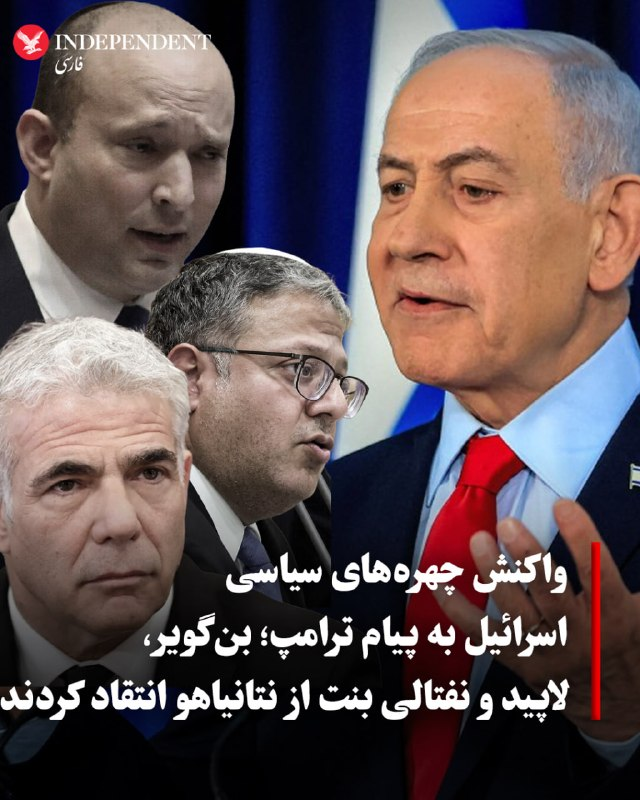

♦️اعلام دونالد ترامپ مبنی بر موافقت بنیامین نتانیاهو با توقف گسیل نظامیان به بیروت، در شامگاه دوشنبه ۱۱ خرداد ماه، با واکنش منفی چند چهره شاخص سیاسی در اسرائیل مواجه شد.
ایتامار بن‌گویر، وزیر امنیت ملی اسرائیل، با انتقاد از این تصمیم گفت: «زمان آن رسیده که به ترامپ نه بگوییم.»
همزمان نفتالی بنت، نخست‌وزیر پیشین اسرائیل، نیز در پیامی دولت این کشور را به ناتوانی در حفظ امنیت متهم کرد. او با اشاره به حوادث امنیتی در اورشلیم، بیت‌شمش، لبنان و غزه نوشت: «مکان‌ها متفاوت هستند، اما داستان یکی است؛ دولتی که کنترل بر حاکمیت اسرائیل را از دست داده است.» بنت همچنین گفت: «هرج‌ومرج در همه‌جا دیده می‌شود و ما امنیت را به شهروندان اسرائیل بازخواهیم گرداند.»
یائیر لاپید، رهبر مخالفان دولت اسرائیل، نیز با انتقاد از نتانیاهو، تصمیم او را «اعلام تبدیل اسرائیل به یک دولت تحت‌الحمایه کامل» توصیف کرد.
این واکنش‌ها پس از آن مطرح شد که ترامپ در پیامی در شبکه اجتماعی تروث سوشال اعلام کرد پس از گفتگو با بنیامین نتانیاهو، نخست‌وزیر اسرائیل، نیروهای اسرائیلی به بیروت اعزام نخواهند شد.
‌🇸🇦 Indypersian

🤖 @VahidOOnLine

## VahidOOnLine — post 243273

  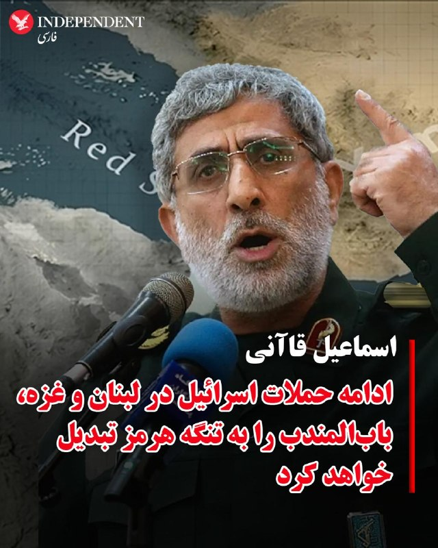

♦️اسماعیل قاآنی، فرمانده نیروی قدس سپاه پاسداران، شامگاه دوشنبه ۱۱ خرداد ماه هشدار داد ادامه عملیات اسرائیل در لبنان و غزه می‌تواند به گسترش دامنه درگیری‌ها و تاثیرگذاری بر مسیرهای راهبردی کشتیرانی در منطقه منجر شود.
قاآنی در پیامی که رسانه‌های دولتی ایران منتشر کرده‌اند، نوشت جنگ اسرائیل در لبنان و غزه «در سایه حمایت‌های وقیحانه آمریکا، عزم محور مقاومت را برای توسعه پشتیبانی‌ها از هر دو جبهه، اقدام برای فعال‌سازی سایر جبهه‌ها و همسان‌سازی وضعیت ترافیکی تنگه باب‌المندب با تنگه هرمز رقم خواهد زد.»
فرمانده نیروی قدس سپاه همچنین هشدار داد که ادامه عملیات اسرائیل در جنوب لبنان و غزه، این کشور را با واکنش‌های گسترده‌تری از سوی حزب‌الله و گروه‌های فلسطینی روبه‌رو خواهد کرد.
اظهارات قاآنی در حالی مطرح می‌شود که طی روزهای اخیر مقام‌های جمهوری اسلامی و نهادهای نزدیک به حاکمیت بارها نسبت به ادامه حملات اسرائیل در لبنان هشدار داده و از احتمال گشوده شدن جبهه‌های جدید در منطقه سخن گفته‌اند.
‌🇸🇦 Indypersian

🤖 @VahidOOnLine

## VahidOOnLine — post 243272

  

«دانشجویان متحد» به نقل از کانال «علامه آزاد»، گزارش داد علی خضریان، نماینده مجلس و دانشجوی دکتری علوم سیاسی دانشگاه علامه طباطبایی، در آزمون جامع دکتری پاییز ۱۴۰۳ با وجود تحویل برگه‌ای که گفته می‌شود بدون پاسخ بوده، پذیرفته شده است.
طبق این گزارش، پذیرش او با ضوابط آموزشی آزمون جامع دکتری سازگار نبوده و تاکنون توضیح رسمی در این‌باره ارائه نشده است.
دانشجویان متحد نوشت جواد شقاقی، دانشجوی دکتری علوم سیاسی دانشگاه علامه طباطبایی، در اعتراض به تخلف آموزشی خضریان و همکاری گروه علوم سیاسی دانشگاه با این رفتار، به سوالات آزمون جامع دکتری پاسخ نداد. گروه علوم سیاسی، اعتراض این دانشجو را وارد ندانسته و او را از تحصیل محروم کرد.
بر اساس این گزارش، گروه علوم سیاسی در واکنش به این اعتراض، گفته که گروه صلاح دانسته از خضریان سوالی نپرسد و به برگه سفید او نمره بدهد.
دانشجویان متحد اضافه کرد شقاقی که تا دوره پیش از جنگ در خوابگاه دانشگاه علامه طباطبایی اقامت داشت به تازگی برای پیگیری وضعیت تحصیلی خود به خوابگاه مراجعه کرد اما با ممانعت حراست برای ورود مواجه شد و مجبور شد چند شب را در مقابل درب خوابگاه بخوابد.
https://iran
‌🏁 🇬🇧 IranintlTV

🤖 @VahidOOnLine

## VahidOOnLine — post 243271

  

محمد کرمی، فرمانده نیروی زمینی سپاه، از«آمادگی ۱۰۰ درصدی» این نیرو برای مقابله با تهدیدات خبر داد و گفت: «سطح آمادگی نیرو‌های مسلح امروز حتی از زمان آغاز جنگ اخیر نیز فراتر رفته است.»

او افزود: «هیچ مشکلی در سطح نیرو وجود ندارد و برای مقابله با هرگونه تهدید و نبرد زمینی در آمادگی کامل هستیم.»
‌🏁 🇬🇧 IranintlTV

🤖 @VahidOOnLine

## VahidOOnLine — post 243270

  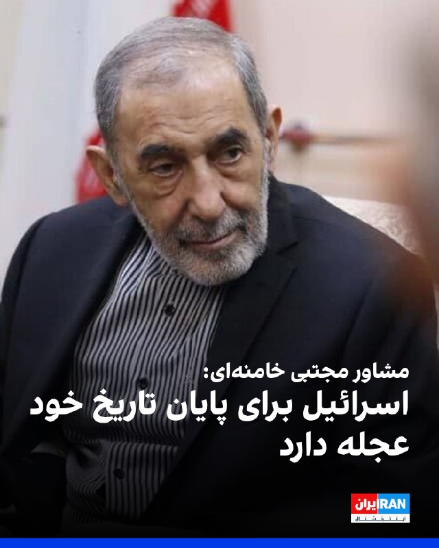

علی‌اکبر ولایتی، مشاور رهبر جمهوری اسلامی در شبکه اجتماعلی ایکس نوشت که بمباران ضاحیه و نقض آتش‌بس، عجله اسرائیل برای پایان دادن به تاریخ خود است.

ولایتی افزود: شما آغاز کردید، اما برخلاف انفعال تماشاچیان منطقه، جمهوری اسلامی و جبهه مقاومت تا آخر کنار مردم عزیز لبنان، از مسلمان تا مارونی ایستاده است.
‌🏁 🇬🇧 IranintlTV

🤖 @VahidOOnLine

## VahidOOnLine — post 243269

♦️حسن یوسفی، سرپرست هیات باستان‌شناسی آتشکده ساسانی ویگل از کشف یک ساختار آیینی با ویژگی‌های کم‌سابقه در این محوطه تاریخی خبر داد.
به گزارش ایسنا، حسن یوسفی با اعلام این خبر گفت: «در جریان فصل سوم کاوش‌های باستان‌شناسی در آتشکده ساسانی ویگل واقع در شهرستان آران و بیدگل، ساختاری آیینی شناسایی شده که از نظر معماری و کارکرد، ویژگی‌های کم‌سابقه‌ای دارد و می‌تواند اطلاعات تازه‌ای درباره آیین‌های مذهبی و سازمان فضایی نیایشگاه‌های دوره ساسانی ارائه کند.»
او افزود: «این ساختار در بخش شرقی آتشکده کشف شده و شامل فضاهایی با چیدمان ویژه و شواهدی از فعالیت‌های آیینی است که تاکنون نمونه‌های مشابه اندکی از آن در محوطه‌های ساسانی شناسایی شده است.»
به گفته یوسفی، نتایج اولیه کاوش‌ها نشان می‌دهد این بخش احتمالا نقشی فراتر از یک فضای معمول مذهبی داشته و ممکن است برای برگزاری آیین‌های خاص مورد استفاده قرار می‌گرفته است.
سرپرست هیات باستان‌شناسی آتشکده ویگل تاکید کرد بررسی‌های تخصصی و مطالعات تکمیلی برای تعیین دقیق کارکرد این ساختار همچنان ادامه دارد.
‌🇸🇦 Indypersian

🤖 @VahidOOnLine

## VahidOOnLine — post 243268

  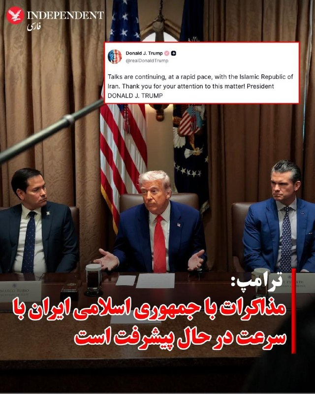

♦️دونالد ترامپ، رئیس‌جمهوری آمریکا اعلام کرد گفتگوها با جمهوری اسلامی ایران همچنان ادامه دارد و با سرعت در حال پیشرفت است.

ترامپ روز دوشنبه در پیامی در شبکه اجتماعی تروث سوشال نوشت: «مذاکرات با جمهوری اسلامی ایران با سرعت در حال ادامه یافتن است. از توجه شما به این موضوع سپاسگزارم!»

رئیس جمهوری آمریکا پیش از این پیام، از توقف حملات اسرائیل به بیروت و موافقت حزب‌الله به پایبندی بر آتش‌بس خبر داده بود.

اظهارات ترامپ پس از آن مطرح می‌شود که خبرگزاری تسنیم به نقل از منابع آگاه گزارش داد ایران در اعتراض به ادامه عملیات نظامی اسرائیل در لبنان، روند «تبادل متون از طریق میانجی» با آمریکا را متوقف خواهد کرد.
‌🇸🇦 Indypersian

🤖 @VahidOOnLine

## VahidOOnLine — post 243267

  <a href="telegram/content/VahidOOnLine_243267_1780342537.mp4" target="_blank">🎬 Download video</a>

♦️انتشار ویدئویی از رفتار عجیب یک زائر زن و قوی‌هیکل ایرانی در مراسم رجم شیطان، توجه بسیاری از زائران را جلب کرده و با بازتاب گسترده‌ای در رسانه‌های عربی همراه شده است. در این ویدئو، این حاجیه ایرانی با سر دادن فریاد «الله اکبر» و شعارهایی علیه اسرائیل، با شتاب و قدرت فراوان به سوی ستون‌ها سنگ‌ریزه پرتاب می‌کند.
مناسک «رجم شیطان» یکی از ارکان اصلی حج تمتع است که هر سال در شهر منا در نزدیکی مکه برگزار می‌شود و در جریان آن، زائران به سه ستون یا دیوار نمادین به نام‌های جمره صغری (کوچک)، جمره وسطی (میانی) و جمره کبری یا عقبه (بزرگ) سنگ‌ریزه پرتاب می‌کنند.
‌🇸🇦 Indypersian

🤖 @VahidOOnLine

## VahidOOnLine — post 243266

  

دونالد ترامپ در تروث سوشال نوشت که مذاکرات با جمهوری اسلامی با سرعت ادامه دارد.

او پیش‌تر درباره توقف ارتباط مذاکره‌کنندگان جمهوری اسلامی با آمریکا به دلیل عملیات نظامی اسرائیل در لبنان، افزود: «واقعا برایم مهم نیست، اصلا اهمیت نمی‌دهم.»

ترامپ همچنین در تروث سوشال نوشت با بنیامین نتانیاهو گفت‌وگویی بسیار سازنده داشته و هیچ نیروی نظامی به بیروت اعزام نخواهد شد و نیروهایی که در مسیر بودند نیز بازگردانده شده‌اند.

او اضافه کرد از طریق نمایندگان عالی‌رتبه، با حزب‌الله تماس بسیار خوبی داشته و توافق شده است همه تیراندازی‌ها متوقف شود؛ اسرائیل به آن‌ها حمله نخواهد کرد و آن‌ها نیز به اسرائیل حمله نخواهند کرد.
‌🏁 🇬🇧 IranintlTV

🤖 @VahidOOnLine

## VahidOOnLine — post 243265

  

دونالد ترامپ اعلام کرد با بنیامین نتانیاهو گفت‌وگویی بسیار سازنده داشته و هیچ نیروی نظامی به بیروت اعزام نخواهد شد و نیروهایی که در مسیر بودند نیز بازگردانده شده‌اند.

او همچنین گفت از طریق نمایندگان عالی‌رتبه، با حزب‌الله تماس بسیار خوبی داشته و توافق شده است همه تیراندازی‌ها متوقف شود؛ اسرائیل به آن‌ها حمله نخواهد کرد و آن‌ها نیز به اسرائیل حمله نخواهند کرد.
‌🏁 🇬🇧 IranintlTV

🤖 @VahidOOnLine

## VahidOOnLine — post 243264

  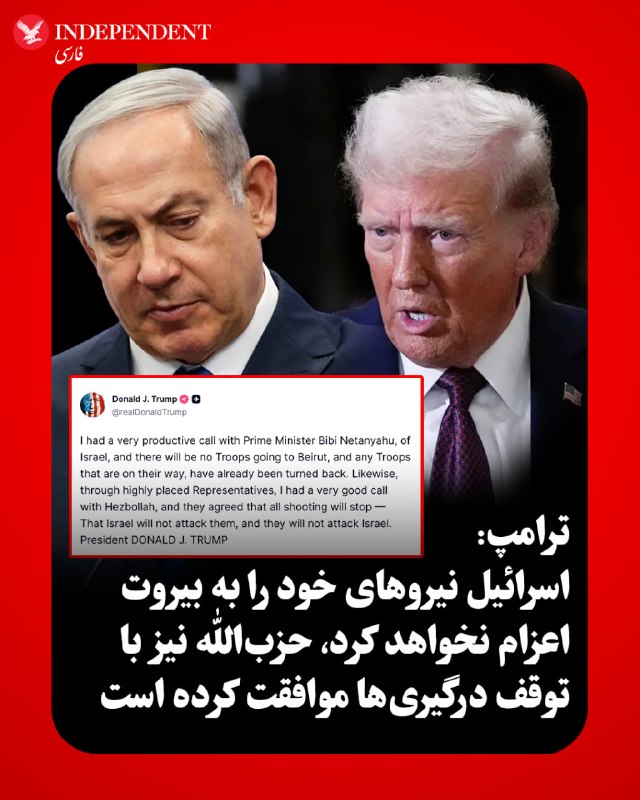

♦️دونالد ترامپ، رئیس‌جمهوری آمریکا، روز دوشنبه ۱۱ خرداد اعلام کرد در گفتگویی با بنیامین نتانیاهو، نخست‌وزیر اسرائیل، درباره تحولات لبنان به توافقاتی دست یافته و نیروهای اسرائیلی به بیروت اعزام نخواهند شد.
ترامپ در پیامی در شبکه اجتماعی تروث سوشال نوشت: «گفتگوی بسیار سازنده‌ای با بی‌بی نتانیاهو، نخست‌وزیر اسرائیل، داشتم و هیچ نیرویی به بیروت اعزام نخواهد شد. همچنین هر نیرویی که در مسیر اعزام بوده، بازگردانده شده است.»
او همچنین در ادامه اعلام کرد از طریق «نمایندگان عالی‌رتبه» با حزب‌الله نیز گفتگو کرده و این گروه با توقف کامل تیراندازی‌ها موافقت کرده است.
ترامپ افزود: «اسرائیل به آنها حمله نخواهد کرد و آنها نیز به اسرائیل حمله نخواهند کرد.»
رئیس‌جمهوری آمریکا جزئیات بیشتری درباره این تماس‌ها، هویت نمایندگان واسطه یا نحوه دستیابی به این توافق اعلام نکرد.
پیشتر وزارت خارجه و سپاه پاسداران جمهوری اسلامی در بیانیه‌هایی اعلام کرده بودند، تشدید حملات اسرائیل در ضاحیه بیروت، از سوی تهران نقض آتش‌بس تلقی خواهد شد.
‌🇸🇦 Indypersian

🤖 @VahidOOnLine

## VahidOOnLine — post 243263

  

♦️مقام‌های امنیتی عراق، روز دوشنبه ۱۱ خرداد ماه اعلام کردند ارزیابی‌های اولیه نشان می‌دهد دومین انفجار در کشتی باری هدف قرارگرفته در خلیج فارس، در نتیجه یک حمله پهپادی رخ داده است.

این کشتی عصر دوشنبه و در فاصله حدود ۷۴ کیلومتری جنوب‌شرق بندر ام‌القصر عراق هدف حمله قرار گرفت. پیش‌تر سازمان عملیات تجارت دریایی بریتانیا (UKMTO) گزارش داده بود یک پرتابه ناشناس به سمت راست کشتی برخورد کرده و موجب وقوع انفجار بزرگی شده است.

بر اساس اطلاعات جدید مقام‌های عراقی، بررسی‌های اولیه حاکی از آن است که انفجار دوم ناشی از حمله یک پهپاد بوده است. با این حال، جزئیاتی درباره عامل احتمالی این حمله یا میزان خسارت وارده به کشتی منتشر نشده است.
‌🇸🇦 Indypersian

🤖 @VahidOOnLine

## VahidOOnLine — post 243262

  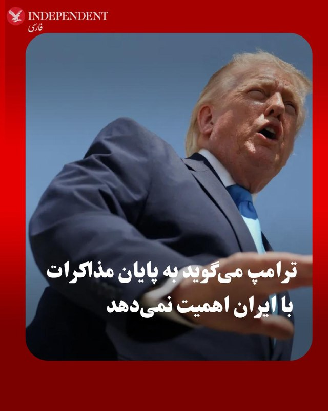

♦️دونالد ترامپ، رئیس‌جمهوری آمریکا، دوشنبه شب و در واکنش به تعلیق یکسویه مذاکرات پایان جنگ از سوی تهران گفت برایش اهمیتی ندارد این مذاکرات به پایان رسیده باشد.
ترامپ در گفتگو با شبکه سی‌ان‌بی‌سی اعلام کرد: «صادقانه بگویم، اهمیتی نمی‌دهم که مذاکرات تمام شده باشد. واقعا برایم مهم نیست. أصلا اهمیتی نمی‌دهم.»

اظهارات رئیس‌جمهوری آمریکا پس از آن مطرح می‌شود که رسانه‌های ایرانی از توقف روند گفتگوها و تبادل پیام‌ها میان تهران و واشنگتن خبر داده‌اند.

ترامپ پیش‌تر نیز در گفتگویی با شبکه ان‌بی‌سی  گفته بود آمریکا عجله‌ای برای دستیابی به توافق ندارد و در صورت توقف مذاکرات، «سکوت خواهد کرد» و به حفظ محاصره دریایی علیه ایران ادامه می‌دهد.
‌🇸🇦 Indypersian

🤖 @VahidOOnLine

## VahidOOnLine — post 243261

  

ترامپ در گفت‌وگو با سی‌ان‌بی‌سی در پاسخ به گزارش‌هایی درباره توقف ارتباط مذاکره‌کنندگان جمهوری اسلامی با آمریکا به دلیل عملیات نظامی اسرائیل در لبنان، افزود: «واقعا برایم مهم نیست، اصلا اهمیت نمی‌دهم.»

ترامپ درباره بستن تنگه هرمز از سوی جمهوری اسلامی نیز گفت نگران افزایش قیمت نفت نیست.
او همچنین گفت قصد دارد از بنیامین نتانیاهو درباره وضعیت لبنان سوال کند.
‌🏁 🇬🇧 IranintlTV

🤖 @VahidOOnLine

## VahidOOnLine — post 243260

  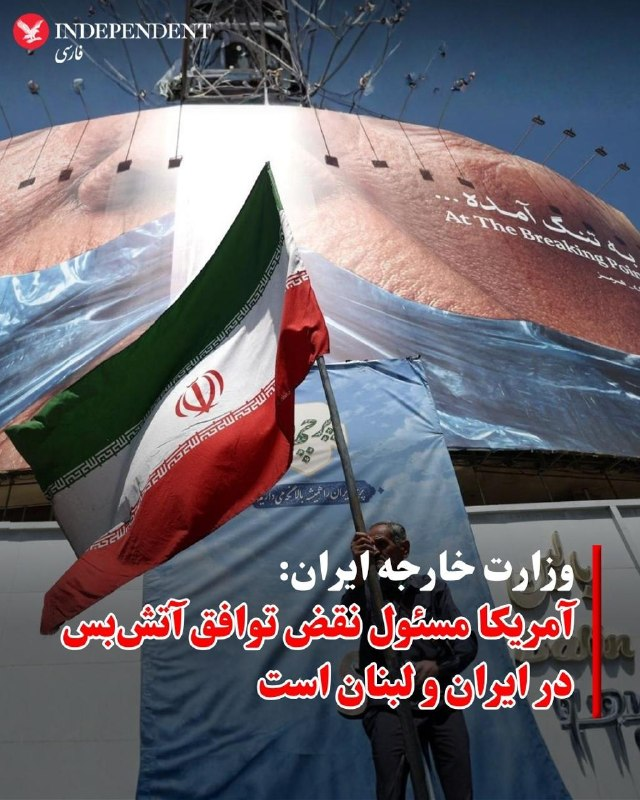

♦️وزارت امور خارجه جمهوری اسلامی ایران روز دوشنبه ۱۱ خرداد با انتشار بیانیه‌ای آمریکا و اسرائیل را به نقض مستمر آتش‌بس متهم کرد و هشدار داد که تهران بر اساس حق دفاع مشروع از منافع خود دفاع خواهد کرد.

در این بیانیه با اشاره به توافق آتش‌بس ۱۹ فروردین ۱۴۰۵ (۸ آوریل ۲۰۲۶) که به گفته وزارت خارجه به جنگ میان آمریکا، اسرائیل و جمهوری اسلامی ایران در همه جبهه‌ها از جمله لبنان پایان داده بود، آمده است آمریکا از زمان اعلام آتش‌بس بارها آن را نقض کرده و از جمله به کشتی‌رانی تجاری ایران تعرض کرده است.

وزارت خارجه ایران همچنین اسرائیل را به نقض «فاحش» آتش‌بس در لبنان متهم کرده و نوشته است این اقدامات به کشته و زخمی شدن هزاران نفر، آوارگی حدود دو میلیون نفر و تخریب زیرساخت‌ها و منازل مسکونی در لبنان منجر شده است.

در این بیانیه تاکید شده «نقض آتش‌بس در هر یک از جبهه‌ها، به منزله نقض آن در تمامی جبهه‌ها است.»
‌🇸🇦 Indypersian

🤖 @VahidOOnLine

## VahidOOnLine — post 243259

  

رسانه‌های اسرائیلی گزارش دادند بنیامین نتانیاهو دوشنبه با دونالد ترامپ به‌صورت تلفنی گفت‌وگو کرده است. جزئیات بیشتری از این تماس منتشر نشده است.

دوشنبه همزمان با حملات اسرائیل به جنوب لبنان، قرارگاه مرکزی خاتم‌الانبیا به ساکنان شمال اسرائیل هشدار تخلیه داد.
خبرگزاری تسنیم نیز از توقف گفت‌وگوها با آمریکا به علت حملات اسرائیل به لبنان خبر داد.

محمد مخبر، مشاور مجتبی خامنه‌ای، گفت هرگونه آتش‌بس بدون در نظر گرفتن لبنان و سایر جبهه‌های مقاومت «فاقد موضوعیت» دانست.
‌🏁 🇬🇧 IranintlTV

🤖 @VahidOOnLine

## VahidOOnLine — post 243258

  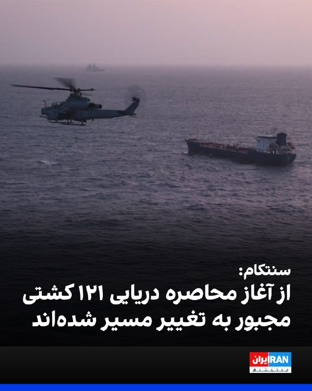

فرماندهی مرکزی آمریکا، سنتکام در شبکه ایکس اعلام کرد که از آغاز محاصره دریایی ایران تاکنون ۱۲۱ کشتی تجاری مجبور به تغییر مسیر شده‌اند و پنج کشتی نیز توسط نیروهای آمریکایی از کار انداخته شده‌اند.

همزمان ترامپ درباره توقف مذاکرات از سوی تهران به دلیل حملات اسرائیل به لبنان، گفت که پیش از این تصمیم، از آن مطلع نشده بود. او افزود: «این به این معنا نیست که ما برویم و شروع به بمباران همه‌جا کنیم. ما محاصره را ادامه خواهیم داد».
‌🏁 🇬🇧 IranintlTV

🤖 @VahidOOnLine

## VahidOOnLine — post 243257

  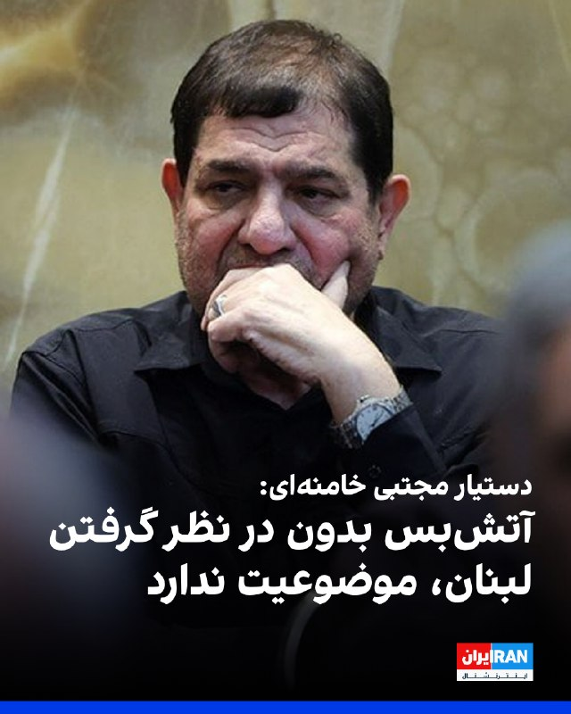

خبرگزاری صداوسیما گزارش داد محمد مخبر، مشاور و دستیار رهبر جمهوری اسلامی، در دیدار با عبدالله صفی‌الدین، نماینده حزب‌الله لبنان در تهران، با تاکید بر یکپارچگی محور مقاومت، هرگونه آتش‌بس با جمهوری اسلامی را بدون در نظر گرفتن لبنان و سایر جبهه‌های مقاومت «فاقد موضوعیت» دانست.
‌🏁 🇬🇧 IranintlTV

🤖 @VahidOOnLine

## VahidOOnLine — post 243256

  

♦️دونالد ترامپ، رئیس‌جمهوری آمریکا، در واکنش به گزارش‌ها درباره تعلیق یکسویه گفتگوهای پایان جنگ از سوی رهبران ایران گفت، واشنگتن بیش از حد با تهران مذاکره کرده است و شاید زمان سکوت فرا رسیده باشد.
ترامپ در گفتگو با شبکه خبری ان‌بی‌سی اعلام کرد: «اگر حقیقت را بخواهید، فکر می‌کنم بیش از حد صحبت کرده‌ایم. فکر می‌کنم سکوت کردن خیلی خوب خواهد بود و این وضعیت می‌تواند برای مدت طولانی ادامه داشته باشد.»
او در عین حال تاکید کرد که توقف یا کاهش ارتباطات به معنای آغاز حملات نظامی گسترده علیه ایران نیست: «این به این معنا نیست که قرار است برویم و همه‌جا را بمباران کنیم.»
اظهارات ترامپ پس از آن مطرح می‌شود که خبرگزاری تسنیم به نقل از منابع آگاه گزارش داد ایران در اعتراض به ادامه عملیات نظامی اسرائیل در لبنان، روند «تبادل متون از طریق میانجی» با آمریکا را متوقف خواهد کرد. همزمان مقام‌های جمهوری اسلامی با انتشار پیام‌هایی اسرائیل را به آغاز دوباره حملات موشکی تهدید کرده‌اند.
‌🇸🇦 Indypersian

🤖 @VahidOOnLine

## VahidOOnLine — post 243255

  

دونالد ترامپ در گفت‌وگو با خبرنگار ان‌بی‌سی اعلام کرد که درباره ایران «بیش از حد صحبت شده» است و افزود: «اگر بخواهید حقیقت را بگویید، فکر می‌کنم سکوت کردن می‌تواند گزینه بهتری باشد».

دونالد ترامپ درباره توقف مذاکرات از سوی تهران به دلیل حملات به لبنان گفت که پیش از این تصمیم، از آن مطلع نشده بود. او افزود: «این به این معنا نیست که ما برویم و شروع به بمباران همه‌جا کنیم. ما محاصره را ادامه خواهیم داد».
‌🏁 🇬🇧 IranintlTV

🤖 @VahidOOnLine

## WithYashar — post 13194

  <a href="telegram/content/WithYashar_13194_1780342545.mp4" target="_blank">🎬 Download video</a>

اتاق جنگ با یاشار : بو های مشکوک ، انبوه هوا پیما های آمریکایی در جنوب ایران و ورود به حریم هوایی
@withyashar

## WithYashar — post 13193

وزیر جنگ اسرائیل: در لبنان آتش‌بس نداریم @withyashar

## WithYashar — post 13191

دیدبان اتاق جنگ : الان ازسمت کرج موشک شلیک شد @withyashar

## WithYashar — post 13190

وزیر جنگ اسرائیل: در لبنان آتش‌بس نداریم
@withyashar

## WithYashar — post 13189

حملات اسرائیل به منطقه صور ادامه دارد
@withyashar

## WithYashar — post 13188

پدافند تهران فعال شد
@withyashar

## WithYashar — post 13187

همانطور که از هفته پیش وعده داده بودم حدود یک ساعت دیگر ما متنی را برای شاهزاده رضا پهلوی ارسال می کنیم. همبستگی شما در این فراخوان باعث می شود صدای ما شنیده تر شود و ارتباطی بهتری بین ما و شاهزاده شکل بگیرد. ممنون از همراهی و کمک شما. تا می توانید به دوستان خود بگویید و آنها را آماده کنید.

## WithYashar — post 13186

وزیر بن‌گویر: آقای نخست‌وزیر،
شما گفتید که یک نخست‌وزیر قدرتمند در صورت امکان به رئیس‌جمهور آمریکا «بله» می‌گوید و در صورت ضرورت «نه».
اکنون زمان آن است که به دوست ما، رئیس‌جمهور ترامپ، «نه» گفته شود.
اکنون زمان آن است که آنچه لازم و ضروری است انجام شود: حمله به حزب‌الله، آزاد گذاشتن دست رزمندگان ما و بازگرداندن امنیت به شمال.
@withyashar

## WithYashar — post 13185

  <a href="telegram/content/WithYashar_13185_1780342547.mp4" target="_blank">🎬 Download video</a>

دیدبان اتاق جنگ : الان ازسمت کرج موشک شلیک شد
@withyashar

## WithYashar — post 13184

۲ حمله هوایی اسرائیل به شهر نبطیه الفوقا در جنوب لبنان انجام شد.
@withyashar

## WithYashar — post 13183

  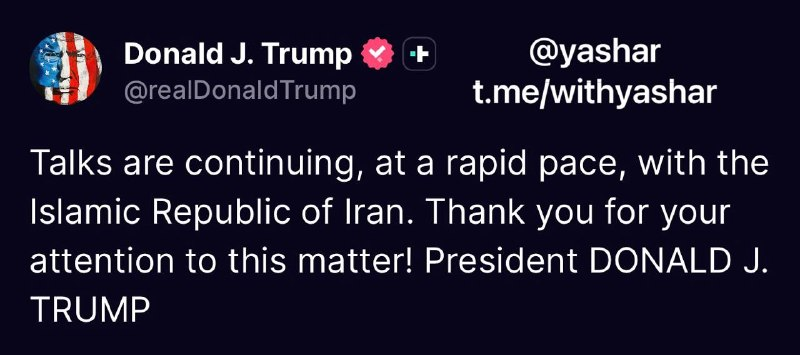

ترامپ: مذاکرات با سرعت بالایی با جمهوری اسلامی ایران ادامه دارد
@withyashar

## WithYashar — post 13182

شلیک راکت/پهپاد توسط حزب‌الله
@withyashar

## WithYashar — post 13181

  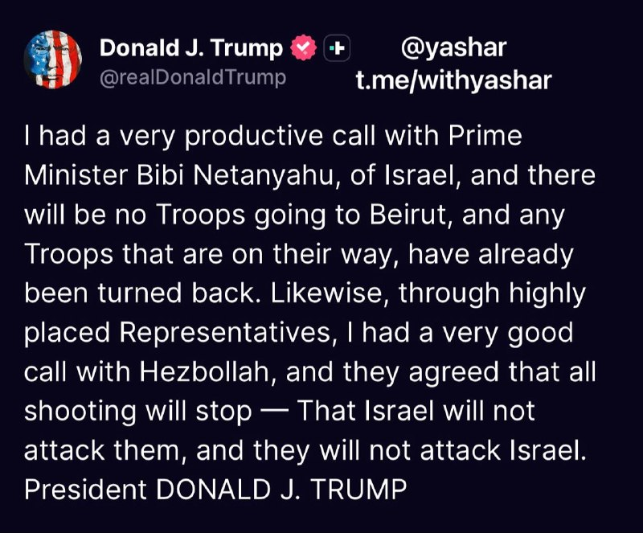

«من تماس بسیار سازنده‌ای با بی‌بی نتانیاهو، نخست‌وزیر اسرائیل داشتم؛ هیچ نیروی نظامی به بیروت نخواهد رفت و تمام نیروهایی که در راه بودند نیز پیش از این بازگردانده شده‌اند. به همین ترتیب، از طریق نمایندگان بلندپایه، گفتگوهای بسیار خوبی با حزب‌الله داشتم و آن‌ها موافقت کردند که تمامی تیراندازی‌ها (درگیری‌ها) متوقف شود؛ به این صورت که اسرائیل به آن‌ها حمله نخواهد کرد و آن‌ها نیز به اسرائیل حمله نمی‌کنند.

رئیس‌جمهور دونالد جی. ترامپ»

@withyashar

## WithYashar — post 13180

خبرنگار اسرائیلی :
یک منبع بسیار موثق از فرودگاه بن‌گوریون به من گفت: اتفاقاتی که داره تو فرودگاه می‌افته دیوانه‌کننده‌ست. تو این ۳۵ سالی که اینجا کار می‌کنم، تا حالا چنین چیزی ندیده بودم. ارتش آمریکا حداقل شش ماه زودتر از برنامه زمان‌بندی‌شده وارد اینجا شده. اونا قراره در هفته‌های آینده هزاران پرواز مسافربری رو لغو کنن؛ تمام مسیرها و تمام مقصدها رو.
تنها جایی که براتون می‌مونه تا بتونید یه کم از این اوضاع خارج بشید و نفس راحت بکشید، یه پایگاه بزرگه؛ پایگاهی که می‌تونید برای مدت طولانی توش بمونید.
آماده باشید.
@withyashar

## WithYashar — post 13179

رویترز به نقل از دو منبع اسرائیلی: اسرائیل منتظر تایید نهایی ترامپ برای هرگونه عملیاتی در حومه جنوبی بیروت است.
@withyashar

## WithYashar — post 13178

کانال ۱۲ عبری: تماس تلفنی ترامپ و نتانیاهو بیش از یک ساعت است که ادامه دارد
@withyashar

## WithYashar — post 13177

العربیه به نقل از رادیو و تلویزیون اسرائیل:
با مداخله آمریکا حمله بزرگی به ضاحیه بیروت لغو شد!
@withyashar

## WithYashar — post 13176

منابع امنیتی اسرائیلی می گویند ترامپ دستور لغو حملات به بیروت را صادر کرده است
@withyashar

## WithYashar — post 13175

ترامپ:در تماس با نخست‌وزیر نتانیاهو فقط میخواهم شرایط را در جبهه لبنان ارزیابی کنم

@withyashar

## WithYashar — post 13174

تسنیم: اسرائیل از ترس تهدیدهای جمهوری اسلامی حمله نکرده.
@withyashar

## mwarmonitor — post 10003

🔴سازمان UKMTO گزارش داد که یک کشتی کانتینربر (با نام MSC SARISKA V) چند ساعت پس از ترک بندر ام‌القصر عراق، در خلیج فارس هدف برخورد یک پرتابه قرار گرفته است. @mwarmonitor

## mwarmonitor — post 10002

🔴رسانه‌های اسرائیلی: در حال حاضر سکوت بر دفتر نخست‌وزیر حاکم است. این واقعیت که یک رئیس‌جمهور آمریکایی—هرچقدر هم که طرفدار اسرائیل باشد—کشور را اداره می‌کند، باید همه ما را نگران کند.

@mwarmonitor

## mwarmonitor — post 10001

  

«گفتگوها با جمهوری اسلامی ایران با سرعتی بالا در حال جریان است. از توجه شما به این موضوع سپاسگزارم! رئیس‌جمهور دونالد جی. ترامپ»

@mwarmonitor

## mwarmonitor — post 10000

🔸وزارت امور خارجه ایران: ایالات متحده و اسرائیل از زمان اعلام آتش‌بس در ۱۹ مارس، بارها آن را نقض کرده‌اند؛ از جمله با حمله به کشتی‌های تجاری ایرانی، نقض حاکمیت لبنان و آواره کردن میلیون‌ها غیرنظامی لبنانی.

🔹ایران، آمریکا را مستقیماً مسئول نقض آتش‌بس در هر دو کشور ایران و لبنان می‌داند.

🔹ایران نسبت به پیامدهای خطرناک این نقض‌ها هشدار می‌دهد و تأکید می‌کند که حق دفاع از خود را با هر وسیله‌ای و در هر زمان و مکانی که لازم باشد برای خود محفوظ می‌دارد.

@mwarmonitor

## mwarmonitor — post 9999

  

خب همینطور که پیشینی کرده بودم

## mwarmonitor — post 9998

خب همینطور که پیشینی کرده بودم

## mwarmonitor — post 9997

🔴اقدامات جدید پدافند غیرعامل در فردو:

🔸بین ۱۰ تا ۱۸ مه، ایران اقدامات جدیدی از نوع پدافند غیرعامل در قالب تپه‌های خاکی/سنگی و سایر موانع در مسیرهای منتهی به ورودی‌های تونل تأسیسات زیرزمینی (که قبلاً آسیب دیده/تخریب شده) فردو ایجاد کرده است.
🔹چیدمان متناوب این تپه‌ها و موانع بسیار دقیق است و مجموعه‌ای از مسیرهای زیگزاگی (چیکن/پیچ‌دار) ایجاد می‌کند. این موضوع نشان می‌دهد که هدف آن‌ها صرفاً انسداد مسیر نیست، بلکه بیشتر برای جلوگیری از ورود و خروج سریع خودروها طراحی شده و می‌تواند حرکت نیروهای مهاجم در صورت حضور در محل را دشوار کند.
🔸این نحوه قرارگیری همچنین نشان می‌دهد که ایران همچنان قصد دسترسی به محل را دارد، زیرا در غیر این صورت احتمالاً مانند موارد قبلی در مسیرهای منتهی به تونل‌های اصفهان، کل جاده‌ها با خاکریز مسدود می‌شد.
این مسیرهای زیگزاگی در ورودی شرقی ممکن است موقتی بوده و تا ۲۶ مه دوباره برداشته شده باشند، اما این موضوع نیاز به تصاویر دقیق‌تر دارد.
🔹این ورودی قبلاً توسط ایران پر شده بود و در ژوئن ۲۰۲۵ توسط اسرائیل هدف قرار گرفت که منجر به ایجاد یک دهانه (گودال) شد، اما هیچ نشانه‌ای از نفوذ به بالای ورودی تونل دیده نشد.
🔸بر اساس تصاویر تا ۲۶ مه، به نظر می‌رسد همه ورودی‌های تونل همچنان مدفون باقی مانده‌اند.

@mwarmonitor

## mwarmonitor — post 9996

  

📷 Photo

## mwarmonitor — post 9995

📌 رویترز به نقل از دو منبع اسرائیلی: اسرائیل در انتظار موافقت نهایی ترامپ برای هرگونه عملیات در ضاحیه جنوبی بیروت است.

@mwarmonitor

## mwarmonitor — post 9994

🔴مقامات آمریکایی از طریق کانال‌های دیپلماتیک رسمی لبنان مطلع شده‌اند که حزب‌الله پیشنهاد آمریکا را پذیرفته و آماده است متعهد شود از هدف قرار دادن اسرائیل خودداری کند، در ازای تعهدی متقابل مبنی بر عدم حمله به حومه جنوبی بیروت.

🔸این موضوع به‌عنوان یک گام مثبت تلقی می‌شود که می‌تواند به کاهش تنش‌ها و جلوگیری از لغزش به سمت یک درگیری گسترده‌تر کمک کند.

🔹این تحولات قرار است فردا و روز بعد در جریان نشست‌های مذاکرات مستقیم در واشنگتن مورد بحث قرار گیرد. الشرق

@mwarmonitor

## mwarmonitor — post 9993

📌مراسم انتصاب رئیس جدید موساد به‌دلیل یک تماس تلفنی میان بنیامین نتانیاهو، نخست‌وزیر، و دونالد ترامپ، رئیس‌جمهور آمریکا، به تعویق افتاده است. @mwarmonitor

## mwarmonitor — post 9990

✈️یک تانکر سوخت‌رسان KC-46A نیروی هوایی آمریکا در حال حاضر بر فراز دریای عمان در حال عملیات است، در حالی که یک فروند دیگر نیز از تل‌آویو به سمت خلیج فارس در حال پرواز است.

✈️همچنین یک تانکر KC-135R نیز از پایگاه هوایی پرینس سلطان به سمت خلیج فارس در حال حرکت است.

@mwarmonitor

## mwarmonitor — post 9989

  <a href="telegram/content/mwarmonitor_9989_1780342551.mp4" target="_blank">🎬 Download video</a>

🔴هزاران نیروی نظامی آمریکا در دریا، آسمان و زمین از محاصره در حال انجام ایالات متحده علیه ایران حمایت می‌کنند. تا تاریخ ۱ ژوئن، نیروهای سنتکام ۱۲۱ کشتی تجاری را تغییر مسیر داده و ۵ کشتی را از کار انداخته‌اند تا از رعایت این اقدامات اطمینان حاصل شود.

@mwarmonitor

## mwarmonitor — post 9988

📝تعلیق روابط دیپلماتیک تهران با واشنگتن به خاطر حملات اسرائیل، کاخ سفید را وارد یک سیرک تهوع‌آور کرده است؛ جایی که دونالد ترامپ با شخصیتی فروپاشیده و لحنی التماس‌آمیز فریاد می‌زند: «تلفن رو بدید زنگ بزنم به بی‌بی! چرا این تروریست‌های گوگولی و نازنازی رو وسط…

## mwarmonitor — post 9987

🔴ترامپ می‌گوید گزارش‌ها درباره اینکه ایران مذاکرات با آمریکا را متوقف کرده‌اند، اگر درست باشد «اشکالی ندارد» و در گفت‌وگو با NBC گفته است: «فکر می‌کنم ما بیش از حد صحبت کرده‌ایم.» او افزود: «این به این معنی نیست که ما برویم و شروع به بمباران کنیم. فقط سکوت…

## mwarmonitor — post 9986

📌مراسم انتصاب رئیس جدید موساد به‌دلیل یک تماس تلفنی میان بنیامین نتانیاهو، نخست‌وزیر، و دونالد ترامپ، رئیس‌جمهور آمریکا، به تعویق افتاده است.

@mwarmonitor

## mwarmonitor — post 9985

📝تعلیق روابط دیپلماتیک تهران با واشنگتن به خاطر حملات اسرائیل، کاخ سفید را وارد یک سیرک تهوع‌آور کرده است؛ جایی که دونالد ترامپ با شخصیتی فروپاشیده و لحنی التماس‌آمیز فریاد می‌زند: «تلفن رو بدید زنگ بزنم به بی‌بی! چرا این تروریست‌های گوگولی و نازنازی رو وسط…

## mwarmonitor — post 9984

توقف مذاکرات: اندکی پس از بیانیه عراقچی، خبرگزاری تسنیم به نقل از مقامات ایرانی تاکید کرد که تا زمانی که اسرائیل حملات خود را در لبنان متوقف نکند، هیچ مذاکره‌ای با آمریکا انجام نخواهد شد.
تهدید به تلافی: گزارش تسنیم همچنین حاکی از آن بود که ایران و «محور مقاومت» آماده تلافی در تنگه هرمز و «فعال کردن جبهه‌های دیگر» از جمله تنگه باب‌المندب در دریای سرخ هستند

@mwarmonitor

## FoxNewsTwitter — post 342479

  <a href="telegram/content/FoxNewsTwitter_342479_1780342552.mp4" target="_blank">🎬 Download video</a>

Fox News (Twitter/X)

NEW: A Brooklyn man is being charged with threatening to assault and murder an ICE officer outside the Delaney Hall detention facility.

The suspect, identified as 27-year-old Nicholas Matthew Scelfo of Brooklyn, New York, was arrested for influencing, impeding, and retaliating against a federal officer by threat.

Scelfo, who was caught on video allegedly threatening to kill an ICE officer and his family outside a New Jersey detention center, has now been arrested.

"I'll kill your whole f---ing family... Your children, your wife — all dead."

"Told you. FBI just arrested the man who threatened to kill ICE officers and their families. FAFO," Acting AG Blanche posted on X.

## FoxNewsTwitter — post 342478

  

Fox News (Twitter/X)

HAPPY BIRTHDAY! Legendary actor and producer Morgan Freeman is celebrating his 89th birthday, marking nearly six decades in entertainment and a career that has helped define generations of film.

## FoxNewsTwitter — post 342477

  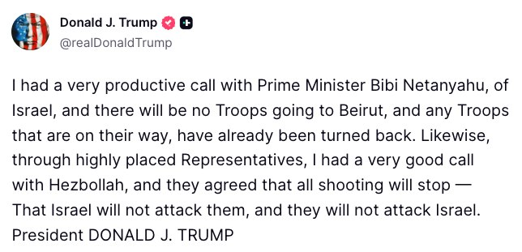

Fox News (Twitter/X)

BREAKING: President Trump announces that no troops will go to Lebanon and Hezbollah has agreed "all shooting will stop" after a "very productive" call with Israeli Prime Minister Netanyahu and Hezbollah.

"Israel will not attack them, and they will not attack Israel."

## FoxNewsTwitter — post 342476

  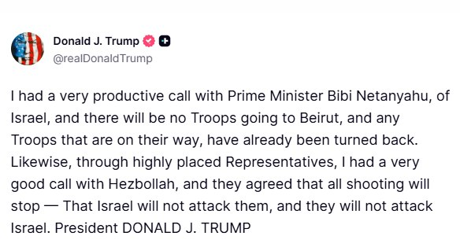

Fox News (Twitter/X)

BREAKING: Trump tries to calm Israel-Hezbollah fighting with Iran deal on the line, saying the terror group 'agreed that all shooting will stop'

## FoxNewsTwitter — post 342475

  

Fox News (Twitter/X)

RT @FoxTrueCrime: A Utah judge granted Tyler Robinson's defense's motion for an order to show cause after his attorneys accused prosecutors of violating the court's gag order through media interviews in the Charlie Kirk assassination case.

An evidentiary hearing lands June 12 — putting the state's own legal team under the microscope before trial even begins.

Both sides will have 90 minutes to present arguments at that hearing, when Robinson is expected to appear in person.

Credit: Rick Egan/The Salt Lake Tribune via Pool

## FoxNewsTwitter — post 342473

Fox News (Twitter/X)

BREAKING: Utah judge denies Tyler Robinson's latest request to hold secret hearings in Charlie Kirk assassination case

## FoxNewsTwitter — post 342472

  <a href="telegram/content/FoxNewsTwitter_342472_1780342557.mp4" target="_blank">🎬 Download video</a>

Fox News (Twitter/X)

JUST IN: Sheridan Gorman's family blames sanctuary policies and "failed removal policies" for the murder of their daughter, allegedly by an illegal immigrant with a criminal background.

Speaking outside the Cook County courthouse following a discovery hearing, Sheridan's father, Thomas Gorman, says failed border enforcement, removal policies, and local cooperation allowed Jose Medina to remain in the country and ultimately cross paths with his daughter.

"Jose Medina is responsible for what he did to Sheridan, but he did not get to Sheridan himself."

"He got there through a broken system, through failed border enforcement, failed removal policies, failed local cooperation, and sanctuary policies that put ideology before safety."

"American families deserve to be protected in their own country."

## FoxNewsTwitter — post 342471

  <a href="telegram/content/FoxNewsTwitter_342471_1780342558.mp4" target="_blank">🎬 Download video</a>

Fox News (Twitter/X)

BREAKING: Iran is halting its indirect talks with U.S. negotiators in protest against Israel's attacks on Hezbollah in Lebanon, Iranian state-linked media reported Monday.

Iran's Tasnim news agency, linked to the Iranian Revolutionary Guard Corps, reported that Tehran is cutting off talks due to the "continued crimes of the Zionist regime in Lebanon."

The report comes after Iranian Foreign Minister Abbas Araghchi posted to social media saying Lebanon must be included in the ongoing ceasefire between the U.S. and Iran.

"The United States and Israel bear responsibility for the consequences of any breach of the truce," Araghchi wrote.

@TreyYingst reports the latest.

## FoxNewsTwitter — post 342470

  <a href="telegram/content/FoxNewsTwitter_342470_1780342560.mp4" target="_blank">🎬 Download video</a>

Fox News (Twitter/X)

NEW: Agitator wrestled to the ground by New Jersey State Police as officers move in to enforce a curfew outside Newark's Delaney Hall detention center.

More than a dozen arrests have been made following days of escalating tensions around the ICE facility.

Authorities say weekend clashes between rioters and law enforcement included burning tires, thrown projectiles, and confrontations that prompted an increased police presence.

DHS sent a blunt warning to the agitators: "If you riot, you will face the consequences. Law and order prevails."

## FoxNewsTwitter — post 342469

  

Fox News (Twitter/X)

NEW: DHS says more than a dozen arrests were made over the weekend as agitators continued clashing with law enforcement outside a New Jersey ICE detention center.

Anti-ICE rioters set fires in the streets outside of Delaney Hall, prompting officials to impose a 9 pm curfew around parts of Newark.

Dem NJ Gov. Mikie Sherrill is sparring with DHS over the facility — but some protesters are now turning on her too, accusing her of lacking transparency and bending to federal pressure.

@AlexisMcAdamsTV breaks down the latest on the administration's "zero tolerance" response to protest-related violence.

## FoxNewsTwitter — post 342468

  

Fox News (Twitter/X)

A new Doocy is on the way.

@pdoocy announced that he and his wife @hillary__vaughn are expecting their third child, adding another member to their growing family.

Here's the twist: the baby is due on @SteveDoocy birthday.

## FoxNewsTwitter — post 342467

‌Fox News (Twitter/X)

👉 Full story here:

## FoxNewsTwitter — post 342466

  

Fox News (Twitter/X)

Hasan Piker gets denied entry to the UK over alleged antisemitism — then immediately blames 'Israel advocacy organizations' for wielding 'unbelievable amounts of power' over British policy.

The streamer's response to the ban landed on a classic antisemitic trope about Jewish influence, even as he insisted he harbors no antisemitism. British Jewish groups and a Labour MP had urged the government to block his visit, citing his comments about Hamas, Hezbollah, and his claim that the U.S. deserved 9/11.

The ban caps a brutal stretch for Piker: a Treasury Department subpoena over his Cuba trip, and hecklers confronting him at a Newark ICE protest calling him a 'f***ing fraud.'

## FoxNewsTwitter — post 342465

  <a href="telegram/content/FoxNewsTwitter_342465_1780342564.mp4" target="_blank">🎬 Download video</a>

Fox News (Twitter/X)

"Our community will resist again."

Los Angeles Mayor Karen Bass warned that she and her city's residents are ready to oppose federal immigration enforcement if the Trump administration attempts widespread operations during the World Cup.

Bass, who is facing a challenge in the mayoral election from Spencer Pratt, pledged her support for Los Angeles residents regardless of who they are or why they're in the city.

Last year, ICE raids in Los Angeles sparked riots across the city.

## FoxNewsTwitter — post 342461

Fox News (Twitter/X)

New York City's annual Israel Day parade went on without its mayor.

Zohran Mamdani skipped the event due to his stance toward Israel, breaking a decades-long tradition of New York City mayors attending the celebration.

As thousands packed Fifth Avenue waving Israeli flags, Gov. Kathy Hochul, Sen. Chuck Schumer, Attorney General Letitia James, and New York Republican gubernatorial candidate Bruce Blakeman all took part.

Mamdani's absence quickly became a political flashpoint, with critics accusing Mamdani of turning his back on New York's Jewish community amid record levels of antisemitism.

## FoxNewsTwitter — post 342460

  

Fox News (Twitter/X)

Iran’s president has reportedly asked to resign, citing a loss of authority inside the country’s ruling system.

According to reports, Masoud Pezeshkian told the Supreme Leader’s office that he and his government have been excluded from major decision-making, leaving him unable to fulfill his responsibilities.

The reported resignation comes amid growing signs of internal power struggles within the regime and as the U.S. continues negotiations with Tehran.

President Trump has repeatedly pointed to divisions inside Iran’s leadership, previously saying the regime is “seriously fractured.”

## pm_afshaa — post 92066

#مهم
عزیزای دلم همگی الان چنل زاپاس‌مون رو جوین بشید کانال تحت ریپورت شدیده اگه چیزی شد زاپاس رو داشته باشید فعالیت میاد اونور
👇

https://t.me/pmtvzapas
https://t.me/pmtvzapas

## pm_afshaa — post 92065

🔴کاتز ، وزیر دفاع اسرائیل : در لبنان هیچ آتش بسی نداریم ، اسرائیل تا جایی که نیاز باشد پیشروی خواهد کرد 
💧 Rainbet.com the #1 Non-KYC Crypto Casino & Sportsbook @rainbetcom 
😁 @Pm_Afshaa

## pm_afshaa — post 92064

🔴کاتز ، وزیر دفاع اسرائیل : در لبنان هیچ آتش بسی نداریم ، اسرائیل تا جایی که نیاز باشد پیشروی خواهد کرد

💧 Rainbet.com the #1 Non-KYC Crypto Casino & Sportsbook @rainbetcom

😁 @Pm_Afshaa

## pm_afshaa — post 92063

  <a href="telegram/content/pm_afshaa_92063_1780342566.webm" target="_blank">🎬 Download video</a>

🔴سفارت لبنان در واشنگتن:
دولت لبنان در دور کردن حزب‌الله از تشدید تنش‌های بیشتر موفق عمل کرد.

ترامپ به سفیر ما اعلام کرد که نتانیاهو با آتش‌بس موافقت کرده.

💧 Rainbet.com the #1 Non-KYC Crypto Casino & Sportsbook @rainbetcom

😁 @Pm_Afshaa

## pm_afshaa — post 92062

  <a href="telegram/content/pm_afshaa_92062_1780342567.webm" target="_blank">🎬 Download video</a>

🔴کاتز، وزیر دفاع اسرائیل: آمریکا ما رو از دفاع از شهرهای شمالی باز نمی‌دارد و به هر جایی که در لبنان لازم باشه می‌رسیم.

ترامپ معادله‌ای رو که ما تعیین کردیم رو پذیرفته است؛ اینکه شلیک به جوامع ما به معنای بمب‌گذاری در بیروت است. معنای اظهارات او همین است.

💧 Rainbet.com the #1 Non-KYC Crypto Casino & Sportsbook @rainbetcom

😁 @Pm_Afshaa

## pm_afshaa — post 92061

  <a href="telegram/content/pm_afshaa_92061_1780342567.webm" target="_blank">🎬 Download video</a>

🔴ولایتی، مشاور مجتبی خامنه‌ای:
اسرائیل با بمباران ضاحیه و نقض آتش‌بس، برای پایان تاریخ خودش عجله داره.

💧 Rainbet.com the #1 Non-KYC Crypto Casino & Sportsbook @rainbetcom

😁 @Pm_Afshaa

## pm_afshaa — post 92060

  <a href="telegram/content/pm_afshaa_92060_1780342568.webm" target="_blank">🎬 Download video</a>

🔴نفتالی بنت، نخست‌وزیر سابق اسرائیل: دولت کنترل حاکمیت اسرائیل رو از دست داده.

💧 Rainbet.com the #1 Non-KYC Crypto Casino & Sportsbook @rainbetcom

😁 @Pm_Afshaa

## pm_afshaa — post 92059

  <a href="telegram/content/pm_afshaa_92059_1780342568.webm" target="_blank">🎬 Download video</a>

🔴بن گویر، وزیر امنیت اسرائیل:

آقای نتانیاهو شما گفتید که یک نخست‌وزیر قوی هستید که به رئیس‌جمهور آمریکا میگه در صورت امکان «بله» و در صورت لزوم «نه». وقت آن رسیده که به دوستمون، رئیس‌جمهور ترامپ بگیم «نه»

الان زمانشه که آنچه لازم و ضروریه انجام بشه: حمله به حزب‌الله، آزاد گذاشتن دست رزمندگان ما و بازگرداندن امنیت به شمال.

💧 Rainbet.com the #1 Non-KYC Crypto Casino & Sportsbook @rainbetcom

😁 @Pm_Afshaa

## pm_afshaa — post 92058

رسانه های اسرائیلی و شبکه های اسرائیلی بد گرفتن رو ترامپ 
💧 Rainbet.com the #1 Non-KYC Crypto Casino & Sportsbook @rainbetcom 
😁 @Pm_Afshaa

## pm_afshaa — post 92057

  <a href="telegram/content/pm_afshaa_92057_1780342569.webm" target="_blank">🎬 Download video</a>

🔴مکرون، رئیس‌جمهور فرانسه:
چیزی که هرگز نباید در مورد اروپا و فرانسه دست کم بگیرید اینه که ما بسیار قابل پیش‌بینی هستیم.

هیچکدوم از ما نمیتونیم قوانین رو یک‌شبه تغییر بدیم. در اروپا هیچ دستور اجرایی وجود نداره و هیچ فردی نمیتونه همه چیز رو به تنهایی و بر اساس تصمیم خود تغییر بده.

💧 Rainbet.com the #1 Non-KYC Crypto Casino & Sportsbook @rainbetcom

😁 @Pm_Afshaa

## pm_afshaa — post 92056

  <a href="telegram/content/pm_afshaa_92056_1780342569.webm" target="_blank">🎬 Download video</a>

🔴فوری از پست جدید ترامپ: من یک تماس بسیار سازنده با نخست‌وزیر بی‌بی نتانیاهو، از اسرائیل، داشتم و هیچ نیرویی به بیروت اعزام نخواهد شد، و هر نیرویی که در راه بود، قبلاً بازگردانده شده. همچنین، از طریق نمایندگان بلندپایه، تماس بسیار خوبی با حزب‌الله داشتم و…

## pm_afshaa — post 92055

رسانه های اسرائیلی و شبکه های اسرائیلی بد گرفتن رو ترامپ

💧 Rainbet.com the #1 Non-KYC Crypto Casino & Sportsbook @rainbetcom

😁 @Pm_Afshaa

## pm_afshaa — post 92054

  <a href="telegram/content/pm_afshaa_92054_1780342570.webm" target="_blank">🎬 Download video</a>

🔴ترامپ: مذاکرات و گفتگوها با جمهوری اسلامی ایران با سرعت زیادی ادامه داره.

💧 Rainbet.com the #1 Non-KYC Crypto Casino & Sportsbook @rainbetcom

😁 @Pm_Afshaa

## pm_afshaa — post 92053

  <a href="telegram/content/pm_afshaa_92053_1780342570.webm" target="_blank">🎬 Download video</a>

🔴محمد مخبر، مشاور و دستیار مجتبی خامنه‌ای: آتش‌بس بدون در نظر گرفتن لبنان، موضوعیت نداره.

💧 Rainbet.com the #1 Non-KYC Crypto Casino & Sportsbook @rainbetcom

😁 @Pm_Afshaa

## pm_afshaa — post 92052

  <a href="telegram/content/pm_afshaa_92052_1780342571.webm" target="_blank">🎬 Download video</a>

🔴فوری از پست جدید ترامپ: من یک تماس بسیار سازنده با نخست‌وزیر بی‌بی نتانیاهو، از اسرائیل، داشتم و هیچ نیرویی به بیروت اعزام نخواهد شد، و هر نیرویی که در راه بود، قبلاً بازگردانده شده. همچنین، از طریق نمایندگان بلندپایه، تماس بسیار خوبی با حزب‌الله داشتم و…

## pm_afshaa — post 92051

  <a href="telegram/content/pm_afshaa_92051_1780342571.webm" target="_blank">🎬 Download video</a>

🔴فوری از پست جدید ترامپ:

من یک تماس بسیار سازنده با نخست‌وزیر بی‌بی نتانیاهو، از اسرائیل، داشتم و هیچ نیرویی به بیروت اعزام نخواهد شد، و هر نیرویی که در راه بود، قبلاً بازگردانده شده. همچنین، از طریق نمایندگان بلندپایه، تماس بسیار خوبی با حزب‌الله داشتم و آنها موافقت کردن که تمام تیراندازی‌ها متوقف بشه؛ اسرائیل به آنها حمله نخواهد کرد و آنها هم به اسرائیل حمله نخواهند کرد.

💧 Rainbet.com the #1 Non-KYC Crypto Casino & Sportsbook @rainbetcom

😁 @Pm_Afshaa

## pm_afshaa — post 92050

  <a href="telegram/content/pm_afshaa_92050_1780342572.webm" target="_blank">🎬 Download video</a>

🔴کانال 12 اسرائیل: تماس تلفنی ترامپ و نتانیاهو بیش از یک ساعته که ادامه داره.

💧 Rainbet.com the #1 Non-KYC Crypto Casino & Sportsbook @rainbetcom

😁 @Pm_Afshaa

## pm_afshaa — post 92049

  <a href="telegram/content/pm_afshaa_92049_1780342572.webm" target="_blank">🎬 Download video</a>

🔴رویترز: اسرائیل منتظر تایید نهایی ترامپ برای هرگونه عملیات در حومه جنوبی بیروت است.

💧 Rainbet.com the #1 Non-KYC Crypto Casino & Sportsbook @rainbetcom

😁 @Pm_Afshaa

## pm_afshaa — post 92047

  <a href="telegram/content/pm_afshaa_92047_1780342573.webm" target="_blank">🎬 Download video</a>

🔴کانال 12 اسرائیل:
تا ساعاتی دیگر مشخص خواهد شد اسرائیل حملات به لبنان رو انجام میده یا خیر. درصورت این اتفاق احتمال زیاد شروع درگیری مجدد با ایران وجود داره.

💧 Rainbet.com the #1 Non-KYC Crypto Casino & Sportsbook @rainbetcom

😁 @Pm_Afshaa

## pm_afshaa — post 92046

  <a href="telegram/content/pm_afshaa_92046_1780342573.webm" target="_blank">🎬 Download video</a>

🔴مراسم برای رئیس جدید موساد به دلیل گفت‌و‌گوی تلفنی ترامپ و نتانیاهو لغو شد. 
💧 Rainbet.com the #1 Non-KYC Crypto Casino & Sportsbook @rainbetcom 
😁 @Pm_Afshaa

## iaghapour — post 2649

  

🧑‍💻 اکثر برنامه‌نویس‌ها دانش فنی فوق العاده ای دارن اما مشکلشون انگلیسیه!

🚫 چون نمیتونن:
▫️توی میتینگ راحت صحبت کنن
◾️داکیومنت‌ها رو سریع بخونن
▫️توی مصاحبه خارجی خوب عمل کنن
◾️یا با تیم بین‌المللی ارتباط بگیرن

برای همین کانال «لرنوبیت» رو ساختیم؛
آموزش انگلیسی مخصوص برنامه‌نویس‌ها و بچه‌های تکنولوژی 👇

🔹 اصطلاحات واقعی دنیای برنامه‌نویسی
🔹 مکالمه کاری و میتینگ
🔹 داکیومنت و کامنت‌نویسی
🔹 آمادگی مصاحبه و کار ریموت

Debug your English. Upgrade your career 🚀

🆔 @learnobit
🆔 @learnobit
🆔 @learnobit

## iaghapour — post 2648

  

⭕️ معرفی GenyConnect؛ جایگزین مدرن v2rayN برای مدیریت پروکسی

نرم‌افزار GenyConnect یک کلاینت تونلینگ و VPN مدرن (با کاربردی شبیه به برنامه محبوب v2rayN) است که با تمرکز بر عملکرد بالا، حریم خصوصی و کنترل دقیق ترافیک طراحی شده است. ویژگی مهم این ابزار، وابسته‌نبودن به یک پروتکل خاص است؛ به این معنی که می‌تواند به عنوان یک بستر یکپارچه برای موتورهای مختلف تونلینگ عمل کند.

🔹 مسیریابی پیشرفته: امکان تعیین مسیر ترافیک بر اساس لیست سفید، دامنه‌های خاص، و حتی مسیریابی در سطح اپلیکیشن‌ها و پروسه‌های سیستم.

🔸 سبک و شفاف: این ابزار با کمترین مصرف منابع سخت‌افزاری کار می‌کند و اطلاعات کاملی از وضعیت شبکه، لاگ‌های زنده و آمارهای لحظه‌ای ترافیک را به شما نمایش می‌دهد.

🔹 انعطاف در پلتفرم‌ها: برخلاف برخی کلاینت‌ها که فقط مختص یک سیستم‌عامل هستند، این برنامه به صورت یکپارچه برای ویندوز، مک، لینوکس و اندروید در دسترس است.

🔗 اطلاعات بیشتر در گیت‌هاب پروژه

🆔 @iAghapour

## iaghapour — post 2647

  

⭕️ تون‌کوین به (Gram) تغییر نام می‌دهد!

پاول دورف در کانال رسمی خود خبر بسیار مهمی برای کاربران و سرمایه‌گذاران شبکه TON اعلام کرد. بر اساس این اطلاعیه، ارز دیجیتال بومی این شبکه قرار است با یک ری‌برندینگ بزرگ، نام فعلی خود را کنار گذاشته و به نام اصلی و اولیه‌اش یعنی Gram تغییر کند.

نکات کلیدی که دورف در این پست به آن‌ها اشاره کرده است:

🔹 بازگشت به ایده اولیه: دورف یادآوری کرده که Gram نام اصلی ارز شبکه در اولین وایت‌پیپر این پروژه بود. او این اتفاق را بازگشت به ریشه‌ها و شروع یک فصل جدید توصیف کرده است.

🔸 زمان‌بندی انتقال: فرایند این تغییر نام و انتقال، حدود ۳ هفته زمان خواهد برد.

🔹 نام بلاک‌چین تغییر نمی‌کند: با وجود تغییر نام ارز بومی (از Toncoin به Gram)، نام خود شبکه بلاک‌چین همچنان TON باقی خواهد ماند.

🔸 قدم چهارم از یک نقشه راه: این ری‌برندینگ تنها یک تغییر اسم ساده نیست، بلکه به گفته دورف، راه را برای اتفاقات مهم بعدی هموار می‌کند و قدم چهارم از یک برنامه ۷ مرحله‌ای برای «عظمت دوباره بخشیدن به TON» است.

🆔 @iAghapour

## DEJradio — post 5231

  <a href="telegram/content/DEJradio_5231_1780342576.mp4" target="_blank">🎬 Download video</a>

🤡
🔺 سه ماه پس از کشته شدن علی خامنه‌ای، شماری از هواداران نظام به مذاکره با قاتلان رهبرشان اعتراض کردند.

این اعتراضات به درگیری در تجمعات شبانه کشیده است. برخی مداحان حکومت را به دلیل تلاش برای توافق با آمریکا به چالش کشیده‌اند، در مقابل نیروهای امنیتی هواداران نظام را که مخالف توافق‌اند ضرب و شتم کرده‌اند.

#موشعلی #تجمعات_حکومتی
@DEJradio

## DEJradio — post 5230

  <a href="telegram/content/DEJradio_5230_1780342578.mp4" target="_blank">🎬 Download video</a>

🚨
🔸 جمهوری اسلامی بزرگترین دشمن زنان ایران

*پژمان گلچین، پژوهشگر فلسفه

#زنان_ایران #جمهوری_اسلامی
@DEJradio

## DEJradio — post 5229

  <a href="telegram/content/DEJradio_5229_1780342580.webm" target="_blank">🎬 Download video</a>

🔺📢 خبرگزاری تسنیم وابسته به سـ.ـپاه پاسداران در واکنش به حمله اسرائیل به مواضع حـ.زب‎الله در جنوب لبنان نوشت، با توجه به تداوم جنگ در لبنان و با عنایت به اینکه لبنان جزو پیش شرط‌های آتش‌بس بوده و هم اینک این آتش‌بس در همه جبهه‌ها از جمله لبنان نقض شده است، تیم مذاکره‌کننده ایرانی «گفتگوها و تبادل متون از طریق میانجی» را متوقف می‌کند.

#حزب_الله_لبنان

## DEJradio — post 5228

  <a href="telegram/content/DEJradio_5228_1780342580.webm" target="_blank">🎬 Download video</a>

🔺📷 ارتش اسرائیل با اعلام قبلی مواضع گروه تروریستی حـ.ـزب‌الله در جنوب بیروت (ضاحیه) را بمباران کرد. بنیامین نتانیاهو نخست وزیر اسرائیل در پیامی هشدار داد «اجازه نمی‌دهیم حزب‌الله به شهروندان اسرائیلی حمله کند و در بیروت در امان بماند.»

علی عبداللهی، فرمانده قرارگاه مرکزی خاتم‌الانبیا، در واکنش به صدور هشدار تخلیه برای شهروندان جنوب بیروت گفت: «با توجه به نقض مکرر آتش‌بس توسط اسرائیل، در صورت عملی‌شدن این تهدید به ساکنان بخش‌های شمالی و شهرک‌های نظامی در اسرائیل هشدار می‌دهیم اگر نمی‌خواهند آسیب ببینند منطقه را ترک نمایند.»

#ارتش_اسرائیل #حزب_الله_لبنان
@DEJradio

## DEJradio — post 5227

  <a href="telegram/content/DEJradio_5227_1780342581.mp4" target="_blank">🎬 Download video</a>

🔺📢 اعتراض یک راننده کامیون به مشکلات معیشتی

یک راننده کامیون از تهران با انتقاد از وضعیت زندگی خودش و همکارانش می‌گوید، سعید مصطفوی رئیس صنف کامیونداران به‌جای رسیدگی به مشکلات و چالش‌های شخصی و صنفی رانندگان شدیدا مانع از کسب درآمد آنها می‌شود و مشغول چرب زبانی و چاپلوسی در مقابل سردمداران رژیم است.

#کامیونداران
@DEJradio

## DEJradio — post 5226

  <a href="telegram/content/DEJradio_5226_1780342583.mp4" target="_blank">🎬 Download video</a>

🛩️
🔥 جنگ ۴۰ روزه؛
بمباران تاسیسات نفتی بندر عسلویه

#جنگ۴۰روزه
@DEJradio

## DEJradio — post 5225

  <a href="telegram/content/DEJradio_5225_1780342584.mp4" target="_blank">🎬 Download video</a>

🚨
🔸 #تمام_رخ
در شطرنج، اگه به‌موقع حمله نکنی، خب حریف حمله می‌کنه!
و ممکنه تا آخر بازی فقط مجبور به دفاع بشی 🛡♟

حمله‌ی پیش‌دستانه یعنی قبل از این‌که حریف نقشه‌اش رو کامل کنه، تو ضربه‌ی اول رو بزنی و ابتکار عمل رو به دست بگیری.

اما برای یک حمله‌ی پیش‌دستانه‌ی خوب، زمان‌بندی همه‌چیزه! ⏰
@DEJradio

## DEJradio — post 5224

  <a href="telegram/content/DEJradio_5224_1780342586.webm" target="_blank">🎬 Download video</a>

🔥
🔺 یک کشتی باری غول‌پیکر با پرچم پاناما دوشنبه ۱۱ خرداد ۱۴۰۵ در آب‌های سرزمینی عراق در معرض انفجار قرار گرفته است.

منابع عربی گزارش دادند کشتی MSC SARISKA V پس از تخلیه محموله خود در بندر ام‌القصر عراق، در آب‌های عراق بر اثر یک انفجار دچار آسیب شد.
مشخص نیست این کشتی هدف پرتابه قرار گرفته است یا به مین‌های دریایی برخورد کرده است.

#انفجار #عراق
@DEJradio

## DEJradio — post 5223

  <a href="telegram/content/DEJradio_5223_1780342587.webm" target="_blank">🎬 Download video</a>

🚨
🔸 «زیرصدا»

قسمت اول؛ یانگ تریو
پخش از تلویزیون دژ یکشنبه‌ها، بازپخش پنجشنبه‌ها بعد از خبر ۲۱⁩

@DEJradio

## DEJradio — post 5222

  <a href="telegram/content/DEJradio_5222_1780342587.mp4" target="_blank">🎬 Download video</a>

🚨
⭕️ نتانیاهو دستور داد به اهداف حزب‌الله در حومۀ جنوبی بیروت حمله شود

بنیامین نتانیاهو، نخست‌وزیر اسرائیل روز دوشنبه اعلام کرد به ارتش این کشور دستور داده تا مواضع حزب‌الله را در حومۀ جنوبی بیروت هدف بگیرد.
نتانیاهو و یسرائیل کاتس، وزیر دفاع اسرائیل خبر دادند این تصمیم در پی نقض‌ مکرر آتش‌بس توسط حزب‌الله گرفته شد.
بنا بر گزارش‌ها مقامات اسرائیل دور تازۀ حملات به جنوب بیروت، را در پی هماهنگی با مقامات آمریکا سرگرفتند.
حومۀ جنوبی بیروت از مهم‌ترین پایگاه‌های حزب‌الله در پایتخت لبنان به شمار می‌رود.
این منطقه در ماه‌های پیشین بارها توسط اسرائیل مورد حمله قرار گرفته بود.
در پی پادرمیانی آمریکا برای مذاکره میان لبنان و اسرائیل، آتش‌بسی موقت در این منطقه برقرار شده و حملات قطع شده بود.

#خبر #دژ #بنیامین_نتانیاهو #بیروت
@DEJradio

## DEJradio — post 5220

💀
🚨 حسن قایی مشهور به «حاج رائف» از تروریست‌های ارشد گروه حـ.ـزب‌الله لبنان روز دوشنبه ۱۱ خرداد ۱۴۰۵ در حمله هوایی اسرائیل کشته شد.

او در پوشش ورزشکار ملی‌پوش لبنان به مسابقات بین‌المللی پاورلیفتینگ اعزام می‌شد.

#حسن_قایی #حزب_الله_لبنان #حذف_هدفمند
@DEJradio

## DEJradio — post 5219

  <a href="telegram/content/DEJradio_5219_1780342588.webm" target="_blank">🎬 Download video</a>

🔺🎤 مأموریت ویژه عراقچی و قالیباف در دوحه

گفت‌وگو با شهرام خلدی، پژوهشگر مطالعات خاورمیانه

#مذاکرات #دوحه
@DEJradio

## DEJradio — post 5218

  <a href="telegram/content/DEJradio_5218_1780342589.webm" target="_blank">🎬 Download video</a>

🔺📢 یکی از اماکنی که در جریان خیزش ملی از آن برای استقرار سرکوبگران و تیراندازی به مردم استفاده شد مجتمع تجاری «کسا» در خیابان پیروزی (شرق تهران) بود.

یک شاهدان عینی به «دژ» می‌گوید که ۱۸ دی‌ماه ۱۴۰۴، شاهد بوده که از روی پشت‌بام این مجتمع تجاری به سمت مردم تیراندازی شد. او شمار تک‌تیراندازان را سه تا چهار نفر عنوان می‌کند.

او می‌گوید که جمعیت به‌قدری زیاد بود که امکان کنترل آن وجود نداشت. به گفته همین فرد، برق منطقه را قطع کردند و سپس شروع به هدف قرار دادن مردم کردند.
او همچنین می‌گوید که به دلیل قطع آنتن موبایل‌ها امکان اطلاع‌رسانی وجود نداشت.

#دی۱۴۰۴ #سرکوب
@DEJradio

## DEJradio — post 5217

  <a href="telegram/content/DEJradio_5217_1780342589.webm" target="_blank">🎬 Download video</a>

🔺📷 منابع میدانی از استان لرستان گزارش دادند یکی از عوامل اصلی سرکوب مردم در خیزش ملی دی‌ماه ۱۴۰۴ در خرم‌آباد سرهنگ پاسدار بازنشسته قباد اصل‌مرز است.

او همچنین مخبر سـ.ـپاه است و سردسته اراذل و اوباش ۶۰۰ تا ۷۰۰ نفری که هدایت آنها در تجمعات شبانه را هم بر عهده دارد.

او در سال ۱۴۰۱ نیز در سرکوب مردم ازنا و الیگودرز میدان‌دار بود.
قباد اصل‌مرز با نام مستعار «ابوحسام» سابقه حضور در جنگ سوریه در حمایت از رژیم بشار اسد را دارد.

#کارزار_شناسایی_سرکوبگران #جنگ
@DEJradio

## DEJradio — post 5216

⭕️ مراسم سالانۀ مرگ خمینی بدون مهمان خارجی، بی سخنرانی حسن خمینی و با پیام رهبر نامرئی برگزار می‌شود

مسئولان برگزاری مراسم سالانۀ مرگ روح‌الله خمینی، نخستین رهبر نظام اعلام کردند امسال مهمان خارجی در این مراسم حضور ندارد و حسن خمینی، نوۀ او نیز سخنرانی نمی‌کند.
آخوند محمدعلی انصاری، از برگزارکنندگان مراسم گفت امسال «پیامی» از مجتبی خامنه‌ای خوانده می‌شود.
این چهرۀ نزدیک به خانوادۀ خمینی افزود امسال امکان حضور گستردۀ هواداران رژیم نیز نمی‌تواند مانند سال‌های گذشته فراهم شود.
در سال‌های پیشین رژیم این مراسم را با حضور مقام‌های ارشد، برخی سفرا و سخنرانی علی خامنه‌ای و حسن خمینی برگزار می‌کرد و تبلیغات بسیاری در مورد آن انجام می‌شد.
منابعی به دژ گفتند رژیم همچنان از تجمع مقامات و نیروهای نظامی و لو رفتن مکان و مسیرهای رفت‌وآمد آنها به‌شدت وحشت دارد.

#خبر #دژ #خمینی
@DEJradio

## DEJradio — post 5215

⭕️ مقام وزارت خارجۀ رژیم: تبادل پیام با آمریکا در فضای بدگمانی ادامه دارد

اسماعیل بقائی، سخنگوی وزارت امور خارجۀ جمهوری اسلامی، گفت تبادل پیام میان تهران و واشینگتن همچنان در فضای «بدگمانی شدید» ادامه دارد.
او مدعی شد آمریکا با پیام‌های متناقض و تغییر مواضع، روند گفت‌وگوها را طولانی‌تر کرده است.
بقائی همچنین ادعا کرد آتش‌بس در لبنان بخشی جدایی‌ناپذیر از هرگونه توافق و پایان جنگ است.
رسانه‌های غربی روز شنبه از سختگیرانه‌تر شدن مفاد تفاهم‌نامۀ پیشنهادی توسط ترامپ خبر داده بودند.

#خبر #دژ #مذاکرات
@DEJradio

## DEJradio — post 5214

⭕️ انتخابات ریاست جمهوری کلمبیا با برتری نامزد هوادار ترامپ به دور دوم رفت

در نخستین دور از انتخابات ریاست جمهوری کلمبیا، آبلاردو دلا اسپریا، نامزد راست‌گرا و پشتیبان دونالد ترامپ، با ۴۳.۷ درصد آرا در صدر قرار گرفت.
ایوان سپدا، سناتور چپ‌گرا و متحد گوستاوو پترو، رئیس جمهوری کنونی این کشور، با کسب ۴۱ درصد آرا دوم شد.
هیچ‌یک از نامزدهای انتخابات ریاست‌جمهوری کلمبیا در دور نخست موفق به کسب بیش از ۵۰ درصد آرا نشد و انتخابات با حضور دو فرد برشمرده به دور دوم کشیده شده است.

#خبر #دژ #کلمبیا
@DEJradio

## DEJradio — post 5213

⭕️ جمهوری اسلامی از هوش مصنوعی غربی به عنوان ابزار تازۀ عملیات سایبری و نظامی استفاده می‌کند

نشریۀ فایننشال تایمز گزارش داد مدل‌های هوش مصنوعی غربی از جمله جمینای و چت‌جی‌پی‌تی به جمهوری اسلامی در توسعۀ بدافزار، اجرای حملات فیشینگ و گسترش عملیات سایبری کمک کرده‌ است.
به نوشتۀ این روزنامۀ بریتانیایی، کارشناسان امنیت سایبری می‌گویند هکرهای منتسب به جمهوری اسلامی در همۀ مراحل عملیات سایبری از پرامپت‌های هوش مصنوعی استفاده می‌کنند و این موضوع توان عملیاتی آن‌ها را افزایش داده است.
بر پایۀ این گزارش، گروه هکری APT42 پیش از آغاز جنگ اخیر، از مدل جمینای برای ساخت هویت‌های دروغین و عملیات مهندسی اجتماعی استفاده می‌کرد.
فایننشال تایمز نوشت رژیم حاکم بر ایران علاوه بر حوزۀ سایبری، روی کاربردهای نظامی هوش مصنوعی از جمله جنگ الکترونیک، هدایت پهپادها، تصمیم‌گیری فرماندهی و سامانه‌های هدف‌گیری نیز پژوهش می‌کند.
به گفتۀ کارشناسان، ادعاهای جمهوری اسلامی درمورد استفادۀ عملیاتی از هوش مصنوعی در موشک‌ها و پهپادها هنوز قابل به تأیید نیست.

#خبر #دژ #هوش_مصنوعی
@DEJradio

## DEJradio — post 5212

⭕️ ارتش آمریکا به‌آرامی ۷۰ کشتی را از تنگۀ هرمز رد کرد

نشریۀ نیویورک‌تایمز به نقل از مقام‌های آمریکایی گزارش داد سنتکام در سه هفتۀ پیشین عبور درحدود ۷۰ کشتی تجاری از تنگۀ هرمز را هماهنگ کرده‌ است.
به گفتۀ یک مقام آمریکایی به این نشریه، اکثر این کشتی‌ها برای شناسایی نشدن سامانه‌های موقعیت‌یاب خود را خاموش کردند.
مقام‌های آمریکایی گفتند برخی مسیرهای عبور از نزدیکی سواحل عمان انتخاب شد تا خطر برخورد با نیروهای جمهوری اسلامی کاهش یابد.
با وجود عبور این شمار از شناورها، ترافیک دریایی هنوز با وضعیت پیش از جنگ فاصله‌ای بسیار دارد.
تا پیش از جنگ چهل روزه، روزانه بیش از یکصد کشتی از آبراه هرمز عبور می‌کرد.
سنتکام اعلام کرد کشتی‌ها را اسکورت نمی‌کند، اما با شناورهایی که خواهان عبور امن هستند، هماهنگی و ارتباط دارد.

#خبر #دژ #سنتکام #تنگه_هرمز
@DEJradio

## mamlekate — post 103605

  <a href="telegram/content/mamlekate_103605_1780342590.mp4" target="_blank">🎬 Download video</a>

باباش رو ثبت‌نام کرده پویش جانفدا حالا واکنشش

@mamlekate

## VahidOnline — post 75856

  

ترامپ: مذاکرات با جمهوری اسلامی ایران با سرعتی بالا ادامه دارد.
از توجه شما به این موضوع سپاسگزارم!

رئیس‌جمهور دونالد جی. ترامپ
realDonaldTrump
این دفعه گفت "جمهوری اسلامی ایران"

📡 @VahidOnline

## VahidOnline — post 75855

  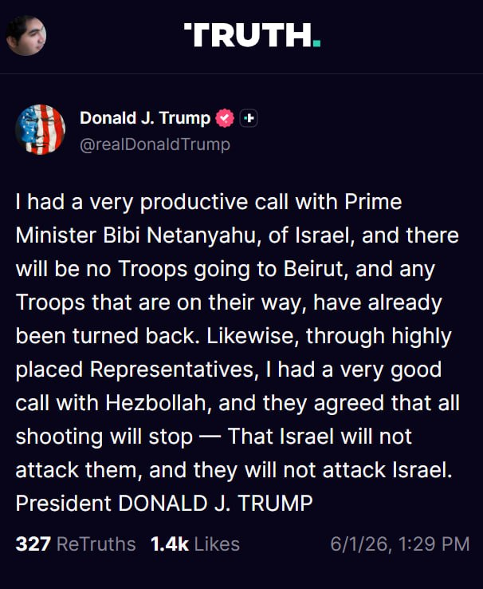

ترامپ: اسرائیل و حزب‌الله پذیرفتند حمله‌ها متوقف شود

ترجمه ماشین:
من تماس بسیار سازنده‌ای با نخست‌وزیر اسرائیل، بی‌بی نتانیاهو، داشتم و هیچ نیرویی به بیروت اعزام نخواهد شد؛ و هر نیرویی هم که در مسیر بوده، همین حالا بازگردانده شده است.
همچنین، از طریق نمایندگان بلندپایه، تماس بسیار خوبی با حزب‌الله داشتم و آن‌ها پذیرفتند که همه تیراندازی‌ها متوقف شود — اینکه اسرائیل به آن‌ها حمله نکند و آن‌ها هم به اسرائیل حمله نکنند.

رئیس‌جمهور دونالد جی. ترامپ
realDonaldTrump

📡 @VahidOnline

## VahidOnline — post 75854

  

ترامپ: محاصره را حفظ می‌کنیم

توییت‌های خبرنگار NBC، ترجمه ماشین:
تازه: رئیس‌جمهور ترامپ به من گفت که درباره گزارش‌ها مبنی بر تعلیق مذاکرات ایران با آمریکا، چیزی از ایران نشنیده است؛ اما اگر درست باشد، اشکالی ندارد:
«فکر می‌کنم اگر حقیقت را بخواهید، زیادی حرف زده‌ایم. به نظرم سکوت کردن خیلی خوب خواهد بود، و این می‌تواند برای مدتی طولانی باشد.»

او ادامه داد: «این به آن معنا نیست که قرار است برویم و همه‌جا آنجا بمب بریزیم. فقط سکوت می‌کنیم. محاصره را حفظ می‌کنیم. محاصره یک تکه فولاد است.»

آیا می‌تواند آن‌ها را آن‌قدر منتظر بگذارد تا کوتاه بیایند؟
«فکر می‌کنم تا هر وقت که بخواهند می‌توانم صبر کنم. آن‌ها دارند ثروت هنگفتی از دست می‌دهند...»

همچنین وقتی از نویسنده کتاب «هنر معامله» درباره گزارش‌های تعلیق مذاکرات پرسیدم به نظر می‌رسید با اکراه نوعی احترام برای مذاکره‌کنندگان ایرانی قائل است:
«این حرف مناسبی است، چون آن‌ها مذاکره‌کنندگان بهتری هستند تا جنگجو.»
GarrettHaake
الان هم:
ترامپ و نتانیاهو دارند تلفنی صحبت میکنند.
J74wabx

📡 @VahidOnline

## VahidOnline — post 75853

  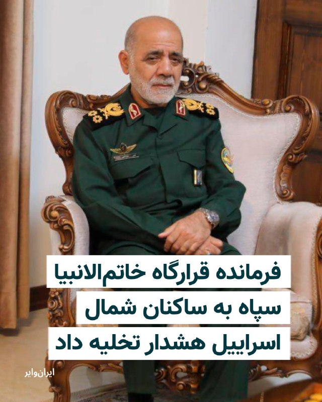

هم‌زمان با صدور هشدار تخلیه از سوی ارتش اسراییل برای ساکنان حومه جنوبی بیروت، فرمانده قرارگاه مرکزی خاتم‌الانبیا به ساکنان مناطق شمالی اسراییل هشدار داد که در صورت عملی شدن تهدیدهای اسراییل علیه لبنان، برای جلوگیری از آسیب، این مناطق را ترک کنند.

علی عبداللهی، فرمانده قرارگاه مرکزی خاتم‌الانبیا، اعلام کرد بنیامین نتانیاهو «در ادامه شرارت‌های خود در منطقه»، ضاحیه و بیروت را به بمباران تهدید کرده و برای ساکنان این مناطق هشدار تخلیه صادر کرده است.

او افزود: «با توجه به نقض مکرر آتش‌بس توسط اسراییل، در صورت عملی شدن این تهدید، به ساکنان بخش‌های شمالی و شهرک‌های نظامی در سرزمین‌های اشغالی هشدار می‌دهیم اگر نمی‌خواهند آسیب ببینند منطقه را ترک کنند.»
@VahidHeadline

📡 @VahidOnline

## VahidOnline — post 75852

  <a href="telegram/content/VahidOnline_75852_1780342592.mp4" target="_blank">🎬 Download video</a>

«حمید سلیمیان» در حال نواختن تنبک
#حمید_سلیمیان، متأهل و پدر یک پسر چهارماهه شامگاه ۱۸ دی‌ماه ۱۴۰۴ در جریان اعتراضات در زرین‌شهر اصفهان با شلیک مستقیم گلوله جنگی جان خود را از دست داد.
حمید سلیمیان راننده یکی از شرکت‌های فولاد بود و به گفته نزدیکانش به موسیقی علاقه فراوانی داشت او تنبک و سنتور می‌نواخت.
@VahidHeadline

📡 @VahidOnline

## VahidOnline — post 75843

هم‌زمان با تشدید حملات نظامی اسراییل به لبنان، مقام‌های جمهوری اسلامی بار دیگر تاکید کردند که هرگونه آتش‌بس میان ایران و آمریکا باید شامل همه جبهه‌های درگیری، به‌ویژه لبنان، باشد و هشدار دادند ادامه حملات به این کشور می‌تواند پیامدهایی در پی داشته باشد.

بنیامین نتانیاهو، نخست‌وزیر اسراییل، روز دوشنبه ۱۱ خرداد ۱۴۰۵، اعلام کرد که به ارتش این کشور دستور داده است اهداف متعلق به حزب‌الله در ضاحیه، حومه جنوبی بیروت، را هدف قرار دهد. او در یک پیام ویدیویی گفت: «هیچ وضعیتی وجود نخواهد داشت که حزب‌الله شهرها و شهروندان ما را هدف قرار دهد اما مقرهای تروریستی آن در ضاحیه بیروت از حمله مصون بماند.»

دفتر نخست‌وزیر اسراییل در بیانیه‌ای اعلام کرد نتانیاهو و یسراییل کاتس، وزیر دفاع این کشور، در پی آنچه «نقض مکرر آتش‌بس از سوی حزب‌الله» و «حملات علیه شهرها و شهروندان اسراییل» خوانده شده، به ارتش دستور حمله به «اهداف تروریستی» در حومه جنوبی بیروت را داده‌اند.

نتانیاهو همچنین گفت عملیات زمینی ارتش اسراییل در لبنان در حال گسترش است. اسراییل در جنوب لبنان منطقه‌ای امنیتی ایجاد کرده و می‌گوید هدف از آن جلوگیری از حملات حزب‌الله به مناطق شمالی این کشور است.

در واکنش به این تحولات، عباس عراقچی، وزیر امور خارجه جمهوری اسلامی، در شبکه ایکس نوشت: «آتش‌بس میان ایران و آمریکا، بدون هیچ ابهامی، آتش‌بسی در تمام جبهه‌ها، از جمله لبنان، است.» او افزود نقض آتش‌بس در هر جبهه‌ای «به معنای نقض آتش‌بس در تمامی جبهه‌ها» خواهد بود.
عراقچی همچنین آمریکا و اسراییل را مسوول پیامدهای هرگونه نقض این آتش‌بس دانست. جمهوری اسلامی پیش از این نیز بارها اعلام کرده بود که آتش‌بس میان ایران و آمریکا باید سایر جبهه‌های درگیری، به‌ویژه لبنان، را نیز در بر بگیرد.

ابوالفضل شکارچی، سخنگوی نیروهای مسلح جمهوری اسلامی، نیز به اسراییل هشدار داد که «تداوم جنایات در لبنان برای نیروهای مسلح ایران قابل تحمل نخواهد بود.»

هم‌زمان، محمدباقر قالیباف، رییس مجلس شورای اسلامی و رییس هیات مذاکره‌کننده ایران با آمریکا، با اشاره به آنچه «محاصره دریایی و تشدید جنایات جنگی در لبنان» خواند، این اقدامات را «شواهد آشکار عدم پایبندی آمریکا به آتش‌بس» توصیف کرد.
قالیباف در پیامی به زبان انگلیسی در شبکه ایکس، بدون اشاره به جزییات بیشتر، نوشت: «هر انتخابی بهایی دارد و زمان پرداخت آن فرا می‌رسد. همه‌چیز در نهایت سر جای خود قرار خواهد گرفت.»

این اظهارات در حالی مطرح می‌شود که عملیات نظامی اسراییل علیه حزب‌الله، از گروه‌های مورد حمایت جمهوری اسلامی در منطقه، شدت گرفته است. با وجود تاکید مکرر تهران بر ضرورت گنجاندن لبنان در هر توافق آتش‌بس میان ایران و آمریکا، این مطالبه تاکنون محقق نشده است.
اسماعیل بقایی، سخنگوی وزارت امور خارجه جمهوری اسلامی، نیز روز دوشنبه در نشست خبری هفتگی خود گفت: «ما تاکید کردیم و کماکان تاکید داریم بر این نکته که آتش‌بس در لبنان بخش لاینفک هرگونه آتش‌بس و هرگونه توافق نهایی برای خاتمه جنگ است.»
او همچنین حملات اسراییل به لبنان را از عوامل ایجاد تاخیر در روند دیپلماتیک برای پایان دادن به جنگ میان ایران و آمریکا دانست و بار دیگر بر ضرورت برقراری آتش‌بس در لبنان به عنوان بخشی جدایی‌ناپذیر از هر توافق نهایی تاکید کرد.
@VahidHeadline
تازه‌تر:
خبرگزاری تسنیم، وابسته به سپاه پاسداران، گزارش داد که جمهوری اسلامی در واکنش به ادامه حملات اسراییل به لبنان و آنچه «نقض آتش‌بس در همه جبهه‌ها» خوانده شده، روند گفت‌وگوها و تبادل پیام با آمریکا از طریق میانجی‌ها را متوقف خواهد کرد.
تسنیم همچنین مدعی شده است که ایران و گروه‌های هم‌پیمان آن در «جبهه مقاومت» در حال بررسی اقداماتی از جمله انسداد تنگه هرمز و فعال‌سازی سایر جبهه‌ها از جمله تنگه باب‌المندب هستند. این گزارش می‌گوید این اقدامات با هدف واکنش به حملات اسراییل و حامیان آن در دستور کار قرار گرفته است.
@VahidHeadline
ارتش اسرائیل در بیانیه‌ای به ساکنان منطقه ضاحیه در جنوب بیروت هشدار داد و از آن‌ها خواست برای حفظ جان خود این منطقه را تخلیه کنند.
در این بیانیه آمده است اگر حزب‌الله به شلیک راکت به سوی شهرها و شهرک‌های اسرائیل ادامه دهد، ارتش اسرائیل اهدافی را در ضاحیه جنوبی هدف قرار خواهد داد.
در ادامه تاکید شده است دولت اسرائیل با مردم لبنان در حال جنگ نیست، بلکه با سازمان تروریستی حزب‌الله می‌جنگد.
@VahidOOnLine
در پی اعلام خبرگزاری تسنیم مبنی بر توقف «گفتگوها و تبادل متون از طریق میانجی» میان تهران و واشنگتن، بهای جهانی نفت بیش از ۵ درصد افزایش یافت و به بالاترین سطح خود در هفته‌های اخیر رسید.
@VahidOOnLine

📡 @VahidOnline

## VahidOnline — post 75842

  

رسانه‌های ایران از کشته شدن یک دانشجوی زن در دانشکده دندانپزشکی قزوین به ضرب گلوله خبر داده‌اند.

میزان، خبرگزاری قوه قضائیه، از قول دادستان قزوین نوشت: «بررسی‌های اولیه نشان می‌دهد این دو دانشجو که در آستانه فارغ‌التحصیلی قرار داشتند، در مرحله متارکه از یک رابطه عاطفی بوده و پیش از این نیز اختلافات خانوادگی شدیدی با یکدیگر داشتند. صبح امروز، مرد جوان با یک قبضه سلاح کلت جنگی وارد محوطه درمانگاه شده و چهار گلوله به ناحیه سینه دانشجوی دختر شلیک کرده است. شدت جراحات وارده به‌حدی بوده که متأسفانه وی در همان محل جان خود را از دست می‌دهد.

در اطلاعیه دانشگاه علوم پزشکی قزوین در این باره آمده است: «انگیزه این واقعه، مسایل شخصی و خانوادگی بوده و ارتباطی با فرآیندهای اداری یا محیط آموزشی دانشکده ندارد.»

به گفته حمیدرضا قافله باشی، رئیس دانشگاه علوم پزشکی قزوین، «این تیراندازی به دلیل خصومت‌ خانوادگی اتفاق افتاده و دو دانشجو که زن و شوهر بودند در اثر شلیک جان خود را از دست داده‌اند.»
@VahidHeadline

📡 @VahidOnline

## VahidOnline — post 75841

پیام‌های دریافتی از تهران درباره صدای پرواز یک جنگنده یا هواپیمایی دیگر مربوط به جمهوری اسلامی:

سلام تهران صدای جنگنده اومد همین الان

غرب تهران وحشتناک صدا جنگنده میاد ۹:۱۵

صدای جنگنده داره میاد غرب تهرانم ساعت ۹.۱۴

سلام وحید همین الان تهران صدای جنگنده میومد نزدیک ۲ دقیقه

شمال شرق تهران صدای جنگنده

سلام تهران صدا جنگنده شدید

الان از بالا سر ما صدای جنگنده اومد
رد شد رفت

همین الان منطقه گیشا صدای جنگنده میاد

همین الان ساعت ۹:۱۵ دقیقه صدای جنگنده سمت غرب تهران اومد(فکر میکنم جنگنده ارتش بوده باشه)

سلام وحید از سمت لویزان تهران موشک بلند شد

وحید الان ساعت ۹:۱۵ صدا جت منطقه ۲ تهران

تهران-فرمانيه
ساعت 9;16 صداي جنگنده مياد

وحید تهران ساعت ۹:۱۷ صدا جت میاد زیاد
هروی

الو سلام تهران سمت شهرک غرب صدای نمیدونم هواپیما بود جنگنده بود چی بود خیلی نزدیک بود

الان ساعت ۹:۱۷ دقیقه در قیطریه صدای جنگنده اومد

شرق تهران صدای جنگنده شنیده شد الان

سلام تهران صدا جنگنده شدید
احتمالا جنگنده های خودشونه
ساعت۹:۱۷

سلام دوشنبه تهران ساعت ۹:۱۵ صدا جنگنده من شنیدم سمت هروی

صدای جنگنده تهران ۹:۱۷

صدای جنگنده منطقه ۳
خیلی پایین بود

تهران صدای جنگنده اومد

سلام ساعت ۹:۱۵ سمت دروس تهران صدای جنگنده اومد

صدای جنگنده شمال تهران ساعت ۹:۱۵ رقیقه

سلام ساعت ۰۹۱۵ دوشنبه صدای پرواز چند جنگنده شمال تهران

منطقه ۳ صدای جنگنده انقدر زیاد و وحشتناک بود که از خواب بیدار شدم

سلام پاسدارانیم صدای جنگنده اومد چند دقیقه پیش

صدای جنگده نارمک

سلام وحید. صدایی که ۹:۱۵ اومد شبیه جنگنده بود ولی از پنجره نگاه کردم شبیه هواپیمای مسافربری بود فقط نمیدونم چرا از ارتفاع کم حرکت میکرد

سلام آقا وحید من خونم گیشاسصدای جنگنده نبود هواپیما بود من بالای خونه رفتم دیدم ولی هواپیما بزرگ بود ی مقدار دیگه باری بود یا سواری نمیدونم ولی از بالای گیشا رد شد

من از روستای اطراف شهریارهستم یه هواپیمای مسافربری بزرگ تو ارتفاع پایین از بالا سرمون رد شد به وضوح دیدمش صداش زیاد بود

سلام وقت بخیر نیاورانم صدای جنگنده اومد وحشتناک بود

وحید من شهرک محلاتیم
بین ۹:۱۵ تا ۹:۲۰ صدای جنگنده میومد
(با ارتفاع پایین)

سلام وحید جان صدای وحشتناک جنگنده ۳ ۴ دقیقه پیش خونرو لرزوند

-هواپیمای کارگو سپاه از تهران بلند شد.
-صدای جنگنده برای این بود؟
-ممکنه برای اسکورتش بوده باشه
J74wabx

📡 @VahidOnline

## VahidOnline — post 75840

پیام‌های دریافتی از #بندرعباس درباره شنیده شدن صدای سه انفجار:

بندرعباس ساعت ۹:۰۷ سه تا انفجار

الان بندرعباس ساعت 9:7 دقیقه 3انفجار قوی

یک صداهایی شبیه برخورد جسم سنگین (بمب یا هرچی) به زمین داره میاد از دوردست.
بندرعباس ساعت ۹:۰۹ صبح دوشنبه

سه تا صدای انفجار اومد بندرعباس
ساعت ۹ و هشت دقیقه

دوشنبه، ۱۱ خرداد ۹:۰۷ صبح. بندرعباس.
صدای ۳ تا انفجار از نزدیکی پایگاه هوایی شنیده شد.

آپدیت:
خبرگزاری تسنیم وابسته به سپاه مدعی شده که مربوط به مهمات خنثی نشده بوده. البته دو روز پیش‌تر از این هم اعلام کرده بودند که طی ۷۲ ساعت آینده قراره از این صداها شنیده بشه در بندرعباس.

پیام‌های دریافتی از #اصفهان درباره شنیده شدن دو صدای انفجار از دور:

پیام ساعت ۹:۱۷: اصفهان صدای انفجار میاد، دو بار پشت سر هم

اصفهان همین الان صدای انفجار اومد سمت ناحیه ۶

الان اصفهان یه صدایی مثل صدای انفجار اومد

سلام وحید، اصفهان ساعت ۹:۱۸ ۲تا صدا مثل انفجار و کمی لرزش حس کردم فاصلش خیلی دور بود، بین ساعت ۸ تا ۹ هم یک صدای مشابه اومد فکر کردم توهم زدم

اصفهان صدا انفجار نزدیکای جی شیر(مطمئن نیستم)

سلام. اصفهان حدود ساعت ۹:۱۵ صدای ۲ تا انفجار به فاصله چند ثانیه.
نمی دونم چیزی زدن یا دارند مهمات خنثی می کنند. البته تقریبا هر روز صبح یه صدا میاد که به خنثی سازی میخوره.
امروز ۲ تا پشت سر هم بود.

📡 @VahidOnline

## VahidOnline — post 75839

  

پست ترامپ، ترجمه ماشین:
ایران واقعاً می‌خواهد به توافق برسد، و این توافق برای ایالات متحده آمریکا و کسانی که با ما هستند، توافق خوبی خواهد بود.
اما آیا دموکرات‌های کودن و بعضی جمهوری‌خواهانِ ظاهراً غیرمیهن‌دوست نمی‌فهمند وقتی سیاسی‌کارها مدام و با شدتی بی‌سابقه غر می‌زنند که باید سریع‌تر حرکت کنم، یا کندتر، یا جنگ کنم، یا جنگ نکنم، یا هر چیز دیگری، کار درست و مذاکره برای من خیلی سخت‌تر می‌شود؟

فقط بنشینید و آرام باشید؛ در پایان همه‌چیز خوب پیش خواهد رفت — همیشه همین‌طور است!

رئیس‌جمهور، دی‌جی‌تی
realDonaldTrump

📡 @VahidOnline

## VahidOnline — post 75838

پیام‌های دریافتی:
امیدیه خوزستان صدای انفجار شنیده میشه

از امیدیه خوزستان پیام میدم
طرفای ساعت ۸:۱۳ دقیقه صدای ترکیدن اومد
ساعت ۸:۳۱ دوباره زدن

همین چند دقیقه پیش صدای انفجار واضح ای اومد

امیدیه هستم و صدای دوتا انفجار شدید ساعت 8:33 اومدش.

📡 @VahidOnline

## VahidOnline — post 75836

قوه قضائیه جمهوری اسلامی اعلام کرد که دو نفر دیگر از معترضان دی‌ماه ۱۴۰۴ را به اتهام «آتش‌زدن مسجد [گیشا]»، «لیدری کودتا»، «تخریب اموال عمومی» و «مسدودسازی خیابان‌ها» اعدام کرده است.

نام این دو معترض که بامداد دوشنبه یازدهم خرداد اعدام شدند، مهرداد محمدی‌نیا و اشکان مالکی اعلام شده است.

میزان نوشته این دو «از عوامل اصلی آتش‌زدن مسجد جعفری در محله کوی نصر تهران [بودند] که اقدام به تخریب و آتش‌زدن مسجد، تخریب اموال عمومی، درگیری با مأموران حافظان امنیت، انسداد خیابان‌ها و ممانعت از عبور و مرور مردم کرده بودند.»

دستگاه قضایی جمهوری اسلامی در ماه‌های اخیر به شکل تقریباً روزانه اقدام به اجرای احکام اعدام معترضان و یا افرادی می‌کند که آن‌ها را به همکاری با آمریکا و اسرائیل متهم می‌کند. برخی نهادهای حقوق‌بشری می‌گویند جمهوری اسلامی از اعدام برای ایجاد فضای ترس و به‌عنوان عامل سرکوب استفاده می‌کند.
@VahidHeadline

📡 @VahidOnline

## IranIntlTV — post 340106

  <a href="telegram/content/IranIntlTV_340106_1780342594.mp4" target="_blank">🎬 Download video</a>

دونالد ترامپ گفت با وجود هشدارهای مطرح‌شده در تهران درباره توقف مذاکرات، گفت‌وگو با جمهوری اسلامی با سرعت در جریان است. همزمان، تسنیم نوشت جمهوری اسلامی در واکنش به عملیات اسرائیل در لبنان، تبادل پیام با آمریکا را متوقف می‌کند.

گفت‌وگو با علیرضا نامور حقیقی، تحلیل‌گر سیاسی
@iranintltv

## IranIntlTV — post 340105

  <a href="telegram/content/IranIntlTV_340105_1780342596.mp4" target="_blank">🎬 Download video</a>

جنون تازه سپاه برای نجات حزب‌الله به قیمت ویرانی ایران

چشم‌انداز با مهدی مهدوی‌آزاد

نسخه کامل این برنامه در یوتیوب:
https://youtu.be/l-gagx4Mdhg
@iranintltv

## IranIntlTV — post 340104

  <a href="https://t.me/IranintlTV/340104" target="_blank">📎 Download file</a>

🎧نسخه صوتی چشم‌انداز: جنون تازه سپاه برای نجات حزب‌الله به قیمت ویرانی ایران
@iranintlTV

## IranIntlTV — post 340103

  

🔻‌بی‌بی‌سی اسپرت در گزارشی درباره تیم ملی، با اشاره به غیبت نام سردار آزمون در لیست نهایی امیر قلعه‌نویی برای جام جهانی ۲۰۲۶، نوشت: «سردار آزمون از فهرست تیم ملی برای جام جهانی کنار گذاشته شد؛ این مهاجم که برای شباب الاهلی امارات بازی می‌کند، خشم حاکمیت را برانگیخته است.»

🔹در گزارش دیگری، سایت اتلتیک نیز با اشاره به حذف سردار آزمون از تیم ملی نوشته است: «آزمون که در ۹۱ بازی ملی ۵۷ گل به ثمر رسانده، پیش‌تر نیز در فهرست اولیه قرار نگرفته بود و قلعه‌نویی، سرمربی تیم ملی با وجود درخواست معاون رئیس‌جمهور، برای بازگشت این مهاجم، تصمیم خود را تغییر نداد.»

🔹سایت ای‌اس‌پی‌ان نیز که با تیتر «ستاره ایران، سردار آزمون، در فهرست نهایی جام جهانی جایی ندارد» لیست سرمربی تیم ملی برای جام جهانی را بررسی کرده است، به خشم جمهوری اسلامی از سردار به دلیل انتشار یک عکس در فضای مجازی اشاره می‌کند.

🔹رویترز هم در گزارش دیگری می‌نویسد: «رسانه‌های داخلی گزارش دادند که دلیل حذف سردار توسط امیر قلعه‌نویی، اقدامی تعبیرشده به بی‌وفایی نسبت به حکومت بوده است.»

گزارش کامل را در سایت بخوانید.

@iranintltvsport

## IranIntlTV — post 340102

  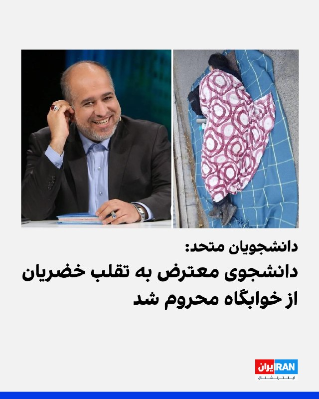

«دانشجویان متحد» به نقل از کانال «علامه آزاد»، گزارش داد علی خضریان، نماینده مجلس و دانشجوی دکتری علوم سیاسی دانشگاه علامه طباطبایی، در آزمون جامع دکتری پاییز ۱۴۰۳ با وجود تحویل برگه‌ای که گفته می‌شود بدون پاسخ بوده، پذیرفته شده است.
طبق این گزارش، پذیرش او با ضوابط آموزشی آزمون جامع دکتری سازگار نبوده و تاکنون توضیح رسمی در این‌باره ارائه نشده است.
دانشجویان متحد نوشت جواد شقاقی، دانشجوی دکتری علوم سیاسی دانشگاه علامه طباطبایی، در اعتراض به تخلف آموزشی خضریان و همکاری گروه علوم سیاسی دانشگاه با این رفتار، به سوالات آزمون جامع دکتری پاسخ نداد. گروه علوم سیاسی، اعتراض این دانشجو را وارد ندانسته و او را از تحصیل محروم کرد.
بر اساس این گزارش، گروه علوم سیاسی در واکنش به این اعتراض، گفته که گروه صلاح دانسته از خضریان سوالی نپرسد و به برگه سفید او نمره بدهد.
دانشجویان متحد اضافه کرد شقاقی که تا دوره پیش از جنگ در خوابگاه دانشگاه علامه طباطبایی اقامت داشت به تازگی برای پیگیری وضعیت تحصیلی خود به خوابگاه مراجعه کرد اما با ممانعت حراست برای ورود مواجه شد و مجبور شد چند شب را در مقابل درب خوابگاه بخوابد.
https://iran

## IranIntlTV — post 340101

  <a href="telegram/content/IranIntlTV_340101_1780342599.mp4" target="_blank">🎬 Download video</a>

۲۴ با فرداد فرحزاد
@iranintltv

## IranIntlTV — post 340100

  

محمد کرمی، فرمانده نیروی زمینی سپاه، از «آمادگی ۱۰۰ درصدی» این نیرو برای مقابله با تهدیدات خبر داد و گفت: «سطح آمادگی نیرو‌های مسلح امروز حتی از زمان آغاز جنگ اخیر نیز فراتر رفته است.»

او افزود: «هیچ مشکلی در سطح نیرو وجود ندارد و برای مقابله با هرگونه تهدید و نبرد زمینی در آمادگی کامل هستیم.»
https://iranintl.com/202606015072

## IranIntlTV — post 340099

  <a href="telegram/content/IranIntlTV_340099_1780342600.mp4" target="_blank">🎬 Download video</a>

شبکه خبری السومریه روز دوشنبه از انفجار در یک کشتی باری با پرچم پاناما پس از پایان تخلیه محموله خود در نزدیکی بندر ام‌القصر در آب‌های سرزمینی عراق خبر داد.

به گزارش این شبکه، مقام‌های امنیتی انفجار در کشتی MSC SARISKA V را ناشی از نقص فنی اعلام کردند. با این حال، سازمان عملیات تجارت دریایی بریتانیا (UKMTO) اعلام کرد گزارشی دریافت کرده که بر اساس آن، یک کشتی باری در خلیج فارس و در حدود ۴۰ مایل دریایی جنوب‌شرقی ام‌القصر، با یک پرتابه ناشناس هدف قرار گرفته است.
@iranintltv

## IranIntlTV — post 340098

  

علی‌اکبر ولایتی، مشاور رهبر جمهوری اسلامی در شبکه اجتماعی ایکس نوشت که بمباران ضاحیه و نقض آتش‌بس، عجله اسرائیل برای پایان دادن به تاریخ خود است.

ولایتی افزود: شما آغاز کردید، اما برخلاف انفعال تماشاچیان منطقه، جمهوری اسلامی و جبهه مقاومت تا آخر کنار مردم عزیز لبنان، از مسلمان تا مارونی ایستاده است.
https://iranintl.com/202606011355

## IranIntlTV — post 340097

  <a href="https://t.me/IranintlTV/340097" target="_blank">📎 Download file</a>

🎧نسخه صوتی تیتراول با نیوشا صارمی: مذاکرات متوقف شد؛ تنش چند جبهه‌ای در منطقه؛هشدار تخلیه همزمان اسرائیل و سپاه
@iranintlTV

## IranIntlTV — post 340096

  <a href="telegram/content/IranIntlTV_340096_1780342602.mp4" target="_blank">🎬 Download video</a>

مهدی مهدوی‌آزاد در برنامه «چشم‌انداز» گفت: «مجموعه‌ای از شواهد وجود دارد که نشان می‌دهد همین "برادران قاچاقچی" سپاه و همین نهاد فاسد، به دنبال یک ماجراجویی تازه هستند؛ تلاشی برای بیرون کشیدن حزب‌الله لبنان از زیر ضربات اسرائیل.»

او افزود: «ظاهرا حاضرند برای نجات بقایای حزب‌الله، ایران را وارد یک جنگ تازه کنند؛ به بهای ویرانی بیشتر ایران و تحمیل یک جنگ دیگر به کشور.»
@iranintltv

## IranIntlTV — post 340095

  <a href="telegram/content/IranIntlTV_340095_1780342604.mp4" target="_blank">🎬 Download video</a>

🔻علیرضا دبیر، رییس فدراسیون کشتی گفت: «من «حمال» کشتی هستم و به آن افتخار می کنم. خیلی‌ها به اسم حمالی به بالا رسیده‌اند. کشتی ما مثل خاویار و تنگه هرمز و دریای خزر، مزیت رقابتی ماست. کشتی هنوز به ظرفیتی که لایقش است، نرسیده.»

@iranintltvsport

## IranIntlTV — post 340094

  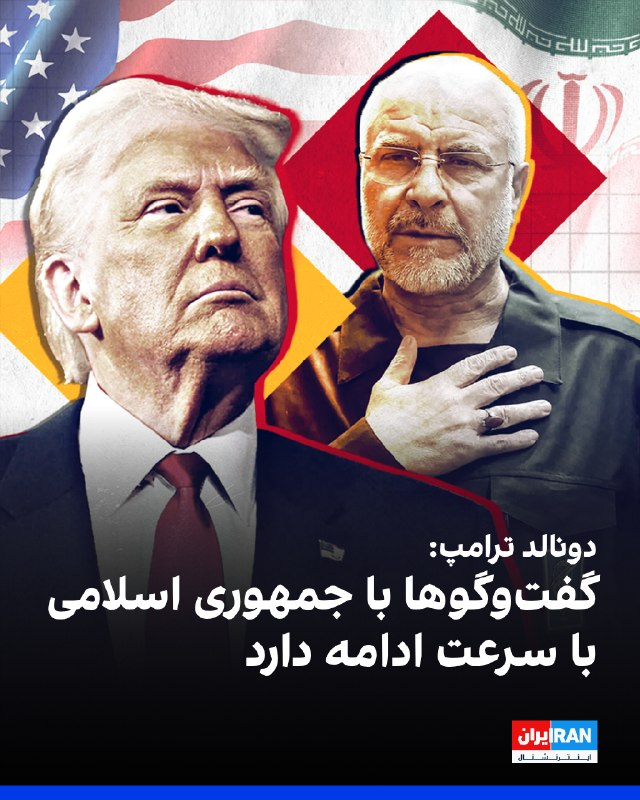

دونالد ترامپ در تروث سوشال نوشت که مذاکرات با جمهوری اسلامی با سرعت ادامه دارد.

او پیش‌تر درباره توقف ارتباط مذاکره‌کنندگان جمهوری اسلامی با آمریکا به دلیل عملیات نظامی اسرائیل در لبنان، افزود: «واقعا برایم مهم نیست، اصلا اهمیت نمی‌دهم.»

ترامپ همچنین در تروث سوشال نوشت با بنیامین نتانیاهو گفت‌وگویی بسیار سازنده داشته و هیچ نیروی نظامی به بیروت اعزام نخواهد شد و نیروهایی که در مسیر بودند نیز بازگردانده شده‌اند.

او اضافه کرد از طریق نمایندگان عالی‌رتبه، با حزب‌الله تماس بسیار خوبی داشته و توافق شده است همه تیراندازی‌ها متوقف شود؛ اسرائیل به آن‌ها حمله نخواهد کرد و آن‌ها نیز به اسرائیل حمله نخواهند کرد.
https://iranintl.com/202606010051

## IranIntlTV — post 340093

  

دونالد ترامپ اعلام کرد با بنیامین نتانیاهو گفت‌وگویی بسیار سازنده داشته و هیچ نیروی نظامی به بیروت اعزام نخواهد شد و نیروهایی که در مسیر بودند نیز بازگردانده شده‌اند.

او همچنین گفت از طریق نمایندگان عالی‌رتبه، با حزب‌الله تماس بسیار خوبی داشته و توافق شده است همه تیراندازی‌ها متوقف شود؛ اسرائیل به آن‌ها حمله نخواهد کرد و آن‌ها نیز به اسرائیل حمله نخواهند کرد.
https://iranintl.com/202606011943

## IranIntlTV — post 340092

  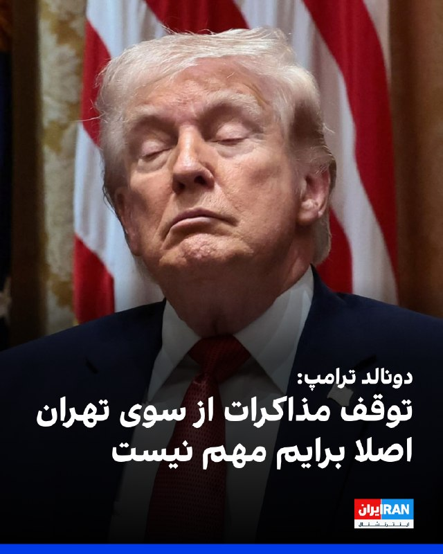

ترامپ در گفت‌وگو با سی‌ان‌بی‌سی در پاسخ به گزارش‌هایی درباره توقف ارتباط مذاکره‌کنندگان جمهوری اسلامی با آمریکا به دلیل عملیات نظامی اسرائیل در لبنان، افزود: «واقعا برایم مهم نیست، اصلا اهمیت نمی‌دهم.»

ترامپ درباره بستن تنگه هرمز از سوی جمهوری اسلامی نیز گفت نگران افزایش قیمت نفت نیست.
او همچنین گفت قصد دارد از بنیامین نتانیاهو درباره وضعیت لبنان سوال کند.
https://iranintl.com/202606010822

## IranIntlTV — post 340091

  <a href="telegram/content/IranIntlTV_340091_1780342607.mp4" target="_blank">🎬 Download video</a>

همزمان با ردوبدل شدن پیام‌ها میان تهران و واشینگتن درباره تفاهم احتمالی، جمهوری اسلامی و آمریکا از حمله به مواضع یکدیگر در منطقه خبر می‌دهند.

گفت‌وگو با فرزین ندیمی، پژوهشگر ارشد امور دفاعی و امنیتی
@iranintltv

## IranIntlTV — post 340090

  <a href="telegram/content/IranIntlTV_340090_1780342609.mp4" target="_blank">🎬 Download video</a>

جمهوری اسلامی در واکنش به تشدید عملیات اسرائیل در لبنان، تبادل پیام با آمریکا را متوقف کرد.
همزمان، ارتش اسرائیل برای ساکنان حومه جنوبی بیروت دستور تخلیه صادر کرد.

گزارش سمیرا قرایی و بابک اسحاقی، خبرنگاران ایران‌اینترنشنال
@iranintltv

## IranIntlTV — post 340089

  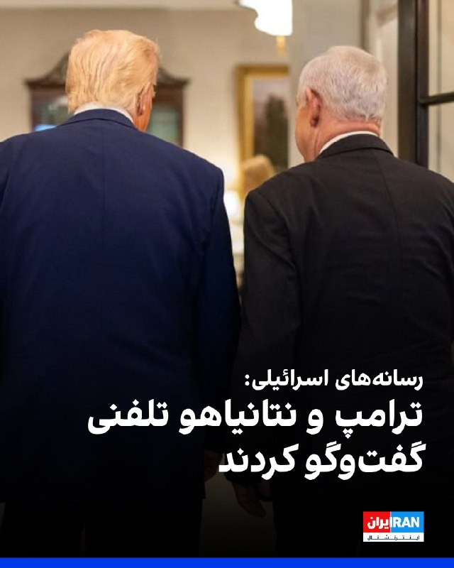

رسانه‌های اسرائیلی گزارش دادند بنیامین نتانیاهو دوشنبه با دونالد ترامپ به‌صورت تلفنی گفت‌وگو کرده است. جزئیات بیشتری از این تماس منتشر نشده است.

دوشنبه همزمان با حملات اسرائیل به جنوب لبنان، قرارگاه مرکزی خاتم‌الانبیا به ساکنان شمال اسرائیل هشدار تخلیه داد.
خبرگزاری تسنیم نیز از توقف گفت‌وگوها با آمریکا به علت حملات اسرائیل به لبنان خبر داد.

محمد مخبر، مشاور مجتبی خامنه‌ای، گفت هرگونه آتش‌بس بدون در نظر گرفتن لبنان و سایر جبهه‌های مقاومت «فاقد موضوعیت» دانست.
https://iranintl.com/202606014520

## IranIntlTV — post 340088

  <a href="telegram/content/IranIntlTV_340088_1780342611.mp4" target="_blank">🎬 Download video</a>

ویدیوهای منتشرشده در شبکه‌های اجتماعی نشان می‌دهد که در پی حمله ارتش اسرائیل به مواضع حزب‌الله در جنوب لبنان، بخش‌هایی از بیمارستان جبل عامل در شهر صور آسیب دیده است.
@iranintltv

## IranIntlTV — post 340087

  

فرماندهی مرکزی آمریکا، سنتکام در شبکه ایکس اعلام کرد که از آغاز محاصره دریایی ایران تاکنون ۱۲۱ کشتی تجاری مجبور به تغییر مسیر شده‌اند و پنج کشتی نیز توسط نیروهای آمریکایی از کار انداخته شده‌اند.

همزمان ترامپ درباره توقف مذاکرات از سوی تهران به دلیل حملات اسرائیل به لبنان، گفت که پیش از این تصمیم، از آن مطلع نشده بود. او افزود: «این به این معنا نیست که ما برویم و شروع به بمباران همه‌جا کنیم. ما محاصره را ادامه خواهیم داد».
https://iranintl.com/202606019608

## Shin_Persian — post 6375

Shin ✓ @hey_itsmyturn Mon, 01 Jun 2026 19:02:58 UTC Regime media report last night 2 IRGC's Basij terrorists were killed following the detonation of UXO in a "military position" in Qom Province 1. Hossein Ramezanian Fordoii 2. Mohammad Oveisi Fordoii …

## Shin_Persian — post 6374

Shin ✓ @hey_itsmyturn
Mon, 01 Jun 2026 19:02:58 UTC

Regime media report last night 2 IRGC's Basij terrorists were killed following the detonation of UXO in a "military position" in Qom Province

1. Hossein Ramezanian Fordoii
2. Mohammad Oveisi Fordoii

Yet, I have 2 different names:
Both from IRGC QF's 840th unit (weird huh? QF operates out of Iran, not inside the country)
1. Ali Qomi
2. Sorush Mohammadi

#Iran

فارسی

رسانه‌های رژیم گزارش می‌دهند که شب گذشته ۲ تروریست بسیج سپاه پاسداران (IRGC) در پی انفجار مهمات عمل‌نکرده (UXO) در یک «موضع نظامی» در استان قم کشته شدند.

۱. حسین رمضانیان فردویی
۲. محمد اویسی فردویی

با این حال، من ۲ نام متفاوت دارم:
هر دو از واحد ۸۴۰ نیروی قدس سپاه پاسداران (عجیبه نه؟ نیروی قدس خارج از ایران فعالیت می‌کند، نه داخل کشور)
۱. علی قمی
۲. سروش محمدی

#Iran

𝕏 · @shin_persian

## Shin_Persian — post 6373

🔁 Quoting above tweet:
Shin ✓ @hey_itsmyturn
Mon, 01 Jun 2026 18:33:09 UTC

THE PRESIDENT OF THE UNITED STATES OF AMERICA had a "VERY GOOD CALL WITH HEZBOLLAH", which is a designated FTO (Foreign Terror Organization)
(https://www.state.gov/foreign-terrorist-organizations)

Cool.

فارسی

رئیس‌جمهور ایالات متحده آمریکا یک «تماس بسیار خوب با حزب‌الله» داشت، که یک FTO (سازمان تروریستی خارجی) تعیین شده است.
(https://www.state.gov/foreign-terrorist-organizations)

عالیه.

𝕏 · @shin_persian

## Shin_Persian — post 6372

  

↩️ Quoted tweet: Open Source Intel ✓ @Osint613 Mon, 01 Jun 2026 17:32:55 UTC Trump: “I had a very productive call with Prime Minister Bibi Netanyahu, of Israel, and there will be no Troops going to Beirut, and any Troops that are on their way, have already…

## Shin_Persian — post 6371

↩️ Quoted tweet:
Open Source Intel ✓ @Osint613
Mon, 01 Jun 2026 17:32:55 UTC

Trump: “I had a very productive call with Prime Minister Bibi Netanyahu, of Israel, and there will be no Troops going to Beirut, and any Troops that are on their way, have already been turned back. Likewise, through highly placed Representatives, I had a very good call with

↩️ توییت نقل‌قول شده — برای پاسخ، پست زیر را ببینید.

فارسی

ترامپ: «من تماس بسیار سازنده‌ای با بی‌بی نتانیاهو، نخست‌وزیر اسرائیل داشتم و هیچ نیروی نظامی به بیروت اعزام نخواهد شد و هر نیرویی که در راه است، پیش‌تر بازگردانده شده است. به همین ترتیب، از طریق نمایندگان عالی‌رتبه، تماس بسیار خوبی با مابقی داشتم...»

𝕏 · @shin_persian

## Shin_Persian — post 6370

  

UKMTO Operations Centre @UK_MTO
Mon, 01 Jun 2026 18:17:29 UTC

UKMTO WARNING 063-26 UPDATE 001

Click here to view the full warning⤵️
http://www.ukmto.org/-/media/ukmto/products/20260601-ukmto_warning_063-update_001.pdf?rev=759b918daac243ee8b0c2004571f13ba

#MaritimeSecurity #MarSec

فارسی

هشدار یو‌کی‌ام‌تی‌او (UKMTO) ۰۶۳-۲۶ به‌روزرسانی ۰۰۱

برای مشاهده متن کامل هشدار اینجا کلیک کنید⤵️
http://www.ukmto.org/-/media/ukmto/products/20260601-ukmto_warning_063-update_001.pdf?rev=759b918daac243ee8b0c2004571f13ba

#MaritimeSecurity #MarSec

𝕏 · @shin_persian

## Shin_Persian — post 6369

Shin ✓ @hey_itsmyturn
Mon, 01 Jun 2026 18:15:39 UTC

Jet activity over Tehran,
Tehran Province, #Iran

فارسی

فعالیت جنگنده‌ها بر فراز تهران،
استان تهران، #Iran

𝕏 · @shin_persian

## Shin_Persian — post 6367

  

Shin ✓ @hey_itsmyturn
Mon, 01 Jun 2026 17:45:43 UTC

President Trump @POTUS:
"Talks are continuing, at a rapid pace, with the Islamic Republic of Iran. Thank you for your attention to this matter! President DONALD J. TRUMP"

فارسی

رئیس‌جمهور ترامپ @POTUS:

«گفتگوها با جمهوری اسلامی ایران با سرعتی بالا در حال انجام است. از توجه شما به این موضوع سپاسگزارم! رئیس‌جمهور دونالد جی. ترامپ»

𝕏 · @shin_persian

## Shin_Persian — post 6366

  

Shin ✓ @hey_itsmyturn
Mon, 01 Jun 2026 16:32:32 UTC

#USAF 🇺🇸 Tankers in the region as of 1631Z:

KC-46A (AE5F9B | 18-46048)
KC-46A (AE5F9A | 18-46047)
KC-135R (AE0628 | 58-0122)
KC-46A (AE5FA0 | 18-46053)

فارسی

#USAF (نیروی هوایی ایالات متحده) 🇺🇸 تانکرهایی در منطقه تا ساعت ۱۶۳۱Z (۲۰:۰۱ به وقت تهران):

KC-46A (AE5F9B | 18-46048)
KC-46A (AE5F9A | 18-46047)
KC-135R (AE0628 | 58-0122)
KC-46A (AE5FA0 | 18-46053)

𝕏 · @shin_persian

## Shin_Persian — post 6365

Shin ✓ @hey_itsmyturn
Mon, 01 Jun 2026 16:17:13 UTC

IRGC Khatam Al Anbiya's terror commander, ‌Brigadier General Abdollahi:
"Benjamin Netanyahu, in a continued escalation of his regional aggressions, has threatened to bomb Dahiya and Beirut and issued an evacuation warning to their residents.
Considering the regime's repeated violations of the ceasefire, if this threat is actualized, we warn residents of the northern sectors and military settlements in the occupied territories to evacuate the area if they wish to avoid harm."

#Iran

فارسی

سردار سرتیپ عبداللهی، فرمانده تروریستی قرارگاه خاتم‌الانبیا سپاه پاسداران (IRGC):
«بنیامین نتانیاهو در ادامه تشدید تجاوزات منطقه‌ای خود، تهدید به بمباران ضاحیه و بیروت کرده و هشدار تخلیه برای ساکنان آن‌ها صادر نموده است.
با توجه به نقض مکرر آتش‌بس توسط این رژیم، در صورت عملی شدن این تهدید، به ساکنان بخش‌های شمالی و شهرک‌های نظامی در اراضی اشغالی هشدار می‌دهیم که اگر می‌خواهند آسیبی نبینند، منطقه را تخلیه کنند.»

#Iran

𝕏 · @shin_persian

## Shin_Persian — post 6364

🔁 Quoting above tweet:
Shin ✓ @hey_itsmyturn
Mon, 01 Jun 2026 16:06:57 UTC

U.S. forces are enforcing a blockade against Iran. As of June 1, CENTCOM has redirected 121 commercial vessels and disabled 5 others to ensure compliance.

Source: @CENTCOM
https://x.com/CENTCOM/status/2061479583631741344

فارسی

نیروهای ایالات متحده در حال اجرای محاصره علیه ایران هستند. تا تاریخ ۱ ژوئن، سنتکام (فرماندهی مرکزی ایالات متحده) ۱۲۱ کشتی تجاری را تغییر مسیر داده و ۵ فروند دیگر را برای اطمینان از پایبندی، متوقف کرده است.

منبع: @CENTCOM
https://x.com/CENTCOM/status/2061479583631741344

𝕏 · @shin_persian

## Shin_Persian — post 6363

  <a href="telegram/content/Shin_Persian_6363_1780342615.mp4" target="_blank">🎬 Download video</a>

↩️ Quoted tweet: U.S. Central Command ✓ @CENTCOM Mon, 01 Jun 2026 16:06:47 UTC Thousands of U.S. service members at sea, in the skies, and from land are supporting the ongoing U.S. blockade against Iran. As of June 1, CENTCOM forces have redirected 121 commercial…

## Shin_Persian — post 6362

↩️ Quoted tweet:
U.S. Central Command ✓ @CENTCOM
Mon, 01 Jun 2026 16:06:47 UTC

Thousands of U.S. service members at sea, in the skies, and from land are supporting the ongoing U.S. blockade against Iran. As of June 1, CENTCOM forces have redirected 121 commercial vessels and disabled 5 to ensure compliance.

↩️ توییت نقل‌قول شده — برای پاسخ، پست زیر را ببینید.

فارسی

هزاران نفر از پرسنل نظامی ایالات متحده در دریا، آسمان و زمین از محاصره جاری ایالات متحده علیه ایران حمایت می‌کنند. تا تاریخ ۱ ژوئن، نیروهای سنتکام (CENTCOM - ستاد فرماندهی مرکزی ایالات متحده) جهت اطمینان از پایبندی، مسیر ۱۲۱ کشتی تجاری را تغییر داده و ۵ فروند را متوقف کرده‌اند.

𝕏 · @shin_persian

## Shin_Persian — post 6357

  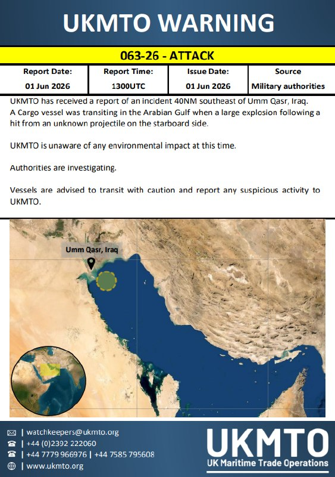

UKMTO Operations Centre @UK_MTO
Mon, 01 Jun 2026 14:23:25 UTC

UKMTO WARNING 063-26

Click here to view the full warning⤵️
http://www.ukmto.org/-/media/ukmto/products/20260601-ukmto_warning_063.pdf?rev=f5e667a1b57c4711b38e8fcadfda022d

#MaritimeSecurity #MarSec

فارسی

هشدار UKMTO (عملیات تجارت دریایی بریتانیا) ۰۶۳-۲۶

برای مشاهده هشدار کامل اینجا کلیک کنید⤵️
http://www.ukmto.org/-/media/ukmto/products/20260601-ukmto_warning_063.pdf?rev=f5e667a1b57c4711b38e8fcadfda022d

#MaritimeSecurity #MarSec

𝕏 · @shin_persian

## Shin_Persian — post 6356

Shin ✓ @hey_itsmyturn
Mon, 01 Jun 2026 14:21:26 UTC

Correction: No new sirens in #Kuwait 🇰🇼

فارسی

اصلاحیه: آژیر خطر جدیدی در #Kuwait 🇰🇼 شنیده نمی‌شود.

𝕏 · @shin_persian

## Shin_Persian — post 6354

↩️ Quoted tweet: U.S. Central Command ✓ @CENTCOM Mon, 01 Jun 2026 12:08:07 UTC Last night at 11 p.m. ET, U.S. forces successfully intercepted two Iranian ballistic missiles targeting American forces based in Kuwait. These missiles were immediately defeated…

## Shin_Persian — post 6353

↩️ Quoted tweet:
U.S. Central Command ✓ @CENTCOM
Mon, 01 Jun 2026 12:08:07 UTC

Last night at 11 p.m. ET, U.S. forces successfully intercepted two Iranian ballistic missiles targeting American forces based in Kuwait. These missiles were immediately defeated and no American personnel were harmed.

U.S. Central Command remains vigilant and will continue to

↩️ توییت نقل‌قول شده — برای پاسخ، پست زیر را ببینید.

فارسی

دیشب در ساعت ۱۱ شب به وقت منطقه زمانی شرقی، نیروهای آمریکایی با موفقیت دو موشک بالستیک ایرانی را که نیروهای آمریکایی مستقر در کویت را هدف قرار داده بودند، رهگیری کردند. این موشک‌ها بلافاصله منهدم شدند و به هیچ‌یک از پرسنل آمریکایی آسیبی نرسید.

فرماندهی مرکزی ایالات متحده (سنتکام) هوشیار باقی مانده و به... ادامه خواهد داد.

𝕏 · @shin_persian

## Shin_Persian — post 6352

↩️ Quoted tweet: U.S. Central Command ✓ @CENTCOM Mon, 01 Jun 2026 12:07:08 UTC Last night at 11 p.m. ET, U.S. forces successfully intercepted two Iranian ballistic missile targeting American forces based in Kuwait. These missiles were immediately defeated…

## Shin_Persian — post 6351

↩️ Quoted tweet:
U.S. Central Command ✓ @CENTCOM
Mon, 01 Jun 2026 12:07:08 UTC

Last night at 11 p.m. ET, U.S. forces successfully intercepted two Iranian ballistic missile targeting American forces based in Kuwait. These missiles were immediately defeated and no American personnel were harmed.

U.S. Central Command remains vigilant and will continue to

↩️ توییت نقل‌قول شده — برای پاسخ، پست زیر را ببینید.

فارسی

دیشب در ساعت ۱۱ شب به وقت منطقه زمانی شرقی، نیروهای ایالات متحده با موفقیت دو موشک بالستیک ایرانی را که نیروهای آمریکایی مستقر در کویت را هدف قرار داده بودند، رهگیری کردند. این موشک‌ها بلافاصله منهدم شدند و به هیچ‌یک از پرسنل آمریکایی آسیبی وارد نشد.

فرماندهی مرکزی ایالات متحده (سنتکام) هوشیار باقی می‌ماند و به... ادامه خواهد داد.

𝕏 · @shin_persian

## reutersworldchannel — post 151527

  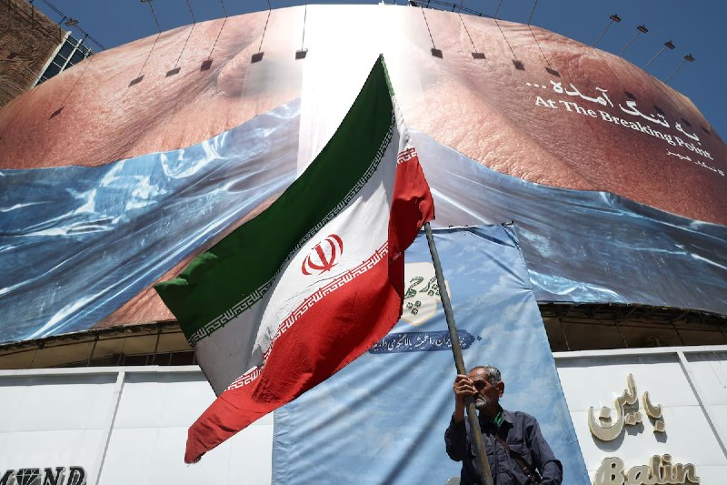

Iran halting indirect talks with US over Israel's Lebanon incursion, Tasnim says

ran is halting indirect negotiations with the U.S. ​after Israel ordered troops to push deeper into Lebanon to battle Tehran-backed Hezbollah, the Iranian news agency Tasnim said on Monday, complicating diplomatic efforts to end three months of war.

Tasnim said the Islamic Republic's ‌negotiating team was stopping exchanging messages with Washington through mediators over attacks on Lebanon, where the U.S.-Israeli war against Iran has reignited Israel's conflict with Hezbollah. read more

## ManotoTV — post 105898

  <a href="telegram/content/ManotoTV_105898_1780342619.mp4" target="_blank">🎬 Download video</a>

سخنان عزت‌الله همایون‌فر، ادیب و سیاستمدار، درباره روحیه قوی ملت ایران و ریشه‌های آن در سی قرن تاریخ کشور

## ManotoTV — post 105890

  <a href="telegram/content/ManotoTV_105890_1780342621.mp4" target="_blank">🎬 Download video</a>

حمله گزارش‌شده آمریکا به اهدافی در جنوب ایران، از نظر دامنه محدود بود، اما از نظر پیام نظامی اهمیت داشت. بر اساس روایت آمریکا، این حمله پس از سرنگونی یک پهپاد آمریکایی بر فراز آب‌های بین‌المللی انجام شد و سایت‌های راداری و مراکز فرماندهی و کنترل پهپادی جمهوری اسلامی در سیریک و جزیره قشم را هدف قرار داد.

## FarsiVOA — post 219309

🔺ترامپ از توقف حملات متقابل میان اسرائیل و حزب‌الله لبنان خبر داد

◾️دونالد ترامپ رئیس‌جمهوری ایالات متحده اطلاع داد که اسرائیل و حزب‌الله لبنان موافقت کردند، حملات علیه یکدیگر را متوقف کنند.

⬇️ بیشتر بخوانید:
https://ir.voanews.com/a/lebanon-israel-hezbollah-ceasefire-iran-/8156156.html
@FarsiVOA

## FarsiVOA — post 219308

🔺آمریکا عواید سکه‌های یادبود جام جهانی ۲۰۲۶ را به فرزندان نظامیان اختصاص می‌دهد

◾️وزارت خزانه‌داری ایالات متحده و ضرابخانه آمریکا روز دوشنبه ۱۱ خرداد اعلام کردند که برنامه تولید سکه‌های یادبود جام جهانی فوتبال ۲۰۲۶ آغاز خواهد شد، و تمامی درآمدهای اضافی حاصل از فروش این سکه‌ها به برنامه‌های فوتبال جوانان برای فرزندان خانواده‌های نظامیان آمریکایی اختصاص می‌یابد.

⬇️ بیشتر بخوانید:

https://ir.voanews.com/a/us-treasury-us-mint-launch-fifa-coins-with-all-proceeds-to-military-families-youth-soccer/8156126.html

## FarsiVOA — post 219305

هواگردهای «ام‌وی-۲۲بی اوسپری» متعلق به نیروی تفنگداران دریایی آمریکا، توانایی‌های عملیاتی خود را بر عرشه ناو «یواس‌اس ایوو جیما» به نمایش گذاشتند. این عملیات بخشی از یک ماموریت به نام «ساوترن اسپیر» بود.

@FarsiVOA

## FarsiVOA — post 219304

  <a href="telegram/content/FarsiVOA_219304_1780342622.mp4" target="_blank">🎬 Download video</a>

سرعت گرفتن ماشین اعدام حکومت در سایه تنش‌های نظامی در گفتگو با محمود امیری مقدم رئیس سازمان حقوق بشر ایران

## FarsiVOA — post 219303

  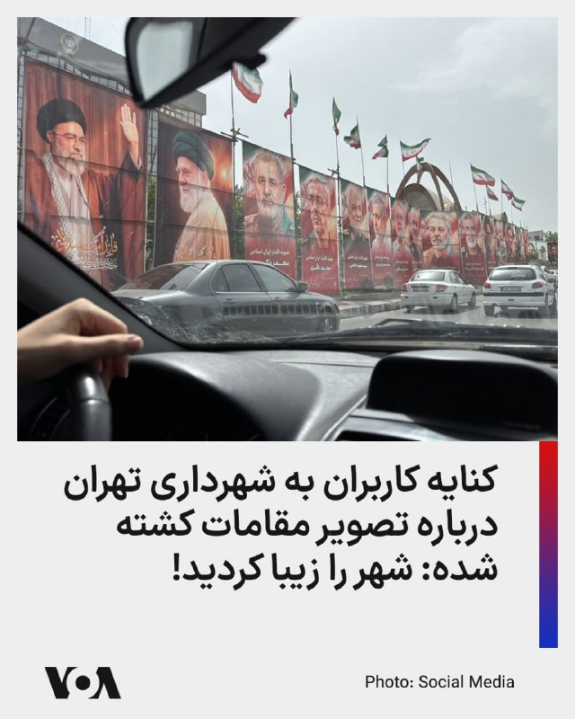

تصویر منتشر شده از بنر سران کشته شده جمهوری اسلامی در تهران، مورد استقبال کاربران شبکه‌های اجتماعی قرار گرفته است. از جمله یک کاربر نوشته‌است: «به معنی واقعی شهر را زیبا کرده و باید برای اولین بار بگوییم شهرداری تهران مچکریم!»

## FarsiVOA — post 219302

روزنامه شرق در گزارشی از موج تازه احضار، تشکیل پرونده، تعلیق و صدور احکام انضباطی برای دانشجویان چند دانشگاه بزرگ ایران خبر داده است؛ روندی که به گفته دانشجویان، هم‌زمان با تعطیلی طولانی دانشگاه‌ها و با نقض اصول شیوه‌نامه انضباطی پیش می‌رود.

بر اساس این گزارش، چهار روز پس از بازگشایی دانشگاه‌ها در اسفند ۱۴۰۴، پس از دو ماه تعطیلی، دانشجویان با تماس‌ها و پیامک‌هایی درباره تشکیل پرونده انضباطی روبه‌رو شدند.

اکنون در خرداد ۱۴۰۵ و در حالی که تعطیلی دانشگاه‌ها به دلیل جنگ به سه ماه نزدیک شده، دانشگاه‌ها پیگیری همان پرونده‌ها و تشکیل پرونده‌های تازه را آغاز کرده‌اند.

گزارش کامل را در وب‌سایت صدای آمریکا بخوانید.

@FarsiVOA

## FarsiVOA — post 219301

صالح اسکندری، فعال سیاسی اصولگرا، با راه‌اندازی کارزاری در خبرگزاری حکومتی فارس، خواستار قطع داوطلبانه اینترنت بین‌المللی در ایران شد.

## FarsiVOA — post 219300

علی جوانمردی: با سیاست آمریکا، ایران بە سمت دموکراسی سکولار می‌رود

## FarsiVOA — post 219299

🔺حرکت بدون توقف ماشین سرکوب جمهوری اسلامی؛ یاشار دارالشفا و منصور باسام هم بازداشت شدند

▪️کانون حقوق بشر ایران روز دوشنبه ۱۱ خرداد، از بازداشت دو شهروند‌ در شهرهای مریوان و تهران خبر داد و اعلام کرد: «هر دو بازداشت‌شدگان به مکانی نامعلوم منتقل شده‌اند و ماموران حکومتی دلیلی برای بازداشت آنها ارائه نکرده‌اند.»

⬇️ بیشتر بخوانید:

https://ir.voanews.com/a/arrest-without-cause-citizens-protesting-repressive-regime-iran-/8156114.html/?nocach=1

## FarsiVOA — post 219298

  <a href="telegram/content/FarsiVOA_219298_1780342624.mp4" target="_blank">🎬 Download video</a>

مسعود پیاهو، هنرمند و موسیقی‌دانی که به دلیل ثبت تصویر «مرد تانکی تهران» به ۱۰ سال حبس محکوم شده است در پیامی ویدیویی اعلام کرد روز سه‌شنبه برای اجرای حکم، خود را به زندان معرفی می‌کند.

این تصویر که پیش از اعتراضات هجدهم و نوزدهم دی سال گذشته و در بحبوحه اعتراضات بازار ثبت شد، صحنه‌ای را نشان می‌داد که در آن یک معترض مقابل نیروهای انتظامی و یگان ویژه روی زمین نشسته بود؛ تصویری که پس از انتشار، به نمادی از اعتراض مدنی و مقاومت فردی در برابر نیروهای امنیتی تبدیل شد.

آقاخانی، وکیل دادگستری، تاکید کرد دفاع موکلش بر این اساس بوده که هیچ قصدی برای انتشار عمومی، همکاری، یا اقدام سازمان‌یافته نداشته و این ویدئو صرفاً برای تعداد محدودی از دوستانش در استوری خصوصی منتشر شده بود. به گفته او، مسعود پیاهو هنگام اطلاع‌رسانی درباره بسته بودن پاساژ، به‌طور اتفاقی صحنه نشستن معترض مقابل نیروهای امنیتی را ثبت کرده است.

## FarsiVOA — post 219297

📢‼️ اطلاعیه مهم
تبلیغات و آگهی‌هایی که در کانال تلگرام صدای آمریکا می‌بینید( از قبیل ارز دیجیتال و ...) هیچ ارتباطی با ما ندارد و به صورت خودکار توسط تلگرام نمایش داده می‌شود. صدای آمریکا محتوای آنها را تایید نمی‌کند و هیچ مسئولیتی در قبال آنها ندارد.

## FarsiVOA — post 219296

  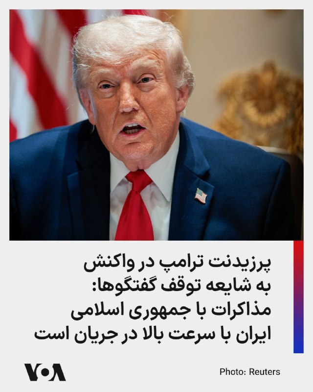

دونالد ترامپ، رئیس جمهوری آمریکا در واکنش به شایعه توقف گفتگوها عنوان کرد: مذاکرات با جمهوری اسلامی ایران با سرعت بالا در جریان است.
پرزیدنت ترامپ پیش از انتشار این موضوع در تروت سوشال به شبکه خبری ان‌بی‌سی نیز گفته بود که نظر او توقف مذاکرات مشکلی ایجاد نمی‌کند چون جمهوری اسلامی در مذاکره بهتر از جنگ است.
او همچنین تاکید کرد که مخاصره دریایی جمهوری اسلامی ادامه می‌یابد.

## FarsiVOA — post 219295

دوگانگی سخنان مقامات حکومتی ازمذاکره تا ادامه جنگ در گفتگو با عرفان نوربخش

## FarsiVOA — post 219291

تفنگداران دریایی، ملوانان و نیروهای گارد ساحلی آمریکا، ۱ خرداد در دریای کارائیب، در نزدیکی ناو «یواس‌اس فورت لادردیل»، یک تمرین عملیات رهگیری دریایی برگزار کردند.

@FarsiVOA

## FarsiVOA — post 219290

  <a href="telegram/content/FarsiVOA_219290_1780342626.mp4" target="_blank">🎬 Download video</a>

حسین قاضیان، جامعه‌شناس در میدان با ابراز نگرانی از خشم و ترامای درمان‌نشده در جامعه می‌گوید جنگ داخلی که درباره‌اش هشدار می‌دهند از قبل شروع شده، مردم با مسلسل کلمات به هم تیراندازی می‌کنند و ممکن است به‌زودی مسلسل واقعی هم دست بگیرند

## DW_Farsi — post 125397

🔶 نرخ تورم سالانه در ایران از ۵۷‌درصد عبور کرد

مرکز آمار ایران روز دوشنبه، ۱۱ خرداد، با انتشار آمار و ارقامی، نرخ تورم نقطه به نقطه تا پایان اردیبهشت ماه را ۸۳.۹ درصد اعلام کرد که بیشترین تورم تجربه شده از سال ۱۴۰۰ به این سو است.

منظور از تورم نقطه به نقطه، درصد تغییر عدد شاخص قیمت نسبت به ماه مشابه سال گذشته است.

تورم نقطه به نقطه در اردیبهشت امسال در حالی در مرز ۸۴ درصد شدن قرار گرفت که در فروردین ماه این شاخص ۱۰.۴ واحد درصد کمتر و ۷۳.۵ درصد محاسبه شده بود.

تورم سالانه نیز با رسیدن به ۵۷.۵ درصد به رقمی رسید که در تاریخ گزارش‌دهی مرکز آمار ایران و بانک مرکزی بی‌سابقه است.

گزارش مرکز آمار ایران همچنین می‌گوید که نرخ تورم نقطه به نقطه خوراکی‌ها و آشامیدنی‌ها به رقم بی‌سابقه ۱۲۹.۸ درصد در دهه‌های اخیر رسید.

سایت خبرآنلاین این افزایش بی‌سابقه نرخ تورم را مستقیما محصول حذف ارز ترجیحی توصیف کرده است.

به گزارش این سایت آمارهای بالای نرخ تورم از سال ۱۴۰۱ به این سو عمدتاَ حاصل اجرای سیاست شوک درمانی ارزی در دولت‌های سیزدهم و چهاردهم بوده است، "این در حالی است که هم در دولت پیش و هم در دولت فعلی، دست اندرکاران وعده کنترل فشارها بر سفره‌های مردم را دادند اما در عمل مردم بر اثر اجرای «یک سیاست» در دو دوره، بیشترین فشار معیشتی را تحمل کردند".

حذف ارز ترجیحی گرچه با هدف از بین‌بردن فساد ناشی از وجود ارز چند نرخی در بازار دنبال شده است، ولی مناسبات نابسامان بین‌المللی و معضلات ریشه‌دار اقتصادی ایران، از فساد سیستماتیک و رانت‌خوری گرفته تا تسلط اختاپوسی هولدینگ‌های خصولتی بر اقتصاد کاهش دائم ارزش پول ملی، و به‌ویژه اثرات تحریم‌ها و پیامدهای دو جنگ اخیر وضعیت معیشتی مردم را به بدترین حالت در یک صد سال اخیر رسانده‌اند.

در این میان اعطای کالابرگ یک میلیون تومانی در ماه به دهک‌های معینی از جامعه تاثیر اندکی در مهار نرخ تورم و بهبود معیشت این اقشار دارد و حالا شماری از اقتصاددانان هشدار می‌دهند که بیش از ۴۰ میلیون جمعیت ایران به زیر خط فقر کشیده شده‌‌اند.
@dw_farsi

## DW_Farsi — post 125396

  <a href="telegram/content/DW_Farsi_125396_1780342626.mp4" target="_blank">🎬 Download video</a>

🎥 هجوم ملخ‌ها به ایران

تصاویر منتشرشده در شبکه‌های اجتماعی از حضور گسترده ملخ‌ها در مشهد خبر می‌دهد. همزمان، خبرگزاری تسنیم، نزدیک به حکومت، از "هجوم ملخ‌های مراکشی" به شرق ایران و تهدید معیشت هزاران خانوار گزارش داده است.
@dw_farsi

## DW_Farsi — post 125395

🔶 ترامپ: در لبنان آتش‌بس می‌شود و مذاکرات با ایران ادامه دارد

دونالد ترامپ، رئیس‌جمهور آمریکا، می‌گوید که "گفت‌وگوها با جمهوری اسلامی ایران با سرعت زیادی ادامه دارد".

او این اظهارات را در شبکه اجتماعی تروث سوشال (Truth Social) و اندکی پس از پیام قبلی‌اش مطرح کرد که در آن از دستیابی به یک توافق جدید آتش‌بس میان اسرائیل و حزب‌الله خبر داده بود.

ترامپ در این پیام ضمن تایید یک تماس "سازنده" با بنیامین نتانیاهو، نخست‌وزیر اسرائیل در روز دوشنبه، نوشت که در نتیجه این تماس "هیچ نیرویی به بیروت اعزام نخواهد شد؛ و هر نیرویی هم که در مسیر بوده، همین حالا بازگردانده شده است".

او همچنین تصریح کرد که از طریق نمایندگان بلندپایه، با حزب‌الله نیز "تماس بسیار خوبی" داشته و "آن‌ها پذیرفتند که همه تیراندازی‌ها متوقف شود ، اینکه اسرائیل به آن‌ها حمله نکند و آن‌ها هم به اسرائیل حمله نکنند".

سایت خبری روزنامه اسرائیلی یعودیت آخرونت ( Ynet) از قول یک مقام اسرائیلی تایید کرد که این کشور به درخواست ایالات متحده، حملات برنامه‌ریزی‌شده خود به بیروت را به تعویق انداخته است. به گفته این منبع، واشنگتن در حال پیشبرد یک ابتکار آتش‌بس بوده و از اسرائیل خواسته است فعلاً دست نگه دارد.

اعلام ترامپ دائر بر موافقت اسرائیل و حزب‌الله با توقف درگیری‌ها، تنها چند ساعت پس از آن صورت گرفت که تهران از زبان رسانه نزدیک به سپاه (تسنیم) تهدید کرده بود در صورت متوقف نشدن حملات ارتش اسرائیل (IDF) در لبنان، مذاکرات با آمریکا را ترک خواهد کرد.

همزمان فرمانده قرارگاه مرکزی خاتم‌الانبیا نیز در واکنش به گسترش عملیات اسرائیل در لبنان و هشدار تخلیه از سوی ارتش این کشور برای ساکنان حومه جنوبی بیروت، متقابلا به ساکنان مناطق شمالی اسراییل "هشدار" داد که "در صورت عملی شدن تهدیدهای اسرائیل علیه لبنان، برای جلوگیری از آسیب، این مناطق را ترک کنند".

علی عبداللهی، در بیانیه خود با متهم‌کردن نخست‌وزیر اسرائیل به "ادامه شرارت‌ها در منطقه"، افزود: «با توجه به نقض مکرر آتش‌بس توسط اسراییل، در صورت عملی شدن این تهدید، به ساکنان بخش‌های شمالی و شهرک‌های نظامی در سرزمین‌های اشغالی هشدار می‌دهیم اگر نمی‌خواهند آسیب ببینند منطقه را ترک کنند.»

به نوشته تایمز اسرائیل، به نظر می‌رسد این روند رخدادها تلاش‌های آمریکا برای جدا نگه داشتن جنگ لبنان از رویارویی خود با ایران را تضعیف می‌کند. جمهوری اسلامی اصرار داشته است که این دو موضوع به یکدیگر مرتبط هستند؛ زیرا در پی حفاظت از متحد خود، حزب‌الله، و حفظ نفوذش بر تحولات لبنان است.
@dw_farsi

## DW_Farsi — post 125394

🔶 "بی‌اطلاعی" ترامپ از تعلیق مذاکرات؛ جلوگیری از حمله به بیروت

دونالد ترامپ، رئیس جمهور آمریکا روز دوشنبه، اول ژوئن در مصاحبه با شبکه ان بی سی، در باره برخی خبرهای رسانه‌های نزدیک به حکومت ایران دائر بر لغو تبادلات پیام‌های مذاکراتی برای توافق با تهران، گفت که در این باره گزارشی دریافت نکرده است.
او گفت: «من چنین چیزی نشنیده‌ام، نمی‌دانم که آیا صحت دارد یا خیر. اگر این‌طور باشد، چیز خوبی خواهد بود ، ما خیلی صحبت کرده‌ایم، شاید بیش از حد.»

ترامپ بعداَ تصریح کرد که "این به آن معنا نیست که ما شروع به بمباران خواهیم کرد. ما فقط سکوت خواهیم کرد. ما محاصره را حفظ می‌کنیم".

رئیس جمهور آمریکا در پاسخ به این پرسش که آیا چنین اقدامی از سوی ایران پیامدی برای تهران خواهد داشت یا خیر، گفت: «نه! مشکلی نیست. آن‌ها مذاکره‌کنندگان بسیار خوبی هستند.»

ترامپ همچنین در پاسخ به این سوال که آیا می‌تواند منتظر خروج ایران (از مذاکرات) بماند، گفت: «فکر می‌کنم می‌توانم تا هر زمان که بخواهند صبر کنم. آنها دارند ثروت زیادی را از دست می‌دهند.»

ساعاتی قبل از این اظهارات ترامپ، خبرگزاری تسنیم، نزدیک به سپاه پاسداران، نوشت که "کسب اطلاع" کرده است که "با توجه به تداوم جنایات رژیم صهیونیستی در لبنان و با عنایت به اینکه لبنان جزو پیش شرط‌های آتش‌بس بوده است و هم اینک این آتش‌بس در همه جبهه‌ها از جمله لبنان نقض شده است، تیم مذاکره‌کننده ایرانی گفتگوها و تبادل متون از طریق میانجی را متوقف می‌کند".

در ادامه خبر تسنیم گفته می‌شود که "توقف فوری عملیات تجاوزکارانه و وحشیانه ارتش اسرائیل در غزه و لبنان و ضرورت عقب‌نشینی کامل از مناطق اشغال شده در لبنان توسط مسئولان و مذاکره‌کنندگان ایرانی مورد تاکید قرار گرفته و تا زمانی که نظر ایران و مقاومت در این زمینه تامین نشود، گفتگویی در کار نخواهد بود".

تسنیم همچنین تهدید کرده است که "جبهه مقاومت و ایران عزم خود را برای انسداد کامل تنگه هرمز، و فعال کردن سایر جبهه‌ها از جمله تنگه باب‌المندب، به منظور تنبیه صهیونیست‌ها و حامیانش در دستور کار قرار داده‌اند".

همزمان فرمانده قرارگاه مرکزی خاتم‌الانبیا در واکنش به گسترش عملیات اسرائیل در لبنان و هشدار تخلیه از سوی ارتش این کشور برای ساکنان حومه جنوبی بیروت، به ساکنان مناطق شمالی اسراییل هشدار داد که "در صورت عملی شدن تهدیدهای اسراییل علیه لبنان، برای جلوگیری از آسیب، این مناطق را ترک کنند".

علی عبداللهی، در بیانیه خود با متهم‌کردن نخست‌وزیر اسرائیل به "ادامه شرارت‌ها در منطقه"، افزود: «با توجه به نقض مکرر آتش‌بس توسط اسراییل، در صورت عملی شدن این تهدید، به ساکنان بخش‌های شمالی و شهرک‌های نظامی در سرزمین‌های اشغالی هشدار می‌دهیم اگر نمی‌خواهند آسیب ببینند منطقه را ترک کنند.»
@dw_farsi

## DW_Farsi — post 125392

🔶 ارتش اسرائیل: یک فرمانده حماس پزشک بیهوشی بود

ارتش اسرائیل روز دوشنبه، اول ژوئن اعلام کرد پزشکی که در بمباران روز شنبه گذشته در دیرالبلح در مرکز نوار غزه جان خود را از دست داد، در واقع در یک جایگاه مهم در شاخه نظامی جنبش مقاومت اسلامی (حماس) داشته است.

نیروهای دفاعی اسرائیل (IDF) فرد کشته‌شده را «جمال ابوعون» معرفی کرده‌اند؛ کسی که رئیس بخش بیهوشی در بیمارستان یافا بوده است. ارتش اسرائیل او را "تروریست" و "فرمانده دسته‌ای از شاخه نظامی حماس، یعنی گردان‌های عزالدین قسام" توصیف کرده است.

در بیانیه ارتش آمده است: «او نیروهای حماس را هدایت می‌کرد و در طراحی و پیشبرد عملیات علیه نیروهای ارتش اسرائیل و دولت اسرائیل نقش داشت. همچنین در دوره اخیر در تلاش‌های حماس برای تثبیت، بازسازی و تقویت توان خود مشارکت داشته است؛ اقدامی که نقض توافق آتش‌بس محسوب می‌شود.»

بر اساس این بیانیه، این پزشک هدف یک "حمله هدفمند" از سوی ارتش اسرائیل بوده و فعالیت‌های او نمونه‌ای دیگر از "استفاده ابزاری حماس از موقعیت‌های غیرنظامی برای پیشبرد فعالیت‌های نظامی" عنوان شده است.

گزارش‌ها می‌گویند ابوعون در حمله به یک ایست بازرسی پلیس داخلی حماس کشته شد؛ حمله‌ای که در آن سه نفر دیگر نیز زخمی شدند.

در همین حال، آخرین آمار منتشرشده از سوی وزارت بهداشت غزه نشان می‌دهد از زمان آتش‌بس در غزه در ماه اکتبر تاکنون ۹۲۲ نفر کشته و ۲٬۸۱۱ نفر زخمی شده‌اند. همچنین مجموع تلفات از آغاز جنگ تاکنون به ۷۲٬۹۳۸ کشته و ۱۷۲٬۹۱۹ زخمی رسیده است.

این وزارتخانه که تحت کنترل گروه تروریستی حماس است، همچنین اعلام کرده از زمان اجرای آتش‌بس در ۱۱ اکتبر ۲۰۲۵ تاکنون ۹۳۲ کشته و ۲٬۸۵۹ زخمی ثبت شده است. در ۲۴ ساعت گذشته نیز دو نفر کشته و ۴۰ نفر زخمی شده‌اند.

در ادامه گزارش آمده است از زمان آغاز حمله نظامی اسرائیل پس از حملات ۷ اکتبر ۲۰۲۳ که حدود ۱۲۰۰ کشته و نزدیک به ۲۵۰ گروگان برجای گذاشت (بر اساس آمار رسمی اسرائیل)، تاکنون ۷۲۹۴۱ کشته و ۱۷۲۹۶۷ زخمی در غزه ثبت شده است.

علاوه بر سازمان ملل مقام‌های اسرائیل نیز آمار حماس را نزدیک به واقعیت اعلام کرده‌اند.
@dw_farsi

## DW_Farsi — post 125391

🔶 کارزار روایت‌ها؛ هشتگ "وقتی شما نبودید" از چه می‌گوید؟

🔻 گزارشی از آبان سرایی

جنگ‌ها تنها در آسمان و بر زمین رخ نمی‌دهند، میدان‌های دیگری هم دارند که در آن بازیگران مختلف می‌کوشند نگرش خود را به روایت مسلط تبدیل کنند.

در ساعات اخیر پس از پایان درگیری‌ها و بازگشت نسبی دسترسی به اینترنت، هشتگی با عنوان "وقتی شما نبودید" به یکی از نمودهای این کشمکش‌های روایی تبدیل شده است؛ هشتگی که در نگاه نخست قرار بود برای کاربران داخل ایران روایت کند در روزهایی که به دلیل قطع اینترنت از فضای مجازی محروم بودند، ایرانیان بیرون از مرزهای کشور چه مواضعی داشته‌اند. اما این کارزار به سرعت بستری برای طرح روایتی معکوس شد؛ برآمدن صدای کسانی که در همان روزها زیر چنگال واقعیت جنگ و پیامدهای آن زیستند.

قطع گسترده اینترنت در دوماه اخیر، شکافی ارتباط بی‌سابقه‌ای میان ایرانیان ساکن داخل و دیاسپورای خارج ایجاد کرد؛ گسستی که بسیاری از کاربران معتقدند در سایه بی‌خبری از واقعیت جاری در ایران به شکاف روایت‌ها تبدیل شد.

در این خلا اطلاعاتی‌، فضای رسانه‌ای وشبکه‌های مجازی در اختیار فارسی‌زبان خارج از کشور به یکی از مهم‌ترین عرصه‌های تولید و گردش روایت‌ها بدل شد؛ از کسانی که حملات را فرصتی برای تغییر سیاسی می‌دانستند تا کسانی که نسبت به پیامدهای انسانی و اجتماعی جنگ هشدار می‌دادند.

هشتگ "وقتی شما نبودید" در واقع تلاشی برای بازگرداندن همان لحظات به حافظه جمعی است و هم‌زمان افراد داخل ایران از همین هشتگ استفاده می‌کنند تا بگویند در روزهایی که دیگران از دور درباره جنگ سخن می‌گفتند، آنها در متن واقعه زندگی می‌کردند.

در یکی از پست‌های منتشرشده در این هشتگ آمده است: "وقتی شما نبودید، ما هنوز نمی‌توانیم توضیح دهیم در آن روزها چه گذشت. آنچه از وقایع دیدید حتی نوک کوه یخ هم نیست." در پست دیگری کاربری نوشته است: "شما به اسم ما حرف می‌زنید، در حالی که از آنچه اینجا می‌گذرد خبر ندارید."
@dw_farsi

## DW_Farsi — post 125390

🔶 ژاپن از ایران خواست برای حصول توافق با آمریکا "حداکثر انعطاف‌پذیری" را نشان دهد

تاکایچی سانائه، نخست‌وزیر ژاپن، از مسعود پزشکیان، رئیس جمهور ایران خواسته است تا هرچه سریع‌تر با ایالات متحده به توافق برسد و شرایط را برای عبور و مرور آزادانه کشتی‌ها در تنگه هرمز فراهم کند.

به گزارش خبرگزاری ژاپنی کیودو، تاکایچی دوشنبه‌شب به مدت ۱۵ دقیقه به صورت تلفنی با پزشکیان گفت‌وگو کرد.

او ضمن تأکید بر این موضع که "تنش‌زدایی از طریق گفتگو از بالاترین اهمیت برخوردار است" ابراز امیدواری کرده است که "تهران به نشان دادن حداکثر انعطاف‌پذیری ادامه داده و با واشنگتن به یک توافق نهایی دست یابد".

وی بار دیگر خواستار عبور آزادانه و امن کشتی‌های همه کشورها، از جمله ژاپن و سایر کشورهای آسیایی، در سریع‌ترین زمان ممکن از تنگه هرمز شد.

دومقام توافق کردند که در تماس نزدیک با یکدیگر در گفت‌وگو باقی بمانند. این گفت‌وگوی تلفنی، اولین گفت‌وگوی آن‌ها در حدود یک ماه گذشته بود؛ آخرین آن‌ها در تاریخ ۳۰ آوریل انجام شده بود.

تاکایچی پس از این گفت‌وگوها اعلام کرد که بار دیگر موضع اصولی ژاپن را به دونالد ترامپ، رئیس‌جمهور آمریکا، منتقل کرده است. وی افزود که همچنین بر هماهنگی با رهبران سایر کشورها از جمله کره جنوبی و فیلیپین در جهت کاهش تنش‌ها در منطقه تأکید کرده است. او گفت که به تلاش‌های دیپلماتیک فعالانه خود ادامه خواهد داد.

روایت ایران از گفت‌وگوی پزشکیان و تاکایچی سانائه در رسانه‌ای ایران بازتاب یافته است.

بنا بر این روایت، پزشکیان از باور "جمهوری اسلامی ایران به دیپلماسی به عنوان "مؤثرترین راهکار برای حل مسائل" یاد کرده و آمریکا را به "عدول از تعهدات خود و همچنین اقدامات بی‌ثبات‌کننده" اسرائیل متهم کرده که به گفته او "روندهای دیپلماتیک را با چالش مواجه کرده‌اند".

پزشکیان همچنین با اشاره به تحولات منطقه، نقض مکرر آتش‌بس در لبنان، تداوم آوارگی شهروندان لبنانی و حمایت‌های سیاسی و نظامی آمریکا از اقدامات رژیم صهیونیستی را نگران‌کننده توصیف کرد و خواستار ایفای مسئولیت مؤثر جامعه جهانی در توقف این روند شد.

پزشکیان در ادامه "با تأکید بر اهمیت امنیت و آزادی کشتیرانی در آبراه‌های بین‌المللی" گفته است که "جمهوری اسلامی ایران آمادگی کامل برای تسهیل عبور و مرور دریایی را دارد... و تهران موضوع تردد کشتی‌های مرتبط با ژاپن را با جدیت پیگیری خواهد کرد و تلاش خواهد شد که مسیر عبور کشتی‌های ژاپنی بدون مشکل و با سهولت بیشتری فراهم شود.

پزشکیان در ادامه ابراز امیدوار کرده است که "با بازگشت شرایط عادی، زمینه بهره‌گیری از توانمندی‌های فنی و مهندسی ژاپن در پروژه‌های بازسازی و توسعه پالایشگاه‌ها، بنادر و زیرساخت‌های اقتصادی آسیب دیده ایران بیش از پیش فراهم شود".

او در ادامه خواستار مساعدت دولت ژاپن برای تسهیل بهره‌برداری از منابع مالی و دارایی‌های ایران در ژاپن به‌منظور تأمین کالاهای اساسی، تجهیزات پزشکی و دارو شد.

ژاپن حدود ۹۵ درصد از نفت خود را از خاورمیانه وارد می‌کند که بیشتر آن از تنگه هرمز عبور می کند؛ از آغاز جنگ آمریکا و اسرائیل علیه ایران، بیش از ۴۰ کشتی ژاپنی در این سوی تنگه منتظر اجازه نیروهای نظامی تهران برای عبور بوده‌اند.

مینورو کیهارا دبیر ارشد کابینه ژاپن پس از برقراری آتش‌بس میان ایران و آمریکا، اعلام کرده بود که کاهش تنش واقعی در خاورمیانه از اهمیت بالایی برخوردار است و توکیو انتظار دارد که به زودی از طریق تلاش‌های دیپلماتیک، "توافق نهایی" حاصل شود.
@dw_farsi

## DW_Farsi — post 125389

🔶 هرمز، سوئز، پاناما؛ چرا فقط اولی نمی‌تواند عوارض بگیرد؟

🔻گزارشی از Nik Martin

حکومت ایران، پس از انتشار گزارش‌هایی مبنی بر آغاز دریافت تا دو میلیون دلار از هر کشتی برای "عبور ایمن" از تنگه هرمز، به اخاذی و تهدید امنیت انرژی جهان متهم شد.

تنگه هرمز که میان ایران و عمان قرار دارد، حیاتی‌ترین گذرگاه انرژی جهان به شمار می‌رود. پیش از جنگ ایران، یک‌پنجم نفت و گاز مصرفی جهان از این مسیر عبور می‌کرد.

جمهوری اسلامی این هزینه‌ها را غرامت جنگی برای خسارت‌های ناشی از حملات آمریکا و اسرائیل به ایران دانسته و همچنین آن را با پرداخت "خدمات ناوبری"، حفاظت از محیط زیست و تقویت امنیت توجیه می‌کند.

ایران همچنین اعلام کرده است که در حال تدوین پیش‌نویس یک پروتکل مشترک با عمان است که کشتی‌ها را پیش از عبور از تنگه هرمز، ملزم به اخذ مجوز می‌کند.
@dw_farsi

## DW_Farsi — post 125388

🔶 خبرگزاری نزدیک به سپاه: به دلیل تشدید حملات اسرائیل در لبنان تبادل متن‌های توافق با آمریکا متوقف شده است

خبرگزاری تسنیم، نزدیک به سپاه پاسداران، که منبع "کسب اطلاع" این خبرگزاری است، نوشته که "با توجه به تداوم جنایات رژیم صهیونیستی در لبنان و با عنایت به اینکه لبنان جزو پیش شرط‌های آتش‌بس بوده است و هم اینک این آتش‌بس در همه جبهه‌ها از جمله لبنان نقض شده است، تیم مذاکره‌کننده ایرانی گفتگوها و تبادل متون از طریق میانجی را متوقف می‌کند".

در ادامه خبر تسنیم گفته می‌شود که "توقف فوری عملیات تجاوزکارانه و وحشیانه ارتش اسرائیل در غزه و لبنان و ضرورت عقب‌نشینی کامل از مناطق اشغال شده در لبنان توسط مسئولان و مذاکره‌کنندگان ایرانی مورد تاکید قرار گرفته و تا زمانی که نظر ایران و مقاومت در این زمینه تامین نشود، گفتگویی در کار نخواهد بود".

تسنیم همچنین تهدید کرده است که "جبهه مقاومت و ایران عزم خود را برای انسداد کامل تنگه هرمز، و فعال کردن سایر جبهه‌ها از جمله تنگه باب‌المندب، به منظور تنبیه صهیونیست‌ها و حامیانش در دستور کار قرار داده‌اند".

منابع دیگر این خبر تهدیدآمیز تسنیم را تأیید نکرده‌اند.

روز دوشنبه، مقام‌های مختلف جمهوری اسلامی، از جمله محمدباقر قالیباف، رئیس مجلس و عباس عراقچی، وزیر خارجه در پیام‌هایی جداگانه در شبکه ایکس، نسبت به"پیامدهای گسترش جنگ در لبنان" هشدار دادند و آن را "نقض آتش‌بس میان آمریکا و ایران" توصیف کردند. آنها در باره جزئیات این "پیامدها" توضیحی ندادند.

همزمان سعید آجرلو، عضو تیم رسانه‌ای هیأت مذاکره‌کننده ایران در گفت‌وگو با خبرگزاری فارس، با اشاره به آخرین تحولات مذاکرات، از "بررسی پیشنهاد مکتوب جدید آمریکا در نهادهای عالی تصمیم ساز کشور خبر داد" او گفت که هنوز پاسخی به این پیشنهاد داده نشده است.

آجرلو با اشاره به دریافت متن جدید از سوی آمریکا از طریق واسطه‌ها، گفت: «پیشنهاد ارسالی جدید آمریکا در کمیته ۶ نفره و شورای عالی امنیت ملی در حال بررسی است. از طریق میانجی‌ها متنی به ایران ارسال شده ولی هنوز پاسخی به پیشنهاد جدید آمریکا نداده ایم.»

او احتمال تغییرات بیشتر در متن مورد مبادله از سوی آمریکا را منتفی نشمرد و در ادامه افزود که "ما به دلیل اینکه نگرانی هایی داریم هنوز پاسخی به متن جدید آمریکا ارسال نکردیم و باید نگرانی های ما رفع شود تا بتواند عوایدی از مذاکرات نصیب ما شود".

آجرلو توضیحی در باره این نگرانی‌ها نداده است، ولی جمهوری اسلامی هم در باره مدیریت تنگه هرمز، هم در باره مدت توقف غنی‌سازی اورانیوم و نیز خروج اورانیوم ۶۰‌درصد غنی‌شد، تضمین‌هایی برای درنگرفتن مجدد جنگ اصرار و مصون ماندن نیروهای نیابتی‌اش از حمله، ملاحظاتی دارد که با دیدگاه‌های آمریکا همساز نیست.
@dw_farsi

## DW_Farsi — post 125387

🔶 دستور نتانیاهو برای حمله ارتش اسرائیل به حومه جنوبی بیروت

بنیامین نتانیاهو، نخست‌وزیر اسرائیل روز دوشنبه دستور حمله به حومه جنوبی بیروت، که تحت کنترل حزب‌الله است، را صادر کرد. این اقدام نشانه‌ای از تشدید بیشتر جنگی است که تلاش‌های میانجی‌گری برای حل‌وفصل مناقشه میان آمریکا و ایران را پیچیده‌تر کرده است.

پس از هشدار اسرائیل، مردم شروع به ترک حومه جنوبی بیروت، معروف به ضاحیه، کردند. این تازه‌ترین موج آوارگی در درگیری‌ای است که تاکنون بیش از یک میلیون نفر را در لبنان از خانه‌هایشان رانده است.

نتانیاهو در یک پیام ویدئویی گفت: «وضعیتی را نخواهیم پذیرفت که حزب‌الله به شهرها و شهروندان ما حمله کند، اما مقرهای تروریستی آن در بیروت، در ضاحیه، از حملات مصون بماند.»

او همچنین گفت که اسرائیل به گسترش عملیات زمینی خود در لبنان ادامه می‌دهد. نیروهای اسرائیلی در جنوب لبنان منطقه‌ای را که خود "منطقه امنیتی" می‌نامند ایجاد کرده‌اند و می‌گویند هدفشان محافظت از شمال اسرائیل در برابر حملات حزب‌الله است.

همزمان با پیام ویدئویی، دفتر بنیامین نتانیاهو اعلام کرد که او و یسرائیل کاتس، وزیر دفاع اسرائیل، به ارتش این کشور دستور داده‌اند که به "اهداف تروریستی" در حومه جنوبی بیروت حمله کند.

در بیانیه دفتر نتانیاهو آمده است که این دستور در پی "نقض‌های مکرر آتش‌بس" از سوی حزب‌الله و همچنین "حملات علیه شهرها و شهروندان ما" صادر شده است.

این دستور پس از تشدید درگیری‌ها در جنوب لبنان طی آخر هفته صادر شد؛ جایی که نیروهای اسرائیلی موفق به تصرف قلعه بوفور، دژی تاریخی با قدمتی حدود ۹۰۰ سال، شدند.

حزب‌الله که در سال ۱۹۸۲ با حمایت سپاه پاسداران انقلاب اسلامی ایران تأسیس شد، اعلام کرد که نیروهایش ساعت یک بامداد دوشنبه چند موشک به سوی زیرساخت‌های نظامی اسرائیل در شهر طبریه شلیک کرده‌اند. این گروه همچنین گفت که این حملات و سایر عملیات‌هایش پاسخی به نقض آتش‌بس از سوی اسرائیل بوده است.

یسرائیل کاتس نیز هشدار داد: «اگر در شمال اسرائیل آرامش وجود نداشته باشد، در بیروت نیز آرامشی وجود نخواهد داشت.»

مقام‌های لبنانی می‌گویند از دوم مارس، زمانی که حزب‌الله در حمایت از ایران و در واکنش به حملات آمریکا و اسرائیل به ایران، به سوی اسرائیل آتش گشود، بیش از ۳۴۰۰ نفر در لبنان در نتیجه حملات اسرائیل کشته شده‌اند.

در مقابل، اسرائیل اعلام کرده است که در همین بازه زمانی، ۲۴ سرباز و ۴ غیرنظامی اسرائیلی جان خود را از دست داده‌اند.

اسرائیل در هفته‌های نخست جنگ، حومه جنوبی بیروت را به شدت بمباران کرده بود. با این حال، از زمان اعلام آتش‌بس لبنان توسط دونالد ترامپ، رئیس‌جمهور آمریکا، در ۱۶ آوریل، تنها دو بار این منطقه را هدف حمله قرار داده است؛ هرچند درگیری‌ها در جنوب لبنان همچنان ادامه داشته‌اند.

این درگیری‌ها در ۲ مارس آغاز شد؛ زمانی که حزب‌الله در حمایت از ایران، که تحت حملات آمریکا و اسرائیل قرار گرفته بود، به سوی اسرائیل آتش گشود.

در همین حال، مقام‌های جمهوری اسلامی از وزیر خارجه گرفته تا رئیس مجلس به آمریکا و اسرائیل نسبت به پیامدهای گسترش جنگ هشدار داده‌اند و نقض آتش‌بس را مانع حصول توافق با آمریکا خوانده‌اند. اسماعیل بقایی، سخنگوی وزارت امور خارجه ایران، اعلام کرد که حملات اسرائیل در لبنان از جمله عواملی است که روند دیپلماتیک برای پایان دادن به جنگ میان آمریکا و ایران را به تأخیر انداخته است. او بار دیگر تأکید کرد که برقراری آتش‌بس در لبنان بخشی جدایی‌ناپذیر از هرگونه توافق احتمالی است.
@dw_farsi

## DW_Farsi — post 125386

🔶 ابراز نگرانی وزیر خارجه آلمان از تشدید درگیری‌ها در لبنان؛ لغو سفر وزیر آلمان به دلایل امنیتی

وزیر خارجه آلمان با صدور بیانیه‌ای پیشروی بیشتر ارتش اسرائیل در جنوب لبنان را "موجب نگرانی جدی" توصیف کرد. او با اشاره به این که عملیات اسرائیل واکنشی به حملات مداوم حزب‌الله به شمال اسرائیل است؛ خواهان آن شد که این حملات هرچه زودتر متوقف شوند.

یوهان واده‌فول از همه طرف‌های درگیر در این مناقشه به‌طور فوری خواسته است که تمامی اقدامات خصمانه را متوقف کرده و به آتش‌بس مورد توافق بازگردند.

رئیس دستگاه دیپلماسی آلمان ابراز نگرانی کرد که هرگونه تشدید بیشتر تنش‌ها می‌تواند وضعیت از پیش بحرانی را وخیم‌تر کند و موج‌های جدیدی از آوارگی در داخل لبنان به راه بیاندازد.

واده‌فول در ادامه بیانیه خود، ضمن تاکید بر "نگرانی‌ها و منافع امنیتی مشروع" اسرائیل، می‌گوید: «اما زمانی که غیرنظامیان بهای تشدید درگیری‌های نظامی را می‌پردازند و بخش‌هایی از لبنان به‌طور دائمی غیرقابل سکونت می‌شوند، این امر در بلندمدت امنیت بیشتری برای اسرائیل به همراه نخواهد داشت.»

او از اسرائیل خواسته است که در اقدامات خود علیه حزب‌الله باید از غیرنظامیان و همچنین زیرساخت‌های غیرنظامی محافظت کند.

از نظر وزیر خارجه آلمان "کلید ثبات لبنان، تقویت دولت لبنان است" امری که شامل "اقدام قاطع دولت لبنان علیه حزب‌الله و اعمال انحصاری حق استفاده از زور توسط این دولت در سراسر قلمرو کشور می‌شود".

واده‌فول مذاکرات مستقیم میان دولت‌های لبنان و اسرائیل در واشنگتن را "یک گام تاریخی" توصیف کرده و آن را "راه درست و موفقیت‌آمیز در راستای یک راه‌حل دیپلماتیک پایدار برای حفاظت از غیرنظامیان در هر دو سوی "خط آبی" (مرز تعیین‌شده میان لبنان و اسرائیل)و حصول صلحی پایدار می‌داند.

واده‌فول در انتهای بیانیه خود زنهار می‌دهد که "حزب‌الله نباید این روند صلح را بیش از این تضعیف کند".

در همین حال منابع خبری از لغو سفر وزیر توسعه آلمان به لبنان به دلیل وخامت اوضاع امنیتی خبرداده‌اند.

ریم آلابالی رادوان، وزیر توسعه امور اقتصادی و همکاری‌های بین‌المللی آلمان (از حزب SPD)، سفر خود به لبنان را که برای امروز برنامه‌ریزی شده بود، به دلایل امنیتی لغو کرد.

بر اساس اطلاعات رادیو سراسری آلمان (دویچلندفونک) هواپیمای رادوان پس از یک توقف کوتاه برای سوخت‌گیری در قبرس، به برلین بازخواهد گشت. علت این تصمیم، تشدید ناگهانی و حاد اوضاع امنیتی منطقه اعلام شده است. صبح امروز، بنیامین نتانیاهو، نخست‌وزیر اسرائیل، به ارتش این کشور دستور داد تا اهدافی را در ضاحیه جنوبی بیروت (پایتخت لبنان) نیز مورد حمله قرار دهند.

ارتش اسرائیل در روزهای گذشته پیشروی خود را در جنوب لبنان به سمت شمال ادامه داده است. بنا بر اعلام مقامات لبنانی، از ابتدای ماه مارس تاکنون بیش از ۲,۰۰۰ نفر در پی حملات اسرائیل کشته و بیش از یک میلیون نفر نیز آواره شده‌اند. شمار قربانیان نظامی و غیرنظامی اسرائیل نیز به ۲۴ نفر می‌رسد.
@dw_farsi

## DW_Farsi — post 125385

🔶 مهاجرت خالص به آلمان تقریباً به نصف کاهش یافته است

بر اساس تازه‌ترین آمارها، در سال گذشته میلادی (۲۰۲۵) شمار افرادی که به آلمان مهاجرت کرده‌اند، به شکل چشمگیری کمتر از سال ۲۰۲۴ بوده است.

اداره فدرال آمار آلمان اعلام کرد که "مهاجرت خالص" به این کشور با ۴۵ درصد کاهش، از ۴۳۰ هزار نفر در سال ۲۰۲۴، به ۲۳۵ هزار نفر در سال گذشته رسیده است.

"مهاجرت خالص" یعنی تفاوت تعداد افرادی که وارد یک کشور می‌شوند با تعداد افرادی که از آن کشور خارج می‌شوند. این عدد نشان می‌دهد جمعیت یک کشور بر اثر مهاجرت واقعاً چقدر افزایش یا کاهش یافته است.

طبق نتایج نهایی، در سال ۲۰۲۵ در مجموع حدود یک میلیون و ۴۸۰ هزار نفر وارد آلمان و یک میلیون و ۲۵۰ هزار نفر از این کشور خارج شده‌اند. در نتیجه، شمار مهاجران واردشده به آلمان ۱۳ درصد کاهش یافته، در حالی که تعداد کل مهاجران خارج‌شده نزدیک به دو درصد کمتر شده است.
@dw_farsi

## DW_Farsi — post 125384

🔶 تهدیدات ایران علیه آمریکا و اسرائیل در ارتباط با "نقض آتش‌بس"

محمدباقر قالیباف، رئیس مجلس شورای اسلامی و سرپرست هیات مذاکره‌کننده ایران با آمریکا در پست جدیدی در شبکه ایکس اسرائیل را تهدید کرد که "هزینه جنایات در لبنان را پرداخت خواهد کرد".

او "اعمال محاصرهٔ دریایی (علیه ایران) و تشدید جنایات جنگی در لبنان توسط اسرائیل" را "شواهد روشن عدم پایبندی آمریکا به آتش بس" توصیف کرد.

در آتش بسی که پس از جنگ ۴۰ روزه میان ایران و آمریکا برقرار شد، خاموش‌شدن سلاح‌ها در لبنان هم مورد بحث بود، اما اسرائیل و حزب‌الله به این تفاهم پایبند نمانده‌اند و حملات متقابل ادامه یافته است. ایران محاصره دریایی سواحل خود از سوی آمریکا را نیز که در واکنش به بستن تنگه هرمز صورت گرفته، نقض مفاد آتش‌بس می‌داند.

قالیباف با اشاره به اینکه "هر انتخابی، هزینه‌ای دارد و صورتحساب آن هم از راه میرسد"، نوشت: «همه چیز در نهایت سر جای خودش قرار خواهد گرفت.» او توضیح بیشتری در این باره نداد.

همزمان عباس عراقچی، وزیر خارجه جمهوری اسلامی ایران نیز در پستی در شبکه ایکس با عنوان "برای توجه فوری"، با بیان این که "آتش‌بس میان ایران و ایالات متحده، بدون هیچ ابهامی، آتش‌بسی در تمامی جبهه‌ها، از جمله لبنان، محسوب می‌شود"، نقض آن در هر یک از جبهه‌ها را "به منزله نقض آن در تمامی جبهه‌ها" اعلام کرد.

او ایالات متحده و اسرائیل را مسئول پیامدهای هرگونه نقض آتش بس دانست، ولی معلوم نکرد که این "پیامدها" چه خواهند بود.

علاوه بر تداوم تبادل آتش در لبنان میان اسرائیل و حزب‌‌الله، در منطقه خلیج فارس و دریای عمان نیز آتش‌بس میان ایران و آمریکا شکننده است و درگیری‌های پراکنده میان دو طرف گاه و بی‌گاه جریان دارد.
@dw_farsi

## DW_Farsi — post 125383

  

🔶 وزیر دفاع اسرائیل: تا حملات حزب‌الله متوقف نشود، در بیروت آرامشی نخواهد بود
 
وزیر دفاع اسرائیل روز دوشنبه گفت اگر حملات حزب‌الله ادامه یابد، "در بیروت نیز آرامشی وجود نخواهد داشت". او تأکید کرد که اسرائیل قصد دارد منطقه‌ای تحت کنترل نظامی خود در محدوده رود لیتانی در جنوب لبنان ایجاد کند.
 
 در بیانیه‌ای که از سوی یسرائیل کاتس منتشر شد، آمده است: «ضاحیه در بیروت هیچ تفاوتی با شهرک‌های شمال اسرائیل ندارد؛ اگر در شمال آرامش نباشد، در بیروت نیز آرامش نخواهد بود.»
 
"ضاحیه" در حومه جنوبی بیروت و یکی از پایگاه‌های اصلی حزب‌الله است؛ منطقه‌ای که وزیر دفاع اسرائیل پیش‌تر در همان روز دستور حمله به آن را صادر کرده بود.
 
بیانیه کاتس می‌افزاید: «در عین حال، ارتش اسرائیل به عملیات آتشباری و مانورهای نظامی علیه نیروها و زیرساخت‌های حزب‌الله در لبنان ادامه می‌دهد تا تهدیدها را از نیروهای ارتش اسرائیل و ساکنان اسرائیل دور کند و منطقه لیتانی را به منطقه‌ای تحت کنترل امنیتی ارتش اسرائیل، عاری از سلاح و نیروهای تروریستی، تبدیل کند.»
 
اسرائیل و حزب‌الله به‌طور مکرر یکدیگر را به نقض مفاد آتش‌بس متهم می‌کنند.
@dw_farsi

## DW_Farsi — post 125382

  

🔶 سپاه پاسداران از عبور ۱۵ کشتی از تنگه هرمز خبر داد
 
روابط عمومی نیروی دریایی سپاه روز دوشنبه با انتشار اطلاعیه‌ای اعلام کرد در ۲۴ ساعت گذشته ۱۵ فروند کشتی، از جمله ۴ نفتکش، از تنگه هرمزعبور کرده‌اند. طبق این اطلاعیه، عبور این کشتی‌ها "پس از کسب مجوز با هماهنگی و تأمین امنیت نیروی دریایی سپاه" صورت گرفته است.
 
خبرگزاری بلومبرگ اخیرا در گزارشی با استناد به داده‌های کشتیرانی نوشته بود از میان ۱۰۹ کشتی بزرگ با ظرفیت حمل ۷۰۰ هزار بشکه یا بیشتر که پس از آغاز جنگ آمریکا و اسرائیل با ایران و بسته شدن تنگه هرمز، گرفتار شده بودند تا کنون ۲۹ کشتی موفق به گذر از این آبراه شده‌اند.
 
مدیرعامل شرکت "شورون" روز جمعه به تلویزیون بلومبرگ گفته بود که برخی از کشتی‌هایی که از تنگه عبور می‌کنند، اخیراً هدف حمله قرار گرفته‌اند. طبق این گزارش چند تن از فعالان بازار کشتیرانی اظهار داشته‌اند که برخی از کشتی‌هایی که از این مسیر عبور کرده‌اند متعلق به شرکت‌هایی هستند که از زمان آغاز جنگ تاکنون از تنگه عبور نکرده بودند.
@dw_farsi

## DW_Farsi — post 125381

  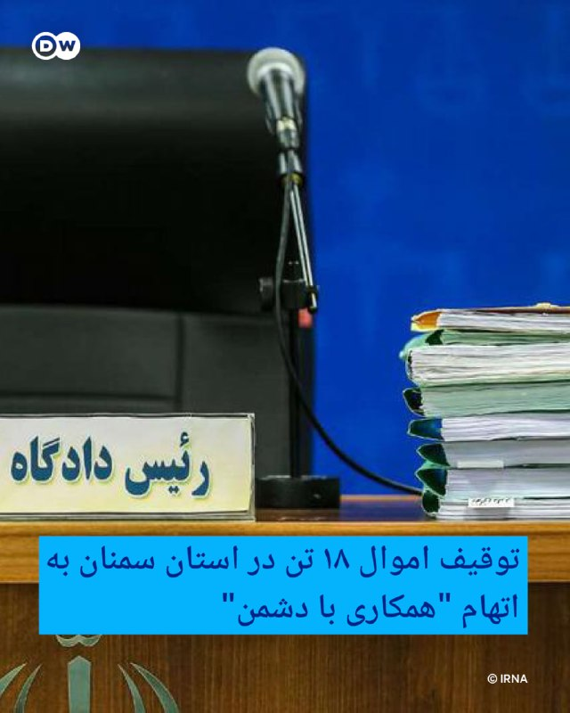

🔶 توقیف اموال ۱۸ تن در استان سمنان به اتهام "همکاری با دشمن"
 
رییس کل دادگستری استان سمنان از توقیف دارایی‌‌های ۱۸ شهروند به اتهام "همکاری با دشمن" خبر داد.
 
رسانه‌های داخلی روز دوشنبه ۱۱ خرداد به نقل از محمدصادق اکبری گزارش دادند تا کنون دارایی‌های منقول و غیرمنقول و همچنین حساب‌های بانکی ۴۰ نفر در این استان به اتهام "همکاری با سرویس‌های جاسوسی آمریکا و اسرائیل" توقیف شده است.
 
پس از آغاز جنگ آمریکا و اسرائیل با ایران در روز نهم اسفند سال گذشته، قوه قضائیه جمهوری اسلامی اموال صدها شهروند ایرانی را توقیف کرده است.
 
برخی از حقوقدانان مستقل بر این باورند که هرچند قوانین ایران در بعضی جرائم امنیتی یا موارد مربوط به اموال حاصل از ارتکاب جرم، امکان توقیف یا مصادره دارایی‌ها را پیش‌بینی کرده‌، اما ضبط تمامی اموال افراد صرفاً بر پایه اتهام "همکاری با دشمن" با چالش‌های حقوقی جدی مواجه است.
 
وکلای دادگستری تاکید دارند که این احکام غالباً بدون طی کردن روند قانونی دادرسی عادلانه، حق دفاع متهم، و اطلاع‌رسانی قبلی صادر و اجرا می‌شوند.
@dw_farsi

## DW_Farsi — post 125371

📸 صدمین زادروز مریلین مونرو؛ افسانه‌ای که هنوز زنده است

صد سال پیش مریلین مونرو، ستاره هالیوود و یکی از شناخته‌شده‌ترین نمادهای فرهنگ عامه در قرن بیستم، چشم به جهان گشود. او اول ژوئن ۱۹۲۶ در لس آنجلس به دنیا آمد و نورما جین مورتنسون نام گرفت.

بیش از شش دهه از مرگ مریلین مونرو می‌گذرد، اما او همچنان به‌عنوان "سمبل جذابیت جنسی" در فرهنگ عامه شناخته می‌شود و زندگی پر فراز و نشیبش همچنان توجه مخاطبان را به خود جلب می‌کند.

انستیتوی فیلم آمریکا، مریلین مونرو را در رتبه ششم فهرست بزرگ‌ترین بازیگران زن دوران طلایی هالیوود قرار داده است.

درخشش او از دهه‌های ۱۹۵۰ و ۱۹۶۰ آغاز شد. ایفای نقش شخصیت "بلوند اغواگر سربه‌هوا" در چندین فیلم معروف به شهرتش کمک کرد، اما استعداد بازیگری‌اش فراتر از این کلیشه بود. فیلم‌های او تا زمان مرگش بیش از ۲۰۰ میلیون دلار در گیشه فروش داشتند.
 
@dw_farsi

## Persian_Trend_Official — post 15453

کانال 12 اسرائیل: ارتش اسرائیل نخست‌وزیر نتانیاهو و وزیر دفاع اسرائیل کاتز را به‌خاطر اعلام برنامه‌هایی برای حمله به بیروت پیش از انجام عملیات، مورد انتقاد قرار داد.

مقامات نظامی گفتند اهدافی که در این طرح گنجانده شده بودند، پس از اعلام علنی قصد نتانیاهو و کاتز برای حمله به بیروت ناپدید شدند.

📝 Amir

📌 @persian_trend_official
پرشین ترند | متفاوت‌ترین کانال نظامی

## Persian_Trend_Official — post 15452

  <a href="telegram/content/Persian_Trend_Official_15452_1780342630.webm" target="_blank">🎬 Download video</a>

شبکه خبری I24 در خبری اعلام کرد به‌ دلیل نگرانی‌ها درمورد آسیب رساندن به تماس‌ها با ایران و مذاکرات بین اسرائیل و لبنان، واشنگتن در تلاش است تا به آتش‌بس جامع منجر شود.

باراک باتش خبرنگار خارجی نوشت آمریکا عمیقا نگران پیامد حمله اسرائیل به بیروت است. واشنگتن نگران تأثیر این اقدام بر تماس‌های حساس با ایران و مذاکرات جاری بین اسرائیل و لبنان است.

در نتیجه آمریکا از اسرائیل درخواست کرد که عملیات برنامه‌ریزی شده را به حالت تعلیق درآورد تا دریچه دیگری از فرصت برای تماس‌های دیپلماتیک بین کشورها فراهم شود.

درخواست آمریکا پس از آن مطرح می‌شود که طی 24 ساعت گذشته پیام‌هایی از لبنان به واشنگتن رسیده است که نشان دهنده تلاش واقعی برای دستیابی به آتش‌بس جامعی است که حزب‌الله را نیز ملزم به توقف حملات خود کند.

در عین حال دو مقام اسرائیلی که با رویترز صحبت کردند فاش کردند که اسرائیل منتظر تأیید نهایی رئیس جمهور آمریکا قبل از هرگونه اقدام نظامی احتمالی در حومه بیروت است که این امر بر هماهنگی نزدیک و وابستگی سیاسی اسرائیل و آمریکا تأکید دارد.

📝 Amir

📌 @persian_trend_official
پرشین ترند | متفاوت‌ترین کانال نظامی

## Persian_Trend_Official — post 15451

  

ترامپ: من تماس بسیار مثبتی با نخست‌وزیر بی بی نتانیاهو، از اسرائیل، داشتم و هیچ نیرویی به بیروت اعزام نخواهد شد، و هر نیرویی که در راه بود، قبلاً بازگردانده شده است.

همچنین، از طریق نمایندگان بلندپایه، تماس بسیار خوبی با حزب‌الله داشتم و آنها موافقت کردند که تمام تیراندازی‌ها متوقف شود، اسرائیل به آنها حمله نخواهد کرد و آنها نیز به اسرائیل حمله نخواهند کرد.

📝 Amir

📌 @persian_trend_official
پرشین ترند | متفاوت‌ترین کانال نظامی

## Persian_Trend_Official — post 15450

  

ترامپ: مذاکرات با جمهوری اسلامی ایران با سرعت زیادی ادامه دارد. از توجه شما به این موضوع سپاسگزارم!

📝 Amir

📌 @persian_trend_official
پرشین ترند | متفاوت‌ترین کانال نظامی

## Persian_Trend_Official — post 15449

  

اکسیوس: یک مقام لبنانی به آمریکا گفت که حزب‌الله آماده آتش‌بس کامل با اسرائیل است!

به گزارش از اکسیوس، علی حمدان، مشاور ارشد نبیه بری، رئیس پارلمان لبنان، به اکسیوس گفت که او به دولت ترامپ گفته است که حزب‌الله آماده آتش‌بس کامل و فوری با اسرائیل است و متعهد شده است که اجرای آن را تضمین کند.

به گفته یک منبع آگاه، مقامات آمریکایی به گفته‌اند که فکر نمی‌کنند نتانیاهو موافقت کند. یک مقام اسرائیلی تأیید کرد که حزب‌الله آمادگی خود را برای آتش‌بس کامل حتی بدون درخواست عقب‌نشینی فوری اسرائیل اعلام کرده است.

📝 Amir

📌 @persian_trend_official
پرشین ترند | متفاوت‌ترین کانال نظامی

## Persian_Trend_Official — post 15448

  

وزارت امور خارجه جمهوری اسلامی: مسئولیت مستقیم آمریکا، چه در نقض آتش‌بس علیه ایران و چه در نقض آتش‌بس از سوی رژیم اسرائیل علیه لبنان، محرز است و مسئولیت آثار و پیامدهای این وضعیت برعهده آمریکاست.

ایران از منافع خود، در هر کجا که لازم بداند دفاع خواهد کرد.

📝 Amir

📌 @persian_trend_official
پرشین ترند | متفاوت‌ترین کانال نظامی

## Persian_Trend_Official — post 15447

  

آمریکا حمله اسرائیل به ضاحیه را متوقف کرد!

کان نیوز: علیرغم تهدیدات صریح نتانیاهو، تدارکات اسرائیل برای حمله به منطقه ضاحیه بیروت در ساعات اخیر پس از مداخله ایالات متحده به تأخیر افتاد.

📝 Amir

📌 @persian_trend_official
پرشین ترند | متفاوت‌ترین کانال نظامی

## Persian_Trend_Official — post 15446

https://youtube.com/live/bKStpJNvOXI?feature=share

## Persian_Trend_Official — post 15445

  <a href="telegram/content/Persian_Trend_Official_15445_1780342634.mp4" target="_blank">🎬 Download video</a>

رسانه نیروی هوافضا سپاه ویدیویی از لحظه سرنگونی پهپاد MQ-1 امریکایی در تاریخ بامداد 10 خرداد 1405 منتشر کرد.

📝 Amir

📌 @persian_trend_official
پرشین ترند | متفاوت‌ترین کانال نظامی

## Persian_Trend_Official — post 15444

گفتگوی تلفنی عراقچی با عاصم منیر و وزیر خارجه پاکستان

عراقچی در تماس‌های تلفنی جداگانه با محمد اسحق‌دار معاون نخست وزیر و وزیر امور خارجه پاکستان و فیلد مارشال عاصم منیر فرمانده ارتش پاکستان در خصوص تحولات منطقه‌ای و روندهای مرتبط با آتش‌بس گفتگو و رایزنی کرد.

📝 Amir

📌 @persian_trend_official
پرشین ترند | متفاوت‌ترین کانال نظامی

## Persian_Trend_Official — post 15443

  

سخنگوی ارتش اسرائیل: ارتش اسرائیل فرمانده یک واحد در سامانه موشکی حزب‌الله را از بین برد.

نیروی هوایی، تحت فرماندهی تیپ گولانی، دیروز (یکشنبه) در منطقه نبطیه حمله کرد و محمد موسی ماترک، فرمانده یک واحد در سامانه موشکی حزب‌الله را از بین برد.

در طول سال‌ها، ماترک سمت‌های مختلفی در سامانه موشکی حزب‌الله داشت. ماترک مسئول ترویج و اجرای صدها پرتاب موشک و پهپاد علیه شهروندان اسرائیلی و نیروهای ارتش اسرائیل، از جمله تیپ گولانی فعال در منطقه بوفورت بود که به نیروی هوایی دستور حذف او را داد.

📝 Amir

📌 @persian_trend_official
پرشین ترند | متفاوت‌ترین کانال نظامی

## Persian_Trend_Official — post 15442

  <a href="telegram/content/Persian_Trend_Official_15442_1780342636.webm" target="_blank">🎬 Download video</a>

محسن رضایی مشاور نظامی رهبر جمهوری اسلامی: تنگه هرمز تحت مدیریت ایران است. اجازه تداوم محاصره دریایی را نخواهیم داد و تشدید تنش در لبنان هم تحمل نخواهد شد. صبر نیروهای مسلح جمهوری اسلامی ایران حدی دارد.

📝 Amir

📌 @persian_trend_official
پرشین ترند | متفاوت‌ترین کانال نظامی

## Persian_Trend_Official — post 15441

  <a href="telegram/content/Persian_Trend_Official_15441_1780342636.webm" target="_blank">🎬 Download video</a>

قرارگاه مرکزی خاتم‌الانبیا اسرائیل را تهدید به حمله موشکی کرد!

سرلشکر خلبان علی عبداللهی، فرمانده قرارگاه‌ خاتم الانبیا: نتانیاهو در ادامه شرارت‌های خود در منطقه، ضاحیه و بیروت را تهدید به بمباران نموده و برای ساکنان آن هشدار تخلیه اعلام کرده است.

با توجه به نقض مکرر آتش بس توسط رژیم، در صورت عملی شدن این تهدید به ساکنان بخش‌های شمالی و شهرک‌های نظامی در سرزمین‌های اشغالی هشدار می‌دهیم اگر نمی‌خواهند آسیب ببینند منطقه را ترک نمایند.

📌 @persian_trend_official
پرشین ترند | متفاوت‌ترین کانال نظامی

## Persian_Trend_Official — post 15440

  

📷 Photo

## Persian_Trend_Official — post 15438

  <a href="telegram/content/Persian_Trend_Official_15438_1780342637.mp4" target="_blank">🎬 Download video</a>

یک نفتکش با پرچم پاناما که در آب‌های سرزمینی عراق فعالیت می‌کرد، در نزدیکی ام قصر مورد اصابت قرار گرفت.

به گفته UKMTO، یک پرتابه ناشناس به سمت راست کشتی برخورد کرد و باعث انفجار بزرگی شد.

📌 @persian_trend_official
پرشین ترند | متفاوت‌ترین کانال نظامی

## Persian_Trend_Official — post 15437

  <a href="telegram/content/Persian_Trend_Official_15437_1780342639.webm" target="_blank">🎬 Download video</a>

🚨 تراست VPN دوباره قیمت سرویس‌هاش رو کاهش داده و پلن‌های جدیدش واقعاً ارزش بررسی دارن. 👌

فرقی نمی‌کنه روی نت ملی باشین یا نت بین‌الملل، برای هر شرایطی سرویس مناسب دارن:

✅ سرور مناسب نت ملی
✅ سرور اقتصادی مناسب نت بین‌الملل

اگر قصد خرید یا تمدید VPN دارین، پیشنهاد می‌کنم حتماً یه پیام به پشتیبانی‌شون بدین و تعرفه‌های جدید رو استعلام بگیرین.
👇👇

@trusstvpnn_admin
@trusstvpnn_admin
@trusstvpnn_admin

## Persian_Trend_Official — post 15436

احتمالا نیاز به یک لایو اضطراری داریم
اوضاع در حال متشنج شدن هست ...

اگر موافق هستید ری اکشن بزارید

## Persian_Trend_Official — post 15435

  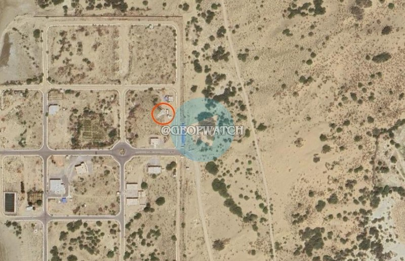

برج مخابراتی‌ای که شب گذشته توسط نیروهای آمریکایی در نزدیکی سیریک در استان هرمزگان، جنوب ایران، هدف قرار گرفت.
📍 مختصات:
26°33'51.4"N 57°05'15.8"E

📌 @persian_trend_official
پرشین ترند | متفاوت‌ترین کانال نظامی

## Persian_Trend_Official — post 15434

  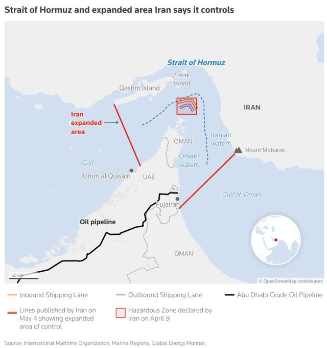

به گزارش خبرگزاری تسنیم، ایران با استناد به نقض آتش‌بس از سوی اسرائیل در لبنان، تمام گفت‌وگوها و تبادل متن از طریق میانجی‌ها را متوقف کرده است.

مذاکره‌کنندگان ایرانی پیش‌تر موضوع لبنان را به‌عنوان یکی از پیش‌شرط‌های هرگونه توافق مطرح کرده بودند. اکنون با نقض آتش‌بس در همه جبهه‌ها، از جمله لبنان، ایران مذاکرات را به‌طور کامل تعلیق کرده است.

ایران خواستار توقف فوری عملیات اسرائیل در غزه و لبنان و همچنین عقب‌نشینی کامل اسرائیل از مناطق اشغالی لبنان شده است؛ شرطی که تهران می‌گوید پیش از ازسرگیری هرگونه گفت‌وگو باید اجرا شود.

همزمان، گزارش‌ها حاکی است که محور مقاومت و ایران تصمیم گرفته‌اند تنگه هرمز را به‌طور کامل مسدود کرده و جبهه‌های بیشتری را فعال کنند؛ از جمله تنگه باب‌المندب.

📌 @persian_trend_official
پرشین ترند | متفاوت‌ترین کانال نظامی

## RadioFarda — post 157789

🔸سردار آزمون، مهاجم تیم ملی ایران، در فهرست ۲۶ نفره این تیم برای جام جهانی که روز دوشنبه اعلام شد، حضور ندارد.

🔸آزمون ۹۱ بازی ملی انجام داده و ۵۷ گل برای ایران به ثمر رسانده است.

🔸او در اسفند ماه و پس از حمله آمریکا و اسرائیل به ایران، تصویری از خود در کنار حاکم دبی منتشر کرد.

🔸گزارش‌ها حاکی است که این پست اینستاگرامی با واکنش منفی مقام‌های ایرانی روبه‌رو شد و پس از آن آزمون از تیم ملی کنار گذاشته شد.

🔸رسانه‌های داخلی نوشته‌اند که سردار آزمون «با وجود ابراز تمایل دوباره برای بازگشت، اکنون فقط احتمال دارد پس از جام جهانی، در صورت عذرخواهی رسمی، بار دیگر برای رقابت‌های بعدی از جمله جام ملت‌های آسیا به تیم ملی دعوت شود.»

@RadioFarda

## RadioFarda — post 157788

ترامپ می‌گوید مذاکره با جمهوری اسلامی «با سرعت» ادامه دارد

🔸رئیس جمهور آمریکا روز دوشنبه در پیامی در شبکه اجتماعی خود نوشت که مذاکره کشورش با حکومت ایران «با سرعت ادامه دارد».

🔸این پیام پس از آن منتشر شد که جمهوری اسلامی تهدید کرد که در صورت ادامه حملات اسرائیل به لبنان «تبادل پیام با آمریکا متوقف می‌شود».

🔸ترامپ در گفت‌وگو با خبرنگاران از تعلیق مذاکره با ایران اظهار بی‌اطلاعی کرد، اما تماسی تلفنی با نخست وزیر اسرائیل برقرار کرد که به توقف حملات به لبنان انجامید.

@RadioFarda

## RadioFarda — post 157787

  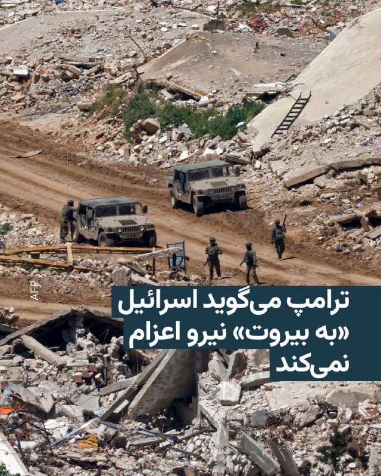

🔸در پی انتشار خبر تماس تلفنی دونالد ترامپ با بنیامین نتانیاهو، رئیس جمهور آمریکا در شبکه اجتماعی خود نوشت که نیروهای ارتش اسرائیل به بیروت نخواهند رفت.

🔸او گفت: «تماسی بسیار مفید با بی‌بی نتانیاهو، نخست وزیر اسرائیل، داشتم و دیگر نیرویی به بیروت نخواهد رفت، و هر نیرویی هم که در راه بودند بازگردانده می‌شوند.»

🔸ترامپ در ادامه نوشت که «از طریق نمایندگان عالی تماسی بسیار خوب با حزب‌الله داشته» و این گروه هم موافقت کرده است که دست از شلیک بردارد.

🔸صبح دوشنبه وب‌سایت آکسیوس به نقل از منابع خود گزارش داده بود که تلاش جدید آمریکا برای آتش‌بس میان اسرائیل و لبنان «شکست» خورده است.

@RadioFarda

## RadioFarda — post 157786

وقوع «دومین انفجار» در کشتی کانتینربر در نزدیکی بندر ام قصر عراق

🔸خبرگزاری رویترز روز دوشنبه از وقوع «دومین انفجار» در یک فروند کشتی کانتینربر در نزدیکی بندر ام قصر عراق خبر داد.

🔸بر اساس این خبر به نقل از منابع امنیتی عراق، این انفجار در فاصله ۴۰ مایل دریایی در جنوب شرقی بندر ام قصر در خلیج فارس رخ داده و باعث بروز آتش‌سوزی شده است.

🔸ساعاتی پیشتر اداره دریانوردی بریتانیا در شبکه ایکس از وقوع «انفجاری بزرگ» در این کشتی کانتینربر در پی اصابت «پرتابه‌ای ناشناس» خبر داده بود.

🔸هنوز خبری درباره مجروحان احتمالی این حادثه گزارش نشده است.

@RadioFarda

## RadioFarda — post 157785

بیانیه وزارت خارجه ایران: مسئولیت آثار و پیامدهای نقض آتش‌بس بر عهده آمریکا است

🔸در ادامه واکنش تند حکومت ایران به حملات اسرائیل در جنوب لبنان، وزارت خارجه جمهوری اسلامی در بیانیه‌ای هشدار داد که مسئولیت «آثار و پیامدهای نقض آتس‌بس» را بر عهده ایالات متحده می‌داند.

🔸در این بیانیه آمده است: «مسئولیت مستقیم آمریکا، چه در نقض آتش‌بس علیه ایران و چه در نقض آتش‌بس از سوی رژیم اسرائیل علیه لبنان، محرز است و مسئولیت آثار و پیامدهای این وضعیت برعهده آمریکاست.»

🔸همزمان رسانه‌ها در اسرائیل از جمله شبکه کان خبر می‌دهند که «در پی مداخله» آمریکا، ارتش اسرائیل حمله خود به منطقه ضاحیه در جنوب لبنان را عقب انداخته است.

🔸این خبر پس از آن منتشر شده است که همین رسانه‌ها از گفت‌وگوی تلفنی طولانی دونالد ترامپ با بنیامین نتانیاهو، نخست وزیر اسرائیل، خبر دادند.

🔸ساعتی پیشتر نخست‌وزیر اسرائیل به ارتش دستور داده بود که اهدافی را در حومه جنوبی بیروت هدف قرار دهد.

@RadioFarda

## RadioFarda — post 157784

  

🔸شبکه ان‌بی‌سی روز دوشنبه خبر داد که رئیس جمهور آمریکا از تعلیق مذاکرات یا تلاش برای این کار توسط جمهوری اسلامی اظهار بی‌اطلاعی کرده است.

🔸دونالد ترامپ به خبرنگار این شبکه آمریکایی گفت که از ایران چنین خبری نشنیده است.

🔸رسانه‌های حکومتی در ایران عصر دوشنبه، ۱۱ خردادماه، نوشتند که جمهوری اسلامی «تبادل پیام با آمریکا» را تا زمانی که اسرائیل حملاتش به لبنان را متوقف نکرده قطع می‌کند.

🔸به نوشته خبرگزاری تسنیم، «مسئولان و مذاکره‌کنندگان ایرانی» خواستار توقف فوری حملات اسرائیل شده «و تا زمانی که نظر ایران و مقاومت در این زمینه تأمین نشود، گفت‌وگویی در کار نخواهد بود».

🔸در واکنش به این خبر، ترامپ گفت: «اگر راستش را بخواهید، به نظر من ما زیادی در این باره حرف می‌زنیم. به نظرم، [به جای این کار] سکوت کردن خیلی بهتر خواهد بود.»

🔸او در ادامه گفت: «البته معنایش این نیست که همین الان می‌رویم و شروع می‌کنیم به بمب ریختن، فقط ساکت می‌مانیم، محاصره را هم حفظ می‌کنیم.»

@RadioFarda

## RadioFarda — post 157782

🔸رسانه‌های ایران از افزایش حجم ذخایر آب سد امیرکبیر (سد کرج) و رسیدن میزان پرشدگی مخزن این سد به حدود ۷۰ درصد خبر می‌دهند.

🔸بر اساس تصاویر منتشرشده، حجم آب ذخیره‌شده در این سد نسبت به مدت مشابه سال گذشته افزایش چشمگیری داشته است؛ موضوعی که پس از چند سال خشکسالی و کاهش ذخایر آبی، نشانه‌ای نسبتاً امیدوارکننده برای منابع آب تهران و البرز ارزیابی می‌شود.

🔸با این حال، کارشناسان تأکید می‌کنند بهبود وضعیت سد کرج به معنای پایان بحران آب نیست و وضعیت سدهایی مانند لار، لتیان و ماملو همچنان نگران‌کننده است.

@RadioFarda

## RadioFarda — post 157781

تهدید به «گشودن جبهه‌های جدید» از طرف سپاه در ادامه واکنش به حمله اسرائیل به لبنان

🔸همزمان با هشدار فرمانده قرارگاه خاتم‌الانبیاء‌ سپاه، سازمان اطلاعات سپاه پاسداران نیز در پیامی که به نوشته خبرگزاری فرانسه در تلویزیون حکومتی ایران نیز قرائت شده تهدید کرد که «جبهه‌هایی جدید» خواهد گشود.

🔸حساب سازمان اطلاعات سپاه در شبکه ایکس نوشت:‌ «ایران عبور از خط قرمزها در لبنان و غزه را به معنای جنگ مستقیم و تحمیل هزینه بر امنیت ملی خود و مقاومت اسلامی فرض کرده و متقابلا عزم خود را برای عملیات دفاعی با انجام اقدامات معناشکن و گشودن جبهه‌های جدید به علاوه حفظ معادله تنگه هرمز قرار می‌دهد.»

🔸جمهوری اسلامی از همان ابتدا پایان جنگ در لبنان را از جمله شرایط خود برای کنار آمدن با ایالات متحده عنوان کرده است.

🔸این در حالی است که اسرائیل و گروه حزب‌الله لبنان تحت فشار آمریکا به آتش‌بس رضایت داده، اما به‌ویژه در روزهای اخیر هر یک دیگری را به نقض این آتش‌بس متهم کرده است.

🔸تهدید به «حفظ معادله تنگه هرمز» یعنی بسته ماندن این تنگه استراتژیک در حالی است که ایران و آمریکا از طریق پاکستان و میانجی‌های دیگر در حال تلاش برای نهایی کردن یک تفاهم‌نامه در این باره هستند.

@RadioFarda

## RadioFarda — post 157780

  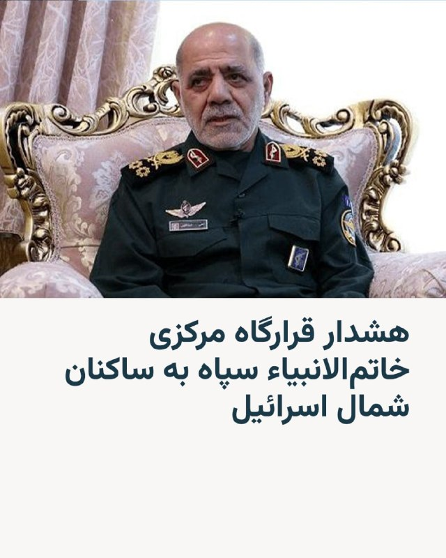

هشدار قرارگاه مرکزی خاتم‌الانبیاء سپاه به ساکنان شمال اسرائیل

🔸در ادامه واکنش‌ مقامات جمهوری اسلامی به حملات مکرر اسرائیل به جنوب لبنان، فرمانده قرارگاه خاتم‌الانبیاء سپاه پاسداران روز دوشنبه به ساکنان شمال اسرائیل هشدار تخلیه داد.

🔸رسانه‌های حکومتی به نقل از علی عبداللهی، فرمانده این قرارگاه، نوشتند: «نتانیاهو در ادامه شرارت‌های خود در منطقه، ضاحیه و بیروت را تهدید به بمباران نموده و برای ساکنان آن هشدار تخلیه اعلام کرده است.»

🔸این فرمانده سپاه در ادامه تهدید کرده که در صورت بمباران شدن این مناطق در لبنان، ایران نیز به شمال اسرائیل حمله خواهد کرد.

🔸عبداللهی گفت: «در صورت عملی شدن این تهدید به ساکنان بخش‌های شمالی و شهرک‌های نظامی در سرزمین‌های اشغالی هشدار می‌دهیم اگر نمی‌خواهند آسیب ببینند منطقه را ترک نمایند.»

@RadioFarda

## RadioFarda — post 157779

  <a href="telegram/content/RadioFarda_157779_1780342642.mp4" target="_blank">🎬 Download video</a>

🔸تصویری از یک قلاده پلنگ ایرانی در پارک ملی گلستان، در جریان گشت و پایش محیطی در اردیبهشت‌ماه ۱۴۰۵ به ثبت رسید.

🔸این ویدیو که توسط جعفر پناه‌پور، از محیط‌بانان و پایشگران محیط زیست ثبت شده، حضور این گونه ارزشمند را در میان پوشش گیاهی منطقه نشان می‌دهد.

🔸پارک ملی گلستان به عنوان یکی از مهم‌ترین زیستگاه‌های حیات‌وحش ایران، نقش کلیدی در حفاظت از پلنگ ایرانی دارد؛ گونه‌ای که در فهرست جانوران در معرض خطر قرار گرفته است.

🔸پارک ملی گلستان با برخورداری از تنوع زیستی کم‌نظیر، یکی از مهم‌ترین مناطق حفاظت‌شده کشور برای بقای پلنگ ایرانی به شمار می‌رود.

@RadioFarda

## RadioFarda — post 157778

🔸رسانه‌های ایران ۱۱ خردادماه، از «نقض آتش‌بس» در همه جبهه‌ها از جمله لبنان خبر دادند
و نوشتند که تیم مذاکره‌کننده ایرانی گفتگوها و تبادل متون از طریق میانجی را متوقف می‌کند.

🔸مقامات رسمی ایران هنوز واکنشی به این خبر نشان ندادند.

🔸پیشتر سخنگوی وزارت خارجه بر «حفظ آتش‌بس» در لبنان تاکید کرده بود.

🔸همزمان نخست‌وزیر اسرائیل روز دوشنبه دستور حمله به جنوب بیروت را صادر کرد.

🔸وب‌سایت آکسیوس به نقل از منابع خود گزارش داده که تلاش جدید آمریکا برای آتش‌بس میان اسرائیل و لبنان «شکست» خورده است.

@RadioFarda

## RadioFarda — post 157777

  

🔸در پی انتشار اخباری از مریض‌احوالی میرحسین موسوی، از رهبران جنبش سبز ایران، اردشیر امیرارجمند، مشاور او، تأیید کرد که آقای موسوی «چند روزی است» به بیمارستان منتقل شده است.

🔸میرحسین موسوی به همراه همسرش زهرا رهنورد، دیگر رهبر جنبش سبز، هم‌چنان در حصر به سر می‌برد.

🔸امیرارجمند که در فرانسه اقامت دارد روز دوشنبه به رادیوفردا گفت که خانه این دو فعال سیاسی دیگر «قابل سکونت نیست»، محل نگهداری آن‌ها پس از انتقال‌شان «نامعلوم» است، و شرایط حصر «دشوارتر» شده است.

🔸محل سکونت این دو در حملات بی‌امان اسرائیل به تهران به‌شدت آسیب دیده است.

@RadioFarda

## RadioFarda — post 157776

تیراندازی در دانشگاه پزشکی قزوین دو کشته برجا گذاشت

🔸رسانه‌ها در ایران از وقوع حادثه‌ای مرگبار در قزوین خبر می‌دهند که صبح روز دوشنبه اتفاق افتاده و جان دو نفر را گرفته است.

🔸به گفته حمیدرضا قافله‌باشی، رئیس دانشگاه علوم پزشکی قزوین، در جریان تیراندازی که «به دلیل خصومت خانوادگی اتفاق افتاده» دو دانشجوی این دانشگاه «که زن و شوهر بودند» جان خود را از دست داده‌اند.

🔸بر اساس شرح حادثه از زبان برخی از کاربران شبکه‌های اجتماعی، صبح روز دوشنبه دانشجوی مرد وارد دانشکده دندانپزشکی قزوین می‌شود و «همسر خودش را با سلاح کمری به قتل می‌رساند و پس از ارتکاب جرم به زندگی خود پایان می‌دهد».

🔸در سال‌های اخیر به نظر می‌رسد دسترسی مردم در ایران به سلاح گرم بسیار آسان‌تر شده، و در شبکه اجتماعی تلگرام حتی آگهی فروش اسلحه هم می‌توان دید.

@RadioFarda

## RadioFarda — post 157775

  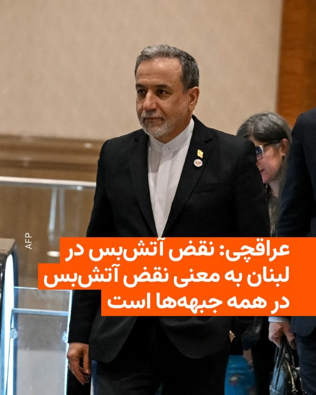

🔸عباس عراقچی، وزیر خارجه ایران، در شبکه ایکس نوشت: «آتش‌بس میان ایران و آمریکا، بدون هیچ ابهامی، آتش‌بسی در تمام جبهه‌ها، از جمله لبنان، است.»

🔸او در این پیام، نقض آتش‌بس در هر جبهه‌ای را «به معنای نقض آتش‌بس در تمامی جبهه‌ها» عنوان کرده است.

🔸عراقچی آمریکا و اسرائیل را «مسئول پیامدهای هرگونه نقض این آتش‌بس» معرفی کرده است.

🔸ایران بارها این موضوع را اعلام کرده که آتش‌بس میان طرفین منازعه در جنگ ایران، باید سایر جبهه‌ها به‌ویژه جبهه لبنان را هم در بر بگیرد.

🔸ابوالفضل شکارچی، سخنگوی نیروهای مسلح جمهوری اسلامی نیز به اسرائیل هشدار داده که «تداوم جنایات در لبنان برای نیروهای مسلح ایران قابل تحمل نخواهد بود.»

🔸در تازه‌ترین بی‌توجهی به این درخواست جمهوری اسلامی، بنیامین نتانیاهو، نخست‌وزیر اسرائیل، به ارتش دستور داده اهدافی را در حومه جنوبی بیروت هدف قرار دهد.

@RadioFarda

## RadioFarda — post 157774

🔸مسعود پیاهو، شهروندی که به اتهام ثبت ویدئو از اعتراضات ۱۴۰۴ به ۱۰ سال زندان محکوم شده است، روز دوشنبه ۱۱ خرداد با انتشار پیامی ویدئویی جدید گفت: «با وجود آنکه در بازنشر آن هیچ نقشی نداشته است، روز سه‌شنبه برای اجرای حکم خود را به زندان معرفی می‌کند.»

🔸حسن آقاخانی، وکیل دادگستری، روز یکشنبه از محکومیت موکلش به اتهام ثبت ویدئو از معترضی که در جریان اعتراضات دی‌ماه سال گذشته مقابل مأموران پلیس ایران در خیابان روی زمین نشسته بود، خبر داد.

🔸آقاخانی تاکید کرد که مسعود پیاهو قصد انتشار «عمومی» ویدئو را نداشته و آن را در «استوری پرایوت» صفحه اینستاگرام خود منتشر کرده اما سپس شخص دیگری آن را به شکل عمومی منتشر کرد.

🔸انتشار این ویدئو از فردی که روز هشتم دی‌ماه و در دومین روز اعتراضات به تنهایی مقابل مأموران انتظامی روی زمین نشسته بود، به شکل گسترده منتشر شد، بازتاب‌های فراوانی ایجاد کرد.

🔸تصویر این معترض به یکی از نمادهای اعتراضات دی ماه ۱۴۰۴ تبدیل شد.

🔸آقاخانی روز یکشنبه گفت که دادگاه با استناد به «قانون تشدید مجازات جاسوسی و همکاری با رژیم صهیونیستی» آقای پیاهو را به «۱۰ سال حبس» محکوم کرد.

@Radiofarda

## RadioFarda — post 157773

رئیس فدراسیون فوتبال ایران: تنگناهای مالی به‌شدت تیم را آزار می‌دهد

🔸مهدی تاج، رئیس فدراسیون فوتبال ایران، روز یک‌شنبه دهم خرداد به گلایه از مشکلات مالی در بر سر راه آماده‌سازی تیم ملی فوتبال ایران در راه جام جهانی پرداخت.

🔸به گزارش خبرگزاری ایرنا، او در این باره توضیح داده که «تیم ملی در شرایط خوبی قرار دارد، اما تنگناهای مالی به‌شدت تیم را آزار می‌دهد. هزینه‌های تیم‌های مختلف ملی دلاری است. وزارت ورزش زیر ۲۰۰ میلیارد به ما کمک کرده است.»

🔸رئیس فدراسیون فوتبال ایران دربارهٔ آخرین خبر پیرامون صدور روادید تیم ملی فوتبال برای حضور در جام جهانی ۲۰۲۶ هم گفت: «مسئول برگزاری جام جهانی فیفا است و از نظر ما مسئول دادن ویزا هم فیفا است. وقتی کشوری متعهد به میزبانی می‌شود، یکی از تعهداتی که می‌دهند، صدور ویزا است. در جلساتی که رو در رو با فیفا داشتیم، آنها در این رابطه با ما هم‌نظر هستند.»

🔸در فاصله ۱۴ روز تا جام جهانی ۲۰۲۶، بلاتکلیفی ویزای تیم ملی فوتبال ایران ادامه دارد. خبرگزاری مهر گزارش داده که فدراسیون فوتبال با ارسال نامه‌ای تازه به فیفا خواستار تعیین تکلیف فوری این پرونده شده، اما به گفته این خبرگزاری، فیفا تاکنون پاسخی به نامه‌های فدراسیون نداده است.

🔸مهدی محمدنبی، سرپرست تیم ملی، دو روز پیشتر از این گفته بود هنوز نه ویزای مکزیک و نه ویزای آمریکا برای اعضای تیم صادر نشده و تیم ملی به روادید چندبار ورود هر دو کشور نیاز دارد. پیشتر نیز مهدی تاج اعلام کرده بود که به‌دلیل مشکل ویزا، محل اردوی تیم ملی از آریزونای آمریکا به تیخوانای مکزیک منتقل شده است.

🔸این ابهام در حالی ادامه دارد که به گفته سفیر جمهوری اسلامی در مکزیک، هنوز روشن نیست آمریکا به تیم ملی روادید خواهد داد یا نه؛ موضوعی که می‌تواند برنامه‌های ایران را در روزهای پایانی پیش از جام جهانی با مشکل جدی روبه‌رو کند.

🔸نسخه کامل این گزارش را در وب‌سایت رادیوفردا بخوانید.

@Radiofarda

## RadioFarda — post 157772

🔸ارتش اسرائیل روز دوشنبه ۱۱ خرداد تصاویری از ورود نیروهای یگان گشتی گولانی به قلعه تاریخی شقیف (بوفور) در جنوب لبنان را منتشر کرد.

🔸ییسرائیل کاتز، وزیر دفاع اسرائیل، روز یکشنبه از تصرف این دژ راهبردی قرون وسطایی در جنوب لبنان، که پرچم اسرائیل بر فراز آن برافراشته شده است، خبر داده بود.

🔸قلعه بوفور یا شقیف بر بخش‌های گسترده‌ای از جنوب لبنان اشراف دارد و به همین دلیل از اهمیت نظامی بالایی برخوردار است.

🔸قلعه تاریخی شقیف متعلق به دوران جنگ‌های صلیبی در استان نبطیه در جنوب لبنان است که در فاصله حدود ۱ کیلومتری در جنوب،جنوب شرقی روستای أرنون قرار دارد.

🔸صلاح‌الدین ایوبی،‌ نخستین سلطان مصر و شام در سال ۱۱۹۰ قلعه شقیف را فتح کرد، اما ۶۰ سال بعد صلیبی‌ها دوباره آن را بازپس گرفتند.

🔸در سال ۱۲۶۸ سلطان ظاهر رکن‌الدین بیبرس بندقداری در نهایت قلعه را برای نیروهای اسلامی تصرف کرد.

🔸قلعه شقیف یکی از نمونه‌های معدودی است که در آن یک قلعه قرون وسطایی در جنگ‌های مدرن نیز دارای ارزش و کاربرد نظامی بوده است، همان‌طور که تاریخ اواخر سده بیستم آن، به‌ویژه در طول جنگ ۱۹۸۲ لبنان این موضوع را نشان داد.

@Radiofarda

## RadioFarda — post 157771

  <a href="https://t.me/radiofarda/157771" target="_blank">📎 Download file</a>

📻بشنوید: ساعت ۱۴ با رادیوفردا، یازدهم خرداد ۱۴۰۵‌

@Radiofarda

## RadioFarda — post 157770

وقتی تفلیس از واشینگتن دور شد؛ گرجستان در میانهٔ پرونده نفوذ ایران

🔸یک گزارش تازه می‌گوید که نفوذ سیاسی، مذهبی و اقتصادی جمهوری اسلامی ایران در گرجستان به‌طرزی سیستماتیک گسترش یافته و تفلیس عملاً راه را برای آن باز کرده است؛ از جمله با افزایش شرکت‌های ایرانی، رشد واردات نفت و فراورده‌های پتروشیمی، و امکان دور زدن تحریم‌ها از مسیر تغییر برچسب کالاها.

🔸گزارشی از رادیو اروپای آزاد/رادیو آزادی حاکی است که واکنش حزب حاکم «رؤیای گرجی» به جای پاسخ‌گویی به یافته‌های این گزارش، فشار بر منتقدان و تهدید به پیگرد قانونی بوده است. در نتیجه، گرجستان که زمانی شریک نزدیک واشینگتن در قفقاز جنوبی بود، اکنون بیش از پیش در نگاه آمریکا به عنوان مسئله‌ای امنیتی و سیاسی دیده می‌شود و در دیپلماسی منطقه‌ای واشینگتن نیز به حاشیه رانده شده است.

🔸هنگامی که ایراکلی کوباخیدزه، نخست‌وزیر گرجستان، در هفتۀ جاری اشاره کرد که گیورگی کاندلاکی، قانون‌گذار پیشین و از نویسندگان گزارشی دربارۀ نفوذ ایران در کشورش، ممکن است با پیامدهای قانونی روبه‌رو شود، او این موضوع را مسئله‌ای مربوط به «نهاد دولتی ذی‌ربط» توصیف کرد.

🔸جان والترز، رئیس مؤسسۀ هادسون مستقر در ایالات متحده که این گزارش را منتشر کرده است، دیدگاه متفاوتی داشت: «واقعیت‌ها با هیاهو و تهدید تغییرپذیر نیستند. شما «رؤیای گرجی» نیستید، بلکه نابودکنندۀ رؤیاهای گرجی هستید.»

🔸این گفت‌وگو دریچۀ کوچک اما گویایی است که نشان می‌دهد روابط گرجستان با واشینگتن تا چه حد رو به تیرگی نهاده است و چگونه حزب حاکم رؤیای گرجی برای توقف این روند قهقرایی، یا ناتوان است یا بی‌میل.

🔸نسخه کامل این گزارش را در وب‌سایت رادیوفردا بخوانید.

@RadioFarda

## IranianMinds — post 21209

  

سیستم جدید دوربینی که توی آمریکا داره استفاده میشه :))

@IranianMinds

## IranianMinds — post 21208

  

🔴 کاتز ، وزیر دفاع اسرائیل :

در لبنان هیچ آتش بسی نداریم ، اسرائیل تا جایی که نیاز باشد پیشروی خواهد کرد.

@IranianMinds

## IranianMinds — post 21207

🔴پست ترامپ: گفت‌وگوها با جمهوری اسلامی ایران با سرعتی بالا ادامه دارد. از توجه شما به این موضوع سپاسگزارم. رئیس جمهور دونالد جی. ترامپ. این بار گفت جمهوری اسلامی ایران . @IranianMinds

## IranianMinds — post 21206

  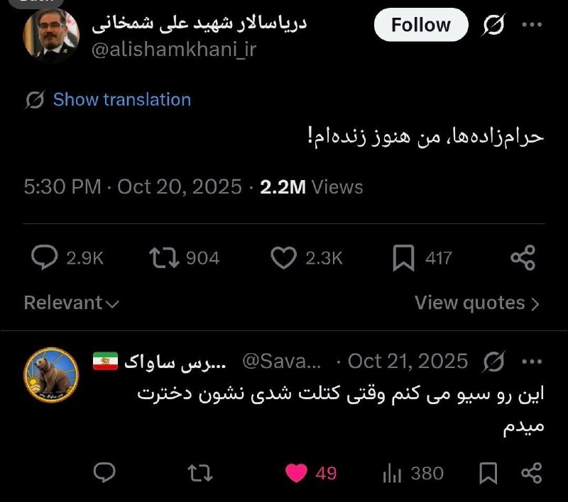

🔴 توییتی که شمخانی تو جنگ ۱۲ روزه بعد ترور ناموفقش زده بود

@IranianMinds

## IranianMinds — post 21205

🔴 وزیر امنیت ملی اسرائیل بن گویر:

جناب نخست‌وزیر،

شما گفتید که یک نخست‌وزیر قوی به رئیس‌جمهور آمریکا «بله» می‌گوید وقتی ممکن است و «نه» وقتی لازم است.

اکنون زمان گفتن «نه» به دوست‌مان، رئیس‌جمهور ترامپ است.

اکنون زمان انجام آنچه لازم و ضروری است برای ضربه زدن به حزب‌الله، آزاد کردن دستان رزمندگان ما و بازگرداندن امنیت به شمال است.

@IranianMinds

## IranianMinds — post 21204

دقایقی پیش سپاه در کرج یک آزمایش موشکی انجام داد

@IranianMinds

## IranianMinds — post 21203

  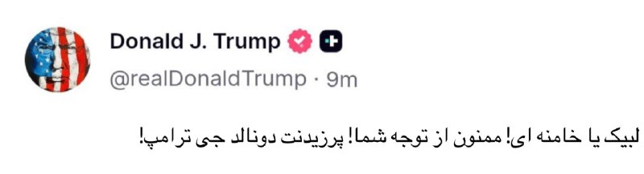

🔴فوری
توییت جدید ترامپ

@IranianMinds

## IranianMinds — post 21202

  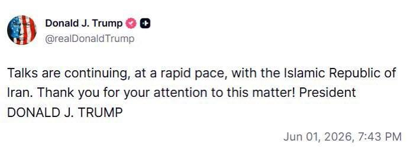

🔴پست ترامپ:

گفت‌وگوها با جمهوری اسلامی ایران با سرعتی بالا ادامه دارد.

از توجه شما به این موضوع سپاسگزارم.
رئیس جمهور دونالد جی. ترامپ.

این بار گفت جمهوری اسلامی ایران .

@IranianMinds

## IranianMinds — post 21201

نمودار محبوبیت ترامپ تو ایران درحال سقوط آزاده

@IranianMinds

## IranianMinds — post 21200

🔴 فوری از پست جدید ترامپ: من یک تماس بسیار سازنده با نخست‌وزیر بی‌بی نتانیاهو، از اسرائیل، داشتم و هیچ نیرویی به بیروت اعزام نخواهد شد، و هر نیرویی که در راه بود، قبلاً بازگردانده شده. همچنین، از طریق نمایندگان بلندپایه، تماس بسیار خوبی با حزب‌الله داشتم…

## IranianMinds — post 21199

  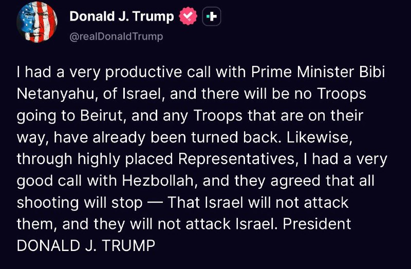

🔴 فوری از پست جدید ترامپ:

من یک تماس بسیار سازنده با نخست‌وزیر بی‌بی نتانیاهو، از اسرائیل، داشتم و هیچ نیرویی به بیروت اعزام نخواهد شد، و هر نیرویی که در راه بود، قبلاً بازگردانده شده. همچنین، از طریق نمایندگان بلندپایه، تماس بسیار خوبی با حزب‌الله داشتم و آنها موافقت کردن که تمام تیراندازی‌ها متوقف بشه؛ اسرائیل به آنها حمله نخواهد کرد و آنها هم به اسرائیل حمله نخواهند کرد.

@IranianMinds

## IranianMinds — post 21198

🔴 رسانه i24News :

آمریکا حمله به بیروت رو متوقف کرد

@IranianMinds

## IranianMinds — post 21197

  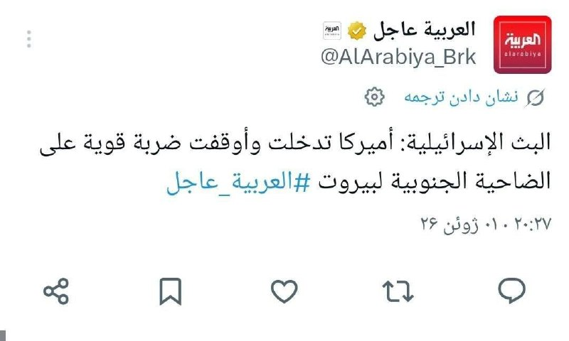

احتمالا درباره حمله اسرائیل به بیروت و همچنین اعلام خارج شدن از مذاکرات توسط رژیم جمهوری اسلامی قراره صحبت بکنن امیدوارم ترامپ کصنمک بازیش گل نکنه و به نتانیاهو نگه به لبنان حمله نکن و آتش بس رو قبول کن تهشم بیاد بگه که من مرد صلح ام و یک جنگ دیگه هم پایان…

## IranianMinds — post 21196

🔴ترامپ به ان‌بی‌سی:

از ایران مفادی بر اینکه مذاکرات را به تعلیق در آورده است نشنیدم.

@IranianMinds

## IranianMinds — post 21195

🔴 ترامپ و نتانیاهو درحال گفتگو به صورت تلفنی هستند @IranianMinds

## IranianMinds — post 21194

🔴ایزد‌خواه، نماینده مجلس:

راه قدس از ابوظبی می‌گذرد، باید به امارات حمله زمینی کنیم.

تا دیروز می‌گفتن از کربلا می‌گذرد😂😂

@IranianMinds

## IranianMinds — post 21193

🔴 ترامپ و نتانیاهو درحال گفتگو به صورت تلفنی هستند

@IranianMinds

## IranianMinds — post 21192

🔴 رییس پارلمان لبنان:

حزب‌الله آماده پذیرش یک آتش‌بس کامل و فوری با اسرائیله.

@IranianMinds

## IranianMinds — post 21191

  

🔹اگر میخوای قبل جام جهانی با بازی های دوستانه مثل رضا کینگ کونگ پول دربیاری همین الان وارد کانال شو 
👇
👇

https://t.me/+YF28GUBRSZkwYTlk
https://t.me/+YF28GUBRSZkwYTlk

‼️با درآمد دلاری پیشبینی های این کانال شرایط بهتر میشه g11🔥

## IranianMinds — post 21190

  

🔴سازمان حمل‌ونقل دریایی بریتانیا(UKMTO) گزارش داد که یک کشتی باری در خلیج‌فارس در حال عبور بوده، در ۴۰ مایلی دریای جنوب شرقی ام قصر عراق مورد حمله قرار گرفته است.
همینطور یک انفجار عظیمی پس از اصابت یک پرتابه ناشناس به سمت راست کشتی رخ داده است.

@IranianMinds

## BBCPersian — post 282593

  <a href="telegram/content/BBCPersian_282593_1780342650.mp4" target="_blank">🎬 Download video</a>

⭕️ سرخط آخرین خبرهای دوشنبه ۱۱ خرداد ۱۴۰۵
@BBCPersian

## BBCPersian — post 282592

🔻لغو سفر وزرای آلمان و نروژ به بیروت در میانه پرواز به‌دلیل «وخامت وضعیت امنیتی»

به گزارش خبرگزاری فرانسه، وزرای آلمان و نروژ به‌دلیل «وخامت وضعیت امنیتی» در منطقه مجبور شدند سفر روز دوشنبه خود به لبنان را در میانه پرواز لغو کنند و برگردند.

سخنگوی ریم العبلی-رادووان، وزیر توسعه بین‌الملل آلمان، به خبرگزاری فرانسه گفت که وزیر آلمانی و همتای نروژی‌اش، آسموند آوکروست، «به دلایل نظامی» مجبور به لغو سفر و بازگشت به برلین شدند، چرا که هنگام نزدیک شدن به فرودگاه بیروت «وضعیت به‌سرعت رو به وخامت می‌گذاشت».

سخنگوی دولت نروژ هم به خبرگزاری فرانسه تایید کرد که این سفر لغو شده است.

به گزارش رسانه‌های نروژی، این دو وزیر قصد داشتند برای نشان دادن همبستگی با مردم لبنان این سفر را انجام دهند.

به گزارش این رسانه‌ها، وزرای دو کشور قرار بود با جوزف عون، رئیس‌جمهور لبنان، و همچنین گروه‌های جامعه مدنی و آوارگان دیدار کنند.

اسرائیل حملات خود به لبنان را گسترش داده است؛ پیشتر هم بنیامین نتانیاهو، نخست‌وزیر، دستور حمله به اهدافی در ضاحیه در جنوب بیروت را صادر کرد.

از زمان برقراری آتش‌بس میان اسرائیل و لبنان در حدود شش هفته پیش، تبادل آتش میان اسرائیل و حزب‌الله ادامه داشته است و هر دو طرف یکدیگر را به نقض آتش‌بس متهم می‌کنند.

پیشتر، ایران به آمریکا و اسرائیل هشدار داد که «نقض آتش‌بس در هر یک از جبهه‌ها، به منزله نقض آن در تمامی جبهه‌ها است.»

@BBCPersian

## BBCPersian — post 282591

  

🔻دونالد ترامپ، رئیس جمهور آمریکا، در پستی در شبکه اجتماعی خود، سوشال تروث، نوشت: «گفت‌وگویی بسیار سازنده با نخست‌وزیر اسرائیل داشتم و هیچ نیرویی به بیروت اعزام نخواهد شد. همچنین هر نیرویی که در مسیر اعزام بود، بازگشته است.»

او همچنین اضافه کرد: «از طریق نمایندگان عالی‌رتبه، گفت‌وگوی بسیار خوبی با حزب‌الله داشتم و آن‌ها موافقت کردند که تمامی تیراندازی متوقف شود؛ اسرائیل به آن‌ها حمله نخواهد کرد و آن‌ها نیز به اسرائیل حمله نخواهند کرد.»

آقای ترامپ در پستی دیگری نوشت: «گفت‌وگوها با جمهوری اسلامی ایران به‌سرعت در جریان است.»

ساعتی پیش خبرگزاری تسنیم گفت که اطلاع یافته است «با عنایت به اینکه لبنان جزء پیش‌شرط‌های آتش‌بس بوده است و اینک این آتش‌بس در همه جبهه‌ها از جمله لبنان نقض شده است» تیم مذاکره‌کننده ایران «گفت‌وگوها و تبادل متون از طریق میانجی را متوقف می‌کند.»

📷Getty Images
@BBCPersian

## BBCPersian — post 282590

  <a href="https://t.me/bbcpersian/282590" target="_blank">📎 Download file</a>

پادکست جام جهان‌نما، دوشنبه ۱۱ خرداد ۱۴۰۵

این برنامه رادیویی را می‌توانید هرشب ساعت ۲۰ به وقت ایران، روی موج متوسط ۷۰۲ کیلوهرتز و موج کوتاه ۹۴۶۵ کیلوهرتز بشنوید.

تکرار برنامه را هم می‌توانید ساعت ۲۱:۳۰ روی موج متوسط ۷۰۲ کیلوهرتز و موج کوتاه ۵۳۹۵ کیلوهرتز گوش کنید.

@BBCPersian

## BBCPersian — post 282588

🔻اینترنت بین‌الملل در ایران، «۶۰ درصد» پیش از اعتراضات دی است

با بازگشت نسبی دسترسی به اینترنت جهانی در ایران از روز ۵ خرداد، ترافیک اینترنت تا امروز، دوشنبه ۱۱ خرداد، در حدود ۶۰ درصد سطح پیش از اعتراضات دی ماه باقی مانده است.

داده‌های شرکت کنتیک در کالیفرنیا که در زمینه اندازه‌گیری ترافیک اینترنت فعالیت می‌کند حاکی است دسترسی به اینترنت بین‌المللی در ایران همچون دوره کوتاه بازگشت اینترنت بعد از اعتراضات، با اختلال همراه است.

کاربران اینترنت در ایران با محدودیت‌های بسیاری مواجهند. علاوه بر بی‌ثباتی اینترنت، بسیاری از وبسایت‌ها یا خدمات فیلتر هستند و بدون وی‌پی‌ان در دسترس نیستند.

https://bbc.in/4vjnvWG
@BBCPersian

## BBCPersian — post 282587

  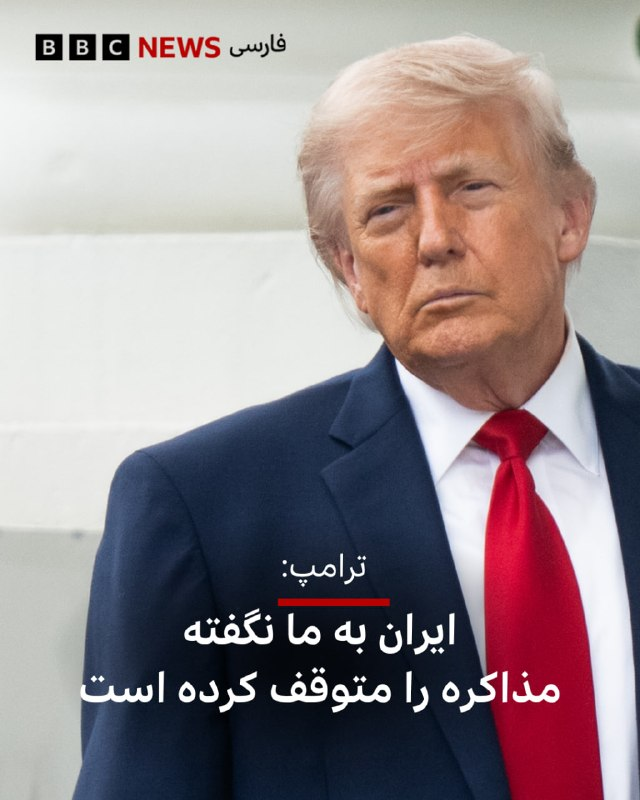

🔻دونالد ترامپ، رئیس‌جمهور آمریکا، گفت ایران اطلاع نداده است که تبادل پیام با آمریکا را متوقف کرده است.

رئیس‌جمهور آمریکا در گفت‌وگوی تلفنی به شبکه خبری ان‌بی‌سی گفت ایرانی‌ها در مذاکره بهتر از جنگ هستند «اما ما را از این موضوع مطلع نکرده‌اند.»

رئیس‌جمهور آمریکا گفت: «این به آن معنا نیست که ما شروع کنیم به بمباران آنجا» اما «محاصره را ادامه می‌دهیم.»

او همچنین گفت: «اگر راستش را بخواهید فکر می‌کنم زیاد حرف زده‌ایم. فکر می‌کنم سکوت کردن خیلی خوب است و می‌تواند مدت طولانی ادامه داشته باشد.»

ساعتی پیش خبرگزاری تسنیم گفت که اطلاع یافته است «با عنایت به اینکه لبنان جزء پیش‌شرط‌های آتش‌بس بوده است و اینک این آتش‌بس در همه جبهه‌ها از جمله لبنان نقض شده است» تیم مذاکره‌کننده ایران «گفتگوها و تبادل متون از طریق میانجی را متوقف می‌کند.»

📷Getty Images
https://bbc.in/4vjnvWG
@BBCPersian

## BBCPersian — post 282586

🔻هشدار قرارگاه مرکزی خاتم‌النبیا به ساکنان شمال اسرائیل

قرارگاه مرکزی خاتم‌النبیا به ساکنان بخش‌های شمالی و شهرک‌های نظامی اسرائیل هشدار داد در صورت بمباران ضاحیه و بیروت «اگر نمی‌خواهند آسیب ببینند منطقه را ترک نمایند.»

بنیامین نتانیاهو امروز در بیانیه‌ای گفت دستور حمله به اهدافی در ضاحیه در جنوب بیروت را صادر کرده است.

ضاحیه پایگاه قدرت حزب‌الله در پایتخت لبنان است.

ساعتی پیش خبرگزاری تسنیم گفت که اطلاع یافته است «با عنایت به اینکه لبنان جزء پیش‌شرط‌های آتش‌بس بوده است و اینک این آتش‌بس در همه جبهه‌ها از جمله لبنان نقض شده است» تیم مذاکره‌کننده ایران «گفتگوها و تبادل متون از طریق میانجی را متوقف می‌کند.»

در همین حال گزارش شده است که ایران به آخرین پیشنهاد آمریکا هنوز پاسخی نداده است.

به گزارش خبرگزاری فارس، سعید آجرلو، عضو تیم رسانه‌ای هیئت مذاکره‌کننده، گفت: «پیشنهاد ارسالی جدید آمریکا در کمیته شش نفره و شورای عالی امنیت ملی در حال بررسی است. از طریق میانجی‌ها متنی به ایران ارسال شده ولی هنوز پاسخی به پیشنهاد جدید آمریکا نداده‌ایم.»

آقای آجرلو گفت: «رفع نگرانی های ایران، شرط اصلی پاسخ به این پیشنهاد است. ما به دلیل اینکه نگرانی‌هایی داریم هنوز پاسخی به متن جدید آمریکا ارسال نکردیم.»

@BBCPersian

## BBCPersian — post 282585

یاسمین شاه‌کرمی، خواهر امیرمحمد، معترض ۱۴ ساله چند روز پیش بعد از وصل شدن نسبی اینترنت در ایران ویدیویی از لحظه شناسایی جسد برادرش ۶۰ روز بعد از اعتراضات دی ماه منتشر کرد.

امیرمحمد شاه‌کرمی در جریان اعتراضات دی ماه ۱۴۰۴ و کشتار بی‌سابقه معترضان به خانه بازنگشت. خواهر امیرمحمد می‌گوید پیگیری‌های خانواده بی‌نتیجه بود تا اینکه روز ۲۰ دی گوشی امیرمحمد روشن می‌شود و ماموران اطلاعات به خانواده اطلاع می‌دهند که او زنده و در بازداشت است.

براساس گفته‌های یاسمین شاه‌کرمی، در پیگیری‌های خانواده از طریق آموزش و پروزش، وضعیت امیرمحمد محرمانه اعلام شده بود. در حالی که خانواده امکان برقراری هیچ تماسی با امیرمحمد را نداشتند، جستجوی آنها در بیمارستان‌ها و سردخانه‌ها هم بی‌نتیجه بوده است.

تا اینکه ۶۰ روز بعد، از پزشکی قانونی کهریزک با آنها تماس گرفته می‌شود که برای شناسایی یک جسد مراجعه کنند.

یاسمین شاه‌کرمی می‌گوید شواهد نشان می‌دهد برادرش در بازداشت کشته شده است. او می‌گوید «سینه و پهلوی او کبود بود و اثر تیر خلاص بر شقیقه او دیده می‌شد.»
@BBCPersian

## BBCPersian — post 282584

🔻امیرحسین سعادت، فعال دانشجویی سابق، در تبریز بازداشت شد

امیرحسین سعادت، فارغ‌التحصیل مقطع کارشناسی ارشد دانشگاه علامه طباطبایی و دبیر سابق شورای صنفی این دانشگاه، صبح روز دوشنبه ۱۱ خرداد در شهر تبریز بازداشت شد.

بر اساس گزارش‌ها، نیروهای وزارت اطلاعات با ضرب و شتم او را در محل کار بازداشت کردند. مأموران سپس به منزلش رفته و ضمن تفتیش خانه، بخشی از وسایل شخصی او را ضبط کردند.

اطلاعاتی درباره دلیل بازداشت یا محل نگهداری او منتشر نشده است.

امیرحسین سعادت از فعالان دانشجویی سابق و دبیر پیشین شورای صنفی دانشگاه علامه طباطبایی بوده است.

@BBCPersian

## BBCPersian — post 282580

🔻خبرگزاری ایسنا تصاویری را از ساختمان قدیم مجلس ایران منتشر کرده است که شدت خسارت‌های واردشده به این بنا در حملات آمریکا و اسرائیل را نشان می‌دهد.

این ساختمان در ۱۲ اسفند و در چهارمین روز جنگ هدف حمله نظامی قرار گرفت. در تصاویر منتشرشده به نظر می رسد عملیات بازسازی این ساختمان شروع شده است.

این بنا که پیش از انقلاب بهمن ۵۷ محل تشکیل مجلس سنا بود، پس از انقلاب میزبان مجلس خبرگان قانون اساسی شد و سپس در اختیار مجلس شورای اسلامی قرار گرفت.
پس از انتقال مجلس شورای اسلامی به ساختمان جدیدی که در همان نزدیکی ساخته شده بود، ساختمان پیشین مجلس کاربری‌های متفاوتی پیدا کرد.

از جمله، این ساختمان در یک دهه اخیر در اختیار مجمع تشخیص مصلحت نظام قرار گرفت و سالی دو بار هم نشست مجلس خبرگان رهبری در آن برگزار می‌شد.

📷ISNA
https://bbc.in/4xgsxFw
@BBCPersian

## BBCPersian — post 282579

🔻یاشار دارالشفا، زندانی سیاسی پیشین، بازداشت شد

یاشار دارالشفا، زندانی سیاسی پیشین، صبح امروز در تهران بازداشت شد.

به گزارش خبرگزاری حقوق‌بشری هرانا، یاشار دارالشفا صبح دوشنبه با مراجعه نیروهای امنیتی و پس از تفتیش خانه، بازداشت شد.

از علت بازداشت و نهاد بازداشت‌کننده او اطلاعاتی منتشر نشده است.

یاشار دارالشفا چندین بار بازداشت و زندانی شده است. او آخرین بار در بهمن ۱۴۰۱ از زندان آزاد شد.

https://bbc.in/4xgsxFw
@BBCPersian

## BBCPersian — post 282577

🖊بهرنگ تاج‌دین، خبرنگار اقتصادی بی‌بی‌سی فارسی

بررسی‌های بانک مرکزی ایران نشان می‌دهد که روند افزایش قیمت‌ها در کشور دارد سریع‌تر می‌شود.

طبق گزارش ماهانه این نهاد، قیمت کالاها و خدمات مصرفی در مناطق شهری در اردیبهشت‌ماه ۱۴۰۵ به طور متوسط بیش از ۷۷ درصد بالاتر از اردیبهشت پارسال بوده است. به این رقم «تورم نقطه به نقطه» گفته می‌شود و در دست کم دهه‌های اخیر بی‌سابقه است.

به گفته بانک مرکزی، قیمت اقلام مصرفی از فروردین تا اردیبهشت امسال به طور میانگین هشت‌ونیم درصد افزایش یافته است که این هم بالاترین رقم تورم ماهانه در آمارهای این نهاد از خرداد ۱۴۰۱ است.

این گزارش نشان می‌دهد قیمت مواد غذایی ظرف ۱۲ ماه به طور متوسط ۱۱۹ درصد افزایش یافته؛ یعنی بیشتر از دو برابر شده است.

به گفته بانک مرکزی، تنها ظرف دو ماه اول امسال، قیمت لوازم خانگی حدود ۳۵ درصد، هزینه‌های ارتباطات و بهداشت و درمان بیش از ۴۰ درصد، و قیمت دخانیات بیش از ۵۰ درصد بالا رفته است.

📷 Getty Images
@BBCPersian

## BBCPersian — post 282576

🔻تسنیم: ایران تصمیم گرفته تبادل پیام با آمریکا را متوقف کند

خبرگزاری تسنیم می‌گوید اطلاع یافته است که «با عنایت به اینکه لبنان جزء پیش‌شرط‌های آتش‌بس بوده است و هم اینک این آتش‌بس در همه جبهه‌ها از جمله لبنان نقض شده است» تیم مذاکره‌کننده ایران «گفتگوها و تبادل متون از طریق میانجی را متوقف می‌کند.»

بنابر این گزارش، تا «توقف فوری» حملات اسرائیل به لبنان و غزه و «عقب‌نشینی کامل» از مناطق اشغال‌شده لبنان محقق نشود «گفت‌وگویی در کار نخواهد بود.»

این خبرگزاری که به نهادهای نظامی و امنیتی نزدیک است نوشت: «جبهه مقاومت و ایران عزم خود را بر انسداد کامل تنگه هرمز و فعال کردن سایر جبهه‌ها از جمله تنگه باب‌المندب» و «گشودن جبهه‌های جدید» قرار داده‌اند.

در ساعت‌های گذشته مقام‌های ارشد ایران بر توقف حملات اسرائیل در لبنان تاکید کرده‌اند از جمله عباس عراقچی، وزیر خارجه‌، در شبکه ایکس نوشت:

«آتش‌بس میان ایران و ایالات متحده، بدون هیچ ابهامی، آتش‌بس در تمامی جبهه‌ها، از جمله لبنان، محسوب می‌شود.»

https://bbc.in/4xgsxFw
@BBCPersian

## BBCPersian — post 282575

🔻تصاویری که از تجمع‌های شبانه حکومتی در ایران منتشر شده، نشان می‌دهد کشمکش در مورد مذاکره با آمریکا همچنان در بین حامیان حکومت ادامه دارد.

در ویدیویی که از یکی از این تجمعات طی روزهای اخیر منتشر شده، حسین طاهری، مداح، می‌گوید: «اگر مذاکره می‌کنید، نتیجه‌اش را بگویید، اگر توافق می‌کنید، نتیجه‌اش را بگویید.... تا لااقل ما در خیابان تکلیف خودمان را بدانیم.»

این در حالی است که محمد طاهری، مداح و پدر حسین طاهری، پیش از این در یکی از این تجمع‌ها به نقل از مجتبی خامنه‌ای گفت: «رهبر انقلاب در دیدار حضوری فرمودند: به مردم بگویید در میادین، حرفی که برای تضعیف دولت و تضعیف تیم مذاکره‌کننده باشد، اصلا به زبان نیاورید.»

در ویدیوی دیگری هم که از این تجمعات منتشر شده، گروهی از حاضران شعار می‌دهند: «با قاتلین رهبر، مذاکره نداریم» و «جان امام در خطره، مذاکره بی‌ثمره». سپس فردی تلاش می‌کند این گروه شعاردهنده را ساکت کند.

تاریخ دقیق ضبط این ویدیوها مشخص نیست.

تحلیلگران سیاسی در ایران هم پیش از این به نقش این تجمعات در ایجاد فشار برای ادامه جنگ و جلوگیری از توافق با آمریکا اشاره کرده‌اند.

@BBCPersian

## BBCPersian — post 282574

  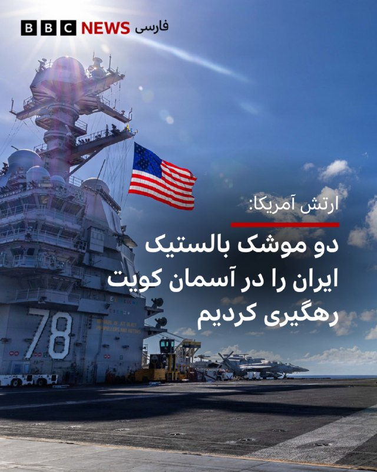

🔻ارتش آمریکا می‌گوید دو موشک بالستیک ایران را که به سمت نیروهایش در کویت شلیک شده بود، «با موفقیت» رهگیری کرده است.

بر اساس بیانیه فرماندهی مرکزی آمریکا در منطقه، سنتکام، در شبکه ایکس، این حمله بامداد امروز ساعت ۶:۳۰ به وقت تهران انجام گرفته است.

به گفته سنتکام هیچ یک از پرسنل آمریکا در این حمله آسیبی ندیدند.

در این بیانیه آمده است: «فرماندهی مرکزی آمریکا هوشیارانه به حفاظت از نیروهایمان در برابر اقدامات خصمانه ایرانی‌ها ادامه می‌دهد و همزمان از ادامه آتش‌بس حملیت می‌کند.»

ساعاتی پیش سپاه پاسداران گفته بود که در پاسخ به حمله آمریکا به «یک دکل مخابراتی در جزیره سیریک» نیروهایش «پایگاه هوایی مبدا» را هدف قرار داده‌اند.

ارتش آمریکا هم قبل از آن اعلام کرده بود که در پاسخ به «اقدامات خصمانه» ایران از جمله سرنگون کردن یک پهپاد آمریکایی، «مراکز راداری و مراکز فرماندهی و کنترل پهپادهای ایران در شهر گروگ و جزیره قشم» را هدف حمله قرار داده است.

بلومبرگ گزارش داد که پنج پرسنل نظامی و پیمانکار آمریکایی در برخورد بقایای موشک بالستیک ایران به پایگاه هوایی علی السالم در کویت زخمی شدند.
📷Getty
@BBCPersian

## BBCPersian — post 282573

🔻عربستان سعودی: حملات مکرر و شنیع ایران به کویت را با شدیدترین لحن محکوم می‌کنیم

وزارت خارجه عربستان سعودی در بیانیه‌ای «حملات مکرر و شنیع ایران به کویت» را به «شدیدترین لحن محکوم و تقبیح» کرد.

در این بیانیه عربستان «بار دیگر مخالفت قاطع خود را با این حملات که حاکمیت دولت کویت را تضعیف می‌کند» اعلام کرد و آن را «نقض آشکار قوانین بین‌المللی و منشور سازمان ملل متحد» دانست.

سپاه پاسداران امروز اعلام کرده بود که در واکنش به حمله آمریکا به یک دکل مخابراتی در جزیره سیریک در جنوب ایران، پایگاهی را که آمریکا از مبدا آن این حمله را انجام داد، هدف قرار داده است.

در بیانیه سپاه به محل این حمله اشاره نشده بود اما وزارت خارجه کویت در بیانیه‌ای حملات موشکی و پهپادی ایران را «به‌شدت» محکوم کرد و آن را «نقض فاحش حاکمیت ملی کویت و تهدیدی برای امنیت ثبات منطقه» دانست.

https://bbc.in/4xgsxFw
@BBCPersian

## idfinfarsi — post 11704

  

‼️ارتش اسرائیل فرمانده یک یگان در سامانه موشکی سازمان تروریستی حزب‌الله را به هلاکت رساند

❌نیروی هوایی با هدایت نیروهای تیپ گولانی روز گذشته (یکشنبه) در منطقه نبطیه حمله کرده و محمد موسی مترک، فرمانده یک یگان در سامانه موشکی سازمان تروریستی حزب‌الله را به هلاکت رساند.

⭕️مترک طی سال‌ها، مسئولیت‌های متعددی را در سامانه موشکی حزب‌الله بر عهده داشت.
او مسئول پیشبرد و اجرای صدها شلیک راکت و پرتاب هواگردهای بدون سرنشین به‌سوی شهروندان کشور اسرائیل و نیروهای ارتش اسرائیل بود، از جمله علیه نیروهای تیپ گولانی که در منطقه بوفور در حال فعالیت هستند و عملیات نیروی هوایی برای به هلاکت رساندن وی را هدایت کردند.

## idfinfarsi — post 11703

  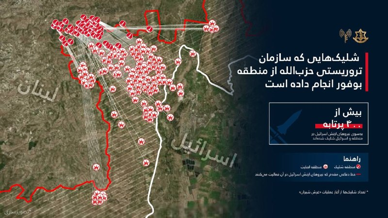

‏‼️«کنترل بر رشته‌کوه بوفور دارای اهمیت‌های عملیاتی مهمی است. این منطقه یک دارایی جغرافیایی مرکزی برای حزب‌الله محسوب می‌شود و به‌عنوان مرکز عصبی این سازمان عمل می‌کند. از اینجا، این سازمان بر مناطق الجلیل و متولا از نظر آتش و دیده‌بانی تسلط دارد. تنها از آغاز عملیات “غرش شیران”، بیش از ۴۰۰ پرتابه از این منطقه شلیک شده است»

‏⭕️«ارتش اسرائیل در سراسر لبنان، از ضاحیه تا صور، حمله کرده و به حملات خود ادامه خواهد داد. در هر جایی که تهدیدی علیه شهروندان اسرائیل و نیروهای ارتش اسرائیل وجود داشته باشد — ما برای رفع آن اقدام خواهیم کرد»

‏⭕️متن کامل سخنان سخنگوی ارتش اسرائیل، سرتیپ افی دفرین در مرز شمال:

‏«ظهر بخیر. دیروز، نه چندان دور از اینجا، نیروهای ارتش اسرائیل به رهبری لشکر ۳۶ تحت فرماندهی شمال، یک عملیات گسترده را به پایان رساندند. در جریان این عملیات، ما به کنترل عملیاتی بر رشته‌کوه بوفور و منطقه دره سلوقی در جنوب لبنان دست یافتیم. اکنون نیروهای لشکر ۳۶ بر رشته‌کوه بوفور مسلط هستند.

‏⭕️این یک عملیات مهم بود که برای مدت طولانی برنامه‌ریزی شده و پس از روند منظم آماده‌سازی رزمی، با تأیید رئیس ستاد کل ارتش انجام شد. کنترل بر رشته‌کوه بوفور دارای اهمیت‌های عملیاتی مهمی است. این منطقه یک دارایی جغرافیایی مرکزی برای حزب‌الله محسوب می‌شود و به‌عنوان مرکز عصبی این سازمان عمل می‌کند. از اینجا، این سازمان بر مناطق الجلیل و متولا از نظر آتش و دیده‌بانی تسلط دارد. تنها از آغاز عملیات “غرش شیران”، بیش از ۴۰۰ پرتابه از این منطقه شلیک شده است.

‏⭕️زیرساختی که حزب‌الله ایجاد کرده، یک زیرساخت ایرانی است که به‌عنوان یک مرکز مهم فرماندهی و کنترل هم در سطح و هم در زیرزمین عمل می‌کند. ما در حال تضعیف توانایی‌های حزب‌الله هستیم و به تعمیق ضربه به آن ادامه می‌دهیم. در کنار دستاوردهای عملیاتی، این نبرد هزینه‌های سنگینی از ما گرفته است. در نبردهای دیروز و امروز، گروهبان ارشد آدم تسرفتی و گروهبان ارشد میخائیل تیوکین جان‌باختند، یادشان گرامی. میخائیل، ۲۱ ساله از اشکلون، رزمنده یگان گشتی گیوعاتی، و آدم، ۲۰ ساله از روش هاعین، رزمنده یگان ماگلان. آن‌ها در نبرد بر سر این رشته‌کوه و در حالی که از شهرک‌های شمال دفاع می‌کردند، جان باختند. من به خانواده‌های آن‌ها تسلیت می‌گویم، ما آن‌ها را در آغوش می‌گیریم و به همراهی با آن‌ها ادامه خواهیم داد.

‏⭕️ارتش اسرائیل در سراسر لبنان، از ضاحیه تا صور، حمله کرده و به حملات خود ادامه خواهد داد. در هر جایی که تهدیدی علیه شهروندان اسرائیل و نیروهای ارتش اسرائیل وجود داشته باشد — ما برای رفع آن اقدام خواهیم کرد.»

## idfinfarsi — post 11693

  <a href="telegram/content/idfinfarsi_11693_1780342655.mp4" target="_blank">🎬 Download video</a>

‼️پس از سه ماه نبرد: لشکر ۱۴۶ سومین دور نبرد خود را به پایان رساند و مأموریت خود در جنوب لبنان را تکمیل کرد

🔸لشکر ۱۴۶ در طول سه ماه گذشته در منطقه خط دفاعی پیشرو در جنوب لبنان برای به هلاکت رساندن تروریست‌ها، انهدام زیرساخت‌های تروریستی سازمان تروریستی حزب‌الله و رفع تهدیدات علیه شهروندان کشور اسرائیل فعالیت کرد.

🔸در طول این عملیات، نیروها بیش از ۵۵۰ تروریست را به هلاکت رساندند و بیش از ۲۷۰۰ زیرساخت تروریستی را منهدم کردند، از جمله: بیش از ۲۰۰ انبار تسلیحاتی که با همکاری نیروی هوایی منهدم شد و ده‌ها مسیر زیرزمینی که با همکاری یگان مهندسی ویژه منهدم شدند.

## idfinfarsi — post 11691

## idfinfarsi — post 11690

‼️پس از پیشبرد طرح‌های تروریستی علیه نیروهای ارتش اسرائیل: یک تروریست از شاخه نظامی سازمان تروریستی حماس که به‌عنوان پزشک در بیمارستان فعالیت می‌کرد، به هلاکت رسید

⭕️نیروهای ارتش اسرائیل دو روز گذشته (شنبه) به‌صورت هدفمند در مرکز نوار غزه حمله کرده و تروریست جمال ابو عون، فرمانده یک واحد در شاخه نظامی سازمان تروریستی حماس را که به‌طور همزمان به‌عنوان پزشک در بیمارستان یافا در دیرالبلح فعالیت می‌کرد، به هلاکت رساندند.

⭕️وی در چارچوب نقش خود در این سازمان تروریستی، فرماندهی تروریست‌های حماس را بر عهده داشت و به پیشبرد و طراحی طرح‌های تروریستی علیه نیروهای ارتش اسرائیل و کشور اسرائیل می‌پرداخت. در دوره اخیر نیز در پیشبرد تلاش‌های ایجاد توان رزمی، بازسازی و تقویت سازمان تروریستی حماس، برخلاف توافق آتش‌بس، نقش داشته است.

⭕️فعالیت‌های تروریستی این تروریست نمونه‌ای دیگر از استفاده ابزاری و فرصت‌طلبانه سازمان تروریستی حماس از نقش‌های غیرنظامی برای پیشبرد فعالیت‌های تروریستی است.

⭕️پیش از حمله، اقداماتی برای کاهش آسیب به غیرنظامیان انجام شد، از جمله استفاده از مهمات دقیق و رصد ‌های هوایی.

⭕️نیروهای ارتش اسرائیل تحت فرماندهی جنوب مطابق با توافق در منطقه مستقر هستند و به فعالیت برای رفع هرگونه تهدید فوری ادامه خواهند داد.

## Dirty_Kids — post 390774

  <a href="telegram/content/Dirty_Kids_390774_1780342657.mp4" target="_blank">🎬 Download video</a>

🔴 وایرال ترین آهنگ این روزا با محتوای کاملا فاخر و آموزنده با نویسندگی تتلو🔥

+ هندزفری لازم🔞

@Dirty_Kids 👻

## Dirty_Kids — post 390773

  <a href="telegram/content/Dirty_Kids_390773_1780342659.mp4" target="_blank">🎬 Download video</a>

وقتی درگیری اجتناب‌ناپذیره، باید چیکار کرد؟ [حمله‌ی پیش‌دستانه]🛡️♟

@Dirty_Kids 👻

## Dirty_Kids — post 390772

  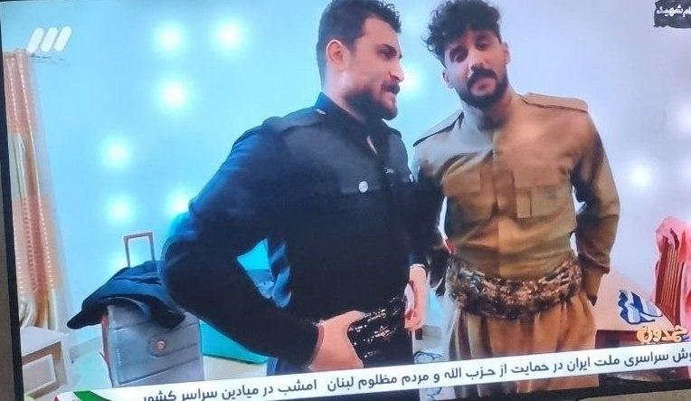

فهمیدید چرا این بلاگرای دوزاری صدای مردم نیستن؟ یا تو شبکه افق هم برن

@Dirty_Kids 👻

## Dirty_Kids — post 390771

  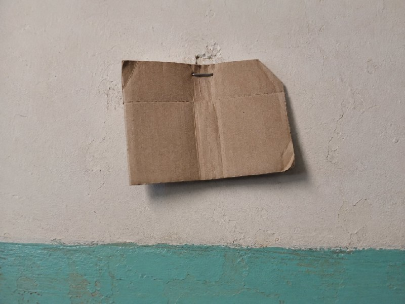

مجتبی که بچه بود وقتی زیادی شلوغ می‌کرد آقا با درایت و تدبیر گوشه‌شو میپیچوند می‌چسبوندش به دیوار.
بخاطر همین مجتبی همیشه گوششه‌هاش تا میخورد

عکس سال ۱۳۶۴
بیت

@Dirty_Kids 👻

## Dirty_Kids — post 390770

  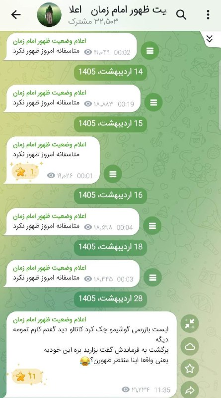

ایست بازرسی ادمین کانال امام زمان رو گرفته، اون بدبختم سکته کرده گفته حتما کونم پاره‌اس.

بعد بسیجیه فکر کرده این از خودشونه و گفته بذارین بره😂😂

@Dirty_Kids 👻

## Dirty_Kids — post 390769

  

محاله کسی این جنایت‌ها رو فراموش کنه...

@Dirty_Kids 👻

## Dirty_Kids — post 390768

  <a href="telegram/content/Dirty_Kids_390768_1780342662.mp4" target="_blank">🎬 Download video</a>

تابستون کوتاهه ورژن شیعه‌سان

@Dirty_Kids 👻

## Dirty_Kids — post 390767

  <a href="telegram/content/Dirty_Kids_390767_1780342663.mp4" target="_blank">🎬 Download video</a>

وقتی شما نبودید ویدئویی در شبکه های اجتماعی منتشر که از اطراف محوطه ورزشگاه آزادی و نشان میده پس از حمله اسرائیل به سالن سرپوشیده آزادی و کشتن کلی بسیجی، بسیجی ها شبانه رفتند دارند جنازه هاشون را میندازند تو کامیون یخچال‌دار بستنی میهن تا ببرند دفن کنند !

@Dirty_Kids 👻

## Dirty_Kids — post 390766

🔴 تسنیم:
اسرائیل از ترس تهدیدای جمهوری اسلامی حمله نکرده.

+ ببین کاراتو ترامپ

@Dirty_Kids 👻

## Dirty_Kids — post 390765

🔴 فووری رادیو و تلویزیون اسرائیل: با مداخله آمریکا حمله بزرگی به ضاحیه بیروت لغو شد!

نتانیاهو در تلاش است آمریکایی‌ها را متقاعد کند که به حومه جنوبی بیروت حمله کنند

@Dirty_Kids 👻

## Dirty_Kids — post 390764

  <a href="telegram/content/Dirty_Kids_390764_1780342664.mp4" target="_blank">🎬 Download video</a>

بازیکنان PSG در حال بررسی مردانگی بانو بریجیت!

@Dirty_Kids 👻

## Dirty_Kids — post 390763

  <a href="telegram/content/Dirty_Kids_390763_1780342665.mp4" target="_blank">🎬 Download video</a>

دیروز هموطنان به استقبال شاهدخت نور رفتن,چه صحنه زیبا و باشکوهی خلق شده

@Dirty_Kids 👻

## Dirty_Kids — post 390762

🔴 فوری ترامپ:

هیچ خبری در مورد تعلیق مذاکرات با ایران دریافت نکردم
ما دیگه بیش از حد صحبت کردیم، بهتره دیگه سکوت کنیم
این به معنی شروع جنگ و بمب اندازی نیست
در ضمن تحریمامون علیه ایران به محکمی فولاده و به همین شکل باقی میمونه قرار نیست برداشته بشه

+ اَی بی‌بیضه‌ها

@Dirty_Kids 👻

## Dirty_Kids — post 390761

آن‌ها نه نیروی دریایی دارند، نه نیروی هوایی، نه قلقلی، نه فلفلی، نه مرغ زرد کاکلی.

@Dirty_Kids 👻

## Dirty_Kids — post 390760

  <a href="telegram/content/Dirty_Kids_390760_1780342667.mp4" target="_blank">🎬 Download video</a>

حالا با عمو شوخی میکنید بکنید اما بدونید تمام جنگ‌های تاریخ اکثرا سر همین بوده

@Dirty_Kids 👻

## Dirty_Kids — post 390759

  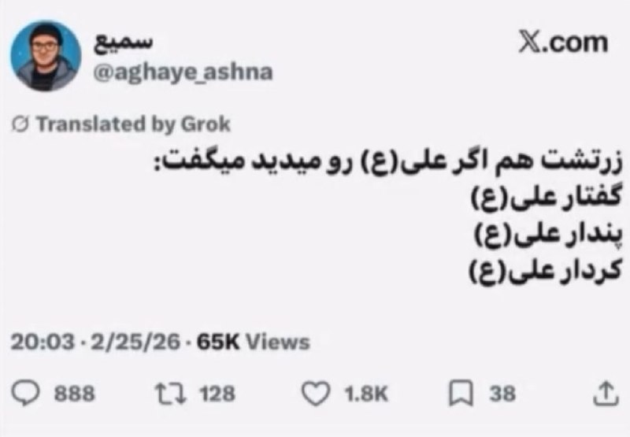

گفتار علی:

زنان ناقص العقل هستند. (نهج البلاغه خطبه ٨٠)

@Dirty_Kids 👻

## Dirty_Kids — post 390758

  <a href="telegram/content/Dirty_Kids_390758_1780342668.mp4" target="_blank">🎬 Download video</a>

آخرش سوپرایز شدم😂

@Dirty_Kids 👻

## Dirty_Kids — post 390757

  

به همین راحتی ایرانی ها را میکشند..

@Dirty_Kids 👻

## Dirty_Kids — post 390756

  

خلاصه اخبار ۲۴ ساعت اخیر:

@Dirty_Kids 👻

## Dirty_Kids — post 390755

  <a href="telegram/content/Dirty_Kids_390755_1780342670.mp4" target="_blank">🎬 Download video</a>

دقایقی قبل، حمله هوایی در جبل عامل در جنوب لبنان

@Dirty_Kids 👻

## Hranews — post 113315

  

گزارشی از آخرین وضعیت لیلا و مریم آفرین، زندانیان سیاسی محبوس در زندان اوین

❗️
❗️
❗️
❗️
❗️– لیلا آفرین و مریم آفرین، زندانیان سیاسی، دوران محکومیت حبس خود را در زندان اوین سپری می‌کنند. این دو خواهر پیشتر بابت اتهامات سیاسی توسط دادگاه انقلاب، هر کدام به تحمل یک سال حبس محکوم شدند.

به گزارش خبرگزاری هرانا، ارگان خبری مجموعه فعالان حقوق بشر در ایران، لیلا و مریم آفرین، زندانیان سیاسی، در حال تحمل دوران محکومیت خود در زندان اوین هستند.

یک منبع مطلع نزدیک به خانواده این زندانیان ضمن تایید این خبر به هرانا گفت: ” لیلا آفرین، حدودا ۳۰ ساله و خواهرش مریم آفرین، پیشتر توسط دادگاه انقلاب تهران با اتهامات سیاسی هر یک به تحمل یک سال حبس محکوم شدند.”

وی افزود: “این دو خواهر مورخ ۱۹ آذر ۱۴۰۴ به بند زنان زندان اوین منتقل شده و در حال تحمل دوران محکومیت خود هستند.”

ادامه مطلب

#مریم_آفرین #لیلا_آفرین

↘️
@hranews_bot تماس ✉️ - @Hranews کانال هرانا 🆑

## Hranews — post 113314

اجرای حکم اعدام دو زندانی در زندان های سبزوار و نیشابور/ رهایی یک زندانی از چوبه‌دار

❗️
❗️
❗️
❗️
❗️– حکم دو زندانی که پیشتر از بابت اتهام قتل به اعدام محکوم شده بودند، در زندان های نیشابور و سبزوار اجرا شد. از سوی دیگر، یک زندانی محکوم به اعدام با رضایت اولیای دم از مجازات مرگ رهایی یافت. همچنین، رئیس کل دادگستری استان آذربایجان‌غربی از کسب رضایت اولیای دم در ۹ پرونده اعدام خبر داد.

ادامه مطلب

#عیسی_شکوریان #محمد_حکیمی #اعدام

↘️
@hranews_bot تماس ✉️ - @Hranews کانال هرانا 🆑

## Hranews — post 113313

دستکم ۲ تجمع اعتراضی برگزار شد

❗️
❗️
❗️
❗️
❗️– روز گذشته، شماری از اساتید اخراجی دانشگاه فرهنگیان در مقابل ساختمان‌ وزارت آموزش و پرورش در تهران و گروهی از شهروندان ساکن روستای دهنو واقع در شهرستان دورود، در اعتراض به تداوم قطع آب در این روستا، #تجمع_اعتراضی برگزار کردند.

ادامه مطلب

↘️
@hranews_bot تماس ✉️ - @Hranews کانال هرانا 🆑

## Hranews — post 113312

اهواز؛ مسمومیت ۴ کارگر در سایه فقدان ایمنی کار

❗️
❗️
❗️
❗️
❗️– در سایه فقدان ایمنی محیط و شرایط نامناسب کار، چهار #کارگر در اهواز حین انجام کار، بر اثر نشت و انتشار مواد پودری از یک رآکتور صنعتی، مسموم شدند.

ادامه مطلب

↘️
@hranews_bot تماس ✉️ - @Hranews کانال هرانا 🆑

## Hranews — post 113311

جرائم مواد مخدر؛ یک زندانی در زندان قم اعدام شد

❗️
❗️
❗️
❗️
❗️– حکم اعدام یک زندانی که پیشتر از بابت اتهامات مرتبط با جرائم مواد مخدر به #اعدام محکوم شده بود، روز دوشنبه ۴ خردادماه، در زندان قم اجرا شد.

ادامه مطلب

#بهنام_حسنیانی

↘️
@hranews_bot تماس ✉️ - @Hranews کانال هرانا 🆑

## Hranews — post 113310

نریمان فرهادی به دادسرای اهواز احضار شد

❗️
❗️
❗️
❗️
❗️– نریمان فرهادی، از اعضای کانون صنفی فرهنگیان خوزستان، به شعبه ۲۲ بازپرسی دادسرای اهواز احضار شد.

ادامه مطلب

#نریمان_فرهادی

↘️
@hranews_bot تماس ✉️ - @Hranews کانال هرانا 🆑

## Hranews — post 113309

  

امیرحسین سعادت در تبریز بازداشت شد

❗️
❗️
❗️
❗️
❗️– امروز دوشنبه ۱۱ خرداد، امیرحسین سعادت، دبیر پیشین شورای صنفی دانشگاه علامه طباطبایی، توسط ماموران اداره اطلاعات در تبریز #بازداشت و به مکان نامعلومی منتقل شد. همزمان، منزل وی مورد تفتیش قرار گرفت و شماری از لوازم شخصی این شهروند نیز توسط ماموران ضبط شد.

به گزارش خبرگزاری هرانا، ارگان خبری مجموعه فعالان حقوق بشر در ایران، امیرحسین سعادت در تبریز بازداشت شد.

بر اساس اطلاعات دریافتی هرانا، آقای سعادت صبح امروز بدون ارائه حکم قضایی توسط ماموران اداره اطلاعات در محل کار خود بازداشت و به مکان نامعلومی منتقل شد. بازداشت وی با خشونت و ضرب و شتم همراه بوده است.
یک منبع مطلع نزدیک به خانواده این شهروند ضمن تایید این موضوع به هرانا گفت: “وی طی یک تماس تلفنی کوتاه با خانواده‌اش از بازداشت خود خبر داده اما به محل نگهداری خود اشاره‌ای نکرده است. همزمان منزل امیرحسین توسط ماموران مورد تفتیش قرار گرفته است. در جریان این بازرسی، شماری از وسایل شخصی وی از جمله تلفن همراه، لپ‌تاپ و پاسپورت او ضبط شده است.”

ادامه مطلب

#امیرحسین_سعادت

↘️
@hranews_bot تماس ✉️ -  @Hranews  کانال هرانا 🆑

## Hranews — post 113308

  

سمیرا نوروز ناصری در تهران بازداشت شد

❗️
❗️
❗️
❗️
❗️– امروز دوشنبه، سمیرا نوروز ناصری، فیلمساز ساکن تهران پس از تفتیش منزلش توسط نیروهای امنیتی #بازداشت و به مکانی نامعلوم منتقل شده است.

به گزارش خبرگزاری هرانا، ارگان خبری مجموعه فعالان حقوق بشر در ایران، سمیرا نوروز ناصری بازداشت شد.

بر اساس اطلاعات دریافتی هرانا، بازداشت خانم نوروز ناصری صبح امروز دوشنبه ۱۱ خردادماه، توسط نیروهای امنیتی بدون ارائه حکم قضایی صورت گرفته است. ماموران همچنین اقدام به تفتیش منزل این کارگردان کرده‌اند.

ادامه مطلب

#سمیرا_نوروز_ناصری

↘️
@hranews_bot تماس ✉️ -  @Hranews  کانال هرانا 🆑

## Hranews — post 113307

  

سعید پیوندی: قانون تشدید مجازات جاسوسی، دشمنی میان جامعه و حکومت را بیش‌تر می‌کند/ نفیسه شرف‌الدینی

📡
📡
📡
📡
📡– پس از تصویب و ابلاغ «قانون تشدید مجازات جاسوسی و همکاری با رژیم صهیونیستی و کشورهای متخاصم علیه امنیت و منافع ملی»، بحث‌های گسترده‌ای درباره‌ی پیامدهای حقوقی، سیاسی و اجتماعی این قانون شکل گرفته است. بسیاری از منتقدان معتقدند که گسترش مفاهیمی چون «همکاری با دولت متخاصم»، «فعالیت امنیتی» و «اقدام علیه امنیت ملی» می‌تواند مرز میان فعالیت‌های مدنی، علمی، رسانه‌ای و امنیتی را بیش از پیش مبهم کرده و زمینه‌ی گسترش نظارت، کنترل و سرکوب اجتماعی را فراهم کند. ماهنامه‌ی خط صلح برای بررسی ابعاد جامعه‌شناختی این قانون، تاثیر آن بر آزادی‌های مدنی، اعتماد اجتماعی، خودسانسوری و امنیتی‌سازی جامعه، با «سعید پیوندی»، جامعه‌شناس ایرانی و مدیر مرکز تحقیقاتی LISEC-Lorraine در دانشگاه لورن، به گفتگو نشسته است.

متن گفتگو با سعید پیوندی را در ادامه می‌خوانید:

قانون «تشدید مجازات جاسوسی و همکاری با رژیم صهیونیستی و کشورهای متخاصم علیه امنیت و منافع ملی» چگونه مفهوم «امنیت» را از یک مقوله‌ی صرفاً حقوقی ـ امنیتی به ابزاری برای تنظیم و کنترل روابط اجتماعی، رسانه‌ای و حتی علمی گسترش می‌دهد؟ آیا می‌توان آن را نمونه‌ای از «امنیتی‌سازی» جامعه، در معنای جامعه‌شناختی، دانست؟

از نظر من، این قانون و اقدامات کنونی دستگاه قضایی ایران، سازمان‌های اطلاعاتی و نیروهای انتظامی، همه در همین چارچوب قرار می‌گیرند. یعنی ما با یک فرآیند فراگیر امنیتی‌سازی در جامعه‌ی ایران سروکار داریم و هرکسی هم می‌تواند با این تعریف، در حوزه‌هایی چون همکاری با کشورهای خارجی یا کشورهای متخاصم، فعالیت‌های امنیتی و مانند آن، متهم شود. می‌توان گفت که حکومت، از نظر خودش، تلاش می‌کند نوعی بازدارندگی برای همکاری‌های احتمالیِ برخی افراد جامعه با نیروهای خارجی ایجاد کند. اما در عمل، معنای این امر این است که حکومت به همه‌ی غیرخودی‌ها، به نوعی، مشکوک خواهد بود.

ادامه مطلب

ادامه و لینک به مطلب در وبسایت خط صلح

#سعید_پیوندی
#نفیسه_شرف‌الدینی

↘️
@hranews_bot تماس ✉️ - @Hranews کانال هرانا 🆑

## Hranews — post 113306

گزارشی از بازداشت یک شهروند در شهرستان مهرستان

❗️
❗️
❗️
❗️
❗️– روز شنبه، عبدالمالک دهانی، شهروند اهل شهرستان مهرستان واقع در استان سیستان و بلوچستان، توسط ماموران امنیتی در این شهرستان #بازداشت و به مکانی نامعلوم منتقل شده است.

ادامه مطلب

#عبدالمالک_دهانی

↘️
@hranews_bot تماس ✉️ -  @Hranews  کانال هرانا 🆑

## Hranews — post 113305

روز یکشنبه ۱۰ خردادماه، شماری از شهروندان ساکن روستای دهنو واقع در شهرستان دورود، در اعتراض به تداوم قطع آب در این روستا دست به #تجمع_اعتراضی زدند.

به گفته این شهروندان معترض، در طول ۱۰ تا ۱۵ روز گذشته آب شرب این روستا به طور کامل قطع بوده است. این موضوع موجب مختل شدن زندگی روزمره مردم شده و بسیاری از خانواده‌ ها از ابتدایی‌ترین نیازهای بهداشتی مانند استحمام محروم مانده‌اند. همچنین، علیرغم پیگیری‌ های مکرر شهروندان از فرمانداری، بخشداری و اداره آب و فاضلاب، تاکنون اقدام مؤثری برای رفع این مشکل صورت نگرفته است.

↘️
@hranews_bot تماس ✉️ - @Hranews کانال هرانا 🆑

## Hranews — post 113304

  

دادستان عمومی و انقلاب شهرستان اهر، با اشاره به #توقیف_اموال ایرانیان مقیم خارج از کشور، اظهار داشت که حتی انتشار یک عکس یا ویدیو نیز می‌تواند مشمول مجازات توقیف اموال شود.

این مقام قضایی افزود: «مجازات توقیف اموال به‌صورت مستقل و کاملاً جدا از مجازات حبس یا اعدام اعمال می‌شود.»

↘️
@hranews_bot تماس ✉️ - @Hranews کانال هرانا 🆑

## Hranews — post 113303

رشت؛ حکم اعدام متهم به قتل یک کودک اجرا شد

❗️
❗️
❗️
❗️
❗️– امروز دوشنبه ۱۱ خردادماه، حکم یک زندانی که پیشتر از بابت اتهام تعرض و قتل یک کودک به نام ایلیا زادحسین به #اعدام محکوم شده بود، در رشت به اجرا درآمد.

ادامه مطلب

#ایلیا_زادحسین

↘️
@hranews_bot تماس ✉️ -  @Hranews  کانال هرانا 🆑

## Hranews — post 113302

  

یاشار دارالشفا بازداشت شد

❗️
❗️
❗️
❗️
❗️– یاشار دارالشفا، زندانی سیاسی پیشین که ساکن تهران است، امروز توسط نیروهای امنیتی در منزل خود #بازداشت و به مکان نامعلومی منتقل شد.

به گزارش خبرگزاری هرانا، ارگان خبری مجموعه فعالان حقوق بشر در ایران، یاشار دارالشفا بازداشت شد.

براساس اطلاعات دریافتی هرانا، صبح امروز دوشنبه ۱۱ خرداد ۱۴۰۵، نیروهای امنیتی با مراجعه به منزل خانوادگی این شهروند، بدون ارائه حکم قضایی او را بازداشت کردند. ماموران همچنین منزل وی را نیز تفتیش کردند.

ادامه مطلب

#یاشار_دارالشفا

↘️
@hranews_bot تماس ✉️ -  @Hranews  کانال هرانا 🆑

## Hranews — post 113301

اعتراضات در دانشگاه‌ها؛ دستکم ۱۰ دانشجوی دانشگاه تهران به کمیته انضباطی احضار شدند

❗️
❗️
❗️
❗️
❗️– طی روزهای اخیر، دستکم ۱۰ دانشجوی #دانشگاه_تهران در ارتباط با تجمعات دانشجویی پس از اعتراضات سراسری دی‌ماه، به کمیته انضباطی این دانشگاه احضار شدند.

ادامه مطلب

↘️
@hranews_bot تماس ✉️ -  @Hranews  کانال هرانا 🆑

## Hranews — post 113300

قروه؛ ۲ متهم در پرونده تعرض گروهی به یک نوجوان اعدام شدند

❗️
❗️
❗️
❗️
❗️– صبح امروز، حکم اعدام دو تن از متهمان پرونده تجاوز گروهی به یک پسر ۱۴ ساله اهل قروه که منجر به خودکشی او شد، در این شهرستان به اجرا در آمد.

ادامه مطلب

↘️
@hranews_bot تماس ✉️ -  @Hranews  کانال هرانا 🆑

## Hranews — post 113299

گزارشی از اجرای حکم اعدام یک زندانی در زندان جیرفت

❗️
❗️
❗️
❗️
❗️– سحرگاه روز سه‌شنبه ۵ خردادماه، حکم یک زندانی که پیشتر از بابت اتهام قتل به #اعدام محکوم شده بود، در زندان جیرفت اجرا شد.

ادامه مطلب

#سبحان_عباسی
↘️
@hranews_bot تماس ✉️ -  @Hranews  کانال هرانا 🆑

## Hranews — post 113298

سمنان؛ اموال ۱۸ شهروند دیگر ساکن خارج از کشور توقیف شد

❗️
❗️
❗️
❗️
❗️– اموال و دارایی‌های ۱۸ شهروند ساکن خارج از کشور در استان سمنان توقیف شد. دستگاه قضایی این افراد را به «همکاری با دشمن» متهم کرده است.

ادامه مطلب

↘️
@hranews_bot تماس ✉️ -  @Hranews  کانال هرانا 🆑

## Hranews — post 113297

  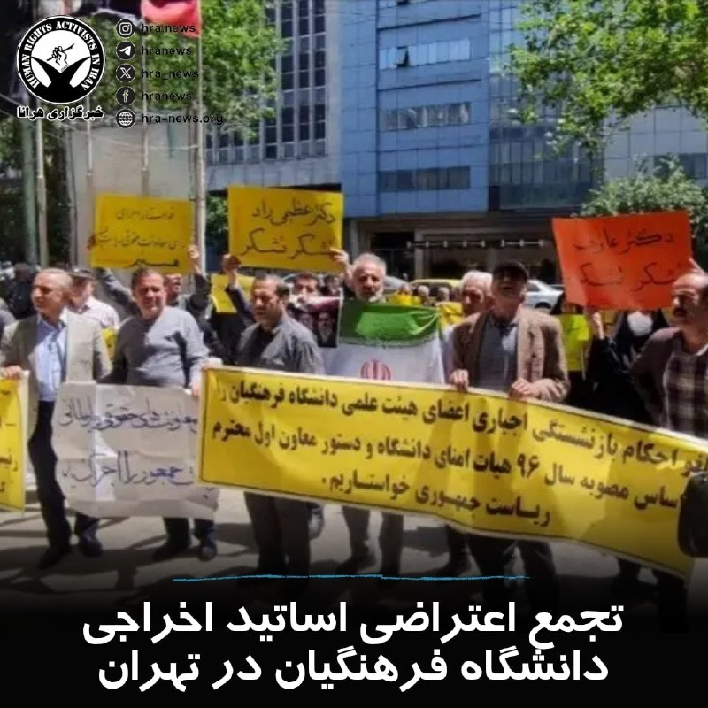

روز یکشنبه ۱۰ خرداد‌ماه، شماری از اساتید اخراجی دانشگاه فرهنگیان در مقابل ساختمان وزارت آموزش و پرورش در تهران، دست به #تجمع_اعتراضی زدند.

لغو احکام بازنشستگی اجباری اعضای هیئت علمی دانشگاه فرهنگیان براساس مصوبه سال ۱۳۹۶ هیات امنای دانشگاه از جمله دلایل اعتراض این اساتید است.

↘️
@hranews_bot تماس ✉️ - @Hranews کانال هرانا 🆑

## Hranews — post 113296

  

اعتراضات دی‌ماه ۱۴۰۴؛ مهرداد محمدی‌نیا و اشکان مالکی اعدام شدند

❗️
❗️
❗️
❗️
❗️– مرکز رسانه قوه قضاییه اعلام کرد مهرداد محمدی‌نیا و اشکان مالکی، از بازداشت‌شدگان اعتراضات دی‌ماه ۱۴۰۴ تهران، سحرگاه امروز #اعدام شدند. دستگاه قضایی این دو نفر را از بابت اتهاماتی از جمله «مشارکت در اقدامات عملیاتی برخلاف امنیت کشور» و «همکاری با دولت‌های متخاصم» به مجازات مرگ محکوم کرده بود.

ادامه مطلب

#مهرداد_محمدی‌نیا
#اشکان_مالکی

↘️
@hranews_bot تماس ✉️ -  @Hranews  کانال هرانا 🆑

## manototv — post 105898

  <a href="telegram/content/manototv_105898_1780342676.mp4" target="_blank">🎬 Download video</a>

سخنان عزت‌الله همایون‌فر، ادیب و سیاستمدار، درباره روحیه قوی ملت ایران و ریشه‌های آن در سی قرن تاریخ کشور

## manototv — post 105890

  <a href="telegram/content/manototv_105890_1780342677.mp4" target="_blank">🎬 Download video</a>

حمله گزارش‌شده آمریکا به اهدافی در جنوب ایران، از نظر دامنه محدود بود، اما از نظر پیام نظامی اهمیت داشت. بر اساس روایت آمریکا، این حمله پس از سرنگونی یک پهپاد آمریکایی بر فراز آب‌های بین‌المللی انجام شد و سایت‌های راداری و مراکز فرماندهی و کنترل پهپادی جمهوری اسلامی در سیریک و جزیره قشم را هدف قرار داد.

## alonews — post 124311

  <a href="telegram/content/alonews_124311_1780342678.webm" target="_blank">🎬 Download video</a>

👈آکسیوس: تصمیم ترامپ برای مهار نتانیاهو سیگنال واضحی بود مبنی بر اینکه او نمی‌خواهد متحد کلیدی‌اش مانع توافق با ایران شود.

✅ @AloNews خبر جنگ

## alonews — post 124310

  <a href="telegram/content/alonews_124310_1780342679.webm" target="_blank">🎬 Download video</a>

🔴فوری / بنیامین نتانیاهو : من امروز عصر با رئیس جمهور ترامپ صحبت کردم و به او گفتم که اگر حزب الله حملات خود را به شهرها و شهروندان ما متوقف نکند، اسرائیل به اهدافی در بیروت حمله خواهد کرد.

🔴موضع ما در این مورد بدون تغییر باقی می ماند.

🔴در عین حال، ارتش اسرائیل طبق برنامه در جنوب لبنان به عملیات خود ادامه خواهد داد.

✅ @AloNews خبر جنگ

## alonews — post 124309

  <a href="telegram/content/alonews_124309_1780342679.webm" target="_blank">🎬 Download video</a>

👈سردار قاآنی: شرارت جدید صهیونیست‌ها باب‌المندب را مثل تنگهٔ هرمز خواهد کرد

✅ @AloNews خبر جنگ

## alonews — post 124308

  <a href="telegram/content/alonews_124308_1780342679.webm" target="_blank">🎬 Download video</a>

👈مرکز آمار: تورم نقطه به نقطه اردیبهشت ماه در مناطق روستایی به ۱۰۱.۸ درصد رسید

🔴تورم خوراکی‌ها در مناطق شهری ۱۲۹ و در مناطق روستایی به ۱۳۵ درصد رسیده است

✅ @AloNews خبر جنگ

## alonews — post 124307

  <a href="telegram/content/alonews_124307_1780342679.webm" target="_blank">🎬 Download video</a>

👈آکسیوس به نقل از یک مقام آمریکایی: ترامپ تهدیدهای نتانیاهو مبنی بر بمباران بیروت را عبور از خط قرمزهای قابل قبول دانست.

✅ @AloNews خبر جنگ

## alonews — post 124306

  <a href="telegram/content/alonews_124306_1780342679.webm" target="_blank">🎬 Download video</a>

👈آکسیوس به نقل از یک مقام اسرائیلی: حملات برنامه‌ریزی‌شده به بیروت انجام نخواهد شد

✅ @AloNews خبر جنگ

## alonews — post 124305

  <a href="telegram/content/alonews_124305_1780342679.webm" target="_blank">🎬 Download video</a>

👈سفارت لبنان در واشنگتن: دولت لبنان در دور کردن لبنان از تشدید تنش‌های بیشتر موفق عمل کرد

🔴ترامپ به سفیر ما اعلام کرد که نتانیاهو با آتش‌بس موافقت کرده است

✅ @AloNews خبر جنگ

## alonews — post 124304

  <a href="telegram/content/alonews_124304_1780342680.webm" target="_blank">🎬 Download video</a>

👈دونالد ترامپ رئیس جمهوری آمریکا برغم عدم مشارکت ناتو در حمله به ایران، بار دیگر از اعضای این پیمان خواست درباره تهران به او کمک کنند.

🔴ترامپ روز دوشنبه به وقت محلی در گفت و گو با شبکه سی ان بی سی نیوز افزود: متحدان ایالات متحده در ناتو «باید وارد عمل شوند و به ما کمک کنند» زیرا آنها بیش از ایالات متحده به نفتی که از تنگه هرمز عبور می‌کند، متکی هستند.

✅ @AloNews خبر جنگ

## alonews — post 124303

  <a href="telegram/content/alonews_124303_1780342680.webm" target="_blank">🎬 Download video</a>

👈کاتز وزیر دفاع: ترامپ معادله‌ای را که ما تعیین کرده‌ایم پذیرفته است - اینکه شلیک به جوامع ما به معنای بمب‌گذاری در بیروت است. معنای سخنان او همین است

✅ @AloNews خبر جنگ

## alonews — post 124302

  <a href="telegram/content/alonews_124302_1780342680.webm" target="_blank">🎬 Download video</a>

👈ارتش اسرائیل: یک افسر با درجه سروانی از تیپ گیواتی در جریان درگیری‌ها در جنوب لبنان کشته شد

✅ @AloNews خبر جنگ

## alonews — post 124301

  <a href="telegram/content/alonews_124301_1780342680.webm" target="_blank">🎬 Download video</a>

👈شبکه الشرق‌ سعودی: حزب‌الله پیشنهاد ایالات متحده را پذیرفته و آماده است که از هدف قرار دادن اسرائیل خودداری کند، البته در ازای دریافت تعهد متقابل مبنی بر هدف قرار نگرفتن حومه جنوبی بیروت

✅ @AloNews خبر جنگ

## alonews — post 124300

  <a href="telegram/content/alonews_124300_1780342680.webm" target="_blank">🎬 Download video</a>

🔴فوری / وزیر جنگ اسرائیل: در لبنان آتش‌بس نداریم 
✅ @AloNews خبر جنگ

## alonews — post 124299

  <a href="telegram/content/alonews_124299_1780342681.webm" target="_blank">🎬 Download video</a>

👈وزارت خارجه قطر: وزیر خارجه قطر با عراقچی درباره تلاش‌های میانجیگرانه پاکستان بین واشنگتن و تهران رایزنی کرد

🔴وزیر خارجه قطر بر حمایت قطر از تلاش‌ها برای دستیابی به توافقی جامع به منظور پایان دادن به بحران در منطقه تأکید کرد

✅ @AloNews خبر جنگ

## alonews — post 124298

  <a href="telegram/content/alonews_124298_1780342681.webm" target="_blank">🎬 Download video</a>

🔴فوری / وزیر جنگ اسرائیل: در لبنان آتش‌بس نداریم

✅ @AloNews خبر جنگ

## alonews — post 124297

  <a href="telegram/content/alonews_124297_1780342681.webm" target="_blank">🎬 Download video</a>

👈بریتیش ایرویز تمام پروازهای خود به اسراییل را تا اواسط پاییز (۲۴ اکتبر) به دلیل تنش‌های امنیتی لغو کرد.

✅ @AloNews خبر جنگ

## alonews — post 124296

  <a href="telegram/content/alonews_124296_1780342681.webm" target="_blank">🎬 Download video</a>

👈لیبرمن وزیر دفاع و خارجه اسبق اسرائیل خطاب به نتانیاهو: این نخست‌وزیر نیست، این یک عروسک است!

✅ @AloNews خبر جنگ

## alonews — post 124295

  <a href="telegram/content/alonews_124295_1780342681.webm" target="_blank">🎬 Download video</a>

👈یائیر لاپید رهبر اپوزیسیون نتانیاهو:
یک کشور تحت الحمایه تمام عیار شده‌ایم

✅ @AloNews خبر جنگ

## alonews — post 124294

  <a href="telegram/content/alonews_124294_1780342681.webm" target="_blank">🎬 Download video</a>

👈نفتالی بنت نخست‌وزیر سابق اسرائیل:
دولت کنترل حاکمیت اسرائیل را از دست داده است

✅ @AloNews خبر جنگ

## alonews — post 124293

  <a href="telegram/content/alonews_124293_1780342682.webm" target="_blank">🎬 Download video</a>

👈بازگشت نفت برنت به ۹۴.۵ دلار

✅ @AloNews خبر جنگ

## alonews — post 124292

  <a href="telegram/content/alonews_124292_1780342682.webm" target="_blank">🎬 Download video</a>

👈حملات اسرائیل به منطقه صور ادامه دارد

✅ @AloNews خبر جنگ

<!-- MSG END -->

<!-- NAV START -->

<a href="https://github.com/nayebireza5-del/aiohghjbbbvm/blob/main/telegram/content/archive_1.md" style="display:inline-block; padding:6px 12px; margin:0 4px; background-color:#2ea44f; color:white; text-decoration:none; border-radius:4px; font-weight:bold;">صفحه بعد</a>

<!-- NAV END -->
