# خواننده تلگرام

<!-- TOP_NAV START -->

<a href="https://github.com/nayebireza5-del/aiohghjbbbvm/blob/main/telegram/content/archive_1.md" style="display:inline-block; padding:6px 12px; margin:0 4px; background-color:#2ea44f; color:white; text-decoration:none; border-radius:4px; font-weight:bold;">صفحه بعد</a>

<!-- TOP_NAV END -->

<!-- MSG START -->

---
📅 بروزرسانی: 1405/03/05 01:54
---

## VahidOOnLine — post 242192

  

ترامپ در تروث‌سوشال نوشت: «اورانیوم غنی‌شده (غبار هسته‌ای!) یا فورا به آمریکا تحویل داده خواهد شد تا در ایالات‌متحده نابود شود، یا ترجیحا با همکاری و هماهنگی با جمهوری اسلامی ایران، در همان محل یا در مکانی قابل قبول دیگر نابود خواهد شد.»
ترامپ گفت در صورت نابودی اورانیوم غنی‌شده در مکانی غیر از آمریکا، «کمیسیون انرژی اتمی»، یا نهاد معادل آن، به عنوان شاهد بر این فرایند نظارت خواهد داشت.
‌🏁 🇬🇧 IranintlTV

🤖 @VahidOOnLine

## VahidOOnLine — post 242191

  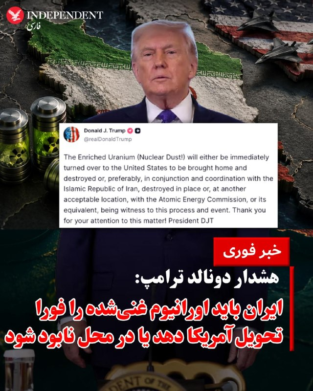

♦️دونالد ترامپ، رئیس‌جمهوری ایالات متحده، با انتشار پیامی در شبکه اجتماعی «تروث سوشال»نوشت: «اورانیوم غنی‌شده (گرد‌وغبار هسته‌ای) یا باید فورا به ایالات متحده تحویل داده شود تا به آمریکا منتقل و نابود گردد، یا اینکه ترجیحا در بستر همکاری و هماهنگی با جمهوری اسلامی، در همان محل یا در مکان قابل‌قبول دیگری، در حضور و با نظارت کمیسیون انرژی اتمی یا نهاد معادل آن نابود شود.»
‌🇸🇦 Indypersian

🤖 @VahidOOnLine

## VahidOOnLine — post 242190

  

♦️خبرگزاری دانشجو بامداد سه‌شنبه، پنجم خردادماه، گزارش داد که در حمله دوشنبه‌شب آمریکا و اسرائیل به جنوب جزیره لارک، عباس اسلامی، قدرت زرنگاری و عبدالرضا گلزاری، نیروهای سپاه پاسداران کشته شدند. براساس این گزارش «تعداد دقیق کشته‌شدگان هنوز مشخص نشده است».
‌🇸🇦 Indypersian

🤖 @VahidOOnLine

## VahidOOnLine — post 242189

  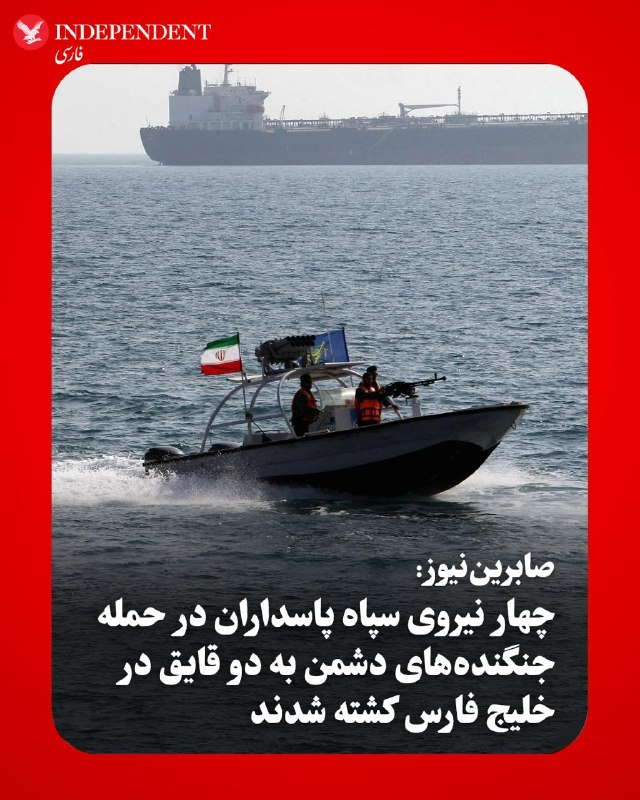

♦️صابرین‌نیوز، کانال تلگرامی مشترک سپاه قدس و حشدالشعبی عراق، بامداد سه‌شنبه، پنجم خردادماه، از کشته‌شدن دو نیروی سپاه پاسداران در حمله جنگنده‌های دشمن به دو قایق در خلیج فارس خبر داد. همزمان، گزارش‌های رسیده از شنیده‌شدن صدای انفجارها در اصفهان و بابلسر خبر می‌دهد. پیش از این، تابناک بامداد سه‌شنبه، پنجم خردادماه، گزارش داد: «باند پروازی فرودگاه بندرعباس مورد اصابت موشک قرار گرفت».
‌🇸🇦 Indypersian

🤖 @VahidOOnLine

## VahidOOnLine — post 242188

  

♦️تابناک بامداد سه‌شنبه، پنجم خردادماه، گزارش داد: «باند پروازی فرودگاه بندرعباس مورد اصابت موشک قرار گرفت». پیش از این فارس، خبرگزاری وابسته به سپاه پاسداران از شنیده‌شدن چند انفجار در بندرعباس و حوالی سیریک و جاسک خبر داده بود.
‌🇸🇦 Indypersian

🤖 @VahidOOnLine

## VahidOOnLine — post 242187

  

♦️تسنیم، خبرگزاری وابسته به سپاه، بامداد سه‌شنبه، پنجم خردادماه، درباره آخرین وضعیت مذاکرات هیات ایرانی به نقل از «یک منبع آگاه» گزارش داد: «موضوع آزادسازی دارایی بلوکه شده ایران در حال پیگیری است». براساس این گزارش، سفر محمدباقر قالیباف، رئیس مجلس شورای اسلامی، به قطر با همراهی عباس عراقچی، وزیر خارجه جمهوری اسلامی و رئیس کل بانک مرکزی، در جهت آزادسازی بخشی از پولهای بلوکه شده در مرحله اول اجرایی شدن یادداشت تفاهم احتمالی با واشنگتن است. تسنیم نوشت که چون جمهوری اسلامی به آمریکایی‌ها بی‌اعتماد است و می‌خواهد نتایج قطعی را حاصل و انتفاع ایجاد کند، اصرار دارد در این فرایند حتما بخشی از پول‌های مسدود شده آزاد شود. این «منبع مطلع» به تسنیم گفت که در این سفر «پیشرفت‌هایی حاصل شده و گام‌های رو به جلو برداشته شده است».
‌🇸🇦 Indypersian

🤖 @VahidOOnLine

## VahidOOnLine — post 242186

  

♦️درحالی‌که از کشته‌شدن علی خامنه‌ای در حمله مشترک آمریکا و اسرائیل، ۸۸ روز می‌گذرد، فارس، خبرگزاری وابسته به سپاه دوشنبه‌شب، چهارم خردادماه، به نقل از رئیس شورای هماهنگی تبلیغات اسلامی تهران گزارش داد: «هنوز زمان مشخصی برای تشییع رهبر شهید انقلاب تعیین نشده و مردم به شایعات توجه نکنند». رهبر دوم جمهوری اسلامی روز ۹ اسفند ۱۴۰۴ در تهران کشته شد.
‌🇸🇦 Indypersian

🤖 @VahidOOnLine

## VahidOOnLine — post 242185

  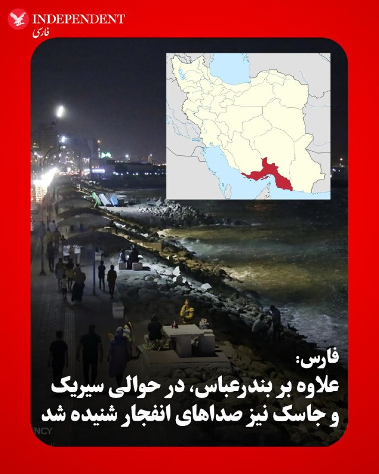

♦️ فارس، خبرگزاری وابسته به سپاه، بامداد سه‌شنبه، پنجم خردادماه، از شنیده شدن چند انفجار در بندر عباس و حوالی سیریک و جاسک خبر داد و نوشت: «هنوز محل دقیق و منشا این صداها مشخص نیست».
‌🇸🇦 Indypersian

🤖 @VahidOOnLine

## VahidOOnLine — post 242184

  

♦️همزمان با هشتادوهفتمین روز قطع اینترنت جهانی در ایران، خبرگزاری ایرنا دوشنبه‌شب گزارش داد که با توجه به تایید مصوبه بازگشت اینترنت به وضعیت قبل از دی‌ماه ۱۴۰۴ و ابلاغ آن به وزارت ارتباطات، «انتظار می‌رود این دستور فردا (سه‌شنبه، پنجم خردادماه) اجرایی شود و اینترنت بین‌الملل به‌زودی دسترسی مردم قرار بگیرد». براساس این گزارش، پیش از این، احسان چیت‌ساز، معاون سیاست گذاری و برنامه‌ریزی توسعه فاوا و اقتصاد دیجیتال وزارت ارتباطات با انتشار مطلبی در اکس از ابلاغ مصوبه بازگشایی اینترنت توسط پزشکیان خبر داد.
‌🇸🇦 Indypersian

🤖 @VahidOOnLine

## VahidOOnLine — post 242183

  

محمد محمدی گلپایگانی، رییس دفتر علی خامنه‌ای، در ویدیویی با اشاره به رهبر کشته‌شده جمهوری اسلامی گفت او مخالف تجمل‌گرایی بود و زندگی بسیار ساده‌ای داشت، به‌گونه‌ای که وسایل شخصی‌اش به اندازه بار یک وانت یا حتی کمتر بود.

گلپایگانی افزود علی خامنه‌ای هدایایی را که از داخل و خارج کشور برایش ارسال می‌شد، به کمیته امداد و نهادهای دیگر می‌داد تا صرف کمک به فقرا شود و بهره شخصی او از این هدایا بسیار ناچیز بود.
‌🏁 🇬🇧 IranintlTV

🤖 @VahidOOnLine

## VahidOOnLine — post 242182

♦️ابراهیم عزیزی، رئیس کمیسیون امنیت ملی مجلس، دوشنبه‌شب، در برنامه «گفتگوی ویژه خبری» صداوسیما اعلام کرد که پهپادهای دشمن همچنان در مرزهای ایران در حال گشت زنی هستند. او گفت: «در طول روز گذشته و امروز، شاهد حضور پهپادهای دشمن بودیم که دیروز برخورد قاطعی صورت گرفت».
‌🇸🇦 Indypersian

🤖 @VahidOOnLine

## VahidOOnLine — post 242181

  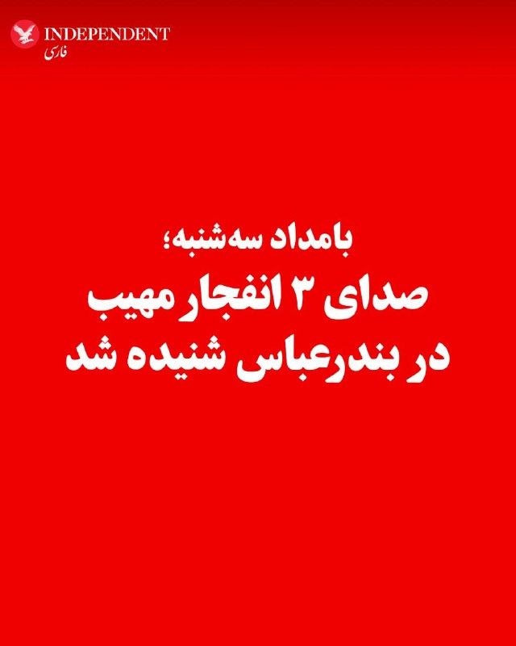

♦️تسنیم، خبرگزاری وابسته به سپاه، بامداد سه‌شنبه، پنجم خردادماه از «شنیده‌شدن ۳ انفجار مهیب» در بندر عباس خبر داد. براساس این گزارش، معاون استاندار اعلام کرد منشا صدای انفجار در حال بررسی است.
‌🇸🇦 Indypersian

🤖 @VahidOOnLine

## VahidOOnLine — post 242180

  

رسانه‌های ایران شامگاه دوشنبه از شنیده‌شدن صداهای انفجار در بندرعباس و همزمان در خلیج فارس حوالی سیریک و جاسک خبر دادند.

معاون استاندار هرمزگان اعلام کرد منشا صدای انفجار در حال بررسی است.
‌🏁 🇬🇧 IranintlTV

🤖 @VahidOOnLine

## VahidOOnLine — post 242179

  

♦️ابراهیم عزیزی، رئیس کمیسیون امنیت ملی و سیاست خارجی مجلس شورای اسلامی، در برنامه «گفتگوی ویژه خبری» صداوسیما با ابراز بدبینی شدید نسبت به آینده مذاکرات با واشنگتن، دستیابی به یک توافق همه‌جانبه را دور از ذهن دانست و گفت: «ما در این شرایطی که داریم، بعید می‌دانیم که آمریکایی‌ها خلاصه وارد یک توافقی بشوند که این خواسته‌های جمهوری اسلامی را بپذیرند.» او با اشاره به روند طولانی‌مدت گفتگوها و پاسخ به پرسش مجری درباره میزان فاصله تا رسیدن به نتیجه نهایی صراحتا تأکید کرد: «من پذیرش پنج بند اول خواسته‌های ایران را بسیار بعید می‌دانم؛ بنابراین از نظر من، ما در حال حاضر در شرایطی قرار داریم که از دستیابی به هرگونه توافقی بسیار دور هستیم.»
‌🇸🇦 Indypersian

🤖 @VahidOOnLine

## VahidOOnLine — post 242178

  

♦️«یک منبع نظامی» در گفتگو با تسنیم، خبرگزاری وابسته به سپاه، روز دوشنبه مدعی شد که بررسی‌های فنی نیروهای مسلح نشان می‌دهد اسرائیل طی چند هفته گذشته، چندین حمله پهپادی را در قالب عملیات «پرچم دروغین» علیه امارات متحده عربی انجام داده است. این منبع ضمن اشاره به اینکه اقدامات انجام شده با هدف «تحریک» مقامات اماراتی صورت گرفته، گفت: «اسرائیل نشان داده است که صرفا منافع خود را در نظر دارد؛ به نوعی که هم در ارتباط با برخی از کشورهای حاشیه خلیج فارس آن‌ها را به ورطه‌ای خطرناک می‌کشاند و هم همزمان عملیات‌هایی را علیه آن‌ها انجام می‌دهد.»
‌🇸🇦 Indypersian

🤖 @VahidOOnLine

## VahidOOnLine — post 242177

  <a href="telegram/content/VahidOOnLine_242177_1779747878.mp4" target="_blank">🎬 Download video</a>

محمد مرندی، کارشناس حکومتی و عضو هیات مذاکره‌کنندگان جمهوری اسلامی در مذاکرات جاری، در تلویزیون گفت قطر پذیرفته بخشی از دارایی‌های بلوکه‌شده حکومت را پیشاپیش تامین و بعد، از آمریکا دریافت کند. او دلیل این اقدام را درک قدرت جمهوری اسلامی و نتایج ایستادگی آن عنوان کرد.
‌🏁 🇬🇧 IranintlTV

🤖 @VahidOOnLine

## VahidOOnLine — post 242176

  

♦️ رسانه آکسیوس، شامگاه دوشنبه چهارم خرداد ماه، به نقل از یک مقام ارشد آمریکایی گزارش داد دولت دونالد ترامپ از تشدید اقدام‌های نظامی اسرائیل در واکنش به «نقض آتش‌بس» از سوی حزب‌الله، حمایت خواهد کرد.
این مقام آمریکایی با اعلام آنکه «حزب‌الله درخواست‌های مکرر برای توقف شلیک به اسرائیل، از جمله یک اولتیماتوم اخیر، را نادیده گرفته است»، به آکسیوس گفت اسرائیل هرگز مجبور نخواهد شد «منفعلانه حملات علیه نیروها و غیرنظامیان خود را تحمل کند» او تاکید کرد: «این دولت بایدن نیست.»
به گفته این مقام، حزب‌الله از ۲۸ فروردین تاکنون بیش از هزار پهپاد و بیش از ۷۰۰ راکت شلیک کرده تا مذاکرات جاری میان لبنان و اسرائیل را مختل کند.
‌🇸🇦 Indypersian

🤖 @VahidOOnLine

## VahidOOnLine — post 242175

  

ابراهیم عزیزی، رییس کمیسیون امنیت ملی مجلس، گفت آمریکا از اوایل هفته دوم جنگ از طریق عاصم منیر، فرمانده ارتش پاکستان، درخواست آتش‌بس و مذاکره داده است.
او افزود تا زمانی که پنج اقدام «اعتمادساز» از سوی آمریکا انجام نشود، چیزی به نام تفاهم و مذاکره معنا ندارد.
به گفته عزیزی، این پنج اقدام شامل «خاتمه جنگ در همه جبهه‌ها به‌ویژه لبنان، برداشته‌شدن محاصره دریایی آمریکا، تردد کشتی‌های غیرنظامی از تنگه هرمز با ترتیبات مورد نظر ایران، تعلیق ۳۰ یا ۶۰ روزه تحریم‌های نفتی و آزادسازی پول‌های بلوکه‌شده است.»
‌🏁 🇬🇧 IranintlTV

🤖 @VahidOOnLine

## VahidOOnLine — post 242172

  

♦️یک منبع آگاه از گفتگوهای هیئت بلندپایه ایرانی با مقام‌های حاضر در دوحه، شامگاه دوشنبه چهارم خرداد ماه به خبرگزاری الجزیره گفت میانجی‌گری قطر به تفاهمی میان تهران و واشنگتن درباره دارایی‌های مسدود شده ایران منجر شده است.
این منبع افزود دستیابی به توافق در این موضوع که برای تهران اهمیت بالایی داشته، احتمال اعلام توافق میان آمریکا و ایران در روز سه‌شنبه را افزایش داده است.
‌🇸🇦 Indypersian

🤖 @VahidOOnLine

## VahidOOnLine — post 242171

  

♦️خبرگزاری رویترز به نقل از روزنامه ژاپنی نیکی گزارش داد، جمهوری اسلامی ایران ۳۰ روز پس از دستیابی به توافق با آمریکا، تنگه هرمز را بازگشایی خواهد کرد.
بر اساس این گزارش، ایران در بازه ۳۰ روزه پس از توافق، روند پاکسازی مین‌ها از تنگه هرمز را آغاز می‌کند.
نیکی به نقل از یک منبع آگاه نوشت پس از اجرای توافق، کشتی‌های همه کشورها همانند دوره پیش از تعطیلی عملی تنگه، امکان عبور آزادانه و امن از هرمز را خواهند داشت.
این گزارش می‌افزاید آتش‌بسی که آمریکا و ایران در فرودین ماه گذشته بر سر آن توافق کرده‌اند، برای ۶۰ روز دیگر تمدید خواهد شد.
‌🇸🇦 Indypersian

🤖 @VahidOOnLine

## WithYashar — post 12499

شاهزاده رضا پهلوی:

«یکی از نماینده‌های پارلمان حتی بهم گفت فکر نمی‌کنه ایرانی‌ها آماده دموکراسی باشن.
ایرانی‌ها فقط آماده دموکراسی نیستن؛ ۴۰ هزار نفر جونشون رو برای رسیدن بهش دادن و من نمی‌ذارم این فداکاری بی‌نتیجه بمونه.
چه اروپا کنار ما بایسته چه نه، چه خبرنگارها کارشون رو درست انجام بدن چه نه، چه سیاستمدارها شجاعت اقدام داشته باشن چه نه، من برای مردمم و کشورم می‌جنگم.
حتی اگر مجبور باشیم تنهایی این مسیر رو بریم، می‌جنگیم تا ایران آزاد بشه.»
@withyashar

## WithYashar — post 12498

گزارشها میگن که اپ های ، روبیکا و بله از دسترس خارج شدند
@withyashar

## WithYashar — post 12497

باراک راوید خبرنگار آکسیوس : چرا مهمه؟ آمریکا داره موضعش رو کمی نرم‌تر می‌کنه

- احتمالاً نسبت به قبل انعطاف بیشتری درباره اورانیوم غنی‌شده ایران نشون میده و حتی تا حدی به خواسته ایران نزدیک‌تر شده
@withyashar

## WithYashar — post 12496

پست جدید ترامپ که به اسپانیایی واژه خداحافظ را نوشته که بسیار طعنه آمیز است و معنیه «بری دیگه برنگردی» را میدهد. @withyashar

## WithYashar — post 12495

  

به نظر می رسد 2 آتش سوزی در جزیره خارک ایران رخ داده است.

جزیره خارک بندری برای صادرات 90 درصد فرآورده های نفتی ایران است.
@withyashar

## WithYashar — post 12494

## WithYashar — post 12493

## WithYashar — post 12492

## WithYashar — post 12491

صدا و سیما : حمله شب گذشته دشمن آمریکایی-اسرائیلی به شناورها در جنوب جزیره لارک بر اساس اعلام منابع محلی شب گذشته جنگنده‌های آمریکایی-اسرائیلی چند شناور ایرانی را در جنوب جزیره لارک مورد هدف قرار دادند. طبق اعلام منابع محلی چند تن از هموطنانمان در این حملات…

## WithYashar — post 12490

  

ترامپ در تروث : اورانیوم غنی‌شده (غبار هسته‌ای!) یا باید فوراً به ایالات متحده تحویل داده شود تا به آمریکا منتقل و نابود گردد، یا ترجیحاً با همکاری و هماهنگی جمهوری اسلامی ایران، در همان محل ــ یا در مکان مورد توافق دیگری ــ از بین برده شود؛ آن هم در حالی که کمیسیون انرژی اتمی، یا نهاد معادل آن، بر این روند و این اقدام نظارت و شهادت داشته باشد.

از توجه شما به این موضوع سپاسگزارم!

رئیس‌جمهور دونالد جی. ترامپ
@withyashar

## WithYashar — post 12489

هر‌ چیزی لیاقت میخواد…

## WithYashar — post 12488

## WithYashar — post 12487

پدافند تهران گویا فعال شد !
@withyashar

## WithYashar — post 12486

۴ نفر فوتی بردن بیمارستان شهید محمدی @withyashar

## WithYashar — post 12485

صابرین نیوز : اسامی شهدای حمله سحرگاه شب گذشته ۴ خرداد در جنوب جزیره لارک

بر اساس اعلام منابع محلی نام سه تن از شهدای حمله دشمن متخاصم آمریکایی-اسرائیلی که تا این لحظه شناسایی شدند به شرح زیر است:

شهید عباس اسلامی
شهید قدرت زرنگاری
گشهید عبدالرضا گلزاری

گفتنی است تعداد شهدا هنوز مشخص نشده.
@withyashar

## WithYashar — post 12484

صدا و سیما : حمله شب گذشته دشمن آمریکایی-اسرائیلی به شناورها در جنوب جزیره لارک بر اساس اعلام منابع محلی شب گذشته جنگنده‌های آمریکایی-اسرائیلی چند شناور ایرانی را در جنوب جزیره لارک مورد هدف قرار دادند. طبق اعلام منابع محلی چند تن از هموطنانمان در این حملات…

## WithYashar — post 12483

صدا و سیما : حمله شب گذشته دشمن آمریکایی-اسرائیلی به شناورها در جنوب جزیره لارک

بر اساس اعلام منابع محلی شب گذشته جنگنده‌های آمریکایی-اسرائیلی چند شناور ایرانی را در جنوب جزیره لارک مورد هدف قرار دادند.

طبق اعلام منابع محلی چند تن از هموطنانمان در این حملات به شهادت رسیده‌اند.
@withyashar

## WithYashar — post 12482

هاآرتص: جرقه زده شد
@withyashar

## WithYashar — post 12481

گزارش مشاهده چند موشک ۳ پا در آسمان یزد
@withyashar

## WithYashar — post 12480

برابر گزارش‌ها، پرتاب موشک از قم.
@withyashar

## mwarmonitor — post 9723

«چرا این مهم است: به نظر می‌رسد در اینجا نوعی نرمش در موضع آمریکا درباره روش‌های از بین بردن ذخایر اورانیوم غنی‌شده وجود دارد و نوعی نزدیک شدن به موضع ایران دیده می‌شود.» باراک راوید @mwarmonitor

## mwarmonitor — post 9722

🚨 ترامپ در شبکه اجتماعی Truth Social: «اورانیوم غنی‌شده (گرد هسته‌ای!) یا باید فوراً به ایالات متحده تحویل داده شود تا به کشور منتقل و نابود گردد، یا ترجیحاً با هماهنگی و همکاری جمهوری اسلامی ایران، همان‌جا در محل یا در مکانی دیگر که قابل قبول باشد، نابود…

## mwarmonitor — post 9721

🚨«درگیری‌هایی میان نیروی دریایی ایران و نیروهای آمریکایی رخ داده که در نتیجه آن تعدادی کشته شده‌اند، که عبارتند از: پاسدار عباس اسلامی پاسدار قدرت زرنگاری پاسدار عبدالرضا گلزاری پاسدار حسین ستوده» @mwarmonitor

## mwarmonitor — post 9720

🚨 ترامپ در شبکه اجتماعی Truth Social:

«اورانیوم غنی‌شده (گرد هسته‌ای!) یا باید فوراً به ایالات متحده تحویل داده شود تا به کشور منتقل و نابود گردد، یا ترجیحاً با هماهنگی و همکاری جمهوری اسلامی ایران، همان‌جا در محل یا در مکانی دیگر که قابل قبول باشد، نابود شود؛ به‌طوری که کمیسیون انرژی اتمی یا نهاد معادل آن، شاهد این فرایند و رویداد باشد.

از توجه شما به این موضوع سپاسگزارم!»

@mwarmonitor

## mwarmonitor — post 9719

🚨«درگیری‌هایی میان نیروی دریایی ایران و نیروهای آمریکایی رخ داده که در نتیجه آن تعدادی کشته شده‌اند، که عبارتند از:

پاسدار عباس اسلامی
پاسدار قدرت زرنگاری
پاسدار عبدالرضا گلزاری
پاسدار حسین ستوده»

@mwarmonitor

## mwarmonitor — post 9718

🔴 جزیره لارک در جنوب ایران هدف قرار گرفت

## mwarmonitor — post 9717

🚨🚨🚨

## mwarmonitor — post 9716

خبر فوری

## mwarmonitor — post 9715

🔴ایران به واشنگتن هشدار داده است که هرگونه حمله اسرائیل به بیروت یا حومه جنوبی آن، می‌تواند تلاش‌های جاری برای پایان دادن به جنگ را به‌طور جدی به خطر بیندازد و حتی کل روند دیپلماتیک را کاملاً مختل کند — الجزیره. @mwarmonitor

## mwarmonitor — post 9714

🔴بنیامین نتانیاهو می‌گوید اسرائیل «در حال جنگ با حزب‌الله است» و تأکید کرد که اسرائیل فشار نظامی را کاهش نخواهد داد و او به نیروها دستور داده است «پدال را حتی محکم‌تر فشار دهند». 📌نتانیاهو گفت حزب‌الله در حال شلیک پهپادها، از جمله پهپادهای فیبر نوری است،…

## mwarmonitor — post 9713

💥صدای انفجارهایی در خلیج فارس در نزدیکی مقابلِ سیریک و جاسک شنیده شد.

## mwarmonitor — post 9712

🔴سفر محمدباقر قالیباف و عباس عراقچی به دوحه ممکن است نشانه‌ای از حرکت واشنگتن به سمت «میانه‌ی پل» باشد. نقش میانجی‌گرانه قطر اکنون در حال تکمیل تلاش‌های پاکستان است و اگر گره‌های باقی‌مانده برطرف شود، احتمال اعلام یک توافق می‌تواند بسیار بالا برود. الجزیره…

## mwarmonitor — post 9710

🔴منابع به الجزیره گفته‌اند که میانجی‌گری قطر با موفقیت به ایالات متحده و ایران کمک کرده است تا درباره دارایی‌های مسدودشده به یک توافق دست پیدا کنند.

@mwarmonitor

## mwarmonitor — post 9709

  

📝 همان ثانیه اول شروع جنگ، مثل موش‌های غافلگیرشده پریدید روی سیم و در کسری از ثانیه کل اینترنت کشور را قطع کردید؛ اما حالا یک ماه است که این انگل‌زاده‌های کت‌شلواری و دایناسورهای عهد بوق، اندر خم وصل کردن مجدد آن مانده‌اند. خنده‌دار اینجاست که رسانه‌ها با…

## mwarmonitor — post 9708

  

✈️ساعت ۱۹:۳۳ به وقت محلی— SAM 535 — یک فروند C-32A به شماره 98-0002 از پایگاه KADW (اندروز) به مقصد ETAR (رامشتاین) برخاسته و در مسیر به نقطه KOK در حال حرکت است؛ با London Control روی فرکانس 132.840 ارتباط دارد.

📌احتمالا ویتکاف و کوشنر در این پرواز هستند در مسیر اسرائیل

@mwarmonitor

## mwarmonitor — post 9707

📊 بر اساس یک نظرسنجی که توسط کانال ۱۳ اسرائیل انجام شده است:

📈۵۸٪ معتقدند توافق منعقدشده با ایران ـ طبق آنچه منتشر شده ـ به «اسرائیل» آسیب می‌زند.
📈۵۱٪ با این توافق مخالف‌اند.
📉۳۹٪ بر این باورند که وضعیت امنیتی «اسرائیل» به‌دلیل جنگ تغییری نکرده
📉 ۳۴٪ می‌گویند بدتر شده است.
📈۴۹٪ نیز از ادامه جنگ در جبهه شمالی حمایت می‌کنند.

@mwarmonitor

## mwarmonitor — post 9706

✈️ساعت ۱۹:۲۲ به وقت گرینویچ— HENRY 30 — یک فروند بمب‌افکن B-52H به‌صورت تکی از فرفورد (Fairford) به پرواز درآمده و با Brize روی فرکانس 231.950 در ارتباط است.

@mwarmonitor

## mwarmonitor — post 9705

✈️ساعت ۱۹:۲۰ به وقت گرینویچ— CORE 45 — یک فروند بمب‌افکن استراتژیک B-1B به‌صورت تکی در حال پرواز از پایگاه فرفورد و با پایگاه Brize روی فرکانس 231.950 ارتباط برقرار می‌کند.

@mwarmonitor

## mwarmonitor — post 9704

🔴بنیامین نتانیاهو می‌گوید اسرائیل «در حال جنگ با حزب‌الله است» و تأکید کرد که اسرائیل فشار نظامی را کاهش نخواهد داد و او به نیروها دستور داده است «پدال را حتی محکم‌تر فشار دهند».

📌نتانیاهو گفت حزب‌الله در حال شلیک پهپادها، از جمله پهپادهای فیبر نوری است، اما اسرائیل یک تیم ویژه برای مقابله با این تهدید دارد. او افزود: «آنچه اکنون از ما لازم است افزایش حملات و بالا بردن شدت آن‌هاست» و ادامه داد: «ما ضربه سختی به آن‌ها خواهیم زد.»

@mwarmonitor

## mwarmonitor — post 9703

باراک راوید:

🚨 یک مقام ارشد آمریکایی امشب اشاره کرده است که دولت ترامپ از تشدید اقدامات اسرائیل علیه حزب‌الله حمایت خواهد کرد.

🚨 این مقام آمریکایی به من گفت: «حزب‌الله درخواست‌های مکرر برای توقف شلیک به سمت اسرائیل را نادیده گرفته است، از جمله اولتیماتومی که اخیراً منتقل شد. اسرائیل هرگز مجبور نخواهد شد به‌طور منفعلانه حملات علیه نیروها و غیرنظامیانش را تحمل کند. این دولت بایدن نیست.»

🚨 این مقام آمریکایی اشاره کرد که از ۱۷ آوریل، حزب‌الله بیش از هزار پهپاد و بیش از ۷۰۰ راکت شلیک کرده است تا روند مذاکرات جاری بین لبنان و اسرائیل را مختل کند. او گفت: «وضع موجود قابل دوام نیست.»

🚨 این مقام آمریکایی افزود: «حزب‌الله به‌طور کامل مسئول وضعیت فعلی است. این گروه آتش‌بس ۲ مارس را نقض کرده و اکنون مصمم است مانع از مسیر صلح و بازسازی برای مردم لبنان شود.»

🚨 به گفته این مقام، حزب‌الله از مذاکراتی که دولت لبنان با حمایت آمریکا با اسرائیل انجام می‌دهد نگران است. او گفت: «این موضوع برای حزب‌الله یک تهدید وجودی است.»

🚨 این مقام همچنین افزود: «یک آتش‌بس موفق به رهبری دولت لبنان، حزب‌الله را از قدرت و روایت خود محروم خواهد کرد.»

@mwarmonitor

## FoxNewsTwitter — post 342249

Fox News (Twitter/X)

Construction is officially underway at the White House for UFC Freedom Fights 250.

Workers were seen assembling what appeared to be part of a lighting structure Monday as crews build out a temporary arena expected to hold roughly 5,000 invited guests.

The June 14 card is believed to be the first professional sporting event ever held at the White House — and it lands on President Trump’s 80th birthday.

## FoxNewsTwitter — post 342245

Fox News (Twitter/X)

The streets of D.C. filled with flags, music, and special tributes as crowds gathered for the annual Memorial Day parade.

This year’s event also featured America250 celebrations ahead of the nation’s 250th anniversary.

## FoxNewsTwitter — post 342244

  

Fox News (Twitter/X)

A Christian lifeguard captain says he was punished for refusing to raise a Pride flag.

Jeffrey Little says L.A. County first approved his religious exemption request, then reversed course days later and suspended him after he declined to participate.

According to the lawsuit, supervisors told him his “religious beliefs do not matter” because he was a county employee.

Now the dispute is moving closer to a federal courtroom showdown over religious accommodations in the workplace.

## FoxNewsTwitter — post 342243

‌Fox News (Twitter/X)

Read more:

## FoxNewsTwitter — post 342242

  <a href="telegram/content/FoxNewsTwitter_342242_1779747884.mp4" target="_blank">🎬 Download video</a>

Fox News (Twitter/X)

Nearly $7,000 of merchandise gone in just a few minutes.

Surveillance video captures a suspect breaking into an Arizona card shop and making off with thousands of dollars in rare Pokémon cards and collectibles.

Investigators say the burglary caused heavy damage to the store, with nearly $7,000 in merchandise stolen, and the suspect hasn’t been identified.

Store owners across the country have been warning about a rise in targeted Pokémon card thefts as the collectibles market keeps exploding in value.

## FoxNewsTwitter — post 342241

  <a href="telegram/content/FoxNewsTwitter_342241_1779747886.mp4" target="_blank">🎬 Download video</a>

Fox News (Twitter/X)

Ilhan Omar responding to Nancy Mace’s new proposal to ban foreign-born American from serving in Congress or holding other major political positions in the United States.

When asked about the bill, the Minnesota congresswoman who was born in Somalia shrugged off the move, telling Fox News Digital “Good luck to [Nancy Mace].”

The amendment would require members of Congress, federal judges, and Senate-confirmed officials to be natural-born citizens — the same standard currently applied to presidents and vice presidents.

Omar, who was born in Somalia and became a U.S. citizen in 2000, was one of the lawmakers Mace specifically pointed to when unveiling the proposal.

## FoxNewsTwitter — post 342240

  

Fox News (Twitter/X)

WATCH LIVE: Memorial Day ceremony honors Korean War veterans https://twitter.com/i/broadcasts/1nxnRRRpjRdxO

## FoxNewsTwitter — post 342236

Fox News (Twitter/X)

SEE IT: President Trump, VP Vance, and Secretary Pete Hegseth participate in a Memorial Day ceremony honoring fallen U.S. service members and their families.

The event featured military tributes, moments of silence, and recognition of Gold Star families gathered to remember loved ones lost in service.

## FoxNewsTwitter — post 342235

  <a href="telegram/content/FoxNewsTwitter_342235_1779747889.mp4" target="_blank">🎬 Download video</a>

Fox News (Twitter/X)

NOW: President Trump and VP Vance give a heartfelt salute as 'Taps' echoes across Arlington National Cemetery during the Memorial Day ceremony.

## FoxNewsTwitter — post 342234

  <a href="telegram/content/FoxNewsTwitter_342234_1779747890.mp4" target="_blank">🎬 Download video</a>

Fox News (Twitter/X)

NOW President Trump delivers a powerful tribute to America's fallen heroes, honoring the legacy of our nation's military, spanning from the early days of America all the way to the present.

"From 1776 to 2026, America has always stood as a great and moral cause. Our warriors are no mere mercenaries.”

“They are guardian angels who stride across the battlefields of history and stand watch over the highest and most beautiful plains the human spirit has ever seen, holding the line between liberty and tyranny, between civilization and barbarism, between good and evil."

## FoxNewsTwitter — post 342233

  <a href="telegram/content/FoxNewsTwitter_342233_1779747892.mp4" target="_blank">🎬 Download video</a>

Fox News (Twitter/X)

BREAKING: President Trump pays tribute to the 13 American service members killed during recent military operations.

“We lost 13 wonderful souls... These incredible men and women gave their lives to ensure that the world's number one state sponsor of terror will never have a nuclear weapon," Trump said before recognizing the family of Major Ariana Savanah Saville during the Memorial Day event.

"Ariana's selfless gift will not be in vain. Our debt to you is everlasting, and it's always going to end in victory."

## FoxNewsTwitter — post 342232

  <a href="telegram/content/FoxNewsTwitter_342232_1779747894.mp4" target="_blank">🎬 Download video</a>

Fox News (Twitter/X)

HAPPENING NOW: President Trump honors America’s fallen military members on Memorial Day while looking ahead to the nation’s 250th anniversary, saying the country must first remember the sacrifices that made its freedoms possible.

“Before we celebrate the triumph, we pay the tribute.”

"We owe our liberty, our self-government, the glories of our history, and our very nation itself to the generations who paid for it with everything they had the ultimate sacrifice."

## pm_afshaa — post 91506

  <a href="telegram/content/pm_afshaa_91506_1779747896.webm" target="_blank">🎬 Download video</a>

🔴پست جدید ترامپ: اورانیوم غنی‌شده (غبار هسته‌ای) یا فوراً به آمریکا تحویل داده خواهد شد تا به خاک آمریکا برده شده و منهدم شود، یا ترجیحاً با هماهنگی و همکاری جمهوری اسلامی ایران، در همان مکان منهدم شود. یا در مکانی دیگر که مورد قبول باشه، با نظارت کمیسیون…

## pm_afshaa — post 91505

  <a href="telegram/content/pm_afshaa_91505_1779747896.webm" target="_blank">🎬 Download video</a>

🔴طبق تصاویر ماهواره‌ای 2 آتش سوزی در جزیره خارک ایران مشاهده شده اما رسانه‌های داخلی تا الان تکذیب کردن.

💧 Rainbet.com the #1 Non-KYC Crypto Casino & Sportsbook @rainbetcom

😁 @Pm_Afshaa

## pm_afshaa — post 91504

  <a href="telegram/content/pm_afshaa_91504_1779747897.webm" target="_blank">🎬 Download video</a>

🔴پست جدید ترامپ: اورانیوم غنی‌شده (غبار هسته‌ای) یا فوراً به آمریکا تحویل داده خواهد شد تا به خاک آمریکا برده شده و منهدم شود، یا ترجیحاً با هماهنگی و همکاری جمهوری اسلامی ایران، در همان مکان منهدم شود. یا در مکانی دیگر که مورد قبول باشه، با نظارت کمیسیون…

## pm_afshaa — post 91503

  <a href="telegram/content/pm_afshaa_91503_1779747898.webm" target="_blank">🎬 Download video</a>

🔴میدل ایست: دو قایق تندرو نیروی دریایی سپاه در خلیج فارس هدف جنگنده‌های آمریکایی قرار گرفتن و 4 سرباز کشته شدن. 
💧 Rainbet.com the #1 Non-KYC Crypto Casino & Sportsbook @rainbetcom 
😁 @Pm_Afshaa

## pm_afshaa — post 91502

  <a href="telegram/content/pm_afshaa_91502_1779747898.webm" target="_blank">🎬 Download video</a>

🔴پست جدید ترامپ: اورانیوم غنی‌شده (غبار هسته‌ای) یا فوراً به آمریکا تحویل داده خواهد شد تا به خاک آمریکا برده شده و منهدم شود، یا ترجیحاً با هماهنگی و همکاری جمهوری اسلامی ایران، در همان مکان منهدم شود. یا در مکانی دیگر که مورد قبول باشه، با نظارت کمیسیون انرژی اتمی یا نهاد معادل آن بر این فرآیند و رویداد

این توافق مثل برجام نیست که راه بمب اتم باز بمونه، این‌بار قضیه کاملاً برعکسه.

💧 Rainbet.com the #1 Non-KYC Crypto Casino & Sportsbook @rainbetcom

😁 @Pm_Afshaa

## pm_afshaa — post 91501

خیلی وقته خبر جنگ نبوده کانالا جوگیر شدن یکم

## pm_afshaa — post 91500

  <a href="telegram/content/pm_afshaa_91500_1779747899.webm" target="_blank">🎬 Download video</a>

🔴خبرگزاری مهر: منشا صدای انفجار شرق بندرعباس بوده.

اوضاع شهر، کاملا تحت کنترله و جای هیچگونه نگرانی برای مردم بندرعباس نیست. به شایعات منتشر شده در فضای مجازی توجه نکنید؛ هنوز منابع رسمی در این خصوص اظهار نظری نکردن.

💧 Rainbet.com the #1 Non-KYC Crypto Casino & Sportsbook @rainbetcom

😁 @Pm_Afshaa

## pm_afshaa — post 91499

  <a href="telegram/content/pm_afshaa_91499_1779747899.webm" target="_blank">🎬 Download video</a>

🔴تو اصفهان هم گزارش پرواز پهباد داده شده.

💧 Rainbet.com the #1 Non-KYC Crypto Casino & Sportsbook @rainbetcom

😁 @Pm_Afshaa

## pm_afshaa — post 91498

  <a href="telegram/content/pm_afshaa_91498_1779747900.webm" target="_blank">🎬 Download video</a>

🔴فارس: در خلیج فارس حوالی سیریک و جاسک هم صداهای انفجار شنیده شده.

💧 Rainbet.com the #1 Non-KYC Crypto Casino & Sportsbook @rainbetcom

😁 @Pm_Afshaa

## pm_afshaa — post 91497

  <a href="telegram/content/pm_afshaa_91497_1779747900.webm" target="_blank">🎬 Download video</a>

🔴این وسط تسنیم گفته:
در سفر قالیباف و عراقچی به قطر، پیشرفت‌هایی حاصل شده و گام‌های رو به جلو برداشته شده.

💧 Rainbet.com the #1 Non-KYC Crypto Casino & Sportsbook @rainbetcom

😁 @Pm_Afshaa

## pm_afshaa — post 91496

یه شب خبر از توافقه یه شب جنگ

## pm_afshaa — post 91495

🔴میدل ایست: دو قایق تندرو نیروی دریایی سپاه در خلیج فارس هدف جنگنده‌های آمریکایی قرار گرفتن و 4 سرباز کشته شدن.

💧 Rainbet.com the #1 Non-KYC Crypto Casino & Sportsbook @rainbetcom

😁 @Pm_Afshaa

## pm_afshaa — post 91494

  <a href="telegram/content/pm_afshaa_91494_1779747901.webm" target="_blank">🎬 Download video</a>

🔴معاون استاندار هرمزگان: منشا صدای انفجار در حال بررسی است.

💧 Rainbet.com the #1 Non-KYC Crypto Casino & Sportsbook @rainbetcom

😁 @Pm_Afshaa

## pm_afshaa — post 91493

  <a href="telegram/content/pm_afshaa_91493_1779747901.webm" target="_blank">🎬 Download video</a>

🔴بندرعباس صدای 4 انفجار شنیده شده. 
💧 Rainbet.com the #1 Non-KYC Crypto Casino & Sportsbook @rainbetcom 
😁 @Pm_Afshaa

## pm_afshaa — post 91492

  <a href="telegram/content/pm_afshaa_91492_1779747902.webm" target="_blank">🎬 Download video</a>

🔴الجزیره: احتمالا توافق بین آمریکا و جمهوری اسلامی سه‌شنبه اعلام میشه.

💧 Rainbet.com the #1 Non-KYC Crypto Casino & Sportsbook @rainbetcom

😁 @Pm_Afshaa

## pm_afshaa — post 91491

  <a href="telegram/content/pm_afshaa_91491_1779747903.webm" target="_blank">🎬 Download video</a>

🔴بندرعباس صدای 4 انفجار شنیده شده. 
💧 Rainbet.com the #1 Non-KYC Crypto Casino & Sportsbook @rainbetcom 
😁 @Pm_Afshaa

## pm_afshaa — post 91490

  <a href="telegram/content/pm_afshaa_91490_1779747903.webm" target="_blank">🎬 Download video</a>

🔴بندرعباس صدای 4 انفجار شنیده شده. 
💧 Rainbet.com the #1 Non-KYC Crypto Casino & Sportsbook @rainbetcom 
😁 @Pm_Afshaa

## pm_afshaa — post 91489

  <a href="telegram/content/pm_afshaa_91489_1779747904.webm" target="_blank">🎬 Download video</a>

🔴رئیس کمیسیون امنیت ملی: بعید میدونم آمریکا با ایران توافق کنه و 5 بند ایران رو بپذیره؛ توافق ایران و آمریکا خیلی دور است.

💧 Rainbet.com the #1 Non-KYC Crypto Casino & Sportsbook @rainbetcom

😁 @Pm_Afshaa

## pm_afshaa — post 91488

  <a href="telegram/content/pm_afshaa_91488_1779747904.webm" target="_blank">🎬 Download video</a>

🔴بندرعباس صدای 4 انفجار شنیده شده.

💧 Rainbet.com the #1 Non-KYC Crypto Casino & Sportsbook @rainbetcom

😁 @Pm_Afshaa

## pm_afshaa — post 91487

  <a href="telegram/content/pm_afshaa_91487_1779747905.webm" target="_blank">🎬 Download video</a>

🔴تسنیم به نقل از منبع نظامی:
اسرائیل هفته های پیش حمله پهبادی به امارات کرده بندازه گردن ایران.

💧 Rainbet.com the #1 Non-KYC Crypto Casino & Sportsbook @rainbetcom

😁 @Pm_Afshaa

## iaghapour — post 2630

🔻این روزا انقدر شایعه و خبر بی‌خود درباره وصل شدن اینترنت پیچیده که واقعاً حس و حال خبر زدن در موردش رو ندارم.

با این حال، سعی می‌کنم اسکریپت‌هایی که زحمت کشیدید فرستادید رو حتماً بررسی کنم، به هر حال از دست رو دست گذاشتن که بهتره. راستش با این وضع زندگی، اصلاً هیچ انرژی و انگیزه‌ای برای آدم باقی نمونده.

## DEJradio — post 4961

  <a href="telegram/content/DEJradio_4961_1779747905.webm" target="_blank">🎬 Download video</a>

🚨
⭕️ بنیامین نتانیاهو، نخست‌وزیر اسرائیل، شامگاه دوشنبه با انتشار ویدئویی اعلام کرد جنگ جاری اسرائیل با حزب‌الله متوقف نخواهد شد و حملات خود علیه این گروه تروریستی و نیابتی رژیم ایران در لبنان را تشدید خواهد کرد. پیش از این گفته بود که یکی از مفاد توافق احتمالی…

## DEJradio — post 4960

  <a href="telegram/content/DEJradio_4960_1779747906.mp4" target="_blank">🎬 Download video</a>

🔺🎥 مارکو روبیو، وزیر خارجه ایالات متحده، بامداد چهارم خرداد ضمن اعلاک اینکه مذاکرات «همچنان پیش می‌رود»، گفت که در مورد «توانایی ایران برای باز کردن» تنگه هرمز و «ورود به مذاکراتی واقعی، مهم و محدود از نظر زمانی درباره مسائل هسته‌ای»، پیشنهادی «نسبتا محکم» روی میز است.

#مارکو_روبیو #مذاکرات
@DEJradio

## DEJradio — post 4959

  <a href="telegram/content/DEJradio_4959_1779747908.mp4" target="_blank">🎬 Download video</a>

⭕️ اهمیت حیاتی موبایل امن
#توصیه
@DEJradio

## DEJradio — post 4958

  <a href="telegram/content/DEJradio_4958_1779747909.mp4" target="_blank">🎬 Download video</a>

🕐
🔴 چشم اسفندیار یا پاشنه آشیل، همون نقطه‌ضعف پنهانیه که حتی قدرتمندترین حریف‌ها رو هم می‌تونه با کمترین هزینه از پا دربیاره 🏹

جمهوری اسلامی هم در طول سال‌ها پاشنه‌آشیل‌های زیادی داشته؛ از حجاب اجباری تا نیروهای نیابتی‌ای که قرار بود نقطه‌قوت رژیم باشن، اما به‌مرور تبدیل شدن به حفره‌های امنیتی و سیاسی ⚠️
البته گفتن از پاشنه‌آشیل‌های قدیمی و کشف‌شده خیلی آسون‌تر از پیدا کردن نقطه‌ضعف‌های امروز رژیمه.
به نظر شما امروز پاشنه‌آشیل آخوندها کجاست؟😉

#تمام_رخ
@DEJradio

## DEJradio — post 4957

  <a href="telegram/content/DEJradio_4957_1779747911.mp4" target="_blank">🎬 Download video</a>

🚨
⭕️ بنیامین نتانیاهو، نخست‌وزیر اسرائیل، شامگاه دوشنبه با انتشار ویدئویی اعلام کرد جنگ جاری اسرائیل با حزب‌الله متوقف نخواهد شد و حملات خود علیه این گروه تروریستی و نیابتی رژیم ایران در لبنان را تشدید خواهد کرد.
پیش از این گفته بود که یکی از مفاد توافق احتمالی ترامپ با رژیم ایران اتمام جنگ در تمام جبهه ها از جمله لبنان خواهد بود.

#مذاکرات #اسرائیل #لبنان
@DEJradio

## DEJradio — post 4956

  <a href="telegram/content/DEJradio_4956_1779747913.mp4" target="_blank">🎬 Download video</a>

📢
🔺 اعتراض یک شهروند به گرانی و کمبود بنزین: هرچی کار می‌کنیم پول بنزین میدیم.

#بنزین #صدای_شما
@DEJradio

## DEJradio — post 4955

  <a href="telegram/content/DEJradio_4955_1779747915.mp4" target="_blank">🎬 Download video</a>

⭕️ خبر ۲۱
دوشنبه ۴ خرداد ۱۴۰۵

#خبر۲۱

@DEJradio

## DEJradio — post 4954

🛑
⭕️ منابع غربی ادعا می‌کنند حکومت ایران «پشت‌پرده» تعهداتی در زمینه واگذاری اورانیوم غنی‌شده داده است. روزنامه «نیویورک‌پست»، به نقل از یک مقام آمریکایی گزارش داد «۹۵ درصد کار انجام شده»، در مقابل اما خبرگزاری رویترز به نقل از یک منبع دیگر گزارش داد جمهوری‌اسلامی با کنار گذاشتن ذخایر اورانیوم غنی‌شده موافقت نکرده است.
منابع داخلی نزدیک به سـ.ـپاه پاسداران نیز ادعا کرده‌اند که مجتبی خامنه‌ای با واگذاری اورانیوم‌های غنی شده مخالفت کرده اما چه کسانی درون حکومت برای انتقال اورانیوم‌ها به خارج از ایران به ترامپ قول همکاری داده‌اند؟ در شرایطی که سپاه پاسداران تعیین می‌کند چه کسانی طرف مذاکره با آمریکا باشند آیا کسانی که به آمریکا قول همکاری داده‌اند چراغ سبز سپاه را داشته‌اند؟

#اورانیوم
@DEJradio

## DEJradio — post 4953

  <a href="telegram/content/DEJradio_4953_1779747917.webm" target="_blank">🎬 Download video</a>

🎥
🔺 در برلین روز یکشنبه سوم خرداد ۱۴۰۵ شماری از اوباش حامی نظام که با افراطی‌های حامی‌ فلسطین همدست شده بودند و برای ایرانیان میهن‌دوست مزاحمت درست کردند، مورد نوازش قرار گرفتند و سپس بازداشت شدند.

#مزدوران #برلین
@DEJradio

## DEJradio — post 4952

  <a href="telegram/content/DEJradio_4952_1779747917.webm" target="_blank">🎬 Download video</a>

🔺📢 الحدث به نقل از منابع آگاه گزارش داد جمهوری اسلامی شرط انتقال اورانیوم با غنای بالا به چین را مطرح کرده است.
در این گزارش آمده، ایران آمادگی دارد اورانیوم با غنای بالای خود را از کشور خارج کند، اما پیش از نهایی شدن هرگونه توافق با آمریکا، به دنبال دریافت تضمین‌هایی از چین است.
پیش از این ولادیمیر پوتین نیز پیشنهاد داده بود اورانیوم‌های جمهوری اسلامی به روسیه منتقل شود.

#اورانیوم #چین #جمهوری_اسلامی
@DEJradio

## DEJradio — post 4951

  <a href="telegram/content/DEJradio_4951_1779747918.webm" target="_blank">🎬 Download video</a>

🛩️
🚨 فعال شدن پدافند در قشم
منابع داخلی: یک پهپاد سرنگون شد

عصر دوشنبه، حوالی ساعت ۱۶:۱۵ دقیقه به وقت ایران پدافند جزیره قشم فعال شد. ساعاتی بعد اعلام شد که نیروهای مسلح یک «پهپاد متخاصم» را بر فراز آب‌های خلیج فارس با استفاده از سامانه «آرش» مورد هدف قرار دادند.

در روزهای اخیر بارها مواردی از پرواز پهپادها بر فرار ایران گزارش شد اما مشخص نیست متعلق به کدام کشور بودند. برخی منابع ادعا کردند پهپاد ساقط شده اسرائیلی بود.

#پهپاد #قشم #خلیج_فارس
@DEJradio

## DEJradio — post 4950

⭕️ ترامپ گفت توافق با جمهوری اسلامی باید به گسترش پیمان ابراهیم منجر شود

دونالد ترامپ، رئیس‌ جمهوری آمریکا، روز دوشنبه گفت توافق احتمالی با تهران باید به گسترش پیمان ابراهیم در خاورمیانه بینجامد.
او در پیامی در شبکۀ «تروث سوشال اعلام کرد مذاکرات با جمهوری اسلامی «به خوبی پیش می‌رود».
ترامپ هشدار داد اگر مذاکرات شکست بخورد، منطقه دوباره به یک میدان جنگ بزرگ‌تر و شدیدتر از پیش تبدیل می‌شود.
رئیس جمهوری آمریکا تأکید کرد توافق یا باید برای همه بزرگ و معنادار باشد، یا توافقی در کار نیست.
ترامپ افزود عربستان سعودی و قطر باید بی‌درنگ به پیمان ابراهیم بپیوندند و دیگر کشورهای منطقه نیز از آنها پیروی کنند.
به گفتۀ ترامپ اگر جمهوری اسلامی توافق مورد نظر آمریکا را امضا کند، پیوستن تهران به پیمان ابراهیم می‌تواند بخشی از یک ائتلاف جهانی بی‌سابقه، باشد.
رئیس‌ جمهوری آمریکا اعلام کرد با رهبران پادشاهی سعودی، امارات، قطر، پاکستان، ترکیه، مصر، اردن و بحرین درمورد آیندۀ خاورمیانه و توافق احتمالی با جمهوری اسلامی گفت‌وگو کرده است.
ترامپ توافق احتمالی را «مهم‌ترین توافق تاریخ خاورمیانه» عنوان کرد.

#پیمان_ابراهیم #خاورمیانه
@DEJradio

## DEJradio — post 4949

⭕️ سی‌بی‌اس خبر زندگی پنهانی و پیکی مجتبی خامنه‌ای را تأیید کرد

شبکۀ خبری سی‌بی‌اس به نقل از مقام‌های آگاه در دولت آمریکا گزارش داد مجتبی خامنه‌ای، رهبر جمهوری اسلامی، در مکانی نامعلوم پنهان شده و دسترسی بسیار محدودی به دنیای خارج دارد.
بر پایۀ این گزارش، ارتباطات او تنها از طریق شبکه‌ای پیچیده از پیک‌ها و نامه‌برها انجام می‌شود.
نهادهای اطلاعاتی آمریکا گفتند حتا مقام‌های بلندپایۀ حکومت نیز از محل پنهان شدن خامنه‌ای آگاهی ندارند.
مقام‌های آمریکایی گفته‌اند مسئولان جمهوری اسلامی که مجوز مذاکره با دولت آمریکا را دارند، برای ارتباط‌گیری در داخل ساختار حکومت با مشکلات جدی روبه‌رو شده‌اند. آنها می‌گویند همین موضوع روند مذاکرات را کند کرده است.
دو مقام آمریکایی به سی‌بی‌اس گفتند هر بار که واشینگتن جزئیات پیشنهادی را ارسال می‌کند، دسترسی نداشتن به مجتبی خامنه‌ای، پاسخ تهران را با تاخیری طولانی همراه می‌کند.
مجتبی خامنه‌ای از زمان آغاز حملات آمریکا و اسرائیل به جمهوری اسلامی، به‌شدت زخمی و سپس ناپدید شده است.
با وجود معرفی مجتبی خامنه‌ای به عنوان رهبر سوم جمهوری اسلامی، تاکنون هیچ تصویر یا صدایی از او منتشر نشده است.
منابع آگاه همچنین گزارش دادند بسیاری از رهبران جمهوری اسلامی هفته‌های بسیاری را در پناهگاه‌های بسیار مستحکم سپری می‌کنند و فقط در موارد بسیار ضروری با یکدیگر ارتباط دارند.
مسعود پزشکیان در هفته‌های پیشین از دیداری دو ساعت و نیمه با مجتبی خامنه‌ای خبر داده و از «ویژگی‌های شخصیتی» او تمجید کرده بود.
برخی منابع آگاه بر این باورند که مجتبی خامنه‌ای کشته شده و تنها شبحی از او در نزد مقامات سپاه به بیانیه نویسی مشغول است.

#موشتبا
@DEJradio

## DEJradio — post 4948

⭕️ بهای نفت در پی احتمال توافق جمهوری اسلامی و آمریکا سقوط کرد

بهای نفت روز دوشنبه در پی افزایش احتمال توافق میان آمریکا و جمهوری اسلامی برای پایان دادن به جنگ، حدودا شش درصد کاهش یافت.
قیمت‌ها در این روز به پایین‌ترین سطح در دو هفتۀ اخیر رسیده است.
بر پایۀ گزارش خبرگزاری رویترز، بهای نفت برنت با کاهش ۵.۷ درصدی به ۹۷ دلار و ۶۹ سنت برای هر بشکه رسید.
نفت خام وست‌تگزاس آمریکا نیز که شاخص قیمت نفت در این کشور به شمار می‌رود، با کاهش شش درصدی ۹۰ دلار و ۸۵ سنت معامله شد.
پیش از آغاز جنگ چهل روزه، درحدود بیست درصد از صادرات نفت و گاز طبیعی مایع در دنیا، از تنگۀ هرمز عبور می‌کرد.

#نفت
@DEJradio

## DEJradio — post 4947

⭕️ روبیو: یا با تهران به توافقی خوب می‌رسیم یا از راهی دیگر برخورد می‌کنیم

مارکو روبیو، وزیر امور خارجۀ آمریکا، روز دوشنبه گفت برای پایان دادن به جنگ با جمهوری اسلامی ممکن است «امروز» توافقی به‌دست بیاید.
او در دهلی‌نو، پایتخت هندوستان گفت شامگاه گذشته ممکن بود خبری برسد، اما شاید هم امروز چیزی در راه باشد.
روبیو افزود آمریکا یا به یک توافق خوب با جمهوری اسلامی می‌رسد، یا از راهی دیگری با آنها برخورد می‌کند.
وزیر امور خارجۀ آمریکا تأکید کرد واشینگتن پیش از بررسی گزینه‌های دیگر، به دیپلماسی کاملا فرصت می‌دهد.
او افزود طرح باز نگه داشتن تنگۀ هرمز از پشتیبانی گسترده‌ای در خلیج فارس برخوردار است و کشورهای منطقه آن را «معقول و ضروری» می‌دانند.
روبیو اطمینان داد جمهوری اسلامی وارد مذاکراتی «واقعی، مهم و زمان‌بر» درباره پرونده هسته‌ای می‌شود.
او تصریح کرد دونالد ترامپ عجله‌ای ندارد و هیچ توافق بدی را امضا نمی‌کند.

#مارکو_روبیو #مذاکرات
@DEJradio

## DEJradio — post 4946

  <a href="telegram/content/DEJradio_4946_1779747918.webm" target="_blank">🎬 Download video</a>

⭕️
🚨 یکی دیگر از معترضان انقلاب شیر و خورشید اعدام شد؛ صدور حکم اعدام برای چهار متهم پروندۀ اکباتان

قوۀ قضائیۀ جمهوری اسلامی اعلام کرد عباس اکبری فیض‌آبادی، از معترضان دی‌ماه ۱۴۰۴ را اعدام کرده است.
خبرگزاری میزان، وابسته به دستگاه قضائی مدعی شد عباس اکبری فیض‌آبادی، یکی از «لیدرهای مسلح» اعتراض‌ها در نائین بوده است. بنا بر این ادعا، او در حمله به فرمانداری نائین و تیراندازی به سوی مأموران نقش داشت.
هیچ جزئیاتی دربارۀ روند دادرسی، شرایط دادگاه و دسترسی این مخالف سیاسی رژیم به وکیل، منتشر نشده است.
جمهوری اسلامی از شکنجۀ روحی و جسمی بر بازداشت‌شدگان برای گرفتن اعتراف اجباری از آنها علیه خودشان استفاده می‌کند.
از سویی قوه قضائیه از صدور حکم اعدام برای چهار متهم پروندۀ کشته‌شدن یک بسیجی در شهرک اکباتان تهران در جریان اعتراض‌های ۱۴۰۱ خبر داد.
شعبۀ ۱۵ دادگاه انقلاب این افراد را با اتهام «افساد فی‌الارض» به اعدام محکوم کرد.
در روزهای پیشین شعبۀ ۱۳ دادگاه کیفری تهران حکم قصاص متهمان این پرونده را نقض و آن‌ها را به حبس و پرداخت دیه محکوم کرده بود.
وکلای متهمان گفتند احکام اعدام به‌صورت ناگهانی و شفاهی، بدون طی مراحل قانونی، از سوی قاضی صلواتی اعلام شده است.
قاضی صلواتی یکی از بدنام‌ترین افراد دستگاه قضائی است که به صدور فله‌ای حکم اعدام برای متهمان سیاسی شهرت دارد.

#اعدام #زندانیان_سیاسی
@DEJradio

## DEJradio — post 4945

⭕️ یک عضو فعال حماس در فاجعۀ کشتار هفتم اکتبر، توسط اسرائیل حذف شد

ارتش اسرائیل اعلام کرد طی عملیاتی لؤی هشام محمود بصل، عضو حماس را که در حملۀ هفتم اکتبر به پایگاه زیکیم نقش داشت، حذف کرد.
بر پایۀ بیانیه ارتش اسرائیل، بصل به‌عنوان تک‌تیرانداز در گردان زیتون حماس فعالیت می‌کرد.
اسرائیل گزارش داد که این فرد در روزهای اخیر نیز برای اجرای حملات علیه نیروهای اسرائیلی برنامه‌ریزی می‌کرد.
عملیات ارتش اسرائیل با هدف رفع یک تهدید فوری، انجام شد.
در جریان فاجعۀ هفتم اکتبر 2023 بیش از هزار تن از شهروندان اسرائیل کشته شده بودند.
حماس که توسط جمهوری اسلامی پشتیبانی می‌شود، در سیاهۀ تروریستی اروپا و آمریکا قرار دارد.

#اسرائیل #حماس
@DEJradio

## DEJradio — post 4944

⭕️پاکستان از چین خواست برای توافق احتمالی تهران و واشینگتن وارد عمل شود

منابع آگاه گفتند شهباز شریف، نخست‌وزیر پاکستان، در گفت‌وگو با مقام‌های چینی دربارۀ مذاکرات جمهوری اسلامی و آمریکا رایزنی کرد.
بر اساس گزارش‌ها، اسلام‌آباد خواستارنقش فعال و ضمانت چین در توافق احتمالی میان جمهوری اسلامی و آمریکا شد.
شهباز شریف که همراه با عاصم منیر، فرماندۀ ارتش پاکستان به پکن سفر کرده است، ادعا کرد مذاکرۀ تهران و واشینگتن «در مسیر درست در حال پیش‌روی است».
نخست‌وزیر پاکستان همچنین از پشتیبانی چین از تلاش‌های میانجی‌گرانۀ اسلام‌آباد برای برقراری آتش‌بس و کاهش تنش در منطقه خبر داد.

#مذاکرات #چین #پاکستان
@DEJradio

## DEJradio — post 4943

⭕️معاون پزشکیان خواهان بازگشت سردار آزمون به تیم ملی شد

عبدالکریم حسین‌زاده، معاون رئیس‌ جمهوری در امور توسعۀ روستایی و مناطق محروم، خواستار دعوت دوبارۀ سردار آزمون به تیم ملی فوتبال جمهوری اسلامی ایران شد.
او در شبکۀ اجتماعی اکس مدعی شد «نیاز وطن» حفظ نخ‌های پیوند بین فرزندانش است.
بنا بر ادعای این مقام دولتی، بازگرداندن آزمون پیامی به نفع انسجام ملی، قلمداد می‌شود.
نام سردار آزمون در فهرست ۳۰ نفرۀ تیم ملی برای جام جهانی ۲۰۲۶ که به‌تازگی اعلام شد، دیده نمی‌شود.
پشتیبانی سردار آزمون از اعتراضات مردمی و انتشار تصاویرش در کنار حاکم دوبی، از دلایل غیررسمی کنار گذاشته شدن او از تیم ملی عنوان شد.
قوۀ قضائیه پیش‌تر دستور به توقیف اموال این بازیکن معترض تیم ملی داده بود.
سردار آزمون با ۵۷ گل زدۀ ملی، دومین گلزن برتر تاریخ تیم ملی فوتبال ایران است.

#سردار_آزمون #فوتبال #جام_جهانی
@DEJradio

## DEJradio — post 4942

⭕️ کلاس‌های دانشگاه آریامهر تا اطلاع بعدی مجازی می‌ماند

معاونت آموزشی دانشگاه آریامهر که پس از 57 با نام صنعتی شریف شناخته می‌شود، اعلام کرد کلاس‌های همۀ مقاطع تحصیلی این دانشگاه تا اطلاع بعدی همچنان به‌صورت مجازی برگزار می‌شود.
بر اساس ادعای مسئولان دانشگاه، با وجود تصمیم پیشین برای حضوری شدن کلاس‌های تحصیلات تکمیلی از نهم خردادماه، هنوز «امکان ارائۀ پایدار خدمات اینترنت و امکانات رفاهی» فراهم نیست.
تداوم اختلال گستردۀ اینترنت در ایران طی هفته‌های اخیر، فعالیت بسیاری از دانشگاه‌ها و مراکز آموزشی را تحت تاثیر قرار داده است.
از سویی در زمان بازگشایی حضوری دانشگاه‌ها، چندین تجمع دانشجویی در پشتیبانی از شاهزاده رضا پهلوی و انقلاب شیر و خورشید برگزار شده بود.

#دانشجویان #دانشگاه
@DEJradio

## mamlekate — post 103583

📝 سلام بندرعباس امشب چهارم خرداد ساعت ۲۳:۴۰ صدای سه تا انفجار شدید پست سر هم اومد. خیلی نزدیک بود. انگاری از پایگاه شکاری بود.

@mamlekate

## mamlekate — post 103582

📝 قالیباف و عراقچی در سفری غیرمنتظره وارد قطر شدند

@mamlekate

## mamlekate — post 103581

📝 مصوبه «اتصال اینترنت بین‌الملل» برای اجرا «در انتظار تأیید پزشکیان» است

منابع داخلی ایران از تصویب مصوبه‌ای تازه درباره اتصال اینترنت بین‌الملل خبر داده‌اند؛ مصوبه‌ای که هنوز اجرا نشده و اجرای آن به تأیید نهایی مسعود پزشکیان و ابلاغ به وزارت ارتباطات و فناوری اطلاعات منوط است.

@mamlekate

## VahidOnline — post 75716

خبرگزاری دانشجو گزارش داد که در ["حمله سحرگاه شب گذشته ۴ خرداد"] در جنوب جزیره لارکآمریکا و اسرائیل به جنوب جزیره لارک، عباس اسلامی، قدرت زرنگاری و عبدالرضا گلزاری، نیروهای سپاه پاسداران کشته شدند.
براساس این گزارش «تعداد دقیق کشته‌شدگان هنوز مشخص نشده است».
@VahidOOnLine
گویا این واقعه مربوط به اولین ساعت‌های دوشنبه است. یعنی حدود ۲۴ ساعت قبل
ولی به نظر می‌رسه اون دسته از منابع جمهوری اسلامی که این خبر رو پخش کردند عمدا طوری گمراه‌کننده نوشتند که مربوط به صداهای شنیده شده الان به نظر بیاد.

ولی این توییت مربوط به ساعت ۷ شب دوشنبه است که درباره همین خبر به نظر می‌رسه:
دیشب یه قایق سپاه در حال مین ریزی در تنگه هرمز مورد اصابت یک جنگده که از خاک امارات بلند شده بود قرار میگیره و چهار نفر از نیروهای سپاه کشته میشن
YourAnon_Zeus
حالا درسته یا نه نمی‌دونم ولی خبر مربوط به الان نیست. من هم ساعت سه چهار صبح دوشنبه پیام‌هایی داشتم از شنیده شدن صدا در قشم و بندرعباس
📡 @VahidOnline

## VahidOnline — post 75715

  

پست ترامپ، ترجمه ماشین:
غبار هسته‌ای، یعنی اورانیوم غنی‌شده، یا باید فوراً به ایالات متحده تحویل داده شود تا به کشورمان منتقل و نابود شود، یا ترجیحاً، در همکاری و هماهنگی با جمهوری اسلامی ایران، در همان محل یا در مکان قابل قبول دیگری نابود شود؛ در حالی که کمیسیون انرژی اتمی، یا نهاد معادل آن، شاهد این روند و رویداد باشد.

از توجه شما به این موضوع سپاسگزارم!

رئیس‌جمهور دی‌جی‌تی
realDonaldTrump

📡 @VahidOnline

## VahidOnline — post 75714

#بندرعباس
پیام‌های دریافتی درباره صدای شنیده شدن صدای انفجار:

بندرعباس سه بار صدای شدید اومد الان

صدای بمب میاد.
بندرعباس ساعت ۲۳:۴۰

همین الان ساعت ۲۳:۴۰ صدای سه تا انفجار شدید توو بندرعباس اومد. نزدیک پایگاه شکاری یا همون فرودگاه بود به نظرم

سلام وحید جان
بندر عباس صدای آزاد سازی پول های بلوکه شده میاد

بندرعباس ۲۳:۴۰ سه تا انفجار شدید

حاجی۲۳/۴۰ سه تا انفجار شدید شرق بندرعباس
دقیقا صدای انفجار ۴۰روز جنگ بود

سلام همین الان بندرعباس صدای دوتا انفجار اومد

بندرعباس حدود ۲۳:۴۰ دقیقه سمت فرودگاه صدای سه انفجار اومد.

درود وحید جان
بندر عباس ۱۱:۴۲ سه تا صدای زدن اومد

بندرعباس، ساعت 11.40

صدای شدید انفجار و لرزش

سه تا صدای انفجار پشت هم شنیدیم بندرعباس

بندرعباس 11:40 شب 4 خرداد صدای انفجار

بندرعباس ۵ بار صدای انفجار
ما سمت پایگاه هوایی هستیم نسبتا شدید بود

پدافند سمت فرودگاه بندرعباس فعال شده ساعت ۲۳:۴۵

آپدیت:
رسانه‌های ایران شامگاه دوشنبه از شنیده‌شدن صداهای انفجار در بندرعباس و همزمان در خلیج فارس حوالی سیریک و جاسک خبر دادند.
معاون استاندار هرمزگان اعلام کرد منشا صدای انفجار در حال بررسی است.
@VahidOOnLine

📡 @VahidOnline

## VahidOnline — post 75713

  <a href="telegram/content/VahidOnline_75713_1779747919.mp4" target="_blank">🎬 Download video</a>

بنیامین نتانیاهو، نخست وزیر اسرائیل، روز دوشنبه خبر داد که دستور حملات تازه به جنوب لبنان در تلاش برای «خرد کردن» گروه حزب‌الله را صادر کرده است.
ساعتی بعد خبرگزاری‌ها از چند حمله شدید اسرائیل به این منطقه خبر دادند.

نتانیاهو در ویدئویی که در شبکه تلگرام منتشر شد خبر داد که خواستار «سرعت بیشتر دادن» به حملات ارتش اسرائیل شده است.
او همچنین حزب‌الله را متهم کرد که با پهپاد نیروهای اسرائیلی را هدف گرفته است.

صدور دستور حمله بیشتر به لبنان، همزمان است با خواسته دو وزیر افراطی در کابینه اسرائیل که در همین روز خواستار تشدید حملات به جنوب لبنان و همین طور پایتخت، بیروت، شده بودند.

حمله اسرائیل به این منطقه در حالی رخ می‌دهد که در سوی دیگر تهران و واشینگتن از جمله درباره پایان جنگ در لبنان مذاکره می‌کنند.
حکومت ایران در هر دور از مذاکرات اخیر خود با آمریکا، پایان جنگ در لبنان را نیز خواستار شده است.
حملات متقابل اسرائیل و حزب‌الله در حالی رخ می‌دهد که دو طرف بیش از یک ماه است که به طور اسمی در آتش‌بس به سر می‌برند.
@VahidHeadline

📡 @VahidOnline

## VahidOnline — post 75712

  

الجزیره به نقل از یک منبع آگاه گزارش داد میانجی‌گری قطر به دستیابی به تفاهمی میان آمریکا و جمهوری اسلامی درباره دارایی‌های مسدودشده ایران منجر شده است.

این منبع افزود با توجه به اهمیت بالای این موضوع برای ایران، احتمال زیادی وجود دارد توافق میان آمریکا و جمهوری اسلامی فردا اعلام شود.
@VahidOOnLine

📡 @VahidOnline

## VahidOnline — post 75710

  

ساعاتی پس از انتشار خبر تصویب تصمیم بازگشت اینترنت به خانه‌های مردم، چند رسانه در داخل کشور می‌گویند که مسعود پزشکیان، رئیس جمهور، این مصوبه را به طور رسمی ابلاغ کرده است.

رسانه‌ها در ایران روز دوشنبه از تصویب مصوبه‌ای «جدید و مهم» دربارهٔ اتصال دوباره اینترنت کشور به اینترنت بین‌الملل در «ستاد ویژه ساماندهی فضای مجازی» خبر داده‌ بودند، مصوبه‌ای که برای اجرا نیازمند تأیید نهایی مسعود پزشکیان، رئیس‌جمهور ایران، بود.

به گزارش سیتنا، پایگاه خبری فناوری اطلاعات، بر اساس این مصوبه، اینترنت عمومی باید «به وضعیت قبل از دی‌ماه ۱۴۰۴» بازگردد.
@VahidHeadline

📡 @VahidOnline

## VahidOnline — post 75709

  

العربیه به نقل از منابع آگاه گزارش داد پیش‌نویس یک یادداشت تفاهم اولیه و نهایی میان آمریکا و جمهوری اسلامی در حال بررسی است؛ تفاهمی که شامل بازگشایی تنگه هرمز، تمدید آتش‌بس و کاهش برخی محدودیت‌ها علیه ایران می‌شود.

بر اساس گزارش العربیه، در پیش‌نویس این تفاهم‌نامه آمده است تنگه هرمز بدون دریافت هزینه از کشتی‌ها بازگشایی خواهد شد و عملیات پاکسازی مین‌ها نیز انجام می‌شود.

این گزارش همچنین می‌گوید در چارچوب این تفاهم، به جمهوری اسلامی اجازه فروش و صادرات نفت داده خواهد شد.

العربیه افزود پیش‌نویس توافق شامل تمدید ۶۰ روزه آتش‌بس است و امکان تمدید دوباره آن نیز وجود دارد.

بر اساس این گزارش، آمریکا همچنین متعهد شده محدودیت‌ها علیه بنادر جنوب ایران را کاهش دهد.

منابع العربیه گفته‌اند بخشی از دارایی‌های مسدودشده ایران نیز بر اساس سازوکاری مشخص آزاد خواهد شد.
@VahidOOnLine

📡 @VahidOnline

## VahidOnline — post 75707

محمدباقر ذوالقدر، دبیر شورای عالی امنیت ملی، در پیامی با اشاره به «میدان نظامی، میدان دیپلماسی و مردم مبعوث‌شده حاضر در خیابان» نوشت: عقب‌نشینی در کار نخواهد بود.
او تاکید کرد: بیش از هر زمان دیگری به وحدت و انسجام نیاز داریم تا آمریکایی‌ها و اسرائیلی‌ها مایوس شوند.
@VahidOOnLine

📡 @VahidOnline

## VahidOnline — post 75705

تصاویری که ترامپ از اکانت بقیه بازنشر کرده.
realDonaldTrump

📡 @VahidOnline

## VahidOnline — post 75703

دونالد ترامپ، رئیس جمهور آمریکا، روز دوشنبه در تازه‌ترین پیام خود در شبکه اجتماعی‌اش ضمن خبر دادن از پیشرفت «خوب» در مذاکره با ایران، از تمام کشورهای دخیل در این مذاکرات خواست پس از حصول توافق با ایران، بلافاصله به پیمان‌های ابراهیم بپیوندند.

پیمان یا پیمان‌های ابراهیم طرحی بود که دونالد ترامپ در دوره اول خود برای تلاش در راه عادی‌سازی روابط میان اعراب و اسرائیل آغاز کرد و موفق شد تا چندین کشور از جمله بحرین و امارات متحده عربی را هم به این کار ترغیب کند.

حال رئیس جمهور آمریکا روند توافق با جمهوری اسلامی را به این طرح پیوند زده و به گفته خود این «خواسته اجباری» را با دیگر کشورهای عرب خلیج فارس و همین طور ترکیه مطرح کرده که به‌فوریت و همزمان به پیمان ابراهیم بپیوندند.
@VahidHeadline
دونالد ترامپ در شبکه تروث سوشال نوشت که پیوستن جمهوری اسلامی به پیمان ابراهیم، می‌تواند به «اتفاقی تاریخی» تبدیل شود.
او افزود که در گفت‌وگو با سران عربستان سعودی، امارات متحده عربی، قطر، ترکیه، مصر، اردن و بحرین، تاکید کرده لازم است همه این کشورها به‌طور هم‌زمان پیمان ابراهیم را برای عادی‌سازی روابط با اسرائیل امضا کنند.

ترامپ نوشت: ««کشورهایی که درباره آن‌ها صحبت شد عبارت‌اند از عربستان سعودی، امارات متحده عربی (که هم‌اکنون عضو است)، قطر، پاکستان، ترکیه، مصر، اردن و بحرین (که هم‌اکنون عضو است). ممکن است یکی دو کشور دلیلی برای انجام ندادن این کار داشته باشند و این پذیرفته خواهد شد، اما بیشتر آن‌ها باید آماده، مایل و قادر باشند که این توافق با ایران را به رویدادی بسیار تاریخی‌تر از آنچه در غیر این صورت می‌بود تبدیل کنند.»
@VahidOOnLine

📡 @VahidOnline

## VahidOnline — post 75701

خبرگزاری‌های رویترز و فرانسه به نقل از یک مقام آگاه، از سفر غیر‌منتظره محمد باقر قالیباف و عباس عراقچی، مذاکره‌کنندگان ارشد ایران، به دوحه خبر داده‌اند.

بر اساس این گزارش‌ها، رئیس مجلس و وزیر خارجه ایران برای گفت‌وگو با نخست‌وزیر قطر به دوحه سفر کرده‌اند.

رویترز نوشت که این گفت‌و‌گوها عمدتا درباره «تنگه هرمز و ذخایر اورانیوم غنی‌شده» ایران است.

رسانه‌های ایران گزارش داده بودند که عبدالناصر همتی، رئیس کل بانک مرکزی ایران، برای «بررسی آزادسازی اموال بلوکه‌شده و در راستای کمیسیون اقتصادی مذاکرات» به قطر سفر کرده است.

هیئتی از قطر هفته پیش به ایران سفر کرده بود.

یکی از خواسته‌های ایران در مذاکره با آمریکا آزاد شدن منابع مالی مسدودشده‌اش است.
@VahidHeadline

📡 @VahidOnline

## VahidOnline — post 75700

  

دونالد ترامپ، رئیس‌جمهور آمریکا، در پیامی در شبکه اجتماعی تروث سوشال گفت توافق احتمالی با ایران یا «عالی و معنادار» خواهد بود یا اساساً توافقی در کار نخواهد بود.

آقای ترامپ در این پیام، منتقدان خود در میان دموکرات‌ها و برخی جمهوری‌خواهان را به باد انتقاد گرفت و گفت آنان «هیچ چیز» دربارهٔ توافق احتمالی او با ایران نمی‌دانند و حتی دربارهٔ موضوعاتی اظهار نظر می‌کنند که به گفتهٔ او «هنوز مذاکره نشده‌اند».

ترامپ تأکید کرد توافق مورد نظر او با ایران «دقیقاً نقطهٔ مقابل» توافق هسته‌ای برجام خواهد بود؛ توافقی که او بار دیگر آن را «فاجعه» خواند و دولت باراک اوباما را به گشودن «مسیر مستقیم و آشکار» ایران به سوی جنگ‌افزار هسته‌ای متهم کرد.

او در پایان پیام خود نوشت: «من چنین توافق‌هایی نمی‌کنم.»
@VahidHeadline

📡 @VahidOnline

## VahidOnline — post 75699

  

رسانه‌های ایران از تصویب مصوبه‌ای «جدید و مهم» دربارهٔ اتصال دوباره اینترنت کشور به اینترنت بین‌الملل در «ستاد ویژه ساماندهی فضای مجازی» خبر داده‌اند؛ مصوبه‌ای که هنوز برای اجرا نیازمند تأیید نهایی مسعود پزشکیان، رئیس‌جمهور ایران، است.

خبرگزاری فارس روز دوشنبه چهارم خرداد گزارش داد چهارمین جلسه این ستاد به ریاست محمدرضا عارف، معاون اول رئیس‌جمهور، برگزار شد و در آن «مصوبات مهمی» دربارهٔ اتصال به اینترنت بین‌الملل به تصویب رسید.

فارس به نقل از یک منبع نوشت که «برقراری اتصال اینترنت بین‌الملل» با ۹ رأی موافق و سه رأی مخالف تصویب شده و برای تأیید به دفتر رئیس‌جمهور ارسال شده است.

خبرگزاری تسنیم نیز با انتشار گزارشی مشابه نوشت مصوبات این جلسه پس از تأیید نهایی رئیس‌جمهور، برای اجرا به وزارت ارتباطات و فناوری اطلاعات ابلاغ خواهد شد.

در همین حال، سیتنا، رسانه تخصصی حوزه ارتباطات و فناوری اطلاعات، به نقل از «یک منبع آگاه» گزارش داد که در جلسه صبح دوشنبه «بازگشت اینترنت به وضعیت قبل از دی‌ماه ۱۴۰۴» مصوب شده و در صورت تأیید مسعود پزشکیان، جهت اجرا به وزارت ارتباطات ابلاغ خواهد شد.
@VahidHeadline

📡 @VahidOnline

## VahidOnline — post 75698

  

رسانه‌های ایران به نقل از «حسین کرمانپور»، رییس مرکز روابط عمومی وزارت بهداشت، گزارش دادند که جراحت‌های وارد شده به «مجتبی خامنه‌ای»، رهبر جمهوری اسلامی، در جریان حملات اخیر «سطحی» بوده و مشکل جدی برای او ایجاد نکرده است.

کرمانپور گفت رهبر جمهوری اسلامی تنها از ناحیه صورت، سر و پاها دچار جراحت شده و این آسیب‌ها «منجر به قطع عضو یا ناراحتی خاصی نشده است.»او همچنین مدعی شد که هنگام انتقال خامنه‌ای به بیمارستان، پزشکان از او خواسته‌اند روزه خود را بشکند، اما او تا زمان افطار روزه‌اش را ادامه داده است.
@VahidHeadline

📡 @VahidOnline

## VahidOnline — post 75697

  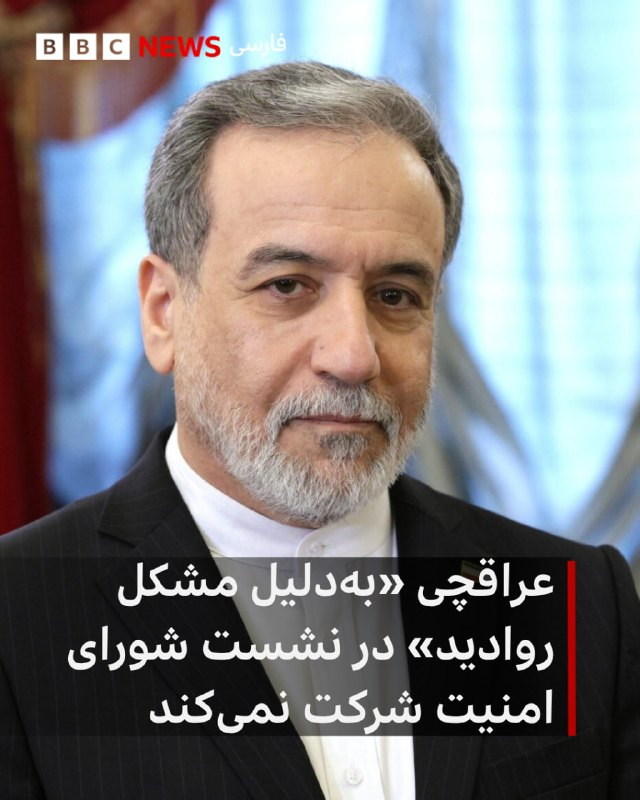

ایران می‌گوید که سفر وزیر خارجه به نیویورک برای شرکت در نشست شورای امنیت «منتفی» شده است.

اسماعیل بقایی، سخنگوی وزارت خارجه ایران، دلیل انجام نشدن سفر عباس عراقچی را «مشکل روادید» عنوان کرد.

آقای بقایی چهارشنبه هفته پیش درمورد حضور آقای عراقچی در این نشست گفته بود: «این سفر به نیویورک احتمال دارد انجام شود و البته ممکن هم هست انجام نشود، چون هنوز قطعی نیست. دلیلش هم این است که هم باید روادید صادر شود و هم ممکن است اولویت‌های دیگری داشته باشیم.»

چین به‌عنوان رئیس دوره‌ای شورای امنیت، سه‌شنبه ۲۶ مه یک بحث آزاد در سطح بالا با موضوع «حفظ اهداف و اصول منشور سازمان ملل و تقویت نظام بین‌المللی متمرکز بر سازمان ملل» برگزار خواهد کرد.

این جلسه به ریاست وانگ یی، عضو دفتر سیاسی کمیته مرکزی حزب کمونیست و وزیر امور خارجه چین، برگزار می‌شود.

چین این نشست را «فرصتی» برای همبستگی و اجماع کشورهای عضو توصیف کرد تا «تعهد راسخ خود را به حفظ اهداف و اصول منشور سازمان ملل متحد مجددا تصریح و نقش محوری این سازمان را در نظام بین‌المللی احیا کنند.»
@VahidHeadline

📡 @VahidOnline

## kianmeli1 — post 87668

🔴 ۴ عضو سپاه پاسداران در خلیج فارس پس از آنکه بنا به گزارش‌ها دو قایق تندرو توسط «هواپیماهای جنگی امریکا» مورد اصابت قرار گرفتند، کشته شدند.
https://t.me/kianmeli1

## kianmeli1 — post 87667

🔴امشب-دو قایق تندرو نیروی دریایی سپاه پاسداران در خلیج فارس توسط جنگنده‌های آمریکایی هدف قرار گرفتند و چهار نیرو سپاه کشته شده‌اند
https://t.me/kianmeli1

## kianmeli1 — post 87666

  

🔴پایین صفحه نوشته شده فروش فیلترشکن جعلیه و کلاهبرداری

خود تلگرام تبلیغ میکنه و مراقب باشید نخرید
https://t.me/kianmeli1

## kianmeli1 — post 87665

🔴ادعای تابناک: باند پروازی فرودگاه بندرعباس مورد اصابت موشک قرار گرفت.
https://t.me/kianmeli1

## kianmeli1 — post 87664

🔴صداهای انفجاری که در بندر عباس شنیده شده به احتمال زیاد مربوط به خنثی سازی مهمات عمل نکرده جنگ اخیر است.
https://t.me/kianmeli1

## kianmeli1 — post 87663

  <a href="telegram/content/kianmeli1_87663_1779747924.mp4" target="_blank">🎬 Download video</a>

🔴پزشکیان: این خانم‌هایی که قبلا می‌گفتند بگیرید همین الان تصاویرشان هستند که پرچم ایران و تصویر آقا را برداشتند و می‌گویند حاضرم جان بدهم و در مقابل دشمن بایستم در صورتی که یه روزی می‌گفتند این‌ها را بگیرید و جریمه کنید!

-در برخی مساجد اگر خانمی با مانتو برود، خانم‌های چادری وی را از مسجد بیرون می‌کنند
https://t.me/kianmeli1

## kianmeli1 — post 87662

🔴طبق ادعای خبرنگار هم‌میهن, پزشکیان دستور بازگشایی اینترنت بین‌الملل را ابلاغ کرد.
https://t.me/kianmeli1

## kianmeli1 — post 87661

  

🔴قالیباف و عراقچی در دوحه
ایران می‌گوید هیچ عوارضی برای تنگه هرمز وجود ندارد، اما شاید «هزینه زیست‌محیطی» داشته باشد

ایران به دنبال تضمین‌های چین است، ممکن است اورانیوم را به آنجا منتقل کند: عربستان
ترامپ این توافق را به توافق آبراهام مرتبط دانست
عربستان توافق آبراهام را به مسیر برگشت‌ناپذیر برای تشکیل کشور فلسطین مرتبط دانست

به نظر می‌رسد پیوند توافق‌نامه ابراهیم ناشی از تمایل به خروج آبرومندانه ترامپ و پیروزی ژئوپلیتیکی برای اسرائیل باشد، اما بعید است که این امر محقق شود. ترامپ می‌تواند روی کاغذ تعهدی از عربستان سعودی برای عادی‌سازی نهایی روابط به دست آورد، اما این پادشاهی در طول سال گذشته از این هدف فاصله گرفته و به ترکیه/قطر/پاکستان نزدیک‌تر شده است.

در حال حاضر، تمرکز هرگونه توافق اولیه بر حقوق ترانزیت هرمز و انتقال اورانیوم غنی‌شده با غنای بالا متمرکز است. چین به عنوان ضامن از دیدگاه ایران منطقی است، اما هنوز مشخص نیست که آیا پکن این نقش را خواهد پذیرفت و تا این حد در منطقه خاورمیانه نفوذ خواهد کرد یا خیر.
https://t.me/kianmeli1

## kianmeli1 — post 87660

‏🔴العربیه به نقل از منابع آگاه اعلام کرد پیش‌نویس یک یادداشت تفاهم اولیه و نهایی میان واشینگتن و تهران در حال بررسی است. این پیش‌نویس شامل بازگشایی تنگه هرمز بدون دریافت هزینه و همچنین پاکسازی مین‌ها است. در این پیش‌نویس همچنین به ایران اجازه فروش و صادرات نفت داده خواهد شد

‏در بخش دیگری از این پیش‌نویس آمده است که آتش‌بس به مدت ۶۰ روز تمدید خواهد شد و امکان تمدید دوباره آن نیز وجود دارد. همچنین آمریکا متعهد شده محدودیت‌ها بر بنادر جنوب ایران را کاهش دهد

‏بر اساس گزارش العربیه، بخشی از دارایی‌های مسدودشده ایران بر اساس سازوکاری مشخص آزاد خواهد شد
https://t.me/kianmeli1

## IranIntlTV — post 338996

  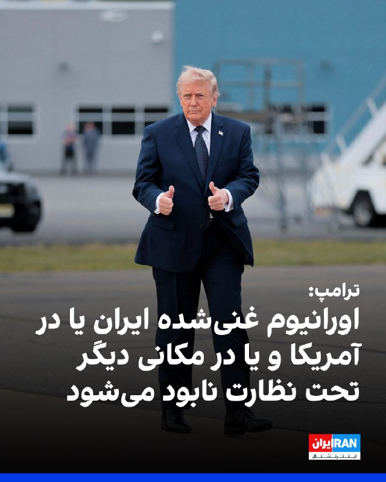

ترامپ در تروث‌سوشال نوشت: «اورانیوم غنی‌شده (غبار هسته‌ای!) یا فورا به آمریکا تحویل داده خواهد شد تا در ایالات‌متحده نابود شود، یا ترجیحا با همکاری و هماهنگی با جمهوری اسلامی ایران، در همان محل یا در مکانی قابل قبول دیگر نابود خواهد شد.»
ترامپ گفت در صورت نابودی اورانیوم غنی‌شده در مکانی غیر از آمریکا، «کمیسیون انرژی اتمی»، یا نهاد معادل آن، به عنوان شاهد بر این فرایند نظارت خواهد داشت.
https://iranintl.com/202605259577

## IranIntlTV — post 338995

  <a href="telegram/content/IranIntlTV_338995_1779747927.mp4" target="_blank">🎬 Download video</a>

مراد ویسی، تحلیل‌گر ارشد ایران‌اینترنشنال، گفت: «بسیاری از اختیارات پزشکیان گرفته شده او عملا نقش تعیین‌کننده‌ای در تصمیم‌گیری‌ها ندارد. پزشکیان عملا به تدارکاتچی سپاه تبدیل شده و حتی در جایگاه‌هایی مثل شورای عالی امنیت ملی هم بیشتر به ماشین امضای تصمیمات سپاه مثل جنایت دی‌ماه تبدیل شده است.»
@iranintltv

## IranIntlTV — post 338994

  <a href="telegram/content/IranIntlTV_338994_1779747928.mp4" target="_blank">🎬 Download video</a>

با ادامه انتقاد برخی گروه‌های درون حکومت ایران به شیوه مذاکرات، بعضی نمایندگان مجلس می‌گویند نباید هیچ تعهدی پذیرفته شود که به تضعیف قدرت بازدارندگی منجر گردد.
@iranintltv

## IranIntlTV — post 338993

  <a href="telegram/content/IranIntlTV_338993_1779747930.mp4" target="_blank">🎬 Download video</a>

مراد ویسی، تحلیل‌گر ارشد ایران‌اینترنشنال، گفت: «خروج قالیباف از مخفیگاه و سفرش به قطر و علنی شدن حضور علی عبداللهی، فرمانده قرارگاه خاتم الانبیا، پس از چند ماه می‌تواند نشانه امان‌نامه غیر رسمی و موقت ترامپ به فرماندهان سپاه برای رسیدن به یک توافق احتمالی باشد. اگر توافق نشود این امان‌نامه می تواند توسط نیروی هوایی اسراییل باطل شود.»
@iranintltv

## IranIntlTV — post 338992

  <a href="telegram/content/IranIntlTV_338992_1779747932.mp4" target="_blank">🎬 Download video</a>

در ادامه رایزنی‌ها بر سر توافق احتمالی میان تهران و واشینگتن، هیات جمهوری اسلامی به ریاست محمدباقر قالیباف، رییس مجلس و عباس عراقچی، وزیر امور خارجه جمهوری اسلامی، وارد دوحه شد.
@iranintltv

## IranIntlTV — post 338991

  <a href="telegram/content/IranIntlTV_338991_1779747934.mp4" target="_blank">🎬 Download video</a>

مراد ویسی، تحلیل‌گر ارشد ایران‌اینترنشنال، گفت: «علنی شدن رقم ۱۲ میلیارد دلاری پول‌های توقیف‌شده در قطر، بار دیگر این واقعیت را نشان داد که در مبادلات بانکی، فروش غیر رسمی نفت و دور زدن تحریم‌ها بخش زیادی از درآمدهای ملی حیف‌ومیل می‌شود و به‌دلیل پنهانی بودن معاملات، امکان سوءاستفاده و بالا کشیدن درآمدهای نفتی توسط فرماندهان سپاه و باندهای آنها وجود دارد.»
@iranintltv

## IranIntlTV — post 338990

  

محمد محمدی گلپایگانی، رییس دفتر علی خامنه‌ای، در ویدیویی با اشاره به رهبر کشته‌شده جمهوری اسلامی گفت او مخالف تجمل‌گرایی بود و زندگی بسیار ساده‌ای داشت، به‌گونه‌ای که وسایل شخصی‌اش به اندازه بار یک وانت یا حتی کمتر بود.

گلپایگانی افزود علی خامنه‌ای هدایایی را که از داخل و خارج کشور برایش ارسال می‌شد، به کمیته امداد و نهادهای دیگر می‌داد تا صرف کمک به فقرا شود و بهره شخصی او از این هدایا بسیار ناچیز بود.
https://iranintl.com/202605252326

## IranIntlTV — post 338989

  

رسانه‌های ایران شامگاه دوشنبه از شنیده‌شدن صداهای انفجار در بندرعباس و همزمان در خلیج فارس حوالی سیریک و جاسک خبر دادند.

معاون استاندار هرمزگان اعلام کرد منشا صدای انفجار در حال بررسی است.
https://iranintl.com/202605254215

## IranIntlTV — post 338988

  

🔻نیویورک تایمز گزارش داده که فیفا از سوی یک گروه غیرانتفاعی در آمریکا به دلیل ممنوعیت پرچم شیر و خورشید در جام جهانی ۲۰۲۶، تهدید به اقدام حقوقی و قضایی شده است؛ این نهاد غیرانتفاعی خواستار آن شده که برگزارکننده جام جهانی ممنوعیت نمایش پرچم پیش از انقلاب اسلامی را لغو کند.

🔹«مؤسسه صداهای آزادی» نامه‌ای حاوی نگرانی‌های خود را از طریق شاهرخ مختارزاده، مشاور حقوقی‌اش، برای فیفا ارسال کرده است.

🔹مختارزاده به نشریه اتلتیک گفته است که بسته به پاسخ یا عدم پاسخ فیفا، «تصمیم برای آغاز روند رسمی دادرسی در دادگاه عالی ایالت کالیفرنیا یا دادگاه‌های فدرال در کالیفرنیا اتخاذ خواهد شد.»

🔹مشاور حقوقی این گروه گفت که سه روز پس از ارسال نامه به فیفا، هنوز هیچ پاسخی دریافت نکرده‌اند: «در صورت هرگونه تلاش فیفا برای حذف پرچم شیر و خورشید، در حال آماده‌سازی برای آغاز اقدامات حقوقی مقتضی هستیم.»

🔹هفته گذشته، اتلتیک به نقل از منابعی، گزارش داد که راهنمای رسمی فیفا برای ورزشگاه‌ها در جام جهانی، ممنوعیت این پرچم خواهد بود.

🔹جزییات بیشتر را در سایت بخوانید.

@iranintltvsport

## IranIntlTV — post 338987

  <a href="telegram/content/IranIntlTV_338987_1779747937.mp4" target="_blank">🎬 Download video</a>

محمد مرندی، کارشناس حکومتی و عضو هیات مذاکره‌کنندگان جمهوری اسلامی در مذاکرات اسلام‌آباد، در تلویزیون گفت قطر پذیرفته بخشی از دارایی‌های بلوکه‌شده حکومت را پیشاپیش تامین و بعد، از آمریکا دریافت کند. او دلیل این اقدام را درک قدرت جمهوری اسلامی و نتایج ایستادگی آن عنوان کرد.

## IranIntlTV — post 338986

  <a href="telegram/content/IranIntlTV_338986_1779747938.mp4" target="_blank">🎬 Download video</a>

رویترز به نقل از دو مقام اسرائیلی گزارش داد بنیامین نتانیاهو نسبت به تفاهم‌نامه در حال مذاکره میان تهران و واشینگتن ابراز نگرانی کرده است. براساس این گزارش، او گفته اسرائیل نفوذ چندانی بر تصمیم‌های دونالد ترامپ درباره ایران ندارد.

گفت‌وگو با مئیر جاودانفر، تحلیل‌گر مسائل اسرائیل
@iranintltv

## IranIntlTV — post 338985

  <a href="https://t.me/IranintlTV/338985" target="_blank">📎 Download file</a>

🎧نسخه صوتی ۲۴ با فرداد فرحزاد: انتقادها از توافق احتمالی ایران و آمریکا؛ ترامپ: مخالفان چیزی نمی‌دانند
@iranintlTV

## IranIntlTV — post 338984

  

ابراهیم عزیزی، رییس کمیسیون امنیت ملی مجلس، گفت آمریکا از اوایل هفته دوم جنگ از طریق عاصم منیر، فرمانده ارتش پاکستان، درخواست آتش‌بس و مذاکره داده است.
او افزود تا زمانی که پنج اقدام «اعتمادساز» از سوی آمریکا انجام نشود، چیزی به نام تفاهم و مذاکره معنا ندارد.
به گفته عزیزی، این پنج اقدام شامل «خاتمه جنگ در همه جبهه‌ها به‌ویژه لبنان، برداشته‌شدن محاصره دریایی آمریکا، تردد کشتی‌های غیرنظامی از تنگه هرمز با ترتیبات مورد نظر ایران، تعلیق ۳۰ یا ۶۰ روزه تحریم‌های نفتی و آزادسازی پول‌های بلوکه‌شده است.»
https://iranintl.com/202605256772

## IranIntlTV — post 338983

  

ابراهیم عزیزی، رییس کمیسیون امنیت ملی مجلس، گفت آمریکا از اوایل هفته دوم جنگ از طریق عاصم منیر، فرمانده ارتش پاکستان، درخواست آتش‌بس و مذاکره داده است.
او افزود تا زمانی که پنج اقدام «اعتمادساز» از سوی آمریکا انجام نشود، چیزی به نام تفاهم و مذاکره معنا ندارد.
به گفته عزیزی، این پنج اقدام شامل «خاتمه جنگ در همه جبهه‌ها به‌ویژه لبنان، برداشته‌شدن محاصره دریایی آمریکا، تردد کشتی‌های غیرنظامی از تنگه هرمز با ترتیبات مورد نظر ایران، تعلیق ۳۰ یا ۶۰ روزه تحریم‌های نفتی و آزادسازی پول‌های بلوکه‌شده است.»
https://iranintl.com/202605256772

## IranIntlTV — post 338982

  

ابراهیم عزیزی، رییس کمیسیون امنیت ملی مجلس، گفت آمریکا از اوایل هفته دوم جنگ از طریق عاصم منیر، فرمانده ارتش پاکستان، درخواست آتش‌بس و مذاکره داده است.
او افزود تا زمانی که پنج اقدام «اعتمادساز» از سوی آمریکا انجام نشود، چیزی به نام تفاهم و مذاکره معنا ندارد.
به گفته عزیزی، این پنج اقدام شامل «خاتمه جنگ در همه جبهه‌ها به‌ویژه لبنان، برداشته‌شدن محاصره دریایی آمریکا، تردد کشتی‌های غیرنظامی از تنگه هرمز با ترتیبات مورد نظر ایران، تعلیق ۳۰ یا ۶۰ روزه تحریم‌های نفتی و آزادسازی پول‌های بلوکه‌شده است.»
https://iranintl.com/202605256772

## IranIntlTV — post 338981

  <a href="telegram/content/IranIntlTV_338981_1779747942.mp4" target="_blank">🎬 Download video</a>

علی صدرزاده، تحلیل‌گر مسائل خاورمیانه، گفت: «دلیل تاکید دونالد ترامپ بر پیوستن کشورهای عربی به پیمان ابراهیم این است که می‌خواهد این پیام را منتقل کند که آن‌ها نباید انتظار داشته باشند آمریکا از آن‌ها دفاع کند.» او افزود از نظر ترامپ، کشورهای عربی بهتر است با اسرائیل همکاری کنند تا از امکانات و توان دفاعی آن بهره‌مند شوند.
@iranintltv

## IranIntlTV — post 338980

  

مسعود پزشکیان گفت: «وقتی تصمیمی گرفته می‌شود، باید یک‌صدا از سیستم بیرون بیاید. من خیلی چیزها را دوست ندارم، اما وقتی تصمیم گرفته می‌شود، کوتاه می‌آیم.»

او افزود: «اگر بتوانم معیشت و زندگی مردم را تامین کنم، آمریکا و اسرائیل نمی‌توانند در داخل کشور توطئه کنند.»
https://iranintl.com/202605258505

## IranIntlTV — post 338979

  <a href="https://t.me/IranintlTV/338979" target="_blank">📎 Download file</a>

🎧نسخه صوتی چشم‌انداز: تحرکات قالیباف در قطر، دور از چشم و گوش مجتبی و سپاه!
@iranintlTV

## IranIntlTV — post 338978

  <a href="telegram/content/IranIntlTV_338978_1779747945.mp4" target="_blank">🎬 Download video</a>

تحرکات قالیباف در قطر، دور از چشم و گوش مجتبی و سپاه!

چشم‌انداز با مهدی مهدوی‌آزاد

تماشای نسخه کامل در یوتیوب:
https://youtu.be/WCt7x569huw
@iranintltv

## IranIntlTV — post 338977

  

الجزیره به نقل از یک منبع آگاه از گفت‌وگوهای میان هیات عالی‌رتبه ایرانی و مقام‌های قطری در دوحه گزارش داد میانجی‌گری قطر به دستیابی به تفاهمی میان آمریکا و جمهوری اسلامی درباره دارایی‌های مسدودشده تهران منجر شده است.
این منبع افزود با توجه به اهمیت بالای این موضوع برای ایران، احتمال زیادی وجود دارد توافق میان آمریکا و جمهوری اسلامی فردا اعلام شود.

https://iranintl.com/202605257486

## Shin_Persian — post 6232

  

Shin ✓ @hey_itsmyturn Mon, 25 May 2026 21:50:47 UTC President Trump @POTUS: "The Enriched Uranium (Nuclear Dust!) will either be immediately turned over to the United States to be brought home and destroyed or, preferably, in conjunction and coordination…

## Shin_Persian — post 6231

Shin ✓ @hey_itsmyturn
Mon, 25 May 2026 21:50:47 UTC

President Trump @POTUS:
"The Enriched Uranium (Nuclear Dust!) will either be immediately turned over to the United States to be brought home and destroyed or, preferably, in conjunction and coordination with the Islamic Republic of Iran, destroyed in place or, at another acceptable location, with the Atomic Energy Commission, or its equivalent, being witness to this process and event. Thank you for your attention to this matter! President DJT"

فارسی

رئیس‌جمهور ترامپ @POTUS:

«اورانیوم غنی‌سازی شده (گرد و غبار هسته‌ای!) یا باید فوراً به ایالات متحده تحویل داده شود تا به میهن بازگردانده و نابود شود یا ترجیحاً، با همکاری و هماهنگی با جمهوری اسلامی ایران، در محل یا در مکان قابل قبول دیگری، با حضور کمیسیون انرژی اتمی یا معادل آن به عنوان شاهد این فرآیند و رویداد، نابود گردد. از توجه شما به این موضوع سپاسگزارم! رئیس‌جمهور دی‌جی‌تی»

𝕏 · @shin_persian

## Shin_Persian — post 6230

Shin ✓ @hey_itsmyturn
Mon, 25 May 2026 21:47:08 UTC

AA activity over Khorzuq Borkhar, Isfahan Province, #Iran

فارسی

فعالیت پدافند هوایی (AA) بر فراز خورزوق برخوار، استان اصفهان، #Iran

𝕏 · @shin_persian

## Shin_Persian — post 6228

Shin ✓ @hey_itsmyturn
Mon, 25 May 2026 21:42:17 UTC

And regarding the reports on death of 4 regime forces in Larak island due to strike(s): SNN (Daneshju) reported it, claims it happened on Monday (4th of Khordad), AsrIran cites Daneshju and reports it as well.
Hormozgan Province, #Iran

فارسی

و در رابطه با گزارش‌ها مبنی بر کشته شدن ۴ تن از نیروهای رژیم در جزیره لارک بر اثر حمله (یا حملات): خبرگزاری دانشجو (SNN) این خبر را گزارش کرده و مدعی شده است که این حادثه در روز دوشنبه (۴ خرداد) رخ داده است؛ عصر ایران نیز با استناد به خبرگزاری دانشجو این خبر را گزارش کرده است.
استان هرمزگان، #Iran_

𝕏 · @shin_persian

## Shin_Persian — post 6227

Shin ✓ @hey_itsmyturn
Mon, 25 May 2026 21:37:03 UTC

No explosions in Babolsar.
No explosions in Isfahan.
No explosions in Qom.
Yes explosions &amp; AA activity in Bandar Abbas.
No official statements, Yet.

فارسی

هیچ انفجاری در بابلسر رخ نداده است.
هیچ انفجاری در اصفهان رخ نداده است.
هیچ انفجاری در قم رخ نداده است.
بله، انفجارها و فعالیت پدافند هوایی در بندرعباس گزارش شده است.
هنوز هیچ بیانیه رسمی صادر نشده است.

𝕏 · @shin_persian

## Shin_Persian — post 6226

  

↩️ Quoted tweet: Shin ✓ @hey_itsmyturn Mon, 25 May 2026 21:12:23 UTC No, Tabnak News did not report anything about "Bandar Abbas airport being hit". But yes, the sound was heard from east of the city. #Hormogzan Province, #Iran ↩️ توییت نقل‌قول شده — برای…

## Shin_Persian — post 6225

↩️ Quoted tweet:
Shin ✓ @hey_itsmyturn
Mon, 25 May 2026 21:12:23 UTC

No, Tabnak News did not report anything about "Bandar Abbas airport being hit".
But yes, the sound was heard from east of the city.
#Hormogzan Province, #Iran

↩️ توییت نقل‌قول شده — برای پاسخ، پست زیر را ببینید.

فارسی

خیر، خبرگزاری تابناک هیچ خبری مبنی بر «هدف قرار گرفتن فرودگاه بندرعباس» منتشر نکرده است.
اما بله، صدا از شرق شهر شنیده شده است.
#Hormogzan Province, #Iran

𝕏 · @shin_persian

## Shin_Persian — post 6224

Shin ✓ @hey_itsmyturn
Mon, 25 May 2026 21:12:23 UTC

No, Tabnak News did not report anything about "Bandar Abbas airport being hit".
But yes, the sound was heard from east of the city.
#Hormogzan Province, #Iran

فارسی

خیر، خبرگزارى تابناک هیچ خبری مبنی بر «مورد اصابت قرار گرفتن فرودگاه بندرعباس» گزارش نکرده است.
اما بله، صدا در شرق شهر شنیده شده است.
#Hormogzan Province, #Iran

𝕏 · @shin_persian

## Shin_Persian — post 6223

  

Shin ✓ @hey_itsmyturn
Mon, 25 May 2026 21:10:26 UTC

Source of this image is not know, it has no results in reverse image searches, and it's claimed to be from Bandar Abbas, Hormozgan Province, #Iran
(Can't confirm)

فارسی

منبع این تصویر مشخص نیست، در جستجوی معکوس تصاویر هیچ نتیجه‌ای ندارد و ادعا شده است که مربوط به بندرعباس در استان هرمزگان، #Iran است.
(قابل تأیید نیست)

𝕏 · @shin_persian

## Shin_Persian — post 6222

  

Shin ✓ @hey_itsmyturn
Mon, 25 May 2026 20:32:58 UTC

State-owned Mehr News and IRGC's Fars News confirm the explosions in Bandar Abbas, Fars adds "At the same time, several blasts were heard from Sirik and Jask as well"
Hormozgan Province, #Iran

فارسی

خبرگزاری دولتی مهر و خبرگزاری فارس متعلق به سپاه پاسداران انقلاب اسلامی (سپاه)، وقوع انفجارها در بندرعباس را تأیید کردند. فارس افزود: «همزمان، چندین صدای انفجار از سیریک و جاسک نیز شنیده شده است.»
استان هرمزگان، #Iran_

𝕏 · @shin_persian

## Shin_Persian — post 6221

Shin ✓ @hey_itsmyturn
Mon, 25 May 2026 20:24:16 UTC

2024Z
AA activity over Bandar Abbas right now.
Hormozgan Province, #Iran

فارسی

۲۰۲۴ زولو (۲۳:۵۴ به وقت تهران)
فعالیت پدافند هوایی (AA) در حال حاضر برفراز بندرعباس.
استان هرمزگان، #Iran

𝕏 · @shin_persian

## Shin_Persian — post 6220

  

Shin ✓ @hey_itsmyturn
Mon, 25 May 2026 20:17:30 UTC

2012Z
3 huge blasts in Bandar Abbas, Hormozgan Province, #Iran

فارسی

۲۰۱۲ زولو (۲۳:۴۲ به وقت تهران)
۳ انفجار مهیب در بندرعباس، استان هرمزگان، #Iran

𝕏 · @shin_persian

## Shin_Persian — post 6219

📦 mhrv-rs v1.9.35 released

• Improve large-download resilience and slow exit-node behavior (PR #1346)

Files (Android APKs, Windows, macOS, Linux, OpenWRT) on the files channel:

👉 v1.9.35 — all files with SHA-256

Channel:
https://t.me/mhrv_rs
or: https://t.me/+R1OyoHX2boA1ZDgx

#v1935

## Shin_Persian — post 6218

Shin ✓ @hey_itsmyturn
Mon, 25 May 2026 17:57:24 UTC

Al Arabiya is NewYorkTimesing too much these days. I would take their news on Iran talks with a huge grain of salt

فارسی

العربیه این روزها بیش از حد به سبک نیویورک تایمز (NYT) عمل می‌کند. من اخبار آن‌ها درباره مذاکرات ایران را با تردید بسیار زیاد می‌پذیرم.

𝕏 · @shin_persian

## ManotoTV — post 105829

  <a href="telegram/content/ManotoTV_105829_1779747950.mp4" target="_blank">🎬 Download video</a>

گفت‌وگو با کیوان عباسی:
«می‌گفت ایرانی‌ها باید بیشتر کنار هم بایستند…
و دوباره باور کنند که سرنوشت ایران را خود مردم ایران رقم می‌زنند.»

## FarsiVOA — post 218657

🔺دونالد ترامپ: اورانیوم غنی‌شده جمهوری اسلامی یا در آمریکا، یا ایران و یا در مکان دیگری نابود خواهد شد

▪️دونالد ترامپ، رئیس‌جمهوری آمریکا، روز دوشنبه ۴ خرداد گفت اورانیوم غنی‌شده جمهوری‌ اسلامی یا تحویل آمریکا داده می‌شود و یا در ایران و یا «مکان قابل قبول دیگری» نابود خواهد شد.

⬇️ بیشتر بخوانید:
https://ir.voanews.com/a/8153748.html
@FarsiVOA

## FarsiVOA — post 218656

  <a href="telegram/content/FarsiVOA_218656_1779747951.mp4" target="_blank">🎬 Download video</a>

⚡️واکنش کاربران شبکه‌های اجتماعی به توافق احتمالی آمریکا با جمهوری اسلامی
@FarsiVOA

## FarsiVOA — post 218655

  

رسانه حکومتی تابناک در ایران در خبری مدعی شد که دو قایق تندرو سپاه پاسداران هدف حمله هوایی قرار گرفتند.
این رسانه نام چهار نفر را نیز به عنوان کشته‌ها منتشر کرد.
در همین حال یک خبرنگار شبکه الجزیره نیز به نقل از منابع جمهوری اسلامی از هدف قرار گرفتن قایق‌های سپاه خبر داد.
او افزود نیروهای سپاهی قبل از اینکه هدف قرار بگیرند، به یک شناور حمله کرده بودند.
ساعاتی قبل از این نیز گزارش‌های مختلفی در شبکه‌های اجتماعی از شنیده شدن صدای چندین انفجار در بندرعباس و سیریک و جاسک منتشر شد.
ستاد فرماندهی مرکزی آمریکا، سنتکام، تا این لحظه واکنشی به این گزارش‌ها شده نشان نداده است.
برخی رسانه‌های داخلی مدعی شده‌اند که قایق‌های سپاه در نزدیکی جزیره لارک هدف قرار گرفتند.
@FarsiVOA

## FarsiVOA — post 218654

⚡️روز دوشنبه ۴ خرداد جی دی ونس، معاون رئیس جمهوری آمریکا، به همراه پرزیدنت ترامپ و شماری از مقامات بلندپایه آمریکا در مراسم «روز یادبود» در آرامستان ملی آرلینگتون در نزدیکی واشنگتن شرکت کرد. این مراسم به طور زنده و با ترجمه همزمان پژواک کیومرثی از صدای آمریکا پخش شد.
@FarsiVOA

## FarsiVOA — post 218653

⚡️روز دوشنبه ۴ خرداد پیت هگست، وزیر جنگ آمریکا، به همراه پرزیدنت ترامپ و شماری از مقامات بلندپایه آمریکا در مراسم «روز یادبود» در آرامستان ملی آرلینگتون در نزدیکی واشنگتن شرکت کرد. این مراسم به طور زنده و با ترجمه همزمان پژواک کیومرثی از صدای آمریکا پخش شد.
@FarsiVOA

## FarsiVOA — post 218652

  <a href="telegram/content/FarsiVOA_218652_1779747953.mp4" target="_blank">🎬 Download video</a>

⚡️آیا فرانسه می‌خواهد اروپا را از وابستگی به چین نجات دهد؟
@FarsiVOA

## FarsiVOA — post 218651

⚡️هزاران نفر در رژه روز یادبود در واشنگتن، پایتخت آمریکا، شرکت کردند.
روز یادبود کشته‌شدگان نیروهای مسلح آمریکا در ایالات متحده برای گرامی‌داشت نظامیان کشته‌شده این کشور برگزار می‌شود.
@FarsiVOA

## FarsiVOA — post 218650

  

⚡️گزارش‌های شبکه‌های اجتماعی از شنیده شدن صدای چند انفجار شدید در اواخر روز دوشنبه در بندرعباس حکایت دارد.
@FarsiVOA

## FarsiVOA — post 218649

  <a href="telegram/content/FarsiVOA_218649_1779747954.mp4" target="_blank">🎬 Download video</a>

⚡️مهرداد درویش پور در برنامه تفسیر خبر: عقربه زمان به ضرر «جناح آخر الزمانی» خواهد چرخید
@FarsiVOA

## FarsiVOA — post 218648

  <a href="telegram/content/FarsiVOA_218648_1779747954.mp4" target="_blank">🎬 Download video</a>

⚡️امین قضایی در برنامه تفسیر خبر: جمهوری اسلامی صرفا برای مذاکره، مذاکره می‌کند
@FarsiVOA

## FarsiVOA — post 218647

  <a href="telegram/content/FarsiVOA_218647_1779747955.mp4" target="_blank">🎬 Download video</a>

⚡️گزارش نرگس صبا از جدال قدرت بین قالیباف و جلیلی - برنامه تفسیر خبر
@FarsiVOA

## FarsiVOA — post 218646

  <a href="telegram/content/FarsiVOA_218646_1779747956.mp4" target="_blank">🎬 Download video</a>

⚡️رضا طالبی: سعید جلیلی به حاشیه رانده شده است
@FarsiVOA

## FarsiVOA — post 218645

  <a href="telegram/content/FarsiVOA_218645_1779747957.mp4" target="_blank">🎬 Download video</a>

⚡️ترامپ: به جمهوری اسلامی که حامی نخست تروریسم در جهان است اجازه دستیابی به سلاح اتمی را نمی‌دهم
@FarsiVOA

## FarsiVOA — post 218644

⚡️دونالد ترامپ، رئیس جمهوری ایالات متحده، در مراسم «روز یادبود» تاکید کرد واشنگتن اجازه نخواهد داد «بزرگ‌ترین حامی دولتی تروریسم در جهان» به سلاح هسته‌ای دست پیدا کند. صدای آمریکا این مراسم را به طور زنده و با ترجمه همزمان پژواک کیومرثی پخش کرد.
@FarsiVOA

## FarsiVOA — post 218643

🔺وزارت خارجه آمریکا: «حزب‌الله» مسئول اصلی بحران کنونی در لبنان است

▪️وزارت خارجه ایالات متحده می‌گوید که گروه شبه‌نظامی «حزب‌الله» با ادامه حملات علیه اسرائیل و نقض آتش‌بس، مسئول اصلی بحران جاری در لبنان است، و عملا تلاش می‌کند مسیر صلح، بازسازی، و تثبیت حاکمیت دولت لبنان را نابود کند.

⬇️ بیشتر بخوانید:
https://ir.voanews.com/a/state-department-says-hezbollah-entirely-responsible-for-current-crisis-in-lebanon/8153718.html
@FarsiVOA

## FarsiVOA — post 218642

⚡️در برنامه تفسیر خبر امروز، مهدی آقازمانی با کارشناسان مهمان، درباره تنش‌های درون حکومت ایران برای رسیدن به تفاهم با آمریکا، موضع و رویکرد ایالات متحده به مذاکره و روش دیپلماسی در قبال جمهوری اسلامی و تازه‌ترین گفته‌های سخنگوی وزارت خارجه جمهوری اسلامی گفتگو می‌کند
@FarsiVOA

## FarsiVOA — post 218641

نت‌بلاکس، نهاد ناظر بر اختلالات اینترنتی، اعلام کرد محدودیت گسترده اینترنت در ایران وارد هشتادوهفتمین روز پیاپی شده و بیش از دو هزار و ۶۴ ساعت ادامه یافته است.

به گفته این نهاد، وضعیت کنونی شفافیت درباره اعدام‌ها را از میان برده و بلاتکلیفی روزانه زندانیان، مخالفان، منتقدان و بازداشت‌شدگان را تشدید کرده است.

این هشدار در شرایطی مطرح می‌شود که عفو بین‌الملل در گزارشی به تاریخ ۳۱ اردیبهشت ۱۴۰۵ اعلام کرد از زمان آغاز حملات آمریکا و اسرائیل به ایران در ۲۸ فوریه، مقام‌های جمهوری اسلامی دست‌کم ۳۶ نفر را پس از محکومیت در پرونده‌های سیاسی و در پی «محاکمه‌های به‌شدت ناعادلانه» اعدام کرده‌اند.

گزارش کامل را در وب‌سایت صدای آمریکا بخوانید.

@FarsiVOA

## FarsiVOA — post 218640

ژنرال دن کین، رئیس ستاد مشترک نیروهای مسلح آمریکا در مراسم «روز یادبود» گفت سربازان، ملوانان و تفنگداران جوان ما به میدان‌های نبرد رفتند تا برای حفظ استقلال ما بجنگند و مسیر این ملت بزرگی که امروز می‌شناسیم را هموار کنند.

## FarsiVOA — post 218639

دونالد ترامپ، رئیس جمهوری ایالات متحده، در مراسم «روز یادبود» گفت در دو جنگ اخیر، آمریکا ۱۳ نیروی نظامی خود را در جریان عملیات علیه جمهوری اسلامی از دست داده است، اما تاکید کرد واشنگتن اجازه نخواهد داد «بزرگ‌ترین حامی دولتی تروریسم در جهان» به سلاح هسته‌ای دست پیدا کند.

## FarsiVOA — post 218638

🔺پرزیدنت ترامپ در مراسم «روز یادبود»: «خشم حماسی» تضمین کرد که رژیم ایران هرگز سلاح هسته‌ای نخواهد داشت

▪️دونالد ترامپ، رئیس جمهوری ایالات متحده، روز دوشنبه ۴ خرداد در مراسم رسمی «روز یادبود کشته‌شدگان نیروهای مسلح آمریکا» (یا «مموریال دِی») در گورستان ملی آرلینگتون، با ادای احترام به سربازان کشته‌شده آمریکایی، تاکید کرد عملیات‌های اخیر ارتش ایالات متحده، از جمله «خشم حماسی» علیه جمهوری اسلامی، بخشی از نبرد آمریکا برای دفاع از آزادی و جلوگیری از دستیابی «بزرگ‌ترین حامی تروریسم در جهان» به سلاح هسته‌ای بوده است.

⬇️ بیشتر بخوانید:

https://ir.voanews.com/a/president-trump-arlington-cemetery-speech-iran-epic-fury/8153702.html/?nocach=1

## DW_Farsi — post 125145

  

🔶 ترامپ: اورانیوم غنی‌شده باید بلافاصله به ایالات متحده تحویل داده شود

دونالد ترامپ، رئیس جمهور آمریکا بامداد سه‌شنبه ۲۶ مه (۵ خرداد) با انتشار پستی در شبکه اجتماعی تروث سوشال، بار دیگر بر خواست واشنگتن مبنی بر تحویل اورانیوم با غنای بالای ایران تاکید کرد.

او نوشت: «اورانیوم غنی‌شده (غبار هسته‌ای!) یا فورا به آمریکا تحویل داده می‌شود تا به کشورمان منتقل و نابود شود یا ترجیحا در همکاری و هماهنگی با جمهوری اسلامی ایران، در همان محل یا در مکانی دیگر که مورد قبول باشد، با نظارت کمیسیون انرژی اتمی یا نهاد معادل آن بر این فرآیند و رویداد، نابود شود.»

این در حالی است که پیش از این مقامات ایرانی اعلام کرده بودند، "تهران هیچ تعهدی در پیش‌نویس توافق‌ اولیه با آمریکا در موضوع هسته‌ای و اورانیوم با غنای بالا به طرف مقابل نداده است."

با این حال رویترز به نقل از یک مقام آگاه نوشته بود، محور اصلی مذاکرات محمدباقر قالیباف، مذاکره‌کننده ارشد ایران و عباس عراقچی، وزیر خارجه این کشور، در سفر به قطر موضوع تنگه هرمز و ذخایر اورانیوم بسیار غنی‌شده ایران خواهد بود.
@dw_farsi

## DW_Farsi — post 125144

  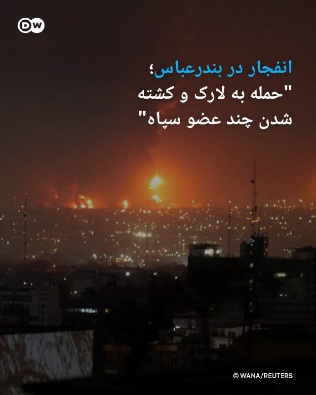

🔴 انفجار در بندرعباس؛ "حمله به لارک و کشته شدن چند عضو سپاه"

خبرگزاری‌های داخلی ایران گزارش دادند، در ساعات پایانی روز دوشنبه ۴ خرداد (۲۵ مه) صدای سه انفجار در شرق بندرعباس شنیده شده است. همزمان در حوالی سیریک و جاسک نیز صداهای مشابه شنیده شده است.

معاون استاندار هرمزگان اعلام کرد، منشا صدای انفجار در حال بررسی است.

خبرگزاری فارس وابسته به سپاه پاسداران نیز در خبری نوشت، "سحرگاه روز سه‌شنبه ۵ خرداد نیروهای مسلح ایران یک فروند پهپاد متخاصم را در محدوده خلیج فارس منهدم کرده‌اند."

برخی منابع داخلی نیز از حمله به فرودگاه بندرعباس خبر می‌دهند. تا کنون هیچ مقام رسمی توضیحی در این رابطه ارائه نکرده است.

خبرگزاری دانشجو به نقل از منابع محلی نوشت، جنگنده‌های آمریکایی چند شناور ایرانی را در جنوب جزیره لارک هدف قرار داده‌اند. آنگونه که این خبرگزاری نوشته چند عضو سپاه بر اثر این حمله کشته شده‌اند که هویت سه تن از آنها تایید شده است.

📌تصویر از آرشیو
@dw_farsi

## DW_Farsi — post 125143

🔶 پزشکیان دستور بازگشایی اینترنت بین‌المللی را ابلاغ کرد

رسانه‌های ایران اعلام کردند مسعود پزشکیان، رئیس‌جمهور ایران مصوبه بازگشایی اینترنت بین‌الملل به وضعیت پیش از دی‌ماه ۱۴۰۴ را برای اجرا به وزارت ارتباطات ابلاغ کرده است.

پیش از این رسانه‌های داخلی خبر داده بودند که مصوبه بازگشایی اینترنت در جلسه روز دوشنبه چهارم خرداد ستاد ویژه ساماندهی و راهبری فضای مجازی به ریاست محمدرضا عارف، معاون‌‌اول پزشکیان به تصویب رسید.

قطعی اینترنت بین‌الملل در ایران که پیش‌تر در جریان اعتراضات دی‌ماه ۱۴۰۴ رخ داده بود، در ماه‌های بعد و در پی حملات آمریکا و اسرائیل به ایران پی گرفته شد و تا کنون نیز ادامه دارد.

به نوشته روزنامه شرق، ستار هاشمی، وزیر ارتباطات و فناوری اطلاعات، بازگشایی اینترنت بین‌الملل را نشانه‌ای از "بازگشت ثبات و اعتماد ملی" تلقی و از آن تجلیل کرده است.

به گفته او، این تصمیم بعد از جلسات فشرده ستاد ویژه ساماندهی و راهبری فضای مجازی کشور و با دستور مستقیم رئیس‌جمهور وارد مرحله اجرا شده است.

هاشمی با اشاره به حیاتی بودن اینترنت و پیامدهای اختلال آن بر زندگی مردم و پایداری خدمات تأکید کرد: «بر اساس گزارش‌های رسمی، محدودیت‌های اینترنتی در ماه‌های اخیر خسارات درخور توجهی به اقتصاد دیجیتال، کسب‌وکارهای آنلاین و چرخه خدمات کشور وارد کرد و استمرار این وضعیت می‌توانست علاوه بر آسیب‌های اقتصادی، زمینه‌ساز تضعیف سرمایه‌گذاری، مهاجرت نیرو‌های انسانی نخبه و گسترش الگوهای ارتباطی خارج از چارچوب حکمرانی رسمی کشور شود‌.»

او همچنین با اشاره به اهداف برنامه هفتم توسعه در حوزه ارتباطات گفت: «دستیابی به سهم ۱۰‌درصدی اقتصاد دیجیتال از تولید ناخالص داخلی تا پایان سال ۱۴۰۷، بدون ایجاد فضای باثبات ارتباطی، توسعه زیرساخت‌های دیجیتال و حفاظت از عدالت ارتباطی ممکن نخواهد بود.»

@dw_farsi

## DW_Farsi — post 125142

🔶 رییس جمهور مکزیک با اقامت تیم فوتبال ایران در این کشور موافقت کرد

به گفته کلودیا شینباوم، رئیس‌جمهور مکزیک، دولت او موافقت کرده که تیم ملی فوتبال ایران در طول رقابت‌های جام جهانی ۲۰۲۶ در مکزیک اقامت داشته باشد. به گفته او، آمریکا تمایلی به میزبانی این تیم نداشته است.

به گزارش خبرگزاری رویترز، او گفت که فدراسیون بین‌المللی فوتبال (فیفا) پس از آن که آمریکا اعلام کرد، نمی‌خواهد تیم ایران در طول مسابقات در خاک این کشور مستقر باشد، به دولت او مراجعه کرد.

شینباوم در یک نشست خبری در روز دوشنبه چهارم خرداد گفت: «هیچ دلیلی نمی‌بینیم که امکان اقامت در مکزیک را از آن‌ها دریغ کنیم.»

رویترز می‌نویسد، تا کنون کاخ سفید و وزارت خارجه آمریکا به درخواست‌ها برای اظهار نظر در این‌باره پاسخی نداده‌اند.

پیش از این در روز شنبه دوم خرداد مهدی تاج، رئیس فدراسیون فوتبال ایران گفته بود که محل استقرار تیم ملی در جریان این رقابت‌ها از ایالت آریزونای آمریکا به شهر مرزی تیخوانا در مکزیک منتقل خواهد شد.

حضور تیم ملی ایران در این رقابت‌ها که از ۲۱ خرداد تا ۲۸ تیر (۱۱ ژوئن تا ۱۹ ژوئیه) برگزار می‌شود، پس از حملات آمریکا و اسرائیل به ایران در اواخر فوریه، با ابهام مواجه شده بود.

@dw_farsi

## DW_Farsi — post 125141

🔶 شبکه تلویزیونی و اینترنتی"منوتو" به کار خود پایان داد

شبکه تلویزیونی و اینترنتی "منوتو" (manoto)، از رسانه‌های پرمخاطب فارسی‌زبان خارج از کشور طی اطلاعیه‌ای از پایان پخش برنامه‌هایش بعد از ۱۶ سال کار خبر داد.

این شبکه که پیش از این پخش برنامه‌هایش در زمستان ۱۴۰۲ متوقف شده بود این بار در شامگاه جمعه اول خردادماه طی اطلاعیه‌ای اعلام کرد، سرانجام به این تصمیم دشوار رسیده که به پخش برنامه‌های منوتو پایان دهد: «آخرین پخش ما از ماهواره و یوتیوب، شامگاه ۲۴ مه ۲۰۲۶ [۳ خرداد ۱۴۰۵] خواهد بود.»

"منوتو" که از پاییز سال ۱۳۸۹ در لندن با مدیریت کیوان و مرجان عباسی به روی آنتن ماهواره رفت بعد از حدود دو سال و نیم کار اعلام کرد، به دلیل "مشکلات مالی" پخش تلویزیونی خود را متوقف کرده است. اما این توقف به طول نیانجامید و مدتی بعد فعالیت "منوتو" ازسر گرفته شد.

این بار طبق اطلاعیه پایانی، علاوه بر مسائل مالی به "دگرگونی‌های بنیادین در عرصه رسانه‌ای و سیاسی" ایران نیز اشاره شده است.

در این اطلاعیه گفته شده که فضای عمومی مملو از "اطلاعات نادرست، هیجان‌سازی و تلاش آگاهانه برای مخدوش کردن مرز میان واقعیت و روایت‌های جعلی" است و فضای سیاسی ایران نیز "خصمانه‌تر و قطبی‌تر" شده و شرایط را برای ادامه فعالیت این شبکه غیرممکن کرده است.

در ادامه آمده است: «از همین رو، ترجیح دادیم به جای ادامه مسیری که ممکن است به بهای از دست رفتن هویت منوتو تمام شود، از ارزش و انسجام این مجموعه محافظت کرده و خود را برای شکلی متفاوت از تأثیرگذاری آماده کنیم.»

"منوتو" همچنین گفته است، پخش را متوقف می‌کند تا بتواند در آینده "به‌ شکلی دیگر، در گفت‌وگو درباره فردای ایران سهیم" شود.

@dw_farsi

## DW_Farsi — post 125140

🔶 محکومیت یک نفر به زندان "به دلیل پخش شیرینی" در شب کشته شدن خامنه‌ای

شهلا عروجی، وکیل دادگستری در پستی در شبکه ایکس خبر از صدور دو سال زندان برای یک شهروند به دلیل پخش شیرینی در شامگاه نهم اسفند ۱۴۰۴ همزمان با کشته شدن علی خامنه‌ای خبر داد.

عروجی در این پست نوشت: «به دليل پخش شيرينی در شب ۱۰ اسفند [خود موكل ميگه ٩ اسفند و بابت افتتاح فست فودش بوده] محكوم به ۲ سال حبس از بابت اتهام توهين به رهبری شده!»

به نوشته این وکیل دادگستری، در رأی صادره به "شاد بودن" این شهروند هم به عنوان مصداق ارتکاب جرم اشاره شده است.

دادبان، مرکز مشاوره و آموزش حقوقی ویژه کنش‌گران با انتشار این خبر نوشته است: «حتی در فرض صحت ادعای مطرح‌شده درباره پخش شیرینی به مناسبت کشته شدن رهبر جمهوری اسلامی، چنین رفتاری به‌ خودی‌خود مصداق جرم "توهین به رهبری"، موضوع ماده ۵۱۴ قانون مجازات اسلامی محسوب نمی‌شود.»

به نوشته دادبان، تحقق عمل مجرمانه توهین به رهبری "مستلزم به‌کارگیری الفاظ، عبارات یا رفتارهای صریحا موهن و تحقیرآمیز است و صرف ابراز شادی یا پخش شیرینی، فاقد عناصر قانونی لازم برای تحقق این جرم است".

دادبان ادامه می‌دهد: «همچنین استناد دادگاه به "شاد بودن" متهم به‌عنوان دلیل ارتکاب جرم، با اصل قانونی بودن جرم و مجازات در تعارض آشکار قرار دارد؛ چرا که احساسات، حالات روحی یا برداشت‌های ذهنی افراد تا زمانی که در قالب رفتار مجرمانه مشخص و تعریف‌شده در قانون بروز پیدا نکند، قابل جرم‌انگاری نیست.»
به علاوه، در قوانین کیفری ایران نیز "هیچ ماده‌ای صرف شادمانی از مرگ یک فرد را جرم تلقی نکرده است."

دادبان بر همین مبنا صدور دو سال زندان در این پرونده را "فاقد مبنای قانونی روشن" و "مصداق تفسیر موسع قوانین کیفری علیه متهم" خوانده است؛ امری که "برخلاف اصول بنیادین حقوق کیفری و الزامات دادرسی عادلانه است.

@dw_farsi

## DW_Farsi — post 125139

  <a href="telegram/content/DW_Farsi_125139_1779747959.mp4" target="_blank">🎬 Download video</a>

🎥 شکست پروژه قطار شناور آلمان

"ترانس‌راپید"، پروژه قطار شناور مغناطیسی آلمان، قرار بود آینده حمل‌ونقل را تغییر دهد.

قطاری فوق‌سریع که بدون چرخ و با فناوری مغناطیسی حرکت می‌کرد. اما حالا مسیر آزمایشی این قطار زنگ زده و متروکه شده است.

چه شد که این پروژه شکست خورد؟

@dw_farsi

## DW_Farsi — post 125138

🔶 رسانه‌ها‌ی ایران از تصویب بازگشایی اینترنت بین‌الملل خبر دادند

رسانه‌های ایران از تصویب مصوبه‌ای تازه در راستای اتصال مجدد اینترنت بین‌الملل در این کشور خبر داده‌اند.

خبرآنلاین به نقل از یک منبع آگاه نوشت ستاد راهبردی و ساماندهی فضای مجازی صبح دوشنبه چهارم خرداد به ریاست محمدرضا عارف، معاون‌ اول مسعود پزشکیان، رئیس‌جمهور کشور جلسه‌ای تشکیل داد و بازگشت اینترنت به وضعیت قبل از دی‌‌ماه ۱۴۰۴ را تصویب کرد.

در جریان اعتراضات ضدحکومتی دی‌ماه اینترنت قطع و  دسترسی به شبکه جهانی تقریبا به طور کامل ناممکن شد.

قطع اینترنت بین‌الملل در خلال جنگ اسرائيل و آمریکا علیه جمهوری اسلامی نیز پی گرفته شد و تا کنون ادامه دارد.

محمدرضا عارف در جلسه روز دوشنبه بر لزوم رفع محدودیت‌های اینترنتی و حمایت از جوانان تأکید کرد و خواستار پاسخگویی به مطالبات مردم و جامعه علمی شد.

به گزارش خبرگزاری مهر، او گفت: «نمی‌شود شعار کمک به مردم سر دهیم ولی در عمل به مردم اعتماد نکرده و اینترنت را بر روی مردم ببندیم و با این کار خود، سرمایه‌های اجتماعی را سوزانده و فرصت طی کردن مسیر فناوری‌ها از دست بدهیم.»

پایگاه خبری تخصصی سیتنا در حوزه فناوری و اطلاعات ایران خبر داده که مصوبه بازگشایی اینترنت برای پزشکیان ارسال شده و "در صورت تأیید رئیس‌جمهور جهت اجرا برای وزارت ارتباطات ارسال خواهد شد."

در همین رابطه نیز یک منبع به خبرگزاری فارس گفت، در جلسه‌ روز دوشنبه، برقراری اینترنت بین‌الملل با ۹ رأی موافق در برابر سه رأی مخالف تصویب و برای تأیید به دفتر رئیس‌جمهور ارسال شد.

@dw_farsi

## DW_Farsi — post 125137

🔶 ترامپ: یا به توافقی عالی با ایران می‌رسیم یا اصلا توافقی در کار نیست

دونالد ترامپ، رئیس‌جمهور آمریکا در پیامی تازه با قید این که گفت‌وگوها با ایران "به‌خوبی پیش می‌رود" نوشت، این مذاکرات یا به یک "توافق عالی" برای همگان منجر می‌شود یا اصلا توافقی در کار نخواهد بود.

در این پیام که دوشنبه ۴ خرداد (۲۵ مه) در شبکه اجتماعی تروث سوشال به نگارش درآمده هشدار داده شده که در غیر این صورت درگیری نظامی دوباره آغاز خواهد شد و همچنین "تیراندازی بزرگ‌تر و قوی‌تر از همیشه ـ و کسی چنین چیزی نمی‌خواهد."

ترامپ با یادآوری دیدار و گفت‌وگوهای اخیر خود با رهبران عربستان، امارات، قطر، پاکستان، ترکیه، مصر، اردن و بحرین گفت، اظهار کرده که پس از تمامی تلاش‌های انجام‌شده توسط ایالات متحده برای حل این مسئله پیچیده (در مورد ایران) باید برای این کشورها دست کم به صورت همزمان امضای پیمان ابراهیمکه همانا عادی‌سازی روابط با اسرائیل است الزامی باشد.  

ترامپ با اشاره به این که پیمان ابراهیم برای کشورهایی که آن را امضا کرده‌اند مانند امارات متحده عربی و بحرین "شکوفایی مالی، اقتصادی و اجتماعی" به بار آورده از عربستان، قطر و سایر کشورها نیز خواست که این روند را ادامه دهند و این پیمان را امضا کنند.

او تصریح کرد: «من قاطعانه از همه کشورها می‌خواهم که فورا پیمان ابراهیم را امضا کنند و اگر ایران هم با من، رئیس‌جمهور آمریکا، توافقش را امضا کند، مایه افتخار خواهد بود که آن‌ها نیز بخشی از این ائتلاف بی‌نظیر جهانی باشند.»

دونالد ترامپ در اولین دور ریاست جمهوری‌اش طرحی را به منظور صلح کشورهای عربی با اسرائیل به نام توافق یا پیمان صلح ابراهیم تهیه کرد. در اولین قدم از این طرح، امارات متحده عربی و بحرین به این توافق پیوسته و برای اولین بار روابط دیپلماتیک‌شان با اسرائیل را در سال ۲۰۲۰ از سر گرفتند.

@dw_farsi

## DW_Farsi — post 125136

🔶 چین سه فضانورد را راهی ایستگاه فضایی تیانگونگ کرد

سه فضانورد سفر خود به سمت ایستگاه فضایی تیانگونگ چین را در روز یکشنبه ۲۴ مه (۳ خرداد) آغاز کردند. فضاپیمای "شنژو-۲۳" در این روز با این سه فضانورد از پایگاه فضایی جیوکوان در بخش چینی صحرای گُبی (Gobi) به پرواز درآمد.

موشک "لانگ مارچ ۲ـ اف" فضاپیمای یادشده را در این روز به فضا فرستاد تا در نهایت به ایستگاه فضایی تیانگونگ چین در مدار زمین متصل شود.

در چارچوب این مأموریت، برای نخستین بار قرار است یک فضانورد چینی به‌مدت یک سال کامل در این ایستگاه فضایی اقامت داشته باشد؛ این در حالی است که به‌طور معمول، خدمه سه‌نفره این ایستگاه هر شش ماه یک‌بار تعویض می‌شوند.

پکن این اقدام را گامی اساسی در راستای تلاش‌های خود برای اعزام انسان به کره ماه تا سال ۲۰۳۰ قلمداد می‌کند.

@dw_farsi

## DW_Farsi — post 125135

🔶 کی‌یف زیر آتش؛ اوکراین خواستار واکنش جهانی شد

یک روز پس از حمله گسترده روسیه به کی‌یف، پایتخت اوکراین، بار دیگر حملات متقابل میان دو کشور در مناطق مرزی ادامه یافت.

مقام‌های روسیه در کانال تلگرام اعلام کردند که در منطقه بلگورود یک مرد در جریان حمله موشکی و پهپادی کشته و فرد دیگری زخمی شده است. همچنین به گفته آنها، زیرساخت‌های انرژی آسیب دیده‌اند که به قطع برق و آب در شهر بلگورود منجر شده است.

سرپرست فرمانداری منطقه بریانسک نیز اعلام کرد یک مرد دیگر در حمله اوکراین به شهرک "بلایا بریوزکا" در نزدیکی بریانسک کشته شده است.

به گزارش تلویزیون دولتی روسیه، در شهر "هورلیفکا" در شرق اوکراین که تحت اشغال روسیه است، پنج نفر در حملات پهپادی زخمی شده‌اند.

@dw_farsi

## DW_Farsi — post 125134

  <a href="telegram/content/DW_Farsi_125134_1779747961.mp4" target="_blank">🎬 Download video</a>

🎥 مخترعان آلمان کجا هستند؟

شرکت‌های بزرگ در آلمان سرمایه فراوانی دریافت می‌کنند. اما اقتصاد این کشور در رکود است. آیا آلمان روی گزینه درستی سرمایه‌گذاری می‌کند؟

@dw_farsi

## DW_Farsi — post 125133

🔶 رسانه‌ها: قالیباف و عراقچی برای مذاکرات وارد قطر شده‌اند

خبرگزاری‌های رویترز  و فرانسه به نقل از یک مقام آگاه از حضور محمدباقر قالیباف، مذاکره‌کننده ارشد ایران و عباس عراقچی، وزیر خارجه این کشور در دوحه قطر به منظور گفت‌وگو با نخست‌وزیر این کشور خبر داده‌اند.

بر اساس این گزارش‌ها، در این گفت‌وگوها توافق احتمالی میان ایران و آمریکا برای پایان دادن به جنگ بررسی خواهد شد.

رویترز به نقل از این مقام آگاه نوشت، محور اصلی مذاکرات موضوع تنگه هرمز و ذخایر اورانیوم بسیار غنی‌شده ایران خواهد بود.

به گفته خبرگزاری‌های داخلی، عبدالناصر همتی، رئیس بانک مرکزی نیز عازم قطر شده و در این سفر "آزادسازی اموال بلوکه‌شده ایران" را بررسی خواهد کرد.

این سفر در پی گفت‌وگوهای اخیر هیأت قطری در تهران در چارچوب میانجی‌گری در مذاکرات ایران و آمریکا صورت می‌گیرد.

در حالی که سرنوشت توافق احتمالی میان ایران و آمریکا در هاله‌ای از ابهام قرار دارد، روزنامه واشنگتن پست به نقل از یک مقام ارشد آمریکایی خبر داده که این دو کشور به یک "چارچوب" مشترک دست یافته‌اند که شامل تمدید ۶۰ روزه آتش‌بس تا رسیدن دو طرف به توافق نهایی برای پایان دادن به جنگ می‌شود.

با این حال این مقام گفت که هنوز هیچ توافقی با ایران امضا نشده و مشخص نیست که این چارچوب تا چه  حد الزام‌آور است.

محورهای اصلی توافق پیشنهادی

واشنگتن پست همچنین به نقل از یک دیپلمات آگاه که نامش ذکر نشد نوشت "آخرین پیشنهاد در انتظار تأیید ایران است."

طبق این گزارش، این پیشنهاد شامل این موارد کلیدی زیر می‌شود:

بازگشایی تنگه هرمز: ایران متعهد می‌شود فورا تنگه هرمز را بازگشایی و عملیات مین‌روبی را آغاز کند و ظرف ۳۰ روز شرایط تردد کشتی‌ها را به وضعیت پیش از جنگ بازگرداند.

توقف کامل درگیری‌ها: ایران، آمریکا و متحدانش متعهد ‌می‌شوند عملیات نظامی را در تمامی جبهه‌ها، از جمله لبنان فورا متوقف کنند.

مسئله هسته‌ای ایران: جمهوری اسلامی باید تعهد بدهد که هرگز سلاح هسته‌ای تولید نخواهد کرد. همچنین توافق شده که ذخایر اورانیوم غنی‌شده ایران یا "غبار هسته‌ای" تحت یک مکانیزم مورد توافق، منهدم یا واگذار شود.

@dw_farsi

## DW_Farsi — post 125132

  <a href="telegram/content/DW_Farsi_125132_1779747963.mp4" target="_blank">🎬 Download video</a>

🎥 مارکو روبیو: ترامپ توافق بد با ایران را نمی‌پذیرد

مارکو روبیو، وزیر خارجه آمریکا، در جریان سفر رسمی خود به هند گفت مذاکرات واشنگتن و جمهوری اسلامی همچنان ادامه دارد و آمریکا پیش از بررسی گزینه‌های دیگر، به "دیپلماسی" فرصت خواهد داد.

روبیو اعلام کرد مذاکرات میان واشنگتن و جمهوری اسلامی همچنان "در حال پیشرفت" است و آمریکا پیش از رفتن به‌سوی گزینه‌های دیگر، به دیپلماسی فرصت خواهد داد. روبیو در دهلی نو گفت چارچوبی "نسبتاً قوی" برای توافق روی میز قرار دارد که شامل بازگشایی تنگه هرمز و آغاز مذاکراتی محدود و جدی درباره برنامه هسته‌ای جمهوری اسلامی است. هم‌زمان، آسوشیتدپرس به نقل از مقام‌های منطقه‌ای گزارش داده آمریکا به توافقی نزدیک شده که می‌تواند به جنگ پایان دهد و جمهوری اسلامی ذخایر اورانیوم با غنای بالای خود را کنار بگذارد. روبیو همچنین درباره لبنان گفت تا زمانی که حزب‌الله مسلح باقی بماند، رسیدن به صلح در لبنان دشوار خواهد بود.

@dw_farsi

## DW_Farsi — post 125131

🎥 وقتی خودبودن جرم می‌شود؛ "مادرم گفت می‌کشمت"

یک مرد کوئیر عراقی از نجف می‌گوید که تهدیدهای خانواده‌اش همراه با قوانین ضد جامعه دگرباشان در عراق، او را مجبور کرد تا برای یافتن جایی که بتواند آزادانه و با امنیت زندگی کند، به بیروت فرار کند. آیا وضعیت در بیروت بهتر است؟

@dw_farsi

## Persian_Trend_Official — post 15021

  

🔴به نظر می‌رسد دو آتش‌سوزی در جزیره خارگ ایران رخ داده است. ⭕️جزیره خارگ بندری برای صادرات تا ۹۰٪ از محصولات نفتی ایران فراهم می‌کند 🫆:Tony 📌 @persian_trend_official پرشین ترند | متفاوت‌ترین کانال نظامی

## Persian_Trend_Official — post 15020

https://youtube.com/live/81sH1UrOPAM?feature=share

## Persian_Trend_Official — post 15019

  

🇮🇱‏۶۱ سال پیش، الی کوهن قهرمان افسانه‌ای  مردم اسرائیل در سوریه اعدام شد.

اطلاعاتی که وی از طریق نفوذ در حکومت سوریه به دست آورد، نقش حیاتی در پیروزی اسرائیل در جنگ شش روزه داشت.

👩‍💻@PhantomDirective

🆔@persian_trend_official
پرشین ترند | متفاوت‌ترین کانال نظامی

## Persian_Trend_Official — post 15018

  <a href="telegram/content/Persian_Trend_Official_15018_1779747966.webm" target="_blank">🎬 Download video</a>

🔴به نظر می‌رسد دو آتش‌سوزی در جزیره خارگ ایران رخ داده است.

⭕️جزیره خارگ بندری برای صادرات تا ۹۰٪ از محصولات نفتی ایران فراهم می‌کند

🫆:Tony

📌 @persian_trend_official
پرشین ترند | متفاوت‌ترین کانال نظامی

## Persian_Trend_Official — post 15017

  

⭕️ترامپ:

«اورانیوم غنی‌شده (غبار هسته‌ای!) فوراً به ایالات متحده تحویل داده خواهد شد تا به کشور بازگردانده شده و نابود شود، یا بهتر از آن، با همکاری و هماهنگی با جمهوری اسلامی ایران، در همان محل یا در مکانی قابل قبول دیگر نابود گردد؛ آن هم با حضور و نظارت کمیسیون انرژی اتمی یا نهادی معادل آن به‌عنوان شاهد این فرآیند و رویداد.

از توجه شما به این موضوع سپاسگزارم!»

🫆:Tony

📌 @persian_trend_official
پرشین ترند | متفاوت‌ترین کانال نظامی

## Persian_Trend_Official — post 15016

  <a href="telegram/content/Persian_Trend_Official_15016_1779747967.webm" target="_blank">🎬 Download video</a>

شبکه خبر: منبع صدای انفجار در بندرعباس هنوز مشخص نیست

## Persian_Trend_Official — post 15015

  <a href="telegram/content/Persian_Trend_Official_15015_1779747967.webm" target="_blank">🎬 Download video</a>

علی هاشم، خبرنگار الجزیره: یک منبع ایرانی به من گفت که صدای تیراندازی شدیدی که در نزدیکی بندرعباس شنیده شد، پس از آن رخ داد که سپاه پاسداران یک کشتی را در دریا هدف قرار داد و پس از آن جنگنده‌های آمریکایی به قایق‌های نیروی دریایی سپاه در خلیج فارس حمله کردند.

به گفته این منبع، چندین پرسنل نیروی دریایی سپاه در این حمله کشته شدند.

این منبع گفت: «وضعیت هنوز در حال وخیم شدن است.»

## Persian_Trend_Official — post 15014

  <a href="telegram/content/Persian_Trend_Official_15014_1779747968.webm" target="_blank">🎬 Download video</a>

هم اکنون؛ پرواز هواپیمای سوخت‌رسان آمریکایی بر فراز منطقه.

## Persian_Trend_Official — post 15013

  <a href="telegram/content/Persian_Trend_Official_15013_1779747968.webm" target="_blank">🎬 Download video</a>

صدای انفجار از کرمانشاه و اصفهان

## Persian_Trend_Official — post 15010

  <a href="telegram/content/Persian_Trend_Official_15010_1779747969.mp4" target="_blank">🎬 Download video</a>

پدافند در قم
تاکنون ده ها موشک پرتاب شده

## Persian_Trend_Official — post 15008

  <a href="telegram/content/Persian_Trend_Official_15008_1779747970.webm" target="_blank">🎬 Download video</a>

🔹 آماده باش سراسری به یگان های آفندی سپاه و ارتش‼️

## Persian_Trend_Official — post 15007

  

دود بلند شده از فرودگاه بندرعباس

## Persian_Trend_Official — post 15006

(غیر رسمی)دو قایق تندرو نیروی دریایی سپاه توسط جنگنده‌های آمریکایی در خلیج فارس هدف قرار گرفتند و چهار نیرو کشته شدند. این خبر تایید یا تکذیب نمی‌شود . 👩‍💻@PhantomDirective 🆔@persian_trend_official پرشین ترند | متفاوت‌ترین کانال نظامی

## Persian_Trend_Official — post 15005

  <a href="telegram/content/Persian_Trend_Official_15005_1779747971.webm" target="_blank">🎬 Download video</a>

🔹صدای انفجار در بابلسر

👩‍💻@PhantomDirective

🆔@persian_trend_official
پرشین ترند | متفاوت‌ترین کانال نظامی

## Persian_Trend_Official — post 15004

  <a href="telegram/content/Persian_Trend_Official_15004_1779747971.webm" target="_blank">🎬 Download video</a>

(غیر رسمی)دو قایق تندرو نیروی دریایی سپاه توسط جنگنده‌های آمریکایی در خلیج فارس هدف قرار گرفتند و چهار نیرو کشته شدند.
این خبر تایید یا تکذیب نمی‌شود .

👩‍💻@PhantomDirective

🆔@persian_trend_official
پرشین ترند | متفاوت‌ترین کانال نظامی

## Persian_Trend_Official — post 15003

  <a href="telegram/content/Persian_Trend_Official_15003_1779747972.mp4" target="_blank">🎬 Download video</a>

فعالیت پدافند بندر عباس

👩‍💻@PhantomDirective

🆔@persian_trend_official
پرشین ترند | متفاوت‌ترین کانال نظامی

## Persian_Trend_Official — post 15002

  <a href="telegram/content/Persian_Trend_Official_15002_1779747973.webm" target="_blank">🎬 Download video</a>

خبر عجیب خبرگزاری تابناک

👩‍💻@PhantomDirective

🆔@persian_trend_official
پرشین ترند | متفاوت‌ترین کانال نظامی

## Persian_Trend_Official — post 15001

  <a href="telegram/content/Persian_Trend_Official_15001_1779747973.mp4" target="_blank">🎬 Download video</a>

خبرنگار الجزیره: ایران به آمریکا هشدار داده است که هرگونه حمله اسرائیل به بیروت یا حومه‌های جنوبی آن می‌تواند مذاکرات جاری برای پایان دادن به جنگ را به طور جدی به خطر بیندازد!

## Persian_Trend_Official — post 15000

  

خبرنگار الجزیره:
ایران به آمریکا هشدار داده است
که هرگونه حمله اسرائیل به بیروت
یا حومه‌های جنوبی آن می‌تواند
مذاکرات جاری برای پایان دادن
به جنگ را به طور جدی
به خطر بیندازد!

## RadioFarda — post 157552

  <a href="https://t.me/radiofarda/157552" target="_blank">📎 Download file</a>

📻بشنوید: سرخط خبرها با رادیوفردا، چهارم خرداد ۱۴۰۵‌

@RadioFarda

## RadioFarda — post 157551

🔸بنیامین نتانیاهو، نخست وزیر اسرائیل، روز دوشنبه خبر داد که دستور حملات تازه به جنوب لبنان در تلاش برای «خرد کردن» گروه حزب‌الله را صادر کرده است.

🔸ساعتی بعد خبرگزاری‌ها از چند حمله شدید اسرائیل به این منطقه خبر دادند.

🔸نتانیاهو در ویدئویی که در شبکه تلگرام منتشر شد خبر داد که خواستار «سرعت بیشتر دادن» به حملات ارتش اسرائیل شده است.

🔸او همچنین حزب‌الله را متهم کرد که با پهپاد نیروهای اسرائیلی را هدف گرفته است.

🔸صدور دستور حمله بیشتر به لبنان همزمان است با خواسته دو وزیر افراطی در کابینه اسرائیل که در همین روز خواستار تشدید حملات به جنوب لبنان و همین طور پایتخت، بیروت، شده بودند.

🔸حمله اسرائیل به این منطقه در حالی رخ می‌دهد که در سوی دیگر تهران و واشینگتن از جمله درباره پایان جنگ در لبنان مذاکره می‌کنند.

🔸حکومت ایران در هر دور از مذاکرات اخیر خود با آمریکا، پایان جنگ در لبنان را نیز خواستار شده است.

🔸حملات متقابل اسرائیل و حزب‌الله در حالی رخ می‌دهد که دو طرف بیش از یک ماه است که به طور اسمی در آتش‌بس به سر می‌برند.

@RadioFarda

## RadioFarda — post 157550

  

🔸ساعاتی پس از انتشار خبر تصویب تصمیم بازگشت اینترنت به خانه‌های مردم، چند رسانه در داخل کشور می‌گویند که مسعود پزشکیان، رئیس جمهور، این مصوبه را به طور رسمی ابلاغ کرده است.

🔸رسانه‌ها در ایران روز دوشنبه از تصویب مصوبه‌ای «جدید و مهم» دربارهٔ اتصال دوباره اینترنت کشور به اینترنت بین‌الملل در «ستاد ویژه ساماندهی فضای مجازی» خبر داده‌ بودند، مصوبه‌ای که برای اجرا نیازمند تأیید نهایی مسعود پزشکیان، رئیس‌جمهور ایران، بود.

🔸به نوشته خبرگزاری فارس، در چهارمین جلسه این ستاد به ریاست محمدرضا عارف، معاون اول رئیس‌جمهور، «مصوبات مهمی» دربارهٔ اتصال به اینترنت بین‌الملل به تصویب رسیده است.

🔸فارس به نقل از یک منبع نوشته بود که «برقراری اتصال اینترنت بین‌الملل» با ۹ رأی موافق و سه رأی مخالف تصویب شده و برای تأیید به دفتر رئیس‌جمهور ارسال شده است.

🔸به گزارش سیتنا، پایگاه خبری فناوری اطلاعات، بر اساس این مصوبه، اینترنت عمومی باید «به وضعیت قبل از دی‌ماه ۱۴۰۴» بازگردد.

@RadioFarda

## RadioFarda — post 157549

🔸احمد دنیامالی، وزیر ورزش جمهوری اسلامی، روز دوشنبه گفت: «فیفا همه تمهیدات را از قبل با آمریکایی‌ها هماهنگ کرده و به ما قول داده که همه بازیکنان ویزا دریافت می‌کنند و هیچ دلیلی وجود ندارد که بازیکن ما ویزا نگیرد.» 🔸به گزارش باشگاه خبرنگاران جوان، او ادامه…

## RadioFarda — post 157548

  

🔸احمد دنیامالی، وزیر ورزش جمهوری اسلامی، روز دوشنبه گفت: «فیفا همه تمهیدات را از قبل با آمریکایی‌ها هماهنگ کرده و به ما قول داده که همه بازیکنان ویزا دریافت می‌کنند و هیچ دلیلی وجود ندارد که بازیکن ما ویزا نگیرد.»

🔸به گزارش باشگاه خبرنگاران جوان، او ادامه داد: «در جلسه‌ای که رئیس فدراسیون فوتبال با مسئولان فیفا داشت، اعلام کردیم که اگر حتی به یک بازیکن ما ویزا داده نشود، قابل قبول نیست.»

🔸همزمان کلودیا شِین‌بام، رئیس جمهور مکزیک، روز دوشنبه فاش کرد که دولت آمریکا نمی‌خواسته میزبان اردوی تیم ملی ایران باشد، و به همین دلیل مقر تیم ملی پس از موافقت خانم شین‌بام به مکزیک منتقل شده است.

🔸مهدی تاج، رئیس فدراسیون فوتبال ایران، اعلام کرده بود که تیم ملی فوتبال در جریان جام جهانی ۲۰۲۶ در شهر مرزی تیخوانا در مکزیک، همسایه ایالت کالیفرنیا، مستقر خواهد شد.

🔸او روز شنبه دوم خرداد ادعا کرده بود که فدراسیون جهانی فوتبال، فیفا، با «درخواست ایران» برای انتقال محل اردو از ایالت آریزونا آمریکا موافقت کرده است.

@RadioFarda

## RadioFarda — post 157547

  <a href="https://t.me/radiofarda/157547" target="_blank">📎 Download file</a>

📻بشنوید: ایستگاه ۱۹ با رادیوفردا، چهارم خرداد ۱۴۰۵

@RadioFarda

## RadioFarda — post 157546

قاضی صلواتی به چهار متهم «اکباتان» حکم اعدام داد؛ یک معترض دیگر اعدام شد

🔸در ادامه تشدید صدور و اجرای حکم اعدام در ایران، یک روز پس از صدور حکم اعدام برای چهار تن از معترضان «پرونده شهرک اکباتان»، یک معترض دیگر از اعتراضات دی‌ماه سال گذشته اعدام شد.
خبرگزاری میزان، وابسته به قوه قضاییه، صبح روز دوشنبه، چهارم خردادماه، از اعدام عباس اکبری، از بازداشت‌شدگان اعتراضات دی‌ماه ۱۴۰۴ در اصفهان، خبر داد.

🔸در گزارش میزان این معترض جوان بدون اشاره به سن و حرفه‌اش با نام «عباس اکبری فیض‌آبادی» به عنوان «یکی از لیدرهای مسلح» در اعتراضات شهرستان نائین معرفی شده است.

🔸بر اساس گزارش این خبرگزاری حکومتی، اکبری «نقش مهمی در حمله به فرمانداری شهرستان و مراکز تأمین امنیت و همچنین مراکز خدماتی» داشته است.

🔸میزان اتهامات عباس اکبری را «محاربه، تخریب عمدی اموال عمومی به قصد مقابله با نظام و اخلال در نظم و امنیت جامعه، اجتماع و تبانی برای ارتکاب جرم علیه امنیت داخلی» نوشته و مدعی شده که او با کلت کمری جنگی اقدام به تیراندازی در خیابان کرده است.

🔸 گزارش کامل را در وب‌سایت رادیوفردا بخوانید.

@RadioFarda

## RadioFarda — post 157545

طالبان با تشدید سرکوب رسانه‌ای، سه ایستگاه‌ رادیویی دیگر را تعطیل کرد

🔸طالبان افغانستان در تازه‌ترین اقدامات سرکوبگرانهٔ خود که از زمان به قدرت رسیدن دوباره این گروه در سال ۲۰۲۱، صحنه رسانه‌ای کشور را تا حد زیادی تضعیف کرده است، سه ایستگاه رادیویی محلی را تعطیل کرد.

🔸ریاست اطلاعات و فرهنگ طالبان در قندهار روز سوم خرداد در اعلامیه‌ای گفت که رادیوهای «تحسین القرآن»، «سنگا» و «زما زیور» به دلیل عدم پرداخت مالیات، عدم دریافت پروانه و پخش با کیفیت پایین تعطیل شده‌اند.

🔸در این اعلامیه همچنین به دو رادیوی دیگر به نام‌های «ملت غژ» و «ورانگی» هشدار داده شده است که اسناد خود را تکمیل کرده و فعالیت‌هایشان را قانونی سازند.

🔸حامد عبیدی، رئیس سازمان حمایت از رسانه‌ها، در واکنش به این اقدام به بخش افغانستان رادیو اروپای آزاد/ رادیو آزادی گفت که حکومت طالبان به آزادی بیان متعهد نیست و تلاش می‌کند برای کنترل افکار عمومی از هر ابزار ممکن استفاده کند.

🔸عبیدی گفت که دلایل ارائه‌شده برای تعطیلی ایستگاه‌ها تنها بهانه‌ای برای سرکوب افکار عمومی است.

🔸هفته گذشته، وقتی ایستگاه محلی دیگری، رادیو بامیان، به‌دلیل عدم تمدید مجوزش تعطیل شد، منبعی در این رادیو به رادیو آزادی گفت که طالبان در واقع از این کار جلوگیری کرده‌اند.

🔸افغانستان در جدیدترین شاخص جهان آزادی مطبوعات گزارشگران بدون مرز که ماه گذشته منتشر شد، در رتبه ۱۷۵ قرار دارد. تنها عربستان سعودی، ایران، چین، کرهٔ شمالی و اریتره امتیاز پایین‌تری داشتند.

🔸گزارشگران بدون مرز می‌گوید ۴۳ درصد از رسانه‌ها در افغانستان از سال ۲۰۲۱ تعطیل شده‌اند که نمونه‌هایی از خاموش شدن رسانه‌های مستقل با هدف قرار دادن زنان خبرنگار است.

🔸 گزارش کامل را در وب‌سایت رادیوفردا بخوانید.

@RadioFarda

## RadioFarda — post 157544

خاویار دریای خزر به دوران اوج خود بازمی‌گردد؟

🔸خاویار دریای خزر که زمانی یکی از منابع ثروت بزرگ منطقه بود، به‌خاطر دهه‌ها صید بی‌رویه، آلودگی، احداث سدها و کاهش جریان رودها و همچنین تخریب زیستگاه‌ها تقریبا در آستانه نابودی قرار گرفته است.

🔸اکنون کشورهای حاشیه این دریا مثل قزاقستان و ایران تلاش می‌کنند پرورش خاوریار را دوباره زنده کنند و به آن رونقی دوباره بدهند.

🔸محصول خاویار دریای خزر که از قرن هفدهم میلادی مورد بهره‌برداری قرار گرفته، در ابتدا، جشن‌های تزارهای روس را زینت می‌داد و در قرن بیستم از سوی جمهوری‌های اتحاد شوروی به یک تولید استراتژیک برای صادرات و ایجاد ارز خارجی تبدیل شد.

🔸در گذشته، تقریباً تمام خاویار سیاه جهان از کشورهای حاشیه دریای خزر، شامل قزاقستان، روسیه، ایران، ترکمنستان و جمهوری آذربایجان تأمین می‌شد، اما اکنون کشورهایی چون چین، بلاروس، ژاپن، آلمان و دانمارک و نروژ جایگزین کشورهای دریای خزر شده‌اند.

🔸ماهیان خاویاری می‌توانند تا ۱۰۰ سال در آب شور دریا زندگی کنند و برای تولیدمثل به آب شیرین رودخانه‌ها باز‌گردند. اکنون دست‌کم سه دهه است که همه گونه‌های ماهیان خاویاری از سوی اتحادیه بین‌المللی حفاظت از طبیعت در وضعیت «در معرض انقراض بحرانی» طبقه‌بندی شده‌اند.

🔸در این شرایط، دولت‌ها و همچنین شرکت‌ها در حاشیه دریای خزر می‌خواهند که این محصول ارزشمند را با کمک پرورش مصنوعی نجات، و تولید آن را دوباره افزایش دهند.

🔸 گزارش کامل را در وب‌سایت رادیوفردا بخوانید.

@RadioFarda

## RadioFarda — post 157543

🔸دونالد ترامپ، رئیس جمهور آمریکا، روز دوشنبه در تازه‌ترین پیام خود در شبکه اجتماعی‌اش ضمن خبر دادن از پیشرفت «خوب» در مذاکره با ایران، از تمام کشورهای دخیل در این مذاکرات خواست پس از حصول توافق با ایران، بلافاصله به پیمان‌های ابراهیم بپیوندند. 🔸پیمان یا پیمان‌های…

## RadioFarda — post 157542

  

🔸دونالد ترامپ، رئیس جمهور آمریکا، روز دوشنبه در تازه‌ترین پیام خود در شبکه اجتماعی‌اش ضمن خبر دادن از پیشرفت «خوب» در مذاکره با ایران، از تمام کشورهای دخیل در این مذاکرات خواست پس از حصول توافق با ایران، بلافاصله به پیمان‌های ابراهیم بپیوندند.

🔸پیمان یا پیمان‌های ابراهیم طرحی بود که دونالد ترامپ در دوره اول خود برای تلاش در راه عادی‌سازی روابط میان اعراب و اسرائیل آغاز کرد و موفق شد تا چندین کشور از جمله بحرین و امارات متحده عربی را هم به این کار ترغیب کند.

🔸حال رئیس جمهور آمریکا روند توافق با جمهوری اسلامی را به این طرح پیوند زده و به گفته خود این «خواسته اجباری» را با دیگر کشورهای عرب خلیج فارس و همین طور ترکیه مطرح کرده که به‌فوریت و همزمان به پیمان ابراهیم بپیوندند.

@RadioFarda

## RadioFarda — post 157541

🔸در حالی که رئیس جمهور آمریکا در پیامی تازه در شبکه اجتماعی خود نوشته است که مذاکره با ایران «خوب پیش می‌رود»، رسانه‌ها در ایران از سفر هیئت عالی‌رتبه مذاکره‌کنندگان جمهوری اسلامی به قطر خبر می‌دهند. 🔸خبرگزاری صداوسیما روز دوشنبه نوشت: «رئیس مجلس شورای اسلامی…

## RadioFarda — post 157540

  

🔸در حالی که رئیس جمهور آمریکا در پیامی تازه در شبکه اجتماعی خود نوشته است که مذاکره با ایران «خوب پیش می‌رود»، رسانه‌ها در ایران از سفر هیئت عالی‌رتبه مذاکره‌کنندگان جمهوری اسلامی به قطر خبر می‌دهند.

🔸خبرگزاری صداوسیما روز دوشنبه نوشت: «رئیس مجلس شورای اسلامی امروز در صدر هیئتی رسمی برای رایزنی درباره روابط دوجانبه و تحولات منطقه‌ای و بین‌المللی به دوحه سفر کرد.»

🔸پیشتر مقامات دولت مسعود پزشکیان از محمدباقر قالیباف به عنوان رئیس هیئت مذاکره‌کننده نام برده‌اند، از همین رو سفر او در مقطعی که حرف از نزدیکی به توافق میان ایران و آمریکا به میان آمده است مهم جلوه می‌کند.
عباس عراقچی، وزیر امور خارجه، هم در این سفر قالیباف را همراهی می‌کند.

🔸قطر که پیشتر هم در مذاکرات این‌چنینی نقش میانجی را بازی کرده بود، از هفته گذشته به پاکستان پیوسته است که در هفته‌های گذشته نقش میانجی اصلی میان تهران و واشینگتن را داشته است.

@RadioFarda

## IranianMinds — post 20771

  

🔴پست جدید ترامپ:

اورانیوم غنی شده( همان گرد و غبار هسته‌ای) یا باید فورأ به ایالات متحده تحویل داده شود تا به امریکا منتقل شود و نابود گردد، یا ترجیحأ با همکاری و هماهنگی جمهوری اسلامی ایران در همان محل یا در یک مکان مورد قبول دیگر نابود گردد در حالیکه کمیسیون انرژی اتمی یا نهاد معادل آن، شاهد و ناظر این روند باشد.
پرزیدنت DJT

@IranianMinds

## IranianMinds — post 20770

  

🔴فعالیت سوخت‌رسان‌ها، الان

@IranianMinds

## IranianMinds — post 20769

یه جا زده فوری ترور ‌‌‌هدفمند در بابل

ی جا زده فوری تست بمب اتم در اصفهان

یکی زده قایق های تندرو سپاهو‌ زدن ۴ نفرم کشته شدن

یکی زده بمب اتم زدن رو تهران

فازتون چیه نمیفهمم

## IranianMinds — post 20768

🔴 خبرگزاری مهر :

شایعات فضای مجازی رو‌ باور نکنید منشا انفجار در بندرعباس هنوز مشخص نیست.

@IranianMinds

## IranianMinds — post 20766

دوباره صدا اومد بندرعباس؟

## IranianMinds — post 20765

🔴 حمید رسایی نماینده حرومی مجلس : اینکه بخوان اینترنت بین الملل رو وصل کنن کاملا غیرقانونیه و‌ پزشکیان اصلا نمیتونه همچین کاریو انجام بده و تواناییش رو نداره ، و اینکار فقط برای حواس پرتیه @IranianMinds

## IranianMinds — post 20764

🔴 تابناک : باند فرودگاه هدف حمله ی موشکی قرار گرفته. @IranianMinds

## IranianMinds — post 20763

ولی زود خوشحال نشید بخواد جنگ شه با خبر کتلت شدن سپاهیا بیدار میشید فقط یا بازم‌ مثل دفعه ی قبله یا خودشون ی گوهی خوردن

## IranianMinds — post 20762

🔴 خبرگزاری تابناک : باند فرودگاه بندرعباس هدف حمله قرار گرفت. @IranianMinds

## IranianMinds — post 20761

🔴 خبرگزاری تابناک :

باند فرودگاه بندرعباس هدف حمله قرار گرفت.

@IranianMinds

## IranianMinds — post 20760

🔴 ارتش اسرائیل :

از امروز عملیات «تیر آتش» رو برای نابودی کامل حزب الله در لبنان آغاز میکنیم!

@IranianMinds

## IranianMinds — post 20759

  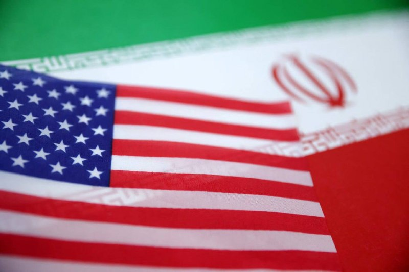

🔴 الجزیره :

احتمالا توافق ایران و آمریکا فردا اعلام بشه.

@IranianMinds

## IranianMinds — post 20758

🔴 بنیامین نتانیاهو :

دستور دارم حملات به لبنان برای نابودی حزب الله تشدید و قوی تر شود.

@IranianMinds

## IranianMinds — post 20757

چقد اتفاقی شبی که قرار بود فرداش نتا وصل شه صدای انفجار اومد

الان فردا میان میگن شرایط جنگیه‌ رفع محدودیت اینترنت فعلا کنسل

## IranianMinds — post 20756

🔴 ارتش اسرائیل :

داریم حزب الله رو پاره میکنیم امشب.

@IranianMinds

## IranianMinds — post 20755

🔴 در حال حاضر یک هواپیمای سوخت‌رسان KC-46A Pegasus متعلق به نیروی هوایی آمریکا بر فراز خلیج عمان در حال پرواز است.

@IranianMinds

## IranianMinds — post 20754

🔴 ایسنا :

دستور بازگشایی اینترنت احتمالا از فردا اجرا میشود.

@IranianMinds

## IranianMinds — post 20753

این صداهایی که میگن از بندرعباس میاد بعید بدونم خبری باشه چون اگر یادتون باشه ثانیه اولی که تهران رو زدن ۱۰۰ تا عکس و فیلم اومد
بندرعباسم شهر کوچیکیه اگر زده باشن باید کلی عکس و فیلم میومد
لابد فقط خنثی سازی بوده یا فعالیت پدافند

## IranianMinds — post 20752

🔴 احتمالاً ترامپ در ازای این تفاهم‌نامه موقت ۶۰ روزه به نتانیاهو آزادی عمل بیشتری در جبهه لبنان داده است زیرا اسرائیل در حال گسترش قابل توجه عملیات نظامی خود در لبنان است/کانال 12 اسرائیل

@IranianMinds

## IranianMinds — post 20751

آمریکای جهان‌خوار به ما که رسید شد گیاهخوار @IranianMinds

## BBCPersian — post 282041

⚡️گزارش‌ها از شنیده شدن صدای انفجارهایی در بندرعباس و حاشیه خلیج فارس

چند نفر از مخاطبان کانال خبری وحید آنلاین که از بندرعباس پیغام فرستاده‌اند از شنیدن صدای دو انفجار و فعال شدن پدافندهای ضدهوایی در حدود ساعت ۱۱:۴۰ دوشنبه شب به وقت محلی خبر داده‌اند.

خبرگزاری فارس هم با اشاره به چنین گزارش‌هایی نوشته «هنوز محل دقیق و منشأ این صداها مشخص نیست».

به گزارش فارس گزارش‌های مشابهی هم از حوالی «سیریک و جاسک» در حاشیه خلیج فارس مخابره شده است.

https://bbc.in/4tYLaei
@BBCPersian

## BBCPersian — post 282040

  

ارتش اسرائیل می‌گوید ساعتی پس از آنکه بنیامین نتانیاهو، نخست‌وزیر اسرائیل اعلام کرد اسرائیل در حال جنگ با حزب‌الله است، موجی از حملات هوایی را در سراسر لبنان آغاز کرده است.

از جمله مناطقی که هدف این حملات قرار گرفته است «مواضع حزب‌الله در دره بقاع در شرق لبنان» اعلام شده است.

آقای نتانیاهو روز دوشنبه اعلام کرد که به ارتش دستور داده حملات خود در لبنان را تشدید کند تا حزب‌الله را «در هم بکوبد.»

او این گروه را به هدف قرار دادن نیروهای اسرائیلی با حملات پهپادی متهم کرد.

نخست‌وزیر اسرائیل گفت ارتش این کشور «ضربات سنگینی» به حزب‌الله وارد خواهد کرد.

او افزود که اسرائیل «در حال جنگ» با این گروه است و در هفته‌های اخیر ۶۰۰ عضو حزب‌الله را کشته است.

آقای نتانیاهو گفت: «دامنه حملات خود علیه حزب‌الله را افزایش خواهیم داد و متوقف نخواهیم شد.»

حزب‌الله در چند هفته گذشته به حملات پهپادی خود به مواضع ارتش اسرائیل ادامه داده است.

📷Reuters
https://bbc.in/4tYLaei
@BBCPersian

## BBCPersian — post 282039

الجزیره به نقل از یک منبع آگاه می‌گوید که میانجی‌گری قطر«به تفاهم با آمریکا درباره دارایی‌های مالی مسدودشده ایران منجر شد»

بر اساس این گزارش مذاکرات میان هیئت عالی‌رتبه ایرانی و مقامات در دوحه اعلام کرد که میانجی‌گری قطر به حصول یک تفاهم با آمریکا درباره دارایی‌های مالی مسدود شده ایران منجر شده است.

به گفته این منبع «این توافق که از اهمیت بالایی برای ایران برخوردار بوده، زمینه‌ساز پیشرفت قابل توجهی در مذاکرات شده است و احتمال زیادی وجود دارد که توافقی میان آمریکا و ایران فردا اعلام شود.»

محمدباقر قالیباف، رئیس مجلس ایران همراه با عباس عاقچی وزیر خارجه و عبدالناصر همتی، رئیس کل بانک مرکزی برای مذاکره با مقام های قطری، به دوحه رفته‌اند.

تلویزیون الجزیره به نقل از یک دیپلمات منطقه‌ای که نامی از او نبرده گزارش داد که «تمرکز سفر گروه ایرانی به دوحه بر مسائل مربوط به تنگه هرمز و اورانیوم غنی شده با خلوص بالا است.»

خبرگزاری ایرنا گفته است که هدف اصلی این سفر «سنجش اراده» آمریکا درباره مسائل مالی و آزاد کردن دارایی های مسدود شده ایران است.

همزمان محمد مرندی که رسانه‌های ایران از او به عنوان یک فرد نزدیک به گروه مذاکره کننده جمهوری اسلامی ایران یاد می کنند به تلویزیون ایران گفته است که قطر قرار است دارایی‌های مسدود شده ایران را که در حدود شش میلیارد دلار است به ایران بدهد و سپس معادل این مبلغ را از آمریکا بگیرید.

https://bbc.in/4f2VsGk
@BBCPersian

## BBCPersian — post 282038

  <a href="telegram/content/BBCPersian_282038_1779747980.mp4" target="_blank">🎬 Download video</a>

آخرین خبرهای مهم روز دوشنبه ۴ خرداد ماه ۱۴۰۵ از تلویزیون بی‌بی‌سی فارسی

https://bbc.in/42XnQmy
https://bbc.in/3WtLd3k
@BBCPersian

## BBCPersian — post 282037

  <a href="https://t.me/bbcpersian/282037" target="_blank">📎 Download file</a>

پادکست برنامه شصت دقیقه روز دوشنبه ۴ خرداد ۱۴۰۵
این نسخه رادیویی برنامه شصت دقیقه تلویزیون فارسی بی‌بی‌سی است که هرشب بعد از پخش، با حجم کم از اپلیکیشن‌هایپادگیر و صفحه تلگرام بی‌بی‌سی فارسی در دسترس است.
با هشتگ BBCPersianRadio# با ما در ارتباط باشید

## BBCPersian — post 282036

  

‌
مصوبه وصل اینترنت ایران به وضعیت قبل از دی‌ ۱۴۰۴، از سوی مسعود پزشکیان، رئیس‌جمهور به وزارت ارتباطات «ابلاغ» شد.

خبرگزاری ایسنا گزارش کرده است که احسان چیت‌ساز، معاون وزیر ارتباطات، دریافت این ابلاغیه را تایید کرده و گفته است: «این اقدام گامی در جهت بازگرداندن حق مردم و ستون اعتماد عمومی» است.

بر اساس این گزارش در جلسه ستاد ویژه ساماندهی فضای مجازی به ریاست محمدرضا عارف، معاون اول رئیس‌جمهور، «مصوبات مهمی درباره وضعیت اینترنت کشور تصویب شد.»

خبرگزاری فارس گزارش داده بود که در این جلسه «طرح اتصال دوباره اینترنت بین‌‌الملل با ۹ رای موافق تصویب و برای تایید نهایی به دفتر مسعود پزشکیان ارسال شد.»

رفع فیلترینگ از وعده‌های انتخاباتی دولت پزشکیان بود که محقق نشد و از شروع جنگ اخیر اینترنت به روی شهروندان در ایران جز برای کسانی که «اینترنت پرو»، سیم‌کارت «سفید»، یا دسترسی به استارلینک داشته‌اند مسدود بوده است.

نت‌بلاکس که بر وضعیت اینترنت در جهان نظارت می‌کند دوشنبه گزارش دادکه قطع متوالی اینترنت در ایران وارد هشتاد و هفتمین روز شده است.

📷پایگاه اطلاع‌رسانی دولت/ پاد
https://bbc.in/4f2VsGk
@BBCPersian

## BBCPersian — post 282035

  <a href="telegram/content/BBCPersian_282035_1779747982.mp4" target="_blank">🎬 Download video</a>

🔻مقام‌ها می‌گویند در پی انفجار گاز در یک معدن زغال‌سنگ در شمال چین در روز یکشنبه، دست‌کم ۸۲ نفر کشته شده‌اند و دست‌کم دو نفر نیز همچنان مفقود هستند.
 
این حادثه مرگبارترین فاجعه معدنی در چین از سال ۲۰۰۹ تاکنون محسوب می‌شود و رئیس‌جمهور چین، شی جین‌پینگ، اعلام کرد که از هیچ تلاشی برای عملیات جست‌وجو و نجات نباید دریغ شود.
 
علت انفجار گاز هنوز مشخص نشده اما رسانه‌های دولتی گزارش داده‌اند که میزان مونوکسید کربن در معدن «بالاتر از حد مجاز» بوده است.
 
پس از وقوع مرگبارترین حادثه معدنی چین در بیش از ۱۵ سال گذشته، خشم عمومی نسبت به ادعاهای مربوط به «نقض مقررات ایمنی» رو به افزایش است.
   
برای بسیاری از مردم چین، این فاجعه یادآور دهه ۲۰۰۰ میلادی است یعنی زمانی که از این‌ قبیل حوادث در معادن زغال‌سنگ رخ می‌داد و مردم تصور می‌کردند که آن دوران به پایان رسیده است.
 
مقام‌ها می‌گویند علت این حادثه همچنان در دست بررسی است اما یافته‌های اولیه نشان می‌دهد که شرکت «تونگژو گروپ» که این معدن خصوصی را اداره می‌کرده، مرتکب «تخلفات جدی و غیرقانونی» شده است.
 
https://bbc.in/4f1HnZL
@BBCPersian

## BBCPersian — post 282034

  <a href="https://t.me/bbcpersian/282034" target="_blank">📎 Download file</a>

📻پادکست جام جهان‌نما، دوشنبه ۴ خرداد ۱۴۰۵

این برنامه رادیویی رامی‌توانید هرشب ساعت ۲۰ به وقت ایران، روی موج متوسط ۷۰۲ کیلوهرتز و موج کوتاه۹۴۶۵ کیلوهرتز بشنوید. تکرار برنامه را هم می‌توانید ساعت ۲۱:۳۰ روی موج متوسط ۷۰۲ کیلوهرتز و موج کوتاه۵۳۹۵ کیلوهرتز گوش کنید

@BBCPersian

## BBCPersian — post 282033

  

🔻کلودیا شینباوم، رئیس‌جمهور مکزیک، امروز گفت که موافقت کرده است تیم ملی فوتبال ایران در جام جهانی ۲۰۲۶ در مکزیک مستقر شود.

خانم شینباوم در کنفرانس خبری گفت: «آمریکا نمی‌خواست تیم ایران در خاکشان باشد.»

«آنها (ایران) به همین دلیل از ما پرسیدند: 'می‌توانیم در مکزیک مستقر شویم؟' و ما پاسخ دادیم، بله، هیچ اشکالی ندارد.»

فدراسیون فوتبال ایران دیروز گفته بود که با موافقت فیفا، کمپ و محل استقرار تیم ملی فوتبال در جام جهانی به شهر مرزی تیخوانا در مکزیک منتقل شده است.

ایران از فیفا خواسته بود محل مسابقاتش را از آمریکا به مکزیک منتقل کند اما فیفا گفته بود که امکان تغییر محل مسابقه وجود ندارد.

مهدی تاج، رئیس فدراسیون فوتبال ایران، دیروز گفت که با انتقال کمپ تیم ملی از آریزونا در آمریکا به تیخوانا در مکزیک، «مشکل ویزا نداریم و تیم ملی با پرواز ایران‌ایر می‌تواند عازم مکزیک شود.»

تیخوانا، شهر مرزی پرجنب‌وجوش، با سن دیگو در کالیفرنیا مرز مشترک دارد. تمرینات تیم فوتبال ایران قرار است در مجموعه ورزشی «کلوب تیخوانا» برگزار شود.
ادامه مطلب⬇️

📸GettyImages
https://bbc.in/4wFbfkW

## BBCPersian — post 282031

🔻در پی اعتراضات دانشجویی در ترکیه، رجب طیب اردوغان، رئیس جمهور ترکیه، دستورش برای تعطیلی یکی از قدیمی‌ترین دانشگاه‌های آن کشور را پس گرفت.

رئیس‌جمهور ترکیه سه روز پیش دستور داده بود که دانشگاه «استانبول بیلگی» که به داشتن گرایش‌های سیاسی لیبرال شناخته می‌شود، تعطیل شود.

دولت در هشت ماه گذشته مدیریت این دانشگاه را بر عهده داشته است.

شرکت «جان هولدینگ»، مالک دانشگاه، به اتهام «پول‌شویی و فرار مالیاتی» تحت تحقیق قرار داشت.

این شرکت همچنین مالک شبکه‌های عمده تلویزیونی و چندین مدرسه در ترکیه است.

📸AFP via Getty Images
@BBCPersian

## BBCPersian — post 282030

  

🔻شبکه تلویزیونی و اینترنتی «منوتو» بعد از ۱۶ سال به کار خود پایان داد.

این رسانه فارسی‌زبان از سال ۲۰۱۰ در لندن با مدیریت کیوان و مرجان عباسی به روی آنتن ماهواره رفت و به یکی از پربیننده‌ترین تلویزیون‌های فارسی‌زبان تبدیل شد.

اما حدود دو سال و نیم پیش، به دلیل «مشکلات مالی» پخش تلویزیونیش را متوقف کرد و مدتی بعد، فعالیتش را محدودتر از سر گرفت.

مدیران این شبکه، علاوه بر محدودیت‌های مالی، این بار به «دگرگونی‌های بنیادین در عرصه رسانه‌ای و سیاسی» ایران اشاره کرده و گفته‌اند که فضا خصمانه‌تر و قطبی‌تر شده و مجموعه این شرایط، ادامه فعالیت را برای منوتو غیرممکن کرده است.

https://bbc.in/43uDwNI
@BBCPersian

## BBCPersian — post 282029

  

🔻بتسالل اسموتریچ، وزیر دارایی اسرائیل، خواستار تخریب ساختمان‌ها در بیروت برای مقابله با «تهدید پهپادهای انفجاری حزب‌الله» شد.

این وزیر راست افراطی اسرائیل در پستی در شبکه اجتماعی ایکس به کشته شدن یک سرباز اسرائیلی در حمله پهپادی امروز حزب‌الله در جنوب لبنان اشاره کرد و نوشت: «برای هر پهپاد انفجاری، ۱۰ ساختمان باید در بیروت فرو بریزد.»

او تاکید کرد که «پاسخ به یک تهدید قابل توجه باید قابل توجه باشد.»

آقای اسموتریچ نوشت: «شما با یک تهدید استراتژیک تنها با سپر دفاعی مقابله نمی‌کنید، بلکه باید با تغییر قوانین و معادله با آن مقابله کنید.»

📸AFP via Getty Images
https://bbc.in/43uAYz6
@BBCPersian

## BBCPersian — post 282028

🔻خبرگزاری فارس: پهپاد متخاصم در حریم خلیج فارس سرنگون شد

خبرگزاری فارس می‌گوید که پهپادهای رهگیر موسوم به آرش کمانگیر یک «پهپاد متخاصم» را بر فراز آب‌های خلیج فارس سرنگون کرده‌اند.

این خبرگزاری که به نهادهای امنیتی و نظامی نزدیک است نوشت: «این عملیات که با به‌کارگیری سامانه‌ای با قابلیت‌های پنهان انجام شد، پیامی روشن و قاطع از سوی ایران به شمار می‌رود. مقامات مربوطه تصریح کرده‌اند که این نشانه از طرف ماست تا دیگر هیچ پهپاد رادارگریزی نتواند بر آسمان خلیج فارس نفوذ کند.»

در این گزارش به نوع یا مبدا یا کشور سازنده پهپاد اشاره نشده است.

ایالات متحده می‌گوید که که محاصره دریایی ایران ادامه دارد اما نیروی دریایی سپاه امروز گفت که ۳۲ کشتی نفتکش، کانتینری یا تجاری پس از «اخذ مجوز با هماهنگی» این نیروها از تنگه هرمز عبور کرده‌اند.

سپاه دیروز هم گفت ۳۳ کشتی عبور کرده‌اند.

https://bbc.in/4v8Jxf0
@BBCPersian

## BBCPersian — post 282027

🔻نخست‌وزیر پاکستان با رئیس جمهور چین دیدار کرد

خبرگزاری دولتی شینهوا چین گزارش کرده که شهباز شریف، نخست‌وزیر پاکستان، در سفر خود به چین با شی جین پینگ، رئیس جمهور چین، دیدار کرده است.

سفر نخست‌وزیر پاکستان و فرمانده ارتش این کشور به چین در ادامه تلاش‌های دیپلماتیک چندین کشور برای پایان رسمی جنگ آمریکا و اسرائیل با ایران است.

پیش از این گزارش داده بود که فیلد مارشال عاصم منیر، مذاکره کننده ارشد پاکستان هم به پکن سفر کرده است.

آقای شریف پیش از این با لی چیانگ، نخست وزیر چین، دیدار کرده بود.

https://bbc.in/49hnc6r
@BBCPersian

## BBCPersian — post 282025

🔻ویشکا آسایش، بازیگر سینما، مجموعه مجسمه‌های برنزی ساخته و برای نخستین بار در نیویورک آنها را به نمایش گذاشته است.

نمایشگاه مجسمه‌های ویشکا آسایش از روز چهارشنبه (۲۰ مه / ۳۱ اردیبهشت) در گالری بیرند گکلر نیویورک افتتاح شده است.

بهمن کلباسی، خبرنگار بی‌بی‌سی در نیویورک با او در مورد مجسمه‌هایش گفتگو کرده است.

@BBCPersian

## BBCPersian — post 282024

  <a href="telegram/content/BBCPersian_282024_1779747986.mp4" target="_blank">🎬 Download video</a>

🔻‌رسانه‌های آمریکایی وقوع آتش‌سوزی مهیبی را در یک منطقه صنعتی در ساوت گیت در لس‌انجلس کانتی کالیفرنیا گزارش کردند. این آتش‌سوزی در یک مرکز صنعتی بازیافت لاستیک خودرو رخ داد.

در پی این آتش‌سوزی در روز یکشنبه (۲۴ مه)، مقام‌های محلی از مردم خواستند که به همراه حیوانات خانگی‌شان با در و پنجره‌های بسته داخل خانه‌ها بمانند.

علت آتش‌سوزی و اینکه آیا در زمان شروع آتش‌سوزی افرادی در محل حضور داشته‌اند یا خیر، تاکنون مشخص نشده است.

آتش‌نشانان آتش را مهار کردند و تاکنون هیچ مصدومی در این حادثه گزارش نشده است.

https://bbc.in/43etyAd
@BBCPersian

## BBCPersian — post 282023

‌ 🔻دونالد ترامپ، رئیس‌جمهور آمریکا، یک بار دیگر از پیشرفت در مذاکرات با ایران ابراز رضایت کرد. آقای ترامپ در پستی در شبکه اجتماعی خود، تروث سوشال، نوشت: «مذاکرات با ایران خوب پیش می‌رود! یا توافق عالی برای همه خواهد بود یا هیچ توافقی نخواهد بود.» او در عین…

## BBCPersian — post 282022

  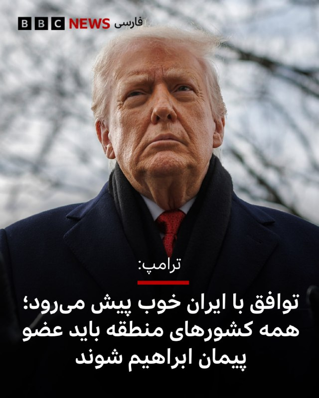

‌
🔻دونالد ترامپ، رئیس‌جمهور آمریکا، یک بار دیگر از پیشرفت در مذاکرات با ایران ابراز رضایت کرد.

آقای ترامپ در پستی در شبکه اجتماعی خود، تروث سوشال، نوشت: «مذاکرات با ایران خوب پیش می‌رود! یا توافق عالی برای همه خواهد بود یا هیچ توافقی نخواهد بود.»

او در عین حال هشدار داد که اگر توافق حاصل نشود، آمریکا به جبهه جنگ باز می‌گردد و «تیراندازی بزرگتر و شدیدتر از گذشته و هر زمان آغاز خواهد شد و کسی چنین چیزی را نمی‌خواهد.»

رئیس‌جمهور آمریکا همچنین مذاکرات با ایران را به پیمان ابراهیم پیوند داد و با اشاره دوباره به گفت‌و‌گوهایی که روز شنبه با رهبران عربستان، امارات، قطر، پاکستان، ترکیه، مصر، اردن و بحرین داشته است، گفت که به آنها گفته است:

«بعد از تلاش‌های آمریکا برای حل این مساله پیچیده (در مورد ایران) حداقل برای این کشورها باید اجباری باشد که همزمان پیمان ابراهیم را امضا کنند.»

📷GETTY
https://bbc.in/4wPXxf5
@BBCPersian

## BBCPersian — post 282020

  <a href="telegram/content/BBCPersian_282020_1779747988.mp4" target="_blank">🎬 Download video</a>

🔻سرخط خبرهای دوشنبه ۴ خرداد ۱۴۰۵
@BBCPersian

## idfinfarsi — post 11643

  <a href="telegram/content/idfinfarsi_11643_1779747990.mp4" target="_blank">🎬 Download video</a>

‼️برای رفع تهدید: ارتش اسرائیل روز گذشته (یکشنبه) یک تروریست کلیدی از ستاد تولید سازمان تروریستی حماس را به هلاکت رساند

⭕️نیروهای ارتش اسرائیل تحت فرماندهی جنوب، روز گذشته (یکشنبه) در مرکز نوار غزه حمله کرده و محمد ابو ملوح، یکی از تروریست‌های کلیدی در ستاد تولید سازمان تروریستی حماس را به هلاکت رساندند.

⭕️ابو ملوح یکی از منابع اصلی دانش در سازمان تروریستی حماس بود و در طول دوره آتش‌بس، اقدام به تولید تسلیحاتی کرده بود که تهدیدی برای نیروهای ارتش اسرائیل در منطقه و شهروندان این کشور محسوب می‌شد.

⭕️نیروهای ارتش اسرائیل تحت فرماندهی جنوب مطابق با توافق در منطقه مستقر هستند و به فعالیت خود برای رفع هرگونه تهدید فوری ادامه خواهند داد.

## Dirty_Kids — post 390202

  <a href="telegram/content/Dirty_Kids_390202_1779747991.mp4" target="_blank">🎬 Download video</a>

🔴 فیلمی که به تازگی از اعتراضات دی ماه منتشر شده، یه پسر جوون به عنوان تک تیرانداز به مردم شلیک میکنه و مامانش کنارش داره آمار میده که کیو بزنه!

@Dirty_Kids 👻

## Dirty_Kids — post 390201

حیف شد شهید تنگسیری نیست. اگه الان بود، حسابی خط و نشون میکشید و دوباره بگا میرفت

@Dirty_Kids 👻

## Dirty_Kids — post 390200

‏تا این لحظه ۴ سپاهی کشته شدن.
خوبه ولی کافی نیست. بجنبین که خیلی عقبیم بخدا.

@Dirty_Kids 👻

## Dirty_Kids — post 390199

  

خبرنگار الجزیره نوشت ابتدا سپاه پاسداران به یک کشتی در خلیج فارس حمله کرده و سپس جنگنده‌های آمریکایی قایق‌های نیروی دریایی سپاه را هدف حمله قرار دادند و چند نفرشان را کشتند.

@Dirty_Kids 👻

## Dirty_Kids — post 390198

🔴 منابع عبری :
عراقچی و قالیباف در دوحه در امنیت نخواهند بود.*

@Dirty_Kids 👻

## Dirty_Kids — post 390197

  

پست جدید ترامپ شیر خدا در خصوص سرنوشت اورانیوم رژیم روافض قحبه‌زاده:

اورانیوم غنی‌شده (گرد و غبار هسته‌ای) یا باید فوراً به ایالات متحده تحویل داده بشه تا در آمریکا نابود شه،

یا اینکه ترجیحاً و در همکاری و هماهنگی با رژیم قحبه‌زاده‌ی رافضی در همون محل یا یک جای قابل‌قبول دیگه نابود شه؛

اون هم در حالی که سازمان انرژی اتمی یا معادل اون شاهد این فرآیند و رویداد نابودیش باشه.

از توجهتون به این موضوع ممنونم.
پرزیدنت DJT

@Dirty_Kids 👻

## Dirty_Kids — post 390196

🔴 صداوسیما تایید کرد شامگاه گذشته چند شناور در جنوب جزیره لارک هدف حمله جنگنده‌های آمریکا و اسرائیل قرار گرفته‌اند.

بر اساس این گزارش، منابع محلی از کشته‌شدن چند نفر در این حمله خبر داده‌اند، اما شمار دقیق تلفات، هویت کشته‌شدگان و نوع شناورهای هدف قرارگرفته هنوز به‌طور رسمی اعلام نشده است. جزیره لارک که در نزدیکی تنگه هرمز قرار دارد، طی هفته‌های اخیر به یکی از حساس‌ترین نقاط تنش و درگیری در خلیج فارس تبدیل شده و حمله شب گذشته، سطح تنش نظامی در منطقه را وارد مرحله تازه‌ای کرده است.

@Dirty_Kids 👻

## Dirty_Kids — post 390195

  <a href="telegram/content/Dirty_Kids_390195_1779747994.mp4" target="_blank">🎬 Download video</a>

هم‌اکنون آسمان اربیل عراق

@Dirty_Kids 👻

## Dirty_Kids — post 390194

شنوندگان عزیز توجه فرمایید.
شنوندگان عزیز توجه فرمایید.

تنگه‌ی هرمز، تنگه‌ی خون

آزاد شد.

[فاکس نیوز و سی‌ان‌ان]

@Dirty_Kids 👻

## Dirty_Kids — post 390193

گروهک تروریستی «الجیش الکانفیگ‌فروش» مسئولیت حمله به بندرعباس رو گردن گرفت.

@Dirty_Kids 👻

## Dirty_Kids — post 390192

غیررسمی:
جنگنده‌های آمریکا به دو قایق تندروی سپاه حمله کردن که باعث کشته شدن 4 نفر شد.

@Dirty_Kids 👻

## Dirty_Kids — post 390191

  

زیرنویس صداوسیما و تایید صدای انفجار در بندرعباس

@Dirty_Kids 👻

## Dirty_Kids — post 390190

  <a href="telegram/content/Dirty_Kids_390190_1779747995.mp4" target="_blank">🎬 Download video</a>

هم‌اکنون بندرعباس

@Dirty_Kids 👻

## Dirty_Kids — post 390189

تا الان شک داشتم جنگ شده یا نه که یادم اومد امروز عراقچی برای مذاکرات رفته بود قطر.

قدرت مذاکره :))

@Dirty_Kids 👻

## Dirty_Kids — post 390188

  <a href="telegram/content/Dirty_Kids_390188_1779747995.mp4" target="_blank">🎬 Download video</a>

مهر: اوضاع شهر، کاملاً تحت کنترل است

@Dirty_Kids 👻

## Dirty_Kids — post 390187

🔻بابلسر صدای انفجار

🔻اصفهان صدای انفجار

@Dirty_Kids 👻

## Dirty_Kids — post 390186

ظاهرا حملات آمریکایی به قایق های سپاه کشته و زخمی زیادی دارد/

@Dirty_Kids 👻

## Dirty_Kids — post 390185

🔴 خبرگزاری فارس :
دقایقی پیش مردم تو بندرعباس و حوالی خلیج فارس صدای چند انفجار شنیدن؛ هنوز محل دقیق و منشأ این صداها مشخص نیست.

@Dirty_Kids 👻

## Dirty_Kids — post 390183

  <a href="telegram/content/Dirty_Kids_390183_1779747996.mp4" target="_blank">🎬 Download video</a>

حالا که دارن وصل میکنن اگه برنامه‌ای برای مصرف کانفیگ گروناتون ندارید میتونید از این چالش جدیدا ببینید

کانفیگ‌ بزنیم به کص‌گاو کونمون نسوزه

اعتباریم نیست خوب فکر کنید

@Dirty_Kids 👻

## Hranews — post 113165

گزارشی از تجمع اعتراضی رانندگان استیجاری در تهران

❗️
❗️
❗️
❗️
❗️– امروز دوشنبه ۴ خردادماه، جمعی از رانندگان استیجاری از استان‌های مختلف برای سومین روز متوالی در مقابل ساختمان نهاد ریاست جمهوری در تهران، #تجمع_اعتراضی برگزار کردند.

ادامه مطلب

↘️
@hranews_bot تماس ✉️ - @Hranews کانال هرانا 🆑

## Hranews — post 113164

رضایت اولیای دم؛ ۴ زندانی از اعدام رهایی یافتند

❗️
❗️
❗️
❗️
❗️– چهار زندانی در رشت، همدان، تایباد و استان آذربایجان غربی که پیشتر بابت اتهام قتل در پرونده‌های مجزا به #اعدام محکوم شده بودند، با اعلام رضایت اولیای دم از مجازات مرگ رهایی یافتند.

ادامه مطلب

↘️
@hranews_bot تماس ✉️ - @Hranews کانال هرانا 🆑

## Hranews — post 113163

  

حسن پژوم و سینا کراچی از زندان وکیل آباد مشهد آزاد شدند

❗️
❗️
❗️
❗️
❗️– حسن پژوم و سینا کراچی، دو شهروند ساکن سبزوار، در تاریخ ۲۳ اردیبهشت ماه با تودیع وثیقه از زندان وکیل آباد مشهد آزاد شدند. این دو شهروند در آذرماه سال گذشته در سبزوار بازداشت شده بودند.

به گزارش خبرگزاری هرانا، ارگان خبری مجموعه فعالان حقوق بشر در ایران، حسن پژوم و سینا کراچی آزاد شدند.

بر اساس اطلاعات دریافتی هرانا، آزادی آقایان پژوم و کراچی در تاریخ ۲۳ اردیبهشت ماه، با تودیع وثیقه از زندان وکیل آباد مشهد صورت گرفته است.

ادامه مطلب

#حسن_پژوم #سینا_کراچی

↘️
@hranews_bot تماس ✉️ - @Hranews کانال هرانا 🆑

## Hranews — post 113162

فقدان ایمنی کار؛ مرگ و مصدومیت ۳ کارگر در یزد و پاکدشت

❗️
❗️
❗️
❗️
❗️– در سایه فقدان ایمنی محیط و شرایط نامناسب کار، روز جاری، دو کارگر در پاکدشت در پی حادثه آتش‌سوزی مصدوم شدند. از سوی دیگر، روز یکشنبه ۳ خردادماه، یک #کارگر در یزد، حین انجام کار بر اثر برق‌گرفتگی جان خود را از دست داد.

ادامه مطلب

↘️
@hranews_bot تماس ✉️ - @Hranews کانال هرانا 🆑

## Hranews — post 113161

سه شهروند در مهاباد بازداشت شدند

❗️
❗️
❗️
❗️
❗️– منصور عباسی، احد خیری و واحد خیری شهروندان اهل مهاباد، امروز دوشنبه ۴ خردادماه، توسط نیروهای امنیتی بازداشت و به مکان نامعلومی منتقل شدند.

ادامه مطلب

#منصور_عباسی #احد_خیری #واحد_خیری

↘️
@hranews_bot تماس ✉️ - @Hranews کانال هرانا 🆑

## Hranews — post 113160

  

مهسا زیدآبادی با تودیع وثیقه از زندان تربت حیدریه آزاد شد

❗️
❗️
❗️
❗️
❗️– مهسا زیدآبادی، شهروند اهل سبزوار، امروز با تودیع وثیقه از زندان تربت حیدریه آزاد شد.

به گزارش خبرگزاری هرانا، ارگان خبری مجموعه فعالان حقوق بشر در ایران، مهسا زیدآبادی آزاد شد.

بر اساس اطلاعات دریافتی هرانا، آزادی مهسا زیدآبادی امروز دوشنبه ۴ خردادماه، با تودیع وثیقه هفت میلیارد تومانی از زندان تربت حیدریه صورت گرفته است.

ادامه مطلب

#مهسا_زیدآبادی

↘️
@hranews_bot تماس ✉️ - @Hranews کانال هرانا 🆑

## Hranews — post 113159

گزارشی از مطالبات مزدی، بیمه‌ای و بیکاری کارگران در شهرهای مختلف

❗️
❗️
❗️
❗️
❗️– کارگران ابنیه فنی راه‌آهن زاهدان از تعلیق شماری از همکارانشان پس از پیگیری مطالبات صنفی خبر داده و اعلام کردند که به دلیل عدم پرداخت چندین ماه حق بیمه توسط کارفرما از دریافت خدمات بیمه و امکانات درمانی نیز محروم مانده‌اند. همچنین، #کارگران کارخانه فولاد سیادن ابهر از تاخیر در پرداخت حقوق اردیبهشت ماه و دیگر مشکلات شغلی خود انتقاد کردند. افزون بر این، مدیرکل تعاون، کار و رفاه اجتماعی خراسان جنوبی اعلام کرد که از ابتدای امسال تاکنون، ۵۲۷ نفر از کارگران واحدهای تولیدی این استان از چرخه کار خارج شده‌اند و اکنون تحت پوشش بیمه بیکاری قرار دارند.

ادامه مطلب

↘️
@hranews_bot تماس ✉️ - @Hranews کانال هرانا 🆑

## Hranews — post 113158

  

سرکوب و اعدام با اتهام نابخشودنیِِ جاسوسی/ مرتضی هامونیان

📡
📡
📡
📡
📡– هر بار حکومت بهانه‌ای تازه برای گرفتن جان انسان‌ها پیدا می‌کند؛ حکومتی که در تمام عمر خود نشان داده ارزشی برای حیات شهروندان قائل نیست. تازه‌ترین نمونه‌اش در جریان #جنگ آمریکا و اسرائیل با ایران آشکار شد؛ جایی که روشن شد سال‌ها بودجه‌های کلان پدافند غیرعامل یا صرف اموری نامعلوم شده یا اساساً کارکردی برای حفاظت از مردم نداشته است. نتیجه این شد که شهروندان زیر موشک‌باران، حتی از ابتدایی‌ترین امکان یعنی پناهگاهی امن برای حفظ جان خود نیز محروم بودند. حسام‌الدین آشنا، مقام امنیتی پیشین و رئیس مرکز بررسی‌های استراتژیک (زیر مجموعه‌ی نهاد ریاست جمهوری) در دولت‌های یازدهم و دوازدهم در نخستین برنامه‌ی «اسپرسو» با مجری‌گری محمد دلاوری –که از پلت‌فرم روبیکا پخش می‌شود—، با ارجاع به کشور سوئیس و وجود پناهگاه بزرگ اتمی در آن کشور می‌گوید که ما باید به حفظ جان مردم توجه می‌کردیم. اما آن‌چه در عمل رخ داد، درست نقطه‌ی مقابل حفاظت از جان مردم بود. نه تنها اراده‌ای برای حفظ جان شهروندان دیده نشد، بلکه حکومت هم‌زمان مسیر قانونی تازه‌ای نیز برای گرفتن جان انسان‌ها ایجاد کرد. حاصل آن، تصویب «قانون تشدید مجازات جاسوسی و همکاری با رژیم صهیونیستی و کشورهای متخاصم علیه امنیت و منافع ملی» بود؛ قانونی که در ظاهر با نام امنیت معرفی می‌شود، اما در عمل ابزار سرکوب دیگری در اختیار حاکمیت قرار می‌دهد تا به بهانه‌ی اتهام جاسوسی، دامنه‌ی اعدام و حذف مخالفان را گسترش دهد.(۱)

اگر در مقطع تابستان ۱۳۶۷، کشتار زندانیان سیاسی به صورت اعدام‌های فراقضایی رخ داد (تعبیری که عفو بین‌الملل در گزارش خود در آذر ۱۳۹۷ به دلیل خارج از رویه‌های قضایی بودن آن اعدام‌ها، به آن نسبت داد)، این بار قرار است با ابزاری قانونی و اتهامی که حیثیت و آبروی متهم را هدف قرار می‌دهد، مخالفین سیاسی را #اعدام و یا مرعوب کنند: اتهام جاسوسی و همکاری با اسرائیل و کشورهای متخاصم علیه امنیت و منافع ملی ایران. بر اساس تبصره‌ی اول ماده‌ی یک این قانون، آمریکا و اسرائیل به عنوان «دولت متخاصم» شناخته می‌شوند و تعیین متخاصم بودن سایر کشورها نیز به تشخیص شورای عالی امنیت ملی (شعام) واگذار شده است. این یعنی دست باز برای شعام که هر وقت بخواهد، کشوری را متخاصم اعلام کند و با این قانون، کم‌ترین مراوده با آن کشور می‌تواند حکم اعدام به همراه داشته باشد. بماند که اصولاً برای اعدام و اتهام‌زنی، نیازی به مراوده هم نیست. دستگاه‌های اطلاعاتی رنگارنگ جمهوری اسلامی با اتکا به اعترافات اخذشده تحت فشار و شکنجه، سناریوهای امنیتی خود را تولید می‌کنند و در غیاب دادرسی عادلانه، همان روایت‌ها مبنای صدور حکم قرار می‌گیرد. در چنین فضایی، رئیس دستگاه قضای نظام هم به مخالفین اعدام می‌گوید که تو غلط می‌کنی که می‌گویی فلانی اعدام نشود.

ادامه مطلب

ادامه و لینک به مطلب در وبسایت خط صلح

#مرتضی_هامونیان

↘️
@hranews_bot تماس ✉️ - @Hranews کانال هرانا 🆑

## Hranews — post 113157

  

گزارشی از آخرین وضعیت حمیدرضا درستکار در زندان شیبان اهواز

❗️
❗️
❗️
❗️
❗️– حمیدرضا درستکار، زندانی سیاسی اهل بهبهان، در حال تحمل دوران محکومیت خود در زندان شیبان اهواز است. وی در فروردین‌ماه امسال به صورت تنبیهی از زندان بهبهان به زندان شیبان منتقل شد.

به گزارش خبرگزاری هرانا، ارگان خبری مجموعه فعالان حقوق بشر در ایران، حمیدرضا درستکار در زندان شیبان اهواز محبوس است.

یک منبع نزدیک به خانواده این زندانی سیاسی به هرانا گفت: در جریان جنگ، حمیدرضا به‌دلیل طرح مطالبه تخلیه زندان، به «ایجاد آشوب و شورش در زندان» متهم و در ۱۵ فروردین‌ماه به‌صورت تنبیهی به زندان شیبان منتقل شد. این در حالی است که درخواست تخلیه زندان در آن شرایط، مطالبه‌ای مشترک میان تمامی زندانیان بوده است.

ادامه مطلب

#حمیدرضا_درستکار

↘️
@hranews_bot تماس ✉️ -  @Hranews  کانال هرانا 🆑

## Hranews — post 113153

گزارش تصویری؛ برگزاری برنامه نمادین نظامی برای کودکان بر خلاف پیمان‌نامه حقوق کودک

❗️
❗️
❗️
❗️
❗️– برخلاف تعهدات بین‌المللی ایران تحت عنوان الحاق به پیمان‌نامه #حقوق_کودک و تعهدات مربوط به عدم به‌کارگیری #کودکان در امور نظامی، برنامه‌ای نمادین تحت عنوان «اعزام به جبهه» با پوشاندن لباس نظامی به کودکان، قرار دادن سلاح در دست آنها، بازسازی صحنه‌های اعزام کودکان به جبهه جنگ و استفاده از دیگر نمادهای امور نظامی در حضور کودکان، در همدان برگزار شده است.

ادامه مطلب

↘️
@hranews_bot تماس ✉️ -  @Hranews  کانال هرانا 🆑

## manototv — post 105829

  <a href="telegram/content/manototv_105829_1779747999.mp4" target="_blank">🎬 Download video</a>

گفت‌وگو با کیوان عباسی:
«می‌گفت ایرانی‌ها باید بیشتر کنار هم بایستند…
و دوباره باور کنند که سرنوشت ایران را خود مردم ایران رقم می‌زنند.»

## alonews — post 122698

  

داش فرامرز کف قیمت ایران وصلت می‌کنه حاجی 🤙

فی ۱ گیگ = ۱۵۰ت
فی ۲ گیگ = ۳۰۰ت
فی ۳ گیگ = ۴۵۰ت
🧡فی ۵ گیگ = ۷۵۰ت🧡
فی ۱۰ گیگ = قابلتونو نداره ۱٫۵۰۰

ایکی‌ثانیه تو جیباته جون داداش👇
@VPNFaraMarzBot @VPNFaraMarzBot
@VPNFaraMarzBot @VPNFaraMarzBot

## alonews — post 122697

  <a href="telegram/content/alonews_122697_1779748001.webm" target="_blank">🎬 Download video</a>

👈پدافند هوایی ایران سه پهپاد آمریکایی را در آسمان بندرعباس سرنگون کرد، از جمله یک پهپاد ام‌ویو-۹ای "ریپر".

✅ @AloNews خبر جنگ

## alonews — post 122696

  <a href="telegram/content/alonews_122696_1779748001.webm" target="_blank">🎬 Download video</a>

👈ترامپ هم اکنون: اورانیوم غنی‌شده (گرد هسته‌ای!) یا بلافاصله به ایالات متحده تحویل داده می‌شود تا به کشور بازگردانده شده و نابود شود یا ترجیحاً، با همکاری و هماهنگی جمهوری اسلامی ایران، در محل یا در مکان دیگری که مورد قبول باشد، با حضور کمیسیون انرژی اتمی…

## alonews — post 122694

  <a href="telegram/content/alonews_122694_1779748001.webm" target="_blank">🎬 Download video</a>

👈در شرایطی که همه فکر میکنیم به فنا رفتیم امروز در ایران، تمام ظرفیت فروش لکسوس LX600 با قیمت 110 میلیارد تومن توی کمتر از 10 دقیقه به پایان رسید.

✅ @AloNews خبر جنگ

## alonews — post 122693

  <a href="telegram/content/alonews_122693_1779748001.webm" target="_blank">🎬 Download video</a>

👈بلوبانک قطع شد

✅ @AloNews خبر جنگ

## alonews — post 122692

  <a href="telegram/content/alonews_122692_1779748001.webm" target="_blank">🎬 Download video</a>

👈رسانه نزدیک به محور مقاومت: ایران احتمالا با انتقال اورانیوم به خارج مخالفت کرده است

✅ @AloNews خبر جنگ

## alonews — post 122691

  <a href="telegram/content/alonews_122691_1779748002.webm" target="_blank">🎬 Download video</a>

👈ترامپ هم اکنون:
اورانیوم غنی‌شده (گرد هسته‌ای!) یا بلافاصله به ایالات متحده تحویل داده می‌شود تا به کشور بازگردانده شده و نابود شود یا ترجیحاً، با همکاری و هماهنگی جمهوری اسلامی ایران، در محل یا در مکان دیگری که مورد قبول باشد، با حضور کمیسیون انرژی اتمی یا معادل آن، این فرآیند و رویداد انجام و نابود گردد

✅ @AloNews خبر جنگ

## alonews — post 122690

  <a href="telegram/content/alonews_122690_1779748002.webm" target="_blank">🎬 Download video</a>

👈وضعیت فعلی 
✅ @AloNews خبر جنگ

## alonews — post 122689

  <a href="telegram/content/alonews_122689_1779748002.webm" target="_blank">🎬 Download video</a>

👈جنگنده‌های آمریکایی یا مشترک آمریکا و اسرائیل دو قایق تندرو نیروی دریایی سپاه پاسداران را در نزدیکی جزیره لارک در تنگه هرمز هدف قرار دادند که منجر به کشته شدن حداقل ۴ پرسنل ایرانی شد.

🔴این حمله تقریباً ۴۸ ساعت قبل از افشای گزارش رخ داده است.

🔴رسانه‌های ایرانی تحت فشار بودند تا از انتشار این خبر خودداری کنند تا مبادا مذاکرات جاری آتش‌بس مختل شود.

✅ @AloNews خبر جنگ

## alonews — post 122688

  <a href="telegram/content/alonews_122688_1779748002.webm" target="_blank">🎬 Download video</a>

🔴فووووووووووری/گزارش‌های اولیه از پرتاب موشک‌های ضد کشتی توسط نیروی دریایی سپاه پاسداران به سمت ناوهای جنگی آمریکایی در خلیج عمان

✅ @AloNews خبر جنگ

## alonews — post 122687

  <a href="telegram/content/alonews_122687_1779748002.webm" target="_blank">🎬 Download video</a>

👈نام سه تن از کشته شدگان نیروی دریایی سپاه

🔴عباس اسلامی

🔴قدرت زرنگاری

🔴عبدالرضا گلزاری

تاکنون باقی تلفات اعلام نشده

✅ @AloNews خبر جنگ

## alonews — post 122686

گروهک تروریستی «الجیش الکانفیگ‌» مسئولیت حمله به بندرعباس رو گردن گرفت. [@AloTweet]

## alonews — post 122685

  <a href="telegram/content/alonews_122685_1779748003.webm" target="_blank">🎬 Download video</a>

👈کانال ۱۴اسرائیل: چهار نیروی سپاه در حملات آمریکا به قایق‌ها کشته شدن

✅ @AloNews خبر جنگ

## alonews — post 122684

  <a href="telegram/content/alonews_122684_1779748003.webm" target="_blank">🎬 Download video</a>

👈طبق برخی گزارشات دو قایق تندرو سپاه هدف حمله جنگنده آمریکایی قرار گرفتن 
✅ @AloNews خبر جنگ

## alonews — post 122683

  <a href="telegram/content/alonews_122683_1779748003.webm" target="_blank">🎬 Download video</a>

👈هم اکنون پرواز دو فروند هواپیما سوخترسان آمریکایی در آسمان خلیج فارس

✅ @AloNews خبر جنگ

## alonews — post 122682

  <a href="telegram/content/alonews_122682_1779748003.webm" target="_blank">🎬 Download video</a>

🔴فوووووووووووووووووووووووووووری

## alonews — post 122681

🔴فوووووووووووووووووووووووووووری

## alonews — post 122680

  <a href="telegram/content/alonews_122680_1779748003.webm" target="_blank">🎬 Download video</a>

💢فوری/پرواز جنگنده‌های آمریکایی در مرز ایران 
🚨 @AkhbareFouri

## alonews — post 122679

  <a href="telegram/content/alonews_122679_1779748004.webm" target="_blank">🎬 Download video</a>

👈طبق برخی گزارشات دو قایق تندرو سپاه هدف حمله جنگنده آمریکایی قرار گرفتن

✅ @AloNews خبر جنگ

---
📅 بروزرسانی: 1405/03/04 16:23
---

## VahidOOnLine — post 242121

  

دونالد ترامپ در شبکه تروث سوشال نوشت که پیوستن جمهوری اسلامی به پیمان ابراهیم، می‌تواند به «اتفاقی تاریخی» تبدیل شود.
او افزود که در گفت‌وگو با سران عربستان سعودی، امارات متحده عربی، قطر، ترکیه، مصر، اردن و بحرین، تاکید کرده لازم است همه این کشورها به‌طور هم‌زمان پیمان ابراهیم را برای عادی‌سازی روابط با اسرائیل امضا کنند.

ترامپ نوشت: ««کشورهایی که درباره آن‌ها صحبت شد عبارت‌اند از عربستان سعودی، امارات متحده عربی (که هم‌اکنون عضو است)، قطر، پاکستان، ترکیه، مصر، اردن و بحرین (که هم‌اکنون عضو است). ممکن است یکی دو کشور دلیلی برای انجام ندادن این کار داشته باشند و این پذیرفته خواهد شد، اما بیشتر آن‌ها باید آماده، مایل و قادر باشند که این توافق با ایران را به رویدادی بسیار تاریخی‌تر از آنچه در غیر این صورت می‌بود تبدیل کنند.»
‌🏁 🇬🇧 IranintlTV

🤖 @VahidOOnLine

## VahidOOnLine — post 242120

  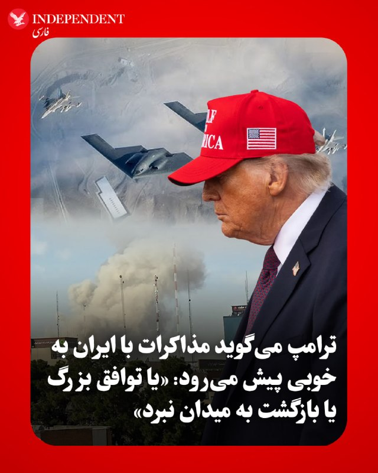

♦️دونالد ترامپ، رئیس‌جمهوری آمریکا، روز دوشنبه چهارم خرداد ماه در پیامی در شبکه اجتماعی تروث سوشال اعلام کرد مذاکرات با جمهوری اسلامی ایران «به‌خوبی» در حال پیشرفت است.
او تاکید کرد که نتیجه مذاکرات یا «توافقی بزرگ برای همه» خواهد بود یا در غیر این صورت، منطقه به «میدان نبرد و تیراندازی» بازخواهد گشت؛ آن هم در ابعادی «بزرگ‌تر و قدرتمندتر از همیشه».
ترامپ نوشت هیچ‌کس خواهان چنین سناریویی نیست و افزود در گفتگوهای خود با رهبران کشورهای منطقه درباره آینده توافق با ایران رایزنی کرده است.
رئیس‌جمهوری آمریکا همچنین اعلام کرد در صورت امضای توافق با تهران، حضور جمهوری اسلامی ایران در یک چارچوب منطقه‌ای جدید می‌تواند به «اتحاد، قدرت و شکوفایی اقتصادی» خاورمیانه منجر شود.
‌🇸🇦 Indypersian

🤖 @VahidOOnLine

## VahidOOnLine — post 242119

  

♦️شبکه خبری فاکس روز شنبه چهارم خرداد ماه در گزارشی نوشت صدها ملوان بریتانیایی در حال آماده‌سازی برای اعزام به تنگه هرمز با هدف پاکسازی مین‌های دریایی هستند و این عملیات پس از دستیابی به توافق احتمالی میان آمریکا و ایران آغاز خواهد شد.
بر اساس این گزارش، کشتی «آر‌اف‌ای لایم‌بی» که اکنون در نزدیکی سواحل جبل‌الطارق مستقر است، پس از نهایی شدن توافق راهی خاورمیانه می‌شود. این شناور در حال بارگیری مهمات و پهپادهای دریایی مین‌یاب مجهز به سونار است.
فاکس نیوز به نقل از آسوشیتدپرس گزارش داد این کشتی قرار است پیش از عبور از کانال سوئز به سمت خلیج فارس، به ناوشکن بریتانیایی «اچ‌ام‌اس دراگون» و دیگر شناورهای متحد برای پشتیبانی هوایی ملحق شود.
جما بریتون، رئیس گروه مقابله با مین و تهدیدات نیروی دریایی سلطنتی بریتانیا، به آسوشیتدپرس گفت ایران می‌تواند «طیف گسترده‌ای» از مین‌های دریایی را در تنگه هرمز مستقر کند.
به گفته او، این مین‌ها ممکن است راکتی، متصل به کابل یا کار گذاشته‌شده در بستر دریا باشند و با صدا، حرکت یا نور فعال شوند.
‌🇸🇦 Indypersian

🤖 @VahidOOnLine

## VahidOOnLine — post 242118

  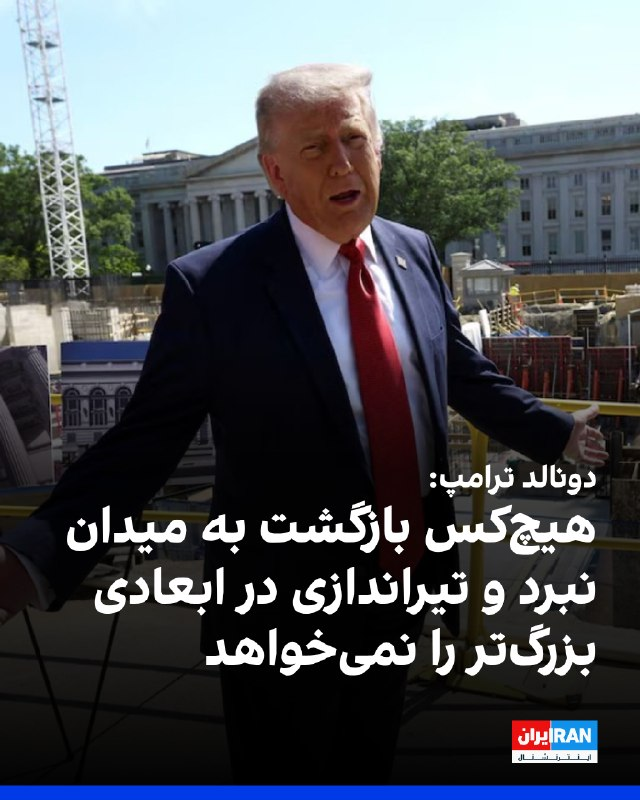

دونالد ترامپ در تروث سوشال نوشت مذاکرات با جمهوری اسلامی به‌خوبی در حال پیشرفت است. یا توافقی بزرگ برای همه خواهد بود، یا اصلا توافقی در کار نخواهد بود؛ در غیر این صورت بازگشت به میدان نبرد و تیراندازی در ابعادی بزرگ‌تر و قدرتمندتر از قبل رخ خواهد داد، و هیچ‌کس این را نمی‌خواهد.»

‌🏁 🇬🇧 IranintlTV

🤖 @VahidOOnLine

## VahidOOnLine — post 242117

  

♦️خبرگزاری رویترز، روز دوشنبه چهارم خرداد به نقل از یک منبع آگاه گزارش کرد محمدباقر قالیباف، رئیس مجلس شورای اسلامی و مذاکره‌کننده ارشد جمهوری اسلامی به همراه عباس عراقچی برای مذاکره با نخست‌وزیر قطر در مورد توافق احتمالی ایران و آمریکا با هدف پایان دادن به جنگ، به دوحه سفر کرده‌اند.

این مقام که نامش فاش نشده به رویترز گفت که «مذاکرات عمدتا بر تنگه هرمز و ذخایر اورانیوم غنی‌شده با خلوص بالا متمرکز است.»

به گزارش رویترز،عبدالناصر همتی، رئیس بانک مرکزی ایران نیز عضو هیئتی است که قرار است در مورد آزادسازی احتمالی دارایی‌های مسدود شده ایران به عنوان بخشی از توافق نهایی با مقام‌های قطری گفتگو کند.
‌🇸🇦 Indypersian

🤖 @VahidOOnLine

## VahidOOnLine — post 242116

  

رویترز به نقل از یک مقام آگاه گزارش داد محمدباقر قالیباف و عباس عراقچی برای دیدار با نخست‌وزیر قطر، در خصوص توافق احتمالی میان جمهوری اسلامی و آمریکا، وارد دوحه شده‌اند.

پیش‌تر رسانه‌های ایران از سفر عبدالناصر همتی، رییس کل بانک مرکزی به قطر خبر داده بودند.
iranintl
‌🏁 🇬🇧 IranintlTV

🤖 @VahidOOnLine

## VahidOOnLine — post 242115

  

♦️شی جین‌پینگ، رئیس جمهوری چین روز دوشنبه چهارم خردادماه در جریان دیدار با شهباز شریف، نخست وزیر پاکستان در پکن از نقش «سازنده» اسلام‌آباد در میانجیگری میان ایالات متحده آمریکا و جمهوری اسلامی ایران تقدیر کرد.

به گزارش خبرگزاری دولتی پاکستان، شهباز شریف که به همراه فیلدمارشال عاصم منیر، فرمانده ارتش و میانجی اصلی مذاکرات تهران و واشنگتن به پکن سفر کرده از حمایت‌های چین از گفتگوهای صلح تشکر کرد.

به گزارش رویترز، شهباز شریف پیش از ملاقات با رئیس جمهوری چین و در جریان دیدار با لی چیانگ، نخست‌وزیر این کشور، گفته بود «جهان در حال گذار از یک لحظه حساس در بحبوحه بحران» در خلیج فارس است.
‌🇸🇦 Indypersian

🤖 @VahidOOnLine

## VahidOOnLine — post 242114

  

⭕️ رئیس کل بانک مرکزی ایران به قطر رفت

♦️رسانه‌های داخلی ایران روز دوشنبه چهارم خردادماه از سفر عبدالناصر همتی، رئیس کل بانک مرکزی ایران به قطر خبر دادند.

خبرگزاری فارس، وابسته به سپاه پاسداران با اعلام این خبر نوشت: «عبدالناصر همتی پیرامون بررسی آزادسازی اموال بلوکه‌شده و در راستای کمیسیون اقتصادی مذاکرات به قطر سفر کرد.»

قطر در این دور از مذاکرات، میانجی مستقیم نیست اما هفته گذشته، یک هیئت از قطر به تهران سفر کرده بود.
‌🇸🇦 Indypersian

🤖 @VahidOOnLine

## VahidOOnLine — post 242113

  

پایگاه خبری بلومبرگ گزارش داد شرکت نفت ابوظبی در هفته‌های اخیر با استفاده از ناوگان خود و به‌کارگیری روش‌های خاص، صادرات نفت و گاز از خلیج فارس را ادامه داده است.

بر اساس این گزارش، برخی نفتکش‌ها با خاموش کردن سامانه‌های ردیابی هنگام عبور از تنگه هرمز موفق شده‌اند محموله‌ها را جابه‌جا کنند. هم‌زمان، قطر نیز به‌صورت نامحسوس صادرات گاز طبیعی مایع (ال‌ان‌جی) را از تنگه هرمز ادامه داده و دست‌کم یک کشتی حامل ال‌ان‌جی پس از عبور از این مسیر راهبردی، در مسیر چین رصد شده است. اگرچه حجم این انتقال‌ها هنوز با سطح تجارت پیش از جنگ فاصله دارد، اما به گفته بلومبرگ، این تحرکات نشان‌دهنده تلاش تولیدکنندگان انرژی منطقه برای حفظ جریان صادرات و ایجاد موازنه میان فشارهای ایران و ایالات متحده است.
iranintl
‌🏁 🇬🇧 IranintlTV

🤖 @VahidOOnLine

## VahidOOnLine — post 242112

در حالیکه ۸۷ روز از خاموشی دیجیتال و قطع ارتباط ایران با جهان می‌گذرد، رسانه‌های داخلی به‌نقل از منابع آگاه گزارش دادند که در چهارمین جلسه «ستاد راهبری و ساماندهی فضای مجازی» به ریاست محمدرضا عارف، معاون اول پزشکیان، «مصوب شده تا اینترنت به وضعیت پیش از دی‌ماه ۱۴۰۴ باز گردد.»

این خبر در حالی منتشر می‌شود که اینترنت در ایران از زمان آغاز جنگ با آمریکا و اسرائیل قطع شده است. پیش از آن هم دسترسی به اینترنت از روزهای ۱۸ و ۱۹ دی‌ماه و همزمان با انقلاب ملی ایرانیان و کشتار گسترده مردم، قطع شده بود.
‌🇸🇦 Indypersian

🤖 @VahidOOnLine

## VahidOOnLine — post 242111

  

علیرضا سلیمی، عضو هیات رییسه مجلس، گفت آمریکا هیچ‌گاه به دنبال مذاکره واقعی برای پایان دادن به تنش‌ها نبوده و از میز مذاکره فقط به‌عنوان «تله‌گذاری» برای پیشبرد اقدامات «خصمانه» بعدی استفاده می‌کند.

او افزود: «اگر مقام‌های آمریکایی صادق بودند و حسن نیت داشتند، هم‌زمان با سخن گفتن از مذاکره، تحریم‌های جدید علیه جمهوری اسلامی اعمال نمی‌کردند.»
iranintl
‌🏁 🇬🇧 IranintlTV

🤖 @VahidOOnLine

## VahidOOnLine — post 242110

  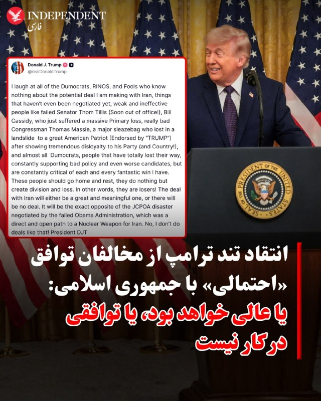

♦️دونالد ترامپ با انتشار پیامی در تروث سوشال، به‌شدت از منتقدان و مخالفان «توافق احتمالی» با جمهوری اسلامی انتقاد و تاکید کرد که اگر توافق «عالی و پرمعنی» نباشد، اصلا توافقی در کار نخواهد بود.

ترامپ در این پیام نوشت: «من به همه دموکرات‌ها، جمهوریخواهان مستقل و احمق‌هایی که هیچ چیز در مورد توافق بالقوه‌ای که من با ایران انجام می‌دهم نمی‌دانند، چیزهایی که هنوز حتی در مورد آنها مذاکره نشده است، می‌خندم. افراد ضعیف و بی‌تاثیری مثل سناتور شکست‌خورده تام تیلیس (که به زودی از سمت خود برکنار می‌شود!)، بیل کسیدی که به تازگی شکست سنگینی در انتخابات مقدماتی متحمل شد، توماس ماسی، نماینده بد کنگره، یک آدم کثیف و بی‌عرضه که پس از نشان دادن بی‌وفایی عظیم به حزب (و کشورش!) با اختلاف فاحشی به یک میهن‌پرست بزرگ آمریکایی (که توسط «ترامپ» تایید شده بود) باخت، و تقریبا همه دموکرات‌ها، افرادی که کاملا راه خود را گم کرده‌اند، دائما از سیاست‌های بد و حتی نامزدهای بدتر حمایت می‌کنند، اما همیشه از هر پیروزی فوق‌العاده‌ای که من به دست می‌آورم انتقاد می‌کنند. این افراد باید به خانه بروند و استراحت کنند.»
‌🇸🇦 Indypersian

🤖 @VahidOOnLine

## VahidOOnLine — post 242109

  

خبرگزاری فارس، وابسته به سپاه پاسداران، ضمن اعلام خبر سفر عبدالناصر همتی، رییس بانک مرکزی جمهوری اسلامی به قطر، نوشت که این سفر پیرامون بررسی «آزادسازی اموال بلوکه‌شده» و در راستای کمیسیون اقتصادی مذاکرات انجام شده است.

این در حالی است که در روزهای اخیر و در جریان مذاکرات، هیاتی قطری به ایران سفر کرده بود.
‌🏁 🇬🇧 IranintlTV

🤖 @VahidOOnLine

## VahidOOnLine — post 242108

  <a href="telegram/content/VahidOOnLine_242108_1779713608.mp4" target="_blank">🎬 Download video</a>

تماسی از هلند:
«می‌گفت هر روز با برنامه‌های منوتو زندگی می‌کردیم…
و حالا نمی‌دانیم بعد از آن باید چه کنیم.»
او همچنین از جاویدنام سینا حق‌شناس یاد کرد؛ دوستی که خبر جان‌باختنش زندگی او را زیر و رو کرده بو
‌🏁 🇬🇧 ManotoTV

🤖 @VahidOOnLine

## VahidOOnLine — post 242107

  

سایت هرانا خبر داد گلرخ ایرایی، زهرا صفایی، مرضیه فارسی، شیوا اسماعیلی و سکینه پروانه، پنج تن از زندانیان سیاسی محبوس در بند زنان زندان اوین، از یکشنبه به‌صورت تنبیهی از حق استفاده از تلفن زندان محروم شده‌اند.

هرانا نوشت محرومیت تنبیهی این پنج زندانی سیاسی پس از آن اعمال شد که آنان در اعتراض به اجرای احکام اعدام، در محوطه هواخوری زندان شعار داده بودند.

این زندانیان پیش‌تر نیز از حق ملاقات حضوری با خانواده و وکلای خود محروم بوده‌اند و این محدودیت همچنان ادامه دارد.
‌🏁 🇬🇧 IranintlTV

🤖 @VahidOOnLine

## VahidOOnLine — post 242106

  

دونالد ترامپ در شبکه تروث سوشال نوشت: «توافق با ایران یا یک توافق بزرگ و معنادار خواهد بود یا اصلا توافقی در کار نخواهد بود. این دقیقا برعکس فاجعه برجام است که توسط دولت شکست‌خورده اوباما انجام شد؛ توافقی که یک مسیر مستقیم و آشکار برای دستیابی آن‌ها به سلاح هسته‌ای بود. نه، من چنین توافق‌هایی انجام نمی‌دهم.»

او افزود: «من به همه دموکرات‌ها و جمهوری‌خواهانِ اسمی و احمق‌هایی می‌خندم که هیچ چیزی درباره توافق احتمالی که من با ایران در حال انجامش هستم نمی‌دانند؛ موضوعاتی که هنوز حتی درباره‌شان مذاکره هم نشده است.»
iranintl
‌🏁 🇬🇧 IranintlTV

🤖 @VahidOOnLine

## VahidOOnLine — post 242105

  <a href="telegram/content/VahidOOnLine_242105_1779713612.mp4" target="_blank">🎬 Download video</a>

ویدیوهای رسیده به ایران‌اینترنشنال نشان می‌دهند گروهی از ایرانیان مقیم آلمان هم‌زمان با فستیوال موسیقی گوتیک‌ویو در شهر لایپزیگ علیه جمهوری اسلامی راهپیمایی نمادین برگزار کردند.
این تجمع با پوشیدن لباس مشکی، پخش موسیقی نویز و نصب نماد «وای‌فای خاموش» بر دهان شرکت‌کنندگان همراه بود؛ حرکتی اعتراضی برای جلب توجه افکار عمومی به کشتارهای رخ‌داده در ایران و بی‌توجهی سیاستمداران اروپایی.
‌🏁 🇬🇧 IranintlTV

🤖 @VahidOOnLine

## VahidOOnLine — post 242104

  

♦️اسماعیل بقایی، سخنگوی وزارت امور خارجه جمهوری اسلامی روز دوشنبه چهارم خرداد در پاسخ به پرسش‌های خبرنگاران درباره اعمال هزینه عبور از تنگه هرمز گفت: «کشتی‌ها عوارضی نمی‌پردازند. ناوبری و حفاظت از محیط زیست در تنگه هرمز هزینه‌هایی دارد و ما با کشور عمان در حال بررسی طرحی برای تامین این هزینه‌ها هستیم.»

این اظهارات در حالی بیان می‌شود که عبور و مرور کشتی‌های باری و نفتکش‌ها در از تنگه هرمز، محل گذر یک پنجم انرژی جهان از زمان آغاز جنگ آمریکا و اسرائیل با جمهوری اسلامی عملا متوقف شده است. مساله بازگشایی تنگه هرمز یکی از موضوعات مذاکرات جاری میان تهران و واشنگتن است.
‌🇸🇦 Indypersian

🤖 @VahidOOnLine

## VahidOOnLine — post 242103

  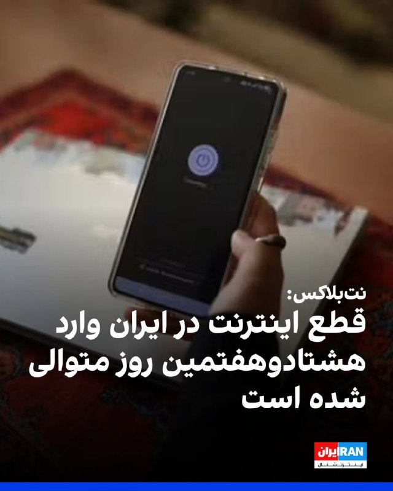

نت‌بلاکس صبح دوشنبه اعلام کرد خاموشی اینترنت در ایران وارد هشتادوهفتمین روز متوالی شده و بیش از ۲۰۶۴ ساعت ادامه داشته است. نت‌بلاکس نوشت قطع اینترنت «هرگونه شفافیت درباره اعدام‌ها» را از بین برده و به شرایط «غیرانسانی» و بلاتکلیفی منتقدان زندانی، مخالفان و گردشگران افزوده است.
iranintl
‌🏁 🇬🇧 IranintlTV

🤖 @VahidOOnLine

## VahidOOnLine — post 242102

  

مسعود پزشکیان، رییس دولت جمهوری اسلامی گفت: «روند مذاکرات و تعاملات خارجی کشور به‌گونه‌ای طراحی شده که حقوق ملت ایران به‌صورت کامل استیفا شود و جمهوری اسلامی تحت هیچ شرایطی در برابر فشارها و مطالبات زیاده‌خواهانه تسلیم نخواهد شد.»

او افزود: «حفظ ثبات بازار و تامین نیازهای کشور در شرایط جنگی، مرهون تلاش موثر فعالان اقتصادی بوده است.»
iranintl
‌🏁 🇬🇧 IranintlTV

🤖 @VahidOOnLine

## WithYashar — post 12417

دو مقام اسرائیلی به رویترز: نتانیاهو به نزدیکان خود می‌گوید که هیچ تأثیری بر تصمیمات ترامپ ندارد
@withyashar

## WithYashar — post 12416

  

ترامپ در تروث : «مذاکرات با جمهوری اسلامی ایران به‌خوبی در حال پیشرفت است! یا این توافق، توافقی بزرگ برای همه خواهد بود، یا اصلاً توافقی در کار نخواهد بود — وگرنه بازگشت به میدان نبرد و تیراندازی آغاز می‌شود، آن هم بزرگ‌تر و قدرتمندتر از همیشه — و هیچ‌کس چنین چیزی را نمی‌خواهد!

در جریان گفت‌وگوهایم در روز شنبه با محمد بن سلمان آل سعود، ولیعهد عربستان سعودی، محمد بن زاید آل نهیان، رئیس کشور امارات متحده عربی، شیخ تمیم بن حمد آل ثانی، امیر قطر، محمد بن عبدالرحمن بن جاسم بن جبر آل ثانی، نخست‌وزیر قطر، علی الثوادی، وزیر قطری، سید عاصم منیر احمد شاه، فرمانده ارتش پاکستان، رجب طیب اردوغان، رئیس‌جمهور ترکیه، عبدالفتاح السیسی، رئیس‌جمهور مصر، ملک عبدالله دوم، پادشاه اردن، و حمد بن عیسی آل خلیفه، پادشاه بحرین، اعلام کردم که پس از تمام تلاش‌هایی که ایالات متحده برای کنار هم قرار دادن این پازل بسیار پیچیده انجام داده، لازم است که همه این کشورها، حداقل به‌صورت هم‌زمان، به پیمان ابراهیم بپیوندند.
@withyashar
کشورهایی که درباره آن‌ها صحبت شد عبارت‌اند از: عربستان سعودی، امارات متحده عربی (که هم‌اکنون عضو است)، قطر، پاکستان، ترکیه، مصر، اردن و بحرین (که هم‌اکنون عضو است). ممکن است یک یا دو کشور دلیلی برای انجام ندادن این کار داشته باشند و این پذیرفته خواهد شد، اما بیشتر آن‌ها باید آماده، مایل و قادر باشند تا این توافق با ایران را به رویدادی تاریخی‌تر از آنچه در غیر این صورت می‌بود تبدیل کنند.

پیمان‌های ابراهیم برای کشورهای عضو آن — یعنی امارات متحده عربی، بحرین، مراکش، سودان و قزاقستان — یک جهش عظیم مالی، اقتصادی و اجتماعی به همراه داشته‌اند، حتی در این دوران جنگ و درگیری؛ تا جایی که هیچ‌یک از اعضای فعلی حتی صحبت از خروج یا توقف موقت هم نکرده‌اند.

دلیلش این است که پیمان‌های ابراهیم برای آن‌ها فوق‌العاده بوده و برای همه نیز حتی بهتر خواهد بود، و برای نخستین بار در پنج هزار سال گذشته، قدرت، توان و صلح واقعی را به خاورمیانه خواهد آورد.

این سند، همانند هیچ توافق دیگری که تاکنون در جهان امضا شده، مورد احترام قرار خواهد گرفت. سطح اهمیت و اعتبار آن بی‌همتا خواهد بود!
@withyashar
این روند باید با امضای فوری عربستان سعودی و قطر آغاز شود و دیگران نیز باید به‌دنبال آن حرکت کنند. اگر این کار را نکنند، نباید بخشی از این توافق باشند، زیرا این نشان‌دهنده نیت بد است.

در گفت‌وگو با بسیاری از رهبران بزرگی که نام برده شد، آن‌ها اعلام کردند که به‌محض امضای سند ما، از حضور جمهوری اسلامی ایران در پیمان‌های ابراهیم استقبال خواهند کرد. واو، این واقعاً چیزی ویژه خواهد بود!

این مهم‌ترین توافقی خواهد بود که هر یک از این کشورهای بزرگ اما همواره درگیرِ منازعه تاکنون امضا کرده‌اند. هیچ‌چیز در گذشته یا آینده از آن فراتر نخواهد رفت.
@withyashar
بنابراین، من به‌طور الزامی درخواست می‌کنم که همه کشورها فوراً پیمان‌های ابراهیم را امضا کنند، و اگر ایران توافق خود را با من، به‌عنوان رئیس‌جمهور ایالات متحده آمریکا، امضا کند، حضور ایران نیز در این ائتلاف بی‌نظیر جهانی مایه افتخار خواهد بود.

خاورمیانه متحد، قدرتمند و از نظر اقتصادی نیرومند خواهد شد؛ شاید بیش از هر منطقه دیگری در جهان!

با انتشار این پیام در تروث سوشال، از نمایندگان خود می‌خواهم روند پیوستن این کشورها به پیمان‌های ابراهیمِ تاریخی را آغاز کرده و با موفقیت به پایان برسانند.
@withyashar

## WithYashar — post 12415

  <a href="telegram/content/WithYashar_12415_1779713618.mp4" target="_blank">🎬 Download video</a>

فاکس نیوز: رئیس‌جمهور ترامپ با قاطعیت شایعات دربارهٔ یک توافق هسته‌ای ضعیف را رد کرد و اعلام کرد که هرگز به تهران «پول نقد تحویل نخواهد داد.»

رئیس‌جمهور ترامپ به لارِنس بیلی جونز؛ (مجری تلویزیونی، مفسر سیاسی و خبرنگار آمریکایی شبکه فاکس‌نیوز) گفت منتقدانی که ادعا می‌کنند او در برابر ایران رویکردی نرم دارد، کاملاً در اشتباه‌اند.

«واقعاً فکر می‌کنید بعد از تمام حرف‌هایی که دربارهٔ این‌که ایران هرگز نباید به سلاح هسته‌ای دست پیدا کند زده‌ام، من به‌عنوان رئیس‌جمهور فقط بیایم و پول نقد به آن‌ها تحویل بدهم؟»
@withyashar

## WithYashar — post 12414

  <a href="telegram/content/WithYashar_12414_1779713621.mp4" target="_blank">🎬 Download video</a>

روایت مذاکرات ایران: رئیس‌جمهور ترامپ با قاطعیت شایعات دربارهٔ یک توافق هسته‌ای ضعیف را رد کرد و اعلام کرد که هرگز به تهران «پول نقد تحویل نخواهد داد.»

رئیس‌جمهور ترامپ به لارِنس بیلی جونز؛ (مجری تلویزیونی، مفسر سیاسی و خبرنگار آمریکایی شبکه فاکس‌نیوز) گفت منتقدانی که ادعا می‌کنند او در برابر ایران رویکردی نرم دارد، کاملاً در اشتباه‌اند.

«واقعاً فکر می‌کنید بعد از تمام حرف‌هایی که دربارهٔ این‌که ایران هرگز نباید به سلاح هسته‌ای دست پیدا کند زده‌ام، من به‌عنوان رئیس‌جمهور فقط بیایم و پول نقد به آن‌ها تحویل بدهم؟»
@withyashar

## WithYashar — post 12413

همتی رئیس بانک مرکزی هم در تیمه و برای پیگیری آزادسازی منابع ارزی ایران راهی قطر شده

قرار شده است که قطر بخشی از پول‌های بلوکه شده ایران را پرداخت کند و بعد آمریکا به آن بپردازد!

سید محمد مرندی، عضو سابق تیم مذاکره‌کننده هسته‌ای: ظاهرا قرار بر این است قطری ها بخشی از پول را برای ما تامین و بعداز آمریکا دریافت کنند.
@withyashar

## WithYashar — post 12412

فاکس نیوز : قالیباف و عراقچی امروز رفتن قطر برای مذاکرات
@withyashar

## WithYashar — post 12411

واشنگتن پست به نقل از یک مقام ایرانی:
بازگشایی تنگه هرمز مرحله‌به‌مرحله انجام میشه. اول مین‌ها پاک‌سازی میشه، بعد محاصره آمریکا برداشته میشه و اون 12 میلیارد دلار دارایی مسدود شده هم آزاد میشه.

یه یادداشت هم امضا شده که اصلا ربطی به توافق هسته‌ای نداره، فقط قول دادیم که مذاکرات رو ادامه بدیم.
@withyashar

## WithYashar — post 12410

ترامپ: چیزهایی هست که از اول هم با ایران در موردشان مذاکره نشده بود
@withyashar

## WithYashar — post 12409

دیلی‌میل: تد کروز و لیندسی گراهام رهبری جمهوری‌خواهان رو بر عهده دارن که از توافق در حال شکل‌گیری ترامپ با ایران انتقاد میکنن و اونو اشتباهی فاجعه‌‌بار می‌دونن.
@withyashar

## WithYashar — post 12408

ترامپ در تروث : «من به تمام دموکرات‌ها، جمهوری‌خواه‌های ظاهری (RINOها) و احمق‌هایی می‌خندم که هیچ اطلاعی درباره توافق احتمالی‌ای که من با ایران در حال انجامش هستم ندارند؛ مسائلی که حتی هنوز وارد مرحله مذاکره هم نشده‌اند.

افراد ضعیف و بی‌اثری مثل سناتور شکست‌خورده تام تیلیس که به‌زودی از قدرت کنار می‌رود یا بیل کسیدی که تازه یک شکست سنگین در انتخابات مقدماتی خورده، یا نماینده واقعاً افتضاح، توماس مَسی؛ آدمی کاملاً کثیف که بعد از خیانت بزرگ به حزبش (و کشورش!) با اختلاف سنگین از یک میهن‌پرست واقعی آمریکایی که مورد حمایت «ترامپ» بود شکست خورد؛ و تقریباً تمام دموکرات‌ها؛ کسانی که کاملاً راهشان را گم کرده‌اند، مدام از سیاست‌های بد و نامزدهای حتی بدتر حمایت می‌کنند، اما همزمان از تک‌تک پیروزی‌های فوق‌العاده من انتقاد دارند.

این افراد بهتر است به خانه بروند و استراحت کنند؛ چون جز ایجاد تفرقه و شکست، کاری انجام نمی‌دهند. به زبان ساده: آن‌ها بازنده‌اند!

توافق با ایران یا یک توافق بزرگ و معنادار خواهد بود، یا اصلاً توافقی در کار نخواهد بود.
این توافق دقیقاً نقطه مقابل فاجعه برجام (JCPOA) خواهد بود؛ توافقی که توسط دولت شکست‌خورده اوباما مذاکره شد و مسیری مستقیم و آشکار برای دستیابی ایران به سلاح هسته‌ای ایجاد می‌کرد.
نه، من چنین توافق‌هایی انجام نمی‌دهم!
@withyashar

## WithYashar — post 12407

خوش چشم (مرشد فیلم صمد)تحلیلگر صداسیما: پول بشینه توی حساب جمهوری اسلامی میریم پای میز مذاکره
@withyashar

## WithYashar — post 12406

شبکه ۱۲ عبری: حزب‌الله استفاده از پهپادهای انتحاری را به‌طور چشمگیری افزایش داده است
@withyashar

## WithYashar — post 12405

فوری/ بازگشایی اینترنت بین الملل مصوب شد

ستاد راهبری و ساماندهی فضای مجازی صبح امروز دوشنبه (چهارم خردادماه) به ریاست دکتر عارف معاون اول رئیس جمهور تشکیل جلسه داد و بازگشت اینترنت به وضعیت قبل از دی ماه 1404 مصوب شد.

این مصوبه برای رییس جمهور ارسال شد و در صورت تایید رئیس جمهور جهت اجرا برای وزارت ارتباطات ارسال خواهد شد.
@withyashar

## WithYashar — post 12404

بقایی: برای تنگه هرمز عوارض نمی‌گیریم؛ هزینه‌های دریافتی صرفاً بابت خدمات ناوبری و حفاظت از محیط زیست است
@withyashar

## WithYashar — post 12403

ربیو:اگر مذاکرات شکست بخورد تقصیر ایالات متحده یا متحدان ما در منطقه خلیج فارس نیست. 100 درصد تقصیر ایران است
@withyashar

## WithYashar — post 12402

سخنگوی وزارت خارجه:

سفر آقای عراقچی به نیویورک به علت مشکل روادید منتفی است
@withyashar

## WithYashar — post 12401

  

بیانیهٔ مارکو روبیو، وزیر امور خارجه آمریکا
محکومیت درخواست بی‌پروا و خطرناک حزب‌الله برای سرنگونی دولت لبنان

ایالات متحده با شدیدترین لحن ممکن، درخواست بی‌ملاحظه حزب‌الله برای سرنگونی دولت منتخب و قانونی لبنان را محکوم می‌کند.
حزب‌الله بارها درخواست‌های دولت قانونی لبنان برای توقف حملات و احترام به آتش‌بس را نادیده گرفته است. در عوض، به شلیک به مواضع اسرائیل و انتقال نیروها و سلاح‌ها به جنوب لبنان ادامه داده است. این یک کارزار عمدی برای بی‌ثبات کردن کشور و حفظ قدرت خود، به بهای آینده مردم لبنان است.

دولت لبنان در حال تلاش برای بازسازی، احیای کشور، دریافت کمک‌های بین‌المللی و ایجاد آینده‌ای باثبات برای شهروندانش با حمایت کامل ایالات متحده است. اما حزب‌الله، برعکس، فعالانه می‌کوشد لبنان را دوباره به سوی هرج‌ومرج و ویرانی بکشاند.

ایالات متحده قاطعانه در کنار دولت قانونی لبنان ایستاده است؛ دولتی که برای بازگرداندن حاکمیت خود و ساختن آینده‌ای بهتر برای همه مردم لبنان تلاش می‌کند. تهدیدهای حزب‌الله برای خشونت و سرنگونی حکومت، اجازه موفقیت نخواهد یافت. دورانی که یک گروه تروریستی تمام یک کشور را گروگان گرفته بود، رو به پایان است.
@withyashar

## WithYashar — post 12400

سعید قاسمی نژاد مشاور شاهزاده : ‏شاید شما هم مثل من همیشه این سوال را از خودتان می‌پرسید که اگر در سال ۵۷ بودید آیا اسیر جو زمان می‌شدید و روبروی شاه می‌ایستادید یا کنار او می‌ایستادید و از ایران دفاع می‌کردید. اگر امروز روبروی شاهزاده رضا پهلوی ایستاده‌اید و‌ دشمن اویید قطعا آن روز هم روبروی شاه می‌ایستادید و‌ دشمن او می‌بودید، شک نکنید و به خودتان و دیگران دروغ نگویید.
@withyashar
یاشار : چقدر زیبا یاد آوری کردید ، اتفاقا اگه در اون زمان بودیم جلوی اطرافیان شاه میستادیم !
جلوی فردوست ، جلوی بختیار ، جلوی ارتشید قره باغی و حتی اردشیر زاهدی و خیلی از حلقه اطرافیان ایشان !
جاوید شاه پاینده ایران !

## WithYashar — post 12399

ترامپ در تروث : یکی از بدترین توافق‌هایی که کشور ما تا به حال انجام داده، «توافق هسته‌ای ایران» بود که توسط باراک حسین اوباما و افراد کاملاً غیرحرفه‌ای دولت اوباما طراحی و امضا شد. این توافق، یک مسیر مستقیم برای ایران جهت دستیابی به سلاح هسته‌ای ایجاد می‌کرد.…

## WithYashar — post 12398

انتخابات هیئت رئیسه مجلس که از ساعت ۷:۳۰ صبح امروز آغاز شد، دقایقی پیش پایان یافت
با آرا اکثریت نمایندگان قالیباف رئیس‌مجلس ماند
این انتخابات بصورت حضوری و با رای مستقیم نمایندگان برای انتخاب ۱۲ عضو هیئت رئیسه مجلس شامل یک رئیس، ۲ نایب رئیس، ۶ دبیر و ۳ ناظر بود.
@withyashar

## mwarmonitor — post 9685

مذاکرات با جمهوری اسلامی ایران به خوبی در حال پیشرفت است! این یا یک «توافق بزرگ» برای همه خواهد بود، یا هیچ توافقی در کار نخواهد بود — بازگشت به جبهه جنگ و شلیک، اما بزرگتر و قوی‌تر از هر زمان دیگری — و هیچ‌کس این را نمی‌خواهد!
من در طول گفتگوهایم در روز شنبه با پرزیدنت محمد بن سلمان آل سعود از عربستان سعودی، محمد بن زاید آل نهیان از امارات متحده عربی، امیر تمیم بن حمد بن خلیفه آل ثانی، نخست‌وزیر محمد بن عبدالرحمن بن جاسم بن جابر آل ثانی و وزیر علی الثوادی از قطر، فیلد مارشال سید عاصم منیر احمد شاه از پاکستان، پرزیدنت رجب طیب اردوغان از ترکیه، پرزیدنت عبدالفتاح السیسی از مصر، ملک عبدالله دوم از اردن و ملک حمد بن عیسی آل خلیفه از بحرین، اعلام کردم که پس از تمام تلاش‌های انجام‌شده توسط ایالات متحده برای کنار هم چیدن این پازل بسیار پیچیده، باید اجباری باشد که همه این کشورها، در کمترین حالت، به‌طور هم‌زمان «پیمان ابراهیم» را امضا کنند.
کشورهای مورد بحث عبارتند از: عربستان سعودی، امارات متحده عربی (که در حال حاضر عضو است!)، قطر، پاکستان، ترکیه، مصر، اردن و بحرین (که در حال حاضر عضو است!). این احتمال وجود دارد که یک یا دو کشور دلیلی برای عدم انجام این کار داشته باشند و این پذیرفته خواهد شد، اما اکثر آن‌ها باید آماده، مایل و قادر باشند تا این توافق با ایران را به رویدادی به مراتب تاریخی‌تر از آنچه در غیر این صورت می‌بود، تبدیل کنند.
پیمان ابراهیم برای کشورهای درگیر (امارات متحده عربی، بحرین، مراکش، سودان و قزاقستان) یک شکوفایی مالی، اقتصادی و اجتماعی بزرگ را، حتی در این زمانه جنگ و درگیری، به اثبات رسانده است؛ به‌طوری که اعضای فعلی آن هرگز حتی پیشنهاد خروج یا حتی وقفه‌ای در آن را نداده‌اند. دلیل آن این است که پیمان ابراهیم برای آن‌ها عالی بوده است، برای همه حتی بهتر خواهد بود و برای اولین بار در ۵۰۰۰ سال گذشته، قدرت، استحکام و صلح واقعی را به خاورمیانه خواهد آورد. این سندی خواهد بود که مانند هیچ سند دیگری که تا به حال در هیچ کجای جهان امضا شده، مورد احترام قرار خواهد گرفت. سطح اهمیت و اعتبار آن بی‌نظیر خواهد بود!
این روند باید با امضای فوری توسط عربستان سعودی و قطر شروع شود و بقیه نیز باید از آن‌ها پیروی کنند. اگر این کار را نکنند، نباید بخشی از این توافق باشند، چرا که این امر نشان‌دهنده سوءنیت است. در گفتگو با بسیاری از رهبران بزرگی که در بالا نام برده شد، آن‌ها مایه افتخار خود خواهند دانست که به محض امضای سند ما، جمهوری اسلامی ایران نیز بخشی از پیمان ابراهیم شود. وای، این واقعاً چیز ویژه‌ای خواهد بود! این مهم‌ترین توافقی خواهد بود که هر یک از این کشورهای بزرگ، اما همیشه درگیر در مناقشه، امضا کرده‌اند. هیچ‌چیز در گذشته یا در آینده، بر آن پیشی نخواهد گرفت.
بنابراین، من به صورت الزامی درخواست می‌کنم که همه کشورها فوراً پیمان ابراهیم را امضا کنند و اگر ایران توافق خود را با من، به عنوان رئیس‌جمهور ایالات متحده آمریکا، امضا کند، مایه افتخار خواهد بود که آن‌ها نیز بخشی از این ائتلاف جهانی بی‌نظیر باشند.
خاورمیانه متحد، قدرتمند و از نظر اقتصادی قوی خواهد شد، شاید شبیه به هیچ منطقه دیگری در هیچ کجای جهان! با رونوشت این «تروث» (پیام)، من از نمایندگانم می‌خواهم که فرآیند امضای این کشورها در پیمانِ از قبل تاریخیِ ابراهیم را آغاز کرده و با موفقیت به پایان برسانند. با تشکر از توجه شما به این موضوع!

دونالد جی. ترامپ رئیس‌جمهور ایالات متحده آمریکا

@mwarmonitor

## mwarmonitor — post 9684

🔴« محمدباقر قالیباف، رئیس مجلس ایران، و عباس عراقچی، وزیر امور خارجه، امروز زودتر به دوحه رسیدند تا درباره تلاش‌های دیپلماتیک جاری برای پایان دادن به درگیری‌ها گفت‌وگو کنند؛ یک منبع مطلع از این سفر به فاکس نیوز گفته است.» @mwarmonitor

## mwarmonitor — post 9683

🔴« محمدباقر قالیباف، رئیس مجلس ایران، و عباس عراقچی، وزیر امور خارجه، امروز زودتر به دوحه رسیدند تا درباره تلاش‌های دیپلماتیک جاری برای پایان دادن به درگیری‌ها گفت‌وگو کنند؛ یک منبع مطلع از این سفر به فاکس نیوز گفته است.»

@mwarmonitor

## mwarmonitor — post 9682

  

🔴 ناو هواپیمابر فرانسوی «شارل دو گل (R91)» را در تصاویر ماهواره‌ای Sentinel-2، تاریخ ۲۴/۰۵/۲۰۲۶.

این ناو در حال حاضر در دریای عرب در حال حرکت است و تنها توسط یک ناوشکن اسکورت می‌شود.

📍مختصات: 16.83654, 55.92432

@mwarmonitor

## mwarmonitor — post 9681

  

🔸ایلان عمر، پیشنهاد مطرح‌شده‌ای را که می‌تواند به ممنوعیت حضور او در کنگره منجر شود، بی‌اهمیت و رد کرد. نیویورک پست

@mwarmonitor

## mwarmonitor — post 9680

  

📝 موقع خوندن خبرها این خبر توجهم جلب کرد . 📌‏یک جوان ۱۹ ساله افغان در منطقه لپن میرابو در نزدیکی شهر مارسی فرانسه، به اتهام تجاوز جنسی بر بزها و گوسفندان بازداشت و به دادگاه معرفی شده است. 📌متهم در صورت اثبات جرم، با سه سال زندان و ۴۵ هزار یورو جریمه مواجه…

## mwarmonitor — post 9679

  

🔸طبق اعلام وزارت خارجه جمهوری اسلامی، عباس عراقچی، وزیر امور خارجه ایران، به دلیل شرایط کلی و یک مشکل مرتبط با ویزای آمریکا، برای شرکت در نشست شورای امنیت سازمان ملل به نیویورک سفر نخواهد کرد.

@mwarmonitor

## mwarmonitor — post 9678

📌ایران اعلام کرد که «بسیاری از مسائل» مربوط به یک توافق با آمریکا برای تمدید آتش‌بس شکننده به مدت ۶۰ روز و بازگشایی تنگه هرمز را نهایی کرده است، اما هشدار داد که با وجود ادامه مذاکرات درباره جزئیات باقی‌مانده، رسیدن به توافق نهایی هنوز قریب‌الوقوع نیست. فیننشال تایمز

@mwarmonitor

## mwarmonitor — post 9677

🔴واشنگتن پست: مرحله اول شامل پاک‌سازی مین‌ها و برداشتن محاصره آمریکا و آزادسازی ۱۲ میلیارد دلار است. یادداشت تفاهم شامل یک توافق هسته‌ای نیست، بلکه فقط یک تعهد برای مذاکره درباره پرونده هسته‌ای در آینده است.

@mwarmonitor

## mwarmonitor — post 9676

🔸یک سرمایه‌گذاری مشترک آمریکا–عربستان در ریاض قصد دارد نمونه‌های مشابه پهپادهای «شاهد» تولید کند — سامافور (Samafor).

@mwarmonitor

## mwarmonitor — post 9675

Hey you yellow-headed real estate hustler, how can an orange old man be so spineless, pathetic, and cowardly? You vilely free-rode on the blood and slaughter of 45,000 Iranians just to buy yourself a fake license to attack and a tough-guy posture. But look at you now—like a bankrupt political vulture, you're on your knees begging for a deal with the exact same terrorist sect you curse day and night!
Wipe that filthy smirk off your face; you are worse than Obama. At least he didn't screw over a nation of 80 million like this, nor did he use the spilled blood of half of them to buy himself fake credit. Screw your "art of the deal" where you swallowed every single loud promise you made and are now wagging your tail to get a photo-op with murderers!
Finish what you started like a man. Otherwise, with this humiliation and hidden begging, you won't just flush your own lack of dignity down the toilet of history—you will be recorded forever as an eternal stain of disgrace, a loser dushman-begging broker, and an absolute idiot who mistook human blood for his own real estate projects!

@RealDonaldTrump
@DonaldJTrumpJr
@EricTrump
@JDVance
@elonmusk
@VivekGRamaswamy
@susie57
@StephenM
@marcorubio
@michaelgwaltz
@SenTomCotton
@tedcruz
@LindseyGrahamSC
@HawleyMO
@SenRickScott
@SenRonJohnson
@kleavittnh
@TeamTrump

## mwarmonitor — post 9674

‼️این متن رو به انگلیسی تو اینستاگرام و ایکس استفاده کنید. ترامپ و هرکی رو می‌شناسید تگ کنید که به دستش برسه.

## mwarmonitor — post 9673

من به همه «دوموکراسی‌خواهان» (ترکیب تمسخرآمیز دموکرات و احمق)، رینوها (جمهوری‌خواهان فقط در نام) و نادان‌هایی که هیچ چیز درباره توافق احتمالی من با ایران نمی‌دانند می‌خندم؛ چیزهایی که هنوز حتی درباره آن‌ها مذاکره هم نشده است. افراد ضعیف و بی‌کفایتی مانند سناتور…

## mwarmonitor — post 9672

من به همه «دوموکراسی‌خواهان» (ترکیب تمسخرآمیز دموکرات و احمق)، رینوها (جمهوری‌خواهان فقط در نام) و نادان‌هایی که هیچ چیز درباره توافق احتمالی من با ایران نمی‌دانند می‌خندم؛ چیزهایی که هنوز حتی درباره آن‌ها مذاکره هم نشده است. افراد ضعیف و بی‌کفایتی مانند سناتور شکست‌خورده تام تیلیس (که به زودی از سمت خود کنار می‌رود!)، بیل کسیدی که همین چند وقت پیش شکست سنگینی را در انتخابات مقدماتی متحمل شد، و نماینده واقعاً بد کنگره توماس مسی؛ یک کیسه کثافت بزرگ که در یک شکست مفتضحانه، نتیجه را به یک وطن‌پرست بزرگ آمریکایی (مورد تایید "ترامپ") واگذار کرد، آن هم پس از اینکه بی‌وفایی شدیدی به حزب (و کشورش!) نشان داد.
و تقریباً همه «دوموکراسی‌خواهان»، افرادی که کاملاً راه خود را گم کرده‌اند و مدام از سیاست‌های بد و حتی نامزدهای بدتر حمایت می‌کنند، اما به طور مداوم از تک‌تک پیروزی‌های فوق‌العاده من انتقاد می‌کنند. این افراد باید به خانه بروند و استراحت کنند، آن‌ها کاری جز ایجاد تفرقه و باخت انجام نمی‌دهند. به عبارت دیگر، آن‌ها بازنده هستند!
توافق با ایران یا یک توافق بزرگ و معنادار خواهد بود، یا اصلاً توافقی در کار نخواهد بود. این توافق دقیقاً نقطه مقابل فاجعه برجام (JCPOA) خواهد بود که توسط دولت شکست‌خورده اوباما مذاکره شد؛ توافقی که یک مسیر مستقیم و باز برای رسیدن ایران به سلاح هسته‌ای بود. خیر، من این‌طور معامله نمی‌کنم!

رئیس‌جمهور دونالد جی ترامپ (DJT)

@mwarmonitor

## mwarmonitor — post 9671

🔸شبکه ۱۲ اسرائیل: از صبح تاکنون ۳ پهپاد حزب‌الله در داخل اسرائیل منفجر شده‌اند که یکی از آن‌ها به یک ساختمان در منطقه «مطله» اصابت کرده است.

@mwarmonitor

## mwarmonitor — post 9670

🔴تد کروز و لیندسی گراهام رهبری جمهوری‌خواهان را بر عهده دارند که از ترامپ به‌خاطر «اشتباه فاجعه‌بار» در توافق در حال شکل‌گیری او با ایران به‌شدت انتقاد می‌کنند. Daily mail

@mwarmonitor

## mwarmonitor — post 9669

  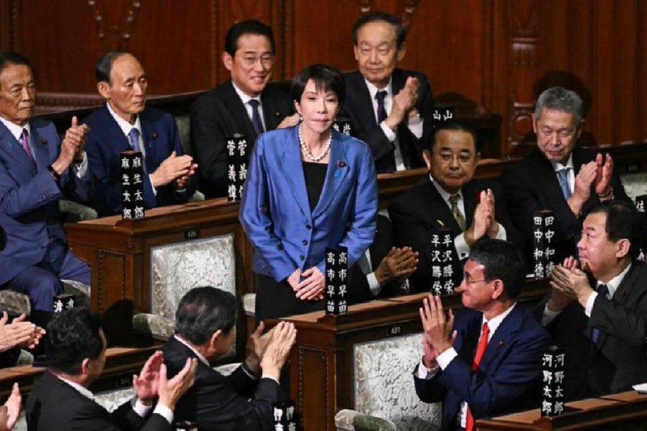

🔴فایننشال تایمز گزارش می‌دهد که شی جین‌پینگ در جریان دیدار با ترامپ، هنگام صحبت درباره طرح‌های نظامی‌سازی مجدد ژاپن و افزایش هزینه‌های دفاعی تحت نخست‌وزیری سانائه تاکایچی، دچار عصبانیت شده است.

🔸ترامپ گفته است که ژاپن برای دفاع از خود در برابر تهدیدهای کره شمالی به یک ارتش قوی‌تر نیاز دارد.

@mwarmonitor

## mwarmonitor — post 9668

🔴شبکه کان اسرائیل: رئیس ستاد ارتش اسرائیل خواستار حمله به بیروت در پاسخ به پهپادهای حزب‌الله شده است.

@mwarmonitor

## mwarmonitor — post 9667

  <a href="telegram/content/mwarmonitor_9667_1779713628.mp4" target="_blank">🎬 Download video</a>

📍مرکز خرید محبوب «Kvadrat» در منطقه لوکیانیوکا در کی‌یف پس از یک حمله سنگین موشکی و پهپادی روسیه در یکشنبه کاملاً در آتش سوخت.

🔸در منطقه شوچنکیفسکی، یک نفر کشته شد. تعداد کل مجروحان در کی‌یف به بیش از ۴۰ نفر افزایش یافته است.

@mwarmonitor

## mwarmonitor — post 9666

  

📊آسیا هفته را با خبرهایی آغاز کرد مبنی بر اینکه آمریکا و ایران به‌تدریج در حال نزدیک شدن به یک توافق هستند و بازارها نیز تصمیم گرفتند به جنبه مثبت ماجرا نگاه کنند: بلومبرگ

@mwarmonitor

## FoxNewsTwitter — post 342198

  <a href="telegram/content/FoxNewsTwitter_342198_1779713630.mp4" target="_blank">🎬 Download video</a>

Fox News (Twitter/X)

A possible Iran deal is “95% complete” — but the final stretch may take days.

U.S. officials say the plan would formally end the war, reopen the Strait of Hormuz without tolls, and eventually address Iran’s enriched nuclear material.

Iran could see billions in frozen assets released and oil sanctions waivers — but only if officials say Tehran holds up its end of the bargain. | @TreyYingst

## FoxNewsTwitter — post 342197

  

Fox News (Twitter/X)

JUST IN: President Trump releases a Memorial Day message ahead of taking part in a wreath-laying ceremony at Arlington National Cemetery:

"God Bless those that have made the ultimate sacrifice. I love you all!"

## FoxNewsTwitter — post 342196

  

Fox News (Twitter/X)

WATCH LIVE: Memorial Day ceremony to honor fallen service members https://twitter.com/i/broadcasts/1lJQRRRrOEkxE

## FoxNewsTwitter — post 342192

Fox News (Twitter/X)

An emotional night for NASCAR.

For the first time since Kyle Busch's death, his wife Samantha and son Brexton appeared publicly for a powerful remembrance of the late driver's life.

Then, on lap 8, the crowd stood as one — cheering, crying, and saluting the legacy "Rowdy" left behind.

The message was clear: Kyle Busch's impact on NASCAR will never be forgotten.

## FoxNewsTwitter — post 342191

  <a href="telegram/content/FoxNewsTwitter_342191_1779713634.mp4" target="_blank">🎬 Download video</a>

Fox News (Twitter/X)

A graduation ceremony in Franklin, Tennessee turned into a soaking wet controversy after officials decided to keep the event outdoors during a torrential downpour.

Footage from the ceremony shows graduates crossing the stage in heavy rain while families sat drenched in the stands as the storm moved through the area.

Now some parents are demanding answers, saying students deserved better and arguing the conditions became unsafe.

## pm_afshaa — post 91454

  <a href="telegram/content/pm_afshaa_91454_1779713636.webm" target="_blank">🎬 Download video</a>

🔴پست جدید ترامپ: مذاکرات با جمهوری اسلامی ایران به خوبی پیش می‌رود! یا یک توافق عالی برای همه خواهد بود یا هیچ توافقی حاصل نمی‌شود - بازگشت به جبهه نبرد و تیراندازی، اما بزرگتر و قوی‌تر از همیشه - و هیچ کس این را نمی‌خواهد! در جریان مذاکرات روز شنبه‌ام با…

## pm_afshaa — post 91453

  <a href="telegram/content/pm_afshaa_91453_1779713637.webm" target="_blank">🎬 Download video</a>

🔴پست جدید ترامپ:

مذاکرات با جمهوری اسلامی ایران به خوبی پیش می‌رود! یا یک توافق عالی برای همه خواهد بود یا هیچ توافقی حاصل نمی‌شود - بازگشت به جبهه نبرد و تیراندازی، اما بزرگتر و قوی‌تر از همیشه - و هیچ کس این را نمی‌خواهد! در جریان مذاکرات روز شنبه‌ام با محمد بن سلمان آل سعود، رئیس جمهور عربستان سعودی، محمد بن زاید آل نهیان، رئیس جمهور امارات متحده عربی، امیر تمیم بن حمد بن خلیفه آل ثانی، نخست وزیر محمد بن عبدالرحمن بن جاسم بن جابر آل ثانی و وزیر علی الذوادی از قطر، فیلد مارشال سید عاصم منیر احمد شاه از پاکستان، رجب طیب اردوغان، رئیس جمهور ترکیه، عبدالفتاح السیسی، رئیس جمهور مصر، ملک عبدالله دوم، پادشاه اردن و ملک حمد بن عیسی آل خلیفه از بحرین، اظهار داشتم که پس از تمام کارهایی که ایالات متحده برای کنار هم قرار دادن این پازل بسیار پیچیده انجام داده است، باید اجباری باشد که همه این کشورها، حداقل، همزمان، توافقنامه ابراهیم را امضا کنند. این کشورها مورد بحث عبارتند از عربستان سعودی، امارات متحده عربی (که از قبل عضو است!)، قطر، پاکستان، ترکیه، مصر، اردن و بحرین (که از قبل عضو است!). ممکن است یک یا دو نفر دلیلی برای انجام ندادن این کار داشته باشند و این پذیرفته خواهد شد، اما اکثر آنها باید آماده، مایل و قادر باشند که این توافق با ایران را به یک رویداد تاریخی بسیار مهم‌تر از آنچه در غیر این صورت می‌توانست باشد، تبدیل کنند. توافق‌نامه‌های ابراهیم برای کشورهای درگیر (امارات متحده عربی، بحرین، مراکش، سودان و قزاقستان) یک رونق مالی، اقتصادی و اجتماعی بوده است، حتی در این دوران درگیری و جنگ، به طوری که اعضای فعلی هرگز پیشنهاد خروج یا حتی مکثی در آن نداده‌اند. دلیل این امر این است که توافق‌نامه‌های ابراهیم برای آنها عالی بوده است و برای همه حتی بهتر خواهد بود و برای اولین بار در 5000 سال گذشته، قدرت، استحکام و صلح واقعی را برای خاورمیانه به ارمغان می‌آورد. این سندی خواهد بود که مانند هیچ سند دیگری که تاکنون در هیچ کجای جهان امضا شده است، مورد احترام قرار نخواهد گرفت. سطح اهمیت و اعتبار آن بی‌نظیر خواهد بود! این توافق‌نامه باید با امضای فوری عربستان سعودی و قطر آغاز شود و همه دیگران نیز باید از آن پیروی کنند. اگر این کار را نکنند، نباید بخشی از این توافق باشند، زیرا این نشان دهنده نیت بد است. در صحبت با بسیاری از رهبران بزرگ ذکر شده در بالا، آنها مفتخر خواهند بود که به محض امضای سند ما، جمهوری اسلامی ایران را به عنوان بخشی از توافق‌نامه‌های ابراهیم داشته باشند. وای، این چیز خاصی خواهد بود! این مهمترین توافق‌نامه‌ای خواهد بود که هر یک از این کشورهای بزرگ، اما همیشه در حال جنگ، هرگز امضا خواهند کرد. هیچ چیز در گذشته یا در آینده از آن پیشی نخواهد گرفت. بنابراین، من به طور اجباری درخواست می‌کنم که همه کشورها فوراً توافق‌نامه‌های ابراهیم را امضا کنند و اگر ایران توافق‌نامه خود را با من، به عنوان رئیس جمهور ایالات متحده آمریکا، امضا کند، باعث افتخار خواهد بود که آنها نیز بخشی از این ائتلاف جهانی بی‌نظیر باشند. خاورمیانه متحد، قدرتمند و از نظر اقتصادی قوی خواهد بود، شاید مانند هیچ منطقه دیگری در هیچ کجای جهان! با کپی کردن این حقیقت، از نمایندگان خود می‌خواهم که روند پیوستن این کشورها به توافق‌نامه‌های تاریخی ابراهیم را آغاز و با موفقیت تکمیل کنند. از توجه شما به این موضوع متشکرم!

💧Rainbet.com the #1 Non-KYC Crypto Casino & Sportsbook @rainbetcom

😁 @Pm_Afshaa

## pm_afshaa — post 91452

🔴همتی رئیس بانک مرکزی برای آزادسازی منابع ارزی ایران راهی قطر شده

💧 Rainbet.com the #1 Non-KYC Crypto Casino & Sportsbook @rainbetcom

😁 @Pm_Afshaa

## pm_afshaa — post 91451

  <a href="telegram/content/pm_afshaa_91451_1779713638.webm" target="_blank">🎬 Download video</a>

🔴رویترز: قالیباف و عراقچی برای گفت‌وگو درباره توافق با آمریکا وارد قطر شدن.

اولویت اصلی مذاکرات در دوحه، تنگه هرمز و غنی‌سازی اورانیوم هست.

رئیس بانک مرکزی که بخشی از هیئت ایرانی در دوحه بود، قراره درباره آزادسازی احتمالی دارایی مسدود شده ایران به عنوان بخشی از توافق نهایی میان ایران و آمریکا صحبت کنه.

💧 Rainbet.com the #1 Non-KYC Crypto Casino & Sportsbook @rainbetcom

😁 @Pm_Afshaa

## pm_afshaa — post 91450

  <a href="telegram/content/pm_afshaa_91450_1779713639.webm" target="_blank">🎬 Download video</a>

🔴فاکس نیوز: قالیباف و عراقچی امروز زودتر به قطر رسیدن برای مذاکرات مرتبط با تلاش‌های دیپلماتیک جاری که هدف آن پایان دادن به درگیری است.

💧 Rainbet.com the #1 Non-KYC Crypto Casino & Sportsbook @rainbetcom

😁 @Pm_Afshaa

## pm_afshaa — post 91449

🔴ترامپ: دموکرات‌ها سیاست‌های بد و نامزدهای بدی دارند. غیر از این، آن‌ها عملکرد نسبتاً خوبی دارن

💧 Rainbet.com the #1 Non-KYC Crypto Casino & Sportsbook @rainbetcom

😁 @Pm_Afshaa

## pm_afshaa — post 91448

  <a href="telegram/content/pm_afshaa_91448_1779713639.webm" target="_blank">🎬 Download video</a>

🔴واشنگتن پست به نقل از یک مقام ایرانی:
بازگشایی تنگه هرمز مرحله‌به‌مرحله انجام میشه. اول مین‌ها پاک‌سازی میشه، بعد محاصره آمریکا برداشته میشه و اون 12 میلیارد دلار دارایی مسدود شده هم آزاد میشه.

یه یادداشت هم امضا شده که اصلا ربطی به توافق هسته‌ای نداره، فقط قول دادیم که مذاکرات رو ادامه بدیم.

💧 Rainbet.com the #1 Non-KYC Crypto Casino & Sportsbook @rainbetcom

😁 @Pm_Afshaa

## pm_afshaa — post 91447

  <a href="telegram/content/pm_afshaa_91447_1779713640.webm" target="_blank">🎬 Download video</a>

🔴العربیه:
نخست‌وزیر پاکستان با رهبران چین درباره پرونده ایران و توافق با آمریکا صحبت کرد.

اسلام‌آباد اصرار داره که پکن نقش ضامن رو تو هر جور توافقی بین آمریکا و ایران بازی کنه.

💧 Rainbet.com the #1 Non-KYC Crypto Casino & Sportsbook @rainbetcom

😁 @Pm_Afshaa

## pm_afshaa — post 91446

  <a href="telegram/content/pm_afshaa_91446_1779713641.webm" target="_blank">🎬 Download video</a>

🔴صداوسیما از سفر عبدالناصر همتی، رییس کل بانک مرکزی، به قطر خبر داد و نوشت این سفر در حالی انجام شده که چند روز پیش هیاتی قطری برای گفت‌وگو درباره اموال بلوکه‌شده ایران در تهران حضور داشتن.

💧 Rainbet.com the #1 Non-KYC Crypto Casino & Sportsbook @rainbetcom

😁 @Pm_Afshaa

## pm_afshaa — post 91445

  <a href="telegram/content/pm_afshaa_91445_1779713641.webm" target="_blank">🎬 Download video</a>

🔴دیلی‌میل: تد کروز و لیندسی گراهام رهبری جمهوری‌خواهان رو بر عهده دارن که از توافق در حال شکل‌گیری ترامپ با ایران انتقاد میکنن و اونو اشتباهی فاجعه‌‌بار می‌دونن.

💧 Rainbet.com the #1 Non-KYC Crypto Casino & Sportsbook @rainbetcom

😁 @Pm_Afshaa

## pm_afshaa — post 91444

  <a href="telegram/content/pm_afshaa_91444_1779713642.webm" target="_blank">🎬 Download video</a>

🔴پست جدید ترامپ در تروث سوشال:

من میخندم به همه‌ی دموکرات‌های احمق و رینوها (جمهوری‌خواهان بدلی) و ابلهانی که هیچ‌چیز درباره‌ی توافق احتمالی من با ایران نمیدانند؛ چیزهایی که حتی هنوز مورد مذاکره هم قرار نگرفته‌اند. افراد ضعیف و بی‌خاصیتی مثل سناتور شکست‌خورده تام تیلیس (که به‌زودی از کار برکنار میشود!)، بیل کسیدی که همین چندهفته پیش یک شکست سنگین رو توی انتخابات درون‌حزبی تجربه کرد، و عضو واقعاً بد کنگره توماس مسی؛ یک آدم پست و رذل به تمام‌معنا که بعد از نشان دادن بی‌وفایی شدید به حزبش (و کشورش!)، در یک انتخابات قاطع (با اختلاف فاحش) به یک میهن‌پرست بزرگ آمریکایی (مورد حمایت "ترامپ") باخت. و تقریباً همه‌ی دموکرات‌های احمق، افرادی که کاملاً راه خودشون رو گم کرده‌اند، مدام از سیاست‌های بد و حتی نامزدهای بدتر حمایت میکنند، اما به‌طور مستمر از تک‌تک بردهای شگفت‌انگیز من انتقاد میکنند. این افراد باید بروند خانه و استراحت کنند، اونا کاری جز ایجاد تفرقه و باخت انجام نمیدهند. به عبارت دیگر، اونا بازنده هستند!

توافق با ایران یا یک توافق بزرگ و پرمحتوا خواهد بود، یا اصلاً توافقی در کار نخواهد بود. این توافق دقیقاً نقطه‌ی مقابل فاجعه‌ی برجام خواهد بود که توسط دولت شکست‌خورده‌ی اوباما مذاکره شد؛ توافقی که یک مسیر مستقیم و باز واسه رسیدن به سلاح هسته‌ای جلو پای ایران گذاشت. نخیر، من از این مدل توافق‌ها نمیکنم!

💧 Rainbet.com the #1 Non-KYC Crypto Casino & Sportsbook @rainbetcom

😁 @Pm_Afshaa

## pm_afshaa — post 91443

  <a href="telegram/content/pm_afshaa_91443_1779713643.webm" target="_blank">🎬 Download video</a>

🔴بقایی، سخنگوی وزارت خارجه:
درسته که تو خیلی از موضوعات به یه جمع‌بندی رسیدیم، ولی اگه بگیم این یعنی امضای یه توافق نزدیکه، کسی نمیتونه چنین ادعایی بکنه.

ما مدام میبینیم که موضع مقامات آمریکا تغییر میکنه و این روند هر گفت‌وگویی رو با اشکال و شک‌های زیادی مواجه میکنه

💧 Rainbet.com the #1 Non-KYC Crypto Casino & Sportsbook @rainbetcom

😁 @Pm_Afshaa

## pm_afshaa — post 91442

  <a href="telegram/content/pm_afshaa_91442_1779713644.webm" target="_blank">🎬 Download video</a>

🔴اکونومیست: عربستان از ترامپ خواسته هرگونه حمله جدید به ایران رو تا بعد از مراسم سالانه حج به تعویق بندازه.

ریاض نگرانه اگه درگیری دوباره آغاز و حریم هوایی منطقه بسته بشه، زائران در عربستان سعودی گیر بیفتن.

💧 Rainbet.com the #1 Non-KYC Crypto Casino & Sportsbook @rainbetcom

😁 @Pm_Afshaa

## pm_afshaa — post 91441

  <a href="telegram/content/pm_afshaa_91441_1779713644.webm" target="_blank">🎬 Download video</a>

🔴سی‌بی‌اس: مجتبی خامنه‌ای در مکانی نامعلوم با دسترسی کم به دنیای خارج پنهان شده و ارتباط با اون فقط از طریق شبکه‌ای از پیک‌ها انجام میشه.

حتی بسیاری از مقام‌های ارشد جمهوری اسلامی هم به مجتبی خامنه‌ای دسترسی مستقیم ندارن و همین روند مذاکرات و پاسخ تهران به پیشنهادهای آمریکا رو کند کرده.

💧 Rainbet.com the #1 Non-KYC Crypto Casino & Sportsbook @rainbetcom

😁 @Pm_Afshaa

## pm_afshaa — post 91440

تسنیم: مصوبه رفع انسداد اینترنت بین‌المللی تأیید شد و به دست پزشکیان رسید؛ اگر پزشکیان هم تأییدش کنه، این مصوبه برای اجرا به وزارت ارتباطات صادر می‌شه و تا هفته آینده نت بین‌المللی وصل می‌شه

💧 Rainbet.com the #1 Non-KYC Crypto Casino & Sportsbook @rainbetcom

😁 @Pm_Afshaa

## pm_afshaa — post 91439

🔴ربیو:اگر مذاکرات شکست بخورد تقصیر ایالات متحده یا متحدان ما در منطقه خلیج فارس نیست. 100 درصد تقصیر ایران است

💧 Rainbet.com the #1 Non-KYC Crypto Casino & Sportsbook @rainbetcom

😁 @Pm_Afshaa

## pm_afshaa — post 91438

درود هموطنان عزیزم یک دختر 26 سال داره بجرم کشتن یکنفر که وارد خونش شده که بهش تعرض و تجاوز بکنه صبح 5 خرداد اعدام میشه، باید ۱۰ میلیارد جمع بشه که رضایت بدن تا حالا ۹ میلیارد جمع شده  همه چی داخل تصویر هست کسی خواست استعلام بگیره میدونم ایرانی ها آدم با…

## pm_afshaa — post 91437

به قرآن قسم بگی چندجا روبیکا هم گفتم بزارن شما کامل بخون و استعلام هم بگیر که دروغ نیست میتونی کانال بزاری فردا اعدام میشه یک میلیارد مونده💔💔

## pm_afshaa — post 91436

درود هموطنان عزیزم یک دختر 26 سال داره بجرم کشتن یکنفر که وارد خونش شده که بهش تعرض و تجاوز بکنه صبح 5 خرداد اعدام میشه، باید ۱۰ میلیارد جمع بشه که رضایت بدن تا حالا ۹ میلیارد جمع شده  همه چی داخل تصویر هست کسی خواست استعلام بگیره میدونم ایرانی ها آدم با…

## pm_afshaa — post 91435

  

درود هموطنان عزیزم
یک دختر 26 سال داره بجرم کشتن یکنفر که وارد خونش شده که بهش تعرض و تجاوز بکنه
صبح 5 خرداد اعدام میشه، باید ۱۰ میلیارد جمع بشه که رضایت بدن تا حالا ۹ میلیارد جمع شده  همه چی داخل تصویر هست کسی خواست استعلام بگیره
میدونم ایرانی ها آدم با غیرتی هستند حتی شما با کمک ۱۰ هزار تومان کمک بزرگی کردید❤️

شماره کارت:۵۸۹۴۶۳۱۵۹۴۰۴۵۲۸۸
شبا: ۲۲۰۱۳۰۱۰۰۰۰۰۰۰۰۲۶۰۴۸۲۷۶۶

روی شماره کارت و شماره شبا بزنید کپی میشه

## DEJradio — post 4940

⭕️ قالیباف و عراقچی برای دیدار با مقام‌های قطر به دوحه رفتند

خبرگزاری رویترز به نقل از یک مقام آگاه گزارش داد محمدباقر قالیباف، رئیس مجلس و عباس عراقچی، وزیر امور خارجۀ جمهوری اسلامی، در دوحه حضور دارند.
بر اساس این گزارش که عصر دوشنبه منتشر شد، این دو مقام جمهوری اسلامی قرار است با محمد بن عبدالرحمن آل‌ثانی، نخست‌وزیر و وزیر خارجۀ قطر، دیدار و گفت‌وگو کنند.
رویترز نوشت این دیدارها در چارچوب رایزنی‌ برای دستیابی به توافق میان تهران و واشینگتن انجام می‌شود.
قطر در هفته‌های اخیر در کنار پاکستان به یکی از کانال‌های اصلی میانجی‌گری میان جمهوری اسلامی و آمریکا تبدیل شده است.
مقامات قطر پیش از جنگ چهل روزه نیز تلاش بسیاری کردند تا مانع حملۀ آمریکا و اسرائیل به جمهوری اسلامی بشوند.

#قطر
@DEJradio

## DEJradio — post 4939

⭕️
🌐 محاصرۀ دیجیتال در ایران هشتادوهفتمین روز رسید

نت‌بلاکس، اعلام کرد قطعی سراسری اینترنت در ایران وارد هشتادوهفتمین روز پیاپی شده است. این قطعی از مرز ۲۰۶۴ ساعت عبور کرده است.
این نهاد جهانی پایش اینترنت هشدار داد قطعی اینترنت، شفافیت دربارۀ اعدام‌ها و وضعیت زندانیان و بازداشت‌شدگان را از میان برده است.
نهاد عفو بین‌الملل اعلام کرده در هفته‌های اخیر، دستکم ۳۶ نفر در پرونده‌های سیاسی اعدام شدند.
بر پایۀ گزارش‌های داخلی، نبود اینترنت سبب آسیب گسترده به اقتصاد دیجیتال و کاهش فروش آنلاین شده است.
از سویی اینترنت طبقاتی و دسترسی ویژۀ برخی نهادها و شرکت‌ها به اینترنت بین‌الملل، انتقادهای گسترده‌ای را در ایران برانگیخته است.
حکومت از سویی اینترنت رانتی را در اختیار هواداران خود می‌گذارد تا به نفع آن، در شبکه‌های اجتماعی در دنیا تبلیغ کنند.

#اینترنت
@DEJradio

## DEJradio — post 4938

⭕️ سفر همتی به قطر در راستای پروندۀ پول‌های بلوکه‌شدۀ رژیم

خبرگزاری‎‌های داخلی ایران، از سفر عبدالناصر همتی، رئیس کل بانک مرکزی جمهوری اسلامی، به قطر خبر دادند. بنا بر گزارش‌ها یکی از محورهای این سفر، پیگیری آزادسازی منابع ارزی جمهوری اسلامی است.
قطر از سال ۲۰۲۳ و پس از انتقال حدود شش میلیارد دلار از دارایی‌های بلوکه‌شده ایران در کرۀ جنوبی، به یکی از محورهای اصلی پروندۀ مالی تهران و واشینگتن تبدیل شد.
در هفته‌های اخیر، همزمان با مذاکرات غیرمستقیم تهران و واشینگتن، موضوع آزادسازی دارایی‌های مسدودشدۀ جمهوری اسلامی مطرح شد.
برخی از منابع خارجی گزارش دادند که آزادسازی بخشی از این منابع می‌تواند به پیشرفت مذاکرات و امنیت تنگۀ هرمز پیوند خورده باشد.
قطر اکنون علاوه بر نگهداری بخشی از منابع مالی بلوکه شدۀ جمهوری اسلامی، یکی از مسیرهای فعال میانجی‌گری میان تهران و واشینگتن به شمار می‌رود.

#مذاکرات #توافق #تحریم
@DEJradio

## DEJradio — post 4937

⭕️ ترامپ گفت توافق با جمهوری اسلامی یا عالی و معنادار می‌شود یا توافقی در کار نیست

دونالد ترامپ، رئیس‌ جمهوری آمریکا، روز دوشنبه در شبکۀ اجتماعی تروث نوشت توافق احتمالی با جمهوری اسلامی یا «عالی و معنادار» می‌شود یا اصلا توافقی انجام نمی‌گیرد.
ترامپ منتقدان دموکرات و برخی جمهوری‌خواهان را متهم کرد که آنها دربارۀ موضوعاتی نظر می‌دهند که هنوز مذاکره نشده‌ است.
او بازهم توافق هسته‌ای برجام را «فاجعه» خواند. ترامپ گفت دولت باراک اوباما مسیری مستقیم و آشکار را برای دستیابی جمهوری اسلامی به جنگ‌افزار هسته‌ای ایجاد کرده بود.
رئیس‌ جمهوری آمریکا تأکید کرد توافق احتمالی دولت او دقیقأا درنقطۀ مقابل برجام قرار می‌گیرد.
ترامپ افزود: من چنین توافق‌هایی مشابه برجام را انجام نمی‌دهم.

#مذاکرات #ترامپ
@DEJradio

## DEJradio — post 4936

  <a href="telegram/content/DEJradio_4936_1779713646.mp4" target="_blank">🎬 Download video</a>

🔺📢 پیام از ساوه:
کارگر کارخانه پتروشیمی بودم، بعد از جنگ بیکار شدم

یک شهروند از ساوه با ارسال ویدیویی می‌گوید، «من تا قبل از جنگ تو شرکت محصولات پتروشیمی کار می‌کردم، الان بخاطر وضع اقتصادی بسته شده و همه کارگران و کارمنداش بیکاران و حقوق نمیگیرن. کسی به فکر ما نیست و معلوم نیست کی به‌درد ما برسن؟»

#ساوه #جنگ
@DEJradio

## DEJradio — post 4935

  <a href="telegram/content/DEJradio_4935_1779713648.mp4" target="_blank">🎬 Download video</a>

👑🎥 درخواست شهروندان داخل کشور؛ "اتحاد برای ایران"

#ایران #اتحاد
@DEJradio

## DEJradio — post 4934

  <a href="telegram/content/DEJradio_4934_1779713650.webm" target="_blank">🎬 Download video</a>

🔺📢 خبرنامه امیرکبیر؛
بیانیه جمعی از دانشجویان دانشگاه شیراز خطاب به اساتید:
زمانی که مردم را می‌کشتند، لال بودید؟

در پی اعتصاب اساتید دانشگاه شیراز به دلیل مسائل معیشتی، جمعی از دانشجوبان دانشگاه شیراز در نامه‌ای شدیدالحن، به سکوت این اساتید در قبال جنایت‌های حکومت اعتراض کردند. خبرنامه امیرکبیر متن کامل این نامه را روز دوشنبه چهارم خرداد ۱۴۰۵ منتشر کرد.

در مقدمه این بیانه آمده، این روزها شاهد صدور بیانیه‌های پرطمطراق و تعلیق فعالیت‌های آموزشی از سوی شورای صنفی اساتید دانشگاه شیراز هستیم. حضرات اساتید ناگهان یاد «شأن و کرامت اعضای هیئت علمی» افتاده‌اند و با واژه‌های مقدسی چون «ساحت دانایی»، «اخلاق» و «حاکمیت قانون» کلاس‌ها را تعطیل کرده‌اند. اما ما دانشجویان، حافظه تاریخی خود را از دست نداده‌ایم و این نمایش ریاکارانه را با شدیدترین لحن ممکن محکوم می‌کنیم.

‌آقایان و خانم‌های استاد! بیانیه‌های امروز شما نه نشانه‌ای از بیداری وجدان، بلکه اوج فرار رو به جلو و عافیت‌طلبی است. نگاهی به کارنامه‌تان بیندازید تا ببینید چرا حق ندارید پشت نام دانشجو و آینده این سرزمین سنگر بگیرید:
وقتی ظلم آشکار بود، لال بودید: در تمام سال‌هایی که بدیهی‌ترین حقوق انسانی و شهروندی مردم در جامعه زیر پا گذاشته می‌شد، صدای اعتراض و تظلم‌خواهی هیچ‌کدام از شما از دیوارهای این دانشگاه بلند نشد. چشم بر روی حقیقت بستید تا صندلی‌های امن خود را حفظ کنید.

‌ وقتی مردم را می‌کشتند، لال بودید: در روزهای خونین و تلخی که جان جوانان و مردم بی‌گناه در خیابان‌ها گرفته می‌شد، شما سکوت مصلحتی را ترجیح دادید. در برابر فاجعه چشم‌پوشی کردید و ترجیح دادید مرزهای عافیت‌طلبی‌تان مخدوش نشود.
‌ وقتی دانشجویان اعتصاب کردند، شما بازجو و ناظم شدید: روزهایی را به یاد بیاورید که همین دانشجویان برای دفاع از شرف، آزادی و حق ابتدایی خود دست به اعتراض و تحریم کلاس‌ها زدند. شما نه تنها همراه و پناه شاگردانتان نشدید، بلکه در نقش بازوی انضباطی ظاهر شدید... [برای دسترسی به متن کامل این بیانیه به خبرنامه امیرکبیر مراجعه شود]

#خبرنامه_امیرکبیر #دانشگاه_شیراز
@DEJradio

## DEJradio — post 4933

  <a href="telegram/content/DEJradio_4933_1779713651.webm" target="_blank">🎬 Download video</a>

🔺📌 با توجه به شرایط اقتصادی ایران، بسیاری از مردم برای تامین لوازم زندگی از روی ناچاری سراغ سمساری‌ها و دست دوم فروشی‌ها می‌روند. گزارش‌های میدانی حاکی از آن است حتی خرید اقساط از سمساری‌ها نیز بیشتر شده است:
از آخرین باری که برای منزل لوازم جدید خرید کردید چقدر می‌گذرد؟ آیا پول شما به خرید دکور می‌رسد؟ مثلا خرید یک مجسمه؛ در اروپا یک استقبال از مجسمه دکوری زیاد شده: مجسمه یا تندیس آلت جنسی!

#مجسمه #آلت_جنسی
@DEJradio

## DEJradio — post 4932

  <a href="telegram/content/DEJradio_4932_1779713651.webm" target="_blank">🎬 Download video</a>

🔺📢 صبح روز دوشنبه ۴ خرداد و در جریان عملیات آواربرداری در پالایشگاه ششم پارس جنوبی، حادثه‌ای رخ داد که به مصدوم شدن شش تن از کارکنان شرکت پیمانکار انجامید.

به گفته ابراهیم عباسی، سخنگوی مجتمع گاز پارس جنوبی، این حادثه حدود ساعت ۱۰ صبح روز دوشنبه چهارم خرداد و هنگام پاک‌سازی بقایای تأسیسات آسیب‌دیده رخ داده است.

بر اساس این گزارش، سه تن از مصدومان به صورت سرپایی درمان شدند و سه نفر دیگر برای بررسی‌های بیشتر به بیمارستان عسلویه منتقل شده‌اند. مقام‌های مسئول اعلام کرده‌اند علت وقوع این حادثه همچنان در دست بررسی است.

#آواربرداری #عسلویه
@DEJradio

## DEJradio — post 4931

👑🎥 شماری از ایرانیان میهن‌دوست روز یکشنبه سوم خرداد ۱۴۰۵ در حمایت از انقلاب شیر و خورشید و شاهزاده رضا پهلوی در شهر تریر آلمان تظاهرات کردند.

#آلمان #انقلاب_شیروخورشید
@DEJradio

## DEJradio — post 4930

  <a href="telegram/content/DEJradio_4930_1779713652.webm" target="_blank">🎬 Download video</a>

🔺📢 مجله اکونومیست می‌نویسد، گزارش‌‌ها حاکی از آن است که عربستان سعودی از دونالد ترامپ درخواست کرده است هرگونه حمله جدید به ایران را تا پس از حج به تعویق بیندازد زیرا این نگرانی وجود دارد که اگر درگیری دوباره آغاز شود، زائران در آنجا گیر خواهند افتاد.

این مراسم ۹ خرداد تمام می‌شود.

#حج #عربستان_سعودی
@DEJradio

## DEJradio — post 4929

  <a href="telegram/content/DEJradio_4929_1779713653.webm" target="_blank">🎬 Download video</a>

🤡
🔺 حبیب‌الله سیاری معاون هماهنگ‌کننده ارتش جمهوری اسلامی در واکنش به ادعاها درباره توافق آمریکا و جمهوری اسلامی با اعلام بی‌خبری از موضوع به کنایه می‌گوید، اصلا نمی‌دونم توافق سر چی هست!

کانال تلگرامی سـ.ـپاه نیوز می‌نویسد: «در حالی‌که رسانه‌های بیگانه با جزئیات دقیق یا تحریف‌شده، در حال مهندسی اخبار تفاهم احتمالی و تزریق ابهام و اضطراب به جامعه هستند، مراجع رسمی داخلی حتی از انتشار یک خط روایت اول و شفاف دریغ می‌کنند.»
محمد منان نماینده مجلس شورای اسلامی گفته «حسب اخبار واصله طبق توافق احتمالی،ایران تنگه هرمز را باز خواهد کرد بدون آنکه به اخذ عوارض توسط ایران اشاره ای شده باشد!»

#توافق #مذاکرات
@DEJradio

## mamlekate — post 103580

📝 سفر همتی به قطر در سایه پرونده پول‌های بلوکه‌شده

خبرگزاری ایلنا از سفر عبدالناصر همتی، رئیس کل بانک مرکزی جمهوری اسلامی، به قطر خبر داد و نوشت یکی از دلایل سفر همتی به قطر پیگیری آزادسازی منابع ارزی ایران است.

📝 اولین جلسه حضوری مجلس جمهوری اسلامی پس از جنگ

@mamlekate

## mamlekate — post 103579

📝 مقام ارشد آمریکا: ایران پشت‌پرده برای واگذاری اورانیوم غنی‌شده، تعهد داده است

یک مقام ارشد دولت ترامپ اعلام کرد رژیم ایران «پشت‌پرده» تعهداتی در زمینه واگذاری اورانیوم غنی‌شده داده و جمهوری اسلامی بدون اجرای این تعهدات، دستاورد چندانی از مذاکرات نخواهد داشت.

📝 مقام وزارت خارجه جمهوری اسلامی: درباره اورانیوم با غلطت بالا بعد از تفاهم اولیه مذاکره می‌کنیم

یک دیپلمات ارشد جمهوری اسلامی اعلام کرد که در صورت دستیابی به توافق میان تهران و واشنگتن، «موضوع هسته‌ای و غنی‌سازی و ذخایر اورانیوم غنی‌شده با خلوص بالا» در فرصت نهایتا ۶۰ روزه این توافق بررسی خواهد شد.

@mamlekate

## mamlekate — post 103578

📝 سلام ساعت ۳ بامداد تاریخ ۴خرداد. قشم سوزا هستیم به فاصله ده دقیقه دوبار طوری زدن که تموم خونه لرزید نمیدونم کجا بود فکر کنم شروع شد دوباره

📝 جنوب از ساعت ۱۲ شب تا الان درگیری و سروصداست تا الان. من جزیره هنگامم.

@mamlekate

## VahidOnline — post 75695

  

وزیر خارجه ایالات متحده، روز دوشنبه چهارم خرداد گفت که واشینگتن در مذاکرات جاری خود با ایران، «هر فرصتی برای موفقیت» به دیپلماسی خواهد داد.

مارکو روبیو که اکنون در هند به‌سر می‌برد در جمع خبرنگاران گفت که مذاکرات با ایران همچنان «در حال پیشرفت» است و خوش‌بینی محتاطانه‌ای نسبت به توافق احتمالی برای بازگشایی مسیرهای کلیدی کشتیرانی و از سرگیری مذاکرات هسته‌ای ابراز کرد.

او که روز گذشته از احتمال توافق با ایران تا پایان روز یک‌شنبه خبر داده بود، گفت: «همه ما باید مطمئن باشیم که یا به یک توافق خوب خواهیم رسید، یا مجبور می‌شویم به شکل دیگری با این مسئله برخورد کنیم. ترجیح ما این است که یک توافق خوب داشته باشیم.»

دونالد ترامپ، رئیس‌جمهور آمریکا نیز شامگاه یک‌شنبه در دومین پیام خود درباره روند مذاکرات با ایران اطمینان داد که توافق احتمالی با ایران «خوب و درست» خواهد بود اما هیچ کس درباره محتوای آن اطلاع ندارد.
@VahidHeadline

📡 @VahidOnline

## VahidOnline — post 75694

  

خبرگزاری «میزان» رسانه قوه قضاییه جمهوری اسلامی اعلام کرد حکم اعدام «عباس اکبری فیض‌آبادی»، از متهمان پرونده اعتراضات دی‌۱۴۰۴ در شهرستان «نایین» اصفهان، صبح روز دوشنبه ۴خرداد۱۴۰۵ اجرا شده است.

«میزان» مدعی شده که عباس اکبری از «لیدرهای مسلح» اعتراضات در نایین بوده و در جریان حمله به فرمانداری این شهر و برخی مراکز حکومتی، به سوی ماموران امنیتی تیراندازی کرده است.
@VahidHeadline

📡 @VahidOnline

## kianmeli1 — post 87659

  <a href="telegram/content/kianmeli1_87659_1779713655.mp4" target="_blank">🎬 Download video</a>

🔴لحظه نفس‌گیر سوءقصد نافرجام به معاون رئیس‌جمهور آرژانتین

تصاویری از لحظه سوءقصد به کریستینا فرناندز دِ کرشنر، معاون رئیس‌جمهور وقت آرژانتین، نشان می‌دهد فرد مهاجم اسلحه را از فاصله چند سانتی‌متری به سوی صورت او نشانه رفت، اما سلاح شلیک نکرد و او زنده ماند.

این حادثه در میان تجمع هواداران او رخ داد؛ جایی که مهاجم توانست خود را به فاصله‌ای بسیار نزدیک برساند و ماشه را بکشد، اما گیر کردن اسلحه مانع از وقوع یک ترور سیاسی شد.

این صحنه یکی از تکان‌دهنده‌ترین لحظات سیاسی آرژانتین در سال‌های اخیر بود؛ لحظه‌ای که تنها چند سانتی‌متر و یک نقص فنی، سرنوشت یک کشور را تغییر داد.
https://t.me/kianmeli1

## kianmeli1 — post 87658

  <a href="telegram/content/kianmeli1_87658_1779713656.mp4" target="_blank">🎬 Download video</a>

🔴ترامپ به مجری فاکس‌نیوز: هرگز پول نقد به ایران نمی‌دهم

لارنس‌بی جونز مجری مطرح فاکس‌نیوز پس از گفت‌وگو با رئیس‌جمهور آمریکا اعلام کرد ترامپ به شدت شایعات مربوط به توافق هسته‌ای ضعیف را رد می‌کند و اعلام می‌دارد که هرگز «پول نقد» به تهران تحویل نخواهد داد.
رئیس‌جمهور ترامپ به او گفته است که منتقدانی که ادعای رویکرد نرم دارند، کاملاً اشتباه می‌کنند.

ترامپ افزود:
«آیا واقعاً فکر می‌کنید که من بعد از همه آن حرف‌هایی که زده‌ام درباره اینکه ایران هرگز به سلاح هسته‌ای دست نخواهد یافت، رئیس‌جمهور بشوم و بعد فقط پول نقد به آنها بدهم؟»
https://t.me/kianmeli1

## kianmeli1 — post 87657

🔴ادعای فاکس نیوز به نقل از منابع مطلع:

محمدباقر قالیباف، رئیس مجلس و رییس تیم مذاکرکننده ایران و عباس عراقچی، وزیر امور خارجه، امروز وارد دوحه شدند تا مذاکرات مرتبط با تلاش‌های دیپلماتیک جاری که هدف آن پایان دادن به درگیری است را پیگیری کنند.
https://t.me/kianmeli1

## kianmeli1 — post 87656

  

🔴محمد مهاجری: کدام مسئولان رأی به مسدود ماندن اینترنت دادند؟

در جلسه فضاي مجازي به رياست عارف تصويب شد اينترنت بين الملل در اختيار همه قرار گيرد
صورتجلسه را منتشر كنيد تا معلوم شود آيا راي جبلي رييس صداوسيما و آقا ميري دبير شوراي فضاي مجازي منفي بوده و خواهان مسدود ماندن اينترنت اند؟
https://t.me/kianmeli1

## kianmeli1 — post 87653

🔴در روبیکا و جاهای دیگه به اسم کیان ملی کانال ساختن و فیلترشکن میفروشن مراقب باشید اونجاها دست افراد مشکوکه

نمونه پیام: بنده داخل روبیکا به اسم کیان ملی بهم دو بار فیلتر فروختن
دیگه هم‌جواب ندادن
تو شونم ادعا شون میشد چنل تلگرام مال اوناس
https://t.me/kianmeli1

## kianmeli1 — post 87652

🔴زلزله ۴.۷ ریشتری لافت هرمزگان بزرگترین لرزه ثبت‌شده در کشور
https://t.me/kianmeli1

## kianmeli1 — post 87651

  <a href="telegram/content/kianmeli1_87651_1779713659.mp4" target="_blank">🎬 Download video</a>

🔴من تا قبل از جنگ تو این شرکت محصولات پتروشیمی تو ساوه کار میکردم که الآن بخاطر وضع اقتصادی بسته شده و همه کارگرا و کارمنداش بیکارن و حقوق نمیگیرن.
کسی به فکر ما نیست و معلوم نیست کی بدرد ما برسن؟
https://t.me/kianmeli1

## kianmeli1 — post 87650

  <a href="telegram/content/kianmeli1_87650_1779713661.mp4" target="_blank">🎬 Download video</a>

🔴اسماعیل بقایی، سخنگوی وزارت خارجه جمهوری اسلامی که همزمان سخنگوی تیم مذاکره‌کننده با آمریکاست، صبح امروز در نشست خبری گفت: «کسی نمی‌تواند ادعا کند که به توافق نزدیک شده‌ایم. تغییرات مکرر مواضع مقامات آمریکایی هر گفت‌گویی را دچار اشکال می‌کند. در حوزه هسته‌ای هیچ مذاکره‌ای نمی‌کنیم و هر اقدام خصمانه‌ای نیز با واکنش شدید ایران مواجه خواهد شد. همچنین بحثی در مورد جزئیات مدیریت تنگه هرمز نداریم و اینکه تنگه به چه شیوه‌ای مدیریت شود، مربوط به دولت‌های ساحلی آن است.»
https://t.me/kianmeli1

## kianmeli1 — post 87649

  <a href="telegram/content/kianmeli1_87649_1779713663.mp4" target="_blank">🎬 Download video</a>

🔴تحلیلگر صداسیما: پول بشینه توی حساب جمهوری اسلامی میریم پای میز مذاکره
https://t.me/kianmeli1

## IranIntlTV — post 338921

  

دونالد ترامپ در شبکه تروث سوشال نوشت که پیوستن جمهوری اسلامی به پیمان ابراهیم، می‌تواند به «اتفاقی تاریخی» تبدیل شود.
او افزود که در گفت‌وگو با سران عربستان سعودی، امارات متحده عربی، قطر، ترکیه، مصر، اردن و بحرین، تاکید کرده لازم است همه این کشورها به‌طور هم‌زمان پیمان ابراهیم را برای عادی‌سازی روابط با اسرائیل امضا کنند.

ترامپ نوشت: ««کشورهایی که درباره آن‌ها صحبت شد عبارت‌اند از عربستان سعودی، امارات متحده عربی (که هم‌اکنون عضو است)، قطر، پاکستان، ترکیه، مصر، اردن و بحرین (که هم‌اکنون عضو است). ممکن است یکی دو کشور دلیلی برای انجام ندادن این کار داشته باشند و این پذیرفته خواهد شد، اما بیشتر آن‌ها باید آماده، مایل و قادر باشند که این توافق با ایران را به رویدادی بسیار تاریخی‌تر از آنچه در غیر این صورت می‌بود تبدیل کنند.»
https://iranintl.com/202605256204

## IranIntlTV — post 338920

  

دونالد ترامپ در تروث سوشال نوشت مذاکرات با جمهوری اسلامی به‌خوبی در حال پیشرفت است. یا توافقی بزرگ برای همه خواهد بود، یا اصلا توافقی در کار نخواهد بود؛ در غیر این صورت بازگشت به میدان نبرد و تیراندازی در ابعادی بزرگ‌تر و قدرتمندتر از قبل رخ خواهد داد، و هیچ‌کس این را نمی‌خواهد.»

https://iranintl.com/202605251185

## IranIntlTV — post 338919

  <a href="https://t.me/IranintlTV/338919" target="_blank">📎 Download file</a>

🎧نسخه صوتی اخبار نیم‌روزی | دوشنبه ۴ خرداد
@iranintlTV

## IranIntlTV — post 338918

  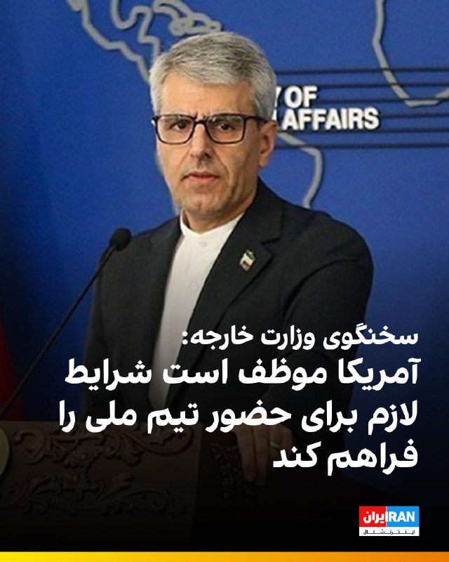

🔻اسماعیل بقایی، سخنگوی وزارت امور خارجه در نشست خبری خود درباره ویزای اعضای تیم ملی فوتبال گفت: «طرف ما فیفاست. سفر تیم فوتبال ایران به آمریکا، هیچ هدف دیگری جز شرکت در مسابقات جام جهانی ندارد. برگزارکننده فیفاست و بر اساس قواعد فیفا عمل می‌شود.»

🔹او گفت: «آمریکا موظف است همه شرایط لازم را برای حضور بدون مشکل تیم ملی فوتبال ایران فراهم کند.»

🔹بقایی درباره تغییر کمپ تیم ملی گفت: «تصمیمی که فدراسیون فوتبال گرفته، در هماهنگی کامل با فیفا، فدراسیون فوتبال مکزیک و با طرف‌های ذی‌ربط آمریکایی بوده، تا مانع ایجاد مشکل برای تیم ملی شوند.»

🔹روز شنبه، مهدی تاج، رییس فدراسیون فوتبال خبر داد که کمپ تیم ملی از آریزونای آمریکا به تیخوانای مکزیک تغییر کرده و به گفته او با این تغییر، مشکل ویزا برطرف می‌شود.

@iranintltvsport

## IranIntlTV — post 338917

  <a href="telegram/content/IranIntlTV_338917_1779713669.mp4" target="_blank">🎬 Download video</a>

🔻قهرمانی آرسنال در لیگ برتر فوتبال انگلستان، هفته گذشته، پس از ۲۲ سال انتظار، قطعی شد و دیشب با پایان فصل سرخ‌پوش‌های لندن چهاردهمین جام قهرمانی‌ را بالای سر بردند. شبی تاریخی که با نام عارف جعفرزاده، از جاویدنامان انقلاب ملی گره خورد.

🔹عارف جعفرزاده، هوادار ۳۲ ساله تیم آرسنال و اهل رشت بود که در اعتراضات دی‌ماه ۱۴۰۴ به دست نیروهای سرکوبگر جان خود را از دست داد.

🔹گزارش آیدین مقیمی، ایران اینترنشنال از آخرین بازی خانگی آرسنال

@iranintltvsport

## IranIntlTV — post 338916

  <a href="telegram/content/IranIntlTV_338916_1779713671.mp4" target="_blank">🎬 Download video</a>

مقام‌های اسرائیلی نسبت به توافق احتمالی میان جمهوری اسلامی و آمریکا ابراز نگرانی کردند و آن را توافقی بد توصیف کردند.

بابک اسحاقی، خبرنگار ایران‌اینترنشنال، گزارش می‌دهد

@iranintltv

## IranIntlTV — post 338915

  <a href="telegram/content/IranIntlTV_338915_1779713673.mp4" target="_blank">🎬 Download video</a>

علیرضا اعوانی، مدیرعامل شرکت گاز استان تهران، در یک برنامه تلویزیونی اعلام کرد تعرفه گاز ۸۲ درصد افزایش یافت. تشدید بحران انرژی و سوخت در ایران و سیاست‌های دولت برای کنترل مصرف، واکنش‌های گسترده‌ای در پی داشته است.

گفت‌وگو با آرش آزرمی، دبیر بخش اقتصادی ایران‌اینترنشنال

@iranintltv

## IranIntlTV — post 338914

  <a href="telegram/content/IranIntlTV_338914_1779713675.mp4" target="_blank">🎬 Download video</a>

یک شهروند با ارسال ویدیویی به ایران‌اینترنشنال می‌گوید راننده تاکسی اینترنتی است و سهمیه بنزین در نظر گرفته‌شده برای او کفاف سه روز کاری‌اش را هم نمی‌دهد: «حالا کارت آزاد جایگاه‌ها را هم حذف کرده‌اند و نمی‌دانیم چه کنیم.»

## IranIntlTV — post 338913

  

رویترز به نقل از یک مقام آگاه گزارش داد محمدباقر قالیباف و عباس عراقچی برای دیدار با نخست‌وزیر قطر، در خصوص توافق احتمالی میان جمهوری اسلامی و آمریکا، وارد دوحه شده‌اند.

پیش‌تر رسانه‌های ایران از سفر عبدالناصر همتی، رییس کل بانک مرکزی به قطر خبر داده بودند.
iranintl.com/202605250172

## IranIntlTV — post 338912

  <a href="telegram/content/IranIntlTV_338912_1779713678.mp4" target="_blank">🎬 Download video</a>

نعیم قاسم، دبیرکل حزب‌الله لبنان، ابراز امیدواری کرد هرگونه توافق احتمالی میان جمهوری اسلامی و ایالات متحده به توقف کامل جنگ در لبنان منجر شود.

گفت‌وگو با می فرحات، خبرنگار ایران‌اینترنشنال

@iranintltv

## IranIntlTV — post 338911

  <a href="telegram/content/IranIntlTV_338911_1779713680.mp4" target="_blank">🎬 Download video</a>

در ادامه کارزار ثبت حقیقت درباره جاویدنامان انقلاب ملی، ایران‌اینترنشنال جزییات تازه‌ای از جان‌باختن رئوف درخشانی‌مهر در جریان اعتراضات دی‌ماه روایت می‌کند.

فرنوش فرجی، عضو تحریریه ایران‌اینترنشنال، گزارش می‌دهد

@iranintltv

## IranIntlTV — post 338910

  <a href="telegram/content/IranIntlTV_338910_1779713682.mp4" target="_blank">🎬 Download video</a>

مروری بر روزنامه‌های ایران، دوشنبه ۴ خرداد، با مجتبی هاشمی، روزنامه‌نگار
@iranintltv

## IranIntlTV — post 338909

  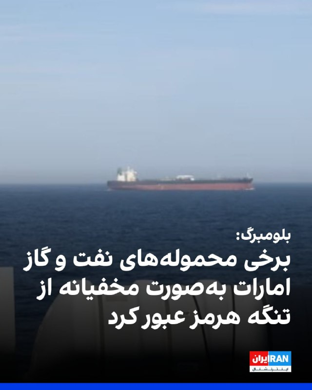

پایگاه خبری بلومبرگ گزارش داد شرکت نفت ابوظبی در هفته‌های اخیر با استفاده از ناوگان خود و به‌کارگیری روش‌های خاص، صادرات نفت و گاز از خلیج فارس را ادامه داده است.

بر اساس این گزارش، برخی نفتکش‌ها با خاموش کردن سامانه‌های ردیابی هنگام عبور از تنگه هرمز موفق شده‌اند محموله‌ها را جابه‌جا کنند. هم‌زمان، قطر نیز به‌صورت نامحسوس صادرات گاز طبیعی مایع (ال‌ان‌جی) را از تنگه هرمز ادامه داده و دست‌کم یک کشتی حامل ال‌ان‌جی پس از عبور از این مسیر راهبردی، در مسیر چین رصد شده است. اگرچه حجم این انتقال‌ها هنوز با سطح تجارت پیش از جنگ فاصله دارد، اما به گفته بلومبرگ، این تحرکات نشان‌دهنده تلاش تولیدکنندگان انرژی منطقه برای حفظ جریان صادرات و ایجاد موازنه میان فشارهای ایران و ایالات متحده است.
iranintl.com/202605253407

## IranIntlTV — post 338908

  

علیرضا سلیمی، عضو هیات رییسه مجلس، گفت آمریکا هیچ‌گاه به دنبال مذاکره واقعی برای پایان دادن به تنش‌ها نبوده و از میز مذاکره فقط به‌عنوان «تله‌گذاری» برای پیشبرد اقدامات «خصمانه» بعدی استفاده می‌کند.

او افزود: «اگر مقام‌های آمریکایی صادق بودند و حسن نیت داشتند، هم‌زمان با سخن گفتن از مذاکره، تحریم‌های جدید علیه جمهوری اسلامی اعمال نمی‌کردند.»
iranintl.com/202605259691

## IranIntlTV — post 338907

  

خبرگزاری فارس، وابسته به سپاه پاسداران، ضمن اعلام خبر سفر عبدالناصر همتی، رییس بانک مرکزی جمهوری اسلامی به قطر، نوشت که این سفر پیرامون بررسی «آزادسازی اموال بلوکه‌شده» و در راستای کمیسیون اقتصادی مذاکرات انجام شده است.

این در حالی است که در روزهای اخیر و در جریان مذاکرات، هیاتی قطری به ایران سفر کرده بود.
https://iranintl.com/202605259276

## IranIntlTV — post 338906

  <a href="telegram/content/IranIntlTV_338906_1779713686.mp4" target="_blank">🎬 Download video</a>

یک شهروند با ارسال پیام به ایران‌اینترنشنال سمی‌گوید: «در کاشان سر هر چهارراه و میدان چادر زده‌اند و به زن‌ها و بچه‌ها تیراندازی و کار با تفنگ یاد می‌دهند. دارند از بچه‌ای که باید از این مسائل دور باشد، سوءاستفاده ابزاری می‌کنند و افکار و روحیاتش را خراب می‌کنند.»

## IranIntlTV — post 338905

  <a href="telegram/content/IranIntlTV_338905_1779713688.mp4" target="_blank">🎬 Download video</a>

سرخط خبرهای دوشنبه ۴ خرداد
@iranintltv

## IranIntlTV — post 338904

  

سایت هرانا خبر داد گلرخ ایرایی، زهرا صفایی، مرضیه فارسی، شیوا اسماعیلی و سکینه پروانه، پنج تن از زندانیان سیاسی محبوس در بند زنان زندان اوین، از یکشنبه به‌صورت تنبیهی از حق استفاده از تلفن زندان محروم شده‌اند.

هرانا نوشت محرومیت تنبیهی این پنج زندانی سیاسی پس از آن اعمال شد که آنان در اعتراض به اجرای احکام اعدام، در محوطه هواخوری زندان شعار داده بودند.

این زندانیان پیش‌تر نیز از حق ملاقات حضوری با خانواده و وکلای خود محروم بوده‌اند و این محدودیت همچنان ادامه دارد.
https://iranintl.com/202605252442

## IranIntlTV — post 338903

  

دونالد ترامپ در شبکه تروث سوشال نوشت: «توافق با ایران یا یک توافق بزرگ و معنادار خواهد بود یا اصلا توافقی در کار نخواهد بود. این دقیقا برعکس فاجعه برجام است که توسط دولت شکست‌خورده اوباما انجام شد؛ توافقی که یک مسیر مستقیم و آشکار برای دستیابی آن‌ها به سلاح هسته‌ای بود. نه، من چنین توافق‌هایی انجام نمی‌دهم.»

او افزود: «من به همه دموکرات‌ها و جمهوری‌خواهانِ اسمی و احمق‌هایی می‌خندم که هیچ چیزی درباره توافق احتمالی که من با ایران در حال انجامش هستم نمی‌دانند؛ موضوعاتی که هنوز حتی درباره‌شان مذاکره هم نشده است.»
iranintl.com/202605255000

## IranIntlTV — post 338902

  <a href="telegram/content/IranIntlTV_338902_1779713692.mp4" target="_blank">🎬 Download video</a>

روزنامه شرق از بلاتکلیفی آموزش و پرورش برای حضوری کردن کلاس‌ها و چالش خانواده‌ها در ثبت‌نام سال تحصیلی جدید گزارش داد. بنا بر این گزارش، معاون وزیر آموزش و پرورش گفت: «تصمیم به حضوری کردن مدارس در اختیار آموزش و پرورش نیست.»

گفت‌وگو با لیلا سعادتی، عضو تحریریه ایران‌اینترنشنال

@iranintltv

## Shin_Persian — post 6217

  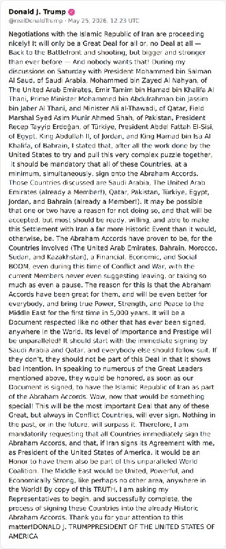

Shin ✓ @hey_itsmyturn Mon, 25 May 2026 12:25:27 UTC President Trump @POTUS: "Negotiations with the Islamic Republic of Iran are proceeding nicely! It will only be a Great Deal for all or, no Deal at all — Back to the Battlefront and shooting, but bigger…

## Shin_Persian — post 6216

Shin ✓ @hey_itsmyturn
Mon, 25 May 2026 12:25:27 UTC

President Trump @POTUS:
"Negotiations with the Islamic Republic of Iran are proceeding nicely! It will only be a Great Deal for all or, no Deal at all — Back to the Battlefront and shooting, but bigger and stronger than ever before — And nobody wants that! During my discussions on Saturday with President Mohammed bin Salman Al Saud, of Saudi Arabia, Mohammed bin Zayed Al Nahyan, of The United Arab Emirates, Emir Tamim bin Hamad bin Khalifa Al Thani, Prime Minister Mohammed bin Abdulrahman bin Jassim bin Jaber Al Thani, and Minister Ali al-Thawadi, of Qatar, Field Marshal Syed Asim Munir Ahmed Shah, of Pakistan, President Recep Tayyip Erdoğan, of Türkiye, President Abdel Fattah El-Sisi, of Egypt, King Abdullah II, of Jordan, and King Hamad bin Isa Al Khalifa, of Bahrain, I stated that, after all the work done by the United States to try and pull this very complex puzzle together,  it should be mandatory that all of these Countries, at a minimum, simultaneously, sign onto the Abraham Accords. Those Countries discussed are Saudi Arabia, The United Arab Emirates (already a Member!), Qatar, Pakistan, Türkiye, Egypt, Jordan, and Bahrain (already a Member!). It may be possible that one or two have a reason for not doing so, and that will be accepted, but most should be ready, willing, and able to make this Settlement with Iran a far more Historic Event than it would, otherwise, be. The Abraham Accords have proven to be, for the Countries involved (The United Arab Emirates, Bahrain, Morocco, Sudan, and Kazakhstan), a Financial, Economic, and Social BOOM, even during this time of Conflict and War, with the current Members never even suggesting leaving, or taking so much as even a pause. The reason for this is that the Abraham Accords have been great for them, and will be even better for everybody, and bring true Power, Strength, and Peace to the Middle East for the first time in 5,000 years. It will be a Document respected like no other that has ever been signed, anywhere in the World. Its level of Importance and Prestige will be unparalleled! It should start with the immediate signing by Saudi Arabia and Qatar, and everybody else should follow suit. If they don’t, they should not be part of this Deal in that it shows bad intention. In speaking to numerous of the Great Leaders mentioned above, they would be honored, as soon as our Document is signed, to have the Islamic Republic of Iran as part of the Abraham Accords. Wow, now that would be something special! This will be the most important Deal that any of these Great, but always in Conflict Countries, will ever sign. Nothing in the past, or in the future, will surpass it. Therefore, I am mandatorily requesting that all Countries immediately sign the Abraham Accords, and that, if Iran signs its Agreement with me, as President of the United States of America, it would be an Honor to have them also be part of this unparalleled World Coalition. The Middle East would be United, Powerful, and Economically Strong, like perhaps no other area, anywhere in the World! By copy of this TRUTH, I am asking my Representatives to begin, and successfully complete, the process of signing these Countries into the already Historic Abraham Accords. Thank you for your attention to this matter!DONALD J. TRUMPPRESIDENT OF THE UNITED STATES OF AMERICA"

ترجمه فارسی در بخش نظرات

𝕏 · @shin_persian

## Shin_Persian — post 6215

Shin ✓ @hey_itsmyturn
Mon, 25 May 2026 12:23:07 UTC

State-owned Mehr reports that Regime’s parliament spokesman, Mohammad Bagher Ghalibaf, as well as FM Araghchi and Head of the Central Bank Hemmati have traveled to Qatar to discuss the ceasefire talks and sanction relief
#Iran

فارسی

خبرگزاری دولتی مهر گزارش می‌دهد که محمدباقر قالیباف سخنگوی مجلس رژیم، به همراه عراقچی وزیر امور خارجه و همتی رئیس بانک مرکزی برای گفتگو درباره مذاکرات آتش‌بس و رفع تحریم‌ها به قطر سفر کرده‌اند.
#Iran

𝕏 · @shin_persian

## Shin_Persian — post 6214

  

Shin ✓ @hey_itsmyturn Mon, 25 May 2026 10:15:32 UTC President Trump @POTUS: "I laugh at all of the Dumocrats, RINOS, and Fools who know nothing about the potential deal I am making with Iran, things that haven’t even been negotiated yet, weak and ineffective…

## Shin_Persian — post 6213

Shin ✓ @hey_itsmyturn
Mon, 25 May 2026 10:15:32 UTC

President Trump @POTUS:
"I laugh at all of the Dumocrats, RINOS, and Fools who know nothing about the potential deal I am making with Iran, things that haven’t even been negotiated yet, weak and ineffective people like failed Senator Thom Tillis (Soon out of office!), Bill Cassidy, who just suffered a massive Primary loss, really bad Congressman Thomas Massie, a major sleazebag who lost in a landslide to a great American Patriot (Endorsed by “TRUMP”) after showing tremendous disloyalty to his Party (and Country!), and almost all Dumocrats, people that have totally lost their way, constantly supporting bad policy and even worse candidates, but are constantly critical of each and every fantastic win I have. These people should go home and rest, they do nothing but create division and loss. In other words, they are losers! The deal with Iran will either be a great and meaningful one, or there will be no deal. It will be the exact opposite of the JCPOA disaster negotiated by the failed Obama Administration, which was a direct and open path to a Nuclear Weapon for Iran. No, I don’t do deals like that! President DJT"

فارسی

رئیس‌جمهور ترامپ @POTUS:
«من به تمام دموکرات‌های نادان (Dumocrats)، راینوها (RINOs - جمهوری‌خواهان اسمی) و احمق‌هایی که هیچ‌چیز درباره توافق احتمالی من با ایران نمی‌دانند می‌خندم؛ مواردی که هنوز حتی درباره آن‌ها مذاکره هم نشده است. افراد ضعیف و بی‌کفایتی مانند سناتور شکست‌خورده تام تیلیس (که به‌زودی از سمتش برکنار می‌شود!)، بیل کسیدی که همین اواخر شکست سنگینی در انتخابات مقدماتی متحمل شد، کنگره‌منِ واقعاً بد توماس مسی، یک رذل تمام‌عیار که پس از نشان دادن بی‌لیاقتی و بی‌وفایی عظیم به حزب (و کشورش!) با شکستی فاحش در برابر یک میهن‌پرست بزرگ آمریکایی (مورد حمایت "ترامپ") شکست خورد، و تقریباً تمام دموکرات‌های نادان؛ افرادی که کاملاً راهشان را گم کرده‌اند، مدام از سیاست‌های بد و نامزدهای حتی بدتر حمایت می‌کنند، اما به‌طور مداوم از تک‌تک پیروزی‌های شگفت‌انگیز من انتقاد می‌کنند. این افراد باید به خانه بروند و استراحت کنند، آن‌ها کاری جز ایجاد تفرقه و شکست انجام نمی‎دهند. به عبارت دیگر، آن‌ها بازنده هستند! توافق با ایران یا توافقی بزرگ و معنادار خواهد بود یا اصلاً توافقی در کار نخواهد بود. این دقیقاً برعکس فاجعه برجام (JCPOA) خواهد بود که توسط دولت شکست‌خورده اوباما مذاکره شد؛ توافقی که مسیری مستقیم و باز برای رسیدن ایران به سلاح هسته‌ای بود. خیر، من چنین توافق‌هایی نمی‌کنم! پرزیدنت دی‌جی‌تی»

𝕏 · @shin_persian

## ManotoTV — post 105828

  <a href="telegram/content/ManotoTV_105828_1779713696.mp4" target="_blank">🎬 Download video</a>

تماسی از هلند:
«می‌گفت هر روز با برنامه‌های منوتو زندگی می‌کردیم…
و حالا نمی‌دانیم بعد از آن باید چه کنیم.»
او همچنین از جاویدنام سینا حق‌شناس یاد کرد؛ دوستی که خبر جان‌باختنش زندگی او را زیر و رو کرده بو

## ManotoTV — post 105827

  <a href="telegram/content/ManotoTV_105827_1779713699.mp4" target="_blank">🎬 Download video</a>

گفت‌وگو درباره اعتراضات خارج از کشور:
« چه رفتارهایی به همبستگی و رساندن پیام مردم ایران کمک می‌کند؟»

## ManotoTV — post 105826

  <a href="telegram/content/ManotoTV_105826_1779713701.mp4" target="_blank">🎬 Download video</a>

تماسی از اتریش:
«می‌گفت سختی‌ها خیلی‌ها را عوض کرد…
و از کیوان عباسی به‌خاطر حفظ همان نگاه و مسیر همیشگی‌اش قدردانی کرد.»

## FarsiVOA — post 218609

رسانه‌های محلی گزارش دادند یک زن پاراگلایدرسوار در آسمان اتریش با یک هواپیمای سسنا ۱۷۲ برخورد کرد.

او پس از فعال کردن چتر نجات اضطراری، سالم فرود آمد و خلبان هواپیما نیز توانست هواپیما را با موفقیت فرود بیاورد.

@FarsiVOA

## FarsiVOA — post 218608

🔺ترامپ: توافق با تهران یا «بزرگ و معنادار» خواهد بود یا اصلاً در کار نخواهد بود

◾️دونالد ترامپ با دفاع از روند مذاکرات کنونی با جمهوری اسلامی، اعلام کرد که واشنگتن یا به یک «توافق بزرگ و معنادار» دست خواهد یافت یا هیچ توافقی انجام نخواهد شد.

◾️او در پیامی در شبکه تروت‌سوشال تصریح کرد که «این توافق دقیقاً نقطه مقابل فاجعه برجام خواهد بود که توسط دولت شکست‌خورده اوباما مذاکره شد؛ توافقی که یک مسیر مستقیم و آشکار به سوی دستیابی ایران به سلاح هسته‌ای بود.»

◾️ساعاتی قبل، وزیر خارجه آمریکا، اعلام کرد که واشنگتن با تهران به یک توافق خوب خواهد رسید یا به «شیوه‌ای دیگر» با جمهوری اسلامی برخورد خواهد کرد، زیرا هیچ کس به اندازه دونالد ترامپ نسبت به تهدید هسته‌ای حکومت ایران جدی نبوده است.

⬇️ بیشتر بخوانید:
https://ir.voanews.com/a/deal-with-iran-will-be-great-and-meaningful-or-there-will-be-no-deal-trump-says/8153584.html

## FarsiVOA — post 218607

🔺مصوبه «اتصال اینترنت بین‌الملل» برای اجرا «در انتظار تأیید پزشکیان» است

◾️منابع داخلی ایران از تصویب مصوبه‌ای تازه درباره اتصال اینترنت بین‌الملل خبر داده‌اند؛ مصوبه‌ای که هنوز اجرا نشده و اجرای آن به تأیید نهایی مسعود پزشکیان و ابلاغ به وزارت ارتباطات و فناوری اطلاعات منوط است.

◾️جزئیات دقیق مصوبه، سطح اتصال، زمان اجرا و اینکه آیا این تصمیم شامل بازگشت عمومی اینترنت بین‌الملل می‌شود یا فقط بخشی از محدودیت‌ها را کاهش می‌دهد، هنوز اعلام نشده است.

◾️ستاد ویژه ساماندهی فضای مجازی، به تازگی به حکم پزشکیان به معاون اولش عارف تشکیل شده و نخستین تصمیم مهم این ستاد در شرایطی اعلام می‌شود که هم‌زمان گزارش‌هایی درباره کم‌تحرکی شورای عالی فضای مجازی منتشر شده است.

⬇️ بیشتر بخوانید:
https://ir.voanews.com/a/8153583.html

## FarsiVOA — post 218606

🔺سفر همتی به قطر در سایه پرونده پول‌های بلوکه‌شده

◾️خبرگزاری ایلنا از سفر عبدالناصر همتی، رئیس کل بانک مرکزی جمهوری اسلامی، به قطر خبر داد و نوشت یکی از دلایل سفر همتی به قطر پیگیری آزادسازی منابع ارزی ایران است.

◾️قطر از سال ۲۰۲۳ به یکی از گره‌های اصلی پرونده مالی ایران و آمریکا تبدیل شد؛ زمانی که حدود شش میلیارد دلار از پول‌های ایران که در کره جنوبی مسدود بود، به حساب‌هایی در قطر منتقل شد.

◾️اخیراً و در جریان مذاکرات تهران و واشنگتن، موضوع دارایی‌های مسدودشده جمهوری اسلامی بار دیگر مطرح شد.

◾️قطر هم محل نگهداری بخشی از منابع مسدودشده ایران است، هم کانال میانجی‌گری با آمریکا، هم طرف گفت‌وگو با واشنگتن درباره امنیت تنگه هرمز.

⬇️ بیشتر بخوانید:
https://ir.voanews.com/a/8153581.html

## FarsiVOA — post 218605

  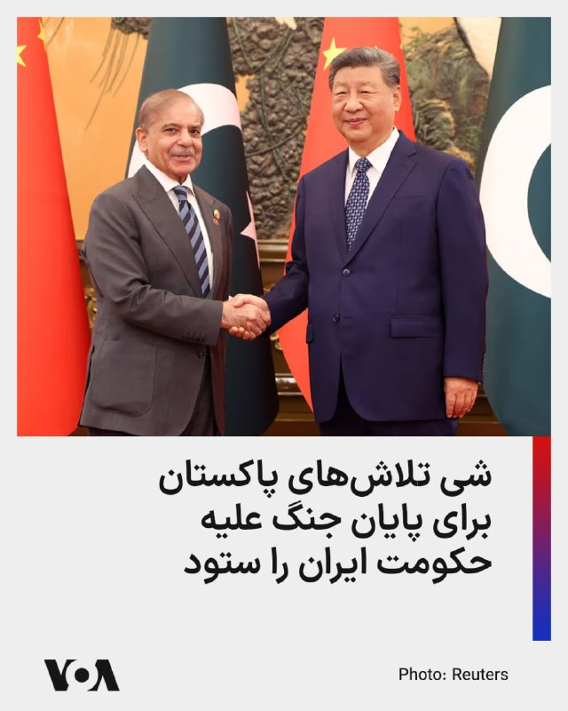

شی جین‌پینگ، رئیس‌جمهوری چین، در دیدار با شهباز شریف، نخست‌وزیر پاکستان در پکن، از دوستی «ناگسستنی» میان پکن و اسلام‌آباد و همچنین تلاش‌های پاکستان برای پایان جنگ علیه حکومت ایران تمجید کرد.

در این دیدار که روز دوشنبه برگزار شد، عاصم منیر، فرمانده ارتش پاکستان، نیز شریف را همراهی می‌کرد. منیر به‌تازگی برای دستیابی به یک توافق میان تهران و واشنگتن به ایران سفر کرد.

شی روز دوشنبه هنگام استقبال از هیئت پاکستانی گفت: «می‌دانم که شما تازه از ایران بازگشته‌اید و برای صلح کنونی تلاش‌های مثبتی انجام داده‌اید. ما همچنان نقش سازنده‌ای را که پاکستان ایفا کرده است، ارج می‌نهیم.»

خبرگزاری رویترز نوشت که برای پاکستان، درگیر کردن چین در تلاش‌های میانجی‌گرانه‌اش اهمیت زیادی دارد، زیرا پکن و تهران روابط نزدیکی با یکدیگر دارند.

چین و پاکستان در ماه مارس، هم‌زمان با دیدار وزیران خارجه دو کشور در پکن، ابتکار مشترک پنج‌ماده‌ای صادر کردند که در آن خواستار مذاکرات صلح و بازگشت عبور و مرور عادی دریایی در تنگه هرمز شدند؛ آبراهی حیاتی که معمولاً حدود یک‌پنجم نفت و گاز طبیعی مایع جهان از آن عبور می‌کند.
@FarsiVOA

## FarsiVOA — post 218604

  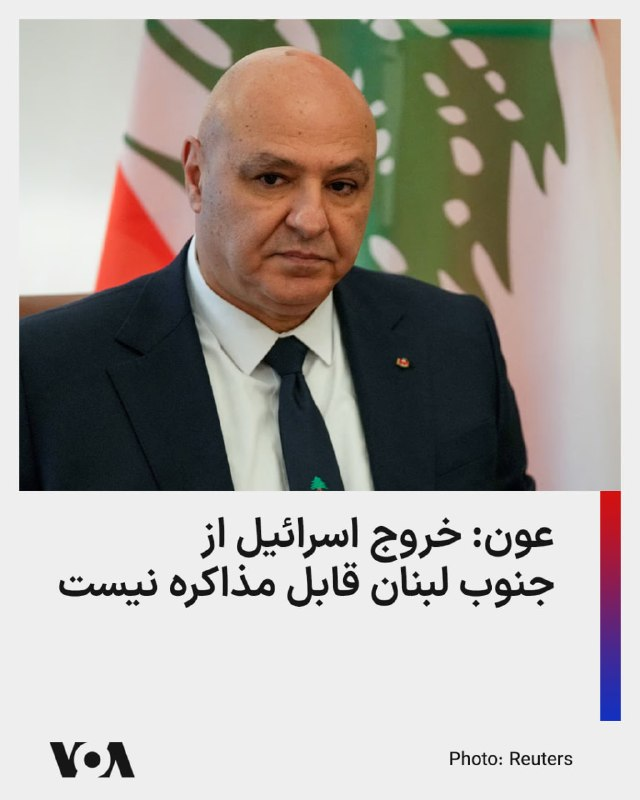

جوزف عون، رئیس‌جمهوری لبنان، در آستانه دور تازه گفت‌وگوهای مورد حمایت آمریکا با اسرائیل، خروج نیروهای اسرائیلی از جنوب لبنان را مطالبه‌ای «غیرقابل مذاکره» خواند و گفت دولت لبنان این هدف را از مسیر مذاکره دنبال می‌کند.

او گفت روستاهای جنوبی لبنان همچنان زیر فشار حملات و «اشغال تازه» قرار دارند و بیروت این وضعیت را نمی‌پذیرد. مقام‌های اسرائیلی در مقابل می‌گویند تا زمانی که تهدید حزب‌الله رفع نشود، نیروهای اسرائیلی در جنوب لبنان باقی خواهند ماند.

زمینه این موضع، روند تازه‌ای است که با میانجی‌گری دولت دونالد ترامپ آغاز شد. واشنگتن ماه گذشته آتش‌بسی ۱۰روزه میان لبنان و اسرائیل اعلام کرد و ترامپ هم‌زمان از جوزف عون و بنیامین نتانیاهو برای گفت‌وگو در کاخ سفید دعوت کرد.

دورهای قبلی گفت‌وگو در واشنگتن به تمدید آتش‌بس انجامید. بر اساس گزارش رویترز، گفت‌وگوهای ۱۴ و ۱۵ مه با میانجی‌گری آمریکا به تمدید ۴۵روزه آتش‌بس منجر شد و وزارت خارجه آمریکا آن را «سازنده» توصیف کرد.

قرار است پیش از دور سیاسی بعدی در اوایل ژوئن، هیئت‌های نظامی دو طرف روز ۲۹ مه در پنتاگون گفت‌وگو کنند.
@FarsiVOA

## FarsiVOA — post 218603

  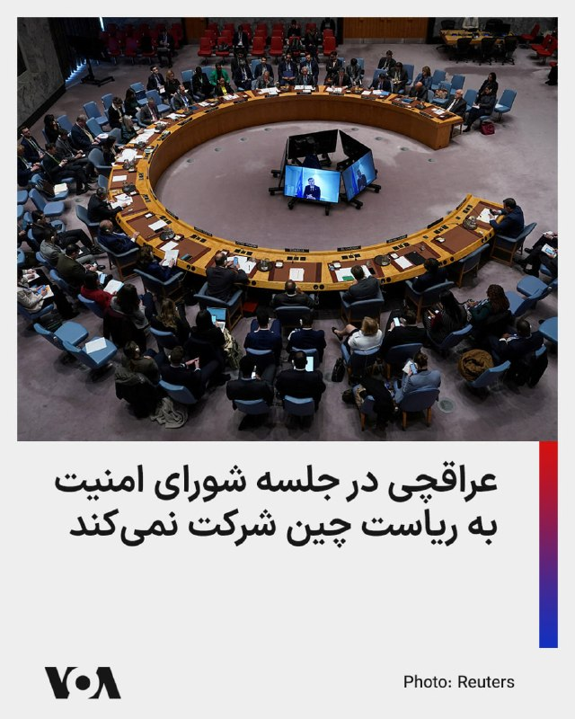

سخنگوی وزارت امور خارجه جمهوری اسلامی از عدم سفر عباس عراقچی، وزیر خارجه، به نیویورک خبر داد و گفت که او در جلسه شورای امنیت سازمان ملل شرکت نمی‌کند.

نشست علنی شورای امنیت سازمان ملل رو ز پنچم خرداد، با حضور وزیران خارجه کشورهای عضو در نیویورک برگزار می‌شود و چین ریاست دوره‌ای این نشست را بر عهده دارد.

پیشتر اسماعیل بقایی، گفته بود که با توجه به ریاست دوره‌ای چین و برنامه این کشور برای برگزاری نشست ویژه وزرای خارجه درباره مباحث مرتبط با صلح و امنیت بین‌المللی، از عباس عراقچی نیز برای حضور در این نشست دعوت شده است.

بقایی در ۳۰ اردیبهشت به صدا و سیمای جمهوری اسلامی گفته بود که مقدمات این سفر در حال انجام است.

اما او در نشست خبری روز چهارم خرداد اعلام کرد که «با توجه به مجموع شرایط»، سفر عراقچی به نیویورک انجام نخواهد شد.
@FarsiVOA

## FarsiVOA — post 218602

🔺حصر دیجیتال ۸۷روزه شد؛ هشدار درباره پنهان‌ماندن اعدام‌ها و ضربه به درآمدهای مالیاتی

◾️نت‌بلاکس، نهاد ناظر بر اختلالات اینترنتی، اعلام کرد محدودیت گسترده اینترنت در ایران وارد هشتادوهفتمین روز پیاپی شده و بیش از دو هزار و ۶۴ ساعت ادامه یافته است.

◾️به گفته این نهاد، وضعیت کنونی شفافیت درباره اعدام‌ها را از میان برده و بلاتکلیفی روزانه زندانیان، مخالفان، منتقدان و بازداشت‌شدگان را تشدید کرده است.

◾️این هشدار در شرایطی مطرح می‌شود که عفو بین‌الملل در گزارشی به تاریخ ۳۱ اردیبهشت ۱۴۰۵ اعلام کرد از زمان آغاز حملات آمریکا و اسرائیل به ایران در ۲۸ فوریه، مقام‌های جمهوری اسلامی دست‌کم ۳۶ نفر را پس از محکومیت در پرونده‌های سیاسی و در پی «محاکمه‌های به‌شدت ناعادلانه» اعدام کرده‌اند.

⬇️ بیشتر بخوانید:
https://ir.voanews.com/a/8153580.html

## FarsiVOA — post 218601

🔺مقام وزارت خارجه جمهوری اسلامی: درباره اورانیوم با غلطت بالا بعد از تفاهم اولیه مذاکره می‌کنیم

◾️یک دیپلمات ارشد جمهوری اسلامی اعلام کرد که در صورت دستیابی به توافق میان تهران و واشنگتن، «موضوع هسته‌ای و غنی‌سازی و ذخایر اورانیوم غنی‌شده با خلوص بالا» در فرصت نهایتاً ۶۰ روزه این توافق بررسی خواهد شد.

◾️پیشتر دونالد ترامپ گفته بود واشنگتن قصد دارد اورانیوم غنی‌شده جمهوری اسلامی را از کنترل تهران خارج کند.

◾️رسانه‌های ایران ادعا کردند مجتبی خامنه‌ای با خارج کردن این مواد هسته‌ای از ایران مخالفت کرده است.

◾️با وجود این، مقام آمریکایی گفت مجتبی خامنه‌ای «چارچوب کلی» توافق را «تأیید کرده» و مسئله فقط این است که چگونه این موضوع را به «تندروها و مردم بفروشند» که معنای تسلیم در برابر خواست آمریکا را ندهد.

⬇️ بیشتر بخوانید:
https://ir.voanews.com/a/8153579.html

## FarsiVOA — post 218600

  

سخنگوی وزارت امور خارجه جمهوری اسلامی گفت امنیت تنگه هرمز «دغدغه کل دنیاست»، اما مدیریت و تدوین سازوکار تردد ایمن در این آبراه بر عهده ایران و عمان است.

اسماعیل بقایی گفت تهران و مسقط در حال تدوین پروتکلی برای اطمینان از عبور ایمن کشتی‌ها هستند و این اقدام را «مسئولانه» و مطابق حقوق بین‌الملل دانست. او با رد تعبیر «عوارض» گفت ایران در پی دریافت عوارض نیست، اما خدماتی مانند ناوبری و حفاظت از محیط زیست تنگه هرمز، خلیج فارس و دریای عمان می‌تواند مستلزم دریافت هزینه باشد.

این موضع در حالی مطرح می‌شود که واشنگتن بارها با هرگونه دریافت «عوارض» یا کنترل یک‌جانبه بر تنگه هرمز مخالفت کرده است. کاخ سفید اعلام کرده بود دونالد ترامپ و شی جین‌پینگ، رئیس جمهوری چین، بر بازگشایی تنگه هرمز و مخالفت با دریافت عوارض از سوی هر کشور یا سازمانی توافق کرده‌اند.

رویترز نیز گزارش داده مارکو روبیو، وزیر خارجه آمریکا، گفته طرحی «نسبتاً محکم» درباره بازگشایی تنگه هرمز روی میز است، اما اگر مذاکرات با ایران شکست بخورد، واشنگتن «راه دیگری» را دنبال خواهد کرد.
@FarsiVOA

## FarsiVOA — post 218599

  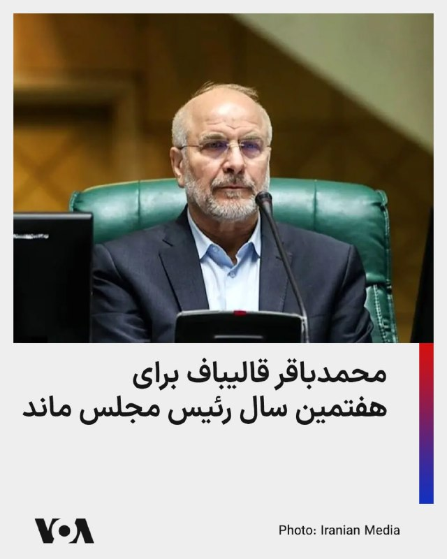

رسانه‌های داخلی از برگزاری جلسه حضوری مجلس شورای اسلامی پس از ۹۷ روز تعطیلی خبر داده و اعلام کردند که محمدباقر قالیباف، برای هفتمین سال به عنوان رئيس مجلس شورای اسلامی انتخاب شد.

آخرین جلسه حضوری مجلس در ۲۸ بهمن ۱۴۰۴، تقریباً دو هفته پیش از درگیری نظامی، برگزار شده بود و جلسه روز چهارم خرداد، به صورت حضوری و با هدف برگزاری انتخابات هیات رئیسه تشکیل شده است.

قالیباف برای نشستن دوباره بر صندلی ریاست مجلس، رقیب جدی نداشت و باید با محمدتقی نقدعلی، نماینده خمینی‌شهر و عثمان سالاری، نماینده تربت‌جام رقابت می‌کرد.

با اوج‌گیری تنش‌های نظامی در منطقه، قالیباف همزمان به عنوان رئيس هیئت‌ مذاکره کننده جمهوری اسلامی با آمریکا و همچنین نماینده ویژه جمهوری اسلامی در امور چین نیز فعالیت می‌کند.
@FarsiVOA

## FarsiVOA — post 218598

  

ارتش اسرائیل به ساکنان ۱۰ منطقه شامل شهر و روستا در جنوب لبنان هشدار داد که پیش از حملات هوایی علیه مواضع گروه حزب‌الله لبنان، این مناطق را تخلیه کنند.

ارتش اسرائیل صبح دوشنبه با انتشار بیانیه‌ای اسامی این مناطق را اعلام کرد و گفت که به ساکنان دستور داده شده است دست‌کم یک کیلومتر از محل سکونت خود فاصله بگیرند.

سرهنگ آویخای ادرعی، سخنگوی ارتش، هشدار داده است: «در پی نقض توافق آتش‌بس توسط سازمان تروریستی حزب‌الله، ارتش ناچار است با قدرت علیه آن اقدام کند و قصد آسیب رساندن به شما را ندارد.»

او افزود: «هر کسی که در نزدیکی عناصر حزب‌الله و تأسیسات و ابزارهای نظامی آن‌ها باشد، جان خود را در معرض خطر قرار می‌دهد.»

مارکو روبیو، وزیر خارجه آمریکا روز دوشنبه در جریان سفر به هند گفت: «اسرائیل همیشه حق دارد از خود دفاع کند. هر کشوری در جهان چنین حقی دارد. بنابراین اگر حزب‌الله قرار است به سوی آن‌ها موشک شلیک کند یا موشک شلیک می‌کند، اسرائیل کاملاً حق دارد به آن پاسخ دهد یا از وقوع آن جلوگیری کند.»
@FarsiVOA

## FarsiVOA — post 218597

  

تلویزیون پاکستان گزارش داد که عاصم منیر، فرمانده ارتش پاکستان و میانجی اصلی مذاکرات جمهوری اسلامی و آمریکا، در جریان سفر رسمی شهباز شریف به چین، در پکن کنار نخست‌وزیر پاکستان حاضر شده و در گفت‌وگو با مقام‌های چینی شرکت کرده است.

شهباز شریف سفر رسمی چهارروزه خود به چین را روز شنبه از هانگژو آغاز کرده بود، اما تصاویر پخش‌شده از تلویزیون دولتی پاکستان نشان می‌دهد که عاصم منیر نیز در پکن در کنار او با رهبران چین دیدار کرده است.

بر اساس این گزارش، شریف در حضور عاصم منیر به مقام‌های چینی گفت پاکستان برای میانجی‌گری میان جمهوری اسلامی و آمریکا «نقشی صادقانه» ایفا کرده و از حمایت چین برای پیشبرد صلح قدردانی کرد.

عاصم منیر روزهای جمعه و شنبه در تهران بود و این سفر بخشی از تلاش‌های میانجی‌گرانه پاکستان برای پایان رسمی جنگ ایران عنوان شده است. حضور او در پکن، بلافاصله پس از رایزنی‌های تهران، نشان می‌دهد اسلام‌آباد تلاش دارد میانجی‌گری خود میان تهران و واشنگتن را با هماهنگی نزدیک‌تر با چین پیش ببرد.
@FarsiVOA

## FarsiVOA — post 218596

  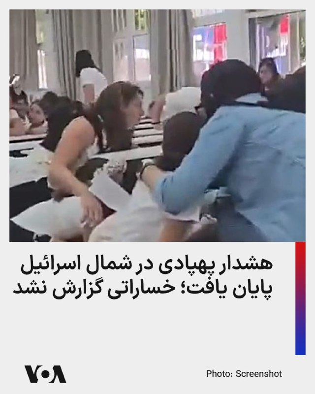

ارتش اسرائیل اعلام کرد هشدار مربوط به احتمال نفوذ پهپاد در منطقه عرب العرامشه در شمال اسرائیل پایان یافته و دیگر تهدید فوری شناسایی نمی‌شود.

به گزارش تایمز اسرائیل، آژیرها دقایقی پیش در این منطقه به صدا درآمده بود. ارتش اسرائیل می‌گوید یک «هدف هوایی مشکوک» شناسایی شد، اما بعداً تماس سامانه‌های رصد با آن از دست رفت؛ موضوعی که می‌تواند به خروج پهپاد از منطقه تحت پایش یا سقوط آن مربوط باشد.

براساس اعلام ارتش اسرائیل، این رویداد بدون گزارش زخمی پایان یافته است.
@FarsiVOA

## FarsiVOA — post 218595

🔺اکسیوس: ترامپ خواستار پیوستن کشورهای عرب به توافق ابراهیم پس از پایان جنگ شد

◾️اکسیوس گزارش داد دونالد ترامپ از رهبران چند کشور عربی خواسته است اگر توافقی برای پایان جنگ با جمهوری اسلامی حاصل شود، به روند توافق ابراهیم بپیوندند و روابط خود را با اسرائیل عادی کنند.

◾️بر اساس این گزارش، تماس ترامپ با رهبران عربستان، امارات، قطر، پاکستان، ترکیه، مصر، اردن و بحرین انجام شد و محور اصلی آن توافق در حال شکل‌گیری با جمهوری اسلامی بود.

◾️یک مقام آمریکایی به اکسیوس گفته است که رهبران حاضر در تماس روز شنبه اعلام کرده‌اند در صورت موفقیت یا شکست توافق، در کنار واشنگتن خواهند بود.

⬇️ بیشتر بخوانید:
https://ir.voanews.com/a/8153577.html

## FarsiVOA — post 218594

  

بلومبرگ گزارش داد یک خریدار کشتی‌های فرسوده گفته وزارت خزانه‌داری آمریکا اجازه داده چهار شناور تحریمی مرتبط با حمل محموله‌های ایران برای اوراق خریداری شوند.

بر اساس گزارش‌ها، شرکت جی‌ام‌اس مستقر در دبی، مجوز خرید چهار کشتی یوگی، تیمون، رانتانپلن و بیگلی را دریافت کرده است؛ شناورهایی که به شبکه کشتیرانی مرتبط با محمدحسین شمخانی نسبت داده شده‌اند. این شبکه از سوی آمریکا به انتقال نفت و کالاهای مرتبط با ایران متهم شده است.

این تصمیم در حالی گرفته شده که وزارت خزانه‌داری آمریکا اخیراً در چارچوب فشار حداکثری تازه، ۱۹ کشتی و بیش از ۵۰ فرد و شرکت مرتبط با تجارت نفت و پتروشیمی ایران را تحریم کرده بود.

مالکان ناشناس این کشتی‌ها می‌توانند از ارزش آهن‌قراضه آنها میلیون‌ها دلار دریافت کنند و واشنگتن می‌گوید خروج کنترل‌شده کشتی‌های فرسوده از «ناوگان سایه» می‌تواند ریسک‌های ایمنی و زیست‌محیطی را کاهش دهد.
@FarsiVOA

## FarsiVOA — post 218593

  

قیمت طلا روز دوشنبه همزمان با افت دلار و کاهش شدید بهای نفت افزایش یافت؛ نشانه‌ای از بازاری که هنوز میان امید به توافق آمریکا و جمهوری اسلامی و تردید درباره پایداری آن در نوسان است.

رویترز گزارش داد بهای هر اونس طلا بیش از یک درصد بالا رفت و به حدود ۴ هزار و ۵۵۹ دلار رسید. تضعیف دلار، خرید طلا را برای دارندگان ارزهای دیگر ارزان‌تر کرد و افت نفت نیز بخشی از نگرانی‌های تورمی را کاهش داد.

همزمان، نفت برنت حدود ۶ درصد سقوط کرد و به محدوده ۹۸ دلار رسید؛ نفت خام آمریکا نیز به حدود ۹۱ دلار کاهش یافت. علت اصلی افت نفت، امید بازار به پیشرفت در توافقی است که می‌تواند مسیر تنگه هرمز و صادرات انرژی خلیج فارس را تا حدی باز کند.

با این حال، رشد طلا نشان می‌دهد سرمایه‌گذاران هنوز پایان بحران را قطعی نمی‌دانند.
@FarsiVOA

## FarsiVOA — post 218592

🔺مقام ارشد آمریکا: ایران پشت‌پرده برای واگذاری اورانیوم غنی‌شده، تعهد داده است

◾️یک مقام ارشد دولت ترامپ اعلام کرد رژیم ایران «پشت‌پرده» تعهداتی در زمینه واگذاری اورانیوم غنی‌شده داده و جمهوری اسلامی بدون اجرای این تعهدات، دستاورد چندانی از مذاکرات نخواهد داشت.

◾️به گزارش نیویورک‌پست، این مقام آمریکایی که با خبرنگاران صحبت می‌کرد، درباره روند مذاکرات برای دستیابی به یک توافق احتمالی با تهران گفت: «۹۵ درصد کار انجام شده، اما در سیستم آن‌ها حتی تغییر واژه‌ها هم مستلزم چند روز بررسی و مشورت است.»

◾️این منبع ارشد دست‌کم دو بار برای خبرنگاران توضیح داد که توافق قریب‌الوقوع نیست و قرار نیست انتقال پول نقد شبیه انتقال پول نقد به ایران در سال ۲۰۱۶ در دوران باراک اوباما رخ دهد.

⬇️ بیشتر بخوانید:
https://ir.voanews.com/a/8153576.html

## FarsiVOA — post 218591

  

ارتش اسرائیل اعلام کرد نیروهای این کشور در جریان عملیاتی در جنوب، لؤی هشام محمود بصل، عضو سازمان تروریستی حماس را که در حمله به پایگاه زیکیم در جریان کشتار هفتم اکتبر نقش داشت، از پا درآوردند.

بر اساس اعلام ارتش اسرائیل، بصل به‌عنوان تک‌تیرانداز در گردان زیتون حماس فعالیت می‌کرد و در روزهای اخیر نیز برای اجرای حملات تروریستی علیه نیروهای اسرائیلی در منطقه برنامه‌ریزی می‌کرد.

ارتش اسرائیل گفته است این عملیات برای رفع یک تهدید فوری انجام شده و نیروهای این کشور در چارچوب توافق موجود در منطقه مستقر هستند و به مقابله با هرگونه تهدید فوری ادامه خواهند داد.
@FarsiVOA

## FarsiVOA — post 218590

  

بر اساس آمار شرکت مدیریت منابع آب ایران، ‌هم‌اکنون میزان پرشدگی پنج صد مهم کشور از جمله «سدهای لار، دوستی، پانزدهم خرداد، بارزو و ساوه» کمتر از ۱۰ درصد است.

خبرگزاری ایسنا با تحلیل این آمار، اعلام کرد که علیرغم افزایش موجودی مخازن سدهای غربی، استان‌های تهران، مرکزی، خراسان رضوی، قم، اصفهان، زنجان و همدان در وضعیت نامطلوبی قرار دارند.

بر این اساس تامین آب شرب در شهرهای تهران، کرج، مشهد، اراک، قم، اصفهان، یزد، زنجان و همدان، با محدودیت مواجه است.

پیشتر علیرضا شریعت، دبیرکل فدراسیون صنعت آب ایران، هشدار داده بود که در صورت عدم کاهش مصرف، با بحران مهاجرت اجباری ۱۵ میلیون نفر در فلات مرکزی ایران مواجه خواهیم شد.

فلات مرکزی ایران شامل هفت استان کرمان، فارس، اصفهان، یزد، مرکزی، قم و سمنان می‌شود.
@FarsiVOA

## DW_Farsi — post 125130

🔶 میلیون‌ها زائر مسلمان به رغم جنگ ایران راهی مکه شده‌اند

روز دوشنبه ۲۵ مه (۴ خرداد) مناسک حج برای بسیاری از مسلمانان سراسر جهان آغاز می‌شود.

جنگ ایران امنیت کشورهای حوزه خلیج فارس را به خطر افکنده و به همین دلیل پیش‌‌تر هشدارهایی در زمینه مراسم حج صادر شده بود. اما به رغم این تهدیدات، برخی مسلمانان جهان امسال نیز از سفر زیارتی به مکه چشم‌پوشی نکرده‌اند.

طبق اعلام مقامات عربستان سعودی، تا پایان هفته‌ای که گذشت بیش از یک‌ونیم میلیون نفر برای شرکت در حج وارد این شهر شده‌اند که این شمار نشان‌گر افزایش تعداد زائران بین‌المللی حج نسبت به سال گذشته است.

@dw_farsi

## DW_Farsi — post 125129

🔸 عقب‌نشینی اردوغان از تعطیلی یک دانشگاه لیبرال در استانبول

پس از اعتراض صدها دانشجو، رجب طیب اردوغان، رئیس جمهور ترکیه، دستور جنجالی خود درباره تعطیلی دانشگاه خصوصی "بیلگی" استانبول را لغو کرد. فرمان مربوط به این تصمیم روز یکشنبه ۲۴ مه (سوم خرداد) در روزنامه رسمی ترکیه منتشر شد.
این فرمان تصمیمی را لغو کرده است که اردوغان از روز جمعه گذشته اجرایی کرده بود؛ تصمیمی که بر اساس آن بایستی این دانشگاه معتبر با گرایش‌های لیبرال تعطیل می‌شد. رسانه‌های ترکیه از جمله روزنامه "ترکیه" درباره این تحول جدید گزارش داده‌اند.
رئیس جمهور ترکیه تصمیم اولیه خود را با "ناکافی" خواندن سطح آموزشی این مؤسسه توجیه کرده بود. تعطیلی موقت این دانشگاه تنها یک ماه پیش از برگزاری امتحانات نهایی برنامه‌ریزی‌شده برای ماه ژوئن صورت گرفته بود.

نزدیک به هزار دانشجو و شماری از استادان، روز یکشنبه در محوطه دانشگاه علیه لغو مجوز فعالیت آن دست به اعتراض زده بودند.

در جریان این اعتراضات، ده‌ها دانشجو ساختمان دانشگاه بیلگی را اشغال کردند، اما توسط مأموران پلیس از ساختمان بیرون برده شدند.

به گفته یکی از شرکت‌کنندگان در این حرکت اعتراضی، نیروهای پلیس دست و پای دانشجویان را گرفته و از ساختمان بیرون انداختند. در جریان این برخوردها، بینی یکی از دانشجویان نیز شکست.

در دانشگاه خصوصی بیلگی که در سال ۱۹۹۶ تأسیس شده است، بیش از ۲۰ هزار دانشجوی ترک و خارجی تحصیل می‌کنند. این مرکز آموزشی در برنامه تبادل دانشجوی "اراسموس" اتحادیه اروپا نیز مشارکت دارد.

📌 برای دسترسی کامل به گزارش به وبسایت دویچه‌وله فارسی مراجعه کنید.
@dw_farsi

## DW_Farsi — post 125128

  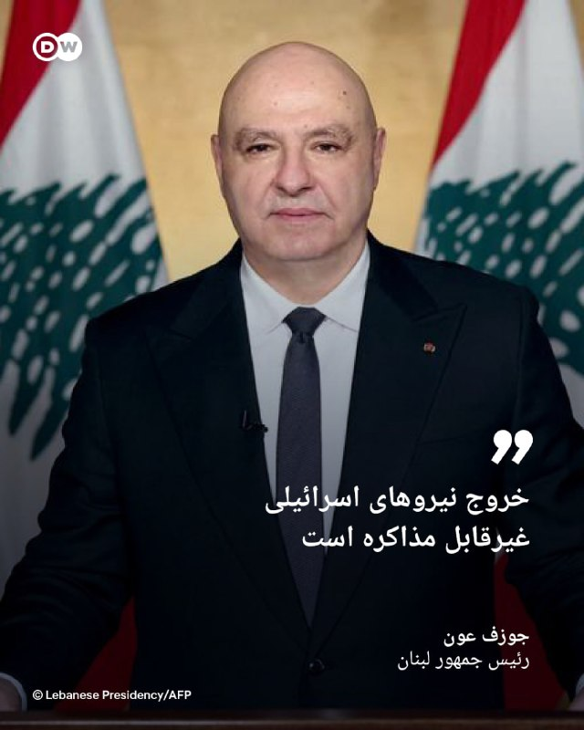

🔸 رئیس جمهور لبنان: خروج نیروهای اسرائیلی غیرقابل مذاکره است

جوزف عون، رئیس جمهور لبنان، می‌گوید عقب‌نشینی اسرائیل از جنوب این کشور "یک خواسته غیرقابل مذاکره" است که مقامات لبنانی آن را در قالب گفت‌وگوها پیگیری خواهند کرد.
عون در بیانیه‌ای به مناسبت بزرگداشت عقب‌نشینی اسرائیل از اشغال جنوب لبنان در ۲۵ مه ۲۰۰۰ گفت: «امسال، سالگرد آزادسازی در حالی فرا می‌رسد که لبنان زیر بار یک واقعیت دردناک کمر خم کرده است.»
او افزود: «حملات اسرائیل متوقف نشده است و روستاهای عزیز جنوبی ما هنوز از اشغال مجدد رنج می‌برند.»
به گفته عون، "لبنان این واقعیت را نخواهد پذیرفت".
او تصریح کرد: «مسیر خروج کامل اسرائیل همچنان یک مطالبه ملی پایدار و بدون مصالحه خواهد بود که دولت لبنان برای دستیابی به آن از طریق گزینه مذاکره تلاش می‌کند.»
مقامات اسرائیلی گفته‌اند که نیروهای این کشور "تا زمان رفع تهدید حزب‌الله" در جنوب لبنان باقی خواهند ماند.
@dw_farsi

## DW_Farsi — post 125127

  

🔸 ایران می‌گوید "هیچ تعهدی" در موضوع هسته‌ای به آمریکا نداده است

حسین نوش‌آبادی، مدیرکل پارلمانی و قوانین وزارت خارجه ایران، روز دوشنبه ۴ خرداد (۲۵ مه) در گفت‌وگو با خبرگزاری ایسنا گفت ایران هیچ تعهدی در پیش‌نویس توافق‌ اولیه با آمریکا در موضوع هسته‌ای و اورانیوم با غنای بالا به طرف مقابل نداده است.

او همچنین آنچه "شایعه تعلیق ۲۰ ساله غنی‌سازی" نامید را کذب محض دانست.

نوش‌آبادی درباره مفاد پیش‌نویس پیشنهادی ایران افزود: «پایان جنگ در همه جبهه‌ها از جمله لبنان، آزاد شدن میلیاردها دلار از دارایی‌های مسدود شده ایران، لغو محاصره دریایی آمریکا و گشایش تنگه هرمز، خروج نیروهای آمریکایی از محیط پیرامونی جمهوری اسلامی و آزادی فروش نفت ایران در تفاهم احتمالی بین ایران و آمریکا در نظر گرفته شده است.»

به گفته مدیرکل پارلمانی وزارت خارجه ایران، بر اساس توافق اولیه، طرفین ۳۰ روز فرصت خواهند داشت تا درباره مسائل دیگر به توافق نهایی برسند که این مهلت تا ۶۰ روز قابل تمدید است.

نوش‌آبادی همچنین موضوع مدیریت تنگه هرمز را "یک موضوع ایرانی عمانی" دانست و گفت که جمهوری اسلامی ایران در حال مذاکره با طرف عمانی است.
@dw_farsi

## DW_Farsi — post 125126

🔸 اسرائیل زیر فشار حملات پهپادهای ارزان‌قیمت

ویدیویی منتشرشده در فضای مجازی به‌سختی می‌توانست نمادین‌تر از این باشد: یک پهپاد حامل مواد منفجره به یک سامانه گنبد آهنین اسرائیل اصابت می‌کند. سامانه دفاع هوایی مشهور و میلیارد دلاری اسرائیل هدف وسیله‌ای قرار می‌گیرد که بهای آن به زحمت از چند صد یورو فراتر می‌رود. این ویدیو تاکنون به‌طور قطعی تأیید نشده است، اما کارشناسان آن را واقعی می‌دانند.

ویدیوی یادشده حدود یک هفته پیش توسط شبه‌نظامیان حزب‌الله مورد حمایت ایران، که از جمله از سوی آلمان، آمریکا و چندین کشور عربی سنی‌مذهب به عنوان سازمانی تروریستی طبقه‌بندی شده، در شبکه‌های اجتماعی منتشر شد. این رخداد برای حزب‌الله یک پیروزی تبلیغاتی بزرگ به شمار می‌رود و ارتش اسرائیل بیش از هر زمان دیگری در سال‌های اخیر آسیب‌پذیر به نظر می‌رسد.

حزب‌الله لبنان از ماه مارس گذشته بیش از پیش از پهپادهای موسوم به "نمای اول‌شخص" (FPV) استفاده می‌کند؛ پهپادهایی که امکان مشاهده لحظه‌‌ای هدف را به هدایت‌کننده می‌دهند. در جریان این حملات چندین سرباز اسرائیلی کشته و تعداد بیشتری زخمی شده‌اند.

اما آنچه کارشناسان نظامی اسرائیلی را بیش از هر چیز نگران کرده، این است که شمار فزاینده‌ای از این پهپادها دیگر نه از طریق امواج رادیویی، بلکه از راه کابل‌های فیبر نوری هدایت می‌شوند. سیگنال‌های آنها از طریق کابل‌های باریکی به هدایت‌گر منتقل می‌شود که پهپاد هنگام حرکت آنها را از روی یک قرقره پشت سر خود باز می‌کند. نتیجه این‌که، هم ردیابی این پهپادها و هم مختل کردن ارتباطات آنها، موسوم به "جمینگ"، با ابزارهای کلاسیک جنگ الکترونیک تقریباً غیرممکن است.

در جنگ اوکراین، این پهپادهای فیبر نوری از سال ۲۰۲۴ در مقیاس وسیع از سوی کی‌یف و مسکو به کار گرفته شده‌اند. بسیاری از اقدامات برای مقابله با آنها نیز تاکنون بیشتر حالتی بداهه و موقتی داشته است.

📌 برای دسترسی کامل به گزارش به وبسایت دویچه‌وله فارسی مراجعه کنید.
@dw_farsi

## DW_Farsi — post 125125

  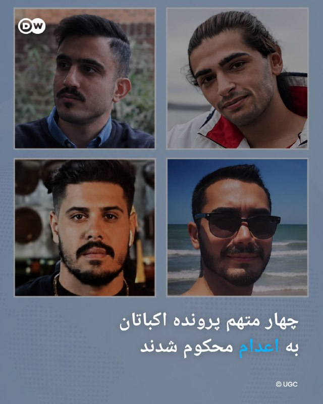

🔸 چهار متهم پرونده اکباتان به اعدام محکوم شدند

ارگان خبری مجموعه فعالان حقوق بشر در ایران (هرانا) گزارش داد که شعبه ۱۵ دادگاه انقلاب تهران به ریاست ابوالقاسم صلواتی، چهار متهم پرونده اکباتان تهران و از بازداشت شدگان اعتراضات سراسری ۱۴۰۱، به نام‌های میلاد آرمون، نوید نجاران، مهدی ایمانی و محمدمهدی حسینی را به اتهام "محاربه" به اعدام محکوم کرده است.

صدور این حکم علیه این چهار جوان در حالی است که پیش‌تر احکام اعدام صادرشده از سوی دادگاه کیفری به اتهام مشارکت در قتل عمد، از سوی دیوان عالی کشور رد شده و پس از بررسی مجدد در شعبه بدوی به حبس و پرداخت دیه تغییر کرده بود.

آنگونه که هرانا نوشته، امیرمحمد خوش‌اقبال، علیرضا برمرز پورناک، علیرضا کفایی و حسین نعمتی دیگر متهمان این پرونده نیز هرکدام به پنج سال زندان از بابت اتهام اجتماع و تبانی، دوسال حبس از بابت تبلیغ علیه نظام، دو سال منع فعالیت در فضای مجازی و دو سال منع اسکان در تهران و البرز محکوم شده‌اند.
@dw_farsi

## DW_Farsi — post 125124

  

🔶 سومین نفتکش حامل گازمایع قطر از طریق تنگه هرمز در مسیر چین است

داده‌های ردیابی کشتی‌ها در روز جمعه ۲۲ مه (۱ خرداد) نشان داد که سومین نفتکش حامل گاز طبیعی مایع قطر در حال عبور از تنگه هرمز و حرکت به سمت چین است.

این در شرایطی است که یک تیم مذاکره‌کننده قطری برای کمک به دستیابی به توافقی برای پایان دادن به جنگ با ایران وارد تهران شده است.

ارسال محموله‌ها از طریق این آبراه مهم بین‌المللی همچنان نامنظم است و این سومین ترانزیت یک تانکر گاز مایع قطری تقریباً دو هفته پس از عبور اولین محموله از این تنگه تحت توافق ایران و پاکستان به شمار می‌رود.

طبق داده‌های کشتیرانی LSEG، این کشتی با نام السهله، با ظرفیت ۲۱۱ هزار و ۲۸۴ متر مکعب، منطقه رأس لفان در قطر را ترک کرده و انتظار می‌رود در روز شنبه ۱۴ ژوئن (۲۴ خرداد)‌ به ترمینال گاز مایع تیانجین چین برسد.

به گفته این منابع، ایران اجازه عبور این محموله را برای کمک به ایجاد اعتماد میان قطر و پاکستان که در حال میانجیگری در مذاکرات صلح هستند، صادر کرده است.
@dw_farsi

## DW_Farsi — post 125123

  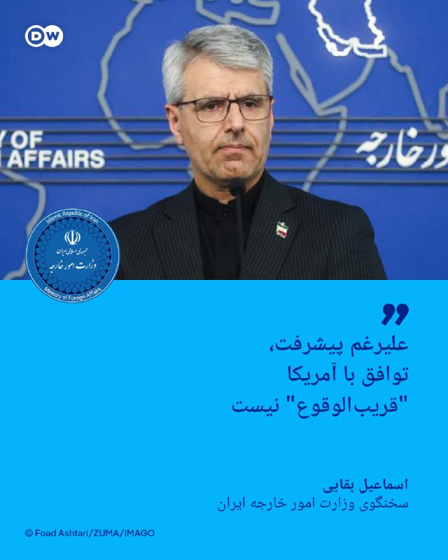

🔶 ایران می‌گوید علیرغم پیشرفت، توافق با آمریکا "قریب‌الوقوع" نیست

اسماعیل بقایی، سخنگوی وزارت امور خارجه ایران، روز دوشنبه ۴ خرداد (۲۵ مه) هشدار داد که با وجود پیشرفت تهران و واشنگتن در "بخش بزرگی از مسائل" در تبادلاتشان، توافق با ایالات متحده برای پایان دادن به جنگ "قریب‌الوقوع" نیست.

مارکو روبیو، وزیر امور خارجه ایالات متحده، پیش از این گفته بود که توافق می‌تواند "امروز" [دوشنبه چهارم خرداد] محقق شود.

بقایی تصریح کرد: «در بخش زیادی از موضوعات مورد گفت‌وگو، ما به یک جمع‌بندی رسیده‌ایم و این یک امر درستی است ولی این‌که بخواهیم بگوییم امضای توافق قریب الوقوع است، کسی نمی‌تواند چنین ادعایی بکند.»

سخنگوی وزارت امور خارجه ایران همچنین با تاکید بر اینکه تمرکز مذاکرات بر "خاتمه جنگ" است گفت: «در این مرحله درباره جزئیات موضوع هسته‌ای صحبتی نداریم.»

بقایی افزود: «تهدیدها، فشارها، کاریکاتور منتشر کردن بخشی از سیاست‌ورزی در آن طرف دنیاست. ما کار خود را در میدان عمل دنبال می‌کنیم.»
@dw_farsi

## DW_Farsi — post 125122

  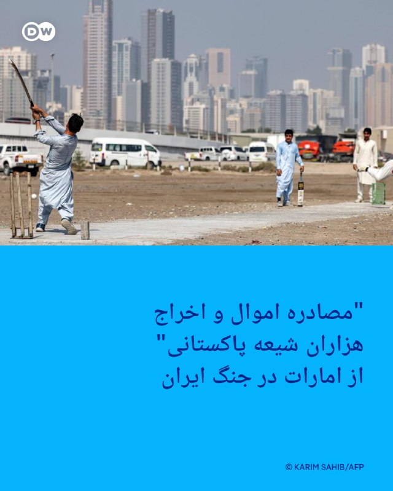

🔶 "مصادره اموال و اخراج هزاران شیعه پاکستانی" از امارات در جنگ ایران

خبرگزاری رویترز در گزارشی نوشت"هزاران شیعه" پاکستانی در طول جنگ ایران از امارات متحده عربی به پاکستان اخراج شده‌‌اند. به نوشته رویترز این امر باعث نگرانی جامعه شیعیان پاکستان شده و دیده‌بان حقوق بشر را بر آن داشته است تا در این مورد تحقیق کند.

رویترز اسناد مهاجرت، ویزا و جزئیات پرواز ۱۰۳ پاکستانی را که گفته بودند شیعه اخراج شده هستند، بررسی و با ۲۴ نفر از آنها مصاحبه کرده است. مصاحبه‌شوندگان گفته‌اند که پیش از سوار شدن به هواپیما حتی نتوانسته‌اند چمدان یا پس‌انداز خود را پس بگیرند.

بانک اطلاعاتی که توسط سازمان سیاسی شیعه پاکستانی "مجلس وحدت مسلمین" گردآوری شده و توسط رویترز مشاهده شده است، نشان می‌دهد ۷ هزار و ۵۰۰ شیعه پاکستانی از ۲۸ فوریه (۹ اسفند ۱۴۰۴)، همزمان با آغاز حمله آمریکا و اسرائیل به ایران، از این کشور عربی حاشیه خلیج فارس اخراج شده‌اند.
@dw_farsi

## DW_Farsi — post 125121

🔶 گزارش سیپری؛ ماموریت‌های صلح در تنگنای بودجه و نیروی انسانی

سال ۲۰۲۵ سال خوبی برای ماموریت‌های بین‌المللی صلح نبوده است. طبق گزارش جدید مؤسسه پژوهش‌های صلح استکهلم "سیپری" (SIPRI)، شمار این مأموریت‌ها اندکی کاهش یافته است. در حدود ۲۵ سال گذشته، هرگز شمار نیروهای بین‌المللی فعال در عرصه صلح تا این اندازه کم نبوده است.

تا پایان ماه دسامبر گذشته، مجموعاً نزدیک به ۷۹ هزار نفر در این مأموریت‌ها حضور داشتند؛ رقمی که شامل نیروهای نظامی، نیروهای پلیس و کارکنان غیرنظامی می‌شود. بر اساس این گزارش، تنها طی ده سال گذشته شمار آنها تقریباً به نصف کاهش یافته است.

کلودیا فایفر کروز، پژوهشگر مؤسسه سیپری، به کانال اول تلویزیون آلمان (ARD) گفته است که دلایل مختلفی برای این وضعیت وجود دارد.

به گزارش کانال اول تلویزیون آلمان، در شورای امنیت سازمان ملل، قدرت‌های دارای حق وتو بیش از پیش مانع یکدیگر می‌شوند و در سازمان‌های منطقه‌ای مانند اتحادیه آفریقا نیز مشکلات مشابهی وجود دارد.

افزون بر این، سازمان‌های بین‌المللی مانند سازمان ملل متحد نیز با کمبود بودجه روبه‌رو هستند؛ به‌گونه‌ای‌که در سال ۲۰۲۵ بیش از دو میلیارد دلار کسری بودجه داشته‌اند.

طبق همین گزارش، دیگر کشورهای بزرگ تأمین‌کننده بودجه این مأموریت‌ها، از جمله چین، نیز یا سهم خود را پرداخت نکرده‌اند یا با تأخیر پرداخت کرده‌اند. در نتیجه، تمامی ماموریت‌های سازمان ملل به‌ناچار فعالیت‌های خود را محدود و شمار کارکنانشان را کاهش داده‌اند.

📌 برای دسترسی کامل به گزارش به وبسایت دویچه‌وله فارسی مراجعه کنید.
@dw_farsi

## DW_Farsi — post 125120

  

🔶 محمدباقر قالیباف برای هفتمین بار رئیس مجلس شورای اسلامی شد

محمدباقر قالیباف در انتخابات هیئت رئیسه مجلس شورای اسلامی که صبح روز دوشنبه ۴ خرداد (۲۵ مه) برگزار شد، برای هفتمین سال متوالی به عنوان رئیس مجلس انتخاب شد.

قالیباف ۶۴ ساله، به عنوان سیاستمداری با نفوذ در ساختار سپاه پاسداران انقلاب اسلامی شناخته می‌شود. به ویژه پس از کشته شدن علی خامنه‌ای، علی لاریجانی و شمار دیگری از مقامات ارشد جمهوری اسلامی و تغییر ساختار قدرت، نام او به عنوان یکی از تصمیم‌گیران اصلی در پیشبرد سیاست‌های نظام و مذاکره با آمریکا مطرح شده است.

محمدباقر قالیباف بارها برای انتخابات ریاست جمهوری نامزد شد. او در سال ۱۳۸۴ نامزد شد اما از محمود احمدی‌نژاد شکست خورد. پس از آن به عنوان شهردار تهران منصوب شد و از سال ۱۳۸۴ تا ۱۳۹۶ این سمت را در اختیار داشت.

او در سال ۱۳۹۲ بار دیگر نامزد انتخابات ریاست جمهوری شد اما از حسن روحانی شکست خورد و در سال ۹۶ نیز پیش از برگزاری انتخابات به نفع ابراهیم رئیسی کناره‌گیری کرد.

نام قالیباف با فسادهای مالی خود و خانواده‌اش و نقش او در سرکوب جنبش‌های سیاسی و مدنی در ایران نیز گره خورده است.
@dw_farsi

## DW_Farsi — post 125119

  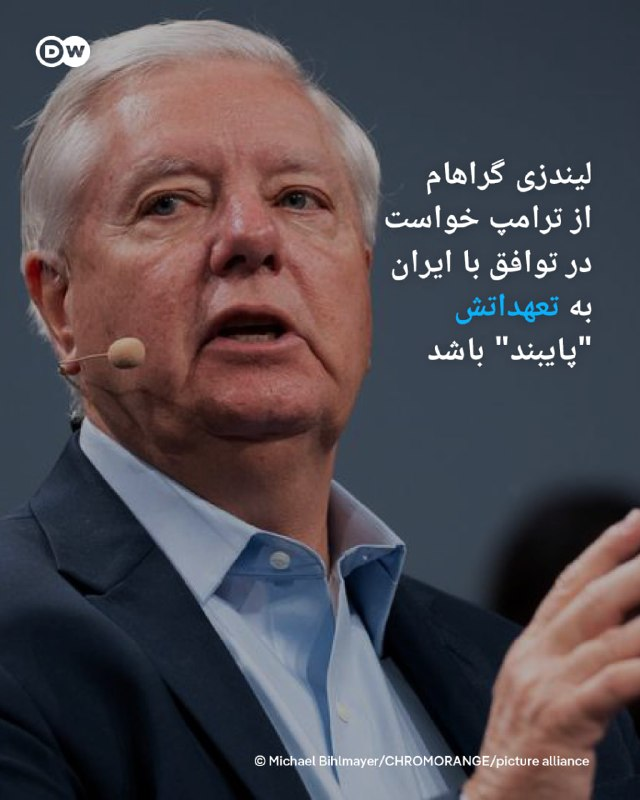

🔶 لیندزی گراهام از ترامپ خواست در توافق با ایران به تعهداتش "پایبند" باشد

لیندزی گراهام، سناتور جمهوری‌خواه از ایالت کارولینای جنوبی، روز یکشنبه ۲۴ مه (۳ خرداد) از دونالد ترامپ، رئیس‌جمهور آمریکا، خواست تا در حالی که واشنگتن به تلاش برای نهایی کردن توافق با تهران بر سر جنگ ادامه می‌دهد، ثابت قدم بماند.

گراهام در پستی در شبکه اجتماعی ایکس نوشت: «اگر در واقع، در نتیجه این مذاکرات برای پایان دادن به درگیری با ایران، متحدان عرب و مسلمان ما در منطقه با پیوستن به پیمان ابراهیم موافقت کنند، این توافق‌نامه به یکی از مهم‌ترین توافق‌نامه‌ها در تاریخ خاورمیانه تبدیل خواهد شد.»

گراهام همچنین به اظهارات قبلی ترامپ در مورد پیوستن عربستان سعودی، قطر و پاکستان به پیمان ابراهیم اشاره کرد و پیشنهاد او را "فراتر از یک تغییر اساسی برای منطقه و جهان" خواند. او گفت: «این یک اقدام درخشان از سوی رئیس‌ جمهور ترامپ است.»

گراهام خطاب به ترامپ نیز نوشت: «رئیس جمهور ترامپ، برای رسیدن به یک توافق خوب با ایران، به مواضع خود پایبند باشید.»
@dw_farsi

## DW_Farsi — post 125118

  

📸عکس روز: فانوس‌های آرزو در جشن تولد بودا

همزمان با جشن تولد بودا، فانوس‌های رنگارنگ در معبد "جوگیه" در شهر سئول روشن شده‌اند. در این آیین سنتی، به هرکدام از فانوس‌ها کارتی همراه با آرزوهای پیروان بودا آویزان شده که نمادی از امید، آرامش و دعا برای آینده است.
جشن تولد بودا یکی از مهم‌ترین مناسبت‌های مذهبی در کره‌جنوبی به شمار می‌رود و هر سال هزاران نفر را به معابد تاریخی این کشور می‌کشاند.
@dw_farsi

## DW_Farsi — post 125117

  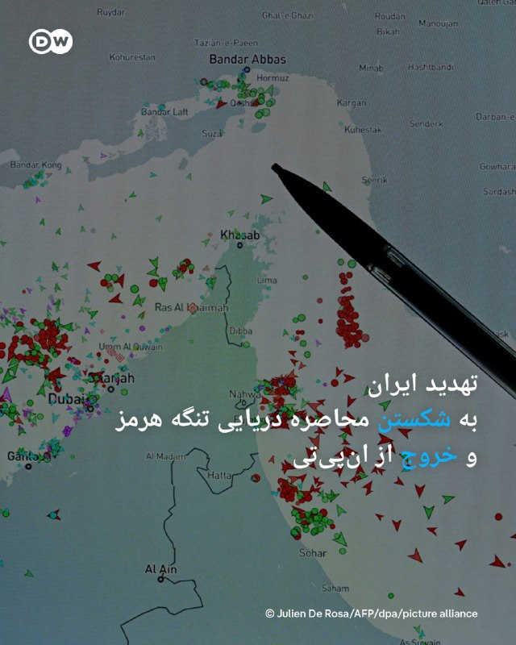

🔶 تهدید ایران به شکستن محاصره دریایی تنگه هرمز و خروج از ان‌پی‌تی

محسن رضایی، مشاور نظامی مجتبی خامنه‌ای، روز یکشنبه سوم خرداد (۲۴ مه) گفت که مدیریت تنگه هرمز "حق قانونی" تهران برای تضمین امنیت ملی است. او مدعی شد: «مدیریت ایران بر تنگه هرمز به ۵۰ سال ناامنی در خلیج فارس پایان می‌دهد.»

رضایی، که تحت تحریم‌های ایالات متحده قرار دارد، همچنین گفت که ایران "دلایل محکمی" برای حفظ کنترل تنگه دارد و ادعا کرد که هدف تهران جلوگیری از تبدیل شدن خلیج فارس به مرکزی برای استقرار نظامی و بی‌ثباتی است.

اظهارات محسن رضایی روز یکشنبه توسط خبرگزاری مهر، نزدیک به سپاه پاسداران، منتشر شد.

در همین حال، ابراهیم ذوالفقاری، سخنگوی قرارگاه خاتم الانبیاء، هشدار داد که اگر تنگه هرمز مورد حمله قرار گیرد، نیروهای نظامی جمهوری اسلامی محاصره بنادر ایران توسط ایالات متحده را خواهند شکست.

ذوالفقاری همچنین تهدید به "خروج ایران از پیمان منع گسترش سلاح‌های هسته‌ای" کرد. او گفت: «اگر دشمن به تنگه هرمز حمله کند، ما محاصره دریایی را خواهیم شکست و ممکن است از پیمان منع گسترش سلاح‌های هسته‌ای (ان‌پی‌تی) خارج شویم.»
@dw_farsi

## DW_Farsi — post 125116

  

🔶 نعیم قاسم: خلع سلاح به معنای نابودی است و ما نمی‌توانیم آن را بپذیریم

نعیم قاسم، دبیرکل حزب‌الله، در یک سخنرانی به مناسبت "روز مقاومت و آزادسازی" که یادآور عقب‌نشینی نیروهای ارتش اسرائیل از اشغال جنوب لبنان در ۲۵ مه ۲۰۰۰ است، درخواست خلع سلاح این گروه را محکوم کرد.

او گفت: «چیزی به نام انحصار سلاح یا خلع سلاح حزب‌الله وجود ندارد.»

قاسم همچنین افزود، خلع سلاح حزب‌الله "توان دفاعی لبنان و توان مقاومت و مردم آن را به عنوان مقدمه‌ای برای نابودی" از بین می‌برد. او افزود: «خلع سلاح به معنای نابودی است و این چیزی است که ما نمی‌توانیم بپذیریم.»

نعیم قاسم همچنین ضمن برشمردن چندین حمله به سربازان ارتش اسرائیل، از پهپادهای انتحاری دید اول شخص (FPV) حزب‌الله که به گفته او باعث "گیج‌شدن" اسرائیل شده‌اند، تمجید کرد. او ادعا کرد که این حملات منجر به کشته شدن چندین افسر اسرائیلی شده است، در حالی که ارتش اسرائیل اعلام کرده است که آنها زخمی شده‌اند.

دبیرکل حزب‌الله همچنین ایالات متحده را محکوم کرد و گفت که این کشور نه میانجی است و نه بازیگری صادق، زیرا "اسرائیل را بر اساس منافع خود مدیریت می‌کند".
@dw_farsi

## DW_Farsi — post 125115

  

🔶 بالا نگه داشتن سطح هشدار ارتش اسرائیل همزمان با کاهش نیروهای ذخیره

در بحبوحه انتشار اخبار لحظه به لحظه در مورد "پیشرفت" مذاکرات بین ایالات متحده و ایران، افسران ارشد ارتش اسرائیل روز یکشنبه ۲۴ ماه (۳ خرداد) تأیید کردند که چندین شاخه از ارتش، تعداد سربازان ذخیره را در ستاد کل کاهش داده‌اند.

به گزارش "جروزالم پست" برخی از افسران پیامی دریافت کردند مبنی بر اینکه باید "نسبت به هرگونه درخواست برای بازگشت به خدمت هوشیار و گوش به زنگ باشند"، اما مجبور نیستند به ستاد بیایند.

شلومی بیندر، رئیس اداره اطلاعات ارتش اسرائیل، هدایت عملیات جمع‌آوری اطلاعات برای ایجاد تصویری روشن از تلاش‌های ایران برای بازسازی قابلیت‌های نظامی آسیب‌دیده‌اش را بر عهده دارد.

طبق این گزارش، افسران ارشد ارتش اسرائیل ادعا می‌کنند که بنا بر ارزیابی آنها، رده سیاسی اسرائیل از هسته مذاکرات ایالات متحده و ایران کنار گذاشته شده است.

در شرایط کنونی و با وجود سیگنال‌های متناقض طرفین، مشخص نیست که آیا واقعاً پیشرفتی در مذاکرات حاصل شده است یا اینکه هرکدام از طرفین صرفا در تلاش برای افزایش فشار بر طرف مقابل است.
@dw_farsi

## DW_Farsi — post 125114

  

🔶 کاهش قیمت نفت به دنبال چشم‌اندازی برای توافق آمریکا با ایران

امیدها برای دستیابی به یک توافق صلح بین ایالات متحده و ایران، قیمت نفت را به پایین‌ترین سطح خود در بیش از دو هفته گذشته رسانده است.

نفت خام برنت دریای شمال با ۴.۵۵ درصد کاهش به ۹۸.۸۳ دلار در هر بشکه رسید، در حالی که نفت خام وست تگزاس اینترمدیت (WTI) با ۴.۷۳ درصد کاهش به ۹۲.۰۳ دلار رسید. این نرخ پایین‌ترین سطح از ۷ مه (۱۷ اردیبهشت) تا کنون است. با این حال، چشم‌انداز توافق سریع پس از سیگنال‌های متناقض از سوی واشنگتن همچنان نامشخص است.

کارشناسان پیش‌بینی می‌کنند که بحران انرژی ناشی از جنگ ایران ادامه خواهد یافت.

یکی از موضوعات مورد اختلاف، همچنان حاکمیت بر تنگه هرمز است؛ آبراهی کلیدی که از طریق آن پیش از جنگ یک پنجم نفت و گاز مایع جهان منتقل می‌شد. رئیس شرکت ملی نفت ابوظبی هفته گذشته هشدار داد که حتی در صورت پایان فوری جنگ، ترافیک کشتیرانی در این تنگه حداقل تا سال ۲۰۲۷ به سطح عادی خود باز نخواهد گشت.
@dw_farsi

## DW_Farsi — post 125113

  

🔶 سی‌بی‌اس: مجتبی خامنه‌ای از طریق شبکه‌ای از پیام‌رسان‌ها ارتباط برقرار می‌کند

مقامات آمریکایی به نقل از نهادهای اطلاعاتی آمریکا به شبکه تلویزیونی "سی‌بی‌اس" گفتند که مجتبی خامنه‌ای، رهبر جمهوری اسلامی، در مکانی مخفی پنهان شده و از طریق شبکه‌ای پیچیده از پیام‌رسان‌ها ارتباط برقرار می‌کند.

این گزارش می‌گوید اقدامات احتیاطی که برای جلوگیری از ترور خامنه‌ای توسط اسرائیل در نظر گرفته شده، باعث تأخیر در مذاکرات آمریکا و ایران برای پایان دادن به جنگ می‌شود. گزارش می‌افزاید که حتی مقامات ارشد جمهوری اسلامی نیز نمی‌توانند مستقیماً با مجتبی خامنه‌ای تماس بگیرند.

یک مقام آمریکایی به این شبکه گفت: «به همین دلیل است که می‌بینید افرادی چیزهایی مانند "رهبر معظم انقلاب با چارچوب موافقت کرده است" یا "ما منتظر شنیدن نظرات در مورد نکات نهایی توافق هستیم"، می‌گویند. هر اطلاعاتی که او دریافت می‌کند، تاریخ‌دار است و پاسخ‌های او با تأخیر زیادی همراه است.»
@dw_farsi

## DW_Farsi — post 125112

🔶 جام ۱۹۸۲؛ زیکو، "جوجه‌ای" که به "پله سفید" شهرت یافت

🔺 گزارشی از شهرام احدی

در تاریخ جام جهانی فوتبال بازندگانی بوده‌اند که بخت با آنان یار نبوده و برخلاف آنچه که شاید سزاوار آن بوده باشند، از دور مسابقات حذف شده‌اند:

ناکامی مجارستان در برابر آلمان در فینال جام جهانی ۱۹۵۴، شکست آلمان‌ها در برابر لاجوردی‌های ایتالیا در نیمه‌نهایی ۱۹۷۰ مکزیک و ناکامی فرانسویان در سال‌های ۱۹۸۲ و ۱۹۸۶ در مقابل آلمان در مرحله نیمه‌نهایی، نمونه‌هایی از این دست هستند.

اما شاید ناکامی یک تیم تلخ‌تر و ناسزاوارتر از همه بوده باشد: خداحافظی غمگین رقصندگان برزیل از جام جهانی ۱۹۸۲.

زیکو و یارانش که در مرحله‌ی دوم، آرژانتین و ستاره‌اش مارادونا را ۳ بر یک به زانو درآورده بودند، در بازی بعدی‌شان تنها به تساوی در برابر ایتالیا نیاز داشتند. آنان در دقیقه ۶۸ به گل تساوی دست یافتند و به جای آنکه در پی حفظ نتیجه برآیند، به حملات و هنرنمایی‌های خود ادامه دادند.

گل پائولو روسی، مهاجم زهردار ایتالیا، در دقیقه ۷۵ اما رویای فوتبال‌دوستان را که شیفته زیبایی بازی برزیل شده بودند، نقش بر آب کرد.

📌 برای دسترسی کامل به گزارش به وبسایت دویچه‌وله فارسی مراجعه کنید.
@dw_farsi

## DW_Farsi — post 125111

  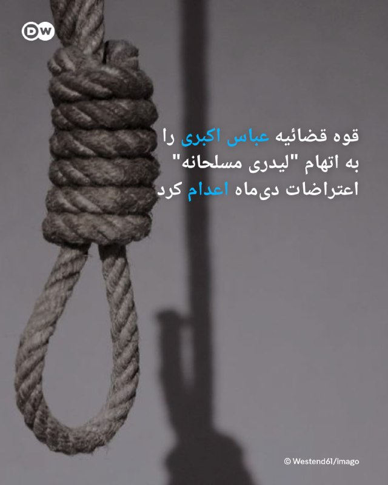

🔶 قوه قضائیه عباس اکبری را به اتهام "لیدری مسلحانه" اعتراضات دی‌ماه اعدام کرد

خبرگزاری میزان، وابسته به قوه قضائیه جمهوری اسلامی، از اعدام عباس اکبری فیض‌آبادی در بامداد دوشنبه چهارم خرداد (۲۵ مه) به اتهام "لیدری مسلحانه و تیراندازی به سوی نیروهای حافظ امنیت" خبر داد.

در این گزارش ادعا شده که عباس اکبری "یکی از لیدر‌های مسلح" اعتراضات در شهرستان نائین اصفهان بوده و "نقش مهمی در حمله به فرمانداری شهرستان و مراکز تأمین امنیت و همچنین مراکز خدماتی" داشته است.

میزان مدعی شده است که عباس اکبری "بر اساس اسناد و تصاویر موجود در پرونده، به‌صورت مسلح در خیابان حضور یافته و اقدام به تیراندازی به سمت ماموران حافظ امنیت" کرده است.

این خبرگزاری همچنین ویدیویی منتسب به عباس اکبری با عنوان "تصاویر دوربین مدار بسته از تیر اندازی، حمله و تخریب اماکن" منتشر کرده است.

جزئیات بیشتری درباره این پرونده و روند رسیدگی به آن منتشر نشده، اما "کشف اسلحه از منزل متهم و اقرارهای او" علت "محرز شدن بزهکاری او" عنوان شده است.

از عباس اکبری هیچ عکسی منتشر نشده است.
@dw_farsi

## Persian_Trend_Official — post 14936

🇹🇷
🇸🇾
🇪🇺: برای اولین بار پس از سقوط اسد، ارتش سوریه در تمرینات نظامی خارج از کشور شرکت کرد.

آنها در «EFES-2026» ترکیه، همراه با نزدیک به ۵۰ کشور و اعضای ناتو شرکت کردند.

👩‍💻@PhantomDirective

🆔@persian_trend_official
پرشین ترند | متفاوت‌ترین کانال نظامی

## Persian_Trend_Official — post 14935

  

📸 حنظله اطلاعات ۶۹ افسر اسرائیلی که به کاروان صمود حمله کردند را افشا کرد

گروه هکری حنظله:

🔹نام‌ها و مشخصات کامل ۶۹ افسر نیروی دریایی اسرائیل که اخیراً به کاروان جهانی «صمود» حمله کردند، افشا شده و برای هر یک از این افراد مبلغ ۱۰۰ هزار دلار جایزه تعیین شده است.

👩‍💻@PhantomDirective

🆔@persian_trend_official
پرشین ترند | متفاوت‌ترین کانال نظامی

## Persian_Trend_Official — post 14934

🔴 فاکس‌نیوز: قالیباف و عراقچی برای رایزنی درباره پایان جنگ وارد دوحه شدند ▪️ فاکس‌نیوز گزارش داد محمدباقر قالیباف، رئیس مجلس ایران، و عباس عراقچی، وزیر خارجه ایران، امروز وارد دوحه شدند ▪️ این سفر در چارچوب تلاش‌های دیپلماتیک جاری برای پایان‌دادن به درگیری‌ها…

## Persian_Trend_Official — post 14933

🔴 فاکس‌نیوز: قالیباف و عراقچی برای رایزنی درباره پایان جنگ وارد دوحه شدند ▪️ فاکس‌نیوز گزارش داد محمدباقر قالیباف، رئیس مجلس ایران، و عباس عراقچی، وزیر خارجه ایران، امروز وارد دوحه شدند ▪️ این سفر در چارچوب تلاش‌های دیپلماتیک جاری برای پایان‌دادن به درگیری‌ها…

## Persian_Trend_Official — post 14932

🔴 یک مقام ایرانی به واشینگتن‌پست:

▪️ بازگشایی تنگه هرمز به‌صورت مرحله‌ای انجام خواهد شد
▪️ مرحله نخست شامل پاکسازی مین‌ها از تنگه، رفع محاصره آمریکا و آزادسازی ۱۲ میلیارد دلار از دارایی‌های بلوکه‌شده ایران است
▪️ یادداشت تفاهم شامل توافق هسته‌ای نیست و فقط تعهد به آغاز مذاکرات درباره این پرونده در آینده را در بر می‌گیرد

🫆:Tony

📌 @persian_trend_official
پرشین ترند | متفاوت‌ترین کانال نظامی

## Persian_Trend_Official — post 14931

🔴 فاکس‌نیوز: قالیباف و عراقچی برای رایزنی درباره پایان جنگ وارد دوحه شدند

▪️ فاکس‌نیوز گزارش داد محمدباقر قالیباف، رئیس مجلس ایران، و عباس عراقچی، وزیر خارجه ایران، امروز وارد دوحه شدند
▪️ این سفر در چارچوب تلاش‌های دیپلماتیک جاری برای پایان‌دادن به درگیری‌ها و پیشبرد مذاکرات انجام شده است
▪️ قطر یکی از اصلی‌ترین میانجی‌ها میان تهران و واشینگتن در مذاکرات اخیر محسوب می‌شود

🫆:Tony

📌 @persian_trend_official
پرشین ترند | متفاوت‌ترین کانال نظامی

## Persian_Trend_Official — post 14930

  <a href="telegram/content/Persian_Trend_Official_14930_1779713725.mp4" target="_blank">🎬 Download video</a>

♦️نگاهی به ۱۰ بهمن ۱۳۵۷ ...

جهت ثبت در تاریخ

🫆:Tony

📌 @persian_trend_official
پرشین ترند | متفاوت‌ترین کانال نظامی

## Persian_Trend_Official — post 14928

  <a href="telegram/content/Persian_Trend_Official_14928_1779713727.webm" target="_blank">🎬 Download video</a>

من به تمام دموکرات‌های احمق، جمهوری‌خواهان ظاهری و نادان‌هایی که هیچ چیزی درباره توافق احتمالی‌ای که با ایران در حال انجامش هستم نمی‌دانند می‌خندم؛ چیزهایی که حتی هنوز مذاکره هم نشده‌اند. افراد ضعیف و بی‌اثری مثل سناتور شکست‌خورده تام تیلیس (که به‌زودی از کار برکنار می‌شود!)، بیل کسیدی که تازه یک شکست سنگین در انتخابات مقدماتی خورده، و نماینده واقعاً افتضاح، توماس مَسی، یک آدم کثیف واقعی که پس از خیانت بزرگ به حزبش (و کشورش!) با اختلاف سنگین به یک میهن‌پرست بزرگ آمریکایی (که مورد حمایت «ترامپ» بود) باخت؛ و تقریباً تمام دموکرات‌ها، افرادی که کاملاً راهشان را گم کرده‌اند، مدام از سیاست‌های بد و نامزدهای حتی بدتر حمایت می‌کنند، اما دائماً از تک‌تک پیروزی‌های فوق‌العاده من انتقاد می‌کنند.

این افراد باید به خانه بروند و استراحت کنند؛ آن‌ها هیچ کاری جز ایجاد تفرقه و شکست انجام نمی‌دهند. به زبان ساده، آن‌ها بازنده‌اند!

توافق با ایران یا یک توافق بزرگ و معنادار خواهد بود، یا اصلاً توافقی در کار نخواهد بود. این توافق دقیقاً برعکس فاجعه برجام خواهد بود که توسط دولت شکست‌خورده اوباما مذاکره شد؛ توافقی که یک مسیر مستقیم و آشکار برای دستیابی ایران به سلاح هسته‌ای بود.

نه، من چنین توافق‌هایی انجام نمی‌دهم!

رئیس‌جمهور DJT

🫆:Tony

📌 @persian_trend_official
پرشین ترند | متفاوت‌ترین کانال نظامی

## Persian_Trend_Official — post 14927

  

📷 Photo

## Persian_Trend_Official — post 14926

🔴تسنیم به نقل از منابع ایرانی:

«ایران هیچ خوش‌بینی‌ای نسبت به آمریکا ندارد.

♦️هنوز هیچ تفاهم نهایی حاصل نشده و اختلافات بر سر برخی بندها همچنان پابرجاست.

♦️حتی اگر یک تفاهم اولیه هم حاصل شود، این موضوع نگاه ایران به آمریکا یا اعتماد تهران به پایبندی این دولت به تعهداتش را تغییر نخواهد داد.

♦️آمریکایی‌ها سابقه بسیار بدی در مذاکرات دارند و همین مسئله بدبینی را تقویت و تثبیت می‌کند.

♦️حتی در صورت دستیابی به تفاهم، ایران در تمام مراحل پس از اعلام آن، اقدامات آمریکا را زیر نظر خواهد داشت.

♦️اگر آمریکا به وعده‌های خود عمل نکند، ایران همچنان کارت‌های فشار و ابزارهای لازم برای مقابله را حفظ خواهد کرد.»

🫆:Tony

📌 @persian_trend_official
پرشین ترند | متفاوت‌ترین کانال نظامی

## Persian_Trend_Official — post 14925

  <a href="telegram/content/Persian_Trend_Official_14925_1779713728.mp4" target="_blank">🎬 Download video</a>

داکتر مرندی، تحلیلگر سیاسی: ظاهرا قرار بر این است قطری ها بخشی از پول را برای ما تامین و بعد از آمریکا دریافت کنند.

📌 @persian_trend_official
پرشین ترند | متفاوت‌ترین کانال نظامی

## Persian_Trend_Official — post 14924

  <a href="telegram/content/Persian_Trend_Official_14924_1779713730.mp4" target="_blank">🎬 Download video</a>

پروفسور خوش‌چشم، تحلیلگر مسائل راهبردی: علت منصرف‌شدن ترامپ از حملهٔ دوباره به ایران، ۲ عملیات پیش‌دستانهٔ منتسب به ایران بود نه درخواست عرب‌ها !!! 📌 @persian_trend_official پرشین ترند | متفاوت‌ترین کانال نظامی

## Persian_Trend_Official — post 14923

  <a href="telegram/content/Persian_Trend_Official_14923_1779713733.webm" target="_blank">🎬 Download video</a>

🔴 بازگشایی اینترنت بین الملل مصوب شد ♦️سیتنا خبر داد: ستاد راهبری و ساماندهی فضای مجازی صبح امروز دوشنبه (چهارم خردادماه) به ریاست دکتر عارف معاون اول رئیس جمهور تشکیل جلسه داد و بازگشت اینترنت به وضعیت قبل از دی ماه 1404 مصوب شد. ♦️این مصوبه برای رییس جمهور…

## Persian_Trend_Official — post 14922

  <a href="telegram/content/Persian_Trend_Official_14922_1779713733.webm" target="_blank">🎬 Download video</a>

مهر: حادثه در پالایشگاه ششم پارس جنوبی؛ ۳ نفر مصدوم شدند

سخنگو مجتمع گاز پارس جنوبی عسلویه:

صبح امروز در حین آوار برداری از تاسیسات آسیب دیده جنگ رمضان در پالایشگاه ششم گاز عسلویه، انفجار محدودی رخ داد.

بلافاصله نیروهای امدادی و آتش نشانی پالایشگاه وارد عمل شده و آتش را کنترل و خاموش کردند.

علت حادثه در دست بررسی است.

در این حادثه ۳ نفر از کارکنان شرکت پیمانکاری بازسازی پالایشگاه مصدوم و به بیمارستان منتقل شدند.

🫆:Tony

📌 @persian_trend_official
پرشین ترند | متفاوت‌ترین کانال نظامی

## Persian_Trend_Official — post 14921

پروفسور خوش‌چشم، تحلیلگر مسائل راهبردی: علت منصرف‌شدن ترامپ از حملهٔ دوباره به ایران، ۲ عملیات پیش‌دستانهٔ منتسب به ایران بود نه درخواست عرب‌ها !!!

📌 @persian_trend_official
پرشین ترند | متفاوت‌ترین کانال نظامی

## Persian_Trend_Official — post 14920

  <a href="telegram/content/Persian_Trend_Official_14920_1779713734.webm" target="_blank">🎬 Download video</a>

🔴 بازگشایی اینترنت بین الملل مصوب شد

♦️سیتنا خبر داد: ستاد راهبری و ساماندهی فضای مجازی صبح امروز دوشنبه (چهارم خردادماه) به ریاست دکتر عارف معاون اول رئیس جمهور تشکیل جلسه داد و بازگشت اینترنت به وضعیت قبل از دی ماه 1404 مصوب شد.

♦️این مصوبه برای رییس جمهور ارسال شد و در صورت تایید رئیس جمهور جهت اجرا برای وزارت ارتباطات ارسال خواهدشد.

🫆:Tony

📌 @persian_trend_official
پرشین ترند | متفاوت‌ترین کانال نظامی

## Persian_Trend_Official — post 14919

  

🔴محمدباقر قالیباف رئیس مجلس ماند

♦️قالیباف با رای نمایندگان مجلس برای یکسال دیگر رئیس‌مجلس باقی ماند.

## RadioFarda — post 157539

  <a href="https://t.me/radiofarda/157539" target="_blank">📎 Download file</a>

📻بشنوید: ساعت ۱۴ با رادیوفردا، چهارم خرداد ۱۴۰۵‌

@Radiofarda

## RadioFarda — post 157538

  

🔸دونالد ترامپ، رئیس‌جمهور آمریکا، روز دوشنبه چهارم خرداد در پیامی در شبکه اجتماعی تروث سوشال گفت توافق احتمالی با ایران یا «عالی و معنادار» خواهد بود یا اساساً توافقی در کار نخواهد بود.

🔸آقای ترامپ در این پیام، منتقدان خود در میان دموکرات‌ها و برخی جمهوری‌خواهان را به باد انتقاد گرفت و گفت آنان «هیچ چیز» دربارهٔ توافق احتمالی او با ایران نمی‌دانند و حتی دربارهٔ موضوعاتی اظهار نظر می‌کنند که به گفتهٔ او «هنوز مذاکره نشده‌اند».

🔸ترامپ تأکید کرد توافق مورد نظر او با ایران «دقیقاً نقطهٔ مقابل» توافق هسته‌ای برجام خواهد بود؛ توافقی که او بار دیگر آن را «فاجعه» خواند و دولت باراک اوباما را به گشودن «مسیر مستقیم و آشکار» ایران به سوی جنگ‌افزار هسته‌ای متهم کرد.

🔸او در پایان پیام خود نوشت: «من چنین توافق‌هایی نمی‌کنم.»

🔸ایران و ایالات متحده روز دوشنبه موضوع گشایش قریب‌الوقوع در تلاش‌ها جهت پایان دادن به جنگ را تأیید نکردند و وزیر خارجه ایالات متحده اعلام کرد که واشنگتن یا به یک توافق خوب دست خواهد یافت یا به «شیوه‌ای دیگر» با ایران برخورد خواهد کرد.

@RadioFarda

## RadioFarda — post 157537

  

🔸رسانه‌های ایران از تصویب مصوبه‌ای «جدید و مهم» دربارهٔ اتصال دوباره اینترنت کشور به اینترنت بین‌الملل در «ستاد ویژه ساماندهی فضای مجازی» خبر داده‌اند؛ مصوبه‌ای که هنوز برای اجرا نیازمند تأیید نهایی مسعود پزشکیان، رئیس‌جمهور ایران، است.

🔸خبرگزاری فارس روز دوشنبه چهارم خرداد گزارش داد چهارمین جلسه این ستاد به ریاست محمدرضا عارف، معاون اول رئیس‌جمهور، برگزار شد و در آن «مصوبات مهمی» دربارهٔ اتصال به اینترنت بین‌الملل به تصویب رسید.

🔸فارس به نقل از یک منبع نوشت که «برقراری اتصال اینترنت بین‌الملل» با ۹ رأی موافق و سه رأی مخالف تصویب شده و برای تأیید به دفتر رئیس‌جمهور ارسال شده است.

🔸خبرگزاری تسنیم نیز با انتشار گزارشی مشابه نوشت مصوبات این جلسه پس از تأیید نهایی رئیس‌جمهور، برای اجرا به وزارت ارتباطات و فناوری اطلاعات ابلاغ خواهد شد.

🔸در همین حال، سیتنا، رسانه تخصصی حوزه ارتباطات و فناوری اطلاعات، به نقل از «یک منبع آگاه» گزارش داد که در جلسه صبح دوشنبه «بازگشت اینترنت به وضعیت قبل از دی‌ماه ۱۴۰۴» مصوب شده و در صورت تأیید مسعود پزشکیان، جهت اجرا به وزارت ارتباطات ابلاغ خواهد شد.

@RadioFarda

## RadioFarda — post 157536

  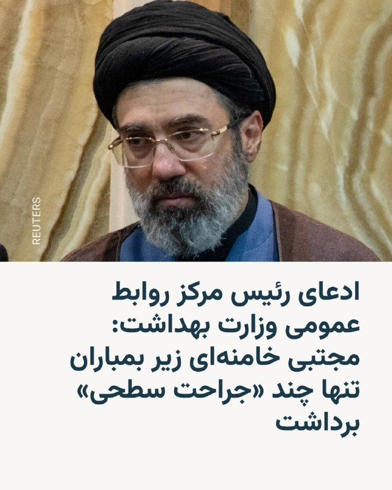

🔸رئیس مرکز روابط عمومی و اطلاع‌رسانی وزارت بهداشت روز دوشنبه چهارم خرداد مدعی شد که مجتبی خامنه‌ای در جریان حملات آمریکا و اسرائیل به «بیت رهبری» در نهم اسفند ۱۴۰۴ زیر بمباران تنها دچار چند «جراحت سطحی» شده بود.

🔸حسین کرمانپور سه ماه پس از این حمله به خبرگزاری ایلنا گفت: «استنباط ما این بود که کسی که زیر چنین بمبارانی باشد نباید بدن سالمی داشته باشد، اما به جز جراحت سطحی بر صورت، سر و پا‌ها که منجر به هیچ قطع عضو و ناراحتی خاصی نشده بود، اتفاق خاصی نیفتاده بود.»

🔸آقای کرمانپور در ادامه افزود که از دید او به عنوان یک پزشک جراحت‌های مجتبی خامنه‌ای مهم نبوده و تنها «یکی یا دو بخیه» که زده و او ساعت ۲ بامداد دهم اسفند مرخص شده است.

🔸این اظهارات در حالی مطرح می‌شود که پیش از گزارش‌هایی درباره جراحت‌های شدید به مجتبی خامنه‌ای منتشر شده بود.

🔸ازجمله نیوریوک تایمز سوم اردیبهشت از قول چهار مقام ایرانی گفته بود که مجتبی خامنه‌ای همچنان تحت درمان قرار دارد و در انتظار دریافت پروتز برای یکی از پاها و جراحی پلاستیک برای ترمیم آسیب‌های شدید صورت است.

@RadioFarda

## RadioFarda — post 157535

🔸اسماعیل بقائی در نشست خبری روز دوشنبه چهارم خرداد از لغو سفر عباس عراقچی، وزیر امور خارجه ایران به نشست شورای امنیت در آمریکا خبر داد.

🔸سخنگوی وزارت خارجه ایران در پاسخ به پرسش یک خبرنگار گفت که «با توجه به مجموع شرایط، این سفر انجام نخواهد شد. ضمن این که ما با یک مسئله مرتبط با روادید آمریکا هم مواجه شدیم.»

🔸جلسه شورای امنیت سازمان ملل قرار است روز سه‌شنبه این هفته در نیویورک برگزار شود.

🔸آمریکا پس از سرکوب خشونت‌بار اعتراضات دی ۱۴۰۴ شماری از مقامات ایران را تحریم کرد اما عباس عراقچی در این فهرست نبود.

🔸ایالات متحده سال گذشته نیز محدودیت‌های بی‌سابقه‌ای بر تردد، خرید و صدور ویزا برای هیئت جمهوری اسلامی در حاشیه هشتادمین نشست مجمع عمومی سازمان ملل در نیویورک اعمال کرد.

@RadioFarda

## RadioFarda — post 157534

  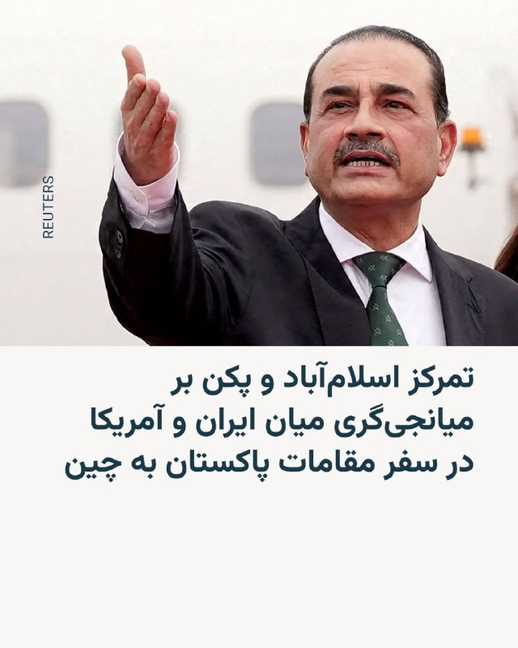

🔸رسانه‌های دولتی پاکستان روز دوشنبه چهارم خرداد گزارش دادند که عاصم منیر، فرمانده ارتش پاکستان و یکی از چهره‌های اصلی میانجی‌گری میان ایران و آمریکا، همراه با شهباز شریف، نخست‌وزیر پاکستان، در پکن با مقام‌های چینی دیدار کرده است.

🔸عاصم منیر که روزهای جمعه و شنبه در تهران حضور داشت، همراه با محسن نقوی، وزیر کشور پاکستان، در تلاش‌های میانجی‌گرانه برای پایان رسمی جنگ ایران مشارکت دارد.

🔸چین نیز اعلام کرده است که با همکاری پاکستان برای «بازگرداندن هرچه سریع‌تر صلح و ثبات به خاورمیانه» تلاش خواهد کرد.

🔸شهباز شریف که از روز شنبه سفر چهارروزهٔ رسمی خود به چین را آغاز کرده، در دیدار با مقام‌های چینی گفت: «جهان در حال گذر از لحظه‌ای بحرانی است.» او همچنین از نقش پاکستان در میانجیگری میان تهران و واشینگتن دفاع کرد و گفت اسلام‌آباد «نقشی صادقانه» در این روند داشته است.

🔸به گزارش تلویزیون دولتی پاکستان، شهباز شریف در حضور عاصم منیر افزود: «اوضاع در مسیر درستی حرکت می‌کند» و از حمایت چین برای پیشبرد صلح قدردانی کرد.

@RadioFarda

## RadioFarda — post 157533

  

🔸اسماعیل بقائی، سخنگوی وزارت امور خارجه ایران در نشست خبری روز دوشنبه ۴ خرداد خود درباره روند مذاکرات با آمریکا گفت «این تحولات که در چند روز اخیر خبری شد، نتیجه چند هفته گفت‌وگو از طریق میانجی پاکستانی است.»

🔸او افزود که «برخی کشورهای دیگر نیز در این مدت نقش داشتند. بنابراین اینکه در زمینه بسیاری از موضوعات مورد گفت‌وگو ما به جمع‌بندی رسیده‌ایم، امر درستی است، اما اینکه بگوییم این به معنای امضای یک توافق قریب‌الوقوع است، کسی نمی‌تواند چنین ادعایی بکند.»

🔸اسماعیل بقائی اضافه کرد که «تمرکز مذاکرات بر خاتمه جنگ است و در این مرحله درباره جزئیات موضوع هسته‌ای صحبتی نداریم.»

🔸مارکو روبیو، وزیر خارجه آمریکا، روز دوشنبه گفت توافق برای پایان دادن به جنگ با ایران ممکن است حتی «امروز» حاصل شود، اما تأکید کرد واشینگتن عجله‌ای برای توافق بد ندارد.

🔸آقای روبیو افزود که ایالات متحده یا با ایران به توافقی خوب خواهد رسید یا «از راه دیگری» با این کشور برخورد خواهد کرد.

🔸روبیو به خبرنگاران گفت آمریکا پیش از بررسی «گزینه‌های دیگر»، به دیپلماسی هر فرصتی برای موفقیت خواهد داد.

@RadioFarda

## RadioFarda — post 157532

  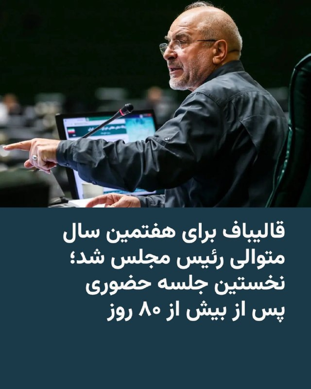

🔸محمدباقر قالیباف با رأی نمایندگان مجلس شورای اسلامی برای سومین سال در دوازدهمین دوره مجلس، بار دیگر رئیس مجلس شد.

🔸خبرگزاری‌های ایلنا و فارس گزارش دادند که انتخابات سومین اجلاسیه هیئت‌رئیسه دوازدهمین دوره مجلس صبح دوشنبه ۴ خرداد به صورت حضوری برگزار شد و قالیباف برای یک دورهٔ یک‌ساله دیگر بر کرسی ریاست مجلس باقی ماند.

🔸این هفتمین سال متوالی است که قالیباف ریاست مجلس شورای اسلامی را برعهده می‌گیرد.

🔸هیئت‌رئیسه مجلس شورای اسلامی ۱۲ عضو دارد: یک رئیس، دو نایب‌رئیس، سه ناظر و شش دبیر. اعضای هیئت‌رئیسه با رأی مستقیم نمایندگان برای دوره‌ای یک‌ساله انتخاب می‌شوند.

🔸رسانه‌های ایران همچنین گزارش داده‌اند که جلسه روز دوشنبه حضوری برگزار شده که بنابر این نخستین جلسۀ حضوری مجلس پس از بیش از ۸۰ روز بوده است. پس از آغاز جنگ اسرائیل و آمریکا با ایران، جلسات حضوری مجلس متوقف شده بود و در این مدت تنها یک جلسه مجازی برگزار شده بود.

@RadioFarda

## RadioFarda — post 157531

🔸مقامات کالیفرنیا در آمریکا در روزهای گذشته درباره انفجار یک مخزن معیوب حاوی مواد شیمیایی در لس‌آنجلس هشدار دادند.

🔸به گفته آن‌ها افزایش دمای این مخزن که می‌‌تواند منجر به انفجار آن یا نشت مواد شود، بخار سمی در هوا آزاد خواهد کرد.

🔸تاکنون حدود ۵۰ هزار از ساکنان محلی تخلیه شده‌اند.

🔸فرماندار کالیفرنیا، روز یکشنبه (سوم خرداد) گفت که از دونالد ترامپ، رئیس‌جمهور، درخواست کرده است تا برای پشتیبانی از عملیات، اعلامیه اضطراری فدرال صادر کند.

@RadioFarda

## RadioFarda — post 157530

  

🔸شبکه خبری سی‌بی‌اس در گزارشی بر اساس گفته‌های «مقام‌های «آگاه از موضوع» در دولت آمریکا گفت مجتبی خامنه‌ای، رهبر جمهوری اسلامی در مکانی نامعلوم پنهان شده و دسترسی محدودی به جهان خارج دارد و ارتباطاتش تنها از طریق شبکه پیچیده‌ای از نامه‌برها انجام می‌شود.

🔸این مقام‌ها بر اساس یافته‌های نهادهای اطلاعاتی آمریکا گفته‌اند مقام‌های حکومت ایران که مجوز مذاکره با دولت آمریکا را دارند، برای برقراری ارتباط در داخل ساختار حکومت خود با دشواری روبه‌رو بوده‌اند و همین موضوع یکی از دلایل اصلی تأخیر در روشن شدن جزئیات توافق احتمالی با ایران بوده است.

🔸دو مقام آمریکایی به سی‌بی‌اس گفتند وقتی آمریکا جزئیات پیشنهادی را ارسال می‌کند، دشواری دسترسی به مجتبی خامنه‌ای باعث می‌شود در دریافت پاسخ، تأخیری طولانی رخ دهد.

🔸مجتبی خامنه‌ای از زمان آغاز حملات آمریکا و اسرائیل به ایران، از انظار عمومی پنهان شده و با وجود اعلام نامش به عنوان رهبر سوم جمهوری اسلامی تاکنون از او صدا یا تصویری منتشر نشده است.

@RadioFarda

## RadioFarda — post 157529

  

🔸رسانه‌ها در ایران روز یک‌شنبه سوم خرداد خبر دادند که دادگاه انقلاب تهران برای چهار نفر از متهمان پرونده اکباتان حکم اعدام صادر کرده است.

🔸بر اساس گزارشی که به‌صورت یکسان در این رسانه‌ها منتشر شد، حکم جدید مربوط به «رسیدگی موازی» در دادگاه انقلاب تهران است و این دادگاه «با توجه به جمیع اوراق و محتویات پرونده، شکایت اولیای دم شهید، گزارش مرکز تشخیص هویت پلیس آگاهی تهران، نظریه پزشکی قانونی و اظهارات متهمان، متهمان ردیف اول تا چهارم پرونده را بابت اتهام افساد فی‌الارض به مجازات اعدام محکوم کرد.»

🔸در این گزارش‌ هم‌چنین آمده که «متهمان ردیف پنجم تا نهم نیز بابت اتهام اجتماع و تبانی برای ارتکاب جرم علیه امنیت داخلی کشور و اتهام فعالیت تبلیغی علیه نظام جمهوری اسلامی ایران به حبس از یک تا پنج سال و مجازات‌های تکمیلی محکوم شدند.»

🔸گفته شده که این حکم قابل فرجام خواهی و ارجاع به دیوان عالی کشور است.

@RadioFarda

## RadioFarda — post 157528

  

🔸وزیر خارجه ایالات متحده، روز دوشنبه چهارم خرداد گفت که واشینگتن در مذاکرات جاری خود با ایران، «هر فرصتی برای موفقیت» به دیپلماسی خواهد داد.

🔸مارکو روبیو که اکنون در هند به‌سر می‌برد در جمع خبرنگاران گفت که مذاکرات با ایران همچنان «در حال پیشرفت» است و خوش‌بینی محتاطانه‌ای نسبت به توافق احتمالی برای بازگشایی مسیرهای کلیدی کشتیرانی و از سرگیری مذاکرات هسته‌ای ابراز کرد.

🔸او که روز گذشته از احتمال توافق با ایران تا پایان روز یک‌شنبه خبر داده بود، گفت: «همه ما باید مطمئن باشیم که یا به یک توافق خوب خواهیم رسید، یا مجبور می‌شویم به شکل دیگری با این مسئله برخورد کنیم. ترجیح ما این است که یک توافق خوب داشته باشیم.»

🔸دونالد ترامپ، رئیس‌جمهور آمریکا نیز شامگاه یک‌شنبه در دومین پیام خود درباره روند مذاکرات با ایران اطمینان داد که توافق احتمالی با ایران «خوب و درست» خواهد بود اما هیچ کس درباره محتوای آن اطلاع ندارد.

@RadioFarda

## RadioFarda — post 157527

  

🔸خبرگزاری میزان، وابسته به قوه قضاییه، صبح روز دوشنبه چهارم خرداد از اعدام عباس اکبری، از بازداشت‌شدگان اعتراضات ۱۴۰۴ در اصفهان، خبر داد.

🔸در گزارش میزان این معترض با نام کامل «عباس اکبری فیض‌آبادی» و «یکی از لیدرهای مسلح» در اعتراضات شهرستان نائین معرفی و گفته شده که او «نقش مهمی در حمله به فرمانداری شهرستان و مراکز تأمین امنیت و همچنین مراکز خدماتی» داشته است.

🔸میزان اتهامات آقای اکبری را «محاربه، تخریب عمدی اموال عمومی به قصد مقابله با نظام و اخلال در نظم و امنیت جامعه، اجتماع و تبانی برای ارتکاب جرم علیه امنیت داخلی» اعلام کرده و مدعی شده که او با کلت کمری جنگی اقدام به تیراندازی در خیابان کرده است.

🔸ایران در ماه‌های اخیر با موج تازه‌ای از اعدام‌ها، بازداشت‌ها و صدور احکام سنگین روبه‌رو بوده است؛ موجی که به گفتهٔ نهادها و سازمان‌های حقوق بشری، در فضای جنگ، بحران امنیتی و اعتراضات، به‌عنوان ابزاری برای ایجاد ترس و کنترل جامعه عمل می‌کند.

@RadioFarda

## RadioFarda — post 157526

  <a href="https://t.me/radiofarda/157526" target="_blank">📎 Download file</a>

📻بشنوید: سرخط خبرها با رادیوفردا، چهارم خرداد ۱۴۰۵‌

@RadioFarda

## IranianMinds — post 20721

🔴یک مقام آمریکایی به واشنگتن‌پست:

ایران تا زمانی‌که از ذخایر هسته‌ای خود صرف‌نظر نکند، حتی یک دلار هم دریافت نخواهد کرد.

@IranianMinds

## IranianMinds — post 20720

🔴 خبرگزاری رویترز :

عباس عراقچی و محمدباقر قالیباف وارد قطر شدن.

@IranianMinds

## IranianMinds — post 20719

  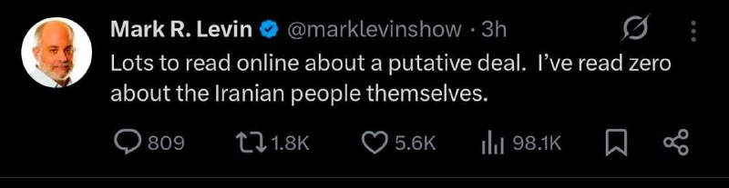

🔴مارک لوین :

در اینترنت مطالب زیادی درباره یک توافق احتمالی با جمهوری اسلامی وجود دارد. اما من هیچ چیزی درباره خود مردم ایران ندیدم و کسی در مورد مردم ایران حرف نمی زند..

@IranianMinds

## IranianMinds — post 20718

  

🔴 واشنگتن‌ پست:

آمریکا و ایران به یک چارچوب اولیه برای تمدید آتش‌بس به مدت ۶۰ روز رسیده‌اند تا مذاکرات برای پایان جنگ ادامه پیدا کند.

ایران قرار است طی ۳۰ روز تنگه هرمز را بازگشایی و مین‌های دریایی را پاکسازی کند

آمریکا هم محاصره دریایی بنادر ایران را لغو خواهد کرد

آزادسازی ۱۲ میلیارد دلار از دارایی‌های بلوکه‌شده ایران بخشی از توافق است

ایران پس از دریافت این پول، پاکسازی مین‌ها را آغاز می‌کند
تهران تعهد سطح بالایی درباره عدم دستیابی به سلاح هسته‌ای خواهد داد.

هنوز هیچ توافق نهایی امضا نشده است!

@IranianMinds

## IranianMinds — post 20717

  

🔴 پست ترامپ در تروث‌سوشال:

دموکرات‌ها سیاست‌های بد و نامزد‌های بدی دارند. غیر از این، آن‌ها عملکرد نسبتأ خوبی دارند!

@IranianMinds

## IranianMinds — post 20716

🔴 ترامپ :

من به همه دموکرات ها، رینوس ها و احمق هایی که هیچ چیز در مورد معامله احتمالی من با ایران نمی دانند می خندم.

توافق با ایران یا توافقی بزرگ و معنادار خواهد بود یا توافقی وجود نخواهد داشت.

این دقیقا برعکس فاجعه برجام خواهد بود که توسط دولت شکست خورده اوباما مذاکره شد، که راهی مستقیم و باز برای دستیابی به سلاح هسته ای برای ایران بود.

نه، من چنین معامله ای انجام نمی دهم!

@IranianMinds

## IranianMinds — post 20715

🔴 خبرگزاری تسنیم : دستور رفع محدودیت های اینترنت بین الملل تایید شده و فقط به تایید نهایی پزشکیان نیاز داره ، در صورت تایید اینترنت بین الملل تا هفته ی آینده به حالت قبل جنگ برمیگرده! @IranianMinds

## IranianMinds — post 20714

  

🔴 بن‌ گویر، وزیر امنیت ملی اسرائیل:

نتانیاهو باید مشت خود را روی میز ترامپ بکوبد و به او بگوید که ما به جنگ برمی‌گردیم!

@IranianMinds

## IranianMinds — post 20713

❌دیگه فریب بونوس سایت های متفرقه رو نخورید!

💖توی این سایت که مورد #تایید ماست، با عضویت 500 هزارتومان بگیر!

🌐 Winro.io

🌐 Winro.io

## IranianMinds — post 20712

  <a href="telegram/content/IranianMinds_20712_1779713746.webm" target="_blank">🎬 Download video</a>

💩 
⚠️ دیگه #فریب بونوس های الکی سایت های سودجو رو نخورید
❌

💲بیا توی سایت مورد تایید ما یعنی #وینرو و با عضویت 500 هزار تومان اعتبار بی قیدو شرط بگیر
👏

🤩با عضویت 
🤩 
🤩 
🤩 هزار تومان اعتبار رایگان بگیر!

⌛ پشتیبانی 24 ساعته

🌐 Winro.io

🌐 Winro.io
کانال بونوس های رایگانr4

📱 @winro_io

## IranianMinds — post 20711

🔴 کلاس های دانشگاه تهران هم‌ از ۹ خرداد حضوری شد.

@IranianMinds

## IranianMinds — post 20710

🔴 خبرگزاری تسنیم :

دستور رفع محدودیت های اینترنت بین الملل تایید شده و فقط به تایید نهایی پزشکیان نیاز داره ، در صورت تایید اینترنت بین الملل تا هفته ی آینده به حالت قبل جنگ برمیگرده!

@IranianMinds

## IranianMinds — post 20709

ترامپ چند روز‌ دیگه :

تا ظهور‌ امام زمان به ایران فرصت دادم ، امیدوارم‌ زودتر به یه نتیجه ای برسیم و اگرنه خیلی براشون بد میشه!

@IranianMinds

## IranianMinds — post 20708

🔴 مشاور وزیر ارتباطات :

شاید تا هفته آینده اینترنت بین الملل وصل شد.

@IranianMinds

## IranianMinds — post 20707

  

🔴 فاکس‌ نیوز :

ترامپ برای رسیدن به توافق نهایی ۷ روز‌ دیگر به جمهوری اسلامی زمان داد.

@IranianMinds

## IranianMinds — post 20706

🔴 اکونومیست:

عربستان از ترامپ خواسته هرگونه حمله جدید به ایران رو تا بعد از مراسم سالانه حج به تعویق بندازه.

ریاض نگرانه اگه درگیری دوباره آغاز و حریم هوایی منطقه بسته بشه، زائران در عربستان سعودی گیر بیفتن.

@IranianMinds

## IranianMinds — post 20705

  <a href="telegram/content/IranianMinds_20705_1779713747.mp4" target="_blank">🎬 Download video</a>

🔴 مارکو روبیو درباره ایران:

پیشنهاد بسیار محکمی روی میز وجود دارد.

این توافق شامل باز شدن تنگه‌ها و آغاز مذاکرات واقعی، جدی و زمان‌دار درباره مسائل هسته‌ای است.

این طرح حمایت زیادی در خلیج فارس و در سطح جهانی دارد ، همه کشورهایی که با آن‌ها صحبت کردیم، معتقدند این فقط یک پیشنهاد منطقی نیست، بلکه اقدامی درست برای جهان است

ترامپ عجله‌ای ندارد و توافق بد امضا نخواهد کرد ، ما قبل از بررسی گزینه‌های دیگر، به دیپلماسی هر فرصتی برای موفقیت می‌دهیم!

@IranianMinds

## IranianMinds — post 20704

  

⚫️ جمهوری اسلامی یکی دیگه از هموطن هامونو هم امروز کشت. خبرگزاری قوه قضائیه جمهوری اسلامی اعلام کرد مجتبی کیان امروز صبح به دلیل ارسال پیام و دادن مختصات صنایع نظامی به شبکه های ماهواره ای معاند ( ایران اینترنشنال ) اعدام شد. @IranianMinds

## IranianMinds — post 20703

  

🔴 سی بی اس نیوز :

مجتبی خامنه ای ، رهبر‌ جمهوری اسلامی در مکانی نامعلوم پنهان شده و بر ارساس ارزیابی اطلاعاتی آمریکا دسترسی خیلی کمی به دنیای بیرون داره و‌ با افراد خیلی کمی هم در ارتباطه .

@IranianMinds

## IranianMinds — post 20702

🔴 نیویورک‌پست:

احتمال رسیدن به توافق بین آمریکا و ایران به طور فزاینده‌ای کاهش یافته. هر دو طرف در ابتدا موافقت کردن که برخی از خواسته‌های حداکثری رو کنار بذارن، اما 24 ساعت بعد پس از فشار شدید اسرائیلی‌ها و دیگر طرفداران اسرائیل نزدیک به ترامپ، او لحن خودش رو به طور چشمگیری تغییر داده و خواستار آن شده که ایرانی‌ها برای هرگونه رفع تحریم و دارایی‌های مسدود شده، کل ذخیره اورانیوم خود را کنار بذارن، در حالی که در ابتدا قرار بود که بخشی از دارایی‌ها به عنوان بخشی از تفاهمنامه آزاد بشه.

تفاهمنامه روز جمعه، تحت فشار شدید است و احتمال فرو پاشیدن آن زیاده، مگه اینکه یکی از طرفین عقب‌نشینی کنه.

@IranianMinds

## BBCPersian — post 282017

  

🔻خبرگزاری‌های رویترز و فرانسه به نقل از یک مقام آگاه، از سفر غیر‌منتظره محمد باقر قالیباف و عباس عراقچی، مذاکره‌کنندگان ارشد ایران، به دوحه خبر داده‌اند.

بر اساس این گزارش‌ها، رئیس مجلس و وزیر خارجه ایران برای گفت‌وگو با نخست‌وزیر قطر به دوحه سفر کرده‌اند.

رویترز نوشت که این گفت‌و‌گوها عمدتا درباره «تنگه هرمز و ذخایر اورانیوم غنی‌شده» ایران است.

رسانه‌های ایران گزارش داده بودند که عبدالناصر همتی، رئیس کل بانک مرکزی ایران، برای «بررسی آزادسازی اموال بلوکه‌شده و در راستای کمیسیون اقتصادی مذاکرات» به قطر سفر کرده است.

هیئتی از قطر هفته پیش به ایران سفر کرده بود.

یکی از خواسته‌های ایران در مذاکره با آمریکا آزاد شدن منابع مالی مسدودشده‌اش است.

📸Anadolu via Getty Images
https://bbc.in/4tYZR0B
@BBCPersian

## BBCPersian — post 282016

  

🔻عبدالناصر همتی، رئیس کل بانک مرکزی ایران، عازم قطر شد.

به گزارش رسانه‌های دولتی ایران، این سفر در پی گفت‌وگوهای اخیر هیئت قطری در تهران درباره دارایی‌های مسدودشده ایران انجام شده است.

یکی از خواسته‌های ایران در مذاکرات با آمریکا آزاد شدن منابع مالی مسدود شده‌اش در خارج از کشور، از جمله در قطر، بوده است.

در زمان ریاست جمهوری ابراهیم رئیسی، بخشی از دارایی‌های مسدود شده ایران از بانک‌های کره جنوبی به قطر منتقل شد تا همزمان با آزادی برخی از اتباع آمریکایی از زندان‌های ایران، با نظارت ایالات متحده صرف خرید کالاهای ضروری مورد درخواست ایران از جمله غدا و دارو شود.

با تبادل زندانیان، این پول به بانک‌های قطر منتقل شد، اما با حمله هفتم اکتبر حماس به اسرائیل و آغاز جنگ در غزه، انتقال پول به ایران انجام نشد.

علی خامنه‌ای، رهبر سابق جمهوری اسلامی در سفر امیر قطر به تهران در بهمن ۱۴۰۳، خواستار آزاد شدن این منابع مالی شده بود.

📸ASRIRAN
https://bbc.in/49V4TEj
@BBCPersian

## BBCPersian — post 282015

  

🔻آژانس پناهندگان فلسطینی سازمان ملل، اونروا، می‌گوید که بیش از ۱۲۵ هزار مورد عفونت پوستی ناشی از جوندگان و حشرات را در این منطقه محاصره‌شده شناسایی کرده است.

این نهاد در حسابش در شبکه اجتماعی ایکس نوشت: «تیم‌های بهداشت ما در حال سم‌پاشی و آفت‌کشی ایمن در مناطقی هستند که تعداد زیادی از آوارگان هنوز در سکونتگاه‌های موقت پرجمعیت زندگی می‌کنند.»

این آژانس می‌گوید: «کمبود شدید سوخت، آفت‌کش‌، چادر و دارو واکنش به این بحران را محدود می‌کند.»

به گفته اونروا، غزه نیاز به «ورود نامحدود لوازم بهداشتی و پزشکی» دارد.

براساس گزارش‌ها، با توجه به اینکه همچنان صدها هزار فلسطینی آواره در غزه هنوز در چادرها زندگی می‌کنند و هیچ نشانه‌ای از بازسازی این منطقه به چشم نمی‌خورد، تلاش برای تهیه آب تمیز و مقابله با حیوانات ناقل بیماری به طور فزاینده‌ای دشوار شده است.

📸Anadolu via Getty Images
https://bbc.in/4uFNNTh
@BBCPersian

## BBCPersian — post 282014

  

🔻شهباز شریف، نخست‌وزیر پاکستان، در دیدار با همتای چینی خود در پکن، ابراز خوشبینی کرده است که مذاکرات ایران و آمریکا «در مسیر درست در حال پیشرفت است.»

آقای شریف همراه با فیلد مارشال عاصم منیر، فرمانده کل ارتش و نیروهای مسلح پاکستان، به چین سفر کرده است که اخیرا با هدف میانجیگری و کمک به حصول توافق میان ایران و آمریکا به تهران رفته بود.

به گزارش خبرگزاری دولتی پاکستان، آقای شریف از شی جین پینگ، رئیس‌جمهور چین، برای حمایت‌ از تلاش‌های اسلام‌آباد برای ترویج صلح و برقراری آتش‌بس تشکر کرد.

آقای شریف در دیدار با لی چیانگ، نخست‌وزیر چین، گفت که «جهان در حال عبور از یک لحظه حساس در میانه بحران» در خلیج فارس است.

به گفته آقای شریف، «این بحران هم به اقتصادهای منطقه از جمله پاکستان، که واردکننده نفت و فرآورده‌های نفتی است، آسیب رسانده است و هم به جامعه جهانی.»

📸EPA/Shutterstock
https://bbc.in/42PXDpt
@BBCPersian

## BBCPersian — post 282013

🔻نیکزاد و حاجی‌بابایی نایب رئیس مجلس ماندند

علی نیکزاد، نماینده اردبیل و حمیدرضا حاجی بابایی، نماینده همدان بعنوان نواب رئیس انتخاب شدند.

به گزارش رسانه‌های ایران، آقای نیکزاد با ۱۴۳ رای و آقای حاجی‌بابایی با ۱۰۰ رای از ۲۸۰ نماینده حاضر در انتخابات نواب رئیس مجلس اول و دوم شدند.

عبدالرضا مصری با ۸۸ رای، حسینعلی حاجی دلگیانی با ۶۸ رای، رضا جباری با ۵۷ رای، علیرضا منادی سفیدان با ۵۲ رای و پیمان فلسفی با چهار رای، دیگر نامزدهای نیابت رئیس مجلس بودند.

پیش از این محمدباقر قالیباف با ۲۳۵ رأی از ۲۷۱ آرای مأخوذه، برای هفتمین سال متوالی به‌عنوان رئیس مجلس انتخاب شده بود.

به این ترتیب رئیس و دو نایب رئیس مجلس ابقا شدند.

این انتخابات حضوری و با رای مستقیم نمایندگان برای انتخاب ۱۲ عضو هیئت‌رئیسه شامل یک رئیس، دو نایب رئیس، شش دبیر و سه ناظر برگزار شد.

پیش از این، انتخابات با ورقه برگزار می‌شد اما رای‌گیری امسال با رای مستقیم نمایندگان به صندوق‌های الکترونیک رای‌گیری انجام شد.

https://bbc.in/4dvvoTc
@BBCPersian

## BBCPersian — post 282012

  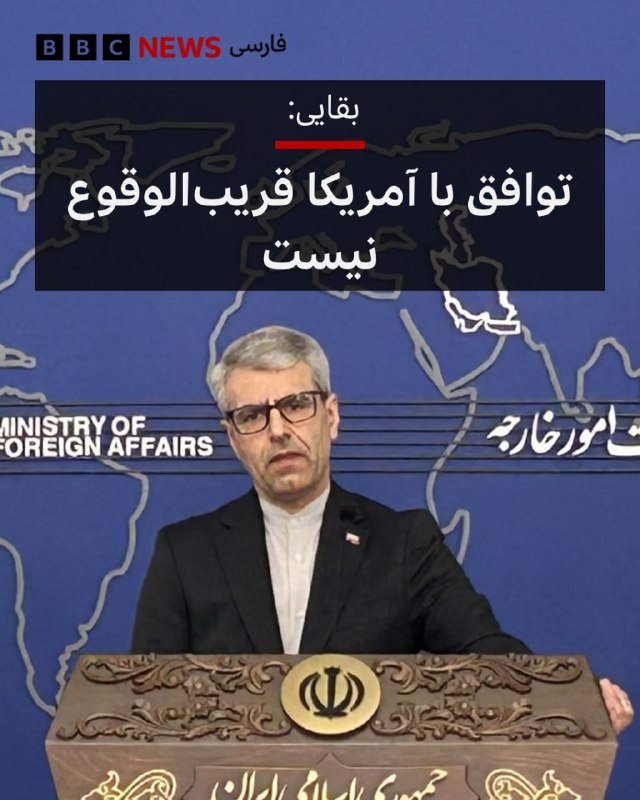

🔻سخنگوی وزارت خارجه ایران در واکنش به اظهارات مقام‌های آمریکایی که از پیشرفت در مذاکرات می‌گویند، گفت که در برخی موضوعات دو طرف به جمع‌بندی رسیده‌اند اما نمی‌توان گفت که توافق قریب‌الوقوع است.

اسماعیل بقایی مواضع ضد‌و‌نقیض مقام‌های آمریکا و سابقه حمله این کشور در میانه مذاکره را ازجمله دلایل این امر عنوان کرد.

این در حالی است که مارکو روبیو، وزیر خارجه آمریکا، گفته است که توافق میان تهران و واشنگتن «هنوز در حال پیشرفت است». دونالد ترامپ هم دیروز از نزدیک شدن به توافق گفته بود اما بعد تاکید کرد که عجله‌ای برای رسیدن به توافق ندارد.

📸GettyImages
@BBCPersian

## BBCPersian — post 282011

  <a href="telegram/content/BBCPersian_282011_1779713755.mp4" target="_blank">🎬 Download video</a>

🔻‌مارکو روبیو، وزیر خارجه آمریکا، گفته است که توافق میان تهران و واشنگتن «هنوز در حال پیشرفت است» و دونالد ترامپ، رئیس‌جمهور آمریکا، «عجله‌ای برای رسیدن به توافق ندارد.»

او پیش از ترک دهلی نو گفت که در حال حاضر «یک پیشنهاد کاملا محکم» برای رسیدن به توافق داریم که با باز شدن تنگه هرمز می‌توانیم وارد «یک مذاکره بسیار واقعی، مهم و با محدودیت زمانی در مورد مسائل هسته‌ای» بشویم.

به گفته وزیر خارجه آمریکا، دونالد ترامپ «قرار نیست توافق بدی انجام دهد، بنابراین بیایید ببینیم چه اتفاقی می‌افتد. ما قبل از بررسی گزینه‌های دیگر، هر فرصتی به دیپلماسی برای موفقیت می‌دهیم.»

او تاکید کرد که «یا توافق خوبی خواهیم داشت، یا باید به روش دیگری با این مسئله برخورد کنیم و ما ترجیح می‌دهیم توافق خوبی داشته باشیم.»

او در مورد اینکه چرا هنوز توافق اعلام نشده است گفت که این را باید از ایرانی‌ها پرسید و «ما منتظر شنیدن نظرات آنها هستیم و در سیستم آنها کمی طول می‌کشد تا آنها پاسخ دهند.»

https://bbc.in/4tYH5Xb
@BBCPersian

## BBCPersian — post 282010

  

🔻ایران می‌گوید که سفر وزیر خارجه به نیویورک برای شرکت در نشست شورای امنیت «منتفی» شده است.

اسماعیل بقایی، سخنگوی وزارت خارجه ایران، دلیل انجام نشدن سفر عباس عراقچی را «مشکل روادید» عنوان کرد.

آقای بقایی چهارشنبه هفته پیش درمورد حضور آقای عراقچی در این نشست گفته بود: «این سفر به نیویورک احتمال دارد انجام شود و البته ممکن هم هست انجام نشود، چون هنوز قطعی نیست. دلیلش هم این است که هم باید روادید صادر شود و هم ممکن است اولویت‌های دیگری داشته باشیم.»

چین به‌عنوان رئیس دوره‌ای شورای امنیت، سه‌شنبه ۲۶ مه یک بحث آزاد در سطح بالا با موضوع «حفظ اهداف و اصول منشور سازمان ملل و تقویت نظام بین‌المللی متمرکز بر سازمان ملل» برگزار خواهد کرد.

این جلسه به ریاست وانگ یی، عضو دفتر سیاسی کمیته مرکزی حزب کمونیست و وزیر امور خارجه چین، برگزار می‌شود.

چین این نشست را «فرصتی» برای همبستگی و اجماع کشورهای عضو توصیف کرد تا «تعهد راسخ خود را به حفظ اهداف و اصول منشور سازمان ملل متحد مجددا تصریح و نقش محوری این سازمان را در نظام بین‌المللی احیا کنند.»

📸Anadolu via Getty Images
https://bbc.in/42PLVv0
@BBCPersian

## BBCPersian — post 282003

🖋پاول آکسنوف
خبرنگار امور نظامی، بخش روسی بی‌بی‌سی

سرگئی مرنکوف، طراح ارشد هواپیماهای ترابری شرکت «هواپیماسازی غیرنظامی اورال»، اعلام کرد که کار روی ساخت هواپیمای جدید توربوپراپ «تی‌وی‌آراس-۴۴ لادوگا» در روسیه متوقف شده و این پروژه به وزارت دفاع واگذار شده است.

آقای مرنکوف در کنفرانسی درباره پشتیبانی هوانوردی مناطق قطبی، سیبری و خاور دور که سازمان هوانوردی روسیه برگزار کرده بود، گفت: «پروژه تی‌وی‌آراس-۴۴ لادوگا متوقف شده است. تصمیم گرفته شده این هواپیما و تمام زیرساخت‌های علمی و فنی آن در اختیار وزارت دفاع قرار گیرد تا بر پایه آن، یا نسخه ترابری مجهز به رمپ، یا نسخه ترابری با در جانبی، یا نسخه مسافربری ویژه نیازهای وزارت دفاع ساخته شود.»

او همچنین گفت که به دفتر طراحی این پروژه اجازه داده شده نخستین پرواز لادوگا را در سال ۲۰۲۶ انجام دهد.
ادامه مطلب⬇️

📸Getty/ elegram/favt_ru/ V.Lapkin/TASS/
https://bbc.in/4dGyZg1
@BBCPersian

## BBCPersian — post 281993

🖋سعید جعفری، روزنامه‌نگار

محمود احمدی‌نژاد سال‌ها به‌عنوان یکی از تندترین چهره‌های ضداسرائیلی جمهوری اسلامی شناخته می‌شد. اما حالا گزارش‌ها و روایت‌هایی منتشر شده که می‌گویند نام او در برخی سناریوهای مرتبط با آینده سیاسی ایران مطرح بوده است.

در این پست، نگاهی داریم به مواضع جنجالی احمدی‌نژاد، واکنش تحلیلگران اسرائیلی و آمریکایی، و این پرسش که چرا نام او دوباره در میانه بحث‌های مربوط به آینده ایران مطرح شده است.
ادامه مطلب⬇️

📸Getty/ Social media/ mahmoud ahmadinejad X/
https://bbc.in/4fGx9y5
@BBCPersian

## Dirty_Kids — post 390143

دسته جمعی به گا رفتیم مقصرم تو یخچاله.

@Dirty_Kids 👻

## Dirty_Kids — post 390142

‏ترامپ هم مثل منه، معلوم نیست چه گهی داره تو زندگیش می‌خوره‌.

@Dirty_Kids 👻

## Dirty_Kids — post 390141

  

مامان بزرگم وقتی داییم و زن داییم برای بار پنجم توی عروسیشون لب گرفتن:

@Dirty_Kids 👻

## Dirty_Kids — post 390138

نه بابا فشار چیه؛ توی توییتر یه نفر توییت زده «گل مورد علاقه شما چیه؟»

و حالا پسرا شروع کردن از دوس دخترشون عکس گذاشتن.

@Dirty_Kids 👻

## Dirty_Kids — post 390137

  

مسجد ابوذر در بلوار ابوذر ،اتوبان محلاتی؛
آموزش کار با اسلحه ،جمهوری اسلامی از چه خطری این روزها انقد وحشت کرده؟

@Dirty_Kids 👻

## Dirty_Kids — post 390136

  

ترامپ: من می‌خندم به همه‌ی این دموکرات‌های مادرقحبه‌ی احمق.

راینوها [جمهوری‌خواهان اسمی] و نادان‌هایی که هیچ‌چی از توافق احتمالی من با رژیم هزارپدر روافض نمی‌دونن، چیزهایی که هنوز حتی مذاکره هم درباره‌شون نشده.

آدم‌های ضعیف و بی‌عرضه‌ای مثل سناتور شکست‌خورده‌ تام‌تیلیس (که به زودی از کار برکنار میشه)، بیل‌کسیدی که همین تازگی‌ها توی انتخابات مقدماتی یه شکست سنگین خورد، و نماینده‌ی واقعاً پدرقحبه‌ی کنگره توماس‌مسی یه آدم کثیف و کسکش تمام‌عیار که بعد از نشون دادن بی‌وفایی شدید به حزبش و کشور در یه شکست مفتضحانه و تاریخی بازی رو به یه میهن‌پرست بزرگ آمریکایی [با حمایت و تایید ترامپ] واگذار کرد.

و تقریباً همه‌ی دموکرات‌های قرمساق، آدم‌هایی که کلاً راهشون رو گم کردن، دائماً از سیاست‌های بد و نامزدهای حتی بدتر حمایت می‌کنن، اما در عین حال، مدام از تک‌تکِ بردهای فوق‌العاده من ایراد می‌گیرن.

این پدرخراب‌ها باید برن خونه‌شون و استراحت کنن، کارشون فقط تفرقه‌اندازی و باخته. به عبارت دیگه، اینا یه مشت بازنده‌‌ی مادرقحبه‌ان.

توافق با رژیم روافض یا یه توافق بزرگ و پرمعنی می‌شه، یا اصلاً توافقی در کار نخواهد بود.

این دقیقاً برعکس فاجعه‌ی برجام خواهد بود که توسط دولت شکست‌خورده‌ی اوبامای قحبه مذاکره شد. همون توافقی که یه مسیر مستقیم و باز برای رسیدن ایران به سلاح هسته‌ای بود.

خیر عزیزان، من از این‌جور توافق‌ها نمی‌کنم [اینقدر کسخل و‌مشنگ نیستم که به روافض کون بدم]

رئیس‌جمهور دی‌جی‌تی،

@Dirty_Kids 👻

## Dirty_Kids — post 390135

  <a href="telegram/content/Dirty_Kids_390135_1779713759.mp4" target="_blank">🎬 Download video</a>

از وقتی اینترنت قطع شده انلاین شاپا دست به هرکاری میزنن بتونن جنساشونو بفروشن

@Dirty_Kids 👻

## Dirty_Kids — post 390134

  <a href="telegram/content/Dirty_Kids_390134_1779713761.mp4" target="_blank">🎬 Download video</a>

طرفدارهایی که از پایان سریال The Boys شاکی هستن شروع کردن خودشون پایان بندی‌های مختلف رو با AI می‌سازن و باید بگم همین یک دقیقه‌ای که یکی از طرفدارها ساخته هم کیفیت VFXش و هم هیجانش از کل فصل ۵ بیشتر بود!

@Dirty_Kids 👻

## Dirty_Kids — post 390133

  <a href="telegram/content/Dirty_Kids_390133_1779713763.mp4" target="_blank">🎬 Download video</a>

امید دانا خود مواد مخدره، مصرف نمی‌کنه، خودش عین و سرچشمه مواد مخدره

@Dirty_Kids 👻

## Dirty_Kids — post 390132

  <a href="https://t.me/Dirty_Kids/390132" target="_blank">📎 Download file</a>

📱 اپلیکیشن اندروید بدون فیلتر ریتزوبت

➖➖➖➖➖

🔹 ثبت نام آسان 
✅
🔹 رابط کاربری بسیار راحت و سریع 
✅
🔹 درگاه پرداخت کارت به کارت 
✅
🔹 درگاه پرداخت دلاری سریع 
✅
🔹 بونوس ۱۰۰ درصدی اولین واریز 
✅
🔹 بونوس ۱۰۰ درصدی واریز یکشنبه ها 
✅

➖➖➖➖➖
🌐 https://RitzoBet.com

⚡️ @RitzoBet_ir

## Dirty_Kids — post 390131

  

⚠️ برای #شرطبندی های فوتبال از سایت معتبر و بین المللی استفاده کنید ✅

سایت #ریتزوبت ، چهار سال هستش داخل ایران فعالیت میکنه 
✅

لایسنس بین المللی داره ، روش های شارژ و برداشت متنوع داره و بونوس 100% ورزشی و کش بک های جذاب
💎

⏪ اپلیکیشن بدون فیلتر ریتزوبت 
📱
⏩
R4

✅ لینک بدون‌ فیلتر ریتزوبت
🤣

🆔 @RitzoBet_ir 
🇮🇷

## Dirty_Kids — post 390130

هر موقع شک کردی رب گوجه فرنگی کافیه برای ماکارونی ، دو قاشق دیگه رب بریز.

@Dirty_Kids 👻

## Dirty_Kids — post 390129

  <a href="telegram/content/Dirty_Kids_390129_1779713766.mp4" target="_blank">🎬 Download video</a>

پخش اذان مغرب مسلمانان از بلندگو در ميدان شلوغ دانداس تورنتو كانادا 🇨🇦

@Dirty_Kids 👻

## Dirty_Kids — post 390127

  

🌪وقتی اینترنت طوفانیه فقط کافیه بادبان ها رو بکشی

⚫️100 هزار تومان تخفیف خرید اول 
🎁

⚫️پایین ترین قیمت گیگی 180 هزار تومان
🌐 

⚫️پورسانت %10 دائمی برای هر معرفی
💼

با بادبان، میتونی یه اتصال سریع، پایدار و امن
همراه با پشتیبانی ۲۴ ساعته داشته باشی
🚀

🛒کد تخفیف: badban4k

بادبان راهتو باز می‌کنه
⛵️
R4

🛡@BadBan_VPN | کانال 

🤖@BadBan_VPNBot | ربات 

📞@BadBan_VPNSupport | پشتیبانی

## Dirty_Kids — post 390126

  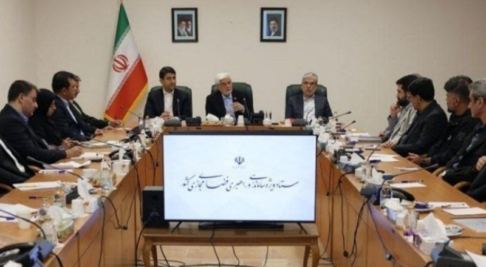

فارس: تو جلسهٔ ستاد ویژهٔ ساماندهی فضای مجازی

اتصال مجدد اینترنت بین‌الملل به رای گذاشته شد که با 9 رای موافق و 3 رای مخالف تصویب و به پزشکیان ارسال شد.

@Dirty_Kids 👻

## Dirty_Kids — post 390125

  <a href="telegram/content/Dirty_Kids_390125_1779713770.mp4" target="_blank">🎬 Download video</a>

بیوگرافی کوتاهی از عمو مانوک و مرگ مشکوکش:

@Dirty_Kids 👻

## Dirty_Kids — post 390124

  

خودت خایه نوشتن «خایه» رو نداشتی.

@Dirty_Kids 👻

## Dirty_Kids — post 390123

  <a href="telegram/content/Dirty_Kids_390123_1779713772.mp4" target="_blank">🎬 Download video</a>

دل یه ایران گرفته

@Dirty_Kids 👻

## Hranews — post 113152

  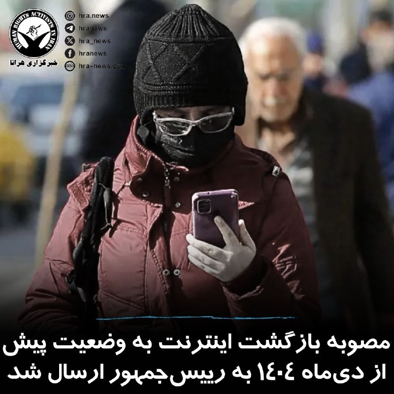

امروز دوشنبه ۴ خرداد ۱۴۰۵، ستاد راهبری و ساماندهی فضای مجازی به ریاست محمدرضا عارف معاون اول رئیس‌جمهور، بازگشت #اینترنت به وضعیت پیش از دی‌ماه ۱۴۰۴ را تصویب کرد. این مصوبه به رئیس‌جمهور ارسال شده و در صورت تایید وی، جهت اجرا به وزارت ارتباطات ابلاغ خواهد شد./امتداد

↘️
@hranews_bot تماس ✉️ -  @Hranews  کانال هرانا 🆑

## Hranews — post 113151

با انگیزه تجاوز؛ گزارشی از قتل یک پسر ۱۱ ساله در مشهد

❗️
❗️
❗️
❗️
❗️– مردی ۲۳ ساله در مشهد که با انگیزه تجاوز اقدام به ربودن یک #کودک پسر ۱۱ ساله کرده بود، با وارد کردن ضربات سنگ به سرش، آن کودک را به #قتل رساند. متهم هم اکنون در بازداشت به سر می برد و تحقیقات در خصوص این پرونده ادامه دارد.

ادامه مطلب

↘️
@hranews_bot تماس ✉️ -  @Hranews  کانال هرانا 🆑

## Hranews — post 113150

وقوع حادثه در پالایشگاه ششم پارس جنوبی؛ ۶ کارگر مصدوم شدند

❗️
❗️
❗️
❗️
❗️– سخنگوی مجتمع گاز پارس جنوبی اعلام کرد که حین عملیات آواربرداری پالایشگاه ششم پارس جنوبی ۶ #کارگر در پی وقوع حادثه‌ای مصدوم شدند.

ادامه مطلب

↘️
@hranews_bot تماس ✉️ -  @Hranews  کانال هرانا 🆑

## Hranews — post 113149

  

مجید رحمتی، عضو هیات مدیره کانون هماهنگی شوراهای اسلامی کار تهران، با اشاره به افزایش شدید قیمت مواد غذایی در ایران گفت که «مرغ هم از سفره ما کارگران حذف شده» و بسیاری از خانواده‌های کارگری دیگر توان خرید منظم منابع پروتئینی را ندارند. براساس گزارش منتشرشده، قیمت هر شانه تخم‌مرغ به حدود ۵۰۰ هزار تومان و قیمت مرغ در برخی موارد به کیلویی ۴۷۰ هزار تومان رسیده؛ در حالی که حداقل دستمزد ماهانه کارگران حدود ۲۳ تا ۲۴ میلیون تومان است. رحمتی می‌گوید بخش عمده درآمد #کارگران صرف اجاره مسکن و هزینه‌های اولیه زندگی می‌شود و حتی تامین خوراک ساده نیز برای بسیاری از خانوارها دشوار شده است.

این فعال کارگری همچنین گفت که سبد حداقلی معیشت خانوار کارگری که سال گذشته حدود ۴۵ میلیون تومان برآورد می‌شد، اکنون به حدود ۷۰ میلیون تومان رسیده است. به گفته او، کارگران امروز «برای بقا و زنده ماندن مبارزه می‌کنند» و سیاست‌های کنونی کنترل قیمت‌ها نیز دیگر کارایی گذشته را ندارند.

↘️
@hranews_bot تماس ✉️ -  @Hranews  کانال هرانا 🆑

## Hranews — post 113148

  

بر اساس آخرین داده‌های نت‌بلاکس، اکنون هشتادوهفتمین روز متوالی قطع اینترنت در ایران است؛ محدودیتی که بیش از ۲۰۶۴ ساعت ادامه داشته است. این نهاد ناظر بر وضعیت #اینترنت در جهان تاکید می‌کند این اقدام هرگونه شفافیت درباره اعدام‌ها را از میان برده و بر شرایط غیرانسانی و وضعیت بلاتکلیفی روزانه که منتقدان، مخالفان و گردشگران زندانی با آن روبه‌رو هستند، افزوده است.

↘️
@hranews_bot تماس ✉️ -  @Hranews  کانال هرانا 🆑

## Hranews — post 113147

  

بند زنان زندان اوین؛ ۵ زندانی سیاسی از دسترسی به تماس تلفنی محروم شدند

❗️
❗️
❗️
❗️
❗️– گلرخ ایرایی، زهرا صفایی، مرضیه فارسی، شیوا اسماعیلی و سکینه پروانه، پنج زندانی سیاسی محبوس در زندان اوین، از روز گذشته به صورت تنبیهی از حق استفاده از تلفن زندان محروم شده‌اند. این زندانیان همچنین پیش از این نیز از حق ملاقات حضوری با خانواده و وکلای خود محروم بوده‌اند و این محدودیت همچنان ادامه دارد.

به گزارش خبرگزاری هرانا، ارگان خبری مجموعه فعالان حقوق بشر در ایران، پنج زندانی سیاسی زن محبوس در زندان اوین از حق استفاده از تلفن زندان محروم شدند.

براساس اطلاعات دریافتی هرانا، روز گذشته گلرخ ایرایی، زهرا صفایی، مرضیه فارسی، شیوا اسماعیلی و سکینه پروانه از امکان دسترسی و استفاده از تلفن زندان منع شده‌اند و این محرومیت همچنان ادامه دارد.
اقدام تنبیهی یادشده پس از آن اعمال شد که این زندانیان در اعتراض به اجرای احکام اعدام، در محوطه هواخوری زندان اقدام به سر دادن شعار کرده بودند.

ادامه مطلب

#گلرخ_ایرایی
#زهرا_صفایی
#مرضیه_فارسی
#شیوا_اسماعیلی
#سکینه_پروانه

↘️
@hranews_bot تماس ✉️ -  @Hranews  کانال هرانا 🆑

## Hranews — post 113146

اعتراضات ۱۴۰۴؛ عباس اکبری فیض‌آبادی اعدام شد

❗️
❗️
❗️
❗️
❗️– مرکز رسانه قوه قضاییه از اجرای حکم اعدام عباس اکبری فیض‌آبادی، از بازداشت‌شدگان اعتراضات ۱۴۰۴ که به اتهاماتی از جمله «محاربه» متهم شده بود خبر داد. این حکم بامداد امروز به اجرا درآمد. بر اساس داده‌های گردآوری‌شده توسط هرانا، همزمان با آغاز درگیری‌های نظامی، روند صدور و اجرای احکام #اعدام در پرونده‌های سیاسی و امنیتی افزایش یافته و تاکنون ۳۶ زندانی با این اتهامات در این بازه زمانی اعدام شده‌اند.

ادامه مطلب

#عباس_اکبری_فیض‌آبادی

↘️
@hranews_bot تماس ✉️ -  @Hranews  کانال هرانا 🆑

## Hranews — post 113145

  

جمعی از رانندگان استیجاری برای سومین روز متوالی در مقابل ساختمان نهاد ریاست جمهوری در تهران، #تجمع_اعتراضی برگزار کردند.

به گفته این رانندگان، ما از استان‌های مختلف در حالی برای اعتراض به تهران آمده‌ایم که از سال ۱۴۰۰ به دنبال اجرای قانون و تبدیل وضعیت هستیم اما هیچ نهادی پیگیر وضعیت ما نیست.

↘️
@hranews_bot تماس ✉️ -  @Hranews  کانال هرانا 🆑

## manototv — post 105828

  <a href="telegram/content/manototv_105828_1779713779.mp4" target="_blank">🎬 Download video</a>

تماسی از هلند:
«می‌گفت هر روز با برنامه‌های منوتو زندگی می‌کردیم…
و حالا نمی‌دانیم بعد از آن باید چه کنیم.»
او همچنین از جاویدنام سینا حق‌شناس یاد کرد؛ دوستی که خبر جان‌باختنش زندگی او را زیر و رو کرده بو

## manototv — post 105827

  <a href="telegram/content/manototv_105827_1779713781.mp4" target="_blank">🎬 Download video</a>

گفت‌وگو درباره اعتراضات خارج از کشور:
« چه رفتارهایی به همبستگی و رساندن پیام مردم ایران کمک می‌کند؟»

## manototv — post 105826

  <a href="telegram/content/manototv_105826_1779713784.mp4" target="_blank">🎬 Download video</a>

تماسی از اتریش:
«می‌گفت سختی‌ها خیلی‌ها را عوض کرد…
و از کیوان عباسی به‌خاطر حفظ همان نگاه و مسیر همیشگی‌اش قدردانی کرد.»

## alonews — post 122565

  <a href="telegram/content/alonews_122565_1779713786.webm" target="_blank">🎬 Download video</a>

👈عصر دوشنبه، صدای فعالیت پدافند در جزیره قشم  از سوی ساکنان محلی گزارش شده است.

🔴بر اساس این گزارش، هنوز ماهیت این صداها مشخص نیست و هنوز هیچ‌یک از نهادهای رسمی درباره علت وقوع این صداها اظهارنظر نکرده‌اند

✅ @AloNews خبر جنگ

## alonews — post 122564

  <a href="telegram/content/alonews_122564_1779713786.webm" target="_blank">🎬 Download video</a>

👈جروزالم پست: ترامپ از تأثیرگذاران راست‌گرا و چهره‌های رسانه‌ای مرتبط با اردوگاه MAGA برای توضیح کلیات توافق با تهران و جلوگیری از شورش سیاسی در پایه محافظه‌کار رئیس‌جمهور استفاده می‌کند.

✅ @AloNews خبر جنگ

## alonews — post 122563

  <a href="telegram/content/alonews_122563_1779713787.webm" target="_blank">🎬 Download video</a>

👈ترامپ : مذاکرات با جمهوری اسلامی ایران به خوبی در حال پیشرفت است!

🔴این فقط یک توافق بزرگ برای همه خواهد بود یا اصلاً توافقی نخواهد بود — بازگشت به جبهه نبرد و تیراندازی، اما بزرگ‌تر و قوی‌تر از هر زمان قبل — و هیچ‌کس آن را نمی‌خواهد!

🔴من اعلام کردم که پس از تمام کارهایی که ایالات متحده انجام داده تا سعی کند این پازل بسیار پیچیده را کنار هم بچیند، باید الزامی باشد که تمام این کشورها، حداقل، همزمان به توافق‌نامه‌های ابراهیم بپیوندند.

🔴ممکن است یکی یا دو کشور دلیل داشته باشند که این کار را نکنند و این پذیرفته خواهد شد، اما اکثریت باید آماده، مایل و قادر باشند که این تسویه حساب با ایران را به رویدادی بسیار تاریخی‌تر تبدیل کنند تا آن چیزی که در غیر این صورت خواهد بود.

🔴در صحبت با بسیاری از رهبران بزرگ ذکر شده در بالا، آن‌ها افتخار خواهند کرد، به محض اینکه سند ما امضا شود، که جمهوری اسلامی ایران به عنوان بخشی از توافق‌نامه‌های ابراهیم حضور داشته باشد. وای، این واقعاً چیزی خاص خواهد بود!

🔴من به صورت الزامی درخواست می‌کنم که تمام کشورها فوراً توافق‌نامه‌های ابراهیم را امضا کنند و اگر ایران توافق‌نامه خود را با من، به عنوان رئیس‌جمهور ایالات متحده آمریکا، امضا کند، افتخاری خواهد بود که آن‌ها نیز بخشی از این ائتلاف بی‌نظیر جهانی باشند.

✅ @AloNews خبر جنگ

## alonews — post 122562

  <a href="telegram/content/alonews_122562_1779713787.mp4" target="_blank">🎬 Download video</a>

👈 رئیس‌جمهور چین شی جین‌پینگ به نخست‌وزیر پاکستان شریف: از زمان برقراری روابط دیپلماتیک ۷۵ سال پیش، چین و پاکستان یکدیگر را درک کرده‌اند، به یکدیگر اعتماد کرده‌اند و از یکدیگر حمایت کرده‌اند و دوستی سنتی شکست‌ناپذیری را شکل داده‌اند.

🔴علی‌رغم تغییرات بین‌المللی، چین همواره روابط با پاکستان را در دیپلماسی همسایگی خود در اولویت قرار داده است.

✅ @AloNews خبر جنگ

## alonews — post 122561

  <a href="telegram/content/alonews_122561_1779713789.mp4" target="_blank">🎬 Download video</a>

👈 شی جین‌پینگ، رئیس‌جمهور چین: فیلد مارشال منیر، می‌دانم که شما تازه برای تلاش‌های مثبت در میانجی‌گری برای صلح از ایران بازگشته‌اید.

🔴ما نقش سازنده پاکستان را تقدیر می‌کنیم.

✅ @AloNews خبر جنگ

## alonews — post 122559

  <a href="telegram/content/alonews_122559_1779713792.webm" target="_blank">🎬 Download video</a>

👈ارتش دفاعی اسرائیل دو هشدار تخلیه برای ساختمان‌هایی در برج الشمالی، منطقه صور، جنوب لبنان صادر کرده است.

🔴 ارتش اسرائیل ادعا می‌کند که این ساختمان‌ها توسط حزب‌الله استفاده می‌شوند..

✅ @AloNews خبر جنگ

## alonews — post 122558

  <a href="telegram/content/alonews_122558_1779713792.webm" target="_blank">🎬 Download video</a>

👈خبرگزاری مهر: محمد باقر قالیباف با امیر قطر دیدار خواهد کرد!

✅ @AloNews خبر جنگ

## alonews — post 122557

  <a href="telegram/content/alonews_122557_1779713792.webm" target="_blank">🎬 Download video</a>

👈ترامپ به مجری فاکس‌نیوز: هرگز پول نقد به ایران نمی‌دهم

✅ @AloNews خبر جنگ

## alonews — post 122556

  <a href="telegram/content/alonews_122556_1779713792.webm" target="_blank">🎬 Download video</a>

👈جروزالم پست: رهبری چین ممکن است محاسبه کند که همکاری معنادار با واشنگتن در مورد ایران، انعطاف‌پذیری متقابل آمریکایی را در مورد هدف ملی اصلی پکن شایسته می‌داند.

✅ @AloNews خبر جنگ

## alonews — post 122555

  <a href="telegram/content/alonews_122555_1779713793.webm" target="_blank">🎬 Download video</a>

👈 «اتاق بازرگانی ایران و پاکستان، یک نهاد تجاری خصوصی دوجانبه که منافع تجاری ایران و پاکستان را نمایندگی می کند، امارات متحده عربی را متهم کرده است که فعالانه مانع ادغام ایران در کریدور اقتصادی چین-پاکستان از تبدیل شدن به یک کریدور اقتصادی پورتدارو پاکستان (CPEC) در دو کشور است دبی." - فارس نیوز.

✅ @AloNews خبر جنگ

## alonews — post 122554

  <a href="telegram/content/alonews_122554_1779713793.webm" target="_blank">🎬 Download video</a>

👈تسنیم خبر سفر قالیباف و عراقچی به قطر را تأیید کرد

✅ @AloNews خبر جنگ

## alonews — post 122553

  <a href="telegram/content/alonews_122553_1779713793.webm" target="_blank">🎬 Download video</a>

👈ارتش دفاعی اسرائیل هشدار تخلیه برای ساختمانی در اردوگاه پناهندگان فلسطینی رشدیه در نزدیکی شهر صور در جنوب لبنان صادر کرده است و ادعا می‌کند که این ساختمان توسط حزب‌الله استفاده می‌شود.

🔴 از ساکنان خواسته شده حداقل ۳۰۰ متر از این ساختمان فاصله بگیرند

✅ @AloNews خبر جنگ

## alonews — post 122552

  <a href="telegram/content/alonews_122552_1779713793.webm" target="_blank">🎬 Download video</a>

👈رئیس مجلس ایران، قالیباف، و وزیر امور خارجه عراقچی امروز زودتر به دوحه، قطر، رسیدند برای گفتگو درباره تلاش‌های دیپلماتیک جاری برای پایان دادن به درگیری، طبق گزارش فاکس نیوز 
✅ @AloNews خبر جنگ

## alonews — post 122551

  <a href="telegram/content/alonews_122551_1779713793.webm" target="_blank">🎬 Download video</a>

🔴مسجد ابوذر در بلوار ابوذر ،اتوبان محلاتی؛
آموزش کار با اسلحه.

🤔جمهوری اسلامی از چه خطری این روزها وحشت کرده ؟

✅@AloNews

## alonews — post 122550

  <a href="telegram/content/alonews_122550_1779713794.webm" target="_blank">🎬 Download video</a>

👈 همچنان حمله‌های ارتش اسرائیل به جنوب لبنان

✅ @AloNews خبر جنگ

## alonews — post 122549

  <a href="telegram/content/alonews_122549_1779713794.webm" target="_blank">🎬 Download video</a>

👈دو مقام اسرائیلی به رویترز: نتانیاهو به نزدیکان خود می‌گوید که هیچ تأثیری بر تصمیمات ترامپ ندارد

✅ @AloNews خبر جنگ

## alonews — post 122547

  <a href="telegram/content/alonews_122547_1779713794.mp4" target="_blank">🎬 Download video</a>

👈تخریب در قانا و نبطیه در جنوب لبنان پس از حملات اسرائیل

✅ @AloNews خبر جنگ

## alonews — post 122546

  <a href="telegram/content/alonews_122546_1779713796.webm" target="_blank">🎬 Download video</a>

👈نیروی دریایی سپاه: در شبانه‌روز گذشته ۳۲ کشتی اعم از نفتکش، کانتینربر و سایر کشتی‌های تجاری پس از کسب مجوز با هماهنگی و تامین امنیت نیروی دریایی سپاه از تنگهٔ هرمز عبور کردند

✅ @AloNews خبر جنگ

<!-- MSG END -->

<!-- NAV START -->

<a href="https://github.com/nayebireza5-del/aiohghjbbbvm/blob/main/telegram/content/archive_1.md" style="display:inline-block; padding:6px 12px; margin:0 4px; background-color:#2ea44f; color:white; text-decoration:none; border-radius:4px; font-weight:bold;">صفحه بعد</a>

<!-- NAV END -->
