# خواننده تلگرام

<!-- TOP_NAV START -->

<a href="https://github.com/nayebireza5-del/aiohghjbbbvm/blob/main/telegram/content/archive_1.md" style="display:inline-block; padding:6px 12px; margin:0 4px; background-color:#2ea44f; color:white; text-decoration:none; border-radius:4px; font-weight:bold;">صفحه بعد</a>

<!-- TOP_NAV END -->

<!-- MSG START -->

---
📅 بروزرسانی: 1405/02/29 21:53
---

## VahidOOnLine — post 241023

  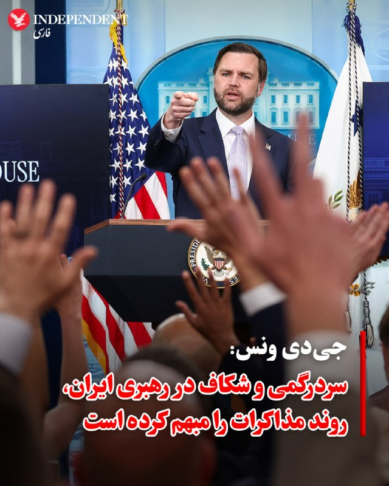

♦️ جی‌دی ونس، معاون رئیس‌جمهوری آمریکا، اعلام کرد که دولت ترامپ برای دستیابی به توافقی جهت پایان دادن به جنگ تلاش می‌کند، اما او همچنان شاهد وجود شکاف و گسست در میان سران ایران است و موضع مذاکراتی تهران شفاف نیست.

ونس در نشست خبری روز سه‌شنبه ۲۹ اردیبهشت، خبرنگاران در کاخ سفید گفت: «خودِ ایرانی‌ها هم دقیقا مطمئن نیستند که می‌خواهند در چه مسیری حرکت کنند؛ آن‌ها در حال حاضر کشوری چندپارچه و دارای شکاف هستند.»

او در ادامه افزود: «در ساختار حاکمیتی این کشور، رهبر وجود دارد و در رده‌های پایین‌تر از او نیز مقامات زیادی هستند که بر روند مذاکرات نفوذ دارند. به همین دلیل، گاهی اوقات اصلا مشخص نیست که موضع واقعی تیم مذاکره‌کننده چیست.»

معاون رئیس‌جمهوری آمریکا با اشاره به اینکه هنوز روشن نیست این تشتت آرا ناشی از ضعف در هماهنگی است یا سوءنیت، تاکید کرد که نتیجه این وضعیت، ایجاد فرآیندی مبهم و سردرگم‌کننده بوده است. ونس در پایان گفت: «با اطمینان می‌گویم که گاهی درک این نکته که ایرانی‌ها دقیقا می‌خواهند از این مذاکرات به چه هدفی دست یابند، بسیار دشوار است.»
‌🇸🇦 Indypersian

🤖 @VahidOOnLine

## VahidOOnLine — post 241022

  <a href="telegram/content/VahidOOnLine_241022_1779215027.mp4" target="_blank">🎬 Download video</a>

ولادیمیر پوتین، رئیس‌جمهوری روسیه، برای دیدار با شی جین‌پینگ وارد چین شد؛ سفری که کمتر از یک هفته پس از سفر دونالد ترامپ به پکن انجام می‌شود و توجه زیادی را به خود جلب کرده است.
کرملین اعلام کرده پوتین و شی در این سفر درباره همکاری‌های اقتصادی، مسائل منطقه‌ای و روابط بین‌المللی گفت‌وگو خواهند کرد. این سفر همزمان با بیست‌وپنجمین سالگرد پیمان دوستی چین و روسیه برگزار می‌شود.
چین که پس از جنگ اوکراین به مهم‌ترین شریک تجاری روسیه تبدیل شده، تلاش می‌کند هم روابط نزدیک خود با مسکو را حفظ کند و هم روابط باثباتی با آمریکا داشته باشد.
مقام‌های روسی گفته‌اند صادرات نفت روسیه به چین در سه‌ماهه نخست ۲۰۲۶ افزایش یافته و دو کشور در حوزه انرژی به توافق‌های مهمی نزدیک شده‌اند. پوتین نیز روابط مسکو و پکن را عاملی برای «ثبات و بازدارندگی» در جهان توصیف کرده است.
‌🏁 🇬🇧 ManotoTV

🤖 @VahidOOnLine

## VahidOOnLine — post 241021

  <a href="telegram/content/VahidOOnLine_241021_1779215028.mp4" target="_blank">🎬 Download video</a>

شهروندان در پیام‌هایی به ایران‌اینترنشنال نسبت به معلق بودن وضعیت جمهوری اسلامی، از ترامپ و سیاست دولتش انتقاد می‌کنند. یک شهروند خواسته که ترامپ مقابله با جمهوری اسلامی را به نتانیاهو بسپارد. پیام این شهروند با هوش مصنوعی خوانده شده است.
‌🏁 🇬🇧 IranintlTV

🤖 @VahidOOnLine

## VahidOOnLine — post 241020

نامزد آیدا عقیلی، جاویدنام انقلاب ملی، در ویدیویی مبر سر مزار او توضیح داد که پس از جان باختن همسرش به خیابان رفت و به اعتراض به ماموران سرکوب پرداخت که یکی از آن‌ها گفت حقوق ماموران ۲۰ میلیون تومان است. نامزد این جاویدنام به وضعیت معیشتی بد شهروندان و اعتراض آن‌ها نیز اشاره کرد.
‌🏁 🇬🇧 IranintlTV

🤖 @VahidOOnLine

## VahidOOnLine — post 241019

  

♦️ اگر این شب‌ها پس از غروب خورشید به آسمان نگاه کنید، ممکن است در کنار هلال باریک ماه دو «ستاره» بسیار درخشان ببینید؛ اما این نقاط نورانی درواقع سیاره‌های زهره و مشتری هستند که در ماه مه ۲۰۲۶ از بهترین اجرام قابل‌مشاهده در آسمان شب به شمار می‌روند.
این دو سیاره در روزهای پایانی اردیبهشت و آغاز خرداد هر شب به‌ظاهر به یکدیگر نزدیک‌تر می‌شوند و سرانجام به مقارنه یا هم‌نشینی (Conjunction) می‌رسند؛ پدیده‌ای نجومی که در آن دو جرم آسمانی از دید ناظر زمینی بسیار نزدیک به هم دیده می‌شوند.
از ۲۸ تا ۳۰ اردیبهشت، هلال باریک ماه نیز به این منظره اضافه می‌شود و ترکیب سه‌گانه‌ای از ماه، زهره و مشتری را در آسمان پس از غروب ایجاد می‌کند؛ نمایی که بدون نیاز به تلسکوپ و تنها با چشم غیرمسلح قابل‌مشاهده است.
این پدیده تقریبا از بخش بزرگی از کره زمین قابل‌مشاهده است؛ ازجمله در بیشتر کشورهای اروپا، خاورمیانه، ایران، ترکیه، شمال آفریقا، آمریکای شمالی و بخش‌هایی از آسیا. شرط اصلی برای تماشای آن، آسمان صاف، افق باز در سمت غرب و تاریک شدن کافی هوا پس از غروب خورشید است.
اخترشناسان می‌گویند این نوع هم‌نشینی‌های سیاره‌ای، علاوه بر زیبایی بصری، یکی از بهترین فرصت‌ها برای علاقه‌مندان تازه‌کار نجوم است تا بتوانند سیاره‌های منظومه شمسی را به‌راحتی در آسمان پیدا کنند.
‌🇸🇦 Indypersian

🤖 @VahidOOnLine

## VahidOOnLine — post 241018

♦️حسین مهدی‌زاد، رئیس کارگروه دام و طیور اتاق بازرگانی ایران، در گفتگو با اقتصاد۱۲۰ اعلام کرد گرانی مرغ و تخم‌مرغ «هیچ ربطی به جنگ و محاصره ندارد» و دلیل اصلی آن حذف ارز ترجیحی در دی‌ماه ۱۴۰۴ است.

او همچنین گفت «سیاست‌های غلط و حمایت نکردن وزارت جهاد کشاورزی تمام تولیدکنندگان طیور را از بین برد.»

این اظهارات در حالی مطرح می‌شود که خبرگزاری فارس، وابسته به سپاه پاسداران، پیش‌تر مدعی شده بود جنگ اخیر و محاصره دریایی جمهوری اسلامی از سوی ارتش آمریکا باعث «گرانی ثانیه‌ای» قیمت‌ها در ایران شده است.
‌🇸🇦 Indypersian

🤖 @VahidOOnLine

## VahidOOnLine — post 241017

  

جی‌دی ونس، معاون رییس‌جمهور آمریکا، گفت واشینگتن و تهران پیشرفت زیادی در گفت‌وگوهای خود داشته‌اند و هیچ‌یک از دو طرف خواهان ازسرگیری کارزار نظامی نیستند.
ونس افزود: «ما فکر می‌کنیم پیشرفت زیادی داشته‌ایم. تصور می‌کنیم مقام‌های تهران نیز می‌خواهند به توافق برسند.»
او گفت آمریکا می‌تواند کارزار نظامی را از سر بگیرد، اما «این چیزی نیست که ترامپ یا ایران می‌خواهند.»
ونس همچنین گفت: «فکر می‌کنم جمهوری اسلامی می‌خواهد توافق کند، اما تا زمانی که توافق امضا نشود، نخواهیم دانست.»
‌🏁 🇬🇧 IranintlTV

🤖 @VahidOOnLine

## VahidOOnLine — post 241016

  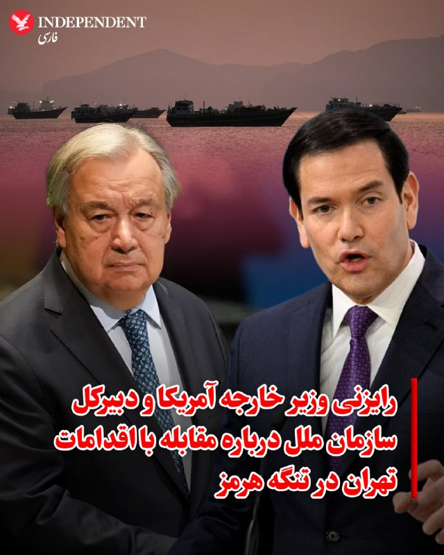

♦️ مارکو روبیو، وزیر امور خارجه ایالات متحده و آنتونیو گوترش، دبیرکل سازمان ملل متحد، روز سه‌شنبه ۲۹ اردیبهشت، درباره تلاش‌های واشنگتن برای ممانعت از مین‌گذاری و وضع تعرفه و عوارض عبور از سوی جمهوری اسلامی در تنگه هرمز گفتگو کردند؛ این رایزنی‌ها شامل بررسی پیش‌نویس قطعنامه شورای امنیت سازمان ملل در این زمینه بوده است.

تامی پیگات، سخنگوی وزارت امور خارجه آمریکا در بیانیه‌ای اعلام کرد: «وزیر خارجه در این دیدار بر حمایت قاطع و گسترده طیف وسیعی از اعضای سازمان ملل متحد از این تلاش‌ها تأکید کرد.»

به گفته او، روبیو در این گفتگو همچنین از شایستگی‌های لوک لیندبرگ، معاون وزیر کشاورزی آمریکا، برای تصدی ریاست برنامه جهانی غذای سازمان ملل (WFP) حمایت کرد.
‌🇸🇦 Indypersian

🤖 @VahidOOnLine

## VahidOOnLine — post 241015

نامزد آیدا عقیلی، جاویدنام انقلاب ملی، در ویدیویی بر سر مزار او توضیح داد که دغدغه و بحث این جوان معترض در خانه موضوع نان مردم و ظلم به آن‌ها بود؛ تا اینکه شاهزاده رضا پهلوی فراخوان داد و آیدا به خیابان رفت. او گفت که خود حکومت اماکنی را آتش می‌زد و به گردن مردم معترض می‌انداخت.
‌🏁 🇬🇧 IranintlTV

🤖 @VahidOOnLine

## VahidOOnLine — post 241014

  

کانال ۱۲ اسرائیل گزارش داد، پس از اظهارات دونالد ترامپ درباره توقف حمله نظامی برنامه‌ریزی‌شده علیه جمهوری اسلامی که قرار بود سه‌شنبه انجام شود، سطح تنش‌ها افزایش یافته است. هم‌زمان، ارتش اسرائیل سطح آماده‌باش خود را به بالاترین حد رسانده؛ اقدامی در پی احتمال اقدام نظامی آمریکا در آینده نزدیک.

بر اساس این گزارش، مقام‌های اسرائیلی از اعلام ناگهانی ترامپ غافلگیر شده و تنها دقایقی پیش از انتشار رسمی، در جریان تصمیم او قرار گرفته‌اند. با وجود آن‌که هنوز تصمیم نهایی اتخاذ نشده، نیروی هوایی اسرائیل خود را برای احتمال صدور دستور حمله از سوی ترامپ در روزهای آینده آماده می‌کند.
‌🏁 🇬🇧 IranintlTV

🤖 @VahidOOnLine

## VahidOOnLine — post 241013

  <a href="telegram/content/VahidOOnLine_241013_1779215031.mp4" target="_blank">🎬 Download video</a>

♦️رسانه‌های ایران دوشنبه ۲۸ اردیبهشت‌ماه تصاویری منتشر کردند که نشان می‌دهد ارتفاعات توچال در پنجاه‌ونهمین روز بهار شاهد بارش برف بوده است؛ رخدادی غیرمنتظره که چهره این منطقه در شمال تهران را زمستانی کرد و توجه بسیاری را جلب نمود.
‌🇸🇦 Indypersian

🤖 @VahidOOnLine

## VahidOOnLine — post 241012

  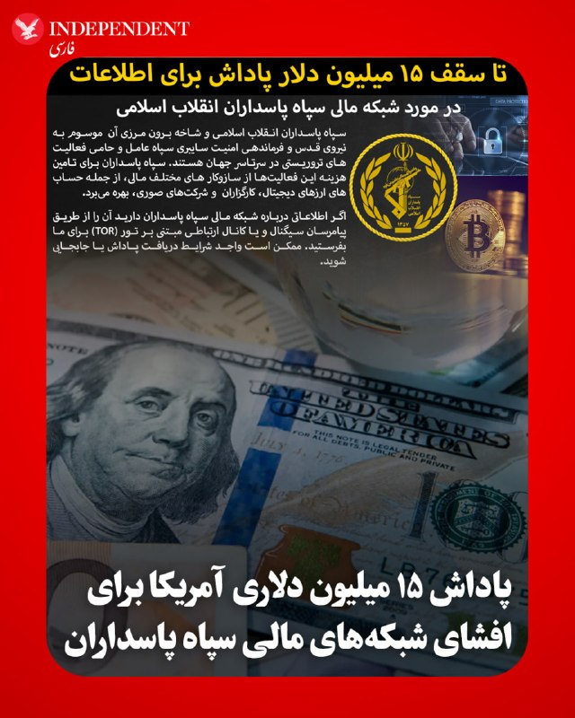

♦️ برنامه «پاداش برای عدالت» وزارت امور خارجه آمریکا، جایزه‌ای تا سقف ۱۵ میلیون دلار برای دریافت اطلاعاتی تعیین کرده است که به اختلال در سازوکارهای مالی سپاه پاسداران انقلاب اسلامی و تمامی شاخه‌های آن، از جمله نیروی قدس، منجر شود.

به گفته مقامات آمریکایی، سپاه پاسداران تامین مالی حملات و فعالیت‌های تروریستی متعددی را در سراسر جهان بر عهده داشته است. در این میان، نیروی قدس مسئولیت هدایت عملیات‌های برون‌مرزی جمهوری اسلامی را از طریق گروه‌های نیابتی خود مانند حماس، حزب‌الله و شبه‌نظامیان تحت حمایت تهران در عراق دنبال می‌کند.

وزارت امور خارجه ایالات متحده تاکید کرده است که این پاداش کلان به هرگونه اطلاعات موثق درباره منابع درآمدی سپاه، نیروی قدس، شاخه‌های وابسته یا تسهیل‌کنندگان کلیدی شبکه‌های مالی آن‌ها تعلق خواهد گرفت.
‌🇸🇦 Indypersian

🤖 @VahidOOnLine

## VahidOOnLine — post 241011

  <a href="telegram/content/VahidOOnLine_241011_1779215033.mp4" target="_blank">🎬 Download video</a>

ایرانیان اسپانیا روز سه‌شنبه با تشکیل تجمعی مقابل سفارت جمهوری اسلامی در مادرید ضمن حمایت از شاهزاده رضا پهلوی به یاد جاویدنامان انقلاب ملی تصاویر آن‌ها را به دست گرفتند.
‌🏁 🇬🇧 IranintlTV

🤖 @VahidOOnLine

## VahidOOnLine — post 241010

  <a href="telegram/content/VahidOOnLine_241010_1779215035.mp4" target="_blank">🎬 Download video</a>

رسانه‌های حکومتی با انتشار این تصویر از دیدار و تبادل نظر کاظم غریب‌آبادی، معاون وزارت خارجه با زونگ‌‌پی‌وو سفیر چین در تهران خبر داده‌اند. این دیدار پس از انتصاب قالیباف به عنوان «نماینده ویژه جمهوری‌اسلامی در امور چین» صورت گرفته است.
‌🏁 🇬🇧 ManotoTV

🤖 @VahidOOnLine

## VahidOOnLine — post 241009

  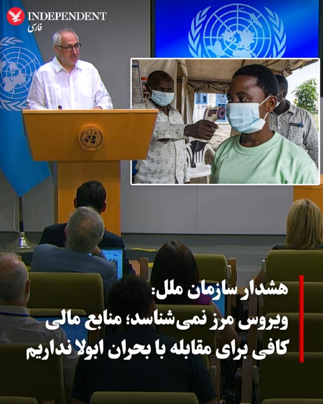

♦️ استفان دوجاریک، سخنگوی دبیرکل سازمان ملل، در نشست خبری روز سه‌شنبه ۲۹ اردیبهشت، با ابراز نگرانی شدید از شیوع مجدد ابولا در جمهوری دموکراتیک کنگو و اوگاندا، بر اهمیت حیاتی زیرساخت‌های سلامت جهانی تاکید کرد. دوجاریک با اشاره به ضرورت همکاری‌های بین‌المللی و حمایت از سازمان جهانی بهداشت (WHO)، خاطرنشان کرد که «ویروس ابولا مانند هر بحران بهداشتی دیگری، به مرزها اهمیتی نمی‌دهد.»

او ضمن تمجید از واکنش سریع دکتر تدروس و تشکیل جلسه اضطراری، نسبت به کمبود شدید منابع مالی برای مقابله با این بحران هشدار داد. به گفته او، آنچه بیش از همه نگران‌کننده است، نبود بودجه کافی در برهه حساس کنونی برای واکنش سریع به شیوع بیماری در مناطق بحرانی و پرجمعیت است.

در حال حاضر سازمان جهانی بهداشت با اعزام کارشناسان و ارسال ۱۲ تن تجهیزات حفاظتی، در حال تقویت ردیابی تماس‌ها و مراقبت‌های بالینی است. با این حال، با توجه به حضور بیش از ۲ میلیون آواره در مناطق درگیر، آژانس‌های سازمان ملل هشدار می‌دهند که بدون تامین فوری منابع مالی و ظرفیت‌های جدید، دسترسی به مناطق دورافتاده و مهار این بیماری غیرممکن خواهد بود.
‌🇸🇦 Indypersian

🤖 @VahidOOnLine

## VahidOOnLine — post 241008

  <a href="telegram/content/VahidOOnLine_241008_1779215036.mp4" target="_blank">🎬 Download video</a>

♦️دونالد ترامپ، رئیس‌جمهوری آمریکا، روز سه‌شنبه ۲۹ اردیبهشت‌ماه گفت جمهوری اسلامی فقط «دو یا سه روز» برای رسیدن به توافق فرصت دارد.

ترامپ در پاسخ به سوال خبرنگاری درباره مهلت تهران برای بازگشت به مذاکرات گفت: «شاید جمعه، شنبه، یکشنبه یا اوایل هفته آینده. یک بازه زمانی محدود.»

او افزود تنها یک ساعت با تصمیم نهایی برای حمله فاصله داشت، اما برخی کشورهای منطقه خواستند چند روز بیشتر به دیپلماسی فرصت داده شود.

ترامپ همچنین تاکید کرد اجازه نخواهد داد جمهوری اسلامی به سلاح هسته‌ای دست پیدا کند.
‌🇸🇦 Indypersian

🤖 @VahidOOnLine

## VahidOOnLine — post 241007

  

سازمان اطلاعات داخلی آلمان هشدار داده جمهوری اسلامی ممکن است پس از پایان جنگ با اسرائیل و آمریکا، دامنه عملیات‌های امنیتی و تروریستی خود در اروپا را گسترش دهد.

بر اساس گزارش اختصاصی یوراکتیو، سازمان اطلاعات داخلی آلمان (BfV) اعلام کرده تهدید علیه مراکز یهودی و اسرائیلی، مخالفان جمهوری اسلامی و افرادی که حکومت ایران آن‌ها را «خائن» می‌داند، همچنان در سطح بالایی قرار دارد.

این نهاد امنیتی گفته شماری از افراد ساکن آلمان برای آموزش نظامی یا همکاری با نهادهای حکومتی به ایران سفر کرده‌اند و برخی از آن‌ها در ویدئوهای تبلیغاتی جمهوری اسلامی و بسیج ظاهر شده‌اند.

در این گزارش همچنین به نگرانی سرویس‌های امنیتی اروپا از استفاده جمهوری اسلامی از شبکه‌های نیابتی، گروه‌های وابسته به جرایم سازمان‌یافته و نیروهای کم‌هزینه محلی برای انجام حملات اشاره شده است.

به گفته منابع امنیتی، جمهوری اسلامی از مارس ۲۰۲۶ کارزاری با نام «حرکت أصحاب الیمین الإسلامیه» (HAYI) راه‌اندازی کرده که از طریق شبکه‌های اجتماعی اقدام به جذب نیرو در میان محافل طرفدار جمهوری اسلامی و جریان‌های افراطی شیعه می‌کند.
‌🏁 🇬🇧 IranintlTV

🤖 @VahidOOnLine

## VahidOOnLine — post 241006

  <a href="telegram/content/VahidOOnLine_241006_1779215037.mp4" target="_blank">🎬 Download video</a>

یک مقام وزارت دفاع آمریکا احتمال اعزام نیروی زمینی این کشور به ایران را رد نکرد.
در جلسه‌ای در واشنگتن، از دنیل زیمرمن، معاون وزیر دفاع آمریکا در امور امنیت بین‌الملل، درباره گزینه‌های پیش‌روی دونالد ترامپ پس از اظهارات اخیر او درباره وارد کردن «ضربه‌ای بزرگ دیگر به ایران» سؤال شد.
زیمرمن در پاسخ به این پرسش که آیا می‌تواند اعزام نیروهای آمریکایی به خاورمیانه را رد کند، گفت: «رئیس‌جمهور همه گزینه‌های لازم را در اختیار دارد.» او در پاسخ به تکرار این سؤال نیز بار دیگر تاکید کرد: «رئیس‌جمهور گزینه‌هایی را که نیاز دارد حفظ می‌کند.»
در ادامه جلسه، برخی حاضران از ارائه نشدن پاسخ صریح انتقاد کرده و آن را «مایه تاسف» توصیف کردند.
‌🏁 🇬🇧 ManotoTV

🤖 @VahidOOnLine

## VahidOOnLine — post 241005

  <a href="telegram/content/VahidOOnLine_241005_1779215038.mp4" target="_blank">🎬 Download video</a>

یک شهروند در پیامی به ایران‌اینترنشنال، وضعیت ایران و سیاست‌های حکومت را با دولت‌های کمونیستی مقایسه کرده و می‌گوید در این وضعیت میان خانواده پولدار و زیر خط فقر تفاوت چندانی نیست. پیام او با هوش مصنوعی خوانده شده است.
‌🏁 🇬🇧 IranintlTV

🤖 @VahidOOnLine

## VahidOOnLine — post 241004

  

سازمان عملیات تجارت دریایی بریتانیا اعلام کرد در بازه زمانی ۲۸ و ۲۹ اردیبهشت، هیچ حادثه‌ای در خلیج فارس و دریای عمان گزارش نشده است.

با این حال، وضعیت امنیتی منطقه همچنان ناپایدار است و تهدید علیه کشتیرانی تجاری ادامه دارد.
‌🏁 🇬🇧 IranintlTV

🤖 @VahidOOnLine

## WithYashar — post 11689

ادعای جی‌دی ونس درباره ایران:
تحویل ذخایر اورانیوم غنی‌شده ایران به روسیه، در حال حاضر برنامه ما نیست. هیچ‌وقت برنامه ما نبوده است.

نمی‌دانم این گزارش‌ها از کجا می‌آید.
@withyashar

## WithYashar — post 11688

جی‌دی ونس: اگر ایران به سلاح هسته‌ای دست پیدا کند، کشورهای بیشتری به‌دنبال دستیابی به سلاح هسته‌ای خواهند رفت و ایران می‌تواند آغازگر یک مسابقه تسلیحات هسته‌ای جدید باشد

آمریکا به‌دنبال بازتنظیم روابط 47 سال اخیر با ایران است
واشنگتن همچنان برای رسیدن به توافق تلاش می‌کند، اما توافقی که به ایران اجازه دستیابی به سلاح هسته‌ای بدهد وجود نخواهد داشت
@withyashar

## WithYashar — post 11687

جی دی ونس در مورد ایران:
ایران یک کشور بسیار پیچیده است. این کشوری است که من وانمود نمی کنم که می فهمم...

این یک تمدن بزرگ و افتخارآمیز است.‌‌
@withyashar

## WithYashar — post 11686

  <a href="telegram/content/WithYashar_11686_1779215040.mp4" target="_blank">🎬 Download video</a>

جی‌دی ونس درباره ایران:

«فکر می‌کنم ما در اینجا یک فرصت داریم تا رابطه‌ای که به مدت ۴۷ سال بین ایران و ایالات متحده وجود داشته است، از نو تعریف کنیم.
این همان چیزی است که رئیس‌جمهور از ما خواسته است، و ما به کار روی آن ادامه خواهیم داد، اما برای یک رابطه دو طرفه، دو طرف لازم هستند (رقص تانگو دو نفر می‌خواهد). ما هیچ توافقی را که به ایرانی‌ها اجازه دهد سلاح هسته‌ای داشته باشند، نخواهیم پذیرفت.
بنابراین، همانطور که رئیس‌جمهور همین الان به من گفت، ما در حالت آماده‌باش هستیم. ما نمی‌خواهیم وارد آن مسیر شویم، اما رئیس‌جمهور اراده و توانایی آن را دارد که در صورت لزوم وارد آن مسیر شود.»
@withyashar

## WithYashar — post 11685

poshte-pardehaye-enghelab (@withyashar).pdf

## WithYashar — post 11684

درود
این کتاب ممنوعه عجب داستان واقعی و باحالی بود ، البته من فعلا تا پیج ۱۰۸ خوندم
اتفاقات پشت پرده جالبی بود ، برم بقیه ش را هم بخونم 😊

## WithYashar — post 11683

  

کاظم(دست کج) غریب‌آبادی، معاون وزیر خارجه:

جمهوری اسلامی «یکپارچه و قاطعانه» آماده مقابله با هرگونه تجاوز نظامی است و برای ما تسلیم شدن معنایی ندارد؛ یا پیروز می‌شویم یا کشته می‌شویم.
@withyashar

## WithYashar — post 11682

## WithYashar — post 11681

یک منبع آمریکایی به الجزیره: بحث امنیتی که برای امروز در کاخ سفید درباره ایران برنامه‌ریزی شده بود، پس از اعلام ترامپ مبنی بر تعویق حمله برنامه‌ریزی شده، به تعویق افتاد @withyashar

## WithYashar — post 11680

خوش چشم (مرشد) : تا اخر هفته میزنن

@withyashar 😂

## WithYashar — post 11679

فرمانده سنتکام : چند تا ناوشکن آمریکایی اخیراً از تنگه هرمز عبور کردن

ایران از هر نظر خیلی ضعیف‌تر از قبل شده
@withyashar

## WithYashar — post 11678

  <a href="telegram/content/WithYashar_11678_1779215042.mp4" target="_blank">🎬 Download video</a>

ولادیمیر پوتین وارد چین شد؛ جایی که وانگ یی، وزیر امور خارجهٔ چین، از او استقبال کرد.
@withyashar

## WithYashar — post 11677

سنتکام:حماس، حزب‌الله و حوثی‌ها از تأمین سلاح و حمایت تسلیحاتی ایران کاملاً قطع شده‌اند
@withyashar

## WithYashar — post 11676

کانال 12 اسرائیل از یک منبع نظامی:
نیروی هوایی آمریکا و اسرائیل تحقیقات خودشون رو برای آماده‌سازی قابلیت‌ها در صورت از سرگیری درگیری‌ها تکمیل کردن.

در حال انجام اقداماتی هستن که اگر لازم شد، بتونن یک حمله خیلی گسترده رو انجام بدن.
@withyashar

## WithYashar — post 11675

بیانیه موشتبی خامنه ایی:

استمرار قدرت ایران نسبت مستقیمی با مسئله افزایش جمعیت و فرزندآوری داره
@withyashar
چرا اینا فقط فکر کمر به پایینن ؟!!

## WithYashar — post 11674

ترامپ : «همه به من می‌گویند این جنگ نامحبوب است، اما من فکر می‌کنم بسیار محبوب است. وقت کافی ندارم که جنگ را برای مردم توضیح دهم. من خیلی مشغول آن هستم. چه محبوب باشد، چه نامحبوب باید انجامش دهم» @withyashar

## WithYashar — post 11673

ترامپ : «همه به من می‌گویند این جنگ نامحبوب است، اما من فکر می‌کنم بسیار محبوب است.

وقت کافی ندارم که جنگ را برای مردم توضیح دهم. من خیلی مشغول آن هستم.

چه محبوب باشد، چه نامحبوب باید انجامش دهم»
@withyashar

## WithYashar — post 11672

عکس جدید دیشب از وضعیت مدرسه «شجره طیبه ندسا » که برجک دیدبانی نظامی به وضوح در آن دیده میشودنام کامل آن مدرسه شجره طیبه نیروی دریایی سپاه است که در عکس میبینید این مدرسه سپر انسانی پایگاه بوده و تمام آنتنهای‌ پایگاه روی سقف این مدرسه قرار‌داشته ! @withyashar

## WithYashar — post 11671

  <a href="telegram/content/WithYashar_11671_1779215044.mp4" target="_blank">🎬 Download video</a>

پوتین وارد چین «پکن» شد
@withyashar

## WithYashar — post 11670

ترامپ درباره ایران : اگر امروز می‌رفتم، ۲۵ سال طول می‌کشید تا آنها بازسازی کنند.
اما ما نمی‌رویم.
@withyashar

## mwarmonitor — post 9319

🇺🇸«مارکو روبیو، وزیر امور خارجه ایالات متحده، روز جمعه برای شرکت در نشست وزیران خارجه ناتو به سوئد سفر خواهد کرد و در شهر هلسینگبورگ حضور می‌یابد؛ سپس از ۲۳ تا ۲۶ مه راهی هند می‌شود.»

@mwarmonitor

## mwarmonitor — post 9318

🇺🇸 جی. دی. ونس: «ایران دو گزینه پیشِ‌رو دارد: یا توافق، یا ازسرگیری جنگ.

🔸ما معتقدیم ایرانی‌ها می‌خواهند به توافق برسند، اما تأکید می‌کنیم که همیشه یک برنامه جایگزین داریم.

🔹هیچ‌کس خواهان بازگشت جنگ نیست و فرصت در اختیار ایران قرار دارد.

🔸ایران کشوری بسیار پیچیده است و از سوی تیم مذاکره‌کننده آن مواضع سخت‌گیرانه‌ای می‌بینیم.

🔹ما خطوط قرمز خود را برای ایرانی‌ها روشن کرده‌ایم.»

@mwarmonitor

## mwarmonitor — post 9317

🔴«مقام‌های آمریکایی می‌گویند ترامپ هرگز واقعاً تصمیم به حمله به ایران نگرفته بود، با وجود آنکه ادعا می‌کرد “یک ساعت با صدور دستور فاصله داشته است”. به گفته منابع، او از تهدید حمله به‌عنوان ابزاری برای فشار بر ایران در مذاکرات استفاده می‌کند.» آکسیوس

@mwarmonitor

## mwarmonitor — post 9316

🔴 «شبکه کان اسرائیل اعلام کرد: آمادگی‌های آمریکا و اسرائیل برای ازسرگیری جنگ علیه ایران تکمیل شده است.»

@mwarmonitor

## mwarmonitor — post 9315

🇺🇸یک یگان ارتش آمریکا از هفته‌ها قبل از یک حمله مرگبار ایران به پست فرماندهی آن‌ها در کویت درخواست افزایش و تقویت پشتیبانی پزشکی کرده بود، اما به گفته سربازان، این درخواست نادیده گرفته شد. برخی از بازماندگان این حمله همچنین گفته‌اند که دست‌کم یکی از سربازانی که کشته شد، در صورت وجود امکانات پزشکی بیشتر در محل، قابل نجات بود.» CBS

@mwarmonitor

## mwarmonitor — post 9314

🇮🇱«روزنامه اسرائیل هیوم به نقل از منابع: شهادت نتانیاهو در دادگاه که قرار بود روز چهارشنبه برگزار شود، به دلیل امنیتی لغو شد.»

@mwarmonitor

## mwarmonitor — post 9313

  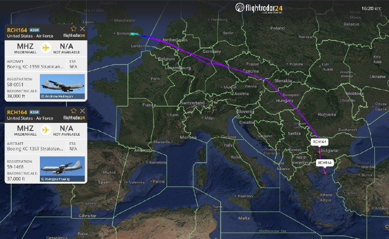

✈️نیروی هوایی آمریکا (USAF) بوئینگ KC-135 استراتوتانکر (سوخت‌رسان) – ۱ فروند AE04EA 61-0276 – REACH 756 AE07BA 62-3557 – REACH 164 ✈️پروازهای REACH 756 و REACH 164 امروز صبح از فرودگاه بن گوریون تل‌آویو به سمت پایگاه هوایی RAF Mildenhall در بریتانیا در حرکت…

## mwarmonitor — post 9312

🇮🇷«غریب‌آبادی، معاون وزیر امور خارجه ایران، ادعاهای اخیر ترامپ درباره مذاکرات را به سخره گرفت و گفت: “تسلیم شدن هیچ معنایی ندارد؛ ما یا پیروز می‌شویم یا شهید می‌شویم.”»

@mwarmonitor

## mwarmonitor — post 9311

🔴«ترامپ: دیروز تماسی دریافت کردم و به من گفتند: “آقا، آیا می‌توانید صبر کنید؟ ما نزدیک به یک توافق هستیم.”

🚨من به ایران دو یا سه روز مهلت می‌دهم، شاید تا جمعه یا شنبه. یک بازه زمانی محدود.»

@mwarmonitor

## mwarmonitor — post 9310

🔴«ترامپ: همه به من می‌گویند جنگ علیه ایران غیرمحبوب است، اما من فکر می‌کنم بسیار محبوب است. وقتی می‌شنوند که این موضوع به سلاح‌های هسته‌ای مربوط است که می‌توانند لس‌آنجلس را نابود کنند، وقتی موضوع را برای مردم توضیح می‌دهیم—من زمان کافی برای توضیح دادن به آن‌ها ندارم.»

🔴«ترامپ: چه اقدام نظامی علیه ایران از حمایت مردمی برخوردار باشد چه نباشد، من اجازه نخواهم داد جهان جلوی چشمانم نابود شود.»

@mwarmonitor

## mwarmonitor — post 9309

🚨«وزارت دفاع امارات متحده عربی اعلام کرد که طی ۴۸ ساعت گذشته شش پهپاد را که از عراق شلیک شده بودند، شناسایی و رهگیری کرده است.»

@mwarmonitor

## mwarmonitor — post 9308

🔴«ناتو در حال بررسی امکان کمک به عبور کشتی‌ها از تنگه هرمزِ مسدودشده است، در صورتی که این آبراه تا اوایل ماه ژوئیه بازگشایی نشود.

🔸به گفته یک مقام ناتو، حمایت از انجام چنین مأموریتی رو به افزایش است، هرچند برخی از اعضا همچنان تمایلی ندارند که بیش از این درگیر این درگیری شوند.»

— سازمان پیمان آتلانتیک شمالی (ناتو) | بلومبرگ

@mwarmonitor

## mwarmonitor — post 9307

🔴«پیشنهاد جدید ایران به ایالات متحده برای پایان دادن به جنگ شامل موارد زیر است:

🔸خروج نیروهای آمریکایی از مناطق نزدیک به ایران

🔸پرداخت غرامت‌های جنگی از سوی آمریکا

🔸لغو تحریم‌ها علیه ایران

🔸آزادسازی دارایی‌های مسدودشده ایران

🔸پایان دادن به محاصره (بلاکاد) آمریکا

رویترز

@mwarmonitor

## mwarmonitor — post 9306

  

🔴دریاسالار برد کوپر، فرمانده فرماندهی مرکزی ایالات متحده (سنتکام)، قرار است صبح امروز درباره وضعیت و آرایش سنتکام در برابر کمیته نیروهای مسلح مجلس نمایندگان آمریکا شهادت بدهد.

🔴 پخش زنده: از طریق یوتیوب

@mwarmonitor

## mwarmonitor — post 9305

🔴 «وزیر خزانه‌داری آمریکا : انتظار می‌رود شرکای اروپایی از تحریم‌های اعمال‌شده علیه ایران حمایت کنند؛ از جمله با جلوگیری از فعالیت تأمین‌کنندگان مالی آن، بستن شعب بانکی‌اش و افشای شرکت‌های پوششی آن.»

@mwarmonitor

## mwarmonitor — post 9304

  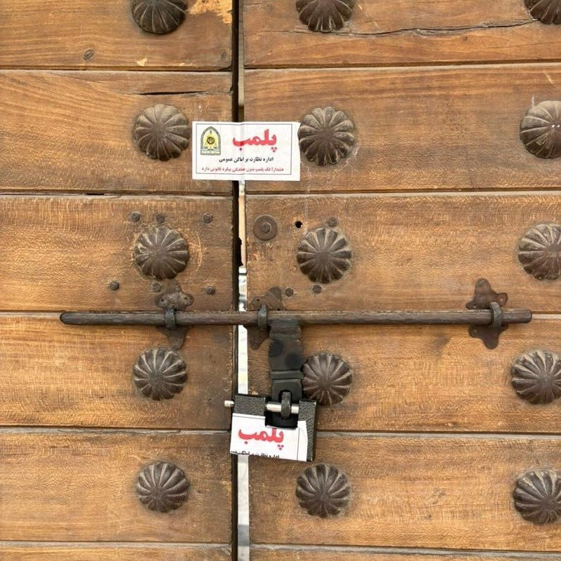

🔴دیروز هتل تاریخی عامریها کاشان را به خاطر «حجاب» پلمب کردند؛ مسافران سرگردان شدند و ۹۰ نفر از پرسنل بیکار

📝 به شهربازی بزرگ تناقضات خوش آمدید؛ جایی که خط‌کش‌های قانون، پلاستیکی هستند و متناسب با زاویه دوربین مصلحت، کش می‌آیند. یک روز قفل سنگین پلمب را بر درِ هتل تاریخی عامری‌ها می‌کوبند و ۹۰ کارگر را به جرم دیدن چند تار مو آواره می‌کنند، و روز دیگر در میدان‌های شهر، بلندگوها شعار سوزناک «بی‌حجاب هم خواهر ماست» سر می‌دهند. این دیگر نه شریعت است و نه قانون، بلکه یک دکانداریِ عریان است؛ تار موی شما اگر در حال زندگی عادی باشد، جرم مشهود و مستوجب نابودی است، اما اگر جلو لنز صداوسیما و روی جیپ‌های صورتیِ کارناوال‌های سفارشی باشد، جلوه‌ای از همبستگی ملی! مرز بین مجرم و شهروند نمونه در این سیستم، فقط به یک چیز بستگی دارد: اینکه چقدر ویترین تبلیغاتی آقایان را پر کنید. پرده‌های این سیرک سال‌هاست افتاده، اما بازیگرانش هنوز فکر می‌کنند مردم محو تماشای شعبده‌بازیِ ناشیانه‌شان هستند.

@mwarmonitor

## mwarmonitor — post 9303

🔴چند مقام خلیج فارس از برخی کشورهایی که ترامپ به آن‌ها اشاره کرده بود گفتند از طرح قریب‌الوقوعی که او درباره حمله به ایران توصیف کرده بود، اطلاعی نداشتند. وال‌استریت ژورنال @mwarmonitor

## mwarmonitor — post 9302

🔴چند مقام خلیج فارس از برخی کشورهایی که ترامپ به آن‌ها اشاره کرده بود گفتند از طرح قریب‌الوقوعی که او درباره حمله به ایران توصیف کرده بود، اطلاعی نداشتند. وال‌استریت ژورنال

@mwarmonitor

## mwarmonitor — post 9301

🇹🇷ترکیه به دنبال نشست سران ناتو برای دستیابی به یک پیشرفت در زمینه نهایی شدن خرید جنگنده‌های F-35 از آمریکا است.

@mwarmonitor

## FoxNewsTwitter — post 341951

  <a href="telegram/content/FoxNewsTwitter_341951_1779215048.mp4" target="_blank">🎬 Download video</a>

Fox News (Twitter/X)

JUST IN: Vice President Vance speaks on the tragic loss of his personal friend Charlie Kirk, calling his assassination an "unacceptable" tragedy that should outrage every American.

"Charlie was a very, very dear friend. But more importantly than that, Charlie was a father of two beautiful kids, and he did not deserve to have all of those moments with his kids, all of those moments with his beautiful wife taken from them in the way that that happened."

"I would expect everybody, everybody with a heart or a conscience would say whatever we agreed or disagreed with about his particular viewpoints. This is a tragedy, and it's totally unacceptable that it happens in the United States of America."

## FoxNewsTwitter — post 341950

  <a href="telegram/content/FoxNewsTwitter_341950_1779215049.mp4" target="_blank">🎬 Download video</a>

Fox News (Twitter/X)

NEW: VP Vance says "it certainly seems like something fishy is there" when asked about the DOJ's immigration fraud investigation into Squad member Ilhan Omar.

"I mean, you read the things about Ilhan Omar and about, you know, who she married and whether she didn't marry this person or that person..."

"We're going to take a look at it. If we think that there's a crime, we're going to prosecute that crime."

## FoxNewsTwitter — post 341949

  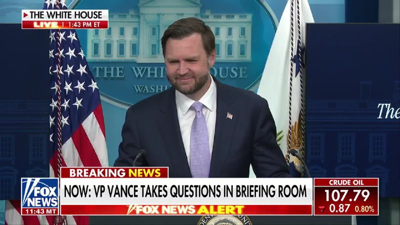

Fox News (Twitter/X)

NEW: VP Vance reveals that dealing with Iran is highly unstable and that the administration faces a fractured regime where it's "hard to figure out exactly what it is that the Iranians want."

"It's not sometimes totally clear what the negotiating position of the team is. And I don't know if that's sometimes bad communication. If that's bad faith, I don't- I wouldn't pretend to venture a guess there.”

“But I will say with confidence, it's sometimes hard to figure out exactly what it is that the Iranians want to accomplish out of the negotiation. So what we've done is try to be as clear as possible.”

@aishahhasnie

## FoxNewsTwitter — post 341948

  <a href="telegram/content/FoxNewsTwitter_341948_1779215052.mp4" target="_blank">🎬 Download video</a>

Fox News (Twitter/X)

NEW: VP JD Vance pushes back on media criticism surrounding the new fund created for Americans who say they were unfairly targeted by federal agencies:

REPORTER: "I understand that everybody is eligible to apply for this, but I mean, you're eligible, but I assume you're not going to apply... Isn't it just as easy to say that people that attacked police officers should not get taxpayer money from this fund?"

VP VANCE: "We're not trying to give money to anybody who attacked a police officer... We're trying to compensate people where the book was thrown at them, they were mistreated by the legal system."

"I'd encourage everybody Democrat, Republican, independent, let's turn the page on this thing that we did under the last administration where we tried to throw people in prison because they had the wrong politics."

## FoxNewsTwitter — post 341947

  <a href="telegram/content/FoxNewsTwitter_341947_1779215054.mp4" target="_blank">🎬 Download video</a>

Fox News (Twitter/X)

Vice President Leavitt?

JD Vance jokes about the deal he made with Karoline Leavitt for filling in behind the podium in the the White House briefing room:

"I told Karoline I would stand in for her today for the White House press briefing on the condition that when Usha has our baby in July, that she would be vice president for a couple of weeks."

## FoxNewsTwitter — post 341946

  <a href="telegram/content/FoxNewsTwitter_341946_1779215055.mp4" target="_blank">🎬 Download video</a>

Fox News (Twitter/X)

JUST IN: VP Vance calls out fraudsters who are stealing money from innocent people relying on America's spirit of generosity:

"I think it's a great thing about our country is that we have this generosity of spirit where we take care of one another, but fraud takes that away from us because it steals money from the taxpayer when they pay their taxes.”

“And it also steals money from innocent people who are meant to benefit from these programs, but can't when the money runs dry."

## FoxNewsTwitter — post 341945

  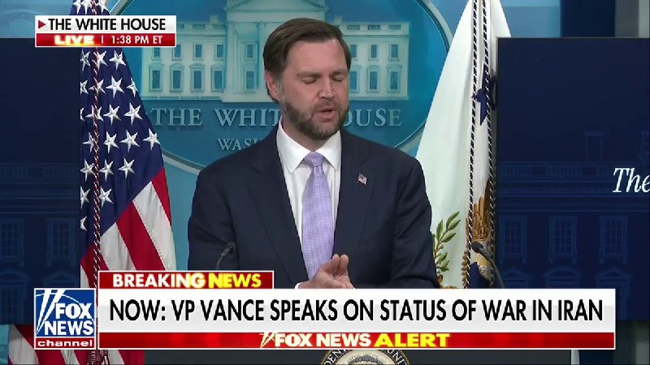

Fox News (Twitter/X)

NEW: VP Vance warns that allowing Iran to have a nuclear weapon opens the door for more anti-American regimes to put the world in danger for future generations:

"As the father of three young kids, I don't want them to inherit a world where 20 additional regimes, half of them very dangerous and very sympathetic to terrorists, have nuclear weapons."

"We want to keep the number of countries that have nuclear weapons small, and that's why Iran cannot have a nuclear weapon on top of all the other things that we might be worried about."

## FoxNewsTwitter — post 341944

  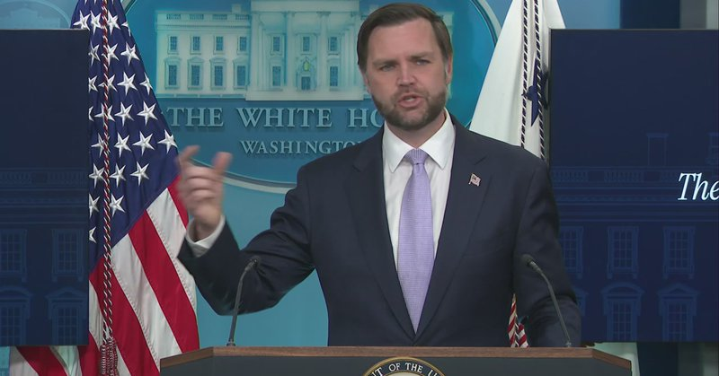

Fox News (Twitter/X)

WATCH LIVE: Vice President Vance holds White House press briefing https://twitter.com/i/broadcasts/1YGNrZMnVzoGw

## FoxNewsTwitter — post 341943

  <a href="telegram/content/FoxNewsTwitter_341943_1779215057.mp4" target="_blank">🎬 Download video</a>

Fox News (Twitter/X)

"Some states like California... they see this as free money, don't they?"

Sen. John Kennedy calls out reports that California’s Medicaid program reimburses providers for tribal prayers and exorcisms:

SEN. KENNEDY: "California will actually pay a health care provider, I didn't know this was a medical expertise, to pay for exorcisms. Is that right?"

ACTING AG TODD BLANCHE: "I'll accept that, Senator."

## FoxNewsTwitter — post 341942

  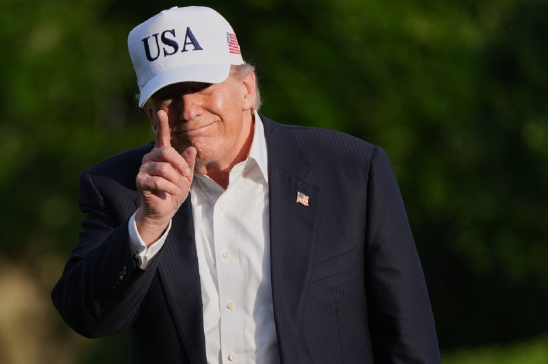

Fox News (Twitter/X)

BREAKING: Trump bucks national Senate Republicans and endorses Ken Paxton instead of incumbent John Cornyn in GOP Texas primary runoff

## FoxNewsTwitter — post 341941

  <a href="telegram/content/FoxNewsTwitter_341941_1779215059.mp4" target="_blank">🎬 Download video</a>

Fox News (Twitter/X)

RT @FoxTrueCrime: COURT CONVOY: Tyler Robinson arrives at the Utah County, Utah courthouse in an armored SWAT vehicle.

Today, his attorneys will fight to seal evidence and testimony from police, and also have prosecutors sanctioned for speaking about his case outside the courtroom.

## FoxNewsTwitter — post 341940

  <a href="telegram/content/FoxNewsTwitter_341940_1779215061.mp4" target="_blank">🎬 Download video</a>

Fox News (Twitter/X)

NEW: President Trump surprises reporters at the White House by setting up a special breakfast for them during their tour of the ongoing ballroom construction:

"I figured I'd be nice to you for a change." | @MargoMartin47

## FoxNewsTwitter — post 341939

  <a href="telegram/content/FoxNewsTwitter_341939_1779215063.mp4" target="_blank">🎬 Download video</a>

Fox News (Twitter/X)

Socialist mayor Zohran Mamdani goes after Ronald Reagan over the former president’s warning about big government while teasing New York’s first city-run grocery store.

Mamdani insists that people shouldn’t be scared of the government but should embrace welfare programs instead.

The NYC mayor also saying Americans are more concerned about not being able to feed their families after working all day rather than overreach that could ruin their lives.

## FoxNewsTwitter — post 341938

  

Fox News (Twitter/X)

The iconic Kars4Kids jingle is coming off the air in California after a judge ruled the charity’s ads misled donors about where their money was actually going.

The judge said the Kars4Kids ads led people to believe they would be helping local, needy children with their donations, but according to the ruling “children, especially needy or underprivileged children, are not the recipients of the proceeds of the donations.”

In reality, donations have been going to help fund a New Jersey-based Orthodox Jewish outreach program, which includes organizing annual trips to Israel for 17-year-olds and 18-year-olds.

## FoxNewsTwitter — post 341937

  <a href="telegram/content/FoxNewsTwitter_341937_1779215065.mp4" target="_blank">🎬 Download video</a>

Fox News (Twitter/X)

BREAKING: President Trump declares that religion is making a "tremendous comeback" in the United States, saying the surge in church attendance is directly linked to America's overall success.

"Religion is taking off like our country is taking off.”

“Our country is hotter now than it's ever been. And I'll tell you, religion is making a tremendous comeback. You look at churches today, they're full."

## FoxNewsTwitter — post 341936

  <a href="telegram/content/FoxNewsTwitter_341936_1779215067.mp4" target="_blank">🎬 Download video</a>

Fox News (Twitter/X)

RT @AmericaNewsroom: 🚨WATCH: Rep. Thomas Massie (R-KY) responds to President Trump -- just moments after Trump slammed Massie as a "terrible congressman."

## FoxNewsTwitter — post 341935

  <a href="telegram/content/FoxNewsTwitter_341935_1779215068.mp4" target="_blank">🎬 Download video</a>

Fox News (Twitter/X)

JUST IN: President Trump jokes about how thin he looks hiding his waist behind a picture of the planned White House ballroom.

“I look so thin. They'll say, ‘Oh, he’s gotten so thin’ because I'm holding this. You don't have to look at my waist. You can look at this. You saw enough of my waist along with President Xi.”

## FoxNewsTwitter — post 341934

  <a href="telegram/content/FoxNewsTwitter_341934_1779215070.mp4" target="_blank">🎬 Download video</a>

Fox News (Twitter/X)

RT @AmericaNewsroom: 🚨BREAKING NEWS: President Trump rails against Democrats as he speaks on peace negotiations with Iran.

Trump: "We may have to give [Iran] another big hit."

## FoxNewsTwitter — post 341933

  <a href="telegram/content/FoxNewsTwitter_341933_1779215071.mp4" target="_blank">🎬 Download video</a>

Fox News (Twitter/X)

BREAKING: President Trump reveals the architectural inspiration behind the new White House ballroom and how it will keep the nation’s capital safe.

“Great classical buildings- they're taken out of different parts of the world from very glamorous times. This is Rome, they like the flat roof. Greece likes the- they call it the triangles.”

“Also, it's developed in such a way that we can have military there, but the entire roof is developed for military. They're very high. They're higher than just about anything else. They have a 360 degree vision of Washington, DC.”

## FoxNewsTwitter — post 341932

  <a href="telegram/content/FoxNewsTwitter_341932_1779215073.mp4" target="_blank">🎬 Download video</a>

Fox News (Twitter/X)

"All of this was paid for by myself."

President Trump shows off the construction site of the historic White House ballroom, stressing the project is being funded as a gift — not by taxpayers.

"This is a gift to the United States of America. and more than a gift. It's going to be one of the most beautiful buildings that's ever been built in the country. In Washington, D.C."

## pm_afshaa — post 91059

  <a href="telegram/content/pm_afshaa_91059_1779215075.webm" target="_blank">🎬 Download video</a>

🔴اکسیوس: ترامپ پس از اعلام به‌تعویق انداختن حمله به ایران، با مشاوران امنیت ملی خود جلسه‌ای برگزار کرد.

💧 Rainbet.com the #1 Non-KYC Crypto Casino & Sportsbook @rainbetcom

😁 @Pm_Afshaa

## pm_afshaa — post 91058

  <a href="telegram/content/pm_afshaa_91058_1779215075.webm" target="_blank">🎬 Download video</a>

🔴ونس: تحویل اورانیوم ایران به روسیه هیچوقت جزو برنامه‌های ما نبوده و نمیدونم این گزارشات از کجا میان.

💧 Rainbet.com the #1 Non-KYC Crypto Casino & Sportsbook @rainbetcom

😁 @Pm_Afshaa

## pm_afshaa — post 91057

  <a href="telegram/content/pm_afshaa_91057_1779215076.webm" target="_blank">🎬 Download video</a>

🔴جی‌دی ونس، معاون ترامپ:
اگر ایران به سلاح هسته‌ای دست پیدا کنه، کشورهای بیشتری به‌دنبال دستیابی به سلاح هسته‌ای خواهند رفت و ایران میتونه آغازگر یک مسابقه تسلیحات هسته‌ای جدید باشه.

💧 Rainbet.com the #1 Non-KYC Crypto Casino & Sportsbook @rainbetcom

😁 @Pm_Afshaa

## pm_afshaa — post 91056

  <a href="telegram/content/pm_afshaa_91056_1779215076.webm" target="_blank">🎬 Download video</a>

🔴جی‌دی ونس: من فکر میکنم ایرانی‌ها میخوان توافق کنن، اما با اطمینان نمیگم که ما به توافق میرسیم تا زمانی که واقعاً یک توافق از طریق مذاکره امضا کنیم.

من فکر میکنم که در نهایت به ایرانی‌ها بستگی داره که آیا مایل به دیدار با ما هستن، زیرا فکر میکنم ما مطمئناً کار خوبی انجام میدیم و مطمئناً با حسن نیت در حال مذاکره هستیم.

💧 Rainbet.com the #1 Non-KYC Crypto Casino & Sportsbook @rainbetcom

😁 @Pm_Afshaa

## pm_afshaa — post 91055

  <a href="telegram/content/pm_afshaa_91055_1779215077.webm" target="_blank">🎬 Download video</a>

🔴جی دی ونس: گاهی اوقات کاملاً مشخص نیست که موضع تیم ایران در مذاکره چیست؛ سخته که بفهمیم ایرانی‌ها دقیقاً میخوان از مذاکرات به چی چیزی برسن.

💧 Rainbet.com the #1 Non-KYC Crypto Casino & Sportsbook @rainbetcom

😁 @Pm_Afshaa

## pm_afshaa — post 91054

  <a href="telegram/content/pm_afshaa_91054_1779215077.webm" target="_blank">🎬 Download video</a>

🔴جی‌دی ونس، معاون ترامپ:
ما در اینجا فرصتی داریم، فکر میکنم، روابطی رو که 47 ساله بین ایران و ایالات متحده وجود داره، از نو تنظیم کنیم.

این چیزیه که رئیس جمهور از ما خواسته، و این چیزیه که ما به کار در آن ادامه خواهیم داد، اما برای تانگو دو نفر نیاز دارن. ما قرار نیست توافقی داشته باشیم که به ایرانی‌ها اجازه بده سلاح هسته‌ای داشته باشن.
بنابراین، همانطور که رئیس جمهور به من گفت، ما قفل شده‌ایم و بارگیری می‌کنیم. ما نمیخوایم آن مسیر رو طی کنیم، اما رئیس‌جمهور مایله و در صورت لزوم میتونه آن مسیر رو طی کنه.

💧Rainbet.com the #1 Non-KYC Crypto Casino & Sportsbook @rainbetcom

😁 @Pm_Afshaa

## pm_afshaa — post 91053

  <a href="telegram/content/pm_afshaa_91053_1779215078.webm" target="_blank">🎬 Download video</a>

🔴جی‌دی ونس، معاون ترامپ:
ایران دو گزینه داره: توافق یا از سرگیری جنگ.

ما معتقدیم که ایرانی‌ها میخوان توافقی رو منعقد کنن، اما تاکید می‌کنیم که همیشه یک برنامه جایگزین داریم.

هیچکس خواهان بازگشت جنگ نیست و این فرصت در اختیار ایران است.

💧 Rainbet.com the #1 Non-KYC Crypto Casino & Sportsbook @rainbetcom

😁 @Pm_Afshaa

## pm_afshaa — post 91052

  <a href="telegram/content/pm_afshaa_91052_1779215078.webm" target="_blank">🎬 Download video</a>

🔴جی‌دی ونس، معاون ترامپ:
ایران کشور بسیار پیچیده‌ای است. این کشوریه که من وانمود نمیکنم که آن را درک میکنم. این یک تمدن بزرگ و افتخارآفرین است.

💧 Rainbet.com the #1 Non-KYC Crypto Casino & Sportsbook @rainbetcom

😁 @Pm_Afshaa

## pm_afshaa — post 91051

  <a href="telegram/content/pm_afshaa_91051_1779215079.webm" target="_blank">🎬 Download video</a>

🔴کان نیوز: مقامات اسرائیلی میگن سطح هشدار امنیتی الان بالاترین حدش از زمان آتش‌بس ماه پیشه، چون نگرانن ایران بخاطر حرف‌های جنگی اخیر و حرفای ترامپ حمله پیشگیرانه انجام بده.

مقامات اسرائیلی فکر میکردن حملات به ایران میتونه توی چند ساعت شروع بشه، ولی وقتی گفتن تاخیر افتاده، غافلگیر شدن.

با این حال، اسرائیل هنوز برای احتمال حمله آمریکا به ایران آماده‌ست و بحث‌ها هم توی نهادهای امنیتی اسرائیل و هم توی کاخ سفید ادامه داره.

💧 Rainbet.com the #1 Non-KYC Crypto Casino & Sportsbook @rainbetcom

😁 @Pm_Afshaa

## pm_afshaa — post 91050

  <a href="telegram/content/pm_afshaa_91050_1779215079.mp4" target="_blank">🎬 Download video</a>

🔴مرتس، صدراعظم آلمان:
اقتصاد آلمان به صادرات و باز بودن مسیرهای تجاری وابسته‌ست و اقدام ایران در تنگه هرمز به اقتصاد جهانی آسیب جدی زده.

ما همراه متحدان‌مان تلاش می‌کنیم آزادی کشتیرانی رو به منطقه برگردونیم و اگر شرایط فراهم بشه، آلمان هم آماده ورود نظامی برای بازگشایی تنگه هرمزه.

اما قبل از هرچیز، ایران باید به میز مذاکره برگرده، دست از وقت‌کشی برداره و دنیا رو با بستن تنگه هرمز گروگان نگیره.

💧 Rainbet.com the #1 Non-KYC Crypto Casino & Sportsbook @rainbetcom

😁 @Pm_Afshaa

## pm_afshaa — post 91049

  <a href="telegram/content/pm_afshaa_91049_1779215081.webm" target="_blank">🎬 Download video</a>

🔴فرمانده سنتکام:
بررسی بمباران مدرسه میناب پیچیده‌ست، چون این مدرسه در محل یک پایگاه فعال موشک‌های کروز در ایران قرار داشته.

💧 Rainbet.com the #1 Non-KYC Crypto Casino & Sportsbook @rainbetcom

😁 @Pm_Afshaa

## pm_afshaa — post 91047

🔴کارشناس شبکه 14 اسرائیل :تقربیاً حوثی‌ها شش ماهه که از ایرانی‌ها پولی دریافت نکردن

💧 Rainbet.com the #1 Non-KYC Crypto Casino & Sportsbook @rainbetcom

😁 @Pm_Afshaa

## pm_afshaa — post 91046

🔴کان اسرائیل: آمادگی‌های آمریکا و اسرائیل برای ازسرگیری جنگ علیه ایران تکمیل شده

💧 Rainbet.com the #1 Non-KYC Crypto Casino & Sportsbook @rainbetcom

😁 @Pm_Afshaa

## pm_afshaa — post 91045

🔴فرمانده سنتکام، دریادار برد کوپر :
ایران از وقتی آتش‌بس شروع شده، ده‌ها نفر رو اعدام کرده

💧 Rainbet.com the #1 Non-KYC Crypto Casino & Sportsbook @rainbetcom

😁 @Pm_Afshaa

## pm_afshaa — post 91044

🔴ریکلین فاش خبرنگار اسرائیلی: نیروهای ویژه ارتش اسرائیل دارن برای نفوذ به تأسیسات هسته ایی اصفهان تمرین می‌کنن تا اورانیوم غنی‌شده رو خارج کنن
مواد هسته‌ای اون‌قدرا هم عمیق دفن نشده و بعد از ورود به سایت، میشه منتقلش کرد

💧 Rainbet.com the #1 Non-KYC Crypto Casino & Sportsbook @rainbetcom

😁 @Pm_Afshaa

## pm_afshaa — post 91043

🔴سنتکام:حماس، حزب‌الله و حوثی‌ها از تأمین سلاح و حمایت تسلیحاتی ایران کاملاً قطع شده‌اند

💧 Rainbet.com the #1 Non-KYC Crypto Casino & Sportsbook @rainbetcom

😁 @Pm_Afshaa

## pm_afshaa — post 91042

  <a href="telegram/content/pm_afshaa_91042_1779215081.webm" target="_blank">🎬 Download video</a>

🔴کانال 12 اسرائیل از یک منبع نظامی:
نیروی هوایی آمریکا و اسرائیل تحقیقات خودشون رو برای آماده‌سازی قابلیت‌ها در صورت از سرگیری درگیری‌ها تکمیل کردن.

در حال انجام اقداماتی هستن که اگر لازم شد، بتونن یک حمله خیلی گسترده رو انجام بدن.

💧 Rainbet.com the #1 Non-KYC Crypto Casino & Sportsbook @rainbetcom

😁 @Pm_Afshaa

## pm_afshaa — post 91041

  <a href="telegram/content/pm_afshaa_91041_1779215082.mp4" target="_blank">🎬 Download video</a>

🔴ترامپ: فکر می‌کردم بازار شاید 25 درصد سقوط کنه و من با این موضوع مشکلی نداشتم، اگه قرار باشه از یک فاجعه هسته‌ای احتمالی جلوگیری بشه.

افت 25 درصدی بازار قابل قبوله، اگر در عوض جلوی یک فاجعه هسته‌ای گرفته بشه؛ بیشتر مردم هم با من موافق‌ هستن.

💧 Rainbet.com the #1 Non-KYC Crypto Casino & Sportsbook @rainbetcom

😁 @Pm_Afshaa

## pm_afshaa — post 91040

  <a href="telegram/content/pm_afshaa_91040_1779215083.webm" target="_blank">🎬 Download video</a>

🔴دقایقی پیش پوتین وارد پکن - چین شد

💧 Rainbet.com the #1 Non-KYC Crypto Casino & Sportsbook @rainbetcom

😁 @Pm_Afshaa

## pm_afshaa — post 91039

  <a href="telegram/content/pm_afshaa_91039_1779215084.webm" target="_blank">🎬 Download video</a>

🔴ترامپ: رئیس‌جمهور چین به من قول داده که هیچ سلاحی به ایران ارسال نمیکنه. این یک قول زیباست؛ حرفش رو قبول دارم و از این بابت قدردانی میکنم.

💧 Rainbet.com the #1 Non-KYC Crypto Casino & Sportsbook @rainbetcom

😁 @Pm_Afshaa

## DEJradio — post 4751

⭕️ پشتیبانی جمهوری اسلامی از حماس، حزب‌الله و حوثی‌ها قطع شد

سنتکام اعلام کرد حمایت جمهوری اسلامی از گروه‌های نیابتی اصلی‌اش در منطقه متوقف شده است.
ستاد فرماندهی مرکزی آمریکا در پیامی در شبکۀ اکس نوشت که دست تهران از تأمین تسلیحاتی و پشتیبانی از حماس، حزب‌الله و حوثی‌ها بریده شده است.
سنتکام همچنین به نقل از دریادار برد کوپر نوشت اقدام نظامی آمریکا راهبرد ۴۷ سالۀ جمهوری اسلامی را مختل کرد.

#سنتکام
@DEJradio

## DEJradio — post 4750

⭕️ سنتکام گزارش‌ها درباره دسترسی رژیم به سایت‌های موشکی را نادرست خواند

برد کوپر، فرماندۀ سنتکام، گزارش‌های منتشرشده درمورد بازیابی دسترسی جمهوری اسلامی به سایت‌های موشکی و تاسیسات زیرزمینی را رد کرد.
او در نشست کمیتۀ نیروهای مسلح در مجلس نمایندگان آمریکا گفت این گزارش‌ها نادرست‌اند. کوپر جزئیات بیشتری را ارائه نکرد.
پیش‌تر نیویورک تایمز و شماری دیگر از رسانه‌ها گزارش داده بودند جمهوری اسلامی پس از حملات آمریکا و اسرائیل دوباره به بخشی از زیرساخت‌های موشکی خود دسترسی پیدا کرده است.

#سنتکام
@DEJradio

## DEJradio — post 4749

⭕️ فرماندۀ سنتکام: مدرسۀ میناب در سایت فعال موشکی قرار داشت

برد کوپر، فرماندۀ سنتکام، در نشست کنگرۀ آمریکا گفت مدرسۀ دخترانه میناب در یک سایت فعال موشک کروز جمهوری اسلامی قرار داشت.
او گفت تحقیقات ارتش آمریکا دربارۀ این رخداد، دچار پیچیدگی است.
مقام‌های جمهوری اسلامی اعلام کرده‌اند در این حمله که در نخستین روز جنگ اخیر رخ داد، ۱۶۸ کودک کشته شدند.

#سنتکام

@DEJradio

## DEJradio — post 4748

  <a href="telegram/content/DEJradio_4748_1779215084.mp4" target="_blank">🎬 Download video</a>

🚨
🔸 سوشا مکانی، دروازه‌بان پیشین تیم ملی:
صدای رشید مظاهری باشیم؛ او فرزند رشید ایران است.

#رشید_مظاهری #فرزند_ایران
@DEJradio

## DEJradio — post 4747

  <a href="telegram/content/DEJradio_4747_1779215086.webm" target="_blank">🎬 Download video</a>

🔺📢 آلمان در ترکیه سامانه پاتریوت مستقر می‌کند

آلمان به عنوان بخشی از تلاش‌های ناتو برای تقویت دفاع هوایی ترکیه، سامانه دفاع هوایی پاتریوت را در این کشور مستقر خواهد کرد.

این تصمیم بعد از رهگیری چند موشک بالستیک جمهوری اسلامی بر فراز ترکیه طی جنگ ۴۰ روزه گرفته شده است.

#ترکیه #جنگ۴۰روزه
@DEJradio

## DEJradio — post 4746

⭕️ ادعای قطر: مذاکرات تهران و واشینگتن به زمان بیشتری نیاز دارد

ماجد انصاری، سخنگوی وزارت امور خارجۀ قطر گفت مذاکره میان آمریکا و جمهوری اسلامی برای حل اختلاف‌ها به زمان بیشتری نیاز دارد.
او اعلام کرد قطر از تلاش‌های دیپلماتیک پاکستان برای رسیدن به راه‌حل پشتیبانی می‌کند.
دونالد ترامپ گفته است به درخواست قطر، عربستان سعودی و امارات، حملۀ برنامه‌ریزی‌شده به جمهوری اسلامی را به تعویق انداخته است.

#قطر #مذاکرات
@DEJradio

## DEJradio — post 4745

⭕️ کیفیت هوای تهران برای همه قرمز شد

شرکت کنترل کیفیت هوای تهران اعلام کرد هوای پایتخت روز سه‌شنبه در وضعیت قرمز و ناسالم برای همۀ گروه‌ها قرار دارد.
از سویی ادارۀ کل هواشناسی استان تهران درمورد وزش باد شدید و احتمال وقوع طوفان در مناطق مرکزی و جنوبی استان هشدار داد.
به همۀ شهروندان، به‌ویژه سالمندان، کودکان و مبتلایان به بیماری‌های قلبی و ریوی سفارش شده از حضور در فضای باز خودداری کنند.

#تهران
@DEJradio

## DEJradio — post 4744

⭕️ سنتکام ۸۸ کشتی تجاری را در تنگۀ هرمز وادار به تغییر مسیر کرد

ستاد فرماندهی مرکزی آمریکا اعلام کرد در چارچوب عملیات محاصرۀ دریایی در تنگۀ هرمز، تاکنون ۸۸ کشتی تجاری مرتبط با جمهوری اسلامی را ناگزیر به تغییر مسیر کرده است.
به گزارش سنتکام، نیروهای آمریکایی در میان این شناورها چهار فروند را هدف گرفتند تا آنها را از کار بیندازند.

#سنتکام #تنگه_هرمز
@DEJradio

## DEJradio — post 4743

⭕️ فرماندۀ ناتو ماموریت احتمالی در تنگۀ هرمز را تصمیمی سیاسی خواند

به گزارش رویترز، یک فرماندۀ ارشد ناتو اعلام کرد مأموریت احتمالی این ائتلاف در تنگۀ هرمز، باید بر اساس یک تصمیم‌گیری سیاسی انجام شود.

#تنگه_هرمز
@DEJradio

## DEJradio — post 4742

⭕️ عربستان خط کشتیرانی سریع دریای سرخ را راه‌اندازی کرد

سازمان بنادر عربستان سعودی اعلام کرد خط کشتیرانی سریع دریای سرخ، در بندر صنعتی ملک فهد در ینبع راه‌اندازی شد.
در این مسیر دریایی بندرهای جده، ینبع، عین‌السخنه مصر و عقبۀ اردن به یکدیگر متصل می‌شود.
عربستان اعلام کرد هدف از این طرح، تسریع جابه‌جایی کالا و کاهش زمان انتظار کشتی‌ها است.
بنا بر گزارش رسانه‌های پادشاهی سعودی، ریاض پس از اختلال گسترده در تردد از تنگۀ هرمز، انتقال محموله‌ها از مسیر دریای سرخ و بندر ینبع را افزایش داد.

#عربستان #دریای_سرخ
@DEJradio

## DEJradio — post 4741

⭕️ امارات از رهگیری ۶ پهپاد در دو روز گذشته خبر داد

وزارت دفاع امارات متحدۀ عربی اعلام کرد سامانه‌های پدافند هوایی این کشور طی ۴۸ ساعت گذشته شش پهپاد متخاصم را رهگیری و خنثی کرده‌اند.
به گفته این وزارتخانه، این پهپادها قصد هدف قرار دادن مناطق غیرنظامی و تاسیسات حیاتی امارات را داشتند.
وزارت دفاع امارات تاکید کرد این عملیات بدون تلفات انسانی و بدون آسیب به زیرساخت‌های حیاتی انجام شده است.

#امارات #پهپاد #تنگه_هرمز
@DEJradio

## DEJradio — post 4740

⭕️ آمریکا یک صرافی و ۱۹ کشتی مرتبط با جمهوری اسلامی را تحریم کرد

وزارت خزانه‌داری آمریکا صرافی «امین اکسچنج» و شبکه‌ای از شرکت‌های وابسته به آن را در امارات، ترکیه و هنگ‌کنگ تحریم کرد.
به گفتۀ واشینگتن، این شرکت‌ها به جمهوری اسلامی برای دور زدن تحریم‌ و انجام تراکنش‌های مالی بین‌المللی کمک می‌کردند.
آمریکا در دور تازۀ فشار اقتصادی سخت بر رژیم تهران، همچنین ۱۹ کشتی مرتبط با انتقال نفت و محصولات پتروشیمی را در فهرست تحریم قرار داد.

#تحریم #آمریکا
@DEJradio

## DEJradio — post 4739

🚨 گروه هفت خواستار بازگشایی بی‌درنگ تنگۀ هرمز شد

وزرای دارایی هفت کشور صنعتی دنیا، در بیانیۀ پایانی نشست پاریس خواستار بازگشت بی‌درنگ عبور آزادانه و امن کشتی‌ها از تنگۀ هرمز شدند.
در این بیانیه آمده است ادامه تنش‌ها در خاورمیانه، خطرهای اقتصادی و تورمی را افزایش داده و زنجیرۀ تأمین انرژی، مواد غذایی و کود شیمیایی را تحت فشار قرار داده است.
اسکات بسنت، وزیر خزانه‌داری آمریکا گفت در نشست پاریس دربارۀ ایران، امنیت سایبری و چالش‌های اقتصاد جهانی گفتگوهایی سازنده‌ انجام شده است.

#تنگه_هرمز #اروپا
@DEJradio

## DEJradio — post 4738

🚨 ترامپ: شاید لازم باشد بازهم به جمهوری اسلامی ضربه‌ای محکم وارد کنیم

دونالد ترامپ گفت با این که حملۀ برنامه‌ریزی‌شده به جمهوری اسلامی را در آخرین لحظات متوقف کرده، اما ممکن است ناگزیر شود بازهم حمله‌ای بزرگ انجام دهد.
رئیس جمهوری آمریکا گفت تنها یک ساعت تا اجرای حمله فاصله داشت و همه‌چیز آمادۀ اقدام نظامی بود.
ترامپ می‌گوید جمهوری اسلامی برای رسیدن به توافق التماس می‌کند. او هشدار داد تهران فقط دو یا سه روز فرصت دارد تا به توافق برسد.
او تاکید کرد آمریکا اجازه نمی‌دهد جمهوری اسلامی به سلاح هسته‌ای دست پیدا کند.

#ترامپ #جنگ
@DEJradio

## DEJradio — post 4737

  <a href="telegram/content/DEJradio_4737_1779215087.mp4" target="_blank">🎬 Download video</a>

🚨
🔸 رضا تمیزکار:
هراس حکومت از قیام ملی، بیشتر از جنگ است.

#جنگ #قیام_ملی
@DEJradio

## DEJradio — post 4736

  <a href="telegram/content/DEJradio_4736_1779215089.mp4" target="_blank">🎬 Download video</a>

🔺📢 پیام یک شهروند:
ما چیزی برای خوردن نداریم...

#تورم #فقر
@DEJradio

## DEJradio — post 4735

  <a href="telegram/content/DEJradio_4735_1779215090.webm" target="_blank">🎬 Download video</a>

🚨📢 طبق اعلام مدیرکل تعزیرات حکومتی استان فارس، ۹۰۰ تُن مرغ منجمد احتکار شده در یکی از سردخانه‌های شیراز کشف شد.

احتکار حجم سنگینی از مواد خوراکی سودجویی سازمان یافته است که نمی‌تواند بدون پشتوانه بالادستی باشد. این در حالی است که مراجع قضایی حکومت بارها در مورد برخورد با احتکار هشدار داده بودند و برای مقابله با آن قرارگاه ویژه تاسیس شده است.
احتکار از عوامل اصلی کمیابی کالا و گرانی است.

#فارس #احتکار_مرغ
@DEJradio

## DEJradio — post 4734

🚨 هر توافقی با جمهوری اسلامی باید به تأیید کنگرۀ آمریکا برسد

لیندزی گراهام، سناتور جمهوری‌خواه آمریکایی تأکید کرد هر توافقی میان واشینگتن و جمهوری اسلامی باید برای تأیید به کنگره ارائه شود.
او همچنین خواستار پایان غنی‌سازی اورانیوم و توقف پشتیبانی جمهوری اسلامی از گروه‌های نیابتی شد.
دونالد ترامپ اعلام کرده حملۀ برنامه‌ریزی‌شده علیه جمهوری اسلامی را به درخواست رهبران چند کشور عربی به تعویق انداخته است.

#ترامپ #توافق #لیندسی_گراهام
@DEJradio

## DEJradio — post 4733

  <a href="telegram/content/DEJradio_4733_1779215090.webm" target="_blank">🎬 Download video</a>

🚨📢 ‏بر اساس گزارش منابع میدانی روز سه‎شنبه ۲۹ اردیبهشت ۱۴۰۵ توپ‌های ضدهوایی و راکت‌های پدافند در یزد، دزفول، بوشهر، اهواز و اندیمشک فعال شدند. منابع محلی می‌گویند در آسمان صدای پهپاد شنیدند. هنوز به طور رسمی اعلام نشده است که چرا پدافند فعال شد اما شامگاه دوشنبه ۲۸ اردیبهشت نیز گزارش شد که در بعضی شهرها پدافند فعال شد.

استانداری خوزستان اعلام کرده است که به علت سقوط پرتابه در اندیمشک چهار نفر مجروح شدند. گفته می‌شود این پرتابه مهمات پدافند خودی بوده که روی خانه‌های مردم سقوط کرده است.

#خوزستان #پدافند
@DEJradio

## DEJradio — post 4732

🚨 شرکت هندی جریمۀ نقض تحریم‌های جمهوری اسلامی را می‌پردازد

وزارت خزانه‌داری آمریکا اعلام کرد شرکت هندی آدانی اینترپرایزس، با پرداخت ۲۷۵ میلیون دلار برای بستان پروندۀ نقض احتمالی تحریم‌های جمهوری اسلامی موافقت کرده است.
بنا بر گزارش‌ها، در این پرونده به ۳۲ مورد نقض احتمالی تحریم‌های جمهوری اسلامی اشاره شده است.
این شرکت هندی بین سال‌های ۲۰۲۳ تا ۲۰۲۵ محموله‌های گاز مایع با منشأ احتمالی ایران را از طریق واسطه‌هایی در دبی خریده بود.

#تحریم #جمهوری_اسلامی
@DEJradio

## VahidOnline — post 75555

  <a href="telegram/content/VahidOnline_75555_1779215091.mp4" target="_blank">🎬 Download video</a>

دونالد ترامپ، رییس‌جمهور آمریکا سه‌شنبه به خبرنگاران در کاخ سفید گفت ممکن است مجبور شویم دوباره به ایران ضربه بزنیم، مطمئن نیستم.

او گفت منظورم این است که دو یا سه روز، شاید جمعه، شنبه، یکشنبه، چیزی در این حدود، شاید اوایل هفته آینده؛ یک بازه زمانی محدود، چون نمی‌توانیم اجازه دهیم آن‌ها سلاح هسته‌ای جدید داشته باشند.

رییس‌جمهور آمریکا ادامه داد که او دوشنبه تنها یک ساعت با تصمیم‌گیری برای انجام یک حمله فاصله داشت، اما این حمله را به تعویق انداخت.
او افزود جمهوری اسلامی برای رسیدن به توافق التماس می‌کند.
ترامپ درباره جنگ گفت: «همه به من می‌گویند این کار محبوب نیست، اما من فکر می‌کنم خیلی محبوب است».
@VahidOOnLine

📡 @VahidOnline

## VahidOnline — post 75554

  <a href="telegram/content/VahidOnline_75554_1779215091.mp4" target="_blank">🎬 Download video</a>

در پی کارزار ایران‌اینترنشنال برای یافتن هویت پیکر جاویدنامان در بیمارستان الغدیر تهران، ویدیویی از لحظه قتل جاویدنام آیدا عقیلی به دست ما رسیده است.
آیدا عقیلی، ۳۴ ساله، شامگاه ۱۸ دی ۱۴۰۴ در شرق تهران با شلیک دو گلوله ماموران به سرش کشته شد که پیکر او را پیچیده در پتویی چهارخانه در حیاط پشتی بیمارستان الغدیر یافتند.
@VahidOOnLine

مربوط به این تصاویر تکان‌دهنده: @VahidOnline
این ویدیوی دلخراش: @VahidOnline
اعتراض‌های چهارشنبه ۱۷ دی:@VahidOnline

#بیمارستان_الغدیر
📡 @VahidOnline

## VahidOnline — post 75553

  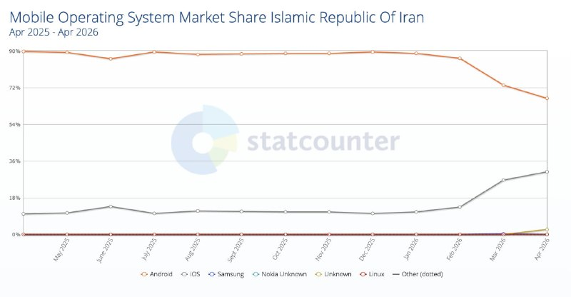

آرش زاد:
آمار نشون می‌ده در سه ماه گذشته یک پاکسازی طبقاتی دیجیتال در ایران رخ داده. در این مدت سهم اندروید از ترافیک اینترنت ۲۵٪ افت و آیفون ۱۸۰٪ رشد داشته. این به معنی خروج میلیون‌ها کاربر طبقه متوسط و پایین از فضای آنلاینه. اونی که آیفون داره از پس هزینه کانفیگ یا اینترنت پرو برمیاد، اونی که نداره، اونقدر دغدغه مالی مختلف داره که عطای اینترنت رو به لقاش می‌بخشه.

## VahidOnline — post 75552

  

خبرگزاری دولتی ایرنا در گزارشی تصویری با عنوان «مهر مادری به عمر چهل روز»، داستان زنی را منتشر کرد که در جریان جنگ ۴۰ روزه، سرپرستی یک نوزاد رهاشده در بیمارستان را برعهده گرفته است.

در این گزارش، برای نخستین‌بار تصاویری از یک زن ایرانی بدون پوشش سر منتشر شد؛ موضوعی که بازتاب گسترده‌ای در افکار عمومی یافت.

با این حال، دقایقی پس از انتشار این گزارش، چهار تصویری که در آن زن بدون پوشش سر دیده می‌شد، از خروجی وب‌سایت ایرنا حذف شد.
@VahidHeadline
آپدیت:
گویا نوزاد بازمانده جنگ هم نبود و تکذیب شد و مسائلی دیگر: beehnam، FSeifikaran

📡 @VahidOnline

## VahidOnline — post 75550

  

ایووت کوپر، وزیر خارجه بریتانیا روز سه‌شنبه ۲۹ اردیبهشت هشدار داد که جهان دیگر نمی‌تواند بیش از این برای بازگشایی تنگه هرمز صبر کند و ادامه بسته‌ماندن آن امنیت غذایی کشورهای آسیب‌پذیر را با بحران جدی‌تری روبه‌رو می‌کند.

وزارت خارجه بریتانیا روز سه‌شنبه اعلام کرد کوپر در کنفرانس جهانی مشارکت‌ها در لندن، با اشاره به پیامدهای بحران جنگ ایران بر انرژی، کود کشاورزی و قیمت مواد غذایی، خواستار فشار فوری بین‌المللی برای بازگشایی تنگه هرمز شده است.
@VahidHeadline

📡 @VahidOnline

## VahidOnline — post 75549

  

معاون وزیر خارجه ایران می‌گوید تهران در پیشنهادهای اخیر خود به آمریکا برای پایان جنگ میان دو کشور، خواستار برخورداری از حق غنی‌سازی، خاتمه جنگ در تمام جبهه‌ها از جمله لبنان و خروج نیروهای آمریکایی از محیط پیرامونی ایران شده است.

کاظم غریب‌آبادی که روز سه‌شنبه ۲۹ اردیبهشت برای ارائه گزارشی در مورد روند مذاکرات میان تهران و واشینگتن، در کمیسیون امنیت ملی و سیاست خارجی مجلس حاضر شده بود، از دیگر شروط ایران را «رفع محاصرهٔ دریایی آمریکا، آزادسازی اموال و دارایی‌های ایران، تأمین خسارت‌های وارد شده در جنگ توسط ایالات متحده جهت بازسازی و خاتمه تمامی تحریم‌های یکجانبه و قطعنامه‌های شورای امنیت» اعلام کرد.
@VahidHeadline

📡 @VahidOnline

## VahidOnline — post 75548

  

سازمان «کمک به گروگان‌ها در سراسر جهان» دوشنبه شب اعلام کرد شهاب دلیلی، زندانی سیاسی و کاپیتان پیشین شرکت کشتی‌رانی ایران، پس از آزادی از زندان اوین از طریق ایروان به واشینگتن منتقل شده و به خانواده‌اش پیوسته است.
این سازمان اعلام کرد دلیلی پس از گذراندن بیش از یک دهه «بازداشت غیرقانونی» در ایران، اکنون در سلامت کامل قرار دارد.

شهاب دلیلی که ساکن آمریکا بود، سال ۱۳۹۵ خورشیدی برای مراسم خاکسپاری پدرش به تهران سفر کرده بود اما هنگام بازگشت توسط نیروهای امنیتی بازداشت شد.
خانواده او گفته بودند جمهوری اسلامی او را با اتهام‌هایی از جمله «جاسوسی» و «همکاری با دولت متخاصم» به ۱۰ سال حبس محکوم کرده است.
@VahidOOnLine

📡 @VahidOnline

## VahidOnline — post 75547

  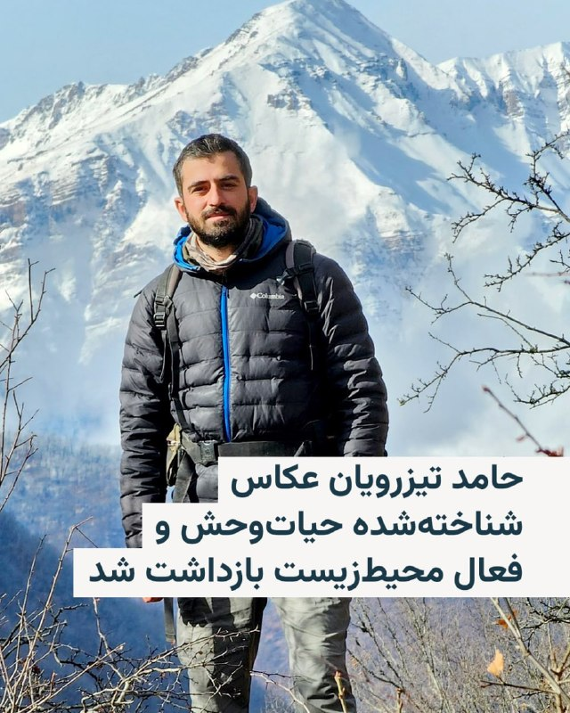

حامد تیزرویان، عکاس حیات‌وحش و فعال محیط زیست، در ساری بازداشت شده است.

به گفته زینب رحیمی، روزنامه‌نگار حوزه محیط زیست، آقای تیزرویان روز ۱۴ اردیبهشت ۱۴۰۵، بازداشت شده و موبایل و دیگر وسایل الکترونیکی او ضبط شده است.

اتهام مطرح‌شده علیه آقای تیزرویان «اجتماع و تبانی با هدف اقدام علیه امنیت ملی» عنوان شده است.
بازداشت او در پی انتشار مطالبی انتقادی درباره کشتار معترضان در دی‌ماه و همچنین اعتراض به اعدام‌ها در شبکه‌های اجتماعی صورت گرفته است.

آقای تیزرویان از عکاسان برجسته و سرشناس حیات وحش است و ثبت عکس‌های کمیاب از حیات وحش ایران از جمله خرس قهوه‌ای و مرال به عنوان گونه‌های‌ در معرض خطر انقراض، بخشی از کارنامه کاری این عکاس حیات وحش است.
@VahidHeadline

📡 @VahidOnline

## kianmeli1 — post 87495

‏🔴والا نیوز: در صورت تصمیم ترامپ برای حمله مجدد به ایران، هماهنگی‌هایی با چند کشور خاورمیانه انجام شده است
https://t.me/kianmeli1

## kianmeli1 — post 87494

‏🔴ارتش اسرائیل اعلام کرد در ۲۴ ساعت گذشته بیش از ۲۵ انبار سلاح، مرکز فرماندهی و زیرساخت حزب‌الله را در جنوب لبنان هدف قرار داده و چند پرتابگر شلیک‌شده به سمت اسرائیل را منهدم کرده است
https://t.me/kianmeli1

## kianmeli1 — post 87493

‏🔴زمین‌لرزه‌ای به بزرگی ۴.۶ شهرستان نورآباد لرستان را لرزاند
https://t.me/kianmeli1

## kianmeli1 — post 87492

  <a href="telegram/content/kianmeli1_87492_1779215095.mp4" target="_blank">🎬 Download video</a>

🔴وزیر دارایی اسرائیل:
من اینجا به طور قاطع می‌گویم: اگر حزب‌الله تسلیم نشود، ما بخش‌های بیشتری از جنوب لبان را تصرف خواهیم کرد
https://t.me/kianmeli1

## kianmeli1 — post 87491

  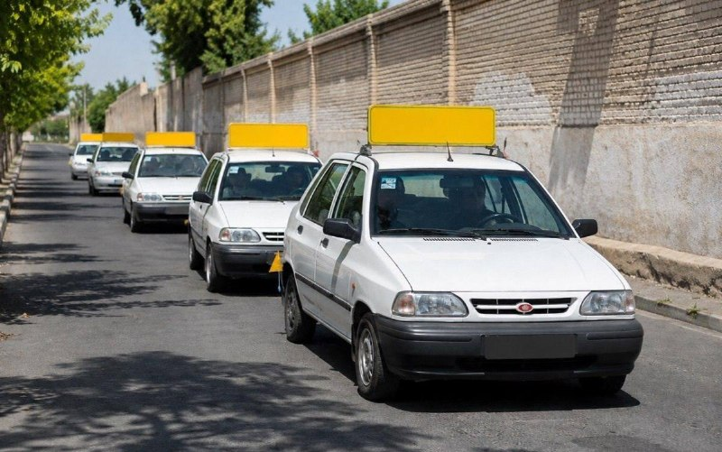

🔴هزینه آموزش رانندگی با افزایش ۵۶ درصدی به ساعتی ۶۰۰ هزار تومان رسید و مجموع هزینه دریافت گواهینامه در شرایط فعلی حدود ۱۵ میلیون تومان برآورد می‌شود
https://t.me/kianmeli1

## kianmeli1 — post 87489

🔴حالتان از این همه تناقض و دورویی بهم نمی‌خورد؟

✍️ياشار سلطاني
دیروز هتل تاریخی عامری‌ها کاشان را به‌خاطر «حجاب» پلمب کردند؛ مسافران سرگردان شدند و ۹۰ نفر از پرسنل بیکار!

‏اما همزمان، شب‌ها در میدان‌ها و مراسم‌هایی مثل جان فدا⁩، شعار «بی‌حجاب هم خواهر ماست» تکرار می‌شود و همان زنان با آزادترین پوشش در قاب رسمی دیده می‌شوند.

‏اگر حجاب قانون است، چرا اجرای آن این‌قدر مقطعی و گزینشی است؟

‏حالتان از این همه تناقض و دورویی بهم نمی‌خورد؟
https://t.me/kianmeli1

## kianmeli1 — post 87480

  <a href="telegram/content/kianmeli1_87480_1779215097.mp4" target="_blank">🎬 Download video</a>

🔴وضعیت فعلی کشور
https://t.me/kianmeli1

## IranIntlTV — post 337978

  <a href="https://t.me/IranintlTV/337978" target="_blank">📎 Download file</a>

🎧نسخه صوتی تیتراول با نیوشا صارمی: ترامپ: شاید همین آخر هفته به ایران حمله کنیم؛ عملیات فریب یا تعویق حمله؟
@iranintlTV

## IranIntlTV — post 337977

  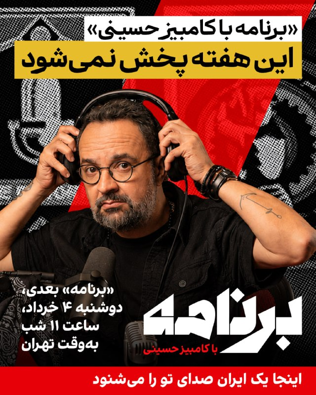

«برنامه با کامبیز حسینی» این هفته پخش نمی‌شود
«برنامه» بعدی، دوشنبه ۴ خرداد، ساعت ۱۱ شب به‌وقت تهران

@iranintltv

## IranIntlTV — post 337976

  <a href="telegram/content/IranIntlTV_337976_1779215099.mp4" target="_blank">🎬 Download video</a>

مهدی مهدوی‌آزاد در برنامه «چشم‌انداز» در واکنش به اظهارات پزشکیان درباره فروش نرفتن نفت و بحران اقتصادی گفت:«صریح‌تر شدن لحن پزشکیان نشان از عقب‌نشینی حکومت دربرابر واقعیت‌های سخت یا هرج‌ومرج در قوه مجریه دارد؛ روندی که می‌تواند احتمال استعفا و فروپاشی نهاد اجرایی را افزایش دهد.»
@iranintltv

## IranIntlTV — post 337975

  <a href="telegram/content/IranIntlTV_337975_1779215100.mp4" target="_blank">🎬 Download video</a>

شهروندان در پیام‌هایی به ایران‌اینترنشنال نسبت به معلق بودن وضعیت جمهوری اسلامی، از ترامپ و سیاست دولتش انتقاد می‌کنند. یک شهروند خواسته که ترامپ مقابله با جمهوری اسلامی را به نتانیاهو بسپارد. پیام این شهروند با هوش مصنوعی خوانده شده است.

## IranIntlTV — post 337974

نامزد آیدا عقیلی، جاویدنام انقلاب ملی، در ویدیویی مبر سر مزار او توضیح داد که پس از جان باختن همسرش به خیابان رفت و به اعتراض به ماموران سرکوب پرداخت که یکی از آن‌ها گفت حقوق ماموران ۲۰ میلیون تومان است. نامزد این جاویدنام به وضعیت معیشتی بد شهروندان و اعتراض آن‌ها نیز اشاره کرد.

## IranIntlTV — post 337973

  

جی‌دی ونس، معاون رییس‌جمهور آمریکا، گفت واشینگتن و تهران پیشرفت زیادی در گفت‌وگوهای خود داشته‌اند و هیچ‌یک از دو طرف خواهان ازسرگیری کارزار نظامی نیستند.
ونس افزود: «ما فکر می‌کنیم پیشرفت زیادی داشته‌ایم. تصور می‌کنیم مقام‌های تهران نیز می‌خواهند به توافق برسند.»
او گفت آمریکا می‌تواند کارزار نظامی را از سر بگیرد، اما «این چیزی نیست که ترامپ یا ایران می‌خواهند.»
ونس همچنین گفت: «فکر می‌کنم جمهوری اسلامی می‌خواهد توافق کند، اما تا زمانی که توافق امضا نشود، نخواهیم دانست.»
https://iranintl.com/202605197021

## IranIntlTV — post 337972

نامزد آیدا عقیلی، جاویدنام انقلاب ملی، در ویدیویی بر سر مزار او توضیح داد که دغدغه و بحث این جوان معترض در خانه موضوع نان مردم و ظلم به آن‌ها بود؛ تا اینکه شاهزاده رضا پهلوی فراخوان داد و آیدا به خیابان رفت. او گفت که خود حکومت اماکنی را آتش می‌زد و به گردن مردم معترض می‌انداخت.

## IranIntlTV — post 337971

  

کانال ۱۲ اسرائیل گزارش داد، پس از اظهارات دونالد ترامپ درباره توقف حمله نظامی برنامه‌ریزی‌شده علیه جمهوری اسلامی که قرار بود سه‌شنبه انجام شود، سطح تنش‌ها افزایش یافته است. هم‌زمان، ارتش اسرائیل سطح آماده‌باش خود را به بالاترین حد رسانده؛ اقدامی در پی احتمال اقدام نظامی آمریکا در آینده نزدیک.

بر اساس این گزارش، مقام‌های اسرائیلی از اعلام ناگهانی ترامپ غافلگیر شده و تنها دقایقی پیش از انتشار رسمی، در جریان تصمیم او قرار گرفته‌اند. با وجود آن‌که هنوز تصمیم نهایی اتخاذ نشده، نیروی هوایی اسرائیل خود را برای احتمال صدور دستور حمله از سوی ترامپ در روزهای آینده آماده می‌کند.
https://iranintl.com/202605198315

## IranIntlTV — post 337970

  <a href="telegram/content/IranIntlTV_337970_1779215103.mp4" target="_blank">🎬 Download video</a>

مروری بر روزنامه‌های ایران، سه‌شنبه ۲۹ اردیبهشت، با مجتبی هاشمی، روزنامه‌نگار
@iranintltv

## IranIntlTV — post 337969

  <a href="telegram/content/IranIntlTV_337969_1779215104.mp4" target="_blank">🎬 Download video</a>

ایرانیان اسپانیا روز سه‌شنبه با تشکیل تجمعی مقابل سفارت جمهوری اسلامی در مادرید ضمن حمایت از شاهزاده رضا پهلوی به یاد جاویدنامان انقلاب ملی تصاویر آن‌ها را به دست گرفتند.

## IranIntlTV — post 337968

  

🔻مهدی محمدنبی، سرپرست تیم ملی فوتبال در حاشیه تمرین تیم در آنتالیا درباره ویزای آمریکا گفت: «به احتمال زیاد تا ۱۰ روز آینده ویزاها صادر خواهد شد. به هر دلیلی اگر ویزای کسی صادر نشود یا دیر صادر شود، پلنی داریم که به موقع اعلام می‌کنیم.» به گفته او تیم ملی پنجشنبه به آنکارا می‌رود.

🔹او گفت: «سیاسی‌کاری در فوتبال ممنوع است. فیفا به عنوان مرجع فوتبال در جهان قطعا سیاسی‌کاری نخواهد کرد و امیدواریم دنبال مسیر خودش باشد.»

🔹نایب رییس فدراسیون فوتبال درباره جلسه تاج با دبیرکل فیفا، گفت: «فیفا سرش شلوغ است ولی یکسری موارد را محکم به آنها گفتیم که یادشان نرود. مهدی تاج موارد را محکم به دبیرکل فیفا گفته‌است.»

@iranintltvsport

## IranIntlTV — post 337967

  <a href="telegram/content/IranIntlTV_337967_1779215107.mp4" target="_blank">🎬 Download video</a>

فایننشال‌تایمز در گزارشی نوشت تهران مجبور شده نفت خام را روی نفتکش‌های قدیمی ذخیره کند. این روزنامه با استناد به تصاویر ماهواره‌ای نوشت دست‌کم ۵۲ نفتکش در اطراف خارک و چابهار هستند.

گفت‌وگو با همایون فلک‌شاهی، کارشناس نفت و انرژی در موسسه کپلر
@iranintltv

## IranIntlTV — post 337966

  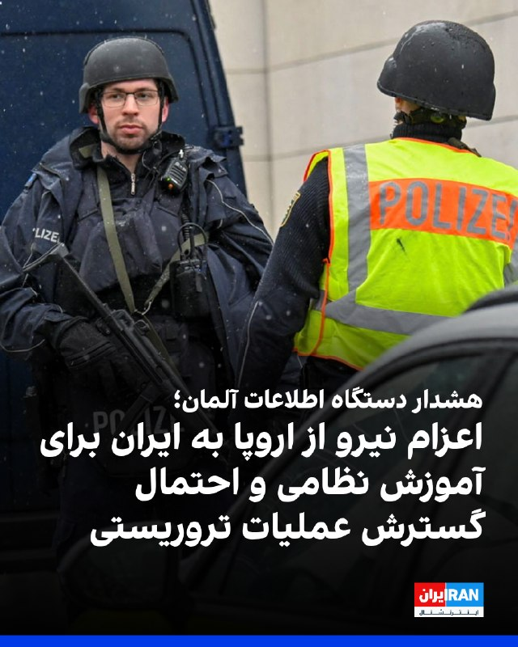

سازمان اطلاعات داخلی آلمان هشدار داده جمهوری اسلامی ممکن است پس از پایان جنگ با اسرائیل و آمریکا، دامنه عملیات‌های امنیتی و تروریستی خود در اروپا را گسترش دهد.

بر اساس گزارش اختصاصی یوراکتیو، سازمان اطلاعات داخلی آلمان (BfV) اعلام کرده تهدید علیه مراکز یهودی و اسرائیلی، مخالفان جمهوری اسلامی و افرادی که حکومت ایران آن‌ها را «خائن» می‌داند، همچنان در سطح بالایی قرار دارد.

این نهاد امنیتی گفته شماری از افراد ساکن آلمان برای آموزش نظامی یا همکاری با نهادهای حکومتی به ایران سفر کرده‌اند و برخی از آن‌ها در ویدئوهای تبلیغاتی جمهوری اسلامی و بسیج ظاهر شده‌اند.

در این گزارش همچنین به نگرانی سرویس‌های امنیتی اروپا از استفاده جمهوری اسلامی از شبکه‌های نیابتی، گروه‌های وابسته به جرایم سازمان‌یافته و نیروهای کم‌هزینه محلی برای انجام حملات اشاره شده است.

به گفته منابع امنیتی، جمهوری اسلامی از مارس ۲۰۲۶ کارزاری با نام «حرکت أصحاب الیمین الإسلامیه» (HAYI) راه‌اندازی کرده که از طریق شبکه‌های اجتماعی اقدام به جذب نیرو در میان محافل طرفدار جمهوری اسلامی و جریان‌های افراطی شیعه می‌کند.
https://iranintl.com/202605191606

## IranIntlTV — post 337965

  <a href="telegram/content/IranIntlTV_337965_1779215109.mp4" target="_blank">🎬 Download video</a>

چند مقام آمریکایی به نیویورک‌تایمز گفتند تصمیم ترامپ برای به تاخیر انداختن حمله به ایران، ممکن است عملیات فریب باشد و شاید او همچنان حمله‌های برنامه‌ریزی‌ شده را اجرا کند.

ارزیابی نوید محبی، تحلیلگر سیاسی
@iranintltv

## IranIntlTV — post 337964

  <a href="telegram/content/IranIntlTV_337964_1779215111.mp4" target="_blank">🎬 Download video</a>

یک شهروند در پیامی به ایران‌اینترنشنال، وضعیت ایران و سیاست‌های حکومت را با دولت‌های کمونیستی مقایسه کرده و می‌گوید در این وضعیت میان خانواده پولدار و زیر خط فقر تفاوت چندانی نیست. پیام او با هوش مصنوعی خوانده شده است.

## IranIntlTV — post 337963

  

سازمان عملیات تجارت دریایی بریتانیا اعلام کرد در بازه زمانی ۲۸ و ۲۹ اردیبهشت، هیچ حادثه‌ای در خلیج فارس و دریای عمان گزارش نشده است.

با این حال، وضعیت امنیتی منطقه همچنان ناپایدار است و تهدید علیه کشتیرانی تجاری ادامه دارد.
https://iranintl.com/202605197145

## IranIntlTV — post 337962

🔻دو سال پس از سقوط بالگرد رئیسی، جمهوری اسلامی دیگر پناهگاه امنی ندارد

دو سال پس از ناپدید شدن بالگرد ابراهیم رئیسی در مه و کشته شدن او در کوهستان‌های آذربایجان شرقی، جمهوری اسلامی فقط یک رییس‌جمهور را از دست نداده است، بلکه بخشی از طرح جانشینی، سپر منطقه‌ای، احساس امنیت و این باور را از دست داده که زمان همچنان به سودش حرکت می‌کند.

بالگرد حامل رئیسی ۳۰ اردیبهشت ۱۴۰۳ سقوط کرد. گزارش نهایی جمهوری اسلامی علت حادثه را شرایط جوی منطقه و مه غلیظ اعلام کرد و احتمال هر‌گونه خرابکاری را رد کرد.

سقوطی که به استعاره تبدیل شد

تصویر این حادثه بیش از آن قدرتمند بود که صرفا یک سانحه باقی بماند: کاروانی از مقام‌های حکومتی در میان مه و دید محدود، ارتباط خود را از دست داد اما حکومت همزمان تلاش می‌کرد نشان دهد کنترل اوضاع را در دست دارد.

مرگ رئیسی، بیش از آن‌که یک معمای امنیتی باشد، به استعاره‌ای از وضعیت جمهوری اسلامی تبدیل شد. رئیسی ایران را اداره نمی‌کرد. قدرت واقعی در اختیار علی خامنه‌ای، سپاه پاسداران، ساختار امنیتی و شبکه‌های منطقه‌ای جمهوری اسلامی بود. اهمیت رئیسی در این بود که قرار بود نماد «تداوم» باشد: چهره‌ای وفادار، تندرو، سختگیر و قابل پیش‌بینی. فردی که از او به‌عنوان یکی از گزینه‌های احتمالی جانشینی خامنه‌ای یاد می‌شد.

او آینده جمهوری اسلامی نبود، بلکه تمرینی برای آینده‌ای بود که هرگز نرسید.

در اردیبهشت ۱۴۰۳ این‌طور به نظر می‌رسید که حکومت هنوز طرح جانشینی، سپر منطقه‌ای و صبر لازم را برای فرسوده کردن دشمنانش در اختیار دارد. اما دو سال بعد، تقریبا همه ستون‌هایی که تهران را دست‌نیافتنی نشان می‌دادند، یا آسیب دیده‌اند یا فرو ریخته‌اند.

از «عمق راهبردی» تا نقشه هدف

شمارش معکوس عملا از زمان حمله هفتم اکتبر حماس به اسرائیل آغاز شد.

آن حمله، شبکه منطقه‌ای جمهوری اسلامی را وارد جنگ کرد: حزب‌الله لبنان، شبه‌نظامیان عراق و سوریه و حوثی‌های یمن.

این شبکه سال‌ها «عمق راهبردی» تهران نامیده می‌شد اما پس از هفتم اکتبر، همان عمق راهبردی به نقشه اهداف تبدیل شد.

فروردین ۱۴۰۳، جمهوری اسلامی و اسرائیل از جنگ سایه‌ها وارد رویارویی مستقیم شدند و یک ماه بعد، بالگرد رئیسی در مه سقوط کرد.

جمهوری اسلامی با مراسم عزاداری رسمی، تابوت‌ها، پرچم‌های سیاه و حضور فرماندهان و روحانیون، تلاش کرد پیام «تداوم» را منتقل کند، اما از آن پس، مراسم تشییع جنازه در جمهوری اسلامی معنای دیگری پیدا کرد و نه نمایش ثبات، که نشانه از دست رفتن افراد، شبکه‌ها و جغرافیایی شد که حکومت را محافظت می‌کردند.

مرگ رئیسی انتخابات زودهنگام را به‌دنبال داشت و مسعود پزشکیان، با لحنی اصلاح‌طلبانه، پس از انتخاباتی با مشارکت پایین، رییس‌جمهور شد.

جمهوری اسلامی چهره‌ای نرم‌تر پیدا کرد، اما مرکز قدرت تغییر نکرد.

تهران دیگر پناهگاه نبود

خیلی زود، نخستین تحقیر بزرگ دوران پسارئیسی نیز رخ داد.

اسماعیل هنیه، رهبر سیاسی حماس، برای مراسم تحلیف پزشکیان به تهران رفت و ساعاتی بعد در پایتخت ایران کشته شد.

این فقط گرفتن جان یک مقام حماس نبود، بلکه پیامی بود مبنی بر این‌که حتی پایتخت حامیان «محور مقاومت» نیز دیگر پناهگاهی امن نیست.

مدتی بعد، انفجار پیجرها و بی‌سیم‌های حزب‌الله در لبنان و سوریه، ساختار ارتباطی این گروه را علیه خودش تبدیل به سلاح کرد و چند روز بعد حسن نصرالله، دبیرکل وقت حزب‌الله، در بیروت کشته شد.

جنبشی که بر پنهان‌کاری و فرماندهی زیرزمینی بنا شده بود، هم از درون نفوذپذیر شد و هم از بیرون هدف قرار گرفت.

پس از آن، یحیی سنوار، رهبر حماس در غزه، نیز کشته شد. حماس باقی ماند، حزب‌الله باقی ماند و شعارها همچنان ادامه یافت، اما محور جمهوری اسلامی، رهبران، مسیرها، قلمرو و اعتمادبه‌نفس خود را از دست داد.

سقوط اسد و انتقال جنگ به داخل ایران

شکاف عمیق‌تر با سقوط بشار اسد در آذر ۱۴۰۳ ایجاد شد.

این فقط سقوط یک متحد جمهوری اسلامی نبود، بلکه جغرافیای قدرت ایران را هدف قرار داد؛ یعنی مسیر ارتباط با حزب‌الله، دسترسی به مدیترانه و ایده دوران قاسم سلیمانی مبنی بر تبدیل دولت‌های ضعیف به عمق راهبردی ایران.

سرانجام خرداد ۱۴۰۴، جنگ به داخل ایران رسید.

اسرائیل در جریان جنگ ۱۲ روزه، مراکز هسته‌ای و نظامی جمهوری اسلامی را هدف قرار داد و سپس آمریکا به مستحکم‌ترین بخش‌های برنامه هسته‌ای حکومت ایران حمله کرد.

سال‌ها، ابهام هسته‌ای سپر دفاعی تهران بود، اما در سال ۱۴۰۴ همان سپر به میدان جنگ تبدیل شد.

جمهوری اسلامی همچنان توانست سرکوب، زندان و ایجاد رعب را ادامه دهد، اما دیگر قادر نبوده است بخش بزرگی از جامعه را متقاعد کند که آینده‌ای در پیش دارد.

🔗جزئیات بیشتر را در وبسایت ایران اینترنشنال بخوانید

@iranintltv

## IranIntlTV — post 337961

  <a href="telegram/content/IranIntlTV_337961_1779215113.mp4" target="_blank">🎬 Download video</a>

تیتراول با نیوشا صارمی، سه‌شنبه ۲۹ اردیبهشت
@iranintltv

## IranIntlTV — post 337959

  <a href="telegram/content/IranIntlTV_337959_1779215114.mp4" target="_blank">🎬 Download video</a>

تیتراول با نیوشا صارمی، سه‌شنبه ۲۹ اردیبهشت
@iranintltv

## IranIntlTV — post 337958

  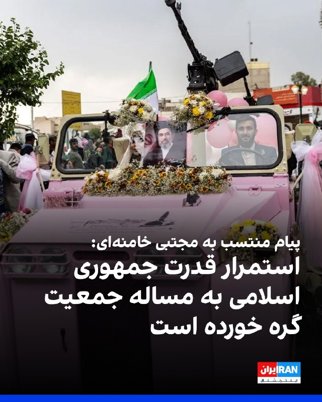

با وجود آنکه از زمان انتصاب مجتبی خامنه‌ای به‌عنوان سومین رهبر جمهوری اسلامی، هیچ تصویر یا ویدیویی از او منتشر نشده، کانال تلگرامی منتسب به او پیامی منتشر کرد که در آن بر «لزوم افزایش جمعیت» و «ترویج فرهنگ فرزندآوری» تاکید شده است.
در این پیام که در ادامه تلاش‌های مقام‌های جمهوری اسلامی برای تشویق ایرانیان به فرزندآوری و افزایش نرخ تولد منتشر شده، آمده است از جمله دستاوردهای جنگ ۴۰ روزه، برآمدن جمهوری اسلامی در «مُستَوای قدرتی بزرگ و تاثیرگذار» بوده است.
در ادامه این پیام تاکید شده «استمرار این وضع» و رسیدن به «درجه مطلوب‌تر» از آن، «نسبت مستقیمی با مسئله جمعیت» دارد و ملت ایران با «پیگیری مجدانه سیاست صحیح و حتمی افزایش جمعیت» می‌تواند «جهش‌هایی راهبردی» را تجربه کرده و در مسیر «خلق تمدن نوین ایران اسلامی» گام بردارد.
در این متن همچنین از «تلاش روزافزون فعالان حوزه جمعیت و ترویج فرهنگ فرزندآوری» تقدیر شده و موضوع افزایش جمعیت از «مهم‌ترین دغدغه‌های» علی خامنه‌ای، رهبر کشته شده جمهوری اسلامی و از مهمترین مسائل راهبردی نظام توصیف شده است.
https://iranintl.com/202605191704

## Shin_Persian — post 6101

نه این وری نه اون وری، oh wait

## Shin_Persian — post 6100

  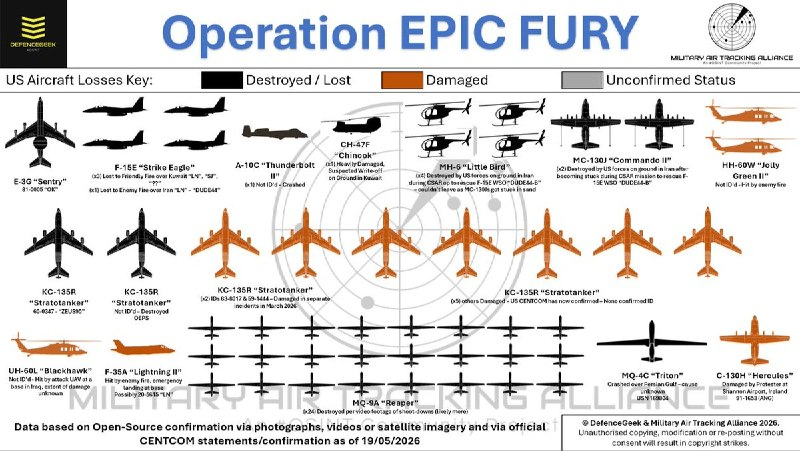

🔁 Quoting above tweet: DefenceGeek 🇬🇧 ✓ @DefenceGeek Tue, 19 May 2026 16:40:08 UTC UPDATED: US Aircraft Casualties as of 19/05/2026 --- #OperationEpicFury / #ProjectFreedom --- So as it turns out, the analysis work by myself, various @MATA_osint team members…

## Shin_Persian — post 6099

🔁 Quoting above tweet:
DefenceGeek 🇬🇧 ✓ @DefenceGeek
Tue, 19 May 2026 16:40:08 UTC

UPDATED: US Aircraft Casualties as of 19/05/2026
--- #OperationEpicFury / #ProjectFreedom ---

So as it turns out, the analysis work by myself, various @MATA_osint team members and a few other folks were more or less spot on! Based on the official comment today, I've updated the graphic, with the following changes:
- A-10C (x1) unknown status - Removed
- MQ-4C (x1) unknown status - Changed to Destroyed
- KC-135 (x5) unknown status - Changed to Damaged

Noteworthy that the US is claiming the E-3G is only "damaged" despite the fact any attempt to fix it would require pulling entire sections of other airframes out of the boneyard and shipping it to Saudi to rebuild there... which let's be honest just isn't going to happen.

@MATA_osint @prestonstew_ @ArmchairAdml @TheIntelFrogbu @steffanwatkins @vcdgf555

فارسی

به‌روزرسانی: تلفات هواگردهای ایالات متحده تا تاریخ ۲۰۲۶/۰۵/۱۹
--- #OperationEpicFury / #ProjectFreedom ---

همان‌طور که مشخص شد، تجزیه و تحلیل‌های من، اعضای مختلف تیم @MATA_osint و چند نفر دیگر کمابیش دقیق بوده‌اند! بر اساس اظهارنظر رسمی امروز، این گرافیک را با تغییرات زیر به‌روزرسانی کردم:
- یک فروند A-10C با وضعیت نامشخص - حذف شد
- یک فروند MQ-4C با وضعیت نامشخص - به "منهدم شده" تغییر یافت
- پنج فروند KC-135 با وضعیت نامشخص - به "آسیب‌دیده" تغییر یافت

قابل توجه است که ایالات متحده مدعی شده که E-3G تنها "آسیب‌دیده" است، با وجود این واقعیت که هرگونه تلاش برای تعمیر آن مستلزم بیرون کشیدن بخش‌های کامل از بدنه هواپیماهای دیگر از قبرستان هواپیماها و ارسال آن به عربستان سعودی برای بازسازی در آنجا خواهد بود... که بیایید صادق باشیم، این اتفاق هرگز نخواهد افتاد.

@MATA_osint @prestonstew_ @ArmchairAdml @TheIntelFrogbu @steffanwatkins @vcdgf555

𝕏 · @shin_persian

## Shin_Persian — post 6098

  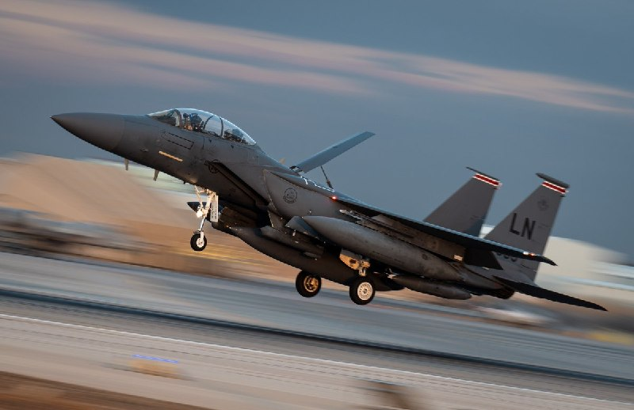

↩️ Quoted tweet: Preston Stewart ✓ @prestonstew_ Tue, 19 May 2026 13:21:59 UTC The Congressional Research Service just listed the 42 US aircraft lost or damaged so far during the war with Iran. 4 x F-15E Strike Eagles destroyed 1 x F-35A damaged by Iranian…

## Shin_Persian — post 6097

↩️ Quoted tweet:
Preston Stewart ✓ @prestonstew_
Tue, 19 May 2026 13:21:59 UTC

The Congressional Research Service just listed the 42 US aircraft lost or damaged so far during the war with Iran.
4 x F-15E Strike Eagles destroyed
1 x F-35A damaged by Iranian ground fire
1 x A-10 destroyed
7 x KC-135 Stratotankers (2 destroyed, 5 damaged)
1 x E-3 Sentry AWACS

↩️ توییت نقل‌قول شده — برای پاسخ، پست زیر را ببینید.

فارسی

مرکز پژوهش‌های کنگره به تازگی فهرست ۴۲ فروند هواپیمای آمریکایی را که تا این لحظه در طول جنگ با ایران منهدم شده یا آسیب دیده‌اند، منتشر کرد.
۴ فروند اف-۱۵ئی استرایک ایگل (F-15E Strike Eagle) منهدم شده
۱ فروند اف-۳۵آ (F-35A) آسیب‌دیده توسط پدافند زمینی ایران
۱ فروند آ-۱۰ (A-10) منهدم شده
۷ فروند کی‌سی-۱۳۵ استراتوتانکر (۲ فروند منهدم شده، ۵ فروند آسیب‌دیده)
۱ فروند ئی-۳ سنتری آواکس (E-3 Sentry AWACS)

𝕏 · @shin_persian

## Shin_Persian — post 6096

↩️ Quoted tweet: Psarantonis @FurzFee2000 Tue, 19 May 2026 16:37:20 UTC @hey_itsmyturn @POTUS Did anyone read every single word? ↩️ توییت نقل‌قول شده — برای پاسخ، پست زیر را ببینید. فارسی @hey_itsmyturn @POTUS آیا کسی تمام کلمات را مو به مو خواند؟ 𝕏…

## Shin_Persian — post 6095

↩️ Quoted tweet:
Psarantonis @FurzFee2000
Tue, 19 May 2026 16:37:20 UTC

@hey_itsmyturn @POTUS Did anyone read every single word?

↩️ توییت نقل‌قول شده — برای پاسخ، پست زیر را ببینید.

فارسی

@hey_itsmyturn @POTUS آیا کسی تمام کلمات را مو به مو خواند؟

𝕏 · @shin_persian

## Shin_Persian — post 6094

  

DefenceGeek 🇬🇧 ✓ @DefenceGeek Tue, 19 May 2026 16:23:09 UTC Tanker Swaps - Cloning? #FreeIran‌ --- Operation EPIC FURY / Project FREEDOM --- A pair of KC-135 "Stratotanker" aircraft that had previously left the CENTCOM region (more than 2 weeks ago) back…

## Shin_Persian — post 6093

DefenceGeek 🇬🇧 ✓ @DefenceGeek
Tue, 19 May 2026 16:23:09 UTC

Tanker Swaps - Cloning? #FreeIran‌
--- Operation EPIC FURY / Project FREEDOM ---

A pair of KC-135 "Stratotanker" aircraft that had previously left the CENTCOM region (more than 2 weeks ago) back to the US arrived back at RAF Mildenhall (EGUN) this morning, and are now both airborne showing as RCH164 heading back to CENTCOM.

They'll likely replace 2 airframes that left Tel Aviv Ben Gurion Airport (LLBG) early this morning and went to RAF Mildenhall.

@MATA_osint

فارسی

تبادل تانکرها - کلونینگ؟ #FreeIran‌
--- عملیات خشم حماسی (EPIC FURY) / پروژه آزادی (Project FREEDOM) ---

یک جفت هواپیمای سوخت‌رسان KC-135 "استراتوتانکر" که پیش از این (بیش از ۲ هفته قبل) منطقه فرماندهی مرکزی ایالات متحده (سنتکام/CENTCOM) را به مقصد آمریکا ترک کرده بودند، امروز صبح به پایگاه نیروی هوایی سلطنتی میدهال (EGUN) بازگشتند و اکنون هر دو با شناسه RCH164 به صورت پروازی در حال بازگشت به سمت سنتکام هستند.

آن‌ها احتمالاً جایگزین ۲ بدنه پروازی خواهند شد که اوایل صبح امروز فرودگاه بن گوریون تل‌آویو (LLBG) را ترک کرده و به پایگاه میدهال رفتند.

@MATA_osint

𝕏 · @shin_persian

## Shin_Persian — post 6092

  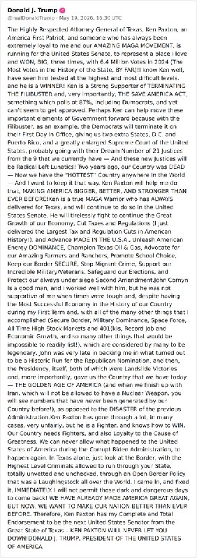

Shin ✓ @hey_itsmyturn Tue, 19 May 2026 16:35:43 UTC President Trump @POTUS: "The Highly Respected Attorney General of Texas, Ken Paxton, an America First Patriot, and someone who has always been extremely loyal to me and our AMAZING MAGA MOVEMENT, is running…

## Shin_Persian — post 6091

Shin ✓ @hey_itsmyturn
Tue, 19 May 2026 16:35:43 UTC

President Trump @POTUS:
"The Highly Respected Attorney General of Texas, Ken Paxton, an America First Patriot, and someone who has always been extremely loyal to me and our AMAZING MAGA MOVEMENT, is running for the United States Senate, to represent a place I love and WON, BIG, three times, with 6.4 Million Votes in 2024 (The Most Votes in the History of the State, BY FAR)!I know Ken well, have seen him tested at the highest and most difficult levels, and he is a WINNER! Ken is a Strong Supporter of TERMINATING THE FILIBUSTER and, very importantly, THE SAVE AMERICA ACT, something which polls at 87%, including Dumocrats, and yet can’t seem to get approved. Perhaps Ken can help move these important elements of Government forward because with the Filibuster, as an example, the Democrats will terminate it on their First Day in Office, giving us two extra States, D.C. and Puerto Rico, and a greatly enlarged Supreme Court of the United States, probably going with their Dream Number of 21 Justices from the 9 that we currently have — And these new Justices will be Radical Left Lunatics! Two years ago, our Country was DEAD — Now we have the “HOTTEST” Country anywhere in the World — And I want to keep it that way. Ken Paxton will help me do that, MAKING AMERICA BIGGER, BETTER, AND STRONGER THAN EVER BEFORE!Ken is a true MAGA Warrior who has ALWAYS delivered for Texas, and will continue to do so in the United States Senate. He will tirelessly fight to continue the Great Growth of our Economy, Cut Taxes and Regulations (I just delivered the Largest Tax and Regulation Cuts in American History!), and Advance MADE IN THE U.S.A., Unleash American Energy DOMINANCE, Champion Texas Oil & Gas, Advocate for our Amazing Farmers and Ranchers, Promote School Choice, Keep our Border SECURE, Stop Migrant Crime, Support our Incredible Military/Veterans, Safeguard our Elections, and Protect our always under siege Second Amendment.John Cornyn is a good man, and I worked well with him, but he was not supportive of me when times were tough and, despite having the Most Successful Economy in the History of our Country during my First Term and, with all of the many other things that I accomplished (Secure Border, Military Dominance, Space Force, All Time High Stock Markets and 401(k)s, Record Job and Economic Growth, and so many other things that would be impossible to readily list!), which are considered by many to be legendary, John was very late in backing me in what turned out to be a Historic Run for the Republican Nomination, and then, the Presidency, itself, both of which were Landslide Victories and, more importantly, gave us the Country that we have today — THE GOLDEN AGE OF AMERICA (and when we finish up with Iran, which will not be allowed to have a Nuclear Weapon, you will see numbers that have never been generated by our Country before!), as opposed to the DISASTER of the previous Administration.Ken Paxton has gone through a lot, in many cases, very unfairly, but he is a Fighter, and knows how to WIN. Our Country needs Fighters, and also Loyalty to the Cause of Greatness. We can never allow what happened to the United States of America during the Corrupt Biden Administration, to happen again. In Texas alone, just look at the Border, with the Highest Level Criminals allowed to run through your State, totally unvetted and unchecked, through an Open Border Policy that was a Laughingstock all over the World. I came in, and fixed it, IMMEDIATELY. I will not permit those dark and dangerous days to come back! WE HAVE ALREADY MADE AMERICA GREAT AGAIN, BUT NOW, WE WANT TO MAKE OUR NATION BETTER THAN EVER BEFORE. Therefore, Ken Paxton has my Complete and Total Endorsement to be the next United States Senator from the Great State of Texas – KEN PAXTON WILL NEVER LET YOU DOWN!DONALD J. TRUMP, PRESIDENT OF THE UNITED STATES OF AMERICA"

ترجمه فارسی در بخش نظرات

𝕏 · @shin_persian

## Shin_Persian — post 6090

  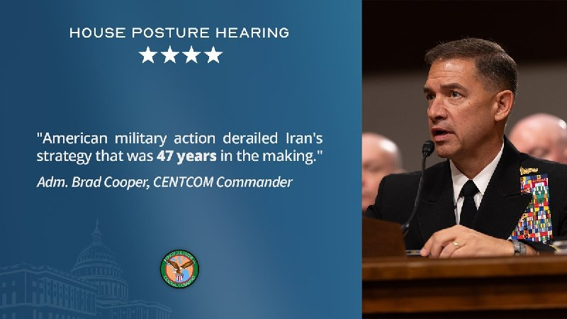

U.S. Central Command ✓ @CENTCOM
Tue, 19 May 2026 15:32:43 UTC

Hamas, Hezbollah, and the Houthis are cut-off from Iran's weapons supply and support.

فارسی

حماس، حزب‌الله و حوثی‌ها از زنجیره تأمین تسلیحات و حمایت‌های ایران قطع شده‌اند.

𝕏 · @shin_persian

## Shin_Persian — post 6089

Shin ✓ @hey_itsmyturn
Tue, 19 May 2026 14:31:14 UTC

𝐄𝐜𝐨𝐧𝐨𝐦𝐢𝐜 𝐅𝐮𝐫𝐲 targets Iran's shadow banking system and petroleum smuggling networks, designating over 50 entities including the 𝐀𝐦𝐢𝐧 𝐄𝐱𝐜𝐡𝐚𝐧𝐠𝐞 currency house and 19 vessels that collectively facilitate billions in sanctions evasion revenue.

𝐈𝐍𝐃𝐈𝐕𝐈𝐃𝐔𝐀𝐋𝐒:
• 𝐘𝐨𝐮𝐬𝐞𝐟 𝐄𝐛𝐫𝐚𝐡𝐢𝐦𝐢 (Turkish/Iranian/Dominican national) - Owner and operator of Amin Exchange, maintains multiple citizenships through investment schemes
• 𝐒𝐚𝐦𝐚𝐝 𝐍𝐞𝐦𝐚𝐭𝐢 (Iranian national) - CEO of Amin Exchange and former IRGC officer
• 𝐀𝐥𝐢 𝐇𝐚𝐳𝐫𝐚𝐭𝐢 𝐂𝐡𝐚𝐤𝐡𝐞𝐫𝐥𝐨 (Turkey-based Iranian national) - Board member of Amin Exchange
• 𝐌𝐚𝐡𝐦𝐨𝐮𝐝 𝐄𝐛𝐫𝐚𝐡𝐢𝐦𝐢 (Turkish/Iranian national) - Brother of Yousef Ebrahimi, Amin Exchange employee

𝐄𝐍𝐓𝐈𝐓𝐈𝐄𝐒:
• 𝐄𝐛𝐫𝐚𝐡𝐢𝐦𝐢 𝐚𝐧𝐝 𝐀𝐬𝐬𝐨𝐜𝐢𝐚𝐭𝐞𝐬 𝐏𝐚𝐫𝐭𝐧𝐞𝐫𝐬𝐡𝐢𝐩 𝐂𝐨𝐦𝐩𝐚𝐧𝐲 (𝐀𝐦𝐢𝐧 𝐄𝐱𝐜𝐡𝐚𝐧𝐠𝐞) - Iran-based foreign currency exchange house facilitating hundreds of millions in transactions for sanctioned Iranian banks including NIOC and PGPICC
• 𝐍𝐢𝐧𝐠𝐛𝐨 𝐉𝐢𝐚𝐫𝐮𝐢 𝐓𝐫𝐚𝐝𝐢𝐧𝐠 𝐂𝐨., 𝐋𝐭𝐝. - China-based front company
• 𝐒𝐭𝐚𝐫𝐬𝐡𝐢𝐧𝐞 𝐏𝐞𝐭𝐫𝐨𝐜𝐡𝐞𝐦𝐢𝐜𝐚𝐥 𝐂𝐨𝐫𝐩𝐨𝐫𝐚𝐭𝐢𝐨𝐧 𝐋𝐢𝐦𝐢𝐭𝐞𝐝 - Hong Kong-based front company
• 𝐕𝐢𝐠𝐨𝐫𝐨𝐮𝐬 𝐓𝐫𝐚𝐝𝐢𝐧𝐠 𝐋𝐢𝐦𝐢𝐭𝐞𝐝 - Hong Kong-based front company
• 𝐀𝐥𝐢𝐞𝐞𝐧 𝐆𝐨𝐨𝐝𝐬 𝐖𝐡𝐨𝐥𝐞𝐬𝐚𝐥𝐞𝐫𝐬 𝐋𝐋𝐂 - UAE-based front company
• 𝐁𝐨𝐥𝐝 𝐓𝐫𝐚𝐝𝐢𝐧𝐠 𝐅𝐙𝐄 - UAE-based front company
• 𝐌𝐚𝐭𝐞𝐫𝐢𝐮𝐦 𝐆𝐫𝐨𝐮𝐩 𝐅𝐙𝐄 - UAE-based front company
• 𝐁𝐞𝐬𝐭𝐟𝐨𝐫𝐭𝐮𝐧𝐚 𝐂𝐨𝐦𝐩𝐚𝐧𝐲 𝐋𝐢𝐦𝐢𝐭𝐞𝐝 - Hong Kong-based front company
• 𝐂𝐡𝐞𝐧𝐠 𝐏𝐚𝐧 𝐂𝐨., 𝐋𝐢𝐦𝐢𝐭𝐞𝐝 - Hong Kong-based front company

𝐕𝐄𝐒𝐒𝐄𝐋𝐒 (𝐒𝐡𝐚𝐝𝐨𝐰 𝐅𝐥𝐞𝐞𝐭):
• 𝐆𝐑𝐄𝐀𝐓 𝐒𝐀𝐈𝐋 (IMO 9177583) - Barbados-flagged LPG tanker, owned by Great Sail Shipping Limited
• 𝐎𝐂𝐄𝐀𝐍 𝐖𝐀𝐕𝐄 (IMO 9387152) - Palau-flagged products tanker, owned by Ow Maritime Incorporated
• 𝐒𝐖𝐈𝐅𝐓 𝐅𝐀𝐋𝐂𝐎𝐍 (IMO 9246803) - Panama-flagged chemical/oil tanker, owned by Arden Angel Shipping Company Limited
• 𝐌𝐈𝐆𝐇𝐓𝐘 𝐍𝐀𝐕𝐈𝐆𝐀𝐓𝐎𝐑 (IMO 9206396) - Hong Kong-flagged LPG tanker, owned by Verda Gas Co Ltd
• 𝐌𝐈𝐃𝐀𝐒 (IMO 9266841) - Panama-flagged crude oil tanker, owned by Ocean Marvel Shipping Company Limited
• 𝐁𝐑𝐈𝐆𝐇𝐓 𝐆𝐎𝐋𝐃 (IMO 9171503) - Panama-flagged chemical/oil tanker, owned by GS Chemical Transportation Limited
• 𝐃𝐎𝐔𝐁𝐋𝐄 𝐈𝐍 (IMO 8917807) - San Marino-flagged LPG tanker, owned by Science Obedient International Company Limited
• 𝐍𝐀𝐑𝐒𝐈𝐒 (IMO 9408358) - Cameroon-flagged chemical/oil tanker, owned by Sun Ocean Shipping Incorporated
• 𝐆 𝐉𝐀𝐃𝐄𝐒 (IMO 9131096) - Comoros-flagged LPG tanker, owned by Gjades Shipping Company Limited
• 𝐆𝐀𝐒 𝐄𝐍𝐃𝐔𝐑𝐀𝐍𝐂𝐄 (IMO 9240419) - Gabon-flagged LPG tanker, owned by Aquila Worldwide Marine Developments Corp.
• 𝐎𝐂𝐄𝐀𝐍 𝐑𝐀𝐃𝐈𝐀𝐍𝐂𝐄 (IMO 9194969) - Palau-flagged LPG tanker, owned by Aurora Business Company Limited
• 𝐐𝐔𝐀𝐍𝐓𝐔𝐌 𝐒𝐓𝐀𝐑 (IMO 9225342) - Panama-flagged LPG tanker, owned by Taurus Gas Company Limited
• 𝐆𝐀𝐒 𝐒𝐓𝐑𝐄𝐍𝐆𝐓𝐇 (IMO 9172636) - Panama-flagged LPG tanker, owned by Veinto Global Marine Inc.
• 𝐅𝐄𝐀𝐃𝐒𝐇𝐈𝐏 (IMO 9322279) - Vanuatu-flagged crude oil tanker, owned by Mozart Maritime Inc.
• 𝐕𝐀𝐒𝐋𝐀𝐓𝐈 (IMO 9252333) - Cameroon-flagged crude oil tanker, owned by Splendid Lexy Trading Company Ltd
• 𝐃𝐀𝐊𝐔𝐒𝐇 (IMO 9278698) - Cook Islands-flagged crude oil tanker, owned by Mekong Lines Inc.
• 𝐓𝐄𝐉𝐀𝐒 (IMO 9326067) - Panama-flagged crude oil tanker, owned by Romy Lines Incorporated
• 𝐋𝐔𝐍𝐀 𝐋𝐔𝐒𝐓𝐄𝐑 (IMO 9292187) - Sierra Leone-flagged oil tanker, owned by Global Fortune Shipping Limited
• 𝐆𝐀𝐋𝐀 𝐑𝐎𝐒𝐄 (IMO 9126015) - Hong Kong-flagged chemical/oil tanker, owned by Sparkling Courage Limited

𝐊𝐄𝐘 𝐓𝐄𝐂𝐇𝐍𝐈𝐂𝐀𝐋 𝐃𝐄𝐓𝐀𝐈𝐋𝐒:
• Action taken pursuant to E.O. 13902 targeting Iran's financial, petroleum, and petrochemical sectors
• State Department's Rewards for Justice program offers up to $15 million for information disrupting IRGC financial mechanisms
• Economic Fury has disrupted billions in projected oil revenue and led to freezing of nearly $500 million in regime-linked cryptocurrency
• Treasury warns of potential secondary sanctions on foreign financial institutions, including those connected to China's "teapot" refineries
• All designated vessel-owning companies also sanctioned under petroleum/petrochemical sector authorities

ترجمه فارسی در بخش نظرات

𝕏 · @shin_persian

## Shin_Persian — post 6088

  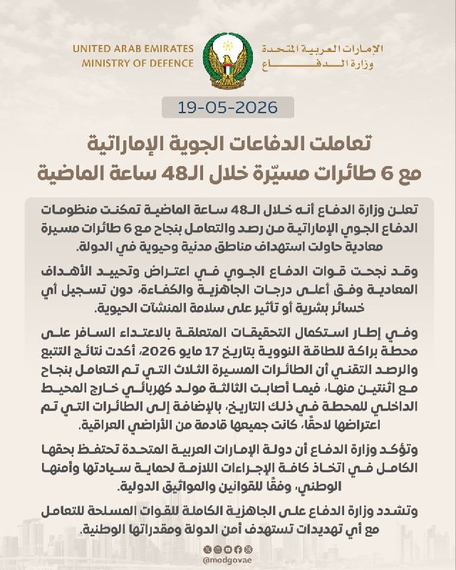

وزارة الدفاع |MOD UAE ✓ @modgovae Tue, 19 May 2026 14:12:15 UTC تعلن وزارة الدفاع أنه خلال الـ48 ساعة الماضية تمكنت منظومات الدفاع الجوي الإماراتية من رصد والتعامل بنجاح مع 6 طائرات مسيرة معادية حاولت استهداف مناطق مدنية وحيوية في الدولة. وقد نجحت قوات…

## Shin_Persian — post 6087

وزارة الدفاع |MOD UAE ✓ @modgovae
Tue, 19 May 2026 14:12:15 UTC

تعلن وزارة الدفاع أنه خلال الـ48 ساعة الماضية تمكنت منظومات الدفاع الجوي الإماراتية من رصد والتعامل بنجاح مع 6 طائرات مسيرة معادية حاولت استهداف مناطق مدنية وحيوية في الدولة.

وقد نجحت قوات الدفاع الجوي في اعتراض وتحييد الأهداف المعادية وفق أعلى درجات الجاهزية والكفاءة، دون تسجيل أي خسائر بشرية أو تأثير على سلامة المنشآت الحيوية.

وفي إطار استكمال التحقيقات المتعلقة بالاعتداء السافر على محطة براكة للطاقة النووية بتاريخ 17 مايو 2026، أكدت نتائج التتبع والرصد التقني أن الطائرات المسيرة الثلاث التي تم التعامل بنجاح مع اثنتين منها، فيما أصابت الثالثة مولد كهربائي خارج المحيط الداخلي للمحطة في ذلك التاريخ، بالإضافة إلى الطائرات التي تم اعتراضها لاحقًا، كانت جميعها قادمة من الأراضي العراقية.

وتؤكد وزارة الدفاع أن دولة الإمارات العربية المتحدة تحتفظ بحقها الكامل في اتخاذ كافة الإجراءات اللازمة لحماية سيادتها وأمنها الوطني، وفقًا للقوانين والمواثيق الدولية.

وتشدد وزارة الدفاع على الجاهزية الكاملة للقوات المسلحة للتعامل مع أي تهديدات تستهدف أمن الدولة ومقدراتها الوطنية.

#وزارة_الدفاع
#وزارة_الدفاع_الإماراتية
#MOD
#UAEMinistryOfDefence

English

The Ministry of Defense announces that over the past 48 hours, UAE air defense systems managed to detect and successfully deal with 6 hostile unmanned aerial vehicles (UAVs) that attempted to target civilian and vital areas in the country.

The air defense forces succeeded in intercepting and neutralizing the hostile targets with the highest levels of readiness and efficiency, without recording any human casualties or impact on the safety of vital facilities.

In the context of completing investigations regarding the blatant attack on the Barakah Nuclear Energy Plant on May 17, 2026, technical tracking and monitoring results confirmed that the three drones—two of which were successfully dealt with, while the third struck an electrical generator outside the plant's inner perimeter on that date—as well as the drones intercepted subsequently, all originated from Iraqi territory.

The Ministry of Defense affirms that the United Arab Emirates reserves its full right to take all necessary measures to protect its sovereignty and national security, in accordance with international laws and charters.

The Ministry of Defense emphasizes the full readiness of the Armed Forces to deal with any threats targeting the security of the state and its national assets.

#Ministry_of_Defense
#UAE_Ministry_of_Defense
#MOD
#UAEMinistryOfDefence

𝕏 · @shin_persian

## Shin_Persian — post 6086

Shin ✓ @hey_itsmyturn
Tue, 19 May 2026 13:16:01 UTC

𝐄𝐜𝐨𝐧𝐨𝐦𝐢𝐜 𝐅𝐮𝐫𝐲 campaign intensifies financial pressure on Iran through modernized sanctions architecture targeting terrorist financing networks, with Treasury freezing nearly $500 million in regime-linked cryptocurrency and disrupting hundreds of billions in illicit flows.

𝐊𝐞𝐲 𝐏𝐨𝐥𝐢𝐜𝐲 𝐔𝐩𝐝𝐚𝐭𝐞𝐬:
- Treasury reviewing outdated designations to focus financial institutions on sophisticated evasion schemes
- New approach emphasizes targeted sanctions with defined timelines rather than indefinite measures
- Sanctions architecture modernized for 21st century threats including cryptocurrency and shadow banking

𝐂𝐚𝐦𝐩𝐚𝐢𝐠𝐧 𝐒𝐜𝐨𝐩𝐞 - 𝐄𝐜𝐨𝐧𝐨𝐦𝐢𝐜 𝐅𝐮𝐫𝐲:
- Disrupted tens of billions in projected Iranian oil revenue
- Frozen nearly $500 million in regime-linked cryptocurrency
- Disrupted hundreds of billions in Iran's illicit financial flows
- Intensified crackdown on Tehran's shadow banking networks
- Targeting vessel networks, intermediaries, and oil buyers

𝐈𝐧𝐭𝐞𝐫𝐧𝐚𝐭𝐢𝐨𝐧𝐚𝐥 𝐂𝐨𝐨𝐩𝐞𝐫𝐚𝐭𝐢𝐨𝐧 𝐑𝐞𝐪𝐮𝐢𝐫𝐞𝐦𝐞𝐧𝐭𝐬:
- European partners: Designate Iranian financiers, unmask shell companies, shutter bank branches, dismantle proxies
- Middle East/Asia partners: Root out Iran's shadow banking networks
- Global partners: Target array of terrorists from Hizballah to Sinaloa Cartel

𝐒𝐭𝐫𝐚𝐭𝐞𝐠𝐢𝐜 𝐃𝐨𝐜𝐭𝐫𝐢𝐧𝐞:
- Economic security positioned as national security under Trump Administration
- Sanctions designed as "instruments of peace" to create behavioral change conditions
- Focus on aggressive, targeted actions rather than generational punishment of populations
- Emphasis on agility to maximize effectiveness while monitoring for unintended consequences

𝐎𝐩𝐞𝐫𝐚𝐭𝐢𝐨𝐧𝐚𝐥 𝐓𝐚𝐫𝐠𝐞𝐭𝐬:
- Shell companies embedded within Europe
- Shadow banking networks across Middle East
- Drug cartels throughout Western Hemisphere
- Iranian weapons programs and terrorist proxies
- Nuclear ambitions financing

The announcement reinforces maximum pressure campaign continuation with enhanced multilateral coordination expectations and modernized enforcement mechanisms.

ترجمه فارسی در بخش نظرات

𝕏 · @shin_persian

## Shin_Persian — post 6085

  <a href="telegram/content/Shin_Persian_6085_1779215119.mp4" target="_blank">🎬 Download video</a>

Emanuel (Mannie) Fabian ✓ @manniefabian Tue, 19 May 2026 11:20:57 UTC The military says it struck over 25 Hezbollah targets in southern Lebanon in the past day. The targets included weapon depots, command centers, rocket launchers used in previous attacks…

## Shin_Persian — post 6084

Emanuel (Mannie) Fabian ✓ @manniefabian
Tue, 19 May 2026 11:20:57 UTC

The military says it struck over 25 Hezbollah targets in southern Lebanon in the past day.

The targets included weapon depots, command centers, rocket launchers used in previous attacks, and other infrastructure used by the terror group to advance attacks, according to the IDF.

The IDF says it also struck Hezbollah operatives in the Cristofani Ridge area, located several kilometers north of Mount Hermon.

فارسی

ارتش اعلام کرد که در شبانه‌روز گذشته بیش از ۲۵ هدف حزب‌الله در جنوب لبنان را مورد حمله قرار داده است.

به گفته ارتش دفاعی اسرائیل (IDF)، این اهداف شامل انبارهای سلاح، مراکز فرماندهی، سکوهای پرتاب راکت مورد استفاده در حملات قبلی و سایر زیرساخت‌هایی بود که این گروه تروریستی برای پیشبرد حملات استفاده می‌کرد.

ارتش دفاعی اسرائیل همچنین اعلام کرد که نیروهای عملیاتی حزب‌الله را در منطقه خط‌الرأس کریستوفانی، واقع در چند کیلومتری شمال کوه حرمون، هدف قرار داده است.

𝕏 · @shin_persian

## Shin_Persian — post 6083

  

Shin ✓ @hey_itsmyturn
Tue, 19 May 2026 12:12:22 UTC

State-owned Mehr confirms the explosion(s), reports it was due to EOD

فارسی

خبرگزاری دولتی مهر وقوع انفجار(ها) را تایید و گزارش کرد که این حادثه ناشی از ای‌او‌دی (EOD - خنثی‌سازی مهمات انفجاری) بوده است.

𝕏 · @shin_persian

## ManotoTV — post 105652

  <a href="telegram/content/ManotoTV_105652_1779215121.mp4" target="_blank">🎬 Download video</a>

ولادیمیر پوتین، رئیس‌جمهوری روسیه، برای دیدار با شی جین‌پینگ وارد چین شد؛ سفری که کمتر از یک هفته پس از سفر دونالد ترامپ به پکن انجام می‌شود و توجه زیادی را به خود جلب کرده است.
کرملین اعلام کرده پوتین و شی در این سفر درباره همکاری‌های اقتصادی، مسائل منطقه‌ای و روابط بین‌المللی گفت‌وگو خواهند کرد. این سفر همزمان با بیست‌وپنجمین سالگرد پیمان دوستی چین و روسیه برگزار می‌شود.
چین که پس از جنگ اوکراین به مهم‌ترین شریک تجاری روسیه تبدیل شده، تلاش می‌کند هم روابط نزدیک خود با مسکو را حفظ کند و هم روابط باثباتی با آمریکا داشته باشد.
مقام‌های روسی گفته‌اند صادرات نفت روسیه به چین در سه‌ماهه نخست ۲۰۲۶ افزایش یافته و دو کشور در حوزه انرژی به توافق‌های مهمی نزدیک شده‌اند. پوتین نیز روابط مسکو و پکن را عاملی برای «ثبات و بازدارندگی» در جهان توصیف کرده است.

## ManotoTV — post 105650

  <a href="telegram/content/ManotoTV_105650_1779215121.mp4" target="_blank">🎬 Download video</a>

رسانه‌های حکومتی با انتشار این تصویر از دیدار و تبادل نظر کاظم غریب‌آبادی، معاون وزارت خارجه با زونگ‌‌پی‌وو سفیر چین در تهران خبر داده‌اند. این دیدار پس از انتصاب قالیباف به عنوان «نماینده ویژه جمهوری‌اسلامی در امور چین» صورت گرفته است.

## ManotoTV — post 105649

  <a href="telegram/content/ManotoTV_105649_1779215122.mp4" target="_blank">🎬 Download video</a>

یک مقام وزارت دفاع آمریکا احتمال اعزام نیروی زمینی این کشور به ایران را رد نکرد.
در جلسه‌ای در واشنگتن، از دنیل زیمرمن، معاون وزیر دفاع آمریکا در امور امنیت بین‌الملل، درباره گزینه‌های پیش‌روی دونالد ترامپ پس از اظهارات اخیر او درباره وارد کردن «ضربه‌ای بزرگ دیگر به ایران» سؤال شد.
زیمرمن در پاسخ به این پرسش که آیا می‌تواند اعزام نیروهای آمریکایی به خاورمیانه را رد کند، گفت: «رئیس‌جمهور همه گزینه‌های لازم را در اختیار دارد.» او در پاسخ به تکرار این سؤال نیز بار دیگر تاکید کرد: «رئیس‌جمهور گزینه‌هایی را که نیاز دارد حفظ می‌کند.»
در ادامه جلسه، برخی حاضران از ارائه نشدن پاسخ صریح انتقاد کرده و آن را «مایه تاسف» توصیف کردند.

## ManotoTV — post 105648

  <a href="telegram/content/ManotoTV_105648_1779215122.mp4" target="_blank">🎬 Download video</a>

‌
ژنرال برد کوپر، فرمانده ستاد فرماندهی مرکزی آمریکا، سنتکام، به کنگره گفت مدرسه میناب که در جریان جنگ هدف قرار گرفت، «در یک پایگاه فعال موشک‌های کروز» قرار داشت.

او گفت تحقیقات ارتش آمریکا درباره انفجار در این مدرسه «پیچیده» است، زیرا این مرکز در یک سایت فعال موشکی جمهوری اسلامی واقع شده بود.

رویترز پیش‌تر گزارش داده بود تحقیقات اولیه داخلی ارتش آمریکا نشان می‌دهد نیروهای آمریکایی «احتمالاً» مسئول تخریب مدرسه دخترانه‌ای در میناب بوده‌اند؛ موضوعی که پنتاگون بعداً سطح بررسی آن را ارتقا داد.

در این حادثه که در نخستین روز درگیری‌ها ۹ اسفند ۱۴۰۴ رخ داد، ۱۶۸ کودک که بیشتر آن‌ها دختر بودند، کشته شدند.

## ManotoTV — post 105647

  <a href="telegram/content/ManotoTV_105647_1779215123.mp4" target="_blank">🎬 Download video</a>

وزارت خزانه‌داری آمریکا اعلام کرد در چارچوب کارزار «خشم اقتصادی»، صرافی «امین اکسچنج» و شبکه‌ای از افراد، شرکت‌ها و نفتکش‌های مرتبط با جمهوری اسلامی را تحریم کرده است.

بر اساس بیانیه وزارت خزانه‌داری آمریکا، صرافی «امین اکسچنج» که با نام رسمی «ابراهیمی و همکاران» شناخته می‌شود، صدها میلیون دلار تراکنش مالی را برای نهادها و بانک‌های تحریم‌شده جمهوری اسلامی انجام داده است.

در این بیانیه از یوسف ابراهیمی، مالک و گرداننده این صرافی، سماد نعمتی، مدیرعامل فعلی و عضو پیشین سپاه پاسداران، علی حضرتی چاخِرلو، عضو هیات‌مدیره، و محمود ابراهیمی، برادر یوسف ابراهیمی، به‌عنوان افراد تحریم‌شده نام برده شده است.

وزارت خزانه‌داری آمریکا همچنین اعلام کرد این صرافی با شرکت ملی نفت ایران، شرکت بازرگانی صنایع پتروشیمی خلیج فارس و شرکت تریلیَنس پتروشیمی همکاری داشته و از شبکه‌ای از شرکت‌های پوششی در امارات، ترکیه و هنگ‌کنگ برای دور زدن تحریم‌ها استفاده کرده است.

## ManotoTV — post 105646

  <a href="telegram/content/ManotoTV_105646_1779215123.mp4" target="_blank">🎬 Download video</a>

«از رشید مظاهری حمایت کنید»

## ManotoTV — post 105643

  <a href="telegram/content/ManotoTV_105643_1779215124.mp4" target="_blank">🎬 Download video</a>

خبرگزاری‌های حکومتی تصاویری از مراسم ازدواج گروهی سازماندهی شده توسط سپاه محمد رسول‌الله تهران بزرگ منتشر کرده‌اند که عروس و دامادهای این مراسم حکومتی، «زوج‌های جان‌فدا» معرفی شده‌اند. این ۵۰۰ زوج با خودروهای نظامی گل‌آرایی شده، بادکنک‌های صورتی، سلاح‌های سنگین و تصاویر رهبر مشاهده نشده جمهوری‌اسلامی، مجتبی خامنه‌ای در میادین اصلی پایتخت حاضر شده‌اند.

## ManotoTV — post 105642

  <a href="telegram/content/ManotoTV_105642_1779215125.mp4" target="_blank">🎬 Download video</a>

دونالد ترامپ، رئیس‌جمهوری آمریکا، بار دیگر تاکید کرد جمهوری اسلامی نباید به سلاح هسته‌ای دست پیدا کند و هشدار داد در صورت شکست مذاکرات، واشینگتن ممکن است «ضربه سنگین دیگری» به تهران وارد کند.

ترامپ گفت جمهوری اسلامی تحت فشار شدید قرار دارد و «برای رسیدن به توافق التماس می‌کند»، اما در عین حال دموکرات‌ها را متهم کرد که تلاش می‌کنند روند مذاکرات را متوقف کنند.

او افزود: «امیدوارم مجبور نباشیم آن کار را انجام دهیم، اما ممکن است ناچار شویم ضربه بزرگ دیگری به آن‌ها بزنیم. خیلی زود خواهید فهمید.»

رئیس‌جمهوری آمریکا همچنین گفت ایالات متحده تا یک ساعت مانده به آغاز حمله‌ای گسترده علیه جمهوری اسلامی پیش رفته بود و «همه‌چیز برای آغاز عملیات آماده شده بود.»

ترامپ در ادامه جمهوری اسلامی را «قلدر خاورمیانه» توصیف کرد و بار دیگر از خروج آمریکا از توافق هسته‌ای دوران باراک اوباما دفاع کرد.

## ManotoTV — post 105641

  <a href="telegram/content/ManotoTV_105641_1779215126.mp4" target="_blank">🎬 Download video</a>

وزارت دفاع امارات متحده عربی اعلام کرد سامانه‌های پدافند هوایی این کشور طی ۴۸ ساعت گذشته شش پهپاد «متخاصم» را که قصد هدف قرار دادن مناطق غیرنظامی و تاسیسات حیاتی امارات را داشتند، رهگیری و منهدم کرده‌اند.

در بیانیه وزارت دفاع امارات آمده است نیروهای پدافند هوایی این کشور با «بالاترین سطح آمادگی و کارایی» موفق به رهگیری این اهداف شده‌اند و این حملات هیچ تلفات انسانی یا آسیبی به تاسیسات حیاتی بر جای نگذاشته است.

وزارت دفاع امارات همچنین اعلام کرد تحقیقات درباره حمله به نیروگاه هسته‌ای براکه در ۱۷ مه ۲۰۲۶ نشان داده سه پهپادی که در آن حمله استفاده شدند، به همراه پهپادهایی که بعداً رهگیری شدند، همگی از خاک عراق وارد شده بودند.

بر اساس این بیانیه، دو پهپاد در جریان حمله اولیه رهگیری شدند، اما پهپاد سوم به یک ژنراتور برق خارجی در خارج از محدوده داخلی نیروگاه اصابت کرد.

وزارت دفاع امارات تاکید کرد این کشور «حق کامل» دارد مطابق قوانین و معاهدات بین‌المللی، تمامی اقدامات لازم را برای حفاظت از حاکمیت و امنیت ملی خود انجام دهد.

این وزارتخانه همچنین اعلام کرد نیروهای مسلح امارات برای مقابله با هرگونه تهدید علیه امنیت و توانمندی‌های ملی کشور «در آمادگی کامل» قرار دارند.

## ManotoTV — post 105640

  <a href="telegram/content/ManotoTV_105640_1779215127.mp4" target="_blank">🎬 Download video</a>

سازمان جهانی بهداشت شیوع ابولا در جمهوری دموکراتیک کنگو و اوگاندا را وضعیت اضطراری بهداشت عمومی با اهمیت بین‌المللی اعلام کرده است. تاکنون ده‌ها مورد مشکوک و چندین مورد مرگ ثبت شده و برخی مبتلایان از کنگو به اوگاندا سفر کرده‌اند.
سازمان جهانی بهداشت این وضعیت را به دلیل گسترش فرامرزی، افزایش سریع موارد، مرگ کادر درمان و ضعف زیرساخت‌های بهداشتی اضطراری اعلام کرده است.
در واکنش به شیوع، برخی کشورها از جمله آمریکا محدودیت‌های سفر اعمال کرده و تیم‌های بین‌المللی برای کنترل بیماری به منطقه اعزام شده‌اند.
مقامات تاکید کرده‌اند خطر برای عموم مردم خارج از مناطق درگیر پایین است، اما بیماری از طریق تماس مستقیم با مایعات بدن افراد مبتلا منتقل می‌شود و می‌تواند کشنده باشد. علائم بیماری شامل تب ناگهانی، خستگی شدید، درد عضلانی، اسهال، استفراغ و در موارد شدید خونریزی است.

## ManotoTV — post 105639

  <a href="telegram/content/ManotoTV_105639_1779215128.mp4" target="_blank">🎬 Download video</a>

به‌دنبال وزش باد شدید و خیزش گرد و خاک، کیفیت هوای تهران در شرایط ناسالم و قرمز قرار گرفت و به همه شهروندان توصیه شده از تردد غیرضروری در فضای باز خودداری کنند. اداره کل هواشناسی استان تهران نیز اعلام کرده است که طی ۲۴ ساعت آینده وزش باد و گرد و خاک در سطح استان ادامه خواهد داشت.

## ManotoTV — post 105638

  <a href="telegram/content/ManotoTV_105638_1779215128.mp4" target="_blank">🎬 Download video</a>

انفجاری در حاشیه شرقی دمشق و در نزدیکی مرکز مدیریت تسلیحات وابسته به وزارت دفاع سوریه در منطقه باب الشرقی رخ داد. این حادثه به‌گفته منابع محلی ناشی از انفجار یک خودروی بمب‌گذاری‌شده یا یک بمب کارگذاشته‌شده در خودرو بوده است. برخی گزارش‌ها نیز حاکی از آن است که نیروهای امنیتی خودرو را مشکوک تشخیص داده و در جریان اقدام برای کنترل آن، انفجار زودتر از موعد رخ داده یا یک بمب دیگر نیز در نزدیکی محل خنثی شده است. در این انفجار یک افسر نیروهای امنیت داخلی کشته و چهار نفر دیگر از نیروهای امنیتی و نظامی زخمی شدند. پس از حادثه، مسیرهای اطراف بسته شد، نیروهای امدادی و آمبولانس‌ها در محل حاضر شدند و نیروهای امنیتی منطقه را محاصره کرده و تحقیقات جنایی و فنی آغاز شد. این سومین یا چهارمین مورد از انفجارها و حملات مشابه در دمشق و حومه در طول ماه جاری است و تاکنون هیچ گروهی مسئولیت این حمله را بر عهده نگرفته است.

## ManotoTV — post 105637

  <a href="telegram/content/ManotoTV_105637_1779215128.mp4" target="_blank">🎬 Download video</a>

فرماندهی مرکزی ارتش آمریکا اعلام کرد نیروهای این کشور هم‌زمان با عبور ناو هواپیمابر آبراهام لینکلن از دریای عرب، ۸۸ کشتی تجاری را تغییر مسیر داده و چهار کشتی دیگر را برای «اطمینان از رعایت کامل» مقررات عملیاتی از کار انداخته‌اند.

بر اساس متن منتشرشده از سوی سنتکام، یک ملوان نیروی دریایی آمریکا روز دوشنبه ۲۸ اردیبهشت هنگام عبور ناو آبراهام لینکلن از دریای عرب، در حال دیده‌بانی روی عرشه این ناو دیده می‌شود.

## ManotoTV — post 105636

  <a href="telegram/content/ManotoTV_105636_1779215129.mp4" target="_blank">🎬 Download video</a>

استونی اعلام کرد یک جنگنده ناتو یک پهپاد مشکوک را در حریم هوایی این کشور سرنگون کرده است. این پهپاد از سمت روسیه وارد آسمان استونی شده بود و با یک موشک توسط یک جنگنده رومانیایی ناتو هدف قرار گرفت. همزمان لتونی هم هشدار هوایی صادر کرد و اعلام شد یک پهپاد وارد حریم هوایی این کشور شده و باعث شد در برخی مناطق مرزی قطارها و امتحانات مدارس متوقف و فروشگاه‌ها بسته شوند. استونی و لتونی روسیه را به اختلال در جی پی اس و جنگ الکترونیک متهم کرده و این رخدادها را مرتبط با جنگ اوکراین می‌دانند. ناتو تایید کرده که جنگنده عضو این پیمان این پهپاد را ساقط کرده و اعلام کرده تحقیقات درباره این حادثه ادامه دارد. هنوز مشخص نیست پهپادی که وارد لتونی و استونی شده یکی بوده یا چند پهپاد جدا و در روزهای اخیر چند کشور منطقه نیز موارد مشابه مشاهده کرده‌اند و این موضوع نگرانی‌ها درباره گسترش جنگ به کشورهای همسایه روسیه را افزایش داده است.

## ManotoTV — post 105635

  <a href="telegram/content/ManotoTV_105635_1779215129.mp4" target="_blank">🎬 Download video</a>

خبرگزاری رویترز گزارش داد پالایشگاه‌های دولتی چین از زمان آغاز جنگ ایران، تولید خود را بیش از یک میلیون بشکه در روز کاهش داده‌اند.
بر اساس این گزارش، اختلال در تامین نفت خاورمیانه و کاهش سودآوری پالایشگاه‌ها باعث شده شرکت‌های بزرگ نفتی چین از جمله سینوپک و پتروچاینا ظرفیت پالایش خود را کاهش دهند.
داده‌ها نشان می‌دهد میزان پالایش نفت خام در چین از حدود ۱۰ میلیون بشکه در روز پیش از حملات آمریکا و اسرائیل به ایران، به حدود ۸.۴ میلیون بشکه در ماه مه رسیده است.
رویترز همچنین گزارش داد افزایش قیمت نفت و کاهش تقاضا برای سوخت، حاشیه سود پالایشگاه‌های چینی را به‌شدت کاهش داده و همزمان محدودیت‌های دولت چین بر صادرات سوخت، باعث افزایش ذخایر داخلی بنزین و گازوئیل شده است.

## ManotoTV — post 105634

  <a href="telegram/content/ManotoTV_105634_1779215130.mp4" target="_blank">🎬 Download video</a>

ولی‌الله حیاتی، معاون امنیتی استانداری خوزستان، بعدازظهر سه‌شنبه ۲۹ اردیبهشت گفت سقوط یک «پرتابه» یا «شی ناشناس» در یک منطقه مسکونی اندیمشک چهار مصدوم بر جا گذاشت.

به گزارش ایرنا، این مقام محلی گفت این حادثه به یک باب مغازه و دو خودرو خسارت وارد کرده و بازتاب گسترده‌ای در شبکه‌های اجتماعی این شهرستان داشته است.

حیاتی در توضیح جداگانه‌ای درباره صداهای شنیده‌شده در آسمان اندیمشک گفت: «صدای شلیک‌های اخیر در آسمان اندیمشک به دلیل تست پدافند هوایی است، لذا مردم نگران نباشند.»

با این حال رسانه‌های داخلی و مقام‌های جمهوری اسلامی هنوز توضیحی درباره ماهیت «شی ناشناس» یا «پرتابه» سقوط‌کرده ارائه نکرده‌اند و مشخص نیست این حادثه ارتباطی با تست پدافند هوایی داشته است یا نه.

## ManotoTV — post 105633

  <a href="telegram/content/ManotoTV_105633_1779215130.mp4" target="_blank">🎬 Download video</a>

سخنگوی وزارت خارجه قطر اعلام کرد دوحه همچنان با واشنگتن و تهران در تماس است و این رایزنی‌ها ادامه خواهد داشت.
ماجد الانصاری، در واکنش به تصمیم دونالد ترامپ برای تعویق حمله برنامه‌ریزی‌شده به ایران به درخواست قطر، عربستان سعودی و امارات، گفت این اقدام «نشانه پاسخ مثبت» بوده است.
او همچنین با اشاره به مذاکرات میان آمریکا و جمهوری‌اسلامی گفت قطر از تلاش‌های دیپلماتیک پاکستان برای نزدیک کردن طرف‌ها و یافتن راه‌حل حمایت می‌کند و این روند «به زمان بیشتری نیاز دارد».
الانصاری درباره روابط دوحه و تهران گفت قطر همچنان روابط مثبتی با جمهوری‌اسلامی دارد، اما در عین حال افزود حمله جمهوری‌اسلامی به قطر «تهدیدی برای روابط دو کشور» به شمار می‌رود

## ManotoTV — post 105632

  <a href="telegram/content/ManotoTV_105632_1779215131.mp4" target="_blank">🎬 Download video</a>

«صدای رشید مظاهری باشید»

## FarsiVOA — post 218151

  <a href="telegram/content/FarsiVOA_218151_1779215132.mp4" target="_blank">🎬 Download video</a>

آیا به قدر کافی به موج شتابناک قتل حکومتیِ شهروندان در ایران توجه داریم؟ پاسخ مبهم و چندلایه است. به‌رغم هر پاسخی اما در میدان، ضروری دانستیم که هشدار بدهیم: توجه، توجه: جمهوری اسلامی مشغول اعدام است

## FarsiVOA — post 218149

پس از اقدام نظامی آمریکا و اسرائیل علیه جمهوری اسلامی، حکومت موج تازه‌ای از اعدام یا قتل‌های حکومتی در کشور به‌راه انداخته است. پرسش میدان: آیا به قدر کافی به این وضعیت توجه داریم؟‌

## FarsiVOA — post 218148

  <a href="telegram/content/FarsiVOA_218148_1779215132.mp4" target="_blank">🎬 Download video</a>

در تعلیق میان جنگ و صلح، جمهوری اسلامی هر روز طناب‌های دار را در داخل کشور فشرده‌تر می‌‌کند. تنها در سال جاری میلادی، بیش از ۲۰۰ اعدام در ایران ثبت شده. در میدان پرسیدیم: موج اعدام‌ها را چگونه می‌توان متوقف کرد؟

## FarsiVOA — post 218147

  <a href="telegram/content/FarsiVOA_218147_1779215133.mp4" target="_blank">🎬 Download video</a>

حسین مهدی‌زاد، رئیس کارگروه دام و طیور اتاق بازرگانی ایران، اعلام کرد گرانی مرغ و تخم‌مرغ «هیچ ربطی به جنگ و محاصره ندارد و علتش حذف ارز ترجیحی در دی ماه ۱۴۰۴ است.» او در ادامه گفت «سیاست‌های غلط و عدم حمایت وزارت جهاد کشاورزی تمام تولیدکنندگان طیور را از بین برد.»

پیشتر خبرگزاری فارس، وابسته به سپاه پاسداران مدعی شده بود که جنگ اخیر و محاصره دریایی جمهوری اسلامی از سوی ارتش آمریکا، باعث «گرانی‌ ثانیه‌ای» قیمت‌ها در ایران شده است.

## FarsiVOA — post 218146

🔺اسرائیل و امارات صندوق سرمایه‌گذاری مشترک نظامی احداث می‌کنند

▪️بنا بر گزارش‌ها دو کشور امارات و اسرائیل در حال کار روی ایجاد یک «صندوق سرمایه‌گذاری مشترک نظامی» هستند.

⬇️ بیشتر بخوانید:

https://ir.voanews.com/a/israel-emirates-iran-attack-proxy/8151620.html/?nocach=1

## FarsiVOA — post 218145

🔺گزارش | پیامدهای خفقان دیجیتال مردم ایران توسط جمهوری اسلامی: نابودی معیشت خانوارها و تحمیل فقر به زنان

▪️اقدام جمهوری اسلامی در قطع اینترنت، ضمن نابودی صدها هزار کسب‌وکار خانگی، معیشت میلیون‌ها خانوار ایرانی را با بحران مواجه کرده و با تحمیل فقر به زنان، آسیب‌های شدیدی به معیشت و استقلال مالی و اجتماعی زنان [جمهوری اسلامی] ایران وارد کرده است.

⬇️ بیشتر بخوانید:

https://ir.voanews.com/a/internet-outage-in-iran-women-poverty-instagram-jobs/8151672.html/?nocach=1

## FarsiVOA — post 218144

🔺پاداش ۱۵ میلیون دلاری برای اطلاعات شبکه‌‌های مالی سپاه پاسداران

▪️وزارت امور خارجه آمریکا روز سه‌شنبه ۲۹ اردیبهشت، با انتشار بیانیه‌ای اعلام کرد که در چارچوب برنامه «پاداش برای عدالت» این وزارتخانه «۱۵ میلیون دلار پاداش برای اطلاعات درباره شبکه‌‌های مالی سپاه پاسداران در نظر گرفته شده است.»

⬇️ بیشتر بخوانید:

https://ir.voanews.com/a/financial-reward-for-justice-against-irgc/8151668.html/?nocach=1

## FarsiVOA — post 218143

🔺اتحادیه اروپا شبکه تبلیغات اینترنتی سپاه پاسداران را تحت پیگرد گسترده قرار داد

◾️سازمان اتحادیه اروپا برای همکاری در اجرای قانون، «یوروپل»، سه‌شنبه ۲۹ اردیبهشت اعلام کرد طی یک عملیات هماهنگ بین‌المللی علیه محتوای تروریستی آنلاین، بیش از ۱۴ هزار پیوند اینترنتی مرتبط با فعالیت‌های تبلیغاتی سپاه پاسداران را شناسایی کرده و هدف قرار داده است. این اقدام پس از قرار گرفتن رسمی سپاه در فهرست سازمان‌های تروریستی اتحادیه اروپا انجام گرفت.

⬇️ بیشتر بخوانید:

https://ir.voanews.com/a/europol-targets-irgc-online-ecosystem/8151632.html

## FarsiVOA — post 218142

  <a href="telegram/content/FarsiVOA_218142_1779215135.mp4" target="_blank">🎬 Download video</a>

ارتش اسرائیل اعلام کرد روز گذشته، ۲۸ اردیبهشت، یک انبار حاوی ده‌ها نوع تسلیحات و یک چاهک پرتاب موشک متعلق به سازمان تروریستی حماس را در شمال نوار غزه منهدم کرد.

سلاح‌های مخفی شده در این انبار شامل بیش از ۲۰ خمپاره، پرتابگر، مواد انفجاری، سلاح‌هایی از نوع کلاشنیکف و تجهیزات رزمی دیگر بود.

ارتش اسرائیل تاکید کرد نیروهایش در فرماندهی جنوب مطابق توافق در منطقه مستقر هستند و به فعالیت برای رفع هرگونه تهدید فوری ادامه می‌دهند.

## FarsiVOA — post 218141

🔺گروه هفت: تنگه هرمز باید باز شود

▪️کشورهای عضو گروه هفت بر ضرورت بازگشایی تنگه هرمز و مقابله با ناترازی‌های جاری در تجارت جهانی تأکید کردند.

⬇️ بیشتر بخوانید:

https://ir.voanews.com/a/iran-hormuz-g7-paris-finance-open/8151621.html/?nocach=1

## FarsiVOA — post 218140

🔺کاهش قیمت نفت پس از تعویق ازسرگیری عملیات نظامی علیه جمهوری اسلامی

▪️پس از آن‌که دونالد ترامپ، رئیس جمهوری آمریکا، اعلام کرد برای فراهم شدن فرصت مذاکرات جهت پایان دادن به جنگ در خاورمیانه، حمله برنامه‌ریزی‌شده به رژیم ایران را متوقف کرده است، قیمت نفت روز سه‌شنبه ۲۹ اردیبهشت کاهش یافت، و نفت خام برنت، شاخص جهانی بازار، ۱.۵ درصد افت قیمت پیدا کرد.

⬇️ بیشتر بخوانید:

https://ir.voanews.com/a/reuters-oil-price-fell-after-trump-paused-iran-attack/8151615.html/?nocach=1

## FarsiVOA — post 218139

🔺تغییر مسیر ۸۸ شناور و از کار انداختن ۴ کشتی توسط سنتکام در جریان محاصره دریایی جمهوری اسلامی

▪️سنتکام در یک به‌روز‌رسانی تازه درباره محاصره دریایی جمهوری اسلامی، شمار شناورهایی را که در جریان این عملیات وادار به تغییر مسیر شده و یا از کار افتاده‌اند، اعلام کرد.

⬇️ بیشتر بخوانید:

https://ir.voanews.com/a/centcom-ship-iran-redirect/8151611.html/?nocach=1

## FarsiVOA — post 218138

  <a href="telegram/content/FarsiVOA_218138_1779215136.mp4" target="_blank">🎬 Download video</a>

ارتش اسرائیل در شبانه‌روز گذشته بیش از ۲۵ بار مواضع متعلق به حزب‌الله را در جنوب لبنان هدف قرار داد و اعلام کرد این اهداف شامل انبارهای تسلیحات، مراکز فرماندهی و دیگر زیرساخت‌هایی بود که «این گروه از آن‌ها برای پیشبرد طرح‌های تروریستی علیه نیروهای ارتش اسرائیل و کشور اسرائیل استفاده می‌کردند.»

ارتش اسرائیل همچنین اعلام کرد «در منطقه رشته‌کوه کریستوفنی در جنوب لبنان تروریست‌ها را هدف قرار داد و پرتابگرهایی را که پیش‌تر به سوی نیروهای ارتش اسرائیل و خاک این کشور شلیک کرده بودند، منهدم کرد.»

## FarsiVOA — post 218137

🔺تداوم حملات ارتش اسرائیل به زیرساخت‌های حزب‌الله در جنوب لبنان

▪️اسرائیل از انجام حملات متعدد به مواضع و تاسیسات حزب‌الله لبنان خبر داد.

⬇️ بیشتر بخوانید:

https://ir.voanews.com/a/israeli-army-terrorist-attack-hezbollah/8151604.html/?nocach=1

## FarsiVOA — post 218136

  <a href="telegram/content/FarsiVOA_218136_1779215138.mp4" target="_blank">🎬 Download video</a>

لحظه زیر گرفتن عابران توسط یک خودرو در ایتالیا؛ رد تروریستی بودن حادثه از سوی مقامات امنیتی؛

مقامات ایتالیا رسماً اعلام کردند که حمله روز گذشته با خودرو به عابران پیاده در شهر مودنا، یک اقدام تروریستی نبوده است.

این حمله توسط فردی به نام «سلیم الکودری» انجام شده بود.

بر اساس گزارش خبرگزاری‌های رسمی از جمله رویترز، این حادثه هیچ کشته‌ای نداشته، اما ۸ نفر زخمی شده‌اند که حال ۴ نفر از آن‌ها وخیم گزارش شده است.

بر اساس بیانیه دستگاه‌های امنیتی و قضایی ایتالیا، بررسی‌ها نشان می‌دهد این اقدام ناشی از «مشکلات روحی و روانی» شدید ضارب بوده و هیچ انگیزه تروریستی یا سازمان‌یافته‌ای پشت آن نبوده است.
@FarsiVOA

## FarsiVOA — post 218135

  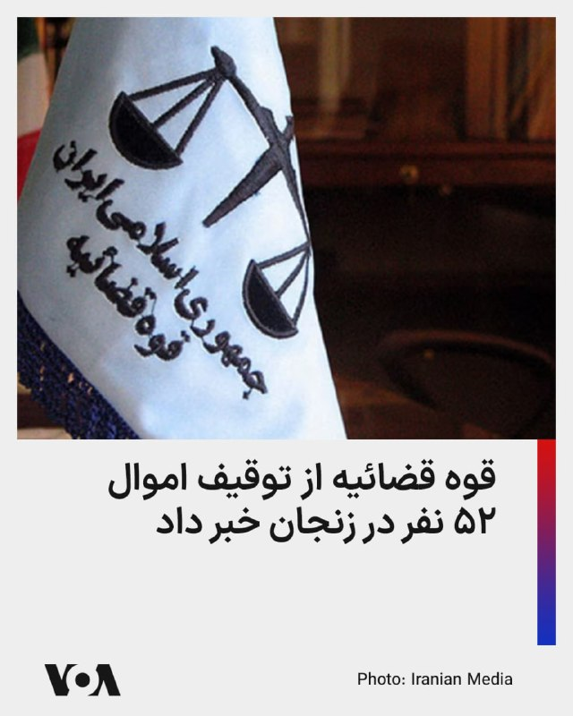

خبرگزاری میزان، وابسته به قوه قضائیه جمهوری اسلامی، گزارش داد با دستور مقام قضایی، اموال ۵۲ نفر در استان زنجان به اتهام ارتباط با شبکه‌های «همکار با دشمن» توقیف شده است.

علی فرجی، رئیس کل دادگستری زنجان، گفت این اموال شامل وجوه بانکی و ارزی، اموال منقول و غیرمنقول و طلاست و قرار است برای بازسازی اماکن آسیب‌دیده از جنگ هزینه شود. به گفته او، هفت نفر از متهمان در بازداشت هستند و تعدادی دیگر خارج از کشور به سر می‌برند.

این اقدام در ادامه موج گسترده‌تری از پرونده‌سازی‌های قضایی پس از جنگ انجام می‌شود. سخنگوی قوه قضائیه پیش‌تر گفته بود بر اساس قانون تشدید مجازات جاسوسی و همکاری با اسرائیل و دولت‌های متخاصم، همکاری اطلاعاتی می‌تواند با توقیف اموال و حتی اعدام همراه باشد.

در هفته‌های گذشته نیز قوه قضائیه از صدور دستور توقیف اموال ده‌ها نفر، از جمله کارکنان رسانه‌های فارسی‌زبان خارج از کشور، خبر داده بود.
@FarsiVOA

## FarsiVOA — post 218134

🔺قطر: جمهوری اسلامی حق ندارد مانع عبور کشتی‌ها از تنگه هرمز شود

▪️ماجد انصاری، سخنگوی وزارت خارجه قطر با تأکید بر حق عبور امن از تنگه هرمز اعلام کرد که هیچ کشوری، از جمله حکومت ایران، حق ندارد مانع عبور یا موجب بسته شدن این تنگه برای کشتیرانی دریایی شود.

▪️انصاری روز سه‌شنبه در یک نشست خبری در دوحه گفت: «بر اساس قواعد حقوق بین‌الملل، عبور امن از تنگه هرمز حق دولت قطر است.»

▪️در حالی که مقامات جمهوری اسلامی از ایجاد سازوکاری برای کنترل تنگه هرمز از سوی حکومت ایران خبر داده‌اند، این مقام قطری گفت: «هیچ تغییری در وضعیت موجود مربوط به آزادی کشتیرانی در تنگه هرمز قابل پذیرش نیست.»

⬇️ بیشتر بخوانید:
https://ir.voanews.com/a/8151599.html

## FarsiVOA — post 218133

  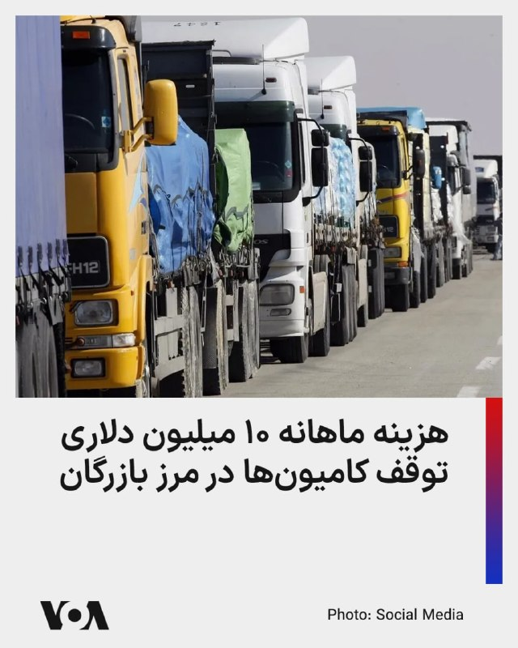

عضو انجمن شرکت‌های حمل‌ونقل بین‌المللی ایران با بیان اینکه ایستایی کامیون‌ها در مرز بازرگان به ۲۰ روز رسیده است، هزینه این توقف را ماهانه ۱۰ میلیون دلار برآورد کرد.

احسان ملک‌زاده، در گفت‌وگو با خبرگزاری مهر اعلام کرد که هم‌اکنون حدود سه هزار کامیون در صف خروج مرز بازرگان قرار دارند. وی افزود که در سایر مرزها نیز کامیون‌ها بین ‍پنج تا ۱۰ روز در انتظار خروج از کشور می‌مانند.

او مهم‌ترین عامل توقف کامیون‌ها در مرز بازرگان را «ظرفیت محدود پذیرش از طرف ترکیه» اعلام کرد و مدعی شد این کشور «تنها حدود ۲۵۰ کامیون از ایران» در روز پذیرش می‌کند.

جمهوری اسلامی پس از آنکه به دلیل اخلال در تنگه هرمز، با محاصره دریایی از سوی ایالات متحده آمریکا روبه‌رو شد، ناچار از توسل به حمل و نقل جاده‌ای شد.

روز دوشنبه ۲۸ اردیبهشت، فرماندهی مرکزی ایالات متحده، سنتکام، اعلام کرد که اجرای محاصره دریایی آمریکا علیه بنادر ایران همچنان ادامه دارد. این محاصره دست‌کم تا زمان رفع اختلال در تردد کشتی‌ها از سوی جمهوری اسلامی ادامه خواهد داشت.
@FarsiVOA

## FarsiVOA — post 218132

  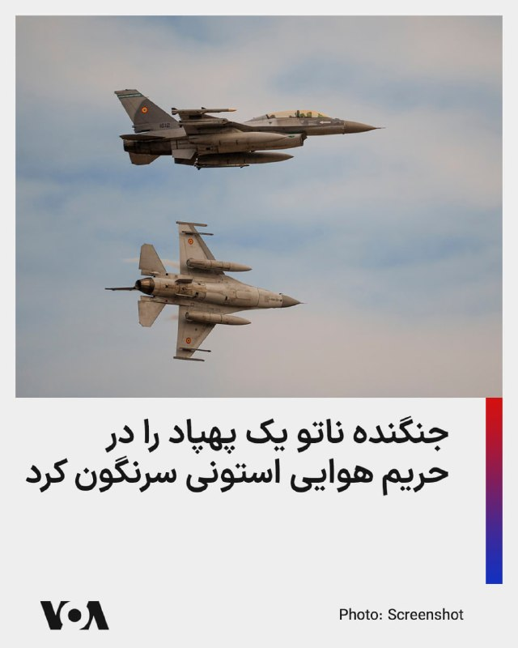

رویترز به نقل از وب‌سایت خبری دلفی گزارش داد یک جنگنده ناتو روز سه‌شنبه یک پهپاد با منشأ احتمالی اوکراینی را در حریم هوایی استونی سرنگون کرده است.

هانو پِوکور، وزیر دفاع استونی، به دلفی گفت این پهپاد در حریم هوایی استونی شناسایی و هدف قرار گرفت. ناتو تا زمان انتشار گزارش رویترز به درخواست این خبرگزاری برای اظهارنظر پاسخ نداده بود.

این رخداد تازه‌ترین مورد از مجموعه نقض‌های حریم هوایی در منطقه بالتیک و مرزهای شرقی ناتو در نزدیکی روسیه است. به نوشته رویترز، این حادثه در ادامه مجموعه‌ای از ورود پهپادهای اوکراینی یا مشکوک به اوکراینی به حریم هوایی کشورهای عضو ناتو رخ داده است؛ بحرانی که در لتونی ابتدا به استعفای وزیر دفاع و سپس به استعفای نخست‌وزیر و فروپاشی دولت ائتلافی انجامید.

این حادثه در حالی رخ داده که حملات پهپادی روسیه و اوکراین در هفته‌های اخیر شدت گرفته و خطر ورود پهپادهای سرگردان یا منحرف‌شده به حریم هوایی کشورهای عضو ناتو را افزایش داده است.
@FarsiVOA

## FarsiVOA — post 218131

  

ارتش اسرائیل در تازه‌ترین هشدار خود از ساکنان ۱۲ روستا در جنوب لبنان خواست فوراً این مناطق را ترک کنند.

بر اساس متن هشدار منتشرشده، این دستور شامل روستاها و مناطق طُول، نبطیه التحتا، حبوش، البازوریه، طیر دبا، کفر حونه، عین قانا، لبایا، جبشیت، الشهابیه، برج الشمالی در صور و حومین الفوقا می‌شود؛ مناطقی که بیشتر آنها در نواحی نبطیه و صور قرار دارند.

در این هشدار از ساکنان خواسته شده به دلیل حضور عناصر حزب‌الله و تجهیزات نظامی در این مناطق، دست‌کم هزار متر از محل‌های مشخص‌شده فاصله بگیرند.

ارتش اسرائیل اعلام کرده هر فردی که در نزدیکی عناصر حزب‌الله، تأسیسات یا تجهیزات نظامی این گروه بماند، جان خود را در معرض خطر قرار می‌دهد.
@FarsiVOA

## DW_Farsi — post 124899

  

🔶 وزیر دارایی اسرائيل: دیوان لاهه برای بازداشت من درخواست داده است

بتصلئل اسموتریچ، وزیر دارایی اسرائيل می‌گوید، مطلع شده که دیوان کیفری بین‌المللی مستقر در لاهه هلند برای صدور حکم بازداشت او درخواست ارائه کرده است.

این سیاستمدار راست‌گرای افراطی اسرائيل روز سه‌شنبه ۱۹ مه در یک کنفرانس مطبوعاتی اعلام کرد که شامگاه دوشنبه از این موضوع اطلاع یافته است. او روشن نساخت، از چه کسی این خبر را شنیده و دادگاه چه دلایلی برای این اقدام مطرح کرده است.

روند رسیدگی به چنین درخواست‌هایی محرمانه است. دادستانی می‌تواند درخواست خود را به قضات ارائه دهد و آن‌ها نیز در صورت وجود شواهد کافی مبنی بر وقوع جرایمی که رسیدگی به آن‌ها در صلاحیت دادگاه است، باید با این درخواست موافقت کنند.

اسموتریچ صدور حکم بازداشت برای مقامات دولتی اسرائیل را "اعلام جنگ" از سوی تشکیلات خودگردان فلسطینی توصیف کرده است.

خبرگزاری‌ها همچنین اعلام کرده‌اند که وزیر دارایی اسرائيل روز سه‌شنبه دستور تخلیه و تخریب روستای "خان الاحمر" در کرانه باختری رود اردن را صادر و اعلام کرده که این اقدام، پاسخی است به اطلاعاتی که در مورد درخواست حکم بازداشت‌اش از سوی دیوان لاهه دریافت کرده است.

دیوان لاهه تا کنون به صورت رسمی این خبر را تأیید نکرده است.

@dw_farsi

## DW_Farsi — post 124898

  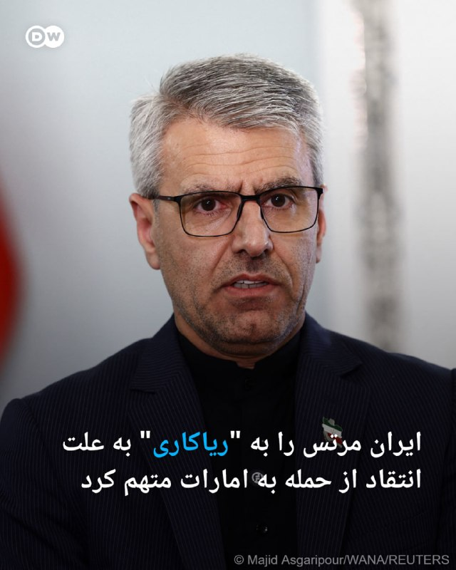

🔶 ایران مرتس را به "ریاکاری" به علت انتقاد از حمله به امارات متهم کرد

اسماعیل بقائی، سخنگوی وزارت خارجه ایران در پیامی در شبکه ایکس فریدریش مرتس، صدراعظم آلمان را به دلیل انتقاد از حمله به تأسیسات هسته‌ای امارات متحده عربی به سخره گرفت.

امارات روز یکشنبه ۱۷ مه اعلام کرد که در حمله‌ای پهپادی، ژنراتور برق بیرون محوطه نیروگاه هسته‌ای براکه این کشور در نزدیکی ابوظبی آتش گرفته است. این کشور در بیانیه خود نامی از کشور مهاجم نبرد، ولی با گفتن این که پهپاد از "مرز غربی" وارد شده گفت که این موضوع را تحت بررسی قرار خواهد داد.

فریدریش مرتس دوشنبه "حملات هوایی دوباره ایران علیه امارات و سایر شرکا" را به‌شدت محکوم کرد و در شبکه ایکس نوشت: «حمله به تأسیسات هسته‌ای تهدیدی برای امنیت مردم سراسر منطقه است.»

بقایی این سخنان را مصداق "ریاکاری" دانست و به نوبه خود مرتس را محکوم کرد که در برابر حملات آمریکا و اسرائيل به مراکز هسته‌ای ایران سکوت اختیار کرد.

به گزارش خبرگزاری آلمان، امارات متحده عربی از اواخر فوریه سال جاری در طول جنگ ایران نزدیک به ۳هزار حمله از سوی این کشور، با انواع موشک و پهپاد را گزارش کرده است. این کشور از زمان شروع جنگ ایران بیش‌ترین آسیب را از این حملات متحمل شده است.

نیروگاه براکه مهم‌ترین منبع تأمین برق در امارات است و چهار راکتور آن حدود یک‌چهارم نیاز ملی این کشور را تأمین می‌کنند. این تأسیسات که با طراحی کره جنوبی ساخته شده، اولین ایستگاه انرژی هسته‌ای در جهان عرب به شمار می‌آید.

ایران که بارها اسرائيل را به نابودی تهدید کرده سال‌هاست که از سوی غرب به تلاش برای ساخت سلاح هسته‌ای متهم شده است. این کشور این اتهام را رد کرده و می‌گوید، دست از غنی‌سازی اورانیوم که لازمه ساخت بمب اتمی است نخواهد کشید.

@dw_farsi

## DW_Farsi — post 124897

  

🔶 ترامپ: شاید مجبور شویم ضربه نظامی بزرگ دیگری به ایران بزنیم

دونالد ترامپ، رئیس‌جمهور آمریکا با اشاره به این که همچنان منتظر نتیجه مذاکره با ایران است گفت، شاید مجبور شود "ضربه نظامی بزرگ" دیگری به ایران بزند.

ترامپ که پیش‌‌تر گفته بود، به درخواست سه کشور قطر، عربستان و امارات متحده عربی حمله‌ به ایران که قرار بود روز سه‌شنبه ۲۹ اردیبهشت انجام شود را به تعویق انداخته از دموکرات‌ها به دلیل تلاش جهت محدود کردن اختیارات جنگی‌اش به شدت انتقاد کرد.

دموکرات‌ها و دیگر منتقدان ترامپ می‌گویند که او جنگی علیه ایران به راه انداخته که نتیجه آن افزایش قیمت‌ها برای آمریکایی‌ها بوده، چرا که جمهوری اسلامی نیز در واکنش، اقدام به بستن تنگه هرمز کرده است.

ترامپ که برخی از آخرین نظرسنجی‌ها از کاهش حمایت مردم از عملکرد او خبر می‌دهند گفت، چه اقدام نظامی او علیه ایران با حمایت مردمی روبرو باشد و چه نه، اجازه نخواهد داد تا جلوی چشمانش دنیا توسط جمهوری اسلامی "منفجر شود."

او که سه‌شنبه این سخنان را در کاخ سفید بر زبان می‌راند گفت، "دو یا سه روز فرصت محدودی" برای پیشرفت مذاکرات و دستیابی به توافق خواهد داد، چرا که نمی‌تواند اجازه دهد که ایران به سلاح هسته‌ای دست یابد.

@dw_farsi

## DW_Farsi — post 124896

  

🔶 وزیر خزانه‌داری آمریکا خواستار ضربه بیشتر به شبکه‌های مالی ایران شد

اسکات بسنت، وزیر خزانه‌داری ایالات متحده، از متحدان این کشور خواست تا با قاطعیت بیشتری شبکه‌های تأمین مالی ایران را مختل کنند.

به گزارش رویترز، او در سخنرانی آماده‌شده‌ای در نشست مبارزه با تأمین مالی تروریسم که پس از نشست وزیران دارایی گروه هفت در پاریس در روز سه‌شنبه ۱۹ مه برگزار شد تأکید کرد که متحدان غربی و آسیایی ایالات متحده باید در مقابله با ایران "به‌طور کامل" در کنار این کشور بایستند.

بسنت گفت: «این امر برای مثال مستلزم آن است که شرکای اروپایی ما با تعیین تامین‌کنندگان مالی ایران، افشای شرکت‌های صوری و پوششی آن، تعطیلی شعب بانکی و برچیدن گروه‌های نیابتی‌اش، در اقدام علیه ایران به ایالات متحده بپیوندند.»

به گفته وزیر خزانه‌داری آمریکا، این کار همچنین مستلزم آن است که متحدان این کشور "در خاورمیانه و آسیا، شبکه‌های بانکداری سایه‌ای ایران را ریشه‌کن" کنند.

در شرایطی که دولت ترامپ تلاش می‌کند تا تهران را برای بازگشایی تنگه هرمز تحت فشار بگذارد وزارت خزانه‌داری آمریکا تلاش‌های تحریمی خود را از طریق برنامه‌ای تحت عنوان "خشم اقتصادی" افزایش داده است.

هدف این برنامه مختل کردن شبکه‌های بانکداری سایه‌ای ایران است و تا کنون نزدیک به نیم میلیارد دلار ارز دیجیتال مرتبط با جمهوری اسلامی را مسدود کرده است.

بسنت همچنین از بازنگری و حذف اسامی قدیمی و تاریخ‌گذشته خبر داد تا مؤسسات مالی بتوانند راحت‌تر پیچیده‌ترین طرح‌های تأمین مالی تروریسم و دورزدن تحریم‌ها را ریشه‌کن کنند.

او هدف از تحریم‌ها را "تغییر رفتار" طرف مقابل خواند و با اشاره به سوریه و ونزوئلا به عنوان دو نمونه در این زمینه گفت، وزارت خزانه‌داری آمریکا رویکردی پویا را دنبال خواهد کرد تا در صورت تغییر رفتار طرف مقابل، آماده تعدیل تحریم‌ها باشد.

@dw_farsi

## DW_Farsi — post 124895

  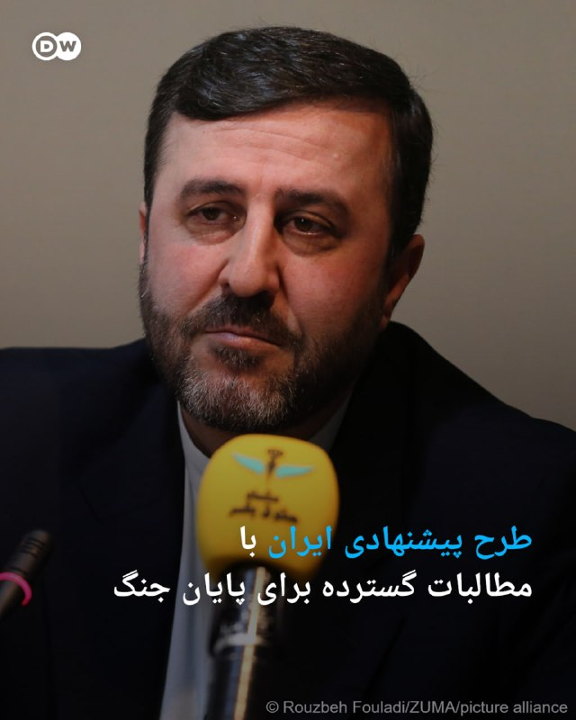

🔶 طرح پیشنهادی ایران با مطالبات گسترده برای پایان جنگ

کاظم غریب‌آبادی، معاون وزارت خارجه ایران، کمیسیون امنیت ملی و سیاست خارجی مجلس شورای اسلامی را در جریان آخرین تحولات مربوط به مذاکرات ایران و آمریکا و طرح پیشنهادی جمهوری اسلامی برای پایان دادن به جنگ قرار داد.

به گزارش ایرنا، غریب‌آبادی سه‌شنبه ۲۹ اردیبهشت در جلسه این کمیسیون گفت، ایران همچنان بر حق خود برای غنی‌سازی اورانیوم پامی‌فشارد و در این طرح پیشنهادی‌ خواستار "خاتمه جنگ در تمامی جبهه‌ها، از جمله در لبنان" شده است.

این طرح همچنین پایان "محاصره دریایی آمریکا، آزادسازی اموال و دارایی‌‌های ایران و تأمین خسارت‌های واردشده به جمهوری اسلامی توسط ایالات متحده جهت بازسازی" را مطرح کرده است.

خاتمه دادن به "تمامی تحریم‌های یک‌جانبه و قطعنامه‌های شورای امنیت سازمان ملل و خروج نیروهای آمریکایی از محیط پیرامونی ایران" از دیگر محورهای این طرح پیشنهادی است.

@dw_farsi

## DW_Farsi — post 124894

  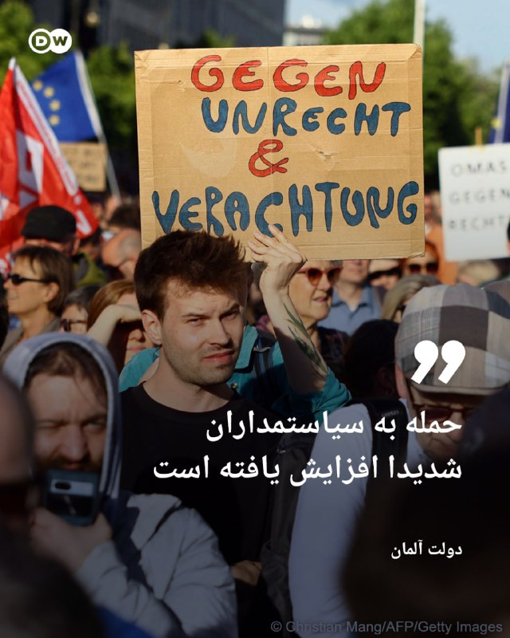

🔶 دولت آلمان: حمله به سیاستمداران شدیدا افزایش یافته است

دولت آلمان در پاسخ به درخواست و پرسش فراکسیون حزب دست راستی افراطی "آلترناتیو برای آلمان" (AfD) اعلام کرد که در سال گذشته شمار حملات به اعضای احزاب این کشور به‌شدت افزایش یافته است.

بنا بر پاسخی که دولت در این زمینه اعلام کرده، پلیس آلمان در سال ۲۰۲۵ بیش از ۵هزار عمل مجرمانه علیه اعضای احزاب را در سراسر این کشور ثبت کرده است.

بیش‌ترین حملات متوجه حزب "آلترناتیو برای آلمان" بوده و پس از آن دو حزب دموکرات‌مسیحی (CDU) و سبزها بیش‌ از همه هدف قرار گرفته‌اند.

مقام‌های آلمان حملات صورت‌گرفته علیه حزب "آلترناتیو برای آلمان" را عمدتا به طیف‌های چپ‌گرا نسبت می‌دهند.

اکثریت قریب به اتفاق این اعمال مجرمانه نیز شامل توهین، افترا یا تخریب اموال بوده است. تعداد اقدامات خشونت‌آمیز حدود ۲۰۰ مورد برآورد شده است.

@dw_farsi

## DW_Farsi — post 124893

  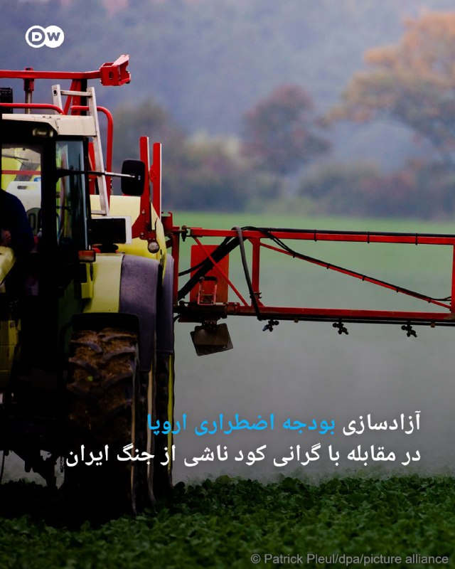

🔶 آزادسازی بودجه اضطراری اروپا در مقابله با گرانی کود ناشی از جنگ ایران

اتحادیه اروپا در صدد برآمده تا با گرانی سرسا‌م‌آور کود در کشورهای عضو که پیامد جنگ ایران است با آزادسازی بودجه‌های اضطراری خو د مقابله کند. این آزادسازی بر پایه برنامه‌های حمایتی این اتحادیه از بخش کشاورزی که قرار است سه‌شنبه ۱۹ مه رونمایی شود انجام خواهد گرفت.

خبرگزاری فرانسه در گزارشی در این مورد نوشته که بروکسل برای کاهش تأثیر بحران خاورمیانه بر بخش کشاورزی تحت فشار است زیرا جهش قیمت کود، خطر افزایش هزینه‌های مواد غذایی را در سراسر این اتحادیه به همراه دارد.

حدود یک‌سوم از کودهایی که از طریق دریا حمل می‌شوند، از طریق تنگه هرمز به بازار جهانی می‌رسند؛ آبراهی که در پی  جنگ آمریکا و اسرائیل علیه ایران، درعمل بسته شده است.

این امر باعث افزایش قیمت‌ها شده و سازمان تجارت جهانی (WTO) هشدار داده که این محاصره، امنیت غذایی جهانی، به‌ویژه در آفریقا و جنوب آسیا را تهدید می‌کند.

در اروپا، قیمت کودهای نیتروژنی که از گاز مشتق می‌شوند، از ۳۸۰ یورو در زمستان گذشته به حدود ۵۰۰ یورو (۵۸۱ دلار) در هر تن رسیده است.

این وضعیت برای کشاورزانی که پیش از این با افزایش هزینه‌های ناشی از جنگ اوکراین دست‌وپنجه نرم می‌کردند، ضربه‌ای متوالی و مضاعف محسوب می‌شود.

بروکسل تعرفه‌های سنگینی بر کودهای وارداتی از روسیه (به عنوان یک تولیدکننده بزرگ) وضع کرده و قصد دارد تا سال ۲۰۲۸ واردات از این کشور را به‌طور کامل متوقف کند تا به خزانه جنگی مسکو در نبرد علیه اوکراین ضربه بزند.

به گفته فعالان این صنعت، تولیدکنندگان غلات که به مقادیر عظیمی کود نیاز دارند، به‌طور ویژه‌ای از این وضعیت آسیب دیده‌اند.

@dw_farsi

## DW_Farsi — post 124887

🔶 وکلای ماده ۴۸ در اعدام معترضان چه نقشی دارند؟

🔺 گزارشی از آتفه چهارمحالیان

ساعت هنوز به ظهر نرسیده،‌ متهم نه کیفرخواست را دیده است، نه از جزئیات اتهامات خبر دارد و نه اجازه داشته با وکیل منتخب‌ دیدار کند. ضابط پرونده به متهم گفته تنها راه نجات، اقرار و پذیرش وکیلی است که او معرفی می‌کند. وکیل مورد تأیید قوه قضائیه از خانواده صدمیلیون تومان حق‌الوکاله خواست و در نهایت به موکل توصیه کرده است پس از پذیرش اتهام، توبه‌نامه بنویسد و در اعترافات تلویزیونی حاضر شود. این روایت خانواده یکی از متهمان وقایع دی ماه است که در هفته‌های اخیر در عنفوان جوانی اعدام شد.

چنین روایت‌هایی در سال‌های اخیر بارها در پرونده‌های سیاسی و امنیتی تکرار شده‌اند؛ پرونده‌هایی که در آن‌ها وکلای مستقل یا به متهم دسترسی نداشته‌اند یا امکان دفاع مؤثر پیدا نکرده‌اند. هم‌زمان، وکلای مورد تأیید دستگاه قضایی با وعده تخفیف مجازات یا آزادی وارد پرونده شده‌اند؛ روندی که به گفته منتقدان، حق دفاع را محدود و مسیر رسیدگی را به نفع نهادهای امنیتی تغییر داده است.

در پرونده‌های مرتبط با اعتراضات، احکام اعدام و بازداشت فعالان سیاسی و مدنی، عنوان "وکلای ماده ۴۸" بارها شنیده می‌شود؛ وکلایی که حکومت آن‌ها را ضامن رسیدگی به پرونده‌های حساس می‌داند اما فعالان حقوق بشر و خانواده‌ها می‌گویند حضورشان بخشی از سازوکار کنترل پرونده‌های سیاسی است.

📌 برای دسترسی کامل به گزارش به وبسایت دویچه‌وله فارسی مراجعه کنید.

@dw_farsi

## DW_Farsi — post 124886

  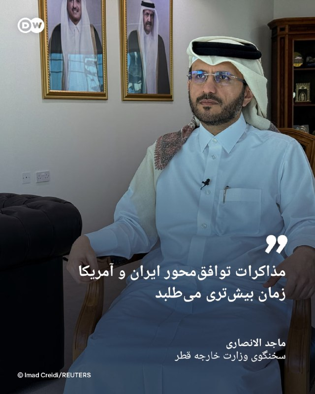

🔶 قطر: مذاکرات توافق‌محور ایران و آمریکا زمان بیش‌تری می‌طلبد

ماجد الانصاری، سخنگوی وزارت خارجه قطر اعلام کرد که مذاکرات ایران و آمریکا که با میانجی‌گری پاکستان انجام می‌شود برای رسیدن به توافق به زمان بیش‌تری نیاز دارد.

این اظهارات یک روز پس از آن اعلام شد که دونالد ترامپ، رئیس‌جمهور آمریکا اعلام کرد، به درخواست چند کشور عربی، حمله‌ای که قرار بود سه‌شنبه ۲۹ اردیبهشت به ایران انجام گیرد را به تعویق انداخته است.

به گزارش خبرگزاری فرانسه، ماجدالانصاری که روز سه‌شنبه در یک کنفرانس مطبوعاتی سخن می‌گفت افزود:«ما از تلاش‌های دیپلماتیک پاکستان که جدیت خود را در نزدیک کردن دو طرف به یکدیگر و یافتن راه حل نشان داده، حمایت می‌کنیم و معتقدیم که این روند به زمان بیشتری نیاز دارد.»

این در حالیست که پایگاه خبری اکسیوس اعلام کرده که ترامپ روز سه‌شنبه با تیم ارشد امنیت ملی کشور خود به منظور بررسی گزینه‌های نظامی علیه جمهوری اسلامی در اتاق وضعیت تشکیل جلسه خواهد داد.

روزنامه آمریکایی نیویورک تایمز نیز گزارش داده که ایران از آتش‌بس به منزله فرصتی برای احیای توان موشکی خود استفاده کرده است.

@dw_farsi

## DW_Farsi — post 124885

🔶 روسیه و بلاروس تمرین کاربرد سلاح‌های هسته‌ای را آغاز کردند

سربازان در بلاروس و روسیه در حال تمرین استفاده از سلاح‌های هسته‌ای هستند. وزارت دفاع روسیه  روز سه‌شنبه ۱۹ مه (۲۹ اردیبهشت) در مسکو اعلام کرد نیروهای هسته‌ای این کشور از ۱۹ تا ۲۱ ماه مه رزمایش برگزار خواهند کرد.

طبق اعلام این وزارتخانه، شمار نیروهای شرکت‌کننده در رزمایش بیش از ۶۴ هزار سرباز خواهد بود و هفت‌هزار و ۸۰۰ سامانه تسلیحاتی در این مانور مشارکت خواهند داشت.

به گفته وزارت دفاع روسیه، از جمله قرار است استفاده از موشک‌های بالستیک و موشک‌های کروز در خاک این کشور تمرین شود.

وزارت دفاع بلاروس نیز روز گذشته در مینسک درباره مانور مشترک این کشور و روسیه اطلاع‌رسانی کرده بود. طبق این گزارش، این رزمایش در خاک بلاروس برگزار می‌شود و شامل انتقال سلاح‌های هسته‌ای و آماده‌سازی برای کاربرد آنها است.

@dw_farsi

## DW_Farsi — post 124883

  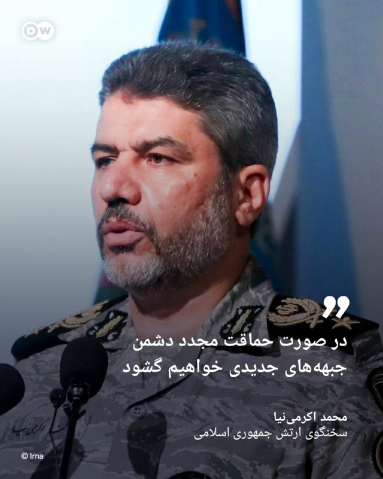

🔶 هشدار ارتش ایران: در صورت حماقت مجدد دشمن جبهه‌های جدیدی خواهیم گشود

محمد اکرمی‌نیا، سخنگوی ارتش جمهوری اسلامی با تأکید بر "اشراف نیروهای مسلح ایران به تنگه هرمز و غیرقابل بازگشت بودن وضعیت این تنگه به گذشته" تهدید کرد، در صورتی که "دشمن" به گفته او مجددا "در دام" اسرائيل افتاده و دست به حمله بزند جبهه‌های جدیدی علیه آن‌‌ها گشوده می‌شود.

به گزارش روابط عمومی ارتش، اکرمی‌نیا روز سه‌شنبه ۲۹ اردیبهشت در اجتماعی در میدان ولیعصر تهران با حائز اهمیت خواندن تجمع‌های شبانه هواداران حکومت در خیابان‌ها گفت، ارتش جمهوری اسلامی آتش‌بس را فرصتی به منزله "دوران جنگ تلقی و از این فرصت برای تقویت توان رزمی خود استفاده کرده است."

در حالی که به دلیل نافرجام بودن مذاکرات مقام‌های حکومت و آمریکا سایه جنگ بر سر ایران سنگینی می‌کند اکرمی‌نیا جمهوری اسلامی را "محاصره‌ناپذیر و غیرقابل شکست" خواند و گفت، در صورت حمله مجدد طرف مقابل، نیروهای مسلح ایران با "ابزارها و شیوه‌های جدید" به مقابله با آن‌ها خواهند رفت.

@dw_farsi

## DW_Farsi — post 124874

📸 مراسم ازدواج "زوج‌های جان‌فدا"؛ کارناوال عروس‌ودامادها با خودروهای جنگی در تهران

در حالی‌که ایران در وضعیت آتش‌بسی شکننده به سر می‌برد و سایه جنگ، ناامنی، بحران اقتصادی و بیکاری بر زندگی مردم سنگینی می‌کند، جمهوری اسلامی همچنان می‌کوشد تصویری عادی و حتی پرشور از وضعیت کشور ارائه دهد که فاصله‌ای آشکار با واقعیت روزمره بسیاری از شهروندان دارد.

سپاه پاسداران از برگزاری مراسم حکومتی موسوم به "پیوند آسمانی زوج‌های جان‌فدا" خبر داده که در آن عروس و دامادها با جیپ‌ها و خودروهای نظامی گل‌آرایی‌شده در خیابان‌های تهران به حرکت درآمدند.
@dw_farsi

## Persian_Trend_Official — post 14486

تا دقایقی دیگه لایو امشب آغاز میشه

## Persian_Trend_Official — post 14485

⭕️ علی‌حسین‌ قاضی‌زاده:

فیفا قصد دارد ورود پرچم شیر و خورشید به استادیوم‌های جام‌جهانی را ممنوع کند.

ج.ا. جام جهانی را به میدان جنگ حکومت و مردم بدل کرده است.

📝 Nick

📌 @persian_trend_official
پرشین ترند | متفاوت‌ترین کانال نظامی

## Persian_Trend_Official — post 14484

  <a href="telegram/content/Persian_Trend_Official_14484_1779215146.mp4" target="_blank">🎬 Download video</a>

💢 سرپرست تیم‌ملی فوتبال:

ممنوعیت بُردن هرگونه پرچم
به غیر از پرچم ایران به ورزشگاه‌های جام جهانی درست است

🫆:Tony

📌 @persian_trend_official
پرشین ترند | متفاوت‌ترین کانال نظامی

## Persian_Trend_Official — post 14483

  <a href="telegram/content/Persian_Trend_Official_14483_1779215148.mp4" target="_blank">🎬 Download video</a>

💢دونالد ترامپ:

💢تنگه هرمز متعلق به ایران نیست.

💢این آب‌های بین‌المللی است این کار برای آنها نیست. آنها درس خود را گرفته‌اند.

💢اگر امروز بروم، ۲۵ سال طول می‌کشد تا بازسازی کنند. اما ما نمی‌رویم، ما این کار را درست انجام خواهیم داد.

🫆:Tony

📌 @persian_trend_official
پرشین ترند | متفاوت‌ترین کانال نظامی

## Persian_Trend_Official — post 14482

  <a href="telegram/content/Persian_Trend_Official_14482_1779215149.mp4" target="_blank">🎬 Download video</a>

💢ایران چند روز فرصت دارد تا پای میز مذاکره بیاید؟

💢ترامپ: دو یا سه روز. شاید جمعه، شنبه، یکشنبه. شاید اوایل هفته آینده. یک بازه زمانی محدود.

🫆:Tony

📌 @persian_trend_official
پرشین ترند | متفاوت‌ترین کانال نظامی

## Persian_Trend_Official — post 14481

برای طراحی چند صفحه از وبسایت پرشین ترند به یک وردپرس‌کار حرفه‌ای، خوش‌سلیقه و سریع نیاز داریم. کار در فاز اول خیلی بزرگ و پیچیده نیست؛ فقط طراحی و آماده‌سازی ۲ تا ۳ صفحه اصلی مورد نیاز است: صفحه تماشای لایو و ویدیو صفحه آرشیو لایوهای قبلی صفحه معرفی جایگاه‌های…

## Persian_Trend_Official — post 14480

  <a href="telegram/content/Persian_Trend_Official_14480_1779215150.webm" target="_blank">🎬 Download video</a>

برای طراحی چند صفحه از وبسایت پرشین ترند به یک وردپرس‌کار حرفه‌ای، خوش‌سلیقه و سریع نیاز داریم.
کار در فاز اول خیلی بزرگ و پیچیده نیست؛ فقط طراحی و آماده‌سازی ۲ تا ۳ صفحه اصلی مورد نیاز است:
صفحه تماشای لایو و ویدیو
صفحه آرشیو لایوهای قبلی
صفحه معرفی جایگاه‌های تبلیغاتی و همکاری با اسپانسرها
نیاز ما بیشتر روی ظاهر حرفه‌ای، طراحی تمیز، ریسپانسیو بودن برای موبایل و دسکتاپ، سرعت اجرا و سلیقه بصری خوب است.
ترجیحاً کسی پیام بدهد که:
تجربه طراحی سایت وردپرسی حرفه‌ای داشته باشد
با طراحی صفحات رسانه‌ای، ویدیویی یا خبری آشنا باشد
بتواند کار را سریع، حدوداً در یکی دو روز، جمع کند
خوش‌قول، دقیق و قابل‌اعتماد باشد
نمونه‌کار واقعی برای ارائه داشته باشد
بتواند بدون قالب‌های شلوغ و سنگین، یک خروجی تمیز و سبک تحویل دهد
این پروژه فعلاً فاز اول است و اگر همکاری خوب باشد، برای توسعه‌های بعدی سایت هم ادامه خواهد داشت.
افرادی که تجربه و زمان کافی دارند، لطفاً نمونه‌کار، توضیح کوتاه از توانایی‌ها و حدود هزینه پیشنهادی‌شان را ارسال کنند.
📩 برای هماهنگی پیام بدهید.

@NickTARTARUS
‌

## Persian_Trend_Official — post 14479

  

شاید در دنیای موازی 🤷‍♂️

📝 Nick

📌 @persian_trend_official
پرشین ترند | متفاوت‌ترین کانال نظامی

## Persian_Trend_Official — post 14478

  <a href="telegram/content/Persian_Trend_Official_14478_1779215151.webm" target="_blank">🎬 Download video</a>

کسی می‌دونه سردار سلامی کجاست؟؟؟

📝 Nick

📌 @persian_trend_official
پرشین ترند | متفاوت‌ترین کانال نظامی

## Persian_Trend_Official — post 14477

💢 این انفجار در نزدیکی یکی از ساختمانهای وابسته به وزارت دفاع دولت «الجولانی» رخ داده است ▪️ منابع محلی گفتند پس از انفجار، صدای تیراندازی همچنان به گوش می‌رسد. 🫆:Tony 📌 @persian_trend_official پرشین ترند | متفاوت‌ترین کانال نظامی

## Persian_Trend_Official — post 14476

  <a href="telegram/content/Persian_Trend_Official_14476_1779215151.webm" target="_blank">🎬 Download video</a>

⭕️تعلیق پروازهای بریتیش ایرویز به اسرائیل

💢خطوط هوایی «بریتیش ایرویز» از لغو پروازها به اسرائیل تا یک اوت خبر داد.

🫆:Tony

📌 @persian_trend_official
پرشین ترند | متفاوت‌ترین کانال نظامی

## Persian_Trend_Official — post 14474

💢زلزله ۴.۶ ریشتری در نورآباد لرستان

💢زمین لرزه ۴.۶ ریشتری در عمق ۸ کیلومتری زمین نورآباد لرستان را لرزاند.

🫆:Tony

📌 @persian_trend_official
پرشین ترند | متفاوت‌ترین کانال نظامی

## Persian_Trend_Official — post 14473

  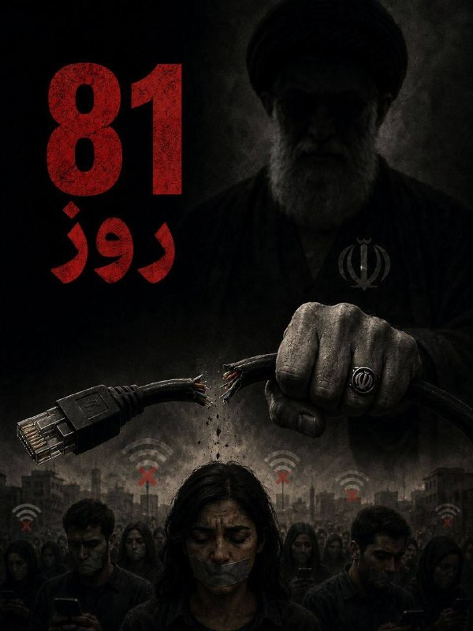

💢برای ۸۱ روز، جمهوری اسلامی اینترنت را در ایران خاموش کرده تا صدای مردم را خفه کند.

▪️جمهوری اسلامی بار دیگر ثابت کرد که از هیچ جنایتی برای حفظ قدرت خود دریغ نمیکند.

🫆:Tony

📌 @persian_trend_official
پرشین ترند | متفاوت‌ترین کانال نظامی

## Persian_Trend_Official — post 14472

  

🔴 گزارش‌ها از وقوع انفجار در دمشق 💢خبرنگار الحدث از وقوع یک انفجار با منشأ نامشخص در نزدیکی منطقه «باب شرقی» دمشق خبر داد. ▪️فارس مدعی شد انفجار ناشی از خودرو بمب گذاری شده بوده است. 🫆:Tony 📌 @persian_trend_official پرشین ترند | متفاوت‌ترین کانال نظامی

## Persian_Trend_Official — post 14471

  <a href="telegram/content/Persian_Trend_Official_14471_1779215152.webm" target="_blank">🎬 Download video</a>

🔴 گزارش‌ها از وقوع انفجار در دمشق

💢خبرنگار الحدث از وقوع یک انفجار با منشأ نامشخص در نزدیکی منطقه «باب شرقی» دمشق خبر داد.

▪️فارس مدعی شد انفجار ناشی از خودرو بمب گذاری شده بوده است.

🫆:Tony

📌 @persian_trend_official
پرشین ترند | متفاوت‌ترین کانال نظامی

## Persian_Trend_Official — post 14470

  <a href="telegram/content/Persian_Trend_Official_14470_1779215153.webm" target="_blank">🎬 Download video</a>

💢شنیده شدن صدای انفجار در جزیره قشم ▪️ظهر سه شنبه شنیده شدن صدای انفجار در جزیره قشم از سوی ساکنان محلی گزارش شده است. 🔹اخبار تکمیلی متعاقباً منتشر خواهد شد./خبرگزاری مهر 🫆:Tony 📌 @persian_trend_official پرشین ترند | متفاوت‌ترین کانال نظامی

## RadioFarda — post 157361

سفر ولادیمیر پوتین به چین با هدف انعقاد توافق‌های تجاری و اعلام همبستگی

🔸ولادیمیر پوتین برای یک دیدار رسمی دو روزه از چین وارد پکن شد. قرار است رئیس‌جمهور فدراسیون روسیه در گفت‌وگو با همتای چینی‌اش مجموعه‌ای از موضوعات، از روابط متشنج دو کشور با غرب تا جنگ ایران و تأثیرش بر وضعیت جهانی انرژی را به بحث بگذارند.

🔸این سفر که بیست‌و پنجمین دیدار ولادیمیر پوتین از چین در طول بیش از دو دهه حضورش در مسند قدرت به‌شمار می‌آید، کمتر از یک‌هفته پس از دیدار رسمی دونالد ترامپ از پکن انجام می‌شود.

🔸این دیدار همزمان با بیست‌وپنجمین سالگرد امضای پیمان دوستی چین و روسیه انجام می‌شود و بر اساس اعلام کرملین، سران دو کشور دربارۀ گسترش همکاری‌های اقتصادی دوجانبه هم گفت‌وگو خواهند کرد. به گفتۀ یوری اوشاکوف دستیار کرملین، امضای تفاهم‌نامه‌ای برای ایجاد یک «جهان چندقطبی» و «شکل تازه‌ای از روابط بین‌الملل» هم از برنامه‌های این سفر است.

🔸ولادیمیر پوتین در روز سه‌شنبه ۲۹ اردیبهشت‌ماه و در آستانۀ سفر به پکن در یک سخنرانی ویدیویی گفت: «من صمیمانه قدردان تعهد شی جین‌پینگ به همکاری درازمدت با روسیه هستم. معتقدم که تماس‌های خوب و دوستانه‌مان برای شکل‌دادن به جسورانه‌ترین برنامه‌های مشترک برای آینده، و به ثمررساندن آنها مفید واقع خواهند شد».

🔸قرار است ولادیمیر پوتین و شی جین‌پینگ صبح چهارشنبه ۳۰ اردیبهشت‌ماه ملاقات کنند. یوری اوشاکوف صرفاً به طرح این موضوع که «مسائل کلیدی منطقه‌ای و بین‌المللی» به بحث گذاشته خواهند شد، بسنده کرد و به جزئیات دستور کار این نشست نپرداخت.

🔸 گزارش کامل را در وب‌سایت رادیوفردا بخوانید.

@RadioFarda

## RadioFarda — post 157360

🔸ارتش اسرائیل روز سه‌شنبه در پی صدور هشدار تخلیه برای ساکنان ۱۲ شهر لبنان، مجموعه‌ای از حملات را در سراسر این کشور، به‌ویژه در جنوب آن، به‌رغم اعلام برقراری آتش‌بس انجام داد. 🔸خبرگزاری رسمی لبنان گزارش داد که این حملات چندین منطقه در شهرستان صور و استان نبطیه…

## RadioFarda — post 157359

  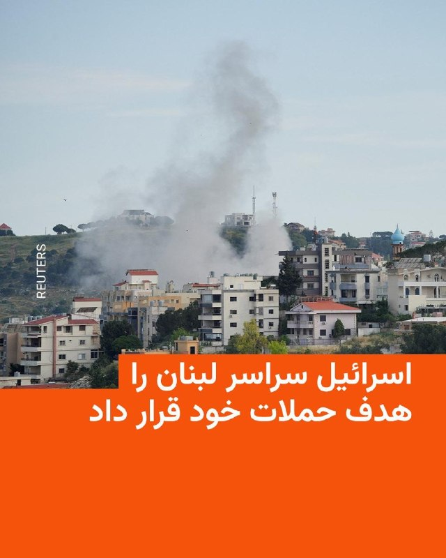

🔸ارتش اسرائیل روز سه‌شنبه در پی صدور هشدار تخلیه برای ساکنان ۱۲ شهر لبنان، مجموعه‌ای از حملات را در سراسر این کشور، به‌ویژه در جنوب آن، به‌رغم اعلام برقراری آتش‌بس انجام داد.

🔸خبرگزاری رسمی لبنان گزارش داد که این حملات چندین منطقه در شهرستان صور و استان نبطیه در جنوب لبنان را هدف قرار داده‌اند.

🔸بر اساس تصاویر خبرگزاری فرانسه، دو طبقه بالایی ساختمانی در منطقه معشوق در شهرستان صور در پی حمله هوایی فروریخت. این حمله همچنین به ساختمان‌های اطراف و خودروهای پارک‌شده آسیب رساند.

🔸وزارت بهداشت لبنان اعلام کرد حمله‌ای به همین منطقه در روز پیش از آن، یک مرکز خدمات درمانی اولیه را که تحت مدیریت «کمیته سلامت اسلامی» وابسته به حزب‌الله بود، تخریب کرده است.

🔸حمله هوایی روز سه‌شنبه به محله سرای در نبطیه که شامل مغازه‌ها، یک مسجد قدیمی و ساختمان‌های مسکونی سنتی است، بخش بزرگی از این منطقه را ویران کرد.

@RadioFarda

## RadioFarda — post 157358

  <a href="https://t.me/radiofarda/157358" target="_blank">📎 Download file</a>

📻بشنوید: ایستگاه ۱۹ با رادیوفردا، ۲۹ اردیبهشت ۱۴۰۵

@RadioFarda

## RadioFarda — post 157357

🔸امارات متحده عربی روز سه‌شنبه اعلام کرد پهپادهایی که دو روز پیش به سمت نیروگاه هسته‌ای این کشور شلیک شدند، از عراق آمده بودند. 🔸از زمان آغاز جنگ آمریکا و اسرائیل با ایران در نهم اسفند پارسال، گروه‌های مورد حمایت جمهوری اسلامی در عراق چندین حمله به کشورهای…

## RadioFarda — post 157356

  

🔸امارات متحده عربی روز سه‌شنبه اعلام کرد پهپادهایی که دو روز پیش به سمت نیروگاه هسته‌ای این کشور شلیک شدند، از عراق آمده بودند.

🔸از زمان آغاز جنگ آمریکا و اسرائیل با ایران در نهم اسفند پارسال، گروه‌های مورد حمایت جمهوری اسلامی در عراق چندین حمله به کشورهای دیگر ترتیب داده‌اند.

🔸وزارت دفاع امارات در بیانیه‌ای اعلام کرد: «در چارچوب تحقیقات جاری درباره حمله آشکار به نیروگاه هسته‌ای «براکه» در ۱۷ مه ۲۰۲۶، رهگیری و پایش فنی تأیید کرد که هر سه پهپاد همگی از خاک عراق منشأ گرفته‌اند.»

🔸این وزارتخانه افزود که مقام‌ها طی ۴۸ ساعت گذشته شش پهپاد دیگر را که از عراق آمده و «تلاش داشتند مناطق غیرنظامی و حیاتی را هدف قرار دهند» رهگیری کرده‌اند.

🔸یک پهپاد که مسئولیت شلیک آن بر عهده گرفته نشده، روز یکشنبه به یک ژنراتور برق در نزدیکی نیروگاه هسته‌ای براکه در ابوظبی برخورد کرد و باعث آتش‌سوزی شد، اما هیچ مصدوم یا نشت پرتوی به‌جا نگذاشت. دو پهپاد دیگر نیز رهگیری شدند.

@RadioFarda

## RadioFarda — post 157355

  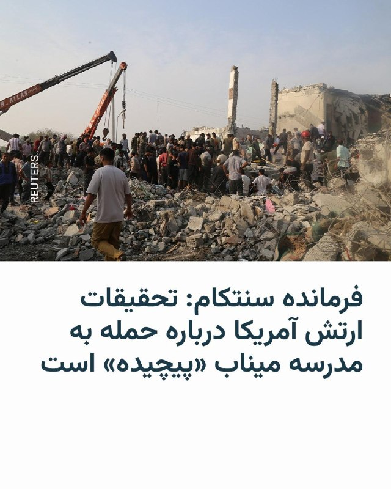

🔸دریادار برد کوپر، فرمانده ستاد فرماندهی مرکزی ایالات متحده (سنتکام)، روز سه‌شنبه در برابر کنگره شهادت داد که تحقیقات ارتش آمریکا درباره حمله هوایی به مدرسه‌ای در شهر میناب در جنوب ایران «پیچیده» است، چون این مدرسه در محل یک پایگاه فعال موشک‌های کروز ایران قرار داشته است.

🔸این حمله روز نهم اسفند پارسال، نخستین روز جنگ آمریکا و اسرائیل با ایران، رخ داد و مقام‌های جمهوری اسلامی گفته‌اند بر اثر آن دست‌کم ۱۲۰ دانش‌آموز و ۲۶ معلم کشته شدند.

🔸چند روز پس از حمله، تحقیقات رسانه‌ها نشان داد که این مدرسه که در نزدیکی یک پایگاه دریایی سپاه قرار داشت با موشک‌های آمریکایی هدف قرار گرفته است.

🔸پنتاگون از هفته‌ها پیش اعلام کرده که در حال تحقیق درباره چگونگی رخ دادن این حمله است.

@RadioFarda

## RadioFarda — post 157354

🔸دونالد ترامپ روز سه‌شنبه ۲۹ اردیبهشت گفت که حملات جدید به ایران را در لحظات آخر متوقف کرده است و در عین حال افزود شاید لازم باشد آمریکا بار دیگر ضربه نظامی بزرگی به ایران وارد کند. 🔸رئیس جمهور آمریکا، روز دوشنبه خبر داده بود حملهٔ تازه‌ به ایران را که برای…

## RadioFarda — post 157353

  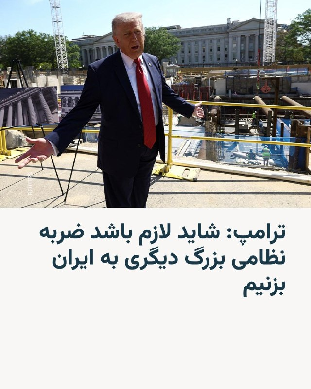

🔸دونالد ترامپ روز سه‌شنبه ۲۹ اردیبهشت گفت که حملات جدید به ایران را در لحظات آخر متوقف کرده است و در عین حال افزود شاید لازم باشد آمریکا بار دیگر ضربه نظامی بزرگی به ایران وارد کند.

🔸رئیس جمهور آمریکا، روز دوشنبه خبر داده بود حملهٔ تازه‌ به ایران را که برای روز سه‌شنبه برنامه‌ریزی شده بود، به درخواست «امیر قطر، ولیعهد عربستان سعودی و رئیس امارات متحده عربی» به تعویق انداخته است تا مذاکرات به نتیجه برسد.

🔸او در جمع خبرنگاران در پاسخ به این سوال که چقدر به حمله جدید به ایران نزدیک بودید، اعلام کرد: «یک ساعت با آن فاصله داشتم. همه‌چیز برای اقدام آماده بود... همین حالا قرار بود اتفاق بیفتد.»

🔸ترامپ درباره روند مذاکرات با ایران گفت: «آنها التماس می‌کنند که توافقی انجام شود. امیدوارم مجبور نباشیم وارد جنگ شویم، اما ممکن است مجبور شویم یک ضربه بزرگ دیگر به آنها بزنیم. خیلی زود خواهید فهمید.»

🔸رئیس‌جمهور آمریکا دوشنبه گفته بود حمله برنامه‌ریزی‌شده را برای «دو تا سه روز» به تعویق می‌اندازد و اگر آمریکا بتواند به توافقی با ایران برسد که مانع دستیابی تهران به سلاح هسته‌ای شود، راضی خواهد بود.

@RadioFarda

## RadioFarda — post 157352

  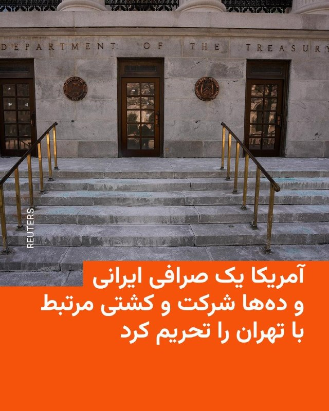

🔸دولت ایالات متحده روز سه‌شنبه در ادامه فشارها بر تهران، یک صرافی ایرانی و شرکت‌هایی را که به گفته آمریکا به‌عنوان شرکت‌های پوششی برای انجام تراکنش‌های بانکی ایران فعالیت می‌کنند، تحریم کرد.

🔸وزارت خزانه‌داری آمریکا صرافی «امین اکسچنج» مستقر در ایران، که با نام «شرکت مشارکت ابراهیمی و شرکا» نیز شناخته می‌شود، را تحریم کرد. این وزارتخانه اعلام کرد این صرافی دارای شبکه گسترده‌ای از شرکت‌های پوششی در چندین حوزه قضایی، از جمله امارات متحده عربی، ترکیه و هنگ‌کنگ است.

🔸آمریکا همچنین ۱۹ کشتی را که به گفته واشنگتن در انتقال نفت و محصولات پتروشیمی ایران به مشتریان خارجی نقش داشته‌اند، در فهرست تحریم قرار داد.

🔸وزارت خزانه‌داری اعلام کرد صرافی‌های ایرانی سالانه میلیاردها دلار تراکنش ارزی انجام می‌دهند و به حکومت ایران کمک می‌کنند تحریم‌ها را دور بزند و به نظام مالی بین‌المللی دسترسی پیدا کند. همچنین گفته شد که شرکت‌های پوششی یادشده، صدها میلیون دلار تراکنش را به نمایندگی از بانک‌های ایرانی مدیریت می‌کنند.

@RadioFarda

## RadioFarda — post 157351

آمریکا خواستار شدت عمل بیشتر کشورهای اروپایی و آسیایی علیه شبکه‌های مالی ایران شد

🔸اسکات بسنت، وزیر خزانه‌داری آمریکا، روز سه‌شنبه ۲۹ اردیبهشت از متحدان واشینگتن در اروپا و آسیا خواست با شدت بیشتری شبکه‌های مالی ایران را مختل کنند و گفت وزارتخانه او فهرست تحریم‌های خود را از موارد قدیمی و منسوخ پاکسازی خواهد کرد.

🔸به گزارش خبرگزاری رویترز، بسنت در سخنرانی آماده‌شده‌ای برای کنفرانس مقابله با تأمین مالی تروریسم، که پس از نشست وزیران دارایی گروه هفت در پاریس برگزار شد، گفت شرکت‌کنندگان باید «به‌طور کامل در کنار ما» علیه ایران بایستند.

🔸او گفت: «این امر، برای مثال، مستلزم آن است که شرکای اروپایی ما با ایالات متحده در اقدام علیه ایران همراه شوند؛ از طریق تحریم تأمین‌کنندگان مالی آن، افشای شرکت‌های پوششی و صوری، تعطیل کردن شعب بانکی و برچیدن شبکه‌های نیابتی آن.»

🔸او افزود: «همچنین لازم است کشورهای خاورمیانه و آسیا شبکه‌های بانکداری سایه ایران را ریشه‌کن کنند.»

🔸در حالی که دولت ترامپ تلاش می‌کند تهران را برای بازگشایی تنگه هرمز که از زمان آغاز جنگ اخیر آمریکا و اسرائیل با ایران مسدود شده تحت فشار قرار دهد، وزارت خزانه‌داری آمریکا تلاش‌های تحریمی خود علیه ایران را از طریق برنامه‌ای با عنوان «خشم اقتصادی» تشدید کرده است.

🔸این برنامه با هدف مختل کردن شبکه‌های بانکداری سایه ایران اجرا می‌شود و تاکنون نزدیک به نیم میلیارد دلار ارز دیجیتال مرتبط با حکومت ایران را مسدود کرده است..

🔸 گزارش کامل را در وب‌سایت رادیوفردا بخوانید.

@RadioFarda

## RadioFarda — post 157350

🔸وزیران دارایی هفت کشور صنعتی جهان بعد از دو روز گفت‌وگو در پاریس، در بیانیه‌ای که روز سه‌شنبه منتشر شد با اشاره به چالش‌های متعدد اقتصاد دنیا، خواستار «بازگشت سریع به عبور و مرور آزاد و امن» کشتی‌ها از تنگه هرمز شدند. 🔸اسکات بسنت، وزیر خزانه‌داری آمریکا،…

## RadioFarda — post 157349

  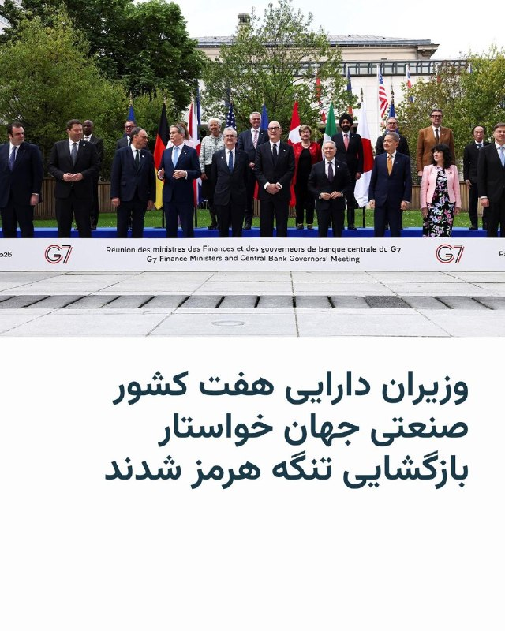

🔸وزیران دارایی هفت کشور صنعتی جهان بعد از دو روز گفت‌وگو در پاریس، در بیانیه‌ای که روز سه‌شنبه منتشر شد با اشاره به چالش‌های متعدد اقتصاد دنیا، خواستار «بازگشت سریع به عبور و مرور آزاد و امن» کشتی‌ها از تنگه هرمز شدند.

🔸اسکات بسنت، وزیر خزانه‌داری آمریکا، نیز در شبکه ایکس نوشت که در این نشست، «گفت‌وگوهای سازنده‌ای» درباره ایران، مواد معدنی حیاتی، امنیت سایبری و عدم توازن‌های جهانی داشته است.

🔸بعد از صدور بیانیه پایانی، وزیر دارایی فرانسه اذعان کرد که دو روز گفت‌وگو میان وزرای گروه هفت «گاهی دشوار» بوده است، هرچند این گروه در نهایت بر سر بیانیه‌ای برای تعهد به همکاری چندجانبه در مقابله با خطرات فزاینده اقتصادی به توافق رسید.

🔸بیانیه پایانی وزیران گروه هفت «تعهد ما به همکاری چندجانبه برای مقابله با خطرات پیش روی اقتصاد جهانی» را تأیید کرد.

🔸در پس‌زمینه جنگ آمریکا و اسرائیل با ایران، در این بیانیه آمده است که «چالش‌های جهانی متعدد و پیچیده‌ای وجود دارد که نیازمند پاسخ‌های هماهنگ هستند.»

@RadioFarda

## RadioFarda — post 157348

  

🔸روزنامه شرق در گزارشی درباره ستاد تازه‌تشکیل‌شدهٔ «ساماندهی فضای مجازی» به ریاست معاون اول رئیس‌جمهور ایران، نوشت که از برخی اعضای دولت «خواسته شده» تا درباره جزئیات و مأموریت‌های این ساختار با رسانه‌ها مصاحبه نکنند.

🔸در این گزارش که روز سه‌شنبه ۲۹ اردیبهشت و با عنوان «حکمرانی دیجیتال در سایه ابهام» منتشر شده، آمده است: ستادی که قرار است به گفته رئیس‌جمهور، به «چندصدایی» و «موازی‌کاری» در حکمرانی اینترنت پایان دهد، «خود به یکی از مبهم‌ترین و پرحاشیه‌ترین ساختارهای سیاست‌گذاری دیجیتال کشور تبدیل شده است».

🔸شرق نوشته که «دستور» محمدرضا عارف به خودداری اعضای دولت از صحبت با رسانه‌ها درباره این ستاد، در حالی است که با تشکیل این ستاد، «شائبه‌ها درباره شکل‌گیری یک مرکز تازه قدرت در سیاست اینترنت ایران، پررنگ‌تر» و «آشفتگی در حکمرانی فضای مجازی» ایران، نمایان‌تر شده است.

🔸این روزنامه به نقل از کارشناسان و منتقدان تأکید کرده که در شرایطی که خود رئیس‌جمهور ریاست شورای عالی فضای مجازی و شورای عالی امنیت ملی را نیز برعهده دارد، «به راحتی می‌تواند گره کوری که در اینترنت ایجاد شده است را باز کند».

@Radiofarda

## RadioFarda — post 157347

  <a href="https://t.me/radiofarda/157347" target="_blank">📎 Download file</a>

📻بشنوید: ساعت ۱۴ با رادیوفردا، ۲۹ اردیبهشت ۱۴۰۵‌

@Radiofarda

## RadioFarda — post 157346

  

🔸ایووت کوپر، وزیر خارجه بریتانیا روز سه‌شنبه ۲۹ اردیبهشت هشدار داد که جهان دیگر نمی‌تواند بیش از این برای بازگشایی تنگه هرمز صبر کند و ادامه بسته‌ماندن آن امنیت غذایی کشورهای آسیب‌پذیر را با بحران جدی‌تری روبه‌رو می‌کند.

🔸وزارت خارجه بریتانیا روز سه‌شنبه اعلام کرد کوپر در کنفرانس جهانی مشارکت‌ها در لندن، با اشاره به پیامدهای بحران جنگ ایران بر انرژی، کود کشاورزی و قیمت مواد غذایی، خواستار فشار فوری بین‌المللی برای بازگشایی تنگه هرمز شده است.

🔸ایووت کوپر در کنفرانس جهانی مشارکت‌ها در لندن هشدار داد که جهان در آستانه یک بحران غذایی جهانی قرار دارد و نمی‌توان اجازه داد ده‌ها میلیون نفر به‌دلیل بسته‌ماندن یک مسیر بین‌المللی کشتیرانی که ایران آن را «گروگان» گرفته با گرسنگی روبه‌رو شوند.

🔸کوپر تأکید کرد چالش‌های جهانی، مانند بحران ایران، در مرزها متوقف نمی‌شوند و راه‌حل‌های آنها نیز متوقف نمی‌شوند و نیازمند همکاری بین‌المللی است.

@RadioFarda

## RadioFarda — post 157345

  

🔸قطر روز سه‌شنبه ۲۹ اردیبهشت اعلام کرد که مذاکرات میان آمریکا و ایران برای رسیدن به توافق به زمان بیشتری نیاز دارد.

🔸ماجد الانصاری، سخنگوی وزارت خارجه قطر، در یک نشست خبری گفت: «ما از تلاش دیپلماتیک پاکستان که جدیت خود را در گردهم آوردن طرف‌ها و یافتن راه‌حل نشان داده حمایت می‌کنیم و معتقدیم این روند به زمان بیشتری نیاز دارد».

🔸این اظهارات یک روز پس از آن مطرح شد که دونالد ترامپ، رئیس‌جمهور آمریکا، گفت حمله روز سه‌شنبه به ایران را برای دادن فرصت به این روند به تعویق انداخته است.

🔸ایران و ایالات متحده از زمان آتش‌بس شکننده میان دو کشور در ۱۹ فروردین امسال، درگیر یک دور مذاکره مستقیم و همچنین تبادل پیام‌هایی از طریق پاکستان بوده‌اند تا به توافقی برای پایان جنگ دست یابند.

@RadioFarda

## RadioFarda — post 157339

🔸ایرنا، خبرگزاری دولت جمهوری اسلامی روز سه‌شنبه ۲۹ اردیبهشت تصاویری از یک زن بدون «حجاب رسمی» مورد تایید حکومت در فضای خصوصی منزل را منتشر کرد و ساعتی بعد آنها را از روی سایت این خبرگزاری حذف کرد.

🔸انتشار این تصاویر در قالب یک گزارش تصویری صورت گرفت که واکنش‌هایی‌ را در شبکه‌های اجتماعی به‌دنبال داشت.

🔸در این گزارش تصویری خبرگزاری دولت عکس‌هایی از سارا کنعانی، نویسنده و هنرمند ۳۷ ساله اهل تهران را که در روزهای جنگ ۴۰ روزه نوزادی را که در بیمارستان رها شده بود، به طور موقت به سرپرستی گرفته و نام این دختر را آهو گذاشته منتشر کرده است.

🔸 انتشار تصاویر بدون حجاب مورد تایید حکومت در منزل شخصی این هنرمند در حالی رخ داده است که تاکنون هیچ‌گونه اعلام رسمی درباره تغییر در سیاست‌های مرتبط با حجاب در رسانه‌های ایران منتشر نشده است.

🔸 در ماه‌های گذشته رسانه‌های حکومتی تصاویر و گزارش‌های بسیاری از زنان بدون حجاب در رویدادهای حکومتی منتشر کرده‌اند.

🔸 چرخش سیاست حکومت در قبال حجاب با واکنش‌های افراد تندرو همراه شده است.

@RadioFarda

## IranianMinds — post 20404

  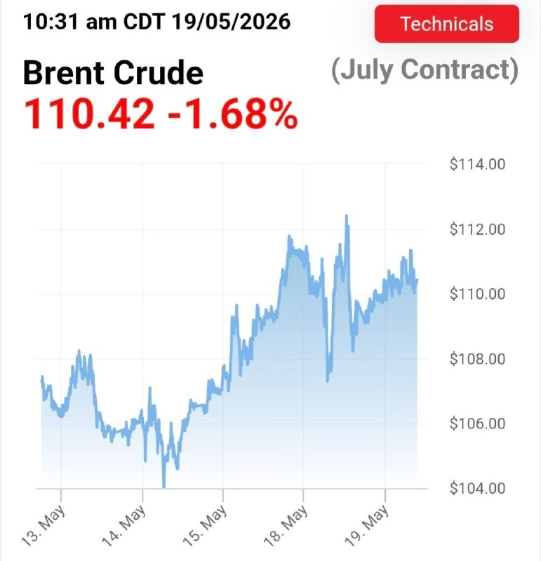

🔴آخرین قیمت نفت:

110.42 دلار

@IranianMinds

## IranianMinds — post 20403

🔴 ترامپ:

ایران هرگز به سلاح هسته‌ای دست نخواهد یافت و احتمالاً به زودی به توافق خواهیم رسید.

@IranianMinds

## IranianMinds — post 20402

🔴 ترامپ:

در آخر همه چیز حل خواهد شد، چه با راه حل نظامی و چه با توافق!

@IranianMinds

## IranianMinds — post 20401

  <a href="telegram/content/IranianMinds_20401_1779215159.mp4" target="_blank">🎬 Download video</a>

🔴 ترامپ :

اگه الان ایرانو ترک کنیم ۲۵ سال طول میکشه خودشونو بازسازی کنن ، ولی ما اینکارو نمیکنیم.

@IranianMinds

## IranianMinds — post 20400

  <a href="telegram/content/IranianMinds_20400_1779215161.mp4" target="_blank">🎬 Download video</a>

🔴 ترامپ :

تنگه هرمز برای ایران نیست ، این آب های بین المللی هست.

@IranianMinds

## IranianMinds — post 20399

  <a href="telegram/content/IranianMinds_20399_1779215162.mp4" target="_blank">🎬 Download video</a>

🔴 ترامپ :

رئیس‌ جمهور چین گفته که هیچ اسلحه‌ای به ایران نمی‌فرسته. قول قشنگیه، به حرفش اعتماد دارم و قدردانشم.

@IranianMinds

## IranianMinds — post 20398

🔴 وزارت خزانه‌داری آمریکا:

هم‌پیمانان اروپایی باید اجرای تحریم‌ها علیه ایران را تقویت کنند، از جمله بستن شعب بانک‌های ایرانی و مصادره دارایی‌ها.

@IranianMinds

## IranianMinds — post 20397

🔴 ترامپ:

چه اقدام نظامی علیه ایران با حمایت مردمی همراه باشد یا نه، من اجازه نمی‌دهم جهان جلوی چشمم نابود شود.

@IranianMinds

## IranianMinds — post 20396

  <a href="telegram/content/IranianMinds_20396_1779215163.mp4" target="_blank">🎬 Download video</a>

🔴 خبرنگار: ایران چند روز فرصت دارد پای میز مذاکره بیاید؟

ترامپ: دو یا سه روز. شاید جمعه، شنبه، یکشنبه. شاید اوایل هفته آینده. مدت زمان محدودی است.

@IranianMinds

## IranianMinds — post 20395

  <a href="telegram/content/IranianMinds_20395_1779215164.mp4" target="_blank">🎬 Download video</a>

🔴 ترامپ درباره ایران:

دیروز یک تماس گرفتم و گفتن آقا، می‌تونید صبر کنید؟ فکر می‌کنیم به یک توافق نزدیکیم.

منم گفتم اشکالی نداره.

@IranianMinds

## IranianMinds — post 20394

🔴 ترامپ :

داریم با ایرانیا همین الان مذاکره میکنیم.

@IranianMinds

## IranianMinds — post 20393

  <a href="telegram/content/IranianMinds_20393_1779215166.mp4" target="_blank">🎬 Download video</a>

🔴 ترامپ :

فقط یک‌ ساعت تا حمله به ایران فاصله داشتیم.

@IranianMinds

## IranianMinds — post 20392

🔴 ترامپ :

ایران میخواد خاورمیانه رو نابود کنه ولی ما اجازه اینکارو بهش نمیدیم !

@IranianMinds

## IranianMinds — post 20391

🔴 ترامپ:

ممکن است مجبور شویم یک حمله دیگر به ایران انجام دهیم، اما مطمئن نیستم.

@IranianMinds

## IranianMinds — post 20390

  

🔴 وزارت خزانه‌داری آمریکا سازندگان ناوگان‌های حامی فلسطین را تحریم کرد.

@IranianMinds

## IranianMinds — post 20389

🔴والا نیوز:

در صورت تصمیم ترامپ برای حمله مجدد به ایران، هماهنگی‌هایی با چند کشور خاورمیانه انجام شده است.

@IranianMinds

## IranianMinds — post 20388

  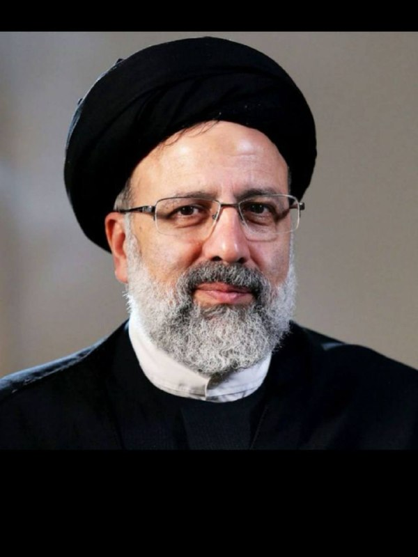

🔴 دو سال پیش در چنین روزی ابراهیم رئیسی رو خرس خورد.

@IranianMinds

## IranianMinds — post 20387

🔴 سازمان عفو بین‌الملل اعلام کرد تعداد اعدام‌ها در جهان طی سال 2025 به بالاترین سطح در 44 سال گذشته رسیده.

طبق این گزارش، جمهوری اسلامی اصلی‌ترین عامل افزایش آمار اعدام‌ها در جهان بوده.

@IranianMinds

## IranianMinds — post 20386

🔴 وال استریت ژورنال : ترامپ گفت حمله برنامه‌ریزی‌شده به ایران را متوقف کرده چون رهبران کشورهای خلیج فارس خواستند زمان بیشتری برای مذاکرات بدهند تا شاید به توافق برسند. او دستور داده ارتش آماده باشد ولی فعلاً حمله انجام نشود. چند مقام خلیج فارس بعد این…

## IranianMinds — post 20385

🔴خبرگزاری مهر:

زمین‌لرزه به شدت ۴.۶ ریشتر ، استان لرستان را لرزاند.

@IranianMinds

## BBCPersian — post 281511

  <a href="telegram/content/BBCPersian_281511_1779215168.mp4" target="_blank">🎬 Download video</a>

مجید قهرودی، عکاس، ویدیویی از طلوع خورشید بر فراز دماوند از میان قوس برج آزادی (شهیاد) را به همراه شعری از سیاوش کسرایی منتشر کرده و در پایان آن نوشته: «طلوع خورشید بر فراز دماوند از دل آزادی»

او در ادامه بعد از شعر سیاوش کسرایی آرزو کرده: «تو یه روزی که حال این سرزمین خوبه، کنار هم بشینیم و این منظره رو تماشا کنیم…»

او می‌گوید هر سال در تاریخ‌های ۲۹ اردیبهشت و ۳ مرداد از میدان آزادی می‌توان طلوع خورشید رو از راس دماوند تماشا کرد.

@BBCPersian

## BBCPersian — post 281510

دوشنبه ۲۸ اردیبهشت در تجمع شبانه حامیان حکومت ایران، مراسم ازدواج ۵۰۰ زوج برگزار شد که واکنش‌هایی را به دنبال داشت. از جمله بعضی کاربران شبکه‌های اجتماعی از آن به عنوان «جنگی‌ترین عروسی تاریخ» یاد کردند. 

مراسم عروسی زوج‌ها در میدان‌های اصلی تهران برگزار شد و بعد از آن عروس و دامادها سوار بر خودروهای نظامی مسلح به دوشکا در سطح خیابان‌های تهران رژه رفتند. 

پیش از آن گزارشی در تلویزیون ایران از ازدواج «جانفدایان ایران» منتشر شد که زوج تازه ازدواج کرده مهمان برنامه اعلام کردند یک پهپاد شاهد به عنوان مهریه عروس در نظر گرفته شده است.

تجمع‌های شبانه حامیان حکومت، انتقادهای زیادی را به دنبال داشته است. از جمله استفاده از کودکان برای اهداف ایدئولوژیک. در مراسم ازدواج برگزار شده کودکان نقش پررنگی در تبلیغ این مراسم داشتند. در شب‌های قبل هم تصاویری از آموزش کار با اسلحه به کودکان منتشر شد. در جریان جنگ آمریکا و اسرائیل با ایران، استفاده از کودکان در ایست و بازرسی‌ها واکنش‌های زیادی را به دنبال داشت. 
@BBCPersian

## BBCPersian — post 281509

🔻امارات متحده عربی: پهپادهایی که هفته پیش نیروگاه هسته‌ای را هدف قرار دادند، از عراق آمده بودند

امارات متحده عربی روز سه‌شنبه اعلام کرد پهپادهایی که هفته پیش نیروگاه هسته‌ایش را هدف قرار دادند، از عراق آمده بودند.

در بیانیه وزارت دفاع امارات آمده است: «به عنوان بخشی از تحقیقات جاری در مورد حمله آشکار به نیروگاه هسته‌ای براکه در ۱۷ مه ۲۰۲۶، ردیابی و نظارت فنی تایید کرده است که این سه پهپاد... همگی از قلمرو عراق آمده‌اند.»

از زمان آغاز جنگ آمریکا و اسرائیل با ایران، گروه‌های تحت حمایت جمهوری اسلامی چندین حمله از عراق انجام داده‌اند.

امارات متحده روز یکشنبه گفت که در حمله پهپادی، ژانراتور برق بیرون محوطه نیروگاه هسته‌ای براکه، در نزدیکی ابوظبی، آتش گرفته است.

این کشور در بیانیه‌هایش نامی از کشوری نبرد و فقط گفت پهپاد از «مرز غربی» وارد شده بود.

سخنگوی وزارت خارجه ایران امروز اتهام صدراعظم آلمان را تکذیب کرد که گفته بود ایران در حمله به نزدیکی نیروگاه هسته‌ای امارات متحده عربی نقش داشته است.

https://bbc.in/3PMgHSu
@BBCPersian

## BBCPersian — post 281508

🔻ولادیمیر پوتین، رئیس‌جمهور روسیه، وارد چین شد

ولادیمیر پوتین، رئیس‌جمهور روسیه، وارد چین شد.

هواپیمای آقای پوتین درست بعد از نیمه شب به وقت محلی در پکن به زمین نشست و وانگ یی، وزیر خارجه چین، همراه با موسیقی یک ارکستر نظامی، از او استقبال کرد.

کرملین پیش از سفر ولادیمیر پوتین به پکن در روز سه‌شنبه، یک پیام ویدیویی از رئیس‌جمهور روسیه خطاب به مردم چین منتشر کرد.

در سخنانی سرشار از تمجید از رهبر چین، آقای پوتین از شی جین‌پینگ «دوست خوب و قدیمی» خود قدردانی کرد و گفت روابط دو کشور به «سطحی واقعا بی‌سابقه» رسیده است.

آقای پوتین تاکید کرد که اتحاد راهبردی نزدیک روسیه و چین نقشی مهم و ثبات‌بخش در صحنه جهانی ایفا می‌کند.

سفر آقای پوتین به پکن تنها چند روز بعد از آن انجام می‌شود که آقای شی میزبان دونالد ترامپ بود.

🎥BBC
@BBCPersian

## BBCPersian — post 281507

پرین گورل: نفرین نفت، دلیل تفاوت رفتار غرب با ترکیه در مقایسه با ایران است- گفت و گوی ویژه

«ترکیه، ایران و سیاست مقایسه‌ای: همسر آمریکا یا زن صیغه‌ای آمریکا» نام کتابی است که پرین گورل، پژوهشگر روابط ایران و ترکیه نوشته و نام آن را از گفته محمد رضا شاه پهلوی به جان اف کندی، رئیس جمهور وقت آمریکا گرفته که در دهه ۱۹۶۰ ترکیه را به زن عقدی و ایران را به زن صیغه‌ای آمریکا تشبیه کرده بود.

این استاد دانشگاه نتردام در کتابش تاریخ پر فراز و نشیب روابط این دو کشور همسایه و دوست و رقیب را در ارتباط با امریکا بررسی کرده است: « در طول تاریخ، این گفتمانِ «دوستی و همسایگی» همواره در کنار حسادت و حتی لذت از شکست دیگری وجود داشته. احتمالاً این پویاییِ پیچیده در آینده هم ادامه پیدا می کند».

در ادامه گفت و گو با فرناز قاضی‌زاده، این پژوهشگر ترک‌تبار می‌گوید که انگیزه و شدت عمل کشورهای غربی در ایران با ترکیه قابل مقایسه نیست: «این همان نفرین نفت است، دخالت غرب در ایران اصلاً با فشارهایی که ترکیه تجربه کرده قابل مقایسه نیست. ایران در بخش بزرگی از تاریخش حتی اجازه بی‌طرف ماندن هم نداشته». پرین گورل، مهمان این هفته برنامه گفت و گوی ویژه است.

گفت‌وگوی کامل را از لینک زیر در یوتیوب ببینید:
https://bbc.in/43gTxqn
@BBCPersian

## BBCPersian — post 281506

  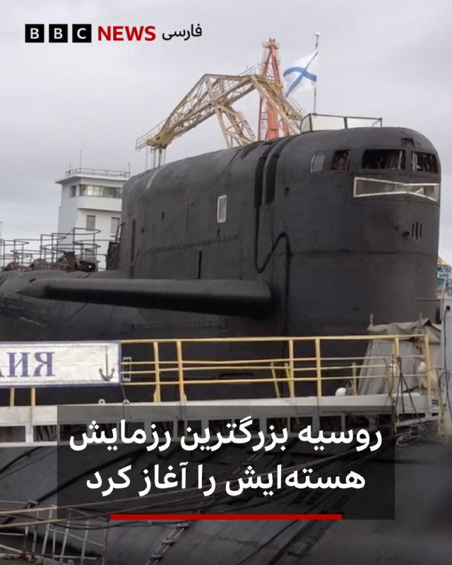

🔻ساعاتی پیش از سفر ولادیمیر پوتین به چین، وزارت دفاع روسیه امروز از آغاز رزمایش‌ گسترده نیروهای راهبردی هسته‌ای را «برای آماده‌سازی و به‌کارگیری نیروهای هسته‌ای در مقابل یک تهدید تهاجمی» خبر داد. دیروز رزمایش سلاح‌های هسته‌ای تاکتیکی روسیه مستقر در بلاروس انجام شد.

روسیه به طور سنتی چنین رزمایش‌های بزرگ هسته‌ای را در ماه اکتبر برگزار می‌کند که معمولاً «تندر» نام دارند اما این قاعده امسال هم مثل سال ۲۰۲۲، درست پیش از حمله روسیه به اوکراین رعایت نشده است.

رزمایش‌هایی که از امروز آغاز شده‌اند، هر سه نوع سلاح هسته‌ای روسیه را دربر می‌گیرند؛ موشک‌ بالستیک قاره‌پیما، زیردریایی‌ هسته‌ای و بمب‌افکن‌ راهبردی.

وزارت دفاع روسیه در بیانیه‌ای اعلام کرد:
«در این رزمایش بیش از ۶۴ هزار نیروی نظامی، بیش از ۷۸۰۰ واحد تسلیحات، تجهیزات نظامی و تجهیزات ویژه شرکت دارند و بیش از ۲۰۰ پرتابگر موشک، بیش از ۱۴۰ هواپیما، ۷۳ ناو و ۱۳ زیردریایی که هشت تایشان زیردریایی‌های راهبردی حامل موشک هستند.»
این بخش قابل توجهی از کل نیروهای راهبردی هسته‌ای روسیه را شامل می‌شود.

مطلب کامل:
https://bbc.in/3RhYDA5
📷Getty
@BBCPersian

## BBCPersian — post 281505

🔻یک کمیسیون مستقل اسرائیلی جزئیات تکان‌دهنده‌ای از خشونت جنسی «سیستماتیک و گسترده» توسط حماس و سایر گروه‌های مسلح فلسطینی در جریان حملات ۷ اکتبر ۲۰۲۳ و علیه گروگان‌ها منتشر کرده است.

گزارش ۳۰۰ صفحه‌ای این کمیسیون نتیجه‌گیری می‌کند که تجاوز و شکنجه جنسی «با هدف به حداکثر رساندن درد و رنج» انجام شده است.

در حالی که سازمان ملل متحد و دیگران گزارش‌هایی در مورد خشونت جنسی در جریان این حملات منتشر کرده‌اند گفته می‌شود که گزارش این کمیسیون مستقل جامع‌ترین گزارش است.

حماس در حمله هفتم اکتبر ۲۰۲۳، حدود ۱۲۰۰ نفر را کشت و ۲۵۱ نفر را گروگان گرفت.

این گزارش بر اساس ۴۳۰ مصاحبه فیلمبرداری شده با بازماندگان و شاهدان آن حمله، بیش از ۱۰ هزار عکس و فیلم گرفته شده توسط مهاجمان و سوابق و مدارک رسمی از محل‌های حمله تهیه شده است.

بیشتر بخوانید:
📷Reuters
@BBCPersian

## BBCPersian — post 281504

  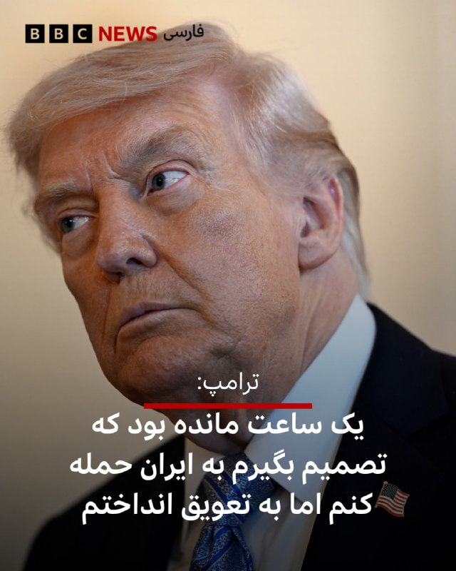

🔻دونالد ترامپ، رئیس‌جمهور آمریکا، روز سه‌شنبه هشدار داد که ممکن است لازم باشد دوباره به ایران حمله کند.

او گفت که «یک ساعت مانده بود به تصمیم‌گیری» در مورد حمله به ایران که تصمیم گرفت آن را به تعویق بیندازد.

آقای ترامپ یک بار دیگر تکرار کرد که رهبران ایران برای توافق «التماس» می‌کنند و هشدار داد که اگر توافقی حاصل نشود آمریکا در روزهای آینده به ایران حمله خواهد کرد:

«دو یا سه روز دیگر، شاید جمعه، شنبه، یکشنبه، شاید اوایل هفته آینده. فرصت محدودی مانده. چون نمی‌توانیم بگذاریم آنها به سلاح اتمی دست پیدا کنند.»

دونالد ترامپ دیروز گفته بود که به درخواست رهبران عربستان، امارات و قطر، حمله‌ای را که تصمیم داشت روز سه‌شنبه به ایران انجام دهد، لغو کرده است.

او گفت که رهبران این سه کشور معتقدند توافقی قابل حصول است که هم برای آمریکا و هم برای کشورهای منطقه «بسیار قابل قبول» است.

📷Getty Images
@BBCPersian

## BBCPersian — post 281503

🔻بریتیش ایرویز ازسرگیری پروازهایش به سه شهر خاورمیانه را تا دهم مرداد به تعویق انداخت

بریتیش ایرویز از سرگیری پروازهای خود به دوبی، دوحه و تل‌آویو را دوباره به تعویق انداخت.

این شرکت هواپیمایی بریتانیایی اعلام کرد که پروازهایش به این سه شهر تا اول اوت (۱۰ مرداد ۱۴۰۵) از سرگرفته نخواهد شد.

بعد از آغاز جنگ آمریکا و اسرائیل با ایران در نهم اسفند (۲۸ فوریه) ده‌ها شرکت هواپیمایی پروازهای خود را که مبدأ یا مقصدشان در این منطقه بود، لغو کردند.

سخنگوی بریتیش ایرویز گفت: «به‌دلیل وضعیت جاری در خاورمیانه، تغییرات بیشتری در برنامه پروازهای خود اعمال کرده‌ایم تا شفافیت بیشتری برای مشتریان فراهم شود.»

این شرکت هواپیمایی قصد دارد که تعداد پروازها به خاورمیانه را بعد از از سرگیر پروازها، کاهش دهد. بریتیش ایرویز همچنین اعلام کرده است که مسیر جده را به‌طور دائمی از برنامه پروازی خود حذف خواهد کرد.

بر اساس این برنامه، تعداد پروازها به دوبی، دوحه، ریاض و تل‌آویو هم به یک پرواز روزانه کاهش خواهد یافت.

https://bbc.in/3PzSzlT
@BBCPersian

## BBCPersian — post 281502

🔻در حالی که تصور می‌رود بارندگی‌های بهار امسال، کم‌بارشی پاییز و زمستان را جبران کرده باشد، سخنگوی صنعت آب ایران دیروز، ۲۸ اردیبهشت، اعلام کرد که بارش‌ها در شرایط معمولی است و ترسالی را «مطلقا» رد کرد. در روزهای ۲۷ و ۲۸ اردیبهشت، تصاویری از برف دیرهنگام…

## BBCPersian — post 281501

  <a href="telegram/content/BBCPersian_281501_1779215171.mp4" target="_blank">🎬 Download video</a>

🔻در حالی که تصور می‌رود بارندگی‌های بهار امسال، کم‌بارشی پاییز و زمستان را جبران کرده باشد، سخنگوی صنعت آب ایران دیروز، ۲۸ اردیبهشت، اعلام کرد که بارش‌ها در شرایط معمولی است و ترسالی را «مطلقا» رد کرد.

در روزهای ۲۷ و ۲۸ اردیبهشت، تصاویری از برف دیرهنگام بهاری در شمال تهران و آذربایجان غربی منتشر شد. علاوه بر این، در ماه‌های اخیر تصاویر دریاچه‌ها و رودهای پرآب بازتاب گسترده‌ای در رسانه‌ها داشته است و در خبرها اعلام شده که تعدادی از سدهای ایران سرریز شده‌اند.

اما داده‌های سازمان هواشناسی ایران نشان می‌دهد که «۱۸ استان در سال جاری با کم‌بارشی مواجه‌اند که تهران با بیش از ۳۸ درصد کاهش میانگین بارش، رکورددار است. در رتبه بعدی استان‌های قم و سمنان به‌ترتیب با ۳۱/۷ و ۳۱/۳ درصد کم‌بارشی قرار دارند.»

## BBCPersian — post 281500

🔻دفتر رئیس‌جمهور ایران: وزرای پیشنهادی دفاع و اطلاعات به شرط تشکیل مجلس، در مهلت قانونی معرفی می‌شوند

در حالی که فقط چند هفته تا مهلت قانونی معرفی وزرای پیشنهادی دفاع و اطلاعات از سوی دولت ایران باقی مانده، دفتر ریاست جمهوری قول داده است که آن‌ها «بزودی» معرفی خواهند شد.

محمدمهدی طباطبایی، معاون ارتباطات دفتر رئیس‌جمهور ایران، به خبرگزاری تسنیم گفت که دولت مسعود پزشکیان برای معرفی وزیر پیشنهادی دفاع حدود دو هفته و برای معرفی وزیر پیشنهادی اطلاعات حدود چهل روز فرصت دارد.

او قول داد که وزرای پیشنهادی «به شرط تشکیل مجلس» در موعد مقرر برای برگزاری جلسه رأی اعتماد معرفی شوند.

مجلس ایران از زمان حملات آمریکا و اسرائیل در ۹ اسفند (۲۸ فوریه) تاکنون در محل دائمی خود تشکیل نشده است.

عزیز نصیرزاده و اسماعیل خطیب، وزرای دفاع و اطلاعات ایران در جریان حملات آمریکا و اسرائیل کشته شدند.

وزارت دفاع ایران در حال حاضر به سرپرستی سرتیپ مجید ابن‌الرضا اداره می‌شود اما نام سرپرست وزارت اطلاعات اعلام نشده است. خبرگزاری تسنیم گفته است که نام سرپرست وزارت اطلاعات «در زمان مقرر» اعلام خواهد شد.

مطابق قوانین ایران، وزارتخانه‌هایی که وزیر ندارند فقط سه ماه می‌توانند با سرپرست اداره شوند و پیش از پایان این مهلت باید وزیر پیشنهادی به مجلس معرفی یا در غیر این صورت با حکم رهبر جمهوری اسلامی ایران مدت سرپرستی تمدید شود.

https://bbc.in/43fw5tF
@BBCPersian

## BBCPersian — post 281499

🔻اموال ۵۲ نفر شامل املاک، وجوه بانکی و طلا در استان زنجان توقیف شد

رئیس کل دادگستری زنجان گفت اموال ۵۲ نفر در شهرهای مختلف این استان بر اساس قانون «قانون تشدید مجازات جاسوسی و همکاری با رژیم صهیونسیتی علیه امنیت و منافع ملی» توقیف شده است.

علی فرجی برحق گفت توقیف اموال این افراد که آنها را «خائنین به وطن و افراد تاثیرگذار در شبکه همکاران دشمن» خواند، به دستور مقام قضائی انجام شده است.

اموال توقیف شده شامل وجوه نقد بانکی و ارزی، اموال منقول و غیرمنقول و طلا بوده است.

بر اساس این گزارش هفت نفر از این افراد بازداشت شدند و برخی هم در خارج از ایران هستند.

قوه قضائیه پس از جنگ اخیر برای کسانی که «هم‌صدا» یا «همراه» دشمن می‌خواند، پرونده تشکیل می‌دهد و با استناد به قانون «تشدید مجازات جاسوسی»، مجازات‌هایی مثل ممنوعیت فعالیت و توقیف اموال در نظر می‌گیرد.

قوه قضائیه فهرست‌هایی هم از افرادی منتشر کرده که برای «حمایت از جنگ»، اموالشان توقیف یا مصادره شده است.

با تشدید ضبط اموال طیف وسیعی از اقشار جامعه از خبرنگار تا بازیگر و فعال سیاسی و هنرمند و ورزشکار، قوه قضائیه جلوگیری از انتقال اموال را هم آغاز کرده است.

https://bbc.in/49RmJrF
@BBCPersian

## BBCPersian — post 281498

🔻سقوط پرتابه در اندیمشک چهار مجروح بر جای گذاشت

به گفته ولی‌الله حیاتی، معاون امنیتی و انتظامی استانداری خوزستان، در پی سقوط پرتابه‌های ناشی از پدافند هوایی در اندیمشک چهار نفر مجروح شده‌اند.

به گزارش رسانه‌های ایران، آقای حیاتی گفت: «به‌دلیل سقوط پرتابه در منطقه مسکونی، چهار شهروند مجروح شدند که خوشبختانه در شرایط مناسب و پایدار قرار دارند و هم اکنون در مراکز درمانی به وضعیت آنان رسیدگی می‌شود.»

خبرگزاری دولتی ایرنا علت مجروح شدن این افراد را «سقوط شی ناشناس در مناطق مسکونی اندیمشک» گزارش کرد که «منجر به خسارت به یک باب مغازه و دو خودرو و مصدومیت چهار نفر شد» و «در شبکه های اجتماعی این شهرستان بازتاب گسترده داشت.»

آقای حیاتی همچنین گفت: «صدای شلیک‌های امروز در آسمان اندیمشک به‌دلیل تست پدافند هوایی است و مردم نگران نباشند.»

در روزهای اخیر فعال شدن پدافند هوایی در بعضی شهرهای ایران گزارش شده است از جمله امروز و دیشب در اصفهان که عنوان شد ناشی از «پاکسازی مناطق باقیمانده از مهمات عمل‌نکرده» است.

پیشتر گزارش‌هایی هم از فعال شدن پدافند جزیره قشم منتشر شده بود که به گفته خبرگزاری تسنیم برای مقابله با «ریز پرنده‌ها» بود.

ظهر امروز هم صدای چند انفجار در جزیره قشم شنیده شد که استانداری هرمزگان دلیل آن را «خنثی‌سازی» مهمات اعلام کرد.

https://bbc.in/49RmJrF
@BBCPersian

## BBCPersian — post 281497

  <a href="telegram/content/BBCPersian_281497_1779215173.mp4" target="_blank">🎬 Download video</a>

⭕️سرخط خبرها سه‌شنبه ۲۹ اردیبهشت ۱۴۰۵
@BBCPersian

## BBCPersian — post 281496

  

🔻سعید کرمی، معاون نهاد نمایندگی رهبر جمهوری اسلامی در دانشگاه‌ها می‌گوید دانشجویانی که اخیرا بازداشت شده‌اند، مرتکب «جرم امنیتی محسوس و تاثیرگذار» شده بودند.

او تعداد بازداشتی‌ها را «محدود و انگشت شمار» خواند وگفت: «در برخی پرونده‌ها، افرادی اقدام به ارسال لوکیشن برای عوامل بیگانه کرده‌اند.»

اشاره آقای کرمی به افرادی است که پس از آغاز جنگ آمریکا و اسرائیل با ایران بازداشت شده‌اند.

از زمان آغاز جنگ اخیر، موارد بازداشت و سختگیری‌های قضایی افزایش یافته است، هرچند مشخص نیست چند نفر از بازداشت‌شدگان دانشجو هستند.

احمدرضا رادان، فرمانده کل نیروی انتظامی، دو روز پیش گفت که از آغاز جنگ اخیر «بیش از ۶۵۰۰ نفر از وطن‌فروشان و جاسوسان دستگیر شده‌اند.»

خبرگزاری هرانا، ارگان خبری مجموعه فعالان حقوق بشر، هم می‌گوید که از زمان شروع جنگ تا هفته گذشته، دست‌کم ۴۰۲۳ بازداشت را در ایران ثبت کرده است.

به گفته این نهاد، اتهام‌های مطرح‌شده شامل جاسوسی، تهدید علیه امنیت ملی و ارتباط یا ارسال مطالب مربوط به جنگ به رسانه‌های خارجی است.

📷Getty Images
@BBCPersian

## BBCPersian — post 281495

  

🔻یوروپل، «آژانس اتحادیه اروپا برای همکاری در اجرای قانون»، می‌گوید در اقدامی هماهنگ برای مقابله با «محتوای تروریستی آنلاین»، ۱۴۲۰۰ پست مرتبط با سپاه پاسداران را در فضای مجازی هدف قرار داده است.

اتحادیه اروپا سپاه پاسداران را در ۱۹ فوریه ۲۰۲۶ سازمانی تروریستی معرفی کرد؛ این طبقه‌بندی به مجریان قانون اجازه می‌دهد تا علیه فعالیت‌های اعضای سپاه و نهادهای حامی آن در اتحادیه اروپا اقدام کنند.

یوروپل می‌گوید که اقداماتش بر شناسایی و مختل کردن حضور آنلاین گروه‌های مرتبط با سپاه پاسداران متمرکز بوده است که برای انتشار تبلیغات، جذب هواداران و جمع‌آوری کمک‌های مالی مورد استفاده قرار می‌گرفتند.

۱۸ کشور اروپایی و آمریکا در این اقدامات هماهنگ شرکت داشتند.

یوروپل می‌گوید که محتواهای تولید شده مرتبط با سپاه پاسداران، به چندین زبان از جمله عربی، اندونزیایی، انگلیسی، فرانسوی، فارسی و اسپانیایی شناسایی شده است.

📸GettyImages
https://bbc.in/3PydzJU
@BBCPersian

## BBCPersian — post 281490

🔸باشگاه منچستر سیتی خودش را برای جدایی از پپ گواردیولا، مردی که پرافتخارترین دوران این باشگاه را رقم زد، پس از بازی روز یکشنبه لیگ برتر مقابل استون ویلا آماده می‌کند.

انتظار می‌رود که این سرمربی بزرگ در پایان فصل، ورزشگاه اتحاد را ترک کند و آن طور که گفته می‌شود انزو مارسکا، سرمربی پیشین چلسی، جای او را می‌گیرد. این مربی ۵۵ ساله سابقه دستیاری گواردیولا در سیتی را نیز دارد.

مدیران سیتی قبلا گفته بودند که گواردیولا برای فصل آینده قرارداد دارد و امیدوارند در سمتش باقی بماند ولی با توجه به اخبار باشگاه حالا این جدایی قطعی است و گفته می‌شود که بازیکنان هم آماده خداحافظی با این سرمربی اسپانیایی در آخرین بازی فصل مقابل استون ویلا شده‌اند.

همزمان باشگاه تمرکز خود را روی یافتن بهترین راه برای تجلیل از دوران حضور این سرمربی نمادین گذاشته است. گفته می‌شود نامگذاری جایگاه شمالی تازه توسعه‌یافته به نام این سرمربی یکی از گزینه‌های مدنظر باشگاه است.

مطلب کامل:
https://bbc.in/42JXp31
📷Getty
@BBCPersian

## idfinfarsi — post 11610

  <a href="telegram/content/idfinfarsi_11610_1779215175.mp4" target="_blank">🎬 Download video</a>

🎬 Video

## idfinfarsi — post 11609

در راستای رفع تهدید علیه نیروهای ما: ارتش اسرائیل یک انبار حاوی ده‌ها نوع تسلیحات و یک چاهک پرتاب راکت متعلق به سازمان تروریستی حماس را منهدم کرد

ارتش اسرائیل دیشب (دوشنبه) یک انبار تسلیحات و یک چاهک پرتاب راکت متعلق به سازمان تروریستی حماس را در شمال نوار غزه منهدم کرد.

در انبار هدف‌گرفته‌شده ده‌ها نوع سلاح مختلف نگهداری می‌شد، از جمله بیش از ۲۰ خمپاره، پرتابگرها، مواد انفجاری، سلاح‌هایی از نوع کلاشنیکوف و تجهیزات رزمی دیگر.

چاهک پرتاب راکت و تسلیحات موجود برای حمله به نیروهای ارتش اسرائیل در محدوده خط زرد و شهروندان کشور اسرائیل در نظر گرفته شده بود و به‌منظور رفع این تهدید منهدم شد.

نیروهای ارتش اسرائیل در فرماندهی جنوب مطابق توافق در منطقه مستقر هستند و به فعالیت برای رفع هرگونه تهدید فوری ادامه خواهند داد.

## idfinfarsi — post 11608

  <a href="telegram/content/idfinfarsi_11608_1779215176.mp4" target="_blank">🎬 Download video</a>

🎬 Video

## idfinfarsi — post 11607

در شبانه‌روز گذشته در جنوب لبنان: ارتش اسرائیل بیش از ۲۵ انبار تسلیحات و پرتابگر متعلق به سازمان تروریستی حزب‌الله را هدف قرار داد

ارتش اسرائیل به فعالیت خود برای رفع تهدیدها علیه شهروندان اسرائیل و نیروهای ارتش در جنوب لبنان ادامه می‌دهد.

در شبانه‌روز گذشته، ارتش اسرائیل بیش از ۲۵ زیرساخت متعلق به سازمان تروریستی حزب‌الله را در چندین منطقه در جنوب لبنان هدف قرار داد.

از جمله زیرساخت‌های هدف قرار داده‌شده: انبارهای تسلیحات، مراکز فرماندهی و دیگر زیرساخت‌هایی بودند که از آن‌ها تروریست‌های این گروه برای پیشبرد طرح‌های تروریستی علیه نیروهای ارتش اسرائیل و کشور اسرائیل استفاده می‌کردند.

همچنین، ارتش اسرائیل تروریست‌ها را در منطقه رشته‌کوه کریستوفنی در جنوب لبنان هدف قرار داد و پرتابگرهایی را که پیش‌تر به سوی نیروهای ارتش اسرائیل و خاک این کشور شلیک کرده بودند، منهدم کرد.

## Dirty_Kids — post 389769

حالا ما اعصابمون کیریه از دست ترامپ و فحش میدیم شما عرزشیای پشگل مغز چرا ذوق می‌کنین؟ حواستون هست که همه این دعوا سر کون شماست یا نه؟؟ :)))

@Dirty_Kids 👻

## Dirty_Kids — post 389768

  <a href="telegram/content/Dirty_Kids_389768_1779215178.mp4" target="_blank">🎬 Download video</a>

گیر چه کصخلایی افتادیم
نصف طرفداراشون افغانیا هستن

@Dirty_Kids 👻

## Dirty_Kids — post 389767

  <a href="telegram/content/Dirty_Kids_389767_1779215180.mp4" target="_blank">🎬 Download video</a>

ویدیویی که تو اینستاگرام بیش از چندمیلیارد بازدید خورده :

@Dirty_Kids 👻

## Dirty_Kids — post 389766

فیفا قصد دارد ورود پرچم شیر و خورشید به استادیوم‌های جام‌جهانی را ممنوع کند.

ج.ا. جام جهانی را به میدان جنگ حکومت و مردم بدل کرده است.

پ‌ن: اولا گوه خورده باید از امروز دهن اینفانتینو رو سرویس میکنیم که جرات نکنه
با امضا و تجمع جلو فیفا

بر فرض هم اگه شد، همه تو خونه‌هاشون پرچم دور خودشون ببندن، لباس بپوشن بیارن تو استادیوم

@Dirty_Kids 👻

## Dirty_Kids — post 389765

_چه میوه‌ای رو هرروز استفاده می‌کنی؟
+اضطرابری.

@Dirty_Kids 👻

## Dirty_Kids — post 389764

  <a href="telegram/content/Dirty_Kids_389764_1779215181.mp4" target="_blank">🎬 Download video</a>

کارشناس صدا و سیما: هرکسی جنگ نمیخواد؛ جمع کنه از ایران بره. ما تسلیم‌نمیشیم.

@Dirty_Kids 👻

## Dirty_Kids — post 389763

  <a href="telegram/content/Dirty_Kids_389763_1779215182.mp4" target="_blank">🎬 Download video</a>

ادامه آموزش کار با اسلحه در صداوسیما:

@Dirty_Kids 👻

## Dirty_Kids — post 389762

  <a href="telegram/content/Dirty_Kids_389762_1779215183.mp4" target="_blank">🎬 Download video</a>

مجتبی واحدی هم یه حالی به بهزاد بی بیضه داد

@Dirty_Kids 👻

## Dirty_Kids — post 389761

  

یارو لیترالی سواد خوندن آنچنانی نداشت، تصمیم گرفت فال بگیره، و همونجا بدون کوچیک‌ترین تپقی فالش رو خوند.
«خوش باش که ظالم نبرد راه به منزل»

بعد اون فال اول خودشو بگا داد؛ بعدشم محور مقاوت یک روز خوش ندید که ندید.

پ‌ن: عکس بالگردیه که باهاش سقوط کرد.

@Dirty_Kids 👻

## Dirty_Kids — post 389760

  <a href="https://t.me/Dirty_Kids/389760" target="_blank">📎 Download file</a>

✅ اپلیکیشن اندروید سایت جهانی دربی بت

💰اولین سایت جهانی با امکان شارژ و برداشت ریالی(کارت به کارت)

🔗 برای ورود فیلترشکن روی کشور مناسب قرار دهید مانند فنلاند و المان و....

😀Telegram Channel
👇
https://t.me/+bcynkEgSW2dlYTc0

## Dirty_Kids — post 389759

  

😤دنبال یه سایت شرط بندی بین المللی بودی که به ایرانیا خدمات بده؟!
⛔

👍دربی بت همون انتخاب  100%

💎ویژگی های سایت جهانی Derby Bet:

⬅️امکان شارژ امن با کارت بانکی

⬅️واریز اول دوبل شارژ می شوید(بونوس۱۰۰٪)

⬅️پر اپشن ترین سایت فعال در ایران

⬅️تسویه حساب کمتر از 5 دقیقه

⬅️برگشت بخشی از باخت به صورت هفتگی

🚨کد هدیه ثبت نام:GG007

⚠️برای دانلود اپلکیشن کلیک کنید
👉

🔔کانال دربی بت :

🪙https://t.me/+bcynkEgSW2dlYTc0

## Dirty_Kids — post 389758

آدم یه قهوه می‌خواد بخوره باید حساب کنه ببینه این لذت لحظه‌ای میارزه آخر ماه کون بده یا نه!

@Dirty_Kids 👻

## Dirty_Kids — post 389757

  <a href="telegram/content/Dirty_Kids_389757_1779215186.mp4" target="_blank">🎬 Download video</a>

بسیجی‌ها زیادی از به درک واصل شدن خامنه‌ای خوشحالند، نه؟

میگم اون لاشه رو اول چال کنید، بعد تو خیابونا قر بدید!🤮البته تجهیزات جنگیتون بیشتر از عروسی هم بدرد نمیخوره 😂😂😂

@Dirty_Kids 👻

## Dirty_Kids — post 389756

  <a href="telegram/content/Dirty_Kids_389756_1779215187.mp4" target="_blank">🎬 Download video</a>

با این چیزایی که من دارم تو این ویدیو میبینم اگه تو ایران باشگاه‌ها مختلط شه بیش از 60 درصد از جوونای مملکتمون به‌جای کشیدن مواد و سیگار و جق، وقتشونو با باشگاه میگذرونن :

@Dirty_Kids 👻

## Dirty_Kids — post 389755

  

🌪وقتی اینترنت طوفانیه... کافیه بادبان ها رو بکشی تا

⚫️با بالاترین کیفیت ممکن
⚡️ 

⚫️100 هزار تومان شارژ هدیه 
🎁

⚫️پایین ترین قیمت گیگی 250
🌐 

⚫️و ارائه پورسانت %10 در ازای هر معرفی
💼

بتونی یه اتصال پایدار با پشتیبانی 24 ساعته داشته باشی
🚀

بادبان راهتو باز می‌کنه
⛵️

G29

🛡@BadBan_VPN | کانال 

🤖@BadBan_VPNBot | ربات 

📞@BadBan_VPNSupport | پشتیبانی

## Dirty_Kids — post 389754

  <a href="telegram/content/Dirty_Kids_389754_1779215189.mp4" target="_blank">🎬 Download video</a>

گزارشگر:
ایران چند روز فرصت داره تا بیاد پای میز مذاکره؟

ترامپ:
2 یا 3 روز؛ شاید جمعه، شنبه، یکشنبه. شاید اوایل هفته آینده. نمی‌دونم احتمالا یه بازه زمانی محدود...

@Dirty_Kids 👻

## Dirty_Kids — post 389753

  <a href="telegram/content/Dirty_Kids_389753_1779215190.mp4" target="_blank">🎬 Download video</a>

ترامپ :
ایرانی‌ها دارن التماس می‌کنن که توافق انجام بشه؛
ممکنه مجبور بشیم یه ضربه سنگین دیگه هم بهشون بزنیم، هنوز مطمئن نیستم، ولی خیلی زود متوجه می‌شید.

@Dirty_Kids 👻

## Dirty_Kids — post 389752

همین عرزشیا که بخاطر یک شب چهارشنبه سوری ، از آلودگی صوتی ناراحتن،
۸۰روزه کنار خیابون عرعر میکنن🫏🫏

@Dirty_Kids 👻

## Dirty_Kids — post 389751

  

شاید مادرت، یه جنده معمولیه ،که الان شده چنده پرو 🙄
‌‎
در مورد سیمکارت سفید و دارندگان مادرقحبه‌ش هم کمی توضیح بدهید لطفا.

@Dirty_Kids 👻

## Dirty_Kids — post 389749

چرا حتی یک نفرتون شکل آدم نیست؟

@Dirty_Kids 👻

## Hranews — post 113046

به دلیل «کشف حجاب»؛ یک کافه در کاشان پلمب شد

❗️
❗️
❗️
❗️
❗️– معاون گردشگری اداره میراث فرهنگی، گردشگری و صنایع‌دستی کاشان اعلام کرد کافه «عامری‌ها» در این شهرستان به‌دلیل آنچه «کشف حجاب» عنوان شده، پلمب شده است.

#پلمب
#کاشان

ادامه مطلب

↘️
@hranews_bot تماس ✉️ - @Hranews کانال هرانا 🆑

## Hranews — post 113045

  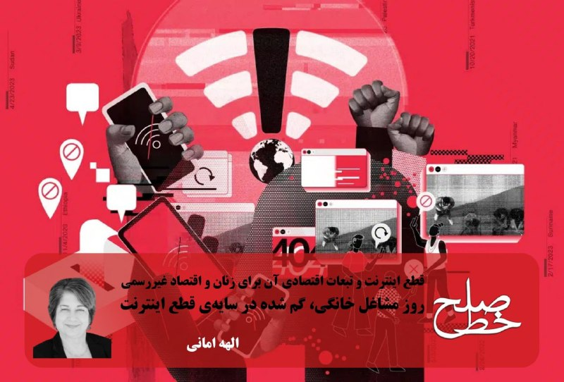

قطع اینترنت و تبعات اقتصادی آن برای زنان و اقتصاد غیررسمی/ الهه امانی

📡
📡
📡
📡
📡– این مقاله درباره‌ی عمق فاجعه‌بار جنگ، که شری مطلق است، نیست؛ درباره‌ی کودکان بی‌گناهی که جان خود را از دست دادند و هرگز به خانه بازنگشتند، نیست؛ درباره‌ی غیرنظامیانی در ایران و دیگر کشورهای منطقه که کشته شدند، نیست؛ درباره‌ی آثار تاریخیِ تخریب‌شده و زیرساخت‌های غیرنظامی که به ویرانه تبدیل شدند، نیست؛ هم‌چنین درباره‌ی میلیون‌ها انسانی که از خانه و کاشانه‌ی خود رانده شدند نیز نیست. این تراژدی‌ها انکارناپذیرند و هر یک نیازمند بررسی و پاسخ‌گویی جداگانه‌اند. این مقاله به بُعدی کم‌تر دیده‌شده، اما عمیقاً تاثیرگذار از جنگ می‌پردازد: قطع اینترنت و پیامدهای گسترده‌ی اقتصادی آن، به‌ویژه بر مشاغل خانگی که زنان اکثریت عظیم آن‌ها را تشکیل می‌دهند. روز ۲۲ اردیبهشت، که در ایران «روز مشاغل خانگی» نام‌گذاری شده است، در حالی فرا می‌رسد که بسیاری از این مشاغل، در پی قطع اینترنت، عملاً از چرخه‌ی درآمدزایی حذف شده‌اند.

به‌طور مشخص، این نوشتار بررسی می‌کند که چگونه اختلال و قطع طولانی‌مدت اینترنت به‌مثابه نوعی فلج اقتصادی و اجتماعی عمل می‌کند، نابرابری‌ها را تشدید کرده و ناامنی معیشتی را افزایش می‌دهد. پیامدهای این وضعیت برای گروه‌هایی که در حاشیه‌ی جامعه قرار دارند به‌مراتب شدیدتر است؛ از جمله کارگران اقتصاد غیررسمی، کسب‌وکارهای کوچک، و به‌ویژه زنانی که معیشتشان اغلب به دسترسی دیجیتال برای کسب درآمد، شبکه‌سازی و بقا وابسته است. با قطع ارتباط، مشاغل از بین می‌روند، بازارها فرو می‌پاشند و منابع شکننده‌ی استقلال اقتصادی از دست می‌رود؛ امری که بسیاری را به ورطه‌ی ناامنی اقتصادی و انزوای اجتماعی عمیق‌تری سوق می‌دهد.

این نخستین باری نیست که صاحبان قدرت در ایران اینترنت را برای شهروندان قطع می‌کنند. اما اکنون، در یکی از حساس‌ترین برهه‌های تاریخی ایران، محدودیت اعمال‌شده از سوی حکومت برای دسترسی به شبکه‌های جهانی از مرز ۱۰۰۰ ساعت گذشته است. قطع اینترنت برای شهروندان، که از ۲۸ فوریه ۲۰۲۶ آغاز شد، نه‌تنها از نظر گستره و مدت‌زمان، رکورد طولانی‌ترین و شدیدترین قطع سراسری اینترنت را ثبت کرده است، بلکه یکی از طولانی‌ترین محدودیت‌های اعمال‌شده برای دسترسی به اینترنت در سطح جهان نیز به‌شمار می‌رود. در خلال این مدت، حتی با وقفه‌های کوتاه آتش‌بس در این جنگ خانمان‌سوز، دسترسی به اینترنت برای اکثریت مردم ایران هم‌چنان قطع باقی مانده است؛ وضعیتی که به‌اصطلاح «اینترنت پادگانی» شناخته می‌شود.

#ماهنامه_خط_صلح
#زنان
#اینترنت

ادامه مطلب
لینک به مطلب در وبسایت خط صلح

↘️
@hranews_bot تماس ✉️ - @Hranews کانال هرانا 🆑

## Hranews — post 113044

  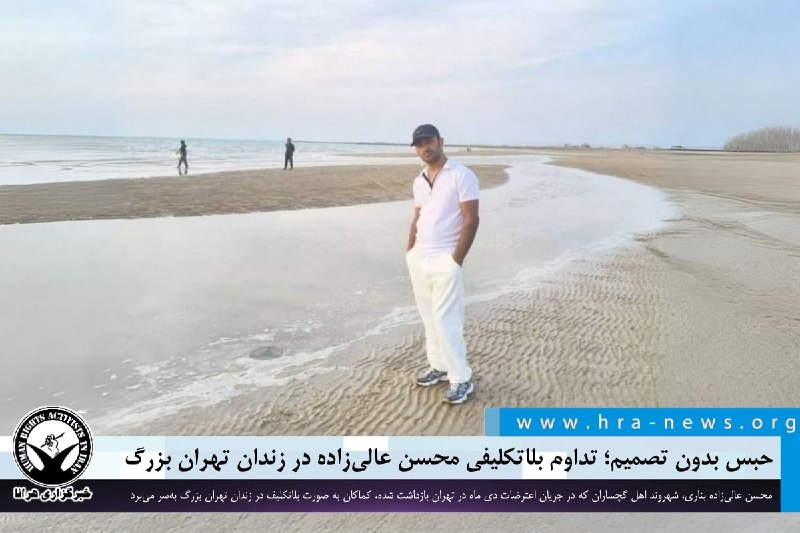

حبس بدون تصمیم؛ تداوم بلاتکلیفی محسن عالی‌زاده در زندان تهران بزرگ

❗️
❗️
❗️
❗️
❗️– محسن عالی‌زاده بناری، شهروند اهل گچساران که در جریان اعترضات دی ماه در تهران بازداشت شده، کماکان به صورت بلاتکلیف در زندان تهران بزرگ به‌سر می‌برد.

به گزارش خبرگزاری هرانا، ارگان خبری مجموعه فعالان حقوق بشر در ایران، محسن عالی‌زاده بناری کماکان در بازداشت به‌سر می‌برد.

یک منبع مطلع نزدیک به خانواده این شهروند، ضمن تایید این خبر به هرانا گفت: محسن عالی‌زاده بناری از زمان بازداشت به صورت بلاتکلیف در زندان تهران بزرگ نگهداری می شود و تاکنون رسیدگی نتیجه‌بخشی به پرونده قضایی آقای عالی‌زاده صورت نگرفته است.

ادامه مطلب

#محسن_عالی‌زاده_بناری

↘️
@hranews_bot تماس ✉️ - @Hranews کانال هرانا 🆑

## Hranews — post 113043

  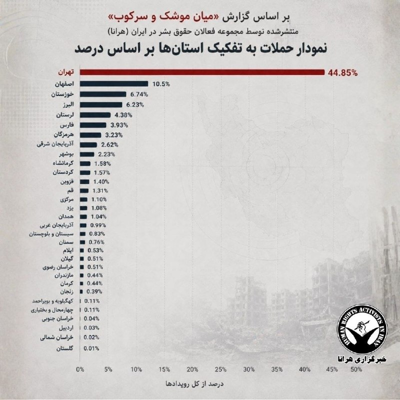

میان موشک و سرکوب؛ گزارش مجموعه فعالان حقوق بشر درباره مخاصمه نظامی ایالات متحده-اسرائیل و ایران منتشر شد 
💥
💥
💥
💥
💥 – امروز، مجموعه فعالان حقوق بشر در ایران گزارش جدیدی را در ۲۴۰ صفحه و دو زبان منتشر کرد که به بررسی کارزار نظامی ایالات متحده و اسرائیل در ایران…

## Hranews — post 113042

  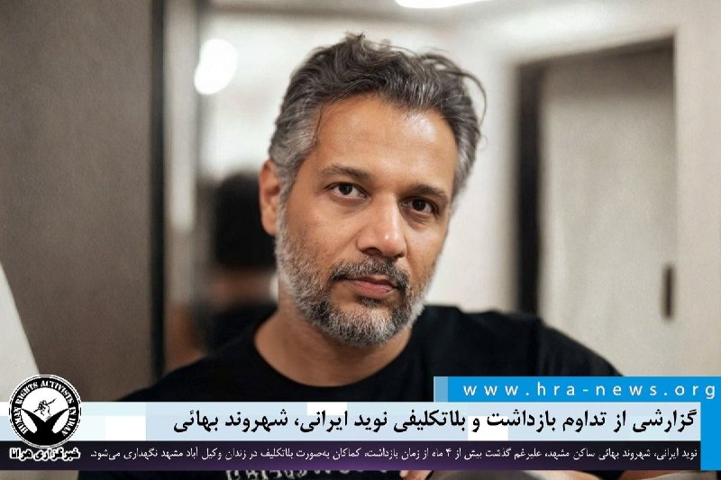

گزارشی از تداوم بازداشت و بلاتکلیفی نوید ایرانی، شهروند بهائی در زندان وکیل آباد

❗️
❗️
❗️
❗️
❗️– نوید ایرانی (زرین)، شهروند بهائی ساکن مشهد که در جریان اعتراضات ۱۴۰۴ در این شهر بازداشت شده است، علیرغم گذشت بیش از چهار ماه از زمان دستگیری، کماکان به‌صورت بلاتکلیف در زندان وکیل آباد مشهد محبوس است.

به گزارش خبرگزاری هرانا، ارگان خبری مجموعه فعالان حقوق بشر در ایران، #نوید_ایرانی همچنان در بازداشت است.

براساس اطلاعات دریافتی هرانا، آقای نوید ایرانی با وجود گذشت چهار ماه و چهار روز از زمان بازداشت، کماکان به صورت بلاتکلیف در زندان وکیل آباد مشهد به‌سر می‌برد.

ادامه مطلب

↘️
@hranews_bot تماس ✉️ - @Hranews کانال هرانا 🆑

## Hranews — post 113041

  

جرائم مواد مخدر؛ یک زندانی در زندان تربت حیدریه اعدام شد

❗️
❗️
❗️
❗️
❗️– سحرگاه روز شنبه ۲۶ اردیبهشت ماه، حکم یک زندانی که پیشتر از بابت اتهامات مرتبط با جرائم مواد مخدر به اعدام محکوم شده بود، در زندان تربت حیدریه به اجرا درآمد.

به گزارش خبرگزاری هرانا، ارگان خبری مجموعه فعالان حقوق بشر در ایران، حکم #اعدام یک زندانی در زندان تربت حیدریه اجرا شد.

هویت این زندانی که سحرگاه روز شنبه ۲۶ اردیبهشت ۱۴۰۵ به چوبه دار آویخته شد، ابراهیم فرهادی توپکانلو، ۴۸ساله، پدر سه فرزند و اهل سبزوار، توسط هرانا احراز شده است.

ادامه مطلب

#ابراهیم_فرهادی_توپکانلو

↘️
@hranews_bot تماس ✉️ - @Hranews کانال هرانا 🆑

## Hranews — post 113040

  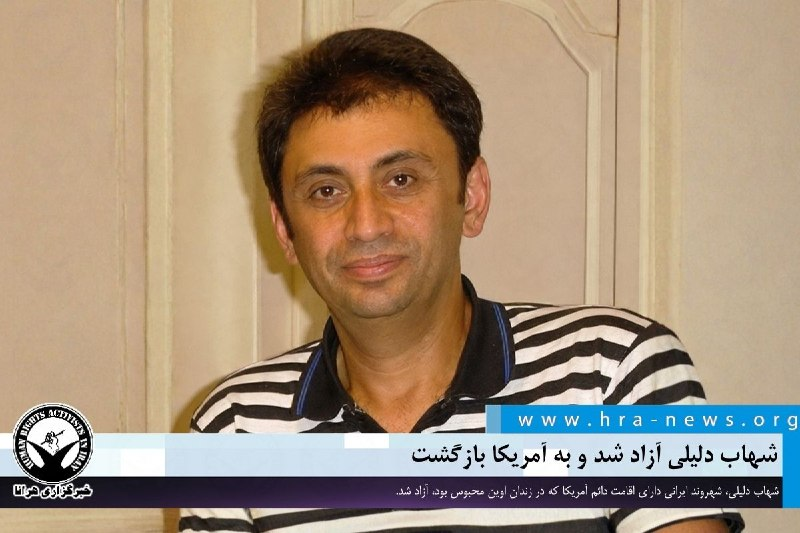

شهاب دلیلی آزاد شد و به آمریکا بازگشت

❗️
❗️
❗️
❗️
❗️– شهاب دلیلی، شهروند ایرانی دارای اقامت دائم آمریکا که در زندان اوین محبوس بود، پس از ۱۰ سال حبس، آزاد شد. وی پس از آزادی به آمریکا بازگشته است.

ادامه مطلب

#شهاب_دلیلی

↘️
@hranews_bot تماس ✉️ - @Hranews کانال هرانا 🆑

## Hranews — post 113039

  

در حالی‌که اینترنت در ایران طی هفته‌های اخیر با قطع و اختلال گسترده مواجه بوده، ایجاد یک ساختار جدید برای مدیریت فضای مجازی، ابهام‌ها درباره نحوه تصمیم‌گیری در این حوزه را افزایش داده است. روزنامه شرق با انتشار گزارشی اعلام کرده که «ستاد ساماندهی و راهبری فضای مجازی» در همین شرایط شکل گرفته، اما جزئیات دقیقی از نحوه فعالیت و حدود اختیارات آن منتشر نشده است. حتی به اعضای هیئت دولت نیز تاکید شده درباره این ستاد با رسانه‌ها گفت‌وگو نکنند. با این حال، بر اساس پیگیری‌های این روزنامه، ترکیب این ستاد شامل نهادهای دولتی، امنیتی و حاکمیتی از جمله دادستان کل کشور، نماینده‌ای از مجلس، وزارتخانه‌های ارشاد، ارتباطات، اطلاعات و علوم، معاونت علمی و فناوری ریاست‌جمهوری، دبیران شورای عالی فضای مجازی و شورای عالی امنیت ملی، اطلاعات سپاه و همچنین سه عضو از بخش خصوصی است.

به‌نوشته شرق، هم‌زمان با این سکوت و ابهام در اختیارات، شائبه شکل‌گیری یک مرکز تازه قدرت در سیاست‌گذاری اینترنت تقویت شده است. این روزنامه با اشاره به تعدد نهادهای فعال در حوزه فضای مجازی نوشت که برخی منتقدان، تشکیل این ستاد را نوعی موازی‌کاری و نشانه‌ای از ناکارآمدی ساختار فعلی می‌دانند؛ وضعیتی که در آن، به‌جای حل بحران، پیچیدگی تصمیم‌گیری افزایش یافته و همچنان این پرسش بی‌پاسخ مانده که مسئول نهایی اینترنت در ایران کدام نهاد است.
#قطع_اینترنت #فضای_مجازی

↘️
@hranews_bot تماس ✉️ - @Hranews کانال هرانا 🆑

## Hranews — post 113038

مصادره اموال ۵۲ شهروند در زنجان؛ ۷ نفر بازداشت شدند

❗️
❗️
❗️
❗️
❗️– مرکز رسانه قوه قضاییه از توقیف اموال ۵۲ شهروند در استان زنجان خبر داد. هفت تن از این افراد که در ایران سکونت دارند، #بازداشت شدند.

ادامه مطلب

#مصادره_اموال

↘️
@hranews_bot تماس ✉️ - @Hranews کانال هرانا 🆑

## Hranews — post 113037

یک کارگر معدن نگین طبس بر اثر گازگرفتگی جان‌ باخت

❗️
❗️
❗️
❗️
❗️– دبیر اجرایی خانه کارگر طبس اعلام کرد که یک #کارگر_معدن نگین واقع در منطقه معدنی پرورده این شهر، به دلیل کمبود تجهیزات مناسب کار بر اثر گازگرفتگی جان خود را از دست داده است.

ادامه مطلب

#جواد_پسرکلو

↘️
@hranews_bot تماس ✉️ - @Hranews کانال هرانا 🆑

## Hranews — post 113036

  

محروم از درمان؛ گزارشی از آخرین وضعیت یاشار تبریزی در زندان تبریز

❗️
❗️
❗️
❗️
❗️– یاشار تبریزی، فعال مدنی محبوس در زندان تبریز، با وجود ابتلا به عفونت چشم و بیماری قلبی، از دسترسی به رسیدگی پزشکی تخصصی و اعزام به مراکز درمانی خارج از زندان محروم مانده است. وی در حال سپری کردن دوران محکومیت هفت ماه حبس خود در این زندان است.

به گزارش خبرگزاری هرانا، ارگان خبری مجموعه فعالان حقوق بشر در ایران، #یاشار_تبریزی، با وجود داشتن مشکلات جسمی از رسیدگی پزشکی مناسب محروم مانده است.

یک منبع مطلع و نزدیک به خانواده آقای تبریزی با تأیید این خبر به هرانا گفت: در زمان بازداشت، ضربه‌ای به چشم چپ آقای تبریزی وارد شده که منجر به عفونت شده است. با وجود نیاز به رسیدگی تخصصی، وی تاکنون به بیمارستانی خارج از زندان اعزام نشده و صرفاً خدمات محدود بهداری زندان را دریافت می‌کند. او همچنین از بیماری‌های قلبی رنج می‌برد و از این نظر نیز در وضعیت جسمانی نامساعدی قرار دارد.

ادامه مطلب

↘️
@hranews_bot تماس ✉️ - @Hranews کانال هرانا 🆑

## Hranews — post 113035

دستکم ۹ روزنامه‌نگار در ایران زندانی هستند

❗️
❗️
❗️
❗️
❗️– فدراسیون بین‌المللی روزنامه‌نگاران در تازه‌ترین گزارش خود اعلام کرد که دست‌کم ۹ روزنامه‌نگار در ایران به نام های رضا ولی‌زاده، محمد پارسی، آرتین غضنفری، سمیه حیدری، پدرام علمداری، کیانوش درویشی، مسلم زارعی، امیرحسین رضایی و حامد تیزرویان، در زندان به‌سر می‌برند. این نهاد همچنین به تداوم محدودیت‌ها علیه فعالان رسانه‌ای در کشور اشاره کرده است.

ادامه مطلب

#رضا_ولی‌زاده #محمد_پارسی #آرتین_غضنفری
#سمیه_حیدری #پدرام_علمداری #کیانوش_درویشی
#مسلم_زارعی #امیرحسین_رضایی #حامد_تیزرویان

↘️
@hranews_bot تماس ✉️ - @Hranews کانال هرانا 🆑

## manototv — post 105652

  <a href="telegram/content/manototv_105652_1779215193.mp4" target="_blank">🎬 Download video</a>

ولادیمیر پوتین، رئیس‌جمهوری روسیه، برای دیدار با شی جین‌پینگ وارد چین شد؛ سفری که کمتر از یک هفته پس از سفر دونالد ترامپ به پکن انجام می‌شود و توجه زیادی را به خود جلب کرده است.
کرملین اعلام کرده پوتین و شی در این سفر درباره همکاری‌های اقتصادی، مسائل منطقه‌ای و روابط بین‌المللی گفت‌وگو خواهند کرد. این سفر همزمان با بیست‌وپنجمین سالگرد پیمان دوستی چین و روسیه برگزار می‌شود.
چین که پس از جنگ اوکراین به مهم‌ترین شریک تجاری روسیه تبدیل شده، تلاش می‌کند هم روابط نزدیک خود با مسکو را حفظ کند و هم روابط باثباتی با آمریکا داشته باشد.
مقام‌های روسی گفته‌اند صادرات نفت روسیه به چین در سه‌ماهه نخست ۲۰۲۶ افزایش یافته و دو کشور در حوزه انرژی به توافق‌های مهمی نزدیک شده‌اند. پوتین نیز روابط مسکو و پکن را عاملی برای «ثبات و بازدارندگی» در جهان توصیف کرده است.

## manototv — post 105650

  <a href="telegram/content/manototv_105650_1779215194.mp4" target="_blank">🎬 Download video</a>

رسانه‌های حکومتی با انتشار این تصویر از دیدار و تبادل نظر کاظم غریب‌آبادی، معاون وزارت خارجه با زونگ‌‌پی‌وو سفیر چین در تهران خبر داده‌اند. این دیدار پس از انتصاب قالیباف به عنوان «نماینده ویژه جمهوری‌اسلامی در امور چین» صورت گرفته است.

## manototv — post 105649

  <a href="telegram/content/manototv_105649_1779215194.mp4" target="_blank">🎬 Download video</a>

یک مقام وزارت دفاع آمریکا احتمال اعزام نیروی زمینی این کشور به ایران را رد نکرد.
در جلسه‌ای در واشنگتن، از دنیل زیمرمن، معاون وزیر دفاع آمریکا در امور امنیت بین‌الملل، درباره گزینه‌های پیش‌روی دونالد ترامپ پس از اظهارات اخیر او درباره وارد کردن «ضربه‌ای بزرگ دیگر به ایران» سؤال شد.
زیمرمن در پاسخ به این پرسش که آیا می‌تواند اعزام نیروهای آمریکایی به خاورمیانه را رد کند، گفت: «رئیس‌جمهور همه گزینه‌های لازم را در اختیار دارد.» او در پاسخ به تکرار این سؤال نیز بار دیگر تاکید کرد: «رئیس‌جمهور گزینه‌هایی را که نیاز دارد حفظ می‌کند.»
در ادامه جلسه، برخی حاضران از ارائه نشدن پاسخ صریح انتقاد کرده و آن را «مایه تاسف» توصیف کردند.

## manototv — post 105648

  <a href="telegram/content/manototv_105648_1779215195.mp4" target="_blank">🎬 Download video</a>

‌
ژنرال برد کوپر، فرمانده ستاد فرماندهی مرکزی آمریکا، سنتکام، به کنگره گفت مدرسه میناب که در جریان جنگ هدف قرار گرفت، «در یک پایگاه فعال موشک‌های کروز» قرار داشت.

او گفت تحقیقات ارتش آمریکا درباره انفجار در این مدرسه «پیچیده» است، زیرا این مرکز در یک سایت فعال موشکی جمهوری اسلامی واقع شده بود.

رویترز پیش‌تر گزارش داده بود تحقیقات اولیه داخلی ارتش آمریکا نشان می‌دهد نیروهای آمریکایی «احتمالاً» مسئول تخریب مدرسه دخترانه‌ای در میناب بوده‌اند؛ موضوعی که پنتاگون بعداً سطح بررسی آن را ارتقا داد.

در این حادثه که در نخستین روز درگیری‌ها ۹ اسفند ۱۴۰۴ رخ داد، ۱۶۸ کودک که بیشتر آن‌ها دختر بودند، کشته شدند.

## manototv — post 105647

  <a href="telegram/content/manototv_105647_1779215195.mp4" target="_blank">🎬 Download video</a>

وزارت خزانه‌داری آمریکا اعلام کرد در چارچوب کارزار «خشم اقتصادی»، صرافی «امین اکسچنج» و شبکه‌ای از افراد، شرکت‌ها و نفتکش‌های مرتبط با جمهوری اسلامی را تحریم کرده است.

بر اساس بیانیه وزارت خزانه‌داری آمریکا، صرافی «امین اکسچنج» که با نام رسمی «ابراهیمی و همکاران» شناخته می‌شود، صدها میلیون دلار تراکنش مالی را برای نهادها و بانک‌های تحریم‌شده جمهوری اسلامی انجام داده است.

در این بیانیه از یوسف ابراهیمی، مالک و گرداننده این صرافی، سماد نعمتی، مدیرعامل فعلی و عضو پیشین سپاه پاسداران، علی حضرتی چاخِرلو، عضو هیات‌مدیره، و محمود ابراهیمی، برادر یوسف ابراهیمی، به‌عنوان افراد تحریم‌شده نام برده شده است.

وزارت خزانه‌داری آمریکا همچنین اعلام کرد این صرافی با شرکت ملی نفت ایران، شرکت بازرگانی صنایع پتروشیمی خلیج فارس و شرکت تریلیَنس پتروشیمی همکاری داشته و از شبکه‌ای از شرکت‌های پوششی در امارات، ترکیه و هنگ‌کنگ برای دور زدن تحریم‌ها استفاده کرده است.

## manototv — post 105646

  <a href="telegram/content/manototv_105646_1779215196.mp4" target="_blank">🎬 Download video</a>

«از رشید مظاهری حمایت کنید»

## manototv — post 105643

  <a href="telegram/content/manototv_105643_1779215197.mp4" target="_blank">🎬 Download video</a>

خبرگزاری‌های حکومتی تصاویری از مراسم ازدواج گروهی سازماندهی شده توسط سپاه محمد رسول‌الله تهران بزرگ منتشر کرده‌اند که عروس و دامادهای این مراسم حکومتی، «زوج‌های جان‌فدا» معرفی شده‌اند. این ۵۰۰ زوج با خودروهای نظامی گل‌آرایی شده، بادکنک‌های صورتی، سلاح‌های سنگین و تصاویر رهبر مشاهده نشده جمهوری‌اسلامی، مجتبی خامنه‌ای در میادین اصلی پایتخت حاضر شده‌اند.

## manototv — post 105642

  <a href="telegram/content/manototv_105642_1779215197.mp4" target="_blank">🎬 Download video</a>

دونالد ترامپ، رئیس‌جمهوری آمریکا، بار دیگر تاکید کرد جمهوری اسلامی نباید به سلاح هسته‌ای دست پیدا کند و هشدار داد در صورت شکست مذاکرات، واشینگتن ممکن است «ضربه سنگین دیگری» به تهران وارد کند.

ترامپ گفت جمهوری اسلامی تحت فشار شدید قرار دارد و «برای رسیدن به توافق التماس می‌کند»، اما در عین حال دموکرات‌ها را متهم کرد که تلاش می‌کنند روند مذاکرات را متوقف کنند.

او افزود: «امیدوارم مجبور نباشیم آن کار را انجام دهیم، اما ممکن است ناچار شویم ضربه بزرگ دیگری به آن‌ها بزنیم. خیلی زود خواهید فهمید.»

رئیس‌جمهوری آمریکا همچنین گفت ایالات متحده تا یک ساعت مانده به آغاز حمله‌ای گسترده علیه جمهوری اسلامی پیش رفته بود و «همه‌چیز برای آغاز عملیات آماده شده بود.»

ترامپ در ادامه جمهوری اسلامی را «قلدر خاورمیانه» توصیف کرد و بار دیگر از خروج آمریکا از توافق هسته‌ای دوران باراک اوباما دفاع کرد.

## manototv — post 105641

  <a href="telegram/content/manototv_105641_1779215199.mp4" target="_blank">🎬 Download video</a>

وزارت دفاع امارات متحده عربی اعلام کرد سامانه‌های پدافند هوایی این کشور طی ۴۸ ساعت گذشته شش پهپاد «متخاصم» را که قصد هدف قرار دادن مناطق غیرنظامی و تاسیسات حیاتی امارات را داشتند، رهگیری و منهدم کرده‌اند.

در بیانیه وزارت دفاع امارات آمده است نیروهای پدافند هوایی این کشور با «بالاترین سطح آمادگی و کارایی» موفق به رهگیری این اهداف شده‌اند و این حملات هیچ تلفات انسانی یا آسیبی به تاسیسات حیاتی بر جای نگذاشته است.

وزارت دفاع امارات همچنین اعلام کرد تحقیقات درباره حمله به نیروگاه هسته‌ای براکه در ۱۷ مه ۲۰۲۶ نشان داده سه پهپادی که در آن حمله استفاده شدند، به همراه پهپادهایی که بعداً رهگیری شدند، همگی از خاک عراق وارد شده بودند.

بر اساس این بیانیه، دو پهپاد در جریان حمله اولیه رهگیری شدند، اما پهپاد سوم به یک ژنراتور برق خارجی در خارج از محدوده داخلی نیروگاه اصابت کرد.

وزارت دفاع امارات تاکید کرد این کشور «حق کامل» دارد مطابق قوانین و معاهدات بین‌المللی، تمامی اقدامات لازم را برای حفاظت از حاکمیت و امنیت ملی خود انجام دهد.

این وزارتخانه همچنین اعلام کرد نیروهای مسلح امارات برای مقابله با هرگونه تهدید علیه امنیت و توانمندی‌های ملی کشور «در آمادگی کامل» قرار دارند.

## manototv — post 105640

  <a href="telegram/content/manototv_105640_1779215200.mp4" target="_blank">🎬 Download video</a>

سازمان جهانی بهداشت شیوع ابولا در جمهوری دموکراتیک کنگو و اوگاندا را وضعیت اضطراری بهداشت عمومی با اهمیت بین‌المللی اعلام کرده است. تاکنون ده‌ها مورد مشکوک و چندین مورد مرگ ثبت شده و برخی مبتلایان از کنگو به اوگاندا سفر کرده‌اند.
سازمان جهانی بهداشت این وضعیت را به دلیل گسترش فرامرزی، افزایش سریع موارد، مرگ کادر درمان و ضعف زیرساخت‌های بهداشتی اضطراری اعلام کرده است.
در واکنش به شیوع، برخی کشورها از جمله آمریکا محدودیت‌های سفر اعمال کرده و تیم‌های بین‌المللی برای کنترل بیماری به منطقه اعزام شده‌اند.
مقامات تاکید کرده‌اند خطر برای عموم مردم خارج از مناطق درگیر پایین است، اما بیماری از طریق تماس مستقیم با مایعات بدن افراد مبتلا منتقل می‌شود و می‌تواند کشنده باشد. علائم بیماری شامل تب ناگهانی، خستگی شدید، درد عضلانی، اسهال، استفراغ و در موارد شدید خونریزی است.

## manototv — post 105639

  <a href="telegram/content/manototv_105639_1779215200.mp4" target="_blank">🎬 Download video</a>

به‌دنبال وزش باد شدید و خیزش گرد و خاک، کیفیت هوای تهران در شرایط ناسالم و قرمز قرار گرفت و به همه شهروندان توصیه شده از تردد غیرضروری در فضای باز خودداری کنند. اداره کل هواشناسی استان تهران نیز اعلام کرده است که طی ۲۴ ساعت آینده وزش باد و گرد و خاک در سطح استان ادامه خواهد داشت.

## manototv — post 105638

  <a href="telegram/content/manototv_105638_1779215201.mp4" target="_blank">🎬 Download video</a>

انفجاری در حاشیه شرقی دمشق و در نزدیکی مرکز مدیریت تسلیحات وابسته به وزارت دفاع سوریه در منطقه باب الشرقی رخ داد. این حادثه به‌گفته منابع محلی ناشی از انفجار یک خودروی بمب‌گذاری‌شده یا یک بمب کارگذاشته‌شده در خودرو بوده است. برخی گزارش‌ها نیز حاکی از آن است که نیروهای امنیتی خودرو را مشکوک تشخیص داده و در جریان اقدام برای کنترل آن، انفجار زودتر از موعد رخ داده یا یک بمب دیگر نیز در نزدیکی محل خنثی شده است. در این انفجار یک افسر نیروهای امنیت داخلی کشته و چهار نفر دیگر از نیروهای امنیتی و نظامی زخمی شدند. پس از حادثه، مسیرهای اطراف بسته شد، نیروهای امدادی و آمبولانس‌ها در محل حاضر شدند و نیروهای امنیتی منطقه را محاصره کرده و تحقیقات جنایی و فنی آغاز شد. این سومین یا چهارمین مورد از انفجارها و حملات مشابه در دمشق و حومه در طول ماه جاری است و تاکنون هیچ گروهی مسئولیت این حمله را بر عهده نگرفته است.

## manototv — post 105637

  <a href="telegram/content/manototv_105637_1779215201.mp4" target="_blank">🎬 Download video</a>

فرماندهی مرکزی ارتش آمریکا اعلام کرد نیروهای این کشور هم‌زمان با عبور ناو هواپیمابر آبراهام لینکلن از دریای عرب، ۸۸ کشتی تجاری را تغییر مسیر داده و چهار کشتی دیگر را برای «اطمینان از رعایت کامل» مقررات عملیاتی از کار انداخته‌اند.

بر اساس متن منتشرشده از سوی سنتکام، یک ملوان نیروی دریایی آمریکا روز دوشنبه ۲۸ اردیبهشت هنگام عبور ناو آبراهام لینکلن از دریای عرب، در حال دیده‌بانی روی عرشه این ناو دیده می‌شود.

## manototv — post 105636

  <a href="telegram/content/manototv_105636_1779215202.mp4" target="_blank">🎬 Download video</a>

استونی اعلام کرد یک جنگنده ناتو یک پهپاد مشکوک را در حریم هوایی این کشور سرنگون کرده است. این پهپاد از سمت روسیه وارد آسمان استونی شده بود و با یک موشک توسط یک جنگنده رومانیایی ناتو هدف قرار گرفت. همزمان لتونی هم هشدار هوایی صادر کرد و اعلام شد یک پهپاد وارد حریم هوایی این کشور شده و باعث شد در برخی مناطق مرزی قطارها و امتحانات مدارس متوقف و فروشگاه‌ها بسته شوند. استونی و لتونی روسیه را به اختلال در جی پی اس و جنگ الکترونیک متهم کرده و این رخدادها را مرتبط با جنگ اوکراین می‌دانند. ناتو تایید کرده که جنگنده عضو این پیمان این پهپاد را ساقط کرده و اعلام کرده تحقیقات درباره این حادثه ادامه دارد. هنوز مشخص نیست پهپادی که وارد لتونی و استونی شده یکی بوده یا چند پهپاد جدا و در روزهای اخیر چند کشور منطقه نیز موارد مشابه مشاهده کرده‌اند و این موضوع نگرانی‌ها درباره گسترش جنگ به کشورهای همسایه روسیه را افزایش داده است.

## manototv — post 105635

  <a href="telegram/content/manototv_105635_1779215202.mp4" target="_blank">🎬 Download video</a>

خبرگزاری رویترز گزارش داد پالایشگاه‌های دولتی چین از زمان آغاز جنگ ایران، تولید خود را بیش از یک میلیون بشکه در روز کاهش داده‌اند.
بر اساس این گزارش، اختلال در تامین نفت خاورمیانه و کاهش سودآوری پالایشگاه‌ها باعث شده شرکت‌های بزرگ نفتی چین از جمله سینوپک و پتروچاینا ظرفیت پالایش خود را کاهش دهند.
داده‌ها نشان می‌دهد میزان پالایش نفت خام در چین از حدود ۱۰ میلیون بشکه در روز پیش از حملات آمریکا و اسرائیل به ایران، به حدود ۸.۴ میلیون بشکه در ماه مه رسیده است.
رویترز همچنین گزارش داد افزایش قیمت نفت و کاهش تقاضا برای سوخت، حاشیه سود پالایشگاه‌های چینی را به‌شدت کاهش داده و همزمان محدودیت‌های دولت چین بر صادرات سوخت، باعث افزایش ذخایر داخلی بنزین و گازوئیل شده است.

## manototv — post 105634

  <a href="telegram/content/manototv_105634_1779215202.mp4" target="_blank">🎬 Download video</a>

ولی‌الله حیاتی، معاون امنیتی استانداری خوزستان، بعدازظهر سه‌شنبه ۲۹ اردیبهشت گفت سقوط یک «پرتابه» یا «شی ناشناس» در یک منطقه مسکونی اندیمشک چهار مصدوم بر جا گذاشت.

به گزارش ایرنا، این مقام محلی گفت این حادثه به یک باب مغازه و دو خودرو خسارت وارد کرده و بازتاب گسترده‌ای در شبکه‌های اجتماعی این شهرستان داشته است.

حیاتی در توضیح جداگانه‌ای درباره صداهای شنیده‌شده در آسمان اندیمشک گفت: «صدای شلیک‌های اخیر در آسمان اندیمشک به دلیل تست پدافند هوایی است، لذا مردم نگران نباشند.»

با این حال رسانه‌های داخلی و مقام‌های جمهوری اسلامی هنوز توضیحی درباره ماهیت «شی ناشناس» یا «پرتابه» سقوط‌کرده ارائه نکرده‌اند و مشخص نیست این حادثه ارتباطی با تست پدافند هوایی داشته است یا نه.

## manototv — post 105633

  <a href="telegram/content/manototv_105633_1779215203.mp4" target="_blank">🎬 Download video</a>

سخنگوی وزارت خارجه قطر اعلام کرد دوحه همچنان با واشنگتن و تهران در تماس است و این رایزنی‌ها ادامه خواهد داشت.
ماجد الانصاری، در واکنش به تصمیم دونالد ترامپ برای تعویق حمله برنامه‌ریزی‌شده به ایران به درخواست قطر، عربستان سعودی و امارات، گفت این اقدام «نشانه پاسخ مثبت» بوده است.
او همچنین با اشاره به مذاکرات میان آمریکا و جمهوری‌اسلامی گفت قطر از تلاش‌های دیپلماتیک پاکستان برای نزدیک کردن طرف‌ها و یافتن راه‌حل حمایت می‌کند و این روند «به زمان بیشتری نیاز دارد».
الانصاری درباره روابط دوحه و تهران گفت قطر همچنان روابط مثبتی با جمهوری‌اسلامی دارد، اما در عین حال افزود حمله جمهوری‌اسلامی به قطر «تهدیدی برای روابط دو کشور» به شمار می‌رود

## manototv — post 105632

  <a href="telegram/content/manototv_105632_1779215203.mp4" target="_blank">🎬 Download video</a>

«صدای رشید مظاهری باشید»

## alonews — post 121165

  <a href="telegram/content/alonews_121165_1779215204.mp4" target="_blank">🎬 Download video</a>

👈جی‌دی ونس : هر وقت حمله پهپادی یا موشکی به هر جایی بخوره، مخصوصاً به مناطق غیرنظامی
- اصلاً چیزی نیست که خوشمون بیاد ببینیم
- ولی خب تو آتش‌بس‌ها این چیزا بعضی وقتا پیش میاد و همیشه همه‌چی کامل و بی‌نقص نیست؛ تو غزه هم دیدیم.

✅ @AloNews خبر جنگ

## alonews — post 121163

  <a href="telegram/content/alonews_121163_1779215206.webm" target="_blank">🎬 Download video</a>

👈ونس: «چرا به اسلام‌آباد، پاکستان رفتم؟ چرا احتمالاً ۲۲ ساعت در هواپیما برای رفتن سپری کردم، ۲۴ ساعت برای برگشتن، و ۲۱ ساعت در آنجا با ایرانی‌ها مذاکره کردم؟ به این دلیل بود که ما می‌خواستیم نشانه‌ای از حسن‌نیت نشان دهیم. رئیس‌جمهور حاضر است توافق کند، تا زمانی که ایرانی‌ها حاضر باشند دوباره در آن مسئله اصلی یعنی هرگز نداشتن سلاح هسته‌ای، به سمت ما بیایند.

🔴بنابراین، ما در وضعیت بسیار خوبی هستیم، اما یک گزینه B هم وجود دارد، و آن گزینه B این است که بتوانیم کارزار نظامی را از سر بگیریم تا پرونده را ادامه دهیم.»

✅ @AloNews خبر جنگ

## alonews — post 121162

  <a href="telegram/content/alonews_121162_1779215206.webm" target="_blank">🎬 Download video</a>

👈فرمانده سنتکام:
بررسی بمباران مدرسه میناب پیچیده‌ست، چون این مدرسه در محل یک پایگاه فعال موشک‌های کروز در ایران قرار داشته.

✅ @AloNews خبر جنگ

## alonews — post 121161

  <a href="telegram/content/alonews_121161_1779215206.webm" target="_blank">🎬 Download video</a>

👈ادعای جی‌دی ونس درباره ایران: تحویل ذخایر اورانیوم غنی‌شده ایران به روسیه، در حال حاضر برنامه ما نیست. هیچ‌وقت برنامه ما نبوده است. 
🔴نمی‌دانم این گزارش‌ها از کجا می‌آید. 
✅ @AloNews خبر جنگ

## alonews — post 121160

  <a href="telegram/content/alonews_121160_1779215207.webm" target="_blank">🎬 Download video</a>

👈ادعای جی‌دی ونس درباره ایران:
تحویل ذخایر اورانیوم غنی‌شده ایران به روسیه، در حال حاضر برنامه ما نیست. هیچ‌وقت برنامه ما نبوده است.

🔴نمی‌دانم این گزارش‌ها از کجا می‌آید.

✅ @AloNews خبر جنگ

## alonews — post 121159

  <a href="telegram/content/alonews_121159_1779215207.mp4" target="_blank">🎬 Download video</a>

👈جی‌دی ونس : تو مذاکره با ایران پیشرفت زیادی داشتیم
- اما هر زمان که بخوایم میتونیم کمپین نظامی رو مجدد شروع کنیم

✅ @AloNews خبر جنگ

## alonews — post 121158

  <a href="telegram/content/alonews_121158_1779215208.mp4" target="_blank">🎬 Download video</a>

👈خبرنگار: شما شخصاً فکر می‌کنید ایران به توافق می‌رسه؟

جی‌دی ونس :
- از کجا می‌تونم با قطعیت بدونم؟ فکر می‌کنم ایران‌ها می‌خوان به توافق برسن.
- خودشون هم می‌دونن که سلاح هسته‌ای خط قرمز آمریکاست. ولی تا وقتی توافق رو امضا نکنیم، هیچ چیز قطعی نیست.
- پیش‌نویس‌های زیادی هم داشته‌ایم، اما تا وقتی رسماً توافق نهایی امضا نشه، نمی‌تونم با اطمینان بگم به نتیجه می‌رسیم.

✅ @AloNews خبر جنگ

## alonews — post 121157

  <a href="telegram/content/alonews_121157_1779215210.mp4" target="_blank">🎬 Download video</a>

👈جی دی ونس در مورد ایران:
گاهی کاملا مشخص نیست که موضع مذاکره تیم ایران چیست.

🔴گاهی اوقات سخت است که دقیقا بفهمیم ایرانی ها می خواهند از مذاکرات چه کاری انجام دهند.‌‌

✅ @AloNews خبر جنگ

## alonews — post 121156

  <a href="telegram/content/alonews_121156_1779215211.mp4" target="_blank">🎬 Download video</a>

👈جی دی ونس در مورد ایران:
ایران یک کشور بسیار پیچیده است. این کشوری است که من وانمود نمی کنم که می فهمم...

🔴این یک تمدن بزرگ و افتخارآمیز است.‌‌

✅ @AloNews خبر جنگ

## alonews — post 121155

  <a href="telegram/content/alonews_121155_1779215213.mp4" target="_blank">🎬 Download video</a>

👈جی‌دی ونس درباره ایران:
«فکر می‌کنم ما در اینجا یک فرصت داریم تا رابطه‌ای که به مدت ۴۷ سال بین ایران و ایالات متحده وجود داشته است، از نو تعریف کنیم.

🔴این همان چیزی است که رئیس‌جمهور از ما خواسته است، و ما به کار روی آن ادامه خواهیم داد، اما برای یک رابطه دو طرفه، دو طرف لازم هستند (رقص تانگو دو نفر می‌خواهد). ما هیچ توافقی را که به ایرانی‌ها اجازه دهد سلاح هسته‌ای داشته باشند، نخواهیم پذیرفت.

🔴بنابراین، همانطور که رئیس‌جمهور همین الان به من گفت، ما در حالت آماده‌باش هستیم. ما نمی‌خواهیم وارد آن مسیر شویم، اما رئیس‌جمهور اراده و توانایی آن را دارد که در صورت لزوم وارد آن مسیر شود.»

✅ @AloNews خبر جنگ

## alonews — post 121154

  <a href="telegram/content/alonews_121154_1779215215.webm" target="_blank">🎬 Download video</a>

👈شبکه کان اسرائیل:
ایران ممکنه حملات پیش دستانه کنه

✅ @AloNews خبر جنگ

## alonews — post 121153

  <a href="telegram/content/alonews_121153_1779215215.mp4" target="_blank">🎬 Download video</a>

👈کارشناس شبکه ۱۴ اسرائیل : تقربیاً حوثی‌ها شش ماهه که از ایرانی‌ها پولی دریافت نکردن

✅ @AloNews خبر جنگ

## alonews — post 121152

  

🌟 اشتراک v2ray استارلینک

🗯گیگی 150,000 تومان

🔗لینک ساب برا چک کردن مصرف و حجمتون

🔥سرعت و کیفیت بالا

✅ پشتیبانی دائم

📱جهت خرید پیام بدین : @v2safeBot

## alonews — post 121150

  <a href="telegram/content/alonews_121150_1779215217.webm" target="_blank">🎬 Download video</a>

👈یاشار سلطانی، روزنامه‌نگار:
درحالی که هرشب تو تجمعات حکومتی شعار "بی‌حجاب هم خواهر ماست" میدن و خانم‌ها با پوشش آزاد میگردن، دیشب هتل تاریخی|سنتی عامری‌ها تو کاشان رو به دلیل "حجاب" پلمپ کردن و 90 نفر پرسنل اونجا هم بیکار شدن.

🔴حالتون از این همه تناقض و دورویی به هم نمیخوره؟

✅ @AloNews خبر جنگ

## alonews — post 121149

  <a href="telegram/content/alonews_121149_1779215217.webm" target="_blank">🎬 Download video</a>

👈نتانیاهو باز هم به دلایل امنیتی درخواست کرده است که فردا در دادگاهش برگزار نشود!

✅ @AloNews خبر جنگ

## alonews — post 121148

  <a href="telegram/content/alonews_121148_1779215217.webm" target="_blank">🎬 Download video</a>

👈فرمانده سنتکام، دریادار کوپر :
- ایران از وقتی آتش‌بس شروع شده، ده‌ها نفر رو اعدام کرده

✅ @AloNews خبر جنگ

## alonews — post 121147

  <a href="telegram/content/alonews_121147_1779215217.webm" target="_blank">🎬 Download video</a>

👈کانال ۱۲ اسرائیل: یک افسر ارتش اسرائیل در جنوب لبنان کشته شد

✅ @AloNews خبر جنگ

## alonews — post 121146

  <a href="telegram/content/alonews_121146_1779215217.webm" target="_blank">🎬 Download video</a>

👈زاکانی: تا زمان رسیدگی و نتیجه نهایی طرح رایگان بودن وسایل نقلیه، خدمات به منوال قبل است

✅ @AloNews خبر جنگ

## alonews — post 121145

  <a href="telegram/content/alonews_121145_1779215218.webm" target="_blank">🎬 Download video</a>

👈اسرائیل هیوم: نتانیاهو به دلایل امنیتی درخواست کرده است که فردا در دادگاهش برگزار نشود

✅ @AloNews خبر جنگ

<!-- MSG END -->

<!-- NAV START -->

<a href="https://github.com/nayebireza5-del/aiohghjbbbvm/blob/main/telegram/content/archive_1.md" style="display:inline-block; padding:6px 12px; margin:0 4px; background-color:#2ea44f; color:white; text-decoration:none; border-radius:4px; font-weight:bold;">صفحه بعد</a>

<!-- NAV END -->
