# خواننده تلگرام

<!-- TOP_NAV START -->

<a href="https://github.com/nayebireza5-del/aiohghjbbbvm/blob/main/telegram/content/archive_1.md" style="display:inline-block; padding:6px 12px; margin:0 4px; background-color:#2ea44f; color:white; text-decoration:none; border-radius:4px; font-weight:bold;">صفحه بعد</a>

<!-- TOP_NAV END -->

<!-- MSG START -->

---
📅 بروزرسانی: 1405/03/06 23:28
---

## VahidOOnLine — post 242479

  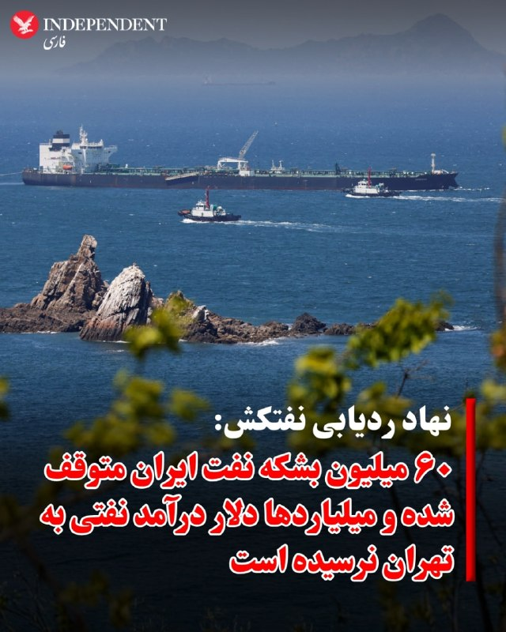

♦️تانکرترکرز، نهاد ردیابی نفتکش‌ها در تازه‌ترین گزارش خود اعلام کرد در پی محاصره دریایی آمریکا، نزدیک به ۶۰ میلیون بشکه نفت خام ایران در دریا متوقف شده و حدود شش میلیارد دلار درآمد نفتی فعلا به تهران نرسیده است.
بر اساس اطلاعات منتشرشده از سوی این مجموعه، کاهش صادرات نفت ایران در هفته‌های اخیر باعث شده بخش قابل توجهی از نفت خام ایران روی نفتکش‌ها باقی بماند و امکان انتقال یا فروش آن با دشواری روبه‌رو شود. تانکرترکرز همچنین اعلام کرده هنوز تعداد زیادی نفتکش خالی برای بارگیری وجود دارد، اما همزمان با کاهش تولید نفت، میزان بارگیری نفتکش‌ها نیز افت کرده است.
گزارش‌های منتشرشده در رسانه‌های بین‌المللی و داده‌های رهگیری دریایی نشان می‌دهد بخشی از نفتکش‌های ایرانی همچنان تلاش می‌کنند با خاموش کردن سیستم‌های رهگیری یا انتقال محموله‌ها در دریا، محدودیت‌ها را دور بزنند. با این حال، ارزیابی‌ها حاکی از آن است که فشار بر صادرات نفت ایران در مقایسه با ماه‌های گذشته افزایش یافته است.
‌🇸🇦 Indypersian

🤖 @VahidOOnLine

## VahidOOnLine — post 242478

  <a href="telegram/content/VahidOOnLine_242478_1779911928.mp4" target="_blank">🎬 Download video</a>

♦️رویترز روز چهارشنبه ششم خرداد گزارش داد نیروهای امدادی در لائوس، کشوری در جنوب‌شرق آسیا، پنج نفر را که حدود یک هفته در غاری در استان زایسامبون گرفتار شده بودند، زنده پیدا کردند و عملیات جستجو برای یافتن دو نفر دیگر همچنان ادامه دارد.

بر اساس گزارش رسانه‌های دولتی لائوس، این هفت نفر هفته گذشته برای جستجوی طلا وارد غار شده بودند، اما بارندگی شدید و رانش زمین راه خروج آن‌ها را مسدود کرد.

ده‌ها امدادگر از لائوس و تایلند در عملیات نجات مشارکت دارند. یک گروه داوطلب تایلندی نیز از روز یکشنبه به این عملیات پیوسته است.
‌🇸🇦 Indypersian

🤖 @VahidOOnLine

## VahidOOnLine — post 242477

  

تانکر ترکرز در شبکه ایکس اعلام کرد در پی محاصره دریایی آمریکا، نزدیک به ۶۰ میلیون بشکه نفت خام ایران متوقف شده و حدود شش میلیارد دلار درآمد نفتی در حال حاضر به تهران نمی‌رسد.

این نهاد ردیابی نفتکش‌ها افزود هنوز نفتکش‌های خالی زیادی برای بارگیری نفت بیشتر وجود دارد، اما با کاهش تولید نفت، بارگیری نفتکش‌ها نیز کاهش یافته است.
‌🏁 🇬🇧 IranintlTV

🤖 @VahidOOnLine

## VahidOOnLine — post 242476

  <a href="telegram/content/VahidOOnLine_242476_1779911930.mp4" target="_blank">🎬 Download video</a>

♦️با آغاز فصل نوبرانه‌های تابستانی در شمال ایران، دومین جشنواره «هلی‌سوری» در مازندران آغاز به کار کرد؛ جشنواره‌ای که طعم ترش و شور آلوچه‌های سبز را با موسیقی، خوراک محلی و صنایع‌دستی شمال ایران همراه کرده است.

این جشنواره در هادی‌شهر بابلسر استان مازندران با حدود ۱۰۰ غرفه برگزار شد و تمرکز آن بر معرفی خوراک بومی، چاشنی‌های محلی و احیای فرهنگ روستایی و صنایع‌دستی منطقه بود. یکی از بخش‌های محبوب جشنواره، تجربه خوردن «آلوچه دَشکن» یا «هلی کِتِنی» بود؛ آلوچه‌های سبزی که با نمک و چاشنی‌های محلی کوبیده و طعم‌دار می‌شوند.

در کنار آن، بازدیدکنندگان طعم «دَلار» یا «دَلال» را نیز تجربه کردند؛ چاشنی سبزرنگ و مشهور شمال ایران که از ترکیب سبزی‌های معطر مانند نعناع، گشنیز و سبزی های محلی و نمک تهیه می‌شود و یکی از معروف‌ترین همراهان آلوچه و گوجه‌سبز در استان‌های شمالی به شمار می‌رود.

آلوچه با نام علمی Prunus cerasifera، از گونه‌های بومی غرب آسیا و جنوب شرق اروپا است.
‌🇸🇦 Indypersian

🤖 @VahidOOnLine

## VahidOOnLine — post 242474

♦️مسجد جامع عتیق اصفهان یا مسجد جمعه اصفهان، یکی از مهم‌ترین و باشکوه‌ترین آثار معماری ایران و جهان اسلام به شمار می‌رود، بنایی تاریخی که در طول قرن‌ها، لایه‌های مختلفی از هنر، معماری و تاریخ ایران را در خود جای داده و امروز همچون موزه‌ای زنده، سیر تحول معماری ایرانی ـ اسلامی را روایت می‌کند.
این مسجد که بخش‌های مختلف آن در دوره‌های گوناگون تاریخی ساخته و تکمیل شده، از نخستین سده‌های اسلامی تا دوران سلجوقی و صفوی، همواره مرکز مهم مذهبی، فرهنگی و اجتماعی اصفهان بوده است. بسیاری از پژوهشگران معتقدند پیش از اسلام نیز این مکان کاربری مذهبی داشته و احتمالا یکی از آتشکده‌های مهم شهر اصفهان در همین محدوده قرار داشته است.
هر گوشه از مسجد جامع اصفهان نشانی از دوره‌ای تاریخی را در خود حفظ کرده؛ از شبستان‌ها و ایوان‌های عظیم گرفته تا گنبدهای کم‌نظیر، کتیبه‌های تاریخی، آجرکاری‌های ظریف و تزئینات چشم‌نواز که آن را به یکی از برجسته‌ترین نمونه‌های معماری ایرانی تبدیل کرده است.
سیمای کنونی مسجد عمدتا متعلق به دوره سلجوقیان است.
این تصاویر را خدیجه نادری ثبت کرده و در خبرگزاری مهر منتشر شده‌اند.
‌🇸🇦 Indypersian

🤖 @VahidOOnLine

## VahidOOnLine — post 242473

  

ابراهیم رضایی، سخنگوی کمیسیون امنیت ملی مجلس، در واکنش به گزارش‌ها درباره توافق احتمالی میان واشینگتن و تهران، در ایکس نوشت: اگرچه پیش‌نویس است و چیزی قطعی نیست اما متناسب با «پیروزی بزرگ ملت ایران» در جنگ ۴۰ روزه نیست.

او پیش‌تر نیز گفته بود جمهوری اسلامی نباید در موضوع هسته‌ای تعهدی بدهد که قدرت بازدارندگی‌اش را تضعیف کند.
‌🏁 🇬🇧 IranintlTV

🤖 @VahidOOnLine

## VahidOOnLine — post 242472

♦️ پیت هگست، وزیر جنگ آمریکا، چهارشنبه ششم خرداد، در نشست کابینه در کاخ سفید، از سیاست‌های دونالد‌ ترامپ در قبال جمهوری اسلامی تمجید کرد و گفت خروج ترامپ از برجام و اقدامات بعدی او، آمریکا و جهان را از «تهدید» جمهوری اسلامی دور کرده است.

هگست خطاب به ترامپ گفت: «چه موضوع قاسم سلیمانی باشد، چه کنار گذاشتن توافق اوباما که قرار بود به آنها سلاح بدهد، و چه جنگ ۱۲ روزه، شما شرایطی ایجاد کردید که مردم آمریکا و جهان از این تهدید در امان بمانند.»

وزیر جنگ آمریکا همچنین گفت ترامپ در عملیات «خشم حماسی» برخلاف جنگ‌های گذشته در عراق و افغانستان، با «حداکثر قدرت» عمل کرد و جمهوری اسلامی را «به زانو درآورد.»

او همچنین گفت آمریکا با ایجاد «محاصره جهانی» علیه جمهوری اسلامی، فشار سنگینی بر اقتصاد ایران وارد کرده و همین مسئله تهران را به سمت مذاکرات سوق داده است.
‌🇸🇦 Indypersian

🤖 @VahidOOnLine

## VahidOOnLine — post 242471

  

مولوی عبدالحمید، امام‌جمعه اهل سنت زاهدان، در مراسم «عید قربان» ابراز امیدواری کرد مذاکرات جمهوری اسلامی و آمریکا که «قرار است جلوی جنگ را بگیرد» به نتیجه برسد و دو طرف به توافق دست یابند.

او با اشاره به این‌که از جزییات توافق اطلاعی ندارد، گفت در گذشته بارها بر ضرورت «توافق عادلانه» تاکید کرده و افزود برخی که پیش‌تر با این دیدگاه مخالف بودند، اکنون با آن موافق شده‌اند.

عبدالحمید همچنین گفت در گذشته سخنانی مطرح شده بود که با انتقاد برخی مواجه می‌شد، اما در نهایت مشخص شد آن سخنان «صحیح و درست» بوده‌اند.

امام‌جمعه اهل سنت زاهدان افزود: «ما خیرخواه کشور و ملت ایران هستیم» و بزرگ‌ترین خیرخواهی برای کشور را «شنیدن حرف مردم ایران و جلب رضایت آن‌ها» دانست.

او تاکید کرد: «کشور، حکومت و دولت متعلق به مردم است، لذا باید در راستای خدمت به مردم و جلب رضایت‌شان تلاش شود.»

عبدالحمید در پایان گفت: «ما امیدواریم فصل جدیدی در کشور ما آغاز شود که تمام منافع کشور به مردم بازگردند. منافع ملی بسیار مهم است و همه چیز باید فدای منافع مردم شود.»
‌🏁 🇬🇧 IranintlTV

🤖 @VahidOOnLine

## VahidOOnLine — post 242470

  

⭕️ نماینده ولی فقیه در سپاه:
می‌توانستیم ضربات سنگین‌تری به آمریکا بزنیم اما مجتبی خامنه‌ای موافقت نکرد

♦️عبدالله حاجی‌صادقی، نماینده ولی فقیه در سپاه پاسداران، مدعی شد: «در طول جنگ می‌توانستیم اقدامات سنگین‌تری علیه آمریکا در منطقه انجام دهیم اما چون مردم خاورمیانه آسیب می‌دیدند، خامنه‌ای موافقت نکرد.»
او همچنین با اشاره به آنچه «نقشه دشمن» توصیف کرد، افزود هدف اصلی این است که مردم و جریان‌های داخلی در برابر یکدیگر قرار گیرند.
اظهارات نماینده ولی فقیه در سپاه در حالی مطرح می‌شود که به دلیل هراس از حملات اسرائیل و آمریکا، هنوز تصویری از رهبر جدید جمهوری اسلامی منتشر نشده است.
‌🇸🇦 Indypersian

🤖 @VahidOOnLine

## VahidOOnLine — post 242469

  <a href="telegram/content/VahidOOnLine_242469_1779911933.mp4" target="_blank">🎬 Download video</a>

♦️دونالد‌ ترامپ، رئیس‌جمهوری آمریکا، چهارشنبه ششم خردادماه، در پاسخ به سوالی درباره احتمال کاهش تحریم‌ها علیه جمهوری اسلامی برای فروش نفت خام، با قاطعیت این موضوع را رد کرد.

ترامپ گفت: «نه، ما درباره هیچ کاهش تحریمی یا دادن پول صحبت نمی‌کنیم؛ نه تحریم‌ها، نه پول، هیچ‌چیز.»

او همچنین تاکید کرد آمریکا کنترل پول‌هایی را که جمهوری اسلامی متعلق به خود می‌داند، حفظ خواهد کرد و افزود: «وقتی رفتار درستی داشته باشند و کار درست را انجام دهند، اجازه می‌دهیم به پولشان دسترسی پیدا کنند.»
‌🇸🇦 Indypersian

🤖 @VahidOOnLine

## VahidOOnLine — post 242468

  <a href="telegram/content/VahidOOnLine_242468_1779911934.mp4" target="_blank">🎬 Download video</a>

یک شهروند در پیامی به ایران‌اینترنشنال از کسانی که در دوران قطع کامل اینترنت از اینترنت پروی حکومت استفاده نکردند تشکر کرد. پیام او با هوش مصنوعی خوانده شده است.
‌🏁 🇬🇧 IranintlTV

🤖 @VahidOOnLine

## VahidOOnLine — post 242467

  

عبدالله حاجی‌صادقی، نماینده خامنه‌ای در سپاه: در طول جنگ می‌توانستیم اقدامات سنگین‌تری علیه آمریکا در منطقه انجام دهیم اما چون مردم خاورمیانه آسیب می‌دیدند، خامنه‌ای موافقت نکرد.

او افزود نقشه دشمن این است که ما را مقابل هم بگذارد.
‌🏁 🇬🇧 IranintlTV

🤖 @VahidOOnLine

## VahidOOnLine — post 242466

  <a href="telegram/content/VahidOOnLine_242466_1779911936.mp4" target="_blank">🎬 Download video</a>

⭕️ آتش‌سوزی گسترده در برج مسکونی شهرک چیتگر تهران

♦️بر اساس ویدیوهایی که حساب کاربری «وحید آنلاین» منتشر کرده است بعدازظهر چهارشنبه ششم خردادماه آتش‌سوزی گسترده‌ای در یکی از برج‌های مجتمع مسکونی پامچال در شهرک چیتگر تهران رخ داده است.
تصاویر منتشرشده از این حادثه، شعله‌ور شدن بخش‌هایی از ساختمان را نشان می‌دهد.
جلال ملکی، سخنگوی سازمان آتش‌نشانی تهران اعلام کرده است که وضعیت ساختمان از نظر ایمنی در شرایط «بسیار نامناسب» قرار داشته، اما تا این لحظه این حادثه تلفات جانی نداشته است.
جزئیات دقیق علت وقوع آتش‌سوزی و میزان خسارات احتمالی هنوز اعلام نشده است.
‌🇸🇦 Indypersian

🤖 @VahidOOnLine

## VahidOOnLine — post 242463

  

دونالد ترامپ درباره لغو یا کاهش تحریم‌های جمهوری اسلامی گفت واشینگتن «درباره هیچ‌گونه کاهش تحریم‌ها یا دادن پول» صحبت نمی‌کند و تاکید کرد: «هیچ تحریمی، هیچ پولی، هیچ چیزی.»

او افزود آمریکا کنترل پولی را که جمهوری اسلامی ادعا می‌کند متعلق به خود است در اختیار دارد و این کنترل را حفظ خواهد کرد. ترامپ گفت زمانی که جمهوری اسلامی «رفتار درستی» داشته باشد و «کار درست را انجام دهد»، اجازه دسترسی به این پول داده خواهد شد، اما «در حال حاضر چنین کاری انجام نمی‌دهیم» و «این دو موضوع به هم وابسته نیستند.»

ترامپ همچنین درباره انتقال اورانیوم غنی‌شده گفت با انتقال ذخایر اورانیوم غنی‌شده ایران به روسیه یا چین موافق نیست.
‌🏁 🇬🇧 IranintlTV

🤖 @VahidOOnLine

## VahidOOnLine — post 242462

♦️ مارکو روبیو، وزیر خارجه آمریکا، چهارشنبه ششم خرداد، در نشست کابینه در کاخ سفید گفت جمهوری اسلامی هرگز به سلاح هسته‌ای دست نخواهد یافت و آمریکا همچنان مسیر مذاکره و دیپلماسی را ترجیح می‌دهد.

روبیو گفت: «نتیجه نهایی این است که ایران هرگز قرار نیست سلاح هسته‌ای داشته باشد. اتفاقات اخیر بار دیگر یادآوری کرد که آنها بزرگ‌ترین حامی تروریسم در جهان هستند و هرگز نمی‌توانند سلاح هسته‌ای داشته باشند.»

وزیر خارجه آمریکا تاکید کرد ترجیح دونالد‌ ترامپ همیشه مذاکره و دستیابی به توافق بوده و دیپلماسی «همیشه نخستین گزینه» آمریکا است.

او افزود آمریکا همچنان از طریق نمایندگان ترامپ، از جمله استیو ویتکاف، جرد کوشنر و معاون رئیس‌جمهوری، مذاکرات را دنبال می‌کند و اگر توافقی قابل دستیابی باشد، واشنگتن خواهان تحقق آن است.

روبیو همچنین گفت در مذاکرات «مقداری پیشرفت» حاصل شده و آمریکا در روزها و ساعت‌های آینده بررسی خواهد کرد که آیا این روند ادامه پیدا می‌کند یا نه.

او در ادامه هشدار داد اگر مسیر دیپلماسی نتیجه ندهد، گزینه‌های دیگری نیز روی میز خواهد بود، اما تاکید کرد جمهوری اسلامی و رهبران آن «هرگز سلاح هسته‌ای نخواهند داشت.»
‌🇸🇦 Indypersian

🤖 @VahidOOnLine

## VahidOOnLine — post 242461

  

♦️پیت هگست، وزیر جنگ آمریکا، در نشست کابینه در کاخ سفید گفت در هر دو دوره ریاست‌جمهوری دونالد ترامپ تنها یک رویکرد ثابت وجود داشته و آن جلوگیری کامل از دستیابی ایران به سلاح هسته‌ای بوده است.
او با اشاره به عملیات «خشم حماسی» تاکید کرد این‌بار برخلاف جنگ‌های عراق و افغانستان، رویکرد آمریکا مبتنی بر «قدرت هوشمند و حداکثر بازدارندگی» بوده و نتیجه آن «به زانو درآمدن ایران» است.
هگست در ادامه گفت که توان نظامی ایران به‌شدت آسیب دیده و گفت نیروی دریایی ایران «در کف خلیج فارس» قرار دارد و نیروی هوایی و پدافند این کشور نیز دچار آسیب شده است. به گفته او، اگرچه ایران هنوز توان موشکی دارد، اما فعلا قادر به تولید بیشتر موشک، پهپاد یا شناورهای نظامی نیست.
وزیر جنگ آمریکا همچنین تاکید کرد که ایران در نتیجه فشارهای واردشده ناچار به پذیرش مذاکره شده و هم‌زمان تحت یک «محاصره جهانی» قرار گرفته که صادرات و واردات آن را مختل کرده است.
او در پایان گفت آمریکا همچنان گزینه‌های نظامی و دیپلماتیک را روی میز دارد و در صورت لزوم «برای پایان دادن به موضوع» آماده اقدام مستقیم خواهد بود.
‌🇸🇦 Indypersian

🤖 @VahidOOnLine

## VahidOOnLine — post 242460

  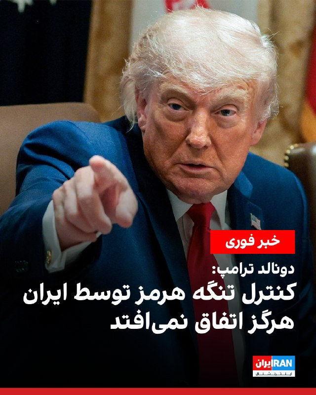

دونالد ترامپ در پاسخ به سوالی درباره کنترل تنگه هرمز توسط تهران و عمان گفت این تنگه برای همه باز خواهد بود و آب‌های بین‌المللی محسوب می‌شود. او تاکید کرد هیچ‌کس آن را کنترل نخواهد کرد و آمریکا بر آن نظارت خواهد داشت.

ترامپ افزود کنترل تنگه بخشی از مذاکرات است و ایران تمایل دارد آن را در اختیار بگیرد، اما چنین اتفاقی نخواهد افتاد. او درباره عمان نیز گفت این کشور مانند دیگران رفتار خواهد کرد و در غیر این صورت آمریکا مجبور خواهد شد آن‌ها را منفجر کند.
‌🏁 🇬🇧 IranintlTV

🤖 @VahidOOnLine

## VahidOOnLine — post 242459

  

پیت هگست، وزیر جنگ آمریکا، در نشست کابینه در کاخ سفید درباره ایران گفت در هر دو دوره ریاست‌جمهوری ترامپ تنها یک نفر بوده که ایستاده و اعلام کرده ایران هرگز به سلاح هسته‌ای دست نخواهد یافت.
هگست با اشاره به عملیات خشم حماسی گفت این بار مانند جنگ‌های عراق و افغانستان عمل نشد، بلکه با رویکردی هوشمندانه و قاطع و با حداکثر قدرت کشندگی، ایران به زانو درآمد.
او افزود نیروی دریایی ایران اکنون در کف خلیج فارس است، نیروی هوایی و پدافند آن آسیب دیده و هرچند ممکن است هنوز موشک داشته باشند، اما فعلا قادر به تولید بیشتر موشک، پهپاد یا کشتی نیستند.
وزیر جنگ آمریکا گفت به همین دلیل ایران برای مذاکره اعلام آمادگی کرده است. او افزود هم‌زمان محاصره‌ای در سطح جهانی برقرار شده و ایران نتوانسته از بنادر خود واردات یا صادرات انجام دهد و اقتصادش به‌شدت آسیب دیده است.
هگست تاکید کرد چه از مسیر مذاکره برای جلوگیری از دستیابی ایران به سلاح هسته‌ای و چه در صورت لزوم از مسیر نظامی، آمریکا آماده اقدام است و «اگر مجبور شویم دوباره به وزارت جنگ برمی‌گردیم تا کار را از آن راه تمام کنیم».
‌🏁 🇬🇧 IranintlTV

🤖 @VahidOOnLine

## VahidOOnLine — post 242458

  

♦️دونالد ترامپ در نشست کابینه در کاخ سفید بار دیگر بر موضع سخت‌گیرانه واشنگتن نسبت به برنامه هسته‌ای ایران تاکید کرد و گفت: «ایران نمی‌تواند بمب هسته‌ای داشته باشد.» او در عین حال هشدار داد که در صورت دست نیافتن به توافق، «ممکن است مجبور شویم به آنجا برویم و کار را تمام کنیم.»
ترامپ در ادامه با اشاره به روند مذاکرات گفت که ایران «بسیار مشتاق» رسیدن به توافق است، اما تاکنون نتیجه نهایی حاصل نشده است. او افزود: «ما از وضعیت فعلی راضی نیستیم، ولی خواهیم شد.»
رئیس‌جمهوری آمریکا با توصیف شرایط ایران، مدعی شد که این کشور تحت فشار شدید قرار دارد و گفت «نیروی دریایی و هوایی آن از بین رفته و همه‌چیزشان از دست رفته است.» او همچنین ادعا کرد ایران در شرایطی وارد مذاکره شده که «چیزی برایش باقی نمانده است.»
ترامپ همچنین وضعیت اقتصادی ایران را بحرانی توصیف کرد و گفت اقتصاد این کشور «در حال سقوط آزاد» است و به دلیل فشارهای موجود، تهران «گزینه دیگری جز حرکت به سمت توافق ندارد.»
او در بخش دیگری از سخنانش به وضعیت اینترنت در ایران اشاره کرد و گفت که این کشور پس از فشارهای اخیر دوباره به اینترنت متصل شده است.
‌🇸🇦 Indypersian

🤖 @VahidOOnLine

## VahidOOnLine — post 242457

  <a href="telegram/content/VahidOOnLine_242457_1779911941.mp4" target="_blank">🎬 Download video</a>

♦️دونالد‌ ترامپ، رئیس‌جمهوری آمریکا، چهارشنبه ششم خرداد، در نشست کابینه در کاخ سفید، از مارکو روبیو، وزیر خارجه آمریکا، و پیت هگست، وزیر دفاع، تمجید کرد و گفت دولتش «افراد فوق‌العاده‌ای» دارد.

ترامپ درباره پیت هگست گفت: «او عاشق جنگ است. من این را دوست ندارم، ولی او آدم خوبی است.»
‌🇸🇦 Indypersian

🤖 @VahidOOnLine

## WithYashar — post 12731

  

ارسالی : داداش این ایده ایی که دادی رو یه مقدارخلاقیت دادم بهش که بفهمن دقیقا چطورمیشه رفت بدون پرچم
@withyashar

## WithYashar — post 12730

Voice message

## WithYashar — post 12729

هم اکنون گزارش ها از دو ترور بزرگ در شمال غزه.
@withyashar

## WithYashar — post 12728

اتاق جنگ با یاشار : کاری‌ نداره اگه همه با هم متحد باشن میتونن ، فقط با پوشیدن لباس های سبز سفید ، قرمز و زرد یه ابر پرچم قول آسای انسانی‌ پیکسلی درست کنند 🧠😍🙌🏾 @withyashar

## WithYashar — post 12727

## WithYashar — post 12726

## WithYashar — post 12725

  <a href="telegram/content/WithYashar_12725_1779911942.mp4" target="_blank">🎬 Download video</a>

صدا و سیما شرط جدید ایران برای توافق با آمریکا را اعلام کرد: پرداخت غرامت ۳۰۰ میلیارد دلاری از آمریکا به ایران!
@withyashar

## WithYashar — post 12724

در اسرائیل پرونده‌ای جنجالی به نام «پرونده بیلد» فاش شده است. طبق این گزارش‌ها، یک سند محرمانه منتسب به حماس عمداً به رسانه‌ها درز داده شد تا خشم افکار عمومی از دولت بنیامین ناتانیاهو کمتر شود.

گفته می‌شود «آری روزنفلد» و پدرزنش یک مسیر غیرقانونی برای انتقال اسناد محرمانه از سازمان اطلاعات نظامی اسرائیل به دفتر نتانیاهو ایجاد کرده بودند. سپس تلاش کردند پیام‌ها و روایت‌های سیاسی خاصی را وارد سخنرانی‌های نخست‌وزیر ناتانیاهو کنند تا بر افکار عمومی از او تأثیر مثبت بگذارند.

این پرونده «بیلد» نام گرفته چون بخشی از اسناد ابتدا به روزنامه آلمانی Bild رسیده بود. مخالفان دولت می‌گویند از اطلاعات امنیتی برای اهداف سیاسی استفاده شده، اما حامیان نتانیاهو این اتهامات را اغراق‌آمیز و سیاسی می‌دانند.
@withyashar
اسرائیلی ها هم دنیایی دارن خوب‌ مردی بی بی برا خودتون اسن کارو کرده ! ولی مخالفاش داستان کردن !

## WithYashar — post 12723

جلسه کمپ دیوید که قرار بود امروز برگزار شود ترامپ اعلام کرد: جلسه کابینه به دلیل شرایط آب و هوایی در کاخ سفید برگزار خواهد شد، نه در کمپ دیوید! حالا صحبت‌هایی هست که کمپ دیوید یک تله برای شناسایی فردی بود که اطلاعات را نشت می‌داد ! فرد مورد نظر گیر افتاد !…

## WithYashar — post 12722

سلام یاشار جان خسته نباشی، ممنونم بابت زحمات
میگم یه سوال تو خبر دارین که میگن جلسه کابینه کمپ دیوید یه تله بوده که کی اطلاعات رو لو می‌داده و فهمیدن که جی دی ونس بوده؟!

## WithYashar — post 12721

ارتش اتاق جنگ اعلام حضور کنید. مانور امشب شروع شد. این کامنت زیر پست بی بی را لایک کنید، ریپلای کنید و اگر میتوانید اد تو استوری هم بکنید و به دوستان خود هم بگویید این کار را انجام دهند. آماده میشیم برای مانور نهایی در دوشنبه. توجه کنید فقط همین کامنت را لایک کنید، حتی پست را هم لایک نکنید که کاملا دیده بشه❤️‍🩹🙌🏾

https://www.instagram.com/p/DY2dIhsM-VK/?igsh=MXFhaGU4NzliZzVmaw==

ترجمه:

تبریک می‌گویم بی بی جون، فرزند راستین کوروش کبیر.
دیگر زمان آن رسیده که مقدمات حمله به ایران آغاز شود.
مردم ایران در نهایت ناامیدی فرو رفته‌اند.
لطفاً این لحظهٔ تاریخ‌ساز را هرچه زودتر رقم بزنید.
هر روز در ایران، روح جوانان ما را از جسمشان جدا می‌کنند.
تمام چشم امید ما به شما دوخته شده

## WithYashar — post 12720

اسرائیل هیوم: ترامپ پیش‌نویس یادداشت تفاهم با ایران را به نتانیاهو و رهبران منطقه تحویل داد تا نظرات خود را اعلام کنند
@withyashar

## WithYashar — post 12719

Voice message

## WithYashar — post 12718

ماجرا ری اکشن پر قرمز چیه دیگه ؟؟همه دارن میزنن😂

## WithYashar — post 12717

  

در پی رد لغو تحریم‌های ایران از سوی دونالد ترامپ، بازار سهام ایالات متحده در عرض تنها ۲۰ دقیقه، ۲۳۰ میلیارد دلار از ارزش خود را از دست داد.
@withyashar

## WithYashar — post 12716

ترامپ: اوباما کشور اشتباهی را انتخاب کرد. او باید کشور دیگری را انتخاب می‌کرد. به شما نمی‌گویم که آن چه بود. او وقتی ایران را انتخاب کرد، کشور اشتباهی را انتخاب کرد.
@withyashar

## WithYashar — post 12715

اتاق جنگ با یاشار : هیچوقت انقدر مشتاق نبودم حجاج هر چه سریعتر سلامت برگردن خونه هاشون 😅

## WithYashar — post 12714

داداش دقیقاً داره حرف تو پیش میره موج مکزیکی 😂

## WithYashar — post 12713

داداش دقیقاً داره حرف تو پیش میره موج مکزیکی 😂

## WithYashar — post 12712

ترامپ: دارن کم‌کم شروع می‌کنن چیزهایی رو که باید بهمون بدن، تحویل بدن. اگه این کار رو بکنن، خیلی خوبه.
اگه نکنن، هگست کارشون رو تموم می‌کنه.
ما درباره هیچ‌گونه کاهش تحریم‌ها یا دادن پول صحبت نمی‌کنیم.
وقتی اونا درست رفتار کنن و کار درستو بکنن بهشون جازه می‌دیم به پولشون برسن
@withyashar

## mwarmonitor — post 9837

  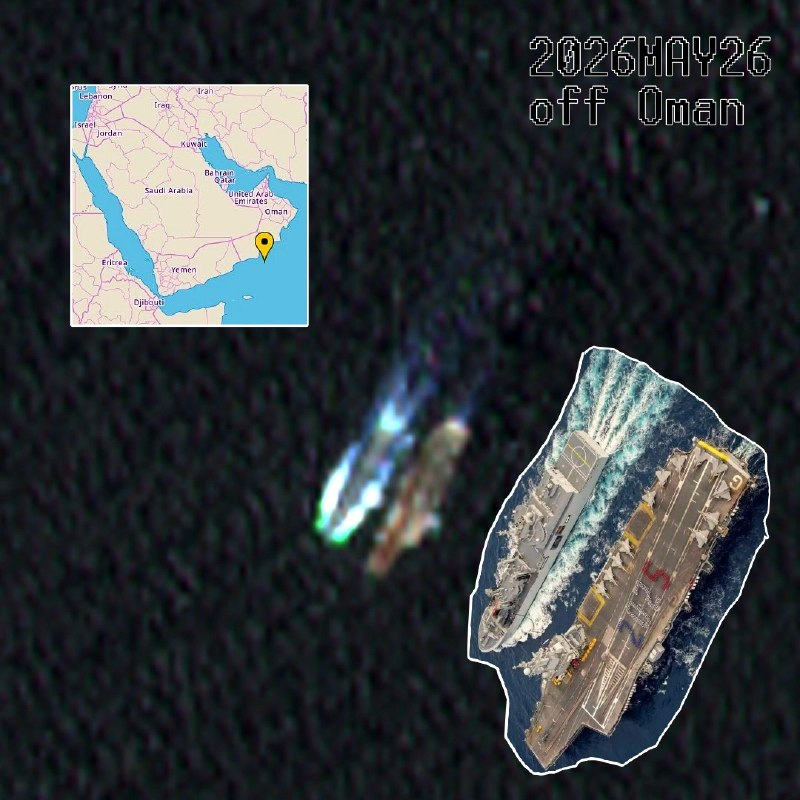

🔴ناوشکن کلاس Horizon CHEVALIER PAUL 🇫🇷 و ناوچه کلاس FREMM POSS ALSACE 🇫🇷 ۲ روز پیش در آب‌های جنوب عمان مشاهده شدند 📍موقعیت ناوشکن: 16.8356, 55.3751 📍موقعیت ناوچه: 16.8513, 56.070 📌این دو شناور در حال عملیات مشترک با ناو هواپیمابر فرانسوی CDG (شارل دوگل)…

## mwarmonitor — post 9836

  

🔴پایگاه NSF دیه‌گو گارسیا: به‌روزرسانی لجستیکی و SOC

🛰تصاویر ماهواره‌ای Sentinel-2 مربوط به امروز (۲۷ مه) نمای به‌روزی از وضعیت و استقرارها در داخل آب‌سنگ حلقوی پایگاه NSF دیه‌گو گارسیا ارائه می‌دهد.

🔸تأمین تدارکات ناوگان:
کشتی پشتیبانی سریع رزمی USNS Arctic (T-AOE-8) در حال حاضر در تالاب لنگر انداخته است. این موضوع الگویی را نشان می‌دهد که مدتی است مشاهده می‌کنیم: کشتی‌های USNS همچنان به‌صورت متناوب از دیه‌گو گارسیا برای سوخت‌گیری، تدارکات و تعمیر و نگهداری خود در فاصله بین مأموریت‌ها به ناوگان استفاده می‌کنند.

🚢کشتی مادر SOC:
با احتمال بسیار زیاد، MV Ocean Trader همچنان در آب‌سنگ حلقوی لنگر انداخته است. پوشش سنگین ابر در عبور امروز شناسایی ۱۰۰٪ قطعی را دشوار می‌کند.

@mwarmonitor

## mwarmonitor — post 9835

  <a href="telegram/content/mwarmonitor_9835_1779911946.mp4" target="_blank">🎬 Download video</a>

📝وقتی شهر که خلوت بشه، قورباغه هفت‌تیرکش میشه! بله آقای ترامپ، وقتی درست وسط جنگ که این جمهوری اسلامیِ فکسنی داشت نفله و تکه‌پاره می‌شد، تو با اون مغز فندقی و ژست‌های پوچت دویدی وسط و آتش‌بس دادی، باید هم تهش به این افتضاح ختم بشه. مردک هالو، با همین حماقتت به این «بچه شیعه‌های رافضی» که کارشون تموم بود، تنفس مصنوعی دادی تا حالا از قعر ذلت بلند بشن و برات شاخ و شونه بکشن!

🔸حالا نگاه کن؛ این نظامِ مفلوک و در حال احتضار که تا دیروز داشت غزل خداحافظی رو می‌خوند، چنان وهمِ قدرت برش داشته که با وقاحت تمام، یک لیست باج‌خواهی ۳۰۰ میلیارد دلاری جلوی چشمای نابینات گذاشته! تویی که ادعای معامله‌گری داشتی، حالا باید بشینی و شروط مسخره‌ی یه مشت بازنده رو گوش کنی که دارن برات حکم خروج از منطقه و لغو تحریم‌ها رو صادر می‌کنن. حماقت تو و وقاحت اون‌ها، واقعاً یه کمدی سیاه و تهوع‌آوره!

@mwarmonitor

## mwarmonitor — post 9834

📝 وسط این هیاهوی بی‌پایان مجازی، جایی میان استوری‌های افشاگرانه، ویس‌های لو رفته و رگبار الفاظ رکیک، هدف اصلی به کل فراموش شده است. اتاق فکرهای دستگاه امنیتی جمهوری اسلامی نیازی به طراحی نقشه‌های پیچیده ندارند؛ آن‌ها با پاشیدن بذر شک و کینه، تله‌ای هوشمندانه ساخته‌اند تا فعالان مجازی با منیت‌ها و حسادت‌هایشان، پیاده‌نظامِ ناخواستهٔ رژیم شوند و ارتشِ یکدیگر را نابود کنند. هر کلیک روی این جنجال‌های مجازی و هر بازنشر این کینه‌توزی‌ها، بازی در زمین سناریویی است که جمهوری اسلامی برای بقای خود نوشته تا به جامعه دیکته کند که هیچ جایگزین معتبر و شریفی وجود ندارد.

🔸دردآورترین پرده این نمایش آنجاست که مخاطب خسته و بی‌قرار در داخل کشور، وقتی چشمان نگرانش را به این سیرک مجازی می‌دوزد تا ردی از امید یا راهکار بیابد، چیزی جز یک میدان جنگ مبتذل بر سر سهم‌الارثِ نبرده نمی‌بیند؛ تصویری که خروجی آن چیزی جز تزریق ناامیدی مطلق به بدنه جامعه و کشتن آخرین کورسوهای همبستگی نیست.

🔸مردم و مخاطبانی که دل در گروی تغییر و بهبود دارند، باید به طور جدی از این فضای سمی، فرسایشی و سودجویانه دوری کنند. نباید با پیگیری، لایک و بازنشر این جنگ‌های زرگری، بنزین به آتش این فتنه و بازی طراحی‌شدهٔ جمهوری اسلامی بریزند. بایکوت کردن این تجارتِ تفرقه و آگاهی از این تلهٔ رسانه‌ای، اولین قدم برای نجات امید و بازگرداندن تمرکز به مسیر اصلی است.

@mwarmonitor

## mwarmonitor — post 9833

🔴«باز هم حرف‌های تکراری و متناقضی مطرح شد که تمام تحلیل‌های قبلی درباره جهت‌گیری‌ها را نقش بر آب کرد. به نظر من، تا زمانی که توئیت رسمی مبنی بر تصمیم نهایی‌اش منتشر نشود، هر حرفی که می‌زند صرفاً برای جلب توجه و بازی رسانه‌ای است. باید منتظر ماند و دید نتیجه نهایی مذاکرات چه می‌شود؛ او یا در نهایت به ساز ایران می‌رقصد و مسیر تعامل را ادامه می‌دهد، یا دست به حمله خواهد زد.»

@mwarmonitor

## mwarmonitor — post 9832

🔴ترامپ گفت مطمئن نیست که ایالات متحده باید توافقی برای پایان دادن به جنگ با ایران امضا کند، اگر عربستان سعودی و دیگر کشورهای حاشیه خلیج فارس با پیوستن به توافق‌نامه‌های ابراهیم موافقت نکنند.
او گفت: «آن‌ها این را به ما بدهکارند.»

@mwarmonitor

## mwarmonitor — post 9831

  

🔴نزدیک به ۶۰ میلیون بشکه نفت خام ایران در نتیجه محاصره دریایی نیروی دریایی آمریکا متوقف و گرفتار شده است. این میزان تقریباً ۶ میلیارد دلار درآمد نفتی است که در حال حاضر به تهران نمی‌رسد.
🔸با وجود این‌که هنوز نفتکش‌های خالی زیادی برای بارگیری نفت در دسترس هستند، اما به دلیل کاهش تولید نفت، میزان بارگیری نفتکش‌ها نیز کاهش یافته است. TANKER TRACKER

@mwarmonitor

## mwarmonitor — post 9830

🔸هشدار درباره اینکه روسیه در حال آماده‌سازی یک کارزار گسترده‌تر از حملات موشک‌های بالستیک علیه شهرهای اوکراین است، ولودیمیر زلنسکی در نامه‌ای به ترامپ و کنگره آمریکا خواستار گسترش ارسال سامانه‌های موشکی پاتریوت شد. CBS

@mwarmonitor

## mwarmonitor — post 9829

🔸تردد کشتی‌های تجاری از تنگه هرمز روز چهارشنبه به چند کشتی محدود شد که عمدتاً به ایران مرتبط بودند؛ موضوعی که نشان‌دهنده ماهیت ناپیوسته و نوسانی عبور و مرور در مهم‌ترین گلوگاه انرژی جهان است. بلومبرگ

@mwarmonitor

## mwarmonitor — post 9828

🔴وزیر امور خارجه آمریکا، مارکو روبیو: «ما در مورد ایران مقداری پیشرفت داشته‌ایم و طی چند ساعت یا چند روز آینده خواهیم دید که آیا پیشرفت بیشتری حاصل خواهد شد یا نه.»

@mwarmonitor

## mwarmonitor — post 9827

🔴ترامپ: «ایران بسیار جدی است و خیلی می‌خواهد به یک توافق برسد. تا این لحظه هنوز به آن نرسیده‌اند... ما از این وضعیت راضی نیستیم، اما خواهیم دید. یا به توافق می‌رسیم، یا مجبور خواهیم شد کار را تمام کنیم.»

@mwarmonitor

## mwarmonitor — post 9826

🔴ترامپ: ایرانی‌ها فکر می‌کنند من به خاطر انتخابات میان‌دوره‌ای جنگ را پایان می‌دهم، اما من به این موضوع اهمیتی نمی‌دهم.

@mwarmonitor

## mwarmonitor — post 9825

🔴ترامپ به PBS گفت: وقتی از او پرسیده شد آیا ایران در ازای کنار گذاشتن اورانیوم بسیار غنی‌شده، کاهش تحریم‌ها دریافت خواهد کرد یا نه، پاسخ صریح داد: «نه، نه اصلاً. کاهش تحریم‌ها؟ نه.»

@mwarmonitor

## mwarmonitor — post 9824

🔴امروز، شهرهای مهم جنوب لبنان یعنی صور و النبطیه با خطر اشغال مستقیم روبه‌رو هستند. نیروهای اسرائیلی به منطقه زوطر شرقی رسیده‌اند؛ تنها حدود پنج کیلومتر فاصله تا نبطیه وجود دارد، و هم‌زمان دستور تخلیه برای شهر صور صادر شده است. 🔸دولت لبنان قصدی برای دفاع…

## mwarmonitor — post 9823

  

🔴سازمان UKMTO (مرکز عملیات تجارت دریایی بریتانیا) گزارشی درباره وقوع یک حادثه در ۶۰ مایل دریایی (NM) در شرق مسقط، عمان دریافت کرده است. 🔸ناخدای یک کشتی نفت‌کش، گزارشی از وقوع یک انفجار بیرونی در سمت چپ بخش عقب کشتی (Port side aft) و نزدیک به خط آب (waterline)…

## mwarmonitor — post 9822

🔰ایران ۲۴ میلیارد دلار از دارایی‌های بلوکه‌شده خود را پیش‌شرط امضای یک توافق صلح با آمریکا قرار داده است؛ از این مبلغ، گفته می‌شود ۱۲ میلیارد دلار باید هم‌زمان با اعلام توافق آزاد شود. تلگراف

@mwarmonitor

## mwarmonitor — post 9821

🔴امروز، شهرهای مهم جنوب لبنان یعنی صور و النبطیه با خطر اشغال مستقیم روبه‌رو هستند. نیروهای اسرائیلی به منطقه زوطر شرقی رسیده‌اند؛ تنها حدود پنج کیلومتر فاصله تا نبطیه وجود دارد، و هم‌زمان دستور تخلیه برای شهر صور صادر شده است.

🔸دولت لبنان قصدی برای دفاع از شهرهای خود ندارد و تنها گزینه پیشِ رو را مذاکره می‌بیند؛ موضعی که از نظر نویسنده بزدلانه و بدون هیچ شرمی توصیف شده است. پهپادهای FPV حزب‌الله می‌توانند به نیروهای پیش‌روی اسرائیل خسارت وارد کنند، اما در همین سطح نیز قادر به متوقف کردن حمله نیستند. در همین حال، شرط ایران مبنی بر عدم هدف قرار دادن بیروت و ضاحیه در این لحظه عملاً به نمادی بدون اثر عملی تبدیل شده، آن هم در شرایطی که نتانیاهو به‌دنبال ایجاد واقعیت‌های جدید در زمین است.

🔹بدون تردید، شمار بیشتری از سربازان اسرائیلی در خاک لبنان کشته خواهند شد و لبنان به باتلاقی خطرناک تبدیل می‌شود. اما در مقابل، بخش‌های بیشتری از خاک لبنان تحت اشغال قرار خواهد گرفت. روستاها طی ماه‌های گذشته به‌طور سیستماتیک ویران شده‌اند و اکنون نوبت شهرهاست.

🔸کسانی که انتظار راه‌حلی سریع در میز مذاکرات دارند، باید از این توهم دست بردارند. و کسانی که منتظر حل بحران لبنان از طریق توافقات منطقه‌ای هستند نیز چیزی به دست نخواهند آورد. آنچه من می‌بینم فراتر از یک بحران است؛ یک تحول بنیادین و فراگیر است که ممکن است سال‌ها ادامه یابد—سال‌هایی نه معمولی، بلکه طولانی، فرسایشی و ویرانگر، بدون هیچ افق روشنی. الجزیره

@mwarmonitor

## mwarmonitor — post 9820

  

🔴حساب رسمی تلگرام در پلتفرم X (توییتر سابق) به نظر می‌رسد هک شده باشد.

@mwarmonitor

## mwarmonitor — post 9819

📌 تندروهای افراطی در ایران به مذاکره‌کنندگان به‌دلیل مذاکرات با آمریکا حمله کرده‌اند. فیننشال تایمز

@mwarmonitor

## mwarmonitor — post 9818

🔴سخنگوی کاخ سفید: گزارش رسانه‌های ایرانی درباره «یادداشت تفاهم» نادرست بوده و به‌طور کامل ساختگی است.

@mwarmonitor

## FoxNewsTwitter — post 342323

  

Fox News (Twitter/X)

BREAKING: Matthew Perry’s live-in assistant has been sentenced to more than 3 years in prison for his role in the actor’s ketamine overdose death.

60-year-old Kenneth Iwamasa admitted he injected Perry with ketamine before the “Friends” star was found dead at his Los Angeles home in 2023.

“You were privy to his struggle with addiction,” the judge told him before sentencing. “Your conduct was reckless.”

The sentencing closes the final chapter in the nearly three-year federal investigation into Perry’s death.

## FoxNewsTwitter — post 342322

  

Fox News (Twitter/X)

No one wants a romantic dinner ruined by a screaming child at the next table.

According to a new survey, 75% of Americans say restaurants should offer some kind of adults-only dining experience to avoid unruly kids.

That includes child-free sections, restrictions during late-night hours, and quieter dining environments focused more on the experience than family-friendly chaos.

## FoxNewsTwitter — post 342321

  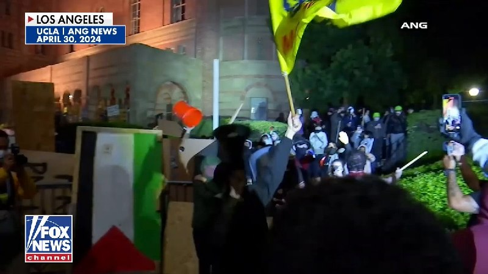

Fox News (Twitter/X)

"Hitler missed one."

That's just one of the many antisemitic attacks at the center of a new DOJ lawsuit against UCLA, which accuses the university of tolerating an antisemitic environment as on-campus protests ramped up after Hamas' October 7th attacks on Israel.

The lawsuit accuses university officials of being “deliberately indifferent” as students were allegedly assaulted, blocked from buildings by protesters, and prevented from accessing parts of campus during the encampment demonstrations.

Prosecutors say UCLA violated Title VI protections by continuing to receive federal funding while failing to comply with anti-discrimination laws.

## FoxNewsTwitter — post 342320

  

Fox News (Twitter/X)

Rescuers break down in tears and embrace after saving five people trapped deep inside a flooded cave.

A Thai rescue team pushed through murky underwater passageways and narrow tunnels trying to reach the group trapped in Laos’ Xaisomboun Province before time ran out.

Families waiting above ground feared they may never see their loved ones again as rescuers battled dangerous conditions.

Then came the moment nobody thought they’d witness: survivors emerging alive as emotional reunions unfolded above ground.

## FoxNewsTwitter — post 342319

  <a href="telegram/content/FoxNewsTwitter_342319_1779911951.mp4" target="_blank">🎬 Download video</a>

Fox News (Twitter/X)

NEW: President Trump reveals he was invited to a New York Knicks game for their first NBA finals appearance in 27 years:

"I was invited... I was going to go on Wednesday, but they closed it out very quickly."

"They have some great players. I think I'll be going to one of the games. I was invited by, numerous people."

"The Knicks have really... they really suffered for years".

## FoxNewsTwitter — post 342318

  <a href="telegram/content/FoxNewsTwitter_342318_1779911953.mp4" target="_blank">🎬 Download video</a>

Fox News (Twitter/X)

NEW: DHS Sec. Markwayne Mullin responds to "radical left" ICE protests in New Jersey:

"It shows the radical left Democrats' priorities when they decide to go out and protest a detention center where we're housing rapists, child predators, murderers, drug dealers, and they choose Memorial Day of all the time to go protest something."

"Then you have one of the senators complain because he got splattered with a with a, you know, pepper ball. I'm sorry. You probably shouldn't have been there."

## FoxNewsTwitter — post 342317

  <a href="telegram/content/FoxNewsTwitter_342317_1779911955.mp4" target="_blank">🎬 Download video</a>

Fox News (Twitter/X)

NEW: President Trump says gas prices will "come down a lot" shortly after the Iran "excursion" ends, while slamming California for its high prices and taxes.

"It'll come down to where it was before."

## FoxNewsTwitter — post 342316

  <a href="telegram/content/FoxNewsTwitter_342316_1779911956.mp4" target="_blank">🎬 Download video</a>

Fox News (Twitter/X)

BREAKING: Secretary of War Hegseth reveals President Trump ordered the Pentagon to prioritize protecting Nigerian Christians targeted by ISIS — and says the mission quietly led to the killing of ISIS’ second-in-command in Nigeria.

Hegseth says U.S. intelligence gathered during the operation helped lead to the deaths of “hundreds” of ISIS fighters tied to attacks on Christians and threats against the U.S. homeland.

"There's a lot of things we do that the media pays attention to, and a lot of things that the president empowers the Department to do on behalf of the American people, that he deserves great credit for."

## FoxNewsTwitter — post 342315

  <a href="telegram/content/FoxNewsTwitter_342315_1779911958.mp4" target="_blank">🎬 Download video</a>

Fox News (Twitter/X)

NEW: Sec. Rubio gives an update on the "three phase" process playing out in Venezuela:

"Over 10 million barrels of Venezuelan oil have been delivered to the United States since the 3rd of January. That industry is being professionalized for the first time ever. It's going to the benefit of the Venezuelan people."

"They are selling oil in the market at market rates. The money is going to an account in the United States, controlled and monitored by Treasury, audited by KPMG. And it's, for the first time ever, the money is not being stolen. It's going to the benefit of the Venezuelan people."

## FoxNewsTwitter — post 342314

  <a href="telegram/content/FoxNewsTwitter_342314_1779911960.mp4" target="_blank">🎬 Download video</a>

Fox News (Twitter/X)

NEW: VP Vance details healthcare fraud findings to President Trump, sharing tragic stories of fraudsters taking advantage of elderly Americans and the Medicaid system:

VP VANCE: "Not only do you have an American taxpayer who's paying into these programs, you have an elderly citizen deprived of his dignity because we're not going out for the fraudsters. Well, now we are."

PRESIDENT TRUMP: "How much money did he get?"

VP VANCE: "Sir, hundreds of thousands of dollars, maybe more than that, but we think that that exact type of fraud has been replayed all over our country."

## FoxNewsTwitter — post 342313

  <a href="telegram/content/FoxNewsTwitter_342313_1779911961.mp4" target="_blank">🎬 Download video</a>

Fox News (Twitter/X)

NOW: President Trumps taps in Secretary Rubio, who's "doing a fantastic job," for an update on negotiations with Iran:

"If recent events have done anything, it's just reminded us once again that they are the world's leading sponsor of terrorism, and they can never have a nuclear weapon."

"Mr. President, your preference you've told us repeatedly, as always, to negotiate these things and to figure out if you can have agreements. Diplomacy is always the first option, and we continue to work on that through your envoys..." - Secretary Rubio

## FoxNewsTwitter — post 342312

  <a href="telegram/content/FoxNewsTwitter_342312_1779911963.mp4" target="_blank">🎬 Download video</a>

Fox News (Twitter/X)

NOW: VP Vance praises President Trump’s leadership for helping the fraud task force break down barriers, go after fraudsters, and save Americans money.

"I'll come to the president and say, Mr. President, I need your permission to do..."

"He'll say, for what? For the fraud task force. And he'll cut me off and say, yes, go do it."

## FoxNewsTwitter — post 342311

  <a href="telegram/content/FoxNewsTwitter_342311_1779911965.mp4" target="_blank">🎬 Download video</a>

Fox News (Twitter/X)

BREAKING: President Trump gives a massive shoutout to Tulsi Gabbard, commending her tireless work as Director of National Intelligence following the announcement of her resignation due to her husband’s health:

"Tulsi has worked tirelessly to restore trust and focus with the intelligence community, they all respected her. They listened to her. She gave us leads that were pretty much, people thought they were dead and they weren't dead."

"Tulsi, we're praying for you and for your husband. Her husband's not feeling great, but he's going to feel great soon. You're going to make him- you're going to get them better. And he's a wonderful guy. So just say hello and thank you for the great work you've done."

## FoxNewsTwitter — post 342310

  <a href="telegram/content/FoxNewsTwitter_342310_1779911967.mp4" target="_blank">🎬 Download video</a>

Fox News (Twitter/X)

BREAKING: President Trump blasts fraudsters, "Somalians," and Rep. Ilhan Omar for "what they've done to Minnesota."

"They're all crooks, the Somalians, and what they've done to Minnesota... They're crooked as hell."

"Ilhan Omar crooked is hell. They're all crooks."

"We got them. Now we're putting the clamps on."

## FoxNewsTwitter — post 342309

  

Fox News (Twitter/X)

NOW: President Trump comments on the sweeping success of Republican candidates with his endorsement in elections yesterday:

"Last night was incredible. Not only Texas, but so many other places, and the numbers were fantastic." https://twitter.com/FoxNews/status/2059604700979228857#m

## FoxNewsTwitter — post 342308

  <a href="telegram/content/FoxNewsTwitter_342308_1779911969.mp4" target="_blank">🎬 Download video</a>

Fox News (Twitter/X)

JUST NOW: President Trump touts his administration's economic success during today's Cabinet meeting:

"This year, the typical family got tax refunds of nearly, almost close to $5,000."

"The stock market has set 68 all-time record highs since the election. So 68 days we hit all-time highs."

"The average 401K is up almost $30,000 since I took office."

"The Americans are benefiting."

## FoxNewsTwitter — post 342307

  <a href="telegram/content/FoxNewsTwitter_342307_1779911971.mp4" target="_blank">🎬 Download video</a>

Fox News (Twitter/X)

NOW: President Trump welcomes the press to the 12th Cabinet meeting of his second term, highlighting the administration's transparency:

"We're always letting the press join us because we're very open and transparent. You like the word transparent, but we're more transparent than any any administration in history. To the best of my knowledge, press has never been invited ever to a cabinet meeting for any reason at all... It's an honor to have you."

## FoxNewsTwitter — post 342306

  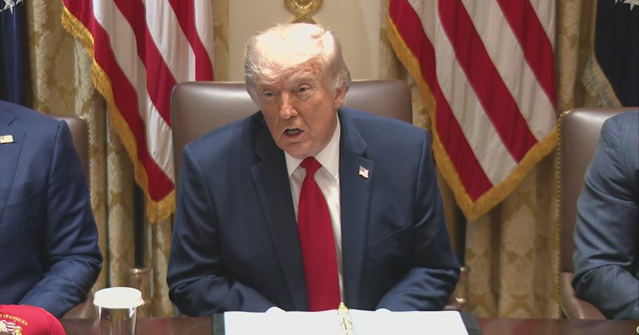

Fox News (Twitter/X)

WATCH LIVE: President Trump holds Cabinet meeting amid Iran negotiations https://twitter.com/i/broadcasts/1yxBeePLPmnJN

## FoxNewsTwitter — post 342305

  <a href="telegram/content/FoxNewsTwitter_342305_1779911973.mp4" target="_blank">🎬 Download video</a>

Fox News (Twitter/X)

The search is on for the next James Bond, and there’s reportedly a new favorite to take over the role of Agent 007, so that begs the question – who will play the next Bond girl?

Our sponsor Kalshi’s prediction market shows:
— Zendaya: 94%
— Margaret Qualley: 20%
— Sydney Sweeney: 17%
— Anya Taylor-Joy: 14%

@foxandfriends

## FoxNewsTwitter — post 342303

Fox News (Twitter/X)

NEW: President Trump jokingly congratulates the Democrats for longtime Texas congressman and Trump critic Al Green losing his house seat in last night's Texas primary.

"I will miss that lunatic not screaming and violently waving his cane at me during my next State of the Union Speech."

## pm_afshaa — post 91667

vless://06b65903-406d-4a41-8463-6fd5c0ee7798@43.169.18.179:443?encryption=none&security=tls&sni=sni.skylee4.cloudns.ch&fp=chrome&type=ws&host=sni.skylee4.cloudns.ch&path=%2F#PMTV%20NEWS%20%F0%9F%A6%81%E2%98%80%EF%B8%8F

کانفینگ پر سرعت مخصوص دانلود

💧 Rainbet.com the #1 Non-KYC Crypto Casino & Sportsbook @rainbetcom

😁 @Pm_Afshaa

## pm_afshaa — post 91666

🔴پیت هگست:آنها ممکن است موشک داشته باشند، اما در حال حاضر نمی‌توانند موشک‌های بیشتری بسازند. نمی‌توانند پهپادهای بیشتری بسازند. نمی‌توانند کشتی‌های بیشتری بسازند. آمدند و تسلیم شدند تا صحبت کنند

💧 Rainbet.com the #1 Non-KYC Crypto Casino & Sportsbook @rainbetcom

😁 @Pm_Afshaa

## pm_afshaa — post 91665

vless://76bc8e3d-0e6b-4a35-b1a7-7f5158042666@45.76.83.35:54985?encryption=none&security=none&type=tcp&headerType=none#PMTV%20NEWS%20%F0%9F%A6%81%E2%98%80%EF%B8%8F

نپسترنت نا محدود سرعت بالا

💧 Rainbet.com the #1 Non-KYC Crypto Casino & Sportsbook @rainbetcom

😁 @Pm_Afshaa

## pm_afshaa — post 91664

🔴ترامپ :قرار نیست تحریم های ایران برداشته بشه. حتی اگه اورانیوم غنی شدش رو هم تحویل بده هیچ تحریمی کاهش پیدا نمیکنه

💧 Rainbet.com the #1 Non-KYC Crypto Casino & Sportsbook @rainbetcom

😁 @Pm_Afshaa

## pm_afshaa — post 91663

🔴ترامپ: ایرانی‌ها فکر می‌کنند من به‌خاطر انتخابات میان‌دوره‌ای جنگ را تمام می‌کنم اما من اهمیتی نمی‌دهم

💧 Rainbet.com the #1 Non-KYC Crypto Casino & Sportsbook @rainbetcom

😁 @Pm_Afshaa

## pm_afshaa — post 91662

#مهم
عزیزای دلم همگی الان چنل زاپاس‌مون رو جوین بشید کانال تحت ریپورت شدیده اگه چیزی شد زاپاس رو داشته باشید فعالیت میاد اونور
👇

https://t.me/Pm_Zapas
https://t.me/Pm_Zapas

## pm_afshaa — post 91661

پشماتون بریزه، اینجا کردستان نیست، اینجا آلمانه که ایرانیا و کُردا فتحش کردن! تهشم دارن کردی میرقصن

💧 Rainbet.com the #1 Non-KYC Crypto Casino & Sportsbook @rainbetcom

😁 @Pm_Afshaa

## pm_afshaa — post 91660

🔴کاخ سفید :هیچ‌کس نباید به آنچه رسانه‌های دولتی ایران منتشر می‌کنند اعتماد کند

💧 Rainbet.com the #1 Non-KYC Crypto Casino & Sportsbook @rainbetcom

😁 @Pm_Afshaa

## pm_afshaa — post 91659

vless://406d8436-0eb9-4eb2-84fb-960e076ffba6@162.159.38.183:2083?encryption=none&security=tls&sni=de.lezzatzone.ir&alpn=h2%2Chttp%2F1.1&fp=chrome&type=tcp&headerType=none#%40Glitch_Config

نامحدود سرعت موشکی
🚀

💧 Rainbet.com the #1 Non-KYC Crypto Casino & Sportsbook @rainbetcom

😁 @Pm_Afshaa

## pm_afshaa — post 91658

🟠کاخ سفید در توییتر به طور غیرمستقیم گزارش رسانه‌های دولتی جمهوری اسلامی تروریست درباره پیش‌نویس تفاهم‌نامه بین آمریکا و ج.ا را رد کرد

💧 Rainbet.com the #1 Non-KYC Crypto Casino & Sportsbook @rainbetcom

😁 @Pm_Afshaa

## pm_afshaa — post 91657

🔴مهر: یک ساختمان اداری در فرودگاه امام خمینی آتش گرفت

💧 Rainbet.com the #1 Non-KYC Crypto Casino & Sportsbook @rainbetcom

😁 @Pm_Afshaa

## pm_afshaa — post 91656

ترولیتر 
😈
🔥

میم 
✔ توییت 
✔ خبر 
✔ پروکسی رایگان
✔

همین الان جوین شو و آنلاین بمون 
👇
👇

https://t.me/trolliter
https://t.me/trolliter

## pm_afshaa — post 91655

🔴ارتش اسرائیل در اقدامی فوری دستور تخلیه کامل شهر بندری صور، بزرگ ترین شهر جنوب لبنان به همراه تمام روستاهای اطراففش رو صادر کرد

💧 Rainbet.com the #1 Non-KYC Crypto Casino & Sportsbook @rainbetcom

😁 @Pm_Afshaa

## pm_afshaa — post 91653

vless://406d8436-0eb9-4eb2-84fb-960e076ffba6@162.159.38.183:2083?mode=stream-one&path=%2Fde&security=tls&alpn=h2%2Chttp%2F1.1&encryption=none&insecure=0&host=de.lezzatzone.ir&fp=chrome&type=xhttp&allowInsecure=0&sni=de.lezzatzone.ir#PMTV%20NEWS%F0%9F%A6%81%E2%98%80%EF%B8%8F

سرور ناپسترنت نا محدود خوراک دانلود

💧 Rainbet.com the #1 Non-KYC Crypto Casino & Sportsbook @rainbetcom

😁 @Pm_Afshaa

## pm_afshaa — post 91652

https://t.me/proxy?server=31.220.73.93&port=443&secret=eefd4d1b6a40aef75802cb6569f0615e11636c6f7564666c6172652e636f6d

پروکسی متصل مخصوص دانلود

💧 Rainbet.com the #1 Non-KYC Crypto Casino & Sportsbook @rainbetcom

😁 @Pm_Afshaa

## pm_afshaa — post 91651

🔴حملات سنگین اسراییل به جنوب لبنان

💧 Rainbet.com the #1 Non-KYC Crypto Casino & Sportsbook @rainbetcom

😁 @Pm_Afshaa

## pm_afshaa — post 91649

vless://406d8436-0eb9-4eb2-84fb-960e076ffba6@162.159.38.183:2083?encryption=none&security=tls&sni=de.lezzatzone.ir&alpn=h2%2Chttp%2F1.1&fp=chrome&type=tcp&headerType=none#PMTV%20NEWS%20%F0%9F%A6%81%E2%98%80%EF%B8%8F

v2ray سرعت بالا نامحدود مخصوص دانلود

💧 Rainbet.com the #1 Non-KYC Crypto Casino & Sportsbook @rainbetcom

😁 @Pm_Afshaa

## pm_afshaa — post 91648

🔴رئیس ستاد ارتش اسرائیل : ساختار رژیم آیت‌الله‌ها شدیداً ترک برداشته و آینده و ثباتش تو هاله‌ای از ابهامه

💧 Rainbet.com the #1 Non-KYC Crypto Casino & Sportsbook @rainbetcom

😁 @Pm_Afshaa

## pm_afshaa — post 91647

https://t.me/proxy?server=fn.b2-ray.ru&port=2233&secret=1a78cb0260dffe00aa646e398185a157

پروکسی متصل

💧 Rainbet.com the #1 Non-KYC Crypto Casino & Sportsbook @rainbetcom

😁 @Pm_Afshaa

## iaghapour — post 2637

## DEJradio — post 5043

🚨
🔸 خبر ۲۱
چهارشنبه ۶ خرداد ۱۴۰۵

#خبر۲۱
@DEJradio

## DEJradio — post 5042

  <a href="telegram/content/DEJradio_5042_1779911975.webm" target="_blank">🎬 Download video</a>

🔺📢 بلاتکلیفی آینده‌سازان ایران در فصل امتحانات؛

گزارش: اشکان خسروپور

#فصل_امتحانات
@DEJradio

## DEJradio — post 5041

  

👑
👑 شهین خاکپور، یکی از تازه‌ترین قربانیان جنایات رژیم، از ایرانیان آزادی‌خواه و مبارزان میدانی در ایران بود که به دست جمهوری اسلامی زندانی و به ۱۸ سال حبس محکوم شد.
خانم خاکپور که در زندان به ذات‌الریه مبتلا شد، در دوره مرخصی درمانی به ترکیه رفت، اما با تشدید بیماری، جان خود را از دست داد.
زنده‌یاد شهین خاکپور، یادش گرامی خواهد بود و نامش فراموش نخواهد شد.

#جاویدنامان #شهین_خاکپور
@DEJradio

## DEJradio — post 5040

  <a href="telegram/content/DEJradio_5040_1779911976.mp4" target="_blank">🎬 Download video</a>

👑🎥 تلاش ایرانیان مقیم اروپا برای لغو احکام اعدام زندانیان سیاسی

#بچه_های_اکباتان #زندانیان_سیاسی
@DEJradio

## DEJradio — post 5039

  <a href="telegram/content/DEJradio_5039_1779911978.mp4" target="_blank">🎬 Download video</a>

🔺🎥 رسانه‌های داخلی از وقوع آتش‌سوزی در یکی از برج‌های شهرک چیتگر تهران خبر دادند علت حادثه، میزان تلفات و خسارت مشخص نیست.

#آتشسوزی #چیتگر
@DEJradio

## DEJradio — post 5038

  <a href="telegram/content/DEJradio_5038_1779911980.webm" target="_blank">🎬 Download video</a>

🔺📢 رئیس ستاد کل ارتش اسرائیل:
پایه‌های حکومت آیت‌الله‌ها ترک برداشته است

ایال زمیر، رئیس ستاد کل ارتش اسرائیل گفت پایه‌های حکومت آیت‌الله‌ها به‌طرز قابل توجهی ترک برداشته است. به گفته این مقام ارشد نظامی اسرائیل، آینده و ثبات نظام جمهوری اسلامی در هاله‌ای از ابهام فرو رفته است.

ایال زمیر یادآوری کرد سران جمهوری اسلامی تحت تعقیب قرار دارند و اصلی‌ترین توانایی‌های نظامی حکومت نابود شده است. زمیر همچنین گفت برنامه هسته‌ای جمهوری اسلامی سال‌ها به عقب رانده شده و اقتصاد کشور در حال فروپاشی است.

#رژیم_آخوندی #اسرائیل
@DEJradio

## DEJradio — post 5036

  <a href="telegram/content/DEJradio_5036_1779911980.webm" target="_blank">🎬 Download video</a>

🚨
🔸 ایران فراموش‌شده در سایه بحران هرمز

گزارش: ایمان صفتی

#شاهزاده_رضا_پهلوی #تنگه_هرمز #ایران
@DEJradio

## DEJradio — post 5035

  <a href="telegram/content/DEJradio_5035_1779911981.mp4" target="_blank">🎬 Download video</a>

👑🎥 سه‌شنبه‌های نه به اعدام؛ تجمع ایرانیان ملی‌گرا مقیم هامبورگ

#همبستگی #هامبورگ
@DEJradio

## DEJradio — post 5034

  <a href="telegram/content/DEJradio_5034_1779911983.mp4" target="_blank">🎬 Download video</a>

👑🎥 پرفورمنس «نه به اعدام» در هانوفر؛ روایت جنایات جمهوری اسلامی برای افکار عمومی

#همبستگی #هانوفر
@DEJradio

## DEJradio — post 5033

⭕️ وزیر اسرائیلی گفت اهرم راهبردی جمهوری اسلامی در تنگۀ هرمز در حال نابودی است

الی کوهن، وزیر انرژی دولت اسرائیل، گفت همۀ ظرفیت جمهوری اسلامی در تنگۀ هرمز و اهرم راهبردی آن، در حال نابودی است.
او خبر داد که گفت‌وگوها برای ایجاد زیرساخت‌های انتقال انرژی از شرق به غرب در حال پیشرفت است.
به گفتۀ الی کوهن، هدف از گفت‌وگوهای تازه، انتقال انرژی به اروپا از مسیر اسرائیل است.
الی کوهن افزود کشورهای حاشیۀ خلیج فارس از جمله عربستان سعودی و امارات متحدۀ عربی علاقه‌مند به مشارکت در این پروژه‌ها شده‌اند.
به گفتۀ وزیر انرژی و زیرساخت اسرائیل، کریدور انرژی میان هند و اروپا از طریق کشورهای خلیج فارس و اسرائیل در دست بررسی است. همچنین مسیر مصر می‌تواند اجرای این پروژه را تسریع کند.

#دژ #خبر #اسرائیل
@DEJradio

## DEJradio — post 5032

⭕️ مقام ارشد اسرائیل گفت پایه‌های حکومت آیت‌الله‌ها ترک برداشته است

ایال زمیر، رئیس ستاد کل ارتش اسرائیل گفت پایه‌های حکومت آیت‌الله‌ها به‌طرز قابل توجهی ترک برداشته است.
به گفتۀ این مقام ارشد نظامی اسرائیل، آینده و ثبات نظام جمهوری اسلامی در هاله‌ای از ابهام فرو رفته است.
ایال زمیر یادآوری کرد سران جمهوری اسلامی تحت تعقیب قرار دارند و اصلی‌ترین توانایی‌های نظامی حکومت نابود شده است.
زمیر همچنین گفت برنامۀ هسته‌ای جمهوری اسلامی سال‌ها به عقب رانده شده و اقتصاد کشور در حال فروپاشی است.

#خبر #دژ #اسرائیل
@DEJradio

## DEJradio — post 5031

⭕️ ادعای باقری‌کنی: موضوع ذخایر اورانیوم در دستور کار مذاکرات نیست

علی باقری‌کنی، معاون دبیر شورای عالی امنیت ملی نظام ادعا کرد موضوع ذخایر اورانیوم غنی‌شده در دستور کار مذاکرۀ کنونی با آمریکا قرار ندارد.
او در حاشیۀ نشست امنیتی روسیه مدعی شد تهران و واشینگتن هنوز دربارۀ رفع انسداد تنگۀ هرمز به توافق نرسیده‌اند.
باقری‌کنی گفت جمهوری اسلامی و عمان درمورد سازوکار تازۀ مدیریت تردد کشتی‌ها در تنگۀ هرمز در حال مذاکره‌اند.
دونالد ترامپ تأکید کرده اورانیوم غنی‌شده باید یا به آمریکا تحویل داده شود یا زیر نظارت بین‌المللی رقیق و نابود شود.

#خبر #دژ #اورانیوم #مذاکرات
@DEJradio

## DEJradio — post 5030

⭕️ وزارت اطلاعات جمهوری اسلامی از استارلینک و «شکستن انسجام ملی» می‌ترسد

وزارت اطلاعات جمهوری اسلامی روز چهارشنبه در بیانیه‌ای مدعی شد پس از توقف جنگ سخت، «دشمن» بر جنگ ترکیبی متمرکز شده است.
این وزارتخانه از تشدید فشار اقتصادی، حملات سایبری، جنگ رسانه‌ای، قاچاق سلاح و «ابزارهای ارتباطی همچون استارلینک» به‌عنوان محورهای جنگ ترکیبی نام برد.
در این بیانیه درباره هرگونه اقدام برای شکستن «انسجام ملی و ایجاد گسست اجتماعی» هشدار داده شد. وزارت اطلاعات دولت پزشکیان تهدید کرد با این موارد «با دقت و قاطعیت» برخورد می‌شود.
مشخص نیست منظور وزارت اطلاعات از «انسجام ملی» مورد ادعا چه بوده است.
این تهدیدها تنها یک روز پس از بازگشت اینترنت جهانی در ایران پس از ۸۸ روز قطعی سراسری منتشر شده است.
اسماعیل خطیب، وزیر پیشین اطلاعات در جریان حملات اسرائیل و آمریکا در جنگ چهل روزه کشته شد.
این وزارتخانه اکنون توسط یک سرپرست اداره می‌شود و هنوز فردی به عنوان وزیر اطلاعات، معرفی نشده است.

#خبر #دژ #استارلینک #وزارت_اطلاعات
@DEJradio

## VahidOnline — post 75758

  <a href="telegram/content/VahidOnline_75758_1779911985.mp4" target="_blank">🎬 Download video</a>

دونالد ترامپ درباره لغو یا کاهش تحریم‌های جمهوری اسلامی گفت واشینگتن «درباره هیچ‌گونه کاهش تحریم‌ها یا دادن پول» صحبت نمی‌کند و تاکید کرد: «هیچ تحریمی، هیچ پولی، هیچ چیزی.»
او افزود آمریکا کنترل پولی را که جمهوری اسلامی ادعا می‌کند متعلق به خود است در اختیار دارد و این کنترل را حفظ خواهد کرد. ترامپ گفت زمانی که جمهوری اسلامی «رفتار درستی» داشته باشد و «کار درست را انجام دهد»، اجازه دسترسی به این پول داده خواهد شد، اما «در حال حاضر چنین کاری انجام نمی‌دهیم» و «این دو موضوع به هم وابسته نیستند.»
ترامپ همچنین درباره انتقال اورانیوم غنی‌شده گفت با انتقال ذخایر اورانیوم غنی‌شده ایران به روسیه یا چین موافق نیست.
@VahidOOnLine
دونالد ترامپ در پاسخ به سوالی درباره کنترل تنگه هرمز توسط تهران و عمان گفت این تنگه برای همه باز خواهد بود و آب‌های بین‌المللی محسوب می‌شود. او تاکید کرد هیچ‌کس آن را کنترل نخواهد کرد و آمریکا بر آن نظارت خواهد داشت.
ترامپ افزود کنترل تنگه بخشی از مذاکرات است و ایران تمایل دارد آن را در اختیار بگیرد، اما چنین اتفاقی نخواهد افتاد. او درباره عمان نیز گفت این کشور مانند دیگران رفتار خواهد کرد و در غیر این صورت آمریکا مجبور خواهد شد آن‌ها را منفجر کند.
@VahidOOnLine

📡 @VahidOnline

## VahidOnline — post 75757

  

دونالد ترامپ، رئیس‌جمهور آمریکا، روز چهارشنبه گفت که ایران در ازای کنار گذاشتن اورانیوم با غنای بالای خود، از لغو تحریم‌ها توسط واشینگتن برخوردار نخواهد شد و از پیشنهادات ایران برای توافق پایان جنگ ابراز نارضایتی کرد.

ترامپ پیش از برگزاری جلسه کابینه خود در یک تماس تلفنی کوتاه با شبکه پی‌بی‌اس نیوز، در پاسخ به این سوال که آیا توافق فعلی به این معناست که ایران در ازای لغو تحریم‌ها، اورانیوم با غنای بالای خود را واگذار خواهد کرد، گفت: «نه، نه، اصلاً. خبری از لغو تحریم‌ها نیست، نه.»
او اضافه کرد: «آن‌ها قرار است اورانیوم با غنای بالای خود را کنار بگذارند، نه در ازای لغو تحریم‌ها. نه، نه، اصلاً.»

ایران بیش از ۴۰۰ کیلو اورانیوم غنی شده تا حد ۶۰ درصد دارد که در تأسیسات زیرزمینی هدف قرار گرفته در جنگ ۱۲ روزه سال گذشته مدفون است.
رئیس‌جمهور ایالات متحده ساعتی بعد در ابتدای نشست کابینه خود در کاخ سفید گفت که ایران بسیار مایل است به توافق برسد، اما آمریکا هنوز از توافق پیشنهادی رضایت ندارد.

ترامپ در این نشست در حضور خبرنگاران گفت: «ایران خیلی مصمم است، آن‌ها خیلی می‌خواهند که به توافق برسند. تا اینجا هنوز موفق نشده‌اند... ما از آن راضی نیستیم، اما خواهیم شد.»
او سپس بار دیگر ایران را به ازسرگیری حملات نظامی تهدید کرد: «یا به آن نقطه می‌رسیم، یا اینکه مجبور می‌شویم کار را یکسره کنیم.»
@VahidHeadline

📡 @VahidOnline

## VahidOnline — post 75756

  

⚠️تصاویر دلخراش از اجساد مردم کشته‌شده در بیمارستان تهرانپارس تهران 
⚠️ دو روز پیش ویدیوی دوم رو با تردید منتشر کرده بودم و نوشته بودم نمی‌دونم درسته یا نه. حالا عکس‌هایی از بیمارستان تهرانپارس با شرح جان‌باختگان ۱۸ و ۱۹ دی دریافت کردم که نشون میدن اون ویدیو…

## VahidOnline — post 75755

  <a href="telegram/content/VahidOnline_75755_1779911986.mp4" target="_blank">🎬 Download video</a>

دونالد‌ ترامپ، رئیس‌جمهوری آمریکا، چهارشنبه ششم خرداد، در نشست کابینه در کاخ سفید درباره مذاکرات با جمهوری اسلامی گفت تهران «بسیار مشتاق» توافق است، اما مذاکرات هنوز به نتیجه نهایی نرسیده است.

ترامپ گفت: ما از وضعیت فعلی راضی نیستیم ولی خواهیم شد.

رئیس‌جمهوری آمریکا همچنین جمهوری اسلامی را تحت فشار شدید توصیف کرد و گفت: «نیروی دریایی‌شان نابود شده، نیروی هوایی از بین رفته و همه‌چیزشان از دست رفته است.»

ترامپ افزود جمهوری اسلامی «در حالی مذاکره می‌کند که چیزی برایش باقی نمانده» و هشدار داد اگر توافق حاصل نشود، آمریکا ممکن است «برگردد و کار را تمام کند.»

ترامپ گفت: «آنها تازه دوباره به اینترنت برگشته‌اند، چون به‌شدت تحت فشار قرار گرفته‌اند.»

او همچنین گفت اقتصاد ایران «در حال سقوط آزاد» است و تهران به‌دلیل فشارهای سنگین، گزینه دیگری جز حرکت به‌سوی توافق ندارد.
@VahidOOnLine

📡 @VahidOnline

## VahidOnline — post 75753

خبرگزاری فارس به نقل از «منابع آگاه» گزارش داد که دونالد ترامپ، رئیس‌جمهوری آمریکا، ممکن است در ساعات آینده به‌صورت یک‌طرفه اعلام کند که توافق میان ایران و آمریکا نهایی شده است؛ اقدامی که به گفته این منابع می‌تواند با هدف اعمال فشار سیاسی و اثرگذاری بر افکار عمومی انجام شود، پیش از آنکه اختلافات باقی‌مانده به‌طور کامل برطرف شود.

بر اساس این گزارش، این سناریو در حالی مطرح شده که هنوز برخی موضوعات میان دو طرف حل‌نشده باقی مانده و روند مذاکرات به مرحله نهایی نرسیده است.
در همین زمینه، یک عضو تیم مذاکره‌کننده ایرانی در گفتگو با فارس تاکید کرده است که تا زمانی که همه موارد مورد نظر ایران حل و فصل نشود، هیچ توافقی قابل اعلام نخواهد بود.
به گفته این منبع، جمهوری اسلامی ایران تنها در صورتی که اختلافات به‌طور کامل برطرف شود، نتیجه مذاکرات را به‌صورت رسمی اعلام خواهد کرد و هیچ توافقی پیش از رسیدن به جمع‌بندی نهایی، مورد تایید تهران نخواهد بود.
@VahidOOnLine

📡 @VahidOnline

## VahidOnline — post 75749

  <a href="telegram/content/VahidOnline_75749_1779911987.mp4" target="_blank">🎬 Download video</a>

#آتش‌سوزی در یکی از برج‌های مجتمع مسکونی پامچال در چیتگر #تهران
تصاویر دریافتی + منتشرشده، چهارشنبه ۶ خرداد
Vahid

📡 @VahidOnline

## VahidOnline — post 75748

  

کاخ سفید روز چهارشنبه اعلام کرد گزارشی که از سوی صداوسیمای جمهوری اسلامی منتشر شده و به پیش‌نویس یک چارچوب اولیه و غیررسمی برای تفاهم‌نامه میان ایران و ایالات متحده اشاره داشت، «صحیح نیست» و تفاهم‌نامه مورد اشاره «کاملاً ساختگی» است.

تلویزیون حکومتی ایران ساعتی قبل گزارش داده بود که پیش‌نویس یک توافق چارچوبی با ایالات متحده شامل تعهد به لغو محاصره دریایی ایران، بازگرداندن رفت‌وآمد در تنگه هرمز و خروج نیروهای آمریکایی از منطقه خلیج فارس است.

کاخ سفید در بیانیه‌ای اعلام کرد: «این گزارش رسانه‌های تحت کنترل ایران حقیقت ندارد و تفاهم‌نامه‌ای که آنها منتشر کرده‌اند کاملاً ساختگی است. هیچ‌کس نباید آنچه رسانه‌های دولتی ایران منتشر می‌کنند را باور کند. واقعیت‌ها اهمیت دارند.»

گزارش صداوسیما مدعی شده بود که آمریکا متعهد به رفع محاصره دریایی ایران شده و در مقابل، ایران تعهد داده تعداد کشتی‌های عبوری تجاری را طی یک ماه به سطح پیش از تنش‌ها بازگرداند.

تلویزیون جمهوری اسلامی همچنین گفته بود بر اساس این پیش‌نویس، «مدیریت و مسیر عبور و مرور» کشتی‌ها با ایران و همکاری عمان انجام خواهد شد و آمریکا تعهد داده نیروهای نظامی این کشور از «محیط پیرامونی ایران خارج شوند».
@VahidHeadline

📡 @VahidOnline

## VahidOnline — post 75747

  

دونالد‌ ترامپ، رئیس‌جمهوری آمریکا، چهارشنبه ششم خرداد در شبکه اجتماعی تروث سوشال با انتشار تصویری ساخته‌شده با هوش مصنوعی، از شبکه سی‌ان‌ان انتقاد کرد و نوشت این رسانه نیروی دریایی جمهوری اسلامی را قدرتمند نشان می‌دهد، در حالی که شناورهای ایران در اقیانوس غرق شده‌اند.

در این تصویر، جمله «سی‌ان‌ان: نیروی دریایی ایران قدرتمند است» در کنار تصویری از شناورهای غرق‌شده جمهوری اسلامی در کف اقیانوس دیده می‌شود.
@VahidOOnLine

📡 @VahidOnline

## VahidOnline — post 75746

  

‏گروهی از کاربران در شبکه اجتماعی ایکس (توییتر سابق) پست‌های انتقادی گزارش‌گونه از تحولات و رویدادهای سیاسی خارج از ایران منتشر می‌کنند، خطاب به شهروندانی که پس از حدود سه ماه به‌طور تدریجی با فیلترشکن موفق می‌‌شوند به اینترنت وصل شوند.

‏این پست‌ها که با عبارت‌هایی مانند «وقتی شما نبودید» یا «بچه‌های ایران که تازه وصل شده‌اید» آغاز می‌شود، همزمان با کاهش تدریجی اختلال در دسترسی به اینترنت، به محلی برای مستندسازی و بازاندیشی انتقادی نسبت به تحولات سیاسی‌ ۸۸ روز گذشته تبدیل شده است.
@VahidHeadline
دوستانی که تازه وصل شدن یدونه «سلام وحید جان» سرچ کنید آرشیو کامل از اندر احوالات ایرانی جماعت در زمان قطعی نت رو براتون میاره
iamroyaz

📡 @VahidOnline

## VahidOnline — post 75745

  <a href="telegram/content/VahidOnline_75745_1779911989.mp4" target="_blank">🎬 Download video</a>

خبرگزاری صداوسیما اعلام کرد به یک سند غیررسمی اولیه از چارچوب ۱۴ بندی تفاهم احتمالی میان ایران و آمریکا دسترسی پیدا کرده، سندی که به گفته رسانه‌های ایرانی، هنوز نهایی نشده اما حاوی جزئیاتی درباره وضعیت تنگه هرمز و حضور نظامی آمریکا در منطقه است.

بر اساس این گزارش، در پیش‌نویس منتشرشده آمده است که آمریکا متعهد می‌شود نیروهای نظامی خود را از اطراف ایران خارج کرده و محاصره دریایی را متوقف کند. در مقابل، تهران نیز تعهد می‌دهد ظرف مدت یک ماه، عبور کشتی‌های تجاری از تنگه هرمز را به سطح پیش از جنگ بازگرداند.

طبق مفاد این سند، کشتی‌های نظامی مشمول توافق نخواهند بود و مدیریت مسیر حرکت کشتی‌های تجاری در تنگه هرمز با همکاری ایران و سلطنت عمان انجام می‌شود.

صداوسیما همچنین گزارش داد که هنوز چارچوب نهایی تفاهم تدوین نشده و ایران تاکید کرده بدون وجود «سازوکار راستی‌آزمایی» یا همان مکانیزم اطمینان، هیچ اقدام عملی انجام نخواهد داد.
در بخش دیگری از این گزارش آمده است که اگر دو طرف طی ۶۰ روز آینده به توافق نهایی برسند، این تفاهم می‌تواند در قالب یک قطعنامه الزام‌آور در شورای امنیت سازمان ملل تصویب شود.
@VahidOOnLine

🔄 آپدیت:
کاخ سفید: گزارش رسانه‌های جمهوری اسلامی درباره تفاهم‌نامه تهران و واشینگتن کاملا ساختگی است

کاخ سفید گزارش رسانه‌های جمهوری اسلامی درباره بندهای تفاهم‌نامه احتمالی را «کاملا ساختگی» خواند و گفت نباید به روایت رسانه‌های جمهوری اسلامی اعتماد کرد
@VahidOOnLine

📡 @VahidOnline

## VahidOnline — post 75744

  

دونالد ترامپ در تروث‌سوشال گزارشی از جروزالم‌پست را بازنشر کرد که بر اساس اطلاعات اختصاصی «مدیا لاین» نوشته است موارد آزار و تعرض جنسی به زنان بازداشت‌شده، به‌ویژه زنان جوان، در زندان‌ها و بازداشتگاه‌های جمهوری اسلامی در دوران آتش‌بس افزایش یافته است.

در این گزارش، زنی جوان به نام کاملیا گفته پس از بازداشت خشونت‌آمیز در خانه‌اش، دو هفته همراه هشت زن دیگر، از جمله دختری ۱۶ ساله که با ساچمه از ناحیه صورت زخمی شده بود، در اتاقی ۲۰ متری نگهداری شد.

به گفته کاملیا، او پس از انتقال به سلول انفرادی و خودداری از اعتراف اجباری، در اتاق بازجویی هدف خشونت قرار گرفت، لباس‌هایش پاره شد، با باتوم مورد تجاوز قرار گرفت، به‌شدت کتک خورد و به تجاوز گروهی تهدید شد.

جروزالم‌پست همچنین با اشاره به قطع گسترده اینترنت، بازداشت‌ها، ناپدیدسازی قهری، آدم‌ربایی، تهدید روزنامه‌نگاران و مخالفان در خارج از کشور و افزایش ناگهانی اعدام مخالفان نوشت سرکوب در ایران تشدید شده است.

دونالد ترامپ پیش‌تر نیز با انتشار پستی در تروث سوشال خواستار آزادی هشت زندانی سیاسی زن در ایران شده بود.
@VahidOOnLine

📡 @VahidOnline

## VahidOnline — post 75742

وزارت اطلاعات جمهوری اسلامی روز چهارشنبه ششم خرداد هشدار داد که بعد از جنگ اخیر، «برخی کمبودها و گرانی‌ها» در پی فشارهای اقتصادی آمریکا می‌تواند باعث بروز ناآرامی‌های تازه در ایران شود.

این وزارتخانه در بیانیه‌ای مدعی شد که «تشدید فشارهای اقتصادی و متعاقب آن، انجام تحریکات گوناگون اجتماعی توسط عوامل دشمن و رسانه‌های مزدور فارسی‌زبان بیگانه، با سوء استفاده از برخی کمبودها و گرانی‌ها» یکی از محورهای مورد توجه آمریکا و اسرائیل است.

هشدار درباره احتمال ناآرامی همزمان با افزایش شدید نرخ تورم و و گرانی کالاها و همچنین انتشار گزارش‌هایی درباره کاهش شدید درآمدهای دولت جمهوری اسلامی در پی هفته‌ها محاصره دریایی آمریکا و سقوط شدید صادرات نفت ایران مطرح شده است.

این در حالی است که اعتراضات دی‌ماه سال گذشته نیز بعد از افزایش مداوم نرخ ارز در بازار و مناطق تجاری ایران آغاز و بعد از چند روز با افزایش تعداد معترضان، با خشونت شدید نیروهای امنیتی و کشتار هزاران نفر مواجه شد.

وزارت اطلاعات همچنین درباره «عملیات تروریستی و تجاوزات مرزی بویژه در شمال غرب و جنوب شرق ایران» و انواع عملیات «ترور و خرابکاری» هشدار داده و مدعی شده که آمریکا و اسرائیل به دنبال وارد کردن «انواع سلاح، مهمات و ابزار ارتباطی غیرقانونی، بویژه استارلینک» به ایران هستند.
ابراز نگرانی از رواج اینترنت ماهواره‌ای استارلینک در حالی است که بعد از ۸۸ روز قطع سراسری اینترنت در ایران، از روز سه‌شنبه شهروندان توانسته‌اند به شکل تدریجی و محدود به برخی سرویس‌های اینترنت جهانی دسترسی پیدا کنند.
@VahidHeadline
این بیانیه که با عنوان «سخنی با ولی‌نعمتان و هشداری به دشمنان» در رسانه‌های داخلی ایران منتشر شده، ادعا می‌کند که «دشمن شکست خورده در جنگ نظامی، بدنبال تولید دستآورد برای خویش، گرچه از طریق جنگ نرم، می‌باشد.»
این بیانیه در حالی صادر می‌شود که اسماعیل خطیب، وزیر اطلاعات جمهوری اسلامی در سومین هفته جنگ در حمله اسرائیل کشته شد و دولت هنوز جانشینی برای او معرفی نکرده است.

وزارت اطلاعات در این بیانیه علاوه بر اسرائیل و آمریکا، بریتانیا و اروپا را به همراهی با این دو قدرت متهم و کشورهای عرب حاشیه خلیج فارس را به‌عنوان «غلامان متمول» مسئول تامین مالی «جنگ ترکیبی تمام عیار» علیه «مردم قهرمان ایران» معرفی کرده است.
وزارت اطلاعات در این بیانیه معترضان و مخالفان جمهوری اسلامی در خارج از ایران را تهدید کرد و نوشت: «مزدوران ضد انقلاب و تروریست‌های مقیم خارج کشور و حامیان آن‌ها نیز از آتشی که می‌افروزند در امان نخواهند بود.»
@VahidOOnLine

📡 @VahidOnline

## IranIntlTV — post 339300

  <a href="telegram/content/IranIntlTV_339300_1779911990.mp4" target="_blank">🎬 Download video</a>

وزارت اطلاعات از نفوذ گسترده امنیتی و سایبری علیه ایران و پیامدهای جنگ ۴۰ روزه خبر داد. در این بیانیه به ورود استارلینک، خرابکاری، ناامن‌سازی مرزها و تلاش برای ایجاد آشوب داخلی اشاره شده و گفته شده این اقدامات خنثی شده‌اند. همچنین از بازداشت ده‌ها نفر به اتهام همکاری با موساد و گروه‌های تروریستی و هشدار نسبت به احتمال اعتراض‌های خیابانی خبر داده شده است.

گفت‌وگو با مراد ویسی، تحلیلگر ارشد ایران‌اینترنشنال
@iranintltv

## IranIntlTV — post 339299

  <a href="https://t.me/IranintlTV/339299" target="_blank">📎 Download file</a>

🎧نسخه صوتی چشم‌انداز: پشت‌ پرده امتیازات حیرت‌آور ترامپ به حکومت ایران
@iranintlTV

## IranIntlTV — post 339298

  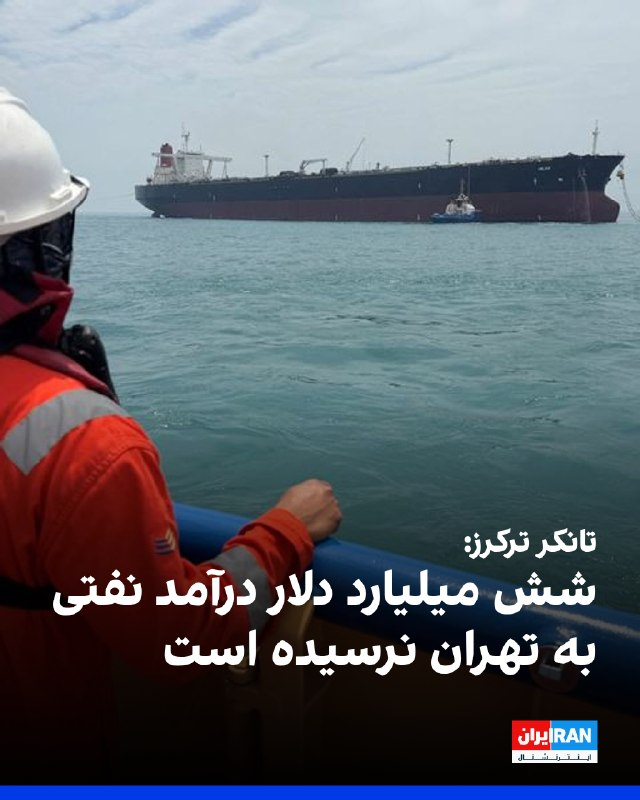

تانکر ترکرز در شبکه ایکس اعلام کرد در پی محاصره دریایی آمریکا، نزدیک به ۶۰ میلیون بشکه نفت خام ایران متوقف شده و حدود شش میلیارد دلار درآمد نفتی در حال حاضر به تهران نمی‌رسد.

این نهاد ردیابی نفتکش‌ها افزود هنوز نفتکش‌های خالی زیادی برای بارگیری نفت بیشتر وجود دارد، اما با کاهش تولید نفت، بارگیری نفتکش‌ها نیز کاهش یافته است.
https://iranintl.com/202605278620

## IranIntlTV — post 339297

‏دونالد ترامپ در نشست کابینه در کاخ سفید با اشاره به ادامه مذاکرات با جمهوری اسلامی گفت شاید مجبور شویم برگردیم و کار را تمام کنیم. همزمان با ادامه مذاکرات، ان‌بی‌سی نیوز نیز گزارش داد پنتاگون فهرستی از اهداف احتمالی در ایران را تهیه کرده است.

‏ گفت‌وگو با علیرضا نامور حقیقی، تحلیلگر سیاسی

## IranIntlTV — post 339296

  <a href="telegram/content/IranIntlTV_339296_1779911992.mp4" target="_blank">🎬 Download video</a>

پس از هفته‌ها اختلال و محدودیت گسترده اینترنت در ایران، حالا با وصل شدن دوباره اینترنت جهانی، بسیاری از مخاطبان ایران‌اینترنشنال می‌گویند دسترسی‌ها هنوز به وضعیت عادی برنگشته و در بعضی مناطق همچنان محدودیت وجود دارد.

گفت‌وگو با حسین قاضیان، جامعه‌شناس
@iranintltv

## IranIntlTV — post 339295

  <a href="telegram/content/IranIntlTV_339295_1779911993.mp4" target="_blank">🎬 Download video</a>

وزارت اطلاعات با انتشار بیانیه‌ای از نفوذ گسترده امنیتی، اطلاعاتی و سایبری در کشور خبر داد. در این بیانیه نسبت به پیامدهای جنگ ۴۰ روزه، شرایط امنیتی کشور و احتمال دور تازه اعتراض‌های خیابانی هشدار داده شده است.

گفت‌وگو با مراد ویسی، تحلیل‌گر ارشد ایران‌اینترنشنال
@iranintltv

## IranIntlTV — post 339293

  <a href="telegram/content/IranIntlTV_339293_1779911995.mp4" target="_blank">🎬 Download video</a>

یک شهروند با ارسال پیامی به ایران‌اینترنشنال می‌گوید که طرح اینترنت پرو شکست خورده و با باز شدن نسبی اینترنت مردم فریب نمی‌خورند. پیام او با هوش مصنوعی خوانده شده است.

## IranIntlTV — post 339292

  <a href="telegram/content/IranIntlTV_339292_1779911997.mp4" target="_blank">🎬 Download video</a>

ساعتی پیش از جلسه دولت آمریکا در کاخ سفید، دونالد ترامپ در شبکه اجتماعی تروت سوشال پستی درباره افزایش گزارش‌های آزار و خشونت جنسی در زندان‌های ایران را بازنشر کرد.

ارزیابی جمشید برزگر، روزنامه‌نگار و تحلیلگر سیاسی
@iranintltv

## IranIntlTV — post 339291

  

ابراهیم رضایی، سخنگوی کمیسیون امنیت ملی مجلس، در واکنش به گزارش‌ها درباره توافق احتمالی میان واشینگتن و تهران، در ایکس نوشت: اگرچه پیش‌نویس است و چیزی قطعی نیست اما متناسب با «پیروزی بزرگ ملت ایران» در جنگ ۴۰ روزه نیست.

او پیش‌تر نیز گفته بود جمهوری اسلامی نباید در موضوع هسته‌ای تعهدی بدهد که قدرت بازدارندگی‌اش را تضعیف کند.
https://iranintl.com/202605275713

## IranIntlTV — post 339290

  <a href="telegram/content/IranIntlTV_339290_1779911999.mp4" target="_blank">🎬 Download video</a>

۲۴ با فرداد فرحزاد

@iranintltv

## IranIntlTV — post 339289

  <a href="telegram/content/IranIntlTV_339289_1779912000.mp4" target="_blank">🎬 Download video</a>

از ادعای محقق شدن تغییر رژیم در ایران تا اظهارات ضد و نقیض درباره تنگه هرمز و مذاکرات؛ استراتژی رییس‌جمهور آمریکا یا سردرگمی او؟

گفت‌وگو با محمد قائدی مدرس روابط بین‌الملل در دانشگاه جورج واشینگتن

@iranintltv

## IranIntlTV — post 339288

  

مولوی عبدالحمید، امام‌جمعه اهل سنت زاهدان، در مراسم «عید قربان» ابراز امیدواری کرد مذاکرات جمهوری اسلامی و آمریکا که «قرار است جلوی جنگ را بگیرد» به نتیجه برسد و دو طرف به توافق دست یابند.

او با اشاره به این‌که از جزییات توافق اطلاعی ندارد، گفت در گذشته بارها بر ضرورت «توافق عادلانه» تاکید کرده و افزود برخی که پیش‌تر با این دیدگاه مخالف بودند، اکنون با آن موافق شده‌اند.

عبدالحمید همچنین گفت در گذشته سخنانی مطرح شده بود که با انتقاد برخی مواجه می‌شد، اما در نهایت مشخص شد آن سخنان «صحیح و درست» بوده‌اند.

امام‌جمعه اهل سنت زاهدان افزود: «ما خیرخواه کشور و ملت ایران هستیم» و بزرگ‌ترین خیرخواهی برای کشور را «شنیدن حرف مردم ایران و جلب رضایت آن‌ها» دانست.

او تاکید کرد: «کشور، حکومت و دولت متعلق به مردم است، لذا باید در راستای خدمت به مردم و جلب رضایت‌شان تلاش شود.»

عبدالحمید در پایان گفت: «ما امیدواریم فصل جدیدی در کشور ما آغاز شود که تمام منافع کشور به مردم بازگردند. منافع ملی بسیار مهم است و همه چیز باید فدای منافع مردم شود.»
https://iranintl.com/202605278561

## IranIntlTV — post 339287

  <a href="telegram/content/IranIntlTV_339287_1779912003.mp4" target="_blank">🎬 Download video</a>

در تحولی مهم در عراق، گروه سرایا السلام شاخه نظامی جریان صدر، سلاح‌های خود را به دولت تحویل داد و تحت فرماندهی نیروهای مسلح قرار گرفت.

گفت‌وگو با تروسکه صادقی، خبرنگار ایران‌اینترنشنال

@iranintltv

## IranIntlTV — post 339286

  <a href="telegram/content/IranIntlTV_339286_1779912004.mp4" target="_blank">🎬 Download video</a>

مهدی مهدوی‌آزاد در برنامه «چشم‌انداز» گفت: «بخش بزرگی از رجزخوانی‌های جمهوری اسلامی با واقعیت همخوانی ندارد. نفس ورود به مذاکره با دولت دونالد ترامپ که جمهوری اسلامی او را عامل کشتن قاسم سلیمانی و علی خامنه‌ای معرفی می‌کند، نشان می‌دهد تهران امکان ورود به این مذاکرات از موضع قدرت را نداشته است. از سوی دیگر، هرچند سناتورهای جمهوری‌خواه آمریکا تاکید دارند که ترامپ در مسیر دستیابی به توافقی مطلوب است، اما نفس ورود او به مذاکره با جمهوری اسلامی همچنان موجب نگرانی است.»
@iranintltv

## IranIntlTV — post 339285

  <a href="telegram/content/IranIntlTV_339285_1779912006.mp4" target="_blank">🎬 Download video</a>

یک شهروند در پیامی به ایران‌اینترنشنال از کسانی که در دوران قطع کامل اینترنت از اینترنت پروی حکومت استفاده نکردند تشکر کرد. پیام او با هوش مصنوعی خوانده شده است.

## IranIntlTV — post 339284

  <a href="https://t.me/IranintlTV/339284" target="_blank">📎 Download file</a>

🎧نسخه صوتی تیتراول با نیوشا صارمی: ترامپ: شاید محبور شویم به ایران برگردیم و کار را تمام کنیم
@iranintlTV

## IranIntlTV — post 339283

  

عبدالله حاجی‌صادقی، نماینده خامنه‌ای در سپاه: در طول جنگ می‌توانستیم اقدامات سنگین‌تری علیه آمریکا در منطقه انجام دهیم اما چون مردم خاورمیانه آسیب می‌دیدند، خامنه‌ای موافقت نکرد.

او افزود نقشه دشمن این است که ما را مقابل هم بگذارد.
https://iranintl.com/202605278400

## IranIntlTV — post 339282

  <a href="telegram/content/IranIntlTV_339282_1779912008.mp4" target="_blank">🎬 Download video</a>

وزارت اطلاعات یک روز پس از اتصال اینترنت اعلام کرد پس از توقف جنگ سخت، دشمن به‌دنبال جنگ ترکیبی است و استفاده از استارلینک و فعالیت رسانه‌های فارسی‌زبان خارج از ایران را از مصادیق آن دانست.

گفت‌وگو با نجات بهرامی، تحلیل‌گر سیاسی
@iranintltv

## IranIntlTV — post 339281

  <a href="telegram/content/IranIntlTV_339281_1779912010.mp4" target="_blank">🎬 Download video</a>

بهار شاه‌مهری، نوجوان ۱۷ ساله اهل نیشابور، غروب جمعه ۱۹ دی ۱۴۰۴ همراه با مردم معترض به خیابان رفت. او هنگام دور شدن از محل شلیک، از پشت سر هدف گلوله تک‌تیرانداز نیروهای جمهوری اسلامی قرار گرفت و جان باخت.

این گزارش تصویری، روایت جان‌باختن این نوجوان، را بازگو می‌کند.
@iranintltv

## IranIntlTV — post 339278

  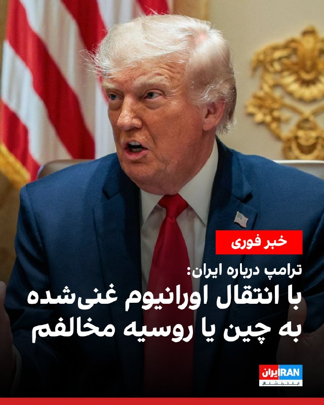

دونالد ترامپ درباره لغو یا کاهش تحریم‌های جمهوری اسلامی گفت واشینگتن «درباره هیچ‌گونه کاهش تحریم‌ها یا دادن پول» صحبت نمی‌کند و تاکید کرد: «هیچ تحریمی، هیچ پولی، هیچ چیزی.»

او افزود آمریکا کنترل پولی را که جمهوری اسلامی ادعا می‌کند متعلق به خود است در اختیار دارد و این کنترل را حفظ خواهد کرد. ترامپ گفت زمانی که جمهوری اسلامی «رفتار درستی» داشته باشد و «کار درست را انجام دهد»، اجازه دسترسی به این پول داده خواهد شد، اما «در حال حاضر چنین کاری انجام نمی‌دهیم» و «این دو موضوع به هم وابسته نیستند.»

ترامپ همچنین درباره انتقال اورانیوم غنی‌شده گفت با انتقال ذخایر اورانیوم غنی‌شده ایران به روسیه یا چین موافق نیست.
https://iranintl.com/202605278785

## Shin_Persian — post 6264

  

↩️ Quoted tweet: NewsWire ✓ @NewsWire_US Wed, 27 May 2026 17:02:46 UTC TRUMP: OMAN WILL BEHAVE OR WE'LL HAVE TO BLOW THEM UP. ↩️ توییت نقل‌قول شده — برای پاسخ، پست زیر را ببینید. فارسی ترامپ: عمان مودبانه رفتار خواهد کرد وگرنه مجبور خواهیم شد آن‌ها را…

## Shin_Persian — post 6263

↩️ Quoted tweet:
NewsWire ✓ @NewsWire_US
Wed, 27 May 2026 17:02:46 UTC

TRUMP: OMAN WILL BEHAVE OR WE'LL HAVE TO BLOW THEM UP.

↩️ توییت نقل‌قول شده — برای پاسخ، پست زیر را ببینید.

فارسی

ترامپ: عمان مودبانه رفتار خواهد کرد وگرنه مجبور خواهیم شد آن‌ها را منفجر کنیم.

𝕏 · @shin_persian

## Shin_Persian — post 6262

laurence norman @laurnorman
Wed, 27 May 2026 16:04:12 UTC

Saudis, Egypt, Jordan and Morocco have written to @iaeaorg seeking an urgent board meeting before June 5 over the attack on the UAE’s Barakah nuclear power plant. -1-

فارسی

عربستان، مصر، اردن و مراکش در نامه‌ای به آژانس بین‌المللی انرژی اتمی (@iaeaorg)، خواستار تشکیل جلسه فوری شورای حکام پیش از ۵ ژوئن در خصوص حمله به نیروگاه هسته‌ای براکه امارات شده‌اند. -۱-

𝕏 · @shin_persian

## Shin_Persian — post 6261

Open Source Intel ✓ @Osint613
Wed, 27 May 2026 15:54:57 UTC

Trump: No sanctions relief for Iran in exchange for giving up its highly enriched uranium stockpile. - PBS News

فارسی

ترامپ: هیچ لغو تحریمی برای ایران در ازای دست کشیدن از ذخایر اورانیوم با غنای بالای آن وجود نخواهند داشت. - PBS News

𝕏 · @shin_persian

## Shin_Persian — post 6260

Faytuks Network ✓ @FaytuksNetwork
Wed, 27 May 2026 16:20:06 UTC

Trump: "Iran is very much intent, they want very much to make a deal. So far they haven't gotten there ... we're not satisfied with it, but we will be. We will be either that or we'll have to just finish the job"

فارسی

ترامپ: «ایران بسیار مصمم است، آن‌ها خیلی می‌خواهند به توافق برسند. تا اینجا به آن نرسیده‌اند... ما از آن راضی نیستیم، اما خواهیم بود. یا آن‌گونه خواهد شد یا اینکه مجبور می‌شویم کار را تمام کنیم»

𝕏 · @shin_persian

## Shin_Persian — post 6259

سكاي نيوز عربية-عاجل ✓ @SkyNewsArabia_B
Wed, 27 May 2026 15:33:33 UTC

رئيس شركة "روساتوم" الروسية: قررنا تأجيل عودة موظفينا إلى محطة بوشهر للطاقة النووية في إيران

English

Head of the Russian company Rosatom: We have decided to postpone the return of our employees to the Bushehr Nuclear Power Plant in Iran.

𝕏 · @shin_persian

## Iliaen — post 4436

بزرگ‌ترین تفاوت میان امروز و ۹۰ روز قبل، این است که شناخت ما به سیاست، جامعه، دوستان و حتی خودمان دگرگون شد.

جامعه‌ای که امروز می‌داند در اوج روزهای تاریکی با چه بحران‌هایی طرف خواهد شد، چه راهکارهای واقع‌بینانه‌‌ای برای مدیریت آن خواهد داشت و مهم‌تر از همه، سطح توقع خود را نسبت به همه چیز بهتر می‌شناسد، یک جامعه تکامل‌یافته است.

چنین جامعه‌ای بیشتر درد می‌کشد، آسیب زیادی را متحمل شده، اما دیگر از هیچ چیز غافلگیر نخواهد شد و درنهایت با عبور از مرحله واکنش‌گرایی، وارد مرحله کُنش‌گرایی می‌شود که این، بخش پایانی از هر انقلاب‌ است.

بخشی که دست‌کم یک‌بار به تمام ملت‌ها در تاریخ نشان داد، واکنش‌گرایی یعنی غافلگیری و بلاتکلیفی، اما ‌آزادی، یک فرایند از دل کنش‌گرایی است.

باید بدانیم که یک انقلاب پیش از نمود در جامعه به عنوان یک “انقلاب سیاسی”، ابتدا در ذهن و نگرش آن جامعه، تحت عنوان یک “انقلاب فرهنگی و شناختی” رقم می‌خورد و ما در حال گذر از این مرحله پایانی هستیم.

امروز و در اینجا، باید بیش از هر زمان نسبت به آینده امیدوار بود، زیرا تاریخ این را به ما نشان می‌دهد؛ همانطور که پیش‌تر سرنوشت خامنه‌ای را نشان داده بود!

@iliaen

## ManotoTV — post 105837

  <a href="telegram/content/ManotoTV_105837_1779912013.mp4" target="_blank">🎬 Download video</a>

از «کمک در راه است» تا مذاکره، معامله و بازگشت به همان سیاست همیشگی؟ ورق بزنید.

## FarsiVOA — post 218836

  <a href="telegram/content/FarsiVOA_218836_1779912014.mp4" target="_blank">🎬 Download video</a>

⚡️روزنه‌ای برای حرف‌های نگفته کاربران ایرانی در طولانی‌ترین خاموشی دیجیتال جهان

@FarsiVOA

## FarsiVOA — post 218835

🔺تلاش آمریکا برای جلوگیری از ورود ایبولا به کشور؛ شمار قربانیان در کنگو از ۲۲۰ نفر گذشت

▪️مارکو روبیو، وزیر امور خارجه آمریکا، می‌گوید ایالات متحده باید از ورود افراد مبتلا به ایبولا از جمهوری دموکراتیک کنگو جلوگیری کند. شیوع این بیماری در کنگو تاکنون دست‌کم ۲۲۰ مرگ مشکوک و بیش از ۹۰۰ مورد مشکوک به ابتلا بر جای گذاشته است.

⬇️ بیشتر بخوانید:
https://ir.voanews.com/a/marco-rubio-vows-to-keep-ebola-out-of-us/8154574.html
@FarsiVOA

## FarsiVOA — post 218834

⚡️انتقال کمپ تیم ملی فوتبال جمهوری اسلامی به تیخوانا در مکزیک، حالا به یکی از جنجالی‌ترین بحث‌های رسانه‌های ایران تبدیل شده. از محدودیت‌های آمریکا برای اقامت تیم ملی گرفته تا هشدار رسانه‌های داخلی درباره ناامنی، کارتل‌های مواد مخدر، و محله‌های پرخطر این شهر مرزی.
@FarsiVOA

## FarsiVOA — post 218833

⚡️با گذشت ۸۸ روز از خاموشی دیجیتال در ایران، روایت‌ها از اینترنتِ محدود، خسارت میلیارددلاری به اقتصاد، فشار معیشتی، کوچک‌تر شدن سفره مردم و تشدید فضای امنیتی در ایران خبر می‌دهند
@FarsiVOA

## FarsiVOA — post 218828

فرماندهی مرکزی ایالات متحده، سنتکام، تصاویری از عملیات هوایی ملوانان و تفنگداران دریایی آمریکا بر ناو هواپیمابر «یو‌اس‌اس آبراهام لینکلن» منتشر کرد.

این ناو از عملیات منطقه‌ای در دریای عرب پشتیبانی می‌کند، از جمله محاصره دریایی آمریکا علیه جمهوری اسلامی که تاکنون بیش از ۱۰۰ کشتی تجاری را تغییر مسیر داده است.

## FarsiVOA — post 218827

🔺دونالد ترامپ درباره مذاکره با رژیم ایران: توافق نکنند کار را تمام می‌کنیم

▪️رئیس جمهوری آمریکا با تاکید بر این که جمهوری اسلامی چاره‌ای جز توافق با آمریکا ندارد، از این که تاکنون نتیجه‌ای از گفت‌و‌گوها به دست نیامده است ابراز نارضایتی کرد.

⬇️ بیشتر بخوانید:

https://ir.voanews.com/a/donald-trump-marco-rubio-pete-hegsett-iran-attack-agreement/8154553.html/?nocach=1

## FarsiVOA — post 218826

نفوذ پهپادها به حریم ناتو؛ تشدید نگرانی امنیتی در شرق و شمال اروپا

## FarsiVOA — post 218825

رئیس سازمان اطلاعات و امنیت سایبری بریتانیا می‌گوید روسیه مستقیماً زیرساخت‌ها، انتخابات و سیستم‌های حیاتی این کشور را هدف گرفته و خطر حملات سایبری به سطحی «بی‌سابقه» رسیده. هم‌زمان بریتانیا و لهستان در حال امضای یک پیمان دفاعی جدید برای مقابله با تهدیدهای روسیه و تقویت امنیت اروپا هستند

## FarsiVOA — post 218824

  <a href="telegram/content/FarsiVOA_218824_1779912015.mp4" target="_blank">🎬 Download video</a>

در یکی از تجمع‌های شبانه حکومتی ماکت جواد ظریف با شعار «مرگ بر منافق» آتش زده شد. با این حال کاربران بسیاری به این اتفاقات با دیده تردید نگاه می‌کنند و می‌گویند اختلافی جدی در میان مقامات جمهوری اسلامی وجود ندارد و همه بر سر حفظ نظام با هم متحد هستند.

## FarsiVOA — post 218823

🔺حمله ارتش اسرائیل به صدها موضع حزب‌الله در لبنان

▪️ارتش اسرائیل روز چهارشنبه ۶ خرداد با انتشار پیامی در شبکه‌های اجتماعی اعلام کرد که ساختمان‌های نظامی، مقرهای فرماندهی، و سایت‌های پرتاب گروه تروریستی حزب‌الله در منطقه البقاع را هدف قرار داده است.

⬇️ بیشتر بخوانید:

https://ir.voanews.com/a/israeli-army-attack-hezbollah-terrorist-organization/8154533.html/?nocach=1

## FarsiVOA — post 218822

  

پیت هگست، وزیر جنگ آمریکا در جلسه کابینه گفت که اگر مذاکرات با جمهوری اسلامی به نتیجه نرسد و لازم باشد، ارتش آمریکا آماده است که باز گردد و کار را تمام کند.
آقای هگست توضیح داد که عملیات نظامی علیه جمهوری اسلامی با جنگ عراق و افغانستان متفاوت است و پرزیدنت ترامپ اطمینان حاصل خواهد کرد که حکومت ایران به سلاح هسته‌ای دست پیدا نکند.

## FarsiVOA — post 218821

پوسترهای اعتراضی علیه برنامه هسته‌ای و موشکی جمهوری اسلامی در نقاط مختلف بازار تهران نصب و پخش شده‌اند. معترضان، حکومت را مسئول فشار اقتصادی، تحریم‌ها و بحران معیشتی می‌دانند؛ اعتراضی کم‌سابقه از قلب یکی از پایگاه‌های سنتی حکومت.

## FarsiVOA — post 218820

  <a href="telegram/content/FarsiVOA_218820_1779912017.mp4" target="_blank">🎬 Download video</a>

ارتش اسرائیل اعلام کرد نیروهایش از ابتدای هفته حدود ۵۵۰ زیرساخت حزب‌الله را در منطقه بقاع و سراسر جنوب لبنان هدف قرار داده‌اند.

ساختمان‌های نظامی، مقرهای فرماندهی و سایت‌های پرتاب مورد استفاده سازمان تروریستی حزب‌الله از اهداف مورد حمله بوده‌اند.

ارتش اسرائیل تاکید کرد حملات به مقرهای فرماندهی در منطقه صور همچنان در حال انجام است.

## FarsiVOA — post 218819

  

مارکو روبیو، وزیر خارجه آمریکا در جلسه کابینه گفت که حکومت ایران بزرگترین حامی تروریسم در جهان است و نباید به سلاح هسته‌ای دست پیدا کند.
آقای روبیو خاطرنشان کرد: دیپلماسی همیشه گزینه اول ایالات متحده است اما همه گزینه‌ها را مدنظر دارد.

## FarsiVOA — post 218818

  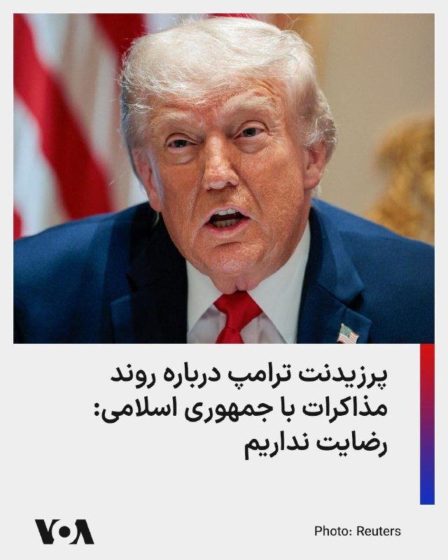

دونالد ترامپ، رئیس جمهوری آمریکا در جلسه کابینه با اشاره به این که مقامات حکومت ایران مشتاق رسیدن به توافق هستند از وضعیت فعلی مذاکرات ابراز نارضایتی کرد.
پرزیدنت ترامپ با بیان اینکه شاید مجبور شویم دوباره به جنگ با رژيم ایران برگردیم گفت: «آنها جز توافق با ما گزینه دیگری ندارند. آنها نمی‌توانند و نخواهند توانست به سلاح هسته‌ای دست پیدا کنند.»

## FarsiVOA — post 218817

  <a href="telegram/content/FarsiVOA_218817_1779912020.mp4" target="_blank">🎬 Download video</a>

حدود ساعت ۱۷ چهارشنبه، ششم خرداد، یکی از برج‌های ۱۶ طبقه‌ای، ۶۴ واحدی، مجتمع مسکونی پامچال در بزرگراه خرازی، شهرک چیتگر دچار آتش‌سوزی شد.

به گفته سخنگوی آتش‌نشانی، آتش که از یکی از واحدهای طبقه هشتم آغاز شده و به سرعت به همه بخش‌ها سرایت کرده بود اکنون خاموش شده و «آتش‌نشانان موفق شدند چند خانواده را از محل حادثه خارج کنند. عملیات جستجو ادامه دارد اما این حادثه تا این لحظه تلفات جانی نداشت.»

## DW_Farsi — post 125212

  

🔶 هگست: ایران هنوز ذخایر موشکی دارد اما نمی‌تواند موشک تازه تولید کند

پیت هگست، وزیر دفاع (جنگ) آمریکا می‌گوید، ایران با وجود هفته‌ها بمباران ایالات متحده و اسرائیل، همچنان ذخایر موشکی در اختیار دارد.

او در نشست هیات دولت آمریکا در کاخ سفید در روز چهارشنبه ششم خرداد گفت: «ممکن است آنها هنوز موشک داشته باشند، اما در حال حاضر نمی‌توانند موشک‌های بیشتری بسازند.»

وزیر دفاع آمریکا همچنین افزود که ایران "در حال حاضر نمی‌تواند پهپادهای بیشتری تولید کند و کشتی‌های بیشتری بسازد".

او اضافه کرد: «آن‌ها به همین دلیل آمدند و برای گفت‌وگو اعلام تسلیم کردند.»

هگست ضمن ستایش محاصره بنادر ایران از سوی آمریکا نیز گفت: «هیچ نفتکش ایرانی در هیچ نقطه جهان در امان نیست و ما در سراسر جهان شاهد توقیف‌ها بوده‌ایم؛ اقدامی که شریان حیاتی اقتصادی آنها را قطع می‌کند.»
@dw_farsi

## DW_Farsi — post 125211

🎥 "فیلم و کتاب زیر بغل، خانه به خانه" در گریز از سانسور

مستند "نفس دوم"، ساخته مژگان ایلانلو مانند بسیاری دیگر از فیلم‌ها در ایران اجازه نمایش عمومی ندارد. سازنده این فیلم حالا در اروپاست تا در اکران‌های عمومی فیلمش در خارج از ایران حضور داشته باشد. با او درباره این فیلم گفت و گو کردیم.
@dw_farsi

## DW_Farsi — post 125210

  

🔶 ترامپ به ایران: اگر توافق نشود مجبوریم کار را یکسره کنیم

دونالد‌ ترامپ، رئیس‌جمهور آمریکا، روز چهارشنبه ۲۷ مه (۶ خرداد) در نشست کابینه خود در کاخ سفید درباره مذاکرات با جمهوری اسلامی گفت، تهران "واقعا می‌خواهد توافق کند، اما مذاکرات هنوز به نتیجه نهایی نرسیده است".

ترامپ در عین حال تاکید کرد: «ما از وضعیت فعلی [مذاکره] راضی نیستیم، ولی خواهیم شد.»

رئیس‌جمهور آمریکا با اشاره به اینکه "جمهوری اسلامی تحت فشار شدید است"، اضافه کرد: «نیروی دریایی‌شان نابود شده، نیروی هوایی از بین رفته و همه‌چیزشان از دست رفته است.»

ترامپ خاطرنشان کرد، جمهوری اسلامی "در حالی مذاکره می‌کند که چیزی برایش باقی نمانده".

او در ادامه هشدار داد، یا توافق حاصل می‌شود یا "مجبور می‌شویم کار را یکسره کنیم."

ترامپ ضمن اشاره به این نکته که "اقتصاد ایران در حال سقوط آزاد است" گفت که تهران "به‌دلیل فشارهای سنگین، گزینه دیگری جز حرکت به‌سوی توافق ندارد".

اظهارات ترامپ در حالی بیان شده است که او چهار روز پیش گفته بود، در مورد یک توافق "تا حد زیادی مذاکره شده" و جزئیات آن "به زودی اعلام خواهد شد".
@dw_farsi

## DW_Farsi — post 125209

  

🔶 وزارت اطلاعات ایران: دشمن به جنگ نرم و سایبری روی آورده است

وزارت اطلاعات ایران طی بیانیه‌ای با اشاره به آمریکا و اسرائیل "تصرف، تجزیه، تسلیم، فروپاشی و براندازی" حکومت را جزو اهداف آن‌ها خواند و مدعی شد که "دشمن اکنون با توقف جنگ سخت" به "جنگ نرم و سایبری" روی آورده است.

در بیانیه‌ این وزارت‌خانه که روز چهارشنبه ششم خرداد (۲۷ مه) از صدا‌وسیمای جمهوری اسلامی منتشر شد اعلام شده که "دشمن" اکنون با ابزارهایی دیگر همان هدفی را دنبال می‌کند که در آغاز جنگ ایران "آشکارا اعلام کرده بود"، اما "نتوانست از راه نظامی به آن دست یابد."

این وزارتخانه همچنین مدعی شد، آمریکا و اسرائیل می‌کوشند "فشار اقتصادی را تشدید کنند"، میان گروه‌های دینی و قومی شکاف ایجاد کنند و دست به خرابکاری و دیگر "عملیات تروریستی" بزنند.

در این بیانیه ادعا شده است که برای این منظور، "سلاح، مهمات و ابزارهای غیرقانونی ارتباطی، به‌ویژه استارلینک" برای دسترسی به اینترنت ماهواره‌ای، در "دستور کار جدی دشمن" قرار دارد.

با وجود آتش‌بس برقرارشده، نیروهای آمریکایی اخیرا بار دیگر مواضع موشکی و کشتی‌های ایرانی را هدف حمله قرار داده‌اند.
@dw_farsi

## DW_Farsi — post 125208

  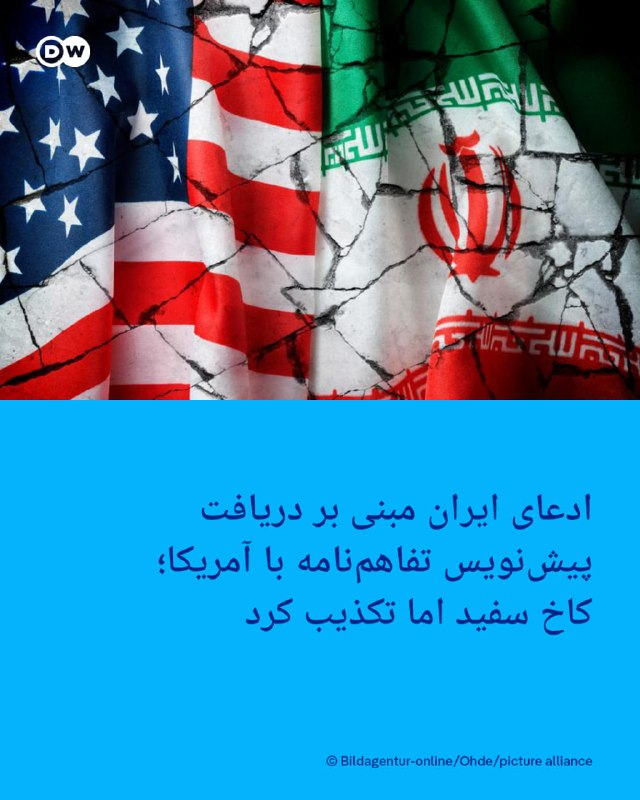

🔶 ایران: پیش‌نویس تفاهم‌نامه با آمریکا را دریافت کردیم؛ کاخ سفید تکذیب کرد

صداوسیمای جمهوری اسلامی ایران گزارش داد که تهران پیش‌نویس چارچوب اولیه و غیررسمی یک یادداشت تفاهم با آمریکا را جهت پایان دادن به میان درگیری دو کشور دریافت کرده است.

طی این گزارش، بر اساس این چارچوب، جمهوری اسلامی "ظرف یک ماه تردد کشتی‌های تجاری از تنگه هرمز را به سطح پیش از جنگ بازمی‌گرداند و ایالات متحده نیز نیروهای نظامی خود را از اطراف ایران خارج و محاصره دریایی را لغو  می‌کند."

صداوسیما افزود، این چارچوب، که کشتی‌های نظامی را در بر نمی‌گیرد و بر اساس آن، جمهوری اسلامی با همکاری عمان عبور و مرور کشتی‌ها در تنگه را مدیریت خواهد کرد، هنوز نهایی نشده است و تهران بدون "راستی‌آزمایی ملموس" هیچ اقدامی انجام نخواهد داد.

در پی انتشار این خبر کاخ سفید طی بیانیه‌ای در شبکه ایکس اعلام کرد که این گزارش که رسانه‌های ایران آن را منتشر کرده‌اند "درست نیست و یادداشت تفاهمی که آن‌ها منتشر کرده‌اند کاملا ساختگی است."

کاخ سفید افزود: «هیچ کس نباید مطالبی که رسانه‌های دولتی ایران منتشر می‌کنند را باور کند. واقعیت‌ها اهمیت دارند.»
@dw_farsi

## DW_Farsi — post 125207

  

🔶 کره جنوبی سفیر ایران را در اعتراض به حمله به کشتی خود احضار کرد

کره جنوبی روز چهارشنبه ۲۷ مه (ششم خرداد) اعلام کرد که سفیر ایران را احضار خواهد کرد تا در پی پایان تحقیقات درباره حمله به کشتی خود در تنگه هرمز مراتب اعتراضش را اعلام کند.

این کشور می‌گوید، بر اساس نتایج این تحقیقات، "به احتمال بسیار زیاد" این حمله با یک موشک ساخت ایران انجام شده است.

این کشتی باری کره جنوبی روز ۴ مه در تنگه هرمز ، آبراهی راهبردی که از زمان آغاز جنگ آمریکا و اسرائیل علیه جمهوری اسلامی در ۲۸ فوریه عملا بسته شده، هدف حمله قرار گرفت.

دونالد ترامپ، رئیس جمهور آمریکا، مدعی شده که جمهوری اسلامی به این کشتی با پرچم پاناما "شلیک‌هایی" کرده، اما تهران مسئولیت این حمله را رد کرده است.

پس از تحقیقاتی که چند هفته به طول انجامید، دولت کره جنوبی اعلام کرد، بررسی‌های فنی نشان می‌دهد که پرتابه ناشناسی که به این کشتی اصابت کرده، "به احتمال بسیار زیاد" گونه‌ای دیگر از "سری نور، ساخته‌شده در ایران" بوده است.
@dw_farsi

## DW_Farsi — post 125206

🔶 بازداشت ۳۹ تن در یونان به اتهام "فساد در یارانه‌های کشاورزی"

در جریان تحقیقات درباره یک پرونده گسترده فساد مربوط به یارانه‌های کشاورزی اتحادیه اروپا در یونان، مقام‌ها ۳۹ مظنون را بازداشت کردند.

پلیس یونان اعلام کرد که روز سه‌شنبه ۲۶ مه (۵ خرداد) ۱۷ نفر در شمال کشور، عمدتا در شهر تسالونیکی، دومین شهر بزرگ یونان، بازداشت شدند.

بنا بر این گزارش، روز پیش از آن نیز ۲۲ نفر بازداشت شده بودند که بیشتر آنها در جزیره کرت انجام شده است.
@dw_farsi

## DW_Farsi — post 125205

🔶 پیروزی نامزد مورد حمایت ترامپ در تگزاس به‌ رغم رسوایی‌ها

کن پاکستون، دادستان کل تگزاس با حمایت قاطع دونالد ترامپ، رئیس‌جمهور آمریکا توانست در انتخابات درون‌حزبی جمهوری‌خواهان در تگزاس که یکی از پایگاه‌های اصلی و سنتی حزب جمهوری‌خواه است جیمز کورنین، سناتور باسابقه را شکست دهد.

پاکستون به دلیل گرایش‌های راست‌گرایانه و وفاداری شدید به ترامپ پیروز شد و اکنون در انتخابات مهم نوامبر ۲۰۲۶ نامزد جمهوری‌خواهان خواهد بود.
@dw_farsi

## DW_Farsi — post 125204

🎥 نقش یک شرکت در امارات در خرید تجهیزات ماهواره‌ای چینی برای ایران

بنا به گزارش‌ها، سپاه پاسداران از یک شرکت مستقر در امارات متحده عربی برای خرید تجهیزات ماهواره‌ای پیشرفته چینی استفاده کرده است و بعدا در جنگ، حملاتی را علیه اهداف اماراتی انجام داده است.
@dw_farsi

## DW_Farsi — post 125203

🔶 تشدید تهدید‌های پوتین علیه اوکراین و پاسخ آلمان

بر اساس گزارش‌ها، سرگئی لاوروف، وزیر امور خارجه روسیه، دربارiه حملات سیستماتیک بیشتر به کی‌یف، پایتخت اوکراین هشدار داده است.

به گفته او، نه فقط تاسیساتی که برای نیروهای مسلح اوکراین اهمیت دارند، بلکه "مراکز تصمیم‌گیری" نیز هدف قرار خواهند گرفت. از خارجی‌ها و دیپلمات‌ها بار دیگر خواسته شده است تا شهر را ترک کنند.
@dw_farsi

## DW_Farsi — post 125202

🔶 طالبان به دنبال اعزام دیپلمات‌های بیش‌تری به اروپاست

طالبان که بر افغانستان حکومت می‌کند در حال حاضر دیپلمات‌های خود را به آلمان اعزام کرده است. این گروه خواستار آن است که در آینده دیپلمات‌های خود را به کشورهای بیش‌تری در اتحادیه اروپا اعزام کند و به همین خاطر این پیشنهاد را مطرح کرده که در عوض، در بازگرداندن پناهجویان افغان از اروپا به افغانستان همکاری خواهد کرد.

طبق تحقیقات شبکه تلویزیونی و رادیویی "ان‌ار‌د" (NDR) آلمان، این خواست یکی از مطالبات اصلی هیئت طالبان در سفر برنامه‌ریزی‌شده به بروکسل است.
@dw_farsi

## DW_Farsi — post 125201

  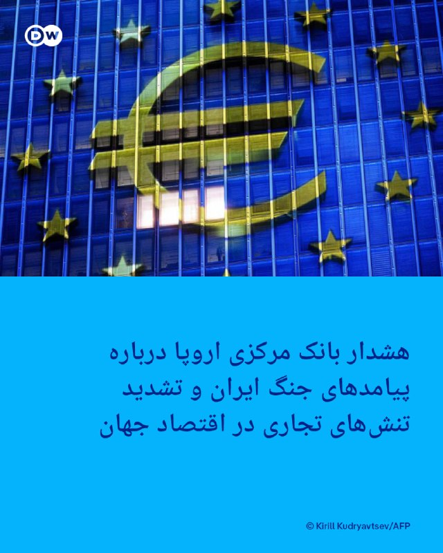

🔶 هشدار بانک مرکزی اروپا درباره پیامدهای جنگ ایران و تشدید تنش‌های تجاری در اقتصاد جهان

بانک مرکزی اروپا هشدار داده است که جنگ ایران و ادامه تنش‌های تجاری در جهان می‌تواند رشد اقتصادی منطقه یورو را کاهش دهد، هزینه استقراض را افزایش دهد و فشار بیشتری بر بودجه دولت‌های اروپایی وارد کند.

این هشدار در جدیدترین گزارش ثبات مالی بانک مرکزی اروپا منتشر شده؛ گزارشی که می‌گوید بازارهای مالی تاکنون واکنش شدیدی به جنگ ایران نشان نداده‌اند و همین موضوع نگرانی‌هایی درباره "کم‌اهمیت جلوه دادن خطرها" از سوی سرمایه‌گذاران ایجاد کرده است.

بانک مرکزی اروپا هشدار داده که "سناریویی از رشد که به طور قابل توجهی ضعیف‌تر باشد و در همراهی با یک شوک انرژی پایدارتر باشد، می‌تواند باعث ارزیابی مجدد پایداری مالی و تغییر ناگهانی قیمت‌ها در بازارهای اوراق قرضه دولتی شود".

طبق این برآورد، اینگونه قیمت‌گذاری مجدد می‌تواند "هزینه‌های استقراض شرکت‌ها را افزایش دهد و یک حلقه بازخورد ایجاد کند که می‌تواند ثبات مالی را با خطر مواجه سازد و به اقتصاد واقعی ضربه بزند".
@dw_farsi

## DW_Farsi — post 125200

🔶 عربستان سعودی؛ ۱.۵ میلیون نفر با وجود جنگ به حج می‌روند

🔻 گزارشی از Cathrin Schaer

سال ۲۰۲۶ نخستین سالی است که دولت آمریکا از شهروندان خود خواسته در سفر برای مراسم حج تجدیدنظر کنند و اعلام کرده که کارکنان غیرضروری دولت آمریکا در مارس امسال از عربستان خارج شده‌اند.

کارشناسان احتمال هدف قرار دادن مستقیم حج توسط ایران را بسیار پایین می‌دانند زیرا این اماکن برای همه مسلمانان مقدس است. علاوه بر این، حدود ۳۰ هزار زائر ایرانی نیز امسال در مراسم حج حضور دارند.

اما این نگرانی وجود دارد که این مراسم به اشتباه یا تصادفی هدف قرار گیرد.
@dw_farsi

## Persian_Trend_Official — post 15145

تا دقایقی دیگه لایو امشب آغاز میشه
حدودا 30 دقیقه

## Persian_Trend_Official — post 15144

  <a href="telegram/content/Persian_Trend_Official_15144_1779912025.mp4" target="_blank">🎬 Download video</a>

پرفسور خوش چشم محبوب دل ها و مشتری زغال خوب

📌 @persian_trend_official
پرشین ترند | متفاوت‌ترین کانال نظامی

## Persian_Trend_Official — post 15143

  <a href="telegram/content/Persian_Trend_Official_15143_1779912027.webm" target="_blank">🎬 Download video</a>

رویترز: پنتاگون و اسپیس ایکس برای ارائه Direct-to-Cell در ایران مذاکره کرده بودند

🔹به گزارش رویترز، پنتاگون در خلال درگیری نظامی با ایران و در شرایطی که دسترسی اینترنت در کشور قطع شده بود، بر سر ارائه سرویس دایرکت تو سل (Direct-to-Cell) که منجر به اتصال مستقیم گوشی‌های هوشمند به اینترنت ماهواره‌ای استارلینک می‌شود، با شرکت اسپیس‌ایکس گفتگو کرده و بر سر هزینه‌ها دچار اختلاف نظر شده بود.
🔹رویترز می‌گوید براساس اسناد پنتاگون و گفته‌های یکی از منابع آگاه، اسپیس‌ایکس که در سال ۲۰۲۵ مبلغ ۱۱.۴ میلیارد دلار از استارلینک درآمد داشته، برای راه‌اندازی این قابلیت در ایران پیشنهاد دریافت رقم هنگفت ۵۰۰ میلیون دلار به همراه هزینه ۱۰۰ میلیون دلاری ماهانه برای عملیاتی کردن آن را مطرح کرده بود. این ارقام باعث نگرانی شدید مقامات دفاعی آمریکا شده بود و رویترز نتوانسته مشخص کند که آیا توافقی در این زمینه حاصل شده است یا خیر.

👩‍💻@PhantomDirective

🆔@persian_trend_official
پرشین ترند | متفاوت‌ترین کانال نظامی

## Persian_Trend_Official — post 15142

  

🔴 ترامپ: از روند مذاکرات با ایران راضی نیستیم؛ گزینه نظامی همچنان روی میز است.

▪️ وی اعلام کرد واشینگتن از روند فعلی مذاکرات با ایران رضایت ندارد.
▪️ او هشدار داد اگر توافق «قابل‌قبولی» حاصل نشود، آمریکا ممکن است دوباره به اقدام نظامی متوسل شود
▪️ ترامپ تأکید کرده ایران باید به‌صورت شفاف از دستیابی به سلاح هسته‌ای صرف‌نظر کند و مذاکرات فعلی هنوز به سطح مطلوب آمریکا نرسیده است

🫆:Tony

📌 @persian_trend_official
پرشین ترند | متفاوت‌ترین کانال نظامی

## Persian_Trend_Official — post 15141

  <a href="telegram/content/Persian_Trend_Official_15141_1779912028.mp4" target="_blank">🎬 Download video</a>

⭕️مزدور کلمبیایی که به اسارت ارتش روسیه در آمد !!‌

💢ویدئو منتشرشده از صحنه اسارت یک فرد معرفی‌شده به‌عنوان «مزدور کلمبیایی» در درگیری‌های مرتبط با اوکراین حاکی از آن است که نیروهای روسی پس از اسارت، از هویت او سؤال کرده و زمانی که مشخص شده تبعه اوکراین نیست، او را شهروند کلمبیا معرفی کرده است.

💢در این ویدئو یکی از نظامیان روس در مکالمه‌ای کوتاه و غیررسمی با او به زبان انگلیسی از کشورش سؤال کرده و در واکنش به پاسخ «کلمبیا»، جمله‌ای طعنه آمیز به او میگوید:

▪️برادر به روسیه خوش آمدی ...

💢در ادامه این گزارش آمده است که وضعیت حقوقی این فرد در چارچوب اسیران جنگی محل بحث است؛ چرا که ادعا شده برخی نیروهای روسی، افراد غیر اوکراینیِ حاضر در میدان نبرد را در دسته «مزدور» طبقه‌بندی می‌کنند. با این حال، طبق قواعد شناخته‌شده حقوق بین‌الملل بشردوستانه و کنوانسیون‌های ژنو، وضعیت اسارت و رفتار با اسیران جنگی باید بر اساس معیارهای مشخص حقوقی تعیین شود، نه صرفاً تابعیت یا برداشت میدانی.

🫆:Tony

📌 @persian_trend_official
پرشین ترند | متفاوت‌ترین کانال نظامی

## Persian_Trend_Official — post 15140

  

💢نت بلاکس

💢 اتصال اینترنت ایران اکنون برای ۲۴ ساعت در حالت بازیابی قرار داشته است. خدمات همچنان به شدت فیلتر شده باقی مانده و محدودیت‌های جدیدی روی پیام‌رسان‌ها و فروشگاه‌های اپلیکیشن در مقایسه با سطح پیش از ژانویه اعمال شده است.

درخواست‌ها برای یک اینترنت آزاد و باز، فراتر از خطوط سیاسی قرار دارند و باید شنیده شوند.

💢میزان اختلالات در شبکه از دیروز بسیار بیشتر شده است، بسیاری از سرویس‌های گوگل و کلودفلر بسته شده اند و حتی قابلیت استفاده از گوگل پلی و اپ استور نیز وجود ندارد.

🫆:Tony

📌 @persian_trend_official
پرشین ترند | متفاوت‌ترین کانال نظامی

## Persian_Trend_Official — post 15139

  <a href="telegram/content/Persian_Trend_Official_15139_1779912030.webm" target="_blank">🎬 Download video</a>

🇷🇺رئیس روس اتم: روسیه تصمیم گرفته است که بازگشت کارکنان خود به نیروگاه هسته‌ای بوشهر در ایران را به تعویق بیندازد.

👩‍💻@PhantomDirective

🆔@persian_trend_official
پرشین ترند | متفاوت‌ترین کانال نظامی

## Persian_Trend_Official — post 15138

  <a href="telegram/content/Persian_Trend_Official_15138_1779912031.webm" target="_blank">🎬 Download video</a>

تکذیب شکایت اعضای شورای عالی فضای مجازی برای جلوگیری از وصل‌شدن اینترنت

«رضا تقی‌پور» عضو شورای عالی فضای مجازی: شکایت بابت تاسیس نهاد موازی فراقانونی انجام شد. هرگز موافق قطع اینترنت نبوده و نیستم.

👩‍💻@PhantomDirective

🆔@persian_trend_official
پرشین ترند | متفاوت‌ترین کانال نظامی

## Persian_Trend_Official — post 15137

  <a href="telegram/content/Persian_Trend_Official_15137_1779912031.mp4" target="_blank">🎬 Download video</a>

🔴 ترامپ

«الان دارم به بعضی از این دموکرات‌ها انتقاد می‌کنم. واقعاً آدم‌های خنگی هستند.

گفتم فکرش را بکنید. E را بردارید، U بگذارید. می‌شوند دوموکرات (احمق‌کرات)!»

🫆:Tony

📌 @persian_trend_official
پرشین ترند | متفاوت‌ترین کانال نظامی

## Persian_Trend_Official — post 15136

  <a href="telegram/content/Persian_Trend_Official_15136_1779912032.webm" target="_blank">🎬 Download video</a>

💢حتی با تحویل اورانیوم‌ها هم خبری از لغو تحریم‌ها نیست!

♦️ترامپ در گفتگو با شبکه پی‌بی‌اس اعلام کرد که ایران حتی در ازای دست کشیدن از اورانیوم‌های با غنای بالای خود، از کاهش تحریم‌ها بهره‌مند نخواهد شد!

🫆:Tony

📌 @persian_trend_official
پرشین ترند | متفاوت‌ترین کانال نظامی

## Persian_Trend_Official — post 15135

  <a href="telegram/content/Persian_Trend_Official_15135_1779912033.webm" target="_blank">🎬 Download video</a>

🔴 کاخ سفید گزارش‌های تلویزیون دولتی ایران درباره پیش‌نویس جدید توافق را رد کرد

▪️ کاخ سفید به‌طور قاطع گزارش‌های منتشرشده در رسانه‌های دولتی ایران درباره ارائه پیش‌نویس جدید یادداشت تفاهم (MOU) برای توافق صلح با آمریکا را تکذیب کرد
▪️ واشینگتن می‌گوید هنوز هیچ متن نهایی یا پیش‌نویس جدیدی تأیید نشده است
▪️ این تکذیب در حالی مطرح می‌شود که طی ساعات اخیر روایت‌های متناقضی درباره وضعیت مذاکرات منتشر شده است

🫆:Tony

📌 @persian_trend_official
پرشین ترند | متفاوت‌ترین کانال نظامی

## Persian_Trend_Official — post 15134

  

🔴 گزارش CSIS: آمریکا ممکن است تا ۳ سال برای بازسازی ذخایر موشکی خود زمان نیاز داشته باشد

▪️ یک گزارش جدید از Center for Strategic and International Studies هشدار داده ذخایر موشک‌های کلیدی آمریکا پس از جنگ با ایران به‌شدت کاهش یافته است.
▪️ موجودی موشک‌های Tomahawk، Patriot و THAAD به‌طور قابل‌توجهی افت کرده و بازسازی آن‌ها ممکن است چند سال طول بکشد
▪️ این گزارش از ایجاد یک «پنجره آسیب‌پذیری» برای آمریکا در غرب اقیانوس آرام و همزمان با افزایش تنش با China خبر می‌دهد
▪️ با وجود افزایش بودجه دفاعی و تلاش برای بالا بردن تولید، کارشناسان می‌گویند ظرفیت فعلی صنایع نظامی آمریکا برای جبران سریع این کمبود کافی نیست

🫆:Tony

📌 @persian_trend_official
پرشین ترند | متفاوت‌ترین کانال نظامی

## Persian_Trend_Official — post 15133

  

برای پوشش سریع‌تر و دقیق‌تر اخبار، دایرکت پرشین ترند از این به بعد برای دریافت خبرها و اطلاعات مخاطبان فعاله 📩

اگر خبر، تصویر، ویدیو یا اطلاعات مهم و دست‌اولی دارید که فکر می‌کنید ارزش بررسی و انتشار داره، می‌تونید ارسال کنید.

فقط لطفاً:

* پیام‌ها کوتاه و مستقیم باشن
* اصل خبر یا موضوع در همان پیام اول نوشته بشه
* از سلام و احوالپرسی جداگانه خودداری کنید
* اگر منبع، عکس یا ویدیو دارید همراهش بفرستید

به دلیل حجم بالای پیام‌ها ممکنه امکان پاسخ به همه دایرکت‌ها وجود نداشته باشه، اما همه موارد مهم بررسی میشن 🙏

📌 @persian_trend_official
پرشین ترند | متفاوت‌ترین کانال نظامی

## Persian_Trend_Official — post 15132

## Persian_Trend_Official — post 15131

  <a href="telegram/content/Persian_Trend_Official_15131_1779912034.mp4" target="_blank">🎬 Download video</a>

🔹آغاز تخلیه شهر بزرگ صور در پی هشدار ارتش اسرائیل

پس از هشدار تخلیه از سوی ارتش رژیم صهیونیستی برای ساکنان شهر بندری صور، ده‌ها هزار نفر شروع به حرکت به سمت مناطق شمالی کرده‌اند.

👩‍💻@PhantomDirective

📣@persian_trend_official
پرشین ترند | متفاوت‌ترین کانال نظامی

## Persian_Trend_Official — post 15130

  <a href="telegram/content/Persian_Trend_Official_15130_1779912036.mp4" target="_blank">🎬 Download video</a>

🇺🇸
🇮🇱
🆔 اسرائیل اولین هواپیمای سوخت‌رسان هوایی بوئینگ KC-46 پگاسوس را امروز از ایالات متحده دریافت کرده است.

👩‍💻@PhantomDirective

🆔@persian_trend_official
پرشین ترند | متفاوت‌ترین کانال نظامی

## Persian_Trend_Official — post 15129

  <a href="telegram/content/Persian_Trend_Official_15129_1779912038.webm" target="_blank">🎬 Download video</a>

حادثه در بزرگترین مجتمع پتروشیمی ایران در عسلویه

📢۱ نفر جان باخت و ۲ تن مصدوم شدند.

‌روابط عمومی شرکت دماوند انرژی عسلویه:

‌ ظهر امروز چهارشنبه ششم  خرداد ماه ۱۴۰۵ در ساعت ۱۱:۳۵ ، حادثه‌ای در واحد هوای این شرکت رخ داد که متأسفانه منجر به جان‌باختن یکی از کارکنان و مصدومیت دو نفر دیگر شد.

💣پتروشیمی دماوند در تاریخ ۶ آپریل هم توسط نیروی هوایی اسرائیل و آمریکا مورد هدف قرار گرفته بود.

## Persian_Trend_Official — post 15128

  <a href="telegram/content/Persian_Trend_Official_15128_1779912038.webm" target="_blank">🎬 Download video</a>

🇺🇸
🇺🇸 پست جدید ترامپ در تروث سوشال:

## Persian_Trend_Official — post 15127

  <a href="telegram/content/Persian_Trend_Official_15127_1779912038.mp4" target="_blank">🎬 Download video</a>

🎥 هدف قرار گرفتن یکی از سامانه های گنبد آهنین اسرائیلی توسط پهپاد حزب‌الله

## Persian_Trend_Official — post 15126

  <a href="telegram/content/Persian_Trend_Official_15126_1779912040.mp4" target="_blank">🎬 Download video</a>

🇱🇧
🇮🇱
🇱🇧 حمله هوایی به شهر زفتا.

## RadioFarda — post 157628

  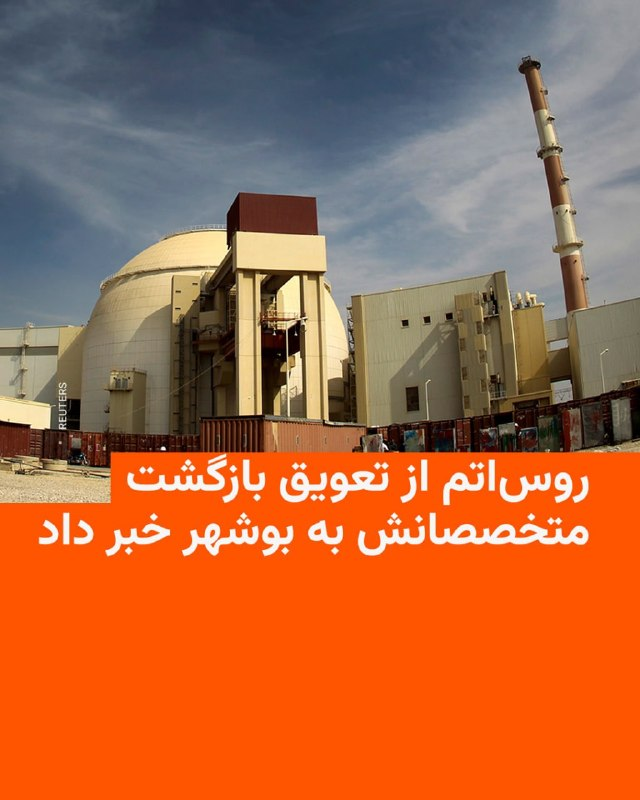

🔸سازمان دولتی انرژی هسته‌ای فدراسیون روسیه از تصمیمش برای به تعویق‌انداختن بازگشت کارکنانش به نیروگاه هسته‌ای بوشهر خبر داد.

🔸این موضوع را الکسی لیخاچِف، مدیرعامل این نهاد دولتی روسیه اعلام کرد.

🔸مدیر عامل «روس اتم» روز چهارشنبه در جمع خبرنگاران گفت: «متاسفانه اخبار ضد و نقیضی در ارتباط با روند مذاکرات ایران و آمریکا به گوش می‌رسد و هر از گاهی هم اخباری از وقوع حملاتی به نقاطی از ایران منتشر می‌شود. به همین دلیل بازگشت همکارانمان را به تعویق انداختیم».

🔸الکسی لیخاچف تأکید کرد که ولادیمیر پوتین رئیس‌جمهور فدراسیون روسیه هم در جریان این تصمیم قرار گرفته و آن‌را تأیید کرده است.

🔸«روس اتم» پیشتر و به دنبال آغاز جنگ آمریکا و اسرائیل با ایران، ۸۱۳ تن از کارکنانش را از بوشهر خارج کرده و تنها ۲۰ تن از کارکنانی که حضورشان در محل برای اطمینان از ایمنی و فعالیت نیروگاه و پیشرفت ساخت فازهای بعدی ضروری بوده را، همچنان در بوشهر نگه داشته است.

@RadioFarda

## RadioFarda — post 157627

🔸دونالد ترامپ، رئیس‌جمهور آمریکا با تأکید بر لزوم باز شدن فوری تنگه هرمز بعد از توافق با ایران، عمان را تهدید کرد که نباید قصد کنترل این آبراه را داشته باشد. 🔸او در نشست کابینه خود در روز چهارشنبه گفت که بر اساس چارچوب احتمالی توافق با تهران، «تنگه هرمز فوراً…

## RadioFarda — post 157626

  

🔸دونالد ترامپ، رئیس‌جمهور آمریکا با تأکید بر لزوم باز شدن فوری تنگه هرمز بعد از توافق با ایران، عمان را تهدید کرد که نباید قصد کنترل این آبراه را داشته باشد.

🔸او در نشست کابینه خود در روز چهارشنبه گفت که بر اساس چارچوب احتمالی توافق با تهران، «تنگه هرمز فوراً باز خواهد شد»، اما تحت کنترل هیچ کشوری نخواهد بود.

🔸ترامپ گفت: «ما بر آن نظارت خواهیم کرد، اما هیچ‌کس قرار نیست آن را کنترل کند. این بخشی از مذاکراتی است که داریم. آن‌ها دوست دارند آن را کنترل کنند، اما هیچ‌کس قرار نیست کنترلش کند. این آبراه بین‌المللی است و عمان هم مثل بقیه رفتار خواهد کرد، وگرنه مجبور می‌شویم آن‌ها را نابود کنیم.»

🔸خبرگزاری رویترز نوشت که کاخ سفید بلافاصله به درخواست برای اظهار نظر درباره اظهارات ترامپ در مورد عمان پاسخ نداد. سفارت عمان در واشنگتن نیز فوراً به درخواست اظهار نظر پاسخ نداد.

@RadioFarda

## RadioFarda — post 157625

  <a href="https://t.me/radiofarda/157625" target="_blank">📎 Download file</a>

۸۸ روز حصر دیجیتال بر ایرانیان چگونه گذشت؟

🔸در کشوری که مردمش سال‌هاست با جنگ، تورم، تحریم و سرکوب سیاسی دست‌وپنجه نرم می‌کنند، خاموشی ۸۸ روزه اینترنت، رشته اتصال میلیون‌ها ایرانی به جهان و حتی به زندگی روزمره‌شان را قطع کرد؛ ۸۸ روز قطعی اینترنت و حصر دیجیتال، فقط خاموش شدن چند اپلیکیشن نبود، بلکه فروپاشی بی‌صدای هزاران کسب‌وکار، بیکاری ناگهانی میلیون‌ها نفر، قطع صدای خانواده‌ها و حبس یک ملت با سرکوب دیجیتال بود؛ سکوتی که حالا با بازگشت تدریجی اینترنت، شاید دوباره شکسته شود.

@RadioFarda

## RadioFarda — post 157624

🔸ارتش اسرائیل اعلام کرد تمام نواحی جنوب رودخانۀ زهرانی در لبنان که در فاصلۀ حدود چهل کیلومتری در شمال مرز اسرائیل و لبنان واقع شده را، «منطقۀ جنگی» در نظر می‌گیرد و از ساکنین این مناطق خواست به نواحی شمال این رودخانه بروند. 🔸اویخای ادرعی سخنگوی عرب‌زبان ارتش…

## RadioFarda — post 157623

  

🔸ارتش اسرائیل اعلام کرد تمام نواحی جنوب رودخانۀ زهرانی در لبنان که در فاصلۀ حدود چهل کیلومتری در شمال مرز اسرائیل و لبنان واقع شده را، «منطقۀ جنگی» در نظر می‌گیرد و از ساکنین این مناطق خواست به نواحی شمال این رودخانه بروند.

🔸اویخای ادرعی سخنگوی عرب‌زبان ارتش اسرائیل با انتشار مطلبی در شبکۀ ایکس، نوشت: «با توجه به نقض مکرر توافق آتش‌بس از سوی سازمان تروریستی حزب‌الله، ارتش دفاعی اسرائیل با قدرت با این گروه برخورد کرده و از ساکنان نواحی جنوبی لبنان می‌خواهیم که با ترک این مناطق به نواحی شمال رود زهرانی بروند».

🔸حزب‌الله لبنان، گروه شیعۀ تحت حمایت جمهوری اسلامی است که ایالات متحده آن‌را به طور کامل گروهی تروریستی می‌داند اما اتحادیۀ اروپا تنها شاخۀ نظامی اش را تروریستی می‌شمارد. شاخۀ سیاسی این حزب در ساختار سیاسی لبنان از نفوذ زیادی برخوردار است و از جمله در پارلمان این کشور هم حضور دارد.

@RadioFarda

## RadioFarda — post 157622

  <a href="https://t.me/radiofarda/157622" target="_blank">📎 Download file</a>

رضا علیجانی: وزارت اطلاعات در بیانیه خود، نگرانی را پشت عصبانیت پنهان کرده است

🔸وزارت اطلاعات جمهوری اسلامی روز ششم خرداد در بیانیه‌ای مدعی شد دشمنان ایران پس از ناکامی در جنگ نظامی، تمرکز خود را بر جنگ نرم، عملیات روانی و اقدامات ترکیبی گذاشته‌اند. در این بیانیه به تلاش برای تحریک نارضایتی‌های اجتماعی، تنش‌های قومی، عملیات خرابکارانه ، قاچاق سلاح و تجهیزات ارتباطی، فعالیت رسانه‌های فارسی‌زبان خارج از کشو، جمع آوری اطلاعات و حملات سایبری اشاره شده است. وزارت اطلاعات همچنین اعلام کرده هریک از این اقدامات با برخورد قضایی و امنیتی مواجه خواهد شد. ارزیابی رضا علیجانی تحلیلگر و فعال سیاسی ساکن فرانسه را درباره این بیانیه بشنوید.

@RadioFarda

## RadioFarda — post 157621

🔸دونالد ترامپ، رئیس‌جمهور آمریکا، روز چهارشنبه در نشست کابینه خود گفت که ایران بسیار مایل است به توافق برسد، اما آمریکا هنوز از توافق پیشنهادی رضایت ندارد.

🔸ترامپ در این نشست در حضور خبرنگاران گفت: «ایران خیلی مصمم است، آن‌ها خیلی می‌خواهند که به توافق برسند. تا اینجا هنوز موفق نشده‌اند... ما از آن راضی نیستیم، اما خواهیم شد.»

🔸او سپس بار دیگر ایران را به ازسرگیری حملات نظامی تهدید کرد: «یا به آن نقطه می‌رسیم، یا اینکه مجبور می‌شویم کار را یکسره کنیم.»

🔸مارکو روبیو، وزیر خارجه آمریکا، نیز در نشست کابینه اعلام کرد در مذاکرات با ایران برای رسیدن به یک توافق، مقداری پیشرفت حاصل شده است.

🔸او گفت: «فکر می‌کنم مقداری پیشرفت و علاقه برای رسیدن به توافق وجود داشته و طی چند ساعت و چند روز آینده خواهیم دید که آیا امکان پیشرفت بیشتر وجود دارد یا نه.»

🔸آقای روبیو همچنین تأکید کرد: «حرف آخر این است که ایران هرگز به سلاح هسته‌ای دست نخواهد یافت.»

@RadioFarda

## RadioFarda — post 157620

  <a href="https://t.me/radiofarda/157620" target="_blank">📎 Download file</a>

📻بشنوید: ایستگاه ۱۹ با رادیوفردا، ششم خرداد ۱۴۰۵

@RadioFarda

## RadioFarda — post 157619

🔸دونالد ترامپ، رئیس‌جمهور آمریکا، روز چهارشنبه گفت که ایران در ازای کنار گذاشتن اورانیوم با غنای بالای خود، از لغو تحریم‌ها توسط واشینگتن برخوردار نخواهد شد و از پیشنهادات ایران برای توافق پایان جنگ ابراز نارضایتی کرد. 🔸ترامپ پیش از برگزاری جلسه کابینه خود…

## RadioFarda — post 157618

  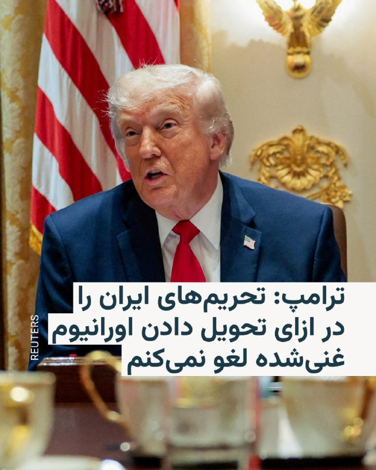

🔸دونالد ترامپ، رئیس‌جمهور آمریکا، روز چهارشنبه گفت که ایران در ازای کنار گذاشتن اورانیوم با غنای بالای خود، از لغو تحریم‌ها توسط واشینگتن برخوردار نخواهد شد و از پیشنهادات ایران برای توافق پایان جنگ ابراز نارضایتی کرد.

🔸ترامپ پیش از برگزاری جلسه کابینه خود در یک تماس تلفنی کوتاه با شبکه پی‌بی‌اس نیوز، در پاسخ به این سوال که آیا توافق فعلی به این معناست که ایران در ازای لغو تحریم‌ها، اورانیوم با غنای بالای خود را واگذار خواهد کرد، گفت: «نه، نه، اصلاً. خبری از لغو تحریم‌ها نیست، نه.»

🔸او اضافه کرد: «آن‌ها قرار است اورانیوم با غنای بالای خود را کنار بگذارند، نه در ازای لغو تحریم‌ها. نه، نه، اصلاً.»

🔸ایران بیش از ۴۰۰ کیلو اورانیوم غنی شده تا حد ۶۰ درصد دارد که در تأسیسات زیرزمینی هدف قرار گرفته در جنگ ۱۲ روزه سال گذشته مدفون است.

🔸رئیس‌جمهور ایالات متحده ساعتی بعد در ابتدای نشست کابینه خود در کاخ سفید گفت که ایران بسیار مایل است به توافق برسد، اما آمریکا هنوز از توافق پیشنهادی رضایت ندارد.

@RadioFarda

## RadioFarda — post 157617

  <a href="https://t.me/radiofarda/157617" target="_blank">📎 Download file</a>

🔸 در این کافه فردا به حواشی اتصال نصفه و نیمه و تدریجی اینترنت جهانی در ایران، حرف‌های پزشکیان در مورد وفاق، سریال تنگه وحشت، زندگی و آثار باب مارلی، پیام جدید منسوب به مجتبی‌ خامنه‌ای و رابطه حسام نواب صفوی و آیزنهاور می‌پردازیم.

🔸 برای تماس با ما می‌توانید به شناسه کافه فردا در تلگرام صوت و متن بفرستید.

📻 کافه فردا

## RadioFarda — post 157616

  <a href="https://t.me/radiofarda/157616" target="_blank">📎 Download file</a>

تیم ملی فوتبال، جام جهانی و حاشیه‌های بی‌پایان در گفت‌وگو با کوروش بازیار

🔸با نزدیک شدن به زمان برگزاری جام جهانی ۲۰۲۶ در آمریکا، مکزیک و کانادا، روزی نیست که خبری در مورد حاشیه‌های حضور تیم ملی ایران در این رقابت‌ها منتشر نشود. وزیر ورزش جمهوری اسلامی می‌گوید با هماهنگی فیفا با مقام‌های آمریکا همه بازیکنان ویزا دریافت می‌کنند. با این وجود در یکی از تازه ترین تحولات محل استقرار این بازیکنان از داخل خاک آمریکا به آن سوی مرز، شهر مرزی تیخوانا، در مکزیک منتقل شده است. اینگونه تحولاتی است که ناظرات را بر آن داشته که اماواگرهای بسیاری درباره نحوه حضور تیم ملی ایران در جام جهانی و چشم‌انداز پیش‌روی این تیم ترسیم می‌کنند. ارزیابی کوروش بازیار، مربی و کارشناس فوتبال در آلمان، را در این زمینه بشنوید.

@RadioFarda

## RadioFarda — post 157615

  <a href="https://t.me/radiofarda/157615" target="_blank">📎 Download file</a>

بیم و امید درباره «پایان» خاموشی اینترنت در ایران؛ گفت‌وگو با امیر رشیدی

🔸پس از ۸۸ روز قطع سراسری اینترنت در ایران، شهروندان کشور توانستند به‌طور نسبی به اینترنت جهانی دست پیدا کنند و البته هنوز اتصال بسیاری با محدودیت روبروست. این انزوای اینترنتی که طولانی‌ترین در تاریخ معاصر در سطح یک کشور پهناور چون ایران بود، هزینه‌های مالی، اجتماعی و روانی بسیار بر جا گذاشته است. آیا می‌توان گفت خاموشی اینترنت به طور کامل به پایان رسیده است؟ چشم‌انداز پیش رو چیست؟ ارزیابی امیر رشیدی، فعال حوزه حقوق دیجیتال و سیاست‌گذاری اینترنت در ایتالیا، را در این‌باره بشنوید.

@RadioFarda

## RadioFarda — post 157614

🔸کاخ سفید روز چهارشنبه اعلام کرد گزارشی که از سوی صداوسیمای جمهوری اسلامی منتشر شده و به پیش‌نویس یک چارچوب اولیه و غیررسمی برای تفاهم‌نامه میان ایران و ایالات متحده اشاره داشت، «صحیح نیست» و تفاهم‌نامه مورد اشاره «کاملاً ساختگی» است. 🔸تلویزیون حکومتی ایران…

## RadioFarda — post 157613

  

🔸کاخ سفید روز چهارشنبه اعلام کرد گزارشی که از سوی صداوسیمای جمهوری اسلامی منتشر شده و به پیش‌نویس یک چارچوب اولیه و غیررسمی برای تفاهم‌نامه میان ایران و ایالات متحده اشاره داشت، «صحیح نیست» و تفاهم‌نامه مورد اشاره «کاملاً ساختگی» است.

🔸تلویزیون حکومتی ایران ساعتی قبل گزارش داده بود که پیش‌نویس یک توافق چارچوبی با ایالات متحده شامل تعهد به لغو محاصره دریایی ایران، بازگرداندن رفت‌وآمد در تنگه هرمز و خروج نیروهای آمریکایی از منطقه خلیج فارس است.

🔸کاخ سفید در بیانیه‌ای اعلام کرد: «این گزارش رسانه‌های تحت کنترل ایران حقیقت ندارد و تفاهم‌نامه‌ای که آنها منتشر کرده‌اند کاملاً ساختگی است. هیچ‌کس نباید آنچه رسانه‌های دولتی ایران منتشر می‌کنند را باور کند. واقعیت‌ها اهمیت دارند.»

🔸گزارش صداوسیما مدعی شده بود که آمریکا متعهد به رفع محاصره دریایی ایران شده و در مقابل، ایران تعهد داده تعداد کشتی‌های عبوری تجاری را طی یک ماه به سطح پیش از تنش‌ها بازگرداند.

@RadioFarda

## RadioFarda — post 157612

  

🔸هلند یک کشتی مین‌روب را به دریای مدیترانه اعزام می‌کند. بر اساس نامۀ دو عضو ارشد دولت هلند که روز چهارشنبه به پارلمان این کشور ارسال شد، این اقدام برای مشارکت در عملیات احتمالی پیمان ناتو در تنگۀ هرمز پس از پایان جنگ ایران در نظر گرفته شده است.

🔸بر اساس نامۀ وزرای دفاع و خارجۀ هلند، کشتی مین‌روب همین هفته راهی مدیترانه شده و از حدود دو هفتۀ دیگر برای مشارکت در عملیات ناتو آماده خوهد بود. در این نامه آمده که هلند برای بر عهده‌گرفتن نقشی با هدف تضمین ایمنی تردد کشتی‌ها در خلیج فارس آماده می‌شود.

🔸در نامۀ وزیران هلندی به پارلمان تأکید شده که یکی از گزینه‌های در نظر گرفته‌شده برای مشارکت هلند، استقرار یک تیم ترکیبی، برای جست‌وجو، غواصی، شناسایی و از بین‌بردن ایمن تجهیزات انفجاری خواهد بود.

🔸در این نامه آمده که هلند همزمان در حال بررسی امکان اعزام نیرو برای مشارکت در عملیات احتمالی یک ائتلاف بین‌المللی در منطقه است.

@RadioFarda

## RadioFarda — post 157611

مقتدی صدر اعلام کرد گردان‌های مسلح تحت امرش در دولت عراق ادغام می‌شوند

🔸مقتدی صدر، رهبر جریان صدر عراق، روز چهارشنبه ششم خرداد جدایی «سرایا السلام»، گردان‌های تحت امر خود را از «جنبش ملی شیعه» و ادغام آن‌ها در دولت عراق را اعلام کرد.

🔸آقای صدر در بیانیه‌ای که در حساب رسمی خود در شبکه ایکس منتشر کرد، گفت که این تصمیم «به سود ملت و برای جلوگیری از خطراتی که مردم را تهدید می‌کند» گرفته شده است.

🔸رهبر جریان صدر افزود که تشکیلات غیرنظامی مرتبط با «سرایا السلام»، به تشکیلاتی غیر نظامی با عنوان «البیان المرصوص» تبدیل خواهد شد که مقر، سلاح یا صفت نظامی ندارد.

🔸مقتدی صدر در بخشی از بیانیه خود از نیروهای «حشد الشعبی» خواست تا از «دستورات حزبی و فرقه‌ای» فاصله بگیرند و تأکید کرد که امیدوار است این گروه‌ها سلاح خود را به دولت تحویل دهند، همانطور که به گفته او، «سرایا السلام» این کار را انجام دادند.

🔸«حشد الشعبی» به ائتلاف گروه‌های شبه‌نظامی عمدتا شیعه گفته می‌شود که تحت حمایت جمهوری اسلامی ایران هستند.

🔸علی الزیدی، نخست وزیر و فرمانده کل نیروهای مسلح عراق، از بیانیه مقتدی صدر استقبال کرد و اقدام او را یک «موضع ملی مسئولانه» دانست که از نهادهای دولتی حمایت می‌کند و اعتبار آن‌ها و «حاکمیت قانون» را تقویت می‌کند.

🔸این در حالی است که دولت دونالد ترامپ خواستار «اقدامات ملموس» از سوی نخست‌وزیر جدید عراق برای دور کردن نهادهای دولتی این کشور از گروه‌های مسلح نزدیک به جمهوری اسلامی شده است. واشینگتن تهدید کرده در غیر این صورت کمک‌های مالی و امنیتی از سر گرفته نخواهد شد.

🔸گزارش کامل را در وب‌سایت رادیوفردا بخوانید.

@RadioFarda

## RadioFarda — post 157610

  

🔸رسانه‌های ایران روز چهارشنبه ششم خرداد از وقوع دو حادثه جداگانه در عسلویه و فرودگاه امام خمینی تهران خبر دادند.

🔸به گزارش رسانه‌های داخلی، در حادثه‌ای در واحد هوای شرکت «دماوند انرژی» عسلویه، یک نفر جان باخت و دو نفر دیگر مصدوم شدند.

🔸بر اساس اطلاعیه شرکت دماوند انرژی، تیم‌های امدادی و ایمنی پس از وقوع حادثه در محل حاضر شدند و مصدومان پس از دریافت خدمات اولیه، به مراکز درمانی منتقل شدند. علت حادثه هنوز اعلام نشده است.

🔸هم‌زمان خبرگزاری مهر گزارش داد یک ساختمان اداری گمرک در شهر فرودگاهی امام خمینی دچار آتش‌سوزی شده است.

🔸بر اساس این گزارش، نیروهای آتش‌نشانی و امدادی در محل حضور دارند و هنوز جزئیاتی درباره علت حریق یا میزان خسارت و تلفات احتمالی منتشر نشده است.

@RadioFarda

## RadioFarda — post 157609

🔸وزارت اطلاعات جمهوری اسلامی روز چهارشنبه ششم خرداد هشدار داد که بعد از جنگ اخیر، «برخی کمبودها و گرانی‌ها» در پی فشارهای اقتصادی آمریکا می‌تواند باعث بروز ناآرامی‌های تازه در ایران شود. 🔸این وزارتخانه در بیانیه‌ای مدعی شد که «تشدید فشارهای اقتصادی و متعاقب…

## IranianMinds — post 20893

  <a href="telegram/content/IranianMinds_20893_1779912048.mp4" target="_blank">🎬 Download video</a>

🔴 اسرائیل دوباره داره غزه رو شخم میزنه یه ساختمون بزرگو کامل نابود کردن برای ترور

@IranianMinds

## IranianMinds — post 20892

  <a href="https://t.me/IranianMinds/20892" target="_blank">📎 Download file</a>

سرور فوق العاده پرسرعت و قوی مخصوص اینستا و یوتیوب سرعت فضایی مخصوص همراه اول مخابرات

آموزش اتصال در اندروید

آموزش اتصال در آیفون

حتما شیر بدید بقیه هم متصل شن لطفا دانلود سنگین هم نزنید ❤️‍🔥

@IranianMinds

## IranianMinds — post 20891

  

تو این تایمای قطعی نت هم این جنده حکومتی شده بود با شرف خرزشیا

@IranianMinds

## IranianMinds — post 20890

🎁 استارت کن و کانفیگتو رایگان بگیر 
⭐ویژه کاربران پرمیوم تلگرام 
⭐️ اگه اکانت تلگرامت پرمیوم باشه به محض استارت ربات بدون هیچ امتیاز و زیر مجموعه دایی جون بهت کانفیگ هدیه میده 
✔️ همچنین با اوردن دوستای پرمیومت امتیاز بیشتری میگیری 
🎁 @Daeijoonbot | استارت…

## IranianMinds — post 20889

  

🎁 استارت کن و کانفیگتو رایگان بگیر

⭐ویژه کاربران پرمیوم تلگرام

⭐️ اگه اکانت تلگرامت پرمیوم باشه به محض استارت ربات بدون هیچ امتیاز و زیر مجموعه دایی جون بهت کانفیگ هدیه میده

✔️ همچنین با اوردن دوستای پرمیومت امتیاز بیشتری میگیری

🎁 @Daeijoonbot | استارت کن و کانفیگ رایگان بگیر 
🌟

## IranianMinds — post 20887

ببین کاراتو املاکی اینارم شاخ کردی

🔴 صداوسیما :

شرط جدید ما اینه آمریکا ۳۰۰ میلیارد دلار بهمون غرامت بده تا توافق کنیم باهاش.

@IranianMinds

## IranianMinds — post 20885

توییت رو روز اول جنگ زده :))

@IranianMinds

## IranianMinds — post 20884

  

🔴 ترامپ یه خبری رو یه ریپوست کرده که گزارشیه که نشون میده آزار جنسی در زندان های جمهوری اسلامی در دوران آتش بس بیشتر شده!

@IranianMinds

## IranianMinds — post 20883

  <a href="telegram/content/IranianMinds_20883_1779912051.mp4" target="_blank">🎬 Download video</a>

🔴 ترامپ :

ما اصلا درمورد کاهش تحریم یا دادن پول به ایران هیچ صحبتی نمیکنیم هر زمانی که آدم شدن و نشون دادن رفتارشون خوبه شاید در مورد پولاشون یه فکری کردم.

@IranianMinds

## IranianMinds — post 20882

🔴ترامپ به PBS :

اگه ایران اورانیوم خیلی غنی‌شده رو تحویل بده، در مقابلش هیچ تخفیف یا کاهش تحریم‌ها بهش داده نمیشه.

@IranianMinds

## IranianMinds — post 20881

🔴پیت هگست: آنها ممکن است موشک داشته باشند، اما در حال حاضر نمی‌توانند موشک‌های بیشتری بسازند. نمی‌توانند پهپادهای بیشتری بسازند. نمی‌توانند کشتی‌های بیشتری بسازند. آمدند و تسلیم شدند تا صحبت کنند

@IranianMinds

## IranianMinds — post 20880

ثبت نام کن ۵۰۰ هزارتومان جایزه بگیر
نیازی هم به واریز نیست
تنها سایت مورد #تایید ما با بونوس های واقعی:

🌐 Winro.io

## IranianMinds — post 20879

  

⭕️ تا حالا بدون واریزی روی فوتبال ها شرط بستی؟!

🎉 500 هزارتومن بونوس رایگان فقط با ثبت نام بدون هیچگونه واریزی!

💳 شارژ سریع و امن با درگاه ریالی ، تتر یا ترون فقط با یک کلیک!

⌛ پشتیبانی 24 ساعته

💖تنها سایت مورد اعتماد ما با بونوس های کاملا واقعی و رویایی:

🌐 Winro.io

🌐 Winro.io
کانال بونوس های رایگان g6

📱 @winro_io

## IranianMinds — post 20878

  <a href="telegram/content/IranianMinds_20878_1779912054.mp4" target="_blank">🎬 Download video</a>

🔴ارتش اسرائیل پس از دادن هشدارهای تخلیه، آغاز حملات به مواضع حزب‌الله در شهر صور در جنوب لبنان را آغاز کرد.

@IranianMinds

## IranianMinds — post 20877

  <a href="telegram/content/IranianMinds_20877_1779912055.mp4" target="_blank">🎬 Download video</a>

🔴آتش‌سوزی در یکی از برج‌های مجتمع مسکونی پامچال در چیتگر تهران.
چهارشنبه ۶ خرداد.

@IranianMinds

## IranianMinds — post 20876

  <a href="telegram/content/IranianMinds_20876_1779912057.mp4" target="_blank">🎬 Download video</a>

ترامپ : الان داریم با رویکرد «اول آمریکا» جلو می‌ریم درباره ایران. یا باید با شرایط من کنار بیان، یا کار رو تموم می‌کنیم.

می‌گن «صبر می‌کنیم تا انتخابات میان‌دوره‌ای». دیشب دیدید چی شد؟ اون فقط شروع ماجرا بود برای انتخابات!

هر کسی گفته من دارم کوتاه میام، اشتباه کرده

الان به نظر میاد خودشون دنبال توافقن. فکر نمی‌کنم حق انتخاب زیادی داشته باشن

اینترنتشون تازه دوباره وصل شده، اقتصادشون هم داغونه، تورم هم خیلی بالاست!
شاید مجبور بشیم برگردیم و کار رو یک‌سره کنیم!

@IranianMinds

## IranianMinds — post 20875

  <a href="telegram/content/IranianMinds_20875_1779912059.mp4" target="_blank">🎬 Download video</a>

آتش زدن ماکت جواد ظریف در میدان اتحاد گرگان.

@IranianMinds

## IranianMinds — post 20874

🔴کاخ سفید:

گزارش‌های تلویزیون ایران درباره یادداشت تفاهم، کاملا نادرست و جعلی است.

@IranianMinds

## IranianMinds — post 20873

  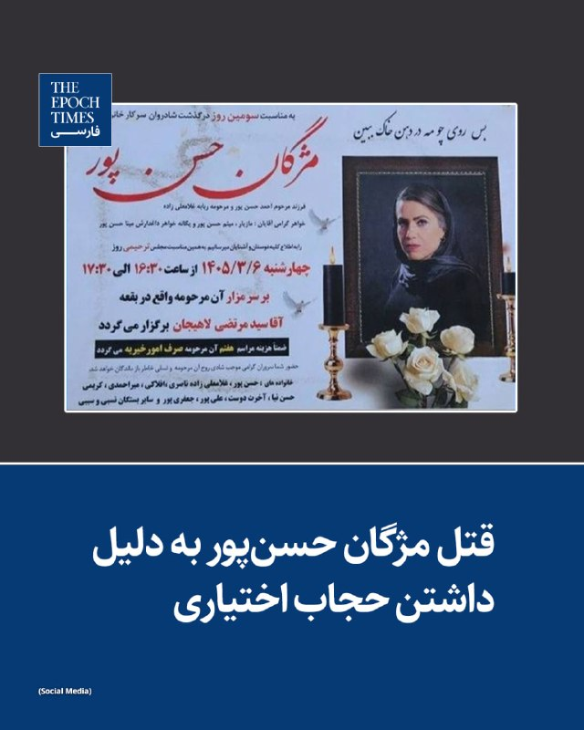

🔴قتل مژگان حسن‌پور به دلیل داشتن حجاب اختیاری

کانون حقوق بشر ایران گزارش داد مژگان حسن‌پور مادر یک پسر هفت ساله بعد از مشاجره با یک نیروی لباس شخصی بر سر حجاب اجباری با شلیک گلوله در لاهیجان کشته شد.

براساس این گزارش،‌ این زن ۴۶ ساله عصر پنج‌شنبه گذشته، زمانی که بر سر مزار پدر و مادرش به آرامستان آقا سیدمرتضی رفته بود، به قتل رسید. حادثه زمانی آغاز شد که یک نیروی لباس شخصی بر سر پوشیدن حجاب اجباری وارد بحث و مشاجره با این خانم شد.

@IranianMinds

## BBCPersian — post 282206

🔻شریف پس از تماس تلفنی با پزشکیان: پاکستان در کنار ایران خواهد ایستاد
شهباز شریف، نخست‌وزیر پاکستان، و مسعود پزشکیان، رئیس‌جمهور ایران، تلفنی با هم گفت‌وگو کردند.

آقای شریف در پیامی در ایکس نوشت که مسعود پزشکیان از «تلاش‌های صادقانه پاکستان برای صلح در منطقه» قدردانی کرده و در عین حال نقش فیلد مارشال عاصم منیر، فرمانده کل ارتش و نیروهای مسلح پاکستان را مورد توجه قرار داده است.

او همچنین گفت که بار دیگر تأکید کرده است که «پاکستان همواره به‌عنوان دوستی صمیمی و همسایه‌ای نزدیک در کنار ایران خواهد ایستاد.»

آقای شریف افزود: «ابراز امیدواری کردم که تلاش‌های جاری برای صلح به‌زودی به توافقی پایدار منجر شود و راه را برای ثبات، رفاه و همکاری منطقه‌ای هموار کند.»

خبرگزاری رسمی ایران در گزارشی درباره این تماس تلفنی گفته است که دو طرف «به‌ویژه در حوزه‌های اقتصادی، بازرگانی و گمرکی صحبت و و درباره تداوم رایزنی‌های مشترک برای حمایت از صلح و ثبات منطقه‌ای تأکید کردند.»

پاکستان میانجی آتش‌بس کنونی بین ایران و آمریکاست و در حال وساطت میان دو کشور برای رسیدن به توافق صلح است.

https://bbc.in/4dP5Yi6
@BBCPersian

## BBCPersian — post 282205

  <a href="telegram/content/BBCPersian_282205_1779912061.mp4" target="_blank">🎬 Download video</a>

🔻آخرین خبرهای مهم چهارشنبه ۶ خرداد ۱۴۰۵
@BBCPersian

## BBCPersian — post 282204

  

🔻 دونالد ترامپ، رئیس جمهور آمریکا در جریان جلسه با اعضای کابینه‌اش گفت مذاکره با ایران «تا اینجا به نتیجه نرسیده است» و «ما هنوز از آن راضی نیستیم، اما خواهیم شد.»

رئیس‌جمهور آمریکا با اشاره به رهبران ایران گفت: «آنها در حال مذاکره از موضع ضعف هستند. اما خواهیم دید چه اتفاقی می‌افتد. شاید مجبور شویم برگردیم و کار را تمام کنیم، شاید هم نه.»

آقای ترامپ گفت که «الان فکر می‌کنم به نظر می‌رسد آنها‌ [ایرانی‌ها] فقط می‌خواهند به توافق برسند؛ فکر نمی‌کنم انتخاب دیگری داشته باشند.»

رئیس جمهور آمریکا گفت: «در جریان عملیات خشم حماسی ما روشن کردیم که بزرگترین حامی تروریسم در دنیا، نمی‌تواند سلاح هسته‌ای داشته باشد.»

آقای ترامپ گفت که اقتصاد ایران «در حال سقوط آزاد است، و تورم ۲۵۰ درصدی دارند. پولشان هیچ ارزشی ندارد و کل سیستم اقتصادی‌شان از هم پاشیده است.»

او در جریان پاسخ به خبرنگاران هم گفت تنگه هرمز «برای همه باز خواهد بود» و «هیچ‌کس قرار نیست آن را کنترل کند. ما بر آن نظارت خواهیم داشت. ما مراقبش خواهیم بود، اما هیچکس آن را کنترل نخواهد کرد. این بخشی از مذاکراتی است که داریم.»
📸Reuters
@BBCPersian

## BBCPersian — post 282203

  <a href="https://t.me/bbcpersian/282203" target="_blank">📎 Download file</a>

پادکست جام‌ جهان‌نما چهارشنبه ۶ خرداد ۱۴۰۵

@BBCPersian

## BBCPersian — post 282202

  <a href="telegram/content/BBCPersian_282202_1779912064.mp4" target="_blank">🎬 Download video</a>

🔻پلیس اعلام کرد آتش‌سوزی به‌نسبت بزرگ در سوپرمارکتی در شمال غربی لندن که با اعزام ۱۰۰ آتش‌نشان دارد مهار می‌‌شود، به دلیل اتصال برق بوده است.

آتش‌نشانی لندن اولین تماس را حدود ساعت یک ربع به هفت صبح به وقت گرینویچ دریافت کرد که خبر از آتش‌سوزی در ساختمانی سه طبقه در گولدرز گرین می‌داد.

ویدیوهایی در شبکه‌های اجتماعی منتشر شده که نشان می‌دهد دود از پشت سوپرمارکت یهودی «کوشر کینگدام»، جایی که ساکنان محلی گفته‌اند آتش‌سوزی از آنجا آغاز شده، به هوا بلند می‌شود.

کسی در این آتش‌سوزی مجروح نشده است.

کریگ کارتر، معاون آتش‌نشانی لندن گفت: «تصور نمی‌شود علت آتش‌سوزی مشکوک باشد» و به مردم منطقه توصیه کرد که پنجره‌ها و درها را بسته نگه دارند.

سخنگوی پلیس متروپولیتن هم گفت: «ما نگرانی و اختلالی را که این حادثه برای جامعه محلی و ساکنان و شاغلان در منطقه ایجاد کرده است، درک می‌کنیم. ما می‌خواهیم به ساکنان اطمینان دهیم که هیچ نشانه‌ای از اقدامی هدفمند یا عمدی وجود ندارد.»

گلدرز گرین از جمله محلات یهودی‌نشین لندن است که طی ماه‌های اخیر چند بار هدف حملات ضدیهودی قرار گرفته است.

@BBCPersian

## BBCPersian — post 282201

  <a href="https://t.me/bbcpersian/282201" target="_blank">📎 Download file</a>

تازه‌ترین خبرهای جهان چهارشنبه ۶ خرداد ۱۴۰۵ از رادیو بی‌بی‌سی در لندن

@BBCPersian

## BBCPersian — post 282200

  <a href="https://t.me/bbcpersian/282200" target="_blank">📎 Download file</a>

🔻دنیس راس، مدیر پیشین اداره سیاست‌گذاری وزارت خارجه آمریکا، در گفت‌وگو با برنامه ۶۰ دقیقه بی‌بی‌سی درباره چالش‌های به نتیجه رسیدن مذاکرات ایران و آمریکا گفت.

او تاکید کرد که هیچ راهبردی در قبال ایران تاکنون جواب نداده است؛ چه راهبرد آنها که به ایران امتیاز دادند و چه آنها که سیاست فشار حداکثری را پی گرفتند.

این مصاحبه را که در برنامه شصت دقیقه پنجم خرداد پخش شده، گوش دهید.

@BBCPersian

## BBCPersian — post 282199

🔻نیروی دریایی سپاه: در شبانه روز گذشته ۲۳ شناور از تنگه هرمز عبور کردند

🔻سپاه پاسداران انقلاب اسلامی اعلام کرد که در شبانه روز گذشته ۲۳ شناور با اجازه این نیرو از تنگه هرمز عبور کرده‌اند.

نیروی دریایی سپاه یک روز پیش هم گفته بود که ۲۵ کشتی در هماهنگی با این نیرو از این تنگه گذشتند.

پیشتر گزارش دادیم که رسانه‌های حکومتی ایران اعلام کردند که تهران «پیش‌نویس اولیه و غیررسمی چارچوب یک یادداشت تفاهم با آمریکا را دریافت کرده» است.

بر اساس این پیش‌نویس، ایران ظرف یک ماه عبور و مرور تجاری از تنگه هرمز را به سطح پیش از جنگ بازمی‌گرداند و در مقابل، آمریکا نیروهای نظامی خود را از اطراف ایران خارج و محاصره دریایی را لغو خواهد کرد.

https://bbc.in/3S51FI9
@BBCPersian

## BBCPersian — post 282198

🔻شرکت اماراتی مجوز آمریکا برای اسقاط چهار کشتی تحریم‌شده مرتبط با ایران را دریافت کرد

🔻شرکت جی‌ام‌اس (GMS) مستقر در دبی، اعلام کرد که مجوز دولت آمریکا را برای اسقاط چهار کشتی کانتینربر دریافت کرده است که به‌دلیل ارتباط با ایران تحریم شده بودند.

مدیرعامل این شرکت گفت که این اقدام می‌تواند راه را برای کاهش ناوگان موسوم به «سایه» هموار کند، ناوگانی از کشتی‌هایی که برای دور زدن تحریم‌ها استفاده می‌شوند.

به گزارش رویترز، صدها کشتی فاقد بیمه مشخص یا استانداردهای زیست‌محیطی و ایمنی، نه‌تنها به ایران و روسیه برای دور زدن تحریم‌ها کمک کرده‌اند، بلکه خطر نشت نفت و سوخت را در مسیرهای پرتردد دریایی افزایش داده‌اند.

ایجاد سازوکاری رسمی برای اسقاط این کشتی‌ها می‌تواند انگیزه‌ای برای خارج کردن آن‌ها از چرخه فعالیت باشد، اقدامی که به کاهش خطرات زیست‌محیطی و مهار تجارت نفت و کالاهای تحریم‌شده کمک می‌کند.

انیل شارما، بنیان‌گذار و مدیرعامل جی‌ام‌اس، به رویترز گفت که این شرکت ماه‌ها با مقام‌های آمریکایی درباره تحویل گرفتن کشتی‌های تحریم‌شده و اسقاط آن‌ها در حال مذاکره بوده است.

https://bbc.in/4dzGnuJ
@BBCPersian

## BBCPersian — post 282197

  <a href="telegram/content/BBCPersian_282197_1779912067.mp4" target="_blank">🎬 Download video</a>

🔻حدود ۹۰ پهپاد در طول یک نمایش نور زمستانی محبوب از آسمان بندر دارلینگ سیدنی سقوط کردند و برخی‌شان در نزدیکی جمعیت به داخل آب افتادند.

برگزارکنندگان جشنواره سه هفته‌ای سالانه «ویوید سیدنی» که شامل چیدمان‌های نوری بزرگ است، گفتند که نقص فنی در عصر دوشنبه به وقت محلی به دلیل «مشکلات فنی پیش‌بینی نشده» بوده و چندین نمایش آینده را لغو کرده‌اند.

فیلم نمایش دوشنبه، ده‌ها پهپاد را در حالی که از آسمان شب سقوط می‌کردند نشان می‌داد.

شرکت اسکای‌مجیک، شرکت بریتانیایی برگزارکننده این نمایش، تغییر در فرکانس رادیویی را دلیل این نقص دانست و گفت که هیچ یک از پهپادها خارج از مرزهای ایمنی سقوط نکرده‌اند.

https://bbc.in/4tZCSCO
@BBCPersian

## BBCPersian — post 282196

  

🔻در پی بازگشت تدریجی دسترسی به اینترنت جهانی در ایران از روز سه‌شنبه ۵ خرداد ۱۴۰۵، داده‌های شرکت کنتیک (Kentik) نشان می‌دهد که حجم ترافیک اینترنت بین‌الملل پس از هفته‌ها محدودیت شدید، تا حد قابل توجهی افزایش یافته است، هرچند همچنان فاصله زیادی با سطح عادی پیش از آغاز قطع اینترنت در دی‌ماه دارد.

داگ مادوری، مدیر تحلیل اینترنت در شرکت کنتیک، می‌گوید: «سطح ترافیک در بالاترین حالت به حدود ۳۹ درصد حجم پیش از اعتراضات رسیده است؛ رقمی که به سطح دسترسی در دوره بازگشایی نسبی میان ۷ بهمن تا ۹ اسفند نزدیک است. در آن دوره، خدمات اینترنت ناپایدار و بی‌ثبات بود و محدودیت‌ها روزانه تغییر می‌کردند.»

او اضافه می‌کند: «ما هنوز فاصله زیادی با سطح خدمات پیش از ۱۸ دی داریم. این فقط یک تصویر کلی از وضعیت ترافیک است و ممکن است برخی خدماتی که آن زمان در دسترس بودند، همچنان مسدود باشند.»

گزارش‌های رسیده و تجربیات کاربران حاکی است که دسترسی به برخی خدمات امکان‌پذیر شده است هرچند ارتباط با ثبات نیست و از جمله، تماس‌های صوتی- تصویری، کیفیت بالایی ندارند.

https://bbc.in/4uvLBh7
@BBCPersian

## BBCPersian — post 282195

  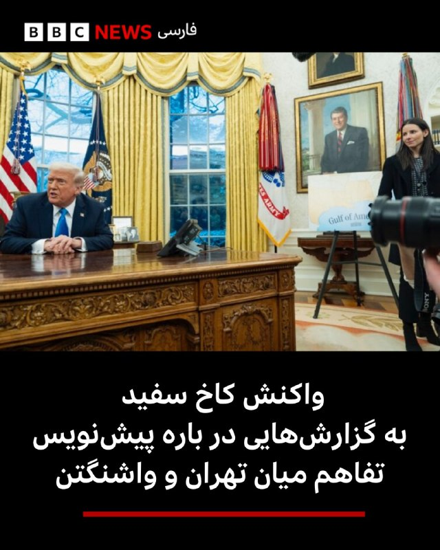

‌🔻اولیویا ویلز، سخنگوی کاخ سفید، در واکنش به انتشار گزارش‌ رسانه‌های ایران درباره پیش‌نویس یادداشت تفاهم میان ایران و آمریکا، گفت: «همان‌طور که رئیس‌جمهور ترامپ گفته است، مذاکرات به‌خوبی در حال پیشرفت است و او خطوط قرمز خود را به‌روشنی مشخص کرده است.»

پیشتر رسانه‌های حکومتی ایران اعلام کردند که تهران «پیش‌نویس اولیه و غیررسمی چارچوب یک یادداشت تفاهم با آمریکا را دریافت کرده است.»

بر اساس این گزارش‌ها، ایران ظرف یک ماه عبور و مرور تجاری از تنگه هرمز را به سطح پیش از جنگ بازمی‌گرداند و در مقابل، آمریکا نیروهای نظامی خود را از اطراف ایران خارج و محاصره دریایی را لغو خواهد کرد.

خانم ویلز بدون تایید یا رد این گزارش‌ها گفت که «رئیس‌جمهور ترامپ تنها توافقی را خواهد پذیرفت که برای مردم آمریکا توافقی خوب باشد و تضمین کند ایران هرگز به سلاح هسته‌ای دست پیدا نکند.»

📷Courtesy: TCU News
https://bbc.in/4tYo1Z8

@BBCPersian

## BBCPersian — post 282194

🔻رسانه‌های ایران: تهران پیش‌نویس اولیه و غیررسمی تفاهم با آمریکا را دریافت کرده است

🔻رسانه‌های حکومتی ایران اعلام کردند که تهران «پیش‌نویس اولیه و غیررسمی چارچوب یک یادداشت تفاهم با آمریکا را دریافت کرده است.»

بر اساس این گزارش‌ها، ایران ظرف یک ماه عبور و مرور تجاری از تنگه هرمز را به سطح پیش از جنگ بازمی‌گرداند و در مقابل، آمریکا نیروهای نظامی خود را از اطراف ایران خارج و محاصره دریایی را لغو خواهد کرد.

این گزارش همچنین حاکیست که هماهنگی در مورد مدیریت مسیر کشتی‌ها با ایران و عمان انجام خواهد شد.

علی باقری کنی، معاون سیاست خارجی و امنیت بین‌الملل دبیرخانه شورای عالی امنیت ملی ایران، هم تایید کرده است که ایران و عمان به‌طور مشترک در حال مذاکره در مورد رویه جدیدی برای عبور کشتی‌ها از تنگه هرمز هستند.

به گفته او «شرایط و رویه‌های عبور از تنگه هرمز کاملا متفاوت از شرایط قبل از شروع درگیری بر سر ایران خواهد بود.»آقای باقری کنی همچنین گفت: «تا زمانی که در مورد همه مسائل به توافق نرسیم، فکر می‌کنیم که در مورد هیچ چیز به توافق نرسیده‌ایم.»

https://bbc.in/3PLvJI4
@BBCPersian

## BBCPersian — post 282193

  

🔻مقتدی صدر، رهبر مذهبی قدرتمند عراق، اعلام کرده است که شاخه نظامی جنبش سیاسی شیعه او در نیروهای امنیتی دولت عراق ادغام خواهد شد.

آقای صدر از سایر جناح‌های مسلح در عراق نیز خواست که همین کار را انجام دهند و سلاح‌های خود را به دولت تحویل دهند.

این اقدام در بحبوحه فشارهای فزاینده آمریکا بر عراق برای مهار نفوذ گروه‌های مسلح تحت حمایت ایران در عراق صورت می‌گیرد.

شبه‌نظامیان همسو با جنبش صدر نقش مهمی در مبارزه با نیروهای آمریکایی پس از حمله به عراق در سال ۲۰۰۳ و همچنین در نبرد علیه داعش پس از تصرف بخش بزرگی از خاک عراق در سال ۲۰۱۴، ایفا کردند.

📷EPA
https://bbc.in/4fbhBT0

@BBCPersian

## BBCPersian — post 282192

  

‏🔻گروهی از کاربران در شبکه اجتماعی ایکس (توییتر سابق) پست‌های انتقادی گزارش‌گونه از تحولات و رویدادهای سیاسی خارج از ایران منتشر می‌کنند، خطاب به شهروندانی که پس از حدود سه ماه به‌طور تدریجی با فیلترشکن موفق می‌‌شوند به اینترنت وصل شوند.

‏این پست‌ها که با عبارت‌هایی مانند «وقتی شما نبودید» یا «بچه‌های ایران که تازه وصل شده‌اید» آغاز می‌شود، همزمان با کاهش تدریجی اختلال در دسترسی به اینترنت، به محلی برای مستندسازی و بازاندیشی انتقادی نسبت به تحولات سیاسی‌ ۸۸ روز گذشته تبدیل شده است.

‏بسیاری از این پست‌ها لحنی آشکارا ضدجنگ دارند و در برابر عملکرد بعضی رسانه‌ها، طرفداران شاهزاده رضا پهلوی و کسانی موضع گرفته‌اند که از حملات نظامی به ایران حمایت یا از آن استقبال می‌کردند.

‏بعضی دیگر از مخالفان جمهوری اسلامی خارج از ایران هم برای مخاطبانی که به‌تازگی دوباره آنلاین شده‌اند، جمع‌بندی‌های کوتاهی از فعالیت و تجمعات به‌عنوان گزارش‌کار تهیه کردند و در پست‌هایی به اظهارنظرها و مواضع چهره‌هایی پرداختند که از نظر آن‌ها در تضاد با «مسیر انقلاب» عمل کرده بودند.

@BBCPersian

## BBCPersian — post 282191

🔻عضو شورای شهر تهران درباره جنگ اخیر: به۶۵۰ نقطه حمله شد و ۱۲۶۰ نفر کشته شدند

🔻یک عضو شورای شهر تهران گفته است که در جریان جنگ اخیر، ۶۵۰ نقطه پایتخت هدف قرار گرفته و ۱۲۶۰ نفر کشته شده‌اند.

مهدی بابایی، رئیس کمیته ایمنی شورای شهر تهران، به خبرگزاری ایرنا گفته است که خانواده‌های جنگ‌زده، شامل ۱۷۱۸ خانوار با ۵۷۵۹ نفر، به‌صورت موقت در ۴۶ هتل اسکان داده شدند.

آقای بابایی گفته است بیشترین حملات در تهران به مناطق ۱، ۳ و ۲۱ بوده است.

جنگ روز در نهم اسفند (۲۸ فوریه) با حملات اسرائیل و آمریکا به ایران آغاز شد و در ۱۸ فروردین (هفتم آوریل) با میانجیگری پاکستان وارد آتش‌بس موقت شد.

https://bbc.in/4uyTIt7
@BBCPersian

## BBCPersian — post 282189

🔻مراسم ختم اعضای خانواده خامنه‌ای این هفته برگزار می‌شود

🔻نزدیک به سه ماه پس از حمله نهم اسفند آمریکا و اسرائیل به دفتر رهبر و محل اقامت علی خامنه‌ای، که از جمله به کشته شدن او و شماری از اعضای خانواده‌اش انجامید، رسانه‌های دولتی در ایران می‌گویند که قرار است برای اعضای خانواده رهبر پیشین مجلس ختمی از سوی بازماندگان برگزار شود.

این مراسم قرار است برای یادبود زهرا حدادعادل (همسر مجتبی خامنه‌ای)، بشری خامنه‌ای (دختر بزرگ رهبر پیشین)، مصباح‌الهدی باقری (همسر دختر کوچک آقای خامنه‌ای) و نوه او، زهرا محمدی گلپایگانی، در روزهای هفتم و هشتم خرداد در شهرری در جنوب تهران برگزار شود.

در این اطلاعیه ذکر شده است که مراسم برای اعضای خانواده رهبر کشته‌شده برگزار می‌شود.

در پی حمله به دفتر و محل سکونت آقای خامنه‌ای، خبر کشته‌شدن همسر او، منصوره خجسته‌ باقرزاده هم منتشر شد اما کمتر از دو هفته بعد خبرگزاری فارس اعلام کرد که اخبار اولیه اشتباه بوده و همسر آقای خامنه‌ای «در قید حیات است.»

https://bbc.in/4u0XzOH
@BBCPersian

## BBCPersian — post 282188

  <a href="telegram/content/BBCPersian_282188_1779912071.mp4" target="_blank">🎬 Download video</a>

🔻سرخط خبرهای روز چهارشنبه ۶ خرداد ۱۴۰۵
@BBCPersian

## BBCPersian — post 282187

🔻ریور احمد اولین زن افغان است که به قله اورست صعود کرده است.

او طی فصل کوهنوردی بهار امسال، صبح روز ۲۱ مه (۲ خرداد) به فراز بلندترین قله جهان رسید.

اما ریور، وضعیت اسفناک زنان و دختران در افغانستان را فراموش نکرده است. «حتی امروز میلیون‌ها دختر افغان از حق اولیه تحصیل محروم هستند و ما باید این قله را هم فتح کنیم. با کمک کوهنوردی، می‌خواهم این پیام را تقویت کنم. من آموخته‌ام که سخت‌ترین کوه‌ها از سنگ و یخ ساخته نشده‌اند، بلکه کوه‌هایی هستند که ما در درون خود حمل می‌کنیم.»

@BBCPersian

## BBCPersian — post 282186

  

🔻 گروه‌های امداد و نجات در لائوس اعلام کردند که پنج روستایی بعد از یک هفته ماندن در غاری پرآب، زنده پیدا شده‌اند. بارندگی شدید و رانش زمین موجب شد که آنها در این غار گرفتار شوند.

به گفته تیم‌های امدادی لائوسی و تایلندی، دو نفر دیگر از اعضای این گروه همچنان مفقود هستند.

این هفت نفر از ساکنان استان «زایسومبون» در مرکز لائوس بودند که چهارشنبه هفته گذشته برای جست‌وجوی طلا و شکار حیوانات وارد غار شده بودند، اما به‌دلیل مسدود شدن دهانه غار بر اثر رانش زمین، نتوانستند خارج شوند.

ویدئوهای منتشرشده از عملیات نجات نشان می‌دهد که غواصان امدادگر از مسیرهای بسیار باریک و گل‌آلود عبور می‌کنند که تقریبا به‌طور کامل زیر آب رفته است.

عملیات جست‌وجو برای یافتن دو فرد مفقودشده ادامه دارد.

به گفته امدادگران، این مجموعه غار که در عمق زمین امتداد دارد، بسیار تنگ است و عرض برخی از بخش‌های آن تنها حدود ۵۰ سانتی‌متر است.

📸EPA/Shutterstock
@BBCPersian

## idfinfarsi — post 11657

  <a href="telegram/content/idfinfarsi_11657_1779912073.mp4" target="_blank">🎬 Download video</a>

ارتش اسرائیل ساختمان‌های نظامی، مقرهای فرماندهی و سایت‌های پرتاب در منطقه البقاع را هدف قرار داد: از ابتدای هفته حدود ۵۵۰ هدف از سازمان تروریستی حزب‌الله در لبنان مورد حمله قرار گرفته است

در طول امروز (چهارشنبه)، ارتش اسرائیل در منطقه البقاع و چندین منطقه در جنوب لبنان، ساختمان‌های نظامی، مقرهای فرماندهی و سایت‌های پرتاب مورد استفاده سازمان تروریستی حزب‌الله را هدف قرار داد.

حملات به مقرهای فرماندهی در منطقه صور همچنان در حال انجام است.

## idfinfarsi — post 11656

  <a href="telegram/content/idfinfarsi_11656_1779912075.mp4" target="_blank">🎬 Download video</a>

تکمیل چرخه هدف‌گیری: نیروهای تیپ ۴۰۱ تروریستی را که زنده یاد سرگرد (ذخیره) ایتمار ساپیر را به قتل رساند، به هلاکت رساندند

هفته گذشته (سه‌شنبه)، در جریان درگیری نیروهای ارتش اسرائیل در منطقه قاوزه در جنوب لبنان، یک تروریست از محدوده یک کلیسا به‌سوی نیروهای تیپ ۴۰۱ تیراندازی کرد که در نتیجه آن سرگرد (ذخیره) ایتمار ساپیر جان باخت.

بلافاصله پس از این رویداد، نیروهای تیپ تحت فرماندهی لشکر ۱۴۶ با آتش پاسخ دادند و برای به هلاکت رساندن تروریست اقدام کردند.

اکنون می‌توان تأیید کرد که تروریستی که سرگرد (ذخیره) ایتمار ساپیر را به قتل رساند، پس از شناسایی در حالی که وارد ساختمانی در محدوده کلیسا شده بود، با شلیک تانک و حمله دقیق نیروی هوایی به هلاکت رسید.

در چارچوب پشتیبانی آتش در این رویداد، ارتش اسرائیل از هوا و زمین مواضع دیده‌بانی، انبار تسلیحات و ساختمان‌هایی را که توسط سازمان تروریستی حزب‌الله برای پیشبرد طرح‌های تروریستی مورد استفاده قرار می‌گرفت، هدف قرار داد.

## idfinfarsi — post 11655

  <a href="telegram/content/idfinfarsi_11655_1779912076.mp4" target="_blank">🎬 Download video</a>

در این روزهای مقدس مسلمانان، پیام ما بیش از هر زمان دیگری نمایان است: اتحاد و همبستگی میان اقوام و ادیان، از هر تلاشی برای تفرقه‌ و تحریکها نیرومندتر است.

## Dirty_Kids — post 390353

  

دوستان وقتی نبودید جنازه شمخانی بدون سر دفن شد.

@Dirty_Kids 👻

## Dirty_Kids — post 390352

  

الحق که شاد ترین ملتو داریم.

ملت توی یه مرحله عجیب دارن زندگی میکنن😂😂😂رفتن کارزار رفع ممنوعیت کشت خشخاش رو ایجاد کردن

@Dirty_Kids 👻

## Dirty_Kids — post 390351

  <a href="telegram/content/Dirty_Kids_390351_1779912079.mp4" target="_blank">🎬 Download video</a>

🔴 توی آمل یه نفر برنده شده و ۱ دقیقه بهش فرصت دادن تا هر چی دلش میخواد از فروشگاه برداره.

طرفم یه کاری کرد که صاحب فروشگاه به گوه خوردن افتاد.

@Dirty_Kids 👻

## Dirty_Kids — post 390350

‏این چیزی که وصل کردن اینترنت قبل نیست. نمی‌دونم چه گهیه؛ ولی اون نیست.

@Dirty_Kids 👻

## Dirty_Kids — post 390349

  <a href="telegram/content/Dirty_Kids_390349_1779912080.mp4" target="_blank">🎬 Download video</a>

بچه‌ها شما که نبودید ایشونو دیدم نتونستم یدونه ایراد ازش بگیرم!

high or low waisted?

@Dirty_Kids 👻

## Dirty_Kids — post 390348

‏چرا روی سریال‌های پخش خانگی ایرانی به‌جای اسم فحش می‌ذارن؟ وحشی، بدنام، آفتاب‌پرست، ابله، کفتار، بی‌شرف، قرمساق، جاکش.

@Dirty_Kids 👻

## Dirty_Kids — post 390347

‏این مدت که نبودین بی‌بی‌سی همچنان کسکش بود.

@Dirty_Kids 👻

## Dirty_Kids — post 390346

‏هم جنگ شد هم مذاکره کردن هم تو بگا رفتی هم ما کیر خوردیم :)))

@Dirty_Kids 👻

## Dirty_Kids — post 390345

کاش همینجوری که اینترنتا برگشت جوونامونم از زیر خاک برمیگشتن.

@Dirty_Kids 👻

## Dirty_Kids — post 390344

  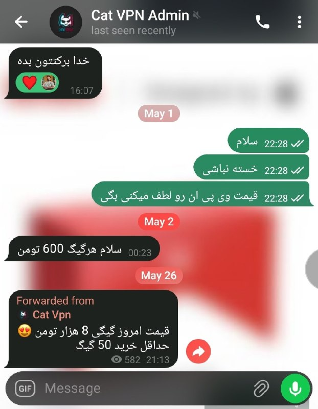

پس کیر شدن این شکلیه ؟

@Dirty_Kids 👻

## Dirty_Kids — post 390343

  

دوستان وقتی شما نبودید عرزشیا به دنیا جهانبخت می‌گفتن باشرف:))

@Dirty_Kids 👻

## Dirty_Kids — post 390342

‏کارمندای پورن‌هاب تا دو هفته باید سه شیفته کار کنن.

@Dirty_Kids 👻

## Dirty_Kids — post 390341

سلام عزیزانی که تازه آنلاین شدین باید بگم که
«اَیَتولا هَمه‌نه‌ای… ایز دد»

@Dirty_Kids 👻

## Dirty_Kids — post 390337

  <a href="telegram/content/Dirty_Kids_390337_1779912082.mp4" target="_blank">🎬 Download video</a>

آتش‌سوزی در یکی از برج‌های مجتمع مسکونی پامچال در چیتگر #تهران

تصاویر دریافتی + منتشرشده، چهارشنبه ۶ خرداد

@Dirty_Kids 👻

## Dirty_Kids — post 390336

  

‏ما که گفتیم ریدن براتون

@Dirty_Kids 👻

## Dirty_Kids — post 390335

دیشب بله برون بود؛
همه از بله زدن بیرون:)))))))))))

@Dirty_Kids 👻

## Dirty_Kids — post 390334

  <a href="telegram/content/Dirty_Kids_390334_1779912084.mp4" target="_blank">🎬 Download video</a>

خبر بسیار خوب اینکه کسمغزان شیعه‌سان رافضی در یک اقدام تحسین برانگیز ماکت جواد ظریف که سالها از کون ارباب‌های رافضیش و نئاندرتال‌های اطرافش می‌خورد رو آتیش زدن.

@Dirty_Kids 👻

## Hranews — post 113201

مرگ و مصدومیت ۳ کارگر در سایه فقدان ایمنی کار/ مسمومیت غذایی ۸ کارگر یک واحد صنعتی

❗️
❗️
❗️
❗️
❗️– در سایه فقدان ایمنی محیط و شرایط نامناسب کار، وقوع یک حادثه در شرکت دماوند انرژی عسلویه یک کشته و دو مصدوم بر جای گذاشت. همچنین، هشت #کارگر شاغل در یک مرکز صنعتی در شهرستان بهاباد دچار مسمومیت غذایی شدند.

ادامه مطلب
↘️
@hranews_bot تماس ✉️ -  @Hranews  کانال هرانا 🆑

## Hranews — post 113200

گزارشی از بیکاری و معوقات مزدی کارگران سامان کاشی و شهرداری تهران/ مشکلات بیمه‌ای بازنشستگان تأمین اجتماعی

❗️
❗️
❗️
❗️
❗️– شماری از کارگران شاغل در کارخانه سامان کاشی بروجرد و کارگران پیمانکاری شهرداری تهران با بیکاری، #معوقات_مزدی، مشکلات بیمه و محرومیت از دریافت پاداش مواجه شده‌اند. از سوی دیگر، #بازنشستگان تأمین اجتماعی از تأخیر طولانی‌مدت شرکت بیمه تکمیلی «آتیه سازان حافظ» در پرداخت سهم درمان بازنشستگان گلایه‌مند هستند.

ادامه مطلب

↘️
@hranews_bot تماس ✉️ -  @Hranews  کانال هرانا 🆑

## Hranews — post 113199

  

اعتراضات ۱۴۰۴؛ بلاتکلیفی نیما عربان، نوجوان بازداشتی در کانون اصلاح و تربیت اصفهان ادامه دارد

❗️
❗️
❗️
❗️
❗️– نیما عربان، نوجوان ۱۷ ساله و یکی از بازداشت‌شدگان اعتراضات ۱۴۰۴ در نائین شهر، کماکان به صورت بلاتکلیف در کانون اصلاح و تربیت اصفهان نگهداری می‌شود. وی در پرونده‌ای مشترک با عباس اکبری فیض‌آبادی، از معترضان اعدام‌شده، مورد رسیدگی قضایی قرار گرفته است.

به گزارش خبرگزاری هرانا، ارگان خبری مجموعه فعالان حقوق بشر در ایران، نیما عربان از بازداشت‌شدگان اعتراضات ۱۴۰۴ در بازداشت بسر می‌برد.

بر اساس اطلاعات دریافتی هرانا، نیما عربان به همراه عباس اکبری فیض‌آبادی، از معترضان اعدام شده، در جریان اعتراضات دی‌ماه ۱۴۰۴در نائین شهر اصفهان، بازداشت شده است. وی هم اکنون بیش از چهار ماه است که در کانون اصلاح و تربیت اصفهان نگهداری می‌شود.

#نیما_عربان

ادامه مطلب

↘️
@hranews_bot تماس ✉️ - @Hranews کانال هرانا 🆑

## Hranews — post 113198

اشنویه؛ دو شهروند با تودیع وثیقه آزاد شدند

❗️
❗️
❗️
❗️
❗️– روز سه‌شنبه ۵ خردادماه، آرمان درویشی و میلاد شادیخواه، شهروندان اهل اشنویه، با تودیع وثیقه، آزاد شدند.

#آرمان_درویشی #میلاد_شادیخواه

ادامه مطلب

↘️
@hranews_bot تماس ✉️ - @Hranews کانال هرانا 🆑

## Hranews — post 113197

  

تداوم بازداشت و بلاتکلیفی حسن و حسین امیری در زندان قزلحصار کرج

❗️
❗️
❗️
❗️
❗️– حسن امیری و حسین امیری، برادران دوقلوی ۲۰ ساله، بیش از دو ماه است که بازداشت شده‌اند و کماکان به‌صورت بلاتکلیف در زندان قزلحصار کرج نگهداری می‌شوند.

به گزارش خبرگزاری هرانا، ارگان خبری مجموعه فعالان حقوق بشر در ایران، حسن امیری و حسین امیری در بازداشت بسر میبرند.

بر اساس اطلاعات دریافتی هرانا، این دو برادر دوقلو همزمان با تحولات نظامی در یکی از ایست‌های بازرسی نگه داشته شدند. ماموران حاضر در این ایست بازرسی، تلفن همراه هر دوی آن‌ها را بررسی کردند و پس از مشاهده تصاویری از ساختمان‌های آسیب‌دیده بر اثر حملات موشکی، آن‌ها را بازداشت کردند. اکنون این دو برادر با اتهام جاسوسی مواجه هستند.
این دو برادر ۲۰ ساله که از دو سالگی در بهزیستی بزرگ شده‌اند، هم‌اکنون در واحد سه، اندرزگاه ۳۵ (بند تربیت) زندان قزلحصار کرج نگهداری می‌شوند و با گذشت بیش از دو ماه از زمان بازداشت، تاکنون دادگاهی برای آن‌ها تشکیل نشده است.

#حسن_امیری #حسین_امیری

ادامه مطلب

↘️
@hranews_bot تماس ✉️ - @Hranews کانال هرانا 🆑

## Hranews — post 113196

  

مجتبی بهزادیان، مدیرکل دفتر نظارت بر عرضه و نمایش فیلم، اعلام کرد که موضوعات مطرح‌شده درباره فیلم «تهران کنارت» به انتشار یک ویدیوی تبلیغاتی «خارج از رویه‌های سازمان سینمایی» بازمی‌گردد. به گفته وی، آنچه موجب واکنش نهادهای مسئول شده، استفاده از صدای یک خواننده زن در این ویدیو عنوان شده است.

لازم به ذکر است؛ مرکز رسانه قوه قضاییه چند روز پیش از تشکیل پرونده قضایی علیه دست‌اندرکاران این فیلم به دلیل آنچه «محتوای غیراخلاقی و مغایر با عفت عمومی» خبر داده بود. همچنین رئیس سازمان سینمایی کشور نیز در ارتباط با صدور پروانه نمایش این فیلم به مرجع قضایی احضار شده بود.

↘️
@hranews_bot تماس ✉️ - @Hranews کانال هرانا 🆑

## Hranews — post 113195

  

شایان هوشیار به بیش از ۳ سال حبس محکوم شد

❗️
❗️
❗️
❗️
❗️– شایان هوشیار، پژوهشگر و دانشجوی دکترای تاریخ ایران توسط شعبه اول دادگاه انقلاب ارومیه به سه سال و هشت ماه حبس محکوم شد.

به گزارش خبرگزاری هرانا، ارگان خبری مجموعه فعالان حقوق بشر در ایران، شایان هوشیار، پژوهشگر و دانشجوی دکترای تاریخ ایران به حبس محکوم شد.

این حکم اخیرا توسط شعبه اول دادگاه انقلاب ارومیه صادر و به مسعود شمس نژاد، وکیل مدافع شایان هوشیار ابلاغ شده است. بر اساس رای صادره آقای هوشیار به سه سال و هشت ماه حبس محکوم شده است.

#شایان_هوشیار

ادامه مطلب

↘️
@hranews_bot تماس ✉️ - @Hranews کانال هرانا 🆑

## Hranews — post 113194

  

نت‌بلاکس در آخرین به‌روزرسانی خود از وضعیت #اینترنت در ایران نوشت اتصال اینترنت اکنون به مدت ۲۴ ساعت در حالت ترمیم و بازیابی قرار دارد. این نهاد ناظر بر وضعیت اینترنت در جهان تاکید کرد که اینترنت در ایران همچنان به‌شدت فیلتر است و محدودیت‌های جدیدی در پیام‌رسان‌ها و اپلیکیشن‌ها در مقایسه با قبل از قطع اینترنت اعمال شده است.

↘️
@hranews_bot تماس ✉️ - @Hranews کانال هرانا 🆑

## Hranews — post 113193

گزارشی از بازداشت و بلاتکلیفی پژمان حاجی‌زاده

❗️
❗️
❗️
❗️
❗️– پژمان حاجی‌زاده، شهروند ساکن بوکان، مورخ ۲۲ اردیبهشت‌ماه، توسط نیروهای امنیتی در این شهرستان بازداشت و کماکان بصورت بلاتکلیف در یکی از بازداشتگاه‌های امنیتی ارومیه به‌سر می‌برد.

#پژمان_حاجی‌زاده

ادامه مطلب

↘️
@hranews_bot تماس ✉️ - @Hranews کانال هرانا 🆑

## manototv — post 105837

  <a href="telegram/content/manototv_105837_1779912088.mp4" target="_blank">🎬 Download video</a>

از «کمک در راه است» تا مذاکره، معامله و بازگشت به همان سیاست همیشگی؟ ورق بزنید.

## alonews — post 123175

  <a href="telegram/content/alonews_123175_1779912089.webm" target="_blank">🎬 Download video</a>

👈گویا گوگل پلی تو اکثر مناطق وصل شده

✅ @AloNews خبر جنگ

## alonews — post 123174

  <a href="telegram/content/alonews_123174_1779912089.webm" target="_blank">🎬 Download video</a>

👈 جایگزینی تسلیحات راهبردی مصرف شده در جنگ با ایران برای آمریکا، ۳ تا ۵ سال زمان می‌خواهد!

✅ @AloNews خبر جنگ

## alonews — post 123173

  <a href="telegram/content/alonews_123173_1779912089.webm" target="_blank">🎬 Download video</a>

👈حمله امشب اسرائیل به غزه 
🔴احتمالا ترور 
✅ @AloNews خبر جنگ

## alonews — post 123172

  <a href="telegram/content/alonews_123172_1779912089.webm" target="_blank">🎬 Download video</a>

👈سخنگوی کمیسیون امنیت ملی: اصلا چرا باید به آمریکا تعهد عدم ساخت سلاح هسته‌ای بدهیم؟

✅ @AloNews خبر جنگ

## alonews — post 123171

  <a href="telegram/content/alonews_123171_1779912090.webm" target="_blank">🎬 Download video</a>

👈حمله امشب اسرائیل به غزه

🔴احتمالا ترور

✅ @AloNews خبر جنگ

## alonews — post 123170

🔥 حجم‌های بالا با قیمت‌های باورنکردنی 🔥 ⚡ سرعت بالا 🌐 پایداری عالی 🚀 کیفیتی که حسش میکنی همین الان جوین شو که جا نمونی 😍 @NetAazaadVPN @NetAazaadVPN

## alonews — post 123169

  

🔥 حجم‌های بالا با قیمت‌های باورنکردنی 🔥

⚡ سرعت بالا
🌐 پایداری عالی
🚀 کیفیتی که حسش میکنی

همین الان جوین شو که جا نمونی 😍

@NetAazaadVPN
@NetAazaadVPN

## alonews — post 123168

  

🔴🇮🇷 کشوری فرد، دبیر سازمان لیگ: پرسپولیس به چی اعتراض داره؟ اونا حتی تو جام حذفی هم نیستن. 22 بازی نتیجه نگرفتن، بعد می‌خوان تو 8 بازی همه تیم‌ها رو ببرن؟ چطور وقتی خودشون میرفتن آسیا، مشکلی نبود؟
@AloSport

## alonews — post 123167

  <a href="telegram/content/alonews_123167_1779912090.webm" target="_blank">🎬 Download video</a>

👈بقایی: موضع ایران در رابطه با قفقاز جنوبی هیچ تغییری نکرده است

🔴سخنگوی وزارت خارجه: جمهوری اسلامی ایران نسبت به نیات بدخواهانه امریکا که سابقه شرارت و تجاوزگری در مناطق مختلف دنیا دارد، سوء ظن شدید دارد و مخالفت خود را با حضور ناامن‌ساز آن در قفقاز جنوبی صراحتا اعلام کرده‌ است.

🔴موضع جمهوری اسلامی ایران درباره امنیت در قفقاز جنوبی روشن است و هیچ شبهه‌ای در این خصوص وجود ندارد.

✅ @AloNews خبر جنگ

## alonews — post 123166

  <a href="telegram/content/alonews_123166_1779912091.webm" target="_blank">🎬 Download video</a>

👈 امانی، سفیر پیشین ایران در لبنان: حزب‌الله برای حمله به اسرائیل در ایام جنگ ایران فرصت را مناسب دید، قضیه راهبردی است و اینطور نیست که حزب‌الله بخواهد در این جنگ طرف ایران را بگیرد و موضوع تبدیل به موضوع کلانی شده است

✅ @AloNews خبر جنگ

## alonews — post 123165

  <a href="telegram/content/alonews_123165_1779912091.mp4" target="_blank">🎬 Download video</a>

🔴من خود به چشم خویشتن دیدم، که جانم میرود…

💔جاویدنام محسن جبارزاده

✅@AloNews

## alonews — post 123164

  <a href="telegram/content/alonews_123164_1779912092.webm" target="_blank">🎬 Download video</a>

👈 بر اساس گزارش «گلدمن ساکس»، تقویت ارزش دلار در نخستین ماه از درگیری میان آمریکا و ایران، موجب شد تا نهادهای رسمی خارجی اقدام به فروش اوراق قرضه خزانه‌داری [آمریکا] کنند.

✅ @AloNews خبر جنگ

## alonews — post 123163

  <a href="telegram/content/alonews_123163_1779912092.webm" target="_blank">🎬 Download video</a>

👈 وزیر خارجه آمریکا: طی روزهای آتی میزان پیشرفت در گفت‌وگوها با ایران را ارزیابی می‌کنیم؛ توافقی وجود دارد که می‌توان به آن دست یافت و مقداری پیشرفت و تمایل مشاهده شده است.

✅ @AloNews خبر جنگ

## alonews — post 123162

  <a href="telegram/content/alonews_123162_1779912092.webm" target="_blank">🎬 Download video</a>

👈تانکر ترکرز: نزدیک به ۶۰ میلیون بشکه نفت خام ایران در نتیجه محاصره دریایی نیروی دریایی آمریکا متوقف و گرفتار شده است. این میزان تقریباً ۶ میلیارد دلار درآمد نفتی است که در حال حاضر به تهران نمی‌رسد.

🔴با وجود این‌که هنوز نفتکش‌های خالی زیادی برای بارگیری نفت در دسترس هستند، اما به دلیل کاهش تولید نفت، میزان بارگیری نفتکش‌ها نیز کاهش یافته است.

✅ @AloNews خبر جنگ

## alonews — post 123161

  <a href="telegram/content/alonews_123161_1779912093.webm" target="_blank">🎬 Download video</a>

👈الجزیره: پهپادهای تهاجمی حزب‌الله یک سرباز اسرائیلی را کشته و دو نفر دیگر را زخمی کردند

✅ @AloNews خبر جنگ

## alonews — post 123160

  <a href="telegram/content/alonews_123160_1779912093.webm" target="_blank">🎬 Download video</a>

👈اینم از وضعیت اینترنت وصل شده
پر از اختلال...

✅ @AloNews خبر جنگ

## alonews — post 123159

  <a href="telegram/content/alonews_123159_1779912093.webm" target="_blank">🎬 Download video</a>

👈هلند مدعی ارسال مین‌روب به تنگه هرمز شد

✅ @AloNews خبر جنگ

## alonews — post 123158

  <a href="telegram/content/alonews_123158_1779912093.webm" target="_blank">🎬 Download video</a>

👈روزنامه‌نگار چینی: آمریکا و ایران به پیش‌نویس توافق دست یافته‌اند، اما واشنگتن نمی‌تواند تصویر «پیروزی ایران» بپذیرد

✅ @AloNews خبر جنگ

## alonews — post 123157

  <a href="telegram/content/alonews_123157_1779912093.webm" target="_blank">🎬 Download video</a>

👈نرخ ثبت ازدواج در دفاتر اسناد رسمی با ۴۵ درصد افزایش به ۲ میلیون و ۹۰۰ هزار تومان رسید

✅ @AloNews خبر جنگ

## alonews — post 123156

  <a href="telegram/content/alonews_123156_1779912093.webm" target="_blank">🎬 Download video</a>

👈آسوشیتدپرس: تحلیل جدیدی می‌گوید ایالات متحده ممکن است به ۳ تا ۵ سال زمان نیاز داشته باشد تا انبارهای مهمات موشکی کلیدی که به شدت در جنگ با ایران مصرف شده‌اند را بازسازی کند و این موضوع نگرانی‌هایی را درباره آمادگی برای یک درگیری احتمالی با چین برانگیخته است.

گزارش می‌گوید تأمین موشک‌های کروز تامهاوک، موشک‌های رهگیر پاتریوت و سیستم‌های ثاد به شدت کاهش یافته است. حتی با افزایش هزینه‌های دفاعی تحت ریاست جمهوری ترامپ، بازسازی موجودی‌ها سال‌ها طول خواهد کشید زیرا ظرفیت تولید محدود است.

تخمین‌های زمان بازسازی:

موشک‌های تامهاوک: تا سال ۲۰۳۰
موشک‌های رهگیر ثاد: تا اواخر سال ۲۰۲۹
موشک‌های پاتریوت: تا اواسط سال ۲۰۲۹



✅ @AloNews خبر جنگ

---
📅 بروزرسانی: 1405/03/06 15:38
---

## VahidOOnLine — post 242412

  

♦️محمدباقر قالیباف، رئیس مجلس شورای اسلامی و مذاکره کننده ارشد جمهوری اسلامی در مذاکرات با آمریکا، در پیامی به مناسبت عید قربان به روسای مجالس کشورهای اسلامی نوشت:‌ «همکاری برای قو ی‌شدن بدون دخالت خارجی، نقش مؤثری در حل بحران‌های منطقه‌ای دارد.»

این پیام در حالی صادر می‌شود که همزمان با ادامه مذاکرات میان تهران و واشنگتن برای پایان جنگ، کشورهای اسلامی منطقه می‌گویند برای بازگردندان ثبات و آرامش به منطقه تمام تلاش خود را به کار بسته‌اند.
‌🇸🇦 Indypersian

🤖 @VahidOOnLine

## VahidOOnLine — post 242411

  <a href="telegram/content/VahidOOnLine_242411_1779883728.mp4" target="_blank">🎬 Download video</a>

♦️سازمان هوانوردی و فضا ایالات متحده (ناسا)، روز سه‌شنبه پنجم خرداد جزئیات جدیدی از برنامه استقرار یک پایگاه فضائی دائم در کره ماه را اعلام کرد.

مدیران این سازمان فدرال اعلام کردند برنامه ساخت این پایگاه از سه سال دیگر آغاز خواهد شد و به شرکت‌هایی که بتوانند در کار ساخت و ارسال خودروها و دیگر وسایل حمل و نقل به ماه کمک کنند، پاداش خواهند داد.

جرد ایزاکمن، مدیر ناسا در یک نشست مطبوعاتی در واشنگتن گفت قرار است در مرحله اول فرودگر (ماه نشین)‌ «بلو اوریجین مارک وان اندیورنس» (Blue Origin Mark One Endurance) محموله‌های متعددی را به نقطه تماس در قطب جنوب ماه منتقل کند.‌

در ادامه مرحله اول، ربات‌ها
ماموریت‌های سریعی را «بررسی منطقه، آزمایش فناوری‌ها و آماده‌سازی برای عملیات روی سطح ماه» آغاز خواهند کرد.

به گفته مدیران ناسا،  مرحله دوم با انتقال وسایل حمل‌ونقل،  تا سال ۲۰۲۹ طول می‌کشد و پس از آن ناسا شروع به ساخت زیرساخت‌های نیمه دائمی خواهد کرد و مرحله ۳ با هدف دستیابی به حضور پایدار روی کره ماه انجام خواهد شد.
‌🇸🇦 Indypersian

🤖 @VahidOOnLine

## VahidOOnLine — post 242410

  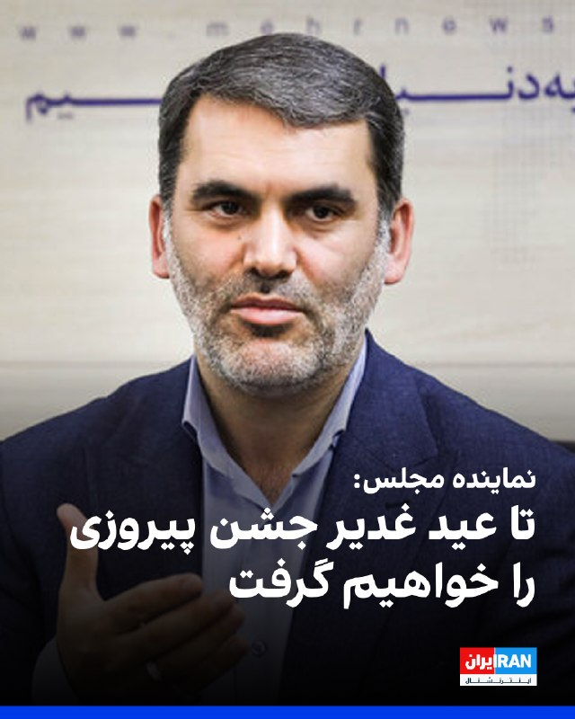

محسن زنگنه، عضو کمیسیون برنامه و بودجه مجلس، گفت جمهوری اسلامی درباره «اصل غنی‌سازی» مذاکره نمی‌کند اما درباره محدودیت درصد غنی‌سازی با آمریکا گفت‌وگو می‌کند.

زنگنه همچنین گفت روند مذاکرات با «هماهنگی کامل رهبری» پیش می‌رود و ابراز امیدواری کرد جمهوری اسلامی در عید غدیر «جشن پیروزی» بگیرد.
‌🏁 🇬🇧 IranintlTV

🤖 @VahidOOnLine

## VahidOOnLine — post 242409

  

الی کوهن، وزیر انرژی اسرائیل و عضو کابینه سیاسی-امنیتی این کشور، با اشاره به آنچه «برنامه‌های راهبردی» برای دور زدن تهدیدهای جمهوری اسلامی علیه مسیرهای تجاری خواند، گفت: «تمام نبرد ایران در تنگه هرمز و آن اهرم راهبردی که به کار می‌گیرد، در حال از بین رفتن است.»

او افزود در روزهای اخیر گفت‌وگوهایی درباره ایجاد زیرساخت‌های انرژی از شرق به غرب در جریان است و هدف از این طرح‌ها، انتقال انرژی به اروپا از طریق اسرائیل عنوان شده است.

کوهن همچنین از مذاکرات برای ایجاد خطوط انتقال انرژی از مسیر کشورهای خلیج فارس خبر داد و گفت کشورهایی مانند عربستان سعودی و امارات متحده عربی، به عنوان تولیدکنندگان مهم انرژی، تمایل دارند در این طرح‌های اقتصادی مشارکت کنند.

به گفته وزیر انرژی اسرائیل، کریدور زیرساختی میان هند و اروپا از طریق کشورهای خلیج فارس و اسرائیل در دست بررسی است و استفاده از مسیر مصر نیز می‌تواند روند پیشبرد این طرح‌ها را تسریع کند. او تاکید کرد گفت‌وگوهای مشخصی در این زمینه در حال انجام است.
‌🏁 🇬🇧 IranintlTV

🤖 @VahidOOnLine

## VahidOOnLine — post 242408

♦️لندن در حالی که دمای هوا در ماه مه از ۳۰ درجه سانتیگراد فراتر می‌رود، رکورد گرم‌ترین روز ماه مه خود را شکست.
آخرین باری که لندن این دما را تجربه کرده بود سال ۱۹۴۴ بود که گرمای ۳۲.۸ درجه سانتیگراد را تجربه کرد.
هوا در یک آخر هفته طولانی از ۳۰ درجه سانتیگراد می‌گذرد و اداره هواشناسی بریتانیا هشدار کهربایی برای بخش‌هایی از انگلستان صادر کرده است و پیش‌بینی می‌شود که با تشدید گرما، دما به رکورد جدیدی برای ماه مه برسد.
موج گرمای کم‌سابقه، بریتانیا  را در روزهای اخیر حتی از بعضی سواحل گردشگری جنوب اروپا نیز گرم‌تر کرد.
بر اساس گزارش‌ها، بریتانیا روز دوشنبه گرم‌ترین دمای ثبت‌شده ماه مه در تاریخ خود را تجربه کرد و دماسنج‌ها در نزدیکی لندن عدد ۳۴.۸ درجه سانتی‌گراد را نشان دادند.
کارشناسان هواشناسی می‌گویند چنین دماهایی در اواخر بهار برای بریتانیا کم‌سابقه است؛ کشوری که معمولا با آب‌وهوای خنک‌ و بارانی شناخته می‌شود.
‌🇸🇦 Indypersian

🤖 @VahidOOnLine

## VahidOOnLine — post 242407

  

بر اساس اطلاعات رسیده به ایران‌اینترنشنال، حمیدرضا حدادی، جوان ۱۹ ساله اهل شاندیز، شامگاه ۱۸ دی‌ماه پس از اصابت گلوله به درمانگاه شاندیز منتقل شد اما از آنجا که دستور تخلیه درمانگاه صادر شده بود او بدون رسیدگی پزشکی جان باخت.

حمیدرضا تنها حدود نیم ساعت در میان جمعیت معترضان حضور داشت که از پشت هدف شلیک قرار گرفت. گلوله به ریه او اصابت کرد و او بر اثر شدت جراحات جان باخت.

حمیدرضا حدادی فوتبالیست بود و به گفته نزدیکانش آرزو داشت مسیر حرفه‌ای خود را در فوتبال دنبال کند. او همچنین قصد داشت یک مغازه فروش تلفن همراه برای خود راه‌اندازی کند.

پس از کشته شدن حمیدرضا، نیروهای حکومتی تلاش کردند او را به عنوان شهید معرفی کنند، اما خانواده با این موضوع مخالفت کردند. به گفته این منبع، نیروهای حکومتی بدون رضایت خانواده برای او مراسمی در مسجد برگزار کردند، اما اعضای خانواده در آن مراسم حضور نیافتند.

این منبع افزود خانواده حمیدرضا با وجود فشارهای شدید امنیتی، بر این روایت تاکید کرده‌اند که او در جریان اعتراضات و با شلیک نیروهای حکومتی کشته شده است.

‌🏁 🇬🇧 IranintlTV

🤖 @VahidOOnLine

## VahidOOnLine — post 242406

  <a href="telegram/content/VahidOOnLine_242406_1779883732.mp4" target="_blank">🎬 Download video</a>

♦️صدها هزار زائر مراسم حج روز چهارشنبه ششم خرداد و همزمان با عید قربان، مراسم رمی جمرات، یکی از ارکان اصلی حج را به جای آوردند.

زائران در این مراسم، به سوی نماد شیطان در صحرای منا، سنگ پرتاب می‌کنند.

مقام‌های عربستان سعودی از ۲۲ سال پیش و برای امنیت و سلامت زائران، دیوارهایی را به جای نمادهای شیطان در صحرای منا ساختند.
‌🇸🇦 Indypersian

🤖 @VahidOOnLine

## VahidOOnLine — post 242405

  

♦️همزمان با ادامه مذاکرات میان جمهوری اسلامی و آمریکا، علی‌اکبر ولایتی، مشاور رهبر جمهوری اسلامی در امور بین‌الملل، روز چهارشنبه ششم خرداد گفت که تنگه هرمز «تضمین توافق» با آمریکا است.

ولایتی با انتشار پیامی در اکس نوشت: «خط قرمز ایران روشن است...این بار کاغذها و امضاها تضمین نیستند، ضامن عینی بقای توافق، تنگه هرمز است.»
مشاور بین‌الملل رهبر جمهوری اسلامی اضافه کرد: «جغرافیا دروغ نمی‌گوید و قاضی نهایی عهدنامه، روی کاغذ نیست.»

او همچنین با اشاره به حملات بیگانگان در به ایران در دوران تاریخی نوشت: «تاریخ گواهی می‌دهد همه مهاجمانی که با سودای سلطه آمدند، از اسکندر تا چنگیز و ترامپ، همگی در هاضمه تمدن غنی ایران هضم شدند.»

پیش از این علی باقری کنی، معاون دبیر شورای عالی امنیت ملی ایران روز چهارشنبه در حاشیه مجمع بین‌المللی امنیتی در مسکو با بیان اینکه تماس‌های غیرمستقیم میان ایران و آمریکا ادامه دارد، گفته بود که «ایران و ایالات متحده هنوز در مورد رفع انسداد تنگه هرمز به توافق نرسیده‌اند.»
‌🇸🇦 Indypersian

🤖 @VahidOOnLine

## VahidOOnLine — post 242404

  <a href="telegram/content/VahidOOnLine_242404_1779883735.mp4" target="_blank">🎬 Download video</a>

♦️سخنگوی سازمان آتش‌نشانی تهران روز چهارشنبه ششم خردادماه از وقوع آتش‌سوزی در پشت‌بام یک مجتمع تجاری در خیابان شوش خبر داد.
به گفته این سازمان، آتش‌نشانان موفق شدند حریق را پیش از سرایت به انبارهای مجتمع مهار و افراد حاضر در ساختمان را در همان دقایق اولیه تخلیه کنند.
این حادثه بدون مصدومیت پایان یافت.
‌🇸🇦 Indypersian

🤖 @VahidOOnLine

## VahidOOnLine — post 242403

  

مسعود پزشکیان، رییس‌جمهور دولت جمهوری اسلامی، عامل بحران اقتصادی در کشور را «جنگ اقتصادی دشمن» خواند و گفت میدان اصلی تقابل امروز، جنگ اقتصادی و هدف‌گیری تاب‌آوری کشور است.

او افزود: «میدان اصلی تقابل امروز، جنگ اقتصادی و هدف‌گیری تاب‌آوری کشور است.»

پزشکیان ادامه داد: «دشمن پس از ناکامی در تحقق اهداف خود در عرصه نظامی، تمرکز خود را بر آسیب‌زدن به تاب‌آوری اقتصادی کشور و ایجاد اخلال در معیشت مردم قرار داده است.»
‌🏁 🇬🇧 IranintlTV

🤖 @VahidOOnLine

## VahidOOnLine — post 242402

  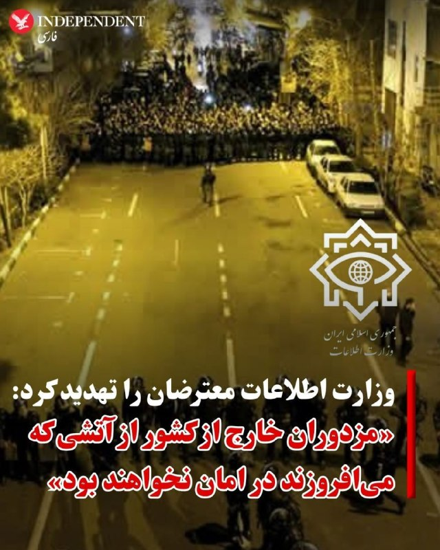

♦️وزارت اطلاعات جمهوری اسلامی ایران روز چهارشنبه ششم خردادماه با صدور بیانیه‌ای معترضان و مخالفان حکومت را به پیگرد قانونی تهدید کرد.

این بیانیه که با عنوان «سخنی با ولی‌نعمتان و هشداری به دشمنان» در رسانه‌های داخلی ایران منتشر شده، ادعا می‌کند که «دشمن شکست خورده در جنگ نظامی، بدنبال تولید دستآورد برای خویش، گرچه از طریق جنگ نرم، می‌باشد.»

وزارت اطلاعات در این بیانیه علاوه بر اسرائیل و آمریکا، بریتانیا و اروپا را به همراهی با این دو قدرت متهم و کشورهای عرب حاشیه خلیج فارس را به‌عنوان «غلامان متمول» مسئول تامین مالی «جنگ ترکیبی تمام عیار» علیه «مردم قهرمان ایران» معرفی کرده است.

این بیانیه در حالی صادر می‌شود که اسماعیل خطیب، وزیر اطلاعات جمهوری اسلامی در سومین هفته جنگ در حمله اسرائیل کشته شد و دولت هنوز جانشینی برای او معرفی نکرده است.

در بیانیه وزارت اطلاعات که همزمان با افزایش گمانه‌زنی‌ها درباره توافق احتمالی میان تهران و واشنگتن صادر شده، آمده است: «دشمن شکست خورده در جنگ نظامی، بدنبال تولید دستاورد برای خویش، گرچه از طریق جنگ نرم، میباشد. اکنون دشمن، هدف براندازی و تجزیه کشور را که در ابتدای جنگ اخیر آشکارا اعلان کرده و با حمله نظامی نتوانست محقق سازد، از راههای دیگری پی می‌جوید. لذا و طبق اطلاعات موثقِ حاصل از مجاری مختلف، دشمن کینه‌توز نه تنها در صدد اجرای شگردهای گوناگون جنگ ترکیبی علیه ایران عزیز می‌باشد، بلکه با توقف جنگ سخت، قطعا تمرکز بیشتر و سنگین‌تری بر انواع شیوه‌های جنگ نرم، جنگ شناختی و توطئه‌های جنگ ترکیبی خواهد داشت.»

وزارت اطلاعات در این بیانیه معترضان و مخالفان جمهوری اسلامی در خارج از ایران را تهدید کرد و نوشت: «مزدوران ضد انقلاب و تروریست‌های مقیم خارج کشور و حامیان آن‌ها نیز از آتشی که می‌افروزند در امان نخواهند بود.»

در حالی که اعتراضات سراسری دی‌ماه ۱۴۰۴ با هزاران کشته یکی از بزرگ‌ترین و مرگ‌بارترین سرکوب‌های نیم قرن اخیر جهان به شمار می‌رود، وزارت اطلاعات ادعا کرد «طبق اطلاعات موثق و متواتر، امروز اولویت محورهای جنگ ترکیبی دشمن، انجام تحریکات اجتماعی حول محورهای اقتصادی و برخی کمبودها، و تلاش برای پیشگیری از خدمت‌رسانی دولت خدمتگزار و طراحی برای تولید و تهییج معترضین و کشاندن آنها به خیابان‌ها، در برابر نهادهای حاکمیتی و امت خداجویی است که تجمعات خیابانی را به «سنگر سراسری مقاومت ملی» تبدیل نموده‌اند.»

 وزارت اطلاعات در همین بیانیه هرگونه ارتباط با رسانه‌های مخالف که آن‌ها را «تروریستی» توصیف کرده است و «ایجاد اغتشاش و اختلاف مذهبی و قومی» و «ارتباط با کانال‌های ارتباطی» اسرائیل در شبکه‌های اجتماعی، مورد پیگرد قرار خواهد گرفت.
‌🇸🇦 Indypersian

🤖 @VahidOOnLine

## VahidOOnLine — post 242401

  

پس از گذشت حدود سه ماه از کشته شدن علی خامنه‌ای، رهبر جمهوری اسلامی، و اعضای خانواده او در حمله مشترک اسرائیل و آمریکا، رسانه‌های ایران اعلام کردند مراسم ختم خانواده علی و مجتبی خامنه‌ای هفته جاری در مصلای عبدالعظیم حسنی در شهر ری برگزار می‌شود.

بر اساس اعلامیه منتشرشده از سوی خانواده رهبر جمهوری اسلامی، این مراسم برای بشری حسینی خامنه‌ای، دختر علی خامنه‌ای، مصباح‌الهدی باقری، همسر بشری حسینی خامنه‌ای، زهرا حداد عادل، همسر مجتبی خامنه‌ای، و زهرا محمدی گلپایگانی، نوه علی خامنه‌ای، برگزار خواهد شد.

علی خامنه‌ای نهم اسفند‌ماه به همراه بخشی از خانواده و همراهانش در حملات مشترک اسرائیل و آمریکا کشته شد. با وجود گذشت سه ماه، هنوز مراسم تشییع جنازه او برگزار نشده است.
‌🏁 🇬🇧 IranintlTV

🤖 @VahidOOnLine

## VahidOOnLine — post 242400

  

علی باقری‌کنی، معاون دبیر شورای عالی امنیت ملی، با بیان اینکه «تماس‌های غیرمستقیم میان جمهوری اسلامی و آمریکا ادامه دارد» گفت: «موضوع ذخایر اورانیوم غنی‌شده در دستور کار مذاکرات نیست.»

او افزود جمهوری اسلامی و عمان در حال مذاکره درباره رویه جدید عبور کشتی‌ها از تنگه هرمز هستند.
‌🏁 🇬🇧 IranintlTV

🤖 @VahidOOnLine

## VahidOOnLine — post 242399

🗣روایت شما پس از بازگشت به اینترنت بین‌المللی- چهارشنبه ۶ خرداد

🔹با وجود باز شدن اینترنت در ایران، حتی با فیلترشکن‌های قوی هم هیچ‌یک از اپلیکیشن‌ها باز نمی‌شود.
🔹بالاخره بعد از سه ماه وصل شدم ولی احساس غریبی می‌کنم. اینستاگرام شده مثل قبرستون هزاران هزار اکانت که دیگه صاحبی نداره.
🔹نابود شدیم از گرونی وحشتناک. این گرونی و تورم رو هیچ‌کجای دنیا نمی‌تونن حتی چند روز تحمل کنن. اینترنت که حقمونه رو با ده‌ها شرط و منت باز کردن.
🔹بعد ۳ ماه وصل شدم. تلگرام روی آپدیت می‌مونه، پیام‌ها خیلی دیر ارسال و دریافت میشه و گوگل‌پلی هنوز برای همه کار نمی‌کنه. فقط دیشب به سختی تونستم آپدیت اندروید گوشیم رو انجام بدم.
🔹بالاخره اینترنت در ایران وصل شده و خیلی خوشحال شدیم، ولی یاد جاویدنامان از ذهن ما نمیره.
🔹هر کی میگه اینترنت در ایران وصل شده واقعا مغزش خرابه. کجا وصل شده؟ گوگل‌پلی وارد نمیشه و حتی نمی‌شه برنامه‌های سامسونگ رو آپدیت کرد.
🔹اینترنت وصل شده ولی خوشحال نیستم چون وقتی اینترنت وصل بشه یعنی اینکه هیچ اتفاقی قرار نیست بیافته و جمهوری اسلامی قراره بمونه.
🔹نگران اینترنت نباش چون برمی‌گرده، نگران جوونی‌مون باش که مفت رفت.
🔹کاش همین‌جوری که اینترنت‌ها برگشت، جوون‌هامون از زیر خاک برمی‌گشتن.
🔹ببین ما چقدر بدبخت شدیم که در عصر تکنولوژی، بعد از ۸۸ روز برای بازگشت اینترنت شادی می‌کنیم.
🔹اینها اینترنت‌ها رو وصل کردن که ما لال بشیم.
🔹درک نمی‌کنم یه سری‌ها خوشحالن و هیجانی شدن از وصل شدن اینترنت. الان یعنی بدبختی‌هاتون تموم شد؟
🔹برای من عجیبه که بعضی‌ها وصل شدن اینترنت رو تبریک میگن. این حق اولیه هر انسانیه و تبریک گفتن نداره.
🔹باورم نمیشه که میگین آزاد شدیم و خوشحالیم. این فقط فیلترنت هست و هیچی عوض نشده. زندگی ما و جوونیمون به باد رفت. فیلترنت خیلی محدود وصل شده ولی زندگی ما و اون همه جاویدنام دیگه برنمی‌گرده.
‌🏁 🇬🇧 IranintlTV

🤖 @VahidOOnLine

## VahidOOnLine — post 242398

🗣روایت شما از بحران اقتصادی و زندگی در آتش‌بس- چهارشنبه ۶ خرداد:

🔹بچه‌ام در بخش کودکان بیمارستان ۱۷ شهریور رشت بستری است. داروهای سرطان نیست. بسته ۱۰۰ عددی قرص مرکاپتوپرین به سختی و فقط در بازار سیاه با قیمت چند برابری پیدا می‌شود.

🔹خیلی در فشاریم. اجاره خانه ۳ برابر شده. گوشت و مرغ را که خیلی وقت است نمی‌توانیم بخریم. روغن ۲ لیتری شده ۹۰۰ هزار تومان.

🔹من لوازم خانگی دارم. قیمت وسایل خانه از قبل عید تا الان به شدت افزایش داشته. یخچال دوقلو هیمالیا ۱۲۰ میلیون تومان بود الان شده ۲۵۰ میلیون، ماشین لباسشویی پاکشوما ۹ کیلویی ۶۰ میلیون بود، شده ۱۰۰ میلیون تومان. جوان‌هایی که می‌خواهند تازه زندگی مشترکشان را شروع کنند می‌آیند قیمت می‌کنند، با چشمان خیس از در خارج می‌شوند.

🔹فروشنده موبایلم؛ قیمت موبایل‌ها خیلی رفته بالا. عملا مشتری فقط برای خرید قاب و گلس مراجعه می‌کند و به ندرت گوشی می‌فروشیم.

🔹گرانی به شدت بیداد می‌کند. یک روغن، نوشابه و زردچوبه خریدم شد یک میلیون و ۲۰۰ هزار تومان.

🔹همه چیز گران شده. روغن پنج لیتری شده ۷۰۰ هزار تومان، چیپس ۵۵۰ هزار تومان، گوشت قرمز یک میلیون و ۳۰۰ هزار تومان.

🔹با خانه میانگین متری ۳۰۰ میلیون تومان در اصفهان چه‌کار کنیم؟ تازه کسی هم نمی‌فروشد و منتظرند گران‌تر شود.
‌🏁 🇬🇧 IranintlTV

🤖 @VahidOOnLine

## VahidOOnLine — post 242397

  

همزمان با گزارش‌ها درباره رایزنی‌ها برای دستیابی به توافق میان جمهوری اسلامی و آمریکا، علی‌اکبر ولایتی، مشاور رهبر جمهوری اسلامی در امور بین‌الملل، گفت ضامن عینی بقای توافق، تنگه هرمز است.

او در ایکس نوشت: «خط قرمز ایران روشن است، این بار کاغذها و امضاها تضمین نیستند، ضامن عینی بقای توافق، تنگه هرمز است. جغرافیا دروغ نمی‌گوید و قاضی نهایی عهدنامه، روی کاغذ نیست.»

او همچنین گفت: «تاریخ گواهی می‌دهد همه مهاجمانی که با سودای سلطه آمدند، از اسکندر تا چنگیز و ترامپ، همگی در هاضمه تمدن غنی ایران هضم شدند.»
‌🏁 🇬🇧 IranintlTV

🤖 @VahidOOnLine

## VahidOOnLine — post 242396

  

♦️دولت کره‌جنوبی روز چهارشنبه ششم خردادماه اعلام کرد سفیر جمهوری اسلامی در سئول را در اعتراض به حمله به یک کشتی احضار خواهد کرد.

مقام‌های کره‌جنوبی جزئیات بیشتری درباره این حادثه منتشر نکرده‌اند، اما تاکید کرده‌اند امنیت کشتیرانی و آزادی تردد دریایی برای سئول اهمیت حیاتی دارد.

این خبر در حالی اعلام شد که حدود چهار هفته پیش یک کشتی باری کره جنوبی در تنگه هرمز هدف حمله پهپادی قرار گرفت و به‌شدت آسیب دید.
دفتر ریاست جمهوری کره جنوبی اعلام کرد بسیار بعید است این حمله از جایی به‌جز ایران انجام شده باشد.
‌🇸🇦 Indypersian

🤖 @VahidOOnLine

## VahidOOnLine — post 242395

  

♦️علی باقری کنی، معاون دبیر شورای عالی امنیت ملی جمهوری اسلامی روز چهارشنبه ششک خرداد در حاشیه مجمع بین‌المللی امنیتی در مسکو با اشاره به مذاکرات نمایندگان تهران و واشنگتن گفت: «ذخایر اورانیوم غنی‌شده ایران در دستور کار مذاکرات نیست».

به گزارش ریانووستی، باقری کنی همچنین با بیان اینکه تماس‌های غیرمستقیم میان تهران و واشنگتن ادامه دارد، افزود: ایران و ایالات متحده هنوز در مورد رفع انسداد تنگه هرمز به توافق نرسیده‌اند.

این اظهارات در حالی مطرح می‌‌شود که دونالد ترامپ، رئیس‌جمهوری ایالات متحده، روز دوشنبه با انتشار پیامی در شبکه اجتماعی تروث نوشت: «اورانیوم غنی‌شده (گرد‌وغبار هسته‌ای) یا باید فورا به ایالات متحده تحویل داده شود تا به آمریکا منتقل و نابود گردد، یا اینکه ترجیحا در بستر همکاری و هماهنگی با جمهوری اسلامی، در همان محل یا در مکان قابل‌قبول دیگری، در حضور و با نظارت کمیسیون انرژی اتمی یا نهاد معادل آن نابود شود.»

 مقام‌های آمریکایی به سی‌ان‌ان گفته‌اند، اختلاف‌ها بر سر نحوه پرداختن به برنامه هسته‌ای ایران و لغو تحریم‌ها، نهایی شدن توافق برای پایان جنگ را به تاخیر انداخته است.
‌🇸🇦 Indypersian

🤖 @VahidOOnLine

## VahidOOnLine — post 242394

  

وزارت خارجه کره جنوبی چهارشبنه شش خرداد اعلام کرد که حمله به کشتی باری اچ‌ام‌ام نامو در تنگه هرمز ، احتمالا با استفاده از یک موشک ایرانی انجام شده است.

به گزارش رویترز، یک مقام دفتر ریاست‌جمهوری کره جنوبی ۲۱ اردیبهشت اعلام کرد سئول در حال بررسی نقش احتمالی جمهوری اسلامی در حمله به نفتکش کره‌ای «اچ‌ام‌ام نامو» در هفته گذشته است.

او با تاکید بر این که کره جنوبی قصد دارد به عامل حمله به این کشتی پاسخ دهد در عین حال گفت عامل این حمله تاکنون شناسایی نشده و تحقیقات در این زمینه ادامه دارد.
‌🏁 🇬🇧 IranintlTV

🤖 @VahidOOnLine

## VahidOOnLine — post 242393

  <a href="telegram/content/VahidOOnLine_242393_1779883741.mp4" target="_blank">🎬 Download video</a>

⭕️آتش‌‌سوزی گسترده در فروشگاه بزرگ غذای حلال یهودیان در محله «گلدرز گرین» لندن

♦️یک فروشگاه بزرگ کوشر (غذای حلال یهودیان) در محله گلدرز گرین لندن روز چهارشنبه ششم خرداد دچار آتش‌‌سوزی گسترده شد.
برخی رسانه‌های محلی گرازش دادند که این آتش‌سوزی احتمالا عمدی و به دلایل یهودستیزانه رخ داده است.
گروه‌های امدادی و آتش‌نشانی با حضور در محل حادثه مشغول خاموش کردن آتش هستند.
پلیس لندن تاکنون گزارشی درباره این حادثه منتشر نکرده است.
‌🇸🇦 Indypersian

🤖 @VahidOOnLine

## WithYashar — post 12673

  <a href="telegram/content/WithYashar_12673_1779883743.mp4" target="_blank">🎬 Download video</a>

پیمان بستم و شب و روز بیدارم 
👑
@withyashar

## WithYashar — post 12672

## WithYashar — post 12669

  <a href="telegram/content/WithYashar_12669_1779883745.mp4" target="_blank">🎬 Download video</a>

وزیر امنیت داخلی اسرائیل: توافق ترامپ و ایران یک توافق بد است که می‌تواند به اسرائیل آسیب برساند. ما اجازه نخواهیم داد این اتفاق بیفتد!
@withyashar

## WithYashar — post 12668

شبکه 12 اسرائیل:ناوگان هوایی آمریکا ظرف 72 ساعت به پایگاه‌های خود در اروپا منتقل خواهد شد و در صورت از سرگیری درگیری با ایران، هواپیماها در حالت آماده‌باش برای بازگشت به فرودگاه بن گوریون قرار خواهند گرفت
@withyashar

## WithYashar — post 12667

جلسه کمپ دیوید که قرار بود امروز برگزار شود ترامپ اعلام کرد: جلسه کابینه به دلیل شرایط آب و هوایی در کاخ سفید برگزار خواهد شد، نه در کمپ دیوید! حالا صحبت‌هایی هست که کمپ دیوید یک تله برای شناسایی فردی بود که اطلاعات را نشت می‌داد ! فرد مورد نظر گیر افتاد !…

## WithYashar — post 12666

بگو یادتون رفته پزشکیان همونی بود که ۳ ماه پیش جز شورایی بود که دستور کشتن ۵۰ هزار تا از بچه هامون رو داد واسه یه اینترنت شد ادم خوبه کاش وصل نمیشد همون 😡😡😔😔

## WithYashar — post 12665

بگو یادتون رفته پزشکیان همونی بود که ۳ ماه پیش جز شورایی بود که دستور کشتن ۵۰ هزار تا از بچه هامون رو داد واسه یه اینترنت شد ادم خوبه کاش وصل نمیشد همون 😡😡😔😔

## WithYashar — post 12664

حالا بدیش اینه که این کند ذهن این مدت نت هم داشته و پیگیر کانال هم بوده و همش پیغام میداده زر زر 😡 اخطار هم داده بودم و گفته بودم دیگه دایرکت نده کلا ، دیشب گفتم بعضی ها میخوان مغذشوت پلمپ باشه ! مگه یه معجزه اتفاق بیوفته 
🪄

## WithYashar — post 12663

واقعا فک نمیکنی تو شرایط فعلی درست نیست فعلا پزشکتان خراب کنی ؟ این همه ادم دیوث هست تو اینا یکی ک داره جلو سپاه وایمیسه رو چت نزن روش

## WithYashar — post 12662

واقعا فک نمیکنی تو شرایط فعلی درست نیست فعلا پزشکتان خراب کنی ؟ این همه ادم دیوث هست تو اینا یکی ک داره جلو سپاه وایمیسه رو چت نزن روش

## WithYashar — post 12661

  <a href="telegram/content/WithYashar_12661_1779883746.mp4" target="_blank">🎬 Download video</a>

عضو شورای اطلاع رسانی دولت : چرا رسانه‌های ضدحکومت دچار سردرگمی و بی‌برنامگی شدند؟
@withyashar
یاشار: چرتو پرتاشو کات کردم ولی اگه ویس های دیشبم رو گوش‌کرده باشید این قسمت حرفش درسته ! ما باید تغییر‌تاکتیکی‌بدیم یا منتظر همون معجزه باشیم که منم گفتم !!! ادب ازکه آموختی از بی ادبان !

## WithYashar — post 12660

رسانه I24 NEWS: نیروهای دفاعی اسرائیل (IDF) و فرماندهی مرکزی ارتش آمریکا (سنتکام) در حالت آماده‌باش بالا باقی مانده‌اند، در شرایطی که احتمال شکست مذاکرات میان واشنگتن و تهران و صدور دستور اقدام نظامی از سوی رئیس‌جمهور دونالد ترامپ وجود دارد.
@withyashar

## WithYashar — post 12659

الان نزدیک مجتمع صنایع فولاد مبارکه @withyashar

## WithYashar — post 12658

## WithYashar — post 12657

  <a href="telegram/content/WithYashar_12657_1779883748.mp4" target="_blank">🎬 Download video</a>

الان نزدیک مجتمع صنایع فولاد مبارکه
@withyashar

## WithYashar — post 12656

## WithYashar — post 12655

  <a href="telegram/content/WithYashar_12655_1779883749.mp4" target="_blank">🎬 Download video</a>

@withyashar مخصوص‌ پیرمردا

## WithYashar — post 12654

## WithYashar — post 12653

## WithYashar — post 12652

یاشار جان
اینترنشنالیا دارن میتوپن به ترامپ که بزدله و به ج ا باج داره میده و عقب نشینی کرده

تقریبا رسانه ها شدن این.

ولی من هنوز یادمه که میگفتی ترامپ فوتبالی بازی میکنه که توپشو نمیشه دید
هنوز این جملات و حرفاتو یادمه

بگو، خواهش میکنم بگو، که این رسانه ها همه دارن اشتباه می‌کنن و هنوز ما اتاق جنگی های قدیمی دارین درست میریم به سمت قاهره.
مرسی ازت❤️
#دیکتاتور_مهربون❤️

## mwarmonitor — post 9807

🔸رئیس ستاد کل ارتش اسرائیل، ایال زامیر، گفت برنامه هسته‌ای ایران “سال‌ها” به عقب رانده شده است، در حالی که گزارش‌ها از احتمال دستیابی به یک توافق در کوتاه‌مدت با تهران خبر می‌دهند.

🔹زامیر گفت “محور شرارت” به رهبری رژیم آیت‌الله‌های ایران به‌طور قابل توجهی تضعیف شده است؛ به‌طوری‌که رهبران آن تحت تعقیب هستند، بخش زیادی از توان نظامی‌اش نابود شده، اقتصادش در حال فروپاشی است و آینده ثبات آن نامطمئن است.

@mwarmonitor

## mwarmonitor — post 9806

🔸العربیه: به گفته منابع، احتمال دارد طی چند هفته یک توافق میان آمریکا و ایران حاصل شود.

@mwarmonitor

## mwarmonitor — post 9805

🔴جان بولتن ؛ هر روزی که مذاکرات میان آمریکا و ایران ادامه پیدا می‌کند، هدیه‌ای برای این رژیم است. این گفت‌وگوها روزِ حساب‌رسیِ رژیم را به تعویق انداخته‌اند. آتش‌بس و مذاکرات پس از آن یک اشتباه کامل است.

@mwarmonitor

## mwarmonitor — post 9803

📌لکه‌های نفتی مرموز همچنان در نزدیکی جزیره خارک در حال حرکت هستند. تا دیروز هیچ کشتی در حال بارگیری نبود و با این حال هنوز تعداد زیادی کشتی در لنگرگاه حضور دارند.

🔸مخازن ذخیره‌سازی در خشکیِ خارک تغییری نکرده و در سطح پر (حداکثر ظرفیت) قرار دارند. اخیراً افزایش ذخایر عمدتاً در جاسک و بندرعباس مشاهده شده است.

@mwarmonitor

## mwarmonitor — post 9802

  <a href="telegram/content/mwarmonitor_9802_1779883750.mp4" target="_blank">🎬 Download video</a>

🔴به‌روزرسانی تنگه هرمز | عبور کشتی‌ها

🚢تعداد عبورهای تأییدشده از تنگه هرمز در منطقه تحت نظارت در تاریخ ۲۵ مه به تنها دو مورد کاهش یافت و این روند الگوی معمول آخر هفته‌ها (افزایش تردد) و سپس کاهش فعالیت در روزهای کاری را ادامه می‌دهد.

🚢هر دو کشتی از مسیر ایرانی استفاده کردند، در حالی که از ۱۰ مه تاکنون هیچ حمله فیزیکی جدیدی ثبت نشده و همچنان اختلال در سیگنال‌ها ادامه دارد.

🔸این تعداد پایین نشان می‌دهد که ترافیک همچنان محدود، وابسته به مسیر و تحت تأثیر مجوزهای عبور ایران است. مذاکرات میان آمریکا و ایران همچنان عامل کلیدی محسوب می‌شود و انتظار می‌رود دسترسی تا زمان رسیدن به چارچوب روشن‌تری برای ناوبری، به‌صورت گزینشی ادامه داشته باشد.

@mwarmonitor

## mwarmonitor — post 9801

  

🔴ارتش اسرائیل (IDF) در حال حاضر در حال هدف قرار دادن عمق لبنان، از جمله دره بقاع است.

@mwarmonitor

## mwarmonitor — post 9800

🔴کره جنوبی چشم به ساخت زیردریایی هسته‌ای دوخته است

🔰کره جنوبی در نظر دارد اولین زیردریایی با سوخت هسته‌ای خود را تا اواسط دهه ۲۰۳۰ ساخته و به آب بیندازد؛ اقدامی که بخشی از هدف آن، مقابله با زرادخانه رو به رشد همسایه شمالی‌اش، کره شمالی است.

🔸چرا این موضوع اهمیت دارد؟ این پروژه عظیم، بخش کشتی‌سازی این کشور را (که اغلب در ایالات متحده مورد تمجید قرار می‌گیرد) و همچنین تعهدات بین‌المللی آن در زمینه عدم اشاعه تسلیحات هسته‌ای را محک خواهد زد. اگر این طرح با موفقیت همراه شود، می‌تواند وضعیت امنیتی موجود در آسیا را بازتعریف کند. در حال حاضر تنها انگشت‌شماری از کشورهای جهان زیردریایی‌های هسته‌ای در اختیار دارند.

رویداد جاری: وزارت دفاع کره جنوبی روز سه‌شنبه از «طرح اساسی توسعه زیردریایی‌های با سوخت هسته‌ای» رونمایی کرد. این برنامه، تعهدی چند دهه‌ای را ترسیم می‌کند و به ایجاد بیش از ۴۰ هزار موقعیت شغلی منجر خواهد شد.
جزئیات بیشتر: انتظار می‌رود سئول از سوخت اورانیوم با غنای پایین استفاده کند.
پیشینه (فلش‌بک): ایالات متحده در ماه نوامبر اعلام کرد که «مجوز ساخت زیردریایی‌های تهاجمی با سوخت هسته‌ای را به جمهوری کره (ROK) اعطا کرده است.» این تصمیم در پی دیدار رؤسای جمهور آمریکا و کره جنوبی اتخاذ شد.

@mwarmonitor

## mwarmonitor — post 9799

📌نشریه تلگراف ؛ از نظر سیاسی و تصویری، وضعیت برای یک رئیس‌جمهور نمی‌تواند بدتر از این باشد: واگذاری میلیاردها دلار به همان رژیمی که آمریکا با آن در حال جنگ بوده است.

🔸پول نقد در ازای یک تفاهم‌نامه (Memorandum of Understanding) آسیب‌پذیری رئیس‌جمهور را در برابر خشم رأی‌دهندگان آشکار می‌کند

@mwarmonitor

## mwarmonitor — post 9798

🔴اختصاصی آکسیوس : آزمایش «کامپیوتر صورت مبتنی بر هوش مصنوعیِ» شرکت ریوت توسط لشکر ۴ پیاده‌نظام ارتش آمریکا

📝نویسنده: کالین دمارست AXIOS

🔰شرکت ریوت اینداستریز (Rivet Industries) تعداد ۷۰ فروند از «سیستم‌های فرماندهی مأموریت سربازپایه» (SBMC) خود را به ارتش ایالات متحده تحویل داده و انتظار دارد ظرف کمتر از یک سال آینده، صدها فروند دیگر از این سیستم را نیز تحویل دهد.

🔸این شرکت نوپا (استارتاپ) همچنین ژنرال بازنشسته، جیمز مینگاس (James Mingus)، جانشین سابق رئیس ستاد مشترک ارتش آمریکا را به عنوان مشاور به خدمت گرفته است.

چرا این موضوع اهمیت دارد؟
رقابت بر سر پروژه SBMC که شرکت اندوریل اینداستریز (Anduril Industries) نیز در آن حضور دارد، به‌دقت زیر ذره‌بین کارشناسان قرار دارد. پروژه قبلی ارتش در این زمینه، یعنی سیستم واقعیت افزوده بصری یکپارچه (IVAS)، به یک کیسه بوکس میلیارد دلاری برای انتقادها تبدیل شده بود (شکست بزرگی خورده بود).
آخرین وضعیت
به گفته دیوید مارا (David Marra)، مدیرعامل شرکت ریوت، سربازان لشکر ۴ پیاده‌نظام ارتش آمریکا، محصول پیشنهادی این شرکت را به‌طور گسترده مورد آزمایش قرار داده‌اند.
بازخوردهای دریافتی در مجموع مثبت بوده است. برخی از سربازان خواستار عملکرد بهتر حسگر نور ضعیف (دید در شب) دستگاه شدند؛ برخی دیگر نیز خواهان مدیریت تمیزتر کابل‌ها و اصلاحاتی در رابط کاربری (UI) سیستم بودند.
دیوید مارا در گفتگو با اکسیوس گفت: «آن‌ها تا جایی که می‌توانستند، به‌طور مداوم و تا مرز نابودی از این دستگاه کار کشیدند.»
«طراحی این سیستم از یک صفحه سفید و از صفر مطلق شروع شد؛ با این پرسش‌ها که: سرباز چگونه می‌خواهد سیستم را روی سرش بگذارد؟ چگونه می‌خواهد آن را بردارد؟ چگونه آن را حمل خواهد کرد؟ تجهیزاتش را کجا می‌خواهد قرار دهد؟ و سوالاتی از این دست.»
وضعیت مالی پروژه
ارتش آمریکا سال گذشته یک قرارداد ۱۹۵ میلیون دلاری برای پروژه SBMC به شرکت ریوت واگذار کرد. این استارتاپ به‌طور جداگانه نیز موفق به جذب میلیون‌ها دلار سرمایه شده است.
نمای کلی از وضعیت شرکت
شرکت ریوت حدود ۶۰ کارمند دارد که در سواحل شرقی و غربی آمریکا مستقر هستند. این استارتاپ همکاری نزدیکی با شرکت پالانتیر تکنولوژیز (Palantir Technologies) دارد (دفاتر هر دو شرکت در محله جورج‌تاون واقع شده است).
کلام آخر
مارا در پایان اشاره کرد: «ما هیچ چیز دیگری به جز این نوع "کامپیوتر صورت مبتنی بر هوش مصنوعی" نمی‌سازیم.»
«من در ۱۸ سال گذشته هیچ کار دیگری جز فعالیت تخصصی در این دسته از فناوری انجام نداده‌ام؛ هیچ چیز دیگر.»

@mwarmonitor

## mwarmonitor — post 9797

🔴نگرانی تایوان از به تعویق افتادن ارسال تسلیحات توسط ایالات متحده

📝نویسنده: کالین دمارست AXIOS

🔰تایپه — یک بسته تسلیحاتی ۱۴ میلیارد دلاری برای تایوان که پیش از این به تصویب قانون‌گذاران آمریکایی رسیده بود، اکنون در برزخِ دولت دوم ترامپ گیر کرده است؛ وضعیتی که مقامات تایپه را به شدت نگران و مضطرب کرده است.

🔸چرا این موضوع اهمیت دارد؟ منطقه هند-آرام (ایندو‌پاسیفیک) مانند یک انبار باروت است. دولت تایوان استدلال می‌کند که تحویل این تسلیحات به حفظ صلح منطقه‌ای کمک خواهد کرد.

عامل اصلی جریان: تردید و نوسان در تصمیم‌گیری‌های پرزیدنت ترامپ و پافشاری «هانگ کائو»، سرپرست وزارت نیروی دریایی آمریکا، مبنی بر اینکه جنگ ایران باعث ارزیابی مجدد مهمات موجود شده، موجی از نگرانی را در واشنگتن و سراسر جامعه دفاعی جهان ایجاد کرده است.
در همین حال: هفته گذشته هزاران نفر در تایپه راهپیمایی کردند و خواستار سرمایه‌گذاری بیشتر در صنایع دفاعی داخلی شدند.
این راهپیمایی پس از آن صورت گرفت که حزب اپوزیسیون «کومینتانگ» (KMT) موفق شد پیشنهاد بودجه برای هزینه‌های تسلیحاتی بیشتر را تعدیل و کم‌اثر کند؛ نشانه‌ای از اینکه این موضوع حتی در سطح داخلی تا چه حد می‌تواند بحث‌برانگیز باشد.
مقامات چه می‌گویند؟
«چن مینگ-چی»، معاون وزیر امور خارجه تایوان، در جریان صرف ناهار در وزارتخانه این جزیره به آکسیوس گفت:
«جاه‌طلبی نظامی چین بسیار فراتر از تایوان است. اگر از دوستان ژاپنی ما بپرسید، یا از دوستانمان در فیلیپین جویا شوید، آن‌ها نیز تهدید چین را احساس می‌کنند.»
پس از دیدار این ماه ترامپ و همتای چینی‌اش، شی جین‌پینگ در پکن، موجی از «بیانیه‌ها برای یادآوری اهمیت فروش تسلیحات به دولت آمریکا» سرازیر شد.
چن افزود: «ما اولویت‌های خود را داریم و آن‌ها هم اولویت‌های تحویل خود را دارند. من فکر می‌کنم می‌توانیم این تلاش‌ها را همسو کنیم.»
نگاه نزدیک‌تر (بررسی جزئیات)
واشنگتن مدت‌هاست که علی‌رغم اعتراضات بیرونی، تایپه را مسلح کرده است.
ترامپ در ماه دسامبر یک توافق ۱۱ میلیارد دلاری را تایید کرد.
قراردادهای قبلی شامل جنگنده‌های F-16، هلیکوپترهای تهاجمی AH-64D، سیستم‌های پدافند هوایی پاتریوت و نسخه‌هایی از پهپاد آلتیوس (Altius) بوده است.
اما یک مشکل وجود دارد: به گزارش «دیده‌بان امنیت تایوان»، حجم سفارش‌های معوقه (تحویل داده نشده) تا ماه آوریل و به‌دنبال آخرین محموله تانک‌های M1A2T آبرامز، در مرز ۳۰ میلیارد دلار قرار داشت. محموله‌های قبلی در اواخر سال ۲۰۲۴ و اواسط ۲۰۲۵ وارد شده بودند.
چن گفت: «ما در حال رایزنی نزدیک با همتایان آمریکایی خود در مورد اولویت‌بندی هستیم. در این روند، نیاز ایالات متحده و ظرفیت آن در نظر گرفته می‌شود.»
او همچنین اضافه کرد: «همه ما باید در پایگاه صنعتی-دفاعی سرمایه‌گذاری کنیم. ما برای مدتی طولانی از مواهب و سود صلح بهره‌مند بوده‌ایم و سرمایه‌گذاری را فراموش کرده‌ایم.»
چه مواردی را زیر نظر داریم؟
به گزارش خبرگزاری «فوکوس تایوان»، انتظار می‌رود «چنگ لی-وون»، رئیس حزب کومینتانگ (KMT)، ماه آینده از بوستون، نیویورک و واشنگتن بازدید کند. او در ماه آوریل با شی جین‌پینگ دیدار کرده بود.
کلام آخر
«فرانسوا چیه‌چونگ وو»، یکی دیگر از مقامات امور خارجه تایوان، در همان ضیافت ناهار به آکسیوس گفت:
«اگر در اینجا جنگ رخ دهد، همه چیز خیلی دیر خواهد شد. بهترین کار این است که اجازه ندهیم جنگی اتفاق بیفتد.»
او گفت: «سؤال شما درباره این است که آیا این پیشرفته‌ترین سلاح آمریکایی برای دفاع ما حیاتی یا کاملاً ضروری است؟ بله، هست. اما این تنها عامل نیست. ما آن‌قدر که دنیا تصور می‌کند، ضعیف نیستیم.»

@mwarmonitor

## mwarmonitor — post 9795

🔴 در همین حال، نیروهای دفاعی اسرائیل (IDF) و فرماندهی مرکزی ارتش آمریکا (سنتکام) در حالت آماده‌باش بالا باقی مانده‌اند، در شرایطی که احتمال شکست مذاکرات میان واشنگتن و تهران و صدور دستور اقدام نظامی از سوی رئیس‌جمهور دونالد ترامپ وجود دارد.

🔹به گفته یک منبع آگاه از موضوع، هماهنگی میان دو ارتش همچنان ادامه دارد، از جمله ارتباطات مداوم میان رئیس ستاد کل ارتش اسرائیل، ایال زمیر، و فرمانده سنتکام، برد کوپر.

🔸این منبع گفته است: «در حال حاضر سطح بالایی از آمادگی، برنامه‌ریزی مستمر و هماهنگی جاری میان دو ارتش وجود دارد. همه منتظر تصمیم‌های رئیس‌جمهور ترامپ هستند، اما برخلاف آنچه برخی ممکن است تصور کنند، هماهنگی‌های امنیتی به‌صورت عادی و بدون وقفه ادامه دارد.» i24 news

@mwarmonitor

## mwarmonitor — post 9794

🔴ایالات متحده در حال کاهش نیروهایی است که در صورت بروز بحران قصد دارد به اروپا اعزام کند؛ اقدامی تازه از سوی دولت ترامپ برای کوچک‌تر کردن حمایت نظامی خود از متحدان ناتو. وال‌استریت ژورنال

@mwarmonitor

## mwarmonitor — post 9793

  

✈️پرواز هم‌زمان دو فروند Boeing P-8A Poseidon آمریکایی در دریای عرب , پایش دریایی سنگین آمریکا در نزدیکی خلیج عدن و دریای عمان

@mwarmonitor

## mwarmonitor — post 9792

  

🔴سخنگوی عرب زبان ارتش اسرائیل ؛ «به چه حال و روزی برگشتی ای عید؟ قطعاً بدون آن‌ها، عید بهتر و امن‌تر است!

🔸ترور فرمانده شاخه نظامی جدید حماس، تروریستی به نام محمد عوده، بار دیگر تأیید می‌کند: هر کسی که دستش به خون ۷ اکتبر آلوده است، و هر کسی که تمام عمرش را در ترویج ترور و ویرانی گذرانده، اکنون یکی‌یکی مانند مهره‌های دومینو سقوط می‌کنند. هر کسی که ترور را شیوه زندگی خود قرار داده باشد، از حسابرسی فرار نخواهد کرد.

🔹عید قربان امسال طعم عدالت در حال تحقق را دارد.»

@mwarmonitor

## mwarmonitor — post 9791

🔸رسانه‌های قبرس: پلیس محلی در حال تحقیق درباره یک حمله خشونت‌آمیز به سه اسرائیلی در شهر قدیمی نیکوزیا در روز دوشنبه بعدازظهر است. در این حادثه، یک نفر زخمی شده است.

🔸سفیر اسرائیل در قبرس این حادثه را «خشونت یهودستیزانه» توصیف کرد.

@mwarmonitor

## mwarmonitor — post 9790

🔴 شبکه NBC News به نقل از معاون رئیس‌جمهور آمریکا: «من خوش‌بین هستم که ایران در هر توافقی، با عدم توسعه سلاح‌های هسته‌ای موافقت خواهد کرد.»

@mwarmonitor

## mwarmonitor — post 9789

🔴دولت‌های اتحادیه اروپا با تصویب قوانین لازم، راه را برای اجرای کاهش تعرفه‌های وارداتی بر کالاهای آمریکایی هموار کردند؛ اقدامی که بخش کلیدی توافق تجاری میان اتحادیه اروپا و ایالات متحده به شمار می‌رود — به گزارش Reuters.

@mwarmonitor

## mwarmonitor — post 9788

🔴بر اساس گزارش کانال ۱۲ ، وزرای اسرائیل در یک نشست امنیتی خواستار واکنشی سخت‌تر علیه حزب‌الله و لبنان شدند.

🔸وزیر کوهن گفت اسرائیل نباید در حالی که حزب‌الله آتش‌بس را نقض می‌کند، خویشتنداری نشان دهد و تأکید کرد لبنان به‌عنوان یک کشور مستقل مسئول حملات از خاک خود است و باید بهای آن را بپردازد.

🔸وزیر بن گویر نیز گفت لبنان وزرایی مرتبط با حزب‌الله دارد و هشدار داد اسرائیل باید «ضاحیه را با خاک یکسان کند» و غیرنظامیان را جابه‌جا کند.

🔸در همین حال، وزیر دفاع اظهار داشت که «گرفتن/تصرف قلمرو» همان چیزی است که به حزب‌الله ضربه می‌زند.

@mwarmonitor

## mwarmonitor — post 9787

  

🔸به‌نظر می‌رسد روسیه قصد ندارد شانس خود را برای تأمین سوختِ موردنیاز کوبا در بحبوحهٔ محاصرهٔ سوختی به رهبری آمریکا امتحان کند.
پس از پنج هفته سرگردانی در دریای سارگاسو، نفتکش «هندی‌مکس» با پرچم روسیه و تحت تحریم آمریکا به نام UNIVERSAL (9384306) اکنون مسیر خود را ۱۲۰۰ مایل دریایی به سمت جنوب‌شرق تغییر داده است. TANKER TRACKER

@mwarmonitor

## FoxNewsTwitter — post 342296

  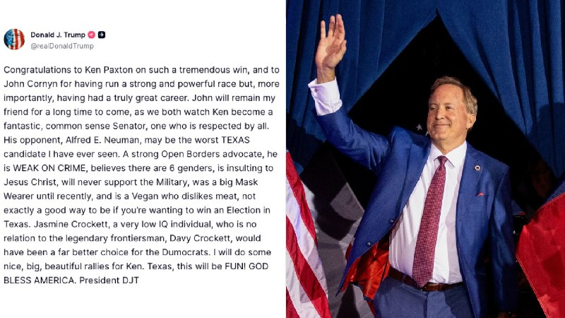

Fox News (Twitter/X)

NEW: President Trump taking a victory lap after Ken Paxton’s GOP Senate primary win in Texas after his endorsement and taking aim at Democrats in the Lone Star State.

“Congratulations to Ken Paxton on such a tremendous win."

“His opponent, Alfred E. Neuman, may be the worst TEXAS candidate I have ever seen. A strong Open Borders advocate, he is WEAK ON CRIME, believes there are 6 genders, is insulting to Jesus Christ, will never support the Military, was a big Mask Wearer until recently, and is a Vegan who dislikes meat."

## FoxNewsTwitter — post 342295

  

Fox News (Twitter/X)

“We just sent a Texas-sized message to Washington.”

Texas AG Ken Paxton speaks after defeating Sen. John Cornyn in Texas’ Republican Senate primary runoff, calling the victory a mandate for change inside the GOP.

Paxton now faces Democrat James Talarico in a race that is among a handful that could decide if the Republicans hold their slim 53-47 majority in the Senate.

## FoxNewsTwitter — post 342294

  

Fox News (Twitter/X)

WATCH LIVE: Trump-ally Ken Paxton speaks after defeating Senator Cornyn in GOP primary https://twitter.com/i/broadcasts/1pKdRRDwkjaJW

## FoxNewsTwitter — post 342293

  <a href="telegram/content/FoxNewsTwitter_342293_1779883755.mp4" target="_blank">🎬 Download video</a>

Fox News (Twitter/X)

NOW: Sen. John Cornyn speaks after losing Texas’ Republican Senate primary runoff to Trump-backed Texas Attorney General Ken Paxton.

"After a public service career lasting more than four decades and 18 consecutive campaign wins, tonight, we've come up short in this primary runoff."

He says he intends to support the Republican ticket in the general election.

## FoxNewsTwitter — post 342292

  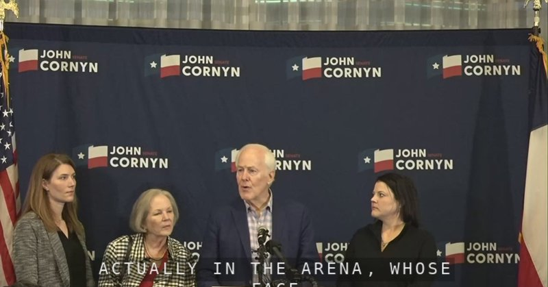

Fox News (Twitter/X)

WATCH LIVE: Senator Cornyn speaks after losing GOP primary to Trump-ally Ken Paxton https://twitter.com/i/broadcasts/1rGmqqpEvPwGy

## FoxNewsTwitter — post 342291

  

Fox News (Twitter/X)

BREAKING: Trump ally Ken Paxton defeats Sen. John Cornyn in Texas’ bitter Republican primary war.

Trump targeted Cornyn as "VERY disloyal" as he backed Paxton, a MAGA firebrand, in the final days of the runoff campaign.

Paxton now faces off against state Rep. James Talarico — a rising star in the Democratic Party — in the general election in a race that is among a handful that may decide if the Republicans hold their slim 53-47 majority in the Senate.

## FoxNewsTwitter — post 342290

  

Fox News (Twitter/X)

BREAKING: One of Congress’ most aggressive Trump critics just lost his seat in Texas.

Rep. Al Green, the Democrat who repeatedly pushed to impeach President Trump, was defeated in a heated primary race against fellow Texas Rep. Christian Menefee.

Green built a national profile during Trump’s first term by relentlessly criticizing the president and repeatedly interrupting his State of the Union speeches.

Now, after years in office, one of Trump’s loudest congressional opponents is out.

## FoxNewsTwitter — post 342289

  <a href="telegram/content/FoxNewsTwitter_342289_1779883758.mp4" target="_blank">🎬 Download video</a>

Fox News (Twitter/X)

“NYPD! NYPD!” chants rang through a crowd outside Gracie Mansion on Tuesday night as protesters thanked New York police officers for keeping the city safe.

The crowd was gathered out NYC Mayor Mamdani's residence to call for Governor Hochul to remove him from office, citing his perceived failure to address rising radicalization and antisemitism.

## pm_afshaa — post 91646

vless://47030ea3-4e8c-4dd6-b440-418a7a54c1a0@47.82.87.196:50724?encryption=none&security=none&type=tcp&headerType=none#PMTV%20NEWS%20%F0%9F%A6%81%E2%98%80%EF%B8%8F

نامحدود سرعت بالا مخصوص اینستا و دانلود

💧 Rainbet.com the #1 Non-KYC Crypto Casino & Sportsbook @rainbetcom

😁 @Pm_Afshaa

## pm_afshaa — post 91645

🔴شبکه 12 اسرائیل:ناوگان هوایی آمریکا ظرف 72 ساعت به پایگاه‌های خود در اروپا منتقل خواهد شد و در صورت از سرگیری درگیری با ایران، هواپیماها در حالت آماده‌باش برای بازگشت به فرودگاه بن گوریون قرار خواهند گرفت

💧 Rainbet.com the #1 Non-KYC Crypto Casino & Sportsbook @rainbetcom

😁 @Pm_Afshaa

## pm_afshaa — post 91644

https://t.me/proxy?server=tg.capycore.ru&port=443&secret=27ebe852539fb8ec5f327c73262bb721

پروکسی مناسب دانلود فیلم و سریال

💧 Rainbet.com the #1 Non-KYC Crypto Casino & Sportsbook @rainbetcom

😁 @Pm_Afshaa

## pm_afshaa — post 91643

🔴آمریکا اجازه اقامت به تیم ملی فوتبال جمهوری اسلامی در بازی های جام جهانی ر‌و نداده و برای هر بازی که تو آمریکا داره؛ فقط همون 2 ساعت اجازه اقامت داره و بعد از بازی سریع باید برگرده مکزیک

💧 Rainbet.com the #1 Non-KYC Crypto Casino & Sportsbook @rainbetcom

😁 @Pm_Afshaa

## pm_afshaa — post 91642

https://t.me/proxy?server=tg.capycore.ru&port=443&secret=27ebe852539fb8ec5f327c73262bb721

پروکسی سرعت بالا متصل

💧 Rainbet.com the #1 Non-KYC Crypto Casino & Sportsbook @rainbetcom

😁 @Pm_Afshaa

## pm_afshaa — post 91641

اگه میخوای از اخبار جا نمونی ٬ تو کانال مردمی Fighter Radar جوین باش

https://t.me/+9C1ENi5qn6hhZjk0
https://t.me/+9C1ENi5qn6hhZjk0

حتما جوین باشید ثانیه‌ای پوشش میدن

## pm_afshaa — post 91640

https://t.me/proxy?server=tg.capycore.ru&port=443&secret=27ebe852539fb8ec5f327c73262bb721 پروکسی متصل سرعت بالا 
💧 Rainbet.com the #1 Non-KYC Crypto Casino & Sportsbook @rainbetcom 
😁 @Pm_Afshaa

## pm_afshaa — post 91639

https://t.me/proxy?server=tg.capycore.ru&port=443&secret=27ebe852539fb8ec5f327c73262bb721

پروکسی متصل سرعت بالا

💧 Rainbet.com the #1 Non-KYC Crypto Casino & Sportsbook @rainbetcom

😁 @Pm_Afshaa

## pm_afshaa — post 91638

  <a href="https://t.me/pm_afshaa/91638" target="_blank">📎 Download file</a>

نپسترنت سرعت بالا برا تمامی اوپراتورها

بفرستین برا بقیه هم وصل شن

💧 Rainbet.com the #1 Non-KYC Crypto Casino & Sportsbook @rainbetcom

😁 @Pm_Afshaa

## pm_afshaa — post 91637

همراه اول امروز در پیامی به کاربران اینترنت پرو اعلام کرد در صورت تمایل می‌توانید اینترنت خود را به حالت قبل برگردانید

💧 Rainbet.com the #1 Non-KYC Crypto Casino & Sportsbook @rainbetcom

😁 @Pm_Afshaa

## pm_afshaa — post 91636

vless://406d8436-0eb9-4eb2-84fb-960e076ffba6@162.159.38.183:2083?encryption=none&security=tls&sni=de.lezzatzone.ir&fp=chrome&alpn=h2%2Chttp%2F1.1&insecure=0&allowInsecure=0&type=xhttp&host=de.lezzatzone.ir&path=%2Fde&mode=stream-one#PMTV%20NEWS%20%F0%9F%A6%81%E2%98%80%EF%B8%8F

نامحدود پر سرعت

💧 Rainbet.com the #1 Non-KYC Crypto Casino & Sportsbook @rainbetcom

😁 @Pm_Afshaa

## pm_afshaa — post 91635

vless://76bc8e3d-0e6b-4a35-b1a7-7f5158042666@45.76.83.35:54985?encryption=none&security=none&type=tcp&headerType=none#PMTV%20NEWS%20%F0%9F%A6%81%E2%98%80%EF%B8%8F

نپسترنت نا محدود سرعت بالا

💧 Rainbet.com the #1 Non-KYC Crypto Casino & Sportsbook @rainbetcom

😁 @Pm_Afshaa

## pm_afshaa — post 91634

vless://6af5890f-5267-40ed-bc60-1bd3ee31a88b@45.38.23.87:8080?encryption=none&security=none&type=ws&path=%2F#PMTV%20NEWS%20%F0%9F%A6%81%E2%98%80%EF%B8%8F

نامحدود سرعت موشکی
🚀

💧 Rainbet.com the #1 Non-KYC Crypto Casino & Sportsbook @rainbetcom

😁 @Pm_Afshaa

## pm_afshaa — post 91633

علم‌ الگدا: نبود گوشت تو یخچال مردم مشکل بزرگی نیست چون وضعیت کشور جنگیه و اگر گوشت هم نداشته باشن که بخورن اشکالی نداره

💧 Rainbet.com the #1 Non-KYC Crypto Casino & Sportsbook @rainbetcom

😁 @Pm_Afshaa

## pm_afshaa — post 91632

🔴معاون وزیر امور خارجه روسیه:ما آمادگی خود را برای انتقال اورانیوم غنی‌شده از ایران به واشنگتن اطلاع داده‌ایم و این پیشنهاد همچنان روی میز است

💧 Rainbet.com the #1 Non-KYC Crypto Casino & Sportsbook @rainbetcom

😁 @Pm_Afshaa

## pm_afshaa — post 91631

tg://proxy?server=r10.proxytg.space&port=8443&secret=ee65032756d1cfb78ebbd0ea8db83d43937231302e70726f787974672e7370616365

پروکسی متصل سرعت بالا

💧 Rainbet.com the #1 Non-KYC Crypto Casino & Sportsbook @rainbetcom

😁 @Pm_Afshaa

## pm_afshaa — post 91630

🔴خبر هایی داره توسط رسانه های آمریکایی پخش میشه که جی دی ونس اطلاعاتی که ترامپ فقط با اون در میون گذاشته بوده رو لو میداده

💧 Rainbet.com the #1 Non-KYC Crypto Casino & Sportsbook @rainbetcom

😁 @Pm_Afshaa

## pm_afshaa — post 91629

https://t.me/proxy?server=172.65.38.26&port=9443&secret=ee09db815a6d82a31fda76f872230c69d7706b676275696c642e6f7267 پروکسی متصل 
💧 Rainbet.com the #1 Non-KYC Crypto Casino & Sportsbook @rainbetcom 
😁 @Pm_Afshaa

## pm_afshaa — post 91628

https://t.me/proxy?server=172.65.38.26&port=9443&secret=ee09db815a6d82a31fda76f872230c69d7706b676275696c642e6f7267

پروکسی متصل

💧 Rainbet.com the #1 Non-KYC Crypto Casino & Sportsbook @rainbetcom

😁 @Pm_Afshaa

## pm_afshaa — post 91627

https://t.me/proxy?server=49.13.35.164&port=8443&secret=dd104462821249bd7ac519130220c25d09

پروکسی متصل خوراک دانلود

💧 Rainbet.com the #1 Non-KYC Crypto Casino & Sportsbook @rainbetcom

😁 @Pm_Afshaa

## iaghapour — post 2636

🔻بچه ها میگن انقدر پهنای باند دیتاسنتر ها پایین هستش که اکثر روش های تانل که اجرا میکنن سرعت بدی داره یا دچار قطع و وصلی و اختلال زیاد هستش.

خیلی به روش تانل بستگی نداره بیشتر مشکل پهنای باند ضعیف دیتاسنتر ها مربوط هست.

امیدوارم در روزهای آینده وضعیت بهتر بشه.

## DEJradio — post 5029

  

🔺احضار سفیر تهران در سئول؛ جمهوری اسلامی مسئول حمله به کشتی کره‌ای شناخته شد

کره جنوبی اعلام کرد سفیر جمهوری اسلامی را در اعتراض به حمله به یک کشتی کره‌ای در تنگۀ هرمز احضار می‌کند.
سئول پس از چند هفته بررسی اعلام کرد به احتمال بسیار قوی، یک موشک ساخت جمهوری اسلامی عامل حمله به کشتی اچ‌ام‌ام نامو، بود.
پارک یون‌جو، معاون وزیر امور خارجۀ کرۀ جنوبی، گفت تحلیل‌های فنی نشان می‌دهد پرتابۀ استفاده‌شده نسخه‌ای از موشک «نور» بود.
بنا بر داده‌ها روی برخی از قطعات موشک نیز نشانه‌هایی از یک تولیدکنندۀ ایرانی دیده شد.
این کشتی باری کره‌ای در ۱۴ اردیبهشت امسال هدف حمله قرار گرفت.
به گفته مقام‌های کره‌ای، یکی از موشک‌ها درحدود هفت متر در بدنۀ کشتی نفوذ کرده بود.

#خبر #دژ #کره_جنوبی #تنگه_هرمز
@DEJradio

## DEJradio — post 5028

⭕️ پاکستان باید به درخواست ترامپ برای پیوستن به پیمان ابراهیم پاسخ بدهد

لیندزی گراهام، سناتور جمهوری‌خواه آمریکایی گفت با توجه به درخواست دونالد ترامپ برای پیوستن کشورهای اسلامی به پیمان ابراهیم، پاکستان باید موضع خود را روشن کند.
گراهام بار دیگر از نقش پاکستان در میانجی‌گری میان جمهوری اسلامی و آمریکا انتقاد کرد.
این سناتور برجستۀ آمریکایی افزود دشمنی پاکستان با اسرائیل، پیشینه‌ای طولانی دارد.
گراهام تأکید کرد استقرار هواپیماهای نظامی جمهوری اسلامی در پایگاه‌های پاکستان غیرقابل انکار است.
این سیاستمدار نزدیک به ترامپ پیش‌تر نیز گفته بود اگر گزارش‌ مربوط به پناه گرفتن هواپیماهای جمهوری اسلامی در پاکستان درست باشد، نقش اسلام‌آباد به‌عنوان میانجی باید بازنگری شود.

#خبر #دژ #توافق_ابراهیم #پاکستان
@DEJradio

## DEJradio — post 5027

⭕️ ترامپ پس از معاینۀ سه‌ساعتۀ پزشکی از وضعیت سلامتی‌ عالی خود خبر داد

دونالد ترامپ، رئیس‌ جمهوری آمریکا شامگاه سه‌شنبه پس از انجام یک معاینۀ سه‌ساعته در مرکز پزشکی نظامی والتر رید، اعلام کرد همه چیز کاملا عالی بود.
به گزارش کاخ سفید این مراجعه بخشی از معاینات پیشگیرانۀ پزشکی و دندانپزشکی بوده است.
ترامپ در خرداد ماه ماه آینده ۸۰ ساله می‌شود. این چهارمین معاینۀ پزشکی علنی ترامپ از آغاز دور دوم ریاست‌جمهوری او به شمار می‌رود.

#خبر #دژ #ترامپ
@DEJradio

## DEJradio — post 5026

  <a href="telegram/content/DEJradio_5026_1779883760.mp4" target="_blank">🎬 Download video</a>

⭕️ اسرائیل از حذف فرماندۀ تازۀ شاخۀ نظامی حماس در غزه خبر داد

ارتش اسرائیل و شاباک اعلام کردند محمد عوده، فرماندۀ تازۀ شاخۀ نظامی حماس در غزه، در حملۀ هوایی شامگاه سه‌شنبه در شمال غزه کشته شد.
به گفتۀ مقام‌های اسرائیلی، عوده پس از کشته شدن عزالدین حداد در هفتۀ پیشین، فرماندهی شاخۀ نظامی حماس را برعهده گرفته بود.
ارتش اسرائیل اعلام کرد عوده از طراحان حملۀ تروریستی هفتم اکتبر بود.
بنا بر گزارش ارتش اسرائیل، محمد عوده در جریان جنگ نیز عملیات اطلاعاتی و حملات علیه نیروهای اسرائیلی را هدایت می‌کرد.
حماس که سال‌ها از پشتیبانی مالی و فکری جمهوری اسلامی برخوردار بود، در سیاهۀ تروریستی آمریکا و اروپا قرار دارد.
رسانه‌های نزدیک به حماس مدعی شدند محمد عوده همراه با همسر و پسرانش کشته شده است.
یسرائیل کاتز، وزیر دفاع اسرائیل نوشت: ما خود را متعهد کرده‌ایم همۀ کسانی را که کشتار هفتم اکتبر را رهبری کردند از میان برداریم.
به گفتۀ کاتز، همه این افراد، در هر جا که باشند، نشان شده‌اند.

#خبر #دژ #اسرائیل #حماس
@DEJradio

## DEJradio — post 5025

  <a href="telegram/content/DEJradio_5025_1779883761.webm" target="_blank">🎬 Download video</a>

🔺📢 پاشنه آشیل جمهوری اسلامی؛ بحران مشروعیت برای هواداران

*پژمان گلچین، پژوهشگر فلسفه

#پاشنه_آشیل #جنگ
@DEJradio

## DEJradio — post 5024

⭕️ اروپا از گسترش تهدیدهای روسیه به حوزۀ بالتیک و حملات سایبری نگران است

گزارش‌ها نشان می‌دهد نگرانی اروپا در مورد روسیه از جنگ اوکراین فراتر رفته و اکنون احتمال تهدید کشورهای بالتیک و تشدید حملات سایبری نیز مطرح است.
کایا کالاس، مسئول سیاست خارجی اتحادیۀ اروپا هشدار داد اگر کرملین برای ادامۀ جنگ به بسیج تازه نیاز پیدا کند، ممکن است به سمت تشدید تنش در منطقه حرکت کند.
همچنین رئیس سازمان اطلاعات ارتباطات در دولت بریتانیا گفت روسیه به‌طور مداوم زیرساخت‌های حیاتی، روندهای دموکراتیک و زنجیره‌های تأمین در اروپا را هدف قرار می‌دهد.

#خبر #دژ #سایبری #اروپا
@DEJradio

## DEJradio — post 5023

⭕️ از آغاز عملیات «غرش شیران» درحدود ۲۵۰۰ عضو حزب‌الله کشته شدند؛ مخالفت ترامپ با حملۀ دوبارۀ اسرائیل به بیروت

بنیامین نتانیاهو، نخست‌وزیر اسرائیل گفت از آغاز عملیات «غرش شیران» درحدود ۲۵۰۰ عضو حزب‌الله کشته شدند.
شبه‌نظامیان حزب‌الله لبنان که توسط جمهوری اسلامی هدایت می‌شوند، در سیاهۀ تروریستی اتحادیۀ اروپا و آیالات متحده قرار دارند.
نخست‌وزیر اسرائیل افزود تنها در دورۀ آتش‌بس جنگ چهل روزه ۷۰۰ عضو حزب‌الله کشته شدند.
به گفتۀ نتانیاهو، این رقم از کل تلفات حزب‌الله در جنگ دوم لبنان بیشتر بود.
رسانۀ اسرائیلی وای‌نت گزارش داد نتانیاهو و یسرائیل کاتز، وزیر دفاع در نشست کابینۀ امنیتی، دلیل خودداری از حملۀ دوباره به بیروت را مخالفت آمریکا عنوان کرده‌اند.
از سویی شرکت تسلیحاتی اسرائیلی البیت سیستمز، از امضای قرارداد ۱.۴ میلیارد دلاری فروش تسلیحات به یک کشور اروپایی خبر داد. نام این کشور اعلام نشده است.

#خبر #دژ #اسرائیل #غرش_شیران
@DEJradio

## DEJradio — post 5022

⭕️ واردات نفت به چین به پایین‌ترین سطح از سال ۲۰۱۶ سقوط کرد

شرکت اطلاع‌رسانی کالا «کپلر» اعلام کرد واردات روزانۀ نفت به چین در ماه جاری میلادی به ۶.۶ میلیون بشکه کاهش یافته است. این رقم پایین‌ترین سطح از سال ۲۰۱۶ به شمار می‌رود.
به گزارش کپلر، انسداد تنگۀ هرمز از سوی جمهوری اسلامی عامل اصلی این افت شدید بود.
چین سال گذشته روزانه درحدود ۱۱ میلیون و ۵۵۰ هزار بشکه نفت وارد می‌کرد که حدودا ۴۵ درصد آن از کشورهای حوزۀ خلیج فارس تأمین می‌شد.
به گزارش کپلر، کاهش خرید نفت توسط چین سبب شده نفت بیشتری در اختیار پالایشگاه‌های دیگر کشورهای آسیایی قرار گیرد.

#خبر #دژ #چین #نفت
@DEJradio

## DEJradio — post 5021

⭕️ جمهوری اسلامی نیروهای بسیج را برای استفاده از موشک‌های دوش‌پرتاب تحت آموزش قرار داد

شبکۀ فرانس۲۴ گزارش داد به ویدئوها و اسنادی دست یافته که نشان می‌دهد نیروهای نظامی جمهوری اسلامی آموزش گستردۀ استفاده از موشک‌های دوش‌پرتاب «منپدز» به اعضای بسیج‌ را ازسر گرفته‌اند.
سامانۀ دوش‌پرتاب مپندز، شامل موشک‌هایی سبک و هدایت‌شونده است که به‌صورت تک‌نفره قابل استفاده است.
این سامانه بدون نیاز به رادار، هواپیما را با حسگر ردیابی می‌کند و موشک‌های آن بردی بین پنج تا ده کیلومتر دارند.
بر اساس این گزارش، رژیم در جریان جنگ چهل روزه با استفاده از این سامانه‌ها سعی کرد ده‌ها هواپیمای آمریکایی را هدف بگیرد.
فرانس۲۴ همچنین گزارش داده ویدئوها و فایل‌های آموزشی در مورد موشک‌های «میثاق-۱» و «سهند-۳» نیز چند روز پس از آغاز آتش‌بس، در میان هزاران نیروی بسیج توزیع شد.
به گفتۀ کارشناسان، کار با این سامانه‌ها ساده است و حتا آموزش کوتاه‌مدت نیز می‌تواند برای یادگیری استفاده از آن و هدف قرار دادن هواپیماهایی که در ارتفاع پایین پرواز می‌کنند، کافی باشد.
فرانس۲۴ همچنین خبر داد جمهوری اسلامی علاوه بر تولید داخلی، احتمالا شماری از سامانه‌های روسی وربا و نمونه‌هایی از سامانه‌های دوش‌پرتاب چینی را نیز در اختیار دارد.

#خبر #دژ #مزدوران_بسیج
@DEJradio

## DEJradio — post 5020

⭕️ با وجود بازگشایی اینترنت، برخی کاربران هنوز امکان به‌روزرسانی ندارند

پس از بازگشایی اینترنت در ایران، شماری از کاربران همچنان از اختلال در دسترسی به گوگل‌پلی و دریافت آپدیت برنامه‌ها خبر می‌دهند.
ورود به فروشگاه گوگل‌پلی و دانلود یا نصب به‌روزرسانی اپلیکیشن‌ها برای برخی از کاربران ممکن نیست.
واتس‌اپ نیز با وجود بازگشت اینترنت همچنان در دسترس بسیاری از کاربران قرار ندارد.
پیش از قطعی سراسری اینترنت، واتس‌اپ تنها پیام‌رسان بین‌المللی پرکاربر بود که توسط رژیم فیلتر نشده بود.

#خبر #دژ #اینترنت
@DEJradio

## DEJradio — post 5019

⭕️ تهران در جست‌وجوی گشایش مالی بدون «اعلام پیروزی» ترامپ است

بنا بر گزارش‌ها، رژیم حاکم بر ایران به دلیل فشار شدید اقتصادی در پی گشایش مالی در مذاکرات و از سوی دیگر به دنبال جلوگیری از اعلام پیروزی توسط ترامپ‌ است.
وال‌استریت ژورنال به نقل از مقام‌های ایرانی و میانجی‌های عرب گزارش داد جمهوری اسلامی نمی‌خواهد شرایطی در تفاهم‌نامه ایجاد بشود که دونالد ترامپ بتواند اعلام پیروزی بکند.
بر اساس این گزارش، تهران همچنین به دنبال دسترسی به بخشی از حدود ۱۰۰ میلیارد دلار دارایی بلوکه‌شده و بازگشت به بازار جهانی نفت است.
این روزنامه نوشت با وجود حملۀ اخیر آمریکا در جنوب ایران، جمهوری اسلامی از مذاکرات دست نکشید.
وال‌استریت ژورنال، تأیید کرد محور اصلی سفر محمدباقر قالیباف به قطر، مذاکره دربارۀ آزادسازی ۲۴ میلیارد دلار از دارایی‌های بلوکه‌شدۀ جمهوری اسلامی بود.

#خبر #دژ #ترامپ #جمهوری_اسلامی
@DEJradio

## DEJradio — post 5018

⭕️ نیویورک‌تایمز: حملۀ آمریکا پس از شناسایی تهدیدهای جمهوری اسلامی انجام شد

نیویورک‌تایمز به نقل از دو مقام آمریکایی گزارش داد حملۀ شامگاه دوشنبۀ آمریکا به اهدافی در جنوب ایران، پس از شناسایی مجموعه‌ای از تهدیدها از سوی جمهوری اسلامی انجام شد.
بنا بر گزارش‌ها نیروهای آمریکایی متوجه فعالیت سامانه‌های پرتاب موشک، پرواز پهپادها و استقرار قایق‌های مین‌گذار در تنگۀ هرمز شده بودند.
سنتکام پیش‌تر اعلام کرده بود آمریکا قایق‌هایی را که در حال مین‌گذاری بودند و همچنین سامانه‌های پرتاب موشک را هدف قرار داده است.
با این که جمهوری اسلامی این حملات را «نقض آتش‌بس» خوانده، اما وال‌استریت ژورنال گزارش داد تهران خبر کشته شدن نیروهای سپاه را برای آسیب ندیدن روند مذاکرات با آمریکا، دیر منتشر کرد.

#خبر #دژ #سنتکام #تنگه_هرمز
@DEJradio

## DEJradio — post 5017

  <a href="telegram/content/DEJradio_5017_1779883762.mp4" target="_blank">🎬 Download video</a>

🚨📢 تصاویر ماهواره‌ای از ویرانه‌های فرودگاه مهرآباد در جنگ ۴۰ روزه

#جنگ۴۰روزه #فرودگاه_مهرآباد
@DEJradio

## DEJradio — post 5016

  <a href="telegram/content/DEJradio_5016_1779883763.mp4" target="_blank">🎬 Download video</a>

🔺🎥 با اتصال نسبی اینترنت در ایران، ویدیوهای زیادی از روزهای جنگ توسط شهروندان به رسانه‌ها ارسال شده است؛ یکی از آنها انهدام انبار مهمات پایگاه شکاری دزفول است. اول فروردین ۱۴۰۵ این پایگاه بمباران شد. این ویدیو در چند رسانه منتشر شده بود.
براساس گزارش‌های میدانی تقریبا تمام ظرفیت پایگاه دزفول از بین رفته است.

#اینترنت #جنگ #دزفول
@DEJradio

## DEJradio — post 5015

  <a href="telegram/content/DEJradio_5015_1779883765.webm" target="_blank">🎬 Download video</a>

🚨📢 کمک عمان و عراق به جمهوری اسلامی در دور زدن محاصره دریایی آمریکا

یک منبع داخلی به دژ می‌گوید دولت عمان از طریق بنادر صلاله، صحار و دقم به کشتی‌های جمهوری اسلامی در دور زدن محاصره دریایی بنادر ایران توسط آمریکا کمک می‌کند. شماری از عوامل سـ.ـپاه پاسداران به اسم نمایندگان گمرک و کشترانی ایران در این بنادر مستقر شدند و روند ترخیص و جابجایی کالاها را مدیریت می‌کنند. کشتی‌هی وابسته به جمهوری اسلامی با مدارک و اطلاعات جعلی در این بنادر پهلو می‌گیرند. همین وضعیت در بندر بندر ام‌القصر عراق برقرار است.
طبق اعلام سنتکام از آغاز محاصره دریایی ایران تا پنجم خرداد ۱۴۰۵ بیش از ۱۰۸ کشتی تجاری مجبور به تغییر مسیر شده‌اند.

#محاصره_دریایی #جنگ
@DEJradio

## DEJradio — post 5014

  <a href="telegram/content/DEJradio_5014_1779883765.webm" target="_blank">🎬 Download video</a>

🔺📢 انفجار هزینه‌ها در بازارهای قفل شده ایران؛

*عطا حسینیان، روزنامه‌نگار اقتصادی

#تورم #جنگ
@DEJradio

## DEJradio — post 5013

  <a href="telegram/content/DEJradio_5013_1779883766.mp4" target="_blank">🎬 Download video</a>

🔺🎥 یک شهروند در ویدیویی می‌گوید: «اینجا جاده همدان قزوینه، سیلوی گندم که تا قبل از جنگ محل کار من و برادرم بود الان بسته شد، نه نون داریم نه کار، خسته شدیم از این حکومت، تو رو خدا به فکر مردم باشید.»

#تورم #جنگ
@DEJradio

## DEJradio — post 5012

  <a href="telegram/content/DEJradio_5012_1779883768.webm" target="_blank">🎬 Download video</a>

🔺📢 با اتصال دوباره اینترنت ایران، منابع گزارش‌های تازه‌ای از جنگ ۴۰ روزه ارسال کرده‌اند. در ایام جنگ تعدادی از فرماندهان سـ.ـپاه و انتظامی شب‌ها در گورستان زرتشتیان قصرفیروزه در شرق تهران می‌خوابیدند. در همان دوران چهره‌های برجسته جامعه زرتشتی تلاش کردند مانع این کار شوند اما راه به جایی نبردند.

پیش‌تر موارد زیادی از از استقرار فرماندهان در بیمارستان‌ها، مدارس، باشگاه‌های ورزشی و مساجد گزارش شده بود.

#اینترنت #جنگ۴۰روزه
@DEJradio

## DEJradio — post 5011

  <a href="telegram/content/DEJradio_5011_1779883768.webm" target="_blank">🎬 Download video</a>

🔺📢 بر اثر برخورد یک خودرو به ایست بازرسی بـ.ـسیج در شهر عقدا اردکان استان یزد حداقل یک نفر از نیروها کشته شده است.

خبرگزاری فارس وابسته به سـ.ـپاه پاسداران گزارش داد محمد معراج نظری سرباز بسیـ.ـجی «در مسیر تأمین امنیت» کشته شد اما اشاره‌ای به دلیل آن نکرده است اما خبرگزاری صداوسیما به نقل از فرماندهی پادگان آموزشی «ولیعصر» اردکان نوشت نوشت نظری «چند روز پیش در حین انجام وظیفه بر اثر برخورد یک خودروی متواری به شدت مجروح و به کما رفته بود.»

#بسیجی #IRGCterrorists
@DEJradio

## mamlekate — post 103590

📝 ترامپ به ایران فرصت صلح داد اما نمی‌تواند به حاکمان مذهبی‌اش اعتماد کند

انتشار این خبر که دونالد ترامپ، رئيس‌جمهوری ایالات متحده، در اقدامی غیرمعمول، قرار است چهارشنبه با تمام اعضای کابینه خود جلسه داشته باشد، نشان می‌دهد او در حال بررسی راه‌هایی برای سرعت بخشیدن به مذاکرات به‌شدت کند و فرسایشی با جمهوری اسلامی ایران است.

@mamlekate

## mamlekate — post 103589

الو چهارشنبه ساعت ۱۳:۰۰ واحد هوا پتروشیمی دماوند که توی جنگ روز ۱۷ فروردین نیروگاهشون مورد اصابت قرار گرفته بود دچار انفجار شد. حداقل ۱ نفر کشته و ۴ نفر مجروح شدن. دلیل انفجار هنوز معلوم نیست.

@mamlekate

## VahidOnline — post 75741

  

نیویورک تایمز به نقل از دو مقام آمریکایی در روز سه‌شنبه ۵ خرداد گزارش داد که حملات دوشنبه شب نظامی ایالات متحده به اهدافی در جنوب ایران پس از آن صورت گرفت که تحلیلگران اطلاعاتی، مجموعه‌ای از اقدامات نظامی بالقوه تهدیدآمیز جمهوری اسلامی را در ۲۴ ساعت منتهی به این حملات شناسایی کردند.

هواپیماهای جنگی آمریکا دو قایق تندرو سپاه پاسداران انقلاب اسلامی را که سعی در مین‌گذاری در تنگه هرمز داشتند، غرق کردند.

این مقامات که نخواستند نامشان فاش شود، همچنین گفتند که جمهوری اسلامی پهپادهای تهاجمی یک‌طرفه را به سمت حدود دوازده کشتی جنگی نیروی دریایی ایالات متحده که در خلیج عمان و دریای عرب یا اطراف آن هستند شلیک کرد. این کشتی‌ها در حال اعمال محاصره دریایی آمریکا علیه جمهوری اسلامی هستند.

طبق این گزارش تحلیلگران نظامی آمریکا همچنین فعالیت‌هایی را در برخی از سایت‌های موشکی زمین به هوای جمهوری اسلامی در نزدیکی تنگه هرمز شناسایی کردند؛ فعالیت‌هایی که امنیت هواپیماهای جنگی آمریکایی مستقر بر روی زمین و آن‌هایی که روی ناو هواپیمابر آمریکا در منطقه به عنوان بخشی از نیروی اعمال‌کننده محاصره دریایی حضور دارند، تهدید می‌کرد.

تیم هاوکینز، سخنگوی فرماندهی مرکزی ایالات متحده، روز دوشنبه در بیانیه‌ای گفت که ایالات متحده «برای محافظت از نیروهای خود در برابر تهدیدات نیروهای» جمهوری اسلامی حملاتی را به اهدافی در جنوب ایران انجام داد.

سایر مقامات پنتاگون گزارش‌های رسانه‌های داخلی در ایران را که در روز سه‌شنبه مدعی شدند یک پهپاد آمریکایی «ام-کیو۹ ریپر» توسط جمهوری اسلامی سرنگون شد، رد کردند.
@VahidHeadline

📡 @VahidOnline

## IranIntlTV — post 339230

  

محسن زنگنه، عضو کمیسیون برنامه و بودجه مجلس، گفت جمهوری اسلامی درباره «اصل غنی‌سازی» مذاکره نمی‌کند اما درباره محدودیت درصد غنی‌سازی با آمریکا گفت‌وگو می‌کند.

زنگنه همچنین گفت روند مذاکرات با «هماهنگی کامل رهبری» پیش می‌رود و ابراز امیدواری کرد جمهوری اسلامی در عید غدیر «جشن پیروزی» بگیرد.
https://iranintl.com/202605273362

## IranIntlTV — post 339229

  <a href="telegram/content/IranIntlTV_339229_1779883769.mp4" target="_blank">🎬 Download video</a>

هم‌زمان با اعتراضات دانش‌آموزان در روزهای اخیر، صدها دانش‌آموز با ارسال پیام‌هایی به ایران‌اینترنشنال نسبت به برگزاری حضوری امتحانات پایان سال و بلاتکلیفی درباره وضعیت کنکور سراسری انتقاد کردند.

سبا حیدرخانی، عضو تحریریه ایران‌اینترنشنال، گزارش می‌دهد
@iranintltv

## IranIntlTV — post 339228

  <a href="telegram/content/IranIntlTV_339228_1779883771.mp4" target="_blank">🎬 Download video</a>

نت‌بلاکس اعلام کرد با اتصال دوباره شبکه‌های موبایل و بخشی از شبکه‌ها به اینترنت جهانی، سطح دسترسی به اینترنت در ایران به ۸۶ درصد رسیده است. با این حال کاربران همچنان از محدودیت در اینترنت خبر می‌دهند.
گفت‌وگو با نیما اکبرپور، کارشناش فناوری
@iranintltv

## IranIntlTV — post 339227

  

الی کوهن، وزیر انرژی اسرائیل و عضو کابینه سیاسی-امنیتی این کشور، با اشاره به آنچه «برنامه‌های راهبردی» برای دور زدن تهدیدهای جمهوری اسلامی علیه مسیرهای تجاری خواند، گفت: «تمام نبرد ایران در تنگه هرمز و آن اهرم راهبردی که به کار می‌گیرد، در حال از بین رفتن است.»

او افزود در روزهای اخیر گفت‌وگوهایی درباره ایجاد زیرساخت‌های انرژی از شرق به غرب در جریان است و هدف از این طرح‌ها، انتقال انرژی به اروپا از طریق اسرائیل عنوان شده است.

کوهن همچنین از مذاکرات برای ایجاد خطوط انتقال انرژی از مسیر کشورهای خلیج فارس خبر داد و گفت کشورهایی مانند عربستان سعودی و امارات متحده عربی، به عنوان تولیدکنندگان مهم انرژی، تمایل دارند در این طرح‌های اقتصادی مشارکت کنند.

به گفته وزیر انرژی اسرائیل، کریدور زیرساختی میان هند و اروپا از طریق کشورهای خلیج فارس و اسرائیل در دست بررسی است و استفاده از مسیر مصر نیز می‌تواند روند پیشبرد این طرح‌ها را تسریع کند. او تاکید کرد گفت‌وگوهای مشخصی در این زمینه در حال انجام است.
https://iranintl.com/202605274358

## IranIntlTV — post 339226

  

🔻خبرگزاری فارس، رسانه وابسته به سپاه پاسداران، گزارش داد نامه باشگاه پرسپولیس به مسعود پزشکیان، رییس‌جمهور دولت جمهوری اسلامی، وارد مرحله بررسی در نهاد ریاست‌جمهوری شده و در روزهای اخیر نشست‌هایی در این خصوص برگزار شده است.

🔹باشگاه پرسپولیس در نامه‌ای خطاب به پزشکیان، به شرایط فوتبال و سهمیه آسیایی اعلام شده اعتراض کرده بود.

🔹بر اساس این گزارش، دو نفر از نمایندگان نهاد ریاست‌جمهوری در روزهای اخیر با حدادی، مدیرعامل پرسپولیس، جلسه‌ای برگزار کرده و در جریان جزئیات درخواست‌ها و دغدغه‌های مطرح‌شده از سوی این باشگاه قرار گرفته‌اند.

🔹فارس نوشت این افراد همچنین جلساتی جداگانه با مهدی تاج، رییس فدراسیون فوتبال، و کشوری‌فرد، از مدیران ارشد سازمان لیگ، برگزار کرده‌اند تا ابعاد مختلف موضوع را بررسی کنند.

🔹به گزارش فارس، نمایندگان نهاد ریاست‌جمهوری پس از جمع‌بندی مباحث مطرح‌شده، قرار است به‌زودی گزارش نهایی خود را به مسعود پزشکیان ارائه دهند تا درباره درخواست‌های مطرح‌شده تصمیم‌گیری شود.

🔹جزییات بیشتر را در سایت بخوانید

@iranintltvsport

## IranIntlTV — post 339225

  

بر اساس اطلاعات رسیده به ایران‌اینترنشنال، حمیدرضا حدادی، جوان ۱۹ ساله اهل شاندیز، شامگاه ۱۸ دی‌ماه پس از اصابت گلوله به درمانگاه شاندیز منتقل شد اما از آنجا که دستور تخلیه درمانگاه صادر شده بود او بدون رسیدگی پزشکی جان باخت.

حمیدرضا تنها حدود نیم ساعت در میان جمعیت معترضان حضور داشت که از پشت هدف شلیک قرار گرفت. گلوله به ریه او اصابت کرد و او بر اثر شدت جراحات جان باخت.

حمیدرضا حدادی فوتبالیست بود و به گفته نزدیکانش آرزو داشت مسیر حرفه‌ای خود را در فوتبال دنبال کند. او همچنین قصد داشت یک مغازه فروش تلفن همراه برای خود راه‌اندازی کند.

پس از کشته شدن حمیدرضا، نیروهای حکومتی تلاش کردند او را به عنوان شهید معرفی کنند، اما خانواده با این موضوع مخالفت کردند. به گفته این منبع، نیروهای حکومتی بدون رضایت خانواده برای او مراسمی در مسجد برگزار کردند، اما اعضای خانواده در آن مراسم حضور نیافتند.

این منبع افزود خانواده حمیدرضا با وجود فشارهای شدید امنیتی، بر این روایت تاکید کرده‌اند که او در جریان اعتراضات و با شلیک نیروهای حکومتی کشته شده است.

https://iranintl.com/202605270118

## IranIntlTV — post 339224

سفیر اسرائیل در استرالیا: در صورت بی‌نتیجه ماندن مذاکرات، گزینه نظامی دوباره روی میز است

هیلل نیومن، سفیر اسرائیل در استرالیا، در گفت‌وگو با علیرضا محبی، خبرنگار ایران‌اینترنشنال، هشدار داد در صورتی که مذاکرات جاری با تهران به نتایج مورد نظر نرسد، احتمال ازسرگیری عملیات نظامی علیه جمهوری اسلامی وجود خواهد داشت.

نیومن چهارشنبه ششم خرداد اعلام کرد هدف این مذاکرات، «برچیدن توان هسته‌ای جمهوری اسلامی، توقف کامل غنی‌سازی و نبود هرگونه ذخیره اورانیوم غنی‌شده در ایران» است.

به گفته او، موضوع برنامه موشک‌های بالستیک جمهوری اسلامی و حمایت تهران از گروه‌های نیابتی که موجب بی‌ثباتی در سراسر خاورمیانه می‌شوند، از دیگر محورهای اصلی مذاکرات به شمار می‌رود.

نیومن ادامه داد: «اگر بتوانیم از طریق مذاکرات و گفت‌وگوهای دیپلماتیک به این اهداف برسیم، بسیار خوب است. در غیر این صورت ممکن است مجبور شویم دوباره به کارزار نظامی بازگردیم تا این اهداف را محقق کنیم. اما این اهداف حتما باید محقق شوند. ما نمی‌توانیم بر سر اهداف خود مصالحه کنیم.»

در روزهای گذشته، گمانه‌زنی‌ها درباره سرنوشت مذاکرات تهران و واشینگتن و مفاد توافق احتمالی دو طرف بالا گرفته است.

روزنامه وال‌استریت‌ ژورنال پنجم خرداد به نقل از مقام‌های حکومت ایران و میانجی‌های عرب گزارش داد تهران در مذاکرات با واشینگتن دو هدف اصلی را دنبال می‌کند: کاهش فشار اقتصادی و دسترسی دوباره به منابع مالی و بازار نفت.

بر اساس این گزارش، جمهوری اسلامی در عین حال تلاش دارد از ارائه امتیازهایی که بتواند از سوی دونالد ترامپ، رییس‌جمهوری آمریکا، به‌عنوان «پیروزی سیاسی» معرفی شود، خودداری کند.

تفاهم اسرائیل و آمریکا درباره مذاکرات
سفیر اسرائیل در استرالیا در ادامه مصاحبه با ایران‌اینترنشنال اعلام کرد آمریکا و اسرائیل در مورد اهداف مذاکرات با جمهوری اسلامی با یکدیگر «تفاهم» دارند و «درک مشترک» دو طرف این است که گفت‌وگوهای جاری باید به تحقق این اهداف بینجامد.

نیومن ادامه داد: «رییس‌جمهور ترامپ گفته است که درباره موضوع غنی‌سازی اورانیوم و توانایی هسته‌ای ایران مصالحه نخواهد کرد.»

او اضافه کرد: «ما مخالف راه‌حل دیپلماتیک نیستیم. ما می‌خواهیم جان انسان‌ها حفظ شود. اگر بتوانیم از طریق یک راه‌حل دیپلماتیک جان انسان‌ها را نجات دهیم، بسیار خوب است. بنابراین اکنون نیز از گفت‌وگوها حمایت می‌کنیم، به شرط آنکه مذاکرات به اهداف مورد نظر برسد.»

سفیر اسرائیل در استرالیا همچنین برجام را «توافقی بد» خواند و افزود اسرائیل در دوران ریاست‌جمهوری باراک اوباما، «تقریبا تنها کشوری» بود که به‌صراحت از این توافق انتقاد کرد.

در روزهای گذشته، ترامپ بارها رویکرد اوباما در قبال برنامه هسته‌ای جمهوری اسلامی را مورد انتقاد قرار داده و برجام را «فاجعه» خوانده است.

او پیش‌تر در واکنش به انتقادها از توافق احتمالی میان تهران و واشینگتن تاکید کرد حاضر به پذیرش «توافق بد» با جمهوری اسلامی نیست و توافق مدنظر او کاملا متفاوت از برجام خواهد بود.

ترامپ در نخستین دوره حضور خود در کاخ سفید، سیاست فشار حداکثری را در برابر حکومت ایران در پیش گرفت و سرانجام سال ۱۳۹۷ از برجام خارج شد.

نیومن: در حال ایجاد فرصت برای مردم ایران هستیم
سفیر اسرائیل در استرالیا در ادامه، از دستاوردهای کارزار نظامی اخیر علیه جمهوری اسلامی تمجید کرد و گفت تضعیف سپاه پاسداران و بسیج «موفقیت‌های عظیمی» هستند که نباید آن‌ها را نادیده گرفت.

نیومن تاکید کرد: «ما در حال ایجاد فرصت برای مردم ایران هستیم تا سرنوشت خود را به دست بگیرند و درباره رهبری آینده کشورشان تصمیم‌گیری کنند.»

او افزود اسرائیل آتش‌بس را پذیرفته، زیرا در پی آن است که «با حسن نیت، فرصت مناسبی برای گفت‌وگوها و حل‌وفصل دیپلماتیک مساله فراهم شود».

نیومن بار دیگر خاطرنشان کرد در صورت ناکامی مسیر دیپلماتیک، اسرائیل ممکن است بار دیگر گزینه نظامی را «با هماهنگی ایالات متحده» در دستور کار قرار دهد.
 
🔗وب‌سایت ایران‌اینترنشنال
@iranintltv

## IranIntlTV — post 339223

  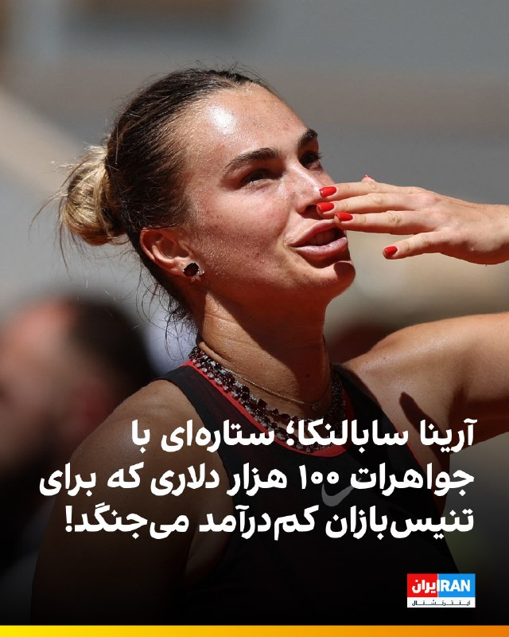

🔻آرینا سابالنکا، زن شماره یک تنیس جهان، که به دلیل استفاده از جواهرات ۱۰۰ هزار دلاری در رولان گاروس به ریاکاری متهم شده، اعلام کرد سبک زندگی مجلل او مانع تلاشش برای بهبود وضعیت مالی تنیس‌بازان کم‌درآمد نیست.

🔹ماجرا از جایی آغاز شد که این تنیس‌باز بلاروسی در نخستین مسابقه خود با دو گردنبند و گوشواره‌های الماس به ارزش ۱۰۰ هزار دلار وارد زمین شد. این موضوع بلافاصله جنجال‌برانگیز شد؛ زیرا ارزش این جواهرات تقریبا با جایزه ۹۴ هزار دلاری رقیب شکست‌خورده او در همان مسابقه برابری می‌کرد. از آنجا که سابالنکا یکی از چهره‌های اصلی اعتراض به توزیع ناعادلانه درآمدها در تورنمنت‌های بزرگ است، برخی رسانه‌ها و منتقدان او را به رفتار ریاکارانه متهم کردند.

🔹سابالنکا در کنفرانس خبری این اتهام را رد کرد و گفت ثروت شخصی‌اش ارتباطی به این مبارزه ندارد. او با اشاره به درآمد ۱۵ میلیون دلاری خود در فصل گذشته گفت هدفش حمایت از بازیکنان رده‌های پایین‌تر، نسل جدید و تنیس‌بازان آسیب‌دیده‌ای است که برای بقا در دنیای حرفه‌ای تنیس تلاش می‌کنند.
@iranintltvsport

## IranIntlTV — post 339222

  <a href="telegram/content/IranIntlTV_339222_1779883774.mp4" target="_blank">🎬 Download video</a>

سرخط خبرهای چهارشنبه ۶ خرداد
@iranintltv

## IranIntlTV — post 339221

  

مسعود پزشکیان، رییس‌جمهور دولت جمهوری اسلامی، عامل بحران اقتصادی در کشور را «جنگ اقتصادی دشمن» خواند و گفت میدان اصلی تقابل امروز، جنگ اقتصادی و هدف‌گیری تاب‌آوری کشور است.

او افزود: «میدان اصلی تقابل امروز، جنگ اقتصادی و هدف‌گیری تاب‌آوری کشور است.»

پزشکیان ادامه داد: «دشمن پس از ناکامی در تحقق اهداف خود در عرصه نظامی، تمرکز خود را بر آسیب‌زدن به تاب‌آوری اقتصادی کشور و ایجاد اخلال در معیشت مردم قرار داده است.»
https://iranintl.com/202605273352

## IranIntlTV — post 339220

  <a href="telegram/content/IranIntlTV_339220_1779883776.mp4" target="_blank">🎬 Download video</a>

اتحادیه اروپا اعلام کرد وزیران امور خارجه این اتحادیه در یک نشست غیررسمی در شهر لیماسول قبرس درباره جنگ آمریکا و اسرائیل با جمهوری اسلامی، امنیت تنگه هرمز و ادامه جنگ در اوکراین گفت‌وگو می‌کنند.
لی‌لی نیکفر، خبرنگار ایران‌اینترنشنال، گزارش می‌دهد
@iranintltv

## IranIntlTV — post 339219

کره جنوبی: حمله به کشتی نامو در تنگه هرمز احتمالا با موشک ایرانی انجام شده است

وزارت خارجه کره جنوبی چهارشنبه ششم خرداد اعلام کرد حمله به کشتی باری نامو متعلق به شرکت کشتیرانی اچ‌ام‌ام در تنگه هرمز در اوایل ماه جاری میلادی، احتمالا با یک موشک ضدکشتی ایرانی انجام شده است.

خبرگزاری رویترز اعلام کرد که سفارت جمهوری اسلامی در سئول هنوز به درخواست این خبرگزاری برای اظهار نظر درباره این موضوع، پاسخ نداده است.

وزارت خارجه کره جنوبی این ارزیابی را هم‌زمان با اعلام نتایج تحقیقات دولتی درباره حمله ۱۴ اردیبهشت به کشتی فله‌بر «نامو» منتشر کرد. حمله‌ای که باعث آتش‌سوزی و آسیب به بخش پایینی بدنه عقب کشتی شد.

بررسی بقایای موشک
تحقیقات انجام شده بر بررسی قطعات و بقایای اشیای ناشناخته‌ای متمرکز بوده است که پس از حمله در داخل کشتی نامو پیدا شدند.

بر اساس نتایج این بررسی، کشتی دو بار هدف قرار گرفته است؛ به‌طوری‌که کلاهک نخست منفجر نشده اما کلاهک دوم انفجار ایجاد کرده است.

وزارت خارجه کره جنوبی اعلام کرد قطعات به‌دست‌‌آمده نشان می‌دهند این تسلیحات احتمالا در ایران ساخته شده‌اند.

پارک یون‌جو، معاون اول وزیر خارجه کره جنوبی، گفت موتورهای این قطعات به موتورهای توربوجت ساخت ایران شباهت دارند و یکی از قطعات نیز دارای نشانه‌هایی است که به نظر می‌رسد متعلق به یک تولیدکننده ایرانی باشد.

او افزود کلاهک‌های استفاده‌شده به نمونه‌های به‌کار رفته در موشک‌های ضدکشتی ایرانی «نور» یا «قادر» شباهت دارند.

احضار سفیر جمهوری اسلامی
پارک گفت دولت کره جنوبی سفیر جمهوری اسلامی را احضار خواهد کرد تا نتایج تحقیقات را با او در میان بگذارد و پیام اعتراضی سئول را منتقل کند.

به گفته او، سئول همچنین از تهران خواهد خواست اقدام‌های مسئولانه‌ای برای جلوگیری از تکرار چنین حادثه‌ای انجام دهد.

دونالد ترامپ، رییس‌جمهوری آمریکا، اندکی پس از این حادثه گفته بود جمهوری اسلامی به کشتی کره جنوبی شلیک کرده و از سئول خواسته بود به تلاش‌های تحت رهبری آمریکا برای تامین امنیت کشتیرانی در تنگه هرمز بپیوندد.

تهران پیش‌تر هرگونه مسئولیت در این حمله را رد کرده بود.

پس از وقوع این حمله، دفتر ریاست‌جمهوری کره‌جنوبی اعلام کرده بود در حال بررسی دقیق علت انفجار است.

در بیانیه دفتر ریاست جمهوری کره جنوبی تاکید شده بود: «شناسایی علت دقیق حادثه در اولویت قرار دارد.»

یکی از مقامات کره جنوبی به خبرگزاری دولتی یان‌هپ گفته بود: «علت آتش‌سوزی کشتی هنوز تایید نشده و به نظر می‌رسد تنها پس از انجام تحقیقات بیشتر (پس از یدک‌کشی بدنه کشتی به بندر) مشخص شود.»
 
🔗وب‌سایت ایران‌اینترنشنال
@iranintltv

## IranIntlTV — post 339218

  

پس از گذشت حدود سه ماه از کشته شدن علی خامنه‌ای، رهبر جمهوری اسلامی، و اعضای خانواده او در حمله مشترک اسرائیل و آمریکا، رسانه‌های ایران اعلام کردند مراسم ختم خانواده علی و مجتبی خامنه‌ای هفته جاری در مصلای عبدالعظیم حسنی در شهر ری برگزار می‌شود.

بر اساس اعلامیه منتشرشده از سوی خانواده رهبر جمهوری اسلامی، این مراسم برای بشری حسینی خامنه‌ای، دختر علی خامنه‌ای، مصباح‌الهدی باقری، همسر بشری حسینی خامنه‌ای، زهرا حداد عادل، همسر مجتبی خامنه‌ای، و زهرا محمدی گلپایگانی، نوه علی خامنه‌ای، برگزار خواهد شد.

علی خامنه‌ای نهم اسفند‌ماه به همراه بخشی از خانواده و همراهانش در حملات مشترک اسرائیل و آمریکا کشته شد. با وجود گذشت سه ماه، هنوز مراسم تشییع جنازه او برگزار نشده است.
https://iranintl.com/202605273113

## IranIntlTV — post 339217

  <a href="telegram/content/IranIntlTV_339217_1779883778.mp4" target="_blank">🎬 Download video</a>

کاربران به ایران‌اینترنشنال گزارش دادند که پس از حدود سه ماه قطع سراسری، دسترسی به اینترنت بین‌المللی در ایران به‌تدریج و با سرعت محدود برقرار شده است. آن‌ها با اشاره به آسیب به کسب‌وکارهای آنلاین، این وضعیت را عامل فشار اقتصادی دانسته و اینترنت را حق طبیعی خود توصیف کرده‌اند.
@iranintltv

## IranIntlTV — post 339216

  <a href="telegram/content/IranIntlTV_339216_1779883779.mp4" target="_blank">🎬 Download video</a>

شهروندان در ایران پس از اتصال دوباره به اینترنت بین‌الملل، پیام‌های زیادی برای مدیابات ایران‌اینترنشنال ارسال کردند. آنها می‌گویند اینترنت همچنان کند است و به وضعیت پیش از دی‌ماه بازنگشته است.

لیلا سعادتی، عضو تحریریه ایران‌اینترنشنال، گزارش می‌دهد
@iranintltv

## IranIntlTV — post 339215

  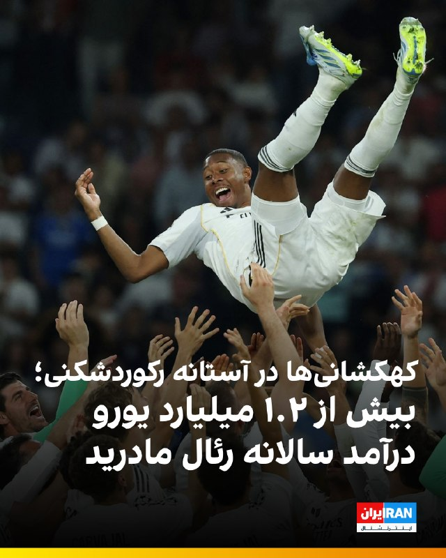

🔻روزنامه آس اسپانیا در گزارشی نوشت باشگاه رئال مادرید در آستانه ثبت یک رکورد مالی بی‌سابقه در تاریخ ورزش جهان قرار دارد. بر اساس پیش‌بینی‌های اولیه، درآمد کهکشانی‌ها در سال جاری از مرز ۱ میلیارد و ۲۰۰ میلیون یورو عبور کرده است؛ رقمی که تاکنون هیچ باشگاه ورزشی در جهان به آن دست نیافته است.

🔹رئال مادرید که طبق آمار «دلویت» سه فصل متوالی پردرآمدترین باشگاه جهان بوده، بخش عمده این موفقیت را مدیون جهش چشمگیر در بخش تجاری است. مادریدی‌ها در فصل ۲۵-۲۰۲۴ با رشد ۲۳ درصدی، ۵۹۴ میلیون یورو از بازاریابی و فروش محصولات باشگاه درآمد کسب کردند. همچنین بازسازی ورزشگاه سانتیاگو برنابئو باعث شد درآمد ورزشگاه به ۲۳۳ میلیون یورو برسد.

🔹حضور در جام جهانی باشگاه‌ها با هدایت ژابی آلونسو و صعود به یک‌چهارم نهایی اروپا با آربلوآ نیز به این سودآوری کمک کرد. «آس» در پایان گزارش خود نوشت مادریدی‌ها با تمدید قرارداد با شرکت هواپیمایی امارات تا سال ۲۰۳۱ و مذاکره با آدیداس، به دنبال افزایش ارزش اسپانسرهای پیراهن خود به ۳۰۰ میلیون یورو در سال هستند.
@iranintltvsport

## IranIntlTV — post 339214

  <a href="telegram/content/IranIntlTV_339214_1779883781.mp4" target="_blank">🎬 Download video</a>

در حالی که برخی بازی‌های تدارکاتی پیش‌بینی‌شده تیم فوتبال ایران لغو شده‌اند، این تیم قرار است برابر گامبیا و مالی به میدان برود. همزمان، انتخاب تیخوانا در مکزیک به‌عنوان محل اقامت ایران در جام جهانی با انتقادهایی درباره موقعیت جغرافیایی و شرایط امنیتی این شهر همراه شده است.

ارزیابی بیشتر با رها پوربخش، عضو تحریریه ورزشی ایران‌اینترنشنال
@iranintltv

## IranIntlTV — post 339213

  

علی باقری‌کنی، معاون دبیر شورای عالی امنیت ملی، با بیان اینکه «تماس‌های غیرمستقیم میان جمهوری اسلامی و آمریکا ادامه دارد» گفت: «موضوع ذخایر اورانیوم غنی‌شده در دستور کار مذاکرات نیست.»

او افزود جمهوری اسلامی و عمان در حال مذاکره درباره رویه جدید عبور کشتی‌ها از تنگه هرمز هستند.
https://iranintl.com/202605272209

## IranIntlTV — post 339212

🗣روایت شما پس از بازگشت به اینترنت بین‌المللی- چهارشنبه ۶ خرداد

🔹با وجود باز شدن اینترنت در ایران، حتی با فیلترشکن‌های قوی هم هیچ‌یک از اپلیکیشن‌ها باز نمی‌شود.
🔹بالاخره بعد از سه ماه وصل شدم ولی احساس غریبی می‌کنم. اینستاگرام شده مثل قبرستون هزاران هزار اکانت که دیگه صاحبی نداره.
🔹نابود شدیم از گرونی وحشتناک. این گرونی و تورم رو هیچ‌کجای دنیا نمی‌تونن حتی چند روز تحمل کنن. اینترنت که حقمونه رو با ده‌ها شرط و منت باز کردن.
🔹بعد ۳ ماه وصل شدم. تلگرام روی آپدیت می‌مونه، پیام‌ها خیلی دیر ارسال و دریافت میشه و گوگل‌پلی هنوز برای همه کار نمی‌کنه. فقط دیشب به سختی تونستم آپدیت اندروید گوشیم رو انجام بدم.
🔹بالاخره اینترنت در ایران وصل شده و خیلی خوشحال شدیم، ولی یاد جاویدنامان از ذهن ما نمیره.
🔹هر کی میگه اینترنت در ایران وصل شده واقعا مغزش خرابه. کجا وصل شده؟ گوگل‌پلی وارد نمیشه و حتی نمی‌شه برنامه‌های سامسونگ رو آپدیت کرد.
🔹اینترنت وصل شده ولی خوشحال نیستم چون وقتی اینترنت وصل بشه یعنی اینکه هیچ اتفاقی قرار نیست بیافته و جمهوری اسلامی قراره بمونه.
🔹نگران اینترنت نباش چون برمی‌گرده، نگران جوونی‌مون باش که مفت رفت.
🔹کاش همین‌جوری که اینترنت‌ها برگشت، جوون‌هامون از زیر خاک برمی‌گشتن.
🔹ببین ما چقدر بدبخت شدیم که در عصر تکنولوژی، بعد از ۸۸ روز برای بازگشت اینترنت شادی می‌کنیم.
🔹اینها اینترنت‌ها رو وصل کردن که ما لال بشیم.
🔹درک نمی‌کنم یه سری‌ها خوشحالن و هیجانی شدن از وصل شدن اینترنت. الان یعنی بدبختی‌هاتون تموم شد؟
🔹برای من عجیبه که بعضی‌ها وصل شدن اینترنت رو تبریک میگن. این حق اولیه هر انسانیه و تبریک گفتن نداره.
🔹باورم نمیشه که میگین آزاد شدیم و خوشحالیم. این فقط فیلترنت هست و هیچی عوض نشده. زندگی ما و جوونیمون به باد رفت. فیلترنت خیلی محدود وصل شده ولی زندگی ما و اون همه جاویدنام دیگه برنمی‌گرده.

## IranIntlTV — post 339211

🗣روایت شما از بحران اقتصادی و زندگی در آتش‌بس- چهارشنبه ۶ خرداد:

🔹بچه‌ام در بخش کودکان بیمارستان ۱۷ شهریور رشت بستری است. داروهای سرطان نیست. بسته ۱۰۰ عددی قرص مرکاپتوپرین به سختی و فقط در بازار سیاه با قیمت چند برابری پیدا می‌شود.

🔹خیلی در فشاریم. اجاره خانه ۳ برابر شده. گوشت و مرغ را که خیلی وقت است نمی‌توانیم بخریم. روغن ۲ لیتری شده ۹۰۰ هزار تومان.

🔹من لوازم خانگی دارم. قیمت وسایل خانه از قبل عید تا الان به شدت افزایش داشته. یخچال دوقلو هیمالیا ۱۲۰ میلیون تومان بود الان شده ۲۵۰ میلیون، ماشین لباسشویی پاکشوما ۹ کیلویی ۶۰ میلیون بود، شده ۱۰۰ میلیون تومان. جوان‌هایی که می‌خواهند تازه زندگی مشترکشان را شروع کنند می‌آیند قیمت می‌کنند، با چشمان خیس از در خارج می‌شوند.

🔹فروشنده موبایلم؛ قیمت موبایل‌ها خیلی رفته بالا. عملا مشتری فقط برای خرید قاب و گلس مراجعه می‌کند و به ندرت گوشی می‌فروشیم.

🔹گرانی به شدت بیداد می‌کند. یک روغن، نوشابه و زردچوبه خریدم شد یک میلیون و ۲۰۰ هزار تومان.

🔹همه چیز گران شده. روغن پنج لیتری شده ۷۰۰ هزار تومان، چیپس ۵۵۰ هزار تومان، گوشت قرمز یک میلیون و ۳۰۰ هزار تومان.

🔹با خانه میانگین متری ۳۰۰ میلیون تومان در اصفهان چه‌کار کنیم؟ تازه کسی هم نمی‌فروشد و منتظرند گران‌تر شود.

## Shin_Persian — post 6258

  

Shin ✓ @hey_itsmyturn Wed, 27 May 2026 11:34:53 UTC #IDF 🇮🇱: "The first aircraft of its kind in the Air Force was inducted into the new refueling squadron - 'Gideon' The Chief of Staff at the induction ceremony: "The edifice of evil of the Ayatollah regime…

## Shin_Persian — post 6257

Shin ✓ @hey_itsmyturn
Wed, 27 May 2026 11:34:53 UTC

#IDF 🇮🇱:
"The first aircraft of its kind in the Air Force was inducted into the new refueling squadron - 'Gideon'

The Chief of Staff at the induction ceremony: "The edifice of evil of the Ayatollah regime has cracked significantly and its future and stability are shrouded in fog. Its leaders are pursued, most of its military capabilities have been destroyed, the nuclear program has been set back years; its economy is collapsing and its citizens have not yet understood the magnitude of the disaster to which their extremist leaders have led them""
#Iran

فارسی

#IDF 🇮🇱:
"نخستین هواپیما از این نوع در نیروی هوایی به اسکادران جدید سوخت‌رسان - 'گیدئون' ملحق شد.

رئیس ستاد کل نیروهای مسلح در مراسم الحاق: «بنای شرارت رژیم آیت‌الله‌ها به شدت ترک خورده و آینده و ثبات آن در هاله‌ای از ابهام است. رهبران آن تحت تعقیب هستند، اکثر توانمندی‌های نظامی‌اش نابود شده، برنامه هسته‌ای سال‌ها به عقب رانده شده؛ اقتصاد آن در حال فروپاشی است و شهروندانش هنوز ابعاد فاجعه‌ای را که رهبران افراطی‌شان آن‌ها را به سوی آن سوق داده‌اند، درک نکرده‌اند»"
#Iran

𝕏 · @shin_persian

## Shin_Persian — post 6256

Shin ✓ @hey_itsmyturn
Wed, 27 May 2026 00:20:37 UTC

Several airstrikes on Nabatieh, southern Lebanon
+
Jet activity over Baghdad, Iraq.

فارسی

چندین حمله هوایی به نبطیه در جنوب لبنان
+
فعالیت جنگنده‌ها بر فراز بغداد، عراق.

𝕏 · @shin_persian

## FarsiVOA — post 218795

  

ارتش اسرائیل پیش از دور تازه حملات علیه مواضع حزب‌الله، به ساکنان پنج شهرک و روستا در جنوب لبنان هشدار تخلیه داد.

بر اساس اعلام ارتش اسرائیل، ساکنان کفار حونه، عرمتی، ملیخ، جرجوع و حومین الفوقا باید دست‌کم یک کیلومتر از محل زندگی خود دور شوند.

سخنگوی عربی ارتش اسرائیل مدعی شد این اقدام در واکنش به «نقض توافق آتش‌بس از سوی حزب‌الله» انجام می‌شود و ارتش قصد آسیب زدن به غیرنظامیان را ندارد.

این هشدار در ادامه موج تازه حملات اسرائیل در جنوب لبنان صادر شد. تایمز اسرائیل گزارش داد ارتش اسرائیل امروز بار دیگر زیرساخت‌های حزب‌الله را هدف قرار داده و دلیل آن را افزایش حملات پهپادی حزب‌الله به نیروهای اسرائیلی و مناطق شمالی اسرائیل اعلام کرده است.

آتش‌بس ۱۶ آوریل در روزهای اخیر به‌شدت شکننده شده است. رویترز گزارش داد اسرائیل روز سه‌شنبه بیش از ۱۲۰ حمله در جنوب و شرق لبنان انجام داد که دست‌کم ۳۱ کشته و ۴۰ زخمی برجا گذاشت.
@FarsiVOA

## FarsiVOA — post 218794

  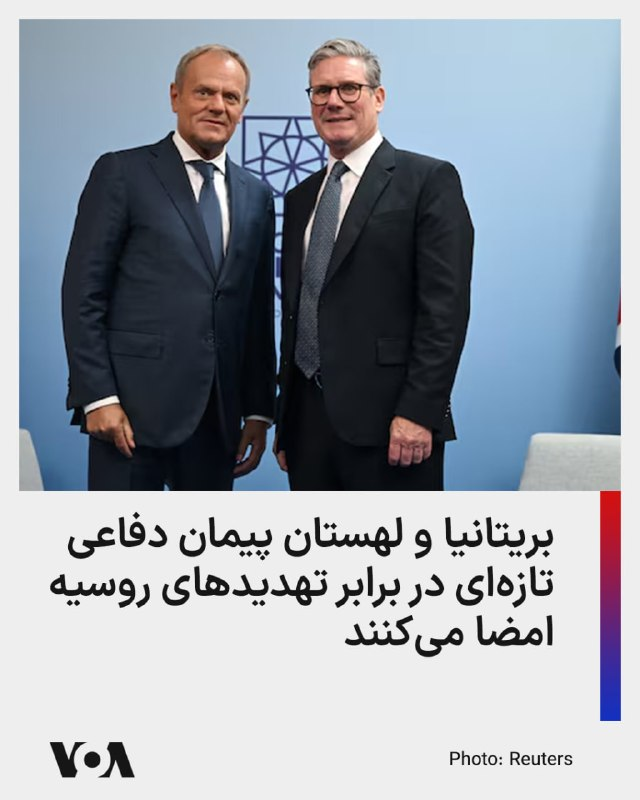

بریتانیا و لهستان قرار است پیمان دفاعی و امنیتی تازه‌ای امضا کنند؛ توافقی که هدف آن تقویت دفاع جمعی، حفاظت از مرزهای بریتانیا، مقابله با جرایم سازمان‌یافته و تعمیق همکاری لندن با اروپا اعلام شده است.

کی‌یر استارمر، نخست‌وزیر بریتانیا، در لندن میزبان دونالد توسک، نخست‌وزیر لهستان، خواهد بود. دولت بریتانیا می‌گوید این پیمان «بزرگ‌ترین گام رو به جلو» در روابط دفاعی و امنیتی دو کشور در یک نسل است.

دو طرف قرار است درباره افزایش حملات ترکیبی منتسب به روسیه، از جمله آتش‌سوزی‌های عمدی در شرق لندن، آتش‌سوزی محموله‌ها در بیرمنگام و اروپا، حملات سایبری، جاسوسی و عملیات اطلاعاتی مخرب گفت‌وگو کنند.

بر اساس این توافق، دو کشور در توسعه نسل جدید سامانه‌های پدافند هوایی، موشک‌های میان‌برد، جنگ پهپادی، جنگ الکترونیک و رزمایش‌های مشترک نیروهای زمینی همکاری گسترده‌تری خواهند داشت.

این پیمان هم‌زمان با نگرانی فزاینده اروپا از احتمال گسترش جنگ روسیه فراتر از اوکراین و تهدید کشورهای بالتیک امضا می‌شود.
@FarsiVOA

## FarsiVOA — post 218793

🔺افزایش بازداشت‌ها و اعدام ۳۷ تن در بحبوحه درگیری‌های نظامی در ایران

▪️ارگان خبری مجموعه فعالان حقوق بشر در ایران اعلام کرد همزمان با آغاز درگیری‌های نظامی میان ایران، آمریکا و اسرائیل، روند صدور و اجرای احکام اعدام در پرونده‌های سیاسی و امنیتی افزایش یافته و تاکنون ۳۷ شهروند اعدام شده‌اند.

▪️در این گزارش آمده است افزایش بازداشت‌ها و طرح اتهاماتی نظیر «جاسوسی» و «اقدام علیه امنیت ملی» علیه شهروندان، از جمله اقداماتی بوده که نهادهای امنیتی و اطلاعاتی جمهوری اسلامی در این دوره در پیش گرفته‌اند.

▪️بر اساس این گزارش، تنها در فاصله ۹ اسفند ۱۴۰۴ تا ۱۹ فروردین ۱۴۰۵ دست‌کم چهار هزار و ۲۳ شهروند توسط نیروهای اطلاعاتی و امنیتی جمهوری اسلامی بازداشت شده‌اند.

⬇️ بیشتر بخوانید:
https://ir.voanews.com/a/8154433.html

## FarsiVOA — post 218792

  <a href="telegram/content/FarsiVOA_218792_1779883785.mp4" target="_blank">🎬 Download video</a>

شناسایی و هدف قرار گرفتن اپراتور پهپادی حزب‌الله در جنوب لبنان؛

بر اساس گزارش ارتش اسرائیل، یک فروند هواپیمای نیروی هوایی این کشور در جریان عملیات خود در جنوب لبنان، یک پهپاد را که تهدیدی برای نیروهای اسرائیلی در منطقه محسوب می‌شد، در آسمان شناسایی کرد.

پس از فرود آمدن این پهپاد، یکی از نیروهای حزب‌الله برای جمع‌آوری آن به محل اعزام شد. هواپیمای نیروی هوایی اسرائیل با رهگیری موقعیت، در یک حمله دقیق این فرد را هدف قرار داد و از پا درآورد.

نیروی هوایی اسرائیل بر ادامه عملیات خود جهت پشتیبانی از نیروهایش در برابر تهدیدهای سازمان تروریستی حزب الله در جنوب لبنان تأکید کرده است.
@FarsiVOA

## FarsiVOA — post 218791

  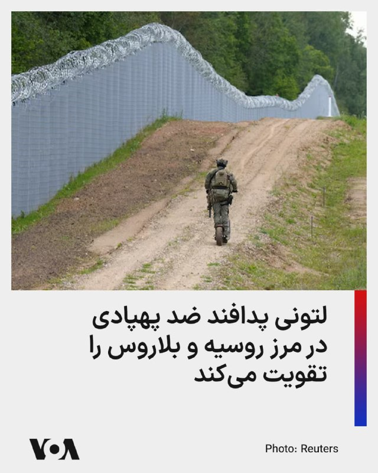

لتونی اعلام کرد برای مقابله با ورود پهپادها به حریم هوایی این کشور عضو ناتو، سامانه‌های دفاع ضدپهپادی خود را در امتداد مرزهای روسیه و بلاروس تقویت می‌کند.

یک مقام ارتش لتونی به رویترز گفت تیم‌های رهگیر پهپاد طی دو هفته آینده مستقر می‌شوند؛ تیم‌هایی متشکل از چند سرباز با خودروهای زمینی و پهپادهای تهاجمی که می‌توانند پهپادهای نظامی ورودی را در شعاع حدود ۱۰ کیلومتر منهدم کنند.

این تصمیم پس از چند حادثه تازه گرفته شده است. در هفته‌های اخیر، چند پهپاد اوکراینی از مسیر خود منحرف و وارد حریم هوایی کشورهای بالتیک شده‌اند.

کی‌یف می‌گوید اختلال روسیه در سیگنال آنها باعث انحراف مسیر شده است.

در هفته‌های اخیر دو پهپاد در یک تأسیسات خالی ذخیره نفت در لتونی منفجر شدند، یک پهپاد دیگر شنبه وارد دریاچه‌ای در لتونی شد، یک پهپاد در لیتوانی نمایندگان پارلمان را به پناهگاه فرستاد و جنگنده ناتو نیز پهپادی را بر فراز استونی سرنگون کرد.
@FarsiVOA

## FarsiVOA — post 218790

🔺ونس: امیدوارم جمهوری اسلامی تعهد دهد سراغ سلاح هسته‌ای نمی‌رود

▪️جی‌دی ونس، معاون رئیس‌جمهوری آمریکا، در مصاحبه‌ای با ان‌بی‌سی نیوز گفت «بسیار امیدوار» است جمهوری اسلامی با توافقی موافقت کند که شامل تعهد به عدم توسعه سلاح هسته‌ای باشد.

▪️او گفت مسئله دشوارتر این است که آیا تهران حاضر می‌شود با «نوعی سازوکار اجرایی» و «سازوکار نظارتی» موافقت کند؛ سازوکاری که به گفته او، به واشنگتن اطمینان دهد جمهوری اسلامی در آینده توافق را نقض نخواهد کرد.

▪️این اظهارات در حالی مطرح می‌شود که پرونده اورانیوم غنی‌شده به گره اصلی مذاکرات ایران و آمریکا تبدیل شده است.

▪️دولت ترامپ تأکید می‌کند هر توافقی باید فراتر از یک تعهد لفظی باشد و تهران نمی‌تواند سلاح هسته‌ای داشته باشد.

⬇️ بیشتر بخوانید:
https://ir.voanews.com/a/8154431.html

## FarsiVOA — post 218789

  

ارتش اسرائیل بار دیگر برای شهر نبطیه در جنوب لبنان هشدار تخلیه صادر کرد و اعلام کرد این هشدار پیش از حملات هوایی علیه زیرساخت‌های حزب‌الله داده شده است.

به گزارش تایمز اسرائیل، ساکنان نبطیه دستور گرفته‌اند به سمت شمال رودخانه زهرانی تخلیه شوند. سخنگوی عربی‌زبان ارتش اسرائیل اعلام کرد به‌دلیل نقض توافق آتش‌بس از سوی حزب‌الله، ارتش اسرائیل ناچار است با قدرت علیه این گروه اقدام کند و قصد آسیب رساندن به غیرنظامیان را ندارد.

بر اساس این گزارش، هشدار مشابهی نیز روز گذشته برای نبطیه صادر شده بود.
@FarsiVOA

## FarsiVOA — post 218788

  

شرکت صنایع نظامی «البیت سیستمز» اسرائیل از قرارداد ۱.۴ میلیارد دلاری فروش تسلیحات به یک کشور اروپایی خبر داد.

این شرکت نام کشور اروپایی را فاش نکرد، اما می‌گوید قرارداد یاد شده شامل خودروهای بدون سرنشین، تجهیزات جنگ الکترونیک زمینی، توپخانه هدایت‌شونده دقیق و سیستم‌های شناسایی پیشرفته است و طی پنج سال عملیاتی خواهد شد.

البیت می‌گوید این پلتفرم‌ها با سیستم‌های تعیین و شناسایی الکترواپتیکی همراه خواهند شد و تمام اجزا از طریق رادیوهای نرم‌افزاری شرکت به یکدیگر متصل می‌شوند.

درآمد این شرکت اسرائیلی در سه ماهه ابتدایی امسال با رشدی ۱۵ درصدی به ۲.۲ میلیارد دلار رسیده و ۳۰ میلیارد دلار سفارش تسلیحاتی معوقه دارد.
@FarsiVOA

## FarsiVOA — post 218787

🔺کره جنوبی تهران را عامل حمله به کشتی خود دانست؛ سفیر تهران احضار می‌شود

▪️کره جنوبی قصد دارد سفیر جمهوری اسلامی در سئول را در اعتراض به حمله به کشتی «اچ‌ام‌ام نامو» احضار کند؛ کشتی باری تحت بهره‌برداری شرکت کره‌ای اچ‌ام‌ام که اوایل ماه مه در نزدیکی تنگه هرمز هدف قرار گرفت.

▪️شبکه کی‌بی‌اس کره جنوبی روز چهارشنبه گزارش داد دولت سئول اکنون تهران را در این حمله دخیل می‌داند و برای احضار سفیر تهران برنامه‌ریزی کرده است.

▪️دونالد ترامپ بلافاصله پس از حادثه گفته بود که جمهوری اسلامی به کشتی کره‌ای «شلیک کرده» و از سئول خواست به تلاش‌های دریایی تحت رهبری آمریکا برای تأمین امنیت عبور کشتی‌ها در تنگه هرمز بپیوندد.

▪️جمهوری اسلامی پیشتر هرگونه نقش در این حادثه را رد کرده است.

⬇️ بیشتر بخوانید:
https://ir.voanews.com/a/8154430.html

## FarsiVOA — post 218786

  

دو گزارش تازه از وال‌استریت ژورنال و رویترز نشان می‌دهد نگرانی اروپا از روسیه دیگر فقط به جنگ اوکراین محدود نیست؛ مقام‌های اروپایی هم‌زمان از احتمال گسترش جغرافیای جنگ به سوی قلمرو ناتو و افزایش عملیات سایبری، جاسوسی و خرابکاری روسیه در بریتانیا و اروپا سخن می‌گویند.

وال‌استریت ژورنال نوشت در پایتخت‌های اروپایی این نگرانی جدی‌تر شده که ولادیمیر پوتین، در صورت ادامه بن‌بست در اوکراین، برای تغییر موازنه جنگ به تشدید افقی بحران روی آورد؛ از جمله با تهدید کشورهای بالتیک.

این گزارش به تهدیدهای اخیر روسیه علیه لتونی و لیتوانی، هشدار مسکو درباره شرکت‌های اروپایی همکار با اوکراین در تولید پهپاد، و رزمایش‌های هسته‌ای ناگهانی روسیه اشاره کرده است.

کایا کالاس، مسئول سیاست خارجی اتحادیه اروپا، به وال‌استریت ژورنال گفته اگر کرملین برای ادامه جنگ به بسیج تازه نیاز پیدا کند، ممکن است برای توجیه آن به تشدید تنش نیاز داشته باشد؛ نقطه‌ای که او «بسیار خطرناک» توصیف کرده است.
@FarsiVOA

## FarsiVOA — post 218785

  

عضو هیئت مدیره اتحادیه مشاوران املاک از جهش ۷۰ تا ۸۰ درصدی قیمت‌های پیشنهادی مسکن پس از جنگ خبر داد.

تورج سرباز به خبرگزاری ایسنا گفته است: «مسکن» که از رشد دلار و سکه عقب مانده بود، اکنون با تورم ناشی از جنگ، جاماندگی خود را جبران کرده است.

او اعلام کرد که در حال حاضر ۷۰ درصد معاملات توسط سوداگران انجام می‌شود و متقاضی واقعی به دلیل قیمت‌های نجومی عملاً از صحنه رقابت حذف شده است.

پیش از اعلام افزایش ۸۰ درصدی قیمت خرید مسکن، خبرگزاری ایسنا از افزایش اجاره‌بها نیز خبر داده و اعلام کرده بود که در شهرهای بزرگ و مراکز استان‌ها، بین ۵۰ تا ۷۰ درصد درآمد خانوار صرف اجاره می‌شود.
@FarsiVOA

## FarsiVOA — post 218784

  

وزیر خارجه چین می‌گوید هر گام رو به جلو در مذاکرات جمهوری اسلامی و آمریکا روزنه‌ امیدی برای بازگشت صلح به خاورمیانه است.

وانگ یی در ادامه گفت حل‌وفصل اختلافات دیرینه یک‌شبه ممکن نیست، اما پکن در تلاش برای حل بن‌بست میان آمریکا و جمهوری اسلامی است.

او گفت پکن در تماس مستمر با بازیگران اصلی این پرونده - آمریکا، ایران و پاکستان ــ است و امیدواریم طرف‌ها با قاطعیت به آتش‌بس و توقف درگیری‌ها پایبند بمانند.

وانگ یی روز دوشنبه با عاصم منیر فرمانده ارتش پاکستان، از مهمترین چهره‌های میانجی مذاکرات آمریکا و جمهوری اسلامی، دیدار و پیرامون مذاکرات صلح رایزنی کرده بود.
@FarsiVOA

## FarsiVOA — post 218783

🔺اسرائیل از کشته شدن فرمانده تازه شاخه نظامی حماس در غزه خبر داد

▪️ارتش اسرائیل و سازمان امنیت داخلی این کشور، شاباک، اعلام کردند محمد عوده، فرمانده تازه شاخه نظامی حماس در نوار غزه، در حمله هوایی سه‌شنبه شب در شمال غزه کشته شده است.

▪️به گفته مقام‌های اسرائیلی، محمد عوده هفته گذشته و پس از کشته شدن عزالدین حداد، به این جایگاه رسیده بود.

▪️ساعاتی پیش از تأیید رسمی کشته شدن عوده، بنیامین نتانیاهو در بیانیه‌ای اعلام کرده بود ارتش اسرائیل، محمد عوده را در غزه هدف قرار داده است.

▪️در آن بیانیه، عوده «یکی از طراحان حمله هفتم اکتبر» معرفی شده و گفته شده بود او مسئول کشته، ربوده و زخمی شدن شماری از شهروندان اسرائیلی و نیروهای ارتش اسرائیل بوده است.

⬇️ بیشتر بخوانید:
https://ir.voanews.com/a/idf-confirm-hamas-new-military-chief-killed-in-gaza-strike/8154428.html

## FarsiVOA — post 218782

  <a href="telegram/content/FarsiVOA_218782_1779883790.mp4" target="_blank">🎬 Download video</a>

حمله ارتش آمریکا به یک قایق مظنون به قاچاق مواد مخدر در اقیانوس آرام؛

ارتش آمریکا اعلام کرد روز سه‌شنبه یک قایق را در شرق اقیانوس آرام هدف حمله نظامی قرار داده است؛ حمله‌ای که به گفته فرماندهی جنوبی آمریکا، علیه شناوری انجام شد که توسط «سازمان‌های تروریستی تعیین‌شده» اداره می‌شد و در مسیرهای شناخته‌شده قاچاق مواد مخدر حرکت می‌کرد.

در این حمله یک مرد کشته شد و دو نفر زنده ماندند. ساوتکام می‌گوید پس از حمله، گارد ساحلی آمریکا برای عملیات جست‌وجو و نجات دو بازمانده حاضر شد و هیچ نیروی آمریکایی آسیب ندید.

در بیانیه آمریکا، نام گروه، هویت افراد یا شواهد مربوط به ادعای قاچاق منتشر نشده است. آسوشیتدپرس نوشت این حمله بخشی از کارزار دولت ترامپ از سپتامبر علیه قایق‌های مظنون به قاچاق مواد مخدر در آب‌های آمریکای لاتین است؛ کارزاری که تاکنون دست‌کم ۱۹۴ کشته داشته است.
@FarsiVOA

## FarsiVOA — post 218781

🔺سرانه مصرف لبنیات در ایران به کمتر از ۵۰ کیلوگرم رسید

▪️رئیس اتحادیه تعاونی‌های صنایع لبنی کشور می‌گوید سرانه مصرف لبنیات در ایران به کمتر از ۵۰ کیلوگرم رسیده است؛ نشانه‌ای تازه از کوچک‌تر شدن سفره خانوارها و حذف تدریجی اقلام ضروری از سبد غذایی ایرانیان.

▪️به گفته علی احسان مظفری، افزایش قیمت شیر خام، مواد بسته‌بندی، حقوق و دستمزد و هزینه حامل‌های انرژی، بهای تمام‌شده تولید محصولات لبنی را بالا برده است.

▪️لبنیات یکی از منابع اصلی کلسیم، پروتئین و مواد مغذی برای کودکان، سالمندان و خانوارهای کم‌درآمد است که اثر کوتاه‌مدت حذف آن در سبد خرید دیده می‌شود و در بلندمدت در سلامت عمومی، رشد کودکان و افزایش هزینه‌های درمانی خود را نشان می‌دهد.

⬇️ بیشتر بخوانید:
https://ir.voanews.com/a/8154429.html

## FarsiVOA — post 218780

  

آتش‌سوزی بزرگی در سوپرمارکت «کوشر کینگدام» در محله گولدرز گرین لندن، یکی از مناطق پرجمعیت یهودیان در پایتخت بریتانیا، رخ داده است.

بر اساس گزارش تایمز اسرائیل، ویدئوهای منتشرشده در شبکه‌های اجتماعی دود غلیظ و شعله‌هایی را نشان می‌دهد که از بخش پشتی این فروشگاه بالا می‌رود. این فروشگاه بزرگترین سوپرمارکت کوشر در گولدرز گرین معرفی شده است.

سازمان آتش‌نشانی لندن اعلام کرده علت آتش‌سوزی هنوز مشخص نشده است.
@FarsiVOA

## FarsiVOA — post 218779

  

کانادا و باهاما اعلام کردند در پی شیوع ابولا، ورود افراد مقیم جمهوری دموکراتیک کنگو، اوگاندا و سودان جنوبی را به‌طور موقت محدود می‌کنند.

به گزارش رویترز، محدودیت کانادا از چهارشنبه و به مدت ۹۰ روز اجرا می‌شود و هدف آن کاهش خطر ورود و گسترش ابولا در این کشور اعلام شده است. باهاما نیز گفته محدودیت ورود را فوراً و برای ۳۰ روز، با امکان بازنگری وزارت بهداشت، اعمال می‌کند.

بر اساس این گزارش، شهروندان و دارندگان اقامت دائم کانادا که در هفته‌های اخیر در مناطق درگیر بوده‌اند و علائم ندارند، از ۳۰ مه باید ۲۱ روز قرنطینه شوند.

آمریکا نیز هفته گذشته ورود غیرشهروندانی را که اخیراً به کنگو، اوگاندا یا سودان جنوبی سفر کرده‌اند، ممنوع کرده بود.

سازمان جهانی بهداشت خطر گسترش سویه «بوندیبوگیو» ابولا در کنگو را «بسیار بالا» ارزیابی کرده و شیوع آن در کنگو و اوگاندا را وضعیت اضطراری بین‌المللی دانسته است.

تاکنون موردی از ابولا در آمریکا، کانادا یا باهاما گزارش نشده است.
@FarsiVOA

## FarsiVOA — post 218778

  

شرکت اطلاعات کالا، کپلر، می‌گوید در پی انسداد تنگه هرمز، واردات روزانه نفت چین در ماه جاری میلادی به ۶.۶ میلیون بشکه سقوط کرده که کمترین میزان از سال ۲۰۱۶ است.

واردات روزانه نفت چین در سال گذشته ۱۱ میلیون و ۵۵۰ هزار بشکه بود که حدود ۴۵ درصد آن از کشورهای حوزه خلیج فارس تأمین شده بود؛ موضوعی که با انسداد تنگه هرمز توسط جمهوری اسلامی به شدت مختل شده است.

چین در ماه‌های مارس و آوریل نیز واردات نفت را ۲۰ درصد کاهش داده بود.

کپلر می‌گوید سقوط خرید نفت چین در ماه جاری باعث شده نفت بیشتری برای پالایشگاه‌های دیگر کشورهای آسیایی در دسترس باشد.
@FarsiVOA

## FarsiVOA — post 218777

🔺بازداشت هشتمین نفر در پرونده حمله مرگبار به کنیسه‌ای در منچستر

▪️پلیس بریتانیا اعلام کرد مردی ۴۹ ساله را در ارتباط با حمله تروریستی مرگبار به کنیسه‌ای در منچستر بازداشت کرده است.

▪️پلیس تأکید کرده است که این بازداشت مستقیماً با حمله دوم اکتبر ۲۰۲۵ به کنیسه هیتون پارک مرتبط است. با این بازداشت، شمار کل افراد بازداشت‌شده در این پرونده به هشت نفر رسید.

▪️این حمله روز «یوم کیپور»، مقدس‌ترین روز تقویم یهودی، دو کشته و سه زخمی جدی برجا گذاشت.

▪️در حمله به کنیسه هیتون پارک، جهاد الشامی، شهروند بریتانیایی متولد سوریه، ابتدا با خودرو به عابران کوبید، سپس با چاقو به افراد حمله کرد و تلاش کرد وارد ساختمان کنیسه شود. او در نهایت با شلیک پلیس کشته شد.

⬇️ بیشتر بخوانید:
https://ir.voanews.com/a/8154427.html

## FarsiVOA — post 218776

  

تامی پیگوت، سخنگوی وزارت خارجه آمریکا، در پیامی در ایکس نوشت دونالد ترامپ «از روز نخست» به‌روشنی اعلام کرده است که جمهوری اسلامی نباید به سلاح هسته‌ای دست یابد.

او افزود ترامپ برای اطمینان از اینکه جمهوری اسلامی هرگز به چنین هدفی نرسد، «اقدام‌های قاطع» انجام داده است.

این پیام در ادامه موضع‌گیری‌های دولت ترامپ درباره برنامه هسته‌ای جمهوری اسلامی منتشر شده است؛ موضعی که بر جلوگیری از دستیابی تهران به سلاح هسته‌ای و حفظ فشار سیاسی و امنیتی بر حکومت ایران تأکید دارد.

پیام پیگوت نشان می‌دهد واشنگتن همچنان پرونده هسته‌ای جمهوری اسلامی را یکی از محورهای اصلی سیاست خود در قبال تهران می‌داند.
@FarsiVOA

## DW_Farsi — post 125199

🎥 مبارزه با راست افراطی در قفس ورزش‌های رزمی (رینگ)

راست افراطی در آلمان بیش از پیش از ورزش‌های رزمی ترکیبی برای جذب نیرو استفاده می‌کند. حالا یک باشگاه در شهر کمنیتس در شرق آلمان با ایجاد فضایی فراگیر و بدون تبعیض، تلاش می‌کند در برابر این روند بایستد.
@dw_farsi

## DW_Farsi — post 125198

  

🔶 باقری: تماس‌های غیرمستقیم با آمریکا ادامه دارد؛ موضوع ذخایر اورانیوم مطرح نیست

علی باقری کنی، معاون دبیر شورای عالی امنیت ملی ایران گفته است، "تماس‌های غیرمستقیم" میان تهران و واشنگتن ادامه دارد، اما "موضوع ذخایر اورانیوم غنی‌شده ایران در مذاکرات جاری مطرح نیست".

باقری که برای شرکت در کنفرانس امنیتی مسکو به روسیه سفر کرده، اعلام کرد که ایران و عمان در حال مذاکره برای تعیین "سازوکاری جدید" برای عبور کشتی‌ها از تنگه هرمز هستند.

او با بیان اینکه شرایط عبور و مرور در تنگه هرمز پس از جنگ اخیر "با گذشته متفاوت خواهد بود"، به خبرنگاران گفت: «تا زمانی که در همه مسائل به توافق نرسیم، معتقدیم که در هیچ‌چیز به توافق نرسیده‌ایم.»

اظهارات باقری در حالی مطرح می‌شود که تهران و واشنگتن در هفته‌های اخیر، با میانجیگری پاکستان، مذاکراتی را برای دستیابی به تفاهم‌نامه پایان جنگ دنبال کرده‌اند.

بر اساس گزارش‌ها، موضوعاتی مانند بازگشایی تنگه هرمز، آزادسازی دارایی‌های بلوکه‌شده ایران و توقف درگیری‌های نظامی، از محورهای اصلی این گفت‌وگوها بوده است.

@dw_farsi

## DW_Farsi — post 125188

📸 آلمان چقدر ثروتمند دارد؟

در سال گذشته، دارایی مالی خصوصی در سراسر جهان ۷٫۴ درصد رشد کرده است. این رشد ثروت در سال ۲۰۲۵ به‌مراتب بیشتر از نرخ تورم بوده است. در مجموع، ثروت خالص جهانی شامل دارایی‌های فیزیکی به ۵۵۰ تریلیون دلار آمریکا رسیده است.

این موضوع در گزارش ثروت جهانی ۲۰۲۶ (Global Wealth Report 2026) گروه مشاوره بوستون منتشرشده است.

در آلمان نیز ثروت به‌طور چشمگیری افزایش یافته است: تا تاریخ ۳۱ دسامبر سال ۲۰۲۵، مجموع ثروت در این کشور به ۲۳٫۳ تریلیون دلار رسیده است. بیش از نیمی از این ثروت در دارایی‌های فیزیکی، به‌ویژه املاک، سرمایه‌گذاری شده است.

طبق تعریف این گزارش، هر فردی که بیش از ۱۰۰ میلیون دلار "دارایی مالی" داشته باشد، فوق‌ثروتمند محسوب می‌شود.

دارایی‌های مالی به مجموعه‌ای از منابع و سرمایه‌های پولی گفته می‌شود که ارزش آن‌ها بر اساس پول نقد، اسناد مالی و مطالبات سنجیده می‌شود.

در آلمان ۵۰۰۰ نفر در گروه فوق‌ثروتمند قرار دارند. در سراسر جهان نیز نزدیک به ۹۷ هزار فوق‌ثروتمند وجود دارد که بیش از یک‌سوم آن‌ها در آمریکا (۳۷ هزار نفر) و ۱۱ هزار نفر در چین زندگی می‌کنند.
@dw_farsi

## DW_Farsi — post 125187

  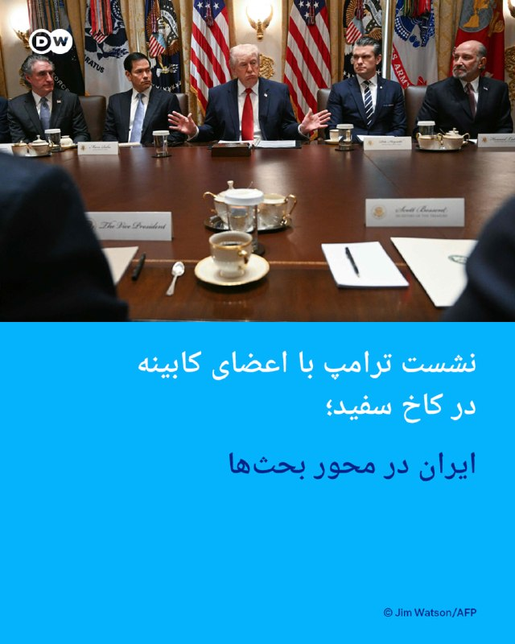

🔶 نشست ترامپ با اعضای کابینه در کاخ سفید؛ ایران در محور بحث‌ها

واشنگتن تایید کرده که قرار است دونالد ترامپ، رئیس‌جمهور آمریکا روز چهارشنبه ۲۷ مه در کاخ سفید با اعضای کابینه خود دیدار کند؛ نشستی که یک روز پس از اظهارات مارکو روبیو، وزیر خارجه آمریکا، درباره نزدیک بودن توافق برگزار می‌شود.

با این حال، هنوز مشخص نیست که توافق احتمالی چه دستاورد سیاسی مشخصی برای دولت ترامپ خواهد داشت. پیشتر گزارش شده بود که این نشست قرار است در کمپ دیوید برگزار شود اما به دلیل شرایط آب‌وهوایی، مکان برگزاری این نشست به کاخ سفید تغییر یافت.

یکی از محورهای اصلی این توافق، بازگشایی تنگه هرمز عنوان شده است؛ مسیری راهبردی برای انتقال نفت و گاز که در جریان جنگ اخیر با محدودیت‌هایی روبه‌رو شده بود.

دونالد ترامپ، رئیس‌جمهور آمریکا، گفته است توافق آتش‌بس میان ایران و آمریکا "تا حد زیادی" نهایی شده، هرچند به گفته او، جزئیات پایانی همچنان در حال بررسی است.

@dw_farsi

## DW_Farsi — post 125186

🔶 اسرائیل از کشته‌شدن "فرمانده جدید شاخه نظامی حماس" خبر داد

اسرائیل از حمله به حزب‌الله لبنان و همچنین کشته‌شدن فرمانده جدید شاخه نظامی حماس خبر داد. حزب‌الله در روزهای اخیر حملات پهپادی به اسرائیل را افزایش داد و ارتش اسرائیل هم عملیات‌هایی علیه مواضع این گروه انجام داده است.

حدود یک‌ونیم هفته پس از کشته شدن فرمانده "گردان‌های عزالدین قسام"، شاخه نظامی حماس، اسرائیل اکنون می‌گوید جانشین او را نیز در نوار غزه هدف قرار داده و کشته است.

طبق گزارش‌ها محمد عوده نه‌تنها فرمانده جدید شاخه نظامی حماس بود، بلکه یکی از طراحان حملات ۷ اکتبر نیز به شمار می‌رفت.

@dw_farsi

## DW_Farsi — post 125185

  

🔶 ده‌ها دانشجوی دانشگاه شریف با احکام "اخراج و محرومیت از تحصیل" روبه‌رو شده‌اند

گزارش‌ها از ایران حاکی از آن است که دست‌کم ۳۰ دانشجوی دانشگاه صنعتی شریف در ارتباط با فعالیت‌های مجازی و پرونده‌های مرتبط با اعتراضات سراسری سال گذشته، با احکام انضباطی روبه‌رو شده‌اند.

خبرگزاری هرانا به نقل از شورای صنفی دانشگاه صنعتی شریف نوشته است که ؛حکم بدوی دست‌کم شش دانشجو، اخراج از دانشگاه همراه با پنج سال محرومیت از تحصیل در تمامی دانشگاه‌های کشور بوده است؛.

بر اساس این گزارش، برای شماری دیگر از دانشجویان نیز احکامی مانند "منع موقت از تحصیل" برای یک یا چند نیم‌سال صادر شده است.

در گزارش منتشر شده آمده که برخی از این دانشجویان با اتهام‌هایی مانند "برنامه‌ریزی برای ایجاد آشوب در دانشگاه" به کمیته انضباطی احضار شده‌اند.

همچنین گفته شده، بخش قابل توجهی از پرونده‌ها به ؛فعالیت دانشجویان در فضای مجازی، از جمله محتوای پروفایل، پیام در گروه‌های خصوصی یا بازنشر مطالب در شبکه‌های اجتماعی؛ مربوط بوده است.

@dw_farsi

## DW_Farsi — post 125184

  

🔶ولایتی: ضامن عینی بقای توافق، تنگه هرمز است

علی‌اکبر ولایتی، مشاور رهبر جمهوری اسلامی در امور بین‌الملل، در پیامی در شبکه اجتماعی ایکس نوشته است که "ضامن عینی بقای توافق، تنگه هرمزاست". او تاکید کرده که ایران این بار تنها به "کاغذها و امضاها" تکیه نخواهد کرد.

او همچنین نوشت، "ملت بودن" ریشه‌ای تمدنی دارد و "کالایی نیست که با دلار نفتی بتوان خرید یا اجاره کرد".

اظهارات ولایتی در حالی مطرح می‌شود که تنش‌ها در منطقه و بحث درباره امنیت تنگه هرمز، یکی از مهم‌ترین مسیرهای انتقال نفت جهان، بار دیگر افزایش یافته است. شمار زیادی از مقام‌های حکومت ایران، از جمله مجتبی خامنه‌ای، رهبر کنونی جمهوری اسلامی، در ادبیاتی تهدیدآمیز گفته‌اند که وضعیت تنگه هرمز به گذشته بازنخواهد گشت.

@dw_farsi

## DW_Farsi — post 125183

  

🔶 هشدار درباره ادامه اختلال در انتقال نفت و مواد خام پس از بحران در تنگه هرمز

مدیر پیشین شرکت انرژی وینترشال آلمان هشدار داده است که حتی در صورت بازگشایی تنگه هرمز، بازگشت زنجیره‌های تأمین جهانی به وضعیت عادی "ماه‌ها" زمان خواهد برد.

راینر زیله، مدیر پیشین وینترشال و از مدیران ارشد کنونی شرکت نفتی ادنوک امارات، در گفت‌وگو با روزنامه "هاندلزبلات" گفته است که اختلال‌های ایجادشده در انتقال نفت و گاز، به سرعت جبران نخواهد شد.

او گفت: «احیای زنجیره‌های تامین یک‌شبه اتفاق نمی‌افتد، بلکه ماه‌ها طول خواهد کشید.»

به گفته او، حتی پس از بازگشایی مسیر حیاتی تنگه هرمز، نفتکش‌ها زمان زیادی نیاز خواهند داشت تا محموله‌ها را به بازارهای آسیایی برسانند. او همچنین افزود، بسیاری از کشورها ابتدا تلاش خواهند کرد ذخایر راهبردی نفت و گاز خود را دوباره پر کنند.

این مدیر صنعت انرژی هشدار داد که "کمبود مواد خام و فشار بر زنجیره تامین احتمالا تا پایان سال ادامه خواهد داشت و این موضوع به‌ویژه بر صنایع شیمیایی آسیا تاثیر خواهد گذاشت".

@dw_farsi

## DW_Farsi — post 125182

  

📸 عکس روز: پرواز بالن‌ها بر فراز "دره عشق"

شهر کاپادوکیا در ترکیه از مناطق تاریخی این کشور به‌شمار می‌رود که هر سال گردشگران فراوانی را به خود جذب می‌کند.

از جمله محبوب‌ترین مناطق آن "دره عشق" است که به گفته زمین‌شناسان، قدمت آن به میلیون‌ها سال می‌رسد. در این تصویر، پرواز بالن‌ها بر فراز "دره عشق" دیده می‌شوند؛ همزمان با طلوع آفتاب در آسمانی نیمه‌ابری.

@dw_farsi

## DW_Farsi — post 125181

  

🔶 تهدید تازه مقام سپاه علیه آمریکا؛ "خشاب‌ها پُر است"

سردار محمد اکبرزاده، معاون سیاسی نیروی دریایی سپاه پاسداران، با اشاره به تنش‌های اخیر میان ایران و آمریکا گفته است در صورت هرگونه حمله، "از چابهار تا ماهشهر را برای متجاوزان آمریکایی به قبرستان تبدیل خواهیم کرد".

او این اظهارات را در تجمعی در شهر زنجان مطرح کرد و گفت، نیروهای مسلح ایران در تنگه هرمز و خطوط ساحلی "به طور کامل" مستقر هستند.

اکبرزاده همچنین آمریکا را به "خطای محاسباتی" متهم کرد و گفت: «گویا هنوز نیاموخته‌اند که با "ایرانی جماعت" نباید با زبان تهدید صحبت کرد.»

معاون سیاسی نیروی دریایی سپاه در بخش دیگری از سخنانش مدعی شد که آمریکا در جریان جنگ اخیر، از طریق میانجی‌ها خواهان آتش‌بس شده بود و ایران "با موشک" به حملات پاسخ داده است.

او همچنین گفت نیروهای مسلح ایران با "خشاب پُر" آماده مقابله با هرگونه اقدام نظامی هستند.

مقام‌های آمریکایی تاکنون واکنشی به این اظهارات نشان نداده‌اند.

@dw_farsi

## DW_Farsi — post 125180

  

🔶 وریشه مرادی در زندان اوین "از تماس تلفنی محروم شد"

براساس گزارش خبرگزاری هرانا، ارگان خبری مجموعه فعالان حقوق بشر در ایران، وریشه مرادی، زندانی سیاسی محبوس در زندان اوین، "به صورت تنبیهی از دسترسی به تلفن زندان محروم شده است".

هرانا به نقل از یک منبع مطلع نوشته، این محدودیت پس از آن اعمال شد که او در محوطه هواخوری زندان، در اعتراض به اجرای احکام اعدام شعار اعتراضی سر داده بود.

بر اساس این گزارش، وریشه مرادی پیش از این نیز از ملاقات با خانواده و وکلای خود محروم شده بود و این محدودیت همچنان ادامه دارد.

این زندانی سیاسی که در بند زنان زندان اوین نگهداری می‌شود، پیش‌تر توسط شعبه ۱۵ دادگاه انقلاب تهران به ریاست قاضی ابوالقاسم صلواتی، با اتهام "بغی" به اعدام محکوم شده بود. این حکم بعداً از سوی دیوان عالی کشور نقض و پرونده برای رسیدگی دوباره به شعبه هم‌عرض ارجاع شد.

او همچنین در پرونده‌های دیگر، از جمله به اتهام "تبلیغ علیه نظام" و "تمرد و درگیری با ماموران"، به احکام جداگانه حبس محکوم شده است.

@dw_farsi

## Persian_Trend_Official — post 15121

🌲 — 🇮🇱 رئیس ستاد کل ارتش اسرائیل، ایال زامیر: برنامه هسته‌ای ایران سال‌ها به عقب افتاده است.

🌲 — 🇮🇱 رئیس ستاد کل ارتش اسرائیل: رهبری ایران مردم خود را به فاجعه‌ای کشانده است که هنوز به طور کامل آن را درک نکرده‌اند، و در حالی که بیشتر توانایی‌های نظامی‌شان نابود شده، در حال تعقیب هستند.

## Persian_Trend_Official — post 15120

  

🇮🇱
🇱🇧
🇱🇧
🔹 هشدار فوری به ساکنان شهرها و روستاهای زیر در لبنان صادر شد: کفر حونا، آرامتا، ملیخ، جرجوع و حومین الفوقا، با دستور تخلیه فوری و حرکت حداقل ۱۰۰۰ متر به سمت مناطق باز.

## Persian_Trend_Official — post 15119

  <a href="telegram/content/Persian_Trend_Official_15119_1779883798.mp4" target="_blank">🎬 Download video</a>

سالروز اعدام «صدام حسین عبدالمجید التکریتی»

صدام حسین تکریتی، سحرگاه عید قربان سال ۱۳۸۵ به دار مجازات آویخته شد.

👩‍💻@PhantomDirective

🆔@persian_trend_official
پرشین ترند | متفاوت‌ترین کانال نظامی

## Persian_Trend_Official — post 15118

  

عبور چهارمین کشتی LNG از تنگه هرمز در کمتر از یک هفته :

🚢 نفتکش LNG «ام‌الاشتان» متعلق به امارات، با محموله گاز طبیعی مایع از ابوظبی، در حالی که سیستم شناسایی خودکار (AIS) خود را خاموش کرده بود، از تنگه هرمز عبور کرد و به سمت هند در حال حرکت است. این کشتی چهارمین مورد از عبور نفتکش‌های LNG در یک هفته گذشته به شمار می‌رود.

👩‍💻@PhantomDirective

🆔@persian_trend_official
پرشین ترند | متفاوت‌ترین کانال نظامی

## Persian_Trend_Official — post 15117

  <a href="telegram/content/Persian_Trend_Official_15117_1779883800.mp4" target="_blank">🎬 Download video</a>

لحظه‌ ترور محمد عوده و فرماندهان شاخه نظامی حماس

👩‍💻@PhantomDirective

🆔@persian_trend_official
پرشین ترند | متفاوت‌ترین کانال نظامی

## Persian_Trend_Official — post 15116

  <a href="telegram/content/Persian_Trend_Official_15116_1779883801.webm" target="_blank">🎬 Download video</a>

https://youtube.com/live/IsX9PiIhoW4?feature=share

## Persian_Trend_Official — post 15115

  <a href="telegram/content/Persian_Trend_Official_15115_1779883802.webm" target="_blank">🎬 Download video</a>

https://t.me/c/2818485288/592142

چت روی 4 روزه تا امنیت شما حفظ بشه و حرفاتون ازبین بره تا خدایی نکرده در داخل ایران اگر نیروهای امنیتی به گوشی شما دسترسی پیدا کردن نتونن کامنتهاتون رو ببینن و خدایی نکرده براتون پرونده سازی بشه .
اما حرف های ما که اینجا ثبته و کسی هم پاکش نمیکنه !

## Persian_Trend_Official — post 15114

تا دقایقی دیگه یک لایو در مورد نامه نبویان به قالیباف و ذوالقدر میریم برای ثبت در تاریخ و بررسی شرایط توافق جدید !!!

## Persian_Trend_Official — post 15113

https://t.me/persian_trend_official/15109?comment=591960

زمان مشخص میکنه دوست خوبم
در مورد توافق کاش شما هم پیشبینی دقیق بکنید
توافق با چه کیفیتی؟

## Persian_Trend_Official — post 15112

https://t.me/persian_trend_official/15109?comment=591948

## Persian_Trend_Official — post 15111

https://t.me/persian_trend_official/15109?comment=591948

## Persian_Trend_Official — post 15110

  <a href="telegram/content/Persian_Trend_Official_15110_1779883802.webm" target="_blank">🎬 Download video</a>

🎬 Video

## Persian_Trend_Official — post 15109

## Persian_Trend_Official — post 15108

سازمان هواپیمایی کشوری اعلام کرد ۱۰ فرودگاه ایران از این پس به‌صورت ۲۴ ساعته فعال‌ هستند.

با تصمیم این سازمان، فرودگاه‌های مهرآباد و خمینی تهران، ساری، بیرجند، گرگان، بجنورد، کرمان، زاهدان، سبزوار و مشهد از این پس به‌صورت شبانه‌روزی فعالیت خواهند کرد

پ.ن: گویا نظام تصمیمش رو گرفته بده بره ...

📌 @persian_trend_official
پرشین ترند | متفاوت‌ترین کانال نظامی

## Persian_Trend_Official — post 15107

  

منابع دیپلماتیک روز چهارشنبه به «العربیه» اطلاع دادند سفر محمدباقر قالیباف، رئیس مجلس و مذاکره‌کننده ارشد ایران، به قطر شامل بررسی سازوکار آزادسازی دارایی‌های بلوکه‌شده ایران بوده است.

این منابع افزودند ایران خواستار آزادسازی حدود 24 میلیارد دلار از دارایی‌های بلوکه‌شده خود شده و اصرار دارد هم‌زمان با اعلام تفاهم‌نامه مورد انتظار با واشینگتن، نیمی از این مبلغ را دریافت کند.

📌 @persian_trend_official
پرشین ترند | متفاوت‌ترین کانال نظامی

## Persian_Trend_Official — post 15106

کانال رسمی پرشین ترند pinned «کسانی که اینترنتشون تازه وصل شده یا قبلا سرعت اینترنت یاری نمیکرده اگر این ویدیو رو ندیدید توضیه میکنم ببینید تا بدونید احتمالا یک سال اینده قراره جمهوری اسلامی چه چالش هایی داشته باشه https://youtu.be/8YQ1YcLyw6E»

## Persian_Trend_Official — post 15105

کسانی که اینترنتشون تازه وصل شده یا قبلا سرعت اینترنت یاری نمیکرده
اگر این ویدیو رو ندیدید توضیه میکنم ببینید تا بدونید احتمالا یک سال اینده قراره جمهوری اسلامی چه چالش هایی داشته باشه

https://youtu.be/8YQ1YcLyw6E

## Persian_Trend_Official — post 15101

عکس‌های منتشرشده از سوی فرماندهی مرکزی آمریکا، سنتکام، نشان می‌دهد یک فروند جنگنده پنهانکار اف-۲۲ رپتور متعلق به بال یکم جنگنده نیروی هوایی آمریکا مستقر در پایگاه لانگلی ویرجینیا، در حال سوخت‌گیری هوایی بر فراز نقطه‌ای اعلام‌نشده در خاورمیانه است.

در این تصاویر، اف-۲۲ در کنار یک فروند هواپیمای سوخت‌رسان KC-135T Stratotanker دیده می‌شود؛ هواپیمایی که به بال ۱۷۱ سوخت‌رسانی هوایی گارد ملی هوایی پنسیلوانیا اختصاص دارد.

انتشار این تصاویر از سوی سنتکام در شرایطی انجام می‌شود که حضور جنگنده‌های نسل پنجم آمریکا در منطقه، معمولاً به‌عنوان بخشی از پیام بازدارندگی، نمایش آمادگی عملیاتی و پشتیبانی از مأموریت‌های هوایی بلندبرد تفسیر می‌شود. اف-۲۲ رپتور عمدتاً برای برتری هوایی، نفوذ در محیط‌های پرخطر و مقابله با تهدیدهای پیشرفته طراحی شده و سوخت‌گیری هوایی، امکان ماندگاری و عملیات طولانی‌تر آن در منطقه را فراهم می‌کند.

📌 @persian_trend_official
پرشین ترند | متفاوت‌ترین کانال نظامی

## RadioFarda — post 157606

  <a href="https://t.me/radiofarda/157606" target="_blank">📎 Download file</a>

📻بشنوید: ساعت ۱۴ با رادیوفردا، ششم خرداد ۱۴۰۵‌

@Radiofarda

## RadioFarda — post 157605

🔸کره جنوبی اعلام کرد سفیر ایران را در اعتراض به حمله به یک کشتی این کشور در تنگه هرمز احضار خواهد کرد. 🔸این احضار پس از آن صورت می‌گیرد که دولت سئول اعلام کرد در تحقیقات خود به این نتیجه رسیده که «به احتمال بسیار زیاد» موشکی ساخت ایران عامل حمله به این کشتی…

## RadioFarda — post 157604

  

🔸کره جنوبی اعلام کرد سفیر ایران را در اعتراض به حمله به یک کشتی این کشور در تنگه هرمز احضار خواهد کرد.

🔸این احضار پس از آن صورت می‌گیرد که دولت سئول اعلام کرد در تحقیقات خود به این نتیجه رسیده که «به احتمال بسیار زیاد» موشکی ساخت ایران عامل حمله به این کشتی بوده است.

🔸این کشتی باری کره‌جنوبی ۱۴ اردیبهشت توسط یک هواگرد ناشناس در تنگه هرمز هدف قرار گرفت.

🔸دونالد ترامپ بعد از این حمله گفته بود که ایران «چند شلیک» به سوی این کشتی با پرچم پاناما انجام داده اما تهران مسئولیت این حمله را رد کرده بود.

🔸پس از چند هفته تحقیق، دولت کره‌ جنوبی اعلام کرد که تحلیل‌های فنی نشان داده‌اند پرتابه ناشناسی که به کشتی اصابت کرده «به احتمال بسیار زیاد» نسخه‌ای دیگر از موشک توسعه‌یافتهٔ «نور» بوده است.

🔸پارک یون‌جو، معاون اول وزیر خارجه کره‌ جنوبی، در یک نشست خبری گفت: «دولت ما قصد دارد سفیر ایران را احضار کند تا نتایج تحقیقات را توضیح دهد، اعتراض شدید خود را نسبت به حمله به کشتی‌مان اعلام کند و خواستار اقدامات مسئولانه، از جمله تدابیری برای جلوگیری از تکرار چنین حادثه‌ای شود.»

@RadioFarda

## RadioFarda — post 157603

استارلینک و جنگ ایران؛ «چانه‌زنی اسپیس‌ایکس با پنتاگون بر سر اینترنت ماهواره‌ای»

🔸جنگ آمریکا و ایران فقط در آسمان، دریا و خاک جریان ندارد؛ بخشی از آن در مدارهای پایین زمین می‌گذرد؛ جایی که هزاران ماهواره کوچک استارلینک، متعلق به شرکت اسپیس‌اکس ایلان ماسک، به یکی از حلقه‌های حیاتی عملیات نظامی آمریکا تبدیل شده‌اند.

🔸گزارشی اختصاصی از خبرگزاری رویترز نشان می‌دهد که در همان هفته‌هایی که پهپادهای انتحاری آمریکا، با اتکا به ارتباط ماهواره‌ای استارلینک، در جنگ علیه ایران دستاوردهای ملموس‌تری پیدا می‌کردند، مدیران ارشد اسپیس‌ایکس به این نتیجه رسیدند که پنتاگون باید برای این دسترسی پول بیشتری بپردازد.

🔸به گفته دو منبع آگاه و بر اساس اسناد پنتاگون که رویترز دیده است، اسپیس‌ایکس گفته ارتش آمریکا برای هر پایانه حدود پنج هزار دلار می‌پردازد، در حالی که در عمل از سطحی از خدمات استفاده می‌کند که به گفته این شرکت، به ماهانه حدود ۲۵ هزار دلار نزدیک‌تر است.

🔸پس از انتشار گزارش رویترز، ایلان ماسک اعلام کرد سامانه غیرنظامی استارلینک به‌طور نادرست «برای اهداف نظامی» استفاده شده و «شرکت» مقصر بوده، نه پنتاگون.

🔸سخنگوی پنتاگون نیز گزارش رویترز را «غلط» خواند، اما جزئیات بیشتری ارائه نکرد و گفت اسپیس‌اکس همچنان «شریکی قوی و ارزشمند» برای وزارت جنگ آمریکا است.

🔸 گزارش کامل را در وب‌سایت رادیوفردا بخوانید.

@RadioFarda

## RadioFarda — post 157602

  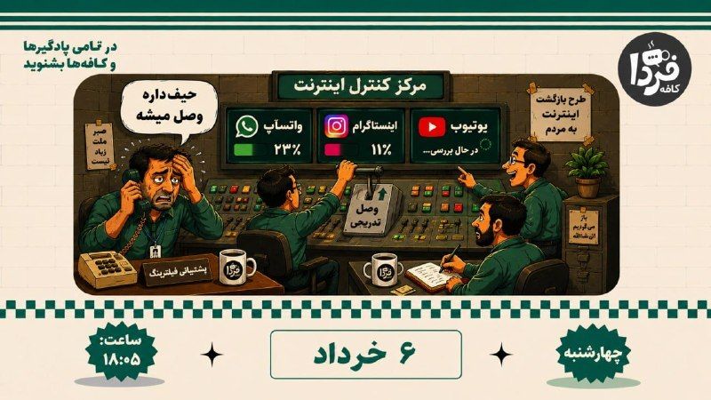

📷 Photo

## RadioFarda — post 157601

بازگشت تدریجی و محدود اینترنت در ایران؛ «خوشحالی ایرانیان دو سوی مرز»

🔸سرانجام، پس از ۸۸ روز قطع سراسری اینترنت در ایران، شهروندان کشور توانستند به‌طور نسبی و محدود به اینترنت جهانی دست پیدا کنند و از دل خاموشی دیجیتال به جهان آزاد سرک بکشند.

🔸از بعدازظهر سه‌شنبه پنجم خرداد ۱۴۰۵ گزارش‌های شهروندی و رسمی حاکی از امکان دستیابی به اینترنت بین‌الملل در سرویس خانگی و ثابت مخابرات و بعدتر در تلفن‌های همراه بود.

🔸نت‌بلاکس، نهاد پایش وضعیت اینترنت در جهان، نیز اگرچه این خبر را تأیید کرد، اما خبر داد برخی کاربران هنوز به اینترنت دسترسی ندارند و افزود: «فیلترنت همچنان پابرجاست اما می‌توان آن را دور زد. واتس‌اپ نیز اکنون محدود شده و نیاز به دور زدن فیلتر دارد.»

🔸قطع اینترنت در ایران که بیش از ۲۰۹۳ ساعت ادامه داشت، و طولانی‌ترین قطع سراسری اینترنت در تاریخ معاصر نام گرفت، بعد از حملات مشترک آمریکا و اسرائیل به ایران در نهم اسفند ۱۴۰۴ و کشته‌شدن علی خامنه‌ای، دومین رهبر جمهوری اسلامی آغاز شد.

🔸اگرچه قطع اینترنت و فیلترینگ در ایران مسبوق به سابقه است، اما انزوای اینترنتی شهروندان ایران هرگز تا این اندازه به طول نینجامیده و هزینه‌های مالی، اجتماعی و روانی به بار نیاورده بود.

🔸آن‌چه حکومت ایران در حدود ۹۰ روز گذشته انجام داد، دیگر صرفاً محدودسازی یا کندی اینترنت نبود، بلکه قطع تقریباً کامل دسترسی عمومی به اینترنت جهانی بود؛ وضعیتی که به‌گفتۀ نت‌بلاکس، از نظر شدت و مدت، از همهٔ نمونه‌های مشابه در ایران و حتی در سطح جهانی پیشی گرفته است.

🔸افشین کلاهی، رئیس کمیسیون اقتصاد دانش‌بنیان اتاق بازرگانی ایران، اخیراً خسارت مستقیم ناشی از اختلال اینترنت را روزانه ۳۰ تا ۴۰ میلیون دلار برآورد کرده و گفته بود با احتساب خسارت‌های غیرمستقیم، این رقم می‌تواند به حدود ۸۰ میلیون دلار در روز برسد.

🔸 گزارش کامل را در وب‌سایت رادیوفردا بخوانید.

@RadioFarda

## RadioFarda — post 157600

  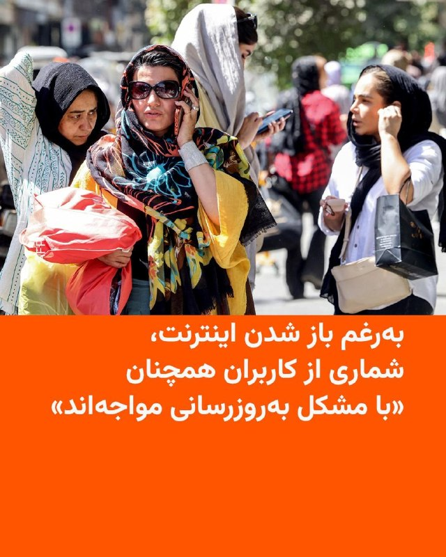

🔸پس از بازگشایی اینترنت در ایران، به شهروندان توضیه شد سیستم‌عامل‌ها و نرم‌افزارهای خود را فوری به‌روز کنند، اما شماری از کاربران از اختلال در دسترسی به فروشگاه گوگل‌پلی و ناتوانی در دریافت آپدیت اپلیکیشن‌ها خبر داده‌اند.

🔸پایگاه خبری سیتنا، یک روز پس از اعلام بازگشایی اینترنت در ایران، گزارش داد امکان ورود به گوگل‌پلی و دریافت یا نصب به‌روزرسانی برنامه‌ها برای شماری از کاربران همچنان فراهم نیست.

🔸پیش‌تر توصیه شده بود که کاربران در ساعات ابتدایی پس از بازگشت اینترنت جهانی، سیستم‌عامل‌ها، مرورگرها، آنتی‌ویروس‌ها و سایر نرم‌افزارهای کاربردی خود را به‌روزرسانی کنند تا خطر آسیب‌پذیری‌های احتمالی کاهش یابد.

🔸مسدود شدن واتس‌اپ به‌رغم باز شدن اینترنت موضوع دیگری است که ایرانیان با بازگشایی اینترنت پس از ۸۸ روز با آن مواجه شده‌اند. تا پیش از قطع اینترنت به‌بهانهٔ جنگ، از میان شبکه‌های اجتماعی و پیام‌رسان‌های پرکاربر، این تنها پیام‌رسان بین‌المللی بود که فیلتر نبود و در دسترس کاربران قرار داشت.

@RadioFarda

## RadioFarda — post 157599

آن‌چه ایران و آمریکا را به سمت توافق سوق داده است؛ گفت‌گو با سفیر پیشین آمریکا

🔸مجموعه‌ای از پیام‌های متناقض از تهران و واشینگتن، از سیال و نامطمئن بودن روند مذاکرات میان آمریکا و ایران حکایت دارد. پس از چند روز پر از گمانه‌زنی، چشم‌انداز دستیابی به یک چارچوب دیپلماتیک همچنان زیر ذره‌بین

🔸بازارهای جهانی و متحدان منطقه‌ای قرار دارد.
رادیو اروپای آزاد/رادیو آزادی برای بررسی محاسبات راهبردی، فشارهای سیاسی و واقعیت‌های میدانی در حوزهٔ دریایی، با

🔸کریستوفر هنزل، سفیر پیشین آمریکا، گفت‌وگو کرده است.
هنزل دیپلماتی باسابقه با دهه‌ها تجربه در سیاست خاورمیانه است که پیش‌تر به‌عنوان مدیر دفتر امور اسرائیل و فلسطین در میز ایران وزارت خارجهٔ آمریکا و همچنین به‌عنوان رئیس هیئت دیپلماتیک آمریکا در یمن و عربستان سعودی در دورهٔ نخست ریاست‌جمهوری دونالد ترامپ فعالیت کرده است.

🔸 گزارش کامل را در وب‌سایت رادیوفردا بخوانید.

@RadioFarda

## RadioFarda — post 157598

فرمانده جدید شاخه نظامی حماس در «حمله هدفمند» اسرائیل کشته شد

🔸اسرائیل روز چهارشنبه ششم خرداد اعلام کرد محمد عوده، فرمانده جدید شاخه نظامی گروه افراطی حماس در غزه را در حمله‌ای در روز سه‌شنبه کشته است؛ رخدادی که پس از کشته شدن سلف او در حمله‌ای مشابه در ماه جاری روی داد.

🔸اسرائیل کاتز، وزیر دفاع اسرائیل، گفت «فرمانده شاخه نظامی سازمان تروریستی حماس در غزه دیروز حذف شد و به دیدار همدستانش در اعماق جهنم فرستاده شد».

🔸گروه حماس که در فهرست تروریستی آمریکا و اتحادیه اروپا هم قرار دارد، مرگ محمد عوده در آپارتمانی در شهر غزه را تأیید کرد.

🔸ارتش اسرائیل خبر داد که این اقدام «پس از ماه‌ها رصد اطلاعاتی برای شناسایی الگوهای رفت‌وآمد او و همکارانش انجام شد.»

🔸آقای کاتز در پیامی در شبکه اجتماعی ایکس نوشت: «ما خود را متعهد کرده‌ایم همه کسانی را که کشتار هفتم اکتبر را رهبری کردند از میان برداریم، و همین کار را خواهیم کرد: همه آن‌ها، هر جا که باشند، نشان شده‌اند.»

🔸اسرائیل کاتز و بنیامین نتانیاهو، نخست‌وزیر اسرائیل، پس از اعلام حمله در روز سه‌شنبه در بیانیه‌ای مشترک گفتند محمد عوده «در جریان کشتار هفتم اکتبر رئیس اطلاعات حماس بود و حدود یک هفته پیش به‌عنوان جانشین عزالدین حداد منصوب شد».

🔸عزالدین حداد روز ۲۵ اردیبهشت در حمله اسرائیل کشته شد.

🔸کاتز و نتانیاهو گفتند محمد عوده «مسئول قتل، ربودن و زخمی کردن شمار زیادی از غیرنظامیان اسرائیلی و سربازان ارتش اسرائیل» بوده است.

🔸منابع عربی می‌گویند در حمله هوایی روز سه‌شنبه که منجر به مرگ محمد عوده شده، ۳ نفر کشته و ۲۰ نفر هم زخمی شده‌اند.

🔸پس از حمله حماس به اسرائیل در هفتم اکتبر ۲۰۲۳ (۱۵ مهر ۱۴۰۲)، بنیامین نتانیاهو وعده داد رهبران پشت این حمله را هدف قرار داده و از میان بردارد.

🔸 گزارش کامل را در وب‌سایت رادیوفردا بخوانید.

@RadioFarda

## RadioFarda — post 157596

  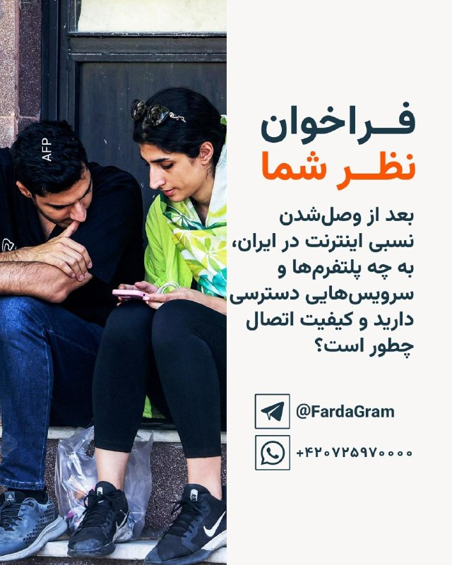

🔸 گزارش‌ها از ایران حاکی است که پس از برقراری اینترنت بین‌الملل روی برخی سرویس‌های ثابت، دسترسی کاربران تلفن همراه نیز به اینترنت جهانی به‌تدریج در حال بازگشت است.

🔸 منابع خبری داخلی روز سه‌شنبه گزارش دادند که کاربران از برقراری اینترنت بین‌الملل روی تلفن‌های همراه خود خبر داده‌اند. همزمان گزارش‌هایی نیز از دسترسی دوباره به چت‌جی‌پی‌تی روی خطوط همراه اول و ایرانسل منتشر شده است.

🔸 بعد از وصل‌شدن نسبی اینترنت در ایران، به چه پلتفرم‌ها و سرویس‌هایی دسترسی دارید و کیفیت اتصال چطور است؟

🔸پیام‌های صوتی خود را به نشانی‌های زیر می‌توانید برای ما ارسال کنید:

🔸Telegram: @Fardagram
🔸WhatsApp: +420 725 970 000

@RadioFarda

## RadioFarda — post 157595

🔸روزنامه نیویورک تایمز، در گزارشی از جزئیات زمینهٔ حمله اخیر آمریکا به اهدافی در جنوب ایران، به نقل از دو مقام آمریکایی نوشت این حمله به‌دنبال مشاهده و شناسایی «مجموعه‌ای از تهدیدها» از سوی حکومت ایران انجام شد. 🔸این دو مقام آمریکایی که به شرط ناشناس ماندن…

## RadioFarda — post 157594

  

🔸روزنامه نیویورک تایمز، در گزارشی از جزئیات زمینهٔ حمله اخیر آمریکا به اهدافی در جنوب ایران، به نقل از دو مقام آمریکایی نوشت این حمله به‌دنبال مشاهده و شناسایی «مجموعه‌ای از تهدیدها» از سوی حکومت ایران انجام شد.

🔸این دو مقام آمریکایی که به شرط ناشناس ماندن با این روزنامه صحبت کردند، گفتند حملات روز دوشنبه آمریکا پس از آن انجام شد که نیروهای آمریکایی از جمله «پرواز پهپادها و فعالیت در سایت‌های پرتاب موشک» در جنوب ایران را مشاهده کردند.

🔸به گفته این دو، پیش از حمله آمریکا، نیروهای نظامی ایران «قایق‌های مین‌گذار را در تنگه هرمز مستقر کرده و پهپادهای تهاجمی را در نزدیکی کشتی‌های آمریکایی به پرواز درآورده بودند».

🔸ستاد فرماندهی مرکزی آمریکا، سنتکام، پیش‌تر اعلام کرده بود که ارتش ایالات متحده روز دوشنبه در جنوب ایران حملاتی را علیه اهدافی «از جمله قایق‌هایی که در تلاش برای کارگذاری مین بودند و همچنین سایت‌های پرتاب موشک» انجام داده است.

@RadioFarda

## RadioFarda — post 157593

🔸مارکو روبیو، وزیر خارجه آمریکا، کمتر از دو هفته مانده به انتخابات پارلمانی ارمنستان، در جریان توقفی کوتاه در فرودگاه ایروان، از نیکول پاشینیان، نخست‌وزیر ارمنستان، حمایت کرد. 🔸روبیو، روز سه‌شنبه پنجم خرداد، هنگام بازگشت از گفت‌وگوهای چندجانبه در هند، در…

## RadioFarda — post 157592

  

🔸مارکو روبیو، وزیر خارجه آمریکا، کمتر از دو هفته مانده به انتخابات پارلمانی ارمنستان، در جریان توقفی کوتاه در فرودگاه ایروان، از نیکول پاشینیان، نخست‌وزیر ارمنستان، حمایت کرد.

🔸روبیو، روز سه‌شنبه پنجم خرداد، هنگام بازگشت از گفت‌وگوهای چندجانبه در هند، در توقفی کوتاه برای سوخت‌گیری با آرارات میرزویان، وزیر خارجه ارمنستان، دیدار کرد.

🔸او در کنار آقای میرزویان گفت: «شما، نخست‌وزیر و کل تیم‌تان در ارمنستان، در حال گشودن راه به‌سوی آینده‌ای روشن‌تر و مستقل‌تر برای ارمنستان هستید.»

🔸مارکو روبیو افزود: «بسیار خوشحالم که این‌جا هستم تا حمایت خود را از شجاعت، چشم‌انداز، تعهد و آمادگی آن‌ها برای نگاه به آیندهٔ کشورشان و اقداماتی که برای رسیدن به آن لازم است، نشان دهم.»

@RadioFarda

## RadioFarda — post 157591

🔸روزنامه وال‌استریت جورنال در گزارشی به نقل از مقام‌های ایرانی و میانجی‌های عرب، نوشته جمهوری اسلامی در مذاکرات با آمریکا به‌دنبال کسب «گشایش مالی» و همزمان، جلوگیری از «اعلام پیروزی» دونالد ترامپ است. 🔸این مقام‌ها «دو هدف به‌هم‌پیوسته» ایران در جریان مذاکرات…

## RadioFarda — post 157590

  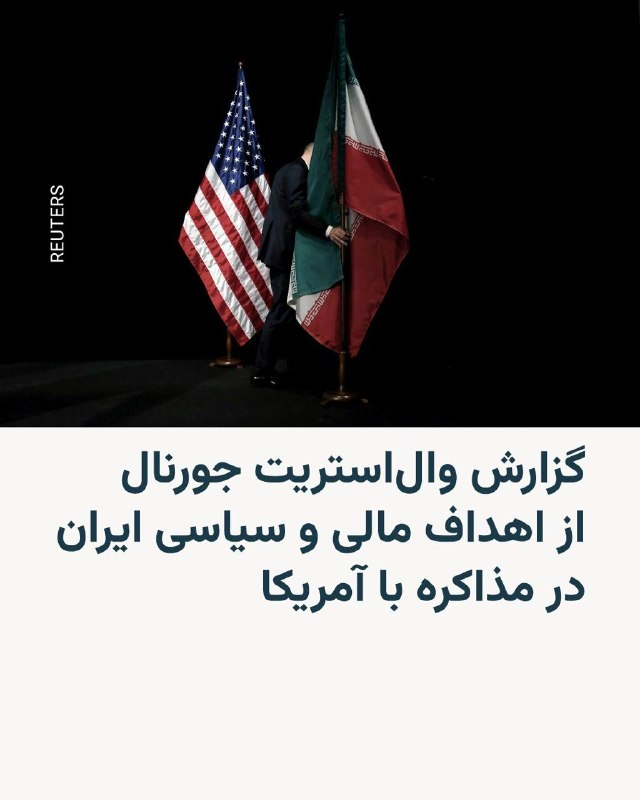

🔸روزنامه وال‌استریت جورنال در گزارشی به نقل از مقام‌های ایرانی و میانجی‌های عرب، نوشته جمهوری اسلامی در مذاکرات با آمریکا به‌دنبال کسب «گشایش مالی» و همزمان، جلوگیری از «اعلام پیروزی» دونالد ترامپ است.

🔸این مقام‌ها «دو هدف به‌هم‌پیوسته» ایران در جریان مذاکرات را به این صورت تشریح کرده‌اند: «به‌دست آوردن گشایش مالی برای اقتصادی که تحت فشار شدید قرار دارد، بدون آنکه در برنامه هسته‌ای خود آن‌قدر عقب‌نشینی کند که ترامپ بتواند ادعای پیروزی کند.»

🔸اواخر دوشنبه، فرماندهی مرکزی آمریکا، سنتکام، به قایق‌های تندروی ایرانی که به گفته واشینگتن در حال مین‌گذاری در تنگه هرمز بودند، حمله کرد. ایران نیز با شلیک به هواپیماهای آمریکایی پاسخ داد و آمریکا در واکنش، سایت‌های پرتاب موشک در ایران را هدف قرار داد.

🔸این تبادل آتش پس از پیام‌های متناقض ترامپ در آخر هفته رخ داد. او پس از آنکه شنبه گفت توافق با تهران تا حد زیادی نهایی شده، در پی انتقاد برخی جمهوری‌خواهان سنا از چارچوب توافق، ظاهراً موضع خود را تغییر داد.

@RadioFarda

## RadioFarda — post 157589

مقام پیشین پنتاگون: آمریکا در درگیری با ایران «کم‌ضررترین» گزینه را انتخاب می‌کند  

🔸ایالات متحده و ایران ظاهراً به دستیابی به توافقی برای پایان دادن به جنگ نزدیک شده‌اند، هرچند توافق نهایی هنوز قریب‌الوقوع به نظر نمی‌رسد و برخی جزئیات کلیدی هنوز حل‌وفصل نشده‌اند.

🔸بر اساس گزارش‌ها، توافق در حال شکل‌گیری منجر به بازگشایی تنگه هرمز به‌عنوان یکی از مسیرهای حیاتی انتقال نفت جهان خواهد شد، اما مذاکرات پیرامون برنامهٔ هسته‌ای ایران را به مرحله‌ٔ بعد موکول می‌کند.

🔸جیسون اچ. کمپبل، پژوهشگر ارشد مؤسسهٔ خاورمیانه و مقام پیشین پنتاگون در دورهٔ نخست ریاست‌جمهوری دونالد ترامپ، در گفت‌وگو با رادیو اروپای آزاد/رادیو آزادی می‌گوید توافقِ گزارش‌شده «احتمالاً کم‌ضررترین گزینه‌ای است که در حال حاضر در اختیار دولت آمریکا قرار دارد.»

🔸 گزارش کامل را در وب‌سایت رادیوفردا بخوانید.

@RadioFarda

## IranianMinds — post 20869

وضعیت اینترنت اینجوریه که وصله
اما وصل نیست

@IranianMinds

## IranianMinds — post 20868

  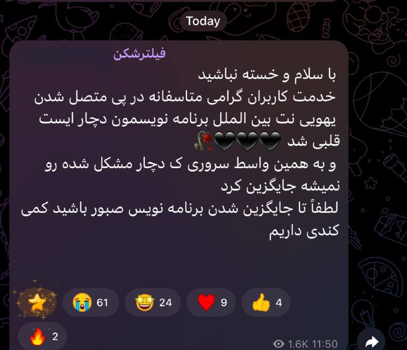

🔴وضعیت فیلترشکن فروش‌ها بعد از وصل شدن نت بین‌الملل.

@IranianMinds

## IranianMinds — post 20867

آخوند حمید رسایی :

قلبم به درد آمد وقتی دیدم پزشکیان اینترنت بین الملل را غیرقانونی وصل کرده است.

@IranianMinds

## IranianMinds — post 20866

  

کیر خوردن اگه قیافه داشت :

همراه اول امروز در پیامی به کاربران اینترنت پرو اعلام کرد در صورت تمایل می‌توانید اینترنت خود را به حالت قبل برگردانید

@IranianMinds

## IranianMinds — post 20865

  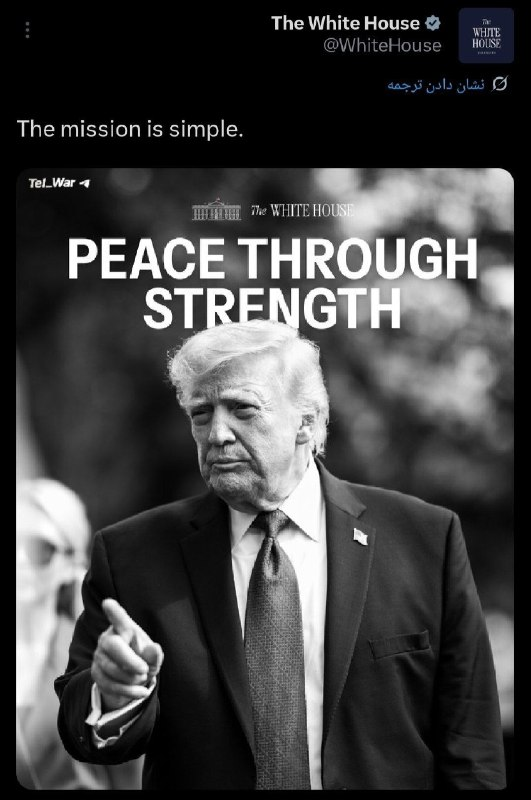

پست جدید کاخ سفید :
مامویت سادست؛ صلح از طریق قدرت

@IranianMinds

## IranianMinds — post 20864

  

وضعیت تجمع های حکومتی :

@IranianMinds

## IranianMinds — post 20863

🔴 وزیر ارتباطات: اهتمام رئیس‌جمهور به بازگشایی اینترنت و احیای ثبات ارتباطی، نشانه‌ای روشن از عقلانیت و ایستادن در کنار مردم است

ملت ایران شایسته ارتباط آزاد، آینده‌ای روشن و اقتصادی پویاست

@IranianMinds

## IranianMinds — post 20862

🔴 علم‌الهدی: نبود گوشت تو یخچال مردم مشکل بزرگی نیست چون وضعیت کشور جنگیه و اگر گوشت هم نداشته باشن که بخورن اشکالی نداره.

@IranianMinds

## IranianMinds — post 20861

خوبه خودشونم اعتراف میکنن زیر زمین بودن این مدت.

🔴صداسیما:
هر مسئولی که تو جنگ زیرزمین بود رو نتونستن ترور کنن، جاشونو پیدا میکنن ولی نمیتونن بزننش، حتی با ۲۸ سنگر شکن.

@IranianMinds

## IranianMinds — post 20860

❌دیگه فریب بونوس سایت های متفرقه رو نخورید!

💖توی این سایت که مورد #تایید ماست، با عضویت 500 هزارتومان بگیر!

🌐 Winro.io

🌐 Winro.io

## IranianMinds — post 20859

  <a href="telegram/content/IranianMinds_20859_1779883809.webm" target="_blank">🎬 Download video</a>

⭕️ تنها جایی که در لحظه عضویت بهت 500 هزارتومان موجودی میده اینجاس 
❌

🎉 کافیه فقط عضو بشی تا #وینرو بهت 
🤩 
🤩 
🤩 هزارتومان جایزه بده ، نیازی هم به واریز نیست.

⌛ پشتیبانی 24 ساعته

🍆تنها سایت مورد اعتماد ما با بونوس های کاملا واقعی و رویایی:

🌐 Winro.io

🌐 Winro.io
کانال بونوس های رایگان r6

📱 @winro_io

## IranianMinds — post 20858

معاون وزیر امور خارجه روسیه:

ما آمادگی خود را برای انتقال اورانیوم غنی‌شده از ایران به واشنگتن اطلاع داده‌ایم و این پیشنهاد همچنان روی میز است

@IranianMinds

## IranianMinds — post 20857

  <a href="telegram/content/IranianMinds_20857_1779883810.mp4" target="_blank">🎬 Download video</a>

لحظه‌ ترور محمد عوده و فرماندهان شاخه نظامی حماس

@IranianMinds

## IranianMinds — post 20856

  

اکانت اسرائیل به فارسی:
به یاد هزاران هزار ایرانی شجاع که به دست جمهوری جنایتکار اسلامی کشته شدند و اکنون دیگر زنده نیستند تا آنلاین شوند🕯️

@IranianMinds

## IranianMinds — post 20855

🔴 رویترز:

پاکستان از میانجیگری عقب‌نشینی می‌کند در حالی که قطر به مرکز اصلی بین تهران و واشنگتن تبدیل می‌شود و تمرکز بر دارایی‌های مسدود شده ایران در دوحه است.

@IranianMinds

## IranianMinds — post 20852

  <a href="telegram/content/IranianMinds_20852_1779883812.mp4" target="_blank">🎬 Download video</a>

با وصل شدن اینترنت
داره ویدیو های جالبی از اتفاقای روزای جنگ داره میاد بیرون

@IranianMinds

## BBCPersian — post 282185

🔻رویترز: جنگ ایران برندگان و بازندگان تازه‌ای را در بازارهای جهانی ایجاد کرده است

🔻سه ماه پس از آغاز جنگ ایران، تداوم قیمت بالای نفت سیاست‌گذاران را با نگرانی‌های تازه درباره تورم روبه‌رو کرده و کاهش ارزش ارزها نیز برای برخی کشورهای آسیایی دردسرساز شده است.

به‌گزارش رویترز اما این درگیری در عین حال به رشد برخی دارایی‌ها، به‌ویژه نفت، و تقویت جایگاه دلار به‌عنوان یک دارایی امن کمک کرده است.

رویترز در گزارش خود آورده است: افزایش حدود ۴۰ درصدی قیمت نفت، چشم‌انداز تورم و نرخ بهره را دگرگون کرده است. در بازار واقعی، قیمت نفت خام به‌مراتب بالاتر از ۱۰۰ دلار در هر بشکه قرار دارد و در مقطعی در اوایل آوریل تقریبا دو برابر سطح پیش از جنگ بود.

این گزارش حاکیست که آزادسازی بی‌سابقه ۴۰۰ میلیون بشکه نفت از ذخایر راهبردی اقتصادهای بزرگ، همراه با تلاش معامله‌گران برای یافتن منابع جایگزین، تا حدی به جبران کمبود عرضه کمک کرده است. با این حال، فشار بر نظام جهانی انرژی رو به افزایش است.

https://bbc.in/4dLHuWT
@BBCPersian

## BBCPersian — post 282184

  

🔻وزارت اطلاعات ایران در بیانیه‌ای گفته است که «دشمن اکنون با توقف جنگ سخت، بر هفت محور اصلی جنگ ترکیبی» متمرکز شده و هشدارهایی به شهروندان داده است.

در این اطلاعیه آمده است: «جنگ ترکیبی شامل تشدید فشارهای اقتصادی، انجام تحریکات قومی و مذهبی، اعزام مزدوران گروهکی، ترور و خرابکاری، قاچاق انواع سلاح و ابزار ارتباطی غیرقانونی، جنگ رسانه‌ای و حملات سایبری متمرکز شده است.»

این هشدار یک روز پس از اتصال اینترنت در پی ۸۸ روز قطعی سراسری در ایران صادر شده است.

وزارت اطلاعات درباره «هرگونه اقدام برای شکستن انسجام ملی و ایجاد گسست اجتماعی، قاچاق سلاح و ابزارهای ارتباطی غیرقانونی همچون استارلینک» هشدار داده و گفته است که در ارتباط با این موضوعات «با دقت و قاطعیت هرچه بیشتر» عمل خواهد کرد.

وزارت اطلاعات ایران اکنون از سوی سرپرست اداره می‌شود. اسماعیل خطیب، وزیر اطلاعات، در جریان حملات اسرائیل و آمریکا در تهران کشته شد.

📷Getty Images
https://bbc.in/4vinAKx

@BBCPersian

## BBCPersian — post 282183

🔻پیام‌های مخاطبان بی‌بی‌سی بعد از اتصال اینترنت؛ «این مدت هیچکس غم مردم را نخورد»

🔻تعدادی از مخاطبان بی‌بی‌سی پس از اتصال نسبی به اینترنت، از کیفیت و سرعت اتصال و نظراتشان درباره کمک جامعه جهانی به مردم ایران در ۸۸ روزی که اینترنت قطع بود، نوشتند.

مخاطبی از اراک نوشت: «فیبر نوری دارم و الان وصل شدیم البته باز هم بدون فیلترشکن تلگرام وصل نمی‌شود. این مدت هیچکس غم مردم را نخورد. حیف این مردمی که این هزینه‌های سنگین برای آزادی پرداخت می‌کنند...افسوس.»یکی دیگر از مخاطبان نوشته است: «خیلی حرف‌ها دارم اما الان زمانش نیست چون خسته‌ام. حتی از اقوام درجه یک خودم که خارج کشور در رفاه بودند و من و زن و بچه‌ام زیر موشک.... دلم گرفته... بزودی خواهم گفت از تک تک روزهای لعنتی جنگ .»

مخاطب دیگری که ۱۷ ساله است و در تهران زندگی می‌کند، نوشته است: «می‌خواستم یه چیزی بگم. واقعا خسته شدیم. از گرانی، از تحریم، از نت ضیف. کارها هم خوابیده. دیگه نمی‌توانم زندگی کنم.»

تعدادی از مخاطبان گفته‌اند که اینترنت‌های خانگی وصل شده ولی هنوز اینترنت سیمکارت آنها کار نمی‌کند. چند مخاطب هم گفته‌اند که هنوز اینترنت ندارد و با همان روش‌های قبلی وصل‌ هستند.

https://bbc.in/3PM26X5
@BBCPersian

## BBCPersian — post 282182

  

‌🔻علی باقری کنی، معاون سیاست خارجی و امنیت بین‌الملل دبیرخانه شورای عالی امنیت ملی ایران می‌گوید که «موضوع ذخایر اورانیوم در دستور کار مذاکرات نیست.»

او این موضوع را در پاسخ به پرسشی در حاشیه چهاردهمین نشست بین‌المللی مقامات بلندپایه امنیتی در مسکو مطرح کرد.

پیشتر دونالد ترامپ، رئیس جمهور آمریکا، گفت که اورانيوم غنی‌شده ایران یا به تعبیر او «غبار هسته‌ای به ايالات متحده تحويل داده خواهد شد تا به آمريکا منتقل و نابود شود، يا ترجيحا با همکاری و هماهنگی ايران، در همان محل يا در مکان مورد توافق ديگری، نابود خواهد شد.»

📷EPA
https://bbc.in/3PuodBw

@BBCPersian

## BBCPersian — post 282181

🔻حماس کشته شدن فرمانده شاخه نظامی‌ خود را تایید کرد

🔻حماس کشته شدن محمد عوده، فرمانده شاخه نظامی این گروه در حمله اسرائیل را تایید کرد.

حماس در بیانیه‌ای گفته است که در حمله اخیر اسرائیل در کنار محمد عوده معروف به ابوعمرو، مادرش، همسر و سه فرزندش نیز کشته شده‌اند.

اسرائیل کاتس، وزیر دفاع اسرائیل، گفت که محمد عوده «برای دیدار با هم‌قطارانش به اعماق جهنم فرستاده شده است.»

او همچنین می‌گوید که «طرح مهاجرت داوطلبانه» ساکنان غزه، اجرا خواهد شد.

محمد عوده پس از کشته شدن عزالدین حداد، فرمانده قبلی حماس در حمله‌ مشابهی در اوایل همین ماه میلادی به این سمت منصوب شده بود.

https://bbc.in/49nK9Vw
@BBCPersian

## BBCPersian — post 282180

🔻نماینده مجتبی خامنه‌ای با سفر به چابهار، پیام او به مردم سیستان و بلوچستان را به آنها رساند

🔻بنا به گزارش رسانه‌های داخلی ایران مجتبی خامنه‌ای، رهبر جمهوری اسلامی در پیام ویژه‌ای به سیستان و بلوچستان «بر وحدت میان شیعه و سنی» تاکید کرده است.

این پیام مجتبی خامنه‌ای را محمدتقی وکیل‌پور در دیدار با روحانیان چابهار ابلاغ کرده است.

او ضمن تبریک عید قربان، به نقل از آقای خامنه‌ای به این روحانیان گفته است: «وحدت میان مردم شیعه و سنی و حضور آگاهانه آنان در میدان، ریشه دشمنی‌ها را خشک خواهد کرد.»

آقای وکیل پور گفته است برای قدردانی از مردم سیستان و بلوچستان به این استان سفر کرده و اضافه کرده است: «مردم این دیار در دوران دفاع مقدس خدمات ارزنده‌ای به کشور ارائه دادند و امروز نیز با اقدامات پرخیر و برکت خود، موجب خرسندی رهبر معظم انقلاب شده‌اند.»

مجتبی خامنه‌ای از زمان آغاز به کارش در اسفند تاکنون در انظار عمومی ظاهر نشده است. روز گذشته (سه‌شنبه) نیز یک پیام کتبی به مناسبت برگزاری مراسم حج از او منتشر شد.

https://bbc.in/4dSgnK3
@BBCPersian

## BBCPersian — post 282170

🔻احمد شرع، رئیس‌جمهور سوریه، تصویری را در حساب خود در شبکه ایکس منتشر کرد که خیلی زود خبرساز شد: دو شیشه عطر «ویکتوری ۴۷-۴۵» از برند ترامپ، همراه با یادداشتی امضاشده از دونالد ترامپ، رئیس‌جمهور آمریکا.

در این یادداشت نوشته شده است: «احمد، همه درباره عکسی صحبت می‌کنند که هنگام هدیه دادن این عطر فوق‌العاده به تو گرفتیم. این را هم می‌فرستم تا اگر عطر قبلی تمام شد، داشته باشی.»

بعضی از این هدایا بعدها به دلایل سیاسی و بعضی دیگر، بیشتر به دلیل نامتعارف بودن یا حاشیه‌هایشان در حافظه عمومی ماندگار شدند.

در ادامه، نگاهی می‌کنیم به شماری از هدایایی که رهبران جهان در دهه‌های اخیر به یکدیگر داده‌اند.

لینک خبر کامل:
https://bbc.in/4dOiBdu

📸GettyImages/ Contributor via Getty Images/ AFP via Getty Images/ Heritage Images via Getty Images/ Bloomberg via Getty Images

@BBCPersian

## BBCPersian — post 282162

‌🖊لوئیس باروچو و جولیا براون
سرویس جهانی بی‌بی‌سی

🔻وقتی جنگ آمریکا و اسرائیل با ایران در پایان ماه فوریه آغاز شد، تنها خاورمیانه نبود که پیامدهای آن را احساس کرد.

با مختل شدن حمل‌ونقل تجاری و جریان انتقال کالا در جهان بر اثر این درگیری، قیمت نفت به شدت بالا رفت و باعث افزایش تورم و تلاطم در بازارهای جهانی شد.

همان‌طور که معمولا در دوره‌های بی‌ثباتی رخ می‌دهد، برخی از سرمایه‌گذاران از بازارهای نوظهور که پرریسک‌تر تلقی می‌شوند، فاصله گرفتند و سرمایه خود را به دلار آمریکا منتقل کردند که به طور سنتی پناهگاه امن سرمایه‌گذاری محسوب می‌شود.

این روند بر بسیاری از ارزها اثر گذاشته است. ارزش برخی از آن‌ها سقوط کرده، در حالی که بعضی دیگر نوسان شدید داشته‌اند و حتی تعدادی از ارزها تقویت شده‌اند.

آندره پرفیتو، اقتصاددان برزیلی و مدیر یک شرکت مشاوره مالی،‌ می‌گوید: «قیمت نفت بر همه تاثیر می‌گذارد، اما نوسانات ارزی می‌تواند این تاثیر را تشدید یا تعدیل کند.»

متن کامل خبر را از لینک زیر بخوانید:

https://bbc.in/4e76itW
📸GettyImages/ AFP via Getty Images/ NurPhoto via Getty Images

@BBCPersian

## idfinfarsi — post 11654

  <a href="telegram/content/idfinfarsi_11654_1779883815.mp4" target="_blank">🎬 Download video</a>

مستند ویژه: تکمیل چرخه شناسایی و هدف قرار دادن یک تروریست که هواگرد بدون سرنشین را در جنوب لبنان هدایت می‌کرد

در چارچوب فعالیت نیروهای ارتش اسرائیل در جنوب لبنان، یک هواگرد از نیروی هوایی، یک هواگرد بدون سرنشین را در آسمان شناسایی کرد که تهدیدی برای نیروهای ما در منطقه محسوب می‌شد.

این هواگرد بدون سرنشین فرود آمد و یک تروریست از سازمان تروریستی حزب‌الله برای جمع‌آوری آن به محل رسید. در یک واکنش سریع، هواگرد نیروی هوایی به محل حمله کرده و این تروریست را به هلاکت رساند.

نیروی هوایی به فعالیت خود برای دفاع و پشتیبانی از نیروهای ما در جنوب لبنان ادامه خواهد داد.

## idfinfarsi — post 11650

  <a href="telegram/content/idfinfarsi_11650_1779883816.mp4" target="_blank">🎬 Download video</a>

ارتش اسرائیل و شاباک محمد عوده، رئیس شاخه نظامی سازمان تروریستی حماس که پس از به هلاکت رسیدن عزالدین حداد منصوب شده بود و همچنین رئیس ستاد اطلاعات سازمان تروریستی حماس بود را به هلاکت رساندند

⭕️ سخنگوی ارتش اسرائیل و شاباک اعلام کردند که در حمله‌ای در شمال نوار غزه، تروریست محمد عوده که به‌عنوان رئیس شاخه نظامی سازمان تروریستی حماس پس از به هلاکت رسیدن عزالدین حداد منصوب شده بود و همچنین ریاست ستاد اطلاعات این سازمان را بر عهده داشت، به هلاکت رسید.

🔻 در چارچوب عملیات مشترک ارتش اسرائیل و شاباک برای حذف این تروریست، چندین ساختمان در قلب شهر غزه که به‌عنوان محل اختفای او مورد استفاده قرار می‌گرفت، هدف قرار گرفت. این اقدام پس از ماه‌ها رصد اطلاعاتی برای شناسایی الگوهای رفت‌وآمد او و همکارانش انجام شد. همزمان، یک آپارتمان متعلق به یک تروریست حماس که در ۷ اکتبر در حمله مشارکت داشت و بخشی از حلقه پشتیبانی عوده بود، نیز هدف قرار گرفت.

⭕️ عوده در دو هفته گذشته رئیس شاخه نظامی سازمان تروریستی حماس بود و در سال‌های اخیر نیز ریاست ستاد اطلاعات این سازمان را بر عهده داشت. وی در این چارچوب مسئول برنامه‌ریزی و هماهنگی ا

## Dirty_Kids — post 390315

  <a href="telegram/content/Dirty_Kids_390315_1779883818.mp4" target="_blank">🎬 Download video</a>

سالنای آرایشگری زنونه این روزا این شکلی دارن تبلیغ میکنن:

@Dirty_Kids 👻

## Dirty_Kids — post 390311

🔴 امسال انگار سال سالِ کونه 🍑، چالش عجیب و کثافتی که این روزها تو اینستاگرام به شدت وایرال شده؛

داستان ازاین قراره که؛ ملت کونشونو به شکل قلب درمیارن، ازش عکس میگیرن و تو اینستاگرام پست میکنن.

این چالش درحال حاضر پر بازدید‌ترین چالش حالِ حاضر اینستاگرامه.

@Dirty_Kids 👻

## Dirty_Kids — post 390310

  

وقتی از روبیکا میای تلگرام:

@Dirty_Kids 👻

## Dirty_Kids — post 390309

  

بچه‌هایی که نبودید
یه ژانر تو توییتر درست کردن به اسم «شیکم تخت» این بانو خیلی وایرال شد

@Dirty_Kids 👻

## Dirty_Kids — post 390308

  <a href="telegram/content/Dirty_Kids_390308_1779883818.mp4" target="_blank">🎬 Download video</a>

حالا فهمیدید چرا اینترنت رو قطع کردن؟
چون نمی‌خواستن این تصاویر حماسی و پرشور مردم پادشاهی خواه داخل ایران به بیرون درز کنه.

@Dirty_Kids 👻

## Dirty_Kids — post 390307

  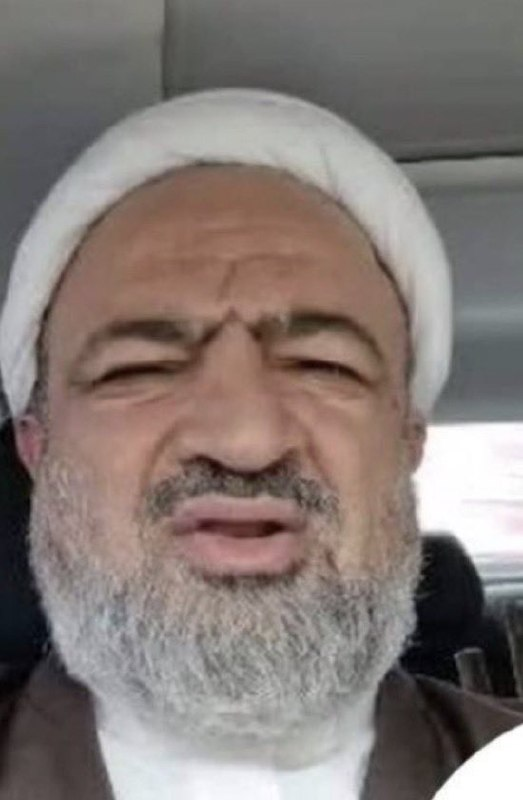

🔴 آخوند حمید رسایی: از وقتی اینترنت وصل شده قلبم درد گرفته، یه لحظه‌ام نتونستم بخوابم.

وصل شدن اینترنت پایمال کردن خون رهبر شهیدمونه، با اینکار تن رهبری تو گور لرزید.
عوامل موساد باعث بازگشایی اینترنت شدن.

@Dirty_Kids 👻

## Dirty_Kids — post 390306

  <a href="https://t.me/Dirty_Kids/390306" target="_blank">📎 Download file</a>

📱 اپلیکیشن اندروید بدون فیلتر ریتزوبت

➖➖➖➖➖

🔹 ثبت نام آسان 
✅
🔹 رابط کاربری بسیار راحت و سریع 
✅
🔹 درگاه پرداخت کارت به کارت 
✅
🔹 درگاه پرداخت دلاری سریع 
✅
🔹 بونوس ۱۰۰ درصدی اولین واریز 
✅
🔹 بونوس ۱۰۰ درصدی واریز یکشنبه ها 
✅

➖➖➖➖➖
🌐 https://RitzoBet.com

⚡️ @RitzoBet_ir

## Dirty_Kids — post 390305

  

⚠️ برای #شرطبندی های فوتبال از سایت معتبر و بین المللی استفاده کنید ✅

سایت #ریتزوبت ، چهار سال هستش داخل ایران فعالیت میکنه 
✅

لایسنس بین المللی داره ، روش های شارژ و برداشت متنوع داره و بونوس 100% ورزشی و کش بک های جذاب
💎

⏪ اپلیکیشن بدون فیلتر ریتزوبت 
📱
⏩
R6

✅ لینک بدون‌ فیلتر ریتزوبت
🤣

🆔 @RitzoBet_ir 
🇮🇷

## Dirty_Kids — post 390302

‏ترامپ مادر×نده امتحانا داره حضوری میشه، خیالت راحت شد؟

@Dirty_Kids 👻

## Dirty_Kids — post 390299

خبر مهم و‌ فوری
جلسه کمپ دیوید که قرار بود چهارشنبه برگزار بشه، در واقع تله بوده برای گرفتن کسی که اطلاعات محرمانه رو لو می‌داد!
بالاخره گیر افتاد 😂
حدس بزنید کی بوده؟
جی‌دی ونس

@Dirty_Kids 👻

## Dirty_Kids — post 390298

  

تو چین یه بالشت بغل‌کردنی با شکل عجیب ساخته شده که کلی سر و صدا کرده؛

این بالشت واسه آدماییه که استرس، اضطراب یا افسردگی دارن و جوری طراحی شده که انگار یکی بغلت کرده. جالب‌تر اینکه خودش مثل آدم نفس می‌کشه و با نفس کشیدن طرف هماهنگ میشه تا آرومش کنه.
اول خیلیا به خاطر ظاهرش مسخره‌ش می‌کردن، ولی بعد کلی آدم گفتن باهاش راحت‌تر و آروم‌تر می‌خوابن.

@Dirty_Kids 👻

## Dirty_Kids — post 390297

  

بادبان با همراهی شما 110 هزار نفری شد!
🎉

🎁 کد تخفیف خرید اول دوباره ریست شد و همه میتونن ازش استفاده کنن:
BadBan4k

💸 با این کد، 50 هزار تومان تخفیف روی اولین خریدت بگیر!

🔥و مهم‌تر از همه...
سیستم معرفی بادبان فعال‌تر از همیشه‌ست!
از تمام خریدهای کاربرانی که معرفی میکنی، 10% خریدشون رو پورسانت دائمی دریافت کن و موجودی کیف پولت رو افزایش بده 
💼

وقتی بادبان داری،
هیچ بادی مانع نیست… حتی وقتی اینترنت ملیه
⛵️

R6

🛡@BadBan_VPN | کانال 

🤖@BadBan_VPNBot | ربات 

📞@BadBan_VPNSupport | پشتیبانی

## Dirty_Kids — post 390296

  

من دیگه برخط نیستم اسکایلر
من خود آنلاینم

@Dirty_Kids 👻

## Dirty_Kids — post 390295

  <a href="telegram/content/Dirty_Kids_390295_1779883822.mp4" target="_blank">🎬 Download video</a>

#علیرضا_فیروزجا، زیر پرچم فرانسه، مگنوس کارلسن نفر اول رنکینگ رو تو دور اول شطرنج کلاسیک شکست داد!
افتخاری بزرگ که میتونست به پای ایران نوشته بشه ولی...

@Dirty_Kids 👻

## Dirty_Kids — post 390294

  

گوله نمک

@Dirty_Kids 👻

## Hranews — post 113192

  

محمد طریقت اسفنجانی، وکیل دادگستری به حبس محکوم شد

❗️
❗️
❗️
❗️
❗️– محمد طریقت اسفنجانی، وکیل دادگستری و عضو کانون وکلای آذربایجان شرقی توسط دادگاه انقلاب شهرستان اسکو به سه سال حبس تعزیری محکوم شد.

به گزارش خبرگزاری هرانا، ارگان خبری مجموعه فعالان حقوق بشر در ایران، محمد طریقت اسفنجانی، وکیل دادگستری به حبس محکوم شد.

بر اساس این حکم که اخیرا توسط دادگاه انقلاب شهرستان اسکو صادر و به محمد طریقت اسفنجانی ابلاغ شده، وی از بابت اتهامات تبلیغ علیه نظام به یک سال حبس و توهین به رهبری و بنیانگذار جمهوری اسلامی به دو سال حبس تعزیری محکوم شده است.

#محمد_طریقت_اسفنجانی

ادامه مطلب

↘️
@hranews_bot تماس ✉️ - @Hranews کانال هرانا 🆑

## Hranews — post 113191

  

میان موشک و سرکوب؛ گزارش مجموعه فعالان حقوق بشر درباره مخاصمه نظامی ایالات متحده-اسرائیل و ایران منتشر شد 
💥
💥
💥
💥
💥 – امروز، مجموعه فعالان حقوق بشر در ایران گزارش جدیدی را در ۲۴۰ صفحه و دو زبان منتشر کرد که به بررسی کارزار نظامی ایالات متحده و اسرائیل در ایران…

## Hranews — post 113190

  

با پایان دوران حبس؛ علی پویان مقدم از زندان تربت حیدریه آزاد شد

❗️
❗️
❗️
❗️
❗️– علی پویان مقدم، زندانی سیاسی با پایان دوران محکومیت از زندان تربت حیدریه آزاد شد.

به گزارش خبرگزاری هرانا، ارگان خبری مجموعه فعالان حقوق بشر در ایران، علی پویان مقدم از زندان آزاد شد.

بر اساس اطلاعات دریافتی هرانا، آزادی آقای پویان مقدم در تاریخ ۳ خردادماه، پس از اتمام دوران حبس وی صورت گرفته است. بنا بر اطلاعات رسیده، در جریان جنگ و همزمان با انتقال زندانیان زندان سبزوار، او نیز به زندان تربت حیدریه منتقل شده بود.

#علی_پویان_مقدم

ادامه مطلب

↘️
@hranews_bot تماس ✉️ - @Hranews کانال هرانا 🆑

## Hranews — post 113189

دانشگاه صنعتی شریف؛ ده‌ها دانشجو با احکام اخراج و محرومیت از تحصیل مواجه شدند

❗️
❗️
❗️
❗️
❗️– دستکم ۳۰ نفر از دانشجویان دانشگاه صنعتی شریف توسط کمیته انضباطی این دانشگاه در ارتباط با فعالیت در فضای مجازی و پرونده‌های مرتبط با اعتراضات سراسری سال گذشته، محکوم شده‌اند. احکام بدوی صادرشده برای این #دانشجویان شامل اخراج همراه با پنج سال محرومیت از تحصیل در تمامی دانشگاه‌ها برای شماری از آنان و منع موقت از تحصیل برای تعدادی دیگر است.

ادامه مطلب

↘️
@hranews_bot تماس ✉️ - @Hranews کانال هرانا 🆑

## Hranews — post 113188

بیش از یک میلیون دانش آموز در کشور از تحصیل بازمانده‌اند

❗️
❗️
❗️
❗️
❗️– رئیس سازمان بهزیستی از وجود بیش از یک میلیون دانش آموز بازمانده از تحصیل در کشور خبر داد.

ادامه مطلب

↘️
@hranews_bot تماس ✉️ - @Hranews کانال هرانا 🆑

## alonews — post 123048

  <a href="telegram/content/alonews_123048_1779883825.webm" target="_blank">🎬 Download video</a>

👈فرماندهی مرکزی ایالات متحده درباره محاصره: تا امروز، ۱۰۹ کشتی تجاری برای اطمینان از رعایت قوانین محاصره به سوی مسیر دیگر هدایت شده‌اند.

✅ @AloNews خبر جنگ

## alonews — post 123047

  <a href="telegram/content/alonews_123047_1779883825.webm" target="_blank">🎬 Download video</a>

👈وضعیت امروز اینترنت بین الملل ایران از نگاه نت بلاکس

🔴اینترنت هنوز به وضعیت ۱۰۰ درصدی بازنگشته

✅ @AloNews خبر جنگ

## alonews — post 123046

  <a href="telegram/content/alonews_123046_1779883825.webm" target="_blank">🎬 Download video</a>

👈العربیه: به گفته منابع، احتمال دارد طی چند هفته یک توافق میان آمریکا و ایران حاصل شود

✅ @AloNews خبر جنگ

## alonews — post 123045

  <a href="telegram/content/alonews_123045_1779883825.webm" target="_blank">🎬 Download video</a>

👈باقری،معاون دبیر شورای عالی امنیت ملی: ایران و عمان در حال مذاکره درباره سازوکار مدیریت تنگه هرمز هستند!

✅ @AloNews خبر جنگ

## alonews — post 123044

  <a href="telegram/content/alonews_123044_1779883825.webm" target="_blank">🎬 Download video</a>

👈نیروی دریایی سپاه: ۲۳ شناور تا این لحظه از تنگه هرمز عبور کرده‌اند و عبور شناورهای دیگر نیز تا ساعات آینده ادامه دارد.

🔴عبور شناورهای کشورهای متخاصم از تنگه هرمز همچنان ممنوع است

✅ @AloNews خبر جنگ

## alonews — post 123043

  <a href="telegram/content/alonews_123043_1779883826.webm" target="_blank">🎬 Download video</a>

👈 رئیس ستاد کل ارتش اسرائیل، ایال زامیر، امروز ارقام جدیدی را به کابینه امنیتی اسرائیل ارائه داد که نشان می‌دهد از اکتبر ۲۰۲۳، نیروهای اسرائیلی حدود ۸۰۰۰ مبارز مظنون حزب‌الله را کشته‌اند، طبق گزارش ینت.

🔴تقریباً ۲۵۰۰ نفر در جریان «عملیات شیر غران» کشته شدند، در حالی که ۷۰۰ مبارز دیگر پس از اجرای آتش‌بس کشته شدند.

✅ @AloNews خبر جنگ

## alonews — post 123042

  <a href="telegram/content/alonews_123042_1779883826.webm" target="_blank">🎬 Download video</a>

👈وزیر دفاع اسرائیل کاتز: اگر به شهرک‌های ما شلیک کنند، طبق وضعیتی که در گذشته به آنها عادت داده‌ایم، باید ساکنان ضاحیه را تخلیه کنیم، حمله کنیم و آن را ویران کنیم.

🔴اگر پهپاد باشد — دیگر کسی نخواهد بود.

🔴در حال حاضر در این زمینه با آمریکا در وضعیت پیچیده‌ای هستیم. در عین حال، ما متعهد به دفاع از خود به هر طریق هستیم؛ هیچ‌کس ما را متوقف نمی‌کند

✅ @AloNews خبر جنگ

## alonews — post 123041

  <a href="telegram/content/alonews_123041_1779883826.webm" target="_blank">🎬 Download video</a>

👈عضو هیئت‌مدیره اتحادیه مشاوران املاک:پس از جنگ ۴۰ روزه، قیمت‌های پیشنهادی مسکن در مناطق مختلف تهران به طور میانگین ۷۰ تا ۸۰ درصد رشد داشته است

✅ @AloNews خبر جنگ

## alonews — post 123038

  <a href="telegram/content/alonews_123038_1779883826.webm" target="_blank">🎬 Download video</a>

👈جنگنده‌های اسرائیلی لحظاتی پیش حمله هوایی به حبوش و نبطیه الفوقا در جنوب لبنان انجام دادند

✅ @AloNews خبر جنگ

## alonews — post 123037

  <a href="telegram/content/alonews_123037_1779883826.webm" target="_blank">🎬 Download video</a>

👈علی باقری، معاون دبیر شورای عالی امنیت ملی ایران، امروز در حاشیه چهاردهمین نشست بین‌المللی امنیت در مسکو با مشاور امنیت ملی سوئیس دیدار کرد

✅ @AloNews خبر جنگ

## alonews — post 123036

  <a href="telegram/content/alonews_123036_1779883826.webm" target="_blank">🎬 Download video</a>

👈العربیه: رئیس‌جمهور ایران و نخست‌وزیر پاکستان امروز به صورت تلفنی گفتگو کردند

✅ @AloNews خبر جنگ

## alonews — post 123030

  <a href="telegram/content/alonews_123030_1779883826.mp4" target="_blank">🎬 Download video</a>

👈حملات سنگین ارتش اسرائیل به مواضع حزب‌الله در جنوب لبنان

✅ @AloNews خبر جنگ

## alonews — post 123029

  <a href="telegram/content/alonews_123029_1779883827.webm" target="_blank">🎬 Download video</a>

👈طبق گزارش کانال ۱۲ اسرائیل، زمانی که توافقی برای پایان جنگ ایران امضا شود، تمام هواپیماهای نظامی آمریکا ظرف ۷۲ ساعت از فرودگاه بن گوریون اسرائیل تخلیه شده و به پایگاه‌هایی در اروپا منتقل خواهند شد، در حالی که در حالت آماده‌باش باقی می‌مانند تا در صورت از سرگیری درگیری با ایران، وارد عمل شوند.

✅ @AloNews خبر جنگ

---
📅 بروزرسانی: 1405/03/06 03:18
---

## VahidOOnLine — post 242365

  

♦️سازمان «نت‌بلاکس» که وضعیت خدمات اینترنت در جهان را رصد می‌کند، اعلام کرد که پس از ۸۸ روز انزوای کامل شبکه‌های ایران، سطح اتصال به شبکه بین‌المللی به ۸۶ درصد رسیده است. بر اساس گزارش این سازمان، این انسداد ۲ هزار و ۹۳ ساعته، طولانی‌ترین قطع سراسری اینترنت در تاریخ مدرن به شمار می‌رود.
نت‌بلاکس با اشاره به اینکه هنوز پایدار ماندن این اتصال مشخص نیست، تاکید کرد که سیستم فیلترینگ شدید (فیلترنت) همچنان برقرار است، دسترسی به پیام‌رسان واتس‌اپ محدود شده و کاربران برای استفاده از آن به ابزارهای دور زدن فیلترینگ نیاز دارند؛ همچنین برخی از کاربران هنوز به طور کامل به اینترنت دسترسی ندارند.
‌🇸🇦 Indypersian

🤖 @VahidOOnLine

## VahidOOnLine — post 242364

  <a href="telegram/content/VahidOOnLine_242364_1779839310.mp4" target="_blank">🎬 Download video</a>

ارتش اسرائیل با انتشار ویدیویی در تلگرام، از کشف و انهدام حدود ۱۱ کیلومتر تونل حماس در منطقه بیت‌حانون، در شرق «خط زرد» در شمال نوار غزه، خبر داد.
در اطلاعیه ارتش اسرائیل آمده است این منطقه سال‌ها به‌عنوان یکی از پایگاه‌های اصلی تروریستی حماس عمل می‌کرد و یکی از اصلی‌ترین و پیچیده‌ترین مناطق نبرد بود که نیروهای اسرائیل در طول جنگ در آن عملیات انجام دادند.
‌🏁 🇬🇧 IranintlTV

🤖 @VahidOOnLine

## VahidOOnLine — post 242363

♦️صداوسیمای جمهوری اسلامی در برنامه‌ای با حضور کمیل خجسته، برادرزاده منصوره خجسته باقرزاده، همسر علی خامنه‌ای، درباره وضعیت اعضای خانواده رهبر کشته‌شده جمهوری اسلامی در زمان حمله گفتگو کرد.
در این برنامه، کمیل خجسته با اشاره به کشته شدن برخی اعضای خانواده گفت دختر بزرگ خامنه‌ای، نوه او و شماری دیگر از اعضای خانواده کشته شده‌اند. او همچنین توضیح داد اعضای خانواده هنگام حمله در کنار علی خامنه‌ای حضور نداشتند و هرکدام در بخش‌های مختلف همان ناحیه مستقر بودند.
مجری برنامه نیز در ادامه پرسید آیا همه در یک محل حضور داشتند که خجسته پاسخ داد حملات به چند نقطه مختلف انجام شده است.
علی خامنه‌ای، رهبر پیشین جمهوری اسلامی، در جریان حملات آمریکا و اسرائیل در تاریخ ۹ اسفند ۱۴۰۴ کشته شده است.
‌🇸🇦 Indypersian

🤖 @VahidOOnLine

## VahidOOnLine — post 242362

  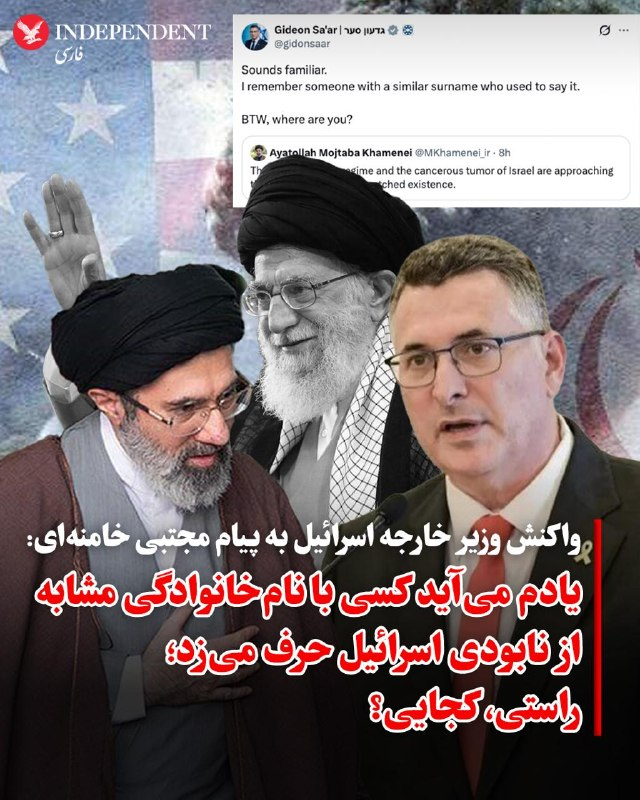

♦️گیدئون سعار، وزیر امور خارجه اسرائیل، با انتشار پیامی در شبکه اجتماعی اکس، به اظهارات منتسب به مجتبی خامنه‌ای، رهبر جدید جمهوری اسلامی، واکنش نشان داد. سعار با بازنشر موضع‌گیری مجتبی خامنه‌ای که موجودیت اسرائیل را تهدید کرده بود، نوشت: «آشنا به نظر می‌رسد. یادم هست فردی با نام‌خانوادگی مشابه قبلا چنین حرف‌هایی می‌زد. راستی، کجایی؟»
پیش از این، در پیام منتسب به مجتبی خامنه‌ای به مناسبت حج، ادعا شده بود که اسرائیل تا ۱۵ سال دیگر وجود نخواهد داشت. این پیام با ارجاع به ادعای ۱۰ سال قبل علی خامنه‌ای، رهبر کشته‌‌شده جمهوری اسلامی، مبنی بر اینکه اسرائیل ۲۵ سال آینده را نخواهد دید، صادر شده است؛ این در حالی است که از زمان انتصاب مجتبی خامنه‌ای به رهبری، هنوز هیچ صدا یا تصویری از او منتشر نشده است.
این تقابل لفظی در شرایطی صورت می‌گیرد که در پی دو جنگ در یک سال گذشته، مقام‌های عالی‌رتبه سیاسی و نظامی حکومت ایران از جمله علی خامنه‌ای کشته شده‌اند و بخش بزرگی از برنامه هسته‌ای، تاسیسات نظامی و زیرساخت‌های اقتصادی جمهوری اسلامی به شدت تضعیف یا نابود شده است.
‌🇸🇦 Indypersian

🤖 @VahidOOnLine

## VahidOOnLine — post 242361

  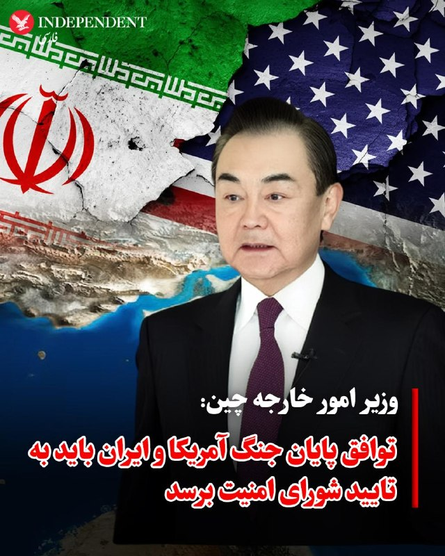

♦️به گزارش خبرگزاری آنادولو، وانگ یی، وزیر خارجه چین، اعلام کرد پکن بر این باور است که توافق احتمالی برای پایان جنگ میان آمریکا، اسرائیل و ایران پس از نهایی شدن، برای تایید به شورای امنیت سازمان ملل ارائه خواهد شد.

بر اساس این گزارش وزیر خارجه چین گفت این توافق برای برخورداری از «مشروعیت و اعتبار» باید به تایید شورای امنیت برسد. او همچنین از طرف‌های درگیر خواست به روند آتش‌بس پایبند بمانند و برای بازگشت صلح به خاورمیانه تلاش کنند.

وانگ یی که کشورش در خرداد ماه ریاست دوره‌ای شورای امنیت را برعهده دارد، تاکید کرد شورای امنیت باید مسئولیت خود را در حفظ صلح و امنیت بین‌المللی ایفا کند. او همچنین نسبت به اقدام‌های نظامی یک‌جانبه و تحریم‌های خارج از چارچوب سازمان ملل هشدار داد.
‌🇸🇦 Indypersian

🤖 @VahidOOnLine

## VahidOOnLine — post 242360

  

شورای امنیت سازمان ملل روز سه‌شنبه در بیانیه‌ای حمله به نیروگاه هسته‌ای براکه در امارات متحده عربی را محکوم کرد و این حمله را نقض قوانین بین‌المللی دانست. این شورا مسئولیت این حمله را به هیچ طرفی نسبت نداد.
امارات متحده عربی هفته گذشته اعلام کرد شش پهپاد از عراق به سوی این کشور پرتاب شده‌اند که یکی از آنها باعث آتش‌سوزی در نیروگاه هسته‌ای این کشور شده است.
عراق میزبان گروه‌های شبه‌نظامی قدرتمند مورد حمایت جمهوری اسلامی است که در جریان جنگ اخیر علیه جمهوری اسلامی، مسئولیت حمله به «پایگاه‌های دشمن» در عراق و منطقه را بر عهده گرفته‌اند.

‌🏁 🇬🇧 IranintlTV

🤖 @VahidOOnLine

## VahidOOnLine — post 242359

  

لیندسی گراهام، سناتور جمهوری‌خواه، با اشاره به اینکه هواپیماهای نظامی جمهوری اسلامی در پایگاه‌های هوایی پاکستان نگهداری می‌شوند، در ایکس نوشت نقش پاکستان به عنوان میانجی «بسیار مسئله‌ساز» است و خصومت این کشور با اسرائیل سابقه‌ای طولانی دارد.
لیندسی گراهام در ادامه از پاکستان خواست به درخواست دونالد ترامپ برای پیوستن به توافق‌های ابراهیم پاسخ مثبت دهد.

‌🏁 🇬🇧 IranintlTV

🤖 @VahidOOnLine

## VahidOOnLine — post 242358

  

♦️علیرضا فیروزجا، استاد بزرگ ایرانی‌تبار شطرنج فرانسه، در دور نخست رقابت‌های معتبر «شطرنج نروژ» در اسلو دست به کار بزرگی زد و برای نخستین‌بار در دوران حرفه‌ای خود، مگنوس کارلسن، مدافع عنوان قهرمانی و مرد شماره یک شطرنج جهان را در بخش کلاسیک شکست داد. این پیروزی تاریخی در حالی رقم خورد که فیروزجا به دلیل آسیب‌دیدگی شدید مچ پا درمسابقات بخارست، مجبور بود با پای آتل‌بندی‌شده و کشیده روی صندلی بازی کند.
کارلسن که با مهره سیاه بازی می‌کرد، در حرکت سی‌وسوم مرتکب اشتباهی فاحش شد و تنها پنج حرکت بعد ناچار به تسلیم شد. تورنمنت امسال با حضور شش شطرنج‌باز برتر جهان برگزار می‌شود. فیروزجا با این پیروزی ارزشمند کلاسیک، سه امتیازی شد و در صدر جدول ایستاد.
‌🇸🇦 Indypersian

🤖 @VahidOOnLine

## VahidOOnLine — post 242357

  

ترامپ در تروث‌سوشال نوشت با توجه به احتمال نامساعد شدن شرایط جوی در روز آینده، جلسه چهارشنبه کابینه را در کاخ سفید برگزار خواهد کرد و سفر کابینه به کمپ دیوید را به تعویق خواهد انداخت.
پیش‌تر گزارش شده بود که ترامپ صبح چهارشنبه در کمپ دیوید نشست کابینه را برگزار می‌کند. نیویورک‌پست نوشت در این نشست همه اعضای کابینه حضور خواهند داشت و جنگ ایران محور اصلی گفت‌وگوهاست. کاخ سفید اعلام کرد تولسی گبرد نیز در این نشست شرکت می‌کند.

‌🏁 🇬🇧 IranintlTV

🤖 @VahidOOnLine

## VahidOOnLine — post 242356

  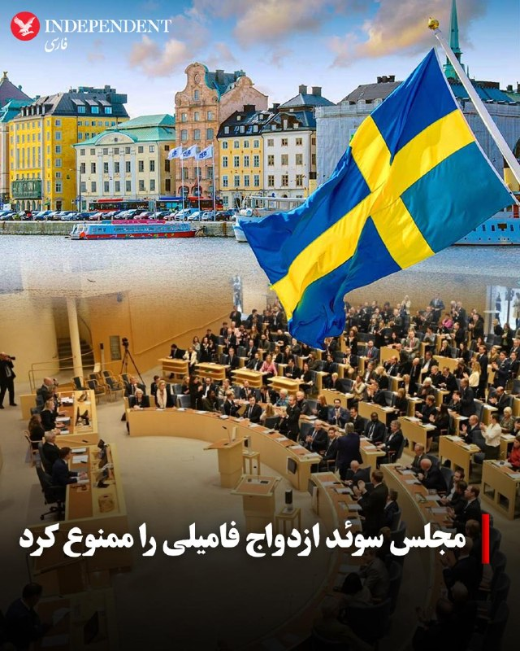

♦️مجلس سوئد با طرح دولت برای ممنوعیت ازدواج نزدیک فامیلی موافقت کرد؛ قانونی که با هدف مقابله با خشونت‌های ناموسی، فشار خانوادگی و ازدواج‌های اجباری تصویب شده است.
بر اساس مصوبه تازه، ازدواج میان «فرزندان عمو، دایی، عمه و خاله» از اول ژوئیه ۲۰۲۶ در سوئد ممنوع خواهد شد.
مجلس همچنین تصویب کرد افرادی که در نسبت‌های خانوادگی نزدیک دیگری قرار دارند نیز دیگر اجازه ازدواج نخواهند داشت.
طبق این مصوبه، حتی خواهرخوانده‌ها و برادرخوانده‌ها یا خواهر و برادرهایی که از طریق فرزندخواندگی با یکدیگر نسبت خانوادگی پیدا کرده‌اند نیز دیگر نمی‌توانند مجوز ویژه ازدواج دریافت کنند. در قوانین پیشین سوئد، در برخی موارد استثنایی امکان دریافت مجوز وجود داشت.
یکی دیگر از بخش‌های مهم قانون، مربوط به ازدواج‌هایی است که خارج از سوئد انجام می‌شوند. بر اساس قانون جدید، ازدواج فامیلی که در کشورهای دیگر ثبت شده باشد نیز در اغلب موارد در سوئد به رسمیت شناخته نخواهد شد؛ موضوعی که می‌تواند بر وضعیت حقوقی برخی مهاجران یا خانواده‌هایی که خارج از سوئد ازدواج کرده‌اند تاثیر بگذارد.
‌🇸🇦 Indypersian

🤖 @VahidOOnLine

## VahidOOnLine — post 242355

  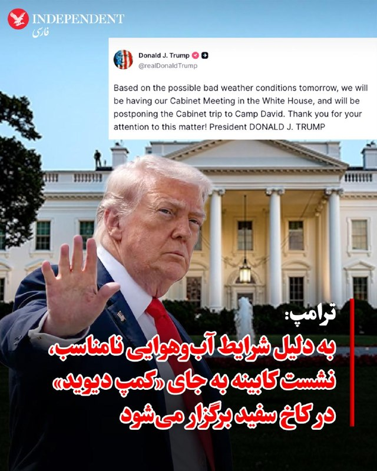

♦️دونالد ترامپ، رئیس‌جمهوری ایالات متحده، با انتشار پیامی در شبکه اجتماعی «تروث سوشال»، از تغییر محل برگزاری نشست آینده کابینه خبر داد. ترامپ اعلام کرد که با توجه به پیش‌بینی احتمال شرایط آب‌وهوایی نامناسب برای فردا، سفر اعضای کابینه به استراحتگاه رسمی «کمپ دیوید» به تعویق افتاده است و این نشست در محل کاخ سفید برگزار خواهد شد.
پیش‌تر، شبکه «سی‌ان‌بی‌سی» گزارش داده بود دونالد ترامپ قصد دارد چهارشنبه ششم خردادماه، نشست کم‌سابقه‌ای را با حضور تمامی اعضای کابینه و تولسی گبرد، مدیر اطلاعات ملی آمریکا، در استراحتگاه «کمپ دیوید» برگزار کند. هدف از این تجمع، بررسی مسائل داخلی، دستاوردهای اقتصادی و آخرین تحولات سیاست خارجی، به‌ویژه آینده توافق احتمالی با تهران پس از حملات اخیر آمریکا به مواضعی در ایران، عنوان شده بود.
‌🇸🇦 Indypersian

🤖 @VahidOOnLine

## VahidOOnLine — post 242354

  <a href="telegram/content/VahidOOnLine_242354_1779839316.mp4" target="_blank">🎬 Download video</a>

مهدی خراتیان، کارشناس وابسته به حکومت، با اشاره به قصد احتمالی دونالد ترامپ بعد از انتخابات میان‌دوره‌ای ایالات متحده گفت اگر آمریکا پس از نوامبر ایران را تهدید کند و نشانه‌هایی از آمادگی نظامی دیده شود، جمهوری اسلامی باید از پیمان منع گسترش سلاح هسته‌ای خارج شود و ساخت سلاح اتمی را آغاز کند.
‌🏁 🇬🇧 IranintlTV

🤖 @VahidOOnLine

## VahidOOnLine — post 242353

  

♦️به گزارش ایسنا، سفر محمدباقر قالیباف،رئیس مجلس جمهوری اسلامی و رئیس هیئت مذاکره‌کننده جمهوری اسلامی به قطر با هدف پیگیری ترتیبات اجرایی مربوط به مطالبه جمهوری اسلامی ایران و نحوه دسترسی به ۱۲ میلیارد دلار از دارایی‌های بلوکه‌شده انجام شد.
بر اساس این گزارش، در متن یک تفاهم ۱۴ ماده‌ای پیش‌بینی شده است که ۲۴ میلیارد دلار از منابع بلوکه‌شده جمهوری اسلامی ایران در طول مذاکرات آزاد شود. هیئت مذاکره‌کننده تاکید کرده است نیمی از این مبلغ هم‌زمان با اعلام یادداشت تفاهم در دسترس قرار گیرد و بخش باقی‌مانده نیز در مدت ۶۰ روز منتقل شود.
ایسنا همچنین گزارش داد با توجه به تجربه‌های پیشین در روند آزادسازی دارایی‌های جمهوری اسلامی ایران در کره جنوبی و قطر، بر اجرای دقیق مراحل توافق تاکید شده تا مشکلات گذشته تکرار نشود. مذاکرات قطر نیز در مجموع مثبت و همراه با پیشرفت توصیف شده است.
‌🇸🇦 Indypersian

🤖 @VahidOOnLine

## VahidOOnLine — post 242352

  

دفتر رسانه‌ای شاهزاده رضا پهلوی با انتشار بیانیه‌ای در واکنش به صدور حکم اعدام برای چهار شهروند ایرانی، نوشت: «صدور دوباره احکام اعدام برای چهار تن از بچه‌های اکباتان، میلاد آرمون، محمدمهدی حسینی، مهدی ایمانی و نوید نجاران، سند دیگری از ماهیت جنایتکار رژیم جمهوری اسلامی است که برای حفظ قدرت، جوانان ایران را به قتل می‌رساند و از خون مردم برای بقای خود تغذیه می‌کند.»

در این بیانیه آمده است: «رژیم ضحاکی جمهوری اسلامی، دادگاه را به ابزار سرکوب تبدیل کرده و اعدام، سلاحی برای ایجاد وحشت در جامعه است.»

دفتر رسانه‌ای شاهزاده رضا پهلوی نوشت: «سکوت جهان در برابر اعدام معترضان ایرانی، یک شکست اخلاقی و سیاسی است. هر روزی که جامعه جهانی در برابر این رژیم مماشات می‌کند، جمهوری اسلامی با جسارت و قساوت بیشتری جان جوانان ایرانی را می‌گیرد و سرکوب را گسترش می‌دهد.»
‌🏁 🇬🇧 IranintlTV

🤖 @VahidOOnLine

## VahidOOnLine — post 242351

  

افیخای ادرعی، سخنگوی ارتش اسرائیل، در شبکه ایکس از ساکنان هفت شهر و روستا در جنوب لبنان خواست برای حفظ جان خود این مناطق را ترک کنند.

سخنگوی عرب‌زبان ارتش اسرائیل با هشدار به ساکنان شهرها و روستاهای طورا، دیر قانون النهر، بدیاس، برج رحال، معرکه، العباسیه و طیر دبا، نوشت: «در پی نقض توافق آتش‌بس از سوی حزب‌الله، ارتش اسرائیل ناچار است با قدرت علیه آن اقدام کند. ارتش قصد آسیب رساندن به شما را ندارد.»

افیخای ادرعی تاکید کرد: «هر فردی که در نزدیکی نیروها، تاسیسات یا تجهیزات نظامی حزب‌الله حضور داشته باشد، جان خود را به خطر می‌اندازد.»
‌🏁 🇬🇧 IranintlTV

🤖 @VahidOOnLine

## VahidOOnLine — post 242350

  

♦️سازمان هواپیمایی کشوری، روز سه‌شنبه، پنجم خردادماه، اعلام کرد که بر اساس مصوبات نشست هماهنگی نهادهای لشکری و کشوری، ساعت کاری ۱۰ فرودگاه ایران با هدف تسهیل عملیات پروازی و ارتقای خدمات هوانوردی افزایش یافته و فعالیت آن‌ها ۲۴ ساعته شده است. بر این اساس، از این پس فرودگاه‌های بین‌المللی «امام خمینی» و مهرآباد تهران و همچنین فرودگاه‌های مشهد، ساری، بیرجند، گرگان، بجنورد، کرمان، زاهدان و سبزوار به‌صورت شبانه‌روزی به مسافران و پروازها خدمات‌رسانی خواهند کرد.
‌🇸🇦 Indypersian

🤖 @VahidOOnLine

## VahidOOnLine — post 242349

  

دونالد ترامپ در تروث سوشال نوشت اگر جمهوری اسلامی تسلیم شود، نابودی نیروی دریایی و هوایی خود را بپذیرد، نیروهایش را از تهران خارج کند و مقام‌هایش اسناد تسلیم را امضا کنند، «رسانه‌های جعلی» مانند نیویورک‌تایمز، وال‌استریت ژورنال و سی‌ان‌ان باز هم این را پیروزی ایران مقابل آمریکا توصیف خواهند کرد.
‌🏁 🇬🇧 IranintlTV

🤖 @VahidOOnLine

## VahidOOnLine — post 242348

  <a href="telegram/content/VahidOOnLine_242348_1779839320.mp4" target="_blank">🎬 Download video</a>

♦️مسعود پزشکیان، رئیس‌جمهوری اسلامی ایران، روز سه‌شنبه گفت: «کشورهای منطقه بالاخره حساب کار خودشان را کردند و دانسته‌اند که اگر بخواهند میزبان پایگاه‌های آمریکا باشند، به هر حال به شدت صدمه می‌بینند.» او با تاکید بر اینکه حضور ایالات متحده هیچ منفعتی برای متحدانش نداشته است، گفت: «یعنی این‌جوری نبود که حضور آمریکا به نفع آن‌ها بوده باشد. این‌ها خیال می‌کردند می‌آیند در عرض سه روز می‌جنگند و فرماندهان و رهبر ما را می‌کشند و کشور از هم می‌پاشد. اما نشد و خیال خامی بود.» پزشکیان همچنین با اشاره به چالش‌های پیش‌رو، بر ضرورت ایستادگی در حوزه اقتصادی تاکید کرد.
‌🇸🇦 Indypersian

🤖 @VahidOOnLine

## VahidOOnLine — post 242347

  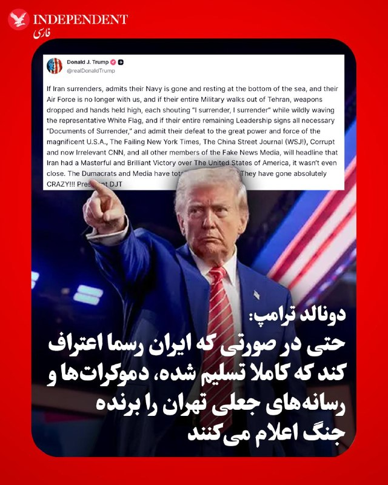

♦️ دونالد ترامپ، رئیس‌جمهوری ایالات متحده، با انتشار پیامی در شبکه اجتماعی «تروث سوشال»، به شدت از رسانه‌های آمریکایی و دموکرات‌ها انتقاد کرد و آن‌ها را به جانبداری از جمهوری اسلامی متهم ساخت. ترامپ نوشت: «اگر ایران تسلیم شود، اعتراف کند که نیروی دریایی‌اش از بین رفته و در کف دریا آرام گرفته است، نیروی هوایی‌اش دیگر وجود ندارد، و اگر تمام ارتش آن‌ها از تهران بیرون بیایند، سلاح‌ها را زمین بگذارند، دست‌ها را بالا ببرند و در حالی که پرچم سفید تسلیم را به شدت تکان می‌دهند، فریاد بزنند من تسلیم می‌شوم، من تسلیم می‌شوم و اگر تمام رهبران باقی‌مانده آن‌ها همه اسناد لازم برای تسلیم را امضا کنند و به شکست خود در برابر قدرت و نیروی عظیم ایالات متحده باشکوه اعتراف کنند؛ باز هم نیویورک تایمز در حال سقوط، چاینا استریت ژورنال (همان وال‌استریت ژورنال!)، سی‌ان‌ان فاسد و بی‌اهمیت شده، و تمام دیگر اعضای رسانه‌های اخبار جعلی، تیتر خواهند زد که ایران یک پیروزی استادانه و درخشان بر ایالات متحده آمریکا داشته و [این رقابت] حتی نزدیک هم نبوده است.» او در پایان این پیام با حمله به مخالفان سیاسی خود افزود: «دموکرات‌ها و رسانه‌ها کاملا راه خود را گم کرده‌اند. آن‌ها به معنای واقعی کلمه دیوانه شده‌اند!!!»
‌🇸🇦 Indypersian

🤖 @VahidOOnLine

## WithYashar — post 12624

گویا موشلی رو جمعه در تهران و شنبه در مشهد تشیع میکنند
@withyashar

## WithYashar — post 12623

## WithYashar — post 12622

## WithYashar — post 12621

## WithYashar — post 12620

## WithYashar — post 12619

## WithYashar — post 12618

## WithYashar — post 12617

## WithYashar — post 12616

## WithYashar — post 12615

## WithYashar — post 12614

## WithYashar — post 12613

کارشناس صداسیما : وصل شدن اینترنت متوقف میشه و دستور رییس جمهور اجرا نمیشه چون خلاف دیوان عالیه.
@withyashar

## WithYashar — post 12612

اتاق جنگ با یاشار : شله داوود @withyashar

## WithYashar — post 12611

  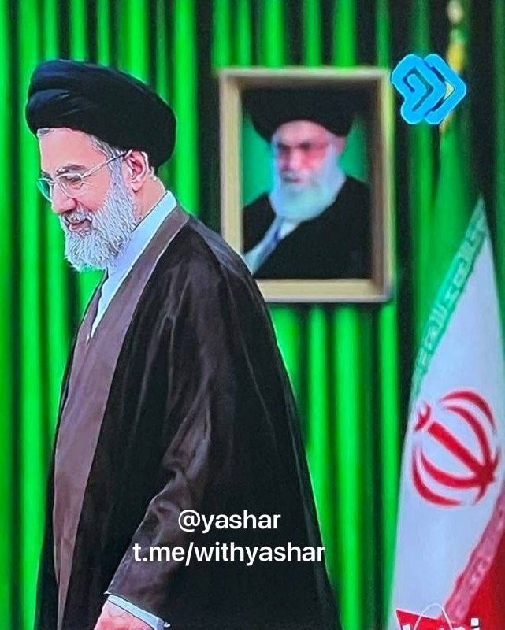

صداوسیما تصویر جدیدی از مجتبی خامنه‌ای را منتشر کرد
@withyashar
خوب پس بدل تکمیل شده نتو وصل کردن ولی اصلا شبیهش نیست ! 🤣

## WithYashar — post 12610

  

با توجه به شرایط نامساعد جوی احتمالی فردا، جلسه کابینه را در کاخ سفید برگزار خواهیم کرد و سفر کابینه به کمپ دیوید را به تعویق می‌اندازیم. از توجه شما به این موضوع سپاسگزاریم! رئیس جمهور دونالد جی. ترامپ
@withyashar

## WithYashar — post 12609

## WithYashar — post 12608

دفتر رسانه‌ای شاهزاده رضا پهلوی با انتشار بیانیه‌ای در واکنش به صدور حکم اعدام برای چهار شهروند ایرانی، نوشت: «صدور دوباره احکام اعدام برای چهار تن از بچه‌های اکباتان، میلاد آرمون، محمدمهدی حسینی، مهدی ایمانی و نوید نجاران، سند دیگری از ماهیت جنایتکار رژیم جمهوری اسلامی است که برای حفظ قدرت، جوانان ایران را به قتل می‌رساند و از خون مردم برای بقای خود تغذیه می‌کند.»
@withyashar

## WithYashar — post 12607

نتانیاهو از ترور هدفمند خبر داد : همین الان محمد عوده، از فرماندهان شاخه نظامی حماس و یکی از طراحان حمله ۷ اکتبر رو در غزه هدف قرار دادیم به حساب همه‌شون می‌رسیم @withyashar

## WithYashar — post 12606

  <a href="telegram/content/WithYashar_12606_1779839322.mp4" target="_blank">🎬 Download video</a>

تری ینگست خبرنگار فاکس‌نیوز از اسرائیل گزارش میکند : رسانه‌های حکومتی ایران ادعا می‌کنند که برای هرگونه توافق با آمریکا، باید ۲۴ میلیارد دلار آزاد شود.

تیم ترامپ می‌گوید چنین چیزی قرار نیست اتفاق بیفتد و “هرگونه کاهش فشار مالی فقط در صورتی انجام می‌شود که ایران به تعهداتش عمل کند.”

ایران باید کاملاً از برنامه هسته‌ای دست بکشد و هیچ‌گونه کنترلی بر تنگه هرمز نداشته باشد، تمام.
@withyashar

## WithYashar — post 12605

اگر ایران تسلیم شود، بپذیرد که نیروی دریایی‌اش از بین رفته و در کف دریا آرمیده است، و نیروی هوایی‌اش دیگر با ما نیست، و اگر تمام ارتش آن از تهران خارج شود در حالی که سلاح‌ها را زمین گذاشته و دست‌ها را بالا گرفته‌اند و هرکدام فریاد بزنند «من تسلیم می‌شوم، من…

## mwarmonitor — post 9783

  <a href="telegram/content/mwarmonitor_9783_1779839324.mp4" target="_blank">🎬 Download video</a>

🔴حملات هوایی شدید اسرائیل به منطقه سحمر در بقاع غربی، در شرق لبنان.

@mwarmonitor

## mwarmonitor — post 9782

  <a href="telegram/content/mwarmonitor_9782_1779839325.mp4" target="_blank">🎬 Download video</a>

📝 در تالار سایه‌ها، روایتِ بلبلِ درباری و عُظمایِ خون‌خوار سرشار از وحشت است؛ آنجا که علیرضا افتخاری روایت می‌کند که آقا به او فرموده چرا غمناک می‌خوانی، شاد بخوان و چرا برای مردم کنسرت نمی‌گذاری. این همنشینیِ هولناک با مقتدایِ تاریکی‌ها که دستش به احکامِ سرخ آغشته است، راه را برای کابوس‌های بعدی باز می‌کند؛ بعید نیست در قسمت‌های آینده، امیر تتلو را از بند بیرون بکشند تا از خاطرات عارفانه و شب‌زنده‌داری‌هایش با عظما بگوید، و پویان مختاری نیز که حالا به درجه اجتهاد رسیده، در صف مصاحبه ایستاده تا مدحِ این نظامِ خون‌خوار را بگوید؛ سیرکِ دارک و تلخی که در آن دژخیم، از مطربانِ خود بهارِ طربِ اجباری می‌طلبد.

@mwarmonitor

## mwarmonitor — post 9781

🔴در مذاکرات با ایالات متحده، ایران می‌خواهد کنترل بخشی از حدود ۱۰۰ میلیارد دلار دارایی‌های مسدودشده توسط غرب را دوباره به دست بگیرد و همچنین به بازارهای جهانی نفت دسترسی پیدا کند. وال‌استریت ژورنال

@mwarmonitor

## mwarmonitor — post 9780

  <a href="telegram/content/mwarmonitor_9780_1779839327.mp4" target="_blank">🎬 Download video</a>

✈️ساعت ۲۱:۲۳ به وقت گرینویچ پرواز DOOR 72 — یک فروند بمب‌افکن B-52H از پایگاه فیرفورد به پرواز درآمده و در حال ارتباط با بریز نورتن روی فرکانس 231.950 است. @mwarmonitor

## mwarmonitor — post 9779

🔴سناتور لیندسی گراهام ؛ مدت‌هاست برای من روشن بوده که نقش پاکستان به‌عنوان میانجی، مسئله‌ساز است. خصومت آن‌ها نسبت به اسرائیل سابقه‌ای طولانی دارد.

🔸انکارناپذیر است که هواپیماهای نظامی ایران در پایگاه‌های هوایی پاکستان مستقر شده‌اند و اظهارات گذشته مقامات بلندپایه پاکستانی علیه اسرائیل نگران‌کننده است.

🔸در مورد اظهارات وزیر دفاع درباره توافقات ابراهیم، که گفته پاکستان هرگز به آن‌ها نخواهد پیوست چون به اسرائیل اعتماد ندارد: ممکن است این کلیپ مربوط به یک سال پیش باشد، اما من نگرانم که این طرز فکر همچنان تازه و زنده باشد.

🔸در این راستا، ضروری است که پاکستان همین حالا به درخواست رئیس‌جمهور ترامپ برای پیوستن به توافقات ابراهیم پاسخ دهد.

@mwarmonitor

## mwarmonitor — post 9778

🔰نماینده روسیه در سازمان ملل خطاب به کشورهای خلیج فارس درباره ایران: شما در سیاست آمریکا در خاورمیانه به گروگان گرفته شده‌اید. ما مدت‌هاست می‌گوییم اگر چنین چیزی رخ دهد، شما ناگزیر وارد این بحران خواهید شد، چه بخواهید و چه نخواهید.

@mwarmonitor

## mwarmonitor — post 9777

📌 دونالد ترامپ قرار است فردا جلسه کابینه خود را در کمپ دیوید برگزار کند؛ اقدامی نادر که شامل سفر به اقامتگاه ریاست‌جمهوری است (در صورت مساعد بودن هوا). 🔸به گفته یک مقام کاخ سفید، انتظار می‌رود تمام اعضای کابینه در این جلسه حضور داشته باشند. نیویورک پست …

## mwarmonitor — post 9776

  

✈️ساعت ۲۱:۲۳ به وقت گرینویچ پرواز DOOR 72 — یک فروند بمب‌افکن B-52H از پایگاه فیرفورد به پرواز درآمده و در حال ارتباط با بریز نورتن روی فرکانس 231.950 است.

@mwarmonitor

## mwarmonitor — post 9775

  

✈️ساعت ۲۱:۲۰ به وقت گرینویچ پرواز DOOR 73 — یک فروند بمب‌افکن B-52H از پایگاه فیرفورد به پرواز درآمده و در حال ارتباط با بریز نورتن روی فرکانس 231.950 است.

@mwarmonitor

## mwarmonitor — post 9774

  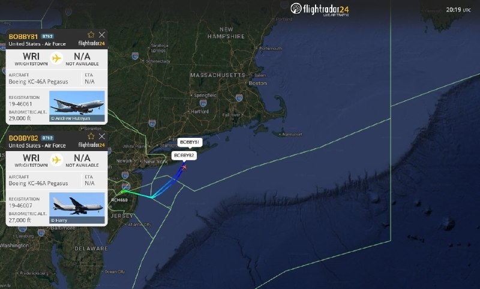

📌یک حرکت جدید – Coronet East 024

✈️هواپیماهای سوخت رسان KC-46A با نام «BOBBY81» به شماره 19-46061 AE5FA8
و KC-46A با نام «BOBBY82» به شماره 19-46007 AE574D

✈️با کد مأموریت Coronet East 024 از خاک‌ آمریکا به پرواز درآمده‌اند. مشخص نیست که آیا از قبل هواپیمایی را همراهی می‌کردند یا اینکه این فقط یک پرواز جابه‌جایی و موقعیت‌گیری است، اما بدون شک به‌زودی مشخص خواهد شد.

@mwarmonitor

## mwarmonitor — post 9773

🔴جنگ در ایران نشان داده است که تأسیسات نمک‌زدایی آب (آب‌شیرین‌کن‌ها) در کشورهای عربی حوزه خلیج فارس تا چه اندازه آسیب‌پذیر هستند.

🔸مسئله امنیت آب برای جمعیت کشورهای خلیج فارس در آینده تنها تشدید خواهد شد. مگر اینکه ایالات متحده آماده باشد سلطه بلندمدت ایران بر کشورهای خلیج فارس و همچنین تنگه هرمز را بپذیرد، در غیر این صورت باید بازدارندگی مؤثری در برابر حملات ایران به زیرساخت‌های حیاتی پیدا کند. «اندیشکده هادسن»

@mwarmonitor

## mwarmonitor — post 9772

🔴(رویترز) - وانگ یی، وزیر امور خارجه چین، روز سه‌شنبه گفت امیدوار است طرف‌های درگیر در بحران ایران به تعهد خود برای پیگیری آتش‌بس پایبند بمانند و همچنان برای رسیدن به نقطه‌ای میانی با یکدیگر تعامل کنند.

🔸ایران روز سه‌شنبه اعلام کرد که ایالات متحده آتش‌بس را نقض کرده است؛ پس از آنکه آمریکا آنچه «حملات دفاعی» در جنوب ایران خواند انجام داد. در همین حال، مارکو روبیو، وزیر امور خارجه آمریکا، گفت که مذاکره برای توقف درگیری ممکن است «چند روز زمان ببرد».

🔹وانگ در جمع خبرنگاران در سازمان ملل در نیویورک و پس از ریاست جلسه شورای امنیت ۱۵ عضوی گفت:
«امیدواریم طرف‌های مربوطه به تلاش برای آتش‌بس پایبند بمانند و همچنان برای رسیدن به نقطه‌ای میانی با یکدیگر تعامل کنند تا صلح هرچه سریع‌تر به خاورمیانه بازگردد.»

🔹او افزود:
«همان‌طور که گفته‌ایم، برای یخ بستن سه فوت یخ تنها یک روز سرد کافی نیست و مسائل ریشه‌دار را نمی‌توان یک‌شبه حل کرد.»

🔸وانگ همچنین گفت:
«با این حال، هر گام رو به جلو در مذاکرات امید بیشتری برای صلح ایجاد می‌کند و هر روز زودتر پایان یافتن درگیری یعنی کاهش تلفات غیرنظامیان.»

@mwarmonitor

## mwarmonitor — post 9771

اگر ایران تسلیم شود، اعتراف کند که نیروی دریایی‌اش نابود شده و در کف دریا آرام گرفته است، و نیروی هوایی‌اش دیگر در میان ما نیست، و اگر تمام ارتش آن‌ها با دست‌های بالا رفته و سلاح‌های زمین‌گذاشته از تهران خارج شوند و هر کدام در حالی که پرچم سفید نمادین را به…

## mwarmonitor — post 9770

  

📌«اگر ایران تسلیم شود، اعتراف کند که نیروی دریایی‌اش نابود شده و در کف دریا آرام گرفته است، و نیروی هوایی‌اش دیگر در میان ما نیست (نابود شده)، و اگر کل ارتش آن‌ها در حالی که تسلیحات خود را زمین گذاشته‌اند و دست‌ها را بالا برده‌اند از تهران خارج شوند و هر کدام فریاد بزنند "من تسلیم می‌شوم، من تسلیم می‌شوم" در حالی که دیوانه‌وار پرچم سفید نمادین را تکان می‌دهند، و اگر تمام رهبریِ باقی‌مانده آن‌ها تمام "اسناد تسلیم" لازم را امضا کنند و به شکست خود در برابر قدرت بزرگ و نیروی ایالات متحدهِ باشکوه اعتراف کنند، [باز هم] نیویورک تایمزِ در حال سقوط، چاینا استریت ژورنال (همان وال استریت ژورنال!)، سی‌ان‌انِ فاسد و اکنون بی‌اهمیت، و تمام دیگر اعضای رسانه‌های اخبار جعلی، تیتر خواهند زد که ایران یک پیروزی استادانه و درخشان بر ایالات متحده آمریکا داشته است و [این رقابت] حتی نزدیک هم نبود (پیروزی قاطع ایران بوده). دِماکرات‌ها (ترکیب دموکرات و احمق) و رسانه‌ها کاملاً راه خود را گم کرده‌اند. آن‌ها کاملاً دیوانه شده‌اند!!!

رئیس‌جمهور دونالد جی ترامپ»

@mwarmonitor

## mwarmonitor — post 9769

  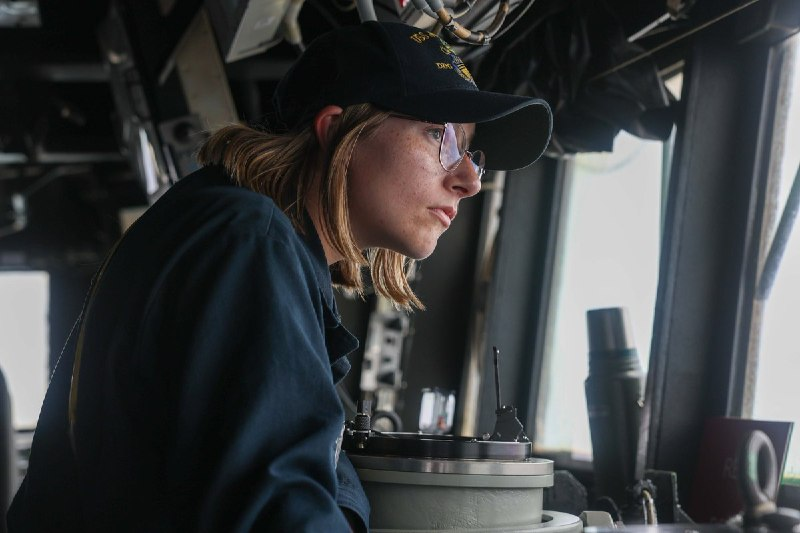

🔸یک ملوان نیروی دریایی آمریکا در اتاق فرماندهی (پل فرماندهی) داخل ناوشکن USS John Finn (DDG 113) در حال نگهبانی دیده می‌شود، در حالی که این ناوشکن موشک‌انداز در دریای عرب در چارچوب حمایت از محاصره دریایی آمریکا علیه ایران در حال عبور است.

🔹طبق گزارش، تا تاریخ ۲۶ مه، نیروهای آمریکایی ۱۰۸ کشتی تجاری را تغییر مسیر داده‌اند تا از رعایت این محدودیت‌ها اطمینان حاصل شود.

@mwarmonitor

## FoxNewsTwitter — post 342285

Fox News (Twitter/X)

The White House lawn is starting to look different as construction continues on the UFC Freedom 250 arena at the White House.

Crews are now building out the event site as President Trump moves forward with plans to host the UFC spectacle on White House grounds.

The event is expected to blend politics, patriotism, and one of the biggest brands in combat sports in a way Washington has never seen before.

## FoxNewsTwitter — post 342284

  <a href="telegram/content/FoxNewsTwitter_342284_1779839331.mp4" target="_blank">🎬 Download video</a>

Fox News (Twitter/X)

FOX NEWS REPORT: The ceasefire between the U.S. and Iran is still holding as negotiations between both sides continue behind closed doors. President Trump is expected to hold a Cabinet meeting at the White House tomorrow, @BillMelugin_ reports.

## FoxNewsTwitter — post 342283

  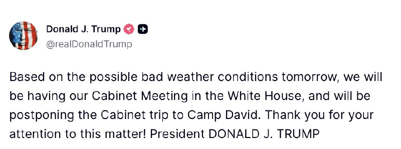

Fox News (Twitter/X)

JUST IN: President Trump says the White House is postponing tomorrow’s Cabinet trip to Camp David due to “possible bad weather conditions.”

The Cabinet meeting to discuss Iran will now be held at the White House instead. https://twitter.com/FoxNews/status/2059292922038702376#m

## FoxNewsTwitter — post 342282

  <a href="telegram/content/FoxNewsTwitter_342282_1779839333.mp4" target="_blank">🎬 Download video</a>

Fox News (Twitter/X)

A beach day turned chaotic in seconds.

A waterspout came ashore in Miramar Beach, Florida, sending umbrellas and chairs flying as Memorial Day beachgoers ran for cover.

Video shows the twister spinning over the Gulf before sweeping onto the sand and moving down the shoreline.

## pm_afshaa — post 91603

vless://803352ee-f226-4b82-9f4f-8d3cb0e6ef3c@185.143.234.235:2053?type=ws&encryption=none&path=%3Fed%3D2048&host=dl.lexwill.site&security=tls&fp=chrome&alpn=h2%2Chttp%2F1.1&sni=dl.lexwill.site#Lex-lwnjgvr2

مخصوص تلگرام باهاش دانلود انجام ندین

💧 Rainbet.com the #1 Non-KYC Crypto Casino & Sportsbook @rainbetcom

😁 @Pm_Afshaa

## pm_afshaa — post 91602

vless://256cac6f-aff1-418a-8798-fa6ac31db1a8@185.143.233.235:2053?type=ws&encryption=none&path=%3Fed%3D2048&host=dl.lexwill.site&security=tls&fp=chrome&alpn=h2%2Chttp%2F1.1&sni=dl.lexwill.site#Lex-ot7lvn3m

مخصوص تلگرام باهاش دانلود انجام ندین

💧 Rainbet.com the #1 Non-KYC Crypto Casino & Sportsbook @rainbetcom

😁 @Pm_Afshaa

## pm_afshaa — post 91601

vless://30197e41-6d83-463d-8502-e7437b8d04af@anten.ir:2053?path=%3Fed%3D2048&security=tls&alpn=h2%2Chttp%2F1.1&encryption=none&insecure=0&host=dl.lexwill.site&fp=chrome&type=ws&allowInsecure=0&sni=dl.lexwill.site#Lex-yd4etwob

مخصوص تلگرام باهاش دانلود انجام ندین

💧 Rainbet.com the #1 Non-KYC Crypto Casino & Sportsbook @rainbetcom

😁 @Pm_Afshaa

## pm_afshaa — post 91599

حتما از اسپانسرامون که دارن براتون رایگان کانفینگ میسازن در اختیارتون حمایت کنینو دنبالشون کنین @Glitch_Config @Lex_Server

## pm_afshaa — post 91598

🔴کارشناس صداسیما :وصل شدن اینترنت متوقف میشه و دستور رییس جمهور اجرا نمیشه چون خلاف دیوان عالیه

💧 Rainbet.com the #1 Non-KYC Crypto Casino & Sportsbook @rainbetcom

😁 @Pm_Afshaa

## pm_afshaa — post 91597

  <a href="https://t.me/pm_afshaa/91597" target="_blank">📎 Download file</a>

نپسترنت پر سرعت نا محدود مخصوص اینستا و یوتیوب

💧 Rainbet.com the #1 Non-KYC Crypto Casino & Sportsbook @rainbetcom

😁 @Pm_Afshaa

## pm_afshaa — post 91596

  <a href="https://t.me/pm_afshaa/91596" target="_blank">📎 Download file</a>

سرعت موشکی متصل نامحدود برا تمام اوپراتورها

💧 Rainbet.com the #1 Non-KYC Crypto Casino & Sportsbook @rainbetcom

😁 @Pm_Afshaa

## pm_afshaa — post 91595

vless://4106328d-9bc4-4e07-be57-e43db1b5a245@185.143.234.235:2053?type=ws&encryption=none&path=%3Fed%3D2048&host=dl.lexwill.site&security=tls&fp=chrome&alpn=h2%2Chttp%2F1.1&sni=dl.lexwill.site#Lex-480q68sz

بزنید❤️

## pm_afshaa — post 91594

  <a href="telegram/content/pm_afshaa_91594_1779839335.webm" target="_blank">🎬 Download video</a>

PMTV NEWS🦁☀️.npvt

## pm_afshaa — post 91593

  <a href="https://t.me/pm_afshaa/91593" target="_blank">📎 Download file</a>

نا محدود سرعت بالا بدون قطعی

بفرستین برا بقیه اونام وصل شن

💧 Rainbet.com the #1 Non-KYC Crypto Casino & Sportsbook @rainbetcom

😁 @Pm_Afshaa

## pm_afshaa — post 91592

vless://f479f518-b927-4516-9723-52b27012aebd@185.143.234.235:2053?path=%3Fed%3D2048&security=tls&alpn=h2%2Chttp%2F1.1&encryption=none&insecure=0&host=dl.lexwill.site&fp=chrome&type=ws&allowInsecure=0&sni=dl.lexwill.site#Pmtv متصل سرعت بالا 
💧 Rainbet.com…

## pm_afshaa — post 91591

چنل مردمی فایتر رادار دنبال کنید

https://t.me/+9C1ENi5qn6hhZjk0

https://t.me/+9C1ENi5qn6hhZjk0

## pm_afshaa — post 91590

حتما از اسپانسرامون که دارن براتون رایگان کانفینگ میسازن در اختیارتون حمایت کنینو دنبالشون کنین

@Glitch_Config
@Lex_Server

## pm_afshaa — post 91589

  <a href="https://t.me/pm_afshaa/91589" target="_blank">📎 Download file</a>

نپسترنت نامحدود وصل رو تمامی سرورا

💧 Rainbet.com the #1 Non-KYC Crypto Casino & Sportsbook @rainbetcom

😁 @Pm_Afshaa

## pm_afshaa — post 91585

vless://f479f518-b927-4516-9723-52b27012aebd@185.143.234.235:2053?path=%3Fed%3D2048&security=tls&alpn=h2%2Chttp%2F1.1&encryption=none&insecure=0&host=dl.lexwill.site&fp=chrome&type=ws&allowInsecure=0&sni=dl.lexwill.site#Pmtv متصل سرعت بالا 
💧 Rainbet.com…

## pm_afshaa — post 91584

vless://4bebe55d-a34f-46f2-90ec-c292248c3076@weysam.luxurygaming1.ir:80?path=%2F&security=none&encryption=none&host=weysam.luxurygaming1.ir&type=ws#pmtv متصل سرعت بالا برای تمام اوپراتور ها 
💧 Rainbet.com the #1 Non-KYC Crypto Casino & Sportsbook @rainbetcom…

## pm_afshaa — post 91583

vless://f479f518-b927-4516-9723-52b27012aebd@185.143.234.235:2053?path=%3Fed%3D2048&security=tls&alpn=h2%2Chttp%2F1.1&encryption=none&insecure=0&host=dl.lexwill.site&fp=chrome&type=ws&allowInsecure=0&sni=dl.lexwill.site#Pmtv

متصل سرعت بالا

💧 Rainbet.com the #1 Non-KYC Crypto Casino & Sportsbook @rainbetcom

😁 @Pm_Afshaa

## pm_afshaa — post 91581

دمت گرم سرعت نپسترا خداسسس

## pm_afshaa — post 91580

vless://4bebe55d-a34f-46f2-90ec-c292248c3076@weysam.luxurygaming1.ir:80?path=%2F&security=none&encryption=none&host=weysam.luxurygaming1.ir&type=ws#pmtv

متصل سرعت بالا برای تمام اوپراتور ها

💧 Rainbet.com the #1 Non-KYC Crypto Casino & Sportsbook @rainbetcom

😁 @Pm_Afshaa

## pm_afshaa — post 91578

خامنه ای کشته شد

## DEJradio — post 5010

⭕️ ترامپ: جمهوری اسلامی اگر پرچم سفید هم بالا ببرد، برخی رسانه‌ها می‌گویند پیروز شد

دونالد ترامپ، رئیس‌ جمهوری آمریکا، از شیوهٔ پوشش عملیات «خشم حماسی» علیه جمهوری اسلامی در برخی رسانه‌های آمریکایی انتقاد کرد.
ترامپ در شبکهٔ اجتماعی تروث نوشت حتی اگر جمهوری اسلامی کاملا تسلیم شود، رسانه‌هایی از جمله نیویورک‌تایمز، وال‌استریت ژورنال و سی‌ان‌ان، باز هم آن را «پیروزی استادانه» رژیم قلمداد می‌کنند.
ترامپ تصریح کرد اگر نیروهای رژیم سلاح را زمین بگذارند، یکایک آنها پرچم سفید تکان بدهند و برگه‌های تسلیم را امضا کنند، باز هم «رسانه‌های جعلی» واقعیت را وارونه نشان می‌دهند.
ترامپ همچنین دموکرات‌های آمریکایی را متهم کرد که مانند برخی از رسانه‌های برشمرده، دیوانه شده‌اند.

#خبر #دژ #ترامپ #مذاکرات
@DEJradio

## DEJradio — post 5009

⭕️ اسرائیل بیش از ۱۱ کیلومتر از تونل‌های حماس را در بیت‌حانون نابود کرد

ارتش اسرائیل با انتشار تصاویری اعلام کرد بیش از یازده کیلومتر از تونل‌های حماس را شناسایی و منهدم کرده‌ است.
حماس توسط اتحادیهٔ اروپا و ایالات متحده در سیاههٔ سازمان‌های تروریستی قرار گرفته است.
اسرائیل تصاویری را از شبکهٔ مسیرهای زیرزمینی حماس در بیت‌حانون در شمال نوار غزه منتشر کرده است.
بر اساس بیانیه ارتش، صدها زیرساخت حماس که در سطح زمین قرار داشت نیز نابود شده است.
به گفتهٔ ارتش اسرائیل، بیت‌حانون یکی از محورهای اصلی نبرد در عملیات زمینی بود.
بنا بر این گزارش، در جریان جنگ سه کیلومتر دیگر از تونل‌ها نیز تخریب و شماری از نیروهای حماس هم کشته شدند.

#خبر #دژ #اسرائیل #حماس
@DEJradio

## DEJradio — post 5008

👑 
⭕️ صدور دوباره احکام اعدام برای چهار تن از بچه‌های اکباتان، میلاد آرمون، محمدمهدی حسینی، مهدی ایمانی و نوید نجاران، سند دیگری از ماهیت جنایتکار رژیم جمهوری اسلامی است که برای حفظ قدرت، جوانان ایران را به قتل می‌رساند و از خون مردم برای بقای خود تغذیه می‌کند.…

## DEJradio — post 5007

⭕️ترامپ نشست ویژهٔ کابینه را از کمپ دیوید به کاخ سفید منتقل کرد

دونالد ترامپ، رئیس‌ جمهوری ایالات متحده اعلام کرد به دلیل احتمال وضعیت نامساعد آب‌وهوا، نشست روز چهارشنبهٔ کابینه را از کمپ دیوید، به کاخ سفید منتقل می‌کند.
ترامپ در شبکهٔ اجتماعی تروث خبر داد که سفر اعضای کابینه به کمپ دیوید به تعویق می‌افتد.
ترامپ قصد داشت نشستی کم‌سابقه را با حضور همهٔ اعضای کابینه و محوریت جمهوری اسلامی، در استراحت‌گاه کمپ‌دیوید برگزار کند.
بر پایهٔ گزارش‌ها تولسی گبرد، مدیر اطلاعات ملی آمریکا نیز به نشست ویژهٔ کابینه در روز چهارشنبه فراخوانده شده است.

#خبر #دژ #کمپ_دیوید #ترامپ
@DEJradio

## DEJradio — post 5006

⭕️ دو تظاهرات در پاریس برای پشتیبانی از شاهزاده و علیه سرکوب و اعدام در ایران

هزاران شهروند ایرانی، فرانسوی‌ و اسرائیلی‌ در پاریس، در پشتیبانی از شاهزاده رضا پهلوی و علیه اعدام و سرکوب معترضان در ایران، تظاهرات کردند.
در دو‌ تظاهرات جداگانهٔ این هفته در پاریس، شرکت‌کنندگان بارها پشتیبانی خود را از شاهزاده رضا پهلوی برای رهبری مبارزات سرنگونی جمهوری اسلامی اعلام کردند.
تظاهرکنندگان بارها با سردادن شعارهایی علیه جمهوری اسلامی اسلامی، سازش احتمالی غرب با رژیم را مورد انتقاد قرار دادند.
در این دو‌ تجمع، شرکت‌کنندگان خواستار توقف اعدام‌ها و اتصال دوبارهٔ اینترنت برای استفادهٔ همهٔ مردم ایران شدند.
برگزاری پرفورمنس در مورد کشته‌شدگان، اعلام همبستگی مردم ایران و اسرائیل و‌ اجرای موسیقی همبستگی و اعتراضی، از دیگر برنامه‌های شرکت‌کنندگان در این تظاهرات بود.

#خبر #دژ #همبستگی #پاریس
@DEJradio

## DEJradio — post 5005

⭕️ هشدار السیسی به پزشکیان دربارهٔ حمله به کشورهای منطقه

عبدالفتاح السیسی، رئیس‌ جمهوری مصر، در تماس تلفنی با مسعود پزشکیان مخالفت قاطع قاهره را با هرگونه اقدام جمهوری علیه کشورهای حاشیهٔ خلیج فارس اعلام کرد.
السیسی همچنین بر ضرورت کاهش تنش‌ها، استفاده از دیپلماسی و پرهیز از محاسبات اشتباه تأکید کرده است.
بنا بر گزارش‌ها رئیس ‌جمهوری مصر خواسته تا فرصت کامل برای ادامهٔ مذاکره میان آمریکا و جمهوری اسلامی فراهم شود.
به گفتهٔ مقام‌های مصری، قاهره در تماس‌ها و رایزنی‌های منطقه‌ای برای تسهیل توافق میان تهران و واشینگتن به‌شدت فعال است.

#خبر #دژ #مصر
@DEJradio

## DEJradio — post 5004

⭕️ ارتش اسرائیل به عملیات زمینی گسترده در جنوب لبنان ادامه می‌دهد

بنیامین نتانیاهو، نخست‌وزیر اسرائیل گفت ارتش این کشور با «نیروهای زمینی گسترده» در جنوب لبنان در حال عملیات است. به گفتهٔ او ارتش مناطق راهبردی جنوب لبنان‌را در کنترل خود می‌گیرد.
روز سه‌شنبه کابینهٔ امنیتی اسرائیل با محور دو جبههٔ لبنان و جمهوری اسلامی تشکیل جلسه داد.
روز سه‌شنبه رسانه‌های بومی از حملات هوایی اسرائیل به شهر نبطیه در جنوب لبنان پس از هشدار تخلیه خبر دادند.
نتانیاهو روز دوشنبه به ارتش اسرائیل دستور داده بود حملات را برای درهم کوبیدن حزب‌الله
پی بگیرند.
جمهوری اسلامی برای دستیابی به توافق با آمریکا به توقف حملات اسرائیل به حزب‌الله پافشاری می‌کند.

#خبر #دژ #اسرائیل
@DEJradio

## DEJradio — post 5003

⭕️ ترامپ در کمپ‌دیوید با اعضای دولت آمریکا در مورد جمهوری اسلامی گفت‌وگو می‌کند

دونالد ترامپ، رئیس‌ جمهوری آمریکا، روز چهارشنبه نشستی کم‌سابقه‌ را با اعضای کابینهٔ خود در اقامتگاه کمپ‌دیوید برگزار می‌کند.
به گزارش خبرگزاری فرانسه، در این نشست که همزمان با مذاکرات تهران و واشینگتن برگزار می‌شود، محور اصلی گفت‌وگوها بر سر ایران است.
روزنامهٔ نیویورک‌پست نوشت همهٔ اعضای کابینه در این نشست حضور دارند و علاوه بر ایران، اقتصاد جهانی نیز در دستور کار است.
ترامپ پیش‌تر گفته بود توافق با جمهوری اسلامی برای پایان دادن به جنگ «نزدیک» است، اما هشدار داد در صورت دست نیافتن به یک توافق بزرگ و معنادار، حملات آمریکا می‌تواند از سرگرفته شود.

#خبر #دژ #ترامپ
@DEJradio

## DEJradio — post 5002

  <a href="telegram/content/DEJradio_5002_1779839336.webm" target="_blank">🎬 Download video</a>

🔺📌 کار ترامپ با جمهوری اسلامی تمام نشده است.
متاسفانه فضای رسانه‌ای و شبکه‌های اجتماعی مملو از اخباری است که موج ناامیدی را تزریق می‌کند. بسیاری از کارشناسان و تحلیل‌گرانی که سیاست کلان بین‌الملل را صرفا در فضای خبری و رسانه‌ای و شبکه های اجتماعی جست‌وجو می‌کنند، فراموش می‌کنند که این فضا از ابتدا برای نمایش، فریب، پنهان‌کاری و مدیریت افکارعمومی شکل گرفته است؛ فضایی که در آن نمی‌توان هر خبر و روایتی را بدون هدف و نیت خاصی واقعی و بی‌ جهت دانست.

توافقی که در رسانه‌های جمهوری اسلامی از آن می‌گویند، از نگاه آمریکا یک تسلیم‌‌نامه است یعنی ترامپ به دنبال تسلیم بی‌قید و شرط جمهوری اسلامی است و سرداران سپاه و تندروهای نظام نیز به خوبی می‌دانند که پذیرش چنین تسلیمی، در نهایت به معنای تن دادن به فروپاشی و سرنگونی نرم نظام خواهد بود به همین دلیل حاضر به پذیرش آن نیستند و شروطی را تعیین می کنند که عملا این توافق و یا بهتر بگوئیم تسلیم نامه ممکن نباشد.

ترامپ نیز برای وادار کردن جمهوری اسلامی به پذیرش این تسلیم، از روش‌های گوناگون استفاده می‌کند و همچنان گزینه نظامی یکی از آن روش‌هاست؛ همان‌گونه که شب گذشته نیز حملات محدودی علیه جمهوری اسلامی انجام شد.
اما نباید فراموش کنیم که در نهایت این مردم ایران هستند که کار را تمام خواهند کرد.

#ترامپ #مذاکرات
@DEJradio

## DEJradio — post 5001

  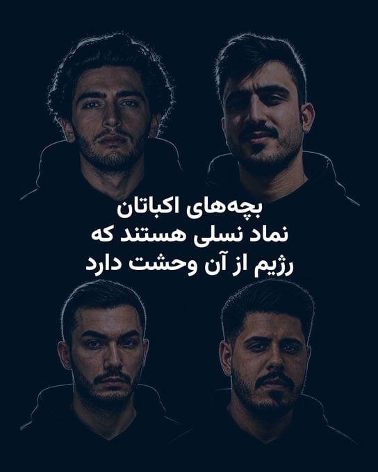

👑 
⭕️ صدور دوباره احکام اعدام برای چهار تن از بچه‌های اکباتان، میلاد آرمون، محمدمهدی حسینی، مهدی ایمانی و نوید نجاران، سند دیگری از ماهیت جنایتکار رژیم جمهوری اسلامی است که برای حفظ قدرت، جوانان ایران را به قتل می‌رساند و از خون مردم برای بقای خود تغذیه می‌کند.
رژیم ضحاکی جمهوری اسلامی، دادگاه را به ابزار سرکوب تبدیل کرده و اعدام، سلاحی برای ایجاد وحشت در جامعه است.
سکوت جهان در برابر اعدام معترضان ایرانی، یک شکست اخلاقی و سیاسی است. هر روزی که جامعه جهانی در برابر این رژیم مماشات می‌کند، جمهوری اسلامی با جسارت و قساوت بیشتری جان جوانان ایرانی را می‌گیرد و سرکوب را گسترش می‌دهد.
تا زمانی که این رژیم اهریمنی پابرجاست، تروریسم، گروگان‌گیری، افراط‌گرایی و کشتار حکومتی در ایران، منطقه و جهان پایان نخواهد یافت.
این رژیم سرچشمه بی‌ثباتی و خشونت در خاورمیانه است و بهای بقای آن را مردم ایران با جان خود می‌پردازند.
بچه‌های اکباتان نماد نسلی هستند که جمهوری اسلامی از آن وحشت دارد؛ نسلی که دیگر حاضر نیست زیر سایه ترس و سرکوب زندگی کند.

#بچه_های_اکباتان #شاهزاده_رضا_پهلوی
@DEJradio

## mamlekate — post 103588

  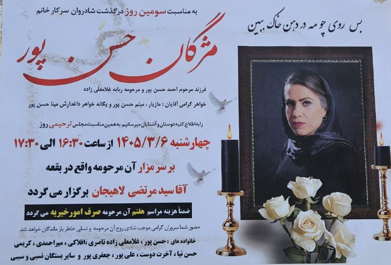

الو پنج‌شنبه عصر ۳۱ اردیبهشت حوالی ساعت ۵ ، توی آرامستان آقا سید مرتضی لاهیجان، خانمی ۴۶ ساله برای سر زدن به مزار پدر و مادرش، همراه با پسر ۷ ساله برادرش رفته بود قبرستان که یه حرومزاده میاد گیر حجاب میده میگه چرا حجابت رو رعایت نمیکنی؟ و خانم گفته پوشش من به تو چه ربطی داره آخه. اون اسلحه گرفته سمتش باز خانم نترسیده و داد و بیداد کرده. اومده شلیک کنه تفنگش گیر کرده و از اونجا میره. چند نفر هم دنبالش میفتن ولی قاتل بعد از چند دقیقه برمیگرده و این‌بار به سمتش میاد و ۵ تا تیر به این خانم میزنه و فرار میکنه. فضای قبرستان کاملاً بهم می‌ریزه و مردم سعی می‌کنن کمکش کنن تا آمبولانس برسه. میگن وقتی به بیمارستان منتقل میشه، حالش خیلی وخیم بوده و قبل از رسیدن به اتاق عمل وارد احیا میشه اما متأسفانه تلاش پزشک‌ها نتیجه نمی‌ده.

مژگان حسن‌پور به خونه ی تمام جاویدنام های لاهیجان سر زده بود و در اعتراضات هم دستگیر شده بود.

@mamlekate

## mamlekate — post 103587

  

۸۸ روز قطع اینترنت

@mamlekate

## VahidOnline — post 75740

  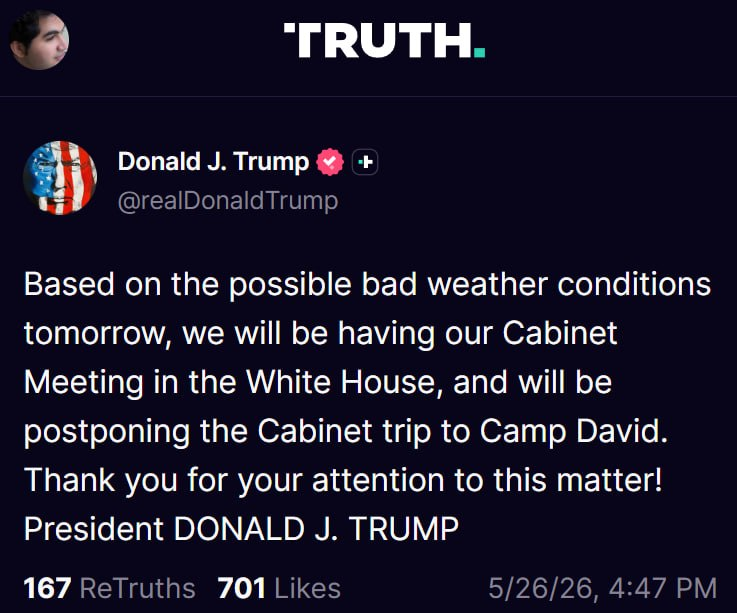

پست ترامپ، ترجمه ماشین:
با توجه به احتمال نامساعد بودن شرایط جوی در روز آینده، جلسه کابینه را در کاخ سفید برگزار خواهیم کرد و سفر کابینه به کمپ دیوید را به تعویق می‌اندازیم.

از توجه شما به این موضوع سپاسگزارم!
رئیس‌جمهور دونالد جی. ترامپ
realDonaldTrump

📡 @VahidOnline

## VahidOnline — post 75739

  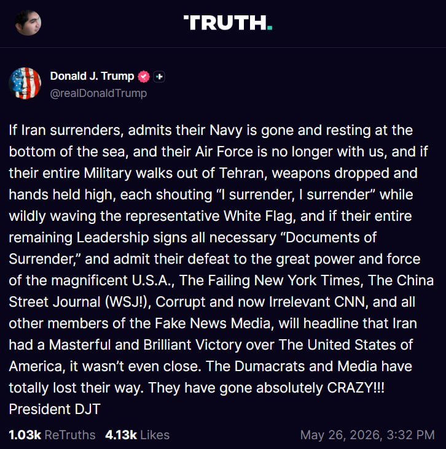

ترامپ متنی که ۸ روز پیش منتشر کرده بود رو دوباره پست کرد.

ترجمه ماشین:
اگر ایران تسلیم شود، اعتراف کند که نیروی دریایی‌اش از بین رفته و در کف دریا آرمیده، و نیروی هوایی‌اش دیگر در میان ما نیست؛ و اگر کل ارتشش از تهران بیرون بیاید، سلاح‌ها را زمین بگذارد و دست‌ها را بالا ببرد، در حالی که هر کدام فریاد می‌زنند «تسلیمم، تسلیمم» و با هیجان پرچم سفیدِ نمادین را تکان می‌دهند؛ و اگر تمام رهبران باقی‌مانده‌اش همه «اسناد تسلیم» لازم را امضا کنند و شکست خود را در برابر قدرت و نیروی عظیم ایالات متحده باشکوه آمریکا بپذیرند، نیویورک تایمز شکست‌خورده، چاینا استریت ژورنال، همان وال‌استریت ژورنال، سی‌ان‌ان فاسد و حالا بی‌اهمیت، و همه دیگر اعضای رسانه‌های جعلی، تیتر خواهند زد که ایران یک پیروزی استادانه و درخشان بر ایالات متحده آمریکا به دست آورد و اصلاً هم رقابت نزدیک نبود.

دموکرات‌ها و رسانه‌ها کاملاً راه خود را گم کرده‌اند. آن‌ها به‌کلی دیوانه شده‌اند!!!

رئیس‌جمهور دی‌جی‌تی
realDonaldTrump

📡 @VahidOnline

## kianmeli1 — post 87685

  <a href="telegram/content/kianmeli1_87685_1779839339.mp4" target="_blank">🎬 Download video</a>

🔴فاکس نیوز
جمهوری اسلامی درخواست ۲۴ میلیارد دلار برای هر توافقی با آمریکا کرده است.
https://t.me/kianmeli1

## IranIntlTV — post 339177

  <a href="telegram/content/IranIntlTV_339177_1779839340.mp4" target="_blank">🎬 Download video</a>

کاخ سفید تایید کرد دونالد ترامپ، رییس‌جمهوری آمریکا، قرار است چهارشنبه نشستی ویژه با کابینه خود برگزار کند. این خبر را یک مقام کاخ سفید به خبرگزاری فرانسه اعلام کرد.

نیلوفر منصوری، خبرنگار ایران‌اینترنشنال، درباره آخرین تحولات از مذاکرات آمریکا و جمهوری اسلامی می‌گوید
@iranintltv

## IranIntlTV — post 339176

  <a href="telegram/content/IranIntlTV_339176_1779839342.mp4" target="_blank">🎬 Download video</a>

ارتش اسرائیل با انتشار ویدیویی در تلگرام، از کشف و انهدام حدود ۱۱ کیلومتر تونل حماس در منطقه بیت‌حانون، در شرق «خط زرد» در شمال نوار غزه، خبر داد.
در اطلاعیه ارتش اسرائیل آمده است این منطقه سال‌ها به‌عنوان یکی از پایگاه‌های اصلی تروریستی حماس عمل می‌کرد و یکی از اصلی‌ترین و پیچیده‌ترین مناطق نبرد بود که نیروهای اسرائیل در طول جنگ در آن عملیات انجام دادند.

## IranIntlTV — post 339175

  <a href="telegram/content/IranIntlTV_339175_1779839343.mp4" target="_blank">🎬 Download video</a>

شادی از مشهد: مردم بدانند ما وسط تاریخیم و انقلاب فست‌فود نیست که بزنیم برود؛ زمان می‌برد

«یک ایران صدای شما را می‌شنود»

دوشنبه تا پنجشنبه ۱۱ شب تهران

از تلویزیون ایران اینترنشنال

تماشای نسخه کامل این قسمت از «برنامه» در یوتیوب:

https://youtu.be/FIC8NUzo9XI
@iranintltv

## IranIntlTV — post 339174

  <a href="telegram/content/IranIntlTV_339174_1779839344.mp4" target="_blank">🎬 Download video</a>

رضا از شیراز: بدون سازمان‌دهی و با کت‌وشلوار نمی‌شود انقلاب کرد

«یک ایران صدای شما را می‌شنود»

دوشنبه تا پنجشنبه ۱۱ شب تهران

از تلویزیون ایران اینترنشنال

تماشای نسخه کامل این قسمت از «برنامه» در یوتیوب:

https://youtu.be/FIC8NUzo9XI
@iranintltv

## IranIntlTV — post 339173

  <a href="telegram/content/IranIntlTV_339173_1779839346.mp4" target="_blank">🎬 Download video</a>

پیام از تهران: هزینهٔ درمان آن‌قدر بالا رفته که بعضی به عمل اورژانسی نمی‌رسند و می‌میرند

«یک ایران صدای شما را می‌شنود»

دوشنبه تا پنجشنبه ۱۱ شب تهران

از تلویزیون ایران اینترنشنال

تماشای نسخه کامل این قسمت از «برنامه» در یوتیوب:

https://youtu.be/FIC8NUzo9XI
@iranintltv

## IranIntlTV — post 339172

  <a href="telegram/content/IranIntlTV_339172_1779839347.mp4" target="_blank">🎬 Download video</a>

پیام از تهران: هزینهٔ درمان آن‌قدر بالا رفته که بعضی به عمل اورژانسی نمی‌رسند و می‌میرند

«یک ایران صدای شما را می‌شنود»

دوشنبه تا پنجشنبه ۱۱ شب تهران

از تلویزیون ایران اینترنشنال

تماشای نسخه کامل این قسمت از «برنامه» در یوتیوب:

https://youtu.be/FIC8NUzo9XI
@iranintltv

## IranIntlTV — post 339171

  <a href="https://t.me/IranintlTV/339171" target="_blank">📎 Download file</a>

🎧نسخه صوتی «برنامه با کامبیز حسینی»؛ بازگشت اینترنت ایران بعد از ۸۸ روز
@iranintlTV

## IranIntlTV — post 339170

  <a href="telegram/content/IranIntlTV_339170_1779839349.mp4" target="_blank">🎬 Download video</a>

گزارش‌های اختصاصی رسیده به ایران‌اینترنشنال نشان می‌دهد محمدباقر قالیباف، رییس هیئت مذاکره‌کننده جمهوری اسلامی، در هفته‌های اخیر به دنبال کنار گذاشتن سعید جلیلی از روند تصمیم‌گیری‌های مرتبط با مذاکرات بوده است.

گفت‌وگو با کامیار بهرنگ، عضو تحریریه ایران‌اینترنشنال
@iranintltv

## IranIntlTV — post 339169

  <a href="telegram/content/IranIntlTV_339169_1779839351.mp4" target="_blank">🎬 Download video</a>

مراد ویسی، تحلیلگر ارشد ایران‌اینترنشنال گفت: «بخش دیگری از صدای این روزهای مردم ایران، نارضایتی از رویکرد ترامپ در مقابل جمهوری اسلامی است. مردمی که انتظار داشتند او به وعده کمک در راه است عمل کند.»
@iranintltv

## IranIntlTV — post 339168

  

شورای امنیت سازمان ملل روز سه‌شنبه در بیانیه‌ای حمله به نیروگاه هسته‌ای براکه در امارات متحده عربی را محکوم کرد و این حمله را نقض قوانین بین‌المللی دانست. این شورا مسئولیت این حمله را به هیچ طرفی نسبت نداد.
امارات متحده عربی هفته گذشته اعلام کرد شش پهپاد از عراق به سوی این کشور پرتاب شده‌اند که یکی از آنها باعث آتش‌سوزی در نیروگاه هسته‌ای این کشور شده است.
عراق میزبان گروه‌های شبه‌نظامی قدرتمند مورد حمایت جمهوری اسلامی است که در جریان جنگ اخیر علیه جمهوری اسلامی، مسئولیت حمله به «پایگاه‌های دشمن» در عراق و منطقه را بر عهده گرفته‌اند.

https://iranintl.com/202605262953

## IranIntlTV — post 339167

  <a href="https://t.me/IranintlTV/339167" target="_blank">📎 Download file</a>

🎧نسخه صوتی سیاست با مراد ویسی: بازگشت صدای ملت
@iranintlTV

## IranIntlTV — post 339166

  <a href="telegram/content/IranIntlTV_339166_1779839352.mp4" target="_blank">🎬 Download video</a>

مراد ویسی، تحلیلگر ارشد ایران‌اینترنشنال، گفت: «مجتبی خامنه‌ای با تکرار رجزخوانی پدرش درباره نابودی اسرائیل، گفت اسرائیل ۱۵ سال دیگر نابود خواهد شد. رجزی که با واکنش و طعنه مقام‌های اسرائیلی روبه‌رو شده است.»
@iranintltv

## IranIntlTV — post 339165

  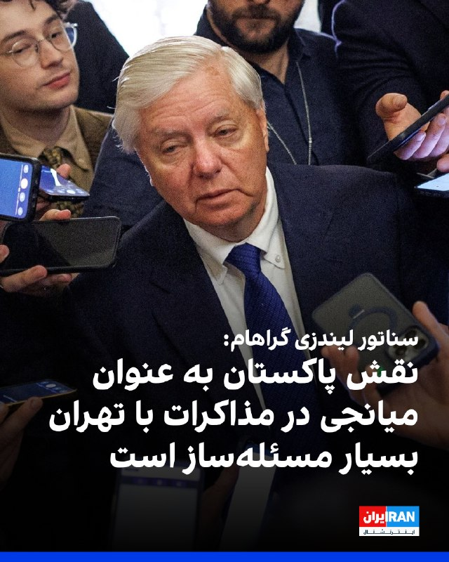

لیندسی گراهام، سناتور جمهوری‌خواه، با اشاره به اینکه هواپیماهای نظامی جمهوری اسلامی در پایگاه‌های هوایی پاکستان نگهداری می‌شوند، در ایکس نوشت نقش پاکستان به عنوان میانجی «بسیار مسئله‌ساز» است و خصومت این کشور با اسرائیل سابقه‌ای طولانی دارد.
لیندسی گراهام در ادامه از پاکستان خواست به درخواست دونالد ترامپ برای پیوستن به توافق‌های ابراهیم پاسخ مثبت دهد.

https://iranintl.com/202605260832

## IranIntlTV — post 339164

  

ترامپ در تروث‌سوشال نوشت با توجه به احتمال نامساعد شدن شرایط جوی در روز آینده، جلسه چهارشنبه کابینه را در کاخ سفید برگزار خواهد کرد و سفر کابینه به کمپ دیوید را به تعویق خواهد انداخت.
پیش‌تر گزارش شده بود که ترامپ صبح چهارشنبه در کمپ دیوید نشست کابینه را برگزار می‌کند. نیویورک‌پست نوشت در این نشست همه اعضای کابینه حضور خواهند داشت و جنگ ایران محور اصلی گفت‌وگوهاست. کاخ سفید اعلام کرد تولسی گبرد نیز در این نشست شرکت می‌کند.

https://iranintl.com/202605260928

## IranIntlTV — post 339163

  <a href="telegram/content/IranIntlTV_339163_1779839354.mp4" target="_blank">🎬 Download video</a>

مراد ویسی، تحلیلگر ارشد ایران‌اینترنشنال گفت: «اتصال دوباره دسترسی مردم به اینترنت بعد از سه ماه هر چند با فلیترینگ و با محدودیت اما بار دیگر به ملت امکان داد تا صدای مخالفت خود با جمهوری اسلامی و پایبندی به خیزش دی‌ماه و هدف سرنگونی را تکرار کنند.»
@iranintltv

## IranIntlTV — post 339162

  <a href="telegram/content/IranIntlTV_339162_1779839355.mp4" target="_blank">🎬 Download video</a>

مهدی خراتیان، کارشناس وابسته به حکومت، با اشاره به قصد احتمالی دونالد ترامپ بعد از انتخابات میان‌دوره‌ای ایالات متحده گفت اگر آمریکا پس از نوامبر ایران را تهدید کند و نشانه‌هایی از آمادگی نظامی دیده شود، جمهوری اسلامی باید از پیمان منع گسترش سلاح هسته‌ای خارج شود و ساخت سلاح اتمی را آغاز کند.

## IranIntlTV — post 339161

  

دفتر رسانه‌ای شاهزاده رضا پهلوی با انتشار بیانیه‌ای در واکنش به صدور حکم اعدام برای چهار شهروند ایرانی، نوشت: «صدور دوباره احکام اعدام برای چهار تن از بچه‌های اکباتان، میلاد آرمون، محمدمهدی حسینی، مهدی ایمانی و نوید نجاران، سند دیگری از ماهیت جنایتکار رژیم جمهوری اسلامی است که برای حفظ قدرت، جوانان ایران را به قتل می‌رساند و از خون مردم برای بقای خود تغذیه می‌کند.»

در این بیانیه آمده است: «رژیم ضحاکی جمهوری اسلامی، دادگاه را به ابزار سرکوب تبدیل کرده و اعدام، سلاحی برای ایجاد وحشت در جامعه است.»

دفتر رسانه‌ای شاهزاده رضا پهلوی نوشت: «سکوت جهان در برابر اعدام معترضان ایرانی، یک شکست اخلاقی و سیاسی است. هر روزی که جامعه جهانی در برابر این رژیم مماشات می‌کند، جمهوری اسلامی با جسارت و قساوت بیشتری جان جوانان ایرانی را می‌گیرد و سرکوب را گسترش می‌دهد.»
https://iranintl.com/202605265248

## IranIntlTV — post 339160

  <a href="telegram/content/IranIntlTV_339160_1779839357.mp4" target="_blank">🎬 Download video</a>

شرکت مخابرات اعلام کرد اینترنت بین‌الملل برای مشترکان این شرکت برقرار شده و نت‌بلاکس در شبکه ایکس نوشت میزان دسترسی به اینترنت بین‌المللی در ایران به ۸۶ درصد رسیده است. این در حالی است که ساعاتی پیش دیوان عدالت اداری، زیر نظر قوه قضاییه جمهوری اسلامی، اعلام کرد اجرای مصوبه اتصال اینترنت را متوقف کرده است.

گفت‌وگو با سحر تحویلی، پژوهشگر حوزه فناوری اطلاعات و نجات بهرامی، تحلیلگر سیاسی
@iranintltv

## IranIntlTV — post 339159

  <a href="telegram/content/IranIntlTV_339159_1779839359.mp4" target="_blank">🎬 Download video</a>

خبرگزاری تسنیم، وابسته به سپاه، گفت مذاکره‌کنندگان جمهوری اسلامی در چارچوب تفاهم احتمالی با آمریکا، دنبال آزادسازی ۲۴ میلیارد دلار از دارایی‌های بلوکه‌شده ایران هستند؛ پولی که به گفته منبع نزدیک به تیم مذاکره‌کننده، باید در جریان مذاکرات آزاد شود.

گفت‌وگو با علی شیرازی، عضو تحریریه ایران‌اینترنشنال
@iranintltv

## IranIntlTV — post 339158

  

افیخای ادرعی، سخنگوی ارتش اسرائیل، در شبکه ایکس از ساکنان هفت شهر و روستا در جنوب لبنان خواست برای حفظ جان خود این مناطق را ترک کنند.

سخنگوی عرب‌زبان ارتش اسرائیل با هشدار به ساکنان شهرها و روستاهای طورا، دیر قانون النهر، بدیاس، برج رحال، معرکه، العباسیه و طیر دبا، نوشت: «در پی نقض توافق آتش‌بس از سوی حزب‌الله، ارتش اسرائیل ناچار است با قدرت علیه آن اقدام کند. ارتش قصد آسیب رساندن به شما را ندارد.»

افیخای ادرعی تاکید کرد: «هر فردی که در نزدیکی نیروها، تاسیسات یا تجهیزات نظامی حزب‌الله حضور داشته باشد، جان خود را به خطر می‌اندازد.»
https://iranintl.com/202605261988

## Shin_Persian — post 6255

Shin ✓ @hey_itsmyturn
Tue, 26 May 2026 21:01:02 UTC

https://www.timesofisrael.com/liveblog_entry/initial-assessments-said-to-indicate-hamass-new-military-chief-successfully-killed-in-strike/

𝕏 · @shin_persian

## Shin_Persian — post 6254

Shin ✓ @hey_itsmyturn
Tue, 26 May 2026 20:45:59 UTC

So, Mohammed Odeh, the new commander of the Izziddin Al Qassam (Military wing of Hamas) is DEAD.

فارسی

بنابراین، محمد عوده، فرمانده جدید گردان‌های عزالدین قسام (شاخه نظامی حماس) کشته شد.

𝕏 · @shin_persian

## Shin_Persian — post 6253

  

DefenceGeek 🇬🇧 ✓ @DefenceGeek Tue, 26 May 2026 20:20:51 UTC A New Movement - Coronet East 024 #FreeIran‌ --- Operation EPIC FURY / Project FREEDOM --- KC-46A "BOBBY81" 19-46061 #AE5FA8 KC-46A "BOBBY82" 19-46007 #AE574D have launched on mission code for…

## Shin_Persian — post 6252

DefenceGeek 🇬🇧 ✓ @DefenceGeek
Tue, 26 May 2026 20:20:51 UTC

A New Movement - Coronet East 024 #FreeIran‌
--- Operation EPIC FURY / Project FREEDOM ---

KC-46A "BOBBY81" 19-46061 #AE5FA8
KC-46A "BOBBY82" 19-46007 #AE574D

have launched on mission code for Coronet East 024. No idea if they're dragging someone already or if this is a positioning flight, but we'll find out soon no doubt!

@MATA_osint

فارسی

یک جنبش جدید - Coronet East 024 #FreeIran
--- عملیات خشم حماسی (Operation EPIC FURY) / پروژه آزادی (Project FREEDOM) ---

KC-46A "BOBBY81" 19-46061 #AE5FA8
KC-46A "BOBBY82" 19-46007 #AE574D

با کد مأموریت Coronet East 024 به پرواز درآمدند. مشخص نیست که آیا همین حالا در حال اسکورت (سوخت‌رسانی) کسی هستند یا این یک پرواز موقعیت‌دهی است، اما بدون شک به زودی متوجه خواهیم شد!

@MATA_osint

𝕏 · @shin_persian

## Shin_Persian — post 6251

  

Shin ✓ @hey_itsmyturn
Tue, 26 May 2026 19:39:03 UTC

Well, don't blame me, he said it again :))

فارسی

خب، من را مقصر ندانید، او دوباره این را گفت :))

𝕏 · @shin_persian

## Shin_Persian — post 6250

  

Shin ✓ @hey_itsmyturn Tue, 26 May 2026 19:35:35 UTC President Trump @POTUS: "If Iran surrenders, admits their Navy is gone and resting at the bottom of the sea, and their Air Force is no longer with us, and if their entire Military walks out of Tehran, weapons…

## Shin_Persian — post 6249

Shin ✓ @hey_itsmyturn
Tue, 26 May 2026 19:35:35 UTC

President Trump @POTUS:
"If Iran surrenders, admits their Navy is gone and resting at the bottom of the sea, and their Air Force is no longer with us, and if their entire Military walks out of Tehran, weapons dropped and hands held high, each shouting “I surrender, I surrender” while wildly waving the representative White Flag, and if their entire remaining Leadership signs all necessary “Documents of Surrender,” and admit their defeat to the great power and force of the magnificent U.S.A., The Failing New York Times, The China Street Journal (WSJ!), Corrupt and now Irrelevant CNN, and all other members of the Fake News Media, will headline that Iran had a Masterful and Brilliant Victory over The United States of America, it wasn’t even close. The Dumacrats and Media have totally lost their way. They have gone absolutely CRAZY!!! President DJT"

فارسی

رئیس‌جمهور ترامپ @POTUS:
«اگر ایران تسلیم شود، اعتراف کند که نیروی دریایی‌شان نابود شده و در کف دریا آرمیده است، و نیروی هوایی‌شان دیگر در میان ما نیست، و اگر تمام نظامیانشان از تهران خارج شوند، در حالی که سلاح‌ها را زمین گذاشته و دست‌ها را بالا برده‌اند و هر یک فریاد می‌زنند "من تسلیم هستم، من تسلیم هستم" و همزمان دیوانه‌وار پرچم سفیدِ نمادین را تکان می‌دهند، و اگر تمام رهبریِ باقی‌مانده‌شان تمام "اسناد تسلیم" لازم را امضا کنند و به شکست خود در برابر قدرت و نیروی عظیم ایالات متحده (U.S.A.) باشکوه اعتراف کنند، آن وقت روزنامه فشل نیویورک تایمز، چاینا استریت ژورنال (وال استریت ژورنال - WSJ!)، سی‌ان‌ان (CNN) فاسد و اکنون بی‌اهمیت، و تمام دیگر اعضای رسانه‌های اخبار جعلی، تیتر خواهند زد که ایران پیروزی استادانه و درخشانی بر ایالات متحده آمریکا داشته است و حتی رقابت نزدیکی هم نبود. دموکرات‌ها و رسانه‌ها کاملاً راه خود را گم کرده‌اند. آن‌ها کاملاً دیوانه شده‌اند!!! رئیس‌جمهور دی‌جی‌اتی (DJT)»

𝕏 · @shin_persian

## FarsiVOA — post 218753

⚡️ستاد فرماندهی مرکزی آمریکا، سنتکام، روز سه‌شنبه تصویر سوخت‌گیری هوایی یک فروند جنگنده رادارگریز اف-۲۲ رپتور نیروی هوایی ایالات متحده هنگام پرواز بر فراز خاورمیانه را منتشر کرد. نیروهای سنتکام در عملیات «خشم حماسی» علیه جمهوری اسلامی شرکت داشتند.
@FarsiVOA

## FarsiVOA — post 218751

  <a href="telegram/content/FarsiVOA_218751_1779839363.mp4" target="_blank">🎬 Download video</a>

⚡️تورم در اروپا سرسخت‌تر از پایان تنش‌ها؛ افزایش نرخ بهره حتی در صورت توافق با جمهوری اسلامی
@FarsiVOA

## FarsiVOA — post 218750

🔺لیندزی گراهام: پاکستان به درخواست رئیس جمهوری آمریکا برای پیوستن به پیمان ابراهیم باید پاسخی بدهد

▪️لیندزی گراهام، سناتور جمهوری‌خواه آمریکایی روز سه‌شنبه ۵ خرداد در شبکه اجتماعی ایکس بار دیگر از میانجی‌گری پاکستان در خصوص عملیات مشترک آمریکا و اسرائيل علیه جمهوری اسلامی انتقاد کرد و اسلام‌آباد را تلویحا یک میانجی‌ بی‌طرف ندانست.

⬇️ بیشتر بخوانید:
https://ir.voanews.com/a/8154197.html
@FarsiVOA

## FarsiVOA — post 218749

  <a href="telegram/content/FarsiVOA_218749_1779839363.mp4" target="_blank">🎬 Download video</a>

⚡️اتصال محدود به اینترنت بعد ۸۸ روز خاموشی دیجیتال در ایران؛ واکنش کاربران شبکه‌های اجتماعی
@FarsiVOA

## FarsiVOA — post 218748

  <a href="telegram/content/FarsiVOA_218748_1779839364.mp4" target="_blank">🎬 Download video</a>

⚡️جزئیات «حملات دفاعی» آمریکا بە مواضع جمهوری اسلامی در جنوب ایران
@FarsiVOA

## FarsiVOA — post 218747

⚡️جمهوری اسلامی در مرکز توجه کنگره آمریکا؛ همزمان با رقابت‌های درون‌حزبی ایالت‌ها
@FarsiVOA

## FarsiVOA — post 218746

🔺منابع خبری: ترامپ و نتانیاهو سه‌شنبه تلفنی گفت‌وگو کردند

▪️منابع خبری در اسرائیل اعلام کردند دونالد ترامپ رئیس جمهوری آمریکا، و بنیامین نتانیاهو نخست وزیر اسرائیل، سه‌شنبه ۵ خرداد تلفنی با هم گفت‌وگو کردند.

⬇️ بیشتر بخوانید:
https://ir.voanews.com/a/8154194.html
@FarsiVOA

## FarsiVOA — post 218745

⚡️لفاظی‌های جمهوری اسلامی برای آمریکا
@FarsiVOA

## FarsiVOA — post 218744

  

⚡️دونالد ترامپ، رئیس جمهوری آمریکا، روز سه‌شنبه ۵ خرداد در شبکه تروت‌سوشال گفت به دلیل شرایط احتمالی بد آب و هوایی در روز چهارشنبه، نشست کابینه در کاخ سفید برگزار می‌شود و سفر به «کمپ دیوید» به آینده موکول شده است.

پیشتر رسانه‌ها گزارش داده بودند که نشست ویژه رئیس جمهوری آمریکا و اعضای کابینه روز چهارشنبه در کمپ دیوید برگزار خواهد شد.

خبر این نشست ساعاتی پس از آن گزارش شد که نیروهای ایالات متحده روز دوشنبه چند قایق تندرو سپاه و سایت‌های موشکی جمهوری اسلامی را هدف قرار دادند. رسانه‌های حکومتی در ایران از کشته شدن چند تن از اعضای سپاه خبر دادند.
@FarsiVOA

## FarsiVOA — post 218743

🔺دونالد ترامپ روز چهارشنبه با اعضای کابینه خود نشست ویژه‌ای در «کمپ دیوید» برگزار می‌کند

▪️کاخ سفید روز سه‌شنبه ۵ خرداد اعلام کرد دونالد ترامپ، رئیس جمهوری ایالات متحده، روز چهارشنبه نشست ویژه‌ای را با حضور تمام اعضای کابینه در کمپ دیوید برگزار خواهد کرد.

⬇️ بیشتر بخوانید:
https://ir.voanews.com/a/president-trump-special-camp-david-cabinet-meeting-iran/8154183.html
@FarsiVOA

## FarsiVOA — post 218742

  <a href="telegram/content/FarsiVOA_218742_1779839365.mp4" target="_blank">🎬 Download video</a>

⚡️مهدی فتا پور: هم آمریکا و هم جمهوری اسلامی خواهان توافق هستند
@FarsiVOA

## FarsiVOA — post 218741

  <a href="telegram/content/FarsiVOA_218741_1779839365.mp4" target="_blank">🎬 Download video</a>

⚡️نازیلا گلستان در برنامه تفسیر خبر: بخش ولایت فقیه جمهوری اسلامی از بین رفته است
@FarsiVOA

## FarsiVOA — post 218740

  <a href="telegram/content/FarsiVOA_218740_1779839366.mp4" target="_blank">🎬 Download video</a>

⚡️کامبیز غفوری در برنامه تفسیر خبر: دنیا کمتر به قطر اعتماد می کند تا امارات متحده عربی
@FarsiVOA

## FarsiVOA — post 218739

  <a href="telegram/content/FarsiVOA_218739_1779839367.mp4" target="_blank">🎬 Download video</a>

⚡️گزارش نرگس صبا در برنامه تفسیر خبر از پول‌های بلوکه شده ایران در قطر
@FarsiVOA

## FarsiVOA — post 218738

🔺ترامپ: اگر نیروهای جمهوری اسلامی پرچم سفید را بالا بگیرند باز «رسانه‌های جعلی» می‌گویند رژیم «استادانه پیروز» شد

◾️دونالد ترامپ، رئیس‌جمهوری آمریکا، روز سه‌شنبه از نحوه پوشش اخبار مربوط به عملیات نظامی «خشم حماسی» آمریکا علیه جمهوری اسلامی در برخی رسانه‌ها انتقاد کرد.

⬇️ بیشتر بخوانید:
https://ir.voanews.com/a/8154178.html
@FarsiVOA

## Persian_Trend_Official — post 15092

  <a href="telegram/content/Persian_Trend_Official_15092_1779839367.mp4" target="_blank">🎬 Download video</a>

شبتون بخیر ❤️

📝 Nick

📌 @persian_trend_official
پرشین ترند | متفاوت‌ترین کانال نظامی

## Persian_Trend_Official — post 15091

  <a href="telegram/content/Persian_Trend_Official_15091_1779839368.webm" target="_blank">🎬 Download video</a>

📣 لطفا تا جایی که میتونین اپ های گوشی و کامپیوتر یا لپ‌تاپ، اپ های خود سیستم و سیستم عامل رو آپدیت کنید.

❗️ اپ های قدیمی ریسک امنیتی بیشتری دارن.

📝 Nick

📌 @persian_trend_official
پرشین ترند | متفاوت‌ترین کانال نظامی

## Persian_Trend_Official — post 15090

💢ترامپ اعلام کرد: جلسه کابینه به دلیل شرایط آب و هوایی فردا در کاخ سفید برگزار خواهد شد، نه در کمپ دیوید/انتخاب

🫆:Tony

📌 @persian_trend_official
پرشین ترند | متفاوت‌ترین کانال نظامی

## Persian_Trend_Official — post 15089

https://youtube.com/live/TrPiEz5YpyQ?feature=share

## Persian_Trend_Official — post 15088

  <a href="https://t.me/persian_trend_official/15088" target="_blank">📎 Download file</a>

فایل صوتی لایو اول
نسخه کم حجم - 10.33 مگابایت

اتاق جنگ سه شنبه 5 خرداد | درگیری مرگبار در خلیج فارس اینترنت فعلا آزاد شد.

📝 Nick

📌 @persian_trend_official
پرشین ترند | متفاوت‌ترین کانال نظامی

## Persian_Trend_Official — post 15087

  <a href="telegram/content/Persian_Trend_Official_15087_1779839369.mp4" target="_blank">🎬 Download video</a>

⭕️پهپاد لوکاس امریکایی سالم در دست عراقی ها

🫆:Tony

📌 @persian_trend_official
پرشین ترند | متفاوت‌ترین کانال نظامی

## Persian_Trend_Official — post 15086

  

⭕️ محمد عوده فرمانده گردان قسام حماس توسط ارتش اسرائیل ترور شده است.

🫆:Tony

📌 @persian_trend_official
پرشین ترند | متفاوت‌ترین کانال نظامی

## RadioFarda — post 157588

  <a href="https://t.me/radiofarda/157588" target="_blank">📎 Download file</a>

«حملات آمریکا به جنوب ایران و ابهام در مذاکرات پیش رو»

🔸در حالی که میانجی‌گران پاکستانی و قطری در روزهای گذشته، برای پیشبرد توافق موقت و بازگشایی تنگه هرمز تلاش می‌کنند، حملات بامداد سه‌شنبه آمریکا به اهدافی درجنوب ایران و نزدیکی تنگه هرمز،‌ ابهاماتی را بر سر به نتیجه رسیدن این گفتگوها ایجاد کرده است. از سوی دیگر، میزان و نحوه آزادسازی منابع مسدودشده ایران از سوی آمریکا نیز، از دیگر موانع موجود در آغاز مذاکرات دو طرف عنوان شده است. در همین زمینه، ارزیابی امید معماریان، کارشناس مسائل ایران در اندیشکدهٔ داون «DAWN» در واشینگتن را جویا شده ایم.

@RadioFarda

## IranianMinds — post 20849

🔴 صداوسیما :

بازکردن اینترنت تو این شرایط خیلی کار خطرناک و غیرقانونی بوده و سریع باید راجبش یه کاری انجام بدیم !

@IranianMinds

## IranianMinds — post 20848

  <a href="https://t.me/IranianMinds/20848" target="_blank">📎 Download file</a>

سرور فوق العاده پرسرعت و قوی مخصوص اینستا و یوتیوب سرعت فضایی مخصوص همراه اول مخابرات

آموزش اتصال در اندروید

آموزش اتصال در آیفون

حتما شیر بدید بقیه هم متصل شن لطفا دانلود سنگین هم نزنید ❤️‍🔥

@IranianMinds

## IranianMinds — post 20847

  <a href="https://t.me/IranianMinds/20847" target="_blank">📎 Download file</a>

سرور فوق العاده پرسرعت و قوی مخصوص اینستا و یوتیوب سرعت فضایی مخصوص همراه اول مخابرات

آموزش اتصال در اندروید

آموزش اتصال در آیفون

حتما شیر بدید بقیه هم متصل شن لطفا دانلود سنگین هم نزنید ❤️‍🔥

@IranianMinds

## IranianMinds — post 20846

  <a href="https://t.me/IranianMinds/20846" target="_blank">📎 Download file</a>

سرور فوق العاده پرسرعت و قوی مخصوص اینستا و یوتیوب سرعت فضایی مخصوص همراه اول مخابرات

آموزش اتصال در اندروید

آموزش اتصال در آیفون

حتما شیر بدید بقیه هم متصل شن لطفا دانلود سنگین هم نزنید ❤️‍🔥

@IranianMinds

## IranianMinds — post 20844

خر خودتانید!

وقتی هواپیمای نخبه‌های جوان را زدید، تا سه روز گفتید هیچ نمی‌دانید، گفتید خودش سقوط کرده.
بعد از اینکه ترامپ نصیحت‌تان کرد راستش را بگویید، اگر اشتباهی زده‌اید بگویید...
تا فهمیدید دنیا اسناد جنایت شما را دارد ناگهان یادتان آمد دو‌ موشک هم با بی‌رحمی به سمت هواپیما شلیک کرده بودید و البته قرار نبوده کسی بفهمد!
کسی به شما نگفته بوده که "خیلی خرید"
(حیف از ان حیوان نجیب) حالا بدانید!

فکر می‌کنید وقتی گفتید فلانی و فلانی در زندان خودکشی کردند، فلانی و فلانی به مرگ طبیعی مُردند، فکر می‌کنید وقتی جوان‌هایی پس از ازادی ناگهان سکته می‌کنند و شما می.گویید عمر دست خداست. ما چه می‌گوییم؟
خر خودتانید. ولی آنقدر احمقید که نمی‌فهمید چقدر خرید.

وقتی می‌گویید قیمت دلار آزاد در زندگی مردم هیچ تاثیر مهمی ندارد!
وقتی می‌گویید آمریکا از ما می‌ترسد.
وقتی می‌گویید ما در خارج از مرزها کاری نمی‌کنیم.
وقتی می‌گویید مهاجرت‌ها نگران کننده نیستند!
وقتی می‌گویید مردم ما را می‌خواهند،
چه نیازی به رفراندوم است.
وقتی می‌گویید ما بخاطر خدا حکومت می‌کنیم.
می‌دانید ما چه می‌گوییم، نه در گوشی؛
"خر خودتانید"
خیلی خرید
شما آنقدر احمقید
که ارزش گفتگو ندارید
آنقدر نجس شده‌اید که دست دادن با شما
هر کسی را نجس و ناپاک می‌کند
بروید و بمیرید با حقارت، با روسیاهی.

ببینید جز عده‌ای مواجب بگیر
عده‌ای روسیاه‌تر از خودتان
چیزی برایتان مانده!؟

@IranianMinds

## IranianMinds — post 20843

💯 اگر هنوز ۵۰۰ هزارتومان رو نگرفتی همین الان عضو شو‌ و جایزتو بگیر
نیازی هم به واریز نیست

👍 تنها سایت مورد #تایید ما با بونوس های واقعی

🌐 Winro.io

## IranianMinds — post 20842

  <a href="telegram/content/IranianMinds_20842_1779839371.webm" target="_blank">🎬 Download video</a>

💩 
⚠️ دیگه #فریب بونوس های الکی سایت های سودجو رو نخورید
❌

💲بیا توی سایت مورد تایید ما یعنی #وینرو و با عضویت 500 هزار تومان اعتبار بی قیدو شرط بگیر
👏

🤩با عضویت 
🤩 
🤩 
🤩 هزار تومان اعتبار رایگان بگیر!

⌛ پشتیبانی 24 ساعته

🌐 Winro.io

🌐 Winro.io
کانال بونوس های رایگان5a1

📱 @winro_io

## IranianMinds — post 20841

کاش ماهم میتونستیم مثل اینترنت برگردیم به قبل از دی ماه

@IranianMinds

## IranianMinds — post 20840

  <a href="https://t.me/IranianMinds/20840" target="_blank">📎 Download file</a>

سرور فوق العاده پرسرعت و قوی مخصوص اینستا و یوتیوب سرعت فضایی مخصوص همراه اول مخابرات

آموزش اتصال در اندروید

آموزش اتصال در آیفون

حتما شیر بدید بقیه هم متصل شن لطفا دانلود سنگین هم نزنید ❤️‍🔥

@IranianMinds

## IranianMinds — post 20839

سلام دوستان من نتم تازه وصل شده آقای خامنه ای عید نوروز رو تبریک نگفتن اتفاقی افتاده خدایی نکرده؟

## IranianMinds — post 20838

  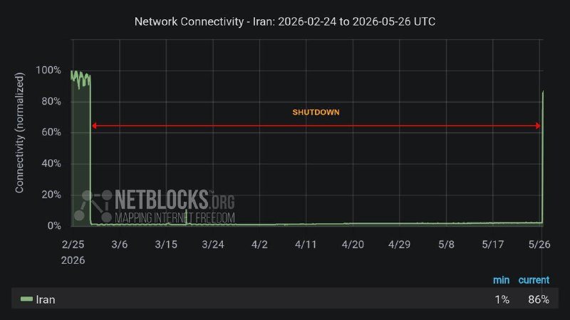

🔴 نت‌بلاکس :
در ایران ۸۶ درصد مردم تا الان وصل شدن.

@IranianMinds

## BBCPersian — post 282136

🖊کیلین دولین، بخش راستی‌آزمایی بی‌بی‌سی و فیبی کین، بی‌بی‌سی

«احساس کردم تمام کشتی لرزید. فکر کردم شاید موتور دچار نقص فنی شده باشد. اما به محض اینکه از اتاقم بیرون آمدم، انفجار دیگری رخ داد.»

سونیل پونیا، ۲۶ ساله، نخستین ماموریت دریایی خود را می‌گذراند که در ساعات اولیه اول مارس، موشکی به نفتکش اسکای‌لایت اصابت کرد.

این کشتی که تحت تحریم آمریکا بود، از دوبی حرکت کرده بود و به تنگه هرمز، یکی از پرترددترین مسیرهای کشتیرانی جهان، نزدیک می‌شد. اسکای‌لایت نخستین کشتی تجاری بود که پس از آغاز جنگ آمریکا و اسرائیل با ایران در منطقه هدف قرار گرفت.

هنگام حمله، سونیل در کابین خود در طبقه سوم خواب بود. وقتی بیدار شد، کشتی را در هرج‌ومرج دید. موشک به موتورخانه اصابت کرده بود و آتشی به راه انداخته بود که به‌سرعت در کشتی گسترش یافت.

او می‌گوید: «همه‌جا کاملا تاریک شده بود و دود همه‌جا را گرفته بود. همه برای نفس کشیدن مشکل داشتند.»

آلبوم را ورق بزنید و برای خواندن مطلب کامل به لینک زیر مراجعه کنید.

https://bbc.in/4vangxd
📸GettyImages/Reuters/ Sunil Puniya/ Family of Dalip Rathore/ Rex Pereira/ Sunil Pereira

## BBCPersian — post 282135

  

🔻علی خطیر، عضو هیئت رئیسه فدراسیون فوتبال ایران، از همراهی با کاروان تیم ملی فوتبال مردان این کشور به جام جهانی انصراف داده است. او سومین عضو از گروه بزرگ همراهان تیم ملی ایران است که به زودی عازم کمپ خود در مکزیک و آماده سه مسابقه مقدماتی در کرانه غربی آمریکا خواهد شد.

خبرگزاری دولت ایران روز سه‌شنبه نوشت آقای خطیر با ارسال نامه‌ای به مهدی تاج، رئیس فدراسیون فوتبال اعلام کرده «به دلیل مشغله کاری و همچنین عدم نیاز به حضورش در این تورنمنت، در سفر همراه کاروان فدراسیون شرکت نخواهد کرد.»

ایرنا نوشته پیش از این هم حیدر بهاروند و محمدرحمان سالاری دیگر اعضای هیات رئیسه» از همراهی کاروان ایران انصراف داده بودند.

انصراف آقای خطیر و دیگر اعضای همراه تیم ایران در حالی است که هنوز گزارشی از نتیجه درخواست روادیدهای اعضای کرد.

روز سه‌شنبه همچنین گزارش شد علیرضا جهانبخش، کاپیتان تیم ملی و همچنین، دنیس درگاهی، مهاجم جدید ایرانی‌تبار تیم ایران به اردوی ترکیه پیوسته‌اند تا جمع بازیکنان این اردو تکمیل شود.

📷SNN
@bbcpersian

## BBCPersian — post 282133

🔻تصاویر تازه‌ منتشر شده از «تلما» یوز معروف «تلخاب» که آبان گذشته در محدوده جاجرم و پناهگاه حیات‌وحش میاندشت ثبت شده، بار دیگر توجه‌ها را به یوز آسیایی که ایران آخرین زیستگاه طبیعی آن محسوب می‌شود، جلب کرده است.

فعالان محیط‌زیست می‌گویند هر ثبت تازه، نه فقط یک خبر امیدوارکننده، بلکه داده‌ای حیاتی برای ارزیابی آینده یکی از نادرترین گوشت‌خواران جهان است.

تلما سال ۱۳۹۸ به دنیا آمد و سال ۱۴۰۱، ثبت چهار توله همراه او یکی از مهم‌ترین نشانه‌های موفقیت زادآوری طبیعی یوز آسیایی در سال‌های اخیر تلقی شد.

تصاویر جدید او که در ۱۹ آبان ۱۴۰۴ ثبت شده اما روز سه‌شنبه ۴ خرداد منتشر شده، نشان می‌دهد او بار دیگر موفق به بزرگ کردن دست‌کم یک توله یک ساله شده است؛ موضوعی که از نگاه کارشناسان محیط‌زیست، برای جمعیتی که شمار آن به ده‌ها قلاده محدود شده، اهمیتی حیاتی دارد.

پناهگاه حیات‌وحش میاندشت در خراسان شمالی، در کنار ذخیره‌گاه زیست‌کره توران در سمنان، از معدود زیستگاه‌هایی است که هنوز نشانه‌هایی از زادآوری طبیعی یوز آسیایی در آن ثبت می‌شود.

📷SNN
@bbcpersian

## BBCPersian — post 282131

  

🔻یک شب پس از آن که فرماندهی مرکزی نیروی دریایی آمریکا - سنتکام - از حمله به چند سایت پرتاب موشک و قایق تندرو ایران در نزدیکی سواحل بندرعباس و تنگه هرمز خبر داد و آن را «حمله تدافعی» خواند، وزارت خارجه ایران با صدور بیانیه‌ای این اقدام را «نقض فاحش آتش‌بس» و «دلیل سوءظن عمیق» ایران به آمریکا دانسته است.

در بیانیه روز سه‌شنبه وزارت خارجه ایران که بخشی از آن را برایتان پیش تر همینجا گزارش کردیم و متن کامل آن اکنون منتشر شده،‌ آمده است: « ارتکاب این اقدامات تجاوزکارانه، همزمان با روند دیپلماتیک جاری به میانجیگری پاکستان، بار دیگر بدسگالی و بدعهدی هیات حاکمه آمریکا را برای ملت ایران، مردمان منطقه و جامعه جهانی عیان کرد و نشان داد که رویکرد اصولی ملت ایران، در هر سه عرصه میدان، خیابان و دیپلماسی، مبنی بر سوء ظن عمیق نسبت به رژیم آمریکا مبتنی بر منطق و فهمی عمیق از ماهیت و عملکرد کین‌توزانه و جنایتکارانه آن در قبال مردم ایران است.»

ادامه خبر در لینک زیر:

https://bbc.in/4306rcp
📷EPA
@bbcpersian

## BBCPersian — post 282130

  <a href="https://t.me/bbcpersian/282130" target="_blank">📎 Download file</a>

پادکست برنامه شصت دقیقه روز سه‌شنبه ۵ خرداد ۱۴۰۵

این نسخه رادیویی برنامه شصت دقیقه تلویزیون فارسی بی‌بی‌سی است که هرشب بعد از پخش، با حجم کم از اپلیکیشن‌های پادگیر و صفحه تلگرام بی‌بی‌سی فارسی در دسترس است.

با هشتگ BBCPersianRadio# با ما در ارتباط باشید

## BBCPersian — post 282129

🔻نتانیاهو بار دیگر درباره «تشدید حملات به لبنان» هشدار داد

بنیامین نتانیاهو، نخست وزیر اسرائیل، روز سه‌شنبه بار دیگر تایید کرد که کشورش عملیات خود در لبنان را «تشدید» می‌کند.

خبرنگار خبرگزاری فرانسه در نبطیه از حملات هوایی پس از هشدار در روز سه‌شنبه خبر داد و شاهد برخاستن ستون‌های دود از نقاط مختلف شهر بود.

خبرگزاری دولتی لبنان اعلام کرد که یکی از حملات در نزدیکی یک بیمارستان دولتی بود و «خسارات قابل توجهی به بخش‌های بیمارستان» وارد کرده است.

همزمان با گسترش عملیات اسرائیل به جنوب لبنان، حزب‌الله اعلام کرد که نیروهایش روز سه‌شنبه با نیروهای اسرائیلی که سعی داشتند به شهری مشرف به شهر نبطیه پیشروی کنند، مقابله کردند.

حزب‌الله مسئولیت مجموعه‌ای از شلیک‌ پهپادها و موشک‌ها به نیروهای اسرائیلی در این شهر را بر عهده گرفته است.

https://bbc.in/4uEhi80
@bbcpersian

## BBCPersian — post 282128

🔻نماینده مجلس شورای اسلامی: قرار بود پول مسدود شده ایران از طریق روسیه وارد ایران شود

احمد بخشایش اردستانی، عضو کمیسیون امنیت ملی و سیاست خارجی مجلس، در اظهاراتی به پول‌های مسدود شده ایران اشاره کرده است.

او گفته است: «یک روایت این است که ایران می‌گوید ۲۵ میلیارد دلار بوده، اما آمریکایی‌ها گفته بودند فقط ۱۲ میلیارد دلار آن هم در قطر است.»

این نماینده مجلس در ادامه گفته است: «حتی قرار بود چند روز پیش این پول از طریق روسیه وارد ایران شود، ولی آمریکایی‌ها مانع ایجاد کردند و الان مقدارش حدود ۱۲ میلیارد دلار است که در قطر قرار دارد. من تا اینجا این را می‌دانم.»

بر اساس گزارش‌های رسمی، سفر هیئت ایرانی به ریاست محمدباقر قالیباف به قطر با هدف مذاکره بر سر برخی از دارایی‌های ایران بوده که به دلیل تحریم‌های ایالات متحده مسدود شده است.

درباره نتایج این سفر گزارش رسمی منتشر نشده اما رسانه‌ها دیروز گفته بودند تفاهم‌هایی در این زمینه به دست آمده است.

https://bbc.in/4uEhi80
@bbcpersian

## BBCPersian — post 282127

  <a href="telegram/content/BBCPersian_282127_1779839374.mp4" target="_blank">🎬 Download video</a>

⭕️ سرخط خبرهای سه‌شنبه ۵ خرداد ۱۴۰۵

@BBCPersian

## Dirty_Kids — post 390288

  <a href="telegram/content/Dirty_Kids_390288_1779839375.webm" target="_blank">🎬 Download video</a>

☢️خفن ترین و‌ قدیمی ترین  انالیزور  ایران ینی دکتر بت 
👍 
🔴مسابقات جذاب جام جهانی به زودی شروع میشه بیا توی کانال دکتر بت و باهاش همراه شو و پول در بیار
💵 رایگان بهترین شرط هارو براتون میذاره حتی هزار تومن هم دریافت نمیکنه روزانه میتونی از پیش بینی فوتبال باهاش…

## Dirty_Kids — post 390287

  <a href="telegram/content/Dirty_Kids_390287_1779839376.webm" target="_blank">🎬 Download video</a>

☢️خفن ترین و‌ قدیمی ترین  انالیزور  ایران ینی دکتر بت 
👍

🔴مسابقات جذاب جام جهانی به زودی شروع میشه بیا توی کانال دکتر بت و باهاش همراه شو و پول در بیار
💵

رایگان بهترین شرط هارو براتون میذاره
حتی هزار تومن هم دریافت نمیکنه
روزانه میتونی از پیش بینی فوتبال باهاش پول در بیاری 👌
A5

🌟اگ اهل پیش بینی فوتبالی این کانال اصلا از دست ندین
👇

✅https://t.me/+4_ADqwB9e-QwYjlk

✅https://t.me/+4_ADqwB9e-QwYjlk

## Dirty_Kids — post 390286

  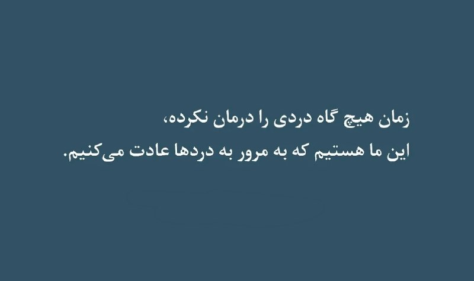

#بخوابیم

@Dirty_Kids 👻

## Dirty_Kids — post 390285

  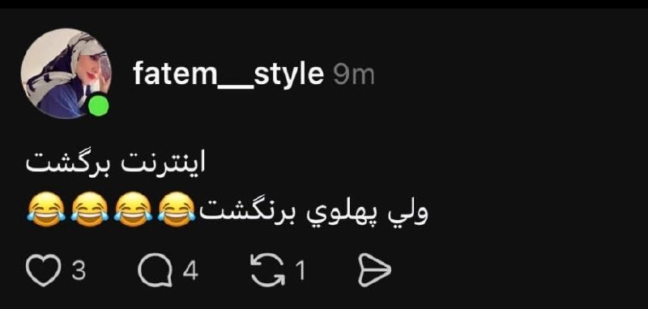

احتمال برگشت پهلوی هست اما عاقات دیگه برنمیگرده 🕳💣

@Dirty_Kids 👻

## Dirty_Kids — post 390284

  <a href="telegram/content/Dirty_Kids_390284_1779839377.mp4" target="_blank">🎬 Download video</a>

به خونه خوش اومدین برخط‌های شیطون❤️

@Dirty_Kids 👻

## Dirty_Kids — post 390283

میگفتن ۴۰ میلیون جان‌فدا دارن.
ولی از وقتی نت وصل شده هرکی آنلاین شده اول مینویسه کیرم تو خامنه‌ای.

@Dirty_Kids 👻

## Dirty_Kids — post 390282

تنها سودی که ترامپ داشت این بود که باعث شد یه مدت قیافه‌ی فرید کنزو رو نبینیم

@Dirty_Kids 👻

## Dirty_Kids — post 390281

اینکه شب عید قربان نت وصل کردن حس گوسفندی رو دارم که قبل ذبح اب بهش میدن

@Dirty_Kids 👻

## Dirty_Kids — post 390280

  <a href="telegram/content/Dirty_Kids_390280_1779839378.mp4" target="_blank">🎬 Download video</a>

مراد ویسی: رجز خونی مجتبی

@Dirty_Kids 👻

## Dirty_Kids — post 390279

بگو نتا رو قطع کنن جنبه نداریم تو ۲ساعت ۵بار جق زدم

@Dirty_Kids 👻

## Dirty_Kids — post 390278

  

خب مثل اینکه وصل کردن نت برای این بوده که ساخت بدل مجتبی تکمیل شده

ولی نتونستن کارو خوب در بیارن چون دقیقا شبیهش نیست😂😂😂😂

@Dirty_Kids 👻

## Dirty_Kids — post 390277

  <a href="telegram/content/Dirty_Kids_390277_1779839380.mp4" target="_blank">🎬 Download video</a>

از کسایی که تو تجمعات شبانه شرکت کردن دارن میپرسن نظرتون با قطع دائم اینستاگرام چیه؟

و اما جواب پرستوهای ولایی:

@Dirty_Kids 👻

## Dirty_Kids — post 390276

امشب مدیر سایت پورن هاپ:

ویورِرررررررررره🤯

@Dirty_Kids 👻

## Dirty_Kids — post 390275

  <a href="telegram/content/Dirty_Kids_390275_1779839381.mp4" target="_blank">🎬 Download video</a>

خداخافظ بله.
خداحافظ روبیکا.
خداحافظ ایتا.
خداحافظ سروش.
خداحافظ آیگپ.
خداحافظ گپ جی‌پی‌تی‌.
خداحافظ ذره‌بین.
خداحافظ گردو.

سلام یارای قدیمی 😂😍
سلام اطلاعات آزاد

@Dirty_Kids 👻

## Dirty_Kids — post 390274

من عادت ندارم همه چی با هم وصل باشه، هر چه سریعتر برق رو قطع کنید

@Dirty_Kids 👻

## Dirty_Kids — post 390273

سلام دوستان من نتم تازه وصل شده آقای خامنه ای عید نوروز رو تبریک نگفتن اتفاقی افتاده خدایی نکرده؟

@Dirty_Kids 👻

## Dirty_Kids — post 390272

‏کانفیگ فروشا تو شوک رفتن چیزی نمیگن؛ قیمت رو آپدیت کن چاقال میخوام با ۵۰ هزار تومن ۱۰۰ گیگ بخرم.

@Dirty_Kids 👻

## Dirty_Kids — post 390271

کاش سریال succession رو فراموش میکردم تا دوباره ببینمش
تو هیچ سریالی انقدر حس های متفاوتی رو تجربه نکرده بودم

@Dirty_Kids 👻

## Dirty_Kids — post 390270

  <a href="telegram/content/Dirty_Kids_390270_1779839382.mp4" target="_blank">🎬 Download video</a>

شاید باورتون نشه ولی ملت هنوز هم خوب کسخلن؛
جلسه پاکسازی روح و روان که خداتومن هزینشه :

@Dirty_Kids 👻

## Dirty_Kids — post 390269

  <a href="telegram/content/Dirty_Kids_390269_1779839384.mp4" target="_blank">🎬 Download video</a>

وای بچه‌ها اینو !
ما چرا ندیدیم لعنتیا 😂

#عجب_وضع_کسشریه

@Dirty_Kids 👻

## alonews — post 122958

  <a href="telegram/content/alonews_122958_1779839385.mp4" target="_blank">🎬 Download video</a>

👈حملات اسرائیل به سُهمور در دره بقاع در لبنان.

✅ @AloNews خبر جنگ

## alonews — post 122957

  <a href="telegram/content/alonews_122957_1779839386.webm" target="_blank">🎬 Download video</a>

👈کی‌سی‌ان‌ای، رسانه دولتی کره شمالی: کره شمالی آزمایشی از سیستم پرتاب موشک چندمنظوره جدید انجام داده است

✅ @AloNews خبر جنگ

## alonews — post 122956

  <a href="telegram/content/alonews_122956_1779839386.webm" target="_blank">🎬 Download video</a>

👈رسایی: بازکردن اینترنت اشتباست و خیانت به رهبر شهیدمونه. 
✅ @AloNews خبر جنگ

## alonews — post 122955

  <a href="telegram/content/alonews_122955_1779839386.webm" target="_blank">🎬 Download video</a>

👈رسایی: بازکردن اینترنت اشتباست و خیانت به رهبر شهیدمونه.

✅ @AloNews خبر جنگ

## alonews — post 122954

  <a href="telegram/content/alonews_122954_1779839387.webm" target="_blank">🎬 Download video</a>

👈چین: توافق پایان جنگ ایران و آمریکا باید به شورای امنیت ارائه شود

🔴وانگ یی، وزیر خارجه چین گفت که پکن معتقد است توافق پایان جنگ آمریکا و اسرائیل علیه ایران باید به شورای امنیت سازمان ملل ارائه شود. وانگ گفت پکن امیدوار است طرف‌های مربوطه بتوانند به دنبال کردن آتش‌بس متعهد بمانند.

✅ @AloNews خبر جنگ

## alonews — post 122953

  <a href="telegram/content/alonews_122953_1779839387.webm" target="_blank">🎬 Download video</a>

گفته شده برای حضور تیم ملی ایران تو خاک آمریکا ویزای ساعتی صادر میشه یعنی اعتبارش تا پایان یک بازیه بعد بازی دوباره باید ویزا بگیرن
😐
🤣

@AloSport

## alonews — post 122952

  <a href="telegram/content/alonews_122952_1779839387.webm" target="_blank">🎬 Download video</a>

💔 و کسایی که دیگه هیچوقت آنلاین نشدن

✅@AloNews

## alonews — post 122951

  <a href="telegram/content/alonews_122951_1779839388.webm" target="_blank">🎬 Download video</a>

👈کارشناس صداسیما :
وصل شدن اینترنت متوقف میشه و دستور رییس جمهور اجرا نمیشه چون خلاف دیوان عالیه.

✅ @AloNews خبر جنگ

## alonews — post 122950

  <a href="telegram/content/alonews_122950_1779839388.mp4" target="_blank">🎬 Download video</a>

👈ساخت و ساز برای رویداد UFC Freedom 250 که در ۱۴ ژوئن برگزار می‌شود، در چمنزار جنوبی کاخ سفید آغاز شده است.

✅ @AloNews خبر جنگ

## alonews — post 122949

  <a href="telegram/content/alonews_122949_1779839389.webm" target="_blank">🎬 Download video</a>

👈رئیس سازمان بهزیستی:
بیش از یک میلیون کودک بازمانده از تحصیل در کشور داریم

✅ @AloNews خبر جنگ

## alonews — post 122948

  <a href="telegram/content/alonews_122948_1779839390.webm" target="_blank">🎬 Download video</a>

👈العربیه: اقدامات تقویت شده دفاع از آسمان در عربستان سعودی فعال است تا زیارت حج را در برابر تهدیدات ایرانی محافظت کند.

✅ @AloNews خبر جنگ

## alonews — post 122947

  <a href="telegram/content/alonews_122947_1779839390.webm" target="_blank">🎬 Download video</a>

🔴پیج فیک متعلق به انقلاب شیر و خورشید

🔴رفتار سایبری ها رو بهتر بشناسید.

🤔پایگاه مقداد مقیم خارج نتونست جلوی خودش را نگه داره

✅@AloNews

## alonews — post 122946

  <a href="telegram/content/alonews_122946_1779839390.webm" target="_blank">🎬 Download video</a>

👈نورالدین الدغیر خبرنگار الجزیره در تهران: همه چیز انجام شده، چیزی باقی نمانده جز [امضای توافق]

✅ @AloNews خبر جنگ

## alonews — post 122945

  <a href="telegram/content/alonews_122945_1779839390.webm" target="_blank">🎬 Download video</a>

👈وزارت خارجه آمریکا :
- عملیات «خشم حماسی» هیچ توجیهی برای حملات بی‌دلیل ایران به نیروهای آمریکایی تو منطقه نیست

✅ @AloNews خبر جنگ

## alonews — post 122944

  <a href="telegram/content/alonews_122944_1779839390.webm" target="_blank">🎬 Download video</a>

👈صادق الحسینی: رئیس‌جمهور مملکت حتی برای باز کردن اینترنت بعد از چند ماه هم اختیارات کافی ندارد! این چه وضع حکمرانی است؟! ‎

✅ @AloNews خبر جنگ

## alonews — post 122943

کاش ما هم مثل اینترنت به وضعیت قبل دی ماه برمیگشتیم. [@AloTweet]

## alonews — post 122942

  <a href="telegram/content/alonews_122942_1779839390.mp4" target="_blank">🎬 Download video</a>

👈فاکس نیوز:
جمهوری اسلامی درخواست ۲۴ میلیارد دلار برای هر توافقی با آمریکا کرده است

✅ @AloNews خبر جنگ

## alonews — post 122941

  <a href="telegram/content/alonews_122941_1779839392.webm" target="_blank">🎬 Download video</a>

👈حزب الله امروز تصاویری منتشر کرد که نشان می دهد یک Fpv به طور مستقیم به یک وسیله نقلیه نظامی اسرائیلی که سربازان ارتش اسرائیل را در بنت جبیل ، جنوب لبنان حمل می کند ، حمله کرده است.‌‌

✅ @AloNews خبر جنگ

## alonews — post 122940

  <a href="telegram/content/alonews_122940_1779839392.webm" target="_blank">🎬 Download video</a>

🔴جمهوری اسلامی چقدر مردم رو فقیر و بدبخت نگه داشته که بخاطر یدونه مرغ صدقه‌ای اینجوری صف کشیدن.

🔴کشوری که روی بزرگترین منابع طبیعی قرار داره.

🔴خمینی: شمارا به مقام انسانیت می‌رسانیم.

🤔ویدیو یه نکته‌ داره ببینیم میتونید پیدا کنید

✅@AloNews

## alonews — post 122939

  <a href="telegram/content/alonews_122939_1779839392.webm" target="_blank">🎬 Download video</a>

👈ترامپ : فردا جلسه کابینه تو کاخ سفید برگزار می‌کنیم

✅ @AloNews خبر جنگ

<!-- MSG END -->

<!-- NAV START -->

<a href="https://github.com/nayebireza5-del/aiohghjbbbvm/blob/main/telegram/content/archive_1.md" style="display:inline-block; padding:6px 12px; margin:0 4px; background-color:#2ea44f; color:white; text-decoration:none; border-radius:4px; font-weight:bold;">صفحه بعد</a>

<!-- NAV END -->
