# خواننده تلگرام

<!-- TOP_NAV START -->

<a href="https://github.com/nayebireza5-del/aiohghjbbbvm/blob/main/telegram/content/archive_1.md" style="display:inline-block; padding:6px 12px; margin:0 4px; background-color:#2ea44f; color:white; text-decoration:none; border-radius:4px; font-weight:bold;">صفحه بعد</a>

<!-- TOP_NAV END -->

<!-- MSG START -->

---
📅 بروزرسانی: 1405/03/10 18:41
---

## VahidOOnLine — post 243068

  

سی‌ان‌ان گزارش داد تهران پس از خارج کردن سریع زرادخانه‌های موشکی مدفون خود، در موقعیتی قرار گرفته که می‌تواند تعداد بیشتری موشک دوربرد به سمت اسرائیل و دیگر کشورهای خاورمیانه شلیک کند؛ موضوعی که به گفته کارشناسان، محدودیت‌های راهبرد بمباران آمریکا را نشان می‌دهد.

بر اساس این گزارش، حملات آمریکا و اسرائیل در هفته‌های گذشته با هدف تخریب جاده‌ها و مسدود کردن ورودی تونل‌ها انجام شد تا دسترسی تهران به سایت‌های زیرزمینی موشکی محدود شود.

تصاویر ماهواره‌ای بررسی‌شده توسط سی‌ان‌ان نشان می‌دهد جمهوری اسلامی با استفاده از تجهیزات ساده‌ای مانند بولدوزر و کامیون‌های حمل‌ونقل توانسته این مسیرها را دوباره بازسازی کند. کارشناسان می‌گویند این موضوع نشان می‌دهد توان موشکی ایران تنها با هدف قرار دادن ورودی تونل‌ها قابل از بین بردن نیست.
‌🏁 🇬🇧 IranintlTV

🤖 @VahidOOnLine

## VahidOOnLine — post 243067

  <a href="telegram/content/VahidOOnLine_243067_1780240281.mp4" target="_blank">🎬 Download video</a>

♦️فرماندهی مرکزی ایالات متحده (سنتکام) روز یکشنبه ۱۰ خرداد با انتشار پیامی در شبکه اجتماعی ایکس، ناوهای هواپیمابر نیروی دریایی آمریکا را به «شهری خودکفا در دریا» تشبیه کرد.
به گفته سنتکام، یک ناو هواپیمابر آمریکایی تقریبا به اندازه سه زمین فوتبال طول دارد و بیش از پنج هزار ملوان در آن مستقر هستند.
در این پیام آمده است که تداوم عملیات این شناورها نیازمند همکاری هماهنگ تمامی نیروها در بخش‌های مختلف، چه روی عرشه و چه در بخش‌های زیرین ناو است تا ماموریت‌ها و فعالیت‌های روزانه به شکل روان و موثر ادامه یابد.
‌🇸🇦 Indypersian

🤖 @VahidOOnLine

## VahidOOnLine — post 243066

  

مسعود پزشکیان با بیان اینکه «محدودیت‌ها و فشارهای خارجی در حوزه اقتصادی پیچیدگی‌های خاصی را برای اداره کشور ایجاد کرده است» گفت: شرایط کشور عادی و ساده نیست.

او با اشاره به ضرورت تقویت «تاب‌آوری» مردم گفت: واقعیت‌های موجود باید با جامعه در میان گذاشته شود تا آنها بتوانند نقش خود را در مواجهه با چالش‌ها ایفا کنند.

پزشکیان اضافه کرد: «جامعه باید نسبت به الزامات و هزینه‌های مقاومت آگاه باشد».
‌🏁 🇬🇧 IranintlTV

🤖 @VahidOOnLine

## VahidOOnLine — post 243065

  

♦️مسعود پزشکیان، رئیس‌جمهوری ایران، روز یکشنبه دهم خرداد ماه با اشاره به شرایط اقتصادی کشور گفت تداوم برخی محدودیت‌ها و فشارهای خارجی، پیچیدگی‌های خاصی را برای اداره کشور ایجاد کرده است.

به گزارش خبرگزاری تسنیم، پزشکیان اظهار داشت مردم باید نسبت به واقعیت‌های موجود آگاهی داشته باشند، زیرا بخشی از مشکلات اقتصادی کشور ناشی از محدودیت‌های بیرونی و بخشی دیگر نتیجه فشارهایی است که در شرایط خاص کنونی بر کشور تحمیل شده است.

پزشکیان همچنین گفت همه اعضای دولت، مدیران و کارکنان دستگاه‌های مختلف با جدیت در حال فعالیت هستند و در کنار اقدامات اجرایی، یکی از رویکردهای اصلی دولت در این دوره، استفاده از ظرفیت‌های اجتماعی و مردمی برای مدیریت شرایط و عبور از بحران است.

او افزود دولت تلاش کرده است علاوه بر بهره‌گیری از ظرفیت نهادهای رسمی، از توان صنوف، اتاق‌های بازرگانی، دانشگاه‌ها، مساجد، محلات، انجمن‌های تخصصی و گروه‌های مردمی نیز برای مدیریت شرایط کشور استفاده کند.
‌🇸🇦 Indypersian

🤖 @VahidOOnLine

## VahidOOnLine — post 243064

♦️درویش‌رضا منظمی، هنرمند برجسته موسیقی ایرانی و نوازنده نامدار کمانچه، روز یکشنبه ۱۰ خردادماه، در ۸۷ سالگی درگذشت.
منظمی در شانزدهم فروردین ۱۳۱۸ در الشتر لرستان چشم به جهان گشود و از دوران دبیرستان، به‌صورت خودآموز فراگیری کمانچه را آغاز کرد. او با ادامه آموزش در الشتر و خرم‌آباد، فعالیت هنری خود را گسترش داد و به‌تدریج وارد عرصه حرفه‌ای موسیقی شد.
این پیشکوست نوازندگی کمانچه، از سال ۱۳۴۰ به مدت پنج سال نزد حسین یاحقی به آموزش علمی کمانچه و ویلن پرداخت و سپس در دانشکده هنرهای زیبای دانشگاه تهران نزد استادانی چون نورعلی برومند و داریوش صفوت، ردیف‌های میرزا عبدالله را فرا گرفت. او همچنین از محضر علی‌اصغر بهاری در نوازندگی کمانچه و از جواد معروفی در تئوری موسیقی بهره برد.
منظمی از اعضای اولیه گروه «شیدا» بود و همکاری‌های او با چهره‌هایی چون محمدرضا لطفی، محمدرضا شجریان و ناصر فرهنگ‌فر، نقش مهمی در شکل‌گیری و جریان‌سازی موسیقی دستگاهی ایران در دهه‌های ۵۰ و ۶۰ ایفا کرد.
‌🇸🇦 Indypersian

🤖 @VahidOOnLine

## VahidOOnLine — post 243063

  

♦️دونالد ترامپ، رئیس‌جمهوری آمریکا، روز یکشنبه دهم خرداد ماه اعلام کرد تام باراک، سفیر ایالات متحده در ترکیه، به عنوان نماینده ویژه  آمریکا در امور سوریه و عراق منصوب شده است.

ترامپ روز یکشنبه در پیامی در شبکه اجتماعی «تروث سوشال» با تمجید از عملکرد باراک نوشت  او در سمت سفیر آمریکا در ترکیه «کار فوق‌العاده‌ای» انجام داده و همزمان با حفظ این سمت، مسئولیت‌های جدید خود را نیز بر عهده خواهد گرفت.

رئیس‌جمهوری آمریکا افزود این انتصاب در چارچوب پیشبرد همکاری‌های راهبردی واشنگتن با دولت‌های سوریه و عراق انجام شده و روابط آمریکا با دو کشور در حال گسترش است.

ترامپ همچنین تاکید کرد باراک در مسئولیت‌های جدید خود از حمایت کامل وزارت خارجه آمریکا برخوردار خواهد بود و همچنان به فعالیت خود به عنوان سفیر ایالات متحده در ترکیه ادامه می‌دهد.

مارکو روبیو، وزیر خارجه آمریکا، روز نهم خرداد ماه از پایان ماموریت تام باراک به‌عنوان نماینده ویژه آمریکا در سوریه خبر داد.
‌🇸🇦 Indypersian

🤖 @VahidOOnLine

## VahidOOnLine — post 243062

  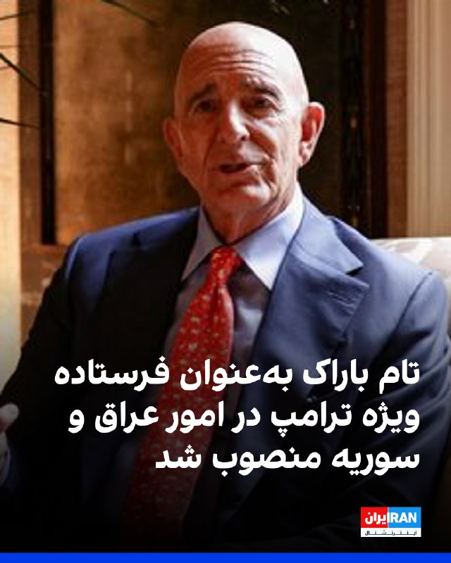

دونالد ترامپ در تروث‌سوشال اعلام کرد که تام باراک، سفیر ایالات متحده در ترکیه، به عنوان فرستاده ویژه ریاست‌جمهوری در امور عراق و سوریه منصوب شده است.

ترامپ افزود: همزمان با پیشبرد همکاری راهبردی ما با دولت‌های سوریه و عراق، روابط ما با آن‌ها همچنان در حال گسترش است.
‌🏁 🇬🇧 IranintlTV

🤖 @VahidOOnLine

## VahidOOnLine — post 243061

♦️تصاویر منتشرشده از سوی یک زوج جوان ایرانی از خانه‌شان پیش و پس از جنگ، با واکنش احساسی بسیاری از کاربران در شبکه‌های اجتماعی مواجه شد.

این زوج که صفحه‌ای برای ارائه خدمات نگهداری از گیاهان و باغبانی در اینستاگرام دارند، پس از وصل دوباره اینترنت در ایران، با انتشار تصاویری از تخریب گسترده منزلشان نوشتند: «آنهایی که منتظر جنگ هستند را نمی‌فهمم. جنگ، یک دهان بزرگ است که همه‌ چیز را قورت می‌دهد؛ خواهران و برادرانمان را، سفره‌های خالی‌مان را، شهرها و روستاهایمان را، مزرعه‌هایمان را، نخل‌هایمان را... و روزی که جنگ دور دهانش را پاک کند، جای خیلی چیزها تا ابد خالی خواهد ماند.»

گروهی از ایرانیان در روزهای گذشته با انتشار تصاویری از منازل ویران، کشته‌شدگان و کودکان و حیوانات آسیب‌دیده در جریان جنگ گذشته، از زندگی تحت فشار بمباران روایت‌های تازه‌ای در شبکه‌های اجتماعی منتشر می‌کنند.
‌🇸🇦 Indypersian

🤖 @VahidOOnLine

## VahidOOnLine — post 243060

  

اسماعیل کوثری، عضو کمیسیون امنیت ملی مجلس، با تاکید بر اینکه «پرونده هسته‌ای از روی میز مذاکره با آمریکا برداشته شده است»، گفت: «مذاکرات برای پایان دادن به جنگ در حال انجام است اما به توافق نهایی نرسیده‌ایم و می‌دانیم که نتیجه‌ای نخواهند داشت.»

او افزود: «جمهوری اسلامی اکنون در حال مذاکره در مورد جلوگیری از تکرار جنگ، پرداخت غرامت، خروج نیروهای آمریکایی از منطقه و لغو محاصره دریایی است.»

کوثری اضافه کرد: «بسیاری از کشورها کنترل ایران بر تنگه را پذیرفته‌اند.»
‌🏁 🇬🇧 IranintlTV

🤖 @VahidOOnLine

## VahidOOnLine — post 243059

  

سی‌بی‌اس نیوز گزارش داد میانجی‌ها تا صبح یکشنبه همچنان درباره یک یادداشت تفاهم میان جمهوری اسلامی و آمریکا در حال گفت‌وگو هستند.

یک منبع آگاه اعلام کرد دونالد ترامپ روز جمعه اصلاحاتی در متن این یادداشت ایجاد کرده و نسخه ویرایش‌شده برای تایید به تهران ارسال شده اما تاکنون پاسخی دریافت نشده است.

این سومین دور اصلاحاتی است که ترامپ در پیشنهاد آمریکا اعمال کرده؛ پیشنهادی که از طریق میانجی‌ها میان واشینگتن و تهران رد و بدل شده و این روند تحت هدایت پاکستان انجام می‌شود.

این منبع اعلام کرد تغییرات آمریکا تا حدی قابل توجه بوده، هرچند جزئیات آن هنوز منتشر نشده و برای نهایی شدن توافق نیز ضرب‌الاجل مشخصی وجود ندارد.
‌🏁 🇬🇧 IranintlTV

🤖 @VahidOOnLine

## VahidOOnLine — post 243058

  <a href="telegram/content/VahidOOnLine_243058_1780240285.mp4" target="_blank">🎬 Download video</a>

در پی راه‌اندازی کارزار مردمی رشت از سوی ایران‌اینترنشنال، ویدیوهایی به دست ما رسیده که خودروهای زیادی را در آرامستان شهر در ۲۰ دی ۱۴۰۴ نشان می‌دهد. به گفته شاهدان، جمعیت زیادی برای خاکسپاری جاویدنام خود در این روز به آرامستان آمدند.
‌🏁 🇬🇧 IranintlTV

🤖 @VahidOOnLine

## VahidOOnLine — post 243057

  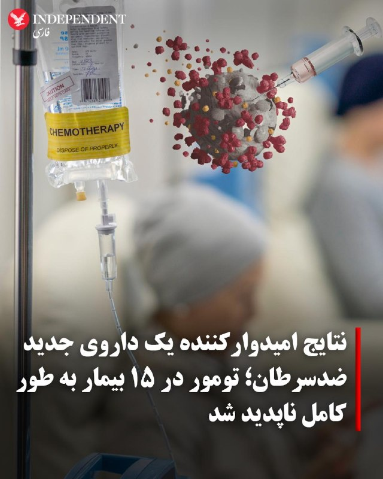

♦️نتایج یک کارآزمایی بالینی بین‌المللی نشان می‌دهد داروی تزریقی «امیفانتاماب» توانسته در شماری از بیماران مبتلا به سرطان پیشرفته سر و گردن که به درمان‌های متداول پاسخ نداده بودند، نتایج امیدوارکننده‌ای به همراه داشته باشد.

به گزارش گاردین، بر اساس نتایج این مطالعه که در ۱۱ کشور و با مشارکت ۱۰۲ بیمار انجام شد، تومورها در ۴۳ بیمار کوچک یا ناپدید شدند و در ۱۵ بیمار نیز پزشکان دیگر هیچ اثری از تومور مشاهده نکردند. پژوهشگران می‌گویند این بیماران پیش‌تر به شیمی‌درمانی و ایمنی‌درمانی پاسخ نداده بودند.

امیفانتاماب هر سه هفته یک‌بار به صورت تزریق زیرپوستی تجویز می‌شود و با هدف قرار دادن چند مسیر رشد تومور و تقویت عملکرد سیستم ایمنی بدن عمل می‌کند. این دارو در حال حاضر برای برخی بیماران مبتلا به سرطان ریه مورد تایید قرار گرفته و اکنون در مطالعات بالینی برای انواع دیگری از سرطان‌ها از جمله سرطان سر و گردن، روده بزرگ و معده در حال بررسی است.
‌🇸🇦 Indypersian

🤖 @VahidOOnLine

## VahidOOnLine — post 243056

🗣کارزار مردمی ایران اینترنشنال درباره جاوید‌نامان رشت - یکشنبه ۱۰ خرداد

🔹جمعیت عظیم معترضین از خیابان رودباری حرکت کردند و با شعار «رشت رو گرفتیم» به خیابان معلم و سپس استانداری رسیدند. گاز اشک‌آور شیمیایی و ازدحام شدید، باعث خفگی و بیهوشی برخی شد. حوالی ساعت ۱۰ شب تیراندازی گسترده نیروهای امنیتی آغاز شد و مردم را به رگبار بستند.

🔹در جاده تهران بین باغ رضوان و سراوان یک سوله هست که با پرچم قرمز، سفید و سبز رنگ شده و هیچ علامتی ندارد. پیکرهای جوانان رشت را در تاریخ ۱۸ و ۱۹ دی به آنجا انتقال می‌دادند.

🔹یکی از محل‌های کشتار استانداری رشت بود، به‌طوریکه نیروهای بسیج و سپاه مردم را به سمت استانداری هدایت کردند و با باز شدن در استانداری به مردم شلیک می‌کردند.

🔹شب ۱۸ دی‌ماه شاهد بودیم که در محله‌ای مابین دانای علی و سام، یگان ویژه به تابلو بالای مغازه شلیک کردند و همین اتفاق منجر به اتصال برق شد و مغازه آتش گرفت. چون خودم در رشته برق سررشته دارم، مطمئنم که آتش گرفتن مغازه به‌دلیل همان شلیک به تابلو و اتصال برق بود.

🔹صبح ۱۹ دی‌ماه دوستم زنگ زد و گفت در شهرداری فاجعه اتفاق افتاده و رفتیم. اولین چیزی که دیدم حجم دود و آتشی بود که هنوز زبانه می‌کشید. وانت‌ها و مأمورین شهرداری گوشه‌گوشه خیابان از خستگی نشسته بودند. چند وانت شهرداری را دیدم که از خیابان شهرداری بیرون می‌آمدند با دو رفتگر که عقبش نشسته بودند. عقب وانت پر بود ولی رویش را پارچه کشیده بودند. بعدها فهمیدم آن‌ها جنازه بچه‌هایمان بود. روی دیوار آثار دست‌های خونی بود که بعد پاک کردند.

🔹در میدان شهرداری رشت، دقیقا در همان خیابانی که ۱۸ و ۱۹ دی چندین نفر کشته دادیم، یک ون گشت ارشاد گذاشته‌اند و دوباره به حجاب‌ها گیر می‌دهند.

🔹در شهرداری رشت، اینقدر خون روی زمین بود که هنوز وقتی یادم میاد، تمام وجودم مالامال درد میشه، مثلا رد دست‌های خونی که روی دیوارها نقش بسته بود.

🔹 به پدرومادرهای جاویدنامان رشت می‌گفتن باید برای تحویل جنازه هم پول پرداخت کنید که بسته به شرایط مالی خانواده مبلغ تعیین میشد (اگر وضع مالی خوب بود، بالای یک میلیارد، ولی در غیراینصورت حدود ۵۰۰ میلیون تومان.) جاویدنام‌های عزیزمون رو نمیذاشتن حتی غسل بدن و بشورن. پیکرها رو در حالی که غرق خون بودند و با لباس دفن می‌کردند.
‌🏁 🇬🇧 IranintlTV

🤖 @VahidOOnLine

## VahidOOnLine — post 243055

  <a href="telegram/content/VahidOOnLine_243055_1780240287.mp4" target="_blank">🎬 Download video</a>

در پی راه‌اندازی کارزار مردمی رشت از سوی ایران‌اینترنشنال، ویدیوهایی به دست ما رسیده که جمعیت گسترده مردم معترض این شهر را در ۱۸ دی ۱۴۰۴ نشان می‌دهد.
‌🏁 🇬🇧 IranintlTV

🤖 @VahidOOnLine

## VahidOOnLine — post 243054

  <a href="telegram/content/VahidOOnLine_243054_1780240289.mp4" target="_blank">🎬 Download video</a>

ویدیوهای رسیده به ایران‌اینترنشنال، مراسم چهلم ماهان و امیررضا حیدری، دو پسرعموی جاویدنام را نشان می‌دهد که در ۱۸ دی‌ماه در محله پاسداران تهران به ضرب گلوله کشته شدند.
امیررضا، ۳۰ ساله و ماهان هم ۲۱ سال سن داشت. مادر ماهان در مراسم چهلم آنها خطاب به پسرش فریاد زد: «خوشت باشد که در این راه رفتی. من ناراحت نیستم که در این راه کشته شدی.»
‌🏁 🇬🇧 IranintlTV

🤖 @VahidOOnLine

## VahidOOnLine — post 243053

  

سایت هرانا گزارش داد یک زن ترنس ۲۶ ساله ساکن سنندج، در محله گلشن این شهر، بر اثر ضربات چاقو توسط افراد ناشناس کشته شده است و هنوز انگیزه و هویت عاملان مشخص نیست.
هرانا نوشت: «احتمالا او روز جمعه به‌دست افراد ناشناس و با ضربات چاقو به قتل رسیده و مهاجمان جسد را هم مثله کرده‌اند.»
‌🏁 🇬🇧 IranintlTV

🤖 @VahidOOnLine

## VahidOOnLine — post 243052

  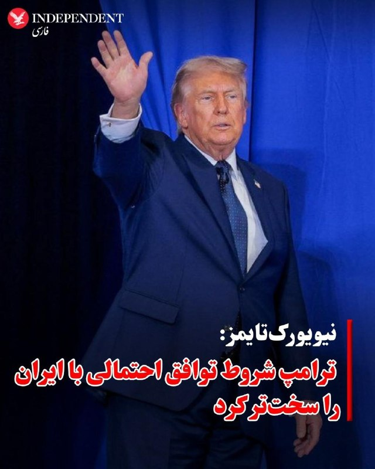

♦️روزنامه نیویورک‌تایمز،روز یکشنبه دهم خرداد ماه، به نقل از سه مقام آگاه گزارش داد دونالد ترامپ شروط چارچوب احتمالی توافق برای پایان دادن به جنگ با ایران را سخت‌تر کرده و نسخه اصلاح‌شده را برای بررسی دوباره به تهران ارسال کرده است.

بر اساس این گزارش،هنوز مشخص نیست چه تغییراتی در متن پیشنهادی اعمال شده است، اما دو مقام آمریکایی گفته‌اند ترامپ نسبت به بخش‌هایی از توافق که شامل آزادسازی منابع مالی مسدودشده ایران می‌شود، ابراز نگرانی کرده است.

نیویورک تامیز به نقل از یکی مقام‌های کاخ سفید گزارش کرد، رئیس‌جمهور آمریکا از طولانی شدن روند پاسخ ایران به پیشنهادهای واشنگتن ناراضی است. این پیشنهادها با مشارکت میانجی‌هایی از جمله پاکستان تدوین شده‌اند

این مقام افزود تغییرات جدید ترامپ وارائه نسخه‌ای سخت‌گیرانه‌تر از چارچوب توافق، احتمالا با هدف افزایش فشار بر ایران برای پذیرش طرحی انجام شده که پیش‌تر برای تایید به مجتبی خامنه‌ای، رهبر جمهوری اسلامی ایران، ارسال شده بود

نیویورک‌تایمز نوشت هنوز مشخص نیست تهران چه پاسخی به نسخه جدید پیشنهاد آمریکا خواهد داد و مذاکرات غیرمستقیم میان دوطرف همچنان ادامه دارد
‌🇸🇦 Indypersian

🤖 @VahidOOnLine

## VahidOOnLine — post 243051

  

♦️هادی احمدی، سخنگو و عضو هیات مدیره انجمن داروسازان ایران، روز یکشنبه دهم خرداد ماه در گفتگو با خبرگزاری ایلنا، با اشاره به کمبود برخی داروها از جمله کدئین گفت این مشکل بیش از آنکه ناشی از تحریم‌ها باشد، به محدودیت در تامین ماده اولیه آن بازمی‌گردد.
به گفته سخنگوی انجمن داروسازان، کاهش تولید خشخاش در افغانستان و محدودیت‌های اعمال‌شده بر کشت این محصول، تامین ماده اولیه مورد نیاز برای تولید کدئین را با مشکل مواجه کرده و همین مسئله در کمبود این دارو نقش داشته است.
احمدی همچنین با ادعای آنکه تحریم‌ها نیز در کمبود این داروی ضد درد بی‌تاثیر نیستند، افزود محدودیت‌های بانکی، حمل‌ونقل و بیمه، روند واردات برخی داروها و مواد اولیه را دشوار کرده است، اما کمبود کدئین مستقیما به موضوع تامین خشخاش مرتبط است.
‌🇸🇦 Indypersian

🤖 @VahidOOnLine

## VahidOOnLine — post 243050

  

♦️تورج دهقانی، مدیرعامل شرکت نفت و گاز پارس، روز یکشنبه دهم خرداد ماه اعلام کرد، تولید گاز در سه سکوی دریایی میدان گازی پارس جنوبی از سر گرفته شده است.
این تاسیسات در جریان جنگ گذشته و اختلال در ظرفیت فرآورش برخی تاسیسات خشکی متوقف شده بود.
تورج دهقانی روز یکشنبه اعلام کرد این سکوهای دریایی آسیبی ندیده‌اند و گاز تولیدی آن‌ها اکنون به واحدهای فرآورش دیگری در منطقه منتقل می‌شود.
به گفته مدیرعامل شرکت نفت و گاز پارس، عملیات تعمیر و بازسازی تاسیسات آسیب‌دیده همچنان ادامه دارد و در این مدت، تولید گاز سکوهای یادشده از طریق مسیرهای جایگزین به شبکه فرآورش منتقل می‌شود.
حملات اسرائیل پیش‌تر موجب اختلال در فعالیت برخی تاسیسات مرتبط با میدان گازی پارس جنوبی شده بود. پارس جنوبی بزرگ‌ترین میدان گازی ایران و یکی از بزرگ‌ترین منابع گاز طبیعی جهان به شمار می‌رود.
‌🇸🇦 Indypersian

🤖 @VahidOOnLine

## VahidOOnLine — post 243049

  <a href="telegram/content/VahidOOnLine_243049_1780240292.mp4" target="_blank">🎬 Download video</a>

در پی راه‌اندازی کارزار مردمی رشت از سوی ایران‌اینترنشنال، ویدیوهایی از مراسم چهلم جاویدنام امیرحسین (شایان) شکاری به دست ما رسیده است.
شکاری، ۲۱ ساله، عضو پیشین تیم ملی تکواندو نوجوانان که سابقه نایب‌قهرمانی آسیا را در کارنامه دارد، ۱۸ دی ۱۴۰۴ با شلیک مستقیم گلوله به سر کشته شد.
‌🏁 🇬🇧 IranintlTV

🤖 @VahidOOnLine

## WithYashar — post 13055

## WithYashar — post 13053

متن چکیده نسخه ۱۶ بیانیه جمعی از ایرانیان داخل و خارج کشور خطاب به شاهزاده رضا پهلوی شاهزاده گرامی، این متن جمع‌بندی مجموعه‌ای از دیدگاه‌ها، نگرانی‌ها و پیشنهادهای طیف گسترده‌ای از ایرانیان داخل و خارج کشور است که با هدف تقویت انسجام ملی، افزایش شفافیت…

## WithYashar — post 13052

## WithYashar — post 13051

متن چکیده نسخه ۱۶

بیانیه جمعی از ایرانیان داخل و خارج کشور خطاب به شاهزاده رضا پهلوی

شاهزاده گرامی،
این متن جمع‌بندی مجموعه‌ای از دیدگاه‌ها، نگرانی‌ها و پیشنهادهای طیف گسترده‌ای از ایرانیان داخل و خارج کشور است که با هدف تقویت انسجام ملی، افزایش شفافیت و ایجاد مسیر عملی برای آینده ایران ارائه می‌شود.
برای انتقال دقیق‌تر این دیدگاه‌ها، پیگیری پیشنهادهای مطرح‌شده و ایجاد ارتباطی مؤثرتر میان مردم و جنابعالی، لازم است امکان برقراری ارتباط مستقیم با اینجانب ، به عنوان گردآورنده و منتقل‌کننده این مجموعه نظرات فراهم شود. از همین رو، علاوه بر طرح مطالبات و پیشنهادهای مطرح‌شده در این بیانیه، یکی از اهداف اصلی ارسال آن ایجاد این مسیر ارتباطی و گفت‌وگو مستقیم است

در شرایط کنونی، جامعه ایران تحت فشارهای شدید اقتصادی، اجتماعی، امنیتی و سیاسی قرار دارد و یکی از مهم‌ترین چالش‌ها، نبود یک ساختار منسجم و قابل فهم برای سازماندهی ظرفیت عظیم مردمی است.

1. ضرورت ایجاد ساختار یا پلتفرم سازماندهی ملی

مطالبه گسترده مردم، ایجاد یک ساختار منسجم است که بتواند نیروهای مردمی داخل و خارج کشور را شبکه‌سازی کرده، نقش‌ها را مشخص کند و از پراکندگی و موازی‌کاری جلوگیری نماید.

2. انسجام و اتحاد میان جریان‌های مختلف مخالف

درخواست جدی جامعه، ایجاد سازوکاری برای همگرایی جریان‌ها و گروه‌های مختلف مخالف حکومت است تا انرژی سیاسی و اجتماعی در مسیر مشترک و هماهنگ قرار گیرد.

3. ضرورت اعلام چارچوب زمانی و نقشه راه عملی

یکی از دغدغه‌های اصلی مردم، نبود زمان‌بندی و مسیر روشن برای اقدامات جمعی است.
مطالبه عمومی این است که سناریوها و مراحل حرکت به‌صورت شفاف و مرحله‌بندی‌شده مشخص شوند و در صورت امکان، برای اقدامات جمعی و هماهنگ، چارچوب‌های زمانی روشن و قابل فهم اعلام گردد.

4. آمادگی میدانی و سازوکارهای حمایتی در شرایط بحران

بخش قابل توجهی از پیام‌ها بر ضرورت ایجاد سازوکارهای حمایتی و سازمانی برای شرایط بحرانی تأکید دارد تا از طریق شبکه‌های امن، هماهنگی اجتماعی و توانمندسازی، هزینه انسانی تحولات کاهش یابد.

5. تقویت ساختار مشورتی، ارتباطات و شفافیت عملکرد

یکی از مطالبات اصلی، تقویت همزمان ساختار مشورتی، ارتباطی و شفافیت عملکرد است.
در این چارچوب پیشنهاد می‌شود:

گسترش تیم مشاوران و کارشناسان در حوزه‌های مختلف از جمله سیاسی، اقتصادی، اجتماعی، رسانه‌ای و امنیتی
استفاده از متخصصان حوزه امنیت، مدیریت بحران و مطالعات راهبردی در کنار سایر تخصص‌ها
تقویت و حرفه‌ای‌سازی نقش رسانه‌ای و ارتباطی
ایجاد ارتباط مستمر و مؤثر با مردم و مشارکت گروه‌های مختلف اجتماعی
فراهم کردن زمینه ورود دیدگاه‌ها و ایده‌های جدید از جریان‌های تخصصی و فکری مختلف
افزایش شفافیت در عملکرد و تصمیم‌گیری‌ها همراه با گزارش‌دهی منظم

هدف از این پیشنهادها، افزایش اعتماد عمومی، ارتقای کیفیت تصمیم‌سازی و تقویت هماهنگی میان ظرفیت‌های مختلف جامعه است.

6. معیشت و وضعیت اقتصادی مردم

در کنار موضوعات سیاسی، بحران معیشتی یکی از اصلی‌ترین فشارهای روزمره مردم است.
درخواست عمومی این است که در کنار برنامه‌های کلان، راهکارهایی برای کاهش فشار اقتصادی و حمایت از اقشار آسیب‌پذیر در حال حاظر نیز در نظر گرفته شود.

7. ارتباط مستقیم‌تر با جامعه و گروه‌های مختلف

مردم خواستار ارتباط فعال‌تر، مستقیم‌تر و مستمرتر میان رهبری اپوزیسیون و بدنه اجتماعی هستند تا اعتماد، شفافیت و هماهنگی افزایش یابد.

جمع‌بندی

در مجموع، پیام مشترک این دیدگاه‌ها چنین است:

جامعه ایران آماده تغییر است، اما این مسیر تنها با انسجام، شفافیت، ساختار اجرایی روشن و ارتباط واقعی با مردم امکان‌پذیر است.

⸻

درخواست پایانی (از طرف جمع امضاکنندگان)

در پایان، جمعی از امضاکنندگان و نمایندگان این دیدگاه‌ها، با نهایت احترام درخواست دارند امکان ارتباط مستقیم برای انتقال منظم دیدگاه‌ها، هماهنگی بیشتر و ادامه گفت‌وگو فراهم گردد و پاسخ این پیام ارسال شود.

این جمع، جناب آقای یاشار را به عنوان نماینده و پیگیر دیدگاه‌های مردم معرفی می‌نماید.

راه‌های ارتباطی:
….

پاینده ایران
و درود بر خاندان ایران‌ساز پهلوی

@withyashar

## WithYashar — post 13050

  <a href="telegram/content/WithYashar_13050_1780240294.mp4" target="_blank">🎬 Download video</a>

از یه زاویه دیگه اتوبان ستاری ,جنت آباد جنوبی
@withyashar

## WithYashar — post 13049

  <a href="telegram/content/WithYashar_13049_1780240295.mp4" target="_blank">🎬 Download video</a>

روبروی پاساژ کوروش
@withyashar

## WithYashar — post 13048

اصلاح ۵ بخش ۵

5. تقویت ساختار مشورتی، ارتباطات و شفافیت عملکرد

یکی از مطالبات اصلی، تقویت و گسترش ساختار مشورتی و ارتباطی در کنار افزایش شفافیت عملکرد است.

در این چارچوب پیشنهاد می‌شود:

تیم مشاوران و کارشناسان در حوزه‌های سیاسی، اقتصادی، اجتماعی، رسانه‌ای و همچنین حوزه‌های مرتبط با امنیت و مدیریت بحران تقویت و گسترش یابد
نقش رسانه‌ای و ارتباطی به‌صورت حرفه‌ای‌تر و منسجم‌تر ارتقا پیدا کند
امکان ارتباط مستمر و هدفمند با مردم و گروه‌های مختلف اجتماعی فراهم شود
از متخصصان حوزه امنیت، مدیریت بحران و مطالعات دفاعی در کنار سایر حوزه‌های تخصصی استفاده شود
زمینه ورود ایده‌ها و دیدگاه‌های جدید از جریان‌های فکری و تخصصی مختلف ایجاد گردد
شفافیت در عملکرد، روند تصمیم‌گیری‌ها و مسیرهای حمایتی (از جمله رسانه‌ای و سازمانی) افزایش یابد و گزارش‌دهی منظم در دستور کار قرار گیرد

هدف از این مجموعه پیشنهادها، افزایش اعتماد عمومی، ارتقای کیفیت تصمیم‌سازی و تقویت هماهنگی میان ظرفیت‌های مختلف جامعه است.
@withyashar

## WithYashar — post 13047

## WithYashar — post 13046

گزارش WSJ: سازمان ملل در حال ورشکستگی است، زیرا ایالات متحده و چین میلیاردها دلار را از این نهاد بین‌المللی خارج کرده اند
@withyashar

## WithYashar — post 13045

## WithYashar — post 13042

  

همین الان آتش‌سوزی غرب تهران سمت ستاری
@withyashar

## WithYashar — post 13041

## WithYashar — post 13040

## WithYashar — post 13039

سی‌ن‌ان: ایران ۵۰ ورودی از ۶۹ ورودی تونل‌های تاسیسات هدف قرارگرفته موشکی را باز کرده است
@withyashar

## WithYashar — post 13038

سی‌ان‌ان: برای وارد کردن آسیب به تاسیسات موشکی ایران باید از سلاح‌های بسیار پیچیده و بسیار گران‌قیمت استفاده کرد، اما عملیات بازیابی با فناوری بسیار ساده‌ای انجام می‌شود، فقط با بولدوزر
@withyashar

## WithYashar — post 13037

متن چکیده نسخه ۲

بیانیه جمعی از ایرانیان داخل و خارج کشور خطاب به شاهزاده رضا پهلوی

شاهزاده گرامی،
این متن جمع‌بندی مجموعه‌ای از دیدگاه‌ها، نگرانی‌ها و پیشنهادهای طیف گسترده‌ای از ایرانیان داخل و خارج کشور است که با هدف تقویت انسجام ملی، افزایش شفافیت و ایجاد مسیر عملی برای آینده ایران ارائه می‌شود.

در شرایط کنونی، جامعه ایران تحت فشارهای شدید اقتصادی، اجتماعی، امنیتی و سیاسی قرار دارد و در کنار آن، یکی از مهم‌ترین چالش‌ها، نبود یک ساختار منسجم و قابل فهم برای سازماندهی ظرفیت عظیم مردمی و تبدیل آن به یک نیروی هماهنگ است.

⸻

1. ضرورت ایجاد ساختار یا پلتفرم سازماندهی ملی

مطالبه گسترده مردم، ایجاد یک ساختار یا پلتفرم منسجم است که بتواند:

نیروهای مردمی داخل و خارج کشور را شبکه‌سازی کند
وظایف و نقش‌ها را مشخص و قابل اجرا نماید
از پراکندگی و موازی‌کاری جلوگیری کند
مسیر فعالیت گروه‌ها و افراد را شفاف و هدفمند سازد
امکان هماهنگی عملی در سطح رسانه‌ای، اجتماعی و میدانی را فراهم کند

⸻

2. انسجام و اتحاد میان جریان‌های مختلف مخالف

درخواست جدی جامعه، ایجاد سازوکاری برای همگرایی و هماهنگی میان گروه‌ها، جریان‌ها و افراد مختلف مخالف حکومت است تا:

اختلافات مانع حرکت مشترک نشود
یک محور هماهنگ‌کننده واحد وجود داشته باشد
انرژی سیاسی و اجتماعی هدر نرود

⸻

3. ضرورت اعلام چارچوب زمانی و نقشه راه عملی

یکی از مهم‌ترین دغدغه‌های مردم، نبود زمان‌بندی روشن برای مراحل مختلف حرکت سیاسی است.
مطالبه عمومی این است که:

سناریوهای مختلف به‌صورت شفاف و مرحله‌بندی‌شده مشخص شوند
برای اقدامات جمعی، چارچوب زمانی تقریبی یا بازه‌های مشخص تصمیم‌گیری و اقدام اعلام شود
مردم بدانند در هر مرحله چه انتظاری باید داشته باشند و نقش آنها چیست

همچنین بخش مهمی از جامعه خواستار آن است که در صورت وجود شرایط مناسب، فراخوان‌های مشخص، هدفمند و زمان‌دار برای اقدامات جمعی و هماهنگ صادر شود تا انرژی اجتماعی به‌صورت پراکنده و فرسایشی از بین نرود.

⸻

4. آمادگی میدانی و سازوکارهای حمایتی در شرایط بحران

بخش قابل توجهی از پیام‌ها بر ضرورت ایجاد سازوکارهایی برای حمایت از مردم در شرایط بحرانی تأکید دارد؛ به‌گونه‌ای که:

شبکه‌های حمایتی و سازمانی امن شکل گیرد
هماهنگی میان نیروهای مردمی افزایش یابد
آمادگی اجتماعی و مدنی برای شرایط حساس تقویت شود
هزینه انسانی تحولات احتمالی کاهش یابد

⸻

5. شفافیت در ساختار مشاوران و تیم تصمیم‌سازی

یکی از مطالبات مهم، شفاف‌تر شدن ساختار مشاوران و نقش افراد در حلقه تصمیم‌گیری است تا:

جایگاه افراد مشخص باشد
اعتماد عمومی تقویت شود
از ابهام و چندصدایی غیرسازنده جلوگیری گردد

⸻

6. معیشت و وضعیت اقتصادی مردم

در کنار موضوعات سیاسی، بحران معیشتی یکی از اصلی‌ترین فشارهای روزمره مردم است.
درخواست عمومی این است که در کنار برنامه‌های کلان، راهکارهایی برای کاهش فشار اقتصادی و حمایت از اقشار آسیب‌پذیر در دوره گذار نیز در نظر گرفته شود.

⸻

7. ارتباط مستقیم‌تر با جامعه و گروه‌های مختلف

مردم خواستار ارتباط فعال‌تر، مستقیم‌تر و مستمرتر میان رهبری اپوزیسیون و بدنه اجتماعی هستند تا:

ابهامات کاهش یابد
اعتماد افزایش پیدا کند
و امکان هماهنگی واقعی میان گروه‌ها فراهم شود

⸻

جمع‌بندی

در مجموع، پیام مشترک این مجموعه دیدگاه‌ها چنین است:

جامعه ایران آماده تغییر است، اما این مسیر تنها در صورتی به نتیجه می‌رسد که با انسجام، شفافیت، ساختار اجرایی روشن، نقشه راه قابل فهم و ارتباط مستمر با مردم همراه باشد.

⸻

درخواست پایانی (از طرف نماینده جمع)

در پایان، اینجانب یاشار به عنوان نماینده جمعی از این دیدگاه‌ها، با نهایت احترام درخواست دارم امکان ارتباط مستقیم برای انتقال دیدگاه‌ها و هماهنگی بیشتر فراهم شود و پاسخ این پیام برای اینجانب ارسال گردد.

راه‌های ارتباطی جهت پاسخ

پاینده ایران ، جاوید شاه
@withyashar

## WithYashar — post 13036

## WithYashar — post 13035

خودمو یادم رفت 🥲

## WithYashar — post 13034

یاشار چرا درخواست اینکه با خودت حرف بزنن تا اینارو بگی رو نداریم ؟

## WithYashar — post 13033

پس این متن چه اشاره ای به تو داره؟
ما میخایم یاشار با شاهزاده در ارتباط باشه

## mwarmonitor — post 9947

🔴دونالد ترامپ در Truth Social نوشت:

خوشحالم اعلام کنم که سفیر ایالات متحده در ترکیه، تام باراک، که عملکردی outstanding داشته است، به‌عنوان نماینده ویژه ریاست‌جمهوری در امور سوریه و همچنین نماینده ویژه ریاست‌جمهوری در امور عراق منصوب خواهد شد. این انتصاب در راستای پیشبرد همکاری‌های راهبردی ما با دولت‌های سوریه و عراق صورت می‌گیرد و روابط ما با آن‌ها همچنان در حال گسترش است.
تام باراک همچنان سفیر ایالات متحده در ترکیه باقی خواهد ماند و با پشتیبانی کامل وزارت امور خارجه ایالات متحده فعالیت خواهد کرد.
ما قدردان کاری هستیم که تام باراک انجام داده و نیز از آمادگی مستمر او برای خدمت به کشورمان سپاسگزاریم.

از توجه شما به این موضوع متشکریم.

@mwarmonitor

## mwarmonitor — post 9946

  <a href="telegram/content/mwarmonitor_9946_1780240297.mp4" target="_blank">🎬 Download video</a>

📝 آه، چقدر دلمان کباب شد برای این ماده خرس گریزلی تلویزیون که دوباره پیدایش شده تا با فلسفه‌بافی درباره «مطلوبات و مقدورات»، روی زخم ملت نمک بپاشد! راست می‌گویی؛ مطلوبِ قلبی یک انگل و حرومیِ جاخوش‌کرده در بدنه این کشور هم این است که پروانه باشد و پرواز کند، اما مقدوراتِ ذاتِ کثیفش اجازه نمی‌دهد چیزی غیر از یک تفاله باشد. شما حرومی‌ها که ادعا می‌کردید کنترل اقتصاد دنیا در مرزهای جنوبی در دست‌های معجزه‌گرتان است، چطور شد که وقتِ تامین نیازهای اولیه کشور رسید، زاییدید و ناگهان یاد مقدورات افتادید؟ سناریوی سیاهی است؛ در ادعا حاکم اقیانوس‌ها و در واقعیت عاجز از تامین پیاز و پوشک! شما مطلوبتان این بود که قهرمان باشید، ولی مقدوراتِ وقاحت‌تان ثابت کرد که فقط انگل‌هایی هستید که به مکیدن خون مردم ادامه می‌دهید؛ پس دست‌کم ژست فیلسوفان را نگیرید که قاب تلویزیون از این همه کثافت ترک برمی‌دارد.

@mwarmonitor

## mwarmonitor — post 9945

  <a href="telegram/content/mwarmonitor_9945_1780240298.mp4" target="_blank">🎬 Download video</a>

🔸اسرائیل در حال شخم زدن لبنان

@mwarmonitor

## mwarmonitor — post 9944

  <a href="telegram/content/mwarmonitor_9944_1780240299.mp4" target="_blank">🎬 Download video</a>

📝 این کمدی که می‌بینید تماشایی‌ترین سقوط تاریخ است؛ جماعتی ذلیل که شب ها با جیپ‌های صورتی و فاحشه‌های وارداتیِ پمپاژکننده انرژی به پاسداران، ادعای فتح جهان و صدور اسلام را دارید، اما حالا به چنان خفتی افتاده‌اید که حتی جرعت چال کردن لاشه موشعلی را هم ندارید و از ترس سایه خودتان، جنازه‌اش را مخفیانه در یخچال نگهداری می‌کنید! حقارت‌بارتر و مضحک‌تر از این تصویر وجود ندارد که در اتاق‌های مخفی در اعماق زمین ، کورکورانه و از روی تخیلات مقلدانه، برای توله مجتبی صلوات می‌فرستید که هیچ‌کدام از شما مفلوکانِ توی سر زن حتی او را از نزدیک ندیده‌اید.

🔸 شما دقیقاً کپی برابر اصل همان پیروان جاهل ۱۴۰۰ سال پیش هستید که بر اساس توهمات و افسانه‌های بافته‌شده، زنجیر بندگی و حماقت به گردن آویختند و از روی عکسِ ندیده، مقلد شدند. این ضربه مهلک و کتلت شدنِ بزرگ‌ترتان چنان ابهت پوشالی، توخالی و مافیایی این فرقه تبهکار را در هم کوبیده که ملت آزاده و سربلند ایران باید سالیان سال بر روی ویرانه‌های این جهل، ترس و بزدلیِ شما، به جشن، سرور و پایکوبی بپردازند و زوال این سیرک مذهبی را به تماشا بنشینند.

@mwarmonitor

## mwarmonitor — post 9943

... ما مجبور نیستیم از، می‌دانید، سلاح‌های بزرگ استفاده کنیم؛ ما می‌توانیم آن‌ها را از طریق هوا، همان‌طور که داشتیم انجام می‌دادیم، شکست دهیم. اما ما حدود تقریباً دو ماه زمان را در این مذاکرات از دست داده‌ایم. و آن‌ها، آن‌ها این را به عنوان... و آن‌ها به بلند‌نظری…

## mwarmonitor — post 9942

🔴مارک لوین: «به برنامه خوش آمدید، آمریکا. همیشه مایه خرسندی است که مرد دانا و خردمندِ آمریکا را در برنامه داشته باشیم؛ "ویکتور دیویس هنسون". او یک دوست خوب، پژوهشگر ارشد اندیشکده "هوور" است و پادکست بسیار موفقی هم دارد. ویکتور، ممنون که به برنامه آمدی. خب،…

## mwarmonitor — post 9941

🔴مارک لوین: «به برنامه خوش آمدید، آمریکا. همیشه مایه خرسندی است که مرد دانا و خردمندِ آمریکا را در برنامه داشته باشیم؛ "ویکتور دیویس هنسون". او یک دوست خوب، پژوهشگر ارشد اندیشکده "هوور" است و پادکست بسیار موفقی هم دارد.
ویکتور، ممنون که به برنامه آمدی. خب، بگذار این سوال را از تو بپرسم: اگر بتوانی خودت را جای رژیم ایران بگذاری، فکر می‌کنی آن‌ها در حال حاضر چطور به این وضعیت نگاه می‌کنند؟»
🔵 ویکتور دیویس هنسون:
«خب، ما دقیقاً نمی‌دانیم، چون این یک جنگ بسیار غیرمعمول است. ما هیچ نیروی زمینی در آنجا نداریم و هیچ خبرنگار مستقری هم نیست؛ بنابراین میزان دقیق خسارت‌ها را نمی‌دانیم. اما به نظر من، آن‌ها از نظر اقتصادی به شدت آسیب دیده‌اند و ۹۰ درصد از توان نظامی‌شان بی‌تحرک و منفعل شده است.
اما آن‌ها فکر می‌کنند هنوز به اندازه کافی موشک در اختیار دارند. همچنین گمان می‌کنند که کشورهای حوزه خلیج [فارس] بسیار آسیب‌پذیر هستند و معتقدند که تردد در تنگه هرمز، جریان شکننده‌ای است که می‌توانند در آن آشوب و هرج‌ومرج ایجاد کنند. با این کار، فرآیندها را به تاخیر بیندازند، شاید به رکود اقتصادی جهانی دامن بزنند و وضعیت را تا زمان انتخابات میان‌دوره‌ای کش بدهند.
آن‌ها همچنین در حال انجام بازی بسیار عجیبی هستند. آن‌ها سیگنال‌هایی می‌فرستند مبنی بر اینکه افرادی که با ما گفتگو می‌کنند — یعنی همان به‌اصطلاح "رهبران منتخب" — با سپاه پاسداران اختلاف نظر دارند. ما به دلیل اینکه افراد زیادی را حذف کرده‌ایم، دقیقاً نمی‌دانیم این ادعا تا چه حد درست است، اما این شک و شبهه به وجود می‌آید که این گفتگوکنندگان نقش "پلیس خوب" را بازی می‌کنند و سپاه پاسداران و حکومت مذهبی که هر از گاهی تلاش می‌کنند به یک ناو حمله‌ور شوند یا به کویتی‌ها یا دیگران ضربه بزنند، نقش "پلیس بد" را دارند؛ در حالی که آن‌ها در واقع با یکدیگر هماهنگ و همسو هستند.
سپس مذاکره‌کنندگان به ما می‌گویند: "خب، ما نمی‌توانیم این افراد را کنترل کنیم، ما متاسفیم، ما نمی‌دانیم آن‌ها در خلیج [فارس] چه کار می‌کنند، مین‌گذاری می‌کنند و غیره... اما مذاکرات را خراب نکنید." و این رویکرد به هر کدام از آن‌ها در رقابت برای کسب قدرت، نوعی اعتبار می‌دهد.
اما در یک مقطعی، ما باید این روند را متوقف کنیم. و راه‌های زیادی برای متوقف کردن آن وجود دارد مارک؛ زیرا این موضوع از نظر نظامی مشکلی نیست، بلکه یک مسئله سیاسی است که با اقتصاد جهانی، انتخابات میان‌دوره‌ای و مسائل دیگر گره خورده است. اما من فکر می‌کنم رئیس‌جمهور می‌تواند راهی برای حل این معادله پیچیده پیدا کند، اگر به طور غیررسمی به آن‌ها بگوید که این حماقت‌ها یک ضرب‌الاجل و پایان مشخصی دارد و پشیمان خواهید شد. و اینکه ما آن‌قدر به اقتصاد و نیروی نظامی شما آسیب خواهیم زد که بهبود و بازسازی آن برای شما یک ربع قرن (۲۵ سال) طول بکشد؛ و ما یک نیروی باقی‌مانده را در آنجا حفظ خواهیم کرد که به همراه متحدانمان، آن تنگه را باز نگه دارد.
من فکر می‌کنم او (رئیس‌جمهور) می‌تواند این را به آن‌ها بگوید، چون ما نمی‌توانیم به این وضعیت ادامه دهیم. چرا که آن‌ها "بقاء" و دوام آوردن خود را به معنای "پیروزی" تفسیر می‌کنند. می‌دانم این حرف شبیه به دنیای رمان‌های اورول (تخیلی و عجیب) به نظر می‌رسد، اما واقعاً همین‌طور فکر می‌کنند. هر روزی که آن‌ها همچنان پابرجا هستند، می‌گویند: "ببینید، ما در برابر ابرقدرتِ تاریخ تمدن ایستادگی کردیم و هنوز اینجا هستیم و آن‌ها نتوانستند ما را متوقف کنند." آن‌ها این واقعیت را در نظر نمی‌گیرند که تمام خویشتن‌داری ما، در واقع محدودیتی است که خودمان بر خودمان اعمال کرده‌ایم؛ این خویشتن‌داری دلایل انسان‌دوستانه و سیاسی دارد، اما دلیل نظامی ندارد. و...»

@mwarmonitor

## mwarmonitor — post 9940

🔸ترامپ در سوشال تروث @mwarmonitor

## mwarmonitor — post 9939

  

🔸ترامپ در سوشال تروث

@mwarmonitor

## mwarmonitor — post 9938

انفجار در قشم

## mwarmonitor — post 9937

انفجار در قشم

## mwarmonitor — post 9936

🔸وزیر خارجه فرانسه: باز کردن تنگه هرمز یک اولویت اصلی است، چون ما قصد نداریم بهای جنگی را که جنگ ما نیست همچنان بپردازیم.

@mwarmonitor

## mwarmonitor — post 9935

🔴متحدان آمریکا در همه‌جا نگران هستند که ایالات متحده در ایستادگی در برابر استبداد، بیش از حد سکوت کرده است. بلومبرگ

@mwarmonitor

## mwarmonitor — post 9934

🔴ترامپ می‌گوید برای امضای توافق با ایران «عجله‌ای ندارد»: «هیچ سلاح هسته‌ای وجود نخواهد داشت». نیویورک پست

@mwarmonitor

## mwarmonitor — post 9933

🔹تری اینگست (خبرنگار فاکس نیوز در تل‌آویو):
«بله بچه‌ها، صبح بخیر. گزارش‌ها حاکی از آن است که رئیس‌جمهور ترامپ در مذاکرات با ایران بر مواضع خود پافشاری می‌کند و در جریان جلسه اواخر هفته گذشته در اتاق وضعیت (Situation Room)، خواستار چندین اصلاحیه در توافق پیشنهادی شده است. اکنون، رئیس‌جمهور در آخر هفته با فاکس نیوز گفتگو کرده و اشاره داشته که ایالات متحده به یک توافق خوب بسیار نزدیک است.»
🔸 دونالد ترامپ (رئیس‌جمهور آمریکا):
«بنابراین، ما داریم چیزی را که می‌خواهیم به آرامی به دست می‌آوریم. آن‌ها مذاکره‌کنندگان بسیار سرسختی هستند؛ زمان زیادی طول می‌کشد. من عجله‌ای ندارم. دوست دارم بگویم عجله دارم چون می‌دانید، قیمت بنزین به شدت کاهش خواهد یافت، اما اگر بخواهید عجله کنید، توافق خوبی به دست نخواهید آورد. و... آهسته اما مطمئن، فکر می‌کنم داریم به آنچه می‌خواهیم می‌رسیم. و اگر آنچه را که می‌خواهیم به دست نیاوریم، آن را به شکل دیگری پایان خواهیم داد.»
🔹تری اینگست :
«رئیس‌جمهور ترامپ به وضوح نشان داد که اگر ایران توافق او را امضا نکند، گزینه نظامی همچنان روی میز باقی می‌ماند. وزیر جنگ، پیت هگست به سنگاپور سفر کرد؛ جایی که او نیز خواسته رئیس‌جمهور ترامپ برای دستیابی به توافق با ایران را تکرار نمود و افزود که توانمندی‌های نظامی ایالات متحده، قوی‌ترین انگیزه برای ایران است تا از جاه‌طلبی‌های هسته‌ای خود دست بکشد.»
📌 پیت هگست (وزیر جنگ آمریکا):
«بنابراین ایران به وضوحِ هرچه تمام‌تر می‌داند که انتظارات ما چیست و این بر عهده تیم مذاکره‌کننده است که آن را محقق کند. آن‌ها دارند به سمت ما می‌آیند (به مواضع ما نزدیک می‌شوند)، گفتگوها سازنده بوده است. فکر می‌کنم آن‌ها... آن‌ها می‌دانند که این روند باید به کدام سمت برود.»
🔹تری اینگست:
«علاوه بر ایران، ما همچنین تحولات مربوط به درگیری میان اسرائیل و بزرگترین گروه نیابتی ایران، یعنی حزب‌الله را رصد می‌کنیم. پهپادها و راکت‌ها در طول آخر هفته آسمان شمال اسرائیل را در نوردیدند، در حالی که اسرائیل حملات هوایی جدیدی را آغاز کرد و نیروهای زمینی را به عمق بیشتری در جنوب لبنان فرستاد.»
🔸 بنیامین نتانیاهو (نخست‌وزیر اسرائیل):
«از اینجا، نبرد علیه حزب‌الله در شمال مدیریت می‌شود. و باید به شما بگویم که نتایج بسیار چشمگیری در اینجا به دست آمده است. نیروهای ما از (رودخانه) لیتانی عبور کرده‌اند؛ آن‌ها به سمت موقعیت‌های تحت کنترل پیشروی کرده‌اند.»
🔹 تری اینگست :
«بر باور اینجاست که اگر توافقی میان ایالات متحده و ایران حاصل شود، می‌تواند به درگیری‌ها در امتداد مرزهای شمالی اسرائیل پایان دهد. حتی در پنج دقیقه گذشته، آژیرهای خطر در بخش‌های شمالی این کشور در میان حملات جدید حزب‌الله به صدا درآمدند. بچه‌ها؟»
🔹 مجری استودیو فاکس نیوز:
«بسیار خب، تری اینگست، به صورت زنده از تل‌آویو. تری، ازت ممنونم.»

@mwarmonitor

## mwarmonitor — post 9932

  <a href="telegram/content/mwarmonitor_9932_1780240301.mp4" target="_blank">🎬 Download video</a>

🎬 Video

## mwarmonitor — post 9931

📌ارتش اوکراین اعلام کرد که پالایشگاه نفت «ساراتوف» متعلق به شرکت روس‌نفت (Rosneft PJSC) در جنوب‌غربی روسیه و همچنین یک واحد پمپاژ نفت در منطقه‌ای دیگر را هدف حمله قرار داده است، در حالی که مقام‌های محلی از وقوع آتش‌سوزی‌های ناشی از حمله پهپادی در طول شب خبر دادند. بلومبرگ

@mwarmonitor

## mwarmonitor — post 9930

  

🔸بردِ درگیری دوباره در حال گسترش است، آتش بی‌وقفه در شمال: ارتش اسرائیل (IDF) در حال حمله به اهداف حزب‌الله در جنوب لبنان است. کانال ۱۳ اسرائیل

@mwarmonitor

## mwarmonitor — post 9929

🔴یکی از مهم‌ترین شبه‌نظامیان مورد حمایت ایران در عراق (کتائب حزب الله) پیشنهاد داده است که «پهپادها و موشک‌ها را» از سایر گروه‌های شبه‌نظامی که «تصمیم گرفته‌اند سلاح‌های خود را زمین بگذارند» خریداری کند. جوروزالم پست

@mwarmonitor

## FoxNewsTwitter — post 342446

  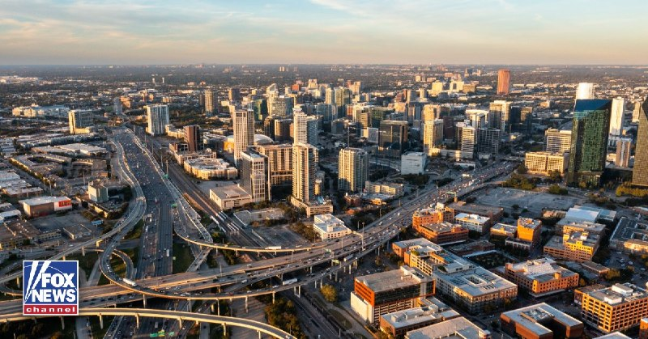

Fox News (Twitter/X)

America's next economic powerhouse takes shape in Texas as companies abandon the Bay Area in California.

A new report shows Texas attracted 230 corporate relocations between 2018 and 2025, with Dallas, Austin and Houston leading the charge.

Meanwhile, California suffered the nation's steepest corporate losses, with more than 160 companies moving their headquarters out of the San Francisco Bay Area, citing taxes, labor regulations and soaring costs.

## FoxNewsTwitter — post 342445

  <a href="telegram/content/FoxNewsTwitter_342445_1780240304.mp4" target="_blank">🎬 Download video</a>

Fox News (Twitter/X)

An anti-ICE rioter is arrested for threatening to kill federal agents and their families during violent demonstrations outside New Jersey's Delaney Hall. The FBI caught the suspect within 24 hours after using facial recognition technology to identify him.

"Touch a cop and this FBI will put you down," FBI Director Kash Patel said.

## FoxNewsTwitter — post 342444

  <a href="telegram/content/FoxNewsTwitter_342444_1780240306.mp4" target="_blank">🎬 Download video</a>

Fox News (Twitter/X)

Hasan Piker denied having any personal contact with American Marxist Neville Roy Singham but said he knows some "wonderful people" tied to the tech tycoon's network when Fox News Digital asked about a federal subpoena.

"None of it is actually hidden or illegal in any way, shape, or form," Piker said.

## FoxNewsTwitter — post 342443

  

Fox News (Twitter/X)

HAPPY BIRTHDAY! American film icon Clint Eastwood turns 96 today!

## pm_afshaa — post 91948

  <a href="telegram/content/pm_afshaa_91948_1780240308.webm" target="_blank">🎬 Download video</a>

🔴رئیس کمیته نظامی ناتو:
احتمال عملیات برای بازگشایی تنگه هرمز وجود داره؛ حضور نظامی متحدان برای مقابله با مسدودسازی مسیرهای بین‌المللی رو افزایش دادیم.

💧 Rainbet.com the #1 Non-KYC Crypto Casino & Sportsbook @rainbetcom

😁 @Pm_Afshaa

## pm_afshaa — post 91947

  <a href="telegram/content/pm_afshaa_91947_1780240308.webm" target="_blank">🎬 Download video</a>

🔴سی‌ان‌ان: برای آسیب به تاسیسات موشکی ایران از سلاح‌های بسیار پیچیده و بسیار گران‌قیمت استفاده میشه، اما عملیات بازیابی با فناوری بسیار ساده‌ای انجام میشه: بولدوزر.

ایران 50 ورودی از 69 ورودی تونل‌های تاسیسات هدف قرار گرفته موشکی رو باز کرده.

💧 Rainbet.com the #1 Non-KYC Crypto Casino & Sportsbook @rainbetcom

😁 @Pm_Afshaa

## pm_afshaa — post 91946

  <a href="telegram/content/pm_afshaa_91946_1780240309.webm" target="_blank">🎬 Download video</a>

🔴اسکات بسنت وزیر خزانه داری آمریکا: اطمینان از باز بودن تنگه هرمز، دریافت اورانیوم بسیار غنی شده و اینکه ایران سلاح هسته‌ای نداره، این کار رو تمام میکنه.

این اولین باره که ایرانی‌ها در 47 سال گذشته حاضر شدن در مورد نداشتن سلاح هسته‌ای بحث کنند.

💧 Rainbet.com the #1 Non-KYC Crypto Casino & Sportsbook @rainbetcom

😁 @Pm_Afshaa

## pm_afshaa — post 91945

  <a href="telegram/content/pm_afshaa_91945_1780240309.webm" target="_blank">🎬 Download video</a>

🔴سی‌ان‌ان: ایران پس از خارج کردن سریع زرادخانه‌های موشکی مدفون خود، در موقعیتی قرار گرفته که میتونه تعداد بیشتری موشک دوربرد به سمت اسرائیل و دیگر کشورهای خاورمیانه شلیک کنه؛ موضوعی که به گفته کارشناسان، محدودیت‌های راهبرد بمباران آمریکا رو نشان میده.

💧 Rainbet.com the #1 Non-KYC Crypto Casino & Sportsbook @rainbetcom

😁 @Pm_Afshaa

## pm_afshaa — post 91944

🔴وال استریت ژورنال: سازمان ملل در حال ورشکستگی است، زیرا ایالات متحده و چین میلیاردها دلار را از این نهاد بین‌المللی خارج می‌کنن 
💧 Rainbet.com the #1 Non-KYC Crypto Casino & Sportsbook @rainbetcom 
😁 @Pm_Afshaa

## pm_afshaa — post 91943

🔴وال استریت ژورنال: سازمان ملل در حال ورشکستگی است، زیرا ایالات متحده و چین میلیاردها دلار را از این نهاد بین‌المللی خارج می‌کنن

💧 Rainbet.com the #1 Non-KYC Crypto Casino & Sportsbook @rainbetcom

😁 @Pm_Afshaa

## pm_afshaa — post 91942

وضعیت لبنان بعد از حمله هوایی اسراییل به این کشور 
💧 Rainbet.com the #1 Non-KYC Crypto Casino & Sportsbook @rainbetcom 
😁 @Pm_Afshaa

## pm_afshaa — post 91939

  <a href="telegram/content/pm_afshaa_91939_1780240310.mp4" target="_blank">🎬 Download video</a>

وضعیت لبنان بعد از حمله هوایی اسراییل به این کشور

💧 Rainbet.com the #1 Non-KYC Crypto Casino & Sportsbook @rainbetcom

😁 @Pm_Afshaa

## pm_afshaa — post 91938

  <a href="telegram/content/pm_afshaa_91938_1780240311.webm" target="_blank">🎬 Download video</a>

🔴سی‌بی‌اس: میانجی‌ها هنوز دارن روی توافق بین تهران و واشینگتن کار میکنن.

ترامپ روز جمعه متن توافق رو دوباره اصلاح کرده و نسخه جدیدش رو فرستاده ایران تا تأییدش کنه، ولی تا الان هنوز پاسخی از طرف تهران داده نشده.

💧 Rainbet.com the #1 Non-KYC Crypto Casino & Sportsbook @rainbetcom

😁 @Pm_Afshaa

## pm_afshaa — post 91937

  <a href="telegram/content/pm_afshaa_91937_1780240311.webm" target="_blank">🎬 Download video</a>

🔴وزیر خارجه فرانسه:
باز کردن تنگه هرمز یک اولویت اصلی است چون ما قصد نداریم همچنان بهای جنگی رو بپردازیم که جنگ ما نیست.

💧 Rainbet.com the #1 Non-KYC Crypto Casino & Sportsbook @rainbetcom

😁 @Pm_Afshaa

## pm_afshaa — post 91936

  <a href="telegram/content/pm_afshaa_91936_1780240312.webm" target="_blank">🎬 Download video</a>

🔴اقتصاد نیوز: ایرانسل و همراه اول امکان خرید اقساطی بسته اینترنت رو فعال کردن.

💧 Rainbet.com the #1 Non-KYC Crypto Casino & Sportsbook @rainbetcom

😁 @Pm_Afshaa

## pm_afshaa — post 91935

  <a href="telegram/content/pm_afshaa_91935_1780240312.webm" target="_blank">🎬 Download video</a>

🔴مهاجرانی، سخنگوی دولت:
افزایش تورم و گرانی‌های اخیر، نتیجه محاصره دریایی آمریکاست.

💧 Rainbet.com the #1 Non-KYC Crypto Casino & Sportsbook @rainbetcom

😁 @Pm_Afshaa

## pm_afshaa — post 91934

  <a href="telegram/content/pm_afshaa_91934_1780240312.webm" target="_blank">🎬 Download video</a>

🔴آکسیوس: ترامپ روز جمعه در اتاق وضعیت کاخ سفید متن توافق با جمهوری اسلامی رو بررسی کرد و اصلاحاتی درباره برنامه هسته‌ای ایران و تنگه هرمز به تیمش ارائه داد. حالا تا این تغییرات به دست مقام‌های ارشد جمهوری اسلامی و مجتبی خامنه‌ای برسه و پاسخ تهران برگرده،…

## pm_afshaa — post 91933

  <a href="telegram/content/pm_afshaa_91933_1780240313.webm" target="_blank">🎬 Download video</a>

🔴نتانیاهو: من به ارتش اسرائیل دستور دادم تا دامنه عملیات در لبنان رو گسترش بدن.

💧 Rainbet.com the #1 Non-KYC Crypto Casino & Sportsbook @rainbetcom

😁 @Pm_Afshaa

## pm_afshaa — post 91932

  <a href="telegram/content/pm_afshaa_91932_1780240313.webm" target="_blank">🎬 Download video</a>

🔴آکسیوس به نقل از یک مقام آمریکایی:
ترامپ به خطوط قرمز خود پایبند است و توافقی رو منعقد نخواهد کرد که تضمینی برای نداشتن ایران به سلاح هسته‌ای نباشه.

💧 Rainbet.com the #1 Non-KYC Crypto Casino & Sportsbook @rainbetcom

😁 @Pm_Afshaa

## pm_afshaa — post 91931

🔴الجزیره: روابط روسیه و ایران آنطور که به نظر می‌رسد نیست هدف مسکو تضمین عدم انزوا، فرسایش یا شکست استراتژیک ایران است

💧 Rainbet.com the #1 Non-KYC Crypto Casino & Sportsbook @rainbetcom

😁 @Pm_Afshaa

## pm_afshaa — post 91930

  <a href="telegram/content/pm_afshaa_91930_1780240314.webm" target="_blank">🎬 Download video</a>

🔴قالیباف: تا اطمینان پیدا نکنیم که حقوق ملت رو گرفتیم، توافق نخواهیم کرد.

💧 Rainbet.com the #1 Non-KYC Crypto Casino & Sportsbook @rainbetcom

😁 @Pm_Afshaa

## pm_afshaa — post 91929

  <a href="telegram/content/pm_afshaa_91929_1780240314.webm" target="_blank">🎬 Download video</a>

🔴آکسیوس: ترامپ هنوز توافق با ایران رو نهایی نکرده و خواهان اعمال اصلاحاتی در متن تفاهم، به‌ویژه درباره اورانیوم غنی‌شده ایران و تنگه هرمز شده. به گفته منابع آمریکایی، این درخواست دور جدیدی از مذاکرات رو آغاز کرده و احتمالا پاسخ جمهوری اسلامی چند روز زمان…

## iaghapour — post 2646

  

⭕️ اسکنر IP سفید کلودفلر با نوا رادار

🔹نوا رادار یک اسکنر IP دسکتاپ است که با Wails v3 (بک‌اند گو + فرانت ری‌اکت/تایپ‌اسکریپت) ساخته شده. این برنامه رنج‌های IP کلودفلر را از منابع متعدد اسکن می‌کند، تأیید پروتکل واقعی (TCP + TLS handshake) انجام می‌دهد و IPهای سالم را مرتب‌شده بر اساس سرعت تحویل می‌دهد.

— اسکن چندمنبعی — ۹ منبع IP قابل انتخاب
— تأیید دو مرحله‌ای — اسکن سریع TCP → تست عمیق TLS
— مرتب‌سازی بر اساس سرعت
— قابلیت انتخاب پورت

🔗 اطلاعات بیشتر در گیت‌هاب پروژه

🆔@iAghapour

## DEJradio — post 5184

  <a href="telegram/content/DEJradio_5184_1780240315.webm" target="_blank">🎬 Download video</a>

🔺 در جنگ ۴۰ روزه شماری از شهروندان غیرنظامی کشته و زخمی شدند و منازل، مغازه‌ها و دارایی‌های بسیاری از آنها از بین رفت. علت اصلی این وضعیت استقرار مقرها و پایگاه‌های سـ.ـپاه و بـ.ـسیج و کلانتری‌ها در مناطق مسکونی بود. تعداد زیادی از خانه‌های امن و مخفیگاه‌های فرماندهانی که کشته شدند نیز کنار واحدهای مسکونی مردم عادی بود. حتی بعضی ساکنان خبر نداشتند که در آپارتمان آنها چه کسانی تردد می‌کنند.
بسیاری از شهروندان بی‌خانمان شدند و در هتل‌ها و مسافرخانه‌ها ساکن شده‌اند.
در واقع حکومت با استفاده از سپرانسانی، تلاش کرد برای سرکوبگران پوشش ایجاد کند که حاصل این تاکتیک غیرانسانی، کشته شدن هموطنان و ویرانی منازل آنها بود.
اکنون شورای‌عالی امنیت ملی و شهرداری برای انتقال مراکز سرکوب به خارج از مناطق مسکونی زیر فشار قرار گرفته‌اند.
علیرضا زاکانی شهردار تهران می‌گوید، با شورای عالی امنیت ملی برای انتقال مراکز حساس به خارج از مناطق مسکونی مکاتبه شده است. او به خبرگزاری «مهر» گفت، «تجربه جنگ‌های اخیر نشان داد باید با همکاری مجموعه‌های نظامی و انتظامی، شرایطی فراهم شود تا در آینده اطمینان خاطر بیشتری برای شهروندان ایجاد شود.»

#جنگ_چهل_روزه
@DEJradio

## DEJradio — post 5183

  <a href="telegram/content/DEJradio_5183_1780240316.mp4" target="_blank">🎬 Download video</a>

📢
🔺 یکی از مخاطبان با ارسال ویدیویی از تجمعات شبانه حامیان حکومت نوشت، "یک ملا که وسط خیابان پرچم‌گردانی میکرد وقتی دید چنتا دختر تو ماشینیم افسار پاره کرد."

#پیام_دریافتی
@DEJradio

## DEJradio — post 5182

  <a href="telegram/content/DEJradio_5182_1780240317.mp4" target="_blank">🎬 Download video</a>

👑
🔺 تجمع ایرانیان مقیم مادرید در حمایت از انقلاب شیروخورشید و آگاه‌سازی افکار عمومی از جنایات رژیم در ایران

#همبستگی #مادرید
@DEJradio

## DEJradio — post 5181

⭕️ اسرائیل هیوم: شماری از نفتکش‌های قطری با پرداخت پول به رژیم از تنگۀ هرمز گذر کردند

روزنامۀ اسرائیل هیوم، به نقل از سه منبع دیپلماتیک و اطلاعاتی گزارش داد ده‌ها نفتکش در هفتۀ پیشین از تنگۀ هرمز عبور کرده‌اند.
بنا بر این گزارش برخی ازشناورها پس از تأیید جمهوری اسلامی و سپاه پاسداران، برای عبور پول پرداخت کردند.
بر پایۀ گزارش اسرائیل هیوم، شمار بسیاری از نفتکش‌ها حامل نفت و گاز مایع قطر بودند و به سمت هند، چین و اروپا راهی شدند.
همچنین برخی شناورهای دیگر توانستند با همراهی نیروی دریایی آمریکا گذر کنند.
آمریکا پیش‌تر بارها اعلام کرده بود که با باج‌دهی به جمهوری اسلامی برای عبور از تنگۀ هرمز مخالف است.
وزارت خزانه‌داری آمریکا اعلام کرد شرکت‌ها و نفتکش‌هایی را که برای عبور از آبراه هرمز به تهران باج بدهند، مورد تحریم قرار می‌دهد.

#خبر #دژ #تنگه_هرمز
@DEJradio

## DEJradio — post 5180

  <a href="telegram/content/DEJradio_5180_1780240318.mp4" target="_blank">🎬 Download video</a>

⭕️ وزیر دفاع اسرائیل از تصرف قلعۀ شقیف در لبنان خبر داد

یسرائیل کاتز، وزیر دفاع اسرائیل اعلام کرد ارتش این کشور قلعۀ راهبردی شقیف بوفور در جنوب لبنان را تصرف کرده است.
بنا بر تصاویر منتشر شده، پرچم اسرائیل بر فراز این قلعۀ باستانی برافراشته شد.
یسرائیل کاتز، این منطقه را یکی از مهم‌ترین مناطق راهبردی برای دفاع از شهرک‌های الجلیل و تأمین امنیت نیروهای اسرائیلی عنوان کرد.
قلعۀ شقیف بر بخش‌هایی گسترده از جنوب لبنان اشراف دارد.
اسرائیل بیش از بیست و شش سال پیش در دوران درگیری‌های پیشین با لبنان نیز از این قلعه به عنوان پایگاه استفاده می‌کرد.
#خبر #دژ #اسرائیل
@DEJradio

## DEJradio — post 5179

⭕️ هلال‌احمر جمهوری اسلامی خبر داد بیمارستان ایرانیان دوبی تعطیل و اموالش توقیف شد

پیرحسین کولیوند، رئیس جمعیت هلال‌احمر جمهوری اسلامی گفت بیمارستان ایرانیان دوبی تعطیل شده و دارایی‌ها و اموال نقدی آن با حکم دادگاه بلوکه شده است.
او گفت بیماران این بیمارستان از مرکز درمانی خارج شده‌اند.
به گفتۀ این مقام دولتی، رئیس بیمارستان دوبی نیز ممنوع‌الخروج شده و برای بازجویی و محاکمه احضار شده است.
کولیوند افزود همچنین ویزای کارکنان بیمارستان باطل شده و آن‌ها از خانه‌های سازمانی خارج شده‌اند.
پیش‌تر یک مقام اماراتی گفته بود نهادهای «مرتبط با حکومت جمهوری اسلامی» به دلیل سوءاستفادۀ آنها از موقعیت، تعطیل می‌شود.

#خبر #دژ #امارات
@DEJradio

## DEJradio — post 5178

  <a href="telegram/content/DEJradio_5178_1780240320.mp4" target="_blank">🎬 Download video</a>

👑
🔺 پیام ایرانیان مقیم اوکلند(نیوزلند) به پرزیدنت دونالد ترامپ: میراثی از خود به جا نگذارید که از کارتر و اوباما نیز بدتر باشد!

#همبستگی #اوکلند
@DEJradio

## DEJradio — post 5177

⭕️ ترامپ گفت برای توافق با تهران هیچ عجله‌ای در کار نیست

دونالد ترامپ، رئیس جمهوری آمریکا گفت با این که «یک توافق خیلی خوب» با جمهوری اسلامی نزدیک است، اما برای بازگشت به عملیات نظامی نیز آمادگی دارد.
او گفت اگر عجله داشته باشید، توافق مناسبی به دست نمی‌آورید.
ترامپ یک بار دیگر گفت اگر آمریکا تأسیسات هسته‌ای جمهوری اسلامی را هدف نمی‌گرفت، تهران به سلاح هسته‌ای دست پیدا می‌کرد.

#خبر #دژ #توافق #ترامپ
@DEJradio

## DEJradio — post 5176

  <a href="telegram/content/DEJradio_5176_1780240321.mp4" target="_blank">🎬 Download video</a>

👑
🔺 حمایت ایرانیان مقیم فرانکفورت از انقلاب شیر و خورشید
شنبه ۳۰ مه

#همبستگی #فرانکفورت
@DEJradio

## DEJradio — post 5175

⭕️ خانۀ کارگر بندر شاهپور از موج تازۀ تعدیل نیرو در این بندر و ماهشهر خبر داد

ابراهیم پیرایش، دبیر اجرایی خانۀ کارگر بندر شاهپور، از آغاز موج تازۀ تعدیل نیرو در ماهشهر و بندر شاهپور خبر داد.
به گفتۀ او گفت برخی شرکت‌ها بدون رعایت ضوابط قانونی، کارگران را اخراج می‌کنند.
پیرایش افزود برخی از شرکت‌های پیمانکاری از جمله پتروناد و لوله‌سازی ماهشهر، با وجود ممنوعیت اخراج از سوی شورای کارگری فرمانداری، نیروهای خود را تعدیل می‌کنند.
به گفته پیرایش، برخی شرکت‌ها با این استدلال که پروژه‌ها به پایان رسیده است اقدام به اخراج نیروها می‌کنند، در حالی که کار پایان نیافته است.
او افزود در برخی از واحدها اخراج‌های دسته‌جمعی ۳۰ تا ۴۰ نفره و حتی بالای ۱۰۰ نفر گزارش شده است.

#خبر #دژ #کارگران
@DEJradio

## DEJradio — post 5174

⭕️ ادعای قرارگاه خاتم‌الانبیا: هرگونه مداخلۀ نظامی در مدیریت تنگۀ هرمز، با واکنش روبه‌رو می‌شود

قرارگاه مرکزی خاتم‌الانبیا مدعی شد هرگونه اقدام شناورهای نظامی برای «مداخله» در مدیریت تنگۀ هرمز یا ایجاد اختلال در تردد کشتی‌ها، با واکنش نیروهای مسلح جمهوری اسلامی روبه‌رو می‌شود.
این قرارگاه که مورد تحریم آمریکا قرار دارد، ادعا کرد همۀ کشتی‌، شناور و نفتکش‌ها تنها باید از مسیرهای تعیین‌شده عبور کنند و از نیروی دریایی سپاه پاسداران مجوز بگیرند.
در این بیانیه ادعا شد هرگونه تخلف از این ضوابط، امنیت تردد شناورها را با «مخاطرۀ جدی» روبه‌رو می‌کند.
بر پایۀ برخی گزارش‌های تأییدنشده، شماری از شناورها تلاش کرده‌اند از بخش‌هایی از تنگۀ هرمز که در آب‌های عمان قرار دارد، عبور کنند.

#خبر #دژ #تنگه_هرمز
@DEJradio

## DEJradio — post 5173

⭕️ 
🔥 ارتش آمریکا موتور یک کشتی راهی ایران را با موشک هدف گرفت

ستاد فرماندهی مرکزی ارتش آمریکا اعلام کرد با شلیک یک موشک هلفایر به موتورخانۀ کشتی لیان استار، با پرچم گامبیا، مانع ادامۀ حرکت آن به سمت یکی از بنادر ایران شده است.
به گزارش سنتکام، پیش از حمله بیش از ۲۰ بار به این کشتی هشدار داده شد که در حال نقض محاصرۀ دریایی آمریکا علیه جمهوری اسلامی است.
به گفتۀ ارتش آمریکا، از آغاز محاصرۀ دریایی دستکم ۱۱۵ کشتی مرتبط با جمهوری اسلامی ناگزیر به تغییر مسیر شدند.

#خبر #دژ #محاصره_دریایی
@DEJradio

## DEJradio — post 5172

  <a href="telegram/content/DEJradio_5172_1780240323.webm" target="_blank">🎬 Download video</a>

⭕️
🚨 ترامپ بندهایی از توافق‌نامۀ پیشنهادی را برای جمهوری اسلامی دشوارتر کرد

نیویورک‌تایمز گزارش داد دونالد ترامپ تغییراتی را تفاهم‌نامۀ پیشنهادی اعمال وشرایط را برای جمهوری اسلامی دشوارتر کرده است.
بنا بر گزارش رسانه‌های آمریکایی، نسخۀ اصلاح‌شدۀ تفاهم‌نامه برای بررسی دوباره به تهران فرستاده شد.
بر اساس این گزارش، در تغییرات مدنظر ترامپ، جمهوری اسلامی حتا حق خرید تجهیزات برای سلاح هسته‌ای را هم ندارد.
همچنین وبسایت آکسیوس گزارش داد یکی از محورهای اصلی تغییرات، تأکید بیشتر بر تعیین تکلیف ذخایر هسته‌ای جمهوری اسلامی است.
بنا بر گزارش‌ها روند گفت‌وگوها برای دستیابی احتمالی به توافق میان واشینگتن و تهران، همچنان ادامه می‌یابد.

#خبر #دژ #مذاکرات #توافق #ترامپ
@DEJradio

## DEJradio — post 5171

  <a href="telegram/content/DEJradio_5171_1780240323.mp4" target="_blank">🎬 Download video</a>

👑
🔺 پرفورمنس اعتراضی ایرانیان مقیم دوسلدورف علیه کشتار و اعدام مخالفان جمهوری‌اسلامی
شنبه ۳۰ مه

#همبستگی #دوسلدورف
@DEJradio

## DEJradio — post 5170

⭕️ ترامپ: ارتش جمهوری اسلامی را عامدانه هدف نگرفتیم تا اشتباه عراق تکرار نشود

دونالد ترامپ گفت آمریکا عامدانه از هدف قرار دادن کامل ارتش جمهوری اسلامی خودداری کرده است.
به گفتۀ رئیس جمهوری اسالات متحده، = نابود کردن کامل ساختارهای نظامی یک کشور می‌تواند پیامدهای بلندمدت داشته باشد.
او در گفت‌وگو با فاکس‌نیوز گفت این که در جنگ‌ همه چیز را نابود کنی اشتباه است، چون آن را به کشوری تبدیل می‌کنی که تا ۴۰ سال بعد هم توان بازسازی خود را ندارد.
ترامپ با اشاره به عراق گفت عملکرد آمریکا در آن جنگ «یک اشتباه بزرگ» بود.
رئیس جمهوری آمریکا افزود واشینگتن ارتش جمهوری اسلامی را «تا حدی به حال خود گذاشت.
ترامپ گفت ارتش به نسبت دیگر نیروهای مسلح جمهوری اسلامی، تا اندازه‌ای «میانه‌رو» محسوب می‌شود.
رئیس‌جمهوری آمریکا از سویی تکرار کرد توان دریایی و نیروی هوایی جمهوری اسلامی کاملا نابود شده‌ است.

#خبر #دژ #ترامپ
@DEJradio

## DEJradio — post 5169

  <a href="telegram/content/DEJradio_5169_1780240325.webm" target="_blank">🎬 Download video</a>

👑
🔺 حمایت ایرانیان مقیم مالمو - سوئد از انقلاب شیر و خورشید مردم ایران

#همبستگی #مالمو
@DEJradio

## VahidOnline — post 75816

  

بر اساس مصوبه جدید شورای شهر تهران، هزینه خدمات مرتبط با خاکسپاری در بهشت‌زهرا به‌طور میانگین حدود ۴۰ درصد افزایش یافته و در برخی موارد رشد تعرفه‌ها به ۵۰ درصد رسیده است.

روزنامه دنیای اقتصاد گزارش داد نرخ خدماتی از جمله حمل متوفی، تغسیل، تکفین، تدفین و برگزاری مراسم افزایش یافته است. بر اساس این مصوبه، هزینه انتقال هر متوفی از سطح شهر تهران تا شعاع ۱۰ کیلومتری ۵۰ درصد افزایش داشته است.
@VahidHeadline

📡 @VahidOnline

## VahidOnline — post 75815

  

سایت هرانا گزارش داد زهرا شهباز طبری، زندانی سیاسی محبوس در زندان لاکان رشت، پس از نقض حکم پیشین در دیوان عالی کشور، بار دیگر از سوی شعبه دوم دادگاه انقلاب رشت به ریاست محمدعلی درویش‌گفتار، به اتهام «بغی از طریق عضویت و فعالیت در سازمان مجاهدین خلق» به اعدام محکوم شد.
این زندانی سیاسی ۶۸ ساله، در فروردین ۱۴۰۴ در منزل شخصی خود در رشت بازداشت شده بود.
@VahidOOnLine

📡 @VahidOnline

## VahidOnline — post 75814

  

نیروی دریایی سپاه پاسداران روز یک‌شنبه اعلام کرد‌ «طی شبانه‌روز گذشته ۲۸ فروند کشتی اعم از نفتکش، کانتینربَر و سایر کشتی‌های تجاری پس از کسب مجوز با هماهنگی و تأمین امنیت نیروی دریایی سپاه از تنگه هرمز عبور کردند.»

ساعتی پیشتر روزنامه اسرائیلی «اسرائیل هیوم» نوشته بود که ده‌ها نفتکش حامل نفت و گاز طبیعی مایع در هفتهٔ گذشته با اجازه آمریکا و پرداخت عوارض به ایران از تنگهٔ هرمز عبور کرده‌اند.

این در حالی است که دولت آمریکا بارها اعلام کرده است با پرداخت عوارض به ایران برای عبور از تنگه هرمز مخالف است.
@VahidHeadline

📡 @VahidOnline

## VahidOnline — post 75812

  <a href="telegram/content/VahidOnline_75812_1780240327.mp4" target="_blank">🎬 Download video</a>

جلسه مجازی صحن مجلس شورای اسلامی به ریاست محمدباقر قالیباف و مشارکت آنلاین ۱۸۷ نماینده و حضور ۱۴ نماینده برگزار شد.
در این جلسه که اولین جلسه از سومین سال مجلس دوازدهم بود، اعضای جدید هیئت رئیسه مجلس سوگند یاد کردند.
جلسه روز یک‌شنبه، دهم خردادماه، همچون جلسات معدود گذشته در مکانی مخفی برگزار شد.
محمدباقر قالیباف در همین جلسه تأکید کرد که «تا اطمینان پیدا نکنیم که حقوق ملت ایران را گرفته‌ایم، هیچ توافقی تأیید نمی‌شود».
قالیباف که از او به عنوان رئیس هیئت مذاکره‌کننده ایران نیز یاد می‌شود در این جلسه بیانیه‌ای را قرائت کرد و در آن ادعا کرد که «در حال عقب نشاندن دشمن در یک جنگ تاریخ‌ساز هستیم».
@VahidHeadline
محمدباقر قالیباف، رییس مجلس شورای اسلامی گفت: «سومین سال مجلس دوازدهم را در حالی آغاز می‌کنیم که یاد و خاطره رهبر شهید با ماست و هنوز فقدان رهبر و پدر امت را باور نمی‌کنیم.»
او ادامه داد: «رهبرمان به ما آموخت مقابل زورگویی و تهدید، ذره‌ای سر خم نکنیم و با مشت‌های گره کرده مقابل خصم تا آخرین قطره خون مبارزه کنیم.»
قالیباف اضافه کرد: «دیدن جای خالی رهبری برایمان جانکاه است، ولی دلگرم به مدیریت و رهبری جدید هستیم.»
@VahidOOnLine

📡 @VahidOnline

## VahidOnline — post 75810

  <a href="telegram/content/VahidOnline_75810_1780240327.mp4" target="_blank">🎬 Download video</a>

نیروی انتظامی تهران کافه‌ای در خیابان ولیعصر را که در آن برنامه‌های موسیقی اجرا می‌شد، به بهانه آن چه «فعالیت‌های مروج فرقه‌های انحرافی» خواند، پلمب کرد.

مرکز اطلاع‌رسانی پلیس جمهوری اسلامی در اطلاعیه‌ای نوشت: «این کافه با برگزاری برنامه‌هایی با ظاهر موسیقی غربی، بستری برای حرکات نابهنجار، و آنچه که ماموران توصیف کرده‌اند "تحرکات شیطانی" فراهم آورده بود.»

نیروی انتظامی جمهوری اسلامی نام این کافه را ذکر نکرد اما ادعا کرد که «مشتریان این کافه، شامل دختران و پسران جوان، در وضعیتی غیرطبیعی و با حرکاتی عجیب و غریب، که از آن به عنوان “شیطانی” یاد شده، مشاهده گردیدند.»

پیشتر نیز بسیاری از کافه‌ها و اماکن کسب و کار به اتهام‌های مشابه پلمب شده‌ بودند اما جمهوری اسلامی سرکوب‌ شهروندان را از زمان اعتراضات دی‌ماه گذشته تاکنون شدت بیشتری داده است.

موج تازه اعدام‌ها، صدور احکام سنگین و بازداشت‌ها نگرانی فعالان و نهادهای حقوق بشری را برانگیخته است.
@VahidHeadline
ویدیوی بالا رو هم به عنوان "تحرکات شیطانی" در اون کافه منتشر کردند!
📡 @VahidOnline

## IranIntlTV — post 339903

  

سی‌ان‌ان گزارش داد تهران پس از خارج کردن سریع زرادخانه‌های موشکی مدفون خود، در موقعیتی قرار گرفته که می‌تواند تعداد بیشتری موشک دوربرد به سمت اسرائیل و دیگر کشورهای خاورمیانه شلیک کند؛ موضوعی که به گفته کارشناسان، محدودیت‌های راهبرد بمباران آمریکا را نشان می‌دهد.

بر اساس این گزارش، حملات آمریکا و اسرائیل در هفته‌های گذشته با هدف تخریب جاده‌ها و مسدود کردن ورودی تونل‌ها انجام شد تا دسترسی تهران به سایت‌های زیرزمینی موشکی محدود شود.

تصاویر ماهواره‌ای بررسی‌شده توسط سی‌ان‌ان نشان می‌دهد جمهوری اسلامی با استفاده از تجهیزات ساده‌ای مانند بولدوزر و کامیون‌های حمل‌ونقل توانسته این مسیرها را دوباره بازسازی کند. کارشناسان می‌گویند این موضوع نشان می‌دهد توان موشکی ایران تنها با هدف قرار دادن ورودی تونل‌ها قابل از بین بردن نیست.
https://iranintl.com/202605315236

## IranIntlTV — post 339902

  <a href="telegram/content/IranIntlTV_339902_1780240328.mp4" target="_blank">🎬 Download video</a>

در ادامه گزارش‌ها از موج گسترده بیکاری در ایران، سایت کاریابی «جاب‌ ویژن» اعلام کرد نیمی از مخاطبان یک نظرسنجی در این سایت بیکار شده‌اند. بر اساس این نظرسنجی، ۵۲ درصد از کارجویان اعلام کردند در پی جنگ شغل خود را از دست داده‌اند.
خبرگزاری ایلنا نیز از اخراج گسترده کارگران در مجتمع‌های پتروشیمی ماهشهر و بندر امام گزارش داد.

گفت‌وگو با فواد کیخسروی، فعال کارگری
@iranintltv

## IranIntlTV — post 339900

  <a href="telegram/content/IranIntlTV_339900_1780240329.mp4" target="_blank">🎬 Download video</a>

همزمان با تورم سنگین خوراکی‌ها و تشدید بحران معیشت در ایران، مقام‌های حوزه بهداشت و سلامت درباره پیامدهای کاهش مصرف خوراکی‌های مغذی برای سلامت خانوارها هشدار دادند.

گفت‌وگو با کیارش آرامش، پزشک و متخصص پزشکی اجتماعی و اخلاق زیستی
@iranintltv

## IranIntlTV — post 339899

  

مسعود پزشکیان با بیان اینکه «محدودیت‌ها و فشارهای خارجی در حوزه اقتصادی پیچیدگی‌های خاصی را برای اداره کشور ایجاد کرده است» گفت: شرایط کشور عادی و ساده نیست.

او با اشاره به ضرورت تقویت «تاب‌آوری» مردم گفت: واقعیت‌های موجود باید با جامعه در میان گذاشته شود تا آنها بتوانند نقش خود را در مواجهه با چالش‌ها ایفا کنند.

پزشکیان اضافه کرد: «جامعه باید نسبت به الزامات و هزینه‌های مقاومت آگاه باشد».
https://iranintl.com/202605313966

## IranIntlTV — post 339898

  <a href="telegram/content/IranIntlTV_339898_1780240332.mp4" target="_blank">🎬 Download video</a>

سرخط خبرهای یکشنبه ۱۰ خرداد
@iranintltv

## IranIntlTV — post 339897

  

دونالد ترامپ در تروث‌سوشال اعلام کرد که تام باراک، سفیر ایالات متحده در ترکیه، به عنوان فرستاده ویژه ریاست‌جمهوری در امور عراق و سوریه منصوب شده است.

ترامپ افزود: همزمان با پیشبرد همکاری راهبردی ما با دولت‌های سوریه و عراق، روابط ما با آن‌ها همچنان در حال گسترش است.
https://iranintl.com/202605311800

## IranIntlTV — post 339896

  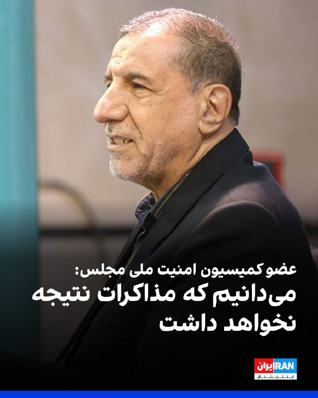

اسماعیل کوثری، عضو کمیسیون امنیت ملی مجلس، با تاکید بر اینکه «پرونده هسته‌ای از روی میز مذاکره با آمریکا برداشته شده است»، گفت: «مذاکرات برای پایان دادن به جنگ در حال انجام است اما به توافق نهایی نرسیده‌ایم و می‌دانیم که نتیجه‌ای نخواهند داشت.»

او افزود: «جمهوری اسلامی اکنون در حال مذاکره در مورد جلوگیری از تکرار جنگ، پرداخت غرامت، خروج نیروهای آمریکایی از منطقه و لغو محاصره دریایی است.»

کوثری اضافه کرد: «بسیاری از کشورها کنترل ایران بر تنگه را پذیرفته‌اند.»
https://iranintl.com/202605310064

## IranIntlTV — post 339895

  <a href="telegram/content/IranIntlTV_339895_1780240334.mp4" target="_blank">🎬 Download video</a>

در حالی که تورم سنگین خوراکی‌ها موجب تشدید بحران معیشت در ایران شده است، علیرضا نوری قزلجه، وزیر جهاد کشاورزی، گفت کالاهای اساسی با «قیمت‌های متعادل» در کشور عرضه می‌شوند.

گفت‌وگو با اشکان نظام‌آبادی، روزنامه‌نگار اقتصادی
@iranintltv

## IranIntlTV — post 339894

  <a href="telegram/content/IranIntlTV_339894_1780240335.mp4" target="_blank">🎬 Download video</a>

قهرمانی پاری‌سن‌ژرمن در لیگ قهرمانان اروپا با ناآرامی در خیابان‌های پاریس همراه شد. پلیس فرانسه اعلام کرد بیش از ۴۰۰ نفر در جریان درگیری‌های پس از جشن هواداران بازداشت شدند و نیروهای امنیتی در اطراف شانزه‌لیزه و مرکز شهر از گاز اشک‌آور استفاده کردند.
@iranintltv

## IranIntlTV — post 339893

  <a href="telegram/content/IranIntlTV_339893_1780240336.mp4" target="_blank">🎬 Download video</a>

در حالی که مذاکرات جمهوری اسلامی و آمریکا برای تمدید آتش‌بس ادامه دارد، رسانه‌های آلمان می‌گویند گره اصلی گفت‌وگوها دیگر فقط برنامه هسته‌ای نیست، بلکه میلیاردها دلار دارایی بلوکه‌شده ایران در خارج از کشور است.

علی حسن‌پور، خبرنگار ایران‌اینترنشنال، گزارش می‌دهد
@iranintltv

## IranIntlTV — post 339892

  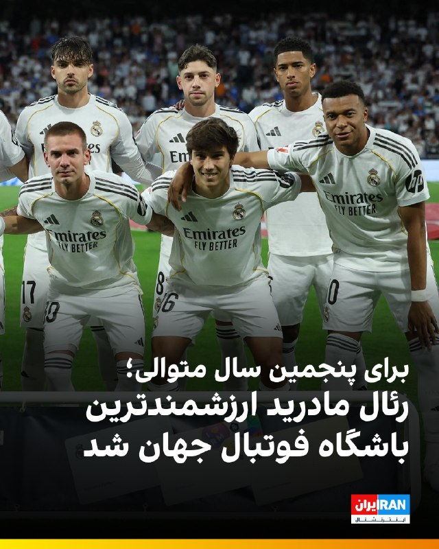

🔻رئال مادرید بار دیگر در صدر فهرست ارزشمندترین باشگاه‌های فوتبال جهان از نگاه فوربس قرار گرفت؛ پس از آن‌که در فصل ۲۵-۲۰۲۴ به رکورد درآمد سالانه ۱.۲۷ میلیارد دلار رسید. این رقم از درآمد ۱.۲۳ میلیارد دلاری تیم دالاس کابویز در NFL در سال ۲۰۲۴ نیز بیشتر است.

🔹بر اساس محاسبات فوربس (بدون در نظر گرفتن تورم)، یک رکورد جدید درآمد سالانه برای یک تیم ورزشی محسوب می‌شود.

🔹رئال مادرید در پنج سال اخیر و در مجموع ۱۰ سال از ۱۳ سال گذشته، ارزشمندترین باشگاه فوتبال جهان بوده است.

🔹با وجود قهرمانی پیاپی بارسلونا در لالیگا و پاری‌سن‌ژرمن در لیگ قهرمانان اروپا، اما در خارج از زمین، رئال مادرید همچنان معیار فوتبال جهان و حتی ورزش جهان به‌شمار می‌رود؛ با ارزشی معادل ۹.۵ میلیارد دلار، یعنی ۲ میلیارد دلار بیشتر از رقیب سنتی، بارسلونا.

🔹رتبه بندی ارزشمندترین باشگاه‌های فوتبال دنیا در سایت ببینید.

@iranintltvsport

## IranIntlTV — post 339891

  

سی‌بی‌اس نیوز گزارش داد میانجی‌ها تا صبح یکشنبه همچنان درباره یک یادداشت تفاهم میان جمهوری اسلامی و آمریکا در حال گفت‌وگو هستند.

یک منبع آگاه اعلام کرد دونالد ترامپ روز جمعه اصلاحاتی در متن این یادداشت ایجاد کرده و نسخه ویرایش‌شده برای تایید به تهران ارسال شده اما تاکنون پاسخی دریافت نشده است.

این سومین دور اصلاحاتی است که ترامپ در پیشنهاد آمریکا اعمال کرده؛ پیشنهادی که از طریق میانجی‌ها میان واشینگتن و تهران رد و بدل شده و این روند تحت هدایت پاکستان انجام می‌شود.

این منبع اعلام کرد تغییرات آمریکا تا حدی قابل توجه بوده، هرچند جزئیات آن هنوز منتشر نشده و برای نهایی شدن توافق نیز ضرب‌الاجل مشخصی وجود ندارد.
https://iranintl.com/202605318495

## IranIntlTV — post 339890

  <a href="telegram/content/IranIntlTV_339890_1780240338.mp4" target="_blank">🎬 Download video</a>

در پی راه‌اندازی کارزار مردمی رشت از سوی ایران‌اینترنشنال، ویدیوهایی به دست ما رسیده که خودروهای زیادی را در آرامستان شهر در ۲۰ دی ۱۴۰۴ نشان می‌دهد. به گفته شاهدان، جمعیت زیادی برای خاکسپاری جاویدنام خود در این روز به آرامستان آمدند.

## IranIntlTV — post 339889

🗣کارزار مردمی ایران اینترنشنال درباره جاوید‌نامان رشت - یکشنبه ۱۰ خرداد

🔹جمعیت عظیم معترضین از خیابان رودباری حرکت کردند و با شعار «رشت رو گرفتیم» به خیابان معلم و سپس استانداری رسیدند. گاز اشک‌آور شیمیایی و ازدحام شدید، باعث خفگی و بیهوشی برخی شد. حوالی ساعت ۱۰ شب تیراندازی گسترده نیروهای امنیتی آغاز شد و مردم را به رگبار بستند.

🔹در جاده تهران بین باغ رضوان و سراوان یک سوله هست که با پرچم قرمز، سفید و سبز رنگ شده و هیچ علامتی ندارد. پیکرهای جوانان رشت را در تاریخ ۱۸ و ۱۹ دی به آنجا انتقال می‌دادند.

🔹یکی از محل‌های کشتار استانداری رشت بود، به‌طوریکه نیروهای بسیج و سپاه مردم را به سمت استانداری هدایت کردند و با باز شدن در استانداری به مردم شلیک می‌کردند.

🔹شب ۱۸ دی‌ماه شاهد بودیم که در محله‌ای مابین دانای علی و سام، یگان ویژه به تابلو بالای مغازه شلیک کردند و همین اتفاق منجر به اتصال برق شد و مغازه آتش گرفت. چون خودم در رشته برق سررشته دارم، مطمئنم که آتش گرفتن مغازه به‌دلیل همان شلیک به تابلو و اتصال برق بود.

🔹صبح ۱۹ دی‌ماه دوستم زنگ زد و گفت در شهرداری فاجعه اتفاق افتاده و رفتیم. اولین چیزی که دیدم حجم دود و آتشی بود که هنوز زبانه می‌کشید. وانت‌ها و مأمورین شهرداری گوشه‌گوشه خیابان از خستگی نشسته بودند. چند وانت شهرداری را دیدم که از خیابان شهرداری بیرون می‌آمدند با دو رفتگر که عقبش نشسته بودند. عقب وانت پر بود ولی رویش را پارچه کشیده بودند. بعدها فهمیدم آن‌ها جنازه بچه‌هایمان بود. روی دیوار آثار دست‌های خونی بود که بعد پاک کردند.

🔹در میدان شهرداری رشت، دقیقا در همان خیابانی که ۱۸ و ۱۹ دی چندین نفر کشته دادیم، یک ون گشت ارشاد گذاشته‌اند و دوباره به حجاب‌ها گیر می‌دهند.

🔹در شهرداری رشت، اینقدر خون روی زمین بود که هنوز وقتی یادم میاد، تمام وجودم مالامال درد میشه، مثلا رد دست‌های خونی که روی دیوارها نقش بسته بود.

🔹 به پدرومادرهای جاویدنامان رشت می‌گفتن باید برای تحویل جنازه هم پول پرداخت کنید که بسته به شرایط مالی خانواده مبلغ تعیین میشد (اگر وضع مالی خوب بود، بالای یک میلیارد، ولی در غیراینصورت حدود ۵۰۰ میلیون تومان.) جاویدنام‌های عزیزمون رو نمیذاشتن حتی غسل بدن و بشورن. پیکرها رو در حالی که غرق خون بودند و با لباس دفن می‌کردند.

## IranIntlTV — post 339888

  <a href="telegram/content/IranIntlTV_339888_1780240340.mp4" target="_blank">🎬 Download video</a>

بر اساس اطلاعات رسیده به ایران‌اینترنشنال، مجید فرخزاد ممشلی، ۳۷ ساله و پدر یک کودک ۵ ساله، شامگاه ۱۸ دی‌ماه در خیابان پیروزی تهران هدف شلیک مستقیم قرار گرفت و به دلیل خون‌ریزی شدید و تاخیر در انتقال به بیمارستان جان باخت. پیکر او سحرگاه بیست‌ودوم دی‌ماه، حدود ساعت چهار صبح، تحت تدابیر شدید امنیتی و به‌صورت مخفیانه در مینودشت به خاک سپرده شد.

گفت‌وگو با فرنوش فرجی، عضو تحریریه ایران‌اینترنشنال
@iranintltv

## IranIntlTV — post 339887

  <a href="telegram/content/IranIntlTV_339887_1780240341.mp4" target="_blank">🎬 Download video</a>

در پی راه‌اندازی کارزار مردمی رشت از سوی ایران‌اینترنشنال، ویدیوهایی به دست ما رسیده که جمعیت گسترده مردم معترض این شهر را در ۱۸ دی ۱۴۰۴ نشان می‌دهد.

## IranIntlTV — post 339886

  <a href="telegram/content/IranIntlTV_339886_1780240343.mp4" target="_blank">🎬 Download video</a>

مروری بر روزنامه‌های ایران، یکشنبه ۱۰ خرداد، با مجتبی هاشمی، روزنامه‌نگار

@iranintltv

## IranIntlTV — post 339885

  <a href="telegram/content/IranIntlTV_339885_1780240344.mp4" target="_blank">🎬 Download video</a>

ویدیوهای رسیده به ایران‌اینترنشنال، مراسم چهلم ماهان و امیررضا حیدری، دو پسرعموی جاویدنام را نشان می‌دهد که در ۱۸ دی‌ماه در محله پاسداران تهران به ضرب گلوله کشته شدند.
امیررضا، ۳۰ ساله و ماهان هم ۲۱ سال سن داشت. مادر ماهان در مراسم چهلم آنها خطاب به پسرش فریاد زد: «خوشت باشد که در این راه رفتی. من ناراحت نیستم که در این راه کشته شدی.»

## IranIntlTV — post 339884

  <a href="telegram/content/IranIntlTV_339884_1780240346.mp4" target="_blank">🎬 Download video</a>

گزارش‌ها از پرداخت نشدن مطالبات کشاورزان از سوی دولت و قاچاق گندم از ایران به کشورهای همسایه خبر می‌دهد.

گفت‌وگو با آرش آزرمی، دبیر بخش اقتصادی ایران‌اینترنشنال
@iranintltv

## IranIntlTV — post 339883

  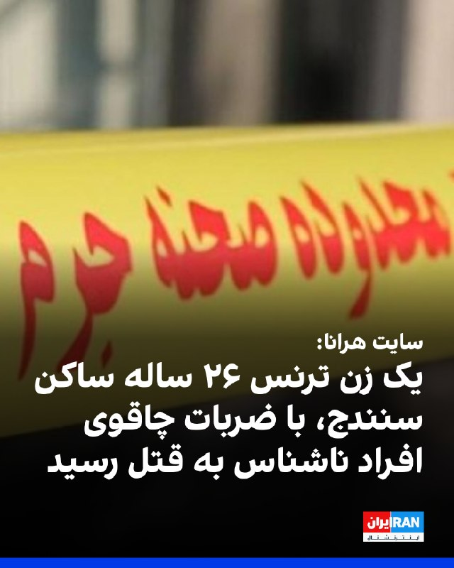

سایت هرانا گزارش داد یک زن ترنس ۲۶ ساله ساکن سنندج، در محله گلشن این شهر، بر اثر ضربات چاقو توسط افراد ناشناس کشته شده است و هنوز انگیزه و هویت عاملان مشخص نیست.
هرانا نوشت: «احتمالا او روز جمعه به‌دست افراد ناشناس و با ضربات چاقو به قتل رسیده و مهاجمان جسد را هم مثله کرده‌اند.»
https://iranintl.com/202605315624

## Shin_Persian — post 6325

↩️ Quoted tweet: ImmortalGuard 🦸🏻 @ZuperZ3R0 Sun, 31 May 2026 12:11:07 UTC @hey_itsmyturn This is starting to sound like the jet activity over Baghdad. All hype and no results ↩️ توییت نقل‌قول شده — برای پاسخ، پست زیر را ببینید. فارسی @hey_itsmyturn این…

## Shin_Persian — post 6324

↩️ Quoted tweet:
ImmortalGuard 🦸🏻 @ZuperZ3R0
Sun, 31 May 2026 12:11:07 UTC

@hey_itsmyturn This is starting to sound like the jet activity over Baghdad. All hype and no results

↩️ توییت نقل‌قول شده — برای پاسخ، پست زیر را ببینید.

فارسی

@hey_itsmyturn این داره شبیه فعالیت جت‌ها برفراز بغداد به نظر می‌رسه. همه‌اش هیاهو و بدون هیچ نتیجه‌ای.

𝕏 · @shin_persian

## Shin_Persian — post 6323

  

Shin ✓ @hey_itsmyturn
Sun, 31 May 2026 10:49:34 UTC

State-owned Mehr News reports an explosion in Qeshm island, Hormozgan Province, #Iran

فارسی

خبرگزاری دولتی مهر از وقوع انفجاری در جزیره قشم، استان هرمزگان، #Iran گزارش می‌دهد.

𝕏 · @shin_persian

## FarsiVOA — post 219175

🔺زهرا شهباز طبری پس از نقض حکم پیشین بار دیگر به اعدام محکوم شد

◾️زهرا شهباز طبری، زندانی سیاسی محبوس در زندان لاکان رشت، پس از نقض حکم اعدام پیشین در دیوان عالی کشور، بار دیگر از سوی شعبه دوم دادگاه انقلاب رشت به اعدام محکوم شده است.

⬇️ بیشتر بخوانید:

https://ir.voanews.com/a/political-prisoner-sentenced-to-death/8155775.html

## FarsiVOA — post 219174

پیروزی پاری‌سن‌ژرمن در لیگ قهرمانان اروپا شامگاه شنبه ۹ خرداد پاریس را شعله‌ور کرد و هواداران خیابا‌ن‌ها را تسخیر و شادی کردند.

## FarsiVOA — post 219173

روزنامه تایمز به نقل از اسناد تازه دادگاه آمریکا گزارش داده که یک فرد متهم به نقش داشتن در حملات علیه اهداف یهودی در بریتانیا و اروپا گفته است سه روز پیش از آغاز اقدام نظامی آمریکا و اسرائیل علیه جمهوری اسلامی، با علی خامنه‌ای دیدار کرده بود.

## FarsiVOA — post 219172

  <a href="telegram/content/FarsiVOA_219172_1780240348.mp4" target="_blank">🎬 Download video</a>

ارتش دفاعی اسرائیل ویدیویی به زبان فارسی به مناسبت هفتاد و هشتمین سال تاسیس این ارتش منتشر کرده است. سخنگوی فارسی زبان ارتش اسرائیل در این ویدیو از ارزش‌های نهادینه این ارتش مانند اصل «طهارت سلاح» گفته و آن را با رویکرد جمهوری اسلامی مقایسه می‌کند که از سلاح برای گسترش ترور و آسیب رساندن به غیرنظامیان بی‌گناه استفاده می‌کند.

## FarsiVOA — post 219171

  <a href="telegram/content/FarsiVOA_219171_1780240350.mp4" target="_blank">🎬 Download video</a>

حسن شریعتمداری در عمق میدان: پدرم، آیت‌الله شریعتمداری می‌دانست که آمدنِ خمینی فاجعه است اما کسی صدای او را نشنید

## FarsiVOA — post 219170

🔺وزیر دفاع اسرائیل درباره تصرف قلعه بوفور: این نتیجه تهدید کردن شهروندان اسرائیلی است

◾️وزیر دفاع اسرائیل می‌گوید تصرف یک قلعه تاریخی و راهبردی در شمال رود لیتانی در لبنان به دلیل تهدید کردن شهروندان اسرائیلی رقم خورده است.

⬇️ بیشتر بخوانید:

https://ir.voanews.com/a/beaufort-castle-israeli-army-israeli-defense-minister-israel-katz/8155777.html

## FarsiVOA — post 219169

تجمع پرشمار هواداران باشگاه پاری سن‌ژرمن در روز ۹ خرداد در پاریس، برای جشن قهرمانی این تیم در اروپا، به درگیری و خشونت کشیده شد.

این تیم فرانسوی با پیروزی بر باشگاه آرسنال، یرای دومین سال پیاپی در لیگ قهرمانان اروپا قهرمان شد.

خبرگزاری آسوشیتدپرس می‌گوید تنها در خیابان شانزه‌لیزه بیش از ۲۰ هزار نفر برای این جشن آمده بودند.

@FarsiVOA

## FarsiVOA — post 219168

🔺ارتش اسرائیل: انبارهای تسلیحاتی حماس را منفجر کردیم

◾️ارتش دفاعی اسرائیل یکشنبه ۱۰ خرداد، با انتشار پیامی در شبکه ایکس در این‌باره نوشت: «نیروهای ارتش اسرائیل تحت فرماندهی جنوب، با استفاده از نیروی هوایی، در طول هفته سه انبار تسلیحاتی متعلق به سازمان تروریستی حماس را در چندین منطقه در نوار غزه هدف قرار داده و منهدم کردند.»

⬇️ بیشتر بخوانید:

https://ir.voanews.com/a/weapons-depot-israel-hamas-destroy/8155765.html

## FarsiVOA — post 219167

🔺تداوم بی‌خبری از جواد علیکردی، وکیل محبوس در زندان وکیل‌آباد مشهد

◾️گزارش‌های منتشرشده از نزدیکان جواد علیکردی، وکیل دادگستری و استاد دانشگاه، از تداوم بی‌خبری از وضعیت او در زندان وکیل‌آباد مشهد حکایت دارد. بر اساس این گزارش‌ها، خانواده و نزدیکان علیکردی طی بیش از ۱۵ روز گذشته امکان تماس منظم و اطلاع دقیق از وضعیت جسمی و حقوقی او را نداشته‌اند.

⬇️ بیشتر بخوانید:

https://ir.voanews.com/a/javad-alikordi-held-incommunicado-again/8155766.html

## FarsiVOA — post 219166

  <a href="telegram/content/FarsiVOA_219166_1780240351.mp4" target="_blank">🎬 Download video</a>

تصاویری از حملات هوایی امروز ارتش اسرائیل به مواضع حزب‌الله در منطقه صور لبنان؛

جنگ میان حزب‌الله و ارتش اسرائیل به رغم تمدید آتش‌بس همچنان ادامه دارد و در همین راستا، در روزهای اخیر ارتش اسرائیل چندین هشدار تخلیه برای مناطق مختلف لبنان صادر کرد. نتانیاهو نیز بر گسترش عملیات اسرائیل در جنوب لبنان تأکید کرد.

## FarsiVOA — post 219165

  <a href="telegram/content/FarsiVOA_219165_1780240352.mp4" target="_blank">🎬 Download video</a>

ارتش اسرائیل ویدیویی از انهدام انبارهای تسلیحاتی حماس منتشر و اعلام کرد در طول هفته سه انبار تسلیحاتی متعلق به سازمان تروریستی حماس را در چند منطقه در نوار غزه هدف قرار داده است.

در این انبارها مواد انفجاری، سلاح‌های سبک، تفنگ‌های تک‌تیراندازی، خودرو و تجهیزات رزمی دیگر نگهداری می‌شد. انفجارهای ثانویه بعد از حملات نشان‌دهنده وجود تسلیحات در داخل این انبارها بود.

ارتش اسرائیل در ادامه اعلام کرد این تسلیحات برای آسیب رساندن به نیروهایش که در منطقه خط زرد فعالیت می‌کنند و همچنین شهروندان اسرائیل در نظر گرفته شده بود و به‌منظور رفع این تهدید منهدم شدند.

ارتش اسرائیل تاکید کرد پیش از این حملات، اقداماتی برای کاهش آسیب به غیرنظامیان، از جمله استفاده از مهمات دقیق و رصد هوایی انجام شد.

## FarsiVOA — post 219164

  <a href="telegram/content/FarsiVOA_219164_1780240353.mp4" target="_blank">🎬 Download video</a>

گروهی از بازنشستگان تامین اجتماعی در شوش، در ادامه اعتراضات هفتگی، روز یکشنبه، ۱۰ خرداد ۱۴۰۵، با شعار «گرانی، تورم، بلای جان مردم» در اعتراض به شرایط دشوار معیشتی تجمع کردند.

## FarsiVOA — post 219163

  <a href="telegram/content/FarsiVOA_219163_1780240355.mp4" target="_blank">🎬 Download video</a>

ویدیوی منتشرشده از سوی وزارت جنگ آمریکا در روز یکشنبه ۱۰ خرداد، ورود پیت هگست، وزیر جنگ ایالات متحده، به پایگاه اندروز در ایالت مریلند را نشان می‌دهد.

@FarsiVOA

## FarsiVOA — post 219162

  <a href="telegram/content/FarsiVOA_219162_1780240355.mp4" target="_blank">🎬 Download video</a>

ارتش اسرائیل ویدیویی از ادامه حملات هوایی در صور منتشر و تاکید کرد حملات به مقرهای فرماندهی سازمان تروریستی حزب‌الله در منطقه صور همچنان در حال انجام است.

جنگ میان حزب‌الله و ارتش اسرائیل به رغم تمدید آتش‌بس همچنان ادامه دارد و در همین راستا، در روزهای اخیر ارتش اسرائیل چندین هشدار تخلیه برای مناطق مختلف لبنان صادر کرد. نتانیاهو نیز بر گسترش عملیات اسرائیل در جنوب لبنان تأکید کرد.

## FarsiVOA — post 219161

🔺نتانیاهو بر گسترش عملیات اسرائیل در جنوب لبنان تأکید کرد

▪️بنیامین نتانیاهو، نخست‌وزیر اسرائیل، تصرف قلعه تاریخی بوفور (شقیف) و ارتفاعات راهبردی اطراف آن در جنوب لبنان را «یک تغییر دراماتیک» در سیاست اسرائیل توصیف کرد.

▪️او تصریح کرد که دستور داده عملیات در مناطقی که تحت کنترل حزب‌الله بوده «تعمیق و گسترش» یابد.

▪️تصرف بوفور پس از روزها نبرد شدید در روستاهای اطراف و عبور نیروهای اسرائیلی از رودخانه لیتانی انجام شد؛ عمیق‌ترین پیشروی اسرائیل در لبنان طی ۲۶ سال گذشته.

▪️همزمان با اعلام تصرف بوفور، ارتش اسرائیل دستور تخلیه اجباری همه ساکنان جنوب رودخانه زهرانی را صادر کرد و به آنها هشدار داد هر کس در منطقه بماند جان خود را به خطر می‌اندازد.

⬇️ بیشتر بخوانید:
https://ir.voanews.com/a/8155763.html

## FarsiVOA — post 219160

  

شاخص مدیران خرید بخش تولید چین در ماه مه به ۵۰ واحد کاهش یافت که ۰.۳ درصد کمتر از ماه گذشته است. این شاخص وضعیت اقتصادی بخش‌های تولیدی و خدماتی را از دیدگاه مدیران خرید نشان می‌دهد و عدد بالاتر از ۵۰ نشان‌دهنده رشد و عدد پایین‌تر از ۵۰ بیانگر انقباض است.

بدین ترتیب، وضعیت رشد در بخش‌های تولیدی چین طی ماه جاری متوقف شده است.

بر اساس گزارش رسمی دولت چین، علت افت این شاخص مربوط به کاهش سفارش‌های جدید صادراتی و افزایش هزینه نهاده‌های تولید است. این وضعیت نگرانی‌ها را درباره از دست رفتن شتاب رشد اقتصادی چین، با وجود برخی نشانه‌های مثبت در بخش خدمات و صنایع پیشرفته، افزایش داده است.
@FarsiVOA

## FarsiVOA — post 219159

  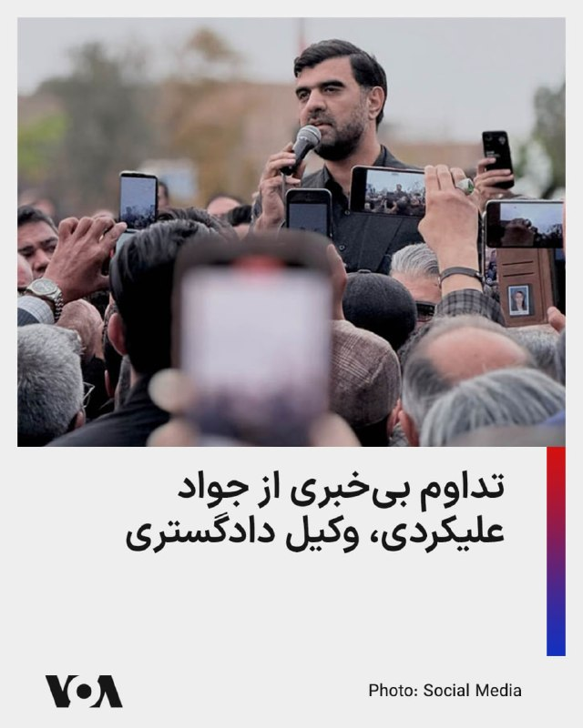

گزارش‌های منتشرشده از نزدیکان جواد علیکردی، وکیل دادگستری محبوس در زندان وکیل‌آباد مشهد، از بیش از ۱۵ روز بی‌خبری از وضعیت او حکایت دارد.

بر اساس این گزارش‌ها، علیکردی که حدود شش ماه پیش پس از شرکت در مراسم یادبود برادرش، خسرو علیکردی، و اعتراض به نحوه برخورد با این مراسم بازداشت شد، همچنان بدون دسترسی منظم به خانواده در زندان نگهداری می‌شود.

نزدیکان او می‌گویند علیکردی پس از دوره‌ای بازجویی در سلول‌های انفرادی اداره اطلاعات مشهد، به بند ۶/۱ زندان وکیل‌آباد منتقل شده، اما همچنان با محدودیت تماس تلفنی و ملاقات روبه‌روست.

در همین گزارش‌ها، خبر صدور حکم ۱۰ سال زندان برای او رد شده و گفته شده تاکنون دادگاهی برای رسیدگی به پرونده‌اش برگزار نشده است.

جواد علیکردی برادر خسرو علیکردی، وکیل حقوق بشری است که آذر ۱۴۰۴ در مشهد جان باخت. خانواده و فعالان حقوق بشر مرگ او را مشکوک دانسته‌اند.
@FarsiVOA

## FarsiVOA — post 219158

  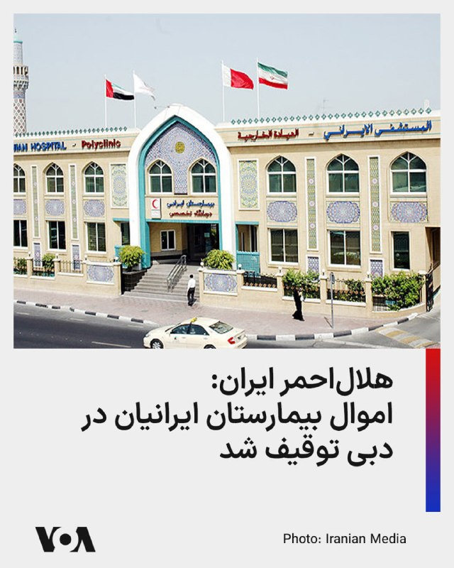

رئیس جمعیت هلال‌احمر ایران می‌گوید بیمارستان این نهاد در دبی «به زور» تعطیل شده و اموال نقدی و دارایی‌های آن با حکم دادگاه بلوکه شده است.

پیرحسین کولیوند گفت بیماران این بیمارستان، به گفته او، «برخلاف قوانین و مقررات» از مرکز درمانی خارج شده‌اند. او همچنین اعلام کرد رئیس بیمارستان پس از تعطیلی ممنوع‌الخروج شده و هر روز برای محاکمه و بازجویی احضار می‌شود.

رئیس جمعیت هلال‌احمر ایران افزود ویزای کارکنان بیمارستان ایرانیان دبی نیز باطل شده و از خانه‌های سازمانی خود بیرون رانده شده‌اند.

این اظهارات در ادامه اختلاف بر سر تعطیلی بیمارستان ایرانیان در دبی مطرح می‌شود؛ بیمارستانی وابسته به هلال‌احمر ایران که سال‌ها به ایرانیان مقیم و دیگر بیماران در امارات خدمات درمانی ارائه می‌کرد.

در اواخر ماه مارس یک مقام اماراتی گفته بود نهادهایی که «مستقیماً با حکومت ایران مرتبط» هستند، به دلیل آنچه «سوءاستفاده برای پیشبرد دستورکارهایی مغایر با قوانین امارات» خوانده، تعطیل می‌شوند.
@FarsiVOA

## FarsiVOA — post 219157

🔺کاتس می‌گوید اسرائیل کنترل قلعه راهبردی جنوب لبنان را حفظ می‌کند

▪️یسرائیل کاتس، وزیر دفاع اسرائیل اعلام کرد که نیروهای این کشور به‌عنوان بخشی از «منطقه امنیتی جدید» ارتش اسرائیل در جنوب لبنان، در قلعه راهبردی شقیف (بوفور) مستقر باقی خواهند ماند.

▪️وزیر دفاع اسرائیل تأکید کرد که «تصرف بوفور و گسترش مانور زمینی، پیام روشنی به دشمنان ماست: هر کس شهروندان اسرائیل را تهدید کند، دارایی‌های استراتژیک خود را یکی پس از دیگری از دست خواهد داد.»

▪️قلعه‌ شقیف در دوران جنگ‌های صلیبی و بر فراز یک کوه ساخته شده و تصرف آن از سوی نیروهای اسرائیلی، عمیق‌ترین نفوذ اسرائیل به خاک لبنان در بیش از ربع قرن گذشته است.

⬇️ بیشتر بخوانید:
https://ir.voanews.com/a/katz-troops-will-remain-in-beaufort-as-part-of-israel-s-security-zone-in-lebanon/8155758.html

## FarsiVOA — post 219156

🔺قالیباف: «چک سفید امضا» نمی‌دهیم اما نباید در «درگیری‌های فرسایشی» بیفتیم

▪️محمدباقر قالیباف، رئیس مجلس شورای اسلامی و رئیس هیئت مذاکره‌کننده جمهوری اسلامی در مذاکرات با آمریکا ادعا کرد که جمهوری اسلامی «چک سفید امضا» به کسی نمی‌دهد اما نباید «در تله‌ درگیری‌های فرسایشی» نیز بیفتد.

▪️این اظهارات در شرایطی است که اکسیوس و نیویورک‌تایمز گزارش دادند دونالد ترامپ، خواستار سخت‌گیرانه‌تر شدن شروط چارچوب توافق احتمالی با جمهوری اسلامی شده و نسخه اصلاح‌شده را برای بررسی به تهران فرستاده است.

▪️پرزیدنت ترامپ و مقامات ارشد دولتش بارها تأکید کرده‌اند که واشنگتن ترجیح می‌دهد با تهران به توافق برسد، اما اگر خواست‌های آمریکا محقق نشود آماده بررسی دوباره گزینه نظامی هستند.

⬇️ بیشتر بخوانید:
https://ir.voanews.com/a/8155760.html

## DW_Farsi — post 125347

🔶 انجمن پرواز۷۵۲ از اصلاح قوانین هوانوردی پس از شش سال خبر داد
 
انجمن خانواده‌های جان‌باختگان پرواز پی‌اس۷۵۲ امروز یکشنبه ۱۰ خرداد (۳۱ مه) اعلام کرد که پس از شش سال و نیم پیگیری و رایزنی، اصلاحاتی در ضمیمه ۱۳ کنوانسیون شیکاگو، یکی از مهم‌ترین اسناد ناظر بر تحقیقات سوانح هوایی، به تصویب رسیده است؛ اصلاحاتی که به گفته این انجمن، در واکنش به کاستی‌هایی شکل گرفته که در روند رسیدگی به سرنگونی هواپیمای اوکراینی در تهران آشکار شد.
 
پرواز پی‌اس۷۵۲ خطوط هوایی بین‌المللی اوکراین بامداد ۱۸ دی ۱۳۹۸ تنها چند دقیقه پس از برخاستن از فرودگاه تهران، با شلیک دو موشک سپاه پاسداران سرنگون شد و تمامی ۱۷۶ سرنشین آن جان باختند. بخش بزرگی از قربانیان، ایرانیان شهروند یا ساکن کانادا بودند.
 
انجمن خانواده‌های جان‌باختگان این هواپیما، در بیانیه خود اعلام کرده است که بر اساس ضمیمه ۱۳ کنوانسیون شیکاگو، مسئولیت هدایت تحقیقات ایمنی در یک سانحه هوایی بر عهده کشوری است که حادثه در قلمرو آن رخ داده است.
 
به گفته این انجمن، همین قاعده باعث شد که تحقیقات ایمنی درباره سرنگونی هواپیمای اوکراینی به جمهوری اسلامی ایران واگذار شود؛ وضعیتی که خانواده‌ها آن را مصداق سپردن "پرونده تحقیقات درباره یک قتل جمعی به دست عاملان آن" توصیف کرده‌اند.
 
به گفته انجمن، اصلاحات جدید پس از سال‌ها دیدار با تصمیم‌گیران بین‌المللی و رایزنی دولت کانادا، در نهادهایی از جمله سازمان بین‌المللی هوانوردی غیرنظامی (ایکائو)، به تصویب رسیده است.
@dw_farsi

## DW_Farsi — post 125346

  

🔶 رییس کمیته نظامی ناتو: اعضای ناتو می‌توانند در بازگشایی تنگه هرمز نقش داشته باشند
 
جوزپه کاوو دراگونه، رییس کمیته نظامی ناتو، گفت این پیمان دفاعی در شرایط کنونی مستقیما در حل‌وفصل مسائل مربوط به تنگه هرمز دخالت ندارد، اما کشورهای عضو این پیمان در حال نزدیک کردن نیروهای خود به منطقه هستند و اگر شرایط لازم فراهم شود، قادر خواهند بود نقش ایفا کنند.
 
کاوو دراگونه گفت ناتو به‌عنوان یک ائتلاف در این مرحله نقشی مستقیم ندارد، اما کشورهای عضو آن چنین نقشی دارند. او افزود این کشورها در حال جابه‌جایی و استقرار نیروهای خود در نزدیکی منطقه هستند تا در صورت مهیا شدن شرایط، بتوانند وارد عمل شوند.
 
او در توضیح بیشتر گفت آنچه در حال شکل‌گیری است، نه یک ماموریت رسمی ناتو، بلکه "ائتلافی از کشورهای مایل" است؛ یعنی مجموعه‌ای از کشورهای عضو ناتو و شریکانی همسو که از هم‌اکنون در حال آماده‌سازی و برنامه‌ریزی هستند تا اگر شرایط مداخله فراهم شد، بتوانند وارد عمل شوند.
@dw_farsi

## DW_Farsi — post 125345

🔶 تعلیق میان ربایش و پهپاد؛ پناهجویان سیاسی ایرانی در عراق
 
🔻گزارشی از آتفه چهارمحالیان

نزدیک به چهار سال از آغاز جنبش"زن، زندگی، آزادی" می‌گذرد، اما آثار آن کماکان بر زندگی بسیاری از معترضان، فعالان سیاسی و خانواده‌های آنان سنگینی می‌کند. شماری از این افراد در سال‌های اخیر ناچار شدند از مسیرهای غیرقانونی مرزی، ایران را ترک کنند و به اقلیم کردستان عراق پناه ببرند؛ منطقه‌ای که برای دهه‌ها یکی از اصلی‌ترین مقاصد پناهجویان سیاسی ایرانی بوده است.
 
روایت کسانی که امروز در اردوگاه‌ها و شهرهای اقلیم زندگی می‌کنند، حاکی از آن است که خروج از ایران برای این پناهجویان به معنای پایان خطر نبوده است.
 
حملات پهپادی و موشکی به اردوگاه‌های محل استقرار پناهجویان و خانواده‌های وابسته به احزاب کرد ایرانی در جنگ اخیر، مشکلات اقامتی، دشواری دسترسی به درمان، نبود امکان کار و هراس از بازگردانده شدن به ایران، تنها بخشی از مشکلاتی است که پناهجویان سیاسی ایرانی از آن سخن می‌گویند.
 
در این میان، روایت اردلان مامه، شهین عبدالقادری، محمد محمدی و علی برزنجی، تصویری از سرنوشت نسلی است که از سرکوب گریخته اما در ناامنی‌های دیگری گرفتار شده است.
@dw_farsi

## DW_Farsi — post 125344

  

🔶 سه سکوی فراساحلی پارس جنوبی پس از جنگ به مدار تولید بازگشتند
 
تورج دهقانی، مدیرعامل شرکت نفت و گاز پارس، گفت روند بازیابی ظرفیت تولید و فرآورش گاز در میدان مشترک پارس جنوبی پس از حملات امریکا و اسرائیل ادامه دارد و تاکنون سه سکوی فراساحلی این میدان دوباره وارد مدار تولید شده‌اند.
 
دهقانی گفت در جریان حملات آمریکا و اسرائیل به برخی تاسیسات پالایشی پارس جنوبی، بخشی از ظرفیت دریافت و فرآورش گاز در نوار ساحلی استان بوشهر با محدودیت روبه‌رو شد.
 
به گفته او، در نتیجه این وضعیت، تعدادی از سکوهای فراساحلی متناظر با پالایشگاه‌های آسیب‌دیده، با وجود آمادگی کامل عملیاتی و بدون آن‌که خود سکوها آسیب دیده باشند، ناچار به توقف تولید شدند، زیرا امکان دریافت و فرآورش گاز تولیدی آن‌ها در بخش خشکی وجود نداشت.
 
مدیرعامل شرکت نفت و گاز پارس گفت با اجرای برنامه‌های فنی و عملیاتی در بخش پایین‌دست و استفاده حداکثری از ظرفیت پالایشگاه‌های فعال، امکان دریافت و فرآورش بخشی از گاز تولیدی این سکوها دوباره فراهم شد.
 
@dw_farsi

## DW_Farsi — post 125343

  

🔶 زهرا شهباز طبری بار دیگر به اعدام محکوم شد
 
به گزارش هرانا، زهرا شهباز طبری، زندانی سیاسی ۶۸ ساله، پس از آن‌که حکم اعدام پیشین او در دیوان عالی کشور نقض شده بود، بار دیگر از سوی شعبه دوم دادگاه انقلاب رشت به ریاست محمدعلی درویش‌گفتار به اعدام محکوم شده است. این حکم با اتهام "بغی" از طریق عضویت و فعالیت در سازمان مجاهدین خلق ایران صادر شده و در تاریخ سه‌شنبه (۲۵ فروردین ۱۴۰۵) علیه او صادر و به‌تازگی ابلاغ شده است.
 
زهرا شهباز طبری پیش‌تر در آبان ۱۴۰۴ از سوی شعبه اول دادگاه انقلاب رشت در ارتباط با همین اتهام به اعدام محکوم شده بود. آن حکم بعدتر در دیوان عالی کشور نقض شد و پرونده برای رسیدگی دوباره به شعبه دوم دادگاه انقلاب رشت فرستاده شد.
 
با این حال، رسیدگی مجدد نیز بار دیگر به صدور حکم اعدام منتهی شده است.
 
هرانا نوشته است زهرا شهباز طبری پیش‌تر در نامه‌ای از زندان، روند رسیدگی به پرونده خود را "فاقد مبنای حقوقی و نشانه‌ای از نبود دادرسی عادلانه" توصیف کرده بود.
 
@dw_farsi

## DW_Farsi — post 125342

  

🔶 سپاه: ۲۸ کشتی در ۲۴ ساعت گذشته با مجوز و تامین امنیت ما از تنگه هرمز عبور کردند
 
روابط عمومی نیروی دریایی سپاه در اطلاعیه‌ای اعلام کرد طی ۲۴ ساعت گذشته ۲۸ فروند کشتی، شامل نفتکش، کانتینربر و دیگر کشتی‌های تجاری، پس از دریافت مجوز و با هماهنگی و تامین امنیت نیروی دریایی سپاه از تنگه هرمز عبور کرده‌اند.
 
در این اطلاعیه آمده است کنترل "هوشمند" تنگه هرمز به‌طور مستمر و آنچه "صلابت و اقتدار" خوانده شده، در حال انجام است.
 
سپاه در این بیانیه عبور کشتی‌ها را در چارچوب مجوزدهی و نظارت مستقیم خود توصیف کرده است.
 
روابط عمومی نیروی دریایی سپاه همچنین خلیج فارس را پهنه‌ای آبی متعلق به کشورهای مسلمان منطقه خواند و اعلام کرد "تجاوز و شرارت‌های ارتش تروریست آمریکایی" مهم‌ترین دلیل ناامنی این منطقه در روزهای اخیر بوده است.
@dw_farsi

## DW_Farsi — post 125341

🔶 اسرائیل قلعه راهبردی بوفور در جنوب لبنان را تصرف کرد
 
ارتش اسرائیل امروز یکشنبه ۳۱ مه (۱۰ خرداد) اعلام کرد که نیروهایش در جنوب لبنان قلعه راهبردی بوفور (شقیف) را تصرف کرده‌اند. این عمیق‌ترین پیشروی نیروهای اسرائیلی در خاک لبنان در بیش از ربع قرن گذشته به شمار می‌رود.
 
یسرائیل کاتس، وزیر دفاع اسرائیل، گفت ارتش این کشور به رهبری نخست‌وزیر بنیامین نتانیاهو «عملیات خود در لبنان را گسترش داده، از رود لیتانی عبور کرده و ارتفاعات بوفور را به تصرف درآورده است.»
 
کاتس افزود که این اقدام در راستای دفاع از شهرک‌های منطقه جلیل در شمال اسرائیل و تأمین امنیت سربازان اسرائیلی انجام شده است.
 
آویخای ادرعی، سخنگوی عرب‌زبان ارتش اسرائیل، نیز در شبکه ایکس عکس‌هایی را منتشر کرده که نیروهای اسرائیلی را در حال حرکت در برابر این قلعه نشان می‌دهد.
 
این نخستین بار در ۲۶ سال گذشته است که نیروهای اسرائیلی در این محل مستقر می‌شوند. قلعه بوفور، در ارتفاع تقریبی ۶۵۰ متری بالاتر از سطح رودخانه لیتانی در جنوب لبنان، علاوه بر اهمیت استراتژیک، از اهمیت نمادین بالایی برخوردار است.
 
در دوران اشغال جنوب لبنان توسط اسرائیل از سال ۱۹۸۲ تا ۲۰۰۰، این قلعه ابتدا مدت‌ها صحنه درگیری بود و سپس برای سال‌ها به یک پایگاه پیشروی ارتش اسرائیل تبدیل شد.
 
@dw_farsi

## DW_Farsi — post 125340

🔶 قالیباف می‌گوید ایران "هیچ اعتمادی" به وعده‌های آمریکا ندارد

محمدباقر قالیباف، رئیس مجلس شورای اسلامی در جلسه مجازی مجلس، در نطق پیش از دستور سومین سال مجلس دوازدهم با اشاره به کشته شدن علی خامنه‌ای، در روز آغاز جنگ آمریکا و اسرائیل علیه جمهوری اسلامی، گفت که مجلس "به مدیریت و رهبری" مجتبی خامنه‌ای، فرزند علی خامنه‌ای دلگرم است و "پیام‌ها و رهنمودهای" او را "نقشه‌ راه" مجلس توصیف کرد.

قالیباف همچنین با اشاره به مذاکرات جاری بین جمهوری اسلامی و آمریکا بر سر ادامه آتش‌بس و توافق هسته‌ای، با بیان این که جمهوری اسلامی "هیچ اعتمادی" به وعده‌های آمریکا ندارد گفت: «کار دیپلماسی تبدیل پیروزی‌های کسب شده در میدان نظامی به دستاوردهای سیاسی و حقوقی است.»

رئیس مجلس شورای اسلامی در ادامه، مذاکره‌کنندگان جمهوری اسلامی را "سربازان میدان مبارزه‌ دیپلماسی" توصیف کرد و گفت مذاکره‌کنندگان جمهوری اسلامی "هیچ اعتمادی به حرف ها و وعده‌های دشمن ندارند".

قالیباف افزود: «آنچه برای ما ملاک است دستاوردهای عینی است که باید کسب کنیم تا در مقابل آن دست به انجام تعهدات خود بزنیم و تا اطمینان پیدا نکنیم که حقوق ملت ایران را گرفته ایم، هیچ توافقی را تأیید نخواهیم کرد.»

رئیس مجلس شورای اسلامی همچنین بدون اشاره به پیامدهای وخیم جنگ و تحریم و محاصره دریایی برای اقتصاد ایران مدعی شد که مسئولان نظام برای کاهش مشکلات اقتصادی و معیشتی مردم تلاش می‌کنند. قالیباف همچنین گفت که اطمینان دارد که جمهوری اسلامی از این جنگ بزرگ "با پیروزی" خارج خواهد شد.

@dw_farsi

## DW_Farsi — post 125339

🔶 سفارت ایران در دانمارک گزارش جدید سازمان امنیت این کشور را رد کرد

سفارت جمهوری اسلامی در کپنهاگ با انتشار بیانیه‌ای ضمن رد گزارش سازمان اطلاعات و امنیت دانمارک (PET) گفت که حکومت ایران همواره و رسما هرگونه دخالت در فعالیت‌های ادعایی در خاک دانمارک را رد کرده است.

سفارت جمهوری اسلامی در بیانیه خود همچنین ادعا کرده که گزارش‌های سازمان اطلاعات و امنیت دانمارک "طی سال‌های گذشته تصویری تکراری و نادرست از تهدید ایران ارائه کرده‌اند، بدون آنکه اسناد قانع‌کننده‌ای برای اثبات این ادعاها منتشر کنند".

سازمان اطلاعات و امنیت دانمارک در ارزیابی جدید خود گزارش کرده است که جمهوری اسلامی در خلال تحولات اخیر، نقشی پررنگ‌تر در "تهدیدهای امنیتی علیه دانمارک" بازی می‌کند.

سفارت جمهوری اسلامی بدون ارائه هیچ مدرکی گزارش سازمان امنیت دانمارک را رد کرده و مدعی شده که "میان ادعاهای مطرح‌شده و مدارک ارائه‌شده فاصله قابل توجهی وجود دارد و همین امر اعتبار نتیجه‌گیری‌های PET را زیر سؤال می‌برد".

در این بیانیه با اشاره به دو پرونده ذکر شده در گزارش سازمان امنیت دانمارک ادعا شده که "هیچ‌یک از این پرونده‌ها مدارک مستندی که دخالت دولت ایران را اثبات کند ارائه نشده است".

این دو مورد، یک پرونده سال ۲۰۱۸ و تلاش برای ترور یکی از رهبران گروه الاحوازیه در دانمارک و دیگری پرونده حمله به سفارت اسرائیل در کپنهاگ در سال ۲۰۲۴ را شامل می‌شوند.

سفارت جمهوری اسلامی در عین حال مدعی شده که "خود گروه الاحوازیه بعدها به دریافت حمایت خارجی، فعالیت‌های جاسوسی و ارتباط با عملیات خشونت‌آمیز، متهم و محکوم شده است".

در این بیانیه همچنین به پرونده حمله به سفارت اسرائیل در کپنهاگ اشاره شده و آمده که در این مورد "نه تنها هیچ مدرک مستندی ارائه نشده، بلکه افراد محکوم نیز در جریان دادگاه خود در کپنهاگ، ادعایی را در مورد ارتباط با ایران مطرح نکردند".

در گزارش جدید سازمان امنیت دانمارک، سطح کلی تهدید از سوی جمهوری اسلامی برای دانمارک در سطح ۴ از ۵ باقی مانده اما مقام‌های اطلاعاتی این کشور می‌گویند سرشت این تهدیدها در سال‌های اخیر دگرگون شده و پیچیده‌تر شده است.

@dw_farsi

## DW_Farsi — post 125338

🔶 آژانس اتمی خواستار بازدید از نیروگاه هسته‌ای زاپوریژیا شد

آژانس بین‌المللی انرژی اتمی خواستار دسترسی به سالن توربین نیروگاه هسته‌ای زاپوریژیا شده است؛ سالنی که در جریان جنگ روسیه علیه اوکراین، اخیراً مورد اصابت یک پهپاد قرار گرفت.

این نهاد نظارتی سازمان ملل در شبکه ایکس اعلام کرد که از حمله‌ای مطلع شده که در نتیجه آن سوراخی در دیوار این سالن ایجاد شده است. به گفته آژانس، این نخستین حمله پهپادی در محوطه نیروگاه زاپوریژیا از آوریل ۲۰۲۴ به این سو بوده است.

نیروگاه زاپوریژیا با شش راکتور و ظرفیت اسمی شش هزار مگاوات، بزرگ‌ترین نیروگاه هسته‌ای اروپا به شمار می‌رود. این نیروگاه متعلق به اوکراین است، اما از مارس ۲۰۲۲ تحت کنترل روسیه قرار دارد.

این نیروگاه در حال حاضر برق تولید نمی‌کند و چندین تلاش اوکراین برای بازپس‌گیری آن نیز تاکنون ناکام مانده است.

@dw_farsi

## DW_Farsi — post 125337

  

🔶 بازداشت دو نفر در ارومیه به اتهام "ارتباط با اسرائیل"

اطلاعات سپاه با صدور بیانیه‌ای مدعی شد که دو فرد "مرتبط با اسرائیل" را در ارومیه شناسایی و دستگیر کرده است.

خبرگزاری دولتی ایرنا با انتشار این خبر ادعا کرد که افراد دستگیرشده "اقدام به ارسال اطلاعات و مختصات برخی اماکن از جمله مدارس، مساجد و حوزه‌های مقاومت بسیج از طریق پیام‌رسان تلگرام کرده بودند".

در بیانیه اطلاعات سپاه آمده است که این افراد، "پس از حملات صورت‌گرفته، از محل‌های آسیب‌دیده تصویربرداری کرده و تصاویر را برای عوامل مرتبط ارسال می‌کردند".

ارتباط با اسرائیل یا جاسوسی از جمله عناوین اتهامی رایج در جریان جنگ ۱۲ روزه و جنگ اخیر میان جمهوری اسلامی و آمریکا بوده است. محافل رسمی حکومت ایران، به رغم وجود صدها عکس و فیلم و سند از حمله به شهروندان، اعتراضات ۱۸ و ۱۹ دی ۱۴۰۴ و حتی کشتار هزاران نفر از شهروندان را نیز اغلب به اسرائیل و موساد نسبت می‌دهند.

@dw_farsi

## Persian_Trend_Official — post 15400

  <a href="telegram/content/Persian_Trend_Official_15400_1780240361.mp4" target="_blank">🎬 Download video</a>

صداوسیما به شدت عصبانیه که چرا اینترنت وصل شده !
به قول اون پیرمرد معروف، یک یکتون ...

📌 @persian_trend_official
پرشین ترند | متفاوت‌ترین کانال نظامی

## Persian_Trend_Official — post 15399

بنیامین نتانیاهو، نخست وزیر اسرائیل: من به ارتش اسرائیل دستور دادم که مانور را در لبنان گسترش دهد.

نیروهای ما از موانع قدرتمند عبور کردند. آنها زمین های فرماندهی را تصرف کردند و خط الراس بوفورت را تصرف کردند و اکنون دستور من این است که تسلط خود را بر مناطقی که تحت کنترل حزب الله بودند، عمیق تر و گسترش دهیم.

ما در حال آغاز اقدام هستیم، ما در همه جبهه ها عمل می کنیم در سوریه، غزه و لبنان. زمان می برد، اما ما ماموریت را کامل خواهیم کرد.

📝 Amir

📌 @persian_trend_official
پرشین ترند | متفاوت‌ترین کانال نظامی

## Persian_Trend_Official — post 15398

  

نباید از حضور سامانه های راداری و پدافندی ایرانی در ارمنستان تعجب کرد.

در اواسط دهه 2000 میلادی زمانی که ایران به تازگی به زمینه ساخت سیستم های راداری وارد شده بود پژوهشکده ارتباطات ایروان (ErNIISS) کمک های شایانی به ایران در جهت توسعه سیستم های راداری کرد.

یکی از این سیستم ها که با مشارکت ارمنی ها ساخته شده رادار آرایه فازی فعال نجم-802 است که در سیستم پدافندی صیاد نقش رادار کنترل آتش را دارد.

📝 Amir

📌 @persian_trend_official
پرشین ترند | متفاوت‌ترین کانال نظامی

## Persian_Trend_Official — post 15396

یک سوخت رسان آسیب دیده دیگر امریکایی در پایگاه هوایی میلدنهال توسط عکاسان ثبت شد.

عکاسان هوانوردی در اطراف پایگاه هوایی میلدنهال انگلیس تصاویری از یک هواپیمای سوخت رسان KC-135R آسیب دیده منتشر کردند، این سوخت رسان در فرودگاه بن گوریون در اثر اصابت موشک ایرانی در جریان جنگ 40 روزه آسیب دیده است.

این هواپیمای سوخت رسان پس از پشت سر گذاشتن تعمیرات و اورهال خود، هفته گذشته از فرودگاه بن گوریون برخواسته و وارد پایگاه میلدنهال انگلیس شده و روز گذشته نیز به امریکا برگشته است.

📝 Amir

📌 @persian_trend_official
پرشین ترند | متفاوت‌ترین کانال نظامی

## Persian_Trend_Official — post 15395

دونالد ترامپ: ما به یک توافق عالی خواهیم رسید، وگرنه برمی‌گردیم و آن را از طریق نظامی تمام می‌کنیم.

آنها در ابتدا گفتند: ما سلاح هسته‌ای تولید نخواهیم کرد. من گفتم: خب، اگر سلاح هسته‌ای بخرید چه اتفاقی می‌افتد؟

بنابراین اکنون گفته می‌شود: ما سلاح نظامی تولید نخواهیم کرد یا به هیچ وجه خریداری نخواهیم کرد. این یک تفاوت بزرگ است.

📌 @persian_trend_official
پرشین ترند | متفاوت‌ترین کانال نظامی

## Persian_Trend_Official — post 15394

ترامپ در مصاحبه با فاکس نیوز: ببینید، دو چیز لازم است، تنگه هرمز باید فوراً باز شود و باید آزاد باشد، آن هم بدون عوارض

و دوم اینکه آنها نمی‌توانند سلاح هسته‌ای داشته باشند. همین است؛ خیلی ساده است. بعد ما از آنجا خارج خواهیم شد.

📌 @persian_trend_official
پرشین ترند | متفاوت‌ترین کانال نظامی

## Persian_Trend_Official — post 15392

  <a href="telegram/content/Persian_Trend_Official_15392_1780240363.mp4" target="_blank">🎬 Download video</a>

تصاویری بیشتر از بمباران شهر صور توسط ارتش اسرائیل

همچنین وزارت بهداشت لبنان اعلام کرد که در جریان حملات هوایی روز گذشته اسرائیل، 16 نفر از شهروندان این کشور کشته و 35 نفر زخمی شدند.

📝 Amir

📌 @persian_trend_official
پرشین ترند | متفاوت‌ترین کانال نظامی

## Persian_Trend_Official — post 15391

یسرائیل کاتز، وزیر دفاع اسرائیل: نیرو‌های نظامی ما به عنوان بخشی از منطقه امنیتی جدید تا اطلاع ثانوی در قلعه بوفور خواهند ماند! 📝 Amir 📌 @persian_trend_official پرشین ترند | متفاوت‌ترین کانال نظامی

## Persian_Trend_Official — post 15389

حملات هوایی گسترده ارتش اسرائیل به شهر صور لبنان

📝 Amir

📌 @persian_trend_official
پرشین ترند | متفاوت‌ترین کانال نظامی

## RadioFarda — post 157746

سی‌ان‌ان: ایران چندین ورودی تأسیسات موشکی زیرزمینی خود را بازگشایی کرده است

🔸شبکه خبری سی‌ان‌ان روز یکشنبه ۱۰ خرداد با استناد به تصاویر ماهواره‌ای اعلام کرد ایران توانسته از زمان توقف جنگ شماری از زرادخانه‌های موشکی مدفون خود بر اثر حملات هوایی آمریکا و اسرائیل را از زیر خاک بیرون بیاورد.

🔸حملات آمریکا و اسرائیل با تخریب جاده‌ها و مسدود کردن ورودی تونل‌ها، دسترسی ایران به پایگاه‌های موشکی زیرزمینی را محدود کرده بود.

🔸سی‌ان‌ان ادعا کرده است که ایران تاکنون ۵۰ مورد از ۶۹ ورودی تونلی را که در ۱۸ تأسیسات موشکی زیرزمینی توسط آمریکا و اسرائیل هدف قرار گرفته بودند، بازگشایی کرده است، از جمله در پایگاه‌هایی در خارج از اصفهان و در اطراف خمین.

🔸بر اساس گزارش این شبکه خبری، ایران همچنین بخش‌های دیگری از این پایگاه‌ها را نیز ترمیم کرده است؛ از جمله جاده‌هایی که آمریکا و اسرائیل برای جلوگیری از تردد پرتابگرهای موشکی بمباران کرده بودند. تصاویر ماهواره‌ای نشان می‌دهند که تقریباً تمامی گودال‌های ناشی از بمباران اکنون پر شده‌اند و در دو پایگاه، این جاده‌ها حتی دوباره آسفالت شده‌اند.

🔸ایران شبکه پایگاه‌های زیرزمینی خود را در عمق خاک و در مواردی زیر کوه‌ها ساخته است تا در برابر حملات هوایی مصون باشند، به همین دلیل آمریکا و اسرائیل بسیاری از ورودی‌های این تأسیسات را بمباران کردند؛ اقدامی که در کنار تلاش برای شناسایی و نابود کردن پرتابگرهای موشکی، باعث شد توان ایران برای شلیک موشک به‌طور قابل توجهی محدود شود.

🔸این حملات خسارت سنگینی به پایگاه‌ها وارد کرد؛ به‌گونه‌ای که بیشتر ورودی‌های تونل‌ها زیر حجم عظیمی از آوار مدفون شدند و جاده‌های منتهی به این سایت‌ها نیز به‌شدت تخریب شدند.

🔸سی‌ان‌ان می‌گوید باز کردن ورودی تأسیسات موشکی زیرزمینی می‌تواند به ایران این قابلیت را دهد که در صورت وقوع دور جدیدی از درگیری‌ها، موشک‌های بالستیک بیشتری نسبت به اواخر جنگ ۴۰ روزه به سمت اسرائیل و کشورهای دیگر شلیک کند.

@RadioFarda

## RadioFarda — post 157745

🔸مرمت‌گران کاخ گلستان سر مجسمه فرشته تخت مرمر را پیدا کردند.

🔸کاخ گلستان در جریان حملات هوایی آمریکا و اسرائیل در اسفند ماه آسیب دیده بود.

🔸تخت مرمر کاخ‌موزه گلستان به دستور فتحعلی‌شاه قاجار از ۶۵ قطعه مرمر زرد ساخته شده است.

@RadioFarda

## RadioFarda — post 157744

  <a href="https://t.me/radiofarda/157744" target="_blank">📎 Download file</a>

📻بشنوید: ساعت ۱۴ با رادیوفردا، دهم خرداد ۱۴۰۵‌

@Radiofarda

## RadioFarda — post 157743

  

🔸وزیر خارجهٔ فرانسه روز یک‌شنبه اعلام کرد که پاریس پس از تصرف قلعهٔ قرون‌وسطایی شَقیف (بوفور) در لبنان از سوی نیروهای اسرائیلی، خواستار برگزاری نشست اضطراری شورای امنیت سازمان ملل متحد شده است.

🔸ژان نوئل بارو در گفت‌وگو با شبکهٔ ب‌اف‌ام‌تی‌وی فرانسه گفت: «من خواستار نشست اضطراری شورای امنیت سازمان ملل متحد شده‌ام، زیرا هرچند ما حق اسرائیل را، مانند همهٔ کشورها، برای دفاع از خود به رسمیت می‌شناسیم، هیچ چیز نمی‌تواند ادامهٔ عملیات نظامی اسرائیل در لبنان و اشغال هرچه عمیق‌تر خاک لبنان را توجیه کند.»

🔸ارتش اسرائیل می‌گوید عملیات زمینی خود در جنوب لبنان را گسترش داده و نیروهایش از رود لیتانی عبور کرده‌اند. همزمان، وزیر دفاع اسرائیل از تصرف قلعهٔ راهبردی شقیف و برافراشتن پرچم این کشور بر فراز آن خبر داد؛ قلعه‌ای که اسرائیل پیشتر تا سال ۲۰۰۰ از آن به‌عنوان پایگاه در جنوب لبنان استفاده می‌کرد.

@RadioFarda

## RadioFarda — post 157742

پیگیری خانواده‌های جان‌باختگان پرواز ۷۵۲ به اصلاح مقررات هوایی بین‌المللی انجامید

🔸انجمن خانواده‌های جان‌باختگان پرواز پی‌اس۷۵۲ اعلام کرد که پس از شش سال و نیم پیگیری و رایزنی، ضمیمهٔ ۱۳ کنوانسیون شیکاگو، مربوط به تحقیقات ایمنی سوانح هوایی، اصلاح می‌شود، تغییری که به گفتهٔ این انجمن می‌تواند مانع تکرار وضعیتی شود که در آن کشور متهم یا دارای تضاد منافع، خود مسئول هدایت تحقیقات ایمنی شود.

🔸پرواز پی‌اس۷۵۲ هواپیمایی اوکراین بامداد ۱۸ دی ۱۳۹۸، دقایقی پس از برخاستن از فرودگاه تهران، با شلیک دو موشک سپاه پاسداران سرنگون شد و همهٔ ۱۷۶ سرنشین آن جان باختند.

🔸بر اساس مقررات موجود در ضمیمهٔ ۱۳ کنوانسیون شیکاگو، مسئولیت اصلی تحقیقات ایمنی بر عهدهٔ کشوری قرار گرفت که سانحه در قلمرو آن رخ داده بود؛ یعنی جمهوری اسلامی ایران.

🔸انجمن خانواده‌های جان‌باختگان در بیانیهٔ خود نوشت که این چارچوب حقوقی، که طی دهه‌ها برای رسیدگی به فجایع هوانوردی به کار می‌رفت، در پروندهٔ سرنگونی پرواز پی‌اس۷۵۲ «اَلکن و ناکافی» بود و عملاً «پروندهٔ تحقیقات دربارهٔ قتلی جمعی به دست قاتلان افتاد».

🔸بر اساس نامه‌ای که به گفتهٔ انجمن از سوی وزیر ترابری کانادا دریافت شده، اصلاحیهٔ تازه ایکائو برای نخستین بار به مسئله تضاد منافع در تحقیقات ایمنی پس از سرنگونی هواپیما پرداخته است.

🔸این اصلاحیه همچنین راهکارهایی برای حفظ استقلال تحقیقات پیشنهاد می‌دهد؛ از جمله واگذاری تحقیقات ایمنی به دولتی دیگر و ارائهٔ به‌موقع اطلاعات واقعی و تأییدشده به افکار عمومی.

🔸 گزارش کامل را در وب‌سایت رادیوفردا بخوانید.

@RadioFarda

## RadioFarda — post 157741

  

🔸نیروی دریایی سپاه پاسداران روز یک‌شنبه اعلام کرد که ۲۸ کشتی «با هماهنگی» این نیروی نظامی حکومت ایران از تنگه هرمز عبور کرده‌اند.

🔸این آمار عبور کشتی‌ها از این تنگه استراتژیک در یک شبانه‌روز گذشته است.

🔸در بیانیه سپاه آمده است:‌ «طی شبانه‌روز گذشته ۲۸ فروند کشتی اعم از نفتکش، کانتینربَر و سایر کشتی‌های تجاری پس از کسب مجوز با هماهنگی و تأمین امنیت نیروی دریایی سپاه از تنگه هرمز عبور کردند.»

🔸ساعتی پیشتر روزنامه اسرائیلی «اسرائیل هیوم» نوشته بود که ده‌ها نفتکش حامل نفت و گاز طبیعی مایع در هفتهٔ گذشته با اجازه آمریکا و پرداخت عوارض به ایران از تنگهٔ هرمز عبور کرده‌اند.

🔸این در حالی است که دولت آمریکا بارها اعلام کرده است با پرداخت عوارض به ایران برای عبور از تنگه هرمز مخالف است.

@RadioFarda

## RadioFarda — post 157740

🔸جلسه مجازی صحن مجلس شورای اسلامی به ریاست محمدباقر قالیباف و مشارکت آنلاین ۱۸۷ نماینده و حضور ۱۴ نماینده برگزار شد. 🔸در این جلسه که اولین جلسه از سومین سال مجلس دوازدهم بود، اعضای جدید هیئت رئیسه مجلس سوگند یاد کردند. 🔸جلسه روز یک‌شنبه، دهم خردادماه، همچون…

## RadioFarda — post 157739

  

🔸جلسه مجازی صحن مجلس شورای اسلامی به ریاست محمدباقر قالیباف و مشارکت آنلاین ۱۸۷ نماینده و حضور ۱۴ نماینده برگزار شد.

🔸در این جلسه که اولین جلسه از سومین سال مجلس دوازدهم بود، اعضای جدید هیئت رئیسه مجلس سوگند یاد کردند.

🔸جلسه روز یک‌شنبه، دهم خردادماه، همچون جلسات معدود گذشته در مکانی مخفی برگزار شد.

🔸محمدباقر قالیباف در همین جلسه تأکید کرد که «تا اطمینان پیدا نکنیم که حقوق ملت ایران را گرفته‌ایم، هیچ توافقی تأیید نمی‌شود».

🔸قالیباف که از او به عنوان رئیس هیئت مذاکره‌کننده ایران نیز یاد می‌شود در این جلسه بیانیه‌ای را قرائت کرد و در آن ادعا کرد که «در حال عقب نشاندن دشمن در یک جنگ تاریخ‌ساز هستیم».

@RadioFarda

## IranianMinds — post 21145

  

حمید رسایی قبل از جنگ :
مجلس رو تعطیل کنیم بودجه‌اش رو بدیم به مردم.

بعد از جنگ :
مجلس باید باز شود ، اقدامات تقنینی و نظارتی صورت بگیرد

@IranianMinds

## IranianMinds — post 21144

امروز 31 May
روز جهانی لبخنده
چیزی که خیلی وقته ما ایرانیا یادمون رفته
این روز رو به همه جز ایرانیا تبریک میگیم

و لعنت بر باعثو بانیش

@IranianMinds

## IranianMinds — post 21143

  <a href="telegram/content/IranianMinds_21143_1780240367.mp4" target="_blank">🎬 Download video</a>

درود به شرفت.

@IranianMinds

## IranianMinds — post 21142

🔴 ناتو:

ممکن است در موضوع بازگشایی تنگه هرمز مداخله کنیم

@IranianMinds

## IranianMinds — post 21141

  <a href="telegram/content/IranianMinds_21141_1780240369.mp4" target="_blank">🎬 Download video</a>

جان‌فدایی را با فرم و ثبت‌نام ثبت نمی‌کنند، جان‌فدایی را با ایستادگی، زندان، زخم و خون می‌نویسند.

@IranianMinds

## IranianMinds — post 21140

  

دسترسی دیتاسنتر همراه اول به اینترنت برقرار شد

اولین نشانه بازگشت اینترنت به دیتاسنتر ها باید منتظر باشیم و وضعیت بقیه دیتاسنتر ها رو هم ببینیم

@IranianMinds

## IranianMinds — post 21138

  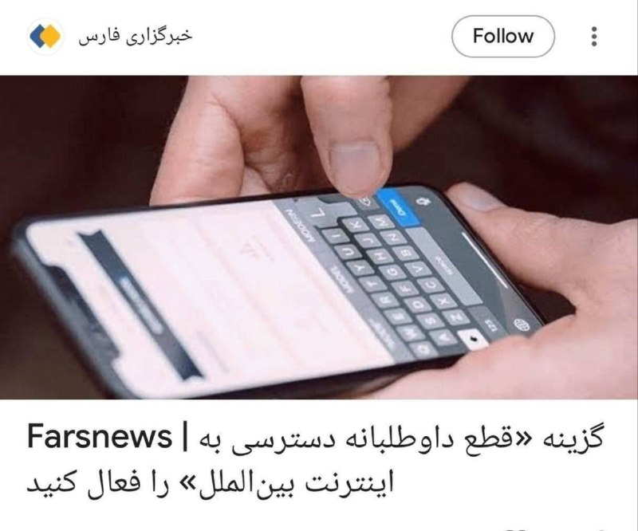

🔴 کمپین جدید خبرگزاری فارس :

قطع داوطلبانه اینترنت !!

@IranianMinds

## IranianMinds — post 21137

  

اشک شوق لاک‌پشت، نمی‌دونستم که سرعت من از سرعت اینترنت در ایران بیشتره.

@IranianMinds

## IranianMinds — post 21136

صدا سیما:
صداهای شنیده‌شده در قشم و بندرعباس ناشی از امحای مهمات باقی‌مانده از جنگ است

@IranianMinds

## IranianMinds — post 21126

  <a href="telegram/content/IranianMinds_21126_1780240371.mp4" target="_blank">🎬 Download video</a>

🔴عملیات ارتش اسرائیل در رشته کوه بوفور و منطقه وادی سلوکی در جنوب لبنان.

@IranianMinds

## IranianMinds — post 21125

  <a href="telegram/content/IranianMinds_21125_1780240373.mp4" target="_blank">🎬 Download video</a>

🔴قالیباف:
دشمن بعد از شکست نظامی، با فشارهای اقتصادی و جنگ رسانه‌ای به دنبال ایجاد تفرقه و وارد کردن ایران به تسلیم شدن است، اما مردم ما با اتحاد نقشه‌هایشان را خنثی کردند.

ای حرومزاده جنایتکار.

@IranianMinds

## IranianMinds — post 21124

  

🔴اکانت اسرائیل به فارسی:

رهبر کشته شده و رهبر مفقودالاثر جمهوری اسلامی در یک قاب😂😂😂

@IranianMinds

## BBCPersian — post 282504

  

🔻حمیدرضا حاجی بابایی امروز در جلسه مجازی مجلس گفت: «با ایجاد اختلال در تامین کالا به‌ویژه در بنادر جنوب، بیش از ۳۴۰ هزار کسب‌وکار مرتبط با کامیون‌ها و تریلرها و بارکش‌ها تحت تاثیر قرار گرفته است.»

او همچنین گفت که محاصره دریایی باعث اختلال در «۸۰ درصد از ۴۰ تا ۴۵ میلیون تن واردات سالانه» شده است، از این رو «واردات حداقل ۵۰ درصد از نیاز وارداتی کالاهای اساسی از طریق بنادر شمالی شروع شده است و باید حتما با قدرت ادامه پیدا کند.»

محمدرضا رضایی کوچی، رئیس کمیسیون عمران، هم گفت: «۴۰۰ هزار راننده در کشور وجود دارد که متاسفانه به دلیل مشخص نبودن مبدا کالاها، در تامین معیشت دچار مشکل شده‌اند.»

او همچنین گفت: «بیش از ۳۰ هزار راننده در کشور وجود دارند که فاقد پوشش بیمه هستند و باید به مسائل معیشتی آنها توجه شود.»

@BBCPersian

## BBCPersian — post 282503

  <a href="https://t.me/bbcpersian/282503" target="_blank">📎 Download file</a>

📻 تازه‌ترین خبرهای جهان یکشنبه ۱۰ خرداد ۱۴۰۵ از رادیو بی‌بی‌سی در لندن

@BBCPersian

## BBCPersian — post 282502

🔻وزارت بهداشت لبنان: در حمله اسرائیل به بیمارستانی در صور، ۱۳ نفر از کارکنان زخمی شدند

وزارت بهداشت لبنان اعلام کرد در حمله هوایی اسرائیل به نزدیکی یک بیمارستان در شهر صور در جنوب لبنان، «۱۳ نفر» از کارکنان این مرکز درمانی زخمی شده‌اند.

این در حالیست که ارتش اسرائیل به پیشروی در عمق خاک لبنان ادامه می‌دهد.

وزارت بهداشت لبنان در بیانیه‌ای گفت: «دشمن اسرائیلی در اطراف بیمارستان حیرام در صور اقدام به حمله هوایی کرد که در نتیجه آن ۱۳ نفر از کارکنان بیمارستان زخمی شدند و خسارات قابل توجهی به این مرکز وارد شد.»

این بیانیه از جامعه بین‌المللی خواست برای جلوگیری از «گسترش و تشدید حملات اسرائیل» اقدام کند.

https://trib.al/GzhNERS
@BBCPersian

## BBCPersian — post 282501

🔻سخنگوی دولت: افزایش مبلغ کالابرگ در صورت فراهم بودن شرایط مالی اجرا می‌شود

سخنگوی دولت ایران گفت که افزایش مبلغ کالابرگ از برنامه‌های دولت است اما تصمیم‌گیری در این زمینه باید با توجه به ظرفیت‌های مالی کشور انجام شود.

فاطمه مهاجرانی با تاکید بر ضرورت هم‌خوانی برنامه‌ها با منابع موجود گفت که وزارتخانه‌های مرتبط در حال بررسی شرایط هستند.

او همچنین گفت: «وضعیت مناطق مرزی جنوبی و حوزه دریایی هم بر درآمدهای کشور اثر گذاشته و در نهایت هدف دولت، تحقق این افزایش در صورت فراهم شدن امکان آن است.»

طی ماه‌های اخیر به‌ویژه پس از جنگ، روند افزایش قیمت کالاهای اساسی، بازنگری در مبلغ کالابرگ را به یکی از مطالبات جدی خانوارها و کارشناسان اقتصادی تبدیل کرده است.

مبلغ کالابرگ ثابت و یکسان نیست و به عوامل مختلفی مثل دهک درآمدی خانوار و تصمیم‌های دوره‌ای دولت بستگی دارد.

https://trib.al/dMeO03K
@BBCPersian

## BBCPersian — post 282500

🔻نتانیاهو تصرف قلعه استراتژیک در لبنان را «تغییری چشمگیر» در جنگ با حزب‌الله خواند

بنیامین نتانیاهو گفت که تصرف قلعه شقیف (بوفور) در جنوب لبنان «تغییری چشمگیر» در کارزار علیه حزب‌الله محسوب می‌شود.

او در پیامی ویدئویی گفت: «امروز ما به شکلی متفاوت به بوفور بازگشتیم، ما متحد، مصمم و قوی‌تر از همیشه بازگشته‌ایم.»

نخست وزیر اسرائیل افزود: «تصرف قلعه بوفور یک مرحله و یک تغییر اساسی در سیاستی است که در پیش گرفته‌ایم. ما مانع ترس را از میان برداشته‌ایم. ما ابتکار عمل را در دست داریم و در همه جبهه‌ها، در سوریه، غزه و لبنان در حال عملیات هستیم.»

https://trib.al/iXdrBex
@BBCPersian

## BBCPersian — post 282499

🔻انجمن داروسازان ایران: کمبود کدئين ناشی از محدودیت در کشت خشخاش است نه تحریم

سخنگوی هیئت‌مدیره انجمن داروسازان ایران گفت که کمبود برخی داروها از جمله کدئین «الزاما ناشی از تحریم‌ها نیست، بلکه مشکل اصلی به تأمین ماده اولیه این دارو بازمی‌گردد.»

هادی احمدی گفت: «ممنوعیت کشت خشخاش و محدودیت‌های اعمال‌شده در حوزه مواد مخدر، تولید ماده اولیه کدئین در افغانستان را کاهش داده و در زنجیره تأمین این دارو در ایران اختلال ایجاد کرده است.»

او گفت «حدود ۲۵ مرکز دارویی و کارخانه» مستقیم و غیرمستقیم در طول جنگ هدف حملات آمریکا و اسرائيل قرار گرفت و آسیب به صنایع پتروشیمی و فولاد باعث اختلال در زنجیره تأمین شده که آن هم به صنعت داروسازی هم ضربه زده است.

به گفته آقای احمدی صنعت دارو از نظر بسته‌بندی محصولات دارویی کاملا به مواد پتروشیمی و فولاد وابسته است.

https://trib.al/GYChrgO
@BBCPersian

## BBCPersian — post 282498

🔻فرانسه خواستار نشست اضطراری شورای امنیت پس از تصرف قلعه تاریخی در لبنان شد

وزیر امور خارجه فرانسه گفت که پس از تصرف قلعه تاریخی شقیف (بوفور) در لبنان به دست نیروهای اسرائیل، خواستار برگزاری نشست اضطراری شورای امنیت سازمان ملل شده است.

ژان نوئل بارو به شبکه «بی‌اف‌ام تی‌وی» گفت: «من درخواست برگزاری نشست اضطراری شورای امنیت سازمان ملل را مطرح کرده‌ام. با وجود آنکه حق دفاع مشروع اسرائیل را مانند هر کشوری به رسمیت می‌شناسیم، هیچ چیز نمی‌تواند ادامه عملیات نظامی اسرائیل و پیشروی هرچه بیشتر در خاک لبنان را توجیه کند.»

او از گسترش حضور نظامی اسرائیل در خاک لبنان ابراز نگرانی کرد و خواستار بررسی این موضوع در شورای امنیت شد.

وزیر دفاع اسرائیل امروز اعلام کرد که قلعه تاریخی و استراتژيک شقیف (بوفور) به تصرف نیروهایش درآمده است.

او در پستی در شبکه تلگرام گفت: «چهل‌وچهار سال پس از نبرد قهرمانانه بوفور و در روزی که یادآور سربازان کشته‌ شده در جنگ اول لبنان (۱۹۸۲) است، نیروهای ما بار دیگر به این قلعه بازگشتند و پرچم اسرائیل را برافراشتند.»

این قلعه ۹۰۰ ساله دید وسیعی بر جنوب لبنان دارد و از نظر نظامی بسیار مهم محسوب می‌شود.

https://trib.al/6WSTBOw
@BBCPersian

## BBCPersian — post 282497

🔻مدیرعامل شرکت نفت و گاز پارس: تولید گاز سه سکوی پارس جنوبی از سرگرفته شد

مدیرعامل شرکت نفت و گاز پارس «از بازگشت سه سکوی فراساحلی میدان مشترک پارس جنوبی به مدار تولید» خبر داد.

تورج دهقانی با اشاره به «پیشرفت در عملیات احیای تولید گاز در میدان مشترک پارس جنوبی» گفت: با کمک متخصصان داخلی تاکنون سه سکوی فراساحلی این میدان دوباره وارد مدار بهره‌برداری شده‌اند.

او گفت که در پی آسیب به برخی تأسیسات پالایشی پارس جنوبی در جریان جنگ، «بخشی از ظرفیت فرآورش گاز در نوارساحلی استان بوشهر محدود شد و به همین دلیل تعدادی از سکوهای فراساحلی، با وجود آمادگی کامل و بدون آسیب‌دیدگی، موقتاً از مدار تولید خارج شدند، زیرا امکان دریافت و فرآورش گاز تولیدی در بخش خشکی فراهم نبود.»

پارس جنوبی که بزرگ‌ترین میدان گازی جهان در خلیج فارس است در جریان جنگ هدف حملات آمریکا و اسرائیل قرار گرفت.

پارس جنوبی در اختیار ایران است و بخش شمالی آن به قطر تعلق دارد که بزرگ‌ترین تولیدکننده گاز در منطقه محسوب می‌شود. قطر حدود ۲۰ درصد گاز مایع جهان را تامین می‌کند.
https://trib.al/6iC7acL
@BBCPersian

## BBCPersian — post 282496

  <a href="telegram/content/BBCPersian_282496_1780240376.mp4" target="_blank">🎬 Download video</a>

یک گروه نجات تایلندی، شنبه ۹ خرداد، خبر داد که چهار مرد دیگر که به مدت ۱۰ روز در غار آب‌گرفته‌ای در لائوس گیر افتاده بودند، نجات یافتند. روز قبل آن (جمعه ۸ خرداد) هم یک نفر دیگر نجات پیدا کرده بود.
 
این چهار نفر، بخشی از هفت مرد روستایی بودند که در جست و جوی طلا وارد تونل‌های بسیار باریک شده بودند، اما پس از وقوع سیلاب‌های ناگهانی در منطقه کوهستانی و دورافتاده استان زایسومبون در مرکز لائوس در تاریخ ۳۰ اردیبهشت (۲۰ مه)، دیگر نتوانستند از غار خارج شوند.
 
به گفته امدادگران، این مجموعه غار که تا اعماق زمین امتداد دارد، بسیار تنگ است و عرض برخی از تالارهای آن تنها حدود ۵۰ سانتی‌متر است. عملیات نجات این مردان، با دادن آموزش غواصی با تجهیزات اسکوبا به آنها انجام شد تا بتوانند با شنا کردن و غواصی، از غار خارج شوند.
 
دو مرد دیگر از این گروه هفت نفره همچنان مفقود هستند.

@bbcpersian

## BBCPersian — post 282493

  <a href="telegram/content/BBCPersian_282493_1780240377.mp4" target="_blank">🎬 Download video</a>

🔻محمد باقر قالیباف در نطق پیش از دستور آغاز سومین سال مجلس گفت پیام رهبر جمهوری اسلامی به نمایندگان مجلس «چراغ راه آینده و نقشه راه مجلس دوازدهم» است.
رئیس مجلس گفت «هم‌افزایی با دولت و سایر دستگاه‌ها در عین استقلال قوه‌ مقننه» وظیفه مجلس است و اقدامات مجلس باید «نسبت مستقیم و مشهود» با مسائل اصلی کشور و نیازهای مردم داشته باشد.
او تاکید کرد که «ما چک سفید امضا به کسی نمی دهیم اما در تله‌ درگیری‌های فرسایشی نیز نباید بیفتیم.»
او همچنین گفت که «هیچ اعتمادی به حرف‌ها و وعده‌های دشمن» نیست و «آنچه برای ما ملاک است دستاوردهای عینی است که باید کسب کنیم.»
رئیس مجلس تاکید کرد که «تا اطمینان پیدا نکنیم که حقوق ملت ایران را گرفته‌ایم، هیچ توافقی را تأیید نخواهیم کرد.»
جلسه مجازی صحن مجلس امروز برگزار شد و اعضای هیئت رئیسه سوگند خوردند. در این جلسه «۱۸۷ نماینده برخط و ۱۴ نماینده حضوری» شرکت کردند.

https://trib.al/IVF8y7w
@BBCPersian

## BBCPersian — post 282492

  <a href="telegram/content/BBCPersian_282492_1780240379.mp4" target="_blank">🎬 Download video</a>

هشت دانش‌آموز دبیرستانی از یک ترن هوایی که بیش از دو ساعت متوقف شده بود، نجات داده شدند. 

آنها همراه اردوی مدرسه به اسکله «پلژر پیر» در شهر ساحلی گالوستون در ایالت تگزاس آمریکا رفته بودند که دچار این حادثه شدند. 

این ترن هوایی در ارتفاع ۳۰ متری پرشیب‌ترین بخش ریل متوقف شد. نیروهای امدادی با استفاده از یک بالابر متحرک، هر هشت دانش‌آموز را نجات دادند. 

هیچ مصدومیتی از این حادثه گزارش نشد.

@bbcpersian

## idfinfarsi — post 11685

  <a href="telegram/content/idfinfarsi_11685_1780240380.mp4" target="_blank">🎬 Download video</a>

‼️با هدف رفع تهدید علیه نیروهای ما: ارتش اسرائیل انبارهای تسلیحاتی سازمان تروریستی حماس را منهدم کرد

⭕️نیروهای ارتش اسرائیل تحت فرماندهی جنوب، با استفاده از نیروی هوایی، در طول هفته سه انبار تسلیحاتی متعلق به سازمان تروریستی حماس را در چندین منطقه در نوار غزه هدف قرار داده و منهدم کردند. در این انبارها مواد انفجاری، سلاح‌های سبک، تفنگ‌های تک‌تیراندازی و تجهیزات رزمی دیگر نگهداری می‌شد. در یکی از این انبارها حدود ۱۰ وانت که توسط سازمان تروریستی حماس برای فعالیت‌های نظامی استفاده می‌شد، منهدم شد.

⭕️این تسلیحات برای آسیب رساندن به نیروهای ارتش اسرائیل که در منطقه خط زرد فعالیت می‌کنند و همچنین شهروندان اسرائیل در نظر گرفته شده بود و به‌منظور رفع این تهدید منهدم شدند.

⭕️پس از این حملات، انفجارهای ثانویه‌ای شناسایی شد که نشان‌دهنده وجود تسلیحات در داخل این انبارها بود.

‼️ پیش از این حملات، اقداماتی برای کاهش آسیب به غیرنظامیان انجام شد، از جمله استفاده از مهمات دقیق و رصد هوایی.

⭕️نیروهای ارتش اسرائیل تحت فرماندهی جنوب مطابق با توافق در منطقه مستقر هستند و به فعالیت خود برای رفع هرگونه تهدید فوری ادامه خواهند داد.

## idfinfarsi — post 11684

  <a href="telegram/content/idfinfarsi_11684_1780240382.mp4" target="_blank">🎬 Download video</a>

مستند از حملات ارتش اسرائیل در صور: نیروی هوایی در این لحظات مقرهای سازمان تروریستی حزب‌الله را هدف قرار می‌دهد

## Dirty_Kids — post 390647

  

🔴 بعد از وصل شدن اینترنت، حالا خبرگزاری فارس یه کمپینی رو پوشش داده تحت عنوان "قطع داوطلبانه‌ی اینترنت بین‌الملل" و حرف‌شون اینه که:

"چرا اینترنت مارو وصل کردید؟ یه گزینه بذارید که خودمون بتونیم اینترنت بین‌الملل خودمونو قطع کنیم."

+ اینا سیمکارت سفید‌هایی هستن که از قطع اینترنت کاسبی میکنن تا دیروز جق میزدن فیلمش پخش میشد حالا رو شیشه هستن کمپین راه میندازن کاسبی کنن

@Dirty_Kids 👻

## Dirty_Kids — post 390646

  <a href="telegram/content/Dirty_Kids_390646_1780240383.mp4" target="_blank">🎬 Download video</a>

نیویورک پست یه گزارش تهیه کرده از دغدغه‌های ذهنی این روزهای آمریکاییا. واقعا آدم کله‌ش خراب میشه🤦🏻‍♂

@Dirty_Kids 👻

## Dirty_Kids — post 390645

  <a href="telegram/content/Dirty_Kids_390645_1780240385.mp4" target="_blank">🎬 Download video</a>

لیلاکامرانی: اروپا زندگی میکند،یکی ازهزاران پرستوی جمهوری اسلامی ،میگه هتل روزدن فقط من زنده موندم بالباس راحتی و بدون حجاب و برای باور پذیرتر بودن سوتین هم نپوشیده و پریده بیرون کولی بازی در میاره که وای کل هتل رو کشتن!
در طی جنگ ۱۲ روزه و ۳۸ روزه هیچ هتلی در تهران و در مل در ایران حتی آسیب هم ندیده چه برسه به هدف قرار گرفتن!

@Dirty_Kids 👻

## Dirty_Kids — post 390644

  

حالا من به تعدادش کاری ندارم
به سیس‌شم کاری ندارم
ناموسا شوهر فرد اعلا چیه؟ 😂😂

@Dirty_Kids 👻

## Dirty_Kids — post 390643

میدونید بدشانسی و بدبختی ما کجاست

فقط آخوند نیست که باید باهاش بجنگیم

چپ کسمغز و اروپایی نفهم و پاکستانی جاکش و عمانی بیناموس و دموکرات حروم زاده

همه وایسادن جلوی مردم ایران و به جمهوری اسلامی حرومزاده تر از خودشون کمک میکنند

@Dirty_Kids 👻

## Dirty_Kids — post 390642

  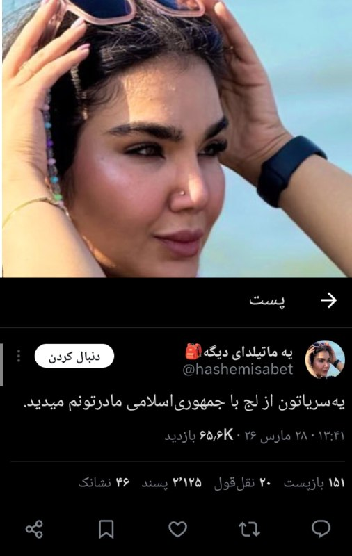

چقدر جنده داره این مملکت؟

@Dirty_Kids 👻

## Dirty_Kids — post 390641

  

پسرا وقتی یه پسر دیگه قد بلند تر از خودشون میبینن:

@Dirty_Kids 👻

## Dirty_Kids — post 390640

‏- بوی یخچال می‌ده، من نمی‌خورم.

[کرم خاکی، سر میز شام، بعد از دفن مقام معظم رهبری]

@Dirty_Kids 👻

## Dirty_Kids — post 390639

  

خیلی قیافه کصکشی داره ازش خوشم میاد.

@Dirty_Kids 👻

## Dirty_Kids — post 390638

‏میری میپرسی اقا این عن چند میگه خانوم گرون شده پتروشیمی رو زدن دیگه عن تولید نمیشه.
قبلا بهانه دلار بود الان ‌پتروشیمی.

@Dirty_Kids 👻

## Dirty_Kids — post 390637

  <a href="telegram/content/Dirty_Kids_390637_1780240387.mp4" target="_blank">🎬 Download video</a>

عادل فردوسی‌پور اینجوری گزارشِ فینال چمپیونزلیگ رو شروع کرد:

فوتبال و تماشاش، تنها یک لحظه توقفه، نه نقطه فراموشی؛ فراموش نمی‌کنیم که بیرون از زمین در این چند ماه ، چه روزهای سختی بر مردم عزیز ما گذشت و میگذره؛ و چه جان های عزیز و بی‌گناهی از دست رفتن...

گزارش این بازی رو به همه مردم عزیزی که مظلومانه از بین ما رفتن و میتونستن تماشاگر پرشور این بازی باشن، تقدیم میکنم

پ‌ن: نظرات اینشکلی که؛ خیلیا میگن باهوش، خطرناک و شدیدا وسطباز به‌نفع رژیم بموقعش حرکت میزنه
بعضیا هم میگن خب بغل گوش آخوند چیکار کنه

@Dirty_Kids 👻

## Dirty_Kids — post 390636

  <a href="telegram/content/Dirty_Kids_390636_1780240389.mp4" target="_blank">🎬 Download video</a>

حمله خبرگزاری دانشجو به همکاری امیرحسین قیاسی با دیجی کالا برای ساخت برنامه جام جهانی

+ بیننده ندارن جنگ زرگری راه انداختن

@Dirty_Kids 👻

## Dirty_Kids — post 390635

  <a href="telegram/content/Dirty_Kids_390635_1780240391.mp4" target="_blank">🎬 Download video</a>

مجتبی خامنه‌ای درحال نوشتن بیانیه جدید:

@Dirty_Kids 👻

## Dirty_Kids — post 390634

  <a href="telegram/content/Dirty_Kids_390634_1780240391.mp4" target="_blank">🎬 Download video</a>

هوش دستشویی از زجر الله معین

دوباره اینترنت وصل شد سموم اینستا پیداشون شد😂😂 داداش تو بنویس شاید خطت بهتر باشه.

@Dirty_Kids 👻

## Dirty_Kids — post 390632

‏شما با این حجم از شجاعت موافقید؟ یجور حرف میزنه انگار بی‌حجابی اجباریه و این دل شیر داشته که با چادر رفتی کافه، عقب مونده @Dirty_Kids 👻

## Dirty_Kids — post 390631

  <a href="telegram/content/Dirty_Kids_390631_1780240392.mp4" target="_blank">🎬 Download video</a>

🔴 دیشب عرزشیای حکومتی داشتن شعارِ "با قاتلین رهبر، مذکره نداریم | جان امام در خطره ، مذاکره بی‌ثمره" میدادن که آخرش یکی از مسئولین امنیت اومد بیرونشون کرد:

@Dirty_Kids 👻

## Dirty_Kids — post 390627

🔴 مسعود پزشکیان اینطوری و با پوشیدن تی‌شرت رفته تو یه جلسه رسمی :

اصلاحطلبا خیس کردن، عرزشی دارن میرن بهش، ماهم میگیم کصخاره جفتتون

@Dirty_Kids 👻

## Hranews — post 113279

خوزستان؛ ۵۷ کارگر در سال ۱۴۰۴ قربانی حوادث کار شدند

❗️
❗️
❗️
❗️
❗️– مدیرکل پزشکی قانونی خوزستان اعلام کرد که طی سال ۱۴۰۴، دستکم ۵۷ #کارگر در این استان بر اثر حوادث ناشی از کار جان خود را از دست داده‌اند.

ادامه مطلب

↘️
@hranews_bot تماس ✉️ - @Hranews کانال هرانا 🆑

## Hranews — post 113278

  

مهدی انصاری، وکیل دادگستری به ۵ سال حبس محکوم شد

❗️
❗️
❗️
❗️
❗️ – مهدی انصاری، عضو کانون وکلای استان فارس و از بازداشت شدگان اعتراضات سراسری ۱۴۰۴، توسط دادگاه انقلاب شیراز به پنج سال #حبس و دو سال منع خروج از کشور محکوم شد.

به گزارش خبرگزاری هرانا، ارگان خبری مجموعه فعالان حقوق بشر در ایران، مهدی انصاری، وکیل دادگستری به حبس محکوم شد.

بر اساس اطلاعات دریافتی هرانا، یکی از شعب دادگاه انقلاب شیراز، آقای انصاری را بابت اتهام «اجتماع و تبانی به قصد بر هم زدن امنیت کشور»، به پنج سال حبس و دو سال منع خروج از کشور محکوم کرده است.

ادامه مطلب

#مهدی_انصاری

↘️
@hranews_bot تماس ✉️ -  @Hranews  کانال هرانا 🆑

## Hranews — post 113277

  

زندان اوین؛ غزل مرزبان ۷ روز است که در اعتصاب به سر می‌برد

❗️
❗️
❗️
❗️
❗️ – غزل مرزبان، نوکیش مسیحی محبوس در زندان اوین، از روز دوشنبه ۴ خردادماه، در اعتراض به صدور حکم بیش از ۹ سال حبس علیه خود، دست به #اعتصاب زده است.

به گزارش خبرگزاری هرانا، ارگان خبری مجموعه فعالان حقوق بشر در ایران، غزل مرزبان، نوکیش مسیحی، در هفتمین روز از اعتصاب غذای خود بسر می‌برد.

یک منبع مطلع از وضعیت این نوکیش مسیحی، ضمن تایید این خبر به هرانا گفت: “خانم مرزبان در اعتراض به حکم ۹ سال و هشت ماه حبس خود که اخیرا توسط  قاضی ایمان افشاری علیه وی صادر شده است، از تاریخ ۴ خرداد ۱۴۰۵، دست به اعتصاب غذا زده است. با گذشت هفت روز از آغاز اعتصاب غذا، وضعیت جسمانی او نامناسب است.”

ادامه مطلب

#غزل_مرزبان

↘️
@hranews_bot تماس ✉️ -  @Hranews  کانال هرانا 🆑

## Hranews — post 113276

  

اتهام «جاسوسی»؛ حسن و حسین امیری، برادران ۲۰ ساله به اعدام محکوم شدند

❗️
❗️
❗️
❗️
❗️ – حسن و حسین امیری، برادران دوقلوی ۲۰ ساله محبوس در زندان قزلحصار کرج، توسط شعبه ۲۶ دادگاه انقلاب تهران به ریاست قاضی ایمان افشاری به #اعدام محکوم شدند. این حکم بر اساس اتهام «#جاسوسی برای اسرائیل» علیه این افراد صادر شده است.

به گزارش خبرگزاری هرانا، ارگان خبری مجموعه فعالان حقوق بشر در ایران، حسن و حسین امیری به اعدام محکوم شدند.

بر اساس اطلاعات دریافتی هرانا، این حکم اخیرا توسط شعبه ۲۶ دادگاه انقلاب تهران، به ریاست قاضی ایمان افشاری علیه این برادران دوقلو صادر شده است. اتهام «جاسوسی برای اسرائیل»، مبنای صدور این رای قرار گرفته است.
یک منبع مطلع از وضعیت این دو جوان ۲۰ ساله، به هرانا گفت: «در کیفرخواست صادر شده علیه این افراد، مشاهده تصاویری از ساختمان‌های آسیب‌دیده، مبنای طرح اتهام «جاسوسی به نفع اسرائیل» در پرونده قرار گرفته بود. حسن و حسین امیری به دستور بازپرس پرونده به‌صورت جداگانه در زندان قزلحصار نگهداری می‌شوند و از حق ملاقات با یکدیگر محروم هستند. این دو زندانی در حال حاضر در سوئیت ۳۵ این زندان محبوس هستند.»

ادامه مطلب

#حسن_امیری
#حسین_امیری

↘️
@hranews_bot تماس ✉️ -  @Hranews  کانال هرانا 🆑

## Hranews — post 113275

  

سخنگوی کمیسیون بهداشت مجلس از کمبود حدود هزار قلم #دارو در کشور خبر داد و اعلام کرد که این وضعیت ناشی از مواردی همچون سو مدیریت، ترک فعل و مشکلات در تخصیص به‌موقع ارز است. به گفته سلمان اسحاقی، تاخیر در پرداخت مطالبات داروخانه‌ها و شرکت‌های پخش نیز فشار مضاعفی بر زنجیره #تامین_دارو وارد کرده و می‌تواند دسترسی بیماران به داروهای ضروری را با اختلال مواجه کند.

وی همچنین با اشاره به فعالیت «مافیای دارو» و ضرورت ورود دستگاه قضایی به این حوزه، نسبت به تداوم وضعیت موجود هشدار داد. سلمان اسحاقی تاکید کرد که نابرابری در توزیع دارو میان استان‌ها، ضعف عملکرد بیمه‌ها و ناکارآمدی در مدیریت نظام دارویی، می‌تواند منجر به نقض #حق_سلامت، کاهش دسترسی برابر به خدمات درمانی و افزایش خطرات جانی برای بیماران شود.

↘️
@hranews_bot تماس ✉️ -  @Hranews  کانال هرانا 🆑

## Hranews — post 113274

  

تداوم بازداشت و بلاتکلیفی فرزانه فرهبد و علیرضا شایگان در زندان تربت حیدریه

❗️
❗️
❗️
❗️
❗️ – فرزانه فرهبد، شاعر و مجری اهل سبزوار و همسرش علیرضا شایگان، معلم بازنشسته، در تاریخ ۲۵ فروردین‌ماه سال جاری، پس از احضار به اداره اطلاعات این شهرستان #بازداشت شدند. این شهروندان از آن زمان تاکنون به صورت بلاتکلیف در زندان تربت حیدریه نگهداری می‌شوند.

به گزارش خبرگزاری هرانا، ارگان خبری مجموعه فعالان حقوق بشر در ایران، فرزانه فرهبد و علیرضا شایگان، ۴۸ روز است که در بازداشت به‌ سر می‌برند.

بر اساس اطلاعات دریافتی هرانا، فرزانه فرهبد و همسرش، علیرضا شایگان، روز ۲۵ فروردین ۱۴۰۵ پس از احضار به اداره اطلاعات سبزوار بازداشت شدند. این زوج از زمان بازداشت تاکنون در زندان تربت حیدریه نگهداری می‌شوند و با گذشت بیش از دو ماه، همچنان در بلاتکلیفی قضایی به سر می‌برند.

ادامه مطلب

#فرزانه_فرهبد
#علیرضا_شایگان

↘️
@hranews_bot تماس ✉️ -  @Hranews  کانال هرانا 🆑

## Hranews — post 113273

بوکان؛ عثمان ذاکری، روحانی اهل سنت به خلع لباس روحانیت محکوم شد

❗️
❗️
❗️
❗️
❗️ – عثمان ذاکری، روحانی اهل سنت اهل بوکان، توسط دادگاه‌ ویژه روحانیت، به خلع لباس روحانیت محکوم شد.

ادامه مطلب

#عثمان_ذاکری

↘️
@hranews_bot تماس ✉️ -  @Hranews  کانال هرانا 🆑

## Hranews — post 113272

  

دادگاه تجدیدنظر؛ نیما حسن‌خانی به حبس و دیگر مجازات‌ها محکوم شد

❗️
❗️
❗️
❗️
❗️– نیما حسن‌خانی، یکی از بازداشت‌شدگان اعتراضات سراسری ۱۴۰۴، محبوس در زندان شیبان اهواز، توسط شعبه ۱۴ دادگاه تجدید نظر استان خوزستان به دو سال حبس و دیگر مجازات‌ها محکوم شد. یک سال از این محکومیت به حالت تعلیق درآمده است.

به گزارش خبرگزاری هرانا، ارگان خبری مجموعه فعالان حقوق بشر در ایران، نیما حسن‌خانی توسط دادگاه تجدیدنظر به حبس و دیگر مجازات‌ها محکوم شد.

بر اساس حکمی که توسط ۱۴ دادگاه تجدید نظر استان خوزستان صادر و به حسین‌علی حاتمی، وکیل مدافع این شهروند ابلاغ شده، آقای حسن‌خانی از بابت اتهامات تبلیغ علیه نظام و اخلال در نظم و آسایش از طریق شرکت در اعتراضات، به دو سال حبس، دو سال ممنوعیت خروج از کشور و یک سال حضور در ستاد امر به معروف و نهی از منکر است. یک سال از این محکومیت به حالت تعلیق درآمده است.

ادامه مطلب

#نیما_حسن‌خانی

↘️
@hranews_bot تماس ✉️ - @Hranews کانال هرانا 🆑

## Hranews — post 113271

  

یک زن ترنس در سنندج به قتل رسید

❗️
❗️
❗️
❗️
❗️ – مهشید، یک زن #ترنس ۲۶ ساله، چند روز پیش در سنندج بر اثر ضربات چاقو توسط افراد ناشناس به قتل رسید.

به گزارش خبرگزاری هرانا، ارگان خبری مجموعه فعالان حقوق بشر در ایران، مهشید، زن ترنس و ساکن محله گلشن سنندج، جان خود را در پی حمله افراد ناشناس از دست داد.

یک منبع مطلع در این خصوص به هرانا گفت: «احتمالاً او روز جمعه توسط افراد ناشناس با ضربات چاقو به قتل رسیده است. مهاجمان پس از قتل، جسد مهشید را نیز مثله کرده‌اند.»
انگیزه و هویت عاملان این قتل تاکنون مشخص نشده است. با این حال، این منبع مطلع محلی در ادامه به هرانا گفت: «با توجه به نحوه وقوع این قتل و شرایط پیرامون آن، به نظر می‌رسد این جنایت با انگیزه نفرت صورت گرفته باشد. همچنین خانواده مهشید نیز برای پیگیری پرونده و اطلاع‌رسانی درباره این قتل تحت فشار و تهدید قرار گرفته‌اند؛ به‌طوری‌که تاکنون حتی آگهی ترحیمی نیز برای او منتشر نکرده‌اند.»

ادامه مطلب

#مهشید

↘️
@hranews_bot تماس ✉️ -  @Hranews  کانال هرانا 🆑

## Hranews — post 113270

تداوم بازداشت و بی‌خبری از وضعیت مجتبی ایروی در بیجار

❗️
❗️
❗️
❗️
❗️ – مجتبی ایروی، معلم بازنشسته اهل بیجار، ۹۰ روز است که توسط نیروهای امنیتی در بیجار #بازداشت شده و کماکان از وضعیت و محل نگهداری وی اطلاعی کسب نشده است. بی‌خبری از سرنوشت این شهروند، منجر به افزایش نگرانی‌های خانواده و بستگان وی شده است.

ادامه مطلب

#مجتبی_ایروی

↘️
@hranews_bot تماس ✉️ -  @Hranews  کانال هرانا 🆑

## Hranews — post 113269

  

اعتراضات سراسری ۱۴۰۴؛ خشایار رضوانی به ۴ سال و ۳ ماه حبس محکوم شد

❗️
❗️
❗️
❗️
❗️– خشایار رضوانی، از بازداشت شدگان اعتراضات سراسری ۱۴۰۴، توسط شعبه ۲۶ دادگاه انقلاب تهران به چهار سال و سه ماه #حبس، دو سال ممنوعیت از خروج از کشور و فعالیت در فضای مجازی محکوم شد.

به گزارش خبرگزاری هرانا، ارگان خبری مجموعه فعالان حقوق بشر در ایران، خشایار رضوانی به حبس و مجازات‌های تکمیلی محکوم شد.

این حکم اخیرا توسط شعبه ۲۶ دادگاه انقلاب تهران، علیه آقای رضوانی صادر شده است. قاضی ایمان افشاری، خشایار رضوانی را از بابت اتهام «اجتماع و تبانی علیه امنیت داخلی و خارجی کشور» به سه سال و هفت ماه حبس تعزیری و از بابت اتهام «تبلیغ علیه نظام» به هشت ماه حبس تعزیری محکوم کرده است. بر اساس رای صادره، وی از بابت مجازات‌های تکمیلی، به دو سال منع خروج از کشور و فعالیت در فضای مجازی نیز محکوم شده است.

ادامه مطلب

#خشایار_رضوانی

↘️
@hranews_bot تماس ✉️ -  @Hranews  کانال هرانا 🆑

## Hranews — post 113268

امروز یکشنبه ۱۰ خردادماه، جمعی از بازنشستگان تامین اجتماعی در مقابل ساختمان این سازمان در شهرستان شوش دست به راهپیمایی و #تجمع اعتراضی زدند.

این بازنشستگان خواستار اجرای کامل ماده ۵۴ قانون تامین اجتماعی و ارتقای درمانگاه این شهر به پلی کلینیک، بازگشت امتیاز خلع شده تامین اجتماعی و رسیدگی به مشکلات معیشتی هستند.

↘️
@hranews_bot تماس ✉️ -  @Hranews  کانال هرانا 🆑

## Hranews — post 113267

  

جلسه دادگاه رسیدگی به اتهامات ۴ فعال ترک (آذربایجانی) برگزار شد

❗️
❗️
❗️
❗️
❗️ – جلسه رسیدگی به اتهامات عباس لسانی، علی خیرجو، یوسف کاری و بهزاد دشتی، فعالان ترک (آذربایجانی) روز گذشته در شعبه ۲۸ دادگاه انقلاب برگزار شد.

به گزارش خبرگزاری هرانا، ارگان خبری مجموعه فعالان حقوق بشر در ایران، روز شنبه ۹ خرداد ۱۴۰۵، جلسه دادگاه رسیدگی به اتهامات عباس لسانی، علی خیرجو، یوسف کاری و بهزاد دشتی، فعالان ترک (آذربایجانی) برگزار شد.

این جلسه در شعبه ۲۸ دادگاه انقلاب تهران به ریاست قاضی عموزاده برگزار شد و آقایان لسانی، خیرجو و کاری در اعتراض به آنچه «روند دادرسی غیرعادلانه» عنوان کرده‌اند، از حضور در جلسه خودداری کردند.

ادامه مطلب

#عباس_لسانی
#علی_خیرجو
#یوسف_کاری
#بهزاد_دشتی

↘️
@hranews_bot تماس ✉️ -  @Hranews  کانال هرانا 🆑

## Hranews — post 113266

اجرای حکم اعدام ۵ زندانی در زندان عادل آباد شیراز

❗️
❗️
❗️
❗️
❗️– سحرگاه امروز، حکم #اعدام پنج زندانی که پیشتر از بابت جرائم غیر سیاسی از جمله اتهامات مرتبط با جرائم مواد مخدر به اعدام محکوم شده بودند، در زندان عادل‌آباد شیراز به اجرا در آمد.

ادامه مطلب

↘️
@hranews_bot تماس ✉️ -  @Hranews  کانال هرانا 🆑

## Hranews — post 113265

  

در پی نقض حکم؛ زهرا شهباز طبری مجددا به اعدام محکوم شد

❗️
❗️
❗️
❗️
❗️ – زهرا شهباز طبری، زندانی سیاسی محبوس در زندان لاکان رشت، پس از نقض حکم اعدام پیشین در دیوان عالی کشور، بار دیگر توسط شعبه دوم دادگاه انقلاب این شهر به #اعدام محکوم شد.

به گزارش خبرگزاری هرانا، ارگان خبری مجموعه فعالان حقوق بشر در ایران، زهرا شهباز طبری مجددا به اعدام محکوم شد.

شعبه دوم دادگاه انقلاب رشت به ریاست محمدعلی درویش‌گفتار، مجددا وی را با اتهام بغی از طریق عضویت و فعالیت در سازمان مجاهدین خلق ایران، به اعدام محکوم کرده است. این حکم در تاریخ ۲۵ فروردین‌ماه ۱۴۰۵ علیه این زندانی سیاسی صادر و اخیرا به او ابلاغ شده است.

ادامه مطلب

#زهرا_شهباز_طبری

↘️
@hranews_bot تماس ✉️ -  @Hranews  کانال هرانا 🆑

## alonews — post 123982

  <a href="telegram/content/alonews_123982_1780240396.webm" target="_blank">🎬 Download video</a>

👈گروسی: حملات به تأسیسات هسته‌ای غیرقابل قبول است

✅ @AloNews خبر جنگ

## alonews — post 123981

  <a href="telegram/content/alonews_123981_1780240396.webm" target="_blank">🎬 Download video</a>

👈سی ان ان: ایران ۷۰ درصد سایت‌های موشکی خود که بمباران شده بود را باز کرد

🔴ترامپ نگرانی خود را از میزان سود مالی که ممکن است ایران در چارچوب توافق به دست آورد، ابراز کرد

🔴ترامپ بر عبارت‌های سختگیرانه‌تری در مورد تعهدات هسته‌ای ایران و وعده‌هایش برای بازگشایی تنگه هرمز اصرار دارد

✅ @AloNews خبر جنگ

## alonews — post 123980

  <a href="telegram/content/alonews_123980_1780240396.webm" target="_blank">🎬 Download video</a>

👈جدیدترین کمپین در خبرگزاری فارس با عنوان قطع داوطلبانه نت بین الملل!

✅ @AloNews خبر جنگ

## alonews — post 123979

  <a href="telegram/content/alonews_123979_1780240396.webm" target="_blank">🎬 Download video</a>

👈سی‌بی‌اس نیوز به نقل از یک منبع:
در حال حاضر هیچ ضرب‌الاجل یا چارچوب زمانی مشخصی برای دستیابی به توافق در مورد ایران وجود ندارد

✅ @AloNews خبر جنگ

## alonews — post 123978

  <a href="telegram/content/alonews_123978_1780240396.webm" target="_blank">🎬 Download video</a>

👈 پزشکیان: خدمات‌رسانی دولت در هر شرایطی ادامه خواهد داشت

🔴دولت با تمام توان و ظرفیت خود مسیر خدمت به مردم را ادامه خواهد داد و ادارۀ امور کشور با قدرت و صلابت دنبال خواهد شد.

🔴بخشی از مشکلات اقتصادی کشور ناشی از محدودیت‌های بیرونی و بخشی نیز ناشی از فشارهایی است که در نتیجه شرایط خاص کشور ایجاد شده است.

🔴دولت و تمامی دستگاه‌های اجرایی با تمام توان در تلاش هستند تا کشور با کمترین هزینه و آسیب از این شرایط عبور کند.

✅ @AloNews خبر جنگ

## alonews — post 123977

  <a href="telegram/content/alonews_123977_1780240396.mp4" target="_blank">🎬 Download video</a>

👈وزیر خزانه‌داری ایالات متحده اسکات بسنت درباره ایران: اطمینان از باز بودن تنگه هرمز، دریافت اورانیوم بسیار غنی‌شده، و اینکه ایران سلاح هسته‌ای نداشته باشد — این پایان دادن به کار است.

🔴این اولین بار است که ایرانی‌ها در ۴۷ سال گذشته حاضر به بحث درباره نداشتن سلاح هسته‌ای شده‌اند.

✅ @AloNews خبر جنگ

## alonews — post 123976

  <a href="telegram/content/alonews_123976_1780240398.webm" target="_blank">🎬 Download video</a>

⚫
🏆 به دنیای هیجان‌انگیز فوتبال خوش اومدی!

⭐️اینجا قراره باهم لحظه‌به‌لحظه‌ی جام جهانی رو زندگی کنیم؛
از بازی‌های حساس و نتایج داغ گرفته تا حاشیه‌ها، کری‌خونی‌ها و اتفاقاتی که همه درباره‌ش حرف میزنن! 
🔥
🔥

✅ پوشش کامل مسابقات

💀ترول تیم‌ها و بازیکن‌ها

🎥ویدیوها و لحظه‌های فان فوتبالی

📊آمار، ترکیب‌ها و اخبار فوری

🌍حواشی جذاب از سراسر جام جهانی

📢اینجا فقط یک کانال خبری نیست؛
یک جمع فوتبالیه برای کسایی که فوتبال رو با هیجان، شوخی و احساس واقعی دنبال میکنن 
📛
💟

🆘
🔞 آماده باش چون قراره جام جهانی رو متفاوت تجربه کنیم!

⚡ @Vaarzesh_Plus

⚡ @Vaarzesh_Plus

## alonews — post 123975

  <a href="telegram/content/alonews_123975_1780240398.webm" target="_blank">🎬 Download video</a>

👈منابع خبری مدعی حمله موشکی به حزب ضد «پاک» در کردستان عراق شدند.

🔴یک مقام حزب آزادی کردستان به روداو گفت که روز یکشنبه پایگاه مهم وابسته به این گروه مخالف ایران نزدیک اربیل هدف حمله موشکی قرار گرفت.

✅ @AloNews خبر جنگ

## alonews — post 123974

  <a href="telegram/content/alonews_123974_1780240398.webm" target="_blank">🎬 Download video</a>

👈شبکه LBCI لبنان: روبیو دو روز دیگر آتش‌بس فراگیر در لبنان را اعلام می‌کند

✅ @AloNews خبر جنگ

## alonews — post 123973

  <a href="telegram/content/alonews_123973_1780240398.webm" target="_blank">🎬 Download video</a>

👈 ترامپ: با کمال خرسندی اعلام می‌کنم که تام باراک، سفیر ایالات متحده در ترکیه، که عملکرد فوق‌العاده‌ای داشته است، به عنوان فرستاده ویژه ریاست جمهوری در سوریه و عراق منصوب خواهد شد، و ما همکاری استراتژیک خود را با هر دو دولت پیش خواهیم برد.

🔴تام با حمایت کامل وزارت امور خارجه، سفیر ایالات متحده در ترکیه باقی خواهد ماند.


✅ @AloNews خبر جنگ

## alonews — post 123972

  <a href="telegram/content/alonews_123972_1780240399.webm" target="_blank">🎬 Download video</a>

👈حزب‌الله با پهپاد FPV مستقیم به کابین یه خودروی امدادی اسرائیلی حمله کرد

✅ @AloNews خبر جنگ

## alonews — post 123971

  <a href="telegram/content/alonews_123971_1780240399.webm" target="_blank">🎬 Download video</a>

👈سی‌بی‌اس: میانجی‌ها به مذاکرات توافق تهران-واشنگتن ادامه می‌دهند؛ ترامپ متن توافق را جمعه بازبینی کرد و آن را برای تأیید به ایران فرستاد، پاسخ هنوز در انتظار است

✅ @AloNews خبر جنگ

## alonews — post 123970

  <a href="telegram/content/alonews_123970_1780240399.webm" target="_blank">🎬 Download video</a>

👈رویترز: جمع‌آوری سلاح توسط اهالی گرینلند از ترس حمله احتمالی آمریکا

🔴برخی از اهالی گرینلند به رویترز گفته‌اند که برای مقابله با حمله احتمالی ایالات متحده، اقدام به جمع‌آوری اسلحه و مهمات کرده‌اند. یکی از مدیران معدن با یادآوری اینکه پسرش گفته بود برای آمادگی در برابر تهاجم قصد خرید مهمات دارد، به گریه افتاد.

✅ @AloNews خبر جنگ

## alonews — post 123969

  <a href="telegram/content/alonews_123969_1780240399.webm" target="_blank">🎬 Download video</a>

👈وزارت جنگ آمریکا قصد دارد در ماه ژوئن، برنامه‌های مشخصی برای خروج بخشی از نیروهای خود از اروپا را در بروکسل، مقر ناتو ارائه دهد

✅ @AloNews خبر جنگ

## alonews — post 123967

  <a href="telegram/content/alonews_123967_1780240399.webm" target="_blank">🎬 Download video</a>

👈یک راکت حزب‌الله بین منازل مسکونی در روستای مسیحی نشین رمیچ جنوب لبنان سقوط کرد. که تلفات جانی نداشت.

✅ @AloNews خبر جنگ

## alonews — post 123966

  <a href="telegram/content/alonews_123966_1780240399.webm" target="_blank">🎬 Download video</a>

👈مدیر عامل پارس جنوبی: بازگشت سه سکوی فراساحلی میدان مشترک پارس جنوبی به مدار تولید

🔴 مدیرعامل شرکت نفت و گاز پارس از بازگشت سه سکوی فراساحلی میدان مشترک پارس جنوبی به مدار تولید پس از جنگ‌ تحمیلی سوم خبر داد.

✅ @AloNews خبر جنگ

## alonews — post 123965

  <a href="telegram/content/alonews_123965_1780240399.webm" target="_blank">🎬 Download video</a>

👈جروزالم پست: درخواست فرانسه برای نشست اضطراری شورای امنیت درباره لبنان

🔴ژان نوئل بارو، وزیر امور خارجه فرانسه، اعلام کرد که در واکنش به عملیات نظامی جاری اسرائیل در لبنان، خواستار تشکیل جلسه اضطراری شورای امنیت سازمان ملل متحد شده است

✅ @AloNews خبر جنگ

## alonews — post 123964

  <a href="telegram/content/alonews_123964_1780240400.webm" target="_blank">🎬 Download video</a>

👈قائم مقام معاونت راهبردی رئیس جمهور: تراکنش مالی وابسته به تنگه هرمز حدود ۲۰۰۰ میلیارد دلار در سال است

✅ @AloNews خبر جنگ

## alonews — post 123958

  <a href="telegram/content/alonews_123958_1780240400.mp4" target="_blank">🎬 Download video</a>

👈جنگنده‌های اسرائیلی امروز به طور مداوم حملات هوایی شدیدی را بر شهر صور در جنوب لبنان انجام داده‌اند

✅ @AloNews خبر جنگ

---
📅 بروزرسانی: 1405/03/10 13:35
---

## VahidOOnLine — post 243029

  <a href="telegram/content/VahidOOnLine_243029_1780221951.mp4" target="_blank">🎬 Download video</a>

ویدیوهایی که تازه به دست ایران‌اینترنشنال رسیده، برگزاری مراسم چهلم جاویدنام احمد طراقیان را بر سر مزارش نشان می‌دهد.
طراقیان، ۳۲ ساله، شامگاه ۱۹ دی‌ ۱۴۰۴ در شهر کرج، با شلیک گلوله جنگی به ناحیه سر هدف قرار گرفت و جان باخت.
‌🏁 🇬🇧 IranintlTV

🤖 @VahidOOnLine

## VahidOOnLine — post 243028

  <a href="telegram/content/VahidOOnLine_243028_1780221954.mp4" target="_blank">🎬 Download video</a>

ویدیوی رسیده به ایران‌اینترنشنال، برگزاری مراسم تولد جاویدنام مصطفی نوری شیرازی را بر سر مزارش نشان می‌دهد.
مصطفی نوری، جوان ۲۳ ساله اهل شهر نور در استان مازندران، جمعه ۱۹ دی‌ماه ۱۴۰۴ با شلیک مستقیم نیروهای سرکوبگر جان باخت. او را به بیمارستان خمینی‌شهر نور بردند اما جان باخت.
‌🏁 🇬🇧 IranintlTV

🤖 @VahidOOnLine

## VahidOOnLine — post 243027

  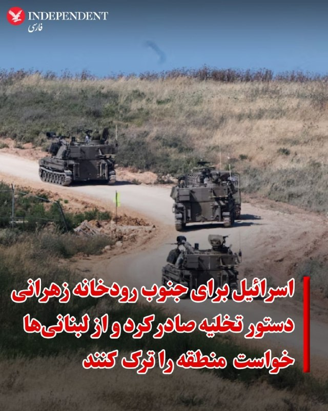

♦️ارتش اسرائیل روز یکشنبه ۱۰ خرداد به غیرنظامیان لبنانی ساکن جنوب رودخانه زهرانی هشدار داد که منطقه را تخلیه کنند و اعلام کرد که عملیات علیه حزب‌الله را تشدید می‌کند.

آویخای ادرعی، سخنگوی عرب زبان ارتش اسرائیل در شبکه‌های اجتماعی نوشت: «ساکنان جنوب لبنان، شما باید فوراً به شمال زهرانی نقل مکان کنید.»

به گزارش خبرگزاری فرانسه، در حالی که تلاش‌ها برای برای دستیابی به آتش‌بس در لبنان ادامه دارد، اسرائیل روز جمعه حملات سنگین خود به جنوباین کشور را ادامه داد.
‌🇸🇦 Indypersian

🤖 @VahidOOnLine

## VahidOOnLine — post 243026

  <a href="telegram/content/VahidOOnLine_243026_1780221959.mp4" target="_blank">🎬 Download video</a>

⭕️انقلاب ملی ایران؛ جاوید نام محسن نمازی به ضرب گلوله سرکوبگران در تهران کشته شد

♦️تصاویری که روز شنبه نهم خرداد در شبکه‌های اجتماعی منتشر شده، جاوید نام محسن نمازی را نشان می‌دهد که در کلاس مدرسه درحال گذراندن شور و حال جوانی است.
محسن نمازی ۱۸ ساله، شامگاه پنجشنبه ۱۸ دی‌ماه ۱۴۰۴ در جریان انقلاب ملی ایرانیان به‌ضرب گلوله جنگی نیروهای سرکوبگر جمهوری اسلامی در منطقه بهارستان تهران کشته شد.
‌🇸🇦 Indypersian

🤖 @VahidOOnLine

## VahidOOnLine — post 243025

  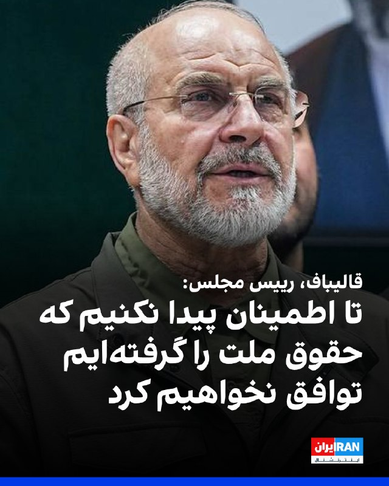

محمدباقر قالیباف، رییس مجلس در سخنانی با اشاره به مذاکرات با آمریکا، گفت: «تا اطمینان پیدا نکنیم که حقوق ملت ایران را گرفته‌ایم، هیچ توافقی را تایید نخواهیم کرد.»

او افزود: «سربازان میدان مبارزه دیپلماسی، هیچ اعتمادی به حرف‌ها و وعده‌های دشمن ندارند. آنچه برای ما ملاک است دستاوردهای عینی است که باید کسب کنیم.»

قالیباف اضافه کرد: «تضمین این راهبرد، جان ماست که کف دست گرفته‌ایم تا نثار مردم ایران کنیم.»
‌🏁 🇬🇧 IranintlTV

🤖 @VahidOOnLine

## VahidOOnLine — post 243024

  <a href="telegram/content/VahidOOnLine_243024_1780221963.mp4" target="_blank">🎬 Download video</a>

⭕️نهم اسفند و آغاز جنگ؛ تصاویر جدید از لحظه اصابت موشک به بیت رهبر جمهوری اسلامی

♦️تصاویری که روز یکشنبه و پس از وصل شدن اینترنت در ایران در شبکه‌های اجتماعی منتشر شده، لحظه اصابت موشک‌های «تاماهاک» به بیت علی خامنه‌ای، رهبر پیشین جمهوری اسلامی را نشان می‌دهد.

علی خامنه‌ای، به همراه جمعی از فرماندهان ارشد نظامی جمهوری اسلامی ظهر نهم اسفند ۱۴۰۴ و همزمان با آغاز جنگ توسط ارتش‌های اسرائیل و آمریکا کشته شد.
‌🇸🇦 Indypersian

🤖 @VahidOOnLine

## VahidOOnLine — post 243023

  

محمدباقر قالیباف، رییس مجلس شورای اسلامی گفت: «سومین سال مجلس دوازدهم را در حالی آغاز می‌کنیم که یاد و خاطره رهبر شهید با ماست و هنوز فقدان رهبر و پدر امت را باور نمی‌کنیم.»

او ادامه داد: «رهبرمان به ما آموخت مقابل زورگویی و تهدید، ذره‌ای سر خم نکنیم و با مشت‌های گره کرده مقابل خصم تا آخرین قطره خون مبارزه کنیم.»

قالیباف اضافه کرد: «دیدن جای خالی رهبری برایمان جانکاه است، ولی دلگرم به مدیریت و رهبری جدید هستیم.»
‌🏁 🇬🇧 IranintlTV

🤖 @VahidOOnLine

## VahidOOnLine — post 243022

  

♦️روابط عمومی نیروی دریایی سپاه روز یکشنبه ۱۰ خرداد در اطلاعیه‌ای اعلام کرد که طی شبانه روز گذشته ۲۸ کشتی اعم از نفتکش، باری و سایر کشتی‌های تجاری «پس از کسب مجوز با هماهنگی و تامین امنیت نیروی دریایی سپاه» از تنگه هرمز عبور کردند.
در اطلاعیه منتشر شده روابط عمومی نیروی دریایی سپاه آمده : «کنترل هوشمند تنگه هرمز به طور مستمر و با صلابت و اقتدار در حال انجام است.»
سپاه همچنین حضور آمریکا در اطراف تنگه هرمز را دلیل ناامنی آن خوانده و اعلام کرده است: «خلیج فارس یک پهنه آبی متعلق به کشورهای مسلمان منطقه بوده است.»
دونالد ترامپ، رئیس‌جمهوری ایالات متحده، روز شنبه در گفتگوی اختصاصی با شبکه خبری «فاکس‌نیوز» گفت: «تنگه هرمز باید فورا باز شود و این مسیر باید آزاد و بدون عوارضی باشد.»
پیشتر مارکو روبیو، وزیر خارجه ایالات متحده آمریکا نیز تاکید کرده بود هیچ کشوری، از جمله چین و روسیه، با ایجاد محدودیت یا دریافت عوارض برای عبور کشتی‌ها از این شاهراه مهم انرژی جهان موافق نیستند.
‌🇸🇦 Indypersian

🤖 @VahidOOnLine

## VahidOOnLine — post 243021

🗣روایت شما از زندگی پس از جنگ - یکشنبه ۱۰ خرداد

🔹کی این کابوس‌ها تموم میشه؟ ۴۷ سال وعده‌های دروغ دادن. اکثر پدرهای خانواده شرمنده خانواده‌شون شدن. شهر مرده و مردم فقط دارن نفس می‌کشن.

🔹خواستم بگم ما به خاک نشستن خامنه‌ای ضحاک رو دیدیم. رویای ایران آزاد فاصله چندانی با ما نداره، پس امیدتون رو از دست ندید.

🔹من سرآشپز یه رستوران هستم. ما روزانه ۳۰۰ پرس ناهار و ۷۰۰ پرس شام (جوجه، کوبیده یا زرشک‌پلو) برای سپاه می‌پزیم و برای پخش بین کسانی که میان شعار میدن. قیمت هر پرس غذایی که میدیم ۶۰۰ هزار تومان میشه.

🔹میگن اینترنت وصل شده، در صورتی‌که فقط باید فیلترشکن‌هاتون رو اینقدر امتحان کنید تا شاید وصل بشه و یک‌ساعت صبر کنیم تا یه سرور بهمون بده.

🔹واقعا خسته شدیم از این وضعیت گرونی و سردرگمی. هر روزمون شده منتظر نتیجه توافق یا شاید حمله نظامی موندن. جوونی‌مون حروم شد این وسط.

🔹بعد از آتش‌بس روحیه‌ای برای ادامه زندگی ندارم و هر روز حس می‌کنم با وجود جمهوری اسلامی، زندگی در ایران جریان نخواهد داشت.

🔹بعد از سه‌ماه با بدبختی به اینترنت جهانی وصل شدیم که ای‌کاش نمی‌شدیم چون عزیزانی که از بین ما رفتن، دیگه هیچ‌وقت آنلاین نمیشن.

🔹آزادی نزدیکه مردم عزیزم. من هم مثل شما زیر فشار زیادی هستم و فشار مالی، روانی خیلی اذیتم می‌کنه اما به خاطر خون جاویدنامان ناامید نشین.

🔹بعد از ۳ ماه وصل شدم و می‌خواستم بگم منتظر نشینیم تا یک کشور دیگه بخواد بهمون کمک کنه. ترامپ روز اول یه حرفی زد ولی ما مردم ایران نباید به این وضعیت عادت کنیم.

🔹هر شب اینجا مرگ بر اسرائیل و مرگ بر آمریکا میگن، آخرش هم دامن خودشون رو گرفت. اما بازم درس نگرفتن و هنوز تکرار می‌کنن.

🔹این‌قدر خشم درون من نهفته است که با کوچک‌ترین حرکت و فراخوان دوباره به خیابون میام، حتی اگر کشته شم.
‌🏁 🇬🇧 IranintlTV

🤖 @VahidOOnLine

## VahidOOnLine — post 243020

  

دیده‌بان ایران گزارش داد شورای شهر تهران تعرفه خدمات بهشت‌زهرا را برای سال ۱۴۰۵ افزایش داده است. بر اساس این مصوبه، هزینه‌های تدفین و به‌طور میانگین حدود ۴۰ درصد و در برخی موارد تا ۵۰ درصد افزایش یافته و خدمات برگزاری مراسم تدفین نیز بین ۳۰ تا ۵۰ درصد افزایش یافته است.
بر پایه این گزارش، هزینه انتقال هر متوفی تا شعاع ۱۰ کیلومتری به ۹ میلیون و ۷۵۰ هزار تومان است و قیمت سنگ مزار، قاب بتنی، سردخانه و خدمات مراسم نیز رشد قابل توجهی داشته است.
‌🏁 🇬🇧 IranintlTV

🤖 @VahidOOnLine

## VahidOOnLine — post 243019

  

♦️رسانه‌های ایران گزارش دادند روز یکشنبه ۱۰ خرداد نخستین جلسه سومین سال فعالیت مجلس دوازدهم به‌صورت مجازی و به ریاست محمدباقر قالیباف برگزار شد.
بنا بر گزارش‌ها، این جلسه با حضور ۱۸۷ نماینده به‌صورت مجازی و ۱۴ نماینده به‌صورت حضوری برگزار شد و  اعضای جدید هیئت‌رئیسه مجلس سوگند یاد کردند.
 پیشترعباس گودرزی، سخنگوی هئیت رئیسه مجلس شورای اسلامی، اعلام کرده بود که نخستین جلسه صحن علنی مجلس از آغاز جنگ جاری روز یکشنبه به صورت «ویدئو کنفرانس» برگزار خواهد شد.
گودرزی گفت این نشست به دلیل تدابیر امنیتی و شرایط موجود، به‌صورت وبیناری و ویدئوکنفرانس برگزار می‌شود.
آخرین جلسه علنی مجلس شورای اسلامی روز ۲۸ بهمن ماه سال گذشته برگزار شد.
‌🇸🇦 Indypersian

🤖 @VahidOOnLine

## VahidOOnLine — post 243018

  <a href="telegram/content/VahidOOnLine_243018_1780221970.mp4" target="_blank">🎬 Download video</a>

ویدیوی رسیده به ایران‌اینترنشنال، لحظه کشته شدن جاویدنام مجید فرخزاد را در شامگاه ۱۸ دی ۱۴۰۴ در خیابان پیروزی تهران نشان می‌دهد. فرخزاد، ۳۷ ساله و پدر یک فرزند پنج ساله بود که با اصابت گلوله جان باخت.
‌🏁 🇬🇧 IranintlTV

🤖 @VahidOOnLine

## VahidOOnLine — post 243017

  

مسعود پزشکیان در نشستی با وزیر علوم و جمعی از معاونان و مدیران این وزارتخانه گفت: «در برخی موارد شاهد ارائه تحلیل‌ها و روایت‌هایی از صدا و سیما هستیم که می‌تواند تصویری غیرواقعی از شرایط کشور ایجاد کند و این موضوع نیازمند بازنگری جدی است.»

او افزود: «نباید اجازه داد فضای عمومی جامعه تحت تاثیر اطلاعات غیرمستند و برداشت‌های فاقد پشتوانه علمی قرار گیرد. حقیقت مستقل از اشخاص است و در زبان علم، حقانیت بر پایه شواهد، استدلال و مستندات تعریف می‌شود.»
‌🏁 🇬🇧 IranintlTV

🤖 @VahidOOnLine

## VahidOOnLine — post 243016

  

نرگس فلاح، سرپرست پیشین اداره محیط زیست بندرانزلی به سایت رویداد ۲۴ گفت: «تالاب انزلی امروز از یک اکوسیستم آبی، در برخی نقاط به دشت و جنگل تبدیل شده است.»

او افزود: «آنچه امروز در انزلی رخ می‌دهد، حاصل دهه‌ها مدیریت ناهماهنگ و نگاه پروژه‌ای به محیط زیست است.»

او ادامه داد: ««تالاب انزلی مثل بیماری است که رگ‌های قلبش گرفته؛ ابتدا باید راه تنفسش باز شود و بعد سراغ برنامه‌های بلندمدت رفت.»
‌🏁 🇬🇧 IranintlTV

🤖 @VahidOOnLine

## VahidOOnLine — post 243015

  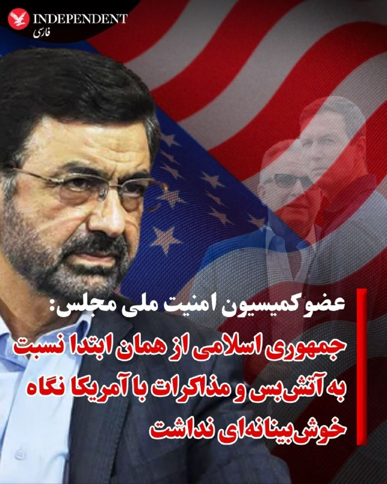

♦️فداحسین مالکی عضو کمیسیون امنیت ملی و سیاست خارجی مجلس شورای اسلامی روز یکشنبه ۱۰ خرداد با اشاره به تحولات پس از برقراری آتش‌بس و روند مذاکرات میان ایران و آمریکا، گفت: «جمهوری اسلامی ایران از همان ابتدا نسبت به آتش‌بس و همچنین مذاکرات با آمریکا نگاه خوش‌بینانه‌ای نداشته است.»
او دلیل این مسئله را «‌بدعهدی‌های» آمریکا دانست و افزود: «سابقه بدعهدی‌های واشنگتن همچنان در ذهن مسئولان و مردم ایران باقی مانده و این بدبینی هرگز از بین نرفته است.»
فداحسین مالکی با تاکید بر اینکه «جمهوری اسلامی نه مذاکره را کنار گذاشته و نه به آن دل بسته است» درباره روند مذاکرات گفت: «آخرین گفتگوی جدی در این زمینه همزمان با سفر فرمانده ارتش پاکستان به ایران انجام شد. در جریان این مذاکرات، طرف پاکستانی بسته پیشنهادی آمریکا در خصوص مطالبات جمهوری اسلامی ایران را ارائه کرد و درباره جزئیات آن گفت‌و‌گو‌های مفصلی صورت گرفت.»
این نماینده مجلس اضافه کرد: «جمهوری اسلامی نسبت به ورود موضوعاتی همچون تنگه هرمز و غنی‌سازی به مذاکرات، ملاحظات جدی داشته است.»
‌🇸🇦 Indypersian

🤖 @VahidOOnLine

## VahidOOnLine — post 243014

  <a href="telegram/content/VahidOOnLine_243014_1780221977.mp4" target="_blank">🎬 Download video</a>

⭕️تنگه‌ای که قرن‌هاست قلب تپنده دریانوردی، تجارت و سیاست است؛ تنگه هرمز

📌پادکست

♦️در کرانه‌های جنوبی ایران، آنجا که خلیج همیشگی فارس به سوی آب‌های آزاد جهان آغوش می‌گشاید، تنگه‌ای قرار دارد که از قرن‌ها پیش تاکنون، قلب تپنده دریانوردی، تجارت و سیاست بوده و نبض اقتصاد جهان را در پهنای نیلگون خود به شماره انداخته است.

لینک پخش
‌🇸🇦 Indypersian

🤖 @VahidOOnLine

## VahidOOnLine — post 243013

  

بر اساس اطلاعات رسیده به ایران‌اینترنشنال، علی داوری، ۲۱ ساله، روز ۱۹ دی‌ماه در جریان اعتراضات در خیابان جی اصفهان، هنگامی که برای کمک به مجروحان رفته بود، با شلیک مستقیم گلوله به قلبش جان باخت.

به گفته یک منبع آگاه، پس از مجروح شدن علی، دو نفر او را به درمانگاهی در منطقه «خانه‌اصفهان» منتقل کردند، اما به پزشکان اجازه داده نشد او را درمان کنند.

این منبع گفت پس از آن، مردم، علی داوری را به بیمارستان منتقل کردند، اما شدت جراحات ناشی از اصابت گلوله به قلب او باعث شد جانش را از دست بدهد.

‌🏁 🇬🇧 IranintlTV

🤖 @VahidOOnLine

## VahidOOnLine — post 243012

  

اقتصادنیوز گزارش داد همزمان با افزایش پرداخت‌های اقساطی در ایران، خدمات ارتباطی نیز به جمع خریدهای قسطی پیوسته است. بر اساس این گزارش، همراه اول و ایرانسل امکان پرداخت مرحله‌ای قبض، بسته اینترنت و برخی خدمات اپراتوری را برای مشترکان فراهم کرده‌اند.
ایرانسل از سرویس اعتباری با بازپرداخت چهارماهه خبر داده و همراه اول نیز برای مشترکانی با بدهی بالاتر از سقف مشخص، امکان تقسیط فراهم کرده است.
‌🏁 🇬🇧 IranintlTV

🤖 @VahidOOnLine

## VahidOOnLine — post 243011

  

رسانه‌های ایران گزارش دادند نخستین جلسه سومین سال فعالیت مجلس دوازدهم به‌صورت مجازی برگزار شد و در آن ۱۸۷ نماینده به‌صورت مجازی و ۱۴ نماینده به‌صورت حضوری سوگند یاد کردند.
بنا بر این گزارش، این جلسه با حضور محمدباقر قالیباف و شماری از اعضای هیات رییسه مجلس برگزار شد.
‌🏁 🇬🇧 IranintlTV

🤖 @VahidOOnLine

## VahidOOnLine — post 243010

🗣روایت شما از زندگی پس از جنگ - یکشنبه ۱۰ خرداد

🔹دخترم مبتلا به بیماری سلیاک است. هزینه مواد غذایی بدون‌گلوتن، مکمل‌ها و آزمایش‌های ضروری بسیار بالا رفته و فشار زیادی به خانواده‌ها وارد می‌کند.

🔹گرونی بیداد می‌کنه، یه موتور معمولی شده ۴۰۰ تا ۵۰۰ میلیون تومان. ما جوان‌ها نباید موتور برامون آرزو شه.

🔹واقعا گرونی خسته‌مون کرده. چقدر باید کار کنیم و پول نداشته باشیم. نودل ۴۰ هزار تومانی شده ۱۰۸ هزار تومان.

🔹سه ماهه به پدرم حقوق ندادن و ما از پس‌اندازی که داشتیم استفاده می‌کنیم که چیز کمی ازش باقی مونده. سر کار هم بهش میگن همینه که هست و اگر نمی‌خواین، استعفا بدین.

🔹همین الان در خونه‌مون رو یک پسر خیلی جوان زد و گفت اومدم خونه‌تون رو تمیز کنم. رندوم در خونه‌ها رو می‌زد. دلم سوخت، کی این‌قدر کمبود شغل و فقر زیاد شد.

🔹این‌قدر اجناس گرون شده و حقوق‌ها کم هستن که من می‌ترسم یه کیک ساده بگیرم و از اون طرف یه جای دیگه کم بیارم. ما فقط یه زندگی عادی خواستیم.
‌🏁 🇬🇧 IranintlTV

🤖 @VahidOOnLine

## WithYashar — post 13007

سلام خواهشا بگید مگه چندسالتونه ک جام جهانی 1997 هم دیدید..نمیخوره بهتون ک سن بالا باشد

## WithYashar — post 13006

سلام خواهشا بگید مگه چندسالتونه ک جام جهانی 1997 هم دیدید..نمیخوره بهتون ک سن بالا باشد

## WithYashar — post 13005

الجزیره: [جنگ آمریکا و اسراییل علیه ایران]، فضایی را ایجاد کرده است که در آن هر دو طرف احساس پیروزی می‌کنند و بنابراین تمایل دارند در مذاکرات احتمالی برای امتیازات بیشتر تلاش کنند و این امر تلاش‌ها برای کاهش تنش را پیچیده می‌کند.
@withyashar

## WithYashar — post 13004

حالا چرا اینا الان نشون دادم ولی کم میذارم؟ یکی این که نگن پس فردا یاشار اومد اینجا، نمیدونم فلان جا بهش پول داد… بدون اینا رو داشت و ول کرد تازه و درس دوم این که بدونن که میتونست بره برای خودش عشقشو کنه کنه، ولی نکرد و قید همه چیز رو زد حتی‌سلامتیشو …. اونایه دیگه خون مردم رو تو شیشه میکنند و هزار جور کار می کنند که تهش شاید بشن این ! شاید !

## WithYashar — post 13003

حس میکنم تریدری🌚

## WithYashar — post 13002

حس میکنم تریدری🌚

## WithYashar — post 13001

فعلا میرم بیرون یه کاری دارم به اخبار‌ ادامه میدیم منم یه هوایی بخورم انقدر عصبی نشم…

## WithYashar — post 13000

  

اینم SVR و G63 البته یه بنتلی GTC W12 و یه مازراتی MC و یه لیموزین بنز ۶ در و یه SL fabdesign هم دارم ، ۶ تا کلا 🥹 حالا به وقتش‌میبینید

## WithYashar — post 12999

مشروب یه کالای‌ مصرفیه ! کل اون مشروبا ۱۵۰۰$ بشه پول یه ماه یه کارگر معمولی اینجا ، البته نه کل مشروبام تو کمد هم باز‌ هست 🤣…

## WithYashar — post 12998

یاشار میشه شغل اصلیت بگی خواهش میکنم‌جواب پیام بده خیلی مشتاقم بدونم اون همه مشروب چطوری کار کردی خریدی💔

## WithYashar — post 12997

  <a href="telegram/content/WithYashar_12997_1780221983.mp4" target="_blank">🎬 Download video</a>

🎬 Video

## WithYashar — post 12996

## WithYashar — post 12995

نیویورک تایمز: ایران خواسته های واشنگتن برای تسلیم کردن ذخایر اورانیوم غنی‌شده‌اش را رد کرده است.
@withyashar

## WithYashar — post 12994

## WithYashar — post 12993

## WithYashar — post 12992

یاشار خیلی حرف های درست و حسابی میزنی دردش اینکه هنوز یکسری هستن که حرفاتو قبول ندارن چقدر باید هزینه بدیم تا همه بیدار شن؟

## WithYashar — post 12991

## WithYashar — post 12990

داداش ما باید فحشت بدم جواب بدی

## WithYashar — post 12989

## WithYashar — post 12988

## mwarmonitor — post 9928

🔴ترامپ خواهان اعمال تغییراتی در توافق با ایران شد که فرستادگانش بر سر آن مذاکره کرده بودند

📝 نویسندگان: مارک کاپوتو، باراک راوید

🔰به گفته یک مقام ارشد دولت و یک منبع آگاه دیگر، پرزیدنت ترامپ در جریان نشست روز جمعه در «اتاق وضعیت» (Situation Room)، خواستار چندین اصلاحیه در توافقی شد که فرستادگانش با همتایان ایرانی خود به آن دست یافته بودند.

🔸چرا این موضوع اهمیت دارد؟
دو مقام آمریکایی گفتند ترامپ خواهان این توافق است و انتظار دارد به زودی آن را نهایی کند، اما اصرار دارد چند نکته را که برایش حائز اهمیت است – به ویژه در رابطه با مواد هسته‌ای ایران – تقویت کند. درخواست ترامپ دور جدیدی از رفت‌وبرگشت‌ها میان طرفین را آغاز کرده است که می‌تواند چندین روز به طول بینجامد.

نکات پشت پرده
ترامپ روز جمعه اعلام کرده بود که نشست اتاق وضعیت را برای بررسی این توافق برگزار می‌کند و به نظر می‌رسید سیگنال‌هایی مبنی بر تمایلش به پذیرش آن ارسال کرده است.
یک مقام کاخ سفید پس از این نشست به خبرنگاران گفت: «ترامپ تنها توافقی را امضا خواهد کرد که برای آمریکا خوب باشد، خطوط قرمز او را برآورده کند و تضمین کند که ایران هرگز نمی‌تواند به سلاح هسته‌ای دست یابد.»
مقامات ایرانی نیز به رسانه‌های دولتی خود گفتند که متن نهایی را هنوز تایید نکرده‌اند؛ این در حالی است که دو مقام آمریکایی اوایل هفته مدعی شده بودند تهران آماده امضاست و همه چیز به تصمیم ترامپ بستگی دارد.
در پشت صحنه چه گذشت؟
به گفته این دو منبع، ترامپ از تیم خود خواسته است تا تغییراتی در پیش‌نویس بندهای مربوط به برنامه هسته‌ای ایران ایجاد کنند.
در شکل فعلی، این یادداشت تفاهم (MOU) شامل تعهد ایران به عدم تلاش برای دستیابی به سلاح هسته‌ای است، اما فراتر از آن، امتیاز مشخص دیگری را در بر نمی‌گیرد.
این پیش‌نویس مقرر می‌کند که یک بازه زمانی ۶۰ روزه برای مذاکره درباره تعهدات هسته‌ای ایران و رفع تحریم‌ها از سوی آمریکا وجود خواهد داشت؛ به طوری که اولین موضوعات دستور کار، نحوه خلاص شدن از شر ذخایر اورانیوم غنی‌شده ایران و محدود کردن غنی‌سازی بیشتر خواهد بود.
جزئیات بیشتر
ترامپ می‌خواهد این بخش از توافق را اصلاح کند.
یک مقام ارشد دولت با اشاره به اورانیوم غنی‌شده گفت: «موضوع، جزئیات بیشتر در مورد نحوه دستیابی آمریکا به این مواد و زمان‌بندی آن است.»
منبع دوم نیز اعلام کرد که ترامپ خواستار اصلاح برخی عبارات پیرامون بازگشایی تنگه هرمز شده است.
این مقام آمریکایی گفت به ترامپ اطلاع داده شده که حدود سه روز طول می‌کشد تا ایرانی‌ها پاسخ دهند. این مقام ارشد دولت به کنایه گفت: «آن‌ها به معنای واقعی کلمه در غارها هستند و از ایمیل استفاده نمی‌کنند.»
اظهار نظرها
یک مقام ارشد دولت گفت: «توافق حاصل خواهد شد. اما اینکه چقدر فوری باشد، باید منتظر ماند و دید. ما حاضریم صبر کنیم تا رئیس‌جمهور آنچه را که می‌خواهد به دست آورد. ممکن است یک هفته طول بکشد، ممکن است کمتر یا بیشتر باشد. امیدواریم در اوایل هفته آینده به نتیجه‌ای برسیم.»
رسانه‌های دولتی ایران گزارش داده‌اند که توافق نزدیک است اما نهایی نشده و مدعی شده‌اند که ایران میلیاردها دلار از دارایی‌های بلوکه‌شده خود را دریافت خواهد کرد؛ ادعایی که کاخ سفید آن را تکذیب می‌کند.
کاخ سفید به درخواست برای اظهار نظر در این باره پاسخ نداد.

@mwarmonitor

## mwarmonitor — post 9927

🔴به گفته اسرائیل کاتس، وزیر دفاع اسرائیل، ارتش دفاعی اسرائیل دامنه عملیات خود را در لبنان گسترش داده، از رود لیتانی عبور کرده و یال بوفر را به تصرف درآورده است.

🔸اسرائیل کاتس گفت تصرف قلعه بوفر «پیام روشنی» برای دشمنان اسرائیل دارد و هشدار داد هر کسی که غیرنظامیان اسرائیلی را تهدید کند، «دارایی‌های راهبردی خود را یکی‌یکی از دست خواهد داد».

🔹کاتس افزود: «این کارزار هنوز به پایان نرسیده است» و تأکید کرد که اسرائیل همچنان مصمم است «قدرت حزب‌الله را در هم بشکند» و امنیت شمال اسرائیل را تضمین کند.

@mwarmonitor

## mwarmonitor — post 9926

🔸ارتش اسرائیل از کشته شدن یک سرباز خود در جنوب لبنان خبر داد.
🔹او دوازدهمین سرباز ارتش اسرائیل است که از زمان اجرای آنچه «آتش‌بس اسرائیل–لبنان» خوانده می‌شود در ۱۶ آوریل جان باخته است؛ که از این تعداد، ۹ نفر بر اثر حملات پهپادهای FPV حزب‌الله کشته شده‌اند.

📌همچنین این سرباز، ۹۵۰مین تلفات ارتش اسرائیل در تمامی جبهه‌ها از تاریخ ۷ اکتبر ۲۰۲۳ تاکنون به شمار می‌رود.

@mwarmonitor

## mwarmonitor — post 9925

🔴به گزارش نیویورک‌تایمز،‌ ترامپ شرایط یک چارچوب احتمالی برای توافقی به‌منظور پایان دادن به جنگ در ایران را سخت‌گیرانه‌تر کرده و این تغییرات پیشنهادی را برای بررسی دوباره به این کشور ارسال کرده است؛ پیشنهاد جدید و سخت‌گیرانه‌تر ممکن است با هدف تسریع روند مذاکرات ارائه شده باشد؛ به این معنا که با افزایش فشار بر ایران، این کشور را به پذیرش پیشنهاد قبلی وادار کند.
گزارش‌ها حاکی است که آن پیشنهاد قبلی برای تأیید نهایی به رهبر عالی ایران، مجتبی خامنه‌ای، ارسال شده است.به گفته سه مقام آگاه.

@mwarmonitor

## FoxNewsTwitter — post 342442

‌Fox News (Twitter/X)

👉 Full story here:

## FoxNewsTwitter — post 342441

  

Fox News (Twitter/X)

President Trump floats scrapping America's 250th anniversary concert for a massive MAGA rally after multiple artists pull out of the Great American State Fair lineup. Freedom 250 organizers later confirmed the president will personally kick off the celebration with an opening ceremony speech on June 24.

Artists who withdrew include Martina McBride, Bret Michaels, Young MC, Morris Day and The Time, and C+C Music Factory. Trump called them 'overpriced singers, who nobody wants to hear, whose music is boring.'

## FoxNewsTwitter — post 342440

  

Fox News (Twitter/X)

Graham Platner exchanged sexual texts with several women after marrying his wife two years ago, according to a report.

Platner’s campaign confirmed the text exchanges to Politico following a report from the Wall Street Journal that claimed his wife, Amy Gertner, told a campaign aide about the texts after he launched his Senate bid as they began looking into potential political liabilities.

She made the private revelation before Platner held a campaign rally last year supported by Sen. Bernie Sanders, I-Vt., but the aide decided the texts were a private matter for the couple, the campaign said, according to the newspaper.

"I confided deeply personal details about my marriage to someone I considered a friend," Gertner said in a statement to WSJ. "In the months since, I have had to watch as she spread malicious gossip to anyone who would take her call. I trusted this person with the most private chapter of our lives — the early days of our marriage before...

Перейти на оригинальный пост

## FoxNewsTwitter — post 342439

  <a href="telegram/content/FoxNewsTwitter_342439_1780221987.mp4" target="_blank">🎬 Download video</a>

Fox News (Twitter/X)

"The ballroom will be right here."

President Trump shows Lara Trump a behind-the-scenes look at construction for the White House ballroom, which he calls a gift to America from him and "great patriots."

"It will be the greatest facility of its kind ever built," the president says as he shows off what will be the ballroom entrance.

## FoxNewsTwitter — post 342438

  <a href="telegram/content/FoxNewsTwitter_342438_1780221990.mp4" target="_blank">🎬 Download video</a>

Fox News (Twitter/X)

"We’ve actually left their military alone — people would be surprised to hear that."

President Trump says Iran's military hasn't been hit as aggressively because it's "somewhat moderate" compared to other elements of the regime.

He argues that wiping out "everybody" could cause a country to be unable to rebuild for generations.

## pm_afshaa — post 91924

  

بچه ها وقتی شما نبودین این جنده به مکرون میداد از اون ورم مکرون از جمهوری اسهالی حمایت میکرد

💧 Rainbet.com the #1 Non-KYC Crypto Casino & Sportsbook @rainbetcom

😁 @Pm_Afshaa

## pm_afshaa — post 91923

عرزشی ها شب گذشته در میدان انقلاب دست به تجمع زدن و شعار «با قاتلین رهبر، مذاکره حرامه» سر دادن..

💧 Rainbet.com the #1 Non-KYC Crypto Casino & Sportsbook @rainbetcom

😁 @Pm_Afshaa

## pm_afshaa — post 91922

  <a href="telegram/content/pm_afshaa_91922_1780221993.webm" target="_blank">🎬 Download video</a>

🔴اسراییل هیوم:
آمریکا به نفتکش‌ها و کشتی‌های حمل گاز مایع قطر اجازه داده که پس از پرداخت پول و عوارض به ایران، تنگه هرمز رو ترک کنن!

💧 Rainbet.com the #1 Non-KYC Crypto Casino & Sportsbook @rainbetcom

😁 @Pm_Afshaa

## pm_afshaa — post 91921

  <a href="telegram/content/pm_afshaa_91921_1780221994.webm" target="_blank">🎬 Download video</a>

🔴نیویورک تایمز:
ترامپ تمام خواسته‌های ایران رو رد کرده و یک پیشنهاد متقابل سخت‌تر به تهران ارسال کرده‌ که باعث بن بست کامل مذاکرات شده.

💧 Rainbet.com the #1 Non-KYC Crypto Casino & Sportsbook @rainbetcom

😁 @Pm_Afshaa

## pm_afshaa — post 91920

  <a href="telegram/content/pm_afshaa_91920_1780221995.webm" target="_blank">🎬 Download video</a>

🔴ترامپ به فاکس نیوز:
ما به یک توافق بسیار خوب با ایران نزدیک شدیم و اگه برای ما منصفانه نباشه، به وزارت دفاع (جنگ) برمی‌گردیم.

ما به آرامی و پیوسته آنچه را که از تهران میخوایم به دست میاریم و اگر این اتفاق نیفته، درگیری رو به روشی متفاوت پایان خواهیم داد.

💧 Rainbet.com the #1 Non-KYC Crypto Casino & Sportsbook @rainbetcom

😁 @Pm_Afshaa

## DEJradio — post 5167

📢
⭕️ یکی از سرکوبگرانی که در جنگ ۴۰ روزه کشته شد سردار بهرام حسینی مطلق رئیس اداره طرح و عملیات معاونت عملیات ستاد کل نیروهای مسلح بود.
هرچند او در واپسین سال‌های خدمت مسئولیت‌های رزمی داشت اما یکی از عناصر اصلی سرکوب بود.
حسینی مطلق در جریان سرکوب اعتراضات ۸۸ به عنوان فرمانده سـ.ـپاه سيدالشهدا استان تهران چماق بدست با حضور مستقیم در خیابان و قتل و شکنجه معترضان مرتکب نقض حقوق بشر شد.
او در اردیبهشت‌ماه ۱۳۹۰ با اشاره به نقش محوری سـ.ـپاه سيدالشهدا در سرکوب اعتراضات سال ۸۸، گفت: «سـ.ـپاه سيدالشهدا قبل از تفكيک يكی از سـ.ـپاه‌های محوری بود و در جريان فتنه سال ۸۸ خوش درخشيد. عملكرد اين سـ.ـپاه مورد تأييد مسئولان قرار گرفت و دشمنان با وجود اين سپاه احساس خطر كردند و نام آن را در ليست سی و دو گزينه‌ای خود ثبت كردند.»
اتحادیه اروپا در ۲۳ فروردین ۱۳۹۰ (۱۳ آوریل ۲۰۱۱)، ۳۲ مقام ایرانی از جمله بهرام حسینی مطلق را به دلیل نقشی که در نقض گسترده و شدید حقوق شهروندان ایرانی داشته‌اند از ورود به کشورهای این اتحادیه محروم کرد. کلیه دارایی‌های این مقامات نیز در اروپا توقیف خواهد شد. بر اساس بیانیه اتحادیه اروپا بهرام حسینی مطلق در مقام فرماندهی لشکر سیدالشهدا استان تهران در سرکوب معترضان انتخاباتی نقشی کلیدی داشت.
او در تیم امنیتی که پیگیر دلایل سقوط هلی‌کوپتر ابراهیم رئیسی بود نیز حضور فعال داشت.

#سرکوبگران #حذف_هدفمند
@DEJradio

## DEJradio — post 5166

  <a href="telegram/content/DEJradio_5166_1780221996.webm" target="_blank">🎬 Download video</a>

⭕️
🔺 بعد از یک وقفه کوتاه در دوران جنگ ۴۰ روزه، حکومت دوباره به جان محیط زیست و منابع طبیعی کشور افتاده است.
یک شهروند از گرگان در ویدیویی با اشاره به نابودی جنگل‌های هیرکانی می‌گوید دشمن واقعی مملکت خود اینها هستند که مثل تروریست‌ها به جان ایران افتاده‌اند.

#گرگان #مازندران #هیرکانی
@DEJradio

## DEJradio — post 5165

  <a href="telegram/content/DEJradio_5165_1780221997.mp4" target="_blank">🎬 Download video</a>

🚀
🚨 براساس ویدیویی از جزیره خارک مربوط به جنگ ۴۰ روزه، نیروهای مسلح جمهوری اسلامی یک لانچر موشک را در پوشش کامیون در کنار جاده مستقر کردند و هنگام عبور وسایل نقلیه شخصی اقدام به شلیک می‌کنند، کاری که آشکار استفاده از سپرانسانی است.

#خارک #سپرانسانی
@DEJradio

## DEJradio — post 5164

  <a href="telegram/content/DEJradio_5164_1780221999.webm" target="_blank">🎬 Download video</a>

🚨
🔺 با کشف یک مین ۳۰۰ کیلوگرمی که احتمالاً نیروهای مسلح جمهوری اسلامی در تنگه هرمز بر سر راه کشتی‌ها قرار داده بودند، مرکز امنیت دریایی عمان روز شنبه نهم خرداد، از دریانوردان، ماهیگیران و شناورها خواست تا در مسیرهای حرکتی خود نهایت احتیاط را به کار بندند.
گفته می‌شود این مین مدل «مهام ۳» است؛ یک مین مهارشده (لنگرشده) مجهز به حسگرهای آکوستیکی که کشتی‌های عبوری را از طریق الگوی صوتی آن‌ها شناسایی می‌کند.
جمهوری اسلامی ایران در نقاط مختلف تنگه هرمز مین مستقر کرده است، از جمله مین چسبان «مهام ۷» که روی بستر دریا که در انتظار هدف می‌ماند.
طبق توافق ترامپ، ایران باید تک‌تک این مین‌ها را پاک‌سازی کند. هنوز دست‌کم یک دوجین یا بیشتر از آن‌ها در آن منطقه وجود دارند.
نیروی دریایی سـ.ـپاه پاسداران ۲۰فروردین ۱۴۰۵ با انتشار اطلاعیه‌ای، از تعیین مسیرهای جایگزین برای تردد کشتی‌ها در تنگه هرمز خبر داد.

#مین_دریایی #تنگه_هرمز
@DEJradio

## VahidOnline — post 75809

  

آکسیوس، ترجمه ماشین:
رئیس‌جمهور ترامپ در جلسه‌ای که روز جمعه در اتاق وضعیت برگزار شد، خواستار چند اصلاح در توافقی شد که فرستادگانش با همتایان ایرانی خود به آن رسیده بودند؛ این را یک مقام ارشد دولت و منبع دومی که در جریان موضوع قرار گرفته بود، گفته‌اند.
...
مقام‌های ایرانی به رسانه‌های دولتی گفتند که آن‌ها نیز متن نهایی را تأیید نکرده‌اند؛ هرچند دو مقام آمریکایی پیش‌تر در طول هفته مدعی شده بودند که تهران آماده امضاست و همه چیز به تصمیم ترامپ بستگی دارد.

به گفته این دو منبع، ترامپ از تیم خود خواست تغییراتی در پیش‌نویس مربوط به بندهای برنامه هسته‌ای ایران ایجاد کنند.

در شکل فعلی، این تفاهم‌نامه شامل تعهد ایران به دنبال نکردن سلاح هسته‌ای است، اما امتیاز مشخص دیگری فراتر از آن در آن نیامده است.

در این متن آمده است که یک بازه ۶۰ روزه برای مذاکره درباره تعهدات هسته‌ای ایران و کاهش تحریم‌ها از سوی آمریکا وجود خواهد داشت؛ نخستین موضوعات در دستور کار نیز چگونگی تعیین تکلیف ذخایر اورانیوم غنی‌شده ایران و محدود کردن غنی‌سازی بیشتر خواهد بود.

ترامپ می‌خواهد تلاش کند این بخش را اصلاح کند.

یک مقام ارشد دولت گفت: «موضوع، جزئیات بیشتر درباره این است که آمریکا چگونه مواد را دریافت می‌کند و زمان‌بندی آن چگونه خواهد بود»؛ منظور او اورانیوم غنی‌شده بود.

منبع دوم گفت ترامپ همچنین می‌خواهد برخی از عبارت‌ها درباره بازگشایی تنگه هرمز را اصلاح کند.

این مقام آمریکایی گفت به ترامپ گفته شده است حدود سه روز طول می‌کشد تا ایرانی‌ها با پاسخ برگردند. این مقام ارشد دولت گفت: «آن‌ها عملا در غارها هستند و از ایمیل استفاده نمی‌کنند.»

این مقام ارشد دولت گفت: «توافقی در کار خواهد بود. اینکه چقدر قریب‌الوقوع است، باید دید. ما حاضریم صبر کنیم تا رئیس‌جمهور آنچه را خواسته به دست بیاورد. ممکن است یک هفته طول بکشد. ممکن است کمتر باشد. ممکن است بیشتر باشد. امیدواریم در آغاز هفته چیزی داشته باشیم.»
axios

📡 @VahidOnline

## VahidOnline — post 75808

  

روابط‌عمومی سپاه بامداد یکشنبه، ۱۰ خردادماه، اعلام کرد یک پهپاد «ام‌کیو۱» (MQ1) ارتش آمریکا را منهدم کرده است.

خبرگزاری فارس نوشت: «این پهپاد با ورود به آب‌های سرزمینی ایران قصد انجام عملیات خصمانه داشت که بلافاصله در رصد و هدف موشک‌های پدافند سپاه قرار گرفت و سرنگون شد».
@VahidOOnLine

📡 @VahidOnline

## IranIntlTV — post 339860

  <a href="telegram/content/IranIntlTV_339860_1780222001.mp4" target="_blank">🎬 Download video</a>

جاویدنامان انقلاب ملی ایرانیان
«کمیل جمشیدی» شامگاه ۱۹ دی‌ماه در شهرک اندیشه بر اثر اصابت گلوله ماموران خامنه‌ای از ناحیه‌ گردن جان باخت. نامش در حافظه‌ی این سرزمین می‌ماند و یادش چراغ راه آزادی‌خواهان است.
@iranintltv

## IranIntlTV — post 339859

  <a href="telegram/content/IranIntlTV_339859_1780222004.mp4" target="_blank">🎬 Download video</a>

ویدیوهایی که تازه به دست ایران‌اینترنشنال رسیده، برگزاری مراسم چهلم جاویدنام احمد طراقیان را بر سر مزارش نشان می‌دهد.
طراقیان، ۳۲ ساله، شامگاه ۱۹ دی‌ ۱۴۰۴ در شهر کرج، با شلیک گلوله جنگی به ناحیه سر هدف قرار گرفت و جان باخت.

## IranIntlTV — post 339858

  <a href="telegram/content/IranIntlTV_339858_1780222007.mp4" target="_blank">🎬 Download video</a>

وال‌استریت پس از حملات یازده سپتامبر، فقط شش روز تعطیل بود، اما روسیه پس از حمله به اوکراین، یک ماه بازار مسکو را تعطیل کرد. بورس‌های امارات پس از حملات موشکی و پهپادی جمهوری اسلامی فقط دو روز معاملات را متوقف کردند، در حالیکه بورس تهران، در یک رکورد تاریخی، بیش از هشتاد روز تعطیل بود. در این قسمت چرتکه، محمد ماشین‌چیان رویکرد آمریکایی و روسی به بازار را در مقیاس ایران و امارات بررسی می‌کند.

تماشای نسخه کامل «چرتکه» را در یوتیوب ایران‌اینترنشنال⁩:

https://youtu.be/gPWijjjbR5M
@iranintltv

## IranIntlTV — post 339857

  <a href="telegram/content/IranIntlTV_339857_1780222009.mp4" target="_blank">🎬 Download video</a>

مسعود پزشکیان، رییس‌جمهور دولت جمهوری اسلامی است، در نشستی با وزیر علوم گفت که صداوسیما با ارائه تحلیل‌ها و روایت‌های نادرست و فاقد پشتوانه علمی، تصویر غیرواقعی از وضعیت کشور ارائه می‌دهد.
گفت‌وگو با رضا علیجانی، تحلیل‌گر و فعال سیاسی
@iranintltv

## IranIntlTV — post 339856

  <a href="telegram/content/IranIntlTV_339856_1780222011.mp4" target="_blank">🎬 Download video</a>

🔻عباس جدیدی، قهرمان پیشین کشتی ایران در گفتگویی با خبرآنلاین، با انتقاد به علیرضا دبیر، رییس فدراسیون کشتی به دلیل فعالیت‌های عوام‌فریبانه، گفت: «ما با همین زیرساختهایی که داشتیم همین نتایجی که الان گرفتیم و خیلی‌ها دارند به آن می‌نازند. همین نتایج را با همان زیرساخت‌ها به دست آوردیم، پس مشکل ما زیرساخت نبود. آقا ساخته‌اید! دستتان هم درد نکند، اما یک‌سری ناترازی‌ها و ایرادات اصل کاری و بنیادی را بخواهید پشت زیرساخت‌ها پنهان کنید، برای کاستی‌ها ویریت درست کنید، این یعنی دروغ گفتن به مردم.»

@iranintltvsport

## IranIntlTV — post 339855

  <a href="telegram/content/IranIntlTV_339855_1780222014.mp4" target="_blank">🎬 Download video</a>

ویدیوی رسیده به ایران‌اینترنشنال، برگزاری مراسم تولد جاویدنام مصطفی نوری شیرازی را بر سر مزارش نشان می‌دهد.
مصطفی نوری، جوان ۲۳ ساله اهل شهر نور در استان مازندران، جمعه ۱۹ دی‌ماه ۱۴۰۴ با شلیک مستقیم نیروهای سرکوبگر جان باخت. او را به بیمارستان خمینی‌شهر نور بردند اما جان باخت.

## IranIntlTV — post 339854

  

محمدباقر قالیباف، رییس مجلس در سخنانی با اشاره به مذاکرات با آمریکا، گفت: «تا اطمینان پیدا نکنیم که حقوق ملت ایران را گرفته‌ایم، هیچ توافقی را تایید نخواهیم کرد.»

او افزود: «سربازان میدان مبارزه دیپلماسی، هیچ اعتمادی به حرف‌ها و وعده‌های دشمن ندارند. آنچه برای ما ملاک است دستاوردهای عینی است که باید کسب کنیم.»

قالیباف اضافه کرد: «تضمین این راهبرد، جان ماست که کف دست گرفته‌ایم تا نثار مردم ایران کنیم.»
https://iranintl.com/202605315968

## IranIntlTV — post 339853

  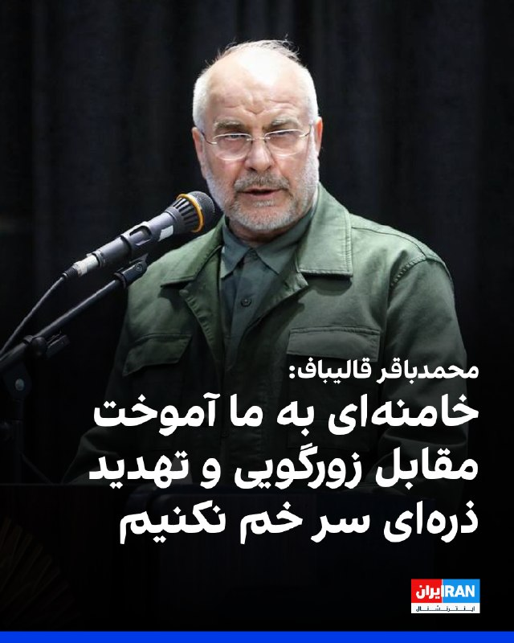

محمدباقر قالیباف، رییس مجلس شورای اسلامی گفت: «سومین سال مجلس دوازدهم را در حالی آغاز می‌کنیم که یاد و خاطره رهبر شهید با ماست و هنوز فقدان رهبر و پدر امت را باور نمی‌کنیم.»

او ادامه داد: «رهبرمان به ما آموخت مقابل زورگویی و تهدید، ذره‌ای سر خم نکنیم و با مشت‌های گره کرده مقابل خصم تا آخرین قطره خون مبارزه کنیم.»

قالیباف اضافه کرد: «دیدن جای خالی رهبری برایمان جانکاه است، ولی دلگرم به مدیریت و رهبری جدید هستیم.»
https://iranintl.com/202605312532

## IranIntlTV — post 339852

  <a href="telegram/content/IranIntlTV_339852_1780222019.mp4" target="_blank">🎬 Download video</a>

روزنامه شرق در گزارشی از افزایش موارد ترک درمان در ایران به دلیل رشد تورم و بالا رفتن هزینه‌های پزشکی خبر داده است. در این گزارش، افزایش تعرفه‌ها، گرانی دارو و تجهیزات و ضعف پوشش بیمه‌ای از عوامل اصلی فشار بر بیماران و نظام درمان عنوان شده است.
ارزیابی بیشتر با بابک خطی، پزشک و متخصص کودکان
@iranintltv

## IranIntlTV — post 339851

🗣روایت شما از زندگی پس از جنگ - یکشنبه ۱۰ خرداد

🔹کی این کابوس‌ها تموم میشه؟ ۴۷ سال وعده‌های دروغ دادن. اکثر پدرهای خانواده شرمنده خانواده‌شون شدن. شهر مرده و مردم فقط دارن نفس می‌کشن.

🔹خواستم بگم ما به خاک نشستن خامنه‌ای ضحاک رو دیدیم. رویای ایران آزاد فاصله چندانی با ما نداره، پس امیدتون رو از دست ندید.

🔹من سرآشپز یه رستوران هستم. ما روزانه ۳۰۰ پرس ناهار و ۷۰۰ پرس شام (جوجه، کوبیده یا زرشک‌پلو) برای سپاه می‌پزیم و برای پخش بین کسانی که میان شعار میدن. قیمت هر پرس غذایی که میدیم ۶۰۰ هزار تومان میشه.

🔹میگن اینترنت وصل شده، در صورتی‌که فقط باید فیلترشکن‌هاتون رو اینقدر امتحان کنید تا شاید وصل بشه و یک‌ساعت صبر کنیم تا یه سرور بهمون بده.

🔹واقعا خسته شدیم از این وضعیت گرونی و سردرگمی. هر روزمون شده منتظر نتیجه توافق یا شاید حمله نظامی موندن. جوونی‌مون حروم شد این وسط.

🔹بعد از آتش‌بس روحیه‌ای برای ادامه زندگی ندارم و هر روز حس می‌کنم با وجود جمهوری اسلامی، زندگی در ایران جریان نخواهد داشت.

🔹بعد از سه‌ماه با بدبختی به اینترنت جهانی وصل شدیم که ای‌کاش نمی‌شدیم چون عزیزانی که از بین ما رفتن، دیگه هیچ‌وقت آنلاین نمیشن.

🔹آزادی نزدیکه مردم عزیزم. من هم مثل شما زیر فشار زیادی هستم و فشار مالی، روانی خیلی اذیتم می‌کنه اما به خاطر خون جاویدنامان ناامید نشین.

🔹بعد از ۳ ماه وصل شدم و می‌خواستم بگم منتظر نشینیم تا یک کشور دیگه بخواد بهمون کمک کنه. ترامپ روز اول یه حرفی زد ولی ما مردم ایران نباید به این وضعیت عادت کنیم.

🔹هر شب اینجا مرگ بر اسرائیل و مرگ بر آمریکا میگن، آخرش هم دامن خودشون رو گرفت. اما بازم درس نگرفتن و هنوز تکرار می‌کنن.

🔹این‌قدر خشم درون من نهفته است که با کوچک‌ترین حرکت و فراخوان دوباره به خیابون میام، حتی اگر کشته شم.

## IranIntlTV — post 339850

  <a href="telegram/content/IranIntlTV_339850_1780222021.mp4" target="_blank">🎬 Download video</a>

ترکیه اعلام کرد در صورت برآورده شدن خواسته‌هایش در غزه، آماده عادی‌سازی روابط با اسرائیل است.

نرگس هورخش، خبرنگار ایران‌اینترنشنال، گزارش می‌دهد
@iranintltv

## IranIntlTV — post 339849

  <a href="telegram/content/IranIntlTV_339849_1780222024.mp4" target="_blank">🎬 Download video</a>

ارتش اسرائیل گزارش داد در عملیاتی استراتژیک، از رودخانه لیتانی عبور کرده و قلعه باستانی بوفور در جنوب لبنان را تصرف کرده است. پس از خروج بیست سال پیش اسرائیل از لبنان، این بیشترین پیشروی اسرائیل در خاک این کشور است.

اشکان صفایی، خبرنگار ایران‌اینترنشنال، گزارش می‌دهد
@iranintltv

## IranIntlTV — post 339848

  

دیده‌بان ایران گزارش داد شورای شهر تهران تعرفه خدمات بهشت‌زهرا را برای سال ۱۴۰۵ افزایش داده است. بر اساس این مصوبه، هزینه‌های تدفین و به‌طور میانگین حدود ۴۰ درصد و در برخی موارد تا ۵۰ درصد افزایش یافته و خدمات برگزاری مراسم تدفین نیز بین ۳۰ تا ۵۰ درصد افزایش یافته است.
بر پایه این گزارش، هزینه انتقال هر متوفی تا شعاع ۱۰ کیلومتری به ۹ میلیون و ۷۵۰ هزار تومان است و قیمت سنگ مزار، قاب بتنی، سردخانه و خدمات مراسم نیز رشد قابل توجهی داشته است.
https://iranintl.com/202605314185

## IranIntlTV — post 339847

  <a href="telegram/content/IranIntlTV_339847_1780222028.mp4" target="_blank">🎬 Download video</a>

ویدیوی رسیده به ایران‌اینترنشنال، لحظه کشته شدن جاویدنام مجید فرخزاد را در شامگاه ۱۸ دی ۱۴۰۴ در خیابان پیروزی تهران نشان می‌دهد. فرخزاد، ۳۷ ساله و پدر یک فرزند پنج ساله بود که با اصابت گلوله جان باخت.

## IranIntlTV — post 339845

  

مسعود پزشکیان در نشستی با وزیر علوم و جمعی از معاونان و مدیران این وزارتخانه گفت: «در برخی موارد شاهد ارائه تحلیل‌ها و روایت‌هایی از صدا و سیما هستیم که می‌تواند تصویری غیرواقعی از شرایط کشور ایجاد کند و این موضوع نیازمند بازنگری جدی است.»

او افزود: «نباید اجازه داد فضای عمومی جامعه تحت تاثیر اطلاعات غیرمستند و برداشت‌های فاقد پشتوانه علمی قرار گیرد. حقیقت مستقل از اشخاص است و در زبان علم، حقانیت بر پایه شواهد، استدلال و مستندات تعریف می‌شود.»
https://iranintl.com/202605312340

## IranIntlTV — post 339844

  

🔻ﺣﺰب ﻣﺸﺮوﻃﻪ اﯾﺮان (ﻟﯿﺒﺮال دﻣﻮﮐﺮات) در اعلامیه‌ای ﻣﻨﻊ ورود ﭘﺮﭼﻢ ﺷﯿﺮ و ﺧﻮرﺷﯿﺪ ﺑﻪ ورزﺷﮕﺎه‌ﻫﺎی ﺟﺎم‌ﺟﻬﺎﻧﯽ ٢٠٢۶ را محکوم کرد و آن را «بی‌اﺣﺘﺮاﻣﯽ ﺑﻪ ﻫﻮﯾﺖ ﺗﺎرﯾﺨﯽ، ﻣﻠﯽ و ﻓﺮﻫﻨﮕﯽ ﻣﻠﺖ اﯾﺮان» دانست: «از فیفا اﻧﺘﻈﺎر دارﯾﻢ ﮐﻪ ﺑﻪ اﺻﻮل ﺑﯽ ﻃﺮﻓﯽ، آزادی ﺑﯿﺎن و اﺣﺘﺮام ﺑﻪ ﻫﻮﯾﺖ ﻣﻠﺖﻫﺎ ﭘﺎﯾﺒﻨﺪ ﺑﺎﺷﺪ.»

🔹ﺣﺰب ﻣﺸﺮوﻃﻪ اﯾﺮان (ﻟﯿﺒﺮال دﻣﻮﮐﺮات) گفته که «ﺑﺎ ﻧﮕﺮاﻧﯽ ﻋﻤﯿﻖ» ﮔﺰارش‌ﻫﺎی ﻣﺮﺑﻮط ﺑﻪ ﻣﺤﺪودﯾﺖ ﯾﺎ ﻣﻨﻊ ورود ﭘﺮﭼﻢ ﺗﺎرﯾﺨﯽ ﺷﯿﺮ و ﺧﻮرﺷﯿﺪ اﯾﺮان ﺑﻪ ورزﺷﮕﺎه‌ﻫﺎی ﺟﺎم ﺟﻬﺎﻧﯽ ﻓﻮﺗﺒﺎل را دﻧﺒﺎل ﻣﯽ‌ﮐﻨﺪ.

🔹دو هفته پیش، وبسایت اتلتیک به نقل از منابعی، گزارش داد که راهنمای رسمی فیفا برای ورزشگاه‌ها در جام جهانی، ممنوعیت این پرچم خواهد بود.

🔹ﺣﺰب ﻣﺸﺮوﻃﻪ اﯾﺮان در اعلامیه‌ اعتراضی خود به این تصمیم فیفا نوشته: «ﭘﺮﭼﻢ ﺷﯿﺮ و ﺧﻮرﺷﯿﺪ، ﻧﻤﺎد ﭼﻨﺪ ﺻﺪ ﺳﺎﻟﻪ ﻣﻠﺖ اﯾﺮان و ﺑﺨﺸﯽ ﺟﺪاﯾﯽ ﻧﺎﭘﺬﯾﺮ از ﺗﺎرﯾﺦ، ﺗﻤﺪن و ﻫﻮﯾﺖ ﻫﺰاران ﺳﺎﻟﻪ ﻣﻠﯽ اﯾﺮاﻧﯿﺎن اﺳﺖ. در ﺳﺎلﻫﺎی اﺧﯿﺮ، ده ﻫﺎ ﻫﺰ ار ﺗﻦ از ﻓﺮزﻧﺪان اﯾﺮان در راه آزادی، ﻋﺪاﻟﺖ و رﻫﺎﯾﯽ از اﺳﺘﺒﺪاد ﺟﺎن ﺧﻮد را از دﺳﺖ داده‌اﻧﺪ.»

🔹جزییات بیشتر را در سایت بخوانید.

@iranintltvsport

## IranIntlTV — post 339843

  

نرگس فلاح، سرپرست پیشین اداره محیط زیست بندرانزلی به سایت رویداد ۲۴ گفت: «تالاب انزلی امروز از یک اکوسیستم آبی، در برخی نقاط به دشت و جنگل تبدیل شده است.»

او افزود: «آنچه امروز در انزلی رخ می‌دهد، حاصل دهه‌ها مدیریت ناهماهنگ و نگاه پروژه‌ای به محیط زیست است.»

او ادامه داد: ««تالاب انزلی مثل بیماری است که رگ‌های قلبش گرفته؛ ابتدا باید راه تنفسش باز شود و بعد سراغ برنامه‌های بلندمدت رفت.»
https://iranintl.com/202605312955

## IranIntlTV — post 339842

  

بر اساس اطلاعات رسیده به ایران‌اینترنشنال، علی داوری، ۲۱ ساله، روز ۱۹ دی‌ماه در جریان اعتراضات در خیابان جی اصفهان، هنگامی که برای کمک به مجروحان رفته بود، با شلیک مستقیم گلوله به قلبش جان باخت.

به گفته یک منبع آگاه، پس از مجروح شدن علی، دو نفر او را به درمانگاهی در منطقه «خانه‌اصفهان» منتقل کردند، اما به پزشکان اجازه داده نشد او را درمان کنند.

این منبع گفت پس از آن، مردم، علی داوری را به بیمارستان منتقل کردند، اما شدت جراحات ناشی از اصابت گلوله به قلب او باعث شد جانش را از دست بدهد.

https://iranintl.com/202605313073

## IranIntlTV — post 339841

  <a href="telegram/content/IranIntlTV_339841_1780222035.mp4" target="_blank">🎬 Download video</a>

ایرانیان ساکن ملبورن با برگزاری تجمعی در مرکز این شهر، یاد جان‌باختگان اعتراضات را گرامی داشتند و بر حمایت از زندانیان سیاسی و مخالفت با اعدام و سرکوب تاکید کردند. شرکت‌کنندگان این تجمع را در راستای همبستگی با مردم ایران و ادامه مسیر دادخواهی عنوان کردند.

گزارش علیرضا محبی، خبرنگار ایران‌اینترنشنال
@iranintltv

## IranIntlTV — post 339840

  

اقتصادنیوز گزارش داد همزمان با افزایش پرداخت‌های اقساطی در ایران، خدمات ارتباطی نیز به جمع خریدهای قسطی پیوسته است. بر اساس این گزارش، همراه اول و ایرانسل امکان پرداخت مرحله‌ای قبض، بسته اینترنت و برخی خدمات اپراتوری را برای مشترکان فراهم کرده‌اند.
ایرانسل از سرویس اعتباری با بازپرداخت چهارماهه خبر داده و همراه اول نیز برای مشترکانی با بدهی بالاتر از سقف مشخص، امکان تقسیط فراهم کرده است.
https://iranintl.com/202605312783

## Shin_Persian — post 6322

متد جدید فرانتینگ توسط Patterniha:
https://github.com/patterniha/MITM-DomainFronting

## reutersworldchannel — post 151526

  

The great Indo-Pacific hedge - deeper defence ties as US doubts grow and China ascends

Caught between China's rapid military rise and growing doubts about the U.S. ​focus on a region it has long dominated, Indo-Pacific nations are racing to arm themselves, and each other.

At Asia's premier defence forum ‌on Saturday, U.S. Defense Secretary Pete Hegseth pressed regional partners to shoulder more of the security burden. Yet, he faced persistent concerns that U.S. priorities may be drifting, with conflict in Iran competing for attention. read more

## FarsiVOA — post 219153

آغاز عملیات گسترده ارتش اسرائیل در محور «قلعه بوفور» و «وادی سلوقی» در جنوب لبنان؛

ارتش اسرائیل از آغاز یک عملیات لشکری گسترده توسط فرماندهی شمال در منطقه «قلعه بوفورت» و «دره سلوقی» در جنوب لبنان خبر داد. این عملیات با هدف انهدام زیرساخت‌های نظامی، از بین بردن نیروهای حزب‌الله، تقویت کنترل عملیاتی در جنوب لبنان و رفع تهدید مستقیم از منطقه «انگشت جلیل» و شهرک «مطله» آغاز شده است.

این تحرکات از چند روز گذشته آغاز شده و طی آن نیروهای پیاده و زرهی گسترده‌ای از جمله «تیپ گولانی»، «تیپ ۷»، «تیپ گیفعاتی»، «تیپ آتش» و «یگان چندبعدی» تحت فرماندهی لشکر ۳۶ و با هدایت اطلاعاتی سازمان اطلاعات نظامی (آمان)، عملیات تهاجمی خود را برای گسترش خط دفاعی پیش‌رو آغاز کرده‌اند.

تمرکز اصلی این فعالیت‌ها بر به دست گرفتن کنترل ارتفاعات بوفور و منطقه وادی سلوقی، ضربه سنگین به سازمان تروریستی حزب‌الله و انهدام زیرساخت‌های کلیدی این گروه است که تحت حمایت جمهوری اسلامی در این ارتفاعات ساخته شده بودند؛ مواضعی که حزب‌الله از آن‌ها برای هدایت نبردها و اجرای حملات متعدد استفاده می‌کرد.
@FarsiVOA

## FarsiVOA — post 219152

  

روزنامه «اسرائیل هیوم» با استناد به سه منبع دیپلماتیک از عبور «دهها» کشتی حامل نفت و گاز مایع قطر از تنگه هرمز با هماهنگی آمریکا و جمهوری اسلامی طی هفته گذشته خبر داد.

بر اساس این گزارش، برخی از کشتی‌های حامل نفت و گاز قطر برای گذشتن از تنگه هرمز به جمهوری اسلامی عوارض پرداخت کرده‌اند.

پیشتر ایالات متحده آمریکا هشدار داده بود هرگونه «باج‌دهی دریایی» به جمهوری اسلامی ریسک تحریمها را در پی دارد و محاصره دریایی امکان عبور این کشتیی‌ها به بازارهای جهانی را نخواهد داد. اما اسرائیل هیوم می‌نویسد آمریکا مانع عبور کشتی‌های حامل ال‌ان‌جی و نفت قطر که به جمهوری اسلامی عوارض پرداخت کرده‌اند، نشده است.

معاون نخست‌وزیر قطر روز گذشته اعلام کرده بود که با دریافت عوارض دائمی جمهوری اسلامی برای عبور کشتی‌ها از تنگه هرمز مخالف است، اما به‌صورت مقطعی می‌شود درباره این موضوع مذاکره کرد تا آرامش به بازارهای جهانی انرژی بازگردد.

قطر یک پنجم گاز مایع مصرفی جهان را تامین می‌کند.
@FarsiVOA

## FarsiVOA — post 219151

  

بر اساس مصوبه جدید شورای شهر تهران، هزینه خدمات مرتبط با خاکسپاری در بهشت‌زهرا به‌طور میانگین حدود ۴۰ درصد افزایش یافته و در برخی موارد رشد تعرفه‌ها به ۵۰ درصد رسیده است.

روزنامه دنیای اقتصاد گزارش داد نرخ خدماتی از جمله حمل متوفی، تغسیل، تکفین، تدفین و برگزاری مراسم افزایش یافته است. بر اساس این مصوبه، هزینه انتقال هر متوفی از سطح شهر تهران تا شعاع ۱۰ کیلومتری ۵۰ درصد افزایش داشته است.

این افزایش تعرفه‌ها در شرایطی اعمال می‌شود که خانوارهای ایرانی، به‌ویژه در تهران، با فشار همزمان هزینه مسکن، خوراک، درمان، حمل‌ونقل و خدمات عمومی روبه‌رو هستند.

افزایش هزینه خاکسپاری نشان می‌دهد بحران اقتصادی و کاهش قدرت خرید، حتی آخرین مراحل زندگی و هزینه‌های پس از مرگ را نیز برای خانواده‌ها سنگین‌تر کرده است.
@FarsiVOA

## FarsiVOA — post 219150

  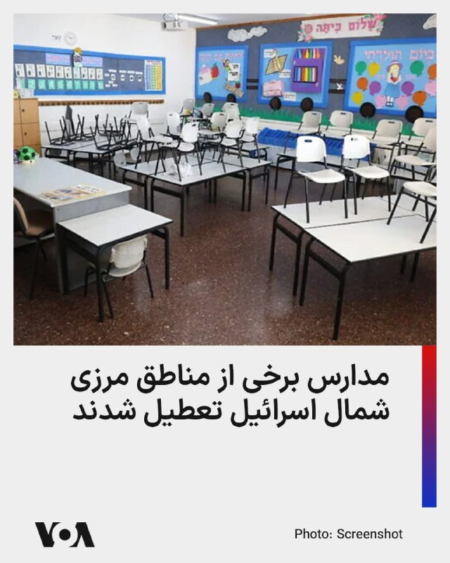

هزاران کودک اسرائیلی که در مناطق واقع در امتداد مرز لبنان زندگی می‌کنند، به دلیل حملات راکتی و پهپادی حزب‌الله مجبور شدند در خانه بمانند.

فرماندهی جبهه داخلی اسرائیل به‌دلیل این حملات اعلام کرد که مؤسسات آموزشی در این مناطق تعطیل خواهند بود.

بر اساس این اعلام، با این حال، در برخی مناطق شمال اسرائیل، فعالیت‌های آموزشی فقط در داخل ساختمان یا در منطقه‌ای که بتوان در زمان مناسب به پناهگاه رسید، مجاز است.

هم‌زمان با گسترش عملیات ارتش اسرائیل در جنوب لبنان، حزب‌الله لبنان چندین راکت و پهپاد به سوی شمال اسرائیل شلیک کرده است.

ارتش اسرائیل اعلام کرده است که با گسترش عملیات خود در جنوب لبنان، برای افزایش احتمالی حملات گروه تروریستی حزب‌الله آماده می‌شود.
@FarsiVOA

## FarsiVOA — post 219149

🔺بازگشت اینترنت در ایران؛ اتصال هست، اعتماد و دسترسی آزاد نه

▪️با وجود اعلام رسمی بازگشت اینترنت بین‌الملل، گزارش‌های داخلی و خارجی روزهای اخیر تصویر متفاوتی نشان می‌دهند: فیلترینگ سنگین، اختلال در پیام‌رسان‌ها، محدودیت اپ‌استورها و ناپایداری ارتباط دیتاسنترها همچنان ادامه دارد. ترافیک اینترنت ایران هنوز به نصف سطح عادی هم نرسیده است.

▪️نت‌بلاکس در آخرین ارزیابی خود اعلام کرده شرایط فعلی به دوران میان اعتراضات دی‌ماه و جنگ اخیر شباهت دارد و نه به وضعیت پیش از بحران.

▪️در همین حال وبسایت دیجیاتو سطح دسترسی را حدود ۸۶ درصد برآورد کرده، اما شرکت کنتیک حجم ترافیک واقعی را تنها ۴۰ درصد وضعیت پیش از قطعی ارزیابی می‌کند.

⬇️ بیشتر بخوانید:
https://ir.voanews.com/a/internet-returns-to-iran-but-there-is-no-trust-and-no-free-access/8155756.html

## FarsiVOA — post 219148

🔺جمهوری چک احتمالاً به هدف هزینه دفاعی ناتو نمی‌رسد؛ افزایش فشار بر ناتو

▪️نخست‌وزیر جمهوری چک می‌گوید کشورش احتمالاً امسال به هدف ناتو برای رساندن هزینه‌های نظامی به دو درصد تولید ناخالص داخلی نخواهد رسید.

▪️آندری بابیش در گفت‌وگو با فایننشال‌تایمز گفت دولتش «تمام تلاش خود را» برای تحقق تعهدات ناتو انجام می‌دهد، اما با کسری بودجه ناشی از هزینه‌های دولت پیشین روبه‌رو است.

▪️ناتو در نشست لاهه در سال ۲۰۲۵ توافق کرد اعضا تا سال ۲۰۳۵ سالانه پنج درصد تولید ناخالص داخلی خود را برای دفاع و امنیت اختصاص دهند؛ سه‌ونیم درصد برای نیازهای اصلی دفاعی و یک‌ونیم درصد برای حوزه‌هایی مانند زیرساخت، امنیت سایبری، آمادگی غیرنظامی و تقویت صنایع دفاعی.

⬇️ بیشتر بخوانید:
https://ir.voanews.com/a/czech-republic-likely-to-miss-nato-defence-spending-target-pm-tells-ft/8155755.html

## FarsiVOA — post 219147

🔺آیا جنگ عامل اصلی دو برابر شدن کسری گاز ایران است؟

▪️معاون رئیس‌جمهوری ایران می‌گوید آسیب به زیرساخت‌های گاز ایران در جنگ ۳۹ روزه، کسری گاز کشور را بیش از دو برابر کرده است.

▪️به گفته اسماعیل سقاب اصفهانی، با احتساب کسری ۴۵ میلیارد متر مکعبی گاز در سال گذشته، در حال حاضر با ناترازی ۱۰۰ میلیارد متر مکعبی گاز مواجه هستیم.

▪️این رقم عظیم کسری گاز، معادل تقریباً دو برابر کل مصرف گاز ترکیه است. ایران دومین دارنده بزرگ ذخایر گازی جهان، به خاطر تاخیر در توسعه پروژه‌های گازی، هدررفت گسترده انرژی و عدم توسعه انرژی‌های جایگزین با بحران شدید کسری گاز مواجه است.

▪️وابستگی بسیار زیاد به سوخت گاز به همراه رشد اندک تولید باعث شده کسری گاز ایران هر سال افزایش یابد.

⬇️ بیشتر بخوانید:
https://ir.voanews.com/a/is-war-the-main-factor-in-iran-s-doubling-of-gas-deficit/8155754.html

## FarsiVOA — post 219146

  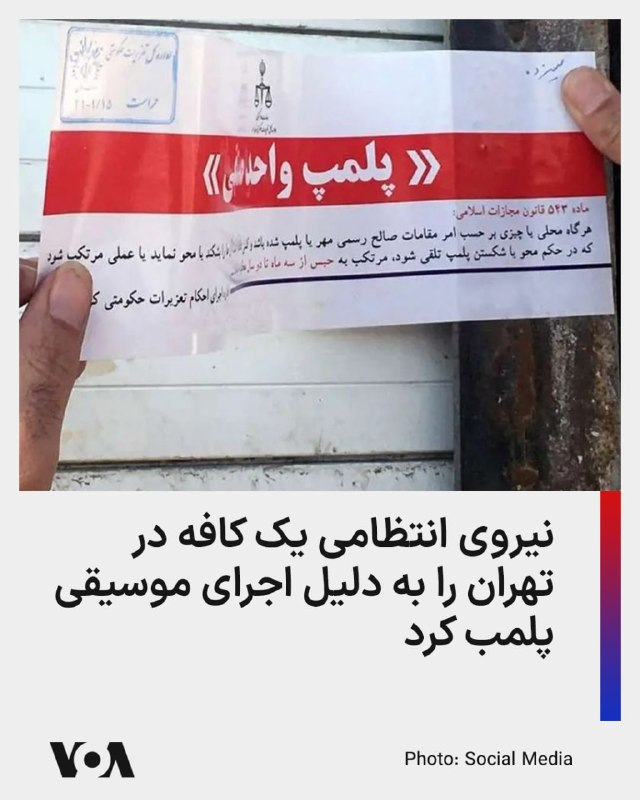

نیروی انتظامی تهران کافه‌ای در خیابان ولیعصر را که در آن برنامه‌های موسیقی اجرا می‌شد، به بهانه آن چه «فعالیت‌های مروج فرقه‌های انحرافی» خواند، پلمب کرد.

مرکز اطلاع‌رسانی پلیس جمهوری اسلامی در اطلاعیه‌ای نوشت: «این کافه با برگزاری برنامه‌هایی با ظاهر موسیقی غربی، بستری برای حرکات نابهنجار، و آنچه که ماموران توصیف کرده‌اند "تحرکات شیطانی" فراهم آورده بود.»

نیروی انتظامی جمهوری اسلامی نام این کافه را ذکر نکرد اما ادعا کرد که «مشتریان این کافه، شامل دختران و پسران جوان، در وضعیتی غیرطبیعی و با حرکاتی عجیب و غریب، که از آن به عنوان “شیطانی” یاد شده، مشاهده گردیدند.»

پیشتر نیز بسیاری از کافه‌ها و اماکن کسب و کار به اتهام‌های مشابه پلمب شده‌ بودند اما جمهوری اسلامی سرکوب‌ شهروندان را از زمان اعتراضات دی‌ماه گذشته تاکنون شدت بیشتری داده است.

موج تازه اعدام‌ها، صدور احکام سنگین و بازداشت‌ها نگرانی فعالان و نهادهای حقوق بشری را برانگیخته است.
@FarsiVOA

## FarsiVOA — post 219145

  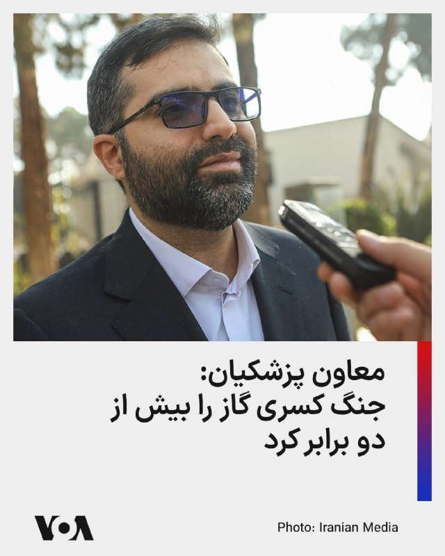

معاون رئیس‌جمهوری ایران می‌گوید آسیب به زیرساخت‌های گاز ایران در جنگ ۳۹ روزه، کسری گاز کشور را بیش از دو برابر کرده است.

اسماعیل سقاب اصفهانی در ادامه گفت طی جنگ اخیر، زیرساخت‌های گاز کشور با کاهش ۵۵ میلیارد متر مکعبی مواجه شد و تولید سالانه از ۲۹۷ میلیارد به ۲۴۲ میلیارد متر مکعب رسید.

به گفته او، با احتساب کسری ۴۵ میلیارد متر مکعبی گاز در سال گذشته، در حال حاضر با ناترازی ۱۰۰ میلیارد متر مکعبی گاز مواجه هستیم.

این رقم عظیم کسری گاز، معادل تقریباً دو برابر کل مصرف گاز ترکیه است. ایران دومین دارنده بزرگ ذخایر گازی جهان است، اما به خاطر تاخیر در توسعه پروژه‌های گازی، هدررفت گسترده انرژی و عدم توسعه انرژی‌های جایگزین با بحران شدید کسری گاز مواجه است.

او همچنین از کسری روزانه ۳۰ میلیون لیتری بنزین خبر داد.
@FarsiVOA

## FarsiVOA — post 219144

  

دادستان عمومی و انقلاب مرکز استان مرکزی از تشکیل ۷۵ پرونده قضایی و صدور دستور توقیف اموال افرادی خبر داد که بنا بر ادعای او با شبکه‌های «معاند» خارج از کشور «ارتباط مستقیم داشته‌» و «تلاش داشتند تا فضای آرام جامعه را ملتهب کنند.»

بر اساس این اعلام، پرونده‌ها در دادسرای اراک و شعب تخصصی در حال رسیدگی است و دارایی‌های متهمان با هدف توقیف و ضبط «به نفع ملت» بررسی می‌شود. دادستان مرکز استان مرکزی مدعی شد این افراد با اقدامات «ضدامنیتی» و همکاری با «دشمنان»، در پی «التهاب‌آفرینی در جامعه» بوده‌اند.

این اعلام در ادامه موج تازه برخوردهای قضایی با افراد متهم به همکاری با رسانه‌ها و شبکه‌های خارج از کشور مطرح می‌شود.

روز گذشته نیز مقام‌های قضایی از توقیف اموال ۷۴ نفر در استان گلستان و ۳۴ نفر در خراسان جنوبی با اتهام‌های مشابه خبر داده بودند. در این گزارش‌ها، حساب‌های بانکی، خودروها و اموال ثبتی از جمله دارایی‌های مشمول توقیف اعلام شده‌اند. جزئیات مستقلی در این باره منتشر نشده است.
@FarsiVOA

## FarsiVOA — post 219143

  

بدر عبدالعاطی، وزیر خارجه مصر و رافائل گروسی، مدیرکل آژانس بین‌المللی انرژی اتمی، در یک تماس تلفنی تحولات منطقه‌ای و آخرین تحولات مذاکرات واشنگتن-تهران را مورد بحث قرار دادند.

بر اساس بیانیه وزارت خارجه مصر، این تماس شامل بررسی آخرین تحولات مسیر مذاکرات میان ایالات متحده و حکومت ایران و تلاش‌ها برای دستیابی به توافقی بود که «نگرانی‌های همه طرف‌ها را در نظر بگیرد».

وزیر خارجه مصر بر «ضرورت افزایش تلاش‌های دیپلماتیک و حمایت از روند رسیدن به توافقی میان دو طرف آمریکایی و ایرانی» تأکید کرد؛ تفاهمی که بتواند به «کاهش تنش و جلوگیری از تشدید بحران کمک کرده و امنیت و ثبات منطقه‌ای و بین‌المللی را تقویت کند».

همچنین دو طرف همچنین نتایج نشست یازدهم کنفرانس بازنگری معاهده عدم اشاعه سلاح‌های هسته‌ای را که در نیویورک برگزار شد، بررسی کردند.

در این تماس، وزیر خارجه مصر ابراز تأسف کرد که این کنفرانس نتوانست به توافقی درباره سند نهایی دست یابد و تأکید کرد که مصوبات کنفرانس‌های بازنگری قبلی همچنان معتبر هستند.
@FarsiVOA

## FarsiVOA — post 219142

  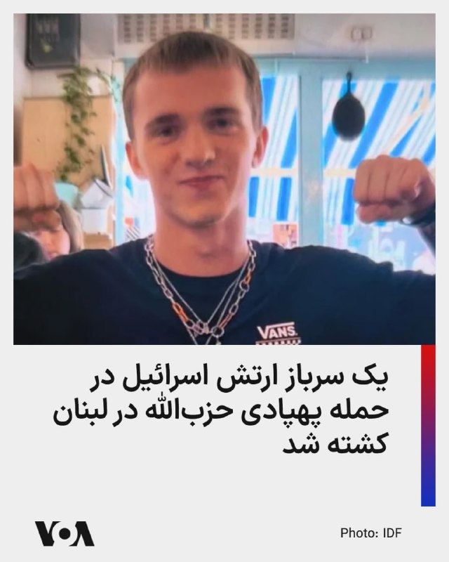

ارتش اسرائیل اعلام کرد که یک سرباز این نیرو در حمله پهپادی حزب‌الله در جنوب لبنان در شامگاه شنبه کشته شده است.

در گزارش ارتش اسرائیل، این سرباز کشته‌شده، گروهبان یکم مایکل تیوکین، ۲۱ ساله، از واحد شناسایی تیپ گیواتی و اهل اشکلون، معرفی شده است.

ارتش اسرائیل اعلام کرد که این حمله حدود ساعت ۱۰:۳۰ شامگاه شنبه رخ داد و در جریان آن، یک پهپاد که توسط حزب‌الله هدایت می‌شد، به موضعی که نیروهای تیپ گیواتی در آن مشغول فعالیت بودند، اصابت کرد.

در نتیجه انفجار، چهار سرباز دیگر نیز به‌طور سطحی زخمی شدند که آنان برای درمان به بیمارستان منتقل شدند.
@FarsiVOA

## FarsiVOA — post 219141

🔺اکسیوس و نیویورک‌تایمز: ترامپ شروط توافق احتمالی با تهران را سخت‌گیرانه‌تر کرده است

▪️اکسیوس و نیویورک‌تایمز گزارش دادند دونالد ترامپ خواستار سخت‌گیرانه‌تر شدن شروط چارچوب توافق احتمالی با جمهوری اسلامی شده و نسخه اصلاح‌شده را برای بررسی به تهران فرستاده است.

▪️اکسیوس نوشت ترامپ از تیم خود خواسته چند بند از متنی را که فرستادگانش با طرف‌های ایرانی روی آن کار کرده بودند، اصلاح کنند؛ به‌ویژه بندهای مربوط به برنامه هسته‌ای و مواد هسته‌ای ایران.

▪️نیویورک‌تایمز نیز گزارش داد ترامپ از کندی پاسخ جمهوری اسلامی به پیشنهادهای آمریکا ناراضی بوده و نسبت به بخش‌هایی از توافق که می‌تواند به آزادسازی دارایی‌های ایران مربوط باشد، نگرانی داشته است.

⬇️ بیشتر بخوانید:
https://ir.voanews.com/a/trump-tightens-terms-of-potential-deal-with-iran/8155753.html

## FarsiVOA — post 219140

Farsi VOA pinned an audio file

## FarsiVOA — post 219139

  <a href="https://t.me/farsivoa/219139" target="_blank">📎 Download file</a>

🔴📢‌ پادکست خبری شنبه ۹ خرداد ۱۴۰۵

🛜در صورتی که با مشکل اینترنت مواجه هستید میتوانید اخبار صدای آمریکا را از نسخه‌های پادکست خبری ما روزانه دنبال کنید و یا اخبار را از نسخه سبک وب‌سایت ما پیگیر باشید:
https://ir.voanews.com/lite

📡بروزترین فرکانسهای ماهواره‌ای را نیز میتوانید از صفحه زیر پیگیری کنید:
https://ir.voanews.com/satellite

🔔دیگر شبکه‌های اجتماعی ما را هم را هم از لینک زیر دنبال کنید:
https://linktr.ee/voafarsi

ما را به اشتراک بگذارید
@farsivoa

## FarsiVOA — post 219138

  

آژانس بین‌المللی انرژی اتمی اعلام کرد که یک پهپاد به ساختمان توربین نیروگاه هسته‌ای زاپوریژیا در جنوب شرقی اوکراین اصابت کرده است.

این نهاد وابسته به سازمان ملل متحد یکشنبه اعلام کرد که از سوی این نیروگاه هسته‌ای مطلع شده که این حمله باعث ایجاد حفره‌ای در دیوار ساختمان نیروگاه شده است.

رافائل گروسی، مدیرکل آژانس بین‌المللی انرژی اتمی، نگرانی شدید خود را درباره این حادثه ابراز کرد و گفت: «حمله به تأسیسات هسته‌ای مانند بازی کردن با آتش است.»

آژانس در پیامی در شبکه ایکس اعلام کرد که تیم این نهاد در این نیروگاه تحت کنترل روسیه درخواست دسترسی کرده است تا ساختمان توربین آسیب‌دیده را از نزدیک بررسی کند.
@FarsiVOA

## FarsiVOA — post 219137

  <a href="telegram/content/FarsiVOA_219137_1780222048.mp4" target="_blank">🎬 Download video</a>

ارتش ایالات متحده اعلام کرد در حمله‌ای تازه به یک شناور در شرق اقیانوس آرام، سه مرد کشته شدند؛ حمله‌ای که دومین مورد از این نوع در دو روز گذشته به شمار می‌رود.

فرماندهی جنوبی ارتش آمریکا روز شنبه در پیامی در شبکه ایکس گفت اطلاعات به‌دست‌آمده نشان می‌داد این شناور در مسیرهای مورد استفاده برای قاچاق مواد مخدر در شرق اقیانوس آرام حرکت می‌کرد و در عملیات قاچاق مواد مخدر نقش داشت.

این فرماندهی افراد کشته‌شده را «نارکوتروریست» خواند و اعلام کرد در جریان این عملیات هیچ نیروی آمریکایی آسیب ندیده است.

این حمله دومین عملیات مشابه ارتش آمریکا در دو روز گذشته است. رویترز نوشته این حمله تازه‌ترین مورد از مجموعه حملاتی است که طی ماه‌های اخیر علیه شناورهای مظنون به ارتباط با قاچاق مواد مخدر انجام شده است.
@FarsiVOA

## FarsiVOA — post 219136

  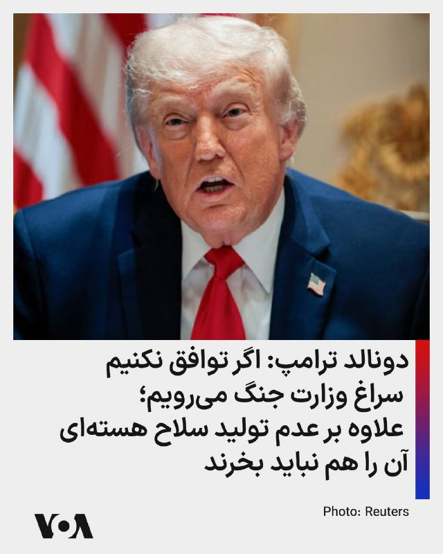

⚡️دونالد ترامپ، رئیس‌جمهوری آمریکا، در مصاحبه‌ای با لارا ترامپ از فاکس‌نیوز که از او پرسید «یک توافق خوب» با جمهوری اسلامی چگونه است؟ گفت «خب، اول از همه هیچ توافقی آن‌قدر خوب نیست که رسانه‌ها آن را خوب پوشش دهند. اما ما در حال دستیابی به یک توافق عالی هستیم...؛ در غیر این صورت دوباره برمی‌گردیم و از طریق اقدام نظامی کار را تمام می‌کنیم.»
آقای ترامپ گفت: «اما رسیدن به توافق سریع‌تر خواهد بود. احتمالاً از نظر انسانی هم بهتر است. جنبه مثبتی هم دارد؛ جان افراد زیادی را نجات می‌دهد، چه از طرف مقابل باشند و چه از هر طرف دیگر.»
او افزود: «ما به یک توافق بسیار خوب نزدیک شده‌ایم و اگر بتوانیم آن را نهایی کنیم، عالی است. در غیر این صورت، دوباره سراغ «وزارت جنگ» می‌رویم، همان‌طور که ما آن را می‌نامیم. و این رویکرد بسیار موفق بوده است. ونزوئلا را دیدید؛ آن یک پیروزی یک‌روزه بود و این مورد هم عملاً همین حالا یک پیروزی محسوب می‌شود. ما اساساً نیروهای نظامی آن‌ها را شکست داده‌ایم.»
آقای ترامپ گفت: «من ترجیح می‌دهم به توافق برسیم، زیرا می‌توانیم بلافاصله پس از امضای توافق، تنگه را بازگشایی کنیم.»

@FarsiVOA

## FarsiVOA — post 219135

🔺رئيس‌جمهوری آمریکا: با ارتش جمهوری اسلامی تا حدی کاری نداشتیم چون فکر می‌کنیم تا حدودی میانه‌رو است

▪️دونالد تراامپ، رئیس‌جمهوری آمریکا گفت جمهوری اسلامی باید تنگه هرمز را باز کند و نباید سلاح هسته‌ای داشته باشد. آقای ترامپ در مصاحبه‌ای تلویزیونی با لارا ترامپ که شنبه‌شب از فاکس‌نیوز پخش شد گفت که او برای توافق با جمهوری اسلامی «هیچ عجله‌ای» ندارد.

⬇️ بیشتر بخوانید:
https://ir.voanews.com/a/8155752.html
@FarsiVOA

## FarsiVOA — post 219134

⚡️روز جهانی «گرسنگی»
@FarsiVOA

## DW_Farsi — post 125336

  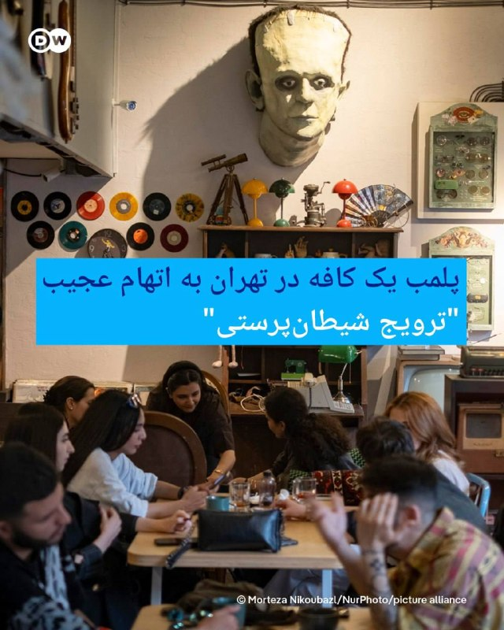

🔶 پلمب یک کافه‌ در تهران به‌ اتهام عجیب "ترویج شیطان‌پرستی"

رسانه‌های ایران از پلمب یک کافه در منطقه ولیعصر تهران توسط پلیس نظارت بر اماکن عمومی تهران بزرگ خبر دادند.

پلیس اماکن، این کافه را به "ترویج فرقه‌های انحرافی" متهم کرده و گفته "این کافه با برگزاری برنامه‌هایی با ظاهر موسیقی غربی، بستری برای حرکات نابهنجار" و "تحرکات شیطانی" فراهم کرده بود.

بر اساس ادعای پلیس اماکن، مشتریان این کافه، "شامل دختران و پسران جوان، در وضعیتی غیرطبیعی و با حرکاتی عجیب و غریب مشاهده شده بودند".
طبق ادعای رسانه‌های حکومتی ایران، ماموران پلیس اماکن، "دستور پلمب واحد صنفی را صادر کردند".

ایجاد محدودیت‌ها و مقابله حکومت با آزادی‌های اجتماعی در هفته‌های اخیر به ویژه پس از برقراری آتش‌بس شکننده میان جمهوری اسلامی با آمریکا شدت گرفته است. جمهوری اسلامی در میانه جنگ، سعی کرده بود با سهل‌گیری‌های بی‌سابقه، از جمله گاهی با عدم مداخله در پوشش و حجاب اجباری، به ویژه در تجمعات حکومتی، از خود چهره‌ای معتدل نمایش دهد.

@dw_farsi

## DW_Farsi — post 125335

🔶 قوه قضائیه از توقیف اموال ۷۵ نفر از همکاران شبکه‌های معاند در استان مرکزی خبر داد

خبرگزاری دولتی ایرنا به نقل از دادستان عمومی و انقلاب مرکز استان مرکزی، از صدور دستور قضایی برای توقیف اموال ۷۵ نفر از همکاران "شبکه‌های معاند" خبر داد.

مرکز اطلاع‌رسانی قوه قضائیه در بیانیه خود این افراد را "عناصر حامی دشمن" خوانده و مدعی شده که "تاکنون ۷۵ پرونده قضایی برای تعدادی از همکاران و مرتبطین مستقیم با شبکه‌های معاند خارج از کشور در دادسرای اراک تشکیل شده است".

دادستان مرکز استان مرکزی همکاری با "رسانه‌های معاند" را "جرمی نابخشودنی" توصیف کرده و شهروندان را تهدید به برخورد قضایی کرده است.

پیش از این قوه قضائیه استان گلستان نیز از توقیف اموال ۷۴ ایرانی خارج از کشور به اتهام "خیانت به وطن" خبر داده بود. رئيس‌ کل دادگستری خراسان جنوبی نیز گفته بود، اموال ۳۴ نفر در این استان به اتهام "حمایت از دشمن" ضبط شده است.

خبرگزاری ایرنا روز شنبه نهم خرداد (۳۰ مه) به نقل از قوه قضائيه نوشت، به دستور مقام قضايی، اموال ۷۴ نفر در استان گلستان که از " خائنین به وطن و افراد تأثیرگذار در شبکه همکاران دشمن" و ساکن خارج از کشور هستند در راستای "حفظ حقوق عامه و اجرای قانون تشدید مجازات جاسوسی و همکاری" با اسرائيل توقیف شد.

قوه قضائيه می‌‌گوید، اموال این افراد شامل حساب‌های بانکی، خودرو و املاک ثبتی است که شناسایی و همه توقیف شده است. در ضمن، هرگونه نقل و انتقال مالی برای آن‌ها ممنوع و پرونده این افراد در دادسرای مرکز استان در حال رسیدگی است.

@dw_farsi

## DW_Farsi — post 125334

🔶 عقب‌نشینی دولت آمریکا از طرح سختگیرانه دریافت گرین‌کارت

پس از موجی از اعتراض‌های عمومی، دولت آمریکا از شدت برنامه‌های خود برای محدود کردن دستیابی به اقامت دائم این کشور، موسوم به گرین‌کارت، کاسته است.

وزارت امنیت داخلی آمریکا به روزنامه "نیویورک تایمز" گفته است مقررات جدید، که بر اساس آن گرین‌کارت فقط از خارج از ایالات متحده قابل درخواست بود، در نهایت شامل همه متقاضیان نخواهد شد. در عوض، قرار است این مقررات "به صورت موردی" اعمال شود.

این وزارتخانه توضیح داده که این مقررات صرفاً به منظور یادآوری به مأموران بوده است تا از اختیارات تشخیصی خود استفاده کنند. بنابراین مأموران می‌توانند تصمیم بگیرند که آیا متقاضیان را برای ثبت درخواست‌شان ملزم به ترک آمریکا کنند یا نه.

اداره خدمات شهروندی و مهاجرت آمریکا (USCIS) هفته گذشته اعلام کرده بود که متقاضیان گرین‌کارت از این پس در بیشتر موارد باید درخواست خود را از خارج از آمریکا ارائه کنند و نباید هنگام درخواست در این کشور حضور داشته باشند. بر اساس آن طرح، تنها در "شرایط فوق‌العاده" استثناهایی در نظر گرفته می‌شد.

@dw_farsi

## DW_Farsi — post 125333

🔶 جام‌های ۱۹۹۴ تا ۲۰۰۶ ؛ رونالدو، توپچی موفق برزیل

نخستین بار در سال ۱۹۹۴ بود که رونالدو عنوان‌های خبری رسانه‌های ورزشی جهان را به خود اختصاص داد. رونالدوی ۱۷ ساله به همراه تیم ملی فوتبال برزیل قدم به رقابت‌های جام جهانی ۱۹۹۴ آمریکا گذاشت و اگر چه حتی یک ثانیه نیز در بازی‌های تیمش در این مسابقات در زمین بازی نکرد، اما دست کم طعم شیرین قهرمانی را چشید.

رونالدو که به "پدیده‌" بزرگ فوتبال (Il fenomeno) شهرت یافته، در سال‌های ۱۹۹۶ و ۱۹۹۷ دو بار پیاپی از سوی فیفا به عنوان بهترین بازیکن جهان برگزیده شد.

او در جام جهانی ۱۹۹۸ فرانسه این فرصت را داشت که قابلیت‌های خود را به نمایش بگذارد و نقشی بزرگ در دفاع برزیل از عنوان قهرمانی جهان ایفا کند. اما آسیب‌دیدگی‌های پی‌درپی، به ویژه از ناحیه‌ زانو، سبب شد که این "پدیده" بزرگ فوتبال نتواند آن‌طور که باید و شاید بدرخشد.

برزیلی‌ها او را به‌رغم شرایط بدنی نسبتا نامطلوب، در فینال جام جهانی ۹۸ فرانسه برای رویارویی با میزبان بازی‌ها روانه‌ میدان کردند، اما برزیل در پی درخشش زیدان، ستاره‌ فرانسوی‌ها ۳ بر صفر به زانو درآمد و رونالدو و یارانش تنها به عنوان نایب‌قهرمانی بسنده کردند.

@dw_farsi

## DW_Farsi — post 125332

🔶 یک سرباز اسرائیلی در حمله پهپادی حزب‌الله کشته شد

گزارش‌ها حاکی است که سرباز ارتش اسرائیل که شب گذشته در حمله پهپادی حزب‌الله در جنوب لبنان کشته شد، تنها فرزند خانواده بود و در سال ۲۰۲۰ همراه با مادرش از اوکراین به اسرائیل مهاجرت کرده بود.

مایکل تیوکین، گروهبان یکم ۲۱ ساله از یگان شناسایی «تیپ گیواتی» و ساکن اشکلون، زمانی کشته شد که یک پهپاد دید اول شخص ((FPV که حزب‌الله آن را هدایت می‌کرد، به موضعی اصابت کرد که نیروهای اسرائیلی در آن مشغول عملیات بودند.

در لبنان در حال حاضر آتش‌بسی برقرار است، اما این آتش‌بس از سوی حزب‌الله مورد حمایت جمهوری اسلامی رد شده و دو طرف بار دیگر به‌طور روزانه به یکدیگر حمله می‌کنند.

در تازه‌ترین تحولات پنتاگون اعلام کرد که میزبان هیئت‌های اسرائیل و لبنان بوده و گفت‌وگوهای نظامی "سازنده‌ای" میان طرفین انجام شده است.

روز گذشته ارتش اسرائیل پس از چند حمله از سوی حزب‌الله لبنان، از ساکنان ۱۰ روستای این کشور خواست تا خانه‌های خود را تخلیه کنند. یک سخنگوی ارتش اسرائيل گفت، این اقدام در پاسخ به نقض مداوم آتش‌بس از سوی حزب‌الله صورت گرفت است.

@dw_farsi

## DW_Farsi — post 125331

  

📸 عکس روز: دفاع از عنوان قهرمانی

در مسابقه فینال لیگ قهرمانان باشگاه‌های اروپا تیم پاری‌سن‌ژرمن در یک بازی نفس‌گیر سرانجام موفق شد در ضربات پنالتی تیم آرسنال را با نتیجه ۴ بر ۳ شکست دهد. بازی در وقت قانونی و اضافی با نتیجه یک بر یک به پایان رسید و سرانجام ضربات پنالتی قهرمان این دوره را مشخص کرد.

@dw_farsi

## DW_Farsi — post 125330

🔶 اکسیوس: ترامپ خواستار چند اصلاحیه در متن توافق با ایران شده است

وبسایت خبری اکسیوس از قول یک مقام ارشد ایالات متحده و یک منبع آگاه گزارش داد که دونالد ترامپ، رئیس جمهور آمریکا در جریان نشست اتاق وضعیت در کاخ سفید، خواسته که چند اصلاحیه در توافق با جمهوری اسلامی انجام شود.

به گزارش اکسیوس با وجود آن که ترامپ خواستار توافق است و انتظار دارد توافق به‌زودی نهایی شود، اما خواهان آن است که چند بند مهم، به‌ خصوص درباره مواد اتمی در ایران، تقویت شود.

آکسیوس همچنین گزارش داده که در متن کنونی یک بازه ۶۰ روزه برای انجام مذاکره در خصوص تعهدات اتمی جمهوری اسلامی و کاهش تحریم‌ها پیش‌بینی شده است و نخستین موضوعات بر سر سرنوشت ذخایر اورانیوم غنی‌شده در ایران و نیز محدود کردن غنی‌سازی بیشتر خواهد بود.

در همین حال، نیویورک‌تایمز از سه مقام ایالات متحده نقل کرده که ترامپ، پیش‌شرط‌های چارچوب احتمالی توافق با ایران را سخت‌تر کرده و تغییرات پیشنهادی خود را به منظور بازبینی دوباره به تهران فرستاده است.

نیویورک‌تایمز در گزارش خود آورده که هنوز مشخص نیست که چه تغییراتی در متن توافق صورت گرفته اما ترامپ، در خصوص بخش‌هایی از توافق احتمالی، از جمله آزادسازی منابع مالی برای جمهوری اسلامی، نگرانی‌هایی دارد.

طبق گزارش نیویورک‌تایمز، ترامپ از طول کشیدن پاسخ جمهوری اسلامی به پیشنهادهای ایالات متحده ناراضی است و ارائه پیشنهاد سخت‌گیرانه‌تر او، احتمالا با هدف افزایش فشار بر حکومت ایران و تسریع روند مذاکرات انجام شده است.

@dw_farsi

## DW_Farsi — post 125329

🔶 سپاه پاسداران: یک پهپاد MQ-1 آمریکا را ساقط کردیم

روابط‌ عمومی سپاه پاسداران انقلاب اسلامی با صدور بیانیه‌ای مدعی شد که یک پهپاد MQ-1 آمریکا را بامداد یکشنبه ۱۰ خرداد بر فراز آب‌های سرزمینی ایران ساقط کرده است.

در بیانیه سپاه پاسداران آمده است که این پهپاد، "با ورود به آب‌های سرزمینی ایران" قصد داشت "عملیات خصمانه" انجام دهد اما "بلافاصله در رصد و هدف موشک‌های پدافند نوین سپاه قرار گرفت و سرنگون شد".

ارتش آمریکا تا لحظه تنظیم این خبر واکنشی به ادعای سپاه نشان نداده است.

درگیری‌های پراکنده به رغم آتش‌بس همچنان در تنگه هرمز ادامه دارد. ارتش ایران روز شنبه نهم خرداد (۳۰ مه) در اطلاعیه‌ای اعلام کرده بود که در بامداد همین روز یک فروند پهپاد اوربیتر اسرائيل را رهگیری و منهدم کرده است. به گفته ارتش، این پهپاد "تحت شبکه یکپارچه قرارگاه مشترک پدافند هوایی کشور در منطقه قشم" مورد اصابت قرار گرفت و منهدم شد.

در رویدادی دیگر کشتی فله‌بر "لیان استار" (Lian Star) که با پرچم گامبیا حرکت می‌کرد شب هشتم خرداد (۲۹ مه) هشدارهای متعدد نیروهای آمریکایی را هنگام تلاش برای ورود به یک بندر ایرانی نادیده گرفت.

فرماندهی مرکزی ایالات متحده آمریکا (سنتکام) در همین زمینه در پیام رسان ایکس نوشت: «پس از آنکه خدمه کشتی از تبعیت از دستورات خودداری کردند، یک هواپیمای آمریکایی با شلیک یک موشک AGM-114 Hellfire به اتاق موتور کشتی، آن را از کار انداخت. این کشتی دیگر به سمت ایران در حرکت نیست.»

@dw_farsi

## DW_Farsi — post 125328

🔶 ترامپ: توافق را ترجیح می‌دهم، اما آماده بازگشت به عملیات نظامی هستیم

دونالد ترامپ، رئیس‌ جمهور آمریکا در مصاحبه تلویزیونی با شبکه فاکس‌نیوز با بیان این که آمریکا "به یک توافق خیلی خوب" با جمهوری اسلامی نزدیک است گفت که توافق با حکومت ایران را ترجیح می‌دهد، "اما برای بازگشت به عملیات نظامی نیز آمادگی دارد."

او همزمان در بخش دیگری از گفت‌وگوی خود تاکید کرد: «در صورتی که به مطالبات خود نرسیم، در ایران به روشی دیگر به آن پایان خواهیم داد.»

ترامپ افزود ایالات متحده آمریکا یا به توافق خوبی دست خواهد یافت یا از طریق نظامی کار را در ایران تمام خواهد کرد. او با تاکید بر این که چنین چیزی "آهسته اما قطعا" رخ خواهد داد، بار دیگر گفت که ایالات متحده، نیروی دریایی و نیروی هوایی ایران را "به کلی" نابود کرده، اما تا حد زیادی "از هدف قرار دادن ارتش خودداری کرده است".

هنوز مشخص نیست که مقصود ترامپ از بیان این اظهارات به طور دقیق چیست. او در مصاحبه با فاکس نیوز به این نکته اشاره کرد که آمریکا، در جریان حملات، تا حدی کاری به ارتش ایران نداشته، چون ارتش ایران "تا اندازه‌ای میانه‌رو" است و آمریکا قصد نداشته تمامی ساختار نظامی ایران را نابود کند.

رئیس جمهور آمریکا در بخش دیگری از اظهارات خود افزود که آمریکا "شکل‌های مختلفی از رهبری" حکومت ایران را از بین برده اما از تجربه عراق، آموخته چرا که نابودی کامل ساختارها ممکن است به مدت دهه‌ها مانع بازسازی یک کشور شود.

ترامپ در ادامه با اشاره به برنامه اتمی جمهوری اسلامی مدعی شد که جمهوری اسلامی نه تنها با این موافقت کرده که سلاح اتمی نسازد، بلکه توافق کرده که از طرق دیگر از جمله خریداری نیز به آن دست پیدا نکند. رئیس جمهور آمریکا این امر را "تغییری مهم" در جریان مذاکرات خواند.

@dw_farsi

## Persian_Trend_Official — post 15388

صدای ۳ انفجار در مرکز شهر تهران شنیده شده 🫆: Ⓜ 🆔:@persian_trend_official پرشین ترند | متفاوت‌ترین کانال نظامی

## Persian_Trend_Official — post 15387

  <a href="telegram/content/Persian_Trend_Official_15387_1780222053.mp4" target="_blank">🎬 Download video</a>

همه چیز از این روز لعنتی شروع شد !
7 اکتبر 2023

## Persian_Trend_Official — post 15385

  <a href="telegram/content/Persian_Trend_Official_15385_1780222055.mp4" target="_blank">🎬 Download video</a>

انهدام دست کم 6 آشیانه جنگنده و پهپاد اماراتی در پایگاه هوایی الصفران

تصاویر ماهواره ای جدید ولی بی کیفیت از پایگاه هوایی الصفران امارات تایید میکند که نیروی‌های مسلح ایران در جواب به مشارکت نیروی هوایی امارات در حمله به مواضع نظامی و صنعتی ایران، در روزهای پایانی جنگ 40 روزه محل استقرار جنگنده های میراژ-2000 و پهپادهای وینگ لونگ در پایگاه هوایی الصفران را مورد حمله موشکی و پهپادی خود قرار داده.

طبق این تصاویر دست کم انهدام 6 آشیانه جنگنده‌های میراژ-2000 و وینگ لونگ اماراتی که نقش پررنگی در حملات به ایران داشتند تایید میشود.

📝 Amir

📌 @persian_trend_official
پرشین ترند | متفاوت‌ترین کانال نظامی

## Persian_Trend_Official — post 15383

  <a href="telegram/content/Persian_Trend_Official_15383_1780222057.webm" target="_blank">🎬 Download video</a>

لاشه رادار TPY-2 پدافند تاد مستقر در پایگاه موفق السلطی اردن

👺Phantom

📌 @persian_trend_official
پرشین ترند | متفاوت‌ترین کانال نظامی

## Persian_Trend_Official — post 15382

  

به گزارش تایمز اسرائیل، نیروهای ارتش اسرائیل قلعه استراتژیک بوفورت در جنوب لبنان را به عنوان بخشی از عملیات مداوم علیه حزب‌الله تصرف کرده‌اند. این قلعه متعلق به دوران صلیبیون که مشرف به رودخانه لیتانی است و ارزش تاکتیکی و نمادین قابل توجهی دارد، در بحبوحه…

## Persian_Trend_Official — post 15381

  <a href="telegram/content/Persian_Trend_Official_15381_1780222058.mp4" target="_blank">🎬 Download video</a>

به گزارش تایمز اسرائیل، نیروهای ارتش اسرائیل قلعه استراتژیک بوفورت در جنوب لبنان را به عنوان بخشی از عملیات مداوم علیه حزب‌الله تصرف کرده‌اند.

این قلعه متعلق به دوران صلیبیون که مشرف به رودخانه لیتانی است و ارزش تاکتیکی و نمادین قابل توجهی دارد، در بحبوحه عملیات گسترده‌تر اسرائیل برای راندن نیروهای حزب‌الله به سمت شمال و از بین بردن زیرساخت‌های آنها در منطقه تصرف شد. ارتش اسرائیل هنوز جزئیاتی در مورد تلفات یا دامنه مقاومت‌های صورت گرفته در جریان این عملیات منتشر نکرده است.

📝 Amir

📌 @persian_trend_official
پرشین ترند | متفاوت‌ترین کانال نظامی

## Persian_Trend_Official — post 15380

  

اکسیوس: رئیس جمهور ترامپ در جلسه اتاق وضعیت روز جمعه درخواست چندین تغییر در پیش نویس توافق ایالات متحده و ایران را کرد و دور دیگری از مذاکرات را آغاز کرد که ممکن است چند روز طول بکشد.

ترامپ خواهان لحن قوی‌تری در مورد مسائل کلیدی، به ویژه مدیریت و انتقال ذخایر اورانیوم غنی شده ایران و همچنین برخی از مفاد مربوط به بازگشایی تنگه هرمز است.

تفاهمنامه فعلی شامل تعهد ایران به عدم پیگیری سلاح هسته‌ای و یک دوره 60 روزه برای مذاکره در مورد محدودیت‌های هسته‌ای و لغو تحریم‌ها است، اما ترامپ به دنبال شرایط خاص‌تری است.

ایران هنوز متن نهایی را تأیید نکرده است و مقامات آمریکایی انتظار دارند که پاسخ تهران ممکن است چند روز طول بکشد. یک مقام ارشد دولت گفت: توافق حاصل خواهد شد اما خاطرنشان کرد که جدول زمانی همچنان نامشخص است و می‌تواند از چند روز تا بیش از یک هفته متغیر باشد.

📝 Amir

📌 @persian_trend_official
پرشین ترند | متفاوت‌ترین کانال نظامی

## Persian_Trend_Official — post 15379

  <a href="telegram/content/Persian_Trend_Official_15379_1780222061.webm" target="_blank">🎬 Download video</a>

تاریخ توییت ۷ اسفند ۱۴۰۴

## Persian_Trend_Official — post 15378

  

نیویورک تایمز: ترامپ سعی دارد جنگ ایران را تقریباً تمام شده و یک موفقیت کامل جلوه دهد، اما روایت او با واقعیت مطابقت ندارد و پس از سال‌ها تحمیل روایت خود از وقایع، اکنون با بحرانی روبرو است که با روایت او در تضاد است.

در بهترین حالت، تغییری در رهبری رخ داده است، اما اینکه حامیان جنگ آن را به عنوان یک تغییر مثبت ارائه دهند، نادرست است.

📝 Amir

📌 @persian_trend_official
پرشین ترند | متفاوت‌ترین کانال نظامی

## Persian_Trend_Official — post 15375

  <a href="telegram/content/Persian_Trend_Official_15375_1780222062.mp4" target="_blank">🎬 Download video</a>

جنگ شهری در پاریس پس از قهرمانی پاری‌سن‌ژرمن!

براساس گزارش گاردین، در این درگیری‌ها که ۶ ساعت طول کشید، بیش از ۵۰ مغازه تخریب و غارت شد و حدود ۵۰ نفر زخمی و مجروح شدند. ۴۱۶نفر بازداشت شدند.
.
🔹لوران نونز، وزیر کشور، گزارش داد که غارت فروشگاه‌ها، غارت اموال و درگیری با نیروهای امنیتی در تقریباً ۱۵ شهر رخ داده است.

🔹️ خیابان شانزه لیزه به عنوان داغ‌ترین نقطه نامگذاری شد، جایی که گروهی از هواداران تلاش کردند به یک ایستگاه پلیس حمله کنند.

👺Phantom

📌 @persian_trend_official
پرشین ترند | متفاوت‌ترین کانال نظامی

## Persian_Trend_Official — post 15374

یک کافه در تهران پلمب شد؛ استناد پلیس به ادعاهایی درباره «تحرکات شیطانی»

پلیس نظارت بر اماکن عمومی تهران از پلمب یک کافه در محدوده خیابان ولیعصر خبر داد. این اقدام بر اساس ادعاهایی درباره آنچه «تحرکات شیطانی» و «رفتارهای نابهنجار» مشتریان عنوان شده، صورت گرفته است.

👺Phantom

📌 @persian_trend_official
پرشین ترند | متفاوت‌ترین کانال نظامی

## Persian_Trend_Official — post 15373

  

🏦 اسامی 30 ابر بدهکار ارز صادراتی منتشر شد.........

👺Phantom

📌 @persian_trend_official
پرشین ترند | متفاوت‌ترین کانال نظامی

## Persian_Trend_Official — post 15372

  <a href="telegram/content/Persian_Trend_Official_15372_1780222067.webm" target="_blank">🎬 Download video</a>

🔻جایزه صلح ترامپ!

🇺🇸ترامپ تصویری از مدال جایزه صلح ترامپ را در صفحه مجازی خود رونمایی کرده است.

👺Phantom

📌 @persian_trend_official
پرشین ترند | متفاوت‌ترین کانال نظامی

## Persian_Trend_Official — post 15371

  <a href="telegram/content/Persian_Trend_Official_15371_1780222068.mp4" target="_blank">🎬 Download video</a>

🇺🇸 ترامپ: ما به ارتش ایران آسیب نزدیم

ادعای ترامپ در مصاحبه با فاکس نیوز: ما ارتش آنها را تا حد زیادی دست نخورده باقی گذاشتیم و به آنها آسیب نزدیم زیرا معتقدیم ارتش آنها نسبتاً میانه‌رو است.

آنها افراد دیگری دارند که میانه‌رو نیستند؛ ما آنها را حذف کردیم.

👺Phantom

📌 @persian_trend_official
پرشین ترند | متفاوت‌ترین کانال نظامی

## Persian_Trend_Official — post 15370

  

🔹حنظله این‌بار خبر از هک کردن مرکز هولوکاست را می دهد.

بیش از ۲ میلیون سند افشا شد.

🔹در یک عملیات سایبری بی‌سابقه و چندلایه، به‌ «مرکز ملی حمایت از قربانیان هولوکاست» (k-shoa.org)، که نماد قربانی‌ بودن یهودیان، در تاریخ بوده است، به‌طور کامل توسط تیم هکری حنظله مورد نفوذ قرار گرفت.

🔹تمام پایگاه‌های داده، اسناد طبقه‌بندی‌شده، ایمیل‌های محرمانه و مکاتبات حساس این مرکز به‌طور کامل استخراج و منتشر شده‌اند.

🔹اکنون بیش از ۲ میلیون سند فوق‌محرمانه با حجمی بیش از یک ترابایت به‌صورت آزاد برای دانلود در وب‌سایت حنظله در دسترس قرار گرفته است.

👺Phantom

📌 @persian_trend_official
پرشین ترند | متفاوت‌ترین کانال نظامی

## Persian_Trend_Official — post 15369

  

🤑اسپیس‌ایکس رسماً با قراردادی ۴ میلیارد دلاری به پروژه «گنبد طلایی» آمریکا پیوست

🔹نیروی فضایی آمریکا (USSF) قرارداد جدیدی به ارزش ۴.۱۶ میلیارد دلار را به اسپیس‌ایکس واگذار کرده تا شبکه‌ای از ماهواره‌های ردیاب اهداف هوایی را برای پنتاگون توسعه دهد. این سامانه بخشی از برنامه‌های دفاعی جدید آمریکا و همچنین پروژه «گنبد طلایی» (Golden Dome) محسوب می‌شود. ظاهراً قرار است نخستین ماهواره‌های عملیاتی این پروژه تا سال ۲۰۲۸ وارد مدار زمین شوند.
🔹این قرارداد در قالب برنامه SB-AMTI منعقد شده؛ پروژه‌ای که برای ردیابی مداوم اهداف متحرک از مدار زمین شکل گرفته است. مقامات نظامی آمریکا معتقدند با پیشرفت سامانه‌های ضد دسترسی و پدافندی کشورهای رقیب مانند چین و روسیه، اتکا به هواپیماهای شناسایی سنتی دیگر کافی نخواهد بود؛ بنابراین بخشی از مأموریت‌های رصد و رهگیری باید به فضا منتقل شود.

👺Phantom

📌 @persian_trend_official
پرشین ترند | متفاوت‌ترین کانال نظامی

## RadioFarda — post 157738

🔸در ادامه اقدامات قضایی برای توقیف و مصادره اموال مخالفان حکومت در ایران، دادستان عمومی و انقلاب مرکز استان مرکزی روز یک‌شنبه از «توقیف اموال ۷۵ نفر»‌ دیگر در این استان خبر داد. 🔸خبرگزاری میزان در خبر خود از این افراد که به هویت‌شان اشاره‌ای نشده به عنوان…

## RadioFarda — post 157737

  

🔸در ادامه اقدامات قضایی برای توقیف و مصادره اموال مخالفان حکومت در ایران، دادستان عمومی و انقلاب مرکز استان مرکزی روز یک‌شنبه از «توقیف اموال ۷۵ نفر»‌ دیگر در این استان خبر داد.

🔸خبرگزاری میزان در خبر خود از این افراد که به هویت‌شان اشاره‌ای نشده به عنوان «عناصر حامی دشمن» و «خائنین به کشور» یاد کرده است، عباراتی که در پی آغاز جنگ در ایران بر اساس اقدامات تبلیغاتی حکومت بسیار از مقامات حکومت شنیده می‌شود.

🔸در خبر رسمی میزان این افراد «همکاران و مرتبطین مستقیم با شبکه‌های معاند خارج از کشور»‌ معرفی شده‌اند.
با این حال روند قضایی که پرونده آنها طی کرده تا به حکم توقیف اموال منجر شود مشخص نیست.

@RadioFarda

## RadioFarda — post 157736

🔸ارتش اسرائیل روز یک‌شنبه ۱۰ خرداد اعلام کرد عملیات زمینی خود در جنوب لبنان را به مناطق بیشتری گسترش داده و نیروهایش برای تقویت مواضع نظامی اسرائیل در این منطقه از رود لیتانی عبور کرده‌اند. 🔸ارتش اسرائیل در بیانیه‌ای گفت «شمار قابل توجهی» از نیروهای زمینی…

## RadioFarda — post 157735

  

🔸ارتش اسرائیل روز یک‌شنبه ۱۰ خرداد اعلام کرد عملیات زمینی خود در جنوب لبنان را به مناطق بیشتری گسترش داده و نیروهایش برای تقویت مواضع نظامی اسرائیل در این منطقه از رود لیتانی عبور کرده‌اند.

🔸ارتش اسرائیل در بیانیه‌ای گفت «شمار قابل توجهی» از نیروهای زمینی این کشور عملیات تهاجمی را برای گسترش «خط دفاعی پیشرو» آغاز کرده‌اند و این عملیات اکنون به مناطق بیشتری کشیده شده است.

@RadioFarda

## RadioFarda — post 157734

ترامپ خواستار «تغییراتی با شرایط سخت‌تر» در متن تفاهم‌نامه با ایران شده است

🔸دونالد ترامپ، رئیس‌جمهور آمریکا، می‌گوید از جمهوری اسلامی تضمین‌هایی گرفته است که ایران سلاح هسته‌ای تولید نخواهد کرد. همزمان گزارش‌هایی منتشر شده از این که او تفاهم‌نامه را با شرایطی «سخت‌تر» دوباره به تهران فرستاده است.

🔸هرگونه تغییر در متنن پیشنهادی تفاهم‌نامه می‌تواند توافق برای پایان رسمی جنگ در خاورمیانه و بازگشایی مسیر دریایی تنگه هرمز را، پس از هفته‌ها تلاش برای دستیابی به توافق در میانهٔ لحن‌های تند و درگیری‌های پراکنده، باز هم به تأخیر بیندازد.

🔸چند رسانه در آمریکا از جمله روزنامه نیویورک تایمز و وب‌سایت اکسیوس خبر داده‌اند که رئیس جمهور آمریکا در آخرین جلسه خود درباره مذاکرات با جمهوری اسلامی خواستار اعمال تغییراتی در متن تفاهم‌نامه با تهران شده است.

🔸اکسیوس بامداد یک‌شنبه، دهم خردادماه، نوشت که انتظار می‌رود که تفاهم‌نامه بین واشینگتن و تهران خیلی زود نهایی شود، اما دونالد ترامپ تمایل دارد که «چند نکته که از نظر او حائز اهمیت بیشتر است» تقویت شود، از جمله در مورد اورانیوم غنی‌شده ایران.

🔸جلسه دونالد ترامپ با مشاوران ارشدش در روز جمعه، هشتم خردادماه، که طبق وعده او قرار بود نتیجه چند هفته مذاکره را روشن کند پس از بیش از دو ساعت بدون اعلام نتیجه به پایان رسید.

🔸 گزارش کامل را در وب‌سایت رادیوفردا بخوانید.

@RadioFarda

## RadioFarda — post 157733

دونالد ترامپ، رئیس‌جمهور آمریکا، می‌گوید از جمهوری اسلامی تضمین‌هایی گرفته است که ایران سلاح هسته‌ای تولید نخواهد کرد. همزمان گزارش‌هایی منتشر شده از این که او تفاهم‌نامه را با شرایطی «سخت‌تر» دوباره به تهران فرستاده است.
https://www.radiofarda.com/a/33769377.html

## RadioFarda — post 157732

  

🔸سفارت ایران در کپنهاگ، پایتخت دانمارک، روز شنبه به گزارش بسیار منفی سازمان اطلاعات این کشور درباره فعالیت‌های جمهوری اسلامی در اروپا پاسخ داد.

🔸سفارت ایران در بیانیه‌ خود نوشته است: اتهامات مطرح‌شده علیه جمهوری اسلامی ایران در ارزیابی اخیر سازمان اطلاعات و امنیت دانمارک (PET) «عمدتاً بر ارزیابی‌ها و ادعاهای کلی استوار است، نه بر شواهد و مدارک مستند و غیرقابل‌انکار».

🔸این سفارتخانه در ادمه می‌گوید که جمهوری اسلامی «همواره و به‌طور رسمی هرگونه دخالت در فعالیت‌های ادعایی در خاک دانمارک را رد کرده است».

🔸سازمان اطلاعات دانمارک روز جمعه، هشتم خردادماه، در بیانیه‌ای اعلام کرد که ایران، در پی تحولات جهانی اخیر، در حال حاضر نقش پررنگ‌تری در تهدید تروریستی علیه این کشور اسکاندیناوی ایفا می‌کند.

🔸رئیس سازمان امنیت و اطلاعات ملی دانمارک گفت که سطح کلی تهدید از طرف ایران برای کشورش همچنان چهار از مقیاسی پنج درجه‌ای است، اما در عین حال تأکید کرد که در سال‌های اخیر ماهیت این تهدیدها «به‌طور قابل‌توجهی تغییر کرده است».

@RadioFarda

## RadioFarda — post 157731

  

🔸به گزارش رسانهٔ «اسرائیل هیوم»، ده‌ها نفتکش حامل نفت و گاز طبیعی مایع در هفتهٔ گذشته از تنگهٔ هرمز عبور کردند؛ برخی از آن‌ها با همراهی نیروی دریایی آمریکا، آن هم پس از آن‌که ایران و سپاه پاسداران عبور آن‌ها را تأیید کردند و در برخی موارد برای این عبور پول دریافت کردند.
🔸این روزنامه اسرائیلی این مطلب را روز یک‌شنبه دهم خرداد به نقل از سه منبع دیپلماتیک و اطلاعاتی که نخواسته‌اند نامشان فاش شود، منتشر کرد.

🔸این گزارش می‌گوید بسیاری از این شناورها حامل نفت و گاز قطر بودند و به سوی شرق آسیا، عمدتاً هند و چین، یا اروپا حرکت می‌کردند.

@RadioFarda

## RadioFarda — post 157730

  

🔸چند رسانه در آمریکا از جمله وب‌سایت اکسیوس خبر داده‌اند که رئیس جمهور آمریکا در آخرین جلسه خود درباره مذاکرات با جمهوری اسلامی خواستار اعمال تغییراتی در متن تفاهم‌نامه با تهران شده است.

🔸اکسیوس بامداد یک‌شنبه، دهم خردادماه، نوشت که انتظار می‌رود که تفاهم‌نامه بین واشینگتن و تهران خیلی زود نهایی شود، اما دونالد ترامپ تمایل دارد که «چند نکته که از نظر او حائز اهمیت بیشتر است» تقویت شود، از جمله در مورد اورانیوم غنی‌شده ایران.

🔸جلسه دونالد ترامپ با مشاوران ارشدش در روز جمعه گذشته که طبق وعده او قرار بود نتیجه چند هفته مذاکره را روشن کند پس از بیش از دو ساعت بدون اعلام نتیجه به پایان رسید.

🔸بامداد شنبه، ۹ خردادماه، روزنامه نیویورک تایمز به نقل از یک مقام ارشد دولت که به نامش اشاره نکرد نوشت که ترامپ در این جلسه به نتیجه‌ای درباره تفاهم‌نامه با تهران نرسیده است.
@RadioFarda

## IranianMinds — post 21123

🔴ترامپ به فاکس نیوز:

ایران پرچم سفید تسلیم را بالا خواهد برد

ما در ایران در حال پیروزی هستیم. ما یک پیروزی کامل و تمام‌عیار داشته‌ایم.

@IranianMinds

## IranianMinds — post 21122

🔴مجلس جمهوری اسلامی امروز به صورت مجازی برگزار شد.

@IranianMinds

## IranianMinds — post 21121

🛑دونالد ترامپ:

در حال حاضر هم به توافق نزدیکیم هم به جنگ.

@IranianMinds

## IranianMinds — post 21120

  

شاخص اشعه UV به عدد ۱۰ در تهران رسید.

@IranianMinds

## IranianMinds — post 21119

🔴سخنگوی شهرداری تهران:

مترو و بی‌آرتی تا زمان تعیین‌تکلیف توسط شورای شهر، رایگان می‌ماند.

@IranianMinds

## IranianMinds — post 21118

  

🔴 نیویورک تایمز به نقل از یک مقام آمریکایی:

ترامپ خواسته‌های ایران رو رد کرده و یک پیشنهاد متقابل سخت‌تر به ایران ارسال کرده !

این اقدام با هدف تسریع روند و فشار به ایران برای موافقت با پیشنهاد فعلی انجام شده .

@IranianMinds

## IranianMinds — post 21117

🔺 بانس‌های فوق خفن مل‌بت 
🔺

🫴 100 درصد پاداش اولین واریز

😀 100 درصد بانس یکشنبه ها

🎁 100 درصد بانس چهارشنبه ها

🔹 هر روز 1 چرخش گردونه 1 یورویی

😀 3 درصد باز پرداخت نقدی

😀 بانس شرط رایگان 30 دلاری

🎩 10 درصد باز پرداخت نقدی کازینو

🎆 بانس هدیه روز تولد

💵 و چندین بانس دیگر از جمله بانس خوش‌آمد گویی، بانس شرطبندی طولانی مدت، بانس 1750 یورویی کازینو و...

💰 هنگام ثبت‌نام با وارد کردن کد هدیه Sport100 بانس 100 دلاری رایگان دریافت کنید!

✅ معرفی سایت و اپلیکیشن مل‌بت

💛 ورود به سایت مل‌بت (فیلترشکن خاموش)

## IranianMinds — post 21116

  <a href="telegram/content/IranianMinds_21116_1780222078.mp4" target="_blank">🎬 Download video</a>

پلیس تهران با انتشار این ویدئو، از پلمپ کافه‌ای تو تهران به‌جرم «ترویج شیطان‌پرستی» خبر داد. 😐😐

@IranianMinds

## IranianMinds — post 21115

🔴روزنامه کیهان:

به دلیل نقض آتش‌بس در لبنان، میتونیم جنگ علیه اسرائیل رو آغاز کنیم.

+ هرکی نکنه

@IranianMinds

## IranianMinds — post 21114

  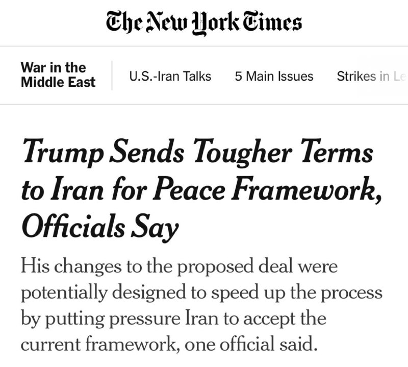

🔴نیویورک تایمز:

ترامپ خواسته‌های ایران رو رد کرده و یک پیشنهاد متقابل سخت‌تر به ایران ارسال کرده!

+باز شروع شد

@IranianMinds

## IranianMinds — post 21113

  

هیئت رئیسه مجلس جمهوری اسلامی

تو قیافه های اینارو ببین خدایی
یکی از یکی وحشتناک تر

@IranianMinds

## IranianMinds — post 21112

حزب‌الله فروخته شد. جمهوری اسلامی در ظاهر هنوز از حزب‌الله دفاع می‌کند و مدام از لزوم در نظر گرفتن لبنان در مذاکرات حرف می‌زند؛ اما واقعیت پشت پرده چیز دیگری است. اگر قرار بود حمایتی در کار باشد، امروز حزب‌الله در این وضعیت قرار نداشت. آنچه می‌بینیم بیشتر…

## IranianMinds — post 21111

🔴 ارتش اسرائیل منطقه تاریخی کوه بو فور در جنوب لبنان را تصرف کرد @IranianMinds

## IranianMinds — post 21107

🔴 ارتش اسرائیل منطقه تاریخی کوه بو فور در جنوب لبنان را تصرف کرد

@IranianMinds

## IranianMinds — post 21106

  <a href="telegram/content/IranianMinds_21106_1780222081.mp4" target="_blank">🎬 Download video</a>

🔴 آزادی بیانِ بیش از اندازه این بلارو سر کشورا میاره چون تروریستِ مارکسیست/چپ معنی آزادی رو نمیفهمه

یارو معلوم نیس از کدوم خراب شده پاشده رفته آلمان و اون کشور پذیرفتتش بعد توی همون کشور داره شعار Fuck Germany میده

@IranianMinds

## IranianMinds — post 21105

🔴 یسرائیل کاتز، وزیر دفاع اسرائیل: ارتش دفاعی اسرائیل دامنه عملیات خودش رو تو لبنان گسترش داده، از رود لیتانی عبور کرده و یال بوفر رو به تصرف درآورده.

@IranianMinds

## IranianMinds — post 21104

  

وضعیت یه جوریه که ملت ایران ول کن هم بشن این ارزشیا دهن جمهوری اسلامیو میخان سرویس کنن

@IranianMinds

## BBCPersian — post 282491

  

🔻وزیر دفاع اسرائیل گفت که قلعه تاریخی و استراتژیک شقیف (بوفورت) در جنوب لبنان تصرف شده است.

اسرائیل کاتس همچنین گفت عملیات زمینی ارتش اسرائیل علیه حزب‌الله در جنوب لبنان در حال گسترش است.

او در کانال تلگرامش نوشت: «چهل‌وچهار سال پس از نبرد قهرمانانه بوفورت و در روزی که یادآور سربازان کشته‌ شده در جنگ اول لبنان (۱۹۸۲) است، نیروهای ما بار دیگر به این قلعه بازگشتند و پرچم اسرائیل را در آنجا برافراشتند.»

اوافزود: «با هدایت نخست‌وزیر، بنیامین نتانیاهو و با دستور من، ارتش اسرائیل عملیات خود را در لبنان گسترش داد، از رود لیتانی عبور کرد و بوفورت را تصرف کرد که یکی از مهم‌ترین نقاط استراتژیک برای دفاع از شهرک‌های منطقه جلیل و تأمین امنیت نیروهایمان است.»

تصاویر خبرگزاری فرانسه از صبح یکشنبه نشان می‌دهد که پرچم ارتش اسرائیل بر فراز این قلعه برافراشته شده اما صدای گلوله‌باران شنیده و ستون دود در مناطق اطراف دیده می‌شود.

این قلعه دید وسیعی بر جنوب لبنان دارد و از نظر نظامی بسیار مهم محسوب می‌شود.

📸Reuters
https://trib.al/my6F6l6
@BBCPersian

## BBCPersian — post 282483

🔻حتی اگر چشم‌اندازی برای برقراری صلح میان ایران و آمریکا وجود داشته باشد، تهران با گسترش جنگ به سطح منطقه، اکنون با فضایی خصمانه در خلیج فارس روبه‌رو است.

به طور خاص امارات متحده عربی بیشترین آسیب را از حملات موشکی و پهپادی ایران دیده است که در واکنش به حملات آمریکا و اسرائیل به ایران در ۲۸ فوریه انجام شد. امارات اکنون از دیگر شرکای خود در خلیج فارس فاصله گرفته و موضعی تقابلی‌تر در برابر جمهوری اسلامی در پیش گرفته است.

با وجود آتش‌بس شکننده‌ای که در ماه آوریل برقرار شد و تلاش دیگر کشورهای خلیج فارس برای جلوگیری از آغاز دوباره جنگ، خصومت میان ایران و امارات به مجامع دیپلماتیک بین‌المللی نیز کشیده شده و حتی ممکن است به اقدامات نظامی پنهانی نیز منجر شده باشد.

بیشتر بخوانید:
https://trib.al/BympRd5
📸Getty/BBC
@BBCPersian

## BBCPersian — post 282482

🔻توقیف اموال «۷۵ نفر» در استان مرکزی به دستور مقامات قضایی

دادستان اراک از صدور دستور قضایی برای توقیف اموال «۷۵ نفر» در استان مرکزی خبر داده است.

حجت‌اله درودگر از این افراد به عنوان « همکاران و مرتبطین مستقیم با شبکه‌های معاند خارج از کشور» نام برده است.

پس از جنگ اخیر، قوه قضائیه ایران شمار زیادی را با عنوان «همکاری» یا «همراهی» یا ارتباط با رسانه‌های «معاند» بازداشت و با روندهای دادرسی نامشخص، آنها را به زندان انداخته است یا از حقوق محروم و اموالشان را توقیف و مصادره کرده است.

از زمان اعتراضات دی‌ماه و کشتار معترضان، شمار زیادی از شهروندان ایرانی در خارج از کشور در تجمعات اعتراضی در شهرهای مختلف شرکت کردند که این اعتراضات در هفته‌های منتهی به جنگ و بعد از آن هم ادامه یافت.

قوه قضائیه پس از جنگ آمریکا و اسرائیل با ایران، با استناد به قانون «تشدید مجازات جاسوسی» معترضان و مخالفان را به «همراهی با دشمن» متهم کرد.

اما این توقیف‌ها به موضوع جنگ محدود نیست؛ در زمان اعتراضات دی‌ماه هم اموال بعضی از چهره‌های شناخته شده در داخل ایران ضبط شد.

فعالان مجازی حامی جمهوری اسلامی در جریان جنگ اخیر، اقدام به فراخوان‌هایی برای معرفی مخالفان جمهوری اسلامی که آنها را «حامی جنگ» نامیدند، کردند.

https://trib.al/XacbgQK
@BBCPersian

## BBCPersian — post 282481

🔻در پی حمله آمریکا به یک قایق مظنون به قاچاق مواد مخدر، سه نفر کشته شدند

ارتش آمریکا اعلام کرد در حمله به یک قایق مظنون به قاچاق مواد مخدر در شرق اقیانوس آرام، سه نفر کشته شدند. این حمله در چارچوب کارزار گسترده واشنگتن علیه گروه‌هایی انجام شده که آمریکا آن‌ها را به «قاچاق مواد مخدر و تروریسم» مرتبط می‌داند.

این حمله به دنبال مجموعه ای از حملات مشابه صورت گرفته که طی هفته‌های گذشته قایق‌ها و شناورها را در مسیرهای اصلی قاچاق بین آمریکای جنوبی و آمریکای شمالی هدف قرار داده است.

منتقدان می‌گویند این حملات ادامه رویکردی است که از سال گذشته تاکنون صدها کشته بر جای گذاشته و همچنان پرسش‌هایی را درباره شواهد،‌ پاسخگویی و قوانین بین‌المللی مطرح می‌کند.

در مقابل، مقام‌های آمریکایی استدلال می‌کنند که این حملات باعث اختلال در فعالیت کارتل‌های مواد مخدر شده و به حفظ امنیت منطقه‌ای کمک می‌کند.

https://trib.al/XacbgQK
@BBCPersian

## BBCPersian — post 282480

🔻اسرائیل:‌ با عبور از رود لیتانی در حال گسترش عملیات خود در جنوب لبنان هستیم

ارتش اسرائیل اعلام کرده است که پس از عبور نیروهای زمینی از رود لیتانی، در حال گسترش دامنه عملیات خود به مناطق بیشتری در جنوب لبنان است.

پیش از این پیشروی، نیروی هوایی اسرائیل حملات گسترده‌ای را علیه اهداف حزب‌الله در شمال این رودخانه انجام داد.

ارتش همچنین اعلام کرد یکی از سربازانش در حمله پهپادی حزب‌الله کشته شده است.

در همین حال، نواف سلام، نخست‌وزیر لبنان، اسرائیل را به دنبال کردن «سیاست زمین سوخته» متهم کرد و گفت که این کشور با تخریب نظام‌مند شهرها و روستاهای جنوب لبنان، غیرنظامیان را مجبور به فرار می‌کند.

آقای سلام گفت که افزایش حملات هوایی اسرائیل نه امنیت ایجاد می‌کند و نه ثبات به همراه دارد.

قرار است هفته آینده در واشنگتن، مذاکرات بیشتری با میانجی‌گری آمریکا میان اسرائیل و لبنان برگزار شود.

https://trib.al/XacbgQK
@BBCPersian

## BBCPersian — post 282479

🔻شهرداری تهران: پرونده بازسازی خانه‌های آسیب دیده از جنگ تا تیرماه بسته می‌شود

سخنگوی شهرداری تهران گفته است که پرونده بازسازی خانه‌های آسیب دیده در جنگ تا تیرماه بسته می‌شود.

عبدالمطهر محمدخانی گفته است که در بازسازی واحدهایی که نیازمند تخریب و نوسازی هستند، حدود «۴۰ درصد» پیشرفت حاصل شده است.

او همچنین با اشاره به این که در جریان جنگ به «۵۱ هزار واحد مسکونی» خسارات وارد شد، گفت که بازسازی واحدهایی که نیاز به تعمیرات جزیی داشتند تا «۹۷درصد» پیشرفت داشته است و احتمالا تا پایان هفته جاری پرونده آن‌ها بسته می شود.

به گفته آقای محمدخانی مسئولیت عمده بازسازی به شهرداری تهران داده شده است.

سخنگوی شهرداری تهران با اشاره به این که برای خروج خانواده‌ها از هتل‌ها، مهلت یا زمان مشخصی تعیین نشده است، گفت که در زمان اوج جنگ بیش از «۲۳۰۰ خانواده» در اسکان اضطراری بودند و در حال حاضر این رقم به «۱۶۲۹ خانواده» رسیده است.

https://trib.al/XacbgQK
@BBCPersian

## BBCPersian — post 282472

🖊علی رمضانیان، روزنامه‌نگار اقتصادی

🔻فقر در ایران دیگر تنها در حاشیه شهرها یا روستاهای دورافتاده دیده نمی‌شود، بلکه نشانه‌های آن را می‌توان در خیابان‌های اصلی تهران، واگن‌های مترو، صف‌های داروخانه، بازارهای محلی، مدارس، خانه‌های اجاره‌ای و در سبک زندگی طبقه متوسط مشاهده کرد.

آنچه در سال‌های گذشته از آن با عنوان «فشار اقتصادی» یاد می‌شد، اکنون برای میلیون‌ها شهروند ایرانی به وضعیتی دائمی و فرساینده بدل شده است. این بحران پس از جنگ آمریکا و اسرائیل با ایران، رکود عمیق اقتصادی، قطعی گسترده اینترنت و جهش تورمی، ابعاد تازه و نگران‌کننده‌تری پیدا کرده است.

زیر لایه ظاهری زندگی روزمره، شبکه‌ای از فقر، بدهکاری، بیکاری، ناامیدی و فرسایش معیشتی در حال گسترش است. بسیاری از خانواده‌ها دیگر نه برای «پیشرفت»، بلکه صرفا برای «زنده ماندن» تلاش می‌کنند.

بیشتر بخوانید:

📸 Getty/ EPA
@BBCPersian

## idfinfarsi — post 11675

## idfinfarsi — post 11665

  <a href="telegram/content/idfinfarsi_11665_1780222085.mp4" target="_blank">🎬 Download video</a>

‼️مستندهای اولیه از عملیات در رشته‌کوه بوفور و منطقه وادی سلوکی در جنوب لبنان

## Dirty_Kids — post 390620

🔴 دخترا جدیدا با این ترفند یه کاری میکنن که دوس پسرشون تو خیابون حتما دستشو بگیره:

@Dirty_Kids 👻

## Dirty_Kids — post 390619

  <a href="telegram/content/Dirty_Kids_390619_1780222089.mp4" target="_blank">🎬 Download video</a>

عادی ترین عرزشی😂

@Dirty_Kids 👻

## Dirty_Kids — post 390618

  <a href="telegram/content/Dirty_Kids_390618_1780222091.mp4" target="_blank">🎬 Download video</a>

یه دختر به مامان ایرانیش میگه قبل عروسی حامله شدم و حالا واکنش مامانش که خیلی مودبانه جوابشو داد:

+ هندزفری لازم🔞

@Dirty_Kids 👻

## Dirty_Kids — post 390617

  

🌎با بهبود نسبی وضعیت اینترنت و بازگشت محدود دسترسی به شبکه بین‌الملل، موفق شدیم ضمن حفظ کیفیت و پایداری سرویس‌ها، قیمت را تا هر گیگابایت 20 هزار تومان کاهش دهیم
🖥

🟣با وجود اینکه شرایط اینترنت همچنان ناپایدار است و وضعیت پهنای باند بین‌الملل به ثبات کامل نرسیده، تیم فنی بادبان با توسعه زیرساخت‌ها و بهره‌گیری از سرورهای جدید از سرویس‌دهندگان معتبر، توانسته هزینه‌ها را بهینه کرده و سرویس‌ها را با قیمت مناسب‌تری ارائه دهد
⛵️
R10
از همراهی و اعتماد شما سپاسگزاریم
💜

🛡@BadBan_VPN | کانال 

🤖@BadBan_VPNBot | ربات 

📞@BadBan_VPNSupport | پشتیبانی

## Dirty_Kids — post 390616

  

نمیدونم چجوری بگم ولی این مدل ضجه‌ها حالمو شاد میکنه

@Dirty_Kids 👻

## Dirty_Kids — post 390615

  

مامانش موهاشو عروسکی شونه کرده

@Dirty_Kids 👻

## Dirty_Kids — post 390614

  <a href="telegram/content/Dirty_Kids_390614_1780222095.mp4" target="_blank">🎬 Download video</a>

ویدئو بسیار با کیفیت و ساخته شده توسط AI، لحظه هولناکی را بازسازی کرده است که در آن، حرارت چند میلیون درجه‌ای بمب اتمی آمریکا در کسری از ثانیه، 10 ها هزار انسان را تبخیر کرد و از آن‌ها تنها سایه‌ای سیاه بر دیوارهای شهر باقی گذاشت.

@Dirty_Kids 👻

## Dirty_Kids — post 390613

  <a href="telegram/content/Dirty_Kids_390613_1780222098.mp4" target="_blank">🎬 Download video</a>

اوضاع خراب بوده تو قطعی اینترنت، ملت مجبور بودن اینجوری افشاگری کنن:

@Dirty_Kids 👻

## Dirty_Kids — post 390612

  <a href="telegram/content/Dirty_Kids_390612_1780222101.mp4" target="_blank">🎬 Download video</a>

شوک شدم از دیدن این ویدیو ،این خانوم مورگان فتحی، تیک تاکر آمریکایی توی لس آنجلس هست که همسرش ایرانیه، سازنده کلاه گیسه، میگه توی چند ماه گذشته یه مقدار خیلی عظیمی موی ایرانی وارد بازار آمریکا شده، اتفاقات دی ماه رو توضیح میده که ج.ا ازجسد قربانیان پول درمیاره.
و این موها😔

@Dirty_Kids 👻

## Dirty_Kids — post 390611

  <a href="telegram/content/Dirty_Kids_390611_1780222103.mp4" target="_blank">🎬 Download video</a>

کامنت برتر امروز و جواب خیلی قانع‌کننده‌ی سندی

@Dirty_Kids 👻

## Dirty_Kids — post 390610

  

سیاسی نیستی؟، کیان پیر فلک هم نبود.

@Dirty_Kids 👻

## Hranews — post 113264

  

گزارشی از آخرین وضعیت فرهان عزیزی در زندان تهران بزرگ

❗️
❗️
❗️
❗️
❗️ – فرهان (امیررضا) عزیزی، کارگردان و بازیگر تئاتر دوران محکومیت خود را در زندان تهران بزرگ سپری می‌کند. وی پیش‌تر، توسط دادگاه انقلاب تهران به ۱۵ ماه سال #حبس تعلیقی و هشت ماه حبس تعزیری محکوم شده بود.

به گزارش خبرگزاری هرانا، ارگان خبری مجموعه فعالان حقوق بشر در ایران، فرهان (امیررضا) عزیزی، زندانی سیاسی دوران محکومیت خود را در زندان تهران بزرگ سپری می‌کند.

یک منبع مطلع نزدیک به خانواده این بازیگر تئاتر ضمن تایید این خبر به هرانا گفت: “آقای عزیزی توسط شعبه هفتم دادگاه انقلاب تهران محاکمه شد. اواسط اردیبهشت ماه امسال با رای صادره توسط شعبه قضایی مذکور، این زندانی سیاسی از بابت اتهاماتی همچون اجتماع و تبانی و تبلیغ علیه نظام به ۱۵ ماه حبس تعلیقی و هشت ماه حبس تعزیری محکوم شده است.”

ادامه مطلب

#فرهان_عزیزی
#امیررضا_عزیزی

↘️
@hranews_bot تماس ✉️ -  @Hranews  کانال هرانا 🆑

## Hranews — post 113263

  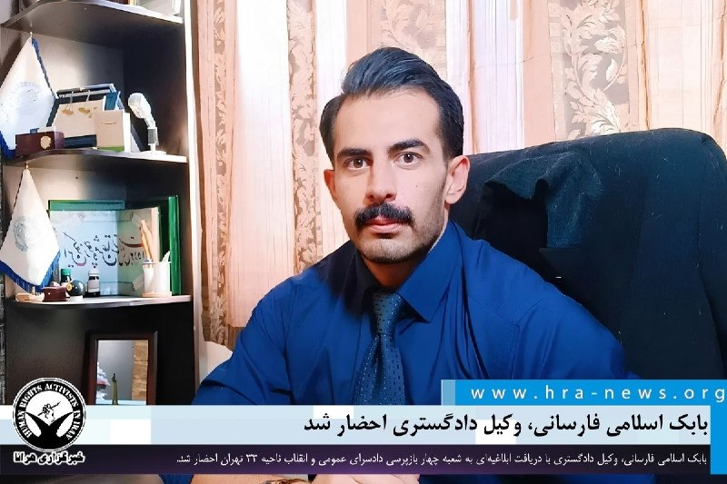

بابک اسلامی فارسانی، وکیل دادگستری به دادسرا احضار شد

❗️
❗️
❗️
❗️
❗️ – بابک اسلامی فارسانی، وکیل دادگستری با دریافت ابلاغیه‌ای به شعبه چهار بازپرسی دادسرای عمومی و انقلاب ناحیه ۳۳ تهران #احضار شد.

به گزارش خبرگزاری هرانا، ارگان خبری مجموعه فعالان حقوق بشر در ایران، بابک اسلامی فارسانی، وکیل دادگستری احضار شد.

براساس احضاریه‌ای که روز شنبه ۹ خردادماه، توسط شعبه چهار بازپرسی دادسرای عمومی و انقلاب ناحیه ۳۳ تهران صادر شده، این وکیل دادگستری باید ظرف مدت پنج روز جهت دفاع از اتهام انتسابی در شعبه مذکور حاضر شود.

ادامه مطلب

#بابک_اسلامی_فارسانی

↘️
@hranews_bot تماس ✉️ -  @Hranews  کانال هرانا 🆑

## Hranews — post 113262

دو نفر توسط ماموران سپاه پاسداران در ارومیه بازداشت شدند

❗️
❗️
❗️
❗️
❗️ – روابط عمومی سپاه پاسداران از #بازداشت دو تن در ارومیه خبر داد و مدعی شد که این افراد با نهادهای وابسته به اسرائیل در ارتباط بوده‌اند.

ادامه مطلب

↘️
@hranews_bot تماس ✉️ -  @Hranews  کانال هرانا 🆑

## Hranews — post 113261

  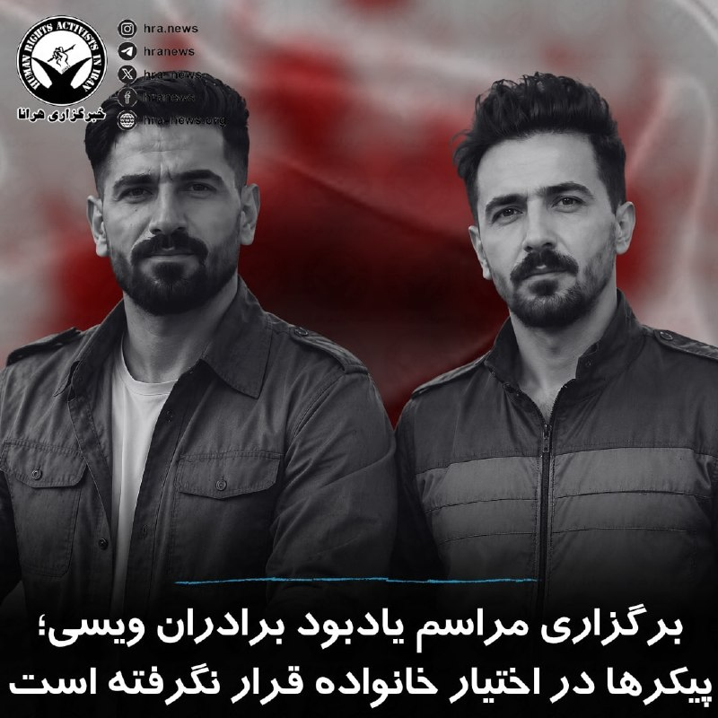

در پی کشته‌شدن میثم و مجتبی ویسی، دو برادر پیرو آئین یارسان، مراسم بزرگداشت آنان روز گذشته در محله دره‌دریژ کرمانشاه برگزار شد. این دو شهروند روز پنجشنبه ۷ خردادماه در پی تیراندازی نیروهای اطلاعات سپاه در شهرستان دالاهو جان خود را از دست دادند. بی‌بی‌سی فارسی به نقل از یک منبع نزدیک به خانواده ویسی نوشت که «پیکر آنان تاکنون به خانواده تحویل داده نشده است.» این دو برادر در ارتباط با اعتراضات سراسری ۱۴۰۴ تحت تعقیب نهادهای امنیتی قرار داشتند.

سجاد و شایان ویسی، دو عضو دیگر این خانواده که در جریان همان اعتراضات بازداشت شده‌اند، با اتهام محاربه مواجه شده و در خطر صدور احکام سنگین قرار دارند. عدم انتشار اطلاعات درباره وضعیت حقوقی و دسترسی این افراد به وکیل، بر نگرانی‌ها درباره روند رسیدگی قضایی و رعایت حقوق متهمان افزوده است.

↘️
@hranews_bot تماس ✉️ -  @Hranews  کانال هرانا 🆑

## Hranews — post 113260

  

حبس بدون تصمیم؛ تداوم بلاتکلیفی فخرالدین جعفرآقایی در زندان زاهدان

❗️
❗️
❗️
❗️
❗️– فخرالدین جعفرآقایی، شهروند ساکن زابل، ۵۴ روز است که بازداشت شده و همچنان به صورت بلاتکلیف در زندان زاهدان نگهداری می‌شود.

به گزارش خبرگزاری هرانا، ارگان خبری مجموعه فعالان حقوق بشر در ایران، فخرالدین جعفرآقایی کماکان در بازداشت به‌ سر می‌برد.

یک منبع مطلع نزدیک به خانواده این شهروند ضمن تایید این خبر به هرانا گفت: “با وجود گذشت ۵۴ روز از زمان بازداشت، فخرالدین جعفرآقایی کماکان به صورت بلاتکلیف در زندان زاهدان محبوس است. علت بازداشت این شهروند فعالیت او در فضای مجازی پیش از جنگ اخیر عنوان شده است. همچنین، علیرغم پیگیری‌های مکرر خانواده وی، تاکنون دادگاهی برای او تشکیل نشده و امکان آزادی موقت با وثیقه نیز برای این شهروند فراهم نشده است.”

ادامه مطلب

#فخرالدین_جعفرآقایی

↘️
@hranews_bot تماس ✉️ -  @Hranews  کانال هرانا 🆑

## Hranews — post 113259

دستور توقیف اموال ۷۵ شهروند در استان مرکزی صادر شد

❗️
❗️
❗️
❗️
❗️– دادستان عمومی و انقلاب مرکز استان مرکزی از صدور دستور #توقیف_اموال ۷۵ نفر در این استان به دلیل آنچه «همکاری با رسانه‌های معاند» عنوان کرده، خبر داد.

ادامه مطلب

↘️
@hranews_bot تماس ✉️ -  @Hranews  کانال هرانا 🆑

## Hranews — post 113258

یک کافه در تهران پلمب شد؛ استناد پلیس به ادعاهایی درباره «تحرکات شیطانی»

❗️
❗️
❗️
❗️
❗️ – پلیس نظارت بر اماکن عمومی تهران از #پلمب یک کافه در محدوده خیابان ولیعصر خبر داد. این اقدام بر اساس ادعاهایی درباره آنچه «تحرکات شیطانی» و «رفتارهای نابهنجار» مشتریان عنوان شده، صورت گرفته است.

ادامه مطلب

↘️
@hranews_bot تماس ✉️ -  @Hranews  کانال هرانا 🆑

## Hranews — post 113257

فروزان نوجوان از زندان ارومیه آزاد شد

❗️
❗️
❗️
❗️
❗️ – فروزان نوجوان (اسلامی)، مدرس زبان انگلیسی و اهل ارومیه، روز گذشته با تودیع وثیقه از زندان این شهرستان آزاد شد.

ادامه مطلب

#فروزان_نوجوان
#فروزان_اسلامی

↘️
@hranews_bot تماس ✉️ -  @Hranews  کانال هرانا 🆑

## alonews — post 123897

  <a href="telegram/content/alonews_123897_1780222108.mp4" target="_blank">🎬 Download video</a>

👈قالیباف : دشمن بعد از شکست نظامی، با فشار اقتصادی و جنگ رسانه‌ای دنبال ایجاد تفرقه و وادار کردن ایران به تسلیم شدنه

🔴اما مردم با اتحاد و ایستادگی نقشه‌هاش رو خنثی کردن

🔴رمز پیروزی حفظ همین وحدت و انسجامه

✅ @AloNews خبر جنگ

## alonews — post 123896

  <a href="telegram/content/alonews_123896_1780222110.webm" target="_blank">🎬 Download video</a>

👈شاخص کل بورس با رشد ۸۳ هزار واحدی در پایان معاملات امروز به ۴ میلیون و ۲۳۶ هزار واحد رسید.

✅ @AloNews خبر جنگ

## alonews — post 123895

  <a href="telegram/content/alonews_123895_1780222111.mp4" target="_blank">🎬 Download video</a>

👈ویدیوِ وایرال شده از ذوق کردن یه پسر بچه، بعد از وصل شدنِ اینترنت

✅ @AloNews خبر جنگ

## alonews — post 123894

  <a href="telegram/content/alonews_123894_1780222113.webm" target="_blank">🎬 Download video</a>

👈قالیباف: چک سفید امضا به کسی نمی‌دهیم

🔴رئیس‌مجلس: ما فراموش نمی کنیم که در شرایط کنونی کشور، دولت در میانه‌ میدان مدیریت مسائل و مشکلات ایستاده و نیاز به کمک همه از جمله مجلس دارد.

✅ @AloNews خبر جنگ

## alonews — post 123893

🔥 همراه با ساب + حجم مصرفی، فقط 9T! 🚀 ❌ آفر فقط تا پایان امشب ❌ 🔥 اگه دنبال یه VPN پایدار و بدون دردسر می‌گردی، این پلن مخصوص خودته! @Netaazaadbot @NetAazaadBot ✅ همراه با ساب + حجم مصرفی ✅ 15 سرور اختصاصی پرسرعت ✅ اتصال پایدار و بدون قطعی ✅ سرعت بالا…

## alonews — post 123892

  

🔥 همراه با ساب + حجم مصرفی، فقط 9T! 🚀

❌ آفر فقط تا پایان امشب ❌

🔥 اگه دنبال یه VPN پایدار و بدون دردسر می‌گردی، این پلن مخصوص خودته!

@Netaazaadbot
@NetAazaadBot
✅ همراه با ساب + حجم مصرفی
✅ 15 سرور اختصاصی پرسرعت
✅ اتصال پایدار و بدون قطعی
✅ سرعت بالا حتی در ساعات شلوغ

@Netaazaadbot
@NetAazaadBot
💎 کیفیتی که بعد از استفاده متوجه تفاوتش میشی!

📩 برای خرید و دریافت سرویس استارت رو بزن✅

## alonews — post 123891

  <a href="telegram/content/alonews_123891_1780222114.webm" target="_blank">🎬 Download video</a>

👈امسال ۷۷درصد بیشتر از پارسال بارندگی داشتیم و سدهای کشور ۲۹درصد بیشتر از پارسال آب دارند

✅ @AloNews خبر جنگ

## alonews — post 123890

  <a href="telegram/content/alonews_123890_1780222114.webm" target="_blank">🎬 Download video</a>

👈الجزیره: [جنگ آمریکا و اسراییل علیه ایران]، فضایی را ایجاد کرده است که در آن هر دو طرف احساس پیروزی می‌کنند و بنابراین تمایل دارند در مذاکرات احتمالی برای امتیازات بیشتر تلاش کنند و این امر تلاش‌ها برای کاهش تنش را پیچیده می‌کند.

✅ @AloNews خبر جنگ

## alonews — post 123889

  <a href="telegram/content/alonews_123889_1780222115.webm" target="_blank">🎬 Download video</a>

👈الجزیره: از آغاز جنگ، فقدان شفافیت داخلی در آمریکا در مورد اهداف مورد نظر، منجر به عدم قطعیت جهانی شده و به متحدان و دشمنان کمک کرده است تا جایگاه و رهبری آمریکا در نظام بین‌الملل را زیر سوال ببرند.

🔴تمایل ایالات متحده برای آغاز درگیری با ایران، ارزش درک شده سلاح‌های هسته‌ای را به عنوان یک عامل بازدارنده در برابر متجاوزان تقویت کرد.

🔴این جنگ انگیزه معکوسی ایجاد کرده است که کشورها را به سمت دستیابی به برنامه‌های خود و توسعه سلاح‌های هسته‌ای خود به عنوان عامل بازدارنده نهایی سوق می‌دهد.

✅ @AloNews خبر جنگ

## alonews — post 123888

  <a href="telegram/content/alonews_123888_1780222115.webm" target="_blank">🎬 Download video</a>

👈الجزیره: کوتاهی ایالات متحده در مشورت با متحدان و شرکای سنتی خود یا جلب نظر کشورهای خلیج فارس که مستقیماً تحت تأثیر تصمیم به جنگ قرار می‌گیرند، پیامدهای بلندمدتی برای کیفیت و ماهیت برخی از قوی‌ترین روابط و اتحادهای آمریکا از زمان جنگ جهانی دوم خواهد داشت.

✅ @AloNews خبر جنگ

## alonews — post 123886

  <a href="telegram/content/alonews_123886_1780222115.webm" target="_blank">🎬 Download video</a>

👈هاآرتص: غنی‌سازی ایران دیگر موضوع اصلی طرح‌های توافق نیست
 

🔴یک رسانه اسراییلی نوشت غنی سازی ایران دیگر موضوع اصلی طرح‌های توافق نیست و بازگشایی تنگه هرمز و ارائه غرامت به تهران موضوع اصلی آنها هستند.

✅ @AloNews خبر جنگ

## alonews — post 123885

  <a href="telegram/content/alonews_123885_1780222116.mp4" target="_blank">🎬 Download video</a>

👈ترامپ : ما ارتش ایران رو تقریباً دست‌نخورده گذاشتیم؛ خیلی‌ها از شنیدن این موضوع تعجب می‌کنن!

✅ @AloNews خبر جنگ

## alonews — post 123884

  <a href="telegram/content/alonews_123884_1780222118.mp4" target="_blank">🎬 Download video</a>

👈ترامپ : ما اصلاً نباید درگیر ایران می‌شدیم

✅ @AloNews خبر جنگ

## alonews — post 123883

  <a href="telegram/content/alonews_123883_1780222120.webm" target="_blank">🎬 Download video</a>

👈سخنگوی شهرداری تهران: مترو و بی‌آرتی تا زمان تعیین‌تکلیف توسط شورای شهر، رایگان می‌ماند.

✅ @AloNews خبر جنگ

## alonews — post 123882

  <a href="telegram/content/alonews_123882_1780222120.mp4" target="_blank">🎬 Download video</a>

👈ترامپ : بزرگ‌ترین سرمایه ایران، «رسانه‌های فیک‌نیوز» هستن که مدام موفقیت‌های آمریکا رو کوچک جلوه میدن

🔴شما یه پیروزی بزرگ توی یه نبرد به دست میارید

🔴 ولی اونا میگن شکست خوردید... این واقعاً چیز بدیه برای کشور ما

✅ @AloNews خبر جنگ

## alonews — post 123881

  <a href="telegram/content/alonews_123881_1780222123.webm" target="_blank">🎬 Download video</a>

👈ارتش اسرائیل بار دیگر هشدار تخلیه کامل جنوب لبنان تا رودخانه الزهرانی را صادر کرد

✅ @AloNews خبر جنگ

## alonews — post 123880

  <a href="telegram/content/alonews_123880_1780222124.webm" target="_blank">🎬 Download video</a>

👈سخنگوی کمیسیون امنیت ملی: برخی اخبار حاکی از موافقت آمریکا با شرایط ایران است

🔴 ابراهیم رضایی: همه موارد به تصمیم آمریکایی‌ها بستگی دارد. جمهوری اسلامی ایران چارچوب و خطوط قرمزی دارد که به هیچ‌وجه از آن کوتاه نمی‌آید. این آمریکا است که باید تصمیم بگیرد، تسلیم دیپلمات‌های ما خواهد شد یا تسلیم موشک‌های ما.

🔴مواضع آمریکایی‌ها متناقض است. برخی اخبار حاکی از موافقت با شرایط ایران است و گاهی هم گفته می‌شود که آمریکایی‌ها مواضع خود را تغییر دادند. برآورد دقیقی نداریم

✅ @AloNews خبر جنگ

## alonews — post 123879

  <a href="telegram/content/alonews_123879_1780222124.webm" target="_blank">🎬 Download video</a>

👈سخنگوی حکومت سرپرست افغانستان: توافق فنی‌ـ‌نظامی اخیر طالبان با مسکو برای حفظ امنیت و تقویت توان دفاعی امضا شده و کابل برای همکاری دفاعی مشابه با سایر کشورها نیز آمادگی گفت‌وگو دارد.

✅ @AloNews خبر جنگ

## alonews — post 123878

  <a href="telegram/content/alonews_123878_1780222124.webm" target="_blank">🎬 Download video</a>

👈رسانه‌های اسرائیلی گزارش می‌دهند که آمریکا به اسرائیل اجازه داده است تا فراتر از جنوب لبنان عملیات و حمله انجام دهد.

✅ @AloNews خبر جنگ

## alonews — post 123877

  <a href="telegram/content/alonews_123877_1780222125.mp4" target="_blank">🎬 Download video</a>

👈ویدیویی از برافرایشته شدن پرچم ارتش اسرائیل در قلعه تاریخی و استراتژیک بوفور، لبنان

✅ @AloNews خبر جنگ

---
📅 بروزرسانی: 1405/03/10 03:21
---

## VahidOOnLine — post 242967

♦️براساس تصاویری که به تازگی در شبکه‌های اجتماعی منتشر شده، در جریان مرمت تخت مرمر در کاخ گلستان در روز ۱۸ فروردین‌ماه، مرمت‌گران قطعه «سر فرشته» یکی از مجسمه‌های تاریخی این عمارت را که جدا شده بود، در میان آوار و قطعات شکسته‌شده پیدا کردند.
در همین رابطه، جبار آوج، مسئول موزه‌های کاخ گلستان، در گفتگو با رکنا اعلام کرد در اثر امواج ناشی از انفجار جنگ اخیر، خساراتی به تزیینات معماری، آیینه‌کاری‌ها، گچ‌بری‌ها و ارسی‌های چوبی این مجموعه وارد کرده است. به گفته او، اگرچه در حال حاضر امکان بازدید عمومی از کاخ وجود ندارد اما هیچ‌یک از آثار موزه‌ای آسیب ندیده‌اند. آوج همچنین تاکید کرد که اقدامات حفاظت اضطراری برای تثبیت شرایط و جلو‌گیری از خسارات ثانویه ناشی از بارندگی‌ها انجام شده و مجموعه در وضعیت پایدار قرار دارد تا پس از پایان مرحله آسیب‌شناسی، وارد فاز مرمت جامع شود.
‌🇸🇦 Indypersian

🤖 @VahidOOnLine

## VahidOOnLine — post 242966

  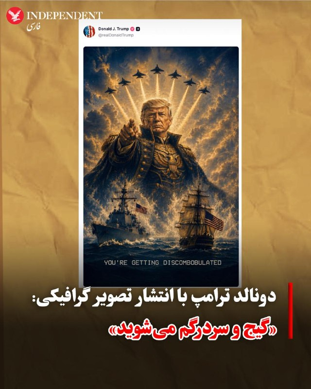

♦️دونالد ترامپ، رئیس‌جمهوری ایالات متحده، روز شنبه با انتشار تصویر گرافیکی تولیدشده با هوش مصنوعی در شبکه اجتماعی «تروث سوشال»، توجه رسانه‌ها را به خود جلب کرد. در این تصویر ترامپ در جامه یک فرمانده نظامی ارشد با نشان عقاب طلایی آمریکا به تصویر کشیده شده که با انگشت به مخاطب اشاره می‌کند. در پس‌زمینه این طرح، نمادهای قدرت نظامی ایالات متحده از جمله جنگنده‌های پیشرفته در حال صعود و ناوشکن‌ها در کنار کشتی‌های بادبانی تاریخی با پرچم برافراشته آمریکا در میان موج‌های خروشان دریا دیده می‌شوند. ترامپ در حاشیه این تصویر نوشت: «شما دارید گیج و سردرگم می‌شوید».
‌🇸🇦 Indypersian

🤖 @VahidOOnLine

## VahidOOnLine — post 242965

  <a href="telegram/content/VahidOOnLine_242965_1780185103.mp4" target="_blank">🎬 Download video</a>

ویدیوی منتشرشده در رسانه‌های اجتماعی وابسته به جمهوری اسلامی نشان می‌دهد سپاه پاسداران، شامگاه شنبه نهم خرداد، قایق تندرویی را همراه با موشک ضدکشتی برای حامیان حکومت در میدان انقلاب تهران به نمایش گذاشت.
‌🏁 🇬🇧 IranintlTV

🤖 @VahidOOnLine

## VahidOOnLine — post 242964

♦️همزمان با آشوب، آتش‌سوزی و تنش در خیابان‌های پاریس به دنبال جشن قهرمانی پاریس سن ژرمن در دیدار نهایی لیگ قهرمانان اروپا، مارین لوپن، رهبر حزب «اجتماع ملی»، با انتشار پیامی تند در شبکه اجتماعی اکس، به شدت از وضعیت امنیت عمومی انتقاد کرد. این چهره سرشناس سیاسی با اشاره به جو رعب و وحشت حاکم بر خیابان‌ها، بر لزوم برخورد قاطع با برهم‌زنندگان نظم عمومی تاکید کرد. لوپن در موضع‌گیری صریح خود نوشت: «فقط در فرانسه است که پیروزی یک باشگاه فوتبال باعث بروز شورش می‌شود. فقط در فرانسه است که هر کسی احساس می‌کند مجبور است در شب پیروزی، خود را در خانه حبس کند تا با خشونت مواجه نشود.»
‌🇸🇦 Indypersian

🤖 @VahidOOnLine

## VahidOOnLine — post 242963

  <a href="telegram/content/VahidOOnLine_242963_1780185105.mp4" target="_blank">🎬 Download video</a>

♦️فارس تصاویر رونمایی از شناور تندروی هجومی جدید سپاه با نام «۲۷ رجب» در تجمع حکومتی میدان انقلاب تهران را منتشر کرد. این خبرگزاری وابسته به سپاه نوشت که این شناور به قابلیت پرتاب دو فروند موشک کروز دریاپایه با برد ۷۰۰ کیلومتر و قدرت مانور و عملیات در موج با ارتفاع ۳ متر مجهز است.
‌🇸🇦 Indypersian

🤖 @VahidOOnLine

## VahidOOnLine — post 242962

♦️به گزارش رویترز، جشن قهرمانی پاریس سن ژرمن پس از پیروزی در دیدار نهایی لیگ قهرمانان اروپا، شنبه شب به درگیری، آتش‌سوزی و تنش در خیابان‌های پاریس کشیده شد.
بر اساس این گزارش، پلیس فرانسه پس از آنکه در برخی مناطق مرکزی پاریس هدف شلیک مواد آتش‌زا قرار گرفت، برای متفرق کردن گروهی از هواداران از گاز اشک‌آور استفاده کرد.
پاریس سن ژرمن زیر نظر لوئیس انریکه موفق شد در یک مسابقه نهایی نفس‌گیر در بوداپست، تیم آرسنال را در ضربات پنالتی با نتیجه ۴ بر ۳ شکست دهد و عنوان قهرمانی خود را حفظ کند. این پیروزی پس از تساوی ۱-۱ در وقت‌های اضافه رقم خورد تا نماینده فرانسه جایگاه خود را به عنوان قدرت برتر فوتبال اروپا تثبیت کند.
‌🇸🇦 Indypersian

🤖 @VahidOOnLine

## VahidOOnLine — post 242961

  

♦️دونالد ترامپ، رئیس‌جمهوری ایالات متحده، روز شنبه، با انتشار پیامی در شبکه اجتماعی «تروث سوشال»، به دیدار اخیر براندون جانسون، شهردار شیکاگو با رهبر کاتولیک‌های جهان در واتیکان واکنش نشان داد. ترامپ با به اشتراک گذاشتن تصاویر این دیدار، نوشت: «یک نفر باید به پاپ توضیح دهد که شهردار شیکاگو فردی بی‌فایده است و اینکه ایران نمی‌تواند سلاح هسته‌ای داشته باشد».
‌🇸🇦 Indypersian

🤖 @VahidOOnLine

## VahidOOnLine — post 242960

  

♦️به گزارش فارس، خبرگزاری وابسته به سپاه، اسماعیل بقایی، سخنگوی وزارت خارجه روز شنبه با محمد اکرمی‌نیا، سخنگوی ارتش جمهوری اسلامی دیدار و گفتگو کرد. براساس این گزارش، بقایی در این دیدار گفت: «قدرت و اقتدار نیروهای مسلح پشتوانه محکم وزارت خارجه در صیانت از منافع ایران در عرصه دیپلماسی است».
‌🇸🇦 Indypersian

🤖 @VahidOOnLine

## VahidOOnLine — post 242959

♦️دولت گرجستان در تفلیس، در‌های یک انبار شراب مخفی متعلق به ژوزف استالین، رهبر پیشین اتحاد جماهیر شوروی را گشود. این انبار تاریک و تار عنکبوت‌گرفته، خانه گنجینه‌ای بی‌نظیر شامل ۴۰ هزار بطری شراب کمیاب است.

در این مجموعه تاریخی، نایاب‌ترین شراب‌های فرانسوی متعلق به تزارهای روسیه، الکساندر سوم و نیکولای دوم، به چشم می‌خورد. این بطری‌های امپراتوری پس از انقلاب ۱۹۱۷ توسط شوروی توقیف شدند و استالین، که خود از علاقه‌مندان سرسخت شراب بود، نگهبانی از آن‌ها را بر عهده گرفت و به مرور، شراب‌های گرجستانی محبوبش را به آن افزود.

پیر لورتون، مدیر دو عمارت مطرح شراب‌سازی در بوردو، با «پانتیون (معبد) شراب» خواندن این مکان، بر ضرورت بررسی تک‌تک بطری‌ها به دلیل فرسودگی احتمالی چوب‌پنبه‌ها تاکید کرد. ویکتور چن، یکی از مجموعه‌دارهایی که اجازه ورود به این فضا را یافته، این تجربه را به «کشف غارهای باستانی توسط ایندیانا جونز» تشبیه کرد.

دولت گرجستان قصد دارد این مجموعه ارزشمند را به حراج بگذارد و درآمد حاصل از آن را برای تاسیس یک مدرسه در کلاس جهانی جهت آموزش ساخت شراب اختصاص دهد.
‌🇸🇦 Indypersian

🤖 @VahidOOnLine

## VahidOOnLine — post 242958

  

ترامپ با بازنشر تصاویر دیدار شهردار دموکرات شیکاگو با پاپ، در تروث‌سوشال نوشت: «باید کسی به پاپ توضیح دهد که شهردار شیکاگو بی‌فایده است و ایران نمی‌تواند سلاح هسته‌ای داشته باشد.» ترامپ اخیرا درباره مواضع مختلف پاپ از جمله مخالفت او با جنگ ایران، انتقادهای زیادی را مطرح کرده است.
‌🏁 🇬🇧 IranintlTV

🤖 @VahidOOnLine

## VahidOOnLine — post 242957

  <a href="telegram/content/VahidOOnLine_242957_1780185108.mp4" target="_blank">🎬 Download video</a>

پرچم ملی اسپانیا روز شنبه نهم خرداد، در جریان رژه نظامی «روز نیروهای مسلح» در شهر ویگو، هنگام برافراشته شدن از میله جدا شد و سقوط کرد. این اتفاق در حضور پادشاه فیلیپه ششم رخ داد که منجر به واکنش او در چهره‌اش شد. نیروهای نظامی بلافاصله پرچم را جمع‌آوری کردند.
‌🏁 🇬🇧 IranintlTV

🤖 @VahidOOnLine

## VahidOOnLine — post 242956

  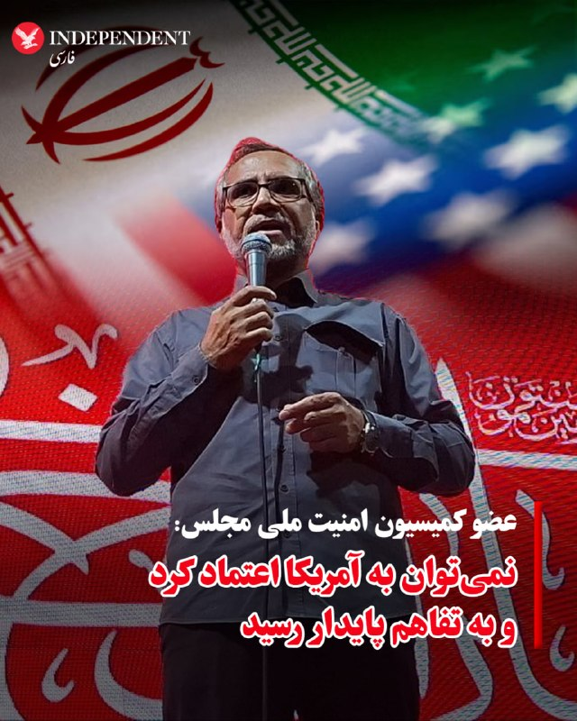

♦️عباس گلرو، عضو کمیسیون امنیت ملی مجلس، شنبه‌شب در جمع حامیان حکومت در گرمسار گفت: «آمریکایی‌ها در ابتدای مذاکرات دو خواسته اصلی داشتند. نخست توقف کامل غنی‌سازی و دوم تحویل اورانیوم غنی‌شده ایران به یک کشور ثالث که محمدباقر قالیباف با صراحت اعلام کرد جمهوری اسلامی ایران اساسا اجازه ورود به چنین مذاکراتی را نداده است و طرف آمریکایی باید ابتدا دارایی‌های بلوکه‌شده ایران را آزاد کند». او گفت: «سوال اصلی این است که آیا می‌توان به آمریکا اعتماد کرد، پاسخ روشن است؛ خیر. آیا می‌توان با آمریکا به تفاهم پایدار رسید، پاسخ خیر است».
‌🇸🇦 Indypersian

🤖 @VahidOOnLine

## VahidOOnLine — post 242955

  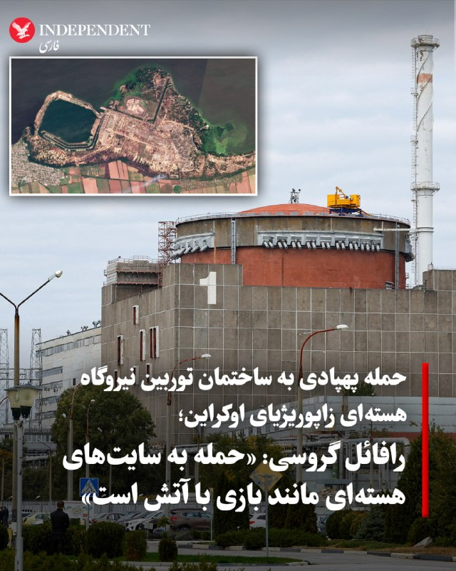

♦️آژانس بین‌المللی انرژی اتمی (IAEA) روز شنبه، ۹ خردادماه، اعلام کرد که بر اساس اطلاعات دریافتی از نیروگاه هسته‌ای زاپوریژیا در جنوب شرقی اوکراین، یک پهپاد به ساختمان توربین این نیروگاه اصابت کرده و باعث ایجاد حفره در دیوار آن شده است. در پی این حادثه، رافائل گروسی، رئیس آژانس بین‌المللی انرژی اتمی، با ابراز نگرانی شدید نسبت به مخاطرات این رخداد هشدار داد که «حمله به سایت‌های هسته‌ای مانند بازی با آتش است.» تیم کارشناسان آژانس مستقر در این نیروگاه تحت اشغال روسیه، با انتشار پیامی در اکس، رسما خواستار دسترسی فوری و مستقیم به ساختمان توربین آسیب‌دیده برای ارزیابی اولیه‌ خسارات شده‌اند.
در واکنش به این رویداد، وزارت امور خارجه اوکراین با انتشار بیانیه‌ای رسمی، اتهامات روسیه و شرکت دولتی «روس‌اتم» مبنی بر دخالت کی‌یف در این حمله را به شدت رد کرد و آن را یک «عملیات روانی تکراری» از سوی مسکو نامید. کی‌یف با مضحک خواندن این ادعا که اوکراین به تاسیسات هسته‌ای در خاک خود حمله کند، تاکید کرد که روسیه همواره در آستانه نشست‌های شورای حکام آژانس، با پنهان‌کاری و ممانعت از دسترسی بازرسان به بخش‌های غربی سالن‌های توربین، دست به فضاسازی رسانه‌ای می‌زند تا افکار عمومی را از اصل موضوع، یعنی «اشغال غیرقانونی نیروگاه» منحرف کند. وزارت خارجه اوکراین در پایان از ۳۴ کشور عضو شورای حکام خواست تا در نشست ماه ژوئن، فراتر از ابراز نگرانی‌های دیپلماتیک عمل کرده و با سلب صلاحیت مسکو، با اعطای کرسی به روسیه در شورای حکام آژانس بین‌المللی انرژی اتمی مخالفت کنند.
‌🇸🇦 Indypersian

🤖 @VahidOOnLine

## VahidOOnLine — post 242954

  

♦️روزنامه «اسرائیل هیوم» در گزارشی برای نخستین بار از فعالیت شاخه تخصصی «عملیات نفوذ و تغییر افکار عمومی» در موساد پرده برداشته که در سال ۲۰۲۱ توسط دیوید بارنیا تاسیس شده است. «او.» (O)، فرمانده سابق این بخش، فاش کرد که هدف اصلی این بازو، سرنگونی حکومت ایران از طریق جنگ روانی، سایبری و رسانه‌ای است. او با اشاره به اینکه حذف مهره‌ها از طریق بدنام کردن بسیار ارزان‌تر و ساده‌تر از ترور فیزیکی است، فاش کرد که افشای عکس‌های جنجالی رستم قاسمی در مالزی در سال ۲۰۲۲، اقدام موساد بوده که از سال ۲۰۱۱ این تصاویر را در اختیار داشته تا در اوج اعتراضات، علاوه بر حذف یک چهره کلیدی نظامی، به آتش تظاهرات دامن بزند. این واحد همچنین با راه‌اندازی «ماشین سم‌پاشی» در شبکه‌های اجتماعی از طریق حساب‌های جعلی، به دنبال شکستن دیوار ترس مردم و تضعیف ثبات نظام بوده است.
بر اساس این گزارش، موساد از خردادماه (ژوئن) گذشته طرح و برنامه‌ای جامع و آماده را برای سرنگونی حکومت ایران در دست اجرا داشته که شامل آموزش و تسلیح نیروهای کُرد در مرزها و فعال‌سازی شبکه‌ای از چهره‌های تاثرگذار شبکه‌های اجتماعی ساخته‌شده با هوش مصنوعی بوده است. اگرچه اعتراضات بازاریان تهران در آذر ۱۴۰۴ (دسامبر ۲۰۲۵) برنامه‌ریزی زمان‌بندی‌شده آن‌ها را به هم ریخت و به دلیل سرکوب شدید، مانع از حضور گسترده‌تر مردم در جریان عملیات‌های نظامی بعدی شد، اما مقامات موساد همچنان معتقدند ترکیب عملیات نفوذ با فشار اقتصادی و حملات هوایی، تاثیر خود را خواهد گذاشت. رئیس موساد پیش از عملیات «غرش شیران» در تماس تصویری با دونالد ترامپ، وعده سقوط حکومت ایران را داده بود و منابع نزدیک به بارنیا قاطعانه باور دارند که در صورت تداوم محاصره اقتصادی و عدم امضای توافق جدید، حکومت ایران تا پایان سال ۲۰۲۶ سقوط خواهد کرد.
این گزارش درحالی منتشر شد که پیش از این، محمود احمدی‌نژاد در مصاحبه‌ای در سال ۱۴۰۰ از نفوذ اطلاعاتی اسرائیل در ساختار امنیتی جمهوری اسلامی گفته و اعلام کرده بود «بالاترین مسئول مقابله با جاسوسان اسرائیل در وزارت اطلاعات، خودش جاسوس اسرائیل بود» و نظام با «سناریوسازی برای پنهان کردن سرقت اسناد»، تلاش کرده عوامل نفوذی را محفوظ نگه دارد.
‌🇸🇦 Indypersian

🤖 @VahidOOnLine

## VahidOOnLine — post 242953

  <a href="telegram/content/VahidOOnLine_242953_1780185111.mp4" target="_blank">🎬 Download video</a>

♦️براساس تصاویر منتشر شده در خبرگزاری دانشجو، سپاه پاسداران جمعه‌شب در میان حامیان حکومت در سنقر کرمانشاه، از پهپاد «شاهد ۱۳۶» آبی‌رنگ رونمایی کرد. پیش از این نیز رونمایی از خودرو جیپ، پهپاد و موشک به رنگ صورتی به مناسبت «روز دختر»، مورد توجه کاربران شبکه‌های اجتماعی قرار گرفته بود.
‌🇸🇦 Indypersian

🤖 @VahidOOnLine

## VahidOOnLine — post 242952

  

عباس گلرو، عضو کمیسیون امنیت ملی مجلس گفت: «در حال سوال اصلی این است که آیا می‌توان به آمریکا اعتماد کرد، پاسخ روشن است، خیر. آیا می‌توان با آمریکا به تفاهم پایدار رسید، پاسخ این نیز خیر است.»

او افزود: «ما همه سرنشین یک کشتی هستیم و باید به تصمیم‌های اتخاذشده در ساختار نظام اعتماد داشته باشیم.»

او ادامه داد: «هیچ مقطعی را به اندازه امروز، زمان برافراشته بودن پرچم جمهوری اسلامی در منطقه و جهان ندیده‌ام.»
‌🏁 🇬🇧 IranintlTV

🤖 @VahidOOnLine

## VahidOOnLine — post 242951

  <a href="telegram/content/VahidOOnLine_242951_1780185114.mp4" target="_blank">🎬 Download video</a>

سعید آجرلو، عضو تیم رسانه‌ای مذاکره‌کننده جمهوری اسلامی، گفت در صورت تایید متن نهایی تفاهم‌ [با آمریکا]، گفت‌وگوهای ۶۰ روزه درباره جزئیات آغاز می‌شود. او افزود اگر طرف مقابل به تعهداتش، از جمله درباره ۱۲ میلیارد دلار، عمل نکند، جمهوری اسلامی می‌تواند از توافق خارج شود.
‌🏁 🇬🇧 IranintlTV

🤖 @VahidOOnLine

## WithYashar — post 12971

فارس : براساس برنامه‌ریزی‌های انجام‌شده، حجاج ایرانی از فرودگاه جده به شش فرودگاه شامل تهران، مشهد، زاهدان، شیراز، گرگان و اصفهان منتقل خواهند شد.

نخستین پرواز بازگشت حجاج روز ۱۱ خردادماه(دوشنبه) از جده به مقصد تهران انجام می‌شود.
@withyashar

## WithYashar — post 12970

عجب سکوت مرگباری …

## WithYashar — post 12968

@withyashar JangHub

## WithYashar — post 12967

  <a href="telegram/content/WithYashar_12967_1780185115.mp4" target="_blank">🎬 Download video</a>

ادعای کانیه وست :
کنسرتم در استانبول رکورد ۱۱۸ هزار تماشاگر را ثبت کرده و به بزرگ‌ترین رویداد استادیومیِ بلیت‌فروشی‌شده در تاریخ تبدیل شده است.
@withyashar

## WithYashar — post 12966

  <a href="telegram/content/WithYashar_12966_1780185117.mp4" target="_blank">🎬 Download video</a>

شاهزاده رضا پهلوی :
۴۰ هزار ایرانی برای تنگه هرمز یا برای یک توافق هسته‌ای کشته نشدن.
ما باید فشار روی رژیم رو ادامه بدیم تا نتونه منابع مالی لازم برای تأمین و پرداخت به نیروهای نیابتی و مزدورهاش رو فراهم کنه.
اما بهترین راه برای اینکه کار به حضور نیروهای خارجی در زمین نکشه اینه که به مردم ایران کمک بشه تا خودشون اون نقش رو بازی کنن
@withyashar

## WithYashar — post 12965

رییس سازمان عقیدتی سیاسی انتظامی:
حکم قاتلان خامنه‌ای رو باید در ملا عام اجرا کنیم.
@withyashar

## WithYashar — post 12964

  

پست جدید ترامپ در تروث 🤣:

«یکی باید برای پاپ توضیح بدهد که شهردار شیکاگو کاملاً بی‌فایده است و اینکه ایران نمی‌تواند سلاح هسته‌ای داشته باشد!

رئیس‌جمهور دونالد جی. ترامپ»
@withyashar

## mwarmonitor — post 9924

  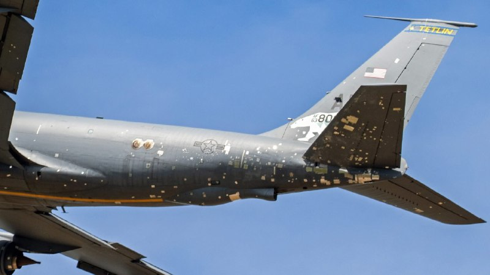

✈️نمای نزدیک‌تری از بخش دم هواپیمای سوخت‌رسان KC-135 با شماره 63-8028 متعلق به نیروی هوایی ایالات متحده که هنگام حضور روی زمین در عربستان سعودی بر اثر ترکش‌های پهپاد/موشک بالستیک ایرانی دچار آسیب شده ولی کماکان در حال خدمت است.

@mwarmonitor

## mwarmonitor — post 9923

  

🔴یک مین دریایی در آب‌های سرزمینی عمان در Strait of Hormuz مشاهده شده است. 🔹این موضوع مسیر آبی‌ای را که آمریکا برای اسکورت مخفیانه کشتی‌ها از آن استفاده می‌کرد، مسدود می‌کند. @mwarmonitor

## FoxNewsTwitter — post 342437

  <a href="telegram/content/FoxNewsTwitter_342437_1780185121.mp4" target="_blank">🎬 Download video</a>

Fox News (Twitter/X)

A suspected drug-trafficking boat erupts into flames after being struck by U.S. forces in the eastern Pacific.

New video, released by U.S. Southern Command, shows the moment the vessel is hit during an operation carried out Friday.

SOUTHCOM says three "male narco-terrorists" were killed in the strike.

## FoxNewsTwitter — post 342436

‌Fox News (Twitter/X)

👉 Full story here:

## FoxNewsTwitter — post 342435

  

Fox News (Twitter/X)

Proud Boys and communist activists clash outside Newark ICE detention center as Gov. Sherrill admits 5 of 6 people arrested this week came from out of state. What started as a protest over detainee conditions has become a full-blown ideological battleground — with 'national extremist groups' on both sides driving the chaos, not local residents.

## FoxNewsTwitter — post 342434

  <a href="telegram/content/FoxNewsTwitter_342434_1780185124.mp4" target="_blank">🎬 Download video</a>

Fox News (Twitter/X)

BREAKING: New Jersey Gov. Mikie Sherrill speaks out after anti-ICE chaos outside Delaney Hall, says she refuses to "give ICE a pretext" to expand operations.

"Let me be clear: ICE engagement creates an incredibly dangerous situation. It makes the situation worse, and I refuse to back down in fighting the Trump administration."

"We know that people from outside the state have been interfering in the protest and escalating them."

"To the people coming from out of state to create chaos and dangerous situations: You should not be here."

## pm_afshaa — post 91919

شاهزاده رضا پهلوی در اودسا:
اکنون که اینترنت تا حدی دوباره وصل شده است، شما مستقیماً از مردم ایران خواهید شنید و واکنش آن‌ها به مداخله‌ای که رخ داده است را خواهید دید.

مردم ایران جشن می‌گرفتند از اینکه نیروهای دفاعی اسرائیل و تا حدی نیروی هوایی آمریکا در ضربه زدن به زیرساخت‌های رژیم مداخله کردند. مردم خیابان‌هایی در ایران را به نام رئیس‌جمهور ترامپ نامگذاری کرده‌اند.

این ملتی است که این موضوع را از دیدگاه مداخله‌ای کاملاً انسانی برای محافظت از جان‌های بیشتر می‌بیند. برای ما، این یک مداخله آزادی‌بخش بود.

مردم ایران از آنچه فکر می‌کنید باهوش‌ترند و تفاوت بین زمانی که کشور مورد حمله قرار می‌گیرد و زمانی که رژیم هدف قرار می‌گیرد را به خوبی تشخیص می‌دهند

💧 Rainbet.com the #1 Non-KYC Crypto Casino & Sportsbook @rainbetcom

😁 @Pm_Afshaa

## pm_afshaa — post 91918

🔴شاهزاده رضا پهلوی در اودسا:
اسرائیل می‌داند تا زمانی که این رژیم سر کار است، تهدیدی وجودی برای آن محسوب می‌شود. امروز، کشورهای منطقه می‌بینند که این رژیم در حمله به آن‌ها تردید نکرده

💧 Rainbet.com the #1 Non-KYC Crypto Casino & Sportsbook @rainbetcom

😁 @Pm_Afshaa

## pm_afshaa — post 91917

🔴شاهزاده رضا پهلوی در اودسا:
40هزار ایرانی برای تنگه هرمز یا توافق هسته‌ای جان نداده‌اند.

ما باید به خفه کردن رژیم ادامه دهیم تا بتوانیم منابع مالی، تأمین و پرداخت مزدوران آن را قطع کنیم. زیرا ممکن است فروپاشی اقتصادی رژیم نیز منجر به پایان آن شود، نه فقط فشار نظامی خارجی.

اما بهترین راه برای جلوگیری از حضور نیروهای خارجی در میدان، کمک به مردم ایران برای ایفای این نقش است، به شرطی که حمایت اضافی لازم را به آنها بدهید

💧 Rainbet.com the #1 Non-KYC Crypto Casino & Sportsbook @rainbetcom

😁 @Pm_Afshaa

## pm_afshaa — post 91916

  <a href="telegram/content/pm_afshaa_91916_1780185125.webm" target="_blank">🎬 Download video</a>

🔴نیویورک تایمز: میان ترامپ و جی‌ دی ونس، معاون اول او شکاف گسترده ای افتاده است و ترامپ به نظرات و سیاست معاون اول خود در قبال ایران تاخته است.

💧 Rainbet.com the #1 Non-KYC Crypto Casino & Sportsbook @rainbetcom

😁 @Pm_Afshaa

## pm_afshaa — post 91915

  <a href="telegram/content/pm_afshaa_91915_1780185126.webm" target="_blank">🎬 Download video</a>

🔴ترامپ:
یکی باید برای پاپ توضیح بده که شهردار شیکاگو کاملاً بی‌فایده است و اینکه ایران نمیتونه سلاح هسته‌ای داشته باشه.

💧 Rainbet.com the #1 Non-KYC Crypto Casino & Sportsbook @rainbetcom

😁 @Pm_Afshaa

## pm_afshaa — post 91914

  <a href="telegram/content/pm_afshaa_91914_1780185126.webm" target="_blank">🎬 Download video</a>

🔴خبرنگار الحدث:
درگیری‌های شدید بین حزب‌الله و نیروهای اسرائیلی در داخل شهرک دبین در جنوب لبنان.

💧 Rainbet.com the #1 Non-KYC Crypto Casino & Sportsbook @rainbetcom

😁 @Pm_Afshaa

## pm_afshaa — post 91913

  <a href="telegram/content/pm_afshaa_91913_1780185127.mp4" target="_blank">🎬 Download video</a>

شاهزاده رضا پهلوی در اودسا:
محور مسکو-تهران، محور خصمانه تعیین‌کننده دوران ما است. باید با همان انسجام، همان اراده و همان همبستگی فراآتلانتیکی که بهترین دوران غرب را تعریف می‌کند، با آن مقابله کرد.

اوکراین با هزینه‌ای بسیار سنگین خط مقاومت را حفظ کرده است. ایران نیز هزینه‌ای عظیم می‌پردازد تا آزاد شود. جهان آزاد دلایل اخلاقی، راهبردی و تاریخی دارد که در کنار هر دو بایستد.

با محور هرج‌ومرج مذاکره نکنید. با آن مقابله کنید.

جمهوری اسلامی را مدیریت نکنید. آن را پایان دهید. منتظر لحظه‌ای بهتر نباشید. این لحظه است. من منتظر نیستم. مردم ایران منتظر نیستند.

💧 Rainbet.com the #1 Non-KYC Crypto Casino & Sportsbook @rainbetcom

😁 @Pm_Afshaa

## pm_afshaa — post 91912

  <a href="telegram/content/pm_afshaa_91912_1780185129.mp4" target="_blank">🎬 Download video</a>

شاهزاده رضا پهلوی در اودسا:
از من پرسیده‌اند که آیا نگران دوام جمهوری اسلامی هستم یا خیر. آیا بقا ادامه‌دار رژیم باید انتظارات را تعدیل کند.

پاسخ من منفی است — من رژیمی را می‌بینم که در ژانویه از عوامل حزب‌الله و شبه‌نظامیان عراقی و افغان برای سرکوب مردم خود استفاده کرد، نه به این دلیل که قوی بود، بلکه به این دلیل که دیگر نمی‌شد به نیروهای امنیتی خود برای تیراندازی به شهروندان ایرانی اعتماد کامل داشت.

من یک مجموعه نظامی و اطلاعاتی را می‌بینم که دفاع‌های بیرونی آن در معرض آسیب و تضعیف قرار گرفته است.

جمهوری اسلامی قوی‌تر از یک سال پیش نیست. توخالی‌تر شده است. نمای ظاهری هنوز پابرجاست، اما ساختار پشت آن نیست.

آنچه اکنون لازم است، صبر با رژیم نیست. فوریت در حمایت از مردمی است که علیه آن قیام کرده‌اند.

💧Rainbet.com the #1 Non-KYC Crypto Casino & Sportsbook @rainbetcom

😁 @Pm_Afshaa

## pm_afshaa — post 91911

  <a href="telegram/content/pm_afshaa_91911_1780185130.mp4" target="_blank">🎬 Download video</a>

شاهزاده رضا پهلوی در اودسا:
اوکراین دموکراتیکی که پایدار بماند، چراغ راهی برای هر مردمی است که تحت تجاوز خارجی قرار دارند.

ایران دموکراتیکی که برخیزد، چراغ راهی برای هر مردمی است که زیر ظلم تئوکراتیک زندگی می‌کنند. هر یک از پیروزی‌های ما دیگری را تقویت می‌کند. هر یک از شکست‌های ما نیروهای مشابه را جسورتر می‌سازد.

به همین دلیل من خواستار ائتلافی فراآتلانتیکی هستم، نه فقط برای حمایت از اوکراین و نه فقط برای فشار بر جمهوری اسلامی، بلکه برای مقابله با محور مسکو-تهران به عنوان وسیله‌ای برای اجرای هماهنگ تحریم‌ها که اجازه نمی‌دهد یک طرف محور فشار بر طرف دیگر را جبران کند.

💧 Rainbet.com the #1 Non-KYC Crypto Casino & Sportsbook @rainbetcom

😁 @Pm_Afshaa

## pm_afshaa — post 91910

  <a href="telegram/content/pm_afshaa_91910_1780185132.mp4" target="_blank">🎬 Download video</a>

شاهزاده رضا پهلوی در اودسا:
تهران و مسکو تنها هم‌راستا نیستند. آن‌ها فقط شرکای موقتی راحت نیستند. آن‌ها هم‌معماران هرج‌ومرج هستند.

دکترین آن‌ها این است که نظم بین‌المللی مبتنی بر قوانین تحمیل غرب است که باید برچیده شود، مرزها صرفاً پیشنهاد هستند، حاکمیت متعلق به قدرتمندان است، هرچقدر هم شرور باشند، و نه به مردم، هرچقدر هم درستکار باشند. دموکراسی‌ها ذاتاً ضعیف هستند و می‌توان آن‌ها را مجبور به تسلیم کرد.

این محور جدیدی نیست. جمهوری اسلامی ۴۷ سال است که نسخه خود از این جنگ را علیه مردم ایران به راه انداخته است. ابتدا علیه مردم خود، سپس علیه همسایگانش، و سپس علیه هر نظمی که آن را محدود کند.

روسیه دهه‌هاست که نسخه خود از این جنگ را علیه دموکرات‌های خود، علیه گرجستان، و به طور مشترک با جمهوری اسلامی علیه سوریه و اوکراین به راه انداخته است.

آنچه تغییر کرده این است که آن‌ها دیگر به طور موازی عمل نمی‌کنند. آن‌ها با هم، هماهنگ و جسورانه عمل می‌کنند.

💧Rainbet.com the #1 Non-KYC Crypto Casino & Sportsbook @rainbetcom

😁 @Pm_Afshaa

## pm_afshaa — post 91909

  <a href="telegram/content/pm_afshaa_91909_1780185134.mp4" target="_blank">🎬 Download video</a>

شاهزاده رضا پهلوی در اودسا:
کشور من از هر سو مورد ضربه قرار گرفته است، از سوی رژیم داخلی و همچنین به دلیل پیامدهای بی‌مبالاتی خود رژیم از بیرون. و با این حال، جمهوری اسلامی هنوز پابرجاست.

برخی در این جمع ممکن است این را نشانه‌ای از مقاومت رژیم تفسیر کنند. من اینجا هستم تا به شما بگویم که اینطور نیست.

این نشانه‌ای است از شکست جهان در گرفتن نتیجه‌گیری‌های درست از آنچه می‌بیند. این نشانه‌ای است که جهان آزاد هنوز درک نکرده است که واقعاً برای چه می‌جنگد یا وقتی این جنگ پیروز شود، چه چیزی از آن به دست خواهد آورد.

💧 Rainbet.com the #1 Non-KYC Crypto Casino & Sportsbook @rainbetcom

😁 @Pm_Afshaa

## IranIntlTV — post 339802

  <a href="telegram/content/IranIntlTV_339802_1780185136.mp4" target="_blank">🎬 Download video</a>

ویدیوی منتشرشده در رسانه‌های اجتماعی وابسته به جمهوری اسلامی نشان می‌دهد سپاه پاسداران، شامگاه شنبه نهم خرداد، قایق تندرویی را همراه با موشک ضدکشتی برای حامیان حکومت در میدان انقلاب تهران به نمایش گذاشت.

## IranIntlTV — post 339801

  <a href="https://t.me/IranintlTV/339801" target="_blank">📎 Download file</a>

🎧نسخه صوتی سیاست با مراد ویسی: جهان در انتظار تصمیم ترامپ
@iranintlTV

## IranIntlTV — post 339800

  <a href="telegram/content/IranIntlTV_339800_1780185137.mp4" target="_blank">🎬 Download video</a>

مراد ویسی، تحلیل‌گر ارشد ایران‌اینترنشنال، گفت: «دیکتاتوری ها پس از شکست در جنگ آسیب‌پذیرتر می‌شوند. بحران‌های پس از جنگ که ترکیبی از بحران‌های سیاسی و اقتصادی و اجتماعی است، آنها را به سمت سقوط سوق می‌دهد. تجربه سقوط نظامیان در آرژانتین پس از شکست در جنگ فالکلند یکی از نمونه‌های تاریخی این پدیده است. تجربه‌ای که شباهت‌های بسیار با وضعیت کنونی جمهوری اسلامی پس از جنگ‌های ۱۲ روزه و ۴۰ روزه دارد.»
@iranintltv

## IranIntlTV — post 339799

  <a href="telegram/content/IranIntlTV_339799_1780185139.mp4" target="_blank">🎬 Download video</a>

مصطفی نیلی، وکیل دادگستری، از صدور حکم اعدام برای بنیامین نقدی، زندانی سیاسی و از معترضان دی‌ماه، به اتهام افساد فی‌الارض خبر داد.

همزمان گزارش‌ها حاکی است سجاد ویسی و شایان ویسی، از بازداشت‌شدگان دی‌ماه در کرمانشاه، به محاربه متهم شده‌اند و با خطر صدور احکام سنگین، از جمله اعدام، روبه‌رو هستند. همچنین حکم اعدام رئوف شیخ‌معروفی و محمد فرجی، دو زندانی سیاسی اهل بوکان، در دیوان کشور تایید شده است.

گفت‌وگو با رقیه رضایی، روزنامه‌نگار
@iranintltv

## IranIntlTV — post 339798

  <a href="telegram/content/IranIntlTV_339798_1780185140.mp4" target="_blank">🎬 Download video</a>

وزیر جنگ آمریکا اعلام کرد معیارهای واشینگتن در مذاکرات با جمهوری اسلامی تغییری نکرده است.

پیت هگست گفت هر توافقی تنها زمانی انجام خواهد شد که دونالد ترامپ آن را تضمین‌کننده امنیت آمریکا و جهان بداند.

گفت‌وگو با امیر گیتی، عضو تحریریه ایران‌اینترنشنال
@iranintltv

## IranIntlTV — post 339797

  <a href="telegram/content/IranIntlTV_339797_1780185142.mp4" target="_blank">🎬 Download video</a>

مراد ویسی، تحلیل‌گر ارشد ایران‌اینترنشنال، گفت: «شاهزاده رضا پهلوی مهم‌ترین چهره‌ اپوزیسیون است که به طور گسترده و مکرر در سطح بین‌المللی صدای مردم ایران را به گوش دنیا می‌رساند و درباره واقعیت‌های داخل ایران سخن می‌گوید. این اقدام تلاشی موثر در جهت همراه کردن جهان با خواست ملت ایران برای تغییر رژیم است.»
@iranintltv

## IranIntlTV — post 339795

🔻با اعلام محمدرضا کشوری‌فرد، دبیر سازمان لیگ فوتبال ایران لیگ برتر بیست و پنجم ناتمام ماند. او به سایت فدراسیون فوتبال گفت: «با توجه به وضعیت کشور در دوران جنگ و کمک به روند آماده‌سازی تیم ملی برای جام جهانی، امکان برگزاری ادامه رقابت‌های بیست و پنجمین دوره لیگ برتر وجود نداشت.»

🔹با توجه به این اظهارات لیگ برتر در فصل ۱۴۰۴-۱۴۰۵ بدون شناخت قهرمان و تیم‌های سقوط کرده، نیمه‌تمام باقی می‌ماند.

🔹پیش‌تر فدراسیون فوتبال گفته بود پس از جام جهانی، ۸ هفته باقی‌مانده لیگ را برگزار می‌کند تا تکلیف قهرمان و تیم‌های سقوط کرده این فصل مشخص شود.

🔹از سوی دیگر، پیش‌تر این از فدراسیون فوتبال شنیده شده بود که با توجه به نیمه‌کاره ماندن لیگ، در این فصل هیچ تیمی سقوط نمی‌کند، اما دو تیم از لیگ یک به لیگ برتر فصل آینده اضافه می‌شوند و لیگ ۱۸ تیمی برگزار خواهد شد.

🔹جزییات بیشتر را در سایت بخوانید.

@iranintltvsport

## IranIntlTV — post 339794

  

ترامپ با بازنشر تصاویر دیدار شهردار دموکرات شیکاگو با پاپ، در تروث‌سوشال نوشت: «باید کسی به پاپ توضیح دهد که شهردار شیکاگو بی‌فایده است و ایران نمی‌تواند سلاح هسته‌ای داشته باشد.» ترامپ اخیرا درباره مواضع مختلف پاپ از جمله مخالفت او با جنگ ایران، انتقادهای زیادی را مطرح کرده است.
https://iranintl.com/202605306421

## IranIntlTV — post 339793

  <a href="telegram/content/IranIntlTV_339793_1780185144.mp4" target="_blank">🎬 Download video</a>

پرچم ملی اسپانیا روز شنبه نهم خرداد، در جریان رژه نظامی «روز نیروهای مسلح» در شهر ویگو، هنگام برافراشته شدن از میله جدا شد و سقوط کرد. این اتفاق در حضور پادشاه فیلیپه ششم رخ داد که منجر به واکنش او در چهره‌اش شد. نیروهای نظامی بلافاصله پرچم را جمع‌آوری کردند.

## IranIntlTV — post 339792

  <a href="telegram/content/IranIntlTV_339792_1780185145.mp4" target="_blank">🎬 Download video</a>

مراد ویسی، تحلیل‌گر ارشد ایران‌اینترنشنال، گفت: «ترامپ قرار بود جمعه درباره توافق با جمهوری اسلامی تصمیم بگیرد اما این تصمیم به تاخیر افتاده و معلوم نیست در نهایت او با جمهوری اسلامی تفاهم کند برای مذاکرات بیشتر یا نه. به نظر می‌رسد ترامپ درباره قضاوت افکار عمومی نسبت به این تفاهم مردد است.»
@iranintltv

## IranIntlTV — post 339791

  

عباس گلرو، عضو کمیسیون امنیت ملی مجلس گفت: «در حال سوال اصلی این است که آیا می‌توان به آمریکا اعتماد کرد، پاسخ روشن است، خیر. آیا می‌توان با آمریکا به تفاهم پایدار رسید، پاسخ این نیز خیر است.»

او افزود: «ما همه سرنشین یک کشتی هستیم و باید به تصمیم‌های اتخاذشده در ساختار نظام اعتماد داشته باشیم.»

او ادامه داد: «هیچ مقطعی را به اندازه امروز، زمان برافراشته بودن پرچم جمهوری اسلامی در منطقه و جهان ندیده‌ام.»
https://iranintl.com/202605305812

## IranIntlTV — post 339790

  <a href="telegram/content/IranIntlTV_339790_1780185148.mp4" target="_blank">🎬 Download video</a>

سیامک آرام، برگزارکننده تجمع ایرانیان در واشینگتن، به ایران‌اینترنشنال گفت: «مبارزه یک ماراتن است و ما سنگر به سنگر پیش می‌رویم تا جمهوری اسلامی شر خود را از سرزمین ایران کم کند.»

او افزود: «در مذاکرات و تحولات سیاسی جهانی، اغلب نامی از اپوزیسیون، حقوق بشر و مطالبات مردم برده نمی‌شود و وظیفه ما این است که نگذاریم این مسائل از دستور کار افکار عمومی خارج شوند.»
@iranintltv

## IranIntlTV — post 339789

  <a href="telegram/content/IranIntlTV_339789_1780185149.mp4" target="_blank">🎬 Download video</a>

سعید آجرلو، عضو تیم رسانه‌ای مذاکره‌کننده جمهوری اسلامی، گفت در صورت تایید متن نهایی تفاهم‌ [با آمریکا]، گفت‌وگوهای ۶۰ روزه درباره جزئیات آغاز می‌شود. او افزود اگر طرف مقابل به تعهداتش، از جمله درباره ۱۲ میلیارد دلار، عمل نکند، جمهوری اسلامی می‌تواند از توافق خارج شود.

## Shin_Persian — post 6321

  

Shin ✓ @hey_itsmyturn
Sat, 30 May 2026 20:35:34 UTC

President Trump @POTUS:
"Someone should explain to the Pope that the Mayor of Chicago is useless, and that Iran cannot have a Nuclear Weapon! President DONALD J. TRUMP"

فارسی

رئیس‌جمهور ترامپ @POTUS:
«کسی باید به پاپ توضیح دهد که شهردار شیکاگو بی‌‌عرضه است، و ایران نمی‌تواند سلاح هسته‌ای داشته باشد! رئیس‌جمهور دونالد جی. ترامپ»

𝕏 · @shin_persian

## FarsiVOA — post 219128

⚡️از شعار سیاسی تا گام‌های اجرایی؛ آزمون سرنوشت‌ساز دولت عراق در پرونده انحلال گروه‌های مسلح
@FarsiVOA

## FarsiVOA — post 219127

  <a href="telegram/content/FarsiVOA_219127_1780185151.mp4" target="_blank">🎬 Download video</a>

⚡️تلاش سپاه برای اعدام جوانان اکباتان؛ گفت‌وگو با معین خزائلی حقوق‌‌دان
@FarsiVOA

## FarsiVOA — post 219126

  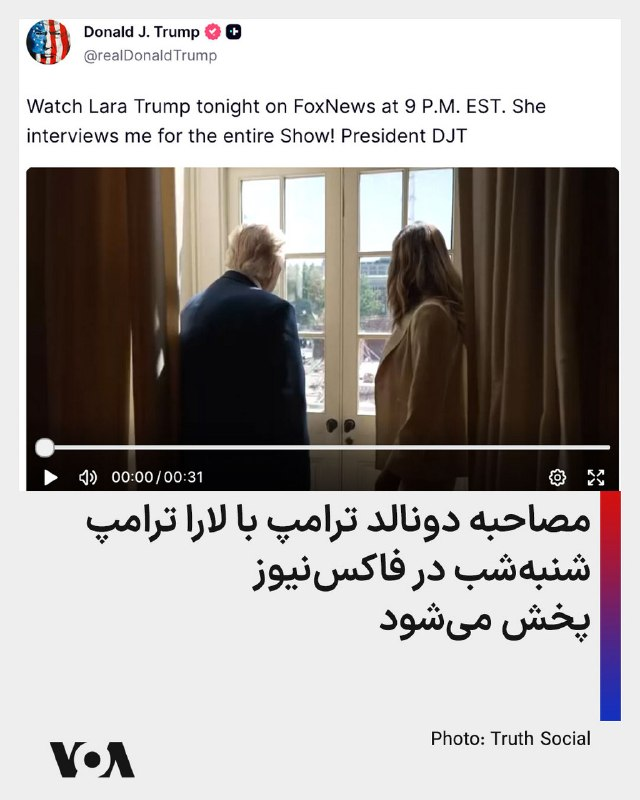

⚡️مصاحبه دونالد ترامپ، رئیس جمهوری آمریکا با لارا ترامپ، مجری تلویزیونی و عروس آقای ترامپ، شنبه‌شب ساعت ۹ به‌وقت واشنگتن از شبکه خبری فاکس‌نیوز پخش می‌شود. رئیس‌جمهوری آمریکا بخشی از این مصاحبه‌ را در حساب کاربری تروت‌سوشال خود منتشر کرد.
@FarsiVOA

## FarsiVOA — post 219125

  

⚡️دونالد ترامپ، رئيس‌جمهوری آمریکا ضمن بازنشر تصاویری از دیدار شهردار شیکاگو، برندون جانسون، با پاپ، در شبکه تروت‌سو‌شال نوشت «یک نفر باید به پاپ توضیح دهد که شهردار شیکاگو بی‌عرضه‌ است و [جمهوری اسلامی] ایران نباید سلاح هسته‌ای داشته باشد!»
@FarsiVOA

## Persian_Trend_Official — post 15354

  <a href="telegram/content/Persian_Trend_Official_15354_1780185153.webm" target="_blank">🎬 Download video</a>

تصویری از مین دریایی (به نظر مهام ۳) در آب های عمان تنگه هرمز

👺Phantom

📌 @persian_trend_official
پرشین ترند | متفاوت‌ترین کانال نظامی

## IranianMinds — post 21096

  

🔴پست ترامپ:

@IranianMinds

## IranianMinds — post 21095

  <a href="telegram/content/IranianMinds_21095_1780185154.mp4" target="_blank">🎬 Download video</a>

@IranianMinds

## IranianMinds — post 21094

  <a href="telegram/content/IranianMinds_21094_1780185156.mp4" target="_blank">🎬 Download video</a>

تو فرانسه مردم کسخل شدن و بعد از قهرمانی پاری‌سن‌ ژرمن تو چمپیونزلیگ، هوادارای این تیم از فرصت سو استفاده کردن و ریختن تو خیابونای پاریس و با آتیش زدن ماشین‌ها، اتوبوس‌ها، وسایل عمومی و... دست به تجمع اعتراضی زدن و با نیروهای پلیس درگیر شدن.

چندین نفر هم دستگیر شدن تا الان

@IranianMinds

## IranianMinds — post 21093

  

ترامپ دیگه کسخل شده و داره هرچیزیو تو توییتاش و حرفاش ربط میده به ایران و سلاح هسته ای

@IranianMinds

## BBCPersian — post 282453

🔻مراسم خاکسپاری مجتبی و میثم ویسی، دو برادر کُرد یارسان که دو روز پیش با شلیک نیروهای سپاه پاسداران در منطقه دالاهو کرمانشاه جان باخته بودند، امروز برگزار شد.

سوران قربانی گزارش می‌دهد
@BBCPersian

## BBCPersian — post 282452

  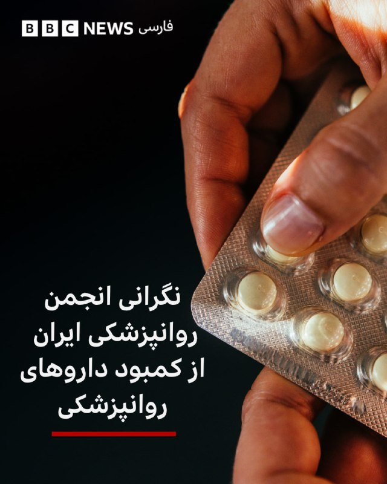

🔻وحید شریعت، رئیس انجمن روانپزشکی ایران: داروهای روانپزشکی، از افسردگی تا دوقطبی و اسکیزوفرنی، با کمبود مواجه شده‌اند.

آقای شریعت ابراز نگرانی کرد که کمبودهای این لیست در ماه‌های آینده، «بزرگتر شود و داروهای فعلی هم قابل تامین نباشند.»

به گزارش رسانه‌های ایران، رئیس انجمن روانپزشکی افزود: «سرچشمه بحران روانی امروز یک چیز واحد نیست، بلکه تصمیمات کلان حاکمیت و نوع نگاه به مسائل است که روی همه چیز سایه انداخته و رسانه‌ها باید با دیدن واقع‌گرایانه یعنی نه بدبینانه کاذب و نه خوشبینانه کاذب به اصلاح شرایط کمک کنند.»

ایران می‌گوید که تحریم‌ها و حملات آمریکا و اسرائیل به مراکز تولید دارو از جمله دلایل کمبود داروهاست.

پیشتر گزارش کردیم که اکبر عبداللهی، مدیرکل دارو و مواد تحت کنترل سازمان غذا و داروی ایران گفته است که از یک ماه دیگر پزشکان هنگام تجویز دارو به فهرستی از داروهای کمیاب، دسترسی خواهند داشت.

به گفته این مقام ارشد دولت، در این فهرست «میزان کمبود دارویی و اطلاعات آماری مربوط به میزان تجویز و بار مالی داروهای تجویزی» را شامل می‌شود.

📸GettyImages
https://trib.al/E2vfVHf
@BBCPersian

## BBCPersian — post 282451

  

🔻ارتش آمریکا اعلام کرد که روز جمعه به موتورخانه یک کشتی که در تلاش بود از محاصره دریایی ایران عبور کند، موشک شلیک کرده است.

فرماندهی مرکزی آمریکا (سنتکام) روز شنبه در بیانیه‌ای اعلام کرد که یک موشک هلفایر به موتورخانه کشتی «لیان استار» با پرچم گامبیا شلیک کرده است. به گفته سنتکام، این کشتی در آب‌های بین‌المللی به سمت یکی از بنادر ایران در خلیج عمان در حرکت بود.

سنتکام می‌گوید که پیش از حمله، نیروهای آمریکایی با «بیش از ۲۰ بار هشدار»، به کشتی اطلاع دادند که در حال نقض محاصره دریایی آمریکا علیه ایران است.

به گفته سنتکام، این کشتی «دیگر به سمت ایران در حرکت نیست»، اما جزئیات بیشتری ارائه نشده است.

سنتکام روز جمعه اعلام کرده بود که از زمان آغاز محاصره دریایی در ۱۳ آوریل، دست‌کم مسیر ۱۱۵ کشتی را تغییر داده است.

📸Handout Photo by the U.S. Navy via Getty Images عکس تزیینی
https://trib.al/BOWRLVu
@BBCPersian

## BBCPersian — post 282450

🔻آمریکا بریتانیا و استرالیا، فناوری شناور‌های هدایت‌پذیر را توسعه می‌دهند

آمریکا، بریتانیا و استرالیا می‌گویند که قصد دارند در چارچوب پیمان نظامی سه‌جانبه خود، موسوم به آکوس، فناوری شناور‌های هدایت‌پذیر (شهپاد) را توسعه دهند. هدف از این اقدام، محافظت از کابل‌های زیرآبی و تقویت دفاعی عنوان شده است.

انتظار می‌رود که فناوری خودروی زیرآبی بدون سرنشین تا سال آینده آماده شود.

هزینه کل این پروژه اعلام نشده است، اما جان هیلی، وزیر دفاع بریتانیا، گفت که این کشور ۲۰۱ میلیون دلار به این پروژه کمک خواهد کرد.

وزرای دفاع آمریکا، بریتانیا و استرالیا این تصمیم را در اجلاس امنیتی مجمع شانگری-لا در سنگاپوراعلام کردند؛ در حالی که پیش از آن انتقادهایی در مورد پیشرفت کند پروژه‌های آکوس منتشر شده بود.

آقای هیلی با اذعان به این انتقادات گفت: «ما مدتی طولانی در آکوس، بیشتر صحبت می‌کردیم و خیلی کم عمل می‌کردیم اما این وضعیت اکنون تغییر کرده است.»

بر اساس پیمان دفاعی آکوس که در سال ۲۰۲۱ آغاز شد، سه عضو پیمان، فناوری زیردریایی‌های هسته‌ای را توسعه می‌دهند و تخصص‌های نظامی خود را به اشتراک می‌گذارند.

این پیمان عموما به عنوان اقدامی برای مقابله با حضور دریایی رو به رشد چین در اقیانوس‌های هند و آرام دیده می‌شود و همینطور گامی در برابر تنش فزاینده در سرزمین‌های مورد مناقشه این منطقه مانند دریای چین جنوبی.

https://trib.al/M2XjY1u
@BBCPersian

## BBCPersian — post 282449

  <a href="https://t.me/bbcpersian/282449" target="_blank">📎 Download file</a>

📻پادکست برنامه شصت دقیقه شنبه ۹ خرداد ۱۴۰۵

این نسخه رادیویی برنامه شصت دقیقه تلویزیون فارسی بی‌بی‌سی است که هرشب بعد از پخش، با حجم کم از اپلیکیشن‌های پادگیر و صفحه تلگرام بی‌بی‌سی فارسی در دسترس است.

با هشتگ BBCPersianRadio# با ما در ارتباط باشید

 @BBCPersian

## Dirty_Kids — post 390609

  <a href="telegram/content/Dirty_Kids_390609_1780185159.webm" target="_blank">🎬 Download video</a>

☢️خفن ترین و‌ قدیمی ترین  انالیزور  ایران ینی دکتر بت 
👍 
🔴مسابقات جذاب جام جهانی به زودی شروع میشه بیا توی کانال دکتر بت و باهاش همراه شو و پول در بیار
💵 رایگان بهترین شرط هارو براتون میذاره حتی هزار تومن هم دریافت نمیکنه روزانه میتونی از پیش بینی فوتبال باهاش…

## Dirty_Kids — post 390608

  <a href="telegram/content/Dirty_Kids_390608_1780185160.webm" target="_blank">🎬 Download video</a>

☢️خفن ترین و‌ قدیمی ترین  انالیزور  ایران ینی دکتر بت 
👍

🔴مسابقات جذاب جام جهانی به زودی شروع میشه بیا توی کانال دکتر بت و باهاش همراه شو و پول در بیار
💵

رایگان بهترین شرط هارو براتون میذاره
حتی هزار تومن هم دریافت نمیکنه
روزانه میتونی از پیش بینی فوتبال باهاش پول در بیاری 👌
A9

🌟اگ اهل پیش بینی فوتبالی این کانال اصلا از دست ندین
👇

✅https://t.me/+4_ADqwB9e-QwYjlk

✅https://t.me/+4_ADqwB9e-QwYjlk

## Dirty_Kids — post 390607

  

#بخوابیم

@Dirty_Kids 👻

## Dirty_Kids — post 390606

  <a href="telegram/content/Dirty_Kids_390606_1780185161.mp4" target="_blank">🎬 Download video</a>

دوتا دختر خیلی شیک و تمیز از یه بوتیک تو نازی‌آباد یه لباس می‌دزدن

@Dirty_Kids 👻

## Dirty_Kids — post 390605

  <a href="telegram/content/Dirty_Kids_390605_1780185161.mp4" target="_blank">🎬 Download video</a>

یک ویدیو که هر بار دیدنش، چیزی از روح آدم را کم می‌کند…
۱۹ دی، شاهین‌شهر اصفهان

@Dirty_Kids 👻

## Dirty_Kids — post 390604

  <a href="telegram/content/Dirty_Kids_390604_1780185163.mp4" target="_blank">🎬 Download video</a>

من هرشب:

هندزفری 🔞

@Dirty_Kids 👻

## Dirty_Kids — post 390603

میدونستید آقا سیدمجتبی تنها گونه جانوری هست که بجای حمله به قاتل پدر و همسر و بچه‌ش، تمام سعیشو میکنه باهاش توافق کنه؟

@Dirty_Kids 👻

## Dirty_Kids — post 390602

  <a href="telegram/content/Dirty_Kids_390602_1780185164.mp4" target="_blank">🎬 Download video</a>

توی سریال "بدنام" دختره به پسره میگه ساز دهنیت باحاله؟ اونم میگه آره، دختره هم میگه پس بریم تو اتاق صدای ساز دهنیمون همسایه‌ها رو بی‌خواب نکنه😂😂

@Dirty_Kids 👻

## Dirty_Kids — post 390601

  

‏کانفیگی که برام فرستادی دیگه کار نمی‌کنه، یکی دیگه می‌فرستی؟

@Dirty_Kids 👻

## Dirty_Kids — post 390600

  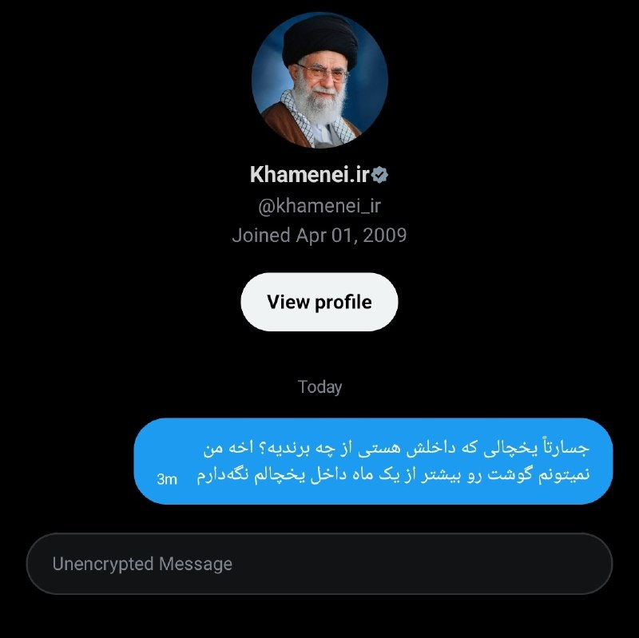

چرا حضرت اقا جواب نمیدن؟ خدای نکرده اتفاق بدی براشون افتاده؟؟

@Dirty_Kids 👻

## Dirty_Kids — post 390599

  

عرزشیا میخوان انتقام آمریکا رو از مردم بگیرن!

توییت زده: مردم جرعت دارن بیان خیابون، یه جوری قتل عام میکنیم که مراد ویسی تا چند سال طول بکشه اسم همه جاوید نام هارو بخونه!

@Dirty_Kids 👻

## Dirty_Kids — post 390597

  <a href="telegram/content/Dirty_Kids_390597_1780185166.mp4" target="_blank">🎬 Download video</a>

از وقتی اینترنت وصل شده مردم خیلی با فالووراشون احساس راحتی میکنن، رسما تو گالری ملتیم:

@Dirty_Kids 👻

## Dirty_Kids — post 390596

انقدر با لباس تکراری میرم سرکار هرکی تو مسیر منو میبینه دژاوو میشه.

@Dirty_Kids 👻

## Dirty_Kids — post 390595

  

خیلی کیری میشد شبیه گداها میشد

+ اینجا برعکس لباس‌شان که شخصی بود مادرشان عمومی بود 💔

@Dirty_Kids 👻

## alonews — post 123842

  

🔥 همراه با ساب + حجم مصرفی، فقط 9T! 🚀

❌ آفر فقط تا پایان امشب ❌

🔥 اگه دنبال یه VPN پایدار و بدون دردسر می‌گردی، این پلن مخصوص خودته!

@Netaazaadbot
@NetAazaadBot
✅ همراه با ساب + حجم مصرفی
✅ 15 سرور اختصاصی پرسرعت
✅ اتصال پایدار و بدون قطعی
✅ سرعت بالا حتی در ساعات شلوغ

@Netaazaadbot
@NetAazaadBot
💎 کیفیتی که بعد از استفاده متوجه تفاوتش میشی!

📩 برای خرید و دریافت سرویس استارت رو بزن✅

## alonews — post 123841

  <a href="telegram/content/alonews_123841_1780185168.webm" target="_blank">🎬 Download video</a>

👈هم اکنون حملات اسرائیل به جنوب لبنان

✅ @AloNews خبر جنگ

## alonews — post 123837

  <a href="telegram/content/alonews_123837_1780185168.webm" target="_blank">🎬 Download video</a>

👈ترامپ بازهم رگباری پست گذاشت

✅ @AloNews خبر جنگ

## alonews — post 123836

  <a href="telegram/content/alonews_123836_1780185169.mp4" target="_blank">🎬 Download video</a>

👈تبلیغ چادر پلنگی در ایتا و روبیکا

✅ @AloNews خبر جنگ

## alonews — post 123835

  <a href="telegram/content/alonews_123835_1780185170.webm" target="_blank">🎬 Download video</a>

👈تابش فرابنفش

🔴این هفته شاخص فرابنفش بالا است، تا جای ممکن در ساعات میانی روز(ساعات۹-۱۵، با توجه به داده‌ها) کمتر در برابر تابش مستقیم خورشید قرار بگیرید.

✅ @AloNews خبر جنگ

## alonews — post 123834

  <a href="telegram/content/alonews_123834_1780185170.webm" target="_blank">🎬 Download video</a>

👈حزب الله: یه تانک اسرائیلی رو زدیم

✅ @AloNews خبر جنگ

## alonews — post 123833

  <a href="telegram/content/alonews_123833_1780185171.mp4" target="_blank">🎬 Download video</a>

👈صحبت های امشب عادل فردوسی‌پور در آپارات اسپورت

✅ @AloNews خبر جنگ

## alonews — post 123832

  <a href="telegram/content/alonews_123832_1780185172.webm" target="_blank">🎬 Download video</a>

👈نیروی هوایی ایالات متحده آمریکا برنامه دارد در قالب بودجه سال مالی ۲۰۲۷، تعداد ۱۵ فروند هواپیمای سوخت‌رسان KC-۴۶A Pegasus را به ارزش ۳.۵۲ میلیارد دلار خریداری کند

🔴با تحویل این ۱۵ فروند تعداد کل سوخت رسان‌های پگاسوس تحویلی به نیروی هوایی آمریکا به ۱۲۰ فروند می‌رسد و برنامه نهایی تحویل +۱۷۹ فروند است.

✅ @AloNews خبر جنگ

## alonews — post 123831

  <a href="telegram/content/alonews_123831_1780185173.webm" target="_blank">🎬 Download video</a>

👈ترامپ :
- یکی باید به پاپ بگه شهردار شیکاگو به درد نمی‌خوره، و ایران هم نباید بمب هسته‌ای داشته باشه!

✅ @AloNews خبر جنگ

## alonews — post 123830

  <a href="telegram/content/alonews_123830_1780185173.mp4" target="_blank">🎬 Download video</a>

👈کنایه مجری تلویزیون به تاخیر ۹ روزه در انتشار آمار تورم توسط مرکز آمار: اعداد را اعلام کنید یا نکنید مردم تورم را لمس می‌کنند

✅ @AloNews خبر جنگ

## alonews — post 123828

  <a href="telegram/content/alonews_123828_1780185174.webm" target="_blank">🎬 Download video</a>

👈حملات هوایی اسرائیل بر کفرجوز و شوکین در جنوب لبنان انجام شده است

✅ @AloNews خبر جنگ

## alonews — post 123827

  <a href="telegram/content/alonews_123827_1780185174.webm" target="_blank">🎬 Download video</a>

👈مدارس شمال اسرائیل فردا تعطیل اند و بنظر می‌رسد اسرائیل خودش را برای موج جدید و مرگبارتری از درگیری با حزب‌الله آماده می‌کند!

✅ @AloNews خبر جنگ

## alonews — post 123826

  <a href="telegram/content/alonews_123826_1780185175.webm" target="_blank">🎬 Download video</a>

👈به حداقل ۵ جهت به سمت فضای هوایی اوکراین، پهپادهای روسی Geran-2 پرتاب شده‌اند.

✅ @AloNews خبر جنگ

## alonews — post 123825

  <a href="telegram/content/alonews_123825_1780185175.webm" target="_blank">🎬 Download video</a>

👈 تصویری جدید و پربازدید از دونالد ترامپ درحال عزیمت به زمین گلف

✅ @AloNews خبر جنگ

## alonews — post 123824

  <a href="telegram/content/alonews_123824_1780185175.webm" target="_blank">🎬 Download video</a>

👈کابینه جنگ اسرائیل در ساعت ۲۲:۳۰ (به وقت محلی) تشکیل جلسه خواهد داد. در حال حاضر ارزیابی وضعیت در دفتر نخست‌وزیر است.

✅ @AloNews خبر جنگ

## alonews — post 123823

  <a href="telegram/content/alonews_123823_1780185175.webm" target="_blank">🎬 Download video</a>

👈معاون سیاسی سپاه: ایران بر تنگه هرمز مسلط شده و پس از ۵۰۰ سال، به موقعیتی دست یافته که حق مسلم مردم ایران است

✅ @AloNews خبر جنگ

---
📅 بروزرسانی: 1405/03/09 23:54
---

## VahidOOnLine — post 242950

  

علی شیرازی، رییس سازمان عقیدتی سیاسی انتظامی گفت: «بر عهد خود برای تداوم راه ولایت و مطالبه انتقام سخت از عاملان به شهادت رساندن رهبرمان پایبندیم.»

او افزود: «نهادهای مسئول باید پیگیری حقوقی و بین‌المللی این جنایت را در اولویت قرار داده و حکم الهی برای قاتلان امام شهید را در ملاعام اجرا کنند.»

شیرازی ادامه داد: «ملت ما تا زمان قصاص قاتلان امام خود و خروج کامل استکبار از منطقه، میدان‌های مبارزه را ترک نخواهند کرد.»
‌🏁 🇬🇧 IranintlTV

🤖 @VahidOOnLine

## VahidOOnLine — post 242949

  

نشریه هیل نوشت ثبات واقعی در خلیج فارس مستلزم از بین بردن توانایی رژیم ایران برای تهدید تجارت جهانی، اعمال فشار بر همسایگان و گروگان گرفتن بازارهای انرژی است. هر چیزی کمتر از این، صرفا وقفه‌ای کوتاه پیش از رویارویی بسیار خطرناک‌تری خواهد بود.

آریل کوهن، پژوهشگر شورای آتلانتیک و نویسنده این تحلیل نوشته نقشه راهبردی خاورمیانه در حال تغییر است و به نظر می‌رسد نفوذ آمریکا در این منطقه رو به کاهش باشد.

او با اشاره به نزدیک شدن تهران و واشینگتن به یک توافق نوشته است برای کسانی که دهه‌هاست این منطقه را مطالعه می‌کنند، این وضعیت نمونه‌ای از «ربودن شکست از آغوش پیروزی» به نظر می‌رسد.

او در ادامه نوشته است تعیین اهداف روشن جنگی، پیش‌شرط ضروری پیروزی نظامی است. همان‌گونه که رییس‌جمهوری و وزیر خارجه آمریکا اعلام کرده‌اند، اهداف واشینگتن در این درگیری روشن بود: جلوگیری از دستیابی جمهوری اسلامی به سلاح هسته‌ای، تضعیف توان موشک‌های بالستیک ایران، و برچیدن یا دست‌کم تضعیف شبکه نیروهای نیابتی که تهران برای اعمال نفوذ در خاورمیانه ایجاد کرده است؛ از حماس در غزه و حزب‌الله در لبنان گرفته تا حوثی‌ها در یمن.
https://iranin
‌🏁 🇬🇧 IranintlTV

🤖 @VahidOOnLine

## VahidOOnLine — post 242948

  

♦️تیم فوتبال پاری‌سن‌ژرمن با پیروزی برابر آرسنال در فینال لیگ قهرمانان اروپا، برای دومین فصل متوالی عنوان قهرمانی این رقابت‌ها را به دست آورد.
این دیدار در وقت‌های قانونی و اضافه با تساوی ۱-۱ به پایان رسید؛ جایی که کای هاورتز در دقیقه ۵ آرسنال را پیش انداخت، اما عثمان دمبله در دقیقه ۶۵ از روی نقطه پنالتی کار را به تساوی کشاند تا بازی به وقت‌های اضافه کشیده شود.
در نهایت، سرنوشت قهرمان در ضربات پنالتی مشخص شد و پاری‌سن‌ژرمن با نتیجه ۴ بر ۳ به پیروزی رسید تا جام را بالای سر ببرد.
این نخستین بار از سال ۲۰۱۶ بود که فینال لیگ قهرمانان اروپا به وقت‌های اضافه کشیده می‌شد؛ دیداری که با هیجان بالا و رقابت نزدیک دو تیم، به یکی از به‌یادماندنی‌ترین فینال‌های سال‌های اخیر تبدیل شد.
‌🇸🇦 Indypersian

🤖 @VahidOOnLine

## VahidOOnLine — post 242947

  

منوچهر متکی، نماینده تهران در مجلس، در یک برنامه تلویزیونی گفت که آمریکایی‌ها هیچ نشانه‌ای از پذیرفتن شروط جمهوری اسلامی از خود نشان نداده‌اند.

متکی اضافه کرد: «علاوه بر آمریکا، کشورهای عربستان سعودی و امارات متحده عربی هم باید به ما غرامت بپردازند.»

او ادامه داد: «ترامپ ممکن است در میانه ۶۰ روز هم بازی دربیارود. یکی از محورهای اصلی ما در مذاکرات، دریافت غرامت است.»

او افزود: «پاکستانی‌ها باید مراقب باشند، شاید آمریکا کاری را که با پادشاه پیشین عمان انجام داد با پاکستان هم انجام دهد. در آن زمان خواستند عمان نامه‌ای به جمهوری اسلامی تحویل دهد و بعد ادعا کردند که ما چنین نامه‌ای ندادیم.
‌🏁 🇬🇧 IranintlTV

🤖 @VahidOOnLine

## VahidOOnLine — post 242946

  <a href="telegram/content/VahidOOnLine_242946_1780172658.mp4" target="_blank">🎬 Download video</a>

♦️گزارش‌های متعددی از شنیده شدن صدایی مهیب در ماساچوست آمریکا، که شهروندان در فضای مجازی آن را «شبیه به انفجار» توصیف کرده‌اند منتشر شده است. بر اساس این گزارش‌ها و تصاویر دوربین‌های مداربسته که این لحظه را ثبت کرده‌اند، صدای «انفجارمانند» در بخش‌های مختلف شهرستان بوستون در ایالت ماساچوست شنیده شده است. به گزارش «میرور» همزمان با شنیده شدن این صدا که حدود ساعت ۲:۳۰ به وقت ساحل شرقی آمریکا رخ داد، سامانه‌های ماهواره‌ای هواشناسی، یک نور لحظه‌ای بزرگ را نیز در همان محدوده ثبت کردند. هنوز منابع رسمی جزئیاتی درباره این حادثه اعلام نکرده‌اند.

روز گذشته نیز حادثه مشابهی در کارولینای جنوبی رخ داد. شبکه ان‌بی‌سی گزارش داد که صدها نفر در این ایالت صدای انفجاری که به «بمب صوتی» شباهت داشت را شنیدند. با این حال، سازمان زمین‌شناسی آمریکا اعلام کرد که این صدا ناشی از زمین‌لرزه نبوده و ناسا نیز اعلام کرد که پرتاب موشک یا سقوط شهاب‌سنگ نیز اتفاق نیفتاده است.
‌🇸🇦 Indypersian

🤖 @VahidOOnLine

## VahidOOnLine — post 242945

  

♦️ فرماندهی مرکزی آمریکا (سنتکام)، روز شنبه نهم خرداد با انتشار بیانیه‌ای رسمی تایید کرد که نیروهای ارتش این کشور در دریای عمان، یک کشتی باری با پرچم گامبیا را که قصد داشت محاصره دریایی بنادر ایران را بشکند، هدف قرار داده و زمین‌گیر کرده‌اند.

بر اساس این بیانیه، نیروهای سنتکام کشتی تجاری «لیان استار» (M/V Lian Star) را در حال حرکت به سمت یکی از بنادر ایران رصد کرده و بیش از ۲۰ بار به آن هشدار دادند که در حال نقض محاصره دریایی ایالات متحده است. در پی بی‌توجهی خدمه کشتی به این هشدارهای مکرر، یک جنگنده آمریکایی با شلیک یک فروند موشک «هل‌فایر» به اتاق موتور کشتی، این شناور را از کار انداخت و مانع از ادامه مسیر آن به سمت ایران شد.

سنتکام در پایان اشاره کرد که با وجود برقراری آتش‌بس با ایران، نیروهای آمریکایی برای اجرای کامل محاصره دریایی، تاکنون ۵ کشتی تجاری را زمین‌گیر کرده و ۱۱۶ کشتی دیگر را مجبور به تغییر مسیر کرده‌اند.
‌🇸🇦 Indypersian

🤖 @VahidOOnLine

## VahidOOnLine — post 242944

  

حبیب‌الله سیاری، معاون هماهنگ‌کننده ارتش جمهوری اسلامی گفت: «امروز نیروی دریایی و دیگر نیروهای نظامی کشور از پیشرفته‌ترین تجهیزات منطبق با فناوری‌های نوین برخوردار هستند.»

او افزود: «دشمن بداند هر گونه تعرض به خاک کشور پاسخ محکم‌تر از گذشته دریافت خواهد کرد.»
‌🏁 🇬🇧 IranintlTV

🤖 @VahidOOnLine

## VahidOOnLine — post 242943

  

سنتکام، فرماندهی مرکزی ایالات متحده آمریکا، اعلام کرد که نیروهای ارتش آمریکا پنج‌شنبه ۸ خرداد، کشتی ام‌وی لیان استار با پرچم گامبیا را که در حال حرکت به سوی یکی از بنادر ایران بود، با شلیک موشک به موتور آن از کار انداختند.

سنتکام افزود که بیش از ۲۰ بار به این کشتی هشدار و اطلاع داده شده بود که در حال نقض محاصره اعمال‌شده از سوی ایالات متحده است.

فرماندهی مرکزی ایالات متحده نوشت: «پس از آن که خدمه «لیان استار» از تبعیت از دستورات خودداری کردند، یک جنگنده آمریکایی با شلیک یک موشک هلفایر به اتاق موتور کشتی، آن را از کار انداخت. این کشتی دیگر به مسیر خود به سمت ایران ادامه نمی‌دهد.»

سنتکام در پایان نوشت: «نیروهای آمریکایی اعلام کردند که تاکنون پنج کشتی تجاری را از کار انداخته و مسیر ۱۱۶ کشتی دیگر را برای اجرای کامل محاصره تغییر داده‌اند؛ این اقدامات در حالی انجام می‌شود که آتش‌بس با جمهوری اسلامی همچنان برقرار است.»
‌🏁 🇬🇧 IranintlTV

🤖 @VahidOOnLine

## VahidOOnLine — post 242942

  

سایت هرانا گزارش داد سپیده قلیان، زندانی سیاسی، پس از پایان دوران محکومیت خود از زندان وکیل‌آباد مشهد آزاد شد. قلیان که در جریان مراسم هفتم خسرو علی‌کردی، وکیل دادگستری جان‌باخته، دستگیر شده بود، با انتشار پستی در اینستاگرام، تصویری از حضور خود بر سر مزار خسرو علی‌کردی منتشر کرد.

قلیان در این پست نوشت: «با خودم قرار گذاشته‌ام از هرچه خسته می‌شوم بشوم، اما از رسیدن به آزادی و حمل کردن این سنگ‌های سخت حقیقت «نه». برای همین رفتار داعش‌گونه جمهوری اسلامی در مراسم خسرو نباید و نمی‌تواند بگذارد که سنگ نیمه‌ تمامم در آذر ۱۴۰۱ را، زمین بگذارم.»
‌🏁 🇬🇧 IranintlTV

🤖 @VahidOOnLine

## VahidOOnLine — post 242941

  

♦️ آسمان شب یکشنبه‌شب، دهم خرداد، میزبان یک رویداد نجومی نادر به نام «ریزماه آبی» (Blue Micromoon) خواهد بود؛ پدیده‌ای که در آن، ماه کامل در دورترین فاصله خود از زمین قرار می‌گیرد و کوچک‌تر و کم‌نورتر از همیشه دیده می‌شود. علاوه بر این، ستاره درخشان «قلب‌العقرب» (Antares) نیز در این نمایش آسمانی حضور خواهد داشت.

ماه آبی زمانی رخ می‌دهد که دو ماه کامل در یک ماه میلادی شکل بگیرند (نخستین ماه کامل این ماه در ۱ مه دیده شد). از سوی دیگر، به دلیل مدار بیضوی ماه، این بار قمر زمین در فاصله ۴۰۶,۱۳۵ کیلومتری قرار دارد که باعث می‌شود ۶ درصد کوچک‌تر و ۱۰ درصد کم‌نورتر از یک ماه کامل معمولی به نظر برسد. برخلاف نامش، این ماه تغییر رنگ نخواهد داد.

نکته جذاب‌تر این رویداد، پدیده «اختفا» برای رصدگران نیم‌کره جنوبی (مانند استرالیا، نیوزیلند، شیلی و آرژانتین) است؛ جایی که ریزماه آبی برای مدتی کوتاه از مقابل ستاره غول‌پیکر سرخ «قلب‌العقرب» در صورت فلکی کژدم عبور کرده و آن را پنهان می‌کند. در سایر نقاط جهان، این ستاره سرخ در تمام طول شب در کنار ماه کامل قابل رویت خواهد بود.
‌🇸🇦 Indypersian

🤖 @VahidOOnLine

## VahidOOnLine — post 242940

  

صداوسیمای جمهوری اسلامی در گزارشی درباره تفاهم احتمالی بین تهران و واشینگتن با عنوان «جزئیات غیررسمی»، اعلام کرد آمریکا متعهد شده در طول ۶۰ روز امکان دسترسی جمهوری اسلامی به ۱۲ میلیارد دلار از دارایی‌ها را به‌گونه‌ای فراهم کند که این منابع قابلیت انتقال و هزینه‌کرد در بانک‌های مقصد را بدون محدودیت داشته باشد.

این گزارش افزود که بر اساس این تفاهم، جمهوری اسلامی مرجع انحصاری تشخیص ماهیت شناورهای عبوری است و هر شناوری که محموله آن تهدیدآمیز شناخته شود یا بهره‌بردار نهایی آن در «خصومت» با جمهوری اسلامی باشد، به عنوان کشتی تجاری شناخته نشده و اجازه عبور از مسیرهای تعریف‌شده را ندارد.

صدا و سیما تاکید کرد که این رونوشت هنوز در حکم یک تفاهم غیررسمی است چون مسیر آن همچنان در چرخه بررسی، مذاکره و بازبینی قرار دارد.
‌🏁 🇬🇧 IranintlTV

🤖 @VahidOOnLine

## VahidOOnLine — post 242939

  

♦️ تیفانی ترامپ و همسرش مایکل بولوس تازه‌ترین چهره‌های نزدیک به خانواده دونالد ترامپ‌اند که در سفر خود به هند از تاج‌محل بازدید کردند.

این زوج که در روزهای گذشته در سفر به مقصدهای گرمسیری بودند، پس از حضور در مراسم ازدواج جزیره‌ای دونالد ترامپ جوان، برادر تیفانی، سفر خود را ادامه دادند و در ادامه به هند رفتند؛ جایی که بازدید از تاج‌محل، بنای مشهور شهر آگرا، بخشی از برنامه سفرشان بود.

چند روز پیش نیز مارکو روبیو، وزیر امور خارجه آمریکا، همراه همسرش ژانت دوسدبس، از تاج محل بازدید کرده بود.

تاج محل، از معروف‌ترین بناهای تاریخی هند، در قرن هفدهم میلادی به دستور شاه جهان، پادشاه گورکانی، ساخته شد. این آرامگاه باشکوه به یاد همسر محبوب ایرانی او، ممتاز محل، بنا شد و سال‌ها است که یکی از مهم‌ترین جاذبه‌های گردشگری هند و از شناخته‌شده‌ترین بناهای عاشقانه جهان به شمار می‌رود.
‌🇸🇦 Indypersian

🤖 @VahidOOnLine

## VahidOOnLine — post 242938

  

یدالله جوانی، معاون سیاسی سپاه پاسداران گفت: «میدان‌های ما آماده است و اگر دشمن مرتکب خطای مجددی شود، پاسخ جمهوری اسلامی محکم‌تر، قاطع‌تر و غیرقابل‌باورتر خواهد بود.»

او ادامه داد: «جمهوری اسلامی بر تنگه هرمز مسلط شده و پس از ۵۰۰ سال، به موقعیتی دست یافته که حق مسلم مردم ایران است.»

جوانی افزود: «دشمن اکنون با دو راه پیش‌رو مواجه است؛ راه بد و راه بدتر.»
‌🏁 🇬🇧 IranintlTV

🤖 @VahidOOnLine

## VahidOOnLine — post 242937

  

♦️ به گزارش نیویورک‌پست، در پی حمله موشکی جمهوری اسلامی به یک پایگاه هوایی در کویت، چند نفر از نیروهای نظامی و پیمانکاران آمریکایی مجروح شدند. این حمله در حالی رخ می‌دهد که دونالد ترامپ، رئیس‌جمهوری آمریکا، در حال ارزیابی پذیرش آخرین پیشنهاد صلح تهران یا بازگشت به شرایط جنگی است.

یک منبع مطلع روز شنبه نهم خرداد، اعلام کرد که در پی رهگیری یک موشک «فاتح-۱۱۰» توسط پدافند هوایی کویت طی ۲۴ ساعت گذشته، قطعات و ترکش‌های ناشی از انهدام موشک بر فراز پایگاه هوایی «علی السالم» فرود آمده و منجر به جراحت سطحی چند آمریکایی شده است. این حادثه همچنین خسارت شدیدی به دو پهپاد «ام‌کیو-۹ ریپر» (MQ-9 Reaper) به ارزش تقریبی ۳۰ میلیون دلار وارد کرده است.

این حمله در شرایطی صورت گرفته که دونالد ترامپ روز جمعه با تیم امنیتی خود تشکیل جلسه داد و اعلام کرد که قصد دارد تصمیم نهایی را درباره توافق با ایران اتخاذ کند؛ توافقی که شامل تمدید ۶۰ روزه آتش‌بس، بازگشایی تنگه هرمز و آغاز مذاکرات بیشتر درباره مواد هسته‌ای ایران در ازای لغو محاصره دریایی آمریکا می‌شود.
‌🇸🇦 Indypersian

🤖 @VahidOOnLine

## VahidOOnLine — post 242936

  

♦️ یک مقام مطلع آمریکایی روز شنبه نهم خرداد، به خبرگزاری اسوشیتدپرس گفت که ارتش ایالات متحده از ورود یک کشتی تجاری دیگر که قصد داشت محاصره دریایی بنادر ایران را بشکند، جلوگیری کرده است.

به گفته این مقام مسئول که خواست نامش فاش نشود، کشتی باری «لیان استار» (Lian Star) با پرچم گامبیا، بامداد امروز بدون توجه به هشدارهای مکرر نیروهای آمریکایی تلاش کرد وارد یکی از بنادر ایران شود. در پی این اقدام، جنگنده‌های ارتش آمریکا این کشتی را در دریای عمان غیرفعال (زمین‌گیر) کردند؛ این شناور اکنون بدون آنکه نیروهای آمریکایی وارد آن شده باشند، در دریا سرگردان است.

با احتساب این رویارویی جدید، ارتش آمریکا تاکنون پنج کشتی که قصد شکستن محاصره دریایی بنادر ایران را داشتند از کار انداخته‌اند.
‌🇸🇦 Indypersian

🤖 @VahidOOnLine

## VahidOOnLine — post 242935

  

مهدی محمدی، مشاور محمدباقر قالیباف نوشت: «بر خلاف عملیات روانی گسترده رسانه‌های غربی، هیچ توافقی نهایی نشده است.»
او افزود: «جمهوری اسلامی در موضع قدرت است، توافق صرفا یک تاکتیک برای خرید زمان و منابع است نه استراتژی صلح‌طلبانه، و سرنوشت نبرد را ما تعیین خواهیم کرد.»
‌🏁 🇬🇧 IranintlTV

🤖 @VahidOOnLine

## VahidOOnLine — post 242934

  

♦️ دونالد ترامپ، رئیس‌جمهوری آمریکا، روز شنبه نهم خرداد اعلام کرد که در پی انصراف تعدادی از هنرمندان، در حال بررسی لغو زنجیره کنسرت‌های گرامیداشت دویست‌وپنجاهمین سالگرد استقلال ایالات متحده و برگزاری یک سخنرانی به جای آن است.

روز جمعه، برت مایکلز، خواننده اصلی گروه راک «پویزن» (Poison)، پنجمین موسیقی‌دانی بود که از حضور در این کنسرت‌ها تحت عنوان «آزادی ۲۵۰» (Freedom 250) انصراف داد. این رویدادها قرار است از ۲۵ ژوئن تا ۱۰ ژوئیه در محوطه ملی واشنگتن برگزار شوند. پیش از این قرار بود ۹ هنرمند در این رویدادها اجرا داشته باشند اما چهار نفر از جمله مارتینا مک‌براید، بعد از آن که متوجه شدند برنامه به ترامپ مربوط است، تصمیم به انصراف گرفتند.

ترامپ در شبکه اجتماعی «تروث سوشال» نوشت که در حال بررسی گزینش یک سخنرانی و تجمع انتخاباتی به جای این کنسرت‌هاست. او خود را «جذابیت شماره یک در سراسر جهان» نامید و افزود: «من مردی هستم که جمیعت بسیار بزرگ‌تری را نسبت به دوران اوج الویس پرسلی به خود جذب می‌کند، آن هم بدون اینکه گیتاری به دست داشته باشد.»
‌🇸🇦 Indypersian

🤖 @VahidOOnLine

## VahidOOnLine — post 242933

  

♦️ قرارگاه مرکزی خاتم‌الانبیا روز شنبه، نهم خرداد، بار دیگر بر کنترل تهران بر تنگه هرمز تاکید کرد و به شناورهای تجاری و نظامی هشدار داد که از مقررات مربوط به عبور از این آبراه استراتژیک پیروی کنند.

در بیانیه این قرارگاه که در خبرگزاری تسنیم بازتاب یافت، آمده است: «مدیریت تنگه هرمز با اقتدار کامل توسط نیروهای مسلح جمهوری اسلامی ایران اعمال می‌شود.»

این قرارگاه در ادامه افزود: «تمامی کشتی‌ها، شناورهای تجاری و نفتکش‌ها موظفند صرفا از مسیرهای تعیین‌شده تردد کرده و از نیروی دریایی سپاه پاسداران انقلاب اسلامی مجوز دریافت کنند. هرگونه تخطی از این مقررات، امنیت تردد آن‌ها را به شدت به خطر خواهد انداخت.»

جمهوری اسلامی همچنین به نیروهای نظامی خارجی مستقر در منطقه هشدار داد که هرگونه تلاش برای مداخله در مدیریت دریایی یا تردد کشتیرانی، با واکنش مواجه خواهد شد.
‌🇸🇦 Indypersian

🤖 @VahidOOnLine

## WithYashar — post 12963

  <a href="telegram/content/WithYashar_12963_1780172665.mp4" target="_blank">🎬 Download video</a>

شاهزاده رضا پهلوی در اودسا:
کشور من از همه طرف ضربه خورده؛ از داخل توسط همین رژیم، و از بیرون هم به خاطر پیامدهای بی‌فکری خودش. با این حال، جمهوری اسلامی هنوز سر جاشه.
بعضی‌ها توی این جمع ممکنه اینو نشونه‌ی قدرت رژیم بدونن. من اینجام بگم که اینطور نیست.
این فقط نشونه‌ی اینه که دنیا هنوز نتیجه‌ی درست از چیزی که داره می‌بینه نگرفته.
پهپاد شاهد فرقی نمی‌کنه کجا باشه؛ چه یه ساختمون مسکونی، چه یه میدان اعتراض تو تهران، چه دفترهای تجاری تو دبی.
پهپادهایی که آسمون شهرهای اوکراین رو تاریک کردن، توی همون کارخانه‌هایی ساخته شدن که زیر نظر همون رژیمی هستن که توی تهران برای شکار معترض‌ها، توی خیابون‌ها پهپادهای نظارتی فرستاد.
@withyashar

## WithYashar — post 12962

پست جدید بوگاتی شاه https://www.instagram.com/reel/DY-ObumIJEK/?igsh=MjQ5cGt6dWo0dGg= کارای اداریش رو انجام بدید 💥

## WithYashar — post 12961

در پی حملات سنگین حزب‌الله، به بیمارستانی در شهر نهاریا در شمال اسرائیل دستور داده شد تا بیماران را به تأسیسات زیرزمینی منتقل کند.
@withyashar

## WithYashar — post 12960

شاهزاده رضا پهلوی: با جمهوری اسلامی توافق نکنید، بلکه به آن پایان دهید.
@withyashar

## WithYashar — post 12959

جلسه کمپ دیوید که قرار بود امروز برگزار شود ترامپ اعلام کرد: جلسه کابینه به دلیل شرایط آب و هوایی در کاخ سفید برگزار خواهد شد، نه در کمپ دیوید! حالا صحبت‌هایی هست که کمپ دیوید یک تله برای شناسایی فردی بود که اطلاعات را نشت می‌داد ! فرد مورد نظر گیر افتاد !…

## WithYashar — post 12958

  

به ادعای آمریکا در جریان این جنگ، دست‌کم ۱۶۰ شناور دریایی ایران را غرق کرده است. هر یک از این شناورها می‌تواند منبعی بالقوه برای آلودگی باشد. وقوع یک نشت جدی در تنگه، مهار آن را بسیار دشوارتر از حالت معمول خواهد کرد
@withyashar

## WithYashar — post 12957

## WithYashar — post 12956

یاشار امشب ردبول رومی خوری؟

## WithYashar — post 12955

سنتکام اعلام کرد کشتی تجاری Lian Star که از یک بندر ایران خارج شده بود پس از 20 هشدار توقف و عدم توجه آن توسط یک هواپیمای آمریکایی با شلیک موشک هلفایر به اتاق موتور کشتی، آن را از کار انداخت و در دریای عمان توقیف شد.
@withyashar

## WithYashar — post 12954

پست جدید بوگاتی شاه

https://www.instagram.com/reel/DY-ObumIJEK/?igsh=MjQ5cGt6dWo0dGg=
کارای اداریش رو انجام بدید 💥

## WithYashar — post 12952

صداوسیما جزئیات غیررسمی از یادداشت تفاهم (ایران و آمریکا) را منتشر کرد
‌
یکی از مهمترین محورهای توافق (ایران و آمریکا) بازتعریف قواعد عبور و مرور در تنگه هرمز است

‌ایران مرجع انحصاری تشخیص ماهیت شناورهای عبوری است

هر شناوری که محموله آن تهدید آمیز تلقی شود یا بهره‌بردار نهایی آن در خصومت با ایران باشد به عنوان کشتی تجاری شناخته نمی‌شود و اجازه عبور از مسیرهای تعریف شده را ندارد

تعیین مسیر حرکت و تعیین هزینه خدمات ناوبری در حوزه تصمیم‌گیری ایران دیده شده
‌
هر شناور موظف است اطلاعاتش را در اختیار مرکز مرتبط با نیروی دریایی قرار دهد و فرم‌هایی شامل جزئیات محموله مالکیت و مقصد را تکمیل کند
@withyashar

## WithYashar — post 12951

الجزیره: ترامپ برای جلوگیری از جنگ با ایران پیش از جام جهانی بسیار مصمم است

او همچنان برای دستیابی به یک توافق موقت با تهران تحت فشار است، اما پیشرفت فوری بعید به نظر می‌رسد
@withyashar

## WithYashar — post 12950

شبکه ۱۴ اسرائیل : نتانیاهو، قراره به‌زودی یه جلسه امنیتی برگزار کنه تا درباره نحوه پاسخ به شدت گرفتن حملات حزب‌الله تصمیم بگیره
@withyashar

## WithYashar — post 12949

## WithYashar — post 12948

## WithYashar — post 12947

🌊

## WithYashar — post 12946

درود میشه یکم ویس بدی دلمون گرفت :)❤️

## WithYashar — post 12945

  

ترامپ: پنج مرحله سندروم ترامپ هراسی
@withyashar

## mwarmonitor — post 9922

🔴 یک مقام آمریکایی: یک کشتی تجاری که تلاش داشت به سمت یک بندر ایرانی حرکت کند، متوقف شد. 🔸این نفتکش/کشتی با نام «لیان استار» هشدارهای نیروهای دریایی ما در خلیج عمان را نادیده گرفته بود. @mwarmonitor

## mwarmonitor — post 9921

🔴«جناح تندرو در ایران، گروهی حاشیه‌ای اما پرسر و صدا که اعضایی در مجلس و یک کرسی در شورای عالی امنیت ملی دارد، به‌طور علنی با هرگونه امتیازدهی به واشینگتن مخالفت کرده و با استفاده از تجمع‌ها، رسانه‌های دولتی و فشارهای پشت‌پرده تلاش می‌کند یک توافق را به شکست بکشاند.» وال‌استریت ژورنال

@mwarmonitor

## FoxNewsTwitter — post 342433

  

Fox News (Twitter/X)

Spencer Pratt keeps blasting his celebrity critics.

The Los Angeles mayoral candidate responded after 'Hacks' star Hannah Einbinder claimed money was the key issue for a lot of his supporters.

"She's in an elite minority and the rest of us want change," Pratt said.

## FoxNewsTwitter — post 342432

  <a href="telegram/content/FoxNewsTwitter_342432_1780172669.mp4" target="_blank">🎬 Download video</a>

Fox News (Twitter/X)

Grab your tissues — you're going to need them.

Footage from a high school graduation in Milwaukee captures the emotional moment a U.S. military specialist reunites with her brother after more than a year apart, as she personally hands him his diploma after serving overseas during the conflict in Iran.

## pm_afshaa — post 91908

🟠سنتکام از حمله موشکی به موتور خانه یک ابر نفتکش ایرانی حامل نفت در دریای عمان خبر داد

💧 Rainbet.com the #1 Non-KYC Crypto Casino & Sportsbook @rainbetcom

😁 @Pm_Afshaa

## pm_afshaa — post 91907

پاریسی‌ها قهرمان لیگ قهرمانان اروپا در فصل ۲۰۲۵-۲۰۲۶ شدن.
پاریسن‌ژرمن 1 - 1 آرسنال
پنالتی: 4 - 3

💧Rainbet.com the #1 Non-KYC Crypto Casino & Sportsbook @rainbetcom

😁 @Pm_Afshaa

## pm_afshaa — post 91906

  <a href="telegram/content/pm_afshaa_91906_1780172670.webm" target="_blank">🎬 Download video</a>

🔴آسوشیتدپرس:
نیروهای آمریکا یک کشتی که قصد ورود به بنادر ایران رو داشت، از کار انداختن.

💧 Rainbet.com the #1 Non-KYC Crypto Casino & Sportsbook @rainbetcom

😁 @Pm_Afshaa

## pm_afshaa — post 91905

🔴سخنگوی دولت: دولت پول بازسازی خونه هایی که تو جنگ تخریب شده رو نمیده. ولی بهتون مجوز میدیم تا خونتون رو بازسازی کنید

💧 Rainbet.com the #1 Non-KYC Crypto Casino & Sportsbook @rainbetcom

😁 @Pm_Afshaa

## pm_afshaa — post 91904

  

بنیامین نقدی به اعدام محکوم شد

💧 Rainbet.com the #1 Non-KYC Crypto Casino & Sportsbook @rainbetcom

😁 @Pm_Afshaa

## pm_afshaa — post 91903

🔴یک مقام ارشد آمریکایی: دیدار رئیس‌جمهور ایالات متحده دونالد ترامپ در اتاق عملیات حدود دو ساعت طول کشید، اما هنوز تصمیمی درباره توافق با ایران گرفته نشده است. در دولت معتقدند که به توافق نزدیک هستند، اما هنوز مسائل اختلافی باقی مانده

💧 Rainbet.com the #1 Non-KYC Crypto Casino & Sportsbook @rainbetcom

😁 @Pm_Afshaa

## pm_afshaa — post 91902

🔴شاهزاده رضا پهلوی:مردم ایران باید از طریق هوا حفاظت بشن و اینترنت و دیگر ابزار لازم رو داشته باشن که دست به‌کار بشن و رژیم رو به زانو بیارن

💧 Rainbet.com the #1 Non-KYC Crypto Casino & Sportsbook @rainbetcom

😁 @Pm_Afshaa

## iaghapour — post 2645

  

🚀 سرور ابری رو از هر جای دنیا و با هر ارزی که دوست داری بخر!

🌍 دیگه نیازی نیست برای خرید سرور از دیتاسنترهای معتبر جهانی دغدغه پرداخت یا محدودیت لوکیشن داشته باشی. در دوپراکس (Doprax)، بهترین زیرساخت‌های ابری دنیا در یک پنل اختصاصی زیر دست شماست!

با دوپراکس می‌تونی از غول‌های تکنولوژی مثل Google Cloud, DigitalOcean, Hetzner, Vultr و چندین پروایدر دیگر، سرور تهیه کنی.

✨ چرا دوپراکس بهترین انتخاب شماست؟
📍 تنوع لوکیشن: دسترسی به ده‌ها لوکیشن مختلف در اروپا، آمریکا، آسیا.
💳 پرداخت بدون مرز: امکان پرداخت آسان با ریال و یا رمزارز.
⏱️ پرداخت ساعتی: فقط به اندازه‌ای که مصرف می‌کنی پول بده!
🔄 امکان تعویض IP: قابلیت تغییر آی‌پی در اکثر دیتاسنترها.

همین حالا وارد سایت شو و اولین سرورت رو با کانفیگ دلخواهت بساز 👇

🌐 وب‌سایت: www.doprax.com

💬 پشتیبانی و اخبار در کانال ما:
@dopraxcloud

## iaghapour — post 2644

  <a href="https://t.me/iaghapour/2644" target="_blank">📎 Download file</a>

🟢 لیست آی‌پی ها و فایل html مربوط به ویدیو ساخت فیلترشکن پرسرعت و رایگان با ورکر کلودفلر

🆔@iaghapour

## DEJradio — post 5163

  <a href="telegram/content/DEJradio_5163_1780172672.mp4" target="_blank">🎬 Download video</a>

👑
🔺 تجمع ایرانیان مقیم کلن در آلمان در حمایت از انقلاب شیروخورشید و جاویدنامان راه آزادی

#همبستگی #جاویدنامان #کلن
@DEJradio

## DEJradio — post 5162

  <a href="telegram/content/DEJradio_5162_1780172674.mp4" target="_blank">🎬 Download video</a>

🚨🎥 پرواز جنگنده‌های نهاجا بر فراز تهران و کرج

#جنگنده #جنگ
@DEJradio

## DEJradio — post 5161

  <a href="telegram/content/DEJradio_5161_1780172675.mp4" target="_blank">🎬 Download video</a>

👑
🔺 حمایت هم‌میهنان ساکن اسپانیا از انقلاب شیر و خورشید؛
"بوی نفت ارزان نمی‌گذارد بوی خون مردم ایران به مشام شما برسد!

#همبستگی #اسپانیا
@DEJradio

## DEJradio — post 5160

  <a href="telegram/content/DEJradio_5160_1780172678.webm" target="_blank">🎬 Download video</a>

👑
🚨 ترجمه زیرنویس سخنرانی شاهزاده رضا پهلوی در نشست امنیتی «دریای سیاه» در اودسا - اوکراین

#شاهزاده_رضا_پهلوی #اودسا #نشست_امنیتی_دریای_سیاه

@DEJradio

## DEJradio — post 5159

  <a href="telegram/content/DEJradio_5159_1780172678.mp4" target="_blank">🎬 Download video</a>

🚨
🔸 خبر ۲۱
شنبه ۹ خرداد ۱۴۰۵

#خبر۲۱
@DEJradio

## DEJradio — post 5158

  <a href="telegram/content/DEJradio_5158_1780172680.webm" target="_blank">🎬 Download video</a>

🔺🎤 تکنیک های کاهش اضطراب

گفت‌وگو با دکتر مصطفی میررمضانی، روانپزشک و روان‌درمانگر

#کاهش_اضطراب #اضطراب
@DEJradio

## VahidOnline — post 75807

  

ستاد فرماندهی مرکزی ارتش آمریکا، سنتکام، اعلام کرد نیروهای این کشور یک کشتی تجاری با پرچم گامبیا را که به گفته واشینگتن در نقض محاصره دریایی به سمت یکی از بنادر ایران در حرکت بود، در خلیج عمان هدف قرار داده و از ادامه مسیر آن جلوگیری کرده‌اند.

سنتکام روز شنبه نهم خرداد در بیانیه‌ای گفت نیروهای آمریکایی روز هشتم خرداد کشتی «لیان استار» را هنگام حرکت در آب‌های بین‌المللی به سوی یکی از بنادر ایران شناسایی کردند و بیش از ۲۰ بار به خدمه آن هشدار دادند.

به گفته این نهاد نظامی، پس از آنکه خدمه کشتی به هشدارها توجه نکردند، یک هواپیمای آمریکایی با شلیک موشک هلفایر به اتاق موتور کشتی، آن را از کار انداخت.

سنتکام افزود این کشتی دیگر به سمت ایران در حرکت نیست.

در این بیانیه آمده است که از زمان اجرای محاصره دریایی علیه ایران، نیروهای آمریکایی پنج کشتی تجاری را از کار انداخته و ۱۱۶ کشتی دیگر را وادار به تغییر مسیر کرده‌اند.

سنتکام جزئیات بیشتری درباره محموله کشتی یا مقصد دقیق آن در ایران ارائه نکرده است.
@VahidHeadline

📡 @VahidOnline

## VahidOnline — post 75806

  

صداوسیمای جمهوری اسلامی در گزارشی درباره تفاهم احتمالی بین تهران و واشینگتن با عنوان «جزئیات غیررسمی»، اعلام کرد آمریکا متعهد شده در طول ۶۰ روز امکان دسترسی جمهوری اسلامی به ۱۲ میلیارد دلار از دارایی‌ها را به‌گونه‌ای فراهم کند که این منابع قابلیت انتقال و هزینه‌کرد در بانک‌های مقصد را بدون محدودیت داشته باشد.

این گزارش افزود که بر اساس این تفاهم، جمهوری اسلامی مرجع انحصاری تشخیص ماهیت شناورهای عبوری است و هر شناوری که محموله آن تهدیدآمیز شناخته شود یا بهره‌بردار نهایی آن در «خصومت» با جمهوری اسلامی باشد، به عنوان کشتی تجاری شناخته نشده و اجازه عبور از مسیرهای تعریف‌شده را ندارد.

صدا و سیما تاکید کرد که این رونوشت هنوز در حکم یک تفاهم غیررسمی است چون مسیر آن همچنان در چرخه بررسی، مذاکره و بازبینی قرار دارد.
@VahidOOnLine

📡 @VahidOnline

## VahidOnline — post 75805

  

♦️ به گزارش نیویورک‌پست، در پی حمله موشکی جمهوری اسلامی به یک پایگاه هوایی در کویت، چند نفر از نیروهای نظامی و پیمانکاران آمریکایی مجروح شدند. این حمله در حالی رخ می‌دهد که دونالد ترامپ، رئیس‌جمهوری آمریکا، در حال ارزیابی پذیرش آخرین پیشنهاد صلح تهران یا بازگشت به شرایط جنگی است.

یک منبع مطلع روز شنبه نهم خرداد، اعلام کرد که در پی رهگیری یک موشک «فاتح-۱۱۰» توسط پدافند هوایی کویت طی ۲۴ ساعت گذشته، قطعات و ترکش‌های ناشی از انهدام موشک بر فراز پایگاه هوایی «علی السالم» فرود آمده و منجر به جراحت سطحی چند آمریکایی شده است. این حادثه همچنین خسارت شدیدی به دو پهپاد «ام‌کیو-۹ ریپر» (MQ-9 Reaper) به ارزش تقریبی ۳۰ میلیون دلار وارد کرده است.

این حمله در شرایطی صورت گرفته که دونالد ترامپ روز جمعه با تیم امنیتی خود تشکیل جلسه داد و اعلام کرد که قصد دارد تصمیم نهایی را درباره توافق با ایران اتخاذ کند؛ توافقی که شامل تمدید ۶۰ روزه آتش‌بس، بازگشایی تنگه هرمز و آغاز مذاکرات بیشتر درباره مواد هسته‌ای ایران در ازای لغو محاصره دریایی آمریکا می‌شود.
@VahidOOnLine

📡 @VahidOnline

## IranIntlTV — post 339788

  

علی شیرازی، رییس سازمان عقیدتی سیاسی انتظامی گفت: «بر عهد خود برای تداوم راه ولایت و مطالبه انتقام سخت از عاملان به شهادت رساندن رهبرمان پایبندیم.»

او افزود: «نهادهای مسئول باید پیگیری حقوقی و بین‌المللی این جنایت را در اولویت قرار داده و حکم الهی برای قاتلان امام شهید را در ملاعام اجرا کنند.»

شیرازی ادامه داد: «ملت ما تا زمان قصاص قاتلان امام خود و خروج کامل استکبار از منطقه، میدان‌های مبارزه را ترک نخواهند کرد.»
https://iranintl.com/202605304918

## IranIntlTV — post 339787

  <a href="telegram/content/IranIntlTV_339787_1780172683.mp4" target="_blank">🎬 Download video</a>

بنای یادبود لینکلن در واشینگتن میزبان تجمع ایرانیان و حامیان غیرایرانی جنبش دادخواهی بود.

این گردهمایی در گرامی‌داشت جان‌باختگان و در اعتراض به ادامه اعدام‌ها و سرکوب در ایران برگزار شد.

گزارش اردوان روزبه، خبرنگار ایران‌اینترنشنال و گفت‌وگو با سیامک آرام، برگزارکننده، و یکی از شرکت‌کنندگان
@iranintltv

## IranIntlTV — post 339786

  <a href="telegram/content/IranIntlTV_339786_1780172684.mp4" target="_blank">🎬 Download video</a>

در ادامه صدور احکام سنگین برای معترضان و زندانیان سیاسی، حکم اعدام بنیامین نقدی، از معترضان دی‌ماه، به اتهام «افساد فی‌الارض» صادر شده است. هم‌زمان، گزارش‌ها از تایید حکم اعدام رئوف شیخ‌معروفی و محمد فرجی، از بازداشت‌شدگان جنبش «زن، زندگی، آزادی»، در دیوان عالی کشور حکایت دارد.

جزییات بیشتر با پگاه بنی‌هاشمی، پژوهشگر ارشد حقوق
@iranintltv

## IranIntlTV — post 339785

  

نشریه هیل نوشت ثبات واقعی در خلیج فارس مستلزم از بین بردن توانایی رژیم ایران برای تهدید تجارت جهانی، اعمال فشار بر همسایگان و گروگان گرفتن بازارهای انرژی است. هر چیزی کمتر از این، صرفا وقفه‌ای کوتاه پیش از رویارویی بسیار خطرناک‌تری خواهد بود.

آریل کوهن، پژوهشگر شورای آتلانتیک و نویسنده این تحلیل نوشته نقشه راهبردی خاورمیانه در حال تغییر است و به نظر می‌رسد نفوذ آمریکا در این منطقه رو به کاهش باشد.

او با اشاره به نزدیک شدن تهران و واشینگتن به یک توافق نوشته است برای کسانی که دهه‌هاست این منطقه را مطالعه می‌کنند، این وضعیت نمونه‌ای از «ربودن شکست از آغوش پیروزی» به نظر می‌رسد.

او در ادامه نوشته است تعیین اهداف روشن جنگی، پیش‌شرط ضروری پیروزی نظامی است. همان‌گونه که رییس‌جمهوری و وزیر خارجه آمریکا اعلام کرده‌اند، اهداف واشینگتن در این درگیری روشن بود: جلوگیری از دستیابی جمهوری اسلامی به سلاح هسته‌ای، تضعیف توان موشک‌های بالستیک ایران، و برچیدن یا دست‌کم تضعیف شبکه نیروهای نیابتی که تهران برای اعمال نفوذ در خاورمیانه ایجاد کرده است؛ از حماس در غزه و حزب‌الله در لبنان گرفته تا حوثی‌ها در یمن.
https://iranin

## IranIntlTV — post 339784

  <a href="https://t.me/IranintlTV/339784" target="_blank">📎 Download file</a>

🎧نسخه صوتی چشم‌انداز: آیا اسرائیل از توافق ترامپ و جمهوری اسلامی پیروی می‌کند؟!
@iranintlTV

## IranIntlTV — post 339783

  

منوچهر متکی، نماینده تهران در مجلس، در یک برنامه تلویزیونی گفت که آمریکایی‌ها هیچ نشانه‌ای از پذیرفتن شروط جمهوری اسلامی از خود نشان نداده‌اند.

متکی اضافه کرد: «علاوه بر آمریکا، کشورهای عربستان سعودی و امارات متحده عربی هم باید به ما غرامت بپردازند.»

او ادامه داد: «ترامپ ممکن است در میانه ۶۰ روز هم بازی دربیارود. یکی از محورهای اصلی ما در مذاکرات، دریافت غرامت است.»

او افزود: «پاکستانی‌ها باید مراقب باشند، شاید آمریکا کاری را که با پادشاه پیشین عمان انجام داد با پاکستان هم انجام دهد. در آن زمان خواستند عمان نامه‌ای به جمهوری اسلامی تحویل دهد و بعد ادعا کردند که ما چنین نامه‌ای ندادیم.
https://iranintl.com/202605300571

## IranIntlTV — post 339782

  <a href="telegram/content/IranIntlTV_339782_1780172687.mp4" target="_blank">🎬 Download video</a>

آیا اسرائیل از توافق ترامپ و جمهوری اسلامی پیروی می‌کند؟!

«چشم‌انداز با مهدی مهدوی‌آزاد»

تماشای نسخه کامل این برنامه در یوتیوب:
https://youtu.be/QmU1ZoGEThE

@iranintltv

## IranIntlTV — post 339781

  

🔻تیم فوتبال پاری‌سن‌ژرمن در فینال لیگ قهرمانان اروپا، آرسنال را شکست داد و برای دومین فصل پیاپی، قهرمان اروپا شد. این بازی در وقت قانونی و اضافه به تساوی یک - یک رسید.

🔹تک گل آرسنال را کای هاورتز (۵) و گل پاری‌سن‌ژرمن را عثمان دمبله (۶۵) از روی نقطه پنالتی به ثمر رساندند.

🔹در نهایت پاری‌سن‌ژرمن در ضربات پنالتی، با نتیجه چهار بر سه، توپچی‌ها را شکست داد و قهرمان اروپا شد.

🔹برای اولین بار از سال ۲۰۱۶ فینال لیگ قهرمانان به وقت‌های اضافه کشیده شد.

@iranintltvsport

## IranIntlTV — post 339780

  <a href="telegram/content/IranIntlTV_339780_1780172689.mp4" target="_blank">🎬 Download video</a>

قرارگاه مرکزی خاتم‌الانبیا اعلام کرد کشتی‌ها، شناورهای تجاری و نفتکش‌ها برای عبور از تنگه هرمز باید از مسیرهای تعیین‌شده تردد کرده و مجوز نیروی دریایی سپاه پاسداران را دریافت کنند. هم‌زمان، عمان درباره یک جسم شناور مشکوک به مین دریایی در تنگه هرمز هشدار داد و بریتانیا نیز سطح تهدید دریایی در خلیج فارس، تنگه هرمز و دریای عمان را «بحرانی» توصیف کرد.
گفت‌وگو با حسین علیزاده، تحلیل‌گر مسایل بین‌الملل
@iranintltv

## IranIntlTV — post 339779

  <a href="telegram/content/IranIntlTV_339779_1780172691.mp4" target="_blank">🎬 Download video</a>

مهدی مهدوی‌آزاد در برنامه «چشم‌انداز» می‌گوید نقش اسرائیل در سرنوشت مذاکرات جمهوری اسلامی و آمریکا حتی از کشورهای عربی منطقه نیز پررنگ‌تر است.
او با طرح سناریوهای مختلف پیش روی مذاکرات، تاکید می‌کند که پرسش کلیدی این است که در صورت دستیابی تهران و واشینگتن به توافق، اسرائیل چه واکنشی نشان خواهد داد؛ آیا مسیر توافق را می‌پذیرد یا با اقداماتی مستقل، معادلات را تغییر می‌دهد؟
@iranintltv

## IranIntlTV — post 339778

  

حبیب‌الله سیاری، معاون هماهنگ‌کننده ارتش جمهوری اسلامی گفت: «امروز نیروی دریایی و دیگر نیروهای نظامی کشور از پیشرفته‌ترین تجهیزات منطبق با فناوری‌های نوین برخوردار هستند.»

او افزود: «دشمن بداند هر گونه تعرض به خاک کشور پاسخ محکم‌تر از گذشته دریافت خواهد کرد.»
https://iranintl.com/202605301314

## IranIntlTV — post 339777

  <a href="telegram/content/IranIntlTV_339777_1780172693.mp4" target="_blank">🎬 Download video</a>

🔻امیر قلعه‌نویی، سرمربی تیم ملی فوتبال، ۱۰ روز پیش از جام جهانی در گفتگویی با خبرنگاران در ترکیه گفت که هیچ کدام از برنامه‌هایش برای آماده‌سازی تیم برای حضور در جام جهانی ۲۰۲۶، انجام نشده است.

@iranintltvsport

## IranIntlTV — post 339776

  

سنتکام، فرماندهی مرکزی ایالات متحده آمریکا، اعلام کرد که نیروهای ارتش آمریکا پنج‌شنبه ۸ خرداد، کشتی ام‌وی لیان استار با پرچم گامبیا را که در حال حرکت به سوی یکی از بنادر ایران بود، با شلیک موشک به موتور آن از کار انداختند.

سنتکام افزود که بیش از ۲۰ بار به این کشتی هشدار و اطلاع داده شده بود که در حال نقض محاصره اعمال‌شده از سوی ایالات متحده است.

فرماندهی مرکزی ایالات متحده نوشت: «پس از آن که خدمه «لیان استار» از تبعیت از دستورات خودداری کردند، یک جنگنده آمریکایی با شلیک یک موشک هلفایر به اتاق موتور کشتی، آن را از کار انداخت. این کشتی دیگر به مسیر خود به سمت ایران ادامه نمی‌دهد.»

سنتکام در پایان نوشت: «نیروهای آمریکایی اعلام کردند که تاکنون پنج کشتی تجاری را از کار انداخته و مسیر ۱۱۶ کشتی دیگر را برای اجرای کامل محاصره تغییر داده‌اند؛ این اقدامات در حالی انجام می‌شود که آتش‌بس با جمهوری اسلامی همچنان برقرار است.»
https://iranintl.com/202605305943

## IranIntlTV — post 339775

  

سایت هرانا گزارش داد سپیده قلیان، زندانی سیاسی، پس از پایان دوران محکومیت خود از زندان وکیل‌آباد مشهد آزاد شد. قلیان که در جریان مراسم هفتم خسرو علی‌کردی، وکیل دادگستری جان‌باخته، دستگیر شده بود، با انتشار پستی در اینستاگرام، تصویری از حضور خود بر سر مزار خسرو علی‌کردی منتشر کرد.

قلیان در این پست نوشت: «با خودم قرار گذاشته‌ام از هرچه خسته می‌شوم بشوم، اما از رسیدن به آزادی و حمل کردن این سنگ‌های سخت حقیقت «نه». برای همین رفتار داعش‌گونه جمهوری اسلامی در مراسم خسرو نباید و نمی‌تواند بگذارد که سنگ نیمه‌ تمامم در آذر ۱۴۰۱ را، زمین بگذارم.»
https://iranintl.com/202605307956

## IranIntlTV — post 339774

  <a href="https://t.me/IranintlTV/339774" target="_blank">📎 Download file</a>

🎧نسخه صوتی تیتراول با نیوشا صارمی: وزیر جنگ آمریکا:برای ازسرگیری حملات به ایران آماده‌ایم؛ تعویق در تصمیم ترامپ
@iranintlTV

## IranIntlTV — post 339773

  

صداوسیمای جمهوری اسلامی در گزارشی درباره تفاهم احتمالی بین تهران و واشینگتن با عنوان «جزئیات غیررسمی»، اعلام کرد آمریکا متعهد شده در طول ۶۰ روز امکان دسترسی جمهوری اسلامی به ۱۲ میلیارد دلار از دارایی‌ها را به‌گونه‌ای فراهم کند که این منابع قابلیت انتقال و هزینه‌کرد در بانک‌های مقصد را بدون محدودیت داشته باشد.

این گزارش افزود که بر اساس این تفاهم، جمهوری اسلامی مرجع انحصاری تشخیص ماهیت شناورهای عبوری است و هر شناوری که محموله آن تهدیدآمیز شناخته شود یا بهره‌بردار نهایی آن در «خصومت» با جمهوری اسلامی باشد، به عنوان کشتی تجاری شناخته نشده و اجازه عبور از مسیرهای تعریف‌شده را ندارد.

صدا و سیما تاکید کرد که این رونوشت هنوز در حکم یک تفاهم غیررسمی است چون مسیر آن همچنان در چرخه بررسی، مذاکره و بازبینی قرار دارد.
https://iranintl.com/202605302838

## IranIntlTV — post 339772

  

یدالله جوانی، معاون سیاسی سپاه پاسداران گفت: «میدان‌های ما آماده است و اگر دشمن مرتکب خطای مجددی شود، پاسخ جمهوری اسلامی محکم‌تر، قاطع‌تر و غیرقابل‌باورتر خواهد بود.»

او ادامه داد: «جمهوری اسلامی بر تنگه هرمز مسلط شده و پس از ۵۰۰ سال، به موقعیتی دست یافته که حق مسلم مردم ایران است.»

جوانی افزود: «دشمن اکنون با دو راه پیش‌رو مواجه است؛ راه بد و راه بدتر.»
https://iranintl.com/202605305267

## IranIntlTV — post 339771

  <a href="telegram/content/IranIntlTV_339771_1780172697.mp4" target="_blank">🎬 Download video</a>

با وجود برگزاری جلسه در اتاق وضعیت کاخ سفید، دونالد ترامپ هنوز تصمیم نهایی درباره تفاهم‌نامه با تهران را اعلام نکرده است. هم‌زمان پیت هگست، وزیر جنگ آمریکا، گفت ترامپ تنها در صورت «توافقی مطلوب برای آمریکا و امنیت جهانی» آن را می‌پذیرد.

ارزیابی بیشتر با ایمان آقایاری، تحلیل‌گر سیاسی
@iranintltv

## IranIntlTV — post 339770

  <a href="telegram/content/IranIntlTV_339770_1780172698.mp4" target="_blank">🎬 Download video</a>

با گذشت نزدیک به پنج ماه از اعتراضات دی‌ماه، همچنان روایت‌ها و اسامی تازه‌ای از جان‌باختگان منتشر می‌شود. سودا اکرمی‌فرد، ۱۶ ساله، ۱۹ دی‌ماه در مارلیک کرج با شلیک گلوله جنگی جان خود را از دست داده است.
گفت‌وگو با سمیرا عینی، مادر سودا اکرمی‌فرد از جان‌باختگان اعتراضات دی‌ماه
@iranintltv

## IranIntlTV — post 339769

  <a href="https://t.me/IranintlTV/339769" target="_blank">📎 Download file</a>

🎧نسخه صوتی اخبار شبانگاهی | شنبه ۹ خرداد
@iranintlTV

## FarsiVOA — post 219124

🔺نخست وزیر لبنان از مذاکرات با اسرائیل دفاع کرد

▪️نواف سلام، نخست‌وزیر لبنان از مذاکرات با اسرائیل که روز جمعه در پنتاگون برگزار شد، دفاع کرد.

⬇️ بیشتر بخوانید:
https://ir.voanews.com/a/israel-lebanon-us-pentagon-negotiations-hezbollah-/8155608.html
@FarsiVOA

## FarsiVOA — post 219123

Farsi VOA pinned an audio file

## FarsiVOA — post 219122

🔺وزیر جنگ آمریکا می‌گوید «تنگه هرمز» باز می‌شود و عوارضی هم در کار نخواهد بود

▪️شبکه آمریکایی سی‌بی‌اس در گزارشی نوشت که موضوع بسته شدن تنگه هرمز به‌طور منظم در گفت‌وگوهای پیت هگست، وزیر دفاع آمریکا، با کشورهای دیگر در کنفرانس دفاعی شانگری‌لا در سنگاپور مطرح شد.

⬇️ بیشتر بخوانید:
https://ir.voanews.com/a/hormuz-strait-raised-in-talks/8155610.html
@FarsiVOA

## FarsiVOA — post 219121

  <a href="https://t.me/farsivoa/219121" target="_blank">📎 Download file</a>

🔴📢‌ پادکست خبری شنبه ۹ خرداد ۱۴۰۵

🛜در صورتی که با مشکل اینترنت مواجه هستید میتوانید اخبار صدای آمریکا را از نسخه‌های پادکست خبری ما روزانه دنبال کنید و یا اخبار را از نسخه سبک وب‌سایت ما پیگیر باشید:
https://ir.voanews.com/lite

📡بروزترین فرکانسهای ماهواره‌ای را نیز میتوانید از صفحه زیر پیگیری کنید:
https://ir.voanews.com/satellite

🔔دیگر شبکه‌های اجتماعی ما هم دنبال کنید:
https://linktr.ee/voafarsi

ما را به اشتراک بگذارید
@farsivoa

## FarsiVOA — post 219120

⚡️سفر قالیباف به دوحه؛ بر خلاف اصرار مقامات رژیم نشانه‌ای ازآزادسازی پول‌های بلوکه‌شده نیست
@FarsiVOA

## FarsiVOA — post 219119

⚡️زنگ خطر اجتماعی در ایران؛ جامعه بدون طبقه متوسط به کجا می‌رود؟ گفت‌وگو با فریدون رحمانی جامعه‌شناس

@FarsiVOA

## FarsiVOA — post 219118

🔺حزب‌الله با راکت و پهپاد شمال اسرائیل را هدف قرار داد؛ ارتش اسرائیل عملیات در جنوب لبنان را گسترش می‌دهد

▪️هم‌زمان با گسترش عملیات ارتش اسرائیل در جنوب لبنان، حزب‌الله لبنان روز شنبه ۹ خرداد چندین راکت و پهپاد به سوی شمال اسرائیل شلیک کرد.

⬇️ بیشتر بخوانید:
https://ir.voanews.com/a/hezbollah-rockets-target-northern-israel/8155609.html
@FarsiVOA

## FarsiVOA — post 219117

گزارش نرگس صبا در برنامه تفسیر خبر: ترور به سبک جمهوری اسلامی در اروپا

## FarsiVOA — post 219116

زنگ خطر اجتماعی در ایران؛ جامعه بدون طبقه متوسط به کجا می‌رود؟ گفت‌وگو با فریدون رحمانی جامعه‌شناس

## FarsiVOA — post 219115

آریو کنگرلو در برنامه تفسیر خبر: خامنه‌ای دشمن استقلال سیاسی، اقتصادی و تمدن ایران است

## FarsiVOA — post 219114

همن سیدی: قابل درک نیست کسی پس از کشتار دی‌ماه از خامنه‌ای دفاع کند

## FarsiVOA — post 219113

  <a href="telegram/content/FarsiVOA_219113_1780172700.mp4" target="_blank">🎬 Download video</a>

یاسمین شاه‌کرمی، خواهر امیرمحمد شاه‌کرمی، از کشته‌شدگان دی ماه ۱۴۰۴، بعد از بازگشایی محدود اینترنت در ایران، با انتشار ویدیویی از لحظه شناسایی پیکر برادرش در کهریزک نوشته است: «...ما بعد از ۶۰ روز گریه و دلتنگی و چشم به راهی صورت برادرم را دیدیم. آن لحظه انگار دنیا روی سرمان خراب شد...»

امیرمحمد شاه‌کرمی، ۱۴ ساله، بعد از شرکت در اعتراضات ۱۸ دی ناپدید شد. به رغم اینکه بعد از مدتی به خانواده او اطلاع داده شد پسرشان زنده و در بازداشت است، ۶۰ روز بعد، از پزشک قانونی برای تشخیص هویت پیکرش با خانواده تماس گرفتند. بنابر مشاهدات خانواده، بر پیکر او آثار کبودی و جای گلوله بر شقیقه مشخص بود.

## FarsiVOA — post 219112

  

سپیده قلیان، زندانی سیاسی، که روز ۹ خرداد از زندان وکیل‌آباد مشهد آزاد شد، تصویری از حضور خود بر مزار خسرو علیکردی، وکیل دادگستری، را در صفحه اینستاگرامش منتشر کرد.

سایت حقوق بشری هرانا می‌گوید که قلیان پس از پایان دوران شش ماه حبس تعزیری از زندان آزاد شده است. او ۲۱ آذر ۱۴۰۴ همزمان با مراسم هفتم خسرو علیکردی در مشهد بازداشت شده بود.

@FarsiVOA

## FarsiVOA — post 219111

چالش حقوقی علیه تلاش مشترک فرانسه و بریتانیا برای مدیریت مهاجران غیرقانونی

## FarsiVOA — post 219110

  

⚡️ستاد فرماندهی مرکزی آمریکا، سنتکام، روز شنبه اعلام کرد که نیروهای آمریکایی فعال در دریای عمان، یک کشتی با پرچم گامبیا که قصد حرکت به سمت یک بندر ایرانی را داشت، روز جمعه ۸ خرداد از کار انداختند و محاصره دریایی علیه جمهوری اسلامی را اعمال کردند.

سنتکام در بیانیه خود گفت نیروهایش کشتی «لیان استار» را در حال عبور از آب‌های بین‌المللی به سمت یک بندر ایرانی بود در دریای عمان مشاهده کردند و بیش از ۲۰ هشدار صادر کردند و به این کشتی اطلاع دادند که در حال نقض محاصره ایالات متحده است.

سنتکام گفت یک هواگرد آمریکایی پس از آنکه خدمه کشتی دستورات نیروهای آمریکایی را نادیده گرفتند، با شلیک یک موشک هل‌فایر به موتورخانه کشتی، آن را غیرفعال کرد.

سنتکام افزود این کشتی دیگر به سمت ایران در حال حرکت نیست.

سنتکام اعلام کرد که نیروهای آمریکایی پیشتر پنج کشتی تجاری را غیرفعال کرده‌اند و با اجرای کامل محاصره دریایی علیه جمهوری اسلامی، مسیر ۱۱۶ کشتی را تغییر داده‌اند.

## FarsiVOA — post 219109

در حالی که اختلاف‌ها در جمهوری اسلامی بر سر مذاکرات با آمریکا ادامه دارد، گزارش‌ها از صدور و تأیید احکام اعدام، کمبود دارو، مهاجرت پزشکان، خاموشی‌های گسترده و فشار فزاینده اقتصادی بر خانوارهای ایرانی حکایت دارد.

## FarsiVOA — post 219108

اختلاف دیدگاه‌ها در کنگره آمریکا درباره مسیر مذاکرات با جمهوری اسلامی همزمان با تحریم‌های تازه

## FarsiVOA — post 219105

پیت هگست، وزیر جنگ آمریکا، اعلام کرد با جان هیلی و ریچارد مارلز در نشست وزیران دفاع پیمان آکوس دیدار کرده است.

او گفت به دستور دونالد ترامپ، این همکاری «با تمام سرعت» در حال پیشرفت است.

@FarsiVOA

## DW_Farsi — post 125327

  

🔶 "آمریکا یک کشتی که می‌خواست وارد یک بندر ایرانی شود را ازکار انداخت"

آسوشیتدپرس به نقل از یک مقام مطلع آمریکا از وضعیت منطقه نوشت که ارتش این کشور یک کشتی تجاری دیگر را متوقف کرد که قصد شکستن محاصره بنادر ایران توسط ایالات متحده را داشت.

این مقام که نخواست نامش فاش شود به این خبرگزاری گفت، کشتی فله‌بر "لیان استار" (Lian Star) که با پرچم گامبیا حرکت می‌کرد شب گذشته هشتم خرداد (۲۹ مه) هشدارهای متعدد نیروهای آمریکایی را هنگام تلاش برای ورود به یک بندر ایرانی نادیده گرفت.

این مقام افزود که این کشتی توسط هواپیماهای آمریکایی در خلیج عمان از کار انداخته شده و در همان‌جا سرگردان است و نیروهای آمریکایی وارد عرشه نشده‌اند.

فرماندهی مرکزی ایالات متحده آمریکا (سنتکام) در پیام رسان ایکس نوشت: «پس از آنکه خدمه کشتی از تبعیت از دستورات خودداری کردند، یک هواپیمای آمریکایی با شلیک یک موشک AGM-114 Hellfire به اتاق موتور کشتی، آن را از کار انداخت. این کشتی دیگر به سمت ایران در حرکت نیست.»

@dw_farsi

## DW_Farsi — post 125326

  

🔶 سپیده قلیان، فعال مدنی از زندان وکیل‌آباد مشهد آزاد شد

سپیده قلیان، فعال مدنی زندانی که دوران محکومیت خود را در زندان وکیل‌آباد مشهد سپری می‌کرد، امروز شنبه نهم خردادماه (۳۰ مه) از این زندان آزاد شد.

خبرگزاری هرانا مطابق اطلاعات دریافتی خود نوشت که آزادی قلیان پس از پایان دوران شش ماه محکومیت حبس تعزیری او صورت گرفته است.

قلیان در ۲۱ آذرماه سال گذشته در جریان مراسم هفتم خسرو علیکردی، وکیل دادگستری در مشهد توسط نیروهای امنیتی بازداشت شد.

این فعال مدنی که بارها سابقه زندان دارد امروز ساعاتی پس از آزادی با انتشار تصویری از حضور خود بر مزار خسرو علیکردی در شبکه ایکس نوشت: «دوباره سلام خسرو! چطور سعی کردند چشم‌های حقیقت را با قتل تو ببندند. اگر ما خاموش شویم پس کدام شهرزاد قصه تو را بگوید.»

خسرو علیکردی وکالت تعدادی از زندانیان سیاسی، معترضان و خانواده‌های دادخواه را بر عهده داشت. پیدا شدن پیکر بی‌جان این وکیل دادگستری در دفتر کارش در مشهد در آذرماه سال ۱۴۰۴ موجی از واکنش‌ها را برانگیخت و بسیاری آن را "مشکوک" دانستند.

@dw_farsi

## DW_Farsi — post 125325

  

🔶 نخست‌وزیر لبنان با تأکید بر لزوم آتش‌بس عملیات اسرائيل را محکوم کرد

نواف سلام، نخست‌وزیر لبنان آن چه که تشدید تنش "خطرناک و بی‌سابقه" از سوی اسرائیل در جنوب این کشور خواند را به شدت محکوم کرد.

به گزارش خبرگزاری فرانسه، او ضمن تاکید بر لزوم برقراری یک آتش‌بس فوری، تصریح کرد که پیش گرفتن "سیاست زمین سوخته" هرگز امنیت اسرائیل را تضمین نخواهد کرد.

سلام در یک سخنرانی تلویزیونی با دفاع از دموکراسی و ورود دولت خود به مذاکرات مستقیم با اسرائیل گفت که این گفت‌وگوها در شرایط کنونی، "کم‌هزینه‌ترین مسیر» برای لبنان است.

این در حالی است که پیش از این مقام‌های لبنانی از روند گفت‌وگوها با اسرائيل که با میزبانی وزارت دفاع آمریکا (پنتاگون) برگزار شد ابراز ناامیدی کرده بودند.

به گزارش تایمز اسرائیل، روزنامه العربی الجدید به نقل از چند مقام آگاه نوشت که نشست پنتاگون "هیچ‌گونه پیشرفتی به‌ویژه در رابطه با برقراری آتش‌بس جامع و فراگیر دربر نداشت."

شبکه الحدث نیز به نقل از یک منبع نظامی گزارش داد که این نشست "نتایج عملی و ملموسی که مورد نظر و مطلوب لبنان بود را به بار نیاورد."

@dw_farsi

## DW_Farsi — post 125324

  

🔶 هشدار سازمان دریانوردی بریتانیا نسبت به "تشدید سریع تنش‌ها" در تنگه هرمز

آژانس امنیت تجارت دریایی بریتانیا (UKMTO) در بیانیه‌ای وضعیت امنیتی در تنگه هرمز را "همچنان بحرانی" خواند و اعلام کرد که محاصره دریایی بنادر ایران توسط ایالات متحده بدون تغییر باقی مانده است.

خبرگزاری آلمان در گزارش خود در روز شنبه ۳۰ مه (۹ خرداد) نوشت، در این بیانیه با اشاره به این که "کشتی‌هایی که مشمول این محاصره هستند باید کماکان از دستورات نیروهای محاصره‌کننده پیروی کنند" آمده است که عدم پایبندی به این دستورات می‌تواند منجر به "تشدید سریع تنش‌ها" شود.

مذاکرات ایران و آمریکا که هدف از آن پایان دادن به مناقشه هسته‌ای و جنگ است هنوز به نتیجه‌ نهایی نرسیده است.

آخرین خبرها در روزهای گذشته دستیابی به توافق را باورپذیر کرده بود اما به رغم مذاکرات فشرده هنوز گشایش نهایی در این مسیر به دست نیامده است.

به گفته مقا‌م‌های ایرانی، ظرف ۲۴ ساعت گذشته در مجموع ۲۰ فروند کشتی از تنگه هرمز عبور کرده‌اند.

@dw_farsi

## Persian_Trend_Official — post 15353

https://youtube.com/live/wwFLAgT9TwI?feature=share

## Persian_Trend_Official — post 15352

  <a href="telegram/content/Persian_Trend_Official_15352_1780172705.webm" target="_blank">🎬 Download video</a>

با تموم شدن فینال جام باشگاه ها و تبریک به طرفداران پاریسن ژرمن حدود 30 دقیقه دیگه لایو رو آغاز میکنیم

## Persian_Trend_Official — post 15351

  

نخست‌وزیر لبنان، نواف سلام: می‌خواهم با صداقت کامل با مردم لبنان صحبت کنم.

آیا مذاکرات تضمین شده است که موفق شود؟ قطعاً نه. اما این کم‌هزینه‌ترین مسیر برای کشور و مردم ما است، در مقایسه با گزینه‌های دیگر موجود امروز.

این مسیر آسان نیست و کوتاه هم نخواهد بود، اما وقتی همه تلاش‌ها زیر سقف دولت لبنان متحد شوند، کوتاه‌تر می‌شود و ما در آن قوی‌تر می‌شویم.

و این مستلزم کنار گذاشتن انحصارطلبی و توقف لجاجت است. زیرا دولت امروز به نمایندگی از همه لبنانی‌ها مذاکرات را انجام می‌دهد و بر همه آنها واجب است که زیر پرچم آن متحد شوند، تا تصمیم جنگ و صلح یک تصمیم ملی لبنانی باقی بماند، نه در دست یک جناح بر دیگری، و نه خارج از مرزها.

📝 Amir

📌 @persian_trend_official
پرشین ترند | متفاوت‌ترین کانال نظامی

## Persian_Trend_Official — post 15350

یک مقام آمریکایی آگاه به خبرگزاری آسوشیتدپرس گفت که ارتش آمریکا یک کشتی تجاری دیگر را که سعی داشت از محاصره بنادر ایران توسط آمریکا عبور کند، متوقف کرده است. 📝 Amir 📌 @persian_trend_official پرشین ترند | متفاوت‌ترین کانال نظامی

## Persian_Trend_Official — post 15349

  

ناو آبی خاکی باکسر به خاورمیانه نمی آید!

به نظر می‌رسد که ناو آبی خاکی یو‌اس‌اس باکسر (LHD-4) قرار نیست در حوزه مسئولیت سنتکام مستقر شود. ناو آبی‌خاکی کلاس وسپ نیز امروز از بندر سمبانوان در سنگاپور حرکت کرد؛ اگرچه اکنون به سمت شرق در حرکت است.

📝 Amir

📌 @persian_trend_official
پرشین ترند | متفاوت‌ترین کانال نظامی

## Persian_Trend_Official — post 15348

  <a href="telegram/content/Persian_Trend_Official_15348_1780172706.webm" target="_blank">🎬 Download video</a>

کانال 12 اسرائیل: نخست وزیر نتانیاهو، وزیر دفاع کاتز، رئیس ستاد ارتش اسرائیل و مقامات ارشد امنیتی عصر امروز یک ارزیابی امنیتی برگزار خواهند کرد.

بحث‌ها بر تشدید تنش در شمال اسرائیل و تشدید دستورالعمل‌های فرماندهی جبهه داخلی متمرکز خواهد بود.

📝 Amir

📌 @persian_trend_official
پرشین ترند | متفاوت‌ترین کانال نظامی

## RadioFarda — post 157729

  

🔸خبرگزاری بلومبرگ روز شنبه گزارش داد که حمله موشکی ایران به یک پایگاه هوایی در کویت باعث زخمی شدن چند آمریکایی شده است.

🔸یک منبع به این رسانه گفته است که در ۲۴ ساعت گذشته پنج آمریکایی، از جمله پیمانکاران و نیروهای نظامی، در پی رهگیری و انهدام یک موشک ایرانی از نوع «فاتح ۱۱۰» توسط سامانه پدافند هوایی کویت دچار «جراحات جزئی» شده‌اند.

🔸این اتفاق بر اثر سقوط بقایای موشک ایرانی بر روی پایگاه هوایی علی السالم کویت که محل استقرار نیروهای آمریکایی است، رخ داد.

🔸بلومبرگ می‌گوید در این حادثه، یک فروند پهپاد ام‌کیو-۹ ریپر آمریکایی نابود شد و یک پهپاد دیگر از همین نوع در همین پایگاه «آسیب جدی» دید.

🔸ارتش آمریکا درباره این گزارش هنوز اظهارنظر نکرده است.

🔸پایگاه هوایی علی السالم در حدود ۳۲ کیلومتری مرز عراق قرار دارد و در جریان جنگ اخیر آمریکا و اسرائیل با ایران نیز تحت حملات پهپادی و موشکی ایران قرار گرفته بود.

@RadioFarda

## RadioFarda — post 157728

  

🔸ستاد فرماندهی مرکزی ارتش آمریکا، سنتکام، اعلام کرد نیروهای این کشور یک کشتی تجاری با پرچم گامبیا را که به گفته واشینگتن در نقض محاصره دریایی به سمت یکی از بنادر ایران در حرکت بود، در خلیج عمان هدف قرار داده و از ادامه مسیر آن جلوگیری کرده‌اند.

🔸سنتکام روز شنبه نهم خرداد در بیانیه‌ای گفت نیروهای آمریکایی روز هشتم خرداد کشتی «لیان استار» را هنگام حرکت در آب‌های بین‌المللی به سوی یکی از بنادر ایران شناسایی کردند و بیش از ۲۰ بار به خدمه آن هشدار دادند.

🔸به گفته این نهاد نظامی، پس از آنکه خدمه کشتی به هشدارها توجه نکردند، یک هواپیمای آمریکایی با شلیک موشک هلفایر به اتاق موتور کشتی، آن را از کار انداخت.

🔸سنتکام افزود این کشتی دیگر به سمت ایران در حرکت نیست.

🔸در این بیانیه آمده است که از زمان اجرای محاصره دریایی علیه ایران، نیروهای آمریکایی پنج کشتی تجاری را از کار انداخته و ۱۱۶ کشتی دیگر را وادار به تغییر مسیر کرده‌اند.

🔸سنتکام جزئیات بیشتری درباره محموله کشتی یا مقصد دقیق آن در ایران ارائه نکرده است.

@RadioFarda

## IranianMinds — post 21091

  

🔴پست جدید ترامپ، باز هم به اوباما گیر داد.

@IranianMinds

## IranianMinds — post 21090

  <a href="telegram/content/IranianMinds_21090_1780172708.mp4" target="_blank">🎬 Download video</a>

کنسرت امشب کانیه وست
در فاصله ی ۲ ساعتیه ایران
ترکیه

- بختتو ایرانی

@IranianMinds

## IranianMinds — post 21089

  <a href="telegram/content/IranianMinds_21089_1780172709.mp4" target="_blank">🎬 Download video</a>

عادی ترین فن جمهوری اسلامی :

احمد ایراندوست : مشروبمو میخورم، کاباره‌مو میرم؛ دستبوس حاج قاسمم هستم

@IranianMinds

## IranianMinds — post 21088

  

🏆 پاریس سنت ژرمن قهرمان لیگ قهرمانان اروپا ۲۰۲۵/۲۰۲۶ شد.

@IranianMinds

## IranianMinds — post 21087

🔴 سنتکام :

نیروهای آمریکایی فعال در خلیج عمان با از کار انداختن یک کشتی دریایی با پرچم گامبیا که قصد حرکت به سمت بندر ایران را داشت، در 29 مه، اقدامات محاصره ای را اعمال کردند.

نیروهای فرماندهی مرکزی ایالات متحده (CENTCOM) M/V Lian Star را در حال عبور از آب‌های بین‌المللی به سمت یک بندر ایرانی در خلیج عمان مشاهده کردند و بیش از 20 اخطار صادر کردند و در عین حال به کشتی اطلاع دادند که محاصره ایالات متحده را نقض می‌کند.

یک هواپیمای آمریکایی با شلیک موشک هلفایر به داخل موتور کشتی، کشتی را از کار انداخت، زیرا خدمه لیان استار از رعایت این مقررات ناکام ماندند. این کشتی دیگر به ایران ترانزیت نمی کند.

نیروهای ایالات متحده پنج کشتی تجاری را از کار انداخته و 116 کشتی را برای اجرای کامل محاصره هدایت کرده اند، زیرا آتش بس با ایران همچنان به قوت خود باقی است.

@IranianMinds

## IranianMinds — post 21086

یعنی میشه مام یه روزی به آزادی برسیم از دست آخوند راحت شیم ؟ یا برا ما قفله …

@IranianMinds

## IranianMinds — post 21085

  

@IranianMinds

## IranianMinds — post 21084

🔴 کارشناس صداوسیما :

ما اصلا آریایی نیستیم و اینکه بعضیا میگن ما آریایی هستیم نژاد‌ پرستیه ، آریایی ها همشون قاتل بودن و همه رو‌ کشتن تا به قدرت برسن اینکه بگیم ما آریایی هستیم یعنی ما فرزندان کسانی هستیم که نسل کشی کردن.

@IranianMinds

## IranianMinds — post 21083

  

@IranianMinds

## IranianMinds — post 21082

  

😤دنبال یه سایت شرط بندی بین المللی بودی که به ایرانیا خدمات بده؟!
⛔

👍دربی بت همون انتخاب  100%

💎ویژگی های سایت جهانی Derby Bet:

⬅️امکان شارژ امن با کارت بانکی

⬅️واریز اول دوبل شارژ می شوید(بونوس۱۰۰٪)

⬅️پر اپشن ترین سایت فعال در ایران

⬅️تسویه حساب کمتر از 5 دقیقه

⬅️برگشت بخشی از باخت به صورت هفتگی

🚨کد هدیه ثبت نام:GG007

⚠️برای دانلود اپلکیشن کلیک کنید
👉

🔔کانال دربی بت G9:

🪙https://t.me/+aCbq7yy8QY80NzQ0

## IranianMinds — post 21081

  

🔴 پست جدید ترامپ :

۵ مرحله از سندرم ترامپ هراسی.

@IranianMinds

## IranianMinds — post 21080

  

پست جدید ترامپ :

@IranianMinds

## BBCPersian — post 282448

🔻سنتکام: یک کشتی با پرچم گامبیا که در حال حرکت به سمت ایران بود را از کار انداختیم

فرماندهی مرکزی ارتش ایالات متحده اعلام کرده است که نیروهای آمریکایی دیروز(جمعه ۲۹ مه) در دریای عمان، با غیرفعال کردن یک کشتی که با پرچم گامبیا قصد داشت به سمت یک بندر ایرانی حرکت کند، محاصره دریایی را اعمال کردند.

سنتکام می‌گوید کشتی «ام‌‌‌وی لیان استار» را در حال عبور از آب‌های بین‌المللی به سمت یک بندر ایرانی در خلیج عمان دیدند و ضمن اطلاع به این کشتی درباره نقض محاصره دریایی ایالات متحده، بیش از ۲۰ هشدار صادر کردند.

این نهاد می‌گوید پس از آنکه خدمه کشتی از دستور سرپیچی کردند، یک هواپیمای آمریکایی با شلیک موشک هلفایر به موتورخانه، آن را از کار انداخت.

سنتکام گفته است:«این کشتی دیگر به سمت ایران در حال حرکت نیست.»

این نهاد همچنین گفته است: «نیروهای آمریکایی پنج کشتی تجاری را از کار انداخته و ۱۱۶ کشتی را مجبور به تغییر مسیر کرده‌اند تا محاصره را به طور کامل اجرا کنند، در حالی که آتش‌بس با ایران همچنان برقرار است.»

https://trib.al/MeCHPFh
@BBCPersian

## BBCPersian — post 282447

  <a href="telegram/content/BBCPersian_282447_1780172714.mp4" target="_blank">🎬 Download video</a>

🔻آخرین خبرهای مهم روز شنبه ۹ خرداد ۱۴۰۵

@BBCPersian

## BBCPersian — post 282446

  

🔸پاری‌سن‌ژرمن با پیروزی مقابل آرسنال در فینال لیگ قهرمانان اروپا از عنوان قهرمانی‌اش در این مسابقات دفاع کرد.

کای هاورتز، که در فینال ۲۰۲۱ گل پیروزی‌بخش چلسی مقابل منچسترسیتی را زده بود، در دقیقه ششم بازی به طور اتفاقی از جناح چپ پا به توپ شد و پس از فراری طولانی وارد محوطه جریمه شد و توپ را به سقف دروازه پاری‌سن‌ژرمن ‌کوبید.

عثمان دمبله، برنده توپ طلا، نیز روی یک ضربه پنالتی در دقیقه ۶۵ با یک ضربه دقیق و خلاف جهت حرکت داوید رایا توپ را به گوشه دروازه آرسنال دوخت.

تلاش دو تیم در ادامه برای زدن گل بی‌ثمر ماند و در ضربات پنالتی این پاریس بود که حریفش را ۴-۳ شکست داد. گابریل، مدافع برزیلی آرسنال، پنالتی آخر این تیم را از دست داد.

پاری‌سن‌ژرمن تا کنون دو بار قهرمان لیگ قهرمانان اروپا شده است که هر دو نیز با هدایت لوئیس انریکه، سرمربی اسپانیایی این تیم بوده است. این دومین حضور آرسنال در فینال این مسابقات بود که با ناکامی همراه شد.

📸 UEFA/UEFA via Getty Images
@BBCPersian

## BBCPersian — post 282445

🔻ایالات متحده، بریتانیا و استرالیا می‌گویند که قصد دارند در چارچوب پیمان نظامی سه‌جانبه خود، موسوم به آکوس، فناوری شناور‌های هدایت‌پذیر (شهپاد) را توسعه دهند؛ هدف از این اقدام، محافظت از کابل‌های زیرآبی و تقویت دفاعی عنوان شده است.

انتظار می‌رود که فناوری خودروی زیرآبی بدون سرنشین تا سال آینده آماده شود. هزینه کل این پروژه اعلام نشده است، اما جان هیلی، وزیر دفاع بریتانیا، گفت که این کشور ۲۰۱ میلیون دلار به این پروژه کمک خواهد کرد.

وزرای دفاع آمریکا، بریتانیا و استرالیا این تصمیم را در اجلاس امنیتی مجمع شانگری-لا در سنگاپوراعلام کردند؛ در حالی که پیش از آن انتقادهایی در مورد پیشرفت کند پروژه‌های آکوس منتشر شده بود.

آقای هیلی با اذعان به این انتقادات گفت: «ما مدتی طولانی در آکوس، زیاد صحبت می‌کردیم و خیلی کم عمل می‌کردیم اما این وضعیت اکنون تغییر کرده است».

بر اساس پیمان دفاعی آکوس که در سال ۲۰۲۱ آغاز شد، سه عضو پیمان، فناوری زیردریایی‌های هسته‌ای را توسعه می‌دهند و تخصص‌های نظامی خود را به اشتراک می‌گذارند.
https://trib.al/fq96NVF

@BBCPersian

## BBCPersian — post 282444

  <a href="telegram/content/BBCPersian_282444_1780172716.mp4" target="_blank">🎬 Download video</a>

🔻‌نشست «امنیت دریای سیاه» در حساب رسمی خود در شبکه ایکس اعلام کرده که شاهزاده رضا پهلوی به این نشست که در اودسا در جنوب اوکراین برگزار می‌شود رفته است و او را «میهمان ویژه» خوانده است.

این نهاد رضا پهلوی را «ریاست سلسله پهلوی و وارث سلطنت در ایران» توصیف کرده است.

این نشست در حساب کاربری خود در شبکه ایکس گفته است:«امروز، رضا پهلوی یکی از برجسته‌ترین چهره‌های اپوزیسیون ایران و از مدافعان برجسته تغییرات دموکراتیک در ایران است.»
آقای پهلوی در بخشی از سخنان خود گفت ایستادن جامعه جهانی در کنار مردم ایران «در راستای منافع همه کشورها خواهد بود.»

نشست امنیت دریای سیاه در سال ۲۰۲۴ توسط گروهی از نمایندگان پارلمان اوکراین در اودسا آغاز به کار کرد و در جلسات سالانه خود به بررسی چالش‌های امنیتی و ژئوپلیتیک در منطقه دریای سیاه و فراتر از آن می‌پردازد.

@‌‌BBCPersian

## BBCPersian — post 282443

🔻سپاه پاسداران درباره هرگونه مداخله نظامی در مدیریت تنگه هرمز هشدار داد

قرارگاه مرکزی خاتم الانبیا که نقش اصلی در مدیریت جنگ از سوی ایران دارد، امروز هشدار داد که «هرگونه اقدام شناورهای نظامی جهت مداخله در مدیریت تنگۀ هرمز یا ایجاد اختلال در تردد، مورد هدف نیروهای مسلح جمهوری اسلامی ایران قرار خواهد گرفت.»

این قرارگاه گفته است که «کلیه کشتی‌ها، شناورهای تجاری و نفتکش‌ها صرفا ملزم به تردد از مسیرهای تعیین‌شده و اخذ مجوز از نیروی دریایی سپاه پاسداران انقلاب اسلامی هستند» و «هرگونه تخلف از این ضوابط، امنیت تردد آنها را با مخاطره جدی مواجه خواهد کرد.»

ایران از زمان حمله آمریکا و اسرائیل کنترل عبور و مرور کشتی‌ها در تنگه هرمز را در اختیار گرفته است.

برخی از گزارش‌های تایید نشده حاکی از این بود که برخی از شناورها در صدد عبور از بخشی از تنگه هرمز هستند که در آب‌های عمان قرار دارد.

ساعاتی پیش از این گزارش داده بودیم که عمان پس از مشاهده شیئی مشابه مین دریایی در آب‌های خود، به دریانوردان هشدار داده است.

@BBCPersian

## BBCPersian — post 282442

  

🔻دو روز پس از کشته‌شدن مجتبی و میثم ویسی، دو برادر کُردِ یارسان، با شلیک نیروهای سپاه پاسداران انقلاب اسلامی در دالاهوی کرمانشاه، مراسم بزرگداشت آنها در محله دره دریژ این شهر برگزار شد.

یک منبع نزدیک به خانواده ویسی به بی‌بی‌سی گفت: « پیکر این دو برادر هنوز به خانواده‌شان تحویل داده نشده است.»

خبرگزاری فارس مجتبی و میثم ویسی را از «عناصر اصلی آشوب‌های دی‌ماه سال گذشته» در دره‌ دریژ کرمانشاه خوانده است.

شبکه حقوق بشر کردستان گزارش داده است که این دو برادر از نگرانی بازداشت شدن، طی ماه‌های اخیر محل سکونت خود در شهرک ده‌ره‌دریژ کرمانشاه را ترک کرده و به‌صورت مخفیانه زندگی می‌کردند.

هم‌زمان، دو عضو دیگر این خانواده نیز که در پی اعتراضات دی‌ماه بازداشت شده بودند با اتهام محاربه روبه‌رو شده‌اند.

سجاد ویسی، برادر آنها، و شایان ویسی، پسرعمویشان، اکنون در خطر صدور حکم اعدام قرار دارند.

سجاد ویسی روز سوم اسفند ۱۴۰۴ بازداشت شد. شایان نیز از بازداشت‌شدگان اعتراضات دی‌ماه ۱۴۰۴ است.

📸کانون حقوق بشر ایران
https://trib.al/574RX4P
@BBCPersian

## BBCPersian — post 282441

🔻‌ این تصاویر از تجمع گروهی از مخالفان حکومت ایران در استرالیا و آلمان به دست بی‌بی‌سی فارسی رسیده است.

در هامبورگ آلمان، تجمع‌کنندگان با در دست داشتن تصاویر بازداشت‌شدگان اعتراضات دی‌ماه ۱۴۰۴، خواستار توقف اعدام‌ها در ایران شدند.

همچنین در بریزبن استرالیا، حاضران در حمایت از مردم ایران و در اعتراض به مشکلات اقتصادی و اجتماعی سخنرانی کردند و شعارهایی در حمایت از شاهزاده رضا پهلوی سر دادند.

در فرانکفورت هم تجمعی با عنوان «۴۷ ایستگاه دادخواهی» به نشانه ۴۷ سال اعتراض و مبارزات مردم ایران برگزار شد. حاضران در این تجمع با تشکیل زنجیره‌انسانی و در دست داشتن پلاکاردهایی درباره شرایط ایران اطلاع رسانی و همچنین سخنرانی کردند.  

از شروع اعتراضات در دی‌ماه ۱۴۰۴ و سرکوب و کشتار گسترده معترضان توسط حکومت، بسیاری از ایرانیان خارج از کشور در شهرهای مختلف جهان تجمعات هفتگی برگزار کرده‌اند.

بر اساس آمارهای منتشرشده، از زمان آغاز جنگ آمریکا و اسرائیل با ایران، بیش از ۳۰ نفر در ارتباط با پرونده‌های سیاسی و امنیتی اعدام شده‌اند.
@BBCPersian

## BBCPersian — post 282440

  <a href="https://t.me/bbcpersian/282440" target="_blank">📎 Download file</a>

پادکست برنامه جام جهان‌نما، شنبه ۹ خرداد ۱۴۰۵

این برنامه رادیویی رامی‌توانید هرشب ساعت ۲۰ به وقت ایران، روی موج متوسط ۷۰۲ کیلوهرتز و موج کوتاه۹۴۶۵ کیلوهرتز بشنوید. تکرار برنامه را هم می‌توانید ساعت ۲۱:۳۰ روی موج متوسط ۷۰۲ کیلوهرتز و موج کوتاه۵۳۹۵ کیلوهرتز گوش کنید.
@BBCPersian

## BBCPersian — post 282439

فینال لیگ قهرمانان اروپا در بوداپست بین پاری‌سن‌ژرمن و آرسنال امروز شنبه ۹ خرداد برگزار می‌شود. باشگاه آرسنال اسکرین بزرگی را در ورزشگاه خانگی این تیم، ورزشگاه امارات لندن آماده کرده است تا طرفدارانش بازی را در این ورزشگاه تماشا کنند.

این بازی برای آرسنال که حدود یک هفته پیش توانست بعد از ۲۲ سال در لیگ برتر انگلستان قهرمان شود، بسیار مهم است.

اگر آرسنال بتواند امروز به قهرمانی لیگ قهرمانان اروپا برسد، سالی استثنایی برای طرفدارانش رقم خواهد زد.
@BBCPersian

## BBCPersian — post 282438

  

🔻روزنامه شرق در گزارشی میدانی به موج فزاینده گرانی و کاهش قدرت خرید شهروندان ایرانی پرداخته است.

این گزارش که با عنوان «تهران؛ شهر جیب‌های خالی» منتشر شده است، به فقر در تهران با بازگشت نسیه‌ فروشی پرداخته و در آن گفته شده که موج گرانی و بی‌ثباتی اقتصادی، بسیاری از شهروندان را وادار کرده است که هزینه بعضی از کالاهای خوراکی را هم به طور قسطی بپردازند.

روزنامه شرق می‌گوید که طبقه متوسط جامعه به دلیل تورم فزاینده و موج گسترده تعدیل نیرو، «در حال فروپاشی تدریجی است.»

بر اساس این گزارش، یک زوج کارمند به این روزنامه گفته‌اند: «دو حقوق کارمندی عملا تنها تا هفته دوم ماه دوام می‌آورد.»

یک دختر جوان هم که به همراه دو نفر دیگر در خانه‌ای اشتراکی زندگی می‌کنند، می‌گوید: «با جهش ناگهانی اجاره‌بها در سال جدید و افزایش‌نیافتن دستمزدها، رسما وارد بحران شده‌اند.»

در این گزارش یک مغازه‌دار در شرق تهران روایت می‌کند‌ که آمار سرقت اقلام کوچک خوراکی نظیر تن ماهی به‌شدت بالا رفته است.

خرید دانه‌ای میوه و درخواست نصف نان از دیگر مواردی بوده که در این گزارش آمده است.

@BBCPersian
📷 REUTERS

## Dirty_Kids — post 390594

  <a href="telegram/content/Dirty_Kids_390594_1780172720.mp4" target="_blank">🎬 Download video</a>

تنها امید شیرابه‌های بجا مانده از زباله‌ی جمهوری اسلامی، یاُس و ناامیدی ماست!
تراپی کنید ✌🏻

@Dirty_Kids 👻

## Dirty_Kids — post 390593

  

‏نام اثر؛
جدایی مجتبی از رهبر :))

@Dirty_Kids 👻

## Dirty_Kids — post 390592

  

نمیزارم اینو فراموش کنید

@Dirty_Kids 👻

## Dirty_Kids — post 390591

  

خطاب به سمت چپی: لاقل قبل اومدن به تجمعات سیبیلاتو بزن😂😂
سمت راستی‌هم که سیبیلاشو قایم کرده😂

@Dirty_Kids 👻

## Dirty_Kids — post 390590

خب دیگه فوتبالتونم دیدید، حالا جدی یکی بگه چجوری قراره با این قیمتا زندگی کنیم؟

@Dirty_Kids 👻

## Dirty_Kids — post 390589

  

آرسنال رید و پارررریس قهرمان شد 🏆

• PSG: ✅✅❌✅✅
• Arsenal: ✅❌✅✅❌

@Dirty_Kids 👻

## Dirty_Kids — post 390588

  

وضعیت من وقتی قیمت ها رو می‌بینم:

@Dirty_Kids 👻

## Dirty_Kids — post 390587

از بس بی‌اینترنتی کشیدیم، وبگردی بهم حس «کار مفید» می‌ده. کل روز یوتیوب می‌بینم و حس نمی‌کنم دارم وقت تلف می‌کنم.

@Dirty_Kids 👻

## Dirty_Kids — post 390586

  

اگر در جنگل گم شدید، گاوها رو دنبال کنید. گاوها همیشه بر می‌گردند.

@Dirty_Kids 👻

## Dirty_Kids — post 390585

  <a href="telegram/content/Dirty_Kids_390585_1780172723.mp4" target="_blank">🎬 Download video</a>

گل اول پاریس به ارسنال

@Dirty_Kids 👻

## Dirty_Kids — post 390584

میگن اسرائیل رو موشکایی که واسه سوراخ ضحاک تدارک دیده بود نوشته بوده؛

"خامنه‌ای ۲۵ ثانیه‌‌ آینده را نخواهد دید" :)))

@Dirty_Kids 👻

## Dirty_Kids — post 390583

  <a href="telegram/content/Dirty_Kids_390583_1780172724.mp4" target="_blank">🎬 Download video</a>

تحلیل بسیار مهم اتفاقات افتاده تو نیمه اول بازی

@Dirty_Kids 👻

## Dirty_Kids — post 390582

گل اول ارسنال به پاریسس گل سکسی هاورتززز @Dirty_Kids 👻

## Hranews — post 113256

  

گزارشی از «سوئیت ۳۵» زندان قزل‌حصار؛ از ازدحام جمعیت تا محرومیت زندانیان از حقوق اولیه

❗️
❗️
❗️
❗️
❗️– «سوئیت ۳۵» در واحد ۳ زندان قزل‌حصار کرج، بخشی که پیش‌تر عمدتاً برای نگهداری زندانیان در شرایط انفرادی، قرنطینه و پیش از اجرای حکم اعدام مورد استفاده قرار می‌گرفت، در ماه‌های اخیر به محل نگهداری شمار زیادی از بازداشت‌شدگان تبدیل شده است. گزارش‌های دریافتی هرانا از تراکم جمعیت، محرومیت زندانیان از برخی حقوق، گزارش‌هایی از ضرب و شتم و نامناسب بودن شرایط نگهداری در این بخش حکایت دارد.

به گزارش خبرگزاری هرانا، ارگان خبری مجموعه فعالان حقوق بشر در ایران، افزایش شمار بازداشت‌ها به‌ویژه پس از اعتراضات و تحولات ماه‌های اخیر، به انتقال گسترده بازداشت‌شدگان به «سوییت ۳۵» #زندان_قزلحصار_کرج منجر شده است. گزارش‌های دریافتی هرانا از زندانیان سابق، خانواده‌ها و منابع مطلع، از تراکم شدید جمعیت، محرومیت از حقوق اولیه، برخوردهای خشونت‌آمیز و شرایط نامناسب نگهداری در این بند حکایت دارد.

یک زندانی که به‌تازگی از این بند آزاد شده، در گفت‌وگو با هرانا اظهار داشت: «پیش از این، سوییت‌ها عمدتاً برای نگهداری محدود یا انفرادی پیش از اجرای حکم اعدام مورد استفاده قرار می‌گرفت، اما با افزایش بازداشت‌ها، در برخی موارد بیش از ۱۰ نفر در سلول‌هایی با مساحت حدود ۱۲ متر مربع نگهداری می‌شدند؛ به‌گونه‌ای که #زندانیان به سختی امکان استراحت داشتند.»

ادامه مطلب

↘️
@hranews_bot تماس ✉️ - @Hranews کانال هرانا 🆑

## Hranews — post 113255

گزارشی از تجمع اعتراضی پرستاران در یزد

❗️
❗️
❗️
❗️
❗️– امروز شنبه، شماری از #پرستاران ساکن در یزد با برگزاری تجمع اعتراضی خواستار رسیدگی به مطالبات خود شدند.

ادامه مطلب

↘️
@hranews_bot تماس ✉️ - @Hranews کانال هرانا 🆑

## Hranews — post 113254

در هشتمین روز بازداشت؛ تداوم بی خبری از وضعیت زهرا محمدولی در دهلران

❗️
❗️
❗️
❗️
❗️– زهرا محمدولی، شهروند ساکن دهلران، هشت روز است که توسط نیروهای امنیتی در این شهرستان #بازداشت شده‌ و کماکان از محل نگهداری وی اطلاعی حاصل نشده است. بی‌خبری از سرنوشت این شهروند، افزایش نگرانی‌های خانواده و بستگان او را در پی داشته است.

ادامه مطلب

#زهرا_محمدولی

↘️
@hranews_bot تماس ✉️ - @Hranews کانال هرانا 🆑

## Hranews — post 113253

صدور حکم اعدام برای یک متهم در تهران/ رهایی ۳ زندانی از چوبه دار

❗️
❗️
❗️
❗️
❗️– یک متهم به قتل در تهران توسط شعبه ۱۳ دادگاه کیفری این استان به اعدام محکوم شد. از سوی دیگر، سه زندانی محکوم به #اعدام در شهرستان‌های کهنوج، اردبیل و تایباد با کسب رضایت اولیای دم از چوبه دار رهایی یافتند.

ادامه مطلب

↘️
@hranews_bot تماس ✉️ - @Hranews کانال هرانا 🆑

## Hranews — post 113252

مصدومیت دو کارگر در سایه فقدان ایمنی کار

❗️
❗️
❗️
❗️
❗️– در سایه فقدان ایمنی محیط و شرایط نامناسب کار، دو #کارگر در شهرهای کرمانشاه و قزوین، طی حوادثی حین انجام کار مصدوم شدند.

ادامه مطلب

↘️
@hranews_bot تماس ✉️ - @Hranews کانال هرانا 🆑

## Hranews — post 113251

اجرای حکم اعدام یک زندانی در زندان سنندج

❗️
❗️
❗️
❗️
❗️– سحرگاه روز یکشنبه ۴ خردادماه، حکم یک زندانی که پیشتر از بابت اتهام قتل به اعدام محکوم شده بود، در زندان سنندج اجرا شد.

ادامه مطلب

#فرهنگ_شیخله

↘️
@hranews_bot تماس ✉️ - @Hranews کانال هرانا 🆑

## Hranews — post 113250

گزارشی از بازداشت ۵ شهروند در شهرستان‌های مهرستان و سیب و سوران

❗️
❗️
❗️
❗️
❗️– روز پنجشنبه ۷ خردادماه، پنج شهروند ساکن شهرستان‌های سیب‌ و سوران و مهرستان توسط نیروهای امنیتی #بازداشت و به مکان‌های نامعلومی منتقل شدند.

ادامه مطلب

↘️
@hranews_bot تماس ✉️ - @Hranews کانال هرانا 🆑

## alonews — post 123819

  <a href="telegram/content/alonews_123819_1780172725.webm" target="_blank">🎬 Download video</a>

👈سخنگوی کمیسیون امنیت ملی:
پیشرفت‌هایی در مذاکرات وجود دارد و ما این را انکار نمی‌کنیم، اما باید مراقب باشیم

✅ @AloNews خبر جنگ

## alonews — post 123818

  <a href="telegram/content/alonews_123818_1780172725.webm" target="_blank">🎬 Download video</a>

👈ترامپ در تروث‌سوشال: موزه ریاست جمهوری اوباما

✅ @AloNews خبر جنگ

## alonews — post 123817

  <a href="telegram/content/alonews_123817_1780172726.mp4" target="_blank">🎬 Download video</a>

💔جاویدنام حديثه اكبرزاده ، 18 دی در فرديس كرج با شليک مستقیم گلوله به سينه‌اش آسمانی شد.

🤔عرزشی حرام زاده این دختر ایرانی تروریست بود؟ ظلم پایدار نیست به وقتش سر عزیزان شما هم میاد.

✅@AloNews

## alonews — post 123816

  <a href="telegram/content/alonews_123816_1780172727.mp4" target="_blank">🎬 Download video</a>

👈بن گویر، وزیر امنیت ملی اسرائیل:
«باید بیروت را صاف کنیم!»

✅ @AloNews خبر جنگ

## alonews — post 123815

  <a href="telegram/content/alonews_123815_1780172729.webm" target="_blank">🎬 Download video</a>

👈سخنگوی کمیسیون امنیت ملی: محاصره دریایی یا با زور یا با مذاکره پایان خواهد یافت

✅ @AloNews خبر جنگ

## alonews — post 123814

سخنگوی کمیسیون امنیت ملی: محاصره دریایی یا با زور یا با مذاکره پایان خواهد یافت

## alonews — post 123813

  <a href="telegram/content/alonews_123813_1780172729.webm" target="_blank">🎬 Download video</a>

👈ارتش: هرگونه تعرض به خاک کشور پاسخ محکم‌تر از گذشته را دارد

✅ @AloNews خبر جنگ

## alonews — post 123812

  <a href="telegram/content/alonews_123812_1780172729.webm" target="_blank">🎬 Download video</a>

👈خبرنگار الحدث: درگیری‌های شدید بین حزب‌الله و نیروهای اسرائیلی در داخل شهرک دبین در جنوب لبنان

✅ @AloNews خبر جنگ

## alonews — post 123811

  <a href="telegram/content/alonews_123811_1780172729.mp4" target="_blank">🎬 Download video</a>

👈وضعیت سد کرج طی سه ماه اخیر

✅ @AloNews خبر جنگ

## alonews — post 123810

  <a href="telegram/content/alonews_123810_1780172731.webm" target="_blank">🎬 Download video</a>

👈 اظهارات عجیب مشاور قالیباف درباره مذاکرات ایران و آمریک

🔴توافق صرفاً یک تاکتیک برای خرید زمان و منابع است نه استراتژی صلح‌طلبانه

🔴توافقی وجود ندارد!

✅ @AloNews خبر جنگ

## alonews — post 123809

  <a href="telegram/content/alonews_123809_1780172731.mp4" target="_blank">🎬 Download video</a>

ویدیوی ویرال شده از حرکت ورزشی یه پسر جوون توی ایران که شاهکار خلق کرده🔥

[@AloTweet]

## alonews — post 123808

  <a href="telegram/content/alonews_123808_1780172731.webm" target="_blank">🎬 Download video</a>

🔴کانیه وست برای شلوغ‌ترین کنسرت دوران حرفه‌ای‌اش در استانبول روی صحنه است.

🔴هزاران توریست برای تماشای این کنسرت راهی استانبول شدند و میلیون‌ها دلار درآمد وارد اقتصاد ترکیه شد.

🔴 حالا تصور کن اگر یک خواننده محبوب خارجی بخواهد در ایران کنسرت برگزار کند؛ عرزشی حرام زاده با فریاد و جنجال، کاری می‌کنند که ایران و ایرانی را در چشم دنیا عقب‌مانده و وحشی نشان دهند.

🤔ایران می‌توانست مرکز گردشگری، موسیقی، هنر و درآمد باشد؛ اما جمهوری اسلامی فقط فقر، سانسور و انزوا ساخته.

✅@AloNews

## alonews — post 123807

  <a href="telegram/content/alonews_123807_1780172732.webm" target="_blank">🎬 Download video</a>

👈گزارش ها از درگیری شدید نیروی زمینی ارتش اسرائیل و حزب الله در نزدیک شهر نبطیه، پایتخت جنوب لبنان

✅ @AloNews خبر جنگ

## alonews — post 123806

  <a href="telegram/content/alonews_123806_1780172732.webm" target="_blank">🎬 Download video</a>

👈پاریس تو ضربات پنالتی آرسنال رو برد و قهرمان اروپا شد

✅ @AloNews خبر جنگ

## alonews — post 123805

  <a href="telegram/content/alonews_123805_1780172732.webm" target="_blank">🎬 Download video</a>

👈این هفته مراقب تابش فرابنفش باشید

🔴 این هفته شاخص فرابنش بالا است، تا حد ممکن در ساعات میانی روز(ساعات۹-۱۵، با توجه به داده‌ها) کمتر در برابر تابش مستقیم خورشید قرار بگیرید

✅ @AloNews خبر جنگ

## alonews — post 123804

  

💵فروش باز شد.

✔️
✔️
✔️گیگی 
5⃣
1⃣هزار
✔️
✔️

✔️کابوس هرچی گرون فروشه

✔️حداقل خرید 10گیگ.

✔️با لینک ساب

✔️بدونه محدودیت کاربر

✔️چندین لوکیشن مختلف

✔️بدونه کوچیکترین ضریب مصرفی

🔽
🔽
🔽
🔽
🔽
🔽
🔽
🔽
🔽
🔽
🔽

فقط فقط گیگی 
5⃣
1⃣هزار
✔️

⬆️
⬆️
⬆️
⬆️
⬆️
⬆️
⬆️
⬆️
⬆️
⬆️
⬆️

فقط فقط گیگی 
5⃣
1⃣ هزار
✔️
https://t.me/V2ray_confing1

@aMi41garavand12

😎چطوری اعتماد کنی؟ چنل اعتماد

https://t.me/v2rayaMirconfing

## alonews — post 123803

  <a href="telegram/content/alonews_123803_1780172733.webm" target="_blank">🎬 Download video</a>

👈آمریکا مدعی است که در جریان این جنگ، دست‌کم ۱۶۰ شناور دریایی ایران را غرق کرده است. هر یک از این شناورها می‌تواند منبعی بالقوه برای آلودگی باشد. وقوع یک نشت جدی در تنگه، مهار آن را بسیار دشوارتر از حالت معمول خواهد کرد

✅ @AloNews خبر جنگ

## alonews — post 123802

  <a href="telegram/content/alonews_123802_1780172733.webm" target="_blank">🎬 Download video</a>

👈به گزارش منابع خبری ، صدای انفجار در سراسر بوستون بزرگترین شهر در ایالت ماساچوست واقع در آمریکا شنیده شده است.

✅ @AloNews خبر جنگ

## alonews — post 123801

  <a href="telegram/content/alonews_123801_1780172733.webm" target="_blank">🎬 Download video</a>

👈 ثابتی: چرا نمی‌ذارید صداسیما سخنان رهبر درگذشته در مخالفت در مذاکره را پخش کند؟ 
🔴نماینده مجلس: جای تاسف است که رئیس جمهور در دیدار اخیرش با مسئولان صداوسیما به آنها فشار آورده که چرا صحبت‌های رهبر فقید در مخالفت با مذاکره با امریکا را پخش میکنید؛ عده‌ای…

## alonews — post 123800

  <a href="telegram/content/alonews_123800_1780172733.webm" target="_blank">🎬 Download video</a>

👈شبکه 12 اسرائیل: ارتش یک طرح تهاجمی در عمق لبنان آماده کرده است که منتظر تایید سطح سیاسی است

✅ @AloNews خبر جنگ

<!-- MSG END -->

<!-- NAV START -->

<a href="https://github.com/nayebireza5-del/aiohghjbbbvm/blob/main/telegram/content/archive_1.md" style="display:inline-block; padding:6px 12px; margin:0 4px; background-color:#2ea44f; color:white; text-decoration:none; border-radius:4px; font-weight:bold;">صفحه بعد</a>

<!-- NAV END -->
