# خواننده تلگرام

<!-- TOP_NAV START -->

<a href="https://github.com/nayebireza5-del/aiohghjbbbvm/blob/main/telegram/content/archive_1.md" style="display:inline-block; padding:6px 12px; margin:0 4px; background-color:#2ea44f; color:white; text-decoration:none; border-radius:4px; font-weight:bold;">صفحه بعد</a>

<!-- TOP_NAV END -->

<!-- MSG START -->

---
📅 بروزرسانی: 1405/03/09 20:12
---

## VahidOOnLine — post 242932

  

بر اساس گزارش‌ها پیمان دستجردی کرمانشاهی، ۳۲ساله و فیلمبردار، روز ۳۱ فروردین با اتهام‌های «تبلیغ علیه نظام، همکاری با اسرائیل از طریق انتشار استوری، توهین به مقدسات و  توهین به رهبری» بازداشت و به زندان لاکان رشت منتقل شده و از وضعیت او اطلاعی در دست نیست.

او پیش‌تر نیز در ابتدای جنگ آمریکا و اسرائیل با جمهوری اسلامی، به‌دلیل انتشار استوری‌های اینستاگرامی بازداشت و پس از مدتی با قرار وثیقه آزاد شده بود.
‌🏁 🇬🇧 IranintlTV

🤖 @VahidOOnLine

## VahidOOnLine — post 242931

  <a href="telegram/content/VahidOOnLine_242931_1780159351.mp4" target="_blank">🎬 Download video</a>

♦️در جریان مراسم روز نیروهای مسلح اسپانیا، یک اتفاق غیرمنتظره توجه‌ها را به خود جلب کرد؛ پرچم اسپانیا در حین اجرای مراسم دچار اختلال شد و به‌طور ناگهانی سقوط کرد.
در ویدیوی منتشرشده، واکنش آرام و خونسرد فیلیپه ششم، پادشاه اسپانیا، به این اتفاق مورد توجه قرار گرفته و در شبکه‌های اجتماعی بازتاب گسترده‌ای داشته است.
این مراسم که هر سال با حضور مقامات ارشد و نمایش توان نظامی برگزار می‌شود، امسال با این اتفاق غیرمنتظره به یکی از سوژه‌های رسانه‌ای تبدیل شد.
‌🇸🇦 Indypersian

🤖 @VahidOOnLine

## VahidOOnLine — post 242930

  

خبرگزاری آسوشیتدپرس به نقل از یک مقام آمریکایی خبر داد که ناوگان آمریکا یک کشتی تجاری با پرچم گامبیا را که تلاش داشت محاصره بنادر ایران را بشکند، متوقف کرده و از کار انداختند.
بر اساس این گزارش، این کشتی از سوی هواپیماهای آمریکایی از کار انداخته شد و نیروهای آمریکایی وارد آن نشدند.

روز شنبه پیت هگست، وزیر جنگ آمریکا، در حاشیه نشست «گفت‌وگوی شانگری‌لا» در سنگاپور، درباره محاصره بنادر و سواحل جنوبی ایران گفت که محاصره دریایی ادامه دارد و این اقدام موثر بوده و کنترل تنگه هرمز در اختیار آمریکا است.
‌🏁 🇬🇧 IranintlTV

🤖 @VahidOOnLine

## VahidOOnLine — post 242929

  

نواف سلام، نخست‌وزیر لبنان گفت این کشور در حال حاضر با سخت‌ترین مرحله در تاریخ خود روبه‌رو است.
نواف سلام تاکید کرد که تصمیم جنگ و صلح باید فقط در اختیار دولت باشد. پیش‌تر نواف سلام بر ضرورت خلع سلاح حزب‌الله از سوی خود لبنانی‌ها و و بازگرداندن انحصار سلاح به دولت تاکید کرده بود.
‌🏁 🇬🇧 IranintlTV

🤖 @VahidOOnLine

## VahidOOnLine — post 242928

♦️ خبرگزاری رویترز تصاویر هوایی از آخرین وضعیت کشتی‌های سرگردان در آب‌های نزدیک به تنگه هرمز را منتشر کرد. در این تصاویر که صبح شنبه، نهم خرداد ثبت شده، صدها شناور از انواع مختلف دیده می‌شود که در فاصله‌های کمی از یکدیگر متوقف شده‌اند؛ وضعیتی که از اولین روزهای جنگ تاکنون ادامه داشته است.

جمهوری اسلامی با قرار دادن سازوکار جدیدی برای عبور از تنگه هرمز و تهدید کشتی‌هایی که از این سازوکار جدید تبعیت نکنند، از یک سو، و احتمال مین‌گذاری در این آبراه استراتژیک از سوی دیگر، باعث افزایش شدید قیمت‌های بیمه کشتی‌ها شده است. همین امر باعث شده این شناورها که میزبان هزاران ملوان هستند، با وجود سختی و هزینه‌های بسیار، از عبور از تنگه هرمز خودداری کنند.
‌🇸🇦 Indypersian

🤖 @VahidOOnLine

## VahidOOnLine — post 242927

  

قرارگاه مرکزی خاتم‌الانبیا در بیانیه‌ای اعلام کرد که هرگونه اقدام شناورهای نظامی جهت مداخله در مدیریت تنگه هرمز یا ایجاد اختلال در تردد، مورد هدف نیروهای مسلح جمهوری اسلامی قرار خواهد گرفت.
در این بیانیه آمده: «هرگونه تخلف از این ضوابط، امنیت تردد آن‌ها را با مخاطره جدی مواجه خواهد کرد.»

قرارگاه مرکزی خاتم‌الانبیا اعلام کرد کلیه کشتی‌ها، شناورهای تجاری و نفتکش‌ها صرفا ملزم به تردد از مسیرهای تعیین‌شده و اخذ مجوز از نیروی دریایی سپاه پاسداران هستند.
‌🏁 🇬🇧 IranintlTV

🤖 @VahidOOnLine

## VahidOOnLine — post 242926

  

مصطفی نیلی، وکیل دادگستری اعلام کرد بنیامین نقدی، زندانی سیاسی و از معترضان دی‌ماه، از سوی دادگاه انقلاب شیراز به اتهام «افسادفی‌الارض»، به اعدام محکوم شد.

این وکیل دادگستری به کانال امتداد گفت که بنیامین نقدی در شب سیزدهم دی ۱۴۰۴ در شیراز، به دلیل «شعله‌ور نمودن یک دستگاه کپسول آتش‌نشانی» به سمت مامورین نیروی انتظامی بازداشت شده بود.

مصطفی نیلی افزود پس از پایان تحقیقات مقدماتی کیفرخواست بنیامین نقدی با اتهام‌های «محاربه، عضویت در گروه‌های به هم‌زننده امنیت، اجتماع و تبانی به قصد انجام جرم علیه امنیت و فعالیت تبلیغی علیه نظام» صادر شد و نسبت به اتهام ایراد صدمه جسمانی به ماموران و حمل سلاح سرد منع تعقیب صادر شد.

نیلی، وکیل دادگستری گفت که در جلسه دادگاه، قضات تمامی اتهامات را مصداق افسادفی‌الارض تشخیص دادند و بر همین مبنا حکم اعدام برای بنیامین نقدی صادر کردند.
‌🏁 🇬🇧 IranintlTV

🤖 @VahidOOnLine

## VahidOOnLine — post 242925

  <a href="telegram/content/VahidOOnLine_242925_1780159355.mp4" target="_blank">🎬 Download video</a>

♦️همزمان با نزدیک شدن به عید قربان، ایستگاه‌های قطار در بنگلادش شاهد ازدحام شدید مسافران بوده‌اند؛ شهروندانی که برای گذراندن تعطیلات به زادگاه‌های خود بازمی‌گردند.
ویدیوی منتشرشده نشان می‌دهد صدها نفر حتی روی سقف و بدنه قطارها سوار شده‌اند؛ صحنه‌ای که هر سال در آستانه این مناسبت مذهبی تکرار می‌شود و نشان‌دهنده فشار بالای تقاضا بر سیستم حمل‌ونقل این کشور است.
عید قربان یکی از مهم‌ترین اعیاد مسلمانان است و در بنگلادش نیز مانند بسیاری از کشورهای اسلامی، میلیون‌ها نفر تلاش می‌کنند این روزها را در کنار خانواده‌های خود در شهرها و روستاهای محل تولدشان سپری کنند.
‌🇸🇦 Indypersian

🤖 @VahidOOnLine

## VahidOOnLine — post 242924

  

شاهزاده رضا پهلوی گفت که مردم ایران باید از طریق هوا حفاظت شوند و اینترنت و دیگر ابزار لازم را داشته باشند که دست به‌کار شوند و رژیم را به زانو درآورند.
او ادامه داد: «مردم حمله به زیرساخت‌های رژیم را جشن گرفتند و خیابان‌ها را به نام ترامپ نام‌گذاری کردند.»

شاهزاده رضا پهلوی ادامه داد: «دنیا باید تصمیم بگیرد که بعد از ۴۷ سال مماشات در کنار مردم ایران بایستد.»

او اضافه کرد: «مردم بین حمله به کشور و حمله به رژیم تمایز ایجاد می‌کنند.»
‌🏁 🇬🇧 IranintlTV

🤖 @VahidOOnLine

## VahidOOnLine — post 242923

  

♦️ رضا محمدی، رئیس سازمان سنجش روز شنبه نهم خرداد اعلام کرد که کنکور سراسری و آزمون پذیرش دانشجومعلم به طور همزمان در روزهای پنجشنبه و جمعه، ۲۹ و ۳۰ مرداد، برگزار خواهد شد. بر اساس داده‌های سازمان سنجش، بیش از یک ملیون و ۸۰هزار نفر برای شرکت در کنکور سراسری و آزمون پذیرش دانشجومعلم ثبت نام کرده‌اند.

همچنین به گفته محمدی، افرادی که از ثبت نام در کنکور کارشناسی ارشد جا مانده‌اند از امروز، نهم خرداد تا ۱۱ خرداد فرصت ثبت نام دارند و آزمون این مقطع نیز در روزهای ۱۸ و ۱۹ تیر برگزار می‌شود.
‌🇸🇦 Indypersian

🤖 @VahidOOnLine

## VahidOOnLine — post 242922

  <a href="telegram/content/VahidOOnLine_242922_1780159357.mp4" target="_blank">🎬 Download video</a>

♦️هم‌زمان با نزدیک شدن به فینال لیگ قهرمانان اروپا، روز شنبه ۹ خردادماه فروشگاه‌ها در خیابان شانزه‌لیزه پاریس با نصب موانع و تدابیر امنیتی در حال آماده‌سازی برای این رویداد هستند.
این تدابیر در آستانه دیدار نهایی میان دو تیم پاری‌سن ژرمن و آرسنال انجام می‌شود؛ تیم‌هایی که پس از سال‌ها دوباره به فینال این رقابت‌ها رسیده‌اند. پاری سن ژرمن با شکست تیم‌های لیورپول و بایرمونیخ  به این مرحله رسیده و و آرسنال نیز با شکست اسپورتینگ و اتلتیکومادرید از مدافعان قهرمانی راهی فینال شده است.
مقامات شهری پاریس با توجه به حضور گسترده هواداران، تمهیدات ویژه‌ای برای جلوگیری از ناآرامی‌های احتمالی در نظر گرفته‌اند تا این شب فوتبالی در فضایی امن برگزار شود.
‌🇸🇦 Indypersian

🤖 @VahidOOnLine

## VahidOOnLine — post 242921

  

شاهزاده رضا پهلوی در نشست «امنیت دریای سیاه» در اودسا در جنوب اوکراین، ضمن انتقاد از هرگونه توافق احتمالی، گفت که جمهوری اسلامی را مدیریت نکنید، بلکه به آن پایان دهید.

او افزود: «محور مسکو-تهران یک دشمن هماهنگ برای همه است و باید قاطعانه و با انسجام با آن برخورد شود.»

شاهزاده رضا پهلوی ادامه داد: «هر توافقی با جمهوری اسلامی مانند توافقات با شوروی سابق موضوع را حل نکرده است.»
‌🏁 🇬🇧 IranintlTV

🤖 @VahidOOnLine

## VahidOOnLine — post 242920

  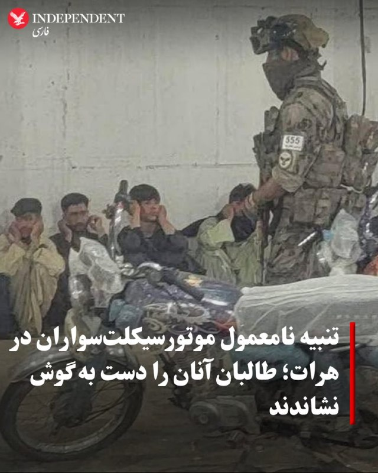

♦️ نیروهای طالبان شماری از جوانان را که با موتورسیکلت از زیرگذر شهر هرات در غرب افغانستان عبور کرده بودند، بازداشت و تنبیه کردند.

در عکسی که از این رویداد منتشر شده، شماری از جوانان در یک صف کنار دیوار زیرگذر نشسته و دست‌هایشان را بر گوش‌هایشان گذاشته‌اند. یک عضو مسلح طالبان نیز در مقابل آنان ایستاده است. در تصویر چند موتورسیکلت نیز دیده می‌شود.
منابع مردمی می‌گویند که طالبان این افراد را به دلیل عبور از زیرگذری که تردد موتورسیکلت در آن ممنوع است بازداشت کرده‌اند.
طالبان تاکنون درمورد این رویداد ابراز نظر نکرده‌اند.
چنین شیوه تنبیهی در قوانین رانندگی افغانستان سابقه ندارد و در گذشته تخلفات رانندگی معمولا با جریمه نقدی، توقیف وسایل یا اقدامات قانونی دیگر پیگیری می‌شد.

این در حالی است که نیروهای طالبان در بیش از چهار سال گذشته در موارد متعددی از شیوه‌های مختلف تنبیهی، از جمله شلیک به متهمان، سیاه کردن چهره افراد متهم به دزدی، و ضرب و شتم آنان استفاده کرده‌اند.
‌🇸🇦 Indypersian

🤖 @VahidOOnLine

## VahidOOnLine — post 242919

  

شاهزاده رضا پهلوی در نشست «امنیت دریای سیاه» در اودسا در جنوب اوکراین، گفت که دنیای آزاد هنوز متوجه ماهیت جمهوری اسلامی نشده است.
شاهزاده رضا پهلوی درباره تلاش برای توافق با جمهوری اسلامی با امید به ایجاد ثبات، گفت که یک سگ وحشی در نهایت دست شما را گاز می‌گیرد.

او افزود: «پهپادهایی که اوکراین را هدف قرار می‌دهد از سوی جمهوری اسلامی تهیه شده و با همان پهپادها مردم معترض خود را در خیابان تعقیب می‌کند تا تک‌تیراندازها آن‌ها را هدف قرار دهند.»

شاهزاده رضا پهلوی گفت که تهران و مسکو معماران مشترک هرج‌ومرج در جهان هستند.
‌🏁 🇬🇧 IranintlTV

🤖 @VahidOOnLine

## VahidOOnLine — post 242918

  

مجتبی یوسفی، عضو هیات رییسه مجلس گفت: «رهبری در بحث مذاکرات، ۱۰ شرط مشخص کردند که اگر تیم مذاکره‌کننده ۱۰ شرط را رعایت نکند، نه مردم، نه نمایندگان، نه نخبگان، آن توافق را حتما به‌عنوان توافق خوب در نظر نخواهند گرفت و می‌شود تجربه‌ای که در اعتماد به غرب باعث عقب‌افتادگی کشور شد.»

او افزود: «امروز باید هم‌قسم شویم تا به گفته امام شهید و امام جدیدمان، مسائل اصلی کشور را حل کنیم.»
‌🏁 🇬🇧 IranintlTV

🤖 @VahidOOnLine

## VahidOOnLine — post 242917

  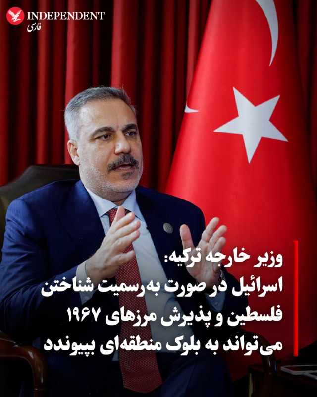

♦️ هاکان فیدان، وزیر امور خارجه ترکیه، در گفتگو با نشریه «نیکِی آسیا» اعلام کرد که اگر اسرائیل تشکیل دولت مستقل فلسطین بر اساس مرزهای ۱۹۶۷ را به رسمیت بشناسد، می‌تواند به یک «بلوک منطقه‌ای» مشترک ملحق شود. فیدان تاکید کرد: «در صورت حل این مسئله، کشورهای منطقه نیز به امنیت اسرائیل کمک شایانی خواهند کرد.»

به گفته فیدان، این چارچوب همکاری می‌تواند شامل پاکستان، ترکیه، عربستان سعودی، مصر و دیگر کشورهای خلیج فارس باشد و در صورت عادی شدن شرایط، شاید ایران نیز به آن بپیوندد. او افزود: «همه کشورهای منطقه باید به تمامیت ارضی، حاکمیت و امنیت یکدیگر متعهد باشند.»

این اظهارات در حالی مطرح می‌شود که ترکیه خود را برای میزبانی از نشست کلیدی ناتو در ماه ژوئیه آماده می‌کند. هم‌زمان، دونالد ترامپ نیز روز دوشنبه در تروث سوشال، با نام بردن از شش کشور از جمله ترکیه و مصر، بر لزوم توسعه «پیمان ابراهیم» تاکید کرد و نوشت: «لازم است دست‌کم این کشورها، همزمان به این پیمان بپیوندند.»
‌🇸🇦 Indypersian

🤖 @VahidOOnLine

## VahidOOnLine — post 242916

  

حسینعلی شهریاری، نماینده سیستان و بلوچستان در مجلس گفت: «الان شهر زاهدان هزار لیتر در ثانیه کمبود آب دارد؛ به‌طوری که طبق گفته بعضی از شهروندان، برخی از آنها ۲۴ تا ۴۸ ساعت آب ندارند و مناطق زیادی از زاهدان در این زمینه دچار مشکل هستند.»

او ادامه داد: «مثلا الان در زاهدان که مرکز استان است، از دولت‌های قبل، به علت کمبود آب، دو پروژه در آن شروع شد؛ یکی انتقال آب از دریای عمان که قرار بود به سیستان و بلوچستان جنوبی و خراسان رضوی برسد و دیگری هم آبی که قرار بود از دشت تهلاب برای شهر زاهدان بیاید.»
‌🏁 🇬🇧 IranintlTV

🤖 @VahidOOnLine

## VahidOOnLine — post 242915

  

♦️ پیت هگست، وزیر جنگ ایالات متحده، روز شنبه نهم خرداد اعلام کرد که به دنبال جلسه روز گذشته در کاخ سفید، واشنگتن به موفقیت‌هایی در مذاکرات با ایران دست یافته است. هگست تاکید کرد: «ایران به طور کاملا واضح از انتظارات ما آگاه است. آن‌ها در مسیر خواسته‌های ما حرکت می‌کنند و گفتگوها سازنده بوده است. من به رئیس‌جمهورمان که فقط توافق‌های بزرگ امضا می‌کند، اعتماد کامل دارم.»

وزیر جنگ آمریکا که در کنار وزیران دفاع استرالیا و بریتانیا با خبرنگاران صحبت کرد، با اشاره به گره‌های موجود در مذاکرات فاش کرد که بخشی از بحث‌ها با این همتایان، بر چگونگی جلوگیری از دستیابی ایران به سلاح هسته‌ای «هم‌زمان با پیشرفت فناوری» متمرکز است.
‌🇸🇦 Indypersian

🤖 @VahidOOnLine

## VahidOOnLine — post 242914

  

علیرضا سلیمی، عضو هیات رییسه مجلس گفت: «طرح اعمال مدیریت تنگه هرمز در جلسه علنی مجلس بررسی و تصویب خواهد شد.»
او افزود: «تصمیمات ما درباره اعمال مدیریت بر تنگه هرمز تاکتیکی و موقت نیست، بلکه قطعی و ابدی است.»

سلیمی ادامه داد: «صفر تا صد قانون اعمال مدیریت بر تنگه هرمز به‌طور کامل و جزء به جزء صرفا در مجلس تصویب و نهایی خواهد شد.»

او اضافه کرد: «قطعا این قانون یکی از قوانین مشعشع تاریخ ایران خواهد بود.»
‌🏁 🇬🇧 IranintlTV

🤖 @VahidOOnLine

## VahidOOnLine — post 242913

  <a href="telegram/content/VahidOOnLine_242913_1780159363.mp4" target="_blank">🎬 Download video</a>

♦️پیت هگست، وزیر جنگ ایالات متحده، روز شنبه ۹ خردادماه در جریان سفر خود به سنگاپور در مصاحبه ای با خبرنگاران اعلام کرد که بخش عمده عملیات‌های اخیر در منطقه بر عهده آمریکا بوده و این کشور «کنترل واقعی» تنگه را در اختیار دارد.
او با اشاره به نقش متحدان، از جمله استرالیا، گفت هرچند این کشورها حمایت مهمی ارائه کرده‌اند، اما عملیات محاصره به‌طور عمده توسط آمریکا انجام شده و «فشار اصلی» را بر ایران وارد کرده است.
هگست همچنین با اشاره به روند مذاکرات تأکید کرد تحولات پشت‌صحنه نشان می‌دهد واشنگتن در موقعیت مسلط قرار دارد. او در ادامه به همکاری‌های امنیتی در قالب پیمان «آکوس» و سایر ترتیبات منطقه‌ای اشاره کرد و گفت این همکاری‌ها نشان‌دهنده قدرت و انسجام اتحادهای آمریکا در منطقه اقیانوس آرام است.
‌🇸🇦 Indypersian

🤖 @VahidOOnLine

## WithYashar — post 12944

نماینده سیستان و بلوچستان در مجلس : برخی از مناطق زاهدان ۲۴ تا ۴۸ ساعت آب ندارند. ادامه بحران آب، استان را با چالش‌های امنیتی و اجتماعی روبه‌رو می‌کند
@withyashar

## WithYashar — post 12943

سخنگوی فدراسیون فوتبال:
روزبه چشمی به‌دلیل مصدومیت جام جهانی را از دست داد
@withyashar

## WithYashar — post 12942

تلگراف: دو ژنرال قدرتمند، احمد وحیدی و محمد جعفری، با هم متحد شدن تا قالیباف رو از قدرت برکنار کنن.
@withyashar

## WithYashar — post 12941

شاهزاده رضا پهلوی در نشست «امنیت دریای سیاه» در اودسا، در جنوب اوکراین، گفت مردم ایران برای ساختن آینده کشور خود آماده‌اند و از جهان نمی‌خواهند آینده ایران را برای آنان رقم بزند، بلکه خواستار آن هستند که جامعه جهانی در کنار ملت ایران بایستد.

او در بخش دیگری از سخنانش، با اشاره به خروج اجباری خود از ایران در ۱۰ سالگی، گفت که با وجود گذشت ۴۷ سال، هرگز امید خود را به آزادی ایران از دست نداده و همواره صدای مردمی بوده است که امکان بیان خواسته‌هایشان را نداشته‌اند.
@withyashar

## WithYashar — post 12940

  <a href="telegram/content/WithYashar_12940_1780159364.mp4" target="_blank">🎬 Download video</a>

مک‌اننی از فاکس:
بلومبرگ گزارش داده است که حملات موشکی ایرانی چند آمریکایی را در یک پایگاه هوایی کویتی زخمی کرده‌اند. فکر می‌کنید اوضاع در چه وضعیتی است؟

مایک جانسون، سخنگو:
دیشب با رئیس‌جمهور ترامپ صحبت کردم. او کاملاً در جریان است. فکر می‌کنم رهبری جدید ایرانی‌ها می‌خواهد این درگیری را به پایان برساند.
@withyashar

## WithYashar — post 12939

  

به نظر می‌رسد که ناو آبی/خاکی یو‌اس‌اس باکسر (lhd-4) قرار نیست در حوزه مسئولیت سنت‌کام  مستقر شود. ناو آبی‌خاکی کلاس واسپ نیز امروز از بندر سِمبانوان در سنگاپور حرکت کرد؛ اگرچه اکنون به سمت شرق در حرکت است.
@withyashar

## WithYashar — post 12938

شاهزاده رضا پهلوی در نشست «امنیت دریای سیاه» در اودسا در جنوب اوکراین، گفت که دنیای آزاد هنوز متوجه ماهیت جمهوری اسلامی نشده است.
شاهزاده رضا پهلوی درباره تلاش برای توافق با جمهوری اسلامی با امید به ایجاد ثبات، گفت که یک سگ وحشی در نهایت دست شما را گاز می‌گیرد.

او افزود: «پهپادهایی که اوکراین را هدف قرار می‌دهد از سوی جمهوری اسلامی تهیه شده و با همان پهپادها مردم معترض خود را در خیابان تعقیب می‌کند تا تک‌تیراندازها آن‌ها را هدف قرار دهند.»

شاهزاده رضا پهلوی گفت که تهران و مسکو معماران مشترک هرج‌ومرج در جهان هستند.
@withyashar

## WithYashar — post 12937

عمان: در آب‌های سرزمینی خود جسمی شناور را مشاهده کردیم که مظنون به مین دریایی است‌
@withyashar

## mwarmonitor — post 9920

🔴جنگنده آمریکایی F-15E Strike Eagle که در ماه آوریل بر فراز جنوب‌غربی ایران سرنگون شد، احتمالاً توسط یک موشک دوش‌پرتاب ساخت چین هدف قرار گرفته است؛ این موضوع را سه نفر آشنا با این پرونده اعلام کرده‌اند. — NBC News

@mwarmonitor

## mwarmonitor — post 9919

  <a href="telegram/content/mwarmonitor_9919_1780159366.mp4" target="_blank">🎬 Download video</a>

📝 واقعیت این است که به وضوح همین پروپاگاندای مضحک دیده می‌شود؛ خبرنگار صداوسیما را فرستاده‌اند وسط فروشگاه تا از مردمی که از خط فقر هم پایین‌تر سرنگون شده‌اند، اعترافِ اجباریِ «خدا را شکر همه‌چیز هست» بگیرد! قفسه‌های پر از روغن و برنج را به رخ ملت می‌کشند، انگار مردم به خاطر «کمبود جنس» گرسنه‌اند، نه به خاطر بی‌پولی و نکبتی که گریبان‌گیرشان شده است.

🔸اینکه اسم همان کوپنِ دهه شصت را بگذاری «طرح الکترونیکی» و هر چند ماه یک‌بار به عنوان یک فتح‌الفتوح جدید در اخبار جار بزنی، اوج وقاحت و تحقیر یک ملت است. نمایشِ پر بودن قفسه‌ها دقیقاً مثل این است که به یک آدم تشنه در بیابان، عکس یک پارچ آب یخ نشان بدهی و بگویی: «ببین چقدر فراوانی است، حالا اگر پول داری بخر، اگر هم نداری کارتِ گداییِ الکترونیکی‌ات را بکش!» این‌ها فقط یاد گرفته‌اند صورت‌مسئله را پاک کنند و با شوهای تلویزیونی، روی فلاکت و خاکِ سیاهی که مردم را به آن نشانده‌اند، رنگ و لعابِ مدرنیته بپاشند.

@mwarmonitor

## mwarmonitor — post 9918

🔴 یک مقام آمریکایی: یک کشتی تجاری که تلاش داشت به سمت یک بندر ایرانی حرکت کند، متوقف شد.

🔸این نفتکش/کشتی با نام «لیان استار» هشدارهای نیروهای دریایی ما در خلیج عمان را نادیده گرفته بود.

@mwarmonitor

## mwarmonitor — post 9917

  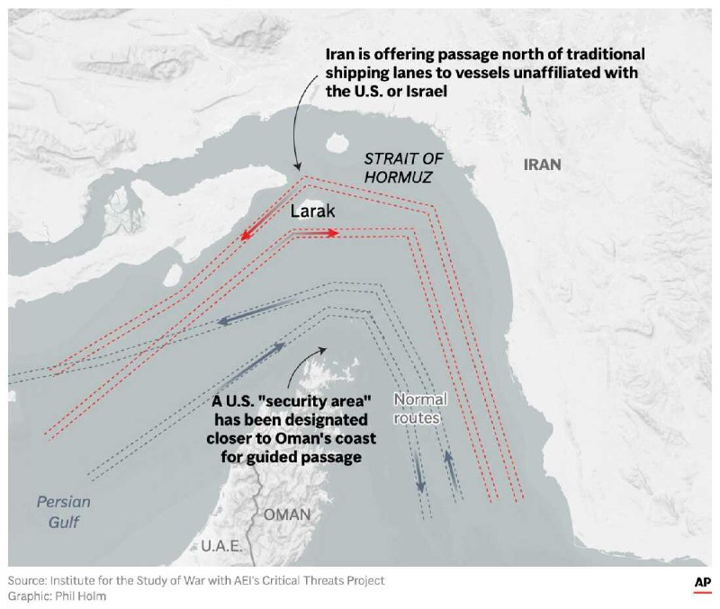

🔴 مرکز امنیت دریایی عمان: از کشتی‌ها می‌خواهیم در پی مشاهده یک جسم شناور که احتمال می‌رود مین باشد، در غرب منطقه عبور در تنگه هرمز، احتیاط کنند. @mwarmonitor

## mwarmonitor — post 9916

  

🔸ملوانان نیروی دریایی آمریکا در حالی نظاره‌گر هستند که یک جنگنده پنهانکار F-35B Lightning II متعلق به تفنگداران دریایی آمریکا بر روی عرشه ناو آبی‌خاکی USS Tripoli (LHA-7) در حال عبور از دریای عرب فرود می‌آید. جنگنده F-35B برای انجام برخاست‌های کوتاه و فرودهای عمودی طراحی شده است.

@mwarmonitor

## FoxNewsTwitter — post 342431

  

Fox News (Twitter/X)

Jaxson Dart is breaking his silence after receiving pushback for introducing President Trump at a rally, saying his decision comes down to one thing: respect for the office.

The Giants quarterback tells reporters he has always viewed the presidency as a position worthy of respect, regardless of party affiliation, pointing to his family's long history of military service.

## FoxNewsTwitter — post 342430

  

Fox News (Twitter/X)

CHARGED: Anti-ICE agitator bit two federal officers during clashes outside Newark's Delaney Hall, leaving bloody wounds that sent both agents to the hospital.

Brendan John Geier, 26, now faces federal charges for assaulting officers who told his group to clear the road. He kicked one officer and sank his teeth into two others, according to the DOJ.

Acting AG Todd Blanche posted photos of the bloodied agents: 'These riots are clearly not peaceful protests as you can see from the photos of these horrific wounds.'

## FoxNewsTwitter — post 342429

  <a href="telegram/content/FoxNewsTwitter_342429_1780159370.mp4" target="_blank">🎬 Download video</a>

Fox News (Twitter/X)

"They both should be in jail."

Los Angeles mayoral candidate Spencer Pratt argues California Gov. Gavin Newsom and Los Angeles Mayor Karen Bass should be behind bars over their alleged "negligence" while in office.

The reality TV star claims the pair of Democrats "make up stats" on homelessness — and that the city's crisis has only gotten worse under their watch. | @SatAmericaFNC @kayleighmcenany

## FoxNewsTwitter — post 342428

‌Fox News (Twitter/X)

👉 Full story here:

## FoxNewsTwitter — post 342427

Fox News (Twitter/X)

DAVID MARCUS: Democrats own the chaos at Newark's anti-ICE riots — Antifa agitators screamed 'Every Cop, Every Fed, Shoot Yourself in the Head' at officers while progressive White women berated Black men as 'race traitors' with 'the wrong skin color.' Gov. Sherrill finally deployed state police after a week of violence, but blamed ICE for wanting to 'stoke' the confrontation. Zero evidence offered for that claim.

## FoxNewsTwitter — post 342426

‌Fox News (Twitter/X)

👉 Full story here:

## FoxNewsTwitter — post 342425

  

Fox News (Twitter/X)

“We are all one... This is celebrating America’s birthday."

Vanilla Ice is embracing his role at the Great American State Fair after several performers dropped out of the Freedom 250 concert lineup.

The rapper says the event is about celebrating America’s 250th birthday and bringing people together through music, not politics.

As backlash and artist withdrawals continue to make headlines, Vanilla Ice says he’s focused on positivity, fun, and giving fans a memorable show.

## FoxNewsTwitter — post 342424

  <a href="telegram/content/FoxNewsTwitter_342424_1780159373.mp4" target="_blank">🎬 Download video</a>

Fox News (Twitter/X)

Eight roller coaster riders were stranded near the top of a Texas amusement park ride for more than three hours before firefighters could bring them down.

The Iron Shark coaster at Galveston’s Pleasure Pier malfunctioned during its climb, leaving passengers stuck nearly 100 feet above the ground.

Video captured the dramatic rescue as firefighters used a ladder truck and harnesses to remove riders one at a time.

## pm_afshaa — post 91901

  <a href="telegram/content/pm_afshaa_91901_1780159375.webm" target="_blank">🎬 Download video</a>

🔴ان‌بی‌سی نیوز: احتمال داره ایران در جریان درگیری‌های اخیر، از یک موشک ساخت چین برای سرنگونی یک جنگنده F-15E استرایک ایگل آمریکا استفاده کرده باشد.

💧 Rainbet.com the #1 Non-KYC Crypto Casino & Sportsbook @rainbetcom

😁 @Pm_Afshaa

## pm_afshaa — post 91900

  <a href="telegram/content/pm_afshaa_91900_1780159375.webm" target="_blank">🎬 Download video</a>

🔴آسوشیتدپرس:
توافق احتمالی ترامپ با جمهوری اسلامی، شکاف بین جمهوری‌خواهان رو عمیق‌تر کرده.

💧 Rainbet.com the #1 Non-KYC Crypto Casino & Sportsbook @rainbetcom

😁 @Pm_Afshaa

## pm_afshaa — post 91899

  <a href="telegram/content/pm_afshaa_91899_1780159376.webm" target="_blank">🎬 Download video</a>

🔴تلگراف: دو ژنرال قدرتمند، احمد وحیدی و محمد جعفری، با هم متحد شدن تا قالیباف رو از قدرت برکنار کنن.

💧 Rainbet.com the #1 Non-KYC Crypto Casino & Sportsbook @rainbetcom

😁 @Pm_Afshaa

## pm_afshaa — post 91898

  <a href="telegram/content/pm_afshaa_91898_1780159376.webm" target="_blank">🎬 Download video</a>

🔴هگست، وزیر جنگ آمریکا:
محاصره که کاملاً محکم و بدون نفوذ بوده و واقعاً فشار زیادی روی ایران گذاشته.

اونا ممکنه بگن کنترل تنگه رو در دست دارن، ولی کاری که ما انجام میدیم، حتی پشت صحنه، نشون میده که در عمل ما هستیم که کنترل رو در دست داریم.
محاصره دریایی جمهوری اسلامی همچنان ادامه داره و این اقدام موثر بوده و کنترل تنگه هرمز در اختیار آمریکاست.

💧Rainbet.com the #1 Non-KYC Crypto Casino & Sportsbook @rainbetcom

😁 @Pm_Afshaa

## pm_afshaa — post 91896

  <a href="telegram/content/pm_afshaa_91896_1780159377.mp4" target="_blank">🎬 Download video</a>

کارشناس حرومزاده صداوسیما :

ایرانی ها اصلا آریایی نیستن، ما اصلا نژاد آریایی نداریم؛ اونا کلا 5 هزار سال پیش مهاجرت کردن اومدن ولی ما واسه 65 هزار سال پیشیم.
اصلا درست نیست بگیم آریایی هستیم انگار داریم میگیم بچه های یه مشت قاتل نسل کشیم.

💧Rainbet.com the #1 Non-KYC Crypto Casino & Sportsbook @rainbetcom

😁 @Pm_Afshaa

## iaghapour — post 2643

  

⭕️ ساخت فیلترشکن پرسرعت و رایگان با ورکر کلودفلر (تست شده)

🔹در این ویدیو به صورت قدم‌به‌قدم بهتون آموزش دادم که چطور با استفاده از Cloudflare Workers یک فیلترشکن کاملاً رایگان، و پرسرعت برای خودتون بسازید. این روش کاملاً تست شده و می‌تونید به راحتی روی گوشی و کامپیوتر ازش استفاده کنید.

🔗 تماشا ویدیو در یوتیوب

#آموزش #فیلترشکن #رایگان #پروکسی #نوا #novaproxy
برای دور زدن فیلترینگ و آموزش تکنولوژی و هوش مصنوعی ما رو دنبال کنید 💚
🆔@iaghapour

## DEJradio — post 5157

  <a href="telegram/content/DEJradio_5157_1780159379.webm" target="_blank">🎬 Download video</a>

🚨📢 نشست امنیتی «دریای سیاه» در اودسا
شاهزاده رضا پهلوی خطاب به رهبران غرب:
رژیم ایران را مدیریت نکنید، تمامش کنید

شاهزاده رضا پهلوی روز شنبه نهم خرداد ۱۴۰۵ در نشست امنیتی «دریای سیاه» در اودسا خطاب به رهبران غرب گفت «رژیم تروریستی جمهوری اسلامی را مدیریت نکنید؛ به آن پایان دهید.»
او با هشدار درباره تهدیدهای مشترک علیه جهان آزاد تاکید کرد: «محور مسکو و تهران یک دشمن هماهنگ برای همه ماست و باید با قدرت، انسجام و قاطعیت با آن مقابله شود.»

پهلوی همچنین با انتقاد از سیاست توافق و امتیازدهی به حکومت تهران گفت: «هیچ‌یک از توافق‌هایی که تاکنون با جمهوری اسلامی انجام شده، همان‌گونه که توافق‌های مشابه با اتحاد جماهیر شوروی نتوانستند مشکل را حل کنند، راه‌حل پایدار نبوده‌اند.»

#شاهزاده_رضا_پهلوی #جمهوری_اسلامی
@DEJradio

## DEJradio — post 5156

  <a href="telegram/content/DEJradio_5156_1780159380.webm" target="_blank">🎬 Download video</a>

🔺🎤 کابینه ترامپ و میانجی‌گری عمان در پی احیای روابط با تهران

گفت‌وگو با شایان سمیعی، کارشناس امنیت ملی

#عمان #مذاکرات
@DEJradio

## DEJradio — post 5155

⭕️ آمریکا، بریتانیا و استرالیا در پروژۀ زیردریایی‌های بی‌سرنشین همکاری می‌کنند

پیت هگست، وزیر دفاع آمریکا گفت واشینگتن، لندن و کانبرا در چارچوب پیمان آکوس برای توسعۀ شناورهای زیردریایی بی‌سرنشین همکاری می‌کنند.
او گفت این پروژه بر فناوری‌های پیشرفتۀ دفاعی از جمله هوش مصنوعی، فناوری زیرآبی، موشک‌های مافوق صوت، فناوری سایبری و محاسبات کوانتومی متمرکز است.
هگست افزود در این طرح روی مجموعه‌ای از سامانه‌های زیردریایی بدون سرنشین و چندمنظوره، برای حفظ برتری دریایی سه کشور، کار می‌شود.

#خبر #دژ #هوش_مصنوعی
@DEJradio

## DEJradio — post 5154

⭕️ بریتانیا تأیید کرد محاصرۀ دریایی جمهوری اسلامی توسط آمریکا ادامه دارد

سازمان عملیات تجارت دریایی بریتانیا اعلام کرد محاصرۀ بنادر ایران ادامه دارد.
به گفتۀ این نهاد، سطح تهدید دریایی در خلیج فارس، تنگۀ هرمز، دریای عمان و شمال دریای عرب همچنان بحرانی است.
بر اساس این بیانیه شناورهایی که از طریق انتقال کشتی‌به‌کشتی به ناقضان محاصرۀ جمهوری اسلامی کمک کنند، ناقض محاصره به شمار می‌روند.

#خبر #دژ #بریتانیا #محاصره_دریایی
@DEJradio

## DEJradio — post 5153

⭕️ قطر: می‌شود در مورد عوارض موقت در تنگۀ هرمز مذاکره کرد

شیخ سعود بن عبدالرحمن آل‌ثانی، معاون نخست‌وزیر قطر، گفت می‌شود درمورد عوارض موقت در تنگۀ هرمز برای مواردی مانند پاکسازی مین مذاکره کرد.
او گفت دوحه با دریافت دائمی عوارض عبور کشتی‌ها از آبراه هرمز مخالف است.
آمریکا و اروپا تلاش جمهوری اسلامی برای دریافت عوارض از کشتی‌ها را اخاذی مالی می‌دانند.
آمریکا اعلام کرده نهادها و کشتی‌هایی را که به باجگیری جمهوری اسلامی تن بدهند، تحریم می‌کند.

#خبر #دژ #قطر #تنگه_هرمز
@DEJradio

## DEJradio — post 5152

⭕️ واردات برق از ترکمنستان و ارمنستان ادامه دارد

مصطفی رجبی مشهدی، معاون وزیر نیرو گفتجمهوری اسلامی اکنون ۳۰۰ مگاوات برق از ترکمنستان و ارمنستان وارد می‌کند.
این مقام دولت پزشکیان از سویی مدعی شد صادرات برق به افغانستان و پاکستان نیز ادامه دارد. او گفت جنگ اخیر بر تبادلات برق منطقه‌ای اثر نگذاشت.
رجبی مشهدی همچنین ادعا کرد تبادل هزار مگاوات برق با روسیه قرار است در برنامه‌های آینده دنبال شود.

#خبر #دژ #برق
@DEJradio

## DEJradio — post 5151

⭕️ عضو کمیسیون انرژی مجلس: یک‌سوم ظرفیت تولید گاز در ایران از دست رفت

غلامرضا دهقان ناصرآبادی، عضو کمیسیون انرژی مجلس شورای اسلامی گفت در جریان جنگ چهل روزه درحدود یک‌سوم ظرفیت تولید گاز در ایران از بین رفته است.
او با اشاره به آسیب‌دیدن چند فازدر بندر عسلویه گفت وزارت نفت و وزارت نیرو برای بازگرداندن ظرفیت تولید به وضعیت پیش از جنگ تلاش می‌کنند.
بخش عمدۀ گاز در ایران از میدان مشترک پارس جنوبی تأمین می‌شود.

#خبر #دژ #انرژی
@DEJradio

## DEJradio — post 5150

⭕️ شاهزاده رضا پهلوی برای شرکت در نشستی امنیتی وارد اوکراین شد

بر پایۀ گزارش‌ها شاهزاده رضا پهلوی برای شرکت در نشست «فروم امنیت دریای سیاه» به بندر اودسا در اوکراین رفت.
بر اساس این گزارش، الکسی گنچارنکو، نمایندۀ پارلمان اوکراین و رئیس این فروم، از شاهزاده استقبال کرد.
در پیام‌های منتشرشده در این راستا گفت شد که مردم ایران و اوکراین، دشمنان مشترکی در تهران دارند.
روسیه بارها با استفاده از پهپادهای ساخته شده توسط جمهوری اسلامی، اوکراین را هدف گرفته است.
متخصصان اوکراینی در جریان جنگ چهل روزه، برای مقابله با پهپادهای جمهوری اسلامی به کشورهای حاشیۀ خلیج فارس کمک کردند.
شاهزاده رضا پهلوی پیش‌تر نشستی را با ولودیمیر زلنسکی، رئیس جمهوری اوکراین برگزار کرده بود.

#خبر #دژ #شاهزاده_رضا_پهلوی #اوکراین
@DEJradio

## DEJradio — post 5149

⭕️ رسانه‌های اسرائیل: ارتش برای جنگ احتمالی بعدی با جمهوری اسلامی آماده می‌شود

رسانه‌های اسرائیل می‌گویند روند آمادگی ارتش این کشور برای سومین رویارویی احتمالی با جمهوری اسلامی، ادامه دارد.
به گزارش شبکۀ کان، ارتش اسرائیل به دنبال ایجاد شرایطی است که جامعه بتواند در کمترین زمان ممکن با تغییر از وضعیت عادی به شرایط جنگی، سازگاری داشته باشد.
ارزیابی‌های ارتش اسرائیل بیانگر است که جمهوری اسلامی در جنگ بعدی ممکن است سریع‌تر واکنش نشان بدهد و الگوی استفاده از موشک‌ها را تغییر دهد.
بر پایۀ ارزیابی‌ها بیش از 72 درصد از موشک‌های جمهوری اسلامی که در جنگ پیشین استفاده شد، دارای کلاهک خوشه‌ای بود.
از سویی نخستین هواپیماهای سوخت‌رسان جدید آمریکایی به اسرائیل رسیده است.
به گفتۀ مقام‌های نظامی اسرائیل، این هواپیماها ظرفیت عملیات دوربرد را افزایش می‌دهد.
رسانه‌های اسرائیل گزارش دادند در جنگ چهل روزه همۀ اهداف اسرائیل محقق نشده و تلاش برای دستیابی به سایر اهداف ادامه می‌یابد.

#خبر #دژ #اسرائیل
@DEJradio

## DEJradio — post 5148

  <a href="telegram/content/DEJradio_5148_1780159380.mp4" target="_blank">🎬 Download video</a>

🤡
🔺 حرکات اروتیک ولایتمداران در تجمعات شبانه

بر اساس ویدیویی‌هایی که در رسانه‌های وابسته به حکومت از تجمعات شبانه ولایتمداران منتشر می‌شود، شماری از آنها زیر تاثیر اشعار مداحان اخیرا حرکات اروتیک از خود به نمایش می‌گذارند.

#شیفت_شب #اروتیک #تجمعات_حکومتی
@DEJradio

## DEJradio — post 5147

⭕️ آمریکا یک میلیارد دلار رمزارز مرتبط با جمهوری اسلامی را توقیف کرد

اسکات بسنت، وزیر خزانه‌داری آمریکا گفت واشینگتن یک میلیارد دلار دارایی رمزارزی مرتبط با جمهوری اسلامی را توقیف کرده است.
او همچنین گفت اگر قرار باشد محاصرۀ مالی و اقتصادی علیه جمهوری اسلامی کاهش یابد و یا لغو شود، این کار به‌صورت مرحله‌به‌مرحله پیش می‌رود.

#خبر #دژ #تحریم #رمز_ارز
@DEJradio

## DEJradio — post 5146

⭕️ ترامپ در نشست با مشاوران خود در مورد جمهوری اسلامی تصمیم پایانی را نگرفت

نشست بیش از دو ساعتۀ دونالد ترامپ با مشاوران ارشدش در اتاق وضعیت کاخ سفید، بدون اعلام نتیجه پایان یافت.
نیویورک‌تایمز به نقل از یک مقام ارشد دولت آمریکا نوشت ترامپ هنوز درمورد تفاهم احتمالی با تهران به جمع‌بندی نرسیده است.
ترامپ بر باز شدن تنگۀ هرمز و نابودی ذخایر اورانیوم غنی‌شدۀ جمهوری اسلامی پافشاری می‌کند.

#خبر #دژ #ترامپ
@DEJradio

## DEJradio — post 5145

⭕️ وزیر جنگ آمریکا: برای ازسرگیری جنگ با جمهوری اسلامی توانایی ما فراتر از حد است

پیت هگست، وزیر جنگ دولت ایالات متحده، خبر داد واشینگتن در صورت لزوم، آمادۀ ازسرگیری جنگ با جمهوری اسلامی است.
او در نشست امنیتی سنگاپور گفت توانایی آمریکا برای ازسرگیری جنگ با رژیم حاکم بر ایران، بیش از حد لازم است. به گفتۀ هگست، انبارهای مهمات ایالات متحده کاملا آماده‌ است.
هگست تأکید کرد آمریکا میان مهمات پیشرفته و ذخایر انبوه تسلیحاتی تعادل برقرار کرده است.
کاخ سفید اعلام کرده دونالد ترامپ به تصمیم‌گیری درباره توافق احتمالی نزدیک شده، اما هنوز تصمیم پایانی در مورد توافق یا حملۀ نظامی گرفته نشده است.

#خبر #دژ #جنگ
@DEJradio

## DEJradio — post 5144

⭕️ نیروهای اسرائیلی تا فراتر از رود لیتانی پیشروی کردند

بنیامین نتانیاهو، نخست‌وزیر اسرائیل گفت نیروهای این کشور از رود لیتانی عبور کرده و در عمق جنوب لبنان پیشروی کردند.
همزمان، هیات‌های نظامی اسرائیل و لبنان در واشینگتن گفت‌وگوهای امنیتی برگزار کردند.
ژوزف عون، رئیس‌جمهور لبنان، در تماس با مارکو روبیو بر ضرورت تلاش برای برقراری آتش‌بس تأکید کرد.
با وجود آتش‌بسی که از ۲۸ فروردین میان اسرائیل و لبنان برقرار شده، حزب‌الله بارها به شمال اسرائیل حمله کرده و ارتش این کشور را به واکنش نظامی واداشته است.

#دژ #خبر #اسرائیل
@DEJradio

## DEJradio — post 5143

  <a href="telegram/content/DEJradio_5143_1780159382.mp4" target="_blank">🎬 Download video</a>

🛩️
🔥 سرنگونی یک پهپاد «شاهد» با مسلسل از داخل هلی‌کوپتر

گزارش‌ها حاکی است که نیروهای اسرائیلی از یک مسلسل M134 Minigun (مینی‌گان ام۱۳۴) نصب‌شده روی هلیکوپتر برای سرنگونی یک پهپاد «شاهد» استفاده کرده‌اند.

این رهگیری نشان می‌دهد که جنگ پهپادی با چه سرعتی در حال دگرگون‌کردن شیوه‌های نبرد مدرن در خاورمیانه و سایر نقاط جهان است. گفته می‌شود این ویدیو مربوط به روزهای جنگ است.

پهپادهای شاهد به یکی از شناخته‌شده‌ترین سلاح‌های درگیری‌های کنونی جهان تبدیل شده‌اند و به‌طور گسترده توسط جمهوری اسلامی ایران و روسیه مورد استفاده قرار می‌گیرند.

#پهپاد_شاهد #جنگ
@DEJradio

## VahidOnline — post 75804

  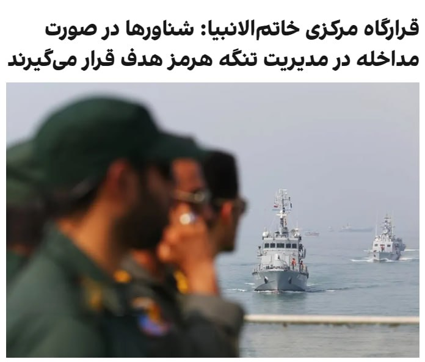

قرارگاه مرکزی خاتم‌الانبیا در بیانیه‌ای اعلام کرد که هرگونه اقدام شناورهای نظامی جهت مداخله در مدیریت تنگه هرمز یا ایجاد اختلال در تردد، مورد هدف نیروهای مسلح جمهوری اسلامی قرار خواهد گرفت.
در این بیانیه آمده: «هرگونه تخلف از این ضوابط، امنیت تردد آن‌ها را با مخاطره جدی مواجه خواهد کرد.»

قرارگاه مرکزی خاتم‌الانبیا اعلام کرد کلیه کشتی‌ها، شناورهای تجاری و نفتکش‌ها صرفا ملزم به تردد از مسیرهای تعیین‌شده و اخذ مجوز از نیروی دریایی سپاه پاسداران هستند.
@VahidOOnLine

📡 @VahidOnline

## VahidOnline — post 75803

  <a href="telegram/content/VahidOnline_75803_1780159384.mp4" target="_blank">🎬 Download video</a>

پیت هگست، وزیر دفاع آمریکا، روز شنبه نهم خرداد گفت ایالات متحده در صورتی که مذاکرات با ایران به توافق منجر نشود، آماده ازسرگیری حملات علیه جمهوری اسلامی است.

هگست در جمع خبرنگاران گفت: «در حال حاضر تمرکز ما بر حفظ آمادگی و آماده بودن برای بازگشت به عملیات است، اگر لازم باشد.»
او افزود دونالد ترامپ «صبور» است و به دنبال دستیابی به «توافقی خوب» است که تضمین کند ایران هرگز به سلاح هسته‌ای دست پیدا نخواهد کرد.

اظهارات وزیر دفاع آمریکا در حالی مطرح می‌شود که مذاکره‌کنندگان تهران و واشینگتن در تلاش‌اند اختلافات باقی‌مانده بر سر برنامه هسته‌ای ایران را برطرف کنند.
@VahidHeadline

📡 @VahidOnline

## VahidOnline — post 75802

  

مصطفی نیلی، وکیل دادگستری، اعلام کرد شعبه اول دادگاه انقلاب شیراز بنیامین نقدی را با اتهام «افساد فی‌الارض» به اعدام محکوم کرده است.

نیلی در گفت‌وگو با امتداد گفت که بنیامین نقدی شامگاه ۱۳ دی‌ماه در شیراز به دلیل شعله‌ور کردن یک کپسول آتش‌نشانی به سمت ماموران نیروی انتظامی بازداشت شد.

به گفته این وکیل دادگستری، در ابتدا اتهام «شروع به قتل» به موکلش تفهیم شد، اما پس از آن اتهام وی به «محاربه» تغییر یافت.

او افزود پس از پایان تحقیقات مقدماتی، کیفرخواست بنیامین نقدی با اتهام‌های «محاربه»، «عضویت در گروه‌های برهم‌زننده امنیت کشور»، «اجتماع و تبانی به قصد ارتکاب جرم علیه امنیت کشور» و «فعالیت تبلیغی علیه نظام» صادر شد. به گفته نیلی، در خصوص اتهام‌های «ایراد صدمه جسمانی به ماموران» و «حمل سلاح سرد» قرار منع تعقیب صادر شده بود.

نیلی همچنین گفت قضات شعبه اول دادگاه انقلاب شیراز در جریان رسیدگی، مجموعه اتهام‌های مطرح‌شده را مصداق «افساد فی‌الارض» تشخیص داده و بر همین اساس حکم اعدام برای بنیامین نقدی صادر کرده‌اند.

وکیل بنیامین نقدی با اشاره به قصد خود و همکارانش برای اعتراض به این رای گفت که در مهلت قانونی درخواست فرجام‌خواهی خواهند کرد. او ابراز امیدواری کرد که با توجه به این که به گفته وی در جریان رخداد مورد اشاره هیچ فردی آسیب ندیده است و اقدامات موکلش مصداق افساد فی‌الارض نیست، حکم صادره در دیوان عالی کشور نقض شود.
@VahidHeadline

📡 @VahidOnline

## VahidOnline — post 75801

اینترنت در ایران آزاد و عادی نشده. بیشتر مسیرهای خارجی یا بسته‌اند یا نیمه‌بازند. فقط بعضی مقاصد و مسیرهای خاص اجازه عبور دارند. همین باعث شده فیلترشکن‌های معمولی خوب کار نکنند.
در این میون بعضی از افرادی که دامنه‌ها و مسیرهای سفیدشده دارند، دسترسی می‌فروشند. نتیجه‌اش هم شده اینترنت نابرابر، رانتی و پر از راه‌حل‌های موقت.
انگاری که درِ ساختمون رو کمی باز گذاشته باشن که هوا بیاد، اما اجازه ندن کسی ازش رد بشه.
برای همینه که گوشی‌تون ممکنه نشون بده که اینترنت دارید، حتی شاید اولش سایت یا اپ مورد نظر رو باز کنه یا بهش واکنش نشون بده، اما در عمل از اینترنت خبری نیست.

## IranIntlTV — post 339765

  <a href="telegram/content/IranIntlTV_339765_1780159385.mp4" target="_blank">🎬 Download video</a>

تیتر اول با نیوشا صارمی، شنبه ۹ خرداد
@iranintltv

## IranIntlTV — post 339764

  

بر اساس گزارش‌ها پیمان دستجردی کرمانشاهی، ۳۲ساله و فیلمبردار، روز ۳۱ فروردین با اتهام‌های «تبلیغ علیه نظام، همکاری با اسرائیل از طریق انتشار استوری، توهین به مقدسات و  توهین به رهبری» بازداشت و به زندان لاکان رشت منتقل شده و از وضعیت او اطلاعی در دست نیست.

او پیش‌تر نیز در ابتدای جنگ آمریکا و اسرائیل با جمهوری اسلامی، به‌دلیل انتشار استوری‌های اینستاگرامی بازداشت و پس از مدتی با قرار وثیقه آزاد شده بود.
https://iranintl.com/202605303854

## IranIntlTV — post 339763

  <a href="telegram/content/IranIntlTV_339763_1780159387.mp4" target="_blank">🎬 Download video</a>

جمهوری اسلامی از ایجاد نهادی می‌گوید که در آن کشتی‌ها برای عبور از تنگه هرمز باید از نهاد مورد نظر مجوز بگیرند. ایالات متحده و برخی منتقدان این سازوکار را خطرناک‌ ارزیابی کرده‌اند.
مهدی بیگی، عضو تحریریه ایران‌اینترنشنال، در «پیوست» به این موضوع می‌پردازد
@iranintltv

## IranIntlTV — post 339762

  

خبرگزاری آسوشیتدپرس به نقل از یک مقام آمریکایی خبر داد که ناوگان آمریکا یک کشتی تجاری با پرچم گامبیا را که تلاش داشت محاصره بنادر ایران را بشکند، متوقف کرده و از کار انداختند.
بر اساس این گزارش، این کشتی از سوی هواپیماهای آمریکایی از کار انداخته شد و نیروهای آمریکایی وارد آن نشدند.

روز شنبه پیت هگست، وزیر جنگ آمریکا، در حاشیه نشست «گفت‌وگوی شانگری‌لا» در سنگاپور، درباره محاصره بنادر و سواحل جنوبی ایران گفت که محاصره دریایی ادامه دارد و این اقدام موثر بوده و کنترل تنگه هرمز در اختیار آمریکا است.
https://iranintl.com/202605306829

## IranIntlTV — post 339761

## IranIntlTV — post 339760

  

نواف سلام، نخست‌وزیر لبنان گفت این کشور در حال حاضر با سخت‌ترین مرحله در تاریخ خود روبه‌رو است.
نواف سلام تاکید کرد که تصمیم جنگ و صلح باید فقط در اختیار دولت باشد. پیش‌تر نواف سلام بر ضرورت خلع سلاح حزب‌الله از سوی خود لبنانی‌ها و و بازگرداندن انحصار سلاح به دولت تاکید کرده بود.
https://iranintl.com/202605308844

## IranIntlTV — post 339759

  <a href="telegram/content/IranIntlTV_339759_1780159390.mp4" target="_blank">🎬 Download video</a>

در حالی که وزیر جنگ آمریکا اعلام کرد واشینگتن آماده ازسرگیری حملات فوری به ایران در صورت شکست دیپلماسی است، به نظر می‌رسد سپاه با دو مرحله‌ای کردن توافق، ترامپ را در تله پایان جنگ بدون دستاورد نقد در مورد برنامه هسته‌ای جمهوری اسلامی انداخته است.

گزارشی از مجتبا پورمحسن
@iranintltv

## IranIntlTV — post 339758

  <a href="telegram/content/IranIntlTV_339758_1780159392.mp4" target="_blank">🎬 Download video</a>

شاهزاده رضا پهلوی در نشست امنیتی دریای سیاه در اودسای اوکراین خواستار حمایت جهانی از مردم ایران برای تغییر رژیم جمهوری اسلامی شد. او گفت تهران و مسکو معماران مشترک بی‌ثباتی در نظم جهانی هستند.

گفت‌وگو با نوید محبی، تحلیل‌گر سیاسی
@iranintltv

## IranIntlTV — post 339757

  

🔻دبیر سازمان لیگ اعلام کرد که نمایندگان فوتبال ایران برای فصل آینده مسابقات آسیایی، بر اساس جدول لیگ برتر معرفی می شوند: «با توجه به وضعیت کشور در دوران جنگ و کمک به روند آماده‌سازی تیم ملی برای جام جهانی، امکان برگزاری ادامه رقابت‌های بیست و پنجمین دوره لیگ برتر وجود نداشت.»

🔹به گفته محمدرضا کشوری‌فرد، کنفدراسیون فوتبال آسیا مهلت لازم را نداد که پس از برگزاری مسابقات لیگ برتر نمایندگان ایران برای حضور در لیگ‌های آسیایی معرفی شوند.

🔹او گفت: «ما هم طبق قانون و عرف جهان فوتبال مجبور شدیم برای معرفی نمایندگان ایران به جدول ثابت مانده لیگ برتر رجوع کنیم. با توجه به مهلت تعیین شده تا ۱۰ خرداد ۱۴۰۵ براساس جدول فعلی لیگ برتر باشگاه ها به ای‌اف‌سی معرفی می شوند.»

🔹با توجه به جدول لیگ برتر در پایان هفته بیست و دوم، تیم‌های استقلال و تراکتور نمایندگان ایران در لیگ نخبگان آسیا و سپاهان،‌ نماینده ایران در سطح ۲ لیگ قهرمانان آسیا خواهند بود.

🔹این تصمیم که از مدتها پیش به عنوان راه‌حل نهایی سهمیه آسیا شناخته می‌شد، درحالی اعلام شده که در هفته‌های گذشته جنجال‌های زیادی دراین‌باره به راه افتاده بود

@iranintltvsport

## IranIntlTV — post 339756

  <a href="telegram/content/IranIntlTV_339756_1780159394.mp4" target="_blank">🎬 Download video</a>

سرخط خبرهای شنبه ۹ خرداد
@iranintltv

## IranIntlTV — post 339755

  <a href="telegram/content/IranIntlTV_339755_1780159395.mp4" target="_blank">🎬 Download video</a>

شاهزاده رضا پهلوی در نشست «امنیت دریای سیاه» در اودسا، در جنوب اوکراین، گفت مردم ایران برای ساختن آینده کشور خود آماده‌اند و از جهان نمی‌خواهند آینده ایران را برای آنان رقم بزند، بلکه خواستار آن هستند که جامعه جهانی در کنار ملت ایران بایستد.

او در بخش دیگری از سخنانش، با اشاره به خروج اجباری خود از ایران در ۱۰ سالگی، گفت که با وجود گذشت ۴۷ سال، هرگز امید خود را به آزادی ایران از دست نداده و همواره صدای مردمی بوده است که امکان بیان خواسته‌هایشان را نداشته‌اند.
@iranintltv

## IranIntlTV — post 339754

  <a href="telegram/content/IranIntlTV_339754_1780159397.mp4" target="_blank">🎬 Download video</a>

پیت هگست، وزیر جنگ آمریکا، هشدار داد در صورت ناکامی تلاش‌های دیپلماتیک، ایالات متحده آماده ازسرگیری حملات علیه جمهوری اسلامی است. او تاکید کرد مذاکرات ادامه خواهد یافت، اما حکومت ایران نباید به سلاح هسته‌ای دست پیدا کند.

ارزیابی بیشتر با اردوان روزبه، خبرنگار ایران‌اینترنشنال
@iranintltv

## IranIntlTV — post 339753

  

قرارگاه مرکزی خاتم‌الانبیا در بیانیه‌ای اعلام کرد که هرگونه اقدام شناورهای نظامی جهت مداخله در مدیریت تنگه هرمز یا ایجاد اختلال در تردد، مورد هدف نیروهای مسلح جمهوری اسلامی قرار خواهد گرفت.
در این بیانیه آمده: «هرگونه تخلف از این ضوابط، امنیت تردد آن‌ها را با مخاطره جدی مواجه خواهد کرد.»

قرارگاه مرکزی خاتم‌الانبیا اعلام کرد کلیه کشتی‌ها، شناورهای تجاری و نفتکش‌ها صرفا ملزم به تردد از مسیرهای تعیین‌شده و اخذ مجوز از نیروی دریایی سپاه پاسداران هستند.
https://iranintl.com/202605309807

## IranIntlTV — post 339752

  <a href="telegram/content/IranIntlTV_339752_1780159399.mp4" target="_blank">🎬 Download video</a>

شاهزاده رضا پهلوی در نشست «امنیت دریای سیاه» در اودسا، اوکراین، خواستار حمایت جهانی از مردم ایران برای تغییر حکومت جمهوری اسلامی شد. او با فاقد مشروعیت دانستن مقام‌های جمهوری اسلامی، مذاکره با این حکومت را «وقت‌کشی پرهزینه» خواند.

گفت‌وگو با فروغ کنعانی، پژوهشگر جامعه‌شناسی
@iranintltv

## IranIntlTV — post 339751

  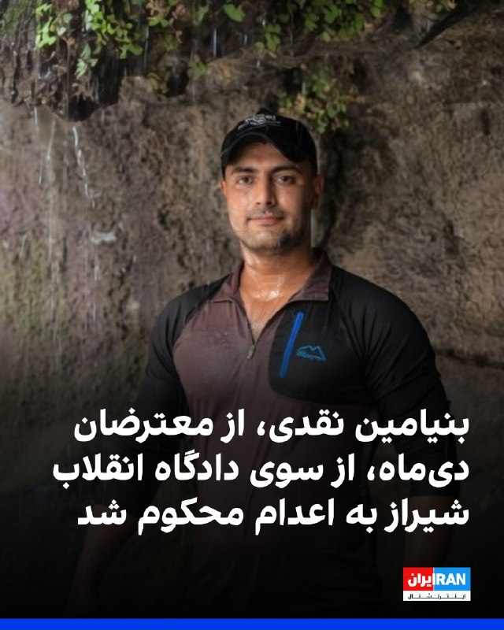

مصطفی نیلی، وکیل دادگستری اعلام کرد بنیامین نقدی، زندانی سیاسی و از معترضان دی‌ماه، از سوی دادگاه انقلاب شیراز به اتهام «افسادفی‌الارض»، به اعدام محکوم شد.

این وکیل دادگستری به کانال امتداد گفت که بنیامین نقدی در شب سیزدهم دی ۱۴۰۴ در شیراز، به دلیل «شعله‌ور نمودن یک دستگاه کپسول آتش‌نشانی» به سمت مامورین نیروی انتظامی بازداشت شده بود.

مصطفی نیلی افزود پس از پایان تحقیقات مقدماتی کیفرخواست بنیامین نقدی با اتهام‌های «محاربه، عضویت در گروه‌های به هم‌زننده امنیت، اجتماع و تبانی به قصد انجام جرم علیه امنیت و فعالیت تبلیغی علیه نظام» صادر شد و نسبت به اتهام ایراد صدمه جسمانی به ماموران و حمل سلاح سرد منع تعقیب صادر شد.

نیلی، وکیل دادگستری گفت که در جلسه دادگاه، قضات تمامی اتهامات را مصداق افسادفی‌الارض تشخیص دادند و بر همین مبنا حکم اعدام برای بنیامین نقدی صادر کردند.
https://iranintl.com/202605305615

## IranIntlTV — post 339750

  

شاهزاده رضا پهلوی گفت که مردم ایران باید از طریق هوا حفاظت شوند و اینترنت و دیگر ابزار لازم را داشته باشند که دست به‌کار شوند و رژیم را به زانو درآورند.
او ادامه داد: «مردم حمله به زیرساخت‌های رژیم را جشن گرفتند و خیابان‌ها را به نام ترامپ نام‌گذاری کردند.»

شاهزاده رضا پهلوی ادامه داد: «دنیا باید تصمیم بگیرد که بعد از ۴۷ سال مماشات در کنار مردم ایران بایستد.»

او اضافه کرد: «مردم بین حمله به کشور و حمله به رژیم تمایز ایجاد می‌کنند.»
https://iranintl.com/202605301562

## IranIntlTV — post 339749

  <a href="telegram/content/IranIntlTV_339749_1780159402.mp4" target="_blank">🎬 Download video</a>

شاهزاده رضا پهلوی در نشست «امنیت دریای سیاه» در اودسا در جنوب اوکراین، گفت: « با محور هرج ومرج مذاکره نکنید، با آن مقابله کنید. مدیریت نکنید جمهوری اسلامی را، به آن پایان دهید.»
@iranintltv

## IranIntlTV — post 339748

  

🔻رولاندو ماران، سرمربی تیم ملی آلبانی، پس از اعلام فهرست بازیکنان برای دو دیدار دوستانه مقابل اسرائیل و لوکزامبورگ، درباره غیبت یاسر آسانی، مهاجم تیم استقلال گفت: «یاسر آسانی دعوت نشد چون بازی نکرده است. من شخصاً با او صحبت نکردم، اما همکارانم با او تماس گرفتند.»

🔹ماران گفت: «او در این مدت به میدان نرفته و آماده بودنش برای این مسابقات دشوار بود.»

🔹آلبانی روز ۱۳ خرداد به مصاف اسرائیل می‌رود و ۱۶ خرداد برابر لوکزامبورگ قرار خواهد گرفت.

@iranintltvsport

## IranIntlTV — post 339747

  <a href="telegram/content/IranIntlTV_339747_1780159404.mp4" target="_blank">🎬 Download video</a>

شاهزاده رضا پهلوی در نشست «امنیت دریای سیاه» در اودسا در جنوب اوکراین، گفت پهپادهایی که امروز شهرهای اوکراین را هدف قرار می‌دهند، همان ابزار سرکوبی هستند که جمهوری اسلامی برای تعقیب و هدف قرار دادن معترضان در خیابان‌های ایران به کار گرفته است.
@iranintltv

## IranIntlTV — post 339746

  

شاهزاده رضا پهلوی در نشست «امنیت دریای سیاه» در اودسا در جنوب اوکراین، ضمن انتقاد از هرگونه توافق احتمالی، گفت که جمهوری اسلامی را مدیریت نکنید، بلکه به آن پایان دهید.

او افزود: «محور مسکو-تهران یک دشمن هماهنگ برای همه است و باید قاطعانه و با انسجام با آن برخورد شود.»

شاهزاده رضا پهلوی ادامه داد: «هر توافقی با جمهوری اسلامی مانند توافقات با شوروی سابق موضوع را حل نکرده است.»
https://iranintl.com/202605309589

## reutersworldchannel — post 151525

  

Trump says he will soon decide on Iran deal, demands reopening of Hormuz Strait

U.S. President Donald Trump said on Friday he ​would soon decide on a proposed deal to extend the ceasefire with Iran, though the two countries still appeared to differ on significant issues ‌that have been central to the conflict.

Trump said on Friday morning that he would meet in a secure White House room to make a "final determination" on the proposal, which would extend an early-April truce for another 60 days, giving negotiators time to forge a permanent end to the war. read more

## FarsiVOA — post 219096

  <a href="telegram/content/FarsiVOA_219096_1780159407.mp4" target="_blank">🎬 Download video</a>

گلایه یک شهروند از گرانی؛ «یک دانه موز ۱۸۰ هزار تومان»؛

در سایه بی‌ثباتی اقتصادی و فشارهای مداوم، زندگی روزمره بسیاری از مردم به میدان مبارزه‌ای خاموش برای تأمین حداقل‌ها تبدیل شده است.

روزنامه شرق در گزارشی میدانی از تهران، از بازگشت دفترهای نسیه در سوپرمارکت‌ها، خرید اعتباری اقلامی مانند نان، پنیر، حبوبات، روغن و رب، و سقوط طبقه متوسط به وضعیت بقا تا پایان ماه روایت کرده است.

## FarsiVOA — post 219094

فرماندهی مرکزی ایالات متحده، سنتکام، تصاویری از فرود یک جنگنده «اف-۳۵ بی» تفنگداران دریایی آمریکا روی عرشه ناو «یو‌اس‌اس تریپولی» در جریان عبور از دریای عرب منتشر کرد.

سنتکام می‌گوید «اف-۳۵ بی» برای برخاست کوتاه و فرود عمودی طراحی شده است.

@FarsiVOA

## FarsiVOA — post 219093

🔺روبیو: تام باراک همچنان در مورد سوریه و عراق نقش محوری ایفا خواهد کرد

▪️مارکو روبیو، وزیر امور خارجه آمریکا، اعلام کرد تام باراک، سفیر ایالات متحده در ترکیه، با وجود پایان یافتن نقشش به‌عنوان نماینده ویژه آمریکا در امور سوریه، همچنان در سیاست‌گذاری آمریکا درباره سوریه و عراق نقش مهمی ایفا خواهد کرد.

⬇️ بیشتر بخوانید:

https://ir.voanews.com/a/rubio-backs-tom-barrack-regional-role/8155576.html/?nocach=1

## FarsiVOA — post 219092

گفت‌و‌گو با دکتر بابک خطی، پزشک و فعال سیاسی، درباره مهاجرت پرستاران و پزشکان تیر خلاص به بخش درمان ایران

## FarsiVOA — post 219091

  <a href="telegram/content/FarsiVOA_219091_1780159409.mp4" target="_blank">🎬 Download video</a>

«حال‌ وش» ویدیویی از لحظه زورگیری مسلحانه از یک شهروند در زاهدان را منتشر کرده است. در این ویدیو که مربوط به ۳۱ اردیبهشت ۱۴۰۵ است دو موتورسوار مسلح با تهدید، تلفن همراه و پول نقد یک شهروند را سرقت کرده و از محل متواری می‌شوند.

سایه جنگ، افزایش تورم، فشارهای اقتصادی و قطعی اینترنت، هم‌زمان با تغییر الگوی جرائم، چهره ناامنی شهری در ایران را دگرگون کرده است.

## FarsiVOA — post 219090

در گفت‌وگو با شاهین مدرس، پژوهشگر مطالعات امنیتی، تعویق در اعلام نتیجه نشست پرزیدنت ترامپ را بررسی کردیم. وقفه‌ای که به گفته او نشان می‌دهد واشنگتن برای تصمیم نهایی عجله‌ای ندارد و فاکتور زمان، برخلاف تصور رژیم ایران، هرچه بیشتر به زیان جمهوری اسلامی عمل می‌کند.

## FarsiVOA — post 219089

در گفت‌وگو با حسن هاشمیان به پایان مأموریت تام باراک به‌عنوان نماینده ویژه آمریکا در سوریه پرداختیم. به گفته آقای هاشمیان کارنامه تام باراک را باید به دو مقطع قبل و بعد از عملیات «خشم حماسی» علیه جمهوری اسلامی تقسیم کرد.

## FarsiVOA — post 219088

  <a href="telegram/content/FarsiVOA_219088_1780159411.mp4" target="_blank">🎬 Download video</a>

ارتش اسرائیل اعلام کرد کمی پیشتر موشک‌هایی از لبنان به مناطقی در شمال اسرائیل شلیک شد. تعدادی از این موشک‌ها رهگیری شدند و تعدادی در فضاهایی باز مانند ساحل شهر نهاریا در شمال اسرائیل سقوط کردند. ارتش اسرائیل اعلام کرد این حملات به اسرائیل تلفاتی درپی نداشتند.

## FarsiVOA — post 219084

پیت هگست، وزیر جنگ آمریکا، از دیدار با گیلبرتو تئودورو، وزیر دفاع فیلیپین، خبر داد.

او گفت دو کشور در حال تقویت همکاری‌های دفاعی در امتداد «زنجیره نخست جزایر» هستند؛ همکاری‌ای که به گفته او با برگزاری رزمایش «بالیکاتان» و انتقال یک شناور گارد ساحلی پشتیبانی شده است.

@FarsiVOA

## FarsiVOA — post 219083

آیا تهدید اروپا توسط روسیه به رویارویی کشیده می‌شود؟ گفت‌و‌گو با رضا تقی‌زاده، تحلیلگر روابط بین‌الملل

## FarsiVOA — post 219082

🔺 تداوم آزار و اذیت معترضان دی؛ شمار زیادی از بازداشت‌شدگان همچنان در بلاتکلیفی هستند

▪️نهادهای حقوق بشری از ادامه سرکوب و فشار جمهوری اسلامی بر بازداشت‌شدگان اعتراضات سراسری دی‌ ۱۴۰۴ در شهرهای مختلف ایران خبر می‌دهند.

⬇️ بیشتر بخوانید:

https://ir.voanews.com/a/iran-arrest-protest-prison-january-human-rights/8155568.html/?nocach=1

## FarsiVOA — post 219081

  <a href="telegram/content/FarsiVOA_219081_1780159413.mp4" target="_blank">🎬 Download video</a>

«هەنگاو» ویدیویی از مراسم تشییع مجتبی و میثم ویسی منتشر کرده است که امروز شنبە نهم خرداد در سرپل ذهاب برگزار می‌شود.

این دو برادر که پس از اعتراضات دی‌ ۱۴۰۴ تحت تعقیب نهادهای امنیتی بودند بامداد پنجشنبه هفتم خرداد ۱۴۰۵ در روستای «قلعه کهوش» از توابع دالاهو، در جریان یورش نیروهای اطلاعات سپاه پاسداران به محل اختفای آنها، هدف شلیک مستقیم قرار گرفتند و کشته شدند.

مجتبی و میثم ویسی از فعالان فرهنگی و مدنی و از پیروان آیین یارسان معرفی شده‌اند. آنها از بنیان‌گذاران کتابخانه‌ای در شهرک دره‌دریژ کرمانشاه بودند. مجتبی ویسی همچنین کشتی‌گیر، نوازنده، و نقاش بود. کُردپا پیشتر گزارش داده بود که مجتبی ویسی در اسفند ۱۴۰۳ بازداشت و در فروردین ۱۴۰۴ با وثیقه آزاد شده بود.

## FarsiVOA — post 219080

تعطیلی فرودگاه مونیخ و اختلال در پروازها پس از مشاهده پهپاد ناشناس؛ زنگ خطر امنیت هوایی اروپا

## FarsiVOA — post 219078

فرماندهی مرکزی ایالات متحده، سنتکام، تصاویری از عملیات هوایی شبانه ملوانان آمریکایی روی ناو هواپیمابر «یو‌اس‌اس جرج اچ دبلیو بوش» منتشر کرد.

سنتکام می‌گوید خلبانان در شب قادرند در تاریکی، هواپیماهای خود را روی عرشه‌ای کوچک که همزمان در حال حرکت و نوسان است، فرود آورند.

@FarsiVOA

## FarsiVOA — post 219077

آرمان معرفتی، شهروند اهل سقز که اسفند سال گذشته به اتهام آتش‌ زدن یک مسجد در تهران محاکمه شده بود، به اعدام محکوم شد.

## DW_Farsi — post 125323

  

🔶 اسرائيل دستور تخلیه ۱۰ روستای لبنان را صادر کرد

ارتش اسرائیل پس از چند حمله از سوی حزب‌الله لبنان، از ساکنان ۱۰ روستای این کشور خواست تا خانه‌های خود را تخلیه کنند.

به گزارش رسانه‌های آلمان، یک سخنگوی ارتش اسرائيل گفت، این اقدام در پاسخ به نقض مداوم آتش‌بس از سوی حزب‌الله صورت گرفت است.

همزمان شبکه‌های تلویزیونی عربی از حملات هوایی اسرائیل به اهدافی در شهر نبطیه لبنان و حومه آن گزارش داده‌اند. طبق‌ گزارش شبکه تلویزیونی "ال‌بی‌سی" لبنان، در این حملات دست‌کم سه نفر کشته شده‌اند؛ هر چند که این آمار هنوز به طور رسمی تأیید نشده است.

به گفته ارتش اسرائیل، گروه حزب‌الله در طول شب گذشته ۲۹ مه در چهار حمله حدود ۱۰ تا ۱۵ موشک به شمال اسرائیل شلیک کرده است.

روزنامه اسرائیلی هاآرتص نیز به نقل از مقامات محلی گزارش داد که تنها ۱۰ فروند از این پرتابه‌ها به سمت شهر مرزی "کریات شمونا" هدایت شدند.

طبق این گزارش، پدافند هوایی اسرائیل ۹ موشک را رهگیری و منهدم کرد. یکی از موشک‌ها به مرکز شهر اصابت کرد و خسارات مالی بر جای گذاشت، اما این حادثه هیچ مجروحی در پی نداشت.

@dw_farsi

## DW_Farsi — post 125322

  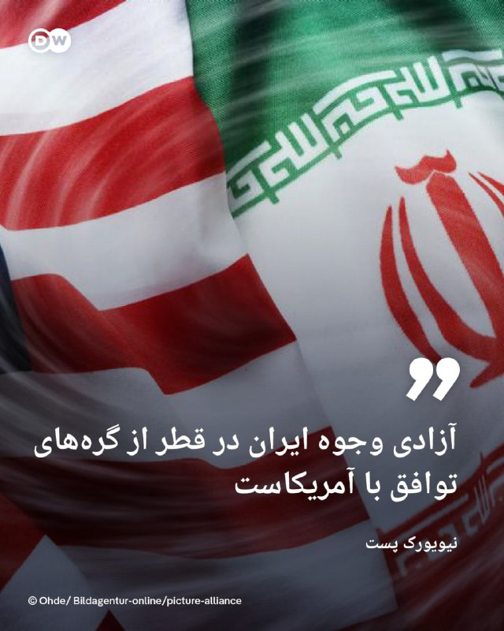

🔶 نیویورک‌ پست: آزادی وجوه ایران در قطر از گره‌های توافق با آمریکاست

روزنامه آمریکایی نیویورک پست در گزارشی شرح داده که آزادسازی ۶ میلیارد دلار ایران که در پی توافق تبادل زندانی میان ایران و آمریکا در سال ۲۰۲۳ در قطر بلوکه شده بود، از جمله آخرین گره‌های دستیابی به توافق در مذاکرات صلح بین ایران و آمریکاست.

نیویورک ‌پست به نقل از یک مقام آمریکایی نوشت که این دارایی‌ها به تدریج و در قالب محموله‌های غذایی و دارویی آزاد خواهند شد، مشروط بر اینکه ایران به تعهدات خود، از جمله بازگشایی و مین‌روبی تنگه هرمز عمل کند.

در این گزارش مشخص نشده که این مقام مسئول در حال تشریح پیشنهاد ایالات متحده است یا به بند خاصی از پیش‌نویس توافق اشاره دارد.

در سپتامبر ۲۰۲۳ و به عنوان بخشی از توافقی که به آزادی پنج تن از اتباع هر یک از این دو کشور انجامید، جو بایدن، رئیس‌جمهور وقت آمریکا، تحریم‌هایی را که مانع برداشت ۶میلیارد دلار دارایی ایران از کره جنوبی می‌شد لغو کرد.

این وجوه سپس از کره جنوبی به حساب‌هایی در قطر منتقل شد، اما پس از حمله ۷ اکتبر ۲۰۲۳ گروه حماس به جنوب اسرائیل و آغاز جنگ غزه، مسدود ماند.

@dw_farsi

## DW_Farsi — post 125321

  

🔶 توقیف اموال ده‌ها نفر در ایران به اتهام "همکاری با دشمن"

در حالی که قوه قضائیه استان گلستان از توقیف اموال ۷۴ ایرانی خارج از کشور به اتهام "خیانت به وطن" خبر داده، رئيس‌ کل دادگستری خراسان جنوبی نیز می‌گوید، اموال ۳۴ نفر در این استان به اتهام "حمایت از دشمن" ضبط شده است.

خبرگزاری ایرنا روز شنبه نهم خرداد (۳۰ مه) به نقل از قوه قضائيه نوشت، به دستور مقام قضايی، اموال ۷۴ نفر در استان گلستان که از " خائنین به وطن و افراد تأثیرگذار در شبکه همکاران دشمن" و ساکن خارج از کشور هستند در راستای "حفظ حقوق عامه و اجرای قانون تشدید مجازات جاسوسی و همکاری" با اسرائيل توقیف شد.

قوه قضائيه می‌‌گوید، اموال این افراد شامل حساب‌های بانکی، خودرو و املاک ثبتی است که شناسایی و همه توقیف شده است. در ضمن، هرگونه نقل و انتقال مالی برای آن‌ها ممنوع و پرونده این افراد در دادسرای مرکز استان در حال رسیدگی است.

هم‌زمان محمدجعفر عبداللهی، رئیس‌ کل دادگستری استان خراسان جنوبی از توقیف اموال ۳۴ نفر که او آن‌ها را "حامی دشمن و خائن به کشور" نامید خبر داد.

@dw_farsi

## DW_Farsi — post 125320

  

🔶 نماینده ایرانی‌تبار پارلمان آلمان خواستار ممنوعیت فعالیت سپاه شد

رضا اصغری، نماینده ایرانی‌تبار پارلمان آلمان از حزب دموکرات‌مسیحی (CDU) خواستار ممنوعیت فعالیت سپاه پاسداران انقلاب اسلامی در این کشور شد.

اصغری در گفت‌وگو با خبرگزاری رویترز گفت: «سرویس‌های اطلاعاتی ایران در آلمان بسیار فعال هستند. غیرقابل درک است که هنوز ممنوعیتی برای فعالیت سپاه پاسداران در این کشور وجود ندارد. ما در سریع‌ترین زمان ممکن به این ممنوعیت نیاز داریم.»

اتحادیه اروپا تا کنون سپاه پاسداران را در فهرست سازمان‌های تروریستی قرار داده است.

اما وزارت کشور آلمان هنوز بر اساس قانون تشکل‌ها (Vereinsrecht)، فعالیت سپاه را در خاک خود ممنوع اعلام نکرده است.

در ساختار حقوقی آلمان، دولت برای ممنوع کردن فعالیت یک نهاد خارجی در خاک خود، باید از طریق این قانون اقدام کند تا بتواند شعبه‌ها، فعالیت‌ها و دارایی‌های آن نهاد یا هوادارانش را در داخل مرزهای آلمان غیرقانونی اعلام کند.

@dw_farsi

## DW_Farsi — post 125319

  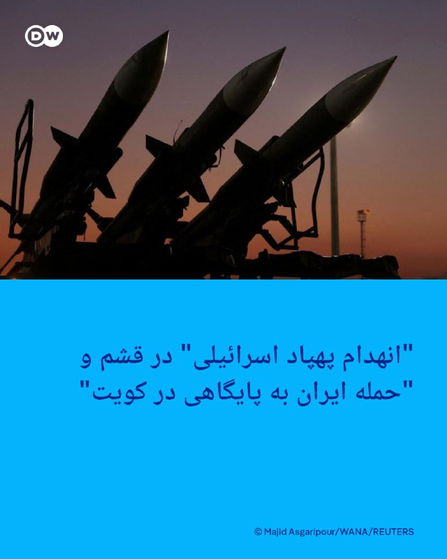

🔶 "انهدام پهپاد اسرائيلی" در قشم و "حمله ایران به پایگاهی در کویت"

در حالی که ارتش ایران از انهدام یک فروند پهپاد اسرائيلی در منطقه قشم خبر می‌دهد بلومبرگ نیز می‌گوید، در حمله موشکی ایران به یک پایگاه آمریکا در کویت چند آمریکایی زخمی شده‌اند.

به نوشته خبرگزاری ایرنا، ارتش ایران روز شنبه نهم خرداد (۳۰ مه) در اطلاعیه‌ای اعلام کرد که در بامداد همین روز یک فروند پهپاد اوربیتر اسرائيل را رهگیری و منهدم کرده است.

به گفته ارتش، این پهپاد "تحت شبکه یکپارچه قرارگاه مشترک پدافند هوایی کشور در منطقه قشم" مورد اصابت قرار گرفت و منهدم شد.

در همین حال خبرگزاری بلومبرگ نیز در گزارشی به نقل از منبعی آگاه از حمله موشکی ایران به پایگاه آمریکایی "علی السالم" در کویت در ۲۴ ساعت گذشته خبر داد.

به گفته بلومبرگ، در این حمله پنج نفر، از جمله چند پرسنل آمریکایی زخمی شدند و به پهپادهای ایالات متحده نیز آسیب وارد آمد.

بلومبرگ به نقل از این منبع که نامش ذکر نشد جراحات آمریکایی‌ها را سطحی اما خسارت وارده به دو پهپاد "ام‌کیو ـ ۹ریپر" ارتش آمریکا را شدید اعلام کرده است.

@dw_farsi

## Persian_Trend_Official — post 15347

https://www.instagram.com/reel/DY9_9XQNm3g/?igsh=MWh2Z3d5eXRvcnhoMg==

پیج اینستاگرام پرشین ترند رو فالو کردید ؟

## Persian_Trend_Official — post 15346

  <a href="telegram/content/Persian_Trend_Official_15346_1780159417.webm" target="_blank">🎬 Download video</a>

قرارگاه مرکزی خاتم‌الانبیا: مدیریت تنگه هرمز توسط نیروهای مسلح جمهوری اسلامی ایران با اقتدار کامل اعمال می‌شود.

قرارگاه مرکزی خاتم الانبیا در بیانیه ای اعلام کرد: با توجه به یکپارچگی این مسیر، تأکید می‌شود کلیه کشتی‌ها، شناورهای تجاری و نفتکش‌ها صرفاً ملزم به تردد از مسیرهای تعیین‌شده و اخذ مجوز از نیروی دریایی سپاه پاسداران انقلاب اسلامی هستند. هرگونه تخلف از این ضوابط، امنیت تردد آن‌ها را با مخاطره جدی مواجه خواهد کرد.

همچنین هشدار داده می‌شود هرگونه اقدام شناورهای نظامی جهت مداخله در مدیریت تنگه هرمز یا ایجاد اختلال در تردد، مورد هدف نیروهای مسلح جمهوری اسلامی ایران قرار خواهد گرفت.

📝 Amir

📌 @persian_trend_official
پرشین ترند | متفاوت‌ترین کانال نظامی

## Persian_Trend_Official — post 15345

  

یک مقام آمریکایی آگاه به خبرگزاری آسوشیتدپرس گفت که ارتش آمریکا یک کشتی تجاری دیگر را که سعی داشت از محاصره بنادر ایران توسط آمریکا عبور کند، متوقف کرده است.

📝 Amir

📌 @persian_trend_official
پرشین ترند | متفاوت‌ترین کانال نظامی

## Persian_Trend_Official — post 15344

  <a href="telegram/content/Persian_Trend_Official_15344_1780159418.mp4" target="_blank">🎬 Download video</a>

امریکا خبر آسیب حمله موشکی ایران به کویت را تأیید کرد.

مجری فاکس نیوز: بلومبرگ گزارش می‌دهد که حملات موشکی ایران منجر به زخمی شدن چندین آمریکایی در پایگاه هوایی کویت شده است. به نظر شما اوضاع از چه قرار است؟

مایک جانسون، رئیس مجلس نمایندگان: من دیشب با رئیس جمهور ترامپ صحبت کردم. او در جریان این موضوع قرار گرفته است. من فکر می‌کنم رهبری جدید ایران می‌خواهد به این درگیری پایان دهد.

📝 Amir

📌 @persian_trend_official
پرشین ترند | متفاوت‌ترین کانال نظامی

## Persian_Trend_Official — post 15343

التماس تفکر 🙏 📝 Nick 📌 @persian_trend_official پرشین ترند | متفاوت‌ترین کانال نظامی

## Persian_Trend_Official — post 15342

  <a href="telegram/content/Persian_Trend_Official_15342_1780159420.mp4" target="_blank">🎬 Download video</a>

پیت هگست، وزیر جنگ ایالات متحده: همین چند روز پیش در جلسه کابینه بودیم و رئیس جمهور گفت هی، این یک توافق عالی خواهد بود.

ولی اگر ایران نمی‌خواهد توافق خوبی انجام دهد که تضمین کند به سلاح هسته‌ای دست پیدا نمی‌کند، می‌تواند با فردی که در سمت چپ من است، معامله کند و این تنها باری بود که من به چپ بودن متهم شدم.

📝 Amir

📌 @persian_trend_official
پرشین ترند | متفاوت‌ترین کانال نظامی

## Persian_Trend_Official — post 15341

  

ترامپ قول داد که به زودی در مورد توافقی برای پایان دادن به جنگ ایران تصمیم نهایی را بگیرد، اما به گزارش نیویورک تایمز، جلسه اتاق وضعیت روز جمعه بدون هیچ نتیجه ای پایان یافت!

نیویورک تایمز: ایران می‌گوید هیچ توافق نهایی در دست نیست؛ سخنگوی وزارت امور خارجه، بقایی، تأیید کرد که تبادل پیام‌ها هنوز ادامه دارد. این توافق پیشنهادی، در ازای لغو محاصره تنگه هرمز توسط ایران، به کارزار نظامی آمریکا و اسرائیل پایان می‌دهد و برنامه هسته‌ای به مذاکرات بعدی موکول شده است.

هگست، وزیر دفاع امریکا در سنگاپور قریب‌الوقوع بودن این توافق را کم‌اهمیت جلوه داد و تأکید کرد که ذخایر مهمات ایالات متحده برای جنگ مجدد آماده است.

هم تندروهای جمهوری‌خواه آمریکایی و هم تندروهای ایرانی به این توافق حمله می‌کنند. تندرو های ایرانی آن را بیش از حد آشتی‌جویانه می‌نامد و محسن رضایی، ترامپ را به خواسته‌های بیش از حد متهم می‌کند.

📝 Amir

📌 @persian_trend_official
پرشین ترند | متفاوت‌ترین کانال نظامی

## Persian_Trend_Official — post 15340

  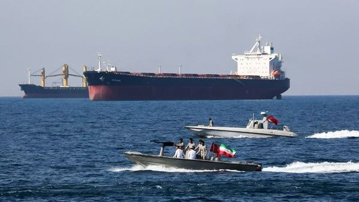

عبور 20 کشتی از تنگه هرمز با هماهنگی سپاه پاسداران

نیروی دریایی سپاه پاسداران انقلاب اسلامی با تأکید بر حاکمیت کامل خود بر تنگه هرمز، امروز از عبور 20 فروند کشتی در قالب کریدور اقتدارخبر داد، سپاه می‌گوید ضمن آنکه شرایط بشردوستانه کشورهای ذی‌نفع که نیازمند محموله‌های کود شیمیایی هستند نیز در نظر گرفته شده است.

📝 Amir

📌 @persian_trend_official
پرشین ترند | متفاوت‌ترین کانال نظامی

## RadioFarda — post 157727

  <a href="https://t.me/radiofarda/157727" target="_blank">📎 Download file</a>

📻بشنوید: ایستگاه ۱۹ با رادیوفردا، نهم خرداد ۱۴۰۵

@RadioFarda

## RadioFarda — post 157726

  <a href="https://t.me/radiofarda/157726" target="_blank">📎 Download file</a>

آیا جهان در آستانه شوک تازه انرژی قرار گرفته است؟

🔸مدیران چهار نهاد بزرگ اقتصادی جهان شامل آژانس بین‌المللی انرژی، صندوق بین‌المللی پول، بانک جهانی و سازمان تجارت جهانی هشدار داده‌اند ادامه درگیری‌ها در خاورمیانه، عرضه انرژی، تجارت جهانی و اقتصاد کشورهای آسیب‌پذیر را به‌طور جدی تحت فشار قرار داده است. این نهادها می‌گویند اختلال در تردد نفتکش‌ها از تنگه هرمز، افزایش قیمت سوخت و کود شیمیایی و نااطمینانی اقتصادی، بیش از همه به کشورهای فقیر آسیب می‌زند. حسن منصور، اقتصاددان در بریتانیا به این پرسش پاسخ می‌دهد که هشدار هم‌زمان چهار نهاد بزرگ اقتصادی جهان را باید تا چه حد جدی گرفت؟

@RadioFarda

## RadioFarda — post 157725

  <a href="https://t.me/radiofarda/157725" target="_blank">📎 Download file</a>

لبنان میان فشار دیپلماسی و آتش جنگ؛ گفت‌وگو با مهرداد فرهمند

🔸در حالی که جمهوری اسلامی در مذاکرات با آمریکا بر پایان جنگ در همه جبهه‌ها، از جمله لبنان، تأکید می‌کند، نمایندگان لبنان و اسرائیل نیز با میانجی‌گری آمریکا در پنتاگون گفت‌وگوهایی امنیتی و نظامی برگزار کردند؛ مذاکراتی که بر تثبیت آتش‌بس شکننده و کاهش تنش متمرکز بود، نه یک توافق سیاسی جامع. هم‌زمان، بنیامین نتانیاهو مدعی شده نیروهای اسرائیلی از رود لیتانی عبور کرده‌اند؛ ادعایی که حزب‌الله آن را رد می‌کند. اکنون این پرسش مطرح است که آیا لبنان به بخشی تعیین‌کننده از معامله بزرگ‌تر میان تهران و واشینگتن تبدیل شده، یا همچنان در مدار یک جنگ فرسایشی باقی خواهد ماند؟ ارزیابی مهرداد فرهمند، تحلیل‌گر مسائل خاورمیانه، را بشنویم.

@RadioFarda

## RadioFarda — post 157724

  

🔸سپیده قلیان، فعال مدنی و زندانی سیاسی، روز شنبه نهم خرداد پس از پایان محکومیت شش‌ماهه خود از زندان وکیل‌آباد مشهد آزاد شد.

🔸او ساعاتی پس از آزادی با انتشار تصویری از حضور خود بر مزار خسرو علیکردی، وکیل دادگستری، نوشت: «از زندان یک راست آمدم سر خاک خسرو» و افزود که «از هرچه خسته شوم، از رسیدن به آزادی و حمل کردن سنگ‌های سخت حقیقت خسته نخواهم شد.»

🔸قلیان همچنین با اشاره به هم‌بندی‌های خود در زندان وکیل‌آباد نوشت که هنگام خداحافظی، در چشمان آنان تنها یک جمله می‌دید: «ما را فراموش نکنید.»

🔸سپیده قلیان در بخش دیگری از پیام خود نوشت که نام زندانیان و کشته‌شدگان ماه‌های اخیر را «فریاد خواهد زد» و افزود: «کاش شهرزاد قصه‌شان باشم.»

🔸سپیده قلیان ۲۱ آذر ۱۴۰۴ در جریان مراسم ترحیم خسرو علیکردی در مشهد بازداشت شد. آن مراسم با برخورد نیروهای امنیتی و انتظامی همراه بود و در جریان آن شماری از حاضران، از جمله نرگس محمدی، عالیه مطلب‌زاده و جواد علیکردی، برادر خسرو علیکردی، نیز بازداشت شدند.

@RadioFarda

## RadioFarda — post 157723

🔸پیت هگست، وزیر دفاع آمریکا، روز شنبه نهم خرداد گفت ایالات متحده در صورتی که مذاکرات با ایران به توافق منجر نشود، آماده ازسرگیری حملات علیه جمهوری اسلامی است.

🔸هگست در جمع خبرنگاران گفت: «در حال حاضر تمرکز ما بر حفظ آمادگی و آماده بودن برای بازگشت به عملیات است، اگر لازم باشد.»

🔸او افزود دونالد ترامپ «صبور» است و به دنبال دستیابی به «توافقی خوب» است که تضمین کند ایران هرگز به سلاح هسته‌ای دست پیدا نخواهد کرد.

🔸اظهارات وزیر دفاع آمریکا در حالی مطرح می‌شود که مذاکره‌کنندگان تهران و واشینگتن در تلاش‌اند اختلافات باقی‌مانده بر سر برنامه هسته‌ای ایران را برطرف کنند.

@RadioFarda

## RadioFarda — post 157722

🔸یک عضو هیئت رئیسه مجلس شورای اسلامی روز شنبه اعلام کرد که «اعمال مدیریت» ایران بر تنگه هرمز «تصمیم قطعی» مجلس است و طرح مربوط به آن در صحن علنی تصویب و تبدیل به قانون خواهد شد. 🔸به گزارش خبرگزاری تسنیم، علیرضا سمیعی مدعی شد که درباره طرح مذکور با «دستگاه‌های…

## RadioFarda — post 157721

  

🔸یک عضو هیئت رئیسه مجلس شورای اسلامی روز شنبه اعلام کرد که «اعمال مدیریت» ایران بر تنگه هرمز «تصمیم قطعی» مجلس است و طرح مربوط به آن در صحن علنی تصویب و تبدیل به قانون خواهد شد.

🔸به گزارش خبرگزاری تسنیم، علیرضا سمیعی مدعی شد که درباره طرح مذکور با «دستگاه‌های مختلف» گفت‌وگوهایی انجام شده است.

🔸این در حالی است که دونالد ترامپ، رئیس‌جمهور آمریکا، بارها اعلام کرده که هرگونه توافق با ایران برای پایان دادن به جنگ باید شامل باز شدن این آبراه بدون اخذ عوارض باشد. او روز جمعه نیز این موضع ایالات منحده را تکرار کرد.

🔸عضو هیئت رئیسه مجلس با اعلام این‌که تنگه هرمز در «حوزه سرزمینی ایران و عمان» است، گفت که اجازه نمی‌دهیم کشور دیگری در این‌ زمینه تصمیم‌گیری کند.

📷شرح عکس: مجسمه نیروهای نظامی ایران در ساحل بندرعباس، در حالی که شناورهایی در آب‌های تنگه هرمز دیده می‌شوند.

@RadioFarda

## IranianMinds — post 21078

  <a href="telegram/content/IranianMinds_21078_1780159425.mp4" target="_blank">🎬 Download video</a>

🔴 حملات هوای ارتش اسرائیل به جنوب لبنان در دقایقی پیش.

@IranianMinds

## IranianMinds — post 21077

  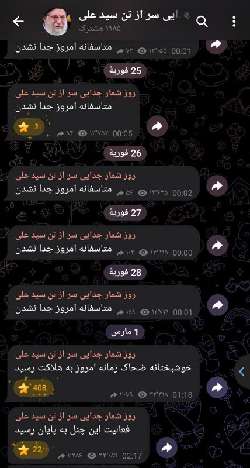

@IranianMinds

## IranianMinds — post 21076

🔴آسو‌شیتد‌پرس به نقل از یک منبع آمریکایی:

ارتش آمریکا یک کشتی تجاری را که قصد داشت به سمت یکی از بنادر ایران برود، منع کرد.

@IranianMinds

## IranianMinds — post 21075

  

🔴 بنیامین نقدی، زندانی سیاسی و از معترضان دی‌ماه، از سوی دادگاه انقلاب شیراز به اعدام محکوم شد.

@IranianMinds

## IranianMinds — post 21074

  

🔴بدون توضیح.

😂😂😂

@IranianMinds

## IranianMinds — post 21073

🔴 شاهزاده رضا پهلوی:

مردم ایران باید از طریق هوا حفاظت بشن و اینترنت و دیگر ابزار لازم رو داشته باشن که دست به‌کار بشن و رژیم رو به زانو بیارن.

مردم حمله به زیرساخت‌های رژیم رو جشن گرفتن و خیابان‌ها رو به نام ترامپ نام‌گذاری کردن.

دنیا باید تصمیم بگیره که بعد از ۴۷ سال مماشات در کنار مردم ایران بایسته.

@IranianMinds

## IranianMinds — post 21072

  

🔴در تجمعات شبانه دیده شده است.

@IranianMinds

## IranianMinds — post 21071

پیت هگست جملات طنز گفته

🔴 هگست : همین چند روز پیش در جلسه کابینه بودیم و رئیس جمهور گفت: «هی، این یک توافق عالی خواهد بود و اگر ایران نمی‌خواهد توافق خوبی انجام دهد که تضمین کند به سلاح هسته‌ای دست پیدا نمی‌کند، می‌تواند با فردی که در سمت چپ من است، معامله کند.»

و این تنها باری بود که من به چپ بودن متهم شدم. 😂

@IranianMinds

## IranianMinds — post 21069

🔴 امروز‌ ساعت 19:30 فینال لیگ قهرمانان اروپا تو شهر بوداپست مجارستان برگزار میشه

پی اس جی - آرسنال

@IranianMinds

## IranianMinds — post 21068

  <a href="telegram/content/IranianMinds_21068_1780159428.webm" target="_blank">🎬 Download video</a>

▶️ فینال لیگ قهرمانان اروپا رو با آپشن های تخصصی در MelBet پیشبینی کنید! ⚽️
🔥😍

💵 امکان شارژ کارت بکارت و هات ووچر

🎁 قرعه کشی و آفر های جذاب با جوایز ویژه

📱 کاملترین برنامه موبایل

🤝 اسپانسر رسمی لالیگا

🇮🇷 پشتیبانی از زبان فارسی

✍️ حرفه ای، مطمئن و در کلاس جهانی پیشبینی کنید!

برای ورود به سایت فیلترشکن خود را خاموش کنید!
‌
🌐 Link 🔜 MelBet1.net

🌐‌ Link 🔜 MelBet1.net

## IranianMinds — post 21067

  <a href="telegram/content/IranianMinds_21067_1780159428.mp4" target="_blank">🎬 Download video</a>

🔴فوری.

@IranianMinds

## BBCPersian — post 282437

  

🔻به گزارش هرانا، ارگان خبری مجموعه فعالان حقوق بشر در ایران، سپیده قلیان، زندانی سیاسی امروز(شنبه ۹ خرداد) از زندان وکیل آباد مشهد آزاد شده است.

آزادی او پس از پایان دوران شش ماه محکومیت حبس تعزیری صورت گرفته است.

خانم قلیان اواخر آذرماه سال پیش (۱۴۰۴) در مراسم هفتم خسرو علیکردی در مشهد به همراه نرگس محمدی، عالیه مطلب‌زاده و پوران ناظمی بازداشت شد.

او در دی‌ماه سال پیش در دادگاه انقلاب مشهد محاکمه شد و در بهمن ماه به «اجتماع و تبانی برای ارتکاب جرم برضد امنیت داخلی/خارجی» و «تبلیغ علیه نظام» متهم شد که پنج سال حبس تعلیقی و شش ماه حبس تعزیری را برای او به همراه داشت.

این فعال سیاسی در خردادماه پارسال با پایان دوران محکومیت از زندان اوین آزاد شده بود.

@BBCPersian

## BBCPersian — post 282436

🔻در پی مشاهده شدن شیئی شبیه مین دریایی در تنگه هرمز، مرکز امنیت دریایی عمان به دریانوردان، ماهیگیران و شناورها هشدار داد که نهایت احتیاط را به خرج دهند.

این شیء مشکوک در آب‌های سرزمینی عمان و در غرب منطقه ترافیک ساحلی مشاهده شده است.

مرکز امنیت دریایی عمان به دریانوردان توصیه کرد که فاصله ایمن را از هر شی مشکوکی حفظ کنند و در صورت مشاهده، فورا موضوع را به مقام‌های ذی‌ربط گزارش دهند.

آمریکا بارها ایران را به تلاش برای مین‌گذاری در تنگه هرمز متهم کرده و یکی از شرایط توافق صلح با تهران را هم مین‌روبی این آبراه عنوان کرده است.

ایران هیچگاه رسما مین‌گذاری در این تنگه را تایید نکرده است.

@BBCPersian

## BBCPersian — post 282435

  <a href="https://t.me/bbcpersian/282435" target="_blank">📎 Download file</a>

📻این هفته در پرگار: گرایش سیاسی ما چگونه شکل می‌گیرد؟

🔻عقاید سیاسی ما چگونه شکل می‌گیرند؟ چطور تغییرمی‌کنند؟ چرا دیگرانی که تا دیروز همفکر می‌پنداشتیم را ممکن است امروز ناقص‌العقل بنامیم؟ آنها ما را چطور می‌بینند؟

میهمان‌ها:
پویا قدوسی، استاد جغرافیای انسانی
مانی منجمی، روان‌پزشک

@BBCPersian

## BBCPersian — post 282434

  <a href="https://t.me/bbcpersian/282434" target="_blank">📎 Download file</a>

تازه‌ترین خبرهای جهان از جام جهان‌نما - شنبه ۹ خرداد ۱۴۰۵
@BBCPersian

## Dirty_Kids — post 390581

  

عکس گویای همه هست...

@Dirty_Kids 👻

## Dirty_Kids — post 390580

  

طبق تحقیقات جدید لب گرفتن از رفیق صمیمی‌تون مجازه و شما با اینکار همجنس‌باز به حساب نمیاین!

@Dirty_Kids 👻

## Dirty_Kids — post 390579

‏این که زخم‌ها قبل از خوب شدنشون می‌خارن و التماست می‌کنن تا دوباره بازشون کنی‌ خیلی استعارهٔ جالبیه. تحمل کردن خارشه، پیچ آخره. رد کنی تمومه.

@Dirty_Kids 👻

## Dirty_Kids — post 390578

  <a href="telegram/content/Dirty_Kids_390578_1780159432.mp4" target="_blank">🎬 Download video</a>

🔴 فیلم وایرال شده از حرکات عجیب عرزشیا تو تجمعات شبانه😐😂

@Dirty_Kids 👻

## Dirty_Kids — post 390577

  <a href="https://t.me/Dirty_Kids/390577" target="_blank">📎 Download file</a>

✅ اپلیکیشن اندروید سایت جهانی دربی بت

💰اولین سایت جهانی با امکان شارژ و برداشت ریالی(کارت به کارت)

🔗 برای ورود فیلترشکن روی کشور مناسب قرار دهید مانند فنلاند و المان و....

😀Telegram Channel
👇
https://t.me/+bcynkEgSW2dlYTc0

## Dirty_Kids — post 390576

  

😤دنبال یه سایت شرط بندی بین المللی بودی که به ایرانیا خدمات بده؟!
⛔

👍دربی بت همون انتخاب  100%

💎ویژگی های سایت جهانی Derby Bet:

⬅️امکان شارژ امن با کارت بانکی

⬅️واریز اول دوبل شارژ می شوید(بونوس۱۰۰٪)

⬅️پر اپشن ترین سایت فعال در ایران

⬅️تسویه حساب کمتر از 5 دقیقه

⬅️برگشت بخشی از باخت به صورت هفتگی

🚨کد هدیه ثبت نام:GG007

⚠️برای دانلود اپلکیشن کلیک کنید
👉

🔔کانال دربی بت :

🪙https://t.me/+bcynkEgSW2dlYTc0

## Dirty_Kids — post 390575

  <a href="telegram/content/Dirty_Kids_390575_1780159434.mp4" target="_blank">🎬 Download video</a>

گل اول ارسنال به پاریسس

گل سکسی هاورتززز

@Dirty_Kids 👻

## Dirty_Kids — post 390574

  <a href="telegram/content/Dirty_Kids_390574_1780159436.mp4" target="_blank">🎬 Download video</a>

جه جالب ما هم ساعت بلند ميشیم.فقط ما اون ساعت ميشاشم تو روح بنيانگذار جمهورى اسلامی و نايبش خامنه‌اى و مقوا

@Dirty_Kids 👻

## Dirty_Kids — post 390573

  

وقتی کلی مطلب برا غُرزدن اماده کرده بودم ولی یهویی میادمیگه دخترخوشگلِ من چطوره؟

@Dirty_Kids 👻

## Dirty_Kids — post 390572

  

🌎با بهبود نسبی وضعیت اینترنت و بازگشت محدود دسترسی به شبکه بین‌الملل، موفق شدیم ضمن حفظ کیفیت و پایداری سرویس‌ها، قیمت را تا هر گیگابایت 20 هزار تومان کاهش دهیم
🖥

🟣با وجود اینکه شرایط اینترنت همچنان ناپایدار است و وضعیت پهنای باند بین‌الملل به ثبات کامل نرسیده، تیم فنی بادبان با توسعه زیرساخت‌ها و بهره‌گیری از سرورهای جدید از سرویس‌دهندگان معتبر، توانسته هزینه‌ها را بهینه کرده و سرویس‌ها را با قیمت مناسب‌تری ارائه دهد
⛵️
G9
از همراهی و اعتماد شما سپاسگزاریم
💜

🛡@BadBan_VPN | کانال 

🤖@BadBan_VPNBot | ربات 

📞@BadBan_VPNSupport | پشتیبانی

## Dirty_Kids — post 390571

  <a href="telegram/content/Dirty_Kids_390571_1780159438.mp4" target="_blank">🎬 Download video</a>

ایرانی فکر کن بعد سه ماه بهت اینترنت دادن اینو ببینی😂

@Dirty_Kids 👻

## Dirty_Kids — post 390570

  <a href="telegram/content/Dirty_Kids_390570_1780159440.mp4" target="_blank">🎬 Download video</a>

🔴 ویدیوی ویرال شده از حرکت یه پسر جوون توی ایران که شاهکار خلق کرده🔥

@Dirty_Kids 👻

## Dirty_Kids — post 390569

  

دورانی که اینترنت قطع بود مردم از سر بیکاری اسم وای فای‌شون رو تغییر میدادن تا از همسایشون بپرسن شام چی دارن :))

@Dirty_Kids 👻

## Dirty_Kids — post 390568

  <a href="telegram/content/Dirty_Kids_390568_1780159441.mp4" target="_blank">🎬 Download video</a>

عرزشیا تو عید قربان خاتمی، روحانی و ظریف رو بنر کنار ترامپ و نتانیاهو چاپ کردن دارن بهشون بعنوان شیطان سنگ میزنن 😂

خب خاک تو سر بی‌عرضتون کنن این سه تا شیطان بغل دستتون تو ایران هستن

@Dirty_Kids 👻

## Dirty_Kids — post 390567

  <a href="telegram/content/Dirty_Kids_390567_1780159443.mp4" target="_blank">🎬 Download video</a>

🔴 کارشناس ضد ایرانی صداوسیما : آریایی‌ها قاتل بودن!

اینکه بعضی‌ها میگن ما آریایی هستیم، نژادپرستیه.
تمدن ما 65 هزار ساله‌ست، آريايی‌ها کلا 4-5 هزار سال پیش اومدن.
آریایی‌ها همه رو کُشتن و به قدرت رسیدن، اینکه بگیم ما آریایی هستیم یعنی ما فرزندان کسایی هستیم که نسل کُشی کردن...

@Dirty_Kids 👻

## Hranews — post 113249

جمعی از پرستاران ساکن در یزد، صبح امروز با برگزاری تجمع اعتراضی مقابل ساختمان استانداری، نسبت به واریز نشدن تعرفه‌های خدمات پرستاری از شش ماه گذشته و عدم رسیدگی به مطالبات صنفی و مزدی خود، اعتراض کردند.
#پرستاران

↘️
@hranews_bot تماس ✉️ - @Hranews کانال هرانا 🆑

## Hranews — post 113248

  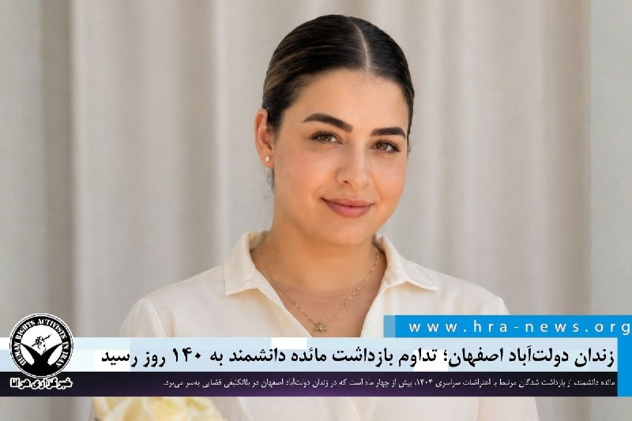

زندان دولت‌آباد اصفهان؛ تداوم بازداشت مائده دانشمند به ۱۴۰ روز رسید

❗️
❗️
❗️
❗️
❗️– مائده دانشمند، از بازداشت شدگان مرتبط با اعتراضات سراسری ۱۴۰۴، بیش از چهار ماه است که در زندان دولت‌آباد اصفهان در بلاتکلیفی قضایی به‌سر می‌برد.

به گزارش خبرگزاری هرانا، ارگان خبری مجموعه فعالان حقوق بشر در ایران، مائده دانشمند همچنان در بازداشت بسر می‌برد.

بر اساس اطلاعات دریافتی هرانا، ۱۴۰ روز از بازداشت خانم دانشمند که که با اتهامات مرتبط با اعتراضات سراسری مواجه است، می‌گذرد. او هم‌اکنون در زندان دولت‌آباد اصفهان نگهداری می‌شود. وی همچنان در وضعیت بلاتکلیفی قضایی قرار دارد و امکان آزادی او با وثیقه نیز تاکنون میسر نشده است.

ادامه مطلب

#مائده_دانشمند

↘️
@hranews_bot تماس ✉️ - @Hranews کانال هرانا 🆑

## Hranews — post 113247

  

احکام اعدام رئوف شیخ‌ معروفی و محمد فرجی در دیوان عالی کشور تایید شد

❗️
❗️
❗️
❗️
❗️– دیوان عالی کشور احکام اعدام رئوف شیخ‌ معروفی و محمد فرجی، زندانیان سیاسی محبوس در زندان بوکان را تایید کرد. این افراد پیشتر از بابت اتهام “افساد فی الارض”، توسط دادگاه انقلاب به #اعدام محکوم شده بودند.

ادامه مطلب

#رئوف_شیخ‌_معروفی #محمد_فرجی

↘️
@hranews_bot تماس ✉️ - @Hranews کانال هرانا 🆑

## Hranews — post 113246

  

اعتراضات دی‌ماه ۱۴۰۴؛ بنیامین نقدی به اعدام محکوم شد

❗️
❗️
❗️
❗️
❗️– بنیامین نقدی، از بازداشت شدگان اعتراضات سراسری ۱۴۰۴، توسط دادگاه انقلاب شیراز از بابت اتهام «افساد فی‌الارض» به #اعدام محکوم شد. مصطفی نیلی، وکیل مدافع وی اعلام کرده است که نسبت به این حکم درخواست فرجام‌خواهی خواهد کرد.

ادامه مطلب

#بنیامین_نقدی

↘️
@hranews_bot تماس ✉️ - @Hranews کانال هرانا 🆑

## Hranews — post 113245

پرونده سجاد و شایان ویسی با اتهام محاربه به دادگاه انقلاب کرمانشاه ارجاع شد

❗️
❗️
❗️
❗️
❗️– سجاد ویسی و شایان ویسی، شهروندان پیرو آئین یارسان و از بازداشت‌شدگان اعتراضات دی‌ماه در کرمانشاه، همچنان در زندان دیزل‌آباد این شهر نگهداری می‌شوند. پرونده این شهروندان با اتهام محاربه به دادگاه انقلاب کرمانشاه ارجاع شده است. سجاد ویسی برادر میثم و مجتبی ویسی است که روز پنجشنبه ۷ خرداد ۱۴۰۵ در یکی از روستاهای شهرستان دالاهو هدف تیراندازی ماموران اطلاعات سپاه قرار گرفته و جان خود را از دست دادند.

ادامه مطلب

#سجاد_ویسی #شایان_ویسی

↘️
@hranews_bot تماس ✉️ - @Hranews کانال هرانا 🆑

## Hranews — post 113244

  

گزارشی از آخرین وضعیت دیانا طاهرآبادی، نوجوان بازداشت شده در اعتراضات

❗️
❗️
❗️
❗️
❗️– دیانا طاهرآبادی، ۱۶ ساله که در جریان اعتراضات ۱۴۰۴ بازداشت شده است، کماکان در بخش کانون اصلاح و تربیت زندان کچوئی کرج به سر می‌برد.

به گزارش خبرگزاری هرانا، ارگان خبری مجموعه فعالان حقوق بشر در ایران، دیانا طاهرآبادی همچنان در بازداشت است.

یک منبع مطلع نزدیک به خانواده این نوجوان ضمن تایید این موضوع به هرانا گفت: «با گذشت ۱۲۶ روز از زمان بازداشت دیانا طاهرآبادی، وی همچنان در بخش کانون اصلاح و تربیت زندان کچوئی کرج نگهداری می‌شود. نیروهای امنیتی از او اعترافات اجباری اخذ کرده و پرونده‌اش را به دادگاه ارسال کردند. او در دادگاه اتهامات خود را رد کرد و پرونده وی با مداخله نهادهای امنیتی برای رسیدگی به تهران ارسال شده است.»

ادامه مطلب

#دیانا_طاهرآبادی

↘️
@hranews_bot تماس ✉️ - @Hranews کانال هرانا 🆑

## Hranews — post 113243

  

سپیده قلیان از زندان وکیل آباد مشهد آزاد شد

❗️
❗️
❗️
❗️
❗️– سپیده قلیان، زندانی سیاسی که دوران محکومیت خود را در زندان وکیل آباد مشهد سپری می‌کرد، امروز شنبه ۹ خردادماه، از این زندان آزاد شد.

به گزارش خبرگزاری هرانا، ارگان خبری مجموعه فعالان حقوق بشر در ایران، سپیده قلیان، زندانی سیاسی آزاد شد.

بر اساس اطلاعات دریافتی هرانا، آزادی خانم قلیان ساعاتی پیش و پس از پایان دوران شش ماه محکومیت حبس تعزیری وی صورت گرفته است.

ادامه مطلب

#سپیده_قلیان

↘️
@hranews_bot تماس ✉️ - @Hranews کانال هرانا 🆑

## Hranews — post 113242

  

زندان تربت حیدریه؛ بلاتکلیفی ۵ معترض بازداشت شده همچنان ادامه دارد

❗️
❗️
❗️
❗️
❗️– جواد قاضی‌منش، جواد سیدحجی نقدعلی، یوسف معمار، علی‌اصغر جعفری و مرتضی بابک، علیرغم گذشت ۱۴ روز از زمان بازداشت، کماکان در زندان تربت حیدریه در وضعیت بلاتکیف به‌سر میبرند. بازداشت این افراد در رابطه با شرکت در اعتراضات د‌یماه ۱۴۰۴ صورت گرفته است.

به گزارش خبرگزاری هرانا، ارگان خبری مجموعه فعالان حقوق بشر در ایران، پنج معترض بازداشت شده، همچنان در زندان تربت حیدریه بلاتکلیف هستند.

جواد قاضی‌منش، جواد سیدحجی نقدعلی، یوسف معمار، علی‌اصغر جعفری و مرتضی بابک در تاریخ ۲۷ اردیبهشت‌ماه ۱۴۰۵، در منازل شخصی خود در روستای باغجر از توابع بخش مرکزی شهرستان سبزوار بازداشت شدند.

ادامه مطلب

#جواد_قاضی‌منش #جواد_سیدحجی_نقدعلی
#یوسف_معمار #علی‌اصغر_جعفری
#مرتضی_بابک

↘️
@hranews_bot تماس ✉️ - @Hranews کانال هرانا 🆑

## alonews — post 123766

  <a href="telegram/content/alonews_123766_1780159447.webm" target="_blank">🎬 Download video</a>

👈رافائل گروسی مدیرکل آژانس بین‌المللی انرژی اتمی اعلام کرد ذخایر هسته‌ای یک نقطه اختلاف بین ایران و آمریکا است و برای کمک به حل آن آماده‌ایم.

✅ @AloNews خبر جنگ

## alonews — post 123764

  <a href="telegram/content/alonews_123764_1780159447.mp4" target="_blank">🎬 Download video</a>

👈حمله‌های شدیدِ ارتش اسرائیل ساعتی پیش، به جنوب لبنان

✅ @AloNews خبر جنگ

## alonews — post 123763

  <a href="telegram/content/alonews_123763_1780159448.webm" target="_blank">🎬 Download video</a>

👈وزیر جنگ آمریکا: دوستی واقعی بین واشنگتن و اسلام‌آباد در حال شکل‌گیری است؛ این مدیون رهبری پاکستان است که به تلاش‌ها برای مذاکره با ایران کمک کرده

✅ @AloNews خبر جنگ

## alonews — post 123762

  <a href="telegram/content/alonews_123762_1780159449.mp4" target="_blank">🎬 Download video</a>

گلللللل اووول آرسنال به پاریس توووسط هاورتزز دقیقه 6
@AloSport

## alonews — post 123761

  <a href="telegram/content/alonews_123761_1780159450.webm" target="_blank">🎬 Download video</a>

👈هم اکنون نیروی دریایی ارتش آمریکا از شلیک و متوقف کردن یک کشتی تجاری ایرانی که قصد داشت به بنادر ایران وارد شود خبر داد

✅ @AloNews خبر جنگ

## alonews — post 123760

  <a href="telegram/content/alonews_123760_1780159450.webm" target="_blank">🎬 Download video</a>

👈رضا پهلوی: مردم ایران از هدف قرار گرفتن زیرساخت‌ها خوشحال شدن ‌
✅ @AloNews خبر جنگ

## alonews — post 123759

  <a href="telegram/content/alonews_123759_1780159450.webm" target="_blank">🎬 Download video</a>

👈رضا پهلوی: مردم ایران از هدف قرار گرفتن زیرساخت‌ها خوشحال شدن

‌
✅ @AloNews خبر جنگ

## alonews — post 123758

  <a href="telegram/content/alonews_123758_1780159451.webm" target="_blank">🎬 Download video</a>

👈مدیرعامل آروان کلاد: زمانبر بودن بهبود وضعیت اینترنت از نظر فنی فقط بهانه ست، نت رو گذاشتن رو حالتی که اگر خواستند سریع قطع یا وصل کنند

✅ @AloNews خبر جنگ

## alonews — post 123757

  <a href="telegram/content/alonews_123757_1780159451.webm" target="_blank">🎬 Download video</a>

👈مقام آمریکایی به AP : یه کشتی تجاری که قصد داشت به سمت یکی از بنادر ایران بره، متوقف شده 
✅ @AloNews خبر جنگ

## alonews — post 123756

  <a href="telegram/content/alonews_123756_1780159451.mp4" target="_blank">🎬 Download video</a>

👈نیویورک تایمز: ترامپ بارها جی‌دی ونس را دست انداخته است

🔴نیویورک تایمز گزارش داد دونالد ترامپ بارها در جلسات و محافل مختلف جی‌دی ونس را درباره مسائل سیاسی و شخصی مورد شوخی و انتقاد قرار داده است.
طبق این گزارش، ترامپ به مخالفت اولیه ونس با حمله به ایران، نتیجه سفر دیپلماتیک او به پاکستان، تعداد مرخصی‌هایش و حتی قطع کردن صحبت دیگران اشاره کرده است.
نیویورک تایمز همچنین نوشت ترامپ بارها ماجرای افتادن جام قهرمانی دانشگاه ایالتی اوهایو از دست ونس در یکی از مراسم‌های کاخ سفید را یادآوری کرده است.

✅ @AloNews خبر جنگ

## alonews — post 123755

  <a href="telegram/content/alonews_123755_1780159452.webm" target="_blank">🎬 Download video</a>

👈نماینده سیستان و بلوچستان در مجلس: برخی از مناطق زاهدان ۲۴ تا ۴۸ ساعت آب ندارند

🔴 ادامه بحران آب، استان را با چالش‌های امنیتی و اجتماعی روبه‌رو می‌کند

✅ @AloNews خبر جنگ

## alonews — post 123754

  <a href="telegram/content/alonews_123754_1780159452.webm" target="_blank">🎬 Download video</a>

👈مقام آمریکایی به AP : یه کشتی تجاری که قصد داشت به سمت یکی از بنادر ایران بره، متوقف شده

✅ @AloNews خبر جنگ

## alonews — post 123752

  <a href="telegram/content/alonews_123752_1780159453.webm" target="_blank">🎬 Download video</a>

👈سلفی حسین طاهری مداح و یک جان فدا

✅ @AloNews خبر جنگ

## alonews — post 123751

  <a href="telegram/content/alonews_123751_1780159453.webm" target="_blank">🎬 Download video</a>

👈قرارگاه مرکزی خاتم‌الانبیا در بیانیه‌ای اعلام کرد که هرگونه اقدام شناورهای نظامی جهت مداخله در مدیریت تنگه هرمز یا ایجاد اختلال در تردد، مورد هدف نیروهای مسلح جمهوری اسلامی قرار خواهد گرفت.

🔴در این بیانیه آمده: «هرگونه تخلف از این ضوابط، امنیت تردد آن‌ها را با مخاطره جدی مواجه خواهد کرد.»

🔴قرارگاه مرکزی خاتم‌الانبیا اعلام کرد کلیه کشتی‌ها، شناورهای تجاری و نفتکش‌ها صرفا ملزم به تردد از مسیرهای تعیین‌شده و اخذ مجوز از نیروی دریایی سپاه پاسداران هستند.

✅ @AloNews خبر جنگ

## alonews — post 123748

  <a href="telegram/content/alonews_123748_1780159453.mp4" target="_blank">🎬 Download video</a>

8 اردیبهشت ماه یه زوج عروسی گرفتن و 20 میلیارد تومن خرج عروسی‌شون شده!! فقط یه میلیارد پول فیلمبردار دادن! اینم فیلم عروسی‌شونه.

[@AloTweet]

## alonews — post 123747

  <a href="telegram/content/alonews_123747_1780159454.webm" target="_blank">🎬 Download video</a>

💔همه اعضای این خانواده جاوید نام شدن.

🔴جاویدنام بیژن مصطفوی، ۵۸ ساله، بازنشسته آموزش و پرورش، رزمنده جنگ ایران و عراق

🔴جاویدنام زهرابنی‌عامریان، ۴۸ ساله، بازنشسته تامین اجتماعی

🔴جاویدنام دانیال مصطفوی، ۲۰ ساله، دانشجوی کامپیوتر

🔴اصالتا از شهرستان سنقر، استان کرمانشاه
کشته شده ۱۹ دی ماه خونین ۴۰۴ در گوهردشت کرج

🤔عرزشی حرام زاده بدونه که روز تسویه حساب باهاتون نزدیکه

✅@AloNews

---
📅 بروزرسانی: 1405/03/09 16:29
---

## VahidOOnLine — post 242912

  

♦️ مرکز امنیت دریایی عمان روز شنبه نهم خرداد، از دریانوردان، ماهیگیران و شناورها خواست تا در مسیرهای حرکتی خود نهایت احتیاط را به کار بندند. این هشدار پس از آن صادر شد که یک شی شناور مشکوک به «مین دریایی» در سمت غربی منطقه تردد ساحلی در تنگه هرمز و در محدوده آب‌های سرزمینی عمان رویت شد.

این مرکز به فعالان و کاربران حوزه دریانوردی توصیه کرد که فاصله ایمن را با هرگونه شی مشکوک حفظ کرده و مراتب را فورا به مقامات ذی‌ربط گزارش دهند.
‌🇸🇦 Indypersian

🤖 @VahidOOnLine

## VahidOOnLine — post 242911

  

مرکز امنیت دریایی عمان اعلام کرد در پی مشاهده یک جسم شناور مشکوک به مین دریایی در غرب مسیر ترافیک ساحلی تنگه هرمز و در آب‌های سرزمینی این کشور، از کشتی‌ها و صیادان خواسته شده با حداکثر احتیاط تردد کنند و هر مورد مشکوک را فورا به مقام‌های مسئول گزارش دهند.
‌🏁 🇬🇧 IranintlTV

🤖 @VahidOOnLine

## VahidOOnLine — post 242910

  

رافائل گروسی، مدیرکل آژانس بین‌المللی انرژی اتمی سازمان ملل، در گفت‌وگو با روزنامه نشنال‌نیوز با ابراز نگرانی از گسترش «پدیده» حمله به نیروگاه‌های هسته‌ای در جریان درگیری‌های اخیر، گفت حمله به این تاسیسات در حال تبدیل شدن به الگویی خطرناک در جنگ‌ها است.

گروسی با اشاره به حمله پهپادی به نیروگاه براکه در امارات متحده عربی گفت: «این واقعیت که کسی یک نیروگاه هسته‌ای را هدف قرار داده، بسیار جدی است.»

او گفت آژانس شواهد لازم برای مقصر دانستن تهران در این حمله را در اختیار ندارد و افزود: «ما به مدرک ملموسی درباره منشا این حمله نیاز داریم.»

مقام‌های امارات متحده عربی، نیروهای نیابتی جمهوری اسلامی در عراق را مسئول این حمله اعلام کردند.

گروسی همچنین به حملات علیه نیروگاه هسته‌ای زاپوروژیا در اوکراین و نیروگاه هسته‌ای بوشهر اشاره کرد.
‌🏁 🇬🇧 IranintlTV

🤖 @VahidOOnLine

## VahidOOnLine — post 242909

🗣روایت شما از زندگی در دوران پس از انقلاب ملی و جنگ - شنبه ۹ خرداد ۱۴۰۵

🔹وضعیت وحشتناکه، گرونی زیاد شده، ما کم آوردیم. من خودم دانش‌آموز هستم، هیچی از درس نفهمیدیم و بعد از ۱۸ و ۱۹ هیچی مثل قبل نشد.

🔹اپراتورهای تلفن همراه علاوه بر افزایش شدید هزینه بسته‌های نت، مخصوصاً همراه اول، امکان خرید شارژ در مبالغ زیر ۲۰ هزار تومان هم نمی‌دن.

🔹ما کیش هستیم. از روز اول جنگ تا همین امروز به دلیل امن نبودن پرواز، هنوز هیچ مسافری با پرواز نیامده کیش. از طریق دریایی هم تا همین یک هفته پیش فقط کیشوندان رو راه می‌دادن. تمام هتل‌ها، رستوران‌ها و بازارها بدبخت شدن.

🔹از ایرانشهر: هموطنان عزیز اینجا همه‌چیز گرونه و اینترنت خیلی ضعیفه. قبلاً با کانفیگ پولی قوی‌تر بود، الان خیلی بدتر و ضعیف‌تر شده.

🔹امروز و دیروز رانندگان اسنپ‌فود ایلام به دلیل پایین بودن کرایه‌ها و گرانی روغن و بنزین اعتصاب کردن. صدها سفارش در رستوران‌ها خراب شد و به مشتری نرسید.

🔹چیپسی که پارسال ۱۸ تومان بود شده ۷۰ تومان، دقیقاً ۴ برابر.

🔹تهران هستم. ۱۰ ساله اسنپ کار می‌کنم، کرایه خیلی پایینه. درآمدم همون درآمد پارساله ولی هزینه‌ها ۳ برابر شده. تعویض روغن موتور پراید شده ۳ میلیون.

🔹از بوشهر پیام می‌دم. برادر من نظامی هست و حقوق دو ماه پیشش حدود ۳۰ میلیون تومان بود. الان حقوق این ماهش شده ۱۵ میلیون تومان، قضاوت با خودتون.

🔹نیروهای پیمانکاری شرکت نفت سروستان از استان فارس هستیم. حقوق اسفند و فروردین به‌صورت علی‌الحساب پرداخت شده، ولی تا امروز نه حقوق اردیبهشت و نه حقوق معوقه پرداخت نشده.

🔹فقط مبلغ یک بسته سویا از سه ماه پیش تا دیروز با تورم ۸۰۰ درصدی بالا رفته.
‌🏁 🇬🇧 IranintlTV

🤖 @VahidOOnLine

## VahidOOnLine — post 242908

♦️سعید آجرلو، از چهره‌های رسانه‌ای نزدیک به هیات مذاکراتی ایران، در گفتگویی تلویزیونی اعلام کرد دسترسی غیرقابل برگشت به ۱۲ میلیارد دلار از اموال مسدود شده از شروط اصلی تفاهم احتمالی است.
این کارشناس سیاسی گفت: «این مبلغ باید به صورت غیرقابل برگشت در اختیار بانک مرکزی قرار ‌گیرد.»
آجرلو اعلام کرد در طرح ۱۴ ماده‌ای، معافیت تحریم‌های نفتی و رفع محاصره دریایی به عنوان گام نخست پیش‌بینی شده و در صورت اجرای تعهدات از سوی آمریکا، جمهوری اسلامی وارد مرحله بعدی می‌شود.
به گفته این چهره رسانه‌ای نزدیک به هیات مذاکراتی ایران ادامه داد: «اگر مرحله نخست اجرا نشود، اعتمادی برای ادامه مذاکرات وجود نخواهد داشت.»
‌🇸🇦 Indypersian

🤖 @VahidOOnLine

## VahidOOnLine — post 242907

  

پیت هگست، وزیر جنگ آمریکا، با اشاره به سخنان دونالد ترامپ درباره احتمال جنگ دوباره در صورت شکست مذاکرات با جمهوری اسلامی گفت واشینگتن اکنون در موقعیت قوی‌تری قرار دارد و در صورت لزوم آماده اقدام نظامی است.
هگست افزود با این حال ترجیح ترامپ این است که کار به گزینه نظامی نکشد.
‌🏁 🇬🇧 IranintlTV

🤖 @VahidOOnLine

## VahidOOnLine — post 242906

  

پیت هگست، وزیر جنگ آمریکا، در حاشیه نشست «گفت‌وگوی شانگری‌لا» در سنگاپور، درباره محاصره بنادر و سواحل جنوبی ایران گفت: «محاصره دریایی ادامه دارد و این اقدام موثر بوده و کنترل تنگه هرمز در اختیار آمریکا است.»
او افزود تنگه هرمز باید برای همه کشورها باز و بدون عوارض باقی بماند.
‌🏁 🇬🇧 IranintlTV

🤖 @VahidOOnLine

## VahidOOnLine — post 242905

  

♦️پیت هگست، وزیر جنگ ایالات متحده روز شنبه نهم خرداد گفت مقام‌های جمهوری اسلامی ایران می‌دانند که برای دستیابی به توافق با آمریکا باید چه کاری را انجام دهند.

هگست که برای شرکت در کنفرانس دفاعی شانگری-لا به سنگاپور سفر کرده است گفت: مذاکرات با ایران در حال پیشرفت و سازنده بوده است. وزیر جنگ آمریکا بار دیگر تاکید کرد که دونالد ترامپ تنها توافقی را امضا خواهد کرد که برای ایالات متحده عالی و برای امنیت جهانی، مفید باشد.

هگست ساعاتی پیش گفته بود که آمریکا در صورت شکست مذاکرات، برای از سرگیری جنگ با ایران کاملا آماده است.
‌🇸🇦 Indypersian

🤖 @VahidOOnLine

## VahidOOnLine — post 242904

  

سعید آجرلو، از چهره‌های رسانه‌ای نزدیک به هیات مذاکراتی جمهوری اسلامی، گفت که دسترسی غیرقابل برگشت به ۱۲ میلیارد دلار از اموال بلوکه‌شده از شروط اصلی تفاهم احتمالی است.
او افزود: «این مبلغ باید به صورت غیرقابل برگشت در اختیار بانک مرکزی قرار ‌گیرد.»
آجرلو گفت که در طرح ۱۴ ماده‌ای، معافیت تحریم‌های نفتی و رفع محاصره دریایی به عنوان گام نخست پیش‌بینی شده و در صورت اجرای تعهدات از سوی آمریکا، جمهوری اسلامی وارد مرحله بعدی می‌شود.
به گفته آجرلو، اگر مرحله نخست اجرا نشود، اعتمادی برای ادامه مذاکرات وجود نخواهد داشت.
‌🏁 🇬🇧 IranintlTV

🤖 @VahidOOnLine

## VahidOOnLine — post 242903

  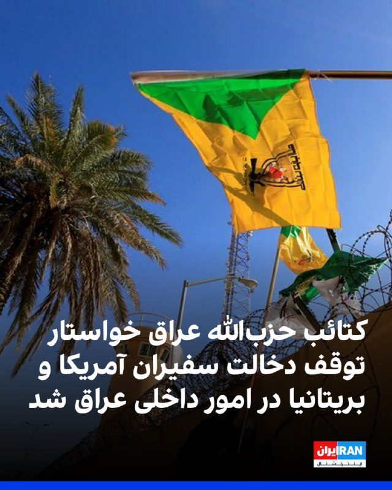

کتائب حزب‌الله عراق، یکی از گروه‌‌های نیابتی جمهوری اسلامی، در بیانیه‌ای نوشت سفیران آمریکا و بریتانیا باید از آنچه «دخالت در امور داخلی عراق» خوانده، دست بردارند.
این گروه برخی سیاستمداران عراقی را به تکرار مواضع «دشمنان» متهم کرد و گفت عربستان سعودی مقرهای حشد شعبی را هدف قرار داده و اردن به محلی برای فعالیت اسرائیل علیه عراق تبدیل شده است.
کتائب حزب‌الله افزود از واگذاری فعالیت‌های نظامی به نهادهای رسمی حمایت می‌کند و آماده است با هماهنگی فرماندهی حشد شعبی در جمع‌آوری و ساماندهی سلاح‌ها مشارکت کند.
‌🏁 🇬🇧 IranintlTV

🤖 @VahidOOnLine

## VahidOOnLine — post 242902

  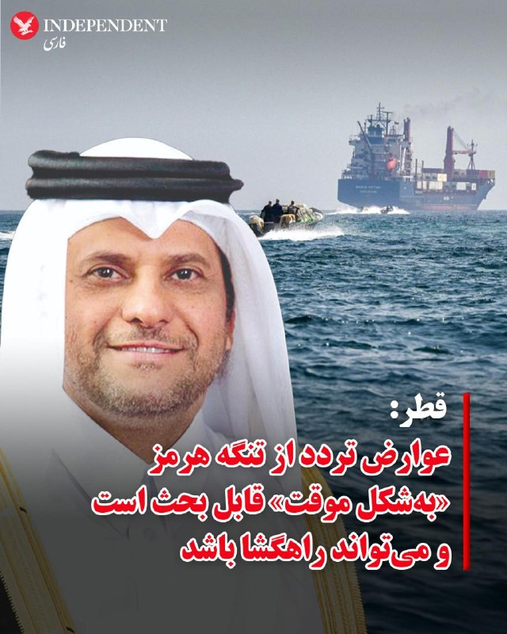

♦️شیخ سعودعبدالرحمن آل ثانی، معاون نخست وزیر قطر روز شنبه در کنفرانس دفاعی آسیایی «شانگری-لا» در سنگاپور گفت که قطر با هزینه‌های قانونی دائمی برای عبور و مرور از تنگه هرمز مخالف است، اما عوارض موقت قابل مذاکره است و می‌تواند به احیای عبور و مرور عادی از این آبراه کلیدی کمک کند.

به گزارش بلومبرگ، این اظهارات در حالی بیان می‌شود که جمهوری اسلامی و عمان در حال بررسی اخذ عوارض دائمی از تنگه هرمز هستند. این در حالی است که قطر تلاش می‌کند تا همزمان به تعادلی میان یک راهبرد واحد در منطقه خلیج فارس و مناسبات با جمهوری اسلامی ایران و متحدان تهران دست یابد.

دونالد ترامپ، رئیس جمهوری آمریکا بارها مخالفت قاطع خود را با پرداخت عوارض تردد در تنگه هرمز اعلام کرده است.
‌🇸🇦 Indypersian

🤖 @VahidOOnLine

## VahidOOnLine — post 242901

  

♦️ارتش جمهوری اسلامی ایران روز شنبه نهم خردادماه با انتشار بیانیه‌ای اعلام کرد پدافند هوایی ارتش بامداد این روز یک پهپاد اوربیتر را در منطقه قشم منهدم کرد.

در بیانیه ارتش این پهپاد متعلق به دشمن «آمریکایی-صهیونی» عنوان شده است. سنتکام هنوز واکنشی به این ادعا نشان نداده است.

در نخستین ساعات بامداد شنبه و پس از انتشار گزارش‌ها از شنیده شدن صدای ضد هوایی و پهپاد، رسانه‌های داخلی ایران از هدف قرار گرفتن یک پهپاد متخاصم در جزیره قشم خبر دادند.
‌🇸🇦 Indypersian

🤖 @VahidOOnLine

## VahidOOnLine — post 242900

  

♦️شبکه خبری ان‌بی‌سی، روز شنبه نهم خرداد ماه، به نقل از سه مقام اطلاعاتی آمریکایی گزارش کرد، ایران احتمالا با استفاده از یک «موشک دوش‌پرتاب ساخت چین»، جنگنده اف-۱۵ آمریکا را در آسمان جنوب غربی ایران سرنگون کرده است.
بر اساس این گزارش، جنگنده اف۱۵ آمریکا که در فروردین ماه گذشته در جنوب غربی ایران سرنگون شد، ممکن است هدف یک موشک دوش‌پرتاب (MANPADS) قرار گرفته باشد: اسلحه‌ای با طول حدود دو متر و وزن ۱۸ کیلوگرم که علیه اهدافی در ارتفاع کم مؤثر هستند.
سرنگونی جنگنده آمریکایی در آسمان غرب ایران، نخستین مورد در چند دهه گذشته توصیف شده است.
منابع اطلاعاتی به ان‌بی‌سی گفته‌اند پشتیبانی چین از ایران در جنگ گذشته ممکن است فراتر از موشک‌های دوش‌پرتاب باشد. به گفته این منابع، چین احتمالا یک رادار هشدار «زودهنگام دوربرد» (مدل YLC-8B) را در اختیار ایران قرار داده که برای شناسایی جنگنده‌های پیشرفته رادار گزیر طراحی شده است.
ایالات متحده پیش از این، سه شرکت ماهواره‌ای چینی را به اتهام ارائه تصاویر و داده‌های اطلاعاتی به ایران برای هدف قرار دادن نیروهای آمریکایی تحریم کرده بود و حالا واشنگتن در حال بررسی این موضوع است که آیا تجهیزات مورد نظر به تازگی به ایران تحویل داده شده‌اند یا مربوط به توافقات نظامی قدیمی‌تر هستند.
ان‌بی‌سی به نقل از منابع خود افزود، تحقیقات درباره نوع دقیق سلاح به‌کاررفته در سرنگونی اف۱۵ آمریکایی همچنان ادامه دارد.
‌🇸🇦 Indypersian

🤖 @VahidOOnLine

## VahidOOnLine — post 242899

  <a href="telegram/content/VahidOOnLine_242899_1780146001.mp4" target="_blank">🎬 Download video</a>

سخنان محمود جعفریان، معاون سازمان رادیو تلویزیون ملی ایران و قائم‌مقام دبیرکل حزب رستاخیز، درباره ایران‌دوستی
‌🏁 🇬🇧 ManotoTV

🤖 @VahidOOnLine

## VahidOOnLine — post 242898

  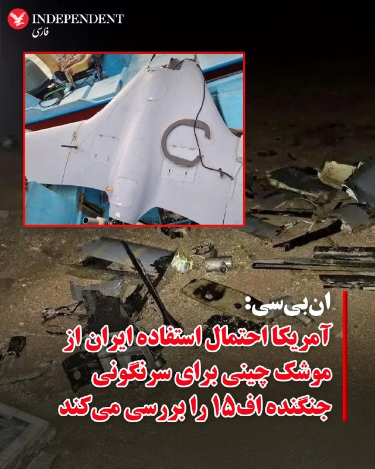

♦️شبکه خبری ان‌بی‌سی، روز شنبه نهم خرداد ماه، به نقل از سه مقام اطلاعاتی آمریکایی گزارش کرد، ایران احتمالا با استفاده از یک «موشک دوش‌پرتاب ساخت چین»، جنگنده اف-۱۵ آمریکا را در آسمان جنوب غربی ایران سرنگون کرده است.
بر اساس این گزارش، جنگنده اف۱۵ آمریکا که در فروردین ماه گذشته در جنوب غربی ایران سرنگون شد، ممکن است هدف یک موشک دوش‌پرتاب (MANPADS) قرار گرفته باشد: اسلحه‌ای با طول حدود دو متر و وزن ۱۸ کیلوگرم که علیه اهدافی در ارتفاع کم مؤثر هستند.
سرنگونی جنگنده آمریکایی در آسمان غرب ایران، نخستین مورد در چند دهه گذشته توصیف شده است.
منابع اطلاعاتی به ان‌بی‌سی گفته‌اند پشتیبانی چین از ایران در جنگ گذشته ممکن است فراتر از موشک‌های دوش‌پرتاب باشد. به گفته این منابع، چین احتمالا یک رادار هشدار «زودهنگام دوربرد» (مدل YLC-8B) را در اختیار ایران قرار داده که برای شناسایی جنگنده‌های پیشرفته رادار گزیر طراحی شده است.
ایالات متحده پیش از این، سه شرکت ماهواره‌ای چینی را به اتهام ارائه تصاویر و داده‌های اطلاعاتی به ایران برای هدف قرار دادن نیروهای آمریکایی تحریم کرده بود و حالا واشنگتن در حال بررسی این موضوع است که آیا تجهیزات مورد نظر به تازگی به ایران تحویل داده شده‌اند یا مربوط به توافقات نظامی قدیمی‌تر هستند.
ان‌بی‌سی به نقل از منابع خود افزود، تحقیقات درباره نوع دقیق سلاح به‌کاررفته در سرنگونی اف۱۵ آمریکایی همچنان ادامه دارد.
‌🇸🇦 Indypersian

🤖 @VahidOOnLine

## VahidOOnLine — post 242897

  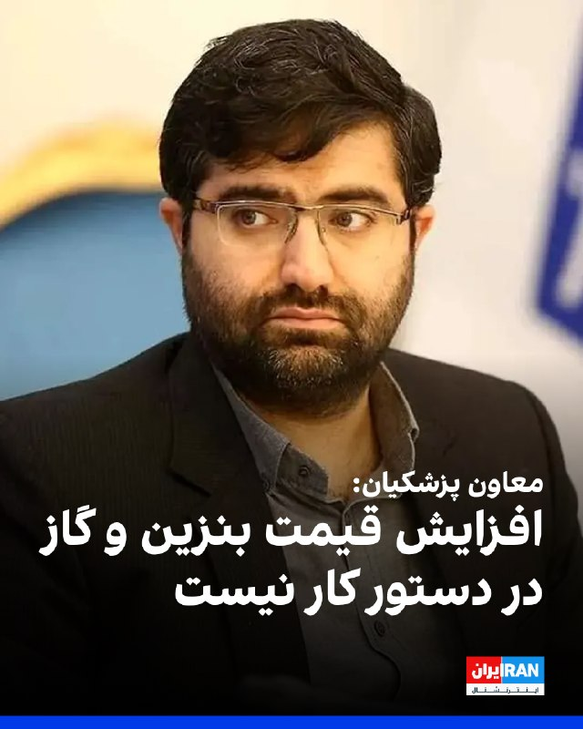

اسماعیل سقاب اصفهانی، معاون پزشکیان و رییس سازمان مدیریت راهبردی انرژی، گفت: «در شرایط اقتصادی و اجتماعی فعلی افزایش قیمت بنزین و گاز در دستور کار نیست».
او افزود که دولت به جای افزایش قیمت، طرح «پاداش نقدی» را اجرا می‌کند و مردم به ازای هر میزان کاهش مصرف، پاداش نقدی دریافت خواهند کرد.
‌🏁 🇬🇧 IranintlTV

🤖 @VahidOOnLine

## VahidOOnLine — post 242896

  <a href="telegram/content/VahidOOnLine_242896_1780146004.mp4" target="_blank">🎬 Download video</a>

ویدیوی رسیده به ایران اینترنشنال صحنه‌هایی از رقص و خاکسپاری پیکر جاویدنام محمدرضا احمدی را نشان می‌دهد. او از جمله شهروندان معترض کشته‌شده در انقلاب ملی در ۱۸ دی ‌ماه در تهران است. او جوان ۲۳ ساله و ورزشکار اهل تهرانسر بود. او هدف شلیک جنگی نیروهای بسیج قرار گرفت و به دست مردم به بیمارستان رسانده شد اما به دلیل تعلل و تاخیر نیروهای امنیتی جان باخت.
‌🏁 🇬🇧 IranintlTV

🤖 @VahidOOnLine

## VahidOOnLine — post 242895

  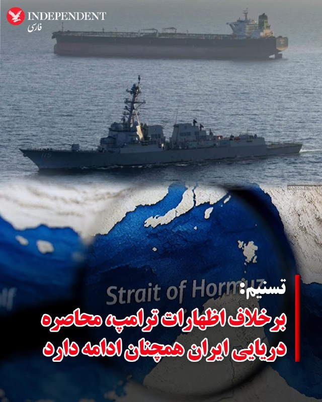

♦️خبرگزاری تسنیم، وابسته به سپاه پاسداران، روز شنبه نهم خرداد ماه در گزارشی اعلام کرد «برخلاف برخی برداشت‌ها از اظهارات دونالد ترامپ درباره لغو محاصره دریایی ایران، این محاصره همچنان برقرار است و کشتی‌ها از سوی سنتکام، هشدار توقف و عدم اجازه عبور از محاصره دریایی دریافت می‌کنند. »
بر اساس این گزارش، دریانوردان ایرانی به تسنیم گفته‌اند سنتکام همچنان در محدوده محاصره دریایی هشدارهایی صادر می‌کند و تلاش دارد کشتی‌های ایرانی را از عبور از این منطقه بازدارد.
خبرگزاری تسنیم که به عنوان منبعی برای بازتاب دیدگاه‌های هسته‌های نزدیک به قدرت در ایران شناخته می‌شود، در این گزارش محاصره دریایی ایران را «اقدام خصمانه جنگی» توصیف کرد و نوشت ناوهای آمریکایی به کشتی‌های تجاری ایران هشدار می‌دهند که در صورت عبور از خط محاصره، باید فورا بازگردند. در غیر این صورت با اقدام نظامی مواجه خواهند شد.
این گزارش می‌افزاید که پس از پیام شب گذشته دونالد ترامپ در شبکه اجتماعی «تروث سوشال» درباره لغو محاصره دریایی، برخی کشتی‌های ایرانی تلاش کردند از خط محاصره عبور کنند، اما با هشدار ناوهای آمریکایی روبه‌رو شدند.
ترامپ شامگاه جمعه در پیامی نوشته بود: «کشتی‌هایی که به دلیل محاصره شگفت‌انگیز و بی‌سابقه نیروی دریایی ما در تنگه گیر افتاده‌اند، اکنون می‌توانند روند بازگشت به خانه را آغاز کنند.»
‌🇸🇦 Indypersian

🤖 @VahidOOnLine

## WithYashar — post 12936

  <a href="telegram/content/WithYashar_12936_1780146007.mp4" target="_blank">🎬 Download video</a>

پیت هگست درباره ایران: ایران می‌خواهد بگوید که کنترل تنگه را در دست دارد، اما این ما هستیم.

و همه چیز پشت صحنه نشان می‌دهد که وقتی صحبت از آن می‌شود، ما کنترل را در دست داریم.
@withyashar

## WithYashar — post 12935

وزیر جنگ آمریکا: به محاصره دریایی ادامه میدهیم.
@withyashar

## WithYashar — post 12934

## WithYashar — post 12933

#shahzade من تا آخرین نفس و قطره خونم از شما پسر شاه فقیدم حمایت میکنم تا رسیدن به آزادی

## WithYashar — post 12932

#shahzade
من تا آخرین نفس و قطره خونم از شما پسر شاه فقیدم حمایت میکنم تا رسیدن به آزادی

## WithYashar — post 12931

#shahzade

## WithYashar — post 12930

سفر قاهره با یاشار غمی ندارد فقط لذت ببریم از وقایع
👑

## mwarmonitor — post 9915

🔴 مرکز امنیت دریایی عمان: از کشتی‌ها می‌خواهیم در پی مشاهده یک جسم شناور که احتمال می‌رود مین باشد، در غرب منطقه عبور در تنگه هرمز، احتیاط کنند.

@mwarmonitor

## mwarmonitor — post 9914

✈️ هواپیماهای جنگی در آسمان پایتخت عراق، بغداد، در حال پرواز هستند.

@mwarmonitor

## mwarmonitor — post 9913

🔸ایران نشان می‌دهد که در مذاکرات هسته‌ای بر موضع اولیه خود پایبند است و انتظار نمی‌رود امتیازهای عمده‌ای بدهد. همچنین همچنان برخی خواسته‌های کلیدی آمریکا را رد می‌کند، از جمله تحویل دادن ذخایر اورانیوم بسیار غنی‌شده و ایجاد تغییر در سیاست هسته‌ای اصلی خود. نیویورک تایمز

@mwarmonitor

## mwarmonitor — post 9912

🔴اداره عملیات تجارت دریایی بریتانیا می‌گوید:
«سطح تهدید امنیت دریایی در تنگه هرمز همچنان به‌طور بسیار بحرانی باقی مانده است، به‌دلیل محاصره.»

@mwarmonitor

## mwarmonitor — post 9911

  <a href="telegram/content/mwarmonitor_9911_1780146009.mp4" target="_blank">🎬 Download video</a>

📝 این روزها مرزهای عرفان و طهارت در رسانه میلی آن‌چنان جابه‌جا شده که تئاتر کمدی غریبی را به نمایش گذاشته است؛ حکایت لجن‌زاری که هر چقدر عمیق‌تر می‌شود، دست‌اندرکارانش مخلص‌تر و زاهدتر جلوه می‌کنند. بعد از مراجع تقلیدِ مجازی مثل پویان مختاری و قدیسینِ تازه‌تطهیرشده، حالا نوبت به محمدرضا گلزار رسیده تا با کت قرمز جیغ، از راز و نیازهای ماورایی و ایستاده‌اش در ساعت سه نصف‌شب پرده بردارد و دین‌داری را به یک اکسسوری لاکچری روی تردمیل، زیر دوش و پشت فرمان ماشین تبدیل کند. این بساطِ تهوع‌آور، ویترینی از دین‌فروشیِ مدرن است که در آن برای تبرئه کردنِ ابتذال و رانت، یک لایه ضخیم از مناجاتِ سفارشی روی همه‌چیز می‌پاشند؛ شیک‌پوشانی که خدا را هم مثل ساعت و ماشین‌شان برند کرده‌اند تا لایک بگیرند، در حالی که بوی گندِ این معرکه‌گیری، تنها قربانی کردنِ باورهای مردمِ گرسنه را به دست این لجن‌ها نشان می‌دهد.

@mwarmonitor

## FoxNewsTwitter — post 342423

‌Fox News (Twitter/X)

👉 Full story here:

## FoxNewsTwitter — post 342422

Fox News (Twitter/X)

TANVI RATNA: Europe built its entire post-Russia energy system to avoid dependence on a single supplier. The Iran war just handed that leverage to America.

US LNG now supplies 63% of European imports and climbing. IEEFA projects 80% by 2030 — with 40% of all EU gas, pipeline and LNG combined, flowing from the United States.

The contracts got signed under wartime pressure. The Russian ban became law. The terminals run on American supply. There's no exit clause and no alternative at scale.

## FoxNewsTwitter — post 342421

  <a href="telegram/content/FoxNewsTwitter_342421_1780146012.mp4" target="_blank">🎬 Download video</a>

Fox News (Twitter/X)

Police deploy tear gas outside a New Jersey immigration detention facility as tensions boil over during another night of protests.

Video shows officers advancing in formation, pushing demonstrators and reporters back before tear gas is fired as clashes escalate outside Delaney Hall in Newark.

The facility has been the focus of days of demonstrations involving lawmakers, detainees' families, and immigration advocacy groups

## FoxNewsTwitter — post 342420

‌Fox News (Twitter/X)

👉 Full story here:

## FoxNewsTwitter — post 342419

  

Fox News (Twitter/X)

Twitch streamer Hasan Piker called Progressive International coordinator David Adler his 'comrade' on livestream — the same organizer who sat in a VIP seat beside Cuba's president during the convoy trip now under federal investigation for possible sanctions violations.

Adler's organization, Progressive International, counts Raúl Castro's daughter Mariela Castro Espín on its advisory council. Federal subpoenas target Piker and CodePink's Medea Benjamin for travel, communications and financial records tied to possible contacts with Cuban government entities.

The convoy brought an estimated 650 delegates from 33 countries to Havana in March.

## pm_afshaa — post 91895

🔴نیویورک تایمز:ایران به رد خواسته‌های کلیدی آمریکا ادامه می‌دهد،از جمله تحویل ذخیره اورانیوم بسیار غنی شده خود و محدود کردن غنی‌سازی که باعث به بن بست رسیدن مذاکرات شده

💧 Rainbet.com the #1 Non-KYC Crypto Casino & Sportsbook @rainbetcom

😁 @Pm_Afshaa

## pm_afshaa — post 91894

🔴پیت هگست:هر لحظه آماده ایم جنگ علیه ایران را از سر بگیریم

💧 Rainbet.com the #1 Non-KYC Crypto Casino & Sportsbook @rainbetcom

😁 @Pm_Afshaa

## pm_afshaa — post 91893

🔴پیت هگست:به محاصره دریایی ایران ادامه خواهیم داد

💧 Rainbet.com the #1 Non-KYC Crypto Casino & Sportsbook @rainbetcom

😁 @Pm_Afshaa

## pm_afshaa — post 91892

🔴نیویورک تایمز: جمهوری‌اسلامی به آمریکا پیشنهاد سرمایه‌گذاری تو ایران رو داده

💧 Rainbet.com the #1 Non-KYC Crypto Casino & Sportsbook @rainbetcom

😁 @Pm_Afshaa

## DEJradio — post 5142

⭕️ آمریکا باج‌دهندگان به جمهوری اسلامی برای عبور از تنگۀ هرمز را تحریم می‌کند

وزارت خزانه‌داری آمریکا هشدار داد هرگونه توافق با جمهوری اسلامی برای عبور امن از تنگۀ هرمز، حتا بدون پرداخت مستقیم پول می‌تواند تحریم در پی داشته باشد.
دفتر کنترل دارایی‌های خارجی آمریکا اعلام کرد دریافت خدمات یا تضمین از دولت جمهوری اسلامی یا سپاه پاسداران برای عبور امن از تنگۀ هرمز، برای شهروندان آمریکا ممنوع است.
وزارت خزانه‌داری آمریکا همچنین گفت نهاد موسوم به «مدیریت آبراه خلیج فارس» که برای دریافت عوارض از کشتی‌ها ایجاد شده، به‌دلیل ارتباط با سپاه تحریم شده است.
واشینگتن هشدار داد همکاری مستقیم یا غیرمستقیم با این نهاد، حتا برای شرکت‌ها و مؤسسات غیرآمریکایی تحریم در پی دارد.

#خبر #دژ #تنگه_هرمز
@DEJradio

## DEJradio — post 5141

⭕️ عضو نزدیک به مذاکره‌کنندگان جمهوری اسلامی گفت بدون آزادسازی ۱۲ میلیارد دلار، مرحلۀ بعدی در کار نیست

سعید آجرلو، از چهره‌های رسانه‌ای نزدیک به محمدباقر قالیباف و هیئت مذاکرکنندۀ جمهوری اسلامی، گفت دسترسی به ۱۲ میلیارد دلار از دارایی‌های بلوکه‌شده، یکی از شروط اصلی تفاهم احتمالی است.
او ادعا کرد این مبلغ باید به‌صورت غیرقابل برگشت، در اختیار بانک مرکزی قرار بگیرد.
آجرلو ادعا کرد در طرح ۱۴ ماده‌ای، معافیت تحریم‌های نفتی و رفع محاصرۀ دریایی به‌عنوان گام نخست در نظر گرفته شده است.
به گفتۀ این فرد نزدیک به مقامات، پس از اجرای تعهدات آمریکا، جمهوری اسلامی وارد مرحلۀ بعدی می‌شود.
او مدعی شد اگر مرحلۀ اول اجرا نشود، اعتمادی برای ادامۀ مذاکرات وجود ندارد.

#خبر #دژ #مذاکرات #توافق
@DEJradio

## DEJradio — post 5140

⭕️ وزیر جنگ آمریکا: تنگۀ هرمز باید بدون عوارض برای استفادۀ همۀ دنیا باز باشد

پیت هگست، وزیر جنگ آمریکا گفت تنگۀ هرمز باید بدون عوارض باز باشد و همۀ دنیا بتواند از آن استفاده کند.
به گفتۀ هگست، هر توافقی با جمهوری اسلامی تنها زمانی انجام می‌شود که دونالد ترامپ آن را توافقی عالی برای آمریکا و امنیت جهان بداند.
هگست در حاشیۀ نشست شانگری‌لا در سنگاپور گفت معیارهای آمریکا برای توافق تغییری نکرده است.
او گفت هرچه جمهوری اسلامی به مواضع واشینگتن نزدیک‌تر شود، احتمال توافق افزایش می‌یابد.
هگست با اشاره به گزینۀ نظامی علیه جمهوری اسلامی گفت آمریکا اکنون آماده‌تر است و دست بالا را دارد.
وزیر جنگ ایالات متحده با اشاره به این که ترجیح ترامپ این است که کار به درگیری نظامی نکشد، گفت جمهوری اسلامی دارد به خواسته‌های آمریکا نزدیک می‌شود.
هگست همچنین با دفاع از ادامۀ محاصره دریایی جمهوری اسلامی گفت رژیم ادعا می‌کند مدیریت تنگۀ هرمز را در اختیار دارد، اما واقعیت این است که کنترل این آبراه در اختیار آمریکا است.

#خبر #دژ #تنگه_هرمز
@DEJradio

## DEJradio — post 5139

  <a href="telegram/content/DEJradio_5139_1780146014.mp4" target="_blank">🎬 Download video</a>

🚨
🔸 سرهنگ دوم بازنشسته نیروی هوایی محمد ضابطی با اشاره به سوابق خاندان ایران‌ساز پهلوی می‌گوید، تنها منجی ایران شاهزاده رضا پهلوی است.

#شاهزاده_رضا_پهلوی #خاندان_ایرانساز_پهلوی
@DEJradio

## DEJradio — post 5138

👑🎥 حضور شاهزاده رضا پهلوی در نشست امنیت دریای سیاه در اوکراین

رسانه‌های اوکراینی با انتشار تصاویری، از حضور شاهزاده رضا پهلوی در نشست امنیت دریای سیاه در شهر اودسای اوکراین خبر دادند.

#شاهزاده_رضا_پهلوی #اوکراین
@DEJradio

## DEJradio — post 5137

  <a href="telegram/content/DEJradio_5137_1780146016.mp4" target="_blank">🎬 Download video</a>

🔺🎥 فینال لیگ قهرمان اروپا؛ تمهیدات امنیتی در بوداپست

فینال لیگ قهرمانان اروپا شنبه‌شب نهم خرداد بین آرسنال و پاری‌سن ژرمن در بوداپست برگزار خواهد شد.
فروشگاه‌ها در مرکز پاریس در حال تخته‌کوبی و محافظت از ویترین‌های خود هستند، زیرا انتظار می‌رود صرف‌نظر از اینکه پاریس عنوان قهرمانی را ببازد یا ببرد، شورش و درگیری اتفاق بیافتد.

#لیگ_قهرمانان_اروپا #فوتبال
@DEJradio

## DEJradio — post 5136

  <a href="telegram/content/DEJradio_5136_1780146019.mp4" target="_blank">🎬 Download video</a>

⚽️
🔺 مهدی رستم‌پور، روزنامه‌نگار ورزشی، با انتقاد از بی‌تفاوتی و سکوت بازیکنان‌ و مربیان تیم فوتبال جمهوری اسلامی در قبال ظلم و ستم حکومت به مردم می‌گوید "جنگ که شروع شد قلعه‌نوعی رفت ویلای آلانیا".

#جنگ #فوتبال
@DEJradio

## DEJradio — post 5133

  <a href="telegram/content/DEJradio_5133_1780146021.webm" target="_blank">🎬 Download video</a>

🚨📢 بر اساس گزارش‌های دریافتی پدافند ارتش و سـ.ـپاه پاسداران در جنگ ۴۰ روزه دچار خسارت‌های شدید گردیده و بخش عمده آن نابود شده است.

تصاویر منتشرشده از اطراف کرمانشاه، بقایای یک سامانه پدافندی «سوم خرداد» را نشان می‌دهد که سوار بر یک تریلی از منطقه عملیاتی بازگردانده می‌شود.

تخمین‌های اولیه نشان می‌دهد دو سوم لانچرهای موشکی- پهپادی و سامانه‌های متحرک پدافندی بمباران و منهدم شده‌اند.
اغلب این تجهیزات در شیارهای کوه یا تونل‌های زیرزمینی مستقر بودند یا از مناطق مسکونی به عنوان پوشش و سپرانسانی آنها استفاده شده بود.

#سپر_انسانی #پدافند⁩ #جنگ۴۰روزه⁩

## DEJradio — post 5129

⭕️
🔸 منابع داخلی به دژ گزارش دادند پس از جنگ ۴۰ روزه، تعداد زیادی از پرسنل ارتش از جمله در نیروی زمینی و دریایی، به اتهام ترک یگان احضار و بازجویی شدند. آنها کسانی بودند که زیر بمباران شدید مجبور شدند از محوطه پادگان یا موقعیت فاصله بگیرند.

یکی از پرسنل نیروی زمینی در اصفهان [که بنا به دلایل امنیتی محل خدمت او آشکار نمی‌شود] می‌گوید، «هشتم فروردین به منطقه عملیاتی هرمزگان اعزام شدیم و کلیه مواضع را پوشش دادیم، اما شب جنگنده‌های آمریکایی همان مواضع را به شدت بمباران کردند، کل گردان ما همان شب منهدم شد، بچه‌های گردان و همرزمان به دلیل نداشتن تجهیزات کافی و ضعف پدافند مجبور شدیم منطقه را ترک کنیم و بمباران که تمام شد چند ساعت برگشتیم، حالا اما برای همه ما در دادسرا پرونده باز شده و گیر کردیم.»

فرد دیگری در همان گردان به دژ می‌گوید، «هفته‌هاست به دادسرا می‌رویم، به ما تهمت وطن‌فروشی زدند، بازپرس با بدترین لحن توهین می‌کند به هرکدامشان هم میگوییم مجبور بودیم که موضع را ترک کنیم نمیفهمند! چطور زیر آتش و بمب در موقعیت میماندیم؟ می‌خواهید آمار شهید زیاد شود؟ با دست خالی یا با ژ-۳ چطور باید جنگنده را زد؟ حالا هم تا روشن شدن تکلیف با فیش حقوقی و ضامن آزادیم، خیلی از ما را به عنوان تنبیه به نقاط مرزی فرستادند.»

همین فرد می‌گوید: «خدا رو شکر می‌کنیم که برخلاف خودی‌ها، دشمن جوانمرد و داناست وگرنه تلفات خیلی بیشتر از اینها بود. قبل از اینکه پادگان‌ها و مواضع ارتش را بکوبند هواپیماها دستکم چهار پنج بار روی سرمان تاب میخوردند و فرصت داشتیم از محدوده خارج شویم، خودمان خبر داریم که نخواستند تلفات بیشتر شود.»

*مدارک احضار و پرونده‌های شماری از پرسنل در اختیار دژ قرار گرفته است.

#جنگ۴۰روزه #ارتش
@DEJradio

## DEJradio — post 5128

  <a href="telegram/content/DEJradio_5128_1780146022.mp4" target="_blank">🎬 Download video</a>

🔺🎥 مردم در تونل شگفت‌زدگی از افزایش قیمتها، دست و پا می زنند.
چهار ورق کالباس خریدم، ۴۰۰ هزار تومان!
پیرمرد می گوید، برای نوه هایش می‌خواهد الویه درست کند، آمده کالباس بخرد، چهار ورق را خریده، ۴۰۰هزار تومان!

#تورم #گرانی
@DEJradio

## IranIntlTV — post 339738

  <a href="https://t.me/IranintlTV/339738" target="_blank">📎 Download file</a>

🎧نسخه صوتی اخبار نیمروزی | شنبه ۹ خرداد
@iranintlTV

## IranIntlTV — post 339737

  <a href="telegram/content/IranIntlTV_339737_1780146024.mp4" target="_blank">🎬 Download video</a>

در آستانه سومین ماه قطعی اینترنت در ایران، مقام‌های جمهوری اسلامی از آغاز روند بازگشت اینترنت بین‌الملل خبر داده‌اند. خبری که هم‌زمان با گزارش‌ها درباره احتمال توافق میان تهران و واشینگتن، بازتاب گسترده‌ای در رسانه‌های بین‌المللی داشت.

اما داده‌های نت‌بلاکس، کنتیک و کلودفلر، و مهم‌تر از آن روایت شهروندان، تصویر متفاوتی نشان می‌دهد؛ بازگشتی محدود، ناپایدار و بیشتر متمرکز در تهران.

این گزارش بررسی می‌کند که پشت تیتر «بازگشت اینترنت در ایران» چه واقعیتی قرار دارد؛ بازگشت واقعی برای مردم، یا نسخه‌ای محدود و کنترل‌شده از اتصال به جهان؟
@iranintltv

## IranIntlTV — post 339736

  

مرکز امنیت دریایی عمان اعلام کرد در پی مشاهده یک جسم شناور مشکوک به مین دریایی در غرب مسیر ترافیک ساحلی تنگه هرمز و در آب‌های سرزمینی این کشور، از کشتی‌ها و صیادان خواسته شده با حداکثر احتیاط تردد کنند و هر مورد مشکوک را فورا به مقام‌های مسئول گزارش دهند.
https://iranintl.com/202605303637

## IranIntlTV — post 339735

  <a href="telegram/content/IranIntlTV_339735_1780146027.mp4" target="_blank">🎬 Download video</a>

یکی از شرکت‌کنندگان در تجمع استکهلم در گفت‌وگو با مهران عباسیان، خبرنگار ایران‌اینترنشنال، خواستار بسته شدن سفارت جمهوری اسلامی در سوئد شد

@iranintltv

## IranIntlTV — post 339734

  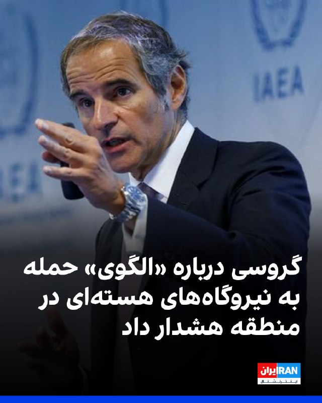

رافائل گروسی، مدیرکل آژانس بین‌المللی انرژی اتمی سازمان ملل، در گفت‌وگو با روزنامه نشنال‌نیوز با ابراز نگرانی از گسترش «پدیده» حمله به نیروگاه‌های هسته‌ای در جریان درگیری‌های اخیر، گفت حمله به این تاسیسات در حال تبدیل شدن به الگویی خطرناک در جنگ‌ها است.

گروسی با اشاره به حمله پهپادی به نیروگاه براکه در امارات متحده عربی گفت: «این واقعیت که کسی یک نیروگاه هسته‌ای را هدف قرار داده، بسیار جدی است.»

او گفت آژانس شواهد لازم برای مقصر دانستن تهران در این حمله را در اختیار ندارد و افزود: «ما به مدرک ملموسی درباره منشا این حمله نیاز داریم.»

مقام‌های امارات متحده عربی، نیروهای نیابتی جمهوری اسلامی در عراق را مسئول این حمله اعلام کردند.

گروسی همچنین به حملات علیه نیروگاه هسته‌ای زاپوروژیا در اوکراین و نیروگاه هسته‌ای بوشهر اشاره کرد.
https://iranintl.com/202605306998

## IranIntlTV — post 339733

🗣روایت شما از زندگی در دوران پس از انقلاب ملی و جنگ - شنبه ۹ خرداد ۱۴۰۵

🔹وضعیت وحشتناکه، گرونی زیاد شده، ما کم آوردیم. من خودم دانش‌آموز هستم، هیچی از درس نفهمیدیم و بعد از ۱۸ و ۱۹ هیچی مثل قبل نشد.

🔹اپراتورهای تلفن همراه علاوه بر افزایش شدید هزینه بسته‌های نت، مخصوصاً همراه اول، امکان خرید شارژ در مبالغ زیر ۲۰ هزار تومان هم نمی‌دن.

🔹ما کیش هستیم. از روز اول جنگ تا همین امروز به دلیل امن نبودن پرواز، هنوز هیچ مسافری با پرواز نیامده کیش. از طریق دریایی هم تا همین یک هفته پیش فقط کیشوندان رو راه می‌دادن. تمام هتل‌ها، رستوران‌ها و بازارها بدبخت شدن.

🔹از ایرانشهر: هموطنان عزیز اینجا همه‌چیز گرونه و اینترنت خیلی ضعیفه. قبلاً با کانفیگ پولی قوی‌تر بود، الان خیلی بدتر و ضعیف‌تر شده.

🔹امروز و دیروز رانندگان اسنپ‌فود ایلام به دلیل پایین بودن کرایه‌ها و گرانی روغن و بنزین اعتصاب کردن. صدها سفارش در رستوران‌ها خراب شد و به مشتری نرسید.

🔹چیپسی که پارسال ۱۸ تومان بود شده ۷۰ تومان، دقیقاً ۴ برابر.

🔹تهران هستم. ۱۰ ساله اسنپ کار می‌کنم، کرایه خیلی پایینه. درآمدم همون درآمد پارساله ولی هزینه‌ها ۳ برابر شده. تعویض روغن موتور پراید شده ۳ میلیون.

🔹از بوشهر پیام می‌دم. برادر من نظامی هست و حقوق دو ماه پیشش حدود ۳۰ میلیون تومان بود. الان حقوق این ماهش شده ۱۵ میلیون تومان، قضاوت با خودتون.

🔹نیروهای پیمانکاری شرکت نفت سروستان از استان فارس هستیم. حقوق اسفند و فروردین به‌صورت علی‌الحساب پرداخت شده، ولی تا امروز نه حقوق اردیبهشت و نه حقوق معوقه پرداخت نشده.

🔹فقط مبلغ یک بسته سویا از سه ماه پیش تا دیروز با تورم ۸۰۰ درصدی بالا رفته.

## IranIntlTV — post 339732

  <a href="telegram/content/IranIntlTV_339732_1780146030.mp4" target="_blank">🎬 Download video</a>

در ادامه تجمع‌های همبستگی ایرانیان خارج از کشور با انقلاب ملی، شنبه ۹ خرداد ایرانیان مقیم استکهلم در اعتراض به اعدام‌ها و سرکوب مخالفان جمهوری اسلامی تجمع کردند و خواستار پایان مماشات دولت‌های اروپایی با جمهوری اسلامی شدند.

گزارش مهران عباسیان، خبرنگار ایران‌اینترنشنال
@iranintltv

## IranIntlTV — post 339731

  <a href="telegram/content/IranIntlTV_339731_1780146032.mp4" target="_blank">🎬 Download video</a>

ایرانیان ساکن استکهلم شنبه در تجمع همبستگی ایرانیان خارج از کشور با انقلاب ملی، با اجرای یک پرفورمنس اعتراضی به صدور حکم اعدام برای «بچه‌های اکباتان» و خطر اجرای این احکام واکنش نشان دادند.

گزارش مهران عباسیان، خبرنگار ایران‌اینترنشنال
@iranintltv

## IranIntlTV — post 339730

  <a href="telegram/content/IranIntlTV_339730_1780146034.mp4" target="_blank">🎬 Download video</a>

یکی از شرکت‌کنندگان در تجمع ایرانیان در استکهلم به ایران‌اینترنشنال گفت: «هم‌بستگی میان ایرانیان به‌صورت خودجوش شکل گرفته و شمار شرکت‌کنندگان در تجمع‌های این شهر هر هفته افزایش می‌یابد.»
شرکت‌کننده دیگری نیز گفت مردم ایران تنها نیستند و فداکاری‌ها و هزینه‌های سنگینی که پرداخته‌اند، هرگز فراموش نخواهد شد.

گزارش مهران عباسیان، خبرنگار ایران‌اینترنشنال
@iranintltv

## IranIntlTV — post 339729

  <a href="telegram/content/IranIntlTV_339729_1780146036.mp4" target="_blank">🎬 Download video</a>

مروری بر روزنامه‌های ایران، شنبه ۹ خرداد، با مجتبی هاشمی، روزنامه‌نگار

@iranintltv

## IranIntlTV — post 339728

  

پیت هگست، وزیر جنگ آمریکا، با اشاره به سخنان دونالد ترامپ درباره احتمال جنگ دوباره در صورت شکست مذاکرات با جمهوری اسلامی گفت واشینگتن اکنون در موقعیت قوی‌تری قرار دارد و در صورت لزوم آماده اقدام نظامی است.
هگست افزود با این حال ترجیح ترامپ این است که کار به گزینه نظامی نکشد.

## IranIntlTV — post 339727

  <a href="telegram/content/IranIntlTV_339727_1780146039.mp4" target="_blank">🎬 Download video</a>

یک شهروند بازنشسته با ارسال پیامی به ایران اینترنشنال از وضعیت معیشتی خود روایت کرده و می‌گوید پرداخت حقوق بازنشستگی هم تفاوتی در وضعیتش ایجاد نمی‌کند. بازخوانی پیام این شهروند و تصویرسازی با هوش مصنوعی انجام گرفته است.

## IranIntlTV — post 339726

  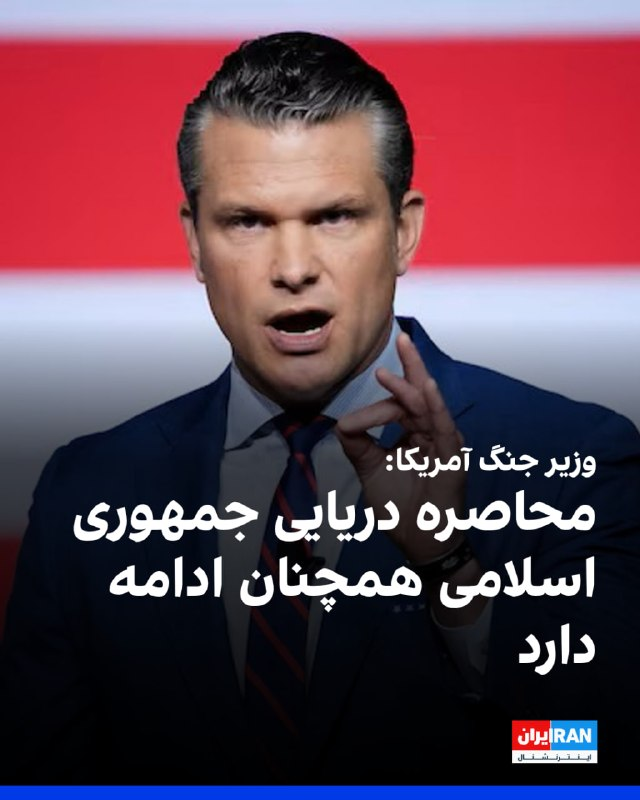

پیت هگست، وزیر جنگ آمریکا، در حاشیه نشست «گفت‌وگوی شانگری‌لا» در سنگاپور، درباره محاصره بنادر و سواحل جنوبی ایران گفت: «محاصره دریایی ادامه دارد و این اقدام موثر بوده و کنترل تنگه هرمز در اختیار آمریکا است.»
او افزود تنگه هرمز باید برای همه کشورها باز و بدون عوارض باقی بماند.

## IranIntlTV — post 339725

  <a href="telegram/content/IranIntlTV_339725_1780146042.mp4" target="_blank">🎬 Download video</a>

کارزار «خشم اقتصادی» آمریکا علیه جمهوری اسلامی همچنان ادامه دارد. در همین راستا، وزارت خزانه‌داری آمریکا یک شبکه تامین‌کننده نرم‌افزار و سخت‌افزار مرتبط با امنیت شبکه و فناوری‌های رمزنگاری برای نیروهای مسلح جمهوری اسلامی را تحریم کرد. هم‌زمان، اسکات بسنت، وزیر خزانه‌داری آمریکا، اعلام کرد واشینگتن تاکنون یک میلیارد دلار دارایی رمزارزی مرتبط با جمهوری اسلامی را توقیف کرده است.

گفت‌وگو با آرش آزرمی، دبیر بخش اقتصادی ایران‌اینترنشنال
@iranintltv

## IranIntlTV — post 339723

  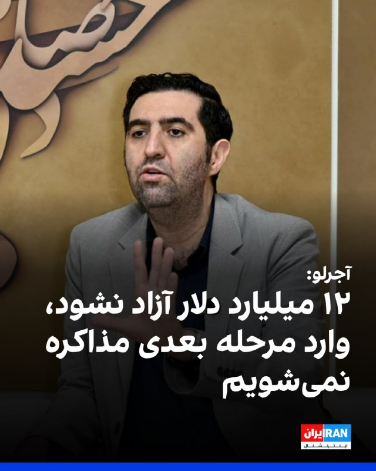

سعید آجرلو، از چهره‌های رسانه‌ای نزدیک به هیات مذاکراتی جمهوری اسلامی، گفت که دسترسی غیرقابل برگشت به ۱۲ میلیارد دلار از اموال بلوکه‌شده از شروط اصلی تفاهم احتمالی است.
او افزود: «این مبلغ باید به صورت غیرقابل برگشت در اختیار بانک مرکزی قرار ‌گیرد.»
آجرلو گفت که در طرح ۱۴ ماده‌ای، معافیت تحریم‌های نفتی و رفع محاصره دریایی به عنوان گام نخست پیش‌بینی شده و در صورت اجرای تعهدات از سوی آمریکا، جمهوری اسلامی وارد مرحله بعدی می‌شود.
به گفته آجرلو، اگر مرحله نخست اجرا نشود، اعتمادی برای ادامه مذاکرات وجود نخواهد داشت.

## IranIntlTV — post 339722

  

کتائب حزب‌الله عراق، یکی از گروه‌‌های نیابتی جمهوری اسلامی، در بیانیه‌ای نوشت سفیران آمریکا و بریتانیا باید از آنچه «دخالت در امور داخلی عراق» خوانده، دست بردارند.
این گروه برخی سیاستمداران عراقی را به تکرار مواضع «دشمنان» متهم کرد و گفت عربستان سعودی مقرهای حشد شعبی را هدف قرار داده و اردن به محلی برای فعالیت اسرائیل علیه عراق تبدیل شده است.
کتائب حزب‌الله افزود از واگذاری فعالیت‌های نظامی به نهادهای رسمی حمایت می‌کند و آماده است با هماهنگی فرماندهی حشد شعبی در جمع‌آوری و ساماندهی سلاح‌ها مشارکت کند.

## IranIntlTV — post 339721

  <a href="telegram/content/IranIntlTV_339721_1780146045.mp4" target="_blank">🎬 Download video</a>

سرخط خبرهای شنبه ۹ خرداد
@iranintltv

## IranIntlTV — post 339719

  <a href="telegram/content/IranIntlTV_339719_1780146047.mp4" target="_blank">🎬 Download video</a>

سازمان رادیو و تلویزیون اسرائیل گزارش داد ارتش این کشور در مذاکرات با لبنان، نقشه‌هایی از مواضع حزب‌الله را به بیروت ارائه داده تا برای برچیدن این مراکز اقدام کند.

اشکان صفایی، خبرنگار ایران‌اینترنشنال، گزارش می‌دهد
@iranintltv

## IranIntlTV — post 339718

  <a href="telegram/content/IranIntlTV_339718_1780146049.mp4" target="_blank">🎬 Download video</a>

یک شهروند با ارسال پیامی به ایران اینترنشنال با روایت از اوضاع بد معیشتی از دست‌فروشی پدرش و حسرت داشتن کالاهای مورد علاقه‌اش می‌گوید. بازخوانی پیام این شهروند و تصویرسازی با هوش مصنوعی انجام گرفته است.

## IranIntlTV — post 339717

  <a href="telegram/content/IranIntlTV_339717_1780146051.mp4" target="_blank">🎬 Download video</a>

بازرس کل وزارت دفاع آمریکا در گزارشی از نفوذ و ایجاد بی‌ثباتی از سوی گروه‌های مورد حمایت جمهوری اسلامی در عراق و منطقه ابراز نگرانی کرد.

تروسکه صادقی، خبرنگار ایران‌اینترنشنال، گزارش می‌دهد
@iranintltv

## Shin_Persian — post 6320

  

Shin ✓ @hey_itsmyturn
Sat, 30 May 2026 12:24:21 UTC

And still.

فارسی

و همچنان.

𝕏 · @shin_persian

## Shin_Persian — post 6319

Shin ✓ @hey_itsmyturn
Sat, 30 May 2026 11:59:41 UTC

Jet activity over Baghdad, #Iraq 🇮🇶

فارسی

فعالیت جت‌ها بر فراز بغداد، #Iraq 🇮🇶

𝕏 · @shin_persian

## ManotoTV — post 105878

  <a href="telegram/content/ManotoTV_105878_1780146053.mp4" target="_blank">🎬 Download video</a>

سخنان محمود جعفریان، معاون سازمان رادیو تلویزیون ملی ایران و قائم‌مقام دبیرکل حزب رستاخیز، درباره ایران‌دوستی

## FarsiVOA — post 219068

🔺هشدار مرکز امنیت دریایی عمان درباره مشاهده «جسم شناور مشکوک» در تنگه‌ هرمز

▪️مرکز امنیت دریایی عمان روز شنبه ۹ خرداد، بعد از مشاهده یک جسم شناور در غرب منطقه ترافیک ساحلی تنگه هرمز در محدوده آب‌های سرزمینی عمان، که گمان می‌رود «مین دریایی» باشد، از دریانوردان، ماهیگیران، و کشتی‌ها خواست تا نهایت احتیاط را به کار گیرند.

⬇️ بیشتر بخوانید:

https://ir.voanews.com/a/oman-warns-vessels-about-floating-object/8155551.html/?nocach=1

## FarsiVOA — post 219067

  <a href="telegram/content/FarsiVOA_219067_1780146055.mp4" target="_blank">🎬 Download video</a>

ارتش اسرائیل با انتشار ویدیو و تصاویری اعلام کرد این مستندات به حملات سازمان تروریستی حزب‌الله در طول شب جمعه به کلیسای ارتدوکس سنت جورج در جنوب لبنان مربوط است. به گفته ارتش اسرائیل این حملات به ساختمان‌هایی در روستای مسیحی مرجعیون اصابت کردند.

ارتش اسرائیل تأکید کرد نیروهایش در محدوده این کلیسا فعالیت نمی‌کنند.

این ویدیو بی‌صدا است.

## FarsiVOA — post 219066

  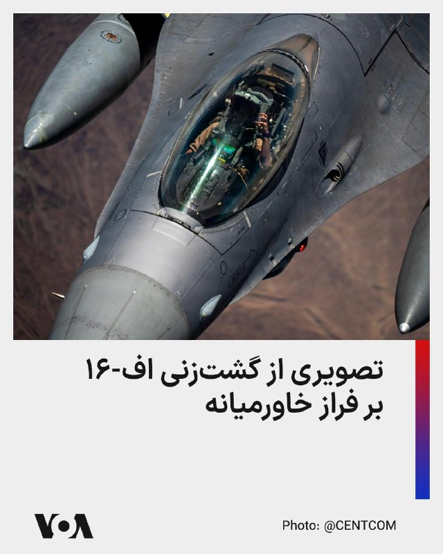

فرماندهی مرکزی ایالات متحده، سنتکام، تصویری از یک جنگنده «اف-۱۶ فایتینگ فالکن» نیروی هوایی آمریکا در حال پرواز بر فراز خاورمیانه در جریان یک ماموریت گشت‌زنی را منتشر کرد.

سنتکام اعلام کرد که نیروهای آمریکا همچنان در سراسر منطقه حضور دارند و در حالت آماده‌باش باقی مانده‌اند.

@FarsiVOA

## FarsiVOA — post 219065

  

سازمان امنیت و اطلاعات دانمارک طی گزارشی از «تهدیدات تروریستی فزاینده» جمهوری اسلامی در این کشور خبر داد و ایران را در رده چهار از پنج درجه تهدید امنیتی قرار داد.

در گزارش سالانه این نهاد امنیتی گفته می‌شود که در سال گذشته، بازیگران دولتی به طور فزاینده‌ای بر تهدیدهای تروریستی در دانمارک تأثیر گذاشته‌اند: «این موضوع به طور خاص در مورد ایران صدق می‌کند که به ویژه تهدیدی علیه منافع اسرائیل و جامعه یهودی در اروپا، از جمله دانمارک، ایجاد می‌کند. استفاده نهادهای اطلاعاتی جمهوری اسلامی از شبکه‌های مجرمانه برای انجام حملات تروریستی افزایش یافته و این امر تهدیدها را بیشتر از قبل غیرقابل پیش‌بینی‌ می‌کند».

این تحلیل به جنگ اخیر اسرائیل و آمریکا با جمهوری اسلامی اشاره کرده و هشدار داده که رژیم ایران در حال حاضر قصد قوی‌تری برای هدایت یا حمایت از اقدامات خشونت‌آمیز در اروپا دارد.

سازمان امنیت و اطلاعات دانمارک همچنین گفته است جمهوری اسلامی فعالیت اوپوزیسیون را تهدیدی برای بقای خود می‌داند و به طور مداوم به دنبال حمله به مخالفان و منتقدان خود در داخل و خارج از کشور است.
@FarsiVOA

## FarsiVOA — post 219064

🔺بلومبرگ: آمریکا درباره توافق با تهران برای عبور از تنگه هرمز هشدار تحریمی داد

▪️وزارت خزانه‌داری آمریکا هشدار داده هرگونه توافق با جمهوری اسلامی برای عبور امن از تنگه هرمز، حتی اگر شامل پرداخت مستقیم پول نباشد، می‌تواند با خطر تحریم روبه‌رو شود.

▪️دفتر کنترل دارایی‌های خارجی در به‌روزرسانی ۲۹ مه اعلام کرد دریافت خدمات یا تضمین از دولت ایران یا سپاه پاسداران برای عبور امن از تنگه هرمز برای اشخاص آمریکایی ممنوع است.

▪️همزمان، قطر موضعی متفاوت اما محتاطانه اتخاذ کرده است. شیخ سعود بن عبدالرحمن آل‌ثانی، وزیر مشاور در امور دفاعی قطر، گفته دوحه با دریافت عوارض دائمی از کشتی‌های عبوری مخالف است، اما دریافت عوارض موقت برای مواردی مانند پاکسازی مین می‌تواند قابل مذاکره باشد.

⬇️ بیشتر بخوانید:
https://ir.voanews.com/a/8155548.html

## FarsiVOA — post 219063

  

ایلنا به نقل از سخنگوی انجمن روانپزشکان ایران، گزارش داد که در یک نظرسنجی از ۲۵۴ دستیار پزشکی، ۸۱.۵ درصد گفته‌اند تمایل به مهاجرت دارند. همچنین ۷۹.۵ درصد اعلام کرده‌اند اگر پیش از ورود به دوره تخصص شناخت امروز خود را از شرایط دستیاری داشتند، مهاجرت را به رزیدنتی ترجیح می‌دادند.

امیرحسین جلالی ندوشن این وضعیت را نشانه «فرسایش جدی» در نیروی انسانی سلامت دانسته و گفته مسئله فقط مهاجرت نیست، بلکه کاهش امید، بی‌اعتمادی به آینده حرفه‌ای و فرسودگی در ساختار درمانی کشور است.

این آمار در ادامه سال‌ها بحران در جامعه رزیدنتی منتشر می‌شود؛ از کشیک‌های طولانی، فشار معیشتی، اعتراض به آزمون‌ها و تصمیم‌های وزارت بهداشت تا هشدارها درباره افزایش خودکشی میان دستیاران پزشکی.

پیش‌تر در نشست کارگروه ویژه نظام پزشکی اعلام شده بود میزان خودکشی در جمعیت رزیدنتی چند برابر سایر گروه‌هاست.

اعتراض‌های صنفی رزیدنت‌ها نیز در سال‌های گذشته بارها با احضار، فشار انضباطی و بی‌اعتنایی نهادی روبه‌رو شده است.
@FarsiVOA

## FarsiVOA — post 219062

🔺از فروش خانه و طلا تا کمبود دارو؛ بحران نقدینگی زنجیره دارو را زمین‌گیر کرد

▪️بحران نقدینگی در بازار داروی ایران به مرحله‌ای رسیده که مقام‌های صنفی و نمایندگان مجلس می‌گویند برخی داروخانه‌داران برای پاس کردن چک‌های خرید دارو، ناچار به فروش خانه، طلا و دارایی‌های شخصی شده‌اند.

▪️معاون حقوقی انجمن داروسازان ایران گفته است ۱۷ هزار داروخانه خصوصی کشور در دوره جنگ اخیر مانند یک «ستاد بحران» عمل کردند و اجازه ندادند اختلال زنجیره تأمین دارو به نگرانی اجتماعی گسترده تبدیل شود.

▪️اما پشت این استمرار ظاهری، بحران مالی سنگینی قرار دارد؛ مجموع مطالبات داروخانه‌های سرپایی بخش خصوصی از بیمه‌ها به ۳۶.۷۸ هزار میلیارد تومان رسیده است؛ شامل ۱۱.۳۸ همت سهم ارز و ۲۵.۴ همت سهم سازمان‌های بیمه‌گر.

⬇️ بیشتر بخوانید:
https://ir.voanews.com/a/8155541.html

## FarsiVOA — post 219061

🔺جمهوری اسلامی اموال ۱۰۸ نفر را در گلستان و خراسان جنوبی توقیف کرد

▪️روند تازه نشان می‌دهد جمهوری اسلامی سیاست توقیف دارایی ایرانیان خارج از کشور را از یک اقدام موردی به ابزار فشار امنیتی و مالی تبدیل کرده است.

⬇️ بیشتر بخوانید:
https://ir.voanews.com/a/8155543.html

## FarsiVOA — post 219060

🔺پنتاگون: بیش از ۶۰۰ حمله جمهوری اسلامی و گروه‌های نیابتی علیه منافع آمریکا و متحدانش

▪️گزارش تازه بازرس کل ارشد وزارت جنگ آمریکا درباره عملیات «خشم حماسی» نشان می‌دهد که جمهوری اسلامی و گروه‌های وابسته به آن، در واکنش به آغاز عملیات «خشم حماسی»، دست به حملات تلافی‌جویانه گسترده‌ای علیه تأسیسات آمریکا، متحدانش و اهداف مرتبط با ائتلاف در عراق و منطقه زده‌اند.

▪️بر اساس این گزارش، شبه‌نظامیان مستقر در عراق با استفاده از پهپاد، راکت و موشک به اهداف ائتلاف حمله کرده‌اند.

▪️این گزارش حملات در عراق را عمدتاً به گروه‌های تندروی همسو با تهران نسبت می‌دهد؛ از جمله کتائب حزب‌الله، کتائب سیدالشهدا و حرکت النجباء. این گزارش می‌افزاید این گروه‌ها احتمالاً با هدایت مستقیم سپاه پاسداران عمل کرده‌اند.

⬇️ بیشتر بخوانید:
https://ir.voanews.com/a/8155544.html

## FarsiVOA — post 219059

🔺فشار گرانی بر سفره مردم؛ افزایش دوباره قیمت روغن در انتظار چراغ سبز دولت

▪️سخنگوی اتحادیه بنکداران مواد غذایی از پیشنهاد افزایش دوباره قیمت روغن خبر داده و گفته قیمت این کالای اساسی نسبت به سال گذشته حدود سه برابر شده است؛ افزایشی که به گفته او قدرت خرید خانوارها را به‌شدت کاهش داده است.

▪️در هفته‌های اخیر، افزایش قیمت نان نیز با حاشیه‌های گسترده همراه شد؛ از اعلام نرخ‌های جدید برای نان‌های پرمصرف تا روایت‌های میدانی شهروندانی که دیگر توان خرید یک نان کامل را ندارند و به خرید نصف نان یا نان تکه‌ای رسیده‌اند.

▪️در بازار مرغ، گوشت قرمز و برنج نیز شرایط مشابهی دیده می‌شود. مرغ که زمانی جایگزین ارزان‌تر گوشت قرمز بود، حالا برای بسیاری خانوارها به کالایی پرهزینه تبدیل شده است.

⬇️ بیشتر بخوانید:
https://ir.voanews.com/a/8155540.html

## FarsiVOA — post 219058

🔺از کمبود دارو تا نسخه‌نویسی بر اساس موجودی؛ دولت بحران دارو را به بیمار منتقل می‌کند

▪️سازمان غذا و دارو اعلام کرده است پزشکان تا کمتر از یک ماه دیگر هنگام نسخه‌نویسی، به اطلاعات کمبودهای دارویی و میزان مصرف دارو دسترسی خواهند داشت.

▪️اکبر عبداللهی، مدیرکل دارو و مواد تحت کنترل سازمان غذا و دارو، روز ۹ خرداد ۱۴۰۵ گفت سامانه نسخه‌نویسی به اطلاعات کمبودهای دارویی متصل می‌شود و همزمان «کارنامه پزشک» نیز بار مالی تجویز هر پزشک را به‌صورت برخط نشان خواهد داد.

▪️جمهوری اسلامی به جای تأمین پایدار داروی مورد نیاز، نظام نسخه‌نویسی را به سمتی می‌برد که پزشک پیش از تجویز، نه فقط نیاز درمانی بیمار، بلکه موجودی بازار و هزینه نسخه برای نظام سلامت را هم محاسبه کند.

⬇️ بیشتر بخوانید:
https://ir.voanews.com/a/government-passing-drug-crisis-on-to-patients/8155539.html

## FarsiVOA — post 219057

🔺هگست: آمریکا، بریتانیا و استرالیا شناورهای زیردریایی بدون سرنشین توسعه می‌دهند

▪️وزیر دفاع آمریکا اعلام کرد ایالات متحده، بریتانیا و استرالیا در چارچوب پیمان آکوس، برای توسعه شناورهای زیردریایی بدون سرنشین همکاری می‌کنند.

▪️هگست گفت این پروژه شاخص، مجموعه‌ای از سامانه‌های زیردریایی بدون سرنشین چندمنظوره و قابل انطباق را ارائه خواهد کرد که برای پشتیبانی از عملیات زیرآبی و حفظ برتری جمعی سه کشور در حوزه دریایی طراحی شده‌اند.

▪️پیمان آکوس در سال ۲۰۲۱ میان آمریکا، بریتانیا و استرالیا شکل گرفت و بخشی از تلاش سه کشور برای مقابله با افزایش قدرت نظامی چین در منطقه هند-آرام تلقی می‌شود.

▪️چین این پیمان را خطرناک خوانده و هشدار داده که آکوس می‌تواند به مسابقه تسلیحاتی منطقه‌ای دامن بزند.

⬇️ بیشتر بخوانید:
https://ir.voanews.com/a/aukus-to-develop-unmanned-undersea-vehicles-pentagon-chief-says/8155538.html

## FarsiVOA — post 219056

🔺قطر: عوارض «موقت» در تنگه هرمز قابل مذاکره است

▪️معاون نخست‌وزیر قطر می‌گوید این کشور مخالف دریافت دائمی عوارض عبور کشتی‌ها از تنگه هرمز توسط جمهوری اسلامی است، اما اعمال عوارض «موقت» قابل مذاکره است.

▪️شیخ سعود بن عبدالرحمن آل‌ثانی در سنگاپور گفت اعمال عوارض برای مدت مشخصی برای پوشش هزینه پاکسازی مین یا استفاده‌های مشابه، قابل مذاکره است.

▪️او تصریح کرد قطر به همراه دیگر شرکای عربی، صراحتاً اعلام کرده که با دریافت دائمی عوارض حقوقی برای عبور از تنگه هرمز مخالف است.

▪️ایالات متحده آمریکا و اروپا نیز تلاش جمهوری اسلامی برای دریافت عوارض عبور از کشتی‌ها در تنگه هرمز را «اخاذی دریایی» توصیف کرده‌اند.

⬇️ بیشتر بخوانید:
https://ir.voanews.com/a/8155537.html

## FarsiVOA — post 219055

  

رسانه‌های آلمانی گزارش دادند پروازها در فرودگاه مونیخ، در جنوب آلمان، صبح شنبه پس از احتمال مشاهده یک پهپاد متوقف شد.

رویترز به نقل از فوکوس آنلاین و بیلد نوشت فعالیت پروازی این فرودگاه برای مدتی متوقف شد، اما فوکوس کمی بعد گزارش داد که پروازها از سر گرفته شده‌اند. فرودگاه مونیخ و پلیس آلمان در زمان انتشار گزارش رویترز به درخواست‌ها برای اظهارنظر پاسخ نداده بودند.

این رخداد در حالی گزارش شده که نگرانی اروپا از حوادث پهپادی در روزهای اخیر افزایش یافته است. یک روز پیش از آن، رومانی، عضو ناتو و اتحادیه اروپا، اعلام کرد یک پهپاد روسی در جریان حمله به اوکراین به یک ساختمان مسکونی در خاک این کشور اصابت کرده است. این حادثه‌ واکنش تند ناتو و اتحادیه اروپا را به دنبال داشت.

همزمان، دیمیتری مدودف، معاون شورای امنیت روسیه، به رهبران اروپایی هشدار داده که باید منتظر تکرار حوادث پهپادی در کشورهای خود باشند.
@FarsiVOA

## FarsiVOA — post 219054

  

معاون برق و انرژی وزارت نیرو مدعی شده که ۲۵ درصد خانوارها نیمی از برق خانگی کشور را مصرف می‌کنند.

مصطفی رجبی مشهدی همچنین خانوارها را به «نصب داوطلبانه پنلهای خورشیدی» دعوت و اعلام کرد در این صورت آنها علاوه بر تأمین برق پایدار برای منزل خود، از تخفیف‌های ویژه و تسهیلات در بهای برق مصرفی بهره‌مند می‌شوند.

پیشتر شرکت مدیریت تولید، انتقال و توزیع نیروی برق ایران (توانیر) از جهش ۵ برابری تعرفه خانوارهایی که بیش از الگوی مصرف، برق استفاده می‌کنند خبر داده و تهدید کرده بود که تعرفه برق «بسیار پرمصرف‌ها» ۴۵ برابر خواهد شد.

این تهدید در حالی است که طبق آمارهای رسمی وزارت نیرو سالانه حدود ۴۰ تراوات ساعت برق در شبکه فرسوده انتقال و توزیع شرکت توانیر تلف می‌شود که این رقم عظیم، معادل ۴۰ درصد از برق مصرفی کل خانوارهای ایران است.
@FarsiVOa

## FarsiVOA — post 219053

  <a href="telegram/content/FarsiVOA_219053_1780146060.mp4" target="_blank">🎬 Download video</a>

تاکید رئیس ستاد کل ارتش اسرائیل بر پیوند عمیق و ناگسستنی با جامعه دروزی‌ها؛

ایال زمیر، رئیس ستاد کل ارتش اسرائیل به مناسبت «عید قربان» با جامعه دروزی‌ها دیدار کرد و روابط میان ارتش و این جامعه را یک «اتحاد برادری عمیق» خواند.

او با اشاره به حضور فرزندان جامعه دروزی در تمامی سطوح فرماندهی و عملیاتی ارتش، هم‌رزم بودن با آن‌ها را یک افتخار بزرگ دانست و تاکید کرد که دروزی‌ها بخش جدایی‌ناپذیر و مایه اقتدار ارتش هستند.

دروزی‌ها یک جامعه مذهبی و قومی در خاورمیانه هستند که دین آن‌ها به عنوان یک انشعاب از اسماعیلیه در قرن یازدهم میلادی شکل گرفت. برخلاف اکثریت اعراب مسلمان در منطقه، جامعه دروزی‌های ساکن در مرزهای پیش از سال ۱۹۶۷ اسرائیل، پیوندی تاریخی و بسیار وفادار با دولت اسرائیل برقرار کرده‌اند که به «پیمان خون» معروف است.

این ارتباط عمیق باعث شده که مردان دروزی از سال ۱۹۵۶ مشمول قانون نظام وظیفه اجباری در ارتش اسرائیل شوند. امروزه، آن‌ها حضور بسیار پررنگی در واحدهای رزمی و سطوح عالی فرماندهی ارتش، نهادهای امنیتی و ساختار سیاسی اسرائیل دارند و خود را بخشی جدایی‌ناپذیر از امنیت و هویت این کشور می‌دانند.
@FarsiVOA

## FarsiVOA — post 219052

  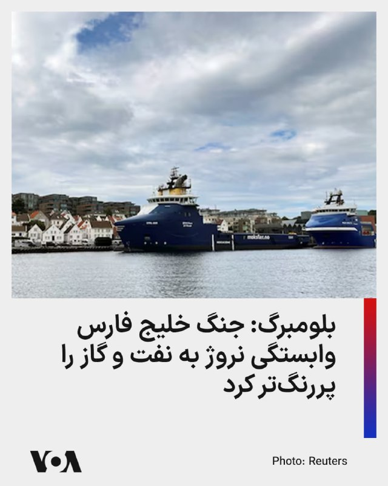

بلومبرگ در گزارشی نوشت نروژ با وجود تلاش برای متنوع‌سازی اقتصاد خود، همچنان به درآمدهای نفت و گاز وابسته مانده و جنگ خلیج فارس بار دیگر اهمیت این بخش را برای اقتصاد این کشور افزایش داده است.

به نوشته بلومبرگ، اختلال در عرضه انرژی از خلیج فارس و افزایش قیمت نفت و گاز، نروژ را به یکی از برندگان بحران تازه انرژی تبدیل کرده است؛ کشوری که پس از کاهش وابستگی اروپا به انرژی روسیه، نقش مهم‌تری در تأمین نفت و گاز اروپا پیدا کرده بود.

این گزارش می‌گوید درآمدهای بالای انرژی، روند فاصله گرفتن اقتصاد نروژ از نفت و گاز را دشوارتر کرده است. در حالی که دولت نروژ از گذار سبز و سرمایه‌گذاری در صنایع جدید سخن می‌گوید، بخش نفت و گاز همچنان موتور اصلی صادرات، درآمد دولت و سرمایه‌گذاری در این کشور است.

بر اساس گزارش‌های مرتبط، جنگ آمریکا با جمهوری اسلامی باعث افزایش تقاضا برای نفت، فرآورده‌های نفتی و ال‌ان‌جی نروژ، به‌ویژه در بازارهای آسیا-اقیانوسیه، شده است.
@FarsiVOA

## FarsiVOA — post 219051

  <a href="telegram/content/FarsiVOA_219051_1780146064.mp4" target="_blank">🎬 Download video</a>

نجات ۸ مسافر گرفتار در ترن هوایی شهربازی تگزاس؛

بر اساس گزارش رسانه‌های رسمی، یک ترن هوایی (رولرکاستر) در ایالت تگزاس آمریکا هنگام حرکت روی یک مسیر کاملاً عمودی دچار نقص فنی و متوقف شد.

در پی این حادثه، ۸ مسافر در بالاترین نقطه ریل عمودی معلق و گرفتار شدند. نیروهای آتش‌نشانی بلافاصله با استفاده از کامیون‌های ویژه به محل اعزام شدند و موفق شدند هر ۸ نفر را به سلامت از روی ریل پایین آورده و نجات دهند. هیچ مصدومیتی در این حادثه گزارش نشده است.
@FarsiVOA

## DW_Farsi — post 125318

🔶 "امارات در طول جنگ، ده‌ها حمله هوایی علیه ایران انجام داد"

روزنامه آمریکایی وال‌استریت ژورنال روز جمعه هشتم خرداد (۲۹ مه) گزارش داد که امارات متحده عربی در طول جنگ ، ده‌ها حمله هوایی علیه ایران انجام داده است که این حملات یک روز پس از اعلام آتش‌بس میان آمریکا و ایران در اوایل آوریل به پایان رسید.

روزنامه اسرائيلی جروزالم پست که چکیده‌ای از این گزارش را منتشر کرده می‌نویسد، وال‌استریت ژورنال به نقل از چندین منبع مطلع نوشت که امارات با ایالات متحده و اسرائیل هماهنگی داشته و با استفاده از اطلاعات دریافتی از هر دو کشور، تأسیسات انرژی ایران را در پاسخ به حملات ایران به زیرساخت‌های نفت و گاز خود، هدف قرار داده است.

اگرچه کشورهای حوزه خلیج‌فارس در ابتدا اعلام کرده بودند که اجازه نخواهند داد از پایگاه‌ها یا حریم هوایی آن‌ها برای حمله استفاده شود، اما برخی از آن‌ها پس از حملات ایران به کشورهای مختلف این منطقه، سیاست خود را تغییر دادند.

ایران با بیش از ۲۸۰۰ موشک و پهپاد امارات را هدف قرار داد که این تعداد بیش از پرتاب‌های انجام‌شده به هر کشور دیگری، از جمله اسرائیل، بوده است.

به گزارش وال‌استریت ژورنال، امارات نیز متقابلا اقدام به همکاری تلافی‌جویانه با آمریکا و اسرائیل کرد تا به اهدافی، از جمله در جزایر قشم و ابوموسی در تنگه هرمز ، بندرعباس و پالایشگاه نفت در جزیره لاوان در خلیج‌فارس حمله کند.

وال‌استریت ژورنال می‌نویسد، حمله دیگر به مجتمع پتروشیمی عسلویه و با همکاری اسرائیل انجام شد که محکومیت‌های بین‌المللی را در پی داشت؛ تا جایی که دونالد ترامپ، رئیس‌ جمهور آمریکا، از اسرائیل خواست حمله به تأسیسات انرژی را متوقف کند.

بنیامین نتانیاهو، نخست‌وزیر اسرائیل، در پاسخ به سؤالی درباره حمله به مجتمع عسلویه و واکنش ترامپ، به خبرنگاران گفت: «اسرائیل به تنهایی علیه مجتمع گاز عسلویه عمل کرد.»

این روزنامه همچنین نوشت که امارات اتحاد خود با اسرائیل را در طول جنگ افزایش داده و اسرائیل نیز سامانه‌های گنبد آهنین و سربازان ارتش خود را به امارات اعزام کرده است.

به علاوه، چندین مقام اسرائیلی از جمله دیوید بارنیا، رئیس موساد یا سازمان اطلاعات خارجی، دیوید زینی، رئیس شین‌بت یا سازمان اطلاعات داخلی و ایال زامیر، رئیس ستاد مشترک ارتش اسرائیل و همچنین نتانیاهو به امارات سفر کردند.

سفر نتانیاهو ابتدا توسط وزارت خارجه امارات تکذیب شد، اما سپس سخنگوی نتانیاهو مجددا آن را تأیید کرد.

در ماه آوریل، عربستان سعودی از رویکرد تهاجمی امارات انتقاد کرد و به آمریکا شکایت برد که حملات امارات خطر اقدامات تلافی‌جویانه ایران را در سراسر منطقه افزایش می‌دهد.

@dw_farsi

## DW_Farsi — post 125317

🔶 پزشک ترامپ آمادگی او برای انجام وظایفش را تأیید کرد

شان باربابلا، پزشک دونالد ترامپ، اعلام کرده است که رئیس جمهور آمریکا از نظر جسمی و ذهنی از وضعیت سلامتی بسیار خوبی برخوردار است.

بر اساس بیانیه منتشرشده از سوی کاخ سفید در روز جمعه ۲۹ مه (۸ خرداد) به وقت محلی، باربابلا گفته است ترامپ از نظر قلبی، ریوی و سیستم عصبی عملکردی قوی دارد.

او افزوده است که ترامپ بدون هیچ محدودیتی قادر است تمامی وظایف خود را به عنوان فرمانده کل قوا و رئیس دولت انجام دهد.

خود ترامپ نیز پس از معاینه دوره‌ای‌اش در بیمارستان نظامی "والتر رید" در روز سه‌شنبه گذشته گفته بود که همه چیز "عالی" پیش رفته است.

وضعیت جسمانی ترامپ به‌دقت زیر نظر قرار دارد. انتشار تصاویری از ورم مچ پاها، کبودی دست‌ها و لکه‌هایی روی گردن، پرسش‌هایی را درباره وضعیت سلامت این سیاستمدار ۷۹ ساله جمهوری‌خواه برانگیخته است.

همچنین مواردی از خواب‌آلودگی‌های مکرر رئیس جمهور آمریکا در جریان مراسم رسمی نیز تردیدهایی را درباره آمادگی جسمانی‌اش ایجاد کرده بود.

باربابلا به وجود ورم خفیف در ساق پاهای ترامپ اشاره کرده، اما گفته است که این وضعیت در مقایسه با سال گذشته بهبود یافته است.

او همچنین کبودی‌های روی دست ترامپ را بی‌خطر دانسته و توضیح داده است که این کبودی‌ها در نتیجه دست دادن‌های مکرر و مصرف همزمان آسپرین برای پیشگیری از بیماری‌های قلبی-عروقی ایجاد شده‌اند.

عملکرد کلی قلب رئیس‌ جمهور آمریکا هم طبیعی اعلام شده است. همچنین به گفته او، یک "معاینه جامع عصبی" نشان داده که وضعیت ذهنی ترامپ طبیعی است.

ترامپ از نظر افسردگی و اضطراب نیز مورد آزمایش قرار گرفته است. با این حال، پزشک او هیچ توضیحی درباره دلیل درمان پوست گردن ترامپ در ماه مارس ارائه نکرده و به تصویربرداری "ام‌آر‌آی" در ماه اکتبر گذشته نیز اشاره‌ای نکرده است.

ترامپ در ماه ژوئن امسال ۸۰ ساله خواهد شد. او هنگام آغاز دوره ریاست جمهوری خود از همه رؤسای جمهور پیشین آمریکا مسن‌تر بود.

ترامپ بارها تأکید کرده که از جو بایدن، رئیس جمهور پیشین آمریکا از حزب دموکرات، پرانرژی‌تر و آماده‌تر است.

بایدن سال گذشته در سن ۸۲ سالگی و پس از مطرح شدن پرسش‌هایی درباره توانایی جسمی و ذهنی‌اش، سمت خود را ترک کرد.

طبق این گزارش، پزشک ترامپ توصیه‌هایی پیشگیرانه نیز به او ارائه کرده است. ترامپ توصیه‌هایی درباره رژیم غذایی دریافت کرده و مصرف آسپرین با دوز پایین نیز به او پیشنهاد شده است.

@dw_farsi

## DW_Farsi — post 125316

  

🔸 محسن رضایی: آمریکا با ادامه محاصره اهداف دیگری را دنبال می‌کند

محسن رضایی، فرمانده سپاه در دوران جنگ هشت ساله ایران و عراق، روز شنبه ۹ خرداد (۳۰ مه) در شبکه اجتماعی ایکس مدعی شد دونالد ترامپ، رئیس جمهور آمریکا با ادامه محاصره دریایی کشتی‌های مرتبط با ایران، "دیپلماسی را نقض کرده است".

رضایی گفته است: «همان‌طور که انتظار می‌رفت، رئیس‌جمهور ایالات متحده برای سومین بار دیپلماسی را نقض می‌کند.»

به گفته رضایی دو مورد قبلی احتمالا به حمله هوایی اسرائیل علیه ایران در ژوئن سال گذشته و همچنین حمله مشترک آمریکا و اسرائیل در ۲۸ فوریه سال جاری مربوط می‌شود؛ حملاتی که در جریان مذاکرات غیرمستقیم هسته‌ای ایران و آمریکا رخ دادند.

رضایی در پیام خود همچنین گفته است "با ادامه محاصره دریایی و زیاده‌خواهی در مذاکرات" آمریکا نشان می‌دهد اهل مذاکره نیست و اهداف دیگری را دنبال می‌کند.
@dw_farsi

## DW_Farsi — post 125315

🔸 هشدار اشتاین‌مایر درباره گرایش‌های اقتدارگرایانه در جهان

فرانک والتر اشتاین‌مایر، رئیس جمهور آلمان، در مراسم اهدای "جایزه آزادی هامباخ"، نسبت به گرایش‌های اقتدارگرایانه در جهان هشدار داد. به گفته او، دموکراسی، حاکمیت قانون و نهادهای مستقل در سطح بین‌المللی تحت فشار قرار دارند.

اشتاین‌مایر دیروز جمعه ۲۹ مه (۸ خرداد) گفت دولت‌های اقتدارگرا می‌کوشند نهادهای نظارتی دموکراتیک، از جمله رسانه‌های مستقل، فرهنگ و دستگاه قضایی را بی‌اعتبار کرده و از میان بردارند.

اشتاین‌مایر با بیان اینکه شهروندان در یک نظام دموکراتیک در برابر چنین تحولاتی ناتوان نیستند، تأکید کرد: «گرایش‌های اقتدارگرایانه سرنوشتی نیستند که نتوان از آن گریخت. برعکس، همه ما دارای حق انتخابیم و می‌توانیم با رأی خود تصمیم بگیریم.»

اشتاین‌مایر جایزه آزادی هامباخ را به آدام بودنار، حقوقدان قانون اساسی و وزیر پیشین دادگستری لهستان، اهدا کرد. او برنده این جایزه را مبارزی پرشور برای حقوق بشر، دموکراسی و حاکمیت قانون توصیف کرد.

رئیس‌جمهور آلمان گفت بودنار از همان ابتدا درباره خطرات پیش روی استقلال نهادهای دموکراتیک هشدار داده و در برابر دخالت‌ها در دستگاه قضایی ایستادگی کرده است.

اشتاین‌مایر گفت قلعه هامباخ و رنگ‌های سیاه، سرخ و طلایی، نماد آزادی، دموکراسی و تفاهم میان ملت‌ها هستند. او افزود: «از همه کسانی نیز که از این مکان و از پرچم ما در برابر کسانی که امروزه به دنبال سوءاستفاده از آنها به نفع یک ناسیونالیسم جدید و تفکر اقتدارگرایانه هستند، سپاسگزاری می‌کنم.»
@dw_farsi

## DW_Farsi — post 125314

  

🔸 عزیزی: چین و روسیه برای ترانزیت در تنگه هرمز از امتیازاتی برخوردار خواهند بود

ابراهیم عزیزی، رئیس کمیسیون امنیت ملی و سیاست خارجی مجلس شورای اسلامی روز جمعه ۸ خرداد (۲۹ مه) در گفت‌وگو با خبرگزاری روسی ریانووستی گفت "تنگه هرمز در جغرافیای ایران قرار دارد و تصمیم‌گیری درباره تردد در این آبراه حق ایران است و هیچ طرفی نمی‌تواند آن را زیر سئوال ببرد."

او همچنین اعلام کرد کشورهای راهبردی مانند چین و روسیه از شرایط ویژه برای ترانزیت در تنگه هرمز برخوردار خواهند بود و این کشورها به دلیل همکاری‌های گذشته با ایران، در سامان‌دهی عبور و مرور دریایی از امتیازاتی بهره‌مند می‌شوند.

عزیزی در بخش دیگری از سخنانش به سازوکار جدید تردد در تنگه هرمز با همکاری ایران و عمان اشاره کرد و گفت امنیت کشتیرانی باید به‌گونه‌ای تامین شود که هم منافع ایران و هم منافع جامعه بین‌المللی حفظ شود.

مساله دریافت ترانزیت از سوی جمهوری اسلامی اما اقدامی تلقی می‌شود که با قوانین بین‌المللی همخوانی ندارد و از سوی کشورهای منطقه، اروپا، آمریکا و دیگر کشورها با مخالفت شدیدی روبرو شده است.
@dw_farsi

## DW_Farsi — post 125313

🔸 گفت‌وگوهای پاریس و برلین بر سر "بازدارندگی هسته‌ای"

آلمان و فرانسه گفت‌وگوهای برنامه‌ریزی‌شده برای همکاری نزدیک‌تر در زمینه بازدارندگی هسته‌ای را آغاز کرده‌اند. هفته‌نامه اشپیگل گزارش داده است که گونتر زاوتر، مشاور امنیتی صدراعظم آلمان، چهارشنبه گذشته ۲۷ مه (۶ خرداد) برای نخستین دور این مذاکرات به پاریس سفر کرده است.

طبق گزارش این هفته‌نامه آلمانی، همچنین کشورهای اروپایی دیگری نیز در این رایزنی‌ها در پاریس حضور داشته‌اند. بر اساس این گزارش، نشست بعدی آلمان و فرانسه پیش از تعطیلات تابستانی در آلمان برگزار خواهد شد.

فریدریش مرتس، صدراعظم آلمان، و امانوئل مکرون، رئیس‌جمهوری فرانسه، پیش‌تر در ماه مارس یک "گروه راهبری هسته‌ای" تشکیل داده بودند تا جزئیات همکاری را بررسی کند.

گروه راهبری آلمان و فرانسه که مکرون و مرتس در بهار امسال ایجاد کردند، برای آمادگی در شرایط بحرانی، در حال برنامه‌ریزی برای برگزاری مانورهای مشترک است.

بر این اساس، ارتش آلمان می‌تواند در بخش متعارف رزمایش‌های هسته‌ای فرانسه شرکت کرده و به تأسیسات هسته‌ای فرانسه نیز دسترسی پیدا کند.

طبق گزارش اشپیگل، نخستین مشارکت آلمان در یکی از رزمایش‌های موسوم به "پوکر" برای همین سال جاری (۲۰۲۶) برنامه‌ریزی شده و احتمالاً در ماه سپتامبر انجام خواهد شد.
@dw_farsi

## DW_Farsi — post 125312

  

🔸 "ادعای ترامپ درباره مین‌های ایران در تنگه هرمز تائید نشده است"

شبکه "ان‌بی‌سی" به نقل از دو مقام آمریکایی و یک منبع آگاه گزارش داد که واشنگتن هنوز تایید نکرده است که ایران در تنگه هرمز مین‌گذاری کرده باشد؛ این در حالی است که دونالد ترامپ، رئیس‌ جمهور ایالات متحده آمریکا، روز جمعه ۸ خرداد (۲۹ مه) مدعی شده بود که ایران پذیرفته است مین‌هایی را که آمریکا موفق به پاکسازی آنها نشده، از تنگه هرمز جمع‌آوری کند.

با این حال، بر اساس این گزارش، ارزیابی‌های اطلاعاتی آمریکا و کشورهای متحد در روزهای آغازین جنگ نشان می‌داد که ایران احتمالا در حال مین‌گذاری این آبراه راهبردی بوده است، اما عملیات جست‌وجو و بازرسی زیرآبی آمریکا نتوانسته هیچ شیئی را که به‌طور قطعی مین دریایی تشخیص داده شود، پیدا کند.

یکی از منابع آگاه در این باره گفت که اگر هم تهدیدی وجود داشته، بسیار کمتر از آن چیزی بوده است که در ابتدا درباره آن نگرانی وجود داشت.

تنگه هرمز یکی از مهم‌ترین مسیرهای انتقال نفت و انرژی جهان به شمار می‌رود و هرگونه تهدید علیه امنیت کشتیرانی در این آبراه تاثیری مستقیم بر قیمت نفت دارد.
@dw_farsi

## DW_Farsi — post 125311

  

🔶 وزارت خزانه‌داری آمریکا از تحریم‌های جدید شبکه مرتبط با سپاه خبر داد

وزارت امور خارجه و وزارت خزانه‌داری آمریکا از اعمال تحریم‌های جدید علیه جمهوری اسلامی و تلاش برای انحلال یک شبکه مرتبط با این کشور خبر دادند.

این شبکه به رهبری "علی مجد سپهر" مستقر در ایران متهم شده است که با جعل هویت شرکت‌های آمریکایی و فریب شرکت‌های فناوری در آمریکا در تلاش برای دسترسی به تجهیزات پیشرفته برای بخش نظامی ایران بوده است.

وزارت خزانه‌داری آمریکا علی مجدسپهر را فردی مرتبط با وزارت دفاع جمهوری اسلامی معرفی کرده و چند فرد و شرکت دیگر را نیز به دلیل همکاری و ارتباط با او تحریم کرده است.

به گفته مقام‌های آمریکایی، این شبکه از وب‌سایت‌های جعلی و واسطه‌هایی در دبی برای دریافت محموله‌ها استفاده کرده و در پی تهیه تجهیزات برای بخش دفاعی ایران بوده است.

وزارت خارجه آمریکا هم‌زمان با این تحریم‌ها اعلام کرد تا ۱۵ میلیون دلار پاداش برای اطلاعاتی که به مختل‌شدن تامین مالی سپاه پاسداران منجر شود، در نظر گرفته شده است.
@dw_farsi

## DW_Farsi — post 125310

🔶 جنگ ایران شریان دارویی هند به آفریقا را قطع کرده است

هند را اغلب "داروخانه جنوب جهانی" می‌نامند و برای کشورهای آفریقایی، سلامت عمومی و داروهای هندی به‌شدت به یکدیگر گره خورده‌اند.

بر اساس داده‌های نهادهای بهداشت عمومی از جمله سازمان بهداشت جهانی (WHO)، آفریقا نزدیک به یک‌چهارم بار بیماری‌های جهان را بر دوش می‌کشد و سهم نامتناسبی از موارد ابتلا به اچ‌آی‌وی (HIV)، سل و مالاریا را به خود اختصاص داده است.

بر پایه داده‌های کمیسیون اقتصادی سازمان ملل برای آفریقا و آژانس ملی کنترل و نظارت بر غذا و داروی نیجریه (NAFDAC)، هند حدود ۴۰ درصد داروهای وارداتی آفریقا را تأمین می‌کند و بزرگ‌ترین شریک تجاری دارویی این قاره به شمار می‌رود.

از نیجریه تا کنیا و آفریقای جنوبی، داروهای ژنریک هندی ستون فقرات نظام‌های بهداشت عمومی را تشکیل می‌دهند. در سراسر قاره، این داروها آنتی‌بیوتیک‌های ارزان‌قیمت، داروهای ضدویروس اچ‌آی‌وی، داروهای مالاریا و سل، انسولین، داروهای فشار خون و مسکن‌های رایج مورد استفاده روزانه میلیون‌ها نفر را تأمین می‌کنند.

این نظام تاکنون کارآمد بوده است، زیرا داروهای هندی مقرون به صرفه، قابل اعتماد و وابسته به یکی از کارآمدترین کریدورهای لجستیکی جهان بوده‌اند.

این داروها از مراکز لجستیکی حوزه خلیج فارس عبور می‌کنند، زیرا برخی داروها و واکسن‌ها به سامانه‌های پیشرفته حمل‌ونقل با کنترل دما و شرایط اقلیمی نیاز دارند.

اما با مسدود شدن تنگه هرمز در پی جنگ ایران، حمل‌ونقل تجاری از منطقه خلیج فارس مختل شده است. همزمان، حق بیمه خطرات جنگی افزایش یافته، هزینه‌های حمل‌ونقل بالا رفته و شرکت‌های هواپیمایی مسیرهای خود را تغییر داده یا ظرفیت حمل بار از حریم هوایی خلیج فارس را کاهش داده‌اند.

افزایش قیمت نفت نیز همزمان هزینه‌های تولید و حمل‌ونقل شرکت‌های داروسازی را بالا برده است.

📌 برای دسترسی کامل به گزارش به وبسایت دویچه‌وله فارسی مراجعه کنید.
@dw_farsi

## DW_Farsi — post 125309

🔶 واژگونی کامیون حامل مهاجران افغان؛ ۱۸ نفر کشته شدند

روز شنبه یک کامیون حامل پناهجویان افغان که در حال بازگشت از پاکستان بودند، در بزرگراهی در شرق افغانستان واژگون شد. در این حادثه دست‌کم ۱۸ نفر کشته و ۳۵ تن دیگر مجروح شدند. بیشتر آن‌ها زن و کودک هستند.

عبدالمالک نیازی، سخنگوی والی لغمان، اعلام کرد که این تصادف در استان لغمان و در بزرگراه اصلی متصل‌کننده کابل (پایتخت افغانستان) به استان ننگرهار رخ داده است.

وی افزود که در میان کشته‌شدگان، ۱۰ کودک و ۵ زن وجود دارند و مجروحان برای مداوا به بیمارستان‌های ننگرهار منتقل شده‌اند.

مسافران این کامیون در زمره هزاران افغان بودند که به تازگی از پاکستان بازگشته‌اند. مقام‌های پاکستان از سال ۲۰۲۳ و بخصوص در ماه‌های اخیر سیاست‌های سختگیرانه‌تری را در قبال مهاجران و پناهجویان افغان ساکن این کشور اتخاذ کرده‌اند؛ موضوعی که باعث شده شمار زیادی از افغان‌ها، اغلب همراه با خانواده و وسایل زندگی خود، با کامیون‌ها به افغانستان بازگردند. ایران نیز در همان حوالی زمانی، اخراج مهاجران افغان را شدت بخشید.

بر اساس آمار کمیساریای عالی سازمان ملل متحد در امور پناهندگان (UNHCR) و سازمان بین‌المللی مهاجرت (IOM)، از آغاز سال ۲۰۲۶ میلادی تاکنون ۴۴۷ هزار و ۴۰۰ افغان از جمله بسیاری که در پاکستان متولد شده بودند و ده‌ها سال را به زندگی و کار در آنجا سپری کرده بودند، به کشور خود بازگشته‌اند.
@dw_farsi

## Persian_Trend_Official — post 15339

  <a href="telegram/content/Persian_Trend_Official_15339_1780146069.mp4" target="_blank">🎬 Download video</a>

هدف قرار گرفتن تأسیسات نظامی و انبارهای مهمات پایگاه ششم شکاری شهید یاسینی بوشهر در ۱۷ فروردین ۱۴۰۵

👺Phantom

📌 @persian_trend_official
پرشین ترند | متفاوت‌ترین کانال نظامی

## Persian_Trend_Official — post 15338

  <a href="telegram/content/Persian_Trend_Official_15338_1780146071.mp4" target="_blank">🎬 Download video</a>

صداوسیما خبر از کشته شدن 2 تن از اعضای گروهک تروریستی پاک توسط نیروهای امنیتی در کرمانشاه داد.

📝 Amir

📌 @persian_trend_official
پرشین ترند | متفاوت‌ترین کانال نظامی

## Persian_Trend_Official — post 15337

https://youtube.com/shorts/mE9NFxON9xQ?feature=share

## Persian_Trend_Official — post 15336

  <a href="telegram/content/Persian_Trend_Official_15336_1780146073.webm" target="_blank">🎬 Download video</a>

هدف قرار دادن تانک مرکاوا اسرائیلی توسط مولتی روتور FPV حزب‌الله لبنان

حزب‌الله لبنان با انتشار ویدیویی خبر از حمله به یک عراده تانک مرکاوا در زوطر الشرقیه داد، این شهر در شمال رودخانه لیتانی واقع شده است.

📝 Amir

📌 @persian_trend_official
پرشین ترند | متفاوت‌ترین کانال نظامی

## Persian_Trend_Official — post 15335

  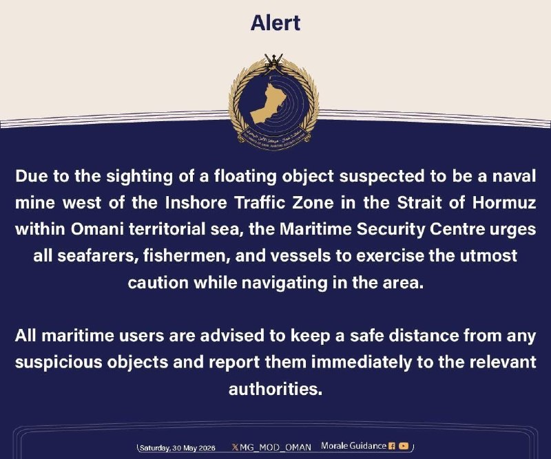

مشاهده شدن مین دریایی در حریم آبی عمان!

مرکز امنیت دریایی عمان: به دلیل مشاهده یک جسم شناور که احتمال می‌رود مین دریایی باشد در غرب منطقه ترافیک ساحلی در تنگه هرمز در داخل آب‌های سرزمینی عمان، مرکز امنیت دریایی از تمامی دریانوردان، ماهیگیران و شناورها درخواست می‌کند هنگام عبور از این منطقه نهایت احتیاط را به عمل آورند.

به همه کاربران دریایی توصیه می‌شود فاصله ایمن از هر جسم مشکوک را حفظ کرده و فوراً آن را به مراجع ذی‌ربط گزارش دهند.

📝 Amir

📌 @persian_trend_official
پرشین ترند | متفاوت‌ترین کانال نظامی

## Persian_Trend_Official — post 15334

  <a href="telegram/content/Persian_Trend_Official_15334_1780146074.mp4" target="_blank">🎬 Download video</a>

وزیر جنگ آمریکا: محاصره ایران هنوز کاملاً پابرجاست.

آینده انرژی در واقع آینده‌ آمریکایی است و این برای امنیت انرژی در سراسر جهان خوب است.

📝 Amir

📌 @persian_trend_official
پرشین ترند | متفاوت‌ترین کانال نظامی

## Persian_Trend_Official — post 15333

  <a href="telegram/content/Persian_Trend_Official_15333_1780146076.webm" target="_blank">🎬 Download video</a>

الجزیره: جنگ بین ایران، اسرائیل و ایالات متحده وارد روز 92 خود شده است در حالی که رئیس‌جمهور دونالد ترامپ همچنان در حال بررسی توافق پیشنهادی برای تمدید آتش‌بس و بازگشایی تنگه هرمز است.

مذاکرات درباره برنامه هسته‌ای ایران، رفع تحریم‌ها و آینده ذخایر اورانیوم غنی‌شده تهران همچنان ادامه دارد، در حالی که هر دو طرف واشنگتن و تهران یکدیگر را به نقض آتش‌بس متهم می‌کنند.

تنش‌های منطقه‌ای علی‌رغم تلاش‌های دیپلماتیک همچنان بالا است، با فعالیت‌های نظامی مداوم در خلیج و اطراف آن، عملیات‌های اسرائیل در سراسر منطقه و عدم قطعیت درباره اینکه آیا توافق نهایی بین ایالات متحده و ایران می‌تواند حاصل شود یا خیر.

📝 Amir

📌 @persian_trend_official
پرشین ترند | متفاوت‌ترین کانال نظامی

## Persian_Trend_Official — post 15332

  

یک منبع ارشد نظامی لبنان به خبرگزاری آناتولی گفت: نیروهای اسرائیلی از رودخانه لیتانی در جنوب لبنان عبور کرده و به حومه شهر نبطیه رسیده‌اند.

📝 Amir

📌 @persian_trend_official
پرشین ترند | متفاوت‌ترین کانال نظامی

## Persian_Trend_Official — post 15331

  <a href="telegram/content/Persian_Trend_Official_15331_1780146077.webm" target="_blank">🎬 Download video</a>

محسن رضایی، مشاور نظامی رهبر جمهوری اسلامی ایران: همانطور که پیشبینی میشد رئیس جمهور آمریکا برای سومین بار در حال خیانت به دیپلماسی است.

او با ادامه محاصره دریایی و زیاده‌خواهی در مذاکرات ثابت کرد که اهل مذاکره نیست و اهداف دیگری را دنبال می‌کند.

📝 Amir

📌 @persian_trend_official
پرشین ترند | متفاوت‌ترین کانال نظامی

## Persian_Trend_Official — post 15330

  

چهارمین بیانیه امروز ارتش اسرائیل

هشدار فوری به ساکنان لبنان که در شهرها و روستاهای زیر حضور دارند:
المروانیه،اللویزه،میدون
،انصاریه،زفتا،تفاحتا

با توجه به اینکه حزب‌الله توافق آتش‌بس را نقض کرده است، ارتش اسرائیل مجبور به اقدام علیه آن با قدرت می‌شود. ارتش اسرائیل قصد آسیب رساندن به شما را ندارد.
برای حفظ امنیت خود، باید فوراً خانه‌های خود را تخلیه کرده و به شمال رودخانه زهرانی منتقل شوید.
هر کسی که در نزدیکی نیروهای حزب‌الله، تأسیسات آن یا تجهیزات رزمی آن حضور داشته باشد، جان خود را در معرض خطر قرار می‌دهد.

👺Phantom

📌 @persian_trend_official
پرشین ترند | متفاوت‌ترین کانال نظامی

## Persian_Trend_Official — post 15328

  

رسانه NBC: یک فروند جنگنده F-15E آمریکایی که ماه گذشته برفراز آسمان جنوب غرب ایران سرنگون شد احتمالاً توسط یک موشک دوش پرتاب ساخت چین مورد اصابت قرار گرفته است.

چین همچنین ممکن است یک رادار هشدار دهنده برد بلند YLC-8B را که قادر به شناسایی هواپیماهای رادارگریز در اوایل درگیری است در اختیار ایران قرار داد باشد.

ان بی سی مدرکی برای این ادعاهای خود منتشر نکرد و این ادعاها را براساس احتمالات منتشر کرده.

📝 Amir

📌 @persian_trend_official
پرشین ترند | متفاوت‌ترین کانال نظامی

## Persian_Trend_Official — post 15327

  <a href="telegram/content/Persian_Trend_Official_15327_1780146079.mp4" target="_blank">🎬 Download video</a>

ارتش امریکا روز گذشته یک قایق مظنون به قاچاق مواد مخدر را در شرق اقیانوس آرام مورد حمله خود قرار داد. هر سه سرنشین این قایق کشته شدند.

📝 Amir

📌 @persian_trend_official
پرشین ترند | متفاوت‌ترین کانال نظامی

## Persian_Trend_Official — post 15324

تصاویری از لاشه یک تلار سامانه پدافندی سوم خرداد نیروی هوافضا سپاه که در جریان جنگ اخیر در حوالی کرمانشاه در اثر برخورد پرتابه اسرائیلی منهدم شده است.

📝 Amir

📌 @persian_trend_official
پرشین ترند | متفاوت‌ترین کانال نظامی

## RadioFarda — post 157720

  

🔸مرکز امنیت دریایی عمان روز شنبه از دریانوردان، ماهیگیران و کشتی‌ها خواست پس از مشاهده یک شیء شناور که گمان می‌رود مین دریایی باشد، نهایت احتیاط را به خرج دهند.

🔸این شیء در غرب مسیر تردد ساحلی در تنگه هرمز و در محدوده آب‌های سرزمینی عمان مشاهده شده است.

🔸این مرکز بدون آن که به منشأ کار گذاشتن مین اشاره کند، به کاربران دریا توصیه کرد که از هرگونه شیء مشکوک فاصله ایمن حفظ کنند و بلافاصله آن را به مراجع ذی‌صلاح گزارش دهند.

🔸با آغاز جنگ آمریکا و اسرائیل علیه ایران در اسفند سال گذشته، گزارش‌هایی درباره مین‌گذاری تنگه هرمز توسط ایران منتشر شد.

🔸دونالد ترامپ، رئیس‌جمهور آمریکا، روز جمعه تعهد ایران به جمع‌آوری «هرگونه مین دریایی» در تنگه هرمز و باز شدن فوری این آبراه راهبردی را از جمله شروط توافق با جمهوری اسلامی خوانده بود.

@RadioFarda

## RadioFarda — post 157719

حج در سایهٔ گرمایش زمین؛ موج گرما از مکه تا مادرید رکورد می‌شکند

🔸گرمایش زمین دیگر فقط موضوعی برای گزارش‌های علمی و هشدارهای بلندمدت نیست؛ نشانه‌های آن هم‌زمان در آیین‌های مذهبی، زندگی روزمره و زیرساخت‌های شهری دیده می‌شود. از مکه که میلیون‌ها زائر حج را در معرض گرمایی فزاینده قرار داده، تا اروپا که در ماه مه رکوردهای تازهٔ دمایی ثبت کرده و حتی شبکه آب برخی مناطق بریتانیا را زیر فشار برده است،

🔸تصویر تازه‌ای از جهان گرم‌تر در حال شکل‌گیری است: جهانی که در آن فصل‌ها دیگر همان معنای پیشین را ندارند.

🔸بر اساس تحلیل تازه گروه «نسبت‌دهی هوای جهان»، گرمایش زمین، اقلیم مکه را «به‌طور بنیادین» دگرگون کرده و زائران حج را حتی در ماه‌هایی بیرون از تابستان در معرض گرمای شدید و خطرناک قرار داده است.

🔸این بررسی می‌گوید انتشار دی‌اکسید کربن ناشی از سوخت‌های فسیلی باعث شده دمای ۴۰ درجه سانتی‌گراد اکنون در ماه مه (اردیبهشت و خرداد) نیز به‌طور منظم تجربه شود؛ دمایی که در دهه‌های گذشته عمدتاً به تابستان محدود بود.

🔸این تغییر برای حج اهمیتی حیاتی دارد، چون مناسک آن در چند روز، همراه با پیاده‌روی‌های طولانی، ازدحام شدید و حضور شمار زیادی از زائران سالمند یا دارای بیماری‌های زمینه‌ای انجام می‌شود. در سال ۲۰۲۴، زمانی که حج در ماه ژوئن برگزار شد، بیش از ۱۳۰۰ زائر بر اثر گرما و رطوبت شدید جان باختند.

🔸پژوهشگران می‌گویند اگر جهان با همین روند سیاست‌های اقلیمی پیش برود و دمای جهانی تا پایان قرن سه درجه افزایش یابد، حدود ۹۷ درصد مناسک حج در مکه با سطح خطرناک گرما روبه‌رو خواهد شد.

🔸نسخه کامل این گزارش را در وب‌سایت رادیوفردا بخوانید.

@Radiofarda

## RadioFarda — post 157718

  <a href="https://t.me/radiofarda/157718" target="_blank">📎 Download file</a>

📻بشنوید: ساعت ۱۴ با رادیوفردا، نهم خرداد ۱۴۰۵‌

@Radiofarda

## RadioFarda — post 157717

پاراگراف اول؛ تابوی اسرائیل و منطق عادی‌سازی رابطه در سایهٔ جنگ

🔸پس از جنگ ۴۰ روزهٔ اسرائیل و آمریکا با ایران، خاورمیانه وارد مرحلهٔ تازه‌ای از بازآرایی ژئوپولیتیکی شده است؛ مرحله‌ای که در آن کشورهای عربی میان سه ملاحظهٔ اصلی در حال موازنه‌اند: مهار قدرت منطقه‌ای ایران، حفظ روابط امنیتی با ایالات متحده، و مدیریت حساسیت افکار عمومی نسبت به اسرائیل و مسئلهٔ فلسطین.

🔸در این چارچوب، پیمان‌های ابراهیم که در سال ۲۰۲۰ با میانجی‌گری دونالد ترامپ، رئیس‌جمهور آمریکا، شکل گرفت، همچنان به‌عنوان مهم‌ترین الگوی عادی‌سازی روابط با اسرائیل مطرح است؛ هرچند جنگ غزه و افزایش تنش‌های منطقه‌ای، آینده و دامنهٔ آن را با ابهام روبه‌رو کرده است.

🔸امارات، بحرین و مراکش با تکیه بر منافع اقتصادی، امنیتی و فناورانه به این روند پیوسته‌اند، در حالی که عربستان سعودی عادی‌سازی را به پیشرفت واقعی در تشکیل کشور فلسطین مشروط کرده است. هم‌زمان، برخی بازیگران منطقه‌ای مانند پاکستان نسبت به گسترش این چارچوب موضعی کاملاً مخالف گرفته‌اند.

🔸اکنون بحث درباره توافقی فراتر از پیمان ابراهیم و حتی احتمال نوعی تفاهم محدود با ایران نشان می‌دهد که دولت دونالد ترامپ در پی ترسیم نظمی جدید برای خاورمیانه است؛ نظمی که در آن نفوذ آمریکا در منطقه حفظ شود، روابط اسرائیل با کشورهای مسلمانِ منطقه و فراتر از آن تقویت گردد و حضور چین محدود شود. این‌ها موضوع‌هایی هستند که به عناصر تعیین‌کننده برای آیندهٔ خاورمیانه تبدیل شده‌اند.

🔸در برنامهٔ رادیویی «پاراگراف اول»، نوید طوبیان، دانش‌آموخته اسلام‌شناسی، خاورمیانه و ایران از دانشگاه عبری اورشلیم و ساکن تل‌آویو، علی معموری دانش‌آموخته فلسفه سیاسی و الهیات و پژوهشگر در مؤسسه مطالعات شهروندی در دانشگاه دیکن از سیدنی به همراه میثم بادامچی فلسفه سیاسی از دانشگاه لوئیس رم و پژوهشگر ارشد مؤسسه مطالعه بین‌منطقه‌ای قانون اساسی‌گرایی وابسته به بخش حقوق دانشگاه چارلز از پراگ در این‌باره تبادل نظر کرده‌اند.

🔸نسخه کامل این گفت‌وگو را در وب‌سایت رادیوفردا بخوانید.

@RadioFarda

## RadioFarda — post 157716

  

🔸رئیس کل دادگستری خراسان جنوبی روز شنبه ۹ خرداد از توقیف اموال ۳۴ نفر در این استان با اتهامات امنیتی خبر داد.

🔸محمدجعفر عبدالهی از این افراد با عنوان «عناصر حامی دشمن» نام برد و آن‌ها را به «اقدامات ضدامنیتی و همکاری با کشورهای متخاصم» متهم و اعلام کرد که اموال آن‌ها به «نفع ملت» مصادره شده است.

🔸دادگستری خراسان جنوبی اسامی این افراد را اعلام نکرده و برای اتهامات علیه این افراد شواهد و مدارکی ارائه نداده است.

🔸پیش از این نیز گزارش‌های متعددی از توقیف اموال شماری از روزنامه‌نگاران، فعالان سیاسی و مدنی، هنرمندان، ورزشکاران و چهره‌های شناخته‌شده با اتهامات مشابه در استانهای مختلف ایران منتشر شده بود.

@RadioFarda

## RadioFarda — post 157715

  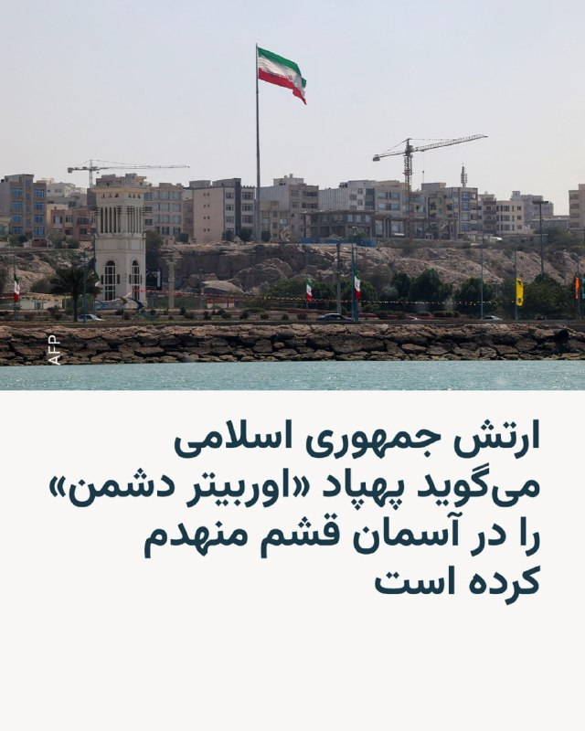

🔸ارتش جمهوری اسلامی ایران روز شنبه در بیانیه‌ای اعلام کرد یک پهپاد را در آسمان قشم ساقط کرده است.

🔸در این بیانیه آمده است که پدافند ارتش بامداد روز شنبه نهم خرداد یک فروند پهپاد «اوربیتر دشمن متجاوز» را رهگیری و با «شلیک موفق» ساقط کرده است.

🔸ارتش جمهوری اسلامی می‌گوید این پهپاد «آمریکایی- اسرائیلی» بوده است.

🔸سنتکام و ارتش اسرائیل هنوز واکنشی به این خبر نشان نداده‌اند.

🔸این خبر در حالی منتشر شده است که وزیر دفاع ایالات متحده روز شنبه هشدار داد که ارتش این کشور برای ازسرگیری جنگ با ایران حتی «بیش از آنچه لازم است توانایی» دارد.

@RadioFarda

## RadioFarda — post 157714

  

🔸پلیس و مقامات فرودگاه مونیخ به خبرگزاری فرانسه گفتند که پروازها در این فرودگاه روز شنبه نهم خرداد به دلیل «مشاهده یک پهپاد مشکوک»، حدود یک ساعت به حالت تعلیق درآمد.

🔸سخنگوی پلیس گفت که دو خلبان کمی پس از ساعت ۹ صبح از وقوع حادثه‌ای مشکوک که ظاهراً پهپاد بود، خبر دادند و با هماهنگی کنترل ترافیک هوایی آلمان، مقامات امنیتی سپس تصمیم به بستن باند فرودگاه‌ها گرفتند.

🔸به گفته سخنگوی فرودگاه، پروازها ساعت ۱۰:۰۵ صبح از سر گرفته شد.

🔸سخنگوی فرودگاه مونیخ گفت که «جستجوی گسترده توسط سرویس‌های اورژانس هیچ تهدیدی» برای امنیت عمومی پیدا نکرد.

🔸سال گذشته نیز فرودگاه مونیخ آلمان پس از مشاهده چندین پهپاد مشکوک به‌دلایل امنیتی تعطیل شد.

@RadioFarda

## RadioFarda — post 157713

سازمان اطلاعات دانمارک «تهدید تروریستی ایران» را بزرگ‌تر از گذشته ارزیابی کرد

🔸سازمان اطلاعات دانمارک روز جمعه، هشتم خردادماه، در بیانیه‌ای اعلام کرد که ایران، در پی تحولات جهانی اخیر، در حال حاضر نقش پررنگ‌تری در تهدید تروریستی علیه این کشور اسکاندیناوی ایفا می‌کند.

🔸رئیس سازمان امنیت و اطلاعات ملی دانمارک گفت که سطح کلی تهدید از طرف ایران برای کشورش همچنان چهار از مقیاسی پنج درجه‌ای است، اما در عین حال تأکید کرد که در سال‌های اخیر ماهیت این تهدیدها «به‌طور قابل‌توجهی تغییر کرده است».

🔸فین بورخ آندرسن در بیانیه‌ رسمی خود می‌گوید: «در سال گذشته، عوامل دولتی اهمیت فزاینده‌ای در تهدیدات تروریستی پیدا کرده‌اند. ارزیابی ما این است که این موضوع به‌ویژه درباره ایران صدق می‌کند؛ کشوری که به‌طور خاص تهدیدی برای منافع اسرائیلی و یهودی و همچنین برخی مخالفان ایرانی در اروپا، از جمله دانمارک، محسوب می‌شود.»

🔸او افزود: «تهدید ناشی از ایران از سرویس‌های اطلاعاتی این کشور سرچشمه می‌گیرد که برای برنامه‌ریزی و اجرای حملات از شبکه‌های مجرمانه و همچنین جذب نیرو در اروپا استفاده می‌کنند».

🔸در کشور همسایه دانمارک، سوئد، سازمان امنیت این کشور (ساپو) نیز ایران را متهم کرده که از باندهای تبهکار برای انجام «اقدامات خشونت‌آمیز» علیه منافع اسرائیلی و چهره‌های مخالف ایرانی در سوئد استفاده می‌کند، ادعایی که ایران رد کرده است.

🔸به گفته سازمان ملی امنیت و اطلاعات دانمارک، تشدید خصومت میان ایران و اسرائیل در سال‌های اخیر، به‌ویژه پس از آغاز حملات اسرائیل و ایالات متحده علیه ایران در ۹ اسفند پارسال، بر سطح تهدید علیه کشورهای شمال اروپا و به‌طور کلی کشورهای غربی تأثیر گذاشته است.

🔸سازمان امنیت و اطلاعات دانمارک همچنین افزود که در گذشته، تهدیدها عمدتاً از سوی «بازیگران غیردولتی» مانند افراط‌گرایان خشونت‌طلب هدایت می‌شد، و با وجود افزایش نقش بازیگران دولتی، تهدید از سوی دیگر گروه‌ها همچنان پابرجاست.

🔸همزمان با انتشار بیانیه رسمی دانمارک، پلیس بریتانیا روز جمعه اعلام کرد یک شهروند یونانی به اتهام همکاری با یک سرویس اطلاعاتی خارجی که به گفته پلیس «گمان می‌رود متعلق به ایران باشد» دادگاهی شد.

🔸اتهام او تلاش برای هدف قرار دادن یک روزنامه‌نگار شاغل در شبکه تلویزیونی ایران اینترنشنال عنوان شده است. در بیانیه پلیس بریتانیا نام این روزنامه‌نگار ذکر نشده است.

🔸نسخه کامل این گزارش را در وب‌سایت رادیوفردا بخوانید.

RadioFarda

## IranianMinds — post 21066

🔴حسین علائی:

هرچقدر به شمخانی می‌گفتم که در جنگ بعدی رهبر را می‌زنند، میگفت نمی‌توانند.
خدا او را بیامرزد، آخر هم رهبر را زدند و هم خودش را.

@IranianMinds

## IranianMinds — post 21065

خبرنگار : آیا اون محاصره هنوز هم برقرار هست؟

هگست :
بله، محاصره هنوز کاملاً برقرار هست

@IranianMinds

## IranianMinds — post 21064

🔴وزیر جنگ آمریکا:

هر لحظه آماده ایم جنگ علیه ایران را از سر بگیریم.

@IranianMinds

## IranianMinds — post 21063

  <a href="telegram/content/IranianMinds_21063_1780146085.mp4" target="_blank">🎬 Download video</a>

پیت هگست وزیر جنگ آمریکا درباره ایران:

ایران می‌خواهد بگوید که کنترل تنگه را در دست دارد، اما این ما هستیم.

و همه چیز پشت صحنه نشان می‌دهد که وقتی صحبت از آن می‌شود، ما کنترل را در دست داریم.

@IranianMinds

## IranianMinds — post 21062

  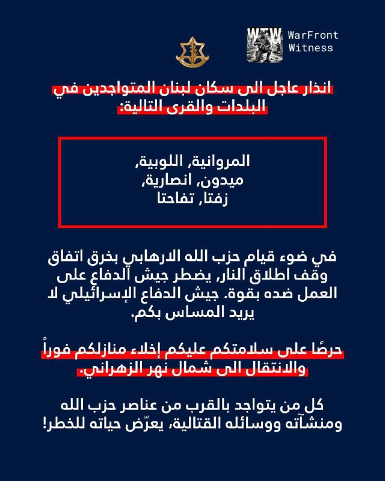

🔴ارتش اسرائیل دستور تخلیه به ساکنان جنوب لبنان به ویژه شهرها و روستاهای زیر را صادر کرد.

المروانیه، اللوبیه، میدون، انصاریه، زفتا و تفاحتا.

@IranianMinds

## IranianMinds — post 21061

  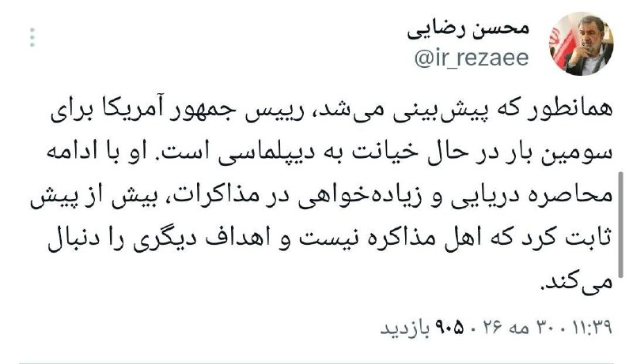

سر لشگر و فرمانده ی خشن محسن رضایی:

ترامپ اهل مذاکره نیست و اهداف دیگری را دنبال می‌کند

@IranianMinds

## IranianMinds — post 21060

🔴 مقامات رژیم جمهوری اسلامی پیشنهاد همکاری با آمریکا را دادند!

نیویورک تایمز:

گزارش شده است که مقامات رژیم جمهوری اسلامی پیشنهاد داده‌اند شرکت‌های آمریکایی، مانند شرکت‌های نفت و انرژی، اجازه داشته باشند در ایران سرمایه‌گذاری کنند.

این توافق بسیار شبیه به «هیئت صلح» برای غزه است، جایی که تقریباً ۱۷ میلیارد دلار وعده داده شده است (که تقریباً هیچ‌کدام از آن جمع‌آوری نشده است) برای بازسازی غزه، و تاکنون هیچ هزینه‌ای برای بازسازی غزه صرف نشده است.

@IranianMinds

## BBCPersian — post 282432

  <a href="telegram/content/BBCPersian_282432_1780146088.mp4" target="_blank">🎬 Download video</a>

🔻‌ خبرگزاری دولتی لبنان گزارش داده است که روز شنبه ۳۰ مه، پس از حملات اسرائیل، دود غلیظی از مناطق مختلف جنوب لبنان به هوا برخاست. پیش‌تر ارتش اسرائیل با صدور هشدار تخلیه به ساکنان هفت روستا در جنوب لبنان اعلام کرده بود که قصد دارد اهدافی متعلق به حزب‌الله را در این مناطق هدف قرار دهد.

اسرائیل و حزب‌الله یکدیگر را به نقض آتش‌بس متهم می‌کنند و تنش میان دو طرف افزایش یافته است. در تصاویری که از حمله اسرائیل به شهر صور در ۲۸ مه منتشر شده، چند ساختمان هدف قرار گرفته‌اند و نیروهای امدادی برای کمک به آسیب‌دیدگان در محل حاضر شده‌اند. ارتش اسرائیل همچنین در روزهای اخیر از یک «حمله هدفمند» در جنوب بیروت خبر داده است.

آویخای ادرعی، سخنگوی عرب‌زبان ارتش اسرائیل، در شبکه ایکس نوشت این حملات در پاسخ به آنچه «نقض توافق آتش‌بس» از سوی حزب‌الله خوانده، انجام شده و اسرائیل ناچار به «اقدامی قاطع» شده است.

این تحولات در حالی رخ می‌دهد که مذاکرات میان اسرائیل و لبنان، که از ماه آوریل آغاز شده، همچنان ادامه دارد

@‌‌BBCPersian

## BBCPersian — post 282431

🔻جعفر پورکبگانی، نماینده مجلس شورای اسلامی از خسارت «۴ میلیارد دلاری پارس جنوبی» در جریان جنگ خبر داد.

او گفت که نتایج ارزیابی مشترک کارشناسان و متخصصان دانشگاه علم و صنعت نشان می‌دهد که میزان خسارت وارده به پارس جنوبی تا این لحظه به «حدود ۴ میلیارد دلار رسیده و زیان ناشی از کاهش فعالیت‌ها هم روزانه نزدیک به ۲ میلیون دلار برآورد می‌شود.»

آمریکا و اسرائیل در جریان جنگ تاسیسات پارس جنوبی را که بزرگ‌ترین میدان گازی جهان در خلیج فارس است، هدف قرار دادند.

پارس جنوبی در اختیار ایران است و بخش شمالی آن به قطر تعلق دارد که بزرگ‌ترین تولیدکننده گاز در منطقه محسوب می‌شود. قطر حدود ۲۰ درصد گاز مایع جهان را تامین می‌کند.

نماینده بوشهر،‌ گناوه و دیلم با اشاره به خسارت‌های واردشده به زیرساخت‌ها و اداره کل هواشناسی بوشهر هم گفت که در جریان جنگ مجموعه هواشناسی بوشهر سه بار هدف حمله قرار گرفت و به دلیل آسیب‌های واردشده، بازگشت کامل این مجموعه به شرایط عادی زمان‌بر خواهد بود.

او در مورد شرایط فرودگاه بوشهر هم گفت: زیرساخت‌ها و امکانات فنی این فرودگاه برای انجام پرواز آماده است، اما بهره‌برداری مجدد از آن پس از اخذ مجوزهای امنیتی مورد نیاز از استانداری امکان‌پذیر خواهد بود.

@BBCPersian

## BBCPersian — post 282430

🔻پیت هگست، وزیر دفاع آمریکا، در یک مجمع عالی دفاعی منطقه‌ای در سنگاپور گفت که ارتش آمریکا در حالی که به «تعهدات جهانی» خود مانند جنگ ایران عمل می‌کند، به آسیا «پشت نمی‌کند».

در پی تعلیق فروش تسلیحاتی آمریکا به تایوان، آقای هگست سعی کرد که به متحدان واشنگتن در آسیا-اقیانوسیه اطمینان دهد که آمریکا همچنان پای تعهداتش به این منطقه ایستاده است. هرچند او درخواست‌های آمریکا از شرکای آسیایی برای صرف هزینه‌های بیشتر در حوزه دفاعی را تکرار کرد.

پیت هگست در عین اشاره به تهدید تقویت حضور نظامی چین در منطقه، گفت که آمریکا می‌خواهد از «رویارویی غیرضروری» اجتناب کند.

پیت هگست این سخنان را چند هفته پس از «مذاکرات مثبت» دونالد ترامپ با شی جین‌پینگ، رئیس‌جمهورچین، در پکن بیان کرد.
https://bbc.in/4dF0tDR

@BBCPersian

## BBCPersian — post 282429

🔻قوه قضائیه اموال بیش از ۱۰۰ شهروند ایرانی را در خراسان جنوبی و گلستان توقیف کرد

بنابر اعلام دادگستری خراسان جنوبی اموال ۳۴ شهروند ایرانی در این استان توقیف شده است.

دادگستری این استان از این افراد به عنوان «عنصر خائن به کشور» و «حامی» آمریکا و اسرائیل یاد کرده است.

بر اساس اعلام این نهاد، دارایی‌های توقیف شده شامل اموال منقول و غیرمنقول، حساب‌های بانکی، املاک ثبتی و آپارتمان و خودروی سواری بوده است.

قوه قضائیه همچنین گفته است اموال ۷۴ نفر دیگر هم در استان گلستان توقیف شده است؛ همه این افراد در خارج از کشور سکونت دارند.

پس از اعتراضات دی‌ماه و کشتار معترضان، شمار زیادی از شهروندان ایرانی در خارج از کشور در تجمعات اعتراضی در شهرهای مختلف شرکت کردند که این اعتراضات در هفته‌های منتهی به جنگ و بعد از آن هم ادامه یافت.

قوه قضائیه پس از جنگ آمریکا و اسرائیل با ایران، با استناد به قانون «تشدید مجازات جاسوسی» معترضان و مخالفان را به «همراهی با دشمن» متهم کرد.

اما این توقیف‌ها به موضوع جنگ محدود نیست؛ در زمان اعتراضات دی‌ماه هم اموال بعضی از چهره‌های شناخته شده در داخل ایران ضبط شد.

فعالان مجازی حامی جمهوری اسلامی در جریان جنگ اخیر، اقدام به فراخوان‌هایی برای معرفی مخالفان جمهوری اسلامی که آنها را «حامی جنگ» نامیدند، کردند.

@BBCPersian

## BBCPersian — post 282428

ویدیوهایی از ورود گروهی با قایق‌های کوچک به کشتی سن‌آنتونیو روز ۸ خرداد منتشر شده است. در این ویدیوها دیده می‌شود گروه بزرگی با تعداد زیادی قایق کوچک به این کشتی باری کانتینربر وارد می‌شوند و مفتول‌های فلزی باقیمانده در کشتی را از آن به قایق‌هایشان منتقل می‌کنند.

کشتی سن‌آنتونیو متعلق به شرکت «سی‌ام‌ای سی‌جی‌ام» است که در تاریخ اردیبهشت هنگام عبور از تنگه هرمز هدف اصابت «پرتابگر ناشناخته» قرار گرفت.

بر اثر این حمله تعدادی از کارکنان کشتی مجروح شدند.

مسئول این حمله مشخص نیست ولی پیش از آن ایران اعلام کرده بود به کشتی‌هایی که بدون مجوز سپاه قصد عبور از تنگه هرمز را داشته باشند، حمله می‌کند.

بعضی گزارش‌ها حاکی است این کشتی بعد از حمله و تخلیه افراد زخمی و سایر کارکنان، در نزدیکی بندر جاسک رها شده است. تاریخ و مکان دقیق ویدیوهای منتشر شده برای بی‌بی‌سی فارسی مشخص نیست.
@BBCPersian

## BBCPersian — post 282427

🔻یک عضو هیأت رئیسه مجلس ایران گفت «به زودی طرح اعمال مدیریت و حاکمیت ایران بر تنگه هرمز در مجلس تصویب و قانونی خواهد شد.»

علیرضا سلیمی به خبرگزاری ایسنا گفت «بررسی‌های مفصلی درباره این طرح صورت گرفته و نظرات دستگاه‌های مختلف از جمله بخش‌های اقتصادی، حمل‌ونقل، امنیتی و سایر نهادهای مرتبط اخذ شده است.»

مشخص نیست طرحی که آقای سلیمی می‌گوید چند امضا دارد و قرار است چه وقت در مجلس ایران به بحث گذاشته شود. از زمان حمله آمریکا و اسرائیل به ایران، جلسات علنی مجلس شورای اسلامی در محل دائمی و همیشگی آن متوقف شده است.

تنگه هرمز که بین آب‌های ایران و عمان قرار دارد از زمان جنگ اخیر از سوی ایران کنترل می‌شود و عبور و مرور کشتی‌ها در آن به شکل محسوسی کاهش یافته است.

آقای سلیمی گفت «طرف عمانی نیز موافقت‌های اولیه خود را اعلام کرده است.»

نماینده مجلس ایران گفته «تنگه هرمز برای جمهوری اسلامی ایران از ده‌ها بمب هسته‌ای مهم‌تر و ارزشمندتر است و به هیچ وجه اعمال مدیریت بر تنگه هرمز قابل معامله نبوده، نیست و نخواهد بود.»

آمریکا گفته است که این تنگه باید برای عبور و مرور کشتی‌ها باز شود و نهاد کشتیرانی سازمان ملل متحد هم گفته است که ایده اخذ عوارض از آن را تایید نمی‌کند.

@BBCPersian

## BBCPersian — post 282426

🔻عضو کمیسیون انرژی مجلس شورای اسلامی: یک سوم ظرفیت تولید گاز در جنگ اخیر از دست رفت

یک عضو کمیسیون انرژی مجلس شورای اسلامی می‌گوید که این کشور در جریان جنگ اخیر با آمریکا و اسرائیل «حدود یک سوم ظرفیت تولید گاز» خود را از دست داده است.

غلامرضا دهقان ناصرآبادی با اشاره به آسیب دیدن «فازهای چندگانه عسلویه» در میدان گازی پارس جنوبی، گفت: «وزارت نیرو و وزارت نفت تمام تلاش خود را برای‌ بازسازی و بازگشت به ظرفیت تولید قبل از جنگ به کار بسته‌اند.»

بخش عمده گاز تولیدی ایران از میدان گازی پارس جنوبی تامین می‌شود که با کشور قطر مشترک است.
@BBCPersian

## BBCPersian — post 282425

🔻دسترسی پزشکان ایران به لیست داروهای کمیاب در سامانه نسخه‌‌نویسی

اکبر عبداللهی، مدیرکل دارو و مواد تحت کنترل سازمان غذا و داروی ایران خبر داد که از یک ماه دیگر پزشکان هنگام تجویز دارو به فهرستی از داروهای کمیاب، دسترسی خواهند داشت.

به گفته این مقام ارشد دولت، فهرستی که در اختیار پزشکان قرار خواهد گرفت «میزان کمبود دارویی و اطلاعات آماری مربوط به میزان تجویز و بار مالی داروهای تجویزی» را شامل می‌شود.

این خبر در حالی منتشر می‌شود که بارها گزارش‌هایی از تشدید مشکل کمبود دارو در ایران منتشر شده است.

ایران می‌گوید تحریم‌ها و حملات آمریکا و اسرائیل به مراکز تولید دارو از جمله دلایل کمبود داروهاست.

اکبر عبداللهی گفت اکنون در وزارت بهداشت یک «کمیته تجویز و مصرف» تشکیل شده است و قرار است «کمتر از یک ماه دیگر» اجرایی شود.

به گفته آقای عبداللهی، علاوه بر سامانه «نسخه‌نویسی» که پزشکان در زمان تجویز به اطلاعات کمبودهای دارویی دسترسی خواهند داشت، سامانه دیگری با عنوان «کارنامه پزشک» ایجاد خواهد شد که در آن، «بار مالی تحمیل‌شده از سوی پزشک به نظام سلامت، هنگام نسخه‌نویسی برای او قابل مشاهده است.»

مسعود پزشکیان، رئیس جمهور ایران هم روز گذشته دستوری برای تسریع تامین کالاهای اساسی و دارو از طریق متحدان و کریدورهای شمالی ایران صادر کرد.

@BBCPersian

## BBCPersian — post 282424

🔻محسن رضایی: ترامپ برای سومین‌بار در حال خیانت به دیپلماسی است

محسن رضایی، فرمانده پیشین سپاه پاسداران، دونالد ترامپ را متهم کرده است که با ادامه محاصره دریایی ایران و مطرح کردن «خواسته‌های بیش از حد» در مذاکرات، «برای سومین بار به دیپلماسی خیانت می‌کند.»

پس از آنکه مجتبی خامنه‌ای به‌عنوان جانشین پدرش، سومین رهبر جمهوری اسلامی شد، رسانه‌های ایران گزارش دادند که او آقای رضایی را به‌عنوان مشاور نظامی خود منصوب کرده است.

آقای رضایی در پست خود در شبکه ایکس نوشت که دونالد ترامپ «بیش از پیش ثابت کرد که اهل مذاکره نیست و اهداف دیگری را دنبال می‌کند.»

مقام‌های ایرانی آمریکا بارها انتقاد کرده‌اند که آمریکا هم موقع آغاز جنگ ۱۲ روزه و هم در آغاز جنگ اخیر، در میانه مذاکره با ایران دست به حمله نظامی زد و «به دیپلماسی خیانت کرد.»

@BBCPersian

## BBCPersian — post 282423

🔻به گزارش خبرگزاری بلومبرگ، ایران در ۲۴ ساعت گذشته با موشک بالستیک به یک پایگاه هوایی در کویت حمله کرده است که در نتیجه آن چندین آمریکایی «جراحات سطحی» دیده‌اند.

این خبرگزاری به نقل از یک مقام آگاه که نخواست نامش فاش شود، گزارش داد که دو پهپاد «ام‌کیو۹ ریپر» هم در این حمله به شدت آسیب دیدند.

به گفته این منبع، پدافند هوایی کویت یک موشک فاتح-۱۱۰ را رهگیری کرده است اما بقایا و لاشه موشک در پایگاه هوایی علی السالم سقوط کرده و خساراتی برجا گذاشته است.

چند روز پیش در جریان تبادل آتش‌هایی که در منطقه خلیج فارس گزارش شد، مقام‌های کویت و آمریکا از حمله موشکی ایران به کویت خبر داده‌ بودند اما زمان انجام آن حمله با حمله‌ای که بلومبرگ گزارش کرده مطابقت ندارد و متفاوت به‌نظر می‌رسد.

فرماندهی مرکزی ارتش ایالات متحده، سنتکام، پیشتر در بیانیه‌ای گفته بود: «ساعت ۱۰:۱۷ شب به وقت شرق آمریکا در تاریخ ۲۷ مه، (۶ خرداد) ایران یک موشک بالستیک به سمت کویت شلیک کرد که با موفقیت توسط نیروهای کویتی رهگیری شد.»

همان زمان سپاه پاسداران اعلام کرده بود که در واکنش به حمله هوایی آمریکا به نقاطی در حومه بندرعباس، «پایگاه مبداء» این حملات را مورد حمله قرار داده است.

در بیانیه سپاه پاسداران آمده بود: «به دنبال تعرض سحرگاه امروز پنجشنبه (۷ خرداد) ارتش متجاوز آمریکا به نقطه‌ای در حاشیه فرودگاه بندر عباس با پرتابه‌های هوایی، پایگاه هوایی آمریکایی مبداء تجاوز در ساعت ۴/۵۰ دقیقه هدف قرار گرفت.»

حمله جدیدی که بلومبرگ می‌گوید در شبانه روز گذشته انجام گرفته، در حالی است که دونالد ترامپ دیروز برای تصمیم‌گیری در مورد توافق با ایران جلسه تشکیل داده بود.

کاخ سفید پس از جلسه دونالد ترامپ با مشاورانش اعلام کرد که رئیس‌جمهور آمریکا تنها توافقی با ایران را خواهد پذیرفت که «خطوط قرمز» او را تامین کند.
@BBCPersian

## BBCPersian — post 282422

🔻معاون وزیر نیروی ایران از واردات «۳۰۰ مگاوات برق» از کشورهای ترکمنستان و ارمنستان برای کمک به تأمین برق در دوره اوج مصرف تابستان امسال خبر داد و گفت که هم‌زمان صادرات برق به افغانستان و پاکستان نیز ادامه دارد.

مصطفی رجبی مشهدی با بیان این که جنگ ۴۰ روزه اخیر تأثیری بر مبادلات برقی ایران با کشورهای همسایه نداشته است، گفت: «زیرساخت‌های تبادل برق در معرض حملات قرار نگرفتند و همکاری ترکمنستان و ارمنستان در زمینه تأمین برق ایران همچنان ادامه دارد.»

او با اشاره به این که تبادل ۱۰۰۰ مگاوات برق با روسیه جزء توافقات آینده است، گفت که بعد از این که خطوط و تاسیسات مورد نیاز برای اتصال شبکه بین ایران و روسیه احداث شود به لحاظ فنی امکان مبادله تا ۱۰۰۰ مگاوات بین دو کشور وجود دارد.
@BBCPersian

## BBCPersian — post 282420

🔻ارتش اسرائیل شنبه با صدور هشدار تخلیه به ساکنان هفت روستا در جنوب لبنان اعلام کرد که قصد دارد اهدافی متعلق به حزب‌الله را در آن مناطق از لبنان هدف قرار دهد.

آویخای ادرعی، سخنگوی عرب‌زبان ارتش اسرائیل، در بیانیه‌‌ای در شبکه ایکس نوشت که این حملات در پاسخ به «نقض توافق آتش‌بس» از سوی حزب‌الله لبنان است و اکنون ارتش اسرائیل ناگزیر است تا «اقدامی قاطع» انجام دهد.

اسرائیل و حزب‌الله لبنان یکدیگر را به نقض آتش‌بس متهم می‌کنند. در یک هفته‌ گذشته، تنش میان دو طرف تشدید شده است.

ساعتی پیش هم ارتش اسرائیل اعلام کرد که از خاک لبنان چند پرتابه به سمت اسرائیل شلیک شده است.

در همین حال، اسرائیل به بمباران سنگین مناطقی از جنوب لبنان که می‌گوید مواضع حزب‌الله است، ادامه داده است.

این خبرها در حالی منتشر می‌شود که گفت‌وگوهای اسرائیل و لبنان که از ماه آوریل آغاز شد، همچنان ادامه دارد.
@BBCPersian

## BBCPersian — post 282419

🔻ارتش ایران در بیانیه‌ای اعلام کرد نیروی پدافندش یک پهپاد را در قشم ساقط کرده است.

ارتش ایران در این بیانیه‌ نوشت بامداد روز شنبه ۹ خرداد یک فروند پهپاد «اوربیتر دشمن متجاوز» را رهگیری و با «شلیک موفق» ساقط کرده است.

ارتش ایران می‌گوید این پهپاد «آمریکایی- صهیونی» بوده است.

@BBCPersian

## Dirty_Kids — post 390565

  <a href="telegram/content/Dirty_Kids_390565_1780146090.mp4" target="_blank">🎬 Download video</a>

کسی بهت نگفت شبیهه لامایی؟

ستایش دهقان هستش، تنها جایی که دیدمش ۵ دقیقه تو سریال جیران بود، همش نگران کیفیت کص دادن و زندگی جیران بود

@Dirty_Kids 👻

## Dirty_Kids — post 390564

جفت کنید، اینا 👆۲۰ میلیارد ناقابل دادن فقط برای عروسی گرفتن😕 ۹۰ درصد مردم تمام آرزوشون ۲۰ میلیارده یه خونه و ماشین بگیرن، این دیگه اختلاف طبقاتی نیست شیاف طبقاتیه @Dirty_Kids 👻

## Dirty_Kids — post 390563

  <a href="telegram/content/Dirty_Kids_390563_1780146091.mp4" target="_blank">🎬 Download video</a>

در حالیکه ما با اوکراینی دشمنان مشترکی مثه روسیه‌ی قرمساق داریم،

سفر شاهزاده رضا پهلوی به اوکراین و شرکت در مجمع امنیتی دریای سیاه بسیار مهمه چرا که [سربسته بگم] از دل این نشست‌هاست که گاییدن‌ روافض در فاز نهایی رقم می‌خوره.

@Dirty_Kids 👻

## Dirty_Kids — post 390559

  <a href="telegram/content/Dirty_Kids_390559_1780146093.mp4" target="_blank">🎬 Download video</a>

اینترنت رو قطع کردن تا دنیا این صحنه‌ها رو نبینه
صدای واقعی ملت ایران

@Dirty_Kids 👻

## Dirty_Kids — post 390558

  

جرررر 😂😂😂

@Dirty_Kids 👻

## Dirty_Kids — post 390557

خیلی گرمه، یه لحظه به خامنه ای که تو یخچال حسودیم‌ شد.

@Dirty_Kids 👻

## Dirty_Kids — post 390556

  

پاره 🤣🤣🤣🤣

دوستانی که نبودند درجریان نیستن، شماکه نبودید پوبون زیدش از یجا افتاده بود پایین پوبون برای خرج بیمارستان از مردم دذخواست پول کرد

@Dirty_Kids 👻

## Dirty_Kids — post 390555

  <a href="telegram/content/Dirty_Kids_390555_1780146095.mp4" target="_blank">🎬 Download video</a>

این ویدیو از زمان جنگ خیلی خوبه تا آخرش ببینید

داداشمون خیلی بتخمم‌وار وسط اون حجم از موشک که آدم خایه‌فنگ میکنه، واستاده ریلکس میشاشه فیلم میگیره گزارش میکنه

@Dirty_Kids 👻

## Dirty_Kids — post 390554

  

🔴 رئیس سازمان سنجش:
کنکور امسال پنجشنبه و جمعه - 29 و 30 مرداد برگزار میشه.

@Dirty_Kids 👻

## Dirty_Kids — post 390553

  

و اینگونه بود که به پایان رسید:

@Dirty_Kids 👻

## Dirty_Kids — post 390552

  <a href="telegram/content/Dirty_Kids_390552_1780146096.webm" target="_blank">🎬 Download video</a>

🆕 اپلیکیشن MelBet 
✅

🎁 کد هدیه 100 دلاری: Sport100

🌀 کاملترین برنامه موبایل

🤝 اسپانسر رسمی لالیگا

🥇صرافی معتبر

🌐 ربات راهنما

🇮🇷 برای تغییر زبان برنامه، زبان موبایل خود را تغییر دهید.

✅ ورود به اپلیکیشن بدون فیلترشکن

## Dirty_Kids — post 390551

  <a href="telegram/content/Dirty_Kids_390551_1780146097.webm" target="_blank">🎬 Download video</a>

▶️ فینال لیگ قهرمانان اروپا رو با آپشن های تخصصی در MelBet پیشبینی کنید! ⚽️
🔥😍

💵 امکان شارژ کارت بکارت و هات ووچر

🎁 قرعه کشی و آفر های جذاب با جوایز ویژه

📱 کاملترین برنامه موبایل

🤝 اسپانسر رسمی لالیگا

🇮🇷 پشتیبانی از زبان فارسی

✍️ حرفه ای، مطمئن و در کلاس جهانی پیشبینی کنید!

برای ورود به سایت فیلترشکن خود را خاموش کنید!
‌
🌐 Link 🔜 MelBet1.net

🌐‌ Link 🔜 MelBet1.net

## Dirty_Kids — post 390550

  <a href="telegram/content/Dirty_Kids_390550_1780146098.mp4" target="_blank">🎬 Download video</a>

ویدیو وایرال شده از دکلمه این خانم
خدا همدست قاتلهای مزدوره😏😏

@Dirty_Kids 👻

## Dirty_Kids — post 390549

  

وقتی یوزارسیف وارد مهمونی زلیخا شد:

@Dirty_Kids 👻

## Dirty_Kids — post 390548

  <a href="telegram/content/Dirty_Kids_390548_1780146101.mp4" target="_blank">🎬 Download video</a>

این ویدیو ۱۰۰ میلیون ویو خورده

@Dirty_Kids 👻

## Dirty_Kids — post 390547

  

#قیمت سرویس های بادبان به گیگی 10 هزار تومان رسید بعد ایموجی موشک🚀
💥

🎁 کد تخفیف خرید اول دوباره ریست شد و همه میتونن ازش استفاده کنن:
BadBanOFF

💸 با این کد، 50 هزار تومان تخفیف روی اولین خریدت بگیر!

🔥و مهم‌تر از همه...
سیستم معرفی بادبان فعال‌تر از همیشه‌ست!
از تمام خریدهای کاربرانی که معرفی میکنی، 10% خریدشون رو پورسانت دائمی دریافت کن و موجودی کیف پولت رو افزایش بده 💼

وقتی بادبان داری، هیچ بادی مانع نیست… حتی وقتی اینترنت ملیه⛵️
R9
🛡@BadBan_VPN | کانال 
🤖@BadBan_VPNBot | ربات 
📞@BadBan_VPNSupport | پشتیبانی

## Hranews — post 113241

  

زندان وکیل آباد مشهد؛ بلاتکلیفی مهدی بازوبندی و مهدی ساعدی ادامه دارد

❗️
❗️
❗️
❗️
❗️– مهدی بازوبندی و مهدی ساعدی، بیش از چهار ماه است که به صورت بلاتکلیف در زندان وکیل آباد مشهد نگهداری می‌شوند.

به گزارش خبرگزاری هرانا، ارگان خبری مجموعه فعالان حقوق بشر در ایران، مهدی بازوبندی و مهدی ساعدی همچنان در بازداشت هستند.

یک منبع مطلع از وضعیت این دو شهروند، ضمن تأیید این خبر به هرانا گفت: «این افراد پس از بازداشت، در جریان بازجویی‌ها تأکید کرده‌اند که هیچ‌گونه نقشی در اعتراضات سراسری دی‌ماه ۱۴۰۵ نداشته‌اند. با این حال، بازداشت آن‌ها با رویکردی امنیتی و بر پایه انتساب مشارکت در این اعتراضات صورت گرفته و قرار بازداشت موقتشان نیز تمدید شده است.»

ادامه مطلب

#مهدی_بازوبندی #مهدی_ساعدی

↘️
@hranews_bot تماس ✉️ - @Hranews کانال هرانا 🆑

## Hranews — post 113240

ضرب‌وشتم یک محیطبان در جاجرم؛ ضارب به شش ماه حبس و پرداخت دیه محکوم شد

❗️
❗️
❗️
❗️
❗️– یک متخلف محیط زیستی که در جریان درگیری با یک #محیط‌بان در پناهگاه حیات‌وحش میاندشت جاجرم، وی را مورد ضرب‌وشتم قرار داده بود، به شش ماه حبس و پرداخت دیه محکوم شد.

ادامه مطلب

↘️
@hranews_bot تماس ✉️ - @Hranews کانال هرانا 🆑

## Hranews — post 113239

گلستان؛ اموال ۷۴ شهروند ساکن خارج از کشور توقیف شد

❗️
❗️
❗️
❗️
❗️– دارایی‌ها و اموال ۷۴ شهروند ساکن خارج از کشور در استان گلستان توقیف شد. دستگاه قضایی این افراد را متهم به «همکاری با دشمن» دانسته است.

ادامه مطلب

#توقیف_اموال

↘️
@hranews_bot تماس ✉️ - @Hranews کانال هرانا 🆑

## Hranews — post 113238

  

اعتراضات دی‌ماه؛ تداوم بازداشت و بلاتکلیفی حسین شریفی حسین‌آبادی در زندان تربت حیدریه

❗️
❗️
❗️
❗️
❗️– حسین شریفی حسین‌آبادی، از بازداشت‌شدگان اعتراضات سراسری دی‌ماه ۱۴۰۴ در سبزوار، علیرغم گذشت ۱۱۴ روز از زمان بازداشت، کماکان به صورت بلاتکلیف در زندان تربت حیدریه نگهداری می‌شود.

به گزارش خبرگزاری هرانا، ارگان خبری مجموعه فعالان حقوق بشر در ایران، حسین شریفی حسین‌آبادی، از بازداشت‌شدگان مرتبط با اعتراضات دی‌ماه ۱۴۰۴، کماکان در بازداشت به سر می‌برد.

بر اساس اطلاعات دریافتی هرانا، آقای شریفی حسین‌آبادی در تاریخ ۱۷ بهمن‌ماه ۱۴۰۴، توسط نیروهای امنیتی در سبزوار بازداشت شد. او سپس به زندان تربت حیدریه منتقل شده و با گذشت ۱۱۴ روز، همچنان به صورت بلاتکلیف در این زندان به‌سر می‌برد.

یک منبع مطلع نزدیک به خانواده این شهروند ضمن تایید این خبر به هرانا گفت: “حسین نان‌آور خانواده خود بود. پدر او که دچار معلولیت است، تحت پوشش بهزیستی قرار دارد و مادرش اکنون به سختی هزینه‌های زندگیشان را تامین می‌کند. علیرغم پیگیری‌های مکرر خانواده این شهروند، مسئولان ذیربط تاکنون پاسخ روشنی در خصوص وضعیت پرونده او ارائه نکرده و تنها اعلام کرده‌اند که پرونده وی سنگین است.”

ادامه مطلب

#حسین_شریفی_حسین‌آبادی

↘️
@hranews_bot تماس ✉️ - @Hranews کانال هرانا 🆑

## Hranews — post 113237

  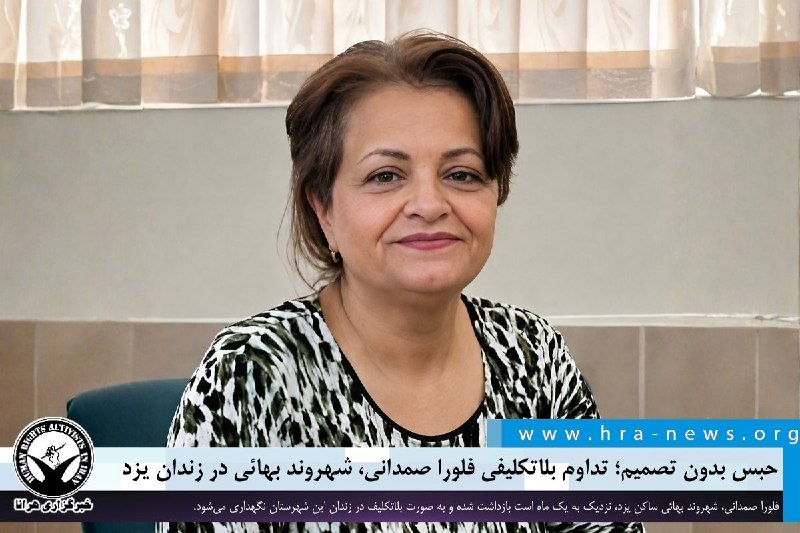

حبس بدون تصمیم؛ تداوم بلاتکلیفی فلورا صمدانی، شهروند بهائی در زندان یزد

❗️
❗️
❗️
❗️
❗️– فلورا صمدانی، شهروند بهائی ساکن یزد، نزدیک به یک ماه است بازداشت شده و به صورت بلاتکلیف در زندان این شهرستان نگهداری می‌شود.

به گزارش هرانا، ارگان خبری مجموعه فعالان حقوق بشر در ایران، فلورا صمدانی، شهروند بهائی در بازداشت به‌سر می‌برد.

بر اساس اطلاعات دریافتی هرانا، خانم صمدانی ۲۸ روز است که بازداشت شده و کماکان به صورت بلاتکلیف در زندان یزد نگهداری می‌شود. در پی مراجعات مکرر خانواده این شهروند بهائی به دادسرا و شعبه بازپرسی مربوطه، به آنان اعلام شده است که پرونده تاکنون به دادسرا ارسال نشده است. همچنین هیچ‌گونه زمان مشخصی برای صدور قرار تامین یا برگزاری جلسه رسیدگی در دادگاه اعلام نشده است.

ادامه مطلب

#فلورا_صمدانی

↘️
@hranews_bot تماس ✉️ - @Hranews کانال هرانا 🆑

## Hranews — post 113236

دیواندره؛ ۸ محکوم قضایی به احکام جایگزین حبس محکوم شدند

❗️
❗️
❗️
❗️
❗️– رئیس اداره منابع طبیعی و آبخیزداری دیواندره از صدور حکم سبز برای هشت محکوم قضایی در این شهرستان خبر داد. این محکومان به عنوان مجازات جایگزین حبس در حفر ۳۸۰ چاله و ایجاد تشتک برای نهال‌ها در یک پارک جنگلی مشارکت داشته‌اند.

ادامه مطلب

#حکم_سبز

↘️
@hranews_bot تماس ✉️ - @Hranews کانال هرانا 🆑

## Hranews — post 113235

اموال ۳۴ نفر در استان خراسان جنوبی توقیف شد

❗️
❗️
❗️
❗️
❗️– رئیس کل دادگستری خراسان جنوبی از توقیف اموال ۳۴ نفر در این استان به دلایلی همچون «حمایت از دشمن» خبر داد.

ادامه مطلب

#توقیف_اموال

↘️
@hranews_bot تماس ✉️ - @Hranews کانال هرانا 🆑

## Hranews — post 113234

  

عضو کمیسیون بهداشت و درمان مجلس، اعلام کرد که تشدید بحران نقدینگی در داروخانه‌های خصوصی کشور، برخی از فعالان این حوزه را ناچار به فروش دارایی‌های شخصی از جمله خانه و طلا برای تامین دارو و جلوگیری از برگشت خوردن چک‌ها کرده است. سیدمحمد جمالیان، این وضعیت را ناشی از «چرخه معیوب بیمه‌ها» دانست. وی با اشاره به تاخیر در پرداخت مطالبات مربوط به طرح «دارویار» و منابع هدفمندی یارانه‌ها، افزود که تداوم این روند می‌تواند به کاهش کیفیت خدمات درمانی و حتی تعطیلی مراکز خصوصی حوزه سلامت منجر شود.
#دارو #داروخانه

↘️
@hranews_bot تماس ✉️ - @Hranews کانال هرانا 🆑

## manototv — post 105878

  <a href="telegram/content/manototv_105878_1780146104.mp4" target="_blank">🎬 Download video</a>

سخنان محمود جعفریان، معاون سازمان رادیو تلویزیون ملی ایران و قائم‌مقام دبیرکل حزب رستاخیز، درباره ایران‌دوستی

## alonews — post 123710

  <a href="telegram/content/alonews_123710_1780146106.webm" target="_blank">🎬 Download video</a>

👈وزارت گردشگری:
تا هفته آینده "کارت‌های سفر" در اختیار مردم قرار میگیره که میتونن باهاش برن سفر عشق و حال و هزینش رو قسطی پرداخت کنن.

✅ @AloNews خبر جنگ

## alonews — post 123709

  <a href="telegram/content/alonews_123709_1780146106.mp4" target="_blank">🎬 Download video</a>

👈هگست : اون محاصره که کاملاً محکم و بدون نفوذ بوده و واقعاً فشار زیادی روی ایران گذاشته
- اون‌ها ممکنه بگن کنترل تنگه رو در دست دارن
- ولی کاری که ما انجام می‌دیم، حتی پشت صحنه، نشون می‌ده که در عمل ما هستیم که کنترل رو در دست داریم
- از جمله از نظر نحوه‌ی مدیریت اوضاع تو اونجا

✅ @AloNews خبر جنگ

## alonews — post 123708

  <a href="telegram/content/alonews_123708_1780146109.webm" target="_blank">🎬 Download video</a>

👈خبرنگار : آیا اون محاصره هنوز هم برقرار هست؟

🔴هگست :
بله، محاصره هنوز کاملاً برقرار هست

✅ @AloNews خبر جنگ

## alonews — post 123707

  <a href="telegram/content/alonews_123707_1780146109.mp4" target="_blank">🎬 Download video</a>

👈هگست : ما فکر می‌کنیم الان تو موقعیت خوبی هستیم که این توافق رو ببندیم، و اگه ایران نخواد، باید با وزارت جنگ روبه‌رو بشه
- ما امروز حتی از روز اول هم قوی‌تر و آماده‌تریم که اگه لازم شد اون مسیر رو بریم
- ولی ترجیح ما این نیست، ایران خیلی واضح می‌دونه ازش چی می‌خوایم، مخصوصاً توی مذاکرات

✅ @AloNews خبر جنگ

## alonews — post 123706

  <a href="telegram/content/alonews_123706_1780146112.webm" target="_blank">🎬 Download video</a>

👈هندا ۱۲۵ شد ۳۵۰میلیون ناقابل

✅ @AloNews خبر جنگ

## alonews — post 123705

  <a href="telegram/content/alonews_123705_1780146112.mp4" target="_blank">🎬 Download video</a>

👈کارشناس صداوسیما : آریایی‌ها قاتل بودن!

اینکه بعضی‌ها میگن ما آریایی هستیم، نژادپرستیه.
تمدن ما 65 هزار ساله‌ست، آريايی‌ها کلا 4-5 هزار سال پیش اومدن.
آریایی‌ها همه رو کُشتن و به قدرت رسیدن، اینکه بگیم ما آریایی هستیم یعنی ما فرزندان کسایی هستیم که نسل کُشی کردن...

✅ @AloNews خبر جنگ

## alonews — post 123704

  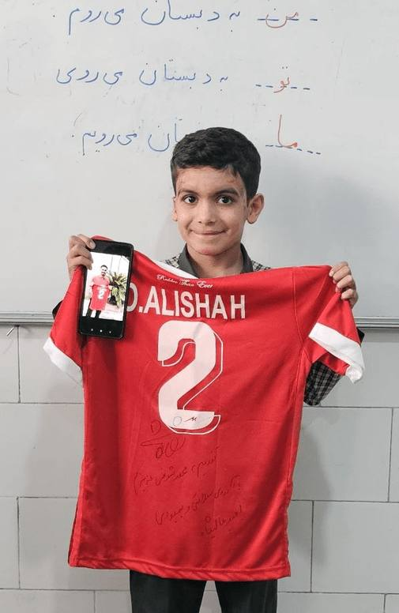

🏅پیراهن اهدایی امید عالیشاه، کاپیتان تیم فوتبال پرسپولیس، به دست محمد شرفی، یکی از بازماندگان حمله به مدرسه شجره طیبه میناب رسید.
@AloSport

## alonews — post 123703

  <a href="telegram/content/alonews_123703_1780146115.webm" target="_blank">🎬 Download video</a>

🔴در 18 دی به یک خودرو که با خانواده بود و میخواسته از تجمعات دور شه شلیک کردن.

🔴درجه دار شلیک میکنه

🔴سربازِ به راننده میگه برگرد برو حواسش نبود!

🤔یعنی چی حواسش نبود؟ اسلحه دست حرام زاده میدین نتیجه میشه جاویدنام کیان پیرفلک که با رگبار بستن خودرو سواری کشته شد.

✅@AloNews

## alonews — post 123702

  <a href="telegram/content/alonews_123702_1780146115.webm" target="_blank">🎬 Download video</a>

👈مارکو روبیو، وزیر امور خارجه، می‌گوید سفیر تام باراک حتی پس از پایان دوره‌اش به عنوان فرستاده ویژه به سوریه، نقش مهمی در سیاست ایالات متحده نسبت به سوریه و عراق ایفا خواهد کرد

✅ @AloNews خبر جنگ

## alonews — post 123701

  <a href="telegram/content/alonews_123701_1780146115.webm" target="_blank">🎬 Download video</a>

👈سارا فلاحی نماینده مجلس گفت: هم روس‌ها و هم چینی‌ها تصور می‌کردند که ایران توان ایستادگی را ندارد، اما توان نظامی بومی و داخلی ایران معادلات را تغییر داد؛ در جلسه‌ای که با حضور آقای عراقچی برگزار شد، پوتین صراحتاً گفته بود نیروهای مسلح شما ما را شگفت زده کردند

✅ @AloNews خبر جنگ

## alonews — post 123700

  <a href="telegram/content/alonews_123700_1780146116.webm" target="_blank">🎬 Download video</a>

👈اولین نقشه از وضعیت جنوب لبنان پس از تحولات نظامی اخیر اسرائیل

🔴زرد: منطقه تحت کنترل ارتش اسرائیل در چارچوب خط زرد

🔴قرمز: منطقه‌ای که ارتش اسرائیل پس از آتش‌بس به تصرف درآورده است

🔴نارنجی: منطقه‌ای که تحت تهدید و حملات ارتش اسرائیل است اما نیروهای زمینی به آن نرسیده‌اند

✅ @AloNews خبر جنگ

## alonews — post 123699

  <a href="telegram/content/alonews_123699_1780146116.webm" target="_blank">🎬 Download video</a>

👈بر اساس گزارش بلومبرگ، به دنبال نشست ۲۹ مه کمیسیون اروپا و بحث در مورد سیاست‌های کلان قاره سبز در قبال پکن، دولت چین هشدار تندی صادر کرده است.

🔴چین اعلام کرده است که در صورت پافشاری و پیشبرد هرگونه اقدام تجاری محدودکننده جدید از سوی اتحادیه اروپا، این اقدامات را «قاطعانه تلافی» خواهد کرد.

✅ @AloNeqs خبر جنگ

## alonews — post 123698

  <a href="telegram/content/alonews_123698_1780146116.webm" target="_blank">🎬 Download video</a>

🔴فوری/سلیمی ، عضو هیئت رئیسه مجلس : تصمیم قطعی مجلس بر قانون کردن اعمال مدیریت بر تنگه هرمز است و این طرح نهایی و تبدیل به قانون خواهد شد.

🔴اینکه ترامپ و دیگران می‌گویند که تنگه هرمز باید باز شود، این موضوع مربوط به ماست و اجازه نمی‌دهیم که آن‌ها تصمیم بگیرند

✅ @AloNews خبر جنگ

## alonews — post 123697

  <a href="telegram/content/alonews_123697_1780146116.webm" target="_blank">🎬 Download video</a>

👈بیت کوین از جمع ۱۰ دارایی برتر جهان حذف شد

✅ @AloNews خبر جنگ

## alonews — post 123696

  <a href="telegram/content/alonews_123696_1780146117.mp4" target="_blank">🎬 Download video</a>

👈هگست : ترامپ روی منافع ملی آمریکا تمرکز کرده

🔴از ونزوئلا و مادورو گرفته تا عملیات‌های دریایی علیه کارتل‌ها و مأموریت‌های نظامی مثل «خشم حماسی»

🔴آما آماده از سرگیری جنگ هستیم تا از منافع کشورمون دفاع کنیم

✅ @AloNews خبر جنگ

## alonews — post 123695

  <a href="telegram/content/alonews_123695_1780146119.webm" target="_blank">🎬 Download video</a>

👈هگست : ما هنوز کارای جهانی‌مون رو داریم؛ مثلاً اینکه ایران نباید به سلاح هسته‌ای برسه، روش هم تمرکز داریم، در کنارش می‌تونیم چندتا کار رو هم‌زمان پیش ببریم

✅ @AloNews خبر جنگ

## alonews — post 123694

  <a href="telegram/content/alonews_123694_1780146120.webm" target="_blank">🎬 Download video</a>

👈فیدان: اولویت مذاکرات بین تهران و واشنگتن حل مساله تنگه هرمز است

✅ @AloNews خبر جنگ

## alonews — post 123693

  <a href="telegram/content/alonews_123693_1780146120.mp4" target="_blank">🎬 Download video</a>

👈پیت هگست، وزیر جنگ آمریکا؛ : آمریکا با نخست‌وزیر پاکستان و فرمانده ارتش‌شون «دوستی واقعی» داره

✅ @AloNews خبر جنگ

## alonews — post 123692

  <a href="telegram/content/alonews_123692_1780146122.webm" target="_blank">🎬 Download video</a>

👈فرانسه: درصدد ساخت یک ناو هواپیمابر هسته‌ای جدید برای تقویت حضور دریایی استراتژیک هستیم

✅ @AloNews خبر جنگ

## alonews — post 123690

  <a href="telegram/content/alonews_123690_1780146122.webm" target="_blank">🎬 Download video</a>

👈انهدام مهمات عمل‌نکرده در حومه بندرعباس از یکشنبه ۱۰ خرداد

✅ @AloNews خبر جنگ

---
📅 بروزرسانی: 1405/03/09 12:39
---

## VahidOOnLine — post 242894

  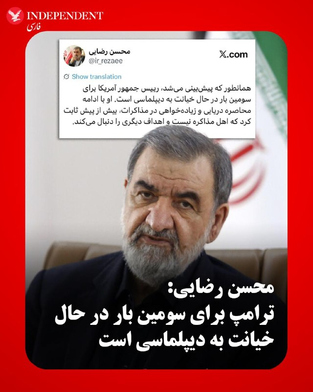

♦️محسن رضایی،‌ مشاور نظامی مجتبی خامنه‌ای، روز شنبه نهم خرداد ماه، دونالد ترامپ را به «خیانت به دیپلماسی برای سومین بار» متهم کرد.
این فرمانده پیشین سپاه در شبکه اجتماعی ایکس نوشت: «همان‌طور که پیش‌بینی می‌شد، رئیس‌جمهور آمریکا برای سومین بار در حال خیانت به دیپلماسی است.»
مشاور مجتبی خامنه‌ای در این پیام ادعا کرد ادامه «محاصره دریایی» و «زیاده‌خواهی در مذاکرات» از سوی واشنگتن بیش از پیش نشان می‌دهد که دولت آمریکا به دنبال مذاکره نیست و اهداف دیگری را دنبال می‌کند.
این اظهارات پس از آن بیان می‌شود که جلسه‌ امنیتی دونالد ترامپ و اعضای ارشد کاخ سفید، درباره مذاکرات پایان جنگ با جمهوری اسلامی در شامگاه جمعه بدون اخذ تصمیم خاصی پایان یافت و گمانه‌زنی‌ها درباره از سرگیری حملات این کشور به ایران را افزایش داده است.
‌🇸🇦 Indypersian

🤖 @VahidOOnLine

## VahidOOnLine — post 242893

  

♦️پروازهای فرودگاه مونیخ پس از مشاهده پهپاد مشکوک تعلیق شد
پلیس آلمان، روز شنبه نهم خرداد ماه اعلام کرد پروازهای فرودگاه مونیخ پس از گزارش مشاهده یک پهپاد مشکوک از سوی دو خلبان، به حالت تعلیق درآمده است.
به گفته سخنگوی پلیس، این مشاهده اندکی پس از ساعت ۹ صبح رخ داد و مقام‌های امنیتی در هماهنگی با مرکز کنترل ترافیک هوایی آلمان تصمیم گرفتند باندهای فرودگاه را موقتا مسدود کنند.
این مقام افزود در حال حاضر مشخص نیست این محدودیت تا چه زمانی ادامه خواهد داشت.
مونیخ یکی از شلوغ‌ترین فرودگاه‌های آلمان به شمار می‌رود و تعطیلی باندها می‌تواند موجب اختلال در برنامه پروازهای داخلی و بین‌المللی شود.
‌🇸🇦 Indypersian

🤖 @VahidOOnLine

## VahidOOnLine — post 242892

  

فرودگاه مونیخ پس از گزارش مشاهده یک پهپاد، هر دو باند خود را بست. سخنگوی پلیس فدرال آلمان گفت یک خلبان فعالیت مشکوک را اعلام کرده است.
به گزارش ر سانه آلمانی فوکوس آنلاین، فرودگاه برای ساعاتی تعطیل است و هلیکوپترها در حال جست‌وجوی پهپاد هستند. وضعیت همچنان نامشخص اعلام شده است.
‌🏁 🇬🇧 IranintlTV

🤖 @VahidOOnLine

## VahidOOnLine — post 242891

🗣روایت شما از زندگی در دوران پس از انقلاب ملی و جنگ- شنبه ۹ خرداد ۱۴۰۵

🔹امروز شنبه ۹ خرداد برازجان ساعت ۹:۱۱ صبح سه بار صدای انفجار آمد و خانه‌ها لرزید.

🔹نفت پالایش بندرعباس دو ماه کار کردیم، ۱۰ ماه می‌گذرد با حقوق ۲۵۰۰ فقط ۳۹ میلیون دادند، بعدش بیرونمان کردند.

🔹از سمنان. اینجا حکومتی‌های بی‌شرف هر روز یک جایی پاتوق می‌کنند، شیرینی و ساندیس و چای می‌خورند، انگار آمدند جشن و دور هر میدانی ده نفر می‌گذارند که بگویند ما همه‌جا هستیم، ولی ما که می‌دانیم تعدادتان به ۴۰۰ نفر هم نمی‌رسد.

🔹اسمش را گذاشتند وصلی اینترنت، فقط با فیلترشکن پولی وصل می‌شود، خیلی‌ها توان خرید ندارند، رحم کنید.

🔹ما خانواده ۱۰ نفره هستیم و فقط بابام کار می‌کند اما هیچ‌وقت نتوانسته برای ما چیزهایی که دوست داریم بخرد و مجبور به دست‌فروشی است، سال‌هاست مجبورم برای خانواده‌ام کار کنم، کار پاره‌وقت، حسرت کار کردن مثل مردم عادی تو دلم مانده.

🔹من یک جوان ۲۰ ساله هستم که با حقوق ۲۰ میلیون تومانی چندین ماه است تلاش دارم موتورسیکلت فرسوده خودم را بفروشم و یک موتورسیکلت بهتر بخرم اما نمی‌توانم، چرا باید یک موتورسیکلت عادی بشود ۵۰۰ میلیون تومان؟

🔹دیگر زندگی جوری شده که یخچال‌ها نه تنها خالی شده، حتی حقوق بازنشستگی‌ام واریز بشود باز هم همان‌جور خالی می‌ماند، هیچ فرقی نمی‌کند، ۸۰ میلیون گرسنه.

🔹الان ماه خرداد است، هنوز اضافه‌حقوق بازنشسته‌های تأمین اجتماعی را ندادند، ۱۳ میلیون فقط می‌گیریم بعد از ۳۰ سال، دروغ گفتند ۶۰ درصد حقوق اضافه شده، تا الان ندادند.

🔹از تهران پیام می‌دهم، اینجا دیگر گوشت و مرغ از سفره‌ها حذف شده و همین مانده که با نان و پنیر خودمان را سیر می‌کنیم.

🔹از بهارستان اصفهان هستم، اوضاع کار و بازار در حدی بد است که تو خرج روزانه مانده‌ام که هیچ، حتی پول بنزین ندارم تا اسنپ کار کنم.

🔹از بلوچستان هستم، اینجا شرایط خیلی سخت است، همه‌چیز گران شده و هر روز اینجا طعم فقر را مزه‌مزه می‌کنیم.

🔹شنبه ۹ خرداد دو تا تخم‌مرغ ۵۰ هزار تومان، نان سنگک دانه‌ای ۵۰ هزار تومان.

🔹از تبریز: فقر و بیکاری و گرانی و تورم و تعطیلی کسب‌وکارها باعث شده پدران شرمنده خانواده‌ها شوند، کمر سرپرستان خانواده‌ها زیر بار گرانی شکسته است.

🔹از تبریز: قیمت میوه نوبرانه فصل چنان نجومی است که پدران در حسرت خرید حتی نیم‌کیلو میوه برای خانواده‌ها مانده‌اند.

🔹آن‌هایی که به سیگار اعتیاد دارند دیگر نمی‌توانند بکشند، وینستون لایت پاکتی ۳۰۰ تومن شده.
‌🏁 🇬🇧 IranintlTV

🤖 @VahidOOnLine

## VahidOOnLine — post 242890

  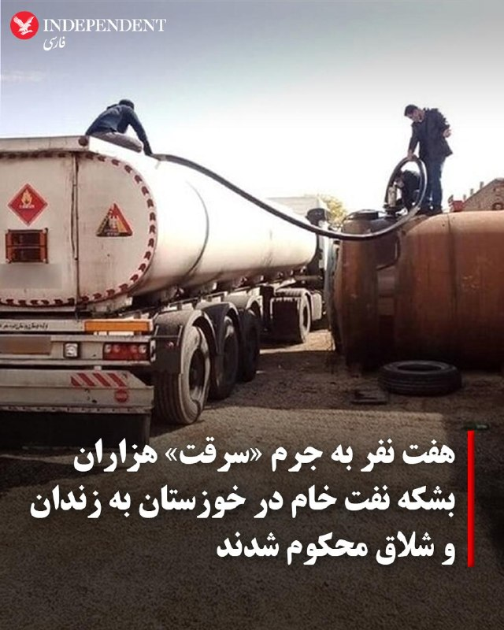

♦️رسانه‌های ایران روز شنبه نهم خرداد به نقل از رئیس دادگستری استان خوزستان از محکومیت هفت نفر به جرم سرقت «هفت هزار و ۸۸۷ بشکه نفت خام» خبر دادند.

به گزارش خبرگزاری قوه قضائیه (میزان) متهمان ردیف اول تا چهارم به ۱۳ سال حبس و شلاق
و متهمان ردیف پنجم تا هفتم به تحمل حبس و مجازت‌های تکمیلی محکوم شدند.
‌🇸🇦 Indypersian

🤖 @VahidOOnLine

## VahidOOnLine — post 242889

  <a href="telegram/content/VahidOOnLine_242889_1780132188.mp4" target="_blank">🎬 Download video</a>

♦️طرفداران دوآتشه تیم‌های آرسنال و پاری‌سن‌ژرمن، پیش از دیدار فینال لیگ قهرمانان اروپا در منطقه ویژه هواداران در بوداپست تجمع کردند.
پایتخت مجارستان، شامگاه شنبه نهم خرداد ماه، میزبان مهم‌ترین رقابت فوتبالی جهان پیش از جام جهانی خواهد بود.
«توپچی‌های لندن» و «آبی‌قرمزهای پاریسی» فصل داخلی درخشانی پشت سر گذاشتند و برای کسب دومین و مهم‌ترین جام فصل، یعنی قهرمانی در لیگ قهرمانان اروپا آماده‌اند.
آرسنال مایکل آرتتا که پس از ۲۰ سال، موفق به کسب جام قهرمانی لیگ برتر انگلستان شده است، به مصاف پاری‌سن ژرمنی می‌رود که با هدایت لوئیس انریکه، سرمربی محبوب اسپانیایی‌اش، از همیشه قوی‌تر است.
‌🇸🇦 Indypersian

🤖 @VahidOOnLine

## VahidOOnLine — post 242888

  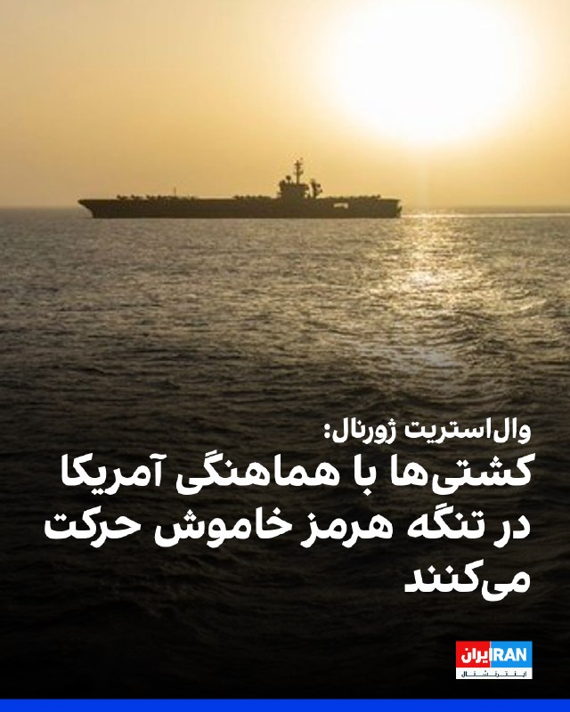

وال‌استریت ژورنال گزارش داد برخی کشتی‌ها برای عبور از تنگه هرمز در هماهنگی با ارتش آمریکا سامانه‌های موقعیت‌یاب خود را خاموش می‌کنند تا از حملات جمهوری اسلامی در امان بمانند.
به نوشته این روزنامه، نرخ بیمه کشتی‌ها در منطقه به ۲.۵ تا ۴ درصد ارزش کشتی رسیده است؛ رقمی که پیش از جنگ حدود ۰.۲۵ درصد بود.
سنتکام اعلام کرد سپاه پاسداران در هفته گذشته اقدام به مین‌گذاری و شلیک پهپاد کرده و آمریکا نیز به این حملات پاسخ داده است.
‌🏁 🇬🇧 IranintlTV

🤖 @VahidOOnLine

## VahidOOnLine — post 242887

  <a href="telegram/content/VahidOOnLine_242887_1780132191.mp4" target="_blank">🎬 Download video</a>

ویدیوهایی که به تازگی و پس از وصل‌شدن نسبی اینترنت به ایران اینترنشنال رسیده نشان می‌دهد یک شهروند در روزهای جنگ جمهوری اسلامی با آمریکا و اسرائیل در محله نارمک تهران شعار «جاوید شاه» را دیوارنویسی کرد.
‌🏁 🇬🇧 IranintlTV

🤖 @VahidOOnLine

## VahidOOnLine — post 242886

  

♦️رسانه بلومبرگ، روز شنبه نهم خرداد ماه، به نقل از یک منبع آگاه گزارش داد در جریان حمله موشکی جمهوری اسلامی ایران به یک پایگاه هوایی در کویت، چند «شهروند آمریکایی» دچار جراحات جزئی شده و دو فروند پهپاد تهاجمی «ام‌کیو-۹ ریپر» نیز به شدت آسیب دیده‌اند.
بر اساس این گزارش، سامانه‌های پدافند هوایی کویت موفق شدند یک فروند موشک بالستیک «فاتح-۱۱۰» را رهگیری کنند، اما بقایای موشک پس از رهگیری به پایگاه هوایی «علی السالم» اصابت کرد.
وزارت امور خارجه کویت، پنجشنبه گذشته و ساعاتی پس از تبادل آتش سنگین میان نیروهای مسلح ایران و نظامیان ارتش آمریکا در منطقه خلیج فارس، از حملات موشکی و پهپادی جمهوری اسلامی به خاک این کشور خبر داده بود.
سپاه پاسداران جمهوری اسلامی ایران نیز بامداد پنجشنبه در بیانیه‌ای اعلام کرد بود، در پاسخ به حمله موشکی آمریکا به نزدیکی فرودگاه بندرعباس، «مبداء این حمله» را هدف قرار داده است. سپاه در این بیانیه از کویت نامی نبرد.
مقام‌های کویت و آمریکا تاکنون به طور رسمی جزئیاتی درباره شمار مجروحان یا میزان خسارت‌های وارد شده منتشر نکرده‌اند.
‌🇸🇦 Indypersian

🤖 @VahidOOnLine

## VahidOOnLine — post 242885

  <a href="telegram/content/VahidOOnLine_242885_1780132194.mp4" target="_blank">🎬 Download video</a>

ویدیوی رسیده به ایران اینترنشنال نشان می‌دهد خودروهای حامیان حکومت در مسیر چالوس به رامسر در استان مازندران با حمل پرچم‌های حزب‌الله و جمهوری اسلامی برای تردد مردم در یکی از خطوط جاده آزار ترافیکی ایجاد کردند.
‌🏁 🇬🇧 IranintlTV

🤖 @VahidOOnLine

## VahidOOnLine — post 242884

  <a href="telegram/content/VahidOOnLine_242884_1780132196.mp4" target="_blank">🎬 Download video</a>

♦️مارک کارنی، نخست وزیر کانادا، روز شنبه نهم خرداد در اتاوا با وانگ یی، وزیر امور خارجه چین دیدار کرد.

این دیدار نخستین گام در تنش‌زدایی در روابط کانادا با چین، پس از یک دهه مناسبات سرد دیپلماتیک و در اوج تشدید رقابت‌ها میان پکن و واشنگتن به شمار می‌رود.
کانادا از زمان به‌قدرت رسیدن مارک کارنی در انتخابات سال گذشته و در واکنش به درخواست‌های ترامپ برای الحاق این کشور به آمریکا و افزایش تعرفه‌ها، سیاستی دوری از همسایه قدرتمند خود را در پیش گرفته است.
‌🇸🇦 Indypersian

🤖 @VahidOOnLine

## VahidOOnLine — post 242883

  

بر اساس گزارش بلومبرگ، حمله موشک بالستیک جمهوری اسلامی به یک پایگاه هوایی در کویت طی ۲۴ ساعت گذشته، باعث جراحات سطحی چند آمریکایی شد و به دو پهپاد تهاجمی «ام‌کیو-۹ ریپر» آسیب جدی وارد کرد؛ این در حالی است که دونالد ترامپ، رییس‌جمهور آمریکا، در حال بررسی توافقی برای تمدید یک آتش‌بس شکننده است.

به گفته یک منبع آگاه از جزئیات آسیب‌های این حمله، حدود ۵ نفر، شامل پیمانکاران و پرسنل نظامی در حال خدمت، دچار جراحات شدند. یکی از پهپادهای ریپر منهدم شده و دست‌کم یک پهپاد دیگر آسیب جدی دیده است. ارزش هر یک از این پهپادها حدود ۳۰ میلیون دلار برآورد می‌شود.

ستاد فرماندهی مرکزی ایالات متحده (سنتکام) تاکنون به درخواست‌ها برای اظهارنظر در این باره پاسخی نداده است.
‌🏁 🇬🇧 IranintlTV

🤖 @VahidOOnLine

## VahidOOnLine — post 242882

  

♦️حمید رسایی، نماینده مجلس شورای اسلامی و عضو جبهه پایداری، روز شنبه نهم خرداد به محمدباقر قالیباف، رئیس مجلس و مذاکره‌کننده ارشد جمهوری اسلامی هشدار داد اشتباه محمد جواد ظریف و حسن روحانی در مذاکره با آمریکا را تکرار نکند.

رسایی در واکنش به پیام روز گذشته قالیباف درباره «بی‌اعتمادی به آمریکا» و «گرفتن امتیاز با موشک‌ها و نه با مذاکره» نوشت: «موضع امروز شما درباره اینکه هیچ اعتمادی به تضمین‌ها و حرف‌های طرف آمریکایی نیست و امتیازات را نه با گفتگو که با موشک می‌گیرید، قابل تقدیر است اما مشکلش اینجاست که همچنان بر پایه انجام مذاکره و توافق با آمریکا سوار است و تاکید دارد.»

این عضو جبهه پایداری در همین پیام ادامه به پیشروی ارتش اسرائیل در جنوب لبنان و آزاد نشدن دارایی‌های بلوکه شده ایران را نقض پیش‌شرط‌های جمهوری اسلامی در مذاکرات با واشنگتن توصیف کرد و نوشت: «موضع یک ماه و نیم قبل خودتان را هم به یاد دارید؟ قبل از شروع مذاکرات پاکستان، وقتی هرگونه مذاکره با آمریکایی‌ها را مشروط به تحقق دو مسأله دانستید: آتش‌بس در لبنان و بازگشت دارایی‌های بلوکه شده. پولی که برنگشت، وضعیت لبنان را هم حتما شنیده‌اید.»

رسایی با یادآوری سرنوشت «برجام» و ابراز ناامیدی از دستیابی به توافق با آمریکا به مذاکره‌کننده ارشد جمهوری اسلامی هشدار داد: «آقای قالیباف، روی دیوار مذاکره با آمریکا، یادگیری نوشتن غلط است. امید بستن به آن هم غلط است. ظریف و روحانی که تازه خدای باج‌دادن و وادادگی در مذاکره بودند هم یک پر کاه از طریق مذاکرات نگرفتند. اشتباه را تکرار نکنید.»
‌🇸🇦 Indypersian

🤖 @VahidOOnLine

## VahidOOnLine — post 242881

  

سنتکام، ستاد فرماندهی مرکزی آمریکا، شنبه نهم خرداد تصویری از گشت‌زنی یک فروند جنگنده اف-۱۶ نیروی هوایی ایالات متحده بر فراز خاورمیانه در شبکه ایکس منتشر کرد.
سنتکام در توضیح این تصویر نوشت: «نیروهای آمریکایی در سراسر منطقه حضور دارند و هوشیار هستند.»
‌🏁 🇬🇧 IranintlTV

🤖 @VahidOOnLine

## VahidOOnLine — post 242880

  

♦️قیمت نفت دربازارهای جهانی صبح شنبه نهم خردادماه با وجود روشن نبودن وضعیت توافق احتمالی میان جمهوری اسلامی ایران و ایالات متحده آمریکا، برای دومین روز پیاپی کاهش یافت.

بهای هر بشکه نفت خام برنت دریای شمال، قیمت معیار نفت، برای تحویل در ماه اوت، پس از بسته شدن بازارهای آمریکایی در آخرین روز کاری هفته، با ۱.۷ درصد کاهش نسبت به روز قبل به ۹۱.۱۲ دلار کاهش یافت.

روند کاهش قیمت نفت خام پس از پیام دونالد ترامپ درباره بازگشایی قریب‌الوقوع تنگه هرمز و خروج کشتی‌های گرفتار در خلیج فارس از سه ماه پیش، شدت گرفت. با وجود آنکه رئیس جمهوری آمریکا هنوز تصمیم قطعی خود درباره توافق پایان جنگ را اعلام نکرده است، بازارهای جهانی با خوشبینی منتظر بازگشایی تنگه هرمز هستند.
‌🇸🇦 Indypersian

🤖 @VahidOOnLine

## VahidOOnLine — post 242879

  <a href="telegram/content/VahidOOnLine_242879_1780132201.mp4" target="_blank">🎬 Download video</a>

♦️در آستانه جام جهانی ۲۰۲۶، تدابیر امنیتی در اطراف محل استقرار تیم ملی فوتبال ایران در شهر تیخوانای مکزیک افزایش یافته است.
به گزارش خبرگزاری فرانسه، کارلوس والدورده، مدیر اجرایی گروه کالینته، مالک باشگاه تیخوانا (شولوس)، اعلام کرد پس از آنکه فیفا با انتقال محل اردو و استقرار تیم ایران از توسانِ آریزونا به مکزیک موافقت کرد، مقامات تصمیم به تقویت تدابیر امنیتی گرفتند.
کلودیا شینباوم، رئیس جمهوری مکزیک دوشنبه گذشته از موافقت کشورش با درخواست آمریکا، برای اقامت کاروان تیم‌ملی فوتبال مردان ایران در مکزیک خبر داده بود.

پیشتر دکتر جمشید ایرانی، وکیل دیوان عالی آمریکا، از صدور «مجوز موقت و مشروط برای ورود» (Parole) به بازیکنان تیم ملی فوتبال ایران خبر داد.
 این وکیل در پیامی که در صفحه فیسبوک خود به اشتراک گذاشت، با اشاره به تحقیق و پی بردن به تصمیم واشنگتن در قبال کاروان ورزشی ایران توضیح داد که وزارت امور خارجه آمریکا برای اعضای تیم ملی «ویزای معمولی» صادر نخواهد کرد، بلکه ورود آن‌ها به خاک این کشور در قالب این طرح مشروط خواهد بود که امتیازات ویزای عادی را ندارد.
این تحولات درحالی رخ می‌دهد که تا روز جمعه هشتم خرداد ماه، وضعیت ویزای اعضای تیم ملی فوتبال مردان جمهوری اسلامی ایران، در کمتر از دو هفته به آغاز جام جهانی، با ابهاماتی روبه‌رو بود.
‌🇸🇦 Indypersian

🤖 @VahidOOnLine

## VahidOOnLine — post 242878

  

حمید رسایی، عضو مجلس جمهوری اسلامی، در کانال تلگرامی خود خطاب به قالیباف نوشت: «روی دیوار مذاکره با آمریکا، یادگاری نوشتن غلط است. امید بستن به آن هم غلط است. ظریف و روحانی که تازه خدای باج‌دادن و وادادگی در مذاکره بودند هم یک پر کاه از طریق مذاکرات نگرفتند. اشتباه را تکرار نکنید.»
او افزود: «موضع یک ماه و نیم قبل خودتان را هم به یاد دارید؟ قبل از شروع مذاکرات پاکستان، وقتی هرگونه مذاکره با آمریکایی‌ها را مشروط به تحقق دو مسئله دانستید، یعنی آتش‌بس در لبنان و بازگشت دارایی‌های بلوکه شده. پولی که برنگشت، وضعیت لبنان را هم حتما شنیده‌اید. قلعه شقیف و روستای ارنون لبنان سقوط کرد. استان نبطیه و منطقه اقلیم التفاح هم در معرض خطر سقوط هستند.»

‌🏁 🇬🇧 IranintlTV

🤖 @VahidOOnLine

## VahidOOnLine — post 242875

  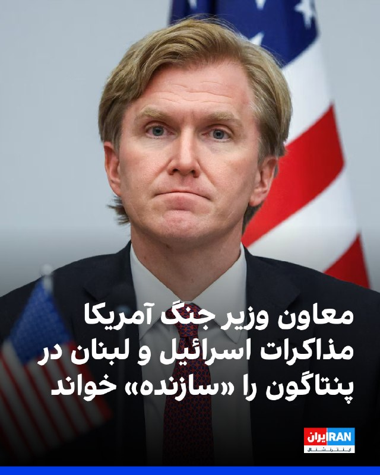

البریج کولبی، معاون وزیر جنگ آمریکا، با اشاره به نشست جمعه هیات‌های نظامی اسرائیل و لبنان در پنتاگون برای تعیین مسیر امنیتی حمایت از مذاکرات صلح جاری بین این دو کشور، این نشست را سازنده خواند.
او گفت: «ما مذاکرات نظامی سازنده‌ای داشتیم که مسیر سیاسی به رهبری وزارت خارجه [آمریکا] را در هفته آینده شکل خواهد داد.»
کولبی افزود وزارت جنگ آمریکا «از حاکمیت و تمامیت ارضی لبنان، بدون بازیگران مسلح غیردولتی» و همچنین «تلاش‌های تاریخی برای تحقق چشم‌انداز ترامپ برای صلح» استقبال می‌کند.

‌🏁 🇬🇧 IranintlTV

🤖 @VahidOOnLine

## VahidOOnLine — post 242874

آسوشیتدپرس گزارش داد که توافق در حال شکل‌گیری میان آمریکا و جمهوری اسلامی برای پایان دادن به جنگ، با انتقاد شدید بخشی از جمهوری‌خواهان مواجه شده است؛ منتقدانی که هشدار می‌دهند این توافق ممکن است بدون از بین بردن توان هسته‌ای ایران، دستاوردهای نظامی ماه‌های گذشته را از بین ببرد.
به گزارش آسوشیتدپرس، در حالی که دولت ترامپ از نزدیک شدن به چارچوب یک توافق با حکومت ایران خبر می‌دهد، شماری از چهره‌های حزب جمهوری‌خواه این توافق را مورد انتقاد قرار داده و آن را عقب‌نشینی از اهداف اعلام‌شده آمریکا در جنگ با جمهوری اسلامی توصیف کرده‌اند.
بر اساس گزارش ای‌پی، توافقی که هنوز نهایی نشده است، شامل تمدید آتش‌بس، بازگشایی تنگه هرمز و آغاز مذاکرات جدید درباره برنامه هسته‌ای ایران است. در مقابل، حکومت ایران باید مسیر عبور کشتی‌ها از تنگه هرمز را باز نگه دارد و درباره سرنوشت ذخایر اورانیوم غنی‌شده خود وارد مذاکرات تکمیلی شود.
با این حال، منتقدان جمهوری‌خواه ترامپ می‌گویند این چارچوب ممکن است به حکومت ایران فرصت دهد بدون برچیدن کامل برنامه هسته‌ای خود، از کاهش فشارهای اقتصادی و سیاسی بهره‌مند شود.
ادامه مطلب را اینجا بخوانید:
h
‌🏁 🇬🇧 IranintlTV

🤖 @VahidOOnLine

## VahidOOnLine — post 242873

  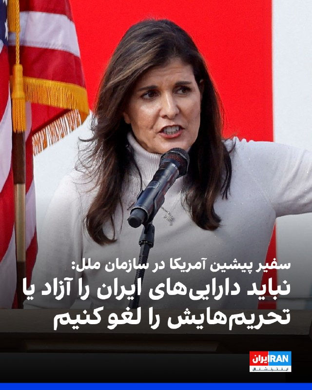

نیکی هیلی، سفیر پیشین آمریکا در سازمان ملل، با هشدار درباره سیاست وقت‌کشی جمهوری اسلامی در مذاکرات، در ایکس نوشت: « تا زمانی که به مواد هسته‌ای آنها دسترسی کامل و کنترل داشته باشیم، ما نباید دارایی‌ها را آزاد کنیم یا تحریم‌ها را لغو کنیم.»
او گفت: «حکومت ایران هرگز بر اساس حسن نیت عمل نکرده است. همیشه همان بازی را ادامه می‌دهد: وقت‌کشی، خریدن زمان، تغییر موضع.»

‌🏁 🇬🇧 IranintlTV

🤖 @VahidOOnLine

## WithYashar — post 12929

صداوسیما : طبق نظرسنجی که از مردم انجام دادیم، اکثریت مردم از وصل شدن اینترنت ناراضی و ناراحتن. باید فورا مجددا قطع بشه
@withyashar

## WithYashar — post 12928

تسنیم : با وجود اینکه ترامپ در شبکه Truth Social اعلام کرد که محاصره دریایی ایران «اکنون برداشته خواهد شد»، ملوانان ایرانی گزارش می‌دهند که این محاصره همچنان به طور کامل برقرار است.

کشتی‌هایی که پس از اعلام ترامپ تلاش کردند از خط محاصره عبور کنند، توسط ناوهای نیروی دریایی آمریکا هشدار داده شدند که فوراً بازگردند وگرنه با آتش مواجه خواهند شد.
@withyashar

## WithYashar — post 12927

ان‌بی‌سی: جنگنده اف-۱۵ای آمریکا،ماه گذشته احتمالا با یک موشک دوش‌پرتاب چینی در ایران سرنگون شد! @withyashar

## WithYashar — post 12926

ان‌بی‌سی: جنگنده اف-۱۵ای آمریکا،ماه گذشته احتمالا با یک موشک دوش‌پرتاب چینی در ایران سرنگون شد!

@withyashar

## WithYashar — post 12925

نتانیاهو خطاب به لبنان : درخواست اتش بس دولت شمارو رد میکنیم
باید بگم که اسرائیل تا نابودی کامل حزب الله ادامه خواهد داد
@withyashar

## WithYashar — post 12924

کاخ سفید به الجزیره گفت:

ترامپ تا زمانی که خواسته‌های آمریکا برآورده نشود، توافقی نخواهد کرد و ایران هرگز به سلاح هسته‌ای دست نخواهد یافت
@withyashar

## WithYashar — post 12923

  

پزشک ترامپ: «دست دادن مکرر»، علت کبودی دست‌های رئیس‌جمهور آمریکا است

این یک اثر شایع و خوش‌خیم است
@withyashar

## mwarmonitor — post 9910

📌امارات متحده عربی در طول جنگ، در هماهنگی با آمریکا و اسرائیل، ده‌ها حمله هوایی علیه ایران انجام داد - وال استریت ژورنال @mwarmonitor

## mwarmonitor — post 9909

🔴زخمی شدن آمریکایی‌ها در حمله موشکی ایران به پایگاه هوایی کویت

📝نویسنده: گری دویل ، بلومبرگ

🔰یک حمله موشکی بالستیک از سوی ایران به یک پایگاه هوایی در کویت طی ۲۴ ساعت گذشته، منجر به جراحت‌های سطحی چند آمریکایی و آسیب جدی به دو پهپاد تهاجمی «ام‌کیو-۹ ریپر» (MQ-9 Reaper) شده است؛ این در حالی است که دونالد ترامپ، رئیس‌جمهور آمریکا، در حال بررسی توافقی برای تمدید یک آتش‌بس متزلزل است.
به گفته یک منبع آگاه که از جزئیات این حمله اطلاع مستقیم دارد و به دلیل عمومی نشدن اطلاعات خواستار عدم افشای نامش شده است، پدافند هوایی کویت موشک «فاتح-۱۱۰» را رهگیری کرده، اما سقوط قطعات و بقایای آن به پایگاه هوایی «علی السالم» اصابت کرده است.

@mwarmonitor

## mwarmonitor — post 9908

  

✈️یک فروند هواپیمای هشدار زودهنگام (آواکس) Boeing E-3C Sentry متعلق به نیروی هوایی آمریکا، در حال گشت‌زنی و پرواز دایره‌ای در حریم هوایی شرق عربستان سعودی (نزدیکی مرز قطر و امارات) در ارتفاع ۹,۴۴۹ متری رصد شد.

@mwarmonitor

## FoxNewsTwitter — post 342418

  <a href="telegram/content/FoxNewsTwitter_342418_1780132207.mp4" target="_blank">🎬 Download video</a>

Fox News (Twitter/X)

KAYLEE MCGHEE WHITE: “The Biden years weren't an aberration, they weren't an accident. They were the blueprint. They were exactly what Democrats plan to do every single time they regain power.” https://twitter.com/IngrahamAngle/status/2060512372586909976#m

## pm_afshaa — post 91891

🔴یک مقام ارشد آمریکایی به الجریزه : ترامپ هیچ توافقی با ایران رو امضا نمی‌کنه مگر اینکه به نفع آمریکا باشه و خط قرمزهاش رعایت بشه

💧 Rainbet.com the #1 Non-KYC Crypto Casino & Sportsbook @rainbetcom

😁 @Pm_Afshaa

## pm_afshaa — post 91890

https://t.me/proxy?server=87.248.129.51&port=15&secret=ee1603010200010001fc030386e24c3add63646e2e79656b74616e65742e636f6d

پروکسی مخصوص دانلود

💧 Rainbet.com the #1 Non-KYC Crypto Casino & Sportsbook @rainbetcom

😁 @Pm_Afshaa

## pm_afshaa — post 91889

  

📣قیمت ها شکسته شد

با ما همیشه وصل بمونید
😄

🛒دیگه گرون نخر فقط گیگی 25 هزار تومان
❤️‍🔥

جهت خرید به آیدی پایین پیام بدید
👇

🔤 @Gliitch_Admin

🔤 @Gliitch_Admin

🔤 @Gliitch_Admin

## pm_afshaa — post 91887

https://t.me/proxy?server=87.248.129.50&port=15&secret=ee1603010200010001fc030386e24c3add626973636f7474692e79656b74616e65742e636f6d

پروکسی مخصوص دانلود

💧 Rainbet.com the #1 Non-KYC Crypto Casino & Sportsbook @rainbetcom

😁 @Pm_Afshaa

## pm_afshaa — post 91885

  <a href="telegram/content/pm_afshaa_91885_1780132209.mp4" target="_blank">🎬 Download video</a>

ویدیویی از شب اول به درک واصل شدن خامنه ای و خوشحالی مردم

💧 Rainbet.com the #1 Non-KYC Crypto Casino & Sportsbook @rainbetcom

😁 @Pm_Afshaa

## pm_afshaa — post 91883

🔴ایالات متحده تحریم‌های جدیدی را علیه شماری از شهروندان و نهادهای مرتبط با جمهوری اسلامی اعمال کرد و همزمان از متلاشی شدن یک شبکه انتقال فناوری‌های حساس به ایران خبر داد

💧 Rainbet.com the #1 Non-KYC Crypto Casino & Sportsbook @rainbetcom

😁 @Pm_Afshaa

## pm_afshaa — post 91882

🔴اسرائیل هیوم: مقام‌های موساد معتقدند عملیات‌های اخیر علیه ایران فقط یک مرحله در مسیر سقوط جمهوری اسلامی بوده است. رئیس پیشین شاخه نفوذ گفت این واحد اکنون با شدت بیشتری فعالیت می‌کند و هدف آن سریع‌تر کردن ساعت شنی پایان حکومت است

💧 Rainbet.com the #1 Non-KYC Crypto Casino & Sportsbook @rainbetcom

😁 @Pm_Afshaa

## pm_afshaa — post 91881

🔴سنت‌کام:تمام شناورهای نظامی ایرانی که در فعالیت‌های نظامی شرکت دارند هدف قرار خواهند گرفت

💧 Rainbet.com the #1 Non-KYC Crypto Casino & Sportsbook @rainbetcom

😁 @Pm_Afshaa

## pm_afshaa — post 91880

🔴سی‌ان‌ان: اسرائیلی‌ها می‌گویند ترامپ در جنگ با ایران، ما را زیر اتوبوس انداخته

+نتانیاهو، کوشنر و ویتکاف را به خاطر هدایت رئیس‌جمهور آمریکا به سمت پایان دادن به درگیری‌ها، سرزنش می‌کند

💧 Rainbet.com the #1 Non-KYC Crypto Casino & Sportsbook @rainbetcom

😁 @Pm_Afshaa

## pm_afshaa — post 91879

🔴نتانیاهو خطاب به لبنان : درخواست اتش بس دولت شمارو رد میکنیم
باید بگم که اسرائیل تا نابودی کامل حزب الله ادامه خواهد داد

💧 Rainbet.com the #1 Non-KYC Crypto Casino & Sportsbook @rainbetcom

😁 @Pm_Afshaa

## pm_afshaa — post 91878

🔴پیت هگست وزیر جنگ آمریکا:ایران بهتره زودتر انتخاب کنه یا مذاکره هسته ای یا جنگ با آمریکا , ایندفه نه بلکه از روی آسمان و دریا از روی زمین هم باید با ما روبرو بشن

💧 Rainbet.com the #1 Non-KYC Crypto Casino & Sportsbook @rainbetcom

😁 @Pm_Afshaa

## DEJradio — post 5127

  <a href="telegram/content/DEJradio_5127_1780132210.webm" target="_blank">🎬 Download video</a>

🚨📢 بر اساس گزارش بلومبرگ در حمله موشکی [پهپادی] جمهوری اسلامی به یک پایگاه هوایی در کویت که جمعه هشتم خرداد صورت گرفت، چند آمریکایی مجروح شدند و به دو پهپاد تهاجمی «ام‌کیو-۹ ریپر» آسیب جدی وارد شد؛ این در حالی است که دونالد ترامپ، رییس‌جمهور آمریکا، در حال بررسی توافقی برای تمدید یک آتش‌بس شکننده است.

به گفته یک منبع آگاه از جزئیات آسیب‌های این حمله، حدود ۵ نفر، شامل پیمانکاران و پرسنل نظامی در حال خدمت، دچار جراحات شدند. یکی از پهپادهای ریپر منهدم شده و دست‌کم یک پهپاد دیگر آسیب جدی دیده است. ارزش هر یک از این پهپادها حدود ۳۰ میلیون دلار برآورد می‌شود.

#کویت #حمله_موشکی
@DEJradio

## DEJradio — post 5126

  <a href="telegram/content/DEJradio_5126_1780132210.webm" target="_blank">🎬 Download video</a>

🔺📢 بر اساس گزارش‌های دریافتی دست‌کم ۳۲۰ نفر از کارکنان شرکت پلیمر آریاساسول بعد از جنگ ۴۰ روزه بیکار شدند.

یکی از کارکنان به دژ می‌گوید: "پتروشیمی آریاساسول در بخش طرح توسعه نیروهای پیمانکاریش رو تعدیل کرده. از ۹ اسفند که جنگ شد و به اداره کار برای بیمه بیکاری ارجاع داده و بیمه بیکاری که اصلا جوابگو نیست متاسفانه و نیروهای پیمانکاری هم هر چند پیگیری میکنن که برگردن سرکار ولی گویا اریاساسول فعلا قصد نداره قرارداد ببنده. حدود ۳۲۰ نفر از کار بیکار شدند."

#جنگ۴۰روزه
@DEJradio

## DEJradio — post 5125

  <a href="telegram/content/DEJradio_5125_1780132211.mp4" target="_blank">🎬 Download video</a>

🔺🎥 یکی از شهروندان با ارسال ویدیویی نوشت: اینجا سپاه استان یا همون سپاه "صاحب‌الزمان است. از روزی که اینجا بمباران شده الان مدت یک ماهه هرشب تا صبح معلوم نیست چی اتیش می‌زنن که بوی بدی داره و واقعا مارو اذیت می‌کنه. جوابگو هم نیستن من اوایل فکر می‌کردم چوبه ولی تمومی نداره.

#اصفهان
@DEJradio

## DEJradio — post 5121

💀
🚨 در جریان جنگ ۴۰ روزه، نیروی دریایی ارتش متحمل خسارات و تلفات سنگینی شد که بخش قابل توجهی از آن تاکنون سانسور یا رسانه‌ای نشده است.

درباره تلفات ناوشکن «دنا» که در آب‌های اقیانوس هند هدف قرار گرفت، اطلاعات بیشتری در دسترس است. بر اساس این اطلاعات، ۱۰۴ نفر از پرسنل این شناور جان خود را از دست دادند که از این میان، پیکر ۲۰ نفر هنوز پیدا نشده و در شمار مفقودین قرار دارند.
فرماندهان درباره تلفات ناوشکن «جماران» سکوت اختیار کرده‌اند. این ناو در نهم اسفند ۱۴۰۴ هنگام استقرار در اسکله پایگاه کنارک هدف قرار گرفت.

منابع آگاه می‌گویند: «در نخستین اصابت، خدمه ناو در داخل شناور گرفتار شدند و ۵۳ نفر از پرسنل، از جمله امیربهادر مایوان، فرمانده ناوشکن، کشته شدند.» به گفته این منابع، ناو جماران در آن زمان آماده جدایی از اسکله و عزیمت به دریا بود.

پس از آن، ناو «نقدی» نیز هدف قرار گرفت. اما به دلیل اصابت اولیه به جماران و فاصله زمانی کوتاه میان حملات به دو ناو، خدمه فرصت انتقال شناورها به دریا را پیدا نکردند. در نتیجه، با ادامه حملات، پایگاه به تدریج تخلیه شد و نیروها برای در امان ماندن به مناطق بیابانی اطراف پناه بردند.

#جنگ۴۰روزه #حملات_هدفمند
@DEJradio

## DEJradio — post 5120

  <a href="telegram/content/DEJradio_5120_1780132212.webm" target="_blank">🎬 Download video</a>

🚨
⭕️ به گزارش رویترز، اسکات بسنت وزیر خزانه‌داری آمریکا اعلام کرد این کشور یک میلیارد دلار از دارایی‌های رمزارزی مرتبط با جمهوری اسلامی را توقیف کرده است.

#رمزارز #جمهوری_اسلامی
@DEJradio

## DEJradio — post 5114

  <a href="telegram/content/DEJradio_5114_1780132212.webm" target="_blank">🎬 Download video</a>

🔺📷 یلدا پایلوت؛ خلبان خونشو

در میان بسیاری از آنها که در تجمعات شبانه سلاح به‌دست می‌گیرند و کنار سرکوبگران می‌ایستند برخی سرسپرده‌ترند؛ آنهایی که ظاهرشان امروزی اما در باطن، خود پلیدی هستند.

یکی از آنها "یلدا" خلبان خونشوست که در کنار محمدرضا طاهری مداح حکومتی‌‌ عکس دارد و در تجمعات شبانه با سلاح مردم را تهدید می‌کند اما ظاهری امروزی دارد.

#پرستو #حکومتی
@DEJradio

## DEJradio — post 5113

  <a href="telegram/content/DEJradio_5113_1780132213.webm" target="_blank">🎬 Download video</a>

🔺📢 خبرگزاری تسنیم، وابسته به سـ.ـپاه پاسداران گزارش داد که شامگاه آدینه هشتم خرداد، در پی رصد ریزپرنده متخاصم «دشمن آمریکایی-اسرائیلی» در حوالی قشم از سوی پدافند هوایی ارتش، مورد اصابت قرار گرفت و منهدم شد.
در شبکه‌های اجتماعی تصاویری از شلیک ممتد پدافند در محدوده قشم منتشر شد.

#قشم #پدافند
@DEJradio

## mamlekate — post 103604

📝 قطر اعلام کرده پول نقد نمیده به نظام، خط اعتباری باز میکنه براشون هر چی میخوان بخرن :))

- عراقی و لبنانی دلار میخواد، ارزشی نیست که با مرغ کپنی بشه نگهش داشت.

- قبلا کشورهای حاشیه خلیج‌فارس می‌گفتند، نظام موشکش را میسازد فرو میکند در کون آمریکا، مشکل ما نیست، مدارا میکنیم، نظام در وقایع اخیر ثابت کرد چون تفنگدار مست عمل میکند. کسی تفنگ چنین موجودی را پر نمیکند
خصوصا قطر و امارات که با نظام خیلی راه‌آمدند.

tired_phantom
@mamlekate

## mamlekate — post 103603

  <a href="telegram/content/mamlekate_103603_1780132214.mp4" target="_blank">🎬 Download video</a>

📝 کاخ سفید: ترامپ تنها توافقی را خواهد پذیرفت که خواسته‌های اصلی او را برآورده کند

کاخ سفید در پی جلسه دونالد ترامپ با مشاورانش برای تمدید آتش‌بس با ایران و اتخاذ تصمیم نهایی می‌گوید که او تنها توافقی را خواهد پذیرفت که خواسته‌های اصلی‌اش را برآورده کند. پیشتر آقای ترامپ گفت که توافق با ایران باید شامل تعهد به عدم دستیابی به سلاح هسته‌ای، باز کردن تنگه هرمز بدون دریافت عوارض، مین‌روبی کامل این آبراه و خارج‌سازی ذخایر اورانیوم ‌غنی‌شده با همکاری آمریکا و تحت نظارت آژانس و نابودی این مواد است. او تاکید کرد که «تا اطلاع ثانوی هیچ پولی رد و بدل نخواهد شد.» سخنگوی وزارت خارجه ایران هم اعلام کرد که هنوز هیچ توافقی با آمریکا نهایی نشده است.

📝 اسکات بسنت: املاک مقامات رژیم در اروپا توقیف می‌شود

اسکات بسنت، وزیر خزانه‌داری آمریکا روز جمعه ۸ خرداد گفت ایالات متحده با همکاری شرکای اروپایی در حال پیدا کردن و توقیف «ویلاها، خانه‌ها و املاک» مقامات جمهوری اسلامی در اروپا است. آقای بسنت این سخنان را در «مجمع ملی اقتصادی ریگان ۲۰۲۶» بیان کرد.

📝 پاداش تا سقف ۱۵ میلیون دلار برای اطلاعات دربارهٔ شبکه‌های مالی سپاه

برنامه «پاداش برای عدالت» وزارت امور خارجه آمریکا روز جمعه ۸ خرداد اعلام کرد «هر فردی که درباره شبکه‌های مالی سپاه پاسداران انقلاب اسلامی اطلاعاتی ارائه کند، می‌تواند تا سقف ۱۵ میلیون دلار پاداش دریافت کند.»

@mamlekate

## VahidOnline — post 75800

  

ان‌بی‌سی به نقل از سه منبع آگاه گزارش داد جنگنده اف-۱۵ای آمریکا که ماه گذشته در ایران سرنگون شد، احتمالا با یک موشک دوش‌پرتاب ساخت چین هدف قرار گرفته است.

به گفته یکی از این منابع و یک مقام آمریکایی آگاه، چین همچنین ممکن است در روزهای نخست درگیری، یک رادار هشداردهنده دوربرد را در اختیار ایران قرار داده باشد که این رادار توانایی شناسایی هواپیماهای رادارگریز را دارد.

ان‌بی‌سی نوشت مقام‌های آمریکایی همچنان در حال بررسی سرنگونی جنگنده اف-۱۵ای هستند و هنوز روشن نیست تجهیزات نظامی احتمالی چه زمانی به تهران تحویل داده شده است.

کاخ سفید به ان‌بی‌سی گفت شی جین‌پینگ به ترامپ اطمینان داده پکن تجهیزات نظامی به ایران نمی‌دهد. سخنگوی سفارت چین در واشینگتن نیز گفت پکن صادرات نظامی را «با احتیاط و مسئولیت‌پذیری» کنترل می‌کند و با «تهمت بی‌اساس» مخالف است.
@VahidOOnLine

📡 @VahidOnline

## VahidOnline — post 75799

  

'به جای پول نقد قطر موافقت کرده ۶ میلیارد دلار اعتبار در اختیار تهران قرار بگیرد تا کالاها و محصولات اساسی را از قطر خریداری کند'

یک منبع آگاه از روند مذاکرات به ایران‌اینترنشنال گفت سفر قالیباف به قطر به شکستی دیپلماتیک منجر شد و با وجود درخواست تهران برای آزادسازی فوری و بی‌قید و شرط ۱۲ میلیارد دلار به صورت نقدی همزمان با امضای یک یادداشت تفاهم اولیه با آمریکا، مقام‌های قطری این درخواست را رد کردند.

به گفته این منبع، مقام‌های قطری تنها با آزادسازی نیمی از این مبلغ تحت محدودیت‌های سخت‌گیرانه موافقت کردند.

بر اساس گفته‌های یک منبع نزدیک به یک مقام قطری حاضر در این گفت‌وگوها، دوحه از انتقال مستقیم یا نقدی این منابع به ایران خودداری کرده است. در عوض، این پول تنها به صورت اعتبار در اختیار تهران قرار می‌گیرد تا کالاها و محصولات اساسی را مستقیما از قطر خریداری کند.

این محدودیت در شرایطی اعمال شده که آمریکا به شدت با اعطای دسترسی مستقیم و بدون محدودیت جمهوری اسلامی به دارایی‌های نقدی مخالفت کرده است.
آمریکا ابراز نگرانی کرده است که تزریق مستقیم پول نقد می‌تواند برای تهران فضای تنفسی اقتصادی حیاتی ایجاد کند و به آن اجازه دهد حقوق‌های معوقه بخش عمومی را پرداخت کرده و در دوره‌ای از تنش شدید منطقه‌ای، تجهیزات نظامی را از کشورهای دیگر تامین کند.
@VahidOOnLine

📡 @VahidOnline

## IranIntlTV — post 339712

  <a href="telegram/content/IranIntlTV_339712_1780132216.mp4" target="_blank">🎬 Download video</a>

روزنامه نیویورک‌تایمز به نقل از یک مقام ارشد آمریکایی گزارش داد دونالد ترامپ، رییس‌جمهوری آمریکا، هنوز درباره هیچ توافق جدیدی با تهران به تصمیم نهایی نرسیده است.

حسین آقایی، عضو تحریریه ایران‌اینترنشنال، گفت: «بسیار بعید است جمهوری اسلامی و آمریکا به توافقی جامع، پایدار و دارای ضمانت اجرایی دست یابند.»
@iranintltv

## IranIntlTV — post 339710

  <a href="telegram/content/IranIntlTV_339710_1780132218.mp4" target="_blank">🎬 Download video</a>

رافائل گروسی، مدیرکل آژانس بین‌المللی انرژی اتمی، گزارش داد قزاقستان اعلام کرده است در صورت دستیابی تهران و واشینگتن به یک توافق، آماده است ذخایر اورانیوم با غنای ۶۰ درصد جمهوری اسلامی را در خاک خود نگهداری کند.

لی‌لی نیکفر، خبرنگار ایران‌اینترنشنال، گزارش می‌دهد
@iranintltv

## IranIntlTV — post 339708

  <a href="telegram/content/IranIntlTV_339708_1780132219.mp4" target="_blank">🎬 Download video</a>

زیان بازار ابوظبی در طول جنگ دوم بیش از کل ارزش بورس تهران بوده است.
وال‌استریت پس از حملات یازده سپتامبر، فقط شش روز تعطیل بود، اما روسیه پس از حمله به اوکراین، بازار مسکو را یک ماه تعطیل کرد. بورس‌های امارات پس از حملات موشکی و پهپادی جمهوری اسلامی فقط دو روز معاملات را متوقف کردند، در حالیکه بورس تهران، در یک رکورد تاریخی، بیش از هشتاد روز تعطیل بود. در این قسمت چرتکه، محمد ماشین‌چیان رویکرد آمریکایی و روسی به بازار را در مقیاس ایران و امارات بررسی می‌کند.

تماشای نسخه کامل «چرتکه» را در یوتیوب ایران‌اینترنشنال⁩:

https://youtu.be/gPWijjjbR5M
@iranintltv

## IranIntlTV — post 339707

  <a href="telegram/content/IranIntlTV_339707_1780132221.mp4" target="_blank">🎬 Download video</a>

یک شهروند با ارسال ویدیویی به ایران اینترنشنال با روایتی از وضعیت بد معیشتی در ایران می‌گوید که قیمت یک صبحانه شامل تخم‌مرغ نیمرو و نان سنگک ۱۰۰ هزار تومان برای او تمام شده است.

## IranIntlTV — post 339706

  

فرودگاه مونیخ پس از گزارش مشاهده یک پهپاد، هر دو باند خود را بست. سخنگوی پلیس فدرال آلمان گفت یک خلبان فعالیت مشکوک را اعلام کرده است.
به گزارش ر سانه آلمانی فوکوس آنلاین، فرودگاه برای ساعاتی تعطیل است و هلیکوپترها در حال جست‌وجوی پهپاد هستند. وضعیت همچنان نامشخص اعلام شده است.
https://iranintl.com/202605304627

## IranIntlTV — post 339705

🗣روایت شما از زندگی در دوران پس از انقلاب ملی و جنگ- شنبه ۹ خرداد ۱۴۰۵

🔹امروز شنبه ۹ خرداد برازجان ساعت ۹:۱۱ صبح سه بار صدای انفجار آمد و خانه‌ها لرزید.

🔹نفت پالایش بندرعباس دو ماه کار کردیم، ۱۰ ماه می‌گذرد با حقوق ۲۵۰۰ فقط ۳۹ میلیون دادند، بعدش بیرونمان کردند.

🔹از سمنان. اینجا حکومتی‌های بی‌شرف هر روز یک جایی پاتوق می‌کنند، شیرینی و ساندیس و چای می‌خورند، انگار آمدند جشن و دور هر میدانی ده نفر می‌گذارند که بگویند ما همه‌جا هستیم، ولی ما که می‌دانیم تعدادتان به ۴۰۰ نفر هم نمی‌رسد.

🔹اسمش را گذاشتند وصلی اینترنت، فقط با فیلترشکن پولی وصل می‌شود، خیلی‌ها توان خرید ندارند، رحم کنید.

🔹ما خانواده ۱۰ نفره هستیم و فقط بابام کار می‌کند اما هیچ‌وقت نتوانسته برای ما چیزهایی که دوست داریم بخرد و مجبور به دست‌فروشی است، سال‌هاست مجبورم برای خانواده‌ام کار کنم، کار پاره‌وقت، حسرت کار کردن مثل مردم عادی تو دلم مانده.

🔹من یک جوان ۲۰ ساله هستم که با حقوق ۲۰ میلیون تومانی چندین ماه است تلاش دارم موتورسیکلت فرسوده خودم را بفروشم و یک موتورسیکلت بهتر بخرم اما نمی‌توانم، چرا باید یک موتورسیکلت عادی بشود ۵۰۰ میلیون تومان؟

🔹دیگر زندگی جوری شده که یخچال‌ها نه تنها خالی شده، حتی حقوق بازنشستگی‌ام واریز بشود باز هم همان‌جور خالی می‌ماند، هیچ فرقی نمی‌کند، ۸۰ میلیون گرسنه.

🔹الان ماه خرداد است، هنوز اضافه‌حقوق بازنشسته‌های تأمین اجتماعی را ندادند، ۱۳ میلیون فقط می‌گیریم بعد از ۳۰ سال، دروغ گفتند ۶۰ درصد حقوق اضافه شده، تا الان ندادند.

🔹از تهران پیام می‌دهم، اینجا دیگر گوشت و مرغ از سفره‌ها حذف شده و همین مانده که با نان و پنیر خودمان را سیر می‌کنیم.

🔹از بهارستان اصفهان هستم، اوضاع کار و بازار در حدی بد است که تو خرج روزانه مانده‌ام که هیچ، حتی پول بنزین ندارم تا اسنپ کار کنم.

🔹از بلوچستان هستم، اینجا شرایط خیلی سخت است، همه‌چیز گران شده و هر روز اینجا طعم فقر را مزه‌مزه می‌کنیم.

🔹شنبه ۹ خرداد دو تا تخم‌مرغ ۵۰ هزار تومان، نان سنگک دانه‌ای ۵۰ هزار تومان.

🔹از تبریز: فقر و بیکاری و گرانی و تورم و تعطیلی کسب‌وکارها باعث شده پدران شرمنده خانواده‌ها شوند، کمر سرپرستان خانواده‌ها زیر بار گرانی شکسته است.

🔹از تبریز: قیمت میوه نوبرانه فصل چنان نجومی است که پدران در حسرت خرید حتی نیم‌کیلو میوه برای خانواده‌ها مانده‌اند.

🔹آن‌هایی که به سیگار اعتیاد دارند دیگر نمی‌توانند بکشند، وینستون لایت پاکتی ۳۰۰ تومن شده.

## IranIntlTV — post 339704

  <a href="telegram/content/IranIntlTV_339704_1780132223.mp4" target="_blank">🎬 Download video</a>

🔻تیم ملی فوتبال در حالی در اردوی آماده‌سازی برای حضور در جام جهانی ۲۰۲۶ به سر می‌برد و ختی دیروز یک بازی تدارکاتی مقابل گامبیا داشت که مهدی محمدنبی، سرپرست تیم ملی، اعلام کرد هنوز ویزای مکزیک و آمریکا صادر نشده است.

🔹گفتگو با احسان اکبری، عضو تحریریه ایران اینترنشنال

@iranintltvsport

## IranIntlTV — post 339703

  

وال‌استریت ژورنال گزارش داد برخی کشتی‌ها برای عبور از تنگه هرمز در هماهنگی با ارتش آمریکا سامانه‌های موقعیت‌یاب خود را خاموش می‌کنند تا از حملات جمهوری اسلامی در امان بمانند.
به نوشته این روزنامه، نرخ بیمه کشتی‌ها در منطقه به ۲.۵ تا ۴ درصد ارزش کشتی رسیده است؛ رقمی که پیش از جنگ حدود ۰.۲۵ درصد بود.
سنتکام اعلام کرد سپاه پاسداران در هفته گذشته اقدام به مین‌گذاری و شلیک پهپاد کرده و آمریکا نیز به این حملات پاسخ داده است.
https://iranintl.com/202605303453

## IranIntlTV — post 339702

  <a href="telegram/content/IranIntlTV_339702_1780132226.mp4" target="_blank">🎬 Download video</a>

ویدیوهایی که به تازگی و پس از وصل‌شدن نسبی اینترنت به ایران اینترنشنال رسیده نشان می‌دهد یک شهروند در روزهای جنگ جمهوری اسلامی با آمریکا و اسرائیل در محله نارمک تهران شعار «جاوید شاه» را دیوارنویسی کرد.

## IranIntlTV — post 339701

  <a href="telegram/content/IranIntlTV_339701_1780132227.mp4" target="_blank">🎬 Download video</a>

یک منبع آگاه از روند مذاکرات تهران و واشینگتن به ایران‌اینترنشنال گفت سفر هیئت عالی‌رتبه ایرانی به ریاست محمدباقر قالیباف به دوحه با یک «ناکامی بزرگ دیپلماتیک برای جمهوری اسلامی» پایان یافت. به گفته این منبع، با وجود اصرار تهران بر آزادسازی فوری ۱۲ میلیارد دلار از دارایی‌های مسدودشده، مقام‌های قطری این درخواست را رد و تنها با آزادسازی ۶ میلیارد دلار در قالب یک خط اعتباری محدود برای خرید کالاهای اساسی از بازار قطر موافقت کردند.

گفت‌وگو با علی شیرازی، عضو تحریریه ایران‌اینترنشنال
@iranintltv

## IranIntlTV — post 339700

  <a href="telegram/content/IranIntlTV_339700_1780132229.mp4" target="_blank">🎬 Download video</a>

نهاد ناظر مالی کانادا نسبت به افزایش جرایمی مانند قاچاق انسان و بهره‌کشی از نیروی کار هم‌زمان با برگزاری جام جهانی ۲۰۲۶ هشدار داد. این نهاد اعلام کرد شبکه‌های مجرمانه ممکن است با سوءاستفاده از ورود صدها هزار مسافر و افزایش تقاضا برای خدمات مختلف، فعالیت خود را در زمینه بهره‌کشی جنسی و کار اجباری گسترش دهند.

گزارش مهسا مرتضوی، خبرنگار ایران‌اینترنشنال
@iranintltv

## IranIntlTV — post 339699

  <a href="telegram/content/IranIntlTV_339699_1780132231.mp4" target="_blank">🎬 Download video</a>

وزارت خزانه‌داری آمریکا اعلام کرد ارزش دارایی‌های رمزارزی مرتبط با جمهوری اسلامی که در چارچوب تحریم‌های واشینگتن مسدود شده‌اند، به یک میلیارد دلار رسیده است.

نیلوفر منصوری، خبرنگار ایران‌اینترنشنال، گزارش می‌دهد
@iranintltv

## IranIntlTV — post 339698

  <a href="telegram/content/IranIntlTV_339698_1780132232.mp4" target="_blank">🎬 Download video</a>

جاویدنامان انقلاب ملی ایرانیان
«سیما موسوی» در شامگاه ۱۹ دی‌ماه جان خود را فدای مردم معترض کرد. نامش در حافظه‌ این سرزمین می‌ماند و یادش چراغ راه آزادی‌خواهان است.
@iranintltv

## IranIntlTV — post 339697

  <a href="telegram/content/IranIntlTV_339697_1780132234.mp4" target="_blank">🎬 Download video</a>

ویدیوی رسیده به ایران اینترنشنال نشان می‌دهد خودروهای حامیان حکومت در مسیر چالوس به رامسر در استان مازندران با حمل پرچم‌های حزب‌الله و جمهوری اسلامی برای تردد مردم در یکی از خطوط جاده آزار ترافیکی ایجاد کردند.

## IranIntlTV — post 339696

  

بر اساس گزارش بلومبرگ، حمله موشک بالستیک جمهوری اسلامی به یک پایگاه هوایی در کویت طی ۲۴ ساعت گذشته، باعث جراحات سطحی چند آمریکایی شد و به دو پهپاد تهاجمی «ام‌کیو-۹ ریپر» آسیب جدی وارد کرد؛ این در حالی است که دونالد ترامپ، رییس‌جمهور آمریکا، در حال بررسی توافقی برای تمدید یک آتش‌بس شکننده است.

به گفته یک منبع آگاه از جزئیات آسیب‌های این حمله، حدود ۵ نفر، شامل پیمانکاران و پرسنل نظامی در حال خدمت، دچار جراحات شدند. یکی از پهپادهای ریپر منهدم شده و دست‌کم یک پهپاد دیگر آسیب جدی دیده است. ارزش هر یک از این پهپادها حدود ۳۰ میلیون دلار برآورد می‌شود.

ستاد فرماندهی مرکزی ایالات متحده (سنتکام) تاکنون به درخواست‌ها برای اظهارنظر در این باره پاسخی نداده است.
https://iranintl.com/202605309688

## IranIntlTV — post 339695

  <a href="https://t.me/IranintlTV/339695" target="_blank">📎 Download file</a>

🎧نسخه صوتی اخبار بامدادی | شنبه ۹ خرداد
@iranintlTV

## IranIntlTV — post 339694

  <a href="telegram/content/IranIntlTV_339694_1780132237.mp4" target="_blank">🎬 Download video</a>

آرام حسامی، استاد علوم سیاسی کالج مونتگومری، گفت اکنون جمهوری اسلامی و آمریکا بیش از هر زمان دیگری در ۹ سال گذشته به دستیابی به یک توافق نزدیک شده‌اند.
@iranintltv

## IranIntlTV — post 339692

  <a href="telegram/content/IranIntlTV_339692_1780132239.mp4" target="_blank">🎬 Download video</a>

رضا گوهرزاد، روزنامه‌نگار و تحلیل‌گر سیاسی، گفت اصرار جمهوری اسلامی بر دریافت مستقیم دارایی‌های بلوکه‌شده از آن روست که می‌خواهد این منابع را صرف پاسخ‌گویی حداقلی به مطالبات گسترده داخلی کند. گوهرزاد افزود، حکومت نگران است که در صورت ناتوانی در کاهش فشارهای اقتصادی و معیشتی، موج نارضایتی‌های عمومی دوباره اوج گیرد و خیابان بار دیگر به صحنه اعتراضات گسترده تبدیل شود.
@iranintltv

## IranIntlTV — post 339691

  <a href="telegram/content/IranIntlTV_339691_1780132241.mp4" target="_blank">🎬 Download video</a>

شورای امنیت سازمان ملل اعلام کرد مقام‌ها و نیروهای طالبان مرتکب خشونت جنسی علیه زنان شده‌اند. در گزارش هیئت معاونت سازمان ملل متحد در افغانستان، یوناما، ۲۱ مورد خشونت جنسی از جمله تجاوز گروهی علیه ۱۵ زن و ۶ دختر در سال گذشته میلادی مستند شده است.

مریم رحمتی، خبرنگار ایران‌اینترنشنال، گزارش می‌دهد
@iranintltv

## IranIntlTV — post 339690

  <a href="telegram/content/IranIntlTV_339690_1780132242.mp4" target="_blank">🎬 Download video</a>

ترکیه به دلیل همسایگی با ایران و بی‌نیازی شهروندان ایرانی از دریافت ویزا، یکی از آسان‌ترین مقاصد خارجی گردشگری برای ایرانیان است. با این حال، آمارهای تازه از افت قابل توجه سفر ایرانیان به این کشور خبر می‌دهد. همچنین سرمایه‌گذاری و خرید مسکن از سوی ایرانی‌ها در ترکیه در سال‌های اخیر روندی نزولی داشته است.

گزارش فرزیا ثابتی، خبرنگار ایران‌اینترنشنال
@iranintltv

## Shin_Persian — post 6318

  

ايران اينترنشنال ✓ @IranIntl Sat, 30 May 2026 00:17:43 UTC یک منبع آگاه از روند مذاکرات به ایران‌اینترنشنال گفت سفر قالیباف به قطر به شکستی دیپلماتیک منجر شد و با وجود درخواست تهران برای آزادسازی فوری و بی‌قید و شرط ۱۲ میلیارد دلار به صورت نقدی همزمان با…

## Shin_Persian — post 6317

ايران اينترنشنال ✓ @IranIntl
Sat, 30 May 2026 00:17:43 UTC

یک منبع آگاه از روند مذاکرات به ایران‌اینترنشنال گفت سفر قالیباف به قطر به شکستی دیپلماتیک منجر شد و با وجود درخواست تهران برای آزادسازی فوری و بی‌قید و شرط ۱۲ میلیارد دلار به صورت نقدی همزمان با امضای یک یادداشت تفاهم اولیه با آمریکا، مقام‌های قطری این درخواست را رد کردند.
به گفته این منبع، مقام‌های قطری تنها با آزادسازی نیمی از این مبلغ تحت محدودیت‌های سخت‌گیرانه موافقت کردند.
بر اساس گفته‌های یک منبع نزدیک به یک مقام قطری حاضر در این گفت‌وگوها، دوحه از انتقال مستقیم یا نقدی این منابع به ایران خودداری کرده است. در عوض، این پول تنها به صورت اعتبار در اختیار تهران قرار می‌گیرد تا کالاها و محصولات اساسی را مستقیما از قطر خریداری کند.
این محدودیت در شرایطی اعمال شده که آمریکا به شدت با اعطای دسترسی مستقیم و بدون محدودیت جمهوری اسلامی به دارایی‌های نقدی مخالفت کرده است.
آمریکا ابراز نگرانی کرده است که تزریق مستقیم پول نقد می‌تواند برای تهران فضای تنفسی اقتصادی حیاتی ایجاد کند و به آن اجازه دهد حقوق‌های معوقه بخش عمومی را پرداخت کرده و در دوره‌ای از تنش شدید منطقه‌ای، تجهیزات نظامی را از کشورهای دیگر تامین کند.
https://iranintl.com/202605298848

English

An informed source on the negotiation process told Iran International that Ghalibaf’s trip to Qatar resulted in a diplomatic failure. Despite Tehran's request for the immediate and unconditional release of $12 billion in cash simultaneously with the signing of an initial memorandum of understanding with the United States, Qatari officials rejected the demand.

According to this source, Qatari officials agreed to the release of only half of this amount under strict restrictions.

Based on statements from a source close to a Qatari official present in these talks, Doha has refused the direct or cash transfer of these funds to Iran. Instead, this money will only be made available to Tehran as credit to purchase essential goods and products directly from Qatar.

This restriction has been imposed as the United States strongly opposes granting the Islamic Republic direct and unrestricted access to liquid assets.

The U.S. has expressed concern that a direct injection of cash could provide a vital economic lifeline for Tehran, allowing it to pay overdue public sector salaries and procure military equipment from other countries during a period of intense regional tension.

𝕏 · @shin_persian

## FarsiVOA — post 219050

  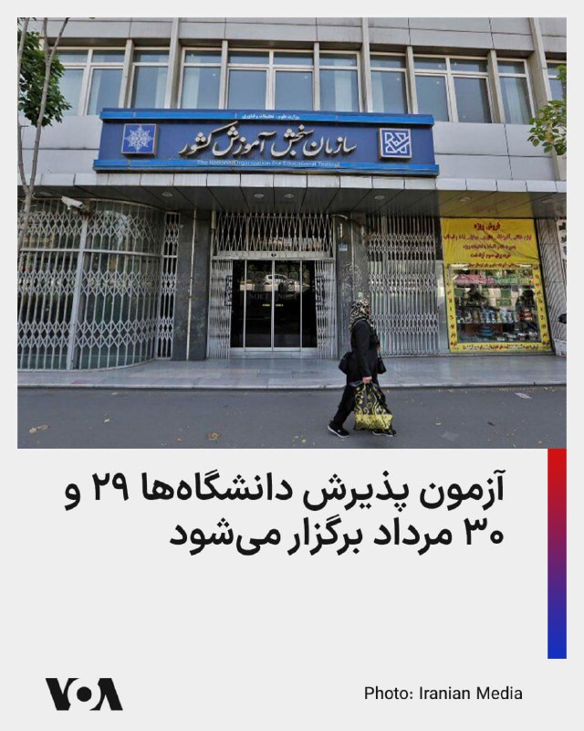

سازمان سنجش آموزش کشور می‌گوید کنکور سراسری سال ۱۴۰۵ و آزمون دانشجو معلمان، به طور همزماندر روزهای پنج‌شنبه و جمعه ۲۹ و ۳۰ مردادماه جاری برگزار می‌شود.

این سازمان همچنین یادآور شده که جاماندگان از ثبت‌نام می‌توانند تا پایان روز شنبه نهم خرداد، نسبت به آن اقدام کنند.

پیشتر وزیر علوم، تحقیقات و فناوری از احتمال برگزاری کنکور سراسری ۱۴۰۵ در دهه سوم مرداد خبر داده بود.

در مورد آزمون دانشگاه فرهنگیان اما، دبیر شورای‌ آموزش‌ و پرورش سه‌شنبه گذشته از ۱۱ تیرماه به عنوان تاریخ برگزاری این آزمون یاد کرده بود، اما در واکنش سازمان سنجش اعلام کرد که تا کنون تصمیم جدیدی درباره تفکیک آزمون سراسری و آزمون دانشجو معلمان گرفته نشده است.
@FarsiVOA

## FarsiVOA — post 219049

🔺روایت روزنامه شرق از فروپاشی طبقه متوسط در تهران

▪️روزنامه شرق در گزارشی میدانی، تصویری از وضعیت معیشتی طبقه متوسط در تهران ارائه کرده است؛ طبقه‌ای که زمانی با کارمندی، تحصیلات، شغل ثابت و درآمد ماهانه، خود را از فقر روزمره جدا می‌دانست، اما حالا بخش بزرگی از آن درگیر بقا تا پایان ماه شده است.

▪️در این گزارش آمده که ترس از دست دادن شغل، بسیاری از کارمندان را از اعتراض به ثابت‌ماندن دستمزد یا چانه‌زنی برای مزایا بازداشته است.

▪️بر اساس روایت شرق، دو حقوق کارمندی در بسیاری خانواده‌ها عملاً فقط تا هفته دوم ماه دوام می‌آورد. پس از آن، حساب بانکی خالی می‌شود و باید دو هفته باقی‌مانده را با قرض، حذف هزینه‌ها، خرید حداقلی و انتظار برای حقوق بعدی گذراند.

⬇️ بیشتر بخوانید:
https://ir.voanews.com/a/8155536.html

## FarsiVOA — post 219048

🔺پنتاگون از نشست نظامی اسرائیل و لبنان در واشنگتن خبر داد

▪️وزارت جنگ آمریکا اعلام کرد البریج کولبی، معاون وزیر جنگ در امور سیاست‌گذاری، روز جمعه در پنتاگون میزبان هیئت‌های نظامی اسرائیل و لبنان بوده است.

▪️بر اساس اطلاعیه پنتاگون، این نشست برای آغاز «مسیر امنیتی» در پشتیبانی از مذاکرات جاری میان دو کشور برگزار شد.

▪️وزارت جنگ آمریکا این گفت‌وگوهای نظامی‌به‌نظامی را «سازنده» خواند و گفت تمرکز آن بر ایجاد چارچوب‌های عملی برای امنیت و ثبات منطقه‌ای بوده است.

▪️این نشست در ادامه دور قبلی گفت‌وگوهای واشنگتن برگزار شد؛ جایی که اسرائیل و لبنان با تمدید ۴۵ روزه آتش‌بس موافقت کردند و مذاکرات به دو مسیر سیاسی و امنیتی تقسیم شد.

⬇️ بیشتر بخوانید:
https://ir.voanews.com/a/8155535.html

## FarsiVOA — post 219047

  

ارتش اسرائیل با انتشار اطلاعیه‌ای فوری از ساکنان مناطق «جدیده انصار»، «الزراریه»، «مزرعه کفوریه‌الرز» و «مشغره» خواست خانه‌های خود را فوراً تخلیه کرده و به شمال رودخانه زهرانی منتقل شوند.

در این اطلاعیه آمده است که به‌دلیل فعالیت‌های حزب‌الله، از جمله حفر تونل‌ها و استفاده از این مناطق برای شلیک و اقدامات نظامی، ارتش اسرائیل قصد دارد با قدرت علیه مواضع حزب‌الله وارد عمل شود.

ارتش اسرائیل تأکید کرده هدفش آسیب رساندن به غیرنظامیان نیست، اما هر فردی که در نزدیکی نیروها، تأسیسات یا تجهیزات جنگی حزب‌الله حضور داشته باشد، جان خود را در معرض خطر قرار می‌دهد.
@FarsiVOA

## FarsiVOA — post 219046

بنیامین نتانیاهو: «ما ضربات مهلک و شدیدی به حزب‌الله وارد می‌کنیم»؛

بنیامین نتانیاهو، نخست‌وزیر اسرائیل، به همراه یسرائیل کاتس، وزیر دفاع و تامیر یدعی، جانشین رئیس ستاد مشترک ارتش، از لشکر ۳۶ در مرزهای شمالی بازدید کرد.

در جریان این بازدید، مقامات ارشد نظامی آخرین گزارش‌ها از روند عملیات در خاک لبنان را به نخست‌وزیر ارائه دادند.

نتانیاهو با تقدیر از روحیه نیروهای حاضر در میدان اعلام کرد که ارتش اسرائیل با عبور از رودخانه لیتانی و تسلط بر مناطق کلیدی، حملات شدیدی را علیه مواضع حزب‌الله در بیروت، بقاع و سرتاسر خط مقدم هدایت می‌کند.
@FarsiVOA

## FarsiVOA — post 219045

  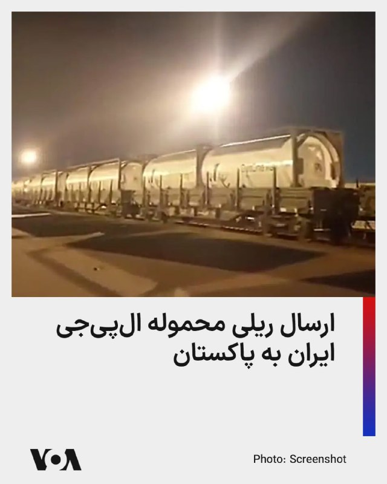

خبرگزاری فارس از ورود محموله صادراتی گاز مایع (ال‌پی‌جی) ایران از طریق «تانکر‌های مخصوص خطوط ریلی» به پاکستان خبر داد.

این گزارش به حجم محموله گاز مایع اشاره نکرد، اما ایران پیش از محاصره دریایی آمریکا سالانه ۱۱ میلیون تن صادرات گاز مایع داشت که معادل تقریبا ۹ برابر کل واردات ال‌پی‌جی پاکستان است.

البته ایران پیش از محاصره دریایی نیز سهمی ۶۰ درصدی در واردات ال‌پی‌جی پاکستان داشت و اتفاقا بخش بسیار نازلی از آن از طریق مسیر دریایی انجام می‌شد. این محصول خام نفتی سالانه بیش از ۱۰ میلیارد دلار برای جمهوری اسلامی ارزآوری دارد و بعد از نفت و پترشیمی، مهم‌ترین منبع صادراتی ایران است.

خبرگزاری فارس همچنین مدعی شده است که پاکستان با شروع محاصره دریایی جمهوری اسلامی، «مسیر تجاری جدید» راه‌اندازی کرده و جمهوری اسلامی از طریق خط آهن به چین نفت صادر می‌کند.

این گزارش بدون ارائه ارقام و مستندات می‌نویسد تعداد قطارهای باری ایران به مقصد چین سه برابر شده است.
@FarsiVOA

## FarsiVOA — post 219044

  

بلومبرگ گزارش داد در حمله موشکی جمهوری اسلامی به پایگاه هوایی علی‌السالم در کویت، حدود پنج آمریکایی زخمی شده‌اند.

به نوشته بلومبرگ، پدافند هوایی کویت یک موشک بالستیک را رهگیری کرد، اما قطعات آن به این پایگاه برخورد کرد و چند نیروی آمریکایی، شامل نیروهای فعال و پیمانکاران، دچار جراحت‌های سطحی شدند. در این حمله همچنین یک پهپاد ام‌کیو-۹ ریپر منهدم و دست‌کم یک پهپاد دیگر به‌شدت آسیب دید.

سنتکام روز گذشته این حمله را «نقض فاحش آتش‌بس» از سوی تهران خوانده بود.

فرماندهی مرکزی آمریکا اعلام کرده بود ایران یک موشک بالستیک به سمت کویت شلیک کرده و پیش از آن نیز پنج پهپاد تهاجمی یک‌طرفه در نزدیکی تنگه هرمز به پرواز درآمده بودند که همه رهگیری شدند. سنتکام همچنین گفت از پرتاب یک پهپاد ششم از بندرعباس جلوگیری شده است.

کویت میزبان یک پایگاه هوایی آمریکا است و کشورهای حوزه خلیج فارس، از جمله کویت، در جریان جنگ اخیر هدف حملات موشکی و پهپادی سپاه بودند.
@FarsiVOA

## FarsiVOA — post 219043

  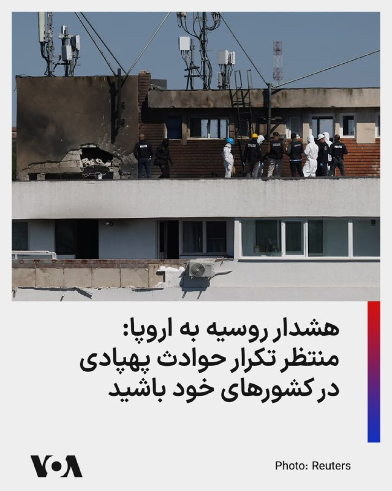

دیمیتری مدودف، معاون شورای امنیت روسیه، به رهبران اروپایی هشدار داد که باید منتظر تکرار حوادث پهپادی در کشورهای خود باشند.

این موضع‌گیری پس از آن مطرح شد که رومانی، عضو ناتو و اتحادیه اروپا، اعلام کرد یک پهپاد روسی هنگام حمله به اوکراین، به یک ساختمان مسکونی در خاک این کشور اصابت کرده است.

ناتو این حادثه را نشانه «رفتار بی‌ملاحظه» روسیه خواند و تأکید کرد از خاک متحدان خود دفاع می‌کند.

مدودف گفت هنوز مالکیت پهپاد روشن نیست، اما همزمان اروپا را به مشارکت مستقیم در جنگ علیه روسیه متهم کرد و گفت این حوادث ادامه خواهد داشت.

رومانی سفیر روسیه را احضار کرده و خواستار دریافت توانمندی‌های دفاع ضدپهپادی از اتحادیه اروپا شده است. وزارت دفاع رومانی می‌گوید از آغاز حملات روسیه به بنادر اوکراین در امتداد دانوب، حریم هوایی این کشور ۲۸ بار نقض شده است.

همزمان، لتونی نیز دفاع ضدپهپادی در مرزهای خود با روسیه و بلاروس را تقویت می‌کند.
@FarsiVOA

## FarsiVOA — post 219042

  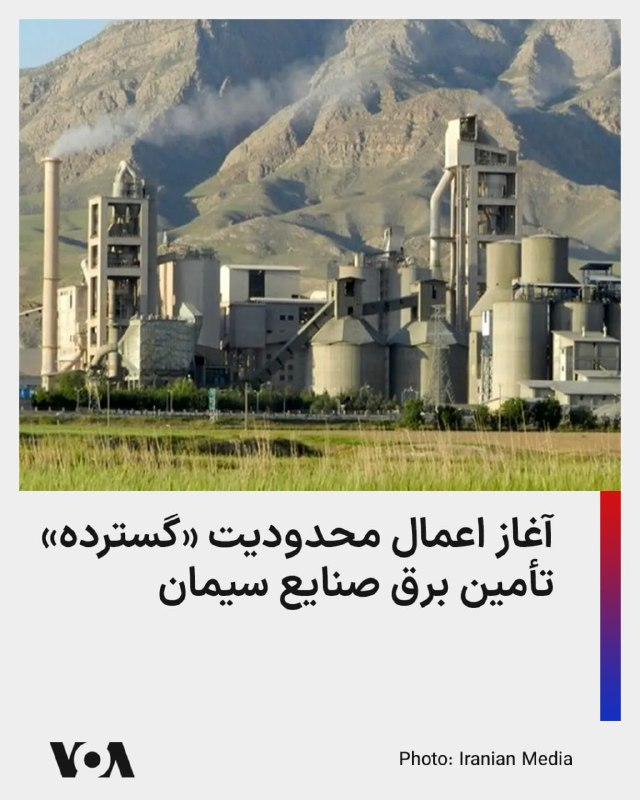

دبیرکل صنف کارفرمایان صنعت سیمان ایران از ابلاغیه جدید وزارت نیرو مبنی بر اعمال «محدودیت‌های گسترده» در تأمین برق صنایع سیمان خبر داد.

علی اکبر الوندیان می‌گوید در ماه‌های خرداد و شهریور تنها ۴۰ درصد از برق مورد نیاز تأمین خواهد شد و در تیر و مرداد این میزان به ۱۵ درصد کاهش می‌یابد.

او گفت این میزان محدودیت، در عمل کارخانه‌ها را مجبور به توقف تولید خواهد کرد.

ایران به خاطر عدم تحقق برنامه‌های رشد تولید برق، هر سال با کسری فزاینده برق مواجه می‌شود. دولت در پیک مصرف تابستانی برق صنایع را محدود و برنامه خاموشی‌های بخش خانگی را اعمال می‌کند.
@FarsiVOA

## FarsiVOA — post 219041

🔺مقام قضایی با ادعای «بازدارندگی»، از گسترش توقیف اموال متهمان به «همکاری با دشمن» دفاع کرد

▪️یک مقام قضایی می‌گوید قوه قضائیه در شرایط به ادعای او «جنگ ترکیبی»، فقط به برخورد کیفری بسنده نمی‌کند و با توقیف اموال و اقدامات قضایی، به دنبال «افزایش هزینه همکاری با دشمن» است.

▪️او اضافه کرده توقیف اموال و دارایی‌ها یکی از ابزارهای بازدارنده دستگاه قضایی برای ایجاد بازدارندگی پایدار است.

▪️پس از هشدارها و تهدیدهای مقام‌های قضایی، گزارش‌های رسمی از توقیف اموال صدها نفر حکایت دارد و فقط در چند استان از جمله آذربایجان غربی از توقیف اموال بیش از صد نفر خبر داده شده است.

▪️سخنگوی قوه قضائیه جمهوری اسلامی نیز ۱۹ اردیبهشت اعلام کرد تاکنون ۲۶۲ فقره ملک در کشور توقیف شده است.

⬇️ بیشتر بخوانید:
https://ir.voanews.com/a/8155534.html

## FarsiVOA — post 219040

Farsi VOA pinned an audio file

## FarsiVOA — post 219039

  <a href="https://t.me/farsivoa/219039" target="_blank">📎 Download file</a>

🔴📢‌ پادکست خبری جمعه ۸ خرداد ۱۴۰۵

🛜در صورتی که با مشکل اینترنت مواجه هستید میتوانید اخبار صدای آمریکا را از نسخه‌های پادکست خبری ما به صورت صوتی دنبال کنید و یا اخبار را از نسخه سبک وب‌سایت ما پیگیر باشید:
https://ir.voanews.com/lite

📡بروزترین فرکانسهای ماهواره‌ای را نیز میتوانید از صفحه زیر پیگیری کنید:
https://ir.voanews.com/satellite

🔔دیگر شبکه‌های اجتماعی ما را هم دنبال کنید:
https://linktr.ee/voafarsi

با دوستانتان به اشتراک بگذارید
@farsivoa

## FarsiVOA — post 219038

🔺ارتش اسرائیل از رهگیری چند پرتابه از لبنان و انهدام پرتابگر حزب‌الله خبر داد

▪️ارتش اسرائیل اعلام کرد چند پرتابه شلیک‌شده از لبنان به سمت شمال اسرائیل را رهگیری کرده و یک پرتابه نیز در اطراف کریات شمونا فرود آمده است. بنا بر اعلام ارتش اسرائیل، در این حمله گزارشی از تلفات یا مجروحان منتشر نشده است.

▪️در همین راستا ارتش اسرائیل اعلام کرد یک پرتابگر راکتی را که حزب‌الله در حملات شبانه به شمال اسرائیل از آن استفاده کرده بود، منهدم کرده است.

▪️دور تازه حملات از لبنان به شمال اسرائیل نشان می‌دهد جبهه شمالی، همزمان با مذاکرات سیاسی و امنیتی، همچنان فعال و شکننده مانده است؛ وضعیتی که خطر فروپاشی عملی آتش‌بس و گسترش دوباره جنگ در لبنان را افزایش می‌دهد.

⬇️ بیشتر بخوانید:
https://ir.voanews.com/a/idf-destroyed-rocket-launcher-that-hezbollah-used-to-attack-israel-overnight/8155532.html

## FarsiVOA — post 219037

  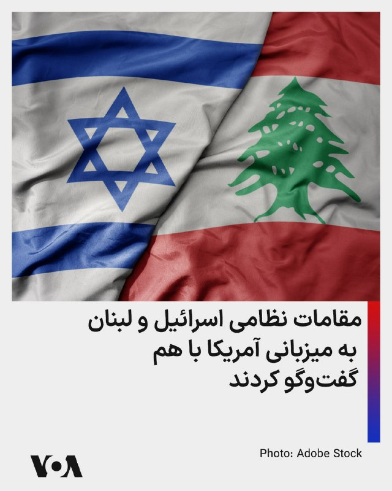

⚡️مقامات نظامی اسرائیل و لبنان روز جمعه در واشنگتن به میزبانی وزارت جنگ آمریکا مذاکره کردند. البریدج کولبی، معاون وزیر جنگ آمریکا این گفت‌وگوها را «سازنده‌» خواند و افزود که این دیدار مکمل گفتگوهای دیپلماتیک آینده خواهد بود.
@FarsiVOA

## FarsiVOA — post 219036

🔺وزیر جنگ آمریکا: توانایی ازسرگیری عملیات نظامی علیه جمهوری اسلامی را داریم؛ وضعیت مهمات ما بیش‌ از اندازه مناسب است

▪️پیت هگست، وزیر جنگ آمریکا، روز شنبه ۹ خرداد در نشست دفاعی «دیالوگ شانگری-لا ۲۰۲۶» در سنگاپور گفت ایالات متحده همچنان «تعهدات جهانی» خود را حفظ کرده است و از جمله این تعهدات را جلوگیری از دستیابی جمهوری اسلامی به سلاح هسته‌ای خواند و گفت واشنگتن روی این تعهد متمرکز است.

⬇️ بیشتر بخوانید:
https://ir.voanews.com/a/8155529.html
@FarsiVOA

## FarsiVOA — post 219035

  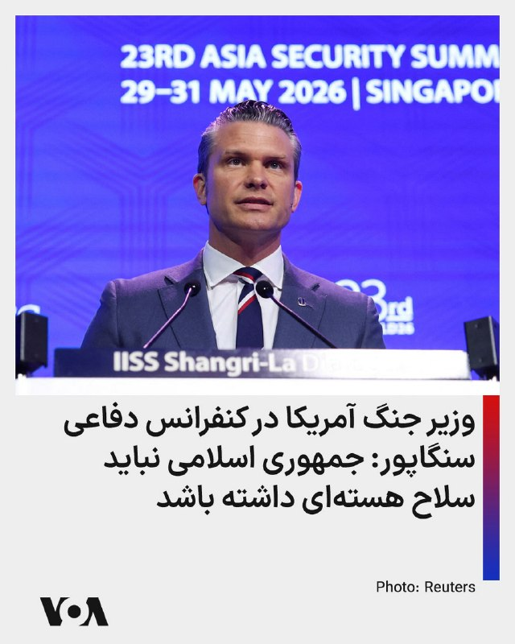

⚡️پیت هگست، وزیر جنگ آمریکا، روز شنبه در نشست دفاعی «دیالوگ شانگری-لا» در سنگاپور تأکید کرد که جمهوری اسلامی نباید به سلاح هسته‌ای دست یابد. به گزارش کلی میرز، خبرنگار نیوزنیشن، هگست همچنین با اشاره به دستگیری نیکلاس مادورو در ونزوئلا توسط نیروهای آمریکایی گفت ایالات متحده در حال «بازگرداندن بازدارندگی آمریکا» در جهان است.
@FarsiVOA

## DW_Farsi — post 125308

  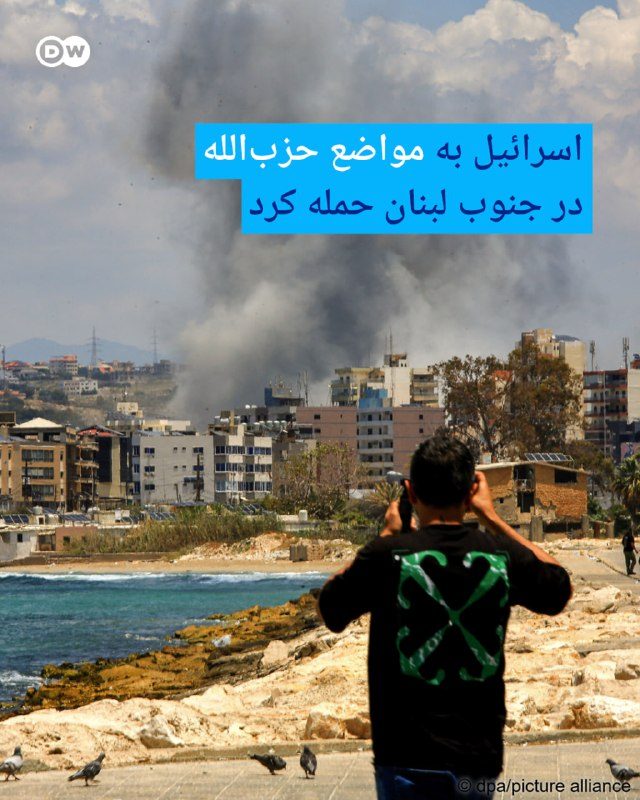

🔶 اسرائیل به مواضع حزب‌الله در جنوب لبنان حمله کرد

دولت لبنان صبح روز شنبه ۹ خرداد (۳۰ مه) اعلام کرد در حملات جدید اسرائیل به این کشور دست‌کم ۱۱ نفر در جنوب لبنان کشته شدند.

وزارت بهداشت در بیروت اعلام کرد که در میان کشته‌شدگان، یک عضو نیروهای امدادی نیز قرار دارد. بر اساس این گزارش در حملات انجام‌شده در مناطق مختلف اطراف شهر صور ۸ نفر زخمی شده‌اند که یکی از آن‌ها نیز از نیروهای امدادی بوده است.

وزارت بهداشت لبنان در بیانیه‌ای حملات اسرائیل را "نقض شدید حقوق بین‌الملل" توصیف کرده است.

در لبنان در حال حاضر آتش‌بسی برقرار است، اما این آتش‌بس از سوی حزب‌الله مورد حمایت جمهوری اسلامی رد شده و دو طرف بار دیگر به‌طور روزانه به یکدیگر حمله می‌کنند.
در تازه‌ترین تحولات پنتاگون اعلام کرد که میزبان هیئت‌های اسرائیل و لبنان بوده و گفت‌وگوهای نظامی "سازنده‌ای" میان طرفین انجام شده است.
@dw_farsi

## DW_Farsi — post 125307

  

📸 عکس روز: دنالی، بلندترین قله آمریکای شمالی

"دنالی" که با نام پیشین رسمی خود، "مک‌کینلی" نیز شناخته می‌شود با ارتفاع حدود ۶ هزار و ۱۹۰ متر بلندترین قله آمریکای شمالی است. این کوه در پارک و منطقه حفاظت‌شده دنالی در آلاسکا قرار دارد. پس از سال‌ها تلاش بومیان محلی، دولت آمریکا در سال ۲۰۱۵ نام این کوه را رسما به دنالی تغییر داد که در زبان بومی آتاباسکی که خانواده‌ای از زبان‌های سرخ‌پوستان آمریکای شمالی به شمار می‌رود، "غول‌پیکر" معنا می‌دهد.
@dw_farsi

## DW_Farsi — post 125306

  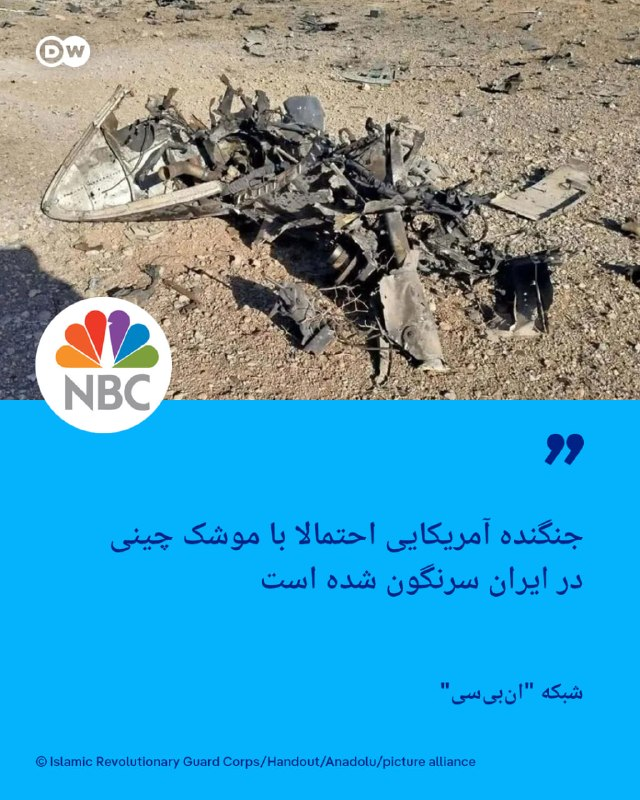

🔶 "جنگنده آمریکایی احتمالا با موشک چینی در ایران سرنگون شده است"

شبکه "ان‌بی‌سی" روز شنبه ۹ خرداد (۳۰ مه) به نقل از سه منبع آگاه خبر داد جنگنده اف-۱۵ ای آمریکا که در جنوب‌غرب ایران سرنگون شده بود احتمالا با یک موشک دوش‌پرتاب ساخت چین هدف قرار گرفته است.

در اوایل جنگ، چین احتمالا یک رادار هشدار زودهنگام دوربرد نیز در اختیار ایران قرار داده است که قادر است هواپیماهای رادارگریز را شناسایی کند. این موضوع را یکی از منابع آگاه و یک مقام آمریکایی در گفتگو با شبکه ان‌بی‌سی تائید کرده‌اند.

مقام‌های آمریکایی در حال بررسی جزئیات سرنگونی این جنگنده در ماه آوریل هستند. به گفته منابع، این نخستین‌بار در چند دهه اخیر است که یک جنگنده آمریکایی توسط آتش دشمن سرنگون می‌شود.

زمان دقیق انتقال تجهیزات چینی به جمهوری اسلامی مشخص نیست، اما استفاده ایران از سلاح‌های ساخت چین روابط آمریکا و چین را پیچیده‌تر کرده است؛ در شرایطی که دولت ترامپ به دنبال کمک پکن برای پایان دادن به درگیری بوده است.

چین که بزرگ‌ترین خریدار نفت ایران است، اعلام کرده که این جنگ باید پایان یابد.
@dw_farsi

## DW_Farsi — post 125305

  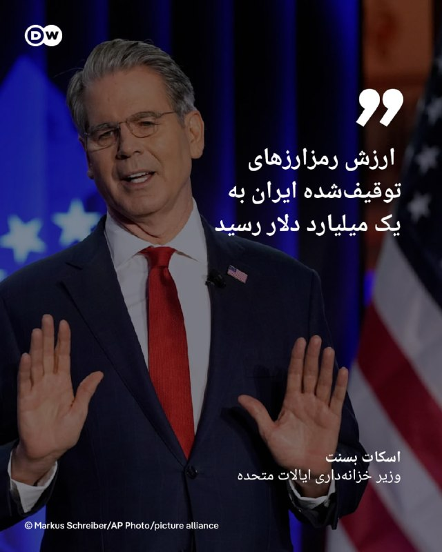

🔶 آمریکا: ارزش رمزارزهای توقیف‌شده ایران به یک میلیارد دلار رسید

اسکات بسنت، وزیر خزانه‌داری ایالات متحده اعلام کرد مجموع دارایی‌های رمزارزی مرتبط با جمهوری اسلامی که تا کنون توسط آمریکا توقیف شده به حدود یک میلیارد دلار رسیده است. او همچنین گفت این رقم مربوط به کل دارایی‌های توقیف‌شده تا امروز است و به یک اقدام واحد محدود نمی‌شود.

بسنت همچنین توضیح داد که این رقم نسبت به آوریل ۲۰۲۶ دو برابر شده است؛ زمانی که میزان دارایی‌های توقیف‌شده حدود ۵۰۰ میلیون دلار اعلام شده بود.

به گفته وزیر خزانه‌داری آمریکا بخشی از این دارایی‌ها شامل ۳۴۴ میلیون دلار تتر (USDT) در شبکه ترون است که در قالب عملیاتی موسوم به "خشم اقتصادی" توقیف شده است.

وزیر خزانه‌داری آمریکا همچنین تاکید کرد این اقدامات با هدف مقابله با شبکه‌های دور زدن تحریم‌ها و مسیرهای مالی مرتبط با جمهوری اسلامی انجام می‌شود.

مقام‌های آمریکایی می‌گویند جمهوری اسلامی از رمزارزها برای دور زدن تحریم‌ها و تامین منابع مالی استفاده کرده است.

جمهوری اسلامی درباره اظهارات وزیر خزانه‌داری آمریکا تا کنون واکنشی نشان نداده است.
@dw_farsi

## DW_Farsi — post 125298

🔶 جام‌های ۱۹۹۸ تا ۲۰۰۶؛ زین‌الدین زیدان؛ ققنوس شماره ۱۰ فرانسه

زین‌الدین زیدان نامی‌ست که در کنار میشل پلاتینی، هرگز از حافظه‌ تاریخی فوتبال فرانسه و جهان پاک نخواهد شد؛ کارگردانی همه‌فن‌حریف و خلاق که در پیراهن شماره‌ی ۱۰، پس از سال‌ها به فوتبال فرانسه روح و جان تازه‌ای بخشید.

📌برای دسترسی کامل به گزارش به وبسایت دویچه‌وله فارسی مراجعه کنید.
@dw_farsi

## DW_Farsi — post 125297

  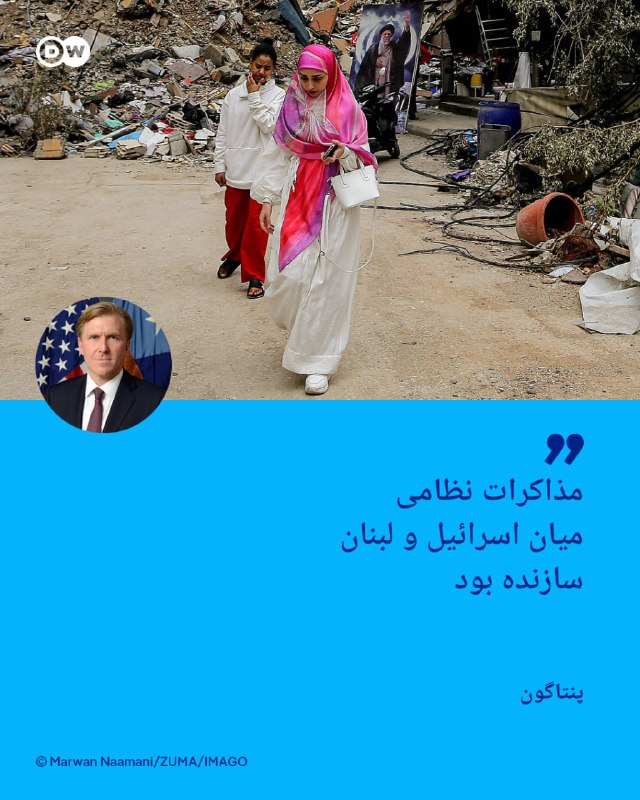

🔶 پنتاگون: مذاکرات نظامی میان اسرائیل و لبنان سازنده بود

البریج کولبی، معاون وزیر دفاع (جنگ) آمریکا صبح روز شنبه ۹ خرداد (۳۰ مه) در شبکه اجتماعی ایکس خبر داد مذاکرات نظامی میان اسرائیل و لبنان "سازنده" بوده است.

کولبی اعلام کرد که پنتاگون از هیئت‌های نظامی اسرائیل و لبنان میزبانی کرده و گفت‌وگوهای نظامی "سازنده‌ای" میان طرفین انجام شده که قرار است هفته آینده روند سیاسی تحت هدایت وزارت امور خارجه آمریکا را تکمیل و تقویت کند.

کولبی در ادامه پیام خود همچنین تاکید کرده است که وزارت دفاع آمریکا برای همکاری با نیروهای دفاعی اسرائیل و ارتش لبنان ارزش قائل است و از حاکمیت و تمامیت ارضی لبنان به‌ویژه در شرایطی که این کشور از حضور گروه‌های مسلح غیردولتی رها شده باشد حمایت می‌کند.

حزب‌الله لبنان در مذاکرات با اسرائیل حضور ندارد. این گروه که در فهرست تروریستی بسیاری از کشورها قرار دارد، با آتش‌بسی که میان اسرائیل و لبنان با میانجی‌گری آمریکا برقرار شده و از اواسط آوریل سال جاری اجرایی شده بود، مخالفت کرده است؛ توافقی که از نظر رسمی همچنان پابرجاست.
@dw_farsi

## DW_Farsi — post 125296

  

🔶 هگست: آمریکا توانایی کامل برای ازسرگیری جنگ با ایران را دارد

پیت هگست، وزیر دفاع (جنگ) آمریکا شامگاه جمعه ۸ خرداد (۲۹ مه) اعلام کرد ایالات متحده از نظر تسلیحاتی "بیش از نیاز خود ذخایر در اختیار دارد" و در صورت لزوم، توانایی کامل برای از سرگیری جنگ با جمهوری اسلامی را حفظ کرده است.

هگست که در نشست امنیتی سنگاپور صحبت می‌کرد با اشاره به ظرفیت تسلیحاتی ایالات متحده گفت این کشور چه در خاورمیانه و چه در سایر نقاط جهان، از آمادگی نظامی بالایی برخوردار است.

او همچنین افزود که هرگونه توافق با حکومت ایران را "توافقی خوب" می‌داند.
@dw_farsi

## DW_Farsi — post 125295

  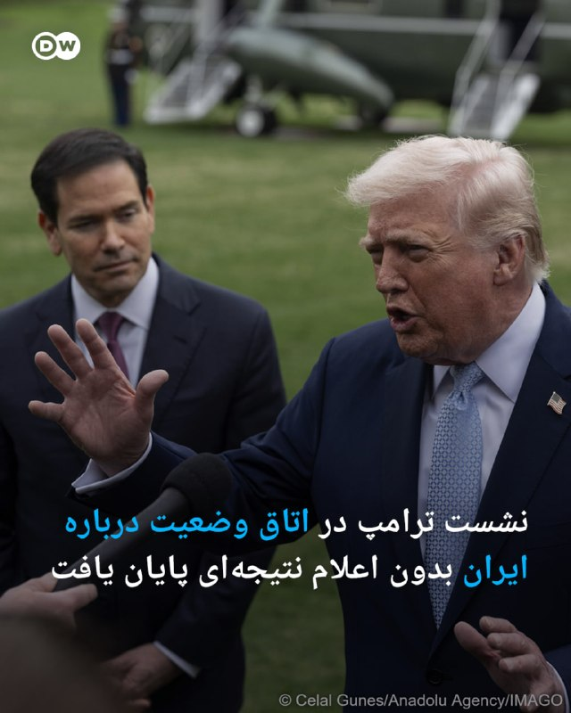

🔶 نشست ترامپ در اتاق وضعیت درباره ایران بدون اعلام نتیجه‌ای پایان یافت

جلسه دونالد ترامپ، رئیس‌ جمهور آمریکا در "اتاق وضعیت" کاخ سفید به منظور "تصمیم‌گیری" نهایی درباره توافق با ایران بدون اعلام نتیجه‌ای پایان یافت.

نشست ترامپ و مشاورانش درباره توافق احتمالی با ایران حدود دو ساعت به طول انجامید. با این حال، پس از پایان این جلسه، رئیس‌ جمهور آمریکا کاخ سفید را بدون اعلام هیچ تصمیم نهایی یا صدور بیانیه رسمی درباره نتیجه مذاکرات ترک کرده است.

منابع خبری می‌گویند گفت‌وگوها در "مرحله بررسی و تبادل مواضع" قرار دارد و اختلافات مهم میان طرفین همچنان پابرجاست.

یک مقام کاخ سفید بعد از جلسه اتاق وضعیت گفته است ترامپ تنها در صورتی یک توافق صلح با حکومت ایران را امضا خواهد کرد که تهران تمامی شروط او را برآورده کند.

این مقام که خواست نامش فاش نشود، در گفت‌وگو با خبرگزاری فرانسه تاکید کرده است که ترامپ فقط توافقی را امضا خواهد کرد که "به نفع آمریکا باشد و خطوط قرمز او را تامین کند". این مقام کاخ سفید همچنین گفته است ایران هرگز نمی‌تواند به سلاح هسته‌ای دست پیدا کند.
@dw_farsi

## Persian_Trend_Official — post 15323

  <a href="telegram/content/Persian_Trend_Official_15323_1780132255.mp4" target="_blank">🎬 Download video</a>

اوکراین ویدویی از انهدام دو فروند هواپیمای گشت دریایی توپولوف-142 و یک لانچر موشک بالستیک اسکندر توسط پهپاد های انتحاری سری FP-1/2 خود در فرودگاه تاگانروگ روسیه منتشر کرد.

📝 Amir

📌 @persian_trend_official
پرشین ترند | متفاوت‌ترین کانال نظامی

## Persian_Trend_Official — post 15319

سوخو-30 های ارمنستانی مجهز به بمب‌های هدایت شونده ایرانی!

در تصویر منتشر شده از رژه هوایی جنگنده های سوخو-30 ارمنستانی، این جنگنده ها مجهز به چند بمب بالدار یاسین شده اند، خانواده هدایت شونده یاسین که از یک پیشران راکتی نیز بهره می‌بردند در آخرین نمونه خود یعنی یاسین 400 دارای برد 150 کیلومتری هستند.

روسیه از ناوگان سوخو-30 های ارمنستانی پشتیبانی مناسب نمی‌کند به همین دلیل احتمالا ارمنستان برای تامین تسلیحات هواپرتاب این جنگنده به ایران روی آورده است.

متاسفانه در ایران با وجود طیف گسترده ای از تسلیحات هواپرتاب هدایت شونده به دلیل نبود پلتفرم مناسب برای پرتاب این بمب‌ها، خلبانان ایرانی در جنگ اخیر مجبور شدند با بمب های سقوط آزاد سری MK و فاب به قطر و کویت حمله کنند.

📝 Amir

📌 @persian_trend_official
پرشین ترند | متفاوت‌ترین کانال نظامی

## Persian_Trend_Official — post 15318

  <a href="telegram/content/Persian_Trend_Official_15318_1780132256.mp4" target="_blank">🎬 Download video</a>

انهدام یک فروند پهپاد MQ-9 و زخمی شدن 5 سرباز آمریکایی در پی حمله موشکی ایران به کویت! بلومبرگ در گزارش جدید خود نوشت: حمله موشکی بالستیک ایران به پایگاه هوایی کویت در تاریخ 30 مه، علیرغم رهگیری موشک توسط پدافند هوایی کویت، چندین آمریکایی را زخمی و به دو…

## Persian_Trend_Official — post 15317

  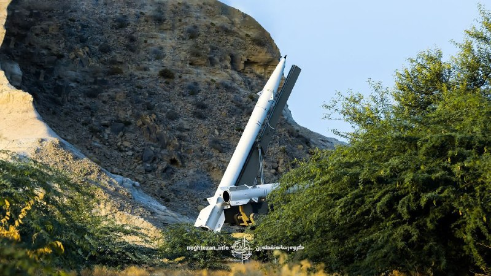

انهدام یک فروند پهپاد MQ-9 و زخمی شدن 5 سرباز آمریکایی در پی حمله موشکی ایران به کویت!

بلومبرگ در گزارش جدید خود نوشت: حمله موشکی بالستیک ایران به پایگاه هوایی کویت در تاریخ 30 مه، علیرغم رهگیری موشک توسط پدافند هوایی کویت، چندین آمریکایی را زخمی و به دو پهپاد MQ-9 Reaper آسیب جدی وارد کرد.

قطعات موشک رهگیری شده فاتح-110 به پایگاه هوایی علی السالم برخورد کرد(؟) و باعث جراحات جزئی حدود پنج پرسنل و پیمانکار آمریکایی شد. یک پهپاد Reaper منهدم و دیگری به شدت آسیب دید.

📝 Amir

📌 @persian_trend_official
پرشین ترند | متفاوت‌ترین کانال نظامی

## Persian_Trend_Official — post 15316

  <a href="telegram/content/Persian_Trend_Official_15316_1780132259.webm" target="_blank">🎬 Download video</a>

🎥 لاشۀ پهپاد منهدم‌شده در قشم 
👺Phantom 📌 @persian_trend_official پرشین ترند | متفاوت‌ترین کانال نظامی

## Persian_Trend_Official — post 15315

  <a href="telegram/content/Persian_Trend_Official_15315_1780132260.mp4" target="_blank">🎬 Download video</a>

التماس تفکر 🙏

📝 Nick

📌 @persian_trend_official
پرشین ترند | متفاوت‌ترین کانال نظامی

## Persian_Trend_Official — post 15314

  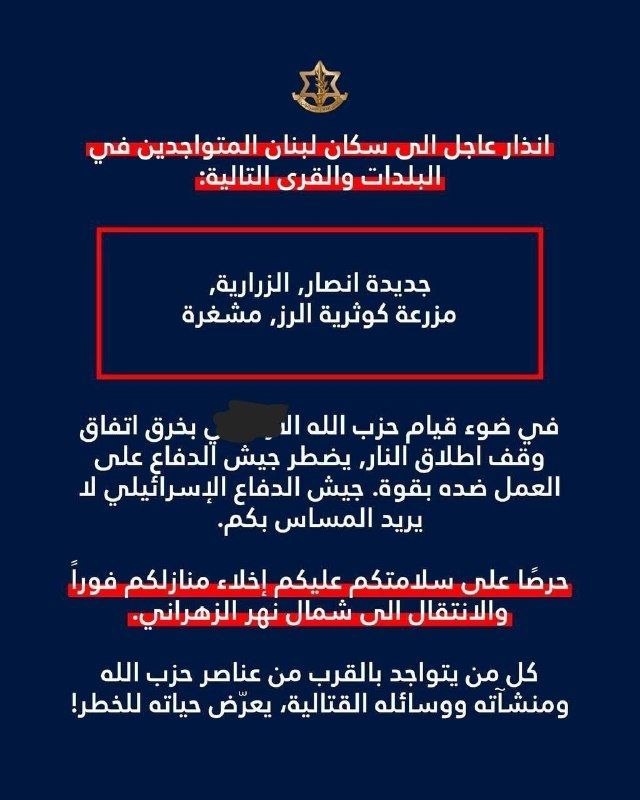

🔺🔻هشدار فوری ارتش اسرائیل به ساکنان مناطق جنوب لبنان

ارتش اسرائیل با انتشار اطلاعیه‌ای فوری از ساکنان مناطق «جدیده انصار»، «الزراریه»، «مزرعه کفوریه‌الرز» و «مشغره» خواست خانه‌های خود را فوراً تخلیه کرده و به شمال رودخانه زهرانی منتقل شوند.

در این اطلاعیه آمده است که به‌دلیل فعالیت‌های حزب‌الله، از جمله حفر تونل‌ها و استفاده از این مناطق برای شلیک و اقدامات نظامی، ارتش اسرائیل قصد دارد با قدرت علیه مواضع حزب‌الله وارد عمل شود.

ارتش اسرائیل تأکید کرده هدفش آسیب رساندن به غیرنظامیان نیست، اما هر فردی که در نزدیکی نیروها، تأسیسات یا تجهیزات جنگی حزب‌الله حضور داشته باشد، جان خود را در معرض خطر قرار می‌دهد.

👺Phantom

📌 @persian_trend_official
پرشین ترند | متفاوت‌ترین کانال نظامی

## Persian_Trend_Official — post 15312

📍بولتن خبری ۲۴ ساعت اخیر
🗓 ۹ خرداد ۱۴۰۵

◾️ رویترز به نقل از مقام ایرانی: به تفاهم سیاسی با آمریکا رسیده‌ایم، اما کارهای نهایی باقی مانده است

◾️ فارس: متن توافق با قالب «تعهد در برابر تعهد» در مراحل نهایی تصویب در ایران است؛ تا آزادسازی ۱۲ میلیارد دلار دارایی بلوکه‌شده، وارد مرحله بعدی نمی‌شویم

◾️ تسنیم: متن توافق هنوز جمع‌بندی نهایی نشده؛ روایت‌ رسانه‌های غربی «فاقد دقت» است

◾️ نیویورک‌تایمز: پیش‌نویس یادداشت تفاهم شامل تأسیس صندوق سرمایه‌گذاری ۳۰۰ میلیارد دلاری برای ایران شده است؛ ترامپ هنوز آن را امضا نکرده

◾️ نیویورک‌تایمز: ترامپ پس از دو ساعت نشست در اتاق وضعیت، بدون اتخاذ هیچ تصمیمی جلسه را ترک کرد

◾️ ترامپ در تروث‌سوشال: کشتی‌های گیرافتاده در محاصره می‌توانند به خانه برگردند — بعداً خبرنگاران کاخ سفید توضیح دادند منظور شرط لغو محاصره بوده، نه لغو فوری

◾️ وزارت خزانه‌داری آمریکا: محاصره بنادر ایران به‌تدریج برداشته خواهد شد

◾️ الجزیره: پست ترامپ درباره لغو محاصره، اولین شرط پیش از برداشتن گام‌های بعدی در مسیر تفاهم بوده است

◾️ رویترز: ایران ممکن است با انتقال نیمی از ذخایر اورانیوم ۶۰ درصدی موافقت کند

◾️ گروسی رئیس آژانس: قزاقستان آماده است ذخایر اورانیوم غنی‌شده ایران را در صورت حصول توافق نگهداری کند

◾️ خبرنگار فیگارو: جرد کوشنر، داماد ترامپ، مانع از نهایی‌شدن توافق واشنگتن و تهران است

◾️ استیون میلر معاون کاخ سفید: ایران امتیازات قابل توجهی داده که تا چند وقت پیش غیرممکن بود

◾️ هگست وزیر دفاع آمریکا: ایران یا توافق می‌کند یا با نیروی نظامی مواجه می‌شود

◾️ عراقچی: تبادل پیام‌ها ادامه دارد؛ هیچ‌طرفی نمی‌تواند با زبان «باید» با جمهوری اسلامی صحبت کند

◾️ قالیباف: امتیازات را با موشک می‌گیریم؛ هیچ اقدامی پیش از اقدام طرف مقابل انجام نخواهد شد

◾️ پدافند هوایی ایران در قشم و بندرعباس فعال شد؛ دو انفجار گزارش شد

◾️ تسنیم: پهپاد آمریکایی در حوالی قشم توسط پدافند ارتش رهگیری و منهدم شد

◾️ سنتکام به دریانوردان هشدار داد: در تنگه هرمز عملیات نظامی انجام خواهیم داد؛ هر کشتی مشکوک به مین‌گذاری هدف قرار می‌گیرد

◾️ ان‌بی‌سی به نقل از مقامات آمریکایی: ارتش آمریکا تأیید نکرده که ایران در تنگه هرمز مین کار گذاشته باشد

◾️ وال‌استریت‌ژورنال: امارات از روزهای اول جنگ ده‌ها حمله هوایی به ایران انجام داده؛ اهداف شامل قشم، ابوموسی، بندرعباس، جزیره لاوان و عسلویه بوده‌اند

◾️ سی‌ان‌ان: تصاویر ماهواره‌ای نشان می‌دهد ایران در حال بازگشت به دسترسی به ذخایر موشکی زیرزمینی‌اش است؛ این با ادعاهای ترامپ مغایرت دارد

◾️ تصاویر ماهواره‌ای از پایگاه موشکی یزد: تمامی تأسیسات روی سطح منهدم شده، اما پایگاه عملیاتی مانده است

◾️ وزارت خزانه‌داری آمریکا: حدود یک میلیارد دلار از دارایی‌های رمزارزی سپاه مصادره شده است

◾️ نهاد مدیریت آب‌راه خلیج فارس: تسلط بر تنگه هرمز را که در میدان به دست نیاوردید، با تحریم هم به دست نخواهید آورد

◾️ ان‌بی‌سی به نقل از سه منبع آگاه: جنگنده اف-۱۵ای آمریکا احتمالاً با موشک دوش‌پرتاب ساخت چین در ایران سرنگون شده است

◾️ ان‌بی‌سی: چین ممکن است رادار هشداردهنده دوربردی با توانایی شناسایی هواپیماهای رادارگریز به ایران داده باشد

◾️ کاخ سفید: شی‌جین‌پینگ به ترامپ اطمینان داده که پکن تجهیزات نظامی به ایران نمی‌دهد

◾️ یک پهپاد به ساختمانی در شهر گالاتس رومانی اصابت کرد؛ دو نفر مجروح شدند

◾️ پوتین: تازه از ماجرا باخبر شدم؛ بدون کارشناسی نمی‌توان تعلق پهپاد را تأیید کرد

◾️ مدودوف در واکنش: خواب آرام شهروندان اروپایی به پایان رسیده است

◾️ نتانیاهو: نیروهای ما از رود لیتانی عبور کرده‌اند؛ نتایج بسیار چشمگیری در جبهه لبنان حاصل شده

◾️ ارتش اسرائیل: فرمانده گردان زیتون حماس، عماد اسلیم، در شمال غزه کشته شد

◾️ حزب‌الله: ویدیوی شلیک موشک کروز قدس (برد ۱۶۵۰ کیلومتر) به مواضع اسرائیل منتشر شد

◾️ ارتش اسرائیل: یک راکت حزب‌الله به کلیسای شهر مرجعیون اصابت کرده است

◾️ رسانه‌ عبری: ارتش اسرائیل به‌زودی فراخوان جذب نیروهای زمینی با ملیت‌های مختلف را گسترش خواهد داد

◾️ سوئد با حضور زلنسکی در پایگاه اوپسالا، ۱۶ فروند جنگنده گریپن C/D به اوکراین اهدا خواهد کرد

◾️ راکت نیو گلن شرکت Blue Origin در آزمایش زمینی کیپ کاناورال منفجر شد؛

◾️ رویترز: چین بیش از ۸۰ سکوی پرتاب در نزدیکی سیلوهای هسته‌ای خود در حال ساخت دارد

◾️ ارمنستان در رژه سالانه، رادار ایرانی کاوش را برای اولین بار به نمایش درآورد

◾️ حوثی‌های یمن یک پهپاد از نوع MQ-9 آمریکایی را در استان مارب منهدم کردند

◾️ پاکستان:هیچ انعطافی در موضعمان نداریم و به پیمان ابراهیم نخواهیم پیوست

👺Phantom

📌 @persian_trend_official
پرشین ترند | متفاوت‌ترین کانال نظامی

## Persian_Trend_Official — post 15311

  

ماه مه هنوز تمام نشده است و ما شاهد افزایش بی‌سابقه‌ای در پروازهای مشکوک باری امارات متحده عربی به اتیوپی هستیم. تاکنون، ۴۴ پرواز در این ماه ثبت شده است، از جمله بیش از هشت پرواز تایید شده به فرودگاه بهیر دار در شمال اتیوپی.

📌 @persian_trend_official
پرشین ترند | متفاوت‌ترین کانال نظامی

## Persian_Trend_Official — post 15310

  <a href="telegram/content/Persian_Trend_Official_15310_1780132263.mp4" target="_blank">🎬 Download video</a>

🎥 لاشۀ پهپاد منهدم‌شده در قشم

👺Phantom

📌 @persian_trend_official
پرشین ترند | متفاوت‌ترین کانال نظامی

## Persian_Trend_Official — post 15308

👑فرزند ایران 💔 جان فدای میهن جاوید نام نیوشا حمیدی‏۱۵ساله. ۱۸دی در آستانه اشرفیه با شلیک مستقیم کشته شده.

👑فرزند ایران 💔 جان فدای میهن جاوید نام امیرمهدی مرادی گلدره ۱۵ساله. ۱۹دی در اسلامشهر تهران با شلیک مستقیم کشته شده.

👑
👑
👑 
👑
👑
👑
روحشان شاد يادشان وظیفه 💔❤️‍🔥

👺Phantom

📌 @persian_trend_official
پرشین ترند | متفاوت‌ترین کانال نظامی

## Persian_Trend_Official — post 15307

  <a href="telegram/content/Persian_Trend_Official_15307_1780132265.mp4" target="_blank">🎬 Download video</a>

صبحتون بخیر 🌄
Mig-31 Foxhound

📌 @persian_trend_official
پرشین ترند | متفاوت‌ترین کانال نظامی

## RadioFarda — post 157712

هِگسِت از متحدان آسیایی آمریکا خواست برای مهار چین هزینه‌های دفاعی خود را بالا ببرند

🔸پیت هگست، وزیر دفاع آمریکا، روز شنبه، ۹ خرداد، در نشست امنیتی شانگری‌لا در سنگاپور از متحدان آسیایی واشینگتن خواست برای مقابله با افزایش سریع توان نظامی چین، هزینه‌های دفاعی خود را افزایش دهند.

🔸او هشدار داد که «دوران یارانه دادن آمریکا با هدف دفاع از کشورهای ثروتمند پایان یافته است».

🔸هگست در سخنرانی خود در این نشست، که از مهم‌ترین گردهمایی‌های سالانه مقام‌های دفاعی، نظامی و دیپلماتیک آسیا به شمار می‌رود، گفت درباره «افزایش تاریخی توان نظامی چین و گسترش فعالیت‌های نظامی آن در منطقه و فراتر از آن» نگرانی جدی وجود دارد. او افزود که تسلط هر قدرت هژمونیک بر اقیانوس آرام، موازنه قدرت منطقه‌ای را برهم خواهد زد.

🔸وزیر دفاع آمریکا گفت واشینگتن از متحدان و شرکای آسیایی خود انتظار دارد هزینه‌های دفاعی‌شان را به ۳.۵ درصد تولید ناخالص داخلی‌شان افزایش دهند. او در عبارتی کنایه‌آمیز گفت: «شانگری‌لای کمتر، کشتی‌های بیشتر، زیردریایی‌های بیشتر» و تأکید کرد که متحدان آمریکا خواهان ثبات هستند، نه تشدید تنش.

🔸هگست همچنین با تکرار موضع دونالد ترامپ، رئیس‌جمهور آمریکا، گفت آمریکا دیگر حاضر نیست هزینه دفاع از کشورهای ثروتمند را به‌تنهایی بپردازد. او گفت: «ما شریک می‌خواهیم، نه تحت‌الحمایه» و افزود که اتحاد نیرومند زمانی معنا دارد که همه طرف‌ها «در بازی سهمی داشته باشند» و «سواری مجانی» در کار نباشد.

🔸با این حال، رئیس پنتاگون درباره روابط واشینگتن و پکن لحنی نسبتاً محتاطانه داشت و گفت روابط دو کشور «بهتر از سال‌های گذشته» است و تماس‌های نظامی میان دو طرف برای مدیریت تنش‌ها بیشتر شده است.

🔸وزیر دفاع ایالات متحده روز شنبه در بخش دیگری از سخنان خود درباره جنگ خاورمیانه گفت ایالات متحده آماده است در صورت شکست دیپلماسی، حملات علیه ایران را از سر بگیرد.

🔸نسخه کامل این گزارش را در وب‌سایت رادیوفردا بخوانید.

RadioFarda

## RadioFarda — post 157711

  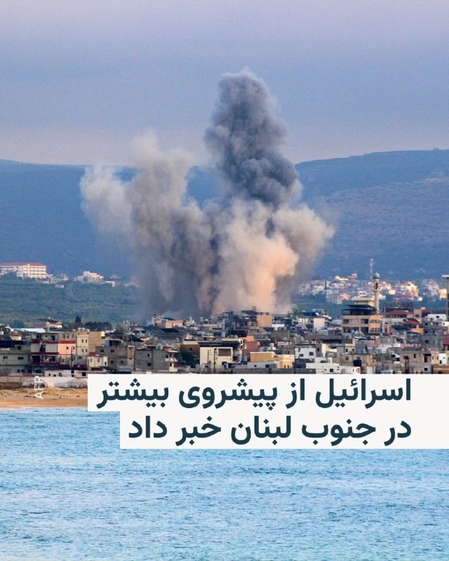

🔸بنیامین نتانیاهو، نخست‌وزیر اسرائیل، روز جمعه گفت نیروهای این کشور در عمق جنوب لبنان پیشروی کرده‌اند؛ همزمان هیئت‌های نظامی اسرائیل و لبنان در واشینگتن مذاکرات امنیتی برگزار کردند.

🔸نتانیاهو اعلام کرد که نیروهای اسرائیلی از رودخانه لیتانی که حدود ۳۰ کیلومتر در شمال مرز لبنان و اسرائیل امتداد دارد، فراتر رفته‌اند.

🔸روز جمعه، خبرگزاری رسمی لبنان از حملات هوایی اسرائیل به بیش از ۲۰ نقطه در جنوب این کشور خبر داد؛ این حملات پیش و پس از صدور هشدارهای ارتش اسرائیل برای تخلیه هشت شهرک صورت گرفت و به موج دیگری از آوارگی مردم این کشور دامن زد.

🔸به گزارش خبرگزاری فرانسه، اسرائیل در همین روز حملات سنگین خود به جنوب لبنان را ادامه داد و وزارت بهداشت لبنان اعلام کرد در حملات اسرائیل به شهر صور ۱۱ نفر کشته شده‌اند.

🔸در همین حال، ژوزف عون، رئیس جمهور لبنان، در تماسی تلفنی با مارکو روبیو، وزیر امور خارجه ایالات متحده، بر «لزوم به کارگیری تمام تلاش‌ها برای دستیابی به آتش‌بس» تأکید کرد.

RadioFarda

## RadioFarda — post 157710

🔸تصاویر پهپادی، کشتی‌های تنگه هرمز را در نور صبحگاهی روز شنبه نهم خرداد نشان می‌دهد، در حالی که پیت هگست، وزیر دفاع ایالات متحده، اعلام کرده که ایالات متحده آماده است در صورت عدم دستیابی به توافق، حملات به ایران را از سر بگیرد.

🔸چهار نهاد مالی و انرژی جهان روز پنجشنبه با اشاره به محاصره تنگه هرمز نسبت به خطرات فزاینده‌ برای امنیت سوخت، شرایط بازار و تاب‌آوری گسترده‌تر اقتصاد جهانی هشدار دادند.

🔸در پی حملات مشترک آمریکا و اسرائیل به ایران در نهم اسفند سال گذشته و آغاز جنگ، نیروهای نظامی ایران تنگه هرمز را مسدود کردند.

🔸آمریکا در واکنش به اقدام ایران در بستن تنگه هرمز، یک محاصره دریایی بر بنادر و کشتیرانی ایران اعمال کرده است که بر مبنای آن ورود و خروج هر کشتی از مبدأ یا به مقصد بنادر ایران ممنوع است.

🔸قبل از شروع جنگ، ترافیک کشتیرانی از طریق این تنگه به ​​طور متوسط ​​۱۲۵ تا ۱۴۰ بار در روز بود. حدود ۲۰ هزار دریانورد همچنان در صدها کشتی در خلیج فارس سرگردان هستند.

RadioFarda

## RadioFarda — post 157709

  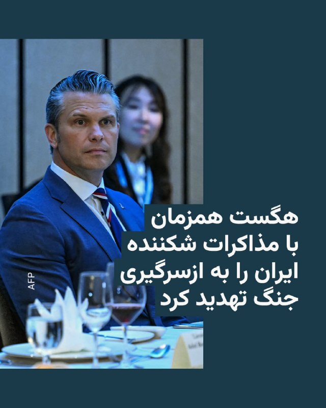

🔸ایالات متحده روز شنبه هشدار داد که برای ازسرگیری جنگ با ایران حتی «بیش از آنچه لازم است توانایی» دارد.

🔸این هشدار پس از آن صادر شد که دونالد ترامپ، رئیس‌جمهور آمریکا، اعلام کرد هرگونه توافق صلح باید بر اساس خط قرمزهای او باشد، از جمله اینکه تهران هرگز نتواند به سلاح‌های هسته‌ای دست یابد.

🔸کاخ سفید اشاره کرده بود که ترامپ پس از هفته‌ها پیام‌های متناقض در ارتباط با مذاکرات شکننده، به تصمیم‌گیری در مورد یک توافق اولیه نزدیک شده است، هرچند تهران وجود هرگونه توافق نهایی برای پایان دادن به درگیری در خاورمیانه را که اقتصاد جهانی را تکان داده است، تکذیب کرد.

🔸در همین حال، پیت هگست، رئیس پنتاگون، روز شنبه به وقت محلی در جریان شرکت در یک نشست بزرگ دفاعی آسیا در سنگاپور گفت که واشینگتن در صورت تمایل می‌تواند جنگ را از سر بگیرد.

🔸او گفت: «توانایی ما برای شروع مجدد در صورت نیاز به گونه‌ای است که بیش از حد توانایی داریم و انبار‌های مهمات ما برای این کار کاملاً مناسب هستند، هم در آنجا و هم در سراسر جهان؛ چرا که ما میان مهمات پیشرفته و مهمات فراوان‌تر تعادل برقرار کرده‌ایم.»

RadioFarda

## RadioFarda — post 157708

  

🔸جلسه دونالد ترامپ با مشاوران ارشدش که طبق وعده او قرار بود نتیجه چند هفته مذاکره را روشن کند پس از بیش از دو ساعت بدون اعلام نتیجه به پایان رسید.

🔸بامداد شنبه، نهم خردادماه، روزنامه نیویورک تایمز به نقل از یک مقام ارشد دولت که به نامش اشاره نکرد نوشت که ترامپ در این جلسه به نتیجه‌ای درباره تفاهم‌نامه با تهران نرسیده است.

🔸رئیس‌جمهور آمریکا پیشتر اعلام کرده بود که روز جمعه در اتاق وضعیت کاخ سفید جلسه‌ای با حضور مشاورانش برگزار خواهد کرد تا تصمیم نهایی درباره توافق با ایران را اتخاذ کند.

🔸ترامپ گفت که که توافق پایان دادن جنگ باید شامل مواردی مانند تعهد ایران به باز شدن تنگه هرمز و نابودی ذخایر اورانیوم باشد.

🔸با این حال ساعتی بعد سخنگوی وزارت خارجه جمهوری اسلامی در واکنش به این پیام دونالد ترامپ دربارهٔ محتوای توافق میان آمریکا و ایران اعلام کرد که تفاهم میان دو کشور هنوز نهایی نشده است.

@RadioFarda

## RadioFarda — post 157707

  

🔸مرکز عملیات تجارت دریایی بریتانیا و فرماندهی مرکزی نیروهای دریایی آمریکا روز جمعه هشتم خرداد در اطلاعیه‌ای مشترک به شناورها هشدار دادند که فعالیت‌ها در محدوده تنگه هرمز با خطرات حساس امنیتی همراه است.

🔸در این اطلاعیه با اشاره به ادامه محاصره دریایی بنادر ایران و عملیات‌ها در خلیج فارس، خلیج عمان، شمال دریای عرب و تنگه هرمز، به هواپیماها و کشتی‌هایی که قصد عبور از منطقه مشخص شده را دارند، توصیه شده تا با احتیاط حرکت کنند و در صورت امکان از پیمایش در این منطقه خودداری کنند.

🔸این اطلاعیه به کشتی‌هایی که با انجام یا شرکت در انتقال کشتی به کشتی، محاصره را نقض می‌کنند، هشدار داده است که در حال نقض محاصره هستند و اگر فوراً از نیروهای محاصره‌کننده پیروی نکنند شامل اقدامات اجرایی شده و هدف قرار خواهند گرفت.

🔸این اطلاعیه با تاکید بر اینکه وضعیت کنونی تا اطلاع ثانوی ادامه خواهد داشت، هشدار داد هر شناوری که از دستورهای نیروهای آمریکا پیروی نکند، ممکن است تهدیدی قریب‌الوقوع تلقی شود و مطابق حقوق بین‌الملل هدف اقدام متناسب نظامی قرار گیرد.

@RadioFarda

## RadioFarda — post 157706

  <a href="https://t.me/radiofarda/157706" target="_blank">📎 Download file</a>

📻بشنوید: سرخط خبرها با رادیوفردا، نهم خرداد ۱۴۰۵‌

@RadioFarda

## IranianMinds — post 21059

یک مقام ارشد آمریکایی به الجریزه :

ترامپ هیچ توافقی با ایران رو امضا نمی‌کنه مگر اینکه به نفع آمریکا باشه و خط قرمزهاش رعایت بشه

@IranianMinds

## IranianMinds — post 21058

🔴 صداوسیما خیلی جدی :

طبق نظرسنجی که از مردم انجام دادیم،اکثریت مردم بخاطر وضعیت کشور از وصل شدن اینترنت ناراضی و ناراحتن،باید فورا مجددا قطع بشه.

@IranianMinds

## IranianMinds — post 21057

  <a href="telegram/content/IranianMinds_21057_1780132269.mp4" target="_blank">🎬 Download video</a>

(((((((:

@IranianMinds

## IranianMinds — post 21056

سنتکام :

به دریانوردان و ملوانان و خلبانان هشدار میدیم که سنتکام عملیات نظامی تو تنگه هرمز، شمال شبه‌جزیره مسندم عمان که در وسط تنگه قرار داره، بزودی انجام خواهد داد
مراقب باشید و با ما هماهنگی های لازم انجام بدید

این عملیات به عهده ناو های جورج بوش و آبراهام لینکن خواهد بود

@IranianMinds

## BBCPersian — post 282409

🔻گفت‌وگو با شرق‌شناس روس؛ آیا هنوز امکان «توافق بزرگ» میان آمریکا و ایران وجود دارد؟
رسانه‌ها تاکنون چندین بار از احتمال دستیابی به توافقی میان آمریکا و ایران برای ازسرگیری کشتیرانی در تنگه هرمز خبر داده‌اند، اما مذاکرات با میانجی‌های مختلف همچنان ادامه دارد و مقام‌های جمهوری اسلامی با بدبینی به آن نگاه می‌کنند.
روسلان سلیمانوف، شرق‌شناس روس، می‌گوید پس از آتش‌بس هشتم آوریل تغییری جدی رخ نداده و مواضع تهران و واشنگتن در موضوع‌های اصلی همچنان سخت‌گیرانه، آشتی‌ناپذیر و بدون آمادگی برای مصالحه باقی مانده است.
به گفته او، تنها زمینه ممکن برای توافق، گسترش آتش‌بس و تعیین قواعدی برای جلوگیری از جنگ تازه است و توافقی مشابه برجام در سال ۲۰۱۵ فعلا غیرواقع‌بینانه به نظر می‌رسد.
در حالی که گزارش‌هایی درباره انتقال اورانیوم غنی‌شده ایران به چین یا روسیه منتشر شده، آقای سلیمانوف می‌گوید تصمیم نهایی در اختیار نیروهای امنیتی و نزدیکان مجتبی خامنه‌ای است که به نظر می‌آید مخالف امتیاز دادن هستند.
متن کامل خبر را در لینک زیر بخوانید:
https://bbc.in/436N0yF
📸 GettyImages/Reuters
@BBCPersian

## BBCPersian — post 282398

🔻فاطمه مهاجرانی، سخنگوی دولت ایران در یادداشتی تصمیم دولت «برای بازگشایی همگانی اینترنت بین‌الملل» را «نه صرفا رفع یک محدودیت فنی»، بلکه «گامی در جهت احقاق حقوق عمومی مردم» توصیف کرد.

او محدودیت‌های اعمال شده ماه‌های اخیر را ناشی از «تهدیدات امنیتی، تجاوز دشمن و اقتضائات ناشی از آن» خواند و گفت بنابر قانون اساسی «هیچ وضعیت استثنایی نمی‌تواند به رویه‌ای دائمی تبدیل شود.»

خانم مهاجرانی با انتقاد از «شکل‌گیری دسترسی‌های نابرابر و چندلایه به اینترنت» در ماه‌های اخیر نوشته است که این وضعیت «احساس تبعیض را در جامعه افزایش داد.»

بعد از چند ماه قطعی اینترنت در ایران در پی جنگ آمریکا و اسرائیل با ایران، دو روز پیش اینترنت در ایران به طور نسبی وصل شد. پیش از این، دولت مسعود پزشکیان چند بار خواستار برقراری مجدد اینترنت شده و تاکید کرده بود که قطعی اینترنت موجب ضربه به حوزه علمی و آموزشی و خسارات اقتصادی می‌شود و مستقیم و غیرمستقیم بر کسب و کارها تاثیر می‌گذارد.

@BBCPersian

## BBCPersian — post 282397

  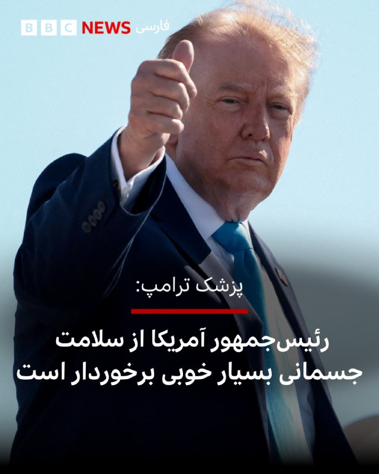

🔻پزشک دونالد ترامپ، در یادداشتی که روز جمعه از سوی کاخ سفید منتشر شد، اعلام کرد که رئیس‌جمهور آمریکا همچنان از سلامت بسیار خوبی برخوردار است. به گفته او، نتایج معاینات انجام‌شده در هفته جاری نشان می‌دهد که آقای ترامپ ۷۹ ساله همچنان دچار «تورم خفیف در ناحیه پایینی پاها و کبودی خوش‌خیم در دست‌ها» است.

دکتر شان باربابلا در یادداشتی که شامگاه جمعه منتشر شد، تأکید کرد که «دونالد ترامپ از سلامت جسمانی بسیار مطلوبی برخوردار است و عملکرد قلب، ریه‌، سیستم عصبی و وضعیت کلی بدنی او در شرایطی قوی و طبیعی قرار دارد.»

به گفته پزشک آقای ترامپ، او از آمادگی کامل برای انجام مسئولیت‌های رئیس‌جمهور و فرماندهی کل نیروهای مسلح آمریکا برخوردار است.

معاینات سالانه آقای ترامپ روز ۲۶ مه (۵ خرداد) انجام شده است.

دونالد ترامپ که در ماه ژوئن ۸۰ ساله می‌شود، مسن‌ترین فردی بود که مسئولیت ریاست‌جمهوری را بر عهده گرفته است.

او اغلب خود را پرانرژی‌تر و از نظر جسمانی آماده‌تر از جو بایدن، رئیس‌جمهور دموکرات پیشین، معرفی می‌کند.

📸رویترز
@BBCPersian

## BBCPersian — post 282388

🔻رضا ثابتی
روزنامه‌نگار

ذخایر اورانیوم غنی‌شده ایران یکی از موارد اختلاف جدی میان تهران و واشنگتن برای پایان دادن به جنگ است. اما سرنوشت و مکان نگهداری این مواد،‌ خود به معمایی پیچیده در پرونده هسته‌ای جمهوری اسلامی تبدیل شده است.

این اختلاف بر سر حدود چهارصد کیلوگرم اورانیومی است که ایران طی سال‌های اخیر تا سطح ۶۰ درصد غنی‌سازی کرده است؛ سطحی که هنوز برای مصارف تسلیحاتی کافی نیست، اما از نظر فنی تنها فاصله کوتاهی با غنای ۹۰ درصدی مورد نیاز برای ساخت بمب هسته‌ای دارد.

با گذشت حدود یک سال از حملات آمریکا و اسرائیل به تاسیسات هسته‌ای فردو، نطنز و اصفهان در جریان جنگ ۱۲ روزه، هنوز هیچ مرجع مستقلی نتوانسته با قطعیت بگوید چه مقدار از این ذخایر باقی مانده، در چه وضعیتی است و دقیقا کجا نگهداری می‌شود.

چرا ایران چنین ذخایری در اختیار دارد و چه سرنخ‌هایی درباره سرنوشت آن در دست است؟
متن کامل خبر در لینک زیر:
https://bbc.in/4acMu5V

📸BBC/ GettyImages/ Le Monde, Airbus DS (2026)/ Reuters/ AFP via Getty Images/ Satellite image (c) 2026 Vantor
@BBCPersian

## Dirty_Kids — post 390544

بابای من چون خودش کله ی سحر بیدار میشه هر روز به یه بهانه ایی مامانمو صبح بیدار می کنه
امروز دیگه هیچ بهانه ایی نداشته
۸ صبح گفته میخوام برم پمپ بنزین نمیای؟ :)))))

جدا مرد بازنشسته پدیده ی عجیبیه.

@Dirty_Kids 👻

## Dirty_Kids — post 390543

  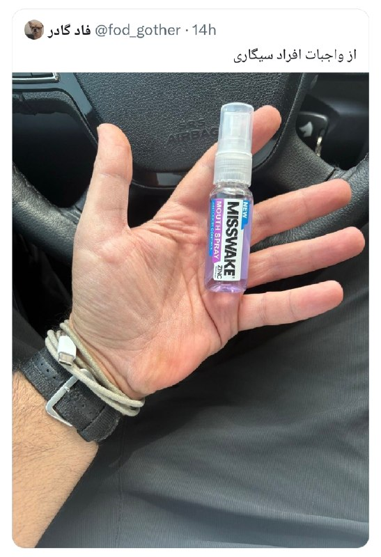

بعد به سیم شارژر من می‌گی بالا چشمت ابرو دیگه شارژ نمی‌کنه.

@Dirty_Kids 👻

## Dirty_Kids — post 390542

  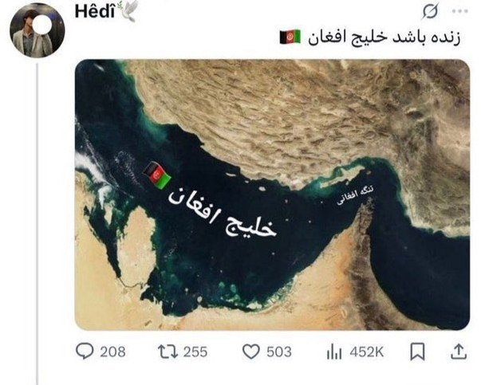

کسکش تو بخوای به خلیج فارس برسی باید دو روز تو صندوق‌عقبه پژو بخوابی😂😂

@Dirty_Kids 👻

## Dirty_Kids — post 390541

چهار سال پیش ترمینال بودم، یه اقایی بغل دستم نشسته بود گفت اتوبوسم نیم ساعت دیگه حرکت میکنه یه چُرت کوچولو میزنم بیست دقیقه بعد بیدارم کن،
الان یادم اومد

@Dirty_Kids 👻

## Dirty_Kids — post 390540

  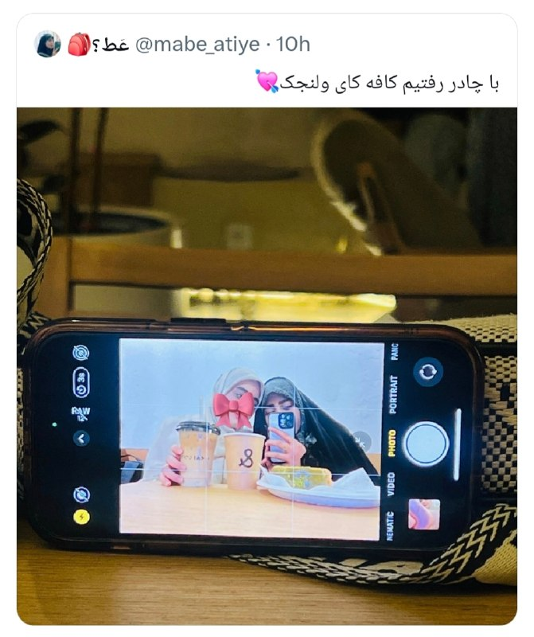

‏شما با این حجم از شجاعت موافقید؟

یجور حرف میزنه انگار بی‌حجابی اجباریه و این دل شیر داشته که با چادر رفتی کافه، عقب مونده

@Dirty_Kids 👻

## Dirty_Kids — post 390539

  <a href="telegram/content/Dirty_Kids_390539_1780132272.mp4" target="_blank">🎬 Download video</a>

بزرگترین سوال بی جواب از جمهوری اسلامی ملایان!

@Dirty_Kids 👻

## Dirty_Kids — post 390538

  <a href="telegram/content/Dirty_Kids_390538_1780132274.mp4" target="_blank">🎬 Download video</a>

مداحی سوزناک «من به یادت» برای عاغا موشعلی

@Dirty_Kids 👻

## Dirty_Kids — post 390537

پولدار بودن خیلی خوبه.
درستو میخونی، زبانتو فول میکنی، هر تخصص یا هنری رو دلت بخواد یاد میگیری، باشگاه میری به هیکلت میرسی،
به دوست دختر/پسرت میرسی،
سفرتو میری،
تفریحتو داری.
تهشم از اراده ات حرف میزنی.

@Dirty_Kids 👻

## Hranews — post 113233

پرونده سرقت نفت در خوزستان؛ چهار متهم به شلاق و دیگر مجازات‌ها محکوم شدند

❗️
❗️
❗️
❗️
❗️ – مرکز رسانه قوه قضاییه اعلام کرد که در پرونده‌ای مربوط به سرقت هزاران بشکه نفت خام در استان خوزستان، چهار تن از متهمان به تحمل ضربات شلاق و ۱۳ سال حبس تعزیری محکوم شدند.

#شلاق

ادامه مطلب

↘️
@hranews_bot تماس ✉️ -  @Hranews  کانال هرانا 🆑

## Hranews — post 113232

  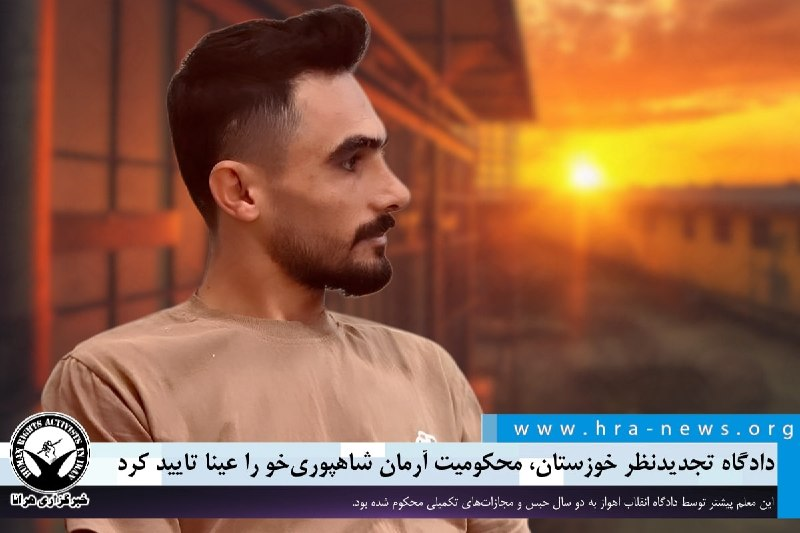

دادگاه تجدیدنظر؛ آرمان شاهپوری‌خو به ۲ سال حبس و مجازات‌های تکمیلی محکوم شد

❗️
❗️
❗️
❗️
❗️ – محکومیت آرمان شاهپوری‌خو، معلم بازداشت‌ شده در جریان اعتراضات سراسری ۱۴۰۴، توسط دادگاه تجدیدنظر استان خوزستان عینا تایید شد. وی پیشتر توسط دادگاه انقلاب اهواز به دو سال حبس و مجازات‌های تکمیلی محکوم شده بود.

به گزارش خبرگزاری هرانا، ارگان خبری مجموعه فعالان حقوق بشر در ایران، اخیرا حکم صادر شده علیه آرمان شاهپوری‌خو، بدون تغییر در دادگاه تجدیدنظر استان خوزستان، عینا تایید شده است.

بر اساس رای صادره، آقای شاهپوری‌خو، بابت اتهام اخلال در نظم و امنیت عمومی به دو سال حبس، دو سال ممنوعیت خروج از کشور و یک سال حضور در ستاد امر به معروف و نهی از منکر شهرستان ایذه محکوم شده است.

#آرمان_شاهپوری_‌خو

ادامه مطلب

↘️
@hranews_bot تماس ✉️ -  @Hranews  کانال هرانا 🆑

## Hranews — post 113231

یک فرد در تهران به اتهام جاسوسی بازداشت شد

❗️
❗️
❗️
❗️
❗️ – یک فرد در تهران به دلیل آنچه که “جاسوسی و ارتباط با رسانه‌های خارج از کشور” عنوان شده است، توسط پلیس اطلاعات و امنیت بازداشت شد.

ادامه مطلب

↘️
@hranews_bot تماس ✉️ -  @Hranews  کانال هرانا 🆑

## alonews — post 123640

  <a href="telegram/content/alonews_123640_1780132276.webm" target="_blank">🎬 Download video</a>

👈داده‌های ماهواره‌ای نشان ‌می‌دهد یک کشتی فله‌بر ایرانی به‌نام کیوان با عبور از محاصرهٔ دریایی آمریکا به سواحل ایران در نزدیکی بندر امام خمینی رسیده است.

✅ @AloNews خبر جنگ

## alonews — post 123639

  <a href="telegram/content/alonews_123639_1780132276.webm" target="_blank">🎬 Download video</a>

👈برای اولین بار در تاریخ بورس ایران، هیچ سهمی منفی نیست!

✅ @AloNews خبر جنگ

## alonews — post 123638

  <a href="telegram/content/alonews_123638_1780132276.webm" target="_blank">🎬 Download video</a>

👈ترامپ: محاصره دریایی ایران از همین حالا برداشته خواهد شد. 
✅ @AloNews خبر جنگ

## alonews — post 123637

  <a href="telegram/content/alonews_123637_1780132277.webm" target="_blank">🎬 Download video</a>

👈یه مقام آمریکایی به الجریزه : ترامپ هیچ توافقی با ایران رو امضا نمی‌کنه مگر اینکه به نفع آمریکا باشه و خط قرمزهاش رعایت بشه

✅ @AloNews خبر جنگ

## alonews — post 123636

  <a href="telegram/content/alonews_123636_1780132277.webm" target="_blank">🎬 Download video</a>

👈فیلد مارشال محسن رضایی: رئیس‌جمهور آمریکا برای بار سوم درحال خیانت به دیپلماسی است

✅ @AloNews خبر جنگ

## alonews — post 123635

  <a href="telegram/content/alonews_123635_1780132277.webm" target="_blank">🎬 Download video</a>

👈مقام ایرانی به الجزیره: هنوز هیچ چیز نهایی نشده است

✅ @AloNews خبر جنگ

## alonews — post 123634

  <a href="telegram/content/alonews_123634_1780132277.webm" target="_blank">🎬 Download video</a>

👈از امروز محدودیت‌های چک برگشتی و لحاظ شدن بدهی‌های غیرجاری وام‌های زیر ۷۰۰ میلیون تومانی در امتیاز اعتباری، پس از پایان مهلت سه‌ماهه بازگشت

✅ @AloNews خبر جنگ

## alonews — post 123633

  <a href="telegram/content/alonews_123633_1780132278.webm" target="_blank">🎬 Download video</a>

👈ارتش : انهدام یک فروند پهپاد «اوربیتر» در منطقه قشم

✅ @AloNews خبر جنگ

## alonews — post 123632

  <a href="telegram/content/alonews_123632_1780132278.webm" target="_blank">🎬 Download video</a>

👈حسین شریعتمداری: ایران باید فورا از طریق یمن تنگه باب‌المندب را ببندد

✅ @AloNews خبر جنگ

## alonews — post 123631

  <a href="telegram/content/alonews_123631_1780132278.webm" target="_blank">🎬 Download video</a>

👈کلش ریپورت: روسیه سفیر خود را از ارمنستان فراخواند و خواستار مشورت شد و همسویی روزافزون ایروان با اتحادیه اروپا را دلیل آن اعلام کرد.

🔴روسیه تهدید کرد که در صورت ادامه حرکت ارمنستان به سمت غرب، عرضه گاز و نفت بدون تعرفه را قطع خواهد کرد.

✅ @AloNews خبر جنگ

## alonews — post 123630

  <a href="telegram/content/alonews_123630_1780132278.webm" target="_blank">🎬 Download video</a>

👈آخرین قیمت نفت ۹۱.۱۲ دلار

✅ @AloNews خبر جنگ

## alonews — post 123628

  <a href="telegram/content/alonews_123628_1780132278.webm" target="_blank">🎬 Download video</a>

👈حملات ارتش اسرائیل به مواضع حزب‌الله در جنوب لبنان

✅ @AloNews خبر جنگ

## alonews — post 123627

  <a href="telegram/content/alonews_123627_1780132279.webm" target="_blank">🎬 Download video</a>

👈 ان‌بی‌سی: جنگنده اف-۱۵ای آمریکا، ماه گذشته با یک موشک دوش‌پرتاب چینی در ایران سرنگون شد!

✅ @AloNews خبر جنگ

## alonews — post 123626

  <a href="telegram/content/alonews_123626_1780132279.webm" target="_blank">🎬 Download video</a>

👈 کاخ سفید آخرین معاینه پزشکی ترامپ را منتشر کرد و اعلام کرد که رئیس‌جمهور ۷۹ ساله در «سلامت عالی» با عملکرد طبیعی ریه و سیستم عصبی قرار دارد، هم‌چنین قلب او ۱۴ سال از سن او جوان تر است

✅ @AloNews خبر جنگ

## alonews — post 123625

  <a href="telegram/content/alonews_123625_1780132279.webm" target="_blank">🎬 Download video</a>

👈کنکور سراسری به همراه آزمون پذیرش دانشجومعلم پنجشنبه و جمعه ۲۹ و ۳۰ مرداد ماه برگزار خواهد شد

✅ @AloNews خبر جنگ

## alonews — post 123624

  <a href="telegram/content/alonews_123624_1780132279.webm" target="_blank">🎬 Download video</a>

👈مقام ایرانی به الجزیره: هنوز هیچ چیز نهایی نشده است

🔴او مدعی شد تیم مذاکره‌کننده آمریکا چارچوب حرفه‌ای و اخلاقی مشخصی ندارد و مواضع و خواسته‌های خود را به‌طور مداوم تغییر می‌دهد.

🔴این اظهارات در حالی مطرح می‌شود که گزارش‌های مختلفی از ادامه مذاکرات، تبادل پیام‌ها و تلاش میانجی‌ها برای کاهش اختلاف‌های باقی‌مانده منتشر شده است.

✅ @AloNews خبر جنگ

## alonews — post 123623

  <a href="telegram/content/alonews_123623_1780132279.webm" target="_blank">🎬 Download video</a>

👈نیویورک پست : آزادسازی منابع ایران مشروط به بازگشایی تنگه هرمز و پاکسازی مین ها است

✅ @AloNews خبر جنگ

## alonews — post 123621

  <a href="telegram/content/alonews_123621_1780132279.webm" target="_blank">🎬 Download video</a>

👈نفت برنت بیش از ۹ درصد ریخت و طلا با رشد ۰.۸ درصدی به ۴۵۹۳ دلار رسید

✅ @AloNews خبر جنگ

## alonews — post 123620

  <a href="telegram/content/alonews_123620_1780132280.webm" target="_blank">🎬 Download video</a>

👈سپاه اصفهان: به‌دلیل انجام انفجارهای کنترل‌شده تا ساعت ۱۴ امروز در جنوب اصفهان، احتمال شنیدن صدای انفجار در این منطقه وجود دارد.

✅ @AloNews خبر جنگ

---
📅 بروزرسانی: 1405/03/09 03:34
---

## VahidOOnLine — post 242847

این نام‌ها،
روایت زندگی‌هایی هستند که با خشونت در خیابان‌های ایران متوقف شدند.<
یکی سه روز بعد از پدر شدن کشته شد، یکی تنها شش ماه از ازدواجش گذشته بود، یکی برای نجات مادرش خودش را سپر کرد و دیگری با ساز و موسیقی، زندگی را معنا می‌کرد. نسل جوانی که هر کدام آینده‌ای پیش رو داشتند، با گلوله، باتوم و خشونت جمهوری اسلامی از ادامه زندگی بازماندند.<
میعاد ساده‌میری، مهران شیخ‌الاسلامی، نیما احمدی، مهران مظفری، امیرمحمد استاددوست، روح‌الله ستاره مشتری، صنم پوربابایی و محمدرضا مرادعلی؛
جاویدنامان انقلاب ملی ایرانیان.<
این روایت‌ها کوتاه‌اند، چون جای خالی این انسان‌ها را هیچ متنی نمی‌تواند کامل توضیح دهد؛ اما نامشان باید تکرار شود، تا فراموش نشوند.<
این روایت‌ها کوتاه‌اند، چون جای خالی این انسان‌ها را هیچ متنی نمی‌تواند کامل توضیح دهد؛ این روایت‌ها بخشی از حافظه زنده مردم ایران‌اند.<
#جاویدنامان_انقلاب_ملی_ایرانیان
‌🏁 🇬🇧 IranintlTV

🤖 @VahidOOnLine

## VahidOOnLine — post 242846

  

نهاد مدیریت آبراه خلیج فارس در واکنش به اقدام اخیر وزارت خزانه‌داری آمریکا در تحریم این نهاد، ضمن محکومیت این اقدام تاکید کرد: «تسلط بر تنگه هرمز را که در میدان و دیپلماسی به دست نیاوردید، با تحریم هم به دست نخواهید آورد.»
این نهاد تحریم شدن از سوی «کشوری که رییس آن به دزدی دریایی افتخار می‌کند» را نشانه‌ای از «عملکرد مثبت» خود دانست و افزود: «علیرغم اقدامات تنش‌زای ایالات متحده در آب‌های خلیج فارس و دریای عمان، این نهاد در راستای تسهیل تردد، بی‌وقفه به بررسی و ارائه مجوز عبور به شناورهای غیرمتخاصم ادامه می‌دهد.»

‌🏁 🇬🇧 IranintlTV

🤖 @VahidOOnLine

## VahidOOnLine — post 242845

  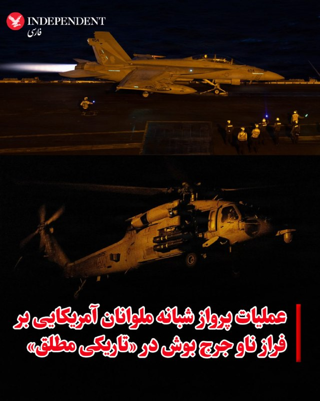

♦️فرماندهی مرکزی ایالات متحده، سنتکام، روز جمعه، با انتشار تصاویری در اکس، از اجرای موفقیت‌آمیز عملیات پرواز شبانه توسط ملوانان آمریکایی بر فراز ناو هواپیمابر «یو‌اس‌اس جرج اچ.دبلیو بوش» خبر داد. سنتکام با تمجید از آمادگی نیروهای خود اعلام کرد که در این مانور، خلبانان بسیار ماهر آمریکایی موفق شدند در تاریکی نزدیک به مطلق، پرنده‌های خود را بر روی عرشه کوچک این ناو که در میان امواج دریا در حال تکان خوردن و چرخیدن بود، به سلامت فرود آورند.
‌🇸🇦 Indypersian

🤖 @VahidOOnLine

## VahidOOnLine — post 242844

  

♦️نیکی هیلی، سفیر پیشین آمریکا در سازمان ملل، با انتشار پیامی در اکس نوشت: «رژیم ایران هرگز با حسن نیت عمل نکرده است. همیشه همان بازی را ادامه می‌دهد؛ وقت‌کشی، خرید زمان و تغییر موضع.»
هیلی افزود تا زمانی که دسترسی کامل و کنترل بر مواد هسته‌ای ایران به دست نیامده، نباید دارایی‌ها آزاد یا تحریم‌ها کاهش داده شود.
‌🇸🇦 Indypersian

🤖 @VahidOOnLine

## VahidOOnLine — post 242843

  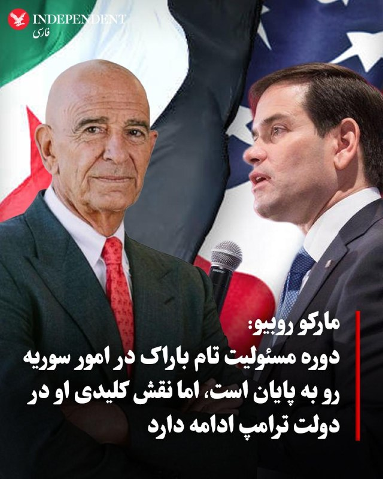

♦️مارکو روبیو، وزیر امور خارجه آمریکا، روز جمعه با انتشار پیامی در اکس اعلام کرد: «سفیر تام باراک نقشی بی‌بدیل و ارزشمند به عنوان فرستاده ویژه ما در امور سوریه ایفا کرده است. هرچند دوره این عنوان رسمی رو به پایان است، اما او همچنان به ایفای نقشی کلیدی برای دولت ترامپ هم در سوریه و هم در عراق ادامه خواهد داد، چرا که تخصص، روابط و درک عمیق او از دستور کار «اول آمریکا» به ارمغان آوردن دستاوردهای بزرگ به نمایندگی از کشور بزرگمان را تضمین می‌کند.»
‌🇸🇦 Indypersian

🤖 @VahidOOnLine

## VahidOOnLine — post 242842

  

♦️به گزارش «ای‌بی‌سی نیوز»، در پی برگزاری یک نشست دو ساعته در «اتاق وضعیت» (Situation Room) به منظور اتخاذ تصمیم نهایی درباره توافق با تهران، یک مقام کاخ سفید با انتشار بیانیه‌ای اعلام کرد: «دونالد ترامپ تنها توافقی را امضا خواهد کرد که برای آمریکا خوب باشد و خطوط قرمز او را به طور کامل برآورده کند؛ ایران هرگز نمی‌تواند به سلاح هسته‌ای دست یابد.» براساس این گزارش، رئیس‌جمهوری ایالات متحده روز جمعه پس از ساعت‌ها رایزنی با تیم امنیت ملی خود برای تعیین تکلیف نهایی این پرونده، هنوز تصمیم رسمی خود را اعلام نکرده و مشخص نیست که چرا اعلام این موضع با تاخیر مواجه شده است.
‌🇸🇦 Indypersian

🤖 @VahidOOnLine

## VahidOOnLine — post 242841

♦️خبرگزاری تسنیم، وابسته به سپاه پاسداران، بامداد شنبه ۹ خرداد با انتشار تصاویری مدعی شد بقایای یک پهپاد متعلق به آمریکا و اسرائیل که در حوالی قشم هدف قرار گرفته، کشف شده است. تسنیم بیان کرد این پهپاد پس از شناسایی یک ریزپرنده در حوالی قشم، با واکنش پدافند هوایی ارتش هدف قرار گرفت و منهدم شد.
پیش از این، خبرنگار صدا و سیما در قشم نیز از فعال شدن سامانه پدافند هوایی در این منطقه خبر داده بود. هم‌زمان، خبرگزاری مهر به نقل از منابع محلی گزارش داد یک ریزپرنده در حوالی قشم از سوی پدافند هوایی هدف قرار گرفته و منهدم شده است.
‌🇸🇦 Indypersian

🤖 @VahidOOnLine

## VahidOOnLine — post 242840

  

♦️دکتر جمشید ایرانی، وکیل دیوان عالی آمریکا، اطلاع دادند که وزارت خارجه ایالات متحده با دادن «مجوز موقت و مشروط برای ورود» (Parole) به بازیکنان تیم ملی فوتبال ایران موافقت کرده‌ است. این وکیل در نوشته‌ای که در صفحه فیسبوک خود به اشتراک گذاشت، با اشاره به تحقیق و پی بردن به تصمیم واشنگتن در قبال کاروان ورزشی ایران توضیح داد که وزارت امور خارجه آمریکا برای اعضای تیم ملی «ویزای معمولی» صادر نخواهد کرد، بلکه ورود آن‌ها به خاک این کشور در قالب این طرح مشروط خواهد بود که امتیازات ویزای عادی را ندارد. به گفته دکتر جمشید ایرانی، این مجوز تحت طبقه‌بندی «پی-۱» (P-1، ویژه ورزشکاران) صادر می‌شود که به دولت آمریکا اجازه می‌دهد در هر لحظه این امتیاز را لغو و افراد را بدون نیاز به حکم دادگاه اخراج کند؛ ضمن اینکه احتمال اعمال محدودیت مکانی ۴۰ کیلومتری (۲۵ مایلی) پیرامون ورزشگاه و نظارت ماموران ماموریت‌های مهاجرت و گمرک آمریکا (ICE) بر این کاروان وجود دارد.
پیش از این، درحالی‌که تنها ۱۲ روز تا آغاز جام جهانی ۲۰۲۶ باقی مانده و تیم ملی فوتبال ایران در اردوی آماده‌سازی به سر می‌برد، مهدی محمدنبی، سرپرست تیم ملی، پس از بازی مقابل گامبیا به خبرنگاران گفته بود که تا آن لحظه ویزای مکزیک و آمریکا «صادر نشده است». سرپرست تیم ملی فوتبال ایران با گلایه از این وضعیت اعلام کرده بود: «به فیفا ایمیل زدیم و پرسیدیم که چه روزی قرار است ویزا صادر شود. ما ویزای مولتی آمریکا و مکزیک را نیاز داریم. اینکه هنوز ویزای ما صادر نشده و همه از آن اطلاع دارند، عادلانه نیست».
‌🇸🇦 Indypersian

🤖 @VahidOOnLine

## VahidOOnLine — post 242839

  

♦️به گزارش خبرگزاری رویترز، فرانسیس داناوان، فرمانده ستاد جنوبی ارتش ایالات متحده، روز جمعه در اقدامی کم‌سابقه با مقامات ارشد نظامی کوبا در خط مرزی پایگاه دریایی گوانتانامو دیدار و گفتگو کرد. ارتش آمریکا اعلام کرد که در این ماموریت، مسائلی چون امنیت عملیاتی مرزها، حفاظت از نیروها و آمادگی رزمی پایگاه مورد بررسی قرار گرفته است.
این دیدار در شرایطی انجام می‌شود که تنش‌ها میان واشنگتن و هاوانا به شدت بالا گرفته است. دونالد ترامپ پیش از این اشاره کرده بود که پس از پایان موضوع ایران، تمرکز خود را بر تغییر حکومت در کوباخواهد گذاشت. دولت ترامپ با اعمال محاصره سوختی، فشار اقتصادی شدیدی را بر کوبا وارد کرده است؛ موضوعی که واکنش تند وزیر امور خارجه کوبا را به همراه داشت و هشدار داد که هرگونه اقدام نظامی آمریکا به یک «حمام خون» با هزاران کشته از هر دو طرف منجر خواهد شد.
‌🇸🇦 Indypersian

🤖 @VahidOOnLine

## VahidOOnLine — post 242838

♦️حسین علایی، فرمانده سابق نیروی دریایی سپاه پاسداران، در مصاحبه با «بر مدار ایران» گفت که پیش از آغاز جنگ اخیر، سناریوی ترور مقامات ارشد نظام را پیش‌بینی کرده و آن را با علی شمخانی، دبیر وقت شورای عالی امنیت ملی، در میان گذاشته بود. علایی گفت: «من سه روز قبل از جنگ جدید به شمخانی گفتم که نقشه اول آمریکا جنگ ۱۲ روزه و نقشه دوم آنها اعتراضات دی‌ماه بود، اما آنها اکنون روی نقشه سوم تمرکز کرده‌اند که استراتژی آن، هدف قرار دادن و ترور رهبر (علی خامنه‌ای) در همان نخستین روزهای آغاز جنگ است.» او در ادامه گفت که شمخانی در آن زمان با تکیه بر عدم توانایی دشمن در شناسایی موقعیت‌ها، این احتمال را رد کرده بود.
علی خامنه‌ای، دومین رهبر جمهوری اسلامی، و علی شمخانی، از مشاوران او، صبح ۹ اسفندماه در اولین روز جنگ، طی حمله مشترک آمریکا و اسرائیل کشته شدند.
‌🇸🇦 Indypersian

🤖 @VahidOOnLine

## VahidOOnLine — post 242837

  

به گزارش نیویورک‌پست، یکی از آخرین موارد اختلاف بر سر راه توافق احتمالی میان واشینگتن و تهران، چگونگی آزادسازی مرحله‌ای دارایی‌های ایران است که در قطر نگهداری می‌شود و برای اهداف بشردوستانه در نظر گرفته شده است.
بر اساس این گزارش، منابع مالی مورد بحث مستقیما در اختیار حکومت ایران قرار نخواهد گرفت، بلکه برای خرید مواد غذایی و تجهیزات پزشکی استفاده می‌شود و سپس این اقلام به ایران ارسال خواهد شد.
نیویورک‌پست به نقل از یک مقام دولت آمریکا نوشت پرداخت تدریجی این منابع به اجرای تعهدات از سوی ایران، از جمله بازگشایی تنگه هرمز و پاکسازی مین‌ها در تنگه هرمز، وابسته خواهد بود.

‌🏁 🇬🇧 IranintlTV

🤖 @VahidOOnLine

## VahidOOnLine — post 242836

  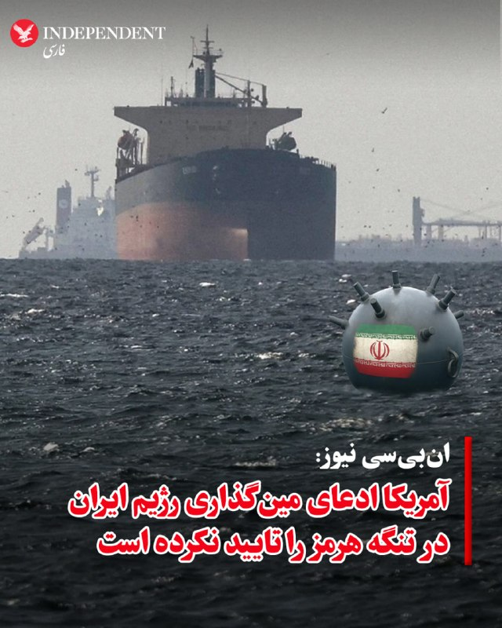

♦️«ان‌بی‌سی نیوز» به نقل از منابع آگاه، روز جمعه گزارش داد، ارتش ایالات متحده علی‌رغم جستجوهای گسترده و مداوم در آبراه حیاتی تنگه هرمز، هنوز نتوانسته است ادعای مین‌گذاری رژیم ایران در این منطقه را به طور قطعی تایید کند. دو مقام رسمی آمریکا و یک فرد مطلع از این پرونده اعلام کرده‌اند که با وجود ارزیابی‌های اولیه اطلاعاتی مبنی بر اقدام حکومت ایران به مین‌گذاری در بخش جنوبی این تنگه در آغاز جنگ در ماه فوریه، بازرسی‌های مکرر با استفاده از پهپادهای زیرسطحی، ربات‌های آبی و پرنده‌های سرنشین‌دار و بدون سرنشین هنوز به کشف هیچ مین مشخصی منجر نشده است؛ موضوعی که بر ابهامات و سردرگمی‌های موجود پیرامون این نبرد افزوده است.
بر اساس این گزارش، عدم دستیابی به شواهد قطعی در آستانه ورود این جنگ به چهارمین ماه خود، سوالات کلیدی را درباره میزان «جدی و مستحکم بودن» این تهدیدات برانگیخته است. این در حالی است که دونالد ترامپ و مقامات ارشد دولت او پیش از این بارها گفته بودند که ایران ممکن است در حال پر کردن تنگه با مین‌های دریایی باشد؛ مطلبی که به عنوان دلیل اصلی توقف تردد کشتی‌ها و جهش بی‌سابقه قیمت نفت مطرح می‌شد. با این حال، کارشناسان تاکید می‌کنند که مین‌گذاری موثر این آبراه حیاتی مستلزم به‌کارگیری حجم بسیار بالایی از مواد منفجره پنهان در یک منطقه مشخص است که ارتش آمریکا هنوز نشانه‌ای از آن پیدا نکرده است.
‌🇸🇦 Indypersian

🤖 @VahidOOnLine

## WithYashar — post 12922

سنتکام: هر شناوری که در حال انجام یا حمایت از فعالیت‌ های مین‌گذاری در تنگهٔ هرمز دیده بشه، توسط ما هدف قرار خواهد گرفت!
@withyashar

## WithYashar — post 12921

  <a href="telegram/content/WithYashar_12921_1780099481.mp4" target="_blank">🎬 Download video</a>

گلزار: نماز میخونم و شبا هم هر موقع بیدار شم شروع میکنم به دعا کردن
@withyashar ❄️👃

## WithYashar — post 12920

یک مقام کاخ سفید در گفت‌و‌گو با خبرنگار شبکۀ الجزیره مدعی شد: دونالد ترامپ هیچ توافقی را امضا نخواهد کرد مگر آنکه این توافق مطالبات آمریکا را تأمین کرده و با خطوط قرمز تعیین‌شده از سوی او همخوانی داشته باشد.
«واشنگتن هرگز اجازه نخواهد داد ایران به سلاح هسته‌ای دست پیدا کند».
@withyashar

## WithYashar — post 12918

@withyashar وضعیت

## WithYashar — post 12916

اسرائیل هیوم: مقام‌های موساد معتقدند عملیات‌های اخیر علیه ایران فقط یک مرحله در مسیر سقوط جمهوری اسلامی بوده است. رئیس پیشین شاخه نفوذ گفت این واحد اکنون با شدت بیشتری فعالیت می‌کند و هدف آن «سریع‌تر کردن ساعت شنی پایان حکومت است».
@withyashar

## WithYashar — post 12915

https://t.me/boost/withyashar

بچه‌ها عالی بود👏👏، بوست ۳۴۸ تا دیگه لازم داره. لطفاً این پیام رو برای تمام دوستانتون که تلگرام پرمیوم(تیک) دارن بفرستین و ازشون خواهش کنین که چنل رو بوست کنن ❤️‍🩹چیزی‌ تا ایموجی نمونده🤰🫃🏻

## WithYashar — post 12914

شکست مذاکرات پنتاگون؛ اصرار تل‌آویو بر تداوم جنگ در لبنان

منبع رسمی لبنانی: طرف اسرائیلی با درخواست هیئت لبنانی برای آتش بس مخالفت کرد

یک منبع رسمی لبنانی در گفت‌وگو با المیادین اعلام کرد:  هیئت نظامی مذاکره‌کننده در پنتاگون، به درخواست خود برای برقراری آتش‌بس واقعی دست نیافت. این هیئت بر مطالبه آتش‌بس پافشاری کرد، اما با مخالفت مکرر اسرائیل مواجه شد.

به گفته این منبع، هیئت اسرائیلی از عقب‌نشینی از اراضی اشغالی لبنان خودداری کرده و بر «نابودی (توانمندی‌های نظامی) حزب الله» اصرار کرد.
@withyashar

## WithYashar — post 12913

  

تصویری از داماد ۱۷ ساله و عروس ۱۶ ساله در تجمعات شبانه
@withyashar
زبانم قاسمه کتلته…🥴

## WithYashar — post 12912

صداوسیما: منابع محلی از فعال شدن سامانه پدافندی در جزیره قشم حوالی ساعت ۲۱:۲۵ خبر دادند.

بررسی‌های اولیه حاکی است این اقدام به احتمال زیاد در مقابله با ریزپرنده‌ها انجام شده و با موفقیت همراه بوده است.
سامانه‌های پدافندی آرش‌ کمان‌گیر در روزهای اخیر عملکرد موفقی در مقابله با پهپادهای دشمن داشته‌اند.
@withyashar

## WithYashar — post 12911

حسین علایی:
سه روز قبل از ۹ اسفند به شمخانی گفتم امریکا جنگ رو با تـرور رهبر شروع میکنه؛ گفت نمیتونن اینکارو کنن. چون نمیتونن پیداش کنن.
سه روز بعد هم خودشو زدن هم رهبر رو. اونا اطلاعاتشون خیلی قویه.
@withyashar

## WithYashar — post 12910

  

مالک شبکه ایران اینترنشنال به ادعای فاینانشال تایمز

گزارش Financial Times درباره ایران اینترنشنال می‌گوید این شبکه به‌صورت رسمی توسط شرکت بریتانیایی Volant Media UK اداره می‌شود، اما ساختار مالکیت آن پیچیده و چندلایه است و از طریق شرکت‌هایی در بریتانیا و جزایر کیمن انجام می‌شود. طبق این گزارش، این شرکت در سال‌های اخیر با زیان‌های سنگین و بدهی‌های بزرگ (بیش از ۴۰۰ میلیون پوند) روبه‌رو بوده و اخیراً بخشی از بدهی‌ها از طریق تبدیل بدهی به سهام بازسازی شده است. در جریان این تغییرات، سهام قابل توجهی به یک شرکت ثبت‌شده در جزایر کیمن به نام Info-Cast Cayman Limited منتقل شده که مدیر آن فردی به نام صالح حسین الدویس معرفی شده است؛ او در گزارش FT به‌عنوان مدیری مرتبط با گروه رسانه‌ای سعودی SRMG شناخته می‌شود. این گزارش تأکید می‌کند که مالکیت شبکه شفاف و مستقیم نیست و در قالب ساختارهای مالی پیچیده و آفشور انجام شده است
@withyashar

## WithYashar — post 12909

شاهزاده رضا پهلوی :اگر اروپا می‌تواند اتحادیه خودش را داشته باشد، چرا ما نتوانیم در خاورمیانه اتحادیه‌ای داشته باشیم؟
چرا نتوانیم در پروژه‌های مشترک مربوط به امنیت ملی، اطلاعات و حتی همکاری‌های نظامی همکاری کنیم؟
چرا باید بخش زیادی از بودجه‌مان را صرف تسلیحات و مسابقه تسلیحاتی کنیم، به جای اینکه این منابع را صرف رفاه، صندوق‌های بازنشستگی، بهداشت و آموزش کنیم؟
@withyashar

## WithYashar — post 12908

نیویورک پست: وجوه مسدود شده مستقیما به ایران ارسال نخواهد شد، بلکه برای خرید مواد غذایی و تجهیزات پزشکی استفاده خواهد شد و پرداخت آنها منوط به تعهد تهران به باز کردن تنگه هرمز و پاکسازی مین‌ها خواهد بود
@withyashar

## WithYashar — post 12907

شاهزاده رضا پهلوی:تصور کنید که فردا مدل سیلیکون ولی در سیستان و بلوچستان اجرا شود. چرا که نه؟

هر چیزی که کشور نیاز داشته باشد از هوش مصنوعی گرفته تا فناوری و نوآوری می‌تواند در آنجا توسعه یابد.
@withyashar

## WithYashar — post 12906

نیویورک تایمز به نقل از یک مقام دولتی:
نشست ترامپ در اتاق عملیات به پایان رسید وحدود دو ساعت به طول انجامید.
@withyashar

## mwarmonitor — post 9906

🔴ترامپ ملزم به پاسخگویی درباره «اتهامات سنگین» در پرونده آی‌آر‌اس (سازمان امور مالیاتی) شد

📝نویسنده: آیوری لاتز AXIOS

🔸یک قاضی فدرال به پرزیدنت ترامپ دستور داد تا به اتهامات «سنگین» مطرح شده پاسخ دهد؛ اتهاماتی که ادعا می‌کنند توافق او با سازمان امور مالیاتی (IRS) — که منجر به ایجاد صندوق مبارزه با استفاده ابزاری از نهادها (anti-weaponization fund) شد — «بر پایه فریبکاری» بوده است.

📌چرا این موضوع اهمیت دارد؟
این دستور درست در همان روزی صادر شد که قاضی دیگری موقتاً این صندوق مالی ۱.۷۷۶ میلیارد دلاری را مسدود کرد؛ اقدامی که مانع بالقوه دیگری بر سر راه طرح توافق جنجالی دولت ترامپ ایجاد می‌کند.

🔸پشت صحنه ماجرا (محور اخبار):
دستور قاضی دادگاه منطقه‌ای ایالات متحده، کاتلین ویلیامز، در پی درخواست قبلی ۳۵ قاضی سابق فدرال صادر شد. این قضات از او خواسته بودند پرونده‌ای را که در ماه ژانویه در رابطه با لو رفتن اظهارنامه‌های مالیاتی ترامپ تشکیل شده بود، دوباره باز کند.

@mwarmonitor

## mwarmonitor — post 9905

🔴رهبران سه سازمان اقتصادی بین‌المللی روز جمعه هشدار دادند که اگر حمل‌ونقل نفت به حالت عادی بازنگردد، ممکن است با افزایش «ریسک برای امنیت سوخت، شرایط بازار و تاب‌آوری گسترده‌تر اقتصاد» مواجه شویم؛ به‌ویژه زمانی که تقاضا در تابستان افزایش پیدا کند. CBS

@mwarmonitor

## mwarmonitor — post 9904

🔴ایران و مسیر پیش‌رو: ترامپ باید از اهرم فشار خود استفاده کند و به دنبال «صلح از طریق قدرت» باشد

📝 نویسنده: ربکا ال. هاینریش ، انستیتو هادسون

🔸عملیات‌های «پتک نیمه‌شب» (Midnight Hammer) و «خشم حماسی» (Epic Fury) با موفقیت برنامه‌ تسلیحات هسته‌ای و قدرت‌نمایی منطقه‌ای ایران را تضعیف کردند. ایالات متحده و اسرائیل توان نظامیِ نیروی دریایی و هوایی ایران را به شدت کاهش دادند و در عین حال، به ارکان اصلی پایه صنعتی دفاعی آن، به‌ویژه تولید فولاد و پلاستیک مرتبط با صنایع نظامی، آسیب سنگینی وارد کردند. عملیات‌های نظامی متحدان همچنین باعث ایجاد شکاف در درون رژیم ایران شده است؛ از جمله فروپاشی در ساختار فرماندهی و کنترل که به نظر می‌رسد توانایی چهره‌های سیاسی را برای کنترل عملیات‌های سپاه پاسداران انقلاب اسلامی در تنگه هرمز تحت تأثیر قرار داده است.

اگرچه ایالات متحده و اسرائیل رژیم را تضعیف کرده‌اند، اما واشنگتن در مذاکرات با یک مانع روبرو است؛ زیرا مشخص نیست چه کسی در تهران قدرت را در دست دارد و آیا نمایندگان سیاسی ایران می‌توانند تعهدات خود را بر سپاه پاسداران تحمیل و اجرا کنند یا خیر. مسئله اصلی صرفاً دستیابی به یک توافق نیست، بلکه پایداری و دوام هرگونه توافق است. این چالش پابرجا خواهد ماند زیرا رژیم از درون دچار چنددستگی است، جمهوری اسلامی سابقه‌ای طولانی در عدم حسن نیت در مذاکرات دارد و همچنان حاضر نیست از ادعای نادرست خود مبنی بر «حق غنی‌سازی اورانیوم» دست بکشد.
اگر ایالات متحده موفق شود یک یادداشت تفاهم از بقایای رژیم ایران (حتی با وجود رهبری متفرق فعلی) دریافت کند، باید از ایرانی‌ها بخواهد که توقف واقعی تجاوزات در تنگه هرمز و رویکردی تعاملی برای برچیدن سایر عناصر برنامه تسلیحات هسته‌ای خود را نشان دهند. دولت ترامپ متعهد شده است تا زمانی که ایران ابتدا پایبندی خود را به یک تنگه آزاد و باز نشان نداده و برنامه هسته‌ای خود را برچیند، هیچ توافقی را نخواهد پذیرفت و فشار اقتصادی یا نظامی را کاهش نخواهد داد.
دستاوردهای نظامی و آسیب‌پذیری‌ها
عملیات «خشم حماسی» با موفقیت ساختارهای فرماندهی و کنترل و رهبران کلیدی نظامی ایران را مختل کرد و توانمندی‌های متعارف کلیدی آن را کاهش داد. اما این عملیات تا مرز نابودی کامل تشکیلات سپاه پاسداران پیش نرفت. واحدهای سپاه در امتداد سواحل خلیج [فارس] هنوز می‌توانند با خودمختاری قابل‌توجهی عمل کنند، قایق‌های تندرو را مستقر کنند، پرتابگرها را به کار بگیرند، به سمت هواپیماهای آمریکایی که محاصره کشتیرانی ایران را اجرا می‌کنند موشک‌های زمین به هوا شلیک کنند و حتی در شرایطی که مقامات سیاسی ایران در حال مذاکره هستند، مزاحم کشتیرانی بین‌المللی شوند.
این ازهم‌گسیختگی یک مشکل اساسی برای دیپلماسی ایجاد می‌کند: رهبری سیاسی تهران ممکن است تضمین‌هایی بدهد که توانایی اجرای آن‌ها را ندارد. ادامه فعالیت‌های سپاه در تنگه هرمز در طول مذاکرات، این سوال عمیق‌تر را برجسته می‌کند که آیا اصلاً کسی در تهران هست که بتواند به طور قابل اعتمادی سپاه را مجبور به پایبندی به یک توافق کند؟
تنگه هرمز: یک اهرم فشار، نه منوط به اجازه
تضمین آزادی کشتیرانی در تنگه هرمز یک اولویت فوری و کوتاه‌مدت است، زیرا اختلال در آنجا بر بازارهای جهانی، به‌ویژه در حوزه انرژی و ثبات اقتصادی تأثیر می‌گذارد. اما ایالات متحده باید از هرگونه چارچوبی که مستلزم مذاکره برای کسب مجوزهای گام‌به‌گام از ایران باشد یا کنترل باقی‌مانده بر این آبراه حیاتی جهانی را در دست تهران باقی بگذارد، خودداری کند.
هرگونه توافقی که در ازای همکاری محدود ایران در زمینه کشتیرانی، تحریم‌ها را کاهش دهد یا بخش‌هایی از محاصره را لغو کند، خطر از دست رفتن اهرم فشاری را به همراه دارد که برای برچیدن دائمی برنامه هسته‌ای ایران نیاز است. رویکرد مؤثرتر، از سرگیری «پروژه آزادی» (Project Freedom) خواهد بود. این پروژه شامل پاکسازی تهدیدها در طول تنگه، خنثی کردن قایق‌های تندرو سپاه، سایت‌های موشکی ساحلی و سیستم‌های مستقر در غارها، و اسکورت ترافیک تجاری از طریق این آبراه است، به جای اینکه منتظر اجازه ایران بمانند. شرکت‌های بیمه و خطوط کشتیرانی تا زمانی که واحدهای سپاه به فعالیت خود در طول خط ساحلی ادامه می‌دهند، بعید است تنها به تضمین‌های سیاسی اعتماد کنند.



@mwarmonitor

## mwarmonitor — post 9903

  

🔴 تانکر تارکرز: در روزهای اخیر، نفتکش‌ها در امتداد ساحل ایران و در تأسیسات دریایی اقدام به بارگیری نفت خام و انواع فرآورده‌های پالایش‌شده کرده‌اند. امروز (۲۹ مه ۲۰۲۶) نیز شاهد بارگیری یک نفتکش بسیار بزرگ (VLCC) به میزان دو میلیون بشکه نفت خام هستیم. @mwarmonitor

## mwarmonitor — post 9902

  

📌ملوانان نیروی دریایی آمریکا عملیات پرواز شبانه را روی ناو هواپیمابر «USS George H. W. Bush (CVN-77)» انجام می‌دهند. در شب، خلبانان بسیار ماهر می‌توانند در تاریکی تقریباً کامل، روی یک عرشه کوچک که در حال بالا و پایین رفتن و تکان خوردن است فرود بیایند.

@mwarmonitor

## mwarmonitor — post 9901

  

🔴فرمانده فرماندهی جنوبی ارتش آمریکا، ژنرال دونوفان، امروز در حاشیه خلیج گوانتانامو با فرماندهان ارشد نظامی کوبا دیدار کرده است. رویترز

@mwarmonitor

## mwarmonitor — post 9900

🔴یکی از آخرین گره‌های باقی‌مانده در مسیر توافق با ایران، آزادسازی مرحله‌ای منابع مالی است که در قطر نگهداری می‌شود و قرار است برای اهداف بشردوستانه مورد استفاده قرار گیرد — نیویورک تایمز.

@mwarmonitor

## mwarmonitor — post 9899

🔸یک منبع رسمی ایرانی همین حالا به من گفت:
«هیچ چیزی را نمی‌توان با تیمی که چارچوب حرفه‌ای یا اخلاقی ثابتی ندارد، دمدمی‌مزاج است و مدام خواسته‌هایش را تغییر می‌دهد، نهایی‌شده تلقی کرد.» علی هاشم خبرنگار الجزیره

@mwarmonitor

## mwarmonitor — post 9898

  

✈️در حال حاضر تنها پروازی که بر فراز اسرائیل در حال ارسال سیگنال است، یک هواپیمای سوخت‌رسان KC-135R Stratotanker متعلق به نیروی هوایی ایالات متحده است؛ در همین حال، یک فروند E-11A (گره ارتباطی هوابرد میدان نبرد – BACN) از پایگاه هوایی شاهزاده سلطان بر فراز عراق در حال گشت‌زنی (لوئیتر کردن) است.

@mwarmonitor

## mwarmonitor — post 9897

🔴دونالد ترامپ، رئیس‌جمهور آمریکا، یک نشست حدوداً دو ساعته در «اتاق وضعیت» را بدون اتخاذ تصمیم درباره توافق جدید با ایران ترک کرد. یک مقام ارشد دولت آمریکا این موضوع را به نیویورک‌تایمز گفته است.

🔴به گفته این مقام، دولت آمریکا معتقد است که رسیدن به توافق نزدیک است، اما همچنان اختلافاتی وجود دارد؛ از جمله بر سر آزادسازی دارایی‌های مسدودشده ایران.

@mwarmonitor

## FoxNewsTwitter — post 342417

  

Fox News (Twitter/X)

WATCH LIVE: Atlas 5 rocket launches 29 Amazon Leo satellites from Florida https://twitter.com/i/broadcasts/1lJQRRBLyOWxE

## FoxNewsTwitter — post 342416

‌Fox News (Twitter/X)

👉 Full story here:

## FoxNewsTwitter — post 342415

  

Fox News (Twitter/X)

CodePink co-founder Medea Benjamin confirms Treasury Department inquiry into her group's Cuba convoy. The probe demands answers to 12 detailed questions about 170 participants, $600,000 in supplies, and every hour spent on the communist island, she said, acknowledging that "it's serious."

## FoxNewsTwitter — post 342414

  

Fox News (Twitter/X)

A former mayor pleaded guilty Friday to acting as an illegal agent of the Chinese government.

Eileen Li Wang, the former mayor of Arcadia, California, allegedly acted "at the direction and control" of Chinese government officials between 2020 and 2022, without notifying U.S. authorities, prior to taking office.

According to court documents, Wang worked alongside a convicted Chinese agent, who is already serving a four-year federal prison sentence, to operate a website posing as a local Chinese-American news outlet.

Prosecutors described the website as a propaganda arm for the Chinese Communist Party that published content supplied directly by Chinese government officials.

She faces up to 10 years in prison. The judge has scheduled sentencing for October 6, 2026.

## FoxNewsTwitter — post 342412

Fox News (Twitter/X)

What are illegal migrants actually eating inside Delaney Hall?

According to a menu released by DHS, detainees are being served a wide range of meals including fajitas, burritos, jambalaya, chicken fried steak, fruit, vegetables, salads, brownies, and cake.

The release comes as New Jersey Democrats and far-left protesters criticize conditions at the ICE detention facility and stage demonstrations that have turned chaotic throughout the week.

NJ Governor Mikie Sherrill now says she is working to establish a "peaceful, protected, protest zone" with hopes to "lower the temperature."

## FoxNewsTwitter — post 342411

Fox News (Twitter/X)

“I’ll kill your whole f–king family. Your whole f–king family is dead. Your children, your wife, all dead."

That's just one of the chilling threats made to ICE agents outside a New Jersey facility, as the DOJ says it's now working to identify and arrest the demonstrators.

@AlexisMcAdamsTV shows just some of the moments investigators are looking into as chaotic protests continue at the Newark facility. | @AmericaRpts

## pm_afshaa — post 91877

  <a href="telegram/content/pm_afshaa_91877_1780099487.mp4" target="_blank">🎬 Download video</a>

ویدیویی از دقایق اول حمله اسراییل به بیت رهبری

💧 Rainbet.com the #1 Non-KYC Crypto Casino & Sportsbook @rainbetcom

😁 @Pm_Afshaa

## pm_afshaa — post 91876

  <a href="telegram/content/pm_afshaa_91876_1780099488.mp4" target="_blank">🎬 Download video</a>

شاهزاده رضا پهلوی:اگر اروپا می‌تواند اتحادیه خودش را داشته باشد، چرا ما نتوانیم در خاورمیانه اتحادیه‌ای داشته باشیم؟

چرا نتوانیم در پروژه‌های مشترک مربوط به امنیت ملی، اطلاعات و حتی همکاری‌های نظامی همکاری کنیم؟

چرا باید بخش زیادی از بودجه‌مان را صرف تسلیحات و مسابقه تسلیحاتی کنیم، به جای اینکه این منابع را صرف رفاه، صندوق‌های بازنشستگی، بهداشت و آموزش کنیم؟

💧 Rainbet.com the #1 Non-KYC Crypto Casino & Sportsbook @rainbetcom

😁 @Pm_Afshaa

## pm_afshaa — post 91875

  <a href="telegram/content/pm_afshaa_91875_1780099490.mp4" target="_blank">🎬 Download video</a>

شاهزاده رضا پهلوی:تصور کنید که فردا مدل سیلیکون ولی در سیستان و بلوچستان اجرا شود. چرا که نه؟

هر چیزی که کشور نیاز داشته باشد از هوش مصنوعی گرفته تا فناوری و نوآوری می‌تواند در آنجا توسعه یابد.

💧 Rainbet.com the #1 Non-KYC Crypto Casino & Sportsbook @rainbetcom

😁 @Pm_Afshaa

## pm_afshaa — post 91874

  <a href="telegram/content/pm_afshaa_91874_1780099492.mp4" target="_blank">🎬 Download video</a>

شاهزاده رضا پهلوی:چرا می‌گوییم جهان باید از مردم ایران در پیگیری آزادی حمایت کند؟

آنها به خاطر چشم‌های زیبای من یا شما این کار را نمی‌کنند.

آنها این کار را انجام می‌دهند چون به نفع منافع خودشان است.

ما باید آنها را قانع کنیم که حمایت از مردم ایران به نفعشان است.

💧 Rainbet.com the #1 Non-KYC Crypto Casino & Sportsbook @rainbetcom

😁 @Pm_Afshaa

## pm_afshaa — post 91873

🔴الجزیره:وزیر خزانه‌داری آمریکا مدعی شد که تحریم‌های ایران به تدریج لغو خواهد شد

💧 Rainbet.com the #1 Non-KYC Crypto Casino & Sportsbook @rainbetcom

😁 @Pm_Afshaa

## DEJradio — post 5112

  <a href="telegram/content/DEJradio_5112_1780099494.mp4" target="_blank">🎬 Download video</a>

👑
🚨 شاهزاده رضا پهلوی: «از تمام ظرفیت تاثیرگذاری خود در راه انقلاب شیر و خورشید استفاده کنید.»

بخشی دیگر از نشست آنلاین با شماری از فعالان و چهره‌های رسانه‌ای و هنری، ۱ خرداد ۲۵۸۵/۱۴۰۵

#شاهزاده_رضا_پهلوی
#ایران_را_پس_میگیریم
@DEJradio

## VahidOnline — post 75798

  <a href="telegram/content/VahidOnline_75798_1780099496.mp4" target="_blank">🎬 Download video</a>

خبرگزاری تسنیم، وابسته به سپاه پاسداران، بامداد شنبه ۹ خرداد با انتشار تصاویری مدعی شد بقایای یک پهپاد متعلق به آمریکا و اسرائیل که در حوالی قشم هدف قرار گرفته، کشف شده است.
تسنیم بیان کرد این پهپاد با واکنش پدافند هوایی ارتش هدف قرار گرفت و منهدم شد.
پیش از این خبرگزاری مهر به نقل از منابع محلی گزارش داد یک ریزپرنده در حوالی قشم از سوی پدافند هوایی هدف قرار گرفته و منهدم شده است.
@VahidOOnLine

📡 @VahidOnline

## VahidOnline — post 75797

  

به گزارش نیویورک‌پست، یکی از آخرین موارد اختلاف بر سر راه توافق احتمالی میان واشینگتن و تهران، چگونگی آزادسازی مرحله‌ای دارایی‌های ایران است که در قطر نگهداری می‌شود و برای اهداف بشردوستانه در نظر گرفته شده است.

بر اساس این گزارش، منابع مالی مورد بحث مستقیما در اختیار حکومت ایران قرار نخواهد گرفت، بلکه برای خرید مواد غذایی و تجهیزات پزشکی استفاده می‌شود و سپس این اقلام به ایران ارسال خواهد شد.

نیویورک‌پست به نقل از یک مقام دولت آمریکا نوشت پرداخت تدریجی این منابع به اجرای تعهدات از سوی ایران، از جمله بازگشایی تنگه هرمز و پاکسازی مین‌ها در تنگه هرمز، وابسته خواهد بود.
@VahidOOnLine

📡 @VahidOnline

## IranIntlTV — post 339666

این نام‌ها،
روایت زندگی‌هایی هستند که با خشونت در خیابان‌های ایران متوقف شدند.
یکی سه روز بعد از پدر شدن کشته شد، یکی تنها شش ماه از ازدواجش گذشته بود، یکی برای نجات مادرش خودش را سپر کرد و دیگری با ساز و موسیقی، زندگی را معنا می‌کرد. نسل جوانی که هر کدام آینده‌ای پیش رو داشتند، با گلوله، باتوم و خشونت جمهوری اسلامی از ادامه زندگی بازماندند.
میعاد ساده‌میری، مهران شیخ‌الاسلامی، نیما احمدی، مهران مظفری، امیرمحمد استاددوست، روح‌الله ستاره مشتری، صنم پوربابایی و محمدرضا مرادعلی؛
جاویدنامان انقلاب ملی ایرانیان.
این روایت‌ها کوتاه‌اند، چون جای خالی این انسان‌ها را هیچ متنی نمی‌تواند کامل توضیح دهد؛ اما نامشان باید تکرار شود، تا فراموش نشوند.
این روایت‌ها کوتاه‌اند، چون جای خالی این انسان‌ها را هیچ متنی نمی‌تواند کامل توضیح دهد؛ این روایت‌ها بخشی از حافظه زنده مردم ایران‌اند.
#جاویدنامان_انقلاب_ملی_ایرانیان

## IranIntlTV — post 339665

  

نهاد مدیریت آبراه خلیج فارس در واکنش به اقدام اخیر وزارت خزانه‌داری آمریکا در تحریم این نهاد، ضمن محکومیت این اقدام تاکید کرد: «تسلط بر تنگه هرمز را که در میدان و دیپلماسی به دست نیاوردید، با تحریم هم به دست نخواهید آورد.»
این نهاد تحریم شدن از سوی «کشوری که رییس آن به دزدی دریایی افتخار می‌کند» را نشانه‌ای از «عملکرد مثبت» خود دانست و افزود: «علیرغم اقدامات تنش‌زای ایالات متحده در آب‌های خلیج فارس و دریای عمان، این نهاد در راستای تسهیل تردد، بی‌وقفه به بررسی و ارائه مجوز عبور به شناورهای غیرمتخاصم ادامه می‌دهد.»

https://iranintl.com/202605291729

## IranIntlTV — post 339664

  <a href="telegram/content/IranIntlTV_339664_1780099497.mp4" target="_blank">🎬 Download video</a>

شورای امنیت سازمان ملل اعلام کرد مقامات و نیروهای طالبان مرتکب خشونت جنسی علیه زنان شده‌اند. براساس این گزارش، ۲۱ مورد خشونت جنسی، از جمله تجاوز گروهی علیه ۱۵ زن و شش دختر، در سال گذشته میلادی ثبت شده و برخی زنان نیز هدف برهنه‌سازی یا ازدواج اجباری قرار گرفته‌اند.

گفت‌وگو با راضیه دانش، عضو تحریریه ایران‌اینترنشنال
@iranintltv

## IranIntlTV — post 339663

  <a href="telegram/content/IranIntlTV_339663_1780099498.mp4" target="_blank">🎬 Download video</a>

در دو هفته گذشته حملات اسرائیل به مناطق مختلف لبنان افزایش یافته و به حدود ۴۷ حمله در روز رسیده است.

این در حالی است که مذاکرات میان اسرائیل و لبنان در واشینگتن در حال برگزاری است.

گفت‌وگو با بن سبطی، پژوهشگر ایران و اسرائیل
@iranintltv

## IranIntlTV — post 339662

  <a href="telegram/content/IranIntlTV_339662_1780099500.mp4" target="_blank">🎬 Download video</a>

نیویورک‌تایمز گزارش داد آمریکا هنوز درباره هیچ توافق جدیدی با تهران به تصمیم نهایی نرسیده است.

همزمان، سخنگوی وزارت خارجه جمهوری اسلامی اعلام کرد تفاهم با آمریکا هنوز نهایی نشده است.

گفت‌وگو با امیر گیتی، عضو تحریریه ایران‌اینترنشنال
@iranintltv

## IranIntlTV — post 339661

  <a href="telegram/content/IranIntlTV_339661_1780099501.mp4" target="_blank">🎬 Download video</a>

یک زن سرپرست خانوار با ارسال پیامی به ایران اینترنشنال می‌گوید که به دلیل افزایش قیمت‌ها و اجاره خانه توان تامین معاش خود و خانواده را ندارد. صدای او برای حفظ امنیتش تغییر داده شده است.

## IranIntlTV — post 339660

  

به گزارش نیویورک‌پست، یکی از آخرین موارد اختلاف بر سر راه توافق احتمالی میان واشینگتن و تهران، چگونگی آزادسازی مرحله‌ای دارایی‌های ایران است که در قطر نگهداری می‌شود و برای اهداف بشردوستانه در نظر گرفته شده است.
بر اساس این گزارش، منابع مالی مورد بحث مستقیما در اختیار حکومت ایران قرار نخواهد گرفت، بلکه برای خرید مواد غذایی و تجهیزات پزشکی استفاده می‌شود و سپس این اقلام به ایران ارسال خواهد شد.
نیویورک‌پست به نقل از یک مقام دولت آمریکا نوشت پرداخت تدریجی این منابع به اجرای تعهدات از سوی ایران، از جمله بازگشایی تنگه هرمز و پاکسازی مین‌ها در تنگه هرمز، وابسته خواهد بود.

https://iranintl.com/202605292135

## IranIntlTV — post 339659

  <a href="telegram/content/IranIntlTV_339659_1780099504.mp4" target="_blank">🎬 Download video</a>

در حالی که دولت آمریکا از پایان محاصره دریایی ایران و پیشرفت در تفاهم‌نامه با تهران خبر داده، در کنگره آمریکا پرسش‌هایی درباره هزینه‌های جنگ با ایران مطرح شده است. منتقدان، دولت ترامپ را به ارائه آمار ناقص و متناقض متهم می‌کنند.

گزارش نیلوفر منصوری، خبرنگار ایران‌اینترنشنال
@iranintltv

## IranIntlTV — post 339658

  <a href="telegram/content/IranIntlTV_339658_1780099505.mp4" target="_blank">🎬 Download video</a>

یک موشک نیو گلن متعلق به شرکت بلو اوریجین در جریان آزمایش روی سکوی پرتاب در کیپ کاناورال فلوریدا منفجر شد و ستون بزرگی از آتش و دود به هوا برخاست. این موشک بدون سرنشین برای چهارمین پرتاب آزمایشی و حمل ماهواره‌های پروژه آمازون لئو به مدار پایین زمین آماده می‌شد.…

## IranIntlTV — post 339657

  <a href="telegram/content/IranIntlTV_339657_1780099507.mp4" target="_blank">🎬 Download video</a>

وال‌استریت ژورنال در گزارشی اختصاصی از جزییات حملات امارات به ایران در جریان جنگ اخیر خبر داد. براساس این گزارش، این حملات با هماهنگی آمریکا و اسرائیل انجام شده و قشم، ابوموسی، بندرعباس، لاوان و عسلویه را هدف قرار داده است.

گفت‌وگو با غسان عاشور، تحلیل‌گر مسائل خاورمیانه
@iranintltv

## IranIntlTV — post 339656

  <a href="telegram/content/IranIntlTV_339656_1780099509.mp4" target="_blank">🎬 Download video</a>

وال‌استریت ژورنال در گزارشی اختصاصی از جزییات حملات امارات به ایران در جریان جنگ اخیر خبر داد. براساس این گزارش، این حملات با هماهنگی آمریکا و اسرائیل انجام شده و قشم، ابوموسی، بندرعباس، لاوان و عسلویه را هدف قرار داده است.

گفت‌وگو با غسان عاشور، تحلیل‌گر مسائل خاورمیانه
@iranintltv

## IranIntlTV — post 339655

  

🔻تیم‌های فوتبال پاری‌سن‌ژرمن و آرسنال عصر شنبه در استادیوم پوشکاش آرنا شهر بوداپست مجارستان، در فینال لیگ قهرمانان اروپا، به مصاف یکدیگر می‌روند.

🔹به نظر شما کدام تیم کاپ قهرمانی را به خانه می‌برد؟ شاگردان لوییس انریکه یا میکل آرتتا؟

🔹برای شرکت در این نظرسنجی به صفحه اینستاگرام ایران اینترنشنال ورزشی مراجعه کنید؛👇
https://www.instagram.com/p/DY78FG6gjNx/

@iranintltvsport

## Shin_Persian — post 6316

  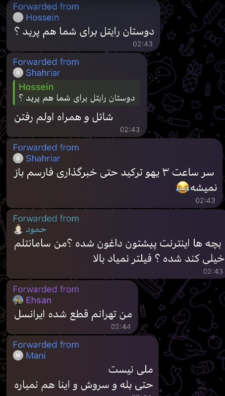

Shin ✓ @hey_itsmyturn
Fri, 29 May 2026 23:45:58 UTC

Even Fars News and regime websites are barely accessible at the moment

فارسی

حتی خبرگزاری فارس و وب‌سایت‌های رژیم در حال حاضر به سختی در دسترس هستند.

𝕏 · @shin_persian

## Shin_Persian — post 6315

Shin ✓ @hey_itsmyturn
Fri, 29 May 2026 23:44:20 UTC

A number of users are reporting internet (FilterNet) disruption in Iran right now.

فارسی

تعدادی از کاربران در حال حاضر از اختلال در اینترنت (فیلترنت) در ایران خبر می‌دهند.

𝕏 · @shin_persian

## Shin_Persian — post 6314

  <a href="telegram/content/Shin_Persian_6314_1780099512.mp4" target="_blank">🎬 Download video</a>

Shin ✓ @hey_itsmyturn
Fri, 29 May 2026 22:26:44 UTC

Reported video of a UAV wreckage in Qeshm island
Hormozgan Province, #Iran
Source: IRIB on TG

فارسی

ویدئوی منتشر شده از لاشه یک پهپاد در جزیره قشم
استان هرمزگان، #Iran
منبع: صدا و سیما در تلگرام

𝕏 · @shin_persian

## Shin_Persian — post 6312

Shin ✓ @hey_itsmyturn
Fri, 29 May 2026 21:03:59 UTC

Source tells me that an Iranian Lieutenant has been killed by shrapnel.
Qeshm island, Hormozgan Province, #Iran

فارسی

منابع به من می‌گویند که یک ستوان ایرانی بر اثر اصابت ترکش کشته شده است.
جزیره قشم، استان هرمزگان، #Iran_

𝕏 · @shin_persian

## Shin_Persian — post 6311

Shin ✓ @hey_itsmyturn
Fri, 29 May 2026 21:01:23 UTC

Ali Hashem is Barak Ravid, but the Al Jazeera version

فارسی

علی هاشم همان باراک راوید است، اما در نسخه الجزیره.

𝕏 · @shin_persian

## Shin_Persian — post 6310

↩️ Quoted tweet: Nevo @Nevo2702 Fri, 29 May 2026 20:31:54 UTC @hey_itsmyturn תרגם ↩️ Quoted tweet — see the post below for the reply. English @hey_itsmyturn Translate ↩️ توییت نقل‌قول شده — برای پاسخ، پست زیر را ببینید. فارسی درخواست ترجمه @hey_itsmyturn…

## Shin_Persian — post 6309

↩️ Quoted tweet:
Nevo @Nevo2702
Fri, 29 May 2026 20:31:54 UTC

@hey_itsmyturn תרגם

↩️ Quoted tweet — see the post below for the reply.

English

@hey_itsmyturn Translate

↩️ توییت نقل‌قول شده — برای پاسخ، پست زیر را ببینید.

فارسی

درخواست ترجمه @hey_itsmyturn

𝕏 · @shin_persian

## Shin_Persian — post 6308

Shin ✓ @hey_itsmyturn
Fri, 29 May 2026 20:31:19 UTC

Treasury's Economic Fury campaign targets Iran-based procurement network that impersonated U.S. businesses to fraudulently acquire restricted military goods for Iran's Ministry of Defense and Armed Forces Logistics (MODAFL). The scheme defrauded dozens of U.S. IT companies out of millions of dollars while procuring network security equipment and encryption technology.

𝐈𝐧𝐝𝐢𝐯𝐢𝐝𝐮𝐚𝐥𝐬:
- 𝐀𝐥𝐢 𝐌𝐚𝐣𝐝 𝐒𝐞𝐩𝐞𝐡𝐫 (Iran) - Mastermind who operated through Sorena company to impersonate U.S. small businesses and procure restricted goods including spectrum analyzers and non-linear junction detectors for MODAFL
- 𝐑𝐨𝐮𝐝𝐚𝐛𝐞𝐡 𝐒𝐚𝐫𝐦𝐚𝐝𝐢 (Iran) - Chairperson of board of directors for Sorena Hushmand Samaneh Company
- 𝐌𝐨𝐡𝐚𝐦𝐦𝐚𝐝𝐚𝐥𝐢 𝐌𝐚𝐧𝐬𝐨𝐮𝐫 𝐃𝐚𝐫𝐞𝐡𝐬𝐡𝐢𝐫𝐢 (Iran) - Dubai-based intermediary who paid U.S. freight forwarders and facilitated shipments through UAE front companies
- 𝐒𝐚𝐢𝐞𝐝 𝐙𝐚𝐡𝐞𝐝𝐢 (Italy, Iranian national) - Used U.S. financial account to pay for domain registration services that impersonated legitimate U.S. businesses
- 𝐌𝐚𝐧𝐨𝐨𝐜𝐡𝐞𝐡𝐫 𝐙𝐚𝐧𝐝𝐢𝐚𝐧 (Iran) - Sorena sales manager who assisted in transferring U.S.-origin products to Iran
- 𝐇𝐨𝐝𝐚 𝐁𝐚𝐫𝐚𝐝𝐚𝐫𝐚𝐧 𝐁𝐚𝐠𝐡𝐞𝐫𝐢 (Iran) - Sorena sales manager involved in procurement scheme
- 𝐅𝐚𝐫𝐳𝐚𝐧𝐞𝐡 𝐑𝐞𝐳𝐚𝐞𝐢 (Iran) - Sorena sales manager facilitating illegal transfers
- 𝐒𝐚𝐲𝐲𝐚𝐝 𝐏𝐚𝐲𝐚𝐦 𝐀𝐤𝐡𝐭𝐚𝐫𝐢𝐚𝐧 (Iran) - Sorena sales manager supporting procurement operations

𝐄𝐧𝐭𝐢𝐭𝐢𝐞𝐬:
- 𝐒𝐨𝐫𝐞𝐧𝐚 𝐇𝐮𝐬𝐡𝐦𝐚𝐧𝐝 𝐒𝐚𝐦𝐚𝐧𝐞𝐡 𝐂𝐨𝐦𝐩𝐚𝐧𝐲 (Iran) - Primary front company used to impersonate U.S. businesses for fraudulent procurement
- 𝐒𝐚𝐢𝐫𝐚𝐧 𝐈𝐧𝐟𝐨𝐫𝐦𝐚𝐭𝐢𝐨𝐧 𝐄𝐱𝐜𝐡𝐚𝐧𝐠𝐞 𝐒𝐩𝐚𝐜𝐞 𝐒𝐞𝐜𝐮𝐫𝐢𝐭𝐲 𝐈𝐧𝐝𝐮𝐬𝐭𝐫𝐢𝐞𝐬 𝐂𝐨𝐦𝐩𝐚𝐧𝐲 (𝐒𝐀𝐀𝐅𝐓𝐀) (Iran) - MODAFL-controlled entity that received procured goods
- 𝐆𝐫𝐞𝐞𝐧 𝐋𝐢𝐠𝐡𝐭 𝐂𝐨𝐦𝐩𝐮𝐭𝐞𝐫 𝐂𝐨 𝐋𝐋𝐂 (Dubai, UAE) - Front company controlled by Darehshiri for receiving and re-exporting shipments
- 𝐀𝐥 𝐊𝐚𝐰𝐭𝐡𝐞𝐫 𝐍𝐞𝐨𝐧 𝐋𝐋𝐂 (Dubai, UAE) - Additional Dubai-based front company used alongside Green Light for facilitation

𝐊𝐞𝐲 𝐎𝐩𝐞𝐫𝐚𝐭𝐢𝐨𝐧𝐬 𝐃𝐞𝐭𝐚𝐢𝐥𝐬:
- Network targeted network security and encryption software/hardware from U.S. small businesses
- Fraudulent procurement involved creating fake domain names mimicking legitimate U.S. companies
- Goods were shipped from U.S. to UAE, then re-exported to Iran
- Scheme specifically sourced spectrum analyzers and non-linear junction detectors for Iranian military

𝐄𝐜𝐨𝐧𝐨𝐦𝐢𝐜 𝐅𝐮𝐫𝐲 𝐂𝐚𝐦𝐩𝐚𝐢𝐠𝐧 𝐂𝐨𝐧𝐭𝐞𝐱𝐭:
Treasury reports disrupting tens of billions in Iranian regime revenue, including freezing nearly $500 million in regime-linked cryptocurrency. Campaign includes targeting shadow banking networks, oil trade facilitation, and digital asset exploitation. State Department offers $15 million reward for information disrupting IRGC financial mechanisms.

All designated persons' U.S.-based assets are blocked. Foreign financial institutions risk secondary sanctions for facilitating transactions with designated persons.

ترجمه فارسی در بخش نظرات

𝕏 · @shin_persian

## FarsiVOA — post 219034

  <a href="telegram/content/FarsiVOA_219034_1780099513.mp4" target="_blank">🎬 Download video</a>

⚡️چرا جمهوری اسلامی زمان کنکور را مشخص نمی کند؟ گفت‌وگو با جبران مقدم
@FarsiVOA

## FarsiVOA — post 219033

⚡️سرنوشت نامعلوم ویزا برای تیم ملی فوتبال در گفت‌وگو با فرید اشرفیان خبرنگار ورزشی دویچه وله
@FarsiVOA

## FarsiVOA — post 219032

⚡️«اولویت» جمهوری اسلامی در اوج بمباران و قطع اینترنت، شکنجه‌ نسرین ستوده‌‌ها
@FarsiVOA

## FarsiVOA — post 219031

  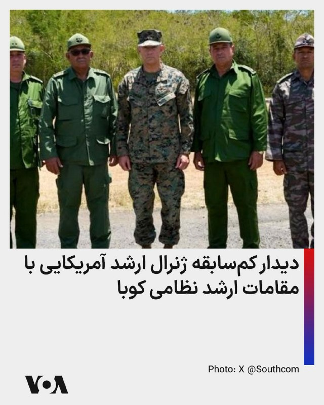

⚡️ستاد فرماندهی جنوبی آمریکا اعلام کرد که ژنرال فرانسیس داناون، فرمانده ارشد ناظر بر نیروهای ایالات متحده در آمریکای لاتین، روز جمعه با مقامات ارشد نظامی کوبا در حاشیه پایگاه دریایی آمریکا در خلیج گوانتانامو در کوبا دیدار و گفت‌وگو کرد.
@FarsiVOA

## FarsiVOA — post 219030

🔺روبیو در تماس تلفنی با جوزف عون: حزب الله تلاش‌ می‌کند با به خطر انداختن جان مردم لبنان مذاکرات با اسرائيل را از مسیر خارج کند

▪️وزارت امور خارجه آمریکا، روز جمعه، ۸ خردادماه، از گفت‌وگوی تلفنی مارکو روبیو، وزیر امور خارجه ایالات متحده با جوزف عون، رئیس‌جمهوری لبنان خبر داد.

⬇️ بیشتر بخوانید:
https://ir.voanews.com/a/8155376.html
@FarsiVOA

## FarsiVOA — post 219029

  <a href="telegram/content/FarsiVOA_219029_1780099514.mp4" target="_blank">🎬 Download video</a>

⚡️بانک مرکزی اروپا می‌گوید برای مهار تورم آمادگی دارد
@FarsiVOA

## FarsiVOA — post 219028

🔺اسکات بسنت: در ایران از طرفی «دین‌سالاری» روحانیون را داریم و از طرف دیگر «اوباش‌سالاری» سپاه؛ املاک مقامات رژیم در اروپا توقیف می‌شود

▪️اسکات بسنت، وزیر خزانه‌داری آمریکا روز جمعه ۸ خرداد گفت ایالات متحده با همکاری شرکای اروپایی در حال پیدا کردن و توقیف «ویلاها، خانه‌ها و املاک» مقامات جمهوری اسلامی در اروپا است.

⬇️ بیشتر بخوانید:
https://ir.voanews.com/a/8155375.html
@FarsiVOA

## FarsiVOA — post 219027

  <a href="https://t.me/farsivoa/219027" target="_blank">📎 Download file</a>

🔴📢‌ پادکست خبری جمعه ۸ خرداد ۱۴۰۵

🛜در صورتی که با مشکل اینترنت مواجه هستید میتوانید اخبار صدای آمریکا را از نسخه‌های پادکست خبری ما به صورت صوتی دنبال کنید و یا اخبار را از نسخه سبک وب‌سایت ما پیگیر باشید:
https://ir.voanews.com/lite

📡بروزترین فرکانسهای ماهواره‌ای را نیز میتوانید از صفحه زیر پیگیری کنید:
https://ir.voanews.com/satellite

🔔دیگر شبکه‌های اجتماعی ما را هم دنبال کنید:
https://linktr.ee/voafarsi

با دوستانتان به اشتراک بگذارید
@farsivoa

## FarsiVOA — post 219026

  <a href="telegram/content/FarsiVOA_219026_1780099515.mp4" target="_blank">🎬 Download video</a>

⚡️کامبیز غفوری در برنامه تفسیر خبر: در درجه اول تمام تیغ ملامت به حکومتی است که این بلا را سر مردم ایران آورده است
@FarsiVOA

## FarsiVOA — post 219025

  <a href="telegram/content/FarsiVOA_219025_1780099516.mp4" target="_blank">🎬 Download video</a>

⚡️چرا ناتو در عملیات «خشم حماسی» در کنار آمریکا قرار نگرفت؟ گفت‌وگو با فرزانه روستایی
@FarsiVOA

## FarsiVOA — post 219024

  <a href="telegram/content/FarsiVOA_219024_1780099516.mp4" target="_blank">🎬 Download video</a>

⚡️تکرار پدیده زن‌کشی در ایران؛ دلایل آن، ریشه‌های فرهنگی و نواقص قانونی؛ گفت‌وگو با جلال ایجادی
@FarsiVOA

## FarsiVOA — post 219023

  <a href="telegram/content/FarsiVOA_219023_1780099517.mp4" target="_blank">🎬 Download video</a>

⚡️روند خلع سلاح گروه‌های شبه نظامی عراقی و ماهیت پشت پرده این اتفاق؛ گفت‌وگو با فرزین کرباسی
@FarsiVOA

## FarsiVOA — post 219022

⚡️بخشی از برنامه تفسیر خبر: گزارش نرگس صبا از سابقه فعالیت‌های موساد در ایران
@FarsiVOA

## FarsiVOA — post 219021

⚡️واشنگتن منتظر تصمیم پرزیدنت ترامپ؛ جمهوری اسلامی درگیر روایت‌های متناقض
@FarsiVOA

## FarsiVOA — post 219020

🔺گزارش وال‌استریت ژورنال: نقش پنهان امارات در جنگ شامل ده‌ها حمله به جمهوری اسلامی ایران بود

▪️روزنامه وال‌استریت ژورنال در گزارشی نوشت که امارات متحده عربی از آغاز روزهای نخست جنگ، ده‌ها حمله هوایی علیه جمهوری اسلامی انجام داده است.

⬇️ بیشتر بخوانید:
https://ir.voanews.com/a/8155371.html
@FarsiVOA

## FarsiVOA — post 219019

  <a href="telegram/content/FarsiVOA_219019_1780099517.mp4" target="_blank">🎬 Download video</a>

⚡️نیک آهنگ کوثر در برنامه تفسیر خبر: در اسرائیل کسانی تمایل ندارند تفاهم نامه احتمالی بین جمهوری اسلامی و آمریکا به یک توافق نامه برسد
@FarsiVOA

## FarsiVOA — post 219018

  <a href="telegram/content/FarsiVOA_219018_1780099518.mp4" target="_blank">🎬 Download video</a>

⚡️برخورد با دارندگان استارلینک با قوانین جمهوری اسلامی هم هم‌خوانی ندارد؛ گفت‌وگو با حسین احمدی‌نیاز؛ حقوق‌دان
@FarsiVOA

## FarsiVOA — post 219017

🔺تداوم بلاتکلیفی معترضان بازداشت‌شده در ایران؛ گزارش‌ها: یک دانش‌آموز ۴ ماه در بازداشت بوده است

▪️بر اساس گزارش‌های رسیده به کمیته پیگیری وضعیت بازداشت‌شدگان، سه شهروند به نام‌های دیانا طاهرآبادی، مائده رحیمی، و نیما حسینی همچنان در بازداشت به سر می‌برند و نگرانی‌ها درباره وضعیت حقوقی، روند رسیدگی قضایی و شرایط نگهداری آنان ادامه دارد.

⬇️ بیشتر بخوانید:
https://ir.voanews.com/a/detained-citizens-including-student/8155283.html
@FarsiVOA

## Persian_Trend_Official — post 15305

فرماندهی مرکزی نیروی دریایی امریکا: در تنگه هرمز عملیات نظامی انجام خواهیم داد!

فرماندهی مرکزی نیروی دریایی ایالات متحده به دریانوردان و پرسنل نیروی هوایی هشدار داده است که سنتکام در تنگه هرمز، در شمال شبه جزیره مسندم عمان که در وسط تنگه واقع شده است، عملیات نظامی انجام خواهد داد.

ستاد فرماندهی مرکزی نیروی دریایی ایالات متحده به دریانوردان توصیه کرده است که هنگام عبور از تنگه هرمز با ایالات متحده همکاری کنند. فرماندهی مرکزی نیروی دریایی ایالات متحده همچنین اعلام کرده است که هر کشتی که در حال انجام یا پشتیبانی از فعالیت‌های مین‌گذاری مشاهده شود، توسط ایالات متحده هدف قرار خواهد گرفت.

📝 Amir

📌 @persian_trend_official
پرشین ترند | متفاوت‌ترین کانال نظامی

## Persian_Trend_Official — post 15304

  <a href="telegram/content/Persian_Trend_Official_15304_1780099519.mp4" target="_blank">🎬 Download video</a>

شبتون بخیر 🌃

Mig-25 Foxbat vs F-15 Eagle

📌 @persian_trend_official
پرشین ترند | متفاوت‌ترین کانال نظامی

## Persian_Trend_Official — post 15303

https://youtube.com/live/24Mc1cJMDgQ?feature=share

## Persian_Trend_Official — post 15302

  <a href="telegram/content/Persian_Trend_Official_15302_1780099520.webm" target="_blank">🎬 Download video</a>

نهاد مدیریت آب‌راه خلیج فارس: تسلط بر تنگهٔ هرمز را با تحریم هم به دست نخواهید آورد.

نهاد مدیریت آب‌راه خلیج فارس: تسلط بر تنگهٔ هرمز را که در میدان و دیپلماسی به دست نیاوردید، با تحریم هم به دست نخواهید آورد.

📝 Amir

📌 @persian_trend_official
پرشین ترند | متفاوت‌ترین کانال نظامی

## Persian_Trend_Official — post 15300

  <a href="telegram/content/Persian_Trend_Official_15300_1780099521.mp4" target="_blank">🎬 Download video</a>

ارتش اسرائیل با انتشار مستنداتی می‌گوید که شب گذشته یکی از چند راکت شلیک شده از سوی حزب‌الله لبنان به سمت شهر مرجعیون به کلیسای این شهر اصابت کرده است.

ارتش اسرائیل همچنین گفت که سربازان ارتش اسرائیل در منطقه نزدیک کلیسا عملیاتی انجام نمی‌دهند.

📝 Amir

📌 @persian_trend_official
پرشین ترند | متفاوت‌ترین کانال نظامی

## Persian_Trend_Official — post 15299

  

وزیر خارجه پاکستان: به پیمان ابراهیم ملحق‌ نمی شویم.

وزیر امور خارجه پاکستان در پاسخ به گفته چند شب پیش دونالد ترامپ رئیس جمهور امریکا گفت: هیچ انعطاف‌پذیری در موضع ما وجود ندارد و ما حامی تشکیل کشور مستقل فلسطینی هستیم.

📝 Amir

📌 @persian_trend_official
پرشین ترند | متفاوت‌ترین کانال نظامی

## Persian_Trend_Official — post 15298

  <a href="telegram/content/Persian_Trend_Official_15298_1780099522.mp4" target="_blank">🎬 Download video</a>

معجزات حضرت عاقا روز به روز بیشتر افشا میشه !
چندوقت دیگه خاطرات صیغه جور کردن برای اعضای بیت درمیاد !

حالا یک درصد احتمال ندادید دختر پسر رو نخواد ؟
نیم درصد ازمایش خون مشکل داشته باشه ؟
تفاهم و این حرفها هم که سوسول بازیه !
جایگاه زن در ولایت فقیه ...

## Persian_Trend_Official — post 15297

  <a href="telegram/content/Persian_Trend_Official_15297_1780099524.mp4" target="_blank">🎬 Download video</a>

وقتی طرف مقابل وضعیت نظامی خود را در همین شرایط حفظ کند، یعنی حفظ سایه جنگ بر کشور را پذیرفتیم. در حالی که دشمن باید از منطقه اخراج شود تا جمهوری اسلامی ایران چهارپایه طناب دار اقتصادی که در تنگه هرمز به گردن غرب انداخته را نکشد.

📌 @persian_trend_official
پرشین ترند | متفاوت‌ترین کانال نظامی

## Persian_Trend_Official — post 15296

  <a href="telegram/content/Persian_Trend_Official_15296_1780099526.webm" target="_blank">🎬 Download video</a>

Elyas Farokh – اتاق جنگ جمعه 8 خرداد | بوی جنگ از توافق ترامپ با جمهوی اسلامی!

## Persian_Trend_Official — post 15295

  <a href="https://t.me/persian_trend_official/15295" target="_blank">📎 Download file</a>

فایل صوتی لایو اول
نسخه کم حجم - 6 مگابایت

اتاق جنگ جمعه 8 خرداد | بوی جنگ از توافق ترامپ با جمهوی اسلامی!

📝 Nick

📌 @persian_trend_official
پرشین ترند | متفاوت‌ترین کانال نظامی

## Persian_Trend_Official — post 15294

  

نیویورک تایمز: ترامپ هیچ تصمیمی درباره ایران نگرفت!

نیویورک تایمز گزارش داد که دونالد ترامپ رئیس‌جمهور آمریکا پس از یک نشست دو ساعته در کاخ سفید درباره احتمال تمدید آتش‌بس با ایران، بدون اتخاذ تصمیم نهایی جلسه را ترک کرد.

📝 Amir

📌 @persian_trend_official
پرشین ترند | متفاوت‌ترین کانال نظامی

## RadioFarda — post 157705

  

🔸اسکات بسنت، وزیر خزانه‌داری آمریکا، روز جمعه اعلام کرد که ایالات متحده در چارچوب بخش اقتصادی جنگ دولت دونالد ترامپ علیه جمهوری اسلامی، «یک میلیارد دلار» از دارایی‌های رمزارزی مرتبط با ایران را توقیف کرده است.

🔸او اواخر فروردین خبر داده بود که آمریکا بیش از ۳۴۰ میلیون دلار رمزارز را به‌ظن ارتباط با ایران مسدود کرد.

🔸آقای بسنت پیش از این گفته است که بعد از برقراری آتش‌بس، به دستور دونالد ترامپ برنامه «خشم اقتصادی» را علیه حکومت ایران اجرا می‌کند و در این چارچوب تا به حال ده‌ها صرافی، کشتی، شرکت و فرد حقیقی به فهرست تحریم‌های وزارت خزانه‌داری افزوده شده‌اند.

🔸وزیر خزانه‌داری آمریکا همچنین روز جمعه گفت که هرگونه کاهش یا لغو محاصره مالی و اقتصادی آمریکا علیه ایران، به‌صورت تدریجی انجام خواهد شد.

🔸او اعلام کرد: «خواهیم دید... هر چیزی که برداشته شود، به‌آرامی و مرحله‌به‌مرحله برداشته خواهد شد.»

@RadioFarda

## IranianMinds — post 21054

🔴 وضعیت :

@IranianMinds

## IranianMinds — post 21053

  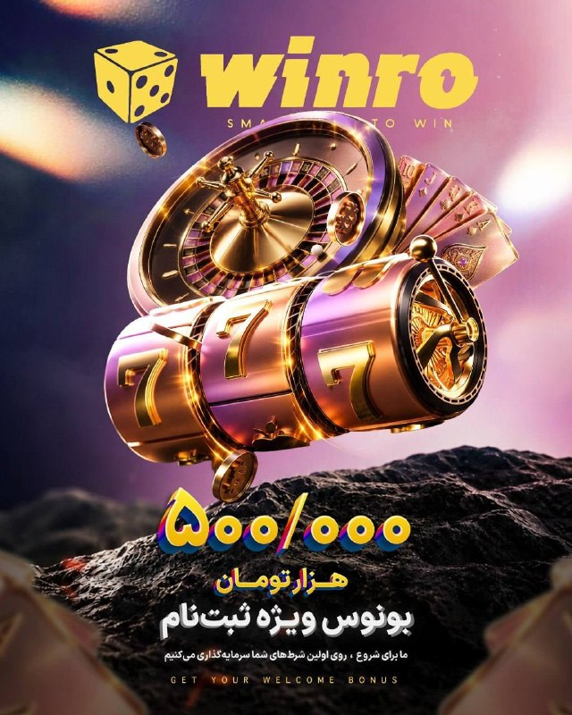

⭕️ تا حالا بدون واریزی روی فوتبال ها شرط بستی؟!

🎉 500 هزارتومن بونوس رایگان فقط با ثبت نام بدون هیچگونه واریزی!

😮 تنها سایتی که با عضویت بدون واریز 500,000 تومان شارژ بی قیدو شرط میده #وینرو هست
💰

👑 #معتبرترین سایت ایرانی 
⬇️

🌐 Winro.io

🌐 Winro.io

📱کانال اخبار و هدایا a8 
🎁

📱 @winro_io

## IranianMinds — post 21051

🔴 یک قاضی فدرال حکم داد که نام ترامپ باید از مرکز هنرهای نمایشی جان اف کندی حذف شود. این دادگاه اعلام کرد که نام این مجموعه را نمی‌توان بدون تایید رسمی کنگره تغییر داد.

کریستوفر کوپر، قاضی منطقه‌ای ایالات متحده، به دولت ترامپ دستور داد تا ظرف ۱۴ روز آینده، تمامی تابلوهای حاوی نام ترامپ را جمع‌آوری کرده و عبارت «مرکز کندی ترامپ» را از تمامی اسناد و مکاتبات رسمی حذف کنه

ترامپ هم فشاری شده از این سمت اومده 518 خط متن نوشته و داره فحشش میده :))

@IranianMinds

## IranianMinds — post 21050

هر وقت این بیانیات قبل جنگ حضرت عاقارو میبینم واقعا دلم میگیره , خودشم میدونست چخبره 💔

@IranianMinds

## IranianMinds — post 21049

دیگه قرار نیست این صدارو بشنویم 😭

@IranianMinds

## IranianMinds — post 21048

یادش بخیر 91 روز پیش موشو پدرو کشتن @IranianMinds

## IranianMinds — post 21047

یادش بخیر 91 روز پیش موشو پدرو کشتن

@IranianMinds

## IranianMinds — post 21046

  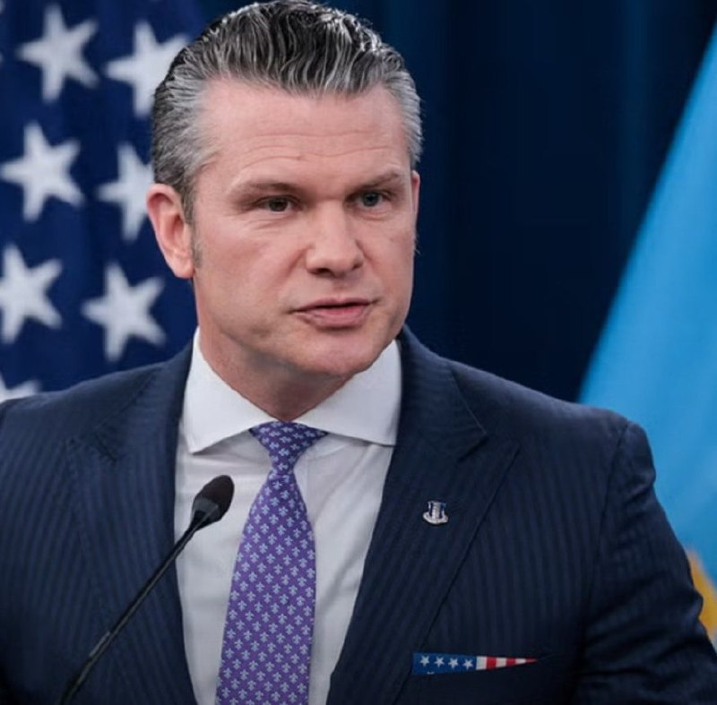

🔴 پیت هگزت وزیر جنگ آمریکا :

ایران بهتره زودتر انتخاب کنه یا مذاکره هسته ای یا جنگ با آمریکا , ایندفه نه بلکه از روی آسمان و دریا از روی زمین هم باید با ما روبرو بشن!

@IranianMinds

## IranianMinds — post 21045

  <a href="telegram/content/IranianMinds_21045_1780099529.mp4" target="_blank">🎬 Download video</a>

🔴 ویدئویی از دقایق اول حمله اسرائیل به بیت رهبری.

@IranianMinds

## IranianMinds — post 21044

  

🔴 داماد 17 ساله عروس 16 ساله در تجمعات حکومتی !

اینا تا بزرگ شن یه 30 40 تا توله هم میندازن بعد میگید چرا اینا زیاد شدن ...

@IranianMinds

## IranianMinds — post 21043

  <a href="telegram/content/IranianMinds_21043_1780099531.mp4" target="_blank">🎬 Download video</a>

🔴 وزیر خزانه داری آمریکا :

ما حدود ۱ میلیارد دلار از ارزهای دیجیتال ایران را توقیف کرده‌ایم؛ یعنی خیلی ساده و مستقیم کیف پول‌هایشان را تصاحب کردیم.

برخی از آن‌ها ممکن است همین حالا در حال تایپ کردن و چک کردن حسابشان باشند و هنوز متوجه نشده باشند که کیف پولشان از دست رفته است.

این‌ها پول‌هایی است که از مردم ایران دزدیده شده است.

@IranianMinds

## IranianMinds — post 21042

  <a href="telegram/content/IranianMinds_21042_1780099533.mp4" target="_blank">🎬 Download video</a>

🔴 وزیر خزانه داری آمریکا :

ما حکومت را سرنگون نکردیم، اما ساختار آن را تغییر دادیم.

رهبران سطح اول حذف شدند، رهبران سطح دوم هم حذف شدند.

بنابراین، ما اکنون با مدیران و فرماندهان سطح سوم سر و کار داریم.

@IranianMinds

## BBCPersian — post 282358

  

‌ ‌ ‌ ‌
یک قاضی دادگاهی در آمریکا، اقدام برای تغییر نام مرکز هنری معروف کندی در واشنگتن به «مرکز کندی ترامپ» را مسدود کرد و دستور داد که نام رئیس جمهور ترامپ از روی آن حذف شود.

در واکنش به این حکم، دونالد ترامپ گفت: «دموکرات‌ها بیشتر به مخالفت با رئیس‌جمهور ... اهمیت می‌دهند تا نجات یک مرکز هنرهای نمایشی در حال مرگ.»

قاضی کریستوفر کوپر حکم داد که کنگره نام این مرکز هنری را تصویب کرده است و فقط کنگره می‌تواند آن را تغییر دهد.

این آخرین ناکامی رئیس جمهور آمریکا است که به دنبال تغییر شکل و نام‌گذاری بخش‌هایی از پایتخت بوده است.

یکی از اعضای هیئت مدیره این مرکز، این تغییر نام را که توسط هیئت مدیره‌ای که توسط او انتخاب شده بود، در دادگاه به چالش کشیده بود.

آقای ترامپ پس از صدور این حکم در شبکه اجتماعی تروث سوشال، قاضی را «چپ» و منصوب باراک اوباما خواند که با این حکمش جلوی تعمیرات و بازسازی موسسه کندی را خواهد گرفت.

https://bbc.in/4fKf16A
📷 Al Drago/Getty Images
@BBCPersian

## BBCPersian — post 282357

  

🔻 حمایت کیهان کلهر از کسب‌وکارهای فرهنگی و هنری

کیهان کلهر، موسیقی‌دان برجسته ایران صفحه اینستاگرامش را به مدت ۸۸ روز به تبلیغ و حمایت از کسب‌وکار اهالی فرهنگ و هنر اختصاص داد.

او نوشت که این اقدام را به دلیل حمایت از آنهایی انجام می‌دهد که «در ماه‌های اخیر به‌دلیل قطع اینترنت دچار خسارت شده‌اند.»

آقای کلهر تاکید کرده است که این فراخوان تنها شامل کسب‌وکارهای داخل ایران می‌شود.

حکومت ایران در چند دهه گذشته اشاعه موسیقی را به شدت محدود کرد اما پس از گسترش شبکه‌های اجتماعی، هنرمندان به معرفی خود و آثارشان پرداختند و به این ترتیب بازار خوبی برای محصولات فرهنگی و هنری فراهم شد.

پس از جنگ آمریکا و اسرائیل با ایران و قطعی کامل اینترنت برای بیش از هشتاد روز بسیاری از مشاغل مجازی به‌ویژه اهالی فرهنگ و هنر از فعالیت بازماندند که خسارات قابل توجهی به آنها وارد شده است.

https://bbc.in/4vbIbjs
@BBCPersian

## BBCPersian — post 282356

  

بنیامین نتانیاهو، نخست‌وزیر اسرائیل، می‌گوید که نیروهای کشورش در خاک لبنان پیشروی بیشتری کرده‌اند؛ این در حالی است که هیئت‌های نظامی اسرائیل و لبنان در واشنگتن در حال برگزاری مذاکرات امنیتی هستند.

اسرائیل همچنین روز جمعه به بمباران گسترده جنوب لبنان ادامه داد. دفتر جوزف عون، رئیس‌جمهور لبنان، اعلام کرد که او در تماس تلفنی با مارکو روبیو، وزیر خارجه آمریکا، بر «لزوم به‌کارگیری همه تلاش‌ها برای دستیابی به آتش‌بس» به‌عنوان نخستین گام ضروری تاکید کرده است.

قرار بود آتش‌بس میان اسرائیل و حزب‌الله، گروه مورد حمایت ایران، از ۱۷ آوریل اجرایی شود، اما این آتش‌بس هرگز به‌طور کامل رعایت نشده است.

دو طرف یکدیگر را به نقض آتش‌بس متهم می‌کنند و حملات خود را با استناد به تخلفات طرف مقابل توجیه می‌کنند.

حزب‌الله اعلام کرد که روز جمعه مجموعه‌ای از حملات را علیه نیروها، پادگان‌ها و یک اردوگاه نظامی در شمال اسرائیل انجام داده است.

https://bbc.in/4dXZb61
📷 Reuters
@BBCPersian

## BBCPersian — post 282355

  

‌ ‌ ‌ ‌
مقام‌های فدراسیون فوتبال ایران اعلام کردند که پس از انتقال اردوی تیم ملی برای جام جهانی از آریزونا به شهر تیخوانا در مکزیک، از فیفا خواسته‌اند تا زمان صدور ویزاهای این رقابت‌ها را مشخص کند.

تیم ملی ایران روز جمعه در دیداری تدارکاتی در شهر آنتالیا ترکیه با نتیجه سه بر یک، گامبیا را شکست داد.

ایران قرار است که هر سه مسابقه خود در مرحله گروهی جام جهانی را در آمریکا برگزار کند، اما از زمان حملات آمریکا و اسرائیل به ایران در اواخر فوریه، ابهام‌هایی درباره حضور این تیم در مسابقات به وجود آمده است.

به گفته مقام‌های فدراسیون فوتبال ایران، انتقال اردو به تیخوانا به‌دلیل مشکلات دیپلماتیک و مسائل مربوط به ویزا انجام شده و اکنون تیم ملی برای حضور در مسابقات خود در لس‌آنجلس و سیاتل، علاوه بر ویزای آمریکا، به مجوزهای تردد میان مکزیک و آمریکا نیز نیاز دارد.

مهدی محمدنبی، نایب‌رئیس اول فدراسیون فوتبال ایران، به رویترز گفت: «امروز برای فیفا ایمیل فرستادیم و خواستیم هرچه زودتر نتیجه را اعلام کند و بگوید که ویزاها در چه تاریخی صادر خواهند شد.»

https://bbc.in/4u8Us7o
📷 EPA/Shutterstock
@BBCPersian

## BBCPersian — post 282354

  

‌ ‌ ‌ ‌
روزنامه «اسرائیل هیوم» چاپ تل‌آویو گزارشی منتشر کرده است از عملیات پیچیده موساد برای نفوذ در ایران و برانداختن حکومت جمهوری اسلامی. در این گزارش به نقل از منابعی در موساد، از جمله یک مقام ارشد که تا حدود سه ماه پیش رئیس شاخه نفوذ این سازمان بود، جزئیات منتشر شده در این گزارش بسیار کم سابقه است.

در این گزارش آمده است که داوید برنع وقتی در ژوئن سال ۲۰۲۱ ریاست موساد را به عهده گرفت، تغییراتی در رویکرد و ساختار این سازمان ایجاد کرد.

یکی از این تغییرات، که با مقاومت درونی زیادی هم روبرو شد، تجدید ساختار واحد اطلاعات انسانی موساد، معروف به زومت (Tzomet) بود.

https://bbc.in/49wmP8a
📷Reuters
@BBCPersian

## BBCPersian — post 282353

🔻 نتیجه نشست ترامپ درباره تمدید آتش‌بس با ایران هنوز مشخص نیست

دونالد ترامپ جلسه‌ای با مشاوران خود برگزار کرده است تا درباره تمدید آتش‌بس با ایران تصمیم نهایی را اتخاذ کند، اما نتیجه این نشست هنوز مشخص نیست.

او پیش از این جلسه در اتاق بحران کاخ سفید تاکید کرده بود که توافق مورد مذاکره تضمین خواهد کرد که ایران تنگه هرمز را بازگشایی کند و متعهد شود هرگز به سلاح هسته‌ای دست پیدا نکند.

او همچنین گفت که ذخایر اورانیوم غنی‌شده ایران از زیر زمین خارج و نابود خواهد شد.

با این حال، مقام‌های ایرانی تاکید کرده‌اند که پیش‌نویس توافق شامل بازگشایی تنگه هرمز بدون دریافت عوارض و نیز تعهد به نابودی مواد هسته‌ای نیست.

تهران همچنین می‌گوید که هنوز درباره تمدید آتش‌بس برای ۶۰ روز دیگر، به‌منظور ادامه مذاکرات درباره جزئیات پیچیده‌تر توافق، تصمیم نهایی نگرفته است.

https://bbc.in/49xolqx
@BBCPersian

## BBCPersian — post 282352

🔻 خوش‌بینی به آتش‌بس با ایران، بازده اوراق قرضه دولت آمریکا را کاهش داد

بازده اوراق قرضه دولت آمریکا روز جمعه برای چهارمین روز متوالی کاهش یافت و هفته‌ای را به پایان رساند که گزارش‌های پیشرفت در دستیابی به آتش‌بس میان آمریکا و ایران، به خوش‌بینی نسبی در بازارها دامن زده بود.

میشل بومن، نایب‌رئیس نظارت بانک مرکزی آمریکا، در سخنانی گفت که هنوز برای ارزیابی تاثیر جنگ خاورمیانه بر اقتصاد زود است، اما یک شوک طولانی‌مدت در بازار انرژی می‌تواند این بانک را ناگزیر به تغییر رویکرد خود در سیاست پولی کند.

بر اساس داده‌های وزارت بازرگانی آمریکا که روز پنجشنبه منتشر شد، شاخص تورمی مورد توجه بانک مرکزی آمریکا در ماه گذشته به بالاترین سطح در سه سال گذشته رسید. این آمار بخشی از مجموعه داده‌های اقتصادی بود که به گفته تحلیلگران نشانه‌هایی از خطر «رکود تورمی» را در خود داشت.

لو براین، استراتژیست بازار در شرکت دی‌آر‌دبلیو تریدینگ، گفت که توقف شکننده درگیری‌ها از ماه گذشته تاکنون، فشار صعودی بر قیمت نفت خام و انتظارات تورمی را کاهش داده و به افت بازده اوراق دولت آمریکا کمک کرده است.

https://bbc.in/3RDgsK6
@BBCPersian

## BBCPersian — post 282351

  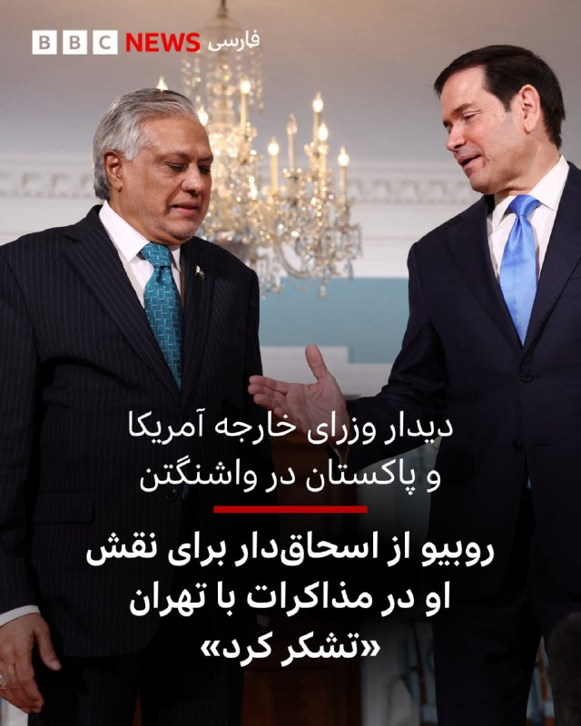

‌ ‌ ‌ ‌
مارکو روبیو، وزیر خارجه آمریکا و محمد اسحاق‌دار، معاون نخست‌وزیر و وزیر خارجه پاکستان در محل ساختمان وزارت خارجه آمریکا در واشنگتن دیدار کردند.

پاکستان میانجی رسمی میان آمریکا و ایران در جریان مذاکرات اخیر دو کشور برای برقراری صلح است.

آقای روبیو هم در شبکه ایکس عکس از دیدارشان منتشر کرد و نوشت که از محمد اسحاق‌دار به خاطر نقشی که پاکستان همچنان در پیشبرد صلح در خاورمیانه ایفا می‌کند، تشکر کرده است.

او افزود: «ما درباره اهمیت همکاری برای تقویت بیشتر یک مشارکت معنادار برای امنیت بهتر و رفاه بیشتر هر دو ملت توافق کردیم.»

تامی پیگوت، سخنگوی وزارت خارجه آمریکا هم گفت که در این دیدار آقای روبیو از آقای اسحاق‌دار به دلیل «نقش سازنده‌ای» که پاکستان در تحقق دیدگاه‌های دونالد ترامپ، رئیس‌جمهور آمریکا برای صلح در خاورمیانه و تلاش‌های میانجی‌گرایانه این کشور با ایران داشته، تشکر کرد.

آقای پیگوت گفت که وزرای خارجه دو کشور بر همکاری مشترک برای یک مشارکت واقعی که امنیت و رفاه را برای آمریکایی‌ها و پاکستانی‌ها تقویت کند،‌ توافق کردند.

https://bbc.in/4u0PsS7
📷 Reuters
@BBCPersian

## BBCPersian — post 282350

  <a href="telegram/content/BBCPersian_282350_1780099538.mp4" target="_blank">🎬 Download video</a>

‌ ‌ ‌
آخرین خبرهای مهم جمعه ۸ خرداد ۱۴۰۵

@BBCPersian

## Dirty_Kids — post 390536

  <a href="telegram/content/Dirty_Kids_390536_1780099539.webm" target="_blank">🎬 Download video</a>

☢️خفن ترین و‌ قدیمی ترین  انالیزور  ایران ینی دکتر بت 
👍 
🔴مسابقات جذاب جام جهانی به زودی شروع میشه بیا توی کانال دکتر بت و باهاش همراه شو و پول در بیار
💵 رایگان بهترین شرط هارو براتون میذاره حتی هزار تومن هم دریافت نمیکنه روزانه میتونی از پیش بینی فوتبال باهاش…

## Dirty_Kids — post 390535

  <a href="telegram/content/Dirty_Kids_390535_1780099540.webm" target="_blank">🎬 Download video</a>

☢️خفن ترین و‌ قدیمی ترین  انالیزور  ایران ینی دکتر بت 
👍

🔴مسابقات جذاب جام جهانی به زودی شروع میشه بیا توی کانال دکتر بت و باهاش همراه شو و پول در بیار
💵

رایگان بهترین شرط هارو براتون میذاره
حتی هزار تومن هم دریافت نمیکنه
روزانه میتونی از پیش بینی فوتبال باهاش پول در بیاری 👌
A8

🌟اگ اهل پیش بینی فوتبالی این کانال اصلا از دست ندین
👇

✅https://t.me/+4_ADqwB9e-QwYjlk

✅https://t.me/+4_ADqwB9e-QwYjlk

## Dirty_Kids — post 390534

  

#بخوابیم

@Dirty_Kids 👻

## Dirty_Kids — post 390530

  <a href="telegram/content/Dirty_Kids_390530_1780099541.mp4" target="_blank">🎬 Download video</a>

جفت کنید، اینا 👆۲۰ میلیارد ناقابل دادن فقط برای عروسی گرفتن😕

۹۰ درصد مردم تمام آرزوشون ۲۰ میلیارده یه خونه و ماشین بگیرن، این دیگه اختلاف طبقاتی نیست شیاف طبقاتیه

@Dirty_Kids 👻

## Dirty_Kids — post 390529

  <a href="telegram/content/Dirty_Kids_390529_1780099541.mp4" target="_blank">🎬 Download video</a>

از اول جنگ تا حالا ۱۶بار نتانیاهو رو کشتن 😂😂

یعنی اول بچه‌شیعه بوده بعد کصخلا و کونی‌پرو‌ها از روش یاد گرفتن کصخلیت و کونی‌‌پروگریو

@Dirty_Kids 👻

## Dirty_Kids — post 390528

  <a href="telegram/content/Dirty_Kids_390528_1780099542.mp4" target="_blank">🎬 Download video</a>

حاجی قبلن شهریاری ویدیو رقصش تو عروسی درمیومد ممنوع صحنه میشد

ببینید اثرات موشک بی‌بی‌ و ترامپو

چقد تخمیه این دختره

@Dirty_Kids 👻

## Dirty_Kids — post 390527

اون پولی که بابت فیلتر شکن دادی چوب زوری بوده که جمهوری اسلامی تو کونت کرده، با چوب تو کونتم فلکس میکنی عقب مونده؟

@Dirty_Kids 👻

## Dirty_Kids — post 390525

  <a href="telegram/content/Dirty_Kids_390525_1780099544.mp4" target="_blank">🎬 Download video</a>

🔴 این ویدیو ها مربوط به شبی هست که خامنه‌ای کشته شد، مردم کِل میکشن و پایکوبی میکنن.

@Dirty_Kids 👻

## Dirty_Kids — post 390524

  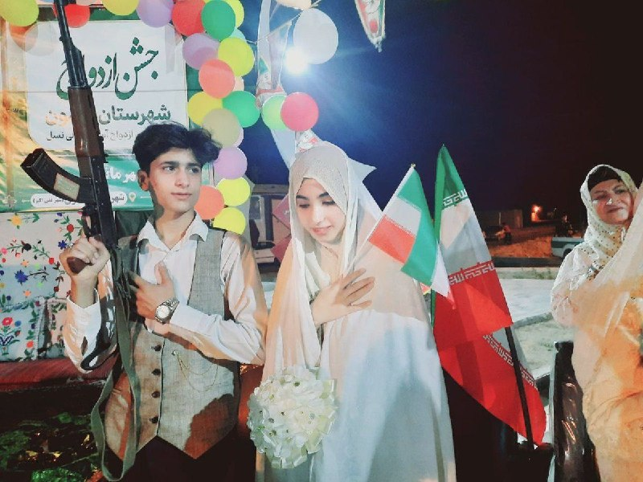

تصویری از داماد ۱۷ ساله و عروس ۱۶ ساله خرزشی در تجمعات شبانه

جزیره اپستین داریم لایو میبینیم

@Dirty_Kids 👻

## Dirty_Kids — post 390523

  <a href="telegram/content/Dirty_Kids_390523_1780099545.mp4" target="_blank">🎬 Download video</a>

جدیدترین ویدئو از 30 موشکی که به بیت خامنه‌ای برخورد کرد

@Dirty_Kids 👻

## Dirty_Kids — post 390521

نمیدونم چی بگم
فقط لایکاش😂😂😂😂😂😂😂😂

تو تیک‌تاک یا همه ۱۵ سالشونه یا مغزشون کص میزنه وگرنه در این حد کصخلیت طبیعی نیست

@Dirty_Kids 👻

## Dirty_Kids — post 390520

راستی شماها که نبودین علی شریفی زارچی یه سوراخ تو سایت جانفداشون پیدا کرد که ثابت شد تعداد ثبت نام ها ۳ میلیون نهصد هزار نفره :))))

@Dirty_Kids 👻

## Dirty_Kids — post 390519

  

🔴 این روزا دخترا این تیشترتو در حمایت از دوس پسرشون میپوشن:

من نیازی به CHATGPT ندارم، چون دوس پسرم همه چیزو میدونه.

@Dirty_Kids 👻

## Dirty_Kids — post 390518

  <a href="telegram/content/Dirty_Kids_390518_1780099546.mp4" target="_blank">🎬 Download video</a>

تصاویر جدید از قیام ملت ایران در ۱۸ و ۱۹ دی

@Dirty_Kids 👻

## alonews — post 123591

  

🚀همراه با ساب + حجم مصرفی برای استفاده طولانی‌تر و بهینه‌تر 😍

@NetAazaadBot
@NetAazaadBot

⚡️ سرعت واقعی بدون افت
🛡 اتصال پایدار و بدون قطعی
🚀 مناسب گیم، دانلود و استفاده روزانه

@NetAazaadBot
@NetAazaadBot

💎 گیگی فقط 19T
📩 برای خرید استارت بزن و سریع وصل شو 🚀

## alonews — post 123590

  <a href="telegram/content/alonews_123590_1780099548.webm" target="_blank">🎬 Download video</a>

👈شورای امنیت سازمان ملل متحد در گزارشی تازه از افزایش خشونت‌های جنسی، تجاوز گروهی، شکنجه و رفتارهای تحقیر‌آمیز علیه زنان و دختران در افغانستان پرده برداشت و مقام‌ها و نیروهای وابسته به طالبان را مسئول بخش عمده این موارد دانست.

✅ @AloNews خبر جنگ

## alonews — post 123589

  <a href="telegram/content/alonews_123589_1780099548.webm" target="_blank">🎬 Download video</a>

👈وضعیت مردم ایران

✅ @AloNews خبر جنگ

## alonews — post 123588

  <a href="telegram/content/alonews_123588_1780099548.webm" target="_blank">🎬 Download video</a>

👈فردی که در تصویر می‌بینید به گزارش روزنامه فایننشیال تایمز مالک شبکه ایران اینترنشنال است! 
✅ @AloNews خبر جنگ

## alonews — post 123587

  <a href="telegram/content/alonews_123587_1780099549.webm" target="_blank">🎬 Download video</a>

👈خبرنگار الجزیره:
یک منبع رسمی ایرانی همین الان به من گفت: با تیمی که هیچ چارچوب حرفه‌ای یا اخلاقی ثابتی ندارد، دمدمی مزاج است و مدام خواسته‌هایش را تغییر می‌دهد، نمی‌توان گفت که هیچ چیز «نهایی» شده است.

✅ @AloNews خبر جنگ

## alonews — post 123586

  <a href="telegram/content/alonews_123586_1780099549.webm" target="_blank">🎬 Download video</a>

👈مدیرعامل جی‌پی‌مورگان:
داشتن سلاح هسته‌ای توسط ایران، میتواند بزرگ‌ترین تهدیدی باشد که بشریت در طول تاریخ با آن مواجه شده باشد.

✅ @AloNews خبر جنگ

## alonews — post 123585

  <a href="telegram/content/alonews_123585_1780099549.webm" target="_blank">🎬 Download video</a>

👈نیویورک پست: ۶ میلیارد دلار از وجوه نگهداری شده در قطر از جمله آخرین نکات مبهم در توافق صلح با ایران است

🔴این وجوه مستقیماً به ایران منتقل نخواهد شد، بلکه برای خرید مواد غذایی و لوازم پزشکی استفاده خواهد شد.

✅ @AloNews خبر جنگ

## alonews — post 123584

  <a href="telegram/content/alonews_123584_1780099549.webm" target="_blank">🎬 Download video</a>

👈 تصویری از داماد ۱۷ ساله و عروس ۱۶ ساله در تجمعات شبانه

✅ @AloNews خبر جنگ

## alonews — post 123583

  <a href="telegram/content/alonews_123583_1780099549.webm" target="_blank">🎬 Download video</a>

👈فیلد مارشال محسن رضایی: آمریکا تاب‌ مقاومت جلوی قدرت ما رو نداره

✅ @AloNews خبر جنگ

## alonews — post 123582

  <a href="telegram/content/alonews_123582_1780099549.webm" target="_blank">🎬 Download video</a>

👈فردی که در تصویر می‌بینید به گزارش روزنامه فایننشیال تایمز مالک شبکه ایران اینترنشنال است!

✅ @AloNews خبر جنگ

## alonews — post 123581

  <a href="telegram/content/alonews_123581_1780099549.webm" target="_blank">🎬 Download video</a>

🔴فوری/وزیر خزانه داری آمریکا درباره رفع تحریم‌های ایران 
🔴به گزارش الجزیره،  وزیر خزانه‌داری آمریکا مدعی شد که تحریم‌های ایران به تدریج لغو خواهد شد. 
✅ @AloNews خبر جنگ

## alonews — post 123580

  <a href="telegram/content/alonews_123580_1780099550.webm" target="_blank">🎬 Download video</a>

👈وزارت خزانه‌داری آمریکا: محاصره اعمال‌شده بر بنادر ایران به‌تدریج برداشته خواهد شد

✅ @AloNews خبر جنگ

## alonews — post 123579

  <a href="telegram/content/alonews_123579_1780099550.mp4" target="_blank">🎬 Download video</a>

👈حسین علایی: سه روز قبل از جنگ ۴۰ روزه به شمخانی گفتم: آمریکا و اسرائیل با ترور رهبری جنگ را آغاز می کنند؛ او گفت: نمی‌توانند! گفتم چرا نمی توانند. گفت نمی توانند پیداش کنند.

✅ @AloNews خبر جنگ

## alonews — post 123578

  <a href="telegram/content/alonews_123578_1780099552.webm" target="_blank">🎬 Download video</a>

قیمت استثنایی و کیفیت بالا
❤️

تحویل زیر یک دقیقه
✅
دارای لینک سابسکریشن جهت دیدن حجم و کنترل مصرف
✅
بدون قطعی 
✅
بدون محدودیت کاربر و زمان
✅
جمینایو چت جی بی تی و... کامل اوکیه با سرورامون
✅

🏪پشتیبانی کامل
✅
شروع فعالیت از سال 2022 
✅
پرداخت ریالی
✅

از رباتمونم میتونید تهیه کنید 
💞
👇

✅
➡️ @Napsternetiran_bot 
☑️

ضریب و این چیزا ندارن و تا آخرین مگابایت برای پشتیبانیش درختمتیم
🥂

چنل کانالمون
👇

📣
➡️ @Napsternetvirani 
☑️

## alonews — post 123577

  <a href="telegram/content/alonews_123577_1780099552.mp4" target="_blank">🎬 Download video</a>

👈اولین ماشین حاشیه ساز لکسوس Lx700H با قیمت ۱۱۰ میلیارد تومانی پلاک ملی شد.

✅ @AloNews خبر جنگ

## alonews — post 123576

  <a href="telegram/content/alonews_123576_1780099554.mp4" target="_blank">🎬 Download video</a>

👈رضا پهلوی: کشور های جهانی به خاطر چشم‌های زیبای من یا شما این کار را نمی‌کنند، آنها این کار را انجام می‌دهند چون به نفع منافع شان است.

✅ @AloNews خبر جنگ

## alonews — post 123575

  <a href="telegram/content/alonews_123575_1780099555.webm" target="_blank">🎬 Download video</a>

👈وزیر خارجه پاکستان: هرگونه گمانه‌زنی درباره پیوستن پاکستان به طرح سازش [پیمان ابراهیم] با اسرائیل را قویا رد می‌کنیم

🔴تا زمانی که سرزمین فلسطین مطابق مرزهای قبل از ۱۹۶۷ به پایتختی قدس شریف به رسمیت شناخته نشود، هیچ انعطاف‌پذیری در موضع ما وجود نخواهد داشت.

✅ @AloNews خبر جنگ

## alonews — post 123574

  <a href="telegram/content/alonews_123574_1780099556.webm" target="_blank">🎬 Download video</a>

👈وزیر خزانه‌داری آمریکا: یک میلیارد دلار از دارایی‌های رمزارز ایران را مصادره کردیم! 
✅ @AloNews خبر جنگ

---
📅 بروزرسانی: 1405/03/08 23:31
---

## VahidOOnLine — post 242823

ویدیوی منتشرشده، لحظه کشته شدن جاویدنام بابک سلطانی را در اصفهان نشان می‌دهد.
سلطانی، ۵۹ ساله، شامگاه ۱۹ دی ۱۴۰۴ هنگامی که معترضان را در اصفهان پناه می‌داد هدف شلیک گلوله ماموران قرار گرفت و جان باخت.
‌🏁 🇬🇧 IranintlTV

🤖 @VahidOOnLine

## VahidOOnLine — post 242822

  

اتحادیه اروپا با انتشار بیانیه‌ای اعلام کرد که حمله اخیر حکومت ایران علیه کویت را به شدت محکوم می‌کند.

در این بیانیه آمده که این حمله بنا بر حقوق بین‌الملل نقض حاکمیت کویت محسوب می‌شود.

اتحادیه اروپا همبستگی کامل خود را با دولت و مردم کویت بار دیگر اعلام کرد و افزود: «چنین حملاتی تهدیدی جدی برای امنیت و ثبات منطقه به شمار می‌روند.»
‌🏁 🇬🇧 IranintlTV

🤖 @VahidOOnLine

## VahidOOnLine — post 242821

  

♦️ اسکات بسنت، وزیر خزانه‌داری ایالات متحده، روز جمعه هشتم خرداد، اعلام کرد که این کشور در راستای بخش اقتصادی جنگ دونالد ترامپ، رئیس‌جمهوری آمریکا، علیه جمهوری اسلامی، که به عنوان «خشم اقتصادی» شناخته می‌شود، یک میلیارد دلار از دارایی‌های رمزارزی ایران را توقیف کرده است.
‌🇸🇦 Indypersian

🤖 @VahidOOnLine

## VahidOOnLine — post 242820

🗣روایت شما از بحران اقتصادی و زندگی در آتش‌بس- جمعه ۸ خرداد:

🔹جوانی ما سوخت پای سفاهت عده‌ای که هیچ درک و فهمی از شادی و سرور ندارند، نزدیک به ۵۰ سال سرمایه‌های کشور رو به یغما دادند، ولی آدمی به امید زنده است.

🔹از اصفهان: گرونی بیداد می‌کنه. از صبح تا شب کار می‌کنیم برای یک میلیون که اونم هیچی نمی‌شه باهاش بخری.

🔹اینا توافق بکنن یا نکنن، هیچ فرقی به حال ما مردم نداره. جمهوری اسلامی به زودی به دست مردم نابود خواهد شد، چون مردم تو شرایط وحشتناکی دارن زندگی می‌کنن.

🔹من یه نوجوون ۱۵ ساله‌ام. چرا باید به فکر قیمت طلا و دلار باشم؟ تنها آرزوی زندگیم فقط خرید موتوریه که آخرین بار قیمتش ۸۰ میلیون تومان بود و الان قیمت گرفتم شده ۲۰۰ تومان. این یعنی خاک کردن آرزوهامون. این حق ما نیست.

🔹من یه بچه ۱۲ ساله هستم، دارم حسرت می‌خورم چرا یه دوچرخه ندارم، هر روز آرزو می‌کنم شاهزاده برگرده، هم مردم خوشحال بشن و هم کسانی که آرزوی چیزی داشتن بتونن بخرنش.

🔹ما نوجوان‌ها واقعا بدبخت شدیم نه امیدی نه آرزویی نه آینده‌ای. از بدو تولد با کرونا، آلودگی، قطعی برق و آب، جنگ و کشتار سر کردیم.

🔹به عنوان یه جوان ۲۸ ساله خیلی وقته دیگه انگیزه و امیدی برای آینده ندارم؛ جوانی که از وقتی که یادشه فقط داره کار می‌کنه و حتی پاش رو از شهر خودش برای یه مسافرت دو روزه بیرون نذاشته. پرایدی که ۱۵ سال از عمر خودش گذشته رو نمی‌تونم بخرم. ما سوختیم.

🔹جمهوری اسلامی با این وحشی‌گری‌هاش به زودی به جایی می‌ره که اسکندر و چنگیز رفتند. به دست مردم شجاع ایران، نه ترامپ. زنده‌باد امید، زنده‌باد ایران، زنده‌باد آزادی.

🔹مردم عزیز ایران، این روزهای سخت هم می‌گذره. امیدتون رو از دست ندین؛ ما ملتی هستیم که بارها دوباره از نو بلند شده. کنار هم می‌مونیم، می‌جنگیم و ایران‌مون رو پس می‌گیریم. آینده از آنِ مردمه.
‌🏁 🇬🇧 IranintlTV

🤖 @VahidOOnLine

## VahidOOnLine — post 242819

  

اسکات بسنت، وزیر خزانه‌داری آمریکا اعلام کرد این کشور یک میلیارد دلار از دارایی‌های رمزارزی مرتبط با جمهوری اسلامی را توقیف کرده است.

بسنت در پاسخ به پرسشی درباره محاصره دریایی بنادر ایران گفت هر اقدامی برای کاهش یا لغو محدودیت‌ها، به‌صورت تدریجی انجام خواهد شد.

وزیر خزانه‌داری آمریکا پیش‌تر نیز اعلام کرده بود دسترسی شرکت‌های هواپیمایی ایران به محل‌های فرود، سوخت‌گیری و فروش بلیت را قطع خواهیم کرد.
‌🏁 🇬🇧 IranintlTV

🤖 @VahidOOnLine

## VahidOOnLine — post 242818

  

علی خزایی، عضو کمیسیون آموزش مجلس گفت که هرگونه تعرض و تجاوز از سوی آمریکا، اسرائیل و متحدانشان با «پاسخ قاطع، سخت و دندان‌شکن» مواجه خواهد شد.

خزایی افزود: «دشمن بار دیگر دچار خطای محاسباتی شده و تصور کرده جمهوری اسلامی در میدان نبرد دچار سکوت یا انفعال شده است.»
‌🏁 🇬🇧 IranintlTV

🤖 @VahidOOnLine

## VahidOOnLine — post 242817

  

♦️ یک مقام ارشد دولت آمریکا که خواست نامش فاش نشود، روز جمعه هشتم خرداد، در گفتگو با نیویورک‌تایمز اعلام کرد که جلسه دونالد ترامپ، رئیس‌جمهوری آمریکا، در اتاق وضعیت کاخ سفید حدود دو ساعت به طول انجامید، اما او هنوز تصمیم نهایی را درباره توافق جدید با ایران اتخاذ نکرده است.

به گفته این مقام مسئول، دولت ترامپ بر این باور است که طرفین به یک توافق نزدیک شده‌اند، اما همچنان موضوعات مشخصی از جمله مسئله آزادسازی دارایی‌های مسدودشده ایران مورد بحث و رایزنی قرار دارد. ترامپ در پیامی که پیش از این جلسه منتشر کرد، تاکید کرد که فعلا پولی آزاد نخواهد شد.
‌🇸🇦 Indypersian

🤖 @VahidOOnLine

## VahidOOnLine — post 242816

  

♦️ ابراهیم عزیزی، رئیس کمیسیون امنیت ملی مجلس شورای اسلامی با انتشار پیامی در شبکه اجتماعی ایکس، ایران را «پیروز و فاتح میدان» دانست و نوشت: «ترامپ باید بداند که ایران، به عنوان پیروز و فاتح میدان شرایط را تعیین می‌کند: نقد مقابل نقد، نسیه مقابل نسیه، هیچ مقابل هیچ؛ البته برای موضوعاتی که مورد مذاکره است نه آرزوهایش!»

این پیام ساعاتی پس از آن منتشر شد که ترامپ، با انتشار جزئیاتی از تفاهم‌نامه مورد مذاکره اعلام کرد که بازگشایی تنگه هرمز، برقرار نشدن هرگونه سازوکار اخذ عوارض از کشتی‌ها و نابودی ذخایر اورانیوم با غنای بالا از موارد ذکر شده هستند. اسماعیل بقایی، سخنگوی وزارت خارجه این موارد را رد کرد. ترامپ بارها تاکید کرده که تنها توافقی را می‌پذیرد که مسئله تنگه هرمز و برنامه هسته‌ای جمهوری اسلامی را در بر بگیرد.
‌🇸🇦 Indypersian

🤖 @VahidOOnLine

## VahidOOnLine — post 242815

  

خبرگزاری رویترز به نقل از منابع جمهوری اسلامی گزارش داد که تهران ممکن است با انتقال نیمی از ذخایر اورانیوم غنی‌شده ۶۰درصدی به یک کشور ثالث موافقت کند.

بر اساس این گزارش، در این حالت، جمهوری اسلامی در مقابل این مقدار، اورانیوم با غنای ۵ درصد دریافت می‌کند.

رویترز نوشت که همچنین ممکن است نیم دیگر این ذخایر در داخل ایران رقیق‌سازی شود.
‌🏁 🇬🇧 IranintlTV

🤖 @VahidOOnLine

## VahidOOnLine — post 242814

  

♦️خبرنگار صداوسیما در قشم از فعال شدن سامانه پدافند هوایی در این منطقه خبر داد و اعلام کرد این اقدام دقایقی پیش انجام شده است.
در ادامه، خبرگزاری مهر به نقل از منابع محلی گزارش داد یک ریزپرنده در حوالی قشم توسط پدافند هوایی هدف قرار گرفته و منهدم شده است.
بر اساس این گزارش‌ها، جزئیات بیشتری درباره ماهیت این ریزپرنده و نتیجه نهایی عملیات پدافندی تاکنون منتشر نشده است.
‌🇸🇦 Indypersian

🤖 @VahidOOnLine

## VahidOOnLine — post 242813

  

نیویورک‌تایمز به نقل از یک مقام ارشد آمریکایی گزارش داد نشست دونالد ترامپ در «اتاق وضعیت» کاخ سفید دو ساعت به طول انجامید، اما رییس‌جمهور آمریکا هنوز درباره هیچ توافق جدیدی با تهران به تصمیم نهایی نرسیده است.

این مقام افزود دولت آمریکا معتقد است به دستیابی به توافق نزدیک شده، اما برخی مسائل از جمله آزادسازی دارایی‌های مسدودشده همچنان محل بررسی و اختلاف‌نظر است.
‌🏁 🇬🇧 IranintlTV

🤖 @VahidOOnLine

## VahidOOnLine — post 242812

  <a href="telegram/content/VahidOOnLine_242812_1780084867.mp4" target="_blank">🎬 Download video</a>

یک شهروند با اشاره به وضعیت بد معیشتی به مقایسه قدرت خرید خانواده‌های ایرانی با شهروندان کشورهای دیگر پرداخته و می‌گوید که بازگشت نسبی اتصال به اینترنت به این علت است که «حواسمان را پرت کنند.»

پیام او با هوش مصنوعی خوانده شده است.
‌🏁 🇬🇧 IranintlTV

🤖 @VahidOOnLine

## VahidOOnLine — post 242811

  

ارتش اسرائیل اعلام کرد که بر اساس مستنداتی که به دست آورده، گروه مسلح حزب‌الله، تحت حمایت جمهوری اسلامی، راکت‌هایی را شلیک کرده که به کلیسایی در جنوب لبنان اصابت کرده است.

در بیانیه ارتش اسرائیل آمده است: «سازمان تروریستی حزب‌الله در طول شامگاه جمعه چندین راکت شلیک کرد که به کلیسای ارتدوکس سنت جورج در جنوب لبنان اصابت کردند. این شلیک‌ها به ساختمان‌هایی در روستای مسیحی مرجعیون اصابت کردند.»

ارتش اسرائیل تاکید کرده که نیروهایش در محدوده این کلیسا فعالیت نمی‌کنند.
‌🏁 🇬🇧 IranintlTV

🤖 @VahidOOnLine

## VahidOOnLine — post 242810

  

♦️ روزنامه وال‌استریت ژورنال روز جمعه هشتم خرداد، در گزارشی اختصاصی به نقل از منابع آگاه فاش کرد که امارات متحده عربی در طول جنگ، ده‌ها حمله هوایی را علیه مواضعی در ایران انجام داده است. منابع وال‌استریت ژورنال می‌گویند نقش امارات در این کارزار نظامی، «بسیار عمیق‌تر» از آنچه که پیش‌تر گزارش شده، بوده است.

بر اساس این گزارش، این حملات با هماهنگی کامل واشنگتن و تل‌آویو و با اتکا به اطلاعات ارائه‌شده از سوی آن‌ها انجام شده است. اهداف امارات شامل جزایر قشم و ابوموسی در تنگه هرمز، بندرعباس، پالایشگاه نفت جزیره لاوان و مجتمع پتروشیمی عسلویه بوده است. حملات به عسلویه که به صورت مشترک با اسرائیل و در پاسخ به ضربات جمهوری اسلامی به زیرساخت‌های انرژی امارات انجام شد، واکنش‌های شدید بین‌المللی را برانگیخت و واشنگتن را وادار کرد از اسرائیل بخواهد حمله به تاسیسات انرژی را متوقف کند.

علاوه بر ابعاد نظامی، امارات در سازمان ملل نیز از پیش‌نویس قطعنامه‌های مجوز استفاده از زور برای بازگشایی تنگه هرمز حمایت کرد و تعطیلی مدارس و موسسات وابسته به تهران در دبی و لغو ویزای شهروندان ایرانی را در دستور کار قرار داد.
‌🇸🇦 Indypersian

🤖 @VahidOOnLine

## VahidOOnLine — post 242809

  <a href="telegram/content/VahidOOnLine_242809_1780084872.mp4" target="_blank">🎬 Download video</a>

♦️این روزها ویدیوهای متعددی از آمادگی بدنی نیروهای نظامی آمریکا و ورزش‌های وزیر جنگ این کشور از سوی ارتش آمریکا منتشر شده که توجه‌ها را به آمادگی بدنی پیت هگست جلب کرده است. در پی این انتشار این تصاویر یک عضو نیروی دریایی جمهوری اسلامی نیز تصاویری از ورزشهای انفرادی خود منتشر کرده و این تصاویر را به‌صورت مقایسه‌ای با تصاویر ورزش‌های نیروهای آمریکایی با هگست ترکیب کرده است. تمرین‌های این تفنگدار نیروی دریایی جمهوری اسلامی، در یک باشگاه خصوصی انجام شده و در پایگاه ارتش یا سپاه تصویربرداری نشده است.

پیش از این بارها آماده نبودن بدنی فرماندهان ارتش و سپاه از سوی کاربران ایرانی مورد شوخی و طنز قرار گرفته است و پیش از شروع جنگ نیز بسیاری از کاربران مقایسه میان پیت هگست و فرماندهان نظامی جمهوری اسلامی را دستمایه ساخت محتواهای طنز قرار داده بودند.
‌🇸🇦 Indypersian

🤖 @VahidOOnLine

## VahidOOnLine — post 242808

  

خبرگزاری تسنیم، وابسته به سپاه پاسداران گزارش داد که شامگاه جمعه، در پی رصد ریزپرنده متخاصم «دشمن آمریکایی-اسرائیلی» در حوالی قشم از سوی پدافند هوایی ارتش، مورد اصابت قرار گرفت و منهدم شد.
پیش‌تر رسانه‌های ایران تصاویری از شلیک ممتد پدافند در محدوده قشم منتشر کرده بودند.
‌🏁 🇬🇧 IranintlTV

🤖 @VahidOOnLine

## VahidOOnLine — post 242807

  

خبرگزاری مهر، وابسته به سازمان تبلیغات اسلامی، نوشت شامگاه جمعه، صدای فعالیت پدافند در جزیره قشم از سوی ساکنان محلی گزارش شده است.

بنا بر این گزارش ماهیت این صداها مشخص نیست و هنوز هیچ‌یک از نهادهای رسمی درباره علت وقوع این صداها اظهارنظر نکرده‌اند.
‌🏁 🇬🇧 IranintlTV

🤖 @VahidOOnLine

## VahidOOnLine — post 242806

  

ابراهیم عزیزی، رییس کمیسیون امنیت ملی مجلس، در شبکه ایکس نوشت که ترامپ باید بداند که جمهوری اسلامی به عنوان «پیروز و فاتح میدان»، شرایط را تعیین می‌کند؛ نقد مقابل نقد، نسیه مقابل نسیه و هیچ مقابل هیچ. البته برای موضوعاتی که مورد مذاکره است، نه آرزوهایش.

پیش‌تر دونالد ترامپ اعلام کرد که «ایران باید موافقت کند که هرگز سلاح یا بمب هسته‌ای نخواهد داشت. تنگه هرمز باید فورا باز باشد؛ بدون دریافت عوارض و برای عبور و مرور نامحدود کشتی‌ها در هر دو جهت. همه مین‌های دریایی (بمب‌ها)، در صورت وجود، باید از میان برداشته شوند.»
‌🏁 🇬🇧 IranintlTV

🤖 @VahidOOnLine

## VahidOOnLine — post 242805

  

خبرگزاری صداوسیمای جمهوری اسلامی اعلام کرد «متن ادعایی ترامپ یک‌طرفه» است و هنوز درباره هیچ‌کدام از بندهای آن توافقی نشده است.
خبرگزاری صداوسیما افزود جمهوری اسلامی هنوز متن ۱۴بندی ادعایی رسانه‌ها را برای آمریکا ارسال نکرده است.

خبرگزاری صداوسیما همچنین اعلام کرد ادعای ترامپ درباره مواد هسته‌ای ایران عقب‌نشینی آشکار از ادعاهای اولیه درباره انتقال این مواد به آمریکا است.

پیش‌تر دونالد ترامپ اعلام کرد که برای اتخاذ تصمیم نهایی درباره ایران، در اتاق وضعیت کاخ سفید جلسه تشکیل داده است.
‌🏁 🇬🇧 IranintlTV

🤖 @VahidOOnLine

## VahidOOnLine — post 242804

  

♦️ مهدی خانعلی‌زاده، خبرنگار صداوسیما که برای پوشش مذاکرات اسلام‌آباد، به پاکستان سفر کرده بود، با انتشار پیامی در روایتگر اینستاگرام خود، متن تفاهم احتمالی میان تهران و واشنگتن را ناقض «بیانیه شورای امنیت ملی» که به تایید مجتبی خامنه‌ای، رهبر جدید جمهوری اسلامی نیز رسیده بود، دانست.

خانعلی‌زاده نوشت: «در متن تفاهم احتمالی، هشت بند از ۱۰ بعد بیانیه شورای عالی امنیت ملی که به تایید رهبری رسیده، رعایت نشده و زیر پا گذاشته شده است.»

او در ادامه به دو بند مربوط به آزادی دارایی‌های مسدودشده ایران و وضعیت حقوقی تنگه هرمز نیز پرداخت و با اشاره به تناقض در گفته‌های دونالد ترامپ با روایت مقام‌های جمهوری اسلامی، امکان اجرایی نشدن این تفاهم را «بسیار بالا» دانست.

خانعلی‌زاده، مذاکراتی که با میانجی‌گری پاکستان پس از دیدار در اسلام‌آباد انجام شد را «پسااسلام‌آباد» خواند و نوشت که این مذاکرات «بر مبنای شروط رهبری» انجام نشده است.
‌🇸🇦 Indypersian

🤖 @VahidOOnLine

## WithYashar — post 12905

نیویورک پست: زمان نهایی شدن تفاهم‌نامه بین آمریکا و ایران مشخص نیست
@withyashar

## WithYashar — post 12904

  <a href="telegram/content/WithYashar_12904_1780084877.mp4" target="_blank">🎬 Download video</a>

وزیر خزانه‌داری آمریکا، اسکات بسنت:
ما حدود ۱ میلیارد دلار از رمزارزهای ایران را توقیف کرده‌ایم فقط مستقیم کیف‌پول‌ها را گرفته‌ایم.
برخی از آن‌ها شاید همین الان در حال تایپ کردن باشند و هنوز متوجه نشده‌اند که کیف‌پولشان گرفته شده است.
این پولی است که از مردم ایران دزدیده شده است.
@withyashar

## WithYashar — post 12903

شبکه کان اسرائیل :
نتانیاهو خواستار از سرگیری حملات به ایران است.
@withyashar

## WithYashar — post 12902

پست جدیددد اتاق جنگ داغ داغ کلیک کنید و کارای اداریش رو انجام بدید 💥

https://www.instagram.com/reel/DY7xeuCRP_4/?igsh=aW9oOXNnbno1NDJ6

## WithYashar — post 12901

  

پوستر
@withyashar

## WithYashar — post 12900

المانیتور: تیم ترامپ، در اقدامی قابل توجه، ایده ایجاد یک صندوق ۳۰۰ میلیارد دلاری را برای ایران مطرح کرده است.
این پیشنهاد در شرایطی مطرح می‌شود که پیش از این، تهران یک پیشنهاد تجاری مشابه را رد کرده بود.
@withyashar

## WithYashar — post 12899

گزارش انفجار دارم از‌ بندر

## WithYashar — post 12898

## WithYashar — post 12897

صدای نوتیفیکیشن پولای بلوکه شدست دارن واریز میکنن 🤣
@withyashar

## WithYashar — post 12896

تسنیم: ریز پرنده دشمن رو تو قشم زدیم
@withyashar

## WithYashar — post 12895

🚨🚨🚨🚨🚨🚨

## WithYashar — post 12894

منابع محلی ۲ انفجار در قشم همزمان با فعالیت پدافند هوایی گزارش دادند.
@withyashar

## WithYashar — post 12893

  <a href="telegram/content/WithYashar_12893_1780084880.mp4" target="_blank">🎬 Download video</a>

پدافند قشم همچنان فعاله
@withyashar

## WithYashar — post 12892

امشب از ته وجودتون خالصانه از خدا بخواهید امیدوارم که ندای ما را بشنود و بهترینها برایمان اتفاق بیفته🍀

## WithYashar — post 12891

سلام اين مسير دقيقا مسير قاهره هست . درست داره ميره ولى ما چون مسير قاهره رو بلد نيستم فكر ميكنيم داريم اشتباه ميريم

## WithYashar — post 12890

  <a href="telegram/content/WithYashar_12890_1780084882.mp4" target="_blank">🎬 Download video</a>

دیدبان اتاق جنگ : الان پدافند قشم💥
@withyashar

## WithYashar — post 12889

🚨پدافند قشم فعال شد
@withyashar

## WithYashar — post 12888

خبرگزاری فرانسوی: جارد کوشنر مانع امضای تفاهم‌نامه بین آمریکا و ایران شد
@withyashar

## WithYashar — post 12887

🤣😃

## WithYashar — post 12886

## mwarmonitor — post 9896

📌امارات متحده عربی در طول جنگ، در هماهنگی با آمریکا و اسرائیل، ده‌ها حمله هوایی علیه ایران انجام داد - وال استریت ژورنال

@mwarmonitor

## mwarmonitor — post 9895

🔴 تانکر تارکرز: در روزهای اخیر، نفتکش‌ها در امتداد ساحل ایران و در تأسیسات دریایی اقدام به بارگیری نفت خام و انواع فرآورده‌های پالایش‌شده کرده‌اند. امروز (۲۹ مه ۲۰۲۶) نیز شاهد بارگیری یک نفتکش بسیار بزرگ (VLCC) به میزان دو میلیون بشکه نفت خام هستیم.

@mwarmonitor

## mwarmonitor — post 9894

🔴یک منبع مطلع به من گفت که پست ترامپ در Truth Social درباره لغو محاصره، در واقع اولین شرط قبل از رفتن به مراحل بعدی تفاهم بوده است.

🔸طبق گفته این منبع، طرف ایرانی اصرار داشته که ابتدا یک اعلام عمومی رسمی انجام شود. ترامپ به نظر می‌رسد این موضوع را به‌عنوان یک مسئله فرعی مطرح کرده، در حالی که تهران آن را یک اقدام مهم برای ایجاد اعتماد قبل از ورود به پرونده‌های حساس‌تر می‌داند.

🔹تا این لحظه هیچ بحث مستقیمی درباره پرونده هسته‌ای انجام نشده است. انتظار می‌رود روند به‌تدریج و از طریق یک تفاهم‌نامه (MoU) پیش برود، به‌طوری که در هر مرحله، یک اقدام متقابل از سوی طرف مقابل انجام شود.

🔸همان منابع می‌گویند که اعلام آتش‌بس بین حزب‌الله و اسرائیل نیز به‌عنوان بخشی از چارچوب گسترده‌تر در حال شکل‌گیری مورد انتظار است. علی هاشم خبرنگار الجزیره

@mwarmonitor

## mwarmonitor — post 9893

🔴 دونالد ترامپ: ​«ایران باید موافقت کند که هرگز سلاح یا بمب هسته‌ای نخواهد داشت. تنگه هرمز باید فوراً، بدون هیچ‌گونه عوارض (حق عبور)، برای تردد نامحدود کشتیرانی در هر دو جهت باز شود. تمام مین‌های دریایی (بمب‌ها)، در صورت وجود، نابود خواهند شد (ما تعداد زیادی…

## mwarmonitor — post 9892

🔴لارنس نورمن خبرنگار وال‌استریت ژورنال ؛ بار دیگر: توافق بر سر یک تفاهم‌نامه (MoU) به معنای توافق نهایی نیست که همه مسائل، از جمله موضوع هسته‌ای را پوشش دهد.

🔹این بخش در واقع «بخش آسان‌تر» است، دقیقاً به این دلیل که بسیاری از مسائل به آینده موکول (به تعویق) شده‌اند.

🔸اما اگر به‌طور منطقی این دیدگاه را داشته باشید که ممکن است هرگز یک توافق نهایی شکل نگیرد، این به این معنا نیست که یک چارچوب توافق یا MoU وجود نخواهد داشت.

@mwarmonitor

## mwarmonitor — post 9891

🔴رئیس‌جمهور ترامپ در حال حاضر به سمت اتاق وضعیت (Situation Room) می‌رود تا تصمیم بگیرد آیا توافق با ایران را بپذیرد یا نه؛ توافقی که می‌تواند شامل بازگشایی تنگه هرمز، لغو محاصره آمریکا علیه بنادر ایران، و همچنین خارج کردن و نابود کردن اورانیوم غنی‌شده تهران باشد. نیویورک پست

@mwarmonitor

## mwarmonitor — post 9890

بله کله زرد توافق کرد

## mwarmonitor — post 9889

🔴 دونالد ترامپ: ​«ایران باید موافقت کند که هرگز سلاح یا بمب هسته‌ای نخواهد داشت. تنگه هرمز باید فوراً، بدون هیچ‌گونه عوارض (حق عبور)، برای تردد نامحدود کشتیرانی در هر دو جهت باز شود. تمام مین‌های دریایی (بمب‌ها)، در صورت وجود، نابود خواهند شد (ما تعداد زیادی…

## mwarmonitor — post 9888

🔴 دونالد ترامپ:

​«ایران باید موافقت کند که هرگز سلاح یا بمب هسته‌ای نخواهد داشت. تنگه هرمز باید فوراً، بدون هیچ‌گونه عوارض (حق عبور)، برای تردد نامحدود کشتیرانی در هر دو جهت باز شود. تمام مین‌های دریایی (بمب‌ها)، در صورت وجود، نابود خواهند شد (ما تعداد زیادی از این مین‌ها را از طریق انفجار، با مین‌روب‌های زیردریایی فوق‌العاده خود پاکسازی کرده‌ایم. ایران کار حذف و/یا انفجار فوری هرگونه مین باقی‌مانده را که تعدادشان زیاد نخواهد بود، کامل خواهد کرد!). کشتیرانی‌هایی که به دلیل محاصره دریایی شگفت‌انگیز و بی‌سابقه ما در تنگه گرفتار شده بودند و این محاصره اکنون برداشته خواهد شد، می‌توانند فرآیند "بازگشت به خانه" را آغاز کنند! از طرف من، رئیس‌جمهور محبوبتان، به همسران، شوهران، والدین و خانواده‌های خود سلام برسانید!
​مواد غنی‌شده که گاهی اوقات از آن‌ها به عنوان "گرد و غبار هسته‌ای" یاد می‌شود و در اعماق زمین زیر کوه‌های عملاً فروریخته قرار دارند—که ناشی از حمله ۱۱ ماه پیش بمب‌افکن قدرتمند B2 ما بوده و روی آن جا خوش کرده است—توسط ایالات متحده (که توافق شده تنها کشوری است که در کنار چین توانایی مکانیکی انجام این کار را دارد!)، با هماهنگی و همکاری نزدیک با جمهوری اسلامی ایران، به علاوه آژانس بین‌المللی انرژی اتمی، از زیر خاک بیرون آورده و نابود خواهد شد.
​تا اطلاع ثانوی هیچ پولی رد و بدل نخواهد شد. در مورد موارد دیگر که از اهمیت بسیار کمتری برخوردارند، توافق شده است. من هم‌اکنون در "اتاق وضعیت" (Situation Room) جلسه خواهم داشت تا تصمیم نهایی را اتخاذ کنم. از توجه شما به این موضوع سپاسگزارم!

رئیس‌جمهور دونالد جی. ترامپ»

@mwarmonitor

## mwarmonitor — post 9887

  <a href="telegram/content/mwarmonitor_9887_1780084884.mp4" target="_blank">🎬 Download video</a>

🔸موشک بالستیک میان‌برد روسی «اورِشنیک» (Oreshnik) با قطعات قدیمی مونتاژ شده است.

🔹کارشناسان اوکراینی بقایای موشک بالستیک جدید روسیه موسوم به «اورشنیک» را بررسی کرده‌اند و به این نتیجه رسیده‌اند که این موشک با استفاده از قطعات قدیمی ساخته شده است.

🔸به گفته متخصصان، بسیاری از اجزا حداکثر تا سال‌های ۲۰۱۶–۲۰۱۷ تولید شده‌اند؛ از جمله قطعات روسی و بلاروسی (از کارخانه Integral در بلاروس). حتی یکی از واحدها تاریخ تولید ۲۰۱۷ را به‌طور واضح روی خود دارد.

🔸با وجود آن‌که تبلیغات روسیه «اورشنیک» را یک سلاح پیشرفته و مدرن معرفی می‌کند، این موشک تا حد زیادی از قطعات قدیمی مونتاژ شده است.

🔹همچنین قطعات خارجی ساخت چین، ایالات متحده آمریکا، ژاپن، آلمان و سوئیس در بقایای این موشک شناسایی شده است.

@mwarmonitor

## mwarmonitor — post 9886

  

🔸نیروهای ایالات متحده آمریکا به اجرای محاصره علیه ایران ادامه می‌دهند.
تا تاریخ ۲۹ مه، ۱۱۵ کشتی تجاری تغییر مسیر داده شده‌اند تا اطمینان حاصل شود هیچ‌گونه تجارت دریایی وارد بنادر ایران نشده یا از آن خارج نشود.

@mwarmonitor

## mwarmonitor — post 9885

📝 «رادیو شب‌بخیر کوچولو در منهتن؛ پشت‌پرده لالایی‌های سفارشی فرناز فصیحی برای ذبح حقیقت»

🔰نیویورک‌تایمز روزگاری اعتبار می‌فروخت، اما امروز با سقوط به عمق توهم، به گهواره‌ای برای دفن حقیقت تبدیل شده است؛ برجی در منهتن که بخش خاورمیانه‌اش دپارتمان راستی‌آزمایی را منحل کرده تا اتاق تخیل و الهام بسازد. در این سقوط آزاد، هر زمان که نام قصه فرناز فصیحی از رادیو شب بخیر کوچولو به میان می‌آید، مخاطب می‌داند که باید چشم بر واقعیت‌های تلخ و خونین کف خیابان ببندد و به لالاییِ منابع ناشناس، ارواح سرگردانِ درگاه‌های حکومتی و روایت‌های مهندسی‌شده‌ای گوش بسپارد که در آن قطع کردن اینترنت صرفاً برای استراحت چشم بچه‌هاست و معترضان بازیگران یک تئاتر خیابانی! این روزنامه‌نگاریِ سفارشی و جهت‌دار، شرف قلم را فدای دسترسی‌های دیپلماتیک پنهان کرده و چنان تشت اعتبارتان را از بام انداخته که مردم خاورمیانه به تیترهای مندرج در صفحاتتان صرفاً زهرخند می‌زنند. شب بخیر جهان اول، شب بخیر منابع خیالی، و شب بخیر حقیقتی که در تاروپود این قصه‌های شبانه ذبح شدی.هر زمان به نام این «خبربمال سفارشی» برخوردید، فوراً فرار کنید؛ چرا که اگر پای گزارش‌های تخیلی‌اش بنشینید، ناگهان چشم باز می‌کنید و می‌بینید در اوج جنگ و بلک‌اوت اینترنتی، در حال نوشیدن چای دیپلماتیک با احمدی‌نژاد پساجنگ هستید!

@mwarmonitor

## mwarmonitor — post 9884

🔴شرکت آمریکایی Chevron: ما ۶ کشتی در تنگه هرمز داریم و هیچ‌گونه عوارض عبور پرداخت نخواهیم کرد.

@mwarmonitor

## mwarmonitor — post 9882

  

📝 واقعاً باید به این حسنِ انتخابِ روزگار در چیدن مهره‌های اطرافمان تبریک گفت؛ کلکسیونی بی‌نظیر از نوابغِ صلح‌طلب که معتقدند امتیازات را باید با موشک گرفت و از فردای هر توافقی، بند پوتین‌ها را برای جنگ بعدی محکم کرد! در این میان، سهمِ پیشانی‌نوشتِ ما ایرانی‌ها هم شده تماشای یک مسابقه جذابِ «کی از همه مجنون‌تره؟» میان داخلی و غریبه؛ از این طرف با تئوریسین‌های دیپلماسیِ راکتی و همسایگانِ همیشه دستمال به دست، و از آن طرف با دونالد ترامپ و شرکا که انگار همگی دسته‌جمعی در یک کلینیکِ فوق‌تخصصیِ توهم فارغ‌التحصیل شده‌اند و حالا برای پیاده کردن پروژه‌های پایان‌نامه‌شان، قرعه کشی کرده و دقیقاً روی اعصاب و زندگی ما نشانه‌ رفته‌اند.

@mwarmonitor

## mwarmonitor — post 9881

🔴دونالد ترامپ در سوشال تروث

«جیل بایدن اکنون بالاخره اعتراف کرده است که نمی‌دانسته در طول مناظره ریاست‌جمهوری فوق‌العاده و پربیننده سال ۲۰۲۴ ما، چه بلایی سر "جوی خواب‌آلود" آمد؛ مناظره‌ای که در آن جو دقیقاً در بالاترین سطح از استانداردهای مناظره عمل نمی‌کرد. او گفت با خود فکر کرده که جو دچار "سکته مغزی" یا اتفاقات بسیار بد دیگری شده است، و با این حال، هرگز برای کمک به شوهرِ گرفتار خود به روی صحنه ندوید؛ کاری که هر زن خوبی انجام می‌دهد. تنها چیزی که او فراموش کرد به آن اشاره کند این بود که من قبل از فروپاشیِ تقریباً کامل او، چقدر عالی عمل می‌کردم. به عبارت دیگر، همان‌طور که بسیاری پرسیده‌اند، آیا عملکرد قوی من در آن مناظره باعث شد که او خیلی ساده و واضح "کم بیاورد" (قفل کند) و به شکست ننگینش منجر شود، یا دلایل دیگری در کار بود؟ هیچ‌کس دیگری پاسخ این را نمی‌داند، اما من می‌دانم!!!»

@mwarmonitor

## FoxNewsTwitter — post 342410

  

Fox News (Twitter/X)

Rep. Ilhan Omar is officially seeking another term in Congress.

The Minnesota Democrat has filed paperwork to run again, as a separate debate over who can serve in federal office is picking up steam on Capitol Hill.

Rep. Nancy Mace is currently pushing a constitutional amendment that would require members of Congress, federal judges, and Senate-confirmed appointees to be natural-born U.S. citizens.

The proposal faces a steep path forward, but it's already drawing attention as Omar prepares for another campaign.

Mace directly accused Omar of "foreign allegiance" when discussing her proposal.

## FoxNewsTwitter — post 342409

  <a href="telegram/content/FoxNewsTwitter_342409_1780084888.mp4" target="_blank">🎬 Download video</a>

Fox News (Twitter/X)

"Hand to God" this video is real.

A Florida deputy thought he had caught a distracted driver red-handed.

Then he walked up to the window and discovered the driver...only had one hand.

Kathleen Thomas was pulled over on suspicion of using a cellphone with her right hand while driving, but the stop quickly took an unexpected turn when she explained she doesn't have a right hand.

In the video, the officer asks Thomas to swear "hand to God" that she did not have the phone in her hand.

After video of the encounter went viral, officials dropped the citation over what they called a lack of evidence.

## FoxNewsTwitter — post 342408

  <a href="telegram/content/FoxNewsTwitter_342408_1780084890.mp4" target="_blank">🎬 Download video</a>

Fox News (Twitter/X)

“Let them hear you at the f***ing White House.”

Bruce Springsteen rages against President Trump and his administration during his latest Washington, DC show:

"This White House is destroying the American idea and our reputation around the world."

"We are America, the reckless, unpredictable, predatory, untrustworthy, rogue nation."

The crowd at Nationals Park roared as Springsteen urged fans to “fight back.”

## FoxNewsTwitter — post 342406

  <a href="telegram/content/FoxNewsTwitter_342406_1780084893.mp4" target="_blank">🎬 Download video</a>

Fox News (Twitter/X)

"They're among us"

The White House has a new message on aliens: They are not coming from outer space — they are already here and ICE is tracking them.
A new website, Aliens.gov tracks illegal immigrant arrests, migrant encounters and ICE operations nationwide, using a live heat map and searchable arrest data by city, state and alleged crime.

“Millions arrived under the cover of darkness,” the site says, accusing past leaders of covering up and accelerating the problem.

A White House official told Fox News Digital this is a “first of its kind effort” to draw attention to the fallout from the previous administration’s border policies.

## FoxNewsTwitter — post 342405

  

Fox News (Twitter/X)

WATCH LIVE: NJ Gov. Sherrill holds press conference on Delaney Hall detention center https://twitter.com/i/broadcasts/1aKbddMqbnqJX

## FoxNewsTwitter — post 342404

  

Fox News (Twitter/X)

WATCH LIVE: FBI details intense security crackdown ahead of World Cup https://twitter.com/i/broadcasts/1nGeLLBrydAKX

## FoxNewsTwitter — post 342403

  <a href="telegram/content/FoxNewsTwitter_342403_1780084897.mp4" target="_blank">🎬 Download video</a>

Fox News (Twitter/X)

President Trump and NYC Mayor Zohran Mamdani are on the same page about at least one thing: they both want the New York Knicks to win an NBA championship.

"I'll say one of the few things the president and I agree on is not just that New York City is the greatest city in the world, but that we do want the Knicks to win the championship."

Mamdani also says if Trump wants to attend a game, he'll let him enjoy it like any other fan.

## FoxNewsTwitter — post 342402

  <a href="telegram/content/FoxNewsTwitter_342402_1780084899.mp4" target="_blank">🎬 Download video</a>

Fox News (Twitter/X)

“I’ll kill your whole f–king family. Your whole f–king family is dead. Your children, your wife, all dead."

A left-wing activist in Newark was caught on camera shouting those words at an unmasked ICE officer as protests outside the Delaney ICE facility turned chaotic.

Acting AG Todd Blanche is now firing back, promising that the "disgusting" activist will be caught and charged, emphasizing that threatening a federal officer and their family is a federal crime.

“That is disgusting ... and we see his face and I promise you we will find him, and when we find him, we will arrest him."

## FoxNewsTwitter — post 342401

  <a href="telegram/content/FoxNewsTwitter_342401_1780084903.mp4" target="_blank">🎬 Download video</a>

Fox News (Twitter/X)

NEW: President Trump defends Jaxson Dart against the fierce backlash he's facing following his recent rally appearance, showering the New York Giants quarterback with praise while brushing off critics.

"He's a conservative guy. He said, 'I love you, sir.'"

"When Jaxson gets harassed a little bit, he's also loved more, because we have more people than they do."

Watch the full interview on @MyViewFNC tomorrow at 9 pm ET.

## FoxNewsTwitter — post 342400

  <a href="telegram/content/FoxNewsTwitter_342400_1780084905.mp4" target="_blank">🎬 Download video</a>

Fox News (Twitter/X)

A furious customer — being labeled 'Chipotle Karen' — launched a burrito bowl straight into an employee’s face after a heated argument over her order.

A Chipotle employee was left covered in food after an angry customer allegedly launched her order directly at the worker’s face during a confrontation inside the California restaurant.

The moment was caught on camera. Now Santa Ana Police are asking for help identifying the woman, who investigators say took off after the assault.

## FoxNewsTwitter — post 342399

  

Fox News (Twitter/X)

WATCH LIVE: SpaceX launches Falcon 9 rocket from Florida https://twitter.com/i/broadcasts/1yxBeepDOpWJN

## FoxNewsTwitter — post 342398

  

Fox News (Twitter/X)

JUST IN: President Trump launches a scathing attack on Jill Biden after she admitted that she thought her husband was having a "stroke" during their infamous 2024 presidential debate.

“She said that she thought he was having a ‘stroke,’ and various other really bad things, and yet never rushed onto the stage to help her troubled husband, as any good wife would do.”

“As many have asked, did my strong performance in that debate cause him to, plain and simple, ‘choke,’ leading to his ignominious defeat, or were there other reasons? Nobody else knows the answer to that, BUT I DO!!!” https://twitter.com/FoxNews/status/2059806402294542554#m

## FoxNewsTwitter — post 342397

  <a href="telegram/content/FoxNewsTwitter_342397_1780084909.mp4" target="_blank">🎬 Download video</a>

Fox News (Twitter/X)

Early morning PT with America’s bravest.

Secretary of War Pete Hegseth kicks off his day by working out alongside U.S. troops aboard the USS Boxer while docked in Singapore.

## FoxNewsTwitter — post 342396

  <a href="telegram/content/FoxNewsTwitter_342396_1780084911.mp4" target="_blank">🎬 Download video</a>

Fox News (Twitter/X)

WATCH: Secretary Pete Hegseth gives a rousing speech to sailors and Marines aboard the USS Boxer, praising them for being the force behind America’s strength in the conflict with Iran:

“As the President said in the Cabinet meeting... Iran can either do it the right way with a deal across the table, or they can deal with my guy on the left and it happened to be me...”

“But it’s not me. It’s you guys.”

## FoxNewsTwitter — post 342395

  <a href="telegram/content/FoxNewsTwitter_342395_1780084914.mp4" target="_blank">🎬 Download video</a>

Fox News (Twitter/X)

NEW: JPMorgan Chase CEO Jamie Dimon delivers a powerful tribute to American exceptionalism on @MorningsMaria:

“America is still the beacon of light, and the hill is still the arsenal of democracy, the bastion of freedom.”

“I’m quite patriotic in that, and that this country provides safety to the whole world.”

“We have the strongest military in the world, underpinned by the strongest economy in the world.”

@MariaBartiromo

## FoxNewsTwitter — post 342394

  <a href="telegram/content/FoxNewsTwitter_342394_1780084916.mp4" target="_blank">🎬 Download video</a>

Fox News (Twitter/X)

NEW: JPMorgan CEO Jamie Dimon pushes back on NYC Mayor Mamdani’s calls for higher taxes, arguing that politicians should focus on fixing government rather than seeking tax hikes.

“Good policy is free.”

“Don’t try to raise more taxes or spend more money. Sit down and fix policy. And I think you can grow 1% faster. I literally believe that.”

“It’s frustrating. It hurts. It’s embarrassing. And it always hurts the civilians of our country.”

“He’s running a city of 300,000 employees now. He’s never had a job like that.”

“And I’ve seen mayors who’ve failed abysmally because they can’t administer themselves out of a paper bag, or because ideology blinds them to practical, realistic, real-world policy.”

Dimon described his recent meeting with Mamdani as “pleasant,” saying, “I said everything I wanted to say,” and offering that if he could help him, he’d “be happy to do that.”

@MorningsMaria @MariaBartiromo

## pm_afshaa — post 91872

رئیس شورای هماهنگی اسلامی :قرار است یک مراسم تشییع ده‌ها میلیون نفری برای رهبر شهید مفعولمون برگزار کنیم

💧 Rainbet.com the #1 Non-KYC Crypto Casino & Sportsbook @rainbetcom

😁 @Pm_Afshaa

## pm_afshaa — post 91871

  

کانفیگ استارلینک رایگان👇

## pm_afshaa — post 91870

https://t.me/proxy?server=87.248.129.12&port=15&secret=ee1603010200010001fc030386e24c3add626973636f7474692e79656b74616e65742e636f6d

پروکسی مخصوص دانلود

💧 Rainbet.com the #1 Non-KYC Crypto Casino & Sportsbook @rainbetcom

😁 @Pm_Afshaa

## pm_afshaa — post 91869

🔴کان اسرائیل:نتانیاهو خواستار از سرگیری حملات به ایران است

💧 Rainbet.com the #1 Non-KYC Crypto Casino & Sportsbook @rainbetcom

😁 @Pm_Afshaa

## pm_afshaa — post 91868

🔴1 میلیارد دلار ارز دیجیتال سپاه توسط آمریکا مسدود شد

💧 Rainbet.com the #1 Non-KYC Crypto Casino & Sportsbook @rainbetcom

😁 @Pm_Afshaa

## pm_afshaa — post 91867

ثابتی؛ نماینده مجلس:پزشکیان به صداوسیما فشار اورده که دیگه سخنرانی های رهبر شهید علیه آمریکا رو پخش نکنن تا ترامپ لج نکنه و توافق رو بهم بزنه

💧 Rainbet.com the #1 Non-KYC Crypto Casino & Sportsbook @rainbetcom

😁 @Pm_Afshaa

## pm_afshaa — post 91866

https://t.me/proxy?server=87.248.129.50&port=15&secret=ee1603010200010001fc030386e24c3add626973636f7474692e79656b74616e65742e636f6d

پروکسی سرعت بالا مخصوص دانلود

💧 Rainbet.com the #1 Non-KYC Crypto Casino & Sportsbook @rainbetcom

😁 @Pm_Afshaa

## pm_afshaa — post 91865

https://t.me/proxy?server=87.248.129.12&port=15&secret=ee1603010200010001fc030386e24c3add626973636f7474692e79656b74616e65742e636f6d

پروکسی پینگ 100 متصل

💧 Rainbet.com the #1 Non-KYC Crypto Casino & Sportsbook @rainbetcom

😁 @Pm_Afshaa

## pm_afshaa — post 91864

🔴نیویورک تایمز:ترامپ حدود دو ساعت در اتاق وضعیت با تیم ارشد امنیت ملی ملاقات کرد اما هیچ تصمیمی برای توافق با ایران نگرفت

💧 Rainbet.com the #1 Non-KYC Crypto Casino & Sportsbook @rainbetcom

😁 @Pm_Afshaa

## pm_afshaa — post 91863

🔴فاکس نیوز: خبرهای مهمی از نشست ترامپ در کاخ سفید بیرون خواهد آمد

💧 Rainbet.com the #1 Non-KYC Crypto Casino & Sportsbook @rainbetcom

😁 @Pm_Afshaa

## pm_afshaa — post 91862

شش فروند هواپیمای ترابری C-17A Globemaster III متعلق به ایالات متحده آمریکا در حال ورود به خاورمیانه هستن

💧 Rainbet.com the #1 Non-KYC Crypto Casino & Sportsbook @rainbetcom

😁 @Pm_Afshaa

## pm_afshaa — post 91861

https://t.me/proxy?server=87.248.129.210&port=4455&secret=7hYDAQIAAQAB_AMDhuJMOt1iaXNjb3R0aS55ZWt0YW5ldC5jb20

پروکسی متصل سرعت بالا

💧 Rainbet.com the #1 Non-KYC Crypto Casino & Sportsbook @rainbetcom

😁 @Pm_Afshaa

## pm_afshaa — post 91860

دمت گرم از روزی که نت وص شده با کانفینگای کانال شما وصلم🌹🌹

## pm_afshaa — post 91859

دمت گرم همه پروکسی هات وصله و کانفینگ هات عالین کانالت کلا حرف نداره داداش دمت گرم پر قدرت ادامه بده

## pm_afshaa — post 91858

ارتش جمهورى اسلامى از سرنگونی یک فروند پهپاد آمریکایی در آسمان جزیره قشم خبر داد

💧 Rainbet.com the #1 Non-KYC Crypto Casino & Sportsbook @rainbetcom

😁 @Pm_Afshaa

## pm_afshaa — post 91857

https://t.me/proxy?server=87.248.129.13&port=15&secret=ee1603010200010001fc030386e24c3add63646e2e79656b74616e65742e636f6d

پروکسی سرعت بالا

💧 Rainbet.com the #1 Non-KYC Crypto Casino & Sportsbook @rainbetcom

😁 @Pm_Afshaa

## pm_afshaa — post 91856

پدافند بندر عباس فعال شد

💧 Rainbet.com the #1 Non-KYC Crypto Casino & Sportsbook @rainbetcom

😁 @Pm_Afshaa

## pm_afshaa — post 91855

https://t.me/proxy?server=87.248.129.132&port=16&secret=ee1603010200010001fc030386e24c3add63646e2e79656b74616e65742e636f6d

پروکسی سرعت بالا مخصوص دانلود فیلم و سریال

💧 Rainbet.com the #1 Non-KYC Crypto Casino & Sportsbook @rainbetcom

😁 @Pm_Afshaa

## pm_afshaa — post 91853

  <a href="https://t.me/pm_afshaa/91853" target="_blank">📎 Download file</a>

نپسترنت نامحدود سرعت موشکی بزنین وصل شین

💧 Rainbet.com the #1 Non-KYC Crypto Casino & Sportsbook @rainbetcom

😁 @Pm_Afshaa

## pm_afshaa — post 91852

  <a href="telegram/content/pm_afshaa_91852_1780084921.mp4" target="_blank">🎬 Download video</a>

ویدیویی جدید از لحظه اصابت موشک به یه پایگاه نظامی

💧 Rainbet.com the #1 Non-KYC Crypto Casino & Sportsbook @rainbetcom

😁 @Pm_Afshaa

## iaghapour — post 2642

  

⭕️ آپدیت بزرگ ویندوز ۱۱ منتشر شد؛ پرسرعت‌تر و هوشمندتر!

مایکروسافت به‌تازگی آپدیت جدید ویندوز ۱۱ (نسخه‌های ۲۴H۲ و ۲۵H۲) را با تمرکز بر افزایش سرعت و هوش مصنوعی منتشر کرد.

مهم‌ترین تغییرات این به‌روزرسانی:

🔹 اشتراک‌گذاری صدا: امکان اتصال هم‌زمان دو هدفون بلوتوثی مجزا به یک سیستم برای تماشای فیلم یا گوش دادن به موسیقی.

🔸 دوربین مشترک: دسترسی هم‌زمان چند نرم‌افزار به وب‌کم بدون مسدود شدن تصویر.

🔹 افزایش سرعت و جستجو: ارتقای چشمگیر سرعت منوی استارت و اجرای برنامه‌ها، به همراه امکان پیدا کردن سریع فایل‌ها با جستجوی تنها دو حرف.

🔸 پایش هوش مصنوعی و باتری: نمایش دقیق میزان مصرف پردازنده عصبی (NPU) در تسک‌منیجر و بهینه‌سازی مصرف انرژی لپ‌تاپ‌ها در حالت استندبای.

این آپدیت با رفع خطاهای ناگهانی و بهبود سیستم امنیتی Windows Hello، تجربه بسیار روان‌تری ارائه می‌دهد و در ژوئن ۲۰۲۶ به‌صورت خودکار برای همه کاربران فعال خواهد شد.

🆔 @iAghapour

## DEJradio — post 5111

  <a href="telegram/content/DEJradio_5111_1780084924.mp4" target="_blank">🎬 Download video</a>

🚨
🔸 خبر ۲۱
آدینه ۸ خرداد ۱۴۰۵

#خبر۲۱
@DEJradio

## DEJradio — post 5110

  <a href="telegram/content/DEJradio_5110_1780084927.mp4" target="_blank">🎬 Download video</a>

🤡
🔺 مراسم حج؛ زیارت پرفشار حجرالاسود، زائرانی که با فنون رزمی و کشتی مهمان خدا می‌شوند در موارد متعدد سلامت و جان خودشان یا دیگران را تهدید می‌کنند.

#حج #زیارت
@DEJradio

## DEJradio — post 5106

  <a href="telegram/content/DEJradio_5106_1780084929.webm" target="_blank">🎬 Download video</a>

👑
🔺 بر اساس اطلاعات دریافتی دژ، یکی از جانفدایان میهن، شایان شکاری ۲۰ ساله است که ۱۸ دی‌ماه ۱۴۰۴ در شهر رشت هدف گلوله سرکوبگران قرار گرفت. او قهرمان کشوری و نایب قهرمان تکواندو باشگاه‌های آسیا بود و در رشته تریبت بدنی در دانشگاه تحصیل می‌کرد.

دژ از مسیر منابع اختصاصی دریافته که حکومت به خانواده او پیشنهاد پرداخت وجه داده بود و اینکه بپذیرند «شهید» شده است اما آنها قبول نکردند.

شایان شکاری و امیرمحمد کرمی، دو عضو تیم‌ملی تکواندوی نوجوانان ایران در سال ۱۴۰۱، در جریان انقلاب ملی ایرانیان به دست نیروهای سرکوب کشته شدند.

#شایان_شکاری #امیرمحمد_کرمی #انقلاب_شیروخورشید
@DEJradio

## DEJradio — post 5105

⭕️ تهران بیش از پیش در تهدیدهای تروریستی در دانمارک دست دارد

سازمان اطلاعاتی دانمارک اعلام کرد جمهوری اسلامی نقشی پررنگ‌تر از پیش در تهدیدهای امنیتی و تروریستی علیه این کشور ایفا می‌کند.
رئیس سازمان امنیت و اطلاعات ملی دانمارک گفت این تهدیدها به‌ویژه متوجه منافع اسرائیلی و یهودی و همچنین مخالفان ایرانی ساکن اروپا، از جمله در دانمارک است.
به گزارش این نهاد امنیتی، سرویس‌های اطلاعاتی جمهوری اسلامی برای برنامه‌ریزی عملیات از شبکه‌های بزهکار و جذب نیرو در اروپا استفاده می‌کنند.
دانمارک همچنین گفت تشدید تنش میان جمهوری اسلامی، اسرائیل و آمریکا در ماه‌های پیشین، بر میزان تهدید در کشورهای شمال و غرب اروپا تاثیر گذاشت.

#خبر #دژ #تروریسم
@DEJradio

## DEJradio — post 5104

⭕️ بریتانیا علیه یک شهروند یونانی به اتهام همکاری با سرویس اطلاعاتی مرتبط با جمهوری اسلامی اعلام جرم کرد

پلیس بریتانیا اعلام کرد یک شهروند ۴۶ ساله یونانی را به اتهام همکاری با یک سرویس اطلاعاتی خارجی متهم کرده است.
به گفتۀ پلیس بریتانیا، گمان می‌رود ارتباطات فرد متهم، مرتبط با نهادهای امنیتی جمهوری اسلامی بوده باشد.
پلیس ضدتروریسم بریتانیا گفت این پرونده در مورد تلاش برای هدف قرار دادن یک روزنامه‌نگار شاغل در شبکۀ تلویزیونی ایران اینترنشنال است.

#خبر #دژ #بریتانیا
@DEJradio

## DEJradio — post 5103

⭕️ ترامپ برای تصمیم پایانی در مورد جمهوری اسلامی به اتاق وضعیت می‌رود

دونالد ترامپ، رئیس جمهوری آمریکا اعلام کرد روز آدینه در اتاق وضعیت کاخ سفید همراه با مشاورانش درمورد توافق احتمالی با جمهوری اسلامی تصمیم پایانی را می‌گیرد.
ترامپ گفت جمهوری اسلامی باید متعهد شود هرگز سلاح هسته‌ای تولید نمی‌کند، تنگۀ هرمز دوباره باز می‌شود و مین‌های دریایی نیز برداشته یا منهدم می‌شود.
رئیس جمهوری آمریکا گفت بر اساس توافق احتمالی، محاصرۀ دریایی آمریکا علیه جمهوری اسلامی لغو می‌شود.
همچنین کشتی‌هایی که در تنگۀ هرمز متوقف شده بودند، روند بازگشت را آغاز می‌کنند.
دونالد ترامپ در مورد ذخایر اورانیوم غنی‌شدۀ جمهوری اسلامی گفت این مواد با هماهنگی تهران و آژانس بین‌المللی انرژی اتمی، از زیر زمین خارج و نابود می‌شود.
ترامپ گفت تنها آمریکا و چین توانایی فنی اجرای چنین عملیاتی را دارند.
او تأکید کرد که فعلا هیچ پولی با تهران رد و بدل نمی‌شود. ترامپ افزود دربارۀ موضوعات دیگر که اهمیت کمتری دارند، توافق به‌دست آمده است.

#خبر #دژ #توافق
@DEJradio

## DEJradio — post 5102

  <a href="telegram/content/DEJradio_5102_1780084930.mp4" target="_blank">🎬 Download video</a>

🚨
🔸 مردم نباید از حکومتشان بترسند؛ حکومت باید از مردم بترسد

#جمهوری_اسلامی #انقلاب_شیروخورشید
@DEJradio

## DEJradio — post 5101

  <a href="telegram/content/DEJradio_5101_1780084933.mp4" target="_blank">🎬 Download video</a>

🎥
🔺 هشدار وزیر جنگ آمریکا به جمهوری اسلامی؛ انتخاب میان توافق یا رویارویی با ارتش آمریکا

پیت هگست، وزیر جنگ آمریکا، در سخنانی خطاب به نیروهای نیروی دریایی این کشور بر عرشه ناو «یواس‌اس باکسر» تأکید کرد جمهوری اسلامی باید میان دستیابی به توافق و مواجهه با توان نظامی آمریکا یکی را انتخاب کند.
هگست با اشاره به مواضع دونالد ترامپ گفت تهران همچنان فرصت دارد از مسیر مذاکره و توافق پیش برود، اما در صورت خودداری از این مسیر، با نیروهای مسلح آمریکا روبه‌رو خواهد شد. وی در سخنان خود آمادگی و توان عملیاتی نیروهای آمریکایی را عامل اصلی بازدارندگی در برابر دشمنان ایالات متحده توصیف کرد.

#زیرنویس #دژ #پیت_هگست
@DEJradio

## DEJradio — post 5100

  <a href="telegram/content/DEJradio_5100_1780084936.mp4" target="_blank">🎬 Download video</a>

🎥
🔥 مردم نباید از حکومتشان بترسند؛ حکومت‌ها باید از مردم بترسند!

#ایران_را_پس_میگیریم
@DEJradio

## DEJradio — post 5099

  <a href="telegram/content/DEJradio_5099_1780084938.webm" target="_blank">🎬 Download video</a>

🔺📢 “ما یک خانواده پنج نفره هستیم، در حال حاضر فقط پدرم که بازنشسته است حقوق داره، مادرم خانه‌دار و سه خواهر و برادر که بعد از جنگ هر سه بیکار شدیم، با بدبختی زندگی می‌کنیم...

پیام دریافتی

#تورم #جنگ
@DEJradio

## DEJradio — post 5098

⭕️ پزشکیان دستور داد کالاهای اساسی و دارو از مسیر کشورهای همسایه و چین تأمین بشود

مسعود پزشکیان، رئیس دولت جمهوری اسلامی خواستار سرعت گرفتن اجرای توافق‌ها با پاکستان، روسیه و جمهوری آذربایجان برای واردات کالاهای مورد نیاز شد.
او در نشست با وزرای اقتصادی، بر گسترش مسیرهای «جایگزین» تجاری و تسریع تأمین کالاهای اساسی و دارو تأکید کرد.
در این نشست همچنین بررسی واردات دارو و برخی اقلام حیاتی از مسیر ریلی چین در دستور کار قرار گرفته است.
پیش‌تر گزارش‌هایی در مورد فروش نفت به چین از طریق مرز زمینی پاکستان منتشر شده بود.
با ادامه محاصرۀ دریایی جمهوری اسلامی در جنوب ایران، جمهوری اسلامی به دنبال راه‌های جایگزین برای گریز از بحران فزایندۀ اقتصادی است.

#خبر #دژ
@DEJradio

## DEJradio — post 5097

⭕️ وال‌استریت ژورنال: پوتین ۲۶ میلیارد دلار در پروژه‌های ضدپیری سرمایه‌گذاری کرد

وال‌استریت ژورنال گزارش داد ولادیمیر پوتینف رئیس جمهوری روسیه پروژه‌ای ۲۶ میلیارد دلاری را برای پیشرفت فناوری‌های ضدپیری، تکثیر اندام‌های حیاتی و پیوند اعضا دنبال می‌کند.
بر اساس این گزارش، کرملین این برنامه را در قالب «طرح ملی افزایش طول عمر» پیش می‌برد و هدف رسمی آن «افزایش امید به زندگی شهروندان روسیه» اعلام شده است.
بنا بر این گزارش، دانشمندان روسی بر فناوری‌هایی از جمله چاپ زیستی بافت‌های زنده و پرورش اندام در بدن خوک‌های اصلاح‌شدۀ ژنتیکی کار می‌کنند.
در این گزارش عنوان شد هدف دانشمندان روسی رسیدن به جایگزینی اندام‌ها تا پایان دهۀ کنونی میلادی است.
وال‌استریت ژورنال همچنین نوشت بخشی از این پروژه زیر نظر ماریا ورونتسوا، دختر ولادیمیر پوتین و میخائیل کووالچوک، از چهره‌های نزدیک به کرملین پیش می‌رود.

#خبر #دژ #پوتین
@DEJradio

## DEJradio — post 5096

⭕️ ورتکسا گزارش داد ۶۵ درصد نفتکش‌ها با سیگنال خاموش، از تنگۀ هرمز عبور می‌کنند

شرکت ورتکسا اعلام کرد در ماه جاری بیش از شصت و پنج درصد نفتکش‌ها با خاموش کردن سیستم شناسایی خودکار از تنگۀ هرمز عبور کردند.
پیش از انسداد تنگۀ هرمز، گزارش‌هایی از خاموش کردن سیستم شناسایی در نفتکش‌های حامل نفت جمهوری اسلامی منتشر شده بود. اکنون بر پایۀ گزارش‌های تازه، بخش بزرگی از کشتی‌های منطقه برای کاهش خطر ردیابی و حمله، بدون سیگنال حرکت می‌کنند.
ورتکسا همچنین گزارش داد این روند به خارج از آبراه هرمز نیز گسترش پیدا کرده است.
بنا بر این گزارش اکنون ۹۰ درصد نفتکش‌های حامل نفت و فرآورده‌های نفتی در بندر فجیرۀ امارات نیز با سیگنال خاموش تردد یا بارگیری می‌کنند.
بر اساس برآورد سازمان اطلاعات دریانوردی بریتانیا، از زمان آغاز جنگ جمهوری اسلامی و آمریکا ۲۸ کشتی در آب‌های منطقه هدف حمله قرار گرفته‌ است.

#خبر #دژ #تنگه_هرمز #نفت
@DEJradio

## DEJradio — post 5095

⭕️ اتحادیۀ اروپا اعلام کرد برای امنیت تنگۀ هرمز کشتی‌های بیشتری اعزام می‌کند

کایا کالاس، مسئول سیاست خارجی اتحادیۀ اروپا گفت این اتحادیه برای تأمین امنیت دریانوردی در تنگه هرمز، شمار بیشتری از کشتی‌ها را اعزام می‌کند.
او گفت این اقدام در قالب گسترش مأموریت دریایی کنونی اتحادیۀ اروپا انجام می‌شود.
به گفتۀ کالاس در برنامه‌های تازه ممکن است استفاده از شناورهای تخصصی از جمله کشتی‌های مین‌روب هم گنجانده شود.
اتحادیۀ اروپا در جریان مأموریت دریایی خود اکنون با سه کشتی در منطقه، از مسیرهای دریایی در برابر حملات محافظت می‌کند.

#خبر #دژ #تنگه_هرمز #اروپا
@DEJradio

## DEJradio — post 5094

  <a href="telegram/content/DEJradio_5094_1780084939.webm" target="_blank">🎬 Download video</a>

🚨
🔸 فریبرز کرمی‌زند افشر پیشین پلیس افشا کرد که مقرر شده مبلغی با عنوان «حق جنگ» به پرسنل فراجا و سایر سازمان‌های درگیر با جنگ تعیین شود، اما مبلغ به حساب پرسنل واریز نشده است زیرا احمدرضا رادان فرمانده انتظامی جمهوری اسلامی دستور داده پول‌ها بلوکه شود تا از آن برای بازسازی مقرها و کلانتری‌هایی که در جنگ آسیب دیده‌اند استفاده شود.

اکنون با توجه به سوابق مقامات نظام در دزدی و اختلاس این احتمال که تمام پول‌ها از بین برود و سر از جیب آقایان درآورد زیاد است.

#احمدرضا_رادان #جنگ
@DEJradio

## VahidOnline — post 75796

  <a href="telegram/content/VahidOnline_75796_1780084939.mp4" target="_blank">🎬 Download video</a>

اسکات بسنت:
ما حدود ۱ میلیارد دلار از ارزهای دیجیتال ایران را توقیف کرده‌ایم - کیف پول‌ها را کاملاً توقیف کرده‌ایم.

ممکن است برخی از آنها همین الان در حال تایپ کردن باشند و متوجه نشوند که کیف پولشان توقیف شده است.

این پولی است که از مردم ایران دزدیده شده است.
@VahidOOnLine

📡 @VahidOnline

## VahidOnline — post 75795

  

نیویورک‌تایمز به نقل از یک مقام ارشد آمریکایی گزارش داد نشست دونالد ترامپ در «اتاق وضعیت» کاخ سفید دو ساعت به طول انجامید، اما رییس‌جمهور آمریکا هنوز درباره هیچ توافق جدیدی با تهران به تصمیم نهایی نرسیده است.

این مقام افزود دولت آمریکا معتقد است به دستیابی به توافق نزدیک شده، اما برخی مسائل از جمله آزادسازی دارایی‌های مسدودشده همچنان محل بررسی و اختلاف‌نظر است.
@VahidOOnLine

📡 @VahidOnline

## VahidOnline — post 75794

  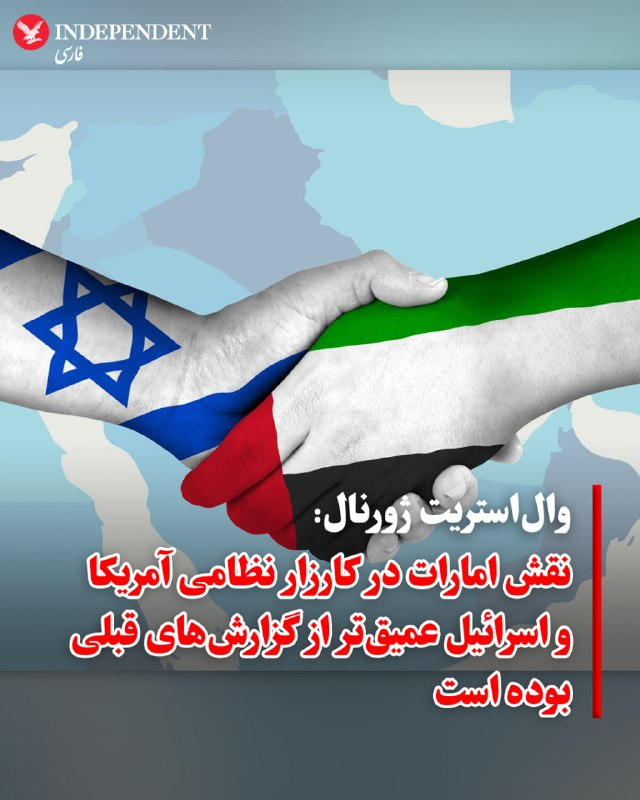

روزنامه وال‌استریت ژورنال روز جمعه هشتم خرداد، در گزارشی اختصاصی به نقل از منابع آگاه فاش کرد که امارات متحده عربی در طول جنگ، ده‌ها حمله هوایی را علیه مواضعی در ایران انجام داده است.

منابع وال‌استریت ژورنال می‌گویند نقش امارات در این کارزار نظامی، «بسیار عمیق‌تر» از آنچه که پیش‌تر گزارش شده، بوده است.

بر اساس این گزارش، این حملات با هماهنگی کامل واشنگتن و تل‌آویو و با اتکا به اطلاعات ارائه‌شده از سوی آن‌ها انجام شده است.

اهداف امارات شامل جزایر قشم و ابوموسی در تنگه هرمز، بندرعباس، پالایشگاه نفت جزیره لاوان و مجتمع پتروشیمی عسلویه بوده است.
حملات به عسلویه که به صورت مشترک با اسرائیل و در پاسخ به ضربات جمهوری اسلامی به زیرساخت‌های انرژی امارات انجام شد، واکنش‌های شدید بین‌المللی را برانگیخت و واشنگتن را وادار کرد از اسرائیل بخواهد حمله به تاسیسات انرژی را متوقف کند.
@VahidOOnLine

📡 @VahidOnline

## VahidOnline — post 75793

#قشم
پیام‌های دریافتی درباره فعالیت پدافند:

سلام وحید
قشم ساعت ۲۱:۲۵ تاریخ جمعه ۸ خرداد
پدافند فعال شد من در محدوده قلعه پرتغالی‌ها شهر قشمم و شلیک پدافند کاملا قابل دیدن و شنیدن بود

21:26 هشتم خرداد جزیره #قشم
صدای توافق خیلی بلند به گوشمون رسید. حدود یک دقیقه صدای شدید پدافند، احتمالا برخورد موفق با پهباد نفوذی.

درود همین پنج دقیقه پیش پدافند قشم داشت شلیک می کرد درگیری بود

ساعت 21:25
همین الان پدافند قشم فعال شد و یک چیزی رو زد

🔄 آپدیت:
تسنیم: "در پی رصد ریزپرنده متخاصم دشمن آمریکایی ـ صهیونی در حوالی قشم توسط پدافند هوایی ارتش، بلافاصله در عملیات موفق مورد اصابت قرار گرفت و منهدم شد."
📡 @VahidOnline

## VahidOnline — post 75792

  

دونالد ترامپ پستی از نیوت گینگریچ، رییس پیشین مجلس نمایندگان آمریکا، را در تروث سوشال بازنشر کرد که در آن نوشته شده بود: پس از بررسی جنگ ایران در این هفته، متقاعد شدم ترامپ در آستانه یک پیروزی تاریخی قرار دارد
IranIntlbrk

پستی که گینگریچ ۸ ساعت پیش نوشته بود، ترجمه ماشین:
پس از آنکه این هفته را صرف بررسی جنگ ایران کردم، اکنون متقاعد شده‌ام که رئیس‌جمهور ترامپ در آستانه یک پیروزی تاریخی قرار دارد. نقطه عطف واقعی برای من زمانی رقم خورد که تصمیم‌ها و مانورهای رئیس‌جمهور ترامپ را نه از منظر یکجانبه‌گرایی آمریکا، بلکه از منظر رهبر یک ائتلاف تاریخی چشمگیر بررسی کردم؛ بزرگ‌ترین ائتلافی که تاکنون در خاورمیانه مدرن شکل گرفته است.

همه می‌دانند که اسرائیل متحد مهمی است. اما آنچه کمتر درباره آن صحبت می‌شود، عمق حمایت امارات متحده عربی، قطر، بحرین، عربستان سعودی و دیگر کشورهای منطقه است. برای دیکتاتوری ایران باید بسیار تأمل‌برانگیز باشد که دریابد حتی یک متحد ندارد که حاضر باشد محاصره دریایی آمریکا را به چالش بکشد. آرام‌آرام، به‌تدریج و با احتیاط، متحدان اروپایی ما نیز در حال صف‌آرایی برای کمک در خلیج فارس و تنگه هرمز هستند.

بخش بزرگی از مانورهای رئیس‌جمهور ترامپ علیه ایران زمانی معنا پیدا می‌کند که او را نه صرفاً یک رئیس‌جمهور یکجانبه‌گرای آمریکایی، بلکه رهبر یک ائتلاف ببینیم. من بخش زیادی از چند هفته گذشته را صرف بررسی گزینه‌های نظامی کردم؛ از جمله پیروزی در نبرد خلیج فارس و تنگه هرمز و، در صورت لزوم، استفاده از سطحی تکان‌دهنده و خردکننده از قدرت نظامی؛ مشابه آنچه رئیس‌جمهور نیکسون و وزیر خارجه کیسینجر در کریسمس ۱۹۷۲ علیه هانوی و هایفونگ به کار گرفتند؛ اقدامی که هر دو رهبر معتقد بودند ویتنام شمالی را به پذیرش آتش‌بس و آزادی اسرای آمریکایی متقاعد کرد.

اگر این یک کارزار یکجانبه آمریکایی بود، می‌توانستم با اشتیاق از یک کارزار نظامی تهاجمی‌تر حمایت کنم. اما در عین حال روشن است که چنین اقدامی ائتلاف را از هم می‌پاشاند، زیرا متحدان عرب ما متقاعدند که ایران هنوز می‌تواند خسارت عظیمی به میدان‌های نفتی و زیرساخت‌های آنان وارد کند. ائتلاف‌ها ذاتاً کندتر از کارزارهای یکجانبه عمل می‌کنند. با این حال، ائتلاف‌ها در نهایت قدرتی به‌مراتب بیشتر را وارد میدان می‌کنند.

من نیز مانند همه دیگران از سرعت گفت‌وگوها با این دیکتاتوری سرخورده‌ام؛ اما پس از بررسی توازن قوا و گزینه‌های در دسترس ائتلاف از یک سو، و دیکتاتوری مذهبیِ ایران از سوی دیگر، آماده‌ام بگویم که رهبری ائتلافیِ رئیس‌جمهور ترامپ ــ چیزی که تقریباً هیچ‌یک از منتقدان او نمی‌خواهند به آن اذعان کنند ــ در آستانه دستیابی به یک پیروزی عظیم تاریخی است.

و اگر دیکتاتوری ایران در نهایت ثابت کند که به شکلی نومیدانه به موضعی انتحاری پایبند است، زمان کافی برای یک کارزار نظامی با قدرت و اثربخشی عظیم وجود خواهد داشت. در هر صورت، ما در آستانه یک پیروزی شگفت‌انگیز برای ارزش‌های خود و برای خاورمیانه‌ای امن‌تر قرار داریم.
NewtGingrich

📡 @VahidOnline

## VahidOnline — post 75791

  

مهدی خانعلی‌زاده، عضو تیم رسانه‌ای هیات مذاکره‌کننده جمهوری اسلامی، نوشت که در متن تفاهم احتمالی هشت بند از ۱۰ بند بیانیه شورای عالی امنیت ملی که به تایید مجتبی خامنه‌ای رسیده، رعایت نشده و زیر پا گذاشته شده است.

او افزود که تفاهم‌نامه کنونی برخلاف بیانیه آتش‌بس شورای عالی امنیت ملی است و مشخص شده که اساسا مذاکرات پسااسلام‌آباد، بر مبنای شروط رهبری انجام نشده است.
@VahidOOnLine

📡 @VahidOnline

## VahidOnline — post 75790

  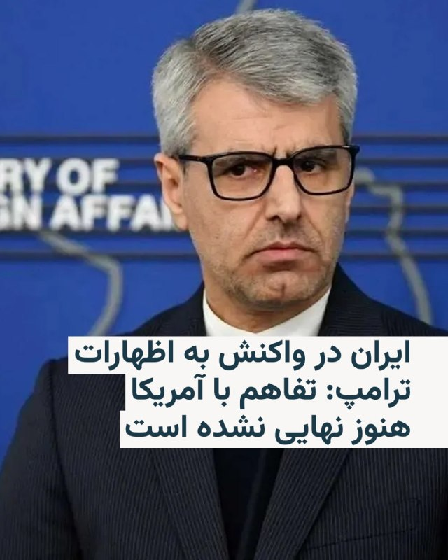

اسماعیل بقایی، سخنگوی وزارت خارجه ایران در مصاحبه‌ای با صدا و سیما گفت که تبادل پیام‌ها ادامه دارد ولی هنوز هیچ توافقی نهایی نشده است و افزود که مدیریت تنگه هرمز باید توسط ایران و عمان تعیین شود.

او بار دیگر گفت: «در این مرحله بر خاتمه جنگ متمرکز هستیم و در مورد پرونده هسته‌ای هیچ مذاکره‌ای نداریم.»

این اظهارات در حالی از سوی ایران مطرح شده که آقای ترامپ فهرستی از خواسته‌هایی را که می‌گوید ایران باید برآورده کند، مطرح کرد که شامل تعهد ایران به عدم دستیابی به سلاح هسته‌ای، باز کردن تنگه هرمز بدون دریافت عوارض، مین‌روبی کامل این آبراه و خارج‌سازی ذخایر اورانیوم ‌غنی‌شده ایران با همکاری آمریکا و تحت نظارت آژانس و سپس از بین بردن این مواد است.
@VahidHeadline
پیش‌تر: خبرگزاری فارس، نزدیک به سپاه پاسداران، نیز به نقل از یک منبع ایرانی دیگر اظهارنظر رئیس‌جمهور ایالات منحده دربارهٔ توافق احتمالی با ایران، را «آمیخته‌ای از راست و دروغ» خوانده است.
این منبع گفته که در متن توافق بندی درباره باز شدن تنگه هرمز بدون دریافت عوارض وجود ندارد و تفاهم بر سر نابودی دخایر اورانیوم ایران را نیز «بی‌اساس» دانسته است.
@VahidHeadline

📡 @VahidOnline

## VahidOnline — post 75789

  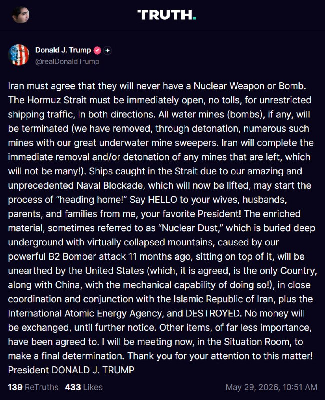

☄️ پست ترامپ، ترجمه ماشین:
ایران باید بپذیرد که هرگز سلاح یا بمب هسته‌ای نخواهد داشت.

تنگه هرمز باید فوراً، بدون عوارض، برای عبور و مرور آزادانه کشتی‌ها در هر دو جهت باز شود. همه مین‌های دریایی، اگر وجود داشته باشند، برچیده خواهند شد؛ ما با مین‌روب‌های زیرآبی فوق‌العاده خود، شمار زیادی از این مین‌ها را از طریق انفجار از بین برده‌ایم. ایران نیز باید فوراً هر مین باقی‌مانده‌ای را، که تعدادشان زیاد نخواهد بود، جمع‌آوری یا منفجر کند.

کشتی‌هایی که به‌دلیل محاصره دریایی شگفت‌انگیز و بی‌سابقه ما در تنگه گرفتار شده بودند ــ ❗️ محاصره‌ای که اکنون لغو خواهد شد ــ می‌توانند روند «بازگشت به خانه» را آغاز کنند! از طرف من، رئیس‌جمهور محبوبتان، به همسران، شوهران، پدران، مادران و خانواده‌هایتان سلام برسانید!

مواد غنی‌شده، که گاهی از آن با عنوان «غبار هسته‌ای» یاد می‌شود و در اعماق زمین دفن شده؛ در حالی که کوه‌هایی که عملاً بر اثر حمله قدرتمند بمب‌افکن‌های B-2 ما در ۱۱ ماه پیش فرو ریخته‌اند روی آن قرار دارند، ❗️توسط ایالات متحده از زیر خاک بیرون آورده خواهد شد؛ کشوری که، طبق توافق، تنها کشور در کنار چین است که توان مکانیکی انجام چنین کاری را دارد.
این کار با هماهنگی و همکاری نزدیک با جمهوری اسلامی ایران و همچنین آژانس بین‌المللی انرژی اتمی انجام خواهد شد و سپس این مواد نابود خواهد شد.

❗️ تا اطلاع ثانوی، هیچ پولی رد و بدل نخواهد شد.

درباره موارد دیگری که اهمیت بسیار کمتری دارند نیز توافق حاصل شده است.

💥اکنون در اتاق وضعیت جلسه خواهم داشت تا تصمیم نهایی را بگیرم.

از توجه شما به این موضوع سپاسگزارم!

رئیس‌جمهور دونالد جی. ترامپ
realDonaldTrump

📡 @VahidOnline

## VahidOnline — post 75788

  <a href="telegram/content/VahidOnline_75788_1780084943.mp4" target="_blank">🎬 Download video</a>

این ویدیو با شرح عبور موشک‌های تاماهاک در مرز عراق و ایران در شبکه‌های اجتماعی و چند رسانه منتشر شده و گفته می‌شود مربوط به روزهای نخست جنگ است.
@VahidOOnLine

📡 @VahidOnline

## VahidOnline — post 75787

  <a href="telegram/content/VahidOnline_75787_1780084944.mp4" target="_blank">🎬 Download video</a>

اسکات بسنت، وزیر خزانه‌داری آمریکا، روز پنجشنبه هفتم خرداد ماه اعلام کرد عمان پس از دریافت هشدار واشنگتن درباره پیامدهای احتمالی مشارکت در طرح دریافت عوارض از کشتی‌های عبوری از تنگه هرمز، به آمریکا اطمینان داده است که برنامه‌ای برای اجرای چنین طرحی ندارد.
بسنت روز پنجشنبه در نشست خبری کاخ سفید گفت که صبح همان روز با سفیر عمان گفتگو کرده و از او شنیده است که مسقط هیچ برنامه‌ای برای دریافت عوارض در تنگه هرمز ندارد.
او افزود: «به او گفتم این موضوع از اساس غیرقابل قبول است و او نیز نمی‌خواهد افراد عمانی یا موسسات مالی عمانی را در معرض خطر تحریم قرار دهد.»
بسنت ساعاتی پیش‌تر در پیامی در شبکه اجتماعی ایکس هشدار داده بود که وزارت خزانه‌داری آمریکا هر فرد یا نهادی را که به‌صورت مستقیم یا غیرمستقیم در تسهیل دریافت عوارض در تنگه هرمز نقش داشته باشد، هدف تحریم قرار خواهد داد. او تصریح کرده بود که هر شریک احتمالی این طرح نیز با مجازات و تحریم روبه‌رو خواهد شد.
@VahidOOnLine

📡 @VahidOnline

## VahidOnline — post 75786

  

شبکه العربیه به نقل از منابع آگاه گزارش داد جمهوری اسلامی می‌خواهد اورانیوم غنی‌سازی‌شده خود را به چین منتقل کند، مشروط بر آن‌که چین تضمین دهد این مواد را به آمریکا تحویل نخواهد داد.

به گفته این منابع، بسیاری از نکات مرتبط با برنامه هسته‌ای جمهوری اسلامی در مذاکرات جاری حل‌وفصل شده است.

بر اساس این گزارش، جمهوری اسلامی با نظارت بین‌المللی بر تاسیسات هسته‌ای خود برای جلوگیری از تعطیل‌شدن آن‌ها موافقت کرده است.
@VahidOOnLine

📡 @VahidOnline

## VahidOnline — post 75785

  

محمدباقر قالیباف، مذاکره‌کننده ارشد جمهوری اسلامی با آمریکا، روز جمعه تهدید کرد که تهران امتیازات مورد نظر خود در توافق پایان دادن به جنگ را با «موشک» می‌گیرد و پیش از اقدام واشینگتن درباره این توافق اقدامی نخواهد کرد.

او در شبکه ایکس همچنین نوشت: «هیچ اعتمادی به تضمین‌ها و حرف‌ها نداریم، فقط رفتارها معیار است.»

این موضع‌گیری یک روز پس از آن انجام شد که چند رسانه غربی خبر دادند آمریکا و ایران به تفاهمی برای تمدید آتش‌بس و رفع محدودیت عبور و مرور کشتی‌ها در تنگه هرمز رسیده‌اند، اما این توافق منتظر تصمیم و امضای نهایی دونالد ترامپ، رئیس‌جمهور ایالات متحده است.

قالیباف در پیام خود اعلام کرده که «اقدامی پیش از اقدام طرف مقابل انجام نخواهد شد».

از سوی دیگر، رسانه‌های نزدیک به سپاه پاسداران می‌گویند گزارش‌ها درباره توافق تهران و واشنگتن صحیح نیست. خبرگزاری تسنیم در این مورد به نقل از یک «منبع مطلع» نوشت: «متن توافق تا این لحظه جمع‌بندی نهایی نشده است.»
@VahidHeadline

📡 @VahidOnline

## VahidOnline — post 75784

  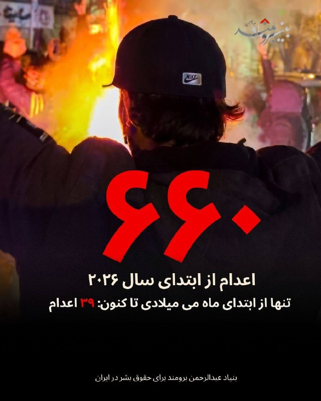

‏🔴بنیاد عبدالرحمن برومند از ابتدای سال جاری تاکنون، اجرای ۶۶۰ مورد اعدام توسط جمهوری اسلامی را مستند کرده است. با این حال، به دلیل ماهیت پنهان‌کاری و غیرشفاف بودن سیستم قضایی ایران، آمار واقعی به احتمال زیاد بسیار بیشتر از این رقم است.

‏🔸از زمان آغاز جنگ، آمار اعدام معترضان و افرادی که به جاسوسی و اتهامات مشابه علیه امنیت ملی متهم شده‌اند، با سرعتی نگران‌کننده افزایش یافته است. «اعترافات اجباری» قربانیان، اصلی‌ترین «مدرک» مورد استفاده در این احکام مرگبار بوده است.

‏🔸این اعترافات در شرایطی کاملا مبهم و تحت فشارهای شدید جسمی و روحی اخذ می‌شوند. جمهوری اسلامی به طور مستمر این اعترافات اجباری را در رسانه‌های دولتی پخش می‌کند تا از آن به عنوان ابزاری برای توجیه اعدام‌ها و سرکوب مخالفت‌های عمومی استفاده کند.
‏⁧ #نه_به_اعدام ⁩
@IranRights

## IranIntlTV — post 339646

  <a href="telegram/content/IranIntlTV_339646_1780084947.mp4" target="_blank">🎬 Download video</a>

اسرائیل‌هیوم در گزارشی از وجود یک شاخه محرمانه در موساد خبر داد که ماموریت آن عملیات نفوذ، جنگ روانی و بی‌ثبات‌سازی جمهوری اسلامی با هدف تغییر رژیم در ایران است.

گفت‌وگو با منشه امیر، کارشناس امور خاورمیانه
@iranintltv

## IranIntlTV — post 339645

  <a href="telegram/content/IranIntlTV_339645_1780084949.mp4" target="_blank">🎬 Download video</a>

رومانی سفیر روسیه را پس از برخورد یک پهپاد روسی به ساختمانی در خاک این کشور احضار کرد. مقام‌های اروپایی این حادثه را نقض حریم هوایی اتحادیه اروپا دانستند. کایا کالاس، مسئول سیاست خارجه اتحادیه اروپا، هم گفته مسکو نباید حریم این منطقه را نقض کند.
این برخورد هم‌زمان با حملات شبانه روسیه به اوکراین رخ داد و دست‌کم دو نفر زخمی شدند.
@iranintltv

## IranIntlTV — post 339644

ویدیوی منتشرشده، لحظه کشته شدن جاویدنام بابک سلطانی را در اصفهان نشان می‌دهد.
سلطانی، ۵۹ ساله، شامگاه ۱۹ دی ۱۴۰۴ هنگامی که معترضان را در اصفهان پناه می‌داد هدف شلیک گلوله ماموران قرار گرفت و جان باخت.

## IranIntlTV — post 339643

  

اتحادیه اروپا با انتشار بیانیه‌ای اعلام کرد که حمله اخیر حکومت ایران علیه کویت را به شدت محکوم می‌کند.

در این بیانیه آمده که این حمله بنا بر حقوق بین‌الملل نقض حاکمیت کویت محسوب می‌شود.

اتحادیه اروپا همبستگی کامل خود را با دولت و مردم کویت بار دیگر اعلام کرد و افزود: «چنین حملاتی تهدیدی جدی برای امنیت و ثبات منطقه به شمار می‌روند.»
https://iranintl.com/202605296946

## IranIntlTV — post 339642

  <a href="telegram/content/IranIntlTV_339642_1780084952.mp4" target="_blank">🎬 Download video</a>

با وجود گزارش‌هایی درباره توافق میان واشینگتن و تهران، سرنوشت مذاکرات همچنان در هاله‌ای از ابهام قرار دارد.

دونالد ترامپ برای تصمیم‌گیری نهایی درباره توافق احتمالی با جمهوری اسلامی در نشست اتاق وضعیت کاخ سفید شرکت می‌کند.

گفت‌وگو با شهیر شهیدثالث، تحلیل‌گر روابط بین‌الملل
@iranintltv

## IranIntlTV — post 339641

🗣روایت شما از بحران اقتصادی و زندگی در آتش‌بس- جمعه ۸ خرداد:

🔹جوانی ما سوخت پای سفاهت عده‌ای که هیچ درک و فهمی از شادی و سرور ندارند، نزدیک به ۵۰ سال سرمایه‌های کشور رو به یغما دادند، ولی آدمی به امید زنده است.

🔹از اصفهان: گرونی بیداد می‌کنه. از صبح تا شب کار می‌کنیم برای یک میلیون که اونم هیچی نمی‌شه باهاش بخری.

🔹اینا توافق بکنن یا نکنن، هیچ فرقی به حال ما مردم نداره. جمهوری اسلامی به زودی به دست مردم نابود خواهد شد، چون مردم تو شرایط وحشتناکی دارن زندگی می‌کنن.

🔹من یه نوجوون ۱۵ ساله‌ام. چرا باید به فکر قیمت طلا و دلار باشم؟ تنها آرزوی زندگیم فقط خرید موتوریه که آخرین بار قیمتش ۸۰ میلیون تومان بود و الان قیمت گرفتم شده ۲۰۰ تومان. این یعنی خاک کردن آرزوهامون. این حق ما نیست.

🔹من یه بچه ۱۲ ساله هستم، دارم حسرت می‌خورم چرا یه دوچرخه ندارم، هر روز آرزو می‌کنم شاهزاده برگرده، هم مردم خوشحال بشن و هم کسانی که آرزوی چیزی داشتن بتونن بخرنش.

🔹ما نوجوان‌ها واقعا بدبخت شدیم نه امیدی نه آرزویی نه آینده‌ای. از بدو تولد با کرونا، آلودگی، قطعی برق و آب، جنگ و کشتار سر کردیم.

🔹به عنوان یه جوان ۲۸ ساله خیلی وقته دیگه انگیزه و امیدی برای آینده ندارم؛ جوانی که از وقتی که یادشه فقط داره کار می‌کنه و حتی پاش رو از شهر خودش برای یه مسافرت دو روزه بیرون نذاشته. پرایدی که ۱۵ سال از عمر خودش گذشته رو نمی‌تونم بخرم. ما سوختیم.

🔹جمهوری اسلامی با این وحشی‌گری‌هاش به زودی به جایی می‌ره که اسکندر و چنگیز رفتند. به دست مردم شجاع ایران، نه ترامپ. زنده‌باد امید، زنده‌باد ایران، زنده‌باد آزادی.

🔹مردم عزیز ایران، این روزهای سخت هم می‌گذره. امیدتون رو از دست ندین؛ ما ملتی هستیم که بارها دوباره از نو بلند شده. کنار هم می‌مونیم، می‌جنگیم و ایران‌مون رو پس می‌گیریم. آینده از آنِ مردمه.

## IranIntlTV — post 339640

  <a href="telegram/content/IranIntlTV_339640_1780084954.mp4" target="_blank">🎬 Download video</a>

اسرائیل‌هیوم گزارش داده موساد شاخه‌ای محرمانه برای عملیات نفوذ و جنگ روانی علیه جمهوری اسلامی با هدف تغییر رژیم ایجاد کرده است. این گزارش همچنین گفته رییس موساد معتقد است در صورت ادامه محاصره دریایی و شکست توافق با جمهوری اسلامی، حکومت ایران تا پایان ۲۰۲۶ سقوط می‌کند.
@iranintltv

## IranIntlTV — post 339639

  

اسکات بسنت، وزیر خزانه‌داری آمریکا اعلام کرد این کشور یک میلیارد دلار از دارایی‌های رمزارزی مرتبط با جمهوری اسلامی را توقیف کرده است.

بسنت در پاسخ به پرسشی درباره محاصره دریایی بنادر ایران گفت هر اقدامی برای کاهش یا لغو محدودیت‌ها، به‌صورت تدریجی انجام خواهد شد.

وزیر خزانه‌داری آمریکا پیش‌تر نیز اعلام کرده بود دسترسی شرکت‌های هواپیمایی ایران به محل‌های فرود، سوخت‌گیری و فروش بلیت را قطع خواهیم کرد.
https://iranintl.com/202605296456

## IranIntlTV — post 339638

  

علی خزایی، عضو کمیسیون آموزش مجلس گفت که هرگونه تعرض و تجاوز از سوی آمریکا، اسرائیل و متحدانشان با «پاسخ قاطع، سخت و دندان‌شکن» مواجه خواهد شد.

خزایی افزود: «دشمن بار دیگر دچار خطای محاسباتی شده و تصور کرده جمهوری اسلامی در میدان نبرد دچار سکوت یا انفعال شده است.»
https://iranintl.com/202605297926

## IranIntlTV — post 339637

  

🔻نوواک جوکوویچ، مرد شماره ۴ تنیس جهان، در دور سوم رولان گاروس پس از پیش افتادن در دو ست، در نهایت مقابل ژوائو فونسکا، پدیده ۱۹ ساله برزیلی، باخت و حذف شد. پس از ۴ ساعت و ۵۳ دقیقه رقابت نفس‌گیر، شگفتی کامل شد و ورزشگاه فیلیپ شاتریه پس از حذف یانیک سینر، دومین شوک فصل را دید.

🔹اکنون قطعی است که دومین گرنداسلم سال را بازیکنی فتح خواهد کرد که تاکنون چنین عنوانی را به دست نیاورده است. نوواک جوکوویچ آخرین قهرمان گرنداسلم حاضر در پاریس بود.

🔹جدی‌ترین مدعی حال حاضر الکساندر زورف است که امشب در دور سوم به مصاف کوئنتن آلیس می‌رود.

🔹حذف جوکوویچ، به این معناست که از میان پنج نفر برتر رنکینگ، تنها زورف در جدول باقی مانده است.

🔹یانیک سینر، نفر اول جهان، در دور دوم و آن هم پس از برتری ۲-۰ در ست‌ها مقابل خوان مانوئل سروندولو از آرژانتین، به دلیل گرمازدگی شکست خورد.

🔹کارلوس آلکاراس، نفر دوم جهان، به دلیل آسیب‌دیدگی دست از حضور در پاریس انصراف داد.

🔹امشب، نواک جوکوویچ در میان تشویق پرشور تماشاگران زمین را ترک کرد؛ آیا این آخرین باری است که این ستاره ۳۹ ساله را در رولان گاروس می‌بینیم؟

@iranintltvsport

## IranIntlTV — post 339636

  

خبرگزاری رویترز به نقل از منابع جمهوری اسلامی گزارش داد که تهران ممکن است با انتقال نیمی از ذخایر اورانیوم غنی‌شده ۶۰درصدی به یک کشور ثالث موافقت کند.

بر اساس این گزارش، در این حالت، جمهوری اسلامی در مقابل این مقدار، اورانیوم با غنای ۵ درصد دریافت می‌کند.

رویترز نوشت که همچنین ممکن است نیم دیگر این ذخایر در داخل ایران رقیق‌سازی شود.
https://iranintl.com/202605295732

## IranIntlTV — post 339635

  

نیویورک‌تایمز به نقل از یک مقام ارشد آمریکایی گزارش داد نشست دونالد ترامپ در «اتاق وضعیت» کاخ سفید دو ساعت به طول انجامید، اما رییس‌جمهور آمریکا هنوز درباره هیچ توافق جدیدی با تهران به تصمیم نهایی نرسیده است.

این مقام افزود دولت آمریکا معتقد است به دستیابی به توافق نزدیک شده، اما برخی مسائل از جمله آزادسازی دارایی‌های مسدودشده همچنان محل بررسی و اختلاف‌نظر است.
https://iranintl.com/202605292981

## IranIntlTV — post 339634

  <a href="telegram/content/IranIntlTV_339634_1780084961.mp4" target="_blank">🎬 Download video</a>

یک شهروند با اشاره به وضعیت بد معیشتی به مقایسه قدرت خرید خانواده‌های ایرانی با شهروندان کشورهای دیگر پرداخته و می‌گوید که بازگشت نسبی اتصال به اینترنت به این علت است که «حواسمان را پرت کنند.»

پیام او با هوش مصنوعی خوانده شده است.

## IranIntlTV — post 339633

  

ارتش اسرائیل اعلام کرد که بر اساس مستنداتی که به دست آورده، گروه مسلح حزب‌الله، تحت حمایت جمهوری اسلامی، راکت‌هایی را شلیک کرده که به کلیسایی در جنوب لبنان اصابت کرده است.

در بیانیه ارتش اسرائیل آمده است: «سازمان تروریستی حزب‌الله در طول شامگاه جمعه چندین راکت شلیک کرد که به کلیسای ارتدوکس سنت جورج در جنوب لبنان اصابت کردند. این شلیک‌ها به ساختمان‌هایی در روستای مسیحی مرجعیون اصابت کردند.»

ارتش اسرائیل تاکید کرده که نیروهایش در محدوده این کلیسا فعالیت نمی‌کنند.
https://iranintl.com/202605293734

## IranIntlTV — post 339632

  <a href="https://t.me/IranintlTV/339632" target="_blank">📎 Download file</a>

🎧نسخه صوتی حرف آخر با پوریا زراعتی - مجتبی و وحیدی مانع توافق هستند
@iranintlTV

## IranIntlTV — post 339631

  <a href="telegram/content/IranIntlTV_339631_1780084965.mp4" target="_blank">🎬 Download video</a>

۲۴ با فرداد فرحزاد
@iranintltv

## IranIntlTV — post 339630

  

خبرگزاری تسنیم، وابسته به سپاه پاسداران گزارش داد که شامگاه جمعه، در پی رصد ریزپرنده متخاصم «دشمن آمریکایی-اسرائیلی» در حوالی قشم از سوی پدافند هوایی ارتش، مورد اصابت قرار گرفت و منهدم شد.
پیش‌تر رسانه‌های ایران تصاویری از شلیک ممتد پدافند در محدوده قشم منتشر کرده بودند.
https://iranintl.com/202605297986

## IranIntlTV — post 339629

  <a href="telegram/content/IranIntlTV_339629_1780084967.mp4" target="_blank">🎬 Download video</a>

آیا واقعا در تهران همه آماده‌ی توافق هستند و فقط ترامپ مانده که موافقت کند؟
@iranintltv

## IranIntlTV — post 339628

  

خبرگزاری مهر، وابسته به سازمان تبلیغات اسلامی، نوشت شامگاه جمعه، صدای فعالیت پدافند در جزیره قشم از سوی ساکنان محلی گزارش شده است.

بنا بر این گزارش ماهیت این صداها مشخص نیست و هنوز هیچ‌یک از نهادهای رسمی درباره علت وقوع این صداها اظهارنظر نکرده‌اند.
https://iranintl.com/202605296669

## IranIntlTV — post 339627

  

ابراهیم عزیزی، رییس کمیسیون امنیت ملی مجلس، در شبکه ایکس نوشت که ترامپ باید بداند که جمهوری اسلامی به عنوان «پیروز و فاتح میدان»، شرایط را تعیین می‌کند؛ نقد مقابل نقد، نسیه مقابل نسیه و هیچ مقابل هیچ. البته برای موضوعاتی که مورد مذاکره است، نه آرزوهایش.

پیش‌تر دونالد ترامپ اعلام کرد که «ایران باید موافقت کند که هرگز سلاح یا بمب هسته‌ای نخواهد داشت. تنگه هرمز باید فورا باز باشد؛ بدون دریافت عوارض و برای عبور و مرور نامحدود کشتی‌ها در هر دو جهت. همه مین‌های دریایی (بمب‌ها)، در صورت وجود، باید از میان برداشته شوند.»
https://iranintl.com/202605295273

## Shin_Persian — post 6307

Shin ✓ @hey_itsmyturn
Fri, 29 May 2026 18:10:17 UTC

State-owned Mehr News confirms the AA activity in Qeshm island
Hormozgan Province, #Iran

فارسی

خبرگزاری دولتی مهر فعالیت پدافند هوایی (AA) در جزیره قشم را تایید کرد.
استان هرمزگان، #Iran

𝕏 · @shin_persian

## Shin_Persian — post 6306

  

Shin ✓ @hey_itsmyturn
Fri, 29 May 2026 17:58:04 UTC

Intense AA activity in Qeshm Island, Hormozgan Province, #Iran

فارسی

فعالیت شدید پدافند هوایی در جزیره قشم، استان هرمزگان، #Iran

𝕏 · @shin_persian

## Shin_Persian — post 6305

  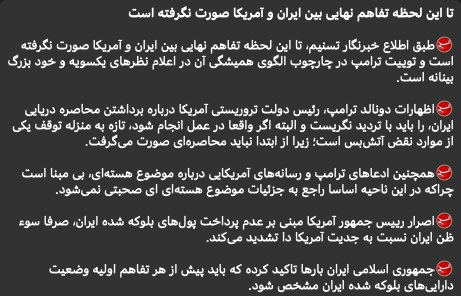

🔁 Quoting above tweet: Shin ✓ @hey_itsmyturn Fri, 29 May 2026 16:27:26 UTC IRGC-owned Tasnim News: "No final agreement has been reached between Iran and the United States at this time. According to Tasnim News Agency’s reporter, no final agreement has…

## Shin_Persian — post 6304

🔁 Quoting above tweet:
Shin ✓ @hey_itsmyturn
Fri, 29 May 2026 16:27:26 UTC

IRGC-owned Tasnim News:

"No final agreement has been reached between Iran and the United States at this time.

According to Tasnim News Agency’s reporter, no final agreement has been concluded between Iran and the United States so far. President Trump's tweet aligns with his consistent pattern of unilateral and self-aggrandizing pronouncements.

Donald Trump's statements concerning the lifting of the naval blockade on Iran, emanating from the head of the terrorist U.S. administration, should be viewed with skepticism. Should such an action materialize, it would merely signify the cessation of one of numerous ceasefire violations, given that such a blockade should never have been initiated.

Furthermore, Trump's assertions and those of American media outlets regarding the nuclear issue are unfounded, as no detailed discussions on nuclear matters are currently taking place in this area.

The U.S. President's insistence on not releasing Iran's blocked funds solely intensifies Iran's suspicion regarding the seriousness of the United States.

The Islamic Republic of Iran has repeatedly emphasized that the status of its blocked assets must be clarified prior to any preliminary agreement."

فارسی

خبرگزاری تسنیم وابسته به سپاه پاسداران انقلاب اسلامی (IRGC):

«تا این لحظه هیچ توافق نهایی میان ایران و ایالات متحده حاصل نشده است.

به گزارش خبرنگار خبرگزاری تسنیم، تاکنون هیچ توافق نهایی بین ایران و ایالات متحده منعقد نشده است. توئیت پرزیدنت ترامپ با الگوی همیشگی او در اظهارات یک‌جانبه و خودبزرگ‌بینانه مطابقت دارد.

اظهارات دونالد ترامپ در خصوص رفع محاصره دریایی ایران که از سوی رئیس دولت تروریست آمریکا مطرح شده، باید با تردید نگریسته شود. در صورت تحقق چنین اقدامی، این تنها به معنای توقف یکی از موارد متعدد نقض آتش‌بس خواهد بود، چرا که چنین محاصره‌ای اساساً نباید هرگز آغاز می‌شد.

علاوه بر این، ادعاهای ترامپ و رسانه‌های آمریکایی در مورد موضوع هسته‌ای بی‌اساس است، زیرا در حال حاضر هیچ بحث مفصلی در مورد مسائل هسته‌ای در این زمینه در جریان نیست.

اصرار رئیس‌جمهور آمریکا بر عدم آزادسازی اموال بلوکه شده ایران، صرفاً سوءظن ایران را نسبت به جدیت ایالات متحده تشدید می‌کند.

جمهوری اسلامی ایران بارها تأکید کرده است که وضعیت دارایی‌های بلوکه شده‌اش باید پیش از هرگونه توافق مقدماتی روشن شود.»

𝕏 · @shin_persian

## Shin_Persian — post 6303

  

↩️ Quoted tweet: Shin ✓ @hey_itsmyturn Fri, 29 May 2026 14:55:22 UTC President Trump @POTUS: "Iran must agree that they will never have a Nuclear Weapon or Bomb. The Hormuz Strait must be immediately open, no tolls, for unrestricted shipping traffic, in…

## Shin_Persian — post 6302

↩️ Quoted tweet:
Shin ✓ @hey_itsmyturn
Fri, 29 May 2026 14:55:22 UTC

President Trump @POTUS:
"Iran must agree that they will never have a Nuclear Weapon or Bomb. The Hormuz Strait must be immediately open, no tolls, for unrestricted shipping traffic, in both directions. All water mines (bombs), if any, will be terminated (we have removed, through

↩️ توییت نقل‌قول شده — برای پاسخ، پست زیر را ببینید.

فارسی

رئیس‌جمهور ترامپ @POTUS:
«ایران باید موافقت کند که هرگز سلاح هسته‌ای یا بمب نخواهد داشت. تنگه هرمز باید فوراً برای تردد نامحدود کشتی‌رانی در هر دو جهت، بدون هیچ‌گونه حق‌العبوری، باز شود. تمام مین‌های دریایی (بمب‌ها)، در صورت وجود، نابود خواهند شد (ما حذف کرده‌ایم، از طریق

𝕏 · @shin_persian

## Shin_Persian — post 6301

  

🔁 Quoting above tweet: Shin ✓ @hey_itsmyturn Fri, 29 May 2026 15:49:40 UTC IRGC-owned Fars News in response to POTUS' post: """ Knowledgeable sources, while refuting the recent claims of the American president regarding a potential agreement with Iran,…

## Shin_Persian — post 6300

🔁 Quoting above tweet:
Shin ✓ @hey_itsmyturn
Fri, 29 May 2026 15:49:40 UTC

IRGC-owned Fars News in response to POTUS' post:

""" Knowledgeable sources, while refuting the recent claims of the American president regarding a potential agreement with Iran, have described his statements as "a mixture of truth and falsehood" and an attempt to present a fabricated victory. According to these sources, it has become evident to nearly everyone that these claims lack credibility.

According to this report, the text of the agreement, drafted under the framework of "commitment for commitment," is in its final stages of approval in Iran, and a definitive decision has not yet been made. In contrast, Trump, who sees himself unable to withdraw from the agreement, has made statements that contradict the provisions of the agreement text. He has simultaneously announced an immediate end to the blockade.

Trump's Distortion of Key Agreement Provisions:

1. Strait of Hormuz: Trump has claimed that Iran is obliged to open the Strait of Hormuz without imposing tolls, whereas no such clause exists in the agreement text. Iran has emphasized that after the lifting of the blockade, it will open the strait according to its pre-determined arrangements. These arrangements could include monitoring and inspection of vessels, as well as providing services and ensuring security, for which Iranian reporters from Fars News Agency hear preparations are underway.

2. Dismantling of Nuclear Materials: Trump has alleged that Iran will dismantle or destroy its nuclear materials. Knowledgeable sources have stressed that not only is there no such provision in the memorandum of understanding, but this claim is fundamentally groundless.

Key Agreement Clauses Ignored by Trump:

1. Immediate Payment of 12 Billion Dollars: The most crucial part of the agreement, which Trump has not mentioned, is the condition for an immediate payment of 12 billion dollars from Iran's blocked assets. According to the agreement text, this amount must be paid immediately, and until this payment is made, Iran will not enter any subsequent negotiation stages. Failure to implement this clause would constitute a violation of U.S. commitments.

2. Ceasefire in Lebanon: Another issue is the establishment of a complete ceasefire in Lebanon in accordance with Hezbollah's views.

According to knowledgeable sources, only if these issues are resolved will Iran, in the next stage, engage in discussions regarding the lifting of all sanctions and the nuclear issue, in accordance with its red lines.

Concurrent with these statements, Iranian officials have emphasized that the final agreement will be formulated based on the principles and red lines of the Islamic Republic of Iran's system and with a complete distrustful approach towards the United States, such that any breaking of promises will be met with immediate reciprocal action. """

ترجمه فارسی در بخش نظرات

𝕏 · @shin_persian

## Shin_Persian — post 6299

  

↩️ Quoted tweet: Shin ✓ @hey_itsmyturn Fri, 29 May 2026 14:55:22 UTC President Trump @POTUS: "Iran must agree that they will never have a Nuclear Weapon or Bomb. The Hormuz Strait must be immediately open, no tolls, for unrestricted shipping traffic, in…

## Shin_Persian — post 6298

↩️ Quoted tweet:
Shin ✓ @hey_itsmyturn
Fri, 29 May 2026 14:55:22 UTC

President Trump @POTUS:
"Iran must agree that they will never have a Nuclear Weapon or Bomb. The Hormuz Strait must be immediately open, no tolls, for unrestricted shipping traffic, in both directions. All water mines (bombs), if any, will be terminated (we have removed, through

↩️ توییت نقل‌قول شده — برای پاسخ، پست زیر را ببینید.

فارسی

پرزیدنت ترامپ @POTUS:
«ایران باید موافقت کند که هرگز سلاح یا بمب هسته‌ای نخواهد داشت. تنگه هرمز باید فورا، بدون عوارض، برای ترافیک کشتیرانی نامحدود در هر دو جهت باز شود. تمام مین‌های آبی (بمب‌ها)، در صورت وجود، منهدم خواهند شد (ما برداشته‌ایم، از طریق...»

𝕏 · @shin_persian

## Shin_Persian — post 6297

  

Shin ✓ @hey_itsmyturn Fri, 29 May 2026 14:55:22 UTC President Trump @POTUS: "Iran must agree that they will never have a Nuclear Weapon or Bomb. The Hormuz Strait must be immediately open, no tolls, for unrestricted shipping traffic, in both directions.…

## Shin_Persian — post 6296

Shin ✓ @hey_itsmyturn
Fri, 29 May 2026 14:55:22 UTC

President Trump @POTUS:
"Iran must agree that they will never have a Nuclear Weapon or Bomb. The Hormuz Strait must be immediately open, no tolls, for unrestricted shipping traffic, in both directions. All water mines (bombs), if any, will be terminated (we have removed, through detonation, numerous such mines with our great underwater mine sweepers. Iran will complete the immediate removal and/or detonation of any mines that are left, which will not be many!). Ships caught in the Strait due to our amazing and unprecedented Naval Blockade, which will now be lifted, may start the process of “heading home!” Say HELLO to your wives, husbands, parents, and families from me, your favorite President! The enriched material, sometimes referred to as “Nuclear Dust,” which is buried deep underground with virtually collapsed mountains, caused by our powerful B2 Bomber attack 11 months ago, sitting on top of it, will be unearthed by the United States (which, it is agreed, is the only Country, along with China, with the mechanical capability of doing so!), in close coordination and conjunction with the Islamic Republic of Iran, plus the International Atomic Energy Agency, and DESTROYED. No money will be exchanged, until further notice. Other items, of far less importance, have been agreed to. I will be meeting now, in the Situation Room, to make a final determination. Thank you for your attention to this matter! President DONALD J. TRUMP"

ترجمه فارسی در بخش نظرات

𝕏 · @shin_persian

## Shin_Persian — post 6295

  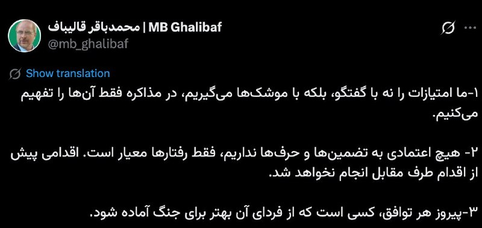

🔁 Quoting above tweet: Shin ✓ @hey_itsmyturn Fri, 29 May 2026 13:10:40 UTC The Speaker of Parliament and the head of Islamic Regime's negotiating team, Mohammad Bagher Ghalibaf posted a three-point statement outlining clear position regarding negotiations…

## Shin_Persian — post 6294

🔁 Quoting above tweet:
Shin ✓ @hey_itsmyturn
Fri, 29 May 2026 13:10:40 UTC

The Speaker of Parliament and the head of Islamic Regime's negotiating team, Mohammad Bagher Ghalibaf posted a three-point statement outlining clear position regarding negotiations with the United States:

"1. We achieve concessions not through dialogue, but through missiles; in negotiations, we merely articulate them.

2. We do not trust guarantees or words; only actions serve as a measure. No action will be taken before the opposing party acts.

3. The victor of any agreement is the one who, from the day after, prepares better for war."

فارسی

رئیس مجلس و رئیس تیم مذاکره‌کننده رژیم اسلامی، محمدباقر قالیباف، بیانیه‌ای سه‌عاملی را منتشر کرد که موضع شفافی را در خصوص مذاکره با ایالات متحده ترسیم می‌کند:

«۱. ما امتیازها را نه از طریق گفتگو، بلکه با موشک‌ها به دست می‌آوریم؛ در مذاکرات، ما صرفاً آن‌ها را بیان می‌کنیم.

۲. ما به تضمین‌ها یا واژه‌ها اعتماد نمی‌کنیم؛ تنها عمل ملاک است. هیچ اقدامی پیش از اقدام طرف مقابل انجام نخواهد شد.

۳. پیروز هر توافقی کسی است که از فردای آن روز، خود را بهتر برای جنگ آماده کند.»

𝕏 · @shin_persian

## Shin_Persian — post 6293

  <a href="telegram/content/Shin_Persian_6293_1780084978.mp4" target="_blank">🎬 Download video</a>

↩️ Quoted tweet: Israel War Room ✓ @IsraelWarRoom Thu, 28 May 2026 23:27:55 UTC .@VP Vance says the US has made "a lot of progress" in negotiations with Iran, but major disputes remain over Iran's uranium enrichment program and its highly enriched uranium…

## Shin_Persian — post 6292

↩️ Quoted tweet:
Israel War Room ✓ @IsraelWarRoom
Thu, 28 May 2026 23:27:55 UTC

.@VP Vance says the US has made "a lot of progress" in negotiations with Iran, but major disputes remain over Iran's uranium enrichment program and its highly enriched uranium stockpile.

"We're going back and forth on a couple of language points... Hopefully, we'll continue to

↩️ توییت نقل‌قول شده — برای پاسخ، پست زیر را ببینید.

فارسی

.@VP ونس می‌گوید ایالات متحده در مذاکرات با ایران به "پیشرفت‌های زیادی" دست یافته است، اما اختلافات عمده بر سر برنامه غنی‌سازی اورانیوم ایران و ذخایر اورانیوم با غنی‌سازی بالای این کشور همچنان باقی است.

"ما بر سر چند نکته زبانی در حال رایزنی رفت و برگشتی هستیم... امیدواریم که به ادامه دهیم"

𝕏 · @shin_persian

## ManotoTV — post 105869

  <a href="telegram/content/ManotoTV_105869_1780084981.mp4" target="_blank">🎬 Download video</a>

در سیاست بین‌الملل، کشورها بیش از آنکه بر پایه دوستی، همدلی یا شعارهای اخلاقی تصمیم بگیرند، بر اساس منافع ملی خود عمل می‌کنند. قدرت‌های بزرگ ممکن است از آزادی، امنیت، حقوق بشر یا نظم جهانی سخن بگویند، اما در لحظه تصمیم، محاسبه اصلی این است که چه چیزی به سود آن‌هاست.

## ManotoTV — post 105868

  <a href="telegram/content/ManotoTV_105868_1780084982.mp4" target="_blank">🎬 Download video</a>

سخنان الهام‌بخش فریدون فرخزاد درباره خودباوری ملی

## ManotoTV — post 105860

  <a href="telegram/content/ManotoTV_105860_1780084984.mp4" target="_blank">🎬 Download video</a>

در سیاست، گاهی مهم‌تر از خود رویداد، چیزی است که آن رویداد آشکار می‌کند.

جنگ اخیر نیز پرده‌ای از واقعیت جمهوری اسلامی کنار زد: شکاف‌هایی که پنهان شده بود، ضعف‌هایی که انکار می‌شد و بحران‌هایی که با تبلیغات پوشانده می‌شد.

## FarsiVOA — post 219016

  <a href="telegram/content/FarsiVOA_219016_1780084986.mp4" target="_blank">🎬 Download video</a>

⚡️اقتصاد ویران و بازگشت اینترنت نصف‌ونیمه؛ نظرات کاربران شبکه‌های اجتماعی
@FarsiVOA

## FarsiVOA — post 219015

  <a href="telegram/content/FarsiVOA_219015_1780084987.mp4" target="_blank">🎬 Download video</a>

⚡️منشه امیر در برنامه تفسیر خبر: از دیدگاه اسرائیل خطر موشکی جمهوری اسلامی مهمتر از خطر اتمی آن است
@FarsiVOA

## FarsiVOA — post 219014

🔺دیدگاه | توقیف و ادعای توقیف با مکث بر نمونه اخیر فیلم «تهران، کنارت»

▪️اواخر برگزاری جشنواره چهل و چهارم فیلم فجر بود. اوایل نیمه دوم بهمن ۱۴۰۴. دبیر جشنواره در تلویزیون حکومتی جمهوری اسلامی گفت: «جهان و سینما محل رفت و آمد است. باید پیش از آن که نوبت به ما برسد، با احترام به غصه‌های هم، مدارا و تحمل را در این خانه تمرین کنیم». مقصود منوچهر شاهسواری از این حرف که به ظاهر، هم فلسفی و مرگ‌آگاهانه جلوه می‌‌کرد و هم عاطفی، چه بود؟

⬇️ بیشتر بخوانید:
https://ir.voanews.com/a/opinion-iran-cinema-movie-kenarat-tehran-another-view/8154837.html
@FarsiVOA

## FarsiVOA — post 219013

  <a href="telegram/content/FarsiVOA_219013_1780084988.mp4" target="_blank">🎬 Download video</a>

⚡️افزایش تهدیدات جمهوری اسلامی در کشورهای اسکاندیناوی
@FarsiVOA

## FarsiVOA — post 219012

⚡️دیدار وزیر خارجه آمریکا با همتای پاکستانی‌اش و گفتگوی‌ تلفنی او با رئیس جمهور لبنان در میانه تحولات منطقه‌ای
@FarsiVOA

## FarsiVOA — post 219011

🔺روایت دو برادر معترض ایرانی؛ فرار پس از ماه‌ها زندگی مخفیانه

▪️دو برادر معترض ایرانی که پس از شرکت در اعتراضات ضدحکومتی و ماه‌ها زندگی مخفیانه، ایران را ترک کرده‌اند می‌گویند پس از حضور در دو دوره اعتراضات، احساس کردند جانشان در خطر بازداشت، زندان یا حتی اعدام قرار دارد.

⬇️ بیشتر بخوانید:
https://ir.voanews.com/a/iranian-brothers-describe-fleeing-after-months-in-hiding/8155356.html
@FarsiVOA

## FarsiVOA — post 219010

🔺افزایش نگران‌کننده اعدام‌ها در ایران؛ بنیاد برومند: ۶۶۰ اعدام در سال ۲۰۲۶ مستند شده است

▪️بنیاد عبدالرحمن برومند می‌گوید که از ابتدای سال جاری میلادی (۱۱ دی ۱۴۰۴) تاکنون، اجرای ۶۶۰ مورد اعدام توسط جمهوری اسلامی ایران را مستند کرده است.

⬇️ بیشتر بخوانید:
https://ir.voanews.com/a/boroumand-center-documented-660-execution/8155307.html
@FarsiVOA

## FarsiVOA — post 219009

ادامه تنش میان اسرائیل و حزب‌الله چه‌قدر بر توافق آمریکا و جمهوری اسلامی اثر دارد؟ گفت‌وگو با صالح کامرانی

## FarsiVOA — post 219008

نسرین ستوده در روایتی از بازداشت خود از ضرب‌وشتم، فشار برای اعتراف اجباری و شرایط «غیرانسانی» بازداشتگاه گفته و تأکید کرده توجه افکار عمومی و حمایت‌های داخلی و بین‌المللی در آزادی موقت او نقش داشته است

## FarsiVOA — post 219007

  

⚡️رسانه‌های داخلی و گزارش کاربران فضای مجازی در شامگاه جمعه ۸ خرداد از فعالیت پدافند در جزیره قشم حکایت دارد.
خبرگزاری تسنیم وابسته به سپاه مدعی شد پدافند قشم بعد از مشاهده «ریزپرنده متخاصم» در حوالی این جزیره فعال شده و توانسته این «ریز پرنده» را هدف قرار دهد.
خبرگزاری حکومتی مهر هم مدعی شد که پدافند جزیره قشم از چند جهت با اهدافی در آسمان منطقه درگیر شده است.
این سومین شب متوالی است که گزارش‌هایی که از انفجار یا فعالیت پدافندی در جنوب ایران منتشر می‌شود.

## FarsiVOA — post 219006

  <a href="telegram/content/FarsiVOA_219006_1780084990.mp4" target="_blank">🎬 Download video</a>

همزمان با فوران آتشفشان مایون در فیلیپین، یک شهاب‌سنگ از پشت این کوه عبور کرد.

تصویری که از این لحظه ثبت شده، عبور شهاب‌سنگ از آسمان را در حالی نشان می‌دهد که گدازه‌های آتشفشان در حال فوران هستند. برخی گزارش‌ها از احتمال ثبت نخستین تصویر همزمان شهاب‌سنگ و آتشفشان فعال در یک قاب خبر داده‌اند.

@FarsiVOA

## FarsiVOA — post 219005

  

مارکو روبیو، وزیر امور خارجه آمریکا، با انتشار این تصویر در اینستاگرام نوشت که به همراه همسرش، دیدار بسیار خوبی با متحدان و شرکای آمریکا در هند داشته است.

@FarsiVOA

## FarsiVOA — post 219004

🔺وزیر خارجه آمریکا با همتای پاکستانی خود دیدار کرد؛ مشارکت برای امنیت و رفاه هر دو کشور

▪️وزیران امور خارجه ایالات متحده و پاکستان روز جمعه ۸ خرداد در واشنگتن از همکاری‌های میان دو کشور ابراز خشنودی و بر توسعه روابط‌شان تاکید کردند.

⬇️ بیشتر بخوانید:

https://ir.voanews.com/a/iran-pakistan-ishagh-dar-meeting-rubio-marco-/8155334.html/?nocach=1

## FarsiVOA — post 219003

در حالی که مقام‌های آمریکایی منتظر تصمیم نهایی پرزیدنت ترامپ درباره توافق هستند، پیام‌های متناقض از جمهوری اسلامی درباره تنگه هرمز، برنامه هسته‌ای و سرنوشت مذاکرات همچنان مخابره می‌شود

## FarsiVOA — post 219002

چرا آمریکا و جمهوری اسلامی هنوز به توافق نرسیده‌اند؟ خواسته‌های دو طرف چیست؟ گفت‌وگو با محمد قائدی

## FarsiVOA — post 219001

  <a href="telegram/content/FarsiVOA_219001_1780084991.mp4" target="_blank">🎬 Download video</a>

ویدیوهای منتشر شده در شبکه‌های اجتماعی، حملات ارتش اسرائیل به چندین هدف وابسته به حزب‌الله در لبنان را نشان می‌دهد.

در این تصاویر، دود و انفجار در مناطقی از لبنان که هدف حملات قرار گرفته‌اند، دیده می‌شود.

@FarsiVOA

## FarsiVOA — post 219000

🔺اصرار حزب‌الله بر گنجاندن موضوع لبنان در مذاکرات آمریکا و جمهوری اسلامی؛ اسرائیل: گروه نیابتی رژیم ایران به‌شدت ضعیف شده است

▪️در حالی که ارزیابی‌های فرماندهی جبهه شمالی در اسرائیل درباره توان رزمی حزب‌الله لبنان، از ضعیف شدن شدید این گروه تروریستی وابسته به جمهوری اسلامی حکایت دارد، گزارش‌ها حاکی از آن است که حزب‌الله در حال اعمال فشار بر جمهوری اسلامی است تا پایان جنگ و توقف حملات اسرائیل به این گروه را بخشی از روند مذاکرات رژیم ایران با آمریکا در نظر بگیرد.

⬇️ بیشتر بخوانید:

https://ir.voanews.com/a/lebanon-hezbollah-iran-war-proxy/8155271.html/?nocach=1

## FarsiVOA — post 218999

🔺 گزارش | «زمین گرد است یا تخت؟»؛ روایت اعدام غلامرضا خانی شکرآب توسط رژیم ایران

▪️نامش، غلامرضا خانی شکرآب بود. اگرچه در گزارش‌های رسمی اطلاعاتی درباره سن او منتشر نشده، اما بر اساس یکی از پست‌هایش در اینستاگرام، هنگام اعدام باید ۳۳ یا ۳۴ ساله بوده باشد؛ او روز ۵ خرداد ۱۴۰۵ به اتهام «جاسوسی برای اسرائیل» اعدام شد.

⬇️ بیشتر بخوانید:

https://ir.voanews.com/a/iran-execution-khani-shekarab-gholamreza/8155303.html/?nocach=1

## FarsiVOA — post 218998

اصابت پهپاد روسی به ساختمان در رومانی؛ ناتو: از هر وجب خاک خود دفاع می‌کنیم

## FarsiVOA — post 218997

توافق جمهوری اسلامی و آمریکا نزدیک است؟ چه کسی هزینه سیاسی آن را در ایران می‌پردازد؟

## DW_Farsi — post 125294

🔶 قالیباف: امتیازات را نه با گفت‌وگو بلکه با موشک‌ها می‌گیریم

محمدباقر قالیباف، مذاکره‌کننده ارشد ایران در پیامی تازه تهدید کرد که جمهوری اسلامی امتیازات خود برای رسیدن به توافق در مذاکرات‌ با آمریکا را "نه با گفت‌وگو" بلکه با "موشک‌ها"ی خود می‌گیرد.

او در این پیام که جمعه هشتم خرداد در شبکه ایکس نوشته افزود: «هیچ اعتمادی به تضمین‌ها و حرف‌ها نداریم. فقط رفتارها معیار است. اقدامی پیش از اقدام طرف مقابل انجام نخواهد شد.»

قالیباف این اظهارات را همزمان با انتشار گزارش‌های رسانه‌ای در مورد قوی بودن امکان رسیدن به توافق در مذاکرات دو طرف بیان کرده است.

همزمان دونالد ترامپ، رئیس‌جمهور آمریکا در روز جمعه هشتم خرداد (۲۹ مه) در پیامی تازه در شبکه تروث سوشال اعلام کرد که در جلسه‌ای در اتاق وضعیت کاخ سفید در مورد توافق با ایران تصمیم نهایی را خواهد گرفت.

او در این پیام موارد مد نظر آمریکا برای توافق با ایران را فهرست کرده است.

طبق پیام ترامپ، این موارد شامل موافقت جمهوری اسلامی با عدم توسعه سلاح هسته‌ای، بازگشایی تنگه هرمز، انهدام تمامی مین‌های دریایی کارگذاشته‌شده توسط ایران، لغو محاصره دریایی این کشور توسط ایالات متحده و همچنین خار‌ج‌کردن اورانیوم بسیار غنی‌شده از زیر آوار توسط آمریکا و نابودسازی آن می‌شود.

رئیس‌جمهور آمریکا ادامه داد: «تا اطلاع ثانوی، هیچ پولی مبادله نخواهد شد. در مورد سایر موارد که از اهمیت بسیار کم‌تری برخوردار هستند، توافق حاصل شده است.»
@dw_farsi

## DW_Farsi — post 125293

🔶 دو فعال کرد و از معترضان دی‌‌ماه "با تیراندازی سپاه" کشته شدند

سازمان حقوق بشری هه‌نگاو و شبکه حقوق بشر کردستان از کشته شدن دو برادر و فعال فرهنگی کرد که بعد از شرکت در اعتراضات دی‌ماه مخفیانه زندگی می‌کردند با "شلیک مستقیم" نیروهای سپاه پاسداران خبر داده‌اند.

شبکه حقوق بشر کردستان به نقل از یک منبع مطلع اعلام کرد، صبح روز پنج‌شنبه هفتم خرداد نیروهای سپاه پس از شناسایی محل اختفای آن‌ها در روستای "قلعه‌کوهش" شهرستان دالاهو به محل اقامت این دو برادر یورش بردند: «نیروهای سپاه در جریان این عملیات، منزل محل سکونت آنان را بدون هشدار قبلی هدف تیراندازی قرار داده و مجتبی و میثم ویسی را با شلیک گلوله کشتند.»

هه‌نگاو نیز با روایتی مشابه نوشته، یک شهروند دیگر که صاحب این خانه بوده "سرنوشتش نامعلوم است."

این سازمان حقوق بشری می‌‌گوید، این دو برادر "از چهره‌های خوش‌نام و مردمی و پیروان آیین یارسان" و از مؤسسان کتابخانه شهرک دره‌دریژ (شهرک مهدیه) کرمانشاه و از برگزارکنندگان اصلی مراسم‌ نوروز کردی در این منطقه بودند.

همچنین مجتبی ویسی علاوه بر فعالیت‌های مدنی، از "ورزشکاران برجسته و مقام‌آور رشته کشتی در استان کرمانشاه بود."

خبرگزاری فرانسه می‌نویسد، رسانه‌های داخلی ایران نیز این اتفاق که پنج‌شنبه رخ داده را تأیید کرده‌اند اما می‌گویند، آن‌ها زمانی که از مخفی‌گاه خود اقدام به تیراندازی به نیروهای امنیتی کردند هدف آتش قرار گرفته و کشته شدند.

خبرگزاری تسنیم، وابسته به سپاه پاسداران آن‌ها را "دو تن از عاملان اصلی" ناآرامی‌های دی‌ماه در منطقه دره‌دراز کرمانشاه معرفی کرده و مدعی شده که آنان ابتدا به سوی نیروهای امنیتی تیراندازی کردند.

در ادامه این گزارش آمده است که "در نهایت، نیروهای امنیتی در راستای مأموریت قانونی و به جهت دفاع از خود، اقدام به تیراندازی متقابل کردند که منجر" به کشته شدن این دو نفر شد.
@dw_farsi

## DW_Farsi — post 125292

🔶 گروسی: قزاقستان آماده پذیرش ذخایر اورانیوم ایران است

قزاقستان اعلام کرده، در صورتی که آمریکا در مذاکراتش با ایران به توافق دست یابد این کشور آماده است تا ذخایر اورانیوم بسیار غنی‌شده ایران را نگهداری کند.

خبرگزاری رویترز می‌نویسد، این مطلب را رافائل گروسی، مدیرکل آژانس بین‌المللی انرژی اتمی به روزنامه فایننشال تایمز گفته است.

مطابق این خبر، گروسی در مصاحبه‌ای که روز جمعه ۲۹ مه (هشتم خرداد) منتشر شد به این روزنامه گفت، این کشور هنگامی که قاسم‌‌‌‌‌‌‌‌‌ ـژومارت توکایف، رئیس‌جمهور قزاقستان این هفته در شهر آستانه با او دیدار کرد، آمادگی خود را برای پذیرش این ذخایر ابراز داشت.

قزاقستان میزبان یک بانک ذخیره اورانیوم با غنای پایین است که تحت کنترل بین‌المللی قرار دارد و هدف آن تضمین تأمین سوخت مورد نیاز نیروگاه‌ها در کشورهای عضو آژانس بین‌المللی انرژی اتمی و جلوگیری از گسترش سلاح‌های هسته‌ای است.

این تأسیسات ذخیره در سال ۲۰۱۷ با همکاری آژانس بین‌المللی انرژی اتمی راه‌اندازی شد.

سرنوشت ۴۴۰ کیلوگرم اورانیوم ایران که تا سطح ۶۰ درصد غنی‌سازی شده، یکی از حساس‌ترین موضوعات در گفت‌وگوهای غیررسمی میان واشنگتن و تهران درباره توافقی برای پایان دادن به جنگ میان آمریکا، اسرائیل و ایران است.

دونالد ترامپ خواستار آن شده که این اورانیوم از ایران خارج شود.

تهران به‌صورت علنی اعلام کرده که ذخایر مرتبط با برنامه هسته‌ای خود را تحویل نخواهد داد. با این حال، بنا به گفته افرادی که از این پیشنهاد اطلاع دارند، ایران ظاهراً آمادگی داده است که در چارچوب توافقی برای تمدید ۶۰ روزه آتش‌بس شکننده، بازگشایی تنگه هرمز و ایجاد زمینه مذاکرات درباره برنامه هسته‌ای ایران، درباره رقیق‌سازی یا انتقال این مواد شکافت‌پذیر مذاکره کند.

گمان می‌رود ۴۴۰ کیلوگرم اورانیوم با غنای بالای ایران اکنون زیر آوار سه تأسیسات اصلی هسته‌ای این کشور، نطنز، فردو و اصفهان، قرار داشته باشد؛ تأسیساتی که پس از مشارکت کوتاه‌مدت آمریکا در جنگ ۱۲ روزه اسرائیل علیه ایران در ژوئن گذشته، هدف بمباران آمریکا قرار گرفتند.

این میزان اورانیوم ۶۰ درصدی، اگر تا سطح ۹۰ درصد ، یعنی سطح مورد نیاز برای سلاح هسته‌ای، بیشتر غنی‌سازی شود، برای ساخت حدود ۱۰ سلاح هسته‌ای کافی خواهد بود.

دونالد ترامپ این هفته در شبکه تروث سوشال گفت که اورانیوم با غنای بالا باید "یا فوراً به ایالات متحده تحویل داده شود، یا ترجیحاً با همکاری جمهوری اسلامی ایران در محل نابود شود".

او افزود: «یا در مکان مناسب دیگری، به‌شرط آنکه کمیسیون انرژی اتمی یا نهادی مشابه، این روند و این رویداد را نظارت کند.»

ترامپ همچنین تأکید کرد که "موافق نخواهد بود" روسیه یا چین این ذخایر را در اختیار بگیرند.

در کنار موضوع اورانیوم، آمریکا ایران را تحت فشار قرار داده است تا یک تعلیق ۲۰ ساله برای غنی‌سازی اورانیوم را بپذیرد.
@dw_farsi

## DW_Farsi — post 125291

🔶 جایزه دفاعی اسرائيل به سامانه‌های به‌کار رفته در جنگ ایران رسید

یسرائيل کاتس، وزیر دفاع اسرائيل اسامی برندگان جایزه دفاعی این کشور در سال ۲۰۲۶ را اعلام کرد که از جمله شامل یک "سامانه منحصربه‌فرد" است که در جنگ علیه ایران مورد استفاده قرار گرفته است.

به گزارش تایمز اسرائيل، مراسم اهدای این جوایز با حضور کاتس، ایال زامیر، رئیس ستاد کل ارتش و اسحاق هرتزوگ ، رئیس‌جمهور اسرائيل در اقامتگاه رئیس‌جمهور برگزار خواهد شد.

وزارت دفاع اسرائيل بدون مشخص‌ کردن دقیق سامانه مورد نظر گفت، یکی از پروژه‌های برنده، یک سامانه تسلیحاتی است که نقشی "محوری" در رشته‌‌عملیات‌ علیه جمهوری اسلامی ایفا کرده و "نتایج استثنایی" با تأثیر راهبردی قابل‌توجه به‌دست آورده است.

این جایزه به نیروی هوایی اسرائیل، وزارت دفاع و شرکت "رافائل سیستم‌های پیشرفته دفاعی" اعطا شده است.

دیگر پروژه‌های برنده شامل یک سامانه عملیاتی محرمانه متعلق به سازمان اطلاعاتی موساد، به‌کارگیری عملیاتی ماهواره‌های شناسایی "اوفک-۱۳" و "اوفک-۱۹"، یک دستاورد فناورانه از سوی واحد ۸۱ و واحد ۸۲۰۰ در اداره اطلاعات ارتش اسرائیل و سامانه‌های جنگ الکترونیک می‌شود که گفته می‌شود، در طول جنگ به جلوگیری از رهگیری هواپیماهای سرنشین‌دار اسرائیلی کمک کرده‌اند.

کاتس در بیانیه‌ای گفت: «سال گذشته قدرت عظیم دولت اسرائیل، نهادهای دفاعی و صنایع دفاعی اسرائیل را به کل جهان ثابت کرد.»

او افزود: «توانمندی‌ها، سامانه‌ها و پیشرفت‌های نوآورانه‌ای که در عملیات علیه دشمنان ما به نمایش گذاشته شد و دشمنان ما را در ایران، لبنان، غزه و سایر عرصه‌ها هدف قرار داد و از میان برد، به دولت اسرائیل برتری بی‌سابقه عملیاتی، اطلاعاتی و فناورانه بخشید.»

اسرائيل که بارها از سوی جمهوری اسلامی تهدید به نابودی شده یک بار در ژوئن سال گذشته به مواضع جمهوری اسلامی حمله کرد. این جنگ ۱۲ روز طول کشید و در نهایت با حملات آمریکا به سه مرکز کلیدی هسته‌ای ایران پایان یافت.

دور دوم این درگیری‌ها از ۲۸ فوریه سال جاری شروع شد و هفته‌ها طول کشید تا دو طرف به آتش‌بسی موقت دست یافتند؛ آتش‌بسی که هنوز سرنوشت آن معلوم نیست.
@dw_farsi

## DW_Farsi — post 125290

🔶 ابهام در صدور ویزای آمریکا برای تیم ملی فوتبال ایران

در حالی که دو هفته به آغاز رقابت‌های جام جهانی مانده ظاهرا تیم ملی فوتبال ایران همچنان باید در انتظار صدور ویزای ایالات متحده آمریکا باشد.

ابوالفضل پسندیده، سفیر ایران در مکزیک، روز جمعه هشتم خرداد در جریان بازدید از شهر مرزی تیخوانا در این کشور که قرار شده میزبان کمپ اصلی تیم ملی فوتبال ایران برای حضور در این رقابت‌ها باشد با اعلام این خبر گفت: «شکی نداریم که تیخوانا مکان بسیار خوبی برای هواداران ما خواهد بود.»

پسندیده با اشاره به "کشور شمالی" که به وضوح به ایالات متحده آمریکا اشاره داشت، تاکید کرد که این کشور به مسئولیت خود به عنوان میزبان تیم ایران عمل نکرده است.

در ابتدا قرار بود که تیم ملی ایران اردو و محل اقامت خود را در آریزونای آمریکا بر پا کند ولی بعد از شروع جنگ ایالات متحده و اسرائيل علیه جمهوری اسلامی برنامه‌ها تغییر کرد و اکنون تیخوانا در مکزیک محلی است که قرار است تیم ملی ایران در آن‌جا مستقر شود.

پسندیده با ابراز عدم اطمینان در مورد کسب ویزای آمریکا برای تیم ملی فوتبال ایران گفت، اما فیفا (فدراسیون بین‌المللی فوتبال) تمامی تلاش خود را، هرچند بدون موفقیت، انجام داده تا مطمئن شود که با مانعی روبرو نخواند شد، زیرا آن‌ها تنها تیم از بین ۴۸ تیم دعوت‌شده به جام جهانی ۲۰۲۶ هستند که با مشکل مواحه شده‌اند."

او همچنین ابراز امیدواری کرد که ایرانیان ساکن کالیفرنیا و مکزیک برای تشویق تیم ایران در دور اول بازی در لس‌‌آنجلس و سیاتل مقابل نیوزیلند، بلژیک و مصر حضور داشته باشند.
@dw_farsi

## DW_Farsi — post 125289

🔶 ترامپ: برای تصمیم‌گیری نهایی در مورد ایران تشکیل جلسه می‌دهم

دونالد ترامپ، رئیس‌جمهور آمریکا در پستی تازه از تشکیل جلسه‌ای در اتاق وضعیت (Situation Room) کاخ سفید به منظور "تصمیم‌گیری" نهایی درباره توافق با ایران خبر داده است.

در این پست که در شبکه اجتماعی "تروث سوشال" در روز جمعه هشتم خرداد (۲۹ مه) منتشر شده ترامپ موارد مد نظر آمریکا برای توافق با ایران را فهرست کرده است.

طبق این پیام، این موارد شامل موافقت جمهوری اسلامی با عدم توسعه سلاح هسته‌ای، بازگشایی تنگه هرمز، انهدام تمامی مین‌های دریایی کارگذاشته‌شده توسط ایران، لغو محاصره دریایی این کشور توسط ایالات متحده و همچنین خار‌ج‌کردن اورانیوم بسیار غنی‌شده از زیر آوار توسط آمریکا و نابودسازی آن می‌شود.

ترامپ در مورد خروج اورانیوم با غنای بالا نوشت که این مواد "از زیر زمین خارج خواهند شد و توافق شده که آمریکا تنها کشور علاوه بر چین است که توانایی فنی چنین کاری را دارد."

در ضمن، خروج این مواد در "هماهنگی و همکاری نزدیک با جمهوری اسلامی ایران و آژانس بین‌المللی انرژی اتمی انجام خواهد شد."

او ادامه داد: «تا اطلاع ثانوی، هیچ پولی مبادله نخواهد شد. در مورد سایر موارد که از اهمیت بسیار کمتری برخوردار هستند، توافق حاصل شده است.»

خبرگزاری فارس، نزدیک به سپاه در واکنش به پیام تازه ترامپ از قول "منابع آگاه" خبر داد که پیام رئیس جمهور آمریکا درباره توافق احتمالی با ایران، "آمیخته ای از راست و دروغ و تلاشی برای نمایش پیروزیِ ساختگی" است.

فارس در ادامه نوشته است که «متن توافق که تحت قالب "تعهد در برابر تعهد" تدوین شده، در مراحل نهایی تصویب در ایران قرار دارد و هنوز تصمیم قطعی اتخاذ نشده است.»
@dw_farsi

## DW_Farsi — post 125288

🔶 صدور حکم ۱۵ سال زندان برای توطئه حمله به کنسرت تیلور سوئیفت

دادگاه ایالتی وینر نوی‌اشتات متهم اصلی پرونده طرح حمله به کنسرت تیلور سوئیفت در وین را گناهکار شناخت و به ۱۵ سال زندان محکوم کرد. این دادگاه او را در بیش از ۱۲ مورد اتهامی، که بیشتر آن‌ها با تروریسم ارتباط داشت، مجرم دانست. یکی دیگر از متهمان این پرونده نیز به ۱۲ سال زندان محکوم شد.

به گزارش خبرگزاری آلمان، منشأ این پرونده به اوت ۲۰۲۴ بازمی‌گردد؛ زمانی که بران آ.، شهروند اتریشی با ریشه‌های مقدونیه شمالی، به گفته دادستانی قصد داشت به جمعیت حاضر در برابر ورزشگاه ارنست هاپل حمله کند و سپس خودکشی کند.

او برای این منظور، بر اساس آموزش‌های اینترنتی، مقدار کمی از منفجره تهیه کرده بود و تلاش داشت سلاح‌هایی مانند مسلسل و نارنجک دستی خریداری کند.
@dw_farsi

## DW_Farsi — post 125287

  

🔶 دیدار علی باقری با مقام‌های برزیل و مصر در مسکو

علی باقری، معاون سیاست خارجی و امنیت بین‌الملل شورای عالی امنیت ملی ایران در سفر به پایتخت روسیه در دیدارهای جداگانه‌‌ای با مشاور سیاست خارجی رئیس‌جمهور برزیل و دبیرکل شورای امنیت ملی مصر گفت‌وگو کرد.

به گزارش رسانه‌های ایران، باقری در دیدار با سلسو آموریم، مقام یادشده برزیل که در حاشیه چهاردهمین نشست بین‌المللی مقام‌های بلندپایه امنیتی در مسکو برگزار شد، درباره آخرین تحولات منطقه‌ای و بین‌المللی تبادل نظر کرد.

وضعیت غرب آسیا و توسعه همکاری‌های دوجانبه نیز از دیگر موضوعات مطرح‌شده بود.

معاون دبیر شورای عالی امنیت ملی ایران همچنین با یوسف علا‌ء‌الدین، دبیرکل شورای امنیت ملی مصر دیدار و گفت‌وگو کرد.

دو طرف در این دیدار درباره آخرین تحولات منطقه‌ای و بین‌المللی، وضعیت غرب آسیا و چگونگی کمک به تحکیم صلح و ثبات در حوزه پیرامونی تبادل نظر کردند.

به نقل از ایسنا، چهاردهمین کنفرانس بین‌المللی مقامات بلندپایه امنیتی در مسکو از سه‌شنبه تا پنج‌شنبه پنجم تا هفتم خرداد برگزار شد و باقری علاوه بر گفت‌وگو با این مقام‌ها در نشست اصلی نیز شرکت و سخنرانی کرد.
@dw_farsi

## DW_Farsi — post 125286

🔶 رومانی پس از حمله روسیه خواستار سامانه‌های ضد پهپادی ناتو شد

اصابت یک پهپاد روسی به یک ساختمان مسکونی در رومانی، از اعضای ناتو و اتحادیه اروپا باعث انتقاد شدید متحدان ائتلاف دفاعی نظامی ناتو از مسکو و ابراز همبستگی با بخارست شد.

به گفته رسانه‌ها، برخورد این پهپاد به این ساختمان در شامگاه منتهی به جمعه ۲۹ مه منجر به زخمی شدن دو نفر شد. طبق اعلام وزارت کشور، جراحات این دو نفر سطحی بود و در محل تحت درمان قرار گرفت.

مارک روته، دبیرکل ناتو در پی این رخداد "حمایت کامل و بی‌قید و شرط" ناتو از رومانی را به نیکوشور دان، رئیس‌جمهور این کشور ابراز کرد. متیو ویتاکر، سفیر آمریکا در ناتو نیز اظهارات مشابهی کرده است.
@dw_farsi

## DW_Farsi — post 125284

🔶 حماس از گرانی و کمبود در غزه سود می‌برد

افزایش شدید قیمت‌ها در غزه فقط نتیجه جنگ و محاصره نیست، بلکه با سازوکاری گره خورده که در آن برای ورود کالا به این منطقه، مبالغ سنگینی تحت عنوان "هماهنگی" دریافت می‌شود. بر اساس این گزارش، کارشناسان می‌گویند از این ساختار، پیش از همه حماس و شبکه‌ای از خانواده‌های بانفوذ تجاری سود می‌برند.

به گزارش رسانه‌های آلمان، در بازار غزه، کمبود دام و گوشت باعث شده قیمت هر کیلو گوشت تا ۱۲۰ دلار بالا برود. یکی از دام‌فروشان می‌گوید برای ورود هر محموله کالا به غزه، باید مبلغی سنگین برای "هماهنگی" پرداخت شود؛ رقمی که به گفته او برای هر بار حدود ۴۰۰ هزار دلار است. این عدد به‌طور مستقل قابل راستی‌آزمایی نیست، اما فروشندگان می‌گویند بدون این پرداخت‌ها، عملا ورود کالا ممکن نیست.

در بخش پوشاک نیز همین الگو تکرار می‌شود. یک فروشنده لباس در غزه می‌گوید برای هر پالت کالا حدود ۵ هزار دلار باید برای "هماهنگی" پرداخت شود و همین هزینه، قیمت نهایی اجناس را به‌شدت بالا می‌برد. او می‌گوید بخشی از لباس‌ها اکنون از کرانه باختری به غزه می‌رسد و همین هم بر هزینه‌ها افزوده است.
@dw_farsi

## DW_Farsi — post 125276

🔶 پنج خطر سلامتی ناشی از مصرف بیش از حد پروتئین

پژوهش‌های علمی نشان می‌دهند که مصرف بیش از حد پروتئین نه‌تنها همیشه مفید نیست، بلکه در برخی شرایط می‌تواند سلامت بدن را تهدید کند.

پروتئین بدون تردید یکی از مهم‌ترین مواد مغذی برای بدن است و نقش حیاتی در ساخت عضلات، ترمیم بافت‌ها، تولید هورمون‌ها و عملکرد سیستم ایمنی دارد. با این حال، متخصصان تغذیه تأکید می‌کنند که بدن انسان تنها به مقدار مشخصی پروتئین نیاز دارد و دریافت بیش از اندازه آن، به‌ویژه از منابع حیوانی، ممکن است عوارض مختلفی ایجاد کند.

@dw_farsi

## DW_Farsi — post 125275

🔶 هشدار بانک مرکزی اروپا درباره اثرات جنگ ایران در حوزه یورو

تحقیقات بانک مرکزی اروپا که روز جمعه هشتم خرداد (۲۹ مه) منتشر شد نشان می‌دهد که مصرف‌کنندگان منطقه یورو که پیش از این نیز از جنگ اوکراین آسیب دیده بودند ممکن است بر اثر بحران و تنش‌های حاصل از جنگ ایران باز هم آسیب ببینند.

طبق گزارش خبرگزاری رویترز، بر اثر پیامدهای جنگ ایران مصرف‌کنندگان منطقه یورو رفتار و نگرش خود را با سرعت بیشتری تغییر داده‌اند؛ امری که به این معناست که ضربه اقتصادی می‌تواند عمیق‌تر و سریع‌تر باشد.

حمله روسیه به اوکراین در فوریه ۲۰۲۲ باعث ایجاد بحران انرژی و تورمی شد که اروپا تا حد زیادی از آن بهبود یافته بود، اما پس از آن، حملات هوایی آمریکا و اسرائیل در ۲۸ فوریه علیه جمهوری اسلامی جنگی را آغاز کرد که منجر به اختلال بی‌سابقه‌ای در تأمین انرژی شده است.
@dw_farsi

## DW_Farsi — post 125274

🔶 ادامه سیاست فشار حداکثری آمریکا با تحریم‌های جدید علیه شبکه نفتی ایران

وزارت امور خارجه آمریکا روز پنجشنبه ۷ خرداد (۲۸ مه) در ادامه سیاست "فشار حداکثری"، مجموعه‌ای از تحریم‌های جدید را علیه افراد، شرکت‌ها و کشتی‌های مرتبط با صادرات نفت و محصولات پتروشیمی ایران اعلام کرد.

هدف این اقدام کاهش درآمدهای جمهوری اسلامی عنوان شده است که به گفته واشنگتن برای فعالیت‌های منطقه‌ای و حمایت از گروه‌های نیابتی استفاده می‌شود.

چندین شرکت مدیریت کشتی و تعدادی نفتکش به‌دلیل نقش در حمل و نقل نفت و پتروشیمی ایران در فهرست تحریم قرار گرفته‌اند و همچنین هشت کشتی به‌عنوان دارایی‌های مرتبط با این شبکه‌ها شناسایی و مسدود شده‌اند.

وزارت خارجه آمریکا اعلام کرده است که این شبکه‌ها با استفاده از روش‌های پنهان حمل‌ونقل دریایی به فروش نفت ایران کمک کرده و بخشی از درآمدهای آن را تامین می‌کنند.

هم‌زمان، وزارت خزانه‌داری نیز شبکه‌ای دیگر در حوزه فروش نفت ایران را تحریم کرده است.

در بیانیه خزانه‌داری آمریکا به شرکت‌ها و افراد فعال در تجارت محصولات پتروشیمی ایران در کشورهای مختلف نیز اشاره و آن‌ها به‌دلیل انجام معاملات مالی مرتبط با ایران تحریم شده‌اند.

آمریکا اعلام کرده هدف این اقدامات، تغییر رفتار ایران از طریق فشار اقتصادی و محدود کردن منابع مالی مرتبط با فعالیت‌های منطقه‌ای است.
@dw_farsi

## Persian_Trend_Official — post 15293

  <a href="telegram/content/Persian_Trend_Official_15293_1780084993.webm" target="_blank">🎬 Download video</a>

https://youtube.com/live/24Mc1cJMDgQ?feature=share

## Persian_Trend_Official — post 15292

  <a href="telegram/content/Persian_Trend_Official_15292_1780084994.webm" target="_blank">🎬 Download video</a>

وزیر خزانه‌داری ایالات‌متحده : یک میلیارد دلار از دارایی‌های رمزارز ایران(سپاه) را مصادره کردیم.

🔹اسکات بسنت، وزیر خزانه‌داری آمریکا، روز (جمعه) مدعی شد که ایالات متحده حدود یک میلیارد دلار از دارایی‌های رمزارزی ایران را مصادره کرده است.

👺Phantom

📌 @persian_trend_official
پرشین ترند | متفاوت‌ترین کانال نظامی

## Persian_Trend_Official — post 15291

تا دقایقی دیگه لایو آغاز میشه

## Persian_Trend_Official — post 15290

  <a href="telegram/content/Persian_Trend_Official_15290_1780084994.webm" target="_blank">🎬 Download video</a>

وضعیت فعلی آسمان منطقه

📌 @persian_trend_official
پرشین ترند | متفاوت‌ترین کانال نظامی

## Persian_Trend_Official — post 15289

  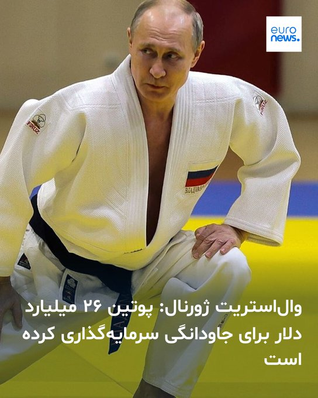

اونوقت به خامنه ای شربت شهادت دادن نامردا !

📌 @persian_trend_official
پرشین ترند | متفاوت‌ترین کانال نظامی

## Persian_Trend_Official — post 15288

  <a href="telegram/content/Persian_Trend_Official_15288_1780084996.webm" target="_blank">🎬 Download video</a>

«ترامپ باید بداند که ایران به عنوان پیروز و فاتح میدان شرایط را تعیین می‌کند:
نقد مقابل نقد
نسیه مقابل نسیه
هیچ مقابل هیچ
البته برای موضوعاتی که مورد مذاکره است نه آرزوهایش»

-ایراهیم عزیزی،رئیس کمسیون امنیت ملی مجلس شورای اسلامی

📌 @persian_trend_official
پرشین ترند | متفاوت‌ترین کانال نظامی

## Persian_Trend_Official — post 15287

  <a href="telegram/content/Persian_Trend_Official_15287_1780084996.mp4" target="_blank">🎬 Download video</a>

خدا رحمت کنه شمخانی رو
رهبری رو به شهر توریستی فرستاد !

📌 @persian_trend_official
پرشین ترند | متفاوت‌ترین کانال نظامی

## Persian_Trend_Official — post 15286

  

از بندهای شگفت‌آور متن احتمالی، توافق ایران و آمریکا برای حل تمام موضوعات مرتبط به هسته‌ای است!

اولا ایران عضو NPT است حق تحقیق، توسعه و تولید دارد و ربطی به آمریکا ندارد

ثانیا آیا تمام موضوعات مرتبط باهسته‌ای که شامل پزشکی و کشاورزی و... می‌شود هم باید با آمریکا مذاکره شود؟!

## Persian_Trend_Official — post 15285

  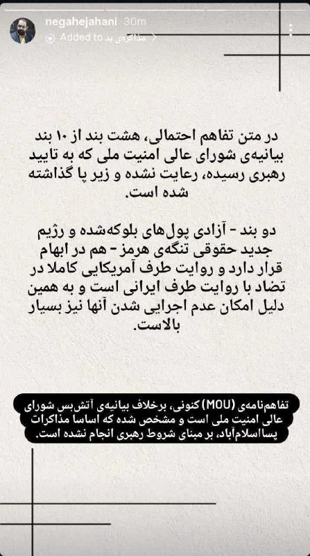

بد شد که !

## Persian_Trend_Official — post 15284

  <a href="telegram/content/Persian_Trend_Official_15284_1780085000.webm" target="_blank">🎬 Download video</a>

🎬 Video

## Persian_Trend_Official — post 15283

  <a href="telegram/content/Persian_Trend_Official_15283_1780085000.webm" target="_blank">🎬 Download video</a>

🔹تسنیم: انهدام پهپاد آمریکایی در حوالی قشم

در پی رصد پهپاد آمریکایی در حوالی قشم توسط پدافند هوایی ارتش، بلافاصله در عملیات موفق مورد اصابت قرار گرفت و منهدم شد.

👺Phantom

📌 @persian_trend_official
پرشین ترند | متفاوت‌ترین کانال نظامی

## Persian_Trend_Official — post 15282

  <a href="telegram/content/Persian_Trend_Official_15282_1780085001.webm" target="_blank">🎬 Download video</a>

رویترز: تهران ممکن است با انتقال نیمی از ذخایر اورانیوم غنی‌شده ۶۰درصدی موافقت کند

📌 @persian_trend_official
پرشین ترند | متفاوت‌ترین کانال نظامی

## Persian_Trend_Official — post 15281

  <a href="telegram/content/Persian_Trend_Official_15281_1780085002.webm" target="_blank">🎬 Download video</a>

مجدد گزارش های تایید نشده از فعالیت پدافند در قشم! 📝 Nick 📌 @persian_trend_official پرشین ترند | متفاوت‌ترین کانال نظامی

## Persian_Trend_Official — post 15279

  <a href="telegram/content/Persian_Trend_Official_15279_1780085002.webm" target="_blank">🎬 Download video</a>

زیرنویس های صداوسیما !!!

## Persian_Trend_Official — post 15278

فکر میکنم حوالی ساعت 23 به وقت تهران

## Persian_Trend_Official — post 15277

  <a href="telegram/content/Persian_Trend_Official_15277_1780085003.webm" target="_blank">🎬 Download video</a>

منتظر روشن شدن اتفاقات هستم بلافاصله بعدش لایو داریم

## Persian_Trend_Official — post 15276

  <a href="telegram/content/Persian_Trend_Official_15276_1780085003.mp4" target="_blank">🎬 Download video</a>

🎥 لحظه بمباران پایگاه فتح سپاه، در فردیس کرج

👺Phantom

📌 @persian_trend_official
پرشین ترند | متفاوت‌ترین کانال نظامی

## Persian_Trend_Official — post 15275

  <a href="telegram/content/Persian_Trend_Official_15275_1780085006.mp4" target="_blank">🎬 Download video</a>

تصاویری از قشم

👺Phantom

📌 @persian_trend_official
پرشین ترند | متفاوت‌ترین کانال نظامی

## Persian_Trend_Official — post 15274

  <a href="telegram/content/Persian_Trend_Official_15274_1780085007.webm" target="_blank">🎬 Download video</a>

هم اکنون فعالیت پدافند در بندرعباس

👺Phantom

📌 @persian_trend_official
پرشین ترند | متفاوت‌ترین کانال نظامی

## RadioFarda — post 157704

آیا توافق موقت ایران و آمریکا در آستانهٔ رسیدن به مرحلهٔ پایانی است؟

🔸با وجود انتشار گزارش‌های ضدونقیض از تهران و واشینگتن دربارهٔ احتمال یک توافق موقت، کاخ سفید هنوز به‌طور شفاف اعلام نکرده است که آیا دو کشور به توافق نزدیک شده‌اند یا نه.

🔸اسکات بسنت، وزیر خزانه‌داری آمریکا، به خبرنگاران گفته است مذاکرات همچنان ادامه دارد و تأکید کرده که دونالد ترامپ، رئیس‌جمهور آمریکا، «توافق بدی» را برای ایالات متحده نخواهد پذیرفت.

🔸همزمان، گزارش‌هایی منتشر شده که نشان می‌دهد ایران و آمریکا پیرامون یک توافق موقت ۶۰ روزه برای تمدید آتش‌بس و احیای مذاکرات هسته‌ای به جمع‌بندی رسیده‌اند.

🔸انتشار این گزارش‌ها اختلاف دیدگاه‌ها در دولت ترامپ و میان جمهوری‌خواهان را برجسته کرده است. منتقدان می‌گویند کاخ سفید در شرایطی موضع نرم‌تری در قبال تهران در پیش گرفته که تنش‌ها در تنگه هرمز همچنان ادامه دارد.

🔸برای درک بهتر آن‌چه ممکن است پشت صحنه در جریان باشد، رادیو اروپای آزاد/رادیو آزادی با الکساندر گری، رئیس دفتر شورای امنیت ملی در دورهٔ نخست ریاست‌جمهوری دونالد ترامپ و مدیرعامل کنونی شرکت مشاوره ژئوپلیتیک «امریکن گلوبال استراتجیز»، گفت‌وگو کرده است.

🔸متن کامل این گفت‌وگو را در وب‌سایت رادیوفردا بخوانید.

@RadioFarda

## RadioFarda — post 157703

  

🔸رؤسای آژانس بین‌المللی انرژی، صندوق بین‌المللی پول، بانک جهانی و سازمان تجارت جهانی روز پنج‌شنبه برای بررسی واکنش نهادهای خود به پیامدهای جنگ در خاورمیانه دیدار کردند. این موضوع در بیانیه مشترکی که روز جمعه منتشر شد، اعلام شده است.

🔸این نهادها در بیانیه خود با اشاره به محاصره در تنگه هرمز، هشدار دادند: «اگر جریان حمل‌ونقل دریایی به حالت عادی بازنگردد، کاهش سریع و ادامه‌دار ذخایر جهانی نفت، همزمان با اوج تقاضای تابستانی در نیمکره شمالی، خطرات فزاینده‌ای برای امنیت سوخت، شرایط بازار و تاب‌آوری گسترده‌تر اقتصاد جهانی ایجاد خواهد کرد.»

🔸در ادامه این بیانیه آمده است که این نهادها همچنین گزینه‌هایی را برای «تقویت بیشتر حمایت جمعی از طریق اقدامات چندجانبه و دوجانبه» بررسی کرده‌اند.

🔸در پی حملات مشترک آمریکا و اسرائیل به ایران در نهم اسفند سال گذشته و آغاز جنگ، نیروهای نظامی ایران تنگه هرمز را مسدود کردند. این آبراه محل عبور حدود ۲۰ درصد از نفت و گاز در جهان بود و اختلال در حرکت کشتی‌ها باعث افزایش قیمت نفت و کمبود گاز و سایر محصولات نفتی در برخی کشورها شد.

@RadioFarda

## RadioFarda — post 157702

  

🔸سخنگوی وزارت خارجه جمهوری اسلامی در واکنش به پیام دونالد ترامپ دربارهٔ محتوای توافق میان آمریکا و ایران اعلام کرد که تفاهم میان دو کشور هنوز نهایی نشده است.

🔸اسماعیل بقائی روز جمعه گفت: «تبادل پیام‌ها البته ادامه دارد، ولی تفاهم نهایی نشده است.»

🔸دونالد ترامپ، رئیس‌جمهور آمریکا ساعتی پیش اعلام کرد که توافق پایان دادن جنگ باید شامل مواردی مانند تعهد ایران به باز شدن تنگه هرمز و نابودی ذخایر اورانیوم باشد.

🔸به گزارش رسانه‌های ایران، بقائی دربارهٔ وضعیت تنگه هرمز با اشاره به واقع شدن آن در آب‌های سرزمینی ایران و عمان گفت که دو کشور «باید ساز و کارهایی را اتخاذ کنند که هم منافع و امنیت ملی خودشان به عنوان کشورهای ساحلی حفظ شود و هم این‌که به جامعه جهانی این اطمینان را بدهند که کشتی‌رانی از این مسیر به صورت ایمن انجام می‌شود.»

🔸او همچنین مدعی شد که مدیریت تنگه هرمز به ایران و عمان مرتبط است. این در حالی است که رئیس‌جمهور و وزیر خزانه‌داری آمریکا اخیرا عمان را تهدید کرده‌اند که نباید تلاشی برای کنترل این آبراه و اخذ عوارض از کشتی‌ها داشته باشد.

@RadioFarda

## RadioFarda — post 157701

  <a href="https://t.me/radiofarda/157701" target="_blank">📎 Download file</a>

ادامه فشار حداکثری آمریکا با تمرکز بر صادرات نفت ایران؛ گفت‌وگو با دالغا خاتین‌اغلو

🔸در حالیکه ایران و آمریکا درگیر یک روند دیپلماتیک برای دسترسی به یک تفاهم اولیه هستند، اسکات بسنت، وزیر خزانه‌داری آمریکا، در بیانیه‌ای گفت: «اجازه نخواهیم داد دولت ایران درآمدهای نفتی خود را برای بازسازی نیروهای مسلح و توانایی‌های نظامی‌اش افزایش دهد». در همین راستا وزارت خارجه آمریکا روز هفتم خرداد، چندین نهاد، فرد و کشتی را که «ستون فقرات اقتصاد غیرقانونی نفت ایران» نامیده، تحریم کرد. دالغا خاتین اغلو خبرنگار و تحلیلگر حوزه انرژی در باکو به رادیوفردا از میزان اثرگذاری این «کارزار فشار حداکثری» می‌گوید.

@RadioFarda

## RadioFarda — post 157700

  

🔸خبرگزاری رویترز روز جمعه به نقل از یک منبع ایرانی نوشت که بین تهران و واشینگتن یک تفاهم سیاسی صورت گرفته اما هنوز نهایی نشده و همچنین توافق با ایران شامل نابودی مواد هسته‌ای نیست.

🔸دونالد ترامپ، رئیس‌جمهور آمریکا ساعتی پیش اعلام کرد که توافق پایان دادن جنگ باید شامل مواردی مانند تعهد ایران به باز شدن تنگه هرمز و نابودی ذخایر اورانیوم باشد.

🔸منبع ایرانی به رویترز گفته است که تفاهم بین واشینگتن و تهران شامل موضوع هسته‌ای نیست و اظهارات آقای ترامپ درباره نابودی اورانیوم ایران را رد کرده است.

🔸خبرگزاری فارس، نزدیک به سپاه پاسداران، نیز به نقل از یک منبع ایرانی دیگر اظهارنظر رئیس‌جمهور ایالات منحده دربارهٔ توافق احتمالی با ایران، را «آمیخته‌ای از راست و دروغ» خوانده است.

🔸این منبع گفته که در متن توافق بندی درباره باز شدن تنگه هرمز بدون دریافت عوارض وجود ندارد و تفاهم بر سر نابودی دخایر اورانیوم ایران را نیز «بی‌اساس» دانسته است.

@RadioFarda

## RadioFarda — post 157699

  <a href="https://t.me/radiofarda/157699" target="_blank">📎 Download file</a>

تفاهم احتمالی آمریکا و ایران به معنی پایان «نه جنگ، نه صلح» است؟ گفت‌وگو با علی واعظ

🔸علی واعظ، مدیربخش ایران در گروه بین‌المللی بحران در ژنو سوییس ساعتی بعد از اعلام رئیس‌جمهور آمریکا درباره قصدش برای اتخاذ تصمیم نهایی درباره توافق با ایران به رادیوفردا می‌گوید تفاهم میان دو کشور بسیار محتمل است اما دست یافتن به توافق جامع به فاکتورهایی بستگی دارد که دستیابی به آن را دشوارتر می‌کند.

@RadioFarda

## RadioFarda — post 157698

  <a href="https://t.me/radiofarda/157698" target="_blank">📎 Download file</a>

📻بشنوید: ایستگاه ۱۹ با رادیوفردا، هشتم خرداد ۱۴۰۵

@RadioFarda

## RadioFarda — post 157697

آیا اسرائیل برای سومین جنگ احتمالی با ایران آماده می‌شود؟

🔸هم‌زمان با تحویل هواپیماهای جدید سوخت‌رسان آمریکایی به ارتش اسرائیل، ستاد پشت جبهه این کشور به رسانه‌ها گفته تدارکاتش برای «سومین جنگ احتمالی» با ایران به‌صورتی ادامه دارد که بتوان جامعه را با بیشترین سرعت برای جنگی دیگر آماده کرد.

🔸در این میان، رسانه‌های اسرائیل «نگرانی» کشورشان از توافق احتمالی آمریکا و ایران را بازتاب داده و نوشته‌اند جنگ اخیر اهداف اسرائیل را محقق نکرد.

🔸افسران ارشد اسرائیل در گفت‌وگوهای هم‌زمان با رسانه‌های این کشور در روز هفتم خرداد، گفتند از مسئولان کشوری و نظامی فرمان گرفته‌اند تا اقدامات لازم برای دفاع از مردم و پشت جبهه اسرائیل را برای سومین جنگ احتمالی با ایران انجام دهند.

🔸به گزارش شبکه کان، افسران یادشده گفتند دستور دارند به‌‎گونه‌ای شرایط را مهیا کنند که جامعه در بخش دفاعی و پشت جبهه مانند یک خودرو بتواند به سرعت از «صفر به صد» برسد.

🔸آن‌ها افزودند برنامه‌ریزی جنگ بعدی باید محرمانه پیش رود و هیچ اطلاعی از آن به عوامل و افرادی در جامعه اسرائیل درز نکند تا بیشترین غافلگیری برای کشور هدف را به همراه داشته باشد.

🔸بر اساس این گزارش، در آن صورت، پشت جبهه اسرائیل نخواهد توانست از قبل به مردم هشداری برای تدارکات و آمادگی بدهد و از این رو، «شرایط باید از حالا به گونه‌ای فراهم شود که در کمترین بازه زمانی بتوان از زندگی عادی روزانه وارد فاز جنگ شدید شد و آماده دفاع بود».

🔸گزارش کامل را در وب‌سایت رادیوفردا بخوانید.

@RadioFarda

## RadioFarda — post 157696

  <a href="https://t.me/radiofarda/157696" target="_blank">📎 Download file</a>

چشم‌انداز دسترسی به اینترنت برای شهروندان ایرانی در گفت‌وگو با اشکان خسروپور

🔸بعد از آنکه دولت در ایران دستور «بازگشایی» اینترنت را صادر کرد و به ۸۸ روز سیاست قطع دسترسی همگانی به اینترنت پایان داد، حالا بخشی از کاربران ایرانی به مدد ابزار مختلف مقابله با فیلترینگ و وی‌پی‌ان به فضای اینترنت جهانی بازمی‌گردند. شورای اطلاع رسانی دولت در بیانیه‌ای که روز هشتم خرداد منتشر کرده یک «اقلیت پرهیاهو» را متهم کرده است که «جلوی دسترسی به اینترنت ایستاد». آیا این رویکرد حاکی از اختلاف در حاکمیت جمهوری اسلامی در زمینه دسترسی به اینترنت است؟ وضعیت کنونی «دسترسی» را چگونه باید توصیف کرد. ارزیابی اشکان خسروپور پژوهشگر سیاست‌گذاری اینترنت در فرانسه را در این زمینه بشنوید.

@RadioFarda

## RadioFarda — post 157695

  <a href="https://t.me/radiofarda/157695" target="_blank">📎 Download file</a>

🔸 در این کافه فردا به صحبت‌های عجیب زینب سلیمانی در مورد شجاعت پدرش، توهین محمدجواد لاریجانی به معاون رییس جمهور آمریکا، دغدغه‌های مسئولین نظام در مورد دفن خامنه‌ای، زندگی و آثار جهانبخش پازوکی و آخرین رویدادهای مربوط به حضور تیم ملی فوتبال ایران در جام جهانی می‌پردازیم.

🔸 برای تماس با ما می‌توانید به شناسه کافه فردا در تلگرام صوت و متن بفرستید.

📻 کافه فردا

## RadioFarda — post 157694

🔸دونالد ترامپ، رئیس‌جمهور آمریکا، اعلام کرد که روز جمعه در اتاق وضعیت کاخ سفید جلسه‌ای برگزار خواهد کرد تا تصمیم نهایی درباره توافق با ایران را اتخاذ کند. 🔸او در پستی در شبکه اجتماعی خود، تروث سوشال، مواردی را که باید در توافق احتمالی گنجانده شود، برشمرد…

## RadioFarda — post 157693

  

🔸دونالد ترامپ، رئیس‌جمهور آمریکا، اعلام کرد که روز جمعه در اتاق وضعیت کاخ سفید جلسه‌ای برگزار خواهد کرد تا تصمیم نهایی درباره توافق با ایران را اتخاذ کند.

🔸او در پستی در شبکه اجتماعی خود، تروث سوشال، مواردی را که باید در توافق احتمالی گنجانده شود، برشمرد و گفت که ایران باید متعهد شود که سلاح هسته‌ای تولید نکند، تنگه هرمز دوباره باز شود، هرگونه مین دریایی جمع‌آوری شود، محاصره آمریکا علیه ایران لغو گردد و اورانیوم با غنای بالای ایران توسط آمریکا خارج و نابود شود.

🔸رئیس‌جمهور آمریکا در توضیح لغو محاصره دریایی علیه ایران گفت: «کشتی‌هایی که به دلیل محاصره دریایی بی‌سابقه و فوق‌العاده ما در تنگه گرفتار شده بودند -محاصره‌ای که اکنون لغو خواهد شد- می‌توانند روند بازگشت به خانه را آغاز کنند.»

@RadioFarda

## RadioFarda — post 157692

  

🔸محمدباقر قالیباف، مذاکره‌کننده ارشد جمهوری اسلامی با آمریکا، روز جمعه تهدید کرد که تهران امتیازات مورد نظر خود در توافق پایان دادن به جنگ را با «موشک» می‌گیرد و پیش از اقدام واشینگتن درباره این توافق اقدامی نخواهد کرد.

🔸او در شبکه ایکس همچنین نوشت: «هیچ اعتمادی به تضمین‌ها و حرف‌ها نداریم، فقط رفتارها معیار است.»

🔸این موضع‌گیری یک روز پس از آن انجام شد که چند رسانه غربی خبر دادند آمریکا و ایران به تفاهمی برای تمدید آتش‌بس و رفع محدودیت عبور و مرور کشتی‌ها در تنگه هرمز رسیده‌اند، اما این توافق منتظر تصمیم و امضای نهایی دونالد ترامپ، رئیس‌جمهور ایالات متحده است.

🔸قالیباف در پیام خود اعلام کرده که «اقدامی پیش از اقدام طرف مقابل انجام نخواهد شد».

🔸از سوی دیگر، رسانه‌های نزدیک به سپاه پاسداران می‌گویند گزارش‌ها درباره توافق تهران و واشنگتن صحیح نیست. خبرگزاری تسنیم در این مورد به نقل از یک «منبع مطلع» نوشت: «متن توافق تا این لحظه جمع‌بندی نهایی نشده است.»

@RadioFarda

## RadioFarda — post 157691

  

📷 Photo

## RadioFarda — post 157690

  

🔸پلیس بریتانیا روز جمعه اعلام کرد یک شهروند یونانی به اتهام همکاری با یک سرویس اطلاعاتی خارجی که به گفته پلیس «گمان می‌رود متعلق به ایران باشد» متهم شد. اتهام او تلاش برای هدف قرار دادن یک روزنامه‌نگار شاغل در شبکه تلویزیونی ایران اینترنشنال است.

🔸پلیس ضدتروریسم اعلام کرد که یوانیس آیدینیدیس ۴۶ ساله و ساکن مونیخ آلمان، روز شنبه بازداشت شده و بر اساس قانون امنیت ملی بریتانیا علیه او اعلام جرم شده است.

🔸قرار است آیدینیدیس روز جمعه در دادگاه وست‌مینستر حاضر شود.

🔸پلیس گفت اتهامات مطرح‌شده احتمالاً به ایران و هدف قرار دادن یک روزنامه‌نگار مستقر در بریتانیا در شبکه ایران اینترنشنال مربوط می‌شود. در بیانیه پلیس بریتانیا نام این روزنامه‌نگار ذکر نشده است.

🔸مأموران پلیس همچنین اعلام کردند که معتقد نیستند تهدید گسترده‌تری متوجه عموم مردم باشد.

🔸در ماه آوریل نیز سه نفر در ارتباط با تلاش برای حمله آتش‌سوزی عمدی به ساختمانی مرتبط با این شبکه در شمال‌غرب لندن متهم شدند؛ هرچند آن آتش‌سوزی هیچ خسارت یا مصدومیتی به همراه نداشت.

@RadioFarda

## RadioFarda — post 157689

  

🔸سازمان اطلاعاتی دانمارک روز جمعه هشتم خرداد اعلام کرد که ایران نقش پررنگ‌تری در تهدید تروریستی علیه این کشور اسکاندیناویایی ایفا می‌کند و افزود ارزیابی تهدیدها بازتابی از تحولات جهانی است.

🔸رئیس سازمان امنیت و اطلاعات ملی دانمارک می‌گوید سطح کلی تهدید برای ایران همچنان ۴ از ۵ است، اما تأکید کرد که در سال‌های اخیر ماهیت این تهدیدها «به‌طور قابل‌توجهی تغییر کرده است».

🔸فین بورخ آندرسن در بیانیه‌ای گفت: «در سال گذشته، بازیگران دولتی اهمیت فزاینده‌ای در تهدیدات تروریستی پیدا کرده‌اند. ارزیابی ما این است که این موضوع به‌ویژه درباره ایران صدق می‌کند؛ کشوری که به‌طور خاص تهدیدی برای منافع اسرائیلی و یهودی و همچنین برخی مخالفان ایرانی در اروپا، از جمله دانمارک، محسوب می‌شود.»

🔸او افزود: «تهدید ناشی از ایران از سوی سرویس‌های اطلاعاتی این کشور سرچشمه می‌گیرد که برای برنامه‌ریزی و اجرای حملات از شبکه‌های مجرمانه و همچنین جذب نیرو در اروپا استفاده می‌کنند».

@Radiofarda

## RadioFarda — post 157688

  <a href="https://t.me/radiofarda/157688" target="_blank">📎 Download file</a>

📻بشنوید: ساعت ۱۴ با رادیوفردا،هشتم خرداد ۱۴۰۵‌

@Radiofarda

## IranianMinds — post 21041

فاکس نیوز :
خبرهای مهمی از نشست ترامپ در کاخ سفید بیرون خواهد آمد

@IranianMinds

## IranianMinds — post 21040

  

🔴شش فروند هواپیمای نظامی Boeing C-17A Globemaster lll متعلق به نیروی هوایی ایالات متحده در حال ورود به خاورمیانه هستند.

@IranianMinds

## IranianMinds — post 21039

  

🔴 همزمان با گزارش‌هایی مبنی بر وقوع انفجار و فعالیت پدافند هوایی ایران در جزیره قشم در نزدیکی تنگه هرز، یک تانکر سوخت‌گیری هوایی پگاسوس KC-46A پگاسوس که از تل‌آویو پرواز می‌کرد، بر فراز خلیج فارس مشاهده شد.

@IranianMinds

## IranianMinds — post 21038

نیویورک تایمز همین الان:

ترامپ حدود دو ساعت در اتاق وضعیت با تیم ارشد امنیت ملی ملاقات کرد اما هیچ تصمیمی برای توافق با ایران نگرفت.

@IranianMinds

## IranianMinds — post 21037

  <a href="telegram/content/IranianMinds_21037_1780085019.mp4" target="_blank">🎬 Download video</a>

قشم

@IranianMinds

## IranianMinds — post 21036

🔴 قشم انگار باز یه خبراییه پدافند فعال شده و گزارشاتی از صدای انفجار هم هست.

@IranianMinds

## IranianMinds — post 21035

  

@IranianMinds

## IranianMinds — post 21034

  

🔴 وال استریت ژورنال :

امارات متحده عربی در طول جنگ، به‌طور مخفیانه ده‌ها حمله هوایی را با هماهنگی ایالات متحده و اسرائیل علیه ایران انجام داده است.

این حملات، سایت‌های نظامی و مراکز مرتبط با انرژی را هدف قرار داده و حتی تا پس از اعلام آتش‌بس نیز ادامه داشته است.

@IranianMinds

## IranianMinds — post 21033

🎁 استارت کن و کانفیگتو رایگان بگیر 
⭐ویژه کاربران پرمیوم تلگرام 
⭐️ اگه اکانت تلگرامت پرمیوم باشه به محض استارت ربات بدون هیچ امتیاز و زیر مجموعه دایی جون بهت کانفیگ هدیه میده 
✔️ همچنین با اوردن دوستای پرمیومت امتیاز بیشتری میگیری 
🎁 @Daeijoonbot | استارت…

## IranianMinds — post 21032

  

🎁 استارت کن و کانفیگتو رایگان بگیر

⭐ویژه کاربران پرمیوم تلگرام

⭐️ اگه اکانت تلگرامت پرمیوم باشه به محض استارت ربات بدون هیچ امتیاز و زیر مجموعه دایی جون بهت کانفیگ هدیه میده

✔️ همچنین با اوردن دوستای پرمیومت امتیاز بیشتری میگیری

🎁 @Daeijoonbot | استارت کن و کانفیگ رایگان بگیر 
🌟

## IranianMinds — post 21031

  

🔴 رائفی پور :

تو جنگ آمریکاییا حتی از آدم فضاییا هم کمک گرفتن و باهاشون به ما حمله کردن ولی بازم نتونسن شکستمون بدن.

@IranianMinds

## IranianMinds — post 21030

  <a href="telegram/content/IranianMinds_21030_1780085024.mp4" target="_blank">🎬 Download video</a>

اینا واقعا به معنای واقعی عقب موندن 😂😂

@IranianMinds

## IranianMinds — post 21029

در کمال تعجب تا الان خبری از جنگ تو جنوب کشور نبوده

@IranianMinds

## IranianMinds — post 21028

  <a href="telegram/content/IranianMinds_21028_1780085026.mp4" target="_blank">🎬 Download video</a>

وضعیت تنگه هرمز
کشتی‌ها یکی پس از دیگری لنگر انداختند

@IranianMinds

## IranianMinds — post 21027

  

🔴 مراد ویسی :

من توی زندگیم برای ارتباط با آدما فقط یه معیار دارم، میزان تنفر از جمهوری اسلامی …

@IranianMinds

## IranianMinds — post 21026

🔴 خبرگزاری فارس :

نبینیم ترامپ شاخ و شونه بکشه اینجا همین الانم باید آمریکا باید فورا ۱۲ میلیارد دلار از دارایی‌های مسدودشده ایران رو آزاد کنه تا مذاکرات ادامه پیدا کنه، و آتش‌بس کامل در لبنان طبق شرایط حزب‌الله هم لازمه.

سریع تر انجام بده شاید مذاکره کردیم.

@IranianMinds

## IranianMinds — post 21025

  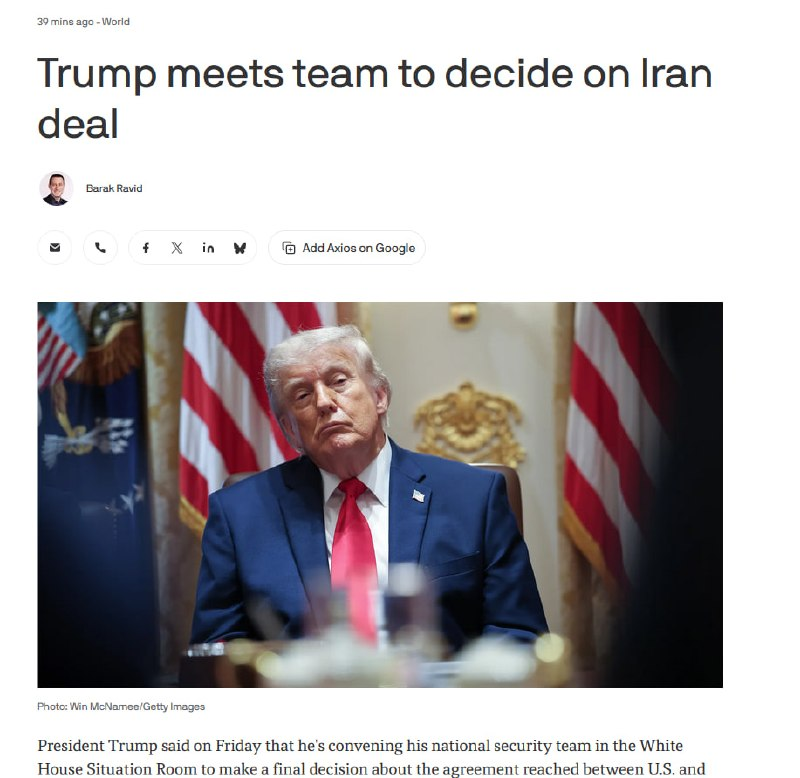

🔴 آکسیوس :

ترامپ به زودی درباره مذاکرات با تیمش تصمیمشو میگیره و اعلام میکنه , همچنین یه مقام بالا رده دولت ترامپ گفت ما تعهدات شفاهی از سوی ایران در خصوص مواد هسته‌ای دریافت کرده‌ایم؛ اما مهم‌ترین بخش، مواردی است که در جریان مذاکرات بر سر آن‌ها توافق خواهد شد.

@IranianMinds

## IranianMinds — post 21024

  

⭕️ رایگان بدون واریز شرط های فوتبالی ببند از همون اول موجودی 500 هزارتومانه
❌

🎉 500 هزارتومن رایگان فقط با ثبت نام بدون هیچگونه واریزی!

💳 پرداخت مستقیم و سریع بدون واسطه، بدون دردسر، واریز و برداشت در سریع‌ترین زمان ممکن

⌛ پشتیبانی 24 ساعته

🌐 Winro.io

🌐 Winro.io
کانال بونوس های رایگان g8

📱 @winro_io

## IranianMinds — post 21023

  

بعد حرفای ترامپ نفت سقوط آزاد کرد.

@IranianMinds

## IranianMinds — post 21022

🔴 نیویورک پست :

ترامپ هم اکنون در اتاق وضعیت کاخ سفید هست و قراره تصمیم خودش برای مذاکره با ایران رو بگیره.

@IranianMinds

## BBCPersian — post 282349

🔻 تسنیم: پهپاد دشمن در اطراف جزیره قشم هدف قرار گرفت و منهدم شد

در پی گزارش‌ها درباره شنیده شدن صدای پدافند در جزیره قشم، خبرگزاری تسنیم،‌ نزدیک به منابع امنیتی گزارش داد که یک «ریزپرنده» آمریکایی اسرائیلی در حوالی جزیره قشم هدف پدافند هوایی ارتش ایران قرار گرفته و منهدم شده است.

منابع آمریکا درباره این گزارش اظهارنظری نکردند.

دیشب هم سپاه پاسداران مدعی سرنگون کردن یک پهپاد شده بود.

https://bbc.in/4nZZvWf
@BBCPersian

## BBCPersian — post 282348

🔻 شنیده شدن صدای پدافند و انفجار در محدوده جزیره قشم

خبرگزاری مهر شامگاه روز جمعه گزارش داد که تعدادی از ساکنان در جزیره قشم از شنیده شدن صدای فعالیت پدافند هوایی خبر دادند.

این خبرگزاری می‌گوید که هنوز هیچ یک از نهادهای رسمی در ایران درباره علت این صداها اظهارنظری نکردند.

وحیدآنلاین هم می‌گوید که تعدادی از مخاطبانش حدود ساعت ۹ و نیم شب روز جمعه هشتم خرداد ماه در پیام‌هایی از شنیده شدن و دیدن شلیک پدافند خبر دادند.

برخی هم از شنیدن صداهایی شبیه به انفجار گفتند.

https://bbc.in/4wZIkbv
@BBCPersian

## BBCPersian — post 282347

  

‌
❌هشدار: در این مطلب به موضوع خودکشی اشاره شده است. اگر به خودکشی فکر می‌کنید، با نهادهای تخصصی یا افراد متخصص تماس بگیرید.❌

کنت لا،‌ یک مرد کانادایی در دادگاهی در انتاریو اعتراف کرد که با فروش مواد شیمیایی کشنده در مرگ ۱۴ نفر که قصد خودکشی داشتند مشارکت داشته است. دادگاه او را به معاونت در مرگ،‌ متهم و مجرم شناخت.

اعتراف او بخشی از توافق با دادستان‌ها بود، که اتهامات جدی قتل عمد را از پرونده او حذف کنند.

آقای لا ۶۰ ساله است و پیشتر سرآشپز بوده است. او مواد شیمیایی قانونی اما سمی را به صورت آنلاین به افرادی که در تالارهای گفت‌وگوی خودکشی در اینترنت با آنها آشنا شده بود، می‌فروخت.

به گفته دادستان‌ها او حدود ۱۲۰۰ بسته مواد سمی را برای افرادی در ۴۱ کشور جهان ارسال کرده است.

گفته می‌شود که آقای لا به بیش از ۷۳ بریتانیایی مواد سمی فروخته است.

خانواده قربانیان بریتانیایی از دادستان‌ها در بریتانیا به دلیل متهم نکردن آقای لا در رابطه با مرگ بیش از ۷۳ بریتانیایی خشمگین هستند.

📷Peel Regional Police/PA Wire

@BBCPersian

## BBCPersian — post 282346

  

بقایی: هنوز هیچ توافقی میان ایران و آمریکا نهایی نشده است

اسماعیل بقایی، سخنگوی وزارت خارجه ایران گفت که تبادل پیام‌ها ادامه دارد ولی هنوز هیچ توافقی میان ایران و آمریکا نهایی نشده است و افزود که مدیریت تنگه هرمز باید توسط ایران و عمان تعیین شود.

آقای بقایی در مصاحبه‌ای با صدا و سیما جمهوری اسلامی این اظهارات را مطرح کرد.

او بار دیگر گفت: «در این مرحله بر خاتمه جنگ متمرکز هستیم و در مورد پرونده هسته‌ای هیچ مذاکره‌ای نداریم.»

این اظهارات در حالی از سوی ایران مطرح شده که آقای ترامپ فهرستی از خواسته‌هایی را که می‌گوید ایران باید برآورده کند، مطرح کرد که شامل تعهد ایران به عدم دستیابی به سلاح هسته‌ای، باز کردن تنگه هرمز بدون دریافت عوارض، مین‌روبی کامل این آبراه و خارج‌سازی ذخایر اورانیوم ‌غنی‌شده ایران با همکاری آمریکا و تحت نظارت آژانس و سپس از بین بردن این مواد است.
📷IRNA

https://bbc.in/434zQlG
@BBCPersian

## BBCPersian — post 282345

  <a href="https://t.me/bbcpersian/282345" target="_blank">📎 Download file</a>

پادکست جام جهان‌نما، جمعه ۸ خرداد ۱۴۰۵ این برنامه رادیویی رامی‌توانید هرشب ساعت ۲۰ به وقت ایران، روی موج متوسط ۷۰۲ کیلوهرتز و موج کوتاه۹۴۶۵ کیلوهرتز بشنوید. تکرار برنامه را هم می‌توانید ساعت ۲۱:۳۰ روی موج متوسط ۷۰۲ کیلوهرتز و موج کوتاه۵۳۹۵ کیلوهرتز گوش کنید.
@BBCPersian

## BBCPersian — post 282344

🔻دونالد ترامپ، رئیس‌جمهور آمریکا، دقایقی پیش اعلام کرد که در اتاق وضعیت جلسه خواهد داشت تا درباره ایران تصمیم نهایی را بگیرد.

او در پستی در شبکه اجتماعی خود تروث سوشال، فهرستی را از خواسته‌هایی که می‌گوید ایران باید برآورده کند، مطرح کرده و گفته است در مورد موضوعات «کم اهمیت‌ت» دیگر توافق حاصل شده است.

آقای ترامپ در ابتدا خواسته اصلی خود را تکرار کرده است: «ایران باید موافقت کند که هرگز به سلاح یا بمب هسته‌ای دست نخواهد یافت.»

او در ادامه خواستار باز شدن تنگه هرمز «در هر دو جهت» و «بدون هیچ عوارضی» شد.

رئیس‌جمهور آمریکا سپس به موضوع مین‌گذاری در تنگه هرمز اشاره کرد و گفت: «تمام مین‌های دریایی (بمب‌ها)، در صورت وجود، از بین خواهند رفت (ما با مین‌روب‌های زیردریایی فوق‌العاده خود، تعداد زیادی از این مین‌ها را از طریق انفجار خنثی کرده‌ایم. ایران بلافاصله عملیات جمع‌آوری ویا انفجار هرگونه مین باقی‌مانده را که تعدادشان زیاد نخواهد بود، تکمیل خواهد کرد.)»

آقای ترامپ در ادامه مژده می‌دهد که پس از توافق، کشتی‌هایی که به دلیل محاصره دریایی آمریکا در تنگه هرمز گرفتار شده‌اند، می‌توانند رهسپار خانه شوند:

«از طرف من، رئیس جمهور محبوبتان، به همسران، شوهران، والدین و خانواده‌هایتان سلام کنید.»

دونالد ترامپ سپس به ذخایر اورانیوم غنی‌شده ایران می‌پردازد و می‌گوید این مواد که بر اثر حمله هوایی ۱۱ ماه پیش آمریکا اکنون در زیر خاک مدفون شده‌اند، توسط آمریکا و با هماهنگی ایران و آژانس بین‌المللی انرژی اتمی از زیر خاک بیرون آورده می‌شود و از بین برده خواهد شد.

رئیس‌جمهور آمریکا سپس تاکید می‌کند که «تا اطلاع ثانوی هیچ پولی رد و بدل نخواهد شد.»

@BBCPersian

## BBCPersian — post 282343

  <a href="telegram/content/BBCPersian_282343_1780085034.mp4" target="_blank">🎬 Download video</a>

یک موشک «نیو گلن» متعلق به شرکت بلو اوریجین، شامگاه پنج‌شنبه ۷ خرداد، روی سکوی پرتابی در کیپ کاناورال در ایالت فلوریدای آمریکا منفجر شد.
 
این شرکت فناوری فضایی که در سال ۲۰۰۰ توسط جف بزوس، میلیاردر و بنیان‌گذار آمازون تأسیس شده است، اعلام کرد که این حادثه هیچ‌گونه مصدومیتی نداشته است.
 
به گفته مسئولان شرکت، این انفجار در جریان یک ارزیابی پیش از پرواز، موسوم به «آزمایش هات‌فایر» رخ داد و این حادثه به‌عنوان یک «ناهنجاری» توصیف شد.

@BBCPersian

## BBCPersian — post 282342

  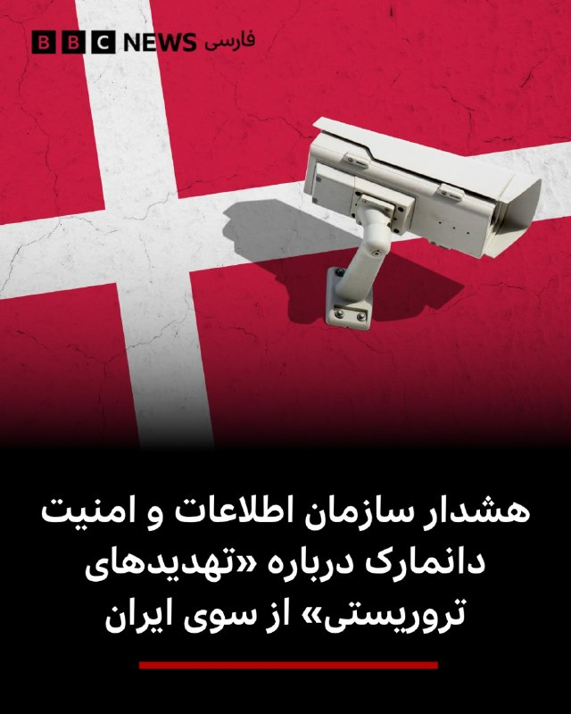

‌🔻سازمان اطلاعات و امنیت دانمارک گفته است که ایران طی یک سال اخیر، نقش پررنگ‌تری در «تهدیدهای تروریستی» علیه آن کشور داشته است.

سرویس اطلاعات و امنیت ملی دانمارک روز جمعه گفت که ماهیت این تهدیدها «به‌طور قابل توجهی تغییر کرده است.»

فین بورخ اندرسن، رئیس این سازمان، در بیانیه‌ای گفت: «در یک سال گذشته، بازیگران دولتی اهمیت بیشتری در تهدید تروریستی پیدا کرده‌اند. بنابر ارزیابی ما، این موضوع به‌ویژه درباره ایران صدق می‌کند، کشوری که تهدیدی را متوجه منافع اسرائیل و یهودی‌ها و همچنین برخی مخالفان ایرانی در اروپا می‌کند، از جمله در دانمارک.»

او اضافه کرد: «تهدیدهایی که از سوی ایران با آن مواجهیم از نهادهای اطلاعاتی این کشور سرچشمه می‌گیرد. همچنین از شبکه‌های جنایی و علاوه بر این، جذب نیروهایی در اروپا که از آنها برای برنامه‌ریزی و اجرای حملات استفاده می‌کند.»

لینک خبر کامل:
https://bbc.in/4o4wJnC
📷Getty Images

@BBCPersian

## BBCPersian — post 282341

  <a href="telegram/content/BBCPersian_282341_1780085037.mp4" target="_blank">🎬 Download video</a>

🔻زنی در شهر پالم بیچ ایالات فلوریدای آمریکا توسط یک افسر پلیس و به ظن در دست داشتن تلفن همراه با دست راست هنگام رانندگی متوقف شد.

کاتلین توماس که دست راستش را از دست داده، بازوی راستش را بالا برد تا نبود دستش را به افسر نشان دهد، اما با این حال برای او پرونده ثبت شد.

این رویداد در ماه فوریه رخ داد و در هفته جاری، این افسر درخواست کرده است که این اتهامات رد شود.

دفتر کلانتر شهرستان پالم بیچ به بی‌بی‌سی اعلام کرد: «معاون بر اساس مشاهده بصری اقدام به توقف خودرو کرد. پس از بررسی‌های بیشتر و به دلیل نبود شفافیت در نحوه ثبت تخلفات در نرم‌افزار صدور جریمه، در نهایت تصمیم به لغو اتهامات گرفته شد.»
https://bbc.in/42ZkFdA

@BBCPersian

## BBCPersian — post 282340

  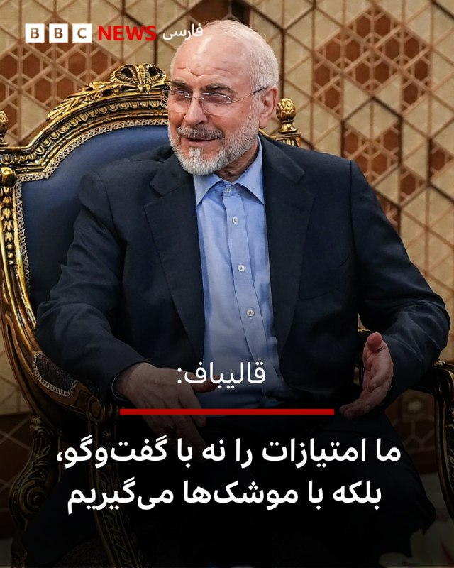

‌🔻محمدباقر قالیباف، رئیس مجلس شورای اسلامی و مذاکره‌کننده ارشد جمهوری اسلامی در پیامی که در شبکه اجتماعی ایکس منتشر کرده، نوشته است: «ما امتیازات را نه با گفت‌وگو، بلکه با موشک‌‌ها می‌گیریم، در مذاکره فقط آن‌ها را تفهیم می‌کنیم.»

او به موضوع اعتماد میان دو طرف در مذاکرات جاری با آمریکا اشاره کرده و نوشته است: «اعتمادی به تضمین‌ها و حرف‌ها نداریم، فقط رفتارها معیار است. هیچ اقدامی پیش از اقدام طرف مقابل انجام نخواهد شد.»

آقای قالیباف در ادامه پیامش آورده است:«پیروز هر توافقی کسی است که از فردای آن، بهتر برای جنگ آماده شود.»

محمدباقر قالیباف دوشنبه به قطر رفته بود.

هدف از این سفر مذاکره بر سر برخی از دارایی‌های ایران بود که به دلیل تحریم‌های ایالات متحده مسدود شده است.

📷 ICANA News Agency via Getty Images
https://bbc.in/3RQ4kFC

@BBCPersian

## BBCPersian — post 282339

🔻حمله پهپادی به یک کشتی ترکیه در دریای سیاه

🔻پس از آن‌که یک کشتی ترکیه در طول شب گذشته هدف حمله پهپادی قرار گرفت، این کشور نسبت به خطرات تشدید کنترل‌نشده تنش‌ها در منطقه دریای سیاه هشدار داد.

وزارت خارجه ترکیه مشخص نکرده است که کدام کشور مسئول این حمله بوده است.

در جریان جنگ روسیه و اوکراین، هر دو طرف کشتی‌هایی را در دریای سیاه هدف قرار داده‌اند.

https://bbc.in/4fJezFG
@BBCPersian

## BBCPersian — post 282338

  

🔻عبدالحسین روح‌الامینی، نماینده مجلس شورای اسلامی در یک برنامه تلویزیونی گفت چند هفته است که از مجتبی خامنه‌ای، رهبر جدید ایران، اجازه خواسته‌اند تا «قانون‌گذاری و رای‌گیری» مجازی در مجلس انجام شود.

او گفت در حال حاضر دستگاه‌های امنیتی اجازه جمع شدن نمایندگان مجلس شورای اسلامی را نمی‌دهند.

آقای روح‌الامینی در ادامه این گفت‌وگو اشاره کرد که تا کنون پاسخی از مجتبی خامنه‌ای به این پرسش داده نشده است.

روح‌الله ایزدخواه، نماینده مردم تهران در مجلس هم در این برنامه گفت تا کنون نمایندگان دو، سه، جلسه مجازی با «تبلت‌های مخصوص» مجلس برگزار کرده‌اند اما بنابر بر آیین‌نامه مجلس اجازه «رای‌گیری مجازی» وجود ندارد.

لینک خبر کامل:
https://bbc.in/4uOJwwT
📷khamenei.ir

@BBCPersian

## BBCPersian — post 282337

  <a href="telegram/content/BBCPersian_282337_1780085041.mp4" target="_blank">🎬 Download video</a>

🔻سرخط خبرهای روز جمعه ۸ خرداد ۱۴۰۵
@BBCPersian

## BBCPersian — post 282336

  <a href="telegram/content/BBCPersian_282336_1780085043.mp4" target="_blank">🎬 Download video</a>

🔻گروه‌های امداد در لائوس پنج روستایی را که پس از بارندگی‌های شدید و رانش زمین به مدت یک هفته در غاری سیلابی گرفتار شده بودند، زنده پیدا کردند.

به گفته تیم‌های نجات لائوسی و تایلندی که در این عملیات مشارکت داشتند، دو نفر دیگر از اعضای این گروه همچنان مفقود هستند.

این افراد چهارشنبه هفته گذشته برای جست‌وجوی ذخایر طلا و شکار حیوانات وحشی وارد غار شده بودند، اما پس از مسدود شدن دهانه ورودی بر اثر سیلاب، نتوانستند خارج شوند.

در عملیات امدادرسانی، گروهی از متخصصان باتجربه در عملیات نجات از غار، از جمله اعضای تیم معروف تایلندی که در سال ۲۰۱۸ یک گروه دانش‌آموز را نجات داده بودند، حضور داشتند.
https://bbc.in/4nYZxxB
📸 Reuters
@BBCPersian

## BBCPersian — post 282335

  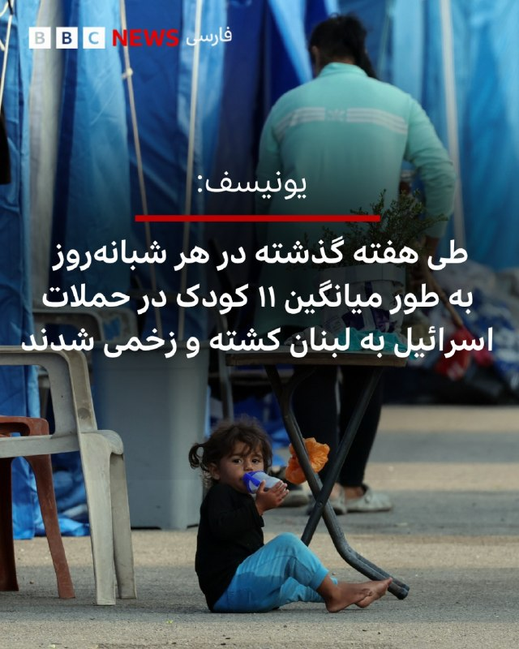

‌🔻صندوق کودکان سازمان ملل، یونیسف، می‌‌گوید در یک هفته گذشته، به‌طور میانگین، هر ۲۴ ساعت ۱۱ کودک در حملات اسرائیل در لبنان کشته یا زخمی شدند.

به گفته یونیسف، در هفت روز گذشته، ۱۵ کودک در لبنان کشته و ۶۲ کودک دیگر زخمی شده‌اند.

با وجود آتش‌بس، اسرائیل دامنه و شدت حملاتش در لبنان را افزایش داده است.

حملات سنگین اسرائیل از شامگاه چهارشنبه تا بامداد پنج‌شنبه شهرها و روستاهایی در جنوب لبنان را هدف قرار داد.

در این مدت اسرائیل مناطق جدیدی را هم به عنوان مناطق درگیری و عملیاتی اعلام کرد.

اسرائیل همچنین ساختمانی را در حومه جنوبی بیروت هدف قرار داده است.

یونیسف می‌گوید در مجموع، در هفت روز گذشته، ۷۷ کودک در لبنان کشته یا زخمی شدند.

این نهاد در گزارش خود اعلام کرد که از زمان آغاز آتش‌بس در ماه آوریل، در مجموع ۵۵ کودک کشته و ۲۱۲ کودک زخمی شده‌اند.

ریکاردو پیرس، سخنگوی یونیسف، این آمار را «تکان‌دهنده» توصیف کرد.

بنابر آتش‌بسی که آمریکا از ۱۶ آوریل (۲۷ فروردين ۱۴۰۵) آن را اعلام کرد، قرار بود جنگ میان اسرائیل و حزب‌الله لبنان پایان یابد.

📷EPA
https://bbc.in/4fkdFzr

@BBCPersian

## BBCPersian — post 282334

  <a href="telegram/content/BBCPersian_282334_1780085047.mp4" target="_blank">🎬 Download video</a>

🔻محسن قاصد، فعال محیط‌زیست و عکاس، ویدیویی از بازگشت پرندگان مهاجر به جزیره حفاظت شده هون در دریاچه ارومیه منتشر کرده است. او در توضیح این ویدیو نوشته: «امسال حجم و تعداد و تنوع انواع گونه از پرندگانی که در دریاچه و جزایر دیده می‌شوند نسبت به سال‌های گذشته ده‌ها برابر بیشتر شده است.»

اطلاعات ثبت‌شده توسط اداره کل محیط زیست آذربایجان شرقی و غربی نشان می‌دهد بهار امسال، حجم آب دریاچه ارومیه با افزایشی ۱۵ برابری نسبت به سال گذشته روبه‌رو بوده است.

بهبود نسبی شرایط دریاچه ارومیه باعث بازگشت پرندگان مهاجری مثل فلامینگوها و کاکایی‌ها به این دریاچه شده که در سال‌های پیش، به دلیل خشکسالی شدید، از این دریاچه رفته بودند.

با این حال مقام‌های سازمان محیط‌زیست هشدار داده‌اند دریاچه ارومیه «هنوز از وضعیت بحران خارج نشده است.»

دریاچه ارومیه در شمال غربی ایران واقع شده است و بزرگ‌ترین دریاچه داخلی کشور به شمار می‌رود. این دریاچه در سال ۱۴۰۴ و در پی بحران‌های متعدد، به خشکی کامل نزدیک شد.

@BBCPersian

## idfinfarsi — post 11659

  <a href="telegram/content/idfinfarsi_11659_1780085049.mp4" target="_blank">🎬 Download video</a>

مستندات ارتش اسرائیل ثابت میکنند: سازمان تروریستی حزب‌الله راکت‌هایی را شلیک کرده که به کلیسایی در جنوب لبنان اصابت کرده‌اند

سازمان تروریستی حزب‌الله در طول شب (جمعه) چندین راکت شلیک کرد که به کلیسای ارتدوکس سنت جورج در جنوب لبنان اصابت کردند. این شلیک‌ها به ساختمان‌هایی در روستای مسیحی مرجعیون اصابت کردند — تأکید می‌شود که نیروهای ارتش اسرائیل در محدوده این کلیسا فعالیت نمی‌کنند.

ارتش اسرائیل اکنون مستنداتی را منتشر می‌کند که اصابت راکت‌های سازمان تروریستی حزب‌الله به این کلیسا در جنوب لبنان را ثابت میکنند.

این یک مدرک دیگر است که ثابت میکند که سازمان تروریستی حزب‌الله همچنان شهروندان لبنان را به خطر انداخته و به آن‌ها آسیب می‌زند.

## Dirty_Kids — post 390517

  <a href="telegram/content/Dirty_Kids_390517_1780085052.mp4" target="_blank">🎬 Download video</a>

حسین علایی از فرمانده‌های پیشین نیروی دریایی سپاه تروریستی تو این ویدئو می‌گه موشعلی رو شمخانی بگا داد و باعث کسپر شدنش شد،

«سه روز قبل از جنگ چهل روزه به شمخانی قحبه گفتم آمریکا و اسرائیل با کسپر کردن رهبری جنگ رو شروع می‌کنند اما شمخانی زن‌هزارتختخوابی شونه‌ش رو انداخت بالا و گفت نووچ، نمی‌تونن،
گفتم چرا نمی‌تونن کسمشنگ؟
گفت نمی‌تونن پیداش کنن»


@Dirty_Kids 👻

## Dirty_Kids — post 390516

  <a href="telegram/content/Dirty_Kids_390516_1780085053.mp4" target="_blank">🎬 Download video</a>

🔴 یه پست جدید و جنجالیِ دیگه از اکانت کاخ سفید همراه این کپشن:

اونا [آدم فضاییا] بین ما راه میرن.

@Dirty_Kids 👻

## Dirty_Kids — post 390512

  <a href="telegram/content/Dirty_Kids_390512_1780085055.mp4" target="_blank">🎬 Download video</a>

🔴 مردم ایران ۳ ماه اینترنت نداشتن، حالا که اینترنتشون برگشته به روال سابق، لابد دیگه به نحو احسنت ازش استفاده میکنن؛

+ همچنان یسری ایرنی‌ها تو اینستاگرام:

@Dirty_Kids 👻

## Dirty_Kids — post 390511

  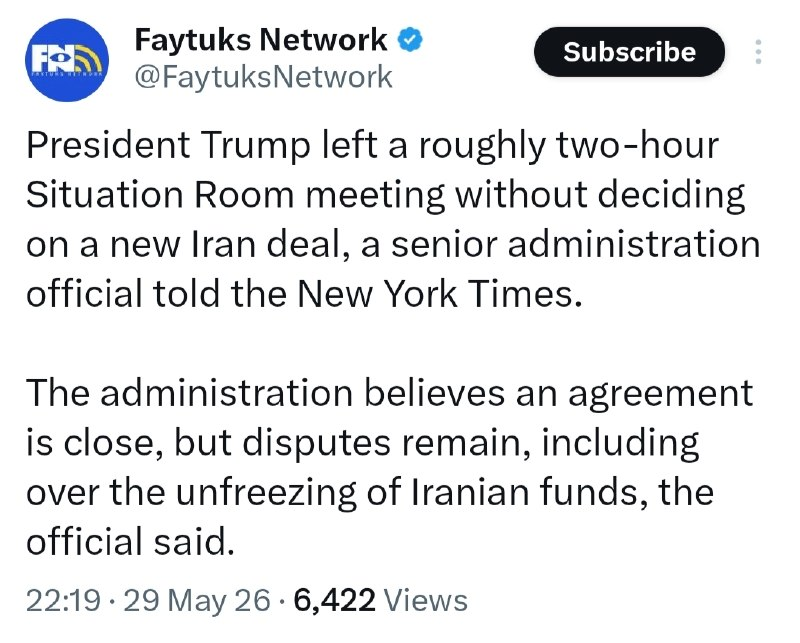

خبر به نقل از نیویورک‌تایمز:

«ترامپ بعد از حدود دو ساعت جلسه در اتاق وضعیت کا‌خ‌سفید، بدون اینکه هیچ تصمیمی درباره توافق جدید با روافض قحبه بگیره، جلسه رو ترک کرد. یک مقام ارشد دولت این خبر رو به نیویورک تایمز داده.
به گفته این مقام، دولت معتقده توافق خیلی نزدیکه، اما هنوز اختلافاتی باقی مونده، از جمله بر سر آزادسازی دارایی‌های روافض کس‌پدر».

@Dirty_Kids 👻

## Dirty_Kids — post 390510

  

در حالیکه ترامپ به گفته‌ی خودش به اتاق وضعیت رفته که تصمیم نهایی در خصوص امضای تفاهم‌نامه با روافض رو بگیره

خبرگزاری مهر روافض خبر از شنیده‌ شدن صدای پدافند در قشم اون‌ورا می‌ده:

@Dirty_Kids 👻

## Dirty_Kids — post 390509

  

ولی عوضش اینترنت‌‌پرو و سیمکارت‌سفید ثواب داره 😂😂😂

@Dirty_Kids 👻

## Dirty_Kids — post 390508

  <a href="telegram/content/Dirty_Kids_390508_1780085058.mp4" target="_blank">🎬 Download video</a>

توی تهرانپارس دوتا پسر دارن مخ میزنن که یه پسره با بلندگو از پشت میگه: بخدا پسر خوبیه فقط میخواد بکنتت😂😂

@Dirty_Kids 👻

## Dirty_Kids — post 390507

ویزای ساعتی بازیکنان تیم ملی اینجوریه که بازی به پنالتی بکشه باید پنالتی ها رو از مکزیک بزنن.

@Dirty_Kids 👻

## Dirty_Kids — post 390506

  <a href="telegram/content/Dirty_Kids_390506_1780085060.mp4" target="_blank">🎬 Download video</a>

دهن سرویسا این چیه ساختید😂😂

@Dirty_Kids 👻

## Dirty_Kids — post 390505

  

اکانت رسمی Clash of clans تو اینستاگرام، انگاری زده تو کارِ تولید محتوا برای فوت فتیشا:

@Dirty_Kids 👻

## Dirty_Kids — post 390504

  <a href="telegram/content/Dirty_Kids_390504_1780085063.mp4" target="_blank">🎬 Download video</a>

این ریمیکس الان ارزش ترند شدنو داره؛
دست به دست بکنید برسه به دست ترامپ:

@Dirty_Kids 👻

## Dirty_Kids — post 390503

میدونم به تخمتونه و متأسفانه رعایت نمیکنید فقط خواستم بگم جمعه عدهٔ شرعی آذر تموم میشه.

یعنی اینکه امروز ۸ خرداد ۱۴۰۵ جمعه، کص زن شمخانی از اسارت شرعی در میاد

@Dirty_Kids 👻

## Dirty_Kids — post 390502

  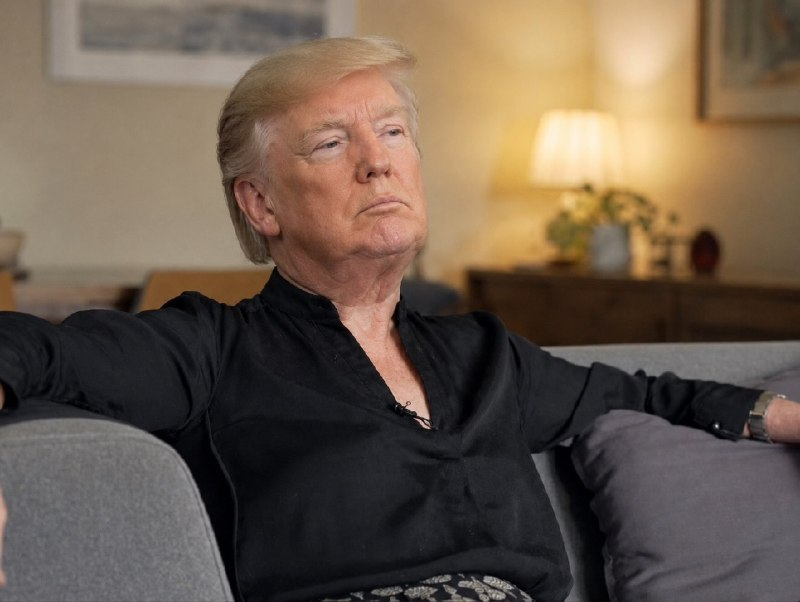

حالا چه عجله‌‌ای هست برای ادامه‌ی جنگ. اصلا یه ۱۰ سالی طول بکشه چه اشکالی داره.

@Dirty_Kids 👻

## Dirty_Kids — post 390501

  

وقتی منتظری مسخره بازیای ترامپ تموم بشه و بزنی بقیشون رو کتلت کنی

@Dirty_Kids 👻

## Dirty_Kids — post 390500

  <a href="https://t.me/Dirty_Kids/390500" target="_blank">📎 Download file</a>

✅ اپلیکیشن اندروید سایت جهانی دربی بت

💰اولین سایت جهانی با امکان شارژ و برداشت ریالی(کارت به کارت)

🔗 برای ورود فیلترشکن روی کشور مناسب قرار دهید مانند فنلاند و المان و....

😀Telegram Channel
👇
https://t.me/+bcynkEgSW2dlYTc0

## Dirty_Kids — post 390499

  

😤دنبال یه سایت شرط بندی بین المللی بودی که به ایرانیا خدمات بده؟!
⛔

👍دربی بت همون انتخاب  100%

💎ویژگی های سایت جهانی Derby Bet:

⬅️امکان شارژ امن با کارت بانکی

⬅️واریز اول دوبل شارژ می شوید(بونوس۱۰۰٪)

⬅️پر اپشن ترین سایت فعال در ایران

⬅️تسویه حساب کمتر از 5 دقیقه

⬅️برگشت بخشی از باخت به صورت هفتگی

🚨کد هدیه ثبت نام:GG007

⚠️برای دانلود اپلکیشن کلیک کنید
👉

🔔کانال دربی بت :

🪙https://t.me/+bcynkEgSW2dlYTc0

## Dirty_Kids — post 390498

  <a href="telegram/content/Dirty_Kids_390498_1780085067.mp4" target="_blank">🎬 Download video</a>

شت

@Dirty_Kids 👻

## Hranews — post 113230

گزارشی از اجرای حکم اعدام ۷ زندانی در زندان‌های مختلف

❗️
❗️
❗️
❗️
❗️ – حکم هفت زندانی که پیشتر از بابت اتهامات مرتبط با جرائم مواد مخدر و قتل به مجازات #اعدام محکوم شده بودند، در زندان‌های زاهدان، بیرجند، مشهد و کرمانشاه به اجرا درآمد.

ادامه مطلب

↘️
@hranews_bot تماس ✉️ -  @Hranews  کانال هرانا 🆑

## Hranews — post 113229

  

تداوم بازداشت؛ گزارشی از آخرین وضعیت عبدالرحیم سلیمانی در زندان قم

❗️
❗️
❗️
❗️
❗️ – عبدالرحیم سلیمانی اردستانی، پژوهشگر دینی و استاد دانشگاه، با وجود گذشت بیش از دو ماه از زمان بازداشت، همچنان به‌صورت بلاتکلیف در زندان ساحلی قم نگهداری می‌شود. این زندانی سیاسی اخیراً با نگارش نامه‌ای از داخل زندان، به تشریح آخرین وضعیت خود پرداخته است.

به گزارش خبرگزاری هرانا، ارگان خبری مجموعه فعالان حقوق بشر در ایران، عبدالرحیم سلیمانی اردستانی، کماکان به‌صورت بلاتکلیف قضایی در زندان ساحلی قم به‌سر می‌برد.

آقای سلیمانی اخیرا با نگارش نامه‌ای اعلام کرده است که با ۱۱ اتهام از جمله «تشویش اذهان عمومی»، «توهین به مقدسات»، «توهین به رهبری» (به دو شخص علی و مجتبی خامنه‌ای)، «تجمع در اعتراض به حصر میرحسین موسوی»، «اجتماع و تبانی علیه امنیت داخلی»، «توهین به مقدسات تشیع»، «فعالیت تبلیغی ضد نظام»، «نشر اکاذیب رایانه‌ای به قصد تشویش اذهان عمومی»، «توهین به مراجع»، «هتک حیثیت روحانیت» و «کنترل ذهن و القائات روانی» مواجه شده است و در ادامه از خود نسبت به این اتهامات مذکور دفاع کرده است.
در بخشی از این نامه آمده است که وی بدون ارائه حکم قضایی و با برخوردی خشونت‌آمیز و توأم با بی‌احترامی بازداشت شده و حدود دو ساعت تحت ضرب‌وشتم ماموران امنیتی قرار گرفته است. همچنین، با گذشت بیش از دو ماه از زمان بازداشت، او همچنان از حق ملاقات محروم مانده و یک ماه از این مدت را در سلول انفرادی سپری کرده است.

ادامه مطلب

#عبدالرحیم_سلیمانی_اردستانی

↘️
@hranews_bot تماس ✉️ -  @Hranews  کانال هرانا 🆑

## Hranews — post 113228

گزارشی از معوقات مزدی کارکنان بیمارستان امام علی چابهار

❗️
❗️
❗️
❗️
❗️ – شماری از #کارکنان شاغل در بیمارستان امام علی چابهار از عدم پرداخت مطالبات مزدی خود ابراز نارضایتی کرده و خواستار رسیدگی به وضعیتشان شدند.

ادامه مطلب

↘️
@hranews_bot تماس ✉️ -  @Hranews  کانال هرانا 🆑

## Hranews — post 113227

  

اعتراضات ۱۴۰۴؛ تداوم بازداشت دانیال امینی و حمیدرضا ریزانه در اصفهان

❗️
❗️
❗️
❗️
❗️– دانیال امینی و حمیدرضا ریزانه، از بازداشت شدگان اعتراضات سراسری دی ۱۴۰۴ در اصفهان، با گذشت ۱۴۵ روز از زمان بازداشت، همچنان در بلاتکلیفی قضایی به‌سر می‌برند. این دو شهروند به‌ترتیب در کانون اصلاح و تربیت و زندان دستگرد اصفهان نگهداری می‌شوند.

به گزارش خبرگزاری هرانا، ارگان خبری مجموعه فعالان حقوق بشر در ایران، دانیال امینی و حمیدرضا ریزانه، از بازداشت شدگان اعتراضات سراسری دی ۱۴۰۴، در بازداشت بسر می‌برند.

بر اساس اطلاعات دریافتی هرانا، ۱۴۵ روز از زمان بازداشت این دو شهروند که در پرونده‌ای مشترک با اتهامات مرتبط با اعتراضات سراسری مواجه هستند، می‌گذرد. حمیدرضا ریزانه در زندان دستگرد اصفهان و دانیال امینی در کانون اصلاح و تربیت اصفهان نگهداری می‌شود. در اسفند ماه سال گذشته به خانواده‌های این دو شهروند اعلام شد که با آزادی موقت آنان با وثیقه موافقت شده است. با این حال، پس از مراجعه خانواده‌ها به مراجع مربوط و تامین وثیقه، با آزادی موقت آنان مخالفت شد. این دو شهروند همچنان در وضعیت بلاتکلیفی قضایی به‌سر می‌برند.

ادامه مطلب

#دانیال_امینی
#حمیدرضا_ریزانه

↘️
@hranews_bot تماس ✉️ -  @Hranews  کانال هرانا 🆑

## Hranews — post 113226

شهرستان مهرستان؛ ۲ شهروند توسط ماموران اداره اطلاعات بازداشت شدند

❗️
❗️
❗️
❗️
❗️ – روز گذشته، محسن دهانی و احسان دهانی دو برادر اهل شهرستان مهرستان توسط نیروهای اداره اطلاعات در این شهرستان #بازداشت و به مکان نامعلومی منتقل شدند.

ادامه مطلب

#محسن_دهانی
#احسان_دهانی

↘️
@hranews_bot تماس ✉️ -  @Hranews  کانال هرانا 🆑

## Hranews — post 113225

  

در هفته‌ای که گذشت؛ نگاهی به گزارشات محیط زیستی در ایران

❗️
❗️
❗️
❗️
❗️ – حق بر #محیط_زیست و مبانی فلسفی آن، از قواعد حقوق بشر و حقوق طبیعی نشأت گرفته شده است. ابتدایی ترین حق طبیعی انسان در این کره خاکی، «#حق_حیات» است. اما طی دهه‌های اخیر به دلیل استفاده بی‌رویه از منابع طبیعی، عدم نظارت و توجه به مباحث زیست محیطی و الگوهای صحیح، محیط زیست طبیعی به‌شدت آسیب دیده است. گزارش پیش رو حاصل ثبت ۷۳ گزارش محیط زیستی ایران است که در هفته‌ اخیر منتشر و به هدف آگاه‌سازی گردآوری شده است.

به گزارش خبرگزاری هرانا، ارگان خبری مجموعه فعالان حقوق بشر در ایران، در هفته‌‌ای که گذشت لاشه هشت قلاده فوک خزری کشف شد. همچنین، بیش از ۳۱ شکارچی و صیاد غیرمجاز و قاچاقچی چوب بازداشت و به مراجع قضایی معرفی شدند. افزون بر این، بر اساس گزارشات منتشر شده، بیش از ۱۴.۷ تن چوب قاچاق کشف و ضبط شد. از سوی دیگر، شاخص کیفی هوا دستکم در ۲۱ شهر ناسالم و خطرناک اعلام شد. از دیگر اخبار مرتبط با محیط زیست میتوان به بحران خشکسالی، پسماندها و آلاینده‌ها در مناطق مختلف اشاره کرد؛ در گزارش پیش رو به برخی از آنها پرداخته شده است.

آسیب رسانی به جنبه های مختلف محیط زیست در ایران کماکان ادامه دارد. از طرفی شهروندانی وجود دارند که به دلیل عدم آموزش یا نیازهای مالی دست به تخریب و آسیب رسانی به محیط زیست می زنند و از سوی دیگر نهادهای متولی در تلاش هستند تا از حجم این آسیب ها بکاهند، هر چند این تلاش ها قابل تقدیر است اما به نظر نمی آید میزان آن با شرایط محیط زیستی ایران تطبیق داشته باشد.

ادامه مطلب

↘️
@hranews_bot تماس ✉️ -  @Hranews  کانال هرانا 🆑

## Hranews — post 113224

  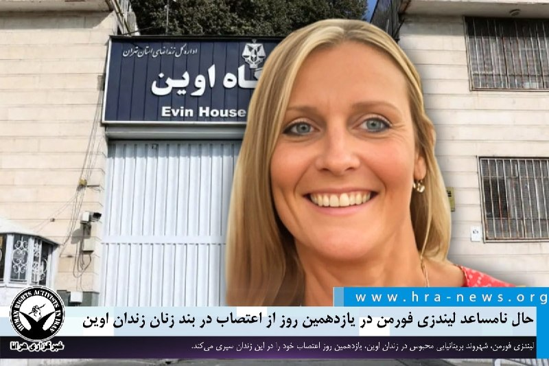

حال نامساعد لیندزی فورمن در یازدهمین روز از اعتصاب در بند زنان زندان اوین

❗️
❗️
❗️
❗️
❗️ – لیندزی فورمن، شهروند بریتانیایی محبوس در زندان اوین، یازدهمین روز #اعتصاب خود را در این زندان سپری می‌کند. این زندانی با شرایط جسمی نامناسبی از جمله، کاهش وزن، افت قند خون و نوسانات فشار خون روبه‌رو شده است. همچنین، عدم امکان برقراری تماس وی با خانواده خود، منجر به افزایش نگرانی نزدیکان و خانواده او شده است.

به گزارش خبرگزاری هرانا، ارگان خبری مجموعه فعالان حقوق بشر در ایران، لیندزی فورمن یازدهمین روز اعتصاب خود را در زندان اوین سپری می‌کند.

یک منبع مطلع در گفت‌وگو با هرانا اعلام کرد: خانم فورمن در حالی یازدهمین روز اعتصاب غذای خود را پشت سر می‌گذارد که وضعیت جسمانی او نگران‌کننده است. وی دچار افت شدید قند خون (زیر ۹۰)، کاهش وزن قابل توجه (حدود هشت کیلوگرم از آغاز اعتصاب)، و افت فشار خون (۶ روی ۹) شده است. همچنین علائمی مانند سرگیجه، تهوع، دردهای طولانی‌مدت شکمی و رنگ‌پریدگی غیرعادی در او مشاهده می‌شود.
این منبع افزود: در این وضعیت، هیچ یک از مسئولین مربوطه به دیدار او نیامده است و همچنین سفارت بریتانیا نیز واکنشی به شرایط وی نشان نداده است. از سوی دیگر، محرومیت از امکان استفاده تلفن زندان باعث شده است که خانواده وی اطلاعی از وضعیت او کسب نکنند. امری که منجر به افزایش نگرانی‌های نزدیکان و خانواده این زندانی شده است.

ادامه مطلب

#لیندزی_فورمن

↘️
@hranews_bot تماس ✉️ -  @Hranews  کانال هرانا 🆑

## Hranews — post 113223

  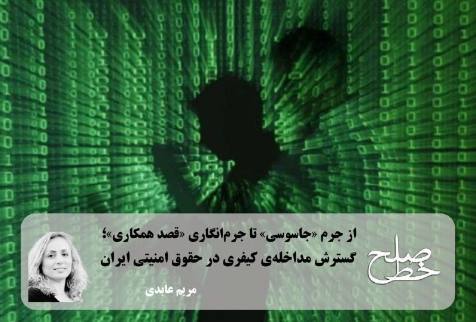

از جرم «جاسوسی» تا جرم‌انگاری «قصد همکاری»/ #مریم_عابدی

📡
📡
📡
📡
📡– جرایم علیه امنیت ملی همواره در شمار حساس‌ترین و شدیدترین حوزه‌های حقوق کیفری قرار گرفته‌اند. در تمامی نظام‌های حقوقی، دولت‌ها حفاظت از اسرار، اطلاعات طبقه‌بندی‌شده، تاسیسات حیاتی و ساختارهای امنیتی را از عناصر بنیادین بقای سیاسی و حاکمیتی خود تلقی می‌کنند و از همین‌رو، جرم جاسوسی به‌عنوان یکی از مهم‌ترین جرایم علیه امنیت خارجی کشورها شناخته می‌شود. به این دلیل، اهمیت امنیت ملی هرگز به معنای نفی اصول بنیادین حقوق کیفری نیست؛ اصولی که بر پایه‌ی «قانونی بودن جرم و مجازات»، «تفسیر مضیق قوانین کیفری»، «لزوم وجود رفتار مادی مجرمانه» و «ممنوعیت مجازات افکار و نیات صرف» استوار شده‌اند.

در حقوق کیفری ایران، جرایم مرتبط با جاسوسی عمدتاً در فصل اولِ کتاب پنجم قانون مجازات اسلامی، ذیل عنوان «جرایم علیه امنیت داخلی و خارجی کشور» پیش‌بینی شده‌اند. مهم‌ترین مقررات در این زمینه را می‌توان در مواد ۵۰۱، ۵۰۵، ۵۰۸ و برخی مقررات پراکنده‌ی مرتبط با همکاری با دولت‌های متخاصم مشاهده کرد.

بر اساس ماده‌ی ۵۰۱ قانون مجازات اسلامی و تعزیرات: «هر کس نقشه‌ها یا اسرار یا اسناد و تصمیمات راجع به سیاست داخلی یا خارجی کشور را عالماً و عامداً در اختیار افرادی که صلاحیت دسترسی به آن‌ها را ندارند قرار دهد یا از مفاد آن مطلع کند، به نحوی که متضمن نوعی جاسوسی باشد، به حبس محکوم می‌شود.»

هم‌چنین ماده‌ی ۵۰۸ مقرر می‌دارد: «هر کس یا گروهی با دول خارجی متخاصم، به هر نحو علیه جمهوری اسلامی ایران همکاری نماید، در صورتی که محارب شناخته نشود، به یک تا ده سال حبس محکوم می‌شود.»

در ساختار سنتی حقوق کیفری ایران، همانند بسیاری از نظام‌های حقوقی کلاسیک، تحقق جرم امنیتی مستلزم وجود عنصر مادی مشخص و عینی بود؛ بدین معنا که صرف گرایش ذهنی، تمایل سیاسی یا حتی قصد ارتکاب جرم، بدون ظهور خارجی و ورود به مرحله‌ی اجرا، اصولاً برای تحقق جرم کافی تلقی نمی‌شد. به بیان دیگر، حقوق کیفری تا زمانی که رفتار مرتکب وارد عرصه‌ی اجتماعی نشده و خطری واقعی علیه امنیت عمومی ایجاد نکرده باشد، حق مداخله‌ی کیفری پیدا نمی‌کند.

ادامه مطلب

ادامه مطلب در وبسایت خط صلح

↘️
@hranews_bot تماس ✉️ - @Hranews کانال هرانا 🆑

## Hranews — post 113222

تداوم بازداشت و بی خبری از وضعیت ۲ شهروند در چابهار

❗️
❗️
❗️
❗️
❗️– نوربخش جدگال و یحیی جدگال دو برادر ساکن چابهار حدود ۱۱ روز است که توسط نیروهای امنیتی در این شهرستان بازداشت شدند و تاکنون از محل نگهداری آنها اطلاعی حاصل نشده است.

#نوربخش_جدگال #یحیی_جدگال

ادامه مطلب

↘️
@hranews_bot تماس ✉️ - @Hranews کانال هرانا 🆑

## Hranews — post 113221

  

گزارشی از آخرین وضعیت حیدر نکوسیرت در زندان وکیل آباد مشهد

❗️
❗️
❗️
❗️
❗️– حیدر نکوسیرت، از بازداشت شدگان اعتراضات دی‌ماه ۱۴۰۴، در زندان وکیل آباد مشهد محبوس است. وی که توسط دادگاه انقلاب مشهد به دو سال حبس محکوم شده، علیرغم شرایط نامناسب جسمی ناشی از بیماری‌های کلیوی، چشمی و دیابت، کماکان از رسیدگی تخصصی پزشکی محروم مانده است.

به گزارش خبرگزاری هرانا، ارگان خبری مجموعه فعالان حقوق بشر در ایران، حیدر نکوسیرت در زندان وکیل آباد مشهد محبوس است.

بر اساس اطلاعات دریافتی هرانا؛ حیدر نکوسیرت چندی پیش توسط دادگاه انقلاب مشهد به دو سال حبس محکوم شده است. یک منبع مطلع نزدیک به خانواده این زندانی با تایید این موضوع به هرانا گفت: حیدر طی مدت زمان بازداشت از حق دسترسی به وکیل محروم مانده است. همچنین، وی در حالی از بیماری دیابت، نارسایی کلیوی و کاهش بینایی در یک چشم رنج می‌برد که دیگر چشم سالم او نیز دچار مشکل شده است. آقای نکوسیرت نیازمند رسیدگی تخصصی پزشکی و اعزام به مراکز درمانی خارج از زندان است.

#حیدر_نکوسیرت

ادامه مطلب

↘️
@hranews_bot تماس ✉️ - @Hranews کانال هرانا 🆑

## manototv — post 105869

  <a href="telegram/content/manototv_105869_1780085072.mp4" target="_blank">🎬 Download video</a>

در سیاست بین‌الملل، کشورها بیش از آنکه بر پایه دوستی، همدلی یا شعارهای اخلاقی تصمیم بگیرند، بر اساس منافع ملی خود عمل می‌کنند. قدرت‌های بزرگ ممکن است از آزادی، امنیت، حقوق بشر یا نظم جهانی سخن بگویند، اما در لحظه تصمیم، محاسبه اصلی این است که چه چیزی به سود آن‌هاست.

## manototv — post 105868

  <a href="telegram/content/manototv_105868_1780085073.mp4" target="_blank">🎬 Download video</a>

سخنان الهام‌بخش فریدون فرخزاد درباره خودباوری ملی

## manototv — post 105860

  <a href="telegram/content/manototv_105860_1780085076.mp4" target="_blank">🎬 Download video</a>

در سیاست، گاهی مهم‌تر از خود رویداد، چیزی است که آن رویداد آشکار می‌کند.

جنگ اخیر نیز پرده‌ای از واقعیت جمهوری اسلامی کنار زد: شکاف‌هایی که پنهان شده بود، ضعف‌هایی که انکار می‌شد و بحران‌هایی که با تبلیغات پوشانده می‌شد.

## alonews — post 123573

  <a href="telegram/content/alonews_123573_1780085077.webm" target="_blank">🎬 Download video</a>

🔴فوری/وزیر خزانه داری آمریکا درباره رفع تحریم‌های ایران

🔴به گزارش الجزیره،  وزیر خزانه‌داری آمریکا مدعی شد که تحریم‌های ایران به تدریج لغو خواهد شد.

✅ @AloNews خبر جنگ

## alonews — post 123572

  <a href="telegram/content/alonews_123572_1780085078.webm" target="_blank">🎬 Download video</a>

👈 تانکر ترکرز اعلام کرد: صادرات نفت و فرآورده‌های نفتی ایران تداوم دارد و امروز یک ابرنفتکش دو میلیون بشکه نفت خام ایران را بارگیری کرده است.

✅ @AloNews خبر جنگ

## alonews — post 123571

  <a href="telegram/content/alonews_123571_1780085078.webm" target="_blank">🎬 Download video</a>

👈وزیر خزانه‌داری آمریکا: یک میلیارد دلار از دارایی‌های رمزارز ایران را مصادره کردیم!

✅ @AloNews خبر جنگ

## alonews — post 123570

  <a href="telegram/content/alonews_123570_1780085078.webm" target="_blank">🎬 Download video</a>

👈کان اسرائیل: نتانیاهو خواستار از سرگیری حملات به ایران است

✅ @AloNews خبر جنگ

## alonews — post 123569

  <a href="telegram/content/alonews_123569_1780085078.webm" target="_blank">🎬 Download video</a>

👈بسنت وزیر خزانه داری آمریکا: احتمالاً تورم ایران بیش از ۲۰۰٪ است.

🔴ما فکر می‌کنیم ایران ماهانه ۴۰۰ تا ۵۰۰ میلیون دلار سرقت می‌کرد!

✅ @AloNews خبر جنگ

## alonews — post 123568

  <a href="telegram/content/alonews_123568_1780085078.webm" target="_blank">🎬 Download video</a>

👈 پنتاگون در حال جذب صدها عضو نیروهای مسلح برای حضور در رویداد UFC برنامه‌ریزی‌شده توسط رئیس‌جمهور ترامپ در کاخ سفید در ۱۴ ژوئن است، گزارش واشنگتن پست.

🔴بر اساس یادداشت‌های داخلی که واشنگتن پست بررسی کرده است، نیروهای انتخاب‌شده برای حضور به عنوان تماشاگر با یونیفرم باید هزینه‌های سفر و اقامت خود را بپردازند، استانداردهای فعلی آمادگی جسمانی نظامی — از جمله الزامات قد به کمر — را رعایت کنند و یونیفرم رسمی بپوشند.

🔴مقامات به دنبال جذب پرسنل درجه‌دار جوان و افسران جوان برای حضور هستند.

✅ @AloNews خبر جنگ

## alonews — post 123567

  <a href="telegram/content/alonews_123567_1780085079.webm" target="_blank">🎬 Download video</a>

👈نیویورک تایمز به نقل از یک مقام دولتی:
نشست ترامپ در اتاق عملیات حدود دو ساعت به طول انجامید

✅ @AloNews خبر جنگ

## alonews — post 123566

  <a href="telegram/content/alonews_123566_1780085079.webm" target="_blank">🎬 Download video</a>

⚫
🏆 به دنیای هیجان‌انگیز فوتبال خوش اومدی!

⭐️اینجا قراره باهم لحظه‌به‌لحظه‌ی جام جهانی رو زندگی کنیم؛
از بازی‌های حساس و نتایج داغ گرفته تا حاشیه‌ها، کری‌خونی‌ها و اتفاقاتی که همه درباره‌ش حرف میزنن! 
🔥
🔥

✅ پوشش کامل مسابقات

💀 ترول تیم‌ها و بازیکن‌ها

🎥 ویدیوها و لحظه‌های فان فوتبالی

📊 آمار، ترکیب‌ها و اخبار فوری

🌍 حواشی جذاب از سراسر جام جهانی

📢اینجا فقط یک کانال خبری نیست؛
یک جمع فوتبالیه برای کسایی که فوتبال رو با هیجان، شوخی و احساس واقعی دنبال میکنن 
📛
💟

🆘
🔞 آماده باش چون قراره جام جهانی رو متفاوت تجربه کنیم!

⚡ @Vaarzesh_Plus

⚡ @Vaarzesh_Plus

## alonews — post 123565

  <a href="telegram/content/alonews_123565_1780085080.webm" target="_blank">🎬 Download video</a>

👈نیویورک تایمز به نقل از یک مقام دولت ترامپ: ما به دستیابی به توافق نزدیک شده‌ایم، اما برخی از مسائل همچنان مورد بحث هستند.

🔴 نیویورک تایمز به نقل از یک مقام دولت ترامپ: موضوع دارایی‌های مسدود شده ایران همچنان مانعی در مذاکرات است.

✅ @AloNews خبر جنگ

## alonews — post 123564

  <a href="telegram/content/alonews_123564_1780085080.webm" target="_blank">🎬 Download video</a>

👈وزارت خارجه پاکستان اعلام کرد که وزیر خارجه این کشور در دیدار با روبیو، وزیر خارجه امریکا ابراز اطمینان کرده است که تلاشهای تحقق صلح منجر به نتایج مثبت خواهد شد.

✅ @AloNews خبر جنگ

## alonews — post 123563

  <a href="telegram/content/alonews_123563_1780085080.webm" target="_blank">🎬 Download video</a>

👈خبرنگار الحدث: نشست ترامپ در اتاق عملیات کاخ سفید درباره تصمیم‌گیری در مورد ایران به پایان رسید.

🔴باید منتظر تصمیم ترامپ و اعلامش باشیم

✅ @AloNews خبر جنگ

## alonews — post 123562

  <a href="telegram/content/alonews_123562_1780085080.webm" target="_blank">🎬 Download video</a>

👈 هشدارهای پهپاد در منطقه خط تقابل، شمال اسرائیل فعال هستند.

✅ @AloNews خبر جنگ

## alonews — post 123561

  <a href="telegram/content/alonews_123561_1780085081.webm" target="_blank">🎬 Download video</a>

👈 شش فروند هواپیمای ترابری نظامی Boeing C-17A Globemaster III نیروی هوایی ایالات متحده در راه خاورمیانه هستند.

✅ @AloNews خبر جنگ

## alonews — post 123560

  <a href="telegram/content/alonews_123560_1780085081.webm" target="_blank">🎬 Download video</a>

🔴فوری / فاکس نیوز: خبرهای مهمی از نشست ترامپ در کاخ سفید بیرون خواهد آمد

✅ @AloNews خبر جنگ

## alonews — post 123559

  <a href="telegram/content/alonews_123559_1780085081.webm" target="_blank">🎬 Download video</a>

👈شبکه تلویزیونی اسرائیل به نقل از یک منبع گزارش داد: هیئت اسرائیلی در مذاکرات پنتاگون پیشنهاد لبنان برای خروج از لبنان را رد کرد

✅ @AloNews خبر جنگ

## alonews — post 123558

  <a href="telegram/content/alonews_123558_1780085081.webm" target="_blank">🎬 Download video</a>

👈ارتش ایران : یه پهپاد دشمن رو سرنگون کردیم

✅ @AloNews خبر جنگ

## alonews — post 123556

  <a href="telegram/content/alonews_123556_1780085082.webm" target="_blank">🎬 Download video</a>

👈خبرگزاری صداوسیما: ترامپ ضرورت خروج آمریکا از اطراف ایران را نادیده گرفته درحالیکه این موضوع مورد تاکید قطعی ایران است.

✅ @AloNews خبر جنگ

## alonews — post 123555

  <a href="telegram/content/alonews_123555_1780085082.mp4" target="_blank">🎬 Download video</a>

👈ویدیویی از جشن برداشتن محاصره دریایی در قشم و شلیک توپ ضد هوایی

✅ @AloNews خبر جنگ

## alonews — post 123554

  <a href="telegram/content/alonews_123554_1780085083.webm" target="_blank">🎬 Download video</a>

🔴فوری / گزارش های تایید نشده از فعالیت پدافند در قشم 
✅ @AloNews خبر جنگ

## alonews — post 123553

  <a href="telegram/content/alonews_123553_1780085083.webm" target="_blank">🎬 Download video</a>

🔴فوری / گزارش های تایید نشده از فعالیت پدافند در قشم 
✅ @AloNews خبر جنگ

<!-- MSG END -->

<!-- NAV START -->

<a href="https://github.com/nayebireza5-del/aiohghjbbbvm/blob/main/telegram/content/archive_1.md" style="display:inline-block; padding:6px 12px; margin:0 4px; background-color:#2ea44f; color:white; text-decoration:none; border-radius:4px; font-weight:bold;">صفحه بعد</a>

<!-- NAV END -->
